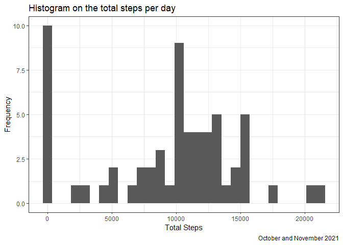
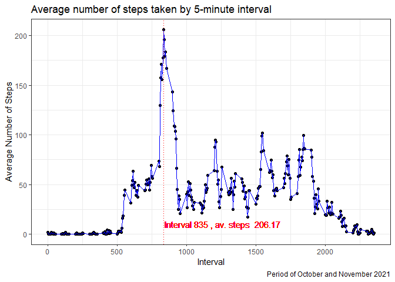
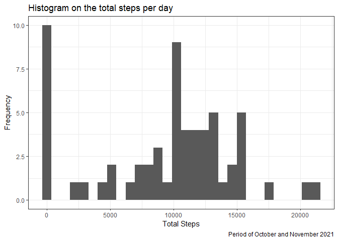

For this exercise, we shall use the following libraries to load, process and produce the results for each of the section below:

* **lubridate** : For managing date variables.
* **readr**     : For reading in data into a data frame from source.
* **dplyr**     : For data manipulation.
* **purrr**     : For functional programming capabilities.
* **ggplot2**   : For data visualization.
* **skimr**     : For summary statistics of the data set.
* **kableExtra**: For displaying tables in HTML documents.

Let's install and load these packages into the R Environment:


```r
pkgs <- c('lubridate', 'readr', 'dplyr', 'ggplot2', 'purrr', 'skimr', 'kableExtra')
install.packages(pkgs[!(pkgs %in% installed.packages())]) # Install any missing packages
purrr::walk(pkgs, function(pkg) require(pkg, character.only = TRUE)) # Load packages
```

## Loading and preprocessing the data

Let's load the data from source and structure it into a format that we can use.


```r
url <- 'https://d396qusza40orc.cloudfront.net/repdata%2Fdata%2Factivity.zip'
data_name <- 'activity.zip'

if(!file.exists(data_name)) { # Download data if required
  download.file(url = url, destfile = data_name)
}

activity <- read_csv(data_name) # read_csv can read and load zipped contents.

# Analyse the data for anomolies.
(skim_with(numeric = sfl(hist = NULL)))(activity)
```


<table style='width: auto;'
        class='table table-condensed'>
<caption>Data summary</caption>
 <thead>
  <tr>
   <th style="text-align:left;">   </th>
   <th style="text-align:left;">   </th>
  </tr>
 </thead>
<tbody>
  <tr>
   <td style="text-align:left;"> Name </td>
   <td style="text-align:left;"> activity </td>
  </tr>
  <tr>
   <td style="text-align:left;"> Number of rows </td>
   <td style="text-align:left;"> 17568 </td>
  </tr>
  <tr>
   <td style="text-align:left;"> Number of columns </td>
   <td style="text-align:left;"> 3 </td>
  </tr>
  <tr>
   <td style="text-align:left;"> _______________________ </td>
   <td style="text-align:left;">  </td>
  </tr>
  <tr>
   <td style="text-align:left;"> Column type frequency: </td>
   <td style="text-align:left;">  </td>
  </tr>
  <tr>
   <td style="text-align:left;"> Date </td>
   <td style="text-align:left;"> 1 </td>
  </tr>
  <tr>
   <td style="text-align:left;"> numeric </td>
   <td style="text-align:left;"> 2 </td>
  </tr>
  <tr>
   <td style="text-align:left;"> ________________________ </td>
   <td style="text-align:left;">  </td>
  </tr>
  <tr>
   <td style="text-align:left;"> Group variables </td>
   <td style="text-align:left;"> None </td>
  </tr>
</tbody>
</table>


**Variable type: Date**

<table>
 <thead>
  <tr>
   <th style="text-align:left;"> skim_variable </th>
   <th style="text-align:right;"> n_missing </th>
   <th style="text-align:right;"> complete_rate </th>
   <th style="text-align:left;"> min </th>
   <th style="text-align:left;"> max </th>
   <th style="text-align:left;"> median </th>
   <th style="text-align:right;"> n_unique </th>
  </tr>
 </thead>
<tbody>
  <tr>
   <td style="text-align:left;"> date </td>
   <td style="text-align:right;"> 0 </td>
   <td style="text-align:right;"> 1 </td>
   <td style="text-align:left;"> 2012-10-01 </td>
   <td style="text-align:left;"> 2012-11-30 </td>
   <td style="text-align:left;"> 2012-10-31 </td>
   <td style="text-align:right;"> 61 </td>
  </tr>
</tbody>
</table>


**Variable type: numeric**

<table>
 <thead>
  <tr>
   <th style="text-align:left;"> skim_variable </th>
   <th style="text-align:right;"> n_missing </th>
   <th style="text-align:right;"> complete_rate </th>
   <th style="text-align:right;"> mean </th>
   <th style="text-align:right;"> sd </th>
   <th style="text-align:right;"> p0 </th>
   <th style="text-align:right;"> p25 </th>
   <th style="text-align:right;"> p50 </th>
   <th style="text-align:right;"> p75 </th>
   <th style="text-align:right;"> p100 </th>
  </tr>
 </thead>
<tbody>
  <tr>
   <td style="text-align:left;"> steps </td>
   <td style="text-align:right;"> 2304 </td>
   <td style="text-align:right;"> 0.87 </td>
   <td style="text-align:right;"> 37.38 </td>
   <td style="text-align:right;"> 112.00 </td>
   <td style="text-align:right;"> 0 </td>
   <td style="text-align:right;"> 0.00 </td>
   <td style="text-align:right;"> 0.0 </td>
   <td style="text-align:right;"> 12.00 </td>
   <td style="text-align:right;"> 806 </td>
  </tr>
  <tr>
   <td style="text-align:left;"> interval </td>
   <td style="text-align:right;"> 0 </td>
   <td style="text-align:right;"> 1.00 </td>
   <td style="text-align:right;"> 1177.50 </td>
   <td style="text-align:right;"> 692.45 </td>
   <td style="text-align:right;"> 0 </td>
   <td style="text-align:right;"> 588.75 </td>
   <td style="text-align:right;"> 1177.5 </td>
   <td style="text-align:right;"> 1766.25 </td>
   <td style="text-align:right;"> 2355 </td>
  </tr>
</tbody>
</table>

```r
number_of_NA <- sum(length(is.na(activity$steps)))
```

From the analysis, we can see that the *steps* variable has ``13.11``% as *NA's*. By looking at the Mean and Median values, we can also see that its heavily skewed to the right. 

At this stage, we shall keep the NA values as-is indicating that the use of the average value may not be the best use of measure for the NA values. We shall handle the NA values under the *Imputing Missing Values* section.


With the pre-processing done, our data for analysis looks as follows:


```r
activity %>% 
  kbl() %>% 
  kable_classic(
    bootstrap_options = "striped", font_size = 10) %>% 
  scroll_box(height = "200px")
```

<div style="border: 1px solid #ddd; padding: 0px; overflow-y: scroll; height:200px; "><table class=" lightable-classic" style='font-size: 10px; font-family: "Arial Narrow", "Source Sans Pro", sans-serif; margin-left: auto; margin-right: auto;'>
 <thead>
  <tr>
   <th style="text-align:right;position: sticky; top:0; background-color: #FFFFFF;"> steps </th>
   <th style="text-align:left;position: sticky; top:0; background-color: #FFFFFF;"> date </th>
   <th style="text-align:right;position: sticky; top:0; background-color: #FFFFFF;"> interval </th>
  </tr>
 </thead>
<tbody>
  <tr>
   <td style="text-align:right;"> NA </td>
   <td style="text-align:left;"> 2012-10-01 </td>
   <td style="text-align:right;"> 0 </td>
  </tr>
  <tr>
   <td style="text-align:right;"> NA </td>
   <td style="text-align:left;"> 2012-10-01 </td>
   <td style="text-align:right;"> 5 </td>
  </tr>
  <tr>
   <td style="text-align:right;"> NA </td>
   <td style="text-align:left;"> 2012-10-01 </td>
   <td style="text-align:right;"> 10 </td>
  </tr>
  <tr>
   <td style="text-align:right;"> NA </td>
   <td style="text-align:left;"> 2012-10-01 </td>
   <td style="text-align:right;"> 15 </td>
  </tr>
  <tr>
   <td style="text-align:right;"> NA </td>
   <td style="text-align:left;"> 2012-10-01 </td>
   <td style="text-align:right;"> 20 </td>
  </tr>
  <tr>
   <td style="text-align:right;"> NA </td>
   <td style="text-align:left;"> 2012-10-01 </td>
   <td style="text-align:right;"> 25 </td>
  </tr>
  <tr>
   <td style="text-align:right;"> NA </td>
   <td style="text-align:left;"> 2012-10-01 </td>
   <td style="text-align:right;"> 30 </td>
  </tr>
  <tr>
   <td style="text-align:right;"> NA </td>
   <td style="text-align:left;"> 2012-10-01 </td>
   <td style="text-align:right;"> 35 </td>
  </tr>
  <tr>
   <td style="text-align:right;"> NA </td>
   <td style="text-align:left;"> 2012-10-01 </td>
   <td style="text-align:right;"> 40 </td>
  </tr>
  <tr>
   <td style="text-align:right;"> NA </td>
   <td style="text-align:left;"> 2012-10-01 </td>
   <td style="text-align:right;"> 45 </td>
  </tr>
  <tr>
   <td style="text-align:right;"> NA </td>
   <td style="text-align:left;"> 2012-10-01 </td>
   <td style="text-align:right;"> 50 </td>
  </tr>
  <tr>
   <td style="text-align:right;"> NA </td>
   <td style="text-align:left;"> 2012-10-01 </td>
   <td style="text-align:right;"> 55 </td>
  </tr>
  <tr>
   <td style="text-align:right;"> NA </td>
   <td style="text-align:left;"> 2012-10-01 </td>
   <td style="text-align:right;"> 100 </td>
  </tr>
  <tr>
   <td style="text-align:right;"> NA </td>
   <td style="text-align:left;"> 2012-10-01 </td>
   <td style="text-align:right;"> 105 </td>
  </tr>
  <tr>
   <td style="text-align:right;"> NA </td>
   <td style="text-align:left;"> 2012-10-01 </td>
   <td style="text-align:right;"> 110 </td>
  </tr>
  <tr>
   <td style="text-align:right;"> NA </td>
   <td style="text-align:left;"> 2012-10-01 </td>
   <td style="text-align:right;"> 115 </td>
  </tr>
  <tr>
   <td style="text-align:right;"> NA </td>
   <td style="text-align:left;"> 2012-10-01 </td>
   <td style="text-align:right;"> 120 </td>
  </tr>
  <tr>
   <td style="text-align:right;"> NA </td>
   <td style="text-align:left;"> 2012-10-01 </td>
   <td style="text-align:right;"> 125 </td>
  </tr>
  <tr>
   <td style="text-align:right;"> NA </td>
   <td style="text-align:left;"> 2012-10-01 </td>
   <td style="text-align:right;"> 130 </td>
  </tr>
  <tr>
   <td style="text-align:right;"> NA </td>
   <td style="text-align:left;"> 2012-10-01 </td>
   <td style="text-align:right;"> 135 </td>
  </tr>
  <tr>
   <td style="text-align:right;"> NA </td>
   <td style="text-align:left;"> 2012-10-01 </td>
   <td style="text-align:right;"> 140 </td>
  </tr>
  <tr>
   <td style="text-align:right;"> NA </td>
   <td style="text-align:left;"> 2012-10-01 </td>
   <td style="text-align:right;"> 145 </td>
  </tr>
  <tr>
   <td style="text-align:right;"> NA </td>
   <td style="text-align:left;"> 2012-10-01 </td>
   <td style="text-align:right;"> 150 </td>
  </tr>
  <tr>
   <td style="text-align:right;"> NA </td>
   <td style="text-align:left;"> 2012-10-01 </td>
   <td style="text-align:right;"> 155 </td>
  </tr>
  <tr>
   <td style="text-align:right;"> NA </td>
   <td style="text-align:left;"> 2012-10-01 </td>
   <td style="text-align:right;"> 200 </td>
  </tr>
  <tr>
   <td style="text-align:right;"> NA </td>
   <td style="text-align:left;"> 2012-10-01 </td>
   <td style="text-align:right;"> 205 </td>
  </tr>
  <tr>
   <td style="text-align:right;"> NA </td>
   <td style="text-align:left;"> 2012-10-01 </td>
   <td style="text-align:right;"> 210 </td>
  </tr>
  <tr>
   <td style="text-align:right;"> NA </td>
   <td style="text-align:left;"> 2012-10-01 </td>
   <td style="text-align:right;"> 215 </td>
  </tr>
  <tr>
   <td style="text-align:right;"> NA </td>
   <td style="text-align:left;"> 2012-10-01 </td>
   <td style="text-align:right;"> 220 </td>
  </tr>
  <tr>
   <td style="text-align:right;"> NA </td>
   <td style="text-align:left;"> 2012-10-01 </td>
   <td style="text-align:right;"> 225 </td>
  </tr>
  <tr>
   <td style="text-align:right;"> NA </td>
   <td style="text-align:left;"> 2012-10-01 </td>
   <td style="text-align:right;"> 230 </td>
  </tr>
  <tr>
   <td style="text-align:right;"> NA </td>
   <td style="text-align:left;"> 2012-10-01 </td>
   <td style="text-align:right;"> 235 </td>
  </tr>
  <tr>
   <td style="text-align:right;"> NA </td>
   <td style="text-align:left;"> 2012-10-01 </td>
   <td style="text-align:right;"> 240 </td>
  </tr>
  <tr>
   <td style="text-align:right;"> NA </td>
   <td style="text-align:left;"> 2012-10-01 </td>
   <td style="text-align:right;"> 245 </td>
  </tr>
  <tr>
   <td style="text-align:right;"> NA </td>
   <td style="text-align:left;"> 2012-10-01 </td>
   <td style="text-align:right;"> 250 </td>
  </tr>
  <tr>
   <td style="text-align:right;"> NA </td>
   <td style="text-align:left;"> 2012-10-01 </td>
   <td style="text-align:right;"> 255 </td>
  </tr>
  <tr>
   <td style="text-align:right;"> NA </td>
   <td style="text-align:left;"> 2012-10-01 </td>
   <td style="text-align:right;"> 300 </td>
  </tr>
  <tr>
   <td style="text-align:right;"> NA </td>
   <td style="text-align:left;"> 2012-10-01 </td>
   <td style="text-align:right;"> 305 </td>
  </tr>
  <tr>
   <td style="text-align:right;"> NA </td>
   <td style="text-align:left;"> 2012-10-01 </td>
   <td style="text-align:right;"> 310 </td>
  </tr>
  <tr>
   <td style="text-align:right;"> NA </td>
   <td style="text-align:left;"> 2012-10-01 </td>
   <td style="text-align:right;"> 315 </td>
  </tr>
  <tr>
   <td style="text-align:right;"> NA </td>
   <td style="text-align:left;"> 2012-10-01 </td>
   <td style="text-align:right;"> 320 </td>
  </tr>
  <tr>
   <td style="text-align:right;"> NA </td>
   <td style="text-align:left;"> 2012-10-01 </td>
   <td style="text-align:right;"> 325 </td>
  </tr>
  <tr>
   <td style="text-align:right;"> NA </td>
   <td style="text-align:left;"> 2012-10-01 </td>
   <td style="text-align:right;"> 330 </td>
  </tr>
  <tr>
   <td style="text-align:right;"> NA </td>
   <td style="text-align:left;"> 2012-10-01 </td>
   <td style="text-align:right;"> 335 </td>
  </tr>
  <tr>
   <td style="text-align:right;"> NA </td>
   <td style="text-align:left;"> 2012-10-01 </td>
   <td style="text-align:right;"> 340 </td>
  </tr>
  <tr>
   <td style="text-align:right;"> NA </td>
   <td style="text-align:left;"> 2012-10-01 </td>
   <td style="text-align:right;"> 345 </td>
  </tr>
  <tr>
   <td style="text-align:right;"> NA </td>
   <td style="text-align:left;"> 2012-10-01 </td>
   <td style="text-align:right;"> 350 </td>
  </tr>
  <tr>
   <td style="text-align:right;"> NA </td>
   <td style="text-align:left;"> 2012-10-01 </td>
   <td style="text-align:right;"> 355 </td>
  </tr>
  <tr>
   <td style="text-align:right;"> NA </td>
   <td style="text-align:left;"> 2012-10-01 </td>
   <td style="text-align:right;"> 400 </td>
  </tr>
  <tr>
   <td style="text-align:right;"> NA </td>
   <td style="text-align:left;"> 2012-10-01 </td>
   <td style="text-align:right;"> 405 </td>
  </tr>
  <tr>
   <td style="text-align:right;"> NA </td>
   <td style="text-align:left;"> 2012-10-01 </td>
   <td style="text-align:right;"> 410 </td>
  </tr>
  <tr>
   <td style="text-align:right;"> NA </td>
   <td style="text-align:left;"> 2012-10-01 </td>
   <td style="text-align:right;"> 415 </td>
  </tr>
  <tr>
   <td style="text-align:right;"> NA </td>
   <td style="text-align:left;"> 2012-10-01 </td>
   <td style="text-align:right;"> 420 </td>
  </tr>
  <tr>
   <td style="text-align:right;"> NA </td>
   <td style="text-align:left;"> 2012-10-01 </td>
   <td style="text-align:right;"> 425 </td>
  </tr>
  <tr>
   <td style="text-align:right;"> NA </td>
   <td style="text-align:left;"> 2012-10-01 </td>
   <td style="text-align:right;"> 430 </td>
  </tr>
  <tr>
   <td style="text-align:right;"> NA </td>
   <td style="text-align:left;"> 2012-10-01 </td>
   <td style="text-align:right;"> 435 </td>
  </tr>
  <tr>
   <td style="text-align:right;"> NA </td>
   <td style="text-align:left;"> 2012-10-01 </td>
   <td style="text-align:right;"> 440 </td>
  </tr>
  <tr>
   <td style="text-align:right;"> NA </td>
   <td style="text-align:left;"> 2012-10-01 </td>
   <td style="text-align:right;"> 445 </td>
  </tr>
  <tr>
   <td style="text-align:right;"> NA </td>
   <td style="text-align:left;"> 2012-10-01 </td>
   <td style="text-align:right;"> 450 </td>
  </tr>
  <tr>
   <td style="text-align:right;"> NA </td>
   <td style="text-align:left;"> 2012-10-01 </td>
   <td style="text-align:right;"> 455 </td>
  </tr>
  <tr>
   <td style="text-align:right;"> NA </td>
   <td style="text-align:left;"> 2012-10-01 </td>
   <td style="text-align:right;"> 500 </td>
  </tr>
  <tr>
   <td style="text-align:right;"> NA </td>
   <td style="text-align:left;"> 2012-10-01 </td>
   <td style="text-align:right;"> 505 </td>
  </tr>
  <tr>
   <td style="text-align:right;"> NA </td>
   <td style="text-align:left;"> 2012-10-01 </td>
   <td style="text-align:right;"> 510 </td>
  </tr>
  <tr>
   <td style="text-align:right;"> NA </td>
   <td style="text-align:left;"> 2012-10-01 </td>
   <td style="text-align:right;"> 515 </td>
  </tr>
  <tr>
   <td style="text-align:right;"> NA </td>
   <td style="text-align:left;"> 2012-10-01 </td>
   <td style="text-align:right;"> 520 </td>
  </tr>
  <tr>
   <td style="text-align:right;"> NA </td>
   <td style="text-align:left;"> 2012-10-01 </td>
   <td style="text-align:right;"> 525 </td>
  </tr>
  <tr>
   <td style="text-align:right;"> NA </td>
   <td style="text-align:left;"> 2012-10-01 </td>
   <td style="text-align:right;"> 530 </td>
  </tr>
  <tr>
   <td style="text-align:right;"> NA </td>
   <td style="text-align:left;"> 2012-10-01 </td>
   <td style="text-align:right;"> 535 </td>
  </tr>
  <tr>
   <td style="text-align:right;"> NA </td>
   <td style="text-align:left;"> 2012-10-01 </td>
   <td style="text-align:right;"> 540 </td>
  </tr>
  <tr>
   <td style="text-align:right;"> NA </td>
   <td style="text-align:left;"> 2012-10-01 </td>
   <td style="text-align:right;"> 545 </td>
  </tr>
  <tr>
   <td style="text-align:right;"> NA </td>
   <td style="text-align:left;"> 2012-10-01 </td>
   <td style="text-align:right;"> 550 </td>
  </tr>
  <tr>
   <td style="text-align:right;"> NA </td>
   <td style="text-align:left;"> 2012-10-01 </td>
   <td style="text-align:right;"> 555 </td>
  </tr>
  <tr>
   <td style="text-align:right;"> NA </td>
   <td style="text-align:left;"> 2012-10-01 </td>
   <td style="text-align:right;"> 600 </td>
  </tr>
  <tr>
   <td style="text-align:right;"> NA </td>
   <td style="text-align:left;"> 2012-10-01 </td>
   <td style="text-align:right;"> 605 </td>
  </tr>
  <tr>
   <td style="text-align:right;"> NA </td>
   <td style="text-align:left;"> 2012-10-01 </td>
   <td style="text-align:right;"> 610 </td>
  </tr>
  <tr>
   <td style="text-align:right;"> NA </td>
   <td style="text-align:left;"> 2012-10-01 </td>
   <td style="text-align:right;"> 615 </td>
  </tr>
  <tr>
   <td style="text-align:right;"> NA </td>
   <td style="text-align:left;"> 2012-10-01 </td>
   <td style="text-align:right;"> 620 </td>
  </tr>
  <tr>
   <td style="text-align:right;"> NA </td>
   <td style="text-align:left;"> 2012-10-01 </td>
   <td style="text-align:right;"> 625 </td>
  </tr>
  <tr>
   <td style="text-align:right;"> NA </td>
   <td style="text-align:left;"> 2012-10-01 </td>
   <td style="text-align:right;"> 630 </td>
  </tr>
  <tr>
   <td style="text-align:right;"> NA </td>
   <td style="text-align:left;"> 2012-10-01 </td>
   <td style="text-align:right;"> 635 </td>
  </tr>
  <tr>
   <td style="text-align:right;"> NA </td>
   <td style="text-align:left;"> 2012-10-01 </td>
   <td style="text-align:right;"> 640 </td>
  </tr>
  <tr>
   <td style="text-align:right;"> NA </td>
   <td style="text-align:left;"> 2012-10-01 </td>
   <td style="text-align:right;"> 645 </td>
  </tr>
  <tr>
   <td style="text-align:right;"> NA </td>
   <td style="text-align:left;"> 2012-10-01 </td>
   <td style="text-align:right;"> 650 </td>
  </tr>
  <tr>
   <td style="text-align:right;"> NA </td>
   <td style="text-align:left;"> 2012-10-01 </td>
   <td style="text-align:right;"> 655 </td>
  </tr>
  <tr>
   <td style="text-align:right;"> NA </td>
   <td style="text-align:left;"> 2012-10-01 </td>
   <td style="text-align:right;"> 700 </td>
  </tr>
  <tr>
   <td style="text-align:right;"> NA </td>
   <td style="text-align:left;"> 2012-10-01 </td>
   <td style="text-align:right;"> 705 </td>
  </tr>
  <tr>
   <td style="text-align:right;"> NA </td>
   <td style="text-align:left;"> 2012-10-01 </td>
   <td style="text-align:right;"> 710 </td>
  </tr>
  <tr>
   <td style="text-align:right;"> NA </td>
   <td style="text-align:left;"> 2012-10-01 </td>
   <td style="text-align:right;"> 715 </td>
  </tr>
  <tr>
   <td style="text-align:right;"> NA </td>
   <td style="text-align:left;"> 2012-10-01 </td>
   <td style="text-align:right;"> 720 </td>
  </tr>
  <tr>
   <td style="text-align:right;"> NA </td>
   <td style="text-align:left;"> 2012-10-01 </td>
   <td style="text-align:right;"> 725 </td>
  </tr>
  <tr>
   <td style="text-align:right;"> NA </td>
   <td style="text-align:left;"> 2012-10-01 </td>
   <td style="text-align:right;"> 730 </td>
  </tr>
  <tr>
   <td style="text-align:right;"> NA </td>
   <td style="text-align:left;"> 2012-10-01 </td>
   <td style="text-align:right;"> 735 </td>
  </tr>
  <tr>
   <td style="text-align:right;"> NA </td>
   <td style="text-align:left;"> 2012-10-01 </td>
   <td style="text-align:right;"> 740 </td>
  </tr>
  <tr>
   <td style="text-align:right;"> NA </td>
   <td style="text-align:left;"> 2012-10-01 </td>
   <td style="text-align:right;"> 745 </td>
  </tr>
  <tr>
   <td style="text-align:right;"> NA </td>
   <td style="text-align:left;"> 2012-10-01 </td>
   <td style="text-align:right;"> 750 </td>
  </tr>
  <tr>
   <td style="text-align:right;"> NA </td>
   <td style="text-align:left;"> 2012-10-01 </td>
   <td style="text-align:right;"> 755 </td>
  </tr>
  <tr>
   <td style="text-align:right;"> NA </td>
   <td style="text-align:left;"> 2012-10-01 </td>
   <td style="text-align:right;"> 800 </td>
  </tr>
  <tr>
   <td style="text-align:right;"> NA </td>
   <td style="text-align:left;"> 2012-10-01 </td>
   <td style="text-align:right;"> 805 </td>
  </tr>
  <tr>
   <td style="text-align:right;"> NA </td>
   <td style="text-align:left;"> 2012-10-01 </td>
   <td style="text-align:right;"> 810 </td>
  </tr>
  <tr>
   <td style="text-align:right;"> NA </td>
   <td style="text-align:left;"> 2012-10-01 </td>
   <td style="text-align:right;"> 815 </td>
  </tr>
  <tr>
   <td style="text-align:right;"> NA </td>
   <td style="text-align:left;"> 2012-10-01 </td>
   <td style="text-align:right;"> 820 </td>
  </tr>
  <tr>
   <td style="text-align:right;"> NA </td>
   <td style="text-align:left;"> 2012-10-01 </td>
   <td style="text-align:right;"> 825 </td>
  </tr>
  <tr>
   <td style="text-align:right;"> NA </td>
   <td style="text-align:left;"> 2012-10-01 </td>
   <td style="text-align:right;"> 830 </td>
  </tr>
  <tr>
   <td style="text-align:right;"> NA </td>
   <td style="text-align:left;"> 2012-10-01 </td>
   <td style="text-align:right;"> 835 </td>
  </tr>
  <tr>
   <td style="text-align:right;"> NA </td>
   <td style="text-align:left;"> 2012-10-01 </td>
   <td style="text-align:right;"> 840 </td>
  </tr>
  <tr>
   <td style="text-align:right;"> NA </td>
   <td style="text-align:left;"> 2012-10-01 </td>
   <td style="text-align:right;"> 845 </td>
  </tr>
  <tr>
   <td style="text-align:right;"> NA </td>
   <td style="text-align:left;"> 2012-10-01 </td>
   <td style="text-align:right;"> 850 </td>
  </tr>
  <tr>
   <td style="text-align:right;"> NA </td>
   <td style="text-align:left;"> 2012-10-01 </td>
   <td style="text-align:right;"> 855 </td>
  </tr>
  <tr>
   <td style="text-align:right;"> NA </td>
   <td style="text-align:left;"> 2012-10-01 </td>
   <td style="text-align:right;"> 900 </td>
  </tr>
  <tr>
   <td style="text-align:right;"> NA </td>
   <td style="text-align:left;"> 2012-10-01 </td>
   <td style="text-align:right;"> 905 </td>
  </tr>
  <tr>
   <td style="text-align:right;"> NA </td>
   <td style="text-align:left;"> 2012-10-01 </td>
   <td style="text-align:right;"> 910 </td>
  </tr>
  <tr>
   <td style="text-align:right;"> NA </td>
   <td style="text-align:left;"> 2012-10-01 </td>
   <td style="text-align:right;"> 915 </td>
  </tr>
  <tr>
   <td style="text-align:right;"> NA </td>
   <td style="text-align:left;"> 2012-10-01 </td>
   <td style="text-align:right;"> 920 </td>
  </tr>
  <tr>
   <td style="text-align:right;"> NA </td>
   <td style="text-align:left;"> 2012-10-01 </td>
   <td style="text-align:right;"> 925 </td>
  </tr>
  <tr>
   <td style="text-align:right;"> NA </td>
   <td style="text-align:left;"> 2012-10-01 </td>
   <td style="text-align:right;"> 930 </td>
  </tr>
  <tr>
   <td style="text-align:right;"> NA </td>
   <td style="text-align:left;"> 2012-10-01 </td>
   <td style="text-align:right;"> 935 </td>
  </tr>
  <tr>
   <td style="text-align:right;"> NA </td>
   <td style="text-align:left;"> 2012-10-01 </td>
   <td style="text-align:right;"> 940 </td>
  </tr>
  <tr>
   <td style="text-align:right;"> NA </td>
   <td style="text-align:left;"> 2012-10-01 </td>
   <td style="text-align:right;"> 945 </td>
  </tr>
  <tr>
   <td style="text-align:right;"> NA </td>
   <td style="text-align:left;"> 2012-10-01 </td>
   <td style="text-align:right;"> 950 </td>
  </tr>
  <tr>
   <td style="text-align:right;"> NA </td>
   <td style="text-align:left;"> 2012-10-01 </td>
   <td style="text-align:right;"> 955 </td>
  </tr>
  <tr>
   <td style="text-align:right;"> NA </td>
   <td style="text-align:left;"> 2012-10-01 </td>
   <td style="text-align:right;"> 1000 </td>
  </tr>
  <tr>
   <td style="text-align:right;"> NA </td>
   <td style="text-align:left;"> 2012-10-01 </td>
   <td style="text-align:right;"> 1005 </td>
  </tr>
  <tr>
   <td style="text-align:right;"> NA </td>
   <td style="text-align:left;"> 2012-10-01 </td>
   <td style="text-align:right;"> 1010 </td>
  </tr>
  <tr>
   <td style="text-align:right;"> NA </td>
   <td style="text-align:left;"> 2012-10-01 </td>
   <td style="text-align:right;"> 1015 </td>
  </tr>
  <tr>
   <td style="text-align:right;"> NA </td>
   <td style="text-align:left;"> 2012-10-01 </td>
   <td style="text-align:right;"> 1020 </td>
  </tr>
  <tr>
   <td style="text-align:right;"> NA </td>
   <td style="text-align:left;"> 2012-10-01 </td>
   <td style="text-align:right;"> 1025 </td>
  </tr>
  <tr>
   <td style="text-align:right;"> NA </td>
   <td style="text-align:left;"> 2012-10-01 </td>
   <td style="text-align:right;"> 1030 </td>
  </tr>
  <tr>
   <td style="text-align:right;"> NA </td>
   <td style="text-align:left;"> 2012-10-01 </td>
   <td style="text-align:right;"> 1035 </td>
  </tr>
  <tr>
   <td style="text-align:right;"> NA </td>
   <td style="text-align:left;"> 2012-10-01 </td>
   <td style="text-align:right;"> 1040 </td>
  </tr>
  <tr>
   <td style="text-align:right;"> NA </td>
   <td style="text-align:left;"> 2012-10-01 </td>
   <td style="text-align:right;"> 1045 </td>
  </tr>
  <tr>
   <td style="text-align:right;"> NA </td>
   <td style="text-align:left;"> 2012-10-01 </td>
   <td style="text-align:right;"> 1050 </td>
  </tr>
  <tr>
   <td style="text-align:right;"> NA </td>
   <td style="text-align:left;"> 2012-10-01 </td>
   <td style="text-align:right;"> 1055 </td>
  </tr>
  <tr>
   <td style="text-align:right;"> NA </td>
   <td style="text-align:left;"> 2012-10-01 </td>
   <td style="text-align:right;"> 1100 </td>
  </tr>
  <tr>
   <td style="text-align:right;"> NA </td>
   <td style="text-align:left;"> 2012-10-01 </td>
   <td style="text-align:right;"> 1105 </td>
  </tr>
  <tr>
   <td style="text-align:right;"> NA </td>
   <td style="text-align:left;"> 2012-10-01 </td>
   <td style="text-align:right;"> 1110 </td>
  </tr>
  <tr>
   <td style="text-align:right;"> NA </td>
   <td style="text-align:left;"> 2012-10-01 </td>
   <td style="text-align:right;"> 1115 </td>
  </tr>
  <tr>
   <td style="text-align:right;"> NA </td>
   <td style="text-align:left;"> 2012-10-01 </td>
   <td style="text-align:right;"> 1120 </td>
  </tr>
  <tr>
   <td style="text-align:right;"> NA </td>
   <td style="text-align:left;"> 2012-10-01 </td>
   <td style="text-align:right;"> 1125 </td>
  </tr>
  <tr>
   <td style="text-align:right;"> NA </td>
   <td style="text-align:left;"> 2012-10-01 </td>
   <td style="text-align:right;"> 1130 </td>
  </tr>
  <tr>
   <td style="text-align:right;"> NA </td>
   <td style="text-align:left;"> 2012-10-01 </td>
   <td style="text-align:right;"> 1135 </td>
  </tr>
  <tr>
   <td style="text-align:right;"> NA </td>
   <td style="text-align:left;"> 2012-10-01 </td>
   <td style="text-align:right;"> 1140 </td>
  </tr>
  <tr>
   <td style="text-align:right;"> NA </td>
   <td style="text-align:left;"> 2012-10-01 </td>
   <td style="text-align:right;"> 1145 </td>
  </tr>
  <tr>
   <td style="text-align:right;"> NA </td>
   <td style="text-align:left;"> 2012-10-01 </td>
   <td style="text-align:right;"> 1150 </td>
  </tr>
  <tr>
   <td style="text-align:right;"> NA </td>
   <td style="text-align:left;"> 2012-10-01 </td>
   <td style="text-align:right;"> 1155 </td>
  </tr>
  <tr>
   <td style="text-align:right;"> NA </td>
   <td style="text-align:left;"> 2012-10-01 </td>
   <td style="text-align:right;"> 1200 </td>
  </tr>
  <tr>
   <td style="text-align:right;"> NA </td>
   <td style="text-align:left;"> 2012-10-01 </td>
   <td style="text-align:right;"> 1205 </td>
  </tr>
  <tr>
   <td style="text-align:right;"> NA </td>
   <td style="text-align:left;"> 2012-10-01 </td>
   <td style="text-align:right;"> 1210 </td>
  </tr>
  <tr>
   <td style="text-align:right;"> NA </td>
   <td style="text-align:left;"> 2012-10-01 </td>
   <td style="text-align:right;"> 1215 </td>
  </tr>
  <tr>
   <td style="text-align:right;"> NA </td>
   <td style="text-align:left;"> 2012-10-01 </td>
   <td style="text-align:right;"> 1220 </td>
  </tr>
  <tr>
   <td style="text-align:right;"> NA </td>
   <td style="text-align:left;"> 2012-10-01 </td>
   <td style="text-align:right;"> 1225 </td>
  </tr>
  <tr>
   <td style="text-align:right;"> NA </td>
   <td style="text-align:left;"> 2012-10-01 </td>
   <td style="text-align:right;"> 1230 </td>
  </tr>
  <tr>
   <td style="text-align:right;"> NA </td>
   <td style="text-align:left;"> 2012-10-01 </td>
   <td style="text-align:right;"> 1235 </td>
  </tr>
  <tr>
   <td style="text-align:right;"> NA </td>
   <td style="text-align:left;"> 2012-10-01 </td>
   <td style="text-align:right;"> 1240 </td>
  </tr>
  <tr>
   <td style="text-align:right;"> NA </td>
   <td style="text-align:left;"> 2012-10-01 </td>
   <td style="text-align:right;"> 1245 </td>
  </tr>
  <tr>
   <td style="text-align:right;"> NA </td>
   <td style="text-align:left;"> 2012-10-01 </td>
   <td style="text-align:right;"> 1250 </td>
  </tr>
  <tr>
   <td style="text-align:right;"> NA </td>
   <td style="text-align:left;"> 2012-10-01 </td>
   <td style="text-align:right;"> 1255 </td>
  </tr>
  <tr>
   <td style="text-align:right;"> NA </td>
   <td style="text-align:left;"> 2012-10-01 </td>
   <td style="text-align:right;"> 1300 </td>
  </tr>
  <tr>
   <td style="text-align:right;"> NA </td>
   <td style="text-align:left;"> 2012-10-01 </td>
   <td style="text-align:right;"> 1305 </td>
  </tr>
  <tr>
   <td style="text-align:right;"> NA </td>
   <td style="text-align:left;"> 2012-10-01 </td>
   <td style="text-align:right;"> 1310 </td>
  </tr>
  <tr>
   <td style="text-align:right;"> NA </td>
   <td style="text-align:left;"> 2012-10-01 </td>
   <td style="text-align:right;"> 1315 </td>
  </tr>
  <tr>
   <td style="text-align:right;"> NA </td>
   <td style="text-align:left;"> 2012-10-01 </td>
   <td style="text-align:right;"> 1320 </td>
  </tr>
  <tr>
   <td style="text-align:right;"> NA </td>
   <td style="text-align:left;"> 2012-10-01 </td>
   <td style="text-align:right;"> 1325 </td>
  </tr>
  <tr>
   <td style="text-align:right;"> NA </td>
   <td style="text-align:left;"> 2012-10-01 </td>
   <td style="text-align:right;"> 1330 </td>
  </tr>
  <tr>
   <td style="text-align:right;"> NA </td>
   <td style="text-align:left;"> 2012-10-01 </td>
   <td style="text-align:right;"> 1335 </td>
  </tr>
  <tr>
   <td style="text-align:right;"> NA </td>
   <td style="text-align:left;"> 2012-10-01 </td>
   <td style="text-align:right;"> 1340 </td>
  </tr>
  <tr>
   <td style="text-align:right;"> NA </td>
   <td style="text-align:left;"> 2012-10-01 </td>
   <td style="text-align:right;"> 1345 </td>
  </tr>
  <tr>
   <td style="text-align:right;"> NA </td>
   <td style="text-align:left;"> 2012-10-01 </td>
   <td style="text-align:right;"> 1350 </td>
  </tr>
  <tr>
   <td style="text-align:right;"> NA </td>
   <td style="text-align:left;"> 2012-10-01 </td>
   <td style="text-align:right;"> 1355 </td>
  </tr>
  <tr>
   <td style="text-align:right;"> NA </td>
   <td style="text-align:left;"> 2012-10-01 </td>
   <td style="text-align:right;"> 1400 </td>
  </tr>
  <tr>
   <td style="text-align:right;"> NA </td>
   <td style="text-align:left;"> 2012-10-01 </td>
   <td style="text-align:right;"> 1405 </td>
  </tr>
  <tr>
   <td style="text-align:right;"> NA </td>
   <td style="text-align:left;"> 2012-10-01 </td>
   <td style="text-align:right;"> 1410 </td>
  </tr>
  <tr>
   <td style="text-align:right;"> NA </td>
   <td style="text-align:left;"> 2012-10-01 </td>
   <td style="text-align:right;"> 1415 </td>
  </tr>
  <tr>
   <td style="text-align:right;"> NA </td>
   <td style="text-align:left;"> 2012-10-01 </td>
   <td style="text-align:right;"> 1420 </td>
  </tr>
  <tr>
   <td style="text-align:right;"> NA </td>
   <td style="text-align:left;"> 2012-10-01 </td>
   <td style="text-align:right;"> 1425 </td>
  </tr>
  <tr>
   <td style="text-align:right;"> NA </td>
   <td style="text-align:left;"> 2012-10-01 </td>
   <td style="text-align:right;"> 1430 </td>
  </tr>
  <tr>
   <td style="text-align:right;"> NA </td>
   <td style="text-align:left;"> 2012-10-01 </td>
   <td style="text-align:right;"> 1435 </td>
  </tr>
  <tr>
   <td style="text-align:right;"> NA </td>
   <td style="text-align:left;"> 2012-10-01 </td>
   <td style="text-align:right;"> 1440 </td>
  </tr>
  <tr>
   <td style="text-align:right;"> NA </td>
   <td style="text-align:left;"> 2012-10-01 </td>
   <td style="text-align:right;"> 1445 </td>
  </tr>
  <tr>
   <td style="text-align:right;"> NA </td>
   <td style="text-align:left;"> 2012-10-01 </td>
   <td style="text-align:right;"> 1450 </td>
  </tr>
  <tr>
   <td style="text-align:right;"> NA </td>
   <td style="text-align:left;"> 2012-10-01 </td>
   <td style="text-align:right;"> 1455 </td>
  </tr>
  <tr>
   <td style="text-align:right;"> NA </td>
   <td style="text-align:left;"> 2012-10-01 </td>
   <td style="text-align:right;"> 1500 </td>
  </tr>
  <tr>
   <td style="text-align:right;"> NA </td>
   <td style="text-align:left;"> 2012-10-01 </td>
   <td style="text-align:right;"> 1505 </td>
  </tr>
  <tr>
   <td style="text-align:right;"> NA </td>
   <td style="text-align:left;"> 2012-10-01 </td>
   <td style="text-align:right;"> 1510 </td>
  </tr>
  <tr>
   <td style="text-align:right;"> NA </td>
   <td style="text-align:left;"> 2012-10-01 </td>
   <td style="text-align:right;"> 1515 </td>
  </tr>
  <tr>
   <td style="text-align:right;"> NA </td>
   <td style="text-align:left;"> 2012-10-01 </td>
   <td style="text-align:right;"> 1520 </td>
  </tr>
  <tr>
   <td style="text-align:right;"> NA </td>
   <td style="text-align:left;"> 2012-10-01 </td>
   <td style="text-align:right;"> 1525 </td>
  </tr>
  <tr>
   <td style="text-align:right;"> NA </td>
   <td style="text-align:left;"> 2012-10-01 </td>
   <td style="text-align:right;"> 1530 </td>
  </tr>
  <tr>
   <td style="text-align:right;"> NA </td>
   <td style="text-align:left;"> 2012-10-01 </td>
   <td style="text-align:right;"> 1535 </td>
  </tr>
  <tr>
   <td style="text-align:right;"> NA </td>
   <td style="text-align:left;"> 2012-10-01 </td>
   <td style="text-align:right;"> 1540 </td>
  </tr>
  <tr>
   <td style="text-align:right;"> NA </td>
   <td style="text-align:left;"> 2012-10-01 </td>
   <td style="text-align:right;"> 1545 </td>
  </tr>
  <tr>
   <td style="text-align:right;"> NA </td>
   <td style="text-align:left;"> 2012-10-01 </td>
   <td style="text-align:right;"> 1550 </td>
  </tr>
  <tr>
   <td style="text-align:right;"> NA </td>
   <td style="text-align:left;"> 2012-10-01 </td>
   <td style="text-align:right;"> 1555 </td>
  </tr>
  <tr>
   <td style="text-align:right;"> NA </td>
   <td style="text-align:left;"> 2012-10-01 </td>
   <td style="text-align:right;"> 1600 </td>
  </tr>
  <tr>
   <td style="text-align:right;"> NA </td>
   <td style="text-align:left;"> 2012-10-01 </td>
   <td style="text-align:right;"> 1605 </td>
  </tr>
  <tr>
   <td style="text-align:right;"> NA </td>
   <td style="text-align:left;"> 2012-10-01 </td>
   <td style="text-align:right;"> 1610 </td>
  </tr>
  <tr>
   <td style="text-align:right;"> NA </td>
   <td style="text-align:left;"> 2012-10-01 </td>
   <td style="text-align:right;"> 1615 </td>
  </tr>
  <tr>
   <td style="text-align:right;"> NA </td>
   <td style="text-align:left;"> 2012-10-01 </td>
   <td style="text-align:right;"> 1620 </td>
  </tr>
  <tr>
   <td style="text-align:right;"> NA </td>
   <td style="text-align:left;"> 2012-10-01 </td>
   <td style="text-align:right;"> 1625 </td>
  </tr>
  <tr>
   <td style="text-align:right;"> NA </td>
   <td style="text-align:left;"> 2012-10-01 </td>
   <td style="text-align:right;"> 1630 </td>
  </tr>
  <tr>
   <td style="text-align:right;"> NA </td>
   <td style="text-align:left;"> 2012-10-01 </td>
   <td style="text-align:right;"> 1635 </td>
  </tr>
  <tr>
   <td style="text-align:right;"> NA </td>
   <td style="text-align:left;"> 2012-10-01 </td>
   <td style="text-align:right;"> 1640 </td>
  </tr>
  <tr>
   <td style="text-align:right;"> NA </td>
   <td style="text-align:left;"> 2012-10-01 </td>
   <td style="text-align:right;"> 1645 </td>
  </tr>
  <tr>
   <td style="text-align:right;"> NA </td>
   <td style="text-align:left;"> 2012-10-01 </td>
   <td style="text-align:right;"> 1650 </td>
  </tr>
  <tr>
   <td style="text-align:right;"> NA </td>
   <td style="text-align:left;"> 2012-10-01 </td>
   <td style="text-align:right;"> 1655 </td>
  </tr>
  <tr>
   <td style="text-align:right;"> NA </td>
   <td style="text-align:left;"> 2012-10-01 </td>
   <td style="text-align:right;"> 1700 </td>
  </tr>
  <tr>
   <td style="text-align:right;"> NA </td>
   <td style="text-align:left;"> 2012-10-01 </td>
   <td style="text-align:right;"> 1705 </td>
  </tr>
  <tr>
   <td style="text-align:right;"> NA </td>
   <td style="text-align:left;"> 2012-10-01 </td>
   <td style="text-align:right;"> 1710 </td>
  </tr>
  <tr>
   <td style="text-align:right;"> NA </td>
   <td style="text-align:left;"> 2012-10-01 </td>
   <td style="text-align:right;"> 1715 </td>
  </tr>
  <tr>
   <td style="text-align:right;"> NA </td>
   <td style="text-align:left;"> 2012-10-01 </td>
   <td style="text-align:right;"> 1720 </td>
  </tr>
  <tr>
   <td style="text-align:right;"> NA </td>
   <td style="text-align:left;"> 2012-10-01 </td>
   <td style="text-align:right;"> 1725 </td>
  </tr>
  <tr>
   <td style="text-align:right;"> NA </td>
   <td style="text-align:left;"> 2012-10-01 </td>
   <td style="text-align:right;"> 1730 </td>
  </tr>
  <tr>
   <td style="text-align:right;"> NA </td>
   <td style="text-align:left;"> 2012-10-01 </td>
   <td style="text-align:right;"> 1735 </td>
  </tr>
  <tr>
   <td style="text-align:right;"> NA </td>
   <td style="text-align:left;"> 2012-10-01 </td>
   <td style="text-align:right;"> 1740 </td>
  </tr>
  <tr>
   <td style="text-align:right;"> NA </td>
   <td style="text-align:left;"> 2012-10-01 </td>
   <td style="text-align:right;"> 1745 </td>
  </tr>
  <tr>
   <td style="text-align:right;"> NA </td>
   <td style="text-align:left;"> 2012-10-01 </td>
   <td style="text-align:right;"> 1750 </td>
  </tr>
  <tr>
   <td style="text-align:right;"> NA </td>
   <td style="text-align:left;"> 2012-10-01 </td>
   <td style="text-align:right;"> 1755 </td>
  </tr>
  <tr>
   <td style="text-align:right;"> NA </td>
   <td style="text-align:left;"> 2012-10-01 </td>
   <td style="text-align:right;"> 1800 </td>
  </tr>
  <tr>
   <td style="text-align:right;"> NA </td>
   <td style="text-align:left;"> 2012-10-01 </td>
   <td style="text-align:right;"> 1805 </td>
  </tr>
  <tr>
   <td style="text-align:right;"> NA </td>
   <td style="text-align:left;"> 2012-10-01 </td>
   <td style="text-align:right;"> 1810 </td>
  </tr>
  <tr>
   <td style="text-align:right;"> NA </td>
   <td style="text-align:left;"> 2012-10-01 </td>
   <td style="text-align:right;"> 1815 </td>
  </tr>
  <tr>
   <td style="text-align:right;"> NA </td>
   <td style="text-align:left;"> 2012-10-01 </td>
   <td style="text-align:right;"> 1820 </td>
  </tr>
  <tr>
   <td style="text-align:right;"> NA </td>
   <td style="text-align:left;"> 2012-10-01 </td>
   <td style="text-align:right;"> 1825 </td>
  </tr>
  <tr>
   <td style="text-align:right;"> NA </td>
   <td style="text-align:left;"> 2012-10-01 </td>
   <td style="text-align:right;"> 1830 </td>
  </tr>
  <tr>
   <td style="text-align:right;"> NA </td>
   <td style="text-align:left;"> 2012-10-01 </td>
   <td style="text-align:right;"> 1835 </td>
  </tr>
  <tr>
   <td style="text-align:right;"> NA </td>
   <td style="text-align:left;"> 2012-10-01 </td>
   <td style="text-align:right;"> 1840 </td>
  </tr>
  <tr>
   <td style="text-align:right;"> NA </td>
   <td style="text-align:left;"> 2012-10-01 </td>
   <td style="text-align:right;"> 1845 </td>
  </tr>
  <tr>
   <td style="text-align:right;"> NA </td>
   <td style="text-align:left;"> 2012-10-01 </td>
   <td style="text-align:right;"> 1850 </td>
  </tr>
  <tr>
   <td style="text-align:right;"> NA </td>
   <td style="text-align:left;"> 2012-10-01 </td>
   <td style="text-align:right;"> 1855 </td>
  </tr>
  <tr>
   <td style="text-align:right;"> NA </td>
   <td style="text-align:left;"> 2012-10-01 </td>
   <td style="text-align:right;"> 1900 </td>
  </tr>
  <tr>
   <td style="text-align:right;"> NA </td>
   <td style="text-align:left;"> 2012-10-01 </td>
   <td style="text-align:right;"> 1905 </td>
  </tr>
  <tr>
   <td style="text-align:right;"> NA </td>
   <td style="text-align:left;"> 2012-10-01 </td>
   <td style="text-align:right;"> 1910 </td>
  </tr>
  <tr>
   <td style="text-align:right;"> NA </td>
   <td style="text-align:left;"> 2012-10-01 </td>
   <td style="text-align:right;"> 1915 </td>
  </tr>
  <tr>
   <td style="text-align:right;"> NA </td>
   <td style="text-align:left;"> 2012-10-01 </td>
   <td style="text-align:right;"> 1920 </td>
  </tr>
  <tr>
   <td style="text-align:right;"> NA </td>
   <td style="text-align:left;"> 2012-10-01 </td>
   <td style="text-align:right;"> 1925 </td>
  </tr>
  <tr>
   <td style="text-align:right;"> NA </td>
   <td style="text-align:left;"> 2012-10-01 </td>
   <td style="text-align:right;"> 1930 </td>
  </tr>
  <tr>
   <td style="text-align:right;"> NA </td>
   <td style="text-align:left;"> 2012-10-01 </td>
   <td style="text-align:right;"> 1935 </td>
  </tr>
  <tr>
   <td style="text-align:right;"> NA </td>
   <td style="text-align:left;"> 2012-10-01 </td>
   <td style="text-align:right;"> 1940 </td>
  </tr>
  <tr>
   <td style="text-align:right;"> NA </td>
   <td style="text-align:left;"> 2012-10-01 </td>
   <td style="text-align:right;"> 1945 </td>
  </tr>
  <tr>
   <td style="text-align:right;"> NA </td>
   <td style="text-align:left;"> 2012-10-01 </td>
   <td style="text-align:right;"> 1950 </td>
  </tr>
  <tr>
   <td style="text-align:right;"> NA </td>
   <td style="text-align:left;"> 2012-10-01 </td>
   <td style="text-align:right;"> 1955 </td>
  </tr>
  <tr>
   <td style="text-align:right;"> NA </td>
   <td style="text-align:left;"> 2012-10-01 </td>
   <td style="text-align:right;"> 2000 </td>
  </tr>
  <tr>
   <td style="text-align:right;"> NA </td>
   <td style="text-align:left;"> 2012-10-01 </td>
   <td style="text-align:right;"> 2005 </td>
  </tr>
  <tr>
   <td style="text-align:right;"> NA </td>
   <td style="text-align:left;"> 2012-10-01 </td>
   <td style="text-align:right;"> 2010 </td>
  </tr>
  <tr>
   <td style="text-align:right;"> NA </td>
   <td style="text-align:left;"> 2012-10-01 </td>
   <td style="text-align:right;"> 2015 </td>
  </tr>
  <tr>
   <td style="text-align:right;"> NA </td>
   <td style="text-align:left;"> 2012-10-01 </td>
   <td style="text-align:right;"> 2020 </td>
  </tr>
  <tr>
   <td style="text-align:right;"> NA </td>
   <td style="text-align:left;"> 2012-10-01 </td>
   <td style="text-align:right;"> 2025 </td>
  </tr>
  <tr>
   <td style="text-align:right;"> NA </td>
   <td style="text-align:left;"> 2012-10-01 </td>
   <td style="text-align:right;"> 2030 </td>
  </tr>
  <tr>
   <td style="text-align:right;"> NA </td>
   <td style="text-align:left;"> 2012-10-01 </td>
   <td style="text-align:right;"> 2035 </td>
  </tr>
  <tr>
   <td style="text-align:right;"> NA </td>
   <td style="text-align:left;"> 2012-10-01 </td>
   <td style="text-align:right;"> 2040 </td>
  </tr>
  <tr>
   <td style="text-align:right;"> NA </td>
   <td style="text-align:left;"> 2012-10-01 </td>
   <td style="text-align:right;"> 2045 </td>
  </tr>
  <tr>
   <td style="text-align:right;"> NA </td>
   <td style="text-align:left;"> 2012-10-01 </td>
   <td style="text-align:right;"> 2050 </td>
  </tr>
  <tr>
   <td style="text-align:right;"> NA </td>
   <td style="text-align:left;"> 2012-10-01 </td>
   <td style="text-align:right;"> 2055 </td>
  </tr>
  <tr>
   <td style="text-align:right;"> NA </td>
   <td style="text-align:left;"> 2012-10-01 </td>
   <td style="text-align:right;"> 2100 </td>
  </tr>
  <tr>
   <td style="text-align:right;"> NA </td>
   <td style="text-align:left;"> 2012-10-01 </td>
   <td style="text-align:right;"> 2105 </td>
  </tr>
  <tr>
   <td style="text-align:right;"> NA </td>
   <td style="text-align:left;"> 2012-10-01 </td>
   <td style="text-align:right;"> 2110 </td>
  </tr>
  <tr>
   <td style="text-align:right;"> NA </td>
   <td style="text-align:left;"> 2012-10-01 </td>
   <td style="text-align:right;"> 2115 </td>
  </tr>
  <tr>
   <td style="text-align:right;"> NA </td>
   <td style="text-align:left;"> 2012-10-01 </td>
   <td style="text-align:right;"> 2120 </td>
  </tr>
  <tr>
   <td style="text-align:right;"> NA </td>
   <td style="text-align:left;"> 2012-10-01 </td>
   <td style="text-align:right;"> 2125 </td>
  </tr>
  <tr>
   <td style="text-align:right;"> NA </td>
   <td style="text-align:left;"> 2012-10-01 </td>
   <td style="text-align:right;"> 2130 </td>
  </tr>
  <tr>
   <td style="text-align:right;"> NA </td>
   <td style="text-align:left;"> 2012-10-01 </td>
   <td style="text-align:right;"> 2135 </td>
  </tr>
  <tr>
   <td style="text-align:right;"> NA </td>
   <td style="text-align:left;"> 2012-10-01 </td>
   <td style="text-align:right;"> 2140 </td>
  </tr>
  <tr>
   <td style="text-align:right;"> NA </td>
   <td style="text-align:left;"> 2012-10-01 </td>
   <td style="text-align:right;"> 2145 </td>
  </tr>
  <tr>
   <td style="text-align:right;"> NA </td>
   <td style="text-align:left;"> 2012-10-01 </td>
   <td style="text-align:right;"> 2150 </td>
  </tr>
  <tr>
   <td style="text-align:right;"> NA </td>
   <td style="text-align:left;"> 2012-10-01 </td>
   <td style="text-align:right;"> 2155 </td>
  </tr>
  <tr>
   <td style="text-align:right;"> NA </td>
   <td style="text-align:left;"> 2012-10-01 </td>
   <td style="text-align:right;"> 2200 </td>
  </tr>
  <tr>
   <td style="text-align:right;"> NA </td>
   <td style="text-align:left;"> 2012-10-01 </td>
   <td style="text-align:right;"> 2205 </td>
  </tr>
  <tr>
   <td style="text-align:right;"> NA </td>
   <td style="text-align:left;"> 2012-10-01 </td>
   <td style="text-align:right;"> 2210 </td>
  </tr>
  <tr>
   <td style="text-align:right;"> NA </td>
   <td style="text-align:left;"> 2012-10-01 </td>
   <td style="text-align:right;"> 2215 </td>
  </tr>
  <tr>
   <td style="text-align:right;"> NA </td>
   <td style="text-align:left;"> 2012-10-01 </td>
   <td style="text-align:right;"> 2220 </td>
  </tr>
  <tr>
   <td style="text-align:right;"> NA </td>
   <td style="text-align:left;"> 2012-10-01 </td>
   <td style="text-align:right;"> 2225 </td>
  </tr>
  <tr>
   <td style="text-align:right;"> NA </td>
   <td style="text-align:left;"> 2012-10-01 </td>
   <td style="text-align:right;"> 2230 </td>
  </tr>
  <tr>
   <td style="text-align:right;"> NA </td>
   <td style="text-align:left;"> 2012-10-01 </td>
   <td style="text-align:right;"> 2235 </td>
  </tr>
  <tr>
   <td style="text-align:right;"> NA </td>
   <td style="text-align:left;"> 2012-10-01 </td>
   <td style="text-align:right;"> 2240 </td>
  </tr>
  <tr>
   <td style="text-align:right;"> NA </td>
   <td style="text-align:left;"> 2012-10-01 </td>
   <td style="text-align:right;"> 2245 </td>
  </tr>
  <tr>
   <td style="text-align:right;"> NA </td>
   <td style="text-align:left;"> 2012-10-01 </td>
   <td style="text-align:right;"> 2250 </td>
  </tr>
  <tr>
   <td style="text-align:right;"> NA </td>
   <td style="text-align:left;"> 2012-10-01 </td>
   <td style="text-align:right;"> 2255 </td>
  </tr>
  <tr>
   <td style="text-align:right;"> NA </td>
   <td style="text-align:left;"> 2012-10-01 </td>
   <td style="text-align:right;"> 2300 </td>
  </tr>
  <tr>
   <td style="text-align:right;"> NA </td>
   <td style="text-align:left;"> 2012-10-01 </td>
   <td style="text-align:right;"> 2305 </td>
  </tr>
  <tr>
   <td style="text-align:right;"> NA </td>
   <td style="text-align:left;"> 2012-10-01 </td>
   <td style="text-align:right;"> 2310 </td>
  </tr>
  <tr>
   <td style="text-align:right;"> NA </td>
   <td style="text-align:left;"> 2012-10-01 </td>
   <td style="text-align:right;"> 2315 </td>
  </tr>
  <tr>
   <td style="text-align:right;"> NA </td>
   <td style="text-align:left;"> 2012-10-01 </td>
   <td style="text-align:right;"> 2320 </td>
  </tr>
  <tr>
   <td style="text-align:right;"> NA </td>
   <td style="text-align:left;"> 2012-10-01 </td>
   <td style="text-align:right;"> 2325 </td>
  </tr>
  <tr>
   <td style="text-align:right;"> NA </td>
   <td style="text-align:left;"> 2012-10-01 </td>
   <td style="text-align:right;"> 2330 </td>
  </tr>
  <tr>
   <td style="text-align:right;"> NA </td>
   <td style="text-align:left;"> 2012-10-01 </td>
   <td style="text-align:right;"> 2335 </td>
  </tr>
  <tr>
   <td style="text-align:right;"> NA </td>
   <td style="text-align:left;"> 2012-10-01 </td>
   <td style="text-align:right;"> 2340 </td>
  </tr>
  <tr>
   <td style="text-align:right;"> NA </td>
   <td style="text-align:left;"> 2012-10-01 </td>
   <td style="text-align:right;"> 2345 </td>
  </tr>
  <tr>
   <td style="text-align:right;"> NA </td>
   <td style="text-align:left;"> 2012-10-01 </td>
   <td style="text-align:right;"> 2350 </td>
  </tr>
  <tr>
   <td style="text-align:right;"> NA </td>
   <td style="text-align:left;"> 2012-10-01 </td>
   <td style="text-align:right;"> 2355 </td>
  </tr>
  <tr>
   <td style="text-align:right;"> 0 </td>
   <td style="text-align:left;"> 2012-10-02 </td>
   <td style="text-align:right;"> 0 </td>
  </tr>
  <tr>
   <td style="text-align:right;"> 0 </td>
   <td style="text-align:left;"> 2012-10-02 </td>
   <td style="text-align:right;"> 5 </td>
  </tr>
  <tr>
   <td style="text-align:right;"> 0 </td>
   <td style="text-align:left;"> 2012-10-02 </td>
   <td style="text-align:right;"> 10 </td>
  </tr>
  <tr>
   <td style="text-align:right;"> 0 </td>
   <td style="text-align:left;"> 2012-10-02 </td>
   <td style="text-align:right;"> 15 </td>
  </tr>
  <tr>
   <td style="text-align:right;"> 0 </td>
   <td style="text-align:left;"> 2012-10-02 </td>
   <td style="text-align:right;"> 20 </td>
  </tr>
  <tr>
   <td style="text-align:right;"> 0 </td>
   <td style="text-align:left;"> 2012-10-02 </td>
   <td style="text-align:right;"> 25 </td>
  </tr>
  <tr>
   <td style="text-align:right;"> 0 </td>
   <td style="text-align:left;"> 2012-10-02 </td>
   <td style="text-align:right;"> 30 </td>
  </tr>
  <tr>
   <td style="text-align:right;"> 0 </td>
   <td style="text-align:left;"> 2012-10-02 </td>
   <td style="text-align:right;"> 35 </td>
  </tr>
  <tr>
   <td style="text-align:right;"> 0 </td>
   <td style="text-align:left;"> 2012-10-02 </td>
   <td style="text-align:right;"> 40 </td>
  </tr>
  <tr>
   <td style="text-align:right;"> 0 </td>
   <td style="text-align:left;"> 2012-10-02 </td>
   <td style="text-align:right;"> 45 </td>
  </tr>
  <tr>
   <td style="text-align:right;"> 0 </td>
   <td style="text-align:left;"> 2012-10-02 </td>
   <td style="text-align:right;"> 50 </td>
  </tr>
  <tr>
   <td style="text-align:right;"> 0 </td>
   <td style="text-align:left;"> 2012-10-02 </td>
   <td style="text-align:right;"> 55 </td>
  </tr>
  <tr>
   <td style="text-align:right;"> 0 </td>
   <td style="text-align:left;"> 2012-10-02 </td>
   <td style="text-align:right;"> 100 </td>
  </tr>
  <tr>
   <td style="text-align:right;"> 0 </td>
   <td style="text-align:left;"> 2012-10-02 </td>
   <td style="text-align:right;"> 105 </td>
  </tr>
  <tr>
   <td style="text-align:right;"> 0 </td>
   <td style="text-align:left;"> 2012-10-02 </td>
   <td style="text-align:right;"> 110 </td>
  </tr>
  <tr>
   <td style="text-align:right;"> 0 </td>
   <td style="text-align:left;"> 2012-10-02 </td>
   <td style="text-align:right;"> 115 </td>
  </tr>
  <tr>
   <td style="text-align:right;"> 0 </td>
   <td style="text-align:left;"> 2012-10-02 </td>
   <td style="text-align:right;"> 120 </td>
  </tr>
  <tr>
   <td style="text-align:right;"> 0 </td>
   <td style="text-align:left;"> 2012-10-02 </td>
   <td style="text-align:right;"> 125 </td>
  </tr>
  <tr>
   <td style="text-align:right;"> 0 </td>
   <td style="text-align:left;"> 2012-10-02 </td>
   <td style="text-align:right;"> 130 </td>
  </tr>
  <tr>
   <td style="text-align:right;"> 0 </td>
   <td style="text-align:left;"> 2012-10-02 </td>
   <td style="text-align:right;"> 135 </td>
  </tr>
  <tr>
   <td style="text-align:right;"> 0 </td>
   <td style="text-align:left;"> 2012-10-02 </td>
   <td style="text-align:right;"> 140 </td>
  </tr>
  <tr>
   <td style="text-align:right;"> 0 </td>
   <td style="text-align:left;"> 2012-10-02 </td>
   <td style="text-align:right;"> 145 </td>
  </tr>
  <tr>
   <td style="text-align:right;"> 0 </td>
   <td style="text-align:left;"> 2012-10-02 </td>
   <td style="text-align:right;"> 150 </td>
  </tr>
  <tr>
   <td style="text-align:right;"> 0 </td>
   <td style="text-align:left;"> 2012-10-02 </td>
   <td style="text-align:right;"> 155 </td>
  </tr>
  <tr>
   <td style="text-align:right;"> 0 </td>
   <td style="text-align:left;"> 2012-10-02 </td>
   <td style="text-align:right;"> 200 </td>
  </tr>
  <tr>
   <td style="text-align:right;"> 0 </td>
   <td style="text-align:left;"> 2012-10-02 </td>
   <td style="text-align:right;"> 205 </td>
  </tr>
  <tr>
   <td style="text-align:right;"> 0 </td>
   <td style="text-align:left;"> 2012-10-02 </td>
   <td style="text-align:right;"> 210 </td>
  </tr>
  <tr>
   <td style="text-align:right;"> 0 </td>
   <td style="text-align:left;"> 2012-10-02 </td>
   <td style="text-align:right;"> 215 </td>
  </tr>
  <tr>
   <td style="text-align:right;"> 0 </td>
   <td style="text-align:left;"> 2012-10-02 </td>
   <td style="text-align:right;"> 220 </td>
  </tr>
  <tr>
   <td style="text-align:right;"> 0 </td>
   <td style="text-align:left;"> 2012-10-02 </td>
   <td style="text-align:right;"> 225 </td>
  </tr>
  <tr>
   <td style="text-align:right;"> 0 </td>
   <td style="text-align:left;"> 2012-10-02 </td>
   <td style="text-align:right;"> 230 </td>
  </tr>
  <tr>
   <td style="text-align:right;"> 0 </td>
   <td style="text-align:left;"> 2012-10-02 </td>
   <td style="text-align:right;"> 235 </td>
  </tr>
  <tr>
   <td style="text-align:right;"> 0 </td>
   <td style="text-align:left;"> 2012-10-02 </td>
   <td style="text-align:right;"> 240 </td>
  </tr>
  <tr>
   <td style="text-align:right;"> 0 </td>
   <td style="text-align:left;"> 2012-10-02 </td>
   <td style="text-align:right;"> 245 </td>
  </tr>
  <tr>
   <td style="text-align:right;"> 0 </td>
   <td style="text-align:left;"> 2012-10-02 </td>
   <td style="text-align:right;"> 250 </td>
  </tr>
  <tr>
   <td style="text-align:right;"> 0 </td>
   <td style="text-align:left;"> 2012-10-02 </td>
   <td style="text-align:right;"> 255 </td>
  </tr>
  <tr>
   <td style="text-align:right;"> 0 </td>
   <td style="text-align:left;"> 2012-10-02 </td>
   <td style="text-align:right;"> 300 </td>
  </tr>
  <tr>
   <td style="text-align:right;"> 0 </td>
   <td style="text-align:left;"> 2012-10-02 </td>
   <td style="text-align:right;"> 305 </td>
  </tr>
  <tr>
   <td style="text-align:right;"> 0 </td>
   <td style="text-align:left;"> 2012-10-02 </td>
   <td style="text-align:right;"> 310 </td>
  </tr>
  <tr>
   <td style="text-align:right;"> 0 </td>
   <td style="text-align:left;"> 2012-10-02 </td>
   <td style="text-align:right;"> 315 </td>
  </tr>
  <tr>
   <td style="text-align:right;"> 0 </td>
   <td style="text-align:left;"> 2012-10-02 </td>
   <td style="text-align:right;"> 320 </td>
  </tr>
  <tr>
   <td style="text-align:right;"> 0 </td>
   <td style="text-align:left;"> 2012-10-02 </td>
   <td style="text-align:right;"> 325 </td>
  </tr>
  <tr>
   <td style="text-align:right;"> 0 </td>
   <td style="text-align:left;"> 2012-10-02 </td>
   <td style="text-align:right;"> 330 </td>
  </tr>
  <tr>
   <td style="text-align:right;"> 0 </td>
   <td style="text-align:left;"> 2012-10-02 </td>
   <td style="text-align:right;"> 335 </td>
  </tr>
  <tr>
   <td style="text-align:right;"> 0 </td>
   <td style="text-align:left;"> 2012-10-02 </td>
   <td style="text-align:right;"> 340 </td>
  </tr>
  <tr>
   <td style="text-align:right;"> 0 </td>
   <td style="text-align:left;"> 2012-10-02 </td>
   <td style="text-align:right;"> 345 </td>
  </tr>
  <tr>
   <td style="text-align:right;"> 0 </td>
   <td style="text-align:left;"> 2012-10-02 </td>
   <td style="text-align:right;"> 350 </td>
  </tr>
  <tr>
   <td style="text-align:right;"> 0 </td>
   <td style="text-align:left;"> 2012-10-02 </td>
   <td style="text-align:right;"> 355 </td>
  </tr>
  <tr>
   <td style="text-align:right;"> 0 </td>
   <td style="text-align:left;"> 2012-10-02 </td>
   <td style="text-align:right;"> 400 </td>
  </tr>
  <tr>
   <td style="text-align:right;"> 0 </td>
   <td style="text-align:left;"> 2012-10-02 </td>
   <td style="text-align:right;"> 405 </td>
  </tr>
  <tr>
   <td style="text-align:right;"> 0 </td>
   <td style="text-align:left;"> 2012-10-02 </td>
   <td style="text-align:right;"> 410 </td>
  </tr>
  <tr>
   <td style="text-align:right;"> 0 </td>
   <td style="text-align:left;"> 2012-10-02 </td>
   <td style="text-align:right;"> 415 </td>
  </tr>
  <tr>
   <td style="text-align:right;"> 0 </td>
   <td style="text-align:left;"> 2012-10-02 </td>
   <td style="text-align:right;"> 420 </td>
  </tr>
  <tr>
   <td style="text-align:right;"> 0 </td>
   <td style="text-align:left;"> 2012-10-02 </td>
   <td style="text-align:right;"> 425 </td>
  </tr>
  <tr>
   <td style="text-align:right;"> 0 </td>
   <td style="text-align:left;"> 2012-10-02 </td>
   <td style="text-align:right;"> 430 </td>
  </tr>
  <tr>
   <td style="text-align:right;"> 0 </td>
   <td style="text-align:left;"> 2012-10-02 </td>
   <td style="text-align:right;"> 435 </td>
  </tr>
  <tr>
   <td style="text-align:right;"> 0 </td>
   <td style="text-align:left;"> 2012-10-02 </td>
   <td style="text-align:right;"> 440 </td>
  </tr>
  <tr>
   <td style="text-align:right;"> 0 </td>
   <td style="text-align:left;"> 2012-10-02 </td>
   <td style="text-align:right;"> 445 </td>
  </tr>
  <tr>
   <td style="text-align:right;"> 0 </td>
   <td style="text-align:left;"> 2012-10-02 </td>
   <td style="text-align:right;"> 450 </td>
  </tr>
  <tr>
   <td style="text-align:right;"> 0 </td>
   <td style="text-align:left;"> 2012-10-02 </td>
   <td style="text-align:right;"> 455 </td>
  </tr>
  <tr>
   <td style="text-align:right;"> 0 </td>
   <td style="text-align:left;"> 2012-10-02 </td>
   <td style="text-align:right;"> 500 </td>
  </tr>
  <tr>
   <td style="text-align:right;"> 0 </td>
   <td style="text-align:left;"> 2012-10-02 </td>
   <td style="text-align:right;"> 505 </td>
  </tr>
  <tr>
   <td style="text-align:right;"> 0 </td>
   <td style="text-align:left;"> 2012-10-02 </td>
   <td style="text-align:right;"> 510 </td>
  </tr>
  <tr>
   <td style="text-align:right;"> 0 </td>
   <td style="text-align:left;"> 2012-10-02 </td>
   <td style="text-align:right;"> 515 </td>
  </tr>
  <tr>
   <td style="text-align:right;"> 0 </td>
   <td style="text-align:left;"> 2012-10-02 </td>
   <td style="text-align:right;"> 520 </td>
  </tr>
  <tr>
   <td style="text-align:right;"> 0 </td>
   <td style="text-align:left;"> 2012-10-02 </td>
   <td style="text-align:right;"> 525 </td>
  </tr>
  <tr>
   <td style="text-align:right;"> 0 </td>
   <td style="text-align:left;"> 2012-10-02 </td>
   <td style="text-align:right;"> 530 </td>
  </tr>
  <tr>
   <td style="text-align:right;"> 0 </td>
   <td style="text-align:left;"> 2012-10-02 </td>
   <td style="text-align:right;"> 535 </td>
  </tr>
  <tr>
   <td style="text-align:right;"> 0 </td>
   <td style="text-align:left;"> 2012-10-02 </td>
   <td style="text-align:right;"> 540 </td>
  </tr>
  <tr>
   <td style="text-align:right;"> 0 </td>
   <td style="text-align:left;"> 2012-10-02 </td>
   <td style="text-align:right;"> 545 </td>
  </tr>
  <tr>
   <td style="text-align:right;"> 0 </td>
   <td style="text-align:left;"> 2012-10-02 </td>
   <td style="text-align:right;"> 550 </td>
  </tr>
  <tr>
   <td style="text-align:right;"> 0 </td>
   <td style="text-align:left;"> 2012-10-02 </td>
   <td style="text-align:right;"> 555 </td>
  </tr>
  <tr>
   <td style="text-align:right;"> 0 </td>
   <td style="text-align:left;"> 2012-10-02 </td>
   <td style="text-align:right;"> 600 </td>
  </tr>
  <tr>
   <td style="text-align:right;"> 0 </td>
   <td style="text-align:left;"> 2012-10-02 </td>
   <td style="text-align:right;"> 605 </td>
  </tr>
  <tr>
   <td style="text-align:right;"> 0 </td>
   <td style="text-align:left;"> 2012-10-02 </td>
   <td style="text-align:right;"> 610 </td>
  </tr>
  <tr>
   <td style="text-align:right;"> 0 </td>
   <td style="text-align:left;"> 2012-10-02 </td>
   <td style="text-align:right;"> 615 </td>
  </tr>
  <tr>
   <td style="text-align:right;"> 0 </td>
   <td style="text-align:left;"> 2012-10-02 </td>
   <td style="text-align:right;"> 620 </td>
  </tr>
  <tr>
   <td style="text-align:right;"> 0 </td>
   <td style="text-align:left;"> 2012-10-02 </td>
   <td style="text-align:right;"> 625 </td>
  </tr>
  <tr>
   <td style="text-align:right;"> 0 </td>
   <td style="text-align:left;"> 2012-10-02 </td>
   <td style="text-align:right;"> 630 </td>
  </tr>
  <tr>
   <td style="text-align:right;"> 0 </td>
   <td style="text-align:left;"> 2012-10-02 </td>
   <td style="text-align:right;"> 635 </td>
  </tr>
  <tr>
   <td style="text-align:right;"> 0 </td>
   <td style="text-align:left;"> 2012-10-02 </td>
   <td style="text-align:right;"> 640 </td>
  </tr>
  <tr>
   <td style="text-align:right;"> 0 </td>
   <td style="text-align:left;"> 2012-10-02 </td>
   <td style="text-align:right;"> 645 </td>
  </tr>
  <tr>
   <td style="text-align:right;"> 0 </td>
   <td style="text-align:left;"> 2012-10-02 </td>
   <td style="text-align:right;"> 650 </td>
  </tr>
  <tr>
   <td style="text-align:right;"> 0 </td>
   <td style="text-align:left;"> 2012-10-02 </td>
   <td style="text-align:right;"> 655 </td>
  </tr>
  <tr>
   <td style="text-align:right;"> 0 </td>
   <td style="text-align:left;"> 2012-10-02 </td>
   <td style="text-align:right;"> 700 </td>
  </tr>
  <tr>
   <td style="text-align:right;"> 0 </td>
   <td style="text-align:left;"> 2012-10-02 </td>
   <td style="text-align:right;"> 705 </td>
  </tr>
  <tr>
   <td style="text-align:right;"> 0 </td>
   <td style="text-align:left;"> 2012-10-02 </td>
   <td style="text-align:right;"> 710 </td>
  </tr>
  <tr>
   <td style="text-align:right;"> 0 </td>
   <td style="text-align:left;"> 2012-10-02 </td>
   <td style="text-align:right;"> 715 </td>
  </tr>
  <tr>
   <td style="text-align:right;"> 0 </td>
   <td style="text-align:left;"> 2012-10-02 </td>
   <td style="text-align:right;"> 720 </td>
  </tr>
  <tr>
   <td style="text-align:right;"> 0 </td>
   <td style="text-align:left;"> 2012-10-02 </td>
   <td style="text-align:right;"> 725 </td>
  </tr>
  <tr>
   <td style="text-align:right;"> 0 </td>
   <td style="text-align:left;"> 2012-10-02 </td>
   <td style="text-align:right;"> 730 </td>
  </tr>
  <tr>
   <td style="text-align:right;"> 0 </td>
   <td style="text-align:left;"> 2012-10-02 </td>
   <td style="text-align:right;"> 735 </td>
  </tr>
  <tr>
   <td style="text-align:right;"> 0 </td>
   <td style="text-align:left;"> 2012-10-02 </td>
   <td style="text-align:right;"> 740 </td>
  </tr>
  <tr>
   <td style="text-align:right;"> 0 </td>
   <td style="text-align:left;"> 2012-10-02 </td>
   <td style="text-align:right;"> 745 </td>
  </tr>
  <tr>
   <td style="text-align:right;"> 0 </td>
   <td style="text-align:left;"> 2012-10-02 </td>
   <td style="text-align:right;"> 750 </td>
  </tr>
  <tr>
   <td style="text-align:right;"> 0 </td>
   <td style="text-align:left;"> 2012-10-02 </td>
   <td style="text-align:right;"> 755 </td>
  </tr>
  <tr>
   <td style="text-align:right;"> 0 </td>
   <td style="text-align:left;"> 2012-10-02 </td>
   <td style="text-align:right;"> 800 </td>
  </tr>
  <tr>
   <td style="text-align:right;"> 0 </td>
   <td style="text-align:left;"> 2012-10-02 </td>
   <td style="text-align:right;"> 805 </td>
  </tr>
  <tr>
   <td style="text-align:right;"> 0 </td>
   <td style="text-align:left;"> 2012-10-02 </td>
   <td style="text-align:right;"> 810 </td>
  </tr>
  <tr>
   <td style="text-align:right;"> 0 </td>
   <td style="text-align:left;"> 2012-10-02 </td>
   <td style="text-align:right;"> 815 </td>
  </tr>
  <tr>
   <td style="text-align:right;"> 0 </td>
   <td style="text-align:left;"> 2012-10-02 </td>
   <td style="text-align:right;"> 820 </td>
  </tr>
  <tr>
   <td style="text-align:right;"> 0 </td>
   <td style="text-align:left;"> 2012-10-02 </td>
   <td style="text-align:right;"> 825 </td>
  </tr>
  <tr>
   <td style="text-align:right;"> 0 </td>
   <td style="text-align:left;"> 2012-10-02 </td>
   <td style="text-align:right;"> 830 </td>
  </tr>
  <tr>
   <td style="text-align:right;"> 0 </td>
   <td style="text-align:left;"> 2012-10-02 </td>
   <td style="text-align:right;"> 835 </td>
  </tr>
  <tr>
   <td style="text-align:right;"> 0 </td>
   <td style="text-align:left;"> 2012-10-02 </td>
   <td style="text-align:right;"> 840 </td>
  </tr>
  <tr>
   <td style="text-align:right;"> 0 </td>
   <td style="text-align:left;"> 2012-10-02 </td>
   <td style="text-align:right;"> 845 </td>
  </tr>
  <tr>
   <td style="text-align:right;"> 0 </td>
   <td style="text-align:left;"> 2012-10-02 </td>
   <td style="text-align:right;"> 850 </td>
  </tr>
  <tr>
   <td style="text-align:right;"> 0 </td>
   <td style="text-align:left;"> 2012-10-02 </td>
   <td style="text-align:right;"> 855 </td>
  </tr>
  <tr>
   <td style="text-align:right;"> 0 </td>
   <td style="text-align:left;"> 2012-10-02 </td>
   <td style="text-align:right;"> 900 </td>
  </tr>
  <tr>
   <td style="text-align:right;"> 0 </td>
   <td style="text-align:left;"> 2012-10-02 </td>
   <td style="text-align:right;"> 905 </td>
  </tr>
  <tr>
   <td style="text-align:right;"> 0 </td>
   <td style="text-align:left;"> 2012-10-02 </td>
   <td style="text-align:right;"> 910 </td>
  </tr>
  <tr>
   <td style="text-align:right;"> 0 </td>
   <td style="text-align:left;"> 2012-10-02 </td>
   <td style="text-align:right;"> 915 </td>
  </tr>
  <tr>
   <td style="text-align:right;"> 0 </td>
   <td style="text-align:left;"> 2012-10-02 </td>
   <td style="text-align:right;"> 920 </td>
  </tr>
  <tr>
   <td style="text-align:right;"> 0 </td>
   <td style="text-align:left;"> 2012-10-02 </td>
   <td style="text-align:right;"> 925 </td>
  </tr>
  <tr>
   <td style="text-align:right;"> 0 </td>
   <td style="text-align:left;"> 2012-10-02 </td>
   <td style="text-align:right;"> 930 </td>
  </tr>
  <tr>
   <td style="text-align:right;"> 0 </td>
   <td style="text-align:left;"> 2012-10-02 </td>
   <td style="text-align:right;"> 935 </td>
  </tr>
  <tr>
   <td style="text-align:right;"> 0 </td>
   <td style="text-align:left;"> 2012-10-02 </td>
   <td style="text-align:right;"> 940 </td>
  </tr>
  <tr>
   <td style="text-align:right;"> 0 </td>
   <td style="text-align:left;"> 2012-10-02 </td>
   <td style="text-align:right;"> 945 </td>
  </tr>
  <tr>
   <td style="text-align:right;"> 0 </td>
   <td style="text-align:left;"> 2012-10-02 </td>
   <td style="text-align:right;"> 950 </td>
  </tr>
  <tr>
   <td style="text-align:right;"> 0 </td>
   <td style="text-align:left;"> 2012-10-02 </td>
   <td style="text-align:right;"> 955 </td>
  </tr>
  <tr>
   <td style="text-align:right;"> 0 </td>
   <td style="text-align:left;"> 2012-10-02 </td>
   <td style="text-align:right;"> 1000 </td>
  </tr>
  <tr>
   <td style="text-align:right;"> 0 </td>
   <td style="text-align:left;"> 2012-10-02 </td>
   <td style="text-align:right;"> 1005 </td>
  </tr>
  <tr>
   <td style="text-align:right;"> 0 </td>
   <td style="text-align:left;"> 2012-10-02 </td>
   <td style="text-align:right;"> 1010 </td>
  </tr>
  <tr>
   <td style="text-align:right;"> 0 </td>
   <td style="text-align:left;"> 2012-10-02 </td>
   <td style="text-align:right;"> 1015 </td>
  </tr>
  <tr>
   <td style="text-align:right;"> 0 </td>
   <td style="text-align:left;"> 2012-10-02 </td>
   <td style="text-align:right;"> 1020 </td>
  </tr>
  <tr>
   <td style="text-align:right;"> 0 </td>
   <td style="text-align:left;"> 2012-10-02 </td>
   <td style="text-align:right;"> 1025 </td>
  </tr>
  <tr>
   <td style="text-align:right;"> 0 </td>
   <td style="text-align:left;"> 2012-10-02 </td>
   <td style="text-align:right;"> 1030 </td>
  </tr>
  <tr>
   <td style="text-align:right;"> 0 </td>
   <td style="text-align:left;"> 2012-10-02 </td>
   <td style="text-align:right;"> 1035 </td>
  </tr>
  <tr>
   <td style="text-align:right;"> 0 </td>
   <td style="text-align:left;"> 2012-10-02 </td>
   <td style="text-align:right;"> 1040 </td>
  </tr>
  <tr>
   <td style="text-align:right;"> 0 </td>
   <td style="text-align:left;"> 2012-10-02 </td>
   <td style="text-align:right;"> 1045 </td>
  </tr>
  <tr>
   <td style="text-align:right;"> 0 </td>
   <td style="text-align:left;"> 2012-10-02 </td>
   <td style="text-align:right;"> 1050 </td>
  </tr>
  <tr>
   <td style="text-align:right;"> 0 </td>
   <td style="text-align:left;"> 2012-10-02 </td>
   <td style="text-align:right;"> 1055 </td>
  </tr>
  <tr>
   <td style="text-align:right;"> 0 </td>
   <td style="text-align:left;"> 2012-10-02 </td>
   <td style="text-align:right;"> 1100 </td>
  </tr>
  <tr>
   <td style="text-align:right;"> 0 </td>
   <td style="text-align:left;"> 2012-10-02 </td>
   <td style="text-align:right;"> 1105 </td>
  </tr>
  <tr>
   <td style="text-align:right;"> 0 </td>
   <td style="text-align:left;"> 2012-10-02 </td>
   <td style="text-align:right;"> 1110 </td>
  </tr>
  <tr>
   <td style="text-align:right;"> 0 </td>
   <td style="text-align:left;"> 2012-10-02 </td>
   <td style="text-align:right;"> 1115 </td>
  </tr>
  <tr>
   <td style="text-align:right;"> 0 </td>
   <td style="text-align:left;"> 2012-10-02 </td>
   <td style="text-align:right;"> 1120 </td>
  </tr>
  <tr>
   <td style="text-align:right;"> 0 </td>
   <td style="text-align:left;"> 2012-10-02 </td>
   <td style="text-align:right;"> 1125 </td>
  </tr>
  <tr>
   <td style="text-align:right;"> 0 </td>
   <td style="text-align:left;"> 2012-10-02 </td>
   <td style="text-align:right;"> 1130 </td>
  </tr>
  <tr>
   <td style="text-align:right;"> 0 </td>
   <td style="text-align:left;"> 2012-10-02 </td>
   <td style="text-align:right;"> 1135 </td>
  </tr>
  <tr>
   <td style="text-align:right;"> 0 </td>
   <td style="text-align:left;"> 2012-10-02 </td>
   <td style="text-align:right;"> 1140 </td>
  </tr>
  <tr>
   <td style="text-align:right;"> 0 </td>
   <td style="text-align:left;"> 2012-10-02 </td>
   <td style="text-align:right;"> 1145 </td>
  </tr>
  <tr>
   <td style="text-align:right;"> 0 </td>
   <td style="text-align:left;"> 2012-10-02 </td>
   <td style="text-align:right;"> 1150 </td>
  </tr>
  <tr>
   <td style="text-align:right;"> 0 </td>
   <td style="text-align:left;"> 2012-10-02 </td>
   <td style="text-align:right;"> 1155 </td>
  </tr>
  <tr>
   <td style="text-align:right;"> 0 </td>
   <td style="text-align:left;"> 2012-10-02 </td>
   <td style="text-align:right;"> 1200 </td>
  </tr>
  <tr>
   <td style="text-align:right;"> 0 </td>
   <td style="text-align:left;"> 2012-10-02 </td>
   <td style="text-align:right;"> 1205 </td>
  </tr>
  <tr>
   <td style="text-align:right;"> 0 </td>
   <td style="text-align:left;"> 2012-10-02 </td>
   <td style="text-align:right;"> 1210 </td>
  </tr>
  <tr>
   <td style="text-align:right;"> 0 </td>
   <td style="text-align:left;"> 2012-10-02 </td>
   <td style="text-align:right;"> 1215 </td>
  </tr>
  <tr>
   <td style="text-align:right;"> 0 </td>
   <td style="text-align:left;"> 2012-10-02 </td>
   <td style="text-align:right;"> 1220 </td>
  </tr>
  <tr>
   <td style="text-align:right;"> 0 </td>
   <td style="text-align:left;"> 2012-10-02 </td>
   <td style="text-align:right;"> 1225 </td>
  </tr>
  <tr>
   <td style="text-align:right;"> 0 </td>
   <td style="text-align:left;"> 2012-10-02 </td>
   <td style="text-align:right;"> 1230 </td>
  </tr>
  <tr>
   <td style="text-align:right;"> 0 </td>
   <td style="text-align:left;"> 2012-10-02 </td>
   <td style="text-align:right;"> 1235 </td>
  </tr>
  <tr>
   <td style="text-align:right;"> 0 </td>
   <td style="text-align:left;"> 2012-10-02 </td>
   <td style="text-align:right;"> 1240 </td>
  </tr>
  <tr>
   <td style="text-align:right;"> 0 </td>
   <td style="text-align:left;"> 2012-10-02 </td>
   <td style="text-align:right;"> 1245 </td>
  </tr>
  <tr>
   <td style="text-align:right;"> 0 </td>
   <td style="text-align:left;"> 2012-10-02 </td>
   <td style="text-align:right;"> 1250 </td>
  </tr>
  <tr>
   <td style="text-align:right;"> 0 </td>
   <td style="text-align:left;"> 2012-10-02 </td>
   <td style="text-align:right;"> 1255 </td>
  </tr>
  <tr>
   <td style="text-align:right;"> 0 </td>
   <td style="text-align:left;"> 2012-10-02 </td>
   <td style="text-align:right;"> 1300 </td>
  </tr>
  <tr>
   <td style="text-align:right;"> 0 </td>
   <td style="text-align:left;"> 2012-10-02 </td>
   <td style="text-align:right;"> 1305 </td>
  </tr>
  <tr>
   <td style="text-align:right;"> 0 </td>
   <td style="text-align:left;"> 2012-10-02 </td>
   <td style="text-align:right;"> 1310 </td>
  </tr>
  <tr>
   <td style="text-align:right;"> 0 </td>
   <td style="text-align:left;"> 2012-10-02 </td>
   <td style="text-align:right;"> 1315 </td>
  </tr>
  <tr>
   <td style="text-align:right;"> 0 </td>
   <td style="text-align:left;"> 2012-10-02 </td>
   <td style="text-align:right;"> 1320 </td>
  </tr>
  <tr>
   <td style="text-align:right;"> 0 </td>
   <td style="text-align:left;"> 2012-10-02 </td>
   <td style="text-align:right;"> 1325 </td>
  </tr>
  <tr>
   <td style="text-align:right;"> 0 </td>
   <td style="text-align:left;"> 2012-10-02 </td>
   <td style="text-align:right;"> 1330 </td>
  </tr>
  <tr>
   <td style="text-align:right;"> 0 </td>
   <td style="text-align:left;"> 2012-10-02 </td>
   <td style="text-align:right;"> 1335 </td>
  </tr>
  <tr>
   <td style="text-align:right;"> 0 </td>
   <td style="text-align:left;"> 2012-10-02 </td>
   <td style="text-align:right;"> 1340 </td>
  </tr>
  <tr>
   <td style="text-align:right;"> 0 </td>
   <td style="text-align:left;"> 2012-10-02 </td>
   <td style="text-align:right;"> 1345 </td>
  </tr>
  <tr>
   <td style="text-align:right;"> 0 </td>
   <td style="text-align:left;"> 2012-10-02 </td>
   <td style="text-align:right;"> 1350 </td>
  </tr>
  <tr>
   <td style="text-align:right;"> 0 </td>
   <td style="text-align:left;"> 2012-10-02 </td>
   <td style="text-align:right;"> 1355 </td>
  </tr>
  <tr>
   <td style="text-align:right;"> 0 </td>
   <td style="text-align:left;"> 2012-10-02 </td>
   <td style="text-align:right;"> 1400 </td>
  </tr>
  <tr>
   <td style="text-align:right;"> 0 </td>
   <td style="text-align:left;"> 2012-10-02 </td>
   <td style="text-align:right;"> 1405 </td>
  </tr>
  <tr>
   <td style="text-align:right;"> 0 </td>
   <td style="text-align:left;"> 2012-10-02 </td>
   <td style="text-align:right;"> 1410 </td>
  </tr>
  <tr>
   <td style="text-align:right;"> 0 </td>
   <td style="text-align:left;"> 2012-10-02 </td>
   <td style="text-align:right;"> 1415 </td>
  </tr>
  <tr>
   <td style="text-align:right;"> 0 </td>
   <td style="text-align:left;"> 2012-10-02 </td>
   <td style="text-align:right;"> 1420 </td>
  </tr>
  <tr>
   <td style="text-align:right;"> 0 </td>
   <td style="text-align:left;"> 2012-10-02 </td>
   <td style="text-align:right;"> 1425 </td>
  </tr>
  <tr>
   <td style="text-align:right;"> 0 </td>
   <td style="text-align:left;"> 2012-10-02 </td>
   <td style="text-align:right;"> 1430 </td>
  </tr>
  <tr>
   <td style="text-align:right;"> 0 </td>
   <td style="text-align:left;"> 2012-10-02 </td>
   <td style="text-align:right;"> 1435 </td>
  </tr>
  <tr>
   <td style="text-align:right;"> 0 </td>
   <td style="text-align:left;"> 2012-10-02 </td>
   <td style="text-align:right;"> 1440 </td>
  </tr>
  <tr>
   <td style="text-align:right;"> 0 </td>
   <td style="text-align:left;"> 2012-10-02 </td>
   <td style="text-align:right;"> 1445 </td>
  </tr>
  <tr>
   <td style="text-align:right;"> 0 </td>
   <td style="text-align:left;"> 2012-10-02 </td>
   <td style="text-align:right;"> 1450 </td>
  </tr>
  <tr>
   <td style="text-align:right;"> 0 </td>
   <td style="text-align:left;"> 2012-10-02 </td>
   <td style="text-align:right;"> 1455 </td>
  </tr>
  <tr>
   <td style="text-align:right;"> 0 </td>
   <td style="text-align:left;"> 2012-10-02 </td>
   <td style="text-align:right;"> 1500 </td>
  </tr>
  <tr>
   <td style="text-align:right;"> 0 </td>
   <td style="text-align:left;"> 2012-10-02 </td>
   <td style="text-align:right;"> 1505 </td>
  </tr>
  <tr>
   <td style="text-align:right;"> 0 </td>
   <td style="text-align:left;"> 2012-10-02 </td>
   <td style="text-align:right;"> 1510 </td>
  </tr>
  <tr>
   <td style="text-align:right;"> 0 </td>
   <td style="text-align:left;"> 2012-10-02 </td>
   <td style="text-align:right;"> 1515 </td>
  </tr>
  <tr>
   <td style="text-align:right;"> 0 </td>
   <td style="text-align:left;"> 2012-10-02 </td>
   <td style="text-align:right;"> 1520 </td>
  </tr>
  <tr>
   <td style="text-align:right;"> 0 </td>
   <td style="text-align:left;"> 2012-10-02 </td>
   <td style="text-align:right;"> 1525 </td>
  </tr>
  <tr>
   <td style="text-align:right;"> 0 </td>
   <td style="text-align:left;"> 2012-10-02 </td>
   <td style="text-align:right;"> 1530 </td>
  </tr>
  <tr>
   <td style="text-align:right;"> 0 </td>
   <td style="text-align:left;"> 2012-10-02 </td>
   <td style="text-align:right;"> 1535 </td>
  </tr>
  <tr>
   <td style="text-align:right;"> 0 </td>
   <td style="text-align:left;"> 2012-10-02 </td>
   <td style="text-align:right;"> 1540 </td>
  </tr>
  <tr>
   <td style="text-align:right;"> 0 </td>
   <td style="text-align:left;"> 2012-10-02 </td>
   <td style="text-align:right;"> 1545 </td>
  </tr>
  <tr>
   <td style="text-align:right;"> 0 </td>
   <td style="text-align:left;"> 2012-10-02 </td>
   <td style="text-align:right;"> 1550 </td>
  </tr>
  <tr>
   <td style="text-align:right;"> 0 </td>
   <td style="text-align:left;"> 2012-10-02 </td>
   <td style="text-align:right;"> 1555 </td>
  </tr>
  <tr>
   <td style="text-align:right;"> 0 </td>
   <td style="text-align:left;"> 2012-10-02 </td>
   <td style="text-align:right;"> 1600 </td>
  </tr>
  <tr>
   <td style="text-align:right;"> 0 </td>
   <td style="text-align:left;"> 2012-10-02 </td>
   <td style="text-align:right;"> 1605 </td>
  </tr>
  <tr>
   <td style="text-align:right;"> 0 </td>
   <td style="text-align:left;"> 2012-10-02 </td>
   <td style="text-align:right;"> 1610 </td>
  </tr>
  <tr>
   <td style="text-align:right;"> 0 </td>
   <td style="text-align:left;"> 2012-10-02 </td>
   <td style="text-align:right;"> 1615 </td>
  </tr>
  <tr>
   <td style="text-align:right;"> 0 </td>
   <td style="text-align:left;"> 2012-10-02 </td>
   <td style="text-align:right;"> 1620 </td>
  </tr>
  <tr>
   <td style="text-align:right;"> 0 </td>
   <td style="text-align:left;"> 2012-10-02 </td>
   <td style="text-align:right;"> 1625 </td>
  </tr>
  <tr>
   <td style="text-align:right;"> 0 </td>
   <td style="text-align:left;"> 2012-10-02 </td>
   <td style="text-align:right;"> 1630 </td>
  </tr>
  <tr>
   <td style="text-align:right;"> 0 </td>
   <td style="text-align:left;"> 2012-10-02 </td>
   <td style="text-align:right;"> 1635 </td>
  </tr>
  <tr>
   <td style="text-align:right;"> 0 </td>
   <td style="text-align:left;"> 2012-10-02 </td>
   <td style="text-align:right;"> 1640 </td>
  </tr>
  <tr>
   <td style="text-align:right;"> 0 </td>
   <td style="text-align:left;"> 2012-10-02 </td>
   <td style="text-align:right;"> 1645 </td>
  </tr>
  <tr>
   <td style="text-align:right;"> 0 </td>
   <td style="text-align:left;"> 2012-10-02 </td>
   <td style="text-align:right;"> 1650 </td>
  </tr>
  <tr>
   <td style="text-align:right;"> 0 </td>
   <td style="text-align:left;"> 2012-10-02 </td>
   <td style="text-align:right;"> 1655 </td>
  </tr>
  <tr>
   <td style="text-align:right;"> 0 </td>
   <td style="text-align:left;"> 2012-10-02 </td>
   <td style="text-align:right;"> 1700 </td>
  </tr>
  <tr>
   <td style="text-align:right;"> 0 </td>
   <td style="text-align:left;"> 2012-10-02 </td>
   <td style="text-align:right;"> 1705 </td>
  </tr>
  <tr>
   <td style="text-align:right;"> 0 </td>
   <td style="text-align:left;"> 2012-10-02 </td>
   <td style="text-align:right;"> 1710 </td>
  </tr>
  <tr>
   <td style="text-align:right;"> 0 </td>
   <td style="text-align:left;"> 2012-10-02 </td>
   <td style="text-align:right;"> 1715 </td>
  </tr>
  <tr>
   <td style="text-align:right;"> 0 </td>
   <td style="text-align:left;"> 2012-10-02 </td>
   <td style="text-align:right;"> 1720 </td>
  </tr>
  <tr>
   <td style="text-align:right;"> 0 </td>
   <td style="text-align:left;"> 2012-10-02 </td>
   <td style="text-align:right;"> 1725 </td>
  </tr>
  <tr>
   <td style="text-align:right;"> 0 </td>
   <td style="text-align:left;"> 2012-10-02 </td>
   <td style="text-align:right;"> 1730 </td>
  </tr>
  <tr>
   <td style="text-align:right;"> 0 </td>
   <td style="text-align:left;"> 2012-10-02 </td>
   <td style="text-align:right;"> 1735 </td>
  </tr>
  <tr>
   <td style="text-align:right;"> 0 </td>
   <td style="text-align:left;"> 2012-10-02 </td>
   <td style="text-align:right;"> 1740 </td>
  </tr>
  <tr>
   <td style="text-align:right;"> 0 </td>
   <td style="text-align:left;"> 2012-10-02 </td>
   <td style="text-align:right;"> 1745 </td>
  </tr>
  <tr>
   <td style="text-align:right;"> 0 </td>
   <td style="text-align:left;"> 2012-10-02 </td>
   <td style="text-align:right;"> 1750 </td>
  </tr>
  <tr>
   <td style="text-align:right;"> 0 </td>
   <td style="text-align:left;"> 2012-10-02 </td>
   <td style="text-align:right;"> 1755 </td>
  </tr>
  <tr>
   <td style="text-align:right;"> 0 </td>
   <td style="text-align:left;"> 2012-10-02 </td>
   <td style="text-align:right;"> 1800 </td>
  </tr>
  <tr>
   <td style="text-align:right;"> 0 </td>
   <td style="text-align:left;"> 2012-10-02 </td>
   <td style="text-align:right;"> 1805 </td>
  </tr>
  <tr>
   <td style="text-align:right;"> 0 </td>
   <td style="text-align:left;"> 2012-10-02 </td>
   <td style="text-align:right;"> 1810 </td>
  </tr>
  <tr>
   <td style="text-align:right;"> 0 </td>
   <td style="text-align:left;"> 2012-10-02 </td>
   <td style="text-align:right;"> 1815 </td>
  </tr>
  <tr>
   <td style="text-align:right;"> 0 </td>
   <td style="text-align:left;"> 2012-10-02 </td>
   <td style="text-align:right;"> 1820 </td>
  </tr>
  <tr>
   <td style="text-align:right;"> 0 </td>
   <td style="text-align:left;"> 2012-10-02 </td>
   <td style="text-align:right;"> 1825 </td>
  </tr>
  <tr>
   <td style="text-align:right;"> 0 </td>
   <td style="text-align:left;"> 2012-10-02 </td>
   <td style="text-align:right;"> 1830 </td>
  </tr>
  <tr>
   <td style="text-align:right;"> 0 </td>
   <td style="text-align:left;"> 2012-10-02 </td>
   <td style="text-align:right;"> 1835 </td>
  </tr>
  <tr>
   <td style="text-align:right;"> 0 </td>
   <td style="text-align:left;"> 2012-10-02 </td>
   <td style="text-align:right;"> 1840 </td>
  </tr>
  <tr>
   <td style="text-align:right;"> 0 </td>
   <td style="text-align:left;"> 2012-10-02 </td>
   <td style="text-align:right;"> 1845 </td>
  </tr>
  <tr>
   <td style="text-align:right;"> 0 </td>
   <td style="text-align:left;"> 2012-10-02 </td>
   <td style="text-align:right;"> 1850 </td>
  </tr>
  <tr>
   <td style="text-align:right;"> 0 </td>
   <td style="text-align:left;"> 2012-10-02 </td>
   <td style="text-align:right;"> 1855 </td>
  </tr>
  <tr>
   <td style="text-align:right;"> 0 </td>
   <td style="text-align:left;"> 2012-10-02 </td>
   <td style="text-align:right;"> 1900 </td>
  </tr>
  <tr>
   <td style="text-align:right;"> 0 </td>
   <td style="text-align:left;"> 2012-10-02 </td>
   <td style="text-align:right;"> 1905 </td>
  </tr>
  <tr>
   <td style="text-align:right;"> 0 </td>
   <td style="text-align:left;"> 2012-10-02 </td>
   <td style="text-align:right;"> 1910 </td>
  </tr>
  <tr>
   <td style="text-align:right;"> 0 </td>
   <td style="text-align:left;"> 2012-10-02 </td>
   <td style="text-align:right;"> 1915 </td>
  </tr>
  <tr>
   <td style="text-align:right;"> 0 </td>
   <td style="text-align:left;"> 2012-10-02 </td>
   <td style="text-align:right;"> 1920 </td>
  </tr>
  <tr>
   <td style="text-align:right;"> 0 </td>
   <td style="text-align:left;"> 2012-10-02 </td>
   <td style="text-align:right;"> 1925 </td>
  </tr>
  <tr>
   <td style="text-align:right;"> 0 </td>
   <td style="text-align:left;"> 2012-10-02 </td>
   <td style="text-align:right;"> 1930 </td>
  </tr>
  <tr>
   <td style="text-align:right;"> 0 </td>
   <td style="text-align:left;"> 2012-10-02 </td>
   <td style="text-align:right;"> 1935 </td>
  </tr>
  <tr>
   <td style="text-align:right;"> 0 </td>
   <td style="text-align:left;"> 2012-10-02 </td>
   <td style="text-align:right;"> 1940 </td>
  </tr>
  <tr>
   <td style="text-align:right;"> 0 </td>
   <td style="text-align:left;"> 2012-10-02 </td>
   <td style="text-align:right;"> 1945 </td>
  </tr>
  <tr>
   <td style="text-align:right;"> 0 </td>
   <td style="text-align:left;"> 2012-10-02 </td>
   <td style="text-align:right;"> 1950 </td>
  </tr>
  <tr>
   <td style="text-align:right;"> 0 </td>
   <td style="text-align:left;"> 2012-10-02 </td>
   <td style="text-align:right;"> 1955 </td>
  </tr>
  <tr>
   <td style="text-align:right;"> 0 </td>
   <td style="text-align:left;"> 2012-10-02 </td>
   <td style="text-align:right;"> 2000 </td>
  </tr>
  <tr>
   <td style="text-align:right;"> 0 </td>
   <td style="text-align:left;"> 2012-10-02 </td>
   <td style="text-align:right;"> 2005 </td>
  </tr>
  <tr>
   <td style="text-align:right;"> 0 </td>
   <td style="text-align:left;"> 2012-10-02 </td>
   <td style="text-align:right;"> 2010 </td>
  </tr>
  <tr>
   <td style="text-align:right;"> 0 </td>
   <td style="text-align:left;"> 2012-10-02 </td>
   <td style="text-align:right;"> 2015 </td>
  </tr>
  <tr>
   <td style="text-align:right;"> 0 </td>
   <td style="text-align:left;"> 2012-10-02 </td>
   <td style="text-align:right;"> 2020 </td>
  </tr>
  <tr>
   <td style="text-align:right;"> 0 </td>
   <td style="text-align:left;"> 2012-10-02 </td>
   <td style="text-align:right;"> 2025 </td>
  </tr>
  <tr>
   <td style="text-align:right;"> 0 </td>
   <td style="text-align:left;"> 2012-10-02 </td>
   <td style="text-align:right;"> 2030 </td>
  </tr>
  <tr>
   <td style="text-align:right;"> 0 </td>
   <td style="text-align:left;"> 2012-10-02 </td>
   <td style="text-align:right;"> 2035 </td>
  </tr>
  <tr>
   <td style="text-align:right;"> 0 </td>
   <td style="text-align:left;"> 2012-10-02 </td>
   <td style="text-align:right;"> 2040 </td>
  </tr>
  <tr>
   <td style="text-align:right;"> 0 </td>
   <td style="text-align:left;"> 2012-10-02 </td>
   <td style="text-align:right;"> 2045 </td>
  </tr>
  <tr>
   <td style="text-align:right;"> 0 </td>
   <td style="text-align:left;"> 2012-10-02 </td>
   <td style="text-align:right;"> 2050 </td>
  </tr>
  <tr>
   <td style="text-align:right;"> 0 </td>
   <td style="text-align:left;"> 2012-10-02 </td>
   <td style="text-align:right;"> 2055 </td>
  </tr>
  <tr>
   <td style="text-align:right;"> 0 </td>
   <td style="text-align:left;"> 2012-10-02 </td>
   <td style="text-align:right;"> 2100 </td>
  </tr>
  <tr>
   <td style="text-align:right;"> 0 </td>
   <td style="text-align:left;"> 2012-10-02 </td>
   <td style="text-align:right;"> 2105 </td>
  </tr>
  <tr>
   <td style="text-align:right;"> 0 </td>
   <td style="text-align:left;"> 2012-10-02 </td>
   <td style="text-align:right;"> 2110 </td>
  </tr>
  <tr>
   <td style="text-align:right;"> 0 </td>
   <td style="text-align:left;"> 2012-10-02 </td>
   <td style="text-align:right;"> 2115 </td>
  </tr>
  <tr>
   <td style="text-align:right;"> 0 </td>
   <td style="text-align:left;"> 2012-10-02 </td>
   <td style="text-align:right;"> 2120 </td>
  </tr>
  <tr>
   <td style="text-align:right;"> 0 </td>
   <td style="text-align:left;"> 2012-10-02 </td>
   <td style="text-align:right;"> 2125 </td>
  </tr>
  <tr>
   <td style="text-align:right;"> 0 </td>
   <td style="text-align:left;"> 2012-10-02 </td>
   <td style="text-align:right;"> 2130 </td>
  </tr>
  <tr>
   <td style="text-align:right;"> 0 </td>
   <td style="text-align:left;"> 2012-10-02 </td>
   <td style="text-align:right;"> 2135 </td>
  </tr>
  <tr>
   <td style="text-align:right;"> 0 </td>
   <td style="text-align:left;"> 2012-10-02 </td>
   <td style="text-align:right;"> 2140 </td>
  </tr>
  <tr>
   <td style="text-align:right;"> 0 </td>
   <td style="text-align:left;"> 2012-10-02 </td>
   <td style="text-align:right;"> 2145 </td>
  </tr>
  <tr>
   <td style="text-align:right;"> 0 </td>
   <td style="text-align:left;"> 2012-10-02 </td>
   <td style="text-align:right;"> 2150 </td>
  </tr>
  <tr>
   <td style="text-align:right;"> 0 </td>
   <td style="text-align:left;"> 2012-10-02 </td>
   <td style="text-align:right;"> 2155 </td>
  </tr>
  <tr>
   <td style="text-align:right;"> 0 </td>
   <td style="text-align:left;"> 2012-10-02 </td>
   <td style="text-align:right;"> 2200 </td>
  </tr>
  <tr>
   <td style="text-align:right;"> 0 </td>
   <td style="text-align:left;"> 2012-10-02 </td>
   <td style="text-align:right;"> 2205 </td>
  </tr>
  <tr>
   <td style="text-align:right;"> 117 </td>
   <td style="text-align:left;"> 2012-10-02 </td>
   <td style="text-align:right;"> 2210 </td>
  </tr>
  <tr>
   <td style="text-align:right;"> 9 </td>
   <td style="text-align:left;"> 2012-10-02 </td>
   <td style="text-align:right;"> 2215 </td>
  </tr>
  <tr>
   <td style="text-align:right;"> 0 </td>
   <td style="text-align:left;"> 2012-10-02 </td>
   <td style="text-align:right;"> 2220 </td>
  </tr>
  <tr>
   <td style="text-align:right;"> 0 </td>
   <td style="text-align:left;"> 2012-10-02 </td>
   <td style="text-align:right;"> 2225 </td>
  </tr>
  <tr>
   <td style="text-align:right;"> 0 </td>
   <td style="text-align:left;"> 2012-10-02 </td>
   <td style="text-align:right;"> 2230 </td>
  </tr>
  <tr>
   <td style="text-align:right;"> 0 </td>
   <td style="text-align:left;"> 2012-10-02 </td>
   <td style="text-align:right;"> 2235 </td>
  </tr>
  <tr>
   <td style="text-align:right;"> 0 </td>
   <td style="text-align:left;"> 2012-10-02 </td>
   <td style="text-align:right;"> 2240 </td>
  </tr>
  <tr>
   <td style="text-align:right;"> 0 </td>
   <td style="text-align:left;"> 2012-10-02 </td>
   <td style="text-align:right;"> 2245 </td>
  </tr>
  <tr>
   <td style="text-align:right;"> 0 </td>
   <td style="text-align:left;"> 2012-10-02 </td>
   <td style="text-align:right;"> 2250 </td>
  </tr>
  <tr>
   <td style="text-align:right;"> 0 </td>
   <td style="text-align:left;"> 2012-10-02 </td>
   <td style="text-align:right;"> 2255 </td>
  </tr>
  <tr>
   <td style="text-align:right;"> 0 </td>
   <td style="text-align:left;"> 2012-10-02 </td>
   <td style="text-align:right;"> 2300 </td>
  </tr>
  <tr>
   <td style="text-align:right;"> 0 </td>
   <td style="text-align:left;"> 2012-10-02 </td>
   <td style="text-align:right;"> 2305 </td>
  </tr>
  <tr>
   <td style="text-align:right;"> 0 </td>
   <td style="text-align:left;"> 2012-10-02 </td>
   <td style="text-align:right;"> 2310 </td>
  </tr>
  <tr>
   <td style="text-align:right;"> 0 </td>
   <td style="text-align:left;"> 2012-10-02 </td>
   <td style="text-align:right;"> 2315 </td>
  </tr>
  <tr>
   <td style="text-align:right;"> 0 </td>
   <td style="text-align:left;"> 2012-10-02 </td>
   <td style="text-align:right;"> 2320 </td>
  </tr>
  <tr>
   <td style="text-align:right;"> 0 </td>
   <td style="text-align:left;"> 2012-10-02 </td>
   <td style="text-align:right;"> 2325 </td>
  </tr>
  <tr>
   <td style="text-align:right;"> 0 </td>
   <td style="text-align:left;"> 2012-10-02 </td>
   <td style="text-align:right;"> 2330 </td>
  </tr>
  <tr>
   <td style="text-align:right;"> 0 </td>
   <td style="text-align:left;"> 2012-10-02 </td>
   <td style="text-align:right;"> 2335 </td>
  </tr>
  <tr>
   <td style="text-align:right;"> 0 </td>
   <td style="text-align:left;"> 2012-10-02 </td>
   <td style="text-align:right;"> 2340 </td>
  </tr>
  <tr>
   <td style="text-align:right;"> 0 </td>
   <td style="text-align:left;"> 2012-10-02 </td>
   <td style="text-align:right;"> 2345 </td>
  </tr>
  <tr>
   <td style="text-align:right;"> 0 </td>
   <td style="text-align:left;"> 2012-10-02 </td>
   <td style="text-align:right;"> 2350 </td>
  </tr>
  <tr>
   <td style="text-align:right;"> 0 </td>
   <td style="text-align:left;"> 2012-10-02 </td>
   <td style="text-align:right;"> 2355 </td>
  </tr>
  <tr>
   <td style="text-align:right;"> 0 </td>
   <td style="text-align:left;"> 2012-10-03 </td>
   <td style="text-align:right;"> 0 </td>
  </tr>
  <tr>
   <td style="text-align:right;"> 0 </td>
   <td style="text-align:left;"> 2012-10-03 </td>
   <td style="text-align:right;"> 5 </td>
  </tr>
  <tr>
   <td style="text-align:right;"> 0 </td>
   <td style="text-align:left;"> 2012-10-03 </td>
   <td style="text-align:right;"> 10 </td>
  </tr>
  <tr>
   <td style="text-align:right;"> 0 </td>
   <td style="text-align:left;"> 2012-10-03 </td>
   <td style="text-align:right;"> 15 </td>
  </tr>
  <tr>
   <td style="text-align:right;"> 0 </td>
   <td style="text-align:left;"> 2012-10-03 </td>
   <td style="text-align:right;"> 20 </td>
  </tr>
  <tr>
   <td style="text-align:right;"> 0 </td>
   <td style="text-align:left;"> 2012-10-03 </td>
   <td style="text-align:right;"> 25 </td>
  </tr>
  <tr>
   <td style="text-align:right;"> 0 </td>
   <td style="text-align:left;"> 2012-10-03 </td>
   <td style="text-align:right;"> 30 </td>
  </tr>
  <tr>
   <td style="text-align:right;"> 0 </td>
   <td style="text-align:left;"> 2012-10-03 </td>
   <td style="text-align:right;"> 35 </td>
  </tr>
  <tr>
   <td style="text-align:right;"> 0 </td>
   <td style="text-align:left;"> 2012-10-03 </td>
   <td style="text-align:right;"> 40 </td>
  </tr>
  <tr>
   <td style="text-align:right;"> 0 </td>
   <td style="text-align:left;"> 2012-10-03 </td>
   <td style="text-align:right;"> 45 </td>
  </tr>
  <tr>
   <td style="text-align:right;"> 0 </td>
   <td style="text-align:left;"> 2012-10-03 </td>
   <td style="text-align:right;"> 50 </td>
  </tr>
  <tr>
   <td style="text-align:right;"> 0 </td>
   <td style="text-align:left;"> 2012-10-03 </td>
   <td style="text-align:right;"> 55 </td>
  </tr>
  <tr>
   <td style="text-align:right;"> 0 </td>
   <td style="text-align:left;"> 2012-10-03 </td>
   <td style="text-align:right;"> 100 </td>
  </tr>
  <tr>
   <td style="text-align:right;"> 0 </td>
   <td style="text-align:left;"> 2012-10-03 </td>
   <td style="text-align:right;"> 105 </td>
  </tr>
  <tr>
   <td style="text-align:right;"> 0 </td>
   <td style="text-align:left;"> 2012-10-03 </td>
   <td style="text-align:right;"> 110 </td>
  </tr>
  <tr>
   <td style="text-align:right;"> 0 </td>
   <td style="text-align:left;"> 2012-10-03 </td>
   <td style="text-align:right;"> 115 </td>
  </tr>
  <tr>
   <td style="text-align:right;"> 0 </td>
   <td style="text-align:left;"> 2012-10-03 </td>
   <td style="text-align:right;"> 120 </td>
  </tr>
  <tr>
   <td style="text-align:right;"> 0 </td>
   <td style="text-align:left;"> 2012-10-03 </td>
   <td style="text-align:right;"> 125 </td>
  </tr>
  <tr>
   <td style="text-align:right;"> 0 </td>
   <td style="text-align:left;"> 2012-10-03 </td>
   <td style="text-align:right;"> 130 </td>
  </tr>
  <tr>
   <td style="text-align:right;"> 0 </td>
   <td style="text-align:left;"> 2012-10-03 </td>
   <td style="text-align:right;"> 135 </td>
  </tr>
  <tr>
   <td style="text-align:right;"> 0 </td>
   <td style="text-align:left;"> 2012-10-03 </td>
   <td style="text-align:right;"> 140 </td>
  </tr>
  <tr>
   <td style="text-align:right;"> 0 </td>
   <td style="text-align:left;"> 2012-10-03 </td>
   <td style="text-align:right;"> 145 </td>
  </tr>
  <tr>
   <td style="text-align:right;"> 0 </td>
   <td style="text-align:left;"> 2012-10-03 </td>
   <td style="text-align:right;"> 150 </td>
  </tr>
  <tr>
   <td style="text-align:right;"> 0 </td>
   <td style="text-align:left;"> 2012-10-03 </td>
   <td style="text-align:right;"> 155 </td>
  </tr>
  <tr>
   <td style="text-align:right;"> 0 </td>
   <td style="text-align:left;"> 2012-10-03 </td>
   <td style="text-align:right;"> 200 </td>
  </tr>
  <tr>
   <td style="text-align:right;"> 0 </td>
   <td style="text-align:left;"> 2012-10-03 </td>
   <td style="text-align:right;"> 205 </td>
  </tr>
  <tr>
   <td style="text-align:right;"> 0 </td>
   <td style="text-align:left;"> 2012-10-03 </td>
   <td style="text-align:right;"> 210 </td>
  </tr>
  <tr>
   <td style="text-align:right;"> 0 </td>
   <td style="text-align:left;"> 2012-10-03 </td>
   <td style="text-align:right;"> 215 </td>
  </tr>
  <tr>
   <td style="text-align:right;"> 0 </td>
   <td style="text-align:left;"> 2012-10-03 </td>
   <td style="text-align:right;"> 220 </td>
  </tr>
  <tr>
   <td style="text-align:right;"> 0 </td>
   <td style="text-align:left;"> 2012-10-03 </td>
   <td style="text-align:right;"> 225 </td>
  </tr>
  <tr>
   <td style="text-align:right;"> 0 </td>
   <td style="text-align:left;"> 2012-10-03 </td>
   <td style="text-align:right;"> 230 </td>
  </tr>
  <tr>
   <td style="text-align:right;"> 0 </td>
   <td style="text-align:left;"> 2012-10-03 </td>
   <td style="text-align:right;"> 235 </td>
  </tr>
  <tr>
   <td style="text-align:right;"> 0 </td>
   <td style="text-align:left;"> 2012-10-03 </td>
   <td style="text-align:right;"> 240 </td>
  </tr>
  <tr>
   <td style="text-align:right;"> 0 </td>
   <td style="text-align:left;"> 2012-10-03 </td>
   <td style="text-align:right;"> 245 </td>
  </tr>
  <tr>
   <td style="text-align:right;"> 0 </td>
   <td style="text-align:left;"> 2012-10-03 </td>
   <td style="text-align:right;"> 250 </td>
  </tr>
  <tr>
   <td style="text-align:right;"> 0 </td>
   <td style="text-align:left;"> 2012-10-03 </td>
   <td style="text-align:right;"> 255 </td>
  </tr>
  <tr>
   <td style="text-align:right;"> 0 </td>
   <td style="text-align:left;"> 2012-10-03 </td>
   <td style="text-align:right;"> 300 </td>
  </tr>
  <tr>
   <td style="text-align:right;"> 0 </td>
   <td style="text-align:left;"> 2012-10-03 </td>
   <td style="text-align:right;"> 305 </td>
  </tr>
  <tr>
   <td style="text-align:right;"> 0 </td>
   <td style="text-align:left;"> 2012-10-03 </td>
   <td style="text-align:right;"> 310 </td>
  </tr>
  <tr>
   <td style="text-align:right;"> 0 </td>
   <td style="text-align:left;"> 2012-10-03 </td>
   <td style="text-align:right;"> 315 </td>
  </tr>
  <tr>
   <td style="text-align:right;"> 0 </td>
   <td style="text-align:left;"> 2012-10-03 </td>
   <td style="text-align:right;"> 320 </td>
  </tr>
  <tr>
   <td style="text-align:right;"> 0 </td>
   <td style="text-align:left;"> 2012-10-03 </td>
   <td style="text-align:right;"> 325 </td>
  </tr>
  <tr>
   <td style="text-align:right;"> 0 </td>
   <td style="text-align:left;"> 2012-10-03 </td>
   <td style="text-align:right;"> 330 </td>
  </tr>
  <tr>
   <td style="text-align:right;"> 0 </td>
   <td style="text-align:left;"> 2012-10-03 </td>
   <td style="text-align:right;"> 335 </td>
  </tr>
  <tr>
   <td style="text-align:right;"> 0 </td>
   <td style="text-align:left;"> 2012-10-03 </td>
   <td style="text-align:right;"> 340 </td>
  </tr>
  <tr>
   <td style="text-align:right;"> 0 </td>
   <td style="text-align:left;"> 2012-10-03 </td>
   <td style="text-align:right;"> 345 </td>
  </tr>
  <tr>
   <td style="text-align:right;"> 0 </td>
   <td style="text-align:left;"> 2012-10-03 </td>
   <td style="text-align:right;"> 350 </td>
  </tr>
  <tr>
   <td style="text-align:right;"> 0 </td>
   <td style="text-align:left;"> 2012-10-03 </td>
   <td style="text-align:right;"> 355 </td>
  </tr>
  <tr>
   <td style="text-align:right;"> 0 </td>
   <td style="text-align:left;"> 2012-10-03 </td>
   <td style="text-align:right;"> 400 </td>
  </tr>
  <tr>
   <td style="text-align:right;"> 0 </td>
   <td style="text-align:left;"> 2012-10-03 </td>
   <td style="text-align:right;"> 405 </td>
  </tr>
  <tr>
   <td style="text-align:right;"> 4 </td>
   <td style="text-align:left;"> 2012-10-03 </td>
   <td style="text-align:right;"> 410 </td>
  </tr>
  <tr>
   <td style="text-align:right;"> 0 </td>
   <td style="text-align:left;"> 2012-10-03 </td>
   <td style="text-align:right;"> 415 </td>
  </tr>
  <tr>
   <td style="text-align:right;"> 0 </td>
   <td style="text-align:left;"> 2012-10-03 </td>
   <td style="text-align:right;"> 420 </td>
  </tr>
  <tr>
   <td style="text-align:right;"> 0 </td>
   <td style="text-align:left;"> 2012-10-03 </td>
   <td style="text-align:right;"> 425 </td>
  </tr>
  <tr>
   <td style="text-align:right;"> 36 </td>
   <td style="text-align:left;"> 2012-10-03 </td>
   <td style="text-align:right;"> 430 </td>
  </tr>
  <tr>
   <td style="text-align:right;"> 0 </td>
   <td style="text-align:left;"> 2012-10-03 </td>
   <td style="text-align:right;"> 435 </td>
  </tr>
  <tr>
   <td style="text-align:right;"> 0 </td>
   <td style="text-align:left;"> 2012-10-03 </td>
   <td style="text-align:right;"> 440 </td>
  </tr>
  <tr>
   <td style="text-align:right;"> 0 </td>
   <td style="text-align:left;"> 2012-10-03 </td>
   <td style="text-align:right;"> 445 </td>
  </tr>
  <tr>
   <td style="text-align:right;"> 0 </td>
   <td style="text-align:left;"> 2012-10-03 </td>
   <td style="text-align:right;"> 450 </td>
  </tr>
  <tr>
   <td style="text-align:right;"> 0 </td>
   <td style="text-align:left;"> 2012-10-03 </td>
   <td style="text-align:right;"> 455 </td>
  </tr>
  <tr>
   <td style="text-align:right;"> 0 </td>
   <td style="text-align:left;"> 2012-10-03 </td>
   <td style="text-align:right;"> 500 </td>
  </tr>
  <tr>
   <td style="text-align:right;"> 0 </td>
   <td style="text-align:left;"> 2012-10-03 </td>
   <td style="text-align:right;"> 505 </td>
  </tr>
  <tr>
   <td style="text-align:right;"> 0 </td>
   <td style="text-align:left;"> 2012-10-03 </td>
   <td style="text-align:right;"> 510 </td>
  </tr>
  <tr>
   <td style="text-align:right;"> 0 </td>
   <td style="text-align:left;"> 2012-10-03 </td>
   <td style="text-align:right;"> 515 </td>
  </tr>
  <tr>
   <td style="text-align:right;"> 0 </td>
   <td style="text-align:left;"> 2012-10-03 </td>
   <td style="text-align:right;"> 520 </td>
  </tr>
  <tr>
   <td style="text-align:right;"> 0 </td>
   <td style="text-align:left;"> 2012-10-03 </td>
   <td style="text-align:right;"> 525 </td>
  </tr>
  <tr>
   <td style="text-align:right;"> 0 </td>
   <td style="text-align:left;"> 2012-10-03 </td>
   <td style="text-align:right;"> 530 </td>
  </tr>
  <tr>
   <td style="text-align:right;"> 25 </td>
   <td style="text-align:left;"> 2012-10-03 </td>
   <td style="text-align:right;"> 535 </td>
  </tr>
  <tr>
   <td style="text-align:right;"> 0 </td>
   <td style="text-align:left;"> 2012-10-03 </td>
   <td style="text-align:right;"> 540 </td>
  </tr>
  <tr>
   <td style="text-align:right;"> 0 </td>
   <td style="text-align:left;"> 2012-10-03 </td>
   <td style="text-align:right;"> 545 </td>
  </tr>
  <tr>
   <td style="text-align:right;"> 90 </td>
   <td style="text-align:left;"> 2012-10-03 </td>
   <td style="text-align:right;"> 550 </td>
  </tr>
  <tr>
   <td style="text-align:right;"> 411 </td>
   <td style="text-align:left;"> 2012-10-03 </td>
   <td style="text-align:right;"> 555 </td>
  </tr>
  <tr>
   <td style="text-align:right;"> 413 </td>
   <td style="text-align:left;"> 2012-10-03 </td>
   <td style="text-align:right;"> 600 </td>
  </tr>
  <tr>
   <td style="text-align:right;"> 415 </td>
   <td style="text-align:left;"> 2012-10-03 </td>
   <td style="text-align:right;"> 605 </td>
  </tr>
  <tr>
   <td style="text-align:right;"> 519 </td>
   <td style="text-align:left;"> 2012-10-03 </td>
   <td style="text-align:right;"> 610 </td>
  </tr>
  <tr>
   <td style="text-align:right;"> 529 </td>
   <td style="text-align:left;"> 2012-10-03 </td>
   <td style="text-align:right;"> 615 </td>
  </tr>
  <tr>
   <td style="text-align:right;"> 613 </td>
   <td style="text-align:left;"> 2012-10-03 </td>
   <td style="text-align:right;"> 620 </td>
  </tr>
  <tr>
   <td style="text-align:right;"> 562 </td>
   <td style="text-align:left;"> 2012-10-03 </td>
   <td style="text-align:right;"> 625 </td>
  </tr>
  <tr>
   <td style="text-align:right;"> 612 </td>
   <td style="text-align:left;"> 2012-10-03 </td>
   <td style="text-align:right;"> 630 </td>
  </tr>
  <tr>
   <td style="text-align:right;"> 534 </td>
   <td style="text-align:left;"> 2012-10-03 </td>
   <td style="text-align:right;"> 635 </td>
  </tr>
  <tr>
   <td style="text-align:right;"> 323 </td>
   <td style="text-align:left;"> 2012-10-03 </td>
   <td style="text-align:right;"> 640 </td>
  </tr>
  <tr>
   <td style="text-align:right;"> 600 </td>
   <td style="text-align:left;"> 2012-10-03 </td>
   <td style="text-align:right;"> 645 </td>
  </tr>
  <tr>
   <td style="text-align:right;"> 533 </td>
   <td style="text-align:left;"> 2012-10-03 </td>
   <td style="text-align:right;"> 650 </td>
  </tr>
  <tr>
   <td style="text-align:right;"> 251 </td>
   <td style="text-align:left;"> 2012-10-03 </td>
   <td style="text-align:right;"> 655 </td>
  </tr>
  <tr>
   <td style="text-align:right;"> 56 </td>
   <td style="text-align:left;"> 2012-10-03 </td>
   <td style="text-align:right;"> 700 </td>
  </tr>
  <tr>
   <td style="text-align:right;"> 0 </td>
   <td style="text-align:left;"> 2012-10-03 </td>
   <td style="text-align:right;"> 705 </td>
  </tr>
  <tr>
   <td style="text-align:right;"> 32 </td>
   <td style="text-align:left;"> 2012-10-03 </td>
   <td style="text-align:right;"> 710 </td>
  </tr>
  <tr>
   <td style="text-align:right;"> 80 </td>
   <td style="text-align:left;"> 2012-10-03 </td>
   <td style="text-align:right;"> 715 </td>
  </tr>
  <tr>
   <td style="text-align:right;"> 10 </td>
   <td style="text-align:left;"> 2012-10-03 </td>
   <td style="text-align:right;"> 720 </td>
  </tr>
  <tr>
   <td style="text-align:right;"> 9 </td>
   <td style="text-align:left;"> 2012-10-03 </td>
   <td style="text-align:right;"> 725 </td>
  </tr>
  <tr>
   <td style="text-align:right;"> 145 </td>
   <td style="text-align:left;"> 2012-10-03 </td>
   <td style="text-align:right;"> 730 </td>
  </tr>
  <tr>
   <td style="text-align:right;"> 46 </td>
   <td style="text-align:left;"> 2012-10-03 </td>
   <td style="text-align:right;"> 735 </td>
  </tr>
  <tr>
   <td style="text-align:right;"> 0 </td>
   <td style="text-align:left;"> 2012-10-03 </td>
   <td style="text-align:right;"> 740 </td>
  </tr>
  <tr>
   <td style="text-align:right;"> 44 </td>
   <td style="text-align:left;"> 2012-10-03 </td>
   <td style="text-align:right;"> 745 </td>
  </tr>
  <tr>
   <td style="text-align:right;"> 126 </td>
   <td style="text-align:left;"> 2012-10-03 </td>
   <td style="text-align:right;"> 750 </td>
  </tr>
  <tr>
   <td style="text-align:right;"> 42 </td>
   <td style="text-align:left;"> 2012-10-03 </td>
   <td style="text-align:right;"> 755 </td>
  </tr>
  <tr>
   <td style="text-align:right;"> 138 </td>
   <td style="text-align:left;"> 2012-10-03 </td>
   <td style="text-align:right;"> 800 </td>
  </tr>
  <tr>
   <td style="text-align:right;"> 53 </td>
   <td style="text-align:left;"> 2012-10-03 </td>
   <td style="text-align:right;"> 805 </td>
  </tr>
  <tr>
   <td style="text-align:right;"> 0 </td>
   <td style="text-align:left;"> 2012-10-03 </td>
   <td style="text-align:right;"> 810 </td>
  </tr>
  <tr>
   <td style="text-align:right;"> 0 </td>
   <td style="text-align:left;"> 2012-10-03 </td>
   <td style="text-align:right;"> 815 </td>
  </tr>
  <tr>
   <td style="text-align:right;"> 22 </td>
   <td style="text-align:left;"> 2012-10-03 </td>
   <td style="text-align:right;"> 820 </td>
  </tr>
  <tr>
   <td style="text-align:right;"> 57 </td>
   <td style="text-align:left;"> 2012-10-03 </td>
   <td style="text-align:right;"> 825 </td>
  </tr>
  <tr>
   <td style="text-align:right;"> 161 </td>
   <td style="text-align:left;"> 2012-10-03 </td>
   <td style="text-align:right;"> 830 </td>
  </tr>
  <tr>
   <td style="text-align:right;"> 19 </td>
   <td style="text-align:left;"> 2012-10-03 </td>
   <td style="text-align:right;"> 835 </td>
  </tr>
  <tr>
   <td style="text-align:right;"> 15 </td>
   <td style="text-align:left;"> 2012-10-03 </td>
   <td style="text-align:right;"> 840 </td>
  </tr>
  <tr>
   <td style="text-align:right;"> 0 </td>
   <td style="text-align:left;"> 2012-10-03 </td>
   <td style="text-align:right;"> 845 </td>
  </tr>
  <tr>
   <td style="text-align:right;"> 16 </td>
   <td style="text-align:left;"> 2012-10-03 </td>
   <td style="text-align:right;"> 850 </td>
  </tr>
  <tr>
   <td style="text-align:right;"> 0 </td>
   <td style="text-align:left;"> 2012-10-03 </td>
   <td style="text-align:right;"> 855 </td>
  </tr>
  <tr>
   <td style="text-align:right;"> 0 </td>
   <td style="text-align:left;"> 2012-10-03 </td>
   <td style="text-align:right;"> 900 </td>
  </tr>
  <tr>
   <td style="text-align:right;"> 8 </td>
   <td style="text-align:left;"> 2012-10-03 </td>
   <td style="text-align:right;"> 905 </td>
  </tr>
  <tr>
   <td style="text-align:right;"> 0 </td>
   <td style="text-align:left;"> 2012-10-03 </td>
   <td style="text-align:right;"> 910 </td>
  </tr>
  <tr>
   <td style="text-align:right;"> 51 </td>
   <td style="text-align:left;"> 2012-10-03 </td>
   <td style="text-align:right;"> 915 </td>
  </tr>
  <tr>
   <td style="text-align:right;"> 516 </td>
   <td style="text-align:left;"> 2012-10-03 </td>
   <td style="text-align:right;"> 920 </td>
  </tr>
  <tr>
   <td style="text-align:right;"> 245 </td>
   <td style="text-align:left;"> 2012-10-03 </td>
   <td style="text-align:right;"> 925 </td>
  </tr>
  <tr>
   <td style="text-align:right;"> 0 </td>
   <td style="text-align:left;"> 2012-10-03 </td>
   <td style="text-align:right;"> 930 </td>
  </tr>
  <tr>
   <td style="text-align:right;"> 161 </td>
   <td style="text-align:left;"> 2012-10-03 </td>
   <td style="text-align:right;"> 935 </td>
  </tr>
  <tr>
   <td style="text-align:right;"> 7 </td>
   <td style="text-align:left;"> 2012-10-03 </td>
   <td style="text-align:right;"> 940 </td>
  </tr>
  <tr>
   <td style="text-align:right;"> 0 </td>
   <td style="text-align:left;"> 2012-10-03 </td>
   <td style="text-align:right;"> 945 </td>
  </tr>
  <tr>
   <td style="text-align:right;"> 0 </td>
   <td style="text-align:left;"> 2012-10-03 </td>
   <td style="text-align:right;"> 950 </td>
  </tr>
  <tr>
   <td style="text-align:right;"> 0 </td>
   <td style="text-align:left;"> 2012-10-03 </td>
   <td style="text-align:right;"> 955 </td>
  </tr>
  <tr>
   <td style="text-align:right;"> 0 </td>
   <td style="text-align:left;"> 2012-10-03 </td>
   <td style="text-align:right;"> 1000 </td>
  </tr>
  <tr>
   <td style="text-align:right;"> 0 </td>
   <td style="text-align:left;"> 2012-10-03 </td>
   <td style="text-align:right;"> 1005 </td>
  </tr>
  <tr>
   <td style="text-align:right;"> 0 </td>
   <td style="text-align:left;"> 2012-10-03 </td>
   <td style="text-align:right;"> 1010 </td>
  </tr>
  <tr>
   <td style="text-align:right;"> 0 </td>
   <td style="text-align:left;"> 2012-10-03 </td>
   <td style="text-align:right;"> 1015 </td>
  </tr>
  <tr>
   <td style="text-align:right;"> 0 </td>
   <td style="text-align:left;"> 2012-10-03 </td>
   <td style="text-align:right;"> 1020 </td>
  </tr>
  <tr>
   <td style="text-align:right;"> 0 </td>
   <td style="text-align:left;"> 2012-10-03 </td>
   <td style="text-align:right;"> 1025 </td>
  </tr>
  <tr>
   <td style="text-align:right;"> 0 </td>
   <td style="text-align:left;"> 2012-10-03 </td>
   <td style="text-align:right;"> 1030 </td>
  </tr>
  <tr>
   <td style="text-align:right;"> 0 </td>
   <td style="text-align:left;"> 2012-10-03 </td>
   <td style="text-align:right;"> 1035 </td>
  </tr>
  <tr>
   <td style="text-align:right;"> 0 </td>
   <td style="text-align:left;"> 2012-10-03 </td>
   <td style="text-align:right;"> 1040 </td>
  </tr>
  <tr>
   <td style="text-align:right;"> 0 </td>
   <td style="text-align:left;"> 2012-10-03 </td>
   <td style="text-align:right;"> 1045 </td>
  </tr>
  <tr>
   <td style="text-align:right;"> 0 </td>
   <td style="text-align:left;"> 2012-10-03 </td>
   <td style="text-align:right;"> 1050 </td>
  </tr>
  <tr>
   <td style="text-align:right;"> 0 </td>
   <td style="text-align:left;"> 2012-10-03 </td>
   <td style="text-align:right;"> 1055 </td>
  </tr>
  <tr>
   <td style="text-align:right;"> 0 </td>
   <td style="text-align:left;"> 2012-10-03 </td>
   <td style="text-align:right;"> 1100 </td>
  </tr>
  <tr>
   <td style="text-align:right;"> 0 </td>
   <td style="text-align:left;"> 2012-10-03 </td>
   <td style="text-align:right;"> 1105 </td>
  </tr>
  <tr>
   <td style="text-align:right;"> 0 </td>
   <td style="text-align:left;"> 2012-10-03 </td>
   <td style="text-align:right;"> 1110 </td>
  </tr>
  <tr>
   <td style="text-align:right;"> 0 </td>
   <td style="text-align:left;"> 2012-10-03 </td>
   <td style="text-align:right;"> 1115 </td>
  </tr>
  <tr>
   <td style="text-align:right;"> 0 </td>
   <td style="text-align:left;"> 2012-10-03 </td>
   <td style="text-align:right;"> 1120 </td>
  </tr>
  <tr>
   <td style="text-align:right;"> 0 </td>
   <td style="text-align:left;"> 2012-10-03 </td>
   <td style="text-align:right;"> 1125 </td>
  </tr>
  <tr>
   <td style="text-align:right;"> 0 </td>
   <td style="text-align:left;"> 2012-10-03 </td>
   <td style="text-align:right;"> 1130 </td>
  </tr>
  <tr>
   <td style="text-align:right;"> 72 </td>
   <td style="text-align:left;"> 2012-10-03 </td>
   <td style="text-align:right;"> 1135 </td>
  </tr>
  <tr>
   <td style="text-align:right;"> 73 </td>
   <td style="text-align:left;"> 2012-10-03 </td>
   <td style="text-align:right;"> 1140 </td>
  </tr>
  <tr>
   <td style="text-align:right;"> 0 </td>
   <td style="text-align:left;"> 2012-10-03 </td>
   <td style="text-align:right;"> 1145 </td>
  </tr>
  <tr>
   <td style="text-align:right;"> 0 </td>
   <td style="text-align:left;"> 2012-10-03 </td>
   <td style="text-align:right;"> 1150 </td>
  </tr>
  <tr>
   <td style="text-align:right;"> 116 </td>
   <td style="text-align:left;"> 2012-10-03 </td>
   <td style="text-align:right;"> 1155 </td>
  </tr>
  <tr>
   <td style="text-align:right;"> 97 </td>
   <td style="text-align:left;"> 2012-10-03 </td>
   <td style="text-align:right;"> 1200 </td>
  </tr>
  <tr>
   <td style="text-align:right;"> 0 </td>
   <td style="text-align:left;"> 2012-10-03 </td>
   <td style="text-align:right;"> 1205 </td>
  </tr>
  <tr>
   <td style="text-align:right;"> 0 </td>
   <td style="text-align:left;"> 2012-10-03 </td>
   <td style="text-align:right;"> 1210 </td>
  </tr>
  <tr>
   <td style="text-align:right;"> 0 </td>
   <td style="text-align:left;"> 2012-10-03 </td>
   <td style="text-align:right;"> 1215 </td>
  </tr>
  <tr>
   <td style="text-align:right;"> 0 </td>
   <td style="text-align:left;"> 2012-10-03 </td>
   <td style="text-align:right;"> 1220 </td>
  </tr>
  <tr>
   <td style="text-align:right;"> 0 </td>
   <td style="text-align:left;"> 2012-10-03 </td>
   <td style="text-align:right;"> 1225 </td>
  </tr>
  <tr>
   <td style="text-align:right;"> 15 </td>
   <td style="text-align:left;"> 2012-10-03 </td>
   <td style="text-align:right;"> 1230 </td>
  </tr>
  <tr>
   <td style="text-align:right;"> 0 </td>
   <td style="text-align:left;"> 2012-10-03 </td>
   <td style="text-align:right;"> 1235 </td>
  </tr>
  <tr>
   <td style="text-align:right;"> 0 </td>
   <td style="text-align:left;"> 2012-10-03 </td>
   <td style="text-align:right;"> 1240 </td>
  </tr>
  <tr>
   <td style="text-align:right;"> 0 </td>
   <td style="text-align:left;"> 2012-10-03 </td>
   <td style="text-align:right;"> 1245 </td>
  </tr>
  <tr>
   <td style="text-align:right;"> 0 </td>
   <td style="text-align:left;"> 2012-10-03 </td>
   <td style="text-align:right;"> 1250 </td>
  </tr>
  <tr>
   <td style="text-align:right;"> 0 </td>
   <td style="text-align:left;"> 2012-10-03 </td>
   <td style="text-align:right;"> 1255 </td>
  </tr>
  <tr>
   <td style="text-align:right;"> 80 </td>
   <td style="text-align:left;"> 2012-10-03 </td>
   <td style="text-align:right;"> 1300 </td>
  </tr>
  <tr>
   <td style="text-align:right;"> 69 </td>
   <td style="text-align:left;"> 2012-10-03 </td>
   <td style="text-align:right;"> 1305 </td>
  </tr>
  <tr>
   <td style="text-align:right;"> 0 </td>
   <td style="text-align:left;"> 2012-10-03 </td>
   <td style="text-align:right;"> 1310 </td>
  </tr>
  <tr>
   <td style="text-align:right;"> 0 </td>
   <td style="text-align:left;"> 2012-10-03 </td>
   <td style="text-align:right;"> 1315 </td>
  </tr>
  <tr>
   <td style="text-align:right;"> 0 </td>
   <td style="text-align:left;"> 2012-10-03 </td>
   <td style="text-align:right;"> 1320 </td>
  </tr>
  <tr>
   <td style="text-align:right;"> 0 </td>
   <td style="text-align:left;"> 2012-10-03 </td>
   <td style="text-align:right;"> 1325 </td>
  </tr>
  <tr>
   <td style="text-align:right;"> 0 </td>
   <td style="text-align:left;"> 2012-10-03 </td>
   <td style="text-align:right;"> 1330 </td>
  </tr>
  <tr>
   <td style="text-align:right;"> 0 </td>
   <td style="text-align:left;"> 2012-10-03 </td>
   <td style="text-align:right;"> 1335 </td>
  </tr>
  <tr>
   <td style="text-align:right;"> 0 </td>
   <td style="text-align:left;"> 2012-10-03 </td>
   <td style="text-align:right;"> 1340 </td>
  </tr>
  <tr>
   <td style="text-align:right;"> 99 </td>
   <td style="text-align:left;"> 2012-10-03 </td>
   <td style="text-align:right;"> 1345 </td>
  </tr>
  <tr>
   <td style="text-align:right;"> 100 </td>
   <td style="text-align:left;"> 2012-10-03 </td>
   <td style="text-align:right;"> 1350 </td>
  </tr>
  <tr>
   <td style="text-align:right;"> 0 </td>
   <td style="text-align:left;"> 2012-10-03 </td>
   <td style="text-align:right;"> 1355 </td>
  </tr>
  <tr>
   <td style="text-align:right;"> 0 </td>
   <td style="text-align:left;"> 2012-10-03 </td>
   <td style="text-align:right;"> 1400 </td>
  </tr>
  <tr>
   <td style="text-align:right;"> 33 </td>
   <td style="text-align:left;"> 2012-10-03 </td>
   <td style="text-align:right;"> 1405 </td>
  </tr>
  <tr>
   <td style="text-align:right;"> 0 </td>
   <td style="text-align:left;"> 2012-10-03 </td>
   <td style="text-align:right;"> 1410 </td>
  </tr>
  <tr>
   <td style="text-align:right;"> 0 </td>
   <td style="text-align:left;"> 2012-10-03 </td>
   <td style="text-align:right;"> 1415 </td>
  </tr>
  <tr>
   <td style="text-align:right;"> 7 </td>
   <td style="text-align:left;"> 2012-10-03 </td>
   <td style="text-align:right;"> 1420 </td>
  </tr>
  <tr>
   <td style="text-align:right;"> 0 </td>
   <td style="text-align:left;"> 2012-10-03 </td>
   <td style="text-align:right;"> 1425 </td>
  </tr>
  <tr>
   <td style="text-align:right;"> 0 </td>
   <td style="text-align:left;"> 2012-10-03 </td>
   <td style="text-align:right;"> 1430 </td>
  </tr>
  <tr>
   <td style="text-align:right;"> 0 </td>
   <td style="text-align:left;"> 2012-10-03 </td>
   <td style="text-align:right;"> 1435 </td>
  </tr>
  <tr>
   <td style="text-align:right;"> 0 </td>
   <td style="text-align:left;"> 2012-10-03 </td>
   <td style="text-align:right;"> 1440 </td>
  </tr>
  <tr>
   <td style="text-align:right;"> 0 </td>
   <td style="text-align:left;"> 2012-10-03 </td>
   <td style="text-align:right;"> 1445 </td>
  </tr>
  <tr>
   <td style="text-align:right;"> 0 </td>
   <td style="text-align:left;"> 2012-10-03 </td>
   <td style="text-align:right;"> 1450 </td>
  </tr>
  <tr>
   <td style="text-align:right;"> 0 </td>
   <td style="text-align:left;"> 2012-10-03 </td>
   <td style="text-align:right;"> 1455 </td>
  </tr>
  <tr>
   <td style="text-align:right;"> 0 </td>
   <td style="text-align:left;"> 2012-10-03 </td>
   <td style="text-align:right;"> 1500 </td>
  </tr>
  <tr>
   <td style="text-align:right;"> 0 </td>
   <td style="text-align:left;"> 2012-10-03 </td>
   <td style="text-align:right;"> 1505 </td>
  </tr>
  <tr>
   <td style="text-align:right;"> 0 </td>
   <td style="text-align:left;"> 2012-10-03 </td>
   <td style="text-align:right;"> 1510 </td>
  </tr>
  <tr>
   <td style="text-align:right;"> 0 </td>
   <td style="text-align:left;"> 2012-10-03 </td>
   <td style="text-align:right;"> 1515 </td>
  </tr>
  <tr>
   <td style="text-align:right;"> 0 </td>
   <td style="text-align:left;"> 2012-10-03 </td>
   <td style="text-align:right;"> 1520 </td>
  </tr>
  <tr>
   <td style="text-align:right;"> 0 </td>
   <td style="text-align:left;"> 2012-10-03 </td>
   <td style="text-align:right;"> 1525 </td>
  </tr>
  <tr>
   <td style="text-align:right;"> 0 </td>
   <td style="text-align:left;"> 2012-10-03 </td>
   <td style="text-align:right;"> 1530 </td>
  </tr>
  <tr>
   <td style="text-align:right;"> 0 </td>
   <td style="text-align:left;"> 2012-10-03 </td>
   <td style="text-align:right;"> 1535 </td>
  </tr>
  <tr>
   <td style="text-align:right;"> 0 </td>
   <td style="text-align:left;"> 2012-10-03 </td>
   <td style="text-align:right;"> 1540 </td>
  </tr>
  <tr>
   <td style="text-align:right;"> 88 </td>
   <td style="text-align:left;"> 2012-10-03 </td>
   <td style="text-align:right;"> 1545 </td>
  </tr>
  <tr>
   <td style="text-align:right;"> 154 </td>
   <td style="text-align:left;"> 2012-10-03 </td>
   <td style="text-align:right;"> 1550 </td>
  </tr>
  <tr>
   <td style="text-align:right;"> 0 </td>
   <td style="text-align:left;"> 2012-10-03 </td>
   <td style="text-align:right;"> 1555 </td>
  </tr>
  <tr>
   <td style="text-align:right;"> 20 </td>
   <td style="text-align:left;"> 2012-10-03 </td>
   <td style="text-align:right;"> 1600 </td>
  </tr>
  <tr>
   <td style="text-align:right;"> 0 </td>
   <td style="text-align:left;"> 2012-10-03 </td>
   <td style="text-align:right;"> 1605 </td>
  </tr>
  <tr>
   <td style="text-align:right;"> 0 </td>
   <td style="text-align:left;"> 2012-10-03 </td>
   <td style="text-align:right;"> 1610 </td>
  </tr>
  <tr>
   <td style="text-align:right;"> 0 </td>
   <td style="text-align:left;"> 2012-10-03 </td>
   <td style="text-align:right;"> 1615 </td>
  </tr>
  <tr>
   <td style="text-align:right;"> 0 </td>
   <td style="text-align:left;"> 2012-10-03 </td>
   <td style="text-align:right;"> 1620 </td>
  </tr>
  <tr>
   <td style="text-align:right;"> 0 </td>
   <td style="text-align:left;"> 2012-10-03 </td>
   <td style="text-align:right;"> 1625 </td>
  </tr>
  <tr>
   <td style="text-align:right;"> 0 </td>
   <td style="text-align:left;"> 2012-10-03 </td>
   <td style="text-align:right;"> 1630 </td>
  </tr>
  <tr>
   <td style="text-align:right;"> 0 </td>
   <td style="text-align:left;"> 2012-10-03 </td>
   <td style="text-align:right;"> 1635 </td>
  </tr>
  <tr>
   <td style="text-align:right;"> 0 </td>
   <td style="text-align:left;"> 2012-10-03 </td>
   <td style="text-align:right;"> 1640 </td>
  </tr>
  <tr>
   <td style="text-align:right;"> 0 </td>
   <td style="text-align:left;"> 2012-10-03 </td>
   <td style="text-align:right;"> 1645 </td>
  </tr>
  <tr>
   <td style="text-align:right;"> 0 </td>
   <td style="text-align:left;"> 2012-10-03 </td>
   <td style="text-align:right;"> 1650 </td>
  </tr>
  <tr>
   <td style="text-align:right;"> 0 </td>
   <td style="text-align:left;"> 2012-10-03 </td>
   <td style="text-align:right;"> 1655 </td>
  </tr>
  <tr>
   <td style="text-align:right;"> 0 </td>
   <td style="text-align:left;"> 2012-10-03 </td>
   <td style="text-align:right;"> 1700 </td>
  </tr>
  <tr>
   <td style="text-align:right;"> 0 </td>
   <td style="text-align:left;"> 2012-10-03 </td>
   <td style="text-align:right;"> 1705 </td>
  </tr>
  <tr>
   <td style="text-align:right;"> 198 </td>
   <td style="text-align:left;"> 2012-10-03 </td>
   <td style="text-align:right;"> 1710 </td>
  </tr>
  <tr>
   <td style="text-align:right;"> 61 </td>
   <td style="text-align:left;"> 2012-10-03 </td>
   <td style="text-align:right;"> 1715 </td>
  </tr>
  <tr>
   <td style="text-align:right;"> 75 </td>
   <td style="text-align:left;"> 2012-10-03 </td>
   <td style="text-align:right;"> 1720 </td>
  </tr>
  <tr>
   <td style="text-align:right;"> 0 </td>
   <td style="text-align:left;"> 2012-10-03 </td>
   <td style="text-align:right;"> 1725 </td>
  </tr>
  <tr>
   <td style="text-align:right;"> 0 </td>
   <td style="text-align:left;"> 2012-10-03 </td>
   <td style="text-align:right;"> 1730 </td>
  </tr>
  <tr>
   <td style="text-align:right;"> 193 </td>
   <td style="text-align:left;"> 2012-10-03 </td>
   <td style="text-align:right;"> 1735 </td>
  </tr>
  <tr>
   <td style="text-align:right;"> 298 </td>
   <td style="text-align:left;"> 2012-10-03 </td>
   <td style="text-align:right;"> 1740 </td>
  </tr>
  <tr>
   <td style="text-align:right;"> 0 </td>
   <td style="text-align:left;"> 2012-10-03 </td>
   <td style="text-align:right;"> 1745 </td>
  </tr>
  <tr>
   <td style="text-align:right;"> 15 </td>
   <td style="text-align:left;"> 2012-10-03 </td>
   <td style="text-align:right;"> 1750 </td>
  </tr>
  <tr>
   <td style="text-align:right;"> 21 </td>
   <td style="text-align:left;"> 2012-10-03 </td>
   <td style="text-align:right;"> 1755 </td>
  </tr>
  <tr>
   <td style="text-align:right;"> 0 </td>
   <td style="text-align:left;"> 2012-10-03 </td>
   <td style="text-align:right;"> 1800 </td>
  </tr>
  <tr>
   <td style="text-align:right;"> 0 </td>
   <td style="text-align:left;"> 2012-10-03 </td>
   <td style="text-align:right;"> 1805 </td>
  </tr>
  <tr>
   <td style="text-align:right;"> 0 </td>
   <td style="text-align:left;"> 2012-10-03 </td>
   <td style="text-align:right;"> 1810 </td>
  </tr>
  <tr>
   <td style="text-align:right;"> 0 </td>
   <td style="text-align:left;"> 2012-10-03 </td>
   <td style="text-align:right;"> 1815 </td>
  </tr>
  <tr>
   <td style="text-align:right;"> 51 </td>
   <td style="text-align:left;"> 2012-10-03 </td>
   <td style="text-align:right;"> 1820 </td>
  </tr>
  <tr>
   <td style="text-align:right;"> 36 </td>
   <td style="text-align:left;"> 2012-10-03 </td>
   <td style="text-align:right;"> 1825 </td>
  </tr>
  <tr>
   <td style="text-align:right;"> 0 </td>
   <td style="text-align:left;"> 2012-10-03 </td>
   <td style="text-align:right;"> 1830 </td>
  </tr>
  <tr>
   <td style="text-align:right;"> 26 </td>
   <td style="text-align:left;"> 2012-10-03 </td>
   <td style="text-align:right;"> 1835 </td>
  </tr>
  <tr>
   <td style="text-align:right;"> 22 </td>
   <td style="text-align:left;"> 2012-10-03 </td>
   <td style="text-align:right;"> 1840 </td>
  </tr>
  <tr>
   <td style="text-align:right;"> 0 </td>
   <td style="text-align:left;"> 2012-10-03 </td>
   <td style="text-align:right;"> 1845 </td>
  </tr>
  <tr>
   <td style="text-align:right;"> 39 </td>
   <td style="text-align:left;"> 2012-10-03 </td>
   <td style="text-align:right;"> 1850 </td>
  </tr>
  <tr>
   <td style="text-align:right;"> 52 </td>
   <td style="text-align:left;"> 2012-10-03 </td>
   <td style="text-align:right;"> 1855 </td>
  </tr>
  <tr>
   <td style="text-align:right;"> 15 </td>
   <td style="text-align:left;"> 2012-10-03 </td>
   <td style="text-align:right;"> 1900 </td>
  </tr>
  <tr>
   <td style="text-align:right;"> 41 </td>
   <td style="text-align:left;"> 2012-10-03 </td>
   <td style="text-align:right;"> 1905 </td>
  </tr>
  <tr>
   <td style="text-align:right;"> 0 </td>
   <td style="text-align:left;"> 2012-10-03 </td>
   <td style="text-align:right;"> 1910 </td>
  </tr>
  <tr>
   <td style="text-align:right;"> 42 </td>
   <td style="text-align:left;"> 2012-10-03 </td>
   <td style="text-align:right;"> 1915 </td>
  </tr>
  <tr>
   <td style="text-align:right;"> 0 </td>
   <td style="text-align:left;"> 2012-10-03 </td>
   <td style="text-align:right;"> 1920 </td>
  </tr>
  <tr>
   <td style="text-align:right;"> 0 </td>
   <td style="text-align:left;"> 2012-10-03 </td>
   <td style="text-align:right;"> 1925 </td>
  </tr>
  <tr>
   <td style="text-align:right;"> 159 </td>
   <td style="text-align:left;"> 2012-10-03 </td>
   <td style="text-align:right;"> 1930 </td>
  </tr>
  <tr>
   <td style="text-align:right;"> 32 </td>
   <td style="text-align:left;"> 2012-10-03 </td>
   <td style="text-align:right;"> 1935 </td>
  </tr>
  <tr>
   <td style="text-align:right;"> 0 </td>
   <td style="text-align:left;"> 2012-10-03 </td>
   <td style="text-align:right;"> 1940 </td>
  </tr>
  <tr>
   <td style="text-align:right;"> 0 </td>
   <td style="text-align:left;"> 2012-10-03 </td>
   <td style="text-align:right;"> 1945 </td>
  </tr>
  <tr>
   <td style="text-align:right;"> 0 </td>
   <td style="text-align:left;"> 2012-10-03 </td>
   <td style="text-align:right;"> 1950 </td>
  </tr>
  <tr>
   <td style="text-align:right;"> 0 </td>
   <td style="text-align:left;"> 2012-10-03 </td>
   <td style="text-align:right;"> 1955 </td>
  </tr>
  <tr>
   <td style="text-align:right;"> 34 </td>
   <td style="text-align:left;"> 2012-10-03 </td>
   <td style="text-align:right;"> 2000 </td>
  </tr>
  <tr>
   <td style="text-align:right;"> 0 </td>
   <td style="text-align:left;"> 2012-10-03 </td>
   <td style="text-align:right;"> 2005 </td>
  </tr>
  <tr>
   <td style="text-align:right;"> 0 </td>
   <td style="text-align:left;"> 2012-10-03 </td>
   <td style="text-align:right;"> 2010 </td>
  </tr>
  <tr>
   <td style="text-align:right;"> 0 </td>
   <td style="text-align:left;"> 2012-10-03 </td>
   <td style="text-align:right;"> 2015 </td>
  </tr>
  <tr>
   <td style="text-align:right;"> 0 </td>
   <td style="text-align:left;"> 2012-10-03 </td>
   <td style="text-align:right;"> 2020 </td>
  </tr>
  <tr>
   <td style="text-align:right;"> 36 </td>
   <td style="text-align:left;"> 2012-10-03 </td>
   <td style="text-align:right;"> 2025 </td>
  </tr>
  <tr>
   <td style="text-align:right;"> 73 </td>
   <td style="text-align:left;"> 2012-10-03 </td>
   <td style="text-align:right;"> 2030 </td>
  </tr>
  <tr>
   <td style="text-align:right;"> 9 </td>
   <td style="text-align:left;"> 2012-10-03 </td>
   <td style="text-align:right;"> 2035 </td>
  </tr>
  <tr>
   <td style="text-align:right;"> 0 </td>
   <td style="text-align:left;"> 2012-10-03 </td>
   <td style="text-align:right;"> 2040 </td>
  </tr>
  <tr>
   <td style="text-align:right;"> 0 </td>
   <td style="text-align:left;"> 2012-10-03 </td>
   <td style="text-align:right;"> 2045 </td>
  </tr>
  <tr>
   <td style="text-align:right;"> 0 </td>
   <td style="text-align:left;"> 2012-10-03 </td>
   <td style="text-align:right;"> 2050 </td>
  </tr>
  <tr>
   <td style="text-align:right;"> 0 </td>
   <td style="text-align:left;"> 2012-10-03 </td>
   <td style="text-align:right;"> 2055 </td>
  </tr>
  <tr>
   <td style="text-align:right;"> 0 </td>
   <td style="text-align:left;"> 2012-10-03 </td>
   <td style="text-align:right;"> 2100 </td>
  </tr>
  <tr>
   <td style="text-align:right;"> 0 </td>
   <td style="text-align:left;"> 2012-10-03 </td>
   <td style="text-align:right;"> 2105 </td>
  </tr>
  <tr>
   <td style="text-align:right;"> 0 </td>
   <td style="text-align:left;"> 2012-10-03 </td>
   <td style="text-align:right;"> 2110 </td>
  </tr>
  <tr>
   <td style="text-align:right;"> 0 </td>
   <td style="text-align:left;"> 2012-10-03 </td>
   <td style="text-align:right;"> 2115 </td>
  </tr>
  <tr>
   <td style="text-align:right;"> 0 </td>
   <td style="text-align:left;"> 2012-10-03 </td>
   <td style="text-align:right;"> 2120 </td>
  </tr>
  <tr>
   <td style="text-align:right;"> 0 </td>
   <td style="text-align:left;"> 2012-10-03 </td>
   <td style="text-align:right;"> 2125 </td>
  </tr>
  <tr>
   <td style="text-align:right;"> 90 </td>
   <td style="text-align:left;"> 2012-10-03 </td>
   <td style="text-align:right;"> 2130 </td>
  </tr>
  <tr>
   <td style="text-align:right;"> 128 </td>
   <td style="text-align:left;"> 2012-10-03 </td>
   <td style="text-align:right;"> 2135 </td>
  </tr>
  <tr>
   <td style="text-align:right;"> 46 </td>
   <td style="text-align:left;"> 2012-10-03 </td>
   <td style="text-align:right;"> 2140 </td>
  </tr>
  <tr>
   <td style="text-align:right;"> 0 </td>
   <td style="text-align:left;"> 2012-10-03 </td>
   <td style="text-align:right;"> 2145 </td>
  </tr>
  <tr>
   <td style="text-align:right;"> 0 </td>
   <td style="text-align:left;"> 2012-10-03 </td>
   <td style="text-align:right;"> 2150 </td>
  </tr>
  <tr>
   <td style="text-align:right;"> 0 </td>
   <td style="text-align:left;"> 2012-10-03 </td>
   <td style="text-align:right;"> 2155 </td>
  </tr>
  <tr>
   <td style="text-align:right;"> 0 </td>
   <td style="text-align:left;"> 2012-10-03 </td>
   <td style="text-align:right;"> 2200 </td>
  </tr>
  <tr>
   <td style="text-align:right;"> 0 </td>
   <td style="text-align:left;"> 2012-10-03 </td>
   <td style="text-align:right;"> 2205 </td>
  </tr>
  <tr>
   <td style="text-align:right;"> 0 </td>
   <td style="text-align:left;"> 2012-10-03 </td>
   <td style="text-align:right;"> 2210 </td>
  </tr>
  <tr>
   <td style="text-align:right;"> 0 </td>
   <td style="text-align:left;"> 2012-10-03 </td>
   <td style="text-align:right;"> 2215 </td>
  </tr>
  <tr>
   <td style="text-align:right;"> 0 </td>
   <td style="text-align:left;"> 2012-10-03 </td>
   <td style="text-align:right;"> 2220 </td>
  </tr>
  <tr>
   <td style="text-align:right;"> 0 </td>
   <td style="text-align:left;"> 2012-10-03 </td>
   <td style="text-align:right;"> 2225 </td>
  </tr>
  <tr>
   <td style="text-align:right;"> 0 </td>
   <td style="text-align:left;"> 2012-10-03 </td>
   <td style="text-align:right;"> 2230 </td>
  </tr>
  <tr>
   <td style="text-align:right;"> 0 </td>
   <td style="text-align:left;"> 2012-10-03 </td>
   <td style="text-align:right;"> 2235 </td>
  </tr>
  <tr>
   <td style="text-align:right;"> 0 </td>
   <td style="text-align:left;"> 2012-10-03 </td>
   <td style="text-align:right;"> 2240 </td>
  </tr>
  <tr>
   <td style="text-align:right;"> 0 </td>
   <td style="text-align:left;"> 2012-10-03 </td>
   <td style="text-align:right;"> 2245 </td>
  </tr>
  <tr>
   <td style="text-align:right;"> 0 </td>
   <td style="text-align:left;"> 2012-10-03 </td>
   <td style="text-align:right;"> 2250 </td>
  </tr>
  <tr>
   <td style="text-align:right;"> 0 </td>
   <td style="text-align:left;"> 2012-10-03 </td>
   <td style="text-align:right;"> 2255 </td>
  </tr>
  <tr>
   <td style="text-align:right;"> 0 </td>
   <td style="text-align:left;"> 2012-10-03 </td>
   <td style="text-align:right;"> 2300 </td>
  </tr>
  <tr>
   <td style="text-align:right;"> 0 </td>
   <td style="text-align:left;"> 2012-10-03 </td>
   <td style="text-align:right;"> 2305 </td>
  </tr>
  <tr>
   <td style="text-align:right;"> 0 </td>
   <td style="text-align:left;"> 2012-10-03 </td>
   <td style="text-align:right;"> 2310 </td>
  </tr>
  <tr>
   <td style="text-align:right;"> 0 </td>
   <td style="text-align:left;"> 2012-10-03 </td>
   <td style="text-align:right;"> 2315 </td>
  </tr>
  <tr>
   <td style="text-align:right;"> 0 </td>
   <td style="text-align:left;"> 2012-10-03 </td>
   <td style="text-align:right;"> 2320 </td>
  </tr>
  <tr>
   <td style="text-align:right;"> 0 </td>
   <td style="text-align:left;"> 2012-10-03 </td>
   <td style="text-align:right;"> 2325 </td>
  </tr>
  <tr>
   <td style="text-align:right;"> 0 </td>
   <td style="text-align:left;"> 2012-10-03 </td>
   <td style="text-align:right;"> 2330 </td>
  </tr>
  <tr>
   <td style="text-align:right;"> 0 </td>
   <td style="text-align:left;"> 2012-10-03 </td>
   <td style="text-align:right;"> 2335 </td>
  </tr>
  <tr>
   <td style="text-align:right;"> 0 </td>
   <td style="text-align:left;"> 2012-10-03 </td>
   <td style="text-align:right;"> 2340 </td>
  </tr>
  <tr>
   <td style="text-align:right;"> 8 </td>
   <td style="text-align:left;"> 2012-10-03 </td>
   <td style="text-align:right;"> 2345 </td>
  </tr>
  <tr>
   <td style="text-align:right;"> 0 </td>
   <td style="text-align:left;"> 2012-10-03 </td>
   <td style="text-align:right;"> 2350 </td>
  </tr>
  <tr>
   <td style="text-align:right;"> 0 </td>
   <td style="text-align:left;"> 2012-10-03 </td>
   <td style="text-align:right;"> 2355 </td>
  </tr>
  <tr>
   <td style="text-align:right;"> 47 </td>
   <td style="text-align:left;"> 2012-10-04 </td>
   <td style="text-align:right;"> 0 </td>
  </tr>
  <tr>
   <td style="text-align:right;"> 0 </td>
   <td style="text-align:left;"> 2012-10-04 </td>
   <td style="text-align:right;"> 5 </td>
  </tr>
  <tr>
   <td style="text-align:right;"> 0 </td>
   <td style="text-align:left;"> 2012-10-04 </td>
   <td style="text-align:right;"> 10 </td>
  </tr>
  <tr>
   <td style="text-align:right;"> 0 </td>
   <td style="text-align:left;"> 2012-10-04 </td>
   <td style="text-align:right;"> 15 </td>
  </tr>
  <tr>
   <td style="text-align:right;"> 0 </td>
   <td style="text-align:left;"> 2012-10-04 </td>
   <td style="text-align:right;"> 20 </td>
  </tr>
  <tr>
   <td style="text-align:right;"> 0 </td>
   <td style="text-align:left;"> 2012-10-04 </td>
   <td style="text-align:right;"> 25 </td>
  </tr>
  <tr>
   <td style="text-align:right;"> 0 </td>
   <td style="text-align:left;"> 2012-10-04 </td>
   <td style="text-align:right;"> 30 </td>
  </tr>
  <tr>
   <td style="text-align:right;"> 0 </td>
   <td style="text-align:left;"> 2012-10-04 </td>
   <td style="text-align:right;"> 35 </td>
  </tr>
  <tr>
   <td style="text-align:right;"> 0 </td>
   <td style="text-align:left;"> 2012-10-04 </td>
   <td style="text-align:right;"> 40 </td>
  </tr>
  <tr>
   <td style="text-align:right;"> 0 </td>
   <td style="text-align:left;"> 2012-10-04 </td>
   <td style="text-align:right;"> 45 </td>
  </tr>
  <tr>
   <td style="text-align:right;"> 0 </td>
   <td style="text-align:left;"> 2012-10-04 </td>
   <td style="text-align:right;"> 50 </td>
  </tr>
  <tr>
   <td style="text-align:right;"> 0 </td>
   <td style="text-align:left;"> 2012-10-04 </td>
   <td style="text-align:right;"> 55 </td>
  </tr>
  <tr>
   <td style="text-align:right;"> 0 </td>
   <td style="text-align:left;"> 2012-10-04 </td>
   <td style="text-align:right;"> 100 </td>
  </tr>
  <tr>
   <td style="text-align:right;"> 0 </td>
   <td style="text-align:left;"> 2012-10-04 </td>
   <td style="text-align:right;"> 105 </td>
  </tr>
  <tr>
   <td style="text-align:right;"> 0 </td>
   <td style="text-align:left;"> 2012-10-04 </td>
   <td style="text-align:right;"> 110 </td>
  </tr>
  <tr>
   <td style="text-align:right;"> 0 </td>
   <td style="text-align:left;"> 2012-10-04 </td>
   <td style="text-align:right;"> 115 </td>
  </tr>
  <tr>
   <td style="text-align:right;"> 0 </td>
   <td style="text-align:left;"> 2012-10-04 </td>
   <td style="text-align:right;"> 120 </td>
  </tr>
  <tr>
   <td style="text-align:right;"> 0 </td>
   <td style="text-align:left;"> 2012-10-04 </td>
   <td style="text-align:right;"> 125 </td>
  </tr>
  <tr>
   <td style="text-align:right;"> 0 </td>
   <td style="text-align:left;"> 2012-10-04 </td>
   <td style="text-align:right;"> 130 </td>
  </tr>
  <tr>
   <td style="text-align:right;"> 0 </td>
   <td style="text-align:left;"> 2012-10-04 </td>
   <td style="text-align:right;"> 135 </td>
  </tr>
  <tr>
   <td style="text-align:right;"> 0 </td>
   <td style="text-align:left;"> 2012-10-04 </td>
   <td style="text-align:right;"> 140 </td>
  </tr>
  <tr>
   <td style="text-align:right;"> 0 </td>
   <td style="text-align:left;"> 2012-10-04 </td>
   <td style="text-align:right;"> 145 </td>
  </tr>
  <tr>
   <td style="text-align:right;"> 0 </td>
   <td style="text-align:left;"> 2012-10-04 </td>
   <td style="text-align:right;"> 150 </td>
  </tr>
  <tr>
   <td style="text-align:right;"> 0 </td>
   <td style="text-align:left;"> 2012-10-04 </td>
   <td style="text-align:right;"> 155 </td>
  </tr>
  <tr>
   <td style="text-align:right;"> 0 </td>
   <td style="text-align:left;"> 2012-10-04 </td>
   <td style="text-align:right;"> 200 </td>
  </tr>
  <tr>
   <td style="text-align:right;"> 0 </td>
   <td style="text-align:left;"> 2012-10-04 </td>
   <td style="text-align:right;"> 205 </td>
  </tr>
  <tr>
   <td style="text-align:right;"> 0 </td>
   <td style="text-align:left;"> 2012-10-04 </td>
   <td style="text-align:right;"> 210 </td>
  </tr>
  <tr>
   <td style="text-align:right;"> 0 </td>
   <td style="text-align:left;"> 2012-10-04 </td>
   <td style="text-align:right;"> 215 </td>
  </tr>
  <tr>
   <td style="text-align:right;"> 0 </td>
   <td style="text-align:left;"> 2012-10-04 </td>
   <td style="text-align:right;"> 220 </td>
  </tr>
  <tr>
   <td style="text-align:right;"> 0 </td>
   <td style="text-align:left;"> 2012-10-04 </td>
   <td style="text-align:right;"> 225 </td>
  </tr>
  <tr>
   <td style="text-align:right;"> 0 </td>
   <td style="text-align:left;"> 2012-10-04 </td>
   <td style="text-align:right;"> 230 </td>
  </tr>
  <tr>
   <td style="text-align:right;"> 0 </td>
   <td style="text-align:left;"> 2012-10-04 </td>
   <td style="text-align:right;"> 235 </td>
  </tr>
  <tr>
   <td style="text-align:right;"> 0 </td>
   <td style="text-align:left;"> 2012-10-04 </td>
   <td style="text-align:right;"> 240 </td>
  </tr>
  <tr>
   <td style="text-align:right;"> 0 </td>
   <td style="text-align:left;"> 2012-10-04 </td>
   <td style="text-align:right;"> 245 </td>
  </tr>
  <tr>
   <td style="text-align:right;"> 0 </td>
   <td style="text-align:left;"> 2012-10-04 </td>
   <td style="text-align:right;"> 250 </td>
  </tr>
  <tr>
   <td style="text-align:right;"> 0 </td>
   <td style="text-align:left;"> 2012-10-04 </td>
   <td style="text-align:right;"> 255 </td>
  </tr>
  <tr>
   <td style="text-align:right;"> 0 </td>
   <td style="text-align:left;"> 2012-10-04 </td>
   <td style="text-align:right;"> 300 </td>
  </tr>
  <tr>
   <td style="text-align:right;"> 0 </td>
   <td style="text-align:left;"> 2012-10-04 </td>
   <td style="text-align:right;"> 305 </td>
  </tr>
  <tr>
   <td style="text-align:right;"> 0 </td>
   <td style="text-align:left;"> 2012-10-04 </td>
   <td style="text-align:right;"> 310 </td>
  </tr>
  <tr>
   <td style="text-align:right;"> 0 </td>
   <td style="text-align:left;"> 2012-10-04 </td>
   <td style="text-align:right;"> 315 </td>
  </tr>
  <tr>
   <td style="text-align:right;"> 0 </td>
   <td style="text-align:left;"> 2012-10-04 </td>
   <td style="text-align:right;"> 320 </td>
  </tr>
  <tr>
   <td style="text-align:right;"> 0 </td>
   <td style="text-align:left;"> 2012-10-04 </td>
   <td style="text-align:right;"> 325 </td>
  </tr>
  <tr>
   <td style="text-align:right;"> 0 </td>
   <td style="text-align:left;"> 2012-10-04 </td>
   <td style="text-align:right;"> 330 </td>
  </tr>
  <tr>
   <td style="text-align:right;"> 0 </td>
   <td style="text-align:left;"> 2012-10-04 </td>
   <td style="text-align:right;"> 335 </td>
  </tr>
  <tr>
   <td style="text-align:right;"> 0 </td>
   <td style="text-align:left;"> 2012-10-04 </td>
   <td style="text-align:right;"> 340 </td>
  </tr>
  <tr>
   <td style="text-align:right;"> 0 </td>
   <td style="text-align:left;"> 2012-10-04 </td>
   <td style="text-align:right;"> 345 </td>
  </tr>
  <tr>
   <td style="text-align:right;"> 0 </td>
   <td style="text-align:left;"> 2012-10-04 </td>
   <td style="text-align:right;"> 350 </td>
  </tr>
  <tr>
   <td style="text-align:right;"> 0 </td>
   <td style="text-align:left;"> 2012-10-04 </td>
   <td style="text-align:right;"> 355 </td>
  </tr>
  <tr>
   <td style="text-align:right;"> 0 </td>
   <td style="text-align:left;"> 2012-10-04 </td>
   <td style="text-align:right;"> 400 </td>
  </tr>
  <tr>
   <td style="text-align:right;"> 0 </td>
   <td style="text-align:left;"> 2012-10-04 </td>
   <td style="text-align:right;"> 405 </td>
  </tr>
  <tr>
   <td style="text-align:right;"> 0 </td>
   <td style="text-align:left;"> 2012-10-04 </td>
   <td style="text-align:right;"> 410 </td>
  </tr>
  <tr>
   <td style="text-align:right;"> 0 </td>
   <td style="text-align:left;"> 2012-10-04 </td>
   <td style="text-align:right;"> 415 </td>
  </tr>
  <tr>
   <td style="text-align:right;"> 0 </td>
   <td style="text-align:left;"> 2012-10-04 </td>
   <td style="text-align:right;"> 420 </td>
  </tr>
  <tr>
   <td style="text-align:right;"> 0 </td>
   <td style="text-align:left;"> 2012-10-04 </td>
   <td style="text-align:right;"> 425 </td>
  </tr>
  <tr>
   <td style="text-align:right;"> 0 </td>
   <td style="text-align:left;"> 2012-10-04 </td>
   <td style="text-align:right;"> 430 </td>
  </tr>
  <tr>
   <td style="text-align:right;"> 0 </td>
   <td style="text-align:left;"> 2012-10-04 </td>
   <td style="text-align:right;"> 435 </td>
  </tr>
  <tr>
   <td style="text-align:right;"> 0 </td>
   <td style="text-align:left;"> 2012-10-04 </td>
   <td style="text-align:right;"> 440 </td>
  </tr>
  <tr>
   <td style="text-align:right;"> 0 </td>
   <td style="text-align:left;"> 2012-10-04 </td>
   <td style="text-align:right;"> 445 </td>
  </tr>
  <tr>
   <td style="text-align:right;"> 0 </td>
   <td style="text-align:left;"> 2012-10-04 </td>
   <td style="text-align:right;"> 450 </td>
  </tr>
  <tr>
   <td style="text-align:right;"> 0 </td>
   <td style="text-align:left;"> 2012-10-04 </td>
   <td style="text-align:right;"> 455 </td>
  </tr>
  <tr>
   <td style="text-align:right;"> 0 </td>
   <td style="text-align:left;"> 2012-10-04 </td>
   <td style="text-align:right;"> 500 </td>
  </tr>
  <tr>
   <td style="text-align:right;"> 0 </td>
   <td style="text-align:left;"> 2012-10-04 </td>
   <td style="text-align:right;"> 505 </td>
  </tr>
  <tr>
   <td style="text-align:right;"> 7 </td>
   <td style="text-align:left;"> 2012-10-04 </td>
   <td style="text-align:right;"> 510 </td>
  </tr>
  <tr>
   <td style="text-align:right;"> 18 </td>
   <td style="text-align:left;"> 2012-10-04 </td>
   <td style="text-align:right;"> 515 </td>
  </tr>
  <tr>
   <td style="text-align:right;"> 57 </td>
   <td style="text-align:left;"> 2012-10-04 </td>
   <td style="text-align:right;"> 520 </td>
  </tr>
  <tr>
   <td style="text-align:right;"> 40 </td>
   <td style="text-align:left;"> 2012-10-04 </td>
   <td style="text-align:right;"> 525 </td>
  </tr>
  <tr>
   <td style="text-align:right;"> 0 </td>
   <td style="text-align:left;"> 2012-10-04 </td>
   <td style="text-align:right;"> 530 </td>
  </tr>
  <tr>
   <td style="text-align:right;"> 0 </td>
   <td style="text-align:left;"> 2012-10-04 </td>
   <td style="text-align:right;"> 535 </td>
  </tr>
  <tr>
   <td style="text-align:right;"> 0 </td>
   <td style="text-align:left;"> 2012-10-04 </td>
   <td style="text-align:right;"> 540 </td>
  </tr>
  <tr>
   <td style="text-align:right;"> 0 </td>
   <td style="text-align:left;"> 2012-10-04 </td>
   <td style="text-align:right;"> 545 </td>
  </tr>
  <tr>
   <td style="text-align:right;"> 16 </td>
   <td style="text-align:left;"> 2012-10-04 </td>
   <td style="text-align:right;"> 550 </td>
  </tr>
  <tr>
   <td style="text-align:right;"> 1 </td>
   <td style="text-align:left;"> 2012-10-04 </td>
   <td style="text-align:right;"> 555 </td>
  </tr>
  <tr>
   <td style="text-align:right;"> 0 </td>
   <td style="text-align:left;"> 2012-10-04 </td>
   <td style="text-align:right;"> 600 </td>
  </tr>
  <tr>
   <td style="text-align:right;"> 18 </td>
   <td style="text-align:left;"> 2012-10-04 </td>
   <td style="text-align:right;"> 605 </td>
  </tr>
  <tr>
   <td style="text-align:right;"> 20 </td>
   <td style="text-align:left;"> 2012-10-04 </td>
   <td style="text-align:right;"> 610 </td>
  </tr>
  <tr>
   <td style="text-align:right;"> 40 </td>
   <td style="text-align:left;"> 2012-10-04 </td>
   <td style="text-align:right;"> 615 </td>
  </tr>
  <tr>
   <td style="text-align:right;"> 36 </td>
   <td style="text-align:left;"> 2012-10-04 </td>
   <td style="text-align:right;"> 620 </td>
  </tr>
  <tr>
   <td style="text-align:right;"> 17 </td>
   <td style="text-align:left;"> 2012-10-04 </td>
   <td style="text-align:right;"> 625 </td>
  </tr>
  <tr>
   <td style="text-align:right;"> 49 </td>
   <td style="text-align:left;"> 2012-10-04 </td>
   <td style="text-align:right;"> 630 </td>
  </tr>
  <tr>
   <td style="text-align:right;"> 86 </td>
   <td style="text-align:left;"> 2012-10-04 </td>
   <td style="text-align:right;"> 635 </td>
  </tr>
  <tr>
   <td style="text-align:right;"> 49 </td>
   <td style="text-align:left;"> 2012-10-04 </td>
   <td style="text-align:right;"> 640 </td>
  </tr>
  <tr>
   <td style="text-align:right;"> 0 </td>
   <td style="text-align:left;"> 2012-10-04 </td>
   <td style="text-align:right;"> 645 </td>
  </tr>
  <tr>
   <td style="text-align:right;"> 29 </td>
   <td style="text-align:left;"> 2012-10-04 </td>
   <td style="text-align:right;"> 650 </td>
  </tr>
  <tr>
   <td style="text-align:right;"> 59 </td>
   <td style="text-align:left;"> 2012-10-04 </td>
   <td style="text-align:right;"> 655 </td>
  </tr>
  <tr>
   <td style="text-align:right;"> 7 </td>
   <td style="text-align:left;"> 2012-10-04 </td>
   <td style="text-align:right;"> 700 </td>
  </tr>
  <tr>
   <td style="text-align:right;"> 25 </td>
   <td style="text-align:left;"> 2012-10-04 </td>
   <td style="text-align:right;"> 705 </td>
  </tr>
  <tr>
   <td style="text-align:right;"> 30 </td>
   <td style="text-align:left;"> 2012-10-04 </td>
   <td style="text-align:right;"> 710 </td>
  </tr>
  <tr>
   <td style="text-align:right;"> 31 </td>
   <td style="text-align:left;"> 2012-10-04 </td>
   <td style="text-align:right;"> 715 </td>
  </tr>
  <tr>
   <td style="text-align:right;"> 7 </td>
   <td style="text-align:left;"> 2012-10-04 </td>
   <td style="text-align:right;"> 720 </td>
  </tr>
  <tr>
   <td style="text-align:right;"> 18 </td>
   <td style="text-align:left;"> 2012-10-04 </td>
   <td style="text-align:right;"> 725 </td>
  </tr>
  <tr>
   <td style="text-align:right;"> 113 </td>
   <td style="text-align:left;"> 2012-10-04 </td>
   <td style="text-align:right;"> 730 </td>
  </tr>
  <tr>
   <td style="text-align:right;"> 181 </td>
   <td style="text-align:left;"> 2012-10-04 </td>
   <td style="text-align:right;"> 735 </td>
  </tr>
  <tr>
   <td style="text-align:right;"> 87 </td>
   <td style="text-align:left;"> 2012-10-04 </td>
   <td style="text-align:right;"> 740 </td>
  </tr>
  <tr>
   <td style="text-align:right;"> 0 </td>
   <td style="text-align:left;"> 2012-10-04 </td>
   <td style="text-align:right;"> 745 </td>
  </tr>
  <tr>
   <td style="text-align:right;"> 0 </td>
   <td style="text-align:left;"> 2012-10-04 </td>
   <td style="text-align:right;"> 750 </td>
  </tr>
  <tr>
   <td style="text-align:right;"> 0 </td>
   <td style="text-align:left;"> 2012-10-04 </td>
   <td style="text-align:right;"> 755 </td>
  </tr>
  <tr>
   <td style="text-align:right;"> 57 </td>
   <td style="text-align:left;"> 2012-10-04 </td>
   <td style="text-align:right;"> 800 </td>
  </tr>
  <tr>
   <td style="text-align:right;"> 99 </td>
   <td style="text-align:left;"> 2012-10-04 </td>
   <td style="text-align:right;"> 805 </td>
  </tr>
  <tr>
   <td style="text-align:right;"> 507 </td>
   <td style="text-align:left;"> 2012-10-04 </td>
   <td style="text-align:right;"> 810 </td>
  </tr>
  <tr>
   <td style="text-align:right;"> 522 </td>
   <td style="text-align:left;"> 2012-10-04 </td>
   <td style="text-align:right;"> 815 </td>
  </tr>
  <tr>
   <td style="text-align:right;"> 510 </td>
   <td style="text-align:left;"> 2012-10-04 </td>
   <td style="text-align:right;"> 820 </td>
  </tr>
  <tr>
   <td style="text-align:right;"> 519 </td>
   <td style="text-align:left;"> 2012-10-04 </td>
   <td style="text-align:right;"> 825 </td>
  </tr>
  <tr>
   <td style="text-align:right;"> 508 </td>
   <td style="text-align:left;"> 2012-10-04 </td>
   <td style="text-align:right;"> 830 </td>
  </tr>
  <tr>
   <td style="text-align:right;"> 423 </td>
   <td style="text-align:left;"> 2012-10-04 </td>
   <td style="text-align:right;"> 835 </td>
  </tr>
  <tr>
   <td style="text-align:right;"> 499 </td>
   <td style="text-align:left;"> 2012-10-04 </td>
   <td style="text-align:right;"> 840 </td>
  </tr>
  <tr>
   <td style="text-align:right;"> 259 </td>
   <td style="text-align:left;"> 2012-10-04 </td>
   <td style="text-align:right;"> 845 </td>
  </tr>
  <tr>
   <td style="text-align:right;"> 31 </td>
   <td style="text-align:left;"> 2012-10-04 </td>
   <td style="text-align:right;"> 850 </td>
  </tr>
  <tr>
   <td style="text-align:right;"> 17 </td>
   <td style="text-align:left;"> 2012-10-04 </td>
   <td style="text-align:right;"> 855 </td>
  </tr>
  <tr>
   <td style="text-align:right;"> 0 </td>
   <td style="text-align:left;"> 2012-10-04 </td>
   <td style="text-align:right;"> 900 </td>
  </tr>
  <tr>
   <td style="text-align:right;"> 0 </td>
   <td style="text-align:left;"> 2012-10-04 </td>
   <td style="text-align:right;"> 905 </td>
  </tr>
  <tr>
   <td style="text-align:right;"> 0 </td>
   <td style="text-align:left;"> 2012-10-04 </td>
   <td style="text-align:right;"> 910 </td>
  </tr>
  <tr>
   <td style="text-align:right;"> 0 </td>
   <td style="text-align:left;"> 2012-10-04 </td>
   <td style="text-align:right;"> 915 </td>
  </tr>
  <tr>
   <td style="text-align:right;"> 0 </td>
   <td style="text-align:left;"> 2012-10-04 </td>
   <td style="text-align:right;"> 920 </td>
  </tr>
  <tr>
   <td style="text-align:right;"> 17 </td>
   <td style="text-align:left;"> 2012-10-04 </td>
   <td style="text-align:right;"> 925 </td>
  </tr>
  <tr>
   <td style="text-align:right;"> 0 </td>
   <td style="text-align:left;"> 2012-10-04 </td>
   <td style="text-align:right;"> 930 </td>
  </tr>
  <tr>
   <td style="text-align:right;"> 145 </td>
   <td style="text-align:left;"> 2012-10-04 </td>
   <td style="text-align:right;"> 935 </td>
  </tr>
  <tr>
   <td style="text-align:right;"> 453 </td>
   <td style="text-align:left;"> 2012-10-04 </td>
   <td style="text-align:right;"> 940 </td>
  </tr>
  <tr>
   <td style="text-align:right;"> 229 </td>
   <td style="text-align:left;"> 2012-10-04 </td>
   <td style="text-align:right;"> 945 </td>
  </tr>
  <tr>
   <td style="text-align:right;"> 144 </td>
   <td style="text-align:left;"> 2012-10-04 </td>
   <td style="text-align:right;"> 950 </td>
  </tr>
  <tr>
   <td style="text-align:right;"> 0 </td>
   <td style="text-align:left;"> 2012-10-04 </td>
   <td style="text-align:right;"> 955 </td>
  </tr>
  <tr>
   <td style="text-align:right;"> 0 </td>
   <td style="text-align:left;"> 2012-10-04 </td>
   <td style="text-align:right;"> 1000 </td>
  </tr>
  <tr>
   <td style="text-align:right;"> 0 </td>
   <td style="text-align:left;"> 2012-10-04 </td>
   <td style="text-align:right;"> 1005 </td>
  </tr>
  <tr>
   <td style="text-align:right;"> 82 </td>
   <td style="text-align:left;"> 2012-10-04 </td>
   <td style="text-align:right;"> 1010 </td>
  </tr>
  <tr>
   <td style="text-align:right;"> 0 </td>
   <td style="text-align:left;"> 2012-10-04 </td>
   <td style="text-align:right;"> 1015 </td>
  </tr>
  <tr>
   <td style="text-align:right;"> 0 </td>
   <td style="text-align:left;"> 2012-10-04 </td>
   <td style="text-align:right;"> 1020 </td>
  </tr>
  <tr>
   <td style="text-align:right;"> 0 </td>
   <td style="text-align:left;"> 2012-10-04 </td>
   <td style="text-align:right;"> 1025 </td>
  </tr>
  <tr>
   <td style="text-align:right;"> 0 </td>
   <td style="text-align:left;"> 2012-10-04 </td>
   <td style="text-align:right;"> 1030 </td>
  </tr>
  <tr>
   <td style="text-align:right;"> 0 </td>
   <td style="text-align:left;"> 2012-10-04 </td>
   <td style="text-align:right;"> 1035 </td>
  </tr>
  <tr>
   <td style="text-align:right;"> 0 </td>
   <td style="text-align:left;"> 2012-10-04 </td>
   <td style="text-align:right;"> 1040 </td>
  </tr>
  <tr>
   <td style="text-align:right;"> 0 </td>
   <td style="text-align:left;"> 2012-10-04 </td>
   <td style="text-align:right;"> 1045 </td>
  </tr>
  <tr>
   <td style="text-align:right;"> 0 </td>
   <td style="text-align:left;"> 2012-10-04 </td>
   <td style="text-align:right;"> 1050 </td>
  </tr>
  <tr>
   <td style="text-align:right;"> 0 </td>
   <td style="text-align:left;"> 2012-10-04 </td>
   <td style="text-align:right;"> 1055 </td>
  </tr>
  <tr>
   <td style="text-align:right;"> 0 </td>
   <td style="text-align:left;"> 2012-10-04 </td>
   <td style="text-align:right;"> 1100 </td>
  </tr>
  <tr>
   <td style="text-align:right;"> 0 </td>
   <td style="text-align:left;"> 2012-10-04 </td>
   <td style="text-align:right;"> 1105 </td>
  </tr>
  <tr>
   <td style="text-align:right;"> 0 </td>
   <td style="text-align:left;"> 2012-10-04 </td>
   <td style="text-align:right;"> 1110 </td>
  </tr>
  <tr>
   <td style="text-align:right;"> 0 </td>
   <td style="text-align:left;"> 2012-10-04 </td>
   <td style="text-align:right;"> 1115 </td>
  </tr>
  <tr>
   <td style="text-align:right;"> 0 </td>
   <td style="text-align:left;"> 2012-10-04 </td>
   <td style="text-align:right;"> 1120 </td>
  </tr>
  <tr>
   <td style="text-align:right;"> 180 </td>
   <td style="text-align:left;"> 2012-10-04 </td>
   <td style="text-align:right;"> 1125 </td>
  </tr>
  <tr>
   <td style="text-align:right;"> 21 </td>
   <td style="text-align:left;"> 2012-10-04 </td>
   <td style="text-align:right;"> 1130 </td>
  </tr>
  <tr>
   <td style="text-align:right;"> 0 </td>
   <td style="text-align:left;"> 2012-10-04 </td>
   <td style="text-align:right;"> 1135 </td>
  </tr>
  <tr>
   <td style="text-align:right;"> 0 </td>
   <td style="text-align:left;"> 2012-10-04 </td>
   <td style="text-align:right;"> 1140 </td>
  </tr>
  <tr>
   <td style="text-align:right;"> 0 </td>
   <td style="text-align:left;"> 2012-10-04 </td>
   <td style="text-align:right;"> 1145 </td>
  </tr>
  <tr>
   <td style="text-align:right;"> 0 </td>
   <td style="text-align:left;"> 2012-10-04 </td>
   <td style="text-align:right;"> 1150 </td>
  </tr>
  <tr>
   <td style="text-align:right;"> 0 </td>
   <td style="text-align:left;"> 2012-10-04 </td>
   <td style="text-align:right;"> 1155 </td>
  </tr>
  <tr>
   <td style="text-align:right;"> 160 </td>
   <td style="text-align:left;"> 2012-10-04 </td>
   <td style="text-align:right;"> 1200 </td>
  </tr>
  <tr>
   <td style="text-align:right;"> 79 </td>
   <td style="text-align:left;"> 2012-10-04 </td>
   <td style="text-align:right;"> 1205 </td>
  </tr>
  <tr>
   <td style="text-align:right;"> 0 </td>
   <td style="text-align:left;"> 2012-10-04 </td>
   <td style="text-align:right;"> 1210 </td>
  </tr>
  <tr>
   <td style="text-align:right;"> 0 </td>
   <td style="text-align:left;"> 2012-10-04 </td>
   <td style="text-align:right;"> 1215 </td>
  </tr>
  <tr>
   <td style="text-align:right;"> 0 </td>
   <td style="text-align:left;"> 2012-10-04 </td>
   <td style="text-align:right;"> 1220 </td>
  </tr>
  <tr>
   <td style="text-align:right;"> 46 </td>
   <td style="text-align:left;"> 2012-10-04 </td>
   <td style="text-align:right;"> 1225 </td>
  </tr>
  <tr>
   <td style="text-align:right;"> 66 </td>
   <td style="text-align:left;"> 2012-10-04 </td>
   <td style="text-align:right;"> 1230 </td>
  </tr>
  <tr>
   <td style="text-align:right;"> 127 </td>
   <td style="text-align:left;"> 2012-10-04 </td>
   <td style="text-align:right;"> 1235 </td>
  </tr>
  <tr>
   <td style="text-align:right;"> 0 </td>
   <td style="text-align:left;"> 2012-10-04 </td>
   <td style="text-align:right;"> 1240 </td>
  </tr>
  <tr>
   <td style="text-align:right;"> 0 </td>
   <td style="text-align:left;"> 2012-10-04 </td>
   <td style="text-align:right;"> 1245 </td>
  </tr>
  <tr>
   <td style="text-align:right;"> 0 </td>
   <td style="text-align:left;"> 2012-10-04 </td>
   <td style="text-align:right;"> 1250 </td>
  </tr>
  <tr>
   <td style="text-align:right;"> 0 </td>
   <td style="text-align:left;"> 2012-10-04 </td>
   <td style="text-align:right;"> 1255 </td>
  </tr>
  <tr>
   <td style="text-align:right;"> 0 </td>
   <td style="text-align:left;"> 2012-10-04 </td>
   <td style="text-align:right;"> 1300 </td>
  </tr>
  <tr>
   <td style="text-align:right;"> 0 </td>
   <td style="text-align:left;"> 2012-10-04 </td>
   <td style="text-align:right;"> 1305 </td>
  </tr>
  <tr>
   <td style="text-align:right;"> 31 </td>
   <td style="text-align:left;"> 2012-10-04 </td>
   <td style="text-align:right;"> 1310 </td>
  </tr>
  <tr>
   <td style="text-align:right;"> 0 </td>
   <td style="text-align:left;"> 2012-10-04 </td>
   <td style="text-align:right;"> 1315 </td>
  </tr>
  <tr>
   <td style="text-align:right;"> 0 </td>
   <td style="text-align:left;"> 2012-10-04 </td>
   <td style="text-align:right;"> 1320 </td>
  </tr>
  <tr>
   <td style="text-align:right;"> 0 </td>
   <td style="text-align:left;"> 2012-10-04 </td>
   <td style="text-align:right;"> 1325 </td>
  </tr>
  <tr>
   <td style="text-align:right;"> 0 </td>
   <td style="text-align:left;"> 2012-10-04 </td>
   <td style="text-align:right;"> 1330 </td>
  </tr>
  <tr>
   <td style="text-align:right;"> 0 </td>
   <td style="text-align:left;"> 2012-10-04 </td>
   <td style="text-align:right;"> 1335 </td>
  </tr>
  <tr>
   <td style="text-align:right;"> 28 </td>
   <td style="text-align:left;"> 2012-10-04 </td>
   <td style="text-align:right;"> 1340 </td>
  </tr>
  <tr>
   <td style="text-align:right;"> 496 </td>
   <td style="text-align:left;"> 2012-10-04 </td>
   <td style="text-align:right;"> 1345 </td>
  </tr>
  <tr>
   <td style="text-align:right;"> 78 </td>
   <td style="text-align:left;"> 2012-10-04 </td>
   <td style="text-align:right;"> 1350 </td>
  </tr>
  <tr>
   <td style="text-align:right;"> 0 </td>
   <td style="text-align:left;"> 2012-10-04 </td>
   <td style="text-align:right;"> 1355 </td>
  </tr>
  <tr>
   <td style="text-align:right;"> 0 </td>
   <td style="text-align:left;"> 2012-10-04 </td>
   <td style="text-align:right;"> 1400 </td>
  </tr>
  <tr>
   <td style="text-align:right;"> 0 </td>
   <td style="text-align:left;"> 2012-10-04 </td>
   <td style="text-align:right;"> 1405 </td>
  </tr>
  <tr>
   <td style="text-align:right;"> 0 </td>
   <td style="text-align:left;"> 2012-10-04 </td>
   <td style="text-align:right;"> 1410 </td>
  </tr>
  <tr>
   <td style="text-align:right;"> 0 </td>
   <td style="text-align:left;"> 2012-10-04 </td>
   <td style="text-align:right;"> 1415 </td>
  </tr>
  <tr>
   <td style="text-align:right;"> 0 </td>
   <td style="text-align:left;"> 2012-10-04 </td>
   <td style="text-align:right;"> 1420 </td>
  </tr>
  <tr>
   <td style="text-align:right;"> 0 </td>
   <td style="text-align:left;"> 2012-10-04 </td>
   <td style="text-align:right;"> 1425 </td>
  </tr>
  <tr>
   <td style="text-align:right;"> 0 </td>
   <td style="text-align:left;"> 2012-10-04 </td>
   <td style="text-align:right;"> 1430 </td>
  </tr>
  <tr>
   <td style="text-align:right;"> 77 </td>
   <td style="text-align:left;"> 2012-10-04 </td>
   <td style="text-align:right;"> 1435 </td>
  </tr>
  <tr>
   <td style="text-align:right;"> 20 </td>
   <td style="text-align:left;"> 2012-10-04 </td>
   <td style="text-align:right;"> 1440 </td>
  </tr>
  <tr>
   <td style="text-align:right;"> 7 </td>
   <td style="text-align:left;"> 2012-10-04 </td>
   <td style="text-align:right;"> 1445 </td>
  </tr>
  <tr>
   <td style="text-align:right;"> 1 </td>
   <td style="text-align:left;"> 2012-10-04 </td>
   <td style="text-align:right;"> 1450 </td>
  </tr>
  <tr>
   <td style="text-align:right;"> 128 </td>
   <td style="text-align:left;"> 2012-10-04 </td>
   <td style="text-align:right;"> 1455 </td>
  </tr>
  <tr>
   <td style="text-align:right;"> 354 </td>
   <td style="text-align:left;"> 2012-10-04 </td>
   <td style="text-align:right;"> 1500 </td>
  </tr>
  <tr>
   <td style="text-align:right;"> 310 </td>
   <td style="text-align:left;"> 2012-10-04 </td>
   <td style="text-align:right;"> 1505 </td>
  </tr>
  <tr>
   <td style="text-align:right;"> 0 </td>
   <td style="text-align:left;"> 2012-10-04 </td>
   <td style="text-align:right;"> 1510 </td>
  </tr>
  <tr>
   <td style="text-align:right;"> 0 </td>
   <td style="text-align:left;"> 2012-10-04 </td>
   <td style="text-align:right;"> 1515 </td>
  </tr>
  <tr>
   <td style="text-align:right;"> 25 </td>
   <td style="text-align:left;"> 2012-10-04 </td>
   <td style="text-align:right;"> 1520 </td>
  </tr>
  <tr>
   <td style="text-align:right;"> 15 </td>
   <td style="text-align:left;"> 2012-10-04 </td>
   <td style="text-align:right;"> 1525 </td>
  </tr>
  <tr>
   <td style="text-align:right;"> 0 </td>
   <td style="text-align:left;"> 2012-10-04 </td>
   <td style="text-align:right;"> 1530 </td>
  </tr>
  <tr>
   <td style="text-align:right;"> 0 </td>
   <td style="text-align:left;"> 2012-10-04 </td>
   <td style="text-align:right;"> 1535 </td>
  </tr>
  <tr>
   <td style="text-align:right;"> 0 </td>
   <td style="text-align:left;"> 2012-10-04 </td>
   <td style="text-align:right;"> 1540 </td>
  </tr>
  <tr>
   <td style="text-align:right;"> 0 </td>
   <td style="text-align:left;"> 2012-10-04 </td>
   <td style="text-align:right;"> 1545 </td>
  </tr>
  <tr>
   <td style="text-align:right;"> 33 </td>
   <td style="text-align:left;"> 2012-10-04 </td>
   <td style="text-align:right;"> 1550 </td>
  </tr>
  <tr>
   <td style="text-align:right;"> 33 </td>
   <td style="text-align:left;"> 2012-10-04 </td>
   <td style="text-align:right;"> 1555 </td>
  </tr>
  <tr>
   <td style="text-align:right;"> 32 </td>
   <td style="text-align:left;"> 2012-10-04 </td>
   <td style="text-align:right;"> 1600 </td>
  </tr>
  <tr>
   <td style="text-align:right;"> 66 </td>
   <td style="text-align:left;"> 2012-10-04 </td>
   <td style="text-align:right;"> 1605 </td>
  </tr>
  <tr>
   <td style="text-align:right;"> 77 </td>
   <td style="text-align:left;"> 2012-10-04 </td>
   <td style="text-align:right;"> 1610 </td>
  </tr>
  <tr>
   <td style="text-align:right;"> 0 </td>
   <td style="text-align:left;"> 2012-10-04 </td>
   <td style="text-align:right;"> 1615 </td>
  </tr>
  <tr>
   <td style="text-align:right;"> 44 </td>
   <td style="text-align:left;"> 2012-10-04 </td>
   <td style="text-align:right;"> 1620 </td>
  </tr>
  <tr>
   <td style="text-align:right;"> 0 </td>
   <td style="text-align:left;"> 2012-10-04 </td>
   <td style="text-align:right;"> 1625 </td>
  </tr>
  <tr>
   <td style="text-align:right;"> 0 </td>
   <td style="text-align:left;"> 2012-10-04 </td>
   <td style="text-align:right;"> 1630 </td>
  </tr>
  <tr>
   <td style="text-align:right;"> 0 </td>
   <td style="text-align:left;"> 2012-10-04 </td>
   <td style="text-align:right;"> 1635 </td>
  </tr>
  <tr>
   <td style="text-align:right;"> 0 </td>
   <td style="text-align:left;"> 2012-10-04 </td>
   <td style="text-align:right;"> 1640 </td>
  </tr>
  <tr>
   <td style="text-align:right;"> 0 </td>
   <td style="text-align:left;"> 2012-10-04 </td>
   <td style="text-align:right;"> 1645 </td>
  </tr>
  <tr>
   <td style="text-align:right;"> 0 </td>
   <td style="text-align:left;"> 2012-10-04 </td>
   <td style="text-align:right;"> 1650 </td>
  </tr>
  <tr>
   <td style="text-align:right;"> 0 </td>
   <td style="text-align:left;"> 2012-10-04 </td>
   <td style="text-align:right;"> 1655 </td>
  </tr>
  <tr>
   <td style="text-align:right;"> 0 </td>
   <td style="text-align:left;"> 2012-10-04 </td>
   <td style="text-align:right;"> 1700 </td>
  </tr>
  <tr>
   <td style="text-align:right;"> 0 </td>
   <td style="text-align:left;"> 2012-10-04 </td>
   <td style="text-align:right;"> 1705 </td>
  </tr>
  <tr>
   <td style="text-align:right;"> 0 </td>
   <td style="text-align:left;"> 2012-10-04 </td>
   <td style="text-align:right;"> 1710 </td>
  </tr>
  <tr>
   <td style="text-align:right;"> 0 </td>
   <td style="text-align:left;"> 2012-10-04 </td>
   <td style="text-align:right;"> 1715 </td>
  </tr>
  <tr>
   <td style="text-align:right;"> 0 </td>
   <td style="text-align:left;"> 2012-10-04 </td>
   <td style="text-align:right;"> 1720 </td>
  </tr>
  <tr>
   <td style="text-align:right;"> 40 </td>
   <td style="text-align:left;"> 2012-10-04 </td>
   <td style="text-align:right;"> 1725 </td>
  </tr>
  <tr>
   <td style="text-align:right;"> 0 </td>
   <td style="text-align:left;"> 2012-10-04 </td>
   <td style="text-align:right;"> 1730 </td>
  </tr>
  <tr>
   <td style="text-align:right;"> 37 </td>
   <td style="text-align:left;"> 2012-10-04 </td>
   <td style="text-align:right;"> 1735 </td>
  </tr>
  <tr>
   <td style="text-align:right;"> 90 </td>
   <td style="text-align:left;"> 2012-10-04 </td>
   <td style="text-align:right;"> 1740 </td>
  </tr>
  <tr>
   <td style="text-align:right;"> 53 </td>
   <td style="text-align:left;"> 2012-10-04 </td>
   <td style="text-align:right;"> 1745 </td>
  </tr>
  <tr>
   <td style="text-align:right;"> 73 </td>
   <td style="text-align:left;"> 2012-10-04 </td>
   <td style="text-align:right;"> 1750 </td>
  </tr>
  <tr>
   <td style="text-align:right;"> 92 </td>
   <td style="text-align:left;"> 2012-10-04 </td>
   <td style="text-align:right;"> 1755 </td>
  </tr>
  <tr>
   <td style="text-align:right;"> 285 </td>
   <td style="text-align:left;"> 2012-10-04 </td>
   <td style="text-align:right;"> 1800 </td>
  </tr>
  <tr>
   <td style="text-align:right;"> 527 </td>
   <td style="text-align:left;"> 2012-10-04 </td>
   <td style="text-align:right;"> 1805 </td>
  </tr>
  <tr>
   <td style="text-align:right;"> 531 </td>
   <td style="text-align:left;"> 2012-10-04 </td>
   <td style="text-align:right;"> 1810 </td>
  </tr>
  <tr>
   <td style="text-align:right;"> 547 </td>
   <td style="text-align:left;"> 2012-10-04 </td>
   <td style="text-align:right;"> 1815 </td>
  </tr>
  <tr>
   <td style="text-align:right;"> 175 </td>
   <td style="text-align:left;"> 2012-10-04 </td>
   <td style="text-align:right;"> 1820 </td>
  </tr>
  <tr>
   <td style="text-align:right;"> 114 </td>
   <td style="text-align:left;"> 2012-10-04 </td>
   <td style="text-align:right;"> 1825 </td>
  </tr>
  <tr>
   <td style="text-align:right;"> 62 </td>
   <td style="text-align:left;"> 2012-10-04 </td>
   <td style="text-align:right;"> 1830 </td>
  </tr>
  <tr>
   <td style="text-align:right;"> 0 </td>
   <td style="text-align:left;"> 2012-10-04 </td>
   <td style="text-align:right;"> 1835 </td>
  </tr>
  <tr>
   <td style="text-align:right;"> 59 </td>
   <td style="text-align:left;"> 2012-10-04 </td>
   <td style="text-align:right;"> 1840 </td>
  </tr>
  <tr>
   <td style="text-align:right;"> 65 </td>
   <td style="text-align:left;"> 2012-10-04 </td>
   <td style="text-align:right;"> 1845 </td>
  </tr>
  <tr>
   <td style="text-align:right;"> 0 </td>
   <td style="text-align:left;"> 2012-10-04 </td>
   <td style="text-align:right;"> 1850 </td>
  </tr>
  <tr>
   <td style="text-align:right;"> 101 </td>
   <td style="text-align:left;"> 2012-10-04 </td>
   <td style="text-align:right;"> 1855 </td>
  </tr>
  <tr>
   <td style="text-align:right;"> 43 </td>
   <td style="text-align:left;"> 2012-10-04 </td>
   <td style="text-align:right;"> 1900 </td>
  </tr>
  <tr>
   <td style="text-align:right;"> 0 </td>
   <td style="text-align:left;"> 2012-10-04 </td>
   <td style="text-align:right;"> 1905 </td>
  </tr>
  <tr>
   <td style="text-align:right;"> 0 </td>
   <td style="text-align:left;"> 2012-10-04 </td>
   <td style="text-align:right;"> 1910 </td>
  </tr>
  <tr>
   <td style="text-align:right;"> 0 </td>
   <td style="text-align:left;"> 2012-10-04 </td>
   <td style="text-align:right;"> 1915 </td>
  </tr>
  <tr>
   <td style="text-align:right;"> 49 </td>
   <td style="text-align:left;"> 2012-10-04 </td>
   <td style="text-align:right;"> 1920 </td>
  </tr>
  <tr>
   <td style="text-align:right;"> 21 </td>
   <td style="text-align:left;"> 2012-10-04 </td>
   <td style="text-align:right;"> 1925 </td>
  </tr>
  <tr>
   <td style="text-align:right;"> 0 </td>
   <td style="text-align:left;"> 2012-10-04 </td>
   <td style="text-align:right;"> 1930 </td>
  </tr>
  <tr>
   <td style="text-align:right;"> 16 </td>
   <td style="text-align:left;"> 2012-10-04 </td>
   <td style="text-align:right;"> 1935 </td>
  </tr>
  <tr>
   <td style="text-align:right;"> 56 </td>
   <td style="text-align:left;"> 2012-10-04 </td>
   <td style="text-align:right;"> 1940 </td>
  </tr>
  <tr>
   <td style="text-align:right;"> 0 </td>
   <td style="text-align:left;"> 2012-10-04 </td>
   <td style="text-align:right;"> 1945 </td>
  </tr>
  <tr>
   <td style="text-align:right;"> 0 </td>
   <td style="text-align:left;"> 2012-10-04 </td>
   <td style="text-align:right;"> 1950 </td>
  </tr>
  <tr>
   <td style="text-align:right;"> 0 </td>
   <td style="text-align:left;"> 2012-10-04 </td>
   <td style="text-align:right;"> 1955 </td>
  </tr>
  <tr>
   <td style="text-align:right;"> 0 </td>
   <td style="text-align:left;"> 2012-10-04 </td>
   <td style="text-align:right;"> 2000 </td>
  </tr>
  <tr>
   <td style="text-align:right;"> 0 </td>
   <td style="text-align:left;"> 2012-10-04 </td>
   <td style="text-align:right;"> 2005 </td>
  </tr>
  <tr>
   <td style="text-align:right;"> 0 </td>
   <td style="text-align:left;"> 2012-10-04 </td>
   <td style="text-align:right;"> 2010 </td>
  </tr>
  <tr>
   <td style="text-align:right;"> 0 </td>
   <td style="text-align:left;"> 2012-10-04 </td>
   <td style="text-align:right;"> 2015 </td>
  </tr>
  <tr>
   <td style="text-align:right;"> 0 </td>
   <td style="text-align:left;"> 2012-10-04 </td>
   <td style="text-align:right;"> 2020 </td>
  </tr>
  <tr>
   <td style="text-align:right;"> 0 </td>
   <td style="text-align:left;"> 2012-10-04 </td>
   <td style="text-align:right;"> 2025 </td>
  </tr>
  <tr>
   <td style="text-align:right;"> 0 </td>
   <td style="text-align:left;"> 2012-10-04 </td>
   <td style="text-align:right;"> 2030 </td>
  </tr>
  <tr>
   <td style="text-align:right;"> 0 </td>
   <td style="text-align:left;"> 2012-10-04 </td>
   <td style="text-align:right;"> 2035 </td>
  </tr>
  <tr>
   <td style="text-align:right;"> 17 </td>
   <td style="text-align:left;"> 2012-10-04 </td>
   <td style="text-align:right;"> 2040 </td>
  </tr>
  <tr>
   <td style="text-align:right;"> 15 </td>
   <td style="text-align:left;"> 2012-10-04 </td>
   <td style="text-align:right;"> 2045 </td>
  </tr>
  <tr>
   <td style="text-align:right;"> 0 </td>
   <td style="text-align:left;"> 2012-10-04 </td>
   <td style="text-align:right;"> 2050 </td>
  </tr>
  <tr>
   <td style="text-align:right;"> 0 </td>
   <td style="text-align:left;"> 2012-10-04 </td>
   <td style="text-align:right;"> 2055 </td>
  </tr>
  <tr>
   <td style="text-align:right;"> 27 </td>
   <td style="text-align:left;"> 2012-10-04 </td>
   <td style="text-align:right;"> 2100 </td>
  </tr>
  <tr>
   <td style="text-align:right;"> 106 </td>
   <td style="text-align:left;"> 2012-10-04 </td>
   <td style="text-align:right;"> 2105 </td>
  </tr>
  <tr>
   <td style="text-align:right;"> 122 </td>
   <td style="text-align:left;"> 2012-10-04 </td>
   <td style="text-align:right;"> 2110 </td>
  </tr>
  <tr>
   <td style="text-align:right;"> 41 </td>
   <td style="text-align:left;"> 2012-10-04 </td>
   <td style="text-align:right;"> 2115 </td>
  </tr>
  <tr>
   <td style="text-align:right;"> 35 </td>
   <td style="text-align:left;"> 2012-10-04 </td>
   <td style="text-align:right;"> 2120 </td>
  </tr>
  <tr>
   <td style="text-align:right;"> 6 </td>
   <td style="text-align:left;"> 2012-10-04 </td>
   <td style="text-align:right;"> 2125 </td>
  </tr>
  <tr>
   <td style="text-align:right;"> 0 </td>
   <td style="text-align:left;"> 2012-10-04 </td>
   <td style="text-align:right;"> 2130 </td>
  </tr>
  <tr>
   <td style="text-align:right;"> 0 </td>
   <td style="text-align:left;"> 2012-10-04 </td>
   <td style="text-align:right;"> 2135 </td>
  </tr>
  <tr>
   <td style="text-align:right;"> 68 </td>
   <td style="text-align:left;"> 2012-10-04 </td>
   <td style="text-align:right;"> 2140 </td>
  </tr>
  <tr>
   <td style="text-align:right;"> 0 </td>
   <td style="text-align:left;"> 2012-10-04 </td>
   <td style="text-align:right;"> 2145 </td>
  </tr>
  <tr>
   <td style="text-align:right;"> 0 </td>
   <td style="text-align:left;"> 2012-10-04 </td>
   <td style="text-align:right;"> 2150 </td>
  </tr>
  <tr>
   <td style="text-align:right;"> 0 </td>
   <td style="text-align:left;"> 2012-10-04 </td>
   <td style="text-align:right;"> 2155 </td>
  </tr>
  <tr>
   <td style="text-align:right;"> 0 </td>
   <td style="text-align:left;"> 2012-10-04 </td>
   <td style="text-align:right;"> 2200 </td>
  </tr>
  <tr>
   <td style="text-align:right;"> 0 </td>
   <td style="text-align:left;"> 2012-10-04 </td>
   <td style="text-align:right;"> 2205 </td>
  </tr>
  <tr>
   <td style="text-align:right;"> 0 </td>
   <td style="text-align:left;"> 2012-10-04 </td>
   <td style="text-align:right;"> 2210 </td>
  </tr>
  <tr>
   <td style="text-align:right;"> 0 </td>
   <td style="text-align:left;"> 2012-10-04 </td>
   <td style="text-align:right;"> 2215 </td>
  </tr>
  <tr>
   <td style="text-align:right;"> 0 </td>
   <td style="text-align:left;"> 2012-10-04 </td>
   <td style="text-align:right;"> 2220 </td>
  </tr>
  <tr>
   <td style="text-align:right;"> 0 </td>
   <td style="text-align:left;"> 2012-10-04 </td>
   <td style="text-align:right;"> 2225 </td>
  </tr>
  <tr>
   <td style="text-align:right;"> 0 </td>
   <td style="text-align:left;"> 2012-10-04 </td>
   <td style="text-align:right;"> 2230 </td>
  </tr>
  <tr>
   <td style="text-align:right;"> 0 </td>
   <td style="text-align:left;"> 2012-10-04 </td>
   <td style="text-align:right;"> 2235 </td>
  </tr>
  <tr>
   <td style="text-align:right;"> 0 </td>
   <td style="text-align:left;"> 2012-10-04 </td>
   <td style="text-align:right;"> 2240 </td>
  </tr>
  <tr>
   <td style="text-align:right;"> 0 </td>
   <td style="text-align:left;"> 2012-10-04 </td>
   <td style="text-align:right;"> 2245 </td>
  </tr>
  <tr>
   <td style="text-align:right;"> 0 </td>
   <td style="text-align:left;"> 2012-10-04 </td>
   <td style="text-align:right;"> 2250 </td>
  </tr>
  <tr>
   <td style="text-align:right;"> 0 </td>
   <td style="text-align:left;"> 2012-10-04 </td>
   <td style="text-align:right;"> 2255 </td>
  </tr>
  <tr>
   <td style="text-align:right;"> 0 </td>
   <td style="text-align:left;"> 2012-10-04 </td>
   <td style="text-align:right;"> 2300 </td>
  </tr>
  <tr>
   <td style="text-align:right;"> 0 </td>
   <td style="text-align:left;"> 2012-10-04 </td>
   <td style="text-align:right;"> 2305 </td>
  </tr>
  <tr>
   <td style="text-align:right;"> 0 </td>
   <td style="text-align:left;"> 2012-10-04 </td>
   <td style="text-align:right;"> 2310 </td>
  </tr>
  <tr>
   <td style="text-align:right;"> 0 </td>
   <td style="text-align:left;"> 2012-10-04 </td>
   <td style="text-align:right;"> 2315 </td>
  </tr>
  <tr>
   <td style="text-align:right;"> 0 </td>
   <td style="text-align:left;"> 2012-10-04 </td>
   <td style="text-align:right;"> 2320 </td>
  </tr>
  <tr>
   <td style="text-align:right;"> 0 </td>
   <td style="text-align:left;"> 2012-10-04 </td>
   <td style="text-align:right;"> 2325 </td>
  </tr>
  <tr>
   <td style="text-align:right;"> 0 </td>
   <td style="text-align:left;"> 2012-10-04 </td>
   <td style="text-align:right;"> 2330 </td>
  </tr>
  <tr>
   <td style="text-align:right;"> 0 </td>
   <td style="text-align:left;"> 2012-10-04 </td>
   <td style="text-align:right;"> 2335 </td>
  </tr>
  <tr>
   <td style="text-align:right;"> 0 </td>
   <td style="text-align:left;"> 2012-10-04 </td>
   <td style="text-align:right;"> 2340 </td>
  </tr>
  <tr>
   <td style="text-align:right;"> 0 </td>
   <td style="text-align:left;"> 2012-10-04 </td>
   <td style="text-align:right;"> 2345 </td>
  </tr>
  <tr>
   <td style="text-align:right;"> 0 </td>
   <td style="text-align:left;"> 2012-10-04 </td>
   <td style="text-align:right;"> 2350 </td>
  </tr>
  <tr>
   <td style="text-align:right;"> 0 </td>
   <td style="text-align:left;"> 2012-10-04 </td>
   <td style="text-align:right;"> 2355 </td>
  </tr>
  <tr>
   <td style="text-align:right;"> 0 </td>
   <td style="text-align:left;"> 2012-10-05 </td>
   <td style="text-align:right;"> 0 </td>
  </tr>
  <tr>
   <td style="text-align:right;"> 0 </td>
   <td style="text-align:left;"> 2012-10-05 </td>
   <td style="text-align:right;"> 5 </td>
  </tr>
  <tr>
   <td style="text-align:right;"> 0 </td>
   <td style="text-align:left;"> 2012-10-05 </td>
   <td style="text-align:right;"> 10 </td>
  </tr>
  <tr>
   <td style="text-align:right;"> 0 </td>
   <td style="text-align:left;"> 2012-10-05 </td>
   <td style="text-align:right;"> 15 </td>
  </tr>
  <tr>
   <td style="text-align:right;"> 0 </td>
   <td style="text-align:left;"> 2012-10-05 </td>
   <td style="text-align:right;"> 20 </td>
  </tr>
  <tr>
   <td style="text-align:right;"> 0 </td>
   <td style="text-align:left;"> 2012-10-05 </td>
   <td style="text-align:right;"> 25 </td>
  </tr>
  <tr>
   <td style="text-align:right;"> 0 </td>
   <td style="text-align:left;"> 2012-10-05 </td>
   <td style="text-align:right;"> 30 </td>
  </tr>
  <tr>
   <td style="text-align:right;"> 0 </td>
   <td style="text-align:left;"> 2012-10-05 </td>
   <td style="text-align:right;"> 35 </td>
  </tr>
  <tr>
   <td style="text-align:right;"> 0 </td>
   <td style="text-align:left;"> 2012-10-05 </td>
   <td style="text-align:right;"> 40 </td>
  </tr>
  <tr>
   <td style="text-align:right;"> 0 </td>
   <td style="text-align:left;"> 2012-10-05 </td>
   <td style="text-align:right;"> 45 </td>
  </tr>
  <tr>
   <td style="text-align:right;"> 0 </td>
   <td style="text-align:left;"> 2012-10-05 </td>
   <td style="text-align:right;"> 50 </td>
  </tr>
  <tr>
   <td style="text-align:right;"> 0 </td>
   <td style="text-align:left;"> 2012-10-05 </td>
   <td style="text-align:right;"> 55 </td>
  </tr>
  <tr>
   <td style="text-align:right;"> 0 </td>
   <td style="text-align:left;"> 2012-10-05 </td>
   <td style="text-align:right;"> 100 </td>
  </tr>
  <tr>
   <td style="text-align:right;"> 0 </td>
   <td style="text-align:left;"> 2012-10-05 </td>
   <td style="text-align:right;"> 105 </td>
  </tr>
  <tr>
   <td style="text-align:right;"> 0 </td>
   <td style="text-align:left;"> 2012-10-05 </td>
   <td style="text-align:right;"> 110 </td>
  </tr>
  <tr>
   <td style="text-align:right;"> 0 </td>
   <td style="text-align:left;"> 2012-10-05 </td>
   <td style="text-align:right;"> 115 </td>
  </tr>
  <tr>
   <td style="text-align:right;"> 0 </td>
   <td style="text-align:left;"> 2012-10-05 </td>
   <td style="text-align:right;"> 120 </td>
  </tr>
  <tr>
   <td style="text-align:right;"> 0 </td>
   <td style="text-align:left;"> 2012-10-05 </td>
   <td style="text-align:right;"> 125 </td>
  </tr>
  <tr>
   <td style="text-align:right;"> 0 </td>
   <td style="text-align:left;"> 2012-10-05 </td>
   <td style="text-align:right;"> 130 </td>
  </tr>
  <tr>
   <td style="text-align:right;"> 0 </td>
   <td style="text-align:left;"> 2012-10-05 </td>
   <td style="text-align:right;"> 135 </td>
  </tr>
  <tr>
   <td style="text-align:right;"> 0 </td>
   <td style="text-align:left;"> 2012-10-05 </td>
   <td style="text-align:right;"> 140 </td>
  </tr>
  <tr>
   <td style="text-align:right;"> 9 </td>
   <td style="text-align:left;"> 2012-10-05 </td>
   <td style="text-align:right;"> 145 </td>
  </tr>
  <tr>
   <td style="text-align:right;"> 14 </td>
   <td style="text-align:left;"> 2012-10-05 </td>
   <td style="text-align:right;"> 150 </td>
  </tr>
  <tr>
   <td style="text-align:right;"> 0 </td>
   <td style="text-align:left;"> 2012-10-05 </td>
   <td style="text-align:right;"> 155 </td>
  </tr>
  <tr>
   <td style="text-align:right;"> 0 </td>
   <td style="text-align:left;"> 2012-10-05 </td>
   <td style="text-align:right;"> 200 </td>
  </tr>
  <tr>
   <td style="text-align:right;"> 0 </td>
   <td style="text-align:left;"> 2012-10-05 </td>
   <td style="text-align:right;"> 205 </td>
  </tr>
  <tr>
   <td style="text-align:right;"> 0 </td>
   <td style="text-align:left;"> 2012-10-05 </td>
   <td style="text-align:right;"> 210 </td>
  </tr>
  <tr>
   <td style="text-align:right;"> 0 </td>
   <td style="text-align:left;"> 2012-10-05 </td>
   <td style="text-align:right;"> 215 </td>
  </tr>
  <tr>
   <td style="text-align:right;"> 0 </td>
   <td style="text-align:left;"> 2012-10-05 </td>
   <td style="text-align:right;"> 220 </td>
  </tr>
  <tr>
   <td style="text-align:right;"> 7 </td>
   <td style="text-align:left;"> 2012-10-05 </td>
   <td style="text-align:right;"> 225 </td>
  </tr>
  <tr>
   <td style="text-align:right;"> 0 </td>
   <td style="text-align:left;"> 2012-10-05 </td>
   <td style="text-align:right;"> 230 </td>
  </tr>
  <tr>
   <td style="text-align:right;"> 0 </td>
   <td style="text-align:left;"> 2012-10-05 </td>
   <td style="text-align:right;"> 235 </td>
  </tr>
  <tr>
   <td style="text-align:right;"> 0 </td>
   <td style="text-align:left;"> 2012-10-05 </td>
   <td style="text-align:right;"> 240 </td>
  </tr>
  <tr>
   <td style="text-align:right;"> 0 </td>
   <td style="text-align:left;"> 2012-10-05 </td>
   <td style="text-align:right;"> 245 </td>
  </tr>
  <tr>
   <td style="text-align:right;"> 27 </td>
   <td style="text-align:left;"> 2012-10-05 </td>
   <td style="text-align:right;"> 250 </td>
  </tr>
  <tr>
   <td style="text-align:right;"> 0 </td>
   <td style="text-align:left;"> 2012-10-05 </td>
   <td style="text-align:right;"> 255 </td>
  </tr>
  <tr>
   <td style="text-align:right;"> 0 </td>
   <td style="text-align:left;"> 2012-10-05 </td>
   <td style="text-align:right;"> 300 </td>
  </tr>
  <tr>
   <td style="text-align:right;"> 0 </td>
   <td style="text-align:left;"> 2012-10-05 </td>
   <td style="text-align:right;"> 305 </td>
  </tr>
  <tr>
   <td style="text-align:right;"> 0 </td>
   <td style="text-align:left;"> 2012-10-05 </td>
   <td style="text-align:right;"> 310 </td>
  </tr>
  <tr>
   <td style="text-align:right;"> 0 </td>
   <td style="text-align:left;"> 2012-10-05 </td>
   <td style="text-align:right;"> 315 </td>
  </tr>
  <tr>
   <td style="text-align:right;"> 0 </td>
   <td style="text-align:left;"> 2012-10-05 </td>
   <td style="text-align:right;"> 320 </td>
  </tr>
  <tr>
   <td style="text-align:right;"> 0 </td>
   <td style="text-align:left;"> 2012-10-05 </td>
   <td style="text-align:right;"> 325 </td>
  </tr>
  <tr>
   <td style="text-align:right;"> 0 </td>
   <td style="text-align:left;"> 2012-10-05 </td>
   <td style="text-align:right;"> 330 </td>
  </tr>
  <tr>
   <td style="text-align:right;"> 0 </td>
   <td style="text-align:left;"> 2012-10-05 </td>
   <td style="text-align:right;"> 335 </td>
  </tr>
  <tr>
   <td style="text-align:right;"> 0 </td>
   <td style="text-align:left;"> 2012-10-05 </td>
   <td style="text-align:right;"> 340 </td>
  </tr>
  <tr>
   <td style="text-align:right;"> 0 </td>
   <td style="text-align:left;"> 2012-10-05 </td>
   <td style="text-align:right;"> 345 </td>
  </tr>
  <tr>
   <td style="text-align:right;"> 0 </td>
   <td style="text-align:left;"> 2012-10-05 </td>
   <td style="text-align:right;"> 350 </td>
  </tr>
  <tr>
   <td style="text-align:right;"> 0 </td>
   <td style="text-align:left;"> 2012-10-05 </td>
   <td style="text-align:right;"> 355 </td>
  </tr>
  <tr>
   <td style="text-align:right;"> 0 </td>
   <td style="text-align:left;"> 2012-10-05 </td>
   <td style="text-align:right;"> 400 </td>
  </tr>
  <tr>
   <td style="text-align:right;"> 39 </td>
   <td style="text-align:left;"> 2012-10-05 </td>
   <td style="text-align:right;"> 405 </td>
  </tr>
  <tr>
   <td style="text-align:right;"> 0 </td>
   <td style="text-align:left;"> 2012-10-05 </td>
   <td style="text-align:right;"> 410 </td>
  </tr>
  <tr>
   <td style="text-align:right;"> 0 </td>
   <td style="text-align:left;"> 2012-10-05 </td>
   <td style="text-align:right;"> 415 </td>
  </tr>
  <tr>
   <td style="text-align:right;"> 0 </td>
   <td style="text-align:left;"> 2012-10-05 </td>
   <td style="text-align:right;"> 420 </td>
  </tr>
  <tr>
   <td style="text-align:right;"> 0 </td>
   <td style="text-align:left;"> 2012-10-05 </td>
   <td style="text-align:right;"> 425 </td>
  </tr>
  <tr>
   <td style="text-align:right;"> 0 </td>
   <td style="text-align:left;"> 2012-10-05 </td>
   <td style="text-align:right;"> 430 </td>
  </tr>
  <tr>
   <td style="text-align:right;"> 0 </td>
   <td style="text-align:left;"> 2012-10-05 </td>
   <td style="text-align:right;"> 435 </td>
  </tr>
  <tr>
   <td style="text-align:right;"> 0 </td>
   <td style="text-align:left;"> 2012-10-05 </td>
   <td style="text-align:right;"> 440 </td>
  </tr>
  <tr>
   <td style="text-align:right;"> 0 </td>
   <td style="text-align:left;"> 2012-10-05 </td>
   <td style="text-align:right;"> 445 </td>
  </tr>
  <tr>
   <td style="text-align:right;"> 0 </td>
   <td style="text-align:left;"> 2012-10-05 </td>
   <td style="text-align:right;"> 450 </td>
  </tr>
  <tr>
   <td style="text-align:right;"> 0 </td>
   <td style="text-align:left;"> 2012-10-05 </td>
   <td style="text-align:right;"> 455 </td>
  </tr>
  <tr>
   <td style="text-align:right;"> 0 </td>
   <td style="text-align:left;"> 2012-10-05 </td>
   <td style="text-align:right;"> 500 </td>
  </tr>
  <tr>
   <td style="text-align:right;"> 27 </td>
   <td style="text-align:left;"> 2012-10-05 </td>
   <td style="text-align:right;"> 505 </td>
  </tr>
  <tr>
   <td style="text-align:right;"> 0 </td>
   <td style="text-align:left;"> 2012-10-05 </td>
   <td style="text-align:right;"> 510 </td>
  </tr>
  <tr>
   <td style="text-align:right;"> 0 </td>
   <td style="text-align:left;"> 2012-10-05 </td>
   <td style="text-align:right;"> 515 </td>
  </tr>
  <tr>
   <td style="text-align:right;"> 0 </td>
   <td style="text-align:left;"> 2012-10-05 </td>
   <td style="text-align:right;"> 520 </td>
  </tr>
  <tr>
   <td style="text-align:right;"> 0 </td>
   <td style="text-align:left;"> 2012-10-05 </td>
   <td style="text-align:right;"> 525 </td>
  </tr>
  <tr>
   <td style="text-align:right;"> 0 </td>
   <td style="text-align:left;"> 2012-10-05 </td>
   <td style="text-align:right;"> 530 </td>
  </tr>
  <tr>
   <td style="text-align:right;"> 0 </td>
   <td style="text-align:left;"> 2012-10-05 </td>
   <td style="text-align:right;"> 535 </td>
  </tr>
  <tr>
   <td style="text-align:right;"> 0 </td>
   <td style="text-align:left;"> 2012-10-05 </td>
   <td style="text-align:right;"> 540 </td>
  </tr>
  <tr>
   <td style="text-align:right;"> 0 </td>
   <td style="text-align:left;"> 2012-10-05 </td>
   <td style="text-align:right;"> 545 </td>
  </tr>
  <tr>
   <td style="text-align:right;"> 0 </td>
   <td style="text-align:left;"> 2012-10-05 </td>
   <td style="text-align:right;"> 550 </td>
  </tr>
  <tr>
   <td style="text-align:right;"> 52 </td>
   <td style="text-align:left;"> 2012-10-05 </td>
   <td style="text-align:right;"> 555 </td>
  </tr>
  <tr>
   <td style="text-align:right;"> 36 </td>
   <td style="text-align:left;"> 2012-10-05 </td>
   <td style="text-align:right;"> 600 </td>
  </tr>
  <tr>
   <td style="text-align:right;"> 0 </td>
   <td style="text-align:left;"> 2012-10-05 </td>
   <td style="text-align:right;"> 605 </td>
  </tr>
  <tr>
   <td style="text-align:right;"> 0 </td>
   <td style="text-align:left;"> 2012-10-05 </td>
   <td style="text-align:right;"> 610 </td>
  </tr>
  <tr>
   <td style="text-align:right;"> 28 </td>
   <td style="text-align:left;"> 2012-10-05 </td>
   <td style="text-align:right;"> 615 </td>
  </tr>
  <tr>
   <td style="text-align:right;"> 67 </td>
   <td style="text-align:left;"> 2012-10-05 </td>
   <td style="text-align:right;"> 620 </td>
  </tr>
  <tr>
   <td style="text-align:right;"> 119 </td>
   <td style="text-align:left;"> 2012-10-05 </td>
   <td style="text-align:right;"> 625 </td>
  </tr>
  <tr>
   <td style="text-align:right;"> 7 </td>
   <td style="text-align:left;"> 2012-10-05 </td>
   <td style="text-align:right;"> 630 </td>
  </tr>
  <tr>
   <td style="text-align:right;"> 21 </td>
   <td style="text-align:left;"> 2012-10-05 </td>
   <td style="text-align:right;"> 635 </td>
  </tr>
  <tr>
   <td style="text-align:right;"> 29 </td>
   <td style="text-align:left;"> 2012-10-05 </td>
   <td style="text-align:right;"> 640 </td>
  </tr>
  <tr>
   <td style="text-align:right;"> 68 </td>
   <td style="text-align:left;"> 2012-10-05 </td>
   <td style="text-align:right;"> 645 </td>
  </tr>
  <tr>
   <td style="text-align:right;"> 29 </td>
   <td style="text-align:left;"> 2012-10-05 </td>
   <td style="text-align:right;"> 650 </td>
  </tr>
  <tr>
   <td style="text-align:right;"> 0 </td>
   <td style="text-align:left;"> 2012-10-05 </td>
   <td style="text-align:right;"> 655 </td>
  </tr>
  <tr>
   <td style="text-align:right;"> 11 </td>
   <td style="text-align:left;"> 2012-10-05 </td>
   <td style="text-align:right;"> 700 </td>
  </tr>
  <tr>
   <td style="text-align:right;"> 19 </td>
   <td style="text-align:left;"> 2012-10-05 </td>
   <td style="text-align:right;"> 705 </td>
  </tr>
  <tr>
   <td style="text-align:right;"> 84 </td>
   <td style="text-align:left;"> 2012-10-05 </td>
   <td style="text-align:right;"> 710 </td>
  </tr>
  <tr>
   <td style="text-align:right;"> 50 </td>
   <td style="text-align:left;"> 2012-10-05 </td>
   <td style="text-align:right;"> 715 </td>
  </tr>
  <tr>
   <td style="text-align:right;"> 2 </td>
   <td style="text-align:left;"> 2012-10-05 </td>
   <td style="text-align:right;"> 720 </td>
  </tr>
  <tr>
   <td style="text-align:right;"> 43 </td>
   <td style="text-align:left;"> 2012-10-05 </td>
   <td style="text-align:right;"> 725 </td>
  </tr>
  <tr>
   <td style="text-align:right;"> 126 </td>
   <td style="text-align:left;"> 2012-10-05 </td>
   <td style="text-align:right;"> 730 </td>
  </tr>
  <tr>
   <td style="text-align:right;"> 30 </td>
   <td style="text-align:left;"> 2012-10-05 </td>
   <td style="text-align:right;"> 735 </td>
  </tr>
  <tr>
   <td style="text-align:right;"> 19 </td>
   <td style="text-align:left;"> 2012-10-05 </td>
   <td style="text-align:right;"> 740 </td>
  </tr>
  <tr>
   <td style="text-align:right;"> 8 </td>
   <td style="text-align:left;"> 2012-10-05 </td>
   <td style="text-align:right;"> 745 </td>
  </tr>
  <tr>
   <td style="text-align:right;"> 171 </td>
   <td style="text-align:left;"> 2012-10-05 </td>
   <td style="text-align:right;"> 750 </td>
  </tr>
  <tr>
   <td style="text-align:right;"> 68 </td>
   <td style="text-align:left;"> 2012-10-05 </td>
   <td style="text-align:right;"> 755 </td>
  </tr>
  <tr>
   <td style="text-align:right;"> 114 </td>
   <td style="text-align:left;"> 2012-10-05 </td>
   <td style="text-align:right;"> 800 </td>
  </tr>
  <tr>
   <td style="text-align:right;"> 0 </td>
   <td style="text-align:left;"> 2012-10-05 </td>
   <td style="text-align:right;"> 805 </td>
  </tr>
  <tr>
   <td style="text-align:right;"> 9 </td>
   <td style="text-align:left;"> 2012-10-05 </td>
   <td style="text-align:right;"> 810 </td>
  </tr>
  <tr>
   <td style="text-align:right;"> 122 </td>
   <td style="text-align:left;"> 2012-10-05 </td>
   <td style="text-align:right;"> 815 </td>
  </tr>
  <tr>
   <td style="text-align:right;"> 400 </td>
   <td style="text-align:left;"> 2012-10-05 </td>
   <td style="text-align:right;"> 820 </td>
  </tr>
  <tr>
   <td style="text-align:right;"> 451 </td>
   <td style="text-align:left;"> 2012-10-05 </td>
   <td style="text-align:right;"> 825 </td>
  </tr>
  <tr>
   <td style="text-align:right;"> 371 </td>
   <td style="text-align:left;"> 2012-10-05 </td>
   <td style="text-align:right;"> 830 </td>
  </tr>
  <tr>
   <td style="text-align:right;"> 470 </td>
   <td style="text-align:left;"> 2012-10-05 </td>
   <td style="text-align:right;"> 835 </td>
  </tr>
  <tr>
   <td style="text-align:right;"> 473 </td>
   <td style="text-align:left;"> 2012-10-05 </td>
   <td style="text-align:right;"> 840 </td>
  </tr>
  <tr>
   <td style="text-align:right;"> 512 </td>
   <td style="text-align:left;"> 2012-10-05 </td>
   <td style="text-align:right;"> 845 </td>
  </tr>
  <tr>
   <td style="text-align:right;"> 449 </td>
   <td style="text-align:left;"> 2012-10-05 </td>
   <td style="text-align:right;"> 850 </td>
  </tr>
  <tr>
   <td style="text-align:right;"> 496 </td>
   <td style="text-align:left;"> 2012-10-05 </td>
   <td style="text-align:right;"> 855 </td>
  </tr>
  <tr>
   <td style="text-align:right;"> 530 </td>
   <td style="text-align:left;"> 2012-10-05 </td>
   <td style="text-align:right;"> 900 </td>
  </tr>
  <tr>
   <td style="text-align:right;"> 509 </td>
   <td style="text-align:left;"> 2012-10-05 </td>
   <td style="text-align:right;"> 905 </td>
  </tr>
  <tr>
   <td style="text-align:right;"> 252 </td>
   <td style="text-align:left;"> 2012-10-05 </td>
   <td style="text-align:right;"> 910 </td>
  </tr>
  <tr>
   <td style="text-align:right;"> 84 </td>
   <td style="text-align:left;"> 2012-10-05 </td>
   <td style="text-align:right;"> 915 </td>
  </tr>
  <tr>
   <td style="text-align:right;"> 16 </td>
   <td style="text-align:left;"> 2012-10-05 </td>
   <td style="text-align:right;"> 920 </td>
  </tr>
  <tr>
   <td style="text-align:right;"> 0 </td>
   <td style="text-align:left;"> 2012-10-05 </td>
   <td style="text-align:right;"> 925 </td>
  </tr>
  <tr>
   <td style="text-align:right;"> 6 </td>
   <td style="text-align:left;"> 2012-10-05 </td>
   <td style="text-align:right;"> 930 </td>
  </tr>
  <tr>
   <td style="text-align:right;"> 46 </td>
   <td style="text-align:left;"> 2012-10-05 </td>
   <td style="text-align:right;"> 935 </td>
  </tr>
  <tr>
   <td style="text-align:right;"> 39 </td>
   <td style="text-align:left;"> 2012-10-05 </td>
   <td style="text-align:right;"> 940 </td>
  </tr>
  <tr>
   <td style="text-align:right;"> 0 </td>
   <td style="text-align:left;"> 2012-10-05 </td>
   <td style="text-align:right;"> 945 </td>
  </tr>
  <tr>
   <td style="text-align:right;"> 0 </td>
   <td style="text-align:left;"> 2012-10-05 </td>
   <td style="text-align:right;"> 950 </td>
  </tr>
  <tr>
   <td style="text-align:right;"> 0 </td>
   <td style="text-align:left;"> 2012-10-05 </td>
   <td style="text-align:right;"> 955 </td>
  </tr>
  <tr>
   <td style="text-align:right;"> 0 </td>
   <td style="text-align:left;"> 2012-10-05 </td>
   <td style="text-align:right;"> 1000 </td>
  </tr>
  <tr>
   <td style="text-align:right;"> 0 </td>
   <td style="text-align:left;"> 2012-10-05 </td>
   <td style="text-align:right;"> 1005 </td>
  </tr>
  <tr>
   <td style="text-align:right;"> 0 </td>
   <td style="text-align:left;"> 2012-10-05 </td>
   <td style="text-align:right;"> 1010 </td>
  </tr>
  <tr>
   <td style="text-align:right;"> 0 </td>
   <td style="text-align:left;"> 2012-10-05 </td>
   <td style="text-align:right;"> 1015 </td>
  </tr>
  <tr>
   <td style="text-align:right;"> 0 </td>
   <td style="text-align:left;"> 2012-10-05 </td>
   <td style="text-align:right;"> 1020 </td>
  </tr>
  <tr>
   <td style="text-align:right;"> 0 </td>
   <td style="text-align:left;"> 2012-10-05 </td>
   <td style="text-align:right;"> 1025 </td>
  </tr>
  <tr>
   <td style="text-align:right;"> 0 </td>
   <td style="text-align:left;"> 2012-10-05 </td>
   <td style="text-align:right;"> 1030 </td>
  </tr>
  <tr>
   <td style="text-align:right;"> 0 </td>
   <td style="text-align:left;"> 2012-10-05 </td>
   <td style="text-align:right;"> 1035 </td>
  </tr>
  <tr>
   <td style="text-align:right;"> 0 </td>
   <td style="text-align:left;"> 2012-10-05 </td>
   <td style="text-align:right;"> 1040 </td>
  </tr>
  <tr>
   <td style="text-align:right;"> 0 </td>
   <td style="text-align:left;"> 2012-10-05 </td>
   <td style="text-align:right;"> 1045 </td>
  </tr>
  <tr>
   <td style="text-align:right;"> 0 </td>
   <td style="text-align:left;"> 2012-10-05 </td>
   <td style="text-align:right;"> 1050 </td>
  </tr>
  <tr>
   <td style="text-align:right;"> 0 </td>
   <td style="text-align:left;"> 2012-10-05 </td>
   <td style="text-align:right;"> 1055 </td>
  </tr>
  <tr>
   <td style="text-align:right;"> 0 </td>
   <td style="text-align:left;"> 2012-10-05 </td>
   <td style="text-align:right;"> 1100 </td>
  </tr>
  <tr>
   <td style="text-align:right;"> 0 </td>
   <td style="text-align:left;"> 2012-10-05 </td>
   <td style="text-align:right;"> 1105 </td>
  </tr>
  <tr>
   <td style="text-align:right;"> 0 </td>
   <td style="text-align:left;"> 2012-10-05 </td>
   <td style="text-align:right;"> 1110 </td>
  </tr>
  <tr>
   <td style="text-align:right;"> 0 </td>
   <td style="text-align:left;"> 2012-10-05 </td>
   <td style="text-align:right;"> 1115 </td>
  </tr>
  <tr>
   <td style="text-align:right;"> 0 </td>
   <td style="text-align:left;"> 2012-10-05 </td>
   <td style="text-align:right;"> 1120 </td>
  </tr>
  <tr>
   <td style="text-align:right;"> 0 </td>
   <td style="text-align:left;"> 2012-10-05 </td>
   <td style="text-align:right;"> 1125 </td>
  </tr>
  <tr>
   <td style="text-align:right;"> 0 </td>
   <td style="text-align:left;"> 2012-10-05 </td>
   <td style="text-align:right;"> 1130 </td>
  </tr>
  <tr>
   <td style="text-align:right;"> 0 </td>
   <td style="text-align:left;"> 2012-10-05 </td>
   <td style="text-align:right;"> 1135 </td>
  </tr>
  <tr>
   <td style="text-align:right;"> 0 </td>
   <td style="text-align:left;"> 2012-10-05 </td>
   <td style="text-align:right;"> 1140 </td>
  </tr>
  <tr>
   <td style="text-align:right;"> 0 </td>
   <td style="text-align:left;"> 2012-10-05 </td>
   <td style="text-align:right;"> 1145 </td>
  </tr>
  <tr>
   <td style="text-align:right;"> 0 </td>
   <td style="text-align:left;"> 2012-10-05 </td>
   <td style="text-align:right;"> 1150 </td>
  </tr>
  <tr>
   <td style="text-align:right;"> 0 </td>
   <td style="text-align:left;"> 2012-10-05 </td>
   <td style="text-align:right;"> 1155 </td>
  </tr>
  <tr>
   <td style="text-align:right;"> 138 </td>
   <td style="text-align:left;"> 2012-10-05 </td>
   <td style="text-align:right;"> 1200 </td>
  </tr>
  <tr>
   <td style="text-align:right;"> 541 </td>
   <td style="text-align:left;"> 2012-10-05 </td>
   <td style="text-align:right;"> 1205 </td>
  </tr>
  <tr>
   <td style="text-align:right;"> 555 </td>
   <td style="text-align:left;"> 2012-10-05 </td>
   <td style="text-align:right;"> 1210 </td>
  </tr>
  <tr>
   <td style="text-align:right;"> 345 </td>
   <td style="text-align:left;"> 2012-10-05 </td>
   <td style="text-align:right;"> 1215 </td>
  </tr>
  <tr>
   <td style="text-align:right;"> 345 </td>
   <td style="text-align:left;"> 2012-10-05 </td>
   <td style="text-align:right;"> 1220 </td>
  </tr>
  <tr>
   <td style="text-align:right;"> 10 </td>
   <td style="text-align:left;"> 2012-10-05 </td>
   <td style="text-align:right;"> 1225 </td>
  </tr>
  <tr>
   <td style="text-align:right;"> 485 </td>
   <td style="text-align:left;"> 2012-10-05 </td>
   <td style="text-align:right;"> 1230 </td>
  </tr>
  <tr>
   <td style="text-align:right;"> 515 </td>
   <td style="text-align:left;"> 2012-10-05 </td>
   <td style="text-align:right;"> 1235 </td>
  </tr>
  <tr>
   <td style="text-align:right;"> 168 </td>
   <td style="text-align:left;"> 2012-10-05 </td>
   <td style="text-align:right;"> 1240 </td>
  </tr>
  <tr>
   <td style="text-align:right;"> 0 </td>
   <td style="text-align:left;"> 2012-10-05 </td>
   <td style="text-align:right;"> 1245 </td>
  </tr>
  <tr>
   <td style="text-align:right;"> 0 </td>
   <td style="text-align:left;"> 2012-10-05 </td>
   <td style="text-align:right;"> 1250 </td>
  </tr>
  <tr>
   <td style="text-align:right;"> 0 </td>
   <td style="text-align:left;"> 2012-10-05 </td>
   <td style="text-align:right;"> 1255 </td>
  </tr>
  <tr>
   <td style="text-align:right;"> 0 </td>
   <td style="text-align:left;"> 2012-10-05 </td>
   <td style="text-align:right;"> 1300 </td>
  </tr>
  <tr>
   <td style="text-align:right;"> 0 </td>
   <td style="text-align:left;"> 2012-10-05 </td>
   <td style="text-align:right;"> 1305 </td>
  </tr>
  <tr>
   <td style="text-align:right;"> 0 </td>
   <td style="text-align:left;"> 2012-10-05 </td>
   <td style="text-align:right;"> 1310 </td>
  </tr>
  <tr>
   <td style="text-align:right;"> 0 </td>
   <td style="text-align:left;"> 2012-10-05 </td>
   <td style="text-align:right;"> 1315 </td>
  </tr>
  <tr>
   <td style="text-align:right;"> 349 </td>
   <td style="text-align:left;"> 2012-10-05 </td>
   <td style="text-align:right;"> 1320 </td>
  </tr>
  <tr>
   <td style="text-align:right;"> 341 </td>
   <td style="text-align:left;"> 2012-10-05 </td>
   <td style="text-align:right;"> 1325 </td>
  </tr>
  <tr>
   <td style="text-align:right;"> 0 </td>
   <td style="text-align:left;"> 2012-10-05 </td>
   <td style="text-align:right;"> 1330 </td>
  </tr>
  <tr>
   <td style="text-align:right;"> 0 </td>
   <td style="text-align:left;"> 2012-10-05 </td>
   <td style="text-align:right;"> 1335 </td>
  </tr>
  <tr>
   <td style="text-align:right;"> 0 </td>
   <td style="text-align:left;"> 2012-10-05 </td>
   <td style="text-align:right;"> 1340 </td>
  </tr>
  <tr>
   <td style="text-align:right;"> 0 </td>
   <td style="text-align:left;"> 2012-10-05 </td>
   <td style="text-align:right;"> 1345 </td>
  </tr>
  <tr>
   <td style="text-align:right;"> 0 </td>
   <td style="text-align:left;"> 2012-10-05 </td>
   <td style="text-align:right;"> 1350 </td>
  </tr>
  <tr>
   <td style="text-align:right;"> 158 </td>
   <td style="text-align:left;"> 2012-10-05 </td>
   <td style="text-align:right;"> 1355 </td>
  </tr>
  <tr>
   <td style="text-align:right;"> 545 </td>
   <td style="text-align:left;"> 2012-10-05 </td>
   <td style="text-align:right;"> 1400 </td>
  </tr>
  <tr>
   <td style="text-align:right;"> 82 </td>
   <td style="text-align:left;"> 2012-10-05 </td>
   <td style="text-align:right;"> 1405 </td>
  </tr>
  <tr>
   <td style="text-align:right;"> 0 </td>
   <td style="text-align:left;"> 2012-10-05 </td>
   <td style="text-align:right;"> 1410 </td>
  </tr>
  <tr>
   <td style="text-align:right;"> 105 </td>
   <td style="text-align:left;"> 2012-10-05 </td>
   <td style="text-align:right;"> 1415 </td>
  </tr>
  <tr>
   <td style="text-align:right;"> 0 </td>
   <td style="text-align:left;"> 2012-10-05 </td>
   <td style="text-align:right;"> 1420 </td>
  </tr>
  <tr>
   <td style="text-align:right;"> 0 </td>
   <td style="text-align:left;"> 2012-10-05 </td>
   <td style="text-align:right;"> 1425 </td>
  </tr>
  <tr>
   <td style="text-align:right;"> 0 </td>
   <td style="text-align:left;"> 2012-10-05 </td>
   <td style="text-align:right;"> 1430 </td>
  </tr>
  <tr>
   <td style="text-align:right;"> 0 </td>
   <td style="text-align:left;"> 2012-10-05 </td>
   <td style="text-align:right;"> 1435 </td>
  </tr>
  <tr>
   <td style="text-align:right;"> 0 </td>
   <td style="text-align:left;"> 2012-10-05 </td>
   <td style="text-align:right;"> 1440 </td>
  </tr>
  <tr>
   <td style="text-align:right;"> 0 </td>
   <td style="text-align:left;"> 2012-10-05 </td>
   <td style="text-align:right;"> 1445 </td>
  </tr>
  <tr>
   <td style="text-align:right;"> 0 </td>
   <td style="text-align:left;"> 2012-10-05 </td>
   <td style="text-align:right;"> 1450 </td>
  </tr>
  <tr>
   <td style="text-align:right;"> 0 </td>
   <td style="text-align:left;"> 2012-10-05 </td>
   <td style="text-align:right;"> 1455 </td>
  </tr>
  <tr>
   <td style="text-align:right;"> 0 </td>
   <td style="text-align:left;"> 2012-10-05 </td>
   <td style="text-align:right;"> 1500 </td>
  </tr>
  <tr>
   <td style="text-align:right;"> 0 </td>
   <td style="text-align:left;"> 2012-10-05 </td>
   <td style="text-align:right;"> 1505 </td>
  </tr>
  <tr>
   <td style="text-align:right;"> 0 </td>
   <td style="text-align:left;"> 2012-10-05 </td>
   <td style="text-align:right;"> 1510 </td>
  </tr>
  <tr>
   <td style="text-align:right;"> 0 </td>
   <td style="text-align:left;"> 2012-10-05 </td>
   <td style="text-align:right;"> 1515 </td>
  </tr>
  <tr>
   <td style="text-align:right;"> 0 </td>
   <td style="text-align:left;"> 2012-10-05 </td>
   <td style="text-align:right;"> 1520 </td>
  </tr>
  <tr>
   <td style="text-align:right;"> 0 </td>
   <td style="text-align:left;"> 2012-10-05 </td>
   <td style="text-align:right;"> 1525 </td>
  </tr>
  <tr>
   <td style="text-align:right;"> 0 </td>
   <td style="text-align:left;"> 2012-10-05 </td>
   <td style="text-align:right;"> 1530 </td>
  </tr>
  <tr>
   <td style="text-align:right;"> 0 </td>
   <td style="text-align:left;"> 2012-10-05 </td>
   <td style="text-align:right;"> 1535 </td>
  </tr>
  <tr>
   <td style="text-align:right;"> 326 </td>
   <td style="text-align:left;"> 2012-10-05 </td>
   <td style="text-align:right;"> 1540 </td>
  </tr>
  <tr>
   <td style="text-align:right;"> 172 </td>
   <td style="text-align:left;"> 2012-10-05 </td>
   <td style="text-align:right;"> 1545 </td>
  </tr>
  <tr>
   <td style="text-align:right;"> 332 </td>
   <td style="text-align:left;"> 2012-10-05 </td>
   <td style="text-align:right;"> 1550 </td>
  </tr>
  <tr>
   <td style="text-align:right;"> 402 </td>
   <td style="text-align:left;"> 2012-10-05 </td>
   <td style="text-align:right;"> 1555 </td>
  </tr>
  <tr>
   <td style="text-align:right;"> 70 </td>
   <td style="text-align:left;"> 2012-10-05 </td>
   <td style="text-align:right;"> 1600 </td>
  </tr>
  <tr>
   <td style="text-align:right;"> 0 </td>
   <td style="text-align:left;"> 2012-10-05 </td>
   <td style="text-align:right;"> 1605 </td>
  </tr>
  <tr>
   <td style="text-align:right;"> 0 </td>
   <td style="text-align:left;"> 2012-10-05 </td>
   <td style="text-align:right;"> 1610 </td>
  </tr>
  <tr>
   <td style="text-align:right;"> 0 </td>
   <td style="text-align:left;"> 2012-10-05 </td>
   <td style="text-align:right;"> 1615 </td>
  </tr>
  <tr>
   <td style="text-align:right;"> 0 </td>
   <td style="text-align:left;"> 2012-10-05 </td>
   <td style="text-align:right;"> 1620 </td>
  </tr>
  <tr>
   <td style="text-align:right;"> 0 </td>
   <td style="text-align:left;"> 2012-10-05 </td>
   <td style="text-align:right;"> 1625 </td>
  </tr>
  <tr>
   <td style="text-align:right;"> 0 </td>
   <td style="text-align:left;"> 2012-10-05 </td>
   <td style="text-align:right;"> 1630 </td>
  </tr>
  <tr>
   <td style="text-align:right;"> 0 </td>
   <td style="text-align:left;"> 2012-10-05 </td>
   <td style="text-align:right;"> 1635 </td>
  </tr>
  <tr>
   <td style="text-align:right;"> 0 </td>
   <td style="text-align:left;"> 2012-10-05 </td>
   <td style="text-align:right;"> 1640 </td>
  </tr>
  <tr>
   <td style="text-align:right;"> 0 </td>
   <td style="text-align:left;"> 2012-10-05 </td>
   <td style="text-align:right;"> 1645 </td>
  </tr>
  <tr>
   <td style="text-align:right;"> 0 </td>
   <td style="text-align:left;"> 2012-10-05 </td>
   <td style="text-align:right;"> 1650 </td>
  </tr>
  <tr>
   <td style="text-align:right;"> 0 </td>
   <td style="text-align:left;"> 2012-10-05 </td>
   <td style="text-align:right;"> 1655 </td>
  </tr>
  <tr>
   <td style="text-align:right;"> 0 </td>
   <td style="text-align:left;"> 2012-10-05 </td>
   <td style="text-align:right;"> 1700 </td>
  </tr>
  <tr>
   <td style="text-align:right;"> 0 </td>
   <td style="text-align:left;"> 2012-10-05 </td>
   <td style="text-align:right;"> 1705 </td>
  </tr>
  <tr>
   <td style="text-align:right;"> 0 </td>
   <td style="text-align:left;"> 2012-10-05 </td>
   <td style="text-align:right;"> 1710 </td>
  </tr>
  <tr>
   <td style="text-align:right;"> 53 </td>
   <td style="text-align:left;"> 2012-10-05 </td>
   <td style="text-align:right;"> 1715 </td>
  </tr>
  <tr>
   <td style="text-align:right;"> 0 </td>
   <td style="text-align:left;"> 2012-10-05 </td>
   <td style="text-align:right;"> 1720 </td>
  </tr>
  <tr>
   <td style="text-align:right;"> 0 </td>
   <td style="text-align:left;"> 2012-10-05 </td>
   <td style="text-align:right;"> 1725 </td>
  </tr>
  <tr>
   <td style="text-align:right;"> 0 </td>
   <td style="text-align:left;"> 2012-10-05 </td>
   <td style="text-align:right;"> 1730 </td>
  </tr>
  <tr>
   <td style="text-align:right;"> 0 </td>
   <td style="text-align:left;"> 2012-10-05 </td>
   <td style="text-align:right;"> 1735 </td>
  </tr>
  <tr>
   <td style="text-align:right;"> 0 </td>
   <td style="text-align:left;"> 2012-10-05 </td>
   <td style="text-align:right;"> 1740 </td>
  </tr>
  <tr>
   <td style="text-align:right;"> 0 </td>
   <td style="text-align:left;"> 2012-10-05 </td>
   <td style="text-align:right;"> 1745 </td>
  </tr>
  <tr>
   <td style="text-align:right;"> 7 </td>
   <td style="text-align:left;"> 2012-10-05 </td>
   <td style="text-align:right;"> 1750 </td>
  </tr>
  <tr>
   <td style="text-align:right;"> 10 </td>
   <td style="text-align:left;"> 2012-10-05 </td>
   <td style="text-align:right;"> 1755 </td>
  </tr>
  <tr>
   <td style="text-align:right;"> 65 </td>
   <td style="text-align:left;"> 2012-10-05 </td>
   <td style="text-align:right;"> 1800 </td>
  </tr>
  <tr>
   <td style="text-align:right;"> 40 </td>
   <td style="text-align:left;"> 2012-10-05 </td>
   <td style="text-align:right;"> 1805 </td>
  </tr>
  <tr>
   <td style="text-align:right;"> 15 </td>
   <td style="text-align:left;"> 2012-10-05 </td>
   <td style="text-align:right;"> 1810 </td>
  </tr>
  <tr>
   <td style="text-align:right;"> 29 </td>
   <td style="text-align:left;"> 2012-10-05 </td>
   <td style="text-align:right;"> 1815 </td>
  </tr>
  <tr>
   <td style="text-align:right;"> 0 </td>
   <td style="text-align:left;"> 2012-10-05 </td>
   <td style="text-align:right;"> 1820 </td>
  </tr>
  <tr>
   <td style="text-align:right;"> 20 </td>
   <td style="text-align:left;"> 2012-10-05 </td>
   <td style="text-align:right;"> 1825 </td>
  </tr>
  <tr>
   <td style="text-align:right;"> 35 </td>
   <td style="text-align:left;"> 2012-10-05 </td>
   <td style="text-align:right;"> 1830 </td>
  </tr>
  <tr>
   <td style="text-align:right;"> 69 </td>
   <td style="text-align:left;"> 2012-10-05 </td>
   <td style="text-align:right;"> 1835 </td>
  </tr>
  <tr>
   <td style="text-align:right;"> 25 </td>
   <td style="text-align:left;"> 2012-10-05 </td>
   <td style="text-align:right;"> 1840 </td>
  </tr>
  <tr>
   <td style="text-align:right;"> 46 </td>
   <td style="text-align:left;"> 2012-10-05 </td>
   <td style="text-align:right;"> 1845 </td>
  </tr>
  <tr>
   <td style="text-align:right;"> 15 </td>
   <td style="text-align:left;"> 2012-10-05 </td>
   <td style="text-align:right;"> 1850 </td>
  </tr>
  <tr>
   <td style="text-align:right;"> 26 </td>
   <td style="text-align:left;"> 2012-10-05 </td>
   <td style="text-align:right;"> 1855 </td>
  </tr>
  <tr>
   <td style="text-align:right;"> 33 </td>
   <td style="text-align:left;"> 2012-10-05 </td>
   <td style="text-align:right;"> 1900 </td>
  </tr>
  <tr>
   <td style="text-align:right;"> 58 </td>
   <td style="text-align:left;"> 2012-10-05 </td>
   <td style="text-align:right;"> 1905 </td>
  </tr>
  <tr>
   <td style="text-align:right;"> 75 </td>
   <td style="text-align:left;"> 2012-10-05 </td>
   <td style="text-align:right;"> 1910 </td>
  </tr>
  <tr>
   <td style="text-align:right;"> 59 </td>
   <td style="text-align:left;"> 2012-10-05 </td>
   <td style="text-align:right;"> 1915 </td>
  </tr>
  <tr>
   <td style="text-align:right;"> 0 </td>
   <td style="text-align:left;"> 2012-10-05 </td>
   <td style="text-align:right;"> 1920 </td>
  </tr>
  <tr>
   <td style="text-align:right;"> 0 </td>
   <td style="text-align:left;"> 2012-10-05 </td>
   <td style="text-align:right;"> 1925 </td>
  </tr>
  <tr>
   <td style="text-align:right;"> 0 </td>
   <td style="text-align:left;"> 2012-10-05 </td>
   <td style="text-align:right;"> 1930 </td>
  </tr>
  <tr>
   <td style="text-align:right;"> 0 </td>
   <td style="text-align:left;"> 2012-10-05 </td>
   <td style="text-align:right;"> 1935 </td>
  </tr>
  <tr>
   <td style="text-align:right;"> 0 </td>
   <td style="text-align:left;"> 2012-10-05 </td>
   <td style="text-align:right;"> 1940 </td>
  </tr>
  <tr>
   <td style="text-align:right;"> 0 </td>
   <td style="text-align:left;"> 2012-10-05 </td>
   <td style="text-align:right;"> 1945 </td>
  </tr>
  <tr>
   <td style="text-align:right;"> 0 </td>
   <td style="text-align:left;"> 2012-10-05 </td>
   <td style="text-align:right;"> 1950 </td>
  </tr>
  <tr>
   <td style="text-align:right;"> 0 </td>
   <td style="text-align:left;"> 2012-10-05 </td>
   <td style="text-align:right;"> 1955 </td>
  </tr>
  <tr>
   <td style="text-align:right;"> 0 </td>
   <td style="text-align:left;"> 2012-10-05 </td>
   <td style="text-align:right;"> 2000 </td>
  </tr>
  <tr>
   <td style="text-align:right;"> 0 </td>
   <td style="text-align:left;"> 2012-10-05 </td>
   <td style="text-align:right;"> 2005 </td>
  </tr>
  <tr>
   <td style="text-align:right;"> 0 </td>
   <td style="text-align:left;"> 2012-10-05 </td>
   <td style="text-align:right;"> 2010 </td>
  </tr>
  <tr>
   <td style="text-align:right;"> 0 </td>
   <td style="text-align:left;"> 2012-10-05 </td>
   <td style="text-align:right;"> 2015 </td>
  </tr>
  <tr>
   <td style="text-align:right;"> 0 </td>
   <td style="text-align:left;"> 2012-10-05 </td>
   <td style="text-align:right;"> 2020 </td>
  </tr>
  <tr>
   <td style="text-align:right;"> 0 </td>
   <td style="text-align:left;"> 2012-10-05 </td>
   <td style="text-align:right;"> 2025 </td>
  </tr>
  <tr>
   <td style="text-align:right;"> 0 </td>
   <td style="text-align:left;"> 2012-10-05 </td>
   <td style="text-align:right;"> 2030 </td>
  </tr>
  <tr>
   <td style="text-align:right;"> 71 </td>
   <td style="text-align:left;"> 2012-10-05 </td>
   <td style="text-align:right;"> 2035 </td>
  </tr>
  <tr>
   <td style="text-align:right;"> 0 </td>
   <td style="text-align:left;"> 2012-10-05 </td>
   <td style="text-align:right;"> 2040 </td>
  </tr>
  <tr>
   <td style="text-align:right;"> 0 </td>
   <td style="text-align:left;"> 2012-10-05 </td>
   <td style="text-align:right;"> 2045 </td>
  </tr>
  <tr>
   <td style="text-align:right;"> 0 </td>
   <td style="text-align:left;"> 2012-10-05 </td>
   <td style="text-align:right;"> 2050 </td>
  </tr>
  <tr>
   <td style="text-align:right;"> 0 </td>
   <td style="text-align:left;"> 2012-10-05 </td>
   <td style="text-align:right;"> 2055 </td>
  </tr>
  <tr>
   <td style="text-align:right;"> 0 </td>
   <td style="text-align:left;"> 2012-10-05 </td>
   <td style="text-align:right;"> 2100 </td>
  </tr>
  <tr>
   <td style="text-align:right;"> 0 </td>
   <td style="text-align:left;"> 2012-10-05 </td>
   <td style="text-align:right;"> 2105 </td>
  </tr>
  <tr>
   <td style="text-align:right;"> 0 </td>
   <td style="text-align:left;"> 2012-10-05 </td>
   <td style="text-align:right;"> 2110 </td>
  </tr>
  <tr>
   <td style="text-align:right;"> 0 </td>
   <td style="text-align:left;"> 2012-10-05 </td>
   <td style="text-align:right;"> 2115 </td>
  </tr>
  <tr>
   <td style="text-align:right;"> 0 </td>
   <td style="text-align:left;"> 2012-10-05 </td>
   <td style="text-align:right;"> 2120 </td>
  </tr>
  <tr>
   <td style="text-align:right;"> 0 </td>
   <td style="text-align:left;"> 2012-10-05 </td>
   <td style="text-align:right;"> 2125 </td>
  </tr>
  <tr>
   <td style="text-align:right;"> 0 </td>
   <td style="text-align:left;"> 2012-10-05 </td>
   <td style="text-align:right;"> 2130 </td>
  </tr>
  <tr>
   <td style="text-align:right;"> 0 </td>
   <td style="text-align:left;"> 2012-10-05 </td>
   <td style="text-align:right;"> 2135 </td>
  </tr>
  <tr>
   <td style="text-align:right;"> 0 </td>
   <td style="text-align:left;"> 2012-10-05 </td>
   <td style="text-align:right;"> 2140 </td>
  </tr>
  <tr>
   <td style="text-align:right;"> 0 </td>
   <td style="text-align:left;"> 2012-10-05 </td>
   <td style="text-align:right;"> 2145 </td>
  </tr>
  <tr>
   <td style="text-align:right;"> 0 </td>
   <td style="text-align:left;"> 2012-10-05 </td>
   <td style="text-align:right;"> 2150 </td>
  </tr>
  <tr>
   <td style="text-align:right;"> 0 </td>
   <td style="text-align:left;"> 2012-10-05 </td>
   <td style="text-align:right;"> 2155 </td>
  </tr>
  <tr>
   <td style="text-align:right;"> 0 </td>
   <td style="text-align:left;"> 2012-10-05 </td>
   <td style="text-align:right;"> 2200 </td>
  </tr>
  <tr>
   <td style="text-align:right;"> 0 </td>
   <td style="text-align:left;"> 2012-10-05 </td>
   <td style="text-align:right;"> 2205 </td>
  </tr>
  <tr>
   <td style="text-align:right;"> 0 </td>
   <td style="text-align:left;"> 2012-10-05 </td>
   <td style="text-align:right;"> 2210 </td>
  </tr>
  <tr>
   <td style="text-align:right;"> 0 </td>
   <td style="text-align:left;"> 2012-10-05 </td>
   <td style="text-align:right;"> 2215 </td>
  </tr>
  <tr>
   <td style="text-align:right;"> 0 </td>
   <td style="text-align:left;"> 2012-10-05 </td>
   <td style="text-align:right;"> 2220 </td>
  </tr>
  <tr>
   <td style="text-align:right;"> 0 </td>
   <td style="text-align:left;"> 2012-10-05 </td>
   <td style="text-align:right;"> 2225 </td>
  </tr>
  <tr>
   <td style="text-align:right;"> 0 </td>
   <td style="text-align:left;"> 2012-10-05 </td>
   <td style="text-align:right;"> 2230 </td>
  </tr>
  <tr>
   <td style="text-align:right;"> 0 </td>
   <td style="text-align:left;"> 2012-10-05 </td>
   <td style="text-align:right;"> 2235 </td>
  </tr>
  <tr>
   <td style="text-align:right;"> 0 </td>
   <td style="text-align:left;"> 2012-10-05 </td>
   <td style="text-align:right;"> 2240 </td>
  </tr>
  <tr>
   <td style="text-align:right;"> 0 </td>
   <td style="text-align:left;"> 2012-10-05 </td>
   <td style="text-align:right;"> 2245 </td>
  </tr>
  <tr>
   <td style="text-align:right;"> 0 </td>
   <td style="text-align:left;"> 2012-10-05 </td>
   <td style="text-align:right;"> 2250 </td>
  </tr>
  <tr>
   <td style="text-align:right;"> 0 </td>
   <td style="text-align:left;"> 2012-10-05 </td>
   <td style="text-align:right;"> 2255 </td>
  </tr>
  <tr>
   <td style="text-align:right;"> 0 </td>
   <td style="text-align:left;"> 2012-10-05 </td>
   <td style="text-align:right;"> 2300 </td>
  </tr>
  <tr>
   <td style="text-align:right;"> 0 </td>
   <td style="text-align:left;"> 2012-10-05 </td>
   <td style="text-align:right;"> 2305 </td>
  </tr>
  <tr>
   <td style="text-align:right;"> 0 </td>
   <td style="text-align:left;"> 2012-10-05 </td>
   <td style="text-align:right;"> 2310 </td>
  </tr>
  <tr>
   <td style="text-align:right;"> 0 </td>
   <td style="text-align:left;"> 2012-10-05 </td>
   <td style="text-align:right;"> 2315 </td>
  </tr>
  <tr>
   <td style="text-align:right;"> 0 </td>
   <td style="text-align:left;"> 2012-10-05 </td>
   <td style="text-align:right;"> 2320 </td>
  </tr>
  <tr>
   <td style="text-align:right;"> 0 </td>
   <td style="text-align:left;"> 2012-10-05 </td>
   <td style="text-align:right;"> 2325 </td>
  </tr>
  <tr>
   <td style="text-align:right;"> 0 </td>
   <td style="text-align:left;"> 2012-10-05 </td>
   <td style="text-align:right;"> 2330 </td>
  </tr>
  <tr>
   <td style="text-align:right;"> 0 </td>
   <td style="text-align:left;"> 2012-10-05 </td>
   <td style="text-align:right;"> 2335 </td>
  </tr>
  <tr>
   <td style="text-align:right;"> 0 </td>
   <td style="text-align:left;"> 2012-10-05 </td>
   <td style="text-align:right;"> 2340 </td>
  </tr>
  <tr>
   <td style="text-align:right;"> 0 </td>
   <td style="text-align:left;"> 2012-10-05 </td>
   <td style="text-align:right;"> 2345 </td>
  </tr>
  <tr>
   <td style="text-align:right;"> 0 </td>
   <td style="text-align:left;"> 2012-10-05 </td>
   <td style="text-align:right;"> 2350 </td>
  </tr>
  <tr>
   <td style="text-align:right;"> 0 </td>
   <td style="text-align:left;"> 2012-10-05 </td>
   <td style="text-align:right;"> 2355 </td>
  </tr>
  <tr>
   <td style="text-align:right;"> 0 </td>
   <td style="text-align:left;"> 2012-10-06 </td>
   <td style="text-align:right;"> 0 </td>
  </tr>
  <tr>
   <td style="text-align:right;"> 0 </td>
   <td style="text-align:left;"> 2012-10-06 </td>
   <td style="text-align:right;"> 5 </td>
  </tr>
  <tr>
   <td style="text-align:right;"> 0 </td>
   <td style="text-align:left;"> 2012-10-06 </td>
   <td style="text-align:right;"> 10 </td>
  </tr>
  <tr>
   <td style="text-align:right;"> 0 </td>
   <td style="text-align:left;"> 2012-10-06 </td>
   <td style="text-align:right;"> 15 </td>
  </tr>
  <tr>
   <td style="text-align:right;"> 0 </td>
   <td style="text-align:left;"> 2012-10-06 </td>
   <td style="text-align:right;"> 20 </td>
  </tr>
  <tr>
   <td style="text-align:right;"> 0 </td>
   <td style="text-align:left;"> 2012-10-06 </td>
   <td style="text-align:right;"> 25 </td>
  </tr>
  <tr>
   <td style="text-align:right;"> 0 </td>
   <td style="text-align:left;"> 2012-10-06 </td>
   <td style="text-align:right;"> 30 </td>
  </tr>
  <tr>
   <td style="text-align:right;"> 0 </td>
   <td style="text-align:left;"> 2012-10-06 </td>
   <td style="text-align:right;"> 35 </td>
  </tr>
  <tr>
   <td style="text-align:right;"> 0 </td>
   <td style="text-align:left;"> 2012-10-06 </td>
   <td style="text-align:right;"> 40 </td>
  </tr>
  <tr>
   <td style="text-align:right;"> 0 </td>
   <td style="text-align:left;"> 2012-10-06 </td>
   <td style="text-align:right;"> 45 </td>
  </tr>
  <tr>
   <td style="text-align:right;"> 0 </td>
   <td style="text-align:left;"> 2012-10-06 </td>
   <td style="text-align:right;"> 50 </td>
  </tr>
  <tr>
   <td style="text-align:right;"> 0 </td>
   <td style="text-align:left;"> 2012-10-06 </td>
   <td style="text-align:right;"> 55 </td>
  </tr>
  <tr>
   <td style="text-align:right;"> 0 </td>
   <td style="text-align:left;"> 2012-10-06 </td>
   <td style="text-align:right;"> 100 </td>
  </tr>
  <tr>
   <td style="text-align:right;"> 0 </td>
   <td style="text-align:left;"> 2012-10-06 </td>
   <td style="text-align:right;"> 105 </td>
  </tr>
  <tr>
   <td style="text-align:right;"> 0 </td>
   <td style="text-align:left;"> 2012-10-06 </td>
   <td style="text-align:right;"> 110 </td>
  </tr>
  <tr>
   <td style="text-align:right;"> 0 </td>
   <td style="text-align:left;"> 2012-10-06 </td>
   <td style="text-align:right;"> 115 </td>
  </tr>
  <tr>
   <td style="text-align:right;"> 0 </td>
   <td style="text-align:left;"> 2012-10-06 </td>
   <td style="text-align:right;"> 120 </td>
  </tr>
  <tr>
   <td style="text-align:right;"> 0 </td>
   <td style="text-align:left;"> 2012-10-06 </td>
   <td style="text-align:right;"> 125 </td>
  </tr>
  <tr>
   <td style="text-align:right;"> 0 </td>
   <td style="text-align:left;"> 2012-10-06 </td>
   <td style="text-align:right;"> 130 </td>
  </tr>
  <tr>
   <td style="text-align:right;"> 0 </td>
   <td style="text-align:left;"> 2012-10-06 </td>
   <td style="text-align:right;"> 135 </td>
  </tr>
  <tr>
   <td style="text-align:right;"> 0 </td>
   <td style="text-align:left;"> 2012-10-06 </td>
   <td style="text-align:right;"> 140 </td>
  </tr>
  <tr>
   <td style="text-align:right;"> 0 </td>
   <td style="text-align:left;"> 2012-10-06 </td>
   <td style="text-align:right;"> 145 </td>
  </tr>
  <tr>
   <td style="text-align:right;"> 0 </td>
   <td style="text-align:left;"> 2012-10-06 </td>
   <td style="text-align:right;"> 150 </td>
  </tr>
  <tr>
   <td style="text-align:right;"> 0 </td>
   <td style="text-align:left;"> 2012-10-06 </td>
   <td style="text-align:right;"> 155 </td>
  </tr>
  <tr>
   <td style="text-align:right;"> 0 </td>
   <td style="text-align:left;"> 2012-10-06 </td>
   <td style="text-align:right;"> 200 </td>
  </tr>
  <tr>
   <td style="text-align:right;"> 0 </td>
   <td style="text-align:left;"> 2012-10-06 </td>
   <td style="text-align:right;"> 205 </td>
  </tr>
  <tr>
   <td style="text-align:right;"> 0 </td>
   <td style="text-align:left;"> 2012-10-06 </td>
   <td style="text-align:right;"> 210 </td>
  </tr>
  <tr>
   <td style="text-align:right;"> 0 </td>
   <td style="text-align:left;"> 2012-10-06 </td>
   <td style="text-align:right;"> 215 </td>
  </tr>
  <tr>
   <td style="text-align:right;"> 0 </td>
   <td style="text-align:left;"> 2012-10-06 </td>
   <td style="text-align:right;"> 220 </td>
  </tr>
  <tr>
   <td style="text-align:right;"> 0 </td>
   <td style="text-align:left;"> 2012-10-06 </td>
   <td style="text-align:right;"> 225 </td>
  </tr>
  <tr>
   <td style="text-align:right;"> 0 </td>
   <td style="text-align:left;"> 2012-10-06 </td>
   <td style="text-align:right;"> 230 </td>
  </tr>
  <tr>
   <td style="text-align:right;"> 0 </td>
   <td style="text-align:left;"> 2012-10-06 </td>
   <td style="text-align:right;"> 235 </td>
  </tr>
  <tr>
   <td style="text-align:right;"> 0 </td>
   <td style="text-align:left;"> 2012-10-06 </td>
   <td style="text-align:right;"> 240 </td>
  </tr>
  <tr>
   <td style="text-align:right;"> 0 </td>
   <td style="text-align:left;"> 2012-10-06 </td>
   <td style="text-align:right;"> 245 </td>
  </tr>
  <tr>
   <td style="text-align:right;"> 0 </td>
   <td style="text-align:left;"> 2012-10-06 </td>
   <td style="text-align:right;"> 250 </td>
  </tr>
  <tr>
   <td style="text-align:right;"> 0 </td>
   <td style="text-align:left;"> 2012-10-06 </td>
   <td style="text-align:right;"> 255 </td>
  </tr>
  <tr>
   <td style="text-align:right;"> 0 </td>
   <td style="text-align:left;"> 2012-10-06 </td>
   <td style="text-align:right;"> 300 </td>
  </tr>
  <tr>
   <td style="text-align:right;"> 0 </td>
   <td style="text-align:left;"> 2012-10-06 </td>
   <td style="text-align:right;"> 305 </td>
  </tr>
  <tr>
   <td style="text-align:right;"> 0 </td>
   <td style="text-align:left;"> 2012-10-06 </td>
   <td style="text-align:right;"> 310 </td>
  </tr>
  <tr>
   <td style="text-align:right;"> 0 </td>
   <td style="text-align:left;"> 2012-10-06 </td>
   <td style="text-align:right;"> 315 </td>
  </tr>
  <tr>
   <td style="text-align:right;"> 0 </td>
   <td style="text-align:left;"> 2012-10-06 </td>
   <td style="text-align:right;"> 320 </td>
  </tr>
  <tr>
   <td style="text-align:right;"> 0 </td>
   <td style="text-align:left;"> 2012-10-06 </td>
   <td style="text-align:right;"> 325 </td>
  </tr>
  <tr>
   <td style="text-align:right;"> 40 </td>
   <td style="text-align:left;"> 2012-10-06 </td>
   <td style="text-align:right;"> 330 </td>
  </tr>
  <tr>
   <td style="text-align:right;"> 11 </td>
   <td style="text-align:left;"> 2012-10-06 </td>
   <td style="text-align:right;"> 335 </td>
  </tr>
  <tr>
   <td style="text-align:right;"> 0 </td>
   <td style="text-align:left;"> 2012-10-06 </td>
   <td style="text-align:right;"> 340 </td>
  </tr>
  <tr>
   <td style="text-align:right;"> 0 </td>
   <td style="text-align:left;"> 2012-10-06 </td>
   <td style="text-align:right;"> 345 </td>
  </tr>
  <tr>
   <td style="text-align:right;"> 0 </td>
   <td style="text-align:left;"> 2012-10-06 </td>
   <td style="text-align:right;"> 350 </td>
  </tr>
  <tr>
   <td style="text-align:right;"> 0 </td>
   <td style="text-align:left;"> 2012-10-06 </td>
   <td style="text-align:right;"> 355 </td>
  </tr>
  <tr>
   <td style="text-align:right;"> 0 </td>
   <td style="text-align:left;"> 2012-10-06 </td>
   <td style="text-align:right;"> 400 </td>
  </tr>
  <tr>
   <td style="text-align:right;"> 0 </td>
   <td style="text-align:left;"> 2012-10-06 </td>
   <td style="text-align:right;"> 405 </td>
  </tr>
  <tr>
   <td style="text-align:right;"> 0 </td>
   <td style="text-align:left;"> 2012-10-06 </td>
   <td style="text-align:right;"> 410 </td>
  </tr>
  <tr>
   <td style="text-align:right;"> 0 </td>
   <td style="text-align:left;"> 2012-10-06 </td>
   <td style="text-align:right;"> 415 </td>
  </tr>
  <tr>
   <td style="text-align:right;"> 0 </td>
   <td style="text-align:left;"> 2012-10-06 </td>
   <td style="text-align:right;"> 420 </td>
  </tr>
  <tr>
   <td style="text-align:right;"> 19 </td>
   <td style="text-align:left;"> 2012-10-06 </td>
   <td style="text-align:right;"> 425 </td>
  </tr>
  <tr>
   <td style="text-align:right;"> 67 </td>
   <td style="text-align:left;"> 2012-10-06 </td>
   <td style="text-align:right;"> 430 </td>
  </tr>
  <tr>
   <td style="text-align:right;"> 0 </td>
   <td style="text-align:left;"> 2012-10-06 </td>
   <td style="text-align:right;"> 435 </td>
  </tr>
  <tr>
   <td style="text-align:right;"> 0 </td>
   <td style="text-align:left;"> 2012-10-06 </td>
   <td style="text-align:right;"> 440 </td>
  </tr>
  <tr>
   <td style="text-align:right;"> 0 </td>
   <td style="text-align:left;"> 2012-10-06 </td>
   <td style="text-align:right;"> 445 </td>
  </tr>
  <tr>
   <td style="text-align:right;"> 0 </td>
   <td style="text-align:left;"> 2012-10-06 </td>
   <td style="text-align:right;"> 450 </td>
  </tr>
  <tr>
   <td style="text-align:right;"> 0 </td>
   <td style="text-align:left;"> 2012-10-06 </td>
   <td style="text-align:right;"> 455 </td>
  </tr>
  <tr>
   <td style="text-align:right;"> 0 </td>
   <td style="text-align:left;"> 2012-10-06 </td>
   <td style="text-align:right;"> 500 </td>
  </tr>
  <tr>
   <td style="text-align:right;"> 0 </td>
   <td style="text-align:left;"> 2012-10-06 </td>
   <td style="text-align:right;"> 505 </td>
  </tr>
  <tr>
   <td style="text-align:right;"> 0 </td>
   <td style="text-align:left;"> 2012-10-06 </td>
   <td style="text-align:right;"> 510 </td>
  </tr>
  <tr>
   <td style="text-align:right;"> 0 </td>
   <td style="text-align:left;"> 2012-10-06 </td>
   <td style="text-align:right;"> 515 </td>
  </tr>
  <tr>
   <td style="text-align:right;"> 0 </td>
   <td style="text-align:left;"> 2012-10-06 </td>
   <td style="text-align:right;"> 520 </td>
  </tr>
  <tr>
   <td style="text-align:right;"> 0 </td>
   <td style="text-align:left;"> 2012-10-06 </td>
   <td style="text-align:right;"> 525 </td>
  </tr>
  <tr>
   <td style="text-align:right;"> 0 </td>
   <td style="text-align:left;"> 2012-10-06 </td>
   <td style="text-align:right;"> 530 </td>
  </tr>
  <tr>
   <td style="text-align:right;"> 0 </td>
   <td style="text-align:left;"> 2012-10-06 </td>
   <td style="text-align:right;"> 535 </td>
  </tr>
  <tr>
   <td style="text-align:right;"> 27 </td>
   <td style="text-align:left;"> 2012-10-06 </td>
   <td style="text-align:right;"> 540 </td>
  </tr>
  <tr>
   <td style="text-align:right;"> 0 </td>
   <td style="text-align:left;"> 2012-10-06 </td>
   <td style="text-align:right;"> 545 </td>
  </tr>
  <tr>
   <td style="text-align:right;"> 0 </td>
   <td style="text-align:left;"> 2012-10-06 </td>
   <td style="text-align:right;"> 550 </td>
  </tr>
  <tr>
   <td style="text-align:right;"> 0 </td>
   <td style="text-align:left;"> 2012-10-06 </td>
   <td style="text-align:right;"> 555 </td>
  </tr>
  <tr>
   <td style="text-align:right;"> 0 </td>
   <td style="text-align:left;"> 2012-10-06 </td>
   <td style="text-align:right;"> 600 </td>
  </tr>
  <tr>
   <td style="text-align:right;"> 0 </td>
   <td style="text-align:left;"> 2012-10-06 </td>
   <td style="text-align:right;"> 605 </td>
  </tr>
  <tr>
   <td style="text-align:right;"> 0 </td>
   <td style="text-align:left;"> 2012-10-06 </td>
   <td style="text-align:right;"> 610 </td>
  </tr>
  <tr>
   <td style="text-align:right;"> 36 </td>
   <td style="text-align:left;"> 2012-10-06 </td>
   <td style="text-align:right;"> 615 </td>
  </tr>
  <tr>
   <td style="text-align:right;"> 50 </td>
   <td style="text-align:left;"> 2012-10-06 </td>
   <td style="text-align:right;"> 620 </td>
  </tr>
  <tr>
   <td style="text-align:right;"> 38 </td>
   <td style="text-align:left;"> 2012-10-06 </td>
   <td style="text-align:right;"> 625 </td>
  </tr>
  <tr>
   <td style="text-align:right;"> 0 </td>
   <td style="text-align:left;"> 2012-10-06 </td>
   <td style="text-align:right;"> 630 </td>
  </tr>
  <tr>
   <td style="text-align:right;"> 4 </td>
   <td style="text-align:left;"> 2012-10-06 </td>
   <td style="text-align:right;"> 635 </td>
  </tr>
  <tr>
   <td style="text-align:right;"> 42 </td>
   <td style="text-align:left;"> 2012-10-06 </td>
   <td style="text-align:right;"> 640 </td>
  </tr>
  <tr>
   <td style="text-align:right;"> 14 </td>
   <td style="text-align:left;"> 2012-10-06 </td>
   <td style="text-align:right;"> 645 </td>
  </tr>
  <tr>
   <td style="text-align:right;"> 8 </td>
   <td style="text-align:left;"> 2012-10-06 </td>
   <td style="text-align:right;"> 650 </td>
  </tr>
  <tr>
   <td style="text-align:right;"> 135 </td>
   <td style="text-align:left;"> 2012-10-06 </td>
   <td style="text-align:right;"> 655 </td>
  </tr>
  <tr>
   <td style="text-align:right;"> 172 </td>
   <td style="text-align:left;"> 2012-10-06 </td>
   <td style="text-align:right;"> 700 </td>
  </tr>
  <tr>
   <td style="text-align:right;"> 124 </td>
   <td style="text-align:left;"> 2012-10-06 </td>
   <td style="text-align:right;"> 705 </td>
  </tr>
  <tr>
   <td style="text-align:right;"> 31 </td>
   <td style="text-align:left;"> 2012-10-06 </td>
   <td style="text-align:right;"> 710 </td>
  </tr>
  <tr>
   <td style="text-align:right;"> 52 </td>
   <td style="text-align:left;"> 2012-10-06 </td>
   <td style="text-align:right;"> 715 </td>
  </tr>
  <tr>
   <td style="text-align:right;"> 0 </td>
   <td style="text-align:left;"> 2012-10-06 </td>
   <td style="text-align:right;"> 720 </td>
  </tr>
  <tr>
   <td style="text-align:right;"> 104 </td>
   <td style="text-align:left;"> 2012-10-06 </td>
   <td style="text-align:right;"> 725 </td>
  </tr>
  <tr>
   <td style="text-align:right;"> 170 </td>
   <td style="text-align:left;"> 2012-10-06 </td>
   <td style="text-align:right;"> 730 </td>
  </tr>
  <tr>
   <td style="text-align:right;"> 58 </td>
   <td style="text-align:left;"> 2012-10-06 </td>
   <td style="text-align:right;"> 735 </td>
  </tr>
  <tr>
   <td style="text-align:right;"> 0 </td>
   <td style="text-align:left;"> 2012-10-06 </td>
   <td style="text-align:right;"> 740 </td>
  </tr>
  <tr>
   <td style="text-align:right;"> 0 </td>
   <td style="text-align:left;"> 2012-10-06 </td>
   <td style="text-align:right;"> 745 </td>
  </tr>
  <tr>
   <td style="text-align:right;"> 75 </td>
   <td style="text-align:left;"> 2012-10-06 </td>
   <td style="text-align:right;"> 750 </td>
  </tr>
  <tr>
   <td style="text-align:right;"> 0 </td>
   <td style="text-align:left;"> 2012-10-06 </td>
   <td style="text-align:right;"> 755 </td>
  </tr>
  <tr>
   <td style="text-align:right;"> 0 </td>
   <td style="text-align:left;"> 2012-10-06 </td>
   <td style="text-align:right;"> 800 </td>
  </tr>
  <tr>
   <td style="text-align:right;"> 211 </td>
   <td style="text-align:left;"> 2012-10-06 </td>
   <td style="text-align:right;"> 805 </td>
  </tr>
  <tr>
   <td style="text-align:right;"> 321 </td>
   <td style="text-align:left;"> 2012-10-06 </td>
   <td style="text-align:right;"> 810 </td>
  </tr>
  <tr>
   <td style="text-align:right;"> 149 </td>
   <td style="text-align:left;"> 2012-10-06 </td>
   <td style="text-align:right;"> 815 </td>
  </tr>
  <tr>
   <td style="text-align:right;"> 0 </td>
   <td style="text-align:left;"> 2012-10-06 </td>
   <td style="text-align:right;"> 820 </td>
  </tr>
  <tr>
   <td style="text-align:right;"> 82 </td>
   <td style="text-align:left;"> 2012-10-06 </td>
   <td style="text-align:right;"> 825 </td>
  </tr>
  <tr>
   <td style="text-align:right;"> 94 </td>
   <td style="text-align:left;"> 2012-10-06 </td>
   <td style="text-align:right;"> 830 </td>
  </tr>
  <tr>
   <td style="text-align:right;"> 225 </td>
   <td style="text-align:left;"> 2012-10-06 </td>
   <td style="text-align:right;"> 835 </td>
  </tr>
  <tr>
   <td style="text-align:right;"> 216 </td>
   <td style="text-align:left;"> 2012-10-06 </td>
   <td style="text-align:right;"> 840 </td>
  </tr>
  <tr>
   <td style="text-align:right;"> 199 </td>
   <td style="text-align:left;"> 2012-10-06 </td>
   <td style="text-align:right;"> 845 </td>
  </tr>
  <tr>
   <td style="text-align:right;"> 50 </td>
   <td style="text-align:left;"> 2012-10-06 </td>
   <td style="text-align:right;"> 850 </td>
  </tr>
  <tr>
   <td style="text-align:right;"> 187 </td>
   <td style="text-align:left;"> 2012-10-06 </td>
   <td style="text-align:right;"> 855 </td>
  </tr>
  <tr>
   <td style="text-align:right;"> 30 </td>
   <td style="text-align:left;"> 2012-10-06 </td>
   <td style="text-align:right;"> 900 </td>
  </tr>
  <tr>
   <td style="text-align:right;"> 0 </td>
   <td style="text-align:left;"> 2012-10-06 </td>
   <td style="text-align:right;"> 905 </td>
  </tr>
  <tr>
   <td style="text-align:right;"> 65 </td>
   <td style="text-align:left;"> 2012-10-06 </td>
   <td style="text-align:right;"> 910 </td>
  </tr>
  <tr>
   <td style="text-align:right;"> 173 </td>
   <td style="text-align:left;"> 2012-10-06 </td>
   <td style="text-align:right;"> 915 </td>
  </tr>
  <tr>
   <td style="text-align:right;"> 43 </td>
   <td style="text-align:left;"> 2012-10-06 </td>
   <td style="text-align:right;"> 920 </td>
  </tr>
  <tr>
   <td style="text-align:right;"> 0 </td>
   <td style="text-align:left;"> 2012-10-06 </td>
   <td style="text-align:right;"> 925 </td>
  </tr>
  <tr>
   <td style="text-align:right;"> 0 </td>
   <td style="text-align:left;"> 2012-10-06 </td>
   <td style="text-align:right;"> 930 </td>
  </tr>
  <tr>
   <td style="text-align:right;"> 0 </td>
   <td style="text-align:left;"> 2012-10-06 </td>
   <td style="text-align:right;"> 935 </td>
  </tr>
  <tr>
   <td style="text-align:right;"> 0 </td>
   <td style="text-align:left;"> 2012-10-06 </td>
   <td style="text-align:right;"> 940 </td>
  </tr>
  <tr>
   <td style="text-align:right;"> 0 </td>
   <td style="text-align:left;"> 2012-10-06 </td>
   <td style="text-align:right;"> 945 </td>
  </tr>
  <tr>
   <td style="text-align:right;"> 0 </td>
   <td style="text-align:left;"> 2012-10-06 </td>
   <td style="text-align:right;"> 950 </td>
  </tr>
  <tr>
   <td style="text-align:right;"> 0 </td>
   <td style="text-align:left;"> 2012-10-06 </td>
   <td style="text-align:right;"> 955 </td>
  </tr>
  <tr>
   <td style="text-align:right;"> 16 </td>
   <td style="text-align:left;"> 2012-10-06 </td>
   <td style="text-align:right;"> 1000 </td>
  </tr>
  <tr>
   <td style="text-align:right;"> 26 </td>
   <td style="text-align:left;"> 2012-10-06 </td>
   <td style="text-align:right;"> 1005 </td>
  </tr>
  <tr>
   <td style="text-align:right;"> 0 </td>
   <td style="text-align:left;"> 2012-10-06 </td>
   <td style="text-align:right;"> 1010 </td>
  </tr>
  <tr>
   <td style="text-align:right;"> 0 </td>
   <td style="text-align:left;"> 2012-10-06 </td>
   <td style="text-align:right;"> 1015 </td>
  </tr>
  <tr>
   <td style="text-align:right;"> 0 </td>
   <td style="text-align:left;"> 2012-10-06 </td>
   <td style="text-align:right;"> 1020 </td>
  </tr>
  <tr>
   <td style="text-align:right;"> 0 </td>
   <td style="text-align:left;"> 2012-10-06 </td>
   <td style="text-align:right;"> 1025 </td>
  </tr>
  <tr>
   <td style="text-align:right;"> 0 </td>
   <td style="text-align:left;"> 2012-10-06 </td>
   <td style="text-align:right;"> 1030 </td>
  </tr>
  <tr>
   <td style="text-align:right;"> 0 </td>
   <td style="text-align:left;"> 2012-10-06 </td>
   <td style="text-align:right;"> 1035 </td>
  </tr>
  <tr>
   <td style="text-align:right;"> 0 </td>
   <td style="text-align:left;"> 2012-10-06 </td>
   <td style="text-align:right;"> 1040 </td>
  </tr>
  <tr>
   <td style="text-align:right;"> 0 </td>
   <td style="text-align:left;"> 2012-10-06 </td>
   <td style="text-align:right;"> 1045 </td>
  </tr>
  <tr>
   <td style="text-align:right;"> 0 </td>
   <td style="text-align:left;"> 2012-10-06 </td>
   <td style="text-align:right;"> 1050 </td>
  </tr>
  <tr>
   <td style="text-align:right;"> 0 </td>
   <td style="text-align:left;"> 2012-10-06 </td>
   <td style="text-align:right;"> 1055 </td>
  </tr>
  <tr>
   <td style="text-align:right;"> 0 </td>
   <td style="text-align:left;"> 2012-10-06 </td>
   <td style="text-align:right;"> 1100 </td>
  </tr>
  <tr>
   <td style="text-align:right;"> 0 </td>
   <td style="text-align:left;"> 2012-10-06 </td>
   <td style="text-align:right;"> 1105 </td>
  </tr>
  <tr>
   <td style="text-align:right;"> 0 </td>
   <td style="text-align:left;"> 2012-10-06 </td>
   <td style="text-align:right;"> 1110 </td>
  </tr>
  <tr>
   <td style="text-align:right;"> 0 </td>
   <td style="text-align:left;"> 2012-10-06 </td>
   <td style="text-align:right;"> 1115 </td>
  </tr>
  <tr>
   <td style="text-align:right;"> 0 </td>
   <td style="text-align:left;"> 2012-10-06 </td>
   <td style="text-align:right;"> 1120 </td>
  </tr>
  <tr>
   <td style="text-align:right;"> 0 </td>
   <td style="text-align:left;"> 2012-10-06 </td>
   <td style="text-align:right;"> 1125 </td>
  </tr>
  <tr>
   <td style="text-align:right;"> 0 </td>
   <td style="text-align:left;"> 2012-10-06 </td>
   <td style="text-align:right;"> 1130 </td>
  </tr>
  <tr>
   <td style="text-align:right;"> 95 </td>
   <td style="text-align:left;"> 2012-10-06 </td>
   <td style="text-align:right;"> 1135 </td>
  </tr>
  <tr>
   <td style="text-align:right;"> 64 </td>
   <td style="text-align:left;"> 2012-10-06 </td>
   <td style="text-align:right;"> 1140 </td>
  </tr>
  <tr>
   <td style="text-align:right;"> 7 </td>
   <td style="text-align:left;"> 2012-10-06 </td>
   <td style="text-align:right;"> 1145 </td>
  </tr>
  <tr>
   <td style="text-align:right;"> 33 </td>
   <td style="text-align:left;"> 2012-10-06 </td>
   <td style="text-align:right;"> 1150 </td>
  </tr>
  <tr>
   <td style="text-align:right;"> 72 </td>
   <td style="text-align:left;"> 2012-10-06 </td>
   <td style="text-align:right;"> 1155 </td>
  </tr>
  <tr>
   <td style="text-align:right;"> 221 </td>
   <td style="text-align:left;"> 2012-10-06 </td>
   <td style="text-align:right;"> 1200 </td>
  </tr>
  <tr>
   <td style="text-align:right;"> 439 </td>
   <td style="text-align:left;"> 2012-10-06 </td>
   <td style="text-align:right;"> 1205 </td>
  </tr>
  <tr>
   <td style="text-align:right;"> 519 </td>
   <td style="text-align:left;"> 2012-10-06 </td>
   <td style="text-align:right;"> 1210 </td>
  </tr>
  <tr>
   <td style="text-align:right;"> 440 </td>
   <td style="text-align:left;"> 2012-10-06 </td>
   <td style="text-align:right;"> 1215 </td>
  </tr>
  <tr>
   <td style="text-align:right;"> 394 </td>
   <td style="text-align:left;"> 2012-10-06 </td>
   <td style="text-align:right;"> 1220 </td>
  </tr>
  <tr>
   <td style="text-align:right;"> 97 </td>
   <td style="text-align:left;"> 2012-10-06 </td>
   <td style="text-align:right;"> 1225 </td>
  </tr>
  <tr>
   <td style="text-align:right;"> 71 </td>
   <td style="text-align:left;"> 2012-10-06 </td>
   <td style="text-align:right;"> 1230 </td>
  </tr>
  <tr>
   <td style="text-align:right;"> 10 </td>
   <td style="text-align:left;"> 2012-10-06 </td>
   <td style="text-align:right;"> 1235 </td>
  </tr>
  <tr>
   <td style="text-align:right;"> 87 </td>
   <td style="text-align:left;"> 2012-10-06 </td>
   <td style="text-align:right;"> 1240 </td>
  </tr>
  <tr>
   <td style="text-align:right;"> 443 </td>
   <td style="text-align:left;"> 2012-10-06 </td>
   <td style="text-align:right;"> 1245 </td>
  </tr>
  <tr>
   <td style="text-align:right;"> 500 </td>
   <td style="text-align:left;"> 2012-10-06 </td>
   <td style="text-align:right;"> 1250 </td>
  </tr>
  <tr>
   <td style="text-align:right;"> 465 </td>
   <td style="text-align:left;"> 2012-10-06 </td>
   <td style="text-align:right;"> 1255 </td>
  </tr>
  <tr>
   <td style="text-align:right;"> 485 </td>
   <td style="text-align:left;"> 2012-10-06 </td>
   <td style="text-align:right;"> 1300 </td>
  </tr>
  <tr>
   <td style="text-align:right;"> 351 </td>
   <td style="text-align:left;"> 2012-10-06 </td>
   <td style="text-align:right;"> 1305 </td>
  </tr>
  <tr>
   <td style="text-align:right;"> 515 </td>
   <td style="text-align:left;"> 2012-10-06 </td>
   <td style="text-align:right;"> 1310 </td>
  </tr>
  <tr>
   <td style="text-align:right;"> 511 </td>
   <td style="text-align:left;"> 2012-10-06 </td>
   <td style="text-align:right;"> 1315 </td>
  </tr>
  <tr>
   <td style="text-align:right;"> 506 </td>
   <td style="text-align:left;"> 2012-10-06 </td>
   <td style="text-align:right;"> 1320 </td>
  </tr>
  <tr>
   <td style="text-align:right;"> 486 </td>
   <td style="text-align:left;"> 2012-10-06 </td>
   <td style="text-align:right;"> 1325 </td>
  </tr>
  <tr>
   <td style="text-align:right;"> 171 </td>
   <td style="text-align:left;"> 2012-10-06 </td>
   <td style="text-align:right;"> 1330 </td>
  </tr>
  <tr>
   <td style="text-align:right;"> 12 </td>
   <td style="text-align:left;"> 2012-10-06 </td>
   <td style="text-align:right;"> 1335 </td>
  </tr>
  <tr>
   <td style="text-align:right;"> 24 </td>
   <td style="text-align:left;"> 2012-10-06 </td>
   <td style="text-align:right;"> 1340 </td>
  </tr>
  <tr>
   <td style="text-align:right;"> 42 </td>
   <td style="text-align:left;"> 2012-10-06 </td>
   <td style="text-align:right;"> 1345 </td>
  </tr>
  <tr>
   <td style="text-align:right;"> 140 </td>
   <td style="text-align:left;"> 2012-10-06 </td>
   <td style="text-align:right;"> 1350 </td>
  </tr>
  <tr>
   <td style="text-align:right;"> 15 </td>
   <td style="text-align:left;"> 2012-10-06 </td>
   <td style="text-align:right;"> 1355 </td>
  </tr>
  <tr>
   <td style="text-align:right;"> 0 </td>
   <td style="text-align:left;"> 2012-10-06 </td>
   <td style="text-align:right;"> 1400 </td>
  </tr>
  <tr>
   <td style="text-align:right;"> 43 </td>
   <td style="text-align:left;"> 2012-10-06 </td>
   <td style="text-align:right;"> 1405 </td>
  </tr>
  <tr>
   <td style="text-align:right;"> 67 </td>
   <td style="text-align:left;"> 2012-10-06 </td>
   <td style="text-align:right;"> 1410 </td>
  </tr>
  <tr>
   <td style="text-align:right;"> 48 </td>
   <td style="text-align:left;"> 2012-10-06 </td>
   <td style="text-align:right;"> 1415 </td>
  </tr>
  <tr>
   <td style="text-align:right;"> 0 </td>
   <td style="text-align:left;"> 2012-10-06 </td>
   <td style="text-align:right;"> 1420 </td>
  </tr>
  <tr>
   <td style="text-align:right;"> 0 </td>
   <td style="text-align:left;"> 2012-10-06 </td>
   <td style="text-align:right;"> 1425 </td>
  </tr>
  <tr>
   <td style="text-align:right;"> 9 </td>
   <td style="text-align:left;"> 2012-10-06 </td>
   <td style="text-align:right;"> 1430 </td>
  </tr>
  <tr>
   <td style="text-align:right;"> 31 </td>
   <td style="text-align:left;"> 2012-10-06 </td>
   <td style="text-align:right;"> 1435 </td>
  </tr>
  <tr>
   <td style="text-align:right;"> 30 </td>
   <td style="text-align:left;"> 2012-10-06 </td>
   <td style="text-align:right;"> 1440 </td>
  </tr>
  <tr>
   <td style="text-align:right;"> 64 </td>
   <td style="text-align:left;"> 2012-10-06 </td>
   <td style="text-align:right;"> 1445 </td>
  </tr>
  <tr>
   <td style="text-align:right;"> 115 </td>
   <td style="text-align:left;"> 2012-10-06 </td>
   <td style="text-align:right;"> 1450 </td>
  </tr>
  <tr>
   <td style="text-align:right;"> 25 </td>
   <td style="text-align:left;"> 2012-10-06 </td>
   <td style="text-align:right;"> 1455 </td>
  </tr>
  <tr>
   <td style="text-align:right;"> 0 </td>
   <td style="text-align:left;"> 2012-10-06 </td>
   <td style="text-align:right;"> 1500 </td>
  </tr>
  <tr>
   <td style="text-align:right;"> 27 </td>
   <td style="text-align:left;"> 2012-10-06 </td>
   <td style="text-align:right;"> 1505 </td>
  </tr>
  <tr>
   <td style="text-align:right;"> 0 </td>
   <td style="text-align:left;"> 2012-10-06 </td>
   <td style="text-align:right;"> 1510 </td>
  </tr>
  <tr>
   <td style="text-align:right;"> 0 </td>
   <td style="text-align:left;"> 2012-10-06 </td>
   <td style="text-align:right;"> 1515 </td>
  </tr>
  <tr>
   <td style="text-align:right;"> 0 </td>
   <td style="text-align:left;"> 2012-10-06 </td>
   <td style="text-align:right;"> 1520 </td>
  </tr>
  <tr>
   <td style="text-align:right;"> 0 </td>
   <td style="text-align:left;"> 2012-10-06 </td>
   <td style="text-align:right;"> 1525 </td>
  </tr>
  <tr>
   <td style="text-align:right;"> 0 </td>
   <td style="text-align:left;"> 2012-10-06 </td>
   <td style="text-align:right;"> 1530 </td>
  </tr>
  <tr>
   <td style="text-align:right;"> 0 </td>
   <td style="text-align:left;"> 2012-10-06 </td>
   <td style="text-align:right;"> 1535 </td>
  </tr>
  <tr>
   <td style="text-align:right;"> 0 </td>
   <td style="text-align:left;"> 2012-10-06 </td>
   <td style="text-align:right;"> 1540 </td>
  </tr>
  <tr>
   <td style="text-align:right;"> 0 </td>
   <td style="text-align:left;"> 2012-10-06 </td>
   <td style="text-align:right;"> 1545 </td>
  </tr>
  <tr>
   <td style="text-align:right;"> 0 </td>
   <td style="text-align:left;"> 2012-10-06 </td>
   <td style="text-align:right;"> 1550 </td>
  </tr>
  <tr>
   <td style="text-align:right;"> 0 </td>
   <td style="text-align:left;"> 2012-10-06 </td>
   <td style="text-align:right;"> 1555 </td>
  </tr>
  <tr>
   <td style="text-align:right;"> 27 </td>
   <td style="text-align:left;"> 2012-10-06 </td>
   <td style="text-align:right;"> 1600 </td>
  </tr>
  <tr>
   <td style="text-align:right;"> 27 </td>
   <td style="text-align:left;"> 2012-10-06 </td>
   <td style="text-align:right;"> 1605 </td>
  </tr>
  <tr>
   <td style="text-align:right;"> 0 </td>
   <td style="text-align:left;"> 2012-10-06 </td>
   <td style="text-align:right;"> 1610 </td>
  </tr>
  <tr>
   <td style="text-align:right;"> 0 </td>
   <td style="text-align:left;"> 2012-10-06 </td>
   <td style="text-align:right;"> 1615 </td>
  </tr>
  <tr>
   <td style="text-align:right;"> 9 </td>
   <td style="text-align:left;"> 2012-10-06 </td>
   <td style="text-align:right;"> 1620 </td>
  </tr>
  <tr>
   <td style="text-align:right;"> 0 </td>
   <td style="text-align:left;"> 2012-10-06 </td>
   <td style="text-align:right;"> 1625 </td>
  </tr>
  <tr>
   <td style="text-align:right;"> 0 </td>
   <td style="text-align:left;"> 2012-10-06 </td>
   <td style="text-align:right;"> 1630 </td>
  </tr>
  <tr>
   <td style="text-align:right;"> 54 </td>
   <td style="text-align:left;"> 2012-10-06 </td>
   <td style="text-align:right;"> 1635 </td>
  </tr>
  <tr>
   <td style="text-align:right;"> 35 </td>
   <td style="text-align:left;"> 2012-10-06 </td>
   <td style="text-align:right;"> 1640 </td>
  </tr>
  <tr>
   <td style="text-align:right;"> 0 </td>
   <td style="text-align:left;"> 2012-10-06 </td>
   <td style="text-align:right;"> 1645 </td>
  </tr>
  <tr>
   <td style="text-align:right;"> 49 </td>
   <td style="text-align:left;"> 2012-10-06 </td>
   <td style="text-align:right;"> 1650 </td>
  </tr>
  <tr>
   <td style="text-align:right;"> 0 </td>
   <td style="text-align:left;"> 2012-10-06 </td>
   <td style="text-align:right;"> 1655 </td>
  </tr>
  <tr>
   <td style="text-align:right;"> 0 </td>
   <td style="text-align:left;"> 2012-10-06 </td>
   <td style="text-align:right;"> 1700 </td>
  </tr>
  <tr>
   <td style="text-align:right;"> 0 </td>
   <td style="text-align:left;"> 2012-10-06 </td>
   <td style="text-align:right;"> 1705 </td>
  </tr>
  <tr>
   <td style="text-align:right;"> 0 </td>
   <td style="text-align:left;"> 2012-10-06 </td>
   <td style="text-align:right;"> 1710 </td>
  </tr>
  <tr>
   <td style="text-align:right;"> 93 </td>
   <td style="text-align:left;"> 2012-10-06 </td>
   <td style="text-align:right;"> 1715 </td>
  </tr>
  <tr>
   <td style="text-align:right;"> 0 </td>
   <td style="text-align:left;"> 2012-10-06 </td>
   <td style="text-align:right;"> 1720 </td>
  </tr>
  <tr>
   <td style="text-align:right;"> 0 </td>
   <td style="text-align:left;"> 2012-10-06 </td>
   <td style="text-align:right;"> 1725 </td>
  </tr>
  <tr>
   <td style="text-align:right;"> 13 </td>
   <td style="text-align:left;"> 2012-10-06 </td>
   <td style="text-align:right;"> 1730 </td>
  </tr>
  <tr>
   <td style="text-align:right;"> 0 </td>
   <td style="text-align:left;"> 2012-10-06 </td>
   <td style="text-align:right;"> 1735 </td>
  </tr>
  <tr>
   <td style="text-align:right;"> 6 </td>
   <td style="text-align:left;"> 2012-10-06 </td>
   <td style="text-align:right;"> 1740 </td>
  </tr>
  <tr>
   <td style="text-align:right;"> 12 </td>
   <td style="text-align:left;"> 2012-10-06 </td>
   <td style="text-align:right;"> 1745 </td>
  </tr>
  <tr>
   <td style="text-align:right;"> 0 </td>
   <td style="text-align:left;"> 2012-10-06 </td>
   <td style="text-align:right;"> 1750 </td>
  </tr>
  <tr>
   <td style="text-align:right;"> 0 </td>
   <td style="text-align:left;"> 2012-10-06 </td>
   <td style="text-align:right;"> 1755 </td>
  </tr>
  <tr>
   <td style="text-align:right;"> 34 </td>
   <td style="text-align:left;"> 2012-10-06 </td>
   <td style="text-align:right;"> 1800 </td>
  </tr>
  <tr>
   <td style="text-align:right;"> 77 </td>
   <td style="text-align:left;"> 2012-10-06 </td>
   <td style="text-align:right;"> 1805 </td>
  </tr>
  <tr>
   <td style="text-align:right;"> 173 </td>
   <td style="text-align:left;"> 2012-10-06 </td>
   <td style="text-align:right;"> 1810 </td>
  </tr>
  <tr>
   <td style="text-align:right;"> 370 </td>
   <td style="text-align:left;"> 2012-10-06 </td>
   <td style="text-align:right;"> 1815 </td>
  </tr>
  <tr>
   <td style="text-align:right;"> 402 </td>
   <td style="text-align:left;"> 2012-10-06 </td>
   <td style="text-align:right;"> 1820 </td>
  </tr>
  <tr>
   <td style="text-align:right;"> 504 </td>
   <td style="text-align:left;"> 2012-10-06 </td>
   <td style="text-align:right;"> 1825 </td>
  </tr>
  <tr>
   <td style="text-align:right;"> 485 </td>
   <td style="text-align:left;"> 2012-10-06 </td>
   <td style="text-align:right;"> 1830 </td>
  </tr>
  <tr>
   <td style="text-align:right;"> 437 </td>
   <td style="text-align:left;"> 2012-10-06 </td>
   <td style="text-align:right;"> 1835 </td>
  </tr>
  <tr>
   <td style="text-align:right;"> 526 </td>
   <td style="text-align:left;"> 2012-10-06 </td>
   <td style="text-align:right;"> 1840 </td>
  </tr>
  <tr>
   <td style="text-align:right;"> 264 </td>
   <td style="text-align:left;"> 2012-10-06 </td>
   <td style="text-align:right;"> 1845 </td>
  </tr>
  <tr>
   <td style="text-align:right;"> 0 </td>
   <td style="text-align:left;"> 2012-10-06 </td>
   <td style="text-align:right;"> 1850 </td>
  </tr>
  <tr>
   <td style="text-align:right;"> 35 </td>
   <td style="text-align:left;"> 2012-10-06 </td>
   <td style="text-align:right;"> 1855 </td>
  </tr>
  <tr>
   <td style="text-align:right;"> 124 </td>
   <td style="text-align:left;"> 2012-10-06 </td>
   <td style="text-align:right;"> 1900 </td>
  </tr>
  <tr>
   <td style="text-align:right;"> 93 </td>
   <td style="text-align:left;"> 2012-10-06 </td>
   <td style="text-align:right;"> 1905 </td>
  </tr>
  <tr>
   <td style="text-align:right;"> 0 </td>
   <td style="text-align:left;"> 2012-10-06 </td>
   <td style="text-align:right;"> 1910 </td>
  </tr>
  <tr>
   <td style="text-align:right;"> 0 </td>
   <td style="text-align:left;"> 2012-10-06 </td>
   <td style="text-align:right;"> 1915 </td>
  </tr>
  <tr>
   <td style="text-align:right;"> 0 </td>
   <td style="text-align:left;"> 2012-10-06 </td>
   <td style="text-align:right;"> 1920 </td>
  </tr>
  <tr>
   <td style="text-align:right;"> 0 </td>
   <td style="text-align:left;"> 2012-10-06 </td>
   <td style="text-align:right;"> 1925 </td>
  </tr>
  <tr>
   <td style="text-align:right;"> 0 </td>
   <td style="text-align:left;"> 2012-10-06 </td>
   <td style="text-align:right;"> 1930 </td>
  </tr>
  <tr>
   <td style="text-align:right;"> 0 </td>
   <td style="text-align:left;"> 2012-10-06 </td>
   <td style="text-align:right;"> 1935 </td>
  </tr>
  <tr>
   <td style="text-align:right;"> 0 </td>
   <td style="text-align:left;"> 2012-10-06 </td>
   <td style="text-align:right;"> 1940 </td>
  </tr>
  <tr>
   <td style="text-align:right;"> 0 </td>
   <td style="text-align:left;"> 2012-10-06 </td>
   <td style="text-align:right;"> 1945 </td>
  </tr>
  <tr>
   <td style="text-align:right;"> 0 </td>
   <td style="text-align:left;"> 2012-10-06 </td>
   <td style="text-align:right;"> 1950 </td>
  </tr>
  <tr>
   <td style="text-align:right;"> 0 </td>
   <td style="text-align:left;"> 2012-10-06 </td>
   <td style="text-align:right;"> 1955 </td>
  </tr>
  <tr>
   <td style="text-align:right;"> 0 </td>
   <td style="text-align:left;"> 2012-10-06 </td>
   <td style="text-align:right;"> 2000 </td>
  </tr>
  <tr>
   <td style="text-align:right;"> 0 </td>
   <td style="text-align:left;"> 2012-10-06 </td>
   <td style="text-align:right;"> 2005 </td>
  </tr>
  <tr>
   <td style="text-align:right;"> 33 </td>
   <td style="text-align:left;"> 2012-10-06 </td>
   <td style="text-align:right;"> 2010 </td>
  </tr>
  <tr>
   <td style="text-align:right;"> 118 </td>
   <td style="text-align:left;"> 2012-10-06 </td>
   <td style="text-align:right;"> 2015 </td>
  </tr>
  <tr>
   <td style="text-align:right;"> 0 </td>
   <td style="text-align:left;"> 2012-10-06 </td>
   <td style="text-align:right;"> 2020 </td>
  </tr>
  <tr>
   <td style="text-align:right;"> 6 </td>
   <td style="text-align:left;"> 2012-10-06 </td>
   <td style="text-align:right;"> 2025 </td>
  </tr>
  <tr>
   <td style="text-align:right;"> 0 </td>
   <td style="text-align:left;"> 2012-10-06 </td>
   <td style="text-align:right;"> 2030 </td>
  </tr>
  <tr>
   <td style="text-align:right;"> 262 </td>
   <td style="text-align:left;"> 2012-10-06 </td>
   <td style="text-align:right;"> 2035 </td>
  </tr>
  <tr>
   <td style="text-align:right;"> 33 </td>
   <td style="text-align:left;"> 2012-10-06 </td>
   <td style="text-align:right;"> 2040 </td>
  </tr>
  <tr>
   <td style="text-align:right;"> 46 </td>
   <td style="text-align:left;"> 2012-10-06 </td>
   <td style="text-align:right;"> 2045 </td>
  </tr>
  <tr>
   <td style="text-align:right;"> 35 </td>
   <td style="text-align:left;"> 2012-10-06 </td>
   <td style="text-align:right;"> 2050 </td>
  </tr>
  <tr>
   <td style="text-align:right;"> 0 </td>
   <td style="text-align:left;"> 2012-10-06 </td>
   <td style="text-align:right;"> 2055 </td>
  </tr>
  <tr>
   <td style="text-align:right;"> 0 </td>
   <td style="text-align:left;"> 2012-10-06 </td>
   <td style="text-align:right;"> 2100 </td>
  </tr>
  <tr>
   <td style="text-align:right;"> 0 </td>
   <td style="text-align:left;"> 2012-10-06 </td>
   <td style="text-align:right;"> 2105 </td>
  </tr>
  <tr>
   <td style="text-align:right;"> 0 </td>
   <td style="text-align:left;"> 2012-10-06 </td>
   <td style="text-align:right;"> 2110 </td>
  </tr>
  <tr>
   <td style="text-align:right;"> 0 </td>
   <td style="text-align:left;"> 2012-10-06 </td>
   <td style="text-align:right;"> 2115 </td>
  </tr>
  <tr>
   <td style="text-align:right;"> 0 </td>
   <td style="text-align:left;"> 2012-10-06 </td>
   <td style="text-align:right;"> 2120 </td>
  </tr>
  <tr>
   <td style="text-align:right;"> 0 </td>
   <td style="text-align:left;"> 2012-10-06 </td>
   <td style="text-align:right;"> 2125 </td>
  </tr>
  <tr>
   <td style="text-align:right;"> 0 </td>
   <td style="text-align:left;"> 2012-10-06 </td>
   <td style="text-align:right;"> 2130 </td>
  </tr>
  <tr>
   <td style="text-align:right;"> 0 </td>
   <td style="text-align:left;"> 2012-10-06 </td>
   <td style="text-align:right;"> 2135 </td>
  </tr>
  <tr>
   <td style="text-align:right;"> 0 </td>
   <td style="text-align:left;"> 2012-10-06 </td>
   <td style="text-align:right;"> 2140 </td>
  </tr>
  <tr>
   <td style="text-align:right;"> 0 </td>
   <td style="text-align:left;"> 2012-10-06 </td>
   <td style="text-align:right;"> 2145 </td>
  </tr>
  <tr>
   <td style="text-align:right;"> 0 </td>
   <td style="text-align:left;"> 2012-10-06 </td>
   <td style="text-align:right;"> 2150 </td>
  </tr>
  <tr>
   <td style="text-align:right;"> 0 </td>
   <td style="text-align:left;"> 2012-10-06 </td>
   <td style="text-align:right;"> 2155 </td>
  </tr>
  <tr>
   <td style="text-align:right;"> 0 </td>
   <td style="text-align:left;"> 2012-10-06 </td>
   <td style="text-align:right;"> 2200 </td>
  </tr>
  <tr>
   <td style="text-align:right;"> 0 </td>
   <td style="text-align:left;"> 2012-10-06 </td>
   <td style="text-align:right;"> 2205 </td>
  </tr>
  <tr>
   <td style="text-align:right;"> 0 </td>
   <td style="text-align:left;"> 2012-10-06 </td>
   <td style="text-align:right;"> 2210 </td>
  </tr>
  <tr>
   <td style="text-align:right;"> 0 </td>
   <td style="text-align:left;"> 2012-10-06 </td>
   <td style="text-align:right;"> 2215 </td>
  </tr>
  <tr>
   <td style="text-align:right;"> 0 </td>
   <td style="text-align:left;"> 2012-10-06 </td>
   <td style="text-align:right;"> 2220 </td>
  </tr>
  <tr>
   <td style="text-align:right;"> 0 </td>
   <td style="text-align:left;"> 2012-10-06 </td>
   <td style="text-align:right;"> 2225 </td>
  </tr>
  <tr>
   <td style="text-align:right;"> 0 </td>
   <td style="text-align:left;"> 2012-10-06 </td>
   <td style="text-align:right;"> 2230 </td>
  </tr>
  <tr>
   <td style="text-align:right;"> 0 </td>
   <td style="text-align:left;"> 2012-10-06 </td>
   <td style="text-align:right;"> 2235 </td>
  </tr>
  <tr>
   <td style="text-align:right;"> 0 </td>
   <td style="text-align:left;"> 2012-10-06 </td>
   <td style="text-align:right;"> 2240 </td>
  </tr>
  <tr>
   <td style="text-align:right;"> 0 </td>
   <td style="text-align:left;"> 2012-10-06 </td>
   <td style="text-align:right;"> 2245 </td>
  </tr>
  <tr>
   <td style="text-align:right;"> 0 </td>
   <td style="text-align:left;"> 2012-10-06 </td>
   <td style="text-align:right;"> 2250 </td>
  </tr>
  <tr>
   <td style="text-align:right;"> 0 </td>
   <td style="text-align:left;"> 2012-10-06 </td>
   <td style="text-align:right;"> 2255 </td>
  </tr>
  <tr>
   <td style="text-align:right;"> 0 </td>
   <td style="text-align:left;"> 2012-10-06 </td>
   <td style="text-align:right;"> 2300 </td>
  </tr>
  <tr>
   <td style="text-align:right;"> 0 </td>
   <td style="text-align:left;"> 2012-10-06 </td>
   <td style="text-align:right;"> 2305 </td>
  </tr>
  <tr>
   <td style="text-align:right;"> 0 </td>
   <td style="text-align:left;"> 2012-10-06 </td>
   <td style="text-align:right;"> 2310 </td>
  </tr>
  <tr>
   <td style="text-align:right;"> 0 </td>
   <td style="text-align:left;"> 2012-10-06 </td>
   <td style="text-align:right;"> 2315 </td>
  </tr>
  <tr>
   <td style="text-align:right;"> 0 </td>
   <td style="text-align:left;"> 2012-10-06 </td>
   <td style="text-align:right;"> 2320 </td>
  </tr>
  <tr>
   <td style="text-align:right;"> 0 </td>
   <td style="text-align:left;"> 2012-10-06 </td>
   <td style="text-align:right;"> 2325 </td>
  </tr>
  <tr>
   <td style="text-align:right;"> 0 </td>
   <td style="text-align:left;"> 2012-10-06 </td>
   <td style="text-align:right;"> 2330 </td>
  </tr>
  <tr>
   <td style="text-align:right;"> 0 </td>
   <td style="text-align:left;"> 2012-10-06 </td>
   <td style="text-align:right;"> 2335 </td>
  </tr>
  <tr>
   <td style="text-align:right;"> 0 </td>
   <td style="text-align:left;"> 2012-10-06 </td>
   <td style="text-align:right;"> 2340 </td>
  </tr>
  <tr>
   <td style="text-align:right;"> 0 </td>
   <td style="text-align:left;"> 2012-10-06 </td>
   <td style="text-align:right;"> 2345 </td>
  </tr>
  <tr>
   <td style="text-align:right;"> 0 </td>
   <td style="text-align:left;"> 2012-10-06 </td>
   <td style="text-align:right;"> 2350 </td>
  </tr>
  <tr>
   <td style="text-align:right;"> 0 </td>
   <td style="text-align:left;"> 2012-10-06 </td>
   <td style="text-align:right;"> 2355 </td>
  </tr>
  <tr>
   <td style="text-align:right;"> 0 </td>
   <td style="text-align:left;"> 2012-10-07 </td>
   <td style="text-align:right;"> 0 </td>
  </tr>
  <tr>
   <td style="text-align:right;"> 0 </td>
   <td style="text-align:left;"> 2012-10-07 </td>
   <td style="text-align:right;"> 5 </td>
  </tr>
  <tr>
   <td style="text-align:right;"> 0 </td>
   <td style="text-align:left;"> 2012-10-07 </td>
   <td style="text-align:right;"> 10 </td>
  </tr>
  <tr>
   <td style="text-align:right;"> 0 </td>
   <td style="text-align:left;"> 2012-10-07 </td>
   <td style="text-align:right;"> 15 </td>
  </tr>
  <tr>
   <td style="text-align:right;"> 0 </td>
   <td style="text-align:left;"> 2012-10-07 </td>
   <td style="text-align:right;"> 20 </td>
  </tr>
  <tr>
   <td style="text-align:right;"> 0 </td>
   <td style="text-align:left;"> 2012-10-07 </td>
   <td style="text-align:right;"> 25 </td>
  </tr>
  <tr>
   <td style="text-align:right;"> 0 </td>
   <td style="text-align:left;"> 2012-10-07 </td>
   <td style="text-align:right;"> 30 </td>
  </tr>
  <tr>
   <td style="text-align:right;"> 0 </td>
   <td style="text-align:left;"> 2012-10-07 </td>
   <td style="text-align:right;"> 35 </td>
  </tr>
  <tr>
   <td style="text-align:right;"> 0 </td>
   <td style="text-align:left;"> 2012-10-07 </td>
   <td style="text-align:right;"> 40 </td>
  </tr>
  <tr>
   <td style="text-align:right;"> 0 </td>
   <td style="text-align:left;"> 2012-10-07 </td>
   <td style="text-align:right;"> 45 </td>
  </tr>
  <tr>
   <td style="text-align:right;"> 0 </td>
   <td style="text-align:left;"> 2012-10-07 </td>
   <td style="text-align:right;"> 50 </td>
  </tr>
  <tr>
   <td style="text-align:right;"> 7 </td>
   <td style="text-align:left;"> 2012-10-07 </td>
   <td style="text-align:right;"> 55 </td>
  </tr>
  <tr>
   <td style="text-align:right;"> 0 </td>
   <td style="text-align:left;"> 2012-10-07 </td>
   <td style="text-align:right;"> 100 </td>
  </tr>
  <tr>
   <td style="text-align:right;"> 36 </td>
   <td style="text-align:left;"> 2012-10-07 </td>
   <td style="text-align:right;"> 105 </td>
  </tr>
  <tr>
   <td style="text-align:right;"> 0 </td>
   <td style="text-align:left;"> 2012-10-07 </td>
   <td style="text-align:right;"> 110 </td>
  </tr>
  <tr>
   <td style="text-align:right;"> 0 </td>
   <td style="text-align:left;"> 2012-10-07 </td>
   <td style="text-align:right;"> 115 </td>
  </tr>
  <tr>
   <td style="text-align:right;"> 0 </td>
   <td style="text-align:left;"> 2012-10-07 </td>
   <td style="text-align:right;"> 120 </td>
  </tr>
  <tr>
   <td style="text-align:right;"> 0 </td>
   <td style="text-align:left;"> 2012-10-07 </td>
   <td style="text-align:right;"> 125 </td>
  </tr>
  <tr>
   <td style="text-align:right;"> 8 </td>
   <td style="text-align:left;"> 2012-10-07 </td>
   <td style="text-align:right;"> 130 </td>
  </tr>
  <tr>
   <td style="text-align:right;"> 0 </td>
   <td style="text-align:left;"> 2012-10-07 </td>
   <td style="text-align:right;"> 135 </td>
  </tr>
  <tr>
   <td style="text-align:right;"> 0 </td>
   <td style="text-align:left;"> 2012-10-07 </td>
   <td style="text-align:right;"> 140 </td>
  </tr>
  <tr>
   <td style="text-align:right;"> 11 </td>
   <td style="text-align:left;"> 2012-10-07 </td>
   <td style="text-align:right;"> 145 </td>
  </tr>
  <tr>
   <td style="text-align:right;"> 0 </td>
   <td style="text-align:left;"> 2012-10-07 </td>
   <td style="text-align:right;"> 150 </td>
  </tr>
  <tr>
   <td style="text-align:right;"> 0 </td>
   <td style="text-align:left;"> 2012-10-07 </td>
   <td style="text-align:right;"> 155 </td>
  </tr>
  <tr>
   <td style="text-align:right;"> 0 </td>
   <td style="text-align:left;"> 2012-10-07 </td>
   <td style="text-align:right;"> 200 </td>
  </tr>
  <tr>
   <td style="text-align:right;"> 0 </td>
   <td style="text-align:left;"> 2012-10-07 </td>
   <td style="text-align:right;"> 205 </td>
  </tr>
  <tr>
   <td style="text-align:right;"> 0 </td>
   <td style="text-align:left;"> 2012-10-07 </td>
   <td style="text-align:right;"> 210 </td>
  </tr>
  <tr>
   <td style="text-align:right;"> 0 </td>
   <td style="text-align:left;"> 2012-10-07 </td>
   <td style="text-align:right;"> 215 </td>
  </tr>
  <tr>
   <td style="text-align:right;"> 0 </td>
   <td style="text-align:left;"> 2012-10-07 </td>
   <td style="text-align:right;"> 220 </td>
  </tr>
  <tr>
   <td style="text-align:right;"> 0 </td>
   <td style="text-align:left;"> 2012-10-07 </td>
   <td style="text-align:right;"> 225 </td>
  </tr>
  <tr>
   <td style="text-align:right;"> 0 </td>
   <td style="text-align:left;"> 2012-10-07 </td>
   <td style="text-align:right;"> 230 </td>
  </tr>
  <tr>
   <td style="text-align:right;"> 0 </td>
   <td style="text-align:left;"> 2012-10-07 </td>
   <td style="text-align:right;"> 235 </td>
  </tr>
  <tr>
   <td style="text-align:right;"> 0 </td>
   <td style="text-align:left;"> 2012-10-07 </td>
   <td style="text-align:right;"> 240 </td>
  </tr>
  <tr>
   <td style="text-align:right;"> 0 </td>
   <td style="text-align:left;"> 2012-10-07 </td>
   <td style="text-align:right;"> 245 </td>
  </tr>
  <tr>
   <td style="text-align:right;"> 0 </td>
   <td style="text-align:left;"> 2012-10-07 </td>
   <td style="text-align:right;"> 250 </td>
  </tr>
  <tr>
   <td style="text-align:right;"> 0 </td>
   <td style="text-align:left;"> 2012-10-07 </td>
   <td style="text-align:right;"> 255 </td>
  </tr>
  <tr>
   <td style="text-align:right;"> 0 </td>
   <td style="text-align:left;"> 2012-10-07 </td>
   <td style="text-align:right;"> 300 </td>
  </tr>
  <tr>
   <td style="text-align:right;"> 0 </td>
   <td style="text-align:left;"> 2012-10-07 </td>
   <td style="text-align:right;"> 305 </td>
  </tr>
  <tr>
   <td style="text-align:right;"> 0 </td>
   <td style="text-align:left;"> 2012-10-07 </td>
   <td style="text-align:right;"> 310 </td>
  </tr>
  <tr>
   <td style="text-align:right;"> 0 </td>
   <td style="text-align:left;"> 2012-10-07 </td>
   <td style="text-align:right;"> 315 </td>
  </tr>
  <tr>
   <td style="text-align:right;"> 0 </td>
   <td style="text-align:left;"> 2012-10-07 </td>
   <td style="text-align:right;"> 320 </td>
  </tr>
  <tr>
   <td style="text-align:right;"> 0 </td>
   <td style="text-align:left;"> 2012-10-07 </td>
   <td style="text-align:right;"> 325 </td>
  </tr>
  <tr>
   <td style="text-align:right;"> 0 </td>
   <td style="text-align:left;"> 2012-10-07 </td>
   <td style="text-align:right;"> 330 </td>
  </tr>
  <tr>
   <td style="text-align:right;"> 0 </td>
   <td style="text-align:left;"> 2012-10-07 </td>
   <td style="text-align:right;"> 335 </td>
  </tr>
  <tr>
   <td style="text-align:right;"> 0 </td>
   <td style="text-align:left;"> 2012-10-07 </td>
   <td style="text-align:right;"> 340 </td>
  </tr>
  <tr>
   <td style="text-align:right;"> 0 </td>
   <td style="text-align:left;"> 2012-10-07 </td>
   <td style="text-align:right;"> 345 </td>
  </tr>
  <tr>
   <td style="text-align:right;"> 0 </td>
   <td style="text-align:left;"> 2012-10-07 </td>
   <td style="text-align:right;"> 350 </td>
  </tr>
  <tr>
   <td style="text-align:right;"> 0 </td>
   <td style="text-align:left;"> 2012-10-07 </td>
   <td style="text-align:right;"> 355 </td>
  </tr>
  <tr>
   <td style="text-align:right;"> 0 </td>
   <td style="text-align:left;"> 2012-10-07 </td>
   <td style="text-align:right;"> 400 </td>
  </tr>
  <tr>
   <td style="text-align:right;"> 0 </td>
   <td style="text-align:left;"> 2012-10-07 </td>
   <td style="text-align:right;"> 405 </td>
  </tr>
  <tr>
   <td style="text-align:right;"> 0 </td>
   <td style="text-align:left;"> 2012-10-07 </td>
   <td style="text-align:right;"> 410 </td>
  </tr>
  <tr>
   <td style="text-align:right;"> 0 </td>
   <td style="text-align:left;"> 2012-10-07 </td>
   <td style="text-align:right;"> 415 </td>
  </tr>
  <tr>
   <td style="text-align:right;"> 0 </td>
   <td style="text-align:left;"> 2012-10-07 </td>
   <td style="text-align:right;"> 420 </td>
  </tr>
  <tr>
   <td style="text-align:right;"> 0 </td>
   <td style="text-align:left;"> 2012-10-07 </td>
   <td style="text-align:right;"> 425 </td>
  </tr>
  <tr>
   <td style="text-align:right;"> 0 </td>
   <td style="text-align:left;"> 2012-10-07 </td>
   <td style="text-align:right;"> 430 </td>
  </tr>
  <tr>
   <td style="text-align:right;"> 0 </td>
   <td style="text-align:left;"> 2012-10-07 </td>
   <td style="text-align:right;"> 435 </td>
  </tr>
  <tr>
   <td style="text-align:right;"> 36 </td>
   <td style="text-align:left;"> 2012-10-07 </td>
   <td style="text-align:right;"> 440 </td>
  </tr>
  <tr>
   <td style="text-align:right;"> 0 </td>
   <td style="text-align:left;"> 2012-10-07 </td>
   <td style="text-align:right;"> 445 </td>
  </tr>
  <tr>
   <td style="text-align:right;"> 0 </td>
   <td style="text-align:left;"> 2012-10-07 </td>
   <td style="text-align:right;"> 450 </td>
  </tr>
  <tr>
   <td style="text-align:right;"> 0 </td>
   <td style="text-align:left;"> 2012-10-07 </td>
   <td style="text-align:right;"> 455 </td>
  </tr>
  <tr>
   <td style="text-align:right;"> 0 </td>
   <td style="text-align:left;"> 2012-10-07 </td>
   <td style="text-align:right;"> 500 </td>
  </tr>
  <tr>
   <td style="text-align:right;"> 0 </td>
   <td style="text-align:left;"> 2012-10-07 </td>
   <td style="text-align:right;"> 505 </td>
  </tr>
  <tr>
   <td style="text-align:right;"> 0 </td>
   <td style="text-align:left;"> 2012-10-07 </td>
   <td style="text-align:right;"> 510 </td>
  </tr>
  <tr>
   <td style="text-align:right;"> 0 </td>
   <td style="text-align:left;"> 2012-10-07 </td>
   <td style="text-align:right;"> 515 </td>
  </tr>
  <tr>
   <td style="text-align:right;"> 0 </td>
   <td style="text-align:left;"> 2012-10-07 </td>
   <td style="text-align:right;"> 520 </td>
  </tr>
  <tr>
   <td style="text-align:right;"> 0 </td>
   <td style="text-align:left;"> 2012-10-07 </td>
   <td style="text-align:right;"> 525 </td>
  </tr>
  <tr>
   <td style="text-align:right;"> 0 </td>
   <td style="text-align:left;"> 2012-10-07 </td>
   <td style="text-align:right;"> 530 </td>
  </tr>
  <tr>
   <td style="text-align:right;"> 0 </td>
   <td style="text-align:left;"> 2012-10-07 </td>
   <td style="text-align:right;"> 535 </td>
  </tr>
  <tr>
   <td style="text-align:right;"> 0 </td>
   <td style="text-align:left;"> 2012-10-07 </td>
   <td style="text-align:right;"> 540 </td>
  </tr>
  <tr>
   <td style="text-align:right;"> 0 </td>
   <td style="text-align:left;"> 2012-10-07 </td>
   <td style="text-align:right;"> 545 </td>
  </tr>
  <tr>
   <td style="text-align:right;"> 0 </td>
   <td style="text-align:left;"> 2012-10-07 </td>
   <td style="text-align:right;"> 550 </td>
  </tr>
  <tr>
   <td style="text-align:right;"> 0 </td>
   <td style="text-align:left;"> 2012-10-07 </td>
   <td style="text-align:right;"> 555 </td>
  </tr>
  <tr>
   <td style="text-align:right;"> 0 </td>
   <td style="text-align:left;"> 2012-10-07 </td>
   <td style="text-align:right;"> 600 </td>
  </tr>
  <tr>
   <td style="text-align:right;"> 0 </td>
   <td style="text-align:left;"> 2012-10-07 </td>
   <td style="text-align:right;"> 605 </td>
  </tr>
  <tr>
   <td style="text-align:right;"> 0 </td>
   <td style="text-align:left;"> 2012-10-07 </td>
   <td style="text-align:right;"> 610 </td>
  </tr>
  <tr>
   <td style="text-align:right;"> 34 </td>
   <td style="text-align:left;"> 2012-10-07 </td>
   <td style="text-align:right;"> 615 </td>
  </tr>
  <tr>
   <td style="text-align:right;"> 13 </td>
   <td style="text-align:left;"> 2012-10-07 </td>
   <td style="text-align:right;"> 620 </td>
  </tr>
  <tr>
   <td style="text-align:right;"> 7 </td>
   <td style="text-align:left;"> 2012-10-07 </td>
   <td style="text-align:right;"> 625 </td>
  </tr>
  <tr>
   <td style="text-align:right;"> 71 </td>
   <td style="text-align:left;"> 2012-10-07 </td>
   <td style="text-align:right;"> 630 </td>
  </tr>
  <tr>
   <td style="text-align:right;"> 0 </td>
   <td style="text-align:left;"> 2012-10-07 </td>
   <td style="text-align:right;"> 635 </td>
  </tr>
  <tr>
   <td style="text-align:right;"> 0 </td>
   <td style="text-align:left;"> 2012-10-07 </td>
   <td style="text-align:right;"> 640 </td>
  </tr>
  <tr>
   <td style="text-align:right;"> 10 </td>
   <td style="text-align:left;"> 2012-10-07 </td>
   <td style="text-align:right;"> 645 </td>
  </tr>
  <tr>
   <td style="text-align:right;"> 29 </td>
   <td style="text-align:left;"> 2012-10-07 </td>
   <td style="text-align:right;"> 650 </td>
  </tr>
  <tr>
   <td style="text-align:right;"> 19 </td>
   <td style="text-align:left;"> 2012-10-07 </td>
   <td style="text-align:right;"> 655 </td>
  </tr>
  <tr>
   <td style="text-align:right;"> 30 </td>
   <td style="text-align:left;"> 2012-10-07 </td>
   <td style="text-align:right;"> 700 </td>
  </tr>
  <tr>
   <td style="text-align:right;"> 0 </td>
   <td style="text-align:left;"> 2012-10-07 </td>
   <td style="text-align:right;"> 705 </td>
  </tr>
  <tr>
   <td style="text-align:right;"> 43 </td>
   <td style="text-align:left;"> 2012-10-07 </td>
   <td style="text-align:right;"> 710 </td>
  </tr>
  <tr>
   <td style="text-align:right;"> 0 </td>
   <td style="text-align:left;"> 2012-10-07 </td>
   <td style="text-align:right;"> 715 </td>
  </tr>
  <tr>
   <td style="text-align:right;"> 99 </td>
   <td style="text-align:left;"> 2012-10-07 </td>
   <td style="text-align:right;"> 720 </td>
  </tr>
  <tr>
   <td style="text-align:right;"> 66 </td>
   <td style="text-align:left;"> 2012-10-07 </td>
   <td style="text-align:right;"> 725 </td>
  </tr>
  <tr>
   <td style="text-align:right;"> 0 </td>
   <td style="text-align:left;"> 2012-10-07 </td>
   <td style="text-align:right;"> 730 </td>
  </tr>
  <tr>
   <td style="text-align:right;"> 0 </td>
   <td style="text-align:left;"> 2012-10-07 </td>
   <td style="text-align:right;"> 735 </td>
  </tr>
  <tr>
   <td style="text-align:right;"> 43 </td>
   <td style="text-align:left;"> 2012-10-07 </td>
   <td style="text-align:right;"> 740 </td>
  </tr>
  <tr>
   <td style="text-align:right;"> 40 </td>
   <td style="text-align:left;"> 2012-10-07 </td>
   <td style="text-align:right;"> 745 </td>
  </tr>
  <tr>
   <td style="text-align:right;"> 19 </td>
   <td style="text-align:left;"> 2012-10-07 </td>
   <td style="text-align:right;"> 750 </td>
  </tr>
  <tr>
   <td style="text-align:right;"> 74 </td>
   <td style="text-align:left;"> 2012-10-07 </td>
   <td style="text-align:right;"> 755 </td>
  </tr>
  <tr>
   <td style="text-align:right;"> 121 </td>
   <td style="text-align:left;"> 2012-10-07 </td>
   <td style="text-align:right;"> 800 </td>
  </tr>
  <tr>
   <td style="text-align:right;"> 73 </td>
   <td style="text-align:left;"> 2012-10-07 </td>
   <td style="text-align:right;"> 805 </td>
  </tr>
  <tr>
   <td style="text-align:right;"> 0 </td>
   <td style="text-align:left;"> 2012-10-07 </td>
   <td style="text-align:right;"> 810 </td>
  </tr>
  <tr>
   <td style="text-align:right;"> 27 </td>
   <td style="text-align:left;"> 2012-10-07 </td>
   <td style="text-align:right;"> 815 </td>
  </tr>
  <tr>
   <td style="text-align:right;"> 99 </td>
   <td style="text-align:left;"> 2012-10-07 </td>
   <td style="text-align:right;"> 820 </td>
  </tr>
  <tr>
   <td style="text-align:right;"> 58 </td>
   <td style="text-align:left;"> 2012-10-07 </td>
   <td style="text-align:right;"> 825 </td>
  </tr>
  <tr>
   <td style="text-align:right;"> 62 </td>
   <td style="text-align:left;"> 2012-10-07 </td>
   <td style="text-align:right;"> 830 </td>
  </tr>
  <tr>
   <td style="text-align:right;"> 0 </td>
   <td style="text-align:left;"> 2012-10-07 </td>
   <td style="text-align:right;"> 835 </td>
  </tr>
  <tr>
   <td style="text-align:right;"> 0 </td>
   <td style="text-align:left;"> 2012-10-07 </td>
   <td style="text-align:right;"> 840 </td>
  </tr>
  <tr>
   <td style="text-align:right;"> 0 </td>
   <td style="text-align:left;"> 2012-10-07 </td>
   <td style="text-align:right;"> 845 </td>
  </tr>
  <tr>
   <td style="text-align:right;"> 0 </td>
   <td style="text-align:left;"> 2012-10-07 </td>
   <td style="text-align:right;"> 850 </td>
  </tr>
  <tr>
   <td style="text-align:right;"> 0 </td>
   <td style="text-align:left;"> 2012-10-07 </td>
   <td style="text-align:right;"> 855 </td>
  </tr>
  <tr>
   <td style="text-align:right;"> 23 </td>
   <td style="text-align:left;"> 2012-10-07 </td>
   <td style="text-align:right;"> 900 </td>
  </tr>
  <tr>
   <td style="text-align:right;"> 0 </td>
   <td style="text-align:left;"> 2012-10-07 </td>
   <td style="text-align:right;"> 905 </td>
  </tr>
  <tr>
   <td style="text-align:right;"> 223 </td>
   <td style="text-align:left;"> 2012-10-07 </td>
   <td style="text-align:right;"> 910 </td>
  </tr>
  <tr>
   <td style="text-align:right;"> 312 </td>
   <td style="text-align:left;"> 2012-10-07 </td>
   <td style="text-align:right;"> 915 </td>
  </tr>
  <tr>
   <td style="text-align:right;"> 106 </td>
   <td style="text-align:left;"> 2012-10-07 </td>
   <td style="text-align:right;"> 920 </td>
  </tr>
  <tr>
   <td style="text-align:right;"> 284 </td>
   <td style="text-align:left;"> 2012-10-07 </td>
   <td style="text-align:right;"> 925 </td>
  </tr>
  <tr>
   <td style="text-align:right;"> 88 </td>
   <td style="text-align:left;"> 2012-10-07 </td>
   <td style="text-align:right;"> 930 </td>
  </tr>
  <tr>
   <td style="text-align:right;"> 124 </td>
   <td style="text-align:left;"> 2012-10-07 </td>
   <td style="text-align:right;"> 935 </td>
  </tr>
  <tr>
   <td style="text-align:right;"> 102 </td>
   <td style="text-align:left;"> 2012-10-07 </td>
   <td style="text-align:right;"> 940 </td>
  </tr>
  <tr>
   <td style="text-align:right;"> 230 </td>
   <td style="text-align:left;"> 2012-10-07 </td>
   <td style="text-align:right;"> 945 </td>
  </tr>
  <tr>
   <td style="text-align:right;"> 78 </td>
   <td style="text-align:left;"> 2012-10-07 </td>
   <td style="text-align:right;"> 950 </td>
  </tr>
  <tr>
   <td style="text-align:right;"> 207 </td>
   <td style="text-align:left;"> 2012-10-07 </td>
   <td style="text-align:right;"> 955 </td>
  </tr>
  <tr>
   <td style="text-align:right;"> 281 </td>
   <td style="text-align:left;"> 2012-10-07 </td>
   <td style="text-align:right;"> 1000 </td>
  </tr>
  <tr>
   <td style="text-align:right;"> 247 </td>
   <td style="text-align:left;"> 2012-10-07 </td>
   <td style="text-align:right;"> 1005 </td>
  </tr>
  <tr>
   <td style="text-align:right;"> 235 </td>
   <td style="text-align:left;"> 2012-10-07 </td>
   <td style="text-align:right;"> 1010 </td>
  </tr>
  <tr>
   <td style="text-align:right;"> 334 </td>
   <td style="text-align:left;"> 2012-10-07 </td>
   <td style="text-align:right;"> 1015 </td>
  </tr>
  <tr>
   <td style="text-align:right;"> 389 </td>
   <td style="text-align:left;"> 2012-10-07 </td>
   <td style="text-align:right;"> 1020 </td>
  </tr>
  <tr>
   <td style="text-align:right;"> 414 </td>
   <td style="text-align:left;"> 2012-10-07 </td>
   <td style="text-align:right;"> 1025 </td>
  </tr>
  <tr>
   <td style="text-align:right;"> 88 </td>
   <td style="text-align:left;"> 2012-10-07 </td>
   <td style="text-align:right;"> 1030 </td>
  </tr>
  <tr>
   <td style="text-align:right;"> 0 </td>
   <td style="text-align:left;"> 2012-10-07 </td>
   <td style="text-align:right;"> 1035 </td>
  </tr>
  <tr>
   <td style="text-align:right;"> 0 </td>
   <td style="text-align:left;"> 2012-10-07 </td>
   <td style="text-align:right;"> 1040 </td>
  </tr>
  <tr>
   <td style="text-align:right;"> 0 </td>
   <td style="text-align:left;"> 2012-10-07 </td>
   <td style="text-align:right;"> 1045 </td>
  </tr>
  <tr>
   <td style="text-align:right;"> 0 </td>
   <td style="text-align:left;"> 2012-10-07 </td>
   <td style="text-align:right;"> 1050 </td>
  </tr>
  <tr>
   <td style="text-align:right;"> 19 </td>
   <td style="text-align:left;"> 2012-10-07 </td>
   <td style="text-align:right;"> 1055 </td>
  </tr>
  <tr>
   <td style="text-align:right;"> 0 </td>
   <td style="text-align:left;"> 2012-10-07 </td>
   <td style="text-align:right;"> 1100 </td>
  </tr>
  <tr>
   <td style="text-align:right;"> 16 </td>
   <td style="text-align:left;"> 2012-10-07 </td>
   <td style="text-align:right;"> 1105 </td>
  </tr>
  <tr>
   <td style="text-align:right;"> 0 </td>
   <td style="text-align:left;"> 2012-10-07 </td>
   <td style="text-align:right;"> 1110 </td>
  </tr>
  <tr>
   <td style="text-align:right;"> 0 </td>
   <td style="text-align:left;"> 2012-10-07 </td>
   <td style="text-align:right;"> 1115 </td>
  </tr>
  <tr>
   <td style="text-align:right;"> 0 </td>
   <td style="text-align:left;"> 2012-10-07 </td>
   <td style="text-align:right;"> 1120 </td>
  </tr>
  <tr>
   <td style="text-align:right;"> 68 </td>
   <td style="text-align:left;"> 2012-10-07 </td>
   <td style="text-align:right;"> 1125 </td>
  </tr>
  <tr>
   <td style="text-align:right;"> 64 </td>
   <td style="text-align:left;"> 2012-10-07 </td>
   <td style="text-align:right;"> 1130 </td>
  </tr>
  <tr>
   <td style="text-align:right;"> 0 </td>
   <td style="text-align:left;"> 2012-10-07 </td>
   <td style="text-align:right;"> 1135 </td>
  </tr>
  <tr>
   <td style="text-align:right;"> 118 </td>
   <td style="text-align:left;"> 2012-10-07 </td>
   <td style="text-align:right;"> 1140 </td>
  </tr>
  <tr>
   <td style="text-align:right;"> 26 </td>
   <td style="text-align:left;"> 2012-10-07 </td>
   <td style="text-align:right;"> 1145 </td>
  </tr>
  <tr>
   <td style="text-align:right;"> 0 </td>
   <td style="text-align:left;"> 2012-10-07 </td>
   <td style="text-align:right;"> 1150 </td>
  </tr>
  <tr>
   <td style="text-align:right;"> 34 </td>
   <td style="text-align:left;"> 2012-10-07 </td>
   <td style="text-align:right;"> 1155 </td>
  </tr>
  <tr>
   <td style="text-align:right;"> 18 </td>
   <td style="text-align:left;"> 2012-10-07 </td>
   <td style="text-align:right;"> 1200 </td>
  </tr>
  <tr>
   <td style="text-align:right;"> 34 </td>
   <td style="text-align:left;"> 2012-10-07 </td>
   <td style="text-align:right;"> 1205 </td>
  </tr>
  <tr>
   <td style="text-align:right;"> 28 </td>
   <td style="text-align:left;"> 2012-10-07 </td>
   <td style="text-align:right;"> 1210 </td>
  </tr>
  <tr>
   <td style="text-align:right;"> 0 </td>
   <td style="text-align:left;"> 2012-10-07 </td>
   <td style="text-align:right;"> 1215 </td>
  </tr>
  <tr>
   <td style="text-align:right;"> 0 </td>
   <td style="text-align:left;"> 2012-10-07 </td>
   <td style="text-align:right;"> 1220 </td>
  </tr>
  <tr>
   <td style="text-align:right;"> 0 </td>
   <td style="text-align:left;"> 2012-10-07 </td>
   <td style="text-align:right;"> 1225 </td>
  </tr>
  <tr>
   <td style="text-align:right;"> 37 </td>
   <td style="text-align:left;"> 2012-10-07 </td>
   <td style="text-align:right;"> 1230 </td>
  </tr>
  <tr>
   <td style="text-align:right;"> 40 </td>
   <td style="text-align:left;"> 2012-10-07 </td>
   <td style="text-align:right;"> 1235 </td>
  </tr>
  <tr>
   <td style="text-align:right;"> 35 </td>
   <td style="text-align:left;"> 2012-10-07 </td>
   <td style="text-align:right;"> 1240 </td>
  </tr>
  <tr>
   <td style="text-align:right;"> 53 </td>
   <td style="text-align:left;"> 2012-10-07 </td>
   <td style="text-align:right;"> 1245 </td>
  </tr>
  <tr>
   <td style="text-align:right;"> 15 </td>
   <td style="text-align:left;"> 2012-10-07 </td>
   <td style="text-align:right;"> 1250 </td>
  </tr>
  <tr>
   <td style="text-align:right;"> 12 </td>
   <td style="text-align:left;"> 2012-10-07 </td>
   <td style="text-align:right;"> 1255 </td>
  </tr>
  <tr>
   <td style="text-align:right;"> 0 </td>
   <td style="text-align:left;"> 2012-10-07 </td>
   <td style="text-align:right;"> 1300 </td>
  </tr>
  <tr>
   <td style="text-align:right;"> 0 </td>
   <td style="text-align:left;"> 2012-10-07 </td>
   <td style="text-align:right;"> 1305 </td>
  </tr>
  <tr>
   <td style="text-align:right;"> 16 </td>
   <td style="text-align:left;"> 2012-10-07 </td>
   <td style="text-align:right;"> 1310 </td>
  </tr>
  <tr>
   <td style="text-align:right;"> 0 </td>
   <td style="text-align:left;"> 2012-10-07 </td>
   <td style="text-align:right;"> 1315 </td>
  </tr>
  <tr>
   <td style="text-align:right;"> 0 </td>
   <td style="text-align:left;"> 2012-10-07 </td>
   <td style="text-align:right;"> 1320 </td>
  </tr>
  <tr>
   <td style="text-align:right;"> 0 </td>
   <td style="text-align:left;"> 2012-10-07 </td>
   <td style="text-align:right;"> 1325 </td>
  </tr>
  <tr>
   <td style="text-align:right;"> 44 </td>
   <td style="text-align:left;"> 2012-10-07 </td>
   <td style="text-align:right;"> 1330 </td>
  </tr>
  <tr>
   <td style="text-align:right;"> 0 </td>
   <td style="text-align:left;"> 2012-10-07 </td>
   <td style="text-align:right;"> 1335 </td>
  </tr>
  <tr>
   <td style="text-align:right;"> 0 </td>
   <td style="text-align:left;"> 2012-10-07 </td>
   <td style="text-align:right;"> 1340 </td>
  </tr>
  <tr>
   <td style="text-align:right;"> 0 </td>
   <td style="text-align:left;"> 2012-10-07 </td>
   <td style="text-align:right;"> 1345 </td>
  </tr>
  <tr>
   <td style="text-align:right;"> 0 </td>
   <td style="text-align:left;"> 2012-10-07 </td>
   <td style="text-align:right;"> 1350 </td>
  </tr>
  <tr>
   <td style="text-align:right;"> 0 </td>
   <td style="text-align:left;"> 2012-10-07 </td>
   <td style="text-align:right;"> 1355 </td>
  </tr>
  <tr>
   <td style="text-align:right;"> 0 </td>
   <td style="text-align:left;"> 2012-10-07 </td>
   <td style="text-align:right;"> 1400 </td>
  </tr>
  <tr>
   <td style="text-align:right;"> 0 </td>
   <td style="text-align:left;"> 2012-10-07 </td>
   <td style="text-align:right;"> 1405 </td>
  </tr>
  <tr>
   <td style="text-align:right;"> 0 </td>
   <td style="text-align:left;"> 2012-10-07 </td>
   <td style="text-align:right;"> 1410 </td>
  </tr>
  <tr>
   <td style="text-align:right;"> 0 </td>
   <td style="text-align:left;"> 2012-10-07 </td>
   <td style="text-align:right;"> 1415 </td>
  </tr>
  <tr>
   <td style="text-align:right;"> 0 </td>
   <td style="text-align:left;"> 2012-10-07 </td>
   <td style="text-align:right;"> 1420 </td>
  </tr>
  <tr>
   <td style="text-align:right;"> 11 </td>
   <td style="text-align:left;"> 2012-10-07 </td>
   <td style="text-align:right;"> 1425 </td>
  </tr>
  <tr>
   <td style="text-align:right;"> 11 </td>
   <td style="text-align:left;"> 2012-10-07 </td>
   <td style="text-align:right;"> 1430 </td>
  </tr>
  <tr>
   <td style="text-align:right;"> 0 </td>
   <td style="text-align:left;"> 2012-10-07 </td>
   <td style="text-align:right;"> 1435 </td>
  </tr>
  <tr>
   <td style="text-align:right;"> 0 </td>
   <td style="text-align:left;"> 2012-10-07 </td>
   <td style="text-align:right;"> 1440 </td>
  </tr>
  <tr>
   <td style="text-align:right;"> 0 </td>
   <td style="text-align:left;"> 2012-10-07 </td>
   <td style="text-align:right;"> 1445 </td>
  </tr>
  <tr>
   <td style="text-align:right;"> 0 </td>
   <td style="text-align:left;"> 2012-10-07 </td>
   <td style="text-align:right;"> 1450 </td>
  </tr>
  <tr>
   <td style="text-align:right;"> 0 </td>
   <td style="text-align:left;"> 2012-10-07 </td>
   <td style="text-align:right;"> 1455 </td>
  </tr>
  <tr>
   <td style="text-align:right;"> 0 </td>
   <td style="text-align:left;"> 2012-10-07 </td>
   <td style="text-align:right;"> 1500 </td>
  </tr>
  <tr>
   <td style="text-align:right;"> 0 </td>
   <td style="text-align:left;"> 2012-10-07 </td>
   <td style="text-align:right;"> 1505 </td>
  </tr>
  <tr>
   <td style="text-align:right;"> 0 </td>
   <td style="text-align:left;"> 2012-10-07 </td>
   <td style="text-align:right;"> 1510 </td>
  </tr>
  <tr>
   <td style="text-align:right;"> 0 </td>
   <td style="text-align:left;"> 2012-10-07 </td>
   <td style="text-align:right;"> 1515 </td>
  </tr>
  <tr>
   <td style="text-align:right;"> 0 </td>
   <td style="text-align:left;"> 2012-10-07 </td>
   <td style="text-align:right;"> 1520 </td>
  </tr>
  <tr>
   <td style="text-align:right;"> 0 </td>
   <td style="text-align:left;"> 2012-10-07 </td>
   <td style="text-align:right;"> 1525 </td>
  </tr>
  <tr>
   <td style="text-align:right;"> 0 </td>
   <td style="text-align:left;"> 2012-10-07 </td>
   <td style="text-align:right;"> 1530 </td>
  </tr>
  <tr>
   <td style="text-align:right;"> 0 </td>
   <td style="text-align:left;"> 2012-10-07 </td>
   <td style="text-align:right;"> 1535 </td>
  </tr>
  <tr>
   <td style="text-align:right;"> 0 </td>
   <td style="text-align:left;"> 2012-10-07 </td>
   <td style="text-align:right;"> 1540 </td>
  </tr>
  <tr>
   <td style="text-align:right;"> 80 </td>
   <td style="text-align:left;"> 2012-10-07 </td>
   <td style="text-align:right;"> 1545 </td>
  </tr>
  <tr>
   <td style="text-align:right;"> 0 </td>
   <td style="text-align:left;"> 2012-10-07 </td>
   <td style="text-align:right;"> 1550 </td>
  </tr>
  <tr>
   <td style="text-align:right;"> 0 </td>
   <td style="text-align:left;"> 2012-10-07 </td>
   <td style="text-align:right;"> 1555 </td>
  </tr>
  <tr>
   <td style="text-align:right;"> 0 </td>
   <td style="text-align:left;"> 2012-10-07 </td>
   <td style="text-align:right;"> 1600 </td>
  </tr>
  <tr>
   <td style="text-align:right;"> 0 </td>
   <td style="text-align:left;"> 2012-10-07 </td>
   <td style="text-align:right;"> 1605 </td>
  </tr>
  <tr>
   <td style="text-align:right;"> 12 </td>
   <td style="text-align:left;"> 2012-10-07 </td>
   <td style="text-align:right;"> 1610 </td>
  </tr>
  <tr>
   <td style="text-align:right;"> 25 </td>
   <td style="text-align:left;"> 2012-10-07 </td>
   <td style="text-align:right;"> 1615 </td>
  </tr>
  <tr>
   <td style="text-align:right;"> 30 </td>
   <td style="text-align:left;"> 2012-10-07 </td>
   <td style="text-align:right;"> 1620 </td>
  </tr>
  <tr>
   <td style="text-align:right;"> 50 </td>
   <td style="text-align:left;"> 2012-10-07 </td>
   <td style="text-align:right;"> 1625 </td>
  </tr>
  <tr>
   <td style="text-align:right;"> 0 </td>
   <td style="text-align:left;"> 2012-10-07 </td>
   <td style="text-align:right;"> 1630 </td>
  </tr>
  <tr>
   <td style="text-align:right;"> 83 </td>
   <td style="text-align:left;"> 2012-10-07 </td>
   <td style="text-align:right;"> 1635 </td>
  </tr>
  <tr>
   <td style="text-align:right;"> 13 </td>
   <td style="text-align:left;"> 2012-10-07 </td>
   <td style="text-align:right;"> 1640 </td>
  </tr>
  <tr>
   <td style="text-align:right;"> 146 </td>
   <td style="text-align:left;"> 2012-10-07 </td>
   <td style="text-align:right;"> 1645 </td>
  </tr>
  <tr>
   <td style="text-align:right;"> 422 </td>
   <td style="text-align:left;"> 2012-10-07 </td>
   <td style="text-align:right;"> 1650 </td>
  </tr>
  <tr>
   <td style="text-align:right;"> 453 </td>
   <td style="text-align:left;"> 2012-10-07 </td>
   <td style="text-align:right;"> 1655 </td>
  </tr>
  <tr>
   <td style="text-align:right;"> 411 </td>
   <td style="text-align:left;"> 2012-10-07 </td>
   <td style="text-align:right;"> 1700 </td>
  </tr>
  <tr>
   <td style="text-align:right;"> 439 </td>
   <td style="text-align:left;"> 2012-10-07 </td>
   <td style="text-align:right;"> 1705 </td>
  </tr>
  <tr>
   <td style="text-align:right;"> 523 </td>
   <td style="text-align:left;"> 2012-10-07 </td>
   <td style="text-align:right;"> 1710 </td>
  </tr>
  <tr>
   <td style="text-align:right;"> 413 </td>
   <td style="text-align:left;"> 2012-10-07 </td>
   <td style="text-align:right;"> 1715 </td>
  </tr>
  <tr>
   <td style="text-align:right;"> 13 </td>
   <td style="text-align:left;"> 2012-10-07 </td>
   <td style="text-align:right;"> 1720 </td>
  </tr>
  <tr>
   <td style="text-align:right;"> 165 </td>
   <td style="text-align:left;"> 2012-10-07 </td>
   <td style="text-align:right;"> 1725 </td>
  </tr>
  <tr>
   <td style="text-align:right;"> 0 </td>
   <td style="text-align:left;"> 2012-10-07 </td>
   <td style="text-align:right;"> 1730 </td>
  </tr>
  <tr>
   <td style="text-align:right;"> 79 </td>
   <td style="text-align:left;"> 2012-10-07 </td>
   <td style="text-align:right;"> 1735 </td>
  </tr>
  <tr>
   <td style="text-align:right;"> 7 </td>
   <td style="text-align:left;"> 2012-10-07 </td>
   <td style="text-align:right;"> 1740 </td>
  </tr>
  <tr>
   <td style="text-align:right;"> 142 </td>
   <td style="text-align:left;"> 2012-10-07 </td>
   <td style="text-align:right;"> 1745 </td>
  </tr>
  <tr>
   <td style="text-align:right;"> 107 </td>
   <td style="text-align:left;"> 2012-10-07 </td>
   <td style="text-align:right;"> 1750 </td>
  </tr>
  <tr>
   <td style="text-align:right;"> 0 </td>
   <td style="text-align:left;"> 2012-10-07 </td>
   <td style="text-align:right;"> 1755 </td>
  </tr>
  <tr>
   <td style="text-align:right;"> 90 </td>
   <td style="text-align:left;"> 2012-10-07 </td>
   <td style="text-align:right;"> 1800 </td>
  </tr>
  <tr>
   <td style="text-align:right;"> 17 </td>
   <td style="text-align:left;"> 2012-10-07 </td>
   <td style="text-align:right;"> 1805 </td>
  </tr>
  <tr>
   <td style="text-align:right;"> 18 </td>
   <td style="text-align:left;"> 2012-10-07 </td>
   <td style="text-align:right;"> 1810 </td>
  </tr>
  <tr>
   <td style="text-align:right;"> 61 </td>
   <td style="text-align:left;"> 2012-10-07 </td>
   <td style="text-align:right;"> 1815 </td>
  </tr>
  <tr>
   <td style="text-align:right;"> 0 </td>
   <td style="text-align:left;"> 2012-10-07 </td>
   <td style="text-align:right;"> 1820 </td>
  </tr>
  <tr>
   <td style="text-align:right;"> 0 </td>
   <td style="text-align:left;"> 2012-10-07 </td>
   <td style="text-align:right;"> 1825 </td>
  </tr>
  <tr>
   <td style="text-align:right;"> 0 </td>
   <td style="text-align:left;"> 2012-10-07 </td>
   <td style="text-align:right;"> 1830 </td>
  </tr>
  <tr>
   <td style="text-align:right;"> 80 </td>
   <td style="text-align:left;"> 2012-10-07 </td>
   <td style="text-align:right;"> 1835 </td>
  </tr>
  <tr>
   <td style="text-align:right;"> 190 </td>
   <td style="text-align:left;"> 2012-10-07 </td>
   <td style="text-align:right;"> 1840 </td>
  </tr>
  <tr>
   <td style="text-align:right;"> 82 </td>
   <td style="text-align:left;"> 2012-10-07 </td>
   <td style="text-align:right;"> 1845 </td>
  </tr>
  <tr>
   <td style="text-align:right;"> 51 </td>
   <td style="text-align:left;"> 2012-10-07 </td>
   <td style="text-align:right;"> 1850 </td>
  </tr>
  <tr>
   <td style="text-align:right;"> 30 </td>
   <td style="text-align:left;"> 2012-10-07 </td>
   <td style="text-align:right;"> 1855 </td>
  </tr>
  <tr>
   <td style="text-align:right;"> 23 </td>
   <td style="text-align:left;"> 2012-10-07 </td>
   <td style="text-align:right;"> 1900 </td>
  </tr>
  <tr>
   <td style="text-align:right;"> 51 </td>
   <td style="text-align:left;"> 2012-10-07 </td>
   <td style="text-align:right;"> 1905 </td>
  </tr>
  <tr>
   <td style="text-align:right;"> 31 </td>
   <td style="text-align:left;"> 2012-10-07 </td>
   <td style="text-align:right;"> 1910 </td>
  </tr>
  <tr>
   <td style="text-align:right;"> 0 </td>
   <td style="text-align:left;"> 2012-10-07 </td>
   <td style="text-align:right;"> 1915 </td>
  </tr>
  <tr>
   <td style="text-align:right;"> 7 </td>
   <td style="text-align:left;"> 2012-10-07 </td>
   <td style="text-align:right;"> 1920 </td>
  </tr>
  <tr>
   <td style="text-align:right;"> 49 </td>
   <td style="text-align:left;"> 2012-10-07 </td>
   <td style="text-align:right;"> 1925 </td>
  </tr>
  <tr>
   <td style="text-align:right;"> 0 </td>
   <td style="text-align:left;"> 2012-10-07 </td>
   <td style="text-align:right;"> 1930 </td>
  </tr>
  <tr>
   <td style="text-align:right;"> 0 </td>
   <td style="text-align:left;"> 2012-10-07 </td>
   <td style="text-align:right;"> 1935 </td>
  </tr>
  <tr>
   <td style="text-align:right;"> 0 </td>
   <td style="text-align:left;"> 2012-10-07 </td>
   <td style="text-align:right;"> 1940 </td>
  </tr>
  <tr>
   <td style="text-align:right;"> 0 </td>
   <td style="text-align:left;"> 2012-10-07 </td>
   <td style="text-align:right;"> 1945 </td>
  </tr>
  <tr>
   <td style="text-align:right;"> 0 </td>
   <td style="text-align:left;"> 2012-10-07 </td>
   <td style="text-align:right;"> 1950 </td>
  </tr>
  <tr>
   <td style="text-align:right;"> 0 </td>
   <td style="text-align:left;"> 2012-10-07 </td>
   <td style="text-align:right;"> 1955 </td>
  </tr>
  <tr>
   <td style="text-align:right;"> 0 </td>
   <td style="text-align:left;"> 2012-10-07 </td>
   <td style="text-align:right;"> 2000 </td>
  </tr>
  <tr>
   <td style="text-align:right;"> 0 </td>
   <td style="text-align:left;"> 2012-10-07 </td>
   <td style="text-align:right;"> 2005 </td>
  </tr>
  <tr>
   <td style="text-align:right;"> 42 </td>
   <td style="text-align:left;"> 2012-10-07 </td>
   <td style="text-align:right;"> 2010 </td>
  </tr>
  <tr>
   <td style="text-align:right;"> 175 </td>
   <td style="text-align:left;"> 2012-10-07 </td>
   <td style="text-align:right;"> 2015 </td>
  </tr>
  <tr>
   <td style="text-align:right;"> 170 </td>
   <td style="text-align:left;"> 2012-10-07 </td>
   <td style="text-align:right;"> 2020 </td>
  </tr>
  <tr>
   <td style="text-align:right;"> 0 </td>
   <td style="text-align:left;"> 2012-10-07 </td>
   <td style="text-align:right;"> 2025 </td>
  </tr>
  <tr>
   <td style="text-align:right;"> 290 </td>
   <td style="text-align:left;"> 2012-10-07 </td>
   <td style="text-align:right;"> 2030 </td>
  </tr>
  <tr>
   <td style="text-align:right;"> 0 </td>
   <td style="text-align:left;"> 2012-10-07 </td>
   <td style="text-align:right;"> 2035 </td>
  </tr>
  <tr>
   <td style="text-align:right;"> 0 </td>
   <td style="text-align:left;"> 2012-10-07 </td>
   <td style="text-align:right;"> 2040 </td>
  </tr>
  <tr>
   <td style="text-align:right;"> 0 </td>
   <td style="text-align:left;"> 2012-10-07 </td>
   <td style="text-align:right;"> 2045 </td>
  </tr>
  <tr>
   <td style="text-align:right;"> 36 </td>
   <td style="text-align:left;"> 2012-10-07 </td>
   <td style="text-align:right;"> 2050 </td>
  </tr>
  <tr>
   <td style="text-align:right;"> 0 </td>
   <td style="text-align:left;"> 2012-10-07 </td>
   <td style="text-align:right;"> 2055 </td>
  </tr>
  <tr>
   <td style="text-align:right;"> 117 </td>
   <td style="text-align:left;"> 2012-10-07 </td>
   <td style="text-align:right;"> 2100 </td>
  </tr>
  <tr>
   <td style="text-align:right;"> 72 </td>
   <td style="text-align:left;"> 2012-10-07 </td>
   <td style="text-align:right;"> 2105 </td>
  </tr>
  <tr>
   <td style="text-align:right;"> 52 </td>
   <td style="text-align:left;"> 2012-10-07 </td>
   <td style="text-align:right;"> 2110 </td>
  </tr>
  <tr>
   <td style="text-align:right;"> 8 </td>
   <td style="text-align:left;"> 2012-10-07 </td>
   <td style="text-align:right;"> 2115 </td>
  </tr>
  <tr>
   <td style="text-align:right;"> 0 </td>
   <td style="text-align:left;"> 2012-10-07 </td>
   <td style="text-align:right;"> 2120 </td>
  </tr>
  <tr>
   <td style="text-align:right;"> 0 </td>
   <td style="text-align:left;"> 2012-10-07 </td>
   <td style="text-align:right;"> 2125 </td>
  </tr>
  <tr>
   <td style="text-align:right;"> 0 </td>
   <td style="text-align:left;"> 2012-10-07 </td>
   <td style="text-align:right;"> 2130 </td>
  </tr>
  <tr>
   <td style="text-align:right;"> 0 </td>
   <td style="text-align:left;"> 2012-10-07 </td>
   <td style="text-align:right;"> 2135 </td>
  </tr>
  <tr>
   <td style="text-align:right;"> 0 </td>
   <td style="text-align:left;"> 2012-10-07 </td>
   <td style="text-align:right;"> 2140 </td>
  </tr>
  <tr>
   <td style="text-align:right;"> 61 </td>
   <td style="text-align:left;"> 2012-10-07 </td>
   <td style="text-align:right;"> 2145 </td>
  </tr>
  <tr>
   <td style="text-align:right;"> 0 </td>
   <td style="text-align:left;"> 2012-10-07 </td>
   <td style="text-align:right;"> 2150 </td>
  </tr>
  <tr>
   <td style="text-align:right;"> 0 </td>
   <td style="text-align:left;"> 2012-10-07 </td>
   <td style="text-align:right;"> 2155 </td>
  </tr>
  <tr>
   <td style="text-align:right;"> 0 </td>
   <td style="text-align:left;"> 2012-10-07 </td>
   <td style="text-align:right;"> 2200 </td>
  </tr>
  <tr>
   <td style="text-align:right;"> 0 </td>
   <td style="text-align:left;"> 2012-10-07 </td>
   <td style="text-align:right;"> 2205 </td>
  </tr>
  <tr>
   <td style="text-align:right;"> 0 </td>
   <td style="text-align:left;"> 2012-10-07 </td>
   <td style="text-align:right;"> 2210 </td>
  </tr>
  <tr>
   <td style="text-align:right;"> 0 </td>
   <td style="text-align:left;"> 2012-10-07 </td>
   <td style="text-align:right;"> 2215 </td>
  </tr>
  <tr>
   <td style="text-align:right;"> 0 </td>
   <td style="text-align:left;"> 2012-10-07 </td>
   <td style="text-align:right;"> 2220 </td>
  </tr>
  <tr>
   <td style="text-align:right;"> 0 </td>
   <td style="text-align:left;"> 2012-10-07 </td>
   <td style="text-align:right;"> 2225 </td>
  </tr>
  <tr>
   <td style="text-align:right;"> 0 </td>
   <td style="text-align:left;"> 2012-10-07 </td>
   <td style="text-align:right;"> 2230 </td>
  </tr>
  <tr>
   <td style="text-align:right;"> 0 </td>
   <td style="text-align:left;"> 2012-10-07 </td>
   <td style="text-align:right;"> 2235 </td>
  </tr>
  <tr>
   <td style="text-align:right;"> 0 </td>
   <td style="text-align:left;"> 2012-10-07 </td>
   <td style="text-align:right;"> 2240 </td>
  </tr>
  <tr>
   <td style="text-align:right;"> 0 </td>
   <td style="text-align:left;"> 2012-10-07 </td>
   <td style="text-align:right;"> 2245 </td>
  </tr>
  <tr>
   <td style="text-align:right;"> 0 </td>
   <td style="text-align:left;"> 2012-10-07 </td>
   <td style="text-align:right;"> 2250 </td>
  </tr>
  <tr>
   <td style="text-align:right;"> 0 </td>
   <td style="text-align:left;"> 2012-10-07 </td>
   <td style="text-align:right;"> 2255 </td>
  </tr>
  <tr>
   <td style="text-align:right;"> 0 </td>
   <td style="text-align:left;"> 2012-10-07 </td>
   <td style="text-align:right;"> 2300 </td>
  </tr>
  <tr>
   <td style="text-align:right;"> 0 </td>
   <td style="text-align:left;"> 2012-10-07 </td>
   <td style="text-align:right;"> 2305 </td>
  </tr>
  <tr>
   <td style="text-align:right;"> 0 </td>
   <td style="text-align:left;"> 2012-10-07 </td>
   <td style="text-align:right;"> 2310 </td>
  </tr>
  <tr>
   <td style="text-align:right;"> 0 </td>
   <td style="text-align:left;"> 2012-10-07 </td>
   <td style="text-align:right;"> 2315 </td>
  </tr>
  <tr>
   <td style="text-align:right;"> 0 </td>
   <td style="text-align:left;"> 2012-10-07 </td>
   <td style="text-align:right;"> 2320 </td>
  </tr>
  <tr>
   <td style="text-align:right;"> 0 </td>
   <td style="text-align:left;"> 2012-10-07 </td>
   <td style="text-align:right;"> 2325 </td>
  </tr>
  <tr>
   <td style="text-align:right;"> 0 </td>
   <td style="text-align:left;"> 2012-10-07 </td>
   <td style="text-align:right;"> 2330 </td>
  </tr>
  <tr>
   <td style="text-align:right;"> 0 </td>
   <td style="text-align:left;"> 2012-10-07 </td>
   <td style="text-align:right;"> 2335 </td>
  </tr>
  <tr>
   <td style="text-align:right;"> 0 </td>
   <td style="text-align:left;"> 2012-10-07 </td>
   <td style="text-align:right;"> 2340 </td>
  </tr>
  <tr>
   <td style="text-align:right;"> 0 </td>
   <td style="text-align:left;"> 2012-10-07 </td>
   <td style="text-align:right;"> 2345 </td>
  </tr>
  <tr>
   <td style="text-align:right;"> 0 </td>
   <td style="text-align:left;"> 2012-10-07 </td>
   <td style="text-align:right;"> 2350 </td>
  </tr>
  <tr>
   <td style="text-align:right;"> 0 </td>
   <td style="text-align:left;"> 2012-10-07 </td>
   <td style="text-align:right;"> 2355 </td>
  </tr>
  <tr>
   <td style="text-align:right;"> NA </td>
   <td style="text-align:left;"> 2012-10-08 </td>
   <td style="text-align:right;"> 0 </td>
  </tr>
  <tr>
   <td style="text-align:right;"> NA </td>
   <td style="text-align:left;"> 2012-10-08 </td>
   <td style="text-align:right;"> 5 </td>
  </tr>
  <tr>
   <td style="text-align:right;"> NA </td>
   <td style="text-align:left;"> 2012-10-08 </td>
   <td style="text-align:right;"> 10 </td>
  </tr>
  <tr>
   <td style="text-align:right;"> NA </td>
   <td style="text-align:left;"> 2012-10-08 </td>
   <td style="text-align:right;"> 15 </td>
  </tr>
  <tr>
   <td style="text-align:right;"> NA </td>
   <td style="text-align:left;"> 2012-10-08 </td>
   <td style="text-align:right;"> 20 </td>
  </tr>
  <tr>
   <td style="text-align:right;"> NA </td>
   <td style="text-align:left;"> 2012-10-08 </td>
   <td style="text-align:right;"> 25 </td>
  </tr>
  <tr>
   <td style="text-align:right;"> NA </td>
   <td style="text-align:left;"> 2012-10-08 </td>
   <td style="text-align:right;"> 30 </td>
  </tr>
  <tr>
   <td style="text-align:right;"> NA </td>
   <td style="text-align:left;"> 2012-10-08 </td>
   <td style="text-align:right;"> 35 </td>
  </tr>
  <tr>
   <td style="text-align:right;"> NA </td>
   <td style="text-align:left;"> 2012-10-08 </td>
   <td style="text-align:right;"> 40 </td>
  </tr>
  <tr>
   <td style="text-align:right;"> NA </td>
   <td style="text-align:left;"> 2012-10-08 </td>
   <td style="text-align:right;"> 45 </td>
  </tr>
  <tr>
   <td style="text-align:right;"> NA </td>
   <td style="text-align:left;"> 2012-10-08 </td>
   <td style="text-align:right;"> 50 </td>
  </tr>
  <tr>
   <td style="text-align:right;"> NA </td>
   <td style="text-align:left;"> 2012-10-08 </td>
   <td style="text-align:right;"> 55 </td>
  </tr>
  <tr>
   <td style="text-align:right;"> NA </td>
   <td style="text-align:left;"> 2012-10-08 </td>
   <td style="text-align:right;"> 100 </td>
  </tr>
  <tr>
   <td style="text-align:right;"> NA </td>
   <td style="text-align:left;"> 2012-10-08 </td>
   <td style="text-align:right;"> 105 </td>
  </tr>
  <tr>
   <td style="text-align:right;"> NA </td>
   <td style="text-align:left;"> 2012-10-08 </td>
   <td style="text-align:right;"> 110 </td>
  </tr>
  <tr>
   <td style="text-align:right;"> NA </td>
   <td style="text-align:left;"> 2012-10-08 </td>
   <td style="text-align:right;"> 115 </td>
  </tr>
  <tr>
   <td style="text-align:right;"> NA </td>
   <td style="text-align:left;"> 2012-10-08 </td>
   <td style="text-align:right;"> 120 </td>
  </tr>
  <tr>
   <td style="text-align:right;"> NA </td>
   <td style="text-align:left;"> 2012-10-08 </td>
   <td style="text-align:right;"> 125 </td>
  </tr>
  <tr>
   <td style="text-align:right;"> NA </td>
   <td style="text-align:left;"> 2012-10-08 </td>
   <td style="text-align:right;"> 130 </td>
  </tr>
  <tr>
   <td style="text-align:right;"> NA </td>
   <td style="text-align:left;"> 2012-10-08 </td>
   <td style="text-align:right;"> 135 </td>
  </tr>
  <tr>
   <td style="text-align:right;"> NA </td>
   <td style="text-align:left;"> 2012-10-08 </td>
   <td style="text-align:right;"> 140 </td>
  </tr>
  <tr>
   <td style="text-align:right;"> NA </td>
   <td style="text-align:left;"> 2012-10-08 </td>
   <td style="text-align:right;"> 145 </td>
  </tr>
  <tr>
   <td style="text-align:right;"> NA </td>
   <td style="text-align:left;"> 2012-10-08 </td>
   <td style="text-align:right;"> 150 </td>
  </tr>
  <tr>
   <td style="text-align:right;"> NA </td>
   <td style="text-align:left;"> 2012-10-08 </td>
   <td style="text-align:right;"> 155 </td>
  </tr>
  <tr>
   <td style="text-align:right;"> NA </td>
   <td style="text-align:left;"> 2012-10-08 </td>
   <td style="text-align:right;"> 200 </td>
  </tr>
  <tr>
   <td style="text-align:right;"> NA </td>
   <td style="text-align:left;"> 2012-10-08 </td>
   <td style="text-align:right;"> 205 </td>
  </tr>
  <tr>
   <td style="text-align:right;"> NA </td>
   <td style="text-align:left;"> 2012-10-08 </td>
   <td style="text-align:right;"> 210 </td>
  </tr>
  <tr>
   <td style="text-align:right;"> NA </td>
   <td style="text-align:left;"> 2012-10-08 </td>
   <td style="text-align:right;"> 215 </td>
  </tr>
  <tr>
   <td style="text-align:right;"> NA </td>
   <td style="text-align:left;"> 2012-10-08 </td>
   <td style="text-align:right;"> 220 </td>
  </tr>
  <tr>
   <td style="text-align:right;"> NA </td>
   <td style="text-align:left;"> 2012-10-08 </td>
   <td style="text-align:right;"> 225 </td>
  </tr>
  <tr>
   <td style="text-align:right;"> NA </td>
   <td style="text-align:left;"> 2012-10-08 </td>
   <td style="text-align:right;"> 230 </td>
  </tr>
  <tr>
   <td style="text-align:right;"> NA </td>
   <td style="text-align:left;"> 2012-10-08 </td>
   <td style="text-align:right;"> 235 </td>
  </tr>
  <tr>
   <td style="text-align:right;"> NA </td>
   <td style="text-align:left;"> 2012-10-08 </td>
   <td style="text-align:right;"> 240 </td>
  </tr>
  <tr>
   <td style="text-align:right;"> NA </td>
   <td style="text-align:left;"> 2012-10-08 </td>
   <td style="text-align:right;"> 245 </td>
  </tr>
  <tr>
   <td style="text-align:right;"> NA </td>
   <td style="text-align:left;"> 2012-10-08 </td>
   <td style="text-align:right;"> 250 </td>
  </tr>
  <tr>
   <td style="text-align:right;"> NA </td>
   <td style="text-align:left;"> 2012-10-08 </td>
   <td style="text-align:right;"> 255 </td>
  </tr>
  <tr>
   <td style="text-align:right;"> NA </td>
   <td style="text-align:left;"> 2012-10-08 </td>
   <td style="text-align:right;"> 300 </td>
  </tr>
  <tr>
   <td style="text-align:right;"> NA </td>
   <td style="text-align:left;"> 2012-10-08 </td>
   <td style="text-align:right;"> 305 </td>
  </tr>
  <tr>
   <td style="text-align:right;"> NA </td>
   <td style="text-align:left;"> 2012-10-08 </td>
   <td style="text-align:right;"> 310 </td>
  </tr>
  <tr>
   <td style="text-align:right;"> NA </td>
   <td style="text-align:left;"> 2012-10-08 </td>
   <td style="text-align:right;"> 315 </td>
  </tr>
  <tr>
   <td style="text-align:right;"> NA </td>
   <td style="text-align:left;"> 2012-10-08 </td>
   <td style="text-align:right;"> 320 </td>
  </tr>
  <tr>
   <td style="text-align:right;"> NA </td>
   <td style="text-align:left;"> 2012-10-08 </td>
   <td style="text-align:right;"> 325 </td>
  </tr>
  <tr>
   <td style="text-align:right;"> NA </td>
   <td style="text-align:left;"> 2012-10-08 </td>
   <td style="text-align:right;"> 330 </td>
  </tr>
  <tr>
   <td style="text-align:right;"> NA </td>
   <td style="text-align:left;"> 2012-10-08 </td>
   <td style="text-align:right;"> 335 </td>
  </tr>
  <tr>
   <td style="text-align:right;"> NA </td>
   <td style="text-align:left;"> 2012-10-08 </td>
   <td style="text-align:right;"> 340 </td>
  </tr>
  <tr>
   <td style="text-align:right;"> NA </td>
   <td style="text-align:left;"> 2012-10-08 </td>
   <td style="text-align:right;"> 345 </td>
  </tr>
  <tr>
   <td style="text-align:right;"> NA </td>
   <td style="text-align:left;"> 2012-10-08 </td>
   <td style="text-align:right;"> 350 </td>
  </tr>
  <tr>
   <td style="text-align:right;"> NA </td>
   <td style="text-align:left;"> 2012-10-08 </td>
   <td style="text-align:right;"> 355 </td>
  </tr>
  <tr>
   <td style="text-align:right;"> NA </td>
   <td style="text-align:left;"> 2012-10-08 </td>
   <td style="text-align:right;"> 400 </td>
  </tr>
  <tr>
   <td style="text-align:right;"> NA </td>
   <td style="text-align:left;"> 2012-10-08 </td>
   <td style="text-align:right;"> 405 </td>
  </tr>
  <tr>
   <td style="text-align:right;"> NA </td>
   <td style="text-align:left;"> 2012-10-08 </td>
   <td style="text-align:right;"> 410 </td>
  </tr>
  <tr>
   <td style="text-align:right;"> NA </td>
   <td style="text-align:left;"> 2012-10-08 </td>
   <td style="text-align:right;"> 415 </td>
  </tr>
  <tr>
   <td style="text-align:right;"> NA </td>
   <td style="text-align:left;"> 2012-10-08 </td>
   <td style="text-align:right;"> 420 </td>
  </tr>
  <tr>
   <td style="text-align:right;"> NA </td>
   <td style="text-align:left;"> 2012-10-08 </td>
   <td style="text-align:right;"> 425 </td>
  </tr>
  <tr>
   <td style="text-align:right;"> NA </td>
   <td style="text-align:left;"> 2012-10-08 </td>
   <td style="text-align:right;"> 430 </td>
  </tr>
  <tr>
   <td style="text-align:right;"> NA </td>
   <td style="text-align:left;"> 2012-10-08 </td>
   <td style="text-align:right;"> 435 </td>
  </tr>
  <tr>
   <td style="text-align:right;"> NA </td>
   <td style="text-align:left;"> 2012-10-08 </td>
   <td style="text-align:right;"> 440 </td>
  </tr>
  <tr>
   <td style="text-align:right;"> NA </td>
   <td style="text-align:left;"> 2012-10-08 </td>
   <td style="text-align:right;"> 445 </td>
  </tr>
  <tr>
   <td style="text-align:right;"> NA </td>
   <td style="text-align:left;"> 2012-10-08 </td>
   <td style="text-align:right;"> 450 </td>
  </tr>
  <tr>
   <td style="text-align:right;"> NA </td>
   <td style="text-align:left;"> 2012-10-08 </td>
   <td style="text-align:right;"> 455 </td>
  </tr>
  <tr>
   <td style="text-align:right;"> NA </td>
   <td style="text-align:left;"> 2012-10-08 </td>
   <td style="text-align:right;"> 500 </td>
  </tr>
  <tr>
   <td style="text-align:right;"> NA </td>
   <td style="text-align:left;"> 2012-10-08 </td>
   <td style="text-align:right;"> 505 </td>
  </tr>
  <tr>
   <td style="text-align:right;"> NA </td>
   <td style="text-align:left;"> 2012-10-08 </td>
   <td style="text-align:right;"> 510 </td>
  </tr>
  <tr>
   <td style="text-align:right;"> NA </td>
   <td style="text-align:left;"> 2012-10-08 </td>
   <td style="text-align:right;"> 515 </td>
  </tr>
  <tr>
   <td style="text-align:right;"> NA </td>
   <td style="text-align:left;"> 2012-10-08 </td>
   <td style="text-align:right;"> 520 </td>
  </tr>
  <tr>
   <td style="text-align:right;"> NA </td>
   <td style="text-align:left;"> 2012-10-08 </td>
   <td style="text-align:right;"> 525 </td>
  </tr>
  <tr>
   <td style="text-align:right;"> NA </td>
   <td style="text-align:left;"> 2012-10-08 </td>
   <td style="text-align:right;"> 530 </td>
  </tr>
  <tr>
   <td style="text-align:right;"> NA </td>
   <td style="text-align:left;"> 2012-10-08 </td>
   <td style="text-align:right;"> 535 </td>
  </tr>
  <tr>
   <td style="text-align:right;"> NA </td>
   <td style="text-align:left;"> 2012-10-08 </td>
   <td style="text-align:right;"> 540 </td>
  </tr>
  <tr>
   <td style="text-align:right;"> NA </td>
   <td style="text-align:left;"> 2012-10-08 </td>
   <td style="text-align:right;"> 545 </td>
  </tr>
  <tr>
   <td style="text-align:right;"> NA </td>
   <td style="text-align:left;"> 2012-10-08 </td>
   <td style="text-align:right;"> 550 </td>
  </tr>
  <tr>
   <td style="text-align:right;"> NA </td>
   <td style="text-align:left;"> 2012-10-08 </td>
   <td style="text-align:right;"> 555 </td>
  </tr>
  <tr>
   <td style="text-align:right;"> NA </td>
   <td style="text-align:left;"> 2012-10-08 </td>
   <td style="text-align:right;"> 600 </td>
  </tr>
  <tr>
   <td style="text-align:right;"> NA </td>
   <td style="text-align:left;"> 2012-10-08 </td>
   <td style="text-align:right;"> 605 </td>
  </tr>
  <tr>
   <td style="text-align:right;"> NA </td>
   <td style="text-align:left;"> 2012-10-08 </td>
   <td style="text-align:right;"> 610 </td>
  </tr>
  <tr>
   <td style="text-align:right;"> NA </td>
   <td style="text-align:left;"> 2012-10-08 </td>
   <td style="text-align:right;"> 615 </td>
  </tr>
  <tr>
   <td style="text-align:right;"> NA </td>
   <td style="text-align:left;"> 2012-10-08 </td>
   <td style="text-align:right;"> 620 </td>
  </tr>
  <tr>
   <td style="text-align:right;"> NA </td>
   <td style="text-align:left;"> 2012-10-08 </td>
   <td style="text-align:right;"> 625 </td>
  </tr>
  <tr>
   <td style="text-align:right;"> NA </td>
   <td style="text-align:left;"> 2012-10-08 </td>
   <td style="text-align:right;"> 630 </td>
  </tr>
  <tr>
   <td style="text-align:right;"> NA </td>
   <td style="text-align:left;"> 2012-10-08 </td>
   <td style="text-align:right;"> 635 </td>
  </tr>
  <tr>
   <td style="text-align:right;"> NA </td>
   <td style="text-align:left;"> 2012-10-08 </td>
   <td style="text-align:right;"> 640 </td>
  </tr>
  <tr>
   <td style="text-align:right;"> NA </td>
   <td style="text-align:left;"> 2012-10-08 </td>
   <td style="text-align:right;"> 645 </td>
  </tr>
  <tr>
   <td style="text-align:right;"> NA </td>
   <td style="text-align:left;"> 2012-10-08 </td>
   <td style="text-align:right;"> 650 </td>
  </tr>
  <tr>
   <td style="text-align:right;"> NA </td>
   <td style="text-align:left;"> 2012-10-08 </td>
   <td style="text-align:right;"> 655 </td>
  </tr>
  <tr>
   <td style="text-align:right;"> NA </td>
   <td style="text-align:left;"> 2012-10-08 </td>
   <td style="text-align:right;"> 700 </td>
  </tr>
  <tr>
   <td style="text-align:right;"> NA </td>
   <td style="text-align:left;"> 2012-10-08 </td>
   <td style="text-align:right;"> 705 </td>
  </tr>
  <tr>
   <td style="text-align:right;"> NA </td>
   <td style="text-align:left;"> 2012-10-08 </td>
   <td style="text-align:right;"> 710 </td>
  </tr>
  <tr>
   <td style="text-align:right;"> NA </td>
   <td style="text-align:left;"> 2012-10-08 </td>
   <td style="text-align:right;"> 715 </td>
  </tr>
  <tr>
   <td style="text-align:right;"> NA </td>
   <td style="text-align:left;"> 2012-10-08 </td>
   <td style="text-align:right;"> 720 </td>
  </tr>
  <tr>
   <td style="text-align:right;"> NA </td>
   <td style="text-align:left;"> 2012-10-08 </td>
   <td style="text-align:right;"> 725 </td>
  </tr>
  <tr>
   <td style="text-align:right;"> NA </td>
   <td style="text-align:left;"> 2012-10-08 </td>
   <td style="text-align:right;"> 730 </td>
  </tr>
  <tr>
   <td style="text-align:right;"> NA </td>
   <td style="text-align:left;"> 2012-10-08 </td>
   <td style="text-align:right;"> 735 </td>
  </tr>
  <tr>
   <td style="text-align:right;"> NA </td>
   <td style="text-align:left;"> 2012-10-08 </td>
   <td style="text-align:right;"> 740 </td>
  </tr>
  <tr>
   <td style="text-align:right;"> NA </td>
   <td style="text-align:left;"> 2012-10-08 </td>
   <td style="text-align:right;"> 745 </td>
  </tr>
  <tr>
   <td style="text-align:right;"> NA </td>
   <td style="text-align:left;"> 2012-10-08 </td>
   <td style="text-align:right;"> 750 </td>
  </tr>
  <tr>
   <td style="text-align:right;"> NA </td>
   <td style="text-align:left;"> 2012-10-08 </td>
   <td style="text-align:right;"> 755 </td>
  </tr>
  <tr>
   <td style="text-align:right;"> NA </td>
   <td style="text-align:left;"> 2012-10-08 </td>
   <td style="text-align:right;"> 800 </td>
  </tr>
  <tr>
   <td style="text-align:right;"> NA </td>
   <td style="text-align:left;"> 2012-10-08 </td>
   <td style="text-align:right;"> 805 </td>
  </tr>
  <tr>
   <td style="text-align:right;"> NA </td>
   <td style="text-align:left;"> 2012-10-08 </td>
   <td style="text-align:right;"> 810 </td>
  </tr>
  <tr>
   <td style="text-align:right;"> NA </td>
   <td style="text-align:left;"> 2012-10-08 </td>
   <td style="text-align:right;"> 815 </td>
  </tr>
  <tr>
   <td style="text-align:right;"> NA </td>
   <td style="text-align:left;"> 2012-10-08 </td>
   <td style="text-align:right;"> 820 </td>
  </tr>
  <tr>
   <td style="text-align:right;"> NA </td>
   <td style="text-align:left;"> 2012-10-08 </td>
   <td style="text-align:right;"> 825 </td>
  </tr>
  <tr>
   <td style="text-align:right;"> NA </td>
   <td style="text-align:left;"> 2012-10-08 </td>
   <td style="text-align:right;"> 830 </td>
  </tr>
  <tr>
   <td style="text-align:right;"> NA </td>
   <td style="text-align:left;"> 2012-10-08 </td>
   <td style="text-align:right;"> 835 </td>
  </tr>
  <tr>
   <td style="text-align:right;"> NA </td>
   <td style="text-align:left;"> 2012-10-08 </td>
   <td style="text-align:right;"> 840 </td>
  </tr>
  <tr>
   <td style="text-align:right;"> NA </td>
   <td style="text-align:left;"> 2012-10-08 </td>
   <td style="text-align:right;"> 845 </td>
  </tr>
  <tr>
   <td style="text-align:right;"> NA </td>
   <td style="text-align:left;"> 2012-10-08 </td>
   <td style="text-align:right;"> 850 </td>
  </tr>
  <tr>
   <td style="text-align:right;"> NA </td>
   <td style="text-align:left;"> 2012-10-08 </td>
   <td style="text-align:right;"> 855 </td>
  </tr>
  <tr>
   <td style="text-align:right;"> NA </td>
   <td style="text-align:left;"> 2012-10-08 </td>
   <td style="text-align:right;"> 900 </td>
  </tr>
  <tr>
   <td style="text-align:right;"> NA </td>
   <td style="text-align:left;"> 2012-10-08 </td>
   <td style="text-align:right;"> 905 </td>
  </tr>
  <tr>
   <td style="text-align:right;"> NA </td>
   <td style="text-align:left;"> 2012-10-08 </td>
   <td style="text-align:right;"> 910 </td>
  </tr>
  <tr>
   <td style="text-align:right;"> NA </td>
   <td style="text-align:left;"> 2012-10-08 </td>
   <td style="text-align:right;"> 915 </td>
  </tr>
  <tr>
   <td style="text-align:right;"> NA </td>
   <td style="text-align:left;"> 2012-10-08 </td>
   <td style="text-align:right;"> 920 </td>
  </tr>
  <tr>
   <td style="text-align:right;"> NA </td>
   <td style="text-align:left;"> 2012-10-08 </td>
   <td style="text-align:right;"> 925 </td>
  </tr>
  <tr>
   <td style="text-align:right;"> NA </td>
   <td style="text-align:left;"> 2012-10-08 </td>
   <td style="text-align:right;"> 930 </td>
  </tr>
  <tr>
   <td style="text-align:right;"> NA </td>
   <td style="text-align:left;"> 2012-10-08 </td>
   <td style="text-align:right;"> 935 </td>
  </tr>
  <tr>
   <td style="text-align:right;"> NA </td>
   <td style="text-align:left;"> 2012-10-08 </td>
   <td style="text-align:right;"> 940 </td>
  </tr>
  <tr>
   <td style="text-align:right;"> NA </td>
   <td style="text-align:left;"> 2012-10-08 </td>
   <td style="text-align:right;"> 945 </td>
  </tr>
  <tr>
   <td style="text-align:right;"> NA </td>
   <td style="text-align:left;"> 2012-10-08 </td>
   <td style="text-align:right;"> 950 </td>
  </tr>
  <tr>
   <td style="text-align:right;"> NA </td>
   <td style="text-align:left;"> 2012-10-08 </td>
   <td style="text-align:right;"> 955 </td>
  </tr>
  <tr>
   <td style="text-align:right;"> NA </td>
   <td style="text-align:left;"> 2012-10-08 </td>
   <td style="text-align:right;"> 1000 </td>
  </tr>
  <tr>
   <td style="text-align:right;"> NA </td>
   <td style="text-align:left;"> 2012-10-08 </td>
   <td style="text-align:right;"> 1005 </td>
  </tr>
  <tr>
   <td style="text-align:right;"> NA </td>
   <td style="text-align:left;"> 2012-10-08 </td>
   <td style="text-align:right;"> 1010 </td>
  </tr>
  <tr>
   <td style="text-align:right;"> NA </td>
   <td style="text-align:left;"> 2012-10-08 </td>
   <td style="text-align:right;"> 1015 </td>
  </tr>
  <tr>
   <td style="text-align:right;"> NA </td>
   <td style="text-align:left;"> 2012-10-08 </td>
   <td style="text-align:right;"> 1020 </td>
  </tr>
  <tr>
   <td style="text-align:right;"> NA </td>
   <td style="text-align:left;"> 2012-10-08 </td>
   <td style="text-align:right;"> 1025 </td>
  </tr>
  <tr>
   <td style="text-align:right;"> NA </td>
   <td style="text-align:left;"> 2012-10-08 </td>
   <td style="text-align:right;"> 1030 </td>
  </tr>
  <tr>
   <td style="text-align:right;"> NA </td>
   <td style="text-align:left;"> 2012-10-08 </td>
   <td style="text-align:right;"> 1035 </td>
  </tr>
  <tr>
   <td style="text-align:right;"> NA </td>
   <td style="text-align:left;"> 2012-10-08 </td>
   <td style="text-align:right;"> 1040 </td>
  </tr>
  <tr>
   <td style="text-align:right;"> NA </td>
   <td style="text-align:left;"> 2012-10-08 </td>
   <td style="text-align:right;"> 1045 </td>
  </tr>
  <tr>
   <td style="text-align:right;"> NA </td>
   <td style="text-align:left;"> 2012-10-08 </td>
   <td style="text-align:right;"> 1050 </td>
  </tr>
  <tr>
   <td style="text-align:right;"> NA </td>
   <td style="text-align:left;"> 2012-10-08 </td>
   <td style="text-align:right;"> 1055 </td>
  </tr>
  <tr>
   <td style="text-align:right;"> NA </td>
   <td style="text-align:left;"> 2012-10-08 </td>
   <td style="text-align:right;"> 1100 </td>
  </tr>
  <tr>
   <td style="text-align:right;"> NA </td>
   <td style="text-align:left;"> 2012-10-08 </td>
   <td style="text-align:right;"> 1105 </td>
  </tr>
  <tr>
   <td style="text-align:right;"> NA </td>
   <td style="text-align:left;"> 2012-10-08 </td>
   <td style="text-align:right;"> 1110 </td>
  </tr>
  <tr>
   <td style="text-align:right;"> NA </td>
   <td style="text-align:left;"> 2012-10-08 </td>
   <td style="text-align:right;"> 1115 </td>
  </tr>
  <tr>
   <td style="text-align:right;"> NA </td>
   <td style="text-align:left;"> 2012-10-08 </td>
   <td style="text-align:right;"> 1120 </td>
  </tr>
  <tr>
   <td style="text-align:right;"> NA </td>
   <td style="text-align:left;"> 2012-10-08 </td>
   <td style="text-align:right;"> 1125 </td>
  </tr>
  <tr>
   <td style="text-align:right;"> NA </td>
   <td style="text-align:left;"> 2012-10-08 </td>
   <td style="text-align:right;"> 1130 </td>
  </tr>
  <tr>
   <td style="text-align:right;"> NA </td>
   <td style="text-align:left;"> 2012-10-08 </td>
   <td style="text-align:right;"> 1135 </td>
  </tr>
  <tr>
   <td style="text-align:right;"> NA </td>
   <td style="text-align:left;"> 2012-10-08 </td>
   <td style="text-align:right;"> 1140 </td>
  </tr>
  <tr>
   <td style="text-align:right;"> NA </td>
   <td style="text-align:left;"> 2012-10-08 </td>
   <td style="text-align:right;"> 1145 </td>
  </tr>
  <tr>
   <td style="text-align:right;"> NA </td>
   <td style="text-align:left;"> 2012-10-08 </td>
   <td style="text-align:right;"> 1150 </td>
  </tr>
  <tr>
   <td style="text-align:right;"> NA </td>
   <td style="text-align:left;"> 2012-10-08 </td>
   <td style="text-align:right;"> 1155 </td>
  </tr>
  <tr>
   <td style="text-align:right;"> NA </td>
   <td style="text-align:left;"> 2012-10-08 </td>
   <td style="text-align:right;"> 1200 </td>
  </tr>
  <tr>
   <td style="text-align:right;"> NA </td>
   <td style="text-align:left;"> 2012-10-08 </td>
   <td style="text-align:right;"> 1205 </td>
  </tr>
  <tr>
   <td style="text-align:right;"> NA </td>
   <td style="text-align:left;"> 2012-10-08 </td>
   <td style="text-align:right;"> 1210 </td>
  </tr>
  <tr>
   <td style="text-align:right;"> NA </td>
   <td style="text-align:left;"> 2012-10-08 </td>
   <td style="text-align:right;"> 1215 </td>
  </tr>
  <tr>
   <td style="text-align:right;"> NA </td>
   <td style="text-align:left;"> 2012-10-08 </td>
   <td style="text-align:right;"> 1220 </td>
  </tr>
  <tr>
   <td style="text-align:right;"> NA </td>
   <td style="text-align:left;"> 2012-10-08 </td>
   <td style="text-align:right;"> 1225 </td>
  </tr>
  <tr>
   <td style="text-align:right;"> NA </td>
   <td style="text-align:left;"> 2012-10-08 </td>
   <td style="text-align:right;"> 1230 </td>
  </tr>
  <tr>
   <td style="text-align:right;"> NA </td>
   <td style="text-align:left;"> 2012-10-08 </td>
   <td style="text-align:right;"> 1235 </td>
  </tr>
  <tr>
   <td style="text-align:right;"> NA </td>
   <td style="text-align:left;"> 2012-10-08 </td>
   <td style="text-align:right;"> 1240 </td>
  </tr>
  <tr>
   <td style="text-align:right;"> NA </td>
   <td style="text-align:left;"> 2012-10-08 </td>
   <td style="text-align:right;"> 1245 </td>
  </tr>
  <tr>
   <td style="text-align:right;"> NA </td>
   <td style="text-align:left;"> 2012-10-08 </td>
   <td style="text-align:right;"> 1250 </td>
  </tr>
  <tr>
   <td style="text-align:right;"> NA </td>
   <td style="text-align:left;"> 2012-10-08 </td>
   <td style="text-align:right;"> 1255 </td>
  </tr>
  <tr>
   <td style="text-align:right;"> NA </td>
   <td style="text-align:left;"> 2012-10-08 </td>
   <td style="text-align:right;"> 1300 </td>
  </tr>
  <tr>
   <td style="text-align:right;"> NA </td>
   <td style="text-align:left;"> 2012-10-08 </td>
   <td style="text-align:right;"> 1305 </td>
  </tr>
  <tr>
   <td style="text-align:right;"> NA </td>
   <td style="text-align:left;"> 2012-10-08 </td>
   <td style="text-align:right;"> 1310 </td>
  </tr>
  <tr>
   <td style="text-align:right;"> NA </td>
   <td style="text-align:left;"> 2012-10-08 </td>
   <td style="text-align:right;"> 1315 </td>
  </tr>
  <tr>
   <td style="text-align:right;"> NA </td>
   <td style="text-align:left;"> 2012-10-08 </td>
   <td style="text-align:right;"> 1320 </td>
  </tr>
  <tr>
   <td style="text-align:right;"> NA </td>
   <td style="text-align:left;"> 2012-10-08 </td>
   <td style="text-align:right;"> 1325 </td>
  </tr>
  <tr>
   <td style="text-align:right;"> NA </td>
   <td style="text-align:left;"> 2012-10-08 </td>
   <td style="text-align:right;"> 1330 </td>
  </tr>
  <tr>
   <td style="text-align:right;"> NA </td>
   <td style="text-align:left;"> 2012-10-08 </td>
   <td style="text-align:right;"> 1335 </td>
  </tr>
  <tr>
   <td style="text-align:right;"> NA </td>
   <td style="text-align:left;"> 2012-10-08 </td>
   <td style="text-align:right;"> 1340 </td>
  </tr>
  <tr>
   <td style="text-align:right;"> NA </td>
   <td style="text-align:left;"> 2012-10-08 </td>
   <td style="text-align:right;"> 1345 </td>
  </tr>
  <tr>
   <td style="text-align:right;"> NA </td>
   <td style="text-align:left;"> 2012-10-08 </td>
   <td style="text-align:right;"> 1350 </td>
  </tr>
  <tr>
   <td style="text-align:right;"> NA </td>
   <td style="text-align:left;"> 2012-10-08 </td>
   <td style="text-align:right;"> 1355 </td>
  </tr>
  <tr>
   <td style="text-align:right;"> NA </td>
   <td style="text-align:left;"> 2012-10-08 </td>
   <td style="text-align:right;"> 1400 </td>
  </tr>
  <tr>
   <td style="text-align:right;"> NA </td>
   <td style="text-align:left;"> 2012-10-08 </td>
   <td style="text-align:right;"> 1405 </td>
  </tr>
  <tr>
   <td style="text-align:right;"> NA </td>
   <td style="text-align:left;"> 2012-10-08 </td>
   <td style="text-align:right;"> 1410 </td>
  </tr>
  <tr>
   <td style="text-align:right;"> NA </td>
   <td style="text-align:left;"> 2012-10-08 </td>
   <td style="text-align:right;"> 1415 </td>
  </tr>
  <tr>
   <td style="text-align:right;"> NA </td>
   <td style="text-align:left;"> 2012-10-08 </td>
   <td style="text-align:right;"> 1420 </td>
  </tr>
  <tr>
   <td style="text-align:right;"> NA </td>
   <td style="text-align:left;"> 2012-10-08 </td>
   <td style="text-align:right;"> 1425 </td>
  </tr>
  <tr>
   <td style="text-align:right;"> NA </td>
   <td style="text-align:left;"> 2012-10-08 </td>
   <td style="text-align:right;"> 1430 </td>
  </tr>
  <tr>
   <td style="text-align:right;"> NA </td>
   <td style="text-align:left;"> 2012-10-08 </td>
   <td style="text-align:right;"> 1435 </td>
  </tr>
  <tr>
   <td style="text-align:right;"> NA </td>
   <td style="text-align:left;"> 2012-10-08 </td>
   <td style="text-align:right;"> 1440 </td>
  </tr>
  <tr>
   <td style="text-align:right;"> NA </td>
   <td style="text-align:left;"> 2012-10-08 </td>
   <td style="text-align:right;"> 1445 </td>
  </tr>
  <tr>
   <td style="text-align:right;"> NA </td>
   <td style="text-align:left;"> 2012-10-08 </td>
   <td style="text-align:right;"> 1450 </td>
  </tr>
  <tr>
   <td style="text-align:right;"> NA </td>
   <td style="text-align:left;"> 2012-10-08 </td>
   <td style="text-align:right;"> 1455 </td>
  </tr>
  <tr>
   <td style="text-align:right;"> NA </td>
   <td style="text-align:left;"> 2012-10-08 </td>
   <td style="text-align:right;"> 1500 </td>
  </tr>
  <tr>
   <td style="text-align:right;"> NA </td>
   <td style="text-align:left;"> 2012-10-08 </td>
   <td style="text-align:right;"> 1505 </td>
  </tr>
  <tr>
   <td style="text-align:right;"> NA </td>
   <td style="text-align:left;"> 2012-10-08 </td>
   <td style="text-align:right;"> 1510 </td>
  </tr>
  <tr>
   <td style="text-align:right;"> NA </td>
   <td style="text-align:left;"> 2012-10-08 </td>
   <td style="text-align:right;"> 1515 </td>
  </tr>
  <tr>
   <td style="text-align:right;"> NA </td>
   <td style="text-align:left;"> 2012-10-08 </td>
   <td style="text-align:right;"> 1520 </td>
  </tr>
  <tr>
   <td style="text-align:right;"> NA </td>
   <td style="text-align:left;"> 2012-10-08 </td>
   <td style="text-align:right;"> 1525 </td>
  </tr>
  <tr>
   <td style="text-align:right;"> NA </td>
   <td style="text-align:left;"> 2012-10-08 </td>
   <td style="text-align:right;"> 1530 </td>
  </tr>
  <tr>
   <td style="text-align:right;"> NA </td>
   <td style="text-align:left;"> 2012-10-08 </td>
   <td style="text-align:right;"> 1535 </td>
  </tr>
  <tr>
   <td style="text-align:right;"> NA </td>
   <td style="text-align:left;"> 2012-10-08 </td>
   <td style="text-align:right;"> 1540 </td>
  </tr>
  <tr>
   <td style="text-align:right;"> NA </td>
   <td style="text-align:left;"> 2012-10-08 </td>
   <td style="text-align:right;"> 1545 </td>
  </tr>
  <tr>
   <td style="text-align:right;"> NA </td>
   <td style="text-align:left;"> 2012-10-08 </td>
   <td style="text-align:right;"> 1550 </td>
  </tr>
  <tr>
   <td style="text-align:right;"> NA </td>
   <td style="text-align:left;"> 2012-10-08 </td>
   <td style="text-align:right;"> 1555 </td>
  </tr>
  <tr>
   <td style="text-align:right;"> NA </td>
   <td style="text-align:left;"> 2012-10-08 </td>
   <td style="text-align:right;"> 1600 </td>
  </tr>
  <tr>
   <td style="text-align:right;"> NA </td>
   <td style="text-align:left;"> 2012-10-08 </td>
   <td style="text-align:right;"> 1605 </td>
  </tr>
  <tr>
   <td style="text-align:right;"> NA </td>
   <td style="text-align:left;"> 2012-10-08 </td>
   <td style="text-align:right;"> 1610 </td>
  </tr>
  <tr>
   <td style="text-align:right;"> NA </td>
   <td style="text-align:left;"> 2012-10-08 </td>
   <td style="text-align:right;"> 1615 </td>
  </tr>
  <tr>
   <td style="text-align:right;"> NA </td>
   <td style="text-align:left;"> 2012-10-08 </td>
   <td style="text-align:right;"> 1620 </td>
  </tr>
  <tr>
   <td style="text-align:right;"> NA </td>
   <td style="text-align:left;"> 2012-10-08 </td>
   <td style="text-align:right;"> 1625 </td>
  </tr>
  <tr>
   <td style="text-align:right;"> NA </td>
   <td style="text-align:left;"> 2012-10-08 </td>
   <td style="text-align:right;"> 1630 </td>
  </tr>
  <tr>
   <td style="text-align:right;"> NA </td>
   <td style="text-align:left;"> 2012-10-08 </td>
   <td style="text-align:right;"> 1635 </td>
  </tr>
  <tr>
   <td style="text-align:right;"> NA </td>
   <td style="text-align:left;"> 2012-10-08 </td>
   <td style="text-align:right;"> 1640 </td>
  </tr>
  <tr>
   <td style="text-align:right;"> NA </td>
   <td style="text-align:left;"> 2012-10-08 </td>
   <td style="text-align:right;"> 1645 </td>
  </tr>
  <tr>
   <td style="text-align:right;"> NA </td>
   <td style="text-align:left;"> 2012-10-08 </td>
   <td style="text-align:right;"> 1650 </td>
  </tr>
  <tr>
   <td style="text-align:right;"> NA </td>
   <td style="text-align:left;"> 2012-10-08 </td>
   <td style="text-align:right;"> 1655 </td>
  </tr>
  <tr>
   <td style="text-align:right;"> NA </td>
   <td style="text-align:left;"> 2012-10-08 </td>
   <td style="text-align:right;"> 1700 </td>
  </tr>
  <tr>
   <td style="text-align:right;"> NA </td>
   <td style="text-align:left;"> 2012-10-08 </td>
   <td style="text-align:right;"> 1705 </td>
  </tr>
  <tr>
   <td style="text-align:right;"> NA </td>
   <td style="text-align:left;"> 2012-10-08 </td>
   <td style="text-align:right;"> 1710 </td>
  </tr>
  <tr>
   <td style="text-align:right;"> NA </td>
   <td style="text-align:left;"> 2012-10-08 </td>
   <td style="text-align:right;"> 1715 </td>
  </tr>
  <tr>
   <td style="text-align:right;"> NA </td>
   <td style="text-align:left;"> 2012-10-08 </td>
   <td style="text-align:right;"> 1720 </td>
  </tr>
  <tr>
   <td style="text-align:right;"> NA </td>
   <td style="text-align:left;"> 2012-10-08 </td>
   <td style="text-align:right;"> 1725 </td>
  </tr>
  <tr>
   <td style="text-align:right;"> NA </td>
   <td style="text-align:left;"> 2012-10-08 </td>
   <td style="text-align:right;"> 1730 </td>
  </tr>
  <tr>
   <td style="text-align:right;"> NA </td>
   <td style="text-align:left;"> 2012-10-08 </td>
   <td style="text-align:right;"> 1735 </td>
  </tr>
  <tr>
   <td style="text-align:right;"> NA </td>
   <td style="text-align:left;"> 2012-10-08 </td>
   <td style="text-align:right;"> 1740 </td>
  </tr>
  <tr>
   <td style="text-align:right;"> NA </td>
   <td style="text-align:left;"> 2012-10-08 </td>
   <td style="text-align:right;"> 1745 </td>
  </tr>
  <tr>
   <td style="text-align:right;"> NA </td>
   <td style="text-align:left;"> 2012-10-08 </td>
   <td style="text-align:right;"> 1750 </td>
  </tr>
  <tr>
   <td style="text-align:right;"> NA </td>
   <td style="text-align:left;"> 2012-10-08 </td>
   <td style="text-align:right;"> 1755 </td>
  </tr>
  <tr>
   <td style="text-align:right;"> NA </td>
   <td style="text-align:left;"> 2012-10-08 </td>
   <td style="text-align:right;"> 1800 </td>
  </tr>
  <tr>
   <td style="text-align:right;"> NA </td>
   <td style="text-align:left;"> 2012-10-08 </td>
   <td style="text-align:right;"> 1805 </td>
  </tr>
  <tr>
   <td style="text-align:right;"> NA </td>
   <td style="text-align:left;"> 2012-10-08 </td>
   <td style="text-align:right;"> 1810 </td>
  </tr>
  <tr>
   <td style="text-align:right;"> NA </td>
   <td style="text-align:left;"> 2012-10-08 </td>
   <td style="text-align:right;"> 1815 </td>
  </tr>
  <tr>
   <td style="text-align:right;"> NA </td>
   <td style="text-align:left;"> 2012-10-08 </td>
   <td style="text-align:right;"> 1820 </td>
  </tr>
  <tr>
   <td style="text-align:right;"> NA </td>
   <td style="text-align:left;"> 2012-10-08 </td>
   <td style="text-align:right;"> 1825 </td>
  </tr>
  <tr>
   <td style="text-align:right;"> NA </td>
   <td style="text-align:left;"> 2012-10-08 </td>
   <td style="text-align:right;"> 1830 </td>
  </tr>
  <tr>
   <td style="text-align:right;"> NA </td>
   <td style="text-align:left;"> 2012-10-08 </td>
   <td style="text-align:right;"> 1835 </td>
  </tr>
  <tr>
   <td style="text-align:right;"> NA </td>
   <td style="text-align:left;"> 2012-10-08 </td>
   <td style="text-align:right;"> 1840 </td>
  </tr>
  <tr>
   <td style="text-align:right;"> NA </td>
   <td style="text-align:left;"> 2012-10-08 </td>
   <td style="text-align:right;"> 1845 </td>
  </tr>
  <tr>
   <td style="text-align:right;"> NA </td>
   <td style="text-align:left;"> 2012-10-08 </td>
   <td style="text-align:right;"> 1850 </td>
  </tr>
  <tr>
   <td style="text-align:right;"> NA </td>
   <td style="text-align:left;"> 2012-10-08 </td>
   <td style="text-align:right;"> 1855 </td>
  </tr>
  <tr>
   <td style="text-align:right;"> NA </td>
   <td style="text-align:left;"> 2012-10-08 </td>
   <td style="text-align:right;"> 1900 </td>
  </tr>
  <tr>
   <td style="text-align:right;"> NA </td>
   <td style="text-align:left;"> 2012-10-08 </td>
   <td style="text-align:right;"> 1905 </td>
  </tr>
  <tr>
   <td style="text-align:right;"> NA </td>
   <td style="text-align:left;"> 2012-10-08 </td>
   <td style="text-align:right;"> 1910 </td>
  </tr>
  <tr>
   <td style="text-align:right;"> NA </td>
   <td style="text-align:left;"> 2012-10-08 </td>
   <td style="text-align:right;"> 1915 </td>
  </tr>
  <tr>
   <td style="text-align:right;"> NA </td>
   <td style="text-align:left;"> 2012-10-08 </td>
   <td style="text-align:right;"> 1920 </td>
  </tr>
  <tr>
   <td style="text-align:right;"> NA </td>
   <td style="text-align:left;"> 2012-10-08 </td>
   <td style="text-align:right;"> 1925 </td>
  </tr>
  <tr>
   <td style="text-align:right;"> NA </td>
   <td style="text-align:left;"> 2012-10-08 </td>
   <td style="text-align:right;"> 1930 </td>
  </tr>
  <tr>
   <td style="text-align:right;"> NA </td>
   <td style="text-align:left;"> 2012-10-08 </td>
   <td style="text-align:right;"> 1935 </td>
  </tr>
  <tr>
   <td style="text-align:right;"> NA </td>
   <td style="text-align:left;"> 2012-10-08 </td>
   <td style="text-align:right;"> 1940 </td>
  </tr>
  <tr>
   <td style="text-align:right;"> NA </td>
   <td style="text-align:left;"> 2012-10-08 </td>
   <td style="text-align:right;"> 1945 </td>
  </tr>
  <tr>
   <td style="text-align:right;"> NA </td>
   <td style="text-align:left;"> 2012-10-08 </td>
   <td style="text-align:right;"> 1950 </td>
  </tr>
  <tr>
   <td style="text-align:right;"> NA </td>
   <td style="text-align:left;"> 2012-10-08 </td>
   <td style="text-align:right;"> 1955 </td>
  </tr>
  <tr>
   <td style="text-align:right;"> NA </td>
   <td style="text-align:left;"> 2012-10-08 </td>
   <td style="text-align:right;"> 2000 </td>
  </tr>
  <tr>
   <td style="text-align:right;"> NA </td>
   <td style="text-align:left;"> 2012-10-08 </td>
   <td style="text-align:right;"> 2005 </td>
  </tr>
  <tr>
   <td style="text-align:right;"> NA </td>
   <td style="text-align:left;"> 2012-10-08 </td>
   <td style="text-align:right;"> 2010 </td>
  </tr>
  <tr>
   <td style="text-align:right;"> NA </td>
   <td style="text-align:left;"> 2012-10-08 </td>
   <td style="text-align:right;"> 2015 </td>
  </tr>
  <tr>
   <td style="text-align:right;"> NA </td>
   <td style="text-align:left;"> 2012-10-08 </td>
   <td style="text-align:right;"> 2020 </td>
  </tr>
  <tr>
   <td style="text-align:right;"> NA </td>
   <td style="text-align:left;"> 2012-10-08 </td>
   <td style="text-align:right;"> 2025 </td>
  </tr>
  <tr>
   <td style="text-align:right;"> NA </td>
   <td style="text-align:left;"> 2012-10-08 </td>
   <td style="text-align:right;"> 2030 </td>
  </tr>
  <tr>
   <td style="text-align:right;"> NA </td>
   <td style="text-align:left;"> 2012-10-08 </td>
   <td style="text-align:right;"> 2035 </td>
  </tr>
  <tr>
   <td style="text-align:right;"> NA </td>
   <td style="text-align:left;"> 2012-10-08 </td>
   <td style="text-align:right;"> 2040 </td>
  </tr>
  <tr>
   <td style="text-align:right;"> NA </td>
   <td style="text-align:left;"> 2012-10-08 </td>
   <td style="text-align:right;"> 2045 </td>
  </tr>
  <tr>
   <td style="text-align:right;"> NA </td>
   <td style="text-align:left;"> 2012-10-08 </td>
   <td style="text-align:right;"> 2050 </td>
  </tr>
  <tr>
   <td style="text-align:right;"> NA </td>
   <td style="text-align:left;"> 2012-10-08 </td>
   <td style="text-align:right;"> 2055 </td>
  </tr>
  <tr>
   <td style="text-align:right;"> NA </td>
   <td style="text-align:left;"> 2012-10-08 </td>
   <td style="text-align:right;"> 2100 </td>
  </tr>
  <tr>
   <td style="text-align:right;"> NA </td>
   <td style="text-align:left;"> 2012-10-08 </td>
   <td style="text-align:right;"> 2105 </td>
  </tr>
  <tr>
   <td style="text-align:right;"> NA </td>
   <td style="text-align:left;"> 2012-10-08 </td>
   <td style="text-align:right;"> 2110 </td>
  </tr>
  <tr>
   <td style="text-align:right;"> NA </td>
   <td style="text-align:left;"> 2012-10-08 </td>
   <td style="text-align:right;"> 2115 </td>
  </tr>
  <tr>
   <td style="text-align:right;"> NA </td>
   <td style="text-align:left;"> 2012-10-08 </td>
   <td style="text-align:right;"> 2120 </td>
  </tr>
  <tr>
   <td style="text-align:right;"> NA </td>
   <td style="text-align:left;"> 2012-10-08 </td>
   <td style="text-align:right;"> 2125 </td>
  </tr>
  <tr>
   <td style="text-align:right;"> NA </td>
   <td style="text-align:left;"> 2012-10-08 </td>
   <td style="text-align:right;"> 2130 </td>
  </tr>
  <tr>
   <td style="text-align:right;"> NA </td>
   <td style="text-align:left;"> 2012-10-08 </td>
   <td style="text-align:right;"> 2135 </td>
  </tr>
  <tr>
   <td style="text-align:right;"> NA </td>
   <td style="text-align:left;"> 2012-10-08 </td>
   <td style="text-align:right;"> 2140 </td>
  </tr>
  <tr>
   <td style="text-align:right;"> NA </td>
   <td style="text-align:left;"> 2012-10-08 </td>
   <td style="text-align:right;"> 2145 </td>
  </tr>
  <tr>
   <td style="text-align:right;"> NA </td>
   <td style="text-align:left;"> 2012-10-08 </td>
   <td style="text-align:right;"> 2150 </td>
  </tr>
  <tr>
   <td style="text-align:right;"> NA </td>
   <td style="text-align:left;"> 2012-10-08 </td>
   <td style="text-align:right;"> 2155 </td>
  </tr>
  <tr>
   <td style="text-align:right;"> NA </td>
   <td style="text-align:left;"> 2012-10-08 </td>
   <td style="text-align:right;"> 2200 </td>
  </tr>
  <tr>
   <td style="text-align:right;"> NA </td>
   <td style="text-align:left;"> 2012-10-08 </td>
   <td style="text-align:right;"> 2205 </td>
  </tr>
  <tr>
   <td style="text-align:right;"> NA </td>
   <td style="text-align:left;"> 2012-10-08 </td>
   <td style="text-align:right;"> 2210 </td>
  </tr>
  <tr>
   <td style="text-align:right;"> NA </td>
   <td style="text-align:left;"> 2012-10-08 </td>
   <td style="text-align:right;"> 2215 </td>
  </tr>
  <tr>
   <td style="text-align:right;"> NA </td>
   <td style="text-align:left;"> 2012-10-08 </td>
   <td style="text-align:right;"> 2220 </td>
  </tr>
  <tr>
   <td style="text-align:right;"> NA </td>
   <td style="text-align:left;"> 2012-10-08 </td>
   <td style="text-align:right;"> 2225 </td>
  </tr>
  <tr>
   <td style="text-align:right;"> NA </td>
   <td style="text-align:left;"> 2012-10-08 </td>
   <td style="text-align:right;"> 2230 </td>
  </tr>
  <tr>
   <td style="text-align:right;"> NA </td>
   <td style="text-align:left;"> 2012-10-08 </td>
   <td style="text-align:right;"> 2235 </td>
  </tr>
  <tr>
   <td style="text-align:right;"> NA </td>
   <td style="text-align:left;"> 2012-10-08 </td>
   <td style="text-align:right;"> 2240 </td>
  </tr>
  <tr>
   <td style="text-align:right;"> NA </td>
   <td style="text-align:left;"> 2012-10-08 </td>
   <td style="text-align:right;"> 2245 </td>
  </tr>
  <tr>
   <td style="text-align:right;"> NA </td>
   <td style="text-align:left;"> 2012-10-08 </td>
   <td style="text-align:right;"> 2250 </td>
  </tr>
  <tr>
   <td style="text-align:right;"> NA </td>
   <td style="text-align:left;"> 2012-10-08 </td>
   <td style="text-align:right;"> 2255 </td>
  </tr>
  <tr>
   <td style="text-align:right;"> NA </td>
   <td style="text-align:left;"> 2012-10-08 </td>
   <td style="text-align:right;"> 2300 </td>
  </tr>
  <tr>
   <td style="text-align:right;"> NA </td>
   <td style="text-align:left;"> 2012-10-08 </td>
   <td style="text-align:right;"> 2305 </td>
  </tr>
  <tr>
   <td style="text-align:right;"> NA </td>
   <td style="text-align:left;"> 2012-10-08 </td>
   <td style="text-align:right;"> 2310 </td>
  </tr>
  <tr>
   <td style="text-align:right;"> NA </td>
   <td style="text-align:left;"> 2012-10-08 </td>
   <td style="text-align:right;"> 2315 </td>
  </tr>
  <tr>
   <td style="text-align:right;"> NA </td>
   <td style="text-align:left;"> 2012-10-08 </td>
   <td style="text-align:right;"> 2320 </td>
  </tr>
  <tr>
   <td style="text-align:right;"> NA </td>
   <td style="text-align:left;"> 2012-10-08 </td>
   <td style="text-align:right;"> 2325 </td>
  </tr>
  <tr>
   <td style="text-align:right;"> NA </td>
   <td style="text-align:left;"> 2012-10-08 </td>
   <td style="text-align:right;"> 2330 </td>
  </tr>
  <tr>
   <td style="text-align:right;"> NA </td>
   <td style="text-align:left;"> 2012-10-08 </td>
   <td style="text-align:right;"> 2335 </td>
  </tr>
  <tr>
   <td style="text-align:right;"> NA </td>
   <td style="text-align:left;"> 2012-10-08 </td>
   <td style="text-align:right;"> 2340 </td>
  </tr>
  <tr>
   <td style="text-align:right;"> NA </td>
   <td style="text-align:left;"> 2012-10-08 </td>
   <td style="text-align:right;"> 2345 </td>
  </tr>
  <tr>
   <td style="text-align:right;"> NA </td>
   <td style="text-align:left;"> 2012-10-08 </td>
   <td style="text-align:right;"> 2350 </td>
  </tr>
  <tr>
   <td style="text-align:right;"> NA </td>
   <td style="text-align:left;"> 2012-10-08 </td>
   <td style="text-align:right;"> 2355 </td>
  </tr>
  <tr>
   <td style="text-align:right;"> 0 </td>
   <td style="text-align:left;"> 2012-10-09 </td>
   <td style="text-align:right;"> 0 </td>
  </tr>
  <tr>
   <td style="text-align:right;"> 0 </td>
   <td style="text-align:left;"> 2012-10-09 </td>
   <td style="text-align:right;"> 5 </td>
  </tr>
  <tr>
   <td style="text-align:right;"> 0 </td>
   <td style="text-align:left;"> 2012-10-09 </td>
   <td style="text-align:right;"> 10 </td>
  </tr>
  <tr>
   <td style="text-align:right;"> 0 </td>
   <td style="text-align:left;"> 2012-10-09 </td>
   <td style="text-align:right;"> 15 </td>
  </tr>
  <tr>
   <td style="text-align:right;"> 0 </td>
   <td style="text-align:left;"> 2012-10-09 </td>
   <td style="text-align:right;"> 20 </td>
  </tr>
  <tr>
   <td style="text-align:right;"> 13 </td>
   <td style="text-align:left;"> 2012-10-09 </td>
   <td style="text-align:right;"> 25 </td>
  </tr>
  <tr>
   <td style="text-align:right;"> 28 </td>
   <td style="text-align:left;"> 2012-10-09 </td>
   <td style="text-align:right;"> 30 </td>
  </tr>
  <tr>
   <td style="text-align:right;"> 0 </td>
   <td style="text-align:left;"> 2012-10-09 </td>
   <td style="text-align:right;"> 35 </td>
  </tr>
  <tr>
   <td style="text-align:right;"> 0 </td>
   <td style="text-align:left;"> 2012-10-09 </td>
   <td style="text-align:right;"> 40 </td>
  </tr>
  <tr>
   <td style="text-align:right;"> 0 </td>
   <td style="text-align:left;"> 2012-10-09 </td>
   <td style="text-align:right;"> 45 </td>
  </tr>
  <tr>
   <td style="text-align:right;"> 0 </td>
   <td style="text-align:left;"> 2012-10-09 </td>
   <td style="text-align:right;"> 50 </td>
  </tr>
  <tr>
   <td style="text-align:right;"> 0 </td>
   <td style="text-align:left;"> 2012-10-09 </td>
   <td style="text-align:right;"> 55 </td>
  </tr>
  <tr>
   <td style="text-align:right;"> 0 </td>
   <td style="text-align:left;"> 2012-10-09 </td>
   <td style="text-align:right;"> 100 </td>
  </tr>
  <tr>
   <td style="text-align:right;"> 0 </td>
   <td style="text-align:left;"> 2012-10-09 </td>
   <td style="text-align:right;"> 105 </td>
  </tr>
  <tr>
   <td style="text-align:right;"> 0 </td>
   <td style="text-align:left;"> 2012-10-09 </td>
   <td style="text-align:right;"> 110 </td>
  </tr>
  <tr>
   <td style="text-align:right;"> 0 </td>
   <td style="text-align:left;"> 2012-10-09 </td>
   <td style="text-align:right;"> 115 </td>
  </tr>
  <tr>
   <td style="text-align:right;"> 0 </td>
   <td style="text-align:left;"> 2012-10-09 </td>
   <td style="text-align:right;"> 120 </td>
  </tr>
  <tr>
   <td style="text-align:right;"> 0 </td>
   <td style="text-align:left;"> 2012-10-09 </td>
   <td style="text-align:right;"> 125 </td>
  </tr>
  <tr>
   <td style="text-align:right;"> 0 </td>
   <td style="text-align:left;"> 2012-10-09 </td>
   <td style="text-align:right;"> 130 </td>
  </tr>
  <tr>
   <td style="text-align:right;"> 0 </td>
   <td style="text-align:left;"> 2012-10-09 </td>
   <td style="text-align:right;"> 135 </td>
  </tr>
  <tr>
   <td style="text-align:right;"> 0 </td>
   <td style="text-align:left;"> 2012-10-09 </td>
   <td style="text-align:right;"> 140 </td>
  </tr>
  <tr>
   <td style="text-align:right;"> 0 </td>
   <td style="text-align:left;"> 2012-10-09 </td>
   <td style="text-align:right;"> 145 </td>
  </tr>
  <tr>
   <td style="text-align:right;"> 0 </td>
   <td style="text-align:left;"> 2012-10-09 </td>
   <td style="text-align:right;"> 150 </td>
  </tr>
  <tr>
   <td style="text-align:right;"> 0 </td>
   <td style="text-align:left;"> 2012-10-09 </td>
   <td style="text-align:right;"> 155 </td>
  </tr>
  <tr>
   <td style="text-align:right;"> 0 </td>
   <td style="text-align:left;"> 2012-10-09 </td>
   <td style="text-align:right;"> 200 </td>
  </tr>
  <tr>
   <td style="text-align:right;"> 0 </td>
   <td style="text-align:left;"> 2012-10-09 </td>
   <td style="text-align:right;"> 205 </td>
  </tr>
  <tr>
   <td style="text-align:right;"> 56 </td>
   <td style="text-align:left;"> 2012-10-09 </td>
   <td style="text-align:right;"> 210 </td>
  </tr>
  <tr>
   <td style="text-align:right;"> 0 </td>
   <td style="text-align:left;"> 2012-10-09 </td>
   <td style="text-align:right;"> 215 </td>
  </tr>
  <tr>
   <td style="text-align:right;"> 0 </td>
   <td style="text-align:left;"> 2012-10-09 </td>
   <td style="text-align:right;"> 220 </td>
  </tr>
  <tr>
   <td style="text-align:right;"> 0 </td>
   <td style="text-align:left;"> 2012-10-09 </td>
   <td style="text-align:right;"> 225 </td>
  </tr>
  <tr>
   <td style="text-align:right;"> 0 </td>
   <td style="text-align:left;"> 2012-10-09 </td>
   <td style="text-align:right;"> 230 </td>
  </tr>
  <tr>
   <td style="text-align:right;"> 0 </td>
   <td style="text-align:left;"> 2012-10-09 </td>
   <td style="text-align:right;"> 235 </td>
  </tr>
  <tr>
   <td style="text-align:right;"> 0 </td>
   <td style="text-align:left;"> 2012-10-09 </td>
   <td style="text-align:right;"> 240 </td>
  </tr>
  <tr>
   <td style="text-align:right;"> 0 </td>
   <td style="text-align:left;"> 2012-10-09 </td>
   <td style="text-align:right;"> 245 </td>
  </tr>
  <tr>
   <td style="text-align:right;"> 0 </td>
   <td style="text-align:left;"> 2012-10-09 </td>
   <td style="text-align:right;"> 250 </td>
  </tr>
  <tr>
   <td style="text-align:right;"> 50 </td>
   <td style="text-align:left;"> 2012-10-09 </td>
   <td style="text-align:right;"> 255 </td>
  </tr>
  <tr>
   <td style="text-align:right;"> 0 </td>
   <td style="text-align:left;"> 2012-10-09 </td>
   <td style="text-align:right;"> 300 </td>
  </tr>
  <tr>
   <td style="text-align:right;"> 0 </td>
   <td style="text-align:left;"> 2012-10-09 </td>
   <td style="text-align:right;"> 305 </td>
  </tr>
  <tr>
   <td style="text-align:right;"> 0 </td>
   <td style="text-align:left;"> 2012-10-09 </td>
   <td style="text-align:right;"> 310 </td>
  </tr>
  <tr>
   <td style="text-align:right;"> 0 </td>
   <td style="text-align:left;"> 2012-10-09 </td>
   <td style="text-align:right;"> 315 </td>
  </tr>
  <tr>
   <td style="text-align:right;"> 0 </td>
   <td style="text-align:left;"> 2012-10-09 </td>
   <td style="text-align:right;"> 320 </td>
  </tr>
  <tr>
   <td style="text-align:right;"> 0 </td>
   <td style="text-align:left;"> 2012-10-09 </td>
   <td style="text-align:right;"> 325 </td>
  </tr>
  <tr>
   <td style="text-align:right;"> 0 </td>
   <td style="text-align:left;"> 2012-10-09 </td>
   <td style="text-align:right;"> 330 </td>
  </tr>
  <tr>
   <td style="text-align:right;"> 0 </td>
   <td style="text-align:left;"> 2012-10-09 </td>
   <td style="text-align:right;"> 335 </td>
  </tr>
  <tr>
   <td style="text-align:right;"> 0 </td>
   <td style="text-align:left;"> 2012-10-09 </td>
   <td style="text-align:right;"> 340 </td>
  </tr>
  <tr>
   <td style="text-align:right;"> 0 </td>
   <td style="text-align:left;"> 2012-10-09 </td>
   <td style="text-align:right;"> 345 </td>
  </tr>
  <tr>
   <td style="text-align:right;"> 0 </td>
   <td style="text-align:left;"> 2012-10-09 </td>
   <td style="text-align:right;"> 350 </td>
  </tr>
  <tr>
   <td style="text-align:right;"> 0 </td>
   <td style="text-align:left;"> 2012-10-09 </td>
   <td style="text-align:right;"> 355 </td>
  </tr>
  <tr>
   <td style="text-align:right;"> 0 </td>
   <td style="text-align:left;"> 2012-10-09 </td>
   <td style="text-align:right;"> 400 </td>
  </tr>
  <tr>
   <td style="text-align:right;"> 0 </td>
   <td style="text-align:left;"> 2012-10-09 </td>
   <td style="text-align:right;"> 405 </td>
  </tr>
  <tr>
   <td style="text-align:right;"> 57 </td>
   <td style="text-align:left;"> 2012-10-09 </td>
   <td style="text-align:right;"> 410 </td>
  </tr>
  <tr>
   <td style="text-align:right;"> 0 </td>
   <td style="text-align:left;"> 2012-10-09 </td>
   <td style="text-align:right;"> 415 </td>
  </tr>
  <tr>
   <td style="text-align:right;"> 0 </td>
   <td style="text-align:left;"> 2012-10-09 </td>
   <td style="text-align:right;"> 420 </td>
  </tr>
  <tr>
   <td style="text-align:right;"> 0 </td>
   <td style="text-align:left;"> 2012-10-09 </td>
   <td style="text-align:right;"> 425 </td>
  </tr>
  <tr>
   <td style="text-align:right;"> 0 </td>
   <td style="text-align:left;"> 2012-10-09 </td>
   <td style="text-align:right;"> 430 </td>
  </tr>
  <tr>
   <td style="text-align:right;"> 0 </td>
   <td style="text-align:left;"> 2012-10-09 </td>
   <td style="text-align:right;"> 435 </td>
  </tr>
  <tr>
   <td style="text-align:right;"> 0 </td>
   <td style="text-align:left;"> 2012-10-09 </td>
   <td style="text-align:right;"> 440 </td>
  </tr>
  <tr>
   <td style="text-align:right;"> 0 </td>
   <td style="text-align:left;"> 2012-10-09 </td>
   <td style="text-align:right;"> 445 </td>
  </tr>
  <tr>
   <td style="text-align:right;"> 0 </td>
   <td style="text-align:left;"> 2012-10-09 </td>
   <td style="text-align:right;"> 450 </td>
  </tr>
  <tr>
   <td style="text-align:right;"> 0 </td>
   <td style="text-align:left;"> 2012-10-09 </td>
   <td style="text-align:right;"> 455 </td>
  </tr>
  <tr>
   <td style="text-align:right;"> 0 </td>
   <td style="text-align:left;"> 2012-10-09 </td>
   <td style="text-align:right;"> 500 </td>
  </tr>
  <tr>
   <td style="text-align:right;"> 0 </td>
   <td style="text-align:left;"> 2012-10-09 </td>
   <td style="text-align:right;"> 505 </td>
  </tr>
  <tr>
   <td style="text-align:right;"> 0 </td>
   <td style="text-align:left;"> 2012-10-09 </td>
   <td style="text-align:right;"> 510 </td>
  </tr>
  <tr>
   <td style="text-align:right;"> 0 </td>
   <td style="text-align:left;"> 2012-10-09 </td>
   <td style="text-align:right;"> 515 </td>
  </tr>
  <tr>
   <td style="text-align:right;"> 0 </td>
   <td style="text-align:left;"> 2012-10-09 </td>
   <td style="text-align:right;"> 520 </td>
  </tr>
  <tr>
   <td style="text-align:right;"> 0 </td>
   <td style="text-align:left;"> 2012-10-09 </td>
   <td style="text-align:right;"> 525 </td>
  </tr>
  <tr>
   <td style="text-align:right;"> 0 </td>
   <td style="text-align:left;"> 2012-10-09 </td>
   <td style="text-align:right;"> 530 </td>
  </tr>
  <tr>
   <td style="text-align:right;"> 0 </td>
   <td style="text-align:left;"> 2012-10-09 </td>
   <td style="text-align:right;"> 535 </td>
  </tr>
  <tr>
   <td style="text-align:right;"> 0 </td>
   <td style="text-align:left;"> 2012-10-09 </td>
   <td style="text-align:right;"> 540 </td>
  </tr>
  <tr>
   <td style="text-align:right;"> 4 </td>
   <td style="text-align:left;"> 2012-10-09 </td>
   <td style="text-align:right;"> 545 </td>
  </tr>
  <tr>
   <td style="text-align:right;"> 0 </td>
   <td style="text-align:left;"> 2012-10-09 </td>
   <td style="text-align:right;"> 550 </td>
  </tr>
  <tr>
   <td style="text-align:right;"> 0 </td>
   <td style="text-align:left;"> 2012-10-09 </td>
   <td style="text-align:right;"> 555 </td>
  </tr>
  <tr>
   <td style="text-align:right;"> 0 </td>
   <td style="text-align:left;"> 2012-10-09 </td>
   <td style="text-align:right;"> 600 </td>
  </tr>
  <tr>
   <td style="text-align:right;"> 0 </td>
   <td style="text-align:left;"> 2012-10-09 </td>
   <td style="text-align:right;"> 605 </td>
  </tr>
  <tr>
   <td style="text-align:right;"> 0 </td>
   <td style="text-align:left;"> 2012-10-09 </td>
   <td style="text-align:right;"> 610 </td>
  </tr>
  <tr>
   <td style="text-align:right;"> 8 </td>
   <td style="text-align:left;"> 2012-10-09 </td>
   <td style="text-align:right;"> 615 </td>
  </tr>
  <tr>
   <td style="text-align:right;"> 0 </td>
   <td style="text-align:left;"> 2012-10-09 </td>
   <td style="text-align:right;"> 620 </td>
  </tr>
  <tr>
   <td style="text-align:right;"> 13 </td>
   <td style="text-align:left;"> 2012-10-09 </td>
   <td style="text-align:right;"> 625 </td>
  </tr>
  <tr>
   <td style="text-align:right;"> 45 </td>
   <td style="text-align:left;"> 2012-10-09 </td>
   <td style="text-align:right;"> 630 </td>
  </tr>
  <tr>
   <td style="text-align:right;"> 25 </td>
   <td style="text-align:left;"> 2012-10-09 </td>
   <td style="text-align:right;"> 635 </td>
  </tr>
  <tr>
   <td style="text-align:right;"> 28 </td>
   <td style="text-align:left;"> 2012-10-09 </td>
   <td style="text-align:right;"> 640 </td>
  </tr>
  <tr>
   <td style="text-align:right;"> 15 </td>
   <td style="text-align:left;"> 2012-10-09 </td>
   <td style="text-align:right;"> 645 </td>
  </tr>
  <tr>
   <td style="text-align:right;"> 34 </td>
   <td style="text-align:left;"> 2012-10-09 </td>
   <td style="text-align:right;"> 650 </td>
  </tr>
  <tr>
   <td style="text-align:right;"> 63 </td>
   <td style="text-align:left;"> 2012-10-09 </td>
   <td style="text-align:right;"> 655 </td>
  </tr>
  <tr>
   <td style="text-align:right;"> 18 </td>
   <td style="text-align:left;"> 2012-10-09 </td>
   <td style="text-align:right;"> 700 </td>
  </tr>
  <tr>
   <td style="text-align:right;"> 62 </td>
   <td style="text-align:left;"> 2012-10-09 </td>
   <td style="text-align:right;"> 705 </td>
  </tr>
  <tr>
   <td style="text-align:right;"> 22 </td>
   <td style="text-align:left;"> 2012-10-09 </td>
   <td style="text-align:right;"> 710 </td>
  </tr>
  <tr>
   <td style="text-align:right;"> 0 </td>
   <td style="text-align:left;"> 2012-10-09 </td>
   <td style="text-align:right;"> 715 </td>
  </tr>
  <tr>
   <td style="text-align:right;"> 26 </td>
   <td style="text-align:left;"> 2012-10-09 </td>
   <td style="text-align:right;"> 720 </td>
  </tr>
  <tr>
   <td style="text-align:right;"> 19 </td>
   <td style="text-align:left;"> 2012-10-09 </td>
   <td style="text-align:right;"> 725 </td>
  </tr>
  <tr>
   <td style="text-align:right;"> 0 </td>
   <td style="text-align:left;"> 2012-10-09 </td>
   <td style="text-align:right;"> 730 </td>
  </tr>
  <tr>
   <td style="text-align:right;"> 10 </td>
   <td style="text-align:left;"> 2012-10-09 </td>
   <td style="text-align:right;"> 735 </td>
  </tr>
  <tr>
   <td style="text-align:right;"> 22 </td>
   <td style="text-align:left;"> 2012-10-09 </td>
   <td style="text-align:right;"> 740 </td>
  </tr>
  <tr>
   <td style="text-align:right;"> 18 </td>
   <td style="text-align:left;"> 2012-10-09 </td>
   <td style="text-align:right;"> 745 </td>
  </tr>
  <tr>
   <td style="text-align:right;"> 161 </td>
   <td style="text-align:left;"> 2012-10-09 </td>
   <td style="text-align:right;"> 750 </td>
  </tr>
  <tr>
   <td style="text-align:right;"> 146 </td>
   <td style="text-align:left;"> 2012-10-09 </td>
   <td style="text-align:right;"> 755 </td>
  </tr>
  <tr>
   <td style="text-align:right;"> 26 </td>
   <td style="text-align:left;"> 2012-10-09 </td>
   <td style="text-align:right;"> 800 </td>
  </tr>
  <tr>
   <td style="text-align:right;"> 257 </td>
   <td style="text-align:left;"> 2012-10-09 </td>
   <td style="text-align:right;"> 805 </td>
  </tr>
  <tr>
   <td style="text-align:right;"> 748 </td>
   <td style="text-align:left;"> 2012-10-09 </td>
   <td style="text-align:right;"> 810 </td>
  </tr>
  <tr>
   <td style="text-align:right;"> 743 </td>
   <td style="text-align:left;"> 2012-10-09 </td>
   <td style="text-align:right;"> 815 </td>
  </tr>
  <tr>
   <td style="text-align:right;"> 727 </td>
   <td style="text-align:left;"> 2012-10-09 </td>
   <td style="text-align:right;"> 820 </td>
  </tr>
  <tr>
   <td style="text-align:right;"> 393 </td>
   <td style="text-align:left;"> 2012-10-09 </td>
   <td style="text-align:right;"> 825 </td>
  </tr>
  <tr>
   <td style="text-align:right;"> 667 </td>
   <td style="text-align:left;"> 2012-10-09 </td>
   <td style="text-align:right;"> 830 </td>
  </tr>
  <tr>
   <td style="text-align:right;"> 635 </td>
   <td style="text-align:left;"> 2012-10-09 </td>
   <td style="text-align:right;"> 835 </td>
  </tr>
  <tr>
   <td style="text-align:right;"> 732 </td>
   <td style="text-align:left;"> 2012-10-09 </td>
   <td style="text-align:right;"> 840 </td>
  </tr>
  <tr>
   <td style="text-align:right;"> 613 </td>
   <td style="text-align:left;"> 2012-10-09 </td>
   <td style="text-align:right;"> 845 </td>
  </tr>
  <tr>
   <td style="text-align:right;"> 530 </td>
   <td style="text-align:left;"> 2012-10-09 </td>
   <td style="text-align:right;"> 850 </td>
  </tr>
  <tr>
   <td style="text-align:right;"> 655 </td>
   <td style="text-align:left;"> 2012-10-09 </td>
   <td style="text-align:right;"> 855 </td>
  </tr>
  <tr>
   <td style="text-align:right;"> 134 </td>
   <td style="text-align:left;"> 2012-10-09 </td>
   <td style="text-align:right;"> 900 </td>
  </tr>
  <tr>
   <td style="text-align:right;"> 0 </td>
   <td style="text-align:left;"> 2012-10-09 </td>
   <td style="text-align:right;"> 905 </td>
  </tr>
  <tr>
   <td style="text-align:right;"> 0 </td>
   <td style="text-align:left;"> 2012-10-09 </td>
   <td style="text-align:right;"> 910 </td>
  </tr>
  <tr>
   <td style="text-align:right;"> 32 </td>
   <td style="text-align:left;"> 2012-10-09 </td>
   <td style="text-align:right;"> 915 </td>
  </tr>
  <tr>
   <td style="text-align:right;"> 75 </td>
   <td style="text-align:left;"> 2012-10-09 </td>
   <td style="text-align:right;"> 920 </td>
  </tr>
  <tr>
   <td style="text-align:right;"> 182 </td>
   <td style="text-align:left;"> 2012-10-09 </td>
   <td style="text-align:right;"> 925 </td>
  </tr>
  <tr>
   <td style="text-align:right;"> 0 </td>
   <td style="text-align:left;"> 2012-10-09 </td>
   <td style="text-align:right;"> 930 </td>
  </tr>
  <tr>
   <td style="text-align:right;"> 6 </td>
   <td style="text-align:left;"> 2012-10-09 </td>
   <td style="text-align:right;"> 935 </td>
  </tr>
  <tr>
   <td style="text-align:right;"> 0 </td>
   <td style="text-align:left;"> 2012-10-09 </td>
   <td style="text-align:right;"> 940 </td>
  </tr>
  <tr>
   <td style="text-align:right;"> 41 </td>
   <td style="text-align:left;"> 2012-10-09 </td>
   <td style="text-align:right;"> 945 </td>
  </tr>
  <tr>
   <td style="text-align:right;"> 0 </td>
   <td style="text-align:left;"> 2012-10-09 </td>
   <td style="text-align:right;"> 950 </td>
  </tr>
  <tr>
   <td style="text-align:right;"> 0 </td>
   <td style="text-align:left;"> 2012-10-09 </td>
   <td style="text-align:right;"> 955 </td>
  </tr>
  <tr>
   <td style="text-align:right;"> 23 </td>
   <td style="text-align:left;"> 2012-10-09 </td>
   <td style="text-align:right;"> 1000 </td>
  </tr>
  <tr>
   <td style="text-align:right;"> 0 </td>
   <td style="text-align:left;"> 2012-10-09 </td>
   <td style="text-align:right;"> 1005 </td>
  </tr>
  <tr>
   <td style="text-align:right;"> 35 </td>
   <td style="text-align:left;"> 2012-10-09 </td>
   <td style="text-align:right;"> 1010 </td>
  </tr>
  <tr>
   <td style="text-align:right;"> 526 </td>
   <td style="text-align:left;"> 2012-10-09 </td>
   <td style="text-align:right;"> 1015 </td>
  </tr>
  <tr>
   <td style="text-align:right;"> 0 </td>
   <td style="text-align:left;"> 2012-10-09 </td>
   <td style="text-align:right;"> 1020 </td>
  </tr>
  <tr>
   <td style="text-align:right;"> 0 </td>
   <td style="text-align:left;"> 2012-10-09 </td>
   <td style="text-align:right;"> 1025 </td>
  </tr>
  <tr>
   <td style="text-align:right;"> 133 </td>
   <td style="text-align:left;"> 2012-10-09 </td>
   <td style="text-align:right;"> 1030 </td>
  </tr>
  <tr>
   <td style="text-align:right;"> 45 </td>
   <td style="text-align:left;"> 2012-10-09 </td>
   <td style="text-align:right;"> 1035 </td>
  </tr>
  <tr>
   <td style="text-align:right;"> 0 </td>
   <td style="text-align:left;"> 2012-10-09 </td>
   <td style="text-align:right;"> 1040 </td>
  </tr>
  <tr>
   <td style="text-align:right;"> 0 </td>
   <td style="text-align:left;"> 2012-10-09 </td>
   <td style="text-align:right;"> 1045 </td>
  </tr>
  <tr>
   <td style="text-align:right;"> 0 </td>
   <td style="text-align:left;"> 2012-10-09 </td>
   <td style="text-align:right;"> 1050 </td>
  </tr>
  <tr>
   <td style="text-align:right;"> 57 </td>
   <td style="text-align:left;"> 2012-10-09 </td>
   <td style="text-align:right;"> 1055 </td>
  </tr>
  <tr>
   <td style="text-align:right;"> 0 </td>
   <td style="text-align:left;"> 2012-10-09 </td>
   <td style="text-align:right;"> 1100 </td>
  </tr>
  <tr>
   <td style="text-align:right;"> 0 </td>
   <td style="text-align:left;"> 2012-10-09 </td>
   <td style="text-align:right;"> 1105 </td>
  </tr>
  <tr>
   <td style="text-align:right;"> 0 </td>
   <td style="text-align:left;"> 2012-10-09 </td>
   <td style="text-align:right;"> 1110 </td>
  </tr>
  <tr>
   <td style="text-align:right;"> 0 </td>
   <td style="text-align:left;"> 2012-10-09 </td>
   <td style="text-align:right;"> 1115 </td>
  </tr>
  <tr>
   <td style="text-align:right;"> 0 </td>
   <td style="text-align:left;"> 2012-10-09 </td>
   <td style="text-align:right;"> 1120 </td>
  </tr>
  <tr>
   <td style="text-align:right;"> 0 </td>
   <td style="text-align:left;"> 2012-10-09 </td>
   <td style="text-align:right;"> 1125 </td>
  </tr>
  <tr>
   <td style="text-align:right;"> 0 </td>
   <td style="text-align:left;"> 2012-10-09 </td>
   <td style="text-align:right;"> 1130 </td>
  </tr>
  <tr>
   <td style="text-align:right;"> 0 </td>
   <td style="text-align:left;"> 2012-10-09 </td>
   <td style="text-align:right;"> 1135 </td>
  </tr>
  <tr>
   <td style="text-align:right;"> 0 </td>
   <td style="text-align:left;"> 2012-10-09 </td>
   <td style="text-align:right;"> 1140 </td>
  </tr>
  <tr>
   <td style="text-align:right;"> 0 </td>
   <td style="text-align:left;"> 2012-10-09 </td>
   <td style="text-align:right;"> 1145 </td>
  </tr>
  <tr>
   <td style="text-align:right;"> 0 </td>
   <td style="text-align:left;"> 2012-10-09 </td>
   <td style="text-align:right;"> 1150 </td>
  </tr>
  <tr>
   <td style="text-align:right;"> 38 </td>
   <td style="text-align:left;"> 2012-10-09 </td>
   <td style="text-align:right;"> 1155 </td>
  </tr>
  <tr>
   <td style="text-align:right;"> 211 </td>
   <td style="text-align:left;"> 2012-10-09 </td>
   <td style="text-align:right;"> 1200 </td>
  </tr>
  <tr>
   <td style="text-align:right;"> 279 </td>
   <td style="text-align:left;"> 2012-10-09 </td>
   <td style="text-align:right;"> 1205 </td>
  </tr>
  <tr>
   <td style="text-align:right;"> 19 </td>
   <td style="text-align:left;"> 2012-10-09 </td>
   <td style="text-align:right;"> 1210 </td>
  </tr>
  <tr>
   <td style="text-align:right;"> 20 </td>
   <td style="text-align:left;"> 2012-10-09 </td>
   <td style="text-align:right;"> 1215 </td>
  </tr>
  <tr>
   <td style="text-align:right;"> 19 </td>
   <td style="text-align:left;"> 2012-10-09 </td>
   <td style="text-align:right;"> 1220 </td>
  </tr>
  <tr>
   <td style="text-align:right;"> 0 </td>
   <td style="text-align:left;"> 2012-10-09 </td>
   <td style="text-align:right;"> 1225 </td>
  </tr>
  <tr>
   <td style="text-align:right;"> 0 </td>
   <td style="text-align:left;"> 2012-10-09 </td>
   <td style="text-align:right;"> 1230 </td>
  </tr>
  <tr>
   <td style="text-align:right;"> 0 </td>
   <td style="text-align:left;"> 2012-10-09 </td>
   <td style="text-align:right;"> 1235 </td>
  </tr>
  <tr>
   <td style="text-align:right;"> 0 </td>
   <td style="text-align:left;"> 2012-10-09 </td>
   <td style="text-align:right;"> 1240 </td>
  </tr>
  <tr>
   <td style="text-align:right;"> 0 </td>
   <td style="text-align:left;"> 2012-10-09 </td>
   <td style="text-align:right;"> 1245 </td>
  </tr>
  <tr>
   <td style="text-align:right;"> 0 </td>
   <td style="text-align:left;"> 2012-10-09 </td>
   <td style="text-align:right;"> 1250 </td>
  </tr>
  <tr>
   <td style="text-align:right;"> 0 </td>
   <td style="text-align:left;"> 2012-10-09 </td>
   <td style="text-align:right;"> 1255 </td>
  </tr>
  <tr>
   <td style="text-align:right;"> 0 </td>
   <td style="text-align:left;"> 2012-10-09 </td>
   <td style="text-align:right;"> 1300 </td>
  </tr>
  <tr>
   <td style="text-align:right;"> 0 </td>
   <td style="text-align:left;"> 2012-10-09 </td>
   <td style="text-align:right;"> 1305 </td>
  </tr>
  <tr>
   <td style="text-align:right;"> 0 </td>
   <td style="text-align:left;"> 2012-10-09 </td>
   <td style="text-align:right;"> 1310 </td>
  </tr>
  <tr>
   <td style="text-align:right;"> 0 </td>
   <td style="text-align:left;"> 2012-10-09 </td>
   <td style="text-align:right;"> 1315 </td>
  </tr>
  <tr>
   <td style="text-align:right;"> 0 </td>
   <td style="text-align:left;"> 2012-10-09 </td>
   <td style="text-align:right;"> 1320 </td>
  </tr>
  <tr>
   <td style="text-align:right;"> 0 </td>
   <td style="text-align:left;"> 2012-10-09 </td>
   <td style="text-align:right;"> 1325 </td>
  </tr>
  <tr>
   <td style="text-align:right;"> 247 </td>
   <td style="text-align:left;"> 2012-10-09 </td>
   <td style="text-align:right;"> 1330 </td>
  </tr>
  <tr>
   <td style="text-align:right;"> 196 </td>
   <td style="text-align:left;"> 2012-10-09 </td>
   <td style="text-align:right;"> 1335 </td>
  </tr>
  <tr>
   <td style="text-align:right;"> 108 </td>
   <td style="text-align:left;"> 2012-10-09 </td>
   <td style="text-align:right;"> 1340 </td>
  </tr>
  <tr>
   <td style="text-align:right;"> 137 </td>
   <td style="text-align:left;"> 2012-10-09 </td>
   <td style="text-align:right;"> 1345 </td>
  </tr>
  <tr>
   <td style="text-align:right;"> 0 </td>
   <td style="text-align:left;"> 2012-10-09 </td>
   <td style="text-align:right;"> 1350 </td>
  </tr>
  <tr>
   <td style="text-align:right;"> 0 </td>
   <td style="text-align:left;"> 2012-10-09 </td>
   <td style="text-align:right;"> 1355 </td>
  </tr>
  <tr>
   <td style="text-align:right;"> 0 </td>
   <td style="text-align:left;"> 2012-10-09 </td>
   <td style="text-align:right;"> 1400 </td>
  </tr>
  <tr>
   <td style="text-align:right;"> 10 </td>
   <td style="text-align:left;"> 2012-10-09 </td>
   <td style="text-align:right;"> 1405 </td>
  </tr>
  <tr>
   <td style="text-align:right;"> 0 </td>
   <td style="text-align:left;"> 2012-10-09 </td>
   <td style="text-align:right;"> 1410 </td>
  </tr>
  <tr>
   <td style="text-align:right;"> 0 </td>
   <td style="text-align:left;"> 2012-10-09 </td>
   <td style="text-align:right;"> 1415 </td>
  </tr>
  <tr>
   <td style="text-align:right;"> 0 </td>
   <td style="text-align:left;"> 2012-10-09 </td>
   <td style="text-align:right;"> 1420 </td>
  </tr>
  <tr>
   <td style="text-align:right;"> 0 </td>
   <td style="text-align:left;"> 2012-10-09 </td>
   <td style="text-align:right;"> 1425 </td>
  </tr>
  <tr>
   <td style="text-align:right;"> 0 </td>
   <td style="text-align:left;"> 2012-10-09 </td>
   <td style="text-align:right;"> 1430 </td>
  </tr>
  <tr>
   <td style="text-align:right;"> 0 </td>
   <td style="text-align:left;"> 2012-10-09 </td>
   <td style="text-align:right;"> 1435 </td>
  </tr>
  <tr>
   <td style="text-align:right;"> 0 </td>
   <td style="text-align:left;"> 2012-10-09 </td>
   <td style="text-align:right;"> 1440 </td>
  </tr>
  <tr>
   <td style="text-align:right;"> 0 </td>
   <td style="text-align:left;"> 2012-10-09 </td>
   <td style="text-align:right;"> 1445 </td>
  </tr>
  <tr>
   <td style="text-align:right;"> 0 </td>
   <td style="text-align:left;"> 2012-10-09 </td>
   <td style="text-align:right;"> 1450 </td>
  </tr>
  <tr>
   <td style="text-align:right;"> 0 </td>
   <td style="text-align:left;"> 2012-10-09 </td>
   <td style="text-align:right;"> 1455 </td>
  </tr>
  <tr>
   <td style="text-align:right;"> 0 </td>
   <td style="text-align:left;"> 2012-10-09 </td>
   <td style="text-align:right;"> 1500 </td>
  </tr>
  <tr>
   <td style="text-align:right;"> 0 </td>
   <td style="text-align:left;"> 2012-10-09 </td>
   <td style="text-align:right;"> 1505 </td>
  </tr>
  <tr>
   <td style="text-align:right;"> 0 </td>
   <td style="text-align:left;"> 2012-10-09 </td>
   <td style="text-align:right;"> 1510 </td>
  </tr>
  <tr>
   <td style="text-align:right;"> 0 </td>
   <td style="text-align:left;"> 2012-10-09 </td>
   <td style="text-align:right;"> 1515 </td>
  </tr>
  <tr>
   <td style="text-align:right;"> 0 </td>
   <td style="text-align:left;"> 2012-10-09 </td>
   <td style="text-align:right;"> 1520 </td>
  </tr>
  <tr>
   <td style="text-align:right;"> 0 </td>
   <td style="text-align:left;"> 2012-10-09 </td>
   <td style="text-align:right;"> 1525 </td>
  </tr>
  <tr>
   <td style="text-align:right;"> 0 </td>
   <td style="text-align:left;"> 2012-10-09 </td>
   <td style="text-align:right;"> 1530 </td>
  </tr>
  <tr>
   <td style="text-align:right;"> 0 </td>
   <td style="text-align:left;"> 2012-10-09 </td>
   <td style="text-align:right;"> 1535 </td>
  </tr>
  <tr>
   <td style="text-align:right;"> 0 </td>
   <td style="text-align:left;"> 2012-10-09 </td>
   <td style="text-align:right;"> 1540 </td>
  </tr>
  <tr>
   <td style="text-align:right;"> 76 </td>
   <td style="text-align:left;"> 2012-10-09 </td>
   <td style="text-align:right;"> 1545 </td>
  </tr>
  <tr>
   <td style="text-align:right;"> 0 </td>
   <td style="text-align:left;"> 2012-10-09 </td>
   <td style="text-align:right;"> 1550 </td>
  </tr>
  <tr>
   <td style="text-align:right;"> 0 </td>
   <td style="text-align:left;"> 2012-10-09 </td>
   <td style="text-align:right;"> 1555 </td>
  </tr>
  <tr>
   <td style="text-align:right;"> 0 </td>
   <td style="text-align:left;"> 2012-10-09 </td>
   <td style="text-align:right;"> 1600 </td>
  </tr>
  <tr>
   <td style="text-align:right;"> 61 </td>
   <td style="text-align:left;"> 2012-10-09 </td>
   <td style="text-align:right;"> 1605 </td>
  </tr>
  <tr>
   <td style="text-align:right;"> 58 </td>
   <td style="text-align:left;"> 2012-10-09 </td>
   <td style="text-align:right;"> 1610 </td>
  </tr>
  <tr>
   <td style="text-align:right;"> 0 </td>
   <td style="text-align:left;"> 2012-10-09 </td>
   <td style="text-align:right;"> 1615 </td>
  </tr>
  <tr>
   <td style="text-align:right;"> 0 </td>
   <td style="text-align:left;"> 2012-10-09 </td>
   <td style="text-align:right;"> 1620 </td>
  </tr>
  <tr>
   <td style="text-align:right;"> 0 </td>
   <td style="text-align:left;"> 2012-10-09 </td>
   <td style="text-align:right;"> 1625 </td>
  </tr>
  <tr>
   <td style="text-align:right;"> 0 </td>
   <td style="text-align:left;"> 2012-10-09 </td>
   <td style="text-align:right;"> 1630 </td>
  </tr>
  <tr>
   <td style="text-align:right;"> 0 </td>
   <td style="text-align:left;"> 2012-10-09 </td>
   <td style="text-align:right;"> 1635 </td>
  </tr>
  <tr>
   <td style="text-align:right;"> 0 </td>
   <td style="text-align:left;"> 2012-10-09 </td>
   <td style="text-align:right;"> 1640 </td>
  </tr>
  <tr>
   <td style="text-align:right;"> 0 </td>
   <td style="text-align:left;"> 2012-10-09 </td>
   <td style="text-align:right;"> 1645 </td>
  </tr>
  <tr>
   <td style="text-align:right;"> 43 </td>
   <td style="text-align:left;"> 2012-10-09 </td>
   <td style="text-align:right;"> 1650 </td>
  </tr>
  <tr>
   <td style="text-align:right;"> 3 </td>
   <td style="text-align:left;"> 2012-10-09 </td>
   <td style="text-align:right;"> 1655 </td>
  </tr>
  <tr>
   <td style="text-align:right;"> 0 </td>
   <td style="text-align:left;"> 2012-10-09 </td>
   <td style="text-align:right;"> 1700 </td>
  </tr>
  <tr>
   <td style="text-align:right;"> 7 </td>
   <td style="text-align:left;"> 2012-10-09 </td>
   <td style="text-align:right;"> 1705 </td>
  </tr>
  <tr>
   <td style="text-align:right;"> 34 </td>
   <td style="text-align:left;"> 2012-10-09 </td>
   <td style="text-align:right;"> 1710 </td>
  </tr>
  <tr>
   <td style="text-align:right;"> 46 </td>
   <td style="text-align:left;"> 2012-10-09 </td>
   <td style="text-align:right;"> 1715 </td>
  </tr>
  <tr>
   <td style="text-align:right;"> 336 </td>
   <td style="text-align:left;"> 2012-10-09 </td>
   <td style="text-align:right;"> 1720 </td>
  </tr>
  <tr>
   <td style="text-align:right;"> 283 </td>
   <td style="text-align:left;"> 2012-10-09 </td>
   <td style="text-align:right;"> 1725 </td>
  </tr>
  <tr>
   <td style="text-align:right;"> 0 </td>
   <td style="text-align:left;"> 2012-10-09 </td>
   <td style="text-align:right;"> 1730 </td>
  </tr>
  <tr>
   <td style="text-align:right;"> 7 </td>
   <td style="text-align:left;"> 2012-10-09 </td>
   <td style="text-align:right;"> 1735 </td>
  </tr>
  <tr>
   <td style="text-align:right;"> 0 </td>
   <td style="text-align:left;"> 2012-10-09 </td>
   <td style="text-align:right;"> 1740 </td>
  </tr>
  <tr>
   <td style="text-align:right;"> 0 </td>
   <td style="text-align:left;"> 2012-10-09 </td>
   <td style="text-align:right;"> 1745 </td>
  </tr>
  <tr>
   <td style="text-align:right;"> 0 </td>
   <td style="text-align:left;"> 2012-10-09 </td>
   <td style="text-align:right;"> 1750 </td>
  </tr>
  <tr>
   <td style="text-align:right;"> 0 </td>
   <td style="text-align:left;"> 2012-10-09 </td>
   <td style="text-align:right;"> 1755 </td>
  </tr>
  <tr>
   <td style="text-align:right;"> 0 </td>
   <td style="text-align:left;"> 2012-10-09 </td>
   <td style="text-align:right;"> 1800 </td>
  </tr>
  <tr>
   <td style="text-align:right;"> 0 </td>
   <td style="text-align:left;"> 2012-10-09 </td>
   <td style="text-align:right;"> 1805 </td>
  </tr>
  <tr>
   <td style="text-align:right;"> 75 </td>
   <td style="text-align:left;"> 2012-10-09 </td>
   <td style="text-align:right;"> 1810 </td>
  </tr>
  <tr>
   <td style="text-align:right;"> 82 </td>
   <td style="text-align:left;"> 2012-10-09 </td>
   <td style="text-align:right;"> 1815 </td>
  </tr>
  <tr>
   <td style="text-align:right;"> 0 </td>
   <td style="text-align:left;"> 2012-10-09 </td>
   <td style="text-align:right;"> 1820 </td>
  </tr>
  <tr>
   <td style="text-align:right;"> 33 </td>
   <td style="text-align:left;"> 2012-10-09 </td>
   <td style="text-align:right;"> 1825 </td>
  </tr>
  <tr>
   <td style="text-align:right;"> 24 </td>
   <td style="text-align:left;"> 2012-10-09 </td>
   <td style="text-align:right;"> 1830 </td>
  </tr>
  <tr>
   <td style="text-align:right;"> 61 </td>
   <td style="text-align:left;"> 2012-10-09 </td>
   <td style="text-align:right;"> 1835 </td>
  </tr>
  <tr>
   <td style="text-align:right;"> 16 </td>
   <td style="text-align:left;"> 2012-10-09 </td>
   <td style="text-align:right;"> 1840 </td>
  </tr>
  <tr>
   <td style="text-align:right;"> 76 </td>
   <td style="text-align:left;"> 2012-10-09 </td>
   <td style="text-align:right;"> 1845 </td>
  </tr>
  <tr>
   <td style="text-align:right;"> 33 </td>
   <td style="text-align:left;"> 2012-10-09 </td>
   <td style="text-align:right;"> 1850 </td>
  </tr>
  <tr>
   <td style="text-align:right;"> 0 </td>
   <td style="text-align:left;"> 2012-10-09 </td>
   <td style="text-align:right;"> 1855 </td>
  </tr>
  <tr>
   <td style="text-align:right;"> 0 </td>
   <td style="text-align:left;"> 2012-10-09 </td>
   <td style="text-align:right;"> 1900 </td>
  </tr>
  <tr>
   <td style="text-align:right;"> 57 </td>
   <td style="text-align:left;"> 2012-10-09 </td>
   <td style="text-align:right;"> 1905 </td>
  </tr>
  <tr>
   <td style="text-align:right;"> 0 </td>
   <td style="text-align:left;"> 2012-10-09 </td>
   <td style="text-align:right;"> 1910 </td>
  </tr>
  <tr>
   <td style="text-align:right;"> 0 </td>
   <td style="text-align:left;"> 2012-10-09 </td>
   <td style="text-align:right;"> 1915 </td>
  </tr>
  <tr>
   <td style="text-align:right;"> 0 </td>
   <td style="text-align:left;"> 2012-10-09 </td>
   <td style="text-align:right;"> 1920 </td>
  </tr>
  <tr>
   <td style="text-align:right;"> 0 </td>
   <td style="text-align:left;"> 2012-10-09 </td>
   <td style="text-align:right;"> 1925 </td>
  </tr>
  <tr>
   <td style="text-align:right;"> 0 </td>
   <td style="text-align:left;"> 2012-10-09 </td>
   <td style="text-align:right;"> 1930 </td>
  </tr>
  <tr>
   <td style="text-align:right;"> 0 </td>
   <td style="text-align:left;"> 2012-10-09 </td>
   <td style="text-align:right;"> 1935 </td>
  </tr>
  <tr>
   <td style="text-align:right;"> 0 </td>
   <td style="text-align:left;"> 2012-10-09 </td>
   <td style="text-align:right;"> 1940 </td>
  </tr>
  <tr>
   <td style="text-align:right;"> 0 </td>
   <td style="text-align:left;"> 2012-10-09 </td>
   <td style="text-align:right;"> 1945 </td>
  </tr>
  <tr>
   <td style="text-align:right;"> 0 </td>
   <td style="text-align:left;"> 2012-10-09 </td>
   <td style="text-align:right;"> 1950 </td>
  </tr>
  <tr>
   <td style="text-align:right;"> 0 </td>
   <td style="text-align:left;"> 2012-10-09 </td>
   <td style="text-align:right;"> 1955 </td>
  </tr>
  <tr>
   <td style="text-align:right;"> 0 </td>
   <td style="text-align:left;"> 2012-10-09 </td>
   <td style="text-align:right;"> 2000 </td>
  </tr>
  <tr>
   <td style="text-align:right;"> 0 </td>
   <td style="text-align:left;"> 2012-10-09 </td>
   <td style="text-align:right;"> 2005 </td>
  </tr>
  <tr>
   <td style="text-align:right;"> 0 </td>
   <td style="text-align:left;"> 2012-10-09 </td>
   <td style="text-align:right;"> 2010 </td>
  </tr>
  <tr>
   <td style="text-align:right;"> 81 </td>
   <td style="text-align:left;"> 2012-10-09 </td>
   <td style="text-align:right;"> 2015 </td>
  </tr>
  <tr>
   <td style="text-align:right;"> 48 </td>
   <td style="text-align:left;"> 2012-10-09 </td>
   <td style="text-align:right;"> 2020 </td>
  </tr>
  <tr>
   <td style="text-align:right;"> 0 </td>
   <td style="text-align:left;"> 2012-10-09 </td>
   <td style="text-align:right;"> 2025 </td>
  </tr>
  <tr>
   <td style="text-align:right;"> 0 </td>
   <td style="text-align:left;"> 2012-10-09 </td>
   <td style="text-align:right;"> 2030 </td>
  </tr>
  <tr>
   <td style="text-align:right;"> 0 </td>
   <td style="text-align:left;"> 2012-10-09 </td>
   <td style="text-align:right;"> 2035 </td>
  </tr>
  <tr>
   <td style="text-align:right;"> 0 </td>
   <td style="text-align:left;"> 2012-10-09 </td>
   <td style="text-align:right;"> 2040 </td>
  </tr>
  <tr>
   <td style="text-align:right;"> 0 </td>
   <td style="text-align:left;"> 2012-10-09 </td>
   <td style="text-align:right;"> 2045 </td>
  </tr>
  <tr>
   <td style="text-align:right;"> 0 </td>
   <td style="text-align:left;"> 2012-10-09 </td>
   <td style="text-align:right;"> 2050 </td>
  </tr>
  <tr>
   <td style="text-align:right;"> 0 </td>
   <td style="text-align:left;"> 2012-10-09 </td>
   <td style="text-align:right;"> 2055 </td>
  </tr>
  <tr>
   <td style="text-align:right;"> 31 </td>
   <td style="text-align:left;"> 2012-10-09 </td>
   <td style="text-align:right;"> 2100 </td>
  </tr>
  <tr>
   <td style="text-align:right;"> 15 </td>
   <td style="text-align:left;"> 2012-10-09 </td>
   <td style="text-align:right;"> 2105 </td>
  </tr>
  <tr>
   <td style="text-align:right;"> 138 </td>
   <td style="text-align:left;"> 2012-10-09 </td>
   <td style="text-align:right;"> 2110 </td>
  </tr>
  <tr>
   <td style="text-align:right;"> 88 </td>
   <td style="text-align:left;"> 2012-10-09 </td>
   <td style="text-align:right;"> 2115 </td>
  </tr>
  <tr>
   <td style="text-align:right;"> 0 </td>
   <td style="text-align:left;"> 2012-10-09 </td>
   <td style="text-align:right;"> 2120 </td>
  </tr>
  <tr>
   <td style="text-align:right;"> 14 </td>
   <td style="text-align:left;"> 2012-10-09 </td>
   <td style="text-align:right;"> 2125 </td>
  </tr>
  <tr>
   <td style="text-align:right;"> 36 </td>
   <td style="text-align:left;"> 2012-10-09 </td>
   <td style="text-align:right;"> 2130 </td>
  </tr>
  <tr>
   <td style="text-align:right;"> 102 </td>
   <td style="text-align:left;"> 2012-10-09 </td>
   <td style="text-align:right;"> 2135 </td>
  </tr>
  <tr>
   <td style="text-align:right;"> 14 </td>
   <td style="text-align:left;"> 2012-10-09 </td>
   <td style="text-align:right;"> 2140 </td>
  </tr>
  <tr>
   <td style="text-align:right;"> 279 </td>
   <td style="text-align:left;"> 2012-10-09 </td>
   <td style="text-align:right;"> 2145 </td>
  </tr>
  <tr>
   <td style="text-align:right;"> 153 </td>
   <td style="text-align:left;"> 2012-10-09 </td>
   <td style="text-align:right;"> 2150 </td>
  </tr>
  <tr>
   <td style="text-align:right;"> 0 </td>
   <td style="text-align:left;"> 2012-10-09 </td>
   <td style="text-align:right;"> 2155 </td>
  </tr>
  <tr>
   <td style="text-align:right;"> 0 </td>
   <td style="text-align:left;"> 2012-10-09 </td>
   <td style="text-align:right;"> 2200 </td>
  </tr>
  <tr>
   <td style="text-align:right;"> 109 </td>
   <td style="text-align:left;"> 2012-10-09 </td>
   <td style="text-align:right;"> 2205 </td>
  </tr>
  <tr>
   <td style="text-align:right;"> 0 </td>
   <td style="text-align:left;"> 2012-10-09 </td>
   <td style="text-align:right;"> 2210 </td>
  </tr>
  <tr>
   <td style="text-align:right;"> 0 </td>
   <td style="text-align:left;"> 2012-10-09 </td>
   <td style="text-align:right;"> 2215 </td>
  </tr>
  <tr>
   <td style="text-align:right;"> 0 </td>
   <td style="text-align:left;"> 2012-10-09 </td>
   <td style="text-align:right;"> 2220 </td>
  </tr>
  <tr>
   <td style="text-align:right;"> 14 </td>
   <td style="text-align:left;"> 2012-10-09 </td>
   <td style="text-align:right;"> 2225 </td>
  </tr>
  <tr>
   <td style="text-align:right;"> 16 </td>
   <td style="text-align:left;"> 2012-10-09 </td>
   <td style="text-align:right;"> 2230 </td>
  </tr>
  <tr>
   <td style="text-align:right;"> 0 </td>
   <td style="text-align:left;"> 2012-10-09 </td>
   <td style="text-align:right;"> 2235 </td>
  </tr>
  <tr>
   <td style="text-align:right;"> 0 </td>
   <td style="text-align:left;"> 2012-10-09 </td>
   <td style="text-align:right;"> 2240 </td>
  </tr>
  <tr>
   <td style="text-align:right;"> 0 </td>
   <td style="text-align:left;"> 2012-10-09 </td>
   <td style="text-align:right;"> 2245 </td>
  </tr>
  <tr>
   <td style="text-align:right;"> 0 </td>
   <td style="text-align:left;"> 2012-10-09 </td>
   <td style="text-align:right;"> 2250 </td>
  </tr>
  <tr>
   <td style="text-align:right;"> 0 </td>
   <td style="text-align:left;"> 2012-10-09 </td>
   <td style="text-align:right;"> 2255 </td>
  </tr>
  <tr>
   <td style="text-align:right;"> 0 </td>
   <td style="text-align:left;"> 2012-10-09 </td>
   <td style="text-align:right;"> 2300 </td>
  </tr>
  <tr>
   <td style="text-align:right;"> 0 </td>
   <td style="text-align:left;"> 2012-10-09 </td>
   <td style="text-align:right;"> 2305 </td>
  </tr>
  <tr>
   <td style="text-align:right;"> 0 </td>
   <td style="text-align:left;"> 2012-10-09 </td>
   <td style="text-align:right;"> 2310 </td>
  </tr>
  <tr>
   <td style="text-align:right;"> 0 </td>
   <td style="text-align:left;"> 2012-10-09 </td>
   <td style="text-align:right;"> 2315 </td>
  </tr>
  <tr>
   <td style="text-align:right;"> 0 </td>
   <td style="text-align:left;"> 2012-10-09 </td>
   <td style="text-align:right;"> 2320 </td>
  </tr>
  <tr>
   <td style="text-align:right;"> 0 </td>
   <td style="text-align:left;"> 2012-10-09 </td>
   <td style="text-align:right;"> 2325 </td>
  </tr>
  <tr>
   <td style="text-align:right;"> 0 </td>
   <td style="text-align:left;"> 2012-10-09 </td>
   <td style="text-align:right;"> 2330 </td>
  </tr>
  <tr>
   <td style="text-align:right;"> 0 </td>
   <td style="text-align:left;"> 2012-10-09 </td>
   <td style="text-align:right;"> 2335 </td>
  </tr>
  <tr>
   <td style="text-align:right;"> 0 </td>
   <td style="text-align:left;"> 2012-10-09 </td>
   <td style="text-align:right;"> 2340 </td>
  </tr>
  <tr>
   <td style="text-align:right;"> 0 </td>
   <td style="text-align:left;"> 2012-10-09 </td>
   <td style="text-align:right;"> 2345 </td>
  </tr>
  <tr>
   <td style="text-align:right;"> 0 </td>
   <td style="text-align:left;"> 2012-10-09 </td>
   <td style="text-align:right;"> 2350 </td>
  </tr>
  <tr>
   <td style="text-align:right;"> 20 </td>
   <td style="text-align:left;"> 2012-10-09 </td>
   <td style="text-align:right;"> 2355 </td>
  </tr>
  <tr>
   <td style="text-align:right;"> 34 </td>
   <td style="text-align:left;"> 2012-10-10 </td>
   <td style="text-align:right;"> 0 </td>
  </tr>
  <tr>
   <td style="text-align:right;"> 18 </td>
   <td style="text-align:left;"> 2012-10-10 </td>
   <td style="text-align:right;"> 5 </td>
  </tr>
  <tr>
   <td style="text-align:right;"> 7 </td>
   <td style="text-align:left;"> 2012-10-10 </td>
   <td style="text-align:right;"> 10 </td>
  </tr>
  <tr>
   <td style="text-align:right;"> 0 </td>
   <td style="text-align:left;"> 2012-10-10 </td>
   <td style="text-align:right;"> 15 </td>
  </tr>
  <tr>
   <td style="text-align:right;"> 0 </td>
   <td style="text-align:left;"> 2012-10-10 </td>
   <td style="text-align:right;"> 20 </td>
  </tr>
  <tr>
   <td style="text-align:right;"> 0 </td>
   <td style="text-align:left;"> 2012-10-10 </td>
   <td style="text-align:right;"> 25 </td>
  </tr>
  <tr>
   <td style="text-align:right;"> 0 </td>
   <td style="text-align:left;"> 2012-10-10 </td>
   <td style="text-align:right;"> 30 </td>
  </tr>
  <tr>
   <td style="text-align:right;"> 0 </td>
   <td style="text-align:left;"> 2012-10-10 </td>
   <td style="text-align:right;"> 35 </td>
  </tr>
  <tr>
   <td style="text-align:right;"> 0 </td>
   <td style="text-align:left;"> 2012-10-10 </td>
   <td style="text-align:right;"> 40 </td>
  </tr>
  <tr>
   <td style="text-align:right;"> 0 </td>
   <td style="text-align:left;"> 2012-10-10 </td>
   <td style="text-align:right;"> 45 </td>
  </tr>
  <tr>
   <td style="text-align:right;"> 0 </td>
   <td style="text-align:left;"> 2012-10-10 </td>
   <td style="text-align:right;"> 50 </td>
  </tr>
  <tr>
   <td style="text-align:right;"> 0 </td>
   <td style="text-align:left;"> 2012-10-10 </td>
   <td style="text-align:right;"> 55 </td>
  </tr>
  <tr>
   <td style="text-align:right;"> 0 </td>
   <td style="text-align:left;"> 2012-10-10 </td>
   <td style="text-align:right;"> 100 </td>
  </tr>
  <tr>
   <td style="text-align:right;"> 0 </td>
   <td style="text-align:left;"> 2012-10-10 </td>
   <td style="text-align:right;"> 105 </td>
  </tr>
  <tr>
   <td style="text-align:right;"> 0 </td>
   <td style="text-align:left;"> 2012-10-10 </td>
   <td style="text-align:right;"> 110 </td>
  </tr>
  <tr>
   <td style="text-align:right;"> 0 </td>
   <td style="text-align:left;"> 2012-10-10 </td>
   <td style="text-align:right;"> 115 </td>
  </tr>
  <tr>
   <td style="text-align:right;"> 0 </td>
   <td style="text-align:left;"> 2012-10-10 </td>
   <td style="text-align:right;"> 120 </td>
  </tr>
  <tr>
   <td style="text-align:right;"> 0 </td>
   <td style="text-align:left;"> 2012-10-10 </td>
   <td style="text-align:right;"> 125 </td>
  </tr>
  <tr>
   <td style="text-align:right;"> 0 </td>
   <td style="text-align:left;"> 2012-10-10 </td>
   <td style="text-align:right;"> 130 </td>
  </tr>
  <tr>
   <td style="text-align:right;"> 0 </td>
   <td style="text-align:left;"> 2012-10-10 </td>
   <td style="text-align:right;"> 135 </td>
  </tr>
  <tr>
   <td style="text-align:right;"> 0 </td>
   <td style="text-align:left;"> 2012-10-10 </td>
   <td style="text-align:right;"> 140 </td>
  </tr>
  <tr>
   <td style="text-align:right;"> 0 </td>
   <td style="text-align:left;"> 2012-10-10 </td>
   <td style="text-align:right;"> 145 </td>
  </tr>
  <tr>
   <td style="text-align:right;"> 0 </td>
   <td style="text-align:left;"> 2012-10-10 </td>
   <td style="text-align:right;"> 150 </td>
  </tr>
  <tr>
   <td style="text-align:right;"> 0 </td>
   <td style="text-align:left;"> 2012-10-10 </td>
   <td style="text-align:right;"> 155 </td>
  </tr>
  <tr>
   <td style="text-align:right;"> 0 </td>
   <td style="text-align:left;"> 2012-10-10 </td>
   <td style="text-align:right;"> 200 </td>
  </tr>
  <tr>
   <td style="text-align:right;"> 0 </td>
   <td style="text-align:left;"> 2012-10-10 </td>
   <td style="text-align:right;"> 205 </td>
  </tr>
  <tr>
   <td style="text-align:right;"> 0 </td>
   <td style="text-align:left;"> 2012-10-10 </td>
   <td style="text-align:right;"> 210 </td>
  </tr>
  <tr>
   <td style="text-align:right;"> 0 </td>
   <td style="text-align:left;"> 2012-10-10 </td>
   <td style="text-align:right;"> 215 </td>
  </tr>
  <tr>
   <td style="text-align:right;"> 0 </td>
   <td style="text-align:left;"> 2012-10-10 </td>
   <td style="text-align:right;"> 220 </td>
  </tr>
  <tr>
   <td style="text-align:right;"> 0 </td>
   <td style="text-align:left;"> 2012-10-10 </td>
   <td style="text-align:right;"> 225 </td>
  </tr>
  <tr>
   <td style="text-align:right;"> 0 </td>
   <td style="text-align:left;"> 2012-10-10 </td>
   <td style="text-align:right;"> 230 </td>
  </tr>
  <tr>
   <td style="text-align:right;"> 0 </td>
   <td style="text-align:left;"> 2012-10-10 </td>
   <td style="text-align:right;"> 235 </td>
  </tr>
  <tr>
   <td style="text-align:right;"> 0 </td>
   <td style="text-align:left;"> 2012-10-10 </td>
   <td style="text-align:right;"> 240 </td>
  </tr>
  <tr>
   <td style="text-align:right;"> 0 </td>
   <td style="text-align:left;"> 2012-10-10 </td>
   <td style="text-align:right;"> 245 </td>
  </tr>
  <tr>
   <td style="text-align:right;"> 0 </td>
   <td style="text-align:left;"> 2012-10-10 </td>
   <td style="text-align:right;"> 250 </td>
  </tr>
  <tr>
   <td style="text-align:right;"> 0 </td>
   <td style="text-align:left;"> 2012-10-10 </td>
   <td style="text-align:right;"> 255 </td>
  </tr>
  <tr>
   <td style="text-align:right;"> 0 </td>
   <td style="text-align:left;"> 2012-10-10 </td>
   <td style="text-align:right;"> 300 </td>
  </tr>
  <tr>
   <td style="text-align:right;"> 0 </td>
   <td style="text-align:left;"> 2012-10-10 </td>
   <td style="text-align:right;"> 305 </td>
  </tr>
  <tr>
   <td style="text-align:right;"> 0 </td>
   <td style="text-align:left;"> 2012-10-10 </td>
   <td style="text-align:right;"> 310 </td>
  </tr>
  <tr>
   <td style="text-align:right;"> 0 </td>
   <td style="text-align:left;"> 2012-10-10 </td>
   <td style="text-align:right;"> 315 </td>
  </tr>
  <tr>
   <td style="text-align:right;"> 0 </td>
   <td style="text-align:left;"> 2012-10-10 </td>
   <td style="text-align:right;"> 320 </td>
  </tr>
  <tr>
   <td style="text-align:right;"> 0 </td>
   <td style="text-align:left;"> 2012-10-10 </td>
   <td style="text-align:right;"> 325 </td>
  </tr>
  <tr>
   <td style="text-align:right;"> 0 </td>
   <td style="text-align:left;"> 2012-10-10 </td>
   <td style="text-align:right;"> 330 </td>
  </tr>
  <tr>
   <td style="text-align:right;"> 0 </td>
   <td style="text-align:left;"> 2012-10-10 </td>
   <td style="text-align:right;"> 335 </td>
  </tr>
  <tr>
   <td style="text-align:right;"> 0 </td>
   <td style="text-align:left;"> 2012-10-10 </td>
   <td style="text-align:right;"> 340 </td>
  </tr>
  <tr>
   <td style="text-align:right;"> 0 </td>
   <td style="text-align:left;"> 2012-10-10 </td>
   <td style="text-align:right;"> 345 </td>
  </tr>
  <tr>
   <td style="text-align:right;"> 0 </td>
   <td style="text-align:left;"> 2012-10-10 </td>
   <td style="text-align:right;"> 350 </td>
  </tr>
  <tr>
   <td style="text-align:right;"> 0 </td>
   <td style="text-align:left;"> 2012-10-10 </td>
   <td style="text-align:right;"> 355 </td>
  </tr>
  <tr>
   <td style="text-align:right;"> 0 </td>
   <td style="text-align:left;"> 2012-10-10 </td>
   <td style="text-align:right;"> 400 </td>
  </tr>
  <tr>
   <td style="text-align:right;"> 0 </td>
   <td style="text-align:left;"> 2012-10-10 </td>
   <td style="text-align:right;"> 405 </td>
  </tr>
  <tr>
   <td style="text-align:right;"> 0 </td>
   <td style="text-align:left;"> 2012-10-10 </td>
   <td style="text-align:right;"> 410 </td>
  </tr>
  <tr>
   <td style="text-align:right;"> 0 </td>
   <td style="text-align:left;"> 2012-10-10 </td>
   <td style="text-align:right;"> 415 </td>
  </tr>
  <tr>
   <td style="text-align:right;"> 0 </td>
   <td style="text-align:left;"> 2012-10-10 </td>
   <td style="text-align:right;"> 420 </td>
  </tr>
  <tr>
   <td style="text-align:right;"> 0 </td>
   <td style="text-align:left;"> 2012-10-10 </td>
   <td style="text-align:right;"> 425 </td>
  </tr>
  <tr>
   <td style="text-align:right;"> 0 </td>
   <td style="text-align:left;"> 2012-10-10 </td>
   <td style="text-align:right;"> 430 </td>
  </tr>
  <tr>
   <td style="text-align:right;"> 0 </td>
   <td style="text-align:left;"> 2012-10-10 </td>
   <td style="text-align:right;"> 435 </td>
  </tr>
  <tr>
   <td style="text-align:right;"> 0 </td>
   <td style="text-align:left;"> 2012-10-10 </td>
   <td style="text-align:right;"> 440 </td>
  </tr>
  <tr>
   <td style="text-align:right;"> 0 </td>
   <td style="text-align:left;"> 2012-10-10 </td>
   <td style="text-align:right;"> 445 </td>
  </tr>
  <tr>
   <td style="text-align:right;"> 0 </td>
   <td style="text-align:left;"> 2012-10-10 </td>
   <td style="text-align:right;"> 450 </td>
  </tr>
  <tr>
   <td style="text-align:right;"> 0 </td>
   <td style="text-align:left;"> 2012-10-10 </td>
   <td style="text-align:right;"> 455 </td>
  </tr>
  <tr>
   <td style="text-align:right;"> 0 </td>
   <td style="text-align:left;"> 2012-10-10 </td>
   <td style="text-align:right;"> 500 </td>
  </tr>
  <tr>
   <td style="text-align:right;"> 34 </td>
   <td style="text-align:left;"> 2012-10-10 </td>
   <td style="text-align:right;"> 505 </td>
  </tr>
  <tr>
   <td style="text-align:right;"> 0 </td>
   <td style="text-align:left;"> 2012-10-10 </td>
   <td style="text-align:right;"> 510 </td>
  </tr>
  <tr>
   <td style="text-align:right;"> 0 </td>
   <td style="text-align:left;"> 2012-10-10 </td>
   <td style="text-align:right;"> 515 </td>
  </tr>
  <tr>
   <td style="text-align:right;"> 0 </td>
   <td style="text-align:left;"> 2012-10-10 </td>
   <td style="text-align:right;"> 520 </td>
  </tr>
  <tr>
   <td style="text-align:right;"> 0 </td>
   <td style="text-align:left;"> 2012-10-10 </td>
   <td style="text-align:right;"> 525 </td>
  </tr>
  <tr>
   <td style="text-align:right;"> 0 </td>
   <td style="text-align:left;"> 2012-10-10 </td>
   <td style="text-align:right;"> 530 </td>
  </tr>
  <tr>
   <td style="text-align:right;"> 0 </td>
   <td style="text-align:left;"> 2012-10-10 </td>
   <td style="text-align:right;"> 535 </td>
  </tr>
  <tr>
   <td style="text-align:right;"> 0 </td>
   <td style="text-align:left;"> 2012-10-10 </td>
   <td style="text-align:right;"> 540 </td>
  </tr>
  <tr>
   <td style="text-align:right;"> 0 </td>
   <td style="text-align:left;"> 2012-10-10 </td>
   <td style="text-align:right;"> 545 </td>
  </tr>
  <tr>
   <td style="text-align:right;"> 0 </td>
   <td style="text-align:left;"> 2012-10-10 </td>
   <td style="text-align:right;"> 550 </td>
  </tr>
  <tr>
   <td style="text-align:right;"> 0 </td>
   <td style="text-align:left;"> 2012-10-10 </td>
   <td style="text-align:right;"> 555 </td>
  </tr>
  <tr>
   <td style="text-align:right;"> 0 </td>
   <td style="text-align:left;"> 2012-10-10 </td>
   <td style="text-align:right;"> 600 </td>
  </tr>
  <tr>
   <td style="text-align:right;"> 7 </td>
   <td style="text-align:left;"> 2012-10-10 </td>
   <td style="text-align:right;"> 605 </td>
  </tr>
  <tr>
   <td style="text-align:right;"> 9 </td>
   <td style="text-align:left;"> 2012-10-10 </td>
   <td style="text-align:right;"> 610 </td>
  </tr>
  <tr>
   <td style="text-align:right;"> 36 </td>
   <td style="text-align:left;"> 2012-10-10 </td>
   <td style="text-align:right;"> 615 </td>
  </tr>
  <tr>
   <td style="text-align:right;"> 0 </td>
   <td style="text-align:left;"> 2012-10-10 </td>
   <td style="text-align:right;"> 620 </td>
  </tr>
  <tr>
   <td style="text-align:right;"> 47 </td>
   <td style="text-align:left;"> 2012-10-10 </td>
   <td style="text-align:right;"> 625 </td>
  </tr>
  <tr>
   <td style="text-align:right;"> 67 </td>
   <td style="text-align:left;"> 2012-10-10 </td>
   <td style="text-align:right;"> 630 </td>
  </tr>
  <tr>
   <td style="text-align:right;"> 0 </td>
   <td style="text-align:left;"> 2012-10-10 </td>
   <td style="text-align:right;"> 635 </td>
  </tr>
  <tr>
   <td style="text-align:right;"> 49 </td>
   <td style="text-align:left;"> 2012-10-10 </td>
   <td style="text-align:right;"> 640 </td>
  </tr>
  <tr>
   <td style="text-align:right;"> 23 </td>
   <td style="text-align:left;"> 2012-10-10 </td>
   <td style="text-align:right;"> 645 </td>
  </tr>
  <tr>
   <td style="text-align:right;"> 15 </td>
   <td style="text-align:left;"> 2012-10-10 </td>
   <td style="text-align:right;"> 650 </td>
  </tr>
  <tr>
   <td style="text-align:right;"> 29 </td>
   <td style="text-align:left;"> 2012-10-10 </td>
   <td style="text-align:right;"> 655 </td>
  </tr>
  <tr>
   <td style="text-align:right;"> 42 </td>
   <td style="text-align:left;"> 2012-10-10 </td>
   <td style="text-align:right;"> 700 </td>
  </tr>
  <tr>
   <td style="text-align:right;"> 49 </td>
   <td style="text-align:left;"> 2012-10-10 </td>
   <td style="text-align:right;"> 705 </td>
  </tr>
  <tr>
   <td style="text-align:right;"> 92 </td>
   <td style="text-align:left;"> 2012-10-10 </td>
   <td style="text-align:right;"> 710 </td>
  </tr>
  <tr>
   <td style="text-align:right;"> 28 </td>
   <td style="text-align:left;"> 2012-10-10 </td>
   <td style="text-align:right;"> 715 </td>
  </tr>
  <tr>
   <td style="text-align:right;"> 33 </td>
   <td style="text-align:left;"> 2012-10-10 </td>
   <td style="text-align:right;"> 720 </td>
  </tr>
  <tr>
   <td style="text-align:right;"> 63 </td>
   <td style="text-align:left;"> 2012-10-10 </td>
   <td style="text-align:right;"> 725 </td>
  </tr>
  <tr>
   <td style="text-align:right;"> 97 </td>
   <td style="text-align:left;"> 2012-10-10 </td>
   <td style="text-align:right;"> 730 </td>
  </tr>
  <tr>
   <td style="text-align:right;"> 90 </td>
   <td style="text-align:left;"> 2012-10-10 </td>
   <td style="text-align:right;"> 735 </td>
  </tr>
  <tr>
   <td style="text-align:right;"> 101 </td>
   <td style="text-align:left;"> 2012-10-10 </td>
   <td style="text-align:right;"> 740 </td>
  </tr>
  <tr>
   <td style="text-align:right;"> 55 </td>
   <td style="text-align:left;"> 2012-10-10 </td>
   <td style="text-align:right;"> 745 </td>
  </tr>
  <tr>
   <td style="text-align:right;"> 75 </td>
   <td style="text-align:left;"> 2012-10-10 </td>
   <td style="text-align:right;"> 750 </td>
  </tr>
  <tr>
   <td style="text-align:right;"> 40 </td>
   <td style="text-align:left;"> 2012-10-10 </td>
   <td style="text-align:right;"> 755 </td>
  </tr>
  <tr>
   <td style="text-align:right;"> 47 </td>
   <td style="text-align:left;"> 2012-10-10 </td>
   <td style="text-align:right;"> 800 </td>
  </tr>
  <tr>
   <td style="text-align:right;"> 22 </td>
   <td style="text-align:left;"> 2012-10-10 </td>
   <td style="text-align:right;"> 805 </td>
  </tr>
  <tr>
   <td style="text-align:right;"> 61 </td>
   <td style="text-align:left;"> 2012-10-10 </td>
   <td style="text-align:right;"> 810 </td>
  </tr>
  <tr>
   <td style="text-align:right;"> 0 </td>
   <td style="text-align:left;"> 2012-10-10 </td>
   <td style="text-align:right;"> 815 </td>
  </tr>
  <tr>
   <td style="text-align:right;"> 0 </td>
   <td style="text-align:left;"> 2012-10-10 </td>
   <td style="text-align:right;"> 820 </td>
  </tr>
  <tr>
   <td style="text-align:right;"> 0 </td>
   <td style="text-align:left;"> 2012-10-10 </td>
   <td style="text-align:right;"> 825 </td>
  </tr>
  <tr>
   <td style="text-align:right;"> 0 </td>
   <td style="text-align:left;"> 2012-10-10 </td>
   <td style="text-align:right;"> 830 </td>
  </tr>
  <tr>
   <td style="text-align:right;"> 0 </td>
   <td style="text-align:left;"> 2012-10-10 </td>
   <td style="text-align:right;"> 835 </td>
  </tr>
  <tr>
   <td style="text-align:right;"> 0 </td>
   <td style="text-align:left;"> 2012-10-10 </td>
   <td style="text-align:right;"> 840 </td>
  </tr>
  <tr>
   <td style="text-align:right;"> 60 </td>
   <td style="text-align:left;"> 2012-10-10 </td>
   <td style="text-align:right;"> 845 </td>
  </tr>
  <tr>
   <td style="text-align:right;"> 54 </td>
   <td style="text-align:left;"> 2012-10-10 </td>
   <td style="text-align:right;"> 850 </td>
  </tr>
  <tr>
   <td style="text-align:right;"> 16 </td>
   <td style="text-align:left;"> 2012-10-10 </td>
   <td style="text-align:right;"> 855 </td>
  </tr>
  <tr>
   <td style="text-align:right;"> 135 </td>
   <td style="text-align:left;"> 2012-10-10 </td>
   <td style="text-align:right;"> 900 </td>
  </tr>
  <tr>
   <td style="text-align:right;"> 61 </td>
   <td style="text-align:left;"> 2012-10-10 </td>
   <td style="text-align:right;"> 905 </td>
  </tr>
  <tr>
   <td style="text-align:right;"> 69 </td>
   <td style="text-align:left;"> 2012-10-10 </td>
   <td style="text-align:right;"> 910 </td>
  </tr>
  <tr>
   <td style="text-align:right;"> 32 </td>
   <td style="text-align:left;"> 2012-10-10 </td>
   <td style="text-align:right;"> 915 </td>
  </tr>
  <tr>
   <td style="text-align:right;"> 0 </td>
   <td style="text-align:left;"> 2012-10-10 </td>
   <td style="text-align:right;"> 920 </td>
  </tr>
  <tr>
   <td style="text-align:right;"> 0 </td>
   <td style="text-align:left;"> 2012-10-10 </td>
   <td style="text-align:right;"> 925 </td>
  </tr>
  <tr>
   <td style="text-align:right;"> 17 </td>
   <td style="text-align:left;"> 2012-10-10 </td>
   <td style="text-align:right;"> 930 </td>
  </tr>
  <tr>
   <td style="text-align:right;"> 0 </td>
   <td style="text-align:left;"> 2012-10-10 </td>
   <td style="text-align:right;"> 935 </td>
  </tr>
  <tr>
   <td style="text-align:right;"> 0 </td>
   <td style="text-align:left;"> 2012-10-10 </td>
   <td style="text-align:right;"> 940 </td>
  </tr>
  <tr>
   <td style="text-align:right;"> 69 </td>
   <td style="text-align:left;"> 2012-10-10 </td>
   <td style="text-align:right;"> 945 </td>
  </tr>
  <tr>
   <td style="text-align:right;"> 0 </td>
   <td style="text-align:left;"> 2012-10-10 </td>
   <td style="text-align:right;"> 950 </td>
  </tr>
  <tr>
   <td style="text-align:right;"> 20 </td>
   <td style="text-align:left;"> 2012-10-10 </td>
   <td style="text-align:right;"> 955 </td>
  </tr>
  <tr>
   <td style="text-align:right;"> 400 </td>
   <td style="text-align:left;"> 2012-10-10 </td>
   <td style="text-align:right;"> 1000 </td>
  </tr>
  <tr>
   <td style="text-align:right;"> 105 </td>
   <td style="text-align:left;"> 2012-10-10 </td>
   <td style="text-align:right;"> 1005 </td>
  </tr>
  <tr>
   <td style="text-align:right;"> 292 </td>
   <td style="text-align:left;"> 2012-10-10 </td>
   <td style="text-align:right;"> 1010 </td>
  </tr>
  <tr>
   <td style="text-align:right;"> 291 </td>
   <td style="text-align:left;"> 2012-10-10 </td>
   <td style="text-align:right;"> 1015 </td>
  </tr>
  <tr>
   <td style="text-align:right;"> 30 </td>
   <td style="text-align:left;"> 2012-10-10 </td>
   <td style="text-align:right;"> 1020 </td>
  </tr>
  <tr>
   <td style="text-align:right;"> 0 </td>
   <td style="text-align:left;"> 2012-10-10 </td>
   <td style="text-align:right;"> 1025 </td>
  </tr>
  <tr>
   <td style="text-align:right;"> 0 </td>
   <td style="text-align:left;"> 2012-10-10 </td>
   <td style="text-align:right;"> 1030 </td>
  </tr>
  <tr>
   <td style="text-align:right;"> 40 </td>
   <td style="text-align:left;"> 2012-10-10 </td>
   <td style="text-align:right;"> 1035 </td>
  </tr>
  <tr>
   <td style="text-align:right;"> 38 </td>
   <td style="text-align:left;"> 2012-10-10 </td>
   <td style="text-align:right;"> 1040 </td>
  </tr>
  <tr>
   <td style="text-align:right;"> 0 </td>
   <td style="text-align:left;"> 2012-10-10 </td>
   <td style="text-align:right;"> 1045 </td>
  </tr>
  <tr>
   <td style="text-align:right;"> 0 </td>
   <td style="text-align:left;"> 2012-10-10 </td>
   <td style="text-align:right;"> 1050 </td>
  </tr>
  <tr>
   <td style="text-align:right;"> 0 </td>
   <td style="text-align:left;"> 2012-10-10 </td>
   <td style="text-align:right;"> 1055 </td>
  </tr>
  <tr>
   <td style="text-align:right;"> 0 </td>
   <td style="text-align:left;"> 2012-10-10 </td>
   <td style="text-align:right;"> 1100 </td>
  </tr>
  <tr>
   <td style="text-align:right;"> 0 </td>
   <td style="text-align:left;"> 2012-10-10 </td>
   <td style="text-align:right;"> 1105 </td>
  </tr>
  <tr>
   <td style="text-align:right;"> 0 </td>
   <td style="text-align:left;"> 2012-10-10 </td>
   <td style="text-align:right;"> 1110 </td>
  </tr>
  <tr>
   <td style="text-align:right;"> 72 </td>
   <td style="text-align:left;"> 2012-10-10 </td>
   <td style="text-align:right;"> 1115 </td>
  </tr>
  <tr>
   <td style="text-align:right;"> 37 </td>
   <td style="text-align:left;"> 2012-10-10 </td>
   <td style="text-align:right;"> 1120 </td>
  </tr>
  <tr>
   <td style="text-align:right;"> 0 </td>
   <td style="text-align:left;"> 2012-10-10 </td>
   <td style="text-align:right;"> 1125 </td>
  </tr>
  <tr>
   <td style="text-align:right;"> 0 </td>
   <td style="text-align:left;"> 2012-10-10 </td>
   <td style="text-align:right;"> 1130 </td>
  </tr>
  <tr>
   <td style="text-align:right;"> 25 </td>
   <td style="text-align:left;"> 2012-10-10 </td>
   <td style="text-align:right;"> 1135 </td>
  </tr>
  <tr>
   <td style="text-align:right;"> 17 </td>
   <td style="text-align:left;"> 2012-10-10 </td>
   <td style="text-align:right;"> 1140 </td>
  </tr>
  <tr>
   <td style="text-align:right;"> 0 </td>
   <td style="text-align:left;"> 2012-10-10 </td>
   <td style="text-align:right;"> 1145 </td>
  </tr>
  <tr>
   <td style="text-align:right;"> 0 </td>
   <td style="text-align:left;"> 2012-10-10 </td>
   <td style="text-align:right;"> 1150 </td>
  </tr>
  <tr>
   <td style="text-align:right;"> 88 </td>
   <td style="text-align:left;"> 2012-10-10 </td>
   <td style="text-align:right;"> 1155 </td>
  </tr>
  <tr>
   <td style="text-align:right;"> 7 </td>
   <td style="text-align:left;"> 2012-10-10 </td>
   <td style="text-align:right;"> 1200 </td>
  </tr>
  <tr>
   <td style="text-align:right;"> 413 </td>
   <td style="text-align:left;"> 2012-10-10 </td>
   <td style="text-align:right;"> 1205 </td>
  </tr>
  <tr>
   <td style="text-align:right;"> 326 </td>
   <td style="text-align:left;"> 2012-10-10 </td>
   <td style="text-align:right;"> 1210 </td>
  </tr>
  <tr>
   <td style="text-align:right;"> 93 </td>
   <td style="text-align:left;"> 2012-10-10 </td>
   <td style="text-align:right;"> 1215 </td>
  </tr>
  <tr>
   <td style="text-align:right;"> 334 </td>
   <td style="text-align:left;"> 2012-10-10 </td>
   <td style="text-align:right;"> 1220 </td>
  </tr>
  <tr>
   <td style="text-align:right;"> 317 </td>
   <td style="text-align:left;"> 2012-10-10 </td>
   <td style="text-align:right;"> 1225 </td>
  </tr>
  <tr>
   <td style="text-align:right;"> 0 </td>
   <td style="text-align:left;"> 2012-10-10 </td>
   <td style="text-align:right;"> 1230 </td>
  </tr>
  <tr>
   <td style="text-align:right;"> 0 </td>
   <td style="text-align:left;"> 2012-10-10 </td>
   <td style="text-align:right;"> 1235 </td>
  </tr>
  <tr>
   <td style="text-align:right;"> 0 </td>
   <td style="text-align:left;"> 2012-10-10 </td>
   <td style="text-align:right;"> 1240 </td>
  </tr>
  <tr>
   <td style="text-align:right;"> 0 </td>
   <td style="text-align:left;"> 2012-10-10 </td>
   <td style="text-align:right;"> 1245 </td>
  </tr>
  <tr>
   <td style="text-align:right;"> 68 </td>
   <td style="text-align:left;"> 2012-10-10 </td>
   <td style="text-align:right;"> 1250 </td>
  </tr>
  <tr>
   <td style="text-align:right;"> 129 </td>
   <td style="text-align:left;"> 2012-10-10 </td>
   <td style="text-align:right;"> 1255 </td>
  </tr>
  <tr>
   <td style="text-align:right;"> 0 </td>
   <td style="text-align:left;"> 2012-10-10 </td>
   <td style="text-align:right;"> 1300 </td>
  </tr>
  <tr>
   <td style="text-align:right;"> 0 </td>
   <td style="text-align:left;"> 2012-10-10 </td>
   <td style="text-align:right;"> 1305 </td>
  </tr>
  <tr>
   <td style="text-align:right;"> 0 </td>
   <td style="text-align:left;"> 2012-10-10 </td>
   <td style="text-align:right;"> 1310 </td>
  </tr>
  <tr>
   <td style="text-align:right;"> 0 </td>
   <td style="text-align:left;"> 2012-10-10 </td>
   <td style="text-align:right;"> 1315 </td>
  </tr>
  <tr>
   <td style="text-align:right;"> 0 </td>
   <td style="text-align:left;"> 2012-10-10 </td>
   <td style="text-align:right;"> 1320 </td>
  </tr>
  <tr>
   <td style="text-align:right;"> 0 </td>
   <td style="text-align:left;"> 2012-10-10 </td>
   <td style="text-align:right;"> 1325 </td>
  </tr>
  <tr>
   <td style="text-align:right;"> 0 </td>
   <td style="text-align:left;"> 2012-10-10 </td>
   <td style="text-align:right;"> 1330 </td>
  </tr>
  <tr>
   <td style="text-align:right;"> 0 </td>
   <td style="text-align:left;"> 2012-10-10 </td>
   <td style="text-align:right;"> 1335 </td>
  </tr>
  <tr>
   <td style="text-align:right;"> 0 </td>
   <td style="text-align:left;"> 2012-10-10 </td>
   <td style="text-align:right;"> 1340 </td>
  </tr>
  <tr>
   <td style="text-align:right;"> 0 </td>
   <td style="text-align:left;"> 2012-10-10 </td>
   <td style="text-align:right;"> 1345 </td>
  </tr>
  <tr>
   <td style="text-align:right;"> 0 </td>
   <td style="text-align:left;"> 2012-10-10 </td>
   <td style="text-align:right;"> 1350 </td>
  </tr>
  <tr>
   <td style="text-align:right;"> 0 </td>
   <td style="text-align:left;"> 2012-10-10 </td>
   <td style="text-align:right;"> 1355 </td>
  </tr>
  <tr>
   <td style="text-align:right;"> 0 </td>
   <td style="text-align:left;"> 2012-10-10 </td>
   <td style="text-align:right;"> 1400 </td>
  </tr>
  <tr>
   <td style="text-align:right;"> 0 </td>
   <td style="text-align:left;"> 2012-10-10 </td>
   <td style="text-align:right;"> 1405 </td>
  </tr>
  <tr>
   <td style="text-align:right;"> 103 </td>
   <td style="text-align:left;"> 2012-10-10 </td>
   <td style="text-align:right;"> 1410 </td>
  </tr>
  <tr>
   <td style="text-align:right;"> 119 </td>
   <td style="text-align:left;"> 2012-10-10 </td>
   <td style="text-align:right;"> 1415 </td>
  </tr>
  <tr>
   <td style="text-align:right;"> 0 </td>
   <td style="text-align:left;"> 2012-10-10 </td>
   <td style="text-align:right;"> 1420 </td>
  </tr>
  <tr>
   <td style="text-align:right;"> 0 </td>
   <td style="text-align:left;"> 2012-10-10 </td>
   <td style="text-align:right;"> 1425 </td>
  </tr>
  <tr>
   <td style="text-align:right;"> 0 </td>
   <td style="text-align:left;"> 2012-10-10 </td>
   <td style="text-align:right;"> 1430 </td>
  </tr>
  <tr>
   <td style="text-align:right;"> 70 </td>
   <td style="text-align:left;"> 2012-10-10 </td>
   <td style="text-align:right;"> 1435 </td>
  </tr>
  <tr>
   <td style="text-align:right;"> 125 </td>
   <td style="text-align:left;"> 2012-10-10 </td>
   <td style="text-align:right;"> 1440 </td>
  </tr>
  <tr>
   <td style="text-align:right;"> 0 </td>
   <td style="text-align:left;"> 2012-10-10 </td>
   <td style="text-align:right;"> 1445 </td>
  </tr>
  <tr>
   <td style="text-align:right;"> 0 </td>
   <td style="text-align:left;"> 2012-10-10 </td>
   <td style="text-align:right;"> 1450 </td>
  </tr>
  <tr>
   <td style="text-align:right;"> 0 </td>
   <td style="text-align:left;"> 2012-10-10 </td>
   <td style="text-align:right;"> 1455 </td>
  </tr>
  <tr>
   <td style="text-align:right;"> 0 </td>
   <td style="text-align:left;"> 2012-10-10 </td>
   <td style="text-align:right;"> 1500 </td>
  </tr>
  <tr>
   <td style="text-align:right;"> 0 </td>
   <td style="text-align:left;"> 2012-10-10 </td>
   <td style="text-align:right;"> 1505 </td>
  </tr>
  <tr>
   <td style="text-align:right;"> 0 </td>
   <td style="text-align:left;"> 2012-10-10 </td>
   <td style="text-align:right;"> 1510 </td>
  </tr>
  <tr>
   <td style="text-align:right;"> 0 </td>
   <td style="text-align:left;"> 2012-10-10 </td>
   <td style="text-align:right;"> 1515 </td>
  </tr>
  <tr>
   <td style="text-align:right;"> 0 </td>
   <td style="text-align:left;"> 2012-10-10 </td>
   <td style="text-align:right;"> 1520 </td>
  </tr>
  <tr>
   <td style="text-align:right;"> 0 </td>
   <td style="text-align:left;"> 2012-10-10 </td>
   <td style="text-align:right;"> 1525 </td>
  </tr>
  <tr>
   <td style="text-align:right;"> 176 </td>
   <td style="text-align:left;"> 2012-10-10 </td>
   <td style="text-align:right;"> 1530 </td>
  </tr>
  <tr>
   <td style="text-align:right;"> 71 </td>
   <td style="text-align:left;"> 2012-10-10 </td>
   <td style="text-align:right;"> 1535 </td>
  </tr>
  <tr>
   <td style="text-align:right;"> 43 </td>
   <td style="text-align:left;"> 2012-10-10 </td>
   <td style="text-align:right;"> 1540 </td>
  </tr>
  <tr>
   <td style="text-align:right;"> 340 </td>
   <td style="text-align:left;"> 2012-10-10 </td>
   <td style="text-align:right;"> 1545 </td>
  </tr>
  <tr>
   <td style="text-align:right;"> 7 </td>
   <td style="text-align:left;"> 2012-10-10 </td>
   <td style="text-align:right;"> 1550 </td>
  </tr>
  <tr>
   <td style="text-align:right;"> 13 </td>
   <td style="text-align:left;"> 2012-10-10 </td>
   <td style="text-align:right;"> 1555 </td>
  </tr>
  <tr>
   <td style="text-align:right;"> 15 </td>
   <td style="text-align:left;"> 2012-10-10 </td>
   <td style="text-align:right;"> 1600 </td>
  </tr>
  <tr>
   <td style="text-align:right;"> 0 </td>
   <td style="text-align:left;"> 2012-10-10 </td>
   <td style="text-align:right;"> 1605 </td>
  </tr>
  <tr>
   <td style="text-align:right;"> 0 </td>
   <td style="text-align:left;"> 2012-10-10 </td>
   <td style="text-align:right;"> 1610 </td>
  </tr>
  <tr>
   <td style="text-align:right;"> 0 </td>
   <td style="text-align:left;"> 2012-10-10 </td>
   <td style="text-align:right;"> 1615 </td>
  </tr>
  <tr>
   <td style="text-align:right;"> 0 </td>
   <td style="text-align:left;"> 2012-10-10 </td>
   <td style="text-align:right;"> 1620 </td>
  </tr>
  <tr>
   <td style="text-align:right;"> 0 </td>
   <td style="text-align:left;"> 2012-10-10 </td>
   <td style="text-align:right;"> 1625 </td>
  </tr>
  <tr>
   <td style="text-align:right;"> 0 </td>
   <td style="text-align:left;"> 2012-10-10 </td>
   <td style="text-align:right;"> 1630 </td>
  </tr>
  <tr>
   <td style="text-align:right;"> 0 </td>
   <td style="text-align:left;"> 2012-10-10 </td>
   <td style="text-align:right;"> 1635 </td>
  </tr>
  <tr>
   <td style="text-align:right;"> 0 </td>
   <td style="text-align:left;"> 2012-10-10 </td>
   <td style="text-align:right;"> 1640 </td>
  </tr>
  <tr>
   <td style="text-align:right;"> 0 </td>
   <td style="text-align:left;"> 2012-10-10 </td>
   <td style="text-align:right;"> 1645 </td>
  </tr>
  <tr>
   <td style="text-align:right;"> 0 </td>
   <td style="text-align:left;"> 2012-10-10 </td>
   <td style="text-align:right;"> 1650 </td>
  </tr>
  <tr>
   <td style="text-align:right;"> 15 </td>
   <td style="text-align:left;"> 2012-10-10 </td>
   <td style="text-align:right;"> 1655 </td>
  </tr>
  <tr>
   <td style="text-align:right;"> 50 </td>
   <td style="text-align:left;"> 2012-10-10 </td>
   <td style="text-align:right;"> 1700 </td>
  </tr>
  <tr>
   <td style="text-align:right;"> 271 </td>
   <td style="text-align:left;"> 2012-10-10 </td>
   <td style="text-align:right;"> 1705 </td>
  </tr>
  <tr>
   <td style="text-align:right;"> 106 </td>
   <td style="text-align:left;"> 2012-10-10 </td>
   <td style="text-align:right;"> 1710 </td>
  </tr>
  <tr>
   <td style="text-align:right;"> 272 </td>
   <td style="text-align:left;"> 2012-10-10 </td>
   <td style="text-align:right;"> 1715 </td>
  </tr>
  <tr>
   <td style="text-align:right;"> 308 </td>
   <td style="text-align:left;"> 2012-10-10 </td>
   <td style="text-align:right;"> 1720 </td>
  </tr>
  <tr>
   <td style="text-align:right;"> 0 </td>
   <td style="text-align:left;"> 2012-10-10 </td>
   <td style="text-align:right;"> 1725 </td>
  </tr>
  <tr>
   <td style="text-align:right;"> 0 </td>
   <td style="text-align:left;"> 2012-10-10 </td>
   <td style="text-align:right;"> 1730 </td>
  </tr>
  <tr>
   <td style="text-align:right;"> 111 </td>
   <td style="text-align:left;"> 2012-10-10 </td>
   <td style="text-align:right;"> 1735 </td>
  </tr>
  <tr>
   <td style="text-align:right;"> 281 </td>
   <td style="text-align:left;"> 2012-10-10 </td>
   <td style="text-align:right;"> 1740 </td>
  </tr>
  <tr>
   <td style="text-align:right;"> 11 </td>
   <td style="text-align:left;"> 2012-10-10 </td>
   <td style="text-align:right;"> 1745 </td>
  </tr>
  <tr>
   <td style="text-align:right;"> 139 </td>
   <td style="text-align:left;"> 2012-10-10 </td>
   <td style="text-align:right;"> 1750 </td>
  </tr>
  <tr>
   <td style="text-align:right;"> 36 </td>
   <td style="text-align:left;"> 2012-10-10 </td>
   <td style="text-align:right;"> 1755 </td>
  </tr>
  <tr>
   <td style="text-align:right;"> 0 </td>
   <td style="text-align:left;"> 2012-10-10 </td>
   <td style="text-align:right;"> 1800 </td>
  </tr>
  <tr>
   <td style="text-align:right;"> 0 </td>
   <td style="text-align:left;"> 2012-10-10 </td>
   <td style="text-align:right;"> 1805 </td>
  </tr>
  <tr>
   <td style="text-align:right;"> 0 </td>
   <td style="text-align:left;"> 2012-10-10 </td>
   <td style="text-align:right;"> 1810 </td>
  </tr>
  <tr>
   <td style="text-align:right;"> 0 </td>
   <td style="text-align:left;"> 2012-10-10 </td>
   <td style="text-align:right;"> 1815 </td>
  </tr>
  <tr>
   <td style="text-align:right;"> 0 </td>
   <td style="text-align:left;"> 2012-10-10 </td>
   <td style="text-align:right;"> 1820 </td>
  </tr>
  <tr>
   <td style="text-align:right;"> 0 </td>
   <td style="text-align:left;"> 2012-10-10 </td>
   <td style="text-align:right;"> 1825 </td>
  </tr>
  <tr>
   <td style="text-align:right;"> 58 </td>
   <td style="text-align:left;"> 2012-10-10 </td>
   <td style="text-align:right;"> 1830 </td>
  </tr>
  <tr>
   <td style="text-align:right;"> 63 </td>
   <td style="text-align:left;"> 2012-10-10 </td>
   <td style="text-align:right;"> 1835 </td>
  </tr>
  <tr>
   <td style="text-align:right;"> 260 </td>
   <td style="text-align:left;"> 2012-10-10 </td>
   <td style="text-align:right;"> 1840 </td>
  </tr>
  <tr>
   <td style="text-align:right;"> 82 </td>
   <td style="text-align:left;"> 2012-10-10 </td>
   <td style="text-align:right;"> 1845 </td>
  </tr>
  <tr>
   <td style="text-align:right;"> 310 </td>
   <td style="text-align:left;"> 2012-10-10 </td>
   <td style="text-align:right;"> 1850 </td>
  </tr>
  <tr>
   <td style="text-align:right;"> 0 </td>
   <td style="text-align:left;"> 2012-10-10 </td>
   <td style="text-align:right;"> 1855 </td>
  </tr>
  <tr>
   <td style="text-align:right;"> 0 </td>
   <td style="text-align:left;"> 2012-10-10 </td>
   <td style="text-align:right;"> 1900 </td>
  </tr>
  <tr>
   <td style="text-align:right;"> 0 </td>
   <td style="text-align:left;"> 2012-10-10 </td>
   <td style="text-align:right;"> 1905 </td>
  </tr>
  <tr>
   <td style="text-align:right;"> 8 </td>
   <td style="text-align:left;"> 2012-10-10 </td>
   <td style="text-align:right;"> 1910 </td>
  </tr>
  <tr>
   <td style="text-align:right;"> 12 </td>
   <td style="text-align:left;"> 2012-10-10 </td>
   <td style="text-align:right;"> 1915 </td>
  </tr>
  <tr>
   <td style="text-align:right;"> 364 </td>
   <td style="text-align:left;"> 2012-10-10 </td>
   <td style="text-align:right;"> 1920 </td>
  </tr>
  <tr>
   <td style="text-align:right;"> 219 </td>
   <td style="text-align:left;"> 2012-10-10 </td>
   <td style="text-align:right;"> 1925 </td>
  </tr>
  <tr>
   <td style="text-align:right;"> 0 </td>
   <td style="text-align:left;"> 2012-10-10 </td>
   <td style="text-align:right;"> 1930 </td>
  </tr>
  <tr>
   <td style="text-align:right;"> 0 </td>
   <td style="text-align:left;"> 2012-10-10 </td>
   <td style="text-align:right;"> 1935 </td>
  </tr>
  <tr>
   <td style="text-align:right;"> 0 </td>
   <td style="text-align:left;"> 2012-10-10 </td>
   <td style="text-align:right;"> 1940 </td>
  </tr>
  <tr>
   <td style="text-align:right;"> 174 </td>
   <td style="text-align:left;"> 2012-10-10 </td>
   <td style="text-align:right;"> 1945 </td>
  </tr>
  <tr>
   <td style="text-align:right;"> 205 </td>
   <td style="text-align:left;"> 2012-10-10 </td>
   <td style="text-align:right;"> 1950 </td>
  </tr>
  <tr>
   <td style="text-align:right;"> 12 </td>
   <td style="text-align:left;"> 2012-10-10 </td>
   <td style="text-align:right;"> 1955 </td>
  </tr>
  <tr>
   <td style="text-align:right;"> 0 </td>
   <td style="text-align:left;"> 2012-10-10 </td>
   <td style="text-align:right;"> 2000 </td>
  </tr>
  <tr>
   <td style="text-align:right;"> 0 </td>
   <td style="text-align:left;"> 2012-10-10 </td>
   <td style="text-align:right;"> 2005 </td>
  </tr>
  <tr>
   <td style="text-align:right;"> 11 </td>
   <td style="text-align:left;"> 2012-10-10 </td>
   <td style="text-align:right;"> 2010 </td>
  </tr>
  <tr>
   <td style="text-align:right;"> 17 </td>
   <td style="text-align:left;"> 2012-10-10 </td>
   <td style="text-align:right;"> 2015 </td>
  </tr>
  <tr>
   <td style="text-align:right;"> 0 </td>
   <td style="text-align:left;"> 2012-10-10 </td>
   <td style="text-align:right;"> 2020 </td>
  </tr>
  <tr>
   <td style="text-align:right;"> 0 </td>
   <td style="text-align:left;"> 2012-10-10 </td>
   <td style="text-align:right;"> 2025 </td>
  </tr>
  <tr>
   <td style="text-align:right;"> 37 </td>
   <td style="text-align:left;"> 2012-10-10 </td>
   <td style="text-align:right;"> 2030 </td>
  </tr>
  <tr>
   <td style="text-align:right;"> 0 </td>
   <td style="text-align:left;"> 2012-10-10 </td>
   <td style="text-align:right;"> 2035 </td>
  </tr>
  <tr>
   <td style="text-align:right;"> 0 </td>
   <td style="text-align:left;"> 2012-10-10 </td>
   <td style="text-align:right;"> 2040 </td>
  </tr>
  <tr>
   <td style="text-align:right;"> 105 </td>
   <td style="text-align:left;"> 2012-10-10 </td>
   <td style="text-align:right;"> 2045 </td>
  </tr>
  <tr>
   <td style="text-align:right;"> 34 </td>
   <td style="text-align:left;"> 2012-10-10 </td>
   <td style="text-align:right;"> 2050 </td>
  </tr>
  <tr>
   <td style="text-align:right;"> 0 </td>
   <td style="text-align:left;"> 2012-10-10 </td>
   <td style="text-align:right;"> 2055 </td>
  </tr>
  <tr>
   <td style="text-align:right;"> 152 </td>
   <td style="text-align:left;"> 2012-10-10 </td>
   <td style="text-align:right;"> 2100 </td>
  </tr>
  <tr>
   <td style="text-align:right;"> 0 </td>
   <td style="text-align:left;"> 2012-10-10 </td>
   <td style="text-align:right;"> 2105 </td>
  </tr>
  <tr>
   <td style="text-align:right;"> 0 </td>
   <td style="text-align:left;"> 2012-10-10 </td>
   <td style="text-align:right;"> 2110 </td>
  </tr>
  <tr>
   <td style="text-align:right;"> 0 </td>
   <td style="text-align:left;"> 2012-10-10 </td>
   <td style="text-align:right;"> 2115 </td>
  </tr>
  <tr>
   <td style="text-align:right;"> 0 </td>
   <td style="text-align:left;"> 2012-10-10 </td>
   <td style="text-align:right;"> 2120 </td>
  </tr>
  <tr>
   <td style="text-align:right;"> 0 </td>
   <td style="text-align:left;"> 2012-10-10 </td>
   <td style="text-align:right;"> 2125 </td>
  </tr>
  <tr>
   <td style="text-align:right;"> 0 </td>
   <td style="text-align:left;"> 2012-10-10 </td>
   <td style="text-align:right;"> 2130 </td>
  </tr>
  <tr>
   <td style="text-align:right;"> 0 </td>
   <td style="text-align:left;"> 2012-10-10 </td>
   <td style="text-align:right;"> 2135 </td>
  </tr>
  <tr>
   <td style="text-align:right;"> 0 </td>
   <td style="text-align:left;"> 2012-10-10 </td>
   <td style="text-align:right;"> 2140 </td>
  </tr>
  <tr>
   <td style="text-align:right;"> 0 </td>
   <td style="text-align:left;"> 2012-10-10 </td>
   <td style="text-align:right;"> 2145 </td>
  </tr>
  <tr>
   <td style="text-align:right;"> 0 </td>
   <td style="text-align:left;"> 2012-10-10 </td>
   <td style="text-align:right;"> 2150 </td>
  </tr>
  <tr>
   <td style="text-align:right;"> 0 </td>
   <td style="text-align:left;"> 2012-10-10 </td>
   <td style="text-align:right;"> 2155 </td>
  </tr>
  <tr>
   <td style="text-align:right;"> 0 </td>
   <td style="text-align:left;"> 2012-10-10 </td>
   <td style="text-align:right;"> 2200 </td>
  </tr>
  <tr>
   <td style="text-align:right;"> 0 </td>
   <td style="text-align:left;"> 2012-10-10 </td>
   <td style="text-align:right;"> 2205 </td>
  </tr>
  <tr>
   <td style="text-align:right;"> 0 </td>
   <td style="text-align:left;"> 2012-10-10 </td>
   <td style="text-align:right;"> 2210 </td>
  </tr>
  <tr>
   <td style="text-align:right;"> 112 </td>
   <td style="text-align:left;"> 2012-10-10 </td>
   <td style="text-align:right;"> 2215 </td>
  </tr>
  <tr>
   <td style="text-align:right;"> 23 </td>
   <td style="text-align:left;"> 2012-10-10 </td>
   <td style="text-align:right;"> 2220 </td>
  </tr>
  <tr>
   <td style="text-align:right;"> 12 </td>
   <td style="text-align:left;"> 2012-10-10 </td>
   <td style="text-align:right;"> 2225 </td>
  </tr>
  <tr>
   <td style="text-align:right;"> 8 </td>
   <td style="text-align:left;"> 2012-10-10 </td>
   <td style="text-align:right;"> 2230 </td>
  </tr>
  <tr>
   <td style="text-align:right;"> 0 </td>
   <td style="text-align:left;"> 2012-10-10 </td>
   <td style="text-align:right;"> 2235 </td>
  </tr>
  <tr>
   <td style="text-align:right;"> 0 </td>
   <td style="text-align:left;"> 2012-10-10 </td>
   <td style="text-align:right;"> 2240 </td>
  </tr>
  <tr>
   <td style="text-align:right;"> 0 </td>
   <td style="text-align:left;"> 2012-10-10 </td>
   <td style="text-align:right;"> 2245 </td>
  </tr>
  <tr>
   <td style="text-align:right;"> 0 </td>
   <td style="text-align:left;"> 2012-10-10 </td>
   <td style="text-align:right;"> 2250 </td>
  </tr>
  <tr>
   <td style="text-align:right;"> 0 </td>
   <td style="text-align:left;"> 2012-10-10 </td>
   <td style="text-align:right;"> 2255 </td>
  </tr>
  <tr>
   <td style="text-align:right;"> 7 </td>
   <td style="text-align:left;"> 2012-10-10 </td>
   <td style="text-align:right;"> 2300 </td>
  </tr>
  <tr>
   <td style="text-align:right;"> 0 </td>
   <td style="text-align:left;"> 2012-10-10 </td>
   <td style="text-align:right;"> 2305 </td>
  </tr>
  <tr>
   <td style="text-align:right;"> 0 </td>
   <td style="text-align:left;"> 2012-10-10 </td>
   <td style="text-align:right;"> 2310 </td>
  </tr>
  <tr>
   <td style="text-align:right;"> 0 </td>
   <td style="text-align:left;"> 2012-10-10 </td>
   <td style="text-align:right;"> 2315 </td>
  </tr>
  <tr>
   <td style="text-align:right;"> 0 </td>
   <td style="text-align:left;"> 2012-10-10 </td>
   <td style="text-align:right;"> 2320 </td>
  </tr>
  <tr>
   <td style="text-align:right;"> 0 </td>
   <td style="text-align:left;"> 2012-10-10 </td>
   <td style="text-align:right;"> 2325 </td>
  </tr>
  <tr>
   <td style="text-align:right;"> 0 </td>
   <td style="text-align:left;"> 2012-10-10 </td>
   <td style="text-align:right;"> 2330 </td>
  </tr>
  <tr>
   <td style="text-align:right;"> 0 </td>
   <td style="text-align:left;"> 2012-10-10 </td>
   <td style="text-align:right;"> 2335 </td>
  </tr>
  <tr>
   <td style="text-align:right;"> 0 </td>
   <td style="text-align:left;"> 2012-10-10 </td>
   <td style="text-align:right;"> 2340 </td>
  </tr>
  <tr>
   <td style="text-align:right;"> 0 </td>
   <td style="text-align:left;"> 2012-10-10 </td>
   <td style="text-align:right;"> 2345 </td>
  </tr>
  <tr>
   <td style="text-align:right;"> 8 </td>
   <td style="text-align:left;"> 2012-10-10 </td>
   <td style="text-align:right;"> 2350 </td>
  </tr>
  <tr>
   <td style="text-align:right;"> 0 </td>
   <td style="text-align:left;"> 2012-10-10 </td>
   <td style="text-align:right;"> 2355 </td>
  </tr>
  <tr>
   <td style="text-align:right;"> 0 </td>
   <td style="text-align:left;"> 2012-10-11 </td>
   <td style="text-align:right;"> 0 </td>
  </tr>
  <tr>
   <td style="text-align:right;"> 0 </td>
   <td style="text-align:left;"> 2012-10-11 </td>
   <td style="text-align:right;"> 5 </td>
  </tr>
  <tr>
   <td style="text-align:right;"> 0 </td>
   <td style="text-align:left;"> 2012-10-11 </td>
   <td style="text-align:right;"> 10 </td>
  </tr>
  <tr>
   <td style="text-align:right;"> 8 </td>
   <td style="text-align:left;"> 2012-10-11 </td>
   <td style="text-align:right;"> 15 </td>
  </tr>
  <tr>
   <td style="text-align:right;"> 0 </td>
   <td style="text-align:left;"> 2012-10-11 </td>
   <td style="text-align:right;"> 20 </td>
  </tr>
  <tr>
   <td style="text-align:right;"> 0 </td>
   <td style="text-align:left;"> 2012-10-11 </td>
   <td style="text-align:right;"> 25 </td>
  </tr>
  <tr>
   <td style="text-align:right;"> 0 </td>
   <td style="text-align:left;"> 2012-10-11 </td>
   <td style="text-align:right;"> 30 </td>
  </tr>
  <tr>
   <td style="text-align:right;"> 0 </td>
   <td style="text-align:left;"> 2012-10-11 </td>
   <td style="text-align:right;"> 35 </td>
  </tr>
  <tr>
   <td style="text-align:right;"> 0 </td>
   <td style="text-align:left;"> 2012-10-11 </td>
   <td style="text-align:right;"> 40 </td>
  </tr>
  <tr>
   <td style="text-align:right;"> 0 </td>
   <td style="text-align:left;"> 2012-10-11 </td>
   <td style="text-align:right;"> 45 </td>
  </tr>
  <tr>
   <td style="text-align:right;"> 0 </td>
   <td style="text-align:left;"> 2012-10-11 </td>
   <td style="text-align:right;"> 50 </td>
  </tr>
  <tr>
   <td style="text-align:right;"> 0 </td>
   <td style="text-align:left;"> 2012-10-11 </td>
   <td style="text-align:right;"> 55 </td>
  </tr>
  <tr>
   <td style="text-align:right;"> 0 </td>
   <td style="text-align:left;"> 2012-10-11 </td>
   <td style="text-align:right;"> 100 </td>
  </tr>
  <tr>
   <td style="text-align:right;"> 0 </td>
   <td style="text-align:left;"> 2012-10-11 </td>
   <td style="text-align:right;"> 105 </td>
  </tr>
  <tr>
   <td style="text-align:right;"> 8 </td>
   <td style="text-align:left;"> 2012-10-11 </td>
   <td style="text-align:right;"> 110 </td>
  </tr>
  <tr>
   <td style="text-align:right;"> 0 </td>
   <td style="text-align:left;"> 2012-10-11 </td>
   <td style="text-align:right;"> 115 </td>
  </tr>
  <tr>
   <td style="text-align:right;"> 0 </td>
   <td style="text-align:left;"> 2012-10-11 </td>
   <td style="text-align:right;"> 120 </td>
  </tr>
  <tr>
   <td style="text-align:right;"> 0 </td>
   <td style="text-align:left;"> 2012-10-11 </td>
   <td style="text-align:right;"> 125 </td>
  </tr>
  <tr>
   <td style="text-align:right;"> 0 </td>
   <td style="text-align:left;"> 2012-10-11 </td>
   <td style="text-align:right;"> 130 </td>
  </tr>
  <tr>
   <td style="text-align:right;"> 0 </td>
   <td style="text-align:left;"> 2012-10-11 </td>
   <td style="text-align:right;"> 135 </td>
  </tr>
  <tr>
   <td style="text-align:right;"> 0 </td>
   <td style="text-align:left;"> 2012-10-11 </td>
   <td style="text-align:right;"> 140 </td>
  </tr>
  <tr>
   <td style="text-align:right;"> 0 </td>
   <td style="text-align:left;"> 2012-10-11 </td>
   <td style="text-align:right;"> 145 </td>
  </tr>
  <tr>
   <td style="text-align:right;"> 0 </td>
   <td style="text-align:left;"> 2012-10-11 </td>
   <td style="text-align:right;"> 150 </td>
  </tr>
  <tr>
   <td style="text-align:right;"> 0 </td>
   <td style="text-align:left;"> 2012-10-11 </td>
   <td style="text-align:right;"> 155 </td>
  </tr>
  <tr>
   <td style="text-align:right;"> 0 </td>
   <td style="text-align:left;"> 2012-10-11 </td>
   <td style="text-align:right;"> 200 </td>
  </tr>
  <tr>
   <td style="text-align:right;"> 0 </td>
   <td style="text-align:left;"> 2012-10-11 </td>
   <td style="text-align:right;"> 205 </td>
  </tr>
  <tr>
   <td style="text-align:right;"> 0 </td>
   <td style="text-align:left;"> 2012-10-11 </td>
   <td style="text-align:right;"> 210 </td>
  </tr>
  <tr>
   <td style="text-align:right;"> 0 </td>
   <td style="text-align:left;"> 2012-10-11 </td>
   <td style="text-align:right;"> 215 </td>
  </tr>
  <tr>
   <td style="text-align:right;"> 0 </td>
   <td style="text-align:left;"> 2012-10-11 </td>
   <td style="text-align:right;"> 220 </td>
  </tr>
  <tr>
   <td style="text-align:right;"> 0 </td>
   <td style="text-align:left;"> 2012-10-11 </td>
   <td style="text-align:right;"> 225 </td>
  </tr>
  <tr>
   <td style="text-align:right;"> 0 </td>
   <td style="text-align:left;"> 2012-10-11 </td>
   <td style="text-align:right;"> 230 </td>
  </tr>
  <tr>
   <td style="text-align:right;"> 0 </td>
   <td style="text-align:left;"> 2012-10-11 </td>
   <td style="text-align:right;"> 235 </td>
  </tr>
  <tr>
   <td style="text-align:right;"> 0 </td>
   <td style="text-align:left;"> 2012-10-11 </td>
   <td style="text-align:right;"> 240 </td>
  </tr>
  <tr>
   <td style="text-align:right;"> 0 </td>
   <td style="text-align:left;"> 2012-10-11 </td>
   <td style="text-align:right;"> 245 </td>
  </tr>
  <tr>
   <td style="text-align:right;"> 0 </td>
   <td style="text-align:left;"> 2012-10-11 </td>
   <td style="text-align:right;"> 250 </td>
  </tr>
  <tr>
   <td style="text-align:right;"> 0 </td>
   <td style="text-align:left;"> 2012-10-11 </td>
   <td style="text-align:right;"> 255 </td>
  </tr>
  <tr>
   <td style="text-align:right;"> 0 </td>
   <td style="text-align:left;"> 2012-10-11 </td>
   <td style="text-align:right;"> 300 </td>
  </tr>
  <tr>
   <td style="text-align:right;"> 0 </td>
   <td style="text-align:left;"> 2012-10-11 </td>
   <td style="text-align:right;"> 305 </td>
  </tr>
  <tr>
   <td style="text-align:right;"> 0 </td>
   <td style="text-align:left;"> 2012-10-11 </td>
   <td style="text-align:right;"> 310 </td>
  </tr>
  <tr>
   <td style="text-align:right;"> 0 </td>
   <td style="text-align:left;"> 2012-10-11 </td>
   <td style="text-align:right;"> 315 </td>
  </tr>
  <tr>
   <td style="text-align:right;"> 0 </td>
   <td style="text-align:left;"> 2012-10-11 </td>
   <td style="text-align:right;"> 320 </td>
  </tr>
  <tr>
   <td style="text-align:right;"> 0 </td>
   <td style="text-align:left;"> 2012-10-11 </td>
   <td style="text-align:right;"> 325 </td>
  </tr>
  <tr>
   <td style="text-align:right;"> 0 </td>
   <td style="text-align:left;"> 2012-10-11 </td>
   <td style="text-align:right;"> 330 </td>
  </tr>
  <tr>
   <td style="text-align:right;"> 0 </td>
   <td style="text-align:left;"> 2012-10-11 </td>
   <td style="text-align:right;"> 335 </td>
  </tr>
  <tr>
   <td style="text-align:right;"> 0 </td>
   <td style="text-align:left;"> 2012-10-11 </td>
   <td style="text-align:right;"> 340 </td>
  </tr>
  <tr>
   <td style="text-align:right;"> 0 </td>
   <td style="text-align:left;"> 2012-10-11 </td>
   <td style="text-align:right;"> 345 </td>
  </tr>
  <tr>
   <td style="text-align:right;"> 0 </td>
   <td style="text-align:left;"> 2012-10-11 </td>
   <td style="text-align:right;"> 350 </td>
  </tr>
  <tr>
   <td style="text-align:right;"> 0 </td>
   <td style="text-align:left;"> 2012-10-11 </td>
   <td style="text-align:right;"> 355 </td>
  </tr>
  <tr>
   <td style="text-align:right;"> 0 </td>
   <td style="text-align:left;"> 2012-10-11 </td>
   <td style="text-align:right;"> 400 </td>
  </tr>
  <tr>
   <td style="text-align:right;"> 0 </td>
   <td style="text-align:left;"> 2012-10-11 </td>
   <td style="text-align:right;"> 405 </td>
  </tr>
  <tr>
   <td style="text-align:right;"> 0 </td>
   <td style="text-align:left;"> 2012-10-11 </td>
   <td style="text-align:right;"> 410 </td>
  </tr>
  <tr>
   <td style="text-align:right;"> 0 </td>
   <td style="text-align:left;"> 2012-10-11 </td>
   <td style="text-align:right;"> 415 </td>
  </tr>
  <tr>
   <td style="text-align:right;"> 0 </td>
   <td style="text-align:left;"> 2012-10-11 </td>
   <td style="text-align:right;"> 420 </td>
  </tr>
  <tr>
   <td style="text-align:right;"> 0 </td>
   <td style="text-align:left;"> 2012-10-11 </td>
   <td style="text-align:right;"> 425 </td>
  </tr>
  <tr>
   <td style="text-align:right;"> 0 </td>
   <td style="text-align:left;"> 2012-10-11 </td>
   <td style="text-align:right;"> 430 </td>
  </tr>
  <tr>
   <td style="text-align:right;"> 0 </td>
   <td style="text-align:left;"> 2012-10-11 </td>
   <td style="text-align:right;"> 435 </td>
  </tr>
  <tr>
   <td style="text-align:right;"> 139 </td>
   <td style="text-align:left;"> 2012-10-11 </td>
   <td style="text-align:right;"> 440 </td>
  </tr>
  <tr>
   <td style="text-align:right;"> 15 </td>
   <td style="text-align:left;"> 2012-10-11 </td>
   <td style="text-align:right;"> 445 </td>
  </tr>
  <tr>
   <td style="text-align:right;"> 0 </td>
   <td style="text-align:left;"> 2012-10-11 </td>
   <td style="text-align:right;"> 450 </td>
  </tr>
  <tr>
   <td style="text-align:right;"> 0 </td>
   <td style="text-align:left;"> 2012-10-11 </td>
   <td style="text-align:right;"> 455 </td>
  </tr>
  <tr>
   <td style="text-align:right;"> 0 </td>
   <td style="text-align:left;"> 2012-10-11 </td>
   <td style="text-align:right;"> 500 </td>
  </tr>
  <tr>
   <td style="text-align:right;"> 0 </td>
   <td style="text-align:left;"> 2012-10-11 </td>
   <td style="text-align:right;"> 505 </td>
  </tr>
  <tr>
   <td style="text-align:right;"> 0 </td>
   <td style="text-align:left;"> 2012-10-11 </td>
   <td style="text-align:right;"> 510 </td>
  </tr>
  <tr>
   <td style="text-align:right;"> 0 </td>
   <td style="text-align:left;"> 2012-10-11 </td>
   <td style="text-align:right;"> 515 </td>
  </tr>
  <tr>
   <td style="text-align:right;"> 0 </td>
   <td style="text-align:left;"> 2012-10-11 </td>
   <td style="text-align:right;"> 520 </td>
  </tr>
  <tr>
   <td style="text-align:right;"> 0 </td>
   <td style="text-align:left;"> 2012-10-11 </td>
   <td style="text-align:right;"> 525 </td>
  </tr>
  <tr>
   <td style="text-align:right;"> 0 </td>
   <td style="text-align:left;"> 2012-10-11 </td>
   <td style="text-align:right;"> 530 </td>
  </tr>
  <tr>
   <td style="text-align:right;"> 0 </td>
   <td style="text-align:left;"> 2012-10-11 </td>
   <td style="text-align:right;"> 535 </td>
  </tr>
  <tr>
   <td style="text-align:right;"> 0 </td>
   <td style="text-align:left;"> 2012-10-11 </td>
   <td style="text-align:right;"> 540 </td>
  </tr>
  <tr>
   <td style="text-align:right;"> 0 </td>
   <td style="text-align:left;"> 2012-10-11 </td>
   <td style="text-align:right;"> 545 </td>
  </tr>
  <tr>
   <td style="text-align:right;"> 0 </td>
   <td style="text-align:left;"> 2012-10-11 </td>
   <td style="text-align:right;"> 550 </td>
  </tr>
  <tr>
   <td style="text-align:right;"> 11 </td>
   <td style="text-align:left;"> 2012-10-11 </td>
   <td style="text-align:right;"> 555 </td>
  </tr>
  <tr>
   <td style="text-align:right;"> 0 </td>
   <td style="text-align:left;"> 2012-10-11 </td>
   <td style="text-align:right;"> 600 </td>
  </tr>
  <tr>
   <td style="text-align:right;"> 10 </td>
   <td style="text-align:left;"> 2012-10-11 </td>
   <td style="text-align:right;"> 605 </td>
  </tr>
  <tr>
   <td style="text-align:right;"> 40 </td>
   <td style="text-align:left;"> 2012-10-11 </td>
   <td style="text-align:right;"> 610 </td>
  </tr>
  <tr>
   <td style="text-align:right;"> 0 </td>
   <td style="text-align:left;"> 2012-10-11 </td>
   <td style="text-align:right;"> 615 </td>
  </tr>
  <tr>
   <td style="text-align:right;"> 0 </td>
   <td style="text-align:left;"> 2012-10-11 </td>
   <td style="text-align:right;"> 620 </td>
  </tr>
  <tr>
   <td style="text-align:right;"> 32 </td>
   <td style="text-align:left;"> 2012-10-11 </td>
   <td style="text-align:right;"> 625 </td>
  </tr>
  <tr>
   <td style="text-align:right;"> 34 </td>
   <td style="text-align:left;"> 2012-10-11 </td>
   <td style="text-align:right;"> 630 </td>
  </tr>
  <tr>
   <td style="text-align:right;"> 105 </td>
   <td style="text-align:left;"> 2012-10-11 </td>
   <td style="text-align:right;"> 635 </td>
  </tr>
  <tr>
   <td style="text-align:right;"> 33 </td>
   <td style="text-align:left;"> 2012-10-11 </td>
   <td style="text-align:right;"> 640 </td>
  </tr>
  <tr>
   <td style="text-align:right;"> 8 </td>
   <td style="text-align:left;"> 2012-10-11 </td>
   <td style="text-align:right;"> 645 </td>
  </tr>
  <tr>
   <td style="text-align:right;"> 16 </td>
   <td style="text-align:left;"> 2012-10-11 </td>
   <td style="text-align:right;"> 650 </td>
  </tr>
  <tr>
   <td style="text-align:right;"> 18 </td>
   <td style="text-align:left;"> 2012-10-11 </td>
   <td style="text-align:right;"> 655 </td>
  </tr>
  <tr>
   <td style="text-align:right;"> 0 </td>
   <td style="text-align:left;"> 2012-10-11 </td>
   <td style="text-align:right;"> 700 </td>
  </tr>
  <tr>
   <td style="text-align:right;"> 9 </td>
   <td style="text-align:left;"> 2012-10-11 </td>
   <td style="text-align:right;"> 705 </td>
  </tr>
  <tr>
   <td style="text-align:right;"> 0 </td>
   <td style="text-align:left;"> 2012-10-11 </td>
   <td style="text-align:right;"> 710 </td>
  </tr>
  <tr>
   <td style="text-align:right;"> 0 </td>
   <td style="text-align:left;"> 2012-10-11 </td>
   <td style="text-align:right;"> 715 </td>
  </tr>
  <tr>
   <td style="text-align:right;"> 27 </td>
   <td style="text-align:left;"> 2012-10-11 </td>
   <td style="text-align:right;"> 720 </td>
  </tr>
  <tr>
   <td style="text-align:right;"> 22 </td>
   <td style="text-align:left;"> 2012-10-11 </td>
   <td style="text-align:right;"> 725 </td>
  </tr>
  <tr>
   <td style="text-align:right;"> 0 </td>
   <td style="text-align:left;"> 2012-10-11 </td>
   <td style="text-align:right;"> 730 </td>
  </tr>
  <tr>
   <td style="text-align:right;"> 50 </td>
   <td style="text-align:left;"> 2012-10-11 </td>
   <td style="text-align:right;"> 735 </td>
  </tr>
  <tr>
   <td style="text-align:right;"> 0 </td>
   <td style="text-align:left;"> 2012-10-11 </td>
   <td style="text-align:right;"> 740 </td>
  </tr>
  <tr>
   <td style="text-align:right;"> 0 </td>
   <td style="text-align:left;"> 2012-10-11 </td>
   <td style="text-align:right;"> 745 </td>
  </tr>
  <tr>
   <td style="text-align:right;"> 0 </td>
   <td style="text-align:left;"> 2012-10-11 </td>
   <td style="text-align:right;"> 750 </td>
  </tr>
  <tr>
   <td style="text-align:right;"> 23 </td>
   <td style="text-align:left;"> 2012-10-11 </td>
   <td style="text-align:right;"> 755 </td>
  </tr>
  <tr>
   <td style="text-align:right;"> 43 </td>
   <td style="text-align:left;"> 2012-10-11 </td>
   <td style="text-align:right;"> 800 </td>
  </tr>
  <tr>
   <td style="text-align:right;"> 70 </td>
   <td style="text-align:left;"> 2012-10-11 </td>
   <td style="text-align:right;"> 805 </td>
  </tr>
  <tr>
   <td style="text-align:right;"> 619 </td>
   <td style="text-align:left;"> 2012-10-11 </td>
   <td style="text-align:right;"> 810 </td>
  </tr>
  <tr>
   <td style="text-align:right;"> 743 </td>
   <td style="text-align:left;"> 2012-10-11 </td>
   <td style="text-align:right;"> 815 </td>
  </tr>
  <tr>
   <td style="text-align:right;"> 446 </td>
   <td style="text-align:left;"> 2012-10-11 </td>
   <td style="text-align:right;"> 820 </td>
  </tr>
  <tr>
   <td style="text-align:right;"> 748 </td>
   <td style="text-align:left;"> 2012-10-11 </td>
   <td style="text-align:right;"> 825 </td>
  </tr>
  <tr>
   <td style="text-align:right;"> 424 </td>
   <td style="text-align:left;"> 2012-10-11 </td>
   <td style="text-align:right;"> 830 </td>
  </tr>
  <tr>
   <td style="text-align:right;"> 747 </td>
   <td style="text-align:left;"> 2012-10-11 </td>
   <td style="text-align:right;"> 835 </td>
  </tr>
  <tr>
   <td style="text-align:right;"> 739 </td>
   <td style="text-align:left;"> 2012-10-11 </td>
   <td style="text-align:right;"> 840 </td>
  </tr>
  <tr>
   <td style="text-align:right;"> 741 </td>
   <td style="text-align:left;"> 2012-10-11 </td>
   <td style="text-align:right;"> 845 </td>
  </tr>
  <tr>
   <td style="text-align:right;"> 726 </td>
   <td style="text-align:left;"> 2012-10-11 </td>
   <td style="text-align:right;"> 850 </td>
  </tr>
  <tr>
   <td style="text-align:right;"> 166 </td>
   <td style="text-align:left;"> 2012-10-11 </td>
   <td style="text-align:right;"> 855 </td>
  </tr>
  <tr>
   <td style="text-align:right;"> 548 </td>
   <td style="text-align:left;"> 2012-10-11 </td>
   <td style="text-align:right;"> 900 </td>
  </tr>
  <tr>
   <td style="text-align:right;"> 343 </td>
   <td style="text-align:left;"> 2012-10-11 </td>
   <td style="text-align:right;"> 905 </td>
  </tr>
  <tr>
   <td style="text-align:right;"> 13 </td>
   <td style="text-align:left;"> 2012-10-11 </td>
   <td style="text-align:right;"> 910 </td>
  </tr>
  <tr>
   <td style="text-align:right;"> 26 </td>
   <td style="text-align:left;"> 2012-10-11 </td>
   <td style="text-align:right;"> 915 </td>
  </tr>
  <tr>
   <td style="text-align:right;"> 64 </td>
   <td style="text-align:left;"> 2012-10-11 </td>
   <td style="text-align:right;"> 920 </td>
  </tr>
  <tr>
   <td style="text-align:right;"> 0 </td>
   <td style="text-align:left;"> 2012-10-11 </td>
   <td style="text-align:right;"> 925 </td>
  </tr>
  <tr>
   <td style="text-align:right;"> 0 </td>
   <td style="text-align:left;"> 2012-10-11 </td>
   <td style="text-align:right;"> 930 </td>
  </tr>
  <tr>
   <td style="text-align:right;"> 0 </td>
   <td style="text-align:left;"> 2012-10-11 </td>
   <td style="text-align:right;"> 935 </td>
  </tr>
  <tr>
   <td style="text-align:right;"> 0 </td>
   <td style="text-align:left;"> 2012-10-11 </td>
   <td style="text-align:right;"> 940 </td>
  </tr>
  <tr>
   <td style="text-align:right;"> 0 </td>
   <td style="text-align:left;"> 2012-10-11 </td>
   <td style="text-align:right;"> 945 </td>
  </tr>
  <tr>
   <td style="text-align:right;"> 0 </td>
   <td style="text-align:left;"> 2012-10-11 </td>
   <td style="text-align:right;"> 950 </td>
  </tr>
  <tr>
   <td style="text-align:right;"> 0 </td>
   <td style="text-align:left;"> 2012-10-11 </td>
   <td style="text-align:right;"> 955 </td>
  </tr>
  <tr>
   <td style="text-align:right;"> 0 </td>
   <td style="text-align:left;"> 2012-10-11 </td>
   <td style="text-align:right;"> 1000 </td>
  </tr>
  <tr>
   <td style="text-align:right;"> 0 </td>
   <td style="text-align:left;"> 2012-10-11 </td>
   <td style="text-align:right;"> 1005 </td>
  </tr>
  <tr>
   <td style="text-align:right;"> 0 </td>
   <td style="text-align:left;"> 2012-10-11 </td>
   <td style="text-align:right;"> 1010 </td>
  </tr>
  <tr>
   <td style="text-align:right;"> 0 </td>
   <td style="text-align:left;"> 2012-10-11 </td>
   <td style="text-align:right;"> 1015 </td>
  </tr>
  <tr>
   <td style="text-align:right;"> 0 </td>
   <td style="text-align:left;"> 2012-10-11 </td>
   <td style="text-align:right;"> 1020 </td>
  </tr>
  <tr>
   <td style="text-align:right;"> 0 </td>
   <td style="text-align:left;"> 2012-10-11 </td>
   <td style="text-align:right;"> 1025 </td>
  </tr>
  <tr>
   <td style="text-align:right;"> 0 </td>
   <td style="text-align:left;"> 2012-10-11 </td>
   <td style="text-align:right;"> 1030 </td>
  </tr>
  <tr>
   <td style="text-align:right;"> 0 </td>
   <td style="text-align:left;"> 2012-10-11 </td>
   <td style="text-align:right;"> 1035 </td>
  </tr>
  <tr>
   <td style="text-align:right;"> 0 </td>
   <td style="text-align:left;"> 2012-10-11 </td>
   <td style="text-align:right;"> 1040 </td>
  </tr>
  <tr>
   <td style="text-align:right;"> 0 </td>
   <td style="text-align:left;"> 2012-10-11 </td>
   <td style="text-align:right;"> 1045 </td>
  </tr>
  <tr>
   <td style="text-align:right;"> 0 </td>
   <td style="text-align:left;"> 2012-10-11 </td>
   <td style="text-align:right;"> 1050 </td>
  </tr>
  <tr>
   <td style="text-align:right;"> 0 </td>
   <td style="text-align:left;"> 2012-10-11 </td>
   <td style="text-align:right;"> 1055 </td>
  </tr>
  <tr>
   <td style="text-align:right;"> 0 </td>
   <td style="text-align:left;"> 2012-10-11 </td>
   <td style="text-align:right;"> 1100 </td>
  </tr>
  <tr>
   <td style="text-align:right;"> 0 </td>
   <td style="text-align:left;"> 2012-10-11 </td>
   <td style="text-align:right;"> 1105 </td>
  </tr>
  <tr>
   <td style="text-align:right;"> 0 </td>
   <td style="text-align:left;"> 2012-10-11 </td>
   <td style="text-align:right;"> 1110 </td>
  </tr>
  <tr>
   <td style="text-align:right;"> 0 </td>
   <td style="text-align:left;"> 2012-10-11 </td>
   <td style="text-align:right;"> 1115 </td>
  </tr>
  <tr>
   <td style="text-align:right;"> 0 </td>
   <td style="text-align:left;"> 2012-10-11 </td>
   <td style="text-align:right;"> 1120 </td>
  </tr>
  <tr>
   <td style="text-align:right;"> 7 </td>
   <td style="text-align:left;"> 2012-10-11 </td>
   <td style="text-align:right;"> 1125 </td>
  </tr>
  <tr>
   <td style="text-align:right;"> 46 </td>
   <td style="text-align:left;"> 2012-10-11 </td>
   <td style="text-align:right;"> 1130 </td>
  </tr>
  <tr>
   <td style="text-align:right;"> 0 </td>
   <td style="text-align:left;"> 2012-10-11 </td>
   <td style="text-align:right;"> 1135 </td>
  </tr>
  <tr>
   <td style="text-align:right;"> 0 </td>
   <td style="text-align:left;"> 2012-10-11 </td>
   <td style="text-align:right;"> 1140 </td>
  </tr>
  <tr>
   <td style="text-align:right;"> 0 </td>
   <td style="text-align:left;"> 2012-10-11 </td>
   <td style="text-align:right;"> 1145 </td>
  </tr>
  <tr>
   <td style="text-align:right;"> 0 </td>
   <td style="text-align:left;"> 2012-10-11 </td>
   <td style="text-align:right;"> 1150 </td>
  </tr>
  <tr>
   <td style="text-align:right;"> 0 </td>
   <td style="text-align:left;"> 2012-10-11 </td>
   <td style="text-align:right;"> 1155 </td>
  </tr>
  <tr>
   <td style="text-align:right;"> 0 </td>
   <td style="text-align:left;"> 2012-10-11 </td>
   <td style="text-align:right;"> 1200 </td>
  </tr>
  <tr>
   <td style="text-align:right;"> 0 </td>
   <td style="text-align:left;"> 2012-10-11 </td>
   <td style="text-align:right;"> 1205 </td>
  </tr>
  <tr>
   <td style="text-align:right;"> 0 </td>
   <td style="text-align:left;"> 2012-10-11 </td>
   <td style="text-align:right;"> 1210 </td>
  </tr>
  <tr>
   <td style="text-align:right;"> 31 </td>
   <td style="text-align:left;"> 2012-10-11 </td>
   <td style="text-align:right;"> 1215 </td>
  </tr>
  <tr>
   <td style="text-align:right;"> 45 </td>
   <td style="text-align:left;"> 2012-10-11 </td>
   <td style="text-align:right;"> 1220 </td>
  </tr>
  <tr>
   <td style="text-align:right;"> 0 </td>
   <td style="text-align:left;"> 2012-10-11 </td>
   <td style="text-align:right;"> 1225 </td>
  </tr>
  <tr>
   <td style="text-align:right;"> 0 </td>
   <td style="text-align:left;"> 2012-10-11 </td>
   <td style="text-align:right;"> 1230 </td>
  </tr>
  <tr>
   <td style="text-align:right;"> 0 </td>
   <td style="text-align:left;"> 2012-10-11 </td>
   <td style="text-align:right;"> 1235 </td>
  </tr>
  <tr>
   <td style="text-align:right;"> 0 </td>
   <td style="text-align:left;"> 2012-10-11 </td>
   <td style="text-align:right;"> 1240 </td>
  </tr>
  <tr>
   <td style="text-align:right;"> 0 </td>
   <td style="text-align:left;"> 2012-10-11 </td>
   <td style="text-align:right;"> 1245 </td>
  </tr>
  <tr>
   <td style="text-align:right;"> 0 </td>
   <td style="text-align:left;"> 2012-10-11 </td>
   <td style="text-align:right;"> 1250 </td>
  </tr>
  <tr>
   <td style="text-align:right;"> 0 </td>
   <td style="text-align:left;"> 2012-10-11 </td>
   <td style="text-align:right;"> 1255 </td>
  </tr>
  <tr>
   <td style="text-align:right;"> 0 </td>
   <td style="text-align:left;"> 2012-10-11 </td>
   <td style="text-align:right;"> 1300 </td>
  </tr>
  <tr>
   <td style="text-align:right;"> 0 </td>
   <td style="text-align:left;"> 2012-10-11 </td>
   <td style="text-align:right;"> 1305 </td>
  </tr>
  <tr>
   <td style="text-align:right;"> 0 </td>
   <td style="text-align:left;"> 2012-10-11 </td>
   <td style="text-align:right;"> 1310 </td>
  </tr>
  <tr>
   <td style="text-align:right;"> 0 </td>
   <td style="text-align:left;"> 2012-10-11 </td>
   <td style="text-align:right;"> 1315 </td>
  </tr>
  <tr>
   <td style="text-align:right;"> 0 </td>
   <td style="text-align:left;"> 2012-10-11 </td>
   <td style="text-align:right;"> 1320 </td>
  </tr>
  <tr>
   <td style="text-align:right;"> 0 </td>
   <td style="text-align:left;"> 2012-10-11 </td>
   <td style="text-align:right;"> 1325 </td>
  </tr>
  <tr>
   <td style="text-align:right;"> 0 </td>
   <td style="text-align:left;"> 2012-10-11 </td>
   <td style="text-align:right;"> 1330 </td>
  </tr>
  <tr>
   <td style="text-align:right;"> 0 </td>
   <td style="text-align:left;"> 2012-10-11 </td>
   <td style="text-align:right;"> 1335 </td>
  </tr>
  <tr>
   <td style="text-align:right;"> 0 </td>
   <td style="text-align:left;"> 2012-10-11 </td>
   <td style="text-align:right;"> 1340 </td>
  </tr>
  <tr>
   <td style="text-align:right;"> 0 </td>
   <td style="text-align:left;"> 2012-10-11 </td>
   <td style="text-align:right;"> 1345 </td>
  </tr>
  <tr>
   <td style="text-align:right;"> 0 </td>
   <td style="text-align:left;"> 2012-10-11 </td>
   <td style="text-align:right;"> 1350 </td>
  </tr>
  <tr>
   <td style="text-align:right;"> 0 </td>
   <td style="text-align:left;"> 2012-10-11 </td>
   <td style="text-align:right;"> 1355 </td>
  </tr>
  <tr>
   <td style="text-align:right;"> 0 </td>
   <td style="text-align:left;"> 2012-10-11 </td>
   <td style="text-align:right;"> 1400 </td>
  </tr>
  <tr>
   <td style="text-align:right;"> 0 </td>
   <td style="text-align:left;"> 2012-10-11 </td>
   <td style="text-align:right;"> 1405 </td>
  </tr>
  <tr>
   <td style="text-align:right;"> 0 </td>
   <td style="text-align:left;"> 2012-10-11 </td>
   <td style="text-align:right;"> 1410 </td>
  </tr>
  <tr>
   <td style="text-align:right;"> 0 </td>
   <td style="text-align:left;"> 2012-10-11 </td>
   <td style="text-align:right;"> 1415 </td>
  </tr>
  <tr>
   <td style="text-align:right;"> 0 </td>
   <td style="text-align:left;"> 2012-10-11 </td>
   <td style="text-align:right;"> 1420 </td>
  </tr>
  <tr>
   <td style="text-align:right;"> 0 </td>
   <td style="text-align:left;"> 2012-10-11 </td>
   <td style="text-align:right;"> 1425 </td>
  </tr>
  <tr>
   <td style="text-align:right;"> 22 </td>
   <td style="text-align:left;"> 2012-10-11 </td>
   <td style="text-align:right;"> 1430 </td>
  </tr>
  <tr>
   <td style="text-align:right;"> 27 </td>
   <td style="text-align:left;"> 2012-10-11 </td>
   <td style="text-align:right;"> 1435 </td>
  </tr>
  <tr>
   <td style="text-align:right;"> 0 </td>
   <td style="text-align:left;"> 2012-10-11 </td>
   <td style="text-align:right;"> 1440 </td>
  </tr>
  <tr>
   <td style="text-align:right;"> 0 </td>
   <td style="text-align:left;"> 2012-10-11 </td>
   <td style="text-align:right;"> 1445 </td>
  </tr>
  <tr>
   <td style="text-align:right;"> 0 </td>
   <td style="text-align:left;"> 2012-10-11 </td>
   <td style="text-align:right;"> 1450 </td>
  </tr>
  <tr>
   <td style="text-align:right;"> 0 </td>
   <td style="text-align:left;"> 2012-10-11 </td>
   <td style="text-align:right;"> 1455 </td>
  </tr>
  <tr>
   <td style="text-align:right;"> 0 </td>
   <td style="text-align:left;"> 2012-10-11 </td>
   <td style="text-align:right;"> 1500 </td>
  </tr>
  <tr>
   <td style="text-align:right;"> 0 </td>
   <td style="text-align:left;"> 2012-10-11 </td>
   <td style="text-align:right;"> 1505 </td>
  </tr>
  <tr>
   <td style="text-align:right;"> 0 </td>
   <td style="text-align:left;"> 2012-10-11 </td>
   <td style="text-align:right;"> 1510 </td>
  </tr>
  <tr>
   <td style="text-align:right;"> 0 </td>
   <td style="text-align:left;"> 2012-10-11 </td>
   <td style="text-align:right;"> 1515 </td>
  </tr>
  <tr>
   <td style="text-align:right;"> 0 </td>
   <td style="text-align:left;"> 2012-10-11 </td>
   <td style="text-align:right;"> 1520 </td>
  </tr>
  <tr>
   <td style="text-align:right;"> 0 </td>
   <td style="text-align:left;"> 2012-10-11 </td>
   <td style="text-align:right;"> 1525 </td>
  </tr>
  <tr>
   <td style="text-align:right;"> 75 </td>
   <td style="text-align:left;"> 2012-10-11 </td>
   <td style="text-align:right;"> 1530 </td>
  </tr>
  <tr>
   <td style="text-align:right;"> 119 </td>
   <td style="text-align:left;"> 2012-10-11 </td>
   <td style="text-align:right;"> 1535 </td>
  </tr>
  <tr>
   <td style="text-align:right;"> 395 </td>
   <td style="text-align:left;"> 2012-10-11 </td>
   <td style="text-align:right;"> 1540 </td>
  </tr>
  <tr>
   <td style="text-align:right;"> 78 </td>
   <td style="text-align:left;"> 2012-10-11 </td>
   <td style="text-align:right;"> 1545 </td>
  </tr>
  <tr>
   <td style="text-align:right;"> 292 </td>
   <td style="text-align:left;"> 2012-10-11 </td>
   <td style="text-align:right;"> 1550 </td>
  </tr>
  <tr>
   <td style="text-align:right;"> 416 </td>
   <td style="text-align:left;"> 2012-10-11 </td>
   <td style="text-align:right;"> 1555 </td>
  </tr>
  <tr>
   <td style="text-align:right;"> 35 </td>
   <td style="text-align:left;"> 2012-10-11 </td>
   <td style="text-align:right;"> 1600 </td>
  </tr>
  <tr>
   <td style="text-align:right;"> 0 </td>
   <td style="text-align:left;"> 2012-10-11 </td>
   <td style="text-align:right;"> 1605 </td>
  </tr>
  <tr>
   <td style="text-align:right;"> 0 </td>
   <td style="text-align:left;"> 2012-10-11 </td>
   <td style="text-align:right;"> 1610 </td>
  </tr>
  <tr>
   <td style="text-align:right;"> 27 </td>
   <td style="text-align:left;"> 2012-10-11 </td>
   <td style="text-align:right;"> 1615 </td>
  </tr>
  <tr>
   <td style="text-align:right;"> 32 </td>
   <td style="text-align:left;"> 2012-10-11 </td>
   <td style="text-align:right;"> 1620 </td>
  </tr>
  <tr>
   <td style="text-align:right;"> 0 </td>
   <td style="text-align:left;"> 2012-10-11 </td>
   <td style="text-align:right;"> 1625 </td>
  </tr>
  <tr>
   <td style="text-align:right;"> 0 </td>
   <td style="text-align:left;"> 2012-10-11 </td>
   <td style="text-align:right;"> 1630 </td>
  </tr>
  <tr>
   <td style="text-align:right;"> 0 </td>
   <td style="text-align:left;"> 2012-10-11 </td>
   <td style="text-align:right;"> 1635 </td>
  </tr>
  <tr>
   <td style="text-align:right;"> 0 </td>
   <td style="text-align:left;"> 2012-10-11 </td>
   <td style="text-align:right;"> 1640 </td>
  </tr>
  <tr>
   <td style="text-align:right;"> 0 </td>
   <td style="text-align:left;"> 2012-10-11 </td>
   <td style="text-align:right;"> 1645 </td>
  </tr>
  <tr>
   <td style="text-align:right;"> 49 </td>
   <td style="text-align:left;"> 2012-10-11 </td>
   <td style="text-align:right;"> 1650 </td>
  </tr>
  <tr>
   <td style="text-align:right;"> 57 </td>
   <td style="text-align:left;"> 2012-10-11 </td>
   <td style="text-align:right;"> 1655 </td>
  </tr>
  <tr>
   <td style="text-align:right;"> 34 </td>
   <td style="text-align:left;"> 2012-10-11 </td>
   <td style="text-align:right;"> 1700 </td>
  </tr>
  <tr>
   <td style="text-align:right;"> 0 </td>
   <td style="text-align:left;"> 2012-10-11 </td>
   <td style="text-align:right;"> 1705 </td>
  </tr>
  <tr>
   <td style="text-align:right;"> 0 </td>
   <td style="text-align:left;"> 2012-10-11 </td>
   <td style="text-align:right;"> 1710 </td>
  </tr>
  <tr>
   <td style="text-align:right;"> 0 </td>
   <td style="text-align:left;"> 2012-10-11 </td>
   <td style="text-align:right;"> 1715 </td>
  </tr>
  <tr>
   <td style="text-align:right;"> 0 </td>
   <td style="text-align:left;"> 2012-10-11 </td>
   <td style="text-align:right;"> 1720 </td>
  </tr>
  <tr>
   <td style="text-align:right;"> 0 </td>
   <td style="text-align:left;"> 2012-10-11 </td>
   <td style="text-align:right;"> 1725 </td>
  </tr>
  <tr>
   <td style="text-align:right;"> 39 </td>
   <td style="text-align:left;"> 2012-10-11 </td>
   <td style="text-align:right;"> 1730 </td>
  </tr>
  <tr>
   <td style="text-align:right;"> 30 </td>
   <td style="text-align:left;"> 2012-10-11 </td>
   <td style="text-align:right;"> 1735 </td>
  </tr>
  <tr>
   <td style="text-align:right;"> 9 </td>
   <td style="text-align:left;"> 2012-10-11 </td>
   <td style="text-align:right;"> 1740 </td>
  </tr>
  <tr>
   <td style="text-align:right;"> 41 </td>
   <td style="text-align:left;"> 2012-10-11 </td>
   <td style="text-align:right;"> 1745 </td>
  </tr>
  <tr>
   <td style="text-align:right;"> 7 </td>
   <td style="text-align:left;"> 2012-10-11 </td>
   <td style="text-align:right;"> 1750 </td>
  </tr>
  <tr>
   <td style="text-align:right;"> 0 </td>
   <td style="text-align:left;"> 2012-10-11 </td>
   <td style="text-align:right;"> 1755 </td>
  </tr>
  <tr>
   <td style="text-align:right;"> 0 </td>
   <td style="text-align:left;"> 2012-10-11 </td>
   <td style="text-align:right;"> 1800 </td>
  </tr>
  <tr>
   <td style="text-align:right;"> 40 </td>
   <td style="text-align:left;"> 2012-10-11 </td>
   <td style="text-align:right;"> 1805 </td>
  </tr>
  <tr>
   <td style="text-align:right;"> 22 </td>
   <td style="text-align:left;"> 2012-10-11 </td>
   <td style="text-align:right;"> 1810 </td>
  </tr>
  <tr>
   <td style="text-align:right;"> 31 </td>
   <td style="text-align:left;"> 2012-10-11 </td>
   <td style="text-align:right;"> 1815 </td>
  </tr>
  <tr>
   <td style="text-align:right;"> 19 </td>
   <td style="text-align:left;"> 2012-10-11 </td>
   <td style="text-align:right;"> 1820 </td>
  </tr>
  <tr>
   <td style="text-align:right;"> 0 </td>
   <td style="text-align:left;"> 2012-10-11 </td>
   <td style="text-align:right;"> 1825 </td>
  </tr>
  <tr>
   <td style="text-align:right;"> 8 </td>
   <td style="text-align:left;"> 2012-10-11 </td>
   <td style="text-align:right;"> 1830 </td>
  </tr>
  <tr>
   <td style="text-align:right;"> 22 </td>
   <td style="text-align:left;"> 2012-10-11 </td>
   <td style="text-align:right;"> 1835 </td>
  </tr>
  <tr>
   <td style="text-align:right;"> 62 </td>
   <td style="text-align:left;"> 2012-10-11 </td>
   <td style="text-align:right;"> 1840 </td>
  </tr>
  <tr>
   <td style="text-align:right;"> 60 </td>
   <td style="text-align:left;"> 2012-10-11 </td>
   <td style="text-align:right;"> 1845 </td>
  </tr>
  <tr>
   <td style="text-align:right;"> 0 </td>
   <td style="text-align:left;"> 2012-10-11 </td>
   <td style="text-align:right;"> 1850 </td>
  </tr>
  <tr>
   <td style="text-align:right;"> 0 </td>
   <td style="text-align:left;"> 2012-10-11 </td>
   <td style="text-align:right;"> 1855 </td>
  </tr>
  <tr>
   <td style="text-align:right;"> 0 </td>
   <td style="text-align:left;"> 2012-10-11 </td>
   <td style="text-align:right;"> 1900 </td>
  </tr>
  <tr>
   <td style="text-align:right;"> 0 </td>
   <td style="text-align:left;"> 2012-10-11 </td>
   <td style="text-align:right;"> 1905 </td>
  </tr>
  <tr>
   <td style="text-align:right;"> 0 </td>
   <td style="text-align:left;"> 2012-10-11 </td>
   <td style="text-align:right;"> 1910 </td>
  </tr>
  <tr>
   <td style="text-align:right;"> 0 </td>
   <td style="text-align:left;"> 2012-10-11 </td>
   <td style="text-align:right;"> 1915 </td>
  </tr>
  <tr>
   <td style="text-align:right;"> 0 </td>
   <td style="text-align:left;"> 2012-10-11 </td>
   <td style="text-align:right;"> 1920 </td>
  </tr>
  <tr>
   <td style="text-align:right;"> 0 </td>
   <td style="text-align:left;"> 2012-10-11 </td>
   <td style="text-align:right;"> 1925 </td>
  </tr>
  <tr>
   <td style="text-align:right;"> 0 </td>
   <td style="text-align:left;"> 2012-10-11 </td>
   <td style="text-align:right;"> 1930 </td>
  </tr>
  <tr>
   <td style="text-align:right;"> 0 </td>
   <td style="text-align:left;"> 2012-10-11 </td>
   <td style="text-align:right;"> 1935 </td>
  </tr>
  <tr>
   <td style="text-align:right;"> 0 </td>
   <td style="text-align:left;"> 2012-10-11 </td>
   <td style="text-align:right;"> 1940 </td>
  </tr>
  <tr>
   <td style="text-align:right;"> 0 </td>
   <td style="text-align:left;"> 2012-10-11 </td>
   <td style="text-align:right;"> 1945 </td>
  </tr>
  <tr>
   <td style="text-align:right;"> 0 </td>
   <td style="text-align:left;"> 2012-10-11 </td>
   <td style="text-align:right;"> 1950 </td>
  </tr>
  <tr>
   <td style="text-align:right;"> 0 </td>
   <td style="text-align:left;"> 2012-10-11 </td>
   <td style="text-align:right;"> 1955 </td>
  </tr>
  <tr>
   <td style="text-align:right;"> 0 </td>
   <td style="text-align:left;"> 2012-10-11 </td>
   <td style="text-align:right;"> 2000 </td>
  </tr>
  <tr>
   <td style="text-align:right;"> 0 </td>
   <td style="text-align:left;"> 2012-10-11 </td>
   <td style="text-align:right;"> 2005 </td>
  </tr>
  <tr>
   <td style="text-align:right;"> 0 </td>
   <td style="text-align:left;"> 2012-10-11 </td>
   <td style="text-align:right;"> 2010 </td>
  </tr>
  <tr>
   <td style="text-align:right;"> 0 </td>
   <td style="text-align:left;"> 2012-10-11 </td>
   <td style="text-align:right;"> 2015 </td>
  </tr>
  <tr>
   <td style="text-align:right;"> 0 </td>
   <td style="text-align:left;"> 2012-10-11 </td>
   <td style="text-align:right;"> 2020 </td>
  </tr>
  <tr>
   <td style="text-align:right;"> 0 </td>
   <td style="text-align:left;"> 2012-10-11 </td>
   <td style="text-align:right;"> 2025 </td>
  </tr>
  <tr>
   <td style="text-align:right;"> 0 </td>
   <td style="text-align:left;"> 2012-10-11 </td>
   <td style="text-align:right;"> 2030 </td>
  </tr>
  <tr>
   <td style="text-align:right;"> 0 </td>
   <td style="text-align:left;"> 2012-10-11 </td>
   <td style="text-align:right;"> 2035 </td>
  </tr>
  <tr>
   <td style="text-align:right;"> 0 </td>
   <td style="text-align:left;"> 2012-10-11 </td>
   <td style="text-align:right;"> 2040 </td>
  </tr>
  <tr>
   <td style="text-align:right;"> 0 </td>
   <td style="text-align:left;"> 2012-10-11 </td>
   <td style="text-align:right;"> 2045 </td>
  </tr>
  <tr>
   <td style="text-align:right;"> 0 </td>
   <td style="text-align:left;"> 2012-10-11 </td>
   <td style="text-align:right;"> 2050 </td>
  </tr>
  <tr>
   <td style="text-align:right;"> 0 </td>
   <td style="text-align:left;"> 2012-10-11 </td>
   <td style="text-align:right;"> 2055 </td>
  </tr>
  <tr>
   <td style="text-align:right;"> 0 </td>
   <td style="text-align:left;"> 2012-10-11 </td>
   <td style="text-align:right;"> 2100 </td>
  </tr>
  <tr>
   <td style="text-align:right;"> 0 </td>
   <td style="text-align:left;"> 2012-10-11 </td>
   <td style="text-align:right;"> 2105 </td>
  </tr>
  <tr>
   <td style="text-align:right;"> 95 </td>
   <td style="text-align:left;"> 2012-10-11 </td>
   <td style="text-align:right;"> 2110 </td>
  </tr>
  <tr>
   <td style="text-align:right;"> 0 </td>
   <td style="text-align:left;"> 2012-10-11 </td>
   <td style="text-align:right;"> 2115 </td>
  </tr>
  <tr>
   <td style="text-align:right;"> 91 </td>
   <td style="text-align:left;"> 2012-10-11 </td>
   <td style="text-align:right;"> 2120 </td>
  </tr>
  <tr>
   <td style="text-align:right;"> 50 </td>
   <td style="text-align:left;"> 2012-10-11 </td>
   <td style="text-align:right;"> 2125 </td>
  </tr>
  <tr>
   <td style="text-align:right;"> 31 </td>
   <td style="text-align:left;"> 2012-10-11 </td>
   <td style="text-align:right;"> 2130 </td>
  </tr>
  <tr>
   <td style="text-align:right;"> 0 </td>
   <td style="text-align:left;"> 2012-10-11 </td>
   <td style="text-align:right;"> 2135 </td>
  </tr>
  <tr>
   <td style="text-align:right;"> 0 </td>
   <td style="text-align:left;"> 2012-10-11 </td>
   <td style="text-align:right;"> 2140 </td>
  </tr>
  <tr>
   <td style="text-align:right;"> 0 </td>
   <td style="text-align:left;"> 2012-10-11 </td>
   <td style="text-align:right;"> 2145 </td>
  </tr>
  <tr>
   <td style="text-align:right;"> 20 </td>
   <td style="text-align:left;"> 2012-10-11 </td>
   <td style="text-align:right;"> 2150 </td>
  </tr>
  <tr>
   <td style="text-align:right;"> 11 </td>
   <td style="text-align:left;"> 2012-10-11 </td>
   <td style="text-align:right;"> 2155 </td>
  </tr>
  <tr>
   <td style="text-align:right;"> 0 </td>
   <td style="text-align:left;"> 2012-10-11 </td>
   <td style="text-align:right;"> 2200 </td>
  </tr>
  <tr>
   <td style="text-align:right;"> 0 </td>
   <td style="text-align:left;"> 2012-10-11 </td>
   <td style="text-align:right;"> 2205 </td>
  </tr>
  <tr>
   <td style="text-align:right;"> 0 </td>
   <td style="text-align:left;"> 2012-10-11 </td>
   <td style="text-align:right;"> 2210 </td>
  </tr>
  <tr>
   <td style="text-align:right;"> 0 </td>
   <td style="text-align:left;"> 2012-10-11 </td>
   <td style="text-align:right;"> 2215 </td>
  </tr>
  <tr>
   <td style="text-align:right;"> 0 </td>
   <td style="text-align:left;"> 2012-10-11 </td>
   <td style="text-align:right;"> 2220 </td>
  </tr>
  <tr>
   <td style="text-align:right;"> 0 </td>
   <td style="text-align:left;"> 2012-10-11 </td>
   <td style="text-align:right;"> 2225 </td>
  </tr>
  <tr>
   <td style="text-align:right;"> 0 </td>
   <td style="text-align:left;"> 2012-10-11 </td>
   <td style="text-align:right;"> 2230 </td>
  </tr>
  <tr>
   <td style="text-align:right;"> 0 </td>
   <td style="text-align:left;"> 2012-10-11 </td>
   <td style="text-align:right;"> 2235 </td>
  </tr>
  <tr>
   <td style="text-align:right;"> 0 </td>
   <td style="text-align:left;"> 2012-10-11 </td>
   <td style="text-align:right;"> 2240 </td>
  </tr>
  <tr>
   <td style="text-align:right;"> 0 </td>
   <td style="text-align:left;"> 2012-10-11 </td>
   <td style="text-align:right;"> 2245 </td>
  </tr>
  <tr>
   <td style="text-align:right;"> 0 </td>
   <td style="text-align:left;"> 2012-10-11 </td>
   <td style="text-align:right;"> 2250 </td>
  </tr>
  <tr>
   <td style="text-align:right;"> 0 </td>
   <td style="text-align:left;"> 2012-10-11 </td>
   <td style="text-align:right;"> 2255 </td>
  </tr>
  <tr>
   <td style="text-align:right;"> 11 </td>
   <td style="text-align:left;"> 2012-10-11 </td>
   <td style="text-align:right;"> 2300 </td>
  </tr>
  <tr>
   <td style="text-align:right;"> 0 </td>
   <td style="text-align:left;"> 2012-10-11 </td>
   <td style="text-align:right;"> 2305 </td>
  </tr>
  <tr>
   <td style="text-align:right;"> 0 </td>
   <td style="text-align:left;"> 2012-10-11 </td>
   <td style="text-align:right;"> 2310 </td>
  </tr>
  <tr>
   <td style="text-align:right;"> 0 </td>
   <td style="text-align:left;"> 2012-10-11 </td>
   <td style="text-align:right;"> 2315 </td>
  </tr>
  <tr>
   <td style="text-align:right;"> 0 </td>
   <td style="text-align:left;"> 2012-10-11 </td>
   <td style="text-align:right;"> 2320 </td>
  </tr>
  <tr>
   <td style="text-align:right;"> 4 </td>
   <td style="text-align:left;"> 2012-10-11 </td>
   <td style="text-align:right;"> 2325 </td>
  </tr>
  <tr>
   <td style="text-align:right;"> 0 </td>
   <td style="text-align:left;"> 2012-10-11 </td>
   <td style="text-align:right;"> 2330 </td>
  </tr>
  <tr>
   <td style="text-align:right;"> 0 </td>
   <td style="text-align:left;"> 2012-10-11 </td>
   <td style="text-align:right;"> 2335 </td>
  </tr>
  <tr>
   <td style="text-align:right;"> 0 </td>
   <td style="text-align:left;"> 2012-10-11 </td>
   <td style="text-align:right;"> 2340 </td>
  </tr>
  <tr>
   <td style="text-align:right;"> 0 </td>
   <td style="text-align:left;"> 2012-10-11 </td>
   <td style="text-align:right;"> 2345 </td>
  </tr>
  <tr>
   <td style="text-align:right;"> 0 </td>
   <td style="text-align:left;"> 2012-10-11 </td>
   <td style="text-align:right;"> 2350 </td>
  </tr>
  <tr>
   <td style="text-align:right;"> 0 </td>
   <td style="text-align:left;"> 2012-10-11 </td>
   <td style="text-align:right;"> 2355 </td>
  </tr>
  <tr>
   <td style="text-align:right;"> 0 </td>
   <td style="text-align:left;"> 2012-10-12 </td>
   <td style="text-align:right;"> 0 </td>
  </tr>
  <tr>
   <td style="text-align:right;"> 0 </td>
   <td style="text-align:left;"> 2012-10-12 </td>
   <td style="text-align:right;"> 5 </td>
  </tr>
  <tr>
   <td style="text-align:right;"> 0 </td>
   <td style="text-align:left;"> 2012-10-12 </td>
   <td style="text-align:right;"> 10 </td>
  </tr>
  <tr>
   <td style="text-align:right;"> 0 </td>
   <td style="text-align:left;"> 2012-10-12 </td>
   <td style="text-align:right;"> 15 </td>
  </tr>
  <tr>
   <td style="text-align:right;"> 0 </td>
   <td style="text-align:left;"> 2012-10-12 </td>
   <td style="text-align:right;"> 20 </td>
  </tr>
  <tr>
   <td style="text-align:right;"> 0 </td>
   <td style="text-align:left;"> 2012-10-12 </td>
   <td style="text-align:right;"> 25 </td>
  </tr>
  <tr>
   <td style="text-align:right;"> 0 </td>
   <td style="text-align:left;"> 2012-10-12 </td>
   <td style="text-align:right;"> 30 </td>
  </tr>
  <tr>
   <td style="text-align:right;"> 0 </td>
   <td style="text-align:left;"> 2012-10-12 </td>
   <td style="text-align:right;"> 35 </td>
  </tr>
  <tr>
   <td style="text-align:right;"> 0 </td>
   <td style="text-align:left;"> 2012-10-12 </td>
   <td style="text-align:right;"> 40 </td>
  </tr>
  <tr>
   <td style="text-align:right;"> 0 </td>
   <td style="text-align:left;"> 2012-10-12 </td>
   <td style="text-align:right;"> 45 </td>
  </tr>
  <tr>
   <td style="text-align:right;"> 0 </td>
   <td style="text-align:left;"> 2012-10-12 </td>
   <td style="text-align:right;"> 50 </td>
  </tr>
  <tr>
   <td style="text-align:right;"> 0 </td>
   <td style="text-align:left;"> 2012-10-12 </td>
   <td style="text-align:right;"> 55 </td>
  </tr>
  <tr>
   <td style="text-align:right;"> 0 </td>
   <td style="text-align:left;"> 2012-10-12 </td>
   <td style="text-align:right;"> 100 </td>
  </tr>
  <tr>
   <td style="text-align:right;"> 0 </td>
   <td style="text-align:left;"> 2012-10-12 </td>
   <td style="text-align:right;"> 105 </td>
  </tr>
  <tr>
   <td style="text-align:right;"> 0 </td>
   <td style="text-align:left;"> 2012-10-12 </td>
   <td style="text-align:right;"> 110 </td>
  </tr>
  <tr>
   <td style="text-align:right;"> 0 </td>
   <td style="text-align:left;"> 2012-10-12 </td>
   <td style="text-align:right;"> 115 </td>
  </tr>
  <tr>
   <td style="text-align:right;"> 0 </td>
   <td style="text-align:left;"> 2012-10-12 </td>
   <td style="text-align:right;"> 120 </td>
  </tr>
  <tr>
   <td style="text-align:right;"> 0 </td>
   <td style="text-align:left;"> 2012-10-12 </td>
   <td style="text-align:right;"> 125 </td>
  </tr>
  <tr>
   <td style="text-align:right;"> 38 </td>
   <td style="text-align:left;"> 2012-10-12 </td>
   <td style="text-align:right;"> 130 </td>
  </tr>
  <tr>
   <td style="text-align:right;"> 0 </td>
   <td style="text-align:left;"> 2012-10-12 </td>
   <td style="text-align:right;"> 135 </td>
  </tr>
  <tr>
   <td style="text-align:right;"> 0 </td>
   <td style="text-align:left;"> 2012-10-12 </td>
   <td style="text-align:right;"> 140 </td>
  </tr>
  <tr>
   <td style="text-align:right;"> 0 </td>
   <td style="text-align:left;"> 2012-10-12 </td>
   <td style="text-align:right;"> 145 </td>
  </tr>
  <tr>
   <td style="text-align:right;"> 0 </td>
   <td style="text-align:left;"> 2012-10-12 </td>
   <td style="text-align:right;"> 150 </td>
  </tr>
  <tr>
   <td style="text-align:right;"> 0 </td>
   <td style="text-align:left;"> 2012-10-12 </td>
   <td style="text-align:right;"> 155 </td>
  </tr>
  <tr>
   <td style="text-align:right;"> 0 </td>
   <td style="text-align:left;"> 2012-10-12 </td>
   <td style="text-align:right;"> 200 </td>
  </tr>
  <tr>
   <td style="text-align:right;"> 0 </td>
   <td style="text-align:left;"> 2012-10-12 </td>
   <td style="text-align:right;"> 205 </td>
  </tr>
  <tr>
   <td style="text-align:right;"> 0 </td>
   <td style="text-align:left;"> 2012-10-12 </td>
   <td style="text-align:right;"> 210 </td>
  </tr>
  <tr>
   <td style="text-align:right;"> 0 </td>
   <td style="text-align:left;"> 2012-10-12 </td>
   <td style="text-align:right;"> 215 </td>
  </tr>
  <tr>
   <td style="text-align:right;"> 0 </td>
   <td style="text-align:left;"> 2012-10-12 </td>
   <td style="text-align:right;"> 220 </td>
  </tr>
  <tr>
   <td style="text-align:right;"> 0 </td>
   <td style="text-align:left;"> 2012-10-12 </td>
   <td style="text-align:right;"> 225 </td>
  </tr>
  <tr>
   <td style="text-align:right;"> 0 </td>
   <td style="text-align:left;"> 2012-10-12 </td>
   <td style="text-align:right;"> 230 </td>
  </tr>
  <tr>
   <td style="text-align:right;"> 0 </td>
   <td style="text-align:left;"> 2012-10-12 </td>
   <td style="text-align:right;"> 235 </td>
  </tr>
  <tr>
   <td style="text-align:right;"> 0 </td>
   <td style="text-align:left;"> 2012-10-12 </td>
   <td style="text-align:right;"> 240 </td>
  </tr>
  <tr>
   <td style="text-align:right;"> 0 </td>
   <td style="text-align:left;"> 2012-10-12 </td>
   <td style="text-align:right;"> 245 </td>
  </tr>
  <tr>
   <td style="text-align:right;"> 7 </td>
   <td style="text-align:left;"> 2012-10-12 </td>
   <td style="text-align:right;"> 250 </td>
  </tr>
  <tr>
   <td style="text-align:right;"> 0 </td>
   <td style="text-align:left;"> 2012-10-12 </td>
   <td style="text-align:right;"> 255 </td>
  </tr>
  <tr>
   <td style="text-align:right;"> 0 </td>
   <td style="text-align:left;"> 2012-10-12 </td>
   <td style="text-align:right;"> 300 </td>
  </tr>
  <tr>
   <td style="text-align:right;"> 0 </td>
   <td style="text-align:left;"> 2012-10-12 </td>
   <td style="text-align:right;"> 305 </td>
  </tr>
  <tr>
   <td style="text-align:right;"> 0 </td>
   <td style="text-align:left;"> 2012-10-12 </td>
   <td style="text-align:right;"> 310 </td>
  </tr>
  <tr>
   <td style="text-align:right;"> 0 </td>
   <td style="text-align:left;"> 2012-10-12 </td>
   <td style="text-align:right;"> 315 </td>
  </tr>
  <tr>
   <td style="text-align:right;"> 0 </td>
   <td style="text-align:left;"> 2012-10-12 </td>
   <td style="text-align:right;"> 320 </td>
  </tr>
  <tr>
   <td style="text-align:right;"> 0 </td>
   <td style="text-align:left;"> 2012-10-12 </td>
   <td style="text-align:right;"> 325 </td>
  </tr>
  <tr>
   <td style="text-align:right;"> 0 </td>
   <td style="text-align:left;"> 2012-10-12 </td>
   <td style="text-align:right;"> 330 </td>
  </tr>
  <tr>
   <td style="text-align:right;"> 0 </td>
   <td style="text-align:left;"> 2012-10-12 </td>
   <td style="text-align:right;"> 335 </td>
  </tr>
  <tr>
   <td style="text-align:right;"> 0 </td>
   <td style="text-align:left;"> 2012-10-12 </td>
   <td style="text-align:right;"> 340 </td>
  </tr>
  <tr>
   <td style="text-align:right;"> 0 </td>
   <td style="text-align:left;"> 2012-10-12 </td>
   <td style="text-align:right;"> 345 </td>
  </tr>
  <tr>
   <td style="text-align:right;"> 0 </td>
   <td style="text-align:left;"> 2012-10-12 </td>
   <td style="text-align:right;"> 350 </td>
  </tr>
  <tr>
   <td style="text-align:right;"> 0 </td>
   <td style="text-align:left;"> 2012-10-12 </td>
   <td style="text-align:right;"> 355 </td>
  </tr>
  <tr>
   <td style="text-align:right;"> 0 </td>
   <td style="text-align:left;"> 2012-10-12 </td>
   <td style="text-align:right;"> 400 </td>
  </tr>
  <tr>
   <td style="text-align:right;"> 0 </td>
   <td style="text-align:left;"> 2012-10-12 </td>
   <td style="text-align:right;"> 405 </td>
  </tr>
  <tr>
   <td style="text-align:right;"> 0 </td>
   <td style="text-align:left;"> 2012-10-12 </td>
   <td style="text-align:right;"> 410 </td>
  </tr>
  <tr>
   <td style="text-align:right;"> 0 </td>
   <td style="text-align:left;"> 2012-10-12 </td>
   <td style="text-align:right;"> 415 </td>
  </tr>
  <tr>
   <td style="text-align:right;"> 0 </td>
   <td style="text-align:left;"> 2012-10-12 </td>
   <td style="text-align:right;"> 420 </td>
  </tr>
  <tr>
   <td style="text-align:right;"> 0 </td>
   <td style="text-align:left;"> 2012-10-12 </td>
   <td style="text-align:right;"> 425 </td>
  </tr>
  <tr>
   <td style="text-align:right;"> 48 </td>
   <td style="text-align:left;"> 2012-10-12 </td>
   <td style="text-align:right;"> 430 </td>
  </tr>
  <tr>
   <td style="text-align:right;"> 0 </td>
   <td style="text-align:left;"> 2012-10-12 </td>
   <td style="text-align:right;"> 435 </td>
  </tr>
  <tr>
   <td style="text-align:right;"> 0 </td>
   <td style="text-align:left;"> 2012-10-12 </td>
   <td style="text-align:right;"> 440 </td>
  </tr>
  <tr>
   <td style="text-align:right;"> 0 </td>
   <td style="text-align:left;"> 2012-10-12 </td>
   <td style="text-align:right;"> 445 </td>
  </tr>
  <tr>
   <td style="text-align:right;"> 0 </td>
   <td style="text-align:left;"> 2012-10-12 </td>
   <td style="text-align:right;"> 450 </td>
  </tr>
  <tr>
   <td style="text-align:right;"> 0 </td>
   <td style="text-align:left;"> 2012-10-12 </td>
   <td style="text-align:right;"> 455 </td>
  </tr>
  <tr>
   <td style="text-align:right;"> 0 </td>
   <td style="text-align:left;"> 2012-10-12 </td>
   <td style="text-align:right;"> 500 </td>
  </tr>
  <tr>
   <td style="text-align:right;"> 0 </td>
   <td style="text-align:left;"> 2012-10-12 </td>
   <td style="text-align:right;"> 505 </td>
  </tr>
  <tr>
   <td style="text-align:right;"> 0 </td>
   <td style="text-align:left;"> 2012-10-12 </td>
   <td style="text-align:right;"> 510 </td>
  </tr>
  <tr>
   <td style="text-align:right;"> 0 </td>
   <td style="text-align:left;"> 2012-10-12 </td>
   <td style="text-align:right;"> 515 </td>
  </tr>
  <tr>
   <td style="text-align:right;"> 0 </td>
   <td style="text-align:left;"> 2012-10-12 </td>
   <td style="text-align:right;"> 520 </td>
  </tr>
  <tr>
   <td style="text-align:right;"> 0 </td>
   <td style="text-align:left;"> 2012-10-12 </td>
   <td style="text-align:right;"> 525 </td>
  </tr>
  <tr>
   <td style="text-align:right;"> 0 </td>
   <td style="text-align:left;"> 2012-10-12 </td>
   <td style="text-align:right;"> 530 </td>
  </tr>
  <tr>
   <td style="text-align:right;"> 0 </td>
   <td style="text-align:left;"> 2012-10-12 </td>
   <td style="text-align:right;"> 535 </td>
  </tr>
  <tr>
   <td style="text-align:right;"> 30 </td>
   <td style="text-align:left;"> 2012-10-12 </td>
   <td style="text-align:right;"> 540 </td>
  </tr>
  <tr>
   <td style="text-align:right;"> 92 </td>
   <td style="text-align:left;"> 2012-10-12 </td>
   <td style="text-align:right;"> 545 </td>
  </tr>
  <tr>
   <td style="text-align:right;"> 0 </td>
   <td style="text-align:left;"> 2012-10-12 </td>
   <td style="text-align:right;"> 550 </td>
  </tr>
  <tr>
   <td style="text-align:right;"> 11 </td>
   <td style="text-align:left;"> 2012-10-12 </td>
   <td style="text-align:right;"> 555 </td>
  </tr>
  <tr>
   <td style="text-align:right;"> 0 </td>
   <td style="text-align:left;"> 2012-10-12 </td>
   <td style="text-align:right;"> 600 </td>
  </tr>
  <tr>
   <td style="text-align:right;"> 10 </td>
   <td style="text-align:left;"> 2012-10-12 </td>
   <td style="text-align:right;"> 605 </td>
  </tr>
  <tr>
   <td style="text-align:right;"> 19 </td>
   <td style="text-align:left;"> 2012-10-12 </td>
   <td style="text-align:right;"> 610 </td>
  </tr>
  <tr>
   <td style="text-align:right;"> 111 </td>
   <td style="text-align:left;"> 2012-10-12 </td>
   <td style="text-align:right;"> 615 </td>
  </tr>
  <tr>
   <td style="text-align:right;"> 38 </td>
   <td style="text-align:left;"> 2012-10-12 </td>
   <td style="text-align:right;"> 620 </td>
  </tr>
  <tr>
   <td style="text-align:right;"> 16 </td>
   <td style="text-align:left;"> 2012-10-12 </td>
   <td style="text-align:right;"> 625 </td>
  </tr>
  <tr>
   <td style="text-align:right;"> 29 </td>
   <td style="text-align:left;"> 2012-10-12 </td>
   <td style="text-align:right;"> 630 </td>
  </tr>
  <tr>
   <td style="text-align:right;"> 9 </td>
   <td style="text-align:left;"> 2012-10-12 </td>
   <td style="text-align:right;"> 635 </td>
  </tr>
  <tr>
   <td style="text-align:right;"> 45 </td>
   <td style="text-align:left;"> 2012-10-12 </td>
   <td style="text-align:right;"> 640 </td>
  </tr>
  <tr>
   <td style="text-align:right;"> 35 </td>
   <td style="text-align:left;"> 2012-10-12 </td>
   <td style="text-align:right;"> 645 </td>
  </tr>
  <tr>
   <td style="text-align:right;"> 53 </td>
   <td style="text-align:left;"> 2012-10-12 </td>
   <td style="text-align:right;"> 650 </td>
  </tr>
  <tr>
   <td style="text-align:right;"> 43 </td>
   <td style="text-align:left;"> 2012-10-12 </td>
   <td style="text-align:right;"> 655 </td>
  </tr>
  <tr>
   <td style="text-align:right;"> 8 </td>
   <td style="text-align:left;"> 2012-10-12 </td>
   <td style="text-align:right;"> 700 </td>
  </tr>
  <tr>
   <td style="text-align:right;"> 40 </td>
   <td style="text-align:left;"> 2012-10-12 </td>
   <td style="text-align:right;"> 705 </td>
  </tr>
  <tr>
   <td style="text-align:right;"> 0 </td>
   <td style="text-align:left;"> 2012-10-12 </td>
   <td style="text-align:right;"> 710 </td>
  </tr>
  <tr>
   <td style="text-align:right;"> 32 </td>
   <td style="text-align:left;"> 2012-10-12 </td>
   <td style="text-align:right;"> 715 </td>
  </tr>
  <tr>
   <td style="text-align:right;"> 57 </td>
   <td style="text-align:left;"> 2012-10-12 </td>
   <td style="text-align:right;"> 720 </td>
  </tr>
  <tr>
   <td style="text-align:right;"> 35 </td>
   <td style="text-align:left;"> 2012-10-12 </td>
   <td style="text-align:right;"> 725 </td>
  </tr>
  <tr>
   <td style="text-align:right;"> 117 </td>
   <td style="text-align:left;"> 2012-10-12 </td>
   <td style="text-align:right;"> 730 </td>
  </tr>
  <tr>
   <td style="text-align:right;"> 117 </td>
   <td style="text-align:left;"> 2012-10-12 </td>
   <td style="text-align:right;"> 735 </td>
  </tr>
  <tr>
   <td style="text-align:right;"> 25 </td>
   <td style="text-align:left;"> 2012-10-12 </td>
   <td style="text-align:right;"> 740 </td>
  </tr>
  <tr>
   <td style="text-align:right;"> 95 </td>
   <td style="text-align:left;"> 2012-10-12 </td>
   <td style="text-align:right;"> 745 </td>
  </tr>
  <tr>
   <td style="text-align:right;"> 29 </td>
   <td style="text-align:left;"> 2012-10-12 </td>
   <td style="text-align:right;"> 750 </td>
  </tr>
  <tr>
   <td style="text-align:right;"> 141 </td>
   <td style="text-align:left;"> 2012-10-12 </td>
   <td style="text-align:right;"> 755 </td>
  </tr>
  <tr>
   <td style="text-align:right;"> 51 </td>
   <td style="text-align:left;"> 2012-10-12 </td>
   <td style="text-align:right;"> 800 </td>
  </tr>
  <tr>
   <td style="text-align:right;"> 123 </td>
   <td style="text-align:left;"> 2012-10-12 </td>
   <td style="text-align:right;"> 805 </td>
  </tr>
  <tr>
   <td style="text-align:right;"> 440 </td>
   <td style="text-align:left;"> 2012-10-12 </td>
   <td style="text-align:right;"> 810 </td>
  </tr>
  <tr>
   <td style="text-align:right;"> 687 </td>
   <td style="text-align:left;"> 2012-10-12 </td>
   <td style="text-align:right;"> 815 </td>
  </tr>
  <tr>
   <td style="text-align:right;"> 614 </td>
   <td style="text-align:left;"> 2012-10-12 </td>
   <td style="text-align:right;"> 820 </td>
  </tr>
  <tr>
   <td style="text-align:right;"> 474 </td>
   <td style="text-align:left;"> 2012-10-12 </td>
   <td style="text-align:right;"> 825 </td>
  </tr>
  <tr>
   <td style="text-align:right;"> 750 </td>
   <td style="text-align:left;"> 2012-10-12 </td>
   <td style="text-align:right;"> 830 </td>
  </tr>
  <tr>
   <td style="text-align:right;"> 742 </td>
   <td style="text-align:left;"> 2012-10-12 </td>
   <td style="text-align:right;"> 835 </td>
  </tr>
  <tr>
   <td style="text-align:right;"> 770 </td>
   <td style="text-align:left;"> 2012-10-12 </td>
   <td style="text-align:right;"> 840 </td>
  </tr>
  <tr>
   <td style="text-align:right;"> 735 </td>
   <td style="text-align:left;"> 2012-10-12 </td>
   <td style="text-align:right;"> 845 </td>
  </tr>
  <tr>
   <td style="text-align:right;"> 746 </td>
   <td style="text-align:left;"> 2012-10-12 </td>
   <td style="text-align:right;"> 850 </td>
  </tr>
  <tr>
   <td style="text-align:right;"> 748 </td>
   <td style="text-align:left;"> 2012-10-12 </td>
   <td style="text-align:right;"> 855 </td>
  </tr>
  <tr>
   <td style="text-align:right;"> 802 </td>
   <td style="text-align:left;"> 2012-10-12 </td>
   <td style="text-align:right;"> 900 </td>
  </tr>
  <tr>
   <td style="text-align:right;"> 280 </td>
   <td style="text-align:left;"> 2012-10-12 </td>
   <td style="text-align:right;"> 905 </td>
  </tr>
  <tr>
   <td style="text-align:right;"> 31 </td>
   <td style="text-align:left;"> 2012-10-12 </td>
   <td style="text-align:right;"> 910 </td>
  </tr>
  <tr>
   <td style="text-align:right;"> 0 </td>
   <td style="text-align:left;"> 2012-10-12 </td>
   <td style="text-align:right;"> 915 </td>
  </tr>
  <tr>
   <td style="text-align:right;"> 0 </td>
   <td style="text-align:left;"> 2012-10-12 </td>
   <td style="text-align:right;"> 920 </td>
  </tr>
  <tr>
   <td style="text-align:right;"> 0 </td>
   <td style="text-align:left;"> 2012-10-12 </td>
   <td style="text-align:right;"> 925 </td>
  </tr>
  <tr>
   <td style="text-align:right;"> 0 </td>
   <td style="text-align:left;"> 2012-10-12 </td>
   <td style="text-align:right;"> 930 </td>
  </tr>
  <tr>
   <td style="text-align:right;"> 0 </td>
   <td style="text-align:left;"> 2012-10-12 </td>
   <td style="text-align:right;"> 935 </td>
  </tr>
  <tr>
   <td style="text-align:right;"> 0 </td>
   <td style="text-align:left;"> 2012-10-12 </td>
   <td style="text-align:right;"> 940 </td>
  </tr>
  <tr>
   <td style="text-align:right;"> 7 </td>
   <td style="text-align:left;"> 2012-10-12 </td>
   <td style="text-align:right;"> 945 </td>
  </tr>
  <tr>
   <td style="text-align:right;"> 92 </td>
   <td style="text-align:left;"> 2012-10-12 </td>
   <td style="text-align:right;"> 950 </td>
  </tr>
  <tr>
   <td style="text-align:right;"> 0 </td>
   <td style="text-align:left;"> 2012-10-12 </td>
   <td style="text-align:right;"> 955 </td>
  </tr>
  <tr>
   <td style="text-align:right;"> 0 </td>
   <td style="text-align:left;"> 2012-10-12 </td>
   <td style="text-align:right;"> 1000 </td>
  </tr>
  <tr>
   <td style="text-align:right;"> 0 </td>
   <td style="text-align:left;"> 2012-10-12 </td>
   <td style="text-align:right;"> 1005 </td>
  </tr>
  <tr>
   <td style="text-align:right;"> 0 </td>
   <td style="text-align:left;"> 2012-10-12 </td>
   <td style="text-align:right;"> 1010 </td>
  </tr>
  <tr>
   <td style="text-align:right;"> 0 </td>
   <td style="text-align:left;"> 2012-10-12 </td>
   <td style="text-align:right;"> 1015 </td>
  </tr>
  <tr>
   <td style="text-align:right;"> 46 </td>
   <td style="text-align:left;"> 2012-10-12 </td>
   <td style="text-align:right;"> 1020 </td>
  </tr>
  <tr>
   <td style="text-align:right;"> 7 </td>
   <td style="text-align:left;"> 2012-10-12 </td>
   <td style="text-align:right;"> 1025 </td>
  </tr>
  <tr>
   <td style="text-align:right;"> 0 </td>
   <td style="text-align:left;"> 2012-10-12 </td>
   <td style="text-align:right;"> 1030 </td>
  </tr>
  <tr>
   <td style="text-align:right;"> 328 </td>
   <td style="text-align:left;"> 2012-10-12 </td>
   <td style="text-align:right;"> 1035 </td>
  </tr>
  <tr>
   <td style="text-align:right;"> 156 </td>
   <td style="text-align:left;"> 2012-10-12 </td>
   <td style="text-align:right;"> 1040 </td>
  </tr>
  <tr>
   <td style="text-align:right;"> 0 </td>
   <td style="text-align:left;"> 2012-10-12 </td>
   <td style="text-align:right;"> 1045 </td>
  </tr>
  <tr>
   <td style="text-align:right;"> 0 </td>
   <td style="text-align:left;"> 2012-10-12 </td>
   <td style="text-align:right;"> 1050 </td>
  </tr>
  <tr>
   <td style="text-align:right;"> 0 </td>
   <td style="text-align:left;"> 2012-10-12 </td>
   <td style="text-align:right;"> 1055 </td>
  </tr>
  <tr>
   <td style="text-align:right;"> 129 </td>
   <td style="text-align:left;"> 2012-10-12 </td>
   <td style="text-align:right;"> 1100 </td>
  </tr>
  <tr>
   <td style="text-align:right;"> 339 </td>
   <td style="text-align:left;"> 2012-10-12 </td>
   <td style="text-align:right;"> 1105 </td>
  </tr>
  <tr>
   <td style="text-align:right;"> 150 </td>
   <td style="text-align:left;"> 2012-10-12 </td>
   <td style="text-align:right;"> 1110 </td>
  </tr>
  <tr>
   <td style="text-align:right;"> 0 </td>
   <td style="text-align:left;"> 2012-10-12 </td>
   <td style="text-align:right;"> 1115 </td>
  </tr>
  <tr>
   <td style="text-align:right;"> 0 </td>
   <td style="text-align:left;"> 2012-10-12 </td>
   <td style="text-align:right;"> 1120 </td>
  </tr>
  <tr>
   <td style="text-align:right;"> 0 </td>
   <td style="text-align:left;"> 2012-10-12 </td>
   <td style="text-align:right;"> 1125 </td>
  </tr>
  <tr>
   <td style="text-align:right;"> 70 </td>
   <td style="text-align:left;"> 2012-10-12 </td>
   <td style="text-align:right;"> 1130 </td>
  </tr>
  <tr>
   <td style="text-align:right;"> 0 </td>
   <td style="text-align:left;"> 2012-10-12 </td>
   <td style="text-align:right;"> 1135 </td>
  </tr>
  <tr>
   <td style="text-align:right;"> 9 </td>
   <td style="text-align:left;"> 2012-10-12 </td>
   <td style="text-align:right;"> 1140 </td>
  </tr>
  <tr>
   <td style="text-align:right;"> 0 </td>
   <td style="text-align:left;"> 2012-10-12 </td>
   <td style="text-align:right;"> 1145 </td>
  </tr>
  <tr>
   <td style="text-align:right;"> 0 </td>
   <td style="text-align:left;"> 2012-10-12 </td>
   <td style="text-align:right;"> 1150 </td>
  </tr>
  <tr>
   <td style="text-align:right;"> 0 </td>
   <td style="text-align:left;"> 2012-10-12 </td>
   <td style="text-align:right;"> 1155 </td>
  </tr>
  <tr>
   <td style="text-align:right;"> 70 </td>
   <td style="text-align:left;"> 2012-10-12 </td>
   <td style="text-align:right;"> 1200 </td>
  </tr>
  <tr>
   <td style="text-align:right;"> 0 </td>
   <td style="text-align:left;"> 2012-10-12 </td>
   <td style="text-align:right;"> 1205 </td>
  </tr>
  <tr>
   <td style="text-align:right;"> 0 </td>
   <td style="text-align:left;"> 2012-10-12 </td>
   <td style="text-align:right;"> 1210 </td>
  </tr>
  <tr>
   <td style="text-align:right;"> 0 </td>
   <td style="text-align:left;"> 2012-10-12 </td>
   <td style="text-align:right;"> 1215 </td>
  </tr>
  <tr>
   <td style="text-align:right;"> 0 </td>
   <td style="text-align:left;"> 2012-10-12 </td>
   <td style="text-align:right;"> 1220 </td>
  </tr>
  <tr>
   <td style="text-align:right;"> 0 </td>
   <td style="text-align:left;"> 2012-10-12 </td>
   <td style="text-align:right;"> 1225 </td>
  </tr>
  <tr>
   <td style="text-align:right;"> 0 </td>
   <td style="text-align:left;"> 2012-10-12 </td>
   <td style="text-align:right;"> 1230 </td>
  </tr>
  <tr>
   <td style="text-align:right;"> 0 </td>
   <td style="text-align:left;"> 2012-10-12 </td>
   <td style="text-align:right;"> 1235 </td>
  </tr>
  <tr>
   <td style="text-align:right;"> 18 </td>
   <td style="text-align:left;"> 2012-10-12 </td>
   <td style="text-align:right;"> 1240 </td>
  </tr>
  <tr>
   <td style="text-align:right;"> 91 </td>
   <td style="text-align:left;"> 2012-10-12 </td>
   <td style="text-align:right;"> 1245 </td>
  </tr>
  <tr>
   <td style="text-align:right;"> 0 </td>
   <td style="text-align:left;"> 2012-10-12 </td>
   <td style="text-align:right;"> 1250 </td>
  </tr>
  <tr>
   <td style="text-align:right;"> 0 </td>
   <td style="text-align:left;"> 2012-10-12 </td>
   <td style="text-align:right;"> 1255 </td>
  </tr>
  <tr>
   <td style="text-align:right;"> 0 </td>
   <td style="text-align:left;"> 2012-10-12 </td>
   <td style="text-align:right;"> 1300 </td>
  </tr>
  <tr>
   <td style="text-align:right;"> 75 </td>
   <td style="text-align:left;"> 2012-10-12 </td>
   <td style="text-align:right;"> 1305 </td>
  </tr>
  <tr>
   <td style="text-align:right;"> 0 </td>
   <td style="text-align:left;"> 2012-10-12 </td>
   <td style="text-align:right;"> 1310 </td>
  </tr>
  <tr>
   <td style="text-align:right;"> 0 </td>
   <td style="text-align:left;"> 2012-10-12 </td>
   <td style="text-align:right;"> 1315 </td>
  </tr>
  <tr>
   <td style="text-align:right;"> 0 </td>
   <td style="text-align:left;"> 2012-10-12 </td>
   <td style="text-align:right;"> 1320 </td>
  </tr>
  <tr>
   <td style="text-align:right;"> 0 </td>
   <td style="text-align:left;"> 2012-10-12 </td>
   <td style="text-align:right;"> 1325 </td>
  </tr>
  <tr>
   <td style="text-align:right;"> 99 </td>
   <td style="text-align:left;"> 2012-10-12 </td>
   <td style="text-align:right;"> 1330 </td>
  </tr>
  <tr>
   <td style="text-align:right;"> 0 </td>
   <td style="text-align:left;"> 2012-10-12 </td>
   <td style="text-align:right;"> 1335 </td>
  </tr>
  <tr>
   <td style="text-align:right;"> 0 </td>
   <td style="text-align:left;"> 2012-10-12 </td>
   <td style="text-align:right;"> 1340 </td>
  </tr>
  <tr>
   <td style="text-align:right;"> 0 </td>
   <td style="text-align:left;"> 2012-10-12 </td>
   <td style="text-align:right;"> 1345 </td>
  </tr>
  <tr>
   <td style="text-align:right;"> 0 </td>
   <td style="text-align:left;"> 2012-10-12 </td>
   <td style="text-align:right;"> 1350 </td>
  </tr>
  <tr>
   <td style="text-align:right;"> 96 </td>
   <td style="text-align:left;"> 2012-10-12 </td>
   <td style="text-align:right;"> 1355 </td>
  </tr>
  <tr>
   <td style="text-align:right;"> 16 </td>
   <td style="text-align:left;"> 2012-10-12 </td>
   <td style="text-align:right;"> 1400 </td>
  </tr>
  <tr>
   <td style="text-align:right;"> 20 </td>
   <td style="text-align:left;"> 2012-10-12 </td>
   <td style="text-align:right;"> 1405 </td>
  </tr>
  <tr>
   <td style="text-align:right;"> 144 </td>
   <td style="text-align:left;"> 2012-10-12 </td>
   <td style="text-align:right;"> 1410 </td>
  </tr>
  <tr>
   <td style="text-align:right;"> 321 </td>
   <td style="text-align:left;"> 2012-10-12 </td>
   <td style="text-align:right;"> 1415 </td>
  </tr>
  <tr>
   <td style="text-align:right;"> 267 </td>
   <td style="text-align:left;"> 2012-10-12 </td>
   <td style="text-align:right;"> 1420 </td>
  </tr>
  <tr>
   <td style="text-align:right;"> 0 </td>
   <td style="text-align:left;"> 2012-10-12 </td>
   <td style="text-align:right;"> 1425 </td>
  </tr>
  <tr>
   <td style="text-align:right;"> 0 </td>
   <td style="text-align:left;"> 2012-10-12 </td>
   <td style="text-align:right;"> 1430 </td>
  </tr>
  <tr>
   <td style="text-align:right;"> 0 </td>
   <td style="text-align:left;"> 2012-10-12 </td>
   <td style="text-align:right;"> 1435 </td>
  </tr>
  <tr>
   <td style="text-align:right;"> 0 </td>
   <td style="text-align:left;"> 2012-10-12 </td>
   <td style="text-align:right;"> 1440 </td>
  </tr>
  <tr>
   <td style="text-align:right;"> 0 </td>
   <td style="text-align:left;"> 2012-10-12 </td>
   <td style="text-align:right;"> 1445 </td>
  </tr>
  <tr>
   <td style="text-align:right;"> 9 </td>
   <td style="text-align:left;"> 2012-10-12 </td>
   <td style="text-align:right;"> 1450 </td>
  </tr>
  <tr>
   <td style="text-align:right;"> 0 </td>
   <td style="text-align:left;"> 2012-10-12 </td>
   <td style="text-align:right;"> 1455 </td>
  </tr>
  <tr>
   <td style="text-align:right;"> 0 </td>
   <td style="text-align:left;"> 2012-10-12 </td>
   <td style="text-align:right;"> 1500 </td>
  </tr>
  <tr>
   <td style="text-align:right;"> 24 </td>
   <td style="text-align:left;"> 2012-10-12 </td>
   <td style="text-align:right;"> 1505 </td>
  </tr>
  <tr>
   <td style="text-align:right;"> 78 </td>
   <td style="text-align:left;"> 2012-10-12 </td>
   <td style="text-align:right;"> 1510 </td>
  </tr>
  <tr>
   <td style="text-align:right;"> 0 </td>
   <td style="text-align:left;"> 2012-10-12 </td>
   <td style="text-align:right;"> 1515 </td>
  </tr>
  <tr>
   <td style="text-align:right;"> 26 </td>
   <td style="text-align:left;"> 2012-10-12 </td>
   <td style="text-align:right;"> 1520 </td>
  </tr>
  <tr>
   <td style="text-align:right;"> 35 </td>
   <td style="text-align:left;"> 2012-10-12 </td>
   <td style="text-align:right;"> 1525 </td>
  </tr>
  <tr>
   <td style="text-align:right;"> 0 </td>
   <td style="text-align:left;"> 2012-10-12 </td>
   <td style="text-align:right;"> 1530 </td>
  </tr>
  <tr>
   <td style="text-align:right;"> 0 </td>
   <td style="text-align:left;"> 2012-10-12 </td>
   <td style="text-align:right;"> 1535 </td>
  </tr>
  <tr>
   <td style="text-align:right;"> 0 </td>
   <td style="text-align:left;"> 2012-10-12 </td>
   <td style="text-align:right;"> 1540 </td>
  </tr>
  <tr>
   <td style="text-align:right;"> 365 </td>
   <td style="text-align:left;"> 2012-10-12 </td>
   <td style="text-align:right;"> 1545 </td>
  </tr>
  <tr>
   <td style="text-align:right;"> 90 </td>
   <td style="text-align:left;"> 2012-10-12 </td>
   <td style="text-align:right;"> 1550 </td>
  </tr>
  <tr>
   <td style="text-align:right;"> 432 </td>
   <td style="text-align:left;"> 2012-10-12 </td>
   <td style="text-align:right;"> 1555 </td>
  </tr>
  <tr>
   <td style="text-align:right;"> 275 </td>
   <td style="text-align:left;"> 2012-10-12 </td>
   <td style="text-align:right;"> 1600 </td>
  </tr>
  <tr>
   <td style="text-align:right;"> 34 </td>
   <td style="text-align:left;"> 2012-10-12 </td>
   <td style="text-align:right;"> 1605 </td>
  </tr>
  <tr>
   <td style="text-align:right;"> 0 </td>
   <td style="text-align:left;"> 2012-10-12 </td>
   <td style="text-align:right;"> 1610 </td>
  </tr>
  <tr>
   <td style="text-align:right;"> 92 </td>
   <td style="text-align:left;"> 2012-10-12 </td>
   <td style="text-align:right;"> 1615 </td>
  </tr>
  <tr>
   <td style="text-align:right;"> 15 </td>
   <td style="text-align:left;"> 2012-10-12 </td>
   <td style="text-align:right;"> 1620 </td>
  </tr>
  <tr>
   <td style="text-align:right;"> 0 </td>
   <td style="text-align:left;"> 2012-10-12 </td>
   <td style="text-align:right;"> 1625 </td>
  </tr>
  <tr>
   <td style="text-align:right;"> 0 </td>
   <td style="text-align:left;"> 2012-10-12 </td>
   <td style="text-align:right;"> 1630 </td>
  </tr>
  <tr>
   <td style="text-align:right;"> 0 </td>
   <td style="text-align:left;"> 2012-10-12 </td>
   <td style="text-align:right;"> 1635 </td>
  </tr>
  <tr>
   <td style="text-align:right;"> 0 </td>
   <td style="text-align:left;"> 2012-10-12 </td>
   <td style="text-align:right;"> 1640 </td>
  </tr>
  <tr>
   <td style="text-align:right;"> 20 </td>
   <td style="text-align:left;"> 2012-10-12 </td>
   <td style="text-align:right;"> 1645 </td>
  </tr>
  <tr>
   <td style="text-align:right;"> 10 </td>
   <td style="text-align:left;"> 2012-10-12 </td>
   <td style="text-align:right;"> 1650 </td>
  </tr>
  <tr>
   <td style="text-align:right;"> 9 </td>
   <td style="text-align:left;"> 2012-10-12 </td>
   <td style="text-align:right;"> 1655 </td>
  </tr>
  <tr>
   <td style="text-align:right;"> 0 </td>
   <td style="text-align:left;"> 2012-10-12 </td>
   <td style="text-align:right;"> 1700 </td>
  </tr>
  <tr>
   <td style="text-align:right;"> 0 </td>
   <td style="text-align:left;"> 2012-10-12 </td>
   <td style="text-align:right;"> 1705 </td>
  </tr>
  <tr>
   <td style="text-align:right;"> 32 </td>
   <td style="text-align:left;"> 2012-10-12 </td>
   <td style="text-align:right;"> 1710 </td>
  </tr>
  <tr>
   <td style="text-align:right;"> 24 </td>
   <td style="text-align:left;"> 2012-10-12 </td>
   <td style="text-align:right;"> 1715 </td>
  </tr>
  <tr>
   <td style="text-align:right;"> 0 </td>
   <td style="text-align:left;"> 2012-10-12 </td>
   <td style="text-align:right;"> 1720 </td>
  </tr>
  <tr>
   <td style="text-align:right;"> 0 </td>
   <td style="text-align:left;"> 2012-10-12 </td>
   <td style="text-align:right;"> 1725 </td>
  </tr>
  <tr>
   <td style="text-align:right;"> 38 </td>
   <td style="text-align:left;"> 2012-10-12 </td>
   <td style="text-align:right;"> 1730 </td>
  </tr>
  <tr>
   <td style="text-align:right;"> 40 </td>
   <td style="text-align:left;"> 2012-10-12 </td>
   <td style="text-align:right;"> 1735 </td>
  </tr>
  <tr>
   <td style="text-align:right;"> 19 </td>
   <td style="text-align:left;"> 2012-10-12 </td>
   <td style="text-align:right;"> 1740 </td>
  </tr>
  <tr>
   <td style="text-align:right;"> 71 </td>
   <td style="text-align:left;"> 2012-10-12 </td>
   <td style="text-align:right;"> 1745 </td>
  </tr>
  <tr>
   <td style="text-align:right;"> 2 </td>
   <td style="text-align:left;"> 2012-10-12 </td>
   <td style="text-align:right;"> 1750 </td>
  </tr>
  <tr>
   <td style="text-align:right;"> 21 </td>
   <td style="text-align:left;"> 2012-10-12 </td>
   <td style="text-align:right;"> 1755 </td>
  </tr>
  <tr>
   <td style="text-align:right;"> 0 </td>
   <td style="text-align:left;"> 2012-10-12 </td>
   <td style="text-align:right;"> 1800 </td>
  </tr>
  <tr>
   <td style="text-align:right;"> 433 </td>
   <td style="text-align:left;"> 2012-10-12 </td>
   <td style="text-align:right;"> 1805 </td>
  </tr>
  <tr>
   <td style="text-align:right;"> 463 </td>
   <td style="text-align:left;"> 2012-10-12 </td>
   <td style="text-align:right;"> 1810 </td>
  </tr>
  <tr>
   <td style="text-align:right;"> 511 </td>
   <td style="text-align:left;"> 2012-10-12 </td>
   <td style="text-align:right;"> 1815 </td>
  </tr>
  <tr>
   <td style="text-align:right;"> 298 </td>
   <td style="text-align:left;"> 2012-10-12 </td>
   <td style="text-align:right;"> 1820 </td>
  </tr>
  <tr>
   <td style="text-align:right;"> 500 </td>
   <td style="text-align:left;"> 2012-10-12 </td>
   <td style="text-align:right;"> 1825 </td>
  </tr>
  <tr>
   <td style="text-align:right;"> 473 </td>
   <td style="text-align:left;"> 2012-10-12 </td>
   <td style="text-align:right;"> 1830 </td>
  </tr>
  <tr>
   <td style="text-align:right;"> 506 </td>
   <td style="text-align:left;"> 2012-10-12 </td>
   <td style="text-align:right;"> 1835 </td>
  </tr>
  <tr>
   <td style="text-align:right;"> 24 </td>
   <td style="text-align:left;"> 2012-10-12 </td>
   <td style="text-align:right;"> 1840 </td>
  </tr>
  <tr>
   <td style="text-align:right;"> 35 </td>
   <td style="text-align:left;"> 2012-10-12 </td>
   <td style="text-align:right;"> 1845 </td>
  </tr>
  <tr>
   <td style="text-align:right;"> 41 </td>
   <td style="text-align:left;"> 2012-10-12 </td>
   <td style="text-align:right;"> 1850 </td>
  </tr>
  <tr>
   <td style="text-align:right;"> 46 </td>
   <td style="text-align:left;"> 2012-10-12 </td>
   <td style="text-align:right;"> 1855 </td>
  </tr>
  <tr>
   <td style="text-align:right;"> 0 </td>
   <td style="text-align:left;"> 2012-10-12 </td>
   <td style="text-align:right;"> 1900 </td>
  </tr>
  <tr>
   <td style="text-align:right;"> 0 </td>
   <td style="text-align:left;"> 2012-10-12 </td>
   <td style="text-align:right;"> 1905 </td>
  </tr>
  <tr>
   <td style="text-align:right;"> 0 </td>
   <td style="text-align:left;"> 2012-10-12 </td>
   <td style="text-align:right;"> 1910 </td>
  </tr>
  <tr>
   <td style="text-align:right;"> 16 </td>
   <td style="text-align:left;"> 2012-10-12 </td>
   <td style="text-align:right;"> 1915 </td>
  </tr>
  <tr>
   <td style="text-align:right;"> 23 </td>
   <td style="text-align:left;"> 2012-10-12 </td>
   <td style="text-align:right;"> 1920 </td>
  </tr>
  <tr>
   <td style="text-align:right;"> 0 </td>
   <td style="text-align:left;"> 2012-10-12 </td>
   <td style="text-align:right;"> 1925 </td>
  </tr>
  <tr>
   <td style="text-align:right;"> 0 </td>
   <td style="text-align:left;"> 2012-10-12 </td>
   <td style="text-align:right;"> 1930 </td>
  </tr>
  <tr>
   <td style="text-align:right;"> 0 </td>
   <td style="text-align:left;"> 2012-10-12 </td>
   <td style="text-align:right;"> 1935 </td>
  </tr>
  <tr>
   <td style="text-align:right;"> 18 </td>
   <td style="text-align:left;"> 2012-10-12 </td>
   <td style="text-align:right;"> 1940 </td>
  </tr>
  <tr>
   <td style="text-align:right;"> 54 </td>
   <td style="text-align:left;"> 2012-10-12 </td>
   <td style="text-align:right;"> 1945 </td>
  </tr>
  <tr>
   <td style="text-align:right;"> 36 </td>
   <td style="text-align:left;"> 2012-10-12 </td>
   <td style="text-align:right;"> 1950 </td>
  </tr>
  <tr>
   <td style="text-align:right;"> 0 </td>
   <td style="text-align:left;"> 2012-10-12 </td>
   <td style="text-align:right;"> 1955 </td>
  </tr>
  <tr>
   <td style="text-align:right;"> 0 </td>
   <td style="text-align:left;"> 2012-10-12 </td>
   <td style="text-align:right;"> 2000 </td>
  </tr>
  <tr>
   <td style="text-align:right;"> 0 </td>
   <td style="text-align:left;"> 2012-10-12 </td>
   <td style="text-align:right;"> 2005 </td>
  </tr>
  <tr>
   <td style="text-align:right;"> 0 </td>
   <td style="text-align:left;"> 2012-10-12 </td>
   <td style="text-align:right;"> 2010 </td>
  </tr>
  <tr>
   <td style="text-align:right;"> 0 </td>
   <td style="text-align:left;"> 2012-10-12 </td>
   <td style="text-align:right;"> 2015 </td>
  </tr>
  <tr>
   <td style="text-align:right;"> 0 </td>
   <td style="text-align:left;"> 2012-10-12 </td>
   <td style="text-align:right;"> 2020 </td>
  </tr>
  <tr>
   <td style="text-align:right;"> 0 </td>
   <td style="text-align:left;"> 2012-10-12 </td>
   <td style="text-align:right;"> 2025 </td>
  </tr>
  <tr>
   <td style="text-align:right;"> 0 </td>
   <td style="text-align:left;"> 2012-10-12 </td>
   <td style="text-align:right;"> 2030 </td>
  </tr>
  <tr>
   <td style="text-align:right;"> 0 </td>
   <td style="text-align:left;"> 2012-10-12 </td>
   <td style="text-align:right;"> 2035 </td>
  </tr>
  <tr>
   <td style="text-align:right;"> 0 </td>
   <td style="text-align:left;"> 2012-10-12 </td>
   <td style="text-align:right;"> 2040 </td>
  </tr>
  <tr>
   <td style="text-align:right;"> 18 </td>
   <td style="text-align:left;"> 2012-10-12 </td>
   <td style="text-align:right;"> 2045 </td>
  </tr>
  <tr>
   <td style="text-align:right;"> 30 </td>
   <td style="text-align:left;"> 2012-10-12 </td>
   <td style="text-align:right;"> 2050 </td>
  </tr>
  <tr>
   <td style="text-align:right;"> 23 </td>
   <td style="text-align:left;"> 2012-10-12 </td>
   <td style="text-align:right;"> 2055 </td>
  </tr>
  <tr>
   <td style="text-align:right;"> 70 </td>
   <td style="text-align:left;"> 2012-10-12 </td>
   <td style="text-align:right;"> 2100 </td>
  </tr>
  <tr>
   <td style="text-align:right;"> 113 </td>
   <td style="text-align:left;"> 2012-10-12 </td>
   <td style="text-align:right;"> 2105 </td>
  </tr>
  <tr>
   <td style="text-align:right;"> 0 </td>
   <td style="text-align:left;"> 2012-10-12 </td>
   <td style="text-align:right;"> 2110 </td>
  </tr>
  <tr>
   <td style="text-align:right;"> 0 </td>
   <td style="text-align:left;"> 2012-10-12 </td>
   <td style="text-align:right;"> 2115 </td>
  </tr>
  <tr>
   <td style="text-align:right;"> 0 </td>
   <td style="text-align:left;"> 2012-10-12 </td>
   <td style="text-align:right;"> 2120 </td>
  </tr>
  <tr>
   <td style="text-align:right;"> 0 </td>
   <td style="text-align:left;"> 2012-10-12 </td>
   <td style="text-align:right;"> 2125 </td>
  </tr>
  <tr>
   <td style="text-align:right;"> 0 </td>
   <td style="text-align:left;"> 2012-10-12 </td>
   <td style="text-align:right;"> 2130 </td>
  </tr>
  <tr>
   <td style="text-align:right;"> 0 </td>
   <td style="text-align:left;"> 2012-10-12 </td>
   <td style="text-align:right;"> 2135 </td>
  </tr>
  <tr>
   <td style="text-align:right;"> 0 </td>
   <td style="text-align:left;"> 2012-10-12 </td>
   <td style="text-align:right;"> 2140 </td>
  </tr>
  <tr>
   <td style="text-align:right;"> 0 </td>
   <td style="text-align:left;"> 2012-10-12 </td>
   <td style="text-align:right;"> 2145 </td>
  </tr>
  <tr>
   <td style="text-align:right;"> 0 </td>
   <td style="text-align:left;"> 2012-10-12 </td>
   <td style="text-align:right;"> 2150 </td>
  </tr>
  <tr>
   <td style="text-align:right;"> 0 </td>
   <td style="text-align:left;"> 2012-10-12 </td>
   <td style="text-align:right;"> 2155 </td>
  </tr>
  <tr>
   <td style="text-align:right;"> 0 </td>
   <td style="text-align:left;"> 2012-10-12 </td>
   <td style="text-align:right;"> 2200 </td>
  </tr>
  <tr>
   <td style="text-align:right;"> 0 </td>
   <td style="text-align:left;"> 2012-10-12 </td>
   <td style="text-align:right;"> 2205 </td>
  </tr>
  <tr>
   <td style="text-align:right;"> 0 </td>
   <td style="text-align:left;"> 2012-10-12 </td>
   <td style="text-align:right;"> 2210 </td>
  </tr>
  <tr>
   <td style="text-align:right;"> 9 </td>
   <td style="text-align:left;"> 2012-10-12 </td>
   <td style="text-align:right;"> 2215 </td>
  </tr>
  <tr>
   <td style="text-align:right;"> 0 </td>
   <td style="text-align:left;"> 2012-10-12 </td>
   <td style="text-align:right;"> 2220 </td>
  </tr>
  <tr>
   <td style="text-align:right;"> 0 </td>
   <td style="text-align:left;"> 2012-10-12 </td>
   <td style="text-align:right;"> 2225 </td>
  </tr>
  <tr>
   <td style="text-align:right;"> 8 </td>
   <td style="text-align:left;"> 2012-10-12 </td>
   <td style="text-align:right;"> 2230 </td>
  </tr>
  <tr>
   <td style="text-align:right;"> 0 </td>
   <td style="text-align:left;"> 2012-10-12 </td>
   <td style="text-align:right;"> 2235 </td>
  </tr>
  <tr>
   <td style="text-align:right;"> 0 </td>
   <td style="text-align:left;"> 2012-10-12 </td>
   <td style="text-align:right;"> 2240 </td>
  </tr>
  <tr>
   <td style="text-align:right;"> 0 </td>
   <td style="text-align:left;"> 2012-10-12 </td>
   <td style="text-align:right;"> 2245 </td>
  </tr>
  <tr>
   <td style="text-align:right;"> 0 </td>
   <td style="text-align:left;"> 2012-10-12 </td>
   <td style="text-align:right;"> 2250 </td>
  </tr>
  <tr>
   <td style="text-align:right;"> 0 </td>
   <td style="text-align:left;"> 2012-10-12 </td>
   <td style="text-align:right;"> 2255 </td>
  </tr>
  <tr>
   <td style="text-align:right;"> 0 </td>
   <td style="text-align:left;"> 2012-10-12 </td>
   <td style="text-align:right;"> 2300 </td>
  </tr>
  <tr>
   <td style="text-align:right;"> 0 </td>
   <td style="text-align:left;"> 2012-10-12 </td>
   <td style="text-align:right;"> 2305 </td>
  </tr>
  <tr>
   <td style="text-align:right;"> 0 </td>
   <td style="text-align:left;"> 2012-10-12 </td>
   <td style="text-align:right;"> 2310 </td>
  </tr>
  <tr>
   <td style="text-align:right;"> 0 </td>
   <td style="text-align:left;"> 2012-10-12 </td>
   <td style="text-align:right;"> 2315 </td>
  </tr>
  <tr>
   <td style="text-align:right;"> 0 </td>
   <td style="text-align:left;"> 2012-10-12 </td>
   <td style="text-align:right;"> 2320 </td>
  </tr>
  <tr>
   <td style="text-align:right;"> 0 </td>
   <td style="text-align:left;"> 2012-10-12 </td>
   <td style="text-align:right;"> 2325 </td>
  </tr>
  <tr>
   <td style="text-align:right;"> 0 </td>
   <td style="text-align:left;"> 2012-10-12 </td>
   <td style="text-align:right;"> 2330 </td>
  </tr>
  <tr>
   <td style="text-align:right;"> 0 </td>
   <td style="text-align:left;"> 2012-10-12 </td>
   <td style="text-align:right;"> 2335 </td>
  </tr>
  <tr>
   <td style="text-align:right;"> 0 </td>
   <td style="text-align:left;"> 2012-10-12 </td>
   <td style="text-align:right;"> 2340 </td>
  </tr>
  <tr>
   <td style="text-align:right;"> 0 </td>
   <td style="text-align:left;"> 2012-10-12 </td>
   <td style="text-align:right;"> 2345 </td>
  </tr>
  <tr>
   <td style="text-align:right;"> 0 </td>
   <td style="text-align:left;"> 2012-10-12 </td>
   <td style="text-align:right;"> 2350 </td>
  </tr>
  <tr>
   <td style="text-align:right;"> 0 </td>
   <td style="text-align:left;"> 2012-10-12 </td>
   <td style="text-align:right;"> 2355 </td>
  </tr>
  <tr>
   <td style="text-align:right;"> 0 </td>
   <td style="text-align:left;"> 2012-10-13 </td>
   <td style="text-align:right;"> 0 </td>
  </tr>
  <tr>
   <td style="text-align:right;"> 0 </td>
   <td style="text-align:left;"> 2012-10-13 </td>
   <td style="text-align:right;"> 5 </td>
  </tr>
  <tr>
   <td style="text-align:right;"> 0 </td>
   <td style="text-align:left;"> 2012-10-13 </td>
   <td style="text-align:right;"> 10 </td>
  </tr>
  <tr>
   <td style="text-align:right;"> 0 </td>
   <td style="text-align:left;"> 2012-10-13 </td>
   <td style="text-align:right;"> 15 </td>
  </tr>
  <tr>
   <td style="text-align:right;"> 0 </td>
   <td style="text-align:left;"> 2012-10-13 </td>
   <td style="text-align:right;"> 20 </td>
  </tr>
  <tr>
   <td style="text-align:right;"> 0 </td>
   <td style="text-align:left;"> 2012-10-13 </td>
   <td style="text-align:right;"> 25 </td>
  </tr>
  <tr>
   <td style="text-align:right;"> 0 </td>
   <td style="text-align:left;"> 2012-10-13 </td>
   <td style="text-align:right;"> 30 </td>
  </tr>
  <tr>
   <td style="text-align:right;"> 0 </td>
   <td style="text-align:left;"> 2012-10-13 </td>
   <td style="text-align:right;"> 35 </td>
  </tr>
  <tr>
   <td style="text-align:right;"> 0 </td>
   <td style="text-align:left;"> 2012-10-13 </td>
   <td style="text-align:right;"> 40 </td>
  </tr>
  <tr>
   <td style="text-align:right;"> 0 </td>
   <td style="text-align:left;"> 2012-10-13 </td>
   <td style="text-align:right;"> 45 </td>
  </tr>
  <tr>
   <td style="text-align:right;"> 0 </td>
   <td style="text-align:left;"> 2012-10-13 </td>
   <td style="text-align:right;"> 50 </td>
  </tr>
  <tr>
   <td style="text-align:right;"> 0 </td>
   <td style="text-align:left;"> 2012-10-13 </td>
   <td style="text-align:right;"> 55 </td>
  </tr>
  <tr>
   <td style="text-align:right;"> 0 </td>
   <td style="text-align:left;"> 2012-10-13 </td>
   <td style="text-align:right;"> 100 </td>
  </tr>
  <tr>
   <td style="text-align:right;"> 0 </td>
   <td style="text-align:left;"> 2012-10-13 </td>
   <td style="text-align:right;"> 105 </td>
  </tr>
  <tr>
   <td style="text-align:right;"> 0 </td>
   <td style="text-align:left;"> 2012-10-13 </td>
   <td style="text-align:right;"> 110 </td>
  </tr>
  <tr>
   <td style="text-align:right;"> 0 </td>
   <td style="text-align:left;"> 2012-10-13 </td>
   <td style="text-align:right;"> 115 </td>
  </tr>
  <tr>
   <td style="text-align:right;"> 0 </td>
   <td style="text-align:left;"> 2012-10-13 </td>
   <td style="text-align:right;"> 120 </td>
  </tr>
  <tr>
   <td style="text-align:right;"> 0 </td>
   <td style="text-align:left;"> 2012-10-13 </td>
   <td style="text-align:right;"> 125 </td>
  </tr>
  <tr>
   <td style="text-align:right;"> 0 </td>
   <td style="text-align:left;"> 2012-10-13 </td>
   <td style="text-align:right;"> 130 </td>
  </tr>
  <tr>
   <td style="text-align:right;"> 0 </td>
   <td style="text-align:left;"> 2012-10-13 </td>
   <td style="text-align:right;"> 135 </td>
  </tr>
  <tr>
   <td style="text-align:right;"> 0 </td>
   <td style="text-align:left;"> 2012-10-13 </td>
   <td style="text-align:right;"> 140 </td>
  </tr>
  <tr>
   <td style="text-align:right;"> 0 </td>
   <td style="text-align:left;"> 2012-10-13 </td>
   <td style="text-align:right;"> 145 </td>
  </tr>
  <tr>
   <td style="text-align:right;"> 0 </td>
   <td style="text-align:left;"> 2012-10-13 </td>
   <td style="text-align:right;"> 150 </td>
  </tr>
  <tr>
   <td style="text-align:right;"> 0 </td>
   <td style="text-align:left;"> 2012-10-13 </td>
   <td style="text-align:right;"> 155 </td>
  </tr>
  <tr>
   <td style="text-align:right;"> 0 </td>
   <td style="text-align:left;"> 2012-10-13 </td>
   <td style="text-align:right;"> 200 </td>
  </tr>
  <tr>
   <td style="text-align:right;"> 0 </td>
   <td style="text-align:left;"> 2012-10-13 </td>
   <td style="text-align:right;"> 205 </td>
  </tr>
  <tr>
   <td style="text-align:right;"> 0 </td>
   <td style="text-align:left;"> 2012-10-13 </td>
   <td style="text-align:right;"> 210 </td>
  </tr>
  <tr>
   <td style="text-align:right;"> 0 </td>
   <td style="text-align:left;"> 2012-10-13 </td>
   <td style="text-align:right;"> 215 </td>
  </tr>
  <tr>
   <td style="text-align:right;"> 0 </td>
   <td style="text-align:left;"> 2012-10-13 </td>
   <td style="text-align:right;"> 220 </td>
  </tr>
  <tr>
   <td style="text-align:right;"> 0 </td>
   <td style="text-align:left;"> 2012-10-13 </td>
   <td style="text-align:right;"> 225 </td>
  </tr>
  <tr>
   <td style="text-align:right;"> 0 </td>
   <td style="text-align:left;"> 2012-10-13 </td>
   <td style="text-align:right;"> 230 </td>
  </tr>
  <tr>
   <td style="text-align:right;"> 0 </td>
   <td style="text-align:left;"> 2012-10-13 </td>
   <td style="text-align:right;"> 235 </td>
  </tr>
  <tr>
   <td style="text-align:right;"> 0 </td>
   <td style="text-align:left;"> 2012-10-13 </td>
   <td style="text-align:right;"> 240 </td>
  </tr>
  <tr>
   <td style="text-align:right;"> 0 </td>
   <td style="text-align:left;"> 2012-10-13 </td>
   <td style="text-align:right;"> 245 </td>
  </tr>
  <tr>
   <td style="text-align:right;"> 0 </td>
   <td style="text-align:left;"> 2012-10-13 </td>
   <td style="text-align:right;"> 250 </td>
  </tr>
  <tr>
   <td style="text-align:right;"> 0 </td>
   <td style="text-align:left;"> 2012-10-13 </td>
   <td style="text-align:right;"> 255 </td>
  </tr>
  <tr>
   <td style="text-align:right;"> 0 </td>
   <td style="text-align:left;"> 2012-10-13 </td>
   <td style="text-align:right;"> 300 </td>
  </tr>
  <tr>
   <td style="text-align:right;"> 0 </td>
   <td style="text-align:left;"> 2012-10-13 </td>
   <td style="text-align:right;"> 305 </td>
  </tr>
  <tr>
   <td style="text-align:right;"> 0 </td>
   <td style="text-align:left;"> 2012-10-13 </td>
   <td style="text-align:right;"> 310 </td>
  </tr>
  <tr>
   <td style="text-align:right;"> 0 </td>
   <td style="text-align:left;"> 2012-10-13 </td>
   <td style="text-align:right;"> 315 </td>
  </tr>
  <tr>
   <td style="text-align:right;"> 0 </td>
   <td style="text-align:left;"> 2012-10-13 </td>
   <td style="text-align:right;"> 320 </td>
  </tr>
  <tr>
   <td style="text-align:right;"> 0 </td>
   <td style="text-align:left;"> 2012-10-13 </td>
   <td style="text-align:right;"> 325 </td>
  </tr>
  <tr>
   <td style="text-align:right;"> 0 </td>
   <td style="text-align:left;"> 2012-10-13 </td>
   <td style="text-align:right;"> 330 </td>
  </tr>
  <tr>
   <td style="text-align:right;"> 0 </td>
   <td style="text-align:left;"> 2012-10-13 </td>
   <td style="text-align:right;"> 335 </td>
  </tr>
  <tr>
   <td style="text-align:right;"> 10 </td>
   <td style="text-align:left;"> 2012-10-13 </td>
   <td style="text-align:right;"> 340 </td>
  </tr>
  <tr>
   <td style="text-align:right;"> 0 </td>
   <td style="text-align:left;"> 2012-10-13 </td>
   <td style="text-align:right;"> 345 </td>
  </tr>
  <tr>
   <td style="text-align:right;"> 0 </td>
   <td style="text-align:left;"> 2012-10-13 </td>
   <td style="text-align:right;"> 350 </td>
  </tr>
  <tr>
   <td style="text-align:right;"> 0 </td>
   <td style="text-align:left;"> 2012-10-13 </td>
   <td style="text-align:right;"> 355 </td>
  </tr>
  <tr>
   <td style="text-align:right;"> 0 </td>
   <td style="text-align:left;"> 2012-10-13 </td>
   <td style="text-align:right;"> 400 </td>
  </tr>
  <tr>
   <td style="text-align:right;"> 0 </td>
   <td style="text-align:left;"> 2012-10-13 </td>
   <td style="text-align:right;"> 405 </td>
  </tr>
  <tr>
   <td style="text-align:right;"> 0 </td>
   <td style="text-align:left;"> 2012-10-13 </td>
   <td style="text-align:right;"> 410 </td>
  </tr>
  <tr>
   <td style="text-align:right;"> 0 </td>
   <td style="text-align:left;"> 2012-10-13 </td>
   <td style="text-align:right;"> 415 </td>
  </tr>
  <tr>
   <td style="text-align:right;"> 0 </td>
   <td style="text-align:left;"> 2012-10-13 </td>
   <td style="text-align:right;"> 420 </td>
  </tr>
  <tr>
   <td style="text-align:right;"> 0 </td>
   <td style="text-align:left;"> 2012-10-13 </td>
   <td style="text-align:right;"> 425 </td>
  </tr>
  <tr>
   <td style="text-align:right;"> 24 </td>
   <td style="text-align:left;"> 2012-10-13 </td>
   <td style="text-align:right;"> 430 </td>
  </tr>
  <tr>
   <td style="text-align:right;"> 29 </td>
   <td style="text-align:left;"> 2012-10-13 </td>
   <td style="text-align:right;"> 435 </td>
  </tr>
  <tr>
   <td style="text-align:right;"> 0 </td>
   <td style="text-align:left;"> 2012-10-13 </td>
   <td style="text-align:right;"> 440 </td>
  </tr>
  <tr>
   <td style="text-align:right;"> 9 </td>
   <td style="text-align:left;"> 2012-10-13 </td>
   <td style="text-align:right;"> 445 </td>
  </tr>
  <tr>
   <td style="text-align:right;"> 33 </td>
   <td style="text-align:left;"> 2012-10-13 </td>
   <td style="text-align:right;"> 450 </td>
  </tr>
  <tr>
   <td style="text-align:right;"> 0 </td>
   <td style="text-align:left;"> 2012-10-13 </td>
   <td style="text-align:right;"> 455 </td>
  </tr>
  <tr>
   <td style="text-align:right;"> 0 </td>
   <td style="text-align:left;"> 2012-10-13 </td>
   <td style="text-align:right;"> 500 </td>
  </tr>
  <tr>
   <td style="text-align:right;"> 0 </td>
   <td style="text-align:left;"> 2012-10-13 </td>
   <td style="text-align:right;"> 505 </td>
  </tr>
  <tr>
   <td style="text-align:right;"> 0 </td>
   <td style="text-align:left;"> 2012-10-13 </td>
   <td style="text-align:right;"> 510 </td>
  </tr>
  <tr>
   <td style="text-align:right;"> 0 </td>
   <td style="text-align:left;"> 2012-10-13 </td>
   <td style="text-align:right;"> 515 </td>
  </tr>
  <tr>
   <td style="text-align:right;"> 0 </td>
   <td style="text-align:left;"> 2012-10-13 </td>
   <td style="text-align:right;"> 520 </td>
  </tr>
  <tr>
   <td style="text-align:right;"> 0 </td>
   <td style="text-align:left;"> 2012-10-13 </td>
   <td style="text-align:right;"> 525 </td>
  </tr>
  <tr>
   <td style="text-align:right;"> 0 </td>
   <td style="text-align:left;"> 2012-10-13 </td>
   <td style="text-align:right;"> 530 </td>
  </tr>
  <tr>
   <td style="text-align:right;"> 0 </td>
   <td style="text-align:left;"> 2012-10-13 </td>
   <td style="text-align:right;"> 535 </td>
  </tr>
  <tr>
   <td style="text-align:right;"> 0 </td>
   <td style="text-align:left;"> 2012-10-13 </td>
   <td style="text-align:right;"> 540 </td>
  </tr>
  <tr>
   <td style="text-align:right;"> 0 </td>
   <td style="text-align:left;"> 2012-10-13 </td>
   <td style="text-align:right;"> 545 </td>
  </tr>
  <tr>
   <td style="text-align:right;"> 0 </td>
   <td style="text-align:left;"> 2012-10-13 </td>
   <td style="text-align:right;"> 550 </td>
  </tr>
  <tr>
   <td style="text-align:right;"> 39 </td>
   <td style="text-align:left;"> 2012-10-13 </td>
   <td style="text-align:right;"> 555 </td>
  </tr>
  <tr>
   <td style="text-align:right;"> 0 </td>
   <td style="text-align:left;"> 2012-10-13 </td>
   <td style="text-align:right;"> 600 </td>
  </tr>
  <tr>
   <td style="text-align:right;"> 0 </td>
   <td style="text-align:left;"> 2012-10-13 </td>
   <td style="text-align:right;"> 605 </td>
  </tr>
  <tr>
   <td style="text-align:right;"> 0 </td>
   <td style="text-align:left;"> 2012-10-13 </td>
   <td style="text-align:right;"> 610 </td>
  </tr>
  <tr>
   <td style="text-align:right;"> 55 </td>
   <td style="text-align:left;"> 2012-10-13 </td>
   <td style="text-align:right;"> 615 </td>
  </tr>
  <tr>
   <td style="text-align:right;"> 0 </td>
   <td style="text-align:left;"> 2012-10-13 </td>
   <td style="text-align:right;"> 620 </td>
  </tr>
  <tr>
   <td style="text-align:right;"> 0 </td>
   <td style="text-align:left;"> 2012-10-13 </td>
   <td style="text-align:right;"> 625 </td>
  </tr>
  <tr>
   <td style="text-align:right;"> 0 </td>
   <td style="text-align:left;"> 2012-10-13 </td>
   <td style="text-align:right;"> 630 </td>
  </tr>
  <tr>
   <td style="text-align:right;"> 69 </td>
   <td style="text-align:left;"> 2012-10-13 </td>
   <td style="text-align:right;"> 635 </td>
  </tr>
  <tr>
   <td style="text-align:right;"> 26 </td>
   <td style="text-align:left;"> 2012-10-13 </td>
   <td style="text-align:right;"> 640 </td>
  </tr>
  <tr>
   <td style="text-align:right;"> 12 </td>
   <td style="text-align:left;"> 2012-10-13 </td>
   <td style="text-align:right;"> 645 </td>
  </tr>
  <tr>
   <td style="text-align:right;"> 28 </td>
   <td style="text-align:left;"> 2012-10-13 </td>
   <td style="text-align:right;"> 650 </td>
  </tr>
  <tr>
   <td style="text-align:right;"> 0 </td>
   <td style="text-align:left;"> 2012-10-13 </td>
   <td style="text-align:right;"> 655 </td>
  </tr>
  <tr>
   <td style="text-align:right;"> 0 </td>
   <td style="text-align:left;"> 2012-10-13 </td>
   <td style="text-align:right;"> 700 </td>
  </tr>
  <tr>
   <td style="text-align:right;"> 0 </td>
   <td style="text-align:left;"> 2012-10-13 </td>
   <td style="text-align:right;"> 705 </td>
  </tr>
  <tr>
   <td style="text-align:right;"> 32 </td>
   <td style="text-align:left;"> 2012-10-13 </td>
   <td style="text-align:right;"> 710 </td>
  </tr>
  <tr>
   <td style="text-align:right;"> 0 </td>
   <td style="text-align:left;"> 2012-10-13 </td>
   <td style="text-align:right;"> 715 </td>
  </tr>
  <tr>
   <td style="text-align:right;"> 0 </td>
   <td style="text-align:left;"> 2012-10-13 </td>
   <td style="text-align:right;"> 720 </td>
  </tr>
  <tr>
   <td style="text-align:right;"> 6 </td>
   <td style="text-align:left;"> 2012-10-13 </td>
   <td style="text-align:right;"> 725 </td>
  </tr>
  <tr>
   <td style="text-align:right;"> 52 </td>
   <td style="text-align:left;"> 2012-10-13 </td>
   <td style="text-align:right;"> 730 </td>
  </tr>
  <tr>
   <td style="text-align:right;"> 32 </td>
   <td style="text-align:left;"> 2012-10-13 </td>
   <td style="text-align:right;"> 735 </td>
  </tr>
  <tr>
   <td style="text-align:right;"> 8 </td>
   <td style="text-align:left;"> 2012-10-13 </td>
   <td style="text-align:right;"> 740 </td>
  </tr>
  <tr>
   <td style="text-align:right;"> 88 </td>
   <td style="text-align:left;"> 2012-10-13 </td>
   <td style="text-align:right;"> 745 </td>
  </tr>
  <tr>
   <td style="text-align:right;"> 0 </td>
   <td style="text-align:left;"> 2012-10-13 </td>
   <td style="text-align:right;"> 750 </td>
  </tr>
  <tr>
   <td style="text-align:right;"> 0 </td>
   <td style="text-align:left;"> 2012-10-13 </td>
   <td style="text-align:right;"> 755 </td>
  </tr>
  <tr>
   <td style="text-align:right;"> 73 </td>
   <td style="text-align:left;"> 2012-10-13 </td>
   <td style="text-align:right;"> 800 </td>
  </tr>
  <tr>
   <td style="text-align:right;"> 0 </td>
   <td style="text-align:left;"> 2012-10-13 </td>
   <td style="text-align:right;"> 805 </td>
  </tr>
  <tr>
   <td style="text-align:right;"> 7 </td>
   <td style="text-align:left;"> 2012-10-13 </td>
   <td style="text-align:right;"> 810 </td>
  </tr>
  <tr>
   <td style="text-align:right;"> 0 </td>
   <td style="text-align:left;"> 2012-10-13 </td>
   <td style="text-align:right;"> 815 </td>
  </tr>
  <tr>
   <td style="text-align:right;"> 24 </td>
   <td style="text-align:left;"> 2012-10-13 </td>
   <td style="text-align:right;"> 820 </td>
  </tr>
  <tr>
   <td style="text-align:right;"> 103 </td>
   <td style="text-align:left;"> 2012-10-13 </td>
   <td style="text-align:right;"> 825 </td>
  </tr>
  <tr>
   <td style="text-align:right;"> 23 </td>
   <td style="text-align:left;"> 2012-10-13 </td>
   <td style="text-align:right;"> 830 </td>
  </tr>
  <tr>
   <td style="text-align:right;"> 67 </td>
   <td style="text-align:left;"> 2012-10-13 </td>
   <td style="text-align:right;"> 835 </td>
  </tr>
  <tr>
   <td style="text-align:right;"> 248 </td>
   <td style="text-align:left;"> 2012-10-13 </td>
   <td style="text-align:right;"> 840 </td>
  </tr>
  <tr>
   <td style="text-align:right;"> 512 </td>
   <td style="text-align:left;"> 2012-10-13 </td>
   <td style="text-align:right;"> 845 </td>
  </tr>
  <tr>
   <td style="text-align:right;"> 542 </td>
   <td style="text-align:left;"> 2012-10-13 </td>
   <td style="text-align:right;"> 850 </td>
  </tr>
  <tr>
   <td style="text-align:right;"> 265 </td>
   <td style="text-align:left;"> 2012-10-13 </td>
   <td style="text-align:right;"> 855 </td>
  </tr>
  <tr>
   <td style="text-align:right;"> 18 </td>
   <td style="text-align:left;"> 2012-10-13 </td>
   <td style="text-align:right;"> 900 </td>
  </tr>
  <tr>
   <td style="text-align:right;"> 497 </td>
   <td style="text-align:left;"> 2012-10-13 </td>
   <td style="text-align:right;"> 905 </td>
  </tr>
  <tr>
   <td style="text-align:right;"> 476 </td>
   <td style="text-align:left;"> 2012-10-13 </td>
   <td style="text-align:right;"> 910 </td>
  </tr>
  <tr>
   <td style="text-align:right;"> 479 </td>
   <td style="text-align:left;"> 2012-10-13 </td>
   <td style="text-align:right;"> 915 </td>
  </tr>
  <tr>
   <td style="text-align:right;"> 491 </td>
   <td style="text-align:left;"> 2012-10-13 </td>
   <td style="text-align:right;"> 920 </td>
  </tr>
  <tr>
   <td style="text-align:right;"> 504 </td>
   <td style="text-align:left;"> 2012-10-13 </td>
   <td style="text-align:right;"> 925 </td>
  </tr>
  <tr>
   <td style="text-align:right;"> 488 </td>
   <td style="text-align:left;"> 2012-10-13 </td>
   <td style="text-align:right;"> 930 </td>
  </tr>
  <tr>
   <td style="text-align:right;"> 498 </td>
   <td style="text-align:left;"> 2012-10-13 </td>
   <td style="text-align:right;"> 935 </td>
  </tr>
  <tr>
   <td style="text-align:right;"> 55 </td>
   <td style="text-align:left;"> 2012-10-13 </td>
   <td style="text-align:right;"> 940 </td>
  </tr>
  <tr>
   <td style="text-align:right;"> 120 </td>
   <td style="text-align:left;"> 2012-10-13 </td>
   <td style="text-align:right;"> 945 </td>
  </tr>
  <tr>
   <td style="text-align:right;"> 57 </td>
   <td style="text-align:left;"> 2012-10-13 </td>
   <td style="text-align:right;"> 950 </td>
  </tr>
  <tr>
   <td style="text-align:right;"> 0 </td>
   <td style="text-align:left;"> 2012-10-13 </td>
   <td style="text-align:right;"> 955 </td>
  </tr>
  <tr>
   <td style="text-align:right;"> 0 </td>
   <td style="text-align:left;"> 2012-10-13 </td>
   <td style="text-align:right;"> 1000 </td>
  </tr>
  <tr>
   <td style="text-align:right;"> 0 </td>
   <td style="text-align:left;"> 2012-10-13 </td>
   <td style="text-align:right;"> 1005 </td>
  </tr>
  <tr>
   <td style="text-align:right;"> 0 </td>
   <td style="text-align:left;"> 2012-10-13 </td>
   <td style="text-align:right;"> 1010 </td>
  </tr>
  <tr>
   <td style="text-align:right;"> 0 </td>
   <td style="text-align:left;"> 2012-10-13 </td>
   <td style="text-align:right;"> 1015 </td>
  </tr>
  <tr>
   <td style="text-align:right;"> 15 </td>
   <td style="text-align:left;"> 2012-10-13 </td>
   <td style="text-align:right;"> 1020 </td>
  </tr>
  <tr>
   <td style="text-align:right;"> 29 </td>
   <td style="text-align:left;"> 2012-10-13 </td>
   <td style="text-align:right;"> 1025 </td>
  </tr>
  <tr>
   <td style="text-align:right;"> 88 </td>
   <td style="text-align:left;"> 2012-10-13 </td>
   <td style="text-align:right;"> 1030 </td>
  </tr>
  <tr>
   <td style="text-align:right;"> 0 </td>
   <td style="text-align:left;"> 2012-10-13 </td>
   <td style="text-align:right;"> 1035 </td>
  </tr>
  <tr>
   <td style="text-align:right;"> 0 </td>
   <td style="text-align:left;"> 2012-10-13 </td>
   <td style="text-align:right;"> 1040 </td>
  </tr>
  <tr>
   <td style="text-align:right;"> 22 </td>
   <td style="text-align:left;"> 2012-10-13 </td>
   <td style="text-align:right;"> 1045 </td>
  </tr>
  <tr>
   <td style="text-align:right;"> 0 </td>
   <td style="text-align:left;"> 2012-10-13 </td>
   <td style="text-align:right;"> 1050 </td>
  </tr>
  <tr>
   <td style="text-align:right;"> 69 </td>
   <td style="text-align:left;"> 2012-10-13 </td>
   <td style="text-align:right;"> 1055 </td>
  </tr>
  <tr>
   <td style="text-align:right;"> 22 </td>
   <td style="text-align:left;"> 2012-10-13 </td>
   <td style="text-align:right;"> 1100 </td>
  </tr>
  <tr>
   <td style="text-align:right;"> 0 </td>
   <td style="text-align:left;"> 2012-10-13 </td>
   <td style="text-align:right;"> 1105 </td>
  </tr>
  <tr>
   <td style="text-align:right;"> 20 </td>
   <td style="text-align:left;"> 2012-10-13 </td>
   <td style="text-align:right;"> 1110 </td>
  </tr>
  <tr>
   <td style="text-align:right;"> 80 </td>
   <td style="text-align:left;"> 2012-10-13 </td>
   <td style="text-align:right;"> 1115 </td>
  </tr>
  <tr>
   <td style="text-align:right;"> 6 </td>
   <td style="text-align:left;"> 2012-10-13 </td>
   <td style="text-align:right;"> 1120 </td>
  </tr>
  <tr>
   <td style="text-align:right;"> 79 </td>
   <td style="text-align:left;"> 2012-10-13 </td>
   <td style="text-align:right;"> 1125 </td>
  </tr>
  <tr>
   <td style="text-align:right;"> 6 </td>
   <td style="text-align:left;"> 2012-10-13 </td>
   <td style="text-align:right;"> 1130 </td>
  </tr>
  <tr>
   <td style="text-align:right;"> 79 </td>
   <td style="text-align:left;"> 2012-10-13 </td>
   <td style="text-align:right;"> 1135 </td>
  </tr>
  <tr>
   <td style="text-align:right;"> 0 </td>
   <td style="text-align:left;"> 2012-10-13 </td>
   <td style="text-align:right;"> 1140 </td>
  </tr>
  <tr>
   <td style="text-align:right;"> 0 </td>
   <td style="text-align:left;"> 2012-10-13 </td>
   <td style="text-align:right;"> 1145 </td>
  </tr>
  <tr>
   <td style="text-align:right;"> 0 </td>
   <td style="text-align:left;"> 2012-10-13 </td>
   <td style="text-align:right;"> 1150 </td>
  </tr>
  <tr>
   <td style="text-align:right;"> 0 </td>
   <td style="text-align:left;"> 2012-10-13 </td>
   <td style="text-align:right;"> 1155 </td>
  </tr>
  <tr>
   <td style="text-align:right;"> 23 </td>
   <td style="text-align:left;"> 2012-10-13 </td>
   <td style="text-align:right;"> 1200 </td>
  </tr>
  <tr>
   <td style="text-align:right;"> 74 </td>
   <td style="text-align:left;"> 2012-10-13 </td>
   <td style="text-align:right;"> 1205 </td>
  </tr>
  <tr>
   <td style="text-align:right;"> 335 </td>
   <td style="text-align:left;"> 2012-10-13 </td>
   <td style="text-align:right;"> 1210 </td>
  </tr>
  <tr>
   <td style="text-align:right;"> 429 </td>
   <td style="text-align:left;"> 2012-10-13 </td>
   <td style="text-align:right;"> 1215 </td>
  </tr>
  <tr>
   <td style="text-align:right;"> 64 </td>
   <td style="text-align:left;"> 2012-10-13 </td>
   <td style="text-align:right;"> 1220 </td>
  </tr>
  <tr>
   <td style="text-align:right;"> 0 </td>
   <td style="text-align:left;"> 2012-10-13 </td>
   <td style="text-align:right;"> 1225 </td>
  </tr>
  <tr>
   <td style="text-align:right;"> 0 </td>
   <td style="text-align:left;"> 2012-10-13 </td>
   <td style="text-align:right;"> 1230 </td>
  </tr>
  <tr>
   <td style="text-align:right;"> 0 </td>
   <td style="text-align:left;"> 2012-10-13 </td>
   <td style="text-align:right;"> 1235 </td>
  </tr>
  <tr>
   <td style="text-align:right;"> 0 </td>
   <td style="text-align:left;"> 2012-10-13 </td>
   <td style="text-align:right;"> 1240 </td>
  </tr>
  <tr>
   <td style="text-align:right;"> 81 </td>
   <td style="text-align:left;"> 2012-10-13 </td>
   <td style="text-align:right;"> 1245 </td>
  </tr>
  <tr>
   <td style="text-align:right;"> 38 </td>
   <td style="text-align:left;"> 2012-10-13 </td>
   <td style="text-align:right;"> 1250 </td>
  </tr>
  <tr>
   <td style="text-align:right;"> 9 </td>
   <td style="text-align:left;"> 2012-10-13 </td>
   <td style="text-align:right;"> 1255 </td>
  </tr>
  <tr>
   <td style="text-align:right;"> 0 </td>
   <td style="text-align:left;"> 2012-10-13 </td>
   <td style="text-align:right;"> 1300 </td>
  </tr>
  <tr>
   <td style="text-align:right;"> 0 </td>
   <td style="text-align:left;"> 2012-10-13 </td>
   <td style="text-align:right;"> 1305 </td>
  </tr>
  <tr>
   <td style="text-align:right;"> 0 </td>
   <td style="text-align:left;"> 2012-10-13 </td>
   <td style="text-align:right;"> 1310 </td>
  </tr>
  <tr>
   <td style="text-align:right;"> 0 </td>
   <td style="text-align:left;"> 2012-10-13 </td>
   <td style="text-align:right;"> 1315 </td>
  </tr>
  <tr>
   <td style="text-align:right;"> 0 </td>
   <td style="text-align:left;"> 2012-10-13 </td>
   <td style="text-align:right;"> 1320 </td>
  </tr>
  <tr>
   <td style="text-align:right;"> 0 </td>
   <td style="text-align:left;"> 2012-10-13 </td>
   <td style="text-align:right;"> 1325 </td>
  </tr>
  <tr>
   <td style="text-align:right;"> 0 </td>
   <td style="text-align:left;"> 2012-10-13 </td>
   <td style="text-align:right;"> 1330 </td>
  </tr>
  <tr>
   <td style="text-align:right;"> 11 </td>
   <td style="text-align:left;"> 2012-10-13 </td>
   <td style="text-align:right;"> 1335 </td>
  </tr>
  <tr>
   <td style="text-align:right;"> 38 </td>
   <td style="text-align:left;"> 2012-10-13 </td>
   <td style="text-align:right;"> 1340 </td>
  </tr>
  <tr>
   <td style="text-align:right;"> 139 </td>
   <td style="text-align:left;"> 2012-10-13 </td>
   <td style="text-align:right;"> 1345 </td>
  </tr>
  <tr>
   <td style="text-align:right;"> 532 </td>
   <td style="text-align:left;"> 2012-10-13 </td>
   <td style="text-align:right;"> 1350 </td>
  </tr>
  <tr>
   <td style="text-align:right;"> 507 </td>
   <td style="text-align:left;"> 2012-10-13 </td>
   <td style="text-align:right;"> 1355 </td>
  </tr>
  <tr>
   <td style="text-align:right;"> 210 </td>
   <td style="text-align:left;"> 2012-10-13 </td>
   <td style="text-align:right;"> 1400 </td>
  </tr>
  <tr>
   <td style="text-align:right;"> 276 </td>
   <td style="text-align:left;"> 2012-10-13 </td>
   <td style="text-align:right;"> 1405 </td>
  </tr>
  <tr>
   <td style="text-align:right;"> 518 </td>
   <td style="text-align:left;"> 2012-10-13 </td>
   <td style="text-align:right;"> 1410 </td>
  </tr>
  <tr>
   <td style="text-align:right;"> 495 </td>
   <td style="text-align:left;"> 2012-10-13 </td>
   <td style="text-align:right;"> 1415 </td>
  </tr>
  <tr>
   <td style="text-align:right;"> 214 </td>
   <td style="text-align:left;"> 2012-10-13 </td>
   <td style="text-align:right;"> 1420 </td>
  </tr>
  <tr>
   <td style="text-align:right;"> 98 </td>
   <td style="text-align:left;"> 2012-10-13 </td>
   <td style="text-align:right;"> 1425 </td>
  </tr>
  <tr>
   <td style="text-align:right;"> 161 </td>
   <td style="text-align:left;"> 2012-10-13 </td>
   <td style="text-align:right;"> 1430 </td>
  </tr>
  <tr>
   <td style="text-align:right;"> 0 </td>
   <td style="text-align:left;"> 2012-10-13 </td>
   <td style="text-align:right;"> 1435 </td>
  </tr>
  <tr>
   <td style="text-align:right;"> 0 </td>
   <td style="text-align:left;"> 2012-10-13 </td>
   <td style="text-align:right;"> 1440 </td>
  </tr>
  <tr>
   <td style="text-align:right;"> 0 </td>
   <td style="text-align:left;"> 2012-10-13 </td>
   <td style="text-align:right;"> 1445 </td>
  </tr>
  <tr>
   <td style="text-align:right;"> 12 </td>
   <td style="text-align:left;"> 2012-10-13 </td>
   <td style="text-align:right;"> 1450 </td>
  </tr>
  <tr>
   <td style="text-align:right;"> 120 </td>
   <td style="text-align:left;"> 2012-10-13 </td>
   <td style="text-align:right;"> 1455 </td>
  </tr>
  <tr>
   <td style="text-align:right;"> 194 </td>
   <td style="text-align:left;"> 2012-10-13 </td>
   <td style="text-align:right;"> 1500 </td>
  </tr>
  <tr>
   <td style="text-align:right;"> 0 </td>
   <td style="text-align:left;"> 2012-10-13 </td>
   <td style="text-align:right;"> 1505 </td>
  </tr>
  <tr>
   <td style="text-align:right;"> 0 </td>
   <td style="text-align:left;"> 2012-10-13 </td>
   <td style="text-align:right;"> 1510 </td>
  </tr>
  <tr>
   <td style="text-align:right;"> 114 </td>
   <td style="text-align:left;"> 2012-10-13 </td>
   <td style="text-align:right;"> 1515 </td>
  </tr>
  <tr>
   <td style="text-align:right;"> 7 </td>
   <td style="text-align:left;"> 2012-10-13 </td>
   <td style="text-align:right;"> 1520 </td>
  </tr>
  <tr>
   <td style="text-align:right;"> 0 </td>
   <td style="text-align:left;"> 2012-10-13 </td>
   <td style="text-align:right;"> 1525 </td>
  </tr>
  <tr>
   <td style="text-align:right;"> 34 </td>
   <td style="text-align:left;"> 2012-10-13 </td>
   <td style="text-align:right;"> 1530 </td>
  </tr>
  <tr>
   <td style="text-align:right;"> 0 </td>
   <td style="text-align:left;"> 2012-10-13 </td>
   <td style="text-align:right;"> 1535 </td>
  </tr>
  <tr>
   <td style="text-align:right;"> 0 </td>
   <td style="text-align:left;"> 2012-10-13 </td>
   <td style="text-align:right;"> 1540 </td>
  </tr>
  <tr>
   <td style="text-align:right;"> 18 </td>
   <td style="text-align:left;"> 2012-10-13 </td>
   <td style="text-align:right;"> 1545 </td>
  </tr>
  <tr>
   <td style="text-align:right;"> 31 </td>
   <td style="text-align:left;"> 2012-10-13 </td>
   <td style="text-align:right;"> 1550 </td>
  </tr>
  <tr>
   <td style="text-align:right;"> 15 </td>
   <td style="text-align:left;"> 2012-10-13 </td>
   <td style="text-align:right;"> 1555 </td>
  </tr>
  <tr>
   <td style="text-align:right;"> 0 </td>
   <td style="text-align:left;"> 2012-10-13 </td>
   <td style="text-align:right;"> 1600 </td>
  </tr>
  <tr>
   <td style="text-align:right;"> 0 </td>
   <td style="text-align:left;"> 2012-10-13 </td>
   <td style="text-align:right;"> 1605 </td>
  </tr>
  <tr>
   <td style="text-align:right;"> 18 </td>
   <td style="text-align:left;"> 2012-10-13 </td>
   <td style="text-align:right;"> 1610 </td>
  </tr>
  <tr>
   <td style="text-align:right;"> 39 </td>
   <td style="text-align:left;"> 2012-10-13 </td>
   <td style="text-align:right;"> 1615 </td>
  </tr>
  <tr>
   <td style="text-align:right;"> 66 </td>
   <td style="text-align:left;"> 2012-10-13 </td>
   <td style="text-align:right;"> 1620 </td>
  </tr>
  <tr>
   <td style="text-align:right;"> 111 </td>
   <td style="text-align:left;"> 2012-10-13 </td>
   <td style="text-align:right;"> 1625 </td>
  </tr>
  <tr>
   <td style="text-align:right;"> 7 </td>
   <td style="text-align:left;"> 2012-10-13 </td>
   <td style="text-align:right;"> 1630 </td>
  </tr>
  <tr>
   <td style="text-align:right;"> 0 </td>
   <td style="text-align:left;"> 2012-10-13 </td>
   <td style="text-align:right;"> 1635 </td>
  </tr>
  <tr>
   <td style="text-align:right;"> 0 </td>
   <td style="text-align:left;"> 2012-10-13 </td>
   <td style="text-align:right;"> 1640 </td>
  </tr>
  <tr>
   <td style="text-align:right;"> 71 </td>
   <td style="text-align:left;"> 2012-10-13 </td>
   <td style="text-align:right;"> 1645 </td>
  </tr>
  <tr>
   <td style="text-align:right;"> 41 </td>
   <td style="text-align:left;"> 2012-10-13 </td>
   <td style="text-align:right;"> 1650 </td>
  </tr>
  <tr>
   <td style="text-align:right;"> 0 </td>
   <td style="text-align:left;"> 2012-10-13 </td>
   <td style="text-align:right;"> 1655 </td>
  </tr>
  <tr>
   <td style="text-align:right;"> 0 </td>
   <td style="text-align:left;"> 2012-10-13 </td>
   <td style="text-align:right;"> 1700 </td>
  </tr>
  <tr>
   <td style="text-align:right;"> 0 </td>
   <td style="text-align:left;"> 2012-10-13 </td>
   <td style="text-align:right;"> 1705 </td>
  </tr>
  <tr>
   <td style="text-align:right;"> 0 </td>
   <td style="text-align:left;"> 2012-10-13 </td>
   <td style="text-align:right;"> 1710 </td>
  </tr>
  <tr>
   <td style="text-align:right;"> 0 </td>
   <td style="text-align:left;"> 2012-10-13 </td>
   <td style="text-align:right;"> 1715 </td>
  </tr>
  <tr>
   <td style="text-align:right;"> 0 </td>
   <td style="text-align:left;"> 2012-10-13 </td>
   <td style="text-align:right;"> 1720 </td>
  </tr>
  <tr>
   <td style="text-align:right;"> 0 </td>
   <td style="text-align:left;"> 2012-10-13 </td>
   <td style="text-align:right;"> 1725 </td>
  </tr>
  <tr>
   <td style="text-align:right;"> 0 </td>
   <td style="text-align:left;"> 2012-10-13 </td>
   <td style="text-align:right;"> 1730 </td>
  </tr>
  <tr>
   <td style="text-align:right;"> 0 </td>
   <td style="text-align:left;"> 2012-10-13 </td>
   <td style="text-align:right;"> 1735 </td>
  </tr>
  <tr>
   <td style="text-align:right;"> 0 </td>
   <td style="text-align:left;"> 2012-10-13 </td>
   <td style="text-align:right;"> 1740 </td>
  </tr>
  <tr>
   <td style="text-align:right;"> 0 </td>
   <td style="text-align:left;"> 2012-10-13 </td>
   <td style="text-align:right;"> 1745 </td>
  </tr>
  <tr>
   <td style="text-align:right;"> 0 </td>
   <td style="text-align:left;"> 2012-10-13 </td>
   <td style="text-align:right;"> 1750 </td>
  </tr>
  <tr>
   <td style="text-align:right;"> 20 </td>
   <td style="text-align:left;"> 2012-10-13 </td>
   <td style="text-align:right;"> 1755 </td>
  </tr>
  <tr>
   <td style="text-align:right;"> 43 </td>
   <td style="text-align:left;"> 2012-10-13 </td>
   <td style="text-align:right;"> 1800 </td>
  </tr>
  <tr>
   <td style="text-align:right;"> 23 </td>
   <td style="text-align:left;"> 2012-10-13 </td>
   <td style="text-align:right;"> 1805 </td>
  </tr>
  <tr>
   <td style="text-align:right;"> 0 </td>
   <td style="text-align:left;"> 2012-10-13 </td>
   <td style="text-align:right;"> 1810 </td>
  </tr>
  <tr>
   <td style="text-align:right;"> 25 </td>
   <td style="text-align:left;"> 2012-10-13 </td>
   <td style="text-align:right;"> 1815 </td>
  </tr>
  <tr>
   <td style="text-align:right;"> 54 </td>
   <td style="text-align:left;"> 2012-10-13 </td>
   <td style="text-align:right;"> 1820 </td>
  </tr>
  <tr>
   <td style="text-align:right;"> 0 </td>
   <td style="text-align:left;"> 2012-10-13 </td>
   <td style="text-align:right;"> 1825 </td>
  </tr>
  <tr>
   <td style="text-align:right;"> 19 </td>
   <td style="text-align:left;"> 2012-10-13 </td>
   <td style="text-align:right;"> 1830 </td>
  </tr>
  <tr>
   <td style="text-align:right;"> 0 </td>
   <td style="text-align:left;"> 2012-10-13 </td>
   <td style="text-align:right;"> 1835 </td>
  </tr>
  <tr>
   <td style="text-align:right;"> 0 </td>
   <td style="text-align:left;"> 2012-10-13 </td>
   <td style="text-align:right;"> 1840 </td>
  </tr>
  <tr>
   <td style="text-align:right;"> 0 </td>
   <td style="text-align:left;"> 2012-10-13 </td>
   <td style="text-align:right;"> 1845 </td>
  </tr>
  <tr>
   <td style="text-align:right;"> 0 </td>
   <td style="text-align:left;"> 2012-10-13 </td>
   <td style="text-align:right;"> 1850 </td>
  </tr>
  <tr>
   <td style="text-align:right;"> 0 </td>
   <td style="text-align:left;"> 2012-10-13 </td>
   <td style="text-align:right;"> 1855 </td>
  </tr>
  <tr>
   <td style="text-align:right;"> 9 </td>
   <td style="text-align:left;"> 2012-10-13 </td>
   <td style="text-align:right;"> 1900 </td>
  </tr>
  <tr>
   <td style="text-align:right;"> 28 </td>
   <td style="text-align:left;"> 2012-10-13 </td>
   <td style="text-align:right;"> 1905 </td>
  </tr>
  <tr>
   <td style="text-align:right;"> 8 </td>
   <td style="text-align:left;"> 2012-10-13 </td>
   <td style="text-align:right;"> 1910 </td>
  </tr>
  <tr>
   <td style="text-align:right;"> 0 </td>
   <td style="text-align:left;"> 2012-10-13 </td>
   <td style="text-align:right;"> 1915 </td>
  </tr>
  <tr>
   <td style="text-align:right;"> 48 </td>
   <td style="text-align:left;"> 2012-10-13 </td>
   <td style="text-align:right;"> 1920 </td>
  </tr>
  <tr>
   <td style="text-align:right;"> 64 </td>
   <td style="text-align:left;"> 2012-10-13 </td>
   <td style="text-align:right;"> 1925 </td>
  </tr>
  <tr>
   <td style="text-align:right;"> 0 </td>
   <td style="text-align:left;"> 2012-10-13 </td>
   <td style="text-align:right;"> 1930 </td>
  </tr>
  <tr>
   <td style="text-align:right;"> 0 </td>
   <td style="text-align:left;"> 2012-10-13 </td>
   <td style="text-align:right;"> 1935 </td>
  </tr>
  <tr>
   <td style="text-align:right;"> 67 </td>
   <td style="text-align:left;"> 2012-10-13 </td>
   <td style="text-align:right;"> 1940 </td>
  </tr>
  <tr>
   <td style="text-align:right;"> 29 </td>
   <td style="text-align:left;"> 2012-10-13 </td>
   <td style="text-align:right;"> 1945 </td>
  </tr>
  <tr>
   <td style="text-align:right;"> 0 </td>
   <td style="text-align:left;"> 2012-10-13 </td>
   <td style="text-align:right;"> 1950 </td>
  </tr>
  <tr>
   <td style="text-align:right;"> 0 </td>
   <td style="text-align:left;"> 2012-10-13 </td>
   <td style="text-align:right;"> 1955 </td>
  </tr>
  <tr>
   <td style="text-align:right;"> 0 </td>
   <td style="text-align:left;"> 2012-10-13 </td>
   <td style="text-align:right;"> 2000 </td>
  </tr>
  <tr>
   <td style="text-align:right;"> 0 </td>
   <td style="text-align:left;"> 2012-10-13 </td>
   <td style="text-align:right;"> 2005 </td>
  </tr>
  <tr>
   <td style="text-align:right;"> 0 </td>
   <td style="text-align:left;"> 2012-10-13 </td>
   <td style="text-align:right;"> 2010 </td>
  </tr>
  <tr>
   <td style="text-align:right;"> 36 </td>
   <td style="text-align:left;"> 2012-10-13 </td>
   <td style="text-align:right;"> 2015 </td>
  </tr>
  <tr>
   <td style="text-align:right;"> 22 </td>
   <td style="text-align:left;"> 2012-10-13 </td>
   <td style="text-align:right;"> 2020 </td>
  </tr>
  <tr>
   <td style="text-align:right;"> 0 </td>
   <td style="text-align:left;"> 2012-10-13 </td>
   <td style="text-align:right;"> 2025 </td>
  </tr>
  <tr>
   <td style="text-align:right;"> 9 </td>
   <td style="text-align:left;"> 2012-10-13 </td>
   <td style="text-align:right;"> 2030 </td>
  </tr>
  <tr>
   <td style="text-align:right;"> 0 </td>
   <td style="text-align:left;"> 2012-10-13 </td>
   <td style="text-align:right;"> 2035 </td>
  </tr>
  <tr>
   <td style="text-align:right;"> 0 </td>
   <td style="text-align:left;"> 2012-10-13 </td>
   <td style="text-align:right;"> 2040 </td>
  </tr>
  <tr>
   <td style="text-align:right;"> 0 </td>
   <td style="text-align:left;"> 2012-10-13 </td>
   <td style="text-align:right;"> 2045 </td>
  </tr>
  <tr>
   <td style="text-align:right;"> 29 </td>
   <td style="text-align:left;"> 2012-10-13 </td>
   <td style="text-align:right;"> 2050 </td>
  </tr>
  <tr>
   <td style="text-align:right;"> 129 </td>
   <td style="text-align:left;"> 2012-10-13 </td>
   <td style="text-align:right;"> 2055 </td>
  </tr>
  <tr>
   <td style="text-align:right;"> 0 </td>
   <td style="text-align:left;"> 2012-10-13 </td>
   <td style="text-align:right;"> 2100 </td>
  </tr>
  <tr>
   <td style="text-align:right;"> 0 </td>
   <td style="text-align:left;"> 2012-10-13 </td>
   <td style="text-align:right;"> 2105 </td>
  </tr>
  <tr>
   <td style="text-align:right;"> 0 </td>
   <td style="text-align:left;"> 2012-10-13 </td>
   <td style="text-align:right;"> 2110 </td>
  </tr>
  <tr>
   <td style="text-align:right;"> 0 </td>
   <td style="text-align:left;"> 2012-10-13 </td>
   <td style="text-align:right;"> 2115 </td>
  </tr>
  <tr>
   <td style="text-align:right;"> 0 </td>
   <td style="text-align:left;"> 2012-10-13 </td>
   <td style="text-align:right;"> 2120 </td>
  </tr>
  <tr>
   <td style="text-align:right;"> 0 </td>
   <td style="text-align:left;"> 2012-10-13 </td>
   <td style="text-align:right;"> 2125 </td>
  </tr>
  <tr>
   <td style="text-align:right;"> 0 </td>
   <td style="text-align:left;"> 2012-10-13 </td>
   <td style="text-align:right;"> 2130 </td>
  </tr>
  <tr>
   <td style="text-align:right;"> 0 </td>
   <td style="text-align:left;"> 2012-10-13 </td>
   <td style="text-align:right;"> 2135 </td>
  </tr>
  <tr>
   <td style="text-align:right;"> 0 </td>
   <td style="text-align:left;"> 2012-10-13 </td>
   <td style="text-align:right;"> 2140 </td>
  </tr>
  <tr>
   <td style="text-align:right;"> 0 </td>
   <td style="text-align:left;"> 2012-10-13 </td>
   <td style="text-align:right;"> 2145 </td>
  </tr>
  <tr>
   <td style="text-align:right;"> 0 </td>
   <td style="text-align:left;"> 2012-10-13 </td>
   <td style="text-align:right;"> 2150 </td>
  </tr>
  <tr>
   <td style="text-align:right;"> 0 </td>
   <td style="text-align:left;"> 2012-10-13 </td>
   <td style="text-align:right;"> 2155 </td>
  </tr>
  <tr>
   <td style="text-align:right;"> 0 </td>
   <td style="text-align:left;"> 2012-10-13 </td>
   <td style="text-align:right;"> 2200 </td>
  </tr>
  <tr>
   <td style="text-align:right;"> 0 </td>
   <td style="text-align:left;"> 2012-10-13 </td>
   <td style="text-align:right;"> 2205 </td>
  </tr>
  <tr>
   <td style="text-align:right;"> 0 </td>
   <td style="text-align:left;"> 2012-10-13 </td>
   <td style="text-align:right;"> 2210 </td>
  </tr>
  <tr>
   <td style="text-align:right;"> 0 </td>
   <td style="text-align:left;"> 2012-10-13 </td>
   <td style="text-align:right;"> 2215 </td>
  </tr>
  <tr>
   <td style="text-align:right;"> 0 </td>
   <td style="text-align:left;"> 2012-10-13 </td>
   <td style="text-align:right;"> 2220 </td>
  </tr>
  <tr>
   <td style="text-align:right;"> 0 </td>
   <td style="text-align:left;"> 2012-10-13 </td>
   <td style="text-align:right;"> 2225 </td>
  </tr>
  <tr>
   <td style="text-align:right;"> 0 </td>
   <td style="text-align:left;"> 2012-10-13 </td>
   <td style="text-align:right;"> 2230 </td>
  </tr>
  <tr>
   <td style="text-align:right;"> 0 </td>
   <td style="text-align:left;"> 2012-10-13 </td>
   <td style="text-align:right;"> 2235 </td>
  </tr>
  <tr>
   <td style="text-align:right;"> 0 </td>
   <td style="text-align:left;"> 2012-10-13 </td>
   <td style="text-align:right;"> 2240 </td>
  </tr>
  <tr>
   <td style="text-align:right;"> 0 </td>
   <td style="text-align:left;"> 2012-10-13 </td>
   <td style="text-align:right;"> 2245 </td>
  </tr>
  <tr>
   <td style="text-align:right;"> 0 </td>
   <td style="text-align:left;"> 2012-10-13 </td>
   <td style="text-align:right;"> 2250 </td>
  </tr>
  <tr>
   <td style="text-align:right;"> 0 </td>
   <td style="text-align:left;"> 2012-10-13 </td>
   <td style="text-align:right;"> 2255 </td>
  </tr>
  <tr>
   <td style="text-align:right;"> 0 </td>
   <td style="text-align:left;"> 2012-10-13 </td>
   <td style="text-align:right;"> 2300 </td>
  </tr>
  <tr>
   <td style="text-align:right;"> 0 </td>
   <td style="text-align:left;"> 2012-10-13 </td>
   <td style="text-align:right;"> 2305 </td>
  </tr>
  <tr>
   <td style="text-align:right;"> 0 </td>
   <td style="text-align:left;"> 2012-10-13 </td>
   <td style="text-align:right;"> 2310 </td>
  </tr>
  <tr>
   <td style="text-align:right;"> 0 </td>
   <td style="text-align:left;"> 2012-10-13 </td>
   <td style="text-align:right;"> 2315 </td>
  </tr>
  <tr>
   <td style="text-align:right;"> 0 </td>
   <td style="text-align:left;"> 2012-10-13 </td>
   <td style="text-align:right;"> 2320 </td>
  </tr>
  <tr>
   <td style="text-align:right;"> 0 </td>
   <td style="text-align:left;"> 2012-10-13 </td>
   <td style="text-align:right;"> 2325 </td>
  </tr>
  <tr>
   <td style="text-align:right;"> 0 </td>
   <td style="text-align:left;"> 2012-10-13 </td>
   <td style="text-align:right;"> 2330 </td>
  </tr>
  <tr>
   <td style="text-align:right;"> 0 </td>
   <td style="text-align:left;"> 2012-10-13 </td>
   <td style="text-align:right;"> 2335 </td>
  </tr>
  <tr>
   <td style="text-align:right;"> 0 </td>
   <td style="text-align:left;"> 2012-10-13 </td>
   <td style="text-align:right;"> 2340 </td>
  </tr>
  <tr>
   <td style="text-align:right;"> 0 </td>
   <td style="text-align:left;"> 2012-10-13 </td>
   <td style="text-align:right;"> 2345 </td>
  </tr>
  <tr>
   <td style="text-align:right;"> 0 </td>
   <td style="text-align:left;"> 2012-10-13 </td>
   <td style="text-align:right;"> 2350 </td>
  </tr>
  <tr>
   <td style="text-align:right;"> 0 </td>
   <td style="text-align:left;"> 2012-10-13 </td>
   <td style="text-align:right;"> 2355 </td>
  </tr>
  <tr>
   <td style="text-align:right;"> 0 </td>
   <td style="text-align:left;"> 2012-10-14 </td>
   <td style="text-align:right;"> 0 </td>
  </tr>
  <tr>
   <td style="text-align:right;"> 0 </td>
   <td style="text-align:left;"> 2012-10-14 </td>
   <td style="text-align:right;"> 5 </td>
  </tr>
  <tr>
   <td style="text-align:right;"> 0 </td>
   <td style="text-align:left;"> 2012-10-14 </td>
   <td style="text-align:right;"> 10 </td>
  </tr>
  <tr>
   <td style="text-align:right;"> 0 </td>
   <td style="text-align:left;"> 2012-10-14 </td>
   <td style="text-align:right;"> 15 </td>
  </tr>
  <tr>
   <td style="text-align:right;"> 0 </td>
   <td style="text-align:left;"> 2012-10-14 </td>
   <td style="text-align:right;"> 20 </td>
  </tr>
  <tr>
   <td style="text-align:right;"> 52 </td>
   <td style="text-align:left;"> 2012-10-14 </td>
   <td style="text-align:right;"> 25 </td>
  </tr>
  <tr>
   <td style="text-align:right;"> 0 </td>
   <td style="text-align:left;"> 2012-10-14 </td>
   <td style="text-align:right;"> 30 </td>
  </tr>
  <tr>
   <td style="text-align:right;"> 0 </td>
   <td style="text-align:left;"> 2012-10-14 </td>
   <td style="text-align:right;"> 35 </td>
  </tr>
  <tr>
   <td style="text-align:right;"> 0 </td>
   <td style="text-align:left;"> 2012-10-14 </td>
   <td style="text-align:right;"> 40 </td>
  </tr>
  <tr>
   <td style="text-align:right;"> 0 </td>
   <td style="text-align:left;"> 2012-10-14 </td>
   <td style="text-align:right;"> 45 </td>
  </tr>
  <tr>
   <td style="text-align:right;"> 0 </td>
   <td style="text-align:left;"> 2012-10-14 </td>
   <td style="text-align:right;"> 50 </td>
  </tr>
  <tr>
   <td style="text-align:right;"> 0 </td>
   <td style="text-align:left;"> 2012-10-14 </td>
   <td style="text-align:right;"> 55 </td>
  </tr>
  <tr>
   <td style="text-align:right;"> 0 </td>
   <td style="text-align:left;"> 2012-10-14 </td>
   <td style="text-align:right;"> 100 </td>
  </tr>
  <tr>
   <td style="text-align:right;"> 0 </td>
   <td style="text-align:left;"> 2012-10-14 </td>
   <td style="text-align:right;"> 105 </td>
  </tr>
  <tr>
   <td style="text-align:right;"> 0 </td>
   <td style="text-align:left;"> 2012-10-14 </td>
   <td style="text-align:right;"> 110 </td>
  </tr>
  <tr>
   <td style="text-align:right;"> 0 </td>
   <td style="text-align:left;"> 2012-10-14 </td>
   <td style="text-align:right;"> 115 </td>
  </tr>
  <tr>
   <td style="text-align:right;"> 0 </td>
   <td style="text-align:left;"> 2012-10-14 </td>
   <td style="text-align:right;"> 120 </td>
  </tr>
  <tr>
   <td style="text-align:right;"> 0 </td>
   <td style="text-align:left;"> 2012-10-14 </td>
   <td style="text-align:right;"> 125 </td>
  </tr>
  <tr>
   <td style="text-align:right;"> 0 </td>
   <td style="text-align:left;"> 2012-10-14 </td>
   <td style="text-align:right;"> 130 </td>
  </tr>
  <tr>
   <td style="text-align:right;"> 9 </td>
   <td style="text-align:left;"> 2012-10-14 </td>
   <td style="text-align:right;"> 135 </td>
  </tr>
  <tr>
   <td style="text-align:right;"> 0 </td>
   <td style="text-align:left;"> 2012-10-14 </td>
   <td style="text-align:right;"> 140 </td>
  </tr>
  <tr>
   <td style="text-align:right;"> 0 </td>
   <td style="text-align:left;"> 2012-10-14 </td>
   <td style="text-align:right;"> 145 </td>
  </tr>
  <tr>
   <td style="text-align:right;"> 0 </td>
   <td style="text-align:left;"> 2012-10-14 </td>
   <td style="text-align:right;"> 150 </td>
  </tr>
  <tr>
   <td style="text-align:right;"> 0 </td>
   <td style="text-align:left;"> 2012-10-14 </td>
   <td style="text-align:right;"> 155 </td>
  </tr>
  <tr>
   <td style="text-align:right;"> 0 </td>
   <td style="text-align:left;"> 2012-10-14 </td>
   <td style="text-align:right;"> 200 </td>
  </tr>
  <tr>
   <td style="text-align:right;"> 0 </td>
   <td style="text-align:left;"> 2012-10-14 </td>
   <td style="text-align:right;"> 205 </td>
  </tr>
  <tr>
   <td style="text-align:right;"> 4 </td>
   <td style="text-align:left;"> 2012-10-14 </td>
   <td style="text-align:right;"> 210 </td>
  </tr>
  <tr>
   <td style="text-align:right;"> 0 </td>
   <td style="text-align:left;"> 2012-10-14 </td>
   <td style="text-align:right;"> 215 </td>
  </tr>
  <tr>
   <td style="text-align:right;"> 0 </td>
   <td style="text-align:left;"> 2012-10-14 </td>
   <td style="text-align:right;"> 220 </td>
  </tr>
  <tr>
   <td style="text-align:right;"> 0 </td>
   <td style="text-align:left;"> 2012-10-14 </td>
   <td style="text-align:right;"> 225 </td>
  </tr>
  <tr>
   <td style="text-align:right;"> 0 </td>
   <td style="text-align:left;"> 2012-10-14 </td>
   <td style="text-align:right;"> 230 </td>
  </tr>
  <tr>
   <td style="text-align:right;"> 0 </td>
   <td style="text-align:left;"> 2012-10-14 </td>
   <td style="text-align:right;"> 235 </td>
  </tr>
  <tr>
   <td style="text-align:right;"> 0 </td>
   <td style="text-align:left;"> 2012-10-14 </td>
   <td style="text-align:right;"> 240 </td>
  </tr>
  <tr>
   <td style="text-align:right;"> 0 </td>
   <td style="text-align:left;"> 2012-10-14 </td>
   <td style="text-align:right;"> 245 </td>
  </tr>
  <tr>
   <td style="text-align:right;"> 0 </td>
   <td style="text-align:left;"> 2012-10-14 </td>
   <td style="text-align:right;"> 250 </td>
  </tr>
  <tr>
   <td style="text-align:right;"> 0 </td>
   <td style="text-align:left;"> 2012-10-14 </td>
   <td style="text-align:right;"> 255 </td>
  </tr>
  <tr>
   <td style="text-align:right;"> 0 </td>
   <td style="text-align:left;"> 2012-10-14 </td>
   <td style="text-align:right;"> 300 </td>
  </tr>
  <tr>
   <td style="text-align:right;"> 0 </td>
   <td style="text-align:left;"> 2012-10-14 </td>
   <td style="text-align:right;"> 305 </td>
  </tr>
  <tr>
   <td style="text-align:right;"> 0 </td>
   <td style="text-align:left;"> 2012-10-14 </td>
   <td style="text-align:right;"> 310 </td>
  </tr>
  <tr>
   <td style="text-align:right;"> 0 </td>
   <td style="text-align:left;"> 2012-10-14 </td>
   <td style="text-align:right;"> 315 </td>
  </tr>
  <tr>
   <td style="text-align:right;"> 0 </td>
   <td style="text-align:left;"> 2012-10-14 </td>
   <td style="text-align:right;"> 320 </td>
  </tr>
  <tr>
   <td style="text-align:right;"> 0 </td>
   <td style="text-align:left;"> 2012-10-14 </td>
   <td style="text-align:right;"> 325 </td>
  </tr>
  <tr>
   <td style="text-align:right;"> 0 </td>
   <td style="text-align:left;"> 2012-10-14 </td>
   <td style="text-align:right;"> 330 </td>
  </tr>
  <tr>
   <td style="text-align:right;"> 0 </td>
   <td style="text-align:left;"> 2012-10-14 </td>
   <td style="text-align:right;"> 335 </td>
  </tr>
  <tr>
   <td style="text-align:right;"> 0 </td>
   <td style="text-align:left;"> 2012-10-14 </td>
   <td style="text-align:right;"> 340 </td>
  </tr>
  <tr>
   <td style="text-align:right;"> 0 </td>
   <td style="text-align:left;"> 2012-10-14 </td>
   <td style="text-align:right;"> 345 </td>
  </tr>
  <tr>
   <td style="text-align:right;"> 0 </td>
   <td style="text-align:left;"> 2012-10-14 </td>
   <td style="text-align:right;"> 350 </td>
  </tr>
  <tr>
   <td style="text-align:right;"> 0 </td>
   <td style="text-align:left;"> 2012-10-14 </td>
   <td style="text-align:right;"> 355 </td>
  </tr>
  <tr>
   <td style="text-align:right;"> 0 </td>
   <td style="text-align:left;"> 2012-10-14 </td>
   <td style="text-align:right;"> 400 </td>
  </tr>
  <tr>
   <td style="text-align:right;"> 0 </td>
   <td style="text-align:left;"> 2012-10-14 </td>
   <td style="text-align:right;"> 405 </td>
  </tr>
  <tr>
   <td style="text-align:right;"> 0 </td>
   <td style="text-align:left;"> 2012-10-14 </td>
   <td style="text-align:right;"> 410 </td>
  </tr>
  <tr>
   <td style="text-align:right;"> 0 </td>
   <td style="text-align:left;"> 2012-10-14 </td>
   <td style="text-align:right;"> 415 </td>
  </tr>
  <tr>
   <td style="text-align:right;"> 0 </td>
   <td style="text-align:left;"> 2012-10-14 </td>
   <td style="text-align:right;"> 420 </td>
  </tr>
  <tr>
   <td style="text-align:right;"> 0 </td>
   <td style="text-align:left;"> 2012-10-14 </td>
   <td style="text-align:right;"> 425 </td>
  </tr>
  <tr>
   <td style="text-align:right;"> 0 </td>
   <td style="text-align:left;"> 2012-10-14 </td>
   <td style="text-align:right;"> 430 </td>
  </tr>
  <tr>
   <td style="text-align:right;"> 0 </td>
   <td style="text-align:left;"> 2012-10-14 </td>
   <td style="text-align:right;"> 435 </td>
  </tr>
  <tr>
   <td style="text-align:right;"> 0 </td>
   <td style="text-align:left;"> 2012-10-14 </td>
   <td style="text-align:right;"> 440 </td>
  </tr>
  <tr>
   <td style="text-align:right;"> 0 </td>
   <td style="text-align:left;"> 2012-10-14 </td>
   <td style="text-align:right;"> 445 </td>
  </tr>
  <tr>
   <td style="text-align:right;"> 45 </td>
   <td style="text-align:left;"> 2012-10-14 </td>
   <td style="text-align:right;"> 450 </td>
  </tr>
  <tr>
   <td style="text-align:right;"> 0 </td>
   <td style="text-align:left;"> 2012-10-14 </td>
   <td style="text-align:right;"> 455 </td>
  </tr>
  <tr>
   <td style="text-align:right;"> 0 </td>
   <td style="text-align:left;"> 2012-10-14 </td>
   <td style="text-align:right;"> 500 </td>
  </tr>
  <tr>
   <td style="text-align:right;"> 0 </td>
   <td style="text-align:left;"> 2012-10-14 </td>
   <td style="text-align:right;"> 505 </td>
  </tr>
  <tr>
   <td style="text-align:right;"> 0 </td>
   <td style="text-align:left;"> 2012-10-14 </td>
   <td style="text-align:right;"> 510 </td>
  </tr>
  <tr>
   <td style="text-align:right;"> 0 </td>
   <td style="text-align:left;"> 2012-10-14 </td>
   <td style="text-align:right;"> 515 </td>
  </tr>
  <tr>
   <td style="text-align:right;"> 0 </td>
   <td style="text-align:left;"> 2012-10-14 </td>
   <td style="text-align:right;"> 520 </td>
  </tr>
  <tr>
   <td style="text-align:right;"> 0 </td>
   <td style="text-align:left;"> 2012-10-14 </td>
   <td style="text-align:right;"> 525 </td>
  </tr>
  <tr>
   <td style="text-align:right;"> 0 </td>
   <td style="text-align:left;"> 2012-10-14 </td>
   <td style="text-align:right;"> 530 </td>
  </tr>
  <tr>
   <td style="text-align:right;"> 0 </td>
   <td style="text-align:left;"> 2012-10-14 </td>
   <td style="text-align:right;"> 535 </td>
  </tr>
  <tr>
   <td style="text-align:right;"> 0 </td>
   <td style="text-align:left;"> 2012-10-14 </td>
   <td style="text-align:right;"> 540 </td>
  </tr>
  <tr>
   <td style="text-align:right;"> 0 </td>
   <td style="text-align:left;"> 2012-10-14 </td>
   <td style="text-align:right;"> 545 </td>
  </tr>
  <tr>
   <td style="text-align:right;"> 18 </td>
   <td style="text-align:left;"> 2012-10-14 </td>
   <td style="text-align:right;"> 550 </td>
  </tr>
  <tr>
   <td style="text-align:right;"> 41 </td>
   <td style="text-align:left;"> 2012-10-14 </td>
   <td style="text-align:right;"> 555 </td>
  </tr>
  <tr>
   <td style="text-align:right;"> 0 </td>
   <td style="text-align:left;"> 2012-10-14 </td>
   <td style="text-align:right;"> 600 </td>
  </tr>
  <tr>
   <td style="text-align:right;"> 0 </td>
   <td style="text-align:left;"> 2012-10-14 </td>
   <td style="text-align:right;"> 605 </td>
  </tr>
  <tr>
   <td style="text-align:right;"> 0 </td>
   <td style="text-align:left;"> 2012-10-14 </td>
   <td style="text-align:right;"> 610 </td>
  </tr>
  <tr>
   <td style="text-align:right;"> 0 </td>
   <td style="text-align:left;"> 2012-10-14 </td>
   <td style="text-align:right;"> 615 </td>
  </tr>
  <tr>
   <td style="text-align:right;"> 0 </td>
   <td style="text-align:left;"> 2012-10-14 </td>
   <td style="text-align:right;"> 620 </td>
  </tr>
  <tr>
   <td style="text-align:right;"> 20 </td>
   <td style="text-align:left;"> 2012-10-14 </td>
   <td style="text-align:right;"> 625 </td>
  </tr>
  <tr>
   <td style="text-align:right;"> 16 </td>
   <td style="text-align:left;"> 2012-10-14 </td>
   <td style="text-align:right;"> 630 </td>
  </tr>
  <tr>
   <td style="text-align:right;"> 37 </td>
   <td style="text-align:left;"> 2012-10-14 </td>
   <td style="text-align:right;"> 635 </td>
  </tr>
  <tr>
   <td style="text-align:right;"> 0 </td>
   <td style="text-align:left;"> 2012-10-14 </td>
   <td style="text-align:right;"> 640 </td>
  </tr>
  <tr>
   <td style="text-align:right;"> 0 </td>
   <td style="text-align:left;"> 2012-10-14 </td>
   <td style="text-align:right;"> 645 </td>
  </tr>
  <tr>
   <td style="text-align:right;"> 0 </td>
   <td style="text-align:left;"> 2012-10-14 </td>
   <td style="text-align:right;"> 650 </td>
  </tr>
  <tr>
   <td style="text-align:right;"> 13 </td>
   <td style="text-align:left;"> 2012-10-14 </td>
   <td style="text-align:right;"> 655 </td>
  </tr>
  <tr>
   <td style="text-align:right;"> 0 </td>
   <td style="text-align:left;"> 2012-10-14 </td>
   <td style="text-align:right;"> 700 </td>
  </tr>
  <tr>
   <td style="text-align:right;"> 0 </td>
   <td style="text-align:left;"> 2012-10-14 </td>
   <td style="text-align:right;"> 705 </td>
  </tr>
  <tr>
   <td style="text-align:right;"> 14 </td>
   <td style="text-align:left;"> 2012-10-14 </td>
   <td style="text-align:right;"> 710 </td>
  </tr>
  <tr>
   <td style="text-align:right;"> 21 </td>
   <td style="text-align:left;"> 2012-10-14 </td>
   <td style="text-align:right;"> 715 </td>
  </tr>
  <tr>
   <td style="text-align:right;"> 0 </td>
   <td style="text-align:left;"> 2012-10-14 </td>
   <td style="text-align:right;"> 720 </td>
  </tr>
  <tr>
   <td style="text-align:right;"> 59 </td>
   <td style="text-align:left;"> 2012-10-14 </td>
   <td style="text-align:right;"> 725 </td>
  </tr>
  <tr>
   <td style="text-align:right;"> 0 </td>
   <td style="text-align:left;"> 2012-10-14 </td>
   <td style="text-align:right;"> 730 </td>
  </tr>
  <tr>
   <td style="text-align:right;"> 28 </td>
   <td style="text-align:left;"> 2012-10-14 </td>
   <td style="text-align:right;"> 735 </td>
  </tr>
  <tr>
   <td style="text-align:right;"> 62 </td>
   <td style="text-align:left;"> 2012-10-14 </td>
   <td style="text-align:right;"> 740 </td>
  </tr>
  <tr>
   <td style="text-align:right;"> 28 </td>
   <td style="text-align:left;"> 2012-10-14 </td>
   <td style="text-align:right;"> 745 </td>
  </tr>
  <tr>
   <td style="text-align:right;"> 15 </td>
   <td style="text-align:left;"> 2012-10-14 </td>
   <td style="text-align:right;"> 750 </td>
  </tr>
  <tr>
   <td style="text-align:right;"> 0 </td>
   <td style="text-align:left;"> 2012-10-14 </td>
   <td style="text-align:right;"> 755 </td>
  </tr>
  <tr>
   <td style="text-align:right;"> 0 </td>
   <td style="text-align:left;"> 2012-10-14 </td>
   <td style="text-align:right;"> 800 </td>
  </tr>
  <tr>
   <td style="text-align:right;"> 0 </td>
   <td style="text-align:left;"> 2012-10-14 </td>
   <td style="text-align:right;"> 805 </td>
  </tr>
  <tr>
   <td style="text-align:right;"> 0 </td>
   <td style="text-align:left;"> 2012-10-14 </td>
   <td style="text-align:right;"> 810 </td>
  </tr>
  <tr>
   <td style="text-align:right;"> 25 </td>
   <td style="text-align:left;"> 2012-10-14 </td>
   <td style="text-align:right;"> 815 </td>
  </tr>
  <tr>
   <td style="text-align:right;"> 63 </td>
   <td style="text-align:left;"> 2012-10-14 </td>
   <td style="text-align:right;"> 820 </td>
  </tr>
  <tr>
   <td style="text-align:right;"> 0 </td>
   <td style="text-align:left;"> 2012-10-14 </td>
   <td style="text-align:right;"> 825 </td>
  </tr>
  <tr>
   <td style="text-align:right;"> 0 </td>
   <td style="text-align:left;"> 2012-10-14 </td>
   <td style="text-align:right;"> 830 </td>
  </tr>
  <tr>
   <td style="text-align:right;"> 52 </td>
   <td style="text-align:left;"> 2012-10-14 </td>
   <td style="text-align:right;"> 835 </td>
  </tr>
  <tr>
   <td style="text-align:right;"> 23 </td>
   <td style="text-align:left;"> 2012-10-14 </td>
   <td style="text-align:right;"> 840 </td>
  </tr>
  <tr>
   <td style="text-align:right;"> 0 </td>
   <td style="text-align:left;"> 2012-10-14 </td>
   <td style="text-align:right;"> 845 </td>
  </tr>
  <tr>
   <td style="text-align:right;"> 0 </td>
   <td style="text-align:left;"> 2012-10-14 </td>
   <td style="text-align:right;"> 850 </td>
  </tr>
  <tr>
   <td style="text-align:right;"> 87 </td>
   <td style="text-align:left;"> 2012-10-14 </td>
   <td style="text-align:right;"> 855 </td>
  </tr>
  <tr>
   <td style="text-align:right;"> 15 </td>
   <td style="text-align:left;"> 2012-10-14 </td>
   <td style="text-align:right;"> 900 </td>
  </tr>
  <tr>
   <td style="text-align:right;"> 0 </td>
   <td style="text-align:left;"> 2012-10-14 </td>
   <td style="text-align:right;"> 905 </td>
  </tr>
  <tr>
   <td style="text-align:right;"> 59 </td>
   <td style="text-align:left;"> 2012-10-14 </td>
   <td style="text-align:right;"> 910 </td>
  </tr>
  <tr>
   <td style="text-align:right;"> 15 </td>
   <td style="text-align:left;"> 2012-10-14 </td>
   <td style="text-align:right;"> 915 </td>
  </tr>
  <tr>
   <td style="text-align:right;"> 0 </td>
   <td style="text-align:left;"> 2012-10-14 </td>
   <td style="text-align:right;"> 920 </td>
  </tr>
  <tr>
   <td style="text-align:right;"> 0 </td>
   <td style="text-align:left;"> 2012-10-14 </td>
   <td style="text-align:right;"> 925 </td>
  </tr>
  <tr>
   <td style="text-align:right;"> 0 </td>
   <td style="text-align:left;"> 2012-10-14 </td>
   <td style="text-align:right;"> 930 </td>
  </tr>
  <tr>
   <td style="text-align:right;"> 19 </td>
   <td style="text-align:left;"> 2012-10-14 </td>
   <td style="text-align:right;"> 935 </td>
  </tr>
  <tr>
   <td style="text-align:right;"> 0 </td>
   <td style="text-align:left;"> 2012-10-14 </td>
   <td style="text-align:right;"> 940 </td>
  </tr>
  <tr>
   <td style="text-align:right;"> 59 </td>
   <td style="text-align:left;"> 2012-10-14 </td>
   <td style="text-align:right;"> 945 </td>
  </tr>
  <tr>
   <td style="text-align:right;"> 78 </td>
   <td style="text-align:left;"> 2012-10-14 </td>
   <td style="text-align:right;"> 950 </td>
  </tr>
  <tr>
   <td style="text-align:right;"> 221 </td>
   <td style="text-align:left;"> 2012-10-14 </td>
   <td style="text-align:right;"> 955 </td>
  </tr>
  <tr>
   <td style="text-align:right;"> 392 </td>
   <td style="text-align:left;"> 2012-10-14 </td>
   <td style="text-align:right;"> 1000 </td>
  </tr>
  <tr>
   <td style="text-align:right;"> 468 </td>
   <td style="text-align:left;"> 2012-10-14 </td>
   <td style="text-align:right;"> 1005 </td>
  </tr>
  <tr>
   <td style="text-align:right;"> 475 </td>
   <td style="text-align:left;"> 2012-10-14 </td>
   <td style="text-align:right;"> 1010 </td>
  </tr>
  <tr>
   <td style="text-align:right;"> 524 </td>
   <td style="text-align:left;"> 2012-10-14 </td>
   <td style="text-align:right;"> 1015 </td>
  </tr>
  <tr>
   <td style="text-align:right;"> 507 </td>
   <td style="text-align:left;"> 2012-10-14 </td>
   <td style="text-align:right;"> 1020 </td>
  </tr>
  <tr>
   <td style="text-align:right;"> 528 </td>
   <td style="text-align:left;"> 2012-10-14 </td>
   <td style="text-align:right;"> 1025 </td>
  </tr>
  <tr>
   <td style="text-align:right;"> 533 </td>
   <td style="text-align:left;"> 2012-10-14 </td>
   <td style="text-align:right;"> 1030 </td>
  </tr>
  <tr>
   <td style="text-align:right;"> 540 </td>
   <td style="text-align:left;"> 2012-10-14 </td>
   <td style="text-align:right;"> 1035 </td>
  </tr>
  <tr>
   <td style="text-align:right;"> 540 </td>
   <td style="text-align:left;"> 2012-10-14 </td>
   <td style="text-align:right;"> 1040 </td>
  </tr>
  <tr>
   <td style="text-align:right;"> 65 </td>
   <td style="text-align:left;"> 2012-10-14 </td>
   <td style="text-align:right;"> 1045 </td>
  </tr>
  <tr>
   <td style="text-align:right;"> 48 </td>
   <td style="text-align:left;"> 2012-10-14 </td>
   <td style="text-align:right;"> 1050 </td>
  </tr>
  <tr>
   <td style="text-align:right;"> 46 </td>
   <td style="text-align:left;"> 2012-10-14 </td>
   <td style="text-align:right;"> 1055 </td>
  </tr>
  <tr>
   <td style="text-align:right;"> 143 </td>
   <td style="text-align:left;"> 2012-10-14 </td>
   <td style="text-align:right;"> 1100 </td>
  </tr>
  <tr>
   <td style="text-align:right;"> 0 </td>
   <td style="text-align:left;"> 2012-10-14 </td>
   <td style="text-align:right;"> 1105 </td>
  </tr>
  <tr>
   <td style="text-align:right;"> 79 </td>
   <td style="text-align:left;"> 2012-10-14 </td>
   <td style="text-align:right;"> 1110 </td>
  </tr>
  <tr>
   <td style="text-align:right;"> 0 </td>
   <td style="text-align:left;"> 2012-10-14 </td>
   <td style="text-align:right;"> 1115 </td>
  </tr>
  <tr>
   <td style="text-align:right;"> 0 </td>
   <td style="text-align:left;"> 2012-10-14 </td>
   <td style="text-align:right;"> 1120 </td>
  </tr>
  <tr>
   <td style="text-align:right;"> 0 </td>
   <td style="text-align:left;"> 2012-10-14 </td>
   <td style="text-align:right;"> 1125 </td>
  </tr>
  <tr>
   <td style="text-align:right;"> 0 </td>
   <td style="text-align:left;"> 2012-10-14 </td>
   <td style="text-align:right;"> 1130 </td>
  </tr>
  <tr>
   <td style="text-align:right;"> 0 </td>
   <td style="text-align:left;"> 2012-10-14 </td>
   <td style="text-align:right;"> 1135 </td>
  </tr>
  <tr>
   <td style="text-align:right;"> 0 </td>
   <td style="text-align:left;"> 2012-10-14 </td>
   <td style="text-align:right;"> 1140 </td>
  </tr>
  <tr>
   <td style="text-align:right;"> 0 </td>
   <td style="text-align:left;"> 2012-10-14 </td>
   <td style="text-align:right;"> 1145 </td>
  </tr>
  <tr>
   <td style="text-align:right;"> 0 </td>
   <td style="text-align:left;"> 2012-10-14 </td>
   <td style="text-align:right;"> 1150 </td>
  </tr>
  <tr>
   <td style="text-align:right;"> 0 </td>
   <td style="text-align:left;"> 2012-10-14 </td>
   <td style="text-align:right;"> 1155 </td>
  </tr>
  <tr>
   <td style="text-align:right;"> 0 </td>
   <td style="text-align:left;"> 2012-10-14 </td>
   <td style="text-align:right;"> 1200 </td>
  </tr>
  <tr>
   <td style="text-align:right;"> 0 </td>
   <td style="text-align:left;"> 2012-10-14 </td>
   <td style="text-align:right;"> 1205 </td>
  </tr>
  <tr>
   <td style="text-align:right;"> 0 </td>
   <td style="text-align:left;"> 2012-10-14 </td>
   <td style="text-align:right;"> 1210 </td>
  </tr>
  <tr>
   <td style="text-align:right;"> 0 </td>
   <td style="text-align:left;"> 2012-10-14 </td>
   <td style="text-align:right;"> 1215 </td>
  </tr>
  <tr>
   <td style="text-align:right;"> 0 </td>
   <td style="text-align:left;"> 2012-10-14 </td>
   <td style="text-align:right;"> 1220 </td>
  </tr>
  <tr>
   <td style="text-align:right;"> 0 </td>
   <td style="text-align:left;"> 2012-10-14 </td>
   <td style="text-align:right;"> 1225 </td>
  </tr>
  <tr>
   <td style="text-align:right;"> 0 </td>
   <td style="text-align:left;"> 2012-10-14 </td>
   <td style="text-align:right;"> 1230 </td>
  </tr>
  <tr>
   <td style="text-align:right;"> 0 </td>
   <td style="text-align:left;"> 2012-10-14 </td>
   <td style="text-align:right;"> 1235 </td>
  </tr>
  <tr>
   <td style="text-align:right;"> 0 </td>
   <td style="text-align:left;"> 2012-10-14 </td>
   <td style="text-align:right;"> 1240 </td>
  </tr>
  <tr>
   <td style="text-align:right;"> 0 </td>
   <td style="text-align:left;"> 2012-10-14 </td>
   <td style="text-align:right;"> 1245 </td>
  </tr>
  <tr>
   <td style="text-align:right;"> 0 </td>
   <td style="text-align:left;"> 2012-10-14 </td>
   <td style="text-align:right;"> 1250 </td>
  </tr>
  <tr>
   <td style="text-align:right;"> 0 </td>
   <td style="text-align:left;"> 2012-10-14 </td>
   <td style="text-align:right;"> 1255 </td>
  </tr>
  <tr>
   <td style="text-align:right;"> 17 </td>
   <td style="text-align:left;"> 2012-10-14 </td>
   <td style="text-align:right;"> 1300 </td>
  </tr>
  <tr>
   <td style="text-align:right;"> 0 </td>
   <td style="text-align:left;"> 2012-10-14 </td>
   <td style="text-align:right;"> 1305 </td>
  </tr>
  <tr>
   <td style="text-align:right;"> 0 </td>
   <td style="text-align:left;"> 2012-10-14 </td>
   <td style="text-align:right;"> 1310 </td>
  </tr>
  <tr>
   <td style="text-align:right;"> 0 </td>
   <td style="text-align:left;"> 2012-10-14 </td>
   <td style="text-align:right;"> 1315 </td>
  </tr>
  <tr>
   <td style="text-align:right;"> 0 </td>
   <td style="text-align:left;"> 2012-10-14 </td>
   <td style="text-align:right;"> 1320 </td>
  </tr>
  <tr>
   <td style="text-align:right;"> 0 </td>
   <td style="text-align:left;"> 2012-10-14 </td>
   <td style="text-align:right;"> 1325 </td>
  </tr>
  <tr>
   <td style="text-align:right;"> 0 </td>
   <td style="text-align:left;"> 2012-10-14 </td>
   <td style="text-align:right;"> 1330 </td>
  </tr>
  <tr>
   <td style="text-align:right;"> 0 </td>
   <td style="text-align:left;"> 2012-10-14 </td>
   <td style="text-align:right;"> 1335 </td>
  </tr>
  <tr>
   <td style="text-align:right;"> 0 </td>
   <td style="text-align:left;"> 2012-10-14 </td>
   <td style="text-align:right;"> 1340 </td>
  </tr>
  <tr>
   <td style="text-align:right;"> 0 </td>
   <td style="text-align:left;"> 2012-10-14 </td>
   <td style="text-align:right;"> 1345 </td>
  </tr>
  <tr>
   <td style="text-align:right;"> 0 </td>
   <td style="text-align:left;"> 2012-10-14 </td>
   <td style="text-align:right;"> 1350 </td>
  </tr>
  <tr>
   <td style="text-align:right;"> 0 </td>
   <td style="text-align:left;"> 2012-10-14 </td>
   <td style="text-align:right;"> 1355 </td>
  </tr>
  <tr>
   <td style="text-align:right;"> 44 </td>
   <td style="text-align:left;"> 2012-10-14 </td>
   <td style="text-align:right;"> 1400 </td>
  </tr>
  <tr>
   <td style="text-align:right;"> 32 </td>
   <td style="text-align:left;"> 2012-10-14 </td>
   <td style="text-align:right;"> 1405 </td>
  </tr>
  <tr>
   <td style="text-align:right;"> 0 </td>
   <td style="text-align:left;"> 2012-10-14 </td>
   <td style="text-align:right;"> 1410 </td>
  </tr>
  <tr>
   <td style="text-align:right;"> 0 </td>
   <td style="text-align:left;"> 2012-10-14 </td>
   <td style="text-align:right;"> 1415 </td>
  </tr>
  <tr>
   <td style="text-align:right;"> 38 </td>
   <td style="text-align:left;"> 2012-10-14 </td>
   <td style="text-align:right;"> 1420 </td>
  </tr>
  <tr>
   <td style="text-align:right;"> 17 </td>
   <td style="text-align:left;"> 2012-10-14 </td>
   <td style="text-align:right;"> 1425 </td>
  </tr>
  <tr>
   <td style="text-align:right;"> 4 </td>
   <td style="text-align:left;"> 2012-10-14 </td>
   <td style="text-align:right;"> 1430 </td>
  </tr>
  <tr>
   <td style="text-align:right;"> 59 </td>
   <td style="text-align:left;"> 2012-10-14 </td>
   <td style="text-align:right;"> 1435 </td>
  </tr>
  <tr>
   <td style="text-align:right;"> 78 </td>
   <td style="text-align:left;"> 2012-10-14 </td>
   <td style="text-align:right;"> 1440 </td>
  </tr>
  <tr>
   <td style="text-align:right;"> 0 </td>
   <td style="text-align:left;"> 2012-10-14 </td>
   <td style="text-align:right;"> 1445 </td>
  </tr>
  <tr>
   <td style="text-align:right;"> 0 </td>
   <td style="text-align:left;"> 2012-10-14 </td>
   <td style="text-align:right;"> 1450 </td>
  </tr>
  <tr>
   <td style="text-align:right;"> 8 </td>
   <td style="text-align:left;"> 2012-10-14 </td>
   <td style="text-align:right;"> 1455 </td>
  </tr>
  <tr>
   <td style="text-align:right;"> 10 </td>
   <td style="text-align:left;"> 2012-10-14 </td>
   <td style="text-align:right;"> 1500 </td>
  </tr>
  <tr>
   <td style="text-align:right;"> 82 </td>
   <td style="text-align:left;"> 2012-10-14 </td>
   <td style="text-align:right;"> 1505 </td>
  </tr>
  <tr>
   <td style="text-align:right;"> 120 </td>
   <td style="text-align:left;"> 2012-10-14 </td>
   <td style="text-align:right;"> 1510 </td>
  </tr>
  <tr>
   <td style="text-align:right;"> 232 </td>
   <td style="text-align:left;"> 2012-10-14 </td>
   <td style="text-align:right;"> 1515 </td>
  </tr>
  <tr>
   <td style="text-align:right;"> 505 </td>
   <td style="text-align:left;"> 2012-10-14 </td>
   <td style="text-align:right;"> 1520 </td>
  </tr>
  <tr>
   <td style="text-align:right;"> 498 </td>
   <td style="text-align:left;"> 2012-10-14 </td>
   <td style="text-align:right;"> 1525 </td>
  </tr>
  <tr>
   <td style="text-align:right;"> 298 </td>
   <td style="text-align:left;"> 2012-10-14 </td>
   <td style="text-align:right;"> 1530 </td>
  </tr>
  <tr>
   <td style="text-align:right;"> 330 </td>
   <td style="text-align:left;"> 2012-10-14 </td>
   <td style="text-align:right;"> 1535 </td>
  </tr>
  <tr>
   <td style="text-align:right;"> 486 </td>
   <td style="text-align:left;"> 2012-10-14 </td>
   <td style="text-align:right;"> 1540 </td>
  </tr>
  <tr>
   <td style="text-align:right;"> 533 </td>
   <td style="text-align:left;"> 2012-10-14 </td>
   <td style="text-align:right;"> 1545 </td>
  </tr>
  <tr>
   <td style="text-align:right;"> 298 </td>
   <td style="text-align:left;"> 2012-10-14 </td>
   <td style="text-align:right;"> 1550 </td>
  </tr>
  <tr>
   <td style="text-align:right;"> 285 </td>
   <td style="text-align:left;"> 2012-10-14 </td>
   <td style="text-align:right;"> 1555 </td>
  </tr>
  <tr>
   <td style="text-align:right;"> 250 </td>
   <td style="text-align:left;"> 2012-10-14 </td>
   <td style="text-align:right;"> 1600 </td>
  </tr>
  <tr>
   <td style="text-align:right;"> 223 </td>
   <td style="text-align:left;"> 2012-10-14 </td>
   <td style="text-align:right;"> 1605 </td>
  </tr>
  <tr>
   <td style="text-align:right;"> 302 </td>
   <td style="text-align:left;"> 2012-10-14 </td>
   <td style="text-align:right;"> 1610 </td>
  </tr>
  <tr>
   <td style="text-align:right;"> 465 </td>
   <td style="text-align:left;"> 2012-10-14 </td>
   <td style="text-align:right;"> 1615 </td>
  </tr>
  <tr>
   <td style="text-align:right;"> 520 </td>
   <td style="text-align:left;"> 2012-10-14 </td>
   <td style="text-align:right;"> 1620 </td>
  </tr>
  <tr>
   <td style="text-align:right;"> 526 </td>
   <td style="text-align:left;"> 2012-10-14 </td>
   <td style="text-align:right;"> 1625 </td>
  </tr>
  <tr>
   <td style="text-align:right;"> 535 </td>
   <td style="text-align:left;"> 2012-10-14 </td>
   <td style="text-align:right;"> 1630 </td>
  </tr>
  <tr>
   <td style="text-align:right;"> 247 </td>
   <td style="text-align:left;"> 2012-10-14 </td>
   <td style="text-align:right;"> 1635 </td>
  </tr>
  <tr>
   <td style="text-align:right;"> 400 </td>
   <td style="text-align:left;"> 2012-10-14 </td>
   <td style="text-align:right;"> 1640 </td>
  </tr>
  <tr>
   <td style="text-align:right;"> 72 </td>
   <td style="text-align:left;"> 2012-10-14 </td>
   <td style="text-align:right;"> 1645 </td>
  </tr>
  <tr>
   <td style="text-align:right;"> 0 </td>
   <td style="text-align:left;"> 2012-10-14 </td>
   <td style="text-align:right;"> 1650 </td>
  </tr>
  <tr>
   <td style="text-align:right;"> 0 </td>
   <td style="text-align:left;"> 2012-10-14 </td>
   <td style="text-align:right;"> 1655 </td>
  </tr>
  <tr>
   <td style="text-align:right;"> 0 </td>
   <td style="text-align:left;"> 2012-10-14 </td>
   <td style="text-align:right;"> 1700 </td>
  </tr>
  <tr>
   <td style="text-align:right;"> 0 </td>
   <td style="text-align:left;"> 2012-10-14 </td>
   <td style="text-align:right;"> 1705 </td>
  </tr>
  <tr>
   <td style="text-align:right;"> 0 </td>
   <td style="text-align:left;"> 2012-10-14 </td>
   <td style="text-align:right;"> 1710 </td>
  </tr>
  <tr>
   <td style="text-align:right;"> 0 </td>
   <td style="text-align:left;"> 2012-10-14 </td>
   <td style="text-align:right;"> 1715 </td>
  </tr>
  <tr>
   <td style="text-align:right;"> 432 </td>
   <td style="text-align:left;"> 2012-10-14 </td>
   <td style="text-align:right;"> 1720 </td>
  </tr>
  <tr>
   <td style="text-align:right;"> 85 </td>
   <td style="text-align:left;"> 2012-10-14 </td>
   <td style="text-align:right;"> 1725 </td>
  </tr>
  <tr>
   <td style="text-align:right;"> 39 </td>
   <td style="text-align:left;"> 2012-10-14 </td>
   <td style="text-align:right;"> 1730 </td>
  </tr>
  <tr>
   <td style="text-align:right;"> 55 </td>
   <td style="text-align:left;"> 2012-10-14 </td>
   <td style="text-align:right;"> 1735 </td>
  </tr>
  <tr>
   <td style="text-align:right;"> 0 </td>
   <td style="text-align:left;"> 2012-10-14 </td>
   <td style="text-align:right;"> 1740 </td>
  </tr>
  <tr>
   <td style="text-align:right;"> 17 </td>
   <td style="text-align:left;"> 2012-10-14 </td>
   <td style="text-align:right;"> 1745 </td>
  </tr>
  <tr>
   <td style="text-align:right;"> 30 </td>
   <td style="text-align:left;"> 2012-10-14 </td>
   <td style="text-align:right;"> 1750 </td>
  </tr>
  <tr>
   <td style="text-align:right;"> 43 </td>
   <td style="text-align:left;"> 2012-10-14 </td>
   <td style="text-align:right;"> 1755 </td>
  </tr>
  <tr>
   <td style="text-align:right;"> 0 </td>
   <td style="text-align:left;"> 2012-10-14 </td>
   <td style="text-align:right;"> 1800 </td>
  </tr>
  <tr>
   <td style="text-align:right;"> 0 </td>
   <td style="text-align:left;"> 2012-10-14 </td>
   <td style="text-align:right;"> 1805 </td>
  </tr>
  <tr>
   <td style="text-align:right;"> 0 </td>
   <td style="text-align:left;"> 2012-10-14 </td>
   <td style="text-align:right;"> 1810 </td>
  </tr>
  <tr>
   <td style="text-align:right;"> 0 </td>
   <td style="text-align:left;"> 2012-10-14 </td>
   <td style="text-align:right;"> 1815 </td>
  </tr>
  <tr>
   <td style="text-align:right;"> 63 </td>
   <td style="text-align:left;"> 2012-10-14 </td>
   <td style="text-align:right;"> 1820 </td>
  </tr>
  <tr>
   <td style="text-align:right;"> 58 </td>
   <td style="text-align:left;"> 2012-10-14 </td>
   <td style="text-align:right;"> 1825 </td>
  </tr>
  <tr>
   <td style="text-align:right;"> 49 </td>
   <td style="text-align:left;"> 2012-10-14 </td>
   <td style="text-align:right;"> 1830 </td>
  </tr>
  <tr>
   <td style="text-align:right;"> 16 </td>
   <td style="text-align:left;"> 2012-10-14 </td>
   <td style="text-align:right;"> 1835 </td>
  </tr>
  <tr>
   <td style="text-align:right;"> 0 </td>
   <td style="text-align:left;"> 2012-10-14 </td>
   <td style="text-align:right;"> 1840 </td>
  </tr>
  <tr>
   <td style="text-align:right;"> 65 </td>
   <td style="text-align:left;"> 2012-10-14 </td>
   <td style="text-align:right;"> 1845 </td>
  </tr>
  <tr>
   <td style="text-align:right;"> 0 </td>
   <td style="text-align:left;"> 2012-10-14 </td>
   <td style="text-align:right;"> 1850 </td>
  </tr>
  <tr>
   <td style="text-align:right;"> 153 </td>
   <td style="text-align:left;"> 2012-10-14 </td>
   <td style="text-align:right;"> 1855 </td>
  </tr>
  <tr>
   <td style="text-align:right;"> 73 </td>
   <td style="text-align:left;"> 2012-10-14 </td>
   <td style="text-align:right;"> 1900 </td>
  </tr>
  <tr>
   <td style="text-align:right;"> 1 </td>
   <td style="text-align:left;"> 2012-10-14 </td>
   <td style="text-align:right;"> 1905 </td>
  </tr>
  <tr>
   <td style="text-align:right;"> 0 </td>
   <td style="text-align:left;"> 2012-10-14 </td>
   <td style="text-align:right;"> 1910 </td>
  </tr>
  <tr>
   <td style="text-align:right;"> 0 </td>
   <td style="text-align:left;"> 2012-10-14 </td>
   <td style="text-align:right;"> 1915 </td>
  </tr>
  <tr>
   <td style="text-align:right;"> 0 </td>
   <td style="text-align:left;"> 2012-10-14 </td>
   <td style="text-align:right;"> 1920 </td>
  </tr>
  <tr>
   <td style="text-align:right;"> 0 </td>
   <td style="text-align:left;"> 2012-10-14 </td>
   <td style="text-align:right;"> 1925 </td>
  </tr>
  <tr>
   <td style="text-align:right;"> 0 </td>
   <td style="text-align:left;"> 2012-10-14 </td>
   <td style="text-align:right;"> 1930 </td>
  </tr>
  <tr>
   <td style="text-align:right;"> 0 </td>
   <td style="text-align:left;"> 2012-10-14 </td>
   <td style="text-align:right;"> 1935 </td>
  </tr>
  <tr>
   <td style="text-align:right;"> 0 </td>
   <td style="text-align:left;"> 2012-10-14 </td>
   <td style="text-align:right;"> 1940 </td>
  </tr>
  <tr>
   <td style="text-align:right;"> 0 </td>
   <td style="text-align:left;"> 2012-10-14 </td>
   <td style="text-align:right;"> 1945 </td>
  </tr>
  <tr>
   <td style="text-align:right;"> 0 </td>
   <td style="text-align:left;"> 2012-10-14 </td>
   <td style="text-align:right;"> 1950 </td>
  </tr>
  <tr>
   <td style="text-align:right;"> 0 </td>
   <td style="text-align:left;"> 2012-10-14 </td>
   <td style="text-align:right;"> 1955 </td>
  </tr>
  <tr>
   <td style="text-align:right;"> 0 </td>
   <td style="text-align:left;"> 2012-10-14 </td>
   <td style="text-align:right;"> 2000 </td>
  </tr>
  <tr>
   <td style="text-align:right;"> 0 </td>
   <td style="text-align:left;"> 2012-10-14 </td>
   <td style="text-align:right;"> 2005 </td>
  </tr>
  <tr>
   <td style="text-align:right;"> 0 </td>
   <td style="text-align:left;"> 2012-10-14 </td>
   <td style="text-align:right;"> 2010 </td>
  </tr>
  <tr>
   <td style="text-align:right;"> 0 </td>
   <td style="text-align:left;"> 2012-10-14 </td>
   <td style="text-align:right;"> 2015 </td>
  </tr>
  <tr>
   <td style="text-align:right;"> 0 </td>
   <td style="text-align:left;"> 2012-10-14 </td>
   <td style="text-align:right;"> 2020 </td>
  </tr>
  <tr>
   <td style="text-align:right;"> 0 </td>
   <td style="text-align:left;"> 2012-10-14 </td>
   <td style="text-align:right;"> 2025 </td>
  </tr>
  <tr>
   <td style="text-align:right;"> 0 </td>
   <td style="text-align:left;"> 2012-10-14 </td>
   <td style="text-align:right;"> 2030 </td>
  </tr>
  <tr>
   <td style="text-align:right;"> 0 </td>
   <td style="text-align:left;"> 2012-10-14 </td>
   <td style="text-align:right;"> 2035 </td>
  </tr>
  <tr>
   <td style="text-align:right;"> 0 </td>
   <td style="text-align:left;"> 2012-10-14 </td>
   <td style="text-align:right;"> 2040 </td>
  </tr>
  <tr>
   <td style="text-align:right;"> 0 </td>
   <td style="text-align:left;"> 2012-10-14 </td>
   <td style="text-align:right;"> 2045 </td>
  </tr>
  <tr>
   <td style="text-align:right;"> 8 </td>
   <td style="text-align:left;"> 2012-10-14 </td>
   <td style="text-align:right;"> 2050 </td>
  </tr>
  <tr>
   <td style="text-align:right;"> 95 </td>
   <td style="text-align:left;"> 2012-10-14 </td>
   <td style="text-align:right;"> 2055 </td>
  </tr>
  <tr>
   <td style="text-align:right;"> 157 </td>
   <td style="text-align:left;"> 2012-10-14 </td>
   <td style="text-align:right;"> 2100 </td>
  </tr>
  <tr>
   <td style="text-align:right;"> 22 </td>
   <td style="text-align:left;"> 2012-10-14 </td>
   <td style="text-align:right;"> 2105 </td>
  </tr>
  <tr>
   <td style="text-align:right;"> 0 </td>
   <td style="text-align:left;"> 2012-10-14 </td>
   <td style="text-align:right;"> 2110 </td>
  </tr>
  <tr>
   <td style="text-align:right;"> 0 </td>
   <td style="text-align:left;"> 2012-10-14 </td>
   <td style="text-align:right;"> 2115 </td>
  </tr>
  <tr>
   <td style="text-align:right;"> 0 </td>
   <td style="text-align:left;"> 2012-10-14 </td>
   <td style="text-align:right;"> 2120 </td>
  </tr>
  <tr>
   <td style="text-align:right;"> 0 </td>
   <td style="text-align:left;"> 2012-10-14 </td>
   <td style="text-align:right;"> 2125 </td>
  </tr>
  <tr>
   <td style="text-align:right;"> 37 </td>
   <td style="text-align:left;"> 2012-10-14 </td>
   <td style="text-align:right;"> 2130 </td>
  </tr>
  <tr>
   <td style="text-align:right;"> 0 </td>
   <td style="text-align:left;"> 2012-10-14 </td>
   <td style="text-align:right;"> 2135 </td>
  </tr>
  <tr>
   <td style="text-align:right;"> 0 </td>
   <td style="text-align:left;"> 2012-10-14 </td>
   <td style="text-align:right;"> 2140 </td>
  </tr>
  <tr>
   <td style="text-align:right;"> 0 </td>
   <td style="text-align:left;"> 2012-10-14 </td>
   <td style="text-align:right;"> 2145 </td>
  </tr>
  <tr>
   <td style="text-align:right;"> 0 </td>
   <td style="text-align:left;"> 2012-10-14 </td>
   <td style="text-align:right;"> 2150 </td>
  </tr>
  <tr>
   <td style="text-align:right;"> 0 </td>
   <td style="text-align:left;"> 2012-10-14 </td>
   <td style="text-align:right;"> 2155 </td>
  </tr>
  <tr>
   <td style="text-align:right;"> 0 </td>
   <td style="text-align:left;"> 2012-10-14 </td>
   <td style="text-align:right;"> 2200 </td>
  </tr>
  <tr>
   <td style="text-align:right;"> 0 </td>
   <td style="text-align:left;"> 2012-10-14 </td>
   <td style="text-align:right;"> 2205 </td>
  </tr>
  <tr>
   <td style="text-align:right;"> 0 </td>
   <td style="text-align:left;"> 2012-10-14 </td>
   <td style="text-align:right;"> 2210 </td>
  </tr>
  <tr>
   <td style="text-align:right;"> 0 </td>
   <td style="text-align:left;"> 2012-10-14 </td>
   <td style="text-align:right;"> 2215 </td>
  </tr>
  <tr>
   <td style="text-align:right;"> 0 </td>
   <td style="text-align:left;"> 2012-10-14 </td>
   <td style="text-align:right;"> 2220 </td>
  </tr>
  <tr>
   <td style="text-align:right;"> 0 </td>
   <td style="text-align:left;"> 2012-10-14 </td>
   <td style="text-align:right;"> 2225 </td>
  </tr>
  <tr>
   <td style="text-align:right;"> 0 </td>
   <td style="text-align:left;"> 2012-10-14 </td>
   <td style="text-align:right;"> 2230 </td>
  </tr>
  <tr>
   <td style="text-align:right;"> 0 </td>
   <td style="text-align:left;"> 2012-10-14 </td>
   <td style="text-align:right;"> 2235 </td>
  </tr>
  <tr>
   <td style="text-align:right;"> 0 </td>
   <td style="text-align:left;"> 2012-10-14 </td>
   <td style="text-align:right;"> 2240 </td>
  </tr>
  <tr>
   <td style="text-align:right;"> 0 </td>
   <td style="text-align:left;"> 2012-10-14 </td>
   <td style="text-align:right;"> 2245 </td>
  </tr>
  <tr>
   <td style="text-align:right;"> 0 </td>
   <td style="text-align:left;"> 2012-10-14 </td>
   <td style="text-align:right;"> 2250 </td>
  </tr>
  <tr>
   <td style="text-align:right;"> 0 </td>
   <td style="text-align:left;"> 2012-10-14 </td>
   <td style="text-align:right;"> 2255 </td>
  </tr>
  <tr>
   <td style="text-align:right;"> 0 </td>
   <td style="text-align:left;"> 2012-10-14 </td>
   <td style="text-align:right;"> 2300 </td>
  </tr>
  <tr>
   <td style="text-align:right;"> 0 </td>
   <td style="text-align:left;"> 2012-10-14 </td>
   <td style="text-align:right;"> 2305 </td>
  </tr>
  <tr>
   <td style="text-align:right;"> 0 </td>
   <td style="text-align:left;"> 2012-10-14 </td>
   <td style="text-align:right;"> 2310 </td>
  </tr>
  <tr>
   <td style="text-align:right;"> 0 </td>
   <td style="text-align:left;"> 2012-10-14 </td>
   <td style="text-align:right;"> 2315 </td>
  </tr>
  <tr>
   <td style="text-align:right;"> 0 </td>
   <td style="text-align:left;"> 2012-10-14 </td>
   <td style="text-align:right;"> 2320 </td>
  </tr>
  <tr>
   <td style="text-align:right;"> 0 </td>
   <td style="text-align:left;"> 2012-10-14 </td>
   <td style="text-align:right;"> 2325 </td>
  </tr>
  <tr>
   <td style="text-align:right;"> 0 </td>
   <td style="text-align:left;"> 2012-10-14 </td>
   <td style="text-align:right;"> 2330 </td>
  </tr>
  <tr>
   <td style="text-align:right;"> 0 </td>
   <td style="text-align:left;"> 2012-10-14 </td>
   <td style="text-align:right;"> 2335 </td>
  </tr>
  <tr>
   <td style="text-align:right;"> 0 </td>
   <td style="text-align:left;"> 2012-10-14 </td>
   <td style="text-align:right;"> 2340 </td>
  </tr>
  <tr>
   <td style="text-align:right;"> 0 </td>
   <td style="text-align:left;"> 2012-10-14 </td>
   <td style="text-align:right;"> 2345 </td>
  </tr>
  <tr>
   <td style="text-align:right;"> 0 </td>
   <td style="text-align:left;"> 2012-10-14 </td>
   <td style="text-align:right;"> 2350 </td>
  </tr>
  <tr>
   <td style="text-align:right;"> 0 </td>
   <td style="text-align:left;"> 2012-10-14 </td>
   <td style="text-align:right;"> 2355 </td>
  </tr>
  <tr>
   <td style="text-align:right;"> 0 </td>
   <td style="text-align:left;"> 2012-10-15 </td>
   <td style="text-align:right;"> 0 </td>
  </tr>
  <tr>
   <td style="text-align:right;"> 0 </td>
   <td style="text-align:left;"> 2012-10-15 </td>
   <td style="text-align:right;"> 5 </td>
  </tr>
  <tr>
   <td style="text-align:right;"> 0 </td>
   <td style="text-align:left;"> 2012-10-15 </td>
   <td style="text-align:right;"> 10 </td>
  </tr>
  <tr>
   <td style="text-align:right;"> 0 </td>
   <td style="text-align:left;"> 2012-10-15 </td>
   <td style="text-align:right;"> 15 </td>
  </tr>
  <tr>
   <td style="text-align:right;"> 0 </td>
   <td style="text-align:left;"> 2012-10-15 </td>
   <td style="text-align:right;"> 20 </td>
  </tr>
  <tr>
   <td style="text-align:right;"> 35 </td>
   <td style="text-align:left;"> 2012-10-15 </td>
   <td style="text-align:right;"> 25 </td>
  </tr>
  <tr>
   <td style="text-align:right;"> 0 </td>
   <td style="text-align:left;"> 2012-10-15 </td>
   <td style="text-align:right;"> 30 </td>
  </tr>
  <tr>
   <td style="text-align:right;"> 0 </td>
   <td style="text-align:left;"> 2012-10-15 </td>
   <td style="text-align:right;"> 35 </td>
  </tr>
  <tr>
   <td style="text-align:right;"> 0 </td>
   <td style="text-align:left;"> 2012-10-15 </td>
   <td style="text-align:right;"> 40 </td>
  </tr>
  <tr>
   <td style="text-align:right;"> 0 </td>
   <td style="text-align:left;"> 2012-10-15 </td>
   <td style="text-align:right;"> 45 </td>
  </tr>
  <tr>
   <td style="text-align:right;"> 0 </td>
   <td style="text-align:left;"> 2012-10-15 </td>
   <td style="text-align:right;"> 50 </td>
  </tr>
  <tr>
   <td style="text-align:right;"> 0 </td>
   <td style="text-align:left;"> 2012-10-15 </td>
   <td style="text-align:right;"> 55 </td>
  </tr>
  <tr>
   <td style="text-align:right;"> 0 </td>
   <td style="text-align:left;"> 2012-10-15 </td>
   <td style="text-align:right;"> 100 </td>
  </tr>
  <tr>
   <td style="text-align:right;"> 0 </td>
   <td style="text-align:left;"> 2012-10-15 </td>
   <td style="text-align:right;"> 105 </td>
  </tr>
  <tr>
   <td style="text-align:right;"> 0 </td>
   <td style="text-align:left;"> 2012-10-15 </td>
   <td style="text-align:right;"> 110 </td>
  </tr>
  <tr>
   <td style="text-align:right;"> 0 </td>
   <td style="text-align:left;"> 2012-10-15 </td>
   <td style="text-align:right;"> 115 </td>
  </tr>
  <tr>
   <td style="text-align:right;"> 0 </td>
   <td style="text-align:left;"> 2012-10-15 </td>
   <td style="text-align:right;"> 120 </td>
  </tr>
  <tr>
   <td style="text-align:right;"> 0 </td>
   <td style="text-align:left;"> 2012-10-15 </td>
   <td style="text-align:right;"> 125 </td>
  </tr>
  <tr>
   <td style="text-align:right;"> 0 </td>
   <td style="text-align:left;"> 2012-10-15 </td>
   <td style="text-align:right;"> 130 </td>
  </tr>
  <tr>
   <td style="text-align:right;"> 0 </td>
   <td style="text-align:left;"> 2012-10-15 </td>
   <td style="text-align:right;"> 135 </td>
  </tr>
  <tr>
   <td style="text-align:right;"> 0 </td>
   <td style="text-align:left;"> 2012-10-15 </td>
   <td style="text-align:right;"> 140 </td>
  </tr>
  <tr>
   <td style="text-align:right;"> 0 </td>
   <td style="text-align:left;"> 2012-10-15 </td>
   <td style="text-align:right;"> 145 </td>
  </tr>
  <tr>
   <td style="text-align:right;"> 0 </td>
   <td style="text-align:left;"> 2012-10-15 </td>
   <td style="text-align:right;"> 150 </td>
  </tr>
  <tr>
   <td style="text-align:right;"> 0 </td>
   <td style="text-align:left;"> 2012-10-15 </td>
   <td style="text-align:right;"> 155 </td>
  </tr>
  <tr>
   <td style="text-align:right;"> 0 </td>
   <td style="text-align:left;"> 2012-10-15 </td>
   <td style="text-align:right;"> 200 </td>
  </tr>
  <tr>
   <td style="text-align:right;"> 0 </td>
   <td style="text-align:left;"> 2012-10-15 </td>
   <td style="text-align:right;"> 205 </td>
  </tr>
  <tr>
   <td style="text-align:right;"> 0 </td>
   <td style="text-align:left;"> 2012-10-15 </td>
   <td style="text-align:right;"> 210 </td>
  </tr>
  <tr>
   <td style="text-align:right;"> 0 </td>
   <td style="text-align:left;"> 2012-10-15 </td>
   <td style="text-align:right;"> 215 </td>
  </tr>
  <tr>
   <td style="text-align:right;"> 0 </td>
   <td style="text-align:left;"> 2012-10-15 </td>
   <td style="text-align:right;"> 220 </td>
  </tr>
  <tr>
   <td style="text-align:right;"> 0 </td>
   <td style="text-align:left;"> 2012-10-15 </td>
   <td style="text-align:right;"> 225 </td>
  </tr>
  <tr>
   <td style="text-align:right;"> 0 </td>
   <td style="text-align:left;"> 2012-10-15 </td>
   <td style="text-align:right;"> 230 </td>
  </tr>
  <tr>
   <td style="text-align:right;"> 0 </td>
   <td style="text-align:left;"> 2012-10-15 </td>
   <td style="text-align:right;"> 235 </td>
  </tr>
  <tr>
   <td style="text-align:right;"> 0 </td>
   <td style="text-align:left;"> 2012-10-15 </td>
   <td style="text-align:right;"> 240 </td>
  </tr>
  <tr>
   <td style="text-align:right;"> 0 </td>
   <td style="text-align:left;"> 2012-10-15 </td>
   <td style="text-align:right;"> 245 </td>
  </tr>
  <tr>
   <td style="text-align:right;"> 0 </td>
   <td style="text-align:left;"> 2012-10-15 </td>
   <td style="text-align:right;"> 250 </td>
  </tr>
  <tr>
   <td style="text-align:right;"> 0 </td>
   <td style="text-align:left;"> 2012-10-15 </td>
   <td style="text-align:right;"> 255 </td>
  </tr>
  <tr>
   <td style="text-align:right;"> 0 </td>
   <td style="text-align:left;"> 2012-10-15 </td>
   <td style="text-align:right;"> 300 </td>
  </tr>
  <tr>
   <td style="text-align:right;"> 0 </td>
   <td style="text-align:left;"> 2012-10-15 </td>
   <td style="text-align:right;"> 305 </td>
  </tr>
  <tr>
   <td style="text-align:right;"> 0 </td>
   <td style="text-align:left;"> 2012-10-15 </td>
   <td style="text-align:right;"> 310 </td>
  </tr>
  <tr>
   <td style="text-align:right;"> 0 </td>
   <td style="text-align:left;"> 2012-10-15 </td>
   <td style="text-align:right;"> 315 </td>
  </tr>
  <tr>
   <td style="text-align:right;"> 0 </td>
   <td style="text-align:left;"> 2012-10-15 </td>
   <td style="text-align:right;"> 320 </td>
  </tr>
  <tr>
   <td style="text-align:right;"> 0 </td>
   <td style="text-align:left;"> 2012-10-15 </td>
   <td style="text-align:right;"> 325 </td>
  </tr>
  <tr>
   <td style="text-align:right;"> 0 </td>
   <td style="text-align:left;"> 2012-10-15 </td>
   <td style="text-align:right;"> 330 </td>
  </tr>
  <tr>
   <td style="text-align:right;"> 0 </td>
   <td style="text-align:left;"> 2012-10-15 </td>
   <td style="text-align:right;"> 335 </td>
  </tr>
  <tr>
   <td style="text-align:right;"> 16 </td>
   <td style="text-align:left;"> 2012-10-15 </td>
   <td style="text-align:right;"> 340 </td>
  </tr>
  <tr>
   <td style="text-align:right;"> 0 </td>
   <td style="text-align:left;"> 2012-10-15 </td>
   <td style="text-align:right;"> 345 </td>
  </tr>
  <tr>
   <td style="text-align:right;"> 0 </td>
   <td style="text-align:left;"> 2012-10-15 </td>
   <td style="text-align:right;"> 350 </td>
  </tr>
  <tr>
   <td style="text-align:right;"> 0 </td>
   <td style="text-align:left;"> 2012-10-15 </td>
   <td style="text-align:right;"> 355 </td>
  </tr>
  <tr>
   <td style="text-align:right;"> 0 </td>
   <td style="text-align:left;"> 2012-10-15 </td>
   <td style="text-align:right;"> 400 </td>
  </tr>
  <tr>
   <td style="text-align:right;"> 11 </td>
   <td style="text-align:left;"> 2012-10-15 </td>
   <td style="text-align:right;"> 405 </td>
  </tr>
  <tr>
   <td style="text-align:right;"> 24 </td>
   <td style="text-align:left;"> 2012-10-15 </td>
   <td style="text-align:right;"> 410 </td>
  </tr>
  <tr>
   <td style="text-align:right;"> 0 </td>
   <td style="text-align:left;"> 2012-10-15 </td>
   <td style="text-align:right;"> 415 </td>
  </tr>
  <tr>
   <td style="text-align:right;"> 0 </td>
   <td style="text-align:left;"> 2012-10-15 </td>
   <td style="text-align:right;"> 420 </td>
  </tr>
  <tr>
   <td style="text-align:right;"> 0 </td>
   <td style="text-align:left;"> 2012-10-15 </td>
   <td style="text-align:right;"> 425 </td>
  </tr>
  <tr>
   <td style="text-align:right;"> 0 </td>
   <td style="text-align:left;"> 2012-10-15 </td>
   <td style="text-align:right;"> 430 </td>
  </tr>
  <tr>
   <td style="text-align:right;"> 0 </td>
   <td style="text-align:left;"> 2012-10-15 </td>
   <td style="text-align:right;"> 435 </td>
  </tr>
  <tr>
   <td style="text-align:right;"> 0 </td>
   <td style="text-align:left;"> 2012-10-15 </td>
   <td style="text-align:right;"> 440 </td>
  </tr>
  <tr>
   <td style="text-align:right;"> 0 </td>
   <td style="text-align:left;"> 2012-10-15 </td>
   <td style="text-align:right;"> 445 </td>
  </tr>
  <tr>
   <td style="text-align:right;"> 0 </td>
   <td style="text-align:left;"> 2012-10-15 </td>
   <td style="text-align:right;"> 450 </td>
  </tr>
  <tr>
   <td style="text-align:right;"> 0 </td>
   <td style="text-align:left;"> 2012-10-15 </td>
   <td style="text-align:right;"> 455 </td>
  </tr>
  <tr>
   <td style="text-align:right;"> 0 </td>
   <td style="text-align:left;"> 2012-10-15 </td>
   <td style="text-align:right;"> 500 </td>
  </tr>
  <tr>
   <td style="text-align:right;"> 0 </td>
   <td style="text-align:left;"> 2012-10-15 </td>
   <td style="text-align:right;"> 505 </td>
  </tr>
  <tr>
   <td style="text-align:right;"> 0 </td>
   <td style="text-align:left;"> 2012-10-15 </td>
   <td style="text-align:right;"> 510 </td>
  </tr>
  <tr>
   <td style="text-align:right;"> 0 </td>
   <td style="text-align:left;"> 2012-10-15 </td>
   <td style="text-align:right;"> 515 </td>
  </tr>
  <tr>
   <td style="text-align:right;"> 0 </td>
   <td style="text-align:left;"> 2012-10-15 </td>
   <td style="text-align:right;"> 520 </td>
  </tr>
  <tr>
   <td style="text-align:right;"> 0 </td>
   <td style="text-align:left;"> 2012-10-15 </td>
   <td style="text-align:right;"> 525 </td>
  </tr>
  <tr>
   <td style="text-align:right;"> 0 </td>
   <td style="text-align:left;"> 2012-10-15 </td>
   <td style="text-align:right;"> 530 </td>
  </tr>
  <tr>
   <td style="text-align:right;"> 0 </td>
   <td style="text-align:left;"> 2012-10-15 </td>
   <td style="text-align:right;"> 535 </td>
  </tr>
  <tr>
   <td style="text-align:right;"> 0 </td>
   <td style="text-align:left;"> 2012-10-15 </td>
   <td style="text-align:right;"> 540 </td>
  </tr>
  <tr>
   <td style="text-align:right;"> 0 </td>
   <td style="text-align:left;"> 2012-10-15 </td>
   <td style="text-align:right;"> 545 </td>
  </tr>
  <tr>
   <td style="text-align:right;"> 0 </td>
   <td style="text-align:left;"> 2012-10-15 </td>
   <td style="text-align:right;"> 550 </td>
  </tr>
  <tr>
   <td style="text-align:right;"> 0 </td>
   <td style="text-align:left;"> 2012-10-15 </td>
   <td style="text-align:right;"> 555 </td>
  </tr>
  <tr>
   <td style="text-align:right;"> 10 </td>
   <td style="text-align:left;"> 2012-10-15 </td>
   <td style="text-align:right;"> 600 </td>
  </tr>
  <tr>
   <td style="text-align:right;"> 0 </td>
   <td style="text-align:left;"> 2012-10-15 </td>
   <td style="text-align:right;"> 605 </td>
  </tr>
  <tr>
   <td style="text-align:right;"> 0 </td>
   <td style="text-align:left;"> 2012-10-15 </td>
   <td style="text-align:right;"> 610 </td>
  </tr>
  <tr>
   <td style="text-align:right;"> 0 </td>
   <td style="text-align:left;"> 2012-10-15 </td>
   <td style="text-align:right;"> 615 </td>
  </tr>
  <tr>
   <td style="text-align:right;"> 54 </td>
   <td style="text-align:left;"> 2012-10-15 </td>
   <td style="text-align:right;"> 620 </td>
  </tr>
  <tr>
   <td style="text-align:right;"> 0 </td>
   <td style="text-align:left;"> 2012-10-15 </td>
   <td style="text-align:right;"> 625 </td>
  </tr>
  <tr>
   <td style="text-align:right;"> 20 </td>
   <td style="text-align:left;"> 2012-10-15 </td>
   <td style="text-align:right;"> 630 </td>
  </tr>
  <tr>
   <td style="text-align:right;"> 0 </td>
   <td style="text-align:left;"> 2012-10-15 </td>
   <td style="text-align:right;"> 635 </td>
  </tr>
  <tr>
   <td style="text-align:right;"> 90 </td>
   <td style="text-align:left;"> 2012-10-15 </td>
   <td style="text-align:right;"> 640 </td>
  </tr>
  <tr>
   <td style="text-align:right;"> 0 </td>
   <td style="text-align:left;"> 2012-10-15 </td>
   <td style="text-align:right;"> 645 </td>
  </tr>
  <tr>
   <td style="text-align:right;"> 7 </td>
   <td style="text-align:left;"> 2012-10-15 </td>
   <td style="text-align:right;"> 650 </td>
  </tr>
  <tr>
   <td style="text-align:right;"> 0 </td>
   <td style="text-align:left;"> 2012-10-15 </td>
   <td style="text-align:right;"> 655 </td>
  </tr>
  <tr>
   <td style="text-align:right;"> 54 </td>
   <td style="text-align:left;"> 2012-10-15 </td>
   <td style="text-align:right;"> 700 </td>
  </tr>
  <tr>
   <td style="text-align:right;"> 20 </td>
   <td style="text-align:left;"> 2012-10-15 </td>
   <td style="text-align:right;"> 705 </td>
  </tr>
  <tr>
   <td style="text-align:right;"> 0 </td>
   <td style="text-align:left;"> 2012-10-15 </td>
   <td style="text-align:right;"> 710 </td>
  </tr>
  <tr>
   <td style="text-align:right;"> 0 </td>
   <td style="text-align:left;"> 2012-10-15 </td>
   <td style="text-align:right;"> 715 </td>
  </tr>
  <tr>
   <td style="text-align:right;"> 0 </td>
   <td style="text-align:left;"> 2012-10-15 </td>
   <td style="text-align:right;"> 720 </td>
  </tr>
  <tr>
   <td style="text-align:right;"> 64 </td>
   <td style="text-align:left;"> 2012-10-15 </td>
   <td style="text-align:right;"> 725 </td>
  </tr>
  <tr>
   <td style="text-align:right;"> 24 </td>
   <td style="text-align:left;"> 2012-10-15 </td>
   <td style="text-align:right;"> 730 </td>
  </tr>
  <tr>
   <td style="text-align:right;"> 0 </td>
   <td style="text-align:left;"> 2012-10-15 </td>
   <td style="text-align:right;"> 735 </td>
  </tr>
  <tr>
   <td style="text-align:right;"> 68 </td>
   <td style="text-align:left;"> 2012-10-15 </td>
   <td style="text-align:right;"> 740 </td>
  </tr>
  <tr>
   <td style="text-align:right;"> 43 </td>
   <td style="text-align:left;"> 2012-10-15 </td>
   <td style="text-align:right;"> 745 </td>
  </tr>
  <tr>
   <td style="text-align:right;"> 43 </td>
   <td style="text-align:left;"> 2012-10-15 </td>
   <td style="text-align:right;"> 750 </td>
  </tr>
  <tr>
   <td style="text-align:right;"> 81 </td>
   <td style="text-align:left;"> 2012-10-15 </td>
   <td style="text-align:right;"> 755 </td>
  </tr>
  <tr>
   <td style="text-align:right;"> 35 </td>
   <td style="text-align:left;"> 2012-10-15 </td>
   <td style="text-align:right;"> 800 </td>
  </tr>
  <tr>
   <td style="text-align:right;"> 133 </td>
   <td style="text-align:left;"> 2012-10-15 </td>
   <td style="text-align:right;"> 805 </td>
  </tr>
  <tr>
   <td style="text-align:right;"> 99 </td>
   <td style="text-align:left;"> 2012-10-15 </td>
   <td style="text-align:right;"> 810 </td>
  </tr>
  <tr>
   <td style="text-align:right;"> 22 </td>
   <td style="text-align:left;"> 2012-10-15 </td>
   <td style="text-align:right;"> 815 </td>
  </tr>
  <tr>
   <td style="text-align:right;"> 75 </td>
   <td style="text-align:left;"> 2012-10-15 </td>
   <td style="text-align:right;"> 820 </td>
  </tr>
  <tr>
   <td style="text-align:right;"> 72 </td>
   <td style="text-align:left;"> 2012-10-15 </td>
   <td style="text-align:right;"> 825 </td>
  </tr>
  <tr>
   <td style="text-align:right;"> 224 </td>
   <td style="text-align:left;"> 2012-10-15 </td>
   <td style="text-align:right;"> 830 </td>
  </tr>
  <tr>
   <td style="text-align:right;"> 786 </td>
   <td style="text-align:left;"> 2012-10-15 </td>
   <td style="text-align:right;"> 835 </td>
  </tr>
  <tr>
   <td style="text-align:right;"> 315 </td>
   <td style="text-align:left;"> 2012-10-15 </td>
   <td style="text-align:right;"> 840 </td>
  </tr>
  <tr>
   <td style="text-align:right;"> 264 </td>
   <td style="text-align:left;"> 2012-10-15 </td>
   <td style="text-align:right;"> 845 </td>
  </tr>
  <tr>
   <td style="text-align:right;"> 781 </td>
   <td style="text-align:left;"> 2012-10-15 </td>
   <td style="text-align:right;"> 850 </td>
  </tr>
  <tr>
   <td style="text-align:right;"> 757 </td>
   <td style="text-align:left;"> 2012-10-15 </td>
   <td style="text-align:right;"> 855 </td>
  </tr>
  <tr>
   <td style="text-align:right;"> 732 </td>
   <td style="text-align:left;"> 2012-10-15 </td>
   <td style="text-align:right;"> 900 </td>
  </tr>
  <tr>
   <td style="text-align:right;"> 686 </td>
   <td style="text-align:left;"> 2012-10-15 </td>
   <td style="text-align:right;"> 905 </td>
  </tr>
  <tr>
   <td style="text-align:right;"> 592 </td>
   <td style="text-align:left;"> 2012-10-15 </td>
   <td style="text-align:right;"> 910 </td>
  </tr>
  <tr>
   <td style="text-align:right;"> 119 </td>
   <td style="text-align:left;"> 2012-10-15 </td>
   <td style="text-align:right;"> 915 </td>
  </tr>
  <tr>
   <td style="text-align:right;"> 127 </td>
   <td style="text-align:left;"> 2012-10-15 </td>
   <td style="text-align:right;"> 920 </td>
  </tr>
  <tr>
   <td style="text-align:right;"> 21 </td>
   <td style="text-align:left;"> 2012-10-15 </td>
   <td style="text-align:right;"> 925 </td>
  </tr>
  <tr>
   <td style="text-align:right;"> 35 </td>
   <td style="text-align:left;"> 2012-10-15 </td>
   <td style="text-align:right;"> 930 </td>
  </tr>
  <tr>
   <td style="text-align:right;"> 0 </td>
   <td style="text-align:left;"> 2012-10-15 </td>
   <td style="text-align:right;"> 935 </td>
  </tr>
  <tr>
   <td style="text-align:right;"> 0 </td>
   <td style="text-align:left;"> 2012-10-15 </td>
   <td style="text-align:right;"> 940 </td>
  </tr>
  <tr>
   <td style="text-align:right;"> 78 </td>
   <td style="text-align:left;"> 2012-10-15 </td>
   <td style="text-align:right;"> 945 </td>
  </tr>
  <tr>
   <td style="text-align:right;"> 2 </td>
   <td style="text-align:left;"> 2012-10-15 </td>
   <td style="text-align:right;"> 950 </td>
  </tr>
  <tr>
   <td style="text-align:right;"> 0 </td>
   <td style="text-align:left;"> 2012-10-15 </td>
   <td style="text-align:right;"> 955 </td>
  </tr>
  <tr>
   <td style="text-align:right;"> 0 </td>
   <td style="text-align:left;"> 2012-10-15 </td>
   <td style="text-align:right;"> 1000 </td>
  </tr>
  <tr>
   <td style="text-align:right;"> 0 </td>
   <td style="text-align:left;"> 2012-10-15 </td>
   <td style="text-align:right;"> 1005 </td>
  </tr>
  <tr>
   <td style="text-align:right;"> 0 </td>
   <td style="text-align:left;"> 2012-10-15 </td>
   <td style="text-align:right;"> 1010 </td>
  </tr>
  <tr>
   <td style="text-align:right;"> 0 </td>
   <td style="text-align:left;"> 2012-10-15 </td>
   <td style="text-align:right;"> 1015 </td>
  </tr>
  <tr>
   <td style="text-align:right;"> 0 </td>
   <td style="text-align:left;"> 2012-10-15 </td>
   <td style="text-align:right;"> 1020 </td>
  </tr>
  <tr>
   <td style="text-align:right;"> 0 </td>
   <td style="text-align:left;"> 2012-10-15 </td>
   <td style="text-align:right;"> 1025 </td>
  </tr>
  <tr>
   <td style="text-align:right;"> 0 </td>
   <td style="text-align:left;"> 2012-10-15 </td>
   <td style="text-align:right;"> 1030 </td>
  </tr>
  <tr>
   <td style="text-align:right;"> 0 </td>
   <td style="text-align:left;"> 2012-10-15 </td>
   <td style="text-align:right;"> 1035 </td>
  </tr>
  <tr>
   <td style="text-align:right;"> 0 </td>
   <td style="text-align:left;"> 2012-10-15 </td>
   <td style="text-align:right;"> 1040 </td>
  </tr>
  <tr>
   <td style="text-align:right;"> 0 </td>
   <td style="text-align:left;"> 2012-10-15 </td>
   <td style="text-align:right;"> 1045 </td>
  </tr>
  <tr>
   <td style="text-align:right;"> 0 </td>
   <td style="text-align:left;"> 2012-10-15 </td>
   <td style="text-align:right;"> 1050 </td>
  </tr>
  <tr>
   <td style="text-align:right;"> 0 </td>
   <td style="text-align:left;"> 2012-10-15 </td>
   <td style="text-align:right;"> 1055 </td>
  </tr>
  <tr>
   <td style="text-align:right;"> 0 </td>
   <td style="text-align:left;"> 2012-10-15 </td>
   <td style="text-align:right;"> 1100 </td>
  </tr>
  <tr>
   <td style="text-align:right;"> 0 </td>
   <td style="text-align:left;"> 2012-10-15 </td>
   <td style="text-align:right;"> 1105 </td>
  </tr>
  <tr>
   <td style="text-align:right;"> 0 </td>
   <td style="text-align:left;"> 2012-10-15 </td>
   <td style="text-align:right;"> 1110 </td>
  </tr>
  <tr>
   <td style="text-align:right;"> 0 </td>
   <td style="text-align:left;"> 2012-10-15 </td>
   <td style="text-align:right;"> 1115 </td>
  </tr>
  <tr>
   <td style="text-align:right;"> 0 </td>
   <td style="text-align:left;"> 2012-10-15 </td>
   <td style="text-align:right;"> 1120 </td>
  </tr>
  <tr>
   <td style="text-align:right;"> 0 </td>
   <td style="text-align:left;"> 2012-10-15 </td>
   <td style="text-align:right;"> 1125 </td>
  </tr>
  <tr>
   <td style="text-align:right;"> 0 </td>
   <td style="text-align:left;"> 2012-10-15 </td>
   <td style="text-align:right;"> 1130 </td>
  </tr>
  <tr>
   <td style="text-align:right;"> 38 </td>
   <td style="text-align:left;"> 2012-10-15 </td>
   <td style="text-align:right;"> 1135 </td>
  </tr>
  <tr>
   <td style="text-align:right;"> 37 </td>
   <td style="text-align:left;"> 2012-10-15 </td>
   <td style="text-align:right;"> 1140 </td>
  </tr>
  <tr>
   <td style="text-align:right;"> 193 </td>
   <td style="text-align:left;"> 2012-10-15 </td>
   <td style="text-align:right;"> 1145 </td>
  </tr>
  <tr>
   <td style="text-align:right;"> 25 </td>
   <td style="text-align:left;"> 2012-10-15 </td>
   <td style="text-align:right;"> 1150 </td>
  </tr>
  <tr>
   <td style="text-align:right;"> 0 </td>
   <td style="text-align:left;"> 2012-10-15 </td>
   <td style="text-align:right;"> 1155 </td>
  </tr>
  <tr>
   <td style="text-align:right;"> 0 </td>
   <td style="text-align:left;"> 2012-10-15 </td>
   <td style="text-align:right;"> 1200 </td>
  </tr>
  <tr>
   <td style="text-align:right;"> 0 </td>
   <td style="text-align:left;"> 2012-10-15 </td>
   <td style="text-align:right;"> 1205 </td>
  </tr>
  <tr>
   <td style="text-align:right;"> 29 </td>
   <td style="text-align:left;"> 2012-10-15 </td>
   <td style="text-align:right;"> 1210 </td>
  </tr>
  <tr>
   <td style="text-align:right;"> 71 </td>
   <td style="text-align:left;"> 2012-10-15 </td>
   <td style="text-align:right;"> 1215 </td>
  </tr>
  <tr>
   <td style="text-align:right;"> 73 </td>
   <td style="text-align:left;"> 2012-10-15 </td>
   <td style="text-align:right;"> 1220 </td>
  </tr>
  <tr>
   <td style="text-align:right;"> 8 </td>
   <td style="text-align:left;"> 2012-10-15 </td>
   <td style="text-align:right;"> 1225 </td>
  </tr>
  <tr>
   <td style="text-align:right;"> 6 </td>
   <td style="text-align:left;"> 2012-10-15 </td>
   <td style="text-align:right;"> 1230 </td>
  </tr>
  <tr>
   <td style="text-align:right;"> 38 </td>
   <td style="text-align:left;"> 2012-10-15 </td>
   <td style="text-align:right;"> 1235 </td>
  </tr>
  <tr>
   <td style="text-align:right;"> 0 </td>
   <td style="text-align:left;"> 2012-10-15 </td>
   <td style="text-align:right;"> 1240 </td>
  </tr>
  <tr>
   <td style="text-align:right;"> 0 </td>
   <td style="text-align:left;"> 2012-10-15 </td>
   <td style="text-align:right;"> 1245 </td>
  </tr>
  <tr>
   <td style="text-align:right;"> 0 </td>
   <td style="text-align:left;"> 2012-10-15 </td>
   <td style="text-align:right;"> 1250 </td>
  </tr>
  <tr>
   <td style="text-align:right;"> 0 </td>
   <td style="text-align:left;"> 2012-10-15 </td>
   <td style="text-align:right;"> 1255 </td>
  </tr>
  <tr>
   <td style="text-align:right;"> 0 </td>
   <td style="text-align:left;"> 2012-10-15 </td>
   <td style="text-align:right;"> 1300 </td>
  </tr>
  <tr>
   <td style="text-align:right;"> 0 </td>
   <td style="text-align:left;"> 2012-10-15 </td>
   <td style="text-align:right;"> 1305 </td>
  </tr>
  <tr>
   <td style="text-align:right;"> 0 </td>
   <td style="text-align:left;"> 2012-10-15 </td>
   <td style="text-align:right;"> 1310 </td>
  </tr>
  <tr>
   <td style="text-align:right;"> 0 </td>
   <td style="text-align:left;"> 2012-10-15 </td>
   <td style="text-align:right;"> 1315 </td>
  </tr>
  <tr>
   <td style="text-align:right;"> 0 </td>
   <td style="text-align:left;"> 2012-10-15 </td>
   <td style="text-align:right;"> 1320 </td>
  </tr>
  <tr>
   <td style="text-align:right;"> 0 </td>
   <td style="text-align:left;"> 2012-10-15 </td>
   <td style="text-align:right;"> 1325 </td>
  </tr>
  <tr>
   <td style="text-align:right;"> 0 </td>
   <td style="text-align:left;"> 2012-10-15 </td>
   <td style="text-align:right;"> 1330 </td>
  </tr>
  <tr>
   <td style="text-align:right;"> 0 </td>
   <td style="text-align:left;"> 2012-10-15 </td>
   <td style="text-align:right;"> 1335 </td>
  </tr>
  <tr>
   <td style="text-align:right;"> 0 </td>
   <td style="text-align:left;"> 2012-10-15 </td>
   <td style="text-align:right;"> 1340 </td>
  </tr>
  <tr>
   <td style="text-align:right;"> 0 </td>
   <td style="text-align:left;"> 2012-10-15 </td>
   <td style="text-align:right;"> 1345 </td>
  </tr>
  <tr>
   <td style="text-align:right;"> 0 </td>
   <td style="text-align:left;"> 2012-10-15 </td>
   <td style="text-align:right;"> 1350 </td>
  </tr>
  <tr>
   <td style="text-align:right;"> 0 </td>
   <td style="text-align:left;"> 2012-10-15 </td>
   <td style="text-align:right;"> 1355 </td>
  </tr>
  <tr>
   <td style="text-align:right;"> 0 </td>
   <td style="text-align:left;"> 2012-10-15 </td>
   <td style="text-align:right;"> 1400 </td>
  </tr>
  <tr>
   <td style="text-align:right;"> 0 </td>
   <td style="text-align:left;"> 2012-10-15 </td>
   <td style="text-align:right;"> 1405 </td>
  </tr>
  <tr>
   <td style="text-align:right;"> 0 </td>
   <td style="text-align:left;"> 2012-10-15 </td>
   <td style="text-align:right;"> 1410 </td>
  </tr>
  <tr>
   <td style="text-align:right;"> 0 </td>
   <td style="text-align:left;"> 2012-10-15 </td>
   <td style="text-align:right;"> 1415 </td>
  </tr>
  <tr>
   <td style="text-align:right;"> 0 </td>
   <td style="text-align:left;"> 2012-10-15 </td>
   <td style="text-align:right;"> 1420 </td>
  </tr>
  <tr>
   <td style="text-align:right;"> 0 </td>
   <td style="text-align:left;"> 2012-10-15 </td>
   <td style="text-align:right;"> 1425 </td>
  </tr>
  <tr>
   <td style="text-align:right;"> 0 </td>
   <td style="text-align:left;"> 2012-10-15 </td>
   <td style="text-align:right;"> 1430 </td>
  </tr>
  <tr>
   <td style="text-align:right;"> 0 </td>
   <td style="text-align:left;"> 2012-10-15 </td>
   <td style="text-align:right;"> 1435 </td>
  </tr>
  <tr>
   <td style="text-align:right;"> 0 </td>
   <td style="text-align:left;"> 2012-10-15 </td>
   <td style="text-align:right;"> 1440 </td>
  </tr>
  <tr>
   <td style="text-align:right;"> 0 </td>
   <td style="text-align:left;"> 2012-10-15 </td>
   <td style="text-align:right;"> 1445 </td>
  </tr>
  <tr>
   <td style="text-align:right;"> 0 </td>
   <td style="text-align:left;"> 2012-10-15 </td>
   <td style="text-align:right;"> 1450 </td>
  </tr>
  <tr>
   <td style="text-align:right;"> 0 </td>
   <td style="text-align:left;"> 2012-10-15 </td>
   <td style="text-align:right;"> 1455 </td>
  </tr>
  <tr>
   <td style="text-align:right;"> 0 </td>
   <td style="text-align:left;"> 2012-10-15 </td>
   <td style="text-align:right;"> 1500 </td>
  </tr>
  <tr>
   <td style="text-align:right;"> 64 </td>
   <td style="text-align:left;"> 2012-10-15 </td>
   <td style="text-align:right;"> 1505 </td>
  </tr>
  <tr>
   <td style="text-align:right;"> 82 </td>
   <td style="text-align:left;"> 2012-10-15 </td>
   <td style="text-align:right;"> 1510 </td>
  </tr>
  <tr>
   <td style="text-align:right;"> 0 </td>
   <td style="text-align:left;"> 2012-10-15 </td>
   <td style="text-align:right;"> 1515 </td>
  </tr>
  <tr>
   <td style="text-align:right;"> 0 </td>
   <td style="text-align:left;"> 2012-10-15 </td>
   <td style="text-align:right;"> 1520 </td>
  </tr>
  <tr>
   <td style="text-align:right;"> 4 </td>
   <td style="text-align:left;"> 2012-10-15 </td>
   <td style="text-align:right;"> 1525 </td>
  </tr>
  <tr>
   <td style="text-align:right;"> 0 </td>
   <td style="text-align:left;"> 2012-10-15 </td>
   <td style="text-align:right;"> 1530 </td>
  </tr>
  <tr>
   <td style="text-align:right;"> 0 </td>
   <td style="text-align:left;"> 2012-10-15 </td>
   <td style="text-align:right;"> 1535 </td>
  </tr>
  <tr>
   <td style="text-align:right;"> 0 </td>
   <td style="text-align:left;"> 2012-10-15 </td>
   <td style="text-align:right;"> 1540 </td>
  </tr>
  <tr>
   <td style="text-align:right;"> 0 </td>
   <td style="text-align:left;"> 2012-10-15 </td>
   <td style="text-align:right;"> 1545 </td>
  </tr>
  <tr>
   <td style="text-align:right;"> 0 </td>
   <td style="text-align:left;"> 2012-10-15 </td>
   <td style="text-align:right;"> 1550 </td>
  </tr>
  <tr>
   <td style="text-align:right;"> 19 </td>
   <td style="text-align:left;"> 2012-10-15 </td>
   <td style="text-align:right;"> 1555 </td>
  </tr>
  <tr>
   <td style="text-align:right;"> 0 </td>
   <td style="text-align:left;"> 2012-10-15 </td>
   <td style="text-align:right;"> 1600 </td>
  </tr>
  <tr>
   <td style="text-align:right;"> 0 </td>
   <td style="text-align:left;"> 2012-10-15 </td>
   <td style="text-align:right;"> 1605 </td>
  </tr>
  <tr>
   <td style="text-align:right;"> 58 </td>
   <td style="text-align:left;"> 2012-10-15 </td>
   <td style="text-align:right;"> 1610 </td>
  </tr>
  <tr>
   <td style="text-align:right;"> 94 </td>
   <td style="text-align:left;"> 2012-10-15 </td>
   <td style="text-align:right;"> 1615 </td>
  </tr>
  <tr>
   <td style="text-align:right;"> 0 </td>
   <td style="text-align:left;"> 2012-10-15 </td>
   <td style="text-align:right;"> 1620 </td>
  </tr>
  <tr>
   <td style="text-align:right;"> 0 </td>
   <td style="text-align:left;"> 2012-10-15 </td>
   <td style="text-align:right;"> 1625 </td>
  </tr>
  <tr>
   <td style="text-align:right;"> 0 </td>
   <td style="text-align:left;"> 2012-10-15 </td>
   <td style="text-align:right;"> 1630 </td>
  </tr>
  <tr>
   <td style="text-align:right;"> 0 </td>
   <td style="text-align:left;"> 2012-10-15 </td>
   <td style="text-align:right;"> 1635 </td>
  </tr>
  <tr>
   <td style="text-align:right;"> 0 </td>
   <td style="text-align:left;"> 2012-10-15 </td>
   <td style="text-align:right;"> 1640 </td>
  </tr>
  <tr>
   <td style="text-align:right;"> 0 </td>
   <td style="text-align:left;"> 2012-10-15 </td>
   <td style="text-align:right;"> 1645 </td>
  </tr>
  <tr>
   <td style="text-align:right;"> 0 </td>
   <td style="text-align:left;"> 2012-10-15 </td>
   <td style="text-align:right;"> 1650 </td>
  </tr>
  <tr>
   <td style="text-align:right;"> 0 </td>
   <td style="text-align:left;"> 2012-10-15 </td>
   <td style="text-align:right;"> 1655 </td>
  </tr>
  <tr>
   <td style="text-align:right;"> 0 </td>
   <td style="text-align:left;"> 2012-10-15 </td>
   <td style="text-align:right;"> 1700 </td>
  </tr>
  <tr>
   <td style="text-align:right;"> 0 </td>
   <td style="text-align:left;"> 2012-10-15 </td>
   <td style="text-align:right;"> 1705 </td>
  </tr>
  <tr>
   <td style="text-align:right;"> 0 </td>
   <td style="text-align:left;"> 2012-10-15 </td>
   <td style="text-align:right;"> 1710 </td>
  </tr>
  <tr>
   <td style="text-align:right;"> 0 </td>
   <td style="text-align:left;"> 2012-10-15 </td>
   <td style="text-align:right;"> 1715 </td>
  </tr>
  <tr>
   <td style="text-align:right;"> 0 </td>
   <td style="text-align:left;"> 2012-10-15 </td>
   <td style="text-align:right;"> 1720 </td>
  </tr>
  <tr>
   <td style="text-align:right;"> 0 </td>
   <td style="text-align:left;"> 2012-10-15 </td>
   <td style="text-align:right;"> 1725 </td>
  </tr>
  <tr>
   <td style="text-align:right;"> 0 </td>
   <td style="text-align:left;"> 2012-10-15 </td>
   <td style="text-align:right;"> 1730 </td>
  </tr>
  <tr>
   <td style="text-align:right;"> 0 </td>
   <td style="text-align:left;"> 2012-10-15 </td>
   <td style="text-align:right;"> 1735 </td>
  </tr>
  <tr>
   <td style="text-align:right;"> 0 </td>
   <td style="text-align:left;"> 2012-10-15 </td>
   <td style="text-align:right;"> 1740 </td>
  </tr>
  <tr>
   <td style="text-align:right;"> 4 </td>
   <td style="text-align:left;"> 2012-10-15 </td>
   <td style="text-align:right;"> 1745 </td>
  </tr>
  <tr>
   <td style="text-align:right;"> 0 </td>
   <td style="text-align:left;"> 2012-10-15 </td>
   <td style="text-align:right;"> 1750 </td>
  </tr>
  <tr>
   <td style="text-align:right;"> 0 </td>
   <td style="text-align:left;"> 2012-10-15 </td>
   <td style="text-align:right;"> 1755 </td>
  </tr>
  <tr>
   <td style="text-align:right;"> 30 </td>
   <td style="text-align:left;"> 2012-10-15 </td>
   <td style="text-align:right;"> 1800 </td>
  </tr>
  <tr>
   <td style="text-align:right;"> 0 </td>
   <td style="text-align:left;"> 2012-10-15 </td>
   <td style="text-align:right;"> 1805 </td>
  </tr>
  <tr>
   <td style="text-align:right;"> 7 </td>
   <td style="text-align:left;"> 2012-10-15 </td>
   <td style="text-align:right;"> 1810 </td>
  </tr>
  <tr>
   <td style="text-align:right;"> 0 </td>
   <td style="text-align:left;"> 2012-10-15 </td>
   <td style="text-align:right;"> 1815 </td>
  </tr>
  <tr>
   <td style="text-align:right;"> 32 </td>
   <td style="text-align:left;"> 2012-10-15 </td>
   <td style="text-align:right;"> 1820 </td>
  </tr>
  <tr>
   <td style="text-align:right;"> 54 </td>
   <td style="text-align:left;"> 2012-10-15 </td>
   <td style="text-align:right;"> 1825 </td>
  </tr>
  <tr>
   <td style="text-align:right;"> 83 </td>
   <td style="text-align:left;"> 2012-10-15 </td>
   <td style="text-align:right;"> 1830 </td>
  </tr>
  <tr>
   <td style="text-align:right;"> 0 </td>
   <td style="text-align:left;"> 2012-10-15 </td>
   <td style="text-align:right;"> 1835 </td>
  </tr>
  <tr>
   <td style="text-align:right;"> 203 </td>
   <td style="text-align:left;"> 2012-10-15 </td>
   <td style="text-align:right;"> 1840 </td>
  </tr>
  <tr>
   <td style="text-align:right;"> 581 </td>
   <td style="text-align:left;"> 2012-10-15 </td>
   <td style="text-align:right;"> 1845 </td>
  </tr>
  <tr>
   <td style="text-align:right;"> 55 </td>
   <td style="text-align:left;"> 2012-10-15 </td>
   <td style="text-align:right;"> 1850 </td>
  </tr>
  <tr>
   <td style="text-align:right;"> 310 </td>
   <td style="text-align:left;"> 2012-10-15 </td>
   <td style="text-align:right;"> 1855 </td>
  </tr>
  <tr>
   <td style="text-align:right;"> 437 </td>
   <td style="text-align:left;"> 2012-10-15 </td>
   <td style="text-align:right;"> 1900 </td>
  </tr>
  <tr>
   <td style="text-align:right;"> 0 </td>
   <td style="text-align:left;"> 2012-10-15 </td>
   <td style="text-align:right;"> 1905 </td>
  </tr>
  <tr>
   <td style="text-align:right;"> 46 </td>
   <td style="text-align:left;"> 2012-10-15 </td>
   <td style="text-align:right;"> 1910 </td>
  </tr>
  <tr>
   <td style="text-align:right;"> 0 </td>
   <td style="text-align:left;"> 2012-10-15 </td>
   <td style="text-align:right;"> 1915 </td>
  </tr>
  <tr>
   <td style="text-align:right;"> 0 </td>
   <td style="text-align:left;"> 2012-10-15 </td>
   <td style="text-align:right;"> 1920 </td>
  </tr>
  <tr>
   <td style="text-align:right;"> 50 </td>
   <td style="text-align:left;"> 2012-10-15 </td>
   <td style="text-align:right;"> 1925 </td>
  </tr>
  <tr>
   <td style="text-align:right;"> 0 </td>
   <td style="text-align:left;"> 2012-10-15 </td>
   <td style="text-align:right;"> 1930 </td>
  </tr>
  <tr>
   <td style="text-align:right;"> 0 </td>
   <td style="text-align:left;"> 2012-10-15 </td>
   <td style="text-align:right;"> 1935 </td>
  </tr>
  <tr>
   <td style="text-align:right;"> 0 </td>
   <td style="text-align:left;"> 2012-10-15 </td>
   <td style="text-align:right;"> 1940 </td>
  </tr>
  <tr>
   <td style="text-align:right;"> 0 </td>
   <td style="text-align:left;"> 2012-10-15 </td>
   <td style="text-align:right;"> 1945 </td>
  </tr>
  <tr>
   <td style="text-align:right;"> 0 </td>
   <td style="text-align:left;"> 2012-10-15 </td>
   <td style="text-align:right;"> 1950 </td>
  </tr>
  <tr>
   <td style="text-align:right;"> 0 </td>
   <td style="text-align:left;"> 2012-10-15 </td>
   <td style="text-align:right;"> 1955 </td>
  </tr>
  <tr>
   <td style="text-align:right;"> 0 </td>
   <td style="text-align:left;"> 2012-10-15 </td>
   <td style="text-align:right;"> 2000 </td>
  </tr>
  <tr>
   <td style="text-align:right;"> 0 </td>
   <td style="text-align:left;"> 2012-10-15 </td>
   <td style="text-align:right;"> 2005 </td>
  </tr>
  <tr>
   <td style="text-align:right;"> 0 </td>
   <td style="text-align:left;"> 2012-10-15 </td>
   <td style="text-align:right;"> 2010 </td>
  </tr>
  <tr>
   <td style="text-align:right;"> 65 </td>
   <td style="text-align:left;"> 2012-10-15 </td>
   <td style="text-align:right;"> 2015 </td>
  </tr>
  <tr>
   <td style="text-align:right;"> 0 </td>
   <td style="text-align:left;"> 2012-10-15 </td>
   <td style="text-align:right;"> 2020 </td>
  </tr>
  <tr>
   <td style="text-align:right;"> 0 </td>
   <td style="text-align:left;"> 2012-10-15 </td>
   <td style="text-align:right;"> 2025 </td>
  </tr>
  <tr>
   <td style="text-align:right;"> 0 </td>
   <td style="text-align:left;"> 2012-10-15 </td>
   <td style="text-align:right;"> 2030 </td>
  </tr>
  <tr>
   <td style="text-align:right;"> 0 </td>
   <td style="text-align:left;"> 2012-10-15 </td>
   <td style="text-align:right;"> 2035 </td>
  </tr>
  <tr>
   <td style="text-align:right;"> 0 </td>
   <td style="text-align:left;"> 2012-10-15 </td>
   <td style="text-align:right;"> 2040 </td>
  </tr>
  <tr>
   <td style="text-align:right;"> 0 </td>
   <td style="text-align:left;"> 2012-10-15 </td>
   <td style="text-align:right;"> 2045 </td>
  </tr>
  <tr>
   <td style="text-align:right;"> 0 </td>
   <td style="text-align:left;"> 2012-10-15 </td>
   <td style="text-align:right;"> 2050 </td>
  </tr>
  <tr>
   <td style="text-align:right;"> 0 </td>
   <td style="text-align:left;"> 2012-10-15 </td>
   <td style="text-align:right;"> 2055 </td>
  </tr>
  <tr>
   <td style="text-align:right;"> 22 </td>
   <td style="text-align:left;"> 2012-10-15 </td>
   <td style="text-align:right;"> 2100 </td>
  </tr>
  <tr>
   <td style="text-align:right;"> 8 </td>
   <td style="text-align:left;"> 2012-10-15 </td>
   <td style="text-align:right;"> 2105 </td>
  </tr>
  <tr>
   <td style="text-align:right;"> 0 </td>
   <td style="text-align:left;"> 2012-10-15 </td>
   <td style="text-align:right;"> 2110 </td>
  </tr>
  <tr>
   <td style="text-align:right;"> 9 </td>
   <td style="text-align:left;"> 2012-10-15 </td>
   <td style="text-align:right;"> 2115 </td>
  </tr>
  <tr>
   <td style="text-align:right;"> 0 </td>
   <td style="text-align:left;"> 2012-10-15 </td>
   <td style="text-align:right;"> 2120 </td>
  </tr>
  <tr>
   <td style="text-align:right;"> 0 </td>
   <td style="text-align:left;"> 2012-10-15 </td>
   <td style="text-align:right;"> 2125 </td>
  </tr>
  <tr>
   <td style="text-align:right;"> 152 </td>
   <td style="text-align:left;"> 2012-10-15 </td>
   <td style="text-align:right;"> 2130 </td>
  </tr>
  <tr>
   <td style="text-align:right;"> 406 </td>
   <td style="text-align:left;"> 2012-10-15 </td>
   <td style="text-align:right;"> 2135 </td>
  </tr>
  <tr>
   <td style="text-align:right;"> 86 </td>
   <td style="text-align:left;"> 2012-10-15 </td>
   <td style="text-align:right;"> 2140 </td>
  </tr>
  <tr>
   <td style="text-align:right;"> 0 </td>
   <td style="text-align:left;"> 2012-10-15 </td>
   <td style="text-align:right;"> 2145 </td>
  </tr>
  <tr>
   <td style="text-align:right;"> 8 </td>
   <td style="text-align:left;"> 2012-10-15 </td>
   <td style="text-align:right;"> 2150 </td>
  </tr>
  <tr>
   <td style="text-align:right;"> 17 </td>
   <td style="text-align:left;"> 2012-10-15 </td>
   <td style="text-align:right;"> 2155 </td>
  </tr>
  <tr>
   <td style="text-align:right;"> 0 </td>
   <td style="text-align:left;"> 2012-10-15 </td>
   <td style="text-align:right;"> 2200 </td>
  </tr>
  <tr>
   <td style="text-align:right;"> 0 </td>
   <td style="text-align:left;"> 2012-10-15 </td>
   <td style="text-align:right;"> 2205 </td>
  </tr>
  <tr>
   <td style="text-align:right;"> 0 </td>
   <td style="text-align:left;"> 2012-10-15 </td>
   <td style="text-align:right;"> 2210 </td>
  </tr>
  <tr>
   <td style="text-align:right;"> 0 </td>
   <td style="text-align:left;"> 2012-10-15 </td>
   <td style="text-align:right;"> 2215 </td>
  </tr>
  <tr>
   <td style="text-align:right;"> 0 </td>
   <td style="text-align:left;"> 2012-10-15 </td>
   <td style="text-align:right;"> 2220 </td>
  </tr>
  <tr>
   <td style="text-align:right;"> 0 </td>
   <td style="text-align:left;"> 2012-10-15 </td>
   <td style="text-align:right;"> 2225 </td>
  </tr>
  <tr>
   <td style="text-align:right;"> 0 </td>
   <td style="text-align:left;"> 2012-10-15 </td>
   <td style="text-align:right;"> 2230 </td>
  </tr>
  <tr>
   <td style="text-align:right;"> 0 </td>
   <td style="text-align:left;"> 2012-10-15 </td>
   <td style="text-align:right;"> 2235 </td>
  </tr>
  <tr>
   <td style="text-align:right;"> 0 </td>
   <td style="text-align:left;"> 2012-10-15 </td>
   <td style="text-align:right;"> 2240 </td>
  </tr>
  <tr>
   <td style="text-align:right;"> 0 </td>
   <td style="text-align:left;"> 2012-10-15 </td>
   <td style="text-align:right;"> 2245 </td>
  </tr>
  <tr>
   <td style="text-align:right;"> 0 </td>
   <td style="text-align:left;"> 2012-10-15 </td>
   <td style="text-align:right;"> 2250 </td>
  </tr>
  <tr>
   <td style="text-align:right;"> 0 </td>
   <td style="text-align:left;"> 2012-10-15 </td>
   <td style="text-align:right;"> 2255 </td>
  </tr>
  <tr>
   <td style="text-align:right;"> 0 </td>
   <td style="text-align:left;"> 2012-10-15 </td>
   <td style="text-align:right;"> 2300 </td>
  </tr>
  <tr>
   <td style="text-align:right;"> 16 </td>
   <td style="text-align:left;"> 2012-10-15 </td>
   <td style="text-align:right;"> 2305 </td>
  </tr>
  <tr>
   <td style="text-align:right;"> 0 </td>
   <td style="text-align:left;"> 2012-10-15 </td>
   <td style="text-align:right;"> 2310 </td>
  </tr>
  <tr>
   <td style="text-align:right;"> 0 </td>
   <td style="text-align:left;"> 2012-10-15 </td>
   <td style="text-align:right;"> 2315 </td>
  </tr>
  <tr>
   <td style="text-align:right;"> 0 </td>
   <td style="text-align:left;"> 2012-10-15 </td>
   <td style="text-align:right;"> 2320 </td>
  </tr>
  <tr>
   <td style="text-align:right;"> 0 </td>
   <td style="text-align:left;"> 2012-10-15 </td>
   <td style="text-align:right;"> 2325 </td>
  </tr>
  <tr>
   <td style="text-align:right;"> 0 </td>
   <td style="text-align:left;"> 2012-10-15 </td>
   <td style="text-align:right;"> 2330 </td>
  </tr>
  <tr>
   <td style="text-align:right;"> 0 </td>
   <td style="text-align:left;"> 2012-10-15 </td>
   <td style="text-align:right;"> 2335 </td>
  </tr>
  <tr>
   <td style="text-align:right;"> 0 </td>
   <td style="text-align:left;"> 2012-10-15 </td>
   <td style="text-align:right;"> 2340 </td>
  </tr>
  <tr>
   <td style="text-align:right;"> 0 </td>
   <td style="text-align:left;"> 2012-10-15 </td>
   <td style="text-align:right;"> 2345 </td>
  </tr>
  <tr>
   <td style="text-align:right;"> 0 </td>
   <td style="text-align:left;"> 2012-10-15 </td>
   <td style="text-align:right;"> 2350 </td>
  </tr>
  <tr>
   <td style="text-align:right;"> 0 </td>
   <td style="text-align:left;"> 2012-10-15 </td>
   <td style="text-align:right;"> 2355 </td>
  </tr>
  <tr>
   <td style="text-align:right;"> 0 </td>
   <td style="text-align:left;"> 2012-10-16 </td>
   <td style="text-align:right;"> 0 </td>
  </tr>
  <tr>
   <td style="text-align:right;"> 0 </td>
   <td style="text-align:left;"> 2012-10-16 </td>
   <td style="text-align:right;"> 5 </td>
  </tr>
  <tr>
   <td style="text-align:right;"> 0 </td>
   <td style="text-align:left;"> 2012-10-16 </td>
   <td style="text-align:right;"> 10 </td>
  </tr>
  <tr>
   <td style="text-align:right;"> 0 </td>
   <td style="text-align:left;"> 2012-10-16 </td>
   <td style="text-align:right;"> 15 </td>
  </tr>
  <tr>
   <td style="text-align:right;"> 0 </td>
   <td style="text-align:left;"> 2012-10-16 </td>
   <td style="text-align:right;"> 20 </td>
  </tr>
  <tr>
   <td style="text-align:right;"> 0 </td>
   <td style="text-align:left;"> 2012-10-16 </td>
   <td style="text-align:right;"> 25 </td>
  </tr>
  <tr>
   <td style="text-align:right;"> 0 </td>
   <td style="text-align:left;"> 2012-10-16 </td>
   <td style="text-align:right;"> 30 </td>
  </tr>
  <tr>
   <td style="text-align:right;"> 0 </td>
   <td style="text-align:left;"> 2012-10-16 </td>
   <td style="text-align:right;"> 35 </td>
  </tr>
  <tr>
   <td style="text-align:right;"> 0 </td>
   <td style="text-align:left;"> 2012-10-16 </td>
   <td style="text-align:right;"> 40 </td>
  </tr>
  <tr>
   <td style="text-align:right;"> 0 </td>
   <td style="text-align:left;"> 2012-10-16 </td>
   <td style="text-align:right;"> 45 </td>
  </tr>
  <tr>
   <td style="text-align:right;"> 0 </td>
   <td style="text-align:left;"> 2012-10-16 </td>
   <td style="text-align:right;"> 50 </td>
  </tr>
  <tr>
   <td style="text-align:right;"> 0 </td>
   <td style="text-align:left;"> 2012-10-16 </td>
   <td style="text-align:right;"> 55 </td>
  </tr>
  <tr>
   <td style="text-align:right;"> 0 </td>
   <td style="text-align:left;"> 2012-10-16 </td>
   <td style="text-align:right;"> 100 </td>
  </tr>
  <tr>
   <td style="text-align:right;"> 0 </td>
   <td style="text-align:left;"> 2012-10-16 </td>
   <td style="text-align:right;"> 105 </td>
  </tr>
  <tr>
   <td style="text-align:right;"> 0 </td>
   <td style="text-align:left;"> 2012-10-16 </td>
   <td style="text-align:right;"> 110 </td>
  </tr>
  <tr>
   <td style="text-align:right;"> 0 </td>
   <td style="text-align:left;"> 2012-10-16 </td>
   <td style="text-align:right;"> 115 </td>
  </tr>
  <tr>
   <td style="text-align:right;"> 0 </td>
   <td style="text-align:left;"> 2012-10-16 </td>
   <td style="text-align:right;"> 120 </td>
  </tr>
  <tr>
   <td style="text-align:right;"> 0 </td>
   <td style="text-align:left;"> 2012-10-16 </td>
   <td style="text-align:right;"> 125 </td>
  </tr>
  <tr>
   <td style="text-align:right;"> 0 </td>
   <td style="text-align:left;"> 2012-10-16 </td>
   <td style="text-align:right;"> 130 </td>
  </tr>
  <tr>
   <td style="text-align:right;"> 0 </td>
   <td style="text-align:left;"> 2012-10-16 </td>
   <td style="text-align:right;"> 135 </td>
  </tr>
  <tr>
   <td style="text-align:right;"> 4 </td>
   <td style="text-align:left;"> 2012-10-16 </td>
   <td style="text-align:right;"> 140 </td>
  </tr>
  <tr>
   <td style="text-align:right;"> 0 </td>
   <td style="text-align:left;"> 2012-10-16 </td>
   <td style="text-align:right;"> 145 </td>
  </tr>
  <tr>
   <td style="text-align:right;"> 0 </td>
   <td style="text-align:left;"> 2012-10-16 </td>
   <td style="text-align:right;"> 150 </td>
  </tr>
  <tr>
   <td style="text-align:right;"> 0 </td>
   <td style="text-align:left;"> 2012-10-16 </td>
   <td style="text-align:right;"> 155 </td>
  </tr>
  <tr>
   <td style="text-align:right;"> 0 </td>
   <td style="text-align:left;"> 2012-10-16 </td>
   <td style="text-align:right;"> 200 </td>
  </tr>
  <tr>
   <td style="text-align:right;"> 0 </td>
   <td style="text-align:left;"> 2012-10-16 </td>
   <td style="text-align:right;"> 205 </td>
  </tr>
  <tr>
   <td style="text-align:right;"> 0 </td>
   <td style="text-align:left;"> 2012-10-16 </td>
   <td style="text-align:right;"> 210 </td>
  </tr>
  <tr>
   <td style="text-align:right;"> 0 </td>
   <td style="text-align:left;"> 2012-10-16 </td>
   <td style="text-align:right;"> 215 </td>
  </tr>
  <tr>
   <td style="text-align:right;"> 0 </td>
   <td style="text-align:left;"> 2012-10-16 </td>
   <td style="text-align:right;"> 220 </td>
  </tr>
  <tr>
   <td style="text-align:right;"> 0 </td>
   <td style="text-align:left;"> 2012-10-16 </td>
   <td style="text-align:right;"> 225 </td>
  </tr>
  <tr>
   <td style="text-align:right;"> 0 </td>
   <td style="text-align:left;"> 2012-10-16 </td>
   <td style="text-align:right;"> 230 </td>
  </tr>
  <tr>
   <td style="text-align:right;"> 12 </td>
   <td style="text-align:left;"> 2012-10-16 </td>
   <td style="text-align:right;"> 235 </td>
  </tr>
  <tr>
   <td style="text-align:right;"> 0 </td>
   <td style="text-align:left;"> 2012-10-16 </td>
   <td style="text-align:right;"> 240 </td>
  </tr>
  <tr>
   <td style="text-align:right;"> 0 </td>
   <td style="text-align:left;"> 2012-10-16 </td>
   <td style="text-align:right;"> 245 </td>
  </tr>
  <tr>
   <td style="text-align:right;"> 0 </td>
   <td style="text-align:left;"> 2012-10-16 </td>
   <td style="text-align:right;"> 250 </td>
  </tr>
  <tr>
   <td style="text-align:right;"> 0 </td>
   <td style="text-align:left;"> 2012-10-16 </td>
   <td style="text-align:right;"> 255 </td>
  </tr>
  <tr>
   <td style="text-align:right;"> 0 </td>
   <td style="text-align:left;"> 2012-10-16 </td>
   <td style="text-align:right;"> 300 </td>
  </tr>
  <tr>
   <td style="text-align:right;"> 0 </td>
   <td style="text-align:left;"> 2012-10-16 </td>
   <td style="text-align:right;"> 305 </td>
  </tr>
  <tr>
   <td style="text-align:right;"> 0 </td>
   <td style="text-align:left;"> 2012-10-16 </td>
   <td style="text-align:right;"> 310 </td>
  </tr>
  <tr>
   <td style="text-align:right;"> 0 </td>
   <td style="text-align:left;"> 2012-10-16 </td>
   <td style="text-align:right;"> 315 </td>
  </tr>
  <tr>
   <td style="text-align:right;"> 0 </td>
   <td style="text-align:left;"> 2012-10-16 </td>
   <td style="text-align:right;"> 320 </td>
  </tr>
  <tr>
   <td style="text-align:right;"> 0 </td>
   <td style="text-align:left;"> 2012-10-16 </td>
   <td style="text-align:right;"> 325 </td>
  </tr>
  <tr>
   <td style="text-align:right;"> 0 </td>
   <td style="text-align:left;"> 2012-10-16 </td>
   <td style="text-align:right;"> 330 </td>
  </tr>
  <tr>
   <td style="text-align:right;"> 0 </td>
   <td style="text-align:left;"> 2012-10-16 </td>
   <td style="text-align:right;"> 335 </td>
  </tr>
  <tr>
   <td style="text-align:right;"> 0 </td>
   <td style="text-align:left;"> 2012-10-16 </td>
   <td style="text-align:right;"> 340 </td>
  </tr>
  <tr>
   <td style="text-align:right;"> 0 </td>
   <td style="text-align:left;"> 2012-10-16 </td>
   <td style="text-align:right;"> 345 </td>
  </tr>
  <tr>
   <td style="text-align:right;"> 0 </td>
   <td style="text-align:left;"> 2012-10-16 </td>
   <td style="text-align:right;"> 350 </td>
  </tr>
  <tr>
   <td style="text-align:right;"> 0 </td>
   <td style="text-align:left;"> 2012-10-16 </td>
   <td style="text-align:right;"> 355 </td>
  </tr>
  <tr>
   <td style="text-align:right;"> 0 </td>
   <td style="text-align:left;"> 2012-10-16 </td>
   <td style="text-align:right;"> 400 </td>
  </tr>
  <tr>
   <td style="text-align:right;"> 0 </td>
   <td style="text-align:left;"> 2012-10-16 </td>
   <td style="text-align:right;"> 405 </td>
  </tr>
  <tr>
   <td style="text-align:right;"> 0 </td>
   <td style="text-align:left;"> 2012-10-16 </td>
   <td style="text-align:right;"> 410 </td>
  </tr>
  <tr>
   <td style="text-align:right;"> 0 </td>
   <td style="text-align:left;"> 2012-10-16 </td>
   <td style="text-align:right;"> 415 </td>
  </tr>
  <tr>
   <td style="text-align:right;"> 0 </td>
   <td style="text-align:left;"> 2012-10-16 </td>
   <td style="text-align:right;"> 420 </td>
  </tr>
  <tr>
   <td style="text-align:right;"> 0 </td>
   <td style="text-align:left;"> 2012-10-16 </td>
   <td style="text-align:right;"> 425 </td>
  </tr>
  <tr>
   <td style="text-align:right;"> 0 </td>
   <td style="text-align:left;"> 2012-10-16 </td>
   <td style="text-align:right;"> 430 </td>
  </tr>
  <tr>
   <td style="text-align:right;"> 0 </td>
   <td style="text-align:left;"> 2012-10-16 </td>
   <td style="text-align:right;"> 435 </td>
  </tr>
  <tr>
   <td style="text-align:right;"> 0 </td>
   <td style="text-align:left;"> 2012-10-16 </td>
   <td style="text-align:right;"> 440 </td>
  </tr>
  <tr>
   <td style="text-align:right;"> 0 </td>
   <td style="text-align:left;"> 2012-10-16 </td>
   <td style="text-align:right;"> 445 </td>
  </tr>
  <tr>
   <td style="text-align:right;"> 0 </td>
   <td style="text-align:left;"> 2012-10-16 </td>
   <td style="text-align:right;"> 450 </td>
  </tr>
  <tr>
   <td style="text-align:right;"> 0 </td>
   <td style="text-align:left;"> 2012-10-16 </td>
   <td style="text-align:right;"> 455 </td>
  </tr>
  <tr>
   <td style="text-align:right;"> 0 </td>
   <td style="text-align:left;"> 2012-10-16 </td>
   <td style="text-align:right;"> 500 </td>
  </tr>
  <tr>
   <td style="text-align:right;"> 0 </td>
   <td style="text-align:left;"> 2012-10-16 </td>
   <td style="text-align:right;"> 505 </td>
  </tr>
  <tr>
   <td style="text-align:right;"> 12 </td>
   <td style="text-align:left;"> 2012-10-16 </td>
   <td style="text-align:right;"> 510 </td>
  </tr>
  <tr>
   <td style="text-align:right;"> 0 </td>
   <td style="text-align:left;"> 2012-10-16 </td>
   <td style="text-align:right;"> 515 </td>
  </tr>
  <tr>
   <td style="text-align:right;"> 0 </td>
   <td style="text-align:left;"> 2012-10-16 </td>
   <td style="text-align:right;"> 520 </td>
  </tr>
  <tr>
   <td style="text-align:right;"> 0 </td>
   <td style="text-align:left;"> 2012-10-16 </td>
   <td style="text-align:right;"> 525 </td>
  </tr>
  <tr>
   <td style="text-align:right;"> 0 </td>
   <td style="text-align:left;"> 2012-10-16 </td>
   <td style="text-align:right;"> 530 </td>
  </tr>
  <tr>
   <td style="text-align:right;"> 0 </td>
   <td style="text-align:left;"> 2012-10-16 </td>
   <td style="text-align:right;"> 535 </td>
  </tr>
  <tr>
   <td style="text-align:right;"> 0 </td>
   <td style="text-align:left;"> 2012-10-16 </td>
   <td style="text-align:right;"> 540 </td>
  </tr>
  <tr>
   <td style="text-align:right;"> 0 </td>
   <td style="text-align:left;"> 2012-10-16 </td>
   <td style="text-align:right;"> 545 </td>
  </tr>
  <tr>
   <td style="text-align:right;"> 12 </td>
   <td style="text-align:left;"> 2012-10-16 </td>
   <td style="text-align:right;"> 550 </td>
  </tr>
  <tr>
   <td style="text-align:right;"> 0 </td>
   <td style="text-align:left;"> 2012-10-16 </td>
   <td style="text-align:right;"> 555 </td>
  </tr>
  <tr>
   <td style="text-align:right;"> 0 </td>
   <td style="text-align:left;"> 2012-10-16 </td>
   <td style="text-align:right;"> 600 </td>
  </tr>
  <tr>
   <td style="text-align:right;"> 17 </td>
   <td style="text-align:left;"> 2012-10-16 </td>
   <td style="text-align:right;"> 605 </td>
  </tr>
  <tr>
   <td style="text-align:right;"> 0 </td>
   <td style="text-align:left;"> 2012-10-16 </td>
   <td style="text-align:right;"> 610 </td>
  </tr>
  <tr>
   <td style="text-align:right;"> 0 </td>
   <td style="text-align:left;"> 2012-10-16 </td>
   <td style="text-align:right;"> 615 </td>
  </tr>
  <tr>
   <td style="text-align:right;"> 0 </td>
   <td style="text-align:left;"> 2012-10-16 </td>
   <td style="text-align:right;"> 620 </td>
  </tr>
  <tr>
   <td style="text-align:right;"> 0 </td>
   <td style="text-align:left;"> 2012-10-16 </td>
   <td style="text-align:right;"> 625 </td>
  </tr>
  <tr>
   <td style="text-align:right;"> 58 </td>
   <td style="text-align:left;"> 2012-10-16 </td>
   <td style="text-align:right;"> 630 </td>
  </tr>
  <tr>
   <td style="text-align:right;"> 178 </td>
   <td style="text-align:left;"> 2012-10-16 </td>
   <td style="text-align:right;"> 635 </td>
  </tr>
  <tr>
   <td style="text-align:right;"> 15 </td>
   <td style="text-align:left;"> 2012-10-16 </td>
   <td style="text-align:right;"> 640 </td>
  </tr>
  <tr>
   <td style="text-align:right;"> 55 </td>
   <td style="text-align:left;"> 2012-10-16 </td>
   <td style="text-align:right;"> 645 </td>
  </tr>
  <tr>
   <td style="text-align:right;"> 55 </td>
   <td style="text-align:left;"> 2012-10-16 </td>
   <td style="text-align:right;"> 650 </td>
  </tr>
  <tr>
   <td style="text-align:right;"> 83 </td>
   <td style="text-align:left;"> 2012-10-16 </td>
   <td style="text-align:right;"> 655 </td>
  </tr>
  <tr>
   <td style="text-align:right;"> 29 </td>
   <td style="text-align:left;"> 2012-10-16 </td>
   <td style="text-align:right;"> 700 </td>
  </tr>
  <tr>
   <td style="text-align:right;"> 57 </td>
   <td style="text-align:left;"> 2012-10-16 </td>
   <td style="text-align:right;"> 705 </td>
  </tr>
  <tr>
   <td style="text-align:right;"> 13 </td>
   <td style="text-align:left;"> 2012-10-16 </td>
   <td style="text-align:right;"> 710 </td>
  </tr>
  <tr>
   <td style="text-align:right;"> 38 </td>
   <td style="text-align:left;"> 2012-10-16 </td>
   <td style="text-align:right;"> 715 </td>
  </tr>
  <tr>
   <td style="text-align:right;"> 166 </td>
   <td style="text-align:left;"> 2012-10-16 </td>
   <td style="text-align:right;"> 720 </td>
  </tr>
  <tr>
   <td style="text-align:right;"> 65 </td>
   <td style="text-align:left;"> 2012-10-16 </td>
   <td style="text-align:right;"> 725 </td>
  </tr>
  <tr>
   <td style="text-align:right;"> 86 </td>
   <td style="text-align:left;"> 2012-10-16 </td>
   <td style="text-align:right;"> 730 </td>
  </tr>
  <tr>
   <td style="text-align:right;"> 58 </td>
   <td style="text-align:left;"> 2012-10-16 </td>
   <td style="text-align:right;"> 735 </td>
  </tr>
  <tr>
   <td style="text-align:right;"> 135 </td>
   <td style="text-align:left;"> 2012-10-16 </td>
   <td style="text-align:right;"> 740 </td>
  </tr>
  <tr>
   <td style="text-align:right;"> 119 </td>
   <td style="text-align:left;"> 2012-10-16 </td>
   <td style="text-align:right;"> 745 </td>
  </tr>
  <tr>
   <td style="text-align:right;"> 0 </td>
   <td style="text-align:left;"> 2012-10-16 </td>
   <td style="text-align:right;"> 750 </td>
  </tr>
  <tr>
   <td style="text-align:right;"> 80 </td>
   <td style="text-align:left;"> 2012-10-16 </td>
   <td style="text-align:right;"> 755 </td>
  </tr>
  <tr>
   <td style="text-align:right;"> 146 </td>
   <td style="text-align:left;"> 2012-10-16 </td>
   <td style="text-align:right;"> 800 </td>
  </tr>
  <tr>
   <td style="text-align:right;"> 89 </td>
   <td style="text-align:left;"> 2012-10-16 </td>
   <td style="text-align:right;"> 805 </td>
  </tr>
  <tr>
   <td style="text-align:right;"> 317 </td>
   <td style="text-align:left;"> 2012-10-16 </td>
   <td style="text-align:right;"> 810 </td>
  </tr>
  <tr>
   <td style="text-align:right;"> 758 </td>
   <td style="text-align:left;"> 2012-10-16 </td>
   <td style="text-align:right;"> 815 </td>
  </tr>
  <tr>
   <td style="text-align:right;"> 750 </td>
   <td style="text-align:left;"> 2012-10-16 </td>
   <td style="text-align:right;"> 820 </td>
  </tr>
  <tr>
   <td style="text-align:right;"> 721 </td>
   <td style="text-align:left;"> 2012-10-16 </td>
   <td style="text-align:right;"> 825 </td>
  </tr>
  <tr>
   <td style="text-align:right;"> 697 </td>
   <td style="text-align:left;"> 2012-10-16 </td>
   <td style="text-align:right;"> 830 </td>
  </tr>
  <tr>
   <td style="text-align:right;"> 743 </td>
   <td style="text-align:left;"> 2012-10-16 </td>
   <td style="text-align:right;"> 835 </td>
  </tr>
  <tr>
   <td style="text-align:right;"> 755 </td>
   <td style="text-align:left;"> 2012-10-16 </td>
   <td style="text-align:right;"> 840 </td>
  </tr>
  <tr>
   <td style="text-align:right;"> 737 </td>
   <td style="text-align:left;"> 2012-10-16 </td>
   <td style="text-align:right;"> 845 </td>
  </tr>
  <tr>
   <td style="text-align:right;"> 495 </td>
   <td style="text-align:left;"> 2012-10-16 </td>
   <td style="text-align:right;"> 850 </td>
  </tr>
  <tr>
   <td style="text-align:right;"> 385 </td>
   <td style="text-align:left;"> 2012-10-16 </td>
   <td style="text-align:right;"> 855 </td>
  </tr>
  <tr>
   <td style="text-align:right;"> 36 </td>
   <td style="text-align:left;"> 2012-10-16 </td>
   <td style="text-align:right;"> 900 </td>
  </tr>
  <tr>
   <td style="text-align:right;"> 31 </td>
   <td style="text-align:left;"> 2012-10-16 </td>
   <td style="text-align:right;"> 905 </td>
  </tr>
  <tr>
   <td style="text-align:right;"> 71 </td>
   <td style="text-align:left;"> 2012-10-16 </td>
   <td style="text-align:right;"> 910 </td>
  </tr>
  <tr>
   <td style="text-align:right;"> 0 </td>
   <td style="text-align:left;"> 2012-10-16 </td>
   <td style="text-align:right;"> 915 </td>
  </tr>
  <tr>
   <td style="text-align:right;"> 56 </td>
   <td style="text-align:left;"> 2012-10-16 </td>
   <td style="text-align:right;"> 920 </td>
  </tr>
  <tr>
   <td style="text-align:right;"> 100 </td>
   <td style="text-align:left;"> 2012-10-16 </td>
   <td style="text-align:right;"> 925 </td>
  </tr>
  <tr>
   <td style="text-align:right;"> 0 </td>
   <td style="text-align:left;"> 2012-10-16 </td>
   <td style="text-align:right;"> 930 </td>
  </tr>
  <tr>
   <td style="text-align:right;"> 0 </td>
   <td style="text-align:left;"> 2012-10-16 </td>
   <td style="text-align:right;"> 935 </td>
  </tr>
  <tr>
   <td style="text-align:right;"> 0 </td>
   <td style="text-align:left;"> 2012-10-16 </td>
   <td style="text-align:right;"> 940 </td>
  </tr>
  <tr>
   <td style="text-align:right;"> 29 </td>
   <td style="text-align:left;"> 2012-10-16 </td>
   <td style="text-align:right;"> 945 </td>
  </tr>
  <tr>
   <td style="text-align:right;"> 0 </td>
   <td style="text-align:left;"> 2012-10-16 </td>
   <td style="text-align:right;"> 950 </td>
  </tr>
  <tr>
   <td style="text-align:right;"> 0 </td>
   <td style="text-align:left;"> 2012-10-16 </td>
   <td style="text-align:right;"> 955 </td>
  </tr>
  <tr>
   <td style="text-align:right;"> 0 </td>
   <td style="text-align:left;"> 2012-10-16 </td>
   <td style="text-align:right;"> 1000 </td>
  </tr>
  <tr>
   <td style="text-align:right;"> 0 </td>
   <td style="text-align:left;"> 2012-10-16 </td>
   <td style="text-align:right;"> 1005 </td>
  </tr>
  <tr>
   <td style="text-align:right;"> 16 </td>
   <td style="text-align:left;"> 2012-10-16 </td>
   <td style="text-align:right;"> 1010 </td>
  </tr>
  <tr>
   <td style="text-align:right;"> 433 </td>
   <td style="text-align:left;"> 2012-10-16 </td>
   <td style="text-align:right;"> 1015 </td>
  </tr>
  <tr>
   <td style="text-align:right;"> 143 </td>
   <td style="text-align:left;"> 2012-10-16 </td>
   <td style="text-align:right;"> 1020 </td>
  </tr>
  <tr>
   <td style="text-align:right;"> 7 </td>
   <td style="text-align:left;"> 2012-10-16 </td>
   <td style="text-align:right;"> 1025 </td>
  </tr>
  <tr>
   <td style="text-align:right;"> 232 </td>
   <td style="text-align:left;"> 2012-10-16 </td>
   <td style="text-align:right;"> 1030 </td>
  </tr>
  <tr>
   <td style="text-align:right;"> 0 </td>
   <td style="text-align:left;"> 2012-10-16 </td>
   <td style="text-align:right;"> 1035 </td>
  </tr>
  <tr>
   <td style="text-align:right;"> 0 </td>
   <td style="text-align:left;"> 2012-10-16 </td>
   <td style="text-align:right;"> 1040 </td>
  </tr>
  <tr>
   <td style="text-align:right;"> 0 </td>
   <td style="text-align:left;"> 2012-10-16 </td>
   <td style="text-align:right;"> 1045 </td>
  </tr>
  <tr>
   <td style="text-align:right;"> 0 </td>
   <td style="text-align:left;"> 2012-10-16 </td>
   <td style="text-align:right;"> 1050 </td>
  </tr>
  <tr>
   <td style="text-align:right;"> 46 </td>
   <td style="text-align:left;"> 2012-10-16 </td>
   <td style="text-align:right;"> 1055 </td>
  </tr>
  <tr>
   <td style="text-align:right;"> 0 </td>
   <td style="text-align:left;"> 2012-10-16 </td>
   <td style="text-align:right;"> 1100 </td>
  </tr>
  <tr>
   <td style="text-align:right;"> 0 </td>
   <td style="text-align:left;"> 2012-10-16 </td>
   <td style="text-align:right;"> 1105 </td>
  </tr>
  <tr>
   <td style="text-align:right;"> 0 </td>
   <td style="text-align:left;"> 2012-10-16 </td>
   <td style="text-align:right;"> 1110 </td>
  </tr>
  <tr>
   <td style="text-align:right;"> 0 </td>
   <td style="text-align:left;"> 2012-10-16 </td>
   <td style="text-align:right;"> 1115 </td>
  </tr>
  <tr>
   <td style="text-align:right;"> 0 </td>
   <td style="text-align:left;"> 2012-10-16 </td>
   <td style="text-align:right;"> 1120 </td>
  </tr>
  <tr>
   <td style="text-align:right;"> 0 </td>
   <td style="text-align:left;"> 2012-10-16 </td>
   <td style="text-align:right;"> 1125 </td>
  </tr>
  <tr>
   <td style="text-align:right;"> 0 </td>
   <td style="text-align:left;"> 2012-10-16 </td>
   <td style="text-align:right;"> 1130 </td>
  </tr>
  <tr>
   <td style="text-align:right;"> 0 </td>
   <td style="text-align:left;"> 2012-10-16 </td>
   <td style="text-align:right;"> 1135 </td>
  </tr>
  <tr>
   <td style="text-align:right;"> 0 </td>
   <td style="text-align:left;"> 2012-10-16 </td>
   <td style="text-align:right;"> 1140 </td>
  </tr>
  <tr>
   <td style="text-align:right;"> 0 </td>
   <td style="text-align:left;"> 2012-10-16 </td>
   <td style="text-align:right;"> 1145 </td>
  </tr>
  <tr>
   <td style="text-align:right;"> 0 </td>
   <td style="text-align:left;"> 2012-10-16 </td>
   <td style="text-align:right;"> 1150 </td>
  </tr>
  <tr>
   <td style="text-align:right;"> 0 </td>
   <td style="text-align:left;"> 2012-10-16 </td>
   <td style="text-align:right;"> 1155 </td>
  </tr>
  <tr>
   <td style="text-align:right;"> 0 </td>
   <td style="text-align:left;"> 2012-10-16 </td>
   <td style="text-align:right;"> 1200 </td>
  </tr>
  <tr>
   <td style="text-align:right;"> 0 </td>
   <td style="text-align:left;"> 2012-10-16 </td>
   <td style="text-align:right;"> 1205 </td>
  </tr>
  <tr>
   <td style="text-align:right;"> 36 </td>
   <td style="text-align:left;"> 2012-10-16 </td>
   <td style="text-align:right;"> 1210 </td>
  </tr>
  <tr>
   <td style="text-align:right;"> 0 </td>
   <td style="text-align:left;"> 2012-10-16 </td>
   <td style="text-align:right;"> 1215 </td>
  </tr>
  <tr>
   <td style="text-align:right;"> 16 </td>
   <td style="text-align:left;"> 2012-10-16 </td>
   <td style="text-align:right;"> 1220 </td>
  </tr>
  <tr>
   <td style="text-align:right;"> 92 </td>
   <td style="text-align:left;"> 2012-10-16 </td>
   <td style="text-align:right;"> 1225 </td>
  </tr>
  <tr>
   <td style="text-align:right;"> 96 </td>
   <td style="text-align:left;"> 2012-10-16 </td>
   <td style="text-align:right;"> 1230 </td>
  </tr>
  <tr>
   <td style="text-align:right;"> 0 </td>
   <td style="text-align:left;"> 2012-10-16 </td>
   <td style="text-align:right;"> 1235 </td>
  </tr>
  <tr>
   <td style="text-align:right;"> 56 </td>
   <td style="text-align:left;"> 2012-10-16 </td>
   <td style="text-align:right;"> 1240 </td>
  </tr>
  <tr>
   <td style="text-align:right;"> 0 </td>
   <td style="text-align:left;"> 2012-10-16 </td>
   <td style="text-align:right;"> 1245 </td>
  </tr>
  <tr>
   <td style="text-align:right;"> 21 </td>
   <td style="text-align:left;"> 2012-10-16 </td>
   <td style="text-align:right;"> 1250 </td>
  </tr>
  <tr>
   <td style="text-align:right;"> 308 </td>
   <td style="text-align:left;"> 2012-10-16 </td>
   <td style="text-align:right;"> 1255 </td>
  </tr>
  <tr>
   <td style="text-align:right;"> 120 </td>
   <td style="text-align:left;"> 2012-10-16 </td>
   <td style="text-align:right;"> 1300 </td>
  </tr>
  <tr>
   <td style="text-align:right;"> 0 </td>
   <td style="text-align:left;"> 2012-10-16 </td>
   <td style="text-align:right;"> 1305 </td>
  </tr>
  <tr>
   <td style="text-align:right;"> 0 </td>
   <td style="text-align:left;"> 2012-10-16 </td>
   <td style="text-align:right;"> 1310 </td>
  </tr>
  <tr>
   <td style="text-align:right;"> 0 </td>
   <td style="text-align:left;"> 2012-10-16 </td>
   <td style="text-align:right;"> 1315 </td>
  </tr>
  <tr>
   <td style="text-align:right;"> 0 </td>
   <td style="text-align:left;"> 2012-10-16 </td>
   <td style="text-align:right;"> 1320 </td>
  </tr>
  <tr>
   <td style="text-align:right;"> 81 </td>
   <td style="text-align:left;"> 2012-10-16 </td>
   <td style="text-align:right;"> 1325 </td>
  </tr>
  <tr>
   <td style="text-align:right;"> 11 </td>
   <td style="text-align:left;"> 2012-10-16 </td>
   <td style="text-align:right;"> 1330 </td>
  </tr>
  <tr>
   <td style="text-align:right;"> 57 </td>
   <td style="text-align:left;"> 2012-10-16 </td>
   <td style="text-align:right;"> 1335 </td>
  </tr>
  <tr>
   <td style="text-align:right;"> 0 </td>
   <td style="text-align:left;"> 2012-10-16 </td>
   <td style="text-align:right;"> 1340 </td>
  </tr>
  <tr>
   <td style="text-align:right;"> 0 </td>
   <td style="text-align:left;"> 2012-10-16 </td>
   <td style="text-align:right;"> 1345 </td>
  </tr>
  <tr>
   <td style="text-align:right;"> 0 </td>
   <td style="text-align:left;"> 2012-10-16 </td>
   <td style="text-align:right;"> 1350 </td>
  </tr>
  <tr>
   <td style="text-align:right;"> 0 </td>
   <td style="text-align:left;"> 2012-10-16 </td>
   <td style="text-align:right;"> 1355 </td>
  </tr>
  <tr>
   <td style="text-align:right;"> 0 </td>
   <td style="text-align:left;"> 2012-10-16 </td>
   <td style="text-align:right;"> 1400 </td>
  </tr>
  <tr>
   <td style="text-align:right;"> 0 </td>
   <td style="text-align:left;"> 2012-10-16 </td>
   <td style="text-align:right;"> 1405 </td>
  </tr>
  <tr>
   <td style="text-align:right;"> 28 </td>
   <td style="text-align:left;"> 2012-10-16 </td>
   <td style="text-align:right;"> 1410 </td>
  </tr>
  <tr>
   <td style="text-align:right;"> 41 </td>
   <td style="text-align:left;"> 2012-10-16 </td>
   <td style="text-align:right;"> 1415 </td>
  </tr>
  <tr>
   <td style="text-align:right;"> 179 </td>
   <td style="text-align:left;"> 2012-10-16 </td>
   <td style="text-align:right;"> 1420 </td>
  </tr>
  <tr>
   <td style="text-align:right;"> 143 </td>
   <td style="text-align:left;"> 2012-10-16 </td>
   <td style="text-align:right;"> 1425 </td>
  </tr>
  <tr>
   <td style="text-align:right;"> 13 </td>
   <td style="text-align:left;"> 2012-10-16 </td>
   <td style="text-align:right;"> 1430 </td>
  </tr>
  <tr>
   <td style="text-align:right;"> 0 </td>
   <td style="text-align:left;"> 2012-10-16 </td>
   <td style="text-align:right;"> 1435 </td>
  </tr>
  <tr>
   <td style="text-align:right;"> 0 </td>
   <td style="text-align:left;"> 2012-10-16 </td>
   <td style="text-align:right;"> 1440 </td>
  </tr>
  <tr>
   <td style="text-align:right;"> 0 </td>
   <td style="text-align:left;"> 2012-10-16 </td>
   <td style="text-align:right;"> 1445 </td>
  </tr>
  <tr>
   <td style="text-align:right;"> 0 </td>
   <td style="text-align:left;"> 2012-10-16 </td>
   <td style="text-align:right;"> 1450 </td>
  </tr>
  <tr>
   <td style="text-align:right;"> 0 </td>
   <td style="text-align:left;"> 2012-10-16 </td>
   <td style="text-align:right;"> 1455 </td>
  </tr>
  <tr>
   <td style="text-align:right;"> 0 </td>
   <td style="text-align:left;"> 2012-10-16 </td>
   <td style="text-align:right;"> 1500 </td>
  </tr>
  <tr>
   <td style="text-align:right;"> 211 </td>
   <td style="text-align:left;"> 2012-10-16 </td>
   <td style="text-align:right;"> 1505 </td>
  </tr>
  <tr>
   <td style="text-align:right;"> 0 </td>
   <td style="text-align:left;"> 2012-10-16 </td>
   <td style="text-align:right;"> 1510 </td>
  </tr>
  <tr>
   <td style="text-align:right;"> 168 </td>
   <td style="text-align:left;"> 2012-10-16 </td>
   <td style="text-align:right;"> 1515 </td>
  </tr>
  <tr>
   <td style="text-align:right;"> 0 </td>
   <td style="text-align:left;"> 2012-10-16 </td>
   <td style="text-align:right;"> 1520 </td>
  </tr>
  <tr>
   <td style="text-align:right;"> 8 </td>
   <td style="text-align:left;"> 2012-10-16 </td>
   <td style="text-align:right;"> 1525 </td>
  </tr>
  <tr>
   <td style="text-align:right;"> 0 </td>
   <td style="text-align:left;"> 2012-10-16 </td>
   <td style="text-align:right;"> 1530 </td>
  </tr>
  <tr>
   <td style="text-align:right;"> 0 </td>
   <td style="text-align:left;"> 2012-10-16 </td>
   <td style="text-align:right;"> 1535 </td>
  </tr>
  <tr>
   <td style="text-align:right;"> 0 </td>
   <td style="text-align:left;"> 2012-10-16 </td>
   <td style="text-align:right;"> 1540 </td>
  </tr>
  <tr>
   <td style="text-align:right;"> 0 </td>
   <td style="text-align:left;"> 2012-10-16 </td>
   <td style="text-align:right;"> 1545 </td>
  </tr>
  <tr>
   <td style="text-align:right;"> 0 </td>
   <td style="text-align:left;"> 2012-10-16 </td>
   <td style="text-align:right;"> 1550 </td>
  </tr>
  <tr>
   <td style="text-align:right;"> 0 </td>
   <td style="text-align:left;"> 2012-10-16 </td>
   <td style="text-align:right;"> 1555 </td>
  </tr>
  <tr>
   <td style="text-align:right;"> 0 </td>
   <td style="text-align:left;"> 2012-10-16 </td>
   <td style="text-align:right;"> 1600 </td>
  </tr>
  <tr>
   <td style="text-align:right;"> 0 </td>
   <td style="text-align:left;"> 2012-10-16 </td>
   <td style="text-align:right;"> 1605 </td>
  </tr>
  <tr>
   <td style="text-align:right;"> 0 </td>
   <td style="text-align:left;"> 2012-10-16 </td>
   <td style="text-align:right;"> 1610 </td>
  </tr>
  <tr>
   <td style="text-align:right;"> 0 </td>
   <td style="text-align:left;"> 2012-10-16 </td>
   <td style="text-align:right;"> 1615 </td>
  </tr>
  <tr>
   <td style="text-align:right;"> 0 </td>
   <td style="text-align:left;"> 2012-10-16 </td>
   <td style="text-align:right;"> 1620 </td>
  </tr>
  <tr>
   <td style="text-align:right;"> 0 </td>
   <td style="text-align:left;"> 2012-10-16 </td>
   <td style="text-align:right;"> 1625 </td>
  </tr>
  <tr>
   <td style="text-align:right;"> 0 </td>
   <td style="text-align:left;"> 2012-10-16 </td>
   <td style="text-align:right;"> 1630 </td>
  </tr>
  <tr>
   <td style="text-align:right;"> 0 </td>
   <td style="text-align:left;"> 2012-10-16 </td>
   <td style="text-align:right;"> 1635 </td>
  </tr>
  <tr>
   <td style="text-align:right;"> 10 </td>
   <td style="text-align:left;"> 2012-10-16 </td>
   <td style="text-align:right;"> 1640 </td>
  </tr>
  <tr>
   <td style="text-align:right;"> 0 </td>
   <td style="text-align:left;"> 2012-10-16 </td>
   <td style="text-align:right;"> 1645 </td>
  </tr>
  <tr>
   <td style="text-align:right;"> 0 </td>
   <td style="text-align:left;"> 2012-10-16 </td>
   <td style="text-align:right;"> 1650 </td>
  </tr>
  <tr>
   <td style="text-align:right;"> 0 </td>
   <td style="text-align:left;"> 2012-10-16 </td>
   <td style="text-align:right;"> 1655 </td>
  </tr>
  <tr>
   <td style="text-align:right;"> 260 </td>
   <td style="text-align:left;"> 2012-10-16 </td>
   <td style="text-align:right;"> 1700 </td>
  </tr>
  <tr>
   <td style="text-align:right;"> 464 </td>
   <td style="text-align:left;"> 2012-10-16 </td>
   <td style="text-align:right;"> 1705 </td>
  </tr>
  <tr>
   <td style="text-align:right;"> 0 </td>
   <td style="text-align:left;"> 2012-10-16 </td>
   <td style="text-align:right;"> 1710 </td>
  </tr>
  <tr>
   <td style="text-align:right;"> 15 </td>
   <td style="text-align:left;"> 2012-10-16 </td>
   <td style="text-align:right;"> 1715 </td>
  </tr>
  <tr>
   <td style="text-align:right;"> 7 </td>
   <td style="text-align:left;"> 2012-10-16 </td>
   <td style="text-align:right;"> 1720 </td>
  </tr>
  <tr>
   <td style="text-align:right;"> 20 </td>
   <td style="text-align:left;"> 2012-10-16 </td>
   <td style="text-align:right;"> 1725 </td>
  </tr>
  <tr>
   <td style="text-align:right;"> 0 </td>
   <td style="text-align:left;"> 2012-10-16 </td>
   <td style="text-align:right;"> 1730 </td>
  </tr>
  <tr>
   <td style="text-align:right;"> 0 </td>
   <td style="text-align:left;"> 2012-10-16 </td>
   <td style="text-align:right;"> 1735 </td>
  </tr>
  <tr>
   <td style="text-align:right;"> 15 </td>
   <td style="text-align:left;"> 2012-10-16 </td>
   <td style="text-align:right;"> 1740 </td>
  </tr>
  <tr>
   <td style="text-align:right;"> 0 </td>
   <td style="text-align:left;"> 2012-10-16 </td>
   <td style="text-align:right;"> 1745 </td>
  </tr>
  <tr>
   <td style="text-align:right;"> 0 </td>
   <td style="text-align:left;"> 2012-10-16 </td>
   <td style="text-align:right;"> 1750 </td>
  </tr>
  <tr>
   <td style="text-align:right;"> 0 </td>
   <td style="text-align:left;"> 2012-10-16 </td>
   <td style="text-align:right;"> 1755 </td>
  </tr>
  <tr>
   <td style="text-align:right;"> 86 </td>
   <td style="text-align:left;"> 2012-10-16 </td>
   <td style="text-align:right;"> 1800 </td>
  </tr>
  <tr>
   <td style="text-align:right;"> 24 </td>
   <td style="text-align:left;"> 2012-10-16 </td>
   <td style="text-align:right;"> 1805 </td>
  </tr>
  <tr>
   <td style="text-align:right;"> 26 </td>
   <td style="text-align:left;"> 2012-10-16 </td>
   <td style="text-align:right;"> 1810 </td>
  </tr>
  <tr>
   <td style="text-align:right;"> 19 </td>
   <td style="text-align:left;"> 2012-10-16 </td>
   <td style="text-align:right;"> 1815 </td>
  </tr>
  <tr>
   <td style="text-align:right;"> 17 </td>
   <td style="text-align:left;"> 2012-10-16 </td>
   <td style="text-align:right;"> 1820 </td>
  </tr>
  <tr>
   <td style="text-align:right;"> 0 </td>
   <td style="text-align:left;"> 2012-10-16 </td>
   <td style="text-align:right;"> 1825 </td>
  </tr>
  <tr>
   <td style="text-align:right;"> 26 </td>
   <td style="text-align:left;"> 2012-10-16 </td>
   <td style="text-align:right;"> 1830 </td>
  </tr>
  <tr>
   <td style="text-align:right;"> 107 </td>
   <td style="text-align:left;"> 2012-10-16 </td>
   <td style="text-align:right;"> 1835 </td>
  </tr>
  <tr>
   <td style="text-align:right;"> 513 </td>
   <td style="text-align:left;"> 2012-10-16 </td>
   <td style="text-align:right;"> 1840 </td>
  </tr>
  <tr>
   <td style="text-align:right;"> 318 </td>
   <td style="text-align:left;"> 2012-10-16 </td>
   <td style="text-align:right;"> 1845 </td>
  </tr>
  <tr>
   <td style="text-align:right;"> 325 </td>
   <td style="text-align:left;"> 2012-10-16 </td>
   <td style="text-align:right;"> 1850 </td>
  </tr>
  <tr>
   <td style="text-align:right;"> 467 </td>
   <td style="text-align:left;"> 2012-10-16 </td>
   <td style="text-align:right;"> 1855 </td>
  </tr>
  <tr>
   <td style="text-align:right;"> 494 </td>
   <td style="text-align:left;"> 2012-10-16 </td>
   <td style="text-align:right;"> 1900 </td>
  </tr>
  <tr>
   <td style="text-align:right;"> 426 </td>
   <td style="text-align:left;"> 2012-10-16 </td>
   <td style="text-align:right;"> 1905 </td>
  </tr>
  <tr>
   <td style="text-align:right;"> 70 </td>
   <td style="text-align:left;"> 2012-10-16 </td>
   <td style="text-align:right;"> 1910 </td>
  </tr>
  <tr>
   <td style="text-align:right;"> 67 </td>
   <td style="text-align:left;"> 2012-10-16 </td>
   <td style="text-align:right;"> 1915 </td>
  </tr>
  <tr>
   <td style="text-align:right;"> 45 </td>
   <td style="text-align:left;"> 2012-10-16 </td>
   <td style="text-align:right;"> 1920 </td>
  </tr>
  <tr>
   <td style="text-align:right;"> 39 </td>
   <td style="text-align:left;"> 2012-10-16 </td>
   <td style="text-align:right;"> 1925 </td>
  </tr>
  <tr>
   <td style="text-align:right;"> 60 </td>
   <td style="text-align:left;"> 2012-10-16 </td>
   <td style="text-align:right;"> 1930 </td>
  </tr>
  <tr>
   <td style="text-align:right;"> 19 </td>
   <td style="text-align:left;"> 2012-10-16 </td>
   <td style="text-align:right;"> 1935 </td>
  </tr>
  <tr>
   <td style="text-align:right;"> 63 </td>
   <td style="text-align:left;"> 2012-10-16 </td>
   <td style="text-align:right;"> 1940 </td>
  </tr>
  <tr>
   <td style="text-align:right;"> 39 </td>
   <td style="text-align:left;"> 2012-10-16 </td>
   <td style="text-align:right;"> 1945 </td>
  </tr>
  <tr>
   <td style="text-align:right;"> 0 </td>
   <td style="text-align:left;"> 2012-10-16 </td>
   <td style="text-align:right;"> 1950 </td>
  </tr>
  <tr>
   <td style="text-align:right;"> 0 </td>
   <td style="text-align:left;"> 2012-10-16 </td>
   <td style="text-align:right;"> 1955 </td>
  </tr>
  <tr>
   <td style="text-align:right;"> 0 </td>
   <td style="text-align:left;"> 2012-10-16 </td>
   <td style="text-align:right;"> 2000 </td>
  </tr>
  <tr>
   <td style="text-align:right;"> 0 </td>
   <td style="text-align:left;"> 2012-10-16 </td>
   <td style="text-align:right;"> 2005 </td>
  </tr>
  <tr>
   <td style="text-align:right;"> 0 </td>
   <td style="text-align:left;"> 2012-10-16 </td>
   <td style="text-align:right;"> 2010 </td>
  </tr>
  <tr>
   <td style="text-align:right;"> 0 </td>
   <td style="text-align:left;"> 2012-10-16 </td>
   <td style="text-align:right;"> 2015 </td>
  </tr>
  <tr>
   <td style="text-align:right;"> 0 </td>
   <td style="text-align:left;"> 2012-10-16 </td>
   <td style="text-align:right;"> 2020 </td>
  </tr>
  <tr>
   <td style="text-align:right;"> 0 </td>
   <td style="text-align:left;"> 2012-10-16 </td>
   <td style="text-align:right;"> 2025 </td>
  </tr>
  <tr>
   <td style="text-align:right;"> 0 </td>
   <td style="text-align:left;"> 2012-10-16 </td>
   <td style="text-align:right;"> 2030 </td>
  </tr>
  <tr>
   <td style="text-align:right;"> 0 </td>
   <td style="text-align:left;"> 2012-10-16 </td>
   <td style="text-align:right;"> 2035 </td>
  </tr>
  <tr>
   <td style="text-align:right;"> 0 </td>
   <td style="text-align:left;"> 2012-10-16 </td>
   <td style="text-align:right;"> 2040 </td>
  </tr>
  <tr>
   <td style="text-align:right;"> 0 </td>
   <td style="text-align:left;"> 2012-10-16 </td>
   <td style="text-align:right;"> 2045 </td>
  </tr>
  <tr>
   <td style="text-align:right;"> 88 </td>
   <td style="text-align:left;"> 2012-10-16 </td>
   <td style="text-align:right;"> 2050 </td>
  </tr>
  <tr>
   <td style="text-align:right;"> 0 </td>
   <td style="text-align:left;"> 2012-10-16 </td>
   <td style="text-align:right;"> 2055 </td>
  </tr>
  <tr>
   <td style="text-align:right;"> 0 </td>
   <td style="text-align:left;"> 2012-10-16 </td>
   <td style="text-align:right;"> 2100 </td>
  </tr>
  <tr>
   <td style="text-align:right;"> 0 </td>
   <td style="text-align:left;"> 2012-10-16 </td>
   <td style="text-align:right;"> 2105 </td>
  </tr>
  <tr>
   <td style="text-align:right;"> 0 </td>
   <td style="text-align:left;"> 2012-10-16 </td>
   <td style="text-align:right;"> 2110 </td>
  </tr>
  <tr>
   <td style="text-align:right;"> 0 </td>
   <td style="text-align:left;"> 2012-10-16 </td>
   <td style="text-align:right;"> 2115 </td>
  </tr>
  <tr>
   <td style="text-align:right;"> 0 </td>
   <td style="text-align:left;"> 2012-10-16 </td>
   <td style="text-align:right;"> 2120 </td>
  </tr>
  <tr>
   <td style="text-align:right;"> 0 </td>
   <td style="text-align:left;"> 2012-10-16 </td>
   <td style="text-align:right;"> 2125 </td>
  </tr>
  <tr>
   <td style="text-align:right;"> 0 </td>
   <td style="text-align:left;"> 2012-10-16 </td>
   <td style="text-align:right;"> 2130 </td>
  </tr>
  <tr>
   <td style="text-align:right;"> 0 </td>
   <td style="text-align:left;"> 2012-10-16 </td>
   <td style="text-align:right;"> 2135 </td>
  </tr>
  <tr>
   <td style="text-align:right;"> 0 </td>
   <td style="text-align:left;"> 2012-10-16 </td>
   <td style="text-align:right;"> 2140 </td>
  </tr>
  <tr>
   <td style="text-align:right;"> 0 </td>
   <td style="text-align:left;"> 2012-10-16 </td>
   <td style="text-align:right;"> 2145 </td>
  </tr>
  <tr>
   <td style="text-align:right;"> 0 </td>
   <td style="text-align:left;"> 2012-10-16 </td>
   <td style="text-align:right;"> 2150 </td>
  </tr>
  <tr>
   <td style="text-align:right;"> 0 </td>
   <td style="text-align:left;"> 2012-10-16 </td>
   <td style="text-align:right;"> 2155 </td>
  </tr>
  <tr>
   <td style="text-align:right;"> 0 </td>
   <td style="text-align:left;"> 2012-10-16 </td>
   <td style="text-align:right;"> 2200 </td>
  </tr>
  <tr>
   <td style="text-align:right;"> 0 </td>
   <td style="text-align:left;"> 2012-10-16 </td>
   <td style="text-align:right;"> 2205 </td>
  </tr>
  <tr>
   <td style="text-align:right;"> 0 </td>
   <td style="text-align:left;"> 2012-10-16 </td>
   <td style="text-align:right;"> 2210 </td>
  </tr>
  <tr>
   <td style="text-align:right;"> 0 </td>
   <td style="text-align:left;"> 2012-10-16 </td>
   <td style="text-align:right;"> 2215 </td>
  </tr>
  <tr>
   <td style="text-align:right;"> 74 </td>
   <td style="text-align:left;"> 2012-10-16 </td>
   <td style="text-align:right;"> 2220 </td>
  </tr>
  <tr>
   <td style="text-align:right;"> 0 </td>
   <td style="text-align:left;"> 2012-10-16 </td>
   <td style="text-align:right;"> 2225 </td>
  </tr>
  <tr>
   <td style="text-align:right;"> 0 </td>
   <td style="text-align:left;"> 2012-10-16 </td>
   <td style="text-align:right;"> 2230 </td>
  </tr>
  <tr>
   <td style="text-align:right;"> 0 </td>
   <td style="text-align:left;"> 2012-10-16 </td>
   <td style="text-align:right;"> 2235 </td>
  </tr>
  <tr>
   <td style="text-align:right;"> 0 </td>
   <td style="text-align:left;"> 2012-10-16 </td>
   <td style="text-align:right;"> 2240 </td>
  </tr>
  <tr>
   <td style="text-align:right;"> 0 </td>
   <td style="text-align:left;"> 2012-10-16 </td>
   <td style="text-align:right;"> 2245 </td>
  </tr>
  <tr>
   <td style="text-align:right;"> 0 </td>
   <td style="text-align:left;"> 2012-10-16 </td>
   <td style="text-align:right;"> 2250 </td>
  </tr>
  <tr>
   <td style="text-align:right;"> 0 </td>
   <td style="text-align:left;"> 2012-10-16 </td>
   <td style="text-align:right;"> 2255 </td>
  </tr>
  <tr>
   <td style="text-align:right;"> 0 </td>
   <td style="text-align:left;"> 2012-10-16 </td>
   <td style="text-align:right;"> 2300 </td>
  </tr>
  <tr>
   <td style="text-align:right;"> 0 </td>
   <td style="text-align:left;"> 2012-10-16 </td>
   <td style="text-align:right;"> 2305 </td>
  </tr>
  <tr>
   <td style="text-align:right;"> 0 </td>
   <td style="text-align:left;"> 2012-10-16 </td>
   <td style="text-align:right;"> 2310 </td>
  </tr>
  <tr>
   <td style="text-align:right;"> 0 </td>
   <td style="text-align:left;"> 2012-10-16 </td>
   <td style="text-align:right;"> 2315 </td>
  </tr>
  <tr>
   <td style="text-align:right;"> 0 </td>
   <td style="text-align:left;"> 2012-10-16 </td>
   <td style="text-align:right;"> 2320 </td>
  </tr>
  <tr>
   <td style="text-align:right;"> 0 </td>
   <td style="text-align:left;"> 2012-10-16 </td>
   <td style="text-align:right;"> 2325 </td>
  </tr>
  <tr>
   <td style="text-align:right;"> 56 </td>
   <td style="text-align:left;"> 2012-10-16 </td>
   <td style="text-align:right;"> 2330 </td>
  </tr>
  <tr>
   <td style="text-align:right;"> 0 </td>
   <td style="text-align:left;"> 2012-10-16 </td>
   <td style="text-align:right;"> 2335 </td>
  </tr>
  <tr>
   <td style="text-align:right;"> 0 </td>
   <td style="text-align:left;"> 2012-10-16 </td>
   <td style="text-align:right;"> 2340 </td>
  </tr>
  <tr>
   <td style="text-align:right;"> 0 </td>
   <td style="text-align:left;"> 2012-10-16 </td>
   <td style="text-align:right;"> 2345 </td>
  </tr>
  <tr>
   <td style="text-align:right;"> 0 </td>
   <td style="text-align:left;"> 2012-10-16 </td>
   <td style="text-align:right;"> 2350 </td>
  </tr>
  <tr>
   <td style="text-align:right;"> 0 </td>
   <td style="text-align:left;"> 2012-10-16 </td>
   <td style="text-align:right;"> 2355 </td>
  </tr>
  <tr>
   <td style="text-align:right;"> 0 </td>
   <td style="text-align:left;"> 2012-10-17 </td>
   <td style="text-align:right;"> 0 </td>
  </tr>
  <tr>
   <td style="text-align:right;"> 0 </td>
   <td style="text-align:left;"> 2012-10-17 </td>
   <td style="text-align:right;"> 5 </td>
  </tr>
  <tr>
   <td style="text-align:right;"> 0 </td>
   <td style="text-align:left;"> 2012-10-17 </td>
   <td style="text-align:right;"> 10 </td>
  </tr>
  <tr>
   <td style="text-align:right;"> 0 </td>
   <td style="text-align:left;"> 2012-10-17 </td>
   <td style="text-align:right;"> 15 </td>
  </tr>
  <tr>
   <td style="text-align:right;"> 0 </td>
   <td style="text-align:left;"> 2012-10-17 </td>
   <td style="text-align:right;"> 20 </td>
  </tr>
  <tr>
   <td style="text-align:right;"> 0 </td>
   <td style="text-align:left;"> 2012-10-17 </td>
   <td style="text-align:right;"> 25 </td>
  </tr>
  <tr>
   <td style="text-align:right;"> 0 </td>
   <td style="text-align:left;"> 2012-10-17 </td>
   <td style="text-align:right;"> 30 </td>
  </tr>
  <tr>
   <td style="text-align:right;"> 0 </td>
   <td style="text-align:left;"> 2012-10-17 </td>
   <td style="text-align:right;"> 35 </td>
  </tr>
  <tr>
   <td style="text-align:right;"> 0 </td>
   <td style="text-align:left;"> 2012-10-17 </td>
   <td style="text-align:right;"> 40 </td>
  </tr>
  <tr>
   <td style="text-align:right;"> 72 </td>
   <td style="text-align:left;"> 2012-10-17 </td>
   <td style="text-align:right;"> 45 </td>
  </tr>
  <tr>
   <td style="text-align:right;"> 8 </td>
   <td style="text-align:left;"> 2012-10-17 </td>
   <td style="text-align:right;"> 50 </td>
  </tr>
  <tr>
   <td style="text-align:right;"> 0 </td>
   <td style="text-align:left;"> 2012-10-17 </td>
   <td style="text-align:right;"> 55 </td>
  </tr>
  <tr>
   <td style="text-align:right;"> 17 </td>
   <td style="text-align:left;"> 2012-10-17 </td>
   <td style="text-align:right;"> 100 </td>
  </tr>
  <tr>
   <td style="text-align:right;"> 0 </td>
   <td style="text-align:left;"> 2012-10-17 </td>
   <td style="text-align:right;"> 105 </td>
  </tr>
  <tr>
   <td style="text-align:right;"> 0 </td>
   <td style="text-align:left;"> 2012-10-17 </td>
   <td style="text-align:right;"> 110 </td>
  </tr>
  <tr>
   <td style="text-align:right;"> 0 </td>
   <td style="text-align:left;"> 2012-10-17 </td>
   <td style="text-align:right;"> 115 </td>
  </tr>
  <tr>
   <td style="text-align:right;"> 0 </td>
   <td style="text-align:left;"> 2012-10-17 </td>
   <td style="text-align:right;"> 120 </td>
  </tr>
  <tr>
   <td style="text-align:right;"> 0 </td>
   <td style="text-align:left;"> 2012-10-17 </td>
   <td style="text-align:right;"> 125 </td>
  </tr>
  <tr>
   <td style="text-align:right;"> 0 </td>
   <td style="text-align:left;"> 2012-10-17 </td>
   <td style="text-align:right;"> 130 </td>
  </tr>
  <tr>
   <td style="text-align:right;"> 0 </td>
   <td style="text-align:left;"> 2012-10-17 </td>
   <td style="text-align:right;"> 135 </td>
  </tr>
  <tr>
   <td style="text-align:right;"> 0 </td>
   <td style="text-align:left;"> 2012-10-17 </td>
   <td style="text-align:right;"> 140 </td>
  </tr>
  <tr>
   <td style="text-align:right;"> 0 </td>
   <td style="text-align:left;"> 2012-10-17 </td>
   <td style="text-align:right;"> 145 </td>
  </tr>
  <tr>
   <td style="text-align:right;"> 0 </td>
   <td style="text-align:left;"> 2012-10-17 </td>
   <td style="text-align:right;"> 150 </td>
  </tr>
  <tr>
   <td style="text-align:right;"> 0 </td>
   <td style="text-align:left;"> 2012-10-17 </td>
   <td style="text-align:right;"> 155 </td>
  </tr>
  <tr>
   <td style="text-align:right;"> 0 </td>
   <td style="text-align:left;"> 2012-10-17 </td>
   <td style="text-align:right;"> 200 </td>
  </tr>
  <tr>
   <td style="text-align:right;"> 0 </td>
   <td style="text-align:left;"> 2012-10-17 </td>
   <td style="text-align:right;"> 205 </td>
  </tr>
  <tr>
   <td style="text-align:right;"> 0 </td>
   <td style="text-align:left;"> 2012-10-17 </td>
   <td style="text-align:right;"> 210 </td>
  </tr>
  <tr>
   <td style="text-align:right;"> 0 </td>
   <td style="text-align:left;"> 2012-10-17 </td>
   <td style="text-align:right;"> 215 </td>
  </tr>
  <tr>
   <td style="text-align:right;"> 0 </td>
   <td style="text-align:left;"> 2012-10-17 </td>
   <td style="text-align:right;"> 220 </td>
  </tr>
  <tr>
   <td style="text-align:right;"> 0 </td>
   <td style="text-align:left;"> 2012-10-17 </td>
   <td style="text-align:right;"> 225 </td>
  </tr>
  <tr>
   <td style="text-align:right;"> 0 </td>
   <td style="text-align:left;"> 2012-10-17 </td>
   <td style="text-align:right;"> 230 </td>
  </tr>
  <tr>
   <td style="text-align:right;"> 0 </td>
   <td style="text-align:left;"> 2012-10-17 </td>
   <td style="text-align:right;"> 235 </td>
  </tr>
  <tr>
   <td style="text-align:right;"> 0 </td>
   <td style="text-align:left;"> 2012-10-17 </td>
   <td style="text-align:right;"> 240 </td>
  </tr>
  <tr>
   <td style="text-align:right;"> 0 </td>
   <td style="text-align:left;"> 2012-10-17 </td>
   <td style="text-align:right;"> 245 </td>
  </tr>
  <tr>
   <td style="text-align:right;"> 0 </td>
   <td style="text-align:left;"> 2012-10-17 </td>
   <td style="text-align:right;"> 250 </td>
  </tr>
  <tr>
   <td style="text-align:right;"> 0 </td>
   <td style="text-align:left;"> 2012-10-17 </td>
   <td style="text-align:right;"> 255 </td>
  </tr>
  <tr>
   <td style="text-align:right;"> 0 </td>
   <td style="text-align:left;"> 2012-10-17 </td>
   <td style="text-align:right;"> 300 </td>
  </tr>
  <tr>
   <td style="text-align:right;"> 0 </td>
   <td style="text-align:left;"> 2012-10-17 </td>
   <td style="text-align:right;"> 305 </td>
  </tr>
  <tr>
   <td style="text-align:right;"> 0 </td>
   <td style="text-align:left;"> 2012-10-17 </td>
   <td style="text-align:right;"> 310 </td>
  </tr>
  <tr>
   <td style="text-align:right;"> 0 </td>
   <td style="text-align:left;"> 2012-10-17 </td>
   <td style="text-align:right;"> 315 </td>
  </tr>
  <tr>
   <td style="text-align:right;"> 0 </td>
   <td style="text-align:left;"> 2012-10-17 </td>
   <td style="text-align:right;"> 320 </td>
  </tr>
  <tr>
   <td style="text-align:right;"> 0 </td>
   <td style="text-align:left;"> 2012-10-17 </td>
   <td style="text-align:right;"> 325 </td>
  </tr>
  <tr>
   <td style="text-align:right;"> 0 </td>
   <td style="text-align:left;"> 2012-10-17 </td>
   <td style="text-align:right;"> 330 </td>
  </tr>
  <tr>
   <td style="text-align:right;"> 8 </td>
   <td style="text-align:left;"> 2012-10-17 </td>
   <td style="text-align:right;"> 335 </td>
  </tr>
  <tr>
   <td style="text-align:right;"> 0 </td>
   <td style="text-align:left;"> 2012-10-17 </td>
   <td style="text-align:right;"> 340 </td>
  </tr>
  <tr>
   <td style="text-align:right;"> 4 </td>
   <td style="text-align:left;"> 2012-10-17 </td>
   <td style="text-align:right;"> 345 </td>
  </tr>
  <tr>
   <td style="text-align:right;"> 0 </td>
   <td style="text-align:left;"> 2012-10-17 </td>
   <td style="text-align:right;"> 350 </td>
  </tr>
  <tr>
   <td style="text-align:right;"> 0 </td>
   <td style="text-align:left;"> 2012-10-17 </td>
   <td style="text-align:right;"> 355 </td>
  </tr>
  <tr>
   <td style="text-align:right;"> 5 </td>
   <td style="text-align:left;"> 2012-10-17 </td>
   <td style="text-align:right;"> 400 </td>
  </tr>
  <tr>
   <td style="text-align:right;"> 0 </td>
   <td style="text-align:left;"> 2012-10-17 </td>
   <td style="text-align:right;"> 405 </td>
  </tr>
  <tr>
   <td style="text-align:right;"> 0 </td>
   <td style="text-align:left;"> 2012-10-17 </td>
   <td style="text-align:right;"> 410 </td>
  </tr>
  <tr>
   <td style="text-align:right;"> 0 </td>
   <td style="text-align:left;"> 2012-10-17 </td>
   <td style="text-align:right;"> 415 </td>
  </tr>
  <tr>
   <td style="text-align:right;"> 0 </td>
   <td style="text-align:left;"> 2012-10-17 </td>
   <td style="text-align:right;"> 420 </td>
  </tr>
  <tr>
   <td style="text-align:right;"> 0 </td>
   <td style="text-align:left;"> 2012-10-17 </td>
   <td style="text-align:right;"> 425 </td>
  </tr>
  <tr>
   <td style="text-align:right;"> 43 </td>
   <td style="text-align:left;"> 2012-10-17 </td>
   <td style="text-align:right;"> 430 </td>
  </tr>
  <tr>
   <td style="text-align:right;"> 0 </td>
   <td style="text-align:left;"> 2012-10-17 </td>
   <td style="text-align:right;"> 435 </td>
  </tr>
  <tr>
   <td style="text-align:right;"> 0 </td>
   <td style="text-align:left;"> 2012-10-17 </td>
   <td style="text-align:right;"> 440 </td>
  </tr>
  <tr>
   <td style="text-align:right;"> 0 </td>
   <td style="text-align:left;"> 2012-10-17 </td>
   <td style="text-align:right;"> 445 </td>
  </tr>
  <tr>
   <td style="text-align:right;"> 0 </td>
   <td style="text-align:left;"> 2012-10-17 </td>
   <td style="text-align:right;"> 450 </td>
  </tr>
  <tr>
   <td style="text-align:right;"> 0 </td>
   <td style="text-align:left;"> 2012-10-17 </td>
   <td style="text-align:right;"> 455 </td>
  </tr>
  <tr>
   <td style="text-align:right;"> 0 </td>
   <td style="text-align:left;"> 2012-10-17 </td>
   <td style="text-align:right;"> 500 </td>
  </tr>
  <tr>
   <td style="text-align:right;"> 9 </td>
   <td style="text-align:left;"> 2012-10-17 </td>
   <td style="text-align:right;"> 505 </td>
  </tr>
  <tr>
   <td style="text-align:right;"> 39 </td>
   <td style="text-align:left;"> 2012-10-17 </td>
   <td style="text-align:right;"> 510 </td>
  </tr>
  <tr>
   <td style="text-align:right;"> 0 </td>
   <td style="text-align:left;"> 2012-10-17 </td>
   <td style="text-align:right;"> 515 </td>
  </tr>
  <tr>
   <td style="text-align:right;"> 0 </td>
   <td style="text-align:left;"> 2012-10-17 </td>
   <td style="text-align:right;"> 520 </td>
  </tr>
  <tr>
   <td style="text-align:right;"> 0 </td>
   <td style="text-align:left;"> 2012-10-17 </td>
   <td style="text-align:right;"> 525 </td>
  </tr>
  <tr>
   <td style="text-align:right;"> 0 </td>
   <td style="text-align:left;"> 2012-10-17 </td>
   <td style="text-align:right;"> 530 </td>
  </tr>
  <tr>
   <td style="text-align:right;"> 0 </td>
   <td style="text-align:left;"> 2012-10-17 </td>
   <td style="text-align:right;"> 535 </td>
  </tr>
  <tr>
   <td style="text-align:right;"> 0 </td>
   <td style="text-align:left;"> 2012-10-17 </td>
   <td style="text-align:right;"> 540 </td>
  </tr>
  <tr>
   <td style="text-align:right;"> 0 </td>
   <td style="text-align:left;"> 2012-10-17 </td>
   <td style="text-align:right;"> 545 </td>
  </tr>
  <tr>
   <td style="text-align:right;"> 0 </td>
   <td style="text-align:left;"> 2012-10-17 </td>
   <td style="text-align:right;"> 550 </td>
  </tr>
  <tr>
   <td style="text-align:right;"> 0 </td>
   <td style="text-align:left;"> 2012-10-17 </td>
   <td style="text-align:right;"> 555 </td>
  </tr>
  <tr>
   <td style="text-align:right;"> 0 </td>
   <td style="text-align:left;"> 2012-10-17 </td>
   <td style="text-align:right;"> 600 </td>
  </tr>
  <tr>
   <td style="text-align:right;"> 0 </td>
   <td style="text-align:left;"> 2012-10-17 </td>
   <td style="text-align:right;"> 605 </td>
  </tr>
  <tr>
   <td style="text-align:right;"> 0 </td>
   <td style="text-align:left;"> 2012-10-17 </td>
   <td style="text-align:right;"> 610 </td>
  </tr>
  <tr>
   <td style="text-align:right;"> 8 </td>
   <td style="text-align:left;"> 2012-10-17 </td>
   <td style="text-align:right;"> 615 </td>
  </tr>
  <tr>
   <td style="text-align:right;"> 43 </td>
   <td style="text-align:left;"> 2012-10-17 </td>
   <td style="text-align:right;"> 620 </td>
  </tr>
  <tr>
   <td style="text-align:right;"> 0 </td>
   <td style="text-align:left;"> 2012-10-17 </td>
   <td style="text-align:right;"> 625 </td>
  </tr>
  <tr>
   <td style="text-align:right;"> 0 </td>
   <td style="text-align:left;"> 2012-10-17 </td>
   <td style="text-align:right;"> 630 </td>
  </tr>
  <tr>
   <td style="text-align:right;"> 0 </td>
   <td style="text-align:left;"> 2012-10-17 </td>
   <td style="text-align:right;"> 635 </td>
  </tr>
  <tr>
   <td style="text-align:right;"> 33 </td>
   <td style="text-align:left;"> 2012-10-17 </td>
   <td style="text-align:right;"> 640 </td>
  </tr>
  <tr>
   <td style="text-align:right;"> 0 </td>
   <td style="text-align:left;"> 2012-10-17 </td>
   <td style="text-align:right;"> 645 </td>
  </tr>
  <tr>
   <td style="text-align:right;"> 17 </td>
   <td style="text-align:left;"> 2012-10-17 </td>
   <td style="text-align:right;"> 650 </td>
  </tr>
  <tr>
   <td style="text-align:right;"> 31 </td>
   <td style="text-align:left;"> 2012-10-17 </td>
   <td style="text-align:right;"> 655 </td>
  </tr>
  <tr>
   <td style="text-align:right;"> 45 </td>
   <td style="text-align:left;"> 2012-10-17 </td>
   <td style="text-align:right;"> 700 </td>
  </tr>
  <tr>
   <td style="text-align:right;"> 23 </td>
   <td style="text-align:left;"> 2012-10-17 </td>
   <td style="text-align:right;"> 705 </td>
  </tr>
  <tr>
   <td style="text-align:right;"> 35 </td>
   <td style="text-align:left;"> 2012-10-17 </td>
   <td style="text-align:right;"> 710 </td>
  </tr>
  <tr>
   <td style="text-align:right;"> 0 </td>
   <td style="text-align:left;"> 2012-10-17 </td>
   <td style="text-align:right;"> 715 </td>
  </tr>
  <tr>
   <td style="text-align:right;"> 37 </td>
   <td style="text-align:left;"> 2012-10-17 </td>
   <td style="text-align:right;"> 720 </td>
  </tr>
  <tr>
   <td style="text-align:right;"> 127 </td>
   <td style="text-align:left;"> 2012-10-17 </td>
   <td style="text-align:right;"> 725 </td>
  </tr>
  <tr>
   <td style="text-align:right;"> 7 </td>
   <td style="text-align:left;"> 2012-10-17 </td>
   <td style="text-align:right;"> 730 </td>
  </tr>
  <tr>
   <td style="text-align:right;"> 10 </td>
   <td style="text-align:left;"> 2012-10-17 </td>
   <td style="text-align:right;"> 735 </td>
  </tr>
  <tr>
   <td style="text-align:right;"> 0 </td>
   <td style="text-align:left;"> 2012-10-17 </td>
   <td style="text-align:right;"> 740 </td>
  </tr>
  <tr>
   <td style="text-align:right;"> 26 </td>
   <td style="text-align:left;"> 2012-10-17 </td>
   <td style="text-align:right;"> 745 </td>
  </tr>
  <tr>
   <td style="text-align:right;"> 66 </td>
   <td style="text-align:left;"> 2012-10-17 </td>
   <td style="text-align:right;"> 750 </td>
  </tr>
  <tr>
   <td style="text-align:right;"> 74 </td>
   <td style="text-align:left;"> 2012-10-17 </td>
   <td style="text-align:right;"> 755 </td>
  </tr>
  <tr>
   <td style="text-align:right;"> 540 </td>
   <td style="text-align:left;"> 2012-10-17 </td>
   <td style="text-align:right;"> 800 </td>
  </tr>
  <tr>
   <td style="text-align:right;"> 364 </td>
   <td style="text-align:left;"> 2012-10-17 </td>
   <td style="text-align:right;"> 805 </td>
  </tr>
  <tr>
   <td style="text-align:right;"> 344 </td>
   <td style="text-align:left;"> 2012-10-17 </td>
   <td style="text-align:right;"> 810 </td>
  </tr>
  <tr>
   <td style="text-align:right;"> 652 </td>
   <td style="text-align:left;"> 2012-10-17 </td>
   <td style="text-align:right;"> 815 </td>
  </tr>
  <tr>
   <td style="text-align:right;"> 680 </td>
   <td style="text-align:left;"> 2012-10-17 </td>
   <td style="text-align:right;"> 820 </td>
  </tr>
  <tr>
   <td style="text-align:right;"> 680 </td>
   <td style="text-align:left;"> 2012-10-17 </td>
   <td style="text-align:right;"> 825 </td>
  </tr>
  <tr>
   <td style="text-align:right;"> 744 </td>
   <td style="text-align:left;"> 2012-10-17 </td>
   <td style="text-align:right;"> 830 </td>
  </tr>
  <tr>
   <td style="text-align:right;"> 720 </td>
   <td style="text-align:left;"> 2012-10-17 </td>
   <td style="text-align:right;"> 835 </td>
  </tr>
  <tr>
   <td style="text-align:right;"> 701 </td>
   <td style="text-align:left;"> 2012-10-17 </td>
   <td style="text-align:right;"> 840 </td>
  </tr>
  <tr>
   <td style="text-align:right;"> 266 </td>
   <td style="text-align:left;"> 2012-10-17 </td>
   <td style="text-align:right;"> 845 </td>
  </tr>
  <tr>
   <td style="text-align:right;"> 0 </td>
   <td style="text-align:left;"> 2012-10-17 </td>
   <td style="text-align:right;"> 850 </td>
  </tr>
  <tr>
   <td style="text-align:right;"> 103 </td>
   <td style="text-align:left;"> 2012-10-17 </td>
   <td style="text-align:right;"> 855 </td>
  </tr>
  <tr>
   <td style="text-align:right;"> 668 </td>
   <td style="text-align:left;"> 2012-10-17 </td>
   <td style="text-align:right;"> 900 </td>
  </tr>
  <tr>
   <td style="text-align:right;"> 101 </td>
   <td style="text-align:left;"> 2012-10-17 </td>
   <td style="text-align:right;"> 905 </td>
  </tr>
  <tr>
   <td style="text-align:right;"> 0 </td>
   <td style="text-align:left;"> 2012-10-17 </td>
   <td style="text-align:right;"> 910 </td>
  </tr>
  <tr>
   <td style="text-align:right;"> 0 </td>
   <td style="text-align:left;"> 2012-10-17 </td>
   <td style="text-align:right;"> 915 </td>
  </tr>
  <tr>
   <td style="text-align:right;"> 0 </td>
   <td style="text-align:left;"> 2012-10-17 </td>
   <td style="text-align:right;"> 920 </td>
  </tr>
  <tr>
   <td style="text-align:right;"> 0 </td>
   <td style="text-align:left;"> 2012-10-17 </td>
   <td style="text-align:right;"> 925 </td>
  </tr>
  <tr>
   <td style="text-align:right;"> 0 </td>
   <td style="text-align:left;"> 2012-10-17 </td>
   <td style="text-align:right;"> 930 </td>
  </tr>
  <tr>
   <td style="text-align:right;"> 0 </td>
   <td style="text-align:left;"> 2012-10-17 </td>
   <td style="text-align:right;"> 935 </td>
  </tr>
  <tr>
   <td style="text-align:right;"> 0 </td>
   <td style="text-align:left;"> 2012-10-17 </td>
   <td style="text-align:right;"> 940 </td>
  </tr>
  <tr>
   <td style="text-align:right;"> 0 </td>
   <td style="text-align:left;"> 2012-10-17 </td>
   <td style="text-align:right;"> 945 </td>
  </tr>
  <tr>
   <td style="text-align:right;"> 0 </td>
   <td style="text-align:left;"> 2012-10-17 </td>
   <td style="text-align:right;"> 950 </td>
  </tr>
  <tr>
   <td style="text-align:right;"> 0 </td>
   <td style="text-align:left;"> 2012-10-17 </td>
   <td style="text-align:right;"> 955 </td>
  </tr>
  <tr>
   <td style="text-align:right;"> 92 </td>
   <td style="text-align:left;"> 2012-10-17 </td>
   <td style="text-align:right;"> 1000 </td>
  </tr>
  <tr>
   <td style="text-align:right;"> 0 </td>
   <td style="text-align:left;"> 2012-10-17 </td>
   <td style="text-align:right;"> 1005 </td>
  </tr>
  <tr>
   <td style="text-align:right;"> 0 </td>
   <td style="text-align:left;"> 2012-10-17 </td>
   <td style="text-align:right;"> 1010 </td>
  </tr>
  <tr>
   <td style="text-align:right;"> 0 </td>
   <td style="text-align:left;"> 2012-10-17 </td>
   <td style="text-align:right;"> 1015 </td>
  </tr>
  <tr>
   <td style="text-align:right;"> 0 </td>
   <td style="text-align:left;"> 2012-10-17 </td>
   <td style="text-align:right;"> 1020 </td>
  </tr>
  <tr>
   <td style="text-align:right;"> 16 </td>
   <td style="text-align:left;"> 2012-10-17 </td>
   <td style="text-align:right;"> 1025 </td>
  </tr>
  <tr>
   <td style="text-align:right;"> 0 </td>
   <td style="text-align:left;"> 2012-10-17 </td>
   <td style="text-align:right;"> 1030 </td>
  </tr>
  <tr>
   <td style="text-align:right;"> 0 </td>
   <td style="text-align:left;"> 2012-10-17 </td>
   <td style="text-align:right;"> 1035 </td>
  </tr>
  <tr>
   <td style="text-align:right;"> 0 </td>
   <td style="text-align:left;"> 2012-10-17 </td>
   <td style="text-align:right;"> 1040 </td>
  </tr>
  <tr>
   <td style="text-align:right;"> 0 </td>
   <td style="text-align:left;"> 2012-10-17 </td>
   <td style="text-align:right;"> 1045 </td>
  </tr>
  <tr>
   <td style="text-align:right;"> 0 </td>
   <td style="text-align:left;"> 2012-10-17 </td>
   <td style="text-align:right;"> 1050 </td>
  </tr>
  <tr>
   <td style="text-align:right;"> 0 </td>
   <td style="text-align:left;"> 2012-10-17 </td>
   <td style="text-align:right;"> 1055 </td>
  </tr>
  <tr>
   <td style="text-align:right;"> 0 </td>
   <td style="text-align:left;"> 2012-10-17 </td>
   <td style="text-align:right;"> 1100 </td>
  </tr>
  <tr>
   <td style="text-align:right;"> 16 </td>
   <td style="text-align:left;"> 2012-10-17 </td>
   <td style="text-align:right;"> 1105 </td>
  </tr>
  <tr>
   <td style="text-align:right;"> 17 </td>
   <td style="text-align:left;"> 2012-10-17 </td>
   <td style="text-align:right;"> 1110 </td>
  </tr>
  <tr>
   <td style="text-align:right;"> 199 </td>
   <td style="text-align:left;"> 2012-10-17 </td>
   <td style="text-align:right;"> 1115 </td>
  </tr>
  <tr>
   <td style="text-align:right;"> 429 </td>
   <td style="text-align:left;"> 2012-10-17 </td>
   <td style="text-align:right;"> 1120 </td>
  </tr>
  <tr>
   <td style="text-align:right;"> 0 </td>
   <td style="text-align:left;"> 2012-10-17 </td>
   <td style="text-align:right;"> 1125 </td>
  </tr>
  <tr>
   <td style="text-align:right;"> 186 </td>
   <td style="text-align:left;"> 2012-10-17 </td>
   <td style="text-align:right;"> 1130 </td>
  </tr>
  <tr>
   <td style="text-align:right;"> 160 </td>
   <td style="text-align:left;"> 2012-10-17 </td>
   <td style="text-align:right;"> 1135 </td>
  </tr>
  <tr>
   <td style="text-align:right;"> 0 </td>
   <td style="text-align:left;"> 2012-10-17 </td>
   <td style="text-align:right;"> 1140 </td>
  </tr>
  <tr>
   <td style="text-align:right;"> 0 </td>
   <td style="text-align:left;"> 2012-10-17 </td>
   <td style="text-align:right;"> 1145 </td>
  </tr>
  <tr>
   <td style="text-align:right;"> 0 </td>
   <td style="text-align:left;"> 2012-10-17 </td>
   <td style="text-align:right;"> 1150 </td>
  </tr>
  <tr>
   <td style="text-align:right;"> 0 </td>
   <td style="text-align:left;"> 2012-10-17 </td>
   <td style="text-align:right;"> 1155 </td>
  </tr>
  <tr>
   <td style="text-align:right;"> 0 </td>
   <td style="text-align:left;"> 2012-10-17 </td>
   <td style="text-align:right;"> 1200 </td>
  </tr>
  <tr>
   <td style="text-align:right;"> 0 </td>
   <td style="text-align:left;"> 2012-10-17 </td>
   <td style="text-align:right;"> 1205 </td>
  </tr>
  <tr>
   <td style="text-align:right;"> 0 </td>
   <td style="text-align:left;"> 2012-10-17 </td>
   <td style="text-align:right;"> 1210 </td>
  </tr>
  <tr>
   <td style="text-align:right;"> 0 </td>
   <td style="text-align:left;"> 2012-10-17 </td>
   <td style="text-align:right;"> 1215 </td>
  </tr>
  <tr>
   <td style="text-align:right;"> 0 </td>
   <td style="text-align:left;"> 2012-10-17 </td>
   <td style="text-align:right;"> 1220 </td>
  </tr>
  <tr>
   <td style="text-align:right;"> 143 </td>
   <td style="text-align:left;"> 2012-10-17 </td>
   <td style="text-align:right;"> 1225 </td>
  </tr>
  <tr>
   <td style="text-align:right;"> 86 </td>
   <td style="text-align:left;"> 2012-10-17 </td>
   <td style="text-align:right;"> 1230 </td>
  </tr>
  <tr>
   <td style="text-align:right;"> 0 </td>
   <td style="text-align:left;"> 2012-10-17 </td>
   <td style="text-align:right;"> 1235 </td>
  </tr>
  <tr>
   <td style="text-align:right;"> 0 </td>
   <td style="text-align:left;"> 2012-10-17 </td>
   <td style="text-align:right;"> 1240 </td>
  </tr>
  <tr>
   <td style="text-align:right;"> 0 </td>
   <td style="text-align:left;"> 2012-10-17 </td>
   <td style="text-align:right;"> 1245 </td>
  </tr>
  <tr>
   <td style="text-align:right;"> 0 </td>
   <td style="text-align:left;"> 2012-10-17 </td>
   <td style="text-align:right;"> 1250 </td>
  </tr>
  <tr>
   <td style="text-align:right;"> 0 </td>
   <td style="text-align:left;"> 2012-10-17 </td>
   <td style="text-align:right;"> 1255 </td>
  </tr>
  <tr>
   <td style="text-align:right;"> 30 </td>
   <td style="text-align:left;"> 2012-10-17 </td>
   <td style="text-align:right;"> 1300 </td>
  </tr>
  <tr>
   <td style="text-align:right;"> 0 </td>
   <td style="text-align:left;"> 2012-10-17 </td>
   <td style="text-align:right;"> 1305 </td>
  </tr>
  <tr>
   <td style="text-align:right;"> 0 </td>
   <td style="text-align:left;"> 2012-10-17 </td>
   <td style="text-align:right;"> 1310 </td>
  </tr>
  <tr>
   <td style="text-align:right;"> 8 </td>
   <td style="text-align:left;"> 2012-10-17 </td>
   <td style="text-align:right;"> 1315 </td>
  </tr>
  <tr>
   <td style="text-align:right;"> 0 </td>
   <td style="text-align:left;"> 2012-10-17 </td>
   <td style="text-align:right;"> 1320 </td>
  </tr>
  <tr>
   <td style="text-align:right;"> 285 </td>
   <td style="text-align:left;"> 2012-10-17 </td>
   <td style="text-align:right;"> 1325 </td>
  </tr>
  <tr>
   <td style="text-align:right;"> 146 </td>
   <td style="text-align:left;"> 2012-10-17 </td>
   <td style="text-align:right;"> 1330 </td>
  </tr>
  <tr>
   <td style="text-align:right;"> 3 </td>
   <td style="text-align:left;"> 2012-10-17 </td>
   <td style="text-align:right;"> 1335 </td>
  </tr>
  <tr>
   <td style="text-align:right;"> 0 </td>
   <td style="text-align:left;"> 2012-10-17 </td>
   <td style="text-align:right;"> 1340 </td>
  </tr>
  <tr>
   <td style="text-align:right;"> 0 </td>
   <td style="text-align:left;"> 2012-10-17 </td>
   <td style="text-align:right;"> 1345 </td>
  </tr>
  <tr>
   <td style="text-align:right;"> 0 </td>
   <td style="text-align:left;"> 2012-10-17 </td>
   <td style="text-align:right;"> 1350 </td>
  </tr>
  <tr>
   <td style="text-align:right;"> 0 </td>
   <td style="text-align:left;"> 2012-10-17 </td>
   <td style="text-align:right;"> 1355 </td>
  </tr>
  <tr>
   <td style="text-align:right;"> 0 </td>
   <td style="text-align:left;"> 2012-10-17 </td>
   <td style="text-align:right;"> 1400 </td>
  </tr>
  <tr>
   <td style="text-align:right;"> 0 </td>
   <td style="text-align:left;"> 2012-10-17 </td>
   <td style="text-align:right;"> 1405 </td>
  </tr>
  <tr>
   <td style="text-align:right;"> 0 </td>
   <td style="text-align:left;"> 2012-10-17 </td>
   <td style="text-align:right;"> 1410 </td>
  </tr>
  <tr>
   <td style="text-align:right;"> 0 </td>
   <td style="text-align:left;"> 2012-10-17 </td>
   <td style="text-align:right;"> 1415 </td>
  </tr>
  <tr>
   <td style="text-align:right;"> 0 </td>
   <td style="text-align:left;"> 2012-10-17 </td>
   <td style="text-align:right;"> 1420 </td>
  </tr>
  <tr>
   <td style="text-align:right;"> 0 </td>
   <td style="text-align:left;"> 2012-10-17 </td>
   <td style="text-align:right;"> 1425 </td>
  </tr>
  <tr>
   <td style="text-align:right;"> 0 </td>
   <td style="text-align:left;"> 2012-10-17 </td>
   <td style="text-align:right;"> 1430 </td>
  </tr>
  <tr>
   <td style="text-align:right;"> 0 </td>
   <td style="text-align:left;"> 2012-10-17 </td>
   <td style="text-align:right;"> 1435 </td>
  </tr>
  <tr>
   <td style="text-align:right;"> 0 </td>
   <td style="text-align:left;"> 2012-10-17 </td>
   <td style="text-align:right;"> 1440 </td>
  </tr>
  <tr>
   <td style="text-align:right;"> 0 </td>
   <td style="text-align:left;"> 2012-10-17 </td>
   <td style="text-align:right;"> 1445 </td>
  </tr>
  <tr>
   <td style="text-align:right;"> 241 </td>
   <td style="text-align:left;"> 2012-10-17 </td>
   <td style="text-align:right;"> 1450 </td>
  </tr>
  <tr>
   <td style="text-align:right;"> 11 </td>
   <td style="text-align:left;"> 2012-10-17 </td>
   <td style="text-align:right;"> 1455 </td>
  </tr>
  <tr>
   <td style="text-align:right;"> 0 </td>
   <td style="text-align:left;"> 2012-10-17 </td>
   <td style="text-align:right;"> 1500 </td>
  </tr>
  <tr>
   <td style="text-align:right;"> 0 </td>
   <td style="text-align:left;"> 2012-10-17 </td>
   <td style="text-align:right;"> 1505 </td>
  </tr>
  <tr>
   <td style="text-align:right;"> 0 </td>
   <td style="text-align:left;"> 2012-10-17 </td>
   <td style="text-align:right;"> 1510 </td>
  </tr>
  <tr>
   <td style="text-align:right;"> 0 </td>
   <td style="text-align:left;"> 2012-10-17 </td>
   <td style="text-align:right;"> 1515 </td>
  </tr>
  <tr>
   <td style="text-align:right;"> 0 </td>
   <td style="text-align:left;"> 2012-10-17 </td>
   <td style="text-align:right;"> 1520 </td>
  </tr>
  <tr>
   <td style="text-align:right;"> 80 </td>
   <td style="text-align:left;"> 2012-10-17 </td>
   <td style="text-align:right;"> 1525 </td>
  </tr>
  <tr>
   <td style="text-align:right;"> 0 </td>
   <td style="text-align:left;"> 2012-10-17 </td>
   <td style="text-align:right;"> 1530 </td>
  </tr>
  <tr>
   <td style="text-align:right;"> 0 </td>
   <td style="text-align:left;"> 2012-10-17 </td>
   <td style="text-align:right;"> 1535 </td>
  </tr>
  <tr>
   <td style="text-align:right;"> 0 </td>
   <td style="text-align:left;"> 2012-10-17 </td>
   <td style="text-align:right;"> 1540 </td>
  </tr>
  <tr>
   <td style="text-align:right;"> 0 </td>
   <td style="text-align:left;"> 2012-10-17 </td>
   <td style="text-align:right;"> 1545 </td>
  </tr>
  <tr>
   <td style="text-align:right;"> 86 </td>
   <td style="text-align:left;"> 2012-10-17 </td>
   <td style="text-align:right;"> 1550 </td>
  </tr>
  <tr>
   <td style="text-align:right;"> 48 </td>
   <td style="text-align:left;"> 2012-10-17 </td>
   <td style="text-align:right;"> 1555 </td>
  </tr>
  <tr>
   <td style="text-align:right;"> 28 </td>
   <td style="text-align:left;"> 2012-10-17 </td>
   <td style="text-align:right;"> 1600 </td>
  </tr>
  <tr>
   <td style="text-align:right;"> 0 </td>
   <td style="text-align:left;"> 2012-10-17 </td>
   <td style="text-align:right;"> 1605 </td>
  </tr>
  <tr>
   <td style="text-align:right;"> 0 </td>
   <td style="text-align:left;"> 2012-10-17 </td>
   <td style="text-align:right;"> 1610 </td>
  </tr>
  <tr>
   <td style="text-align:right;"> 0 </td>
   <td style="text-align:left;"> 2012-10-17 </td>
   <td style="text-align:right;"> 1615 </td>
  </tr>
  <tr>
   <td style="text-align:right;"> 0 </td>
   <td style="text-align:left;"> 2012-10-17 </td>
   <td style="text-align:right;"> 1620 </td>
  </tr>
  <tr>
   <td style="text-align:right;"> 0 </td>
   <td style="text-align:left;"> 2012-10-17 </td>
   <td style="text-align:right;"> 1625 </td>
  </tr>
  <tr>
   <td style="text-align:right;"> 0 </td>
   <td style="text-align:left;"> 2012-10-17 </td>
   <td style="text-align:right;"> 1630 </td>
  </tr>
  <tr>
   <td style="text-align:right;"> 0 </td>
   <td style="text-align:left;"> 2012-10-17 </td>
   <td style="text-align:right;"> 1635 </td>
  </tr>
  <tr>
   <td style="text-align:right;"> 0 </td>
   <td style="text-align:left;"> 2012-10-17 </td>
   <td style="text-align:right;"> 1640 </td>
  </tr>
  <tr>
   <td style="text-align:right;"> 0 </td>
   <td style="text-align:left;"> 2012-10-17 </td>
   <td style="text-align:right;"> 1645 </td>
  </tr>
  <tr>
   <td style="text-align:right;"> 0 </td>
   <td style="text-align:left;"> 2012-10-17 </td>
   <td style="text-align:right;"> 1650 </td>
  </tr>
  <tr>
   <td style="text-align:right;"> 137 </td>
   <td style="text-align:left;"> 2012-10-17 </td>
   <td style="text-align:right;"> 1655 </td>
  </tr>
  <tr>
   <td style="text-align:right;"> 40 </td>
   <td style="text-align:left;"> 2012-10-17 </td>
   <td style="text-align:right;"> 1700 </td>
  </tr>
  <tr>
   <td style="text-align:right;"> 0 </td>
   <td style="text-align:left;"> 2012-10-17 </td>
   <td style="text-align:right;"> 1705 </td>
  </tr>
  <tr>
   <td style="text-align:right;"> 0 </td>
   <td style="text-align:left;"> 2012-10-17 </td>
   <td style="text-align:right;"> 1710 </td>
  </tr>
  <tr>
   <td style="text-align:right;"> 63 </td>
   <td style="text-align:left;"> 2012-10-17 </td>
   <td style="text-align:right;"> 1715 </td>
  </tr>
  <tr>
   <td style="text-align:right;"> 163 </td>
   <td style="text-align:left;"> 2012-10-17 </td>
   <td style="text-align:right;"> 1720 </td>
  </tr>
  <tr>
   <td style="text-align:right;"> 408 </td>
   <td style="text-align:left;"> 2012-10-17 </td>
   <td style="text-align:right;"> 1725 </td>
  </tr>
  <tr>
   <td style="text-align:right;"> 153 </td>
   <td style="text-align:left;"> 2012-10-17 </td>
   <td style="text-align:right;"> 1730 </td>
  </tr>
  <tr>
   <td style="text-align:right;"> 0 </td>
   <td style="text-align:left;"> 2012-10-17 </td>
   <td style="text-align:right;"> 1735 </td>
  </tr>
  <tr>
   <td style="text-align:right;"> 12 </td>
   <td style="text-align:left;"> 2012-10-17 </td>
   <td style="text-align:right;"> 1740 </td>
  </tr>
  <tr>
   <td style="text-align:right;"> 0 </td>
   <td style="text-align:left;"> 2012-10-17 </td>
   <td style="text-align:right;"> 1745 </td>
  </tr>
  <tr>
   <td style="text-align:right;"> 8 </td>
   <td style="text-align:left;"> 2012-10-17 </td>
   <td style="text-align:right;"> 1750 </td>
  </tr>
  <tr>
   <td style="text-align:right;"> 0 </td>
   <td style="text-align:left;"> 2012-10-17 </td>
   <td style="text-align:right;"> 1755 </td>
  </tr>
  <tr>
   <td style="text-align:right;"> 0 </td>
   <td style="text-align:left;"> 2012-10-17 </td>
   <td style="text-align:right;"> 1800 </td>
  </tr>
  <tr>
   <td style="text-align:right;"> 0 </td>
   <td style="text-align:left;"> 2012-10-17 </td>
   <td style="text-align:right;"> 1805 </td>
  </tr>
  <tr>
   <td style="text-align:right;"> 0 </td>
   <td style="text-align:left;"> 2012-10-17 </td>
   <td style="text-align:right;"> 1810 </td>
  </tr>
  <tr>
   <td style="text-align:right;"> 115 </td>
   <td style="text-align:left;"> 2012-10-17 </td>
   <td style="text-align:right;"> 1815 </td>
  </tr>
  <tr>
   <td style="text-align:right;"> 31 </td>
   <td style="text-align:left;"> 2012-10-17 </td>
   <td style="text-align:right;"> 1820 </td>
  </tr>
  <tr>
   <td style="text-align:right;"> 52 </td>
   <td style="text-align:left;"> 2012-10-17 </td>
   <td style="text-align:right;"> 1825 </td>
  </tr>
  <tr>
   <td style="text-align:right;"> 60 </td>
   <td style="text-align:left;"> 2012-10-17 </td>
   <td style="text-align:right;"> 1830 </td>
  </tr>
  <tr>
   <td style="text-align:right;"> 0 </td>
   <td style="text-align:left;"> 2012-10-17 </td>
   <td style="text-align:right;"> 1835 </td>
  </tr>
  <tr>
   <td style="text-align:right;"> 0 </td>
   <td style="text-align:left;"> 2012-10-17 </td>
   <td style="text-align:right;"> 1840 </td>
  </tr>
  <tr>
   <td style="text-align:right;"> 42 </td>
   <td style="text-align:left;"> 2012-10-17 </td>
   <td style="text-align:right;"> 1845 </td>
  </tr>
  <tr>
   <td style="text-align:right;"> 178 </td>
   <td style="text-align:left;"> 2012-10-17 </td>
   <td style="text-align:right;"> 1850 </td>
  </tr>
  <tr>
   <td style="text-align:right;"> 479 </td>
   <td style="text-align:left;"> 2012-10-17 </td>
   <td style="text-align:right;"> 1855 </td>
  </tr>
  <tr>
   <td style="text-align:right;"> 297 </td>
   <td style="text-align:left;"> 2012-10-17 </td>
   <td style="text-align:right;"> 1900 </td>
  </tr>
  <tr>
   <td style="text-align:right;"> 371 </td>
   <td style="text-align:left;"> 2012-10-17 </td>
   <td style="text-align:right;"> 1905 </td>
  </tr>
  <tr>
   <td style="text-align:right;"> 483 </td>
   <td style="text-align:left;"> 2012-10-17 </td>
   <td style="text-align:right;"> 1910 </td>
  </tr>
  <tr>
   <td style="text-align:right;"> 319 </td>
   <td style="text-align:left;"> 2012-10-17 </td>
   <td style="text-align:right;"> 1915 </td>
  </tr>
  <tr>
   <td style="text-align:right;"> 26 </td>
   <td style="text-align:left;"> 2012-10-17 </td>
   <td style="text-align:right;"> 1920 </td>
  </tr>
  <tr>
   <td style="text-align:right;"> 14 </td>
   <td style="text-align:left;"> 2012-10-17 </td>
   <td style="text-align:right;"> 1925 </td>
  </tr>
  <tr>
   <td style="text-align:right;"> 79 </td>
   <td style="text-align:left;"> 2012-10-17 </td>
   <td style="text-align:right;"> 1930 </td>
  </tr>
  <tr>
   <td style="text-align:right;"> 0 </td>
   <td style="text-align:left;"> 2012-10-17 </td>
   <td style="text-align:right;"> 1935 </td>
  </tr>
  <tr>
   <td style="text-align:right;"> 0 </td>
   <td style="text-align:left;"> 2012-10-17 </td>
   <td style="text-align:right;"> 1940 </td>
  </tr>
  <tr>
   <td style="text-align:right;"> 0 </td>
   <td style="text-align:left;"> 2012-10-17 </td>
   <td style="text-align:right;"> 1945 </td>
  </tr>
  <tr>
   <td style="text-align:right;"> 47 </td>
   <td style="text-align:left;"> 2012-10-17 </td>
   <td style="text-align:right;"> 1950 </td>
  </tr>
  <tr>
   <td style="text-align:right;"> 0 </td>
   <td style="text-align:left;"> 2012-10-17 </td>
   <td style="text-align:right;"> 1955 </td>
  </tr>
  <tr>
   <td style="text-align:right;"> 0 </td>
   <td style="text-align:left;"> 2012-10-17 </td>
   <td style="text-align:right;"> 2000 </td>
  </tr>
  <tr>
   <td style="text-align:right;"> 0 </td>
   <td style="text-align:left;"> 2012-10-17 </td>
   <td style="text-align:right;"> 2005 </td>
  </tr>
  <tr>
   <td style="text-align:right;"> 0 </td>
   <td style="text-align:left;"> 2012-10-17 </td>
   <td style="text-align:right;"> 2010 </td>
  </tr>
  <tr>
   <td style="text-align:right;"> 0 </td>
   <td style="text-align:left;"> 2012-10-17 </td>
   <td style="text-align:right;"> 2015 </td>
  </tr>
  <tr>
   <td style="text-align:right;"> 0 </td>
   <td style="text-align:left;"> 2012-10-17 </td>
   <td style="text-align:right;"> 2020 </td>
  </tr>
  <tr>
   <td style="text-align:right;"> 0 </td>
   <td style="text-align:left;"> 2012-10-17 </td>
   <td style="text-align:right;"> 2025 </td>
  </tr>
  <tr>
   <td style="text-align:right;"> 0 </td>
   <td style="text-align:left;"> 2012-10-17 </td>
   <td style="text-align:right;"> 2030 </td>
  </tr>
  <tr>
   <td style="text-align:right;"> 0 </td>
   <td style="text-align:left;"> 2012-10-17 </td>
   <td style="text-align:right;"> 2035 </td>
  </tr>
  <tr>
   <td style="text-align:right;"> 0 </td>
   <td style="text-align:left;"> 2012-10-17 </td>
   <td style="text-align:right;"> 2040 </td>
  </tr>
  <tr>
   <td style="text-align:right;"> 0 </td>
   <td style="text-align:left;"> 2012-10-17 </td>
   <td style="text-align:right;"> 2045 </td>
  </tr>
  <tr>
   <td style="text-align:right;"> 0 </td>
   <td style="text-align:left;"> 2012-10-17 </td>
   <td style="text-align:right;"> 2050 </td>
  </tr>
  <tr>
   <td style="text-align:right;"> 0 </td>
   <td style="text-align:left;"> 2012-10-17 </td>
   <td style="text-align:right;"> 2055 </td>
  </tr>
  <tr>
   <td style="text-align:right;"> 0 </td>
   <td style="text-align:left;"> 2012-10-17 </td>
   <td style="text-align:right;"> 2100 </td>
  </tr>
  <tr>
   <td style="text-align:right;"> 88 </td>
   <td style="text-align:left;"> 2012-10-17 </td>
   <td style="text-align:right;"> 2105 </td>
  </tr>
  <tr>
   <td style="text-align:right;"> 68 </td>
   <td style="text-align:left;"> 2012-10-17 </td>
   <td style="text-align:right;"> 2110 </td>
  </tr>
  <tr>
   <td style="text-align:right;"> 6 </td>
   <td style="text-align:left;"> 2012-10-17 </td>
   <td style="text-align:right;"> 2115 </td>
  </tr>
  <tr>
   <td style="text-align:right;"> 0 </td>
   <td style="text-align:left;"> 2012-10-17 </td>
   <td style="text-align:right;"> 2120 </td>
  </tr>
  <tr>
   <td style="text-align:right;"> 0 </td>
   <td style="text-align:left;"> 2012-10-17 </td>
   <td style="text-align:right;"> 2125 </td>
  </tr>
  <tr>
   <td style="text-align:right;"> 0 </td>
   <td style="text-align:left;"> 2012-10-17 </td>
   <td style="text-align:right;"> 2130 </td>
  </tr>
  <tr>
   <td style="text-align:right;"> 0 </td>
   <td style="text-align:left;"> 2012-10-17 </td>
   <td style="text-align:right;"> 2135 </td>
  </tr>
  <tr>
   <td style="text-align:right;"> 0 </td>
   <td style="text-align:left;"> 2012-10-17 </td>
   <td style="text-align:right;"> 2140 </td>
  </tr>
  <tr>
   <td style="text-align:right;"> 8 </td>
   <td style="text-align:left;"> 2012-10-17 </td>
   <td style="text-align:right;"> 2145 </td>
  </tr>
  <tr>
   <td style="text-align:right;"> 0 </td>
   <td style="text-align:left;"> 2012-10-17 </td>
   <td style="text-align:right;"> 2150 </td>
  </tr>
  <tr>
   <td style="text-align:right;"> 0 </td>
   <td style="text-align:left;"> 2012-10-17 </td>
   <td style="text-align:right;"> 2155 </td>
  </tr>
  <tr>
   <td style="text-align:right;"> 0 </td>
   <td style="text-align:left;"> 2012-10-17 </td>
   <td style="text-align:right;"> 2200 </td>
  </tr>
  <tr>
   <td style="text-align:right;"> 0 </td>
   <td style="text-align:left;"> 2012-10-17 </td>
   <td style="text-align:right;"> 2205 </td>
  </tr>
  <tr>
   <td style="text-align:right;"> 0 </td>
   <td style="text-align:left;"> 2012-10-17 </td>
   <td style="text-align:right;"> 2210 </td>
  </tr>
  <tr>
   <td style="text-align:right;"> 0 </td>
   <td style="text-align:left;"> 2012-10-17 </td>
   <td style="text-align:right;"> 2215 </td>
  </tr>
  <tr>
   <td style="text-align:right;"> 8 </td>
   <td style="text-align:left;"> 2012-10-17 </td>
   <td style="text-align:right;"> 2220 </td>
  </tr>
  <tr>
   <td style="text-align:right;"> 0 </td>
   <td style="text-align:left;"> 2012-10-17 </td>
   <td style="text-align:right;"> 2225 </td>
  </tr>
  <tr>
   <td style="text-align:right;"> 8 </td>
   <td style="text-align:left;"> 2012-10-17 </td>
   <td style="text-align:right;"> 2230 </td>
  </tr>
  <tr>
   <td style="text-align:right;"> 0 </td>
   <td style="text-align:left;"> 2012-10-17 </td>
   <td style="text-align:right;"> 2235 </td>
  </tr>
  <tr>
   <td style="text-align:right;"> 0 </td>
   <td style="text-align:left;"> 2012-10-17 </td>
   <td style="text-align:right;"> 2240 </td>
  </tr>
  <tr>
   <td style="text-align:right;"> 0 </td>
   <td style="text-align:left;"> 2012-10-17 </td>
   <td style="text-align:right;"> 2245 </td>
  </tr>
  <tr>
   <td style="text-align:right;"> 0 </td>
   <td style="text-align:left;"> 2012-10-17 </td>
   <td style="text-align:right;"> 2250 </td>
  </tr>
  <tr>
   <td style="text-align:right;"> 0 </td>
   <td style="text-align:left;"> 2012-10-17 </td>
   <td style="text-align:right;"> 2255 </td>
  </tr>
  <tr>
   <td style="text-align:right;"> 0 </td>
   <td style="text-align:left;"> 2012-10-17 </td>
   <td style="text-align:right;"> 2300 </td>
  </tr>
  <tr>
   <td style="text-align:right;"> 0 </td>
   <td style="text-align:left;"> 2012-10-17 </td>
   <td style="text-align:right;"> 2305 </td>
  </tr>
  <tr>
   <td style="text-align:right;"> 0 </td>
   <td style="text-align:left;"> 2012-10-17 </td>
   <td style="text-align:right;"> 2310 </td>
  </tr>
  <tr>
   <td style="text-align:right;"> 0 </td>
   <td style="text-align:left;"> 2012-10-17 </td>
   <td style="text-align:right;"> 2315 </td>
  </tr>
  <tr>
   <td style="text-align:right;"> 0 </td>
   <td style="text-align:left;"> 2012-10-17 </td>
   <td style="text-align:right;"> 2320 </td>
  </tr>
  <tr>
   <td style="text-align:right;"> 0 </td>
   <td style="text-align:left;"> 2012-10-17 </td>
   <td style="text-align:right;"> 2325 </td>
  </tr>
  <tr>
   <td style="text-align:right;"> 0 </td>
   <td style="text-align:left;"> 2012-10-17 </td>
   <td style="text-align:right;"> 2330 </td>
  </tr>
  <tr>
   <td style="text-align:right;"> 0 </td>
   <td style="text-align:left;"> 2012-10-17 </td>
   <td style="text-align:right;"> 2335 </td>
  </tr>
  <tr>
   <td style="text-align:right;"> 0 </td>
   <td style="text-align:left;"> 2012-10-17 </td>
   <td style="text-align:right;"> 2340 </td>
  </tr>
  <tr>
   <td style="text-align:right;"> 0 </td>
   <td style="text-align:left;"> 2012-10-17 </td>
   <td style="text-align:right;"> 2345 </td>
  </tr>
  <tr>
   <td style="text-align:right;"> 0 </td>
   <td style="text-align:left;"> 2012-10-17 </td>
   <td style="text-align:right;"> 2350 </td>
  </tr>
  <tr>
   <td style="text-align:right;"> 29 </td>
   <td style="text-align:left;"> 2012-10-17 </td>
   <td style="text-align:right;"> 2355 </td>
  </tr>
  <tr>
   <td style="text-align:right;"> 0 </td>
   <td style="text-align:left;"> 2012-10-18 </td>
   <td style="text-align:right;"> 0 </td>
  </tr>
  <tr>
   <td style="text-align:right;"> 0 </td>
   <td style="text-align:left;"> 2012-10-18 </td>
   <td style="text-align:right;"> 5 </td>
  </tr>
  <tr>
   <td style="text-align:right;"> 0 </td>
   <td style="text-align:left;"> 2012-10-18 </td>
   <td style="text-align:right;"> 10 </td>
  </tr>
  <tr>
   <td style="text-align:right;"> 0 </td>
   <td style="text-align:left;"> 2012-10-18 </td>
   <td style="text-align:right;"> 15 </td>
  </tr>
  <tr>
   <td style="text-align:right;"> 0 </td>
   <td style="text-align:left;"> 2012-10-18 </td>
   <td style="text-align:right;"> 20 </td>
  </tr>
  <tr>
   <td style="text-align:right;"> 11 </td>
   <td style="text-align:left;"> 2012-10-18 </td>
   <td style="text-align:right;"> 25 </td>
  </tr>
  <tr>
   <td style="text-align:right;"> 0 </td>
   <td style="text-align:left;"> 2012-10-18 </td>
   <td style="text-align:right;"> 30 </td>
  </tr>
  <tr>
   <td style="text-align:right;"> 0 </td>
   <td style="text-align:left;"> 2012-10-18 </td>
   <td style="text-align:right;"> 35 </td>
  </tr>
  <tr>
   <td style="text-align:right;"> 0 </td>
   <td style="text-align:left;"> 2012-10-18 </td>
   <td style="text-align:right;"> 40 </td>
  </tr>
  <tr>
   <td style="text-align:right;"> 0 </td>
   <td style="text-align:left;"> 2012-10-18 </td>
   <td style="text-align:right;"> 45 </td>
  </tr>
  <tr>
   <td style="text-align:right;"> 0 </td>
   <td style="text-align:left;"> 2012-10-18 </td>
   <td style="text-align:right;"> 50 </td>
  </tr>
  <tr>
   <td style="text-align:right;"> 0 </td>
   <td style="text-align:left;"> 2012-10-18 </td>
   <td style="text-align:right;"> 55 </td>
  </tr>
  <tr>
   <td style="text-align:right;"> 0 </td>
   <td style="text-align:left;"> 2012-10-18 </td>
   <td style="text-align:right;"> 100 </td>
  </tr>
  <tr>
   <td style="text-align:right;"> 0 </td>
   <td style="text-align:left;"> 2012-10-18 </td>
   <td style="text-align:right;"> 105 </td>
  </tr>
  <tr>
   <td style="text-align:right;"> 0 </td>
   <td style="text-align:left;"> 2012-10-18 </td>
   <td style="text-align:right;"> 110 </td>
  </tr>
  <tr>
   <td style="text-align:right;"> 0 </td>
   <td style="text-align:left;"> 2012-10-18 </td>
   <td style="text-align:right;"> 115 </td>
  </tr>
  <tr>
   <td style="text-align:right;"> 0 </td>
   <td style="text-align:left;"> 2012-10-18 </td>
   <td style="text-align:right;"> 120 </td>
  </tr>
  <tr>
   <td style="text-align:right;"> 0 </td>
   <td style="text-align:left;"> 2012-10-18 </td>
   <td style="text-align:right;"> 125 </td>
  </tr>
  <tr>
   <td style="text-align:right;"> 42 </td>
   <td style="text-align:left;"> 2012-10-18 </td>
   <td style="text-align:right;"> 130 </td>
  </tr>
  <tr>
   <td style="text-align:right;"> 0 </td>
   <td style="text-align:left;"> 2012-10-18 </td>
   <td style="text-align:right;"> 135 </td>
  </tr>
  <tr>
   <td style="text-align:right;"> 0 </td>
   <td style="text-align:left;"> 2012-10-18 </td>
   <td style="text-align:right;"> 140 </td>
  </tr>
  <tr>
   <td style="text-align:right;"> 0 </td>
   <td style="text-align:left;"> 2012-10-18 </td>
   <td style="text-align:right;"> 145 </td>
  </tr>
  <tr>
   <td style="text-align:right;"> 0 </td>
   <td style="text-align:left;"> 2012-10-18 </td>
   <td style="text-align:right;"> 150 </td>
  </tr>
  <tr>
   <td style="text-align:right;"> 0 </td>
   <td style="text-align:left;"> 2012-10-18 </td>
   <td style="text-align:right;"> 155 </td>
  </tr>
  <tr>
   <td style="text-align:right;"> 0 </td>
   <td style="text-align:left;"> 2012-10-18 </td>
   <td style="text-align:right;"> 200 </td>
  </tr>
  <tr>
   <td style="text-align:right;"> 0 </td>
   <td style="text-align:left;"> 2012-10-18 </td>
   <td style="text-align:right;"> 205 </td>
  </tr>
  <tr>
   <td style="text-align:right;"> 0 </td>
   <td style="text-align:left;"> 2012-10-18 </td>
   <td style="text-align:right;"> 210 </td>
  </tr>
  <tr>
   <td style="text-align:right;"> 0 </td>
   <td style="text-align:left;"> 2012-10-18 </td>
   <td style="text-align:right;"> 215 </td>
  </tr>
  <tr>
   <td style="text-align:right;"> 0 </td>
   <td style="text-align:left;"> 2012-10-18 </td>
   <td style="text-align:right;"> 220 </td>
  </tr>
  <tr>
   <td style="text-align:right;"> 0 </td>
   <td style="text-align:left;"> 2012-10-18 </td>
   <td style="text-align:right;"> 225 </td>
  </tr>
  <tr>
   <td style="text-align:right;"> 0 </td>
   <td style="text-align:left;"> 2012-10-18 </td>
   <td style="text-align:right;"> 230 </td>
  </tr>
  <tr>
   <td style="text-align:right;"> 0 </td>
   <td style="text-align:left;"> 2012-10-18 </td>
   <td style="text-align:right;"> 235 </td>
  </tr>
  <tr>
   <td style="text-align:right;"> 0 </td>
   <td style="text-align:left;"> 2012-10-18 </td>
   <td style="text-align:right;"> 240 </td>
  </tr>
  <tr>
   <td style="text-align:right;"> 0 </td>
   <td style="text-align:left;"> 2012-10-18 </td>
   <td style="text-align:right;"> 245 </td>
  </tr>
  <tr>
   <td style="text-align:right;"> 0 </td>
   <td style="text-align:left;"> 2012-10-18 </td>
   <td style="text-align:right;"> 250 </td>
  </tr>
  <tr>
   <td style="text-align:right;"> 0 </td>
   <td style="text-align:left;"> 2012-10-18 </td>
   <td style="text-align:right;"> 255 </td>
  </tr>
  <tr>
   <td style="text-align:right;"> 0 </td>
   <td style="text-align:left;"> 2012-10-18 </td>
   <td style="text-align:right;"> 300 </td>
  </tr>
  <tr>
   <td style="text-align:right;"> 0 </td>
   <td style="text-align:left;"> 2012-10-18 </td>
   <td style="text-align:right;"> 305 </td>
  </tr>
  <tr>
   <td style="text-align:right;"> 0 </td>
   <td style="text-align:left;"> 2012-10-18 </td>
   <td style="text-align:right;"> 310 </td>
  </tr>
  <tr>
   <td style="text-align:right;"> 0 </td>
   <td style="text-align:left;"> 2012-10-18 </td>
   <td style="text-align:right;"> 315 </td>
  </tr>
  <tr>
   <td style="text-align:right;"> 0 </td>
   <td style="text-align:left;"> 2012-10-18 </td>
   <td style="text-align:right;"> 320 </td>
  </tr>
  <tr>
   <td style="text-align:right;"> 0 </td>
   <td style="text-align:left;"> 2012-10-18 </td>
   <td style="text-align:right;"> 325 </td>
  </tr>
  <tr>
   <td style="text-align:right;"> 0 </td>
   <td style="text-align:left;"> 2012-10-18 </td>
   <td style="text-align:right;"> 330 </td>
  </tr>
  <tr>
   <td style="text-align:right;"> 12 </td>
   <td style="text-align:left;"> 2012-10-18 </td>
   <td style="text-align:right;"> 335 </td>
  </tr>
  <tr>
   <td style="text-align:right;"> 0 </td>
   <td style="text-align:left;"> 2012-10-18 </td>
   <td style="text-align:right;"> 340 </td>
  </tr>
  <tr>
   <td style="text-align:right;"> 0 </td>
   <td style="text-align:left;"> 2012-10-18 </td>
   <td style="text-align:right;"> 345 </td>
  </tr>
  <tr>
   <td style="text-align:right;"> 0 </td>
   <td style="text-align:left;"> 2012-10-18 </td>
   <td style="text-align:right;"> 350 </td>
  </tr>
  <tr>
   <td style="text-align:right;"> 0 </td>
   <td style="text-align:left;"> 2012-10-18 </td>
   <td style="text-align:right;"> 355 </td>
  </tr>
  <tr>
   <td style="text-align:right;"> 0 </td>
   <td style="text-align:left;"> 2012-10-18 </td>
   <td style="text-align:right;"> 400 </td>
  </tr>
  <tr>
   <td style="text-align:right;"> 0 </td>
   <td style="text-align:left;"> 2012-10-18 </td>
   <td style="text-align:right;"> 405 </td>
  </tr>
  <tr>
   <td style="text-align:right;"> 0 </td>
   <td style="text-align:left;"> 2012-10-18 </td>
   <td style="text-align:right;"> 410 </td>
  </tr>
  <tr>
   <td style="text-align:right;"> 0 </td>
   <td style="text-align:left;"> 2012-10-18 </td>
   <td style="text-align:right;"> 415 </td>
  </tr>
  <tr>
   <td style="text-align:right;"> 9 </td>
   <td style="text-align:left;"> 2012-10-18 </td>
   <td style="text-align:right;"> 420 </td>
  </tr>
  <tr>
   <td style="text-align:right;"> 0 </td>
   <td style="text-align:left;"> 2012-10-18 </td>
   <td style="text-align:right;"> 425 </td>
  </tr>
  <tr>
   <td style="text-align:right;"> 0 </td>
   <td style="text-align:left;"> 2012-10-18 </td>
   <td style="text-align:right;"> 430 </td>
  </tr>
  <tr>
   <td style="text-align:right;"> 0 </td>
   <td style="text-align:left;"> 2012-10-18 </td>
   <td style="text-align:right;"> 435 </td>
  </tr>
  <tr>
   <td style="text-align:right;"> 0 </td>
   <td style="text-align:left;"> 2012-10-18 </td>
   <td style="text-align:right;"> 440 </td>
  </tr>
  <tr>
   <td style="text-align:right;"> 0 </td>
   <td style="text-align:left;"> 2012-10-18 </td>
   <td style="text-align:right;"> 445 </td>
  </tr>
  <tr>
   <td style="text-align:right;"> 68 </td>
   <td style="text-align:left;"> 2012-10-18 </td>
   <td style="text-align:right;"> 450 </td>
  </tr>
  <tr>
   <td style="text-align:right;"> 0 </td>
   <td style="text-align:left;"> 2012-10-18 </td>
   <td style="text-align:right;"> 455 </td>
  </tr>
  <tr>
   <td style="text-align:right;"> 0 </td>
   <td style="text-align:left;"> 2012-10-18 </td>
   <td style="text-align:right;"> 500 </td>
  </tr>
  <tr>
   <td style="text-align:right;"> 0 </td>
   <td style="text-align:left;"> 2012-10-18 </td>
   <td style="text-align:right;"> 505 </td>
  </tr>
  <tr>
   <td style="text-align:right;"> 0 </td>
   <td style="text-align:left;"> 2012-10-18 </td>
   <td style="text-align:right;"> 510 </td>
  </tr>
  <tr>
   <td style="text-align:right;"> 0 </td>
   <td style="text-align:left;"> 2012-10-18 </td>
   <td style="text-align:right;"> 515 </td>
  </tr>
  <tr>
   <td style="text-align:right;"> 0 </td>
   <td style="text-align:left;"> 2012-10-18 </td>
   <td style="text-align:right;"> 520 </td>
  </tr>
  <tr>
   <td style="text-align:right;"> 8 </td>
   <td style="text-align:left;"> 2012-10-18 </td>
   <td style="text-align:right;"> 525 </td>
  </tr>
  <tr>
   <td style="text-align:right;"> 0 </td>
   <td style="text-align:left;"> 2012-10-18 </td>
   <td style="text-align:right;"> 530 </td>
  </tr>
  <tr>
   <td style="text-align:right;"> 0 </td>
   <td style="text-align:left;"> 2012-10-18 </td>
   <td style="text-align:right;"> 535 </td>
  </tr>
  <tr>
   <td style="text-align:right;"> 0 </td>
   <td style="text-align:left;"> 2012-10-18 </td>
   <td style="text-align:right;"> 540 </td>
  </tr>
  <tr>
   <td style="text-align:right;"> 0 </td>
   <td style="text-align:left;"> 2012-10-18 </td>
   <td style="text-align:right;"> 545 </td>
  </tr>
  <tr>
   <td style="text-align:right;"> 0 </td>
   <td style="text-align:left;"> 2012-10-18 </td>
   <td style="text-align:right;"> 550 </td>
  </tr>
  <tr>
   <td style="text-align:right;"> 11 </td>
   <td style="text-align:left;"> 2012-10-18 </td>
   <td style="text-align:right;"> 555 </td>
  </tr>
  <tr>
   <td style="text-align:right;"> 0 </td>
   <td style="text-align:left;"> 2012-10-18 </td>
   <td style="text-align:right;"> 600 </td>
  </tr>
  <tr>
   <td style="text-align:right;"> 0 </td>
   <td style="text-align:left;"> 2012-10-18 </td>
   <td style="text-align:right;"> 605 </td>
  </tr>
  <tr>
   <td style="text-align:right;"> 0 </td>
   <td style="text-align:left;"> 2012-10-18 </td>
   <td style="text-align:right;"> 610 </td>
  </tr>
  <tr>
   <td style="text-align:right;"> 20 </td>
   <td style="text-align:left;"> 2012-10-18 </td>
   <td style="text-align:right;"> 615 </td>
  </tr>
  <tr>
   <td style="text-align:right;"> 0 </td>
   <td style="text-align:left;"> 2012-10-18 </td>
   <td style="text-align:right;"> 620 </td>
  </tr>
  <tr>
   <td style="text-align:right;"> 65 </td>
   <td style="text-align:left;"> 2012-10-18 </td>
   <td style="text-align:right;"> 625 </td>
  </tr>
  <tr>
   <td style="text-align:right;"> 22 </td>
   <td style="text-align:left;"> 2012-10-18 </td>
   <td style="text-align:right;"> 630 </td>
  </tr>
  <tr>
   <td style="text-align:right;"> 0 </td>
   <td style="text-align:left;"> 2012-10-18 </td>
   <td style="text-align:right;"> 635 </td>
  </tr>
  <tr>
   <td style="text-align:right;"> 0 </td>
   <td style="text-align:left;"> 2012-10-18 </td>
   <td style="text-align:right;"> 640 </td>
  </tr>
  <tr>
   <td style="text-align:right;"> 33 </td>
   <td style="text-align:left;"> 2012-10-18 </td>
   <td style="text-align:right;"> 645 </td>
  </tr>
  <tr>
   <td style="text-align:right;"> 32 </td>
   <td style="text-align:left;"> 2012-10-18 </td>
   <td style="text-align:right;"> 650 </td>
  </tr>
  <tr>
   <td style="text-align:right;"> 81 </td>
   <td style="text-align:left;"> 2012-10-18 </td>
   <td style="text-align:right;"> 655 </td>
  </tr>
  <tr>
   <td style="text-align:right;"> 62 </td>
   <td style="text-align:left;"> 2012-10-18 </td>
   <td style="text-align:right;"> 700 </td>
  </tr>
  <tr>
   <td style="text-align:right;"> 0 </td>
   <td style="text-align:left;"> 2012-10-18 </td>
   <td style="text-align:right;"> 705 </td>
  </tr>
  <tr>
   <td style="text-align:right;"> 12 </td>
   <td style="text-align:left;"> 2012-10-18 </td>
   <td style="text-align:right;"> 710 </td>
  </tr>
  <tr>
   <td style="text-align:right;"> 68 </td>
   <td style="text-align:left;"> 2012-10-18 </td>
   <td style="text-align:right;"> 715 </td>
  </tr>
  <tr>
   <td style="text-align:right;"> 0 </td>
   <td style="text-align:left;"> 2012-10-18 </td>
   <td style="text-align:right;"> 720 </td>
  </tr>
  <tr>
   <td style="text-align:right;"> 0 </td>
   <td style="text-align:left;"> 2012-10-18 </td>
   <td style="text-align:right;"> 725 </td>
  </tr>
  <tr>
   <td style="text-align:right;"> 114 </td>
   <td style="text-align:left;"> 2012-10-18 </td>
   <td style="text-align:right;"> 730 </td>
  </tr>
  <tr>
   <td style="text-align:right;"> 20 </td>
   <td style="text-align:left;"> 2012-10-18 </td>
   <td style="text-align:right;"> 735 </td>
  </tr>
  <tr>
   <td style="text-align:right;"> 0 </td>
   <td style="text-align:left;"> 2012-10-18 </td>
   <td style="text-align:right;"> 740 </td>
  </tr>
  <tr>
   <td style="text-align:right;"> 0 </td>
   <td style="text-align:left;"> 2012-10-18 </td>
   <td style="text-align:right;"> 745 </td>
  </tr>
  <tr>
   <td style="text-align:right;"> 0 </td>
   <td style="text-align:left;"> 2012-10-18 </td>
   <td style="text-align:right;"> 750 </td>
  </tr>
  <tr>
   <td style="text-align:right;"> 0 </td>
   <td style="text-align:left;"> 2012-10-18 </td>
   <td style="text-align:right;"> 755 </td>
  </tr>
  <tr>
   <td style="text-align:right;"> 105 </td>
   <td style="text-align:left;"> 2012-10-18 </td>
   <td style="text-align:right;"> 800 </td>
  </tr>
  <tr>
   <td style="text-align:right;"> 48 </td>
   <td style="text-align:left;"> 2012-10-18 </td>
   <td style="text-align:right;"> 805 </td>
  </tr>
  <tr>
   <td style="text-align:right;"> 619 </td>
   <td style="text-align:left;"> 2012-10-18 </td>
   <td style="text-align:right;"> 810 </td>
  </tr>
  <tr>
   <td style="text-align:right;"> 759 </td>
   <td style="text-align:left;"> 2012-10-18 </td>
   <td style="text-align:right;"> 815 </td>
  </tr>
  <tr>
   <td style="text-align:right;"> 735 </td>
   <td style="text-align:left;"> 2012-10-18 </td>
   <td style="text-align:right;"> 820 </td>
  </tr>
  <tr>
   <td style="text-align:right;"> 618 </td>
   <td style="text-align:left;"> 2012-10-18 </td>
   <td style="text-align:right;"> 825 </td>
  </tr>
  <tr>
   <td style="text-align:right;"> 446 </td>
   <td style="text-align:left;"> 2012-10-18 </td>
   <td style="text-align:right;"> 830 </td>
  </tr>
  <tr>
   <td style="text-align:right;"> 757 </td>
   <td style="text-align:left;"> 2012-10-18 </td>
   <td style="text-align:right;"> 835 </td>
  </tr>
  <tr>
   <td style="text-align:right;"> 608 </td>
   <td style="text-align:left;"> 2012-10-18 </td>
   <td style="text-align:right;"> 840 </td>
  </tr>
  <tr>
   <td style="text-align:right;"> 568 </td>
   <td style="text-align:left;"> 2012-10-18 </td>
   <td style="text-align:right;"> 845 </td>
  </tr>
  <tr>
   <td style="text-align:right;"> 571 </td>
   <td style="text-align:left;"> 2012-10-18 </td>
   <td style="text-align:right;"> 850 </td>
  </tr>
  <tr>
   <td style="text-align:right;"> 355 </td>
   <td style="text-align:left;"> 2012-10-18 </td>
   <td style="text-align:right;"> 855 </td>
  </tr>
  <tr>
   <td style="text-align:right;"> 55 </td>
   <td style="text-align:left;"> 2012-10-18 </td>
   <td style="text-align:right;"> 900 </td>
  </tr>
  <tr>
   <td style="text-align:right;"> 32 </td>
   <td style="text-align:left;"> 2012-10-18 </td>
   <td style="text-align:right;"> 905 </td>
  </tr>
  <tr>
   <td style="text-align:right;"> 79 </td>
   <td style="text-align:left;"> 2012-10-18 </td>
   <td style="text-align:right;"> 910 </td>
  </tr>
  <tr>
   <td style="text-align:right;"> 49 </td>
   <td style="text-align:left;"> 2012-10-18 </td>
   <td style="text-align:right;"> 915 </td>
  </tr>
  <tr>
   <td style="text-align:right;"> 0 </td>
   <td style="text-align:left;"> 2012-10-18 </td>
   <td style="text-align:right;"> 920 </td>
  </tr>
  <tr>
   <td style="text-align:right;"> 0 </td>
   <td style="text-align:left;"> 2012-10-18 </td>
   <td style="text-align:right;"> 925 </td>
  </tr>
  <tr>
   <td style="text-align:right;"> 0 </td>
   <td style="text-align:left;"> 2012-10-18 </td>
   <td style="text-align:right;"> 930 </td>
  </tr>
  <tr>
   <td style="text-align:right;"> 0 </td>
   <td style="text-align:left;"> 2012-10-18 </td>
   <td style="text-align:right;"> 935 </td>
  </tr>
  <tr>
   <td style="text-align:right;"> 0 </td>
   <td style="text-align:left;"> 2012-10-18 </td>
   <td style="text-align:right;"> 940 </td>
  </tr>
  <tr>
   <td style="text-align:right;"> 0 </td>
   <td style="text-align:left;"> 2012-10-18 </td>
   <td style="text-align:right;"> 945 </td>
  </tr>
  <tr>
   <td style="text-align:right;"> 0 </td>
   <td style="text-align:left;"> 2012-10-18 </td>
   <td style="text-align:right;"> 950 </td>
  </tr>
  <tr>
   <td style="text-align:right;"> 0 </td>
   <td style="text-align:left;"> 2012-10-18 </td>
   <td style="text-align:right;"> 955 </td>
  </tr>
  <tr>
   <td style="text-align:right;"> 0 </td>
   <td style="text-align:left;"> 2012-10-18 </td>
   <td style="text-align:right;"> 1000 </td>
  </tr>
  <tr>
   <td style="text-align:right;"> 0 </td>
   <td style="text-align:left;"> 2012-10-18 </td>
   <td style="text-align:right;"> 1005 </td>
  </tr>
  <tr>
   <td style="text-align:right;"> 0 </td>
   <td style="text-align:left;"> 2012-10-18 </td>
   <td style="text-align:right;"> 1010 </td>
  </tr>
  <tr>
   <td style="text-align:right;"> 0 </td>
   <td style="text-align:left;"> 2012-10-18 </td>
   <td style="text-align:right;"> 1015 </td>
  </tr>
  <tr>
   <td style="text-align:right;"> 0 </td>
   <td style="text-align:left;"> 2012-10-18 </td>
   <td style="text-align:right;"> 1020 </td>
  </tr>
  <tr>
   <td style="text-align:right;"> 0 </td>
   <td style="text-align:left;"> 2012-10-18 </td>
   <td style="text-align:right;"> 1025 </td>
  </tr>
  <tr>
   <td style="text-align:right;"> 0 </td>
   <td style="text-align:left;"> 2012-10-18 </td>
   <td style="text-align:right;"> 1030 </td>
  </tr>
  <tr>
   <td style="text-align:right;"> 0 </td>
   <td style="text-align:left;"> 2012-10-18 </td>
   <td style="text-align:right;"> 1035 </td>
  </tr>
  <tr>
   <td style="text-align:right;"> 0 </td>
   <td style="text-align:left;"> 2012-10-18 </td>
   <td style="text-align:right;"> 1040 </td>
  </tr>
  <tr>
   <td style="text-align:right;"> 0 </td>
   <td style="text-align:left;"> 2012-10-18 </td>
   <td style="text-align:right;"> 1045 </td>
  </tr>
  <tr>
   <td style="text-align:right;"> 0 </td>
   <td style="text-align:left;"> 2012-10-18 </td>
   <td style="text-align:right;"> 1050 </td>
  </tr>
  <tr>
   <td style="text-align:right;"> 0 </td>
   <td style="text-align:left;"> 2012-10-18 </td>
   <td style="text-align:right;"> 1055 </td>
  </tr>
  <tr>
   <td style="text-align:right;"> 0 </td>
   <td style="text-align:left;"> 2012-10-18 </td>
   <td style="text-align:right;"> 1100 </td>
  </tr>
  <tr>
   <td style="text-align:right;"> 0 </td>
   <td style="text-align:left;"> 2012-10-18 </td>
   <td style="text-align:right;"> 1105 </td>
  </tr>
  <tr>
   <td style="text-align:right;"> 0 </td>
   <td style="text-align:left;"> 2012-10-18 </td>
   <td style="text-align:right;"> 1110 </td>
  </tr>
  <tr>
   <td style="text-align:right;"> 0 </td>
   <td style="text-align:left;"> 2012-10-18 </td>
   <td style="text-align:right;"> 1115 </td>
  </tr>
  <tr>
   <td style="text-align:right;"> 0 </td>
   <td style="text-align:left;"> 2012-10-18 </td>
   <td style="text-align:right;"> 1120 </td>
  </tr>
  <tr>
   <td style="text-align:right;"> 0 </td>
   <td style="text-align:left;"> 2012-10-18 </td>
   <td style="text-align:right;"> 1125 </td>
  </tr>
  <tr>
   <td style="text-align:right;"> 0 </td>
   <td style="text-align:left;"> 2012-10-18 </td>
   <td style="text-align:right;"> 1130 </td>
  </tr>
  <tr>
   <td style="text-align:right;"> 0 </td>
   <td style="text-align:left;"> 2012-10-18 </td>
   <td style="text-align:right;"> 1135 </td>
  </tr>
  <tr>
   <td style="text-align:right;"> 0 </td>
   <td style="text-align:left;"> 2012-10-18 </td>
   <td style="text-align:right;"> 1140 </td>
  </tr>
  <tr>
   <td style="text-align:right;"> 0 </td>
   <td style="text-align:left;"> 2012-10-18 </td>
   <td style="text-align:right;"> 1145 </td>
  </tr>
  <tr>
   <td style="text-align:right;"> 0 </td>
   <td style="text-align:left;"> 2012-10-18 </td>
   <td style="text-align:right;"> 1150 </td>
  </tr>
  <tr>
   <td style="text-align:right;"> 0 </td>
   <td style="text-align:left;"> 2012-10-18 </td>
   <td style="text-align:right;"> 1155 </td>
  </tr>
  <tr>
   <td style="text-align:right;"> 0 </td>
   <td style="text-align:left;"> 2012-10-18 </td>
   <td style="text-align:right;"> 1200 </td>
  </tr>
  <tr>
   <td style="text-align:right;"> 0 </td>
   <td style="text-align:left;"> 2012-10-18 </td>
   <td style="text-align:right;"> 1205 </td>
  </tr>
  <tr>
   <td style="text-align:right;"> 0 </td>
   <td style="text-align:left;"> 2012-10-18 </td>
   <td style="text-align:right;"> 1210 </td>
  </tr>
  <tr>
   <td style="text-align:right;"> 193 </td>
   <td style="text-align:left;"> 2012-10-18 </td>
   <td style="text-align:right;"> 1215 </td>
  </tr>
  <tr>
   <td style="text-align:right;"> 37 </td>
   <td style="text-align:left;"> 2012-10-18 </td>
   <td style="text-align:right;"> 1220 </td>
  </tr>
  <tr>
   <td style="text-align:right;"> 0 </td>
   <td style="text-align:left;"> 2012-10-18 </td>
   <td style="text-align:right;"> 1225 </td>
  </tr>
  <tr>
   <td style="text-align:right;"> 0 </td>
   <td style="text-align:left;"> 2012-10-18 </td>
   <td style="text-align:right;"> 1230 </td>
  </tr>
  <tr>
   <td style="text-align:right;"> 0 </td>
   <td style="text-align:left;"> 2012-10-18 </td>
   <td style="text-align:right;"> 1235 </td>
  </tr>
  <tr>
   <td style="text-align:right;"> 0 </td>
   <td style="text-align:left;"> 2012-10-18 </td>
   <td style="text-align:right;"> 1240 </td>
  </tr>
  <tr>
   <td style="text-align:right;"> 0 </td>
   <td style="text-align:left;"> 2012-10-18 </td>
   <td style="text-align:right;"> 1245 </td>
  </tr>
  <tr>
   <td style="text-align:right;"> 0 </td>
   <td style="text-align:left;"> 2012-10-18 </td>
   <td style="text-align:right;"> 1250 </td>
  </tr>
  <tr>
   <td style="text-align:right;"> 0 </td>
   <td style="text-align:left;"> 2012-10-18 </td>
   <td style="text-align:right;"> 1255 </td>
  </tr>
  <tr>
   <td style="text-align:right;"> 0 </td>
   <td style="text-align:left;"> 2012-10-18 </td>
   <td style="text-align:right;"> 1300 </td>
  </tr>
  <tr>
   <td style="text-align:right;"> 0 </td>
   <td style="text-align:left;"> 2012-10-18 </td>
   <td style="text-align:right;"> 1305 </td>
  </tr>
  <tr>
   <td style="text-align:right;"> 0 </td>
   <td style="text-align:left;"> 2012-10-18 </td>
   <td style="text-align:right;"> 1310 </td>
  </tr>
  <tr>
   <td style="text-align:right;"> 0 </td>
   <td style="text-align:left;"> 2012-10-18 </td>
   <td style="text-align:right;"> 1315 </td>
  </tr>
  <tr>
   <td style="text-align:right;"> 0 </td>
   <td style="text-align:left;"> 2012-10-18 </td>
   <td style="text-align:right;"> 1320 </td>
  </tr>
  <tr>
   <td style="text-align:right;"> 0 </td>
   <td style="text-align:left;"> 2012-10-18 </td>
   <td style="text-align:right;"> 1325 </td>
  </tr>
  <tr>
   <td style="text-align:right;"> 0 </td>
   <td style="text-align:left;"> 2012-10-18 </td>
   <td style="text-align:right;"> 1330 </td>
  </tr>
  <tr>
   <td style="text-align:right;"> 0 </td>
   <td style="text-align:left;"> 2012-10-18 </td>
   <td style="text-align:right;"> 1335 </td>
  </tr>
  <tr>
   <td style="text-align:right;"> 0 </td>
   <td style="text-align:left;"> 2012-10-18 </td>
   <td style="text-align:right;"> 1340 </td>
  </tr>
  <tr>
   <td style="text-align:right;"> 0 </td>
   <td style="text-align:left;"> 2012-10-18 </td>
   <td style="text-align:right;"> 1345 </td>
  </tr>
  <tr>
   <td style="text-align:right;"> 0 </td>
   <td style="text-align:left;"> 2012-10-18 </td>
   <td style="text-align:right;"> 1350 </td>
  </tr>
  <tr>
   <td style="text-align:right;"> 0 </td>
   <td style="text-align:left;"> 2012-10-18 </td>
   <td style="text-align:right;"> 1355 </td>
  </tr>
  <tr>
   <td style="text-align:right;"> 0 </td>
   <td style="text-align:left;"> 2012-10-18 </td>
   <td style="text-align:right;"> 1400 </td>
  </tr>
  <tr>
   <td style="text-align:right;"> 0 </td>
   <td style="text-align:left;"> 2012-10-18 </td>
   <td style="text-align:right;"> 1405 </td>
  </tr>
  <tr>
   <td style="text-align:right;"> 0 </td>
   <td style="text-align:left;"> 2012-10-18 </td>
   <td style="text-align:right;"> 1410 </td>
  </tr>
  <tr>
   <td style="text-align:right;"> 0 </td>
   <td style="text-align:left;"> 2012-10-18 </td>
   <td style="text-align:right;"> 1415 </td>
  </tr>
  <tr>
   <td style="text-align:right;"> 0 </td>
   <td style="text-align:left;"> 2012-10-18 </td>
   <td style="text-align:right;"> 1420 </td>
  </tr>
  <tr>
   <td style="text-align:right;"> 0 </td>
   <td style="text-align:left;"> 2012-10-18 </td>
   <td style="text-align:right;"> 1425 </td>
  </tr>
  <tr>
   <td style="text-align:right;"> 0 </td>
   <td style="text-align:left;"> 2012-10-18 </td>
   <td style="text-align:right;"> 1430 </td>
  </tr>
  <tr>
   <td style="text-align:right;"> 63 </td>
   <td style="text-align:left;"> 2012-10-18 </td>
   <td style="text-align:right;"> 1435 </td>
  </tr>
  <tr>
   <td style="text-align:right;"> 4 </td>
   <td style="text-align:left;"> 2012-10-18 </td>
   <td style="text-align:right;"> 1440 </td>
  </tr>
  <tr>
   <td style="text-align:right;"> 0 </td>
   <td style="text-align:left;"> 2012-10-18 </td>
   <td style="text-align:right;"> 1445 </td>
  </tr>
  <tr>
   <td style="text-align:right;"> 0 </td>
   <td style="text-align:left;"> 2012-10-18 </td>
   <td style="text-align:right;"> 1450 </td>
  </tr>
  <tr>
   <td style="text-align:right;"> 0 </td>
   <td style="text-align:left;"> 2012-10-18 </td>
   <td style="text-align:right;"> 1455 </td>
  </tr>
  <tr>
   <td style="text-align:right;"> 0 </td>
   <td style="text-align:left;"> 2012-10-18 </td>
   <td style="text-align:right;"> 1500 </td>
  </tr>
  <tr>
   <td style="text-align:right;"> 0 </td>
   <td style="text-align:left;"> 2012-10-18 </td>
   <td style="text-align:right;"> 1505 </td>
  </tr>
  <tr>
   <td style="text-align:right;"> 0 </td>
   <td style="text-align:left;"> 2012-10-18 </td>
   <td style="text-align:right;"> 1510 </td>
  </tr>
  <tr>
   <td style="text-align:right;"> 0 </td>
   <td style="text-align:left;"> 2012-10-18 </td>
   <td style="text-align:right;"> 1515 </td>
  </tr>
  <tr>
   <td style="text-align:right;"> 0 </td>
   <td style="text-align:left;"> 2012-10-18 </td>
   <td style="text-align:right;"> 1520 </td>
  </tr>
  <tr>
   <td style="text-align:right;"> 0 </td>
   <td style="text-align:left;"> 2012-10-18 </td>
   <td style="text-align:right;"> 1525 </td>
  </tr>
  <tr>
   <td style="text-align:right;"> 0 </td>
   <td style="text-align:left;"> 2012-10-18 </td>
   <td style="text-align:right;"> 1530 </td>
  </tr>
  <tr>
   <td style="text-align:right;"> 64 </td>
   <td style="text-align:left;"> 2012-10-18 </td>
   <td style="text-align:right;"> 1535 </td>
  </tr>
  <tr>
   <td style="text-align:right;"> 468 </td>
   <td style="text-align:left;"> 2012-10-18 </td>
   <td style="text-align:right;"> 1540 </td>
  </tr>
  <tr>
   <td style="text-align:right;"> 127 </td>
   <td style="text-align:left;"> 2012-10-18 </td>
   <td style="text-align:right;"> 1545 </td>
  </tr>
  <tr>
   <td style="text-align:right;"> 504 </td>
   <td style="text-align:left;"> 2012-10-18 </td>
   <td style="text-align:right;"> 1550 </td>
  </tr>
  <tr>
   <td style="text-align:right;"> 286 </td>
   <td style="text-align:left;"> 2012-10-18 </td>
   <td style="text-align:right;"> 1555 </td>
  </tr>
  <tr>
   <td style="text-align:right;"> 44 </td>
   <td style="text-align:left;"> 2012-10-18 </td>
   <td style="text-align:right;"> 1600 </td>
  </tr>
  <tr>
   <td style="text-align:right;"> 61 </td>
   <td style="text-align:left;"> 2012-10-18 </td>
   <td style="text-align:right;"> 1605 </td>
  </tr>
  <tr>
   <td style="text-align:right;"> 27 </td>
   <td style="text-align:left;"> 2012-10-18 </td>
   <td style="text-align:right;"> 1610 </td>
  </tr>
  <tr>
   <td style="text-align:right;"> 0 </td>
   <td style="text-align:left;"> 2012-10-18 </td>
   <td style="text-align:right;"> 1615 </td>
  </tr>
  <tr>
   <td style="text-align:right;"> 0 </td>
   <td style="text-align:left;"> 2012-10-18 </td>
   <td style="text-align:right;"> 1620 </td>
  </tr>
  <tr>
   <td style="text-align:right;"> 0 </td>
   <td style="text-align:left;"> 2012-10-18 </td>
   <td style="text-align:right;"> 1625 </td>
  </tr>
  <tr>
   <td style="text-align:right;"> 0 </td>
   <td style="text-align:left;"> 2012-10-18 </td>
   <td style="text-align:right;"> 1630 </td>
  </tr>
  <tr>
   <td style="text-align:right;"> 0 </td>
   <td style="text-align:left;"> 2012-10-18 </td>
   <td style="text-align:right;"> 1635 </td>
  </tr>
  <tr>
   <td style="text-align:right;"> 0 </td>
   <td style="text-align:left;"> 2012-10-18 </td>
   <td style="text-align:right;"> 1640 </td>
  </tr>
  <tr>
   <td style="text-align:right;"> 0 </td>
   <td style="text-align:left;"> 2012-10-18 </td>
   <td style="text-align:right;"> 1645 </td>
  </tr>
  <tr>
   <td style="text-align:right;"> 0 </td>
   <td style="text-align:left;"> 2012-10-18 </td>
   <td style="text-align:right;"> 1650 </td>
  </tr>
  <tr>
   <td style="text-align:right;"> 0 </td>
   <td style="text-align:left;"> 2012-10-18 </td>
   <td style="text-align:right;"> 1655 </td>
  </tr>
  <tr>
   <td style="text-align:right;"> 0 </td>
   <td style="text-align:left;"> 2012-10-18 </td>
   <td style="text-align:right;"> 1700 </td>
  </tr>
  <tr>
   <td style="text-align:right;"> 0 </td>
   <td style="text-align:left;"> 2012-10-18 </td>
   <td style="text-align:right;"> 1705 </td>
  </tr>
  <tr>
   <td style="text-align:right;"> 0 </td>
   <td style="text-align:left;"> 2012-10-18 </td>
   <td style="text-align:right;"> 1710 </td>
  </tr>
  <tr>
   <td style="text-align:right;"> 0 </td>
   <td style="text-align:left;"> 2012-10-18 </td>
   <td style="text-align:right;"> 1715 </td>
  </tr>
  <tr>
   <td style="text-align:right;"> 0 </td>
   <td style="text-align:left;"> 2012-10-18 </td>
   <td style="text-align:right;"> 1720 </td>
  </tr>
  <tr>
   <td style="text-align:right;"> 0 </td>
   <td style="text-align:left;"> 2012-10-18 </td>
   <td style="text-align:right;"> 1725 </td>
  </tr>
  <tr>
   <td style="text-align:right;"> 0 </td>
   <td style="text-align:left;"> 2012-10-18 </td>
   <td style="text-align:right;"> 1730 </td>
  </tr>
  <tr>
   <td style="text-align:right;"> 0 </td>
   <td style="text-align:left;"> 2012-10-18 </td>
   <td style="text-align:right;"> 1735 </td>
  </tr>
  <tr>
   <td style="text-align:right;"> 0 </td>
   <td style="text-align:left;"> 2012-10-18 </td>
   <td style="text-align:right;"> 1740 </td>
  </tr>
  <tr>
   <td style="text-align:right;"> 21 </td>
   <td style="text-align:left;"> 2012-10-18 </td>
   <td style="text-align:right;"> 1745 </td>
  </tr>
  <tr>
   <td style="text-align:right;"> 106 </td>
   <td style="text-align:left;"> 2012-10-18 </td>
   <td style="text-align:right;"> 1750 </td>
  </tr>
  <tr>
   <td style="text-align:right;"> 0 </td>
   <td style="text-align:left;"> 2012-10-18 </td>
   <td style="text-align:right;"> 1755 </td>
  </tr>
  <tr>
   <td style="text-align:right;"> 0 </td>
   <td style="text-align:left;"> 2012-10-18 </td>
   <td style="text-align:right;"> 1800 </td>
  </tr>
  <tr>
   <td style="text-align:right;"> 163 </td>
   <td style="text-align:left;"> 2012-10-18 </td>
   <td style="text-align:right;"> 1805 </td>
  </tr>
  <tr>
   <td style="text-align:right;"> 0 </td>
   <td style="text-align:left;"> 2012-10-18 </td>
   <td style="text-align:right;"> 1810 </td>
  </tr>
  <tr>
   <td style="text-align:right;"> 168 </td>
   <td style="text-align:left;"> 2012-10-18 </td>
   <td style="text-align:right;"> 1815 </td>
  </tr>
  <tr>
   <td style="text-align:right;"> 0 </td>
   <td style="text-align:left;"> 2012-10-18 </td>
   <td style="text-align:right;"> 1820 </td>
  </tr>
  <tr>
   <td style="text-align:right;"> 111 </td>
   <td style="text-align:left;"> 2012-10-18 </td>
   <td style="text-align:right;"> 1825 </td>
  </tr>
  <tr>
   <td style="text-align:right;"> 8 </td>
   <td style="text-align:left;"> 2012-10-18 </td>
   <td style="text-align:right;"> 1830 </td>
  </tr>
  <tr>
   <td style="text-align:right;"> 8 </td>
   <td style="text-align:left;"> 2012-10-18 </td>
   <td style="text-align:right;"> 1835 </td>
  </tr>
  <tr>
   <td style="text-align:right;"> 26 </td>
   <td style="text-align:left;"> 2012-10-18 </td>
   <td style="text-align:right;"> 1840 </td>
  </tr>
  <tr>
   <td style="text-align:right;"> 20 </td>
   <td style="text-align:left;"> 2012-10-18 </td>
   <td style="text-align:right;"> 1845 </td>
  </tr>
  <tr>
   <td style="text-align:right;"> 0 </td>
   <td style="text-align:left;"> 2012-10-18 </td>
   <td style="text-align:right;"> 1850 </td>
  </tr>
  <tr>
   <td style="text-align:right;"> 21 </td>
   <td style="text-align:left;"> 2012-10-18 </td>
   <td style="text-align:right;"> 1855 </td>
  </tr>
  <tr>
   <td style="text-align:right;"> 0 </td>
   <td style="text-align:left;"> 2012-10-18 </td>
   <td style="text-align:right;"> 1900 </td>
  </tr>
  <tr>
   <td style="text-align:right;"> 168 </td>
   <td style="text-align:left;"> 2012-10-18 </td>
   <td style="text-align:right;"> 1905 </td>
  </tr>
  <tr>
   <td style="text-align:right;"> 42 </td>
   <td style="text-align:left;"> 2012-10-18 </td>
   <td style="text-align:right;"> 1910 </td>
  </tr>
  <tr>
   <td style="text-align:right;"> 0 </td>
   <td style="text-align:left;"> 2012-10-18 </td>
   <td style="text-align:right;"> 1915 </td>
  </tr>
  <tr>
   <td style="text-align:right;"> 0 </td>
   <td style="text-align:left;"> 2012-10-18 </td>
   <td style="text-align:right;"> 1920 </td>
  </tr>
  <tr>
   <td style="text-align:right;"> 0 </td>
   <td style="text-align:left;"> 2012-10-18 </td>
   <td style="text-align:right;"> 1925 </td>
  </tr>
  <tr>
   <td style="text-align:right;"> 0 </td>
   <td style="text-align:left;"> 2012-10-18 </td>
   <td style="text-align:right;"> 1930 </td>
  </tr>
  <tr>
   <td style="text-align:right;"> 0 </td>
   <td style="text-align:left;"> 2012-10-18 </td>
   <td style="text-align:right;"> 1935 </td>
  </tr>
  <tr>
   <td style="text-align:right;"> 5 </td>
   <td style="text-align:left;"> 2012-10-18 </td>
   <td style="text-align:right;"> 1940 </td>
  </tr>
  <tr>
   <td style="text-align:right;"> 0 </td>
   <td style="text-align:left;"> 2012-10-18 </td>
   <td style="text-align:right;"> 1945 </td>
  </tr>
  <tr>
   <td style="text-align:right;"> 62 </td>
   <td style="text-align:left;"> 2012-10-18 </td>
   <td style="text-align:right;"> 1950 </td>
  </tr>
  <tr>
   <td style="text-align:right;"> 17 </td>
   <td style="text-align:left;"> 2012-10-18 </td>
   <td style="text-align:right;"> 1955 </td>
  </tr>
  <tr>
   <td style="text-align:right;"> 0 </td>
   <td style="text-align:left;"> 2012-10-18 </td>
   <td style="text-align:right;"> 2000 </td>
  </tr>
  <tr>
   <td style="text-align:right;"> 0 </td>
   <td style="text-align:left;"> 2012-10-18 </td>
   <td style="text-align:right;"> 2005 </td>
  </tr>
  <tr>
   <td style="text-align:right;"> 0 </td>
   <td style="text-align:left;"> 2012-10-18 </td>
   <td style="text-align:right;"> 2010 </td>
  </tr>
  <tr>
   <td style="text-align:right;"> 0 </td>
   <td style="text-align:left;"> 2012-10-18 </td>
   <td style="text-align:right;"> 2015 </td>
  </tr>
  <tr>
   <td style="text-align:right;"> 0 </td>
   <td style="text-align:left;"> 2012-10-18 </td>
   <td style="text-align:right;"> 2020 </td>
  </tr>
  <tr>
   <td style="text-align:right;"> 0 </td>
   <td style="text-align:left;"> 2012-10-18 </td>
   <td style="text-align:right;"> 2025 </td>
  </tr>
  <tr>
   <td style="text-align:right;"> 0 </td>
   <td style="text-align:left;"> 2012-10-18 </td>
   <td style="text-align:right;"> 2030 </td>
  </tr>
  <tr>
   <td style="text-align:right;"> 0 </td>
   <td style="text-align:left;"> 2012-10-18 </td>
   <td style="text-align:right;"> 2035 </td>
  </tr>
  <tr>
   <td style="text-align:right;"> 0 </td>
   <td style="text-align:left;"> 2012-10-18 </td>
   <td style="text-align:right;"> 2040 </td>
  </tr>
  <tr>
   <td style="text-align:right;"> 0 </td>
   <td style="text-align:left;"> 2012-10-18 </td>
   <td style="text-align:right;"> 2045 </td>
  </tr>
  <tr>
   <td style="text-align:right;"> 0 </td>
   <td style="text-align:left;"> 2012-10-18 </td>
   <td style="text-align:right;"> 2050 </td>
  </tr>
  <tr>
   <td style="text-align:right;"> 0 </td>
   <td style="text-align:left;"> 2012-10-18 </td>
   <td style="text-align:right;"> 2055 </td>
  </tr>
  <tr>
   <td style="text-align:right;"> 0 </td>
   <td style="text-align:left;"> 2012-10-18 </td>
   <td style="text-align:right;"> 2100 </td>
  </tr>
  <tr>
   <td style="text-align:right;"> 0 </td>
   <td style="text-align:left;"> 2012-10-18 </td>
   <td style="text-align:right;"> 2105 </td>
  </tr>
  <tr>
   <td style="text-align:right;"> 0 </td>
   <td style="text-align:left;"> 2012-10-18 </td>
   <td style="text-align:right;"> 2110 </td>
  </tr>
  <tr>
   <td style="text-align:right;"> 0 </td>
   <td style="text-align:left;"> 2012-10-18 </td>
   <td style="text-align:right;"> 2115 </td>
  </tr>
  <tr>
   <td style="text-align:right;"> 0 </td>
   <td style="text-align:left;"> 2012-10-18 </td>
   <td style="text-align:right;"> 2120 </td>
  </tr>
  <tr>
   <td style="text-align:right;"> 23 </td>
   <td style="text-align:left;"> 2012-10-18 </td>
   <td style="text-align:right;"> 2125 </td>
  </tr>
  <tr>
   <td style="text-align:right;"> 43 </td>
   <td style="text-align:left;"> 2012-10-18 </td>
   <td style="text-align:right;"> 2130 </td>
  </tr>
  <tr>
   <td style="text-align:right;"> 0 </td>
   <td style="text-align:left;"> 2012-10-18 </td>
   <td style="text-align:right;"> 2135 </td>
  </tr>
  <tr>
   <td style="text-align:right;"> 0 </td>
   <td style="text-align:left;"> 2012-10-18 </td>
   <td style="text-align:right;"> 2140 </td>
  </tr>
  <tr>
   <td style="text-align:right;"> 0 </td>
   <td style="text-align:left;"> 2012-10-18 </td>
   <td style="text-align:right;"> 2145 </td>
  </tr>
  <tr>
   <td style="text-align:right;"> 0 </td>
   <td style="text-align:left;"> 2012-10-18 </td>
   <td style="text-align:right;"> 2150 </td>
  </tr>
  <tr>
   <td style="text-align:right;"> 0 </td>
   <td style="text-align:left;"> 2012-10-18 </td>
   <td style="text-align:right;"> 2155 </td>
  </tr>
  <tr>
   <td style="text-align:right;"> 50 </td>
   <td style="text-align:left;"> 2012-10-18 </td>
   <td style="text-align:right;"> 2200 </td>
  </tr>
  <tr>
   <td style="text-align:right;"> 0 </td>
   <td style="text-align:left;"> 2012-10-18 </td>
   <td style="text-align:right;"> 2205 </td>
  </tr>
  <tr>
   <td style="text-align:right;"> 17 </td>
   <td style="text-align:left;"> 2012-10-18 </td>
   <td style="text-align:right;"> 2210 </td>
  </tr>
  <tr>
   <td style="text-align:right;"> 5 </td>
   <td style="text-align:left;"> 2012-10-18 </td>
   <td style="text-align:right;"> 2215 </td>
  </tr>
  <tr>
   <td style="text-align:right;"> 0 </td>
   <td style="text-align:left;"> 2012-10-18 </td>
   <td style="text-align:right;"> 2220 </td>
  </tr>
  <tr>
   <td style="text-align:right;"> 0 </td>
   <td style="text-align:left;"> 2012-10-18 </td>
   <td style="text-align:right;"> 2225 </td>
  </tr>
  <tr>
   <td style="text-align:right;"> 0 </td>
   <td style="text-align:left;"> 2012-10-18 </td>
   <td style="text-align:right;"> 2230 </td>
  </tr>
  <tr>
   <td style="text-align:right;"> 0 </td>
   <td style="text-align:left;"> 2012-10-18 </td>
   <td style="text-align:right;"> 2235 </td>
  </tr>
  <tr>
   <td style="text-align:right;"> 0 </td>
   <td style="text-align:left;"> 2012-10-18 </td>
   <td style="text-align:right;"> 2240 </td>
  </tr>
  <tr>
   <td style="text-align:right;"> 0 </td>
   <td style="text-align:left;"> 2012-10-18 </td>
   <td style="text-align:right;"> 2245 </td>
  </tr>
  <tr>
   <td style="text-align:right;"> 0 </td>
   <td style="text-align:left;"> 2012-10-18 </td>
   <td style="text-align:right;"> 2250 </td>
  </tr>
  <tr>
   <td style="text-align:right;"> 0 </td>
   <td style="text-align:left;"> 2012-10-18 </td>
   <td style="text-align:right;"> 2255 </td>
  </tr>
  <tr>
   <td style="text-align:right;"> 0 </td>
   <td style="text-align:left;"> 2012-10-18 </td>
   <td style="text-align:right;"> 2300 </td>
  </tr>
  <tr>
   <td style="text-align:right;"> 0 </td>
   <td style="text-align:left;"> 2012-10-18 </td>
   <td style="text-align:right;"> 2305 </td>
  </tr>
  <tr>
   <td style="text-align:right;"> 0 </td>
   <td style="text-align:left;"> 2012-10-18 </td>
   <td style="text-align:right;"> 2310 </td>
  </tr>
  <tr>
   <td style="text-align:right;"> 0 </td>
   <td style="text-align:left;"> 2012-10-18 </td>
   <td style="text-align:right;"> 2315 </td>
  </tr>
  <tr>
   <td style="text-align:right;"> 0 </td>
   <td style="text-align:left;"> 2012-10-18 </td>
   <td style="text-align:right;"> 2320 </td>
  </tr>
  <tr>
   <td style="text-align:right;"> 0 </td>
   <td style="text-align:left;"> 2012-10-18 </td>
   <td style="text-align:right;"> 2325 </td>
  </tr>
  <tr>
   <td style="text-align:right;"> 0 </td>
   <td style="text-align:left;"> 2012-10-18 </td>
   <td style="text-align:right;"> 2330 </td>
  </tr>
  <tr>
   <td style="text-align:right;"> 0 </td>
   <td style="text-align:left;"> 2012-10-18 </td>
   <td style="text-align:right;"> 2335 </td>
  </tr>
  <tr>
   <td style="text-align:right;"> 0 </td>
   <td style="text-align:left;"> 2012-10-18 </td>
   <td style="text-align:right;"> 2340 </td>
  </tr>
  <tr>
   <td style="text-align:right;"> 0 </td>
   <td style="text-align:left;"> 2012-10-18 </td>
   <td style="text-align:right;"> 2345 </td>
  </tr>
  <tr>
   <td style="text-align:right;"> 0 </td>
   <td style="text-align:left;"> 2012-10-18 </td>
   <td style="text-align:right;"> 2350 </td>
  </tr>
  <tr>
   <td style="text-align:right;"> 0 </td>
   <td style="text-align:left;"> 2012-10-18 </td>
   <td style="text-align:right;"> 2355 </td>
  </tr>
  <tr>
   <td style="text-align:right;"> 0 </td>
   <td style="text-align:left;"> 2012-10-19 </td>
   <td style="text-align:right;"> 0 </td>
  </tr>
  <tr>
   <td style="text-align:right;"> 0 </td>
   <td style="text-align:left;"> 2012-10-19 </td>
   <td style="text-align:right;"> 5 </td>
  </tr>
  <tr>
   <td style="text-align:right;"> 0 </td>
   <td style="text-align:left;"> 2012-10-19 </td>
   <td style="text-align:right;"> 10 </td>
  </tr>
  <tr>
   <td style="text-align:right;"> 0 </td>
   <td style="text-align:left;"> 2012-10-19 </td>
   <td style="text-align:right;"> 15 </td>
  </tr>
  <tr>
   <td style="text-align:right;"> 0 </td>
   <td style="text-align:left;"> 2012-10-19 </td>
   <td style="text-align:right;"> 20 </td>
  </tr>
  <tr>
   <td style="text-align:right;"> 0 </td>
   <td style="text-align:left;"> 2012-10-19 </td>
   <td style="text-align:right;"> 25 </td>
  </tr>
  <tr>
   <td style="text-align:right;"> 0 </td>
   <td style="text-align:left;"> 2012-10-19 </td>
   <td style="text-align:right;"> 30 </td>
  </tr>
  <tr>
   <td style="text-align:right;"> 0 </td>
   <td style="text-align:left;"> 2012-10-19 </td>
   <td style="text-align:right;"> 35 </td>
  </tr>
  <tr>
   <td style="text-align:right;"> 0 </td>
   <td style="text-align:left;"> 2012-10-19 </td>
   <td style="text-align:right;"> 40 </td>
  </tr>
  <tr>
   <td style="text-align:right;"> 0 </td>
   <td style="text-align:left;"> 2012-10-19 </td>
   <td style="text-align:right;"> 45 </td>
  </tr>
  <tr>
   <td style="text-align:right;"> 8 </td>
   <td style="text-align:left;"> 2012-10-19 </td>
   <td style="text-align:right;"> 50 </td>
  </tr>
  <tr>
   <td style="text-align:right;"> 0 </td>
   <td style="text-align:left;"> 2012-10-19 </td>
   <td style="text-align:right;"> 55 </td>
  </tr>
  <tr>
   <td style="text-align:right;"> 0 </td>
   <td style="text-align:left;"> 2012-10-19 </td>
   <td style="text-align:right;"> 100 </td>
  </tr>
  <tr>
   <td style="text-align:right;"> 0 </td>
   <td style="text-align:left;"> 2012-10-19 </td>
   <td style="text-align:right;"> 105 </td>
  </tr>
  <tr>
   <td style="text-align:right;"> 0 </td>
   <td style="text-align:left;"> 2012-10-19 </td>
   <td style="text-align:right;"> 110 </td>
  </tr>
  <tr>
   <td style="text-align:right;"> 0 </td>
   <td style="text-align:left;"> 2012-10-19 </td>
   <td style="text-align:right;"> 115 </td>
  </tr>
  <tr>
   <td style="text-align:right;"> 0 </td>
   <td style="text-align:left;"> 2012-10-19 </td>
   <td style="text-align:right;"> 120 </td>
  </tr>
  <tr>
   <td style="text-align:right;"> 0 </td>
   <td style="text-align:left;"> 2012-10-19 </td>
   <td style="text-align:right;"> 125 </td>
  </tr>
  <tr>
   <td style="text-align:right;"> 0 </td>
   <td style="text-align:left;"> 2012-10-19 </td>
   <td style="text-align:right;"> 130 </td>
  </tr>
  <tr>
   <td style="text-align:right;"> 0 </td>
   <td style="text-align:left;"> 2012-10-19 </td>
   <td style="text-align:right;"> 135 </td>
  </tr>
  <tr>
   <td style="text-align:right;"> 0 </td>
   <td style="text-align:left;"> 2012-10-19 </td>
   <td style="text-align:right;"> 140 </td>
  </tr>
  <tr>
   <td style="text-align:right;"> 0 </td>
   <td style="text-align:left;"> 2012-10-19 </td>
   <td style="text-align:right;"> 145 </td>
  </tr>
  <tr>
   <td style="text-align:right;"> 0 </td>
   <td style="text-align:left;"> 2012-10-19 </td>
   <td style="text-align:right;"> 150 </td>
  </tr>
  <tr>
   <td style="text-align:right;"> 0 </td>
   <td style="text-align:left;"> 2012-10-19 </td>
   <td style="text-align:right;"> 155 </td>
  </tr>
  <tr>
   <td style="text-align:right;"> 0 </td>
   <td style="text-align:left;"> 2012-10-19 </td>
   <td style="text-align:right;"> 200 </td>
  </tr>
  <tr>
   <td style="text-align:right;"> 0 </td>
   <td style="text-align:left;"> 2012-10-19 </td>
   <td style="text-align:right;"> 205 </td>
  </tr>
  <tr>
   <td style="text-align:right;"> 0 </td>
   <td style="text-align:left;"> 2012-10-19 </td>
   <td style="text-align:right;"> 210 </td>
  </tr>
  <tr>
   <td style="text-align:right;"> 0 </td>
   <td style="text-align:left;"> 2012-10-19 </td>
   <td style="text-align:right;"> 215 </td>
  </tr>
  <tr>
   <td style="text-align:right;"> 0 </td>
   <td style="text-align:left;"> 2012-10-19 </td>
   <td style="text-align:right;"> 220 </td>
  </tr>
  <tr>
   <td style="text-align:right;"> 0 </td>
   <td style="text-align:left;"> 2012-10-19 </td>
   <td style="text-align:right;"> 225 </td>
  </tr>
  <tr>
   <td style="text-align:right;"> 0 </td>
   <td style="text-align:left;"> 2012-10-19 </td>
   <td style="text-align:right;"> 230 </td>
  </tr>
  <tr>
   <td style="text-align:right;"> 0 </td>
   <td style="text-align:left;"> 2012-10-19 </td>
   <td style="text-align:right;"> 235 </td>
  </tr>
  <tr>
   <td style="text-align:right;"> 0 </td>
   <td style="text-align:left;"> 2012-10-19 </td>
   <td style="text-align:right;"> 240 </td>
  </tr>
  <tr>
   <td style="text-align:right;"> 0 </td>
   <td style="text-align:left;"> 2012-10-19 </td>
   <td style="text-align:right;"> 245 </td>
  </tr>
  <tr>
   <td style="text-align:right;"> 0 </td>
   <td style="text-align:left;"> 2012-10-19 </td>
   <td style="text-align:right;"> 250 </td>
  </tr>
  <tr>
   <td style="text-align:right;"> 0 </td>
   <td style="text-align:left;"> 2012-10-19 </td>
   <td style="text-align:right;"> 255 </td>
  </tr>
  <tr>
   <td style="text-align:right;"> 0 </td>
   <td style="text-align:left;"> 2012-10-19 </td>
   <td style="text-align:right;"> 300 </td>
  </tr>
  <tr>
   <td style="text-align:right;"> 0 </td>
   <td style="text-align:left;"> 2012-10-19 </td>
   <td style="text-align:right;"> 305 </td>
  </tr>
  <tr>
   <td style="text-align:right;"> 0 </td>
   <td style="text-align:left;"> 2012-10-19 </td>
   <td style="text-align:right;"> 310 </td>
  </tr>
  <tr>
   <td style="text-align:right;"> 0 </td>
   <td style="text-align:left;"> 2012-10-19 </td>
   <td style="text-align:right;"> 315 </td>
  </tr>
  <tr>
   <td style="text-align:right;"> 0 </td>
   <td style="text-align:left;"> 2012-10-19 </td>
   <td style="text-align:right;"> 320 </td>
  </tr>
  <tr>
   <td style="text-align:right;"> 0 </td>
   <td style="text-align:left;"> 2012-10-19 </td>
   <td style="text-align:right;"> 325 </td>
  </tr>
  <tr>
   <td style="text-align:right;"> 0 </td>
   <td style="text-align:left;"> 2012-10-19 </td>
   <td style="text-align:right;"> 330 </td>
  </tr>
  <tr>
   <td style="text-align:right;"> 0 </td>
   <td style="text-align:left;"> 2012-10-19 </td>
   <td style="text-align:right;"> 335 </td>
  </tr>
  <tr>
   <td style="text-align:right;"> 0 </td>
   <td style="text-align:left;"> 2012-10-19 </td>
   <td style="text-align:right;"> 340 </td>
  </tr>
  <tr>
   <td style="text-align:right;"> 0 </td>
   <td style="text-align:left;"> 2012-10-19 </td>
   <td style="text-align:right;"> 345 </td>
  </tr>
  <tr>
   <td style="text-align:right;"> 0 </td>
   <td style="text-align:left;"> 2012-10-19 </td>
   <td style="text-align:right;"> 350 </td>
  </tr>
  <tr>
   <td style="text-align:right;"> 0 </td>
   <td style="text-align:left;"> 2012-10-19 </td>
   <td style="text-align:right;"> 355 </td>
  </tr>
  <tr>
   <td style="text-align:right;"> 0 </td>
   <td style="text-align:left;"> 2012-10-19 </td>
   <td style="text-align:right;"> 400 </td>
  </tr>
  <tr>
   <td style="text-align:right;"> 0 </td>
   <td style="text-align:left;"> 2012-10-19 </td>
   <td style="text-align:right;"> 405 </td>
  </tr>
  <tr>
   <td style="text-align:right;"> 0 </td>
   <td style="text-align:left;"> 2012-10-19 </td>
   <td style="text-align:right;"> 410 </td>
  </tr>
  <tr>
   <td style="text-align:right;"> 0 </td>
   <td style="text-align:left;"> 2012-10-19 </td>
   <td style="text-align:right;"> 415 </td>
  </tr>
  <tr>
   <td style="text-align:right;"> 9 </td>
   <td style="text-align:left;"> 2012-10-19 </td>
   <td style="text-align:right;"> 420 </td>
  </tr>
  <tr>
   <td style="text-align:right;"> 0 </td>
   <td style="text-align:left;"> 2012-10-19 </td>
   <td style="text-align:right;"> 425 </td>
  </tr>
  <tr>
   <td style="text-align:right;"> 0 </td>
   <td style="text-align:left;"> 2012-10-19 </td>
   <td style="text-align:right;"> 430 </td>
  </tr>
  <tr>
   <td style="text-align:right;"> 0 </td>
   <td style="text-align:left;"> 2012-10-19 </td>
   <td style="text-align:right;"> 435 </td>
  </tr>
  <tr>
   <td style="text-align:right;"> 0 </td>
   <td style="text-align:left;"> 2012-10-19 </td>
   <td style="text-align:right;"> 440 </td>
  </tr>
  <tr>
   <td style="text-align:right;"> 0 </td>
   <td style="text-align:left;"> 2012-10-19 </td>
   <td style="text-align:right;"> 445 </td>
  </tr>
  <tr>
   <td style="text-align:right;"> 5 </td>
   <td style="text-align:left;"> 2012-10-19 </td>
   <td style="text-align:right;"> 450 </td>
  </tr>
  <tr>
   <td style="text-align:right;"> 7 </td>
   <td style="text-align:left;"> 2012-10-19 </td>
   <td style="text-align:right;"> 455 </td>
  </tr>
  <tr>
   <td style="text-align:right;"> 0 </td>
   <td style="text-align:left;"> 2012-10-19 </td>
   <td style="text-align:right;"> 500 </td>
  </tr>
  <tr>
   <td style="text-align:right;"> 0 </td>
   <td style="text-align:left;"> 2012-10-19 </td>
   <td style="text-align:right;"> 505 </td>
  </tr>
  <tr>
   <td style="text-align:right;"> 0 </td>
   <td style="text-align:left;"> 2012-10-19 </td>
   <td style="text-align:right;"> 510 </td>
  </tr>
  <tr>
   <td style="text-align:right;"> 0 </td>
   <td style="text-align:left;"> 2012-10-19 </td>
   <td style="text-align:right;"> 515 </td>
  </tr>
  <tr>
   <td style="text-align:right;"> 0 </td>
   <td style="text-align:left;"> 2012-10-19 </td>
   <td style="text-align:right;"> 520 </td>
  </tr>
  <tr>
   <td style="text-align:right;"> 0 </td>
   <td style="text-align:left;"> 2012-10-19 </td>
   <td style="text-align:right;"> 525 </td>
  </tr>
  <tr>
   <td style="text-align:right;"> 0 </td>
   <td style="text-align:left;"> 2012-10-19 </td>
   <td style="text-align:right;"> 530 </td>
  </tr>
  <tr>
   <td style="text-align:right;"> 0 </td>
   <td style="text-align:left;"> 2012-10-19 </td>
   <td style="text-align:right;"> 535 </td>
  </tr>
  <tr>
   <td style="text-align:right;"> 0 </td>
   <td style="text-align:left;"> 2012-10-19 </td>
   <td style="text-align:right;"> 540 </td>
  </tr>
  <tr>
   <td style="text-align:right;"> 0 </td>
   <td style="text-align:left;"> 2012-10-19 </td>
   <td style="text-align:right;"> 545 </td>
  </tr>
  <tr>
   <td style="text-align:right;"> 0 </td>
   <td style="text-align:left;"> 2012-10-19 </td>
   <td style="text-align:right;"> 550 </td>
  </tr>
  <tr>
   <td style="text-align:right;"> 0 </td>
   <td style="text-align:left;"> 2012-10-19 </td>
   <td style="text-align:right;"> 555 </td>
  </tr>
  <tr>
   <td style="text-align:right;"> 0 </td>
   <td style="text-align:left;"> 2012-10-19 </td>
   <td style="text-align:right;"> 600 </td>
  </tr>
  <tr>
   <td style="text-align:right;"> 0 </td>
   <td style="text-align:left;"> 2012-10-19 </td>
   <td style="text-align:right;"> 605 </td>
  </tr>
  <tr>
   <td style="text-align:right;"> 20 </td>
   <td style="text-align:left;"> 2012-10-19 </td>
   <td style="text-align:right;"> 610 </td>
  </tr>
  <tr>
   <td style="text-align:right;"> 0 </td>
   <td style="text-align:left;"> 2012-10-19 </td>
   <td style="text-align:right;"> 615 </td>
  </tr>
  <tr>
   <td style="text-align:right;"> 0 </td>
   <td style="text-align:left;"> 2012-10-19 </td>
   <td style="text-align:right;"> 620 </td>
  </tr>
  <tr>
   <td style="text-align:right;"> 0 </td>
   <td style="text-align:left;"> 2012-10-19 </td>
   <td style="text-align:right;"> 625 </td>
  </tr>
  <tr>
   <td style="text-align:right;"> 16 </td>
   <td style="text-align:left;"> 2012-10-19 </td>
   <td style="text-align:right;"> 630 </td>
  </tr>
  <tr>
   <td style="text-align:right;"> 0 </td>
   <td style="text-align:left;"> 2012-10-19 </td>
   <td style="text-align:right;"> 635 </td>
  </tr>
  <tr>
   <td style="text-align:right;"> 149 </td>
   <td style="text-align:left;"> 2012-10-19 </td>
   <td style="text-align:right;"> 640 </td>
  </tr>
  <tr>
   <td style="text-align:right;"> 0 </td>
   <td style="text-align:left;"> 2012-10-19 </td>
   <td style="text-align:right;"> 645 </td>
  </tr>
  <tr>
   <td style="text-align:right;"> 0 </td>
   <td style="text-align:left;"> 2012-10-19 </td>
   <td style="text-align:right;"> 650 </td>
  </tr>
  <tr>
   <td style="text-align:right;"> 31 </td>
   <td style="text-align:left;"> 2012-10-19 </td>
   <td style="text-align:right;"> 655 </td>
  </tr>
  <tr>
   <td style="text-align:right;"> 17 </td>
   <td style="text-align:left;"> 2012-10-19 </td>
   <td style="text-align:right;"> 700 </td>
  </tr>
  <tr>
   <td style="text-align:right;"> 0 </td>
   <td style="text-align:left;"> 2012-10-19 </td>
   <td style="text-align:right;"> 705 </td>
  </tr>
  <tr>
   <td style="text-align:right;"> 0 </td>
   <td style="text-align:left;"> 2012-10-19 </td>
   <td style="text-align:right;"> 710 </td>
  </tr>
  <tr>
   <td style="text-align:right;"> 0 </td>
   <td style="text-align:left;"> 2012-10-19 </td>
   <td style="text-align:right;"> 715 </td>
  </tr>
  <tr>
   <td style="text-align:right;"> 20 </td>
   <td style="text-align:left;"> 2012-10-19 </td>
   <td style="text-align:right;"> 720 </td>
  </tr>
  <tr>
   <td style="text-align:right;"> 0 </td>
   <td style="text-align:left;"> 2012-10-19 </td>
   <td style="text-align:right;"> 725 </td>
  </tr>
  <tr>
   <td style="text-align:right;"> 0 </td>
   <td style="text-align:left;"> 2012-10-19 </td>
   <td style="text-align:right;"> 730 </td>
  </tr>
  <tr>
   <td style="text-align:right;"> 62 </td>
   <td style="text-align:left;"> 2012-10-19 </td>
   <td style="text-align:right;"> 735 </td>
  </tr>
  <tr>
   <td style="text-align:right;"> 182 </td>
   <td style="text-align:left;"> 2012-10-19 </td>
   <td style="text-align:right;"> 740 </td>
  </tr>
  <tr>
   <td style="text-align:right;"> 15 </td>
   <td style="text-align:left;"> 2012-10-19 </td>
   <td style="text-align:right;"> 745 </td>
  </tr>
  <tr>
   <td style="text-align:right;"> 54 </td>
   <td style="text-align:left;"> 2012-10-19 </td>
   <td style="text-align:right;"> 750 </td>
  </tr>
  <tr>
   <td style="text-align:right;"> 6 </td>
   <td style="text-align:left;"> 2012-10-19 </td>
   <td style="text-align:right;"> 755 </td>
  </tr>
  <tr>
   <td style="text-align:right;"> 66 </td>
   <td style="text-align:left;"> 2012-10-19 </td>
   <td style="text-align:right;"> 800 </td>
  </tr>
  <tr>
   <td style="text-align:right;"> 12 </td>
   <td style="text-align:left;"> 2012-10-19 </td>
   <td style="text-align:right;"> 805 </td>
  </tr>
  <tr>
   <td style="text-align:right;"> 156 </td>
   <td style="text-align:left;"> 2012-10-19 </td>
   <td style="text-align:right;"> 810 </td>
  </tr>
  <tr>
   <td style="text-align:right;"> 0 </td>
   <td style="text-align:left;"> 2012-10-19 </td>
   <td style="text-align:right;"> 815 </td>
  </tr>
  <tr>
   <td style="text-align:right;"> 32 </td>
   <td style="text-align:left;"> 2012-10-19 </td>
   <td style="text-align:right;"> 820 </td>
  </tr>
  <tr>
   <td style="text-align:right;"> 158 </td>
   <td style="text-align:left;"> 2012-10-19 </td>
   <td style="text-align:right;"> 825 </td>
  </tr>
  <tr>
   <td style="text-align:right;"> 33 </td>
   <td style="text-align:left;"> 2012-10-19 </td>
   <td style="text-align:right;"> 830 </td>
  </tr>
  <tr>
   <td style="text-align:right;"> 0 </td>
   <td style="text-align:left;"> 2012-10-19 </td>
   <td style="text-align:right;"> 835 </td>
  </tr>
  <tr>
   <td style="text-align:right;"> 0 </td>
   <td style="text-align:left;"> 2012-10-19 </td>
   <td style="text-align:right;"> 840 </td>
  </tr>
  <tr>
   <td style="text-align:right;"> 0 </td>
   <td style="text-align:left;"> 2012-10-19 </td>
   <td style="text-align:right;"> 845 </td>
  </tr>
  <tr>
   <td style="text-align:right;"> 0 </td>
   <td style="text-align:left;"> 2012-10-19 </td>
   <td style="text-align:right;"> 850 </td>
  </tr>
  <tr>
   <td style="text-align:right;"> 0 </td>
   <td style="text-align:left;"> 2012-10-19 </td>
   <td style="text-align:right;"> 855 </td>
  </tr>
  <tr>
   <td style="text-align:right;"> 15 </td>
   <td style="text-align:left;"> 2012-10-19 </td>
   <td style="text-align:right;"> 900 </td>
  </tr>
  <tr>
   <td style="text-align:right;"> 0 </td>
   <td style="text-align:left;"> 2012-10-19 </td>
   <td style="text-align:right;"> 905 </td>
  </tr>
  <tr>
   <td style="text-align:right;"> 95 </td>
   <td style="text-align:left;"> 2012-10-19 </td>
   <td style="text-align:right;"> 910 </td>
  </tr>
  <tr>
   <td style="text-align:right;"> 511 </td>
   <td style="text-align:left;"> 2012-10-19 </td>
   <td style="text-align:right;"> 915 </td>
  </tr>
  <tr>
   <td style="text-align:right;"> 186 </td>
   <td style="text-align:left;"> 2012-10-19 </td>
   <td style="text-align:right;"> 920 </td>
  </tr>
  <tr>
   <td style="text-align:right;"> 0 </td>
   <td style="text-align:left;"> 2012-10-19 </td>
   <td style="text-align:right;"> 925 </td>
  </tr>
  <tr>
   <td style="text-align:right;"> 0 </td>
   <td style="text-align:left;"> 2012-10-19 </td>
   <td style="text-align:right;"> 930 </td>
  </tr>
  <tr>
   <td style="text-align:right;"> 0 </td>
   <td style="text-align:left;"> 2012-10-19 </td>
   <td style="text-align:right;"> 935 </td>
  </tr>
  <tr>
   <td style="text-align:right;"> 0 </td>
   <td style="text-align:left;"> 2012-10-19 </td>
   <td style="text-align:right;"> 940 </td>
  </tr>
  <tr>
   <td style="text-align:right;"> 193 </td>
   <td style="text-align:left;"> 2012-10-19 </td>
   <td style="text-align:right;"> 945 </td>
  </tr>
  <tr>
   <td style="text-align:right;"> 108 </td>
   <td style="text-align:left;"> 2012-10-19 </td>
   <td style="text-align:right;"> 950 </td>
  </tr>
  <tr>
   <td style="text-align:right;"> 0 </td>
   <td style="text-align:left;"> 2012-10-19 </td>
   <td style="text-align:right;"> 955 </td>
  </tr>
  <tr>
   <td style="text-align:right;"> 0 </td>
   <td style="text-align:left;"> 2012-10-19 </td>
   <td style="text-align:right;"> 1000 </td>
  </tr>
  <tr>
   <td style="text-align:right;"> 0 </td>
   <td style="text-align:left;"> 2012-10-19 </td>
   <td style="text-align:right;"> 1005 </td>
  </tr>
  <tr>
   <td style="text-align:right;"> 0 </td>
   <td style="text-align:left;"> 2012-10-19 </td>
   <td style="text-align:right;"> 1010 </td>
  </tr>
  <tr>
   <td style="text-align:right;"> 0 </td>
   <td style="text-align:left;"> 2012-10-19 </td>
   <td style="text-align:right;"> 1015 </td>
  </tr>
  <tr>
   <td style="text-align:right;"> 0 </td>
   <td style="text-align:left;"> 2012-10-19 </td>
   <td style="text-align:right;"> 1020 </td>
  </tr>
  <tr>
   <td style="text-align:right;"> 0 </td>
   <td style="text-align:left;"> 2012-10-19 </td>
   <td style="text-align:right;"> 1025 </td>
  </tr>
  <tr>
   <td style="text-align:right;"> 0 </td>
   <td style="text-align:left;"> 2012-10-19 </td>
   <td style="text-align:right;"> 1030 </td>
  </tr>
  <tr>
   <td style="text-align:right;"> 0 </td>
   <td style="text-align:left;"> 2012-10-19 </td>
   <td style="text-align:right;"> 1035 </td>
  </tr>
  <tr>
   <td style="text-align:right;"> 160 </td>
   <td style="text-align:left;"> 2012-10-19 </td>
   <td style="text-align:right;"> 1040 </td>
  </tr>
  <tr>
   <td style="text-align:right;"> 43 </td>
   <td style="text-align:left;"> 2012-10-19 </td>
   <td style="text-align:right;"> 1045 </td>
  </tr>
  <tr>
   <td style="text-align:right;"> 257 </td>
   <td style="text-align:left;"> 2012-10-19 </td>
   <td style="text-align:right;"> 1050 </td>
  </tr>
  <tr>
   <td style="text-align:right;"> 31 </td>
   <td style="text-align:left;"> 2012-10-19 </td>
   <td style="text-align:right;"> 1055 </td>
  </tr>
  <tr>
   <td style="text-align:right;"> 0 </td>
   <td style="text-align:left;"> 2012-10-19 </td>
   <td style="text-align:right;"> 1100 </td>
  </tr>
  <tr>
   <td style="text-align:right;"> 0 </td>
   <td style="text-align:left;"> 2012-10-19 </td>
   <td style="text-align:right;"> 1105 </td>
  </tr>
  <tr>
   <td style="text-align:right;"> 0 </td>
   <td style="text-align:left;"> 2012-10-19 </td>
   <td style="text-align:right;"> 1110 </td>
  </tr>
  <tr>
   <td style="text-align:right;"> 0 </td>
   <td style="text-align:left;"> 2012-10-19 </td>
   <td style="text-align:right;"> 1115 </td>
  </tr>
  <tr>
   <td style="text-align:right;"> 152 </td>
   <td style="text-align:left;"> 2012-10-19 </td>
   <td style="text-align:right;"> 1120 </td>
  </tr>
  <tr>
   <td style="text-align:right;"> 362 </td>
   <td style="text-align:left;"> 2012-10-19 </td>
   <td style="text-align:right;"> 1125 </td>
  </tr>
  <tr>
   <td style="text-align:right;"> 167 </td>
   <td style="text-align:left;"> 2012-10-19 </td>
   <td style="text-align:right;"> 1130 </td>
  </tr>
  <tr>
   <td style="text-align:right;"> 290 </td>
   <td style="text-align:left;"> 2012-10-19 </td>
   <td style="text-align:right;"> 1135 </td>
  </tr>
  <tr>
   <td style="text-align:right;"> 0 </td>
   <td style="text-align:left;"> 2012-10-19 </td>
   <td style="text-align:right;"> 1140 </td>
  </tr>
  <tr>
   <td style="text-align:right;"> 0 </td>
   <td style="text-align:left;"> 2012-10-19 </td>
   <td style="text-align:right;"> 1145 </td>
  </tr>
  <tr>
   <td style="text-align:right;"> 0 </td>
   <td style="text-align:left;"> 2012-10-19 </td>
   <td style="text-align:right;"> 1150 </td>
  </tr>
  <tr>
   <td style="text-align:right;"> 0 </td>
   <td style="text-align:left;"> 2012-10-19 </td>
   <td style="text-align:right;"> 1155 </td>
  </tr>
  <tr>
   <td style="text-align:right;"> 0 </td>
   <td style="text-align:left;"> 2012-10-19 </td>
   <td style="text-align:right;"> 1200 </td>
  </tr>
  <tr>
   <td style="text-align:right;"> 121 </td>
   <td style="text-align:left;"> 2012-10-19 </td>
   <td style="text-align:right;"> 1205 </td>
  </tr>
  <tr>
   <td style="text-align:right;"> 303 </td>
   <td style="text-align:left;"> 2012-10-19 </td>
   <td style="text-align:right;"> 1210 </td>
  </tr>
  <tr>
   <td style="text-align:right;"> 52 </td>
   <td style="text-align:left;"> 2012-10-19 </td>
   <td style="text-align:right;"> 1215 </td>
  </tr>
  <tr>
   <td style="text-align:right;"> 11 </td>
   <td style="text-align:left;"> 2012-10-19 </td>
   <td style="text-align:right;"> 1220 </td>
  </tr>
  <tr>
   <td style="text-align:right;"> 260 </td>
   <td style="text-align:left;"> 2012-10-19 </td>
   <td style="text-align:right;"> 1225 </td>
  </tr>
  <tr>
   <td style="text-align:right;"> 77 </td>
   <td style="text-align:left;"> 2012-10-19 </td>
   <td style="text-align:right;"> 1230 </td>
  </tr>
  <tr>
   <td style="text-align:right;"> 0 </td>
   <td style="text-align:left;"> 2012-10-19 </td>
   <td style="text-align:right;"> 1235 </td>
  </tr>
  <tr>
   <td style="text-align:right;"> 0 </td>
   <td style="text-align:left;"> 2012-10-19 </td>
   <td style="text-align:right;"> 1240 </td>
  </tr>
  <tr>
   <td style="text-align:right;"> 77 </td>
   <td style="text-align:left;"> 2012-10-19 </td>
   <td style="text-align:right;"> 1245 </td>
  </tr>
  <tr>
   <td style="text-align:right;"> 137 </td>
   <td style="text-align:left;"> 2012-10-19 </td>
   <td style="text-align:right;"> 1250 </td>
  </tr>
  <tr>
   <td style="text-align:right;"> 0 </td>
   <td style="text-align:left;"> 2012-10-19 </td>
   <td style="text-align:right;"> 1255 </td>
  </tr>
  <tr>
   <td style="text-align:right;"> 0 </td>
   <td style="text-align:left;"> 2012-10-19 </td>
   <td style="text-align:right;"> 1300 </td>
  </tr>
  <tr>
   <td style="text-align:right;"> 0 </td>
   <td style="text-align:left;"> 2012-10-19 </td>
   <td style="text-align:right;"> 1305 </td>
  </tr>
  <tr>
   <td style="text-align:right;"> 0 </td>
   <td style="text-align:left;"> 2012-10-19 </td>
   <td style="text-align:right;"> 1310 </td>
  </tr>
  <tr>
   <td style="text-align:right;"> 0 </td>
   <td style="text-align:left;"> 2012-10-19 </td>
   <td style="text-align:right;"> 1315 </td>
  </tr>
  <tr>
   <td style="text-align:right;"> 146 </td>
   <td style="text-align:left;"> 2012-10-19 </td>
   <td style="text-align:right;"> 1320 </td>
  </tr>
  <tr>
   <td style="text-align:right;"> 428 </td>
   <td style="text-align:left;"> 2012-10-19 </td>
   <td style="text-align:right;"> 1325 </td>
  </tr>
  <tr>
   <td style="text-align:right;"> 0 </td>
   <td style="text-align:left;"> 2012-10-19 </td>
   <td style="text-align:right;"> 1330 </td>
  </tr>
  <tr>
   <td style="text-align:right;"> 0 </td>
   <td style="text-align:left;"> 2012-10-19 </td>
   <td style="text-align:right;"> 1335 </td>
  </tr>
  <tr>
   <td style="text-align:right;"> 0 </td>
   <td style="text-align:left;"> 2012-10-19 </td>
   <td style="text-align:right;"> 1340 </td>
  </tr>
  <tr>
   <td style="text-align:right;"> 143 </td>
   <td style="text-align:left;"> 2012-10-19 </td>
   <td style="text-align:right;"> 1345 </td>
  </tr>
  <tr>
   <td style="text-align:right;"> 0 </td>
   <td style="text-align:left;"> 2012-10-19 </td>
   <td style="text-align:right;"> 1350 </td>
  </tr>
  <tr>
   <td style="text-align:right;"> 74 </td>
   <td style="text-align:left;"> 2012-10-19 </td>
   <td style="text-align:right;"> 1355 </td>
  </tr>
  <tr>
   <td style="text-align:right;"> 0 </td>
   <td style="text-align:left;"> 2012-10-19 </td>
   <td style="text-align:right;"> 1400 </td>
  </tr>
  <tr>
   <td style="text-align:right;"> 0 </td>
   <td style="text-align:left;"> 2012-10-19 </td>
   <td style="text-align:right;"> 1405 </td>
  </tr>
  <tr>
   <td style="text-align:right;"> 0 </td>
   <td style="text-align:left;"> 2012-10-19 </td>
   <td style="text-align:right;"> 1410 </td>
  </tr>
  <tr>
   <td style="text-align:right;"> 0 </td>
   <td style="text-align:left;"> 2012-10-19 </td>
   <td style="text-align:right;"> 1415 </td>
  </tr>
  <tr>
   <td style="text-align:right;"> 0 </td>
   <td style="text-align:left;"> 2012-10-19 </td>
   <td style="text-align:right;"> 1420 </td>
  </tr>
  <tr>
   <td style="text-align:right;"> 0 </td>
   <td style="text-align:left;"> 2012-10-19 </td>
   <td style="text-align:right;"> 1425 </td>
  </tr>
  <tr>
   <td style="text-align:right;"> 0 </td>
   <td style="text-align:left;"> 2012-10-19 </td>
   <td style="text-align:right;"> 1430 </td>
  </tr>
  <tr>
   <td style="text-align:right;"> 0 </td>
   <td style="text-align:left;"> 2012-10-19 </td>
   <td style="text-align:right;"> 1435 </td>
  </tr>
  <tr>
   <td style="text-align:right;"> 0 </td>
   <td style="text-align:left;"> 2012-10-19 </td>
   <td style="text-align:right;"> 1440 </td>
  </tr>
  <tr>
   <td style="text-align:right;"> 0 </td>
   <td style="text-align:left;"> 2012-10-19 </td>
   <td style="text-align:right;"> 1445 </td>
  </tr>
  <tr>
   <td style="text-align:right;"> 0 </td>
   <td style="text-align:left;"> 2012-10-19 </td>
   <td style="text-align:right;"> 1450 </td>
  </tr>
  <tr>
   <td style="text-align:right;"> 0 </td>
   <td style="text-align:left;"> 2012-10-19 </td>
   <td style="text-align:right;"> 1455 </td>
  </tr>
  <tr>
   <td style="text-align:right;"> 0 </td>
   <td style="text-align:left;"> 2012-10-19 </td>
   <td style="text-align:right;"> 1500 </td>
  </tr>
  <tr>
   <td style="text-align:right;"> 0 </td>
   <td style="text-align:left;"> 2012-10-19 </td>
   <td style="text-align:right;"> 1505 </td>
  </tr>
  <tr>
   <td style="text-align:right;"> 0 </td>
   <td style="text-align:left;"> 2012-10-19 </td>
   <td style="text-align:right;"> 1510 </td>
  </tr>
  <tr>
   <td style="text-align:right;"> 86 </td>
   <td style="text-align:left;"> 2012-10-19 </td>
   <td style="text-align:right;"> 1515 </td>
  </tr>
  <tr>
   <td style="text-align:right;"> 0 </td>
   <td style="text-align:left;"> 2012-10-19 </td>
   <td style="text-align:right;"> 1520 </td>
  </tr>
  <tr>
   <td style="text-align:right;"> 0 </td>
   <td style="text-align:left;"> 2012-10-19 </td>
   <td style="text-align:right;"> 1525 </td>
  </tr>
  <tr>
   <td style="text-align:right;"> 351 </td>
   <td style="text-align:left;"> 2012-10-19 </td>
   <td style="text-align:right;"> 1530 </td>
  </tr>
  <tr>
   <td style="text-align:right;"> 236 </td>
   <td style="text-align:left;"> 2012-10-19 </td>
   <td style="text-align:right;"> 1535 </td>
  </tr>
  <tr>
   <td style="text-align:right;"> 128 </td>
   <td style="text-align:left;"> 2012-10-19 </td>
   <td style="text-align:right;"> 1540 </td>
  </tr>
  <tr>
   <td style="text-align:right;"> 80 </td>
   <td style="text-align:left;"> 2012-10-19 </td>
   <td style="text-align:right;"> 1545 </td>
  </tr>
  <tr>
   <td style="text-align:right;"> 0 </td>
   <td style="text-align:left;"> 2012-10-19 </td>
   <td style="text-align:right;"> 1550 </td>
  </tr>
  <tr>
   <td style="text-align:right;"> 62 </td>
   <td style="text-align:left;"> 2012-10-19 </td>
   <td style="text-align:right;"> 1555 </td>
  </tr>
  <tr>
   <td style="text-align:right;"> 0 </td>
   <td style="text-align:left;"> 2012-10-19 </td>
   <td style="text-align:right;"> 1600 </td>
  </tr>
  <tr>
   <td style="text-align:right;"> 258 </td>
   <td style="text-align:left;"> 2012-10-19 </td>
   <td style="text-align:right;"> 1605 </td>
  </tr>
  <tr>
   <td style="text-align:right;"> 311 </td>
   <td style="text-align:left;"> 2012-10-19 </td>
   <td style="text-align:right;"> 1610 </td>
  </tr>
  <tr>
   <td style="text-align:right;"> 0 </td>
   <td style="text-align:left;"> 2012-10-19 </td>
   <td style="text-align:right;"> 1615 </td>
  </tr>
  <tr>
   <td style="text-align:right;"> 0 </td>
   <td style="text-align:left;"> 2012-10-19 </td>
   <td style="text-align:right;"> 1620 </td>
  </tr>
  <tr>
   <td style="text-align:right;"> 0 </td>
   <td style="text-align:left;"> 2012-10-19 </td>
   <td style="text-align:right;"> 1625 </td>
  </tr>
  <tr>
   <td style="text-align:right;"> 30 </td>
   <td style="text-align:left;"> 2012-10-19 </td>
   <td style="text-align:right;"> 1630 </td>
  </tr>
  <tr>
   <td style="text-align:right;"> 9 </td>
   <td style="text-align:left;"> 2012-10-19 </td>
   <td style="text-align:right;"> 1635 </td>
  </tr>
  <tr>
   <td style="text-align:right;"> 282 </td>
   <td style="text-align:left;"> 2012-10-19 </td>
   <td style="text-align:right;"> 1640 </td>
  </tr>
  <tr>
   <td style="text-align:right;"> 476 </td>
   <td style="text-align:left;"> 2012-10-19 </td>
   <td style="text-align:right;"> 1645 </td>
  </tr>
  <tr>
   <td style="text-align:right;"> 168 </td>
   <td style="text-align:left;"> 2012-10-19 </td>
   <td style="text-align:right;"> 1650 </td>
  </tr>
  <tr>
   <td style="text-align:right;"> 415 </td>
   <td style="text-align:left;"> 2012-10-19 </td>
   <td style="text-align:right;"> 1655 </td>
  </tr>
  <tr>
   <td style="text-align:right;"> 88 </td>
   <td style="text-align:left;"> 2012-10-19 </td>
   <td style="text-align:right;"> 1700 </td>
  </tr>
  <tr>
   <td style="text-align:right;"> 0 </td>
   <td style="text-align:left;"> 2012-10-19 </td>
   <td style="text-align:right;"> 1705 </td>
  </tr>
  <tr>
   <td style="text-align:right;"> 19 </td>
   <td style="text-align:left;"> 2012-10-19 </td>
   <td style="text-align:right;"> 1710 </td>
  </tr>
  <tr>
   <td style="text-align:right;"> 0 </td>
   <td style="text-align:left;"> 2012-10-19 </td>
   <td style="text-align:right;"> 1715 </td>
  </tr>
  <tr>
   <td style="text-align:right;"> 0 </td>
   <td style="text-align:left;"> 2012-10-19 </td>
   <td style="text-align:right;"> 1720 </td>
  </tr>
  <tr>
   <td style="text-align:right;"> 0 </td>
   <td style="text-align:left;"> 2012-10-19 </td>
   <td style="text-align:right;"> 1725 </td>
  </tr>
  <tr>
   <td style="text-align:right;"> 0 </td>
   <td style="text-align:left;"> 2012-10-19 </td>
   <td style="text-align:right;"> 1730 </td>
  </tr>
  <tr>
   <td style="text-align:right;"> 0 </td>
   <td style="text-align:left;"> 2012-10-19 </td>
   <td style="text-align:right;"> 1735 </td>
  </tr>
  <tr>
   <td style="text-align:right;"> 85 </td>
   <td style="text-align:left;"> 2012-10-19 </td>
   <td style="text-align:right;"> 1740 </td>
  </tr>
  <tr>
   <td style="text-align:right;"> 0 </td>
   <td style="text-align:left;"> 2012-10-19 </td>
   <td style="text-align:right;"> 1745 </td>
  </tr>
  <tr>
   <td style="text-align:right;"> 28 </td>
   <td style="text-align:left;"> 2012-10-19 </td>
   <td style="text-align:right;"> 1750 </td>
  </tr>
  <tr>
   <td style="text-align:right;"> 71 </td>
   <td style="text-align:left;"> 2012-10-19 </td>
   <td style="text-align:right;"> 1755 </td>
  </tr>
  <tr>
   <td style="text-align:right;"> 28 </td>
   <td style="text-align:left;"> 2012-10-19 </td>
   <td style="text-align:right;"> 1800 </td>
  </tr>
  <tr>
   <td style="text-align:right;"> 19 </td>
   <td style="text-align:left;"> 2012-10-19 </td>
   <td style="text-align:right;"> 1805 </td>
  </tr>
  <tr>
   <td style="text-align:right;"> 391 </td>
   <td style="text-align:left;"> 2012-10-19 </td>
   <td style="text-align:right;"> 1810 </td>
  </tr>
  <tr>
   <td style="text-align:right;"> 494 </td>
   <td style="text-align:left;"> 2012-10-19 </td>
   <td style="text-align:right;"> 1815 </td>
  </tr>
  <tr>
   <td style="text-align:right;"> 299 </td>
   <td style="text-align:left;"> 2012-10-19 </td>
   <td style="text-align:right;"> 1820 </td>
  </tr>
  <tr>
   <td style="text-align:right;"> 512 </td>
   <td style="text-align:left;"> 2012-10-19 </td>
   <td style="text-align:right;"> 1825 </td>
  </tr>
  <tr>
   <td style="text-align:right;"> 482 </td>
   <td style="text-align:left;"> 2012-10-19 </td>
   <td style="text-align:right;"> 1830 </td>
  </tr>
  <tr>
   <td style="text-align:right;"> 74 </td>
   <td style="text-align:left;"> 2012-10-19 </td>
   <td style="text-align:right;"> 1835 </td>
  </tr>
  <tr>
   <td style="text-align:right;"> 56 </td>
   <td style="text-align:left;"> 2012-10-19 </td>
   <td style="text-align:right;"> 1840 </td>
  </tr>
  <tr>
   <td style="text-align:right;"> 0 </td>
   <td style="text-align:left;"> 2012-10-19 </td>
   <td style="text-align:right;"> 1845 </td>
  </tr>
  <tr>
   <td style="text-align:right;"> 9 </td>
   <td style="text-align:left;"> 2012-10-19 </td>
   <td style="text-align:right;"> 1850 </td>
  </tr>
  <tr>
   <td style="text-align:right;"> 0 </td>
   <td style="text-align:left;"> 2012-10-19 </td>
   <td style="text-align:right;"> 1855 </td>
  </tr>
  <tr>
   <td style="text-align:right;"> 7 </td>
   <td style="text-align:left;"> 2012-10-19 </td>
   <td style="text-align:right;"> 1900 </td>
  </tr>
  <tr>
   <td style="text-align:right;"> 25 </td>
   <td style="text-align:left;"> 2012-10-19 </td>
   <td style="text-align:right;"> 1905 </td>
  </tr>
  <tr>
   <td style="text-align:right;"> 0 </td>
   <td style="text-align:left;"> 2012-10-19 </td>
   <td style="text-align:right;"> 1910 </td>
  </tr>
  <tr>
   <td style="text-align:right;"> 0 </td>
   <td style="text-align:left;"> 2012-10-19 </td>
   <td style="text-align:right;"> 1915 </td>
  </tr>
  <tr>
   <td style="text-align:right;"> 0 </td>
   <td style="text-align:left;"> 2012-10-19 </td>
   <td style="text-align:right;"> 1920 </td>
  </tr>
  <tr>
   <td style="text-align:right;"> 0 </td>
   <td style="text-align:left;"> 2012-10-19 </td>
   <td style="text-align:right;"> 1925 </td>
  </tr>
  <tr>
   <td style="text-align:right;"> 46 </td>
   <td style="text-align:left;"> 2012-10-19 </td>
   <td style="text-align:right;"> 1930 </td>
  </tr>
  <tr>
   <td style="text-align:right;"> 66 </td>
   <td style="text-align:left;"> 2012-10-19 </td>
   <td style="text-align:right;"> 1935 </td>
  </tr>
  <tr>
   <td style="text-align:right;"> 62 </td>
   <td style="text-align:left;"> 2012-10-19 </td>
   <td style="text-align:right;"> 1940 </td>
  </tr>
  <tr>
   <td style="text-align:right;"> 1 </td>
   <td style="text-align:left;"> 2012-10-19 </td>
   <td style="text-align:right;"> 1945 </td>
  </tr>
  <tr>
   <td style="text-align:right;"> 200 </td>
   <td style="text-align:left;"> 2012-10-19 </td>
   <td style="text-align:right;"> 1950 </td>
  </tr>
  <tr>
   <td style="text-align:right;"> 86 </td>
   <td style="text-align:left;"> 2012-10-19 </td>
   <td style="text-align:right;"> 1955 </td>
  </tr>
  <tr>
   <td style="text-align:right;"> 51 </td>
   <td style="text-align:left;"> 2012-10-19 </td>
   <td style="text-align:right;"> 2000 </td>
  </tr>
  <tr>
   <td style="text-align:right;"> 58 </td>
   <td style="text-align:left;"> 2012-10-19 </td>
   <td style="text-align:right;"> 2005 </td>
  </tr>
  <tr>
   <td style="text-align:right;"> 0 </td>
   <td style="text-align:left;"> 2012-10-19 </td>
   <td style="text-align:right;"> 2010 </td>
  </tr>
  <tr>
   <td style="text-align:right;"> 0 </td>
   <td style="text-align:left;"> 2012-10-19 </td>
   <td style="text-align:right;"> 2015 </td>
  </tr>
  <tr>
   <td style="text-align:right;"> 24 </td>
   <td style="text-align:left;"> 2012-10-19 </td>
   <td style="text-align:right;"> 2020 </td>
  </tr>
  <tr>
   <td style="text-align:right;"> 0 </td>
   <td style="text-align:left;"> 2012-10-19 </td>
   <td style="text-align:right;"> 2025 </td>
  </tr>
  <tr>
   <td style="text-align:right;"> 33 </td>
   <td style="text-align:left;"> 2012-10-19 </td>
   <td style="text-align:right;"> 2030 </td>
  </tr>
  <tr>
   <td style="text-align:right;"> 0 </td>
   <td style="text-align:left;"> 2012-10-19 </td>
   <td style="text-align:right;"> 2035 </td>
  </tr>
  <tr>
   <td style="text-align:right;"> 0 </td>
   <td style="text-align:left;"> 2012-10-19 </td>
   <td style="text-align:right;"> 2040 </td>
  </tr>
  <tr>
   <td style="text-align:right;"> 0 </td>
   <td style="text-align:left;"> 2012-10-19 </td>
   <td style="text-align:right;"> 2045 </td>
  </tr>
  <tr>
   <td style="text-align:right;"> 0 </td>
   <td style="text-align:left;"> 2012-10-19 </td>
   <td style="text-align:right;"> 2050 </td>
  </tr>
  <tr>
   <td style="text-align:right;"> 0 </td>
   <td style="text-align:left;"> 2012-10-19 </td>
   <td style="text-align:right;"> 2055 </td>
  </tr>
  <tr>
   <td style="text-align:right;"> 0 </td>
   <td style="text-align:left;"> 2012-10-19 </td>
   <td style="text-align:right;"> 2100 </td>
  </tr>
  <tr>
   <td style="text-align:right;"> 0 </td>
   <td style="text-align:left;"> 2012-10-19 </td>
   <td style="text-align:right;"> 2105 </td>
  </tr>
  <tr>
   <td style="text-align:right;"> 0 </td>
   <td style="text-align:left;"> 2012-10-19 </td>
   <td style="text-align:right;"> 2110 </td>
  </tr>
  <tr>
   <td style="text-align:right;"> 0 </td>
   <td style="text-align:left;"> 2012-10-19 </td>
   <td style="text-align:right;"> 2115 </td>
  </tr>
  <tr>
   <td style="text-align:right;"> 0 </td>
   <td style="text-align:left;"> 2012-10-19 </td>
   <td style="text-align:right;"> 2120 </td>
  </tr>
  <tr>
   <td style="text-align:right;"> 0 </td>
   <td style="text-align:left;"> 2012-10-19 </td>
   <td style="text-align:right;"> 2125 </td>
  </tr>
  <tr>
   <td style="text-align:right;"> 0 </td>
   <td style="text-align:left;"> 2012-10-19 </td>
   <td style="text-align:right;"> 2130 </td>
  </tr>
  <tr>
   <td style="text-align:right;"> 0 </td>
   <td style="text-align:left;"> 2012-10-19 </td>
   <td style="text-align:right;"> 2135 </td>
  </tr>
  <tr>
   <td style="text-align:right;"> 0 </td>
   <td style="text-align:left;"> 2012-10-19 </td>
   <td style="text-align:right;"> 2140 </td>
  </tr>
  <tr>
   <td style="text-align:right;"> 0 </td>
   <td style="text-align:left;"> 2012-10-19 </td>
   <td style="text-align:right;"> 2145 </td>
  </tr>
  <tr>
   <td style="text-align:right;"> 0 </td>
   <td style="text-align:left;"> 2012-10-19 </td>
   <td style="text-align:right;"> 2150 </td>
  </tr>
  <tr>
   <td style="text-align:right;"> 0 </td>
   <td style="text-align:left;"> 2012-10-19 </td>
   <td style="text-align:right;"> 2155 </td>
  </tr>
  <tr>
   <td style="text-align:right;"> 10 </td>
   <td style="text-align:left;"> 2012-10-19 </td>
   <td style="text-align:right;"> 2200 </td>
  </tr>
  <tr>
   <td style="text-align:right;"> 30 </td>
   <td style="text-align:left;"> 2012-10-19 </td>
   <td style="text-align:right;"> 2205 </td>
  </tr>
  <tr>
   <td style="text-align:right;"> 97 </td>
   <td style="text-align:left;"> 2012-10-19 </td>
   <td style="text-align:right;"> 2210 </td>
  </tr>
  <tr>
   <td style="text-align:right;"> 0 </td>
   <td style="text-align:left;"> 2012-10-19 </td>
   <td style="text-align:right;"> 2215 </td>
  </tr>
  <tr>
   <td style="text-align:right;"> 0 </td>
   <td style="text-align:left;"> 2012-10-19 </td>
   <td style="text-align:right;"> 2220 </td>
  </tr>
  <tr>
   <td style="text-align:right;"> 21 </td>
   <td style="text-align:left;"> 2012-10-19 </td>
   <td style="text-align:right;"> 2225 </td>
  </tr>
  <tr>
   <td style="text-align:right;"> 0 </td>
   <td style="text-align:left;"> 2012-10-19 </td>
   <td style="text-align:right;"> 2230 </td>
  </tr>
  <tr>
   <td style="text-align:right;"> 0 </td>
   <td style="text-align:left;"> 2012-10-19 </td>
   <td style="text-align:right;"> 2235 </td>
  </tr>
  <tr>
   <td style="text-align:right;"> 0 </td>
   <td style="text-align:left;"> 2012-10-19 </td>
   <td style="text-align:right;"> 2240 </td>
  </tr>
  <tr>
   <td style="text-align:right;"> 0 </td>
   <td style="text-align:left;"> 2012-10-19 </td>
   <td style="text-align:right;"> 2245 </td>
  </tr>
  <tr>
   <td style="text-align:right;"> 0 </td>
   <td style="text-align:left;"> 2012-10-19 </td>
   <td style="text-align:right;"> 2250 </td>
  </tr>
  <tr>
   <td style="text-align:right;"> 0 </td>
   <td style="text-align:left;"> 2012-10-19 </td>
   <td style="text-align:right;"> 2255 </td>
  </tr>
  <tr>
   <td style="text-align:right;"> 0 </td>
   <td style="text-align:left;"> 2012-10-19 </td>
   <td style="text-align:right;"> 2300 </td>
  </tr>
  <tr>
   <td style="text-align:right;"> 0 </td>
   <td style="text-align:left;"> 2012-10-19 </td>
   <td style="text-align:right;"> 2305 </td>
  </tr>
  <tr>
   <td style="text-align:right;"> 0 </td>
   <td style="text-align:left;"> 2012-10-19 </td>
   <td style="text-align:right;"> 2310 </td>
  </tr>
  <tr>
   <td style="text-align:right;"> 0 </td>
   <td style="text-align:left;"> 2012-10-19 </td>
   <td style="text-align:right;"> 2315 </td>
  </tr>
  <tr>
   <td style="text-align:right;"> 0 </td>
   <td style="text-align:left;"> 2012-10-19 </td>
   <td style="text-align:right;"> 2320 </td>
  </tr>
  <tr>
   <td style="text-align:right;"> 0 </td>
   <td style="text-align:left;"> 2012-10-19 </td>
   <td style="text-align:right;"> 2325 </td>
  </tr>
  <tr>
   <td style="text-align:right;"> 0 </td>
   <td style="text-align:left;"> 2012-10-19 </td>
   <td style="text-align:right;"> 2330 </td>
  </tr>
  <tr>
   <td style="text-align:right;"> 0 </td>
   <td style="text-align:left;"> 2012-10-19 </td>
   <td style="text-align:right;"> 2335 </td>
  </tr>
  <tr>
   <td style="text-align:right;"> 0 </td>
   <td style="text-align:left;"> 2012-10-19 </td>
   <td style="text-align:right;"> 2340 </td>
  </tr>
  <tr>
   <td style="text-align:right;"> 0 </td>
   <td style="text-align:left;"> 2012-10-19 </td>
   <td style="text-align:right;"> 2345 </td>
  </tr>
  <tr>
   <td style="text-align:right;"> 0 </td>
   <td style="text-align:left;"> 2012-10-19 </td>
   <td style="text-align:right;"> 2350 </td>
  </tr>
  <tr>
   <td style="text-align:right;"> 8 </td>
   <td style="text-align:left;"> 2012-10-19 </td>
   <td style="text-align:right;"> 2355 </td>
  </tr>
  <tr>
   <td style="text-align:right;"> 0 </td>
   <td style="text-align:left;"> 2012-10-20 </td>
   <td style="text-align:right;"> 0 </td>
  </tr>
  <tr>
   <td style="text-align:right;"> 0 </td>
   <td style="text-align:left;"> 2012-10-20 </td>
   <td style="text-align:right;"> 5 </td>
  </tr>
  <tr>
   <td style="text-align:right;"> 0 </td>
   <td style="text-align:left;"> 2012-10-20 </td>
   <td style="text-align:right;"> 10 </td>
  </tr>
  <tr>
   <td style="text-align:right;"> 0 </td>
   <td style="text-align:left;"> 2012-10-20 </td>
   <td style="text-align:right;"> 15 </td>
  </tr>
  <tr>
   <td style="text-align:right;"> 0 </td>
   <td style="text-align:left;"> 2012-10-20 </td>
   <td style="text-align:right;"> 20 </td>
  </tr>
  <tr>
   <td style="text-align:right;"> 0 </td>
   <td style="text-align:left;"> 2012-10-20 </td>
   <td style="text-align:right;"> 25 </td>
  </tr>
  <tr>
   <td style="text-align:right;"> 0 </td>
   <td style="text-align:left;"> 2012-10-20 </td>
   <td style="text-align:right;"> 30 </td>
  </tr>
  <tr>
   <td style="text-align:right;"> 0 </td>
   <td style="text-align:left;"> 2012-10-20 </td>
   <td style="text-align:right;"> 35 </td>
  </tr>
  <tr>
   <td style="text-align:right;"> 0 </td>
   <td style="text-align:left;"> 2012-10-20 </td>
   <td style="text-align:right;"> 40 </td>
  </tr>
  <tr>
   <td style="text-align:right;"> 6 </td>
   <td style="text-align:left;"> 2012-10-20 </td>
   <td style="text-align:right;"> 45 </td>
  </tr>
  <tr>
   <td style="text-align:right;"> 0 </td>
   <td style="text-align:left;"> 2012-10-20 </td>
   <td style="text-align:right;"> 50 </td>
  </tr>
  <tr>
   <td style="text-align:right;"> 0 </td>
   <td style="text-align:left;"> 2012-10-20 </td>
   <td style="text-align:right;"> 55 </td>
  </tr>
  <tr>
   <td style="text-align:right;"> 0 </td>
   <td style="text-align:left;"> 2012-10-20 </td>
   <td style="text-align:right;"> 100 </td>
  </tr>
  <tr>
   <td style="text-align:right;"> 0 </td>
   <td style="text-align:left;"> 2012-10-20 </td>
   <td style="text-align:right;"> 105 </td>
  </tr>
  <tr>
   <td style="text-align:right;"> 0 </td>
   <td style="text-align:left;"> 2012-10-20 </td>
   <td style="text-align:right;"> 110 </td>
  </tr>
  <tr>
   <td style="text-align:right;"> 0 </td>
   <td style="text-align:left;"> 2012-10-20 </td>
   <td style="text-align:right;"> 115 </td>
  </tr>
  <tr>
   <td style="text-align:right;"> 0 </td>
   <td style="text-align:left;"> 2012-10-20 </td>
   <td style="text-align:right;"> 120 </td>
  </tr>
  <tr>
   <td style="text-align:right;"> 0 </td>
   <td style="text-align:left;"> 2012-10-20 </td>
   <td style="text-align:right;"> 125 </td>
  </tr>
  <tr>
   <td style="text-align:right;"> 0 </td>
   <td style="text-align:left;"> 2012-10-20 </td>
   <td style="text-align:right;"> 130 </td>
  </tr>
  <tr>
   <td style="text-align:right;"> 0 </td>
   <td style="text-align:left;"> 2012-10-20 </td>
   <td style="text-align:right;"> 135 </td>
  </tr>
  <tr>
   <td style="text-align:right;"> 0 </td>
   <td style="text-align:left;"> 2012-10-20 </td>
   <td style="text-align:right;"> 140 </td>
  </tr>
  <tr>
   <td style="text-align:right;"> 0 </td>
   <td style="text-align:left;"> 2012-10-20 </td>
   <td style="text-align:right;"> 145 </td>
  </tr>
  <tr>
   <td style="text-align:right;"> 0 </td>
   <td style="text-align:left;"> 2012-10-20 </td>
   <td style="text-align:right;"> 150 </td>
  </tr>
  <tr>
   <td style="text-align:right;"> 0 </td>
   <td style="text-align:left;"> 2012-10-20 </td>
   <td style="text-align:right;"> 155 </td>
  </tr>
  <tr>
   <td style="text-align:right;"> 0 </td>
   <td style="text-align:left;"> 2012-10-20 </td>
   <td style="text-align:right;"> 200 </td>
  </tr>
  <tr>
   <td style="text-align:right;"> 0 </td>
   <td style="text-align:left;"> 2012-10-20 </td>
   <td style="text-align:right;"> 205 </td>
  </tr>
  <tr>
   <td style="text-align:right;"> 0 </td>
   <td style="text-align:left;"> 2012-10-20 </td>
   <td style="text-align:right;"> 210 </td>
  </tr>
  <tr>
   <td style="text-align:right;"> 0 </td>
   <td style="text-align:left;"> 2012-10-20 </td>
   <td style="text-align:right;"> 215 </td>
  </tr>
  <tr>
   <td style="text-align:right;"> 0 </td>
   <td style="text-align:left;"> 2012-10-20 </td>
   <td style="text-align:right;"> 220 </td>
  </tr>
  <tr>
   <td style="text-align:right;"> 0 </td>
   <td style="text-align:left;"> 2012-10-20 </td>
   <td style="text-align:right;"> 225 </td>
  </tr>
  <tr>
   <td style="text-align:right;"> 0 </td>
   <td style="text-align:left;"> 2012-10-20 </td>
   <td style="text-align:right;"> 230 </td>
  </tr>
  <tr>
   <td style="text-align:right;"> 0 </td>
   <td style="text-align:left;"> 2012-10-20 </td>
   <td style="text-align:right;"> 235 </td>
  </tr>
  <tr>
   <td style="text-align:right;"> 0 </td>
   <td style="text-align:left;"> 2012-10-20 </td>
   <td style="text-align:right;"> 240 </td>
  </tr>
  <tr>
   <td style="text-align:right;"> 0 </td>
   <td style="text-align:left;"> 2012-10-20 </td>
   <td style="text-align:right;"> 245 </td>
  </tr>
  <tr>
   <td style="text-align:right;"> 0 </td>
   <td style="text-align:left;"> 2012-10-20 </td>
   <td style="text-align:right;"> 250 </td>
  </tr>
  <tr>
   <td style="text-align:right;"> 0 </td>
   <td style="text-align:left;"> 2012-10-20 </td>
   <td style="text-align:right;"> 255 </td>
  </tr>
  <tr>
   <td style="text-align:right;"> 0 </td>
   <td style="text-align:left;"> 2012-10-20 </td>
   <td style="text-align:right;"> 300 </td>
  </tr>
  <tr>
   <td style="text-align:right;"> 0 </td>
   <td style="text-align:left;"> 2012-10-20 </td>
   <td style="text-align:right;"> 305 </td>
  </tr>
  <tr>
   <td style="text-align:right;"> 0 </td>
   <td style="text-align:left;"> 2012-10-20 </td>
   <td style="text-align:right;"> 310 </td>
  </tr>
  <tr>
   <td style="text-align:right;"> 0 </td>
   <td style="text-align:left;"> 2012-10-20 </td>
   <td style="text-align:right;"> 315 </td>
  </tr>
  <tr>
   <td style="text-align:right;"> 0 </td>
   <td style="text-align:left;"> 2012-10-20 </td>
   <td style="text-align:right;"> 320 </td>
  </tr>
  <tr>
   <td style="text-align:right;"> 0 </td>
   <td style="text-align:left;"> 2012-10-20 </td>
   <td style="text-align:right;"> 325 </td>
  </tr>
  <tr>
   <td style="text-align:right;"> 0 </td>
   <td style="text-align:left;"> 2012-10-20 </td>
   <td style="text-align:right;"> 330 </td>
  </tr>
  <tr>
   <td style="text-align:right;"> 0 </td>
   <td style="text-align:left;"> 2012-10-20 </td>
   <td style="text-align:right;"> 335 </td>
  </tr>
  <tr>
   <td style="text-align:right;"> 0 </td>
   <td style="text-align:left;"> 2012-10-20 </td>
   <td style="text-align:right;"> 340 </td>
  </tr>
  <tr>
   <td style="text-align:right;"> 0 </td>
   <td style="text-align:left;"> 2012-10-20 </td>
   <td style="text-align:right;"> 345 </td>
  </tr>
  <tr>
   <td style="text-align:right;"> 0 </td>
   <td style="text-align:left;"> 2012-10-20 </td>
   <td style="text-align:right;"> 350 </td>
  </tr>
  <tr>
   <td style="text-align:right;"> 0 </td>
   <td style="text-align:left;"> 2012-10-20 </td>
   <td style="text-align:right;"> 355 </td>
  </tr>
  <tr>
   <td style="text-align:right;"> 0 </td>
   <td style="text-align:left;"> 2012-10-20 </td>
   <td style="text-align:right;"> 400 </td>
  </tr>
  <tr>
   <td style="text-align:right;"> 0 </td>
   <td style="text-align:left;"> 2012-10-20 </td>
   <td style="text-align:right;"> 405 </td>
  </tr>
  <tr>
   <td style="text-align:right;"> 51 </td>
   <td style="text-align:left;"> 2012-10-20 </td>
   <td style="text-align:right;"> 410 </td>
  </tr>
  <tr>
   <td style="text-align:right;"> 0 </td>
   <td style="text-align:left;"> 2012-10-20 </td>
   <td style="text-align:right;"> 415 </td>
  </tr>
  <tr>
   <td style="text-align:right;"> 0 </td>
   <td style="text-align:left;"> 2012-10-20 </td>
   <td style="text-align:right;"> 420 </td>
  </tr>
  <tr>
   <td style="text-align:right;"> 0 </td>
   <td style="text-align:left;"> 2012-10-20 </td>
   <td style="text-align:right;"> 425 </td>
  </tr>
  <tr>
   <td style="text-align:right;"> 0 </td>
   <td style="text-align:left;"> 2012-10-20 </td>
   <td style="text-align:right;"> 430 </td>
  </tr>
  <tr>
   <td style="text-align:right;"> 0 </td>
   <td style="text-align:left;"> 2012-10-20 </td>
   <td style="text-align:right;"> 435 </td>
  </tr>
  <tr>
   <td style="text-align:right;"> 0 </td>
   <td style="text-align:left;"> 2012-10-20 </td>
   <td style="text-align:right;"> 440 </td>
  </tr>
  <tr>
   <td style="text-align:right;"> 0 </td>
   <td style="text-align:left;"> 2012-10-20 </td>
   <td style="text-align:right;"> 445 </td>
  </tr>
  <tr>
   <td style="text-align:right;"> 0 </td>
   <td style="text-align:left;"> 2012-10-20 </td>
   <td style="text-align:right;"> 450 </td>
  </tr>
  <tr>
   <td style="text-align:right;"> 9 </td>
   <td style="text-align:left;"> 2012-10-20 </td>
   <td style="text-align:right;"> 455 </td>
  </tr>
  <tr>
   <td style="text-align:right;"> 0 </td>
   <td style="text-align:left;"> 2012-10-20 </td>
   <td style="text-align:right;"> 500 </td>
  </tr>
  <tr>
   <td style="text-align:right;"> 0 </td>
   <td style="text-align:left;"> 2012-10-20 </td>
   <td style="text-align:right;"> 505 </td>
  </tr>
  <tr>
   <td style="text-align:right;"> 0 </td>
   <td style="text-align:left;"> 2012-10-20 </td>
   <td style="text-align:right;"> 510 </td>
  </tr>
  <tr>
   <td style="text-align:right;"> 0 </td>
   <td style="text-align:left;"> 2012-10-20 </td>
   <td style="text-align:right;"> 515 </td>
  </tr>
  <tr>
   <td style="text-align:right;"> 0 </td>
   <td style="text-align:left;"> 2012-10-20 </td>
   <td style="text-align:right;"> 520 </td>
  </tr>
  <tr>
   <td style="text-align:right;"> 53 </td>
   <td style="text-align:left;"> 2012-10-20 </td>
   <td style="text-align:right;"> 525 </td>
  </tr>
  <tr>
   <td style="text-align:right;"> 0 </td>
   <td style="text-align:left;"> 2012-10-20 </td>
   <td style="text-align:right;"> 530 </td>
  </tr>
  <tr>
   <td style="text-align:right;"> 0 </td>
   <td style="text-align:left;"> 2012-10-20 </td>
   <td style="text-align:right;"> 535 </td>
  </tr>
  <tr>
   <td style="text-align:right;"> 0 </td>
   <td style="text-align:left;"> 2012-10-20 </td>
   <td style="text-align:right;"> 540 </td>
  </tr>
  <tr>
   <td style="text-align:right;"> 0 </td>
   <td style="text-align:left;"> 2012-10-20 </td>
   <td style="text-align:right;"> 545 </td>
  </tr>
  <tr>
   <td style="text-align:right;"> 0 </td>
   <td style="text-align:left;"> 2012-10-20 </td>
   <td style="text-align:right;"> 550 </td>
  </tr>
  <tr>
   <td style="text-align:right;"> 7 </td>
   <td style="text-align:left;"> 2012-10-20 </td>
   <td style="text-align:right;"> 555 </td>
  </tr>
  <tr>
   <td style="text-align:right;"> 0 </td>
   <td style="text-align:left;"> 2012-10-20 </td>
   <td style="text-align:right;"> 600 </td>
  </tr>
  <tr>
   <td style="text-align:right;"> 0 </td>
   <td style="text-align:left;"> 2012-10-20 </td>
   <td style="text-align:right;"> 605 </td>
  </tr>
  <tr>
   <td style="text-align:right;"> 0 </td>
   <td style="text-align:left;"> 2012-10-20 </td>
   <td style="text-align:right;"> 610 </td>
  </tr>
  <tr>
   <td style="text-align:right;"> 73 </td>
   <td style="text-align:left;"> 2012-10-20 </td>
   <td style="text-align:right;"> 615 </td>
  </tr>
  <tr>
   <td style="text-align:right;"> 7 </td>
   <td style="text-align:left;"> 2012-10-20 </td>
   <td style="text-align:right;"> 620 </td>
  </tr>
  <tr>
   <td style="text-align:right;"> 0 </td>
   <td style="text-align:left;"> 2012-10-20 </td>
   <td style="text-align:right;"> 625 </td>
  </tr>
  <tr>
   <td style="text-align:right;"> 0 </td>
   <td style="text-align:left;"> 2012-10-20 </td>
   <td style="text-align:right;"> 630 </td>
  </tr>
  <tr>
   <td style="text-align:right;"> 4 </td>
   <td style="text-align:left;"> 2012-10-20 </td>
   <td style="text-align:right;"> 635 </td>
  </tr>
  <tr>
   <td style="text-align:right;"> 0 </td>
   <td style="text-align:left;"> 2012-10-20 </td>
   <td style="text-align:right;"> 640 </td>
  </tr>
  <tr>
   <td style="text-align:right;"> 0 </td>
   <td style="text-align:left;"> 2012-10-20 </td>
   <td style="text-align:right;"> 645 </td>
  </tr>
  <tr>
   <td style="text-align:right;"> 0 </td>
   <td style="text-align:left;"> 2012-10-20 </td>
   <td style="text-align:right;"> 650 </td>
  </tr>
  <tr>
   <td style="text-align:right;"> 0 </td>
   <td style="text-align:left;"> 2012-10-20 </td>
   <td style="text-align:right;"> 655 </td>
  </tr>
  <tr>
   <td style="text-align:right;"> 0 </td>
   <td style="text-align:left;"> 2012-10-20 </td>
   <td style="text-align:right;"> 700 </td>
  </tr>
  <tr>
   <td style="text-align:right;"> 0 </td>
   <td style="text-align:left;"> 2012-10-20 </td>
   <td style="text-align:right;"> 705 </td>
  </tr>
  <tr>
   <td style="text-align:right;"> 0 </td>
   <td style="text-align:left;"> 2012-10-20 </td>
   <td style="text-align:right;"> 710 </td>
  </tr>
  <tr>
   <td style="text-align:right;"> 0 </td>
   <td style="text-align:left;"> 2012-10-20 </td>
   <td style="text-align:right;"> 715 </td>
  </tr>
  <tr>
   <td style="text-align:right;"> 0 </td>
   <td style="text-align:left;"> 2012-10-20 </td>
   <td style="text-align:right;"> 720 </td>
  </tr>
  <tr>
   <td style="text-align:right;"> 0 </td>
   <td style="text-align:left;"> 2012-10-20 </td>
   <td style="text-align:right;"> 725 </td>
  </tr>
  <tr>
   <td style="text-align:right;"> 0 </td>
   <td style="text-align:left;"> 2012-10-20 </td>
   <td style="text-align:right;"> 730 </td>
  </tr>
  <tr>
   <td style="text-align:right;"> 0 </td>
   <td style="text-align:left;"> 2012-10-20 </td>
   <td style="text-align:right;"> 735 </td>
  </tr>
  <tr>
   <td style="text-align:right;"> 0 </td>
   <td style="text-align:left;"> 2012-10-20 </td>
   <td style="text-align:right;"> 740 </td>
  </tr>
  <tr>
   <td style="text-align:right;"> 0 </td>
   <td style="text-align:left;"> 2012-10-20 </td>
   <td style="text-align:right;"> 745 </td>
  </tr>
  <tr>
   <td style="text-align:right;"> 0 </td>
   <td style="text-align:left;"> 2012-10-20 </td>
   <td style="text-align:right;"> 750 </td>
  </tr>
  <tr>
   <td style="text-align:right;"> 0 </td>
   <td style="text-align:left;"> 2012-10-20 </td>
   <td style="text-align:right;"> 755 </td>
  </tr>
  <tr>
   <td style="text-align:right;"> 0 </td>
   <td style="text-align:left;"> 2012-10-20 </td>
   <td style="text-align:right;"> 800 </td>
  </tr>
  <tr>
   <td style="text-align:right;"> 0 </td>
   <td style="text-align:left;"> 2012-10-20 </td>
   <td style="text-align:right;"> 805 </td>
  </tr>
  <tr>
   <td style="text-align:right;"> 0 </td>
   <td style="text-align:left;"> 2012-10-20 </td>
   <td style="text-align:right;"> 810 </td>
  </tr>
  <tr>
   <td style="text-align:right;"> 0 </td>
   <td style="text-align:left;"> 2012-10-20 </td>
   <td style="text-align:right;"> 815 </td>
  </tr>
  <tr>
   <td style="text-align:right;"> 0 </td>
   <td style="text-align:left;"> 2012-10-20 </td>
   <td style="text-align:right;"> 820 </td>
  </tr>
  <tr>
   <td style="text-align:right;"> 0 </td>
   <td style="text-align:left;"> 2012-10-20 </td>
   <td style="text-align:right;"> 825 </td>
  </tr>
  <tr>
   <td style="text-align:right;"> 0 </td>
   <td style="text-align:left;"> 2012-10-20 </td>
   <td style="text-align:right;"> 830 </td>
  </tr>
  <tr>
   <td style="text-align:right;"> 0 </td>
   <td style="text-align:left;"> 2012-10-20 </td>
   <td style="text-align:right;"> 835 </td>
  </tr>
  <tr>
   <td style="text-align:right;"> 0 </td>
   <td style="text-align:left;"> 2012-10-20 </td>
   <td style="text-align:right;"> 840 </td>
  </tr>
  <tr>
   <td style="text-align:right;"> 0 </td>
   <td style="text-align:left;"> 2012-10-20 </td>
   <td style="text-align:right;"> 845 </td>
  </tr>
  <tr>
   <td style="text-align:right;"> 0 </td>
   <td style="text-align:left;"> 2012-10-20 </td>
   <td style="text-align:right;"> 850 </td>
  </tr>
  <tr>
   <td style="text-align:right;"> 0 </td>
   <td style="text-align:left;"> 2012-10-20 </td>
   <td style="text-align:right;"> 855 </td>
  </tr>
  <tr>
   <td style="text-align:right;"> 0 </td>
   <td style="text-align:left;"> 2012-10-20 </td>
   <td style="text-align:right;"> 900 </td>
  </tr>
  <tr>
   <td style="text-align:right;"> 0 </td>
   <td style="text-align:left;"> 2012-10-20 </td>
   <td style="text-align:right;"> 905 </td>
  </tr>
  <tr>
   <td style="text-align:right;"> 33 </td>
   <td style="text-align:left;"> 2012-10-20 </td>
   <td style="text-align:right;"> 910 </td>
  </tr>
  <tr>
   <td style="text-align:right;"> 61 </td>
   <td style="text-align:left;"> 2012-10-20 </td>
   <td style="text-align:right;"> 915 </td>
  </tr>
  <tr>
   <td style="text-align:right;"> 0 </td>
   <td style="text-align:left;"> 2012-10-20 </td>
   <td style="text-align:right;"> 920 </td>
  </tr>
  <tr>
   <td style="text-align:right;"> 0 </td>
   <td style="text-align:left;"> 2012-10-20 </td>
   <td style="text-align:right;"> 925 </td>
  </tr>
  <tr>
   <td style="text-align:right;"> 24 </td>
   <td style="text-align:left;"> 2012-10-20 </td>
   <td style="text-align:right;"> 930 </td>
  </tr>
  <tr>
   <td style="text-align:right;"> 48 </td>
   <td style="text-align:left;"> 2012-10-20 </td>
   <td style="text-align:right;"> 935 </td>
  </tr>
  <tr>
   <td style="text-align:right;"> 0 </td>
   <td style="text-align:left;"> 2012-10-20 </td>
   <td style="text-align:right;"> 940 </td>
  </tr>
  <tr>
   <td style="text-align:right;"> 0 </td>
   <td style="text-align:left;"> 2012-10-20 </td>
   <td style="text-align:right;"> 945 </td>
  </tr>
  <tr>
   <td style="text-align:right;"> 42 </td>
   <td style="text-align:left;"> 2012-10-20 </td>
   <td style="text-align:right;"> 950 </td>
  </tr>
  <tr>
   <td style="text-align:right;"> 21 </td>
   <td style="text-align:left;"> 2012-10-20 </td>
   <td style="text-align:right;"> 955 </td>
  </tr>
  <tr>
   <td style="text-align:right;"> 0 </td>
   <td style="text-align:left;"> 2012-10-20 </td>
   <td style="text-align:right;"> 1000 </td>
  </tr>
  <tr>
   <td style="text-align:right;"> 0 </td>
   <td style="text-align:left;"> 2012-10-20 </td>
   <td style="text-align:right;"> 1005 </td>
  </tr>
  <tr>
   <td style="text-align:right;"> 0 </td>
   <td style="text-align:left;"> 2012-10-20 </td>
   <td style="text-align:right;"> 1010 </td>
  </tr>
  <tr>
   <td style="text-align:right;"> 0 </td>
   <td style="text-align:left;"> 2012-10-20 </td>
   <td style="text-align:right;"> 1015 </td>
  </tr>
  <tr>
   <td style="text-align:right;"> 0 </td>
   <td style="text-align:left;"> 2012-10-20 </td>
   <td style="text-align:right;"> 1020 </td>
  </tr>
  <tr>
   <td style="text-align:right;"> 0 </td>
   <td style="text-align:left;"> 2012-10-20 </td>
   <td style="text-align:right;"> 1025 </td>
  </tr>
  <tr>
   <td style="text-align:right;"> 0 </td>
   <td style="text-align:left;"> 2012-10-20 </td>
   <td style="text-align:right;"> 1030 </td>
  </tr>
  <tr>
   <td style="text-align:right;"> 0 </td>
   <td style="text-align:left;"> 2012-10-20 </td>
   <td style="text-align:right;"> 1035 </td>
  </tr>
  <tr>
   <td style="text-align:right;"> 85 </td>
   <td style="text-align:left;"> 2012-10-20 </td>
   <td style="text-align:right;"> 1040 </td>
  </tr>
  <tr>
   <td style="text-align:right;"> 30 </td>
   <td style="text-align:left;"> 2012-10-20 </td>
   <td style="text-align:right;"> 1045 </td>
  </tr>
  <tr>
   <td style="text-align:right;"> 0 </td>
   <td style="text-align:left;"> 2012-10-20 </td>
   <td style="text-align:right;"> 1050 </td>
  </tr>
  <tr>
   <td style="text-align:right;"> 0 </td>
   <td style="text-align:left;"> 2012-10-20 </td>
   <td style="text-align:right;"> 1055 </td>
  </tr>
  <tr>
   <td style="text-align:right;"> 0 </td>
   <td style="text-align:left;"> 2012-10-20 </td>
   <td style="text-align:right;"> 1100 </td>
  </tr>
  <tr>
   <td style="text-align:right;"> 13 </td>
   <td style="text-align:left;"> 2012-10-20 </td>
   <td style="text-align:right;"> 1105 </td>
  </tr>
  <tr>
   <td style="text-align:right;"> 0 </td>
   <td style="text-align:left;"> 2012-10-20 </td>
   <td style="text-align:right;"> 1110 </td>
  </tr>
  <tr>
   <td style="text-align:right;"> 0 </td>
   <td style="text-align:left;"> 2012-10-20 </td>
   <td style="text-align:right;"> 1115 </td>
  </tr>
  <tr>
   <td style="text-align:right;"> 22 </td>
   <td style="text-align:left;"> 2012-10-20 </td>
   <td style="text-align:right;"> 1120 </td>
  </tr>
  <tr>
   <td style="text-align:right;"> 11 </td>
   <td style="text-align:left;"> 2012-10-20 </td>
   <td style="text-align:right;"> 1125 </td>
  </tr>
  <tr>
   <td style="text-align:right;"> 0 </td>
   <td style="text-align:left;"> 2012-10-20 </td>
   <td style="text-align:right;"> 1130 </td>
  </tr>
  <tr>
   <td style="text-align:right;"> 69 </td>
   <td style="text-align:left;"> 2012-10-20 </td>
   <td style="text-align:right;"> 1135 </td>
  </tr>
  <tr>
   <td style="text-align:right;"> 75 </td>
   <td style="text-align:left;"> 2012-10-20 </td>
   <td style="text-align:right;"> 1140 </td>
  </tr>
  <tr>
   <td style="text-align:right;"> 128 </td>
   <td style="text-align:left;"> 2012-10-20 </td>
   <td style="text-align:right;"> 1145 </td>
  </tr>
  <tr>
   <td style="text-align:right;"> 6 </td>
   <td style="text-align:left;"> 2012-10-20 </td>
   <td style="text-align:right;"> 1150 </td>
  </tr>
  <tr>
   <td style="text-align:right;"> 0 </td>
   <td style="text-align:left;"> 2012-10-20 </td>
   <td style="text-align:right;"> 1155 </td>
  </tr>
  <tr>
   <td style="text-align:right;"> 0 </td>
   <td style="text-align:left;"> 2012-10-20 </td>
   <td style="text-align:right;"> 1200 </td>
  </tr>
  <tr>
   <td style="text-align:right;"> 0 </td>
   <td style="text-align:left;"> 2012-10-20 </td>
   <td style="text-align:right;"> 1205 </td>
  </tr>
  <tr>
   <td style="text-align:right;"> 0 </td>
   <td style="text-align:left;"> 2012-10-20 </td>
   <td style="text-align:right;"> 1210 </td>
  </tr>
  <tr>
   <td style="text-align:right;"> 129 </td>
   <td style="text-align:left;"> 2012-10-20 </td>
   <td style="text-align:right;"> 1215 </td>
  </tr>
  <tr>
   <td style="text-align:right;"> 63 </td>
   <td style="text-align:left;"> 2012-10-20 </td>
   <td style="text-align:right;"> 1220 </td>
  </tr>
  <tr>
   <td style="text-align:right;"> 133 </td>
   <td style="text-align:left;"> 2012-10-20 </td>
   <td style="text-align:right;"> 1225 </td>
  </tr>
  <tr>
   <td style="text-align:right;"> 49 </td>
   <td style="text-align:left;"> 2012-10-20 </td>
   <td style="text-align:right;"> 1230 </td>
  </tr>
  <tr>
   <td style="text-align:right;"> 13 </td>
   <td style="text-align:left;"> 2012-10-20 </td>
   <td style="text-align:right;"> 1235 </td>
  </tr>
  <tr>
   <td style="text-align:right;"> 0 </td>
   <td style="text-align:left;"> 2012-10-20 </td>
   <td style="text-align:right;"> 1240 </td>
  </tr>
  <tr>
   <td style="text-align:right;"> 0 </td>
   <td style="text-align:left;"> 2012-10-20 </td>
   <td style="text-align:right;"> 1245 </td>
  </tr>
  <tr>
   <td style="text-align:right;"> 0 </td>
   <td style="text-align:left;"> 2012-10-20 </td>
   <td style="text-align:right;"> 1250 </td>
  </tr>
  <tr>
   <td style="text-align:right;"> 53 </td>
   <td style="text-align:left;"> 2012-10-20 </td>
   <td style="text-align:right;"> 1255 </td>
  </tr>
  <tr>
   <td style="text-align:right;"> 21 </td>
   <td style="text-align:left;"> 2012-10-20 </td>
   <td style="text-align:right;"> 1300 </td>
  </tr>
  <tr>
   <td style="text-align:right;"> 0 </td>
   <td style="text-align:left;"> 2012-10-20 </td>
   <td style="text-align:right;"> 1305 </td>
  </tr>
  <tr>
   <td style="text-align:right;"> 0 </td>
   <td style="text-align:left;"> 2012-10-20 </td>
   <td style="text-align:right;"> 1310 </td>
  </tr>
  <tr>
   <td style="text-align:right;"> 0 </td>
   <td style="text-align:left;"> 2012-10-20 </td>
   <td style="text-align:right;"> 1315 </td>
  </tr>
  <tr>
   <td style="text-align:right;"> 0 </td>
   <td style="text-align:left;"> 2012-10-20 </td>
   <td style="text-align:right;"> 1320 </td>
  </tr>
  <tr>
   <td style="text-align:right;"> 19 </td>
   <td style="text-align:left;"> 2012-10-20 </td>
   <td style="text-align:right;"> 1325 </td>
  </tr>
  <tr>
   <td style="text-align:right;"> 71 </td>
   <td style="text-align:left;"> 2012-10-20 </td>
   <td style="text-align:right;"> 1330 </td>
  </tr>
  <tr>
   <td style="text-align:right;"> 0 </td>
   <td style="text-align:left;"> 2012-10-20 </td>
   <td style="text-align:right;"> 1335 </td>
  </tr>
  <tr>
   <td style="text-align:right;"> 0 </td>
   <td style="text-align:left;"> 2012-10-20 </td>
   <td style="text-align:right;"> 1340 </td>
  </tr>
  <tr>
   <td style="text-align:right;"> 0 </td>
   <td style="text-align:left;"> 2012-10-20 </td>
   <td style="text-align:right;"> 1345 </td>
  </tr>
  <tr>
   <td style="text-align:right;"> 0 </td>
   <td style="text-align:left;"> 2012-10-20 </td>
   <td style="text-align:right;"> 1350 </td>
  </tr>
  <tr>
   <td style="text-align:right;"> 0 </td>
   <td style="text-align:left;"> 2012-10-20 </td>
   <td style="text-align:right;"> 1355 </td>
  </tr>
  <tr>
   <td style="text-align:right;"> 0 </td>
   <td style="text-align:left;"> 2012-10-20 </td>
   <td style="text-align:right;"> 1400 </td>
  </tr>
  <tr>
   <td style="text-align:right;"> 0 </td>
   <td style="text-align:left;"> 2012-10-20 </td>
   <td style="text-align:right;"> 1405 </td>
  </tr>
  <tr>
   <td style="text-align:right;"> 0 </td>
   <td style="text-align:left;"> 2012-10-20 </td>
   <td style="text-align:right;"> 1410 </td>
  </tr>
  <tr>
   <td style="text-align:right;"> 44 </td>
   <td style="text-align:left;"> 2012-10-20 </td>
   <td style="text-align:right;"> 1415 </td>
  </tr>
  <tr>
   <td style="text-align:right;"> 35 </td>
   <td style="text-align:left;"> 2012-10-20 </td>
   <td style="text-align:right;"> 1420 </td>
  </tr>
  <tr>
   <td style="text-align:right;"> 44 </td>
   <td style="text-align:left;"> 2012-10-20 </td>
   <td style="text-align:right;"> 1425 </td>
  </tr>
  <tr>
   <td style="text-align:right;"> 0 </td>
   <td style="text-align:left;"> 2012-10-20 </td>
   <td style="text-align:right;"> 1430 </td>
  </tr>
  <tr>
   <td style="text-align:right;"> 137 </td>
   <td style="text-align:left;"> 2012-10-20 </td>
   <td style="text-align:right;"> 1435 </td>
  </tr>
  <tr>
   <td style="text-align:right;"> 0 </td>
   <td style="text-align:left;"> 2012-10-20 </td>
   <td style="text-align:right;"> 1440 </td>
  </tr>
  <tr>
   <td style="text-align:right;"> 0 </td>
   <td style="text-align:left;"> 2012-10-20 </td>
   <td style="text-align:right;"> 1445 </td>
  </tr>
  <tr>
   <td style="text-align:right;"> 0 </td>
   <td style="text-align:left;"> 2012-10-20 </td>
   <td style="text-align:right;"> 1450 </td>
  </tr>
  <tr>
   <td style="text-align:right;"> 0 </td>
   <td style="text-align:left;"> 2012-10-20 </td>
   <td style="text-align:right;"> 1455 </td>
  </tr>
  <tr>
   <td style="text-align:right;"> 0 </td>
   <td style="text-align:left;"> 2012-10-20 </td>
   <td style="text-align:right;"> 1500 </td>
  </tr>
  <tr>
   <td style="text-align:right;"> 0 </td>
   <td style="text-align:left;"> 2012-10-20 </td>
   <td style="text-align:right;"> 1505 </td>
  </tr>
  <tr>
   <td style="text-align:right;"> 0 </td>
   <td style="text-align:left;"> 2012-10-20 </td>
   <td style="text-align:right;"> 1510 </td>
  </tr>
  <tr>
   <td style="text-align:right;"> 0 </td>
   <td style="text-align:left;"> 2012-10-20 </td>
   <td style="text-align:right;"> 1515 </td>
  </tr>
  <tr>
   <td style="text-align:right;"> 0 </td>
   <td style="text-align:left;"> 2012-10-20 </td>
   <td style="text-align:right;"> 1520 </td>
  </tr>
  <tr>
   <td style="text-align:right;"> 0 </td>
   <td style="text-align:left;"> 2012-10-20 </td>
   <td style="text-align:right;"> 1525 </td>
  </tr>
  <tr>
   <td style="text-align:right;"> 0 </td>
   <td style="text-align:left;"> 2012-10-20 </td>
   <td style="text-align:right;"> 1530 </td>
  </tr>
  <tr>
   <td style="text-align:right;"> 0 </td>
   <td style="text-align:left;"> 2012-10-20 </td>
   <td style="text-align:right;"> 1535 </td>
  </tr>
  <tr>
   <td style="text-align:right;"> 0 </td>
   <td style="text-align:left;"> 2012-10-20 </td>
   <td style="text-align:right;"> 1540 </td>
  </tr>
  <tr>
   <td style="text-align:right;"> 0 </td>
   <td style="text-align:left;"> 2012-10-20 </td>
   <td style="text-align:right;"> 1545 </td>
  </tr>
  <tr>
   <td style="text-align:right;"> 28 </td>
   <td style="text-align:left;"> 2012-10-20 </td>
   <td style="text-align:right;"> 1550 </td>
  </tr>
  <tr>
   <td style="text-align:right;"> 87 </td>
   <td style="text-align:left;"> 2012-10-20 </td>
   <td style="text-align:right;"> 1555 </td>
  </tr>
  <tr>
   <td style="text-align:right;"> 53 </td>
   <td style="text-align:left;"> 2012-10-20 </td>
   <td style="text-align:right;"> 1600 </td>
  </tr>
  <tr>
   <td style="text-align:right;"> 0 </td>
   <td style="text-align:left;"> 2012-10-20 </td>
   <td style="text-align:right;"> 1605 </td>
  </tr>
  <tr>
   <td style="text-align:right;"> 0 </td>
   <td style="text-align:left;"> 2012-10-20 </td>
   <td style="text-align:right;"> 1610 </td>
  </tr>
  <tr>
   <td style="text-align:right;"> 32 </td>
   <td style="text-align:left;"> 2012-10-20 </td>
   <td style="text-align:right;"> 1615 </td>
  </tr>
  <tr>
   <td style="text-align:right;"> 26 </td>
   <td style="text-align:left;"> 2012-10-20 </td>
   <td style="text-align:right;"> 1620 </td>
  </tr>
  <tr>
   <td style="text-align:right;"> 0 </td>
   <td style="text-align:left;"> 2012-10-20 </td>
   <td style="text-align:right;"> 1625 </td>
  </tr>
  <tr>
   <td style="text-align:right;"> 5 </td>
   <td style="text-align:left;"> 2012-10-20 </td>
   <td style="text-align:right;"> 1630 </td>
  </tr>
  <tr>
   <td style="text-align:right;"> 30 </td>
   <td style="text-align:left;"> 2012-10-20 </td>
   <td style="text-align:right;"> 1635 </td>
  </tr>
  <tr>
   <td style="text-align:right;"> 122 </td>
   <td style="text-align:left;"> 2012-10-20 </td>
   <td style="text-align:right;"> 1640 </td>
  </tr>
  <tr>
   <td style="text-align:right;"> 92 </td>
   <td style="text-align:left;"> 2012-10-20 </td>
   <td style="text-align:right;"> 1645 </td>
  </tr>
  <tr>
   <td style="text-align:right;"> 0 </td>
   <td style="text-align:left;"> 2012-10-20 </td>
   <td style="text-align:right;"> 1650 </td>
  </tr>
  <tr>
   <td style="text-align:right;"> 19 </td>
   <td style="text-align:left;"> 2012-10-20 </td>
   <td style="text-align:right;"> 1655 </td>
  </tr>
  <tr>
   <td style="text-align:right;"> 0 </td>
   <td style="text-align:left;"> 2012-10-20 </td>
   <td style="text-align:right;"> 1700 </td>
  </tr>
  <tr>
   <td style="text-align:right;"> 0 </td>
   <td style="text-align:left;"> 2012-10-20 </td>
   <td style="text-align:right;"> 1705 </td>
  </tr>
  <tr>
   <td style="text-align:right;"> 0 </td>
   <td style="text-align:left;"> 2012-10-20 </td>
   <td style="text-align:right;"> 1710 </td>
  </tr>
  <tr>
   <td style="text-align:right;"> 0 </td>
   <td style="text-align:left;"> 2012-10-20 </td>
   <td style="text-align:right;"> 1715 </td>
  </tr>
  <tr>
   <td style="text-align:right;"> 0 </td>
   <td style="text-align:left;"> 2012-10-20 </td>
   <td style="text-align:right;"> 1720 </td>
  </tr>
  <tr>
   <td style="text-align:right;"> 0 </td>
   <td style="text-align:left;"> 2012-10-20 </td>
   <td style="text-align:right;"> 1725 </td>
  </tr>
  <tr>
   <td style="text-align:right;"> 0 </td>
   <td style="text-align:left;"> 2012-10-20 </td>
   <td style="text-align:right;"> 1730 </td>
  </tr>
  <tr>
   <td style="text-align:right;"> 0 </td>
   <td style="text-align:left;"> 2012-10-20 </td>
   <td style="text-align:right;"> 1735 </td>
  </tr>
  <tr>
   <td style="text-align:right;"> 38 </td>
   <td style="text-align:left;"> 2012-10-20 </td>
   <td style="text-align:right;"> 1740 </td>
  </tr>
  <tr>
   <td style="text-align:right;"> 0 </td>
   <td style="text-align:left;"> 2012-10-20 </td>
   <td style="text-align:right;"> 1745 </td>
  </tr>
  <tr>
   <td style="text-align:right;"> 0 </td>
   <td style="text-align:left;"> 2012-10-20 </td>
   <td style="text-align:right;"> 1750 </td>
  </tr>
  <tr>
   <td style="text-align:right;"> 0 </td>
   <td style="text-align:left;"> 2012-10-20 </td>
   <td style="text-align:right;"> 1755 </td>
  </tr>
  <tr>
   <td style="text-align:right;"> 0 </td>
   <td style="text-align:left;"> 2012-10-20 </td>
   <td style="text-align:right;"> 1800 </td>
  </tr>
  <tr>
   <td style="text-align:right;"> 135 </td>
   <td style="text-align:left;"> 2012-10-20 </td>
   <td style="text-align:right;"> 1805 </td>
  </tr>
  <tr>
   <td style="text-align:right;"> 142 </td>
   <td style="text-align:left;"> 2012-10-20 </td>
   <td style="text-align:right;"> 1810 </td>
  </tr>
  <tr>
   <td style="text-align:right;"> 16 </td>
   <td style="text-align:left;"> 2012-10-20 </td>
   <td style="text-align:right;"> 1815 </td>
  </tr>
  <tr>
   <td style="text-align:right;"> 0 </td>
   <td style="text-align:left;"> 2012-10-20 </td>
   <td style="text-align:right;"> 1820 </td>
  </tr>
  <tr>
   <td style="text-align:right;"> 0 </td>
   <td style="text-align:left;"> 2012-10-20 </td>
   <td style="text-align:right;"> 1825 </td>
  </tr>
  <tr>
   <td style="text-align:right;"> 16 </td>
   <td style="text-align:left;"> 2012-10-20 </td>
   <td style="text-align:right;"> 1830 </td>
  </tr>
  <tr>
   <td style="text-align:right;"> 38 </td>
   <td style="text-align:left;"> 2012-10-20 </td>
   <td style="text-align:right;"> 1835 </td>
  </tr>
  <tr>
   <td style="text-align:right;"> 78 </td>
   <td style="text-align:left;"> 2012-10-20 </td>
   <td style="text-align:right;"> 1840 </td>
  </tr>
  <tr>
   <td style="text-align:right;"> 12 </td>
   <td style="text-align:left;"> 2012-10-20 </td>
   <td style="text-align:right;"> 1845 </td>
  </tr>
  <tr>
   <td style="text-align:right;"> 75 </td>
   <td style="text-align:left;"> 2012-10-20 </td>
   <td style="text-align:right;"> 1850 </td>
  </tr>
  <tr>
   <td style="text-align:right;"> 34 </td>
   <td style="text-align:left;"> 2012-10-20 </td>
   <td style="text-align:right;"> 1855 </td>
  </tr>
  <tr>
   <td style="text-align:right;"> 112 </td>
   <td style="text-align:left;"> 2012-10-20 </td>
   <td style="text-align:right;"> 1900 </td>
  </tr>
  <tr>
   <td style="text-align:right;"> 119 </td>
   <td style="text-align:left;"> 2012-10-20 </td>
   <td style="text-align:right;"> 1905 </td>
  </tr>
  <tr>
   <td style="text-align:right;"> 43 </td>
   <td style="text-align:left;"> 2012-10-20 </td>
   <td style="text-align:right;"> 1910 </td>
  </tr>
  <tr>
   <td style="text-align:right;"> 0 </td>
   <td style="text-align:left;"> 2012-10-20 </td>
   <td style="text-align:right;"> 1915 </td>
  </tr>
  <tr>
   <td style="text-align:right;"> 53 </td>
   <td style="text-align:left;"> 2012-10-20 </td>
   <td style="text-align:right;"> 1920 </td>
  </tr>
  <tr>
   <td style="text-align:right;"> 36 </td>
   <td style="text-align:left;"> 2012-10-20 </td>
   <td style="text-align:right;"> 1925 </td>
  </tr>
  <tr>
   <td style="text-align:right;"> 19 </td>
   <td style="text-align:left;"> 2012-10-20 </td>
   <td style="text-align:right;"> 1930 </td>
  </tr>
  <tr>
   <td style="text-align:right;"> 0 </td>
   <td style="text-align:left;"> 2012-10-20 </td>
   <td style="text-align:right;"> 1935 </td>
  </tr>
  <tr>
   <td style="text-align:right;"> 32 </td>
   <td style="text-align:left;"> 2012-10-20 </td>
   <td style="text-align:right;"> 1940 </td>
  </tr>
  <tr>
   <td style="text-align:right;"> 508 </td>
   <td style="text-align:left;"> 2012-10-20 </td>
   <td style="text-align:right;"> 1945 </td>
  </tr>
  <tr>
   <td style="text-align:right;"> 439 </td>
   <td style="text-align:left;"> 2012-10-20 </td>
   <td style="text-align:right;"> 1950 </td>
  </tr>
  <tr>
   <td style="text-align:right;"> 529 </td>
   <td style="text-align:left;"> 2012-10-20 </td>
   <td style="text-align:right;"> 1955 </td>
  </tr>
  <tr>
   <td style="text-align:right;"> 489 </td>
   <td style="text-align:left;"> 2012-10-20 </td>
   <td style="text-align:right;"> 2000 </td>
  </tr>
  <tr>
   <td style="text-align:right;"> 528 </td>
   <td style="text-align:left;"> 2012-10-20 </td>
   <td style="text-align:right;"> 2005 </td>
  </tr>
  <tr>
   <td style="text-align:right;"> 473 </td>
   <td style="text-align:left;"> 2012-10-20 </td>
   <td style="text-align:right;"> 2010 </td>
  </tr>
  <tr>
   <td style="text-align:right;"> 516 </td>
   <td style="text-align:left;"> 2012-10-20 </td>
   <td style="text-align:right;"> 2015 </td>
  </tr>
  <tr>
   <td style="text-align:right;"> 480 </td>
   <td style="text-align:left;"> 2012-10-20 </td>
   <td style="text-align:right;"> 2020 </td>
  </tr>
  <tr>
   <td style="text-align:right;"> 532 </td>
   <td style="text-align:left;"> 2012-10-20 </td>
   <td style="text-align:right;"> 2025 </td>
  </tr>
  <tr>
   <td style="text-align:right;"> 529 </td>
   <td style="text-align:left;"> 2012-10-20 </td>
   <td style="text-align:right;"> 2030 </td>
  </tr>
  <tr>
   <td style="text-align:right;"> 529 </td>
   <td style="text-align:left;"> 2012-10-20 </td>
   <td style="text-align:right;"> 2035 </td>
  </tr>
  <tr>
   <td style="text-align:right;"> 517 </td>
   <td style="text-align:left;"> 2012-10-20 </td>
   <td style="text-align:right;"> 2040 </td>
  </tr>
  <tr>
   <td style="text-align:right;"> 489 </td>
   <td style="text-align:left;"> 2012-10-20 </td>
   <td style="text-align:right;"> 2045 </td>
  </tr>
  <tr>
   <td style="text-align:right;"> 453 </td>
   <td style="text-align:left;"> 2012-10-20 </td>
   <td style="text-align:right;"> 2050 </td>
  </tr>
  <tr>
   <td style="text-align:right;"> 56 </td>
   <td style="text-align:left;"> 2012-10-20 </td>
   <td style="text-align:right;"> 2055 </td>
  </tr>
  <tr>
   <td style="text-align:right;"> 38 </td>
   <td style="text-align:left;"> 2012-10-20 </td>
   <td style="text-align:right;"> 2100 </td>
  </tr>
  <tr>
   <td style="text-align:right;"> 52 </td>
   <td style="text-align:left;"> 2012-10-20 </td>
   <td style="text-align:right;"> 2105 </td>
  </tr>
  <tr>
   <td style="text-align:right;"> 0 </td>
   <td style="text-align:left;"> 2012-10-20 </td>
   <td style="text-align:right;"> 2110 </td>
  </tr>
  <tr>
   <td style="text-align:right;"> 0 </td>
   <td style="text-align:left;"> 2012-10-20 </td>
   <td style="text-align:right;"> 2115 </td>
  </tr>
  <tr>
   <td style="text-align:right;"> 0 </td>
   <td style="text-align:left;"> 2012-10-20 </td>
   <td style="text-align:right;"> 2120 </td>
  </tr>
  <tr>
   <td style="text-align:right;"> 0 </td>
   <td style="text-align:left;"> 2012-10-20 </td>
   <td style="text-align:right;"> 2125 </td>
  </tr>
  <tr>
   <td style="text-align:right;"> 0 </td>
   <td style="text-align:left;"> 2012-10-20 </td>
   <td style="text-align:right;"> 2130 </td>
  </tr>
  <tr>
   <td style="text-align:right;"> 23 </td>
   <td style="text-align:left;"> 2012-10-20 </td>
   <td style="text-align:right;"> 2135 </td>
  </tr>
  <tr>
   <td style="text-align:right;"> 9 </td>
   <td style="text-align:left;"> 2012-10-20 </td>
   <td style="text-align:right;"> 2140 </td>
  </tr>
  <tr>
   <td style="text-align:right;"> 0 </td>
   <td style="text-align:left;"> 2012-10-20 </td>
   <td style="text-align:right;"> 2145 </td>
  </tr>
  <tr>
   <td style="text-align:right;"> 0 </td>
   <td style="text-align:left;"> 2012-10-20 </td>
   <td style="text-align:right;"> 2150 </td>
  </tr>
  <tr>
   <td style="text-align:right;"> 0 </td>
   <td style="text-align:left;"> 2012-10-20 </td>
   <td style="text-align:right;"> 2155 </td>
  </tr>
  <tr>
   <td style="text-align:right;"> 0 </td>
   <td style="text-align:left;"> 2012-10-20 </td>
   <td style="text-align:right;"> 2200 </td>
  </tr>
  <tr>
   <td style="text-align:right;"> 0 </td>
   <td style="text-align:left;"> 2012-10-20 </td>
   <td style="text-align:right;"> 2205 </td>
  </tr>
  <tr>
   <td style="text-align:right;"> 0 </td>
   <td style="text-align:left;"> 2012-10-20 </td>
   <td style="text-align:right;"> 2210 </td>
  </tr>
  <tr>
   <td style="text-align:right;"> 0 </td>
   <td style="text-align:left;"> 2012-10-20 </td>
   <td style="text-align:right;"> 2215 </td>
  </tr>
  <tr>
   <td style="text-align:right;"> 0 </td>
   <td style="text-align:left;"> 2012-10-20 </td>
   <td style="text-align:right;"> 2220 </td>
  </tr>
  <tr>
   <td style="text-align:right;"> 25 </td>
   <td style="text-align:left;"> 2012-10-20 </td>
   <td style="text-align:right;"> 2225 </td>
  </tr>
  <tr>
   <td style="text-align:right;"> 0 </td>
   <td style="text-align:left;"> 2012-10-20 </td>
   <td style="text-align:right;"> 2230 </td>
  </tr>
  <tr>
   <td style="text-align:right;"> 0 </td>
   <td style="text-align:left;"> 2012-10-20 </td>
   <td style="text-align:right;"> 2235 </td>
  </tr>
  <tr>
   <td style="text-align:right;"> 0 </td>
   <td style="text-align:left;"> 2012-10-20 </td>
   <td style="text-align:right;"> 2240 </td>
  </tr>
  <tr>
   <td style="text-align:right;"> 0 </td>
   <td style="text-align:left;"> 2012-10-20 </td>
   <td style="text-align:right;"> 2245 </td>
  </tr>
  <tr>
   <td style="text-align:right;"> 0 </td>
   <td style="text-align:left;"> 2012-10-20 </td>
   <td style="text-align:right;"> 2250 </td>
  </tr>
  <tr>
   <td style="text-align:right;"> 0 </td>
   <td style="text-align:left;"> 2012-10-20 </td>
   <td style="text-align:right;"> 2255 </td>
  </tr>
  <tr>
   <td style="text-align:right;"> 0 </td>
   <td style="text-align:left;"> 2012-10-20 </td>
   <td style="text-align:right;"> 2300 </td>
  </tr>
  <tr>
   <td style="text-align:right;"> 0 </td>
   <td style="text-align:left;"> 2012-10-20 </td>
   <td style="text-align:right;"> 2305 </td>
  </tr>
  <tr>
   <td style="text-align:right;"> 0 </td>
   <td style="text-align:left;"> 2012-10-20 </td>
   <td style="text-align:right;"> 2310 </td>
  </tr>
  <tr>
   <td style="text-align:right;"> 0 </td>
   <td style="text-align:left;"> 2012-10-20 </td>
   <td style="text-align:right;"> 2315 </td>
  </tr>
  <tr>
   <td style="text-align:right;"> 0 </td>
   <td style="text-align:left;"> 2012-10-20 </td>
   <td style="text-align:right;"> 2320 </td>
  </tr>
  <tr>
   <td style="text-align:right;"> 0 </td>
   <td style="text-align:left;"> 2012-10-20 </td>
   <td style="text-align:right;"> 2325 </td>
  </tr>
  <tr>
   <td style="text-align:right;"> 0 </td>
   <td style="text-align:left;"> 2012-10-20 </td>
   <td style="text-align:right;"> 2330 </td>
  </tr>
  <tr>
   <td style="text-align:right;"> 0 </td>
   <td style="text-align:left;"> 2012-10-20 </td>
   <td style="text-align:right;"> 2335 </td>
  </tr>
  <tr>
   <td style="text-align:right;"> 0 </td>
   <td style="text-align:left;"> 2012-10-20 </td>
   <td style="text-align:right;"> 2340 </td>
  </tr>
  <tr>
   <td style="text-align:right;"> 0 </td>
   <td style="text-align:left;"> 2012-10-20 </td>
   <td style="text-align:right;"> 2345 </td>
  </tr>
  <tr>
   <td style="text-align:right;"> 0 </td>
   <td style="text-align:left;"> 2012-10-20 </td>
   <td style="text-align:right;"> 2350 </td>
  </tr>
  <tr>
   <td style="text-align:right;"> 0 </td>
   <td style="text-align:left;"> 2012-10-20 </td>
   <td style="text-align:right;"> 2355 </td>
  </tr>
  <tr>
   <td style="text-align:right;"> 0 </td>
   <td style="text-align:left;"> 2012-10-21 </td>
   <td style="text-align:right;"> 0 </td>
  </tr>
  <tr>
   <td style="text-align:right;"> 0 </td>
   <td style="text-align:left;"> 2012-10-21 </td>
   <td style="text-align:right;"> 5 </td>
  </tr>
  <tr>
   <td style="text-align:right;"> 0 </td>
   <td style="text-align:left;"> 2012-10-21 </td>
   <td style="text-align:right;"> 10 </td>
  </tr>
  <tr>
   <td style="text-align:right;"> 0 </td>
   <td style="text-align:left;"> 2012-10-21 </td>
   <td style="text-align:right;"> 15 </td>
  </tr>
  <tr>
   <td style="text-align:right;"> 0 </td>
   <td style="text-align:left;"> 2012-10-21 </td>
   <td style="text-align:right;"> 20 </td>
  </tr>
  <tr>
   <td style="text-align:right;"> 0 </td>
   <td style="text-align:left;"> 2012-10-21 </td>
   <td style="text-align:right;"> 25 </td>
  </tr>
  <tr>
   <td style="text-align:right;"> 0 </td>
   <td style="text-align:left;"> 2012-10-21 </td>
   <td style="text-align:right;"> 30 </td>
  </tr>
  <tr>
   <td style="text-align:right;"> 0 </td>
   <td style="text-align:left;"> 2012-10-21 </td>
   <td style="text-align:right;"> 35 </td>
  </tr>
  <tr>
   <td style="text-align:right;"> 0 </td>
   <td style="text-align:left;"> 2012-10-21 </td>
   <td style="text-align:right;"> 40 </td>
  </tr>
  <tr>
   <td style="text-align:right;"> 0 </td>
   <td style="text-align:left;"> 2012-10-21 </td>
   <td style="text-align:right;"> 45 </td>
  </tr>
  <tr>
   <td style="text-align:right;"> 0 </td>
   <td style="text-align:left;"> 2012-10-21 </td>
   <td style="text-align:right;"> 50 </td>
  </tr>
  <tr>
   <td style="text-align:right;"> 0 </td>
   <td style="text-align:left;"> 2012-10-21 </td>
   <td style="text-align:right;"> 55 </td>
  </tr>
  <tr>
   <td style="text-align:right;"> 0 </td>
   <td style="text-align:left;"> 2012-10-21 </td>
   <td style="text-align:right;"> 100 </td>
  </tr>
  <tr>
   <td style="text-align:right;"> 0 </td>
   <td style="text-align:left;"> 2012-10-21 </td>
   <td style="text-align:right;"> 105 </td>
  </tr>
  <tr>
   <td style="text-align:right;"> 0 </td>
   <td style="text-align:left;"> 2012-10-21 </td>
   <td style="text-align:right;"> 110 </td>
  </tr>
  <tr>
   <td style="text-align:right;"> 0 </td>
   <td style="text-align:left;"> 2012-10-21 </td>
   <td style="text-align:right;"> 115 </td>
  </tr>
  <tr>
   <td style="text-align:right;"> 0 </td>
   <td style="text-align:left;"> 2012-10-21 </td>
   <td style="text-align:right;"> 120 </td>
  </tr>
  <tr>
   <td style="text-align:right;"> 0 </td>
   <td style="text-align:left;"> 2012-10-21 </td>
   <td style="text-align:right;"> 125 </td>
  </tr>
  <tr>
   <td style="text-align:right;"> 0 </td>
   <td style="text-align:left;"> 2012-10-21 </td>
   <td style="text-align:right;"> 130 </td>
  </tr>
  <tr>
   <td style="text-align:right;"> 0 </td>
   <td style="text-align:left;"> 2012-10-21 </td>
   <td style="text-align:right;"> 135 </td>
  </tr>
  <tr>
   <td style="text-align:right;"> 0 </td>
   <td style="text-align:left;"> 2012-10-21 </td>
   <td style="text-align:right;"> 140 </td>
  </tr>
  <tr>
   <td style="text-align:right;"> 0 </td>
   <td style="text-align:left;"> 2012-10-21 </td>
   <td style="text-align:right;"> 145 </td>
  </tr>
  <tr>
   <td style="text-align:right;"> 0 </td>
   <td style="text-align:left;"> 2012-10-21 </td>
   <td style="text-align:right;"> 150 </td>
  </tr>
  <tr>
   <td style="text-align:right;"> 0 </td>
   <td style="text-align:left;"> 2012-10-21 </td>
   <td style="text-align:right;"> 155 </td>
  </tr>
  <tr>
   <td style="text-align:right;"> 0 </td>
   <td style="text-align:left;"> 2012-10-21 </td>
   <td style="text-align:right;"> 200 </td>
  </tr>
  <tr>
   <td style="text-align:right;"> 0 </td>
   <td style="text-align:left;"> 2012-10-21 </td>
   <td style="text-align:right;"> 205 </td>
  </tr>
  <tr>
   <td style="text-align:right;"> 0 </td>
   <td style="text-align:left;"> 2012-10-21 </td>
   <td style="text-align:right;"> 210 </td>
  </tr>
  <tr>
   <td style="text-align:right;"> 0 </td>
   <td style="text-align:left;"> 2012-10-21 </td>
   <td style="text-align:right;"> 215 </td>
  </tr>
  <tr>
   <td style="text-align:right;"> 0 </td>
   <td style="text-align:left;"> 2012-10-21 </td>
   <td style="text-align:right;"> 220 </td>
  </tr>
  <tr>
   <td style="text-align:right;"> 0 </td>
   <td style="text-align:left;"> 2012-10-21 </td>
   <td style="text-align:right;"> 225 </td>
  </tr>
  <tr>
   <td style="text-align:right;"> 0 </td>
   <td style="text-align:left;"> 2012-10-21 </td>
   <td style="text-align:right;"> 230 </td>
  </tr>
  <tr>
   <td style="text-align:right;"> 0 </td>
   <td style="text-align:left;"> 2012-10-21 </td>
   <td style="text-align:right;"> 235 </td>
  </tr>
  <tr>
   <td style="text-align:right;"> 0 </td>
   <td style="text-align:left;"> 2012-10-21 </td>
   <td style="text-align:right;"> 240 </td>
  </tr>
  <tr>
   <td style="text-align:right;"> 0 </td>
   <td style="text-align:left;"> 2012-10-21 </td>
   <td style="text-align:right;"> 245 </td>
  </tr>
  <tr>
   <td style="text-align:right;"> 0 </td>
   <td style="text-align:left;"> 2012-10-21 </td>
   <td style="text-align:right;"> 250 </td>
  </tr>
  <tr>
   <td style="text-align:right;"> 0 </td>
   <td style="text-align:left;"> 2012-10-21 </td>
   <td style="text-align:right;"> 255 </td>
  </tr>
  <tr>
   <td style="text-align:right;"> 0 </td>
   <td style="text-align:left;"> 2012-10-21 </td>
   <td style="text-align:right;"> 300 </td>
  </tr>
  <tr>
   <td style="text-align:right;"> 0 </td>
   <td style="text-align:left;"> 2012-10-21 </td>
   <td style="text-align:right;"> 305 </td>
  </tr>
  <tr>
   <td style="text-align:right;"> 0 </td>
   <td style="text-align:left;"> 2012-10-21 </td>
   <td style="text-align:right;"> 310 </td>
  </tr>
  <tr>
   <td style="text-align:right;"> 0 </td>
   <td style="text-align:left;"> 2012-10-21 </td>
   <td style="text-align:right;"> 315 </td>
  </tr>
  <tr>
   <td style="text-align:right;"> 0 </td>
   <td style="text-align:left;"> 2012-10-21 </td>
   <td style="text-align:right;"> 320 </td>
  </tr>
  <tr>
   <td style="text-align:right;"> 0 </td>
   <td style="text-align:left;"> 2012-10-21 </td>
   <td style="text-align:right;"> 325 </td>
  </tr>
  <tr>
   <td style="text-align:right;"> 0 </td>
   <td style="text-align:left;"> 2012-10-21 </td>
   <td style="text-align:right;"> 330 </td>
  </tr>
  <tr>
   <td style="text-align:right;"> 0 </td>
   <td style="text-align:left;"> 2012-10-21 </td>
   <td style="text-align:right;"> 335 </td>
  </tr>
  <tr>
   <td style="text-align:right;"> 0 </td>
   <td style="text-align:left;"> 2012-10-21 </td>
   <td style="text-align:right;"> 340 </td>
  </tr>
  <tr>
   <td style="text-align:right;"> 0 </td>
   <td style="text-align:left;"> 2012-10-21 </td>
   <td style="text-align:right;"> 345 </td>
  </tr>
  <tr>
   <td style="text-align:right;"> 0 </td>
   <td style="text-align:left;"> 2012-10-21 </td>
   <td style="text-align:right;"> 350 </td>
  </tr>
  <tr>
   <td style="text-align:right;"> 0 </td>
   <td style="text-align:left;"> 2012-10-21 </td>
   <td style="text-align:right;"> 355 </td>
  </tr>
  <tr>
   <td style="text-align:right;"> 58 </td>
   <td style="text-align:left;"> 2012-10-21 </td>
   <td style="text-align:right;"> 400 </td>
  </tr>
  <tr>
   <td style="text-align:right;"> 0 </td>
   <td style="text-align:left;"> 2012-10-21 </td>
   <td style="text-align:right;"> 405 </td>
  </tr>
  <tr>
   <td style="text-align:right;"> 0 </td>
   <td style="text-align:left;"> 2012-10-21 </td>
   <td style="text-align:right;"> 410 </td>
  </tr>
  <tr>
   <td style="text-align:right;"> 0 </td>
   <td style="text-align:left;"> 2012-10-21 </td>
   <td style="text-align:right;"> 415 </td>
  </tr>
  <tr>
   <td style="text-align:right;"> 0 </td>
   <td style="text-align:left;"> 2012-10-21 </td>
   <td style="text-align:right;"> 420 </td>
  </tr>
  <tr>
   <td style="text-align:right;"> 0 </td>
   <td style="text-align:left;"> 2012-10-21 </td>
   <td style="text-align:right;"> 425 </td>
  </tr>
  <tr>
   <td style="text-align:right;"> 0 </td>
   <td style="text-align:left;"> 2012-10-21 </td>
   <td style="text-align:right;"> 430 </td>
  </tr>
  <tr>
   <td style="text-align:right;"> 0 </td>
   <td style="text-align:left;"> 2012-10-21 </td>
   <td style="text-align:right;"> 435 </td>
  </tr>
  <tr>
   <td style="text-align:right;"> 0 </td>
   <td style="text-align:left;"> 2012-10-21 </td>
   <td style="text-align:right;"> 440 </td>
  </tr>
  <tr>
   <td style="text-align:right;"> 0 </td>
   <td style="text-align:left;"> 2012-10-21 </td>
   <td style="text-align:right;"> 445 </td>
  </tr>
  <tr>
   <td style="text-align:right;"> 0 </td>
   <td style="text-align:left;"> 2012-10-21 </td>
   <td style="text-align:right;"> 450 </td>
  </tr>
  <tr>
   <td style="text-align:right;"> 8 </td>
   <td style="text-align:left;"> 2012-10-21 </td>
   <td style="text-align:right;"> 455 </td>
  </tr>
  <tr>
   <td style="text-align:right;"> 0 </td>
   <td style="text-align:left;"> 2012-10-21 </td>
   <td style="text-align:right;"> 500 </td>
  </tr>
  <tr>
   <td style="text-align:right;"> 0 </td>
   <td style="text-align:left;"> 2012-10-21 </td>
   <td style="text-align:right;"> 505 </td>
  </tr>
  <tr>
   <td style="text-align:right;"> 0 </td>
   <td style="text-align:left;"> 2012-10-21 </td>
   <td style="text-align:right;"> 510 </td>
  </tr>
  <tr>
   <td style="text-align:right;"> 34 </td>
   <td style="text-align:left;"> 2012-10-21 </td>
   <td style="text-align:right;"> 515 </td>
  </tr>
  <tr>
   <td style="text-align:right;"> 0 </td>
   <td style="text-align:left;"> 2012-10-21 </td>
   <td style="text-align:right;"> 520 </td>
  </tr>
  <tr>
   <td style="text-align:right;"> 0 </td>
   <td style="text-align:left;"> 2012-10-21 </td>
   <td style="text-align:right;"> 525 </td>
  </tr>
  <tr>
   <td style="text-align:right;"> 0 </td>
   <td style="text-align:left;"> 2012-10-21 </td>
   <td style="text-align:right;"> 530 </td>
  </tr>
  <tr>
   <td style="text-align:right;"> 0 </td>
   <td style="text-align:left;"> 2012-10-21 </td>
   <td style="text-align:right;"> 535 </td>
  </tr>
  <tr>
   <td style="text-align:right;"> 0 </td>
   <td style="text-align:left;"> 2012-10-21 </td>
   <td style="text-align:right;"> 540 </td>
  </tr>
  <tr>
   <td style="text-align:right;"> 0 </td>
   <td style="text-align:left;"> 2012-10-21 </td>
   <td style="text-align:right;"> 545 </td>
  </tr>
  <tr>
   <td style="text-align:right;"> 0 </td>
   <td style="text-align:left;"> 2012-10-21 </td>
   <td style="text-align:right;"> 550 </td>
  </tr>
  <tr>
   <td style="text-align:right;"> 0 </td>
   <td style="text-align:left;"> 2012-10-21 </td>
   <td style="text-align:right;"> 555 </td>
  </tr>
  <tr>
   <td style="text-align:right;"> 0 </td>
   <td style="text-align:left;"> 2012-10-21 </td>
   <td style="text-align:right;"> 600 </td>
  </tr>
  <tr>
   <td style="text-align:right;"> 0 </td>
   <td style="text-align:left;"> 2012-10-21 </td>
   <td style="text-align:right;"> 605 </td>
  </tr>
  <tr>
   <td style="text-align:right;"> 19 </td>
   <td style="text-align:left;"> 2012-10-21 </td>
   <td style="text-align:right;"> 610 </td>
  </tr>
  <tr>
   <td style="text-align:right;"> 74 </td>
   <td style="text-align:left;"> 2012-10-21 </td>
   <td style="text-align:right;"> 615 </td>
  </tr>
  <tr>
   <td style="text-align:right;"> 1 </td>
   <td style="text-align:left;"> 2012-10-21 </td>
   <td style="text-align:right;"> 620 </td>
  </tr>
  <tr>
   <td style="text-align:right;"> 11 </td>
   <td style="text-align:left;"> 2012-10-21 </td>
   <td style="text-align:right;"> 625 </td>
  </tr>
  <tr>
   <td style="text-align:right;"> 0 </td>
   <td style="text-align:left;"> 2012-10-21 </td>
   <td style="text-align:right;"> 630 </td>
  </tr>
  <tr>
   <td style="text-align:right;"> 48 </td>
   <td style="text-align:left;"> 2012-10-21 </td>
   <td style="text-align:right;"> 635 </td>
  </tr>
  <tr>
   <td style="text-align:right;"> 24 </td>
   <td style="text-align:left;"> 2012-10-21 </td>
   <td style="text-align:right;"> 640 </td>
  </tr>
  <tr>
   <td style="text-align:right;"> 16 </td>
   <td style="text-align:left;"> 2012-10-21 </td>
   <td style="text-align:right;"> 645 </td>
  </tr>
  <tr>
   <td style="text-align:right;"> 0 </td>
   <td style="text-align:left;"> 2012-10-21 </td>
   <td style="text-align:right;"> 650 </td>
  </tr>
  <tr>
   <td style="text-align:right;"> 7 </td>
   <td style="text-align:left;"> 2012-10-21 </td>
   <td style="text-align:right;"> 655 </td>
  </tr>
  <tr>
   <td style="text-align:right;"> 15 </td>
   <td style="text-align:left;"> 2012-10-21 </td>
   <td style="text-align:right;"> 700 </td>
  </tr>
  <tr>
   <td style="text-align:right;"> 77 </td>
   <td style="text-align:left;"> 2012-10-21 </td>
   <td style="text-align:right;"> 705 </td>
  </tr>
  <tr>
   <td style="text-align:right;"> 52 </td>
   <td style="text-align:left;"> 2012-10-21 </td>
   <td style="text-align:right;"> 710 </td>
  </tr>
  <tr>
   <td style="text-align:right;"> 23 </td>
   <td style="text-align:left;"> 2012-10-21 </td>
   <td style="text-align:right;"> 715 </td>
  </tr>
  <tr>
   <td style="text-align:right;"> 0 </td>
   <td style="text-align:left;"> 2012-10-21 </td>
   <td style="text-align:right;"> 720 </td>
  </tr>
  <tr>
   <td style="text-align:right;"> 49 </td>
   <td style="text-align:left;"> 2012-10-21 </td>
   <td style="text-align:right;"> 725 </td>
  </tr>
  <tr>
   <td style="text-align:right;"> 0 </td>
   <td style="text-align:left;"> 2012-10-21 </td>
   <td style="text-align:right;"> 730 </td>
  </tr>
  <tr>
   <td style="text-align:right;"> 51 </td>
   <td style="text-align:left;"> 2012-10-21 </td>
   <td style="text-align:right;"> 735 </td>
  </tr>
  <tr>
   <td style="text-align:right;"> 0 </td>
   <td style="text-align:left;"> 2012-10-21 </td>
   <td style="text-align:right;"> 740 </td>
  </tr>
  <tr>
   <td style="text-align:right;"> 0 </td>
   <td style="text-align:left;"> 2012-10-21 </td>
   <td style="text-align:right;"> 745 </td>
  </tr>
  <tr>
   <td style="text-align:right;"> 0 </td>
   <td style="text-align:left;"> 2012-10-21 </td>
   <td style="text-align:right;"> 750 </td>
  </tr>
  <tr>
   <td style="text-align:right;"> 0 </td>
   <td style="text-align:left;"> 2012-10-21 </td>
   <td style="text-align:right;"> 755 </td>
  </tr>
  <tr>
   <td style="text-align:right;"> 0 </td>
   <td style="text-align:left;"> 2012-10-21 </td>
   <td style="text-align:right;"> 800 </td>
  </tr>
  <tr>
   <td style="text-align:right;"> 0 </td>
   <td style="text-align:left;"> 2012-10-21 </td>
   <td style="text-align:right;"> 805 </td>
  </tr>
  <tr>
   <td style="text-align:right;"> 0 </td>
   <td style="text-align:left;"> 2012-10-21 </td>
   <td style="text-align:right;"> 810 </td>
  </tr>
  <tr>
   <td style="text-align:right;"> 0 </td>
   <td style="text-align:left;"> 2012-10-21 </td>
   <td style="text-align:right;"> 815 </td>
  </tr>
  <tr>
   <td style="text-align:right;"> 25 </td>
   <td style="text-align:left;"> 2012-10-21 </td>
   <td style="text-align:right;"> 820 </td>
  </tr>
  <tr>
   <td style="text-align:right;"> 8 </td>
   <td style="text-align:left;"> 2012-10-21 </td>
   <td style="text-align:right;"> 825 </td>
  </tr>
  <tr>
   <td style="text-align:right;"> 32 </td>
   <td style="text-align:left;"> 2012-10-21 </td>
   <td style="text-align:right;"> 830 </td>
  </tr>
  <tr>
   <td style="text-align:right;"> 14 </td>
   <td style="text-align:left;"> 2012-10-21 </td>
   <td style="text-align:right;"> 835 </td>
  </tr>
  <tr>
   <td style="text-align:right;"> 85 </td>
   <td style="text-align:left;"> 2012-10-21 </td>
   <td style="text-align:right;"> 840 </td>
  </tr>
  <tr>
   <td style="text-align:right;"> 0 </td>
   <td style="text-align:left;"> 2012-10-21 </td>
   <td style="text-align:right;"> 845 </td>
  </tr>
  <tr>
   <td style="text-align:right;"> 21 </td>
   <td style="text-align:left;"> 2012-10-21 </td>
   <td style="text-align:right;"> 850 </td>
  </tr>
  <tr>
   <td style="text-align:right;"> 0 </td>
   <td style="text-align:left;"> 2012-10-21 </td>
   <td style="text-align:right;"> 855 </td>
  </tr>
  <tr>
   <td style="text-align:right;"> 0 </td>
   <td style="text-align:left;"> 2012-10-21 </td>
   <td style="text-align:right;"> 900 </td>
  </tr>
  <tr>
   <td style="text-align:right;"> 0 </td>
   <td style="text-align:left;"> 2012-10-21 </td>
   <td style="text-align:right;"> 905 </td>
  </tr>
  <tr>
   <td style="text-align:right;"> 0 </td>
   <td style="text-align:left;"> 2012-10-21 </td>
   <td style="text-align:right;"> 910 </td>
  </tr>
  <tr>
   <td style="text-align:right;"> 0 </td>
   <td style="text-align:left;"> 2012-10-21 </td>
   <td style="text-align:right;"> 915 </td>
  </tr>
  <tr>
   <td style="text-align:right;"> 75 </td>
   <td style="text-align:left;"> 2012-10-21 </td>
   <td style="text-align:right;"> 920 </td>
  </tr>
  <tr>
   <td style="text-align:right;"> 56 </td>
   <td style="text-align:left;"> 2012-10-21 </td>
   <td style="text-align:right;"> 925 </td>
  </tr>
  <tr>
   <td style="text-align:right;"> 132 </td>
   <td style="text-align:left;"> 2012-10-21 </td>
   <td style="text-align:right;"> 930 </td>
  </tr>
  <tr>
   <td style="text-align:right;"> 0 </td>
   <td style="text-align:left;"> 2012-10-21 </td>
   <td style="text-align:right;"> 935 </td>
  </tr>
  <tr>
   <td style="text-align:right;"> 0 </td>
   <td style="text-align:left;"> 2012-10-21 </td>
   <td style="text-align:right;"> 940 </td>
  </tr>
  <tr>
   <td style="text-align:right;"> 0 </td>
   <td style="text-align:left;"> 2012-10-21 </td>
   <td style="text-align:right;"> 945 </td>
  </tr>
  <tr>
   <td style="text-align:right;"> 0 </td>
   <td style="text-align:left;"> 2012-10-21 </td>
   <td style="text-align:right;"> 950 </td>
  </tr>
  <tr>
   <td style="text-align:right;"> 0 </td>
   <td style="text-align:left;"> 2012-10-21 </td>
   <td style="text-align:right;"> 955 </td>
  </tr>
  <tr>
   <td style="text-align:right;"> 0 </td>
   <td style="text-align:left;"> 2012-10-21 </td>
   <td style="text-align:right;"> 1000 </td>
  </tr>
  <tr>
   <td style="text-align:right;"> 0 </td>
   <td style="text-align:left;"> 2012-10-21 </td>
   <td style="text-align:right;"> 1005 </td>
  </tr>
  <tr>
   <td style="text-align:right;"> 0 </td>
   <td style="text-align:left;"> 2012-10-21 </td>
   <td style="text-align:right;"> 1010 </td>
  </tr>
  <tr>
   <td style="text-align:right;"> 0 </td>
   <td style="text-align:left;"> 2012-10-21 </td>
   <td style="text-align:right;"> 1015 </td>
  </tr>
  <tr>
   <td style="text-align:right;"> 0 </td>
   <td style="text-align:left;"> 2012-10-21 </td>
   <td style="text-align:right;"> 1020 </td>
  </tr>
  <tr>
   <td style="text-align:right;"> 0 </td>
   <td style="text-align:left;"> 2012-10-21 </td>
   <td style="text-align:right;"> 1025 </td>
  </tr>
  <tr>
   <td style="text-align:right;"> 0 </td>
   <td style="text-align:left;"> 2012-10-21 </td>
   <td style="text-align:right;"> 1030 </td>
  </tr>
  <tr>
   <td style="text-align:right;"> 0 </td>
   <td style="text-align:left;"> 2012-10-21 </td>
   <td style="text-align:right;"> 1035 </td>
  </tr>
  <tr>
   <td style="text-align:right;"> 0 </td>
   <td style="text-align:left;"> 2012-10-21 </td>
   <td style="text-align:right;"> 1040 </td>
  </tr>
  <tr>
   <td style="text-align:right;"> 0 </td>
   <td style="text-align:left;"> 2012-10-21 </td>
   <td style="text-align:right;"> 1045 </td>
  </tr>
  <tr>
   <td style="text-align:right;"> 49 </td>
   <td style="text-align:left;"> 2012-10-21 </td>
   <td style="text-align:right;"> 1050 </td>
  </tr>
  <tr>
   <td style="text-align:right;"> 17 </td>
   <td style="text-align:left;"> 2012-10-21 </td>
   <td style="text-align:right;"> 1055 </td>
  </tr>
  <tr>
   <td style="text-align:right;"> 98 </td>
   <td style="text-align:left;"> 2012-10-21 </td>
   <td style="text-align:right;"> 1100 </td>
  </tr>
  <tr>
   <td style="text-align:right;"> 122 </td>
   <td style="text-align:left;"> 2012-10-21 </td>
   <td style="text-align:right;"> 1105 </td>
  </tr>
  <tr>
   <td style="text-align:right;"> 35 </td>
   <td style="text-align:left;"> 2012-10-21 </td>
   <td style="text-align:right;"> 1110 </td>
  </tr>
  <tr>
   <td style="text-align:right;"> 59 </td>
   <td style="text-align:left;"> 2012-10-21 </td>
   <td style="text-align:right;"> 1115 </td>
  </tr>
  <tr>
   <td style="text-align:right;"> 179 </td>
   <td style="text-align:left;"> 2012-10-21 </td>
   <td style="text-align:right;"> 1120 </td>
  </tr>
  <tr>
   <td style="text-align:right;"> 203 </td>
   <td style="text-align:left;"> 2012-10-21 </td>
   <td style="text-align:right;"> 1125 </td>
  </tr>
  <tr>
   <td style="text-align:right;"> 117 </td>
   <td style="text-align:left;"> 2012-10-21 </td>
   <td style="text-align:right;"> 1130 </td>
  </tr>
  <tr>
   <td style="text-align:right;"> 0 </td>
   <td style="text-align:left;"> 2012-10-21 </td>
   <td style="text-align:right;"> 1135 </td>
  </tr>
  <tr>
   <td style="text-align:right;"> 43 </td>
   <td style="text-align:left;"> 2012-10-21 </td>
   <td style="text-align:right;"> 1140 </td>
  </tr>
  <tr>
   <td style="text-align:right;"> 6 </td>
   <td style="text-align:left;"> 2012-10-21 </td>
   <td style="text-align:right;"> 1145 </td>
  </tr>
  <tr>
   <td style="text-align:right;"> 91 </td>
   <td style="text-align:left;"> 2012-10-21 </td>
   <td style="text-align:right;"> 1150 </td>
  </tr>
  <tr>
   <td style="text-align:right;"> 88 </td>
   <td style="text-align:left;"> 2012-10-21 </td>
   <td style="text-align:right;"> 1155 </td>
  </tr>
  <tr>
   <td style="text-align:right;"> 61 </td>
   <td style="text-align:left;"> 2012-10-21 </td>
   <td style="text-align:right;"> 1200 </td>
  </tr>
  <tr>
   <td style="text-align:right;"> 64 </td>
   <td style="text-align:left;"> 2012-10-21 </td>
   <td style="text-align:right;"> 1205 </td>
  </tr>
  <tr>
   <td style="text-align:right;"> 18 </td>
   <td style="text-align:left;"> 2012-10-21 </td>
   <td style="text-align:right;"> 1210 </td>
  </tr>
  <tr>
   <td style="text-align:right;"> 0 </td>
   <td style="text-align:left;"> 2012-10-21 </td>
   <td style="text-align:right;"> 1215 </td>
  </tr>
  <tr>
   <td style="text-align:right;"> 0 </td>
   <td style="text-align:left;"> 2012-10-21 </td>
   <td style="text-align:right;"> 1220 </td>
  </tr>
  <tr>
   <td style="text-align:right;"> 0 </td>
   <td style="text-align:left;"> 2012-10-21 </td>
   <td style="text-align:right;"> 1225 </td>
  </tr>
  <tr>
   <td style="text-align:right;"> 0 </td>
   <td style="text-align:left;"> 2012-10-21 </td>
   <td style="text-align:right;"> 1230 </td>
  </tr>
  <tr>
   <td style="text-align:right;"> 54 </td>
   <td style="text-align:left;"> 2012-10-21 </td>
   <td style="text-align:right;"> 1235 </td>
  </tr>
  <tr>
   <td style="text-align:right;"> 0 </td>
   <td style="text-align:left;"> 2012-10-21 </td>
   <td style="text-align:right;"> 1240 </td>
  </tr>
  <tr>
   <td style="text-align:right;"> 46 </td>
   <td style="text-align:left;"> 2012-10-21 </td>
   <td style="text-align:right;"> 1245 </td>
  </tr>
  <tr>
   <td style="text-align:right;"> 184 </td>
   <td style="text-align:left;"> 2012-10-21 </td>
   <td style="text-align:right;"> 1250 </td>
  </tr>
  <tr>
   <td style="text-align:right;"> 0 </td>
   <td style="text-align:left;"> 2012-10-21 </td>
   <td style="text-align:right;"> 1255 </td>
  </tr>
  <tr>
   <td style="text-align:right;"> 0 </td>
   <td style="text-align:left;"> 2012-10-21 </td>
   <td style="text-align:right;"> 1300 </td>
  </tr>
  <tr>
   <td style="text-align:right;"> 0 </td>
   <td style="text-align:left;"> 2012-10-21 </td>
   <td style="text-align:right;"> 1305 </td>
  </tr>
  <tr>
   <td style="text-align:right;"> 0 </td>
   <td style="text-align:left;"> 2012-10-21 </td>
   <td style="text-align:right;"> 1310 </td>
  </tr>
  <tr>
   <td style="text-align:right;"> 0 </td>
   <td style="text-align:left;"> 2012-10-21 </td>
   <td style="text-align:right;"> 1315 </td>
  </tr>
  <tr>
   <td style="text-align:right;"> 36 </td>
   <td style="text-align:left;"> 2012-10-21 </td>
   <td style="text-align:right;"> 1320 </td>
  </tr>
  <tr>
   <td style="text-align:right;"> 0 </td>
   <td style="text-align:left;"> 2012-10-21 </td>
   <td style="text-align:right;"> 1325 </td>
  </tr>
  <tr>
   <td style="text-align:right;"> 0 </td>
   <td style="text-align:left;"> 2012-10-21 </td>
   <td style="text-align:right;"> 1330 </td>
  </tr>
  <tr>
   <td style="text-align:right;"> 0 </td>
   <td style="text-align:left;"> 2012-10-21 </td>
   <td style="text-align:right;"> 1335 </td>
  </tr>
  <tr>
   <td style="text-align:right;"> 0 </td>
   <td style="text-align:left;"> 2012-10-21 </td>
   <td style="text-align:right;"> 1340 </td>
  </tr>
  <tr>
   <td style="text-align:right;"> 18 </td>
   <td style="text-align:left;"> 2012-10-21 </td>
   <td style="text-align:right;"> 1345 </td>
  </tr>
  <tr>
   <td style="text-align:right;"> 14 </td>
   <td style="text-align:left;"> 2012-10-21 </td>
   <td style="text-align:right;"> 1350 </td>
  </tr>
  <tr>
   <td style="text-align:right;"> 309 </td>
   <td style="text-align:left;"> 2012-10-21 </td>
   <td style="text-align:right;"> 1355 </td>
  </tr>
  <tr>
   <td style="text-align:right;"> 119 </td>
   <td style="text-align:left;"> 2012-10-21 </td>
   <td style="text-align:right;"> 1400 </td>
  </tr>
  <tr>
   <td style="text-align:right;"> 0 </td>
   <td style="text-align:left;"> 2012-10-21 </td>
   <td style="text-align:right;"> 1405 </td>
  </tr>
  <tr>
   <td style="text-align:right;"> 0 </td>
   <td style="text-align:left;"> 2012-10-21 </td>
   <td style="text-align:right;"> 1410 </td>
  </tr>
  <tr>
   <td style="text-align:right;"> 0 </td>
   <td style="text-align:left;"> 2012-10-21 </td>
   <td style="text-align:right;"> 1415 </td>
  </tr>
  <tr>
   <td style="text-align:right;"> 0 </td>
   <td style="text-align:left;"> 2012-10-21 </td>
   <td style="text-align:right;"> 1420 </td>
  </tr>
  <tr>
   <td style="text-align:right;"> 0 </td>
   <td style="text-align:left;"> 2012-10-21 </td>
   <td style="text-align:right;"> 1425 </td>
  </tr>
  <tr>
   <td style="text-align:right;"> 0 </td>
   <td style="text-align:left;"> 2012-10-21 </td>
   <td style="text-align:right;"> 1430 </td>
  </tr>
  <tr>
   <td style="text-align:right;"> 0 </td>
   <td style="text-align:left;"> 2012-10-21 </td>
   <td style="text-align:right;"> 1435 </td>
  </tr>
  <tr>
   <td style="text-align:right;"> 0 </td>
   <td style="text-align:left;"> 2012-10-21 </td>
   <td style="text-align:right;"> 1440 </td>
  </tr>
  <tr>
   <td style="text-align:right;"> 188 </td>
   <td style="text-align:left;"> 2012-10-21 </td>
   <td style="text-align:right;"> 1445 </td>
  </tr>
  <tr>
   <td style="text-align:right;"> 361 </td>
   <td style="text-align:left;"> 2012-10-21 </td>
   <td style="text-align:right;"> 1450 </td>
  </tr>
  <tr>
   <td style="text-align:right;"> 0 </td>
   <td style="text-align:left;"> 2012-10-21 </td>
   <td style="text-align:right;"> 1455 </td>
  </tr>
  <tr>
   <td style="text-align:right;"> 19 </td>
   <td style="text-align:left;"> 2012-10-21 </td>
   <td style="text-align:right;"> 1500 </td>
  </tr>
  <tr>
   <td style="text-align:right;"> 305 </td>
   <td style="text-align:left;"> 2012-10-21 </td>
   <td style="text-align:right;"> 1505 </td>
  </tr>
  <tr>
   <td style="text-align:right;"> 462 </td>
   <td style="text-align:left;"> 2012-10-21 </td>
   <td style="text-align:right;"> 1510 </td>
  </tr>
  <tr>
   <td style="text-align:right;"> 384 </td>
   <td style="text-align:left;"> 2012-10-21 </td>
   <td style="text-align:right;"> 1515 </td>
  </tr>
  <tr>
   <td style="text-align:right;"> 395 </td>
   <td style="text-align:left;"> 2012-10-21 </td>
   <td style="text-align:right;"> 1520 </td>
  </tr>
  <tr>
   <td style="text-align:right;"> 451 </td>
   <td style="text-align:left;"> 2012-10-21 </td>
   <td style="text-align:right;"> 1525 </td>
  </tr>
  <tr>
   <td style="text-align:right;"> 223 </td>
   <td style="text-align:left;"> 2012-10-21 </td>
   <td style="text-align:right;"> 1530 </td>
  </tr>
  <tr>
   <td style="text-align:right;"> 260 </td>
   <td style="text-align:left;"> 2012-10-21 </td>
   <td style="text-align:right;"> 1535 </td>
  </tr>
  <tr>
   <td style="text-align:right;"> 14 </td>
   <td style="text-align:left;"> 2012-10-21 </td>
   <td style="text-align:right;"> 1540 </td>
  </tr>
  <tr>
   <td style="text-align:right;"> 0 </td>
   <td style="text-align:left;"> 2012-10-21 </td>
   <td style="text-align:right;"> 1545 </td>
  </tr>
  <tr>
   <td style="text-align:right;"> 0 </td>
   <td style="text-align:left;"> 2012-10-21 </td>
   <td style="text-align:right;"> 1550 </td>
  </tr>
  <tr>
   <td style="text-align:right;"> 0 </td>
   <td style="text-align:left;"> 2012-10-21 </td>
   <td style="text-align:right;"> 1555 </td>
  </tr>
  <tr>
   <td style="text-align:right;"> 30 </td>
   <td style="text-align:left;"> 2012-10-21 </td>
   <td style="text-align:right;"> 1600 </td>
  </tr>
  <tr>
   <td style="text-align:right;"> 7 </td>
   <td style="text-align:left;"> 2012-10-21 </td>
   <td style="text-align:right;"> 1605 </td>
  </tr>
  <tr>
   <td style="text-align:right;"> 0 </td>
   <td style="text-align:left;"> 2012-10-21 </td>
   <td style="text-align:right;"> 1610 </td>
  </tr>
  <tr>
   <td style="text-align:right;"> 0 </td>
   <td style="text-align:left;"> 2012-10-21 </td>
   <td style="text-align:right;"> 1615 </td>
  </tr>
  <tr>
   <td style="text-align:right;"> 0 </td>
   <td style="text-align:left;"> 2012-10-21 </td>
   <td style="text-align:right;"> 1620 </td>
  </tr>
  <tr>
   <td style="text-align:right;"> 0 </td>
   <td style="text-align:left;"> 2012-10-21 </td>
   <td style="text-align:right;"> 1625 </td>
  </tr>
  <tr>
   <td style="text-align:right;"> 16 </td>
   <td style="text-align:left;"> 2012-10-21 </td>
   <td style="text-align:right;"> 1630 </td>
  </tr>
  <tr>
   <td style="text-align:right;"> 0 </td>
   <td style="text-align:left;"> 2012-10-21 </td>
   <td style="text-align:right;"> 1635 </td>
  </tr>
  <tr>
   <td style="text-align:right;"> 0 </td>
   <td style="text-align:left;"> 2012-10-21 </td>
   <td style="text-align:right;"> 1640 </td>
  </tr>
  <tr>
   <td style="text-align:right;"> 0 </td>
   <td style="text-align:left;"> 2012-10-21 </td>
   <td style="text-align:right;"> 1645 </td>
  </tr>
  <tr>
   <td style="text-align:right;"> 74 </td>
   <td style="text-align:left;"> 2012-10-21 </td>
   <td style="text-align:right;"> 1650 </td>
  </tr>
  <tr>
   <td style="text-align:right;"> 22 </td>
   <td style="text-align:left;"> 2012-10-21 </td>
   <td style="text-align:right;"> 1655 </td>
  </tr>
  <tr>
   <td style="text-align:right;"> 110 </td>
   <td style="text-align:left;"> 2012-10-21 </td>
   <td style="text-align:right;"> 1700 </td>
  </tr>
  <tr>
   <td style="text-align:right;"> 7 </td>
   <td style="text-align:left;"> 2012-10-21 </td>
   <td style="text-align:right;"> 1705 </td>
  </tr>
  <tr>
   <td style="text-align:right;"> 0 </td>
   <td style="text-align:left;"> 2012-10-21 </td>
   <td style="text-align:right;"> 1710 </td>
  </tr>
  <tr>
   <td style="text-align:right;"> 0 </td>
   <td style="text-align:left;"> 2012-10-21 </td>
   <td style="text-align:right;"> 1715 </td>
  </tr>
  <tr>
   <td style="text-align:right;"> 25 </td>
   <td style="text-align:left;"> 2012-10-21 </td>
   <td style="text-align:right;"> 1720 </td>
  </tr>
  <tr>
   <td style="text-align:right;"> 48 </td>
   <td style="text-align:left;"> 2012-10-21 </td>
   <td style="text-align:right;"> 1725 </td>
  </tr>
  <tr>
   <td style="text-align:right;"> 69 </td>
   <td style="text-align:left;"> 2012-10-21 </td>
   <td style="text-align:right;"> 1730 </td>
  </tr>
  <tr>
   <td style="text-align:right;"> 62 </td>
   <td style="text-align:left;"> 2012-10-21 </td>
   <td style="text-align:right;"> 1735 </td>
  </tr>
  <tr>
   <td style="text-align:right;"> 40 </td>
   <td style="text-align:left;"> 2012-10-21 </td>
   <td style="text-align:right;"> 1740 </td>
  </tr>
  <tr>
   <td style="text-align:right;"> 0 </td>
   <td style="text-align:left;"> 2012-10-21 </td>
   <td style="text-align:right;"> 1745 </td>
  </tr>
  <tr>
   <td style="text-align:right;"> 0 </td>
   <td style="text-align:left;"> 2012-10-21 </td>
   <td style="text-align:right;"> 1750 </td>
  </tr>
  <tr>
   <td style="text-align:right;"> 0 </td>
   <td style="text-align:left;"> 2012-10-21 </td>
   <td style="text-align:right;"> 1755 </td>
  </tr>
  <tr>
   <td style="text-align:right;"> 0 </td>
   <td style="text-align:left;"> 2012-10-21 </td>
   <td style="text-align:right;"> 1800 </td>
  </tr>
  <tr>
   <td style="text-align:right;"> 31 </td>
   <td style="text-align:left;"> 2012-10-21 </td>
   <td style="text-align:right;"> 1805 </td>
  </tr>
  <tr>
   <td style="text-align:right;"> 0 </td>
   <td style="text-align:left;"> 2012-10-21 </td>
   <td style="text-align:right;"> 1810 </td>
  </tr>
  <tr>
   <td style="text-align:right;"> 51 </td>
   <td style="text-align:left;"> 2012-10-21 </td>
   <td style="text-align:right;"> 1815 </td>
  </tr>
  <tr>
   <td style="text-align:right;"> 24 </td>
   <td style="text-align:left;"> 2012-10-21 </td>
   <td style="text-align:right;"> 1820 </td>
  </tr>
  <tr>
   <td style="text-align:right;"> 33 </td>
   <td style="text-align:left;"> 2012-10-21 </td>
   <td style="text-align:right;"> 1825 </td>
  </tr>
  <tr>
   <td style="text-align:right;"> 0 </td>
   <td style="text-align:left;"> 2012-10-21 </td>
   <td style="text-align:right;"> 1830 </td>
  </tr>
  <tr>
   <td style="text-align:right;"> 41 </td>
   <td style="text-align:left;"> 2012-10-21 </td>
   <td style="text-align:right;"> 1835 </td>
  </tr>
  <tr>
   <td style="text-align:right;"> 0 </td>
   <td style="text-align:left;"> 2012-10-21 </td>
   <td style="text-align:right;"> 1840 </td>
  </tr>
  <tr>
   <td style="text-align:right;"> 0 </td>
   <td style="text-align:left;"> 2012-10-21 </td>
   <td style="text-align:right;"> 1845 </td>
  </tr>
  <tr>
   <td style="text-align:right;"> 0 </td>
   <td style="text-align:left;"> 2012-10-21 </td>
   <td style="text-align:right;"> 1850 </td>
  </tr>
  <tr>
   <td style="text-align:right;"> 0 </td>
   <td style="text-align:left;"> 2012-10-21 </td>
   <td style="text-align:right;"> 1855 </td>
  </tr>
  <tr>
   <td style="text-align:right;"> 0 </td>
   <td style="text-align:left;"> 2012-10-21 </td>
   <td style="text-align:right;"> 1900 </td>
  </tr>
  <tr>
   <td style="text-align:right;"> 0 </td>
   <td style="text-align:left;"> 2012-10-21 </td>
   <td style="text-align:right;"> 1905 </td>
  </tr>
  <tr>
   <td style="text-align:right;"> 0 </td>
   <td style="text-align:left;"> 2012-10-21 </td>
   <td style="text-align:right;"> 1910 </td>
  </tr>
  <tr>
   <td style="text-align:right;"> 0 </td>
   <td style="text-align:left;"> 2012-10-21 </td>
   <td style="text-align:right;"> 1915 </td>
  </tr>
  <tr>
   <td style="text-align:right;"> 0 </td>
   <td style="text-align:left;"> 2012-10-21 </td>
   <td style="text-align:right;"> 1920 </td>
  </tr>
  <tr>
   <td style="text-align:right;"> 0 </td>
   <td style="text-align:left;"> 2012-10-21 </td>
   <td style="text-align:right;"> 1925 </td>
  </tr>
  <tr>
   <td style="text-align:right;"> 0 </td>
   <td style="text-align:left;"> 2012-10-21 </td>
   <td style="text-align:right;"> 1930 </td>
  </tr>
  <tr>
   <td style="text-align:right;"> 0 </td>
   <td style="text-align:left;"> 2012-10-21 </td>
   <td style="text-align:right;"> 1935 </td>
  </tr>
  <tr>
   <td style="text-align:right;"> 0 </td>
   <td style="text-align:left;"> 2012-10-21 </td>
   <td style="text-align:right;"> 1940 </td>
  </tr>
  <tr>
   <td style="text-align:right;"> 0 </td>
   <td style="text-align:left;"> 2012-10-21 </td>
   <td style="text-align:right;"> 1945 </td>
  </tr>
  <tr>
   <td style="text-align:right;"> 0 </td>
   <td style="text-align:left;"> 2012-10-21 </td>
   <td style="text-align:right;"> 1950 </td>
  </tr>
  <tr>
   <td style="text-align:right;"> 6 </td>
   <td style="text-align:left;"> 2012-10-21 </td>
   <td style="text-align:right;"> 1955 </td>
  </tr>
  <tr>
   <td style="text-align:right;"> 12 </td>
   <td style="text-align:left;"> 2012-10-21 </td>
   <td style="text-align:right;"> 2000 </td>
  </tr>
  <tr>
   <td style="text-align:right;"> 219 </td>
   <td style="text-align:left;"> 2012-10-21 </td>
   <td style="text-align:right;"> 2005 </td>
  </tr>
  <tr>
   <td style="text-align:right;"> 94 </td>
   <td style="text-align:left;"> 2012-10-21 </td>
   <td style="text-align:right;"> 2010 </td>
  </tr>
  <tr>
   <td style="text-align:right;"> 457 </td>
   <td style="text-align:left;"> 2012-10-21 </td>
   <td style="text-align:right;"> 2015 </td>
  </tr>
  <tr>
   <td style="text-align:right;"> 501 </td>
   <td style="text-align:left;"> 2012-10-21 </td>
   <td style="text-align:right;"> 2020 </td>
  </tr>
  <tr>
   <td style="text-align:right;"> 454 </td>
   <td style="text-align:left;"> 2012-10-21 </td>
   <td style="text-align:right;"> 2025 </td>
  </tr>
  <tr>
   <td style="text-align:right;"> 184 </td>
   <td style="text-align:left;"> 2012-10-21 </td>
   <td style="text-align:right;"> 2030 </td>
  </tr>
  <tr>
   <td style="text-align:right;"> 20 </td>
   <td style="text-align:left;"> 2012-10-21 </td>
   <td style="text-align:right;"> 2035 </td>
  </tr>
  <tr>
   <td style="text-align:right;"> 35 </td>
   <td style="text-align:left;"> 2012-10-21 </td>
   <td style="text-align:right;"> 2040 </td>
  </tr>
  <tr>
   <td style="text-align:right;"> 18 </td>
   <td style="text-align:left;"> 2012-10-21 </td>
   <td style="text-align:right;"> 2045 </td>
  </tr>
  <tr>
   <td style="text-align:right;"> 15 </td>
   <td style="text-align:left;"> 2012-10-21 </td>
   <td style="text-align:right;"> 2050 </td>
  </tr>
  <tr>
   <td style="text-align:right;"> 0 </td>
   <td style="text-align:left;"> 2012-10-21 </td>
   <td style="text-align:right;"> 2055 </td>
  </tr>
  <tr>
   <td style="text-align:right;"> 0 </td>
   <td style="text-align:left;"> 2012-10-21 </td>
   <td style="text-align:right;"> 2100 </td>
  </tr>
  <tr>
   <td style="text-align:right;"> 0 </td>
   <td style="text-align:left;"> 2012-10-21 </td>
   <td style="text-align:right;"> 2105 </td>
  </tr>
  <tr>
   <td style="text-align:right;"> 0 </td>
   <td style="text-align:left;"> 2012-10-21 </td>
   <td style="text-align:right;"> 2110 </td>
  </tr>
  <tr>
   <td style="text-align:right;"> 0 </td>
   <td style="text-align:left;"> 2012-10-21 </td>
   <td style="text-align:right;"> 2115 </td>
  </tr>
  <tr>
   <td style="text-align:right;"> 0 </td>
   <td style="text-align:left;"> 2012-10-21 </td>
   <td style="text-align:right;"> 2120 </td>
  </tr>
  <tr>
   <td style="text-align:right;"> 0 </td>
   <td style="text-align:left;"> 2012-10-21 </td>
   <td style="text-align:right;"> 2125 </td>
  </tr>
  <tr>
   <td style="text-align:right;"> 0 </td>
   <td style="text-align:left;"> 2012-10-21 </td>
   <td style="text-align:right;"> 2130 </td>
  </tr>
  <tr>
   <td style="text-align:right;"> 0 </td>
   <td style="text-align:left;"> 2012-10-21 </td>
   <td style="text-align:right;"> 2135 </td>
  </tr>
  <tr>
   <td style="text-align:right;"> 0 </td>
   <td style="text-align:left;"> 2012-10-21 </td>
   <td style="text-align:right;"> 2140 </td>
  </tr>
  <tr>
   <td style="text-align:right;"> 0 </td>
   <td style="text-align:left;"> 2012-10-21 </td>
   <td style="text-align:right;"> 2145 </td>
  </tr>
  <tr>
   <td style="text-align:right;"> 0 </td>
   <td style="text-align:left;"> 2012-10-21 </td>
   <td style="text-align:right;"> 2150 </td>
  </tr>
  <tr>
   <td style="text-align:right;"> 0 </td>
   <td style="text-align:left;"> 2012-10-21 </td>
   <td style="text-align:right;"> 2155 </td>
  </tr>
  <tr>
   <td style="text-align:right;"> 0 </td>
   <td style="text-align:left;"> 2012-10-21 </td>
   <td style="text-align:right;"> 2200 </td>
  </tr>
  <tr>
   <td style="text-align:right;"> 0 </td>
   <td style="text-align:left;"> 2012-10-21 </td>
   <td style="text-align:right;"> 2205 </td>
  </tr>
  <tr>
   <td style="text-align:right;"> 0 </td>
   <td style="text-align:left;"> 2012-10-21 </td>
   <td style="text-align:right;"> 2210 </td>
  </tr>
  <tr>
   <td style="text-align:right;"> 0 </td>
   <td style="text-align:left;"> 2012-10-21 </td>
   <td style="text-align:right;"> 2215 </td>
  </tr>
  <tr>
   <td style="text-align:right;"> 0 </td>
   <td style="text-align:left;"> 2012-10-21 </td>
   <td style="text-align:right;"> 2220 </td>
  </tr>
  <tr>
   <td style="text-align:right;"> 0 </td>
   <td style="text-align:left;"> 2012-10-21 </td>
   <td style="text-align:right;"> 2225 </td>
  </tr>
  <tr>
   <td style="text-align:right;"> 0 </td>
   <td style="text-align:left;"> 2012-10-21 </td>
   <td style="text-align:right;"> 2230 </td>
  </tr>
  <tr>
   <td style="text-align:right;"> 0 </td>
   <td style="text-align:left;"> 2012-10-21 </td>
   <td style="text-align:right;"> 2235 </td>
  </tr>
  <tr>
   <td style="text-align:right;"> 0 </td>
   <td style="text-align:left;"> 2012-10-21 </td>
   <td style="text-align:right;"> 2240 </td>
  </tr>
  <tr>
   <td style="text-align:right;"> 0 </td>
   <td style="text-align:left;"> 2012-10-21 </td>
   <td style="text-align:right;"> 2245 </td>
  </tr>
  <tr>
   <td style="text-align:right;"> 0 </td>
   <td style="text-align:left;"> 2012-10-21 </td>
   <td style="text-align:right;"> 2250 </td>
  </tr>
  <tr>
   <td style="text-align:right;"> 0 </td>
   <td style="text-align:left;"> 2012-10-21 </td>
   <td style="text-align:right;"> 2255 </td>
  </tr>
  <tr>
   <td style="text-align:right;"> 0 </td>
   <td style="text-align:left;"> 2012-10-21 </td>
   <td style="text-align:right;"> 2300 </td>
  </tr>
  <tr>
   <td style="text-align:right;"> 0 </td>
   <td style="text-align:left;"> 2012-10-21 </td>
   <td style="text-align:right;"> 2305 </td>
  </tr>
  <tr>
   <td style="text-align:right;"> 0 </td>
   <td style="text-align:left;"> 2012-10-21 </td>
   <td style="text-align:right;"> 2310 </td>
  </tr>
  <tr>
   <td style="text-align:right;"> 0 </td>
   <td style="text-align:left;"> 2012-10-21 </td>
   <td style="text-align:right;"> 2315 </td>
  </tr>
  <tr>
   <td style="text-align:right;"> 0 </td>
   <td style="text-align:left;"> 2012-10-21 </td>
   <td style="text-align:right;"> 2320 </td>
  </tr>
  <tr>
   <td style="text-align:right;"> 9 </td>
   <td style="text-align:left;"> 2012-10-21 </td>
   <td style="text-align:right;"> 2325 </td>
  </tr>
  <tr>
   <td style="text-align:right;"> 0 </td>
   <td style="text-align:left;"> 2012-10-21 </td>
   <td style="text-align:right;"> 2330 </td>
  </tr>
  <tr>
   <td style="text-align:right;"> 0 </td>
   <td style="text-align:left;"> 2012-10-21 </td>
   <td style="text-align:right;"> 2335 </td>
  </tr>
  <tr>
   <td style="text-align:right;"> 0 </td>
   <td style="text-align:left;"> 2012-10-21 </td>
   <td style="text-align:right;"> 2340 </td>
  </tr>
  <tr>
   <td style="text-align:right;"> 0 </td>
   <td style="text-align:left;"> 2012-10-21 </td>
   <td style="text-align:right;"> 2345 </td>
  </tr>
  <tr>
   <td style="text-align:right;"> 0 </td>
   <td style="text-align:left;"> 2012-10-21 </td>
   <td style="text-align:right;"> 2350 </td>
  </tr>
  <tr>
   <td style="text-align:right;"> 0 </td>
   <td style="text-align:left;"> 2012-10-21 </td>
   <td style="text-align:right;"> 2355 </td>
  </tr>
  <tr>
   <td style="text-align:right;"> 10 </td>
   <td style="text-align:left;"> 2012-10-22 </td>
   <td style="text-align:right;"> 0 </td>
  </tr>
  <tr>
   <td style="text-align:right;"> 0 </td>
   <td style="text-align:left;"> 2012-10-22 </td>
   <td style="text-align:right;"> 5 </td>
  </tr>
  <tr>
   <td style="text-align:right;"> 0 </td>
   <td style="text-align:left;"> 2012-10-22 </td>
   <td style="text-align:right;"> 10 </td>
  </tr>
  <tr>
   <td style="text-align:right;"> 0 </td>
   <td style="text-align:left;"> 2012-10-22 </td>
   <td style="text-align:right;"> 15 </td>
  </tr>
  <tr>
   <td style="text-align:right;"> 0 </td>
   <td style="text-align:left;"> 2012-10-22 </td>
   <td style="text-align:right;"> 20 </td>
  </tr>
  <tr>
   <td style="text-align:right;"> 0 </td>
   <td style="text-align:left;"> 2012-10-22 </td>
   <td style="text-align:right;"> 25 </td>
  </tr>
  <tr>
   <td style="text-align:right;"> 0 </td>
   <td style="text-align:left;"> 2012-10-22 </td>
   <td style="text-align:right;"> 30 </td>
  </tr>
  <tr>
   <td style="text-align:right;"> 0 </td>
   <td style="text-align:left;"> 2012-10-22 </td>
   <td style="text-align:right;"> 35 </td>
  </tr>
  <tr>
   <td style="text-align:right;"> 0 </td>
   <td style="text-align:left;"> 2012-10-22 </td>
   <td style="text-align:right;"> 40 </td>
  </tr>
  <tr>
   <td style="text-align:right;"> 0 </td>
   <td style="text-align:left;"> 2012-10-22 </td>
   <td style="text-align:right;"> 45 </td>
  </tr>
  <tr>
   <td style="text-align:right;"> 0 </td>
   <td style="text-align:left;"> 2012-10-22 </td>
   <td style="text-align:right;"> 50 </td>
  </tr>
  <tr>
   <td style="text-align:right;"> 0 </td>
   <td style="text-align:left;"> 2012-10-22 </td>
   <td style="text-align:right;"> 55 </td>
  </tr>
  <tr>
   <td style="text-align:right;"> 0 </td>
   <td style="text-align:left;"> 2012-10-22 </td>
   <td style="text-align:right;"> 100 </td>
  </tr>
  <tr>
   <td style="text-align:right;"> 0 </td>
   <td style="text-align:left;"> 2012-10-22 </td>
   <td style="text-align:right;"> 105 </td>
  </tr>
  <tr>
   <td style="text-align:right;"> 0 </td>
   <td style="text-align:left;"> 2012-10-22 </td>
   <td style="text-align:right;"> 110 </td>
  </tr>
  <tr>
   <td style="text-align:right;"> 0 </td>
   <td style="text-align:left;"> 2012-10-22 </td>
   <td style="text-align:right;"> 115 </td>
  </tr>
  <tr>
   <td style="text-align:right;"> 0 </td>
   <td style="text-align:left;"> 2012-10-22 </td>
   <td style="text-align:right;"> 120 </td>
  </tr>
  <tr>
   <td style="text-align:right;"> 0 </td>
   <td style="text-align:left;"> 2012-10-22 </td>
   <td style="text-align:right;"> 125 </td>
  </tr>
  <tr>
   <td style="text-align:right;"> 0 </td>
   <td style="text-align:left;"> 2012-10-22 </td>
   <td style="text-align:right;"> 130 </td>
  </tr>
  <tr>
   <td style="text-align:right;"> 0 </td>
   <td style="text-align:left;"> 2012-10-22 </td>
   <td style="text-align:right;"> 135 </td>
  </tr>
  <tr>
   <td style="text-align:right;"> 0 </td>
   <td style="text-align:left;"> 2012-10-22 </td>
   <td style="text-align:right;"> 140 </td>
  </tr>
  <tr>
   <td style="text-align:right;"> 0 </td>
   <td style="text-align:left;"> 2012-10-22 </td>
   <td style="text-align:right;"> 145 </td>
  </tr>
  <tr>
   <td style="text-align:right;"> 0 </td>
   <td style="text-align:left;"> 2012-10-22 </td>
   <td style="text-align:right;"> 150 </td>
  </tr>
  <tr>
   <td style="text-align:right;"> 0 </td>
   <td style="text-align:left;"> 2012-10-22 </td>
   <td style="text-align:right;"> 155 </td>
  </tr>
  <tr>
   <td style="text-align:right;"> 0 </td>
   <td style="text-align:left;"> 2012-10-22 </td>
   <td style="text-align:right;"> 200 </td>
  </tr>
  <tr>
   <td style="text-align:right;"> 0 </td>
   <td style="text-align:left;"> 2012-10-22 </td>
   <td style="text-align:right;"> 205 </td>
  </tr>
  <tr>
   <td style="text-align:right;"> 0 </td>
   <td style="text-align:left;"> 2012-10-22 </td>
   <td style="text-align:right;"> 210 </td>
  </tr>
  <tr>
   <td style="text-align:right;"> 0 </td>
   <td style="text-align:left;"> 2012-10-22 </td>
   <td style="text-align:right;"> 215 </td>
  </tr>
  <tr>
   <td style="text-align:right;"> 0 </td>
   <td style="text-align:left;"> 2012-10-22 </td>
   <td style="text-align:right;"> 220 </td>
  </tr>
  <tr>
   <td style="text-align:right;"> 0 </td>
   <td style="text-align:left;"> 2012-10-22 </td>
   <td style="text-align:right;"> 225 </td>
  </tr>
  <tr>
   <td style="text-align:right;"> 0 </td>
   <td style="text-align:left;"> 2012-10-22 </td>
   <td style="text-align:right;"> 230 </td>
  </tr>
  <tr>
   <td style="text-align:right;"> 0 </td>
   <td style="text-align:left;"> 2012-10-22 </td>
   <td style="text-align:right;"> 235 </td>
  </tr>
  <tr>
   <td style="text-align:right;"> 0 </td>
   <td style="text-align:left;"> 2012-10-22 </td>
   <td style="text-align:right;"> 240 </td>
  </tr>
  <tr>
   <td style="text-align:right;"> 0 </td>
   <td style="text-align:left;"> 2012-10-22 </td>
   <td style="text-align:right;"> 245 </td>
  </tr>
  <tr>
   <td style="text-align:right;"> 38 </td>
   <td style="text-align:left;"> 2012-10-22 </td>
   <td style="text-align:right;"> 250 </td>
  </tr>
  <tr>
   <td style="text-align:right;"> 0 </td>
   <td style="text-align:left;"> 2012-10-22 </td>
   <td style="text-align:right;"> 255 </td>
  </tr>
  <tr>
   <td style="text-align:right;"> 0 </td>
   <td style="text-align:left;"> 2012-10-22 </td>
   <td style="text-align:right;"> 300 </td>
  </tr>
  <tr>
   <td style="text-align:right;"> 0 </td>
   <td style="text-align:left;"> 2012-10-22 </td>
   <td style="text-align:right;"> 305 </td>
  </tr>
  <tr>
   <td style="text-align:right;"> 0 </td>
   <td style="text-align:left;"> 2012-10-22 </td>
   <td style="text-align:right;"> 310 </td>
  </tr>
  <tr>
   <td style="text-align:right;"> 0 </td>
   <td style="text-align:left;"> 2012-10-22 </td>
   <td style="text-align:right;"> 315 </td>
  </tr>
  <tr>
   <td style="text-align:right;"> 0 </td>
   <td style="text-align:left;"> 2012-10-22 </td>
   <td style="text-align:right;"> 320 </td>
  </tr>
  <tr>
   <td style="text-align:right;"> 0 </td>
   <td style="text-align:left;"> 2012-10-22 </td>
   <td style="text-align:right;"> 325 </td>
  </tr>
  <tr>
   <td style="text-align:right;"> 38 </td>
   <td style="text-align:left;"> 2012-10-22 </td>
   <td style="text-align:right;"> 330 </td>
  </tr>
  <tr>
   <td style="text-align:right;"> 0 </td>
   <td style="text-align:left;"> 2012-10-22 </td>
   <td style="text-align:right;"> 335 </td>
  </tr>
  <tr>
   <td style="text-align:right;"> 0 </td>
   <td style="text-align:left;"> 2012-10-22 </td>
   <td style="text-align:right;"> 340 </td>
  </tr>
  <tr>
   <td style="text-align:right;"> 0 </td>
   <td style="text-align:left;"> 2012-10-22 </td>
   <td style="text-align:right;"> 345 </td>
  </tr>
  <tr>
   <td style="text-align:right;"> 0 </td>
   <td style="text-align:left;"> 2012-10-22 </td>
   <td style="text-align:right;"> 350 </td>
  </tr>
  <tr>
   <td style="text-align:right;"> 0 </td>
   <td style="text-align:left;"> 2012-10-22 </td>
   <td style="text-align:right;"> 355 </td>
  </tr>
  <tr>
   <td style="text-align:right;"> 0 </td>
   <td style="text-align:left;"> 2012-10-22 </td>
   <td style="text-align:right;"> 400 </td>
  </tr>
  <tr>
   <td style="text-align:right;"> 0 </td>
   <td style="text-align:left;"> 2012-10-22 </td>
   <td style="text-align:right;"> 405 </td>
  </tr>
  <tr>
   <td style="text-align:right;"> 0 </td>
   <td style="text-align:left;"> 2012-10-22 </td>
   <td style="text-align:right;"> 410 </td>
  </tr>
  <tr>
   <td style="text-align:right;"> 0 </td>
   <td style="text-align:left;"> 2012-10-22 </td>
   <td style="text-align:right;"> 415 </td>
  </tr>
  <tr>
   <td style="text-align:right;"> 0 </td>
   <td style="text-align:left;"> 2012-10-22 </td>
   <td style="text-align:right;"> 420 </td>
  </tr>
  <tr>
   <td style="text-align:right;"> 0 </td>
   <td style="text-align:left;"> 2012-10-22 </td>
   <td style="text-align:right;"> 425 </td>
  </tr>
  <tr>
   <td style="text-align:right;"> 0 </td>
   <td style="text-align:left;"> 2012-10-22 </td>
   <td style="text-align:right;"> 430 </td>
  </tr>
  <tr>
   <td style="text-align:right;"> 0 </td>
   <td style="text-align:left;"> 2012-10-22 </td>
   <td style="text-align:right;"> 435 </td>
  </tr>
  <tr>
   <td style="text-align:right;"> 0 </td>
   <td style="text-align:left;"> 2012-10-22 </td>
   <td style="text-align:right;"> 440 </td>
  </tr>
  <tr>
   <td style="text-align:right;"> 0 </td>
   <td style="text-align:left;"> 2012-10-22 </td>
   <td style="text-align:right;"> 445 </td>
  </tr>
  <tr>
   <td style="text-align:right;"> 0 </td>
   <td style="text-align:left;"> 2012-10-22 </td>
   <td style="text-align:right;"> 450 </td>
  </tr>
  <tr>
   <td style="text-align:right;"> 0 </td>
   <td style="text-align:left;"> 2012-10-22 </td>
   <td style="text-align:right;"> 455 </td>
  </tr>
  <tr>
   <td style="text-align:right;"> 0 </td>
   <td style="text-align:left;"> 2012-10-22 </td>
   <td style="text-align:right;"> 500 </td>
  </tr>
  <tr>
   <td style="text-align:right;"> 0 </td>
   <td style="text-align:left;"> 2012-10-22 </td>
   <td style="text-align:right;"> 505 </td>
  </tr>
  <tr>
   <td style="text-align:right;"> 0 </td>
   <td style="text-align:left;"> 2012-10-22 </td>
   <td style="text-align:right;"> 510 </td>
  </tr>
  <tr>
   <td style="text-align:right;"> 0 </td>
   <td style="text-align:left;"> 2012-10-22 </td>
   <td style="text-align:right;"> 515 </td>
  </tr>
  <tr>
   <td style="text-align:right;"> 0 </td>
   <td style="text-align:left;"> 2012-10-22 </td>
   <td style="text-align:right;"> 520 </td>
  </tr>
  <tr>
   <td style="text-align:right;"> 0 </td>
   <td style="text-align:left;"> 2012-10-22 </td>
   <td style="text-align:right;"> 525 </td>
  </tr>
  <tr>
   <td style="text-align:right;"> 13 </td>
   <td style="text-align:left;"> 2012-10-22 </td>
   <td style="text-align:right;"> 530 </td>
  </tr>
  <tr>
   <td style="text-align:right;"> 0 </td>
   <td style="text-align:left;"> 2012-10-22 </td>
   <td style="text-align:right;"> 535 </td>
  </tr>
  <tr>
   <td style="text-align:right;"> 0 </td>
   <td style="text-align:left;"> 2012-10-22 </td>
   <td style="text-align:right;"> 540 </td>
  </tr>
  <tr>
   <td style="text-align:right;"> 0 </td>
   <td style="text-align:left;"> 2012-10-22 </td>
   <td style="text-align:right;"> 545 </td>
  </tr>
  <tr>
   <td style="text-align:right;"> 0 </td>
   <td style="text-align:left;"> 2012-10-22 </td>
   <td style="text-align:right;"> 550 </td>
  </tr>
  <tr>
   <td style="text-align:right;"> 70 </td>
   <td style="text-align:left;"> 2012-10-22 </td>
   <td style="text-align:right;"> 555 </td>
  </tr>
  <tr>
   <td style="text-align:right;"> 19 </td>
   <td style="text-align:left;"> 2012-10-22 </td>
   <td style="text-align:right;"> 600 </td>
  </tr>
  <tr>
   <td style="text-align:right;"> 0 </td>
   <td style="text-align:left;"> 2012-10-22 </td>
   <td style="text-align:right;"> 605 </td>
  </tr>
  <tr>
   <td style="text-align:right;"> 0 </td>
   <td style="text-align:left;"> 2012-10-22 </td>
   <td style="text-align:right;"> 610 </td>
  </tr>
  <tr>
   <td style="text-align:right;"> 32 </td>
   <td style="text-align:left;"> 2012-10-22 </td>
   <td style="text-align:right;"> 615 </td>
  </tr>
  <tr>
   <td style="text-align:right;"> 102 </td>
   <td style="text-align:left;"> 2012-10-22 </td>
   <td style="text-align:right;"> 620 </td>
  </tr>
  <tr>
   <td style="text-align:right;"> 0 </td>
   <td style="text-align:left;"> 2012-10-22 </td>
   <td style="text-align:right;"> 625 </td>
  </tr>
  <tr>
   <td style="text-align:right;"> 0 </td>
   <td style="text-align:left;"> 2012-10-22 </td>
   <td style="text-align:right;"> 630 </td>
  </tr>
  <tr>
   <td style="text-align:right;"> 0 </td>
   <td style="text-align:left;"> 2012-10-22 </td>
   <td style="text-align:right;"> 635 </td>
  </tr>
  <tr>
   <td style="text-align:right;"> 38 </td>
   <td style="text-align:left;"> 2012-10-22 </td>
   <td style="text-align:right;"> 640 </td>
  </tr>
  <tr>
   <td style="text-align:right;"> 0 </td>
   <td style="text-align:left;"> 2012-10-22 </td>
   <td style="text-align:right;"> 645 </td>
  </tr>
  <tr>
   <td style="text-align:right;"> 76 </td>
   <td style="text-align:left;"> 2012-10-22 </td>
   <td style="text-align:right;"> 650 </td>
  </tr>
  <tr>
   <td style="text-align:right;"> 43 </td>
   <td style="text-align:left;"> 2012-10-22 </td>
   <td style="text-align:right;"> 655 </td>
  </tr>
  <tr>
   <td style="text-align:right;"> 0 </td>
   <td style="text-align:left;"> 2012-10-22 </td>
   <td style="text-align:right;"> 700 </td>
  </tr>
  <tr>
   <td style="text-align:right;"> 14 </td>
   <td style="text-align:left;"> 2012-10-22 </td>
   <td style="text-align:right;"> 705 </td>
  </tr>
  <tr>
   <td style="text-align:right;"> 33 </td>
   <td style="text-align:left;"> 2012-10-22 </td>
   <td style="text-align:right;"> 710 </td>
  </tr>
  <tr>
   <td style="text-align:right;"> 16 </td>
   <td style="text-align:left;"> 2012-10-22 </td>
   <td style="text-align:right;"> 715 </td>
  </tr>
  <tr>
   <td style="text-align:right;"> 23 </td>
   <td style="text-align:left;"> 2012-10-22 </td>
   <td style="text-align:right;"> 720 </td>
  </tr>
  <tr>
   <td style="text-align:right;"> 8 </td>
   <td style="text-align:left;"> 2012-10-22 </td>
   <td style="text-align:right;"> 725 </td>
  </tr>
  <tr>
   <td style="text-align:right;"> 16 </td>
   <td style="text-align:left;"> 2012-10-22 </td>
   <td style="text-align:right;"> 730 </td>
  </tr>
  <tr>
   <td style="text-align:right;"> 0 </td>
   <td style="text-align:left;"> 2012-10-22 </td>
   <td style="text-align:right;"> 735 </td>
  </tr>
  <tr>
   <td style="text-align:right;"> 0 </td>
   <td style="text-align:left;"> 2012-10-22 </td>
   <td style="text-align:right;"> 740 </td>
  </tr>
  <tr>
   <td style="text-align:right;"> 49 </td>
   <td style="text-align:left;"> 2012-10-22 </td>
   <td style="text-align:right;"> 745 </td>
  </tr>
  <tr>
   <td style="text-align:right;"> 34 </td>
   <td style="text-align:left;"> 2012-10-22 </td>
   <td style="text-align:right;"> 750 </td>
  </tr>
  <tr>
   <td style="text-align:right;"> 29 </td>
   <td style="text-align:left;"> 2012-10-22 </td>
   <td style="text-align:right;"> 755 </td>
  </tr>
  <tr>
   <td style="text-align:right;"> 48 </td>
   <td style="text-align:left;"> 2012-10-22 </td>
   <td style="text-align:right;"> 800 </td>
  </tr>
  <tr>
   <td style="text-align:right;"> 47 </td>
   <td style="text-align:left;"> 2012-10-22 </td>
   <td style="text-align:right;"> 805 </td>
  </tr>
  <tr>
   <td style="text-align:right;"> 122 </td>
   <td style="text-align:left;"> 2012-10-22 </td>
   <td style="text-align:right;"> 810 </td>
  </tr>
  <tr>
   <td style="text-align:right;"> 13 </td>
   <td style="text-align:left;"> 2012-10-22 </td>
   <td style="text-align:right;"> 815 </td>
  </tr>
  <tr>
   <td style="text-align:right;"> 255 </td>
   <td style="text-align:left;"> 2012-10-22 </td>
   <td style="text-align:right;"> 820 </td>
  </tr>
  <tr>
   <td style="text-align:right;"> 0 </td>
   <td style="text-align:left;"> 2012-10-22 </td>
   <td style="text-align:right;"> 825 </td>
  </tr>
  <tr>
   <td style="text-align:right;"> 64 </td>
   <td style="text-align:left;"> 2012-10-22 </td>
   <td style="text-align:right;"> 830 </td>
  </tr>
  <tr>
   <td style="text-align:right;"> 25 </td>
   <td style="text-align:left;"> 2012-10-22 </td>
   <td style="text-align:right;"> 835 </td>
  </tr>
  <tr>
   <td style="text-align:right;"> 162 </td>
   <td style="text-align:left;"> 2012-10-22 </td>
   <td style="text-align:right;"> 840 </td>
  </tr>
  <tr>
   <td style="text-align:right;"> 31 </td>
   <td style="text-align:left;"> 2012-10-22 </td>
   <td style="text-align:right;"> 845 </td>
  </tr>
  <tr>
   <td style="text-align:right;"> 63 </td>
   <td style="text-align:left;"> 2012-10-22 </td>
   <td style="text-align:right;"> 850 </td>
  </tr>
  <tr>
   <td style="text-align:right;"> 0 </td>
   <td style="text-align:left;"> 2012-10-22 </td>
   <td style="text-align:right;"> 855 </td>
  </tr>
  <tr>
   <td style="text-align:right;"> 71 </td>
   <td style="text-align:left;"> 2012-10-22 </td>
   <td style="text-align:right;"> 900 </td>
  </tr>
  <tr>
   <td style="text-align:right;"> 3 </td>
   <td style="text-align:left;"> 2012-10-22 </td>
   <td style="text-align:right;"> 905 </td>
  </tr>
  <tr>
   <td style="text-align:right;"> 0 </td>
   <td style="text-align:left;"> 2012-10-22 </td>
   <td style="text-align:right;"> 910 </td>
  </tr>
  <tr>
   <td style="text-align:right;"> 0 </td>
   <td style="text-align:left;"> 2012-10-22 </td>
   <td style="text-align:right;"> 915 </td>
  </tr>
  <tr>
   <td style="text-align:right;"> 18 </td>
   <td style="text-align:left;"> 2012-10-22 </td>
   <td style="text-align:right;"> 920 </td>
  </tr>
  <tr>
   <td style="text-align:right;"> 540 </td>
   <td style="text-align:left;"> 2012-10-22 </td>
   <td style="text-align:right;"> 925 </td>
  </tr>
  <tr>
   <td style="text-align:right;"> 38 </td>
   <td style="text-align:left;"> 2012-10-22 </td>
   <td style="text-align:right;"> 930 </td>
  </tr>
  <tr>
   <td style="text-align:right;"> 0 </td>
   <td style="text-align:left;"> 2012-10-22 </td>
   <td style="text-align:right;"> 935 </td>
  </tr>
  <tr>
   <td style="text-align:right;"> 0 </td>
   <td style="text-align:left;"> 2012-10-22 </td>
   <td style="text-align:right;"> 940 </td>
  </tr>
  <tr>
   <td style="text-align:right;"> 0 </td>
   <td style="text-align:left;"> 2012-10-22 </td>
   <td style="text-align:right;"> 945 </td>
  </tr>
  <tr>
   <td style="text-align:right;"> 0 </td>
   <td style="text-align:left;"> 2012-10-22 </td>
   <td style="text-align:right;"> 950 </td>
  </tr>
  <tr>
   <td style="text-align:right;"> 0 </td>
   <td style="text-align:left;"> 2012-10-22 </td>
   <td style="text-align:right;"> 955 </td>
  </tr>
  <tr>
   <td style="text-align:right;"> 0 </td>
   <td style="text-align:left;"> 2012-10-22 </td>
   <td style="text-align:right;"> 1000 </td>
  </tr>
  <tr>
   <td style="text-align:right;"> 0 </td>
   <td style="text-align:left;"> 2012-10-22 </td>
   <td style="text-align:right;"> 1005 </td>
  </tr>
  <tr>
   <td style="text-align:right;"> 0 </td>
   <td style="text-align:left;"> 2012-10-22 </td>
   <td style="text-align:right;"> 1010 </td>
  </tr>
  <tr>
   <td style="text-align:right;"> 0 </td>
   <td style="text-align:left;"> 2012-10-22 </td>
   <td style="text-align:right;"> 1015 </td>
  </tr>
  <tr>
   <td style="text-align:right;"> 0 </td>
   <td style="text-align:left;"> 2012-10-22 </td>
   <td style="text-align:right;"> 1020 </td>
  </tr>
  <tr>
   <td style="text-align:right;"> 0 </td>
   <td style="text-align:left;"> 2012-10-22 </td>
   <td style="text-align:right;"> 1025 </td>
  </tr>
  <tr>
   <td style="text-align:right;"> 0 </td>
   <td style="text-align:left;"> 2012-10-22 </td>
   <td style="text-align:right;"> 1030 </td>
  </tr>
  <tr>
   <td style="text-align:right;"> 0 </td>
   <td style="text-align:left;"> 2012-10-22 </td>
   <td style="text-align:right;"> 1035 </td>
  </tr>
  <tr>
   <td style="text-align:right;"> 0 </td>
   <td style="text-align:left;"> 2012-10-22 </td>
   <td style="text-align:right;"> 1040 </td>
  </tr>
  <tr>
   <td style="text-align:right;"> 0 </td>
   <td style="text-align:left;"> 2012-10-22 </td>
   <td style="text-align:right;"> 1045 </td>
  </tr>
  <tr>
   <td style="text-align:right;"> 0 </td>
   <td style="text-align:left;"> 2012-10-22 </td>
   <td style="text-align:right;"> 1050 </td>
  </tr>
  <tr>
   <td style="text-align:right;"> 0 </td>
   <td style="text-align:left;"> 2012-10-22 </td>
   <td style="text-align:right;"> 1055 </td>
  </tr>
  <tr>
   <td style="text-align:right;"> 95 </td>
   <td style="text-align:left;"> 2012-10-22 </td>
   <td style="text-align:right;"> 1100 </td>
  </tr>
  <tr>
   <td style="text-align:right;"> 29 </td>
   <td style="text-align:left;"> 2012-10-22 </td>
   <td style="text-align:right;"> 1105 </td>
  </tr>
  <tr>
   <td style="text-align:right;"> 96 </td>
   <td style="text-align:left;"> 2012-10-22 </td>
   <td style="text-align:right;"> 1110 </td>
  </tr>
  <tr>
   <td style="text-align:right;"> 107 </td>
   <td style="text-align:left;"> 2012-10-22 </td>
   <td style="text-align:right;"> 1115 </td>
  </tr>
  <tr>
   <td style="text-align:right;"> 45 </td>
   <td style="text-align:left;"> 2012-10-22 </td>
   <td style="text-align:right;"> 1120 </td>
  </tr>
  <tr>
   <td style="text-align:right;"> 52 </td>
   <td style="text-align:left;"> 2012-10-22 </td>
   <td style="text-align:right;"> 1125 </td>
  </tr>
  <tr>
   <td style="text-align:right;"> 527 </td>
   <td style="text-align:left;"> 2012-10-22 </td>
   <td style="text-align:right;"> 1130 </td>
  </tr>
  <tr>
   <td style="text-align:right;"> 729 </td>
   <td style="text-align:left;"> 2012-10-22 </td>
   <td style="text-align:right;"> 1135 </td>
  </tr>
  <tr>
   <td style="text-align:right;"> 783 </td>
   <td style="text-align:left;"> 2012-10-22 </td>
   <td style="text-align:right;"> 1140 </td>
  </tr>
  <tr>
   <td style="text-align:right;"> 756 </td>
   <td style="text-align:left;"> 2012-10-22 </td>
   <td style="text-align:right;"> 1145 </td>
  </tr>
  <tr>
   <td style="text-align:right;"> 715 </td>
   <td style="text-align:left;"> 2012-10-22 </td>
   <td style="text-align:right;"> 1150 </td>
  </tr>
  <tr>
   <td style="text-align:right;"> 713 </td>
   <td style="text-align:left;"> 2012-10-22 </td>
   <td style="text-align:right;"> 1155 </td>
  </tr>
  <tr>
   <td style="text-align:right;"> 283 </td>
   <td style="text-align:left;"> 2012-10-22 </td>
   <td style="text-align:right;"> 1200 </td>
  </tr>
  <tr>
   <td style="text-align:right;"> 81 </td>
   <td style="text-align:left;"> 2012-10-22 </td>
   <td style="text-align:right;"> 1205 </td>
  </tr>
  <tr>
   <td style="text-align:right;"> 85 </td>
   <td style="text-align:left;"> 2012-10-22 </td>
   <td style="text-align:right;"> 1210 </td>
  </tr>
  <tr>
   <td style="text-align:right;"> 489 </td>
   <td style="text-align:left;"> 2012-10-22 </td>
   <td style="text-align:right;"> 1215 </td>
  </tr>
  <tr>
   <td style="text-align:right;"> 136 </td>
   <td style="text-align:left;"> 2012-10-22 </td>
   <td style="text-align:right;"> 1220 </td>
  </tr>
  <tr>
   <td style="text-align:right;"> 141 </td>
   <td style="text-align:left;"> 2012-10-22 </td>
   <td style="text-align:right;"> 1225 </td>
  </tr>
  <tr>
   <td style="text-align:right;"> 519 </td>
   <td style="text-align:left;"> 2012-10-22 </td>
   <td style="text-align:right;"> 1230 </td>
  </tr>
  <tr>
   <td style="text-align:right;"> 7 </td>
   <td style="text-align:left;"> 2012-10-22 </td>
   <td style="text-align:right;"> 1235 </td>
  </tr>
  <tr>
   <td style="text-align:right;"> 8 </td>
   <td style="text-align:left;"> 2012-10-22 </td>
   <td style="text-align:right;"> 1240 </td>
  </tr>
  <tr>
   <td style="text-align:right;"> 109 </td>
   <td style="text-align:left;"> 2012-10-22 </td>
   <td style="text-align:right;"> 1245 </td>
  </tr>
  <tr>
   <td style="text-align:right;"> 0 </td>
   <td style="text-align:left;"> 2012-10-22 </td>
   <td style="text-align:right;"> 1250 </td>
  </tr>
  <tr>
   <td style="text-align:right;"> 0 </td>
   <td style="text-align:left;"> 2012-10-22 </td>
   <td style="text-align:right;"> 1255 </td>
  </tr>
  <tr>
   <td style="text-align:right;"> 0 </td>
   <td style="text-align:left;"> 2012-10-22 </td>
   <td style="text-align:right;"> 1300 </td>
  </tr>
  <tr>
   <td style="text-align:right;"> 0 </td>
   <td style="text-align:left;"> 2012-10-22 </td>
   <td style="text-align:right;"> 1305 </td>
  </tr>
  <tr>
   <td style="text-align:right;"> 0 </td>
   <td style="text-align:left;"> 2012-10-22 </td>
   <td style="text-align:right;"> 1310 </td>
  </tr>
  <tr>
   <td style="text-align:right;"> 0 </td>
   <td style="text-align:left;"> 2012-10-22 </td>
   <td style="text-align:right;"> 1315 </td>
  </tr>
  <tr>
   <td style="text-align:right;"> 0 </td>
   <td style="text-align:left;"> 2012-10-22 </td>
   <td style="text-align:right;"> 1320 </td>
  </tr>
  <tr>
   <td style="text-align:right;"> 0 </td>
   <td style="text-align:left;"> 2012-10-22 </td>
   <td style="text-align:right;"> 1325 </td>
  </tr>
  <tr>
   <td style="text-align:right;"> 0 </td>
   <td style="text-align:left;"> 2012-10-22 </td>
   <td style="text-align:right;"> 1330 </td>
  </tr>
  <tr>
   <td style="text-align:right;"> 0 </td>
   <td style="text-align:left;"> 2012-10-22 </td>
   <td style="text-align:right;"> 1335 </td>
  </tr>
  <tr>
   <td style="text-align:right;"> 0 </td>
   <td style="text-align:left;"> 2012-10-22 </td>
   <td style="text-align:right;"> 1340 </td>
  </tr>
  <tr>
   <td style="text-align:right;"> 0 </td>
   <td style="text-align:left;"> 2012-10-22 </td>
   <td style="text-align:right;"> 1345 </td>
  </tr>
  <tr>
   <td style="text-align:right;"> 0 </td>
   <td style="text-align:left;"> 2012-10-22 </td>
   <td style="text-align:right;"> 1350 </td>
  </tr>
  <tr>
   <td style="text-align:right;"> 0 </td>
   <td style="text-align:left;"> 2012-10-22 </td>
   <td style="text-align:right;"> 1355 </td>
  </tr>
  <tr>
   <td style="text-align:right;"> 0 </td>
   <td style="text-align:left;"> 2012-10-22 </td>
   <td style="text-align:right;"> 1400 </td>
  </tr>
  <tr>
   <td style="text-align:right;"> 0 </td>
   <td style="text-align:left;"> 2012-10-22 </td>
   <td style="text-align:right;"> 1405 </td>
  </tr>
  <tr>
   <td style="text-align:right;"> 0 </td>
   <td style="text-align:left;"> 2012-10-22 </td>
   <td style="text-align:right;"> 1410 </td>
  </tr>
  <tr>
   <td style="text-align:right;"> 0 </td>
   <td style="text-align:left;"> 2012-10-22 </td>
   <td style="text-align:right;"> 1415 </td>
  </tr>
  <tr>
   <td style="text-align:right;"> 0 </td>
   <td style="text-align:left;"> 2012-10-22 </td>
   <td style="text-align:right;"> 1420 </td>
  </tr>
  <tr>
   <td style="text-align:right;"> 0 </td>
   <td style="text-align:left;"> 2012-10-22 </td>
   <td style="text-align:right;"> 1425 </td>
  </tr>
  <tr>
   <td style="text-align:right;"> 0 </td>
   <td style="text-align:left;"> 2012-10-22 </td>
   <td style="text-align:right;"> 1430 </td>
  </tr>
  <tr>
   <td style="text-align:right;"> 0 </td>
   <td style="text-align:left;"> 2012-10-22 </td>
   <td style="text-align:right;"> 1435 </td>
  </tr>
  <tr>
   <td style="text-align:right;"> 0 </td>
   <td style="text-align:left;"> 2012-10-22 </td>
   <td style="text-align:right;"> 1440 </td>
  </tr>
  <tr>
   <td style="text-align:right;"> 0 </td>
   <td style="text-align:left;"> 2012-10-22 </td>
   <td style="text-align:right;"> 1445 </td>
  </tr>
  <tr>
   <td style="text-align:right;"> 0 </td>
   <td style="text-align:left;"> 2012-10-22 </td>
   <td style="text-align:right;"> 1450 </td>
  </tr>
  <tr>
   <td style="text-align:right;"> 0 </td>
   <td style="text-align:left;"> 2012-10-22 </td>
   <td style="text-align:right;"> 1455 </td>
  </tr>
  <tr>
   <td style="text-align:right;"> 0 </td>
   <td style="text-align:left;"> 2012-10-22 </td>
   <td style="text-align:right;"> 1500 </td>
  </tr>
  <tr>
   <td style="text-align:right;"> 0 </td>
   <td style="text-align:left;"> 2012-10-22 </td>
   <td style="text-align:right;"> 1505 </td>
  </tr>
  <tr>
   <td style="text-align:right;"> 0 </td>
   <td style="text-align:left;"> 2012-10-22 </td>
   <td style="text-align:right;"> 1510 </td>
  </tr>
  <tr>
   <td style="text-align:right;"> 0 </td>
   <td style="text-align:left;"> 2012-10-22 </td>
   <td style="text-align:right;"> 1515 </td>
  </tr>
  <tr>
   <td style="text-align:right;"> 0 </td>
   <td style="text-align:left;"> 2012-10-22 </td>
   <td style="text-align:right;"> 1520 </td>
  </tr>
  <tr>
   <td style="text-align:right;"> 0 </td>
   <td style="text-align:left;"> 2012-10-22 </td>
   <td style="text-align:right;"> 1525 </td>
  </tr>
  <tr>
   <td style="text-align:right;"> 0 </td>
   <td style="text-align:left;"> 2012-10-22 </td>
   <td style="text-align:right;"> 1530 </td>
  </tr>
  <tr>
   <td style="text-align:right;"> 0 </td>
   <td style="text-align:left;"> 2012-10-22 </td>
   <td style="text-align:right;"> 1535 </td>
  </tr>
  <tr>
   <td style="text-align:right;"> 0 </td>
   <td style="text-align:left;"> 2012-10-22 </td>
   <td style="text-align:right;"> 1540 </td>
  </tr>
  <tr>
   <td style="text-align:right;"> 0 </td>
   <td style="text-align:left;"> 2012-10-22 </td>
   <td style="text-align:right;"> 1545 </td>
  </tr>
  <tr>
   <td style="text-align:right;"> 0 </td>
   <td style="text-align:left;"> 2012-10-22 </td>
   <td style="text-align:right;"> 1550 </td>
  </tr>
  <tr>
   <td style="text-align:right;"> 0 </td>
   <td style="text-align:left;"> 2012-10-22 </td>
   <td style="text-align:right;"> 1555 </td>
  </tr>
  <tr>
   <td style="text-align:right;"> 0 </td>
   <td style="text-align:left;"> 2012-10-22 </td>
   <td style="text-align:right;"> 1600 </td>
  </tr>
  <tr>
   <td style="text-align:right;"> 0 </td>
   <td style="text-align:left;"> 2012-10-22 </td>
   <td style="text-align:right;"> 1605 </td>
  </tr>
  <tr>
   <td style="text-align:right;"> 0 </td>
   <td style="text-align:left;"> 2012-10-22 </td>
   <td style="text-align:right;"> 1610 </td>
  </tr>
  <tr>
   <td style="text-align:right;"> 0 </td>
   <td style="text-align:left;"> 2012-10-22 </td>
   <td style="text-align:right;"> 1615 </td>
  </tr>
  <tr>
   <td style="text-align:right;"> 0 </td>
   <td style="text-align:left;"> 2012-10-22 </td>
   <td style="text-align:right;"> 1620 </td>
  </tr>
  <tr>
   <td style="text-align:right;"> 0 </td>
   <td style="text-align:left;"> 2012-10-22 </td>
   <td style="text-align:right;"> 1625 </td>
  </tr>
  <tr>
   <td style="text-align:right;"> 0 </td>
   <td style="text-align:left;"> 2012-10-22 </td>
   <td style="text-align:right;"> 1630 </td>
  </tr>
  <tr>
   <td style="text-align:right;"> 0 </td>
   <td style="text-align:left;"> 2012-10-22 </td>
   <td style="text-align:right;"> 1635 </td>
  </tr>
  <tr>
   <td style="text-align:right;"> 0 </td>
   <td style="text-align:left;"> 2012-10-22 </td>
   <td style="text-align:right;"> 1640 </td>
  </tr>
  <tr>
   <td style="text-align:right;"> 0 </td>
   <td style="text-align:left;"> 2012-10-22 </td>
   <td style="text-align:right;"> 1645 </td>
  </tr>
  <tr>
   <td style="text-align:right;"> 0 </td>
   <td style="text-align:left;"> 2012-10-22 </td>
   <td style="text-align:right;"> 1650 </td>
  </tr>
  <tr>
   <td style="text-align:right;"> 0 </td>
   <td style="text-align:left;"> 2012-10-22 </td>
   <td style="text-align:right;"> 1655 </td>
  </tr>
  <tr>
   <td style="text-align:right;"> 0 </td>
   <td style="text-align:left;"> 2012-10-22 </td>
   <td style="text-align:right;"> 1700 </td>
  </tr>
  <tr>
   <td style="text-align:right;"> 0 </td>
   <td style="text-align:left;"> 2012-10-22 </td>
   <td style="text-align:right;"> 1705 </td>
  </tr>
  <tr>
   <td style="text-align:right;"> 7 </td>
   <td style="text-align:left;"> 2012-10-22 </td>
   <td style="text-align:right;"> 1710 </td>
  </tr>
  <tr>
   <td style="text-align:right;"> 80 </td>
   <td style="text-align:left;"> 2012-10-22 </td>
   <td style="text-align:right;"> 1715 </td>
  </tr>
  <tr>
   <td style="text-align:right;"> 160 </td>
   <td style="text-align:left;"> 2012-10-22 </td>
   <td style="text-align:right;"> 1720 </td>
  </tr>
  <tr>
   <td style="text-align:right;"> 403 </td>
   <td style="text-align:left;"> 2012-10-22 </td>
   <td style="text-align:right;"> 1725 </td>
  </tr>
  <tr>
   <td style="text-align:right;"> 263 </td>
   <td style="text-align:left;"> 2012-10-22 </td>
   <td style="text-align:right;"> 1730 </td>
  </tr>
  <tr>
   <td style="text-align:right;"> 411 </td>
   <td style="text-align:left;"> 2012-10-22 </td>
   <td style="text-align:right;"> 1735 </td>
  </tr>
  <tr>
   <td style="text-align:right;"> 375 </td>
   <td style="text-align:left;"> 2012-10-22 </td>
   <td style="text-align:right;"> 1740 </td>
  </tr>
  <tr>
   <td style="text-align:right;"> 465 </td>
   <td style="text-align:left;"> 2012-10-22 </td>
   <td style="text-align:right;"> 1745 </td>
  </tr>
  <tr>
   <td style="text-align:right;"> 472 </td>
   <td style="text-align:left;"> 2012-10-22 </td>
   <td style="text-align:right;"> 1750 </td>
  </tr>
  <tr>
   <td style="text-align:right;"> 487 </td>
   <td style="text-align:left;"> 2012-10-22 </td>
   <td style="text-align:right;"> 1755 </td>
  </tr>
  <tr>
   <td style="text-align:right;"> 27 </td>
   <td style="text-align:left;"> 2012-10-22 </td>
   <td style="text-align:right;"> 1800 </td>
  </tr>
  <tr>
   <td style="text-align:right;"> 0 </td>
   <td style="text-align:left;"> 2012-10-22 </td>
   <td style="text-align:right;"> 1805 </td>
  </tr>
  <tr>
   <td style="text-align:right;"> 0 </td>
   <td style="text-align:left;"> 2012-10-22 </td>
   <td style="text-align:right;"> 1810 </td>
  </tr>
  <tr>
   <td style="text-align:right;"> 39 </td>
   <td style="text-align:left;"> 2012-10-22 </td>
   <td style="text-align:right;"> 1815 </td>
  </tr>
  <tr>
   <td style="text-align:right;"> 24 </td>
   <td style="text-align:left;"> 2012-10-22 </td>
   <td style="text-align:right;"> 1820 </td>
  </tr>
  <tr>
   <td style="text-align:right;"> 0 </td>
   <td style="text-align:left;"> 2012-10-22 </td>
   <td style="text-align:right;"> 1825 </td>
  </tr>
  <tr>
   <td style="text-align:right;"> 33 </td>
   <td style="text-align:left;"> 2012-10-22 </td>
   <td style="text-align:right;"> 1830 </td>
  </tr>
  <tr>
   <td style="text-align:right;"> 32 </td>
   <td style="text-align:left;"> 2012-10-22 </td>
   <td style="text-align:right;"> 1835 </td>
  </tr>
  <tr>
   <td style="text-align:right;"> 33 </td>
   <td style="text-align:left;"> 2012-10-22 </td>
   <td style="text-align:right;"> 1840 </td>
  </tr>
  <tr>
   <td style="text-align:right;"> 10 </td>
   <td style="text-align:left;"> 2012-10-22 </td>
   <td style="text-align:right;"> 1845 </td>
  </tr>
  <tr>
   <td style="text-align:right;"> 136 </td>
   <td style="text-align:left;"> 2012-10-22 </td>
   <td style="text-align:right;"> 1850 </td>
  </tr>
  <tr>
   <td style="text-align:right;"> 38 </td>
   <td style="text-align:left;"> 2012-10-22 </td>
   <td style="text-align:right;"> 1855 </td>
  </tr>
  <tr>
   <td style="text-align:right;"> 0 </td>
   <td style="text-align:left;"> 2012-10-22 </td>
   <td style="text-align:right;"> 1900 </td>
  </tr>
  <tr>
   <td style="text-align:right;"> 0 </td>
   <td style="text-align:left;"> 2012-10-22 </td>
   <td style="text-align:right;"> 1905 </td>
  </tr>
  <tr>
   <td style="text-align:right;"> 14 </td>
   <td style="text-align:left;"> 2012-10-22 </td>
   <td style="text-align:right;"> 1910 </td>
  </tr>
  <tr>
   <td style="text-align:right;"> 41 </td>
   <td style="text-align:left;"> 2012-10-22 </td>
   <td style="text-align:right;"> 1915 </td>
  </tr>
  <tr>
   <td style="text-align:right;"> 0 </td>
   <td style="text-align:left;"> 2012-10-22 </td>
   <td style="text-align:right;"> 1920 </td>
  </tr>
  <tr>
   <td style="text-align:right;"> 0 </td>
   <td style="text-align:left;"> 2012-10-22 </td>
   <td style="text-align:right;"> 1925 </td>
  </tr>
  <tr>
   <td style="text-align:right;"> 0 </td>
   <td style="text-align:left;"> 2012-10-22 </td>
   <td style="text-align:right;"> 1930 </td>
  </tr>
  <tr>
   <td style="text-align:right;"> 0 </td>
   <td style="text-align:left;"> 2012-10-22 </td>
   <td style="text-align:right;"> 1935 </td>
  </tr>
  <tr>
   <td style="text-align:right;"> 0 </td>
   <td style="text-align:left;"> 2012-10-22 </td>
   <td style="text-align:right;"> 1940 </td>
  </tr>
  <tr>
   <td style="text-align:right;"> 0 </td>
   <td style="text-align:left;"> 2012-10-22 </td>
   <td style="text-align:right;"> 1945 </td>
  </tr>
  <tr>
   <td style="text-align:right;"> 0 </td>
   <td style="text-align:left;"> 2012-10-22 </td>
   <td style="text-align:right;"> 1950 </td>
  </tr>
  <tr>
   <td style="text-align:right;"> 19 </td>
   <td style="text-align:left;"> 2012-10-22 </td>
   <td style="text-align:right;"> 1955 </td>
  </tr>
  <tr>
   <td style="text-align:right;"> 23 </td>
   <td style="text-align:left;"> 2012-10-22 </td>
   <td style="text-align:right;"> 2000 </td>
  </tr>
  <tr>
   <td style="text-align:right;"> 0 </td>
   <td style="text-align:left;"> 2012-10-22 </td>
   <td style="text-align:right;"> 2005 </td>
  </tr>
  <tr>
   <td style="text-align:right;"> 0 </td>
   <td style="text-align:left;"> 2012-10-22 </td>
   <td style="text-align:right;"> 2010 </td>
  </tr>
  <tr>
   <td style="text-align:right;"> 0 </td>
   <td style="text-align:left;"> 2012-10-22 </td>
   <td style="text-align:right;"> 2015 </td>
  </tr>
  <tr>
   <td style="text-align:right;"> 0 </td>
   <td style="text-align:left;"> 2012-10-22 </td>
   <td style="text-align:right;"> 2020 </td>
  </tr>
  <tr>
   <td style="text-align:right;"> 0 </td>
   <td style="text-align:left;"> 2012-10-22 </td>
   <td style="text-align:right;"> 2025 </td>
  </tr>
  <tr>
   <td style="text-align:right;"> 0 </td>
   <td style="text-align:left;"> 2012-10-22 </td>
   <td style="text-align:right;"> 2030 </td>
  </tr>
  <tr>
   <td style="text-align:right;"> 0 </td>
   <td style="text-align:left;"> 2012-10-22 </td>
   <td style="text-align:right;"> 2035 </td>
  </tr>
  <tr>
   <td style="text-align:right;"> 0 </td>
   <td style="text-align:left;"> 2012-10-22 </td>
   <td style="text-align:right;"> 2040 </td>
  </tr>
  <tr>
   <td style="text-align:right;"> 0 </td>
   <td style="text-align:left;"> 2012-10-22 </td>
   <td style="text-align:right;"> 2045 </td>
  </tr>
  <tr>
   <td style="text-align:right;"> 0 </td>
   <td style="text-align:left;"> 2012-10-22 </td>
   <td style="text-align:right;"> 2050 </td>
  </tr>
  <tr>
   <td style="text-align:right;"> 0 </td>
   <td style="text-align:left;"> 2012-10-22 </td>
   <td style="text-align:right;"> 2055 </td>
  </tr>
  <tr>
   <td style="text-align:right;"> 0 </td>
   <td style="text-align:left;"> 2012-10-22 </td>
   <td style="text-align:right;"> 2100 </td>
  </tr>
  <tr>
   <td style="text-align:right;"> 0 </td>
   <td style="text-align:left;"> 2012-10-22 </td>
   <td style="text-align:right;"> 2105 </td>
  </tr>
  <tr>
   <td style="text-align:right;"> 0 </td>
   <td style="text-align:left;"> 2012-10-22 </td>
   <td style="text-align:right;"> 2110 </td>
  </tr>
  <tr>
   <td style="text-align:right;"> 0 </td>
   <td style="text-align:left;"> 2012-10-22 </td>
   <td style="text-align:right;"> 2115 </td>
  </tr>
  <tr>
   <td style="text-align:right;"> 0 </td>
   <td style="text-align:left;"> 2012-10-22 </td>
   <td style="text-align:right;"> 2120 </td>
  </tr>
  <tr>
   <td style="text-align:right;"> 0 </td>
   <td style="text-align:left;"> 2012-10-22 </td>
   <td style="text-align:right;"> 2125 </td>
  </tr>
  <tr>
   <td style="text-align:right;"> 0 </td>
   <td style="text-align:left;"> 2012-10-22 </td>
   <td style="text-align:right;"> 2130 </td>
  </tr>
  <tr>
   <td style="text-align:right;"> 0 </td>
   <td style="text-align:left;"> 2012-10-22 </td>
   <td style="text-align:right;"> 2135 </td>
  </tr>
  <tr>
   <td style="text-align:right;"> 0 </td>
   <td style="text-align:left;"> 2012-10-22 </td>
   <td style="text-align:right;"> 2140 </td>
  </tr>
  <tr>
   <td style="text-align:right;"> 0 </td>
   <td style="text-align:left;"> 2012-10-22 </td>
   <td style="text-align:right;"> 2145 </td>
  </tr>
  <tr>
   <td style="text-align:right;"> 0 </td>
   <td style="text-align:left;"> 2012-10-22 </td>
   <td style="text-align:right;"> 2150 </td>
  </tr>
  <tr>
   <td style="text-align:right;"> 0 </td>
   <td style="text-align:left;"> 2012-10-22 </td>
   <td style="text-align:right;"> 2155 </td>
  </tr>
  <tr>
   <td style="text-align:right;"> 0 </td>
   <td style="text-align:left;"> 2012-10-22 </td>
   <td style="text-align:right;"> 2200 </td>
  </tr>
  <tr>
   <td style="text-align:right;"> 0 </td>
   <td style="text-align:left;"> 2012-10-22 </td>
   <td style="text-align:right;"> 2205 </td>
  </tr>
  <tr>
   <td style="text-align:right;"> 0 </td>
   <td style="text-align:left;"> 2012-10-22 </td>
   <td style="text-align:right;"> 2210 </td>
  </tr>
  <tr>
   <td style="text-align:right;"> 77 </td>
   <td style="text-align:left;"> 2012-10-22 </td>
   <td style="text-align:right;"> 2215 </td>
  </tr>
  <tr>
   <td style="text-align:right;"> 174 </td>
   <td style="text-align:left;"> 2012-10-22 </td>
   <td style="text-align:right;"> 2220 </td>
  </tr>
  <tr>
   <td style="text-align:right;"> 389 </td>
   <td style="text-align:left;"> 2012-10-22 </td>
   <td style="text-align:right;"> 2225 </td>
  </tr>
  <tr>
   <td style="text-align:right;"> 396 </td>
   <td style="text-align:left;"> 2012-10-22 </td>
   <td style="text-align:right;"> 2230 </td>
  </tr>
  <tr>
   <td style="text-align:right;"> 62 </td>
   <td style="text-align:left;"> 2012-10-22 </td>
   <td style="text-align:right;"> 2235 </td>
  </tr>
  <tr>
   <td style="text-align:right;"> 0 </td>
   <td style="text-align:left;"> 2012-10-22 </td>
   <td style="text-align:right;"> 2240 </td>
  </tr>
  <tr>
   <td style="text-align:right;"> 6 </td>
   <td style="text-align:left;"> 2012-10-22 </td>
   <td style="text-align:right;"> 2245 </td>
  </tr>
  <tr>
   <td style="text-align:right;"> 58 </td>
   <td style="text-align:left;"> 2012-10-22 </td>
   <td style="text-align:right;"> 2250 </td>
  </tr>
  <tr>
   <td style="text-align:right;"> 0 </td>
   <td style="text-align:left;"> 2012-10-22 </td>
   <td style="text-align:right;"> 2255 </td>
  </tr>
  <tr>
   <td style="text-align:right;"> 0 </td>
   <td style="text-align:left;"> 2012-10-22 </td>
   <td style="text-align:right;"> 2300 </td>
  </tr>
  <tr>
   <td style="text-align:right;"> 0 </td>
   <td style="text-align:left;"> 2012-10-22 </td>
   <td style="text-align:right;"> 2305 </td>
  </tr>
  <tr>
   <td style="text-align:right;"> 0 </td>
   <td style="text-align:left;"> 2012-10-22 </td>
   <td style="text-align:right;"> 2310 </td>
  </tr>
  <tr>
   <td style="text-align:right;"> 0 </td>
   <td style="text-align:left;"> 2012-10-22 </td>
   <td style="text-align:right;"> 2315 </td>
  </tr>
  <tr>
   <td style="text-align:right;"> 0 </td>
   <td style="text-align:left;"> 2012-10-22 </td>
   <td style="text-align:right;"> 2320 </td>
  </tr>
  <tr>
   <td style="text-align:right;"> 0 </td>
   <td style="text-align:left;"> 2012-10-22 </td>
   <td style="text-align:right;"> 2325 </td>
  </tr>
  <tr>
   <td style="text-align:right;"> 0 </td>
   <td style="text-align:left;"> 2012-10-22 </td>
   <td style="text-align:right;"> 2330 </td>
  </tr>
  <tr>
   <td style="text-align:right;"> 0 </td>
   <td style="text-align:left;"> 2012-10-22 </td>
   <td style="text-align:right;"> 2335 </td>
  </tr>
  <tr>
   <td style="text-align:right;"> 0 </td>
   <td style="text-align:left;"> 2012-10-22 </td>
   <td style="text-align:right;"> 2340 </td>
  </tr>
  <tr>
   <td style="text-align:right;"> 0 </td>
   <td style="text-align:left;"> 2012-10-22 </td>
   <td style="text-align:right;"> 2345 </td>
  </tr>
  <tr>
   <td style="text-align:right;"> 0 </td>
   <td style="text-align:left;"> 2012-10-22 </td>
   <td style="text-align:right;"> 2350 </td>
  </tr>
  <tr>
   <td style="text-align:right;"> 0 </td>
   <td style="text-align:left;"> 2012-10-22 </td>
   <td style="text-align:right;"> 2355 </td>
  </tr>
  <tr>
   <td style="text-align:right;"> 0 </td>
   <td style="text-align:left;"> 2012-10-23 </td>
   <td style="text-align:right;"> 0 </td>
  </tr>
  <tr>
   <td style="text-align:right;"> 0 </td>
   <td style="text-align:left;"> 2012-10-23 </td>
   <td style="text-align:right;"> 5 </td>
  </tr>
  <tr>
   <td style="text-align:right;"> 0 </td>
   <td style="text-align:left;"> 2012-10-23 </td>
   <td style="text-align:right;"> 10 </td>
  </tr>
  <tr>
   <td style="text-align:right;"> 0 </td>
   <td style="text-align:left;"> 2012-10-23 </td>
   <td style="text-align:right;"> 15 </td>
  </tr>
  <tr>
   <td style="text-align:right;"> 4 </td>
   <td style="text-align:left;"> 2012-10-23 </td>
   <td style="text-align:right;"> 20 </td>
  </tr>
  <tr>
   <td style="text-align:right;"> 0 </td>
   <td style="text-align:left;"> 2012-10-23 </td>
   <td style="text-align:right;"> 25 </td>
  </tr>
  <tr>
   <td style="text-align:right;"> 0 </td>
   <td style="text-align:left;"> 2012-10-23 </td>
   <td style="text-align:right;"> 30 </td>
  </tr>
  <tr>
   <td style="text-align:right;"> 0 </td>
   <td style="text-align:left;"> 2012-10-23 </td>
   <td style="text-align:right;"> 35 </td>
  </tr>
  <tr>
   <td style="text-align:right;"> 0 </td>
   <td style="text-align:left;"> 2012-10-23 </td>
   <td style="text-align:right;"> 40 </td>
  </tr>
  <tr>
   <td style="text-align:right;"> 0 </td>
   <td style="text-align:left;"> 2012-10-23 </td>
   <td style="text-align:right;"> 45 </td>
  </tr>
  <tr>
   <td style="text-align:right;"> 0 </td>
   <td style="text-align:left;"> 2012-10-23 </td>
   <td style="text-align:right;"> 50 </td>
  </tr>
  <tr>
   <td style="text-align:right;"> 0 </td>
   <td style="text-align:left;"> 2012-10-23 </td>
   <td style="text-align:right;"> 55 </td>
  </tr>
  <tr>
   <td style="text-align:right;"> 0 </td>
   <td style="text-align:left;"> 2012-10-23 </td>
   <td style="text-align:right;"> 100 </td>
  </tr>
  <tr>
   <td style="text-align:right;"> 0 </td>
   <td style="text-align:left;"> 2012-10-23 </td>
   <td style="text-align:right;"> 105 </td>
  </tr>
  <tr>
   <td style="text-align:right;"> 0 </td>
   <td style="text-align:left;"> 2012-10-23 </td>
   <td style="text-align:right;"> 110 </td>
  </tr>
  <tr>
   <td style="text-align:right;"> 0 </td>
   <td style="text-align:left;"> 2012-10-23 </td>
   <td style="text-align:right;"> 115 </td>
  </tr>
  <tr>
   <td style="text-align:right;"> 0 </td>
   <td style="text-align:left;"> 2012-10-23 </td>
   <td style="text-align:right;"> 120 </td>
  </tr>
  <tr>
   <td style="text-align:right;"> 0 </td>
   <td style="text-align:left;"> 2012-10-23 </td>
   <td style="text-align:right;"> 125 </td>
  </tr>
  <tr>
   <td style="text-align:right;"> 0 </td>
   <td style="text-align:left;"> 2012-10-23 </td>
   <td style="text-align:right;"> 130 </td>
  </tr>
  <tr>
   <td style="text-align:right;"> 0 </td>
   <td style="text-align:left;"> 2012-10-23 </td>
   <td style="text-align:right;"> 135 </td>
  </tr>
  <tr>
   <td style="text-align:right;"> 5 </td>
   <td style="text-align:left;"> 2012-10-23 </td>
   <td style="text-align:right;"> 140 </td>
  </tr>
  <tr>
   <td style="text-align:right;"> 0 </td>
   <td style="text-align:left;"> 2012-10-23 </td>
   <td style="text-align:right;"> 145 </td>
  </tr>
  <tr>
   <td style="text-align:right;"> 0 </td>
   <td style="text-align:left;"> 2012-10-23 </td>
   <td style="text-align:right;"> 150 </td>
  </tr>
  <tr>
   <td style="text-align:right;"> 0 </td>
   <td style="text-align:left;"> 2012-10-23 </td>
   <td style="text-align:right;"> 155 </td>
  </tr>
  <tr>
   <td style="text-align:right;"> 0 </td>
   <td style="text-align:left;"> 2012-10-23 </td>
   <td style="text-align:right;"> 200 </td>
  </tr>
  <tr>
   <td style="text-align:right;"> 0 </td>
   <td style="text-align:left;"> 2012-10-23 </td>
   <td style="text-align:right;"> 205 </td>
  </tr>
  <tr>
   <td style="text-align:right;"> 0 </td>
   <td style="text-align:left;"> 2012-10-23 </td>
   <td style="text-align:right;"> 210 </td>
  </tr>
  <tr>
   <td style="text-align:right;"> 0 </td>
   <td style="text-align:left;"> 2012-10-23 </td>
   <td style="text-align:right;"> 215 </td>
  </tr>
  <tr>
   <td style="text-align:right;"> 0 </td>
   <td style="text-align:left;"> 2012-10-23 </td>
   <td style="text-align:right;"> 220 </td>
  </tr>
  <tr>
   <td style="text-align:right;"> 0 </td>
   <td style="text-align:left;"> 2012-10-23 </td>
   <td style="text-align:right;"> 225 </td>
  </tr>
  <tr>
   <td style="text-align:right;"> 0 </td>
   <td style="text-align:left;"> 2012-10-23 </td>
   <td style="text-align:right;"> 230 </td>
  </tr>
  <tr>
   <td style="text-align:right;"> 0 </td>
   <td style="text-align:left;"> 2012-10-23 </td>
   <td style="text-align:right;"> 235 </td>
  </tr>
  <tr>
   <td style="text-align:right;"> 0 </td>
   <td style="text-align:left;"> 2012-10-23 </td>
   <td style="text-align:right;"> 240 </td>
  </tr>
  <tr>
   <td style="text-align:right;"> 0 </td>
   <td style="text-align:left;"> 2012-10-23 </td>
   <td style="text-align:right;"> 245 </td>
  </tr>
  <tr>
   <td style="text-align:right;"> 10 </td>
   <td style="text-align:left;"> 2012-10-23 </td>
   <td style="text-align:right;"> 250 </td>
  </tr>
  <tr>
   <td style="text-align:right;"> 0 </td>
   <td style="text-align:left;"> 2012-10-23 </td>
   <td style="text-align:right;"> 255 </td>
  </tr>
  <tr>
   <td style="text-align:right;"> 0 </td>
   <td style="text-align:left;"> 2012-10-23 </td>
   <td style="text-align:right;"> 300 </td>
  </tr>
  <tr>
   <td style="text-align:right;"> 0 </td>
   <td style="text-align:left;"> 2012-10-23 </td>
   <td style="text-align:right;"> 305 </td>
  </tr>
  <tr>
   <td style="text-align:right;"> 0 </td>
   <td style="text-align:left;"> 2012-10-23 </td>
   <td style="text-align:right;"> 310 </td>
  </tr>
  <tr>
   <td style="text-align:right;"> 0 </td>
   <td style="text-align:left;"> 2012-10-23 </td>
   <td style="text-align:right;"> 315 </td>
  </tr>
  <tr>
   <td style="text-align:right;"> 0 </td>
   <td style="text-align:left;"> 2012-10-23 </td>
   <td style="text-align:right;"> 320 </td>
  </tr>
  <tr>
   <td style="text-align:right;"> 0 </td>
   <td style="text-align:left;"> 2012-10-23 </td>
   <td style="text-align:right;"> 325 </td>
  </tr>
  <tr>
   <td style="text-align:right;"> 0 </td>
   <td style="text-align:left;"> 2012-10-23 </td>
   <td style="text-align:right;"> 330 </td>
  </tr>
  <tr>
   <td style="text-align:right;"> 0 </td>
   <td style="text-align:left;"> 2012-10-23 </td>
   <td style="text-align:right;"> 335 </td>
  </tr>
  <tr>
   <td style="text-align:right;"> 0 </td>
   <td style="text-align:left;"> 2012-10-23 </td>
   <td style="text-align:right;"> 340 </td>
  </tr>
  <tr>
   <td style="text-align:right;"> 0 </td>
   <td style="text-align:left;"> 2012-10-23 </td>
   <td style="text-align:right;"> 345 </td>
  </tr>
  <tr>
   <td style="text-align:right;"> 0 </td>
   <td style="text-align:left;"> 2012-10-23 </td>
   <td style="text-align:right;"> 350 </td>
  </tr>
  <tr>
   <td style="text-align:right;"> 0 </td>
   <td style="text-align:left;"> 2012-10-23 </td>
   <td style="text-align:right;"> 355 </td>
  </tr>
  <tr>
   <td style="text-align:right;"> 0 </td>
   <td style="text-align:left;"> 2012-10-23 </td>
   <td style="text-align:right;"> 400 </td>
  </tr>
  <tr>
   <td style="text-align:right;"> 0 </td>
   <td style="text-align:left;"> 2012-10-23 </td>
   <td style="text-align:right;"> 405 </td>
  </tr>
  <tr>
   <td style="text-align:right;"> 0 </td>
   <td style="text-align:left;"> 2012-10-23 </td>
   <td style="text-align:right;"> 410 </td>
  </tr>
  <tr>
   <td style="text-align:right;"> 0 </td>
   <td style="text-align:left;"> 2012-10-23 </td>
   <td style="text-align:right;"> 415 </td>
  </tr>
  <tr>
   <td style="text-align:right;"> 0 </td>
   <td style="text-align:left;"> 2012-10-23 </td>
   <td style="text-align:right;"> 420 </td>
  </tr>
  <tr>
   <td style="text-align:right;"> 0 </td>
   <td style="text-align:left;"> 2012-10-23 </td>
   <td style="text-align:right;"> 425 </td>
  </tr>
  <tr>
   <td style="text-align:right;"> 0 </td>
   <td style="text-align:left;"> 2012-10-23 </td>
   <td style="text-align:right;"> 430 </td>
  </tr>
  <tr>
   <td style="text-align:right;"> 0 </td>
   <td style="text-align:left;"> 2012-10-23 </td>
   <td style="text-align:right;"> 435 </td>
  </tr>
  <tr>
   <td style="text-align:right;"> 0 </td>
   <td style="text-align:left;"> 2012-10-23 </td>
   <td style="text-align:right;"> 440 </td>
  </tr>
  <tr>
   <td style="text-align:right;"> 0 </td>
   <td style="text-align:left;"> 2012-10-23 </td>
   <td style="text-align:right;"> 445 </td>
  </tr>
  <tr>
   <td style="text-align:right;"> 0 </td>
   <td style="text-align:left;"> 2012-10-23 </td>
   <td style="text-align:right;"> 450 </td>
  </tr>
  <tr>
   <td style="text-align:right;"> 0 </td>
   <td style="text-align:left;"> 2012-10-23 </td>
   <td style="text-align:right;"> 455 </td>
  </tr>
  <tr>
   <td style="text-align:right;"> 0 </td>
   <td style="text-align:left;"> 2012-10-23 </td>
   <td style="text-align:right;"> 500 </td>
  </tr>
  <tr>
   <td style="text-align:right;"> 0 </td>
   <td style="text-align:left;"> 2012-10-23 </td>
   <td style="text-align:right;"> 505 </td>
  </tr>
  <tr>
   <td style="text-align:right;"> 0 </td>
   <td style="text-align:left;"> 2012-10-23 </td>
   <td style="text-align:right;"> 510 </td>
  </tr>
  <tr>
   <td style="text-align:right;"> 0 </td>
   <td style="text-align:left;"> 2012-10-23 </td>
   <td style="text-align:right;"> 515 </td>
  </tr>
  <tr>
   <td style="text-align:right;"> 0 </td>
   <td style="text-align:left;"> 2012-10-23 </td>
   <td style="text-align:right;"> 520 </td>
  </tr>
  <tr>
   <td style="text-align:right;"> 0 </td>
   <td style="text-align:left;"> 2012-10-23 </td>
   <td style="text-align:right;"> 525 </td>
  </tr>
  <tr>
   <td style="text-align:right;"> 0 </td>
   <td style="text-align:left;"> 2012-10-23 </td>
   <td style="text-align:right;"> 530 </td>
  </tr>
  <tr>
   <td style="text-align:right;"> 0 </td>
   <td style="text-align:left;"> 2012-10-23 </td>
   <td style="text-align:right;"> 535 </td>
  </tr>
  <tr>
   <td style="text-align:right;"> 0 </td>
   <td style="text-align:left;"> 2012-10-23 </td>
   <td style="text-align:right;"> 540 </td>
  </tr>
  <tr>
   <td style="text-align:right;"> 0 </td>
   <td style="text-align:left;"> 2012-10-23 </td>
   <td style="text-align:right;"> 545 </td>
  </tr>
  <tr>
   <td style="text-align:right;"> 0 </td>
   <td style="text-align:left;"> 2012-10-23 </td>
   <td style="text-align:right;"> 550 </td>
  </tr>
  <tr>
   <td style="text-align:right;"> 0 </td>
   <td style="text-align:left;"> 2012-10-23 </td>
   <td style="text-align:right;"> 555 </td>
  </tr>
  <tr>
   <td style="text-align:right;"> 7 </td>
   <td style="text-align:left;"> 2012-10-23 </td>
   <td style="text-align:right;"> 600 </td>
  </tr>
  <tr>
   <td style="text-align:right;"> 0 </td>
   <td style="text-align:left;"> 2012-10-23 </td>
   <td style="text-align:right;"> 605 </td>
  </tr>
  <tr>
   <td style="text-align:right;"> 0 </td>
   <td style="text-align:left;"> 2012-10-23 </td>
   <td style="text-align:right;"> 610 </td>
  </tr>
  <tr>
   <td style="text-align:right;"> 0 </td>
   <td style="text-align:left;"> 2012-10-23 </td>
   <td style="text-align:right;"> 615 </td>
  </tr>
  <tr>
   <td style="text-align:right;"> 0 </td>
   <td style="text-align:left;"> 2012-10-23 </td>
   <td style="text-align:right;"> 620 </td>
  </tr>
  <tr>
   <td style="text-align:right;"> 0 </td>
   <td style="text-align:left;"> 2012-10-23 </td>
   <td style="text-align:right;"> 625 </td>
  </tr>
  <tr>
   <td style="text-align:right;"> 0 </td>
   <td style="text-align:left;"> 2012-10-23 </td>
   <td style="text-align:right;"> 630 </td>
  </tr>
  <tr>
   <td style="text-align:right;"> 0 </td>
   <td style="text-align:left;"> 2012-10-23 </td>
   <td style="text-align:right;"> 635 </td>
  </tr>
  <tr>
   <td style="text-align:right;"> 0 </td>
   <td style="text-align:left;"> 2012-10-23 </td>
   <td style="text-align:right;"> 640 </td>
  </tr>
  <tr>
   <td style="text-align:right;"> 0 </td>
   <td style="text-align:left;"> 2012-10-23 </td>
   <td style="text-align:right;"> 645 </td>
  </tr>
  <tr>
   <td style="text-align:right;"> 10 </td>
   <td style="text-align:left;"> 2012-10-23 </td>
   <td style="text-align:right;"> 650 </td>
  </tr>
  <tr>
   <td style="text-align:right;"> 12 </td>
   <td style="text-align:left;"> 2012-10-23 </td>
   <td style="text-align:right;"> 655 </td>
  </tr>
  <tr>
   <td style="text-align:right;"> 38 </td>
   <td style="text-align:left;"> 2012-10-23 </td>
   <td style="text-align:right;"> 700 </td>
  </tr>
  <tr>
   <td style="text-align:right;"> 0 </td>
   <td style="text-align:left;"> 2012-10-23 </td>
   <td style="text-align:right;"> 705 </td>
  </tr>
  <tr>
   <td style="text-align:right;"> 27 </td>
   <td style="text-align:left;"> 2012-10-23 </td>
   <td style="text-align:right;"> 710 </td>
  </tr>
  <tr>
   <td style="text-align:right;"> 18 </td>
   <td style="text-align:left;"> 2012-10-23 </td>
   <td style="text-align:right;"> 715 </td>
  </tr>
  <tr>
   <td style="text-align:right;"> 56 </td>
   <td style="text-align:left;"> 2012-10-23 </td>
   <td style="text-align:right;"> 720 </td>
  </tr>
  <tr>
   <td style="text-align:right;"> 12 </td>
   <td style="text-align:left;"> 2012-10-23 </td>
   <td style="text-align:right;"> 725 </td>
  </tr>
  <tr>
   <td style="text-align:right;"> 96 </td>
   <td style="text-align:left;"> 2012-10-23 </td>
   <td style="text-align:right;"> 730 </td>
  </tr>
  <tr>
   <td style="text-align:right;"> 7 </td>
   <td style="text-align:left;"> 2012-10-23 </td>
   <td style="text-align:right;"> 735 </td>
  </tr>
  <tr>
   <td style="text-align:right;"> 27 </td>
   <td style="text-align:left;"> 2012-10-23 </td>
   <td style="text-align:right;"> 740 </td>
  </tr>
  <tr>
   <td style="text-align:right;"> 4 </td>
   <td style="text-align:left;"> 2012-10-23 </td>
   <td style="text-align:right;"> 745 </td>
  </tr>
  <tr>
   <td style="text-align:right;"> 40 </td>
   <td style="text-align:left;"> 2012-10-23 </td>
   <td style="text-align:right;"> 750 </td>
  </tr>
  <tr>
   <td style="text-align:right;"> 84 </td>
   <td style="text-align:left;"> 2012-10-23 </td>
   <td style="text-align:right;"> 755 </td>
  </tr>
  <tr>
   <td style="text-align:right;"> 0 </td>
   <td style="text-align:left;"> 2012-10-23 </td>
   <td style="text-align:right;"> 800 </td>
  </tr>
  <tr>
   <td style="text-align:right;"> 190 </td>
   <td style="text-align:left;"> 2012-10-23 </td>
   <td style="text-align:right;"> 805 </td>
  </tr>
  <tr>
   <td style="text-align:right;"> 79 </td>
   <td style="text-align:left;"> 2012-10-23 </td>
   <td style="text-align:right;"> 810 </td>
  </tr>
  <tr>
   <td style="text-align:right;"> 15 </td>
   <td style="text-align:left;"> 2012-10-23 </td>
   <td style="text-align:right;"> 815 </td>
  </tr>
  <tr>
   <td style="text-align:right;"> 0 </td>
   <td style="text-align:left;"> 2012-10-23 </td>
   <td style="text-align:right;"> 820 </td>
  </tr>
  <tr>
   <td style="text-align:right;"> 0 </td>
   <td style="text-align:left;"> 2012-10-23 </td>
   <td style="text-align:right;"> 825 </td>
  </tr>
  <tr>
   <td style="text-align:right;"> 19 </td>
   <td style="text-align:left;"> 2012-10-23 </td>
   <td style="text-align:right;"> 830 </td>
  </tr>
  <tr>
   <td style="text-align:right;"> 0 </td>
   <td style="text-align:left;"> 2012-10-23 </td>
   <td style="text-align:right;"> 835 </td>
  </tr>
  <tr>
   <td style="text-align:right;"> 28 </td>
   <td style="text-align:left;"> 2012-10-23 </td>
   <td style="text-align:right;"> 840 </td>
  </tr>
  <tr>
   <td style="text-align:right;"> 20 </td>
   <td style="text-align:left;"> 2012-10-23 </td>
   <td style="text-align:right;"> 845 </td>
  </tr>
  <tr>
   <td style="text-align:right;"> 0 </td>
   <td style="text-align:left;"> 2012-10-23 </td>
   <td style="text-align:right;"> 850 </td>
  </tr>
  <tr>
   <td style="text-align:right;"> 62 </td>
   <td style="text-align:left;"> 2012-10-23 </td>
   <td style="text-align:right;"> 855 </td>
  </tr>
  <tr>
   <td style="text-align:right;"> 400 </td>
   <td style="text-align:left;"> 2012-10-23 </td>
   <td style="text-align:right;"> 900 </td>
  </tr>
  <tr>
   <td style="text-align:right;"> 189 </td>
   <td style="text-align:left;"> 2012-10-23 </td>
   <td style="text-align:right;"> 905 </td>
  </tr>
  <tr>
   <td style="text-align:right;"> 9 </td>
   <td style="text-align:left;"> 2012-10-23 </td>
   <td style="text-align:right;"> 910 </td>
  </tr>
  <tr>
   <td style="text-align:right;"> 192 </td>
   <td style="text-align:left;"> 2012-10-23 </td>
   <td style="text-align:right;"> 915 </td>
  </tr>
  <tr>
   <td style="text-align:right;"> 42 </td>
   <td style="text-align:left;"> 2012-10-23 </td>
   <td style="text-align:right;"> 920 </td>
  </tr>
  <tr>
   <td style="text-align:right;"> 0 </td>
   <td style="text-align:left;"> 2012-10-23 </td>
   <td style="text-align:right;"> 925 </td>
  </tr>
  <tr>
   <td style="text-align:right;"> 0 </td>
   <td style="text-align:left;"> 2012-10-23 </td>
   <td style="text-align:right;"> 930 </td>
  </tr>
  <tr>
   <td style="text-align:right;"> 0 </td>
   <td style="text-align:left;"> 2012-10-23 </td>
   <td style="text-align:right;"> 935 </td>
  </tr>
  <tr>
   <td style="text-align:right;"> 0 </td>
   <td style="text-align:left;"> 2012-10-23 </td>
   <td style="text-align:right;"> 940 </td>
  </tr>
  <tr>
   <td style="text-align:right;"> 27 </td>
   <td style="text-align:left;"> 2012-10-23 </td>
   <td style="text-align:right;"> 945 </td>
  </tr>
  <tr>
   <td style="text-align:right;"> 70 </td>
   <td style="text-align:left;"> 2012-10-23 </td>
   <td style="text-align:right;"> 950 </td>
  </tr>
  <tr>
   <td style="text-align:right;"> 0 </td>
   <td style="text-align:left;"> 2012-10-23 </td>
   <td style="text-align:right;"> 955 </td>
  </tr>
  <tr>
   <td style="text-align:right;"> 0 </td>
   <td style="text-align:left;"> 2012-10-23 </td>
   <td style="text-align:right;"> 1000 </td>
  </tr>
  <tr>
   <td style="text-align:right;"> 0 </td>
   <td style="text-align:left;"> 2012-10-23 </td>
   <td style="text-align:right;"> 1005 </td>
  </tr>
  <tr>
   <td style="text-align:right;"> 0 </td>
   <td style="text-align:left;"> 2012-10-23 </td>
   <td style="text-align:right;"> 1010 </td>
  </tr>
  <tr>
   <td style="text-align:right;"> 0 </td>
   <td style="text-align:left;"> 2012-10-23 </td>
   <td style="text-align:right;"> 1015 </td>
  </tr>
  <tr>
   <td style="text-align:right;"> 0 </td>
   <td style="text-align:left;"> 2012-10-23 </td>
   <td style="text-align:right;"> 1020 </td>
  </tr>
  <tr>
   <td style="text-align:right;"> 0 </td>
   <td style="text-align:left;"> 2012-10-23 </td>
   <td style="text-align:right;"> 1025 </td>
  </tr>
  <tr>
   <td style="text-align:right;"> 0 </td>
   <td style="text-align:left;"> 2012-10-23 </td>
   <td style="text-align:right;"> 1030 </td>
  </tr>
  <tr>
   <td style="text-align:right;"> 0 </td>
   <td style="text-align:left;"> 2012-10-23 </td>
   <td style="text-align:right;"> 1035 </td>
  </tr>
  <tr>
   <td style="text-align:right;"> 0 </td>
   <td style="text-align:left;"> 2012-10-23 </td>
   <td style="text-align:right;"> 1040 </td>
  </tr>
  <tr>
   <td style="text-align:right;"> 0 </td>
   <td style="text-align:left;"> 2012-10-23 </td>
   <td style="text-align:right;"> 1045 </td>
  </tr>
  <tr>
   <td style="text-align:right;"> 0 </td>
   <td style="text-align:left;"> 2012-10-23 </td>
   <td style="text-align:right;"> 1050 </td>
  </tr>
  <tr>
   <td style="text-align:right;"> 0 </td>
   <td style="text-align:left;"> 2012-10-23 </td>
   <td style="text-align:right;"> 1055 </td>
  </tr>
  <tr>
   <td style="text-align:right;"> 260 </td>
   <td style="text-align:left;"> 2012-10-23 </td>
   <td style="text-align:right;"> 1100 </td>
  </tr>
  <tr>
   <td style="text-align:right;"> 182 </td>
   <td style="text-align:left;"> 2012-10-23 </td>
   <td style="text-align:right;"> 1105 </td>
  </tr>
  <tr>
   <td style="text-align:right;"> 8 </td>
   <td style="text-align:left;"> 2012-10-23 </td>
   <td style="text-align:right;"> 1110 </td>
  </tr>
  <tr>
   <td style="text-align:right;"> 66 </td>
   <td style="text-align:left;"> 2012-10-23 </td>
   <td style="text-align:right;"> 1115 </td>
  </tr>
  <tr>
   <td style="text-align:right;"> 0 </td>
   <td style="text-align:left;"> 2012-10-23 </td>
   <td style="text-align:right;"> 1120 </td>
  </tr>
  <tr>
   <td style="text-align:right;"> 0 </td>
   <td style="text-align:left;"> 2012-10-23 </td>
   <td style="text-align:right;"> 1125 </td>
  </tr>
  <tr>
   <td style="text-align:right;"> 62 </td>
   <td style="text-align:left;"> 2012-10-23 </td>
   <td style="text-align:right;"> 1130 </td>
  </tr>
  <tr>
   <td style="text-align:right;"> 114 </td>
   <td style="text-align:left;"> 2012-10-23 </td>
   <td style="text-align:right;"> 1135 </td>
  </tr>
  <tr>
   <td style="text-align:right;"> 20 </td>
   <td style="text-align:left;"> 2012-10-23 </td>
   <td style="text-align:right;"> 1140 </td>
  </tr>
  <tr>
   <td style="text-align:right;"> 19 </td>
   <td style="text-align:left;"> 2012-10-23 </td>
   <td style="text-align:right;"> 1145 </td>
  </tr>
  <tr>
   <td style="text-align:right;"> 0 </td>
   <td style="text-align:left;"> 2012-10-23 </td>
   <td style="text-align:right;"> 1150 </td>
  </tr>
  <tr>
   <td style="text-align:right;"> 156 </td>
   <td style="text-align:left;"> 2012-10-23 </td>
   <td style="text-align:right;"> 1155 </td>
  </tr>
  <tr>
   <td style="text-align:right;"> 499 </td>
   <td style="text-align:left;"> 2012-10-23 </td>
   <td style="text-align:right;"> 1200 </td>
  </tr>
  <tr>
   <td style="text-align:right;"> 64 </td>
   <td style="text-align:left;"> 2012-10-23 </td>
   <td style="text-align:right;"> 1205 </td>
  </tr>
  <tr>
   <td style="text-align:right;"> 376 </td>
   <td style="text-align:left;"> 2012-10-23 </td>
   <td style="text-align:right;"> 1210 </td>
  </tr>
  <tr>
   <td style="text-align:right;"> 209 </td>
   <td style="text-align:left;"> 2012-10-23 </td>
   <td style="text-align:right;"> 1215 </td>
  </tr>
  <tr>
   <td style="text-align:right;"> 0 </td>
   <td style="text-align:left;"> 2012-10-23 </td>
   <td style="text-align:right;"> 1220 </td>
  </tr>
  <tr>
   <td style="text-align:right;"> 0 </td>
   <td style="text-align:left;"> 2012-10-23 </td>
   <td style="text-align:right;"> 1225 </td>
  </tr>
  <tr>
   <td style="text-align:right;"> 0 </td>
   <td style="text-align:left;"> 2012-10-23 </td>
   <td style="text-align:right;"> 1230 </td>
  </tr>
  <tr>
   <td style="text-align:right;"> 0 </td>
   <td style="text-align:left;"> 2012-10-23 </td>
   <td style="text-align:right;"> 1235 </td>
  </tr>
  <tr>
   <td style="text-align:right;"> 0 </td>
   <td style="text-align:left;"> 2012-10-23 </td>
   <td style="text-align:right;"> 1240 </td>
  </tr>
  <tr>
   <td style="text-align:right;"> 0 </td>
   <td style="text-align:left;"> 2012-10-23 </td>
   <td style="text-align:right;"> 1245 </td>
  </tr>
  <tr>
   <td style="text-align:right;"> 13 </td>
   <td style="text-align:left;"> 2012-10-23 </td>
   <td style="text-align:right;"> 1250 </td>
  </tr>
  <tr>
   <td style="text-align:right;"> 346 </td>
   <td style="text-align:left;"> 2012-10-23 </td>
   <td style="text-align:right;"> 1255 </td>
  </tr>
  <tr>
   <td style="text-align:right;"> 50 </td>
   <td style="text-align:left;"> 2012-10-23 </td>
   <td style="text-align:right;"> 1300 </td>
  </tr>
  <tr>
   <td style="text-align:right;"> 40 </td>
   <td style="text-align:left;"> 2012-10-23 </td>
   <td style="text-align:right;"> 1305 </td>
  </tr>
  <tr>
   <td style="text-align:right;"> 0 </td>
   <td style="text-align:left;"> 2012-10-23 </td>
   <td style="text-align:right;"> 1310 </td>
  </tr>
  <tr>
   <td style="text-align:right;"> 0 </td>
   <td style="text-align:left;"> 2012-10-23 </td>
   <td style="text-align:right;"> 1315 </td>
  </tr>
  <tr>
   <td style="text-align:right;"> 0 </td>
   <td style="text-align:left;"> 2012-10-23 </td>
   <td style="text-align:right;"> 1320 </td>
  </tr>
  <tr>
   <td style="text-align:right;"> 0 </td>
   <td style="text-align:left;"> 2012-10-23 </td>
   <td style="text-align:right;"> 1325 </td>
  </tr>
  <tr>
   <td style="text-align:right;"> 17 </td>
   <td style="text-align:left;"> 2012-10-23 </td>
   <td style="text-align:right;"> 1330 </td>
  </tr>
  <tr>
   <td style="text-align:right;"> 7 </td>
   <td style="text-align:left;"> 2012-10-23 </td>
   <td style="text-align:right;"> 1335 </td>
  </tr>
  <tr>
   <td style="text-align:right;"> 0 </td>
   <td style="text-align:left;"> 2012-10-23 </td>
   <td style="text-align:right;"> 1340 </td>
  </tr>
  <tr>
   <td style="text-align:right;"> 0 </td>
   <td style="text-align:left;"> 2012-10-23 </td>
   <td style="text-align:right;"> 1345 </td>
  </tr>
  <tr>
   <td style="text-align:right;"> 79 </td>
   <td style="text-align:left;"> 2012-10-23 </td>
   <td style="text-align:right;"> 1350 </td>
  </tr>
  <tr>
   <td style="text-align:right;"> 95 </td>
   <td style="text-align:left;"> 2012-10-23 </td>
   <td style="text-align:right;"> 1355 </td>
  </tr>
  <tr>
   <td style="text-align:right;"> 50 </td>
   <td style="text-align:left;"> 2012-10-23 </td>
   <td style="text-align:right;"> 1400 </td>
  </tr>
  <tr>
   <td style="text-align:right;"> 71 </td>
   <td style="text-align:left;"> 2012-10-23 </td>
   <td style="text-align:right;"> 1405 </td>
  </tr>
  <tr>
   <td style="text-align:right;"> 0 </td>
   <td style="text-align:left;"> 2012-10-23 </td>
   <td style="text-align:right;"> 1410 </td>
  </tr>
  <tr>
   <td style="text-align:right;"> 0 </td>
   <td style="text-align:left;"> 2012-10-23 </td>
   <td style="text-align:right;"> 1415 </td>
  </tr>
  <tr>
   <td style="text-align:right;"> 0 </td>
   <td style="text-align:left;"> 2012-10-23 </td>
   <td style="text-align:right;"> 1420 </td>
  </tr>
  <tr>
   <td style="text-align:right;"> 0 </td>
   <td style="text-align:left;"> 2012-10-23 </td>
   <td style="text-align:right;"> 1425 </td>
  </tr>
  <tr>
   <td style="text-align:right;"> 0 </td>
   <td style="text-align:left;"> 2012-10-23 </td>
   <td style="text-align:right;"> 1430 </td>
  </tr>
  <tr>
   <td style="text-align:right;"> 16 </td>
   <td style="text-align:left;"> 2012-10-23 </td>
   <td style="text-align:right;"> 1435 </td>
  </tr>
  <tr>
   <td style="text-align:right;"> 124 </td>
   <td style="text-align:left;"> 2012-10-23 </td>
   <td style="text-align:right;"> 1440 </td>
  </tr>
  <tr>
   <td style="text-align:right;"> 0 </td>
   <td style="text-align:left;"> 2012-10-23 </td>
   <td style="text-align:right;"> 1445 </td>
  </tr>
  <tr>
   <td style="text-align:right;"> 0 </td>
   <td style="text-align:left;"> 2012-10-23 </td>
   <td style="text-align:right;"> 1450 </td>
  </tr>
  <tr>
   <td style="text-align:right;"> 0 </td>
   <td style="text-align:left;"> 2012-10-23 </td>
   <td style="text-align:right;"> 1455 </td>
  </tr>
  <tr>
   <td style="text-align:right;"> 109 </td>
   <td style="text-align:left;"> 2012-10-23 </td>
   <td style="text-align:right;"> 1500 </td>
  </tr>
  <tr>
   <td style="text-align:right;"> 0 </td>
   <td style="text-align:left;"> 2012-10-23 </td>
   <td style="text-align:right;"> 1505 </td>
  </tr>
  <tr>
   <td style="text-align:right;"> 0 </td>
   <td style="text-align:left;"> 2012-10-23 </td>
   <td style="text-align:right;"> 1510 </td>
  </tr>
  <tr>
   <td style="text-align:right;"> 0 </td>
   <td style="text-align:left;"> 2012-10-23 </td>
   <td style="text-align:right;"> 1515 </td>
  </tr>
  <tr>
   <td style="text-align:right;"> 139 </td>
   <td style="text-align:left;"> 2012-10-23 </td>
   <td style="text-align:right;"> 1520 </td>
  </tr>
  <tr>
   <td style="text-align:right;"> 56 </td>
   <td style="text-align:left;"> 2012-10-23 </td>
   <td style="text-align:right;"> 1525 </td>
  </tr>
  <tr>
   <td style="text-align:right;"> 110 </td>
   <td style="text-align:left;"> 2012-10-23 </td>
   <td style="text-align:right;"> 1530 </td>
  </tr>
  <tr>
   <td style="text-align:right;"> 0 </td>
   <td style="text-align:left;"> 2012-10-23 </td>
   <td style="text-align:right;"> 1535 </td>
  </tr>
  <tr>
   <td style="text-align:right;"> 75 </td>
   <td style="text-align:left;"> 2012-10-23 </td>
   <td style="text-align:right;"> 1540 </td>
  </tr>
  <tr>
   <td style="text-align:right;"> 276 </td>
   <td style="text-align:left;"> 2012-10-23 </td>
   <td style="text-align:right;"> 1545 </td>
  </tr>
  <tr>
   <td style="text-align:right;"> 0 </td>
   <td style="text-align:left;"> 2012-10-23 </td>
   <td style="text-align:right;"> 1550 </td>
  </tr>
  <tr>
   <td style="text-align:right;"> 0 </td>
   <td style="text-align:left;"> 2012-10-23 </td>
   <td style="text-align:right;"> 1555 </td>
  </tr>
  <tr>
   <td style="text-align:right;"> 154 </td>
   <td style="text-align:left;"> 2012-10-23 </td>
   <td style="text-align:right;"> 1600 </td>
  </tr>
  <tr>
   <td style="text-align:right;"> 0 </td>
   <td style="text-align:left;"> 2012-10-23 </td>
   <td style="text-align:right;"> 1605 </td>
  </tr>
  <tr>
   <td style="text-align:right;"> 0 </td>
   <td style="text-align:left;"> 2012-10-23 </td>
   <td style="text-align:right;"> 1610 </td>
  </tr>
  <tr>
   <td style="text-align:right;"> 0 </td>
   <td style="text-align:left;"> 2012-10-23 </td>
   <td style="text-align:right;"> 1615 </td>
  </tr>
  <tr>
   <td style="text-align:right;"> 0 </td>
   <td style="text-align:left;"> 2012-10-23 </td>
   <td style="text-align:right;"> 1620 </td>
  </tr>
  <tr>
   <td style="text-align:right;"> 0 </td>
   <td style="text-align:left;"> 2012-10-23 </td>
   <td style="text-align:right;"> 1625 </td>
  </tr>
  <tr>
   <td style="text-align:right;"> 0 </td>
   <td style="text-align:left;"> 2012-10-23 </td>
   <td style="text-align:right;"> 1630 </td>
  </tr>
  <tr>
   <td style="text-align:right;"> 0 </td>
   <td style="text-align:left;"> 2012-10-23 </td>
   <td style="text-align:right;"> 1635 </td>
  </tr>
  <tr>
   <td style="text-align:right;"> 0 </td>
   <td style="text-align:left;"> 2012-10-23 </td>
   <td style="text-align:right;"> 1640 </td>
  </tr>
  <tr>
   <td style="text-align:right;"> 0 </td>
   <td style="text-align:left;"> 2012-10-23 </td>
   <td style="text-align:right;"> 1645 </td>
  </tr>
  <tr>
   <td style="text-align:right;"> 36 </td>
   <td style="text-align:left;"> 2012-10-23 </td>
   <td style="text-align:right;"> 1650 </td>
  </tr>
  <tr>
   <td style="text-align:right;"> 116 </td>
   <td style="text-align:left;"> 2012-10-23 </td>
   <td style="text-align:right;"> 1655 </td>
  </tr>
  <tr>
   <td style="text-align:right;"> 11 </td>
   <td style="text-align:left;"> 2012-10-23 </td>
   <td style="text-align:right;"> 1700 </td>
  </tr>
  <tr>
   <td style="text-align:right;"> 0 </td>
   <td style="text-align:left;"> 2012-10-23 </td>
   <td style="text-align:right;"> 1705 </td>
  </tr>
  <tr>
   <td style="text-align:right;"> 8 </td>
   <td style="text-align:left;"> 2012-10-23 </td>
   <td style="text-align:right;"> 1710 </td>
  </tr>
  <tr>
   <td style="text-align:right;"> 120 </td>
   <td style="text-align:left;"> 2012-10-23 </td>
   <td style="text-align:right;"> 1715 </td>
  </tr>
  <tr>
   <td style="text-align:right;"> 0 </td>
   <td style="text-align:left;"> 2012-10-23 </td>
   <td style="text-align:right;"> 1720 </td>
  </tr>
  <tr>
   <td style="text-align:right;"> 0 </td>
   <td style="text-align:left;"> 2012-10-23 </td>
   <td style="text-align:right;"> 1725 </td>
  </tr>
  <tr>
   <td style="text-align:right;"> 237 </td>
   <td style="text-align:left;"> 2012-10-23 </td>
   <td style="text-align:right;"> 1730 </td>
  </tr>
  <tr>
   <td style="text-align:right;"> 198 </td>
   <td style="text-align:left;"> 2012-10-23 </td>
   <td style="text-align:right;"> 1735 </td>
  </tr>
  <tr>
   <td style="text-align:right;"> 304 </td>
   <td style="text-align:left;"> 2012-10-23 </td>
   <td style="text-align:right;"> 1740 </td>
  </tr>
  <tr>
   <td style="text-align:right;"> 0 </td>
   <td style="text-align:left;"> 2012-10-23 </td>
   <td style="text-align:right;"> 1745 </td>
  </tr>
  <tr>
   <td style="text-align:right;"> 0 </td>
   <td style="text-align:left;"> 2012-10-23 </td>
   <td style="text-align:right;"> 1750 </td>
  </tr>
  <tr>
   <td style="text-align:right;"> 154 </td>
   <td style="text-align:left;"> 2012-10-23 </td>
   <td style="text-align:right;"> 1755 </td>
  </tr>
  <tr>
   <td style="text-align:right;"> 0 </td>
   <td style="text-align:left;"> 2012-10-23 </td>
   <td style="text-align:right;"> 1800 </td>
  </tr>
  <tr>
   <td style="text-align:right;"> 0 </td>
   <td style="text-align:left;"> 2012-10-23 </td>
   <td style="text-align:right;"> 1805 </td>
  </tr>
  <tr>
   <td style="text-align:right;"> 0 </td>
   <td style="text-align:left;"> 2012-10-23 </td>
   <td style="text-align:right;"> 1810 </td>
  </tr>
  <tr>
   <td style="text-align:right;"> 0 </td>
   <td style="text-align:left;"> 2012-10-23 </td>
   <td style="text-align:right;"> 1815 </td>
  </tr>
  <tr>
   <td style="text-align:right;"> 0 </td>
   <td style="text-align:left;"> 2012-10-23 </td>
   <td style="text-align:right;"> 1820 </td>
  </tr>
  <tr>
   <td style="text-align:right;"> 0 </td>
   <td style="text-align:left;"> 2012-10-23 </td>
   <td style="text-align:right;"> 1825 </td>
  </tr>
  <tr>
   <td style="text-align:right;"> 0 </td>
   <td style="text-align:left;"> 2012-10-23 </td>
   <td style="text-align:right;"> 1830 </td>
  </tr>
  <tr>
   <td style="text-align:right;"> 0 </td>
   <td style="text-align:left;"> 2012-10-23 </td>
   <td style="text-align:right;"> 1835 </td>
  </tr>
  <tr>
   <td style="text-align:right;"> 0 </td>
   <td style="text-align:left;"> 2012-10-23 </td>
   <td style="text-align:right;"> 1840 </td>
  </tr>
  <tr>
   <td style="text-align:right;"> 0 </td>
   <td style="text-align:left;"> 2012-10-23 </td>
   <td style="text-align:right;"> 1845 </td>
  </tr>
  <tr>
   <td style="text-align:right;"> 0 </td>
   <td style="text-align:left;"> 2012-10-23 </td>
   <td style="text-align:right;"> 1850 </td>
  </tr>
  <tr>
   <td style="text-align:right;"> 0 </td>
   <td style="text-align:left;"> 2012-10-23 </td>
   <td style="text-align:right;"> 1855 </td>
  </tr>
  <tr>
   <td style="text-align:right;"> 0 </td>
   <td style="text-align:left;"> 2012-10-23 </td>
   <td style="text-align:right;"> 1900 </td>
  </tr>
  <tr>
   <td style="text-align:right;"> 0 </td>
   <td style="text-align:left;"> 2012-10-23 </td>
   <td style="text-align:right;"> 1905 </td>
  </tr>
  <tr>
   <td style="text-align:right;"> 0 </td>
   <td style="text-align:left;"> 2012-10-23 </td>
   <td style="text-align:right;"> 1910 </td>
  </tr>
  <tr>
   <td style="text-align:right;"> 0 </td>
   <td style="text-align:left;"> 2012-10-23 </td>
   <td style="text-align:right;"> 1915 </td>
  </tr>
  <tr>
   <td style="text-align:right;"> 0 </td>
   <td style="text-align:left;"> 2012-10-23 </td>
   <td style="text-align:right;"> 1920 </td>
  </tr>
  <tr>
   <td style="text-align:right;"> 0 </td>
   <td style="text-align:left;"> 2012-10-23 </td>
   <td style="text-align:right;"> 1925 </td>
  </tr>
  <tr>
   <td style="text-align:right;"> 33 </td>
   <td style="text-align:left;"> 2012-10-23 </td>
   <td style="text-align:right;"> 1930 </td>
  </tr>
  <tr>
   <td style="text-align:right;"> 451 </td>
   <td style="text-align:left;"> 2012-10-23 </td>
   <td style="text-align:right;"> 1935 </td>
  </tr>
  <tr>
   <td style="text-align:right;"> 432 </td>
   <td style="text-align:left;"> 2012-10-23 </td>
   <td style="text-align:right;"> 1940 </td>
  </tr>
  <tr>
   <td style="text-align:right;"> 146 </td>
   <td style="text-align:left;"> 2012-10-23 </td>
   <td style="text-align:right;"> 1945 </td>
  </tr>
  <tr>
   <td style="text-align:right;"> 483 </td>
   <td style="text-align:left;"> 2012-10-23 </td>
   <td style="text-align:right;"> 1950 </td>
  </tr>
  <tr>
   <td style="text-align:right;"> 201 </td>
   <td style="text-align:left;"> 2012-10-23 </td>
   <td style="text-align:right;"> 1955 </td>
  </tr>
  <tr>
   <td style="text-align:right;"> 0 </td>
   <td style="text-align:left;"> 2012-10-23 </td>
   <td style="text-align:right;"> 2000 </td>
  </tr>
  <tr>
   <td style="text-align:right;"> 0 </td>
   <td style="text-align:left;"> 2012-10-23 </td>
   <td style="text-align:right;"> 2005 </td>
  </tr>
  <tr>
   <td style="text-align:right;"> 46 </td>
   <td style="text-align:left;"> 2012-10-23 </td>
   <td style="text-align:right;"> 2010 </td>
  </tr>
  <tr>
   <td style="text-align:right;"> 7 </td>
   <td style="text-align:left;"> 2012-10-23 </td>
   <td style="text-align:right;"> 2015 </td>
  </tr>
  <tr>
   <td style="text-align:right;"> 0 </td>
   <td style="text-align:left;"> 2012-10-23 </td>
   <td style="text-align:right;"> 2020 </td>
  </tr>
  <tr>
   <td style="text-align:right;"> 0 </td>
   <td style="text-align:left;"> 2012-10-23 </td>
   <td style="text-align:right;"> 2025 </td>
  </tr>
  <tr>
   <td style="text-align:right;"> 0 </td>
   <td style="text-align:left;"> 2012-10-23 </td>
   <td style="text-align:right;"> 2030 </td>
  </tr>
  <tr>
   <td style="text-align:right;"> 17 </td>
   <td style="text-align:left;"> 2012-10-23 </td>
   <td style="text-align:right;"> 2035 </td>
  </tr>
  <tr>
   <td style="text-align:right;"> 61 </td>
   <td style="text-align:left;"> 2012-10-23 </td>
   <td style="text-align:right;"> 2040 </td>
  </tr>
  <tr>
   <td style="text-align:right;"> 0 </td>
   <td style="text-align:left;"> 2012-10-23 </td>
   <td style="text-align:right;"> 2045 </td>
  </tr>
  <tr>
   <td style="text-align:right;"> 0 </td>
   <td style="text-align:left;"> 2012-10-23 </td>
   <td style="text-align:right;"> 2050 </td>
  </tr>
  <tr>
   <td style="text-align:right;"> 0 </td>
   <td style="text-align:left;"> 2012-10-23 </td>
   <td style="text-align:right;"> 2055 </td>
  </tr>
  <tr>
   <td style="text-align:right;"> 0 </td>
   <td style="text-align:left;"> 2012-10-23 </td>
   <td style="text-align:right;"> 2100 </td>
  </tr>
  <tr>
   <td style="text-align:right;"> 0 </td>
   <td style="text-align:left;"> 2012-10-23 </td>
   <td style="text-align:right;"> 2105 </td>
  </tr>
  <tr>
   <td style="text-align:right;"> 62 </td>
   <td style="text-align:left;"> 2012-10-23 </td>
   <td style="text-align:right;"> 2110 </td>
  </tr>
  <tr>
   <td style="text-align:right;"> 28 </td>
   <td style="text-align:left;"> 2012-10-23 </td>
   <td style="text-align:right;"> 2115 </td>
  </tr>
  <tr>
   <td style="text-align:right;"> 0 </td>
   <td style="text-align:left;"> 2012-10-23 </td>
   <td style="text-align:right;"> 2120 </td>
  </tr>
  <tr>
   <td style="text-align:right;"> 0 </td>
   <td style="text-align:left;"> 2012-10-23 </td>
   <td style="text-align:right;"> 2125 </td>
  </tr>
  <tr>
   <td style="text-align:right;"> 0 </td>
   <td style="text-align:left;"> 2012-10-23 </td>
   <td style="text-align:right;"> 2130 </td>
  </tr>
  <tr>
   <td style="text-align:right;"> 0 </td>
   <td style="text-align:left;"> 2012-10-23 </td>
   <td style="text-align:right;"> 2135 </td>
  </tr>
  <tr>
   <td style="text-align:right;"> 0 </td>
   <td style="text-align:left;"> 2012-10-23 </td>
   <td style="text-align:right;"> 2140 </td>
  </tr>
  <tr>
   <td style="text-align:right;"> 0 </td>
   <td style="text-align:left;"> 2012-10-23 </td>
   <td style="text-align:right;"> 2145 </td>
  </tr>
  <tr>
   <td style="text-align:right;"> 0 </td>
   <td style="text-align:left;"> 2012-10-23 </td>
   <td style="text-align:right;"> 2150 </td>
  </tr>
  <tr>
   <td style="text-align:right;"> 0 </td>
   <td style="text-align:left;"> 2012-10-23 </td>
   <td style="text-align:right;"> 2155 </td>
  </tr>
  <tr>
   <td style="text-align:right;"> 0 </td>
   <td style="text-align:left;"> 2012-10-23 </td>
   <td style="text-align:right;"> 2200 </td>
  </tr>
  <tr>
   <td style="text-align:right;"> 0 </td>
   <td style="text-align:left;"> 2012-10-23 </td>
   <td style="text-align:right;"> 2205 </td>
  </tr>
  <tr>
   <td style="text-align:right;"> 0 </td>
   <td style="text-align:left;"> 2012-10-23 </td>
   <td style="text-align:right;"> 2210 </td>
  </tr>
  <tr>
   <td style="text-align:right;"> 0 </td>
   <td style="text-align:left;"> 2012-10-23 </td>
   <td style="text-align:right;"> 2215 </td>
  </tr>
  <tr>
   <td style="text-align:right;"> 18 </td>
   <td style="text-align:left;"> 2012-10-23 </td>
   <td style="text-align:right;"> 2220 </td>
  </tr>
  <tr>
   <td style="text-align:right;"> 0 </td>
   <td style="text-align:left;"> 2012-10-23 </td>
   <td style="text-align:right;"> 2225 </td>
  </tr>
  <tr>
   <td style="text-align:right;"> 26 </td>
   <td style="text-align:left;"> 2012-10-23 </td>
   <td style="text-align:right;"> 2230 </td>
  </tr>
  <tr>
   <td style="text-align:right;"> 55 </td>
   <td style="text-align:left;"> 2012-10-23 </td>
   <td style="text-align:right;"> 2235 </td>
  </tr>
  <tr>
   <td style="text-align:right;"> 0 </td>
   <td style="text-align:left;"> 2012-10-23 </td>
   <td style="text-align:right;"> 2240 </td>
  </tr>
  <tr>
   <td style="text-align:right;"> 0 </td>
   <td style="text-align:left;"> 2012-10-23 </td>
   <td style="text-align:right;"> 2245 </td>
  </tr>
  <tr>
   <td style="text-align:right;"> 0 </td>
   <td style="text-align:left;"> 2012-10-23 </td>
   <td style="text-align:right;"> 2250 </td>
  </tr>
  <tr>
   <td style="text-align:right;"> 0 </td>
   <td style="text-align:left;"> 2012-10-23 </td>
   <td style="text-align:right;"> 2255 </td>
  </tr>
  <tr>
   <td style="text-align:right;"> 7 </td>
   <td style="text-align:left;"> 2012-10-23 </td>
   <td style="text-align:right;"> 2300 </td>
  </tr>
  <tr>
   <td style="text-align:right;"> 0 </td>
   <td style="text-align:left;"> 2012-10-23 </td>
   <td style="text-align:right;"> 2305 </td>
  </tr>
  <tr>
   <td style="text-align:right;"> 0 </td>
   <td style="text-align:left;"> 2012-10-23 </td>
   <td style="text-align:right;"> 2310 </td>
  </tr>
  <tr>
   <td style="text-align:right;"> 0 </td>
   <td style="text-align:left;"> 2012-10-23 </td>
   <td style="text-align:right;"> 2315 </td>
  </tr>
  <tr>
   <td style="text-align:right;"> 0 </td>
   <td style="text-align:left;"> 2012-10-23 </td>
   <td style="text-align:right;"> 2320 </td>
  </tr>
  <tr>
   <td style="text-align:right;"> 0 </td>
   <td style="text-align:left;"> 2012-10-23 </td>
   <td style="text-align:right;"> 2325 </td>
  </tr>
  <tr>
   <td style="text-align:right;"> 0 </td>
   <td style="text-align:left;"> 2012-10-23 </td>
   <td style="text-align:right;"> 2330 </td>
  </tr>
  <tr>
   <td style="text-align:right;"> 0 </td>
   <td style="text-align:left;"> 2012-10-23 </td>
   <td style="text-align:right;"> 2335 </td>
  </tr>
  <tr>
   <td style="text-align:right;"> 0 </td>
   <td style="text-align:left;"> 2012-10-23 </td>
   <td style="text-align:right;"> 2340 </td>
  </tr>
  <tr>
   <td style="text-align:right;"> 0 </td>
   <td style="text-align:left;"> 2012-10-23 </td>
   <td style="text-align:right;"> 2345 </td>
  </tr>
  <tr>
   <td style="text-align:right;"> 0 </td>
   <td style="text-align:left;"> 2012-10-23 </td>
   <td style="text-align:right;"> 2350 </td>
  </tr>
  <tr>
   <td style="text-align:right;"> 0 </td>
   <td style="text-align:left;"> 2012-10-23 </td>
   <td style="text-align:right;"> 2355 </td>
  </tr>
  <tr>
   <td style="text-align:right;"> 0 </td>
   <td style="text-align:left;"> 2012-10-24 </td>
   <td style="text-align:right;"> 0 </td>
  </tr>
  <tr>
   <td style="text-align:right;"> 0 </td>
   <td style="text-align:left;"> 2012-10-24 </td>
   <td style="text-align:right;"> 5 </td>
  </tr>
  <tr>
   <td style="text-align:right;"> 0 </td>
   <td style="text-align:left;"> 2012-10-24 </td>
   <td style="text-align:right;"> 10 </td>
  </tr>
  <tr>
   <td style="text-align:right;"> 0 </td>
   <td style="text-align:left;"> 2012-10-24 </td>
   <td style="text-align:right;"> 15 </td>
  </tr>
  <tr>
   <td style="text-align:right;"> 0 </td>
   <td style="text-align:left;"> 2012-10-24 </td>
   <td style="text-align:right;"> 20 </td>
  </tr>
  <tr>
   <td style="text-align:right;"> 0 </td>
   <td style="text-align:left;"> 2012-10-24 </td>
   <td style="text-align:right;"> 25 </td>
  </tr>
  <tr>
   <td style="text-align:right;"> 0 </td>
   <td style="text-align:left;"> 2012-10-24 </td>
   <td style="text-align:right;"> 30 </td>
  </tr>
  <tr>
   <td style="text-align:right;"> 0 </td>
   <td style="text-align:left;"> 2012-10-24 </td>
   <td style="text-align:right;"> 35 </td>
  </tr>
  <tr>
   <td style="text-align:right;"> 0 </td>
   <td style="text-align:left;"> 2012-10-24 </td>
   <td style="text-align:right;"> 40 </td>
  </tr>
  <tr>
   <td style="text-align:right;"> 0 </td>
   <td style="text-align:left;"> 2012-10-24 </td>
   <td style="text-align:right;"> 45 </td>
  </tr>
  <tr>
   <td style="text-align:right;"> 0 </td>
   <td style="text-align:left;"> 2012-10-24 </td>
   <td style="text-align:right;"> 50 </td>
  </tr>
  <tr>
   <td style="text-align:right;"> 0 </td>
   <td style="text-align:left;"> 2012-10-24 </td>
   <td style="text-align:right;"> 55 </td>
  </tr>
  <tr>
   <td style="text-align:right;"> 0 </td>
   <td style="text-align:left;"> 2012-10-24 </td>
   <td style="text-align:right;"> 100 </td>
  </tr>
  <tr>
   <td style="text-align:right;"> 0 </td>
   <td style="text-align:left;"> 2012-10-24 </td>
   <td style="text-align:right;"> 105 </td>
  </tr>
  <tr>
   <td style="text-align:right;"> 0 </td>
   <td style="text-align:left;"> 2012-10-24 </td>
   <td style="text-align:right;"> 110 </td>
  </tr>
  <tr>
   <td style="text-align:right;"> 0 </td>
   <td style="text-align:left;"> 2012-10-24 </td>
   <td style="text-align:right;"> 115 </td>
  </tr>
  <tr>
   <td style="text-align:right;"> 0 </td>
   <td style="text-align:left;"> 2012-10-24 </td>
   <td style="text-align:right;"> 120 </td>
  </tr>
  <tr>
   <td style="text-align:right;"> 0 </td>
   <td style="text-align:left;"> 2012-10-24 </td>
   <td style="text-align:right;"> 125 </td>
  </tr>
  <tr>
   <td style="text-align:right;"> 0 </td>
   <td style="text-align:left;"> 2012-10-24 </td>
   <td style="text-align:right;"> 130 </td>
  </tr>
  <tr>
   <td style="text-align:right;"> 0 </td>
   <td style="text-align:left;"> 2012-10-24 </td>
   <td style="text-align:right;"> 135 </td>
  </tr>
  <tr>
   <td style="text-align:right;"> 0 </td>
   <td style="text-align:left;"> 2012-10-24 </td>
   <td style="text-align:right;"> 140 </td>
  </tr>
  <tr>
   <td style="text-align:right;"> 0 </td>
   <td style="text-align:left;"> 2012-10-24 </td>
   <td style="text-align:right;"> 145 </td>
  </tr>
  <tr>
   <td style="text-align:right;"> 0 </td>
   <td style="text-align:left;"> 2012-10-24 </td>
   <td style="text-align:right;"> 150 </td>
  </tr>
  <tr>
   <td style="text-align:right;"> 0 </td>
   <td style="text-align:left;"> 2012-10-24 </td>
   <td style="text-align:right;"> 155 </td>
  </tr>
  <tr>
   <td style="text-align:right;"> 0 </td>
   <td style="text-align:left;"> 2012-10-24 </td>
   <td style="text-align:right;"> 200 </td>
  </tr>
  <tr>
   <td style="text-align:right;"> 0 </td>
   <td style="text-align:left;"> 2012-10-24 </td>
   <td style="text-align:right;"> 205 </td>
  </tr>
  <tr>
   <td style="text-align:right;"> 0 </td>
   <td style="text-align:left;"> 2012-10-24 </td>
   <td style="text-align:right;"> 210 </td>
  </tr>
  <tr>
   <td style="text-align:right;"> 0 </td>
   <td style="text-align:left;"> 2012-10-24 </td>
   <td style="text-align:right;"> 215 </td>
  </tr>
  <tr>
   <td style="text-align:right;"> 0 </td>
   <td style="text-align:left;"> 2012-10-24 </td>
   <td style="text-align:right;"> 220 </td>
  </tr>
  <tr>
   <td style="text-align:right;"> 0 </td>
   <td style="text-align:left;"> 2012-10-24 </td>
   <td style="text-align:right;"> 225 </td>
  </tr>
  <tr>
   <td style="text-align:right;"> 0 </td>
   <td style="text-align:left;"> 2012-10-24 </td>
   <td style="text-align:right;"> 230 </td>
  </tr>
  <tr>
   <td style="text-align:right;"> 0 </td>
   <td style="text-align:left;"> 2012-10-24 </td>
   <td style="text-align:right;"> 235 </td>
  </tr>
  <tr>
   <td style="text-align:right;"> 0 </td>
   <td style="text-align:left;"> 2012-10-24 </td>
   <td style="text-align:right;"> 240 </td>
  </tr>
  <tr>
   <td style="text-align:right;"> 0 </td>
   <td style="text-align:left;"> 2012-10-24 </td>
   <td style="text-align:right;"> 245 </td>
  </tr>
  <tr>
   <td style="text-align:right;"> 0 </td>
   <td style="text-align:left;"> 2012-10-24 </td>
   <td style="text-align:right;"> 250 </td>
  </tr>
  <tr>
   <td style="text-align:right;"> 0 </td>
   <td style="text-align:left;"> 2012-10-24 </td>
   <td style="text-align:right;"> 255 </td>
  </tr>
  <tr>
   <td style="text-align:right;"> 0 </td>
   <td style="text-align:left;"> 2012-10-24 </td>
   <td style="text-align:right;"> 300 </td>
  </tr>
  <tr>
   <td style="text-align:right;"> 0 </td>
   <td style="text-align:left;"> 2012-10-24 </td>
   <td style="text-align:right;"> 305 </td>
  </tr>
  <tr>
   <td style="text-align:right;"> 0 </td>
   <td style="text-align:left;"> 2012-10-24 </td>
   <td style="text-align:right;"> 310 </td>
  </tr>
  <tr>
   <td style="text-align:right;"> 0 </td>
   <td style="text-align:left;"> 2012-10-24 </td>
   <td style="text-align:right;"> 315 </td>
  </tr>
  <tr>
   <td style="text-align:right;"> 0 </td>
   <td style="text-align:left;"> 2012-10-24 </td>
   <td style="text-align:right;"> 320 </td>
  </tr>
  <tr>
   <td style="text-align:right;"> 0 </td>
   <td style="text-align:left;"> 2012-10-24 </td>
   <td style="text-align:right;"> 325 </td>
  </tr>
  <tr>
   <td style="text-align:right;"> 0 </td>
   <td style="text-align:left;"> 2012-10-24 </td>
   <td style="text-align:right;"> 330 </td>
  </tr>
  <tr>
   <td style="text-align:right;"> 0 </td>
   <td style="text-align:left;"> 2012-10-24 </td>
   <td style="text-align:right;"> 335 </td>
  </tr>
  <tr>
   <td style="text-align:right;"> 0 </td>
   <td style="text-align:left;"> 2012-10-24 </td>
   <td style="text-align:right;"> 340 </td>
  </tr>
  <tr>
   <td style="text-align:right;"> 0 </td>
   <td style="text-align:left;"> 2012-10-24 </td>
   <td style="text-align:right;"> 345 </td>
  </tr>
  <tr>
   <td style="text-align:right;"> 0 </td>
   <td style="text-align:left;"> 2012-10-24 </td>
   <td style="text-align:right;"> 350 </td>
  </tr>
  <tr>
   <td style="text-align:right;"> 0 </td>
   <td style="text-align:left;"> 2012-10-24 </td>
   <td style="text-align:right;"> 355 </td>
  </tr>
  <tr>
   <td style="text-align:right;"> 0 </td>
   <td style="text-align:left;"> 2012-10-24 </td>
   <td style="text-align:right;"> 400 </td>
  </tr>
  <tr>
   <td style="text-align:right;"> 0 </td>
   <td style="text-align:left;"> 2012-10-24 </td>
   <td style="text-align:right;"> 405 </td>
  </tr>
  <tr>
   <td style="text-align:right;"> 0 </td>
   <td style="text-align:left;"> 2012-10-24 </td>
   <td style="text-align:right;"> 410 </td>
  </tr>
  <tr>
   <td style="text-align:right;"> 0 </td>
   <td style="text-align:left;"> 2012-10-24 </td>
   <td style="text-align:right;"> 415 </td>
  </tr>
  <tr>
   <td style="text-align:right;"> 0 </td>
   <td style="text-align:left;"> 2012-10-24 </td>
   <td style="text-align:right;"> 420 </td>
  </tr>
  <tr>
   <td style="text-align:right;"> 0 </td>
   <td style="text-align:left;"> 2012-10-24 </td>
   <td style="text-align:right;"> 425 </td>
  </tr>
  <tr>
   <td style="text-align:right;"> 0 </td>
   <td style="text-align:left;"> 2012-10-24 </td>
   <td style="text-align:right;"> 430 </td>
  </tr>
  <tr>
   <td style="text-align:right;"> 0 </td>
   <td style="text-align:left;"> 2012-10-24 </td>
   <td style="text-align:right;"> 435 </td>
  </tr>
  <tr>
   <td style="text-align:right;"> 0 </td>
   <td style="text-align:left;"> 2012-10-24 </td>
   <td style="text-align:right;"> 440 </td>
  </tr>
  <tr>
   <td style="text-align:right;"> 0 </td>
   <td style="text-align:left;"> 2012-10-24 </td>
   <td style="text-align:right;"> 445 </td>
  </tr>
  <tr>
   <td style="text-align:right;"> 0 </td>
   <td style="text-align:left;"> 2012-10-24 </td>
   <td style="text-align:right;"> 450 </td>
  </tr>
  <tr>
   <td style="text-align:right;"> 0 </td>
   <td style="text-align:left;"> 2012-10-24 </td>
   <td style="text-align:right;"> 455 </td>
  </tr>
  <tr>
   <td style="text-align:right;"> 0 </td>
   <td style="text-align:left;"> 2012-10-24 </td>
   <td style="text-align:right;"> 500 </td>
  </tr>
  <tr>
   <td style="text-align:right;"> 0 </td>
   <td style="text-align:left;"> 2012-10-24 </td>
   <td style="text-align:right;"> 505 </td>
  </tr>
  <tr>
   <td style="text-align:right;"> 0 </td>
   <td style="text-align:left;"> 2012-10-24 </td>
   <td style="text-align:right;"> 510 </td>
  </tr>
  <tr>
   <td style="text-align:right;"> 0 </td>
   <td style="text-align:left;"> 2012-10-24 </td>
   <td style="text-align:right;"> 515 </td>
  </tr>
  <tr>
   <td style="text-align:right;"> 0 </td>
   <td style="text-align:left;"> 2012-10-24 </td>
   <td style="text-align:right;"> 520 </td>
  </tr>
  <tr>
   <td style="text-align:right;"> 0 </td>
   <td style="text-align:left;"> 2012-10-24 </td>
   <td style="text-align:right;"> 525 </td>
  </tr>
  <tr>
   <td style="text-align:right;"> 0 </td>
   <td style="text-align:left;"> 2012-10-24 </td>
   <td style="text-align:right;"> 530 </td>
  </tr>
  <tr>
   <td style="text-align:right;"> 0 </td>
   <td style="text-align:left;"> 2012-10-24 </td>
   <td style="text-align:right;"> 535 </td>
  </tr>
  <tr>
   <td style="text-align:right;"> 0 </td>
   <td style="text-align:left;"> 2012-10-24 </td>
   <td style="text-align:right;"> 540 </td>
  </tr>
  <tr>
   <td style="text-align:right;"> 0 </td>
   <td style="text-align:left;"> 2012-10-24 </td>
   <td style="text-align:right;"> 545 </td>
  </tr>
  <tr>
   <td style="text-align:right;"> 0 </td>
   <td style="text-align:left;"> 2012-10-24 </td>
   <td style="text-align:right;"> 550 </td>
  </tr>
  <tr>
   <td style="text-align:right;"> 0 </td>
   <td style="text-align:left;"> 2012-10-24 </td>
   <td style="text-align:right;"> 555 </td>
  </tr>
  <tr>
   <td style="text-align:right;"> 0 </td>
   <td style="text-align:left;"> 2012-10-24 </td>
   <td style="text-align:right;"> 600 </td>
  </tr>
  <tr>
   <td style="text-align:right;"> 0 </td>
   <td style="text-align:left;"> 2012-10-24 </td>
   <td style="text-align:right;"> 605 </td>
  </tr>
  <tr>
   <td style="text-align:right;"> 0 </td>
   <td style="text-align:left;"> 2012-10-24 </td>
   <td style="text-align:right;"> 610 </td>
  </tr>
  <tr>
   <td style="text-align:right;"> 0 </td>
   <td style="text-align:left;"> 2012-10-24 </td>
   <td style="text-align:right;"> 615 </td>
  </tr>
  <tr>
   <td style="text-align:right;"> 0 </td>
   <td style="text-align:left;"> 2012-10-24 </td>
   <td style="text-align:right;"> 620 </td>
  </tr>
  <tr>
   <td style="text-align:right;"> 0 </td>
   <td style="text-align:left;"> 2012-10-24 </td>
   <td style="text-align:right;"> 625 </td>
  </tr>
  <tr>
   <td style="text-align:right;"> 0 </td>
   <td style="text-align:left;"> 2012-10-24 </td>
   <td style="text-align:right;"> 630 </td>
  </tr>
  <tr>
   <td style="text-align:right;"> 0 </td>
   <td style="text-align:left;"> 2012-10-24 </td>
   <td style="text-align:right;"> 635 </td>
  </tr>
  <tr>
   <td style="text-align:right;"> 0 </td>
   <td style="text-align:left;"> 2012-10-24 </td>
   <td style="text-align:right;"> 640 </td>
  </tr>
  <tr>
   <td style="text-align:right;"> 0 </td>
   <td style="text-align:left;"> 2012-10-24 </td>
   <td style="text-align:right;"> 645 </td>
  </tr>
  <tr>
   <td style="text-align:right;"> 0 </td>
   <td style="text-align:left;"> 2012-10-24 </td>
   <td style="text-align:right;"> 650 </td>
  </tr>
  <tr>
   <td style="text-align:right;"> 83 </td>
   <td style="text-align:left;"> 2012-10-24 </td>
   <td style="text-align:right;"> 655 </td>
  </tr>
  <tr>
   <td style="text-align:right;"> 0 </td>
   <td style="text-align:left;"> 2012-10-24 </td>
   <td style="text-align:right;"> 700 </td>
  </tr>
  <tr>
   <td style="text-align:right;"> 32 </td>
   <td style="text-align:left;"> 2012-10-24 </td>
   <td style="text-align:right;"> 705 </td>
  </tr>
  <tr>
   <td style="text-align:right;"> 18 </td>
   <td style="text-align:left;"> 2012-10-24 </td>
   <td style="text-align:right;"> 710 </td>
  </tr>
  <tr>
   <td style="text-align:right;"> 0 </td>
   <td style="text-align:left;"> 2012-10-24 </td>
   <td style="text-align:right;"> 715 </td>
  </tr>
  <tr>
   <td style="text-align:right;"> 60 </td>
   <td style="text-align:left;"> 2012-10-24 </td>
   <td style="text-align:right;"> 720 </td>
  </tr>
  <tr>
   <td style="text-align:right;"> 0 </td>
   <td style="text-align:left;"> 2012-10-24 </td>
   <td style="text-align:right;"> 725 </td>
  </tr>
  <tr>
   <td style="text-align:right;"> 0 </td>
   <td style="text-align:left;"> 2012-10-24 </td>
   <td style="text-align:right;"> 730 </td>
  </tr>
  <tr>
   <td style="text-align:right;"> 0 </td>
   <td style="text-align:left;"> 2012-10-24 </td>
   <td style="text-align:right;"> 735 </td>
  </tr>
  <tr>
   <td style="text-align:right;"> 105 </td>
   <td style="text-align:left;"> 2012-10-24 </td>
   <td style="text-align:right;"> 740 </td>
  </tr>
  <tr>
   <td style="text-align:right;"> 29 </td>
   <td style="text-align:left;"> 2012-10-24 </td>
   <td style="text-align:right;"> 745 </td>
  </tr>
  <tr>
   <td style="text-align:right;"> 15 </td>
   <td style="text-align:left;"> 2012-10-24 </td>
   <td style="text-align:right;"> 750 </td>
  </tr>
  <tr>
   <td style="text-align:right;"> 49 </td>
   <td style="text-align:left;"> 2012-10-24 </td>
   <td style="text-align:right;"> 755 </td>
  </tr>
  <tr>
   <td style="text-align:right;"> 43 </td>
   <td style="text-align:left;"> 2012-10-24 </td>
   <td style="text-align:right;"> 800 </td>
  </tr>
  <tr>
   <td style="text-align:right;"> 4 </td>
   <td style="text-align:left;"> 2012-10-24 </td>
   <td style="text-align:right;"> 805 </td>
  </tr>
  <tr>
   <td style="text-align:right;"> 111 </td>
   <td style="text-align:left;"> 2012-10-24 </td>
   <td style="text-align:right;"> 810 </td>
  </tr>
  <tr>
   <td style="text-align:right;"> 0 </td>
   <td style="text-align:left;"> 2012-10-24 </td>
   <td style="text-align:right;"> 815 </td>
  </tr>
  <tr>
   <td style="text-align:right;"> 0 </td>
   <td style="text-align:left;"> 2012-10-24 </td>
   <td style="text-align:right;"> 820 </td>
  </tr>
  <tr>
   <td style="text-align:right;"> 0 </td>
   <td style="text-align:left;"> 2012-10-24 </td>
   <td style="text-align:right;"> 825 </td>
  </tr>
  <tr>
   <td style="text-align:right;"> 0 </td>
   <td style="text-align:left;"> 2012-10-24 </td>
   <td style="text-align:right;"> 830 </td>
  </tr>
  <tr>
   <td style="text-align:right;"> 0 </td>
   <td style="text-align:left;"> 2012-10-24 </td>
   <td style="text-align:right;"> 835 </td>
  </tr>
  <tr>
   <td style="text-align:right;"> 0 </td>
   <td style="text-align:left;"> 2012-10-24 </td>
   <td style="text-align:right;"> 840 </td>
  </tr>
  <tr>
   <td style="text-align:right;"> 0 </td>
   <td style="text-align:left;"> 2012-10-24 </td>
   <td style="text-align:right;"> 845 </td>
  </tr>
  <tr>
   <td style="text-align:right;"> 0 </td>
   <td style="text-align:left;"> 2012-10-24 </td>
   <td style="text-align:right;"> 850 </td>
  </tr>
  <tr>
   <td style="text-align:right;"> 0 </td>
   <td style="text-align:left;"> 2012-10-24 </td>
   <td style="text-align:right;"> 855 </td>
  </tr>
  <tr>
   <td style="text-align:right;"> 0 </td>
   <td style="text-align:left;"> 2012-10-24 </td>
   <td style="text-align:right;"> 900 </td>
  </tr>
  <tr>
   <td style="text-align:right;"> 0 </td>
   <td style="text-align:left;"> 2012-10-24 </td>
   <td style="text-align:right;"> 905 </td>
  </tr>
  <tr>
   <td style="text-align:right;"> 90 </td>
   <td style="text-align:left;"> 2012-10-24 </td>
   <td style="text-align:right;"> 910 </td>
  </tr>
  <tr>
   <td style="text-align:right;"> 18 </td>
   <td style="text-align:left;"> 2012-10-24 </td>
   <td style="text-align:right;"> 915 </td>
  </tr>
  <tr>
   <td style="text-align:right;"> 0 </td>
   <td style="text-align:left;"> 2012-10-24 </td>
   <td style="text-align:right;"> 920 </td>
  </tr>
  <tr>
   <td style="text-align:right;"> 0 </td>
   <td style="text-align:left;"> 2012-10-24 </td>
   <td style="text-align:right;"> 925 </td>
  </tr>
  <tr>
   <td style="text-align:right;"> 19 </td>
   <td style="text-align:left;"> 2012-10-24 </td>
   <td style="text-align:right;"> 930 </td>
  </tr>
  <tr>
   <td style="text-align:right;"> 16 </td>
   <td style="text-align:left;"> 2012-10-24 </td>
   <td style="text-align:right;"> 935 </td>
  </tr>
  <tr>
   <td style="text-align:right;"> 0 </td>
   <td style="text-align:left;"> 2012-10-24 </td>
   <td style="text-align:right;"> 940 </td>
  </tr>
  <tr>
   <td style="text-align:right;"> 0 </td>
   <td style="text-align:left;"> 2012-10-24 </td>
   <td style="text-align:right;"> 945 </td>
  </tr>
  <tr>
   <td style="text-align:right;"> 14 </td>
   <td style="text-align:left;"> 2012-10-24 </td>
   <td style="text-align:right;"> 950 </td>
  </tr>
  <tr>
   <td style="text-align:right;"> 0 </td>
   <td style="text-align:left;"> 2012-10-24 </td>
   <td style="text-align:right;"> 955 </td>
  </tr>
  <tr>
   <td style="text-align:right;"> 0 </td>
   <td style="text-align:left;"> 2012-10-24 </td>
   <td style="text-align:right;"> 1000 </td>
  </tr>
  <tr>
   <td style="text-align:right;"> 0 </td>
   <td style="text-align:left;"> 2012-10-24 </td>
   <td style="text-align:right;"> 1005 </td>
  </tr>
  <tr>
   <td style="text-align:right;"> 0 </td>
   <td style="text-align:left;"> 2012-10-24 </td>
   <td style="text-align:right;"> 1010 </td>
  </tr>
  <tr>
   <td style="text-align:right;"> 0 </td>
   <td style="text-align:left;"> 2012-10-24 </td>
   <td style="text-align:right;"> 1015 </td>
  </tr>
  <tr>
   <td style="text-align:right;"> 137 </td>
   <td style="text-align:left;"> 2012-10-24 </td>
   <td style="text-align:right;"> 1020 </td>
  </tr>
  <tr>
   <td style="text-align:right;"> 323 </td>
   <td style="text-align:left;"> 2012-10-24 </td>
   <td style="text-align:right;"> 1025 </td>
  </tr>
  <tr>
   <td style="text-align:right;"> 286 </td>
   <td style="text-align:left;"> 2012-10-24 </td>
   <td style="text-align:right;"> 1030 </td>
  </tr>
  <tr>
   <td style="text-align:right;"> 0 </td>
   <td style="text-align:left;"> 2012-10-24 </td>
   <td style="text-align:right;"> 1035 </td>
  </tr>
  <tr>
   <td style="text-align:right;"> 0 </td>
   <td style="text-align:left;"> 2012-10-24 </td>
   <td style="text-align:right;"> 1040 </td>
  </tr>
  <tr>
   <td style="text-align:right;"> 171 </td>
   <td style="text-align:left;"> 2012-10-24 </td>
   <td style="text-align:right;"> 1045 </td>
  </tr>
  <tr>
   <td style="text-align:right;"> 173 </td>
   <td style="text-align:left;"> 2012-10-24 </td>
   <td style="text-align:right;"> 1050 </td>
  </tr>
  <tr>
   <td style="text-align:right;"> 84 </td>
   <td style="text-align:left;"> 2012-10-24 </td>
   <td style="text-align:right;"> 1055 </td>
  </tr>
  <tr>
   <td style="text-align:right;"> 5 </td>
   <td style="text-align:left;"> 2012-10-24 </td>
   <td style="text-align:right;"> 1100 </td>
  </tr>
  <tr>
   <td style="text-align:right;"> 0 </td>
   <td style="text-align:left;"> 2012-10-24 </td>
   <td style="text-align:right;"> 1105 </td>
  </tr>
  <tr>
   <td style="text-align:right;"> 0 </td>
   <td style="text-align:left;"> 2012-10-24 </td>
   <td style="text-align:right;"> 1110 </td>
  </tr>
  <tr>
   <td style="text-align:right;"> 0 </td>
   <td style="text-align:left;"> 2012-10-24 </td>
   <td style="text-align:right;"> 1115 </td>
  </tr>
  <tr>
   <td style="text-align:right;"> 0 </td>
   <td style="text-align:left;"> 2012-10-24 </td>
   <td style="text-align:right;"> 1120 </td>
  </tr>
  <tr>
   <td style="text-align:right;"> 0 </td>
   <td style="text-align:left;"> 2012-10-24 </td>
   <td style="text-align:right;"> 1125 </td>
  </tr>
  <tr>
   <td style="text-align:right;"> 0 </td>
   <td style="text-align:left;"> 2012-10-24 </td>
   <td style="text-align:right;"> 1130 </td>
  </tr>
  <tr>
   <td style="text-align:right;"> 0 </td>
   <td style="text-align:left;"> 2012-10-24 </td>
   <td style="text-align:right;"> 1135 </td>
  </tr>
  <tr>
   <td style="text-align:right;"> 0 </td>
   <td style="text-align:left;"> 2012-10-24 </td>
   <td style="text-align:right;"> 1140 </td>
  </tr>
  <tr>
   <td style="text-align:right;"> 0 </td>
   <td style="text-align:left;"> 2012-10-24 </td>
   <td style="text-align:right;"> 1145 </td>
  </tr>
  <tr>
   <td style="text-align:right;"> 7 </td>
   <td style="text-align:left;"> 2012-10-24 </td>
   <td style="text-align:right;"> 1150 </td>
  </tr>
  <tr>
   <td style="text-align:right;"> 0 </td>
   <td style="text-align:left;"> 2012-10-24 </td>
   <td style="text-align:right;"> 1155 </td>
  </tr>
  <tr>
   <td style="text-align:right;"> 0 </td>
   <td style="text-align:left;"> 2012-10-24 </td>
   <td style="text-align:right;"> 1200 </td>
  </tr>
  <tr>
   <td style="text-align:right;"> 124 </td>
   <td style="text-align:left;"> 2012-10-24 </td>
   <td style="text-align:right;"> 1205 </td>
  </tr>
  <tr>
   <td style="text-align:right;"> 135 </td>
   <td style="text-align:left;"> 2012-10-24 </td>
   <td style="text-align:right;"> 1210 </td>
  </tr>
  <tr>
   <td style="text-align:right;"> 0 </td>
   <td style="text-align:left;"> 2012-10-24 </td>
   <td style="text-align:right;"> 1215 </td>
  </tr>
  <tr>
   <td style="text-align:right;"> 0 </td>
   <td style="text-align:left;"> 2012-10-24 </td>
   <td style="text-align:right;"> 1220 </td>
  </tr>
  <tr>
   <td style="text-align:right;"> 0 </td>
   <td style="text-align:left;"> 2012-10-24 </td>
   <td style="text-align:right;"> 1225 </td>
  </tr>
  <tr>
   <td style="text-align:right;"> 0 </td>
   <td style="text-align:left;"> 2012-10-24 </td>
   <td style="text-align:right;"> 1230 </td>
  </tr>
  <tr>
   <td style="text-align:right;"> 0 </td>
   <td style="text-align:left;"> 2012-10-24 </td>
   <td style="text-align:right;"> 1235 </td>
  </tr>
  <tr>
   <td style="text-align:right;"> 0 </td>
   <td style="text-align:left;"> 2012-10-24 </td>
   <td style="text-align:right;"> 1240 </td>
  </tr>
  <tr>
   <td style="text-align:right;"> 0 </td>
   <td style="text-align:left;"> 2012-10-24 </td>
   <td style="text-align:right;"> 1245 </td>
  </tr>
  <tr>
   <td style="text-align:right;"> 7 </td>
   <td style="text-align:left;"> 2012-10-24 </td>
   <td style="text-align:right;"> 1250 </td>
  </tr>
  <tr>
   <td style="text-align:right;"> 261 </td>
   <td style="text-align:left;"> 2012-10-24 </td>
   <td style="text-align:right;"> 1255 </td>
  </tr>
  <tr>
   <td style="text-align:right;"> 0 </td>
   <td style="text-align:left;"> 2012-10-24 </td>
   <td style="text-align:right;"> 1300 </td>
  </tr>
  <tr>
   <td style="text-align:right;"> 0 </td>
   <td style="text-align:left;"> 2012-10-24 </td>
   <td style="text-align:right;"> 1305 </td>
  </tr>
  <tr>
   <td style="text-align:right;"> 0 </td>
   <td style="text-align:left;"> 2012-10-24 </td>
   <td style="text-align:right;"> 1310 </td>
  </tr>
  <tr>
   <td style="text-align:right;"> 0 </td>
   <td style="text-align:left;"> 2012-10-24 </td>
   <td style="text-align:right;"> 1315 </td>
  </tr>
  <tr>
   <td style="text-align:right;"> 8 </td>
   <td style="text-align:left;"> 2012-10-24 </td>
   <td style="text-align:right;"> 1320 </td>
  </tr>
  <tr>
   <td style="text-align:right;"> 0 </td>
   <td style="text-align:left;"> 2012-10-24 </td>
   <td style="text-align:right;"> 1325 </td>
  </tr>
  <tr>
   <td style="text-align:right;"> 0 </td>
   <td style="text-align:left;"> 2012-10-24 </td>
   <td style="text-align:right;"> 1330 </td>
  </tr>
  <tr>
   <td style="text-align:right;"> 0 </td>
   <td style="text-align:left;"> 2012-10-24 </td>
   <td style="text-align:right;"> 1335 </td>
  </tr>
  <tr>
   <td style="text-align:right;"> 0 </td>
   <td style="text-align:left;"> 2012-10-24 </td>
   <td style="text-align:right;"> 1340 </td>
  </tr>
  <tr>
   <td style="text-align:right;"> 0 </td>
   <td style="text-align:left;"> 2012-10-24 </td>
   <td style="text-align:right;"> 1345 </td>
  </tr>
  <tr>
   <td style="text-align:right;"> 0 </td>
   <td style="text-align:left;"> 2012-10-24 </td>
   <td style="text-align:right;"> 1350 </td>
  </tr>
  <tr>
   <td style="text-align:right;"> 0 </td>
   <td style="text-align:left;"> 2012-10-24 </td>
   <td style="text-align:right;"> 1355 </td>
  </tr>
  <tr>
   <td style="text-align:right;"> 0 </td>
   <td style="text-align:left;"> 2012-10-24 </td>
   <td style="text-align:right;"> 1400 </td>
  </tr>
  <tr>
   <td style="text-align:right;"> 0 </td>
   <td style="text-align:left;"> 2012-10-24 </td>
   <td style="text-align:right;"> 1405 </td>
  </tr>
  <tr>
   <td style="text-align:right;"> 159 </td>
   <td style="text-align:left;"> 2012-10-24 </td>
   <td style="text-align:right;"> 1410 </td>
  </tr>
  <tr>
   <td style="text-align:right;"> 0 </td>
   <td style="text-align:left;"> 2012-10-24 </td>
   <td style="text-align:right;"> 1415 </td>
  </tr>
  <tr>
   <td style="text-align:right;"> 26 </td>
   <td style="text-align:left;"> 2012-10-24 </td>
   <td style="text-align:right;"> 1420 </td>
  </tr>
  <tr>
   <td style="text-align:right;"> 350 </td>
   <td style="text-align:left;"> 2012-10-24 </td>
   <td style="text-align:right;"> 1425 </td>
  </tr>
  <tr>
   <td style="text-align:right;"> 274 </td>
   <td style="text-align:left;"> 2012-10-24 </td>
   <td style="text-align:right;"> 1430 </td>
  </tr>
  <tr>
   <td style="text-align:right;"> 0 </td>
   <td style="text-align:left;"> 2012-10-24 </td>
   <td style="text-align:right;"> 1435 </td>
  </tr>
  <tr>
   <td style="text-align:right;"> 0 </td>
   <td style="text-align:left;"> 2012-10-24 </td>
   <td style="text-align:right;"> 1440 </td>
  </tr>
  <tr>
   <td style="text-align:right;"> 19 </td>
   <td style="text-align:left;"> 2012-10-24 </td>
   <td style="text-align:right;"> 1445 </td>
  </tr>
  <tr>
   <td style="text-align:right;"> 82 </td>
   <td style="text-align:left;"> 2012-10-24 </td>
   <td style="text-align:right;"> 1450 </td>
  </tr>
  <tr>
   <td style="text-align:right;"> 0 </td>
   <td style="text-align:left;"> 2012-10-24 </td>
   <td style="text-align:right;"> 1455 </td>
  </tr>
  <tr>
   <td style="text-align:right;"> 9 </td>
   <td style="text-align:left;"> 2012-10-24 </td>
   <td style="text-align:right;"> 1500 </td>
  </tr>
  <tr>
   <td style="text-align:right;"> 0 </td>
   <td style="text-align:left;"> 2012-10-24 </td>
   <td style="text-align:right;"> 1505 </td>
  </tr>
  <tr>
   <td style="text-align:right;"> 0 </td>
   <td style="text-align:left;"> 2012-10-24 </td>
   <td style="text-align:right;"> 1510 </td>
  </tr>
  <tr>
   <td style="text-align:right;"> 52 </td>
   <td style="text-align:left;"> 2012-10-24 </td>
   <td style="text-align:right;"> 1515 </td>
  </tr>
  <tr>
   <td style="text-align:right;"> 51 </td>
   <td style="text-align:left;"> 2012-10-24 </td>
   <td style="text-align:right;"> 1520 </td>
  </tr>
  <tr>
   <td style="text-align:right;"> 0 </td>
   <td style="text-align:left;"> 2012-10-24 </td>
   <td style="text-align:right;"> 1525 </td>
  </tr>
  <tr>
   <td style="text-align:right;"> 20 </td>
   <td style="text-align:left;"> 2012-10-24 </td>
   <td style="text-align:right;"> 1530 </td>
  </tr>
  <tr>
   <td style="text-align:right;"> 130 </td>
   <td style="text-align:left;"> 2012-10-24 </td>
   <td style="text-align:right;"> 1535 </td>
  </tr>
  <tr>
   <td style="text-align:right;"> 334 </td>
   <td style="text-align:left;"> 2012-10-24 </td>
   <td style="text-align:right;"> 1540 </td>
  </tr>
  <tr>
   <td style="text-align:right;"> 156 </td>
   <td style="text-align:left;"> 2012-10-24 </td>
   <td style="text-align:right;"> 1545 </td>
  </tr>
  <tr>
   <td style="text-align:right;"> 506 </td>
   <td style="text-align:left;"> 2012-10-24 </td>
   <td style="text-align:right;"> 1550 </td>
  </tr>
  <tr>
   <td style="text-align:right;"> 59 </td>
   <td style="text-align:left;"> 2012-10-24 </td>
   <td style="text-align:right;"> 1555 </td>
  </tr>
  <tr>
   <td style="text-align:right;"> 0 </td>
   <td style="text-align:left;"> 2012-10-24 </td>
   <td style="text-align:right;"> 1600 </td>
  </tr>
  <tr>
   <td style="text-align:right;"> 0 </td>
   <td style="text-align:left;"> 2012-10-24 </td>
   <td style="text-align:right;"> 1605 </td>
  </tr>
  <tr>
   <td style="text-align:right;"> 0 </td>
   <td style="text-align:left;"> 2012-10-24 </td>
   <td style="text-align:right;"> 1610 </td>
  </tr>
  <tr>
   <td style="text-align:right;"> 25 </td>
   <td style="text-align:left;"> 2012-10-24 </td>
   <td style="text-align:right;"> 1615 </td>
  </tr>
  <tr>
   <td style="text-align:right;"> 21 </td>
   <td style="text-align:left;"> 2012-10-24 </td>
   <td style="text-align:right;"> 1620 </td>
  </tr>
  <tr>
   <td style="text-align:right;"> 0 </td>
   <td style="text-align:left;"> 2012-10-24 </td>
   <td style="text-align:right;"> 1625 </td>
  </tr>
  <tr>
   <td style="text-align:right;"> 0 </td>
   <td style="text-align:left;"> 2012-10-24 </td>
   <td style="text-align:right;"> 1630 </td>
  </tr>
  <tr>
   <td style="text-align:right;"> 0 </td>
   <td style="text-align:left;"> 2012-10-24 </td>
   <td style="text-align:right;"> 1635 </td>
  </tr>
  <tr>
   <td style="text-align:right;"> 0 </td>
   <td style="text-align:left;"> 2012-10-24 </td>
   <td style="text-align:right;"> 1640 </td>
  </tr>
  <tr>
   <td style="text-align:right;"> 0 </td>
   <td style="text-align:left;"> 2012-10-24 </td>
   <td style="text-align:right;"> 1645 </td>
  </tr>
  <tr>
   <td style="text-align:right;"> 0 </td>
   <td style="text-align:left;"> 2012-10-24 </td>
   <td style="text-align:right;"> 1650 </td>
  </tr>
  <tr>
   <td style="text-align:right;"> 117 </td>
   <td style="text-align:left;"> 2012-10-24 </td>
   <td style="text-align:right;"> 1655 </td>
  </tr>
  <tr>
   <td style="text-align:right;"> 0 </td>
   <td style="text-align:left;"> 2012-10-24 </td>
   <td style="text-align:right;"> 1700 </td>
  </tr>
  <tr>
   <td style="text-align:right;"> 0 </td>
   <td style="text-align:left;"> 2012-10-24 </td>
   <td style="text-align:right;"> 1705 </td>
  </tr>
  <tr>
   <td style="text-align:right;"> 18 </td>
   <td style="text-align:left;"> 2012-10-24 </td>
   <td style="text-align:right;"> 1710 </td>
  </tr>
  <tr>
   <td style="text-align:right;"> 26 </td>
   <td style="text-align:left;"> 2012-10-24 </td>
   <td style="text-align:right;"> 1715 </td>
  </tr>
  <tr>
   <td style="text-align:right;"> 0 </td>
   <td style="text-align:left;"> 2012-10-24 </td>
   <td style="text-align:right;"> 1720 </td>
  </tr>
  <tr>
   <td style="text-align:right;"> 0 </td>
   <td style="text-align:left;"> 2012-10-24 </td>
   <td style="text-align:right;"> 1725 </td>
  </tr>
  <tr>
   <td style="text-align:right;"> 0 </td>
   <td style="text-align:left;"> 2012-10-24 </td>
   <td style="text-align:right;"> 1730 </td>
  </tr>
  <tr>
   <td style="text-align:right;"> 0 </td>
   <td style="text-align:left;"> 2012-10-24 </td>
   <td style="text-align:right;"> 1735 </td>
  </tr>
  <tr>
   <td style="text-align:right;"> 0 </td>
   <td style="text-align:left;"> 2012-10-24 </td>
   <td style="text-align:right;"> 1740 </td>
  </tr>
  <tr>
   <td style="text-align:right;"> 0 </td>
   <td style="text-align:left;"> 2012-10-24 </td>
   <td style="text-align:right;"> 1745 </td>
  </tr>
  <tr>
   <td style="text-align:right;"> 9 </td>
   <td style="text-align:left;"> 2012-10-24 </td>
   <td style="text-align:right;"> 1750 </td>
  </tr>
  <tr>
   <td style="text-align:right;"> 42 </td>
   <td style="text-align:left;"> 2012-10-24 </td>
   <td style="text-align:right;"> 1755 </td>
  </tr>
  <tr>
   <td style="text-align:right;"> 42 </td>
   <td style="text-align:left;"> 2012-10-24 </td>
   <td style="text-align:right;"> 1800 </td>
  </tr>
  <tr>
   <td style="text-align:right;"> 44 </td>
   <td style="text-align:left;"> 2012-10-24 </td>
   <td style="text-align:right;"> 1805 </td>
  </tr>
  <tr>
   <td style="text-align:right;"> 94 </td>
   <td style="text-align:left;"> 2012-10-24 </td>
   <td style="text-align:right;"> 1810 </td>
  </tr>
  <tr>
   <td style="text-align:right;"> 80 </td>
   <td style="text-align:left;"> 2012-10-24 </td>
   <td style="text-align:right;"> 1815 </td>
  </tr>
  <tr>
   <td style="text-align:right;"> 0 </td>
   <td style="text-align:left;"> 2012-10-24 </td>
   <td style="text-align:right;"> 1820 </td>
  </tr>
  <tr>
   <td style="text-align:right;"> 53 </td>
   <td style="text-align:left;"> 2012-10-24 </td>
   <td style="text-align:right;"> 1825 </td>
  </tr>
  <tr>
   <td style="text-align:right;"> 103 </td>
   <td style="text-align:left;"> 2012-10-24 </td>
   <td style="text-align:right;"> 1830 </td>
  </tr>
  <tr>
   <td style="text-align:right;"> 70 </td>
   <td style="text-align:left;"> 2012-10-24 </td>
   <td style="text-align:right;"> 1835 </td>
  </tr>
  <tr>
   <td style="text-align:right;"> 93 </td>
   <td style="text-align:left;"> 2012-10-24 </td>
   <td style="text-align:right;"> 1840 </td>
  </tr>
  <tr>
   <td style="text-align:right;"> 413 </td>
   <td style="text-align:left;"> 2012-10-24 </td>
   <td style="text-align:right;"> 1845 </td>
  </tr>
  <tr>
   <td style="text-align:right;"> 524 </td>
   <td style="text-align:left;"> 2012-10-24 </td>
   <td style="text-align:right;"> 1850 </td>
  </tr>
  <tr>
   <td style="text-align:right;"> 410 </td>
   <td style="text-align:left;"> 2012-10-24 </td>
   <td style="text-align:right;"> 1855 </td>
  </tr>
  <tr>
   <td style="text-align:right;"> 533 </td>
   <td style="text-align:left;"> 2012-10-24 </td>
   <td style="text-align:right;"> 1900 </td>
  </tr>
  <tr>
   <td style="text-align:right;"> 311 </td>
   <td style="text-align:left;"> 2012-10-24 </td>
   <td style="text-align:right;"> 1905 </td>
  </tr>
  <tr>
   <td style="text-align:right;"> 38 </td>
   <td style="text-align:left;"> 2012-10-24 </td>
   <td style="text-align:right;"> 1910 </td>
  </tr>
  <tr>
   <td style="text-align:right;"> 46 </td>
   <td style="text-align:left;"> 2012-10-24 </td>
   <td style="text-align:right;"> 1915 </td>
  </tr>
  <tr>
   <td style="text-align:right;"> 77 </td>
   <td style="text-align:left;"> 2012-10-24 </td>
   <td style="text-align:right;"> 1920 </td>
  </tr>
  <tr>
   <td style="text-align:right;"> 58 </td>
   <td style="text-align:left;"> 2012-10-24 </td>
   <td style="text-align:right;"> 1925 </td>
  </tr>
  <tr>
   <td style="text-align:right;"> 0 </td>
   <td style="text-align:left;"> 2012-10-24 </td>
   <td style="text-align:right;"> 1930 </td>
  </tr>
  <tr>
   <td style="text-align:right;"> 0 </td>
   <td style="text-align:left;"> 2012-10-24 </td>
   <td style="text-align:right;"> 1935 </td>
  </tr>
  <tr>
   <td style="text-align:right;"> 48 </td>
   <td style="text-align:left;"> 2012-10-24 </td>
   <td style="text-align:right;"> 1940 </td>
  </tr>
  <tr>
   <td style="text-align:right;"> 0 </td>
   <td style="text-align:left;"> 2012-10-24 </td>
   <td style="text-align:right;"> 1945 </td>
  </tr>
  <tr>
   <td style="text-align:right;"> 38 </td>
   <td style="text-align:left;"> 2012-10-24 </td>
   <td style="text-align:right;"> 1950 </td>
  </tr>
  <tr>
   <td style="text-align:right;"> 0 </td>
   <td style="text-align:left;"> 2012-10-24 </td>
   <td style="text-align:right;"> 1955 </td>
  </tr>
  <tr>
   <td style="text-align:right;"> 40 </td>
   <td style="text-align:left;"> 2012-10-24 </td>
   <td style="text-align:right;"> 2000 </td>
  </tr>
  <tr>
   <td style="text-align:right;"> 15 </td>
   <td style="text-align:left;"> 2012-10-24 </td>
   <td style="text-align:right;"> 2005 </td>
  </tr>
  <tr>
   <td style="text-align:right;"> 0 </td>
   <td style="text-align:left;"> 2012-10-24 </td>
   <td style="text-align:right;"> 2010 </td>
  </tr>
  <tr>
   <td style="text-align:right;"> 37 </td>
   <td style="text-align:left;"> 2012-10-24 </td>
   <td style="text-align:right;"> 2015 </td>
  </tr>
  <tr>
   <td style="text-align:right;"> 0 </td>
   <td style="text-align:left;"> 2012-10-24 </td>
   <td style="text-align:right;"> 2020 </td>
  </tr>
  <tr>
   <td style="text-align:right;"> 0 </td>
   <td style="text-align:left;"> 2012-10-24 </td>
   <td style="text-align:right;"> 2025 </td>
  </tr>
  <tr>
   <td style="text-align:right;"> 0 </td>
   <td style="text-align:left;"> 2012-10-24 </td>
   <td style="text-align:right;"> 2030 </td>
  </tr>
  <tr>
   <td style="text-align:right;"> 0 </td>
   <td style="text-align:left;"> 2012-10-24 </td>
   <td style="text-align:right;"> 2035 </td>
  </tr>
  <tr>
   <td style="text-align:right;"> 0 </td>
   <td style="text-align:left;"> 2012-10-24 </td>
   <td style="text-align:right;"> 2040 </td>
  </tr>
  <tr>
   <td style="text-align:right;"> 0 </td>
   <td style="text-align:left;"> 2012-10-24 </td>
   <td style="text-align:right;"> 2045 </td>
  </tr>
  <tr>
   <td style="text-align:right;"> 0 </td>
   <td style="text-align:left;"> 2012-10-24 </td>
   <td style="text-align:right;"> 2050 </td>
  </tr>
  <tr>
   <td style="text-align:right;"> 0 </td>
   <td style="text-align:left;"> 2012-10-24 </td>
   <td style="text-align:right;"> 2055 </td>
  </tr>
  <tr>
   <td style="text-align:right;"> 0 </td>
   <td style="text-align:left;"> 2012-10-24 </td>
   <td style="text-align:right;"> 2100 </td>
  </tr>
  <tr>
   <td style="text-align:right;"> 42 </td>
   <td style="text-align:left;"> 2012-10-24 </td>
   <td style="text-align:right;"> 2105 </td>
  </tr>
  <tr>
   <td style="text-align:right;"> 23 </td>
   <td style="text-align:left;"> 2012-10-24 </td>
   <td style="text-align:right;"> 2110 </td>
  </tr>
  <tr>
   <td style="text-align:right;"> 74 </td>
   <td style="text-align:left;"> 2012-10-24 </td>
   <td style="text-align:right;"> 2115 </td>
  </tr>
  <tr>
   <td style="text-align:right;"> 0 </td>
   <td style="text-align:left;"> 2012-10-24 </td>
   <td style="text-align:right;"> 2120 </td>
  </tr>
  <tr>
   <td style="text-align:right;"> 0 </td>
   <td style="text-align:left;"> 2012-10-24 </td>
   <td style="text-align:right;"> 2125 </td>
  </tr>
  <tr>
   <td style="text-align:right;"> 21 </td>
   <td style="text-align:left;"> 2012-10-24 </td>
   <td style="text-align:right;"> 2130 </td>
  </tr>
  <tr>
   <td style="text-align:right;"> 0 </td>
   <td style="text-align:left;"> 2012-10-24 </td>
   <td style="text-align:right;"> 2135 </td>
  </tr>
  <tr>
   <td style="text-align:right;"> 0 </td>
   <td style="text-align:left;"> 2012-10-24 </td>
   <td style="text-align:right;"> 2140 </td>
  </tr>
  <tr>
   <td style="text-align:right;"> 0 </td>
   <td style="text-align:left;"> 2012-10-24 </td>
   <td style="text-align:right;"> 2145 </td>
  </tr>
  <tr>
   <td style="text-align:right;"> 0 </td>
   <td style="text-align:left;"> 2012-10-24 </td>
   <td style="text-align:right;"> 2150 </td>
  </tr>
  <tr>
   <td style="text-align:right;"> 0 </td>
   <td style="text-align:left;"> 2012-10-24 </td>
   <td style="text-align:right;"> 2155 </td>
  </tr>
  <tr>
   <td style="text-align:right;"> 0 </td>
   <td style="text-align:left;"> 2012-10-24 </td>
   <td style="text-align:right;"> 2200 </td>
  </tr>
  <tr>
   <td style="text-align:right;"> 0 </td>
   <td style="text-align:left;"> 2012-10-24 </td>
   <td style="text-align:right;"> 2205 </td>
  </tr>
  <tr>
   <td style="text-align:right;"> 0 </td>
   <td style="text-align:left;"> 2012-10-24 </td>
   <td style="text-align:right;"> 2210 </td>
  </tr>
  <tr>
   <td style="text-align:right;"> 62 </td>
   <td style="text-align:left;"> 2012-10-24 </td>
   <td style="text-align:right;"> 2215 </td>
  </tr>
  <tr>
   <td style="text-align:right;"> 0 </td>
   <td style="text-align:left;"> 2012-10-24 </td>
   <td style="text-align:right;"> 2220 </td>
  </tr>
  <tr>
   <td style="text-align:right;"> 0 </td>
   <td style="text-align:left;"> 2012-10-24 </td>
   <td style="text-align:right;"> 2225 </td>
  </tr>
  <tr>
   <td style="text-align:right;"> 0 </td>
   <td style="text-align:left;"> 2012-10-24 </td>
   <td style="text-align:right;"> 2230 </td>
  </tr>
  <tr>
   <td style="text-align:right;"> 0 </td>
   <td style="text-align:left;"> 2012-10-24 </td>
   <td style="text-align:right;"> 2235 </td>
  </tr>
  <tr>
   <td style="text-align:right;"> 0 </td>
   <td style="text-align:left;"> 2012-10-24 </td>
   <td style="text-align:right;"> 2240 </td>
  </tr>
  <tr>
   <td style="text-align:right;"> 0 </td>
   <td style="text-align:left;"> 2012-10-24 </td>
   <td style="text-align:right;"> 2245 </td>
  </tr>
  <tr>
   <td style="text-align:right;"> 0 </td>
   <td style="text-align:left;"> 2012-10-24 </td>
   <td style="text-align:right;"> 2250 </td>
  </tr>
  <tr>
   <td style="text-align:right;"> 0 </td>
   <td style="text-align:left;"> 2012-10-24 </td>
   <td style="text-align:right;"> 2255 </td>
  </tr>
  <tr>
   <td style="text-align:right;"> 0 </td>
   <td style="text-align:left;"> 2012-10-24 </td>
   <td style="text-align:right;"> 2300 </td>
  </tr>
  <tr>
   <td style="text-align:right;"> 0 </td>
   <td style="text-align:left;"> 2012-10-24 </td>
   <td style="text-align:right;"> 2305 </td>
  </tr>
  <tr>
   <td style="text-align:right;"> 0 </td>
   <td style="text-align:left;"> 2012-10-24 </td>
   <td style="text-align:right;"> 2310 </td>
  </tr>
  <tr>
   <td style="text-align:right;"> 0 </td>
   <td style="text-align:left;"> 2012-10-24 </td>
   <td style="text-align:right;"> 2315 </td>
  </tr>
  <tr>
   <td style="text-align:right;"> 0 </td>
   <td style="text-align:left;"> 2012-10-24 </td>
   <td style="text-align:right;"> 2320 </td>
  </tr>
  <tr>
   <td style="text-align:right;"> 0 </td>
   <td style="text-align:left;"> 2012-10-24 </td>
   <td style="text-align:right;"> 2325 </td>
  </tr>
  <tr>
   <td style="text-align:right;"> 27 </td>
   <td style="text-align:left;"> 2012-10-24 </td>
   <td style="text-align:right;"> 2330 </td>
  </tr>
  <tr>
   <td style="text-align:right;"> 27 </td>
   <td style="text-align:left;"> 2012-10-24 </td>
   <td style="text-align:right;"> 2335 </td>
  </tr>
  <tr>
   <td style="text-align:right;"> 0 </td>
   <td style="text-align:left;"> 2012-10-24 </td>
   <td style="text-align:right;"> 2340 </td>
  </tr>
  <tr>
   <td style="text-align:right;"> 0 </td>
   <td style="text-align:left;"> 2012-10-24 </td>
   <td style="text-align:right;"> 2345 </td>
  </tr>
  <tr>
   <td style="text-align:right;"> 0 </td>
   <td style="text-align:left;"> 2012-10-24 </td>
   <td style="text-align:right;"> 2350 </td>
  </tr>
  <tr>
   <td style="text-align:right;"> 0 </td>
   <td style="text-align:left;"> 2012-10-24 </td>
   <td style="text-align:right;"> 2355 </td>
  </tr>
  <tr>
   <td style="text-align:right;"> 0 </td>
   <td style="text-align:left;"> 2012-10-25 </td>
   <td style="text-align:right;"> 0 </td>
  </tr>
  <tr>
   <td style="text-align:right;"> 0 </td>
   <td style="text-align:left;"> 2012-10-25 </td>
   <td style="text-align:right;"> 5 </td>
  </tr>
  <tr>
   <td style="text-align:right;"> 0 </td>
   <td style="text-align:left;"> 2012-10-25 </td>
   <td style="text-align:right;"> 10 </td>
  </tr>
  <tr>
   <td style="text-align:right;"> 0 </td>
   <td style="text-align:left;"> 2012-10-25 </td>
   <td style="text-align:right;"> 15 </td>
  </tr>
  <tr>
   <td style="text-align:right;"> 0 </td>
   <td style="text-align:left;"> 2012-10-25 </td>
   <td style="text-align:right;"> 20 </td>
  </tr>
  <tr>
   <td style="text-align:right;"> 0 </td>
   <td style="text-align:left;"> 2012-10-25 </td>
   <td style="text-align:right;"> 25 </td>
  </tr>
  <tr>
   <td style="text-align:right;"> 0 </td>
   <td style="text-align:left;"> 2012-10-25 </td>
   <td style="text-align:right;"> 30 </td>
  </tr>
  <tr>
   <td style="text-align:right;"> 46 </td>
   <td style="text-align:left;"> 2012-10-25 </td>
   <td style="text-align:right;"> 35 </td>
  </tr>
  <tr>
   <td style="text-align:right;"> 0 </td>
   <td style="text-align:left;"> 2012-10-25 </td>
   <td style="text-align:right;"> 40 </td>
  </tr>
  <tr>
   <td style="text-align:right;"> 0 </td>
   <td style="text-align:left;"> 2012-10-25 </td>
   <td style="text-align:right;"> 45 </td>
  </tr>
  <tr>
   <td style="text-align:right;"> 0 </td>
   <td style="text-align:left;"> 2012-10-25 </td>
   <td style="text-align:right;"> 50 </td>
  </tr>
  <tr>
   <td style="text-align:right;"> 0 </td>
   <td style="text-align:left;"> 2012-10-25 </td>
   <td style="text-align:right;"> 55 </td>
  </tr>
  <tr>
   <td style="text-align:right;"> 0 </td>
   <td style="text-align:left;"> 2012-10-25 </td>
   <td style="text-align:right;"> 100 </td>
  </tr>
  <tr>
   <td style="text-align:right;"> 0 </td>
   <td style="text-align:left;"> 2012-10-25 </td>
   <td style="text-align:right;"> 105 </td>
  </tr>
  <tr>
   <td style="text-align:right;"> 0 </td>
   <td style="text-align:left;"> 2012-10-25 </td>
   <td style="text-align:right;"> 110 </td>
  </tr>
  <tr>
   <td style="text-align:right;"> 0 </td>
   <td style="text-align:left;"> 2012-10-25 </td>
   <td style="text-align:right;"> 115 </td>
  </tr>
  <tr>
   <td style="text-align:right;"> 0 </td>
   <td style="text-align:left;"> 2012-10-25 </td>
   <td style="text-align:right;"> 120 </td>
  </tr>
  <tr>
   <td style="text-align:right;"> 59 </td>
   <td style="text-align:left;"> 2012-10-25 </td>
   <td style="text-align:right;"> 125 </td>
  </tr>
  <tr>
   <td style="text-align:right;"> 9 </td>
   <td style="text-align:left;"> 2012-10-25 </td>
   <td style="text-align:right;"> 130 </td>
  </tr>
  <tr>
   <td style="text-align:right;"> 0 </td>
   <td style="text-align:left;"> 2012-10-25 </td>
   <td style="text-align:right;"> 135 </td>
  </tr>
  <tr>
   <td style="text-align:right;"> 0 </td>
   <td style="text-align:left;"> 2012-10-25 </td>
   <td style="text-align:right;"> 140 </td>
  </tr>
  <tr>
   <td style="text-align:right;"> 0 </td>
   <td style="text-align:left;"> 2012-10-25 </td>
   <td style="text-align:right;"> 145 </td>
  </tr>
  <tr>
   <td style="text-align:right;"> 0 </td>
   <td style="text-align:left;"> 2012-10-25 </td>
   <td style="text-align:right;"> 150 </td>
  </tr>
  <tr>
   <td style="text-align:right;"> 0 </td>
   <td style="text-align:left;"> 2012-10-25 </td>
   <td style="text-align:right;"> 155 </td>
  </tr>
  <tr>
   <td style="text-align:right;"> 0 </td>
   <td style="text-align:left;"> 2012-10-25 </td>
   <td style="text-align:right;"> 200 </td>
  </tr>
  <tr>
   <td style="text-align:right;"> 0 </td>
   <td style="text-align:left;"> 2012-10-25 </td>
   <td style="text-align:right;"> 205 </td>
  </tr>
  <tr>
   <td style="text-align:right;"> 0 </td>
   <td style="text-align:left;"> 2012-10-25 </td>
   <td style="text-align:right;"> 210 </td>
  </tr>
  <tr>
   <td style="text-align:right;"> 0 </td>
   <td style="text-align:left;"> 2012-10-25 </td>
   <td style="text-align:right;"> 215 </td>
  </tr>
  <tr>
   <td style="text-align:right;"> 0 </td>
   <td style="text-align:left;"> 2012-10-25 </td>
   <td style="text-align:right;"> 220 </td>
  </tr>
  <tr>
   <td style="text-align:right;"> 0 </td>
   <td style="text-align:left;"> 2012-10-25 </td>
   <td style="text-align:right;"> 225 </td>
  </tr>
  <tr>
   <td style="text-align:right;"> 0 </td>
   <td style="text-align:left;"> 2012-10-25 </td>
   <td style="text-align:right;"> 230 </td>
  </tr>
  <tr>
   <td style="text-align:right;"> 0 </td>
   <td style="text-align:left;"> 2012-10-25 </td>
   <td style="text-align:right;"> 235 </td>
  </tr>
  <tr>
   <td style="text-align:right;"> 0 </td>
   <td style="text-align:left;"> 2012-10-25 </td>
   <td style="text-align:right;"> 240 </td>
  </tr>
  <tr>
   <td style="text-align:right;"> 0 </td>
   <td style="text-align:left;"> 2012-10-25 </td>
   <td style="text-align:right;"> 245 </td>
  </tr>
  <tr>
   <td style="text-align:right;"> 0 </td>
   <td style="text-align:left;"> 2012-10-25 </td>
   <td style="text-align:right;"> 250 </td>
  </tr>
  <tr>
   <td style="text-align:right;"> 0 </td>
   <td style="text-align:left;"> 2012-10-25 </td>
   <td style="text-align:right;"> 255 </td>
  </tr>
  <tr>
   <td style="text-align:right;"> 0 </td>
   <td style="text-align:left;"> 2012-10-25 </td>
   <td style="text-align:right;"> 300 </td>
  </tr>
  <tr>
   <td style="text-align:right;"> 0 </td>
   <td style="text-align:left;"> 2012-10-25 </td>
   <td style="text-align:right;"> 305 </td>
  </tr>
  <tr>
   <td style="text-align:right;"> 0 </td>
   <td style="text-align:left;"> 2012-10-25 </td>
   <td style="text-align:right;"> 310 </td>
  </tr>
  <tr>
   <td style="text-align:right;"> 0 </td>
   <td style="text-align:left;"> 2012-10-25 </td>
   <td style="text-align:right;"> 315 </td>
  </tr>
  <tr>
   <td style="text-align:right;"> 0 </td>
   <td style="text-align:left;"> 2012-10-25 </td>
   <td style="text-align:right;"> 320 </td>
  </tr>
  <tr>
   <td style="text-align:right;"> 0 </td>
   <td style="text-align:left;"> 2012-10-25 </td>
   <td style="text-align:right;"> 325 </td>
  </tr>
  <tr>
   <td style="text-align:right;"> 0 </td>
   <td style="text-align:left;"> 2012-10-25 </td>
   <td style="text-align:right;"> 330 </td>
  </tr>
  <tr>
   <td style="text-align:right;"> 0 </td>
   <td style="text-align:left;"> 2012-10-25 </td>
   <td style="text-align:right;"> 335 </td>
  </tr>
  <tr>
   <td style="text-align:right;"> 0 </td>
   <td style="text-align:left;"> 2012-10-25 </td>
   <td style="text-align:right;"> 340 </td>
  </tr>
  <tr>
   <td style="text-align:right;"> 0 </td>
   <td style="text-align:left;"> 2012-10-25 </td>
   <td style="text-align:right;"> 345 </td>
  </tr>
  <tr>
   <td style="text-align:right;"> 0 </td>
   <td style="text-align:left;"> 2012-10-25 </td>
   <td style="text-align:right;"> 350 </td>
  </tr>
  <tr>
   <td style="text-align:right;"> 0 </td>
   <td style="text-align:left;"> 2012-10-25 </td>
   <td style="text-align:right;"> 355 </td>
  </tr>
  <tr>
   <td style="text-align:right;"> 0 </td>
   <td style="text-align:left;"> 2012-10-25 </td>
   <td style="text-align:right;"> 400 </td>
  </tr>
  <tr>
   <td style="text-align:right;"> 0 </td>
   <td style="text-align:left;"> 2012-10-25 </td>
   <td style="text-align:right;"> 405 </td>
  </tr>
  <tr>
   <td style="text-align:right;"> 0 </td>
   <td style="text-align:left;"> 2012-10-25 </td>
   <td style="text-align:right;"> 410 </td>
  </tr>
  <tr>
   <td style="text-align:right;"> 0 </td>
   <td style="text-align:left;"> 2012-10-25 </td>
   <td style="text-align:right;"> 415 </td>
  </tr>
  <tr>
   <td style="text-align:right;"> 0 </td>
   <td style="text-align:left;"> 2012-10-25 </td>
   <td style="text-align:right;"> 420 </td>
  </tr>
  <tr>
   <td style="text-align:right;"> 0 </td>
   <td style="text-align:left;"> 2012-10-25 </td>
   <td style="text-align:right;"> 425 </td>
  </tr>
  <tr>
   <td style="text-align:right;"> 0 </td>
   <td style="text-align:left;"> 2012-10-25 </td>
   <td style="text-align:right;"> 430 </td>
  </tr>
  <tr>
   <td style="text-align:right;"> 0 </td>
   <td style="text-align:left;"> 2012-10-25 </td>
   <td style="text-align:right;"> 435 </td>
  </tr>
  <tr>
   <td style="text-align:right;"> 0 </td>
   <td style="text-align:left;"> 2012-10-25 </td>
   <td style="text-align:right;"> 440 </td>
  </tr>
  <tr>
   <td style="text-align:right;"> 0 </td>
   <td style="text-align:left;"> 2012-10-25 </td>
   <td style="text-align:right;"> 445 </td>
  </tr>
  <tr>
   <td style="text-align:right;"> 0 </td>
   <td style="text-align:left;"> 2012-10-25 </td>
   <td style="text-align:right;"> 450 </td>
  </tr>
  <tr>
   <td style="text-align:right;"> 0 </td>
   <td style="text-align:left;"> 2012-10-25 </td>
   <td style="text-align:right;"> 455 </td>
  </tr>
  <tr>
   <td style="text-align:right;"> 0 </td>
   <td style="text-align:left;"> 2012-10-25 </td>
   <td style="text-align:right;"> 500 </td>
  </tr>
  <tr>
   <td style="text-align:right;"> 0 </td>
   <td style="text-align:left;"> 2012-10-25 </td>
   <td style="text-align:right;"> 505 </td>
  </tr>
  <tr>
   <td style="text-align:right;"> 0 </td>
   <td style="text-align:left;"> 2012-10-25 </td>
   <td style="text-align:right;"> 510 </td>
  </tr>
  <tr>
   <td style="text-align:right;"> 0 </td>
   <td style="text-align:left;"> 2012-10-25 </td>
   <td style="text-align:right;"> 515 </td>
  </tr>
  <tr>
   <td style="text-align:right;"> 0 </td>
   <td style="text-align:left;"> 2012-10-25 </td>
   <td style="text-align:right;"> 520 </td>
  </tr>
  <tr>
   <td style="text-align:right;"> 0 </td>
   <td style="text-align:left;"> 2012-10-25 </td>
   <td style="text-align:right;"> 525 </td>
  </tr>
  <tr>
   <td style="text-align:right;"> 0 </td>
   <td style="text-align:left;"> 2012-10-25 </td>
   <td style="text-align:right;"> 530 </td>
  </tr>
  <tr>
   <td style="text-align:right;"> 0 </td>
   <td style="text-align:left;"> 2012-10-25 </td>
   <td style="text-align:right;"> 535 </td>
  </tr>
  <tr>
   <td style="text-align:right;"> 0 </td>
   <td style="text-align:left;"> 2012-10-25 </td>
   <td style="text-align:right;"> 540 </td>
  </tr>
  <tr>
   <td style="text-align:right;"> 0 </td>
   <td style="text-align:left;"> 2012-10-25 </td>
   <td style="text-align:right;"> 545 </td>
  </tr>
  <tr>
   <td style="text-align:right;"> 0 </td>
   <td style="text-align:left;"> 2012-10-25 </td>
   <td style="text-align:right;"> 550 </td>
  </tr>
  <tr>
   <td style="text-align:right;"> 0 </td>
   <td style="text-align:left;"> 2012-10-25 </td>
   <td style="text-align:right;"> 555 </td>
  </tr>
  <tr>
   <td style="text-align:right;"> 0 </td>
   <td style="text-align:left;"> 2012-10-25 </td>
   <td style="text-align:right;"> 600 </td>
  </tr>
  <tr>
   <td style="text-align:right;"> 0 </td>
   <td style="text-align:left;"> 2012-10-25 </td>
   <td style="text-align:right;"> 605 </td>
  </tr>
  <tr>
   <td style="text-align:right;"> 0 </td>
   <td style="text-align:left;"> 2012-10-25 </td>
   <td style="text-align:right;"> 610 </td>
  </tr>
  <tr>
   <td style="text-align:right;"> 0 </td>
   <td style="text-align:left;"> 2012-10-25 </td>
   <td style="text-align:right;"> 615 </td>
  </tr>
  <tr>
   <td style="text-align:right;"> 0 </td>
   <td style="text-align:left;"> 2012-10-25 </td>
   <td style="text-align:right;"> 620 </td>
  </tr>
  <tr>
   <td style="text-align:right;"> 0 </td>
   <td style="text-align:left;"> 2012-10-25 </td>
   <td style="text-align:right;"> 625 </td>
  </tr>
  <tr>
   <td style="text-align:right;"> 0 </td>
   <td style="text-align:left;"> 2012-10-25 </td>
   <td style="text-align:right;"> 630 </td>
  </tr>
  <tr>
   <td style="text-align:right;"> 0 </td>
   <td style="text-align:left;"> 2012-10-25 </td>
   <td style="text-align:right;"> 635 </td>
  </tr>
  <tr>
   <td style="text-align:right;"> 0 </td>
   <td style="text-align:left;"> 2012-10-25 </td>
   <td style="text-align:right;"> 640 </td>
  </tr>
  <tr>
   <td style="text-align:right;"> 0 </td>
   <td style="text-align:left;"> 2012-10-25 </td>
   <td style="text-align:right;"> 645 </td>
  </tr>
  <tr>
   <td style="text-align:right;"> 0 </td>
   <td style="text-align:left;"> 2012-10-25 </td>
   <td style="text-align:right;"> 650 </td>
  </tr>
  <tr>
   <td style="text-align:right;"> 0 </td>
   <td style="text-align:left;"> 2012-10-25 </td>
   <td style="text-align:right;"> 655 </td>
  </tr>
  <tr>
   <td style="text-align:right;"> 0 </td>
   <td style="text-align:left;"> 2012-10-25 </td>
   <td style="text-align:right;"> 700 </td>
  </tr>
  <tr>
   <td style="text-align:right;"> 0 </td>
   <td style="text-align:left;"> 2012-10-25 </td>
   <td style="text-align:right;"> 705 </td>
  </tr>
  <tr>
   <td style="text-align:right;"> 0 </td>
   <td style="text-align:left;"> 2012-10-25 </td>
   <td style="text-align:right;"> 710 </td>
  </tr>
  <tr>
   <td style="text-align:right;"> 0 </td>
   <td style="text-align:left;"> 2012-10-25 </td>
   <td style="text-align:right;"> 715 </td>
  </tr>
  <tr>
   <td style="text-align:right;"> 0 </td>
   <td style="text-align:left;"> 2012-10-25 </td>
   <td style="text-align:right;"> 720 </td>
  </tr>
  <tr>
   <td style="text-align:right;"> 0 </td>
   <td style="text-align:left;"> 2012-10-25 </td>
   <td style="text-align:right;"> 725 </td>
  </tr>
  <tr>
   <td style="text-align:right;"> 0 </td>
   <td style="text-align:left;"> 2012-10-25 </td>
   <td style="text-align:right;"> 730 </td>
  </tr>
  <tr>
   <td style="text-align:right;"> 0 </td>
   <td style="text-align:left;"> 2012-10-25 </td>
   <td style="text-align:right;"> 735 </td>
  </tr>
  <tr>
   <td style="text-align:right;"> 0 </td>
   <td style="text-align:left;"> 2012-10-25 </td>
   <td style="text-align:right;"> 740 </td>
  </tr>
  <tr>
   <td style="text-align:right;"> 11 </td>
   <td style="text-align:left;"> 2012-10-25 </td>
   <td style="text-align:right;"> 745 </td>
  </tr>
  <tr>
   <td style="text-align:right;"> 109 </td>
   <td style="text-align:left;"> 2012-10-25 </td>
   <td style="text-align:right;"> 750 </td>
  </tr>
  <tr>
   <td style="text-align:right;"> 25 </td>
   <td style="text-align:left;"> 2012-10-25 </td>
   <td style="text-align:right;"> 755 </td>
  </tr>
  <tr>
   <td style="text-align:right;"> 0 </td>
   <td style="text-align:left;"> 2012-10-25 </td>
   <td style="text-align:right;"> 800 </td>
  </tr>
  <tr>
   <td style="text-align:right;"> 0 </td>
   <td style="text-align:left;"> 2012-10-25 </td>
   <td style="text-align:right;"> 805 </td>
  </tr>
  <tr>
   <td style="text-align:right;"> 0 </td>
   <td style="text-align:left;"> 2012-10-25 </td>
   <td style="text-align:right;"> 810 </td>
  </tr>
  <tr>
   <td style="text-align:right;"> 0 </td>
   <td style="text-align:left;"> 2012-10-25 </td>
   <td style="text-align:right;"> 815 </td>
  </tr>
  <tr>
   <td style="text-align:right;"> 78 </td>
   <td style="text-align:left;"> 2012-10-25 </td>
   <td style="text-align:right;"> 820 </td>
  </tr>
  <tr>
   <td style="text-align:right;"> 8 </td>
   <td style="text-align:left;"> 2012-10-25 </td>
   <td style="text-align:right;"> 825 </td>
  </tr>
  <tr>
   <td style="text-align:right;"> 0 </td>
   <td style="text-align:left;"> 2012-10-25 </td>
   <td style="text-align:right;"> 830 </td>
  </tr>
  <tr>
   <td style="text-align:right;"> 0 </td>
   <td style="text-align:left;"> 2012-10-25 </td>
   <td style="text-align:right;"> 835 </td>
  </tr>
  <tr>
   <td style="text-align:right;"> 4 </td>
   <td style="text-align:left;"> 2012-10-25 </td>
   <td style="text-align:right;"> 840 </td>
  </tr>
  <tr>
   <td style="text-align:right;"> 0 </td>
   <td style="text-align:left;"> 2012-10-25 </td>
   <td style="text-align:right;"> 845 </td>
  </tr>
  <tr>
   <td style="text-align:right;"> 0 </td>
   <td style="text-align:left;"> 2012-10-25 </td>
   <td style="text-align:right;"> 850 </td>
  </tr>
  <tr>
   <td style="text-align:right;"> 0 </td>
   <td style="text-align:left;"> 2012-10-25 </td>
   <td style="text-align:right;"> 855 </td>
  </tr>
  <tr>
   <td style="text-align:right;"> 0 </td>
   <td style="text-align:left;"> 2012-10-25 </td>
   <td style="text-align:right;"> 900 </td>
  </tr>
  <tr>
   <td style="text-align:right;"> 0 </td>
   <td style="text-align:left;"> 2012-10-25 </td>
   <td style="text-align:right;"> 905 </td>
  </tr>
  <tr>
   <td style="text-align:right;"> 0 </td>
   <td style="text-align:left;"> 2012-10-25 </td>
   <td style="text-align:right;"> 910 </td>
  </tr>
  <tr>
   <td style="text-align:right;"> 0 </td>
   <td style="text-align:left;"> 2012-10-25 </td>
   <td style="text-align:right;"> 915 </td>
  </tr>
  <tr>
   <td style="text-align:right;"> 0 </td>
   <td style="text-align:left;"> 2012-10-25 </td>
   <td style="text-align:right;"> 920 </td>
  </tr>
  <tr>
   <td style="text-align:right;"> 0 </td>
   <td style="text-align:left;"> 2012-10-25 </td>
   <td style="text-align:right;"> 925 </td>
  </tr>
  <tr>
   <td style="text-align:right;"> 0 </td>
   <td style="text-align:left;"> 2012-10-25 </td>
   <td style="text-align:right;"> 930 </td>
  </tr>
  <tr>
   <td style="text-align:right;"> 0 </td>
   <td style="text-align:left;"> 2012-10-25 </td>
   <td style="text-align:right;"> 935 </td>
  </tr>
  <tr>
   <td style="text-align:right;"> 0 </td>
   <td style="text-align:left;"> 2012-10-25 </td>
   <td style="text-align:right;"> 940 </td>
  </tr>
  <tr>
   <td style="text-align:right;"> 0 </td>
   <td style="text-align:left;"> 2012-10-25 </td>
   <td style="text-align:right;"> 945 </td>
  </tr>
  <tr>
   <td style="text-align:right;"> 0 </td>
   <td style="text-align:left;"> 2012-10-25 </td>
   <td style="text-align:right;"> 950 </td>
  </tr>
  <tr>
   <td style="text-align:right;"> 0 </td>
   <td style="text-align:left;"> 2012-10-25 </td>
   <td style="text-align:right;"> 955 </td>
  </tr>
  <tr>
   <td style="text-align:right;"> 0 </td>
   <td style="text-align:left;"> 2012-10-25 </td>
   <td style="text-align:right;"> 1000 </td>
  </tr>
  <tr>
   <td style="text-align:right;"> 0 </td>
   <td style="text-align:left;"> 2012-10-25 </td>
   <td style="text-align:right;"> 1005 </td>
  </tr>
  <tr>
   <td style="text-align:right;"> 0 </td>
   <td style="text-align:left;"> 2012-10-25 </td>
   <td style="text-align:right;"> 1010 </td>
  </tr>
  <tr>
   <td style="text-align:right;"> 0 </td>
   <td style="text-align:left;"> 2012-10-25 </td>
   <td style="text-align:right;"> 1015 </td>
  </tr>
  <tr>
   <td style="text-align:right;"> 0 </td>
   <td style="text-align:left;"> 2012-10-25 </td>
   <td style="text-align:right;"> 1020 </td>
  </tr>
  <tr>
   <td style="text-align:right;"> 48 </td>
   <td style="text-align:left;"> 2012-10-25 </td>
   <td style="text-align:right;"> 1025 </td>
  </tr>
  <tr>
   <td style="text-align:right;"> 0 </td>
   <td style="text-align:left;"> 2012-10-25 </td>
   <td style="text-align:right;"> 1030 </td>
  </tr>
  <tr>
   <td style="text-align:right;"> 0 </td>
   <td style="text-align:left;"> 2012-10-25 </td>
   <td style="text-align:right;"> 1035 </td>
  </tr>
  <tr>
   <td style="text-align:right;"> 0 </td>
   <td style="text-align:left;"> 2012-10-25 </td>
   <td style="text-align:right;"> 1040 </td>
  </tr>
  <tr>
   <td style="text-align:right;"> 0 </td>
   <td style="text-align:left;"> 2012-10-25 </td>
   <td style="text-align:right;"> 1045 </td>
  </tr>
  <tr>
   <td style="text-align:right;"> 0 </td>
   <td style="text-align:left;"> 2012-10-25 </td>
   <td style="text-align:right;"> 1050 </td>
  </tr>
  <tr>
   <td style="text-align:right;"> 0 </td>
   <td style="text-align:left;"> 2012-10-25 </td>
   <td style="text-align:right;"> 1055 </td>
  </tr>
  <tr>
   <td style="text-align:right;"> 7 </td>
   <td style="text-align:left;"> 2012-10-25 </td>
   <td style="text-align:right;"> 1100 </td>
  </tr>
  <tr>
   <td style="text-align:right;"> 0 </td>
   <td style="text-align:left;"> 2012-10-25 </td>
   <td style="text-align:right;"> 1105 </td>
  </tr>
  <tr>
   <td style="text-align:right;"> 51 </td>
   <td style="text-align:left;"> 2012-10-25 </td>
   <td style="text-align:right;"> 1110 </td>
  </tr>
  <tr>
   <td style="text-align:right;"> 0 </td>
   <td style="text-align:left;"> 2012-10-25 </td>
   <td style="text-align:right;"> 1115 </td>
  </tr>
  <tr>
   <td style="text-align:right;"> 52 </td>
   <td style="text-align:left;"> 2012-10-25 </td>
   <td style="text-align:right;"> 1120 </td>
  </tr>
  <tr>
   <td style="text-align:right;"> 0 </td>
   <td style="text-align:left;"> 2012-10-25 </td>
   <td style="text-align:right;"> 1125 </td>
  </tr>
  <tr>
   <td style="text-align:right;"> 0 </td>
   <td style="text-align:left;"> 2012-10-25 </td>
   <td style="text-align:right;"> 1130 </td>
  </tr>
  <tr>
   <td style="text-align:right;"> 0 </td>
   <td style="text-align:left;"> 2012-10-25 </td>
   <td style="text-align:right;"> 1135 </td>
  </tr>
  <tr>
   <td style="text-align:right;"> 0 </td>
   <td style="text-align:left;"> 2012-10-25 </td>
   <td style="text-align:right;"> 1140 </td>
  </tr>
  <tr>
   <td style="text-align:right;"> 0 </td>
   <td style="text-align:left;"> 2012-10-25 </td>
   <td style="text-align:right;"> 1145 </td>
  </tr>
  <tr>
   <td style="text-align:right;"> 0 </td>
   <td style="text-align:left;"> 2012-10-25 </td>
   <td style="text-align:right;"> 1150 </td>
  </tr>
  <tr>
   <td style="text-align:right;"> 0 </td>
   <td style="text-align:left;"> 2012-10-25 </td>
   <td style="text-align:right;"> 1155 </td>
  </tr>
  <tr>
   <td style="text-align:right;"> 0 </td>
   <td style="text-align:left;"> 2012-10-25 </td>
   <td style="text-align:right;"> 1200 </td>
  </tr>
  <tr>
   <td style="text-align:right;"> 0 </td>
   <td style="text-align:left;"> 2012-10-25 </td>
   <td style="text-align:right;"> 1205 </td>
  </tr>
  <tr>
   <td style="text-align:right;"> 0 </td>
   <td style="text-align:left;"> 2012-10-25 </td>
   <td style="text-align:right;"> 1210 </td>
  </tr>
  <tr>
   <td style="text-align:right;"> 0 </td>
   <td style="text-align:left;"> 2012-10-25 </td>
   <td style="text-align:right;"> 1215 </td>
  </tr>
  <tr>
   <td style="text-align:right;"> 0 </td>
   <td style="text-align:left;"> 2012-10-25 </td>
   <td style="text-align:right;"> 1220 </td>
  </tr>
  <tr>
   <td style="text-align:right;"> 0 </td>
   <td style="text-align:left;"> 2012-10-25 </td>
   <td style="text-align:right;"> 1225 </td>
  </tr>
  <tr>
   <td style="text-align:right;"> 0 </td>
   <td style="text-align:left;"> 2012-10-25 </td>
   <td style="text-align:right;"> 1230 </td>
  </tr>
  <tr>
   <td style="text-align:right;"> 0 </td>
   <td style="text-align:left;"> 2012-10-25 </td>
   <td style="text-align:right;"> 1235 </td>
  </tr>
  <tr>
   <td style="text-align:right;"> 0 </td>
   <td style="text-align:left;"> 2012-10-25 </td>
   <td style="text-align:right;"> 1240 </td>
  </tr>
  <tr>
   <td style="text-align:right;"> 0 </td>
   <td style="text-align:left;"> 2012-10-25 </td>
   <td style="text-align:right;"> 1245 </td>
  </tr>
  <tr>
   <td style="text-align:right;"> 0 </td>
   <td style="text-align:left;"> 2012-10-25 </td>
   <td style="text-align:right;"> 1250 </td>
  </tr>
  <tr>
   <td style="text-align:right;"> 0 </td>
   <td style="text-align:left;"> 2012-10-25 </td>
   <td style="text-align:right;"> 1255 </td>
  </tr>
  <tr>
   <td style="text-align:right;"> 0 </td>
   <td style="text-align:left;"> 2012-10-25 </td>
   <td style="text-align:right;"> 1300 </td>
  </tr>
  <tr>
   <td style="text-align:right;"> 0 </td>
   <td style="text-align:left;"> 2012-10-25 </td>
   <td style="text-align:right;"> 1305 </td>
  </tr>
  <tr>
   <td style="text-align:right;"> 0 </td>
   <td style="text-align:left;"> 2012-10-25 </td>
   <td style="text-align:right;"> 1310 </td>
  </tr>
  <tr>
   <td style="text-align:right;"> 0 </td>
   <td style="text-align:left;"> 2012-10-25 </td>
   <td style="text-align:right;"> 1315 </td>
  </tr>
  <tr>
   <td style="text-align:right;"> 103 </td>
   <td style="text-align:left;"> 2012-10-25 </td>
   <td style="text-align:right;"> 1320 </td>
  </tr>
  <tr>
   <td style="text-align:right;"> 0 </td>
   <td style="text-align:left;"> 2012-10-25 </td>
   <td style="text-align:right;"> 1325 </td>
  </tr>
  <tr>
   <td style="text-align:right;"> 0 </td>
   <td style="text-align:left;"> 2012-10-25 </td>
   <td style="text-align:right;"> 1330 </td>
  </tr>
  <tr>
   <td style="text-align:right;"> 0 </td>
   <td style="text-align:left;"> 2012-10-25 </td>
   <td style="text-align:right;"> 1335 </td>
  </tr>
  <tr>
   <td style="text-align:right;"> 59 </td>
   <td style="text-align:left;"> 2012-10-25 </td>
   <td style="text-align:right;"> 1340 </td>
  </tr>
  <tr>
   <td style="text-align:right;"> 26 </td>
   <td style="text-align:left;"> 2012-10-25 </td>
   <td style="text-align:right;"> 1345 </td>
  </tr>
  <tr>
   <td style="text-align:right;"> 0 </td>
   <td style="text-align:left;"> 2012-10-25 </td>
   <td style="text-align:right;"> 1350 </td>
  </tr>
  <tr>
   <td style="text-align:right;"> 0 </td>
   <td style="text-align:left;"> 2012-10-25 </td>
   <td style="text-align:right;"> 1355 </td>
  </tr>
  <tr>
   <td style="text-align:right;"> 0 </td>
   <td style="text-align:left;"> 2012-10-25 </td>
   <td style="text-align:right;"> 1400 </td>
  </tr>
  <tr>
   <td style="text-align:right;"> 0 </td>
   <td style="text-align:left;"> 2012-10-25 </td>
   <td style="text-align:right;"> 1405 </td>
  </tr>
  <tr>
   <td style="text-align:right;"> 0 </td>
   <td style="text-align:left;"> 2012-10-25 </td>
   <td style="text-align:right;"> 1410 </td>
  </tr>
  <tr>
   <td style="text-align:right;"> 0 </td>
   <td style="text-align:left;"> 2012-10-25 </td>
   <td style="text-align:right;"> 1415 </td>
  </tr>
  <tr>
   <td style="text-align:right;"> 0 </td>
   <td style="text-align:left;"> 2012-10-25 </td>
   <td style="text-align:right;"> 1420 </td>
  </tr>
  <tr>
   <td style="text-align:right;"> 0 </td>
   <td style="text-align:left;"> 2012-10-25 </td>
   <td style="text-align:right;"> 1425 </td>
  </tr>
  <tr>
   <td style="text-align:right;"> 0 </td>
   <td style="text-align:left;"> 2012-10-25 </td>
   <td style="text-align:right;"> 1430 </td>
  </tr>
  <tr>
   <td style="text-align:right;"> 0 </td>
   <td style="text-align:left;"> 2012-10-25 </td>
   <td style="text-align:right;"> 1435 </td>
  </tr>
  <tr>
   <td style="text-align:right;"> 0 </td>
   <td style="text-align:left;"> 2012-10-25 </td>
   <td style="text-align:right;"> 1440 </td>
  </tr>
  <tr>
   <td style="text-align:right;"> 0 </td>
   <td style="text-align:left;"> 2012-10-25 </td>
   <td style="text-align:right;"> 1445 </td>
  </tr>
  <tr>
   <td style="text-align:right;"> 0 </td>
   <td style="text-align:left;"> 2012-10-25 </td>
   <td style="text-align:right;"> 1450 </td>
  </tr>
  <tr>
   <td style="text-align:right;"> 0 </td>
   <td style="text-align:left;"> 2012-10-25 </td>
   <td style="text-align:right;"> 1455 </td>
  </tr>
  <tr>
   <td style="text-align:right;"> 0 </td>
   <td style="text-align:left;"> 2012-10-25 </td>
   <td style="text-align:right;"> 1500 </td>
  </tr>
  <tr>
   <td style="text-align:right;"> 0 </td>
   <td style="text-align:left;"> 2012-10-25 </td>
   <td style="text-align:right;"> 1505 </td>
  </tr>
  <tr>
   <td style="text-align:right;"> 0 </td>
   <td style="text-align:left;"> 2012-10-25 </td>
   <td style="text-align:right;"> 1510 </td>
  </tr>
  <tr>
   <td style="text-align:right;"> 0 </td>
   <td style="text-align:left;"> 2012-10-25 </td>
   <td style="text-align:right;"> 1515 </td>
  </tr>
  <tr>
   <td style="text-align:right;"> 0 </td>
   <td style="text-align:left;"> 2012-10-25 </td>
   <td style="text-align:right;"> 1520 </td>
  </tr>
  <tr>
   <td style="text-align:right;"> 0 </td>
   <td style="text-align:left;"> 2012-10-25 </td>
   <td style="text-align:right;"> 1525 </td>
  </tr>
  <tr>
   <td style="text-align:right;"> 0 </td>
   <td style="text-align:left;"> 2012-10-25 </td>
   <td style="text-align:right;"> 1530 </td>
  </tr>
  <tr>
   <td style="text-align:right;"> 0 </td>
   <td style="text-align:left;"> 2012-10-25 </td>
   <td style="text-align:right;"> 1535 </td>
  </tr>
  <tr>
   <td style="text-align:right;"> 0 </td>
   <td style="text-align:left;"> 2012-10-25 </td>
   <td style="text-align:right;"> 1540 </td>
  </tr>
  <tr>
   <td style="text-align:right;"> 0 </td>
   <td style="text-align:left;"> 2012-10-25 </td>
   <td style="text-align:right;"> 1545 </td>
  </tr>
  <tr>
   <td style="text-align:right;"> 0 </td>
   <td style="text-align:left;"> 2012-10-25 </td>
   <td style="text-align:right;"> 1550 </td>
  </tr>
  <tr>
   <td style="text-align:right;"> 0 </td>
   <td style="text-align:left;"> 2012-10-25 </td>
   <td style="text-align:right;"> 1555 </td>
  </tr>
  <tr>
   <td style="text-align:right;"> 0 </td>
   <td style="text-align:left;"> 2012-10-25 </td>
   <td style="text-align:right;"> 1600 </td>
  </tr>
  <tr>
   <td style="text-align:right;"> 0 </td>
   <td style="text-align:left;"> 2012-10-25 </td>
   <td style="text-align:right;"> 1605 </td>
  </tr>
  <tr>
   <td style="text-align:right;"> 0 </td>
   <td style="text-align:left;"> 2012-10-25 </td>
   <td style="text-align:right;"> 1610 </td>
  </tr>
  <tr>
   <td style="text-align:right;"> 0 </td>
   <td style="text-align:left;"> 2012-10-25 </td>
   <td style="text-align:right;"> 1615 </td>
  </tr>
  <tr>
   <td style="text-align:right;"> 31 </td>
   <td style="text-align:left;"> 2012-10-25 </td>
   <td style="text-align:right;"> 1620 </td>
  </tr>
  <tr>
   <td style="text-align:right;"> 25 </td>
   <td style="text-align:left;"> 2012-10-25 </td>
   <td style="text-align:right;"> 1625 </td>
  </tr>
  <tr>
   <td style="text-align:right;"> 31 </td>
   <td style="text-align:left;"> 2012-10-25 </td>
   <td style="text-align:right;"> 1630 </td>
  </tr>
  <tr>
   <td style="text-align:right;"> 0 </td>
   <td style="text-align:left;"> 2012-10-25 </td>
   <td style="text-align:right;"> 1635 </td>
  </tr>
  <tr>
   <td style="text-align:right;"> 0 </td>
   <td style="text-align:left;"> 2012-10-25 </td>
   <td style="text-align:right;"> 1640 </td>
  </tr>
  <tr>
   <td style="text-align:right;"> 0 </td>
   <td style="text-align:left;"> 2012-10-25 </td>
   <td style="text-align:right;"> 1645 </td>
  </tr>
  <tr>
   <td style="text-align:right;"> 0 </td>
   <td style="text-align:left;"> 2012-10-25 </td>
   <td style="text-align:right;"> 1650 </td>
  </tr>
  <tr>
   <td style="text-align:right;"> 0 </td>
   <td style="text-align:left;"> 2012-10-25 </td>
   <td style="text-align:right;"> 1655 </td>
  </tr>
  <tr>
   <td style="text-align:right;"> 0 </td>
   <td style="text-align:left;"> 2012-10-25 </td>
   <td style="text-align:right;"> 1700 </td>
  </tr>
  <tr>
   <td style="text-align:right;"> 0 </td>
   <td style="text-align:left;"> 2012-10-25 </td>
   <td style="text-align:right;"> 1705 </td>
  </tr>
  <tr>
   <td style="text-align:right;"> 0 </td>
   <td style="text-align:left;"> 2012-10-25 </td>
   <td style="text-align:right;"> 1710 </td>
  </tr>
  <tr>
   <td style="text-align:right;"> 0 </td>
   <td style="text-align:left;"> 2012-10-25 </td>
   <td style="text-align:right;"> 1715 </td>
  </tr>
  <tr>
   <td style="text-align:right;"> 0 </td>
   <td style="text-align:left;"> 2012-10-25 </td>
   <td style="text-align:right;"> 1720 </td>
  </tr>
  <tr>
   <td style="text-align:right;"> 0 </td>
   <td style="text-align:left;"> 2012-10-25 </td>
   <td style="text-align:right;"> 1725 </td>
  </tr>
  <tr>
   <td style="text-align:right;"> 0 </td>
   <td style="text-align:left;"> 2012-10-25 </td>
   <td style="text-align:right;"> 1730 </td>
  </tr>
  <tr>
   <td style="text-align:right;"> 0 </td>
   <td style="text-align:left;"> 2012-10-25 </td>
   <td style="text-align:right;"> 1735 </td>
  </tr>
  <tr>
   <td style="text-align:right;"> 0 </td>
   <td style="text-align:left;"> 2012-10-25 </td>
   <td style="text-align:right;"> 1740 </td>
  </tr>
  <tr>
   <td style="text-align:right;"> 21 </td>
   <td style="text-align:left;"> 2012-10-25 </td>
   <td style="text-align:right;"> 1745 </td>
  </tr>
  <tr>
   <td style="text-align:right;"> 0 </td>
   <td style="text-align:left;"> 2012-10-25 </td>
   <td style="text-align:right;"> 1750 </td>
  </tr>
  <tr>
   <td style="text-align:right;"> 10 </td>
   <td style="text-align:left;"> 2012-10-25 </td>
   <td style="text-align:right;"> 1755 </td>
  </tr>
  <tr>
   <td style="text-align:right;"> 0 </td>
   <td style="text-align:left;"> 2012-10-25 </td>
   <td style="text-align:right;"> 1800 </td>
  </tr>
  <tr>
   <td style="text-align:right;"> 0 </td>
   <td style="text-align:left;"> 2012-10-25 </td>
   <td style="text-align:right;"> 1805 </td>
  </tr>
  <tr>
   <td style="text-align:right;"> 0 </td>
   <td style="text-align:left;"> 2012-10-25 </td>
   <td style="text-align:right;"> 1810 </td>
  </tr>
  <tr>
   <td style="text-align:right;"> 0 </td>
   <td style="text-align:left;"> 2012-10-25 </td>
   <td style="text-align:right;"> 1815 </td>
  </tr>
  <tr>
   <td style="text-align:right;"> 0 </td>
   <td style="text-align:left;"> 2012-10-25 </td>
   <td style="text-align:right;"> 1820 </td>
  </tr>
  <tr>
   <td style="text-align:right;"> 0 </td>
   <td style="text-align:left;"> 2012-10-25 </td>
   <td style="text-align:right;"> 1825 </td>
  </tr>
  <tr>
   <td style="text-align:right;"> 39 </td>
   <td style="text-align:left;"> 2012-10-25 </td>
   <td style="text-align:right;"> 1830 </td>
  </tr>
  <tr>
   <td style="text-align:right;"> 0 </td>
   <td style="text-align:left;"> 2012-10-25 </td>
   <td style="text-align:right;"> 1835 </td>
  </tr>
  <tr>
   <td style="text-align:right;"> 81 </td>
   <td style="text-align:left;"> 2012-10-25 </td>
   <td style="text-align:right;"> 1840 </td>
  </tr>
  <tr>
   <td style="text-align:right;"> 76 </td>
   <td style="text-align:left;"> 2012-10-25 </td>
   <td style="text-align:right;"> 1845 </td>
  </tr>
  <tr>
   <td style="text-align:right;"> 24 </td>
   <td style="text-align:left;"> 2012-10-25 </td>
   <td style="text-align:right;"> 1850 </td>
  </tr>
  <tr>
   <td style="text-align:right;"> 45 </td>
   <td style="text-align:left;"> 2012-10-25 </td>
   <td style="text-align:right;"> 1855 </td>
  </tr>
  <tr>
   <td style="text-align:right;"> 47 </td>
   <td style="text-align:left;"> 2012-10-25 </td>
   <td style="text-align:right;"> 1900 </td>
  </tr>
  <tr>
   <td style="text-align:right;"> 28 </td>
   <td style="text-align:left;"> 2012-10-25 </td>
   <td style="text-align:right;"> 1905 </td>
  </tr>
  <tr>
   <td style="text-align:right;"> 9 </td>
   <td style="text-align:left;"> 2012-10-25 </td>
   <td style="text-align:right;"> 1910 </td>
  </tr>
  <tr>
   <td style="text-align:right;"> 0 </td>
   <td style="text-align:left;"> 2012-10-25 </td>
   <td style="text-align:right;"> 1915 </td>
  </tr>
  <tr>
   <td style="text-align:right;"> 20 </td>
   <td style="text-align:left;"> 2012-10-25 </td>
   <td style="text-align:right;"> 1920 </td>
  </tr>
  <tr>
   <td style="text-align:right;"> 52 </td>
   <td style="text-align:left;"> 2012-10-25 </td>
   <td style="text-align:right;"> 1925 </td>
  </tr>
  <tr>
   <td style="text-align:right;"> 18 </td>
   <td style="text-align:left;"> 2012-10-25 </td>
   <td style="text-align:right;"> 1930 </td>
  </tr>
  <tr>
   <td style="text-align:right;"> 0 </td>
   <td style="text-align:left;"> 2012-10-25 </td>
   <td style="text-align:right;"> 1935 </td>
  </tr>
  <tr>
   <td style="text-align:right;"> 0 </td>
   <td style="text-align:left;"> 2012-10-25 </td>
   <td style="text-align:right;"> 1940 </td>
  </tr>
  <tr>
   <td style="text-align:right;"> 54 </td>
   <td style="text-align:left;"> 2012-10-25 </td>
   <td style="text-align:right;"> 1945 </td>
  </tr>
  <tr>
   <td style="text-align:right;"> 443 </td>
   <td style="text-align:left;"> 2012-10-25 </td>
   <td style="text-align:right;"> 1950 </td>
  </tr>
  <tr>
   <td style="text-align:right;"> 399 </td>
   <td style="text-align:left;"> 2012-10-25 </td>
   <td style="text-align:right;"> 1955 </td>
  </tr>
  <tr>
   <td style="text-align:right;"> 22 </td>
   <td style="text-align:left;"> 2012-10-25 </td>
   <td style="text-align:right;"> 2000 </td>
  </tr>
  <tr>
   <td style="text-align:right;"> 0 </td>
   <td style="text-align:left;"> 2012-10-25 </td>
   <td style="text-align:right;"> 2005 </td>
  </tr>
  <tr>
   <td style="text-align:right;"> 0 </td>
   <td style="text-align:left;"> 2012-10-25 </td>
   <td style="text-align:right;"> 2010 </td>
  </tr>
  <tr>
   <td style="text-align:right;"> 41 </td>
   <td style="text-align:left;"> 2012-10-25 </td>
   <td style="text-align:right;"> 2015 </td>
  </tr>
  <tr>
   <td style="text-align:right;"> 0 </td>
   <td style="text-align:left;"> 2012-10-25 </td>
   <td style="text-align:right;"> 2020 </td>
  </tr>
  <tr>
   <td style="text-align:right;"> 0 </td>
   <td style="text-align:left;"> 2012-10-25 </td>
   <td style="text-align:right;"> 2025 </td>
  </tr>
  <tr>
   <td style="text-align:right;"> 68 </td>
   <td style="text-align:left;"> 2012-10-25 </td>
   <td style="text-align:right;"> 2030 </td>
  </tr>
  <tr>
   <td style="text-align:right;"> 0 </td>
   <td style="text-align:left;"> 2012-10-25 </td>
   <td style="text-align:right;"> 2035 </td>
  </tr>
  <tr>
   <td style="text-align:right;"> 0 </td>
   <td style="text-align:left;"> 2012-10-25 </td>
   <td style="text-align:right;"> 2040 </td>
  </tr>
  <tr>
   <td style="text-align:right;"> 0 </td>
   <td style="text-align:left;"> 2012-10-25 </td>
   <td style="text-align:right;"> 2045 </td>
  </tr>
  <tr>
   <td style="text-align:right;"> 0 </td>
   <td style="text-align:left;"> 2012-10-25 </td>
   <td style="text-align:right;"> 2050 </td>
  </tr>
  <tr>
   <td style="text-align:right;"> 0 </td>
   <td style="text-align:left;"> 2012-10-25 </td>
   <td style="text-align:right;"> 2055 </td>
  </tr>
  <tr>
   <td style="text-align:right;"> 0 </td>
   <td style="text-align:left;"> 2012-10-25 </td>
   <td style="text-align:right;"> 2100 </td>
  </tr>
  <tr>
   <td style="text-align:right;"> 0 </td>
   <td style="text-align:left;"> 2012-10-25 </td>
   <td style="text-align:right;"> 2105 </td>
  </tr>
  <tr>
   <td style="text-align:right;"> 0 </td>
   <td style="text-align:left;"> 2012-10-25 </td>
   <td style="text-align:right;"> 2110 </td>
  </tr>
  <tr>
   <td style="text-align:right;"> 0 </td>
   <td style="text-align:left;"> 2012-10-25 </td>
   <td style="text-align:right;"> 2115 </td>
  </tr>
  <tr>
   <td style="text-align:right;"> 0 </td>
   <td style="text-align:left;"> 2012-10-25 </td>
   <td style="text-align:right;"> 2120 </td>
  </tr>
  <tr>
   <td style="text-align:right;"> 0 </td>
   <td style="text-align:left;"> 2012-10-25 </td>
   <td style="text-align:right;"> 2125 </td>
  </tr>
  <tr>
   <td style="text-align:right;"> 0 </td>
   <td style="text-align:left;"> 2012-10-25 </td>
   <td style="text-align:right;"> 2130 </td>
  </tr>
  <tr>
   <td style="text-align:right;"> 0 </td>
   <td style="text-align:left;"> 2012-10-25 </td>
   <td style="text-align:right;"> 2135 </td>
  </tr>
  <tr>
   <td style="text-align:right;"> 0 </td>
   <td style="text-align:left;"> 2012-10-25 </td>
   <td style="text-align:right;"> 2140 </td>
  </tr>
  <tr>
   <td style="text-align:right;"> 0 </td>
   <td style="text-align:left;"> 2012-10-25 </td>
   <td style="text-align:right;"> 2145 </td>
  </tr>
  <tr>
   <td style="text-align:right;"> 0 </td>
   <td style="text-align:left;"> 2012-10-25 </td>
   <td style="text-align:right;"> 2150 </td>
  </tr>
  <tr>
   <td style="text-align:right;"> 0 </td>
   <td style="text-align:left;"> 2012-10-25 </td>
   <td style="text-align:right;"> 2155 </td>
  </tr>
  <tr>
   <td style="text-align:right;"> 0 </td>
   <td style="text-align:left;"> 2012-10-25 </td>
   <td style="text-align:right;"> 2200 </td>
  </tr>
  <tr>
   <td style="text-align:right;"> 0 </td>
   <td style="text-align:left;"> 2012-10-25 </td>
   <td style="text-align:right;"> 2205 </td>
  </tr>
  <tr>
   <td style="text-align:right;"> 0 </td>
   <td style="text-align:left;"> 2012-10-25 </td>
   <td style="text-align:right;"> 2210 </td>
  </tr>
  <tr>
   <td style="text-align:right;"> 0 </td>
   <td style="text-align:left;"> 2012-10-25 </td>
   <td style="text-align:right;"> 2215 </td>
  </tr>
  <tr>
   <td style="text-align:right;"> 0 </td>
   <td style="text-align:left;"> 2012-10-25 </td>
   <td style="text-align:right;"> 2220 </td>
  </tr>
  <tr>
   <td style="text-align:right;"> 0 </td>
   <td style="text-align:left;"> 2012-10-25 </td>
   <td style="text-align:right;"> 2225 </td>
  </tr>
  <tr>
   <td style="text-align:right;"> 0 </td>
   <td style="text-align:left;"> 2012-10-25 </td>
   <td style="text-align:right;"> 2230 </td>
  </tr>
  <tr>
   <td style="text-align:right;"> 0 </td>
   <td style="text-align:left;"> 2012-10-25 </td>
   <td style="text-align:right;"> 2235 </td>
  </tr>
  <tr>
   <td style="text-align:right;"> 0 </td>
   <td style="text-align:left;"> 2012-10-25 </td>
   <td style="text-align:right;"> 2240 </td>
  </tr>
  <tr>
   <td style="text-align:right;"> 0 </td>
   <td style="text-align:left;"> 2012-10-25 </td>
   <td style="text-align:right;"> 2245 </td>
  </tr>
  <tr>
   <td style="text-align:right;"> 0 </td>
   <td style="text-align:left;"> 2012-10-25 </td>
   <td style="text-align:right;"> 2250 </td>
  </tr>
  <tr>
   <td style="text-align:right;"> 0 </td>
   <td style="text-align:left;"> 2012-10-25 </td>
   <td style="text-align:right;"> 2255 </td>
  </tr>
  <tr>
   <td style="text-align:right;"> 0 </td>
   <td style="text-align:left;"> 2012-10-25 </td>
   <td style="text-align:right;"> 2300 </td>
  </tr>
  <tr>
   <td style="text-align:right;"> 101 </td>
   <td style="text-align:left;"> 2012-10-25 </td>
   <td style="text-align:right;"> 2305 </td>
  </tr>
  <tr>
   <td style="text-align:right;"> 0 </td>
   <td style="text-align:left;"> 2012-10-25 </td>
   <td style="text-align:right;"> 2310 </td>
  </tr>
  <tr>
   <td style="text-align:right;"> 24 </td>
   <td style="text-align:left;"> 2012-10-25 </td>
   <td style="text-align:right;"> 2315 </td>
  </tr>
  <tr>
   <td style="text-align:right;"> 51 </td>
   <td style="text-align:left;"> 2012-10-25 </td>
   <td style="text-align:right;"> 2320 </td>
  </tr>
  <tr>
   <td style="text-align:right;"> 16 </td>
   <td style="text-align:left;"> 2012-10-25 </td>
   <td style="text-align:right;"> 2325 </td>
  </tr>
  <tr>
   <td style="text-align:right;"> 0 </td>
   <td style="text-align:left;"> 2012-10-25 </td>
   <td style="text-align:right;"> 2330 </td>
  </tr>
  <tr>
   <td style="text-align:right;"> 0 </td>
   <td style="text-align:left;"> 2012-10-25 </td>
   <td style="text-align:right;"> 2335 </td>
  </tr>
  <tr>
   <td style="text-align:right;"> 17 </td>
   <td style="text-align:left;"> 2012-10-25 </td>
   <td style="text-align:right;"> 2340 </td>
  </tr>
  <tr>
   <td style="text-align:right;"> 0 </td>
   <td style="text-align:left;"> 2012-10-25 </td>
   <td style="text-align:right;"> 2345 </td>
  </tr>
  <tr>
   <td style="text-align:right;"> 4 </td>
   <td style="text-align:left;"> 2012-10-25 </td>
   <td style="text-align:right;"> 2350 </td>
  </tr>
  <tr>
   <td style="text-align:right;"> 0 </td>
   <td style="text-align:left;"> 2012-10-25 </td>
   <td style="text-align:right;"> 2355 </td>
  </tr>
  <tr>
   <td style="text-align:right;"> 0 </td>
   <td style="text-align:left;"> 2012-10-26 </td>
   <td style="text-align:right;"> 0 </td>
  </tr>
  <tr>
   <td style="text-align:right;"> 0 </td>
   <td style="text-align:left;"> 2012-10-26 </td>
   <td style="text-align:right;"> 5 </td>
  </tr>
  <tr>
   <td style="text-align:right;"> 0 </td>
   <td style="text-align:left;"> 2012-10-26 </td>
   <td style="text-align:right;"> 10 </td>
  </tr>
  <tr>
   <td style="text-align:right;"> 0 </td>
   <td style="text-align:left;"> 2012-10-26 </td>
   <td style="text-align:right;"> 15 </td>
  </tr>
  <tr>
   <td style="text-align:right;"> 0 </td>
   <td style="text-align:left;"> 2012-10-26 </td>
   <td style="text-align:right;"> 20 </td>
  </tr>
  <tr>
   <td style="text-align:right;"> 0 </td>
   <td style="text-align:left;"> 2012-10-26 </td>
   <td style="text-align:right;"> 25 </td>
  </tr>
  <tr>
   <td style="text-align:right;"> 0 </td>
   <td style="text-align:left;"> 2012-10-26 </td>
   <td style="text-align:right;"> 30 </td>
  </tr>
  <tr>
   <td style="text-align:right;"> 0 </td>
   <td style="text-align:left;"> 2012-10-26 </td>
   <td style="text-align:right;"> 35 </td>
  </tr>
  <tr>
   <td style="text-align:right;"> 0 </td>
   <td style="text-align:left;"> 2012-10-26 </td>
   <td style="text-align:right;"> 40 </td>
  </tr>
  <tr>
   <td style="text-align:right;"> 0 </td>
   <td style="text-align:left;"> 2012-10-26 </td>
   <td style="text-align:right;"> 45 </td>
  </tr>
  <tr>
   <td style="text-align:right;"> 0 </td>
   <td style="text-align:left;"> 2012-10-26 </td>
   <td style="text-align:right;"> 50 </td>
  </tr>
  <tr>
   <td style="text-align:right;"> 0 </td>
   <td style="text-align:left;"> 2012-10-26 </td>
   <td style="text-align:right;"> 55 </td>
  </tr>
  <tr>
   <td style="text-align:right;"> 0 </td>
   <td style="text-align:left;"> 2012-10-26 </td>
   <td style="text-align:right;"> 100 </td>
  </tr>
  <tr>
   <td style="text-align:right;"> 0 </td>
   <td style="text-align:left;"> 2012-10-26 </td>
   <td style="text-align:right;"> 105 </td>
  </tr>
  <tr>
   <td style="text-align:right;"> 0 </td>
   <td style="text-align:left;"> 2012-10-26 </td>
   <td style="text-align:right;"> 110 </td>
  </tr>
  <tr>
   <td style="text-align:right;"> 0 </td>
   <td style="text-align:left;"> 2012-10-26 </td>
   <td style="text-align:right;"> 115 </td>
  </tr>
  <tr>
   <td style="text-align:right;"> 0 </td>
   <td style="text-align:left;"> 2012-10-26 </td>
   <td style="text-align:right;"> 120 </td>
  </tr>
  <tr>
   <td style="text-align:right;"> 0 </td>
   <td style="text-align:left;"> 2012-10-26 </td>
   <td style="text-align:right;"> 125 </td>
  </tr>
  <tr>
   <td style="text-align:right;"> 0 </td>
   <td style="text-align:left;"> 2012-10-26 </td>
   <td style="text-align:right;"> 130 </td>
  </tr>
  <tr>
   <td style="text-align:right;"> 0 </td>
   <td style="text-align:left;"> 2012-10-26 </td>
   <td style="text-align:right;"> 135 </td>
  </tr>
  <tr>
   <td style="text-align:right;"> 0 </td>
   <td style="text-align:left;"> 2012-10-26 </td>
   <td style="text-align:right;"> 140 </td>
  </tr>
  <tr>
   <td style="text-align:right;"> 0 </td>
   <td style="text-align:left;"> 2012-10-26 </td>
   <td style="text-align:right;"> 145 </td>
  </tr>
  <tr>
   <td style="text-align:right;"> 0 </td>
   <td style="text-align:left;"> 2012-10-26 </td>
   <td style="text-align:right;"> 150 </td>
  </tr>
  <tr>
   <td style="text-align:right;"> 0 </td>
   <td style="text-align:left;"> 2012-10-26 </td>
   <td style="text-align:right;"> 155 </td>
  </tr>
  <tr>
   <td style="text-align:right;"> 0 </td>
   <td style="text-align:left;"> 2012-10-26 </td>
   <td style="text-align:right;"> 200 </td>
  </tr>
  <tr>
   <td style="text-align:right;"> 0 </td>
   <td style="text-align:left;"> 2012-10-26 </td>
   <td style="text-align:right;"> 205 </td>
  </tr>
  <tr>
   <td style="text-align:right;"> 0 </td>
   <td style="text-align:left;"> 2012-10-26 </td>
   <td style="text-align:right;"> 210 </td>
  </tr>
  <tr>
   <td style="text-align:right;"> 0 </td>
   <td style="text-align:left;"> 2012-10-26 </td>
   <td style="text-align:right;"> 215 </td>
  </tr>
  <tr>
   <td style="text-align:right;"> 0 </td>
   <td style="text-align:left;"> 2012-10-26 </td>
   <td style="text-align:right;"> 220 </td>
  </tr>
  <tr>
   <td style="text-align:right;"> 0 </td>
   <td style="text-align:left;"> 2012-10-26 </td>
   <td style="text-align:right;"> 225 </td>
  </tr>
  <tr>
   <td style="text-align:right;"> 0 </td>
   <td style="text-align:left;"> 2012-10-26 </td>
   <td style="text-align:right;"> 230 </td>
  </tr>
  <tr>
   <td style="text-align:right;"> 0 </td>
   <td style="text-align:left;"> 2012-10-26 </td>
   <td style="text-align:right;"> 235 </td>
  </tr>
  <tr>
   <td style="text-align:right;"> 0 </td>
   <td style="text-align:left;"> 2012-10-26 </td>
   <td style="text-align:right;"> 240 </td>
  </tr>
  <tr>
   <td style="text-align:right;"> 0 </td>
   <td style="text-align:left;"> 2012-10-26 </td>
   <td style="text-align:right;"> 245 </td>
  </tr>
  <tr>
   <td style="text-align:right;"> 0 </td>
   <td style="text-align:left;"> 2012-10-26 </td>
   <td style="text-align:right;"> 250 </td>
  </tr>
  <tr>
   <td style="text-align:right;"> 0 </td>
   <td style="text-align:left;"> 2012-10-26 </td>
   <td style="text-align:right;"> 255 </td>
  </tr>
  <tr>
   <td style="text-align:right;"> 0 </td>
   <td style="text-align:left;"> 2012-10-26 </td>
   <td style="text-align:right;"> 300 </td>
  </tr>
  <tr>
   <td style="text-align:right;"> 0 </td>
   <td style="text-align:left;"> 2012-10-26 </td>
   <td style="text-align:right;"> 305 </td>
  </tr>
  <tr>
   <td style="text-align:right;"> 0 </td>
   <td style="text-align:left;"> 2012-10-26 </td>
   <td style="text-align:right;"> 310 </td>
  </tr>
  <tr>
   <td style="text-align:right;"> 0 </td>
   <td style="text-align:left;"> 2012-10-26 </td>
   <td style="text-align:right;"> 315 </td>
  </tr>
  <tr>
   <td style="text-align:right;"> 0 </td>
   <td style="text-align:left;"> 2012-10-26 </td>
   <td style="text-align:right;"> 320 </td>
  </tr>
  <tr>
   <td style="text-align:right;"> 0 </td>
   <td style="text-align:left;"> 2012-10-26 </td>
   <td style="text-align:right;"> 325 </td>
  </tr>
  <tr>
   <td style="text-align:right;"> 0 </td>
   <td style="text-align:left;"> 2012-10-26 </td>
   <td style="text-align:right;"> 330 </td>
  </tr>
  <tr>
   <td style="text-align:right;"> 0 </td>
   <td style="text-align:left;"> 2012-10-26 </td>
   <td style="text-align:right;"> 335 </td>
  </tr>
  <tr>
   <td style="text-align:right;"> 0 </td>
   <td style="text-align:left;"> 2012-10-26 </td>
   <td style="text-align:right;"> 340 </td>
  </tr>
  <tr>
   <td style="text-align:right;"> 0 </td>
   <td style="text-align:left;"> 2012-10-26 </td>
   <td style="text-align:right;"> 345 </td>
  </tr>
  <tr>
   <td style="text-align:right;"> 0 </td>
   <td style="text-align:left;"> 2012-10-26 </td>
   <td style="text-align:right;"> 350 </td>
  </tr>
  <tr>
   <td style="text-align:right;"> 0 </td>
   <td style="text-align:left;"> 2012-10-26 </td>
   <td style="text-align:right;"> 355 </td>
  </tr>
  <tr>
   <td style="text-align:right;"> 0 </td>
   <td style="text-align:left;"> 2012-10-26 </td>
   <td style="text-align:right;"> 400 </td>
  </tr>
  <tr>
   <td style="text-align:right;"> 0 </td>
   <td style="text-align:left;"> 2012-10-26 </td>
   <td style="text-align:right;"> 405 </td>
  </tr>
  <tr>
   <td style="text-align:right;"> 0 </td>
   <td style="text-align:left;"> 2012-10-26 </td>
   <td style="text-align:right;"> 410 </td>
  </tr>
  <tr>
   <td style="text-align:right;"> 0 </td>
   <td style="text-align:left;"> 2012-10-26 </td>
   <td style="text-align:right;"> 415 </td>
  </tr>
  <tr>
   <td style="text-align:right;"> 0 </td>
   <td style="text-align:left;"> 2012-10-26 </td>
   <td style="text-align:right;"> 420 </td>
  </tr>
  <tr>
   <td style="text-align:right;"> 0 </td>
   <td style="text-align:left;"> 2012-10-26 </td>
   <td style="text-align:right;"> 425 </td>
  </tr>
  <tr>
   <td style="text-align:right;"> 0 </td>
   <td style="text-align:left;"> 2012-10-26 </td>
   <td style="text-align:right;"> 430 </td>
  </tr>
  <tr>
   <td style="text-align:right;"> 6 </td>
   <td style="text-align:left;"> 2012-10-26 </td>
   <td style="text-align:right;"> 435 </td>
  </tr>
  <tr>
   <td style="text-align:right;"> 10 </td>
   <td style="text-align:left;"> 2012-10-26 </td>
   <td style="text-align:right;"> 440 </td>
  </tr>
  <tr>
   <td style="text-align:right;"> 20 </td>
   <td style="text-align:left;"> 2012-10-26 </td>
   <td style="text-align:right;"> 445 </td>
  </tr>
  <tr>
   <td style="text-align:right;"> 14 </td>
   <td style="text-align:left;"> 2012-10-26 </td>
   <td style="text-align:right;"> 450 </td>
  </tr>
  <tr>
   <td style="text-align:right;"> 0 </td>
   <td style="text-align:left;"> 2012-10-26 </td>
   <td style="text-align:right;"> 455 </td>
  </tr>
  <tr>
   <td style="text-align:right;"> 0 </td>
   <td style="text-align:left;"> 2012-10-26 </td>
   <td style="text-align:right;"> 500 </td>
  </tr>
  <tr>
   <td style="text-align:right;"> 13 </td>
   <td style="text-align:left;"> 2012-10-26 </td>
   <td style="text-align:right;"> 505 </td>
  </tr>
  <tr>
   <td style="text-align:right;"> 101 </td>
   <td style="text-align:left;"> 2012-10-26 </td>
   <td style="text-align:right;"> 510 </td>
  </tr>
  <tr>
   <td style="text-align:right;"> 67 </td>
   <td style="text-align:left;"> 2012-10-26 </td>
   <td style="text-align:right;"> 515 </td>
  </tr>
  <tr>
   <td style="text-align:right;"> 37 </td>
   <td style="text-align:left;"> 2012-10-26 </td>
   <td style="text-align:right;"> 520 </td>
  </tr>
  <tr>
   <td style="text-align:right;"> 0 </td>
   <td style="text-align:left;"> 2012-10-26 </td>
   <td style="text-align:right;"> 525 </td>
  </tr>
  <tr>
   <td style="text-align:right;"> 0 </td>
   <td style="text-align:left;"> 2012-10-26 </td>
   <td style="text-align:right;"> 530 </td>
  </tr>
  <tr>
   <td style="text-align:right;"> 15 </td>
   <td style="text-align:left;"> 2012-10-26 </td>
   <td style="text-align:right;"> 535 </td>
  </tr>
  <tr>
   <td style="text-align:right;"> 27 </td>
   <td style="text-align:left;"> 2012-10-26 </td>
   <td style="text-align:right;"> 540 </td>
  </tr>
  <tr>
   <td style="text-align:right;"> 40 </td>
   <td style="text-align:left;"> 2012-10-26 </td>
   <td style="text-align:right;"> 545 </td>
  </tr>
  <tr>
   <td style="text-align:right;"> 0 </td>
   <td style="text-align:left;"> 2012-10-26 </td>
   <td style="text-align:right;"> 550 </td>
  </tr>
  <tr>
   <td style="text-align:right;"> 0 </td>
   <td style="text-align:left;"> 2012-10-26 </td>
   <td style="text-align:right;"> 555 </td>
  </tr>
  <tr>
   <td style="text-align:right;"> 55 </td>
   <td style="text-align:left;"> 2012-10-26 </td>
   <td style="text-align:right;"> 600 </td>
  </tr>
  <tr>
   <td style="text-align:right;"> 23 </td>
   <td style="text-align:left;"> 2012-10-26 </td>
   <td style="text-align:right;"> 605 </td>
  </tr>
  <tr>
   <td style="text-align:right;"> 69 </td>
   <td style="text-align:left;"> 2012-10-26 </td>
   <td style="text-align:right;"> 610 </td>
  </tr>
  <tr>
   <td style="text-align:right;"> 30 </td>
   <td style="text-align:left;"> 2012-10-26 </td>
   <td style="text-align:right;"> 615 </td>
  </tr>
  <tr>
   <td style="text-align:right;"> 0 </td>
   <td style="text-align:left;"> 2012-10-26 </td>
   <td style="text-align:right;"> 620 </td>
  </tr>
  <tr>
   <td style="text-align:right;"> 0 </td>
   <td style="text-align:left;"> 2012-10-26 </td>
   <td style="text-align:right;"> 625 </td>
  </tr>
  <tr>
   <td style="text-align:right;"> 10 </td>
   <td style="text-align:left;"> 2012-10-26 </td>
   <td style="text-align:right;"> 630 </td>
  </tr>
  <tr>
   <td style="text-align:right;"> 0 </td>
   <td style="text-align:left;"> 2012-10-26 </td>
   <td style="text-align:right;"> 635 </td>
  </tr>
  <tr>
   <td style="text-align:right;"> 0 </td>
   <td style="text-align:left;"> 2012-10-26 </td>
   <td style="text-align:right;"> 640 </td>
  </tr>
  <tr>
   <td style="text-align:right;"> 32 </td>
   <td style="text-align:left;"> 2012-10-26 </td>
   <td style="text-align:right;"> 645 </td>
  </tr>
  <tr>
   <td style="text-align:right;"> 14 </td>
   <td style="text-align:left;"> 2012-10-26 </td>
   <td style="text-align:right;"> 650 </td>
  </tr>
  <tr>
   <td style="text-align:right;"> 54 </td>
   <td style="text-align:left;"> 2012-10-26 </td>
   <td style="text-align:right;"> 655 </td>
  </tr>
  <tr>
   <td style="text-align:right;"> 0 </td>
   <td style="text-align:left;"> 2012-10-26 </td>
   <td style="text-align:right;"> 700 </td>
  </tr>
  <tr>
   <td style="text-align:right;"> 14 </td>
   <td style="text-align:left;"> 2012-10-26 </td>
   <td style="text-align:right;"> 705 </td>
  </tr>
  <tr>
   <td style="text-align:right;"> 12 </td>
   <td style="text-align:left;"> 2012-10-26 </td>
   <td style="text-align:right;"> 710 </td>
  </tr>
  <tr>
   <td style="text-align:right;"> 11 </td>
   <td style="text-align:left;"> 2012-10-26 </td>
   <td style="text-align:right;"> 715 </td>
  </tr>
  <tr>
   <td style="text-align:right;"> 0 </td>
   <td style="text-align:left;"> 2012-10-26 </td>
   <td style="text-align:right;"> 720 </td>
  </tr>
  <tr>
   <td style="text-align:right;"> 0 </td>
   <td style="text-align:left;"> 2012-10-26 </td>
   <td style="text-align:right;"> 725 </td>
  </tr>
  <tr>
   <td style="text-align:right;"> 0 </td>
   <td style="text-align:left;"> 2012-10-26 </td>
   <td style="text-align:right;"> 730 </td>
  </tr>
  <tr>
   <td style="text-align:right;"> 0 </td>
   <td style="text-align:left;"> 2012-10-26 </td>
   <td style="text-align:right;"> 735 </td>
  </tr>
  <tr>
   <td style="text-align:right;"> 134 </td>
   <td style="text-align:left;"> 2012-10-26 </td>
   <td style="text-align:right;"> 740 </td>
  </tr>
  <tr>
   <td style="text-align:right;"> 170 </td>
   <td style="text-align:left;"> 2012-10-26 </td>
   <td style="text-align:right;"> 745 </td>
  </tr>
  <tr>
   <td style="text-align:right;"> 153 </td>
   <td style="text-align:left;"> 2012-10-26 </td>
   <td style="text-align:right;"> 750 </td>
  </tr>
  <tr>
   <td style="text-align:right;"> 167 </td>
   <td style="text-align:left;"> 2012-10-26 </td>
   <td style="text-align:right;"> 755 </td>
  </tr>
  <tr>
   <td style="text-align:right;"> 78 </td>
   <td style="text-align:left;"> 2012-10-26 </td>
   <td style="text-align:right;"> 800 </td>
  </tr>
  <tr>
   <td style="text-align:right;"> 34 </td>
   <td style="text-align:left;"> 2012-10-26 </td>
   <td style="text-align:right;"> 805 </td>
  </tr>
  <tr>
   <td style="text-align:right;"> 0 </td>
   <td style="text-align:left;"> 2012-10-26 </td>
   <td style="text-align:right;"> 810 </td>
  </tr>
  <tr>
   <td style="text-align:right;"> 0 </td>
   <td style="text-align:left;"> 2012-10-26 </td>
   <td style="text-align:right;"> 815 </td>
  </tr>
  <tr>
   <td style="text-align:right;"> 8 </td>
   <td style="text-align:left;"> 2012-10-26 </td>
   <td style="text-align:right;"> 820 </td>
  </tr>
  <tr>
   <td style="text-align:right;"> 13 </td>
   <td style="text-align:left;"> 2012-10-26 </td>
   <td style="text-align:right;"> 825 </td>
  </tr>
  <tr>
   <td style="text-align:right;"> 15 </td>
   <td style="text-align:left;"> 2012-10-26 </td>
   <td style="text-align:right;"> 830 </td>
  </tr>
  <tr>
   <td style="text-align:right;"> 34 </td>
   <td style="text-align:left;"> 2012-10-26 </td>
   <td style="text-align:right;"> 835 </td>
  </tr>
  <tr>
   <td style="text-align:right;"> 16 </td>
   <td style="text-align:left;"> 2012-10-26 </td>
   <td style="text-align:right;"> 840 </td>
  </tr>
  <tr>
   <td style="text-align:right;"> 203 </td>
   <td style="text-align:left;"> 2012-10-26 </td>
   <td style="text-align:right;"> 845 </td>
  </tr>
  <tr>
   <td style="text-align:right;"> 440 </td>
   <td style="text-align:left;"> 2012-10-26 </td>
   <td style="text-align:right;"> 850 </td>
  </tr>
  <tr>
   <td style="text-align:right;"> 56 </td>
   <td style="text-align:left;"> 2012-10-26 </td>
   <td style="text-align:right;"> 855 </td>
  </tr>
  <tr>
   <td style="text-align:right;"> 164 </td>
   <td style="text-align:left;"> 2012-10-26 </td>
   <td style="text-align:right;"> 900 </td>
  </tr>
  <tr>
   <td style="text-align:right;"> 159 </td>
   <td style="text-align:left;"> 2012-10-26 </td>
   <td style="text-align:right;"> 905 </td>
  </tr>
  <tr>
   <td style="text-align:right;"> 0 </td>
   <td style="text-align:left;"> 2012-10-26 </td>
   <td style="text-align:right;"> 910 </td>
  </tr>
  <tr>
   <td style="text-align:right;"> 0 </td>
   <td style="text-align:left;"> 2012-10-26 </td>
   <td style="text-align:right;"> 915 </td>
  </tr>
  <tr>
   <td style="text-align:right;"> 0 </td>
   <td style="text-align:left;"> 2012-10-26 </td>
   <td style="text-align:right;"> 920 </td>
  </tr>
  <tr>
   <td style="text-align:right;"> 0 </td>
   <td style="text-align:left;"> 2012-10-26 </td>
   <td style="text-align:right;"> 925 </td>
  </tr>
  <tr>
   <td style="text-align:right;"> 0 </td>
   <td style="text-align:left;"> 2012-10-26 </td>
   <td style="text-align:right;"> 930 </td>
  </tr>
  <tr>
   <td style="text-align:right;"> 0 </td>
   <td style="text-align:left;"> 2012-10-26 </td>
   <td style="text-align:right;"> 935 </td>
  </tr>
  <tr>
   <td style="text-align:right;"> 0 </td>
   <td style="text-align:left;"> 2012-10-26 </td>
   <td style="text-align:right;"> 940 </td>
  </tr>
  <tr>
   <td style="text-align:right;"> 0 </td>
   <td style="text-align:left;"> 2012-10-26 </td>
   <td style="text-align:right;"> 945 </td>
  </tr>
  <tr>
   <td style="text-align:right;"> 0 </td>
   <td style="text-align:left;"> 2012-10-26 </td>
   <td style="text-align:right;"> 950 </td>
  </tr>
  <tr>
   <td style="text-align:right;"> 0 </td>
   <td style="text-align:left;"> 2012-10-26 </td>
   <td style="text-align:right;"> 955 </td>
  </tr>
  <tr>
   <td style="text-align:right;"> 0 </td>
   <td style="text-align:left;"> 2012-10-26 </td>
   <td style="text-align:right;"> 1000 </td>
  </tr>
  <tr>
   <td style="text-align:right;"> 0 </td>
   <td style="text-align:left;"> 2012-10-26 </td>
   <td style="text-align:right;"> 1005 </td>
  </tr>
  <tr>
   <td style="text-align:right;"> 0 </td>
   <td style="text-align:left;"> 2012-10-26 </td>
   <td style="text-align:right;"> 1010 </td>
  </tr>
  <tr>
   <td style="text-align:right;"> 55 </td>
   <td style="text-align:left;"> 2012-10-26 </td>
   <td style="text-align:right;"> 1015 </td>
  </tr>
  <tr>
   <td style="text-align:right;"> 22 </td>
   <td style="text-align:left;"> 2012-10-26 </td>
   <td style="text-align:right;"> 1020 </td>
  </tr>
  <tr>
   <td style="text-align:right;"> 0 </td>
   <td style="text-align:left;"> 2012-10-26 </td>
   <td style="text-align:right;"> 1025 </td>
  </tr>
  <tr>
   <td style="text-align:right;"> 0 </td>
   <td style="text-align:left;"> 2012-10-26 </td>
   <td style="text-align:right;"> 1030 </td>
  </tr>
  <tr>
   <td style="text-align:right;"> 0 </td>
   <td style="text-align:left;"> 2012-10-26 </td>
   <td style="text-align:right;"> 1035 </td>
  </tr>
  <tr>
   <td style="text-align:right;"> 0 </td>
   <td style="text-align:left;"> 2012-10-26 </td>
   <td style="text-align:right;"> 1040 </td>
  </tr>
  <tr>
   <td style="text-align:right;"> 41 </td>
   <td style="text-align:left;"> 2012-10-26 </td>
   <td style="text-align:right;"> 1045 </td>
  </tr>
  <tr>
   <td style="text-align:right;"> 17 </td>
   <td style="text-align:left;"> 2012-10-26 </td>
   <td style="text-align:right;"> 1050 </td>
  </tr>
  <tr>
   <td style="text-align:right;"> 306 </td>
   <td style="text-align:left;"> 2012-10-26 </td>
   <td style="text-align:right;"> 1055 </td>
  </tr>
  <tr>
   <td style="text-align:right;"> 0 </td>
   <td style="text-align:left;"> 2012-10-26 </td>
   <td style="text-align:right;"> 1100 </td>
  </tr>
  <tr>
   <td style="text-align:right;"> 0 </td>
   <td style="text-align:left;"> 2012-10-26 </td>
   <td style="text-align:right;"> 1105 </td>
  </tr>
  <tr>
   <td style="text-align:right;"> 0 </td>
   <td style="text-align:left;"> 2012-10-26 </td>
   <td style="text-align:right;"> 1110 </td>
  </tr>
  <tr>
   <td style="text-align:right;"> 0 </td>
   <td style="text-align:left;"> 2012-10-26 </td>
   <td style="text-align:right;"> 1115 </td>
  </tr>
  <tr>
   <td style="text-align:right;"> 0 </td>
   <td style="text-align:left;"> 2012-10-26 </td>
   <td style="text-align:right;"> 1120 </td>
  </tr>
  <tr>
   <td style="text-align:right;"> 0 </td>
   <td style="text-align:left;"> 2012-10-26 </td>
   <td style="text-align:right;"> 1125 </td>
  </tr>
  <tr>
   <td style="text-align:right;"> 46 </td>
   <td style="text-align:left;"> 2012-10-26 </td>
   <td style="text-align:right;"> 1130 </td>
  </tr>
  <tr>
   <td style="text-align:right;"> 313 </td>
   <td style="text-align:left;"> 2012-10-26 </td>
   <td style="text-align:right;"> 1135 </td>
  </tr>
  <tr>
   <td style="text-align:right;"> 20 </td>
   <td style="text-align:left;"> 2012-10-26 </td>
   <td style="text-align:right;"> 1140 </td>
  </tr>
  <tr>
   <td style="text-align:right;"> 0 </td>
   <td style="text-align:left;"> 2012-10-26 </td>
   <td style="text-align:right;"> 1145 </td>
  </tr>
  <tr>
   <td style="text-align:right;"> 0 </td>
   <td style="text-align:left;"> 2012-10-26 </td>
   <td style="text-align:right;"> 1150 </td>
  </tr>
  <tr>
   <td style="text-align:right;"> 0 </td>
   <td style="text-align:left;"> 2012-10-26 </td>
   <td style="text-align:right;"> 1155 </td>
  </tr>
  <tr>
   <td style="text-align:right;"> 0 </td>
   <td style="text-align:left;"> 2012-10-26 </td>
   <td style="text-align:right;"> 1200 </td>
  </tr>
  <tr>
   <td style="text-align:right;"> 0 </td>
   <td style="text-align:left;"> 2012-10-26 </td>
   <td style="text-align:right;"> 1205 </td>
  </tr>
  <tr>
   <td style="text-align:right;"> 28 </td>
   <td style="text-align:left;"> 2012-10-26 </td>
   <td style="text-align:right;"> 1210 </td>
  </tr>
  <tr>
   <td style="text-align:right;"> 225 </td>
   <td style="text-align:left;"> 2012-10-26 </td>
   <td style="text-align:right;"> 1215 </td>
  </tr>
  <tr>
   <td style="text-align:right;"> 0 </td>
   <td style="text-align:left;"> 2012-10-26 </td>
   <td style="text-align:right;"> 1220 </td>
  </tr>
  <tr>
   <td style="text-align:right;"> 0 </td>
   <td style="text-align:left;"> 2012-10-26 </td>
   <td style="text-align:right;"> 1225 </td>
  </tr>
  <tr>
   <td style="text-align:right;"> 0 </td>
   <td style="text-align:left;"> 2012-10-26 </td>
   <td style="text-align:right;"> 1230 </td>
  </tr>
  <tr>
   <td style="text-align:right;"> 21 </td>
   <td style="text-align:left;"> 2012-10-26 </td>
   <td style="text-align:right;"> 1235 </td>
  </tr>
  <tr>
   <td style="text-align:right;"> 0 </td>
   <td style="text-align:left;"> 2012-10-26 </td>
   <td style="text-align:right;"> 1240 </td>
  </tr>
  <tr>
   <td style="text-align:right;"> 0 </td>
   <td style="text-align:left;"> 2012-10-26 </td>
   <td style="text-align:right;"> 1245 </td>
  </tr>
  <tr>
   <td style="text-align:right;"> 0 </td>
   <td style="text-align:left;"> 2012-10-26 </td>
   <td style="text-align:right;"> 1250 </td>
  </tr>
  <tr>
   <td style="text-align:right;"> 0 </td>
   <td style="text-align:left;"> 2012-10-26 </td>
   <td style="text-align:right;"> 1255 </td>
  </tr>
  <tr>
   <td style="text-align:right;"> 0 </td>
   <td style="text-align:left;"> 2012-10-26 </td>
   <td style="text-align:right;"> 1300 </td>
  </tr>
  <tr>
   <td style="text-align:right;"> 0 </td>
   <td style="text-align:left;"> 2012-10-26 </td>
   <td style="text-align:right;"> 1305 </td>
  </tr>
  <tr>
   <td style="text-align:right;"> 0 </td>
   <td style="text-align:left;"> 2012-10-26 </td>
   <td style="text-align:right;"> 1310 </td>
  </tr>
  <tr>
   <td style="text-align:right;"> 11 </td>
   <td style="text-align:left;"> 2012-10-26 </td>
   <td style="text-align:right;"> 1315 </td>
  </tr>
  <tr>
   <td style="text-align:right;"> 0 </td>
   <td style="text-align:left;"> 2012-10-26 </td>
   <td style="text-align:right;"> 1320 </td>
  </tr>
  <tr>
   <td style="text-align:right;"> 0 </td>
   <td style="text-align:left;"> 2012-10-26 </td>
   <td style="text-align:right;"> 1325 </td>
  </tr>
  <tr>
   <td style="text-align:right;"> 131 </td>
   <td style="text-align:left;"> 2012-10-26 </td>
   <td style="text-align:right;"> 1330 </td>
  </tr>
  <tr>
   <td style="text-align:right;"> 80 </td>
   <td style="text-align:left;"> 2012-10-26 </td>
   <td style="text-align:right;"> 1335 </td>
  </tr>
  <tr>
   <td style="text-align:right;"> 39 </td>
   <td style="text-align:left;"> 2012-10-26 </td>
   <td style="text-align:right;"> 1340 </td>
  </tr>
  <tr>
   <td style="text-align:right;"> 0 </td>
   <td style="text-align:left;"> 2012-10-26 </td>
   <td style="text-align:right;"> 1345 </td>
  </tr>
  <tr>
   <td style="text-align:right;"> 77 </td>
   <td style="text-align:left;"> 2012-10-26 </td>
   <td style="text-align:right;"> 1350 </td>
  </tr>
  <tr>
   <td style="text-align:right;"> 111 </td>
   <td style="text-align:left;"> 2012-10-26 </td>
   <td style="text-align:right;"> 1355 </td>
  </tr>
  <tr>
   <td style="text-align:right;"> 412 </td>
   <td style="text-align:left;"> 2012-10-26 </td>
   <td style="text-align:right;"> 1400 </td>
  </tr>
  <tr>
   <td style="text-align:right;"> 194 </td>
   <td style="text-align:left;"> 2012-10-26 </td>
   <td style="text-align:right;"> 1405 </td>
  </tr>
  <tr>
   <td style="text-align:right;"> 0 </td>
   <td style="text-align:left;"> 2012-10-26 </td>
   <td style="text-align:right;"> 1410 </td>
  </tr>
  <tr>
   <td style="text-align:right;"> 15 </td>
   <td style="text-align:left;"> 2012-10-26 </td>
   <td style="text-align:right;"> 1415 </td>
  </tr>
  <tr>
   <td style="text-align:right;"> 17 </td>
   <td style="text-align:left;"> 2012-10-26 </td>
   <td style="text-align:right;"> 1420 </td>
  </tr>
  <tr>
   <td style="text-align:right;"> 0 </td>
   <td style="text-align:left;"> 2012-10-26 </td>
   <td style="text-align:right;"> 1425 </td>
  </tr>
  <tr>
   <td style="text-align:right;"> 22 </td>
   <td style="text-align:left;"> 2012-10-26 </td>
   <td style="text-align:right;"> 1430 </td>
  </tr>
  <tr>
   <td style="text-align:right;"> 0 </td>
   <td style="text-align:left;"> 2012-10-26 </td>
   <td style="text-align:right;"> 1435 </td>
  </tr>
  <tr>
   <td style="text-align:right;"> 0 </td>
   <td style="text-align:left;"> 2012-10-26 </td>
   <td style="text-align:right;"> 1440 </td>
  </tr>
  <tr>
   <td style="text-align:right;"> 242 </td>
   <td style="text-align:left;"> 2012-10-26 </td>
   <td style="text-align:right;"> 1445 </td>
  </tr>
  <tr>
   <td style="text-align:right;"> 128 </td>
   <td style="text-align:left;"> 2012-10-26 </td>
   <td style="text-align:right;"> 1450 </td>
  </tr>
  <tr>
   <td style="text-align:right;"> 0 </td>
   <td style="text-align:left;"> 2012-10-26 </td>
   <td style="text-align:right;"> 1455 </td>
  </tr>
  <tr>
   <td style="text-align:right;"> 110 </td>
   <td style="text-align:left;"> 2012-10-26 </td>
   <td style="text-align:right;"> 1500 </td>
  </tr>
  <tr>
   <td style="text-align:right;"> 39 </td>
   <td style="text-align:left;"> 2012-10-26 </td>
   <td style="text-align:right;"> 1505 </td>
  </tr>
  <tr>
   <td style="text-align:right;"> 0 </td>
   <td style="text-align:left;"> 2012-10-26 </td>
   <td style="text-align:right;"> 1510 </td>
  </tr>
  <tr>
   <td style="text-align:right;"> 31 </td>
   <td style="text-align:left;"> 2012-10-26 </td>
   <td style="text-align:right;"> 1515 </td>
  </tr>
  <tr>
   <td style="text-align:right;"> 105 </td>
   <td style="text-align:left;"> 2012-10-26 </td>
   <td style="text-align:right;"> 1520 </td>
  </tr>
  <tr>
   <td style="text-align:right;"> 0 </td>
   <td style="text-align:left;"> 2012-10-26 </td>
   <td style="text-align:right;"> 1525 </td>
  </tr>
  <tr>
   <td style="text-align:right;"> 0 </td>
   <td style="text-align:left;"> 2012-10-26 </td>
   <td style="text-align:right;"> 1530 </td>
  </tr>
  <tr>
   <td style="text-align:right;"> 0 </td>
   <td style="text-align:left;"> 2012-10-26 </td>
   <td style="text-align:right;"> 1535 </td>
  </tr>
  <tr>
   <td style="text-align:right;"> 0 </td>
   <td style="text-align:left;"> 2012-10-26 </td>
   <td style="text-align:right;"> 1540 </td>
  </tr>
  <tr>
   <td style="text-align:right;"> 0 </td>
   <td style="text-align:left;"> 2012-10-26 </td>
   <td style="text-align:right;"> 1545 </td>
  </tr>
  <tr>
   <td style="text-align:right;"> 0 </td>
   <td style="text-align:left;"> 2012-10-26 </td>
   <td style="text-align:right;"> 1550 </td>
  </tr>
  <tr>
   <td style="text-align:right;"> 0 </td>
   <td style="text-align:left;"> 2012-10-26 </td>
   <td style="text-align:right;"> 1555 </td>
  </tr>
  <tr>
   <td style="text-align:right;"> 0 </td>
   <td style="text-align:left;"> 2012-10-26 </td>
   <td style="text-align:right;"> 1600 </td>
  </tr>
  <tr>
   <td style="text-align:right;"> 19 </td>
   <td style="text-align:left;"> 2012-10-26 </td>
   <td style="text-align:right;"> 1605 </td>
  </tr>
  <tr>
   <td style="text-align:right;"> 0 </td>
   <td style="text-align:left;"> 2012-10-26 </td>
   <td style="text-align:right;"> 1610 </td>
  </tr>
  <tr>
   <td style="text-align:right;"> 0 </td>
   <td style="text-align:left;"> 2012-10-26 </td>
   <td style="text-align:right;"> 1615 </td>
  </tr>
  <tr>
   <td style="text-align:right;"> 0 </td>
   <td style="text-align:left;"> 2012-10-26 </td>
   <td style="text-align:right;"> 1620 </td>
  </tr>
  <tr>
   <td style="text-align:right;"> 0 </td>
   <td style="text-align:left;"> 2012-10-26 </td>
   <td style="text-align:right;"> 1625 </td>
  </tr>
  <tr>
   <td style="text-align:right;"> 0 </td>
   <td style="text-align:left;"> 2012-10-26 </td>
   <td style="text-align:right;"> 1630 </td>
  </tr>
  <tr>
   <td style="text-align:right;"> 0 </td>
   <td style="text-align:left;"> 2012-10-26 </td>
   <td style="text-align:right;"> 1635 </td>
  </tr>
  <tr>
   <td style="text-align:right;"> 0 </td>
   <td style="text-align:left;"> 2012-10-26 </td>
   <td style="text-align:right;"> 1640 </td>
  </tr>
  <tr>
   <td style="text-align:right;"> 0 </td>
   <td style="text-align:left;"> 2012-10-26 </td>
   <td style="text-align:right;"> 1645 </td>
  </tr>
  <tr>
   <td style="text-align:right;"> 0 </td>
   <td style="text-align:left;"> 2012-10-26 </td>
   <td style="text-align:right;"> 1650 </td>
  </tr>
  <tr>
   <td style="text-align:right;"> 0 </td>
   <td style="text-align:left;"> 2012-10-26 </td>
   <td style="text-align:right;"> 1655 </td>
  </tr>
  <tr>
   <td style="text-align:right;"> 0 </td>
   <td style="text-align:left;"> 2012-10-26 </td>
   <td style="text-align:right;"> 1700 </td>
  </tr>
  <tr>
   <td style="text-align:right;"> 0 </td>
   <td style="text-align:left;"> 2012-10-26 </td>
   <td style="text-align:right;"> 1705 </td>
  </tr>
  <tr>
   <td style="text-align:right;"> 0 </td>
   <td style="text-align:left;"> 2012-10-26 </td>
   <td style="text-align:right;"> 1710 </td>
  </tr>
  <tr>
   <td style="text-align:right;"> 0 </td>
   <td style="text-align:left;"> 2012-10-26 </td>
   <td style="text-align:right;"> 1715 </td>
  </tr>
  <tr>
   <td style="text-align:right;"> 0 </td>
   <td style="text-align:left;"> 2012-10-26 </td>
   <td style="text-align:right;"> 1720 </td>
  </tr>
  <tr>
   <td style="text-align:right;"> 0 </td>
   <td style="text-align:left;"> 2012-10-26 </td>
   <td style="text-align:right;"> 1725 </td>
  </tr>
  <tr>
   <td style="text-align:right;"> 25 </td>
   <td style="text-align:left;"> 2012-10-26 </td>
   <td style="text-align:right;"> 1730 </td>
  </tr>
  <tr>
   <td style="text-align:right;"> 0 </td>
   <td style="text-align:left;"> 2012-10-26 </td>
   <td style="text-align:right;"> 1735 </td>
  </tr>
  <tr>
   <td style="text-align:right;"> 0 </td>
   <td style="text-align:left;"> 2012-10-26 </td>
   <td style="text-align:right;"> 1740 </td>
  </tr>
  <tr>
   <td style="text-align:right;"> 0 </td>
   <td style="text-align:left;"> 2012-10-26 </td>
   <td style="text-align:right;"> 1745 </td>
  </tr>
  <tr>
   <td style="text-align:right;"> 0 </td>
   <td style="text-align:left;"> 2012-10-26 </td>
   <td style="text-align:right;"> 1750 </td>
  </tr>
  <tr>
   <td style="text-align:right;"> 0 </td>
   <td style="text-align:left;"> 2012-10-26 </td>
   <td style="text-align:right;"> 1755 </td>
  </tr>
  <tr>
   <td style="text-align:right;"> 0 </td>
   <td style="text-align:left;"> 2012-10-26 </td>
   <td style="text-align:right;"> 1800 </td>
  </tr>
  <tr>
   <td style="text-align:right;"> 0 </td>
   <td style="text-align:left;"> 2012-10-26 </td>
   <td style="text-align:right;"> 1805 </td>
  </tr>
  <tr>
   <td style="text-align:right;"> 28 </td>
   <td style="text-align:left;"> 2012-10-26 </td>
   <td style="text-align:right;"> 1810 </td>
  </tr>
  <tr>
   <td style="text-align:right;"> 19 </td>
   <td style="text-align:left;"> 2012-10-26 </td>
   <td style="text-align:right;"> 1815 </td>
  </tr>
  <tr>
   <td style="text-align:right;"> 51 </td>
   <td style="text-align:left;"> 2012-10-26 </td>
   <td style="text-align:right;"> 1820 </td>
  </tr>
  <tr>
   <td style="text-align:right;"> 9 </td>
   <td style="text-align:left;"> 2012-10-26 </td>
   <td style="text-align:right;"> 1825 </td>
  </tr>
  <tr>
   <td style="text-align:right;"> 0 </td>
   <td style="text-align:left;"> 2012-10-26 </td>
   <td style="text-align:right;"> 1830 </td>
  </tr>
  <tr>
   <td style="text-align:right;"> 257 </td>
   <td style="text-align:left;"> 2012-10-26 </td>
   <td style="text-align:right;"> 1835 </td>
  </tr>
  <tr>
   <td style="text-align:right;"> 112 </td>
   <td style="text-align:left;"> 2012-10-26 </td>
   <td style="text-align:right;"> 1840 </td>
  </tr>
  <tr>
   <td style="text-align:right;"> 357 </td>
   <td style="text-align:left;"> 2012-10-26 </td>
   <td style="text-align:right;"> 1845 </td>
  </tr>
  <tr>
   <td style="text-align:right;"> 60 </td>
   <td style="text-align:left;"> 2012-10-26 </td>
   <td style="text-align:right;"> 1850 </td>
  </tr>
  <tr>
   <td style="text-align:right;"> 15 </td>
   <td style="text-align:left;"> 2012-10-26 </td>
   <td style="text-align:right;"> 1855 </td>
  </tr>
  <tr>
   <td style="text-align:right;"> 74 </td>
   <td style="text-align:left;"> 2012-10-26 </td>
   <td style="text-align:right;"> 1900 </td>
  </tr>
  <tr>
   <td style="text-align:right;"> 76 </td>
   <td style="text-align:left;"> 2012-10-26 </td>
   <td style="text-align:right;"> 1905 </td>
  </tr>
  <tr>
   <td style="text-align:right;"> 0 </td>
   <td style="text-align:left;"> 2012-10-26 </td>
   <td style="text-align:right;"> 1910 </td>
  </tr>
  <tr>
   <td style="text-align:right;"> 35 </td>
   <td style="text-align:left;"> 2012-10-26 </td>
   <td style="text-align:right;"> 1915 </td>
  </tr>
  <tr>
   <td style="text-align:right;"> 32 </td>
   <td style="text-align:left;"> 2012-10-26 </td>
   <td style="text-align:right;"> 1920 </td>
  </tr>
  <tr>
   <td style="text-align:right;"> 29 </td>
   <td style="text-align:left;"> 2012-10-26 </td>
   <td style="text-align:right;"> 1925 </td>
  </tr>
  <tr>
   <td style="text-align:right;"> 0 </td>
   <td style="text-align:left;"> 2012-10-26 </td>
   <td style="text-align:right;"> 1930 </td>
  </tr>
  <tr>
   <td style="text-align:right;"> 0 </td>
   <td style="text-align:left;"> 2012-10-26 </td>
   <td style="text-align:right;"> 1935 </td>
  </tr>
  <tr>
   <td style="text-align:right;"> 0 </td>
   <td style="text-align:left;"> 2012-10-26 </td>
   <td style="text-align:right;"> 1940 </td>
  </tr>
  <tr>
   <td style="text-align:right;"> 0 </td>
   <td style="text-align:left;"> 2012-10-26 </td>
   <td style="text-align:right;"> 1945 </td>
  </tr>
  <tr>
   <td style="text-align:right;"> 0 </td>
   <td style="text-align:left;"> 2012-10-26 </td>
   <td style="text-align:right;"> 1950 </td>
  </tr>
  <tr>
   <td style="text-align:right;"> 0 </td>
   <td style="text-align:left;"> 2012-10-26 </td>
   <td style="text-align:right;"> 1955 </td>
  </tr>
  <tr>
   <td style="text-align:right;"> 36 </td>
   <td style="text-align:left;"> 2012-10-26 </td>
   <td style="text-align:right;"> 2000 </td>
  </tr>
  <tr>
   <td style="text-align:right;"> 0 </td>
   <td style="text-align:left;"> 2012-10-26 </td>
   <td style="text-align:right;"> 2005 </td>
  </tr>
  <tr>
   <td style="text-align:right;"> 7 </td>
   <td style="text-align:left;"> 2012-10-26 </td>
   <td style="text-align:right;"> 2010 </td>
  </tr>
  <tr>
   <td style="text-align:right;"> 65 </td>
   <td style="text-align:left;"> 2012-10-26 </td>
   <td style="text-align:right;"> 2015 </td>
  </tr>
  <tr>
   <td style="text-align:right;"> 0 </td>
   <td style="text-align:left;"> 2012-10-26 </td>
   <td style="text-align:right;"> 2020 </td>
  </tr>
  <tr>
   <td style="text-align:right;"> 0 </td>
   <td style="text-align:left;"> 2012-10-26 </td>
   <td style="text-align:right;"> 2025 </td>
  </tr>
  <tr>
   <td style="text-align:right;"> 0 </td>
   <td style="text-align:left;"> 2012-10-26 </td>
   <td style="text-align:right;"> 2030 </td>
  </tr>
  <tr>
   <td style="text-align:right;"> 0 </td>
   <td style="text-align:left;"> 2012-10-26 </td>
   <td style="text-align:right;"> 2035 </td>
  </tr>
  <tr>
   <td style="text-align:right;"> 0 </td>
   <td style="text-align:left;"> 2012-10-26 </td>
   <td style="text-align:right;"> 2040 </td>
  </tr>
  <tr>
   <td style="text-align:right;"> 0 </td>
   <td style="text-align:left;"> 2012-10-26 </td>
   <td style="text-align:right;"> 2045 </td>
  </tr>
  <tr>
   <td style="text-align:right;"> 0 </td>
   <td style="text-align:left;"> 2012-10-26 </td>
   <td style="text-align:right;"> 2050 </td>
  </tr>
  <tr>
   <td style="text-align:right;"> 0 </td>
   <td style="text-align:left;"> 2012-10-26 </td>
   <td style="text-align:right;"> 2055 </td>
  </tr>
  <tr>
   <td style="text-align:right;"> 0 </td>
   <td style="text-align:left;"> 2012-10-26 </td>
   <td style="text-align:right;"> 2100 </td>
  </tr>
  <tr>
   <td style="text-align:right;"> 0 </td>
   <td style="text-align:left;"> 2012-10-26 </td>
   <td style="text-align:right;"> 2105 </td>
  </tr>
  <tr>
   <td style="text-align:right;"> 0 </td>
   <td style="text-align:left;"> 2012-10-26 </td>
   <td style="text-align:right;"> 2110 </td>
  </tr>
  <tr>
   <td style="text-align:right;"> 0 </td>
   <td style="text-align:left;"> 2012-10-26 </td>
   <td style="text-align:right;"> 2115 </td>
  </tr>
  <tr>
   <td style="text-align:right;"> 0 </td>
   <td style="text-align:left;"> 2012-10-26 </td>
   <td style="text-align:right;"> 2120 </td>
  </tr>
  <tr>
   <td style="text-align:right;"> 0 </td>
   <td style="text-align:left;"> 2012-10-26 </td>
   <td style="text-align:right;"> 2125 </td>
  </tr>
  <tr>
   <td style="text-align:right;"> 0 </td>
   <td style="text-align:left;"> 2012-10-26 </td>
   <td style="text-align:right;"> 2130 </td>
  </tr>
  <tr>
   <td style="text-align:right;"> 0 </td>
   <td style="text-align:left;"> 2012-10-26 </td>
   <td style="text-align:right;"> 2135 </td>
  </tr>
  <tr>
   <td style="text-align:right;"> 0 </td>
   <td style="text-align:left;"> 2012-10-26 </td>
   <td style="text-align:right;"> 2140 </td>
  </tr>
  <tr>
   <td style="text-align:right;"> 0 </td>
   <td style="text-align:left;"> 2012-10-26 </td>
   <td style="text-align:right;"> 2145 </td>
  </tr>
  <tr>
   <td style="text-align:right;"> 0 </td>
   <td style="text-align:left;"> 2012-10-26 </td>
   <td style="text-align:right;"> 2150 </td>
  </tr>
  <tr>
   <td style="text-align:right;"> 0 </td>
   <td style="text-align:left;"> 2012-10-26 </td>
   <td style="text-align:right;"> 2155 </td>
  </tr>
  <tr>
   <td style="text-align:right;"> 0 </td>
   <td style="text-align:left;"> 2012-10-26 </td>
   <td style="text-align:right;"> 2200 </td>
  </tr>
  <tr>
   <td style="text-align:right;"> 0 </td>
   <td style="text-align:left;"> 2012-10-26 </td>
   <td style="text-align:right;"> 2205 </td>
  </tr>
  <tr>
   <td style="text-align:right;"> 0 </td>
   <td style="text-align:left;"> 2012-10-26 </td>
   <td style="text-align:right;"> 2210 </td>
  </tr>
  <tr>
   <td style="text-align:right;"> 0 </td>
   <td style="text-align:left;"> 2012-10-26 </td>
   <td style="text-align:right;"> 2215 </td>
  </tr>
  <tr>
   <td style="text-align:right;"> 0 </td>
   <td style="text-align:left;"> 2012-10-26 </td>
   <td style="text-align:right;"> 2220 </td>
  </tr>
  <tr>
   <td style="text-align:right;"> 0 </td>
   <td style="text-align:left;"> 2012-10-26 </td>
   <td style="text-align:right;"> 2225 </td>
  </tr>
  <tr>
   <td style="text-align:right;"> 0 </td>
   <td style="text-align:left;"> 2012-10-26 </td>
   <td style="text-align:right;"> 2230 </td>
  </tr>
  <tr>
   <td style="text-align:right;"> 0 </td>
   <td style="text-align:left;"> 2012-10-26 </td>
   <td style="text-align:right;"> 2235 </td>
  </tr>
  <tr>
   <td style="text-align:right;"> 0 </td>
   <td style="text-align:left;"> 2012-10-26 </td>
   <td style="text-align:right;"> 2240 </td>
  </tr>
  <tr>
   <td style="text-align:right;"> 0 </td>
   <td style="text-align:left;"> 2012-10-26 </td>
   <td style="text-align:right;"> 2245 </td>
  </tr>
  <tr>
   <td style="text-align:right;"> 18 </td>
   <td style="text-align:left;"> 2012-10-26 </td>
   <td style="text-align:right;"> 2250 </td>
  </tr>
  <tr>
   <td style="text-align:right;"> 63 </td>
   <td style="text-align:left;"> 2012-10-26 </td>
   <td style="text-align:right;"> 2255 </td>
  </tr>
  <tr>
   <td style="text-align:right;"> 15 </td>
   <td style="text-align:left;"> 2012-10-26 </td>
   <td style="text-align:right;"> 2300 </td>
  </tr>
  <tr>
   <td style="text-align:right;"> 0 </td>
   <td style="text-align:left;"> 2012-10-26 </td>
   <td style="text-align:right;"> 2305 </td>
  </tr>
  <tr>
   <td style="text-align:right;"> 0 </td>
   <td style="text-align:left;"> 2012-10-26 </td>
   <td style="text-align:right;"> 2310 </td>
  </tr>
  <tr>
   <td style="text-align:right;"> 0 </td>
   <td style="text-align:left;"> 2012-10-26 </td>
   <td style="text-align:right;"> 2315 </td>
  </tr>
  <tr>
   <td style="text-align:right;"> 0 </td>
   <td style="text-align:left;"> 2012-10-26 </td>
   <td style="text-align:right;"> 2320 </td>
  </tr>
  <tr>
   <td style="text-align:right;"> 0 </td>
   <td style="text-align:left;"> 2012-10-26 </td>
   <td style="text-align:right;"> 2325 </td>
  </tr>
  <tr>
   <td style="text-align:right;"> 0 </td>
   <td style="text-align:left;"> 2012-10-26 </td>
   <td style="text-align:right;"> 2330 </td>
  </tr>
  <tr>
   <td style="text-align:right;"> 0 </td>
   <td style="text-align:left;"> 2012-10-26 </td>
   <td style="text-align:right;"> 2335 </td>
  </tr>
  <tr>
   <td style="text-align:right;"> 0 </td>
   <td style="text-align:left;"> 2012-10-26 </td>
   <td style="text-align:right;"> 2340 </td>
  </tr>
  <tr>
   <td style="text-align:right;"> 0 </td>
   <td style="text-align:left;"> 2012-10-26 </td>
   <td style="text-align:right;"> 2345 </td>
  </tr>
  <tr>
   <td style="text-align:right;"> 0 </td>
   <td style="text-align:left;"> 2012-10-26 </td>
   <td style="text-align:right;"> 2350 </td>
  </tr>
  <tr>
   <td style="text-align:right;"> 0 </td>
   <td style="text-align:left;"> 2012-10-26 </td>
   <td style="text-align:right;"> 2355 </td>
  </tr>
  <tr>
   <td style="text-align:right;"> 0 </td>
   <td style="text-align:left;"> 2012-10-27 </td>
   <td style="text-align:right;"> 0 </td>
  </tr>
  <tr>
   <td style="text-align:right;"> 0 </td>
   <td style="text-align:left;"> 2012-10-27 </td>
   <td style="text-align:right;"> 5 </td>
  </tr>
  <tr>
   <td style="text-align:right;"> 0 </td>
   <td style="text-align:left;"> 2012-10-27 </td>
   <td style="text-align:right;"> 10 </td>
  </tr>
  <tr>
   <td style="text-align:right;"> 0 </td>
   <td style="text-align:left;"> 2012-10-27 </td>
   <td style="text-align:right;"> 15 </td>
  </tr>
  <tr>
   <td style="text-align:right;"> 0 </td>
   <td style="text-align:left;"> 2012-10-27 </td>
   <td style="text-align:right;"> 20 </td>
  </tr>
  <tr>
   <td style="text-align:right;"> 0 </td>
   <td style="text-align:left;"> 2012-10-27 </td>
   <td style="text-align:right;"> 25 </td>
  </tr>
  <tr>
   <td style="text-align:right;"> 0 </td>
   <td style="text-align:left;"> 2012-10-27 </td>
   <td style="text-align:right;"> 30 </td>
  </tr>
  <tr>
   <td style="text-align:right;"> 0 </td>
   <td style="text-align:left;"> 2012-10-27 </td>
   <td style="text-align:right;"> 35 </td>
  </tr>
  <tr>
   <td style="text-align:right;"> 0 </td>
   <td style="text-align:left;"> 2012-10-27 </td>
   <td style="text-align:right;"> 40 </td>
  </tr>
  <tr>
   <td style="text-align:right;"> 0 </td>
   <td style="text-align:left;"> 2012-10-27 </td>
   <td style="text-align:right;"> 45 </td>
  </tr>
  <tr>
   <td style="text-align:right;"> 0 </td>
   <td style="text-align:left;"> 2012-10-27 </td>
   <td style="text-align:right;"> 50 </td>
  </tr>
  <tr>
   <td style="text-align:right;"> 0 </td>
   <td style="text-align:left;"> 2012-10-27 </td>
   <td style="text-align:right;"> 55 </td>
  </tr>
  <tr>
   <td style="text-align:right;"> 0 </td>
   <td style="text-align:left;"> 2012-10-27 </td>
   <td style="text-align:right;"> 100 </td>
  </tr>
  <tr>
   <td style="text-align:right;"> 0 </td>
   <td style="text-align:left;"> 2012-10-27 </td>
   <td style="text-align:right;"> 105 </td>
  </tr>
  <tr>
   <td style="text-align:right;"> 0 </td>
   <td style="text-align:left;"> 2012-10-27 </td>
   <td style="text-align:right;"> 110 </td>
  </tr>
  <tr>
   <td style="text-align:right;"> 0 </td>
   <td style="text-align:left;"> 2012-10-27 </td>
   <td style="text-align:right;"> 115 </td>
  </tr>
  <tr>
   <td style="text-align:right;"> 0 </td>
   <td style="text-align:left;"> 2012-10-27 </td>
   <td style="text-align:right;"> 120 </td>
  </tr>
  <tr>
   <td style="text-align:right;"> 0 </td>
   <td style="text-align:left;"> 2012-10-27 </td>
   <td style="text-align:right;"> 125 </td>
  </tr>
  <tr>
   <td style="text-align:right;"> 0 </td>
   <td style="text-align:left;"> 2012-10-27 </td>
   <td style="text-align:right;"> 130 </td>
  </tr>
  <tr>
   <td style="text-align:right;"> 0 </td>
   <td style="text-align:left;"> 2012-10-27 </td>
   <td style="text-align:right;"> 135 </td>
  </tr>
  <tr>
   <td style="text-align:right;"> 0 </td>
   <td style="text-align:left;"> 2012-10-27 </td>
   <td style="text-align:right;"> 140 </td>
  </tr>
  <tr>
   <td style="text-align:right;"> 0 </td>
   <td style="text-align:left;"> 2012-10-27 </td>
   <td style="text-align:right;"> 145 </td>
  </tr>
  <tr>
   <td style="text-align:right;"> 0 </td>
   <td style="text-align:left;"> 2012-10-27 </td>
   <td style="text-align:right;"> 150 </td>
  </tr>
  <tr>
   <td style="text-align:right;"> 0 </td>
   <td style="text-align:left;"> 2012-10-27 </td>
   <td style="text-align:right;"> 155 </td>
  </tr>
  <tr>
   <td style="text-align:right;"> 0 </td>
   <td style="text-align:left;"> 2012-10-27 </td>
   <td style="text-align:right;"> 200 </td>
  </tr>
  <tr>
   <td style="text-align:right;"> 0 </td>
   <td style="text-align:left;"> 2012-10-27 </td>
   <td style="text-align:right;"> 205 </td>
  </tr>
  <tr>
   <td style="text-align:right;"> 0 </td>
   <td style="text-align:left;"> 2012-10-27 </td>
   <td style="text-align:right;"> 210 </td>
  </tr>
  <tr>
   <td style="text-align:right;"> 0 </td>
   <td style="text-align:left;"> 2012-10-27 </td>
   <td style="text-align:right;"> 215 </td>
  </tr>
  <tr>
   <td style="text-align:right;"> 0 </td>
   <td style="text-align:left;"> 2012-10-27 </td>
   <td style="text-align:right;"> 220 </td>
  </tr>
  <tr>
   <td style="text-align:right;"> 0 </td>
   <td style="text-align:left;"> 2012-10-27 </td>
   <td style="text-align:right;"> 225 </td>
  </tr>
  <tr>
   <td style="text-align:right;"> 0 </td>
   <td style="text-align:left;"> 2012-10-27 </td>
   <td style="text-align:right;"> 230 </td>
  </tr>
  <tr>
   <td style="text-align:right;"> 0 </td>
   <td style="text-align:left;"> 2012-10-27 </td>
   <td style="text-align:right;"> 235 </td>
  </tr>
  <tr>
   <td style="text-align:right;"> 0 </td>
   <td style="text-align:left;"> 2012-10-27 </td>
   <td style="text-align:right;"> 240 </td>
  </tr>
  <tr>
   <td style="text-align:right;"> 0 </td>
   <td style="text-align:left;"> 2012-10-27 </td>
   <td style="text-align:right;"> 245 </td>
  </tr>
  <tr>
   <td style="text-align:right;"> 0 </td>
   <td style="text-align:left;"> 2012-10-27 </td>
   <td style="text-align:right;"> 250 </td>
  </tr>
  <tr>
   <td style="text-align:right;"> 0 </td>
   <td style="text-align:left;"> 2012-10-27 </td>
   <td style="text-align:right;"> 255 </td>
  </tr>
  <tr>
   <td style="text-align:right;"> 0 </td>
   <td style="text-align:left;"> 2012-10-27 </td>
   <td style="text-align:right;"> 300 </td>
  </tr>
  <tr>
   <td style="text-align:right;"> 0 </td>
   <td style="text-align:left;"> 2012-10-27 </td>
   <td style="text-align:right;"> 305 </td>
  </tr>
  <tr>
   <td style="text-align:right;"> 0 </td>
   <td style="text-align:left;"> 2012-10-27 </td>
   <td style="text-align:right;"> 310 </td>
  </tr>
  <tr>
   <td style="text-align:right;"> 0 </td>
   <td style="text-align:left;"> 2012-10-27 </td>
   <td style="text-align:right;"> 315 </td>
  </tr>
  <tr>
   <td style="text-align:right;"> 11 </td>
   <td style="text-align:left;"> 2012-10-27 </td>
   <td style="text-align:right;"> 320 </td>
  </tr>
  <tr>
   <td style="text-align:right;"> 0 </td>
   <td style="text-align:left;"> 2012-10-27 </td>
   <td style="text-align:right;"> 325 </td>
  </tr>
  <tr>
   <td style="text-align:right;"> 0 </td>
   <td style="text-align:left;"> 2012-10-27 </td>
   <td style="text-align:right;"> 330 </td>
  </tr>
  <tr>
   <td style="text-align:right;"> 0 </td>
   <td style="text-align:left;"> 2012-10-27 </td>
   <td style="text-align:right;"> 335 </td>
  </tr>
  <tr>
   <td style="text-align:right;"> 0 </td>
   <td style="text-align:left;"> 2012-10-27 </td>
   <td style="text-align:right;"> 340 </td>
  </tr>
  <tr>
   <td style="text-align:right;"> 0 </td>
   <td style="text-align:left;"> 2012-10-27 </td>
   <td style="text-align:right;"> 345 </td>
  </tr>
  <tr>
   <td style="text-align:right;"> 0 </td>
   <td style="text-align:left;"> 2012-10-27 </td>
   <td style="text-align:right;"> 350 </td>
  </tr>
  <tr>
   <td style="text-align:right;"> 0 </td>
   <td style="text-align:left;"> 2012-10-27 </td>
   <td style="text-align:right;"> 355 </td>
  </tr>
  <tr>
   <td style="text-align:right;"> 0 </td>
   <td style="text-align:left;"> 2012-10-27 </td>
   <td style="text-align:right;"> 400 </td>
  </tr>
  <tr>
   <td style="text-align:right;"> 0 </td>
   <td style="text-align:left;"> 2012-10-27 </td>
   <td style="text-align:right;"> 405 </td>
  </tr>
  <tr>
   <td style="text-align:right;"> 0 </td>
   <td style="text-align:left;"> 2012-10-27 </td>
   <td style="text-align:right;"> 410 </td>
  </tr>
  <tr>
   <td style="text-align:right;"> 0 </td>
   <td style="text-align:left;"> 2012-10-27 </td>
   <td style="text-align:right;"> 415 </td>
  </tr>
  <tr>
   <td style="text-align:right;"> 0 </td>
   <td style="text-align:left;"> 2012-10-27 </td>
   <td style="text-align:right;"> 420 </td>
  </tr>
  <tr>
   <td style="text-align:right;"> 0 </td>
   <td style="text-align:left;"> 2012-10-27 </td>
   <td style="text-align:right;"> 425 </td>
  </tr>
  <tr>
   <td style="text-align:right;"> 0 </td>
   <td style="text-align:left;"> 2012-10-27 </td>
   <td style="text-align:right;"> 430 </td>
  </tr>
  <tr>
   <td style="text-align:right;"> 0 </td>
   <td style="text-align:left;"> 2012-10-27 </td>
   <td style="text-align:right;"> 435 </td>
  </tr>
  <tr>
   <td style="text-align:right;"> 0 </td>
   <td style="text-align:left;"> 2012-10-27 </td>
   <td style="text-align:right;"> 440 </td>
  </tr>
  <tr>
   <td style="text-align:right;"> 0 </td>
   <td style="text-align:left;"> 2012-10-27 </td>
   <td style="text-align:right;"> 445 </td>
  </tr>
  <tr>
   <td style="text-align:right;"> 0 </td>
   <td style="text-align:left;"> 2012-10-27 </td>
   <td style="text-align:right;"> 450 </td>
  </tr>
  <tr>
   <td style="text-align:right;"> 16 </td>
   <td style="text-align:left;"> 2012-10-27 </td>
   <td style="text-align:right;"> 455 </td>
  </tr>
  <tr>
   <td style="text-align:right;"> 0 </td>
   <td style="text-align:left;"> 2012-10-27 </td>
   <td style="text-align:right;"> 500 </td>
  </tr>
  <tr>
   <td style="text-align:right;"> 0 </td>
   <td style="text-align:left;"> 2012-10-27 </td>
   <td style="text-align:right;"> 505 </td>
  </tr>
  <tr>
   <td style="text-align:right;"> 0 </td>
   <td style="text-align:left;"> 2012-10-27 </td>
   <td style="text-align:right;"> 510 </td>
  </tr>
  <tr>
   <td style="text-align:right;"> 0 </td>
   <td style="text-align:left;"> 2012-10-27 </td>
   <td style="text-align:right;"> 515 </td>
  </tr>
  <tr>
   <td style="text-align:right;"> 6 </td>
   <td style="text-align:left;"> 2012-10-27 </td>
   <td style="text-align:right;"> 520 </td>
  </tr>
  <tr>
   <td style="text-align:right;"> 0 </td>
   <td style="text-align:left;"> 2012-10-27 </td>
   <td style="text-align:right;"> 525 </td>
  </tr>
  <tr>
   <td style="text-align:right;"> 0 </td>
   <td style="text-align:left;"> 2012-10-27 </td>
   <td style="text-align:right;"> 530 </td>
  </tr>
  <tr>
   <td style="text-align:right;"> 0 </td>
   <td style="text-align:left;"> 2012-10-27 </td>
   <td style="text-align:right;"> 535 </td>
  </tr>
  <tr>
   <td style="text-align:right;"> 0 </td>
   <td style="text-align:left;"> 2012-10-27 </td>
   <td style="text-align:right;"> 540 </td>
  </tr>
  <tr>
   <td style="text-align:right;"> 0 </td>
   <td style="text-align:left;"> 2012-10-27 </td>
   <td style="text-align:right;"> 545 </td>
  </tr>
  <tr>
   <td style="text-align:right;"> 0 </td>
   <td style="text-align:left;"> 2012-10-27 </td>
   <td style="text-align:right;"> 550 </td>
  </tr>
  <tr>
   <td style="text-align:right;"> 0 </td>
   <td style="text-align:left;"> 2012-10-27 </td>
   <td style="text-align:right;"> 555 </td>
  </tr>
  <tr>
   <td style="text-align:right;"> 0 </td>
   <td style="text-align:left;"> 2012-10-27 </td>
   <td style="text-align:right;"> 600 </td>
  </tr>
  <tr>
   <td style="text-align:right;"> 0 </td>
   <td style="text-align:left;"> 2012-10-27 </td>
   <td style="text-align:right;"> 605 </td>
  </tr>
  <tr>
   <td style="text-align:right;"> 0 </td>
   <td style="text-align:left;"> 2012-10-27 </td>
   <td style="text-align:right;"> 610 </td>
  </tr>
  <tr>
   <td style="text-align:right;"> 0 </td>
   <td style="text-align:left;"> 2012-10-27 </td>
   <td style="text-align:right;"> 615 </td>
  </tr>
  <tr>
   <td style="text-align:right;"> 0 </td>
   <td style="text-align:left;"> 2012-10-27 </td>
   <td style="text-align:right;"> 620 </td>
  </tr>
  <tr>
   <td style="text-align:right;"> 0 </td>
   <td style="text-align:left;"> 2012-10-27 </td>
   <td style="text-align:right;"> 625 </td>
  </tr>
  <tr>
   <td style="text-align:right;"> 0 </td>
   <td style="text-align:left;"> 2012-10-27 </td>
   <td style="text-align:right;"> 630 </td>
  </tr>
  <tr>
   <td style="text-align:right;"> 0 </td>
   <td style="text-align:left;"> 2012-10-27 </td>
   <td style="text-align:right;"> 635 </td>
  </tr>
  <tr>
   <td style="text-align:right;"> 0 </td>
   <td style="text-align:left;"> 2012-10-27 </td>
   <td style="text-align:right;"> 640 </td>
  </tr>
  <tr>
   <td style="text-align:right;"> 0 </td>
   <td style="text-align:left;"> 2012-10-27 </td>
   <td style="text-align:right;"> 645 </td>
  </tr>
  <tr>
   <td style="text-align:right;"> 0 </td>
   <td style="text-align:left;"> 2012-10-27 </td>
   <td style="text-align:right;"> 650 </td>
  </tr>
  <tr>
   <td style="text-align:right;"> 0 </td>
   <td style="text-align:left;"> 2012-10-27 </td>
   <td style="text-align:right;"> 655 </td>
  </tr>
  <tr>
   <td style="text-align:right;"> 0 </td>
   <td style="text-align:left;"> 2012-10-27 </td>
   <td style="text-align:right;"> 700 </td>
  </tr>
  <tr>
   <td style="text-align:right;"> 0 </td>
   <td style="text-align:left;"> 2012-10-27 </td>
   <td style="text-align:right;"> 705 </td>
  </tr>
  <tr>
   <td style="text-align:right;"> 0 </td>
   <td style="text-align:left;"> 2012-10-27 </td>
   <td style="text-align:right;"> 710 </td>
  </tr>
  <tr>
   <td style="text-align:right;"> 0 </td>
   <td style="text-align:left;"> 2012-10-27 </td>
   <td style="text-align:right;"> 715 </td>
  </tr>
  <tr>
   <td style="text-align:right;"> 0 </td>
   <td style="text-align:left;"> 2012-10-27 </td>
   <td style="text-align:right;"> 720 </td>
  </tr>
  <tr>
   <td style="text-align:right;"> 0 </td>
   <td style="text-align:left;"> 2012-10-27 </td>
   <td style="text-align:right;"> 725 </td>
  </tr>
  <tr>
   <td style="text-align:right;"> 0 </td>
   <td style="text-align:left;"> 2012-10-27 </td>
   <td style="text-align:right;"> 730 </td>
  </tr>
  <tr>
   <td style="text-align:right;"> 0 </td>
   <td style="text-align:left;"> 2012-10-27 </td>
   <td style="text-align:right;"> 735 </td>
  </tr>
  <tr>
   <td style="text-align:right;"> 0 </td>
   <td style="text-align:left;"> 2012-10-27 </td>
   <td style="text-align:right;"> 740 </td>
  </tr>
  <tr>
   <td style="text-align:right;"> 19 </td>
   <td style="text-align:left;"> 2012-10-27 </td>
   <td style="text-align:right;"> 745 </td>
  </tr>
  <tr>
   <td style="text-align:right;"> 50 </td>
   <td style="text-align:left;"> 2012-10-27 </td>
   <td style="text-align:right;"> 750 </td>
  </tr>
  <tr>
   <td style="text-align:right;"> 11 </td>
   <td style="text-align:left;"> 2012-10-27 </td>
   <td style="text-align:right;"> 755 </td>
  </tr>
  <tr>
   <td style="text-align:right;"> 56 </td>
   <td style="text-align:left;"> 2012-10-27 </td>
   <td style="text-align:right;"> 800 </td>
  </tr>
  <tr>
   <td style="text-align:right;"> 0 </td>
   <td style="text-align:left;"> 2012-10-27 </td>
   <td style="text-align:right;"> 805 </td>
  </tr>
  <tr>
   <td style="text-align:right;"> 0 </td>
   <td style="text-align:left;"> 2012-10-27 </td>
   <td style="text-align:right;"> 810 </td>
  </tr>
  <tr>
   <td style="text-align:right;"> 62 </td>
   <td style="text-align:left;"> 2012-10-27 </td>
   <td style="text-align:right;"> 815 </td>
  </tr>
  <tr>
   <td style="text-align:right;"> 40 </td>
   <td style="text-align:left;"> 2012-10-27 </td>
   <td style="text-align:right;"> 820 </td>
  </tr>
  <tr>
   <td style="text-align:right;"> 132 </td>
   <td style="text-align:left;"> 2012-10-27 </td>
   <td style="text-align:right;"> 825 </td>
  </tr>
  <tr>
   <td style="text-align:right;"> 505 </td>
   <td style="text-align:left;"> 2012-10-27 </td>
   <td style="text-align:right;"> 830 </td>
  </tr>
  <tr>
   <td style="text-align:right;"> 544 </td>
   <td style="text-align:left;"> 2012-10-27 </td>
   <td style="text-align:right;"> 835 </td>
  </tr>
  <tr>
   <td style="text-align:right;"> 345 </td>
   <td style="text-align:left;"> 2012-10-27 </td>
   <td style="text-align:right;"> 840 </td>
  </tr>
  <tr>
   <td style="text-align:right;"> 446 </td>
   <td style="text-align:left;"> 2012-10-27 </td>
   <td style="text-align:right;"> 845 </td>
  </tr>
  <tr>
   <td style="text-align:right;"> 366 </td>
   <td style="text-align:left;"> 2012-10-27 </td>
   <td style="text-align:right;"> 850 </td>
  </tr>
  <tr>
   <td style="text-align:right;"> 527 </td>
   <td style="text-align:left;"> 2012-10-27 </td>
   <td style="text-align:right;"> 855 </td>
  </tr>
  <tr>
   <td style="text-align:right;"> 519 </td>
   <td style="text-align:left;"> 2012-10-27 </td>
   <td style="text-align:right;"> 900 </td>
  </tr>
  <tr>
   <td style="text-align:right;"> 489 </td>
   <td style="text-align:left;"> 2012-10-27 </td>
   <td style="text-align:right;"> 905 </td>
  </tr>
  <tr>
   <td style="text-align:right;"> 549 </td>
   <td style="text-align:left;"> 2012-10-27 </td>
   <td style="text-align:right;"> 910 </td>
  </tr>
  <tr>
   <td style="text-align:right;"> 555 </td>
   <td style="text-align:left;"> 2012-10-27 </td>
   <td style="text-align:right;"> 915 </td>
  </tr>
  <tr>
   <td style="text-align:right;"> 179 </td>
   <td style="text-align:left;"> 2012-10-27 </td>
   <td style="text-align:right;"> 920 </td>
  </tr>
  <tr>
   <td style="text-align:right;"> 0 </td>
   <td style="text-align:left;"> 2012-10-27 </td>
   <td style="text-align:right;"> 925 </td>
  </tr>
  <tr>
   <td style="text-align:right;"> 0 </td>
   <td style="text-align:left;"> 2012-10-27 </td>
   <td style="text-align:right;"> 930 </td>
  </tr>
  <tr>
   <td style="text-align:right;"> 0 </td>
   <td style="text-align:left;"> 2012-10-27 </td>
   <td style="text-align:right;"> 935 </td>
  </tr>
  <tr>
   <td style="text-align:right;"> 10 </td>
   <td style="text-align:left;"> 2012-10-27 </td>
   <td style="text-align:right;"> 940 </td>
  </tr>
  <tr>
   <td style="text-align:right;"> 19 </td>
   <td style="text-align:left;"> 2012-10-27 </td>
   <td style="text-align:right;"> 945 </td>
  </tr>
  <tr>
   <td style="text-align:right;"> 2 </td>
   <td style="text-align:left;"> 2012-10-27 </td>
   <td style="text-align:right;"> 950 </td>
  </tr>
  <tr>
   <td style="text-align:right;"> 0 </td>
   <td style="text-align:left;"> 2012-10-27 </td>
   <td style="text-align:right;"> 955 </td>
  </tr>
  <tr>
   <td style="text-align:right;"> 0 </td>
   <td style="text-align:left;"> 2012-10-27 </td>
   <td style="text-align:right;"> 1000 </td>
  </tr>
  <tr>
   <td style="text-align:right;"> 31 </td>
   <td style="text-align:left;"> 2012-10-27 </td>
   <td style="text-align:right;"> 1005 </td>
  </tr>
  <tr>
   <td style="text-align:right;"> 0 </td>
   <td style="text-align:left;"> 2012-10-27 </td>
   <td style="text-align:right;"> 1010 </td>
  </tr>
  <tr>
   <td style="text-align:right;"> 0 </td>
   <td style="text-align:left;"> 2012-10-27 </td>
   <td style="text-align:right;"> 1015 </td>
  </tr>
  <tr>
   <td style="text-align:right;"> 0 </td>
   <td style="text-align:left;"> 2012-10-27 </td>
   <td style="text-align:right;"> 1020 </td>
  </tr>
  <tr>
   <td style="text-align:right;"> 0 </td>
   <td style="text-align:left;"> 2012-10-27 </td>
   <td style="text-align:right;"> 1025 </td>
  </tr>
  <tr>
   <td style="text-align:right;"> 0 </td>
   <td style="text-align:left;"> 2012-10-27 </td>
   <td style="text-align:right;"> 1030 </td>
  </tr>
  <tr>
   <td style="text-align:right;"> 0 </td>
   <td style="text-align:left;"> 2012-10-27 </td>
   <td style="text-align:right;"> 1035 </td>
  </tr>
  <tr>
   <td style="text-align:right;"> 0 </td>
   <td style="text-align:left;"> 2012-10-27 </td>
   <td style="text-align:right;"> 1040 </td>
  </tr>
  <tr>
   <td style="text-align:right;"> 0 </td>
   <td style="text-align:left;"> 2012-10-27 </td>
   <td style="text-align:right;"> 1045 </td>
  </tr>
  <tr>
   <td style="text-align:right;"> 0 </td>
   <td style="text-align:left;"> 2012-10-27 </td>
   <td style="text-align:right;"> 1050 </td>
  </tr>
  <tr>
   <td style="text-align:right;"> 0 </td>
   <td style="text-align:left;"> 2012-10-27 </td>
   <td style="text-align:right;"> 1055 </td>
  </tr>
  <tr>
   <td style="text-align:right;"> 0 </td>
   <td style="text-align:left;"> 2012-10-27 </td>
   <td style="text-align:right;"> 1100 </td>
  </tr>
  <tr>
   <td style="text-align:right;"> 0 </td>
   <td style="text-align:left;"> 2012-10-27 </td>
   <td style="text-align:right;"> 1105 </td>
  </tr>
  <tr>
   <td style="text-align:right;"> 0 </td>
   <td style="text-align:left;"> 2012-10-27 </td>
   <td style="text-align:right;"> 1110 </td>
  </tr>
  <tr>
   <td style="text-align:right;"> 0 </td>
   <td style="text-align:left;"> 2012-10-27 </td>
   <td style="text-align:right;"> 1115 </td>
  </tr>
  <tr>
   <td style="text-align:right;"> 39 </td>
   <td style="text-align:left;"> 2012-10-27 </td>
   <td style="text-align:right;"> 1120 </td>
  </tr>
  <tr>
   <td style="text-align:right;"> 0 </td>
   <td style="text-align:left;"> 2012-10-27 </td>
   <td style="text-align:right;"> 1125 </td>
  </tr>
  <tr>
   <td style="text-align:right;"> 0 </td>
   <td style="text-align:left;"> 2012-10-27 </td>
   <td style="text-align:right;"> 1130 </td>
  </tr>
  <tr>
   <td style="text-align:right;"> 0 </td>
   <td style="text-align:left;"> 2012-10-27 </td>
   <td style="text-align:right;"> 1135 </td>
  </tr>
  <tr>
   <td style="text-align:right;"> 0 </td>
   <td style="text-align:left;"> 2012-10-27 </td>
   <td style="text-align:right;"> 1140 </td>
  </tr>
  <tr>
   <td style="text-align:right;"> 0 </td>
   <td style="text-align:left;"> 2012-10-27 </td>
   <td style="text-align:right;"> 1145 </td>
  </tr>
  <tr>
   <td style="text-align:right;"> 34 </td>
   <td style="text-align:left;"> 2012-10-27 </td>
   <td style="text-align:right;"> 1150 </td>
  </tr>
  <tr>
   <td style="text-align:right;"> 47 </td>
   <td style="text-align:left;"> 2012-10-27 </td>
   <td style="text-align:right;"> 1155 </td>
  </tr>
  <tr>
   <td style="text-align:right;"> 40 </td>
   <td style="text-align:left;"> 2012-10-27 </td>
   <td style="text-align:right;"> 1200 </td>
  </tr>
  <tr>
   <td style="text-align:right;"> 42 </td>
   <td style="text-align:left;"> 2012-10-27 </td>
   <td style="text-align:right;"> 1205 </td>
  </tr>
  <tr>
   <td style="text-align:right;"> 6 </td>
   <td style="text-align:left;"> 2012-10-27 </td>
   <td style="text-align:right;"> 1210 </td>
  </tr>
  <tr>
   <td style="text-align:right;"> 22 </td>
   <td style="text-align:left;"> 2012-10-27 </td>
   <td style="text-align:right;"> 1215 </td>
  </tr>
  <tr>
   <td style="text-align:right;"> 78 </td>
   <td style="text-align:left;"> 2012-10-27 </td>
   <td style="text-align:right;"> 1220 </td>
  </tr>
  <tr>
   <td style="text-align:right;"> 41 </td>
   <td style="text-align:left;"> 2012-10-27 </td>
   <td style="text-align:right;"> 1225 </td>
  </tr>
  <tr>
   <td style="text-align:right;"> 54 </td>
   <td style="text-align:left;"> 2012-10-27 </td>
   <td style="text-align:right;"> 1230 </td>
  </tr>
  <tr>
   <td style="text-align:right;"> 38 </td>
   <td style="text-align:left;"> 2012-10-27 </td>
   <td style="text-align:right;"> 1235 </td>
  </tr>
  <tr>
   <td style="text-align:right;"> 0 </td>
   <td style="text-align:left;"> 2012-10-27 </td>
   <td style="text-align:right;"> 1240 </td>
  </tr>
  <tr>
   <td style="text-align:right;"> 0 </td>
   <td style="text-align:left;"> 2012-10-27 </td>
   <td style="text-align:right;"> 1245 </td>
  </tr>
  <tr>
   <td style="text-align:right;"> 74 </td>
   <td style="text-align:left;"> 2012-10-27 </td>
   <td style="text-align:right;"> 1250 </td>
  </tr>
  <tr>
   <td style="text-align:right;"> 314 </td>
   <td style="text-align:left;"> 2012-10-27 </td>
   <td style="text-align:right;"> 1255 </td>
  </tr>
  <tr>
   <td style="text-align:right;"> 98 </td>
   <td style="text-align:left;"> 2012-10-27 </td>
   <td style="text-align:right;"> 1300 </td>
  </tr>
  <tr>
   <td style="text-align:right;"> 107 </td>
   <td style="text-align:left;"> 2012-10-27 </td>
   <td style="text-align:right;"> 1305 </td>
  </tr>
  <tr>
   <td style="text-align:right;"> 0 </td>
   <td style="text-align:left;"> 2012-10-27 </td>
   <td style="text-align:right;"> 1310 </td>
  </tr>
  <tr>
   <td style="text-align:right;"> 180 </td>
   <td style="text-align:left;"> 2012-10-27 </td>
   <td style="text-align:right;"> 1315 </td>
  </tr>
  <tr>
   <td style="text-align:right;"> 114 </td>
   <td style="text-align:left;"> 2012-10-27 </td>
   <td style="text-align:right;"> 1320 </td>
  </tr>
  <tr>
   <td style="text-align:right;"> 16 </td>
   <td style="text-align:left;"> 2012-10-27 </td>
   <td style="text-align:right;"> 1325 </td>
  </tr>
  <tr>
   <td style="text-align:right;"> 0 </td>
   <td style="text-align:left;"> 2012-10-27 </td>
   <td style="text-align:right;"> 1330 </td>
  </tr>
  <tr>
   <td style="text-align:right;"> 0 </td>
   <td style="text-align:left;"> 2012-10-27 </td>
   <td style="text-align:right;"> 1335 </td>
  </tr>
  <tr>
   <td style="text-align:right;"> 0 </td>
   <td style="text-align:left;"> 2012-10-27 </td>
   <td style="text-align:right;"> 1340 </td>
  </tr>
  <tr>
   <td style="text-align:right;"> 72 </td>
   <td style="text-align:left;"> 2012-10-27 </td>
   <td style="text-align:right;"> 1345 </td>
  </tr>
  <tr>
   <td style="text-align:right;"> 155 </td>
   <td style="text-align:left;"> 2012-10-27 </td>
   <td style="text-align:right;"> 1350 </td>
  </tr>
  <tr>
   <td style="text-align:right;"> 135 </td>
   <td style="text-align:left;"> 2012-10-27 </td>
   <td style="text-align:right;"> 1355 </td>
  </tr>
  <tr>
   <td style="text-align:right;"> 136 </td>
   <td style="text-align:left;"> 2012-10-27 </td>
   <td style="text-align:right;"> 1400 </td>
  </tr>
  <tr>
   <td style="text-align:right;"> 120 </td>
   <td style="text-align:left;"> 2012-10-27 </td>
   <td style="text-align:right;"> 1405 </td>
  </tr>
  <tr>
   <td style="text-align:right;"> 30 </td>
   <td style="text-align:left;"> 2012-10-27 </td>
   <td style="text-align:right;"> 1410 </td>
  </tr>
  <tr>
   <td style="text-align:right;"> 0 </td>
   <td style="text-align:left;"> 2012-10-27 </td>
   <td style="text-align:right;"> 1415 </td>
  </tr>
  <tr>
   <td style="text-align:right;"> 150 </td>
   <td style="text-align:left;"> 2012-10-27 </td>
   <td style="text-align:right;"> 1420 </td>
  </tr>
  <tr>
   <td style="text-align:right;"> 149 </td>
   <td style="text-align:left;"> 2012-10-27 </td>
   <td style="text-align:right;"> 1425 </td>
  </tr>
  <tr>
   <td style="text-align:right;"> 373 </td>
   <td style="text-align:left;"> 2012-10-27 </td>
   <td style="text-align:right;"> 1430 </td>
  </tr>
  <tr>
   <td style="text-align:right;"> 166 </td>
   <td style="text-align:left;"> 2012-10-27 </td>
   <td style="text-align:right;"> 1435 </td>
  </tr>
  <tr>
   <td style="text-align:right;"> 0 </td>
   <td style="text-align:left;"> 2012-10-27 </td>
   <td style="text-align:right;"> 1440 </td>
  </tr>
  <tr>
   <td style="text-align:right;"> 0 </td>
   <td style="text-align:left;"> 2012-10-27 </td>
   <td style="text-align:right;"> 1445 </td>
  </tr>
  <tr>
   <td style="text-align:right;"> 0 </td>
   <td style="text-align:left;"> 2012-10-27 </td>
   <td style="text-align:right;"> 1450 </td>
  </tr>
  <tr>
   <td style="text-align:right;"> 108 </td>
   <td style="text-align:left;"> 2012-10-27 </td>
   <td style="text-align:right;"> 1455 </td>
  </tr>
  <tr>
   <td style="text-align:right;"> 0 </td>
   <td style="text-align:left;"> 2012-10-27 </td>
   <td style="text-align:right;"> 1500 </td>
  </tr>
  <tr>
   <td style="text-align:right;"> 0 </td>
   <td style="text-align:left;"> 2012-10-27 </td>
   <td style="text-align:right;"> 1505 </td>
  </tr>
  <tr>
   <td style="text-align:right;"> 66 </td>
   <td style="text-align:left;"> 2012-10-27 </td>
   <td style="text-align:right;"> 1510 </td>
  </tr>
  <tr>
   <td style="text-align:right;"> 0 </td>
   <td style="text-align:left;"> 2012-10-27 </td>
   <td style="text-align:right;"> 1515 </td>
  </tr>
  <tr>
   <td style="text-align:right;"> 0 </td>
   <td style="text-align:left;"> 2012-10-27 </td>
   <td style="text-align:right;"> 1520 </td>
  </tr>
  <tr>
   <td style="text-align:right;"> 0 </td>
   <td style="text-align:left;"> 2012-10-27 </td>
   <td style="text-align:right;"> 1525 </td>
  </tr>
  <tr>
   <td style="text-align:right;"> 0 </td>
   <td style="text-align:left;"> 2012-10-27 </td>
   <td style="text-align:right;"> 1530 </td>
  </tr>
  <tr>
   <td style="text-align:right;"> 0 </td>
   <td style="text-align:left;"> 2012-10-27 </td>
   <td style="text-align:right;"> 1535 </td>
  </tr>
  <tr>
   <td style="text-align:right;"> 0 </td>
   <td style="text-align:left;"> 2012-10-27 </td>
   <td style="text-align:right;"> 1540 </td>
  </tr>
  <tr>
   <td style="text-align:right;"> 0 </td>
   <td style="text-align:left;"> 2012-10-27 </td>
   <td style="text-align:right;"> 1545 </td>
  </tr>
  <tr>
   <td style="text-align:right;"> 0 </td>
   <td style="text-align:left;"> 2012-10-27 </td>
   <td style="text-align:right;"> 1550 </td>
  </tr>
  <tr>
   <td style="text-align:right;"> 0 </td>
   <td style="text-align:left;"> 2012-10-27 </td>
   <td style="text-align:right;"> 1555 </td>
  </tr>
  <tr>
   <td style="text-align:right;"> 0 </td>
   <td style="text-align:left;"> 2012-10-27 </td>
   <td style="text-align:right;"> 1600 </td>
  </tr>
  <tr>
   <td style="text-align:right;"> 0 </td>
   <td style="text-align:left;"> 2012-10-27 </td>
   <td style="text-align:right;"> 1605 </td>
  </tr>
  <tr>
   <td style="text-align:right;"> 0 </td>
   <td style="text-align:left;"> 2012-10-27 </td>
   <td style="text-align:right;"> 1610 </td>
  </tr>
  <tr>
   <td style="text-align:right;"> 0 </td>
   <td style="text-align:left;"> 2012-10-27 </td>
   <td style="text-align:right;"> 1615 </td>
  </tr>
  <tr>
   <td style="text-align:right;"> 0 </td>
   <td style="text-align:left;"> 2012-10-27 </td>
   <td style="text-align:right;"> 1620 </td>
  </tr>
  <tr>
   <td style="text-align:right;"> 0 </td>
   <td style="text-align:left;"> 2012-10-27 </td>
   <td style="text-align:right;"> 1625 </td>
  </tr>
  <tr>
   <td style="text-align:right;"> 0 </td>
   <td style="text-align:left;"> 2012-10-27 </td>
   <td style="text-align:right;"> 1630 </td>
  </tr>
  <tr>
   <td style="text-align:right;"> 0 </td>
   <td style="text-align:left;"> 2012-10-27 </td>
   <td style="text-align:right;"> 1635 </td>
  </tr>
  <tr>
   <td style="text-align:right;"> 0 </td>
   <td style="text-align:left;"> 2012-10-27 </td>
   <td style="text-align:right;"> 1640 </td>
  </tr>
  <tr>
   <td style="text-align:right;"> 0 </td>
   <td style="text-align:left;"> 2012-10-27 </td>
   <td style="text-align:right;"> 1645 </td>
  </tr>
  <tr>
   <td style="text-align:right;"> 0 </td>
   <td style="text-align:left;"> 2012-10-27 </td>
   <td style="text-align:right;"> 1650 </td>
  </tr>
  <tr>
   <td style="text-align:right;"> 0 </td>
   <td style="text-align:left;"> 2012-10-27 </td>
   <td style="text-align:right;"> 1655 </td>
  </tr>
  <tr>
   <td style="text-align:right;"> 0 </td>
   <td style="text-align:left;"> 2012-10-27 </td>
   <td style="text-align:right;"> 1700 </td>
  </tr>
  <tr>
   <td style="text-align:right;"> 0 </td>
   <td style="text-align:left;"> 2012-10-27 </td>
   <td style="text-align:right;"> 1705 </td>
  </tr>
  <tr>
   <td style="text-align:right;"> 0 </td>
   <td style="text-align:left;"> 2012-10-27 </td>
   <td style="text-align:right;"> 1710 </td>
  </tr>
  <tr>
   <td style="text-align:right;"> 0 </td>
   <td style="text-align:left;"> 2012-10-27 </td>
   <td style="text-align:right;"> 1715 </td>
  </tr>
  <tr>
   <td style="text-align:right;"> 0 </td>
   <td style="text-align:left;"> 2012-10-27 </td>
   <td style="text-align:right;"> 1720 </td>
  </tr>
  <tr>
   <td style="text-align:right;"> 0 </td>
   <td style="text-align:left;"> 2012-10-27 </td>
   <td style="text-align:right;"> 1725 </td>
  </tr>
  <tr>
   <td style="text-align:right;"> 0 </td>
   <td style="text-align:left;"> 2012-10-27 </td>
   <td style="text-align:right;"> 1730 </td>
  </tr>
  <tr>
   <td style="text-align:right;"> 46 </td>
   <td style="text-align:left;"> 2012-10-27 </td>
   <td style="text-align:right;"> 1735 </td>
  </tr>
  <tr>
   <td style="text-align:right;"> 148 </td>
   <td style="text-align:left;"> 2012-10-27 </td>
   <td style="text-align:right;"> 1740 </td>
  </tr>
  <tr>
   <td style="text-align:right;"> 60 </td>
   <td style="text-align:left;"> 2012-10-27 </td>
   <td style="text-align:right;"> 1745 </td>
  </tr>
  <tr>
   <td style="text-align:right;"> 0 </td>
   <td style="text-align:left;"> 2012-10-27 </td>
   <td style="text-align:right;"> 1750 </td>
  </tr>
  <tr>
   <td style="text-align:right;"> 76 </td>
   <td style="text-align:left;"> 2012-10-27 </td>
   <td style="text-align:right;"> 1755 </td>
  </tr>
  <tr>
   <td style="text-align:right;"> 183 </td>
   <td style="text-align:left;"> 2012-10-27 </td>
   <td style="text-align:right;"> 1800 </td>
  </tr>
  <tr>
   <td style="text-align:right;"> 185 </td>
   <td style="text-align:left;"> 2012-10-27 </td>
   <td style="text-align:right;"> 1805 </td>
  </tr>
  <tr>
   <td style="text-align:right;"> 47 </td>
   <td style="text-align:left;"> 2012-10-27 </td>
   <td style="text-align:right;"> 1810 </td>
  </tr>
  <tr>
   <td style="text-align:right;"> 178 </td>
   <td style="text-align:left;"> 2012-10-27 </td>
   <td style="text-align:right;"> 1815 </td>
  </tr>
  <tr>
   <td style="text-align:right;"> 22 </td>
   <td style="text-align:left;"> 2012-10-27 </td>
   <td style="text-align:right;"> 1820 </td>
  </tr>
  <tr>
   <td style="text-align:right;"> 0 </td>
   <td style="text-align:left;"> 2012-10-27 </td>
   <td style="text-align:right;"> 1825 </td>
  </tr>
  <tr>
   <td style="text-align:right;"> 74 </td>
   <td style="text-align:left;"> 2012-10-27 </td>
   <td style="text-align:right;"> 1830 </td>
  </tr>
  <tr>
   <td style="text-align:right;"> 72 </td>
   <td style="text-align:left;"> 2012-10-27 </td>
   <td style="text-align:right;"> 1835 </td>
  </tr>
  <tr>
   <td style="text-align:right;"> 60 </td>
   <td style="text-align:left;"> 2012-10-27 </td>
   <td style="text-align:right;"> 1840 </td>
  </tr>
  <tr>
   <td style="text-align:right;"> 38 </td>
   <td style="text-align:left;"> 2012-10-27 </td>
   <td style="text-align:right;"> 1845 </td>
  </tr>
  <tr>
   <td style="text-align:right;"> 6 </td>
   <td style="text-align:left;"> 2012-10-27 </td>
   <td style="text-align:right;"> 1850 </td>
  </tr>
  <tr>
   <td style="text-align:right;"> 0 </td>
   <td style="text-align:left;"> 2012-10-27 </td>
   <td style="text-align:right;"> 1855 </td>
  </tr>
  <tr>
   <td style="text-align:right;"> 0 </td>
   <td style="text-align:left;"> 2012-10-27 </td>
   <td style="text-align:right;"> 1900 </td>
  </tr>
  <tr>
   <td style="text-align:right;"> 43 </td>
   <td style="text-align:left;"> 2012-10-27 </td>
   <td style="text-align:right;"> 1905 </td>
  </tr>
  <tr>
   <td style="text-align:right;"> 0 </td>
   <td style="text-align:left;"> 2012-10-27 </td>
   <td style="text-align:right;"> 1910 </td>
  </tr>
  <tr>
   <td style="text-align:right;"> 0 </td>
   <td style="text-align:left;"> 2012-10-27 </td>
   <td style="text-align:right;"> 1915 </td>
  </tr>
  <tr>
   <td style="text-align:right;"> 0 </td>
   <td style="text-align:left;"> 2012-10-27 </td>
   <td style="text-align:right;"> 1920 </td>
  </tr>
  <tr>
   <td style="text-align:right;"> 0 </td>
   <td style="text-align:left;"> 2012-10-27 </td>
   <td style="text-align:right;"> 1925 </td>
  </tr>
  <tr>
   <td style="text-align:right;"> 0 </td>
   <td style="text-align:left;"> 2012-10-27 </td>
   <td style="text-align:right;"> 1930 </td>
  </tr>
  <tr>
   <td style="text-align:right;"> 0 </td>
   <td style="text-align:left;"> 2012-10-27 </td>
   <td style="text-align:right;"> 1935 </td>
  </tr>
  <tr>
   <td style="text-align:right;"> 0 </td>
   <td style="text-align:left;"> 2012-10-27 </td>
   <td style="text-align:right;"> 1940 </td>
  </tr>
  <tr>
   <td style="text-align:right;"> 0 </td>
   <td style="text-align:left;"> 2012-10-27 </td>
   <td style="text-align:right;"> 1945 </td>
  </tr>
  <tr>
   <td style="text-align:right;"> 0 </td>
   <td style="text-align:left;"> 2012-10-27 </td>
   <td style="text-align:right;"> 1950 </td>
  </tr>
  <tr>
   <td style="text-align:right;"> 48 </td>
   <td style="text-align:left;"> 2012-10-27 </td>
   <td style="text-align:right;"> 1955 </td>
  </tr>
  <tr>
   <td style="text-align:right;"> 0 </td>
   <td style="text-align:left;"> 2012-10-27 </td>
   <td style="text-align:right;"> 2000 </td>
  </tr>
  <tr>
   <td style="text-align:right;"> 0 </td>
   <td style="text-align:left;"> 2012-10-27 </td>
   <td style="text-align:right;"> 2005 </td>
  </tr>
  <tr>
   <td style="text-align:right;"> 0 </td>
   <td style="text-align:left;"> 2012-10-27 </td>
   <td style="text-align:right;"> 2010 </td>
  </tr>
  <tr>
   <td style="text-align:right;"> 0 </td>
   <td style="text-align:left;"> 2012-10-27 </td>
   <td style="text-align:right;"> 2015 </td>
  </tr>
  <tr>
   <td style="text-align:right;"> 0 </td>
   <td style="text-align:left;"> 2012-10-27 </td>
   <td style="text-align:right;"> 2020 </td>
  </tr>
  <tr>
   <td style="text-align:right;"> 0 </td>
   <td style="text-align:left;"> 2012-10-27 </td>
   <td style="text-align:right;"> 2025 </td>
  </tr>
  <tr>
   <td style="text-align:right;"> 0 </td>
   <td style="text-align:left;"> 2012-10-27 </td>
   <td style="text-align:right;"> 2030 </td>
  </tr>
  <tr>
   <td style="text-align:right;"> 0 </td>
   <td style="text-align:left;"> 2012-10-27 </td>
   <td style="text-align:right;"> 2035 </td>
  </tr>
  <tr>
   <td style="text-align:right;"> 0 </td>
   <td style="text-align:left;"> 2012-10-27 </td>
   <td style="text-align:right;"> 2040 </td>
  </tr>
  <tr>
   <td style="text-align:right;"> 0 </td>
   <td style="text-align:left;"> 2012-10-27 </td>
   <td style="text-align:right;"> 2045 </td>
  </tr>
  <tr>
   <td style="text-align:right;"> 0 </td>
   <td style="text-align:left;"> 2012-10-27 </td>
   <td style="text-align:right;"> 2050 </td>
  </tr>
  <tr>
   <td style="text-align:right;"> 0 </td>
   <td style="text-align:left;"> 2012-10-27 </td>
   <td style="text-align:right;"> 2055 </td>
  </tr>
  <tr>
   <td style="text-align:right;"> 0 </td>
   <td style="text-align:left;"> 2012-10-27 </td>
   <td style="text-align:right;"> 2100 </td>
  </tr>
  <tr>
   <td style="text-align:right;"> 0 </td>
   <td style="text-align:left;"> 2012-10-27 </td>
   <td style="text-align:right;"> 2105 </td>
  </tr>
  <tr>
   <td style="text-align:right;"> 0 </td>
   <td style="text-align:left;"> 2012-10-27 </td>
   <td style="text-align:right;"> 2110 </td>
  </tr>
  <tr>
   <td style="text-align:right;"> 0 </td>
   <td style="text-align:left;"> 2012-10-27 </td>
   <td style="text-align:right;"> 2115 </td>
  </tr>
  <tr>
   <td style="text-align:right;"> 0 </td>
   <td style="text-align:left;"> 2012-10-27 </td>
   <td style="text-align:right;"> 2120 </td>
  </tr>
  <tr>
   <td style="text-align:right;"> 0 </td>
   <td style="text-align:left;"> 2012-10-27 </td>
   <td style="text-align:right;"> 2125 </td>
  </tr>
  <tr>
   <td style="text-align:right;"> 42 </td>
   <td style="text-align:left;"> 2012-10-27 </td>
   <td style="text-align:right;"> 2130 </td>
  </tr>
  <tr>
   <td style="text-align:right;"> 82 </td>
   <td style="text-align:left;"> 2012-10-27 </td>
   <td style="text-align:right;"> 2135 </td>
  </tr>
  <tr>
   <td style="text-align:right;"> 108 </td>
   <td style="text-align:left;"> 2012-10-27 </td>
   <td style="text-align:right;"> 2140 </td>
  </tr>
  <tr>
   <td style="text-align:right;"> 0 </td>
   <td style="text-align:left;"> 2012-10-27 </td>
   <td style="text-align:right;"> 2145 </td>
  </tr>
  <tr>
   <td style="text-align:right;"> 108 </td>
   <td style="text-align:left;"> 2012-10-27 </td>
   <td style="text-align:right;"> 2150 </td>
  </tr>
  <tr>
   <td style="text-align:right;"> 0 </td>
   <td style="text-align:left;"> 2012-10-27 </td>
   <td style="text-align:right;"> 2155 </td>
  </tr>
  <tr>
   <td style="text-align:right;"> 0 </td>
   <td style="text-align:left;"> 2012-10-27 </td>
   <td style="text-align:right;"> 2200 </td>
  </tr>
  <tr>
   <td style="text-align:right;"> 0 </td>
   <td style="text-align:left;"> 2012-10-27 </td>
   <td style="text-align:right;"> 2205 </td>
  </tr>
  <tr>
   <td style="text-align:right;"> 0 </td>
   <td style="text-align:left;"> 2012-10-27 </td>
   <td style="text-align:right;"> 2210 </td>
  </tr>
  <tr>
   <td style="text-align:right;"> 0 </td>
   <td style="text-align:left;"> 2012-10-27 </td>
   <td style="text-align:right;"> 2215 </td>
  </tr>
  <tr>
   <td style="text-align:right;"> 0 </td>
   <td style="text-align:left;"> 2012-10-27 </td>
   <td style="text-align:right;"> 2220 </td>
  </tr>
  <tr>
   <td style="text-align:right;"> 0 </td>
   <td style="text-align:left;"> 2012-10-27 </td>
   <td style="text-align:right;"> 2225 </td>
  </tr>
  <tr>
   <td style="text-align:right;"> 0 </td>
   <td style="text-align:left;"> 2012-10-27 </td>
   <td style="text-align:right;"> 2230 </td>
  </tr>
  <tr>
   <td style="text-align:right;"> 0 </td>
   <td style="text-align:left;"> 2012-10-27 </td>
   <td style="text-align:right;"> 2235 </td>
  </tr>
  <tr>
   <td style="text-align:right;"> 0 </td>
   <td style="text-align:left;"> 2012-10-27 </td>
   <td style="text-align:right;"> 2240 </td>
  </tr>
  <tr>
   <td style="text-align:right;"> 0 </td>
   <td style="text-align:left;"> 2012-10-27 </td>
   <td style="text-align:right;"> 2245 </td>
  </tr>
  <tr>
   <td style="text-align:right;"> 0 </td>
   <td style="text-align:left;"> 2012-10-27 </td>
   <td style="text-align:right;"> 2250 </td>
  </tr>
  <tr>
   <td style="text-align:right;"> 0 </td>
   <td style="text-align:left;"> 2012-10-27 </td>
   <td style="text-align:right;"> 2255 </td>
  </tr>
  <tr>
   <td style="text-align:right;"> 0 </td>
   <td style="text-align:left;"> 2012-10-27 </td>
   <td style="text-align:right;"> 2300 </td>
  </tr>
  <tr>
   <td style="text-align:right;"> 0 </td>
   <td style="text-align:left;"> 2012-10-27 </td>
   <td style="text-align:right;"> 2305 </td>
  </tr>
  <tr>
   <td style="text-align:right;"> 0 </td>
   <td style="text-align:left;"> 2012-10-27 </td>
   <td style="text-align:right;"> 2310 </td>
  </tr>
  <tr>
   <td style="text-align:right;"> 0 </td>
   <td style="text-align:left;"> 2012-10-27 </td>
   <td style="text-align:right;"> 2315 </td>
  </tr>
  <tr>
   <td style="text-align:right;"> 0 </td>
   <td style="text-align:left;"> 2012-10-27 </td>
   <td style="text-align:right;"> 2320 </td>
  </tr>
  <tr>
   <td style="text-align:right;"> 0 </td>
   <td style="text-align:left;"> 2012-10-27 </td>
   <td style="text-align:right;"> 2325 </td>
  </tr>
  <tr>
   <td style="text-align:right;"> 0 </td>
   <td style="text-align:left;"> 2012-10-27 </td>
   <td style="text-align:right;"> 2330 </td>
  </tr>
  <tr>
   <td style="text-align:right;"> 0 </td>
   <td style="text-align:left;"> 2012-10-27 </td>
   <td style="text-align:right;"> 2335 </td>
  </tr>
  <tr>
   <td style="text-align:right;"> 0 </td>
   <td style="text-align:left;"> 2012-10-27 </td>
   <td style="text-align:right;"> 2340 </td>
  </tr>
  <tr>
   <td style="text-align:right;"> 0 </td>
   <td style="text-align:left;"> 2012-10-27 </td>
   <td style="text-align:right;"> 2345 </td>
  </tr>
  <tr>
   <td style="text-align:right;"> 0 </td>
   <td style="text-align:left;"> 2012-10-27 </td>
   <td style="text-align:right;"> 2350 </td>
  </tr>
  <tr>
   <td style="text-align:right;"> 0 </td>
   <td style="text-align:left;"> 2012-10-27 </td>
   <td style="text-align:right;"> 2355 </td>
  </tr>
  <tr>
   <td style="text-align:right;"> 0 </td>
   <td style="text-align:left;"> 2012-10-28 </td>
   <td style="text-align:right;"> 0 </td>
  </tr>
  <tr>
   <td style="text-align:right;"> 0 </td>
   <td style="text-align:left;"> 2012-10-28 </td>
   <td style="text-align:right;"> 5 </td>
  </tr>
  <tr>
   <td style="text-align:right;"> 0 </td>
   <td style="text-align:left;"> 2012-10-28 </td>
   <td style="text-align:right;"> 10 </td>
  </tr>
  <tr>
   <td style="text-align:right;"> 0 </td>
   <td style="text-align:left;"> 2012-10-28 </td>
   <td style="text-align:right;"> 15 </td>
  </tr>
  <tr>
   <td style="text-align:right;"> 0 </td>
   <td style="text-align:left;"> 2012-10-28 </td>
   <td style="text-align:right;"> 20 </td>
  </tr>
  <tr>
   <td style="text-align:right;"> 0 </td>
   <td style="text-align:left;"> 2012-10-28 </td>
   <td style="text-align:right;"> 25 </td>
  </tr>
  <tr>
   <td style="text-align:right;"> 0 </td>
   <td style="text-align:left;"> 2012-10-28 </td>
   <td style="text-align:right;"> 30 </td>
  </tr>
  <tr>
   <td style="text-align:right;"> 0 </td>
   <td style="text-align:left;"> 2012-10-28 </td>
   <td style="text-align:right;"> 35 </td>
  </tr>
  <tr>
   <td style="text-align:right;"> 0 </td>
   <td style="text-align:left;"> 2012-10-28 </td>
   <td style="text-align:right;"> 40 </td>
  </tr>
  <tr>
   <td style="text-align:right;"> 0 </td>
   <td style="text-align:left;"> 2012-10-28 </td>
   <td style="text-align:right;"> 45 </td>
  </tr>
  <tr>
   <td style="text-align:right;"> 0 </td>
   <td style="text-align:left;"> 2012-10-28 </td>
   <td style="text-align:right;"> 50 </td>
  </tr>
  <tr>
   <td style="text-align:right;"> 0 </td>
   <td style="text-align:left;"> 2012-10-28 </td>
   <td style="text-align:right;"> 55 </td>
  </tr>
  <tr>
   <td style="text-align:right;"> 0 </td>
   <td style="text-align:left;"> 2012-10-28 </td>
   <td style="text-align:right;"> 100 </td>
  </tr>
  <tr>
   <td style="text-align:right;"> 0 </td>
   <td style="text-align:left;"> 2012-10-28 </td>
   <td style="text-align:right;"> 105 </td>
  </tr>
  <tr>
   <td style="text-align:right;"> 0 </td>
   <td style="text-align:left;"> 2012-10-28 </td>
   <td style="text-align:right;"> 110 </td>
  </tr>
  <tr>
   <td style="text-align:right;"> 0 </td>
   <td style="text-align:left;"> 2012-10-28 </td>
   <td style="text-align:right;"> 115 </td>
  </tr>
  <tr>
   <td style="text-align:right;"> 0 </td>
   <td style="text-align:left;"> 2012-10-28 </td>
   <td style="text-align:right;"> 120 </td>
  </tr>
  <tr>
   <td style="text-align:right;"> 0 </td>
   <td style="text-align:left;"> 2012-10-28 </td>
   <td style="text-align:right;"> 125 </td>
  </tr>
  <tr>
   <td style="text-align:right;"> 0 </td>
   <td style="text-align:left;"> 2012-10-28 </td>
   <td style="text-align:right;"> 130 </td>
  </tr>
  <tr>
   <td style="text-align:right;"> 0 </td>
   <td style="text-align:left;"> 2012-10-28 </td>
   <td style="text-align:right;"> 135 </td>
  </tr>
  <tr>
   <td style="text-align:right;"> 0 </td>
   <td style="text-align:left;"> 2012-10-28 </td>
   <td style="text-align:right;"> 140 </td>
  </tr>
  <tr>
   <td style="text-align:right;"> 0 </td>
   <td style="text-align:left;"> 2012-10-28 </td>
   <td style="text-align:right;"> 145 </td>
  </tr>
  <tr>
   <td style="text-align:right;"> 0 </td>
   <td style="text-align:left;"> 2012-10-28 </td>
   <td style="text-align:right;"> 150 </td>
  </tr>
  <tr>
   <td style="text-align:right;"> 0 </td>
   <td style="text-align:left;"> 2012-10-28 </td>
   <td style="text-align:right;"> 155 </td>
  </tr>
  <tr>
   <td style="text-align:right;"> 0 </td>
   <td style="text-align:left;"> 2012-10-28 </td>
   <td style="text-align:right;"> 200 </td>
  </tr>
  <tr>
   <td style="text-align:right;"> 0 </td>
   <td style="text-align:left;"> 2012-10-28 </td>
   <td style="text-align:right;"> 205 </td>
  </tr>
  <tr>
   <td style="text-align:right;"> 0 </td>
   <td style="text-align:left;"> 2012-10-28 </td>
   <td style="text-align:right;"> 210 </td>
  </tr>
  <tr>
   <td style="text-align:right;"> 0 </td>
   <td style="text-align:left;"> 2012-10-28 </td>
   <td style="text-align:right;"> 215 </td>
  </tr>
  <tr>
   <td style="text-align:right;"> 0 </td>
   <td style="text-align:left;"> 2012-10-28 </td>
   <td style="text-align:right;"> 220 </td>
  </tr>
  <tr>
   <td style="text-align:right;"> 0 </td>
   <td style="text-align:left;"> 2012-10-28 </td>
   <td style="text-align:right;"> 225 </td>
  </tr>
  <tr>
   <td style="text-align:right;"> 0 </td>
   <td style="text-align:left;"> 2012-10-28 </td>
   <td style="text-align:right;"> 230 </td>
  </tr>
  <tr>
   <td style="text-align:right;"> 0 </td>
   <td style="text-align:left;"> 2012-10-28 </td>
   <td style="text-align:right;"> 235 </td>
  </tr>
  <tr>
   <td style="text-align:right;"> 0 </td>
   <td style="text-align:left;"> 2012-10-28 </td>
   <td style="text-align:right;"> 240 </td>
  </tr>
  <tr>
   <td style="text-align:right;"> 0 </td>
   <td style="text-align:left;"> 2012-10-28 </td>
   <td style="text-align:right;"> 245 </td>
  </tr>
  <tr>
   <td style="text-align:right;"> 0 </td>
   <td style="text-align:left;"> 2012-10-28 </td>
   <td style="text-align:right;"> 250 </td>
  </tr>
  <tr>
   <td style="text-align:right;"> 0 </td>
   <td style="text-align:left;"> 2012-10-28 </td>
   <td style="text-align:right;"> 255 </td>
  </tr>
  <tr>
   <td style="text-align:right;"> 0 </td>
   <td style="text-align:left;"> 2012-10-28 </td>
   <td style="text-align:right;"> 300 </td>
  </tr>
  <tr>
   <td style="text-align:right;"> 0 </td>
   <td style="text-align:left;"> 2012-10-28 </td>
   <td style="text-align:right;"> 305 </td>
  </tr>
  <tr>
   <td style="text-align:right;"> 0 </td>
   <td style="text-align:left;"> 2012-10-28 </td>
   <td style="text-align:right;"> 310 </td>
  </tr>
  <tr>
   <td style="text-align:right;"> 0 </td>
   <td style="text-align:left;"> 2012-10-28 </td>
   <td style="text-align:right;"> 315 </td>
  </tr>
  <tr>
   <td style="text-align:right;"> 0 </td>
   <td style="text-align:left;"> 2012-10-28 </td>
   <td style="text-align:right;"> 320 </td>
  </tr>
  <tr>
   <td style="text-align:right;"> 0 </td>
   <td style="text-align:left;"> 2012-10-28 </td>
   <td style="text-align:right;"> 325 </td>
  </tr>
  <tr>
   <td style="text-align:right;"> 0 </td>
   <td style="text-align:left;"> 2012-10-28 </td>
   <td style="text-align:right;"> 330 </td>
  </tr>
  <tr>
   <td style="text-align:right;"> 0 </td>
   <td style="text-align:left;"> 2012-10-28 </td>
   <td style="text-align:right;"> 335 </td>
  </tr>
  <tr>
   <td style="text-align:right;"> 0 </td>
   <td style="text-align:left;"> 2012-10-28 </td>
   <td style="text-align:right;"> 340 </td>
  </tr>
  <tr>
   <td style="text-align:right;"> 0 </td>
   <td style="text-align:left;"> 2012-10-28 </td>
   <td style="text-align:right;"> 345 </td>
  </tr>
  <tr>
   <td style="text-align:right;"> 0 </td>
   <td style="text-align:left;"> 2012-10-28 </td>
   <td style="text-align:right;"> 350 </td>
  </tr>
  <tr>
   <td style="text-align:right;"> 0 </td>
   <td style="text-align:left;"> 2012-10-28 </td>
   <td style="text-align:right;"> 355 </td>
  </tr>
  <tr>
   <td style="text-align:right;"> 0 </td>
   <td style="text-align:left;"> 2012-10-28 </td>
   <td style="text-align:right;"> 400 </td>
  </tr>
  <tr>
   <td style="text-align:right;"> 0 </td>
   <td style="text-align:left;"> 2012-10-28 </td>
   <td style="text-align:right;"> 405 </td>
  </tr>
  <tr>
   <td style="text-align:right;"> 0 </td>
   <td style="text-align:left;"> 2012-10-28 </td>
   <td style="text-align:right;"> 410 </td>
  </tr>
  <tr>
   <td style="text-align:right;"> 0 </td>
   <td style="text-align:left;"> 2012-10-28 </td>
   <td style="text-align:right;"> 415 </td>
  </tr>
  <tr>
   <td style="text-align:right;"> 0 </td>
   <td style="text-align:left;"> 2012-10-28 </td>
   <td style="text-align:right;"> 420 </td>
  </tr>
  <tr>
   <td style="text-align:right;"> 0 </td>
   <td style="text-align:left;"> 2012-10-28 </td>
   <td style="text-align:right;"> 425 </td>
  </tr>
  <tr>
   <td style="text-align:right;"> 0 </td>
   <td style="text-align:left;"> 2012-10-28 </td>
   <td style="text-align:right;"> 430 </td>
  </tr>
  <tr>
   <td style="text-align:right;"> 0 </td>
   <td style="text-align:left;"> 2012-10-28 </td>
   <td style="text-align:right;"> 435 </td>
  </tr>
  <tr>
   <td style="text-align:right;"> 0 </td>
   <td style="text-align:left;"> 2012-10-28 </td>
   <td style="text-align:right;"> 440 </td>
  </tr>
  <tr>
   <td style="text-align:right;"> 0 </td>
   <td style="text-align:left;"> 2012-10-28 </td>
   <td style="text-align:right;"> 445 </td>
  </tr>
  <tr>
   <td style="text-align:right;"> 0 </td>
   <td style="text-align:left;"> 2012-10-28 </td>
   <td style="text-align:right;"> 450 </td>
  </tr>
  <tr>
   <td style="text-align:right;"> 0 </td>
   <td style="text-align:left;"> 2012-10-28 </td>
   <td style="text-align:right;"> 455 </td>
  </tr>
  <tr>
   <td style="text-align:right;"> 0 </td>
   <td style="text-align:left;"> 2012-10-28 </td>
   <td style="text-align:right;"> 500 </td>
  </tr>
  <tr>
   <td style="text-align:right;"> 0 </td>
   <td style="text-align:left;"> 2012-10-28 </td>
   <td style="text-align:right;"> 505 </td>
  </tr>
  <tr>
   <td style="text-align:right;"> 0 </td>
   <td style="text-align:left;"> 2012-10-28 </td>
   <td style="text-align:right;"> 510 </td>
  </tr>
  <tr>
   <td style="text-align:right;"> 0 </td>
   <td style="text-align:left;"> 2012-10-28 </td>
   <td style="text-align:right;"> 515 </td>
  </tr>
  <tr>
   <td style="text-align:right;"> 0 </td>
   <td style="text-align:left;"> 2012-10-28 </td>
   <td style="text-align:right;"> 520 </td>
  </tr>
  <tr>
   <td style="text-align:right;"> 0 </td>
   <td style="text-align:left;"> 2012-10-28 </td>
   <td style="text-align:right;"> 525 </td>
  </tr>
  <tr>
   <td style="text-align:right;"> 0 </td>
   <td style="text-align:left;"> 2012-10-28 </td>
   <td style="text-align:right;"> 530 </td>
  </tr>
  <tr>
   <td style="text-align:right;"> 0 </td>
   <td style="text-align:left;"> 2012-10-28 </td>
   <td style="text-align:right;"> 535 </td>
  </tr>
  <tr>
   <td style="text-align:right;"> 0 </td>
   <td style="text-align:left;"> 2012-10-28 </td>
   <td style="text-align:right;"> 540 </td>
  </tr>
  <tr>
   <td style="text-align:right;"> 0 </td>
   <td style="text-align:left;"> 2012-10-28 </td>
   <td style="text-align:right;"> 545 </td>
  </tr>
  <tr>
   <td style="text-align:right;"> 0 </td>
   <td style="text-align:left;"> 2012-10-28 </td>
   <td style="text-align:right;"> 550 </td>
  </tr>
  <tr>
   <td style="text-align:right;"> 0 </td>
   <td style="text-align:left;"> 2012-10-28 </td>
   <td style="text-align:right;"> 555 </td>
  </tr>
  <tr>
   <td style="text-align:right;"> 0 </td>
   <td style="text-align:left;"> 2012-10-28 </td>
   <td style="text-align:right;"> 600 </td>
  </tr>
  <tr>
   <td style="text-align:right;"> 0 </td>
   <td style="text-align:left;"> 2012-10-28 </td>
   <td style="text-align:right;"> 605 </td>
  </tr>
  <tr>
   <td style="text-align:right;"> 0 </td>
   <td style="text-align:left;"> 2012-10-28 </td>
   <td style="text-align:right;"> 610 </td>
  </tr>
  <tr>
   <td style="text-align:right;"> 0 </td>
   <td style="text-align:left;"> 2012-10-28 </td>
   <td style="text-align:right;"> 615 </td>
  </tr>
  <tr>
   <td style="text-align:right;"> 0 </td>
   <td style="text-align:left;"> 2012-10-28 </td>
   <td style="text-align:right;"> 620 </td>
  </tr>
  <tr>
   <td style="text-align:right;"> 0 </td>
   <td style="text-align:left;"> 2012-10-28 </td>
   <td style="text-align:right;"> 625 </td>
  </tr>
  <tr>
   <td style="text-align:right;"> 0 </td>
   <td style="text-align:left;"> 2012-10-28 </td>
   <td style="text-align:right;"> 630 </td>
  </tr>
  <tr>
   <td style="text-align:right;"> 0 </td>
   <td style="text-align:left;"> 2012-10-28 </td>
   <td style="text-align:right;"> 635 </td>
  </tr>
  <tr>
   <td style="text-align:right;"> 0 </td>
   <td style="text-align:left;"> 2012-10-28 </td>
   <td style="text-align:right;"> 640 </td>
  </tr>
  <tr>
   <td style="text-align:right;"> 0 </td>
   <td style="text-align:left;"> 2012-10-28 </td>
   <td style="text-align:right;"> 645 </td>
  </tr>
  <tr>
   <td style="text-align:right;"> 0 </td>
   <td style="text-align:left;"> 2012-10-28 </td>
   <td style="text-align:right;"> 650 </td>
  </tr>
  <tr>
   <td style="text-align:right;"> 0 </td>
   <td style="text-align:left;"> 2012-10-28 </td>
   <td style="text-align:right;"> 655 </td>
  </tr>
  <tr>
   <td style="text-align:right;"> 0 </td>
   <td style="text-align:left;"> 2012-10-28 </td>
   <td style="text-align:right;"> 700 </td>
  </tr>
  <tr>
   <td style="text-align:right;"> 0 </td>
   <td style="text-align:left;"> 2012-10-28 </td>
   <td style="text-align:right;"> 705 </td>
  </tr>
  <tr>
   <td style="text-align:right;"> 0 </td>
   <td style="text-align:left;"> 2012-10-28 </td>
   <td style="text-align:right;"> 710 </td>
  </tr>
  <tr>
   <td style="text-align:right;"> 0 </td>
   <td style="text-align:left;"> 2012-10-28 </td>
   <td style="text-align:right;"> 715 </td>
  </tr>
  <tr>
   <td style="text-align:right;"> 0 </td>
   <td style="text-align:left;"> 2012-10-28 </td>
   <td style="text-align:right;"> 720 </td>
  </tr>
  <tr>
   <td style="text-align:right;"> 0 </td>
   <td style="text-align:left;"> 2012-10-28 </td>
   <td style="text-align:right;"> 725 </td>
  </tr>
  <tr>
   <td style="text-align:right;"> 0 </td>
   <td style="text-align:left;"> 2012-10-28 </td>
   <td style="text-align:right;"> 730 </td>
  </tr>
  <tr>
   <td style="text-align:right;"> 0 </td>
   <td style="text-align:left;"> 2012-10-28 </td>
   <td style="text-align:right;"> 735 </td>
  </tr>
  <tr>
   <td style="text-align:right;"> 0 </td>
   <td style="text-align:left;"> 2012-10-28 </td>
   <td style="text-align:right;"> 740 </td>
  </tr>
  <tr>
   <td style="text-align:right;"> 0 </td>
   <td style="text-align:left;"> 2012-10-28 </td>
   <td style="text-align:right;"> 745 </td>
  </tr>
  <tr>
   <td style="text-align:right;"> 9 </td>
   <td style="text-align:left;"> 2012-10-28 </td>
   <td style="text-align:right;"> 750 </td>
  </tr>
  <tr>
   <td style="text-align:right;"> 109 </td>
   <td style="text-align:left;"> 2012-10-28 </td>
   <td style="text-align:right;"> 755 </td>
  </tr>
  <tr>
   <td style="text-align:right;"> 208 </td>
   <td style="text-align:left;"> 2012-10-28 </td>
   <td style="text-align:right;"> 800 </td>
  </tr>
  <tr>
   <td style="text-align:right;"> 203 </td>
   <td style="text-align:left;"> 2012-10-28 </td>
   <td style="text-align:right;"> 805 </td>
  </tr>
  <tr>
   <td style="text-align:right;"> 472 </td>
   <td style="text-align:left;"> 2012-10-28 </td>
   <td style="text-align:right;"> 810 </td>
  </tr>
  <tr>
   <td style="text-align:right;"> 533 </td>
   <td style="text-align:left;"> 2012-10-28 </td>
   <td style="text-align:right;"> 815 </td>
  </tr>
  <tr>
   <td style="text-align:right;"> 380 </td>
   <td style="text-align:left;"> 2012-10-28 </td>
   <td style="text-align:right;"> 820 </td>
  </tr>
  <tr>
   <td style="text-align:right;"> 156 </td>
   <td style="text-align:left;"> 2012-10-28 </td>
   <td style="text-align:right;"> 825 </td>
  </tr>
  <tr>
   <td style="text-align:right;"> 475 </td>
   <td style="text-align:left;"> 2012-10-28 </td>
   <td style="text-align:right;"> 830 </td>
  </tr>
  <tr>
   <td style="text-align:right;"> 489 </td>
   <td style="text-align:left;"> 2012-10-28 </td>
   <td style="text-align:right;"> 835 </td>
  </tr>
  <tr>
   <td style="text-align:right;"> 406 </td>
   <td style="text-align:left;"> 2012-10-28 </td>
   <td style="text-align:right;"> 840 </td>
  </tr>
  <tr>
   <td style="text-align:right;"> 513 </td>
   <td style="text-align:left;"> 2012-10-28 </td>
   <td style="text-align:right;"> 845 </td>
  </tr>
  <tr>
   <td style="text-align:right;"> 522 </td>
   <td style="text-align:left;"> 2012-10-28 </td>
   <td style="text-align:right;"> 850 </td>
  </tr>
  <tr>
   <td style="text-align:right;"> 92 </td>
   <td style="text-align:left;"> 2012-10-28 </td>
   <td style="text-align:right;"> 855 </td>
  </tr>
  <tr>
   <td style="text-align:right;"> 23 </td>
   <td style="text-align:left;"> 2012-10-28 </td>
   <td style="text-align:right;"> 900 </td>
  </tr>
  <tr>
   <td style="text-align:right;"> 67 </td>
   <td style="text-align:left;"> 2012-10-28 </td>
   <td style="text-align:right;"> 905 </td>
  </tr>
  <tr>
   <td style="text-align:right;"> 148 </td>
   <td style="text-align:left;"> 2012-10-28 </td>
   <td style="text-align:right;"> 910 </td>
  </tr>
  <tr>
   <td style="text-align:right;"> 0 </td>
   <td style="text-align:left;"> 2012-10-28 </td>
   <td style="text-align:right;"> 915 </td>
  </tr>
  <tr>
   <td style="text-align:right;"> 0 </td>
   <td style="text-align:left;"> 2012-10-28 </td>
   <td style="text-align:right;"> 920 </td>
  </tr>
  <tr>
   <td style="text-align:right;"> 0 </td>
   <td style="text-align:left;"> 2012-10-28 </td>
   <td style="text-align:right;"> 925 </td>
  </tr>
  <tr>
   <td style="text-align:right;"> 0 </td>
   <td style="text-align:left;"> 2012-10-28 </td>
   <td style="text-align:right;"> 930 </td>
  </tr>
  <tr>
   <td style="text-align:right;"> 0 </td>
   <td style="text-align:left;"> 2012-10-28 </td>
   <td style="text-align:right;"> 935 </td>
  </tr>
  <tr>
   <td style="text-align:right;"> 0 </td>
   <td style="text-align:left;"> 2012-10-28 </td>
   <td style="text-align:right;"> 940 </td>
  </tr>
  <tr>
   <td style="text-align:right;"> 0 </td>
   <td style="text-align:left;"> 2012-10-28 </td>
   <td style="text-align:right;"> 945 </td>
  </tr>
  <tr>
   <td style="text-align:right;"> 46 </td>
   <td style="text-align:left;"> 2012-10-28 </td>
   <td style="text-align:right;"> 950 </td>
  </tr>
  <tr>
   <td style="text-align:right;"> 0 </td>
   <td style="text-align:left;"> 2012-10-28 </td>
   <td style="text-align:right;"> 955 </td>
  </tr>
  <tr>
   <td style="text-align:right;"> 0 </td>
   <td style="text-align:left;"> 2012-10-28 </td>
   <td style="text-align:right;"> 1000 </td>
  </tr>
  <tr>
   <td style="text-align:right;"> 0 </td>
   <td style="text-align:left;"> 2012-10-28 </td>
   <td style="text-align:right;"> 1005 </td>
  </tr>
  <tr>
   <td style="text-align:right;"> 0 </td>
   <td style="text-align:left;"> 2012-10-28 </td>
   <td style="text-align:right;"> 1010 </td>
  </tr>
  <tr>
   <td style="text-align:right;"> 0 </td>
   <td style="text-align:left;"> 2012-10-28 </td>
   <td style="text-align:right;"> 1015 </td>
  </tr>
  <tr>
   <td style="text-align:right;"> 0 </td>
   <td style="text-align:left;"> 2012-10-28 </td>
   <td style="text-align:right;"> 1020 </td>
  </tr>
  <tr>
   <td style="text-align:right;"> 0 </td>
   <td style="text-align:left;"> 2012-10-28 </td>
   <td style="text-align:right;"> 1025 </td>
  </tr>
  <tr>
   <td style="text-align:right;"> 0 </td>
   <td style="text-align:left;"> 2012-10-28 </td>
   <td style="text-align:right;"> 1030 </td>
  </tr>
  <tr>
   <td style="text-align:right;"> 0 </td>
   <td style="text-align:left;"> 2012-10-28 </td>
   <td style="text-align:right;"> 1035 </td>
  </tr>
  <tr>
   <td style="text-align:right;"> 0 </td>
   <td style="text-align:left;"> 2012-10-28 </td>
   <td style="text-align:right;"> 1040 </td>
  </tr>
  <tr>
   <td style="text-align:right;"> 0 </td>
   <td style="text-align:left;"> 2012-10-28 </td>
   <td style="text-align:right;"> 1045 </td>
  </tr>
  <tr>
   <td style="text-align:right;"> 0 </td>
   <td style="text-align:left;"> 2012-10-28 </td>
   <td style="text-align:right;"> 1050 </td>
  </tr>
  <tr>
   <td style="text-align:right;"> 0 </td>
   <td style="text-align:left;"> 2012-10-28 </td>
   <td style="text-align:right;"> 1055 </td>
  </tr>
  <tr>
   <td style="text-align:right;"> 0 </td>
   <td style="text-align:left;"> 2012-10-28 </td>
   <td style="text-align:right;"> 1100 </td>
  </tr>
  <tr>
   <td style="text-align:right;"> 5 </td>
   <td style="text-align:left;"> 2012-10-28 </td>
   <td style="text-align:right;"> 1105 </td>
  </tr>
  <tr>
   <td style="text-align:right;"> 100 </td>
   <td style="text-align:left;"> 2012-10-28 </td>
   <td style="text-align:right;"> 1110 </td>
  </tr>
  <tr>
   <td style="text-align:right;"> 149 </td>
   <td style="text-align:left;"> 2012-10-28 </td>
   <td style="text-align:right;"> 1115 </td>
  </tr>
  <tr>
   <td style="text-align:right;"> 0 </td>
   <td style="text-align:left;"> 2012-10-28 </td>
   <td style="text-align:right;"> 1120 </td>
  </tr>
  <tr>
   <td style="text-align:right;"> 0 </td>
   <td style="text-align:left;"> 2012-10-28 </td>
   <td style="text-align:right;"> 1125 </td>
  </tr>
  <tr>
   <td style="text-align:right;"> 0 </td>
   <td style="text-align:left;"> 2012-10-28 </td>
   <td style="text-align:right;"> 1130 </td>
  </tr>
  <tr>
   <td style="text-align:right;"> 86 </td>
   <td style="text-align:left;"> 2012-10-28 </td>
   <td style="text-align:right;"> 1135 </td>
  </tr>
  <tr>
   <td style="text-align:right;"> 48 </td>
   <td style="text-align:left;"> 2012-10-28 </td>
   <td style="text-align:right;"> 1140 </td>
  </tr>
  <tr>
   <td style="text-align:right;"> 89 </td>
   <td style="text-align:left;"> 2012-10-28 </td>
   <td style="text-align:right;"> 1145 </td>
  </tr>
  <tr>
   <td style="text-align:right;"> 79 </td>
   <td style="text-align:left;"> 2012-10-28 </td>
   <td style="text-align:right;"> 1150 </td>
  </tr>
  <tr>
   <td style="text-align:right;"> 51 </td>
   <td style="text-align:left;"> 2012-10-28 </td>
   <td style="text-align:right;"> 1155 </td>
  </tr>
  <tr>
   <td style="text-align:right;"> 57 </td>
   <td style="text-align:left;"> 2012-10-28 </td>
   <td style="text-align:right;"> 1200 </td>
  </tr>
  <tr>
   <td style="text-align:right;"> 96 </td>
   <td style="text-align:left;"> 2012-10-28 </td>
   <td style="text-align:right;"> 1205 </td>
  </tr>
  <tr>
   <td style="text-align:right;"> 20 </td>
   <td style="text-align:left;"> 2012-10-28 </td>
   <td style="text-align:right;"> 1210 </td>
  </tr>
  <tr>
   <td style="text-align:right;"> 144 </td>
   <td style="text-align:left;"> 2012-10-28 </td>
   <td style="text-align:right;"> 1215 </td>
  </tr>
  <tr>
   <td style="text-align:right;"> 128 </td>
   <td style="text-align:left;"> 2012-10-28 </td>
   <td style="text-align:right;"> 1220 </td>
  </tr>
  <tr>
   <td style="text-align:right;"> 22 </td>
   <td style="text-align:left;"> 2012-10-28 </td>
   <td style="text-align:right;"> 1225 </td>
  </tr>
  <tr>
   <td style="text-align:right;"> 0 </td>
   <td style="text-align:left;"> 2012-10-28 </td>
   <td style="text-align:right;"> 1230 </td>
  </tr>
  <tr>
   <td style="text-align:right;"> 60 </td>
   <td style="text-align:left;"> 2012-10-28 </td>
   <td style="text-align:right;"> 1235 </td>
  </tr>
  <tr>
   <td style="text-align:right;"> 0 </td>
   <td style="text-align:left;"> 2012-10-28 </td>
   <td style="text-align:right;"> 1240 </td>
  </tr>
  <tr>
   <td style="text-align:right;"> 52 </td>
   <td style="text-align:left;"> 2012-10-28 </td>
   <td style="text-align:right;"> 1245 </td>
  </tr>
  <tr>
   <td style="text-align:right;"> 32 </td>
   <td style="text-align:left;"> 2012-10-28 </td>
   <td style="text-align:right;"> 1250 </td>
  </tr>
  <tr>
   <td style="text-align:right;"> 58 </td>
   <td style="text-align:left;"> 2012-10-28 </td>
   <td style="text-align:right;"> 1255 </td>
  </tr>
  <tr>
   <td style="text-align:right;"> 56 </td>
   <td style="text-align:left;"> 2012-10-28 </td>
   <td style="text-align:right;"> 1300 </td>
  </tr>
  <tr>
   <td style="text-align:right;"> 65 </td>
   <td style="text-align:left;"> 2012-10-28 </td>
   <td style="text-align:right;"> 1305 </td>
  </tr>
  <tr>
   <td style="text-align:right;"> 55 </td>
   <td style="text-align:left;"> 2012-10-28 </td>
   <td style="text-align:right;"> 1310 </td>
  </tr>
  <tr>
   <td style="text-align:right;"> 48 </td>
   <td style="text-align:left;"> 2012-10-28 </td>
   <td style="text-align:right;"> 1315 </td>
  </tr>
  <tr>
   <td style="text-align:right;"> 50 </td>
   <td style="text-align:left;"> 2012-10-28 </td>
   <td style="text-align:right;"> 1320 </td>
  </tr>
  <tr>
   <td style="text-align:right;"> 137 </td>
   <td style="text-align:left;"> 2012-10-28 </td>
   <td style="text-align:right;"> 1325 </td>
  </tr>
  <tr>
   <td style="text-align:right;"> 0 </td>
   <td style="text-align:left;"> 2012-10-28 </td>
   <td style="text-align:right;"> 1330 </td>
  </tr>
  <tr>
   <td style="text-align:right;"> 0 </td>
   <td style="text-align:left;"> 2012-10-28 </td>
   <td style="text-align:right;"> 1335 </td>
  </tr>
  <tr>
   <td style="text-align:right;"> 204 </td>
   <td style="text-align:left;"> 2012-10-28 </td>
   <td style="text-align:right;"> 1340 </td>
  </tr>
  <tr>
   <td style="text-align:right;"> 289 </td>
   <td style="text-align:left;"> 2012-10-28 </td>
   <td style="text-align:right;"> 1345 </td>
  </tr>
  <tr>
   <td style="text-align:right;"> 115 </td>
   <td style="text-align:left;"> 2012-10-28 </td>
   <td style="text-align:right;"> 1350 </td>
  </tr>
  <tr>
   <td style="text-align:right;"> 174 </td>
   <td style="text-align:left;"> 2012-10-28 </td>
   <td style="text-align:right;"> 1355 </td>
  </tr>
  <tr>
   <td style="text-align:right;"> 0 </td>
   <td style="text-align:left;"> 2012-10-28 </td>
   <td style="text-align:right;"> 1400 </td>
  </tr>
  <tr>
   <td style="text-align:right;"> 208 </td>
   <td style="text-align:left;"> 2012-10-28 </td>
   <td style="text-align:right;"> 1405 </td>
  </tr>
  <tr>
   <td style="text-align:right;"> 100 </td>
   <td style="text-align:left;"> 2012-10-28 </td>
   <td style="text-align:right;"> 1410 </td>
  </tr>
  <tr>
   <td style="text-align:right;"> 148 </td>
   <td style="text-align:left;"> 2012-10-28 </td>
   <td style="text-align:right;"> 1415 </td>
  </tr>
  <tr>
   <td style="text-align:right;"> 0 </td>
   <td style="text-align:left;"> 2012-10-28 </td>
   <td style="text-align:right;"> 1420 </td>
  </tr>
  <tr>
   <td style="text-align:right;"> 46 </td>
   <td style="text-align:left;"> 2012-10-28 </td>
   <td style="text-align:right;"> 1425 </td>
  </tr>
  <tr>
   <td style="text-align:right;"> 23 </td>
   <td style="text-align:left;"> 2012-10-28 </td>
   <td style="text-align:right;"> 1430 </td>
  </tr>
  <tr>
   <td style="text-align:right;"> 154 </td>
   <td style="text-align:left;"> 2012-10-28 </td>
   <td style="text-align:right;"> 1435 </td>
  </tr>
  <tr>
   <td style="text-align:right;"> 55 </td>
   <td style="text-align:left;"> 2012-10-28 </td>
   <td style="text-align:right;"> 1440 </td>
  </tr>
  <tr>
   <td style="text-align:right;"> 0 </td>
   <td style="text-align:left;"> 2012-10-28 </td>
   <td style="text-align:right;"> 1445 </td>
  </tr>
  <tr>
   <td style="text-align:right;"> 22 </td>
   <td style="text-align:left;"> 2012-10-28 </td>
   <td style="text-align:right;"> 1450 </td>
  </tr>
  <tr>
   <td style="text-align:right;"> 0 </td>
   <td style="text-align:left;"> 2012-10-28 </td>
   <td style="text-align:right;"> 1455 </td>
  </tr>
  <tr>
   <td style="text-align:right;"> 0 </td>
   <td style="text-align:left;"> 2012-10-28 </td>
   <td style="text-align:right;"> 1500 </td>
  </tr>
  <tr>
   <td style="text-align:right;"> 0 </td>
   <td style="text-align:left;"> 2012-10-28 </td>
   <td style="text-align:right;"> 1505 </td>
  </tr>
  <tr>
   <td style="text-align:right;"> 0 </td>
   <td style="text-align:left;"> 2012-10-28 </td>
   <td style="text-align:right;"> 1510 </td>
  </tr>
  <tr>
   <td style="text-align:right;"> 0 </td>
   <td style="text-align:left;"> 2012-10-28 </td>
   <td style="text-align:right;"> 1515 </td>
  </tr>
  <tr>
   <td style="text-align:right;"> 0 </td>
   <td style="text-align:left;"> 2012-10-28 </td>
   <td style="text-align:right;"> 1520 </td>
  </tr>
  <tr>
   <td style="text-align:right;"> 0 </td>
   <td style="text-align:left;"> 2012-10-28 </td>
   <td style="text-align:right;"> 1525 </td>
  </tr>
  <tr>
   <td style="text-align:right;"> 0 </td>
   <td style="text-align:left;"> 2012-10-28 </td>
   <td style="text-align:right;"> 1530 </td>
  </tr>
  <tr>
   <td style="text-align:right;"> 0 </td>
   <td style="text-align:left;"> 2012-10-28 </td>
   <td style="text-align:right;"> 1535 </td>
  </tr>
  <tr>
   <td style="text-align:right;"> 0 </td>
   <td style="text-align:left;"> 2012-10-28 </td>
   <td style="text-align:right;"> 1540 </td>
  </tr>
  <tr>
   <td style="text-align:right;"> 0 </td>
   <td style="text-align:left;"> 2012-10-28 </td>
   <td style="text-align:right;"> 1545 </td>
  </tr>
  <tr>
   <td style="text-align:right;"> 0 </td>
   <td style="text-align:left;"> 2012-10-28 </td>
   <td style="text-align:right;"> 1550 </td>
  </tr>
  <tr>
   <td style="text-align:right;"> 0 </td>
   <td style="text-align:left;"> 2012-10-28 </td>
   <td style="text-align:right;"> 1555 </td>
  </tr>
  <tr>
   <td style="text-align:right;"> 0 </td>
   <td style="text-align:left;"> 2012-10-28 </td>
   <td style="text-align:right;"> 1600 </td>
  </tr>
  <tr>
   <td style="text-align:right;"> 0 </td>
   <td style="text-align:left;"> 2012-10-28 </td>
   <td style="text-align:right;"> 1605 </td>
  </tr>
  <tr>
   <td style="text-align:right;"> 0 </td>
   <td style="text-align:left;"> 2012-10-28 </td>
   <td style="text-align:right;"> 1610 </td>
  </tr>
  <tr>
   <td style="text-align:right;"> 0 </td>
   <td style="text-align:left;"> 2012-10-28 </td>
   <td style="text-align:right;"> 1615 </td>
  </tr>
  <tr>
   <td style="text-align:right;"> 0 </td>
   <td style="text-align:left;"> 2012-10-28 </td>
   <td style="text-align:right;"> 1620 </td>
  </tr>
  <tr>
   <td style="text-align:right;"> 0 </td>
   <td style="text-align:left;"> 2012-10-28 </td>
   <td style="text-align:right;"> 1625 </td>
  </tr>
  <tr>
   <td style="text-align:right;"> 0 </td>
   <td style="text-align:left;"> 2012-10-28 </td>
   <td style="text-align:right;"> 1630 </td>
  </tr>
  <tr>
   <td style="text-align:right;"> 0 </td>
   <td style="text-align:left;"> 2012-10-28 </td>
   <td style="text-align:right;"> 1635 </td>
  </tr>
  <tr>
   <td style="text-align:right;"> 0 </td>
   <td style="text-align:left;"> 2012-10-28 </td>
   <td style="text-align:right;"> 1640 </td>
  </tr>
  <tr>
   <td style="text-align:right;"> 0 </td>
   <td style="text-align:left;"> 2012-10-28 </td>
   <td style="text-align:right;"> 1645 </td>
  </tr>
  <tr>
   <td style="text-align:right;"> 0 </td>
   <td style="text-align:left;"> 2012-10-28 </td>
   <td style="text-align:right;"> 1650 </td>
  </tr>
  <tr>
   <td style="text-align:right;"> 0 </td>
   <td style="text-align:left;"> 2012-10-28 </td>
   <td style="text-align:right;"> 1655 </td>
  </tr>
  <tr>
   <td style="text-align:right;"> 0 </td>
   <td style="text-align:left;"> 2012-10-28 </td>
   <td style="text-align:right;"> 1700 </td>
  </tr>
  <tr>
   <td style="text-align:right;"> 62 </td>
   <td style="text-align:left;"> 2012-10-28 </td>
   <td style="text-align:right;"> 1705 </td>
  </tr>
  <tr>
   <td style="text-align:right;"> 0 </td>
   <td style="text-align:left;"> 2012-10-28 </td>
   <td style="text-align:right;"> 1710 </td>
  </tr>
  <tr>
   <td style="text-align:right;"> 39 </td>
   <td style="text-align:left;"> 2012-10-28 </td>
   <td style="text-align:right;"> 1715 </td>
  </tr>
  <tr>
   <td style="text-align:right;"> 79 </td>
   <td style="text-align:left;"> 2012-10-28 </td>
   <td style="text-align:right;"> 1720 </td>
  </tr>
  <tr>
   <td style="text-align:right;"> 71 </td>
   <td style="text-align:left;"> 2012-10-28 </td>
   <td style="text-align:right;"> 1725 </td>
  </tr>
  <tr>
   <td style="text-align:right;"> 501 </td>
   <td style="text-align:left;"> 2012-10-28 </td>
   <td style="text-align:right;"> 1730 </td>
  </tr>
  <tr>
   <td style="text-align:right;"> 158 </td>
   <td style="text-align:left;"> 2012-10-28 </td>
   <td style="text-align:right;"> 1735 </td>
  </tr>
  <tr>
   <td style="text-align:right;"> 50 </td>
   <td style="text-align:left;"> 2012-10-28 </td>
   <td style="text-align:right;"> 1740 </td>
  </tr>
  <tr>
   <td style="text-align:right;"> 24 </td>
   <td style="text-align:left;"> 2012-10-28 </td>
   <td style="text-align:right;"> 1745 </td>
  </tr>
  <tr>
   <td style="text-align:right;"> 0 </td>
   <td style="text-align:left;"> 2012-10-28 </td>
   <td style="text-align:right;"> 1750 </td>
  </tr>
  <tr>
   <td style="text-align:right;"> 0 </td>
   <td style="text-align:left;"> 2012-10-28 </td>
   <td style="text-align:right;"> 1755 </td>
  </tr>
  <tr>
   <td style="text-align:right;"> 69 </td>
   <td style="text-align:left;"> 2012-10-28 </td>
   <td style="text-align:right;"> 1800 </td>
  </tr>
  <tr>
   <td style="text-align:right;"> 47 </td>
   <td style="text-align:left;"> 2012-10-28 </td>
   <td style="text-align:right;"> 1805 </td>
  </tr>
  <tr>
   <td style="text-align:right;"> 53 </td>
   <td style="text-align:left;"> 2012-10-28 </td>
   <td style="text-align:right;"> 1810 </td>
  </tr>
  <tr>
   <td style="text-align:right;"> 0 </td>
   <td style="text-align:left;"> 2012-10-28 </td>
   <td style="text-align:right;"> 1815 </td>
  </tr>
  <tr>
   <td style="text-align:right;"> 36 </td>
   <td style="text-align:left;"> 2012-10-28 </td>
   <td style="text-align:right;"> 1820 </td>
  </tr>
  <tr>
   <td style="text-align:right;"> 67 </td>
   <td style="text-align:left;"> 2012-10-28 </td>
   <td style="text-align:right;"> 1825 </td>
  </tr>
  <tr>
   <td style="text-align:right;"> 60 </td>
   <td style="text-align:left;"> 2012-10-28 </td>
   <td style="text-align:right;"> 1830 </td>
  </tr>
  <tr>
   <td style="text-align:right;"> 5 </td>
   <td style="text-align:left;"> 2012-10-28 </td>
   <td style="text-align:right;"> 1835 </td>
  </tr>
  <tr>
   <td style="text-align:right;"> 0 </td>
   <td style="text-align:left;"> 2012-10-28 </td>
   <td style="text-align:right;"> 1840 </td>
  </tr>
  <tr>
   <td style="text-align:right;"> 76 </td>
   <td style="text-align:left;"> 2012-10-28 </td>
   <td style="text-align:right;"> 1845 </td>
  </tr>
  <tr>
   <td style="text-align:right;"> 8 </td>
   <td style="text-align:left;"> 2012-10-28 </td>
   <td style="text-align:right;"> 1850 </td>
  </tr>
  <tr>
   <td style="text-align:right;"> 91 </td>
   <td style="text-align:left;"> 2012-10-28 </td>
   <td style="text-align:right;"> 1855 </td>
  </tr>
  <tr>
   <td style="text-align:right;"> 21 </td>
   <td style="text-align:left;"> 2012-10-28 </td>
   <td style="text-align:right;"> 1900 </td>
  </tr>
  <tr>
   <td style="text-align:right;"> 24 </td>
   <td style="text-align:left;"> 2012-10-28 </td>
   <td style="text-align:right;"> 1905 </td>
  </tr>
  <tr>
   <td style="text-align:right;"> 35 </td>
   <td style="text-align:left;"> 2012-10-28 </td>
   <td style="text-align:right;"> 1910 </td>
  </tr>
  <tr>
   <td style="text-align:right;"> 135 </td>
   <td style="text-align:left;"> 2012-10-28 </td>
   <td style="text-align:right;"> 1915 </td>
  </tr>
  <tr>
   <td style="text-align:right;"> 166 </td>
   <td style="text-align:left;"> 2012-10-28 </td>
   <td style="text-align:right;"> 1920 </td>
  </tr>
  <tr>
   <td style="text-align:right;"> 0 </td>
   <td style="text-align:left;"> 2012-10-28 </td>
   <td style="text-align:right;"> 1925 </td>
  </tr>
  <tr>
   <td style="text-align:right;"> 32 </td>
   <td style="text-align:left;"> 2012-10-28 </td>
   <td style="text-align:right;"> 1930 </td>
  </tr>
  <tr>
   <td style="text-align:right;"> 171 </td>
   <td style="text-align:left;"> 2012-10-28 </td>
   <td style="text-align:right;"> 1935 </td>
  </tr>
  <tr>
   <td style="text-align:right;"> 10 </td>
   <td style="text-align:left;"> 2012-10-28 </td>
   <td style="text-align:right;"> 1940 </td>
  </tr>
  <tr>
   <td style="text-align:right;"> 17 </td>
   <td style="text-align:left;"> 2012-10-28 </td>
   <td style="text-align:right;"> 1945 </td>
  </tr>
  <tr>
   <td style="text-align:right;"> 21 </td>
   <td style="text-align:left;"> 2012-10-28 </td>
   <td style="text-align:right;"> 1950 </td>
  </tr>
  <tr>
   <td style="text-align:right;"> 31 </td>
   <td style="text-align:left;"> 2012-10-28 </td>
   <td style="text-align:right;"> 1955 </td>
  </tr>
  <tr>
   <td style="text-align:right;"> 25 </td>
   <td style="text-align:left;"> 2012-10-28 </td>
   <td style="text-align:right;"> 2000 </td>
  </tr>
  <tr>
   <td style="text-align:right;"> 38 </td>
   <td style="text-align:left;"> 2012-10-28 </td>
   <td style="text-align:right;"> 2005 </td>
  </tr>
  <tr>
   <td style="text-align:right;"> 22 </td>
   <td style="text-align:left;"> 2012-10-28 </td>
   <td style="text-align:right;"> 2010 </td>
  </tr>
  <tr>
   <td style="text-align:right;"> 30 </td>
   <td style="text-align:left;"> 2012-10-28 </td>
   <td style="text-align:right;"> 2015 </td>
  </tr>
  <tr>
   <td style="text-align:right;"> 17 </td>
   <td style="text-align:left;"> 2012-10-28 </td>
   <td style="text-align:right;"> 2020 </td>
  </tr>
  <tr>
   <td style="text-align:right;"> 0 </td>
   <td style="text-align:left;"> 2012-10-28 </td>
   <td style="text-align:right;"> 2025 </td>
  </tr>
  <tr>
   <td style="text-align:right;"> 75 </td>
   <td style="text-align:left;"> 2012-10-28 </td>
   <td style="text-align:right;"> 2030 </td>
  </tr>
  <tr>
   <td style="text-align:right;"> 44 </td>
   <td style="text-align:left;"> 2012-10-28 </td>
   <td style="text-align:right;"> 2035 </td>
  </tr>
  <tr>
   <td style="text-align:right;"> 138 </td>
   <td style="text-align:left;"> 2012-10-28 </td>
   <td style="text-align:right;"> 2040 </td>
  </tr>
  <tr>
   <td style="text-align:right;"> 81 </td>
   <td style="text-align:left;"> 2012-10-28 </td>
   <td style="text-align:right;"> 2045 </td>
  </tr>
  <tr>
   <td style="text-align:right;"> 27 </td>
   <td style="text-align:left;"> 2012-10-28 </td>
   <td style="text-align:right;"> 2050 </td>
  </tr>
  <tr>
   <td style="text-align:right;"> 0 </td>
   <td style="text-align:left;"> 2012-10-28 </td>
   <td style="text-align:right;"> 2055 </td>
  </tr>
  <tr>
   <td style="text-align:right;"> 0 </td>
   <td style="text-align:left;"> 2012-10-28 </td>
   <td style="text-align:right;"> 2100 </td>
  </tr>
  <tr>
   <td style="text-align:right;"> 5 </td>
   <td style="text-align:left;"> 2012-10-28 </td>
   <td style="text-align:right;"> 2105 </td>
  </tr>
  <tr>
   <td style="text-align:right;"> 2 </td>
   <td style="text-align:left;"> 2012-10-28 </td>
   <td style="text-align:right;"> 2110 </td>
  </tr>
  <tr>
   <td style="text-align:right;"> 172 </td>
   <td style="text-align:left;"> 2012-10-28 </td>
   <td style="text-align:right;"> 2115 </td>
  </tr>
  <tr>
   <td style="text-align:right;"> 16 </td>
   <td style="text-align:left;"> 2012-10-28 </td>
   <td style="text-align:right;"> 2120 </td>
  </tr>
  <tr>
   <td style="text-align:right;"> 18 </td>
   <td style="text-align:left;"> 2012-10-28 </td>
   <td style="text-align:right;"> 2125 </td>
  </tr>
  <tr>
   <td style="text-align:right;"> 148 </td>
   <td style="text-align:left;"> 2012-10-28 </td>
   <td style="text-align:right;"> 2130 </td>
  </tr>
  <tr>
   <td style="text-align:right;"> 101 </td>
   <td style="text-align:left;"> 2012-10-28 </td>
   <td style="text-align:right;"> 2135 </td>
  </tr>
  <tr>
   <td style="text-align:right;"> 0 </td>
   <td style="text-align:left;"> 2012-10-28 </td>
   <td style="text-align:right;"> 2140 </td>
  </tr>
  <tr>
   <td style="text-align:right;"> 57 </td>
   <td style="text-align:left;"> 2012-10-28 </td>
   <td style="text-align:right;"> 2145 </td>
  </tr>
  <tr>
   <td style="text-align:right;"> 0 </td>
   <td style="text-align:left;"> 2012-10-28 </td>
   <td style="text-align:right;"> 2150 </td>
  </tr>
  <tr>
   <td style="text-align:right;"> 0 </td>
   <td style="text-align:left;"> 2012-10-28 </td>
   <td style="text-align:right;"> 2155 </td>
  </tr>
  <tr>
   <td style="text-align:right;"> 0 </td>
   <td style="text-align:left;"> 2012-10-28 </td>
   <td style="text-align:right;"> 2200 </td>
  </tr>
  <tr>
   <td style="text-align:right;"> 0 </td>
   <td style="text-align:left;"> 2012-10-28 </td>
   <td style="text-align:right;"> 2205 </td>
  </tr>
  <tr>
   <td style="text-align:right;"> 0 </td>
   <td style="text-align:left;"> 2012-10-28 </td>
   <td style="text-align:right;"> 2210 </td>
  </tr>
  <tr>
   <td style="text-align:right;"> 0 </td>
   <td style="text-align:left;"> 2012-10-28 </td>
   <td style="text-align:right;"> 2215 </td>
  </tr>
  <tr>
   <td style="text-align:right;"> 0 </td>
   <td style="text-align:left;"> 2012-10-28 </td>
   <td style="text-align:right;"> 2220 </td>
  </tr>
  <tr>
   <td style="text-align:right;"> 0 </td>
   <td style="text-align:left;"> 2012-10-28 </td>
   <td style="text-align:right;"> 2225 </td>
  </tr>
  <tr>
   <td style="text-align:right;"> 0 </td>
   <td style="text-align:left;"> 2012-10-28 </td>
   <td style="text-align:right;"> 2230 </td>
  </tr>
  <tr>
   <td style="text-align:right;"> 0 </td>
   <td style="text-align:left;"> 2012-10-28 </td>
   <td style="text-align:right;"> 2235 </td>
  </tr>
  <tr>
   <td style="text-align:right;"> 17 </td>
   <td style="text-align:left;"> 2012-10-28 </td>
   <td style="text-align:right;"> 2240 </td>
  </tr>
  <tr>
   <td style="text-align:right;"> 0 </td>
   <td style="text-align:left;"> 2012-10-28 </td>
   <td style="text-align:right;"> 2245 </td>
  </tr>
  <tr>
   <td style="text-align:right;"> 9 </td>
   <td style="text-align:left;"> 2012-10-28 </td>
   <td style="text-align:right;"> 2250 </td>
  </tr>
  <tr>
   <td style="text-align:right;"> 181 </td>
   <td style="text-align:left;"> 2012-10-28 </td>
   <td style="text-align:right;"> 2255 </td>
  </tr>
  <tr>
   <td style="text-align:right;"> 0 </td>
   <td style="text-align:left;"> 2012-10-28 </td>
   <td style="text-align:right;"> 2300 </td>
  </tr>
  <tr>
   <td style="text-align:right;"> 0 </td>
   <td style="text-align:left;"> 2012-10-28 </td>
   <td style="text-align:right;"> 2305 </td>
  </tr>
  <tr>
   <td style="text-align:right;"> 0 </td>
   <td style="text-align:left;"> 2012-10-28 </td>
   <td style="text-align:right;"> 2310 </td>
  </tr>
  <tr>
   <td style="text-align:right;"> 0 </td>
   <td style="text-align:left;"> 2012-10-28 </td>
   <td style="text-align:right;"> 2315 </td>
  </tr>
  <tr>
   <td style="text-align:right;"> 0 </td>
   <td style="text-align:left;"> 2012-10-28 </td>
   <td style="text-align:right;"> 2320 </td>
  </tr>
  <tr>
   <td style="text-align:right;"> 0 </td>
   <td style="text-align:left;"> 2012-10-28 </td>
   <td style="text-align:right;"> 2325 </td>
  </tr>
  <tr>
   <td style="text-align:right;"> 0 </td>
   <td style="text-align:left;"> 2012-10-28 </td>
   <td style="text-align:right;"> 2330 </td>
  </tr>
  <tr>
   <td style="text-align:right;"> 0 </td>
   <td style="text-align:left;"> 2012-10-28 </td>
   <td style="text-align:right;"> 2335 </td>
  </tr>
  <tr>
   <td style="text-align:right;"> 0 </td>
   <td style="text-align:left;"> 2012-10-28 </td>
   <td style="text-align:right;"> 2340 </td>
  </tr>
  <tr>
   <td style="text-align:right;"> 0 </td>
   <td style="text-align:left;"> 2012-10-28 </td>
   <td style="text-align:right;"> 2345 </td>
  </tr>
  <tr>
   <td style="text-align:right;"> 0 </td>
   <td style="text-align:left;"> 2012-10-28 </td>
   <td style="text-align:right;"> 2350 </td>
  </tr>
  <tr>
   <td style="text-align:right;"> 0 </td>
   <td style="text-align:left;"> 2012-10-28 </td>
   <td style="text-align:right;"> 2355 </td>
  </tr>
  <tr>
   <td style="text-align:right;"> 0 </td>
   <td style="text-align:left;"> 2012-10-29 </td>
   <td style="text-align:right;"> 0 </td>
  </tr>
  <tr>
   <td style="text-align:right;"> 0 </td>
   <td style="text-align:left;"> 2012-10-29 </td>
   <td style="text-align:right;"> 5 </td>
  </tr>
  <tr>
   <td style="text-align:right;"> 0 </td>
   <td style="text-align:left;"> 2012-10-29 </td>
   <td style="text-align:right;"> 10 </td>
  </tr>
  <tr>
   <td style="text-align:right;"> 0 </td>
   <td style="text-align:left;"> 2012-10-29 </td>
   <td style="text-align:right;"> 15 </td>
  </tr>
  <tr>
   <td style="text-align:right;"> 0 </td>
   <td style="text-align:left;"> 2012-10-29 </td>
   <td style="text-align:right;"> 20 </td>
  </tr>
  <tr>
   <td style="text-align:right;"> 0 </td>
   <td style="text-align:left;"> 2012-10-29 </td>
   <td style="text-align:right;"> 25 </td>
  </tr>
  <tr>
   <td style="text-align:right;"> 0 </td>
   <td style="text-align:left;"> 2012-10-29 </td>
   <td style="text-align:right;"> 30 </td>
  </tr>
  <tr>
   <td style="text-align:right;"> 0 </td>
   <td style="text-align:left;"> 2012-10-29 </td>
   <td style="text-align:right;"> 35 </td>
  </tr>
  <tr>
   <td style="text-align:right;"> 0 </td>
   <td style="text-align:left;"> 2012-10-29 </td>
   <td style="text-align:right;"> 40 </td>
  </tr>
  <tr>
   <td style="text-align:right;"> 0 </td>
   <td style="text-align:left;"> 2012-10-29 </td>
   <td style="text-align:right;"> 45 </td>
  </tr>
  <tr>
   <td style="text-align:right;"> 0 </td>
   <td style="text-align:left;"> 2012-10-29 </td>
   <td style="text-align:right;"> 50 </td>
  </tr>
  <tr>
   <td style="text-align:right;"> 0 </td>
   <td style="text-align:left;"> 2012-10-29 </td>
   <td style="text-align:right;"> 55 </td>
  </tr>
  <tr>
   <td style="text-align:right;"> 0 </td>
   <td style="text-align:left;"> 2012-10-29 </td>
   <td style="text-align:right;"> 100 </td>
  </tr>
  <tr>
   <td style="text-align:right;"> 0 </td>
   <td style="text-align:left;"> 2012-10-29 </td>
   <td style="text-align:right;"> 105 </td>
  </tr>
  <tr>
   <td style="text-align:right;"> 0 </td>
   <td style="text-align:left;"> 2012-10-29 </td>
   <td style="text-align:right;"> 110 </td>
  </tr>
  <tr>
   <td style="text-align:right;"> 0 </td>
   <td style="text-align:left;"> 2012-10-29 </td>
   <td style="text-align:right;"> 115 </td>
  </tr>
  <tr>
   <td style="text-align:right;"> 0 </td>
   <td style="text-align:left;"> 2012-10-29 </td>
   <td style="text-align:right;"> 120 </td>
  </tr>
  <tr>
   <td style="text-align:right;"> 0 </td>
   <td style="text-align:left;"> 2012-10-29 </td>
   <td style="text-align:right;"> 125 </td>
  </tr>
  <tr>
   <td style="text-align:right;"> 0 </td>
   <td style="text-align:left;"> 2012-10-29 </td>
   <td style="text-align:right;"> 130 </td>
  </tr>
  <tr>
   <td style="text-align:right;"> 0 </td>
   <td style="text-align:left;"> 2012-10-29 </td>
   <td style="text-align:right;"> 135 </td>
  </tr>
  <tr>
   <td style="text-align:right;"> 0 </td>
   <td style="text-align:left;"> 2012-10-29 </td>
   <td style="text-align:right;"> 140 </td>
  </tr>
  <tr>
   <td style="text-align:right;"> 0 </td>
   <td style="text-align:left;"> 2012-10-29 </td>
   <td style="text-align:right;"> 145 </td>
  </tr>
  <tr>
   <td style="text-align:right;"> 0 </td>
   <td style="text-align:left;"> 2012-10-29 </td>
   <td style="text-align:right;"> 150 </td>
  </tr>
  <tr>
   <td style="text-align:right;"> 0 </td>
   <td style="text-align:left;"> 2012-10-29 </td>
   <td style="text-align:right;"> 155 </td>
  </tr>
  <tr>
   <td style="text-align:right;"> 0 </td>
   <td style="text-align:left;"> 2012-10-29 </td>
   <td style="text-align:right;"> 200 </td>
  </tr>
  <tr>
   <td style="text-align:right;"> 0 </td>
   <td style="text-align:left;"> 2012-10-29 </td>
   <td style="text-align:right;"> 205 </td>
  </tr>
  <tr>
   <td style="text-align:right;"> 0 </td>
   <td style="text-align:left;"> 2012-10-29 </td>
   <td style="text-align:right;"> 210 </td>
  </tr>
  <tr>
   <td style="text-align:right;"> 0 </td>
   <td style="text-align:left;"> 2012-10-29 </td>
   <td style="text-align:right;"> 215 </td>
  </tr>
  <tr>
   <td style="text-align:right;"> 0 </td>
   <td style="text-align:left;"> 2012-10-29 </td>
   <td style="text-align:right;"> 220 </td>
  </tr>
  <tr>
   <td style="text-align:right;"> 0 </td>
   <td style="text-align:left;"> 2012-10-29 </td>
   <td style="text-align:right;"> 225 </td>
  </tr>
  <tr>
   <td style="text-align:right;"> 0 </td>
   <td style="text-align:left;"> 2012-10-29 </td>
   <td style="text-align:right;"> 230 </td>
  </tr>
  <tr>
   <td style="text-align:right;"> 0 </td>
   <td style="text-align:left;"> 2012-10-29 </td>
   <td style="text-align:right;"> 235 </td>
  </tr>
  <tr>
   <td style="text-align:right;"> 0 </td>
   <td style="text-align:left;"> 2012-10-29 </td>
   <td style="text-align:right;"> 240 </td>
  </tr>
  <tr>
   <td style="text-align:right;"> 0 </td>
   <td style="text-align:left;"> 2012-10-29 </td>
   <td style="text-align:right;"> 245 </td>
  </tr>
  <tr>
   <td style="text-align:right;"> 0 </td>
   <td style="text-align:left;"> 2012-10-29 </td>
   <td style="text-align:right;"> 250 </td>
  </tr>
  <tr>
   <td style="text-align:right;"> 0 </td>
   <td style="text-align:left;"> 2012-10-29 </td>
   <td style="text-align:right;"> 255 </td>
  </tr>
  <tr>
   <td style="text-align:right;"> 0 </td>
   <td style="text-align:left;"> 2012-10-29 </td>
   <td style="text-align:right;"> 300 </td>
  </tr>
  <tr>
   <td style="text-align:right;"> 0 </td>
   <td style="text-align:left;"> 2012-10-29 </td>
   <td style="text-align:right;"> 305 </td>
  </tr>
  <tr>
   <td style="text-align:right;"> 0 </td>
   <td style="text-align:left;"> 2012-10-29 </td>
   <td style="text-align:right;"> 310 </td>
  </tr>
  <tr>
   <td style="text-align:right;"> 0 </td>
   <td style="text-align:left;"> 2012-10-29 </td>
   <td style="text-align:right;"> 315 </td>
  </tr>
  <tr>
   <td style="text-align:right;"> 0 </td>
   <td style="text-align:left;"> 2012-10-29 </td>
   <td style="text-align:right;"> 320 </td>
  </tr>
  <tr>
   <td style="text-align:right;"> 0 </td>
   <td style="text-align:left;"> 2012-10-29 </td>
   <td style="text-align:right;"> 325 </td>
  </tr>
  <tr>
   <td style="text-align:right;"> 0 </td>
   <td style="text-align:left;"> 2012-10-29 </td>
   <td style="text-align:right;"> 330 </td>
  </tr>
  <tr>
   <td style="text-align:right;"> 0 </td>
   <td style="text-align:left;"> 2012-10-29 </td>
   <td style="text-align:right;"> 335 </td>
  </tr>
  <tr>
   <td style="text-align:right;"> 0 </td>
   <td style="text-align:left;"> 2012-10-29 </td>
   <td style="text-align:right;"> 340 </td>
  </tr>
  <tr>
   <td style="text-align:right;"> 0 </td>
   <td style="text-align:left;"> 2012-10-29 </td>
   <td style="text-align:right;"> 345 </td>
  </tr>
  <tr>
   <td style="text-align:right;"> 0 </td>
   <td style="text-align:left;"> 2012-10-29 </td>
   <td style="text-align:right;"> 350 </td>
  </tr>
  <tr>
   <td style="text-align:right;"> 0 </td>
   <td style="text-align:left;"> 2012-10-29 </td>
   <td style="text-align:right;"> 355 </td>
  </tr>
  <tr>
   <td style="text-align:right;"> 0 </td>
   <td style="text-align:left;"> 2012-10-29 </td>
   <td style="text-align:right;"> 400 </td>
  </tr>
  <tr>
   <td style="text-align:right;"> 0 </td>
   <td style="text-align:left;"> 2012-10-29 </td>
   <td style="text-align:right;"> 405 </td>
  </tr>
  <tr>
   <td style="text-align:right;"> 0 </td>
   <td style="text-align:left;"> 2012-10-29 </td>
   <td style="text-align:right;"> 410 </td>
  </tr>
  <tr>
   <td style="text-align:right;"> 0 </td>
   <td style="text-align:left;"> 2012-10-29 </td>
   <td style="text-align:right;"> 415 </td>
  </tr>
  <tr>
   <td style="text-align:right;"> 0 </td>
   <td style="text-align:left;"> 2012-10-29 </td>
   <td style="text-align:right;"> 420 </td>
  </tr>
  <tr>
   <td style="text-align:right;"> 0 </td>
   <td style="text-align:left;"> 2012-10-29 </td>
   <td style="text-align:right;"> 425 </td>
  </tr>
  <tr>
   <td style="text-align:right;"> 0 </td>
   <td style="text-align:left;"> 2012-10-29 </td>
   <td style="text-align:right;"> 430 </td>
  </tr>
  <tr>
   <td style="text-align:right;"> 0 </td>
   <td style="text-align:left;"> 2012-10-29 </td>
   <td style="text-align:right;"> 435 </td>
  </tr>
  <tr>
   <td style="text-align:right;"> 0 </td>
   <td style="text-align:left;"> 2012-10-29 </td>
   <td style="text-align:right;"> 440 </td>
  </tr>
  <tr>
   <td style="text-align:right;"> 0 </td>
   <td style="text-align:left;"> 2012-10-29 </td>
   <td style="text-align:right;"> 445 </td>
  </tr>
  <tr>
   <td style="text-align:right;"> 0 </td>
   <td style="text-align:left;"> 2012-10-29 </td>
   <td style="text-align:right;"> 450 </td>
  </tr>
  <tr>
   <td style="text-align:right;"> 0 </td>
   <td style="text-align:left;"> 2012-10-29 </td>
   <td style="text-align:right;"> 455 </td>
  </tr>
  <tr>
   <td style="text-align:right;"> 0 </td>
   <td style="text-align:left;"> 2012-10-29 </td>
   <td style="text-align:right;"> 500 </td>
  </tr>
  <tr>
   <td style="text-align:right;"> 0 </td>
   <td style="text-align:left;"> 2012-10-29 </td>
   <td style="text-align:right;"> 505 </td>
  </tr>
  <tr>
   <td style="text-align:right;"> 0 </td>
   <td style="text-align:left;"> 2012-10-29 </td>
   <td style="text-align:right;"> 510 </td>
  </tr>
  <tr>
   <td style="text-align:right;"> 0 </td>
   <td style="text-align:left;"> 2012-10-29 </td>
   <td style="text-align:right;"> 515 </td>
  </tr>
  <tr>
   <td style="text-align:right;"> 0 </td>
   <td style="text-align:left;"> 2012-10-29 </td>
   <td style="text-align:right;"> 520 </td>
  </tr>
  <tr>
   <td style="text-align:right;"> 0 </td>
   <td style="text-align:left;"> 2012-10-29 </td>
   <td style="text-align:right;"> 525 </td>
  </tr>
  <tr>
   <td style="text-align:right;"> 0 </td>
   <td style="text-align:left;"> 2012-10-29 </td>
   <td style="text-align:right;"> 530 </td>
  </tr>
  <tr>
   <td style="text-align:right;"> 0 </td>
   <td style="text-align:left;"> 2012-10-29 </td>
   <td style="text-align:right;"> 535 </td>
  </tr>
  <tr>
   <td style="text-align:right;"> 0 </td>
   <td style="text-align:left;"> 2012-10-29 </td>
   <td style="text-align:right;"> 540 </td>
  </tr>
  <tr>
   <td style="text-align:right;"> 0 </td>
   <td style="text-align:left;"> 2012-10-29 </td>
   <td style="text-align:right;"> 545 </td>
  </tr>
  <tr>
   <td style="text-align:right;"> 0 </td>
   <td style="text-align:left;"> 2012-10-29 </td>
   <td style="text-align:right;"> 550 </td>
  </tr>
  <tr>
   <td style="text-align:right;"> 0 </td>
   <td style="text-align:left;"> 2012-10-29 </td>
   <td style="text-align:right;"> 555 </td>
  </tr>
  <tr>
   <td style="text-align:right;"> 0 </td>
   <td style="text-align:left;"> 2012-10-29 </td>
   <td style="text-align:right;"> 600 </td>
  </tr>
  <tr>
   <td style="text-align:right;"> 0 </td>
   <td style="text-align:left;"> 2012-10-29 </td>
   <td style="text-align:right;"> 605 </td>
  </tr>
  <tr>
   <td style="text-align:right;"> 0 </td>
   <td style="text-align:left;"> 2012-10-29 </td>
   <td style="text-align:right;"> 610 </td>
  </tr>
  <tr>
   <td style="text-align:right;"> 0 </td>
   <td style="text-align:left;"> 2012-10-29 </td>
   <td style="text-align:right;"> 615 </td>
  </tr>
  <tr>
   <td style="text-align:right;"> 0 </td>
   <td style="text-align:left;"> 2012-10-29 </td>
   <td style="text-align:right;"> 620 </td>
  </tr>
  <tr>
   <td style="text-align:right;"> 0 </td>
   <td style="text-align:left;"> 2012-10-29 </td>
   <td style="text-align:right;"> 625 </td>
  </tr>
  <tr>
   <td style="text-align:right;"> 0 </td>
   <td style="text-align:left;"> 2012-10-29 </td>
   <td style="text-align:right;"> 630 </td>
  </tr>
  <tr>
   <td style="text-align:right;"> 0 </td>
   <td style="text-align:left;"> 2012-10-29 </td>
   <td style="text-align:right;"> 635 </td>
  </tr>
  <tr>
   <td style="text-align:right;"> 0 </td>
   <td style="text-align:left;"> 2012-10-29 </td>
   <td style="text-align:right;"> 640 </td>
  </tr>
  <tr>
   <td style="text-align:right;"> 0 </td>
   <td style="text-align:left;"> 2012-10-29 </td>
   <td style="text-align:right;"> 645 </td>
  </tr>
  <tr>
   <td style="text-align:right;"> 0 </td>
   <td style="text-align:left;"> 2012-10-29 </td>
   <td style="text-align:right;"> 650 </td>
  </tr>
  <tr>
   <td style="text-align:right;"> 0 </td>
   <td style="text-align:left;"> 2012-10-29 </td>
   <td style="text-align:right;"> 655 </td>
  </tr>
  <tr>
   <td style="text-align:right;"> 0 </td>
   <td style="text-align:left;"> 2012-10-29 </td>
   <td style="text-align:right;"> 700 </td>
  </tr>
  <tr>
   <td style="text-align:right;"> 13 </td>
   <td style="text-align:left;"> 2012-10-29 </td>
   <td style="text-align:right;"> 705 </td>
  </tr>
  <tr>
   <td style="text-align:right;"> 14 </td>
   <td style="text-align:left;"> 2012-10-29 </td>
   <td style="text-align:right;"> 710 </td>
  </tr>
  <tr>
   <td style="text-align:right;"> 51 </td>
   <td style="text-align:left;"> 2012-10-29 </td>
   <td style="text-align:right;"> 715 </td>
  </tr>
  <tr>
   <td style="text-align:right;"> 0 </td>
   <td style="text-align:left;"> 2012-10-29 </td>
   <td style="text-align:right;"> 720 </td>
  </tr>
  <tr>
   <td style="text-align:right;"> 0 </td>
   <td style="text-align:left;"> 2012-10-29 </td>
   <td style="text-align:right;"> 725 </td>
  </tr>
  <tr>
   <td style="text-align:right;"> 76 </td>
   <td style="text-align:left;"> 2012-10-29 </td>
   <td style="text-align:right;"> 730 </td>
  </tr>
  <tr>
   <td style="text-align:right;"> 167 </td>
   <td style="text-align:left;"> 2012-10-29 </td>
   <td style="text-align:right;"> 735 </td>
  </tr>
  <tr>
   <td style="text-align:right;"> 401 </td>
   <td style="text-align:left;"> 2012-10-29 </td>
   <td style="text-align:right;"> 740 </td>
  </tr>
  <tr>
   <td style="text-align:right;"> 397 </td>
   <td style="text-align:left;"> 2012-10-29 </td>
   <td style="text-align:right;"> 745 </td>
  </tr>
  <tr>
   <td style="text-align:right;"> 35 </td>
   <td style="text-align:left;"> 2012-10-29 </td>
   <td style="text-align:right;"> 750 </td>
  </tr>
  <tr>
   <td style="text-align:right;"> 36 </td>
   <td style="text-align:left;"> 2012-10-29 </td>
   <td style="text-align:right;"> 755 </td>
  </tr>
  <tr>
   <td style="text-align:right;"> 12 </td>
   <td style="text-align:left;"> 2012-10-29 </td>
   <td style="text-align:right;"> 800 </td>
  </tr>
  <tr>
   <td style="text-align:right;"> 16 </td>
   <td style="text-align:left;"> 2012-10-29 </td>
   <td style="text-align:right;"> 805 </td>
  </tr>
  <tr>
   <td style="text-align:right;"> 32 </td>
   <td style="text-align:left;"> 2012-10-29 </td>
   <td style="text-align:right;"> 810 </td>
  </tr>
  <tr>
   <td style="text-align:right;"> 23 </td>
   <td style="text-align:left;"> 2012-10-29 </td>
   <td style="text-align:right;"> 815 </td>
  </tr>
  <tr>
   <td style="text-align:right;"> 67 </td>
   <td style="text-align:left;"> 2012-10-29 </td>
   <td style="text-align:right;"> 820 </td>
  </tr>
  <tr>
   <td style="text-align:right;"> 0 </td>
   <td style="text-align:left;"> 2012-10-29 </td>
   <td style="text-align:right;"> 825 </td>
  </tr>
  <tr>
   <td style="text-align:right;"> 40 </td>
   <td style="text-align:left;"> 2012-10-29 </td>
   <td style="text-align:right;"> 830 </td>
  </tr>
  <tr>
   <td style="text-align:right;"> 56 </td>
   <td style="text-align:left;"> 2012-10-29 </td>
   <td style="text-align:right;"> 835 </td>
  </tr>
  <tr>
   <td style="text-align:right;"> 64 </td>
   <td style="text-align:left;"> 2012-10-29 </td>
   <td style="text-align:right;"> 840 </td>
  </tr>
  <tr>
   <td style="text-align:right;"> 117 </td>
   <td style="text-align:left;"> 2012-10-29 </td>
   <td style="text-align:right;"> 845 </td>
  </tr>
  <tr>
   <td style="text-align:right;"> 0 </td>
   <td style="text-align:left;"> 2012-10-29 </td>
   <td style="text-align:right;"> 850 </td>
  </tr>
  <tr>
   <td style="text-align:right;"> 0 </td>
   <td style="text-align:left;"> 2012-10-29 </td>
   <td style="text-align:right;"> 855 </td>
  </tr>
  <tr>
   <td style="text-align:right;"> 4 </td>
   <td style="text-align:left;"> 2012-10-29 </td>
   <td style="text-align:right;"> 900 </td>
  </tr>
  <tr>
   <td style="text-align:right;"> 0 </td>
   <td style="text-align:left;"> 2012-10-29 </td>
   <td style="text-align:right;"> 905 </td>
  </tr>
  <tr>
   <td style="text-align:right;"> 0 </td>
   <td style="text-align:left;"> 2012-10-29 </td>
   <td style="text-align:right;"> 910 </td>
  </tr>
  <tr>
   <td style="text-align:right;"> 0 </td>
   <td style="text-align:left;"> 2012-10-29 </td>
   <td style="text-align:right;"> 915 </td>
  </tr>
  <tr>
   <td style="text-align:right;"> 0 </td>
   <td style="text-align:left;"> 2012-10-29 </td>
   <td style="text-align:right;"> 920 </td>
  </tr>
  <tr>
   <td style="text-align:right;"> 0 </td>
   <td style="text-align:left;"> 2012-10-29 </td>
   <td style="text-align:right;"> 925 </td>
  </tr>
  <tr>
   <td style="text-align:right;"> 0 </td>
   <td style="text-align:left;"> 2012-10-29 </td>
   <td style="text-align:right;"> 930 </td>
  </tr>
  <tr>
   <td style="text-align:right;"> 0 </td>
   <td style="text-align:left;"> 2012-10-29 </td>
   <td style="text-align:right;"> 935 </td>
  </tr>
  <tr>
   <td style="text-align:right;"> 0 </td>
   <td style="text-align:left;"> 2012-10-29 </td>
   <td style="text-align:right;"> 940 </td>
  </tr>
  <tr>
   <td style="text-align:right;"> 0 </td>
   <td style="text-align:left;"> 2012-10-29 </td>
   <td style="text-align:right;"> 945 </td>
  </tr>
  <tr>
   <td style="text-align:right;"> 0 </td>
   <td style="text-align:left;"> 2012-10-29 </td>
   <td style="text-align:right;"> 950 </td>
  </tr>
  <tr>
   <td style="text-align:right;"> 129 </td>
   <td style="text-align:left;"> 2012-10-29 </td>
   <td style="text-align:right;"> 955 </td>
  </tr>
  <tr>
   <td style="text-align:right;"> 104 </td>
   <td style="text-align:left;"> 2012-10-29 </td>
   <td style="text-align:right;"> 1000 </td>
  </tr>
  <tr>
   <td style="text-align:right;"> 0 </td>
   <td style="text-align:left;"> 2012-10-29 </td>
   <td style="text-align:right;"> 1005 </td>
  </tr>
  <tr>
   <td style="text-align:right;"> 0 </td>
   <td style="text-align:left;"> 2012-10-29 </td>
   <td style="text-align:right;"> 1010 </td>
  </tr>
  <tr>
   <td style="text-align:right;"> 0 </td>
   <td style="text-align:left;"> 2012-10-29 </td>
   <td style="text-align:right;"> 1015 </td>
  </tr>
  <tr>
   <td style="text-align:right;"> 0 </td>
   <td style="text-align:left;"> 2012-10-29 </td>
   <td style="text-align:right;"> 1020 </td>
  </tr>
  <tr>
   <td style="text-align:right;"> 0 </td>
   <td style="text-align:left;"> 2012-10-29 </td>
   <td style="text-align:right;"> 1025 </td>
  </tr>
  <tr>
   <td style="text-align:right;"> 0 </td>
   <td style="text-align:left;"> 2012-10-29 </td>
   <td style="text-align:right;"> 1030 </td>
  </tr>
  <tr>
   <td style="text-align:right;"> 0 </td>
   <td style="text-align:left;"> 2012-10-29 </td>
   <td style="text-align:right;"> 1035 </td>
  </tr>
  <tr>
   <td style="text-align:right;"> 0 </td>
   <td style="text-align:left;"> 2012-10-29 </td>
   <td style="text-align:right;"> 1040 </td>
  </tr>
  <tr>
   <td style="text-align:right;"> 0 </td>
   <td style="text-align:left;"> 2012-10-29 </td>
   <td style="text-align:right;"> 1045 </td>
  </tr>
  <tr>
   <td style="text-align:right;"> 0 </td>
   <td style="text-align:left;"> 2012-10-29 </td>
   <td style="text-align:right;"> 1050 </td>
  </tr>
  <tr>
   <td style="text-align:right;"> 0 </td>
   <td style="text-align:left;"> 2012-10-29 </td>
   <td style="text-align:right;"> 1055 </td>
  </tr>
  <tr>
   <td style="text-align:right;"> 0 </td>
   <td style="text-align:left;"> 2012-10-29 </td>
   <td style="text-align:right;"> 1100 </td>
  </tr>
  <tr>
   <td style="text-align:right;"> 0 </td>
   <td style="text-align:left;"> 2012-10-29 </td>
   <td style="text-align:right;"> 1105 </td>
  </tr>
  <tr>
   <td style="text-align:right;"> 7 </td>
   <td style="text-align:left;"> 2012-10-29 </td>
   <td style="text-align:right;"> 1110 </td>
  </tr>
  <tr>
   <td style="text-align:right;"> 0 </td>
   <td style="text-align:left;"> 2012-10-29 </td>
   <td style="text-align:right;"> 1115 </td>
  </tr>
  <tr>
   <td style="text-align:right;"> 0 </td>
   <td style="text-align:left;"> 2012-10-29 </td>
   <td style="text-align:right;"> 1120 </td>
  </tr>
  <tr>
   <td style="text-align:right;"> 0 </td>
   <td style="text-align:left;"> 2012-10-29 </td>
   <td style="text-align:right;"> 1125 </td>
  </tr>
  <tr>
   <td style="text-align:right;"> 0 </td>
   <td style="text-align:left;"> 2012-10-29 </td>
   <td style="text-align:right;"> 1130 </td>
  </tr>
  <tr>
   <td style="text-align:right;"> 0 </td>
   <td style="text-align:left;"> 2012-10-29 </td>
   <td style="text-align:right;"> 1135 </td>
  </tr>
  <tr>
   <td style="text-align:right;"> 0 </td>
   <td style="text-align:left;"> 2012-10-29 </td>
   <td style="text-align:right;"> 1140 </td>
  </tr>
  <tr>
   <td style="text-align:right;"> 13 </td>
   <td style="text-align:left;"> 2012-10-29 </td>
   <td style="text-align:right;"> 1145 </td>
  </tr>
  <tr>
   <td style="text-align:right;"> 20 </td>
   <td style="text-align:left;"> 2012-10-29 </td>
   <td style="text-align:right;"> 1150 </td>
  </tr>
  <tr>
   <td style="text-align:right;"> 0 </td>
   <td style="text-align:left;"> 2012-10-29 </td>
   <td style="text-align:right;"> 1155 </td>
  </tr>
  <tr>
   <td style="text-align:right;"> 0 </td>
   <td style="text-align:left;"> 2012-10-29 </td>
   <td style="text-align:right;"> 1200 </td>
  </tr>
  <tr>
   <td style="text-align:right;"> 0 </td>
   <td style="text-align:left;"> 2012-10-29 </td>
   <td style="text-align:right;"> 1205 </td>
  </tr>
  <tr>
   <td style="text-align:right;"> 0 </td>
   <td style="text-align:left;"> 2012-10-29 </td>
   <td style="text-align:right;"> 1210 </td>
  </tr>
  <tr>
   <td style="text-align:right;"> 59 </td>
   <td style="text-align:left;"> 2012-10-29 </td>
   <td style="text-align:right;"> 1215 </td>
  </tr>
  <tr>
   <td style="text-align:right;"> 0 </td>
   <td style="text-align:left;"> 2012-10-29 </td>
   <td style="text-align:right;"> 1220 </td>
  </tr>
  <tr>
   <td style="text-align:right;"> 0 </td>
   <td style="text-align:left;"> 2012-10-29 </td>
   <td style="text-align:right;"> 1225 </td>
  </tr>
  <tr>
   <td style="text-align:right;"> 0 </td>
   <td style="text-align:left;"> 2012-10-29 </td>
   <td style="text-align:right;"> 1230 </td>
  </tr>
  <tr>
   <td style="text-align:right;"> 0 </td>
   <td style="text-align:left;"> 2012-10-29 </td>
   <td style="text-align:right;"> 1235 </td>
  </tr>
  <tr>
   <td style="text-align:right;"> 0 </td>
   <td style="text-align:left;"> 2012-10-29 </td>
   <td style="text-align:right;"> 1240 </td>
  </tr>
  <tr>
   <td style="text-align:right;"> 13 </td>
   <td style="text-align:left;"> 2012-10-29 </td>
   <td style="text-align:right;"> 1245 </td>
  </tr>
  <tr>
   <td style="text-align:right;"> 0 </td>
   <td style="text-align:left;"> 2012-10-29 </td>
   <td style="text-align:right;"> 1250 </td>
  </tr>
  <tr>
   <td style="text-align:right;"> 0 </td>
   <td style="text-align:left;"> 2012-10-29 </td>
   <td style="text-align:right;"> 1255 </td>
  </tr>
  <tr>
   <td style="text-align:right;"> 0 </td>
   <td style="text-align:left;"> 2012-10-29 </td>
   <td style="text-align:right;"> 1300 </td>
  </tr>
  <tr>
   <td style="text-align:right;"> 0 </td>
   <td style="text-align:left;"> 2012-10-29 </td>
   <td style="text-align:right;"> 1305 </td>
  </tr>
  <tr>
   <td style="text-align:right;"> 0 </td>
   <td style="text-align:left;"> 2012-10-29 </td>
   <td style="text-align:right;"> 1310 </td>
  </tr>
  <tr>
   <td style="text-align:right;"> 0 </td>
   <td style="text-align:left;"> 2012-10-29 </td>
   <td style="text-align:right;"> 1315 </td>
  </tr>
  <tr>
   <td style="text-align:right;"> 25 </td>
   <td style="text-align:left;"> 2012-10-29 </td>
   <td style="text-align:right;"> 1320 </td>
  </tr>
  <tr>
   <td style="text-align:right;"> 0 </td>
   <td style="text-align:left;"> 2012-10-29 </td>
   <td style="text-align:right;"> 1325 </td>
  </tr>
  <tr>
   <td style="text-align:right;"> 0 </td>
   <td style="text-align:left;"> 2012-10-29 </td>
   <td style="text-align:right;"> 1330 </td>
  </tr>
  <tr>
   <td style="text-align:right;"> 0 </td>
   <td style="text-align:left;"> 2012-10-29 </td>
   <td style="text-align:right;"> 1335 </td>
  </tr>
  <tr>
   <td style="text-align:right;"> 0 </td>
   <td style="text-align:left;"> 2012-10-29 </td>
   <td style="text-align:right;"> 1340 </td>
  </tr>
  <tr>
   <td style="text-align:right;"> 0 </td>
   <td style="text-align:left;"> 2012-10-29 </td>
   <td style="text-align:right;"> 1345 </td>
  </tr>
  <tr>
   <td style="text-align:right;"> 0 </td>
   <td style="text-align:left;"> 2012-10-29 </td>
   <td style="text-align:right;"> 1350 </td>
  </tr>
  <tr>
   <td style="text-align:right;"> 0 </td>
   <td style="text-align:left;"> 2012-10-29 </td>
   <td style="text-align:right;"> 1355 </td>
  </tr>
  <tr>
   <td style="text-align:right;"> 104 </td>
   <td style="text-align:left;"> 2012-10-29 </td>
   <td style="text-align:right;"> 1400 </td>
  </tr>
  <tr>
   <td style="text-align:right;"> 59 </td>
   <td style="text-align:left;"> 2012-10-29 </td>
   <td style="text-align:right;"> 1405 </td>
  </tr>
  <tr>
   <td style="text-align:right;"> 0 </td>
   <td style="text-align:left;"> 2012-10-29 </td>
   <td style="text-align:right;"> 1410 </td>
  </tr>
  <tr>
   <td style="text-align:right;"> 0 </td>
   <td style="text-align:left;"> 2012-10-29 </td>
   <td style="text-align:right;"> 1415 </td>
  </tr>
  <tr>
   <td style="text-align:right;"> 0 </td>
   <td style="text-align:left;"> 2012-10-29 </td>
   <td style="text-align:right;"> 1420 </td>
  </tr>
  <tr>
   <td style="text-align:right;"> 0 </td>
   <td style="text-align:left;"> 2012-10-29 </td>
   <td style="text-align:right;"> 1425 </td>
  </tr>
  <tr>
   <td style="text-align:right;"> 0 </td>
   <td style="text-align:left;"> 2012-10-29 </td>
   <td style="text-align:right;"> 1430 </td>
  </tr>
  <tr>
   <td style="text-align:right;"> 20 </td>
   <td style="text-align:left;"> 2012-10-29 </td>
   <td style="text-align:right;"> 1435 </td>
  </tr>
  <tr>
   <td style="text-align:right;"> 0 </td>
   <td style="text-align:left;"> 2012-10-29 </td>
   <td style="text-align:right;"> 1440 </td>
  </tr>
  <tr>
   <td style="text-align:right;"> 0 </td>
   <td style="text-align:left;"> 2012-10-29 </td>
   <td style="text-align:right;"> 1445 </td>
  </tr>
  <tr>
   <td style="text-align:right;"> 0 </td>
   <td style="text-align:left;"> 2012-10-29 </td>
   <td style="text-align:right;"> 1450 </td>
  </tr>
  <tr>
   <td style="text-align:right;"> 0 </td>
   <td style="text-align:left;"> 2012-10-29 </td>
   <td style="text-align:right;"> 1455 </td>
  </tr>
  <tr>
   <td style="text-align:right;"> 0 </td>
   <td style="text-align:left;"> 2012-10-29 </td>
   <td style="text-align:right;"> 1500 </td>
  </tr>
  <tr>
   <td style="text-align:right;"> 0 </td>
   <td style="text-align:left;"> 2012-10-29 </td>
   <td style="text-align:right;"> 1505 </td>
  </tr>
  <tr>
   <td style="text-align:right;"> 0 </td>
   <td style="text-align:left;"> 2012-10-29 </td>
   <td style="text-align:right;"> 1510 </td>
  </tr>
  <tr>
   <td style="text-align:right;"> 0 </td>
   <td style="text-align:left;"> 2012-10-29 </td>
   <td style="text-align:right;"> 1515 </td>
  </tr>
  <tr>
   <td style="text-align:right;"> 0 </td>
   <td style="text-align:left;"> 2012-10-29 </td>
   <td style="text-align:right;"> 1520 </td>
  </tr>
  <tr>
   <td style="text-align:right;"> 0 </td>
   <td style="text-align:left;"> 2012-10-29 </td>
   <td style="text-align:right;"> 1525 </td>
  </tr>
  <tr>
   <td style="text-align:right;"> 0 </td>
   <td style="text-align:left;"> 2012-10-29 </td>
   <td style="text-align:right;"> 1530 </td>
  </tr>
  <tr>
   <td style="text-align:right;"> 56 </td>
   <td style="text-align:left;"> 2012-10-29 </td>
   <td style="text-align:right;"> 1535 </td>
  </tr>
  <tr>
   <td style="text-align:right;"> 0 </td>
   <td style="text-align:left;"> 2012-10-29 </td>
   <td style="text-align:right;"> 1540 </td>
  </tr>
  <tr>
   <td style="text-align:right;"> 0 </td>
   <td style="text-align:left;"> 2012-10-29 </td>
   <td style="text-align:right;"> 1545 </td>
  </tr>
  <tr>
   <td style="text-align:right;"> 0 </td>
   <td style="text-align:left;"> 2012-10-29 </td>
   <td style="text-align:right;"> 1550 </td>
  </tr>
  <tr>
   <td style="text-align:right;"> 0 </td>
   <td style="text-align:left;"> 2012-10-29 </td>
   <td style="text-align:right;"> 1555 </td>
  </tr>
  <tr>
   <td style="text-align:right;"> 0 </td>
   <td style="text-align:left;"> 2012-10-29 </td>
   <td style="text-align:right;"> 1600 </td>
  </tr>
  <tr>
   <td style="text-align:right;"> 0 </td>
   <td style="text-align:left;"> 2012-10-29 </td>
   <td style="text-align:right;"> 1605 </td>
  </tr>
  <tr>
   <td style="text-align:right;"> 0 </td>
   <td style="text-align:left;"> 2012-10-29 </td>
   <td style="text-align:right;"> 1610 </td>
  </tr>
  <tr>
   <td style="text-align:right;"> 0 </td>
   <td style="text-align:left;"> 2012-10-29 </td>
   <td style="text-align:right;"> 1615 </td>
  </tr>
  <tr>
   <td style="text-align:right;"> 0 </td>
   <td style="text-align:left;"> 2012-10-29 </td>
   <td style="text-align:right;"> 1620 </td>
  </tr>
  <tr>
   <td style="text-align:right;"> 44 </td>
   <td style="text-align:left;"> 2012-10-29 </td>
   <td style="text-align:right;"> 1625 </td>
  </tr>
  <tr>
   <td style="text-align:right;"> 0 </td>
   <td style="text-align:left;"> 2012-10-29 </td>
   <td style="text-align:right;"> 1630 </td>
  </tr>
  <tr>
   <td style="text-align:right;"> 0 </td>
   <td style="text-align:left;"> 2012-10-29 </td>
   <td style="text-align:right;"> 1635 </td>
  </tr>
  <tr>
   <td style="text-align:right;"> 0 </td>
   <td style="text-align:left;"> 2012-10-29 </td>
   <td style="text-align:right;"> 1640 </td>
  </tr>
  <tr>
   <td style="text-align:right;"> 0 </td>
   <td style="text-align:left;"> 2012-10-29 </td>
   <td style="text-align:right;"> 1645 </td>
  </tr>
  <tr>
   <td style="text-align:right;"> 0 </td>
   <td style="text-align:left;"> 2012-10-29 </td>
   <td style="text-align:right;"> 1650 </td>
  </tr>
  <tr>
   <td style="text-align:right;"> 0 </td>
   <td style="text-align:left;"> 2012-10-29 </td>
   <td style="text-align:right;"> 1655 </td>
  </tr>
  <tr>
   <td style="text-align:right;"> 0 </td>
   <td style="text-align:left;"> 2012-10-29 </td>
   <td style="text-align:right;"> 1700 </td>
  </tr>
  <tr>
   <td style="text-align:right;"> 0 </td>
   <td style="text-align:left;"> 2012-10-29 </td>
   <td style="text-align:right;"> 1705 </td>
  </tr>
  <tr>
   <td style="text-align:right;"> 0 </td>
   <td style="text-align:left;"> 2012-10-29 </td>
   <td style="text-align:right;"> 1710 </td>
  </tr>
  <tr>
   <td style="text-align:right;"> 7 </td>
   <td style="text-align:left;"> 2012-10-29 </td>
   <td style="text-align:right;"> 1715 </td>
  </tr>
  <tr>
   <td style="text-align:right;"> 49 </td>
   <td style="text-align:left;"> 2012-10-29 </td>
   <td style="text-align:right;"> 1720 </td>
  </tr>
  <tr>
   <td style="text-align:right;"> 53 </td>
   <td style="text-align:left;"> 2012-10-29 </td>
   <td style="text-align:right;"> 1725 </td>
  </tr>
  <tr>
   <td style="text-align:right;"> 20 </td>
   <td style="text-align:left;"> 2012-10-29 </td>
   <td style="text-align:right;"> 1730 </td>
  </tr>
  <tr>
   <td style="text-align:right;"> 113 </td>
   <td style="text-align:left;"> 2012-10-29 </td>
   <td style="text-align:right;"> 1735 </td>
  </tr>
  <tr>
   <td style="text-align:right;"> 13 </td>
   <td style="text-align:left;"> 2012-10-29 </td>
   <td style="text-align:right;"> 1740 </td>
  </tr>
  <tr>
   <td style="text-align:right;"> 79 </td>
   <td style="text-align:left;"> 2012-10-29 </td>
   <td style="text-align:right;"> 1745 </td>
  </tr>
  <tr>
   <td style="text-align:right;"> 128 </td>
   <td style="text-align:left;"> 2012-10-29 </td>
   <td style="text-align:right;"> 1750 </td>
  </tr>
  <tr>
   <td style="text-align:right;"> 108 </td>
   <td style="text-align:left;"> 2012-10-29 </td>
   <td style="text-align:right;"> 1755 </td>
  </tr>
  <tr>
   <td style="text-align:right;"> 62 </td>
   <td style="text-align:left;"> 2012-10-29 </td>
   <td style="text-align:right;"> 1800 </td>
  </tr>
  <tr>
   <td style="text-align:right;"> 8 </td>
   <td style="text-align:left;"> 2012-10-29 </td>
   <td style="text-align:right;"> 1805 </td>
  </tr>
  <tr>
   <td style="text-align:right;"> 39 </td>
   <td style="text-align:left;"> 2012-10-29 </td>
   <td style="text-align:right;"> 1810 </td>
  </tr>
  <tr>
   <td style="text-align:right;"> 60 </td>
   <td style="text-align:left;"> 2012-10-29 </td>
   <td style="text-align:right;"> 1815 </td>
  </tr>
  <tr>
   <td style="text-align:right;"> 75 </td>
   <td style="text-align:left;"> 2012-10-29 </td>
   <td style="text-align:right;"> 1820 </td>
  </tr>
  <tr>
   <td style="text-align:right;"> 174 </td>
   <td style="text-align:left;"> 2012-10-29 </td>
   <td style="text-align:right;"> 1825 </td>
  </tr>
  <tr>
   <td style="text-align:right;"> 60 </td>
   <td style="text-align:left;"> 2012-10-29 </td>
   <td style="text-align:right;"> 1830 </td>
  </tr>
  <tr>
   <td style="text-align:right;"> 59 </td>
   <td style="text-align:left;"> 2012-10-29 </td>
   <td style="text-align:right;"> 1835 </td>
  </tr>
  <tr>
   <td style="text-align:right;"> 82 </td>
   <td style="text-align:left;"> 2012-10-29 </td>
   <td style="text-align:right;"> 1840 </td>
  </tr>
  <tr>
   <td style="text-align:right;"> 37 </td>
   <td style="text-align:left;"> 2012-10-29 </td>
   <td style="text-align:right;"> 1845 </td>
  </tr>
  <tr>
   <td style="text-align:right;"> 0 </td>
   <td style="text-align:left;"> 2012-10-29 </td>
   <td style="text-align:right;"> 1850 </td>
  </tr>
  <tr>
   <td style="text-align:right;"> 0 </td>
   <td style="text-align:left;"> 2012-10-29 </td>
   <td style="text-align:right;"> 1855 </td>
  </tr>
  <tr>
   <td style="text-align:right;"> 0 </td>
   <td style="text-align:left;"> 2012-10-29 </td>
   <td style="text-align:right;"> 1900 </td>
  </tr>
  <tr>
   <td style="text-align:right;"> 78 </td>
   <td style="text-align:left;"> 2012-10-29 </td>
   <td style="text-align:right;"> 1905 </td>
  </tr>
  <tr>
   <td style="text-align:right;"> 0 </td>
   <td style="text-align:left;"> 2012-10-29 </td>
   <td style="text-align:right;"> 1910 </td>
  </tr>
  <tr>
   <td style="text-align:right;"> 0 </td>
   <td style="text-align:left;"> 2012-10-29 </td>
   <td style="text-align:right;"> 1915 </td>
  </tr>
  <tr>
   <td style="text-align:right;"> 0 </td>
   <td style="text-align:left;"> 2012-10-29 </td>
   <td style="text-align:right;"> 1920 </td>
  </tr>
  <tr>
   <td style="text-align:right;"> 0 </td>
   <td style="text-align:left;"> 2012-10-29 </td>
   <td style="text-align:right;"> 1925 </td>
  </tr>
  <tr>
   <td style="text-align:right;"> 0 </td>
   <td style="text-align:left;"> 2012-10-29 </td>
   <td style="text-align:right;"> 1930 </td>
  </tr>
  <tr>
   <td style="text-align:right;"> 0 </td>
   <td style="text-align:left;"> 2012-10-29 </td>
   <td style="text-align:right;"> 1935 </td>
  </tr>
  <tr>
   <td style="text-align:right;"> 0 </td>
   <td style="text-align:left;"> 2012-10-29 </td>
   <td style="text-align:right;"> 1940 </td>
  </tr>
  <tr>
   <td style="text-align:right;"> 0 </td>
   <td style="text-align:left;"> 2012-10-29 </td>
   <td style="text-align:right;"> 1945 </td>
  </tr>
  <tr>
   <td style="text-align:right;"> 0 </td>
   <td style="text-align:left;"> 2012-10-29 </td>
   <td style="text-align:right;"> 1950 </td>
  </tr>
  <tr>
   <td style="text-align:right;"> 0 </td>
   <td style="text-align:left;"> 2012-10-29 </td>
   <td style="text-align:right;"> 1955 </td>
  </tr>
  <tr>
   <td style="text-align:right;"> 0 </td>
   <td style="text-align:left;"> 2012-10-29 </td>
   <td style="text-align:right;"> 2000 </td>
  </tr>
  <tr>
   <td style="text-align:right;"> 0 </td>
   <td style="text-align:left;"> 2012-10-29 </td>
   <td style="text-align:right;"> 2005 </td>
  </tr>
  <tr>
   <td style="text-align:right;"> 0 </td>
   <td style="text-align:left;"> 2012-10-29 </td>
   <td style="text-align:right;"> 2010 </td>
  </tr>
  <tr>
   <td style="text-align:right;"> 0 </td>
   <td style="text-align:left;"> 2012-10-29 </td>
   <td style="text-align:right;"> 2015 </td>
  </tr>
  <tr>
   <td style="text-align:right;"> 0 </td>
   <td style="text-align:left;"> 2012-10-29 </td>
   <td style="text-align:right;"> 2020 </td>
  </tr>
  <tr>
   <td style="text-align:right;"> 0 </td>
   <td style="text-align:left;"> 2012-10-29 </td>
   <td style="text-align:right;"> 2025 </td>
  </tr>
  <tr>
   <td style="text-align:right;"> 0 </td>
   <td style="text-align:left;"> 2012-10-29 </td>
   <td style="text-align:right;"> 2030 </td>
  </tr>
  <tr>
   <td style="text-align:right;"> 0 </td>
   <td style="text-align:left;"> 2012-10-29 </td>
   <td style="text-align:right;"> 2035 </td>
  </tr>
  <tr>
   <td style="text-align:right;"> 59 </td>
   <td style="text-align:left;"> 2012-10-29 </td>
   <td style="text-align:right;"> 2040 </td>
  </tr>
  <tr>
   <td style="text-align:right;"> 194 </td>
   <td style="text-align:left;"> 2012-10-29 </td>
   <td style="text-align:right;"> 2045 </td>
  </tr>
  <tr>
   <td style="text-align:right;"> 591 </td>
   <td style="text-align:left;"> 2012-10-29 </td>
   <td style="text-align:right;"> 2050 </td>
  </tr>
  <tr>
   <td style="text-align:right;"> 349 </td>
   <td style="text-align:left;"> 2012-10-29 </td>
   <td style="text-align:right;"> 2055 </td>
  </tr>
  <tr>
   <td style="text-align:right;"> 44 </td>
   <td style="text-align:left;"> 2012-10-29 </td>
   <td style="text-align:right;"> 2100 </td>
  </tr>
  <tr>
   <td style="text-align:right;"> 0 </td>
   <td style="text-align:left;"> 2012-10-29 </td>
   <td style="text-align:right;"> 2105 </td>
  </tr>
  <tr>
   <td style="text-align:right;"> 64 </td>
   <td style="text-align:left;"> 2012-10-29 </td>
   <td style="text-align:right;"> 2110 </td>
  </tr>
  <tr>
   <td style="text-align:right;"> 32 </td>
   <td style="text-align:left;"> 2012-10-29 </td>
   <td style="text-align:right;"> 2115 </td>
  </tr>
  <tr>
   <td style="text-align:right;"> 45 </td>
   <td style="text-align:left;"> 2012-10-29 </td>
   <td style="text-align:right;"> 2120 </td>
  </tr>
  <tr>
   <td style="text-align:right;"> 18 </td>
   <td style="text-align:left;"> 2012-10-29 </td>
   <td style="text-align:right;"> 2125 </td>
  </tr>
  <tr>
   <td style="text-align:right;"> 0 </td>
   <td style="text-align:left;"> 2012-10-29 </td>
   <td style="text-align:right;"> 2130 </td>
  </tr>
  <tr>
   <td style="text-align:right;"> 0 </td>
   <td style="text-align:left;"> 2012-10-29 </td>
   <td style="text-align:right;"> 2135 </td>
  </tr>
  <tr>
   <td style="text-align:right;"> 0 </td>
   <td style="text-align:left;"> 2012-10-29 </td>
   <td style="text-align:right;"> 2140 </td>
  </tr>
  <tr>
   <td style="text-align:right;"> 0 </td>
   <td style="text-align:left;"> 2012-10-29 </td>
   <td style="text-align:right;"> 2145 </td>
  </tr>
  <tr>
   <td style="text-align:right;"> 0 </td>
   <td style="text-align:left;"> 2012-10-29 </td>
   <td style="text-align:right;"> 2150 </td>
  </tr>
  <tr>
   <td style="text-align:right;"> 44 </td>
   <td style="text-align:left;"> 2012-10-29 </td>
   <td style="text-align:right;"> 2155 </td>
  </tr>
  <tr>
   <td style="text-align:right;"> 0 </td>
   <td style="text-align:left;"> 2012-10-29 </td>
   <td style="text-align:right;"> 2200 </td>
  </tr>
  <tr>
   <td style="text-align:right;"> 0 </td>
   <td style="text-align:left;"> 2012-10-29 </td>
   <td style="text-align:right;"> 2205 </td>
  </tr>
  <tr>
   <td style="text-align:right;"> 0 </td>
   <td style="text-align:left;"> 2012-10-29 </td>
   <td style="text-align:right;"> 2210 </td>
  </tr>
  <tr>
   <td style="text-align:right;"> 0 </td>
   <td style="text-align:left;"> 2012-10-29 </td>
   <td style="text-align:right;"> 2215 </td>
  </tr>
  <tr>
   <td style="text-align:right;"> 0 </td>
   <td style="text-align:left;"> 2012-10-29 </td>
   <td style="text-align:right;"> 2220 </td>
  </tr>
  <tr>
   <td style="text-align:right;"> 0 </td>
   <td style="text-align:left;"> 2012-10-29 </td>
   <td style="text-align:right;"> 2225 </td>
  </tr>
  <tr>
   <td style="text-align:right;"> 0 </td>
   <td style="text-align:left;"> 2012-10-29 </td>
   <td style="text-align:right;"> 2230 </td>
  </tr>
  <tr>
   <td style="text-align:right;"> 0 </td>
   <td style="text-align:left;"> 2012-10-29 </td>
   <td style="text-align:right;"> 2235 </td>
  </tr>
  <tr>
   <td style="text-align:right;"> 0 </td>
   <td style="text-align:left;"> 2012-10-29 </td>
   <td style="text-align:right;"> 2240 </td>
  </tr>
  <tr>
   <td style="text-align:right;"> 0 </td>
   <td style="text-align:left;"> 2012-10-29 </td>
   <td style="text-align:right;"> 2245 </td>
  </tr>
  <tr>
   <td style="text-align:right;"> 0 </td>
   <td style="text-align:left;"> 2012-10-29 </td>
   <td style="text-align:right;"> 2250 </td>
  </tr>
  <tr>
   <td style="text-align:right;"> 0 </td>
   <td style="text-align:left;"> 2012-10-29 </td>
   <td style="text-align:right;"> 2255 </td>
  </tr>
  <tr>
   <td style="text-align:right;"> 0 </td>
   <td style="text-align:left;"> 2012-10-29 </td>
   <td style="text-align:right;"> 2300 </td>
  </tr>
  <tr>
   <td style="text-align:right;"> 0 </td>
   <td style="text-align:left;"> 2012-10-29 </td>
   <td style="text-align:right;"> 2305 </td>
  </tr>
  <tr>
   <td style="text-align:right;"> 0 </td>
   <td style="text-align:left;"> 2012-10-29 </td>
   <td style="text-align:right;"> 2310 </td>
  </tr>
  <tr>
   <td style="text-align:right;"> 0 </td>
   <td style="text-align:left;"> 2012-10-29 </td>
   <td style="text-align:right;"> 2315 </td>
  </tr>
  <tr>
   <td style="text-align:right;"> 0 </td>
   <td style="text-align:left;"> 2012-10-29 </td>
   <td style="text-align:right;"> 2320 </td>
  </tr>
  <tr>
   <td style="text-align:right;"> 0 </td>
   <td style="text-align:left;"> 2012-10-29 </td>
   <td style="text-align:right;"> 2325 </td>
  </tr>
  <tr>
   <td style="text-align:right;"> 0 </td>
   <td style="text-align:left;"> 2012-10-29 </td>
   <td style="text-align:right;"> 2330 </td>
  </tr>
  <tr>
   <td style="text-align:right;"> 0 </td>
   <td style="text-align:left;"> 2012-10-29 </td>
   <td style="text-align:right;"> 2335 </td>
  </tr>
  <tr>
   <td style="text-align:right;"> 0 </td>
   <td style="text-align:left;"> 2012-10-29 </td>
   <td style="text-align:right;"> 2340 </td>
  </tr>
  <tr>
   <td style="text-align:right;"> 0 </td>
   <td style="text-align:left;"> 2012-10-29 </td>
   <td style="text-align:right;"> 2345 </td>
  </tr>
  <tr>
   <td style="text-align:right;"> 0 </td>
   <td style="text-align:left;"> 2012-10-29 </td>
   <td style="text-align:right;"> 2350 </td>
  </tr>
  <tr>
   <td style="text-align:right;"> 0 </td>
   <td style="text-align:left;"> 2012-10-29 </td>
   <td style="text-align:right;"> 2355 </td>
  </tr>
  <tr>
   <td style="text-align:right;"> 0 </td>
   <td style="text-align:left;"> 2012-10-30 </td>
   <td style="text-align:right;"> 0 </td>
  </tr>
  <tr>
   <td style="text-align:right;"> 0 </td>
   <td style="text-align:left;"> 2012-10-30 </td>
   <td style="text-align:right;"> 5 </td>
  </tr>
  <tr>
   <td style="text-align:right;"> 0 </td>
   <td style="text-align:left;"> 2012-10-30 </td>
   <td style="text-align:right;"> 10 </td>
  </tr>
  <tr>
   <td style="text-align:right;"> 0 </td>
   <td style="text-align:left;"> 2012-10-30 </td>
   <td style="text-align:right;"> 15 </td>
  </tr>
  <tr>
   <td style="text-align:right;"> 0 </td>
   <td style="text-align:left;"> 2012-10-30 </td>
   <td style="text-align:right;"> 20 </td>
  </tr>
  <tr>
   <td style="text-align:right;"> 0 </td>
   <td style="text-align:left;"> 2012-10-30 </td>
   <td style="text-align:right;"> 25 </td>
  </tr>
  <tr>
   <td style="text-align:right;"> 0 </td>
   <td style="text-align:left;"> 2012-10-30 </td>
   <td style="text-align:right;"> 30 </td>
  </tr>
  <tr>
   <td style="text-align:right;"> 0 </td>
   <td style="text-align:left;"> 2012-10-30 </td>
   <td style="text-align:right;"> 35 </td>
  </tr>
  <tr>
   <td style="text-align:right;"> 0 </td>
   <td style="text-align:left;"> 2012-10-30 </td>
   <td style="text-align:right;"> 40 </td>
  </tr>
  <tr>
   <td style="text-align:right;"> 0 </td>
   <td style="text-align:left;"> 2012-10-30 </td>
   <td style="text-align:right;"> 45 </td>
  </tr>
  <tr>
   <td style="text-align:right;"> 0 </td>
   <td style="text-align:left;"> 2012-10-30 </td>
   <td style="text-align:right;"> 50 </td>
  </tr>
  <tr>
   <td style="text-align:right;"> 0 </td>
   <td style="text-align:left;"> 2012-10-30 </td>
   <td style="text-align:right;"> 55 </td>
  </tr>
  <tr>
   <td style="text-align:right;"> 0 </td>
   <td style="text-align:left;"> 2012-10-30 </td>
   <td style="text-align:right;"> 100 </td>
  </tr>
  <tr>
   <td style="text-align:right;"> 0 </td>
   <td style="text-align:left;"> 2012-10-30 </td>
   <td style="text-align:right;"> 105 </td>
  </tr>
  <tr>
   <td style="text-align:right;"> 0 </td>
   <td style="text-align:left;"> 2012-10-30 </td>
   <td style="text-align:right;"> 110 </td>
  </tr>
  <tr>
   <td style="text-align:right;"> 0 </td>
   <td style="text-align:left;"> 2012-10-30 </td>
   <td style="text-align:right;"> 115 </td>
  </tr>
  <tr>
   <td style="text-align:right;"> 0 </td>
   <td style="text-align:left;"> 2012-10-30 </td>
   <td style="text-align:right;"> 120 </td>
  </tr>
  <tr>
   <td style="text-align:right;"> 0 </td>
   <td style="text-align:left;"> 2012-10-30 </td>
   <td style="text-align:right;"> 125 </td>
  </tr>
  <tr>
   <td style="text-align:right;"> 0 </td>
   <td style="text-align:left;"> 2012-10-30 </td>
   <td style="text-align:right;"> 130 </td>
  </tr>
  <tr>
   <td style="text-align:right;"> 0 </td>
   <td style="text-align:left;"> 2012-10-30 </td>
   <td style="text-align:right;"> 135 </td>
  </tr>
  <tr>
   <td style="text-align:right;"> 0 </td>
   <td style="text-align:left;"> 2012-10-30 </td>
   <td style="text-align:right;"> 140 </td>
  </tr>
  <tr>
   <td style="text-align:right;"> 0 </td>
   <td style="text-align:left;"> 2012-10-30 </td>
   <td style="text-align:right;"> 145 </td>
  </tr>
  <tr>
   <td style="text-align:right;"> 0 </td>
   <td style="text-align:left;"> 2012-10-30 </td>
   <td style="text-align:right;"> 150 </td>
  </tr>
  <tr>
   <td style="text-align:right;"> 0 </td>
   <td style="text-align:left;"> 2012-10-30 </td>
   <td style="text-align:right;"> 155 </td>
  </tr>
  <tr>
   <td style="text-align:right;"> 0 </td>
   <td style="text-align:left;"> 2012-10-30 </td>
   <td style="text-align:right;"> 200 </td>
  </tr>
  <tr>
   <td style="text-align:right;"> 0 </td>
   <td style="text-align:left;"> 2012-10-30 </td>
   <td style="text-align:right;"> 205 </td>
  </tr>
  <tr>
   <td style="text-align:right;"> 0 </td>
   <td style="text-align:left;"> 2012-10-30 </td>
   <td style="text-align:right;"> 210 </td>
  </tr>
  <tr>
   <td style="text-align:right;"> 0 </td>
   <td style="text-align:left;"> 2012-10-30 </td>
   <td style="text-align:right;"> 215 </td>
  </tr>
  <tr>
   <td style="text-align:right;"> 0 </td>
   <td style="text-align:left;"> 2012-10-30 </td>
   <td style="text-align:right;"> 220 </td>
  </tr>
  <tr>
   <td style="text-align:right;"> 0 </td>
   <td style="text-align:left;"> 2012-10-30 </td>
   <td style="text-align:right;"> 225 </td>
  </tr>
  <tr>
   <td style="text-align:right;"> 0 </td>
   <td style="text-align:left;"> 2012-10-30 </td>
   <td style="text-align:right;"> 230 </td>
  </tr>
  <tr>
   <td style="text-align:right;"> 0 </td>
   <td style="text-align:left;"> 2012-10-30 </td>
   <td style="text-align:right;"> 235 </td>
  </tr>
  <tr>
   <td style="text-align:right;"> 0 </td>
   <td style="text-align:left;"> 2012-10-30 </td>
   <td style="text-align:right;"> 240 </td>
  </tr>
  <tr>
   <td style="text-align:right;"> 0 </td>
   <td style="text-align:left;"> 2012-10-30 </td>
   <td style="text-align:right;"> 245 </td>
  </tr>
  <tr>
   <td style="text-align:right;"> 0 </td>
   <td style="text-align:left;"> 2012-10-30 </td>
   <td style="text-align:right;"> 250 </td>
  </tr>
  <tr>
   <td style="text-align:right;"> 0 </td>
   <td style="text-align:left;"> 2012-10-30 </td>
   <td style="text-align:right;"> 255 </td>
  </tr>
  <tr>
   <td style="text-align:right;"> 0 </td>
   <td style="text-align:left;"> 2012-10-30 </td>
   <td style="text-align:right;"> 300 </td>
  </tr>
  <tr>
   <td style="text-align:right;"> 0 </td>
   <td style="text-align:left;"> 2012-10-30 </td>
   <td style="text-align:right;"> 305 </td>
  </tr>
  <tr>
   <td style="text-align:right;"> 0 </td>
   <td style="text-align:left;"> 2012-10-30 </td>
   <td style="text-align:right;"> 310 </td>
  </tr>
  <tr>
   <td style="text-align:right;"> 0 </td>
   <td style="text-align:left;"> 2012-10-30 </td>
   <td style="text-align:right;"> 315 </td>
  </tr>
  <tr>
   <td style="text-align:right;"> 0 </td>
   <td style="text-align:left;"> 2012-10-30 </td>
   <td style="text-align:right;"> 320 </td>
  </tr>
  <tr>
   <td style="text-align:right;"> 0 </td>
   <td style="text-align:left;"> 2012-10-30 </td>
   <td style="text-align:right;"> 325 </td>
  </tr>
  <tr>
   <td style="text-align:right;"> 0 </td>
   <td style="text-align:left;"> 2012-10-30 </td>
   <td style="text-align:right;"> 330 </td>
  </tr>
  <tr>
   <td style="text-align:right;"> 0 </td>
   <td style="text-align:left;"> 2012-10-30 </td>
   <td style="text-align:right;"> 335 </td>
  </tr>
  <tr>
   <td style="text-align:right;"> 0 </td>
   <td style="text-align:left;"> 2012-10-30 </td>
   <td style="text-align:right;"> 340 </td>
  </tr>
  <tr>
   <td style="text-align:right;"> 0 </td>
   <td style="text-align:left;"> 2012-10-30 </td>
   <td style="text-align:right;"> 345 </td>
  </tr>
  <tr>
   <td style="text-align:right;"> 0 </td>
   <td style="text-align:left;"> 2012-10-30 </td>
   <td style="text-align:right;"> 350 </td>
  </tr>
  <tr>
   <td style="text-align:right;"> 0 </td>
   <td style="text-align:left;"> 2012-10-30 </td>
   <td style="text-align:right;"> 355 </td>
  </tr>
  <tr>
   <td style="text-align:right;"> 0 </td>
   <td style="text-align:left;"> 2012-10-30 </td>
   <td style="text-align:right;"> 400 </td>
  </tr>
  <tr>
   <td style="text-align:right;"> 0 </td>
   <td style="text-align:left;"> 2012-10-30 </td>
   <td style="text-align:right;"> 405 </td>
  </tr>
  <tr>
   <td style="text-align:right;"> 0 </td>
   <td style="text-align:left;"> 2012-10-30 </td>
   <td style="text-align:right;"> 410 </td>
  </tr>
  <tr>
   <td style="text-align:right;"> 0 </td>
   <td style="text-align:left;"> 2012-10-30 </td>
   <td style="text-align:right;"> 415 </td>
  </tr>
  <tr>
   <td style="text-align:right;"> 0 </td>
   <td style="text-align:left;"> 2012-10-30 </td>
   <td style="text-align:right;"> 420 </td>
  </tr>
  <tr>
   <td style="text-align:right;"> 0 </td>
   <td style="text-align:left;"> 2012-10-30 </td>
   <td style="text-align:right;"> 425 </td>
  </tr>
  <tr>
   <td style="text-align:right;"> 0 </td>
   <td style="text-align:left;"> 2012-10-30 </td>
   <td style="text-align:right;"> 430 </td>
  </tr>
  <tr>
   <td style="text-align:right;"> 0 </td>
   <td style="text-align:left;"> 2012-10-30 </td>
   <td style="text-align:right;"> 435 </td>
  </tr>
  <tr>
   <td style="text-align:right;"> 0 </td>
   <td style="text-align:left;"> 2012-10-30 </td>
   <td style="text-align:right;"> 440 </td>
  </tr>
  <tr>
   <td style="text-align:right;"> 0 </td>
   <td style="text-align:left;"> 2012-10-30 </td>
   <td style="text-align:right;"> 445 </td>
  </tr>
  <tr>
   <td style="text-align:right;"> 0 </td>
   <td style="text-align:left;"> 2012-10-30 </td>
   <td style="text-align:right;"> 450 </td>
  </tr>
  <tr>
   <td style="text-align:right;"> 0 </td>
   <td style="text-align:left;"> 2012-10-30 </td>
   <td style="text-align:right;"> 455 </td>
  </tr>
  <tr>
   <td style="text-align:right;"> 0 </td>
   <td style="text-align:left;"> 2012-10-30 </td>
   <td style="text-align:right;"> 500 </td>
  </tr>
  <tr>
   <td style="text-align:right;"> 0 </td>
   <td style="text-align:left;"> 2012-10-30 </td>
   <td style="text-align:right;"> 505 </td>
  </tr>
  <tr>
   <td style="text-align:right;"> 0 </td>
   <td style="text-align:left;"> 2012-10-30 </td>
   <td style="text-align:right;"> 510 </td>
  </tr>
  <tr>
   <td style="text-align:right;"> 0 </td>
   <td style="text-align:left;"> 2012-10-30 </td>
   <td style="text-align:right;"> 515 </td>
  </tr>
  <tr>
   <td style="text-align:right;"> 0 </td>
   <td style="text-align:left;"> 2012-10-30 </td>
   <td style="text-align:right;"> 520 </td>
  </tr>
  <tr>
   <td style="text-align:right;"> 0 </td>
   <td style="text-align:left;"> 2012-10-30 </td>
   <td style="text-align:right;"> 525 </td>
  </tr>
  <tr>
   <td style="text-align:right;"> 0 </td>
   <td style="text-align:left;"> 2012-10-30 </td>
   <td style="text-align:right;"> 530 </td>
  </tr>
  <tr>
   <td style="text-align:right;"> 0 </td>
   <td style="text-align:left;"> 2012-10-30 </td>
   <td style="text-align:right;"> 535 </td>
  </tr>
  <tr>
   <td style="text-align:right;"> 0 </td>
   <td style="text-align:left;"> 2012-10-30 </td>
   <td style="text-align:right;"> 540 </td>
  </tr>
  <tr>
   <td style="text-align:right;"> 0 </td>
   <td style="text-align:left;"> 2012-10-30 </td>
   <td style="text-align:right;"> 545 </td>
  </tr>
  <tr>
   <td style="text-align:right;"> 0 </td>
   <td style="text-align:left;"> 2012-10-30 </td>
   <td style="text-align:right;"> 550 </td>
  </tr>
  <tr>
   <td style="text-align:right;"> 0 </td>
   <td style="text-align:left;"> 2012-10-30 </td>
   <td style="text-align:right;"> 555 </td>
  </tr>
  <tr>
   <td style="text-align:right;"> 0 </td>
   <td style="text-align:left;"> 2012-10-30 </td>
   <td style="text-align:right;"> 600 </td>
  </tr>
  <tr>
   <td style="text-align:right;"> 0 </td>
   <td style="text-align:left;"> 2012-10-30 </td>
   <td style="text-align:right;"> 605 </td>
  </tr>
  <tr>
   <td style="text-align:right;"> 6 </td>
   <td style="text-align:left;"> 2012-10-30 </td>
   <td style="text-align:right;"> 610 </td>
  </tr>
  <tr>
   <td style="text-align:right;"> 41 </td>
   <td style="text-align:left;"> 2012-10-30 </td>
   <td style="text-align:right;"> 615 </td>
  </tr>
  <tr>
   <td style="text-align:right;"> 0 </td>
   <td style="text-align:left;"> 2012-10-30 </td>
   <td style="text-align:right;"> 620 </td>
  </tr>
  <tr>
   <td style="text-align:right;"> 33 </td>
   <td style="text-align:left;"> 2012-10-30 </td>
   <td style="text-align:right;"> 625 </td>
  </tr>
  <tr>
   <td style="text-align:right;"> 61 </td>
   <td style="text-align:left;"> 2012-10-30 </td>
   <td style="text-align:right;"> 630 </td>
  </tr>
  <tr>
   <td style="text-align:right;"> 0 </td>
   <td style="text-align:left;"> 2012-10-30 </td>
   <td style="text-align:right;"> 635 </td>
  </tr>
  <tr>
   <td style="text-align:right;"> 54 </td>
   <td style="text-align:left;"> 2012-10-30 </td>
   <td style="text-align:right;"> 640 </td>
  </tr>
  <tr>
   <td style="text-align:right;"> 69 </td>
   <td style="text-align:left;"> 2012-10-30 </td>
   <td style="text-align:right;"> 645 </td>
  </tr>
  <tr>
   <td style="text-align:right;"> 0 </td>
   <td style="text-align:left;"> 2012-10-30 </td>
   <td style="text-align:right;"> 650 </td>
  </tr>
  <tr>
   <td style="text-align:right;"> 0 </td>
   <td style="text-align:left;"> 2012-10-30 </td>
   <td style="text-align:right;"> 655 </td>
  </tr>
  <tr>
   <td style="text-align:right;"> 11 </td>
   <td style="text-align:left;"> 2012-10-30 </td>
   <td style="text-align:right;"> 700 </td>
  </tr>
  <tr>
   <td style="text-align:right;"> 81 </td>
   <td style="text-align:left;"> 2012-10-30 </td>
   <td style="text-align:right;"> 705 </td>
  </tr>
  <tr>
   <td style="text-align:right;"> 39 </td>
   <td style="text-align:left;"> 2012-10-30 </td>
   <td style="text-align:right;"> 710 </td>
  </tr>
  <tr>
   <td style="text-align:right;"> 22 </td>
   <td style="text-align:left;"> 2012-10-30 </td>
   <td style="text-align:right;"> 715 </td>
  </tr>
  <tr>
   <td style="text-align:right;"> 0 </td>
   <td style="text-align:left;"> 2012-10-30 </td>
   <td style="text-align:right;"> 720 </td>
  </tr>
  <tr>
   <td style="text-align:right;"> 31 </td>
   <td style="text-align:left;"> 2012-10-30 </td>
   <td style="text-align:right;"> 725 </td>
  </tr>
  <tr>
   <td style="text-align:right;"> 0 </td>
   <td style="text-align:left;"> 2012-10-30 </td>
   <td style="text-align:right;"> 730 </td>
  </tr>
  <tr>
   <td style="text-align:right;"> 178 </td>
   <td style="text-align:left;"> 2012-10-30 </td>
   <td style="text-align:right;"> 735 </td>
  </tr>
  <tr>
   <td style="text-align:right;"> 33 </td>
   <td style="text-align:left;"> 2012-10-30 </td>
   <td style="text-align:right;"> 740 </td>
  </tr>
  <tr>
   <td style="text-align:right;"> 137 </td>
   <td style="text-align:left;"> 2012-10-30 </td>
   <td style="text-align:right;"> 745 </td>
  </tr>
  <tr>
   <td style="text-align:right;"> 25 </td>
   <td style="text-align:left;"> 2012-10-30 </td>
   <td style="text-align:right;"> 750 </td>
  </tr>
  <tr>
   <td style="text-align:right;"> 28 </td>
   <td style="text-align:left;"> 2012-10-30 </td>
   <td style="text-align:right;"> 755 </td>
  </tr>
  <tr>
   <td style="text-align:right;"> 15 </td>
   <td style="text-align:left;"> 2012-10-30 </td>
   <td style="text-align:right;"> 800 </td>
  </tr>
  <tr>
   <td style="text-align:right;"> 25 </td>
   <td style="text-align:left;"> 2012-10-30 </td>
   <td style="text-align:right;"> 805 </td>
  </tr>
  <tr>
   <td style="text-align:right;"> 0 </td>
   <td style="text-align:left;"> 2012-10-30 </td>
   <td style="text-align:right;"> 810 </td>
  </tr>
  <tr>
   <td style="text-align:right;"> 75 </td>
   <td style="text-align:left;"> 2012-10-30 </td>
   <td style="text-align:right;"> 815 </td>
  </tr>
  <tr>
   <td style="text-align:right;"> 0 </td>
   <td style="text-align:left;"> 2012-10-30 </td>
   <td style="text-align:right;"> 820 </td>
  </tr>
  <tr>
   <td style="text-align:right;"> 0 </td>
   <td style="text-align:left;"> 2012-10-30 </td>
   <td style="text-align:right;"> 825 </td>
  </tr>
  <tr>
   <td style="text-align:right;"> 0 </td>
   <td style="text-align:left;"> 2012-10-30 </td>
   <td style="text-align:right;"> 830 </td>
  </tr>
  <tr>
   <td style="text-align:right;"> 0 </td>
   <td style="text-align:left;"> 2012-10-30 </td>
   <td style="text-align:right;"> 835 </td>
  </tr>
  <tr>
   <td style="text-align:right;"> 0 </td>
   <td style="text-align:left;"> 2012-10-30 </td>
   <td style="text-align:right;"> 840 </td>
  </tr>
  <tr>
   <td style="text-align:right;"> 0 </td>
   <td style="text-align:left;"> 2012-10-30 </td>
   <td style="text-align:right;"> 845 </td>
  </tr>
  <tr>
   <td style="text-align:right;"> 5 </td>
   <td style="text-align:left;"> 2012-10-30 </td>
   <td style="text-align:right;"> 850 </td>
  </tr>
  <tr>
   <td style="text-align:right;"> 0 </td>
   <td style="text-align:left;"> 2012-10-30 </td>
   <td style="text-align:right;"> 855 </td>
  </tr>
  <tr>
   <td style="text-align:right;"> 0 </td>
   <td style="text-align:left;"> 2012-10-30 </td>
   <td style="text-align:right;"> 900 </td>
  </tr>
  <tr>
   <td style="text-align:right;"> 0 </td>
   <td style="text-align:left;"> 2012-10-30 </td>
   <td style="text-align:right;"> 905 </td>
  </tr>
  <tr>
   <td style="text-align:right;"> 0 </td>
   <td style="text-align:left;"> 2012-10-30 </td>
   <td style="text-align:right;"> 910 </td>
  </tr>
  <tr>
   <td style="text-align:right;"> 0 </td>
   <td style="text-align:left;"> 2012-10-30 </td>
   <td style="text-align:right;"> 915 </td>
  </tr>
  <tr>
   <td style="text-align:right;"> 0 </td>
   <td style="text-align:left;"> 2012-10-30 </td>
   <td style="text-align:right;"> 920 </td>
  </tr>
  <tr>
   <td style="text-align:right;"> 0 </td>
   <td style="text-align:left;"> 2012-10-30 </td>
   <td style="text-align:right;"> 925 </td>
  </tr>
  <tr>
   <td style="text-align:right;"> 0 </td>
   <td style="text-align:left;"> 2012-10-30 </td>
   <td style="text-align:right;"> 930 </td>
  </tr>
  <tr>
   <td style="text-align:right;"> 0 </td>
   <td style="text-align:left;"> 2012-10-30 </td>
   <td style="text-align:right;"> 935 </td>
  </tr>
  <tr>
   <td style="text-align:right;"> 0 </td>
   <td style="text-align:left;"> 2012-10-30 </td>
   <td style="text-align:right;"> 940 </td>
  </tr>
  <tr>
   <td style="text-align:right;"> 0 </td>
   <td style="text-align:left;"> 2012-10-30 </td>
   <td style="text-align:right;"> 945 </td>
  </tr>
  <tr>
   <td style="text-align:right;"> 0 </td>
   <td style="text-align:left;"> 2012-10-30 </td>
   <td style="text-align:right;"> 950 </td>
  </tr>
  <tr>
   <td style="text-align:right;"> 0 </td>
   <td style="text-align:left;"> 2012-10-30 </td>
   <td style="text-align:right;"> 955 </td>
  </tr>
  <tr>
   <td style="text-align:right;"> 0 </td>
   <td style="text-align:left;"> 2012-10-30 </td>
   <td style="text-align:right;"> 1000 </td>
  </tr>
  <tr>
   <td style="text-align:right;"> 0 </td>
   <td style="text-align:left;"> 2012-10-30 </td>
   <td style="text-align:right;"> 1005 </td>
  </tr>
  <tr>
   <td style="text-align:right;"> 0 </td>
   <td style="text-align:left;"> 2012-10-30 </td>
   <td style="text-align:right;"> 1010 </td>
  </tr>
  <tr>
   <td style="text-align:right;"> 0 </td>
   <td style="text-align:left;"> 2012-10-30 </td>
   <td style="text-align:right;"> 1015 </td>
  </tr>
  <tr>
   <td style="text-align:right;"> 0 </td>
   <td style="text-align:left;"> 2012-10-30 </td>
   <td style="text-align:right;"> 1020 </td>
  </tr>
  <tr>
   <td style="text-align:right;"> 0 </td>
   <td style="text-align:left;"> 2012-10-30 </td>
   <td style="text-align:right;"> 1025 </td>
  </tr>
  <tr>
   <td style="text-align:right;"> 0 </td>
   <td style="text-align:left;"> 2012-10-30 </td>
   <td style="text-align:right;"> 1030 </td>
  </tr>
  <tr>
   <td style="text-align:right;"> 0 </td>
   <td style="text-align:left;"> 2012-10-30 </td>
   <td style="text-align:right;"> 1035 </td>
  </tr>
  <tr>
   <td style="text-align:right;"> 0 </td>
   <td style="text-align:left;"> 2012-10-30 </td>
   <td style="text-align:right;"> 1040 </td>
  </tr>
  <tr>
   <td style="text-align:right;"> 0 </td>
   <td style="text-align:left;"> 2012-10-30 </td>
   <td style="text-align:right;"> 1045 </td>
  </tr>
  <tr>
   <td style="text-align:right;"> 0 </td>
   <td style="text-align:left;"> 2012-10-30 </td>
   <td style="text-align:right;"> 1050 </td>
  </tr>
  <tr>
   <td style="text-align:right;"> 0 </td>
   <td style="text-align:left;"> 2012-10-30 </td>
   <td style="text-align:right;"> 1055 </td>
  </tr>
  <tr>
   <td style="text-align:right;"> 0 </td>
   <td style="text-align:left;"> 2012-10-30 </td>
   <td style="text-align:right;"> 1100 </td>
  </tr>
  <tr>
   <td style="text-align:right;"> 0 </td>
   <td style="text-align:left;"> 2012-10-30 </td>
   <td style="text-align:right;"> 1105 </td>
  </tr>
  <tr>
   <td style="text-align:right;"> 0 </td>
   <td style="text-align:left;"> 2012-10-30 </td>
   <td style="text-align:right;"> 1110 </td>
  </tr>
  <tr>
   <td style="text-align:right;"> 4 </td>
   <td style="text-align:left;"> 2012-10-30 </td>
   <td style="text-align:right;"> 1115 </td>
  </tr>
  <tr>
   <td style="text-align:right;"> 21 </td>
   <td style="text-align:left;"> 2012-10-30 </td>
   <td style="text-align:right;"> 1120 </td>
  </tr>
  <tr>
   <td style="text-align:right;"> 27 </td>
   <td style="text-align:left;"> 2012-10-30 </td>
   <td style="text-align:right;"> 1125 </td>
  </tr>
  <tr>
   <td style="text-align:right;"> 0 </td>
   <td style="text-align:left;"> 2012-10-30 </td>
   <td style="text-align:right;"> 1130 </td>
  </tr>
  <tr>
   <td style="text-align:right;"> 0 </td>
   <td style="text-align:left;"> 2012-10-30 </td>
   <td style="text-align:right;"> 1135 </td>
  </tr>
  <tr>
   <td style="text-align:right;"> 0 </td>
   <td style="text-align:left;"> 2012-10-30 </td>
   <td style="text-align:right;"> 1140 </td>
  </tr>
  <tr>
   <td style="text-align:right;"> 0 </td>
   <td style="text-align:left;"> 2012-10-30 </td>
   <td style="text-align:right;"> 1145 </td>
  </tr>
  <tr>
   <td style="text-align:right;"> 0 </td>
   <td style="text-align:left;"> 2012-10-30 </td>
   <td style="text-align:right;"> 1150 </td>
  </tr>
  <tr>
   <td style="text-align:right;"> 0 </td>
   <td style="text-align:left;"> 2012-10-30 </td>
   <td style="text-align:right;"> 1155 </td>
  </tr>
  <tr>
   <td style="text-align:right;"> 0 </td>
   <td style="text-align:left;"> 2012-10-30 </td>
   <td style="text-align:right;"> 1200 </td>
  </tr>
  <tr>
   <td style="text-align:right;"> 0 </td>
   <td style="text-align:left;"> 2012-10-30 </td>
   <td style="text-align:right;"> 1205 </td>
  </tr>
  <tr>
   <td style="text-align:right;"> 58 </td>
   <td style="text-align:left;"> 2012-10-30 </td>
   <td style="text-align:right;"> 1210 </td>
  </tr>
  <tr>
   <td style="text-align:right;"> 0 </td>
   <td style="text-align:left;"> 2012-10-30 </td>
   <td style="text-align:right;"> 1215 </td>
  </tr>
  <tr>
   <td style="text-align:right;"> 0 </td>
   <td style="text-align:left;"> 2012-10-30 </td>
   <td style="text-align:right;"> 1220 </td>
  </tr>
  <tr>
   <td style="text-align:right;"> 0 </td>
   <td style="text-align:left;"> 2012-10-30 </td>
   <td style="text-align:right;"> 1225 </td>
  </tr>
  <tr>
   <td style="text-align:right;"> 0 </td>
   <td style="text-align:left;"> 2012-10-30 </td>
   <td style="text-align:right;"> 1230 </td>
  </tr>
  <tr>
   <td style="text-align:right;"> 0 </td>
   <td style="text-align:left;"> 2012-10-30 </td>
   <td style="text-align:right;"> 1235 </td>
  </tr>
  <tr>
   <td style="text-align:right;"> 0 </td>
   <td style="text-align:left;"> 2012-10-30 </td>
   <td style="text-align:right;"> 1240 </td>
  </tr>
  <tr>
   <td style="text-align:right;"> 0 </td>
   <td style="text-align:left;"> 2012-10-30 </td>
   <td style="text-align:right;"> 1245 </td>
  </tr>
  <tr>
   <td style="text-align:right;"> 29 </td>
   <td style="text-align:left;"> 2012-10-30 </td>
   <td style="text-align:right;"> 1250 </td>
  </tr>
  <tr>
   <td style="text-align:right;"> 13 </td>
   <td style="text-align:left;"> 2012-10-30 </td>
   <td style="text-align:right;"> 1255 </td>
  </tr>
  <tr>
   <td style="text-align:right;"> 17 </td>
   <td style="text-align:left;"> 2012-10-30 </td>
   <td style="text-align:right;"> 1300 </td>
  </tr>
  <tr>
   <td style="text-align:right;"> 35 </td>
   <td style="text-align:left;"> 2012-10-30 </td>
   <td style="text-align:right;"> 1305 </td>
  </tr>
  <tr>
   <td style="text-align:right;"> 105 </td>
   <td style="text-align:left;"> 2012-10-30 </td>
   <td style="text-align:right;"> 1310 </td>
  </tr>
  <tr>
   <td style="text-align:right;"> 28 </td>
   <td style="text-align:left;"> 2012-10-30 </td>
   <td style="text-align:right;"> 1315 </td>
  </tr>
  <tr>
   <td style="text-align:right;"> 20 </td>
   <td style="text-align:left;"> 2012-10-30 </td>
   <td style="text-align:right;"> 1320 </td>
  </tr>
  <tr>
   <td style="text-align:right;"> 66 </td>
   <td style="text-align:left;"> 2012-10-30 </td>
   <td style="text-align:right;"> 1325 </td>
  </tr>
  <tr>
   <td style="text-align:right;"> 10 </td>
   <td style="text-align:left;"> 2012-10-30 </td>
   <td style="text-align:right;"> 1330 </td>
  </tr>
  <tr>
   <td style="text-align:right;"> 100 </td>
   <td style="text-align:left;"> 2012-10-30 </td>
   <td style="text-align:right;"> 1335 </td>
  </tr>
  <tr>
   <td style="text-align:right;"> 48 </td>
   <td style="text-align:left;"> 2012-10-30 </td>
   <td style="text-align:right;"> 1340 </td>
  </tr>
  <tr>
   <td style="text-align:right;"> 32 </td>
   <td style="text-align:left;"> 2012-10-30 </td>
   <td style="text-align:right;"> 1345 </td>
  </tr>
  <tr>
   <td style="text-align:right;"> 0 </td>
   <td style="text-align:left;"> 2012-10-30 </td>
   <td style="text-align:right;"> 1350 </td>
  </tr>
  <tr>
   <td style="text-align:right;"> 56 </td>
   <td style="text-align:left;"> 2012-10-30 </td>
   <td style="text-align:right;"> 1355 </td>
  </tr>
  <tr>
   <td style="text-align:right;"> 137 </td>
   <td style="text-align:left;"> 2012-10-30 </td>
   <td style="text-align:right;"> 1400 </td>
  </tr>
  <tr>
   <td style="text-align:right;"> 364 </td>
   <td style="text-align:left;"> 2012-10-30 </td>
   <td style="text-align:right;"> 1405 </td>
  </tr>
  <tr>
   <td style="text-align:right;"> 477 </td>
   <td style="text-align:left;"> 2012-10-30 </td>
   <td style="text-align:right;"> 1410 </td>
  </tr>
  <tr>
   <td style="text-align:right;"> 509 </td>
   <td style="text-align:left;"> 2012-10-30 </td>
   <td style="text-align:right;"> 1415 </td>
  </tr>
  <tr>
   <td style="text-align:right;"> 213 </td>
   <td style="text-align:left;"> 2012-10-30 </td>
   <td style="text-align:right;"> 1420 </td>
  </tr>
  <tr>
   <td style="text-align:right;"> 281 </td>
   <td style="text-align:left;"> 2012-10-30 </td>
   <td style="text-align:right;"> 1425 </td>
  </tr>
  <tr>
   <td style="text-align:right;"> 0 </td>
   <td style="text-align:left;"> 2012-10-30 </td>
   <td style="text-align:right;"> 1430 </td>
  </tr>
  <tr>
   <td style="text-align:right;"> 0 </td>
   <td style="text-align:left;"> 2012-10-30 </td>
   <td style="text-align:right;"> 1435 </td>
  </tr>
  <tr>
   <td style="text-align:right;"> 22 </td>
   <td style="text-align:left;"> 2012-10-30 </td>
   <td style="text-align:right;"> 1440 </td>
  </tr>
  <tr>
   <td style="text-align:right;"> 440 </td>
   <td style="text-align:left;"> 2012-10-30 </td>
   <td style="text-align:right;"> 1445 </td>
  </tr>
  <tr>
   <td style="text-align:right;"> 468 </td>
   <td style="text-align:left;"> 2012-10-30 </td>
   <td style="text-align:right;"> 1450 </td>
  </tr>
  <tr>
   <td style="text-align:right;"> 432 </td>
   <td style="text-align:left;"> 2012-10-30 </td>
   <td style="text-align:right;"> 1455 </td>
  </tr>
  <tr>
   <td style="text-align:right;"> 50 </td>
   <td style="text-align:left;"> 2012-10-30 </td>
   <td style="text-align:right;"> 1500 </td>
  </tr>
  <tr>
   <td style="text-align:right;"> 0 </td>
   <td style="text-align:left;"> 2012-10-30 </td>
   <td style="text-align:right;"> 1505 </td>
  </tr>
  <tr>
   <td style="text-align:right;"> 22 </td>
   <td style="text-align:left;"> 2012-10-30 </td>
   <td style="text-align:right;"> 1510 </td>
  </tr>
  <tr>
   <td style="text-align:right;"> 0 </td>
   <td style="text-align:left;"> 2012-10-30 </td>
   <td style="text-align:right;"> 1515 </td>
  </tr>
  <tr>
   <td style="text-align:right;"> 37 </td>
   <td style="text-align:left;"> 2012-10-30 </td>
   <td style="text-align:right;"> 1520 </td>
  </tr>
  <tr>
   <td style="text-align:right;"> 60 </td>
   <td style="text-align:left;"> 2012-10-30 </td>
   <td style="text-align:right;"> 1525 </td>
  </tr>
  <tr>
   <td style="text-align:right;"> 12 </td>
   <td style="text-align:left;"> 2012-10-30 </td>
   <td style="text-align:right;"> 1530 </td>
  </tr>
  <tr>
   <td style="text-align:right;"> 0 </td>
   <td style="text-align:left;"> 2012-10-30 </td>
   <td style="text-align:right;"> 1535 </td>
  </tr>
  <tr>
   <td style="text-align:right;"> 40 </td>
   <td style="text-align:left;"> 2012-10-30 </td>
   <td style="text-align:right;"> 1540 </td>
  </tr>
  <tr>
   <td style="text-align:right;"> 33 </td>
   <td style="text-align:left;"> 2012-10-30 </td>
   <td style="text-align:right;"> 1545 </td>
  </tr>
  <tr>
   <td style="text-align:right;"> 0 </td>
   <td style="text-align:left;"> 2012-10-30 </td>
   <td style="text-align:right;"> 1550 </td>
  </tr>
  <tr>
   <td style="text-align:right;"> 0 </td>
   <td style="text-align:left;"> 2012-10-30 </td>
   <td style="text-align:right;"> 1555 </td>
  </tr>
  <tr>
   <td style="text-align:right;"> 0 </td>
   <td style="text-align:left;"> 2012-10-30 </td>
   <td style="text-align:right;"> 1600 </td>
  </tr>
  <tr>
   <td style="text-align:right;"> 0 </td>
   <td style="text-align:left;"> 2012-10-30 </td>
   <td style="text-align:right;"> 1605 </td>
  </tr>
  <tr>
   <td style="text-align:right;"> 0 </td>
   <td style="text-align:left;"> 2012-10-30 </td>
   <td style="text-align:right;"> 1610 </td>
  </tr>
  <tr>
   <td style="text-align:right;"> 0 </td>
   <td style="text-align:left;"> 2012-10-30 </td>
   <td style="text-align:right;"> 1615 </td>
  </tr>
  <tr>
   <td style="text-align:right;"> 0 </td>
   <td style="text-align:left;"> 2012-10-30 </td>
   <td style="text-align:right;"> 1620 </td>
  </tr>
  <tr>
   <td style="text-align:right;"> 0 </td>
   <td style="text-align:left;"> 2012-10-30 </td>
   <td style="text-align:right;"> 1625 </td>
  </tr>
  <tr>
   <td style="text-align:right;"> 0 </td>
   <td style="text-align:left;"> 2012-10-30 </td>
   <td style="text-align:right;"> 1630 </td>
  </tr>
  <tr>
   <td style="text-align:right;"> 0 </td>
   <td style="text-align:left;"> 2012-10-30 </td>
   <td style="text-align:right;"> 1635 </td>
  </tr>
  <tr>
   <td style="text-align:right;"> 0 </td>
   <td style="text-align:left;"> 2012-10-30 </td>
   <td style="text-align:right;"> 1640 </td>
  </tr>
  <tr>
   <td style="text-align:right;"> 0 </td>
   <td style="text-align:left;"> 2012-10-30 </td>
   <td style="text-align:right;"> 1645 </td>
  </tr>
  <tr>
   <td style="text-align:right;"> 0 </td>
   <td style="text-align:left;"> 2012-10-30 </td>
   <td style="text-align:right;"> 1650 </td>
  </tr>
  <tr>
   <td style="text-align:right;"> 0 </td>
   <td style="text-align:left;"> 2012-10-30 </td>
   <td style="text-align:right;"> 1655 </td>
  </tr>
  <tr>
   <td style="text-align:right;"> 32 </td>
   <td style="text-align:left;"> 2012-10-30 </td>
   <td style="text-align:right;"> 1700 </td>
  </tr>
  <tr>
   <td style="text-align:right;"> 0 </td>
   <td style="text-align:left;"> 2012-10-30 </td>
   <td style="text-align:right;"> 1705 </td>
  </tr>
  <tr>
   <td style="text-align:right;"> 0 </td>
   <td style="text-align:left;"> 2012-10-30 </td>
   <td style="text-align:right;"> 1710 </td>
  </tr>
  <tr>
   <td style="text-align:right;"> 24 </td>
   <td style="text-align:left;"> 2012-10-30 </td>
   <td style="text-align:right;"> 1715 </td>
  </tr>
  <tr>
   <td style="text-align:right;"> 60 </td>
   <td style="text-align:left;"> 2012-10-30 </td>
   <td style="text-align:right;"> 1720 </td>
  </tr>
  <tr>
   <td style="text-align:right;"> 27 </td>
   <td style="text-align:left;"> 2012-10-30 </td>
   <td style="text-align:right;"> 1725 </td>
  </tr>
  <tr>
   <td style="text-align:right;"> 96 </td>
   <td style="text-align:left;"> 2012-10-30 </td>
   <td style="text-align:right;"> 1730 </td>
  </tr>
  <tr>
   <td style="text-align:right;"> 35 </td>
   <td style="text-align:left;"> 2012-10-30 </td>
   <td style="text-align:right;"> 1735 </td>
  </tr>
  <tr>
   <td style="text-align:right;"> 78 </td>
   <td style="text-align:left;"> 2012-10-30 </td>
   <td style="text-align:right;"> 1740 </td>
  </tr>
  <tr>
   <td style="text-align:right;"> 0 </td>
   <td style="text-align:left;"> 2012-10-30 </td>
   <td style="text-align:right;"> 1745 </td>
  </tr>
  <tr>
   <td style="text-align:right;"> 37 </td>
   <td style="text-align:left;"> 2012-10-30 </td>
   <td style="text-align:right;"> 1750 </td>
  </tr>
  <tr>
   <td style="text-align:right;"> 9 </td>
   <td style="text-align:left;"> 2012-10-30 </td>
   <td style="text-align:right;"> 1755 </td>
  </tr>
  <tr>
   <td style="text-align:right;"> 0 </td>
   <td style="text-align:left;"> 2012-10-30 </td>
   <td style="text-align:right;"> 1800 </td>
  </tr>
  <tr>
   <td style="text-align:right;"> 17 </td>
   <td style="text-align:left;"> 2012-10-30 </td>
   <td style="text-align:right;"> 1805 </td>
  </tr>
  <tr>
   <td style="text-align:right;"> 37 </td>
   <td style="text-align:left;"> 2012-10-30 </td>
   <td style="text-align:right;"> 1810 </td>
  </tr>
  <tr>
   <td style="text-align:right;"> 48 </td>
   <td style="text-align:left;"> 2012-10-30 </td>
   <td style="text-align:right;"> 1815 </td>
  </tr>
  <tr>
   <td style="text-align:right;"> 39 </td>
   <td style="text-align:left;"> 2012-10-30 </td>
   <td style="text-align:right;"> 1820 </td>
  </tr>
  <tr>
   <td style="text-align:right;"> 119 </td>
   <td style="text-align:left;"> 2012-10-30 </td>
   <td style="text-align:right;"> 1825 </td>
  </tr>
  <tr>
   <td style="text-align:right;"> 515 </td>
   <td style="text-align:left;"> 2012-10-30 </td>
   <td style="text-align:right;"> 1830 </td>
  </tr>
  <tr>
   <td style="text-align:right;"> 523 </td>
   <td style="text-align:left;"> 2012-10-30 </td>
   <td style="text-align:right;"> 1835 </td>
  </tr>
  <tr>
   <td style="text-align:right;"> 488 </td>
   <td style="text-align:left;"> 2012-10-30 </td>
   <td style="text-align:right;"> 1840 </td>
  </tr>
  <tr>
   <td style="text-align:right;"> 425 </td>
   <td style="text-align:left;"> 2012-10-30 </td>
   <td style="text-align:right;"> 1845 </td>
  </tr>
  <tr>
   <td style="text-align:right;"> 495 </td>
   <td style="text-align:left;"> 2012-10-30 </td>
   <td style="text-align:right;"> 1850 </td>
  </tr>
  <tr>
   <td style="text-align:right;"> 129 </td>
   <td style="text-align:left;"> 2012-10-30 </td>
   <td style="text-align:right;"> 1855 </td>
  </tr>
  <tr>
   <td style="text-align:right;"> 72 </td>
   <td style="text-align:left;"> 2012-10-30 </td>
   <td style="text-align:right;"> 1900 </td>
  </tr>
  <tr>
   <td style="text-align:right;"> 71 </td>
   <td style="text-align:left;"> 2012-10-30 </td>
   <td style="text-align:right;"> 1905 </td>
  </tr>
  <tr>
   <td style="text-align:right;"> 20 </td>
   <td style="text-align:left;"> 2012-10-30 </td>
   <td style="text-align:right;"> 1910 </td>
  </tr>
  <tr>
   <td style="text-align:right;"> 0 </td>
   <td style="text-align:left;"> 2012-10-30 </td>
   <td style="text-align:right;"> 1915 </td>
  </tr>
  <tr>
   <td style="text-align:right;"> 65 </td>
   <td style="text-align:left;"> 2012-10-30 </td>
   <td style="text-align:right;"> 1920 </td>
  </tr>
  <tr>
   <td style="text-align:right;"> 0 </td>
   <td style="text-align:left;"> 2012-10-30 </td>
   <td style="text-align:right;"> 1925 </td>
  </tr>
  <tr>
   <td style="text-align:right;"> 0 </td>
   <td style="text-align:left;"> 2012-10-30 </td>
   <td style="text-align:right;"> 1930 </td>
  </tr>
  <tr>
   <td style="text-align:right;"> 35 </td>
   <td style="text-align:left;"> 2012-10-30 </td>
   <td style="text-align:right;"> 1935 </td>
  </tr>
  <tr>
   <td style="text-align:right;"> 25 </td>
   <td style="text-align:left;"> 2012-10-30 </td>
   <td style="text-align:right;"> 1940 </td>
  </tr>
  <tr>
   <td style="text-align:right;"> 31 </td>
   <td style="text-align:left;"> 2012-10-30 </td>
   <td style="text-align:right;"> 1945 </td>
  </tr>
  <tr>
   <td style="text-align:right;"> 0 </td>
   <td style="text-align:left;"> 2012-10-30 </td>
   <td style="text-align:right;"> 1950 </td>
  </tr>
  <tr>
   <td style="text-align:right;"> 0 </td>
   <td style="text-align:left;"> 2012-10-30 </td>
   <td style="text-align:right;"> 1955 </td>
  </tr>
  <tr>
   <td style="text-align:right;"> 0 </td>
   <td style="text-align:left;"> 2012-10-30 </td>
   <td style="text-align:right;"> 2000 </td>
  </tr>
  <tr>
   <td style="text-align:right;"> 0 </td>
   <td style="text-align:left;"> 2012-10-30 </td>
   <td style="text-align:right;"> 2005 </td>
  </tr>
  <tr>
   <td style="text-align:right;"> 0 </td>
   <td style="text-align:left;"> 2012-10-30 </td>
   <td style="text-align:right;"> 2010 </td>
  </tr>
  <tr>
   <td style="text-align:right;"> 0 </td>
   <td style="text-align:left;"> 2012-10-30 </td>
   <td style="text-align:right;"> 2015 </td>
  </tr>
  <tr>
   <td style="text-align:right;"> 0 </td>
   <td style="text-align:left;"> 2012-10-30 </td>
   <td style="text-align:right;"> 2020 </td>
  </tr>
  <tr>
   <td style="text-align:right;"> 0 </td>
   <td style="text-align:left;"> 2012-10-30 </td>
   <td style="text-align:right;"> 2025 </td>
  </tr>
  <tr>
   <td style="text-align:right;"> 0 </td>
   <td style="text-align:left;"> 2012-10-30 </td>
   <td style="text-align:right;"> 2030 </td>
  </tr>
  <tr>
   <td style="text-align:right;"> 51 </td>
   <td style="text-align:left;"> 2012-10-30 </td>
   <td style="text-align:right;"> 2035 </td>
  </tr>
  <tr>
   <td style="text-align:right;"> 0 </td>
   <td style="text-align:left;"> 2012-10-30 </td>
   <td style="text-align:right;"> 2040 </td>
  </tr>
  <tr>
   <td style="text-align:right;"> 0 </td>
   <td style="text-align:left;"> 2012-10-30 </td>
   <td style="text-align:right;"> 2045 </td>
  </tr>
  <tr>
   <td style="text-align:right;"> 0 </td>
   <td style="text-align:left;"> 2012-10-30 </td>
   <td style="text-align:right;"> 2050 </td>
  </tr>
  <tr>
   <td style="text-align:right;"> 0 </td>
   <td style="text-align:left;"> 2012-10-30 </td>
   <td style="text-align:right;"> 2055 </td>
  </tr>
  <tr>
   <td style="text-align:right;"> 34 </td>
   <td style="text-align:left;"> 2012-10-30 </td>
   <td style="text-align:right;"> 2100 </td>
  </tr>
  <tr>
   <td style="text-align:right;"> 349 </td>
   <td style="text-align:left;"> 2012-10-30 </td>
   <td style="text-align:right;"> 2105 </td>
  </tr>
  <tr>
   <td style="text-align:right;"> 272 </td>
   <td style="text-align:left;"> 2012-10-30 </td>
   <td style="text-align:right;"> 2110 </td>
  </tr>
  <tr>
   <td style="text-align:right;"> 154 </td>
   <td style="text-align:left;"> 2012-10-30 </td>
   <td style="text-align:right;"> 2115 </td>
  </tr>
  <tr>
   <td style="text-align:right;"> 142 </td>
   <td style="text-align:left;"> 2012-10-30 </td>
   <td style="text-align:right;"> 2120 </td>
  </tr>
  <tr>
   <td style="text-align:right;"> 16 </td>
   <td style="text-align:left;"> 2012-10-30 </td>
   <td style="text-align:right;"> 2125 </td>
  </tr>
  <tr>
   <td style="text-align:right;"> 0 </td>
   <td style="text-align:left;"> 2012-10-30 </td>
   <td style="text-align:right;"> 2130 </td>
  </tr>
  <tr>
   <td style="text-align:right;"> 0 </td>
   <td style="text-align:left;"> 2012-10-30 </td>
   <td style="text-align:right;"> 2135 </td>
  </tr>
  <tr>
   <td style="text-align:right;"> 14 </td>
   <td style="text-align:left;"> 2012-10-30 </td>
   <td style="text-align:right;"> 2140 </td>
  </tr>
  <tr>
   <td style="text-align:right;"> 0 </td>
   <td style="text-align:left;"> 2012-10-30 </td>
   <td style="text-align:right;"> 2145 </td>
  </tr>
  <tr>
   <td style="text-align:right;"> 0 </td>
   <td style="text-align:left;"> 2012-10-30 </td>
   <td style="text-align:right;"> 2150 </td>
  </tr>
  <tr>
   <td style="text-align:right;"> 0 </td>
   <td style="text-align:left;"> 2012-10-30 </td>
   <td style="text-align:right;"> 2155 </td>
  </tr>
  <tr>
   <td style="text-align:right;"> 0 </td>
   <td style="text-align:left;"> 2012-10-30 </td>
   <td style="text-align:right;"> 2200 </td>
  </tr>
  <tr>
   <td style="text-align:right;"> 0 </td>
   <td style="text-align:left;"> 2012-10-30 </td>
   <td style="text-align:right;"> 2205 </td>
  </tr>
  <tr>
   <td style="text-align:right;"> 0 </td>
   <td style="text-align:left;"> 2012-10-30 </td>
   <td style="text-align:right;"> 2210 </td>
  </tr>
  <tr>
   <td style="text-align:right;"> 0 </td>
   <td style="text-align:left;"> 2012-10-30 </td>
   <td style="text-align:right;"> 2215 </td>
  </tr>
  <tr>
   <td style="text-align:right;"> 0 </td>
   <td style="text-align:left;"> 2012-10-30 </td>
   <td style="text-align:right;"> 2220 </td>
  </tr>
  <tr>
   <td style="text-align:right;"> 0 </td>
   <td style="text-align:left;"> 2012-10-30 </td>
   <td style="text-align:right;"> 2225 </td>
  </tr>
  <tr>
   <td style="text-align:right;"> 0 </td>
   <td style="text-align:left;"> 2012-10-30 </td>
   <td style="text-align:right;"> 2230 </td>
  </tr>
  <tr>
   <td style="text-align:right;"> 0 </td>
   <td style="text-align:left;"> 2012-10-30 </td>
   <td style="text-align:right;"> 2235 </td>
  </tr>
  <tr>
   <td style="text-align:right;"> 0 </td>
   <td style="text-align:left;"> 2012-10-30 </td>
   <td style="text-align:right;"> 2240 </td>
  </tr>
  <tr>
   <td style="text-align:right;"> 0 </td>
   <td style="text-align:left;"> 2012-10-30 </td>
   <td style="text-align:right;"> 2245 </td>
  </tr>
  <tr>
   <td style="text-align:right;"> 0 </td>
   <td style="text-align:left;"> 2012-10-30 </td>
   <td style="text-align:right;"> 2250 </td>
  </tr>
  <tr>
   <td style="text-align:right;"> 0 </td>
   <td style="text-align:left;"> 2012-10-30 </td>
   <td style="text-align:right;"> 2255 </td>
  </tr>
  <tr>
   <td style="text-align:right;"> 0 </td>
   <td style="text-align:left;"> 2012-10-30 </td>
   <td style="text-align:right;"> 2300 </td>
  </tr>
  <tr>
   <td style="text-align:right;"> 0 </td>
   <td style="text-align:left;"> 2012-10-30 </td>
   <td style="text-align:right;"> 2305 </td>
  </tr>
  <tr>
   <td style="text-align:right;"> 0 </td>
   <td style="text-align:left;"> 2012-10-30 </td>
   <td style="text-align:right;"> 2310 </td>
  </tr>
  <tr>
   <td style="text-align:right;"> 0 </td>
   <td style="text-align:left;"> 2012-10-30 </td>
   <td style="text-align:right;"> 2315 </td>
  </tr>
  <tr>
   <td style="text-align:right;"> 0 </td>
   <td style="text-align:left;"> 2012-10-30 </td>
   <td style="text-align:right;"> 2320 </td>
  </tr>
  <tr>
   <td style="text-align:right;"> 0 </td>
   <td style="text-align:left;"> 2012-10-30 </td>
   <td style="text-align:right;"> 2325 </td>
  </tr>
  <tr>
   <td style="text-align:right;"> 0 </td>
   <td style="text-align:left;"> 2012-10-30 </td>
   <td style="text-align:right;"> 2330 </td>
  </tr>
  <tr>
   <td style="text-align:right;"> 0 </td>
   <td style="text-align:left;"> 2012-10-30 </td>
   <td style="text-align:right;"> 2335 </td>
  </tr>
  <tr>
   <td style="text-align:right;"> 0 </td>
   <td style="text-align:left;"> 2012-10-30 </td>
   <td style="text-align:right;"> 2340 </td>
  </tr>
  <tr>
   <td style="text-align:right;"> 0 </td>
   <td style="text-align:left;"> 2012-10-30 </td>
   <td style="text-align:right;"> 2345 </td>
  </tr>
  <tr>
   <td style="text-align:right;"> 0 </td>
   <td style="text-align:left;"> 2012-10-30 </td>
   <td style="text-align:right;"> 2350 </td>
  </tr>
  <tr>
   <td style="text-align:right;"> 0 </td>
   <td style="text-align:left;"> 2012-10-30 </td>
   <td style="text-align:right;"> 2355 </td>
  </tr>
  <tr>
   <td style="text-align:right;"> 0 </td>
   <td style="text-align:left;"> 2012-10-31 </td>
   <td style="text-align:right;"> 0 </td>
  </tr>
  <tr>
   <td style="text-align:right;"> 0 </td>
   <td style="text-align:left;"> 2012-10-31 </td>
   <td style="text-align:right;"> 5 </td>
  </tr>
  <tr>
   <td style="text-align:right;"> 0 </td>
   <td style="text-align:left;"> 2012-10-31 </td>
   <td style="text-align:right;"> 10 </td>
  </tr>
  <tr>
   <td style="text-align:right;"> 0 </td>
   <td style="text-align:left;"> 2012-10-31 </td>
   <td style="text-align:right;"> 15 </td>
  </tr>
  <tr>
   <td style="text-align:right;"> 0 </td>
   <td style="text-align:left;"> 2012-10-31 </td>
   <td style="text-align:right;"> 20 </td>
  </tr>
  <tr>
   <td style="text-align:right;"> 0 </td>
   <td style="text-align:left;"> 2012-10-31 </td>
   <td style="text-align:right;"> 25 </td>
  </tr>
  <tr>
   <td style="text-align:right;"> 0 </td>
   <td style="text-align:left;"> 2012-10-31 </td>
   <td style="text-align:right;"> 30 </td>
  </tr>
  <tr>
   <td style="text-align:right;"> 0 </td>
   <td style="text-align:left;"> 2012-10-31 </td>
   <td style="text-align:right;"> 35 </td>
  </tr>
  <tr>
   <td style="text-align:right;"> 0 </td>
   <td style="text-align:left;"> 2012-10-31 </td>
   <td style="text-align:right;"> 40 </td>
  </tr>
  <tr>
   <td style="text-align:right;"> 0 </td>
   <td style="text-align:left;"> 2012-10-31 </td>
   <td style="text-align:right;"> 45 </td>
  </tr>
  <tr>
   <td style="text-align:right;"> 0 </td>
   <td style="text-align:left;"> 2012-10-31 </td>
   <td style="text-align:right;"> 50 </td>
  </tr>
  <tr>
   <td style="text-align:right;"> 0 </td>
   <td style="text-align:left;"> 2012-10-31 </td>
   <td style="text-align:right;"> 55 </td>
  </tr>
  <tr>
   <td style="text-align:right;"> 0 </td>
   <td style="text-align:left;"> 2012-10-31 </td>
   <td style="text-align:right;"> 100 </td>
  </tr>
  <tr>
   <td style="text-align:right;"> 0 </td>
   <td style="text-align:left;"> 2012-10-31 </td>
   <td style="text-align:right;"> 105 </td>
  </tr>
  <tr>
   <td style="text-align:right;"> 0 </td>
   <td style="text-align:left;"> 2012-10-31 </td>
   <td style="text-align:right;"> 110 </td>
  </tr>
  <tr>
   <td style="text-align:right;"> 0 </td>
   <td style="text-align:left;"> 2012-10-31 </td>
   <td style="text-align:right;"> 115 </td>
  </tr>
  <tr>
   <td style="text-align:right;"> 0 </td>
   <td style="text-align:left;"> 2012-10-31 </td>
   <td style="text-align:right;"> 120 </td>
  </tr>
  <tr>
   <td style="text-align:right;"> 0 </td>
   <td style="text-align:left;"> 2012-10-31 </td>
   <td style="text-align:right;"> 125 </td>
  </tr>
  <tr>
   <td style="text-align:right;"> 0 </td>
   <td style="text-align:left;"> 2012-10-31 </td>
   <td style="text-align:right;"> 130 </td>
  </tr>
  <tr>
   <td style="text-align:right;"> 0 </td>
   <td style="text-align:left;"> 2012-10-31 </td>
   <td style="text-align:right;"> 135 </td>
  </tr>
  <tr>
   <td style="text-align:right;"> 0 </td>
   <td style="text-align:left;"> 2012-10-31 </td>
   <td style="text-align:right;"> 140 </td>
  </tr>
  <tr>
   <td style="text-align:right;"> 0 </td>
   <td style="text-align:left;"> 2012-10-31 </td>
   <td style="text-align:right;"> 145 </td>
  </tr>
  <tr>
   <td style="text-align:right;"> 0 </td>
   <td style="text-align:left;"> 2012-10-31 </td>
   <td style="text-align:right;"> 150 </td>
  </tr>
  <tr>
   <td style="text-align:right;"> 0 </td>
   <td style="text-align:left;"> 2012-10-31 </td>
   <td style="text-align:right;"> 155 </td>
  </tr>
  <tr>
   <td style="text-align:right;"> 0 </td>
   <td style="text-align:left;"> 2012-10-31 </td>
   <td style="text-align:right;"> 200 </td>
  </tr>
  <tr>
   <td style="text-align:right;"> 0 </td>
   <td style="text-align:left;"> 2012-10-31 </td>
   <td style="text-align:right;"> 205 </td>
  </tr>
  <tr>
   <td style="text-align:right;"> 0 </td>
   <td style="text-align:left;"> 2012-10-31 </td>
   <td style="text-align:right;"> 210 </td>
  </tr>
  <tr>
   <td style="text-align:right;"> 0 </td>
   <td style="text-align:left;"> 2012-10-31 </td>
   <td style="text-align:right;"> 215 </td>
  </tr>
  <tr>
   <td style="text-align:right;"> 0 </td>
   <td style="text-align:left;"> 2012-10-31 </td>
   <td style="text-align:right;"> 220 </td>
  </tr>
  <tr>
   <td style="text-align:right;"> 0 </td>
   <td style="text-align:left;"> 2012-10-31 </td>
   <td style="text-align:right;"> 225 </td>
  </tr>
  <tr>
   <td style="text-align:right;"> 0 </td>
   <td style="text-align:left;"> 2012-10-31 </td>
   <td style="text-align:right;"> 230 </td>
  </tr>
  <tr>
   <td style="text-align:right;"> 0 </td>
   <td style="text-align:left;"> 2012-10-31 </td>
   <td style="text-align:right;"> 235 </td>
  </tr>
  <tr>
   <td style="text-align:right;"> 0 </td>
   <td style="text-align:left;"> 2012-10-31 </td>
   <td style="text-align:right;"> 240 </td>
  </tr>
  <tr>
   <td style="text-align:right;"> 0 </td>
   <td style="text-align:left;"> 2012-10-31 </td>
   <td style="text-align:right;"> 245 </td>
  </tr>
  <tr>
   <td style="text-align:right;"> 0 </td>
   <td style="text-align:left;"> 2012-10-31 </td>
   <td style="text-align:right;"> 250 </td>
  </tr>
  <tr>
   <td style="text-align:right;"> 0 </td>
   <td style="text-align:left;"> 2012-10-31 </td>
   <td style="text-align:right;"> 255 </td>
  </tr>
  <tr>
   <td style="text-align:right;"> 0 </td>
   <td style="text-align:left;"> 2012-10-31 </td>
   <td style="text-align:right;"> 300 </td>
  </tr>
  <tr>
   <td style="text-align:right;"> 0 </td>
   <td style="text-align:left;"> 2012-10-31 </td>
   <td style="text-align:right;"> 305 </td>
  </tr>
  <tr>
   <td style="text-align:right;"> 0 </td>
   <td style="text-align:left;"> 2012-10-31 </td>
   <td style="text-align:right;"> 310 </td>
  </tr>
  <tr>
   <td style="text-align:right;"> 0 </td>
   <td style="text-align:left;"> 2012-10-31 </td>
   <td style="text-align:right;"> 315 </td>
  </tr>
  <tr>
   <td style="text-align:right;"> 0 </td>
   <td style="text-align:left;"> 2012-10-31 </td>
   <td style="text-align:right;"> 320 </td>
  </tr>
  <tr>
   <td style="text-align:right;"> 0 </td>
   <td style="text-align:left;"> 2012-10-31 </td>
   <td style="text-align:right;"> 325 </td>
  </tr>
  <tr>
   <td style="text-align:right;"> 0 </td>
   <td style="text-align:left;"> 2012-10-31 </td>
   <td style="text-align:right;"> 330 </td>
  </tr>
  <tr>
   <td style="text-align:right;"> 0 </td>
   <td style="text-align:left;"> 2012-10-31 </td>
   <td style="text-align:right;"> 335 </td>
  </tr>
  <tr>
   <td style="text-align:right;"> 0 </td>
   <td style="text-align:left;"> 2012-10-31 </td>
   <td style="text-align:right;"> 340 </td>
  </tr>
  <tr>
   <td style="text-align:right;"> 0 </td>
   <td style="text-align:left;"> 2012-10-31 </td>
   <td style="text-align:right;"> 345 </td>
  </tr>
  <tr>
   <td style="text-align:right;"> 0 </td>
   <td style="text-align:left;"> 2012-10-31 </td>
   <td style="text-align:right;"> 350 </td>
  </tr>
  <tr>
   <td style="text-align:right;"> 0 </td>
   <td style="text-align:left;"> 2012-10-31 </td>
   <td style="text-align:right;"> 355 </td>
  </tr>
  <tr>
   <td style="text-align:right;"> 0 </td>
   <td style="text-align:left;"> 2012-10-31 </td>
   <td style="text-align:right;"> 400 </td>
  </tr>
  <tr>
   <td style="text-align:right;"> 0 </td>
   <td style="text-align:left;"> 2012-10-31 </td>
   <td style="text-align:right;"> 405 </td>
  </tr>
  <tr>
   <td style="text-align:right;"> 0 </td>
   <td style="text-align:left;"> 2012-10-31 </td>
   <td style="text-align:right;"> 410 </td>
  </tr>
  <tr>
   <td style="text-align:right;"> 0 </td>
   <td style="text-align:left;"> 2012-10-31 </td>
   <td style="text-align:right;"> 415 </td>
  </tr>
  <tr>
   <td style="text-align:right;"> 0 </td>
   <td style="text-align:left;"> 2012-10-31 </td>
   <td style="text-align:right;"> 420 </td>
  </tr>
  <tr>
   <td style="text-align:right;"> 0 </td>
   <td style="text-align:left;"> 2012-10-31 </td>
   <td style="text-align:right;"> 425 </td>
  </tr>
  <tr>
   <td style="text-align:right;"> 0 </td>
   <td style="text-align:left;"> 2012-10-31 </td>
   <td style="text-align:right;"> 430 </td>
  </tr>
  <tr>
   <td style="text-align:right;"> 0 </td>
   <td style="text-align:left;"> 2012-10-31 </td>
   <td style="text-align:right;"> 435 </td>
  </tr>
  <tr>
   <td style="text-align:right;"> 0 </td>
   <td style="text-align:left;"> 2012-10-31 </td>
   <td style="text-align:right;"> 440 </td>
  </tr>
  <tr>
   <td style="text-align:right;"> 0 </td>
   <td style="text-align:left;"> 2012-10-31 </td>
   <td style="text-align:right;"> 445 </td>
  </tr>
  <tr>
   <td style="text-align:right;"> 0 </td>
   <td style="text-align:left;"> 2012-10-31 </td>
   <td style="text-align:right;"> 450 </td>
  </tr>
  <tr>
   <td style="text-align:right;"> 0 </td>
   <td style="text-align:left;"> 2012-10-31 </td>
   <td style="text-align:right;"> 455 </td>
  </tr>
  <tr>
   <td style="text-align:right;"> 0 </td>
   <td style="text-align:left;"> 2012-10-31 </td>
   <td style="text-align:right;"> 500 </td>
  </tr>
  <tr>
   <td style="text-align:right;"> 0 </td>
   <td style="text-align:left;"> 2012-10-31 </td>
   <td style="text-align:right;"> 505 </td>
  </tr>
  <tr>
   <td style="text-align:right;"> 0 </td>
   <td style="text-align:left;"> 2012-10-31 </td>
   <td style="text-align:right;"> 510 </td>
  </tr>
  <tr>
   <td style="text-align:right;"> 0 </td>
   <td style="text-align:left;"> 2012-10-31 </td>
   <td style="text-align:right;"> 515 </td>
  </tr>
  <tr>
   <td style="text-align:right;"> 0 </td>
   <td style="text-align:left;"> 2012-10-31 </td>
   <td style="text-align:right;"> 520 </td>
  </tr>
  <tr>
   <td style="text-align:right;"> 0 </td>
   <td style="text-align:left;"> 2012-10-31 </td>
   <td style="text-align:right;"> 525 </td>
  </tr>
  <tr>
   <td style="text-align:right;"> 0 </td>
   <td style="text-align:left;"> 2012-10-31 </td>
   <td style="text-align:right;"> 530 </td>
  </tr>
  <tr>
   <td style="text-align:right;"> 0 </td>
   <td style="text-align:left;"> 2012-10-31 </td>
   <td style="text-align:right;"> 535 </td>
  </tr>
  <tr>
   <td style="text-align:right;"> 0 </td>
   <td style="text-align:left;"> 2012-10-31 </td>
   <td style="text-align:right;"> 540 </td>
  </tr>
  <tr>
   <td style="text-align:right;"> 0 </td>
   <td style="text-align:left;"> 2012-10-31 </td>
   <td style="text-align:right;"> 545 </td>
  </tr>
  <tr>
   <td style="text-align:right;"> 0 </td>
   <td style="text-align:left;"> 2012-10-31 </td>
   <td style="text-align:right;"> 550 </td>
  </tr>
  <tr>
   <td style="text-align:right;"> 0 </td>
   <td style="text-align:left;"> 2012-10-31 </td>
   <td style="text-align:right;"> 555 </td>
  </tr>
  <tr>
   <td style="text-align:right;"> 0 </td>
   <td style="text-align:left;"> 2012-10-31 </td>
   <td style="text-align:right;"> 600 </td>
  </tr>
  <tr>
   <td style="text-align:right;"> 0 </td>
   <td style="text-align:left;"> 2012-10-31 </td>
   <td style="text-align:right;"> 605 </td>
  </tr>
  <tr>
   <td style="text-align:right;"> 0 </td>
   <td style="text-align:left;"> 2012-10-31 </td>
   <td style="text-align:right;"> 610 </td>
  </tr>
  <tr>
   <td style="text-align:right;"> 0 </td>
   <td style="text-align:left;"> 2012-10-31 </td>
   <td style="text-align:right;"> 615 </td>
  </tr>
  <tr>
   <td style="text-align:right;"> 0 </td>
   <td style="text-align:left;"> 2012-10-31 </td>
   <td style="text-align:right;"> 620 </td>
  </tr>
  <tr>
   <td style="text-align:right;"> 0 </td>
   <td style="text-align:left;"> 2012-10-31 </td>
   <td style="text-align:right;"> 625 </td>
  </tr>
  <tr>
   <td style="text-align:right;"> 22 </td>
   <td style="text-align:left;"> 2012-10-31 </td>
   <td style="text-align:right;"> 630 </td>
  </tr>
  <tr>
   <td style="text-align:right;"> 63 </td>
   <td style="text-align:left;"> 2012-10-31 </td>
   <td style="text-align:right;"> 635 </td>
  </tr>
  <tr>
   <td style="text-align:right;"> 36 </td>
   <td style="text-align:left;"> 2012-10-31 </td>
   <td style="text-align:right;"> 640 </td>
  </tr>
  <tr>
   <td style="text-align:right;"> 65 </td>
   <td style="text-align:left;"> 2012-10-31 </td>
   <td style="text-align:right;"> 645 </td>
  </tr>
  <tr>
   <td style="text-align:right;"> 84 </td>
   <td style="text-align:left;"> 2012-10-31 </td>
   <td style="text-align:right;"> 650 </td>
  </tr>
  <tr>
   <td style="text-align:right;"> 436 </td>
   <td style="text-align:left;"> 2012-10-31 </td>
   <td style="text-align:right;"> 655 </td>
  </tr>
  <tr>
   <td style="text-align:right;"> 594 </td>
   <td style="text-align:left;"> 2012-10-31 </td>
   <td style="text-align:right;"> 700 </td>
  </tr>
  <tr>
   <td style="text-align:right;"> 443 </td>
   <td style="text-align:left;"> 2012-10-31 </td>
   <td style="text-align:right;"> 705 </td>
  </tr>
  <tr>
   <td style="text-align:right;"> 749 </td>
   <td style="text-align:left;"> 2012-10-31 </td>
   <td style="text-align:right;"> 710 </td>
  </tr>
  <tr>
   <td style="text-align:right;"> 717 </td>
   <td style="text-align:left;"> 2012-10-31 </td>
   <td style="text-align:right;"> 715 </td>
  </tr>
  <tr>
   <td style="text-align:right;"> 751 </td>
   <td style="text-align:left;"> 2012-10-31 </td>
   <td style="text-align:right;"> 720 </td>
  </tr>
  <tr>
   <td style="text-align:right;"> 747 </td>
   <td style="text-align:left;"> 2012-10-31 </td>
   <td style="text-align:right;"> 725 </td>
  </tr>
  <tr>
   <td style="text-align:right;"> 757 </td>
   <td style="text-align:left;"> 2012-10-31 </td>
   <td style="text-align:right;"> 730 </td>
  </tr>
  <tr>
   <td style="text-align:right;"> 714 </td>
   <td style="text-align:left;"> 2012-10-31 </td>
   <td style="text-align:right;"> 735 </td>
  </tr>
  <tr>
   <td style="text-align:right;"> 301 </td>
   <td style="text-align:left;"> 2012-10-31 </td>
   <td style="text-align:right;"> 740 </td>
  </tr>
  <tr>
   <td style="text-align:right;"> 584 </td>
   <td style="text-align:left;"> 2012-10-31 </td>
   <td style="text-align:right;"> 745 </td>
  </tr>
  <tr>
   <td style="text-align:right;"> 358 </td>
   <td style="text-align:left;"> 2012-10-31 </td>
   <td style="text-align:right;"> 750 </td>
  </tr>
  <tr>
   <td style="text-align:right;"> 0 </td>
   <td style="text-align:left;"> 2012-10-31 </td>
   <td style="text-align:right;"> 755 </td>
  </tr>
  <tr>
   <td style="text-align:right;"> 32 </td>
   <td style="text-align:left;"> 2012-10-31 </td>
   <td style="text-align:right;"> 800 </td>
  </tr>
  <tr>
   <td style="text-align:right;"> 0 </td>
   <td style="text-align:left;"> 2012-10-31 </td>
   <td style="text-align:right;"> 805 </td>
  </tr>
  <tr>
   <td style="text-align:right;"> 0 </td>
   <td style="text-align:left;"> 2012-10-31 </td>
   <td style="text-align:right;"> 810 </td>
  </tr>
  <tr>
   <td style="text-align:right;"> 0 </td>
   <td style="text-align:left;"> 2012-10-31 </td>
   <td style="text-align:right;"> 815 </td>
  </tr>
  <tr>
   <td style="text-align:right;"> 15 </td>
   <td style="text-align:left;"> 2012-10-31 </td>
   <td style="text-align:right;"> 820 </td>
  </tr>
  <tr>
   <td style="text-align:right;"> 85 </td>
   <td style="text-align:left;"> 2012-10-31 </td>
   <td style="text-align:right;"> 825 </td>
  </tr>
  <tr>
   <td style="text-align:right;"> 146 </td>
   <td style="text-align:left;"> 2012-10-31 </td>
   <td style="text-align:right;"> 830 </td>
  </tr>
  <tr>
   <td style="text-align:right;"> 0 </td>
   <td style="text-align:left;"> 2012-10-31 </td>
   <td style="text-align:right;"> 835 </td>
  </tr>
  <tr>
   <td style="text-align:right;"> 0 </td>
   <td style="text-align:left;"> 2012-10-31 </td>
   <td style="text-align:right;"> 840 </td>
  </tr>
  <tr>
   <td style="text-align:right;"> 0 </td>
   <td style="text-align:left;"> 2012-10-31 </td>
   <td style="text-align:right;"> 845 </td>
  </tr>
  <tr>
   <td style="text-align:right;"> 18 </td>
   <td style="text-align:left;"> 2012-10-31 </td>
   <td style="text-align:right;"> 850 </td>
  </tr>
  <tr>
   <td style="text-align:right;"> 18 </td>
   <td style="text-align:left;"> 2012-10-31 </td>
   <td style="text-align:right;"> 855 </td>
  </tr>
  <tr>
   <td style="text-align:right;"> 0 </td>
   <td style="text-align:left;"> 2012-10-31 </td>
   <td style="text-align:right;"> 900 </td>
  </tr>
  <tr>
   <td style="text-align:right;"> 23 </td>
   <td style="text-align:left;"> 2012-10-31 </td>
   <td style="text-align:right;"> 905 </td>
  </tr>
  <tr>
   <td style="text-align:right;"> 0 </td>
   <td style="text-align:left;"> 2012-10-31 </td>
   <td style="text-align:right;"> 910 </td>
  </tr>
  <tr>
   <td style="text-align:right;"> 143 </td>
   <td style="text-align:left;"> 2012-10-31 </td>
   <td style="text-align:right;"> 915 </td>
  </tr>
  <tr>
   <td style="text-align:right;"> 463 </td>
   <td style="text-align:left;"> 2012-10-31 </td>
   <td style="text-align:right;"> 920 </td>
  </tr>
  <tr>
   <td style="text-align:right;"> 0 </td>
   <td style="text-align:left;"> 2012-10-31 </td>
   <td style="text-align:right;"> 925 </td>
  </tr>
  <tr>
   <td style="text-align:right;"> 103 </td>
   <td style="text-align:left;"> 2012-10-31 </td>
   <td style="text-align:right;"> 930 </td>
  </tr>
  <tr>
   <td style="text-align:right;"> 0 </td>
   <td style="text-align:left;"> 2012-10-31 </td>
   <td style="text-align:right;"> 935 </td>
  </tr>
  <tr>
   <td style="text-align:right;"> 0 </td>
   <td style="text-align:left;"> 2012-10-31 </td>
   <td style="text-align:right;"> 940 </td>
  </tr>
  <tr>
   <td style="text-align:right;"> 0 </td>
   <td style="text-align:left;"> 2012-10-31 </td>
   <td style="text-align:right;"> 945 </td>
  </tr>
  <tr>
   <td style="text-align:right;"> 123 </td>
   <td style="text-align:left;"> 2012-10-31 </td>
   <td style="text-align:right;"> 950 </td>
  </tr>
  <tr>
   <td style="text-align:right;"> 260 </td>
   <td style="text-align:left;"> 2012-10-31 </td>
   <td style="text-align:right;"> 955 </td>
  </tr>
  <tr>
   <td style="text-align:right;"> 122 </td>
   <td style="text-align:left;"> 2012-10-31 </td>
   <td style="text-align:right;"> 1000 </td>
  </tr>
  <tr>
   <td style="text-align:right;"> 0 </td>
   <td style="text-align:left;"> 2012-10-31 </td>
   <td style="text-align:right;"> 1005 </td>
  </tr>
  <tr>
   <td style="text-align:right;"> 0 </td>
   <td style="text-align:left;"> 2012-10-31 </td>
   <td style="text-align:right;"> 1010 </td>
  </tr>
  <tr>
   <td style="text-align:right;"> 0 </td>
   <td style="text-align:left;"> 2012-10-31 </td>
   <td style="text-align:right;"> 1015 </td>
  </tr>
  <tr>
   <td style="text-align:right;"> 0 </td>
   <td style="text-align:left;"> 2012-10-31 </td>
   <td style="text-align:right;"> 1020 </td>
  </tr>
  <tr>
   <td style="text-align:right;"> 0 </td>
   <td style="text-align:left;"> 2012-10-31 </td>
   <td style="text-align:right;"> 1025 </td>
  </tr>
  <tr>
   <td style="text-align:right;"> 206 </td>
   <td style="text-align:left;"> 2012-10-31 </td>
   <td style="text-align:right;"> 1030 </td>
  </tr>
  <tr>
   <td style="text-align:right;"> 128 </td>
   <td style="text-align:left;"> 2012-10-31 </td>
   <td style="text-align:right;"> 1035 </td>
  </tr>
  <tr>
   <td style="text-align:right;"> 67 </td>
   <td style="text-align:left;"> 2012-10-31 </td>
   <td style="text-align:right;"> 1040 </td>
  </tr>
  <tr>
   <td style="text-align:right;"> 8 </td>
   <td style="text-align:left;"> 2012-10-31 </td>
   <td style="text-align:right;"> 1045 </td>
  </tr>
  <tr>
   <td style="text-align:right;"> 0 </td>
   <td style="text-align:left;"> 2012-10-31 </td>
   <td style="text-align:right;"> 1050 </td>
  </tr>
  <tr>
   <td style="text-align:right;"> 15 </td>
   <td style="text-align:left;"> 2012-10-31 </td>
   <td style="text-align:right;"> 1055 </td>
  </tr>
  <tr>
   <td style="text-align:right;"> 20 </td>
   <td style="text-align:left;"> 2012-10-31 </td>
   <td style="text-align:right;"> 1100 </td>
  </tr>
  <tr>
   <td style="text-align:right;"> 0 </td>
   <td style="text-align:left;"> 2012-10-31 </td>
   <td style="text-align:right;"> 1105 </td>
  </tr>
  <tr>
   <td style="text-align:right;"> 0 </td>
   <td style="text-align:left;"> 2012-10-31 </td>
   <td style="text-align:right;"> 1110 </td>
  </tr>
  <tr>
   <td style="text-align:right;"> 0 </td>
   <td style="text-align:left;"> 2012-10-31 </td>
   <td style="text-align:right;"> 1115 </td>
  </tr>
  <tr>
   <td style="text-align:right;"> 0 </td>
   <td style="text-align:left;"> 2012-10-31 </td>
   <td style="text-align:right;"> 1120 </td>
  </tr>
  <tr>
   <td style="text-align:right;"> 0 </td>
   <td style="text-align:left;"> 2012-10-31 </td>
   <td style="text-align:right;"> 1125 </td>
  </tr>
  <tr>
   <td style="text-align:right;"> 0 </td>
   <td style="text-align:left;"> 2012-10-31 </td>
   <td style="text-align:right;"> 1130 </td>
  </tr>
  <tr>
   <td style="text-align:right;"> 0 </td>
   <td style="text-align:left;"> 2012-10-31 </td>
   <td style="text-align:right;"> 1135 </td>
  </tr>
  <tr>
   <td style="text-align:right;"> 0 </td>
   <td style="text-align:left;"> 2012-10-31 </td>
   <td style="text-align:right;"> 1140 </td>
  </tr>
  <tr>
   <td style="text-align:right;"> 0 </td>
   <td style="text-align:left;"> 2012-10-31 </td>
   <td style="text-align:right;"> 1145 </td>
  </tr>
  <tr>
   <td style="text-align:right;"> 0 </td>
   <td style="text-align:left;"> 2012-10-31 </td>
   <td style="text-align:right;"> 1150 </td>
  </tr>
  <tr>
   <td style="text-align:right;"> 0 </td>
   <td style="text-align:left;"> 2012-10-31 </td>
   <td style="text-align:right;"> 1155 </td>
  </tr>
  <tr>
   <td style="text-align:right;"> 0 </td>
   <td style="text-align:left;"> 2012-10-31 </td>
   <td style="text-align:right;"> 1200 </td>
  </tr>
  <tr>
   <td style="text-align:right;"> 0 </td>
   <td style="text-align:left;"> 2012-10-31 </td>
   <td style="text-align:right;"> 1205 </td>
  </tr>
  <tr>
   <td style="text-align:right;"> 0 </td>
   <td style="text-align:left;"> 2012-10-31 </td>
   <td style="text-align:right;"> 1210 </td>
  </tr>
  <tr>
   <td style="text-align:right;"> 0 </td>
   <td style="text-align:left;"> 2012-10-31 </td>
   <td style="text-align:right;"> 1215 </td>
  </tr>
  <tr>
   <td style="text-align:right;"> 286 </td>
   <td style="text-align:left;"> 2012-10-31 </td>
   <td style="text-align:right;"> 1220 </td>
  </tr>
  <tr>
   <td style="text-align:right;"> 136 </td>
   <td style="text-align:left;"> 2012-10-31 </td>
   <td style="text-align:right;"> 1225 </td>
  </tr>
  <tr>
   <td style="text-align:right;"> 170 </td>
   <td style="text-align:left;"> 2012-10-31 </td>
   <td style="text-align:right;"> 1230 </td>
  </tr>
  <tr>
   <td style="text-align:right;"> 0 </td>
   <td style="text-align:left;"> 2012-10-31 </td>
   <td style="text-align:right;"> 1235 </td>
  </tr>
  <tr>
   <td style="text-align:right;"> 0 </td>
   <td style="text-align:left;"> 2012-10-31 </td>
   <td style="text-align:right;"> 1240 </td>
  </tr>
  <tr>
   <td style="text-align:right;"> 0 </td>
   <td style="text-align:left;"> 2012-10-31 </td>
   <td style="text-align:right;"> 1245 </td>
  </tr>
  <tr>
   <td style="text-align:right;"> 0 </td>
   <td style="text-align:left;"> 2012-10-31 </td>
   <td style="text-align:right;"> 1250 </td>
  </tr>
  <tr>
   <td style="text-align:right;"> 157 </td>
   <td style="text-align:left;"> 2012-10-31 </td>
   <td style="text-align:right;"> 1255 </td>
  </tr>
  <tr>
   <td style="text-align:right;"> 0 </td>
   <td style="text-align:left;"> 2012-10-31 </td>
   <td style="text-align:right;"> 1300 </td>
  </tr>
  <tr>
   <td style="text-align:right;"> 0 </td>
   <td style="text-align:left;"> 2012-10-31 </td>
   <td style="text-align:right;"> 1305 </td>
  </tr>
  <tr>
   <td style="text-align:right;"> 7 </td>
   <td style="text-align:left;"> 2012-10-31 </td>
   <td style="text-align:right;"> 1310 </td>
  </tr>
  <tr>
   <td style="text-align:right;"> 0 </td>
   <td style="text-align:left;"> 2012-10-31 </td>
   <td style="text-align:right;"> 1315 </td>
  </tr>
  <tr>
   <td style="text-align:right;"> 0 </td>
   <td style="text-align:left;"> 2012-10-31 </td>
   <td style="text-align:right;"> 1320 </td>
  </tr>
  <tr>
   <td style="text-align:right;"> 0 </td>
   <td style="text-align:left;"> 2012-10-31 </td>
   <td style="text-align:right;"> 1325 </td>
  </tr>
  <tr>
   <td style="text-align:right;"> 0 </td>
   <td style="text-align:left;"> 2012-10-31 </td>
   <td style="text-align:right;"> 1330 </td>
  </tr>
  <tr>
   <td style="text-align:right;"> 0 </td>
   <td style="text-align:left;"> 2012-10-31 </td>
   <td style="text-align:right;"> 1335 </td>
  </tr>
  <tr>
   <td style="text-align:right;"> 65 </td>
   <td style="text-align:left;"> 2012-10-31 </td>
   <td style="text-align:right;"> 1340 </td>
  </tr>
  <tr>
   <td style="text-align:right;"> 0 </td>
   <td style="text-align:left;"> 2012-10-31 </td>
   <td style="text-align:right;"> 1345 </td>
  </tr>
  <tr>
   <td style="text-align:right;"> 0 </td>
   <td style="text-align:left;"> 2012-10-31 </td>
   <td style="text-align:right;"> 1350 </td>
  </tr>
  <tr>
   <td style="text-align:right;"> 0 </td>
   <td style="text-align:left;"> 2012-10-31 </td>
   <td style="text-align:right;"> 1355 </td>
  </tr>
  <tr>
   <td style="text-align:right;"> 55 </td>
   <td style="text-align:left;"> 2012-10-31 </td>
   <td style="text-align:right;"> 1400 </td>
  </tr>
  <tr>
   <td style="text-align:right;"> 0 </td>
   <td style="text-align:left;"> 2012-10-31 </td>
   <td style="text-align:right;"> 1405 </td>
  </tr>
  <tr>
   <td style="text-align:right;"> 0 </td>
   <td style="text-align:left;"> 2012-10-31 </td>
   <td style="text-align:right;"> 1410 </td>
  </tr>
  <tr>
   <td style="text-align:right;"> 0 </td>
   <td style="text-align:left;"> 2012-10-31 </td>
   <td style="text-align:right;"> 1415 </td>
  </tr>
  <tr>
   <td style="text-align:right;"> 82 </td>
   <td style="text-align:left;"> 2012-10-31 </td>
   <td style="text-align:right;"> 1420 </td>
  </tr>
  <tr>
   <td style="text-align:right;"> 112 </td>
   <td style="text-align:left;"> 2012-10-31 </td>
   <td style="text-align:right;"> 1425 </td>
  </tr>
  <tr>
   <td style="text-align:right;"> 83 </td>
   <td style="text-align:left;"> 2012-10-31 </td>
   <td style="text-align:right;"> 1430 </td>
  </tr>
  <tr>
   <td style="text-align:right;"> 17 </td>
   <td style="text-align:left;"> 2012-10-31 </td>
   <td style="text-align:right;"> 1435 </td>
  </tr>
  <tr>
   <td style="text-align:right;"> 0 </td>
   <td style="text-align:left;"> 2012-10-31 </td>
   <td style="text-align:right;"> 1440 </td>
  </tr>
  <tr>
   <td style="text-align:right;"> 0 </td>
   <td style="text-align:left;"> 2012-10-31 </td>
   <td style="text-align:right;"> 1445 </td>
  </tr>
  <tr>
   <td style="text-align:right;"> 0 </td>
   <td style="text-align:left;"> 2012-10-31 </td>
   <td style="text-align:right;"> 1450 </td>
  </tr>
  <tr>
   <td style="text-align:right;"> 0 </td>
   <td style="text-align:left;"> 2012-10-31 </td>
   <td style="text-align:right;"> 1455 </td>
  </tr>
  <tr>
   <td style="text-align:right;"> 0 </td>
   <td style="text-align:left;"> 2012-10-31 </td>
   <td style="text-align:right;"> 1500 </td>
  </tr>
  <tr>
   <td style="text-align:right;"> 0 </td>
   <td style="text-align:left;"> 2012-10-31 </td>
   <td style="text-align:right;"> 1505 </td>
  </tr>
  <tr>
   <td style="text-align:right;"> 0 </td>
   <td style="text-align:left;"> 2012-10-31 </td>
   <td style="text-align:right;"> 1510 </td>
  </tr>
  <tr>
   <td style="text-align:right;"> 0 </td>
   <td style="text-align:left;"> 2012-10-31 </td>
   <td style="text-align:right;"> 1515 </td>
  </tr>
  <tr>
   <td style="text-align:right;"> 0 </td>
   <td style="text-align:left;"> 2012-10-31 </td>
   <td style="text-align:right;"> 1520 </td>
  </tr>
  <tr>
   <td style="text-align:right;"> 0 </td>
   <td style="text-align:left;"> 2012-10-31 </td>
   <td style="text-align:right;"> 1525 </td>
  </tr>
  <tr>
   <td style="text-align:right;"> 0 </td>
   <td style="text-align:left;"> 2012-10-31 </td>
   <td style="text-align:right;"> 1530 </td>
  </tr>
  <tr>
   <td style="text-align:right;"> 6 </td>
   <td style="text-align:left;"> 2012-10-31 </td>
   <td style="text-align:right;"> 1535 </td>
  </tr>
  <tr>
   <td style="text-align:right;"> 18 </td>
   <td style="text-align:left;"> 2012-10-31 </td>
   <td style="text-align:right;"> 1540 </td>
  </tr>
  <tr>
   <td style="text-align:right;"> 0 </td>
   <td style="text-align:left;"> 2012-10-31 </td>
   <td style="text-align:right;"> 1545 </td>
  </tr>
  <tr>
   <td style="text-align:right;"> 0 </td>
   <td style="text-align:left;"> 2012-10-31 </td>
   <td style="text-align:right;"> 1550 </td>
  </tr>
  <tr>
   <td style="text-align:right;"> 0 </td>
   <td style="text-align:left;"> 2012-10-31 </td>
   <td style="text-align:right;"> 1555 </td>
  </tr>
  <tr>
   <td style="text-align:right;"> 0 </td>
   <td style="text-align:left;"> 2012-10-31 </td>
   <td style="text-align:right;"> 1600 </td>
  </tr>
  <tr>
   <td style="text-align:right;"> 148 </td>
   <td style="text-align:left;"> 2012-10-31 </td>
   <td style="text-align:right;"> 1605 </td>
  </tr>
  <tr>
   <td style="text-align:right;"> 492 </td>
   <td style="text-align:left;"> 2012-10-31 </td>
   <td style="text-align:right;"> 1610 </td>
  </tr>
  <tr>
   <td style="text-align:right;"> 191 </td>
   <td style="text-align:left;"> 2012-10-31 </td>
   <td style="text-align:right;"> 1615 </td>
  </tr>
  <tr>
   <td style="text-align:right;"> 0 </td>
   <td style="text-align:left;"> 2012-10-31 </td>
   <td style="text-align:right;"> 1620 </td>
  </tr>
  <tr>
   <td style="text-align:right;"> 0 </td>
   <td style="text-align:left;"> 2012-10-31 </td>
   <td style="text-align:right;"> 1625 </td>
  </tr>
  <tr>
   <td style="text-align:right;"> 59 </td>
   <td style="text-align:left;"> 2012-10-31 </td>
   <td style="text-align:right;"> 1630 </td>
  </tr>
  <tr>
   <td style="text-align:right;"> 17 </td>
   <td style="text-align:left;"> 2012-10-31 </td>
   <td style="text-align:right;"> 1635 </td>
  </tr>
  <tr>
   <td style="text-align:right;"> 27 </td>
   <td style="text-align:left;"> 2012-10-31 </td>
   <td style="text-align:right;"> 1640 </td>
  </tr>
  <tr>
   <td style="text-align:right;"> 0 </td>
   <td style="text-align:left;"> 2012-10-31 </td>
   <td style="text-align:right;"> 1645 </td>
  </tr>
  <tr>
   <td style="text-align:right;"> 0 </td>
   <td style="text-align:left;"> 2012-10-31 </td>
   <td style="text-align:right;"> 1650 </td>
  </tr>
  <tr>
   <td style="text-align:right;"> 0 </td>
   <td style="text-align:left;"> 2012-10-31 </td>
   <td style="text-align:right;"> 1655 </td>
  </tr>
  <tr>
   <td style="text-align:right;"> 48 </td>
   <td style="text-align:left;"> 2012-10-31 </td>
   <td style="text-align:right;"> 1700 </td>
  </tr>
  <tr>
   <td style="text-align:right;"> 58 </td>
   <td style="text-align:left;"> 2012-10-31 </td>
   <td style="text-align:right;"> 1705 </td>
  </tr>
  <tr>
   <td style="text-align:right;"> 89 </td>
   <td style="text-align:left;"> 2012-10-31 </td>
   <td style="text-align:right;"> 1710 </td>
  </tr>
  <tr>
   <td style="text-align:right;"> 24 </td>
   <td style="text-align:left;"> 2012-10-31 </td>
   <td style="text-align:right;"> 1715 </td>
  </tr>
  <tr>
   <td style="text-align:right;"> 180 </td>
   <td style="text-align:left;"> 2012-10-31 </td>
   <td style="text-align:right;"> 1720 </td>
  </tr>
  <tr>
   <td style="text-align:right;"> 414 </td>
   <td style="text-align:left;"> 2012-10-31 </td>
   <td style="text-align:right;"> 1725 </td>
  </tr>
  <tr>
   <td style="text-align:right;"> 148 </td>
   <td style="text-align:left;"> 2012-10-31 </td>
   <td style="text-align:right;"> 1730 </td>
  </tr>
  <tr>
   <td style="text-align:right;"> 306 </td>
   <td style="text-align:left;"> 2012-10-31 </td>
   <td style="text-align:right;"> 1735 </td>
  </tr>
  <tr>
   <td style="text-align:right;"> 111 </td>
   <td style="text-align:left;"> 2012-10-31 </td>
   <td style="text-align:right;"> 1740 </td>
  </tr>
  <tr>
   <td style="text-align:right;"> 314 </td>
   <td style="text-align:left;"> 2012-10-31 </td>
   <td style="text-align:right;"> 1745 </td>
  </tr>
  <tr>
   <td style="text-align:right;"> 63 </td>
   <td style="text-align:left;"> 2012-10-31 </td>
   <td style="text-align:right;"> 1750 </td>
  </tr>
  <tr>
   <td style="text-align:right;"> 68 </td>
   <td style="text-align:left;"> 2012-10-31 </td>
   <td style="text-align:right;"> 1755 </td>
  </tr>
  <tr>
   <td style="text-align:right;"> 53 </td>
   <td style="text-align:left;"> 2012-10-31 </td>
   <td style="text-align:right;"> 1800 </td>
  </tr>
  <tr>
   <td style="text-align:right;"> 63 </td>
   <td style="text-align:left;"> 2012-10-31 </td>
   <td style="text-align:right;"> 1805 </td>
  </tr>
  <tr>
   <td style="text-align:right;"> 12 </td>
   <td style="text-align:left;"> 2012-10-31 </td>
   <td style="text-align:right;"> 1810 </td>
  </tr>
  <tr>
   <td style="text-align:right;"> 0 </td>
   <td style="text-align:left;"> 2012-10-31 </td>
   <td style="text-align:right;"> 1815 </td>
  </tr>
  <tr>
   <td style="text-align:right;"> 29 </td>
   <td style="text-align:left;"> 2012-10-31 </td>
   <td style="text-align:right;"> 1820 </td>
  </tr>
  <tr>
   <td style="text-align:right;"> 171 </td>
   <td style="text-align:left;"> 2012-10-31 </td>
   <td style="text-align:right;"> 1825 </td>
  </tr>
  <tr>
   <td style="text-align:right;"> 11 </td>
   <td style="text-align:left;"> 2012-10-31 </td>
   <td style="text-align:right;"> 1830 </td>
  </tr>
  <tr>
   <td style="text-align:right;"> 77 </td>
   <td style="text-align:left;"> 2012-10-31 </td>
   <td style="text-align:right;"> 1835 </td>
  </tr>
  <tr>
   <td style="text-align:right;"> 36 </td>
   <td style="text-align:left;"> 2012-10-31 </td>
   <td style="text-align:right;"> 1840 </td>
  </tr>
  <tr>
   <td style="text-align:right;"> 42 </td>
   <td style="text-align:left;"> 2012-10-31 </td>
   <td style="text-align:right;"> 1845 </td>
  </tr>
  <tr>
   <td style="text-align:right;"> 64 </td>
   <td style="text-align:left;"> 2012-10-31 </td>
   <td style="text-align:right;"> 1850 </td>
  </tr>
  <tr>
   <td style="text-align:right;"> 0 </td>
   <td style="text-align:left;"> 2012-10-31 </td>
   <td style="text-align:right;"> 1855 </td>
  </tr>
  <tr>
   <td style="text-align:right;"> 82 </td>
   <td style="text-align:left;"> 2012-10-31 </td>
   <td style="text-align:right;"> 1900 </td>
  </tr>
  <tr>
   <td style="text-align:right;"> 48 </td>
   <td style="text-align:left;"> 2012-10-31 </td>
   <td style="text-align:right;"> 1905 </td>
  </tr>
  <tr>
   <td style="text-align:right;"> 457 </td>
   <td style="text-align:left;"> 2012-10-31 </td>
   <td style="text-align:right;"> 1910 </td>
  </tr>
  <tr>
   <td style="text-align:right;"> 503 </td>
   <td style="text-align:left;"> 2012-10-31 </td>
   <td style="text-align:right;"> 1915 </td>
  </tr>
  <tr>
   <td style="text-align:right;"> 140 </td>
   <td style="text-align:left;"> 2012-10-31 </td>
   <td style="text-align:right;"> 1920 </td>
  </tr>
  <tr>
   <td style="text-align:right;"> 40 </td>
   <td style="text-align:left;"> 2012-10-31 </td>
   <td style="text-align:right;"> 1925 </td>
  </tr>
  <tr>
   <td style="text-align:right;"> 51 </td>
   <td style="text-align:left;"> 2012-10-31 </td>
   <td style="text-align:right;"> 1930 </td>
  </tr>
  <tr>
   <td style="text-align:right;"> 0 </td>
   <td style="text-align:left;"> 2012-10-31 </td>
   <td style="text-align:right;"> 1935 </td>
  </tr>
  <tr>
   <td style="text-align:right;"> 0 </td>
   <td style="text-align:left;"> 2012-10-31 </td>
   <td style="text-align:right;"> 1940 </td>
  </tr>
  <tr>
   <td style="text-align:right;"> 0 </td>
   <td style="text-align:left;"> 2012-10-31 </td>
   <td style="text-align:right;"> 1945 </td>
  </tr>
  <tr>
   <td style="text-align:right;"> 0 </td>
   <td style="text-align:left;"> 2012-10-31 </td>
   <td style="text-align:right;"> 1950 </td>
  </tr>
  <tr>
   <td style="text-align:right;"> 0 </td>
   <td style="text-align:left;"> 2012-10-31 </td>
   <td style="text-align:right;"> 1955 </td>
  </tr>
  <tr>
   <td style="text-align:right;"> 0 </td>
   <td style="text-align:left;"> 2012-10-31 </td>
   <td style="text-align:right;"> 2000 </td>
  </tr>
  <tr>
   <td style="text-align:right;"> 0 </td>
   <td style="text-align:left;"> 2012-10-31 </td>
   <td style="text-align:right;"> 2005 </td>
  </tr>
  <tr>
   <td style="text-align:right;"> 0 </td>
   <td style="text-align:left;"> 2012-10-31 </td>
   <td style="text-align:right;"> 2010 </td>
  </tr>
  <tr>
   <td style="text-align:right;"> 0 </td>
   <td style="text-align:left;"> 2012-10-31 </td>
   <td style="text-align:right;"> 2015 </td>
  </tr>
  <tr>
   <td style="text-align:right;"> 0 </td>
   <td style="text-align:left;"> 2012-10-31 </td>
   <td style="text-align:right;"> 2020 </td>
  </tr>
  <tr>
   <td style="text-align:right;"> 0 </td>
   <td style="text-align:left;"> 2012-10-31 </td>
   <td style="text-align:right;"> 2025 </td>
  </tr>
  <tr>
   <td style="text-align:right;"> 0 </td>
   <td style="text-align:left;"> 2012-10-31 </td>
   <td style="text-align:right;"> 2030 </td>
  </tr>
  <tr>
   <td style="text-align:right;"> 0 </td>
   <td style="text-align:left;"> 2012-10-31 </td>
   <td style="text-align:right;"> 2035 </td>
  </tr>
  <tr>
   <td style="text-align:right;"> 0 </td>
   <td style="text-align:left;"> 2012-10-31 </td>
   <td style="text-align:right;"> 2040 </td>
  </tr>
  <tr>
   <td style="text-align:right;"> 0 </td>
   <td style="text-align:left;"> 2012-10-31 </td>
   <td style="text-align:right;"> 2045 </td>
  </tr>
  <tr>
   <td style="text-align:right;"> 0 </td>
   <td style="text-align:left;"> 2012-10-31 </td>
   <td style="text-align:right;"> 2050 </td>
  </tr>
  <tr>
   <td style="text-align:right;"> 0 </td>
   <td style="text-align:left;"> 2012-10-31 </td>
   <td style="text-align:right;"> 2055 </td>
  </tr>
  <tr>
   <td style="text-align:right;"> 0 </td>
   <td style="text-align:left;"> 2012-10-31 </td>
   <td style="text-align:right;"> 2100 </td>
  </tr>
  <tr>
   <td style="text-align:right;"> 0 </td>
   <td style="text-align:left;"> 2012-10-31 </td>
   <td style="text-align:right;"> 2105 </td>
  </tr>
  <tr>
   <td style="text-align:right;"> 0 </td>
   <td style="text-align:left;"> 2012-10-31 </td>
   <td style="text-align:right;"> 2110 </td>
  </tr>
  <tr>
   <td style="text-align:right;"> 0 </td>
   <td style="text-align:left;"> 2012-10-31 </td>
   <td style="text-align:right;"> 2115 </td>
  </tr>
  <tr>
   <td style="text-align:right;"> 0 </td>
   <td style="text-align:left;"> 2012-10-31 </td>
   <td style="text-align:right;"> 2120 </td>
  </tr>
  <tr>
   <td style="text-align:right;"> 0 </td>
   <td style="text-align:left;"> 2012-10-31 </td>
   <td style="text-align:right;"> 2125 </td>
  </tr>
  <tr>
   <td style="text-align:right;"> 0 </td>
   <td style="text-align:left;"> 2012-10-31 </td>
   <td style="text-align:right;"> 2130 </td>
  </tr>
  <tr>
   <td style="text-align:right;"> 0 </td>
   <td style="text-align:left;"> 2012-10-31 </td>
   <td style="text-align:right;"> 2135 </td>
  </tr>
  <tr>
   <td style="text-align:right;"> 0 </td>
   <td style="text-align:left;"> 2012-10-31 </td>
   <td style="text-align:right;"> 2140 </td>
  </tr>
  <tr>
   <td style="text-align:right;"> 0 </td>
   <td style="text-align:left;"> 2012-10-31 </td>
   <td style="text-align:right;"> 2145 </td>
  </tr>
  <tr>
   <td style="text-align:right;"> 0 </td>
   <td style="text-align:left;"> 2012-10-31 </td>
   <td style="text-align:right;"> 2150 </td>
  </tr>
  <tr>
   <td style="text-align:right;"> 0 </td>
   <td style="text-align:left;"> 2012-10-31 </td>
   <td style="text-align:right;"> 2155 </td>
  </tr>
  <tr>
   <td style="text-align:right;"> 0 </td>
   <td style="text-align:left;"> 2012-10-31 </td>
   <td style="text-align:right;"> 2200 </td>
  </tr>
  <tr>
   <td style="text-align:right;"> 0 </td>
   <td style="text-align:left;"> 2012-10-31 </td>
   <td style="text-align:right;"> 2205 </td>
  </tr>
  <tr>
   <td style="text-align:right;"> 0 </td>
   <td style="text-align:left;"> 2012-10-31 </td>
   <td style="text-align:right;"> 2210 </td>
  </tr>
  <tr>
   <td style="text-align:right;"> 90 </td>
   <td style="text-align:left;"> 2012-10-31 </td>
   <td style="text-align:right;"> 2215 </td>
  </tr>
  <tr>
   <td style="text-align:right;"> 78 </td>
   <td style="text-align:left;"> 2012-10-31 </td>
   <td style="text-align:right;"> 2220 </td>
  </tr>
  <tr>
   <td style="text-align:right;"> 0 </td>
   <td style="text-align:left;"> 2012-10-31 </td>
   <td style="text-align:right;"> 2225 </td>
  </tr>
  <tr>
   <td style="text-align:right;"> 0 </td>
   <td style="text-align:left;"> 2012-10-31 </td>
   <td style="text-align:right;"> 2230 </td>
  </tr>
  <tr>
   <td style="text-align:right;"> 0 </td>
   <td style="text-align:left;"> 2012-10-31 </td>
   <td style="text-align:right;"> 2235 </td>
  </tr>
  <tr>
   <td style="text-align:right;"> 0 </td>
   <td style="text-align:left;"> 2012-10-31 </td>
   <td style="text-align:right;"> 2240 </td>
  </tr>
  <tr>
   <td style="text-align:right;"> 0 </td>
   <td style="text-align:left;"> 2012-10-31 </td>
   <td style="text-align:right;"> 2245 </td>
  </tr>
  <tr>
   <td style="text-align:right;"> 0 </td>
   <td style="text-align:left;"> 2012-10-31 </td>
   <td style="text-align:right;"> 2250 </td>
  </tr>
  <tr>
   <td style="text-align:right;"> 0 </td>
   <td style="text-align:left;"> 2012-10-31 </td>
   <td style="text-align:right;"> 2255 </td>
  </tr>
  <tr>
   <td style="text-align:right;"> 0 </td>
   <td style="text-align:left;"> 2012-10-31 </td>
   <td style="text-align:right;"> 2300 </td>
  </tr>
  <tr>
   <td style="text-align:right;"> 0 </td>
   <td style="text-align:left;"> 2012-10-31 </td>
   <td style="text-align:right;"> 2305 </td>
  </tr>
  <tr>
   <td style="text-align:right;"> 0 </td>
   <td style="text-align:left;"> 2012-10-31 </td>
   <td style="text-align:right;"> 2310 </td>
  </tr>
  <tr>
   <td style="text-align:right;"> 0 </td>
   <td style="text-align:left;"> 2012-10-31 </td>
   <td style="text-align:right;"> 2315 </td>
  </tr>
  <tr>
   <td style="text-align:right;"> 0 </td>
   <td style="text-align:left;"> 2012-10-31 </td>
   <td style="text-align:right;"> 2320 </td>
  </tr>
  <tr>
   <td style="text-align:right;"> 0 </td>
   <td style="text-align:left;"> 2012-10-31 </td>
   <td style="text-align:right;"> 2325 </td>
  </tr>
  <tr>
   <td style="text-align:right;"> 0 </td>
   <td style="text-align:left;"> 2012-10-31 </td>
   <td style="text-align:right;"> 2330 </td>
  </tr>
  <tr>
   <td style="text-align:right;"> 0 </td>
   <td style="text-align:left;"> 2012-10-31 </td>
   <td style="text-align:right;"> 2335 </td>
  </tr>
  <tr>
   <td style="text-align:right;"> 0 </td>
   <td style="text-align:left;"> 2012-10-31 </td>
   <td style="text-align:right;"> 2340 </td>
  </tr>
  <tr>
   <td style="text-align:right;"> 0 </td>
   <td style="text-align:left;"> 2012-10-31 </td>
   <td style="text-align:right;"> 2345 </td>
  </tr>
  <tr>
   <td style="text-align:right;"> 0 </td>
   <td style="text-align:left;"> 2012-10-31 </td>
   <td style="text-align:right;"> 2350 </td>
  </tr>
  <tr>
   <td style="text-align:right;"> 0 </td>
   <td style="text-align:left;"> 2012-10-31 </td>
   <td style="text-align:right;"> 2355 </td>
  </tr>
  <tr>
   <td style="text-align:right;"> NA </td>
   <td style="text-align:left;"> 2012-11-01 </td>
   <td style="text-align:right;"> 0 </td>
  </tr>
  <tr>
   <td style="text-align:right;"> NA </td>
   <td style="text-align:left;"> 2012-11-01 </td>
   <td style="text-align:right;"> 5 </td>
  </tr>
  <tr>
   <td style="text-align:right;"> NA </td>
   <td style="text-align:left;"> 2012-11-01 </td>
   <td style="text-align:right;"> 10 </td>
  </tr>
  <tr>
   <td style="text-align:right;"> NA </td>
   <td style="text-align:left;"> 2012-11-01 </td>
   <td style="text-align:right;"> 15 </td>
  </tr>
  <tr>
   <td style="text-align:right;"> NA </td>
   <td style="text-align:left;"> 2012-11-01 </td>
   <td style="text-align:right;"> 20 </td>
  </tr>
  <tr>
   <td style="text-align:right;"> NA </td>
   <td style="text-align:left;"> 2012-11-01 </td>
   <td style="text-align:right;"> 25 </td>
  </tr>
  <tr>
   <td style="text-align:right;"> NA </td>
   <td style="text-align:left;"> 2012-11-01 </td>
   <td style="text-align:right;"> 30 </td>
  </tr>
  <tr>
   <td style="text-align:right;"> NA </td>
   <td style="text-align:left;"> 2012-11-01 </td>
   <td style="text-align:right;"> 35 </td>
  </tr>
  <tr>
   <td style="text-align:right;"> NA </td>
   <td style="text-align:left;"> 2012-11-01 </td>
   <td style="text-align:right;"> 40 </td>
  </tr>
  <tr>
   <td style="text-align:right;"> NA </td>
   <td style="text-align:left;"> 2012-11-01 </td>
   <td style="text-align:right;"> 45 </td>
  </tr>
  <tr>
   <td style="text-align:right;"> NA </td>
   <td style="text-align:left;"> 2012-11-01 </td>
   <td style="text-align:right;"> 50 </td>
  </tr>
  <tr>
   <td style="text-align:right;"> NA </td>
   <td style="text-align:left;"> 2012-11-01 </td>
   <td style="text-align:right;"> 55 </td>
  </tr>
  <tr>
   <td style="text-align:right;"> NA </td>
   <td style="text-align:left;"> 2012-11-01 </td>
   <td style="text-align:right;"> 100 </td>
  </tr>
  <tr>
   <td style="text-align:right;"> NA </td>
   <td style="text-align:left;"> 2012-11-01 </td>
   <td style="text-align:right;"> 105 </td>
  </tr>
  <tr>
   <td style="text-align:right;"> NA </td>
   <td style="text-align:left;"> 2012-11-01 </td>
   <td style="text-align:right;"> 110 </td>
  </tr>
  <tr>
   <td style="text-align:right;"> NA </td>
   <td style="text-align:left;"> 2012-11-01 </td>
   <td style="text-align:right;"> 115 </td>
  </tr>
  <tr>
   <td style="text-align:right;"> NA </td>
   <td style="text-align:left;"> 2012-11-01 </td>
   <td style="text-align:right;"> 120 </td>
  </tr>
  <tr>
   <td style="text-align:right;"> NA </td>
   <td style="text-align:left;"> 2012-11-01 </td>
   <td style="text-align:right;"> 125 </td>
  </tr>
  <tr>
   <td style="text-align:right;"> NA </td>
   <td style="text-align:left;"> 2012-11-01 </td>
   <td style="text-align:right;"> 130 </td>
  </tr>
  <tr>
   <td style="text-align:right;"> NA </td>
   <td style="text-align:left;"> 2012-11-01 </td>
   <td style="text-align:right;"> 135 </td>
  </tr>
  <tr>
   <td style="text-align:right;"> NA </td>
   <td style="text-align:left;"> 2012-11-01 </td>
   <td style="text-align:right;"> 140 </td>
  </tr>
  <tr>
   <td style="text-align:right;"> NA </td>
   <td style="text-align:left;"> 2012-11-01 </td>
   <td style="text-align:right;"> 145 </td>
  </tr>
  <tr>
   <td style="text-align:right;"> NA </td>
   <td style="text-align:left;"> 2012-11-01 </td>
   <td style="text-align:right;"> 150 </td>
  </tr>
  <tr>
   <td style="text-align:right;"> NA </td>
   <td style="text-align:left;"> 2012-11-01 </td>
   <td style="text-align:right;"> 155 </td>
  </tr>
  <tr>
   <td style="text-align:right;"> NA </td>
   <td style="text-align:left;"> 2012-11-01 </td>
   <td style="text-align:right;"> 200 </td>
  </tr>
  <tr>
   <td style="text-align:right;"> NA </td>
   <td style="text-align:left;"> 2012-11-01 </td>
   <td style="text-align:right;"> 205 </td>
  </tr>
  <tr>
   <td style="text-align:right;"> NA </td>
   <td style="text-align:left;"> 2012-11-01 </td>
   <td style="text-align:right;"> 210 </td>
  </tr>
  <tr>
   <td style="text-align:right;"> NA </td>
   <td style="text-align:left;"> 2012-11-01 </td>
   <td style="text-align:right;"> 215 </td>
  </tr>
  <tr>
   <td style="text-align:right;"> NA </td>
   <td style="text-align:left;"> 2012-11-01 </td>
   <td style="text-align:right;"> 220 </td>
  </tr>
  <tr>
   <td style="text-align:right;"> NA </td>
   <td style="text-align:left;"> 2012-11-01 </td>
   <td style="text-align:right;"> 225 </td>
  </tr>
  <tr>
   <td style="text-align:right;"> NA </td>
   <td style="text-align:left;"> 2012-11-01 </td>
   <td style="text-align:right;"> 230 </td>
  </tr>
  <tr>
   <td style="text-align:right;"> NA </td>
   <td style="text-align:left;"> 2012-11-01 </td>
   <td style="text-align:right;"> 235 </td>
  </tr>
  <tr>
   <td style="text-align:right;"> NA </td>
   <td style="text-align:left;"> 2012-11-01 </td>
   <td style="text-align:right;"> 240 </td>
  </tr>
  <tr>
   <td style="text-align:right;"> NA </td>
   <td style="text-align:left;"> 2012-11-01 </td>
   <td style="text-align:right;"> 245 </td>
  </tr>
  <tr>
   <td style="text-align:right;"> NA </td>
   <td style="text-align:left;"> 2012-11-01 </td>
   <td style="text-align:right;"> 250 </td>
  </tr>
  <tr>
   <td style="text-align:right;"> NA </td>
   <td style="text-align:left;"> 2012-11-01 </td>
   <td style="text-align:right;"> 255 </td>
  </tr>
  <tr>
   <td style="text-align:right;"> NA </td>
   <td style="text-align:left;"> 2012-11-01 </td>
   <td style="text-align:right;"> 300 </td>
  </tr>
  <tr>
   <td style="text-align:right;"> NA </td>
   <td style="text-align:left;"> 2012-11-01 </td>
   <td style="text-align:right;"> 305 </td>
  </tr>
  <tr>
   <td style="text-align:right;"> NA </td>
   <td style="text-align:left;"> 2012-11-01 </td>
   <td style="text-align:right;"> 310 </td>
  </tr>
  <tr>
   <td style="text-align:right;"> NA </td>
   <td style="text-align:left;"> 2012-11-01 </td>
   <td style="text-align:right;"> 315 </td>
  </tr>
  <tr>
   <td style="text-align:right;"> NA </td>
   <td style="text-align:left;"> 2012-11-01 </td>
   <td style="text-align:right;"> 320 </td>
  </tr>
  <tr>
   <td style="text-align:right;"> NA </td>
   <td style="text-align:left;"> 2012-11-01 </td>
   <td style="text-align:right;"> 325 </td>
  </tr>
  <tr>
   <td style="text-align:right;"> NA </td>
   <td style="text-align:left;"> 2012-11-01 </td>
   <td style="text-align:right;"> 330 </td>
  </tr>
  <tr>
   <td style="text-align:right;"> NA </td>
   <td style="text-align:left;"> 2012-11-01 </td>
   <td style="text-align:right;"> 335 </td>
  </tr>
  <tr>
   <td style="text-align:right;"> NA </td>
   <td style="text-align:left;"> 2012-11-01 </td>
   <td style="text-align:right;"> 340 </td>
  </tr>
  <tr>
   <td style="text-align:right;"> NA </td>
   <td style="text-align:left;"> 2012-11-01 </td>
   <td style="text-align:right;"> 345 </td>
  </tr>
  <tr>
   <td style="text-align:right;"> NA </td>
   <td style="text-align:left;"> 2012-11-01 </td>
   <td style="text-align:right;"> 350 </td>
  </tr>
  <tr>
   <td style="text-align:right;"> NA </td>
   <td style="text-align:left;"> 2012-11-01 </td>
   <td style="text-align:right;"> 355 </td>
  </tr>
  <tr>
   <td style="text-align:right;"> NA </td>
   <td style="text-align:left;"> 2012-11-01 </td>
   <td style="text-align:right;"> 400 </td>
  </tr>
  <tr>
   <td style="text-align:right;"> NA </td>
   <td style="text-align:left;"> 2012-11-01 </td>
   <td style="text-align:right;"> 405 </td>
  </tr>
  <tr>
   <td style="text-align:right;"> NA </td>
   <td style="text-align:left;"> 2012-11-01 </td>
   <td style="text-align:right;"> 410 </td>
  </tr>
  <tr>
   <td style="text-align:right;"> NA </td>
   <td style="text-align:left;"> 2012-11-01 </td>
   <td style="text-align:right;"> 415 </td>
  </tr>
  <tr>
   <td style="text-align:right;"> NA </td>
   <td style="text-align:left;"> 2012-11-01 </td>
   <td style="text-align:right;"> 420 </td>
  </tr>
  <tr>
   <td style="text-align:right;"> NA </td>
   <td style="text-align:left;"> 2012-11-01 </td>
   <td style="text-align:right;"> 425 </td>
  </tr>
  <tr>
   <td style="text-align:right;"> NA </td>
   <td style="text-align:left;"> 2012-11-01 </td>
   <td style="text-align:right;"> 430 </td>
  </tr>
  <tr>
   <td style="text-align:right;"> NA </td>
   <td style="text-align:left;"> 2012-11-01 </td>
   <td style="text-align:right;"> 435 </td>
  </tr>
  <tr>
   <td style="text-align:right;"> NA </td>
   <td style="text-align:left;"> 2012-11-01 </td>
   <td style="text-align:right;"> 440 </td>
  </tr>
  <tr>
   <td style="text-align:right;"> NA </td>
   <td style="text-align:left;"> 2012-11-01 </td>
   <td style="text-align:right;"> 445 </td>
  </tr>
  <tr>
   <td style="text-align:right;"> NA </td>
   <td style="text-align:left;"> 2012-11-01 </td>
   <td style="text-align:right;"> 450 </td>
  </tr>
  <tr>
   <td style="text-align:right;"> NA </td>
   <td style="text-align:left;"> 2012-11-01 </td>
   <td style="text-align:right;"> 455 </td>
  </tr>
  <tr>
   <td style="text-align:right;"> NA </td>
   <td style="text-align:left;"> 2012-11-01 </td>
   <td style="text-align:right;"> 500 </td>
  </tr>
  <tr>
   <td style="text-align:right;"> NA </td>
   <td style="text-align:left;"> 2012-11-01 </td>
   <td style="text-align:right;"> 505 </td>
  </tr>
  <tr>
   <td style="text-align:right;"> NA </td>
   <td style="text-align:left;"> 2012-11-01 </td>
   <td style="text-align:right;"> 510 </td>
  </tr>
  <tr>
   <td style="text-align:right;"> NA </td>
   <td style="text-align:left;"> 2012-11-01 </td>
   <td style="text-align:right;"> 515 </td>
  </tr>
  <tr>
   <td style="text-align:right;"> NA </td>
   <td style="text-align:left;"> 2012-11-01 </td>
   <td style="text-align:right;"> 520 </td>
  </tr>
  <tr>
   <td style="text-align:right;"> NA </td>
   <td style="text-align:left;"> 2012-11-01 </td>
   <td style="text-align:right;"> 525 </td>
  </tr>
  <tr>
   <td style="text-align:right;"> NA </td>
   <td style="text-align:left;"> 2012-11-01 </td>
   <td style="text-align:right;"> 530 </td>
  </tr>
  <tr>
   <td style="text-align:right;"> NA </td>
   <td style="text-align:left;"> 2012-11-01 </td>
   <td style="text-align:right;"> 535 </td>
  </tr>
  <tr>
   <td style="text-align:right;"> NA </td>
   <td style="text-align:left;"> 2012-11-01 </td>
   <td style="text-align:right;"> 540 </td>
  </tr>
  <tr>
   <td style="text-align:right;"> NA </td>
   <td style="text-align:left;"> 2012-11-01 </td>
   <td style="text-align:right;"> 545 </td>
  </tr>
  <tr>
   <td style="text-align:right;"> NA </td>
   <td style="text-align:left;"> 2012-11-01 </td>
   <td style="text-align:right;"> 550 </td>
  </tr>
  <tr>
   <td style="text-align:right;"> NA </td>
   <td style="text-align:left;"> 2012-11-01 </td>
   <td style="text-align:right;"> 555 </td>
  </tr>
  <tr>
   <td style="text-align:right;"> NA </td>
   <td style="text-align:left;"> 2012-11-01 </td>
   <td style="text-align:right;"> 600 </td>
  </tr>
  <tr>
   <td style="text-align:right;"> NA </td>
   <td style="text-align:left;"> 2012-11-01 </td>
   <td style="text-align:right;"> 605 </td>
  </tr>
  <tr>
   <td style="text-align:right;"> NA </td>
   <td style="text-align:left;"> 2012-11-01 </td>
   <td style="text-align:right;"> 610 </td>
  </tr>
  <tr>
   <td style="text-align:right;"> NA </td>
   <td style="text-align:left;"> 2012-11-01 </td>
   <td style="text-align:right;"> 615 </td>
  </tr>
  <tr>
   <td style="text-align:right;"> NA </td>
   <td style="text-align:left;"> 2012-11-01 </td>
   <td style="text-align:right;"> 620 </td>
  </tr>
  <tr>
   <td style="text-align:right;"> NA </td>
   <td style="text-align:left;"> 2012-11-01 </td>
   <td style="text-align:right;"> 625 </td>
  </tr>
  <tr>
   <td style="text-align:right;"> NA </td>
   <td style="text-align:left;"> 2012-11-01 </td>
   <td style="text-align:right;"> 630 </td>
  </tr>
  <tr>
   <td style="text-align:right;"> NA </td>
   <td style="text-align:left;"> 2012-11-01 </td>
   <td style="text-align:right;"> 635 </td>
  </tr>
  <tr>
   <td style="text-align:right;"> NA </td>
   <td style="text-align:left;"> 2012-11-01 </td>
   <td style="text-align:right;"> 640 </td>
  </tr>
  <tr>
   <td style="text-align:right;"> NA </td>
   <td style="text-align:left;"> 2012-11-01 </td>
   <td style="text-align:right;"> 645 </td>
  </tr>
  <tr>
   <td style="text-align:right;"> NA </td>
   <td style="text-align:left;"> 2012-11-01 </td>
   <td style="text-align:right;"> 650 </td>
  </tr>
  <tr>
   <td style="text-align:right;"> NA </td>
   <td style="text-align:left;"> 2012-11-01 </td>
   <td style="text-align:right;"> 655 </td>
  </tr>
  <tr>
   <td style="text-align:right;"> NA </td>
   <td style="text-align:left;"> 2012-11-01 </td>
   <td style="text-align:right;"> 700 </td>
  </tr>
  <tr>
   <td style="text-align:right;"> NA </td>
   <td style="text-align:left;"> 2012-11-01 </td>
   <td style="text-align:right;"> 705 </td>
  </tr>
  <tr>
   <td style="text-align:right;"> NA </td>
   <td style="text-align:left;"> 2012-11-01 </td>
   <td style="text-align:right;"> 710 </td>
  </tr>
  <tr>
   <td style="text-align:right;"> NA </td>
   <td style="text-align:left;"> 2012-11-01 </td>
   <td style="text-align:right;"> 715 </td>
  </tr>
  <tr>
   <td style="text-align:right;"> NA </td>
   <td style="text-align:left;"> 2012-11-01 </td>
   <td style="text-align:right;"> 720 </td>
  </tr>
  <tr>
   <td style="text-align:right;"> NA </td>
   <td style="text-align:left;"> 2012-11-01 </td>
   <td style="text-align:right;"> 725 </td>
  </tr>
  <tr>
   <td style="text-align:right;"> NA </td>
   <td style="text-align:left;"> 2012-11-01 </td>
   <td style="text-align:right;"> 730 </td>
  </tr>
  <tr>
   <td style="text-align:right;"> NA </td>
   <td style="text-align:left;"> 2012-11-01 </td>
   <td style="text-align:right;"> 735 </td>
  </tr>
  <tr>
   <td style="text-align:right;"> NA </td>
   <td style="text-align:left;"> 2012-11-01 </td>
   <td style="text-align:right;"> 740 </td>
  </tr>
  <tr>
   <td style="text-align:right;"> NA </td>
   <td style="text-align:left;"> 2012-11-01 </td>
   <td style="text-align:right;"> 745 </td>
  </tr>
  <tr>
   <td style="text-align:right;"> NA </td>
   <td style="text-align:left;"> 2012-11-01 </td>
   <td style="text-align:right;"> 750 </td>
  </tr>
  <tr>
   <td style="text-align:right;"> NA </td>
   <td style="text-align:left;"> 2012-11-01 </td>
   <td style="text-align:right;"> 755 </td>
  </tr>
  <tr>
   <td style="text-align:right;"> NA </td>
   <td style="text-align:left;"> 2012-11-01 </td>
   <td style="text-align:right;"> 800 </td>
  </tr>
  <tr>
   <td style="text-align:right;"> NA </td>
   <td style="text-align:left;"> 2012-11-01 </td>
   <td style="text-align:right;"> 805 </td>
  </tr>
  <tr>
   <td style="text-align:right;"> NA </td>
   <td style="text-align:left;"> 2012-11-01 </td>
   <td style="text-align:right;"> 810 </td>
  </tr>
  <tr>
   <td style="text-align:right;"> NA </td>
   <td style="text-align:left;"> 2012-11-01 </td>
   <td style="text-align:right;"> 815 </td>
  </tr>
  <tr>
   <td style="text-align:right;"> NA </td>
   <td style="text-align:left;"> 2012-11-01 </td>
   <td style="text-align:right;"> 820 </td>
  </tr>
  <tr>
   <td style="text-align:right;"> NA </td>
   <td style="text-align:left;"> 2012-11-01 </td>
   <td style="text-align:right;"> 825 </td>
  </tr>
  <tr>
   <td style="text-align:right;"> NA </td>
   <td style="text-align:left;"> 2012-11-01 </td>
   <td style="text-align:right;"> 830 </td>
  </tr>
  <tr>
   <td style="text-align:right;"> NA </td>
   <td style="text-align:left;"> 2012-11-01 </td>
   <td style="text-align:right;"> 835 </td>
  </tr>
  <tr>
   <td style="text-align:right;"> NA </td>
   <td style="text-align:left;"> 2012-11-01 </td>
   <td style="text-align:right;"> 840 </td>
  </tr>
  <tr>
   <td style="text-align:right;"> NA </td>
   <td style="text-align:left;"> 2012-11-01 </td>
   <td style="text-align:right;"> 845 </td>
  </tr>
  <tr>
   <td style="text-align:right;"> NA </td>
   <td style="text-align:left;"> 2012-11-01 </td>
   <td style="text-align:right;"> 850 </td>
  </tr>
  <tr>
   <td style="text-align:right;"> NA </td>
   <td style="text-align:left;"> 2012-11-01 </td>
   <td style="text-align:right;"> 855 </td>
  </tr>
  <tr>
   <td style="text-align:right;"> NA </td>
   <td style="text-align:left;"> 2012-11-01 </td>
   <td style="text-align:right;"> 900 </td>
  </tr>
  <tr>
   <td style="text-align:right;"> NA </td>
   <td style="text-align:left;"> 2012-11-01 </td>
   <td style="text-align:right;"> 905 </td>
  </tr>
  <tr>
   <td style="text-align:right;"> NA </td>
   <td style="text-align:left;"> 2012-11-01 </td>
   <td style="text-align:right;"> 910 </td>
  </tr>
  <tr>
   <td style="text-align:right;"> NA </td>
   <td style="text-align:left;"> 2012-11-01 </td>
   <td style="text-align:right;"> 915 </td>
  </tr>
  <tr>
   <td style="text-align:right;"> NA </td>
   <td style="text-align:left;"> 2012-11-01 </td>
   <td style="text-align:right;"> 920 </td>
  </tr>
  <tr>
   <td style="text-align:right;"> NA </td>
   <td style="text-align:left;"> 2012-11-01 </td>
   <td style="text-align:right;"> 925 </td>
  </tr>
  <tr>
   <td style="text-align:right;"> NA </td>
   <td style="text-align:left;"> 2012-11-01 </td>
   <td style="text-align:right;"> 930 </td>
  </tr>
  <tr>
   <td style="text-align:right;"> NA </td>
   <td style="text-align:left;"> 2012-11-01 </td>
   <td style="text-align:right;"> 935 </td>
  </tr>
  <tr>
   <td style="text-align:right;"> NA </td>
   <td style="text-align:left;"> 2012-11-01 </td>
   <td style="text-align:right;"> 940 </td>
  </tr>
  <tr>
   <td style="text-align:right;"> NA </td>
   <td style="text-align:left;"> 2012-11-01 </td>
   <td style="text-align:right;"> 945 </td>
  </tr>
  <tr>
   <td style="text-align:right;"> NA </td>
   <td style="text-align:left;"> 2012-11-01 </td>
   <td style="text-align:right;"> 950 </td>
  </tr>
  <tr>
   <td style="text-align:right;"> NA </td>
   <td style="text-align:left;"> 2012-11-01 </td>
   <td style="text-align:right;"> 955 </td>
  </tr>
  <tr>
   <td style="text-align:right;"> NA </td>
   <td style="text-align:left;"> 2012-11-01 </td>
   <td style="text-align:right;"> 1000 </td>
  </tr>
  <tr>
   <td style="text-align:right;"> NA </td>
   <td style="text-align:left;"> 2012-11-01 </td>
   <td style="text-align:right;"> 1005 </td>
  </tr>
  <tr>
   <td style="text-align:right;"> NA </td>
   <td style="text-align:left;"> 2012-11-01 </td>
   <td style="text-align:right;"> 1010 </td>
  </tr>
  <tr>
   <td style="text-align:right;"> NA </td>
   <td style="text-align:left;"> 2012-11-01 </td>
   <td style="text-align:right;"> 1015 </td>
  </tr>
  <tr>
   <td style="text-align:right;"> NA </td>
   <td style="text-align:left;"> 2012-11-01 </td>
   <td style="text-align:right;"> 1020 </td>
  </tr>
  <tr>
   <td style="text-align:right;"> NA </td>
   <td style="text-align:left;"> 2012-11-01 </td>
   <td style="text-align:right;"> 1025 </td>
  </tr>
  <tr>
   <td style="text-align:right;"> NA </td>
   <td style="text-align:left;"> 2012-11-01 </td>
   <td style="text-align:right;"> 1030 </td>
  </tr>
  <tr>
   <td style="text-align:right;"> NA </td>
   <td style="text-align:left;"> 2012-11-01 </td>
   <td style="text-align:right;"> 1035 </td>
  </tr>
  <tr>
   <td style="text-align:right;"> NA </td>
   <td style="text-align:left;"> 2012-11-01 </td>
   <td style="text-align:right;"> 1040 </td>
  </tr>
  <tr>
   <td style="text-align:right;"> NA </td>
   <td style="text-align:left;"> 2012-11-01 </td>
   <td style="text-align:right;"> 1045 </td>
  </tr>
  <tr>
   <td style="text-align:right;"> NA </td>
   <td style="text-align:left;"> 2012-11-01 </td>
   <td style="text-align:right;"> 1050 </td>
  </tr>
  <tr>
   <td style="text-align:right;"> NA </td>
   <td style="text-align:left;"> 2012-11-01 </td>
   <td style="text-align:right;"> 1055 </td>
  </tr>
  <tr>
   <td style="text-align:right;"> NA </td>
   <td style="text-align:left;"> 2012-11-01 </td>
   <td style="text-align:right;"> 1100 </td>
  </tr>
  <tr>
   <td style="text-align:right;"> NA </td>
   <td style="text-align:left;"> 2012-11-01 </td>
   <td style="text-align:right;"> 1105 </td>
  </tr>
  <tr>
   <td style="text-align:right;"> NA </td>
   <td style="text-align:left;"> 2012-11-01 </td>
   <td style="text-align:right;"> 1110 </td>
  </tr>
  <tr>
   <td style="text-align:right;"> NA </td>
   <td style="text-align:left;"> 2012-11-01 </td>
   <td style="text-align:right;"> 1115 </td>
  </tr>
  <tr>
   <td style="text-align:right;"> NA </td>
   <td style="text-align:left;"> 2012-11-01 </td>
   <td style="text-align:right;"> 1120 </td>
  </tr>
  <tr>
   <td style="text-align:right;"> NA </td>
   <td style="text-align:left;"> 2012-11-01 </td>
   <td style="text-align:right;"> 1125 </td>
  </tr>
  <tr>
   <td style="text-align:right;"> NA </td>
   <td style="text-align:left;"> 2012-11-01 </td>
   <td style="text-align:right;"> 1130 </td>
  </tr>
  <tr>
   <td style="text-align:right;"> NA </td>
   <td style="text-align:left;"> 2012-11-01 </td>
   <td style="text-align:right;"> 1135 </td>
  </tr>
  <tr>
   <td style="text-align:right;"> NA </td>
   <td style="text-align:left;"> 2012-11-01 </td>
   <td style="text-align:right;"> 1140 </td>
  </tr>
  <tr>
   <td style="text-align:right;"> NA </td>
   <td style="text-align:left;"> 2012-11-01 </td>
   <td style="text-align:right;"> 1145 </td>
  </tr>
  <tr>
   <td style="text-align:right;"> NA </td>
   <td style="text-align:left;"> 2012-11-01 </td>
   <td style="text-align:right;"> 1150 </td>
  </tr>
  <tr>
   <td style="text-align:right;"> NA </td>
   <td style="text-align:left;"> 2012-11-01 </td>
   <td style="text-align:right;"> 1155 </td>
  </tr>
  <tr>
   <td style="text-align:right;"> NA </td>
   <td style="text-align:left;"> 2012-11-01 </td>
   <td style="text-align:right;"> 1200 </td>
  </tr>
  <tr>
   <td style="text-align:right;"> NA </td>
   <td style="text-align:left;"> 2012-11-01 </td>
   <td style="text-align:right;"> 1205 </td>
  </tr>
  <tr>
   <td style="text-align:right;"> NA </td>
   <td style="text-align:left;"> 2012-11-01 </td>
   <td style="text-align:right;"> 1210 </td>
  </tr>
  <tr>
   <td style="text-align:right;"> NA </td>
   <td style="text-align:left;"> 2012-11-01 </td>
   <td style="text-align:right;"> 1215 </td>
  </tr>
  <tr>
   <td style="text-align:right;"> NA </td>
   <td style="text-align:left;"> 2012-11-01 </td>
   <td style="text-align:right;"> 1220 </td>
  </tr>
  <tr>
   <td style="text-align:right;"> NA </td>
   <td style="text-align:left;"> 2012-11-01 </td>
   <td style="text-align:right;"> 1225 </td>
  </tr>
  <tr>
   <td style="text-align:right;"> NA </td>
   <td style="text-align:left;"> 2012-11-01 </td>
   <td style="text-align:right;"> 1230 </td>
  </tr>
  <tr>
   <td style="text-align:right;"> NA </td>
   <td style="text-align:left;"> 2012-11-01 </td>
   <td style="text-align:right;"> 1235 </td>
  </tr>
  <tr>
   <td style="text-align:right;"> NA </td>
   <td style="text-align:left;"> 2012-11-01 </td>
   <td style="text-align:right;"> 1240 </td>
  </tr>
  <tr>
   <td style="text-align:right;"> NA </td>
   <td style="text-align:left;"> 2012-11-01 </td>
   <td style="text-align:right;"> 1245 </td>
  </tr>
  <tr>
   <td style="text-align:right;"> NA </td>
   <td style="text-align:left;"> 2012-11-01 </td>
   <td style="text-align:right;"> 1250 </td>
  </tr>
  <tr>
   <td style="text-align:right;"> NA </td>
   <td style="text-align:left;"> 2012-11-01 </td>
   <td style="text-align:right;"> 1255 </td>
  </tr>
  <tr>
   <td style="text-align:right;"> NA </td>
   <td style="text-align:left;"> 2012-11-01 </td>
   <td style="text-align:right;"> 1300 </td>
  </tr>
  <tr>
   <td style="text-align:right;"> NA </td>
   <td style="text-align:left;"> 2012-11-01 </td>
   <td style="text-align:right;"> 1305 </td>
  </tr>
  <tr>
   <td style="text-align:right;"> NA </td>
   <td style="text-align:left;"> 2012-11-01 </td>
   <td style="text-align:right;"> 1310 </td>
  </tr>
  <tr>
   <td style="text-align:right;"> NA </td>
   <td style="text-align:left;"> 2012-11-01 </td>
   <td style="text-align:right;"> 1315 </td>
  </tr>
  <tr>
   <td style="text-align:right;"> NA </td>
   <td style="text-align:left;"> 2012-11-01 </td>
   <td style="text-align:right;"> 1320 </td>
  </tr>
  <tr>
   <td style="text-align:right;"> NA </td>
   <td style="text-align:left;"> 2012-11-01 </td>
   <td style="text-align:right;"> 1325 </td>
  </tr>
  <tr>
   <td style="text-align:right;"> NA </td>
   <td style="text-align:left;"> 2012-11-01 </td>
   <td style="text-align:right;"> 1330 </td>
  </tr>
  <tr>
   <td style="text-align:right;"> NA </td>
   <td style="text-align:left;"> 2012-11-01 </td>
   <td style="text-align:right;"> 1335 </td>
  </tr>
  <tr>
   <td style="text-align:right;"> NA </td>
   <td style="text-align:left;"> 2012-11-01 </td>
   <td style="text-align:right;"> 1340 </td>
  </tr>
  <tr>
   <td style="text-align:right;"> NA </td>
   <td style="text-align:left;"> 2012-11-01 </td>
   <td style="text-align:right;"> 1345 </td>
  </tr>
  <tr>
   <td style="text-align:right;"> NA </td>
   <td style="text-align:left;"> 2012-11-01 </td>
   <td style="text-align:right;"> 1350 </td>
  </tr>
  <tr>
   <td style="text-align:right;"> NA </td>
   <td style="text-align:left;"> 2012-11-01 </td>
   <td style="text-align:right;"> 1355 </td>
  </tr>
  <tr>
   <td style="text-align:right;"> NA </td>
   <td style="text-align:left;"> 2012-11-01 </td>
   <td style="text-align:right;"> 1400 </td>
  </tr>
  <tr>
   <td style="text-align:right;"> NA </td>
   <td style="text-align:left;"> 2012-11-01 </td>
   <td style="text-align:right;"> 1405 </td>
  </tr>
  <tr>
   <td style="text-align:right;"> NA </td>
   <td style="text-align:left;"> 2012-11-01 </td>
   <td style="text-align:right;"> 1410 </td>
  </tr>
  <tr>
   <td style="text-align:right;"> NA </td>
   <td style="text-align:left;"> 2012-11-01 </td>
   <td style="text-align:right;"> 1415 </td>
  </tr>
  <tr>
   <td style="text-align:right;"> NA </td>
   <td style="text-align:left;"> 2012-11-01 </td>
   <td style="text-align:right;"> 1420 </td>
  </tr>
  <tr>
   <td style="text-align:right;"> NA </td>
   <td style="text-align:left;"> 2012-11-01 </td>
   <td style="text-align:right;"> 1425 </td>
  </tr>
  <tr>
   <td style="text-align:right;"> NA </td>
   <td style="text-align:left;"> 2012-11-01 </td>
   <td style="text-align:right;"> 1430 </td>
  </tr>
  <tr>
   <td style="text-align:right;"> NA </td>
   <td style="text-align:left;"> 2012-11-01 </td>
   <td style="text-align:right;"> 1435 </td>
  </tr>
  <tr>
   <td style="text-align:right;"> NA </td>
   <td style="text-align:left;"> 2012-11-01 </td>
   <td style="text-align:right;"> 1440 </td>
  </tr>
  <tr>
   <td style="text-align:right;"> NA </td>
   <td style="text-align:left;"> 2012-11-01 </td>
   <td style="text-align:right;"> 1445 </td>
  </tr>
  <tr>
   <td style="text-align:right;"> NA </td>
   <td style="text-align:left;"> 2012-11-01 </td>
   <td style="text-align:right;"> 1450 </td>
  </tr>
  <tr>
   <td style="text-align:right;"> NA </td>
   <td style="text-align:left;"> 2012-11-01 </td>
   <td style="text-align:right;"> 1455 </td>
  </tr>
  <tr>
   <td style="text-align:right;"> NA </td>
   <td style="text-align:left;"> 2012-11-01 </td>
   <td style="text-align:right;"> 1500 </td>
  </tr>
  <tr>
   <td style="text-align:right;"> NA </td>
   <td style="text-align:left;"> 2012-11-01 </td>
   <td style="text-align:right;"> 1505 </td>
  </tr>
  <tr>
   <td style="text-align:right;"> NA </td>
   <td style="text-align:left;"> 2012-11-01 </td>
   <td style="text-align:right;"> 1510 </td>
  </tr>
  <tr>
   <td style="text-align:right;"> NA </td>
   <td style="text-align:left;"> 2012-11-01 </td>
   <td style="text-align:right;"> 1515 </td>
  </tr>
  <tr>
   <td style="text-align:right;"> NA </td>
   <td style="text-align:left;"> 2012-11-01 </td>
   <td style="text-align:right;"> 1520 </td>
  </tr>
  <tr>
   <td style="text-align:right;"> NA </td>
   <td style="text-align:left;"> 2012-11-01 </td>
   <td style="text-align:right;"> 1525 </td>
  </tr>
  <tr>
   <td style="text-align:right;"> NA </td>
   <td style="text-align:left;"> 2012-11-01 </td>
   <td style="text-align:right;"> 1530 </td>
  </tr>
  <tr>
   <td style="text-align:right;"> NA </td>
   <td style="text-align:left;"> 2012-11-01 </td>
   <td style="text-align:right;"> 1535 </td>
  </tr>
  <tr>
   <td style="text-align:right;"> NA </td>
   <td style="text-align:left;"> 2012-11-01 </td>
   <td style="text-align:right;"> 1540 </td>
  </tr>
  <tr>
   <td style="text-align:right;"> NA </td>
   <td style="text-align:left;"> 2012-11-01 </td>
   <td style="text-align:right;"> 1545 </td>
  </tr>
  <tr>
   <td style="text-align:right;"> NA </td>
   <td style="text-align:left;"> 2012-11-01 </td>
   <td style="text-align:right;"> 1550 </td>
  </tr>
  <tr>
   <td style="text-align:right;"> NA </td>
   <td style="text-align:left;"> 2012-11-01 </td>
   <td style="text-align:right;"> 1555 </td>
  </tr>
  <tr>
   <td style="text-align:right;"> NA </td>
   <td style="text-align:left;"> 2012-11-01 </td>
   <td style="text-align:right;"> 1600 </td>
  </tr>
  <tr>
   <td style="text-align:right;"> NA </td>
   <td style="text-align:left;"> 2012-11-01 </td>
   <td style="text-align:right;"> 1605 </td>
  </tr>
  <tr>
   <td style="text-align:right;"> NA </td>
   <td style="text-align:left;"> 2012-11-01 </td>
   <td style="text-align:right;"> 1610 </td>
  </tr>
  <tr>
   <td style="text-align:right;"> NA </td>
   <td style="text-align:left;"> 2012-11-01 </td>
   <td style="text-align:right;"> 1615 </td>
  </tr>
  <tr>
   <td style="text-align:right;"> NA </td>
   <td style="text-align:left;"> 2012-11-01 </td>
   <td style="text-align:right;"> 1620 </td>
  </tr>
  <tr>
   <td style="text-align:right;"> NA </td>
   <td style="text-align:left;"> 2012-11-01 </td>
   <td style="text-align:right;"> 1625 </td>
  </tr>
  <tr>
   <td style="text-align:right;"> NA </td>
   <td style="text-align:left;"> 2012-11-01 </td>
   <td style="text-align:right;"> 1630 </td>
  </tr>
  <tr>
   <td style="text-align:right;"> NA </td>
   <td style="text-align:left;"> 2012-11-01 </td>
   <td style="text-align:right;"> 1635 </td>
  </tr>
  <tr>
   <td style="text-align:right;"> NA </td>
   <td style="text-align:left;"> 2012-11-01 </td>
   <td style="text-align:right;"> 1640 </td>
  </tr>
  <tr>
   <td style="text-align:right;"> NA </td>
   <td style="text-align:left;"> 2012-11-01 </td>
   <td style="text-align:right;"> 1645 </td>
  </tr>
  <tr>
   <td style="text-align:right;"> NA </td>
   <td style="text-align:left;"> 2012-11-01 </td>
   <td style="text-align:right;"> 1650 </td>
  </tr>
  <tr>
   <td style="text-align:right;"> NA </td>
   <td style="text-align:left;"> 2012-11-01 </td>
   <td style="text-align:right;"> 1655 </td>
  </tr>
  <tr>
   <td style="text-align:right;"> NA </td>
   <td style="text-align:left;"> 2012-11-01 </td>
   <td style="text-align:right;"> 1700 </td>
  </tr>
  <tr>
   <td style="text-align:right;"> NA </td>
   <td style="text-align:left;"> 2012-11-01 </td>
   <td style="text-align:right;"> 1705 </td>
  </tr>
  <tr>
   <td style="text-align:right;"> NA </td>
   <td style="text-align:left;"> 2012-11-01 </td>
   <td style="text-align:right;"> 1710 </td>
  </tr>
  <tr>
   <td style="text-align:right;"> NA </td>
   <td style="text-align:left;"> 2012-11-01 </td>
   <td style="text-align:right;"> 1715 </td>
  </tr>
  <tr>
   <td style="text-align:right;"> NA </td>
   <td style="text-align:left;"> 2012-11-01 </td>
   <td style="text-align:right;"> 1720 </td>
  </tr>
  <tr>
   <td style="text-align:right;"> NA </td>
   <td style="text-align:left;"> 2012-11-01 </td>
   <td style="text-align:right;"> 1725 </td>
  </tr>
  <tr>
   <td style="text-align:right;"> NA </td>
   <td style="text-align:left;"> 2012-11-01 </td>
   <td style="text-align:right;"> 1730 </td>
  </tr>
  <tr>
   <td style="text-align:right;"> NA </td>
   <td style="text-align:left;"> 2012-11-01 </td>
   <td style="text-align:right;"> 1735 </td>
  </tr>
  <tr>
   <td style="text-align:right;"> NA </td>
   <td style="text-align:left;"> 2012-11-01 </td>
   <td style="text-align:right;"> 1740 </td>
  </tr>
  <tr>
   <td style="text-align:right;"> NA </td>
   <td style="text-align:left;"> 2012-11-01 </td>
   <td style="text-align:right;"> 1745 </td>
  </tr>
  <tr>
   <td style="text-align:right;"> NA </td>
   <td style="text-align:left;"> 2012-11-01 </td>
   <td style="text-align:right;"> 1750 </td>
  </tr>
  <tr>
   <td style="text-align:right;"> NA </td>
   <td style="text-align:left;"> 2012-11-01 </td>
   <td style="text-align:right;"> 1755 </td>
  </tr>
  <tr>
   <td style="text-align:right;"> NA </td>
   <td style="text-align:left;"> 2012-11-01 </td>
   <td style="text-align:right;"> 1800 </td>
  </tr>
  <tr>
   <td style="text-align:right;"> NA </td>
   <td style="text-align:left;"> 2012-11-01 </td>
   <td style="text-align:right;"> 1805 </td>
  </tr>
  <tr>
   <td style="text-align:right;"> NA </td>
   <td style="text-align:left;"> 2012-11-01 </td>
   <td style="text-align:right;"> 1810 </td>
  </tr>
  <tr>
   <td style="text-align:right;"> NA </td>
   <td style="text-align:left;"> 2012-11-01 </td>
   <td style="text-align:right;"> 1815 </td>
  </tr>
  <tr>
   <td style="text-align:right;"> NA </td>
   <td style="text-align:left;"> 2012-11-01 </td>
   <td style="text-align:right;"> 1820 </td>
  </tr>
  <tr>
   <td style="text-align:right;"> NA </td>
   <td style="text-align:left;"> 2012-11-01 </td>
   <td style="text-align:right;"> 1825 </td>
  </tr>
  <tr>
   <td style="text-align:right;"> NA </td>
   <td style="text-align:left;"> 2012-11-01 </td>
   <td style="text-align:right;"> 1830 </td>
  </tr>
  <tr>
   <td style="text-align:right;"> NA </td>
   <td style="text-align:left;"> 2012-11-01 </td>
   <td style="text-align:right;"> 1835 </td>
  </tr>
  <tr>
   <td style="text-align:right;"> NA </td>
   <td style="text-align:left;"> 2012-11-01 </td>
   <td style="text-align:right;"> 1840 </td>
  </tr>
  <tr>
   <td style="text-align:right;"> NA </td>
   <td style="text-align:left;"> 2012-11-01 </td>
   <td style="text-align:right;"> 1845 </td>
  </tr>
  <tr>
   <td style="text-align:right;"> NA </td>
   <td style="text-align:left;"> 2012-11-01 </td>
   <td style="text-align:right;"> 1850 </td>
  </tr>
  <tr>
   <td style="text-align:right;"> NA </td>
   <td style="text-align:left;"> 2012-11-01 </td>
   <td style="text-align:right;"> 1855 </td>
  </tr>
  <tr>
   <td style="text-align:right;"> NA </td>
   <td style="text-align:left;"> 2012-11-01 </td>
   <td style="text-align:right;"> 1900 </td>
  </tr>
  <tr>
   <td style="text-align:right;"> NA </td>
   <td style="text-align:left;"> 2012-11-01 </td>
   <td style="text-align:right;"> 1905 </td>
  </tr>
  <tr>
   <td style="text-align:right;"> NA </td>
   <td style="text-align:left;"> 2012-11-01 </td>
   <td style="text-align:right;"> 1910 </td>
  </tr>
  <tr>
   <td style="text-align:right;"> NA </td>
   <td style="text-align:left;"> 2012-11-01 </td>
   <td style="text-align:right;"> 1915 </td>
  </tr>
  <tr>
   <td style="text-align:right;"> NA </td>
   <td style="text-align:left;"> 2012-11-01 </td>
   <td style="text-align:right;"> 1920 </td>
  </tr>
  <tr>
   <td style="text-align:right;"> NA </td>
   <td style="text-align:left;"> 2012-11-01 </td>
   <td style="text-align:right;"> 1925 </td>
  </tr>
  <tr>
   <td style="text-align:right;"> NA </td>
   <td style="text-align:left;"> 2012-11-01 </td>
   <td style="text-align:right;"> 1930 </td>
  </tr>
  <tr>
   <td style="text-align:right;"> NA </td>
   <td style="text-align:left;"> 2012-11-01 </td>
   <td style="text-align:right;"> 1935 </td>
  </tr>
  <tr>
   <td style="text-align:right;"> NA </td>
   <td style="text-align:left;"> 2012-11-01 </td>
   <td style="text-align:right;"> 1940 </td>
  </tr>
  <tr>
   <td style="text-align:right;"> NA </td>
   <td style="text-align:left;"> 2012-11-01 </td>
   <td style="text-align:right;"> 1945 </td>
  </tr>
  <tr>
   <td style="text-align:right;"> NA </td>
   <td style="text-align:left;"> 2012-11-01 </td>
   <td style="text-align:right;"> 1950 </td>
  </tr>
  <tr>
   <td style="text-align:right;"> NA </td>
   <td style="text-align:left;"> 2012-11-01 </td>
   <td style="text-align:right;"> 1955 </td>
  </tr>
  <tr>
   <td style="text-align:right;"> NA </td>
   <td style="text-align:left;"> 2012-11-01 </td>
   <td style="text-align:right;"> 2000 </td>
  </tr>
  <tr>
   <td style="text-align:right;"> NA </td>
   <td style="text-align:left;"> 2012-11-01 </td>
   <td style="text-align:right;"> 2005 </td>
  </tr>
  <tr>
   <td style="text-align:right;"> NA </td>
   <td style="text-align:left;"> 2012-11-01 </td>
   <td style="text-align:right;"> 2010 </td>
  </tr>
  <tr>
   <td style="text-align:right;"> NA </td>
   <td style="text-align:left;"> 2012-11-01 </td>
   <td style="text-align:right;"> 2015 </td>
  </tr>
  <tr>
   <td style="text-align:right;"> NA </td>
   <td style="text-align:left;"> 2012-11-01 </td>
   <td style="text-align:right;"> 2020 </td>
  </tr>
  <tr>
   <td style="text-align:right;"> NA </td>
   <td style="text-align:left;"> 2012-11-01 </td>
   <td style="text-align:right;"> 2025 </td>
  </tr>
  <tr>
   <td style="text-align:right;"> NA </td>
   <td style="text-align:left;"> 2012-11-01 </td>
   <td style="text-align:right;"> 2030 </td>
  </tr>
  <tr>
   <td style="text-align:right;"> NA </td>
   <td style="text-align:left;"> 2012-11-01 </td>
   <td style="text-align:right;"> 2035 </td>
  </tr>
  <tr>
   <td style="text-align:right;"> NA </td>
   <td style="text-align:left;"> 2012-11-01 </td>
   <td style="text-align:right;"> 2040 </td>
  </tr>
  <tr>
   <td style="text-align:right;"> NA </td>
   <td style="text-align:left;"> 2012-11-01 </td>
   <td style="text-align:right;"> 2045 </td>
  </tr>
  <tr>
   <td style="text-align:right;"> NA </td>
   <td style="text-align:left;"> 2012-11-01 </td>
   <td style="text-align:right;"> 2050 </td>
  </tr>
  <tr>
   <td style="text-align:right;"> NA </td>
   <td style="text-align:left;"> 2012-11-01 </td>
   <td style="text-align:right;"> 2055 </td>
  </tr>
  <tr>
   <td style="text-align:right;"> NA </td>
   <td style="text-align:left;"> 2012-11-01 </td>
   <td style="text-align:right;"> 2100 </td>
  </tr>
  <tr>
   <td style="text-align:right;"> NA </td>
   <td style="text-align:left;"> 2012-11-01 </td>
   <td style="text-align:right;"> 2105 </td>
  </tr>
  <tr>
   <td style="text-align:right;"> NA </td>
   <td style="text-align:left;"> 2012-11-01 </td>
   <td style="text-align:right;"> 2110 </td>
  </tr>
  <tr>
   <td style="text-align:right;"> NA </td>
   <td style="text-align:left;"> 2012-11-01 </td>
   <td style="text-align:right;"> 2115 </td>
  </tr>
  <tr>
   <td style="text-align:right;"> NA </td>
   <td style="text-align:left;"> 2012-11-01 </td>
   <td style="text-align:right;"> 2120 </td>
  </tr>
  <tr>
   <td style="text-align:right;"> NA </td>
   <td style="text-align:left;"> 2012-11-01 </td>
   <td style="text-align:right;"> 2125 </td>
  </tr>
  <tr>
   <td style="text-align:right;"> NA </td>
   <td style="text-align:left;"> 2012-11-01 </td>
   <td style="text-align:right;"> 2130 </td>
  </tr>
  <tr>
   <td style="text-align:right;"> NA </td>
   <td style="text-align:left;"> 2012-11-01 </td>
   <td style="text-align:right;"> 2135 </td>
  </tr>
  <tr>
   <td style="text-align:right;"> NA </td>
   <td style="text-align:left;"> 2012-11-01 </td>
   <td style="text-align:right;"> 2140 </td>
  </tr>
  <tr>
   <td style="text-align:right;"> NA </td>
   <td style="text-align:left;"> 2012-11-01 </td>
   <td style="text-align:right;"> 2145 </td>
  </tr>
  <tr>
   <td style="text-align:right;"> NA </td>
   <td style="text-align:left;"> 2012-11-01 </td>
   <td style="text-align:right;"> 2150 </td>
  </tr>
  <tr>
   <td style="text-align:right;"> NA </td>
   <td style="text-align:left;"> 2012-11-01 </td>
   <td style="text-align:right;"> 2155 </td>
  </tr>
  <tr>
   <td style="text-align:right;"> NA </td>
   <td style="text-align:left;"> 2012-11-01 </td>
   <td style="text-align:right;"> 2200 </td>
  </tr>
  <tr>
   <td style="text-align:right;"> NA </td>
   <td style="text-align:left;"> 2012-11-01 </td>
   <td style="text-align:right;"> 2205 </td>
  </tr>
  <tr>
   <td style="text-align:right;"> NA </td>
   <td style="text-align:left;"> 2012-11-01 </td>
   <td style="text-align:right;"> 2210 </td>
  </tr>
  <tr>
   <td style="text-align:right;"> NA </td>
   <td style="text-align:left;"> 2012-11-01 </td>
   <td style="text-align:right;"> 2215 </td>
  </tr>
  <tr>
   <td style="text-align:right;"> NA </td>
   <td style="text-align:left;"> 2012-11-01 </td>
   <td style="text-align:right;"> 2220 </td>
  </tr>
  <tr>
   <td style="text-align:right;"> NA </td>
   <td style="text-align:left;"> 2012-11-01 </td>
   <td style="text-align:right;"> 2225 </td>
  </tr>
  <tr>
   <td style="text-align:right;"> NA </td>
   <td style="text-align:left;"> 2012-11-01 </td>
   <td style="text-align:right;"> 2230 </td>
  </tr>
  <tr>
   <td style="text-align:right;"> NA </td>
   <td style="text-align:left;"> 2012-11-01 </td>
   <td style="text-align:right;"> 2235 </td>
  </tr>
  <tr>
   <td style="text-align:right;"> NA </td>
   <td style="text-align:left;"> 2012-11-01 </td>
   <td style="text-align:right;"> 2240 </td>
  </tr>
  <tr>
   <td style="text-align:right;"> NA </td>
   <td style="text-align:left;"> 2012-11-01 </td>
   <td style="text-align:right;"> 2245 </td>
  </tr>
  <tr>
   <td style="text-align:right;"> NA </td>
   <td style="text-align:left;"> 2012-11-01 </td>
   <td style="text-align:right;"> 2250 </td>
  </tr>
  <tr>
   <td style="text-align:right;"> NA </td>
   <td style="text-align:left;"> 2012-11-01 </td>
   <td style="text-align:right;"> 2255 </td>
  </tr>
  <tr>
   <td style="text-align:right;"> NA </td>
   <td style="text-align:left;"> 2012-11-01 </td>
   <td style="text-align:right;"> 2300 </td>
  </tr>
  <tr>
   <td style="text-align:right;"> NA </td>
   <td style="text-align:left;"> 2012-11-01 </td>
   <td style="text-align:right;"> 2305 </td>
  </tr>
  <tr>
   <td style="text-align:right;"> NA </td>
   <td style="text-align:left;"> 2012-11-01 </td>
   <td style="text-align:right;"> 2310 </td>
  </tr>
  <tr>
   <td style="text-align:right;"> NA </td>
   <td style="text-align:left;"> 2012-11-01 </td>
   <td style="text-align:right;"> 2315 </td>
  </tr>
  <tr>
   <td style="text-align:right;"> NA </td>
   <td style="text-align:left;"> 2012-11-01 </td>
   <td style="text-align:right;"> 2320 </td>
  </tr>
  <tr>
   <td style="text-align:right;"> NA </td>
   <td style="text-align:left;"> 2012-11-01 </td>
   <td style="text-align:right;"> 2325 </td>
  </tr>
  <tr>
   <td style="text-align:right;"> NA </td>
   <td style="text-align:left;"> 2012-11-01 </td>
   <td style="text-align:right;"> 2330 </td>
  </tr>
  <tr>
   <td style="text-align:right;"> NA </td>
   <td style="text-align:left;"> 2012-11-01 </td>
   <td style="text-align:right;"> 2335 </td>
  </tr>
  <tr>
   <td style="text-align:right;"> NA </td>
   <td style="text-align:left;"> 2012-11-01 </td>
   <td style="text-align:right;"> 2340 </td>
  </tr>
  <tr>
   <td style="text-align:right;"> NA </td>
   <td style="text-align:left;"> 2012-11-01 </td>
   <td style="text-align:right;"> 2345 </td>
  </tr>
  <tr>
   <td style="text-align:right;"> NA </td>
   <td style="text-align:left;"> 2012-11-01 </td>
   <td style="text-align:right;"> 2350 </td>
  </tr>
  <tr>
   <td style="text-align:right;"> NA </td>
   <td style="text-align:left;"> 2012-11-01 </td>
   <td style="text-align:right;"> 2355 </td>
  </tr>
  <tr>
   <td style="text-align:right;"> 0 </td>
   <td style="text-align:left;"> 2012-11-02 </td>
   <td style="text-align:right;"> 0 </td>
  </tr>
  <tr>
   <td style="text-align:right;"> 0 </td>
   <td style="text-align:left;"> 2012-11-02 </td>
   <td style="text-align:right;"> 5 </td>
  </tr>
  <tr>
   <td style="text-align:right;"> 0 </td>
   <td style="text-align:left;"> 2012-11-02 </td>
   <td style="text-align:right;"> 10 </td>
  </tr>
  <tr>
   <td style="text-align:right;"> 0 </td>
   <td style="text-align:left;"> 2012-11-02 </td>
   <td style="text-align:right;"> 15 </td>
  </tr>
  <tr>
   <td style="text-align:right;"> 0 </td>
   <td style="text-align:left;"> 2012-11-02 </td>
   <td style="text-align:right;"> 20 </td>
  </tr>
  <tr>
   <td style="text-align:right;"> 0 </td>
   <td style="text-align:left;"> 2012-11-02 </td>
   <td style="text-align:right;"> 25 </td>
  </tr>
  <tr>
   <td style="text-align:right;"> 0 </td>
   <td style="text-align:left;"> 2012-11-02 </td>
   <td style="text-align:right;"> 30 </td>
  </tr>
  <tr>
   <td style="text-align:right;"> 0 </td>
   <td style="text-align:left;"> 2012-11-02 </td>
   <td style="text-align:right;"> 35 </td>
  </tr>
  <tr>
   <td style="text-align:right;"> 0 </td>
   <td style="text-align:left;"> 2012-11-02 </td>
   <td style="text-align:right;"> 40 </td>
  </tr>
  <tr>
   <td style="text-align:right;"> 0 </td>
   <td style="text-align:left;"> 2012-11-02 </td>
   <td style="text-align:right;"> 45 </td>
  </tr>
  <tr>
   <td style="text-align:right;"> 0 </td>
   <td style="text-align:left;"> 2012-11-02 </td>
   <td style="text-align:right;"> 50 </td>
  </tr>
  <tr>
   <td style="text-align:right;"> 0 </td>
   <td style="text-align:left;"> 2012-11-02 </td>
   <td style="text-align:right;"> 55 </td>
  </tr>
  <tr>
   <td style="text-align:right;"> 0 </td>
   <td style="text-align:left;"> 2012-11-02 </td>
   <td style="text-align:right;"> 100 </td>
  </tr>
  <tr>
   <td style="text-align:right;"> 0 </td>
   <td style="text-align:left;"> 2012-11-02 </td>
   <td style="text-align:right;"> 105 </td>
  </tr>
  <tr>
   <td style="text-align:right;"> 0 </td>
   <td style="text-align:left;"> 2012-11-02 </td>
   <td style="text-align:right;"> 110 </td>
  </tr>
  <tr>
   <td style="text-align:right;"> 0 </td>
   <td style="text-align:left;"> 2012-11-02 </td>
   <td style="text-align:right;"> 115 </td>
  </tr>
  <tr>
   <td style="text-align:right;"> 0 </td>
   <td style="text-align:left;"> 2012-11-02 </td>
   <td style="text-align:right;"> 120 </td>
  </tr>
  <tr>
   <td style="text-align:right;"> 0 </td>
   <td style="text-align:left;"> 2012-11-02 </td>
   <td style="text-align:right;"> 125 </td>
  </tr>
  <tr>
   <td style="text-align:right;"> 0 </td>
   <td style="text-align:left;"> 2012-11-02 </td>
   <td style="text-align:right;"> 130 </td>
  </tr>
  <tr>
   <td style="text-align:right;"> 0 </td>
   <td style="text-align:left;"> 2012-11-02 </td>
   <td style="text-align:right;"> 135 </td>
  </tr>
  <tr>
   <td style="text-align:right;"> 0 </td>
   <td style="text-align:left;"> 2012-11-02 </td>
   <td style="text-align:right;"> 140 </td>
  </tr>
  <tr>
   <td style="text-align:right;"> 0 </td>
   <td style="text-align:left;"> 2012-11-02 </td>
   <td style="text-align:right;"> 145 </td>
  </tr>
  <tr>
   <td style="text-align:right;"> 0 </td>
   <td style="text-align:left;"> 2012-11-02 </td>
   <td style="text-align:right;"> 150 </td>
  </tr>
  <tr>
   <td style="text-align:right;"> 0 </td>
   <td style="text-align:left;"> 2012-11-02 </td>
   <td style="text-align:right;"> 155 </td>
  </tr>
  <tr>
   <td style="text-align:right;"> 0 </td>
   <td style="text-align:left;"> 2012-11-02 </td>
   <td style="text-align:right;"> 200 </td>
  </tr>
  <tr>
   <td style="text-align:right;"> 0 </td>
   <td style="text-align:left;"> 2012-11-02 </td>
   <td style="text-align:right;"> 205 </td>
  </tr>
  <tr>
   <td style="text-align:right;"> 0 </td>
   <td style="text-align:left;"> 2012-11-02 </td>
   <td style="text-align:right;"> 210 </td>
  </tr>
  <tr>
   <td style="text-align:right;"> 0 </td>
   <td style="text-align:left;"> 2012-11-02 </td>
   <td style="text-align:right;"> 215 </td>
  </tr>
  <tr>
   <td style="text-align:right;"> 0 </td>
   <td style="text-align:left;"> 2012-11-02 </td>
   <td style="text-align:right;"> 220 </td>
  </tr>
  <tr>
   <td style="text-align:right;"> 0 </td>
   <td style="text-align:left;"> 2012-11-02 </td>
   <td style="text-align:right;"> 225 </td>
  </tr>
  <tr>
   <td style="text-align:right;"> 0 </td>
   <td style="text-align:left;"> 2012-11-02 </td>
   <td style="text-align:right;"> 230 </td>
  </tr>
  <tr>
   <td style="text-align:right;"> 0 </td>
   <td style="text-align:left;"> 2012-11-02 </td>
   <td style="text-align:right;"> 235 </td>
  </tr>
  <tr>
   <td style="text-align:right;"> 0 </td>
   <td style="text-align:left;"> 2012-11-02 </td>
   <td style="text-align:right;"> 240 </td>
  </tr>
  <tr>
   <td style="text-align:right;"> 0 </td>
   <td style="text-align:left;"> 2012-11-02 </td>
   <td style="text-align:right;"> 245 </td>
  </tr>
  <tr>
   <td style="text-align:right;"> 0 </td>
   <td style="text-align:left;"> 2012-11-02 </td>
   <td style="text-align:right;"> 250 </td>
  </tr>
  <tr>
   <td style="text-align:right;"> 0 </td>
   <td style="text-align:left;"> 2012-11-02 </td>
   <td style="text-align:right;"> 255 </td>
  </tr>
  <tr>
   <td style="text-align:right;"> 0 </td>
   <td style="text-align:left;"> 2012-11-02 </td>
   <td style="text-align:right;"> 300 </td>
  </tr>
  <tr>
   <td style="text-align:right;"> 0 </td>
   <td style="text-align:left;"> 2012-11-02 </td>
   <td style="text-align:right;"> 305 </td>
  </tr>
  <tr>
   <td style="text-align:right;"> 0 </td>
   <td style="text-align:left;"> 2012-11-02 </td>
   <td style="text-align:right;"> 310 </td>
  </tr>
  <tr>
   <td style="text-align:right;"> 0 </td>
   <td style="text-align:left;"> 2012-11-02 </td>
   <td style="text-align:right;"> 315 </td>
  </tr>
  <tr>
   <td style="text-align:right;"> 0 </td>
   <td style="text-align:left;"> 2012-11-02 </td>
   <td style="text-align:right;"> 320 </td>
  </tr>
  <tr>
   <td style="text-align:right;"> 0 </td>
   <td style="text-align:left;"> 2012-11-02 </td>
   <td style="text-align:right;"> 325 </td>
  </tr>
  <tr>
   <td style="text-align:right;"> 0 </td>
   <td style="text-align:left;"> 2012-11-02 </td>
   <td style="text-align:right;"> 330 </td>
  </tr>
  <tr>
   <td style="text-align:right;"> 0 </td>
   <td style="text-align:left;"> 2012-11-02 </td>
   <td style="text-align:right;"> 335 </td>
  </tr>
  <tr>
   <td style="text-align:right;"> 0 </td>
   <td style="text-align:left;"> 2012-11-02 </td>
   <td style="text-align:right;"> 340 </td>
  </tr>
  <tr>
   <td style="text-align:right;"> 0 </td>
   <td style="text-align:left;"> 2012-11-02 </td>
   <td style="text-align:right;"> 345 </td>
  </tr>
  <tr>
   <td style="text-align:right;"> 0 </td>
   <td style="text-align:left;"> 2012-11-02 </td>
   <td style="text-align:right;"> 350 </td>
  </tr>
  <tr>
   <td style="text-align:right;"> 0 </td>
   <td style="text-align:left;"> 2012-11-02 </td>
   <td style="text-align:right;"> 355 </td>
  </tr>
  <tr>
   <td style="text-align:right;"> 0 </td>
   <td style="text-align:left;"> 2012-11-02 </td>
   <td style="text-align:right;"> 400 </td>
  </tr>
  <tr>
   <td style="text-align:right;"> 0 </td>
   <td style="text-align:left;"> 2012-11-02 </td>
   <td style="text-align:right;"> 405 </td>
  </tr>
  <tr>
   <td style="text-align:right;"> 0 </td>
   <td style="text-align:left;"> 2012-11-02 </td>
   <td style="text-align:right;"> 410 </td>
  </tr>
  <tr>
   <td style="text-align:right;"> 0 </td>
   <td style="text-align:left;"> 2012-11-02 </td>
   <td style="text-align:right;"> 415 </td>
  </tr>
  <tr>
   <td style="text-align:right;"> 0 </td>
   <td style="text-align:left;"> 2012-11-02 </td>
   <td style="text-align:right;"> 420 </td>
  </tr>
  <tr>
   <td style="text-align:right;"> 0 </td>
   <td style="text-align:left;"> 2012-11-02 </td>
   <td style="text-align:right;"> 425 </td>
  </tr>
  <tr>
   <td style="text-align:right;"> 0 </td>
   <td style="text-align:left;"> 2012-11-02 </td>
   <td style="text-align:right;"> 430 </td>
  </tr>
  <tr>
   <td style="text-align:right;"> 0 </td>
   <td style="text-align:left;"> 2012-11-02 </td>
   <td style="text-align:right;"> 435 </td>
  </tr>
  <tr>
   <td style="text-align:right;"> 0 </td>
   <td style="text-align:left;"> 2012-11-02 </td>
   <td style="text-align:right;"> 440 </td>
  </tr>
  <tr>
   <td style="text-align:right;"> 0 </td>
   <td style="text-align:left;"> 2012-11-02 </td>
   <td style="text-align:right;"> 445 </td>
  </tr>
  <tr>
   <td style="text-align:right;"> 0 </td>
   <td style="text-align:left;"> 2012-11-02 </td>
   <td style="text-align:right;"> 450 </td>
  </tr>
  <tr>
   <td style="text-align:right;"> 0 </td>
   <td style="text-align:left;"> 2012-11-02 </td>
   <td style="text-align:right;"> 455 </td>
  </tr>
  <tr>
   <td style="text-align:right;"> 0 </td>
   <td style="text-align:left;"> 2012-11-02 </td>
   <td style="text-align:right;"> 500 </td>
  </tr>
  <tr>
   <td style="text-align:right;"> 0 </td>
   <td style="text-align:left;"> 2012-11-02 </td>
   <td style="text-align:right;"> 505 </td>
  </tr>
  <tr>
   <td style="text-align:right;"> 0 </td>
   <td style="text-align:left;"> 2012-11-02 </td>
   <td style="text-align:right;"> 510 </td>
  </tr>
  <tr>
   <td style="text-align:right;"> 0 </td>
   <td style="text-align:left;"> 2012-11-02 </td>
   <td style="text-align:right;"> 515 </td>
  </tr>
  <tr>
   <td style="text-align:right;"> 0 </td>
   <td style="text-align:left;"> 2012-11-02 </td>
   <td style="text-align:right;"> 520 </td>
  </tr>
  <tr>
   <td style="text-align:right;"> 0 </td>
   <td style="text-align:left;"> 2012-11-02 </td>
   <td style="text-align:right;"> 525 </td>
  </tr>
  <tr>
   <td style="text-align:right;"> 0 </td>
   <td style="text-align:left;"> 2012-11-02 </td>
   <td style="text-align:right;"> 530 </td>
  </tr>
  <tr>
   <td style="text-align:right;"> 0 </td>
   <td style="text-align:left;"> 2012-11-02 </td>
   <td style="text-align:right;"> 535 </td>
  </tr>
  <tr>
   <td style="text-align:right;"> 0 </td>
   <td style="text-align:left;"> 2012-11-02 </td>
   <td style="text-align:right;"> 540 </td>
  </tr>
  <tr>
   <td style="text-align:right;"> 0 </td>
   <td style="text-align:left;"> 2012-11-02 </td>
   <td style="text-align:right;"> 545 </td>
  </tr>
  <tr>
   <td style="text-align:right;"> 0 </td>
   <td style="text-align:left;"> 2012-11-02 </td>
   <td style="text-align:right;"> 550 </td>
  </tr>
  <tr>
   <td style="text-align:right;"> 0 </td>
   <td style="text-align:left;"> 2012-11-02 </td>
   <td style="text-align:right;"> 555 </td>
  </tr>
  <tr>
   <td style="text-align:right;"> 0 </td>
   <td style="text-align:left;"> 2012-11-02 </td>
   <td style="text-align:right;"> 600 </td>
  </tr>
  <tr>
   <td style="text-align:right;"> 0 </td>
   <td style="text-align:left;"> 2012-11-02 </td>
   <td style="text-align:right;"> 605 </td>
  </tr>
  <tr>
   <td style="text-align:right;"> 0 </td>
   <td style="text-align:left;"> 2012-11-02 </td>
   <td style="text-align:right;"> 610 </td>
  </tr>
  <tr>
   <td style="text-align:right;"> 0 </td>
   <td style="text-align:left;"> 2012-11-02 </td>
   <td style="text-align:right;"> 615 </td>
  </tr>
  <tr>
   <td style="text-align:right;"> 0 </td>
   <td style="text-align:left;"> 2012-11-02 </td>
   <td style="text-align:right;"> 620 </td>
  </tr>
  <tr>
   <td style="text-align:right;"> 0 </td>
   <td style="text-align:left;"> 2012-11-02 </td>
   <td style="text-align:right;"> 625 </td>
  </tr>
  <tr>
   <td style="text-align:right;"> 0 </td>
   <td style="text-align:left;"> 2012-11-02 </td>
   <td style="text-align:right;"> 630 </td>
  </tr>
  <tr>
   <td style="text-align:right;"> 0 </td>
   <td style="text-align:left;"> 2012-11-02 </td>
   <td style="text-align:right;"> 635 </td>
  </tr>
  <tr>
   <td style="text-align:right;"> 0 </td>
   <td style="text-align:left;"> 2012-11-02 </td>
   <td style="text-align:right;"> 640 </td>
  </tr>
  <tr>
   <td style="text-align:right;"> 0 </td>
   <td style="text-align:left;"> 2012-11-02 </td>
   <td style="text-align:right;"> 645 </td>
  </tr>
  <tr>
   <td style="text-align:right;"> 0 </td>
   <td style="text-align:left;"> 2012-11-02 </td>
   <td style="text-align:right;"> 650 </td>
  </tr>
  <tr>
   <td style="text-align:right;"> 0 </td>
   <td style="text-align:left;"> 2012-11-02 </td>
   <td style="text-align:right;"> 655 </td>
  </tr>
  <tr>
   <td style="text-align:right;"> 0 </td>
   <td style="text-align:left;"> 2012-11-02 </td>
   <td style="text-align:right;"> 700 </td>
  </tr>
  <tr>
   <td style="text-align:right;"> 0 </td>
   <td style="text-align:left;"> 2012-11-02 </td>
   <td style="text-align:right;"> 705 </td>
  </tr>
  <tr>
   <td style="text-align:right;"> 0 </td>
   <td style="text-align:left;"> 2012-11-02 </td>
   <td style="text-align:right;"> 710 </td>
  </tr>
  <tr>
   <td style="text-align:right;"> 117 </td>
   <td style="text-align:left;"> 2012-11-02 </td>
   <td style="text-align:right;"> 715 </td>
  </tr>
  <tr>
   <td style="text-align:right;"> 0 </td>
   <td style="text-align:left;"> 2012-11-02 </td>
   <td style="text-align:right;"> 720 </td>
  </tr>
  <tr>
   <td style="text-align:right;"> 34 </td>
   <td style="text-align:left;"> 2012-11-02 </td>
   <td style="text-align:right;"> 725 </td>
  </tr>
  <tr>
   <td style="text-align:right;"> 121 </td>
   <td style="text-align:left;"> 2012-11-02 </td>
   <td style="text-align:right;"> 730 </td>
  </tr>
  <tr>
   <td style="text-align:right;"> 27 </td>
   <td style="text-align:left;"> 2012-11-02 </td>
   <td style="text-align:right;"> 735 </td>
  </tr>
  <tr>
   <td style="text-align:right;"> 70 </td>
   <td style="text-align:left;"> 2012-11-02 </td>
   <td style="text-align:right;"> 740 </td>
  </tr>
  <tr>
   <td style="text-align:right;"> 45 </td>
   <td style="text-align:left;"> 2012-11-02 </td>
   <td style="text-align:right;"> 745 </td>
  </tr>
  <tr>
   <td style="text-align:right;"> 9 </td>
   <td style="text-align:left;"> 2012-11-02 </td>
   <td style="text-align:right;"> 750 </td>
  </tr>
  <tr>
   <td style="text-align:right;"> 80 </td>
   <td style="text-align:left;"> 2012-11-02 </td>
   <td style="text-align:right;"> 755 </td>
  </tr>
  <tr>
   <td style="text-align:right;"> 138 </td>
   <td style="text-align:left;"> 2012-11-02 </td>
   <td style="text-align:right;"> 800 </td>
  </tr>
  <tr>
   <td style="text-align:right;"> 95 </td>
   <td style="text-align:left;"> 2012-11-02 </td>
   <td style="text-align:right;"> 805 </td>
  </tr>
  <tr>
   <td style="text-align:right;"> 556 </td>
   <td style="text-align:left;"> 2012-11-02 </td>
   <td style="text-align:right;"> 810 </td>
  </tr>
  <tr>
   <td style="text-align:right;"> 753 </td>
   <td style="text-align:left;"> 2012-11-02 </td>
   <td style="text-align:right;"> 815 </td>
  </tr>
  <tr>
   <td style="text-align:right;"> 747 </td>
   <td style="text-align:left;"> 2012-11-02 </td>
   <td style="text-align:right;"> 820 </td>
  </tr>
  <tr>
   <td style="text-align:right;"> 731 </td>
   <td style="text-align:left;"> 2012-11-02 </td>
   <td style="text-align:right;"> 825 </td>
  </tr>
  <tr>
   <td style="text-align:right;"> 748 </td>
   <td style="text-align:left;"> 2012-11-02 </td>
   <td style="text-align:right;"> 830 </td>
  </tr>
  <tr>
   <td style="text-align:right;"> 708 </td>
   <td style="text-align:left;"> 2012-11-02 </td>
   <td style="text-align:right;"> 835 </td>
  </tr>
  <tr>
   <td style="text-align:right;"> 377 </td>
   <td style="text-align:left;"> 2012-11-02 </td>
   <td style="text-align:right;"> 840 </td>
  </tr>
  <tr>
   <td style="text-align:right;"> 190 </td>
   <td style="text-align:left;"> 2012-11-02 </td>
   <td style="text-align:right;"> 845 </td>
  </tr>
  <tr>
   <td style="text-align:right;"> 665 </td>
   <td style="text-align:left;"> 2012-11-02 </td>
   <td style="text-align:right;"> 850 </td>
  </tr>
  <tr>
   <td style="text-align:right;"> 47 </td>
   <td style="text-align:left;"> 2012-11-02 </td>
   <td style="text-align:right;"> 855 </td>
  </tr>
  <tr>
   <td style="text-align:right;"> 16 </td>
   <td style="text-align:left;"> 2012-11-02 </td>
   <td style="text-align:right;"> 900 </td>
  </tr>
  <tr>
   <td style="text-align:right;"> 0 </td>
   <td style="text-align:left;"> 2012-11-02 </td>
   <td style="text-align:right;"> 905 </td>
  </tr>
  <tr>
   <td style="text-align:right;"> 42 </td>
   <td style="text-align:left;"> 2012-11-02 </td>
   <td style="text-align:right;"> 910 </td>
  </tr>
  <tr>
   <td style="text-align:right;"> 60 </td>
   <td style="text-align:left;"> 2012-11-02 </td>
   <td style="text-align:right;"> 915 </td>
  </tr>
  <tr>
   <td style="text-align:right;"> 17 </td>
   <td style="text-align:left;"> 2012-11-02 </td>
   <td style="text-align:right;"> 920 </td>
  </tr>
  <tr>
   <td style="text-align:right;"> 0 </td>
   <td style="text-align:left;"> 2012-11-02 </td>
   <td style="text-align:right;"> 925 </td>
  </tr>
  <tr>
   <td style="text-align:right;"> 0 </td>
   <td style="text-align:left;"> 2012-11-02 </td>
   <td style="text-align:right;"> 930 </td>
  </tr>
  <tr>
   <td style="text-align:right;"> 0 </td>
   <td style="text-align:left;"> 2012-11-02 </td>
   <td style="text-align:right;"> 935 </td>
  </tr>
  <tr>
   <td style="text-align:right;"> 10 </td>
   <td style="text-align:left;"> 2012-11-02 </td>
   <td style="text-align:right;"> 940 </td>
  </tr>
  <tr>
   <td style="text-align:right;"> 27 </td>
   <td style="text-align:left;"> 2012-11-02 </td>
   <td style="text-align:right;"> 945 </td>
  </tr>
  <tr>
   <td style="text-align:right;"> 0 </td>
   <td style="text-align:left;"> 2012-11-02 </td>
   <td style="text-align:right;"> 950 </td>
  </tr>
  <tr>
   <td style="text-align:right;"> 46 </td>
   <td style="text-align:left;"> 2012-11-02 </td>
   <td style="text-align:right;"> 955 </td>
  </tr>
  <tr>
   <td style="text-align:right;"> 487 </td>
   <td style="text-align:left;"> 2012-11-02 </td>
   <td style="text-align:right;"> 1000 </td>
  </tr>
  <tr>
   <td style="text-align:right;"> 356 </td>
   <td style="text-align:left;"> 2012-11-02 </td>
   <td style="text-align:right;"> 1005 </td>
  </tr>
  <tr>
   <td style="text-align:right;"> 146 </td>
   <td style="text-align:left;"> 2012-11-02 </td>
   <td style="text-align:right;"> 1010 </td>
  </tr>
  <tr>
   <td style="text-align:right;"> 0 </td>
   <td style="text-align:left;"> 2012-11-02 </td>
   <td style="text-align:right;"> 1015 </td>
  </tr>
  <tr>
   <td style="text-align:right;"> 0 </td>
   <td style="text-align:left;"> 2012-11-02 </td>
   <td style="text-align:right;"> 1020 </td>
  </tr>
  <tr>
   <td style="text-align:right;"> 0 </td>
   <td style="text-align:left;"> 2012-11-02 </td>
   <td style="text-align:right;"> 1025 </td>
  </tr>
  <tr>
   <td style="text-align:right;"> 8 </td>
   <td style="text-align:left;"> 2012-11-02 </td>
   <td style="text-align:right;"> 1030 </td>
  </tr>
  <tr>
   <td style="text-align:right;"> 80 </td>
   <td style="text-align:left;"> 2012-11-02 </td>
   <td style="text-align:right;"> 1035 </td>
  </tr>
  <tr>
   <td style="text-align:right;"> 0 </td>
   <td style="text-align:left;"> 2012-11-02 </td>
   <td style="text-align:right;"> 1040 </td>
  </tr>
  <tr>
   <td style="text-align:right;"> 0 </td>
   <td style="text-align:left;"> 2012-11-02 </td>
   <td style="text-align:right;"> 1045 </td>
  </tr>
  <tr>
   <td style="text-align:right;"> 0 </td>
   <td style="text-align:left;"> 2012-11-02 </td>
   <td style="text-align:right;"> 1050 </td>
  </tr>
  <tr>
   <td style="text-align:right;"> 0 </td>
   <td style="text-align:left;"> 2012-11-02 </td>
   <td style="text-align:right;"> 1055 </td>
  </tr>
  <tr>
   <td style="text-align:right;"> 0 </td>
   <td style="text-align:left;"> 2012-11-02 </td>
   <td style="text-align:right;"> 1100 </td>
  </tr>
  <tr>
   <td style="text-align:right;"> 0 </td>
   <td style="text-align:left;"> 2012-11-02 </td>
   <td style="text-align:right;"> 1105 </td>
  </tr>
  <tr>
   <td style="text-align:right;"> 0 </td>
   <td style="text-align:left;"> 2012-11-02 </td>
   <td style="text-align:right;"> 1110 </td>
  </tr>
  <tr>
   <td style="text-align:right;"> 0 </td>
   <td style="text-align:left;"> 2012-11-02 </td>
   <td style="text-align:right;"> 1115 </td>
  </tr>
  <tr>
   <td style="text-align:right;"> 0 </td>
   <td style="text-align:left;"> 2012-11-02 </td>
   <td style="text-align:right;"> 1120 </td>
  </tr>
  <tr>
   <td style="text-align:right;"> 0 </td>
   <td style="text-align:left;"> 2012-11-02 </td>
   <td style="text-align:right;"> 1125 </td>
  </tr>
  <tr>
   <td style="text-align:right;"> 0 </td>
   <td style="text-align:left;"> 2012-11-02 </td>
   <td style="text-align:right;"> 1130 </td>
  </tr>
  <tr>
   <td style="text-align:right;"> 0 </td>
   <td style="text-align:left;"> 2012-11-02 </td>
   <td style="text-align:right;"> 1135 </td>
  </tr>
  <tr>
   <td style="text-align:right;"> 415 </td>
   <td style="text-align:left;"> 2012-11-02 </td>
   <td style="text-align:right;"> 1140 </td>
  </tr>
  <tr>
   <td style="text-align:right;"> 270 </td>
   <td style="text-align:left;"> 2012-11-02 </td>
   <td style="text-align:right;"> 1145 </td>
  </tr>
  <tr>
   <td style="text-align:right;"> 17 </td>
   <td style="text-align:left;"> 2012-11-02 </td>
   <td style="text-align:right;"> 1150 </td>
  </tr>
  <tr>
   <td style="text-align:right;"> 0 </td>
   <td style="text-align:left;"> 2012-11-02 </td>
   <td style="text-align:right;"> 1155 </td>
  </tr>
  <tr>
   <td style="text-align:right;"> 0 </td>
   <td style="text-align:left;"> 2012-11-02 </td>
   <td style="text-align:right;"> 1200 </td>
  </tr>
  <tr>
   <td style="text-align:right;"> 0 </td>
   <td style="text-align:left;"> 2012-11-02 </td>
   <td style="text-align:right;"> 1205 </td>
  </tr>
  <tr>
   <td style="text-align:right;"> 328 </td>
   <td style="text-align:left;"> 2012-11-02 </td>
   <td style="text-align:right;"> 1210 </td>
  </tr>
  <tr>
   <td style="text-align:right;"> 28 </td>
   <td style="text-align:left;"> 2012-11-02 </td>
   <td style="text-align:right;"> 1215 </td>
  </tr>
  <tr>
   <td style="text-align:right;"> 0 </td>
   <td style="text-align:left;"> 2012-11-02 </td>
   <td style="text-align:right;"> 1220 </td>
  </tr>
  <tr>
   <td style="text-align:right;"> 49 </td>
   <td style="text-align:left;"> 2012-11-02 </td>
   <td style="text-align:right;"> 1225 </td>
  </tr>
  <tr>
   <td style="text-align:right;"> 0 </td>
   <td style="text-align:left;"> 2012-11-02 </td>
   <td style="text-align:right;"> 1230 </td>
  </tr>
  <tr>
   <td style="text-align:right;"> 0 </td>
   <td style="text-align:left;"> 2012-11-02 </td>
   <td style="text-align:right;"> 1235 </td>
  </tr>
  <tr>
   <td style="text-align:right;"> 0 </td>
   <td style="text-align:left;"> 2012-11-02 </td>
   <td style="text-align:right;"> 1240 </td>
  </tr>
  <tr>
   <td style="text-align:right;"> 0 </td>
   <td style="text-align:left;"> 2012-11-02 </td>
   <td style="text-align:right;"> 1245 </td>
  </tr>
  <tr>
   <td style="text-align:right;"> 0 </td>
   <td style="text-align:left;"> 2012-11-02 </td>
   <td style="text-align:right;"> 1250 </td>
  </tr>
  <tr>
   <td style="text-align:right;"> 0 </td>
   <td style="text-align:left;"> 2012-11-02 </td>
   <td style="text-align:right;"> 1255 </td>
  </tr>
  <tr>
   <td style="text-align:right;"> 0 </td>
   <td style="text-align:left;"> 2012-11-02 </td>
   <td style="text-align:right;"> 1300 </td>
  </tr>
  <tr>
   <td style="text-align:right;"> 0 </td>
   <td style="text-align:left;"> 2012-11-02 </td>
   <td style="text-align:right;"> 1305 </td>
  </tr>
  <tr>
   <td style="text-align:right;"> 95 </td>
   <td style="text-align:left;"> 2012-11-02 </td>
   <td style="text-align:right;"> 1310 </td>
  </tr>
  <tr>
   <td style="text-align:right;"> 0 </td>
   <td style="text-align:left;"> 2012-11-02 </td>
   <td style="text-align:right;"> 1315 </td>
  </tr>
  <tr>
   <td style="text-align:right;"> 0 </td>
   <td style="text-align:left;"> 2012-11-02 </td>
   <td style="text-align:right;"> 1320 </td>
  </tr>
  <tr>
   <td style="text-align:right;"> 0 </td>
   <td style="text-align:left;"> 2012-11-02 </td>
   <td style="text-align:right;"> 1325 </td>
  </tr>
  <tr>
   <td style="text-align:right;"> 0 </td>
   <td style="text-align:left;"> 2012-11-02 </td>
   <td style="text-align:right;"> 1330 </td>
  </tr>
  <tr>
   <td style="text-align:right;"> 0 </td>
   <td style="text-align:left;"> 2012-11-02 </td>
   <td style="text-align:right;"> 1335 </td>
  </tr>
  <tr>
   <td style="text-align:right;"> 0 </td>
   <td style="text-align:left;"> 2012-11-02 </td>
   <td style="text-align:right;"> 1340 </td>
  </tr>
  <tr>
   <td style="text-align:right;"> 0 </td>
   <td style="text-align:left;"> 2012-11-02 </td>
   <td style="text-align:right;"> 1345 </td>
  </tr>
  <tr>
   <td style="text-align:right;"> 0 </td>
   <td style="text-align:left;"> 2012-11-02 </td>
   <td style="text-align:right;"> 1350 </td>
  </tr>
  <tr>
   <td style="text-align:right;"> 0 </td>
   <td style="text-align:left;"> 2012-11-02 </td>
   <td style="text-align:right;"> 1355 </td>
  </tr>
  <tr>
   <td style="text-align:right;"> 0 </td>
   <td style="text-align:left;"> 2012-11-02 </td>
   <td style="text-align:right;"> 1400 </td>
  </tr>
  <tr>
   <td style="text-align:right;"> 17 </td>
   <td style="text-align:left;"> 2012-11-02 </td>
   <td style="text-align:right;"> 1405 </td>
  </tr>
  <tr>
   <td style="text-align:right;"> 11 </td>
   <td style="text-align:left;"> 2012-11-02 </td>
   <td style="text-align:right;"> 1410 </td>
  </tr>
  <tr>
   <td style="text-align:right;"> 20 </td>
   <td style="text-align:left;"> 2012-11-02 </td>
   <td style="text-align:right;"> 1415 </td>
  </tr>
  <tr>
   <td style="text-align:right;"> 0 </td>
   <td style="text-align:left;"> 2012-11-02 </td>
   <td style="text-align:right;"> 1420 </td>
  </tr>
  <tr>
   <td style="text-align:right;"> 0 </td>
   <td style="text-align:left;"> 2012-11-02 </td>
   <td style="text-align:right;"> 1425 </td>
  </tr>
  <tr>
   <td style="text-align:right;"> 0 </td>
   <td style="text-align:left;"> 2012-11-02 </td>
   <td style="text-align:right;"> 1430 </td>
  </tr>
  <tr>
   <td style="text-align:right;"> 46 </td>
   <td style="text-align:left;"> 2012-11-02 </td>
   <td style="text-align:right;"> 1435 </td>
  </tr>
  <tr>
   <td style="text-align:right;"> 0 </td>
   <td style="text-align:left;"> 2012-11-02 </td>
   <td style="text-align:right;"> 1440 </td>
  </tr>
  <tr>
   <td style="text-align:right;"> 0 </td>
   <td style="text-align:left;"> 2012-11-02 </td>
   <td style="text-align:right;"> 1445 </td>
  </tr>
  <tr>
   <td style="text-align:right;"> 94 </td>
   <td style="text-align:left;"> 2012-11-02 </td>
   <td style="text-align:right;"> 1450 </td>
  </tr>
  <tr>
   <td style="text-align:right;"> 0 </td>
   <td style="text-align:left;"> 2012-11-02 </td>
   <td style="text-align:right;"> 1455 </td>
  </tr>
  <tr>
   <td style="text-align:right;"> 0 </td>
   <td style="text-align:left;"> 2012-11-02 </td>
   <td style="text-align:right;"> 1500 </td>
  </tr>
  <tr>
   <td style="text-align:right;"> 72 </td>
   <td style="text-align:left;"> 2012-11-02 </td>
   <td style="text-align:right;"> 1505 </td>
  </tr>
  <tr>
   <td style="text-align:right;"> 89 </td>
   <td style="text-align:left;"> 2012-11-02 </td>
   <td style="text-align:right;"> 1510 </td>
  </tr>
  <tr>
   <td style="text-align:right;"> 0 </td>
   <td style="text-align:left;"> 2012-11-02 </td>
   <td style="text-align:right;"> 1515 </td>
  </tr>
  <tr>
   <td style="text-align:right;"> 0 </td>
   <td style="text-align:left;"> 2012-11-02 </td>
   <td style="text-align:right;"> 1520 </td>
  </tr>
  <tr>
   <td style="text-align:right;"> 0 </td>
   <td style="text-align:left;"> 2012-11-02 </td>
   <td style="text-align:right;"> 1525 </td>
  </tr>
  <tr>
   <td style="text-align:right;"> 0 </td>
   <td style="text-align:left;"> 2012-11-02 </td>
   <td style="text-align:right;"> 1530 </td>
  </tr>
  <tr>
   <td style="text-align:right;"> 0 </td>
   <td style="text-align:left;"> 2012-11-02 </td>
   <td style="text-align:right;"> 1535 </td>
  </tr>
  <tr>
   <td style="text-align:right;"> 0 </td>
   <td style="text-align:left;"> 2012-11-02 </td>
   <td style="text-align:right;"> 1540 </td>
  </tr>
  <tr>
   <td style="text-align:right;"> 0 </td>
   <td style="text-align:left;"> 2012-11-02 </td>
   <td style="text-align:right;"> 1545 </td>
  </tr>
  <tr>
   <td style="text-align:right;"> 0 </td>
   <td style="text-align:left;"> 2012-11-02 </td>
   <td style="text-align:right;"> 1550 </td>
  </tr>
  <tr>
   <td style="text-align:right;"> 0 </td>
   <td style="text-align:left;"> 2012-11-02 </td>
   <td style="text-align:right;"> 1555 </td>
  </tr>
  <tr>
   <td style="text-align:right;"> 0 </td>
   <td style="text-align:left;"> 2012-11-02 </td>
   <td style="text-align:right;"> 1600 </td>
  </tr>
  <tr>
   <td style="text-align:right;"> 0 </td>
   <td style="text-align:left;"> 2012-11-02 </td>
   <td style="text-align:right;"> 1605 </td>
  </tr>
  <tr>
   <td style="text-align:right;"> 0 </td>
   <td style="text-align:left;"> 2012-11-02 </td>
   <td style="text-align:right;"> 1610 </td>
  </tr>
  <tr>
   <td style="text-align:right;"> 14 </td>
   <td style="text-align:left;"> 2012-11-02 </td>
   <td style="text-align:right;"> 1615 </td>
  </tr>
  <tr>
   <td style="text-align:right;"> 112 </td>
   <td style="text-align:left;"> 2012-11-02 </td>
   <td style="text-align:right;"> 1620 </td>
  </tr>
  <tr>
   <td style="text-align:right;"> 124 </td>
   <td style="text-align:left;"> 2012-11-02 </td>
   <td style="text-align:right;"> 1625 </td>
  </tr>
  <tr>
   <td style="text-align:right;"> 97 </td>
   <td style="text-align:left;"> 2012-11-02 </td>
   <td style="text-align:right;"> 1630 </td>
  </tr>
  <tr>
   <td style="text-align:right;"> 0 </td>
   <td style="text-align:left;"> 2012-11-02 </td>
   <td style="text-align:right;"> 1635 </td>
  </tr>
  <tr>
   <td style="text-align:right;"> 15 </td>
   <td style="text-align:left;"> 2012-11-02 </td>
   <td style="text-align:right;"> 1640 </td>
  </tr>
  <tr>
   <td style="text-align:right;"> 0 </td>
   <td style="text-align:left;"> 2012-11-02 </td>
   <td style="text-align:right;"> 1645 </td>
  </tr>
  <tr>
   <td style="text-align:right;"> 0 </td>
   <td style="text-align:left;"> 2012-11-02 </td>
   <td style="text-align:right;"> 1650 </td>
  </tr>
  <tr>
   <td style="text-align:right;"> 0 </td>
   <td style="text-align:left;"> 2012-11-02 </td>
   <td style="text-align:right;"> 1655 </td>
  </tr>
  <tr>
   <td style="text-align:right;"> 17 </td>
   <td style="text-align:left;"> 2012-11-02 </td>
   <td style="text-align:right;"> 1700 </td>
  </tr>
  <tr>
   <td style="text-align:right;"> 0 </td>
   <td style="text-align:left;"> 2012-11-02 </td>
   <td style="text-align:right;"> 1705 </td>
  </tr>
  <tr>
   <td style="text-align:right;"> 0 </td>
   <td style="text-align:left;"> 2012-11-02 </td>
   <td style="text-align:right;"> 1710 </td>
  </tr>
  <tr>
   <td style="text-align:right;"> 0 </td>
   <td style="text-align:left;"> 2012-11-02 </td>
   <td style="text-align:right;"> 1715 </td>
  </tr>
  <tr>
   <td style="text-align:right;"> 0 </td>
   <td style="text-align:left;"> 2012-11-02 </td>
   <td style="text-align:right;"> 1720 </td>
  </tr>
  <tr>
   <td style="text-align:right;"> 0 </td>
   <td style="text-align:left;"> 2012-11-02 </td>
   <td style="text-align:right;"> 1725 </td>
  </tr>
  <tr>
   <td style="text-align:right;"> 0 </td>
   <td style="text-align:left;"> 2012-11-02 </td>
   <td style="text-align:right;"> 1730 </td>
  </tr>
  <tr>
   <td style="text-align:right;"> 0 </td>
   <td style="text-align:left;"> 2012-11-02 </td>
   <td style="text-align:right;"> 1735 </td>
  </tr>
  <tr>
   <td style="text-align:right;"> 54 </td>
   <td style="text-align:left;"> 2012-11-02 </td>
   <td style="text-align:right;"> 1740 </td>
  </tr>
  <tr>
   <td style="text-align:right;"> 130 </td>
   <td style="text-align:left;"> 2012-11-02 </td>
   <td style="text-align:right;"> 1745 </td>
  </tr>
  <tr>
   <td style="text-align:right;"> 6 </td>
   <td style="text-align:left;"> 2012-11-02 </td>
   <td style="text-align:right;"> 1750 </td>
  </tr>
  <tr>
   <td style="text-align:right;"> 57 </td>
   <td style="text-align:left;"> 2012-11-02 </td>
   <td style="text-align:right;"> 1755 </td>
  </tr>
  <tr>
   <td style="text-align:right;"> 27 </td>
   <td style="text-align:left;"> 2012-11-02 </td>
   <td style="text-align:right;"> 1800 </td>
  </tr>
  <tr>
   <td style="text-align:right;"> 0 </td>
   <td style="text-align:left;"> 2012-11-02 </td>
   <td style="text-align:right;"> 1805 </td>
  </tr>
  <tr>
   <td style="text-align:right;"> 38 </td>
   <td style="text-align:left;"> 2012-11-02 </td>
   <td style="text-align:right;"> 1810 </td>
  </tr>
  <tr>
   <td style="text-align:right;"> 52 </td>
   <td style="text-align:left;"> 2012-11-02 </td>
   <td style="text-align:right;"> 1815 </td>
  </tr>
  <tr>
   <td style="text-align:right;"> 93 </td>
   <td style="text-align:left;"> 2012-11-02 </td>
   <td style="text-align:right;"> 1820 </td>
  </tr>
  <tr>
   <td style="text-align:right;"> 53 </td>
   <td style="text-align:left;"> 2012-11-02 </td>
   <td style="text-align:right;"> 1825 </td>
  </tr>
  <tr>
   <td style="text-align:right;"> 0 </td>
   <td style="text-align:left;"> 2012-11-02 </td>
   <td style="text-align:right;"> 1830 </td>
  </tr>
  <tr>
   <td style="text-align:right;"> 55 </td>
   <td style="text-align:left;"> 2012-11-02 </td>
   <td style="text-align:right;"> 1835 </td>
  </tr>
  <tr>
   <td style="text-align:right;"> 0 </td>
   <td style="text-align:left;"> 2012-11-02 </td>
   <td style="text-align:right;"> 1840 </td>
  </tr>
  <tr>
   <td style="text-align:right;"> 74 </td>
   <td style="text-align:left;"> 2012-11-02 </td>
   <td style="text-align:right;"> 1845 </td>
  </tr>
  <tr>
   <td style="text-align:right;"> 14 </td>
   <td style="text-align:left;"> 2012-11-02 </td>
   <td style="text-align:right;"> 1850 </td>
  </tr>
  <tr>
   <td style="text-align:right;"> 0 </td>
   <td style="text-align:left;"> 2012-11-02 </td>
   <td style="text-align:right;"> 1855 </td>
  </tr>
  <tr>
   <td style="text-align:right;"> 0 </td>
   <td style="text-align:left;"> 2012-11-02 </td>
   <td style="text-align:right;"> 1900 </td>
  </tr>
  <tr>
   <td style="text-align:right;"> 0 </td>
   <td style="text-align:left;"> 2012-11-02 </td>
   <td style="text-align:right;"> 1905 </td>
  </tr>
  <tr>
   <td style="text-align:right;"> 0 </td>
   <td style="text-align:left;"> 2012-11-02 </td>
   <td style="text-align:right;"> 1910 </td>
  </tr>
  <tr>
   <td style="text-align:right;"> 0 </td>
   <td style="text-align:left;"> 2012-11-02 </td>
   <td style="text-align:right;"> 1915 </td>
  </tr>
  <tr>
   <td style="text-align:right;"> 98 </td>
   <td style="text-align:left;"> 2012-11-02 </td>
   <td style="text-align:right;"> 1920 </td>
  </tr>
  <tr>
   <td style="text-align:right;"> 56 </td>
   <td style="text-align:left;"> 2012-11-02 </td>
   <td style="text-align:right;"> 1925 </td>
  </tr>
  <tr>
   <td style="text-align:right;"> 54 </td>
   <td style="text-align:left;"> 2012-11-02 </td>
   <td style="text-align:right;"> 1930 </td>
  </tr>
  <tr>
   <td style="text-align:right;"> 50 </td>
   <td style="text-align:left;"> 2012-11-02 </td>
   <td style="text-align:right;"> 1935 </td>
  </tr>
  <tr>
   <td style="text-align:right;"> 0 </td>
   <td style="text-align:left;"> 2012-11-02 </td>
   <td style="text-align:right;"> 1940 </td>
  </tr>
  <tr>
   <td style="text-align:right;"> 40 </td>
   <td style="text-align:left;"> 2012-11-02 </td>
   <td style="text-align:right;"> 1945 </td>
  </tr>
  <tr>
   <td style="text-align:right;"> 15 </td>
   <td style="text-align:left;"> 2012-11-02 </td>
   <td style="text-align:right;"> 1950 </td>
  </tr>
  <tr>
   <td style="text-align:right;"> 15 </td>
   <td style="text-align:left;"> 2012-11-02 </td>
   <td style="text-align:right;"> 1955 </td>
  </tr>
  <tr>
   <td style="text-align:right;"> 35 </td>
   <td style="text-align:left;"> 2012-11-02 </td>
   <td style="text-align:right;"> 2000 </td>
  </tr>
  <tr>
   <td style="text-align:right;"> 0 </td>
   <td style="text-align:left;"> 2012-11-02 </td>
   <td style="text-align:right;"> 2005 </td>
  </tr>
  <tr>
   <td style="text-align:right;"> 0 </td>
   <td style="text-align:left;"> 2012-11-02 </td>
   <td style="text-align:right;"> 2010 </td>
  </tr>
  <tr>
   <td style="text-align:right;"> 0 </td>
   <td style="text-align:left;"> 2012-11-02 </td>
   <td style="text-align:right;"> 2015 </td>
  </tr>
  <tr>
   <td style="text-align:right;"> 0 </td>
   <td style="text-align:left;"> 2012-11-02 </td>
   <td style="text-align:right;"> 2020 </td>
  </tr>
  <tr>
   <td style="text-align:right;"> 0 </td>
   <td style="text-align:left;"> 2012-11-02 </td>
   <td style="text-align:right;"> 2025 </td>
  </tr>
  <tr>
   <td style="text-align:right;"> 0 </td>
   <td style="text-align:left;"> 2012-11-02 </td>
   <td style="text-align:right;"> 2030 </td>
  </tr>
  <tr>
   <td style="text-align:right;"> 0 </td>
   <td style="text-align:left;"> 2012-11-02 </td>
   <td style="text-align:right;"> 2035 </td>
  </tr>
  <tr>
   <td style="text-align:right;"> 0 </td>
   <td style="text-align:left;"> 2012-11-02 </td>
   <td style="text-align:right;"> 2040 </td>
  </tr>
  <tr>
   <td style="text-align:right;"> 24 </td>
   <td style="text-align:left;"> 2012-11-02 </td>
   <td style="text-align:right;"> 2045 </td>
  </tr>
  <tr>
   <td style="text-align:right;"> 0 </td>
   <td style="text-align:left;"> 2012-11-02 </td>
   <td style="text-align:right;"> 2050 </td>
  </tr>
  <tr>
   <td style="text-align:right;"> 0 </td>
   <td style="text-align:left;"> 2012-11-02 </td>
   <td style="text-align:right;"> 2055 </td>
  </tr>
  <tr>
   <td style="text-align:right;"> 0 </td>
   <td style="text-align:left;"> 2012-11-02 </td>
   <td style="text-align:right;"> 2100 </td>
  </tr>
  <tr>
   <td style="text-align:right;"> 0 </td>
   <td style="text-align:left;"> 2012-11-02 </td>
   <td style="text-align:right;"> 2105 </td>
  </tr>
  <tr>
   <td style="text-align:right;"> 77 </td>
   <td style="text-align:left;"> 2012-11-02 </td>
   <td style="text-align:right;"> 2110 </td>
  </tr>
  <tr>
   <td style="text-align:right;"> 0 </td>
   <td style="text-align:left;"> 2012-11-02 </td>
   <td style="text-align:right;"> 2115 </td>
  </tr>
  <tr>
   <td style="text-align:right;"> 0 </td>
   <td style="text-align:left;"> 2012-11-02 </td>
   <td style="text-align:right;"> 2120 </td>
  </tr>
  <tr>
   <td style="text-align:right;"> 0 </td>
   <td style="text-align:left;"> 2012-11-02 </td>
   <td style="text-align:right;"> 2125 </td>
  </tr>
  <tr>
   <td style="text-align:right;"> 0 </td>
   <td style="text-align:left;"> 2012-11-02 </td>
   <td style="text-align:right;"> 2130 </td>
  </tr>
  <tr>
   <td style="text-align:right;"> 0 </td>
   <td style="text-align:left;"> 2012-11-02 </td>
   <td style="text-align:right;"> 2135 </td>
  </tr>
  <tr>
   <td style="text-align:right;"> 0 </td>
   <td style="text-align:left;"> 2012-11-02 </td>
   <td style="text-align:right;"> 2140 </td>
  </tr>
  <tr>
   <td style="text-align:right;"> 0 </td>
   <td style="text-align:left;"> 2012-11-02 </td>
   <td style="text-align:right;"> 2145 </td>
  </tr>
  <tr>
   <td style="text-align:right;"> 0 </td>
   <td style="text-align:left;"> 2012-11-02 </td>
   <td style="text-align:right;"> 2150 </td>
  </tr>
  <tr>
   <td style="text-align:right;"> 0 </td>
   <td style="text-align:left;"> 2012-11-02 </td>
   <td style="text-align:right;"> 2155 </td>
  </tr>
  <tr>
   <td style="text-align:right;"> 0 </td>
   <td style="text-align:left;"> 2012-11-02 </td>
   <td style="text-align:right;"> 2200 </td>
  </tr>
  <tr>
   <td style="text-align:right;"> 0 </td>
   <td style="text-align:left;"> 2012-11-02 </td>
   <td style="text-align:right;"> 2205 </td>
  </tr>
  <tr>
   <td style="text-align:right;"> 0 </td>
   <td style="text-align:left;"> 2012-11-02 </td>
   <td style="text-align:right;"> 2210 </td>
  </tr>
  <tr>
   <td style="text-align:right;"> 0 </td>
   <td style="text-align:left;"> 2012-11-02 </td>
   <td style="text-align:right;"> 2215 </td>
  </tr>
  <tr>
   <td style="text-align:right;"> 0 </td>
   <td style="text-align:left;"> 2012-11-02 </td>
   <td style="text-align:right;"> 2220 </td>
  </tr>
  <tr>
   <td style="text-align:right;"> 0 </td>
   <td style="text-align:left;"> 2012-11-02 </td>
   <td style="text-align:right;"> 2225 </td>
  </tr>
  <tr>
   <td style="text-align:right;"> 0 </td>
   <td style="text-align:left;"> 2012-11-02 </td>
   <td style="text-align:right;"> 2230 </td>
  </tr>
  <tr>
   <td style="text-align:right;"> 0 </td>
   <td style="text-align:left;"> 2012-11-02 </td>
   <td style="text-align:right;"> 2235 </td>
  </tr>
  <tr>
   <td style="text-align:right;"> 0 </td>
   <td style="text-align:left;"> 2012-11-02 </td>
   <td style="text-align:right;"> 2240 </td>
  </tr>
  <tr>
   <td style="text-align:right;"> 0 </td>
   <td style="text-align:left;"> 2012-11-02 </td>
   <td style="text-align:right;"> 2245 </td>
  </tr>
  <tr>
   <td style="text-align:right;"> 0 </td>
   <td style="text-align:left;"> 2012-11-02 </td>
   <td style="text-align:right;"> 2250 </td>
  </tr>
  <tr>
   <td style="text-align:right;"> 0 </td>
   <td style="text-align:left;"> 2012-11-02 </td>
   <td style="text-align:right;"> 2255 </td>
  </tr>
  <tr>
   <td style="text-align:right;"> 0 </td>
   <td style="text-align:left;"> 2012-11-02 </td>
   <td style="text-align:right;"> 2300 </td>
  </tr>
  <tr>
   <td style="text-align:right;"> 0 </td>
   <td style="text-align:left;"> 2012-11-02 </td>
   <td style="text-align:right;"> 2305 </td>
  </tr>
  <tr>
   <td style="text-align:right;"> 0 </td>
   <td style="text-align:left;"> 2012-11-02 </td>
   <td style="text-align:right;"> 2310 </td>
  </tr>
  <tr>
   <td style="text-align:right;"> 0 </td>
   <td style="text-align:left;"> 2012-11-02 </td>
   <td style="text-align:right;"> 2315 </td>
  </tr>
  <tr>
   <td style="text-align:right;"> 0 </td>
   <td style="text-align:left;"> 2012-11-02 </td>
   <td style="text-align:right;"> 2320 </td>
  </tr>
  <tr>
   <td style="text-align:right;"> 0 </td>
   <td style="text-align:left;"> 2012-11-02 </td>
   <td style="text-align:right;"> 2325 </td>
  </tr>
  <tr>
   <td style="text-align:right;"> 0 </td>
   <td style="text-align:left;"> 2012-11-02 </td>
   <td style="text-align:right;"> 2330 </td>
  </tr>
  <tr>
   <td style="text-align:right;"> 0 </td>
   <td style="text-align:left;"> 2012-11-02 </td>
   <td style="text-align:right;"> 2335 </td>
  </tr>
  <tr>
   <td style="text-align:right;"> 0 </td>
   <td style="text-align:left;"> 2012-11-02 </td>
   <td style="text-align:right;"> 2340 </td>
  </tr>
  <tr>
   <td style="text-align:right;"> 0 </td>
   <td style="text-align:left;"> 2012-11-02 </td>
   <td style="text-align:right;"> 2345 </td>
  </tr>
  <tr>
   <td style="text-align:right;"> 0 </td>
   <td style="text-align:left;"> 2012-11-02 </td>
   <td style="text-align:right;"> 2350 </td>
  </tr>
  <tr>
   <td style="text-align:right;"> 0 </td>
   <td style="text-align:left;"> 2012-11-02 </td>
   <td style="text-align:right;"> 2355 </td>
  </tr>
  <tr>
   <td style="text-align:right;"> 0 </td>
   <td style="text-align:left;"> 2012-11-03 </td>
   <td style="text-align:right;"> 0 </td>
  </tr>
  <tr>
   <td style="text-align:right;"> 0 </td>
   <td style="text-align:left;"> 2012-11-03 </td>
   <td style="text-align:right;"> 5 </td>
  </tr>
  <tr>
   <td style="text-align:right;"> 0 </td>
   <td style="text-align:left;"> 2012-11-03 </td>
   <td style="text-align:right;"> 10 </td>
  </tr>
  <tr>
   <td style="text-align:right;"> 0 </td>
   <td style="text-align:left;"> 2012-11-03 </td>
   <td style="text-align:right;"> 15 </td>
  </tr>
  <tr>
   <td style="text-align:right;"> 0 </td>
   <td style="text-align:left;"> 2012-11-03 </td>
   <td style="text-align:right;"> 20 </td>
  </tr>
  <tr>
   <td style="text-align:right;"> 0 </td>
   <td style="text-align:left;"> 2012-11-03 </td>
   <td style="text-align:right;"> 25 </td>
  </tr>
  <tr>
   <td style="text-align:right;"> 0 </td>
   <td style="text-align:left;"> 2012-11-03 </td>
   <td style="text-align:right;"> 30 </td>
  </tr>
  <tr>
   <td style="text-align:right;"> 0 </td>
   <td style="text-align:left;"> 2012-11-03 </td>
   <td style="text-align:right;"> 35 </td>
  </tr>
  <tr>
   <td style="text-align:right;"> 0 </td>
   <td style="text-align:left;"> 2012-11-03 </td>
   <td style="text-align:right;"> 40 </td>
  </tr>
  <tr>
   <td style="text-align:right;"> 0 </td>
   <td style="text-align:left;"> 2012-11-03 </td>
   <td style="text-align:right;"> 45 </td>
  </tr>
  <tr>
   <td style="text-align:right;"> 0 </td>
   <td style="text-align:left;"> 2012-11-03 </td>
   <td style="text-align:right;"> 50 </td>
  </tr>
  <tr>
   <td style="text-align:right;"> 0 </td>
   <td style="text-align:left;"> 2012-11-03 </td>
   <td style="text-align:right;"> 55 </td>
  </tr>
  <tr>
   <td style="text-align:right;"> 0 </td>
   <td style="text-align:left;"> 2012-11-03 </td>
   <td style="text-align:right;"> 100 </td>
  </tr>
  <tr>
   <td style="text-align:right;"> 0 </td>
   <td style="text-align:left;"> 2012-11-03 </td>
   <td style="text-align:right;"> 105 </td>
  </tr>
  <tr>
   <td style="text-align:right;"> 0 </td>
   <td style="text-align:left;"> 2012-11-03 </td>
   <td style="text-align:right;"> 110 </td>
  </tr>
  <tr>
   <td style="text-align:right;"> 0 </td>
   <td style="text-align:left;"> 2012-11-03 </td>
   <td style="text-align:right;"> 115 </td>
  </tr>
  <tr>
   <td style="text-align:right;"> 0 </td>
   <td style="text-align:left;"> 2012-11-03 </td>
   <td style="text-align:right;"> 120 </td>
  </tr>
  <tr>
   <td style="text-align:right;"> 0 </td>
   <td style="text-align:left;"> 2012-11-03 </td>
   <td style="text-align:right;"> 125 </td>
  </tr>
  <tr>
   <td style="text-align:right;"> 0 </td>
   <td style="text-align:left;"> 2012-11-03 </td>
   <td style="text-align:right;"> 130 </td>
  </tr>
  <tr>
   <td style="text-align:right;"> 0 </td>
   <td style="text-align:left;"> 2012-11-03 </td>
   <td style="text-align:right;"> 135 </td>
  </tr>
  <tr>
   <td style="text-align:right;"> 0 </td>
   <td style="text-align:left;"> 2012-11-03 </td>
   <td style="text-align:right;"> 140 </td>
  </tr>
  <tr>
   <td style="text-align:right;"> 0 </td>
   <td style="text-align:left;"> 2012-11-03 </td>
   <td style="text-align:right;"> 145 </td>
  </tr>
  <tr>
   <td style="text-align:right;"> 0 </td>
   <td style="text-align:left;"> 2012-11-03 </td>
   <td style="text-align:right;"> 150 </td>
  </tr>
  <tr>
   <td style="text-align:right;"> 0 </td>
   <td style="text-align:left;"> 2012-11-03 </td>
   <td style="text-align:right;"> 155 </td>
  </tr>
  <tr>
   <td style="text-align:right;"> 0 </td>
   <td style="text-align:left;"> 2012-11-03 </td>
   <td style="text-align:right;"> 200 </td>
  </tr>
  <tr>
   <td style="text-align:right;"> 0 </td>
   <td style="text-align:left;"> 2012-11-03 </td>
   <td style="text-align:right;"> 205 </td>
  </tr>
  <tr>
   <td style="text-align:right;"> 0 </td>
   <td style="text-align:left;"> 2012-11-03 </td>
   <td style="text-align:right;"> 210 </td>
  </tr>
  <tr>
   <td style="text-align:right;"> 0 </td>
   <td style="text-align:left;"> 2012-11-03 </td>
   <td style="text-align:right;"> 215 </td>
  </tr>
  <tr>
   <td style="text-align:right;"> 0 </td>
   <td style="text-align:left;"> 2012-11-03 </td>
   <td style="text-align:right;"> 220 </td>
  </tr>
  <tr>
   <td style="text-align:right;"> 0 </td>
   <td style="text-align:left;"> 2012-11-03 </td>
   <td style="text-align:right;"> 225 </td>
  </tr>
  <tr>
   <td style="text-align:right;"> 0 </td>
   <td style="text-align:left;"> 2012-11-03 </td>
   <td style="text-align:right;"> 230 </td>
  </tr>
  <tr>
   <td style="text-align:right;"> 0 </td>
   <td style="text-align:left;"> 2012-11-03 </td>
   <td style="text-align:right;"> 235 </td>
  </tr>
  <tr>
   <td style="text-align:right;"> 0 </td>
   <td style="text-align:left;"> 2012-11-03 </td>
   <td style="text-align:right;"> 240 </td>
  </tr>
  <tr>
   <td style="text-align:right;"> 0 </td>
   <td style="text-align:left;"> 2012-11-03 </td>
   <td style="text-align:right;"> 245 </td>
  </tr>
  <tr>
   <td style="text-align:right;"> 0 </td>
   <td style="text-align:left;"> 2012-11-03 </td>
   <td style="text-align:right;"> 250 </td>
  </tr>
  <tr>
   <td style="text-align:right;"> 0 </td>
   <td style="text-align:left;"> 2012-11-03 </td>
   <td style="text-align:right;"> 255 </td>
  </tr>
  <tr>
   <td style="text-align:right;"> 0 </td>
   <td style="text-align:left;"> 2012-11-03 </td>
   <td style="text-align:right;"> 300 </td>
  </tr>
  <tr>
   <td style="text-align:right;"> 0 </td>
   <td style="text-align:left;"> 2012-11-03 </td>
   <td style="text-align:right;"> 305 </td>
  </tr>
  <tr>
   <td style="text-align:right;"> 0 </td>
   <td style="text-align:left;"> 2012-11-03 </td>
   <td style="text-align:right;"> 310 </td>
  </tr>
  <tr>
   <td style="text-align:right;"> 0 </td>
   <td style="text-align:left;"> 2012-11-03 </td>
   <td style="text-align:right;"> 315 </td>
  </tr>
  <tr>
   <td style="text-align:right;"> 0 </td>
   <td style="text-align:left;"> 2012-11-03 </td>
   <td style="text-align:right;"> 320 </td>
  </tr>
  <tr>
   <td style="text-align:right;"> 0 </td>
   <td style="text-align:left;"> 2012-11-03 </td>
   <td style="text-align:right;"> 325 </td>
  </tr>
  <tr>
   <td style="text-align:right;"> 0 </td>
   <td style="text-align:left;"> 2012-11-03 </td>
   <td style="text-align:right;"> 330 </td>
  </tr>
  <tr>
   <td style="text-align:right;"> 0 </td>
   <td style="text-align:left;"> 2012-11-03 </td>
   <td style="text-align:right;"> 335 </td>
  </tr>
  <tr>
   <td style="text-align:right;"> 0 </td>
   <td style="text-align:left;"> 2012-11-03 </td>
   <td style="text-align:right;"> 340 </td>
  </tr>
  <tr>
   <td style="text-align:right;"> 0 </td>
   <td style="text-align:left;"> 2012-11-03 </td>
   <td style="text-align:right;"> 345 </td>
  </tr>
  <tr>
   <td style="text-align:right;"> 0 </td>
   <td style="text-align:left;"> 2012-11-03 </td>
   <td style="text-align:right;"> 350 </td>
  </tr>
  <tr>
   <td style="text-align:right;"> 0 </td>
   <td style="text-align:left;"> 2012-11-03 </td>
   <td style="text-align:right;"> 355 </td>
  </tr>
  <tr>
   <td style="text-align:right;"> 0 </td>
   <td style="text-align:left;"> 2012-11-03 </td>
   <td style="text-align:right;"> 400 </td>
  </tr>
  <tr>
   <td style="text-align:right;"> 0 </td>
   <td style="text-align:left;"> 2012-11-03 </td>
   <td style="text-align:right;"> 405 </td>
  </tr>
  <tr>
   <td style="text-align:right;"> 0 </td>
   <td style="text-align:left;"> 2012-11-03 </td>
   <td style="text-align:right;"> 410 </td>
  </tr>
  <tr>
   <td style="text-align:right;"> 0 </td>
   <td style="text-align:left;"> 2012-11-03 </td>
   <td style="text-align:right;"> 415 </td>
  </tr>
  <tr>
   <td style="text-align:right;"> 0 </td>
   <td style="text-align:left;"> 2012-11-03 </td>
   <td style="text-align:right;"> 420 </td>
  </tr>
  <tr>
   <td style="text-align:right;"> 0 </td>
   <td style="text-align:left;"> 2012-11-03 </td>
   <td style="text-align:right;"> 425 </td>
  </tr>
  <tr>
   <td style="text-align:right;"> 0 </td>
   <td style="text-align:left;"> 2012-11-03 </td>
   <td style="text-align:right;"> 430 </td>
  </tr>
  <tr>
   <td style="text-align:right;"> 0 </td>
   <td style="text-align:left;"> 2012-11-03 </td>
   <td style="text-align:right;"> 435 </td>
  </tr>
  <tr>
   <td style="text-align:right;"> 0 </td>
   <td style="text-align:left;"> 2012-11-03 </td>
   <td style="text-align:right;"> 440 </td>
  </tr>
  <tr>
   <td style="text-align:right;"> 0 </td>
   <td style="text-align:left;"> 2012-11-03 </td>
   <td style="text-align:right;"> 445 </td>
  </tr>
  <tr>
   <td style="text-align:right;"> 0 </td>
   <td style="text-align:left;"> 2012-11-03 </td>
   <td style="text-align:right;"> 450 </td>
  </tr>
  <tr>
   <td style="text-align:right;"> 0 </td>
   <td style="text-align:left;"> 2012-11-03 </td>
   <td style="text-align:right;"> 455 </td>
  </tr>
  <tr>
   <td style="text-align:right;"> 0 </td>
   <td style="text-align:left;"> 2012-11-03 </td>
   <td style="text-align:right;"> 500 </td>
  </tr>
  <tr>
   <td style="text-align:right;"> 0 </td>
   <td style="text-align:left;"> 2012-11-03 </td>
   <td style="text-align:right;"> 505 </td>
  </tr>
  <tr>
   <td style="text-align:right;"> 0 </td>
   <td style="text-align:left;"> 2012-11-03 </td>
   <td style="text-align:right;"> 510 </td>
  </tr>
  <tr>
   <td style="text-align:right;"> 0 </td>
   <td style="text-align:left;"> 2012-11-03 </td>
   <td style="text-align:right;"> 515 </td>
  </tr>
  <tr>
   <td style="text-align:right;"> 0 </td>
   <td style="text-align:left;"> 2012-11-03 </td>
   <td style="text-align:right;"> 520 </td>
  </tr>
  <tr>
   <td style="text-align:right;"> 0 </td>
   <td style="text-align:left;"> 2012-11-03 </td>
   <td style="text-align:right;"> 525 </td>
  </tr>
  <tr>
   <td style="text-align:right;"> 0 </td>
   <td style="text-align:left;"> 2012-11-03 </td>
   <td style="text-align:right;"> 530 </td>
  </tr>
  <tr>
   <td style="text-align:right;"> 0 </td>
   <td style="text-align:left;"> 2012-11-03 </td>
   <td style="text-align:right;"> 535 </td>
  </tr>
  <tr>
   <td style="text-align:right;"> 0 </td>
   <td style="text-align:left;"> 2012-11-03 </td>
   <td style="text-align:right;"> 540 </td>
  </tr>
  <tr>
   <td style="text-align:right;"> 0 </td>
   <td style="text-align:left;"> 2012-11-03 </td>
   <td style="text-align:right;"> 545 </td>
  </tr>
  <tr>
   <td style="text-align:right;"> 0 </td>
   <td style="text-align:left;"> 2012-11-03 </td>
   <td style="text-align:right;"> 550 </td>
  </tr>
  <tr>
   <td style="text-align:right;"> 0 </td>
   <td style="text-align:left;"> 2012-11-03 </td>
   <td style="text-align:right;"> 555 </td>
  </tr>
  <tr>
   <td style="text-align:right;"> 0 </td>
   <td style="text-align:left;"> 2012-11-03 </td>
   <td style="text-align:right;"> 600 </td>
  </tr>
  <tr>
   <td style="text-align:right;"> 0 </td>
   <td style="text-align:left;"> 2012-11-03 </td>
   <td style="text-align:right;"> 605 </td>
  </tr>
  <tr>
   <td style="text-align:right;"> 0 </td>
   <td style="text-align:left;"> 2012-11-03 </td>
   <td style="text-align:right;"> 610 </td>
  </tr>
  <tr>
   <td style="text-align:right;"> 0 </td>
   <td style="text-align:left;"> 2012-11-03 </td>
   <td style="text-align:right;"> 615 </td>
  </tr>
  <tr>
   <td style="text-align:right;"> 0 </td>
   <td style="text-align:left;"> 2012-11-03 </td>
   <td style="text-align:right;"> 620 </td>
  </tr>
  <tr>
   <td style="text-align:right;"> 0 </td>
   <td style="text-align:left;"> 2012-11-03 </td>
   <td style="text-align:right;"> 625 </td>
  </tr>
  <tr>
   <td style="text-align:right;"> 0 </td>
   <td style="text-align:left;"> 2012-11-03 </td>
   <td style="text-align:right;"> 630 </td>
  </tr>
  <tr>
   <td style="text-align:right;"> 0 </td>
   <td style="text-align:left;"> 2012-11-03 </td>
   <td style="text-align:right;"> 635 </td>
  </tr>
  <tr>
   <td style="text-align:right;"> 0 </td>
   <td style="text-align:left;"> 2012-11-03 </td>
   <td style="text-align:right;"> 640 </td>
  </tr>
  <tr>
   <td style="text-align:right;"> 0 </td>
   <td style="text-align:left;"> 2012-11-03 </td>
   <td style="text-align:right;"> 645 </td>
  </tr>
  <tr>
   <td style="text-align:right;"> 0 </td>
   <td style="text-align:left;"> 2012-11-03 </td>
   <td style="text-align:right;"> 650 </td>
  </tr>
  <tr>
   <td style="text-align:right;"> 0 </td>
   <td style="text-align:left;"> 2012-11-03 </td>
   <td style="text-align:right;"> 655 </td>
  </tr>
  <tr>
   <td style="text-align:right;"> 24 </td>
   <td style="text-align:left;"> 2012-11-03 </td>
   <td style="text-align:right;"> 700 </td>
  </tr>
  <tr>
   <td style="text-align:right;"> 57 </td>
   <td style="text-align:left;"> 2012-11-03 </td>
   <td style="text-align:right;"> 705 </td>
  </tr>
  <tr>
   <td style="text-align:right;"> 0 </td>
   <td style="text-align:left;"> 2012-11-03 </td>
   <td style="text-align:right;"> 710 </td>
  </tr>
  <tr>
   <td style="text-align:right;"> 0 </td>
   <td style="text-align:left;"> 2012-11-03 </td>
   <td style="text-align:right;"> 715 </td>
  </tr>
  <tr>
   <td style="text-align:right;"> 0 </td>
   <td style="text-align:left;"> 2012-11-03 </td>
   <td style="text-align:right;"> 720 </td>
  </tr>
  <tr>
   <td style="text-align:right;"> 40 </td>
   <td style="text-align:left;"> 2012-11-03 </td>
   <td style="text-align:right;"> 725 </td>
  </tr>
  <tr>
   <td style="text-align:right;"> 49 </td>
   <td style="text-align:left;"> 2012-11-03 </td>
   <td style="text-align:right;"> 730 </td>
  </tr>
  <tr>
   <td style="text-align:right;"> 0 </td>
   <td style="text-align:left;"> 2012-11-03 </td>
   <td style="text-align:right;"> 735 </td>
  </tr>
  <tr>
   <td style="text-align:right;"> 43 </td>
   <td style="text-align:left;"> 2012-11-03 </td>
   <td style="text-align:right;"> 740 </td>
  </tr>
  <tr>
   <td style="text-align:right;"> 9 </td>
   <td style="text-align:left;"> 2012-11-03 </td>
   <td style="text-align:right;"> 745 </td>
  </tr>
  <tr>
   <td style="text-align:right;"> 0 </td>
   <td style="text-align:left;"> 2012-11-03 </td>
   <td style="text-align:right;"> 750 </td>
  </tr>
  <tr>
   <td style="text-align:right;"> 7 </td>
   <td style="text-align:left;"> 2012-11-03 </td>
   <td style="text-align:right;"> 755 </td>
  </tr>
  <tr>
   <td style="text-align:right;"> 35 </td>
   <td style="text-align:left;"> 2012-11-03 </td>
   <td style="text-align:right;"> 800 </td>
  </tr>
  <tr>
   <td style="text-align:right;"> 9 </td>
   <td style="text-align:left;"> 2012-11-03 </td>
   <td style="text-align:right;"> 805 </td>
  </tr>
  <tr>
   <td style="text-align:right;"> 31 </td>
   <td style="text-align:left;"> 2012-11-03 </td>
   <td style="text-align:right;"> 810 </td>
  </tr>
  <tr>
   <td style="text-align:right;"> 32 </td>
   <td style="text-align:left;"> 2012-11-03 </td>
   <td style="text-align:right;"> 815 </td>
  </tr>
  <tr>
   <td style="text-align:right;"> 90 </td>
   <td style="text-align:left;"> 2012-11-03 </td>
   <td style="text-align:right;"> 820 </td>
  </tr>
  <tr>
   <td style="text-align:right;"> 27 </td>
   <td style="text-align:left;"> 2012-11-03 </td>
   <td style="text-align:right;"> 825 </td>
  </tr>
  <tr>
   <td style="text-align:right;"> 25 </td>
   <td style="text-align:left;"> 2012-11-03 </td>
   <td style="text-align:right;"> 830 </td>
  </tr>
  <tr>
   <td style="text-align:right;"> 0 </td>
   <td style="text-align:left;"> 2012-11-03 </td>
   <td style="text-align:right;"> 835 </td>
  </tr>
  <tr>
   <td style="text-align:right;"> 58 </td>
   <td style="text-align:left;"> 2012-11-03 </td>
   <td style="text-align:right;"> 840 </td>
  </tr>
  <tr>
   <td style="text-align:right;"> 241 </td>
   <td style="text-align:left;"> 2012-11-03 </td>
   <td style="text-align:right;"> 845 </td>
  </tr>
  <tr>
   <td style="text-align:right;"> 509 </td>
   <td style="text-align:left;"> 2012-11-03 </td>
   <td style="text-align:right;"> 850 </td>
  </tr>
  <tr>
   <td style="text-align:right;"> 508 </td>
   <td style="text-align:left;"> 2012-11-03 </td>
   <td style="text-align:right;"> 855 </td>
  </tr>
  <tr>
   <td style="text-align:right;"> 198 </td>
   <td style="text-align:left;"> 2012-11-03 </td>
   <td style="text-align:right;"> 900 </td>
  </tr>
  <tr>
   <td style="text-align:right;"> 450 </td>
   <td style="text-align:left;"> 2012-11-03 </td>
   <td style="text-align:right;"> 905 </td>
  </tr>
  <tr>
   <td style="text-align:right;"> 443 </td>
   <td style="text-align:left;"> 2012-11-03 </td>
   <td style="text-align:right;"> 910 </td>
  </tr>
  <tr>
   <td style="text-align:right;"> 494 </td>
   <td style="text-align:left;"> 2012-11-03 </td>
   <td style="text-align:right;"> 915 </td>
  </tr>
  <tr>
   <td style="text-align:right;"> 461 </td>
   <td style="text-align:left;"> 2012-11-03 </td>
   <td style="text-align:right;"> 920 </td>
  </tr>
  <tr>
   <td style="text-align:right;"> 533 </td>
   <td style="text-align:left;"> 2012-11-03 </td>
   <td style="text-align:right;"> 925 </td>
  </tr>
  <tr>
   <td style="text-align:right;"> 496 </td>
   <td style="text-align:left;"> 2012-11-03 </td>
   <td style="text-align:right;"> 930 </td>
  </tr>
  <tr>
   <td style="text-align:right;"> 319 </td>
   <td style="text-align:left;"> 2012-11-03 </td>
   <td style="text-align:right;"> 935 </td>
  </tr>
  <tr>
   <td style="text-align:right;"> 60 </td>
   <td style="text-align:left;"> 2012-11-03 </td>
   <td style="text-align:right;"> 940 </td>
  </tr>
  <tr>
   <td style="text-align:right;"> 0 </td>
   <td style="text-align:left;"> 2012-11-03 </td>
   <td style="text-align:right;"> 945 </td>
  </tr>
  <tr>
   <td style="text-align:right;"> 0 </td>
   <td style="text-align:left;"> 2012-11-03 </td>
   <td style="text-align:right;"> 950 </td>
  </tr>
  <tr>
   <td style="text-align:right;"> 0 </td>
   <td style="text-align:left;"> 2012-11-03 </td>
   <td style="text-align:right;"> 955 </td>
  </tr>
  <tr>
   <td style="text-align:right;"> 0 </td>
   <td style="text-align:left;"> 2012-11-03 </td>
   <td style="text-align:right;"> 1000 </td>
  </tr>
  <tr>
   <td style="text-align:right;"> 0 </td>
   <td style="text-align:left;"> 2012-11-03 </td>
   <td style="text-align:right;"> 1005 </td>
  </tr>
  <tr>
   <td style="text-align:right;"> 0 </td>
   <td style="text-align:left;"> 2012-11-03 </td>
   <td style="text-align:right;"> 1010 </td>
  </tr>
  <tr>
   <td style="text-align:right;"> 40 </td>
   <td style="text-align:left;"> 2012-11-03 </td>
   <td style="text-align:right;"> 1015 </td>
  </tr>
  <tr>
   <td style="text-align:right;"> 0 </td>
   <td style="text-align:left;"> 2012-11-03 </td>
   <td style="text-align:right;"> 1020 </td>
  </tr>
  <tr>
   <td style="text-align:right;"> 0 </td>
   <td style="text-align:left;"> 2012-11-03 </td>
   <td style="text-align:right;"> 1025 </td>
  </tr>
  <tr>
   <td style="text-align:right;"> 0 </td>
   <td style="text-align:left;"> 2012-11-03 </td>
   <td style="text-align:right;"> 1030 </td>
  </tr>
  <tr>
   <td style="text-align:right;"> 0 </td>
   <td style="text-align:left;"> 2012-11-03 </td>
   <td style="text-align:right;"> 1035 </td>
  </tr>
  <tr>
   <td style="text-align:right;"> 0 </td>
   <td style="text-align:left;"> 2012-11-03 </td>
   <td style="text-align:right;"> 1040 </td>
  </tr>
  <tr>
   <td style="text-align:right;"> 0 </td>
   <td style="text-align:left;"> 2012-11-03 </td>
   <td style="text-align:right;"> 1045 </td>
  </tr>
  <tr>
   <td style="text-align:right;"> 0 </td>
   <td style="text-align:left;"> 2012-11-03 </td>
   <td style="text-align:right;"> 1050 </td>
  </tr>
  <tr>
   <td style="text-align:right;"> 0 </td>
   <td style="text-align:left;"> 2012-11-03 </td>
   <td style="text-align:right;"> 1055 </td>
  </tr>
  <tr>
   <td style="text-align:right;"> 0 </td>
   <td style="text-align:left;"> 2012-11-03 </td>
   <td style="text-align:right;"> 1100 </td>
  </tr>
  <tr>
   <td style="text-align:right;"> 0 </td>
   <td style="text-align:left;"> 2012-11-03 </td>
   <td style="text-align:right;"> 1105 </td>
  </tr>
  <tr>
   <td style="text-align:right;"> 0 </td>
   <td style="text-align:left;"> 2012-11-03 </td>
   <td style="text-align:right;"> 1110 </td>
  </tr>
  <tr>
   <td style="text-align:right;"> 0 </td>
   <td style="text-align:left;"> 2012-11-03 </td>
   <td style="text-align:right;"> 1115 </td>
  </tr>
  <tr>
   <td style="text-align:right;"> 0 </td>
   <td style="text-align:left;"> 2012-11-03 </td>
   <td style="text-align:right;"> 1120 </td>
  </tr>
  <tr>
   <td style="text-align:right;"> 29 </td>
   <td style="text-align:left;"> 2012-11-03 </td>
   <td style="text-align:right;"> 1125 </td>
  </tr>
  <tr>
   <td style="text-align:right;"> 12 </td>
   <td style="text-align:left;"> 2012-11-03 </td>
   <td style="text-align:right;"> 1130 </td>
  </tr>
  <tr>
   <td style="text-align:right;"> 60 </td>
   <td style="text-align:left;"> 2012-11-03 </td>
   <td style="text-align:right;"> 1135 </td>
  </tr>
  <tr>
   <td style="text-align:right;"> 8 </td>
   <td style="text-align:left;"> 2012-11-03 </td>
   <td style="text-align:right;"> 1140 </td>
  </tr>
  <tr>
   <td style="text-align:right;"> 43 </td>
   <td style="text-align:left;"> 2012-11-03 </td>
   <td style="text-align:right;"> 1145 </td>
  </tr>
  <tr>
   <td style="text-align:right;"> 54 </td>
   <td style="text-align:left;"> 2012-11-03 </td>
   <td style="text-align:right;"> 1150 </td>
  </tr>
  <tr>
   <td style="text-align:right;"> 68 </td>
   <td style="text-align:left;"> 2012-11-03 </td>
   <td style="text-align:right;"> 1155 </td>
  </tr>
  <tr>
   <td style="text-align:right;"> 104 </td>
   <td style="text-align:left;"> 2012-11-03 </td>
   <td style="text-align:right;"> 1200 </td>
  </tr>
  <tr>
   <td style="text-align:right;"> 0 </td>
   <td style="text-align:left;"> 2012-11-03 </td>
   <td style="text-align:right;"> 1205 </td>
  </tr>
  <tr>
   <td style="text-align:right;"> 0 </td>
   <td style="text-align:left;"> 2012-11-03 </td>
   <td style="text-align:right;"> 1210 </td>
  </tr>
  <tr>
   <td style="text-align:right;"> 50 </td>
   <td style="text-align:left;"> 2012-11-03 </td>
   <td style="text-align:right;"> 1215 </td>
  </tr>
  <tr>
   <td style="text-align:right;"> 266 </td>
   <td style="text-align:left;"> 2012-11-03 </td>
   <td style="text-align:right;"> 1220 </td>
  </tr>
  <tr>
   <td style="text-align:right;"> 65 </td>
   <td style="text-align:left;"> 2012-11-03 </td>
   <td style="text-align:right;"> 1225 </td>
  </tr>
  <tr>
   <td style="text-align:right;"> 0 </td>
   <td style="text-align:left;"> 2012-11-03 </td>
   <td style="text-align:right;"> 1230 </td>
  </tr>
  <tr>
   <td style="text-align:right;"> 0 </td>
   <td style="text-align:left;"> 2012-11-03 </td>
   <td style="text-align:right;"> 1235 </td>
  </tr>
  <tr>
   <td style="text-align:right;"> 52 </td>
   <td style="text-align:left;"> 2012-11-03 </td>
   <td style="text-align:right;"> 1240 </td>
  </tr>
  <tr>
   <td style="text-align:right;"> 0 </td>
   <td style="text-align:left;"> 2012-11-03 </td>
   <td style="text-align:right;"> 1245 </td>
  </tr>
  <tr>
   <td style="text-align:right;"> 52 </td>
   <td style="text-align:left;"> 2012-11-03 </td>
   <td style="text-align:right;"> 1250 </td>
  </tr>
  <tr>
   <td style="text-align:right;"> 94 </td>
   <td style="text-align:left;"> 2012-11-03 </td>
   <td style="text-align:right;"> 1255 </td>
  </tr>
  <tr>
   <td style="text-align:right;"> 179 </td>
   <td style="text-align:left;"> 2012-11-03 </td>
   <td style="text-align:right;"> 1300 </td>
  </tr>
  <tr>
   <td style="text-align:right;"> 0 </td>
   <td style="text-align:left;"> 2012-11-03 </td>
   <td style="text-align:right;"> 1305 </td>
  </tr>
  <tr>
   <td style="text-align:right;"> 0 </td>
   <td style="text-align:left;"> 2012-11-03 </td>
   <td style="text-align:right;"> 1310 </td>
  </tr>
  <tr>
   <td style="text-align:right;"> 154 </td>
   <td style="text-align:left;"> 2012-11-03 </td>
   <td style="text-align:right;"> 1315 </td>
  </tr>
  <tr>
   <td style="text-align:right;"> 33 </td>
   <td style="text-align:left;"> 2012-11-03 </td>
   <td style="text-align:right;"> 1320 </td>
  </tr>
  <tr>
   <td style="text-align:right;"> 16 </td>
   <td style="text-align:left;"> 2012-11-03 </td>
   <td style="text-align:right;"> 1325 </td>
  </tr>
  <tr>
   <td style="text-align:right;"> 79 </td>
   <td style="text-align:left;"> 2012-11-03 </td>
   <td style="text-align:right;"> 1330 </td>
  </tr>
  <tr>
   <td style="text-align:right;"> 119 </td>
   <td style="text-align:left;"> 2012-11-03 </td>
   <td style="text-align:right;"> 1335 </td>
  </tr>
  <tr>
   <td style="text-align:right;"> 0 </td>
   <td style="text-align:left;"> 2012-11-03 </td>
   <td style="text-align:right;"> 1340 </td>
  </tr>
  <tr>
   <td style="text-align:right;"> 0 </td>
   <td style="text-align:left;"> 2012-11-03 </td>
   <td style="text-align:right;"> 1345 </td>
  </tr>
  <tr>
   <td style="text-align:right;"> 41 </td>
   <td style="text-align:left;"> 2012-11-03 </td>
   <td style="text-align:right;"> 1350 </td>
  </tr>
  <tr>
   <td style="text-align:right;"> 66 </td>
   <td style="text-align:left;"> 2012-11-03 </td>
   <td style="text-align:right;"> 1355 </td>
  </tr>
  <tr>
   <td style="text-align:right;"> 0 </td>
   <td style="text-align:left;"> 2012-11-03 </td>
   <td style="text-align:right;"> 1400 </td>
  </tr>
  <tr>
   <td style="text-align:right;"> 44 </td>
   <td style="text-align:left;"> 2012-11-03 </td>
   <td style="text-align:right;"> 1405 </td>
  </tr>
  <tr>
   <td style="text-align:right;"> 31 </td>
   <td style="text-align:left;"> 2012-11-03 </td>
   <td style="text-align:right;"> 1410 </td>
  </tr>
  <tr>
   <td style="text-align:right;"> 12 </td>
   <td style="text-align:left;"> 2012-11-03 </td>
   <td style="text-align:right;"> 1415 </td>
  </tr>
  <tr>
   <td style="text-align:right;"> 23 </td>
   <td style="text-align:left;"> 2012-11-03 </td>
   <td style="text-align:right;"> 1420 </td>
  </tr>
  <tr>
   <td style="text-align:right;"> 41 </td>
   <td style="text-align:left;"> 2012-11-03 </td>
   <td style="text-align:right;"> 1425 </td>
  </tr>
  <tr>
   <td style="text-align:right;"> 50 </td>
   <td style="text-align:left;"> 2012-11-03 </td>
   <td style="text-align:right;"> 1430 </td>
  </tr>
  <tr>
   <td style="text-align:right;"> 0 </td>
   <td style="text-align:left;"> 2012-11-03 </td>
   <td style="text-align:right;"> 1435 </td>
  </tr>
  <tr>
   <td style="text-align:right;"> 0 </td>
   <td style="text-align:left;"> 2012-11-03 </td>
   <td style="text-align:right;"> 1440 </td>
  </tr>
  <tr>
   <td style="text-align:right;"> 0 </td>
   <td style="text-align:left;"> 2012-11-03 </td>
   <td style="text-align:right;"> 1445 </td>
  </tr>
  <tr>
   <td style="text-align:right;"> 24 </td>
   <td style="text-align:left;"> 2012-11-03 </td>
   <td style="text-align:right;"> 1450 </td>
  </tr>
  <tr>
   <td style="text-align:right;"> 21 </td>
   <td style="text-align:left;"> 2012-11-03 </td>
   <td style="text-align:right;"> 1455 </td>
  </tr>
  <tr>
   <td style="text-align:right;"> 0 </td>
   <td style="text-align:left;"> 2012-11-03 </td>
   <td style="text-align:right;"> 1500 </td>
  </tr>
  <tr>
   <td style="text-align:right;"> 0 </td>
   <td style="text-align:left;"> 2012-11-03 </td>
   <td style="text-align:right;"> 1505 </td>
  </tr>
  <tr>
   <td style="text-align:right;"> 0 </td>
   <td style="text-align:left;"> 2012-11-03 </td>
   <td style="text-align:right;"> 1510 </td>
  </tr>
  <tr>
   <td style="text-align:right;"> 0 </td>
   <td style="text-align:left;"> 2012-11-03 </td>
   <td style="text-align:right;"> 1515 </td>
  </tr>
  <tr>
   <td style="text-align:right;"> 0 </td>
   <td style="text-align:left;"> 2012-11-03 </td>
   <td style="text-align:right;"> 1520 </td>
  </tr>
  <tr>
   <td style="text-align:right;"> 0 </td>
   <td style="text-align:left;"> 2012-11-03 </td>
   <td style="text-align:right;"> 1525 </td>
  </tr>
  <tr>
   <td style="text-align:right;"> 0 </td>
   <td style="text-align:left;"> 2012-11-03 </td>
   <td style="text-align:right;"> 1530 </td>
  </tr>
  <tr>
   <td style="text-align:right;"> 114 </td>
   <td style="text-align:left;"> 2012-11-03 </td>
   <td style="text-align:right;"> 1535 </td>
  </tr>
  <tr>
   <td style="text-align:right;"> 0 </td>
   <td style="text-align:left;"> 2012-11-03 </td>
   <td style="text-align:right;"> 1540 </td>
  </tr>
  <tr>
   <td style="text-align:right;"> 0 </td>
   <td style="text-align:left;"> 2012-11-03 </td>
   <td style="text-align:right;"> 1545 </td>
  </tr>
  <tr>
   <td style="text-align:right;"> 0 </td>
   <td style="text-align:left;"> 2012-11-03 </td>
   <td style="text-align:right;"> 1550 </td>
  </tr>
  <tr>
   <td style="text-align:right;"> 0 </td>
   <td style="text-align:left;"> 2012-11-03 </td>
   <td style="text-align:right;"> 1555 </td>
  </tr>
  <tr>
   <td style="text-align:right;"> 0 </td>
   <td style="text-align:left;"> 2012-11-03 </td>
   <td style="text-align:right;"> 1600 </td>
  </tr>
  <tr>
   <td style="text-align:right;"> 0 </td>
   <td style="text-align:left;"> 2012-11-03 </td>
   <td style="text-align:right;"> 1605 </td>
  </tr>
  <tr>
   <td style="text-align:right;"> 0 </td>
   <td style="text-align:left;"> 2012-11-03 </td>
   <td style="text-align:right;"> 1610 </td>
  </tr>
  <tr>
   <td style="text-align:right;"> 0 </td>
   <td style="text-align:left;"> 2012-11-03 </td>
   <td style="text-align:right;"> 1615 </td>
  </tr>
  <tr>
   <td style="text-align:right;"> 0 </td>
   <td style="text-align:left;"> 2012-11-03 </td>
   <td style="text-align:right;"> 1620 </td>
  </tr>
  <tr>
   <td style="text-align:right;"> 0 </td>
   <td style="text-align:left;"> 2012-11-03 </td>
   <td style="text-align:right;"> 1625 </td>
  </tr>
  <tr>
   <td style="text-align:right;"> 20 </td>
   <td style="text-align:left;"> 2012-11-03 </td>
   <td style="text-align:right;"> 1630 </td>
  </tr>
  <tr>
   <td style="text-align:right;"> 47 </td>
   <td style="text-align:left;"> 2012-11-03 </td>
   <td style="text-align:right;"> 1635 </td>
  </tr>
  <tr>
   <td style="text-align:right;"> 24 </td>
   <td style="text-align:left;"> 2012-11-03 </td>
   <td style="text-align:right;"> 1640 </td>
  </tr>
  <tr>
   <td style="text-align:right;"> 67 </td>
   <td style="text-align:left;"> 2012-11-03 </td>
   <td style="text-align:right;"> 1645 </td>
  </tr>
  <tr>
   <td style="text-align:right;"> 0 </td>
   <td style="text-align:left;"> 2012-11-03 </td>
   <td style="text-align:right;"> 1650 </td>
  </tr>
  <tr>
   <td style="text-align:right;"> 0 </td>
   <td style="text-align:left;"> 2012-11-03 </td>
   <td style="text-align:right;"> 1655 </td>
  </tr>
  <tr>
   <td style="text-align:right;"> 0 </td>
   <td style="text-align:left;"> 2012-11-03 </td>
   <td style="text-align:right;"> 1700 </td>
  </tr>
  <tr>
   <td style="text-align:right;"> 0 </td>
   <td style="text-align:left;"> 2012-11-03 </td>
   <td style="text-align:right;"> 1705 </td>
  </tr>
  <tr>
   <td style="text-align:right;"> 86 </td>
   <td style="text-align:left;"> 2012-11-03 </td>
   <td style="text-align:right;"> 1710 </td>
  </tr>
  <tr>
   <td style="text-align:right;"> 112 </td>
   <td style="text-align:left;"> 2012-11-03 </td>
   <td style="text-align:right;"> 1715 </td>
  </tr>
  <tr>
   <td style="text-align:right;"> 142 </td>
   <td style="text-align:left;"> 2012-11-03 </td>
   <td style="text-align:right;"> 1720 </td>
  </tr>
  <tr>
   <td style="text-align:right;"> 80 </td>
   <td style="text-align:left;"> 2012-11-03 </td>
   <td style="text-align:right;"> 1725 </td>
  </tr>
  <tr>
   <td style="text-align:right;"> 0 </td>
   <td style="text-align:left;"> 2012-11-03 </td>
   <td style="text-align:right;"> 1730 </td>
  </tr>
  <tr>
   <td style="text-align:right;"> 0 </td>
   <td style="text-align:left;"> 2012-11-03 </td>
   <td style="text-align:right;"> 1735 </td>
  </tr>
  <tr>
   <td style="text-align:right;"> 277 </td>
   <td style="text-align:left;"> 2012-11-03 </td>
   <td style="text-align:right;"> 1740 </td>
  </tr>
  <tr>
   <td style="text-align:right;"> 103 </td>
   <td style="text-align:left;"> 2012-11-03 </td>
   <td style="text-align:right;"> 1745 </td>
  </tr>
  <tr>
   <td style="text-align:right;"> 117 </td>
   <td style="text-align:left;"> 2012-11-03 </td>
   <td style="text-align:right;"> 1750 </td>
  </tr>
  <tr>
   <td style="text-align:right;"> 183 </td>
   <td style="text-align:left;"> 2012-11-03 </td>
   <td style="text-align:right;"> 1755 </td>
  </tr>
  <tr>
   <td style="text-align:right;"> 263 </td>
   <td style="text-align:left;"> 2012-11-03 </td>
   <td style="text-align:right;"> 1800 </td>
  </tr>
  <tr>
   <td style="text-align:right;"> 295 </td>
   <td style="text-align:left;"> 2012-11-03 </td>
   <td style="text-align:right;"> 1805 </td>
  </tr>
  <tr>
   <td style="text-align:right;"> 392 </td>
   <td style="text-align:left;"> 2012-11-03 </td>
   <td style="text-align:right;"> 1810 </td>
  </tr>
  <tr>
   <td style="text-align:right;"> 324 </td>
   <td style="text-align:left;"> 2012-11-03 </td>
   <td style="text-align:right;"> 1815 </td>
  </tr>
  <tr>
   <td style="text-align:right;"> 0 </td>
   <td style="text-align:left;"> 2012-11-03 </td>
   <td style="text-align:right;"> 1820 </td>
  </tr>
  <tr>
   <td style="text-align:right;"> 0 </td>
   <td style="text-align:left;"> 2012-11-03 </td>
   <td style="text-align:right;"> 1825 </td>
  </tr>
  <tr>
   <td style="text-align:right;"> 112 </td>
   <td style="text-align:left;"> 2012-11-03 </td>
   <td style="text-align:right;"> 1830 </td>
  </tr>
  <tr>
   <td style="text-align:right;"> 0 </td>
   <td style="text-align:left;"> 2012-11-03 </td>
   <td style="text-align:right;"> 1835 </td>
  </tr>
  <tr>
   <td style="text-align:right;"> 8 </td>
   <td style="text-align:left;"> 2012-11-03 </td>
   <td style="text-align:right;"> 1840 </td>
  </tr>
  <tr>
   <td style="text-align:right;"> 8 </td>
   <td style="text-align:left;"> 2012-11-03 </td>
   <td style="text-align:right;"> 1845 </td>
  </tr>
  <tr>
   <td style="text-align:right;"> 0 </td>
   <td style="text-align:left;"> 2012-11-03 </td>
   <td style="text-align:right;"> 1850 </td>
  </tr>
  <tr>
   <td style="text-align:right;"> 33 </td>
   <td style="text-align:left;"> 2012-11-03 </td>
   <td style="text-align:right;"> 1855 </td>
  </tr>
  <tr>
   <td style="text-align:right;"> 71 </td>
   <td style="text-align:left;"> 2012-11-03 </td>
   <td style="text-align:right;"> 1900 </td>
  </tr>
  <tr>
   <td style="text-align:right;"> 62 </td>
   <td style="text-align:left;"> 2012-11-03 </td>
   <td style="text-align:right;"> 1905 </td>
  </tr>
  <tr>
   <td style="text-align:right;"> 0 </td>
   <td style="text-align:left;"> 2012-11-03 </td>
   <td style="text-align:right;"> 1910 </td>
  </tr>
  <tr>
   <td style="text-align:right;"> 33 </td>
   <td style="text-align:left;"> 2012-11-03 </td>
   <td style="text-align:right;"> 1915 </td>
  </tr>
  <tr>
   <td style="text-align:right;"> 5 </td>
   <td style="text-align:left;"> 2012-11-03 </td>
   <td style="text-align:right;"> 1920 </td>
  </tr>
  <tr>
   <td style="text-align:right;"> 0 </td>
   <td style="text-align:left;"> 2012-11-03 </td>
   <td style="text-align:right;"> 1925 </td>
  </tr>
  <tr>
   <td style="text-align:right;"> 34 </td>
   <td style="text-align:left;"> 2012-11-03 </td>
   <td style="text-align:right;"> 1930 </td>
  </tr>
  <tr>
   <td style="text-align:right;"> 37 </td>
   <td style="text-align:left;"> 2012-11-03 </td>
   <td style="text-align:right;"> 1935 </td>
  </tr>
  <tr>
   <td style="text-align:right;"> 90 </td>
   <td style="text-align:left;"> 2012-11-03 </td>
   <td style="text-align:right;"> 1940 </td>
  </tr>
  <tr>
   <td style="text-align:right;"> 90 </td>
   <td style="text-align:left;"> 2012-11-03 </td>
   <td style="text-align:right;"> 1945 </td>
  </tr>
  <tr>
   <td style="text-align:right;"> 0 </td>
   <td style="text-align:left;"> 2012-11-03 </td>
   <td style="text-align:right;"> 1950 </td>
  </tr>
  <tr>
   <td style="text-align:right;"> 0 </td>
   <td style="text-align:left;"> 2012-11-03 </td>
   <td style="text-align:right;"> 1955 </td>
  </tr>
  <tr>
   <td style="text-align:right;"> 0 </td>
   <td style="text-align:left;"> 2012-11-03 </td>
   <td style="text-align:right;"> 2000 </td>
  </tr>
  <tr>
   <td style="text-align:right;"> 0 </td>
   <td style="text-align:left;"> 2012-11-03 </td>
   <td style="text-align:right;"> 2005 </td>
  </tr>
  <tr>
   <td style="text-align:right;"> 0 </td>
   <td style="text-align:left;"> 2012-11-03 </td>
   <td style="text-align:right;"> 2010 </td>
  </tr>
  <tr>
   <td style="text-align:right;"> 0 </td>
   <td style="text-align:left;"> 2012-11-03 </td>
   <td style="text-align:right;"> 2015 </td>
  </tr>
  <tr>
   <td style="text-align:right;"> 0 </td>
   <td style="text-align:left;"> 2012-11-03 </td>
   <td style="text-align:right;"> 2020 </td>
  </tr>
  <tr>
   <td style="text-align:right;"> 0 </td>
   <td style="text-align:left;"> 2012-11-03 </td>
   <td style="text-align:right;"> 2025 </td>
  </tr>
  <tr>
   <td style="text-align:right;"> 0 </td>
   <td style="text-align:left;"> 2012-11-03 </td>
   <td style="text-align:right;"> 2030 </td>
  </tr>
  <tr>
   <td style="text-align:right;"> 0 </td>
   <td style="text-align:left;"> 2012-11-03 </td>
   <td style="text-align:right;"> 2035 </td>
  </tr>
  <tr>
   <td style="text-align:right;"> 0 </td>
   <td style="text-align:left;"> 2012-11-03 </td>
   <td style="text-align:right;"> 2040 </td>
  </tr>
  <tr>
   <td style="text-align:right;"> 0 </td>
   <td style="text-align:left;"> 2012-11-03 </td>
   <td style="text-align:right;"> 2045 </td>
  </tr>
  <tr>
   <td style="text-align:right;"> 74 </td>
   <td style="text-align:left;"> 2012-11-03 </td>
   <td style="text-align:right;"> 2050 </td>
  </tr>
  <tr>
   <td style="text-align:right;"> 18 </td>
   <td style="text-align:left;"> 2012-11-03 </td>
   <td style="text-align:right;"> 2055 </td>
  </tr>
  <tr>
   <td style="text-align:right;"> 72 </td>
   <td style="text-align:left;"> 2012-11-03 </td>
   <td style="text-align:right;"> 2100 </td>
  </tr>
  <tr>
   <td style="text-align:right;"> 0 </td>
   <td style="text-align:left;"> 2012-11-03 </td>
   <td style="text-align:right;"> 2105 </td>
  </tr>
  <tr>
   <td style="text-align:right;"> 0 </td>
   <td style="text-align:left;"> 2012-11-03 </td>
   <td style="text-align:right;"> 2110 </td>
  </tr>
  <tr>
   <td style="text-align:right;"> 0 </td>
   <td style="text-align:left;"> 2012-11-03 </td>
   <td style="text-align:right;"> 2115 </td>
  </tr>
  <tr>
   <td style="text-align:right;"> 0 </td>
   <td style="text-align:left;"> 2012-11-03 </td>
   <td style="text-align:right;"> 2120 </td>
  </tr>
  <tr>
   <td style="text-align:right;"> 0 </td>
   <td style="text-align:left;"> 2012-11-03 </td>
   <td style="text-align:right;"> 2125 </td>
  </tr>
  <tr>
   <td style="text-align:right;"> 0 </td>
   <td style="text-align:left;"> 2012-11-03 </td>
   <td style="text-align:right;"> 2130 </td>
  </tr>
  <tr>
   <td style="text-align:right;"> 0 </td>
   <td style="text-align:left;"> 2012-11-03 </td>
   <td style="text-align:right;"> 2135 </td>
  </tr>
  <tr>
   <td style="text-align:right;"> 0 </td>
   <td style="text-align:left;"> 2012-11-03 </td>
   <td style="text-align:right;"> 2140 </td>
  </tr>
  <tr>
   <td style="text-align:right;"> 0 </td>
   <td style="text-align:left;"> 2012-11-03 </td>
   <td style="text-align:right;"> 2145 </td>
  </tr>
  <tr>
   <td style="text-align:right;"> 0 </td>
   <td style="text-align:left;"> 2012-11-03 </td>
   <td style="text-align:right;"> 2150 </td>
  </tr>
  <tr>
   <td style="text-align:right;"> 0 </td>
   <td style="text-align:left;"> 2012-11-03 </td>
   <td style="text-align:right;"> 2155 </td>
  </tr>
  <tr>
   <td style="text-align:right;"> 0 </td>
   <td style="text-align:left;"> 2012-11-03 </td>
   <td style="text-align:right;"> 2200 </td>
  </tr>
  <tr>
   <td style="text-align:right;"> 0 </td>
   <td style="text-align:left;"> 2012-11-03 </td>
   <td style="text-align:right;"> 2205 </td>
  </tr>
  <tr>
   <td style="text-align:right;"> 0 </td>
   <td style="text-align:left;"> 2012-11-03 </td>
   <td style="text-align:right;"> 2210 </td>
  </tr>
  <tr>
   <td style="text-align:right;"> 0 </td>
   <td style="text-align:left;"> 2012-11-03 </td>
   <td style="text-align:right;"> 2215 </td>
  </tr>
  <tr>
   <td style="text-align:right;"> 0 </td>
   <td style="text-align:left;"> 2012-11-03 </td>
   <td style="text-align:right;"> 2220 </td>
  </tr>
  <tr>
   <td style="text-align:right;"> 0 </td>
   <td style="text-align:left;"> 2012-11-03 </td>
   <td style="text-align:right;"> 2225 </td>
  </tr>
  <tr>
   <td style="text-align:right;"> 0 </td>
   <td style="text-align:left;"> 2012-11-03 </td>
   <td style="text-align:right;"> 2230 </td>
  </tr>
  <tr>
   <td style="text-align:right;"> 0 </td>
   <td style="text-align:left;"> 2012-11-03 </td>
   <td style="text-align:right;"> 2235 </td>
  </tr>
  <tr>
   <td style="text-align:right;"> 0 </td>
   <td style="text-align:left;"> 2012-11-03 </td>
   <td style="text-align:right;"> 2240 </td>
  </tr>
  <tr>
   <td style="text-align:right;"> 0 </td>
   <td style="text-align:left;"> 2012-11-03 </td>
   <td style="text-align:right;"> 2245 </td>
  </tr>
  <tr>
   <td style="text-align:right;"> 0 </td>
   <td style="text-align:left;"> 2012-11-03 </td>
   <td style="text-align:right;"> 2250 </td>
  </tr>
  <tr>
   <td style="text-align:right;"> 0 </td>
   <td style="text-align:left;"> 2012-11-03 </td>
   <td style="text-align:right;"> 2255 </td>
  </tr>
  <tr>
   <td style="text-align:right;"> 0 </td>
   <td style="text-align:left;"> 2012-11-03 </td>
   <td style="text-align:right;"> 2300 </td>
  </tr>
  <tr>
   <td style="text-align:right;"> 0 </td>
   <td style="text-align:left;"> 2012-11-03 </td>
   <td style="text-align:right;"> 2305 </td>
  </tr>
  <tr>
   <td style="text-align:right;"> 0 </td>
   <td style="text-align:left;"> 2012-11-03 </td>
   <td style="text-align:right;"> 2310 </td>
  </tr>
  <tr>
   <td style="text-align:right;"> 0 </td>
   <td style="text-align:left;"> 2012-11-03 </td>
   <td style="text-align:right;"> 2315 </td>
  </tr>
  <tr>
   <td style="text-align:right;"> 0 </td>
   <td style="text-align:left;"> 2012-11-03 </td>
   <td style="text-align:right;"> 2320 </td>
  </tr>
  <tr>
   <td style="text-align:right;"> 0 </td>
   <td style="text-align:left;"> 2012-11-03 </td>
   <td style="text-align:right;"> 2325 </td>
  </tr>
  <tr>
   <td style="text-align:right;"> 0 </td>
   <td style="text-align:left;"> 2012-11-03 </td>
   <td style="text-align:right;"> 2330 </td>
  </tr>
  <tr>
   <td style="text-align:right;"> 0 </td>
   <td style="text-align:left;"> 2012-11-03 </td>
   <td style="text-align:right;"> 2335 </td>
  </tr>
  <tr>
   <td style="text-align:right;"> 0 </td>
   <td style="text-align:left;"> 2012-11-03 </td>
   <td style="text-align:right;"> 2340 </td>
  </tr>
  <tr>
   <td style="text-align:right;"> 0 </td>
   <td style="text-align:left;"> 2012-11-03 </td>
   <td style="text-align:right;"> 2345 </td>
  </tr>
  <tr>
   <td style="text-align:right;"> 0 </td>
   <td style="text-align:left;"> 2012-11-03 </td>
   <td style="text-align:right;"> 2350 </td>
  </tr>
  <tr>
   <td style="text-align:right;"> 0 </td>
   <td style="text-align:left;"> 2012-11-03 </td>
   <td style="text-align:right;"> 2355 </td>
  </tr>
  <tr>
   <td style="text-align:right;"> NA </td>
   <td style="text-align:left;"> 2012-11-04 </td>
   <td style="text-align:right;"> 0 </td>
  </tr>
  <tr>
   <td style="text-align:right;"> NA </td>
   <td style="text-align:left;"> 2012-11-04 </td>
   <td style="text-align:right;"> 5 </td>
  </tr>
  <tr>
   <td style="text-align:right;"> NA </td>
   <td style="text-align:left;"> 2012-11-04 </td>
   <td style="text-align:right;"> 10 </td>
  </tr>
  <tr>
   <td style="text-align:right;"> NA </td>
   <td style="text-align:left;"> 2012-11-04 </td>
   <td style="text-align:right;"> 15 </td>
  </tr>
  <tr>
   <td style="text-align:right;"> NA </td>
   <td style="text-align:left;"> 2012-11-04 </td>
   <td style="text-align:right;"> 20 </td>
  </tr>
  <tr>
   <td style="text-align:right;"> NA </td>
   <td style="text-align:left;"> 2012-11-04 </td>
   <td style="text-align:right;"> 25 </td>
  </tr>
  <tr>
   <td style="text-align:right;"> NA </td>
   <td style="text-align:left;"> 2012-11-04 </td>
   <td style="text-align:right;"> 30 </td>
  </tr>
  <tr>
   <td style="text-align:right;"> NA </td>
   <td style="text-align:left;"> 2012-11-04 </td>
   <td style="text-align:right;"> 35 </td>
  </tr>
  <tr>
   <td style="text-align:right;"> NA </td>
   <td style="text-align:left;"> 2012-11-04 </td>
   <td style="text-align:right;"> 40 </td>
  </tr>
  <tr>
   <td style="text-align:right;"> NA </td>
   <td style="text-align:left;"> 2012-11-04 </td>
   <td style="text-align:right;"> 45 </td>
  </tr>
  <tr>
   <td style="text-align:right;"> NA </td>
   <td style="text-align:left;"> 2012-11-04 </td>
   <td style="text-align:right;"> 50 </td>
  </tr>
  <tr>
   <td style="text-align:right;"> NA </td>
   <td style="text-align:left;"> 2012-11-04 </td>
   <td style="text-align:right;"> 55 </td>
  </tr>
  <tr>
   <td style="text-align:right;"> NA </td>
   <td style="text-align:left;"> 2012-11-04 </td>
   <td style="text-align:right;"> 100 </td>
  </tr>
  <tr>
   <td style="text-align:right;"> NA </td>
   <td style="text-align:left;"> 2012-11-04 </td>
   <td style="text-align:right;"> 105 </td>
  </tr>
  <tr>
   <td style="text-align:right;"> NA </td>
   <td style="text-align:left;"> 2012-11-04 </td>
   <td style="text-align:right;"> 110 </td>
  </tr>
  <tr>
   <td style="text-align:right;"> NA </td>
   <td style="text-align:left;"> 2012-11-04 </td>
   <td style="text-align:right;"> 115 </td>
  </tr>
  <tr>
   <td style="text-align:right;"> NA </td>
   <td style="text-align:left;"> 2012-11-04 </td>
   <td style="text-align:right;"> 120 </td>
  </tr>
  <tr>
   <td style="text-align:right;"> NA </td>
   <td style="text-align:left;"> 2012-11-04 </td>
   <td style="text-align:right;"> 125 </td>
  </tr>
  <tr>
   <td style="text-align:right;"> NA </td>
   <td style="text-align:left;"> 2012-11-04 </td>
   <td style="text-align:right;"> 130 </td>
  </tr>
  <tr>
   <td style="text-align:right;"> NA </td>
   <td style="text-align:left;"> 2012-11-04 </td>
   <td style="text-align:right;"> 135 </td>
  </tr>
  <tr>
   <td style="text-align:right;"> NA </td>
   <td style="text-align:left;"> 2012-11-04 </td>
   <td style="text-align:right;"> 140 </td>
  </tr>
  <tr>
   <td style="text-align:right;"> NA </td>
   <td style="text-align:left;"> 2012-11-04 </td>
   <td style="text-align:right;"> 145 </td>
  </tr>
  <tr>
   <td style="text-align:right;"> NA </td>
   <td style="text-align:left;"> 2012-11-04 </td>
   <td style="text-align:right;"> 150 </td>
  </tr>
  <tr>
   <td style="text-align:right;"> NA </td>
   <td style="text-align:left;"> 2012-11-04 </td>
   <td style="text-align:right;"> 155 </td>
  </tr>
  <tr>
   <td style="text-align:right;"> NA </td>
   <td style="text-align:left;"> 2012-11-04 </td>
   <td style="text-align:right;"> 200 </td>
  </tr>
  <tr>
   <td style="text-align:right;"> NA </td>
   <td style="text-align:left;"> 2012-11-04 </td>
   <td style="text-align:right;"> 205 </td>
  </tr>
  <tr>
   <td style="text-align:right;"> NA </td>
   <td style="text-align:left;"> 2012-11-04 </td>
   <td style="text-align:right;"> 210 </td>
  </tr>
  <tr>
   <td style="text-align:right;"> NA </td>
   <td style="text-align:left;"> 2012-11-04 </td>
   <td style="text-align:right;"> 215 </td>
  </tr>
  <tr>
   <td style="text-align:right;"> NA </td>
   <td style="text-align:left;"> 2012-11-04 </td>
   <td style="text-align:right;"> 220 </td>
  </tr>
  <tr>
   <td style="text-align:right;"> NA </td>
   <td style="text-align:left;"> 2012-11-04 </td>
   <td style="text-align:right;"> 225 </td>
  </tr>
  <tr>
   <td style="text-align:right;"> NA </td>
   <td style="text-align:left;"> 2012-11-04 </td>
   <td style="text-align:right;"> 230 </td>
  </tr>
  <tr>
   <td style="text-align:right;"> NA </td>
   <td style="text-align:left;"> 2012-11-04 </td>
   <td style="text-align:right;"> 235 </td>
  </tr>
  <tr>
   <td style="text-align:right;"> NA </td>
   <td style="text-align:left;"> 2012-11-04 </td>
   <td style="text-align:right;"> 240 </td>
  </tr>
  <tr>
   <td style="text-align:right;"> NA </td>
   <td style="text-align:left;"> 2012-11-04 </td>
   <td style="text-align:right;"> 245 </td>
  </tr>
  <tr>
   <td style="text-align:right;"> NA </td>
   <td style="text-align:left;"> 2012-11-04 </td>
   <td style="text-align:right;"> 250 </td>
  </tr>
  <tr>
   <td style="text-align:right;"> NA </td>
   <td style="text-align:left;"> 2012-11-04 </td>
   <td style="text-align:right;"> 255 </td>
  </tr>
  <tr>
   <td style="text-align:right;"> NA </td>
   <td style="text-align:left;"> 2012-11-04 </td>
   <td style="text-align:right;"> 300 </td>
  </tr>
  <tr>
   <td style="text-align:right;"> NA </td>
   <td style="text-align:left;"> 2012-11-04 </td>
   <td style="text-align:right;"> 305 </td>
  </tr>
  <tr>
   <td style="text-align:right;"> NA </td>
   <td style="text-align:left;"> 2012-11-04 </td>
   <td style="text-align:right;"> 310 </td>
  </tr>
  <tr>
   <td style="text-align:right;"> NA </td>
   <td style="text-align:left;"> 2012-11-04 </td>
   <td style="text-align:right;"> 315 </td>
  </tr>
  <tr>
   <td style="text-align:right;"> NA </td>
   <td style="text-align:left;"> 2012-11-04 </td>
   <td style="text-align:right;"> 320 </td>
  </tr>
  <tr>
   <td style="text-align:right;"> NA </td>
   <td style="text-align:left;"> 2012-11-04 </td>
   <td style="text-align:right;"> 325 </td>
  </tr>
  <tr>
   <td style="text-align:right;"> NA </td>
   <td style="text-align:left;"> 2012-11-04 </td>
   <td style="text-align:right;"> 330 </td>
  </tr>
  <tr>
   <td style="text-align:right;"> NA </td>
   <td style="text-align:left;"> 2012-11-04 </td>
   <td style="text-align:right;"> 335 </td>
  </tr>
  <tr>
   <td style="text-align:right;"> NA </td>
   <td style="text-align:left;"> 2012-11-04 </td>
   <td style="text-align:right;"> 340 </td>
  </tr>
  <tr>
   <td style="text-align:right;"> NA </td>
   <td style="text-align:left;"> 2012-11-04 </td>
   <td style="text-align:right;"> 345 </td>
  </tr>
  <tr>
   <td style="text-align:right;"> NA </td>
   <td style="text-align:left;"> 2012-11-04 </td>
   <td style="text-align:right;"> 350 </td>
  </tr>
  <tr>
   <td style="text-align:right;"> NA </td>
   <td style="text-align:left;"> 2012-11-04 </td>
   <td style="text-align:right;"> 355 </td>
  </tr>
  <tr>
   <td style="text-align:right;"> NA </td>
   <td style="text-align:left;"> 2012-11-04 </td>
   <td style="text-align:right;"> 400 </td>
  </tr>
  <tr>
   <td style="text-align:right;"> NA </td>
   <td style="text-align:left;"> 2012-11-04 </td>
   <td style="text-align:right;"> 405 </td>
  </tr>
  <tr>
   <td style="text-align:right;"> NA </td>
   <td style="text-align:left;"> 2012-11-04 </td>
   <td style="text-align:right;"> 410 </td>
  </tr>
  <tr>
   <td style="text-align:right;"> NA </td>
   <td style="text-align:left;"> 2012-11-04 </td>
   <td style="text-align:right;"> 415 </td>
  </tr>
  <tr>
   <td style="text-align:right;"> NA </td>
   <td style="text-align:left;"> 2012-11-04 </td>
   <td style="text-align:right;"> 420 </td>
  </tr>
  <tr>
   <td style="text-align:right;"> NA </td>
   <td style="text-align:left;"> 2012-11-04 </td>
   <td style="text-align:right;"> 425 </td>
  </tr>
  <tr>
   <td style="text-align:right;"> NA </td>
   <td style="text-align:left;"> 2012-11-04 </td>
   <td style="text-align:right;"> 430 </td>
  </tr>
  <tr>
   <td style="text-align:right;"> NA </td>
   <td style="text-align:left;"> 2012-11-04 </td>
   <td style="text-align:right;"> 435 </td>
  </tr>
  <tr>
   <td style="text-align:right;"> NA </td>
   <td style="text-align:left;"> 2012-11-04 </td>
   <td style="text-align:right;"> 440 </td>
  </tr>
  <tr>
   <td style="text-align:right;"> NA </td>
   <td style="text-align:left;"> 2012-11-04 </td>
   <td style="text-align:right;"> 445 </td>
  </tr>
  <tr>
   <td style="text-align:right;"> NA </td>
   <td style="text-align:left;"> 2012-11-04 </td>
   <td style="text-align:right;"> 450 </td>
  </tr>
  <tr>
   <td style="text-align:right;"> NA </td>
   <td style="text-align:left;"> 2012-11-04 </td>
   <td style="text-align:right;"> 455 </td>
  </tr>
  <tr>
   <td style="text-align:right;"> NA </td>
   <td style="text-align:left;"> 2012-11-04 </td>
   <td style="text-align:right;"> 500 </td>
  </tr>
  <tr>
   <td style="text-align:right;"> NA </td>
   <td style="text-align:left;"> 2012-11-04 </td>
   <td style="text-align:right;"> 505 </td>
  </tr>
  <tr>
   <td style="text-align:right;"> NA </td>
   <td style="text-align:left;"> 2012-11-04 </td>
   <td style="text-align:right;"> 510 </td>
  </tr>
  <tr>
   <td style="text-align:right;"> NA </td>
   <td style="text-align:left;"> 2012-11-04 </td>
   <td style="text-align:right;"> 515 </td>
  </tr>
  <tr>
   <td style="text-align:right;"> NA </td>
   <td style="text-align:left;"> 2012-11-04 </td>
   <td style="text-align:right;"> 520 </td>
  </tr>
  <tr>
   <td style="text-align:right;"> NA </td>
   <td style="text-align:left;"> 2012-11-04 </td>
   <td style="text-align:right;"> 525 </td>
  </tr>
  <tr>
   <td style="text-align:right;"> NA </td>
   <td style="text-align:left;"> 2012-11-04 </td>
   <td style="text-align:right;"> 530 </td>
  </tr>
  <tr>
   <td style="text-align:right;"> NA </td>
   <td style="text-align:left;"> 2012-11-04 </td>
   <td style="text-align:right;"> 535 </td>
  </tr>
  <tr>
   <td style="text-align:right;"> NA </td>
   <td style="text-align:left;"> 2012-11-04 </td>
   <td style="text-align:right;"> 540 </td>
  </tr>
  <tr>
   <td style="text-align:right;"> NA </td>
   <td style="text-align:left;"> 2012-11-04 </td>
   <td style="text-align:right;"> 545 </td>
  </tr>
  <tr>
   <td style="text-align:right;"> NA </td>
   <td style="text-align:left;"> 2012-11-04 </td>
   <td style="text-align:right;"> 550 </td>
  </tr>
  <tr>
   <td style="text-align:right;"> NA </td>
   <td style="text-align:left;"> 2012-11-04 </td>
   <td style="text-align:right;"> 555 </td>
  </tr>
  <tr>
   <td style="text-align:right;"> NA </td>
   <td style="text-align:left;"> 2012-11-04 </td>
   <td style="text-align:right;"> 600 </td>
  </tr>
  <tr>
   <td style="text-align:right;"> NA </td>
   <td style="text-align:left;"> 2012-11-04 </td>
   <td style="text-align:right;"> 605 </td>
  </tr>
  <tr>
   <td style="text-align:right;"> NA </td>
   <td style="text-align:left;"> 2012-11-04 </td>
   <td style="text-align:right;"> 610 </td>
  </tr>
  <tr>
   <td style="text-align:right;"> NA </td>
   <td style="text-align:left;"> 2012-11-04 </td>
   <td style="text-align:right;"> 615 </td>
  </tr>
  <tr>
   <td style="text-align:right;"> NA </td>
   <td style="text-align:left;"> 2012-11-04 </td>
   <td style="text-align:right;"> 620 </td>
  </tr>
  <tr>
   <td style="text-align:right;"> NA </td>
   <td style="text-align:left;"> 2012-11-04 </td>
   <td style="text-align:right;"> 625 </td>
  </tr>
  <tr>
   <td style="text-align:right;"> NA </td>
   <td style="text-align:left;"> 2012-11-04 </td>
   <td style="text-align:right;"> 630 </td>
  </tr>
  <tr>
   <td style="text-align:right;"> NA </td>
   <td style="text-align:left;"> 2012-11-04 </td>
   <td style="text-align:right;"> 635 </td>
  </tr>
  <tr>
   <td style="text-align:right;"> NA </td>
   <td style="text-align:left;"> 2012-11-04 </td>
   <td style="text-align:right;"> 640 </td>
  </tr>
  <tr>
   <td style="text-align:right;"> NA </td>
   <td style="text-align:left;"> 2012-11-04 </td>
   <td style="text-align:right;"> 645 </td>
  </tr>
  <tr>
   <td style="text-align:right;"> NA </td>
   <td style="text-align:left;"> 2012-11-04 </td>
   <td style="text-align:right;"> 650 </td>
  </tr>
  <tr>
   <td style="text-align:right;"> NA </td>
   <td style="text-align:left;"> 2012-11-04 </td>
   <td style="text-align:right;"> 655 </td>
  </tr>
  <tr>
   <td style="text-align:right;"> NA </td>
   <td style="text-align:left;"> 2012-11-04 </td>
   <td style="text-align:right;"> 700 </td>
  </tr>
  <tr>
   <td style="text-align:right;"> NA </td>
   <td style="text-align:left;"> 2012-11-04 </td>
   <td style="text-align:right;"> 705 </td>
  </tr>
  <tr>
   <td style="text-align:right;"> NA </td>
   <td style="text-align:left;"> 2012-11-04 </td>
   <td style="text-align:right;"> 710 </td>
  </tr>
  <tr>
   <td style="text-align:right;"> NA </td>
   <td style="text-align:left;"> 2012-11-04 </td>
   <td style="text-align:right;"> 715 </td>
  </tr>
  <tr>
   <td style="text-align:right;"> NA </td>
   <td style="text-align:left;"> 2012-11-04 </td>
   <td style="text-align:right;"> 720 </td>
  </tr>
  <tr>
   <td style="text-align:right;"> NA </td>
   <td style="text-align:left;"> 2012-11-04 </td>
   <td style="text-align:right;"> 725 </td>
  </tr>
  <tr>
   <td style="text-align:right;"> NA </td>
   <td style="text-align:left;"> 2012-11-04 </td>
   <td style="text-align:right;"> 730 </td>
  </tr>
  <tr>
   <td style="text-align:right;"> NA </td>
   <td style="text-align:left;"> 2012-11-04 </td>
   <td style="text-align:right;"> 735 </td>
  </tr>
  <tr>
   <td style="text-align:right;"> NA </td>
   <td style="text-align:left;"> 2012-11-04 </td>
   <td style="text-align:right;"> 740 </td>
  </tr>
  <tr>
   <td style="text-align:right;"> NA </td>
   <td style="text-align:left;"> 2012-11-04 </td>
   <td style="text-align:right;"> 745 </td>
  </tr>
  <tr>
   <td style="text-align:right;"> NA </td>
   <td style="text-align:left;"> 2012-11-04 </td>
   <td style="text-align:right;"> 750 </td>
  </tr>
  <tr>
   <td style="text-align:right;"> NA </td>
   <td style="text-align:left;"> 2012-11-04 </td>
   <td style="text-align:right;"> 755 </td>
  </tr>
  <tr>
   <td style="text-align:right;"> NA </td>
   <td style="text-align:left;"> 2012-11-04 </td>
   <td style="text-align:right;"> 800 </td>
  </tr>
  <tr>
   <td style="text-align:right;"> NA </td>
   <td style="text-align:left;"> 2012-11-04 </td>
   <td style="text-align:right;"> 805 </td>
  </tr>
  <tr>
   <td style="text-align:right;"> NA </td>
   <td style="text-align:left;"> 2012-11-04 </td>
   <td style="text-align:right;"> 810 </td>
  </tr>
  <tr>
   <td style="text-align:right;"> NA </td>
   <td style="text-align:left;"> 2012-11-04 </td>
   <td style="text-align:right;"> 815 </td>
  </tr>
  <tr>
   <td style="text-align:right;"> NA </td>
   <td style="text-align:left;"> 2012-11-04 </td>
   <td style="text-align:right;"> 820 </td>
  </tr>
  <tr>
   <td style="text-align:right;"> NA </td>
   <td style="text-align:left;"> 2012-11-04 </td>
   <td style="text-align:right;"> 825 </td>
  </tr>
  <tr>
   <td style="text-align:right;"> NA </td>
   <td style="text-align:left;"> 2012-11-04 </td>
   <td style="text-align:right;"> 830 </td>
  </tr>
  <tr>
   <td style="text-align:right;"> NA </td>
   <td style="text-align:left;"> 2012-11-04 </td>
   <td style="text-align:right;"> 835 </td>
  </tr>
  <tr>
   <td style="text-align:right;"> NA </td>
   <td style="text-align:left;"> 2012-11-04 </td>
   <td style="text-align:right;"> 840 </td>
  </tr>
  <tr>
   <td style="text-align:right;"> NA </td>
   <td style="text-align:left;"> 2012-11-04 </td>
   <td style="text-align:right;"> 845 </td>
  </tr>
  <tr>
   <td style="text-align:right;"> NA </td>
   <td style="text-align:left;"> 2012-11-04 </td>
   <td style="text-align:right;"> 850 </td>
  </tr>
  <tr>
   <td style="text-align:right;"> NA </td>
   <td style="text-align:left;"> 2012-11-04 </td>
   <td style="text-align:right;"> 855 </td>
  </tr>
  <tr>
   <td style="text-align:right;"> NA </td>
   <td style="text-align:left;"> 2012-11-04 </td>
   <td style="text-align:right;"> 900 </td>
  </tr>
  <tr>
   <td style="text-align:right;"> NA </td>
   <td style="text-align:left;"> 2012-11-04 </td>
   <td style="text-align:right;"> 905 </td>
  </tr>
  <tr>
   <td style="text-align:right;"> NA </td>
   <td style="text-align:left;"> 2012-11-04 </td>
   <td style="text-align:right;"> 910 </td>
  </tr>
  <tr>
   <td style="text-align:right;"> NA </td>
   <td style="text-align:left;"> 2012-11-04 </td>
   <td style="text-align:right;"> 915 </td>
  </tr>
  <tr>
   <td style="text-align:right;"> NA </td>
   <td style="text-align:left;"> 2012-11-04 </td>
   <td style="text-align:right;"> 920 </td>
  </tr>
  <tr>
   <td style="text-align:right;"> NA </td>
   <td style="text-align:left;"> 2012-11-04 </td>
   <td style="text-align:right;"> 925 </td>
  </tr>
  <tr>
   <td style="text-align:right;"> NA </td>
   <td style="text-align:left;"> 2012-11-04 </td>
   <td style="text-align:right;"> 930 </td>
  </tr>
  <tr>
   <td style="text-align:right;"> NA </td>
   <td style="text-align:left;"> 2012-11-04 </td>
   <td style="text-align:right;"> 935 </td>
  </tr>
  <tr>
   <td style="text-align:right;"> NA </td>
   <td style="text-align:left;"> 2012-11-04 </td>
   <td style="text-align:right;"> 940 </td>
  </tr>
  <tr>
   <td style="text-align:right;"> NA </td>
   <td style="text-align:left;"> 2012-11-04 </td>
   <td style="text-align:right;"> 945 </td>
  </tr>
  <tr>
   <td style="text-align:right;"> NA </td>
   <td style="text-align:left;"> 2012-11-04 </td>
   <td style="text-align:right;"> 950 </td>
  </tr>
  <tr>
   <td style="text-align:right;"> NA </td>
   <td style="text-align:left;"> 2012-11-04 </td>
   <td style="text-align:right;"> 955 </td>
  </tr>
  <tr>
   <td style="text-align:right;"> NA </td>
   <td style="text-align:left;"> 2012-11-04 </td>
   <td style="text-align:right;"> 1000 </td>
  </tr>
  <tr>
   <td style="text-align:right;"> NA </td>
   <td style="text-align:left;"> 2012-11-04 </td>
   <td style="text-align:right;"> 1005 </td>
  </tr>
  <tr>
   <td style="text-align:right;"> NA </td>
   <td style="text-align:left;"> 2012-11-04 </td>
   <td style="text-align:right;"> 1010 </td>
  </tr>
  <tr>
   <td style="text-align:right;"> NA </td>
   <td style="text-align:left;"> 2012-11-04 </td>
   <td style="text-align:right;"> 1015 </td>
  </tr>
  <tr>
   <td style="text-align:right;"> NA </td>
   <td style="text-align:left;"> 2012-11-04 </td>
   <td style="text-align:right;"> 1020 </td>
  </tr>
  <tr>
   <td style="text-align:right;"> NA </td>
   <td style="text-align:left;"> 2012-11-04 </td>
   <td style="text-align:right;"> 1025 </td>
  </tr>
  <tr>
   <td style="text-align:right;"> NA </td>
   <td style="text-align:left;"> 2012-11-04 </td>
   <td style="text-align:right;"> 1030 </td>
  </tr>
  <tr>
   <td style="text-align:right;"> NA </td>
   <td style="text-align:left;"> 2012-11-04 </td>
   <td style="text-align:right;"> 1035 </td>
  </tr>
  <tr>
   <td style="text-align:right;"> NA </td>
   <td style="text-align:left;"> 2012-11-04 </td>
   <td style="text-align:right;"> 1040 </td>
  </tr>
  <tr>
   <td style="text-align:right;"> NA </td>
   <td style="text-align:left;"> 2012-11-04 </td>
   <td style="text-align:right;"> 1045 </td>
  </tr>
  <tr>
   <td style="text-align:right;"> NA </td>
   <td style="text-align:left;"> 2012-11-04 </td>
   <td style="text-align:right;"> 1050 </td>
  </tr>
  <tr>
   <td style="text-align:right;"> NA </td>
   <td style="text-align:left;"> 2012-11-04 </td>
   <td style="text-align:right;"> 1055 </td>
  </tr>
  <tr>
   <td style="text-align:right;"> NA </td>
   <td style="text-align:left;"> 2012-11-04 </td>
   <td style="text-align:right;"> 1100 </td>
  </tr>
  <tr>
   <td style="text-align:right;"> NA </td>
   <td style="text-align:left;"> 2012-11-04 </td>
   <td style="text-align:right;"> 1105 </td>
  </tr>
  <tr>
   <td style="text-align:right;"> NA </td>
   <td style="text-align:left;"> 2012-11-04 </td>
   <td style="text-align:right;"> 1110 </td>
  </tr>
  <tr>
   <td style="text-align:right;"> NA </td>
   <td style="text-align:left;"> 2012-11-04 </td>
   <td style="text-align:right;"> 1115 </td>
  </tr>
  <tr>
   <td style="text-align:right;"> NA </td>
   <td style="text-align:left;"> 2012-11-04 </td>
   <td style="text-align:right;"> 1120 </td>
  </tr>
  <tr>
   <td style="text-align:right;"> NA </td>
   <td style="text-align:left;"> 2012-11-04 </td>
   <td style="text-align:right;"> 1125 </td>
  </tr>
  <tr>
   <td style="text-align:right;"> NA </td>
   <td style="text-align:left;"> 2012-11-04 </td>
   <td style="text-align:right;"> 1130 </td>
  </tr>
  <tr>
   <td style="text-align:right;"> NA </td>
   <td style="text-align:left;"> 2012-11-04 </td>
   <td style="text-align:right;"> 1135 </td>
  </tr>
  <tr>
   <td style="text-align:right;"> NA </td>
   <td style="text-align:left;"> 2012-11-04 </td>
   <td style="text-align:right;"> 1140 </td>
  </tr>
  <tr>
   <td style="text-align:right;"> NA </td>
   <td style="text-align:left;"> 2012-11-04 </td>
   <td style="text-align:right;"> 1145 </td>
  </tr>
  <tr>
   <td style="text-align:right;"> NA </td>
   <td style="text-align:left;"> 2012-11-04 </td>
   <td style="text-align:right;"> 1150 </td>
  </tr>
  <tr>
   <td style="text-align:right;"> NA </td>
   <td style="text-align:left;"> 2012-11-04 </td>
   <td style="text-align:right;"> 1155 </td>
  </tr>
  <tr>
   <td style="text-align:right;"> NA </td>
   <td style="text-align:left;"> 2012-11-04 </td>
   <td style="text-align:right;"> 1200 </td>
  </tr>
  <tr>
   <td style="text-align:right;"> NA </td>
   <td style="text-align:left;"> 2012-11-04 </td>
   <td style="text-align:right;"> 1205 </td>
  </tr>
  <tr>
   <td style="text-align:right;"> NA </td>
   <td style="text-align:left;"> 2012-11-04 </td>
   <td style="text-align:right;"> 1210 </td>
  </tr>
  <tr>
   <td style="text-align:right;"> NA </td>
   <td style="text-align:left;"> 2012-11-04 </td>
   <td style="text-align:right;"> 1215 </td>
  </tr>
  <tr>
   <td style="text-align:right;"> NA </td>
   <td style="text-align:left;"> 2012-11-04 </td>
   <td style="text-align:right;"> 1220 </td>
  </tr>
  <tr>
   <td style="text-align:right;"> NA </td>
   <td style="text-align:left;"> 2012-11-04 </td>
   <td style="text-align:right;"> 1225 </td>
  </tr>
  <tr>
   <td style="text-align:right;"> NA </td>
   <td style="text-align:left;"> 2012-11-04 </td>
   <td style="text-align:right;"> 1230 </td>
  </tr>
  <tr>
   <td style="text-align:right;"> NA </td>
   <td style="text-align:left;"> 2012-11-04 </td>
   <td style="text-align:right;"> 1235 </td>
  </tr>
  <tr>
   <td style="text-align:right;"> NA </td>
   <td style="text-align:left;"> 2012-11-04 </td>
   <td style="text-align:right;"> 1240 </td>
  </tr>
  <tr>
   <td style="text-align:right;"> NA </td>
   <td style="text-align:left;"> 2012-11-04 </td>
   <td style="text-align:right;"> 1245 </td>
  </tr>
  <tr>
   <td style="text-align:right;"> NA </td>
   <td style="text-align:left;"> 2012-11-04 </td>
   <td style="text-align:right;"> 1250 </td>
  </tr>
  <tr>
   <td style="text-align:right;"> NA </td>
   <td style="text-align:left;"> 2012-11-04 </td>
   <td style="text-align:right;"> 1255 </td>
  </tr>
  <tr>
   <td style="text-align:right;"> NA </td>
   <td style="text-align:left;"> 2012-11-04 </td>
   <td style="text-align:right;"> 1300 </td>
  </tr>
  <tr>
   <td style="text-align:right;"> NA </td>
   <td style="text-align:left;"> 2012-11-04 </td>
   <td style="text-align:right;"> 1305 </td>
  </tr>
  <tr>
   <td style="text-align:right;"> NA </td>
   <td style="text-align:left;"> 2012-11-04 </td>
   <td style="text-align:right;"> 1310 </td>
  </tr>
  <tr>
   <td style="text-align:right;"> NA </td>
   <td style="text-align:left;"> 2012-11-04 </td>
   <td style="text-align:right;"> 1315 </td>
  </tr>
  <tr>
   <td style="text-align:right;"> NA </td>
   <td style="text-align:left;"> 2012-11-04 </td>
   <td style="text-align:right;"> 1320 </td>
  </tr>
  <tr>
   <td style="text-align:right;"> NA </td>
   <td style="text-align:left;"> 2012-11-04 </td>
   <td style="text-align:right;"> 1325 </td>
  </tr>
  <tr>
   <td style="text-align:right;"> NA </td>
   <td style="text-align:left;"> 2012-11-04 </td>
   <td style="text-align:right;"> 1330 </td>
  </tr>
  <tr>
   <td style="text-align:right;"> NA </td>
   <td style="text-align:left;"> 2012-11-04 </td>
   <td style="text-align:right;"> 1335 </td>
  </tr>
  <tr>
   <td style="text-align:right;"> NA </td>
   <td style="text-align:left;"> 2012-11-04 </td>
   <td style="text-align:right;"> 1340 </td>
  </tr>
  <tr>
   <td style="text-align:right;"> NA </td>
   <td style="text-align:left;"> 2012-11-04 </td>
   <td style="text-align:right;"> 1345 </td>
  </tr>
  <tr>
   <td style="text-align:right;"> NA </td>
   <td style="text-align:left;"> 2012-11-04 </td>
   <td style="text-align:right;"> 1350 </td>
  </tr>
  <tr>
   <td style="text-align:right;"> NA </td>
   <td style="text-align:left;"> 2012-11-04 </td>
   <td style="text-align:right;"> 1355 </td>
  </tr>
  <tr>
   <td style="text-align:right;"> NA </td>
   <td style="text-align:left;"> 2012-11-04 </td>
   <td style="text-align:right;"> 1400 </td>
  </tr>
  <tr>
   <td style="text-align:right;"> NA </td>
   <td style="text-align:left;"> 2012-11-04 </td>
   <td style="text-align:right;"> 1405 </td>
  </tr>
  <tr>
   <td style="text-align:right;"> NA </td>
   <td style="text-align:left;"> 2012-11-04 </td>
   <td style="text-align:right;"> 1410 </td>
  </tr>
  <tr>
   <td style="text-align:right;"> NA </td>
   <td style="text-align:left;"> 2012-11-04 </td>
   <td style="text-align:right;"> 1415 </td>
  </tr>
  <tr>
   <td style="text-align:right;"> NA </td>
   <td style="text-align:left;"> 2012-11-04 </td>
   <td style="text-align:right;"> 1420 </td>
  </tr>
  <tr>
   <td style="text-align:right;"> NA </td>
   <td style="text-align:left;"> 2012-11-04 </td>
   <td style="text-align:right;"> 1425 </td>
  </tr>
  <tr>
   <td style="text-align:right;"> NA </td>
   <td style="text-align:left;"> 2012-11-04 </td>
   <td style="text-align:right;"> 1430 </td>
  </tr>
  <tr>
   <td style="text-align:right;"> NA </td>
   <td style="text-align:left;"> 2012-11-04 </td>
   <td style="text-align:right;"> 1435 </td>
  </tr>
  <tr>
   <td style="text-align:right;"> NA </td>
   <td style="text-align:left;"> 2012-11-04 </td>
   <td style="text-align:right;"> 1440 </td>
  </tr>
  <tr>
   <td style="text-align:right;"> NA </td>
   <td style="text-align:left;"> 2012-11-04 </td>
   <td style="text-align:right;"> 1445 </td>
  </tr>
  <tr>
   <td style="text-align:right;"> NA </td>
   <td style="text-align:left;"> 2012-11-04 </td>
   <td style="text-align:right;"> 1450 </td>
  </tr>
  <tr>
   <td style="text-align:right;"> NA </td>
   <td style="text-align:left;"> 2012-11-04 </td>
   <td style="text-align:right;"> 1455 </td>
  </tr>
  <tr>
   <td style="text-align:right;"> NA </td>
   <td style="text-align:left;"> 2012-11-04 </td>
   <td style="text-align:right;"> 1500 </td>
  </tr>
  <tr>
   <td style="text-align:right;"> NA </td>
   <td style="text-align:left;"> 2012-11-04 </td>
   <td style="text-align:right;"> 1505 </td>
  </tr>
  <tr>
   <td style="text-align:right;"> NA </td>
   <td style="text-align:left;"> 2012-11-04 </td>
   <td style="text-align:right;"> 1510 </td>
  </tr>
  <tr>
   <td style="text-align:right;"> NA </td>
   <td style="text-align:left;"> 2012-11-04 </td>
   <td style="text-align:right;"> 1515 </td>
  </tr>
  <tr>
   <td style="text-align:right;"> NA </td>
   <td style="text-align:left;"> 2012-11-04 </td>
   <td style="text-align:right;"> 1520 </td>
  </tr>
  <tr>
   <td style="text-align:right;"> NA </td>
   <td style="text-align:left;"> 2012-11-04 </td>
   <td style="text-align:right;"> 1525 </td>
  </tr>
  <tr>
   <td style="text-align:right;"> NA </td>
   <td style="text-align:left;"> 2012-11-04 </td>
   <td style="text-align:right;"> 1530 </td>
  </tr>
  <tr>
   <td style="text-align:right;"> NA </td>
   <td style="text-align:left;"> 2012-11-04 </td>
   <td style="text-align:right;"> 1535 </td>
  </tr>
  <tr>
   <td style="text-align:right;"> NA </td>
   <td style="text-align:left;"> 2012-11-04 </td>
   <td style="text-align:right;"> 1540 </td>
  </tr>
  <tr>
   <td style="text-align:right;"> NA </td>
   <td style="text-align:left;"> 2012-11-04 </td>
   <td style="text-align:right;"> 1545 </td>
  </tr>
  <tr>
   <td style="text-align:right;"> NA </td>
   <td style="text-align:left;"> 2012-11-04 </td>
   <td style="text-align:right;"> 1550 </td>
  </tr>
  <tr>
   <td style="text-align:right;"> NA </td>
   <td style="text-align:left;"> 2012-11-04 </td>
   <td style="text-align:right;"> 1555 </td>
  </tr>
  <tr>
   <td style="text-align:right;"> NA </td>
   <td style="text-align:left;"> 2012-11-04 </td>
   <td style="text-align:right;"> 1600 </td>
  </tr>
  <tr>
   <td style="text-align:right;"> NA </td>
   <td style="text-align:left;"> 2012-11-04 </td>
   <td style="text-align:right;"> 1605 </td>
  </tr>
  <tr>
   <td style="text-align:right;"> NA </td>
   <td style="text-align:left;"> 2012-11-04 </td>
   <td style="text-align:right;"> 1610 </td>
  </tr>
  <tr>
   <td style="text-align:right;"> NA </td>
   <td style="text-align:left;"> 2012-11-04 </td>
   <td style="text-align:right;"> 1615 </td>
  </tr>
  <tr>
   <td style="text-align:right;"> NA </td>
   <td style="text-align:left;"> 2012-11-04 </td>
   <td style="text-align:right;"> 1620 </td>
  </tr>
  <tr>
   <td style="text-align:right;"> NA </td>
   <td style="text-align:left;"> 2012-11-04 </td>
   <td style="text-align:right;"> 1625 </td>
  </tr>
  <tr>
   <td style="text-align:right;"> NA </td>
   <td style="text-align:left;"> 2012-11-04 </td>
   <td style="text-align:right;"> 1630 </td>
  </tr>
  <tr>
   <td style="text-align:right;"> NA </td>
   <td style="text-align:left;"> 2012-11-04 </td>
   <td style="text-align:right;"> 1635 </td>
  </tr>
  <tr>
   <td style="text-align:right;"> NA </td>
   <td style="text-align:left;"> 2012-11-04 </td>
   <td style="text-align:right;"> 1640 </td>
  </tr>
  <tr>
   <td style="text-align:right;"> NA </td>
   <td style="text-align:left;"> 2012-11-04 </td>
   <td style="text-align:right;"> 1645 </td>
  </tr>
  <tr>
   <td style="text-align:right;"> NA </td>
   <td style="text-align:left;"> 2012-11-04 </td>
   <td style="text-align:right;"> 1650 </td>
  </tr>
  <tr>
   <td style="text-align:right;"> NA </td>
   <td style="text-align:left;"> 2012-11-04 </td>
   <td style="text-align:right;"> 1655 </td>
  </tr>
  <tr>
   <td style="text-align:right;"> NA </td>
   <td style="text-align:left;"> 2012-11-04 </td>
   <td style="text-align:right;"> 1700 </td>
  </tr>
  <tr>
   <td style="text-align:right;"> NA </td>
   <td style="text-align:left;"> 2012-11-04 </td>
   <td style="text-align:right;"> 1705 </td>
  </tr>
  <tr>
   <td style="text-align:right;"> NA </td>
   <td style="text-align:left;"> 2012-11-04 </td>
   <td style="text-align:right;"> 1710 </td>
  </tr>
  <tr>
   <td style="text-align:right;"> NA </td>
   <td style="text-align:left;"> 2012-11-04 </td>
   <td style="text-align:right;"> 1715 </td>
  </tr>
  <tr>
   <td style="text-align:right;"> NA </td>
   <td style="text-align:left;"> 2012-11-04 </td>
   <td style="text-align:right;"> 1720 </td>
  </tr>
  <tr>
   <td style="text-align:right;"> NA </td>
   <td style="text-align:left;"> 2012-11-04 </td>
   <td style="text-align:right;"> 1725 </td>
  </tr>
  <tr>
   <td style="text-align:right;"> NA </td>
   <td style="text-align:left;"> 2012-11-04 </td>
   <td style="text-align:right;"> 1730 </td>
  </tr>
  <tr>
   <td style="text-align:right;"> NA </td>
   <td style="text-align:left;"> 2012-11-04 </td>
   <td style="text-align:right;"> 1735 </td>
  </tr>
  <tr>
   <td style="text-align:right;"> NA </td>
   <td style="text-align:left;"> 2012-11-04 </td>
   <td style="text-align:right;"> 1740 </td>
  </tr>
  <tr>
   <td style="text-align:right;"> NA </td>
   <td style="text-align:left;"> 2012-11-04 </td>
   <td style="text-align:right;"> 1745 </td>
  </tr>
  <tr>
   <td style="text-align:right;"> NA </td>
   <td style="text-align:left;"> 2012-11-04 </td>
   <td style="text-align:right;"> 1750 </td>
  </tr>
  <tr>
   <td style="text-align:right;"> NA </td>
   <td style="text-align:left;"> 2012-11-04 </td>
   <td style="text-align:right;"> 1755 </td>
  </tr>
  <tr>
   <td style="text-align:right;"> NA </td>
   <td style="text-align:left;"> 2012-11-04 </td>
   <td style="text-align:right;"> 1800 </td>
  </tr>
  <tr>
   <td style="text-align:right;"> NA </td>
   <td style="text-align:left;"> 2012-11-04 </td>
   <td style="text-align:right;"> 1805 </td>
  </tr>
  <tr>
   <td style="text-align:right;"> NA </td>
   <td style="text-align:left;"> 2012-11-04 </td>
   <td style="text-align:right;"> 1810 </td>
  </tr>
  <tr>
   <td style="text-align:right;"> NA </td>
   <td style="text-align:left;"> 2012-11-04 </td>
   <td style="text-align:right;"> 1815 </td>
  </tr>
  <tr>
   <td style="text-align:right;"> NA </td>
   <td style="text-align:left;"> 2012-11-04 </td>
   <td style="text-align:right;"> 1820 </td>
  </tr>
  <tr>
   <td style="text-align:right;"> NA </td>
   <td style="text-align:left;"> 2012-11-04 </td>
   <td style="text-align:right;"> 1825 </td>
  </tr>
  <tr>
   <td style="text-align:right;"> NA </td>
   <td style="text-align:left;"> 2012-11-04 </td>
   <td style="text-align:right;"> 1830 </td>
  </tr>
  <tr>
   <td style="text-align:right;"> NA </td>
   <td style="text-align:left;"> 2012-11-04 </td>
   <td style="text-align:right;"> 1835 </td>
  </tr>
  <tr>
   <td style="text-align:right;"> NA </td>
   <td style="text-align:left;"> 2012-11-04 </td>
   <td style="text-align:right;"> 1840 </td>
  </tr>
  <tr>
   <td style="text-align:right;"> NA </td>
   <td style="text-align:left;"> 2012-11-04 </td>
   <td style="text-align:right;"> 1845 </td>
  </tr>
  <tr>
   <td style="text-align:right;"> NA </td>
   <td style="text-align:left;"> 2012-11-04 </td>
   <td style="text-align:right;"> 1850 </td>
  </tr>
  <tr>
   <td style="text-align:right;"> NA </td>
   <td style="text-align:left;"> 2012-11-04 </td>
   <td style="text-align:right;"> 1855 </td>
  </tr>
  <tr>
   <td style="text-align:right;"> NA </td>
   <td style="text-align:left;"> 2012-11-04 </td>
   <td style="text-align:right;"> 1900 </td>
  </tr>
  <tr>
   <td style="text-align:right;"> NA </td>
   <td style="text-align:left;"> 2012-11-04 </td>
   <td style="text-align:right;"> 1905 </td>
  </tr>
  <tr>
   <td style="text-align:right;"> NA </td>
   <td style="text-align:left;"> 2012-11-04 </td>
   <td style="text-align:right;"> 1910 </td>
  </tr>
  <tr>
   <td style="text-align:right;"> NA </td>
   <td style="text-align:left;"> 2012-11-04 </td>
   <td style="text-align:right;"> 1915 </td>
  </tr>
  <tr>
   <td style="text-align:right;"> NA </td>
   <td style="text-align:left;"> 2012-11-04 </td>
   <td style="text-align:right;"> 1920 </td>
  </tr>
  <tr>
   <td style="text-align:right;"> NA </td>
   <td style="text-align:left;"> 2012-11-04 </td>
   <td style="text-align:right;"> 1925 </td>
  </tr>
  <tr>
   <td style="text-align:right;"> NA </td>
   <td style="text-align:left;"> 2012-11-04 </td>
   <td style="text-align:right;"> 1930 </td>
  </tr>
  <tr>
   <td style="text-align:right;"> NA </td>
   <td style="text-align:left;"> 2012-11-04 </td>
   <td style="text-align:right;"> 1935 </td>
  </tr>
  <tr>
   <td style="text-align:right;"> NA </td>
   <td style="text-align:left;"> 2012-11-04 </td>
   <td style="text-align:right;"> 1940 </td>
  </tr>
  <tr>
   <td style="text-align:right;"> NA </td>
   <td style="text-align:left;"> 2012-11-04 </td>
   <td style="text-align:right;"> 1945 </td>
  </tr>
  <tr>
   <td style="text-align:right;"> NA </td>
   <td style="text-align:left;"> 2012-11-04 </td>
   <td style="text-align:right;"> 1950 </td>
  </tr>
  <tr>
   <td style="text-align:right;"> NA </td>
   <td style="text-align:left;"> 2012-11-04 </td>
   <td style="text-align:right;"> 1955 </td>
  </tr>
  <tr>
   <td style="text-align:right;"> NA </td>
   <td style="text-align:left;"> 2012-11-04 </td>
   <td style="text-align:right;"> 2000 </td>
  </tr>
  <tr>
   <td style="text-align:right;"> NA </td>
   <td style="text-align:left;"> 2012-11-04 </td>
   <td style="text-align:right;"> 2005 </td>
  </tr>
  <tr>
   <td style="text-align:right;"> NA </td>
   <td style="text-align:left;"> 2012-11-04 </td>
   <td style="text-align:right;"> 2010 </td>
  </tr>
  <tr>
   <td style="text-align:right;"> NA </td>
   <td style="text-align:left;"> 2012-11-04 </td>
   <td style="text-align:right;"> 2015 </td>
  </tr>
  <tr>
   <td style="text-align:right;"> NA </td>
   <td style="text-align:left;"> 2012-11-04 </td>
   <td style="text-align:right;"> 2020 </td>
  </tr>
  <tr>
   <td style="text-align:right;"> NA </td>
   <td style="text-align:left;"> 2012-11-04 </td>
   <td style="text-align:right;"> 2025 </td>
  </tr>
  <tr>
   <td style="text-align:right;"> NA </td>
   <td style="text-align:left;"> 2012-11-04 </td>
   <td style="text-align:right;"> 2030 </td>
  </tr>
  <tr>
   <td style="text-align:right;"> NA </td>
   <td style="text-align:left;"> 2012-11-04 </td>
   <td style="text-align:right;"> 2035 </td>
  </tr>
  <tr>
   <td style="text-align:right;"> NA </td>
   <td style="text-align:left;"> 2012-11-04 </td>
   <td style="text-align:right;"> 2040 </td>
  </tr>
  <tr>
   <td style="text-align:right;"> NA </td>
   <td style="text-align:left;"> 2012-11-04 </td>
   <td style="text-align:right;"> 2045 </td>
  </tr>
  <tr>
   <td style="text-align:right;"> NA </td>
   <td style="text-align:left;"> 2012-11-04 </td>
   <td style="text-align:right;"> 2050 </td>
  </tr>
  <tr>
   <td style="text-align:right;"> NA </td>
   <td style="text-align:left;"> 2012-11-04 </td>
   <td style="text-align:right;"> 2055 </td>
  </tr>
  <tr>
   <td style="text-align:right;"> NA </td>
   <td style="text-align:left;"> 2012-11-04 </td>
   <td style="text-align:right;"> 2100 </td>
  </tr>
  <tr>
   <td style="text-align:right;"> NA </td>
   <td style="text-align:left;"> 2012-11-04 </td>
   <td style="text-align:right;"> 2105 </td>
  </tr>
  <tr>
   <td style="text-align:right;"> NA </td>
   <td style="text-align:left;"> 2012-11-04 </td>
   <td style="text-align:right;"> 2110 </td>
  </tr>
  <tr>
   <td style="text-align:right;"> NA </td>
   <td style="text-align:left;"> 2012-11-04 </td>
   <td style="text-align:right;"> 2115 </td>
  </tr>
  <tr>
   <td style="text-align:right;"> NA </td>
   <td style="text-align:left;"> 2012-11-04 </td>
   <td style="text-align:right;"> 2120 </td>
  </tr>
  <tr>
   <td style="text-align:right;"> NA </td>
   <td style="text-align:left;"> 2012-11-04 </td>
   <td style="text-align:right;"> 2125 </td>
  </tr>
  <tr>
   <td style="text-align:right;"> NA </td>
   <td style="text-align:left;"> 2012-11-04 </td>
   <td style="text-align:right;"> 2130 </td>
  </tr>
  <tr>
   <td style="text-align:right;"> NA </td>
   <td style="text-align:left;"> 2012-11-04 </td>
   <td style="text-align:right;"> 2135 </td>
  </tr>
  <tr>
   <td style="text-align:right;"> NA </td>
   <td style="text-align:left;"> 2012-11-04 </td>
   <td style="text-align:right;"> 2140 </td>
  </tr>
  <tr>
   <td style="text-align:right;"> NA </td>
   <td style="text-align:left;"> 2012-11-04 </td>
   <td style="text-align:right;"> 2145 </td>
  </tr>
  <tr>
   <td style="text-align:right;"> NA </td>
   <td style="text-align:left;"> 2012-11-04 </td>
   <td style="text-align:right;"> 2150 </td>
  </tr>
  <tr>
   <td style="text-align:right;"> NA </td>
   <td style="text-align:left;"> 2012-11-04 </td>
   <td style="text-align:right;"> 2155 </td>
  </tr>
  <tr>
   <td style="text-align:right;"> NA </td>
   <td style="text-align:left;"> 2012-11-04 </td>
   <td style="text-align:right;"> 2200 </td>
  </tr>
  <tr>
   <td style="text-align:right;"> NA </td>
   <td style="text-align:left;"> 2012-11-04 </td>
   <td style="text-align:right;"> 2205 </td>
  </tr>
  <tr>
   <td style="text-align:right;"> NA </td>
   <td style="text-align:left;"> 2012-11-04 </td>
   <td style="text-align:right;"> 2210 </td>
  </tr>
  <tr>
   <td style="text-align:right;"> NA </td>
   <td style="text-align:left;"> 2012-11-04 </td>
   <td style="text-align:right;"> 2215 </td>
  </tr>
  <tr>
   <td style="text-align:right;"> NA </td>
   <td style="text-align:left;"> 2012-11-04 </td>
   <td style="text-align:right;"> 2220 </td>
  </tr>
  <tr>
   <td style="text-align:right;"> NA </td>
   <td style="text-align:left;"> 2012-11-04 </td>
   <td style="text-align:right;"> 2225 </td>
  </tr>
  <tr>
   <td style="text-align:right;"> NA </td>
   <td style="text-align:left;"> 2012-11-04 </td>
   <td style="text-align:right;"> 2230 </td>
  </tr>
  <tr>
   <td style="text-align:right;"> NA </td>
   <td style="text-align:left;"> 2012-11-04 </td>
   <td style="text-align:right;"> 2235 </td>
  </tr>
  <tr>
   <td style="text-align:right;"> NA </td>
   <td style="text-align:left;"> 2012-11-04 </td>
   <td style="text-align:right;"> 2240 </td>
  </tr>
  <tr>
   <td style="text-align:right;"> NA </td>
   <td style="text-align:left;"> 2012-11-04 </td>
   <td style="text-align:right;"> 2245 </td>
  </tr>
  <tr>
   <td style="text-align:right;"> NA </td>
   <td style="text-align:left;"> 2012-11-04 </td>
   <td style="text-align:right;"> 2250 </td>
  </tr>
  <tr>
   <td style="text-align:right;"> NA </td>
   <td style="text-align:left;"> 2012-11-04 </td>
   <td style="text-align:right;"> 2255 </td>
  </tr>
  <tr>
   <td style="text-align:right;"> NA </td>
   <td style="text-align:left;"> 2012-11-04 </td>
   <td style="text-align:right;"> 2300 </td>
  </tr>
  <tr>
   <td style="text-align:right;"> NA </td>
   <td style="text-align:left;"> 2012-11-04 </td>
   <td style="text-align:right;"> 2305 </td>
  </tr>
  <tr>
   <td style="text-align:right;"> NA </td>
   <td style="text-align:left;"> 2012-11-04 </td>
   <td style="text-align:right;"> 2310 </td>
  </tr>
  <tr>
   <td style="text-align:right;"> NA </td>
   <td style="text-align:left;"> 2012-11-04 </td>
   <td style="text-align:right;"> 2315 </td>
  </tr>
  <tr>
   <td style="text-align:right;"> NA </td>
   <td style="text-align:left;"> 2012-11-04 </td>
   <td style="text-align:right;"> 2320 </td>
  </tr>
  <tr>
   <td style="text-align:right;"> NA </td>
   <td style="text-align:left;"> 2012-11-04 </td>
   <td style="text-align:right;"> 2325 </td>
  </tr>
  <tr>
   <td style="text-align:right;"> NA </td>
   <td style="text-align:left;"> 2012-11-04 </td>
   <td style="text-align:right;"> 2330 </td>
  </tr>
  <tr>
   <td style="text-align:right;"> NA </td>
   <td style="text-align:left;"> 2012-11-04 </td>
   <td style="text-align:right;"> 2335 </td>
  </tr>
  <tr>
   <td style="text-align:right;"> NA </td>
   <td style="text-align:left;"> 2012-11-04 </td>
   <td style="text-align:right;"> 2340 </td>
  </tr>
  <tr>
   <td style="text-align:right;"> NA </td>
   <td style="text-align:left;"> 2012-11-04 </td>
   <td style="text-align:right;"> 2345 </td>
  </tr>
  <tr>
   <td style="text-align:right;"> NA </td>
   <td style="text-align:left;"> 2012-11-04 </td>
   <td style="text-align:right;"> 2350 </td>
  </tr>
  <tr>
   <td style="text-align:right;"> NA </td>
   <td style="text-align:left;"> 2012-11-04 </td>
   <td style="text-align:right;"> 2355 </td>
  </tr>
  <tr>
   <td style="text-align:right;"> 0 </td>
   <td style="text-align:left;"> 2012-11-05 </td>
   <td style="text-align:right;"> 0 </td>
  </tr>
  <tr>
   <td style="text-align:right;"> 0 </td>
   <td style="text-align:left;"> 2012-11-05 </td>
   <td style="text-align:right;"> 5 </td>
  </tr>
  <tr>
   <td style="text-align:right;"> 0 </td>
   <td style="text-align:left;"> 2012-11-05 </td>
   <td style="text-align:right;"> 10 </td>
  </tr>
  <tr>
   <td style="text-align:right;"> 0 </td>
   <td style="text-align:left;"> 2012-11-05 </td>
   <td style="text-align:right;"> 15 </td>
  </tr>
  <tr>
   <td style="text-align:right;"> 0 </td>
   <td style="text-align:left;"> 2012-11-05 </td>
   <td style="text-align:right;"> 20 </td>
  </tr>
  <tr>
   <td style="text-align:right;"> 0 </td>
   <td style="text-align:left;"> 2012-11-05 </td>
   <td style="text-align:right;"> 25 </td>
  </tr>
  <tr>
   <td style="text-align:right;"> 0 </td>
   <td style="text-align:left;"> 2012-11-05 </td>
   <td style="text-align:right;"> 30 </td>
  </tr>
  <tr>
   <td style="text-align:right;"> 0 </td>
   <td style="text-align:left;"> 2012-11-05 </td>
   <td style="text-align:right;"> 35 </td>
  </tr>
  <tr>
   <td style="text-align:right;"> 0 </td>
   <td style="text-align:left;"> 2012-11-05 </td>
   <td style="text-align:right;"> 40 </td>
  </tr>
  <tr>
   <td style="text-align:right;"> 0 </td>
   <td style="text-align:left;"> 2012-11-05 </td>
   <td style="text-align:right;"> 45 </td>
  </tr>
  <tr>
   <td style="text-align:right;"> 0 </td>
   <td style="text-align:left;"> 2012-11-05 </td>
   <td style="text-align:right;"> 50 </td>
  </tr>
  <tr>
   <td style="text-align:right;"> 0 </td>
   <td style="text-align:left;"> 2012-11-05 </td>
   <td style="text-align:right;"> 55 </td>
  </tr>
  <tr>
   <td style="text-align:right;"> 0 </td>
   <td style="text-align:left;"> 2012-11-05 </td>
   <td style="text-align:right;"> 100 </td>
  </tr>
  <tr>
   <td style="text-align:right;"> 0 </td>
   <td style="text-align:left;"> 2012-11-05 </td>
   <td style="text-align:right;"> 105 </td>
  </tr>
  <tr>
   <td style="text-align:right;"> 0 </td>
   <td style="text-align:left;"> 2012-11-05 </td>
   <td style="text-align:right;"> 110 </td>
  </tr>
  <tr>
   <td style="text-align:right;"> 0 </td>
   <td style="text-align:left;"> 2012-11-05 </td>
   <td style="text-align:right;"> 115 </td>
  </tr>
  <tr>
   <td style="text-align:right;"> 0 </td>
   <td style="text-align:left;"> 2012-11-05 </td>
   <td style="text-align:right;"> 120 </td>
  </tr>
  <tr>
   <td style="text-align:right;"> 0 </td>
   <td style="text-align:left;"> 2012-11-05 </td>
   <td style="text-align:right;"> 125 </td>
  </tr>
  <tr>
   <td style="text-align:right;"> 0 </td>
   <td style="text-align:left;"> 2012-11-05 </td>
   <td style="text-align:right;"> 130 </td>
  </tr>
  <tr>
   <td style="text-align:right;"> 0 </td>
   <td style="text-align:left;"> 2012-11-05 </td>
   <td style="text-align:right;"> 135 </td>
  </tr>
  <tr>
   <td style="text-align:right;"> 0 </td>
   <td style="text-align:left;"> 2012-11-05 </td>
   <td style="text-align:right;"> 140 </td>
  </tr>
  <tr>
   <td style="text-align:right;"> 0 </td>
   <td style="text-align:left;"> 2012-11-05 </td>
   <td style="text-align:right;"> 145 </td>
  </tr>
  <tr>
   <td style="text-align:right;"> 0 </td>
   <td style="text-align:left;"> 2012-11-05 </td>
   <td style="text-align:right;"> 150 </td>
  </tr>
  <tr>
   <td style="text-align:right;"> 0 </td>
   <td style="text-align:left;"> 2012-11-05 </td>
   <td style="text-align:right;"> 155 </td>
  </tr>
  <tr>
   <td style="text-align:right;"> 0 </td>
   <td style="text-align:left;"> 2012-11-05 </td>
   <td style="text-align:right;"> 200 </td>
  </tr>
  <tr>
   <td style="text-align:right;"> 0 </td>
   <td style="text-align:left;"> 2012-11-05 </td>
   <td style="text-align:right;"> 205 </td>
  </tr>
  <tr>
   <td style="text-align:right;"> 0 </td>
   <td style="text-align:left;"> 2012-11-05 </td>
   <td style="text-align:right;"> 210 </td>
  </tr>
  <tr>
   <td style="text-align:right;"> 0 </td>
   <td style="text-align:left;"> 2012-11-05 </td>
   <td style="text-align:right;"> 215 </td>
  </tr>
  <tr>
   <td style="text-align:right;"> 0 </td>
   <td style="text-align:left;"> 2012-11-05 </td>
   <td style="text-align:right;"> 220 </td>
  </tr>
  <tr>
   <td style="text-align:right;"> 0 </td>
   <td style="text-align:left;"> 2012-11-05 </td>
   <td style="text-align:right;"> 225 </td>
  </tr>
  <tr>
   <td style="text-align:right;"> 0 </td>
   <td style="text-align:left;"> 2012-11-05 </td>
   <td style="text-align:right;"> 230 </td>
  </tr>
  <tr>
   <td style="text-align:right;"> 0 </td>
   <td style="text-align:left;"> 2012-11-05 </td>
   <td style="text-align:right;"> 235 </td>
  </tr>
  <tr>
   <td style="text-align:right;"> 0 </td>
   <td style="text-align:left;"> 2012-11-05 </td>
   <td style="text-align:right;"> 240 </td>
  </tr>
  <tr>
   <td style="text-align:right;"> 0 </td>
   <td style="text-align:left;"> 2012-11-05 </td>
   <td style="text-align:right;"> 245 </td>
  </tr>
  <tr>
   <td style="text-align:right;"> 0 </td>
   <td style="text-align:left;"> 2012-11-05 </td>
   <td style="text-align:right;"> 250 </td>
  </tr>
  <tr>
   <td style="text-align:right;"> 0 </td>
   <td style="text-align:left;"> 2012-11-05 </td>
   <td style="text-align:right;"> 255 </td>
  </tr>
  <tr>
   <td style="text-align:right;"> 0 </td>
   <td style="text-align:left;"> 2012-11-05 </td>
   <td style="text-align:right;"> 300 </td>
  </tr>
  <tr>
   <td style="text-align:right;"> 0 </td>
   <td style="text-align:left;"> 2012-11-05 </td>
   <td style="text-align:right;"> 305 </td>
  </tr>
  <tr>
   <td style="text-align:right;"> 0 </td>
   <td style="text-align:left;"> 2012-11-05 </td>
   <td style="text-align:right;"> 310 </td>
  </tr>
  <tr>
   <td style="text-align:right;"> 0 </td>
   <td style="text-align:left;"> 2012-11-05 </td>
   <td style="text-align:right;"> 315 </td>
  </tr>
  <tr>
   <td style="text-align:right;"> 0 </td>
   <td style="text-align:left;"> 2012-11-05 </td>
   <td style="text-align:right;"> 320 </td>
  </tr>
  <tr>
   <td style="text-align:right;"> 0 </td>
   <td style="text-align:left;"> 2012-11-05 </td>
   <td style="text-align:right;"> 325 </td>
  </tr>
  <tr>
   <td style="text-align:right;"> 0 </td>
   <td style="text-align:left;"> 2012-11-05 </td>
   <td style="text-align:right;"> 330 </td>
  </tr>
  <tr>
   <td style="text-align:right;"> 0 </td>
   <td style="text-align:left;"> 2012-11-05 </td>
   <td style="text-align:right;"> 335 </td>
  </tr>
  <tr>
   <td style="text-align:right;"> 0 </td>
   <td style="text-align:left;"> 2012-11-05 </td>
   <td style="text-align:right;"> 340 </td>
  </tr>
  <tr>
   <td style="text-align:right;"> 0 </td>
   <td style="text-align:left;"> 2012-11-05 </td>
   <td style="text-align:right;"> 345 </td>
  </tr>
  <tr>
   <td style="text-align:right;"> 0 </td>
   <td style="text-align:left;"> 2012-11-05 </td>
   <td style="text-align:right;"> 350 </td>
  </tr>
  <tr>
   <td style="text-align:right;"> 0 </td>
   <td style="text-align:left;"> 2012-11-05 </td>
   <td style="text-align:right;"> 355 </td>
  </tr>
  <tr>
   <td style="text-align:right;"> 0 </td>
   <td style="text-align:left;"> 2012-11-05 </td>
   <td style="text-align:right;"> 400 </td>
  </tr>
  <tr>
   <td style="text-align:right;"> 0 </td>
   <td style="text-align:left;"> 2012-11-05 </td>
   <td style="text-align:right;"> 405 </td>
  </tr>
  <tr>
   <td style="text-align:right;"> 0 </td>
   <td style="text-align:left;"> 2012-11-05 </td>
   <td style="text-align:right;"> 410 </td>
  </tr>
  <tr>
   <td style="text-align:right;"> 0 </td>
   <td style="text-align:left;"> 2012-11-05 </td>
   <td style="text-align:right;"> 415 </td>
  </tr>
  <tr>
   <td style="text-align:right;"> 0 </td>
   <td style="text-align:left;"> 2012-11-05 </td>
   <td style="text-align:right;"> 420 </td>
  </tr>
  <tr>
   <td style="text-align:right;"> 0 </td>
   <td style="text-align:left;"> 2012-11-05 </td>
   <td style="text-align:right;"> 425 </td>
  </tr>
  <tr>
   <td style="text-align:right;"> 0 </td>
   <td style="text-align:left;"> 2012-11-05 </td>
   <td style="text-align:right;"> 430 </td>
  </tr>
  <tr>
   <td style="text-align:right;"> 0 </td>
   <td style="text-align:left;"> 2012-11-05 </td>
   <td style="text-align:right;"> 435 </td>
  </tr>
  <tr>
   <td style="text-align:right;"> 0 </td>
   <td style="text-align:left;"> 2012-11-05 </td>
   <td style="text-align:right;"> 440 </td>
  </tr>
  <tr>
   <td style="text-align:right;"> 0 </td>
   <td style="text-align:left;"> 2012-11-05 </td>
   <td style="text-align:right;"> 445 </td>
  </tr>
  <tr>
   <td style="text-align:right;"> 0 </td>
   <td style="text-align:left;"> 2012-11-05 </td>
   <td style="text-align:right;"> 450 </td>
  </tr>
  <tr>
   <td style="text-align:right;"> 0 </td>
   <td style="text-align:left;"> 2012-11-05 </td>
   <td style="text-align:right;"> 455 </td>
  </tr>
  <tr>
   <td style="text-align:right;"> 0 </td>
   <td style="text-align:left;"> 2012-11-05 </td>
   <td style="text-align:right;"> 500 </td>
  </tr>
  <tr>
   <td style="text-align:right;"> 0 </td>
   <td style="text-align:left;"> 2012-11-05 </td>
   <td style="text-align:right;"> 505 </td>
  </tr>
  <tr>
   <td style="text-align:right;"> 0 </td>
   <td style="text-align:left;"> 2012-11-05 </td>
   <td style="text-align:right;"> 510 </td>
  </tr>
  <tr>
   <td style="text-align:right;"> 0 </td>
   <td style="text-align:left;"> 2012-11-05 </td>
   <td style="text-align:right;"> 515 </td>
  </tr>
  <tr>
   <td style="text-align:right;"> 0 </td>
   <td style="text-align:left;"> 2012-11-05 </td>
   <td style="text-align:right;"> 520 </td>
  </tr>
  <tr>
   <td style="text-align:right;"> 0 </td>
   <td style="text-align:left;"> 2012-11-05 </td>
   <td style="text-align:right;"> 525 </td>
  </tr>
  <tr>
   <td style="text-align:right;"> 0 </td>
   <td style="text-align:left;"> 2012-11-05 </td>
   <td style="text-align:right;"> 530 </td>
  </tr>
  <tr>
   <td style="text-align:right;"> 0 </td>
   <td style="text-align:left;"> 2012-11-05 </td>
   <td style="text-align:right;"> 535 </td>
  </tr>
  <tr>
   <td style="text-align:right;"> 0 </td>
   <td style="text-align:left;"> 2012-11-05 </td>
   <td style="text-align:right;"> 540 </td>
  </tr>
  <tr>
   <td style="text-align:right;"> 0 </td>
   <td style="text-align:left;"> 2012-11-05 </td>
   <td style="text-align:right;"> 545 </td>
  </tr>
  <tr>
   <td style="text-align:right;"> 0 </td>
   <td style="text-align:left;"> 2012-11-05 </td>
   <td style="text-align:right;"> 550 </td>
  </tr>
  <tr>
   <td style="text-align:right;"> 0 </td>
   <td style="text-align:left;"> 2012-11-05 </td>
   <td style="text-align:right;"> 555 </td>
  </tr>
  <tr>
   <td style="text-align:right;"> 0 </td>
   <td style="text-align:left;"> 2012-11-05 </td>
   <td style="text-align:right;"> 600 </td>
  </tr>
  <tr>
   <td style="text-align:right;"> 0 </td>
   <td style="text-align:left;"> 2012-11-05 </td>
   <td style="text-align:right;"> 605 </td>
  </tr>
  <tr>
   <td style="text-align:right;"> 0 </td>
   <td style="text-align:left;"> 2012-11-05 </td>
   <td style="text-align:right;"> 610 </td>
  </tr>
  <tr>
   <td style="text-align:right;"> 0 </td>
   <td style="text-align:left;"> 2012-11-05 </td>
   <td style="text-align:right;"> 615 </td>
  </tr>
  <tr>
   <td style="text-align:right;"> 0 </td>
   <td style="text-align:left;"> 2012-11-05 </td>
   <td style="text-align:right;"> 620 </td>
  </tr>
  <tr>
   <td style="text-align:right;"> 0 </td>
   <td style="text-align:left;"> 2012-11-05 </td>
   <td style="text-align:right;"> 625 </td>
  </tr>
  <tr>
   <td style="text-align:right;"> 0 </td>
   <td style="text-align:left;"> 2012-11-05 </td>
   <td style="text-align:right;"> 630 </td>
  </tr>
  <tr>
   <td style="text-align:right;"> 0 </td>
   <td style="text-align:left;"> 2012-11-05 </td>
   <td style="text-align:right;"> 635 </td>
  </tr>
  <tr>
   <td style="text-align:right;"> 0 </td>
   <td style="text-align:left;"> 2012-11-05 </td>
   <td style="text-align:right;"> 640 </td>
  </tr>
  <tr>
   <td style="text-align:right;"> 0 </td>
   <td style="text-align:left;"> 2012-11-05 </td>
   <td style="text-align:right;"> 645 </td>
  </tr>
  <tr>
   <td style="text-align:right;"> 0 </td>
   <td style="text-align:left;"> 2012-11-05 </td>
   <td style="text-align:right;"> 650 </td>
  </tr>
  <tr>
   <td style="text-align:right;"> 0 </td>
   <td style="text-align:left;"> 2012-11-05 </td>
   <td style="text-align:right;"> 655 </td>
  </tr>
  <tr>
   <td style="text-align:right;"> 0 </td>
   <td style="text-align:left;"> 2012-11-05 </td>
   <td style="text-align:right;"> 700 </td>
  </tr>
  <tr>
   <td style="text-align:right;"> 0 </td>
   <td style="text-align:left;"> 2012-11-05 </td>
   <td style="text-align:right;"> 705 </td>
  </tr>
  <tr>
   <td style="text-align:right;"> 0 </td>
   <td style="text-align:left;"> 2012-11-05 </td>
   <td style="text-align:right;"> 710 </td>
  </tr>
  <tr>
   <td style="text-align:right;"> 111 </td>
   <td style="text-align:left;"> 2012-11-05 </td>
   <td style="text-align:right;"> 715 </td>
  </tr>
  <tr>
   <td style="text-align:right;"> 44 </td>
   <td style="text-align:left;"> 2012-11-05 </td>
   <td style="text-align:right;"> 720 </td>
  </tr>
  <tr>
   <td style="text-align:right;"> 7 </td>
   <td style="text-align:left;"> 2012-11-05 </td>
   <td style="text-align:right;"> 725 </td>
  </tr>
  <tr>
   <td style="text-align:right;"> 0 </td>
   <td style="text-align:left;"> 2012-11-05 </td>
   <td style="text-align:right;"> 730 </td>
  </tr>
  <tr>
   <td style="text-align:right;"> 0 </td>
   <td style="text-align:left;"> 2012-11-05 </td>
   <td style="text-align:right;"> 735 </td>
  </tr>
  <tr>
   <td style="text-align:right;"> 7 </td>
   <td style="text-align:left;"> 2012-11-05 </td>
   <td style="text-align:right;"> 740 </td>
  </tr>
  <tr>
   <td style="text-align:right;"> 25 </td>
   <td style="text-align:left;"> 2012-11-05 </td>
   <td style="text-align:right;"> 745 </td>
  </tr>
  <tr>
   <td style="text-align:right;"> 37 </td>
   <td style="text-align:left;"> 2012-11-05 </td>
   <td style="text-align:right;"> 750 </td>
  </tr>
  <tr>
   <td style="text-align:right;"> 24 </td>
   <td style="text-align:left;"> 2012-11-05 </td>
   <td style="text-align:right;"> 755 </td>
  </tr>
  <tr>
   <td style="text-align:right;"> 0 </td>
   <td style="text-align:left;"> 2012-11-05 </td>
   <td style="text-align:right;"> 800 </td>
  </tr>
  <tr>
   <td style="text-align:right;"> 36 </td>
   <td style="text-align:left;"> 2012-11-05 </td>
   <td style="text-align:right;"> 805 </td>
  </tr>
  <tr>
   <td style="text-align:right;"> 19 </td>
   <td style="text-align:left;"> 2012-11-05 </td>
   <td style="text-align:right;"> 810 </td>
  </tr>
  <tr>
   <td style="text-align:right;"> 7 </td>
   <td style="text-align:left;"> 2012-11-05 </td>
   <td style="text-align:right;"> 815 </td>
  </tr>
  <tr>
   <td style="text-align:right;"> 183 </td>
   <td style="text-align:left;"> 2012-11-05 </td>
   <td style="text-align:right;"> 820 </td>
  </tr>
  <tr>
   <td style="text-align:right;"> 42 </td>
   <td style="text-align:left;"> 2012-11-05 </td>
   <td style="text-align:right;"> 825 </td>
  </tr>
  <tr>
   <td style="text-align:right;"> 114 </td>
   <td style="text-align:left;"> 2012-11-05 </td>
   <td style="text-align:right;"> 830 </td>
  </tr>
  <tr>
   <td style="text-align:right;"> 131 </td>
   <td style="text-align:left;"> 2012-11-05 </td>
   <td style="text-align:right;"> 835 </td>
  </tr>
  <tr>
   <td style="text-align:right;"> 51 </td>
   <td style="text-align:left;"> 2012-11-05 </td>
   <td style="text-align:right;"> 840 </td>
  </tr>
  <tr>
   <td style="text-align:right;"> 82 </td>
   <td style="text-align:left;"> 2012-11-05 </td>
   <td style="text-align:right;"> 845 </td>
  </tr>
  <tr>
   <td style="text-align:right;"> 127 </td>
   <td style="text-align:left;"> 2012-11-05 </td>
   <td style="text-align:right;"> 850 </td>
  </tr>
  <tr>
   <td style="text-align:right;"> 80 </td>
   <td style="text-align:left;"> 2012-11-05 </td>
   <td style="text-align:right;"> 855 </td>
  </tr>
  <tr>
   <td style="text-align:right;"> 363 </td>
   <td style="text-align:left;"> 2012-11-05 </td>
   <td style="text-align:right;"> 900 </td>
  </tr>
  <tr>
   <td style="text-align:right;"> 625 </td>
   <td style="text-align:left;"> 2012-11-05 </td>
   <td style="text-align:right;"> 905 </td>
  </tr>
  <tr>
   <td style="text-align:right;"> 682 </td>
   <td style="text-align:left;"> 2012-11-05 </td>
   <td style="text-align:right;"> 910 </td>
  </tr>
  <tr>
   <td style="text-align:right;"> 706 </td>
   <td style="text-align:left;"> 2012-11-05 </td>
   <td style="text-align:right;"> 915 </td>
  </tr>
  <tr>
   <td style="text-align:right;"> 602 </td>
   <td style="text-align:left;"> 2012-11-05 </td>
   <td style="text-align:right;"> 920 </td>
  </tr>
  <tr>
   <td style="text-align:right;"> 785 </td>
   <td style="text-align:left;"> 2012-11-05 </td>
   <td style="text-align:right;"> 925 </td>
  </tr>
  <tr>
   <td style="text-align:right;"> 754 </td>
   <td style="text-align:left;"> 2012-11-05 </td>
   <td style="text-align:right;"> 930 </td>
  </tr>
  <tr>
   <td style="text-align:right;"> 638 </td>
   <td style="text-align:left;"> 2012-11-05 </td>
   <td style="text-align:right;"> 935 </td>
  </tr>
  <tr>
   <td style="text-align:right;"> 112 </td>
   <td style="text-align:left;"> 2012-11-05 </td>
   <td style="text-align:right;"> 940 </td>
  </tr>
  <tr>
   <td style="text-align:right;"> 606 </td>
   <td style="text-align:left;"> 2012-11-05 </td>
   <td style="text-align:right;"> 945 </td>
  </tr>
  <tr>
   <td style="text-align:right;"> 508 </td>
   <td style="text-align:left;"> 2012-11-05 </td>
   <td style="text-align:right;"> 950 </td>
  </tr>
  <tr>
   <td style="text-align:right;"> 101 </td>
   <td style="text-align:left;"> 2012-11-05 </td>
   <td style="text-align:right;"> 955 </td>
  </tr>
  <tr>
   <td style="text-align:right;"> 0 </td>
   <td style="text-align:left;"> 2012-11-05 </td>
   <td style="text-align:right;"> 1000 </td>
  </tr>
  <tr>
   <td style="text-align:right;"> 0 </td>
   <td style="text-align:left;"> 2012-11-05 </td>
   <td style="text-align:right;"> 1005 </td>
  </tr>
  <tr>
   <td style="text-align:right;"> 0 </td>
   <td style="text-align:left;"> 2012-11-05 </td>
   <td style="text-align:right;"> 1010 </td>
  </tr>
  <tr>
   <td style="text-align:right;"> 0 </td>
   <td style="text-align:left;"> 2012-11-05 </td>
   <td style="text-align:right;"> 1015 </td>
  </tr>
  <tr>
   <td style="text-align:right;"> 168 </td>
   <td style="text-align:left;"> 2012-11-05 </td>
   <td style="text-align:right;"> 1020 </td>
  </tr>
  <tr>
   <td style="text-align:right;"> 0 </td>
   <td style="text-align:left;"> 2012-11-05 </td>
   <td style="text-align:right;"> 1025 </td>
  </tr>
  <tr>
   <td style="text-align:right;"> 0 </td>
   <td style="text-align:left;"> 2012-11-05 </td>
   <td style="text-align:right;"> 1030 </td>
  </tr>
  <tr>
   <td style="text-align:right;"> 0 </td>
   <td style="text-align:left;"> 2012-11-05 </td>
   <td style="text-align:right;"> 1035 </td>
  </tr>
  <tr>
   <td style="text-align:right;"> 0 </td>
   <td style="text-align:left;"> 2012-11-05 </td>
   <td style="text-align:right;"> 1040 </td>
  </tr>
  <tr>
   <td style="text-align:right;"> 0 </td>
   <td style="text-align:left;"> 2012-11-05 </td>
   <td style="text-align:right;"> 1045 </td>
  </tr>
  <tr>
   <td style="text-align:right;"> 0 </td>
   <td style="text-align:left;"> 2012-11-05 </td>
   <td style="text-align:right;"> 1050 </td>
  </tr>
  <tr>
   <td style="text-align:right;"> 0 </td>
   <td style="text-align:left;"> 2012-11-05 </td>
   <td style="text-align:right;"> 1055 </td>
  </tr>
  <tr>
   <td style="text-align:right;"> 0 </td>
   <td style="text-align:left;"> 2012-11-05 </td>
   <td style="text-align:right;"> 1100 </td>
  </tr>
  <tr>
   <td style="text-align:right;"> 0 </td>
   <td style="text-align:left;"> 2012-11-05 </td>
   <td style="text-align:right;"> 1105 </td>
  </tr>
  <tr>
   <td style="text-align:right;"> 0 </td>
   <td style="text-align:left;"> 2012-11-05 </td>
   <td style="text-align:right;"> 1110 </td>
  </tr>
  <tr>
   <td style="text-align:right;"> 0 </td>
   <td style="text-align:left;"> 2012-11-05 </td>
   <td style="text-align:right;"> 1115 </td>
  </tr>
  <tr>
   <td style="text-align:right;"> 0 </td>
   <td style="text-align:left;"> 2012-11-05 </td>
   <td style="text-align:right;"> 1120 </td>
  </tr>
  <tr>
   <td style="text-align:right;"> 0 </td>
   <td style="text-align:left;"> 2012-11-05 </td>
   <td style="text-align:right;"> 1125 </td>
  </tr>
  <tr>
   <td style="text-align:right;"> 0 </td>
   <td style="text-align:left;"> 2012-11-05 </td>
   <td style="text-align:right;"> 1130 </td>
  </tr>
  <tr>
   <td style="text-align:right;"> 0 </td>
   <td style="text-align:left;"> 2012-11-05 </td>
   <td style="text-align:right;"> 1135 </td>
  </tr>
  <tr>
   <td style="text-align:right;"> 0 </td>
   <td style="text-align:left;"> 2012-11-05 </td>
   <td style="text-align:right;"> 1140 </td>
  </tr>
  <tr>
   <td style="text-align:right;"> 0 </td>
   <td style="text-align:left;"> 2012-11-05 </td>
   <td style="text-align:right;"> 1145 </td>
  </tr>
  <tr>
   <td style="text-align:right;"> 0 </td>
   <td style="text-align:left;"> 2012-11-05 </td>
   <td style="text-align:right;"> 1150 </td>
  </tr>
  <tr>
   <td style="text-align:right;"> 0 </td>
   <td style="text-align:left;"> 2012-11-05 </td>
   <td style="text-align:right;"> 1155 </td>
  </tr>
  <tr>
   <td style="text-align:right;"> 0 </td>
   <td style="text-align:left;"> 2012-11-05 </td>
   <td style="text-align:right;"> 1200 </td>
  </tr>
  <tr>
   <td style="text-align:right;"> 145 </td>
   <td style="text-align:left;"> 2012-11-05 </td>
   <td style="text-align:right;"> 1205 </td>
  </tr>
  <tr>
   <td style="text-align:right;"> 64 </td>
   <td style="text-align:left;"> 2012-11-05 </td>
   <td style="text-align:right;"> 1210 </td>
  </tr>
  <tr>
   <td style="text-align:right;"> 51 </td>
   <td style="text-align:left;"> 2012-11-05 </td>
   <td style="text-align:right;"> 1215 </td>
  </tr>
  <tr>
   <td style="text-align:right;"> 38 </td>
   <td style="text-align:left;"> 2012-11-05 </td>
   <td style="text-align:right;"> 1220 </td>
  </tr>
  <tr>
   <td style="text-align:right;"> 14 </td>
   <td style="text-align:left;"> 2012-11-05 </td>
   <td style="text-align:right;"> 1225 </td>
  </tr>
  <tr>
   <td style="text-align:right;"> 69 </td>
   <td style="text-align:left;"> 2012-11-05 </td>
   <td style="text-align:right;"> 1230 </td>
  </tr>
  <tr>
   <td style="text-align:right;"> 0 </td>
   <td style="text-align:left;"> 2012-11-05 </td>
   <td style="text-align:right;"> 1235 </td>
  </tr>
  <tr>
   <td style="text-align:right;"> 0 </td>
   <td style="text-align:left;"> 2012-11-05 </td>
   <td style="text-align:right;"> 1240 </td>
  </tr>
  <tr>
   <td style="text-align:right;"> 50 </td>
   <td style="text-align:left;"> 2012-11-05 </td>
   <td style="text-align:right;"> 1245 </td>
  </tr>
  <tr>
   <td style="text-align:right;"> 12 </td>
   <td style="text-align:left;"> 2012-11-05 </td>
   <td style="text-align:right;"> 1250 </td>
  </tr>
  <tr>
   <td style="text-align:right;"> 0 </td>
   <td style="text-align:left;"> 2012-11-05 </td>
   <td style="text-align:right;"> 1255 </td>
  </tr>
  <tr>
   <td style="text-align:right;"> 0 </td>
   <td style="text-align:left;"> 2012-11-05 </td>
   <td style="text-align:right;"> 1300 </td>
  </tr>
  <tr>
   <td style="text-align:right;"> 0 </td>
   <td style="text-align:left;"> 2012-11-05 </td>
   <td style="text-align:right;"> 1305 </td>
  </tr>
  <tr>
   <td style="text-align:right;"> 0 </td>
   <td style="text-align:left;"> 2012-11-05 </td>
   <td style="text-align:right;"> 1310 </td>
  </tr>
  <tr>
   <td style="text-align:right;"> 0 </td>
   <td style="text-align:left;"> 2012-11-05 </td>
   <td style="text-align:right;"> 1315 </td>
  </tr>
  <tr>
   <td style="text-align:right;"> 0 </td>
   <td style="text-align:left;"> 2012-11-05 </td>
   <td style="text-align:right;"> 1320 </td>
  </tr>
  <tr>
   <td style="text-align:right;"> 0 </td>
   <td style="text-align:left;"> 2012-11-05 </td>
   <td style="text-align:right;"> 1325 </td>
  </tr>
  <tr>
   <td style="text-align:right;"> 0 </td>
   <td style="text-align:left;"> 2012-11-05 </td>
   <td style="text-align:right;"> 1330 </td>
  </tr>
  <tr>
   <td style="text-align:right;"> 0 </td>
   <td style="text-align:left;"> 2012-11-05 </td>
   <td style="text-align:right;"> 1335 </td>
  </tr>
  <tr>
   <td style="text-align:right;"> 0 </td>
   <td style="text-align:left;"> 2012-11-05 </td>
   <td style="text-align:right;"> 1340 </td>
  </tr>
  <tr>
   <td style="text-align:right;"> 0 </td>
   <td style="text-align:left;"> 2012-11-05 </td>
   <td style="text-align:right;"> 1345 </td>
  </tr>
  <tr>
   <td style="text-align:right;"> 0 </td>
   <td style="text-align:left;"> 2012-11-05 </td>
   <td style="text-align:right;"> 1350 </td>
  </tr>
  <tr>
   <td style="text-align:right;"> 0 </td>
   <td style="text-align:left;"> 2012-11-05 </td>
   <td style="text-align:right;"> 1355 </td>
  </tr>
  <tr>
   <td style="text-align:right;"> 0 </td>
   <td style="text-align:left;"> 2012-11-05 </td>
   <td style="text-align:right;"> 1400 </td>
  </tr>
  <tr>
   <td style="text-align:right;"> 0 </td>
   <td style="text-align:left;"> 2012-11-05 </td>
   <td style="text-align:right;"> 1405 </td>
  </tr>
  <tr>
   <td style="text-align:right;"> 0 </td>
   <td style="text-align:left;"> 2012-11-05 </td>
   <td style="text-align:right;"> 1410 </td>
  </tr>
  <tr>
   <td style="text-align:right;"> 0 </td>
   <td style="text-align:left;"> 2012-11-05 </td>
   <td style="text-align:right;"> 1415 </td>
  </tr>
  <tr>
   <td style="text-align:right;"> 0 </td>
   <td style="text-align:left;"> 2012-11-05 </td>
   <td style="text-align:right;"> 1420 </td>
  </tr>
  <tr>
   <td style="text-align:right;"> 0 </td>
   <td style="text-align:left;"> 2012-11-05 </td>
   <td style="text-align:right;"> 1425 </td>
  </tr>
  <tr>
   <td style="text-align:right;"> 0 </td>
   <td style="text-align:left;"> 2012-11-05 </td>
   <td style="text-align:right;"> 1430 </td>
  </tr>
  <tr>
   <td style="text-align:right;"> 0 </td>
   <td style="text-align:left;"> 2012-11-05 </td>
   <td style="text-align:right;"> 1435 </td>
  </tr>
  <tr>
   <td style="text-align:right;"> 0 </td>
   <td style="text-align:left;"> 2012-11-05 </td>
   <td style="text-align:right;"> 1440 </td>
  </tr>
  <tr>
   <td style="text-align:right;"> 0 </td>
   <td style="text-align:left;"> 2012-11-05 </td>
   <td style="text-align:right;"> 1445 </td>
  </tr>
  <tr>
   <td style="text-align:right;"> 0 </td>
   <td style="text-align:left;"> 2012-11-05 </td>
   <td style="text-align:right;"> 1450 </td>
  </tr>
  <tr>
   <td style="text-align:right;"> 0 </td>
   <td style="text-align:left;"> 2012-11-05 </td>
   <td style="text-align:right;"> 1455 </td>
  </tr>
  <tr>
   <td style="text-align:right;"> 0 </td>
   <td style="text-align:left;"> 2012-11-05 </td>
   <td style="text-align:right;"> 1500 </td>
  </tr>
  <tr>
   <td style="text-align:right;"> 0 </td>
   <td style="text-align:left;"> 2012-11-05 </td>
   <td style="text-align:right;"> 1505 </td>
  </tr>
  <tr>
   <td style="text-align:right;"> 0 </td>
   <td style="text-align:left;"> 2012-11-05 </td>
   <td style="text-align:right;"> 1510 </td>
  </tr>
  <tr>
   <td style="text-align:right;"> 0 </td>
   <td style="text-align:left;"> 2012-11-05 </td>
   <td style="text-align:right;"> 1515 </td>
  </tr>
  <tr>
   <td style="text-align:right;"> 0 </td>
   <td style="text-align:left;"> 2012-11-05 </td>
   <td style="text-align:right;"> 1520 </td>
  </tr>
  <tr>
   <td style="text-align:right;"> 0 </td>
   <td style="text-align:left;"> 2012-11-05 </td>
   <td style="text-align:right;"> 1525 </td>
  </tr>
  <tr>
   <td style="text-align:right;"> 0 </td>
   <td style="text-align:left;"> 2012-11-05 </td>
   <td style="text-align:right;"> 1530 </td>
  </tr>
  <tr>
   <td style="text-align:right;"> 0 </td>
   <td style="text-align:left;"> 2012-11-05 </td>
   <td style="text-align:right;"> 1535 </td>
  </tr>
  <tr>
   <td style="text-align:right;"> 0 </td>
   <td style="text-align:left;"> 2012-11-05 </td>
   <td style="text-align:right;"> 1540 </td>
  </tr>
  <tr>
   <td style="text-align:right;"> 0 </td>
   <td style="text-align:left;"> 2012-11-05 </td>
   <td style="text-align:right;"> 1545 </td>
  </tr>
  <tr>
   <td style="text-align:right;"> 0 </td>
   <td style="text-align:left;"> 2012-11-05 </td>
   <td style="text-align:right;"> 1550 </td>
  </tr>
  <tr>
   <td style="text-align:right;"> 0 </td>
   <td style="text-align:left;"> 2012-11-05 </td>
   <td style="text-align:right;"> 1555 </td>
  </tr>
  <tr>
   <td style="text-align:right;"> 27 </td>
   <td style="text-align:left;"> 2012-11-05 </td>
   <td style="text-align:right;"> 1600 </td>
  </tr>
  <tr>
   <td style="text-align:right;"> 27 </td>
   <td style="text-align:left;"> 2012-11-05 </td>
   <td style="text-align:right;"> 1605 </td>
  </tr>
  <tr>
   <td style="text-align:right;"> 0 </td>
   <td style="text-align:left;"> 2012-11-05 </td>
   <td style="text-align:right;"> 1610 </td>
  </tr>
  <tr>
   <td style="text-align:right;"> 0 </td>
   <td style="text-align:left;"> 2012-11-05 </td>
   <td style="text-align:right;"> 1615 </td>
  </tr>
  <tr>
   <td style="text-align:right;"> 0 </td>
   <td style="text-align:left;"> 2012-11-05 </td>
   <td style="text-align:right;"> 1620 </td>
  </tr>
  <tr>
   <td style="text-align:right;"> 22 </td>
   <td style="text-align:left;"> 2012-11-05 </td>
   <td style="text-align:right;"> 1625 </td>
  </tr>
  <tr>
   <td style="text-align:right;"> 0 </td>
   <td style="text-align:left;"> 2012-11-05 </td>
   <td style="text-align:right;"> 1630 </td>
  </tr>
  <tr>
   <td style="text-align:right;"> 0 </td>
   <td style="text-align:left;"> 2012-11-05 </td>
   <td style="text-align:right;"> 1635 </td>
  </tr>
  <tr>
   <td style="text-align:right;"> 0 </td>
   <td style="text-align:left;"> 2012-11-05 </td>
   <td style="text-align:right;"> 1640 </td>
  </tr>
  <tr>
   <td style="text-align:right;"> 16 </td>
   <td style="text-align:left;"> 2012-11-05 </td>
   <td style="text-align:right;"> 1645 </td>
  </tr>
  <tr>
   <td style="text-align:right;"> 19 </td>
   <td style="text-align:left;"> 2012-11-05 </td>
   <td style="text-align:right;"> 1650 </td>
  </tr>
  <tr>
   <td style="text-align:right;"> 0 </td>
   <td style="text-align:left;"> 2012-11-05 </td>
   <td style="text-align:right;"> 1655 </td>
  </tr>
  <tr>
   <td style="text-align:right;"> 30 </td>
   <td style="text-align:left;"> 2012-11-05 </td>
   <td style="text-align:right;"> 1700 </td>
  </tr>
  <tr>
   <td style="text-align:right;"> 57 </td>
   <td style="text-align:left;"> 2012-11-05 </td>
   <td style="text-align:right;"> 1705 </td>
  </tr>
  <tr>
   <td style="text-align:right;"> 76 </td>
   <td style="text-align:left;"> 2012-11-05 </td>
   <td style="text-align:right;"> 1710 </td>
  </tr>
  <tr>
   <td style="text-align:right;"> 204 </td>
   <td style="text-align:left;"> 2012-11-05 </td>
   <td style="text-align:right;"> 1715 </td>
  </tr>
  <tr>
   <td style="text-align:right;"> 128 </td>
   <td style="text-align:left;"> 2012-11-05 </td>
   <td style="text-align:right;"> 1720 </td>
  </tr>
  <tr>
   <td style="text-align:right;"> 109 </td>
   <td style="text-align:left;"> 2012-11-05 </td>
   <td style="text-align:right;"> 1725 </td>
  </tr>
  <tr>
   <td style="text-align:right;"> 170 </td>
   <td style="text-align:left;"> 2012-11-05 </td>
   <td style="text-align:right;"> 1730 </td>
  </tr>
  <tr>
   <td style="text-align:right;"> 84 </td>
   <td style="text-align:left;"> 2012-11-05 </td>
   <td style="text-align:right;"> 1735 </td>
  </tr>
  <tr>
   <td style="text-align:right;"> 12 </td>
   <td style="text-align:left;"> 2012-11-05 </td>
   <td style="text-align:right;"> 1740 </td>
  </tr>
  <tr>
   <td style="text-align:right;"> 10 </td>
   <td style="text-align:left;"> 2012-11-05 </td>
   <td style="text-align:right;"> 1745 </td>
  </tr>
  <tr>
   <td style="text-align:right;"> 85 </td>
   <td style="text-align:left;"> 2012-11-05 </td>
   <td style="text-align:right;"> 1750 </td>
  </tr>
  <tr>
   <td style="text-align:right;"> 0 </td>
   <td style="text-align:left;"> 2012-11-05 </td>
   <td style="text-align:right;"> 1755 </td>
  </tr>
  <tr>
   <td style="text-align:right;"> 0 </td>
   <td style="text-align:left;"> 2012-11-05 </td>
   <td style="text-align:right;"> 1800 </td>
  </tr>
  <tr>
   <td style="text-align:right;"> 0 </td>
   <td style="text-align:left;"> 2012-11-05 </td>
   <td style="text-align:right;"> 1805 </td>
  </tr>
  <tr>
   <td style="text-align:right;"> 63 </td>
   <td style="text-align:left;"> 2012-11-05 </td>
   <td style="text-align:right;"> 1810 </td>
  </tr>
  <tr>
   <td style="text-align:right;"> 0 </td>
   <td style="text-align:left;"> 2012-11-05 </td>
   <td style="text-align:right;"> 1815 </td>
  </tr>
  <tr>
   <td style="text-align:right;"> 41 </td>
   <td style="text-align:left;"> 2012-11-05 </td>
   <td style="text-align:right;"> 1820 </td>
  </tr>
  <tr>
   <td style="text-align:right;"> 20 </td>
   <td style="text-align:left;"> 2012-11-05 </td>
   <td style="text-align:right;"> 1825 </td>
  </tr>
  <tr>
   <td style="text-align:right;"> 84 </td>
   <td style="text-align:left;"> 2012-11-05 </td>
   <td style="text-align:right;"> 1830 </td>
  </tr>
  <tr>
   <td style="text-align:right;"> 69 </td>
   <td style="text-align:left;"> 2012-11-05 </td>
   <td style="text-align:right;"> 1835 </td>
  </tr>
  <tr>
   <td style="text-align:right;"> 31 </td>
   <td style="text-align:left;"> 2012-11-05 </td>
   <td style="text-align:right;"> 1840 </td>
  </tr>
  <tr>
   <td style="text-align:right;"> 69 </td>
   <td style="text-align:left;"> 2012-11-05 </td>
   <td style="text-align:right;"> 1845 </td>
  </tr>
  <tr>
   <td style="text-align:right;"> 55 </td>
   <td style="text-align:left;"> 2012-11-05 </td>
   <td style="text-align:right;"> 1850 </td>
  </tr>
  <tr>
   <td style="text-align:right;"> 0 </td>
   <td style="text-align:left;"> 2012-11-05 </td>
   <td style="text-align:right;"> 1855 </td>
  </tr>
  <tr>
   <td style="text-align:right;"> 39 </td>
   <td style="text-align:left;"> 2012-11-05 </td>
   <td style="text-align:right;"> 1900 </td>
  </tr>
  <tr>
   <td style="text-align:right;"> 0 </td>
   <td style="text-align:left;"> 2012-11-05 </td>
   <td style="text-align:right;"> 1905 </td>
  </tr>
  <tr>
   <td style="text-align:right;"> 0 </td>
   <td style="text-align:left;"> 2012-11-05 </td>
   <td style="text-align:right;"> 1910 </td>
  </tr>
  <tr>
   <td style="text-align:right;"> 46 </td>
   <td style="text-align:left;"> 2012-11-05 </td>
   <td style="text-align:right;"> 1915 </td>
  </tr>
  <tr>
   <td style="text-align:right;"> 0 </td>
   <td style="text-align:left;"> 2012-11-05 </td>
   <td style="text-align:right;"> 1920 </td>
  </tr>
  <tr>
   <td style="text-align:right;"> 9 </td>
   <td style="text-align:left;"> 2012-11-05 </td>
   <td style="text-align:right;"> 1925 </td>
  </tr>
  <tr>
   <td style="text-align:right;"> 0 </td>
   <td style="text-align:left;"> 2012-11-05 </td>
   <td style="text-align:right;"> 1930 </td>
  </tr>
  <tr>
   <td style="text-align:right;"> 146 </td>
   <td style="text-align:left;"> 2012-11-05 </td>
   <td style="text-align:right;"> 1935 </td>
  </tr>
  <tr>
   <td style="text-align:right;"> 0 </td>
   <td style="text-align:left;"> 2012-11-05 </td>
   <td style="text-align:right;"> 1940 </td>
  </tr>
  <tr>
   <td style="text-align:right;"> 0 </td>
   <td style="text-align:left;"> 2012-11-05 </td>
   <td style="text-align:right;"> 1945 </td>
  </tr>
  <tr>
   <td style="text-align:right;"> 0 </td>
   <td style="text-align:left;"> 2012-11-05 </td>
   <td style="text-align:right;"> 1950 </td>
  </tr>
  <tr>
   <td style="text-align:right;"> 0 </td>
   <td style="text-align:left;"> 2012-11-05 </td>
   <td style="text-align:right;"> 1955 </td>
  </tr>
  <tr>
   <td style="text-align:right;"> 0 </td>
   <td style="text-align:left;"> 2012-11-05 </td>
   <td style="text-align:right;"> 2000 </td>
  </tr>
  <tr>
   <td style="text-align:right;"> 0 </td>
   <td style="text-align:left;"> 2012-11-05 </td>
   <td style="text-align:right;"> 2005 </td>
  </tr>
  <tr>
   <td style="text-align:right;"> 0 </td>
   <td style="text-align:left;"> 2012-11-05 </td>
   <td style="text-align:right;"> 2010 </td>
  </tr>
  <tr>
   <td style="text-align:right;"> 0 </td>
   <td style="text-align:left;"> 2012-11-05 </td>
   <td style="text-align:right;"> 2015 </td>
  </tr>
  <tr>
   <td style="text-align:right;"> 0 </td>
   <td style="text-align:left;"> 2012-11-05 </td>
   <td style="text-align:right;"> 2020 </td>
  </tr>
  <tr>
   <td style="text-align:right;"> 0 </td>
   <td style="text-align:left;"> 2012-11-05 </td>
   <td style="text-align:right;"> 2025 </td>
  </tr>
  <tr>
   <td style="text-align:right;"> 0 </td>
   <td style="text-align:left;"> 2012-11-05 </td>
   <td style="text-align:right;"> 2030 </td>
  </tr>
  <tr>
   <td style="text-align:right;"> 0 </td>
   <td style="text-align:left;"> 2012-11-05 </td>
   <td style="text-align:right;"> 2035 </td>
  </tr>
  <tr>
   <td style="text-align:right;"> 0 </td>
   <td style="text-align:left;"> 2012-11-05 </td>
   <td style="text-align:right;"> 2040 </td>
  </tr>
  <tr>
   <td style="text-align:right;"> 0 </td>
   <td style="text-align:left;"> 2012-11-05 </td>
   <td style="text-align:right;"> 2045 </td>
  </tr>
  <tr>
   <td style="text-align:right;"> 33 </td>
   <td style="text-align:left;"> 2012-11-05 </td>
   <td style="text-align:right;"> 2050 </td>
  </tr>
  <tr>
   <td style="text-align:right;"> 66 </td>
   <td style="text-align:left;"> 2012-11-05 </td>
   <td style="text-align:right;"> 2055 </td>
  </tr>
  <tr>
   <td style="text-align:right;"> 0 </td>
   <td style="text-align:left;"> 2012-11-05 </td>
   <td style="text-align:right;"> 2100 </td>
  </tr>
  <tr>
   <td style="text-align:right;"> 0 </td>
   <td style="text-align:left;"> 2012-11-05 </td>
   <td style="text-align:right;"> 2105 </td>
  </tr>
  <tr>
   <td style="text-align:right;"> 66 </td>
   <td style="text-align:left;"> 2012-11-05 </td>
   <td style="text-align:right;"> 2110 </td>
  </tr>
  <tr>
   <td style="text-align:right;"> 55 </td>
   <td style="text-align:left;"> 2012-11-05 </td>
   <td style="text-align:right;"> 2115 </td>
  </tr>
  <tr>
   <td style="text-align:right;"> 70 </td>
   <td style="text-align:left;"> 2012-11-05 </td>
   <td style="text-align:right;"> 2120 </td>
  </tr>
  <tr>
   <td style="text-align:right;"> 102 </td>
   <td style="text-align:left;"> 2012-11-05 </td>
   <td style="text-align:right;"> 2125 </td>
  </tr>
  <tr>
   <td style="text-align:right;"> 79 </td>
   <td style="text-align:left;"> 2012-11-05 </td>
   <td style="text-align:right;"> 2130 </td>
  </tr>
  <tr>
   <td style="text-align:right;"> 0 </td>
   <td style="text-align:left;"> 2012-11-05 </td>
   <td style="text-align:right;"> 2135 </td>
  </tr>
  <tr>
   <td style="text-align:right;"> 0 </td>
   <td style="text-align:left;"> 2012-11-05 </td>
   <td style="text-align:right;"> 2140 </td>
  </tr>
  <tr>
   <td style="text-align:right;"> 0 </td>
   <td style="text-align:left;"> 2012-11-05 </td>
   <td style="text-align:right;"> 2145 </td>
  </tr>
  <tr>
   <td style="text-align:right;"> 0 </td>
   <td style="text-align:left;"> 2012-11-05 </td>
   <td style="text-align:right;"> 2150 </td>
  </tr>
  <tr>
   <td style="text-align:right;"> 0 </td>
   <td style="text-align:left;"> 2012-11-05 </td>
   <td style="text-align:right;"> 2155 </td>
  </tr>
  <tr>
   <td style="text-align:right;"> 0 </td>
   <td style="text-align:left;"> 2012-11-05 </td>
   <td style="text-align:right;"> 2200 </td>
  </tr>
  <tr>
   <td style="text-align:right;"> 0 </td>
   <td style="text-align:left;"> 2012-11-05 </td>
   <td style="text-align:right;"> 2205 </td>
  </tr>
  <tr>
   <td style="text-align:right;"> 0 </td>
   <td style="text-align:left;"> 2012-11-05 </td>
   <td style="text-align:right;"> 2210 </td>
  </tr>
  <tr>
   <td style="text-align:right;"> 0 </td>
   <td style="text-align:left;"> 2012-11-05 </td>
   <td style="text-align:right;"> 2215 </td>
  </tr>
  <tr>
   <td style="text-align:right;"> 0 </td>
   <td style="text-align:left;"> 2012-11-05 </td>
   <td style="text-align:right;"> 2220 </td>
  </tr>
  <tr>
   <td style="text-align:right;"> 0 </td>
   <td style="text-align:left;"> 2012-11-05 </td>
   <td style="text-align:right;"> 2225 </td>
  </tr>
  <tr>
   <td style="text-align:right;"> 0 </td>
   <td style="text-align:left;"> 2012-11-05 </td>
   <td style="text-align:right;"> 2230 </td>
  </tr>
  <tr>
   <td style="text-align:right;"> 0 </td>
   <td style="text-align:left;"> 2012-11-05 </td>
   <td style="text-align:right;"> 2235 </td>
  </tr>
  <tr>
   <td style="text-align:right;"> 0 </td>
   <td style="text-align:left;"> 2012-11-05 </td>
   <td style="text-align:right;"> 2240 </td>
  </tr>
  <tr>
   <td style="text-align:right;"> 0 </td>
   <td style="text-align:left;"> 2012-11-05 </td>
   <td style="text-align:right;"> 2245 </td>
  </tr>
  <tr>
   <td style="text-align:right;"> 0 </td>
   <td style="text-align:left;"> 2012-11-05 </td>
   <td style="text-align:right;"> 2250 </td>
  </tr>
  <tr>
   <td style="text-align:right;"> 0 </td>
   <td style="text-align:left;"> 2012-11-05 </td>
   <td style="text-align:right;"> 2255 </td>
  </tr>
  <tr>
   <td style="text-align:right;"> 0 </td>
   <td style="text-align:left;"> 2012-11-05 </td>
   <td style="text-align:right;"> 2300 </td>
  </tr>
  <tr>
   <td style="text-align:right;"> 0 </td>
   <td style="text-align:left;"> 2012-11-05 </td>
   <td style="text-align:right;"> 2305 </td>
  </tr>
  <tr>
   <td style="text-align:right;"> 0 </td>
   <td style="text-align:left;"> 2012-11-05 </td>
   <td style="text-align:right;"> 2310 </td>
  </tr>
  <tr>
   <td style="text-align:right;"> 0 </td>
   <td style="text-align:left;"> 2012-11-05 </td>
   <td style="text-align:right;"> 2315 </td>
  </tr>
  <tr>
   <td style="text-align:right;"> 0 </td>
   <td style="text-align:left;"> 2012-11-05 </td>
   <td style="text-align:right;"> 2320 </td>
  </tr>
  <tr>
   <td style="text-align:right;"> 0 </td>
   <td style="text-align:left;"> 2012-11-05 </td>
   <td style="text-align:right;"> 2325 </td>
  </tr>
  <tr>
   <td style="text-align:right;"> 0 </td>
   <td style="text-align:left;"> 2012-11-05 </td>
   <td style="text-align:right;"> 2330 </td>
  </tr>
  <tr>
   <td style="text-align:right;"> 0 </td>
   <td style="text-align:left;"> 2012-11-05 </td>
   <td style="text-align:right;"> 2335 </td>
  </tr>
  <tr>
   <td style="text-align:right;"> 0 </td>
   <td style="text-align:left;"> 2012-11-05 </td>
   <td style="text-align:right;"> 2340 </td>
  </tr>
  <tr>
   <td style="text-align:right;"> 0 </td>
   <td style="text-align:left;"> 2012-11-05 </td>
   <td style="text-align:right;"> 2345 </td>
  </tr>
  <tr>
   <td style="text-align:right;"> 0 </td>
   <td style="text-align:left;"> 2012-11-05 </td>
   <td style="text-align:right;"> 2350 </td>
  </tr>
  <tr>
   <td style="text-align:right;"> 0 </td>
   <td style="text-align:left;"> 2012-11-05 </td>
   <td style="text-align:right;"> 2355 </td>
  </tr>
  <tr>
   <td style="text-align:right;"> 0 </td>
   <td style="text-align:left;"> 2012-11-06 </td>
   <td style="text-align:right;"> 0 </td>
  </tr>
  <tr>
   <td style="text-align:right;"> 0 </td>
   <td style="text-align:left;"> 2012-11-06 </td>
   <td style="text-align:right;"> 5 </td>
  </tr>
  <tr>
   <td style="text-align:right;"> 0 </td>
   <td style="text-align:left;"> 2012-11-06 </td>
   <td style="text-align:right;"> 10 </td>
  </tr>
  <tr>
   <td style="text-align:right;"> 0 </td>
   <td style="text-align:left;"> 2012-11-06 </td>
   <td style="text-align:right;"> 15 </td>
  </tr>
  <tr>
   <td style="text-align:right;"> 0 </td>
   <td style="text-align:left;"> 2012-11-06 </td>
   <td style="text-align:right;"> 20 </td>
  </tr>
  <tr>
   <td style="text-align:right;"> 0 </td>
   <td style="text-align:left;"> 2012-11-06 </td>
   <td style="text-align:right;"> 25 </td>
  </tr>
  <tr>
   <td style="text-align:right;"> 0 </td>
   <td style="text-align:left;"> 2012-11-06 </td>
   <td style="text-align:right;"> 30 </td>
  </tr>
  <tr>
   <td style="text-align:right;"> 0 </td>
   <td style="text-align:left;"> 2012-11-06 </td>
   <td style="text-align:right;"> 35 </td>
  </tr>
  <tr>
   <td style="text-align:right;"> 0 </td>
   <td style="text-align:left;"> 2012-11-06 </td>
   <td style="text-align:right;"> 40 </td>
  </tr>
  <tr>
   <td style="text-align:right;"> 0 </td>
   <td style="text-align:left;"> 2012-11-06 </td>
   <td style="text-align:right;"> 45 </td>
  </tr>
  <tr>
   <td style="text-align:right;"> 0 </td>
   <td style="text-align:left;"> 2012-11-06 </td>
   <td style="text-align:right;"> 50 </td>
  </tr>
  <tr>
   <td style="text-align:right;"> 0 </td>
   <td style="text-align:left;"> 2012-11-06 </td>
   <td style="text-align:right;"> 55 </td>
  </tr>
  <tr>
   <td style="text-align:right;"> 0 </td>
   <td style="text-align:left;"> 2012-11-06 </td>
   <td style="text-align:right;"> 100 </td>
  </tr>
  <tr>
   <td style="text-align:right;"> 0 </td>
   <td style="text-align:left;"> 2012-11-06 </td>
   <td style="text-align:right;"> 105 </td>
  </tr>
  <tr>
   <td style="text-align:right;"> 0 </td>
   <td style="text-align:left;"> 2012-11-06 </td>
   <td style="text-align:right;"> 110 </td>
  </tr>
  <tr>
   <td style="text-align:right;"> 0 </td>
   <td style="text-align:left;"> 2012-11-06 </td>
   <td style="text-align:right;"> 115 </td>
  </tr>
  <tr>
   <td style="text-align:right;"> 0 </td>
   <td style="text-align:left;"> 2012-11-06 </td>
   <td style="text-align:right;"> 120 </td>
  </tr>
  <tr>
   <td style="text-align:right;"> 0 </td>
   <td style="text-align:left;"> 2012-11-06 </td>
   <td style="text-align:right;"> 125 </td>
  </tr>
  <tr>
   <td style="text-align:right;"> 0 </td>
   <td style="text-align:left;"> 2012-11-06 </td>
   <td style="text-align:right;"> 130 </td>
  </tr>
  <tr>
   <td style="text-align:right;"> 0 </td>
   <td style="text-align:left;"> 2012-11-06 </td>
   <td style="text-align:right;"> 135 </td>
  </tr>
  <tr>
   <td style="text-align:right;"> 0 </td>
   <td style="text-align:left;"> 2012-11-06 </td>
   <td style="text-align:right;"> 140 </td>
  </tr>
  <tr>
   <td style="text-align:right;"> 0 </td>
   <td style="text-align:left;"> 2012-11-06 </td>
   <td style="text-align:right;"> 145 </td>
  </tr>
  <tr>
   <td style="text-align:right;"> 0 </td>
   <td style="text-align:left;"> 2012-11-06 </td>
   <td style="text-align:right;"> 150 </td>
  </tr>
  <tr>
   <td style="text-align:right;"> 0 </td>
   <td style="text-align:left;"> 2012-11-06 </td>
   <td style="text-align:right;"> 155 </td>
  </tr>
  <tr>
   <td style="text-align:right;"> 0 </td>
   <td style="text-align:left;"> 2012-11-06 </td>
   <td style="text-align:right;"> 200 </td>
  </tr>
  <tr>
   <td style="text-align:right;"> 0 </td>
   <td style="text-align:left;"> 2012-11-06 </td>
   <td style="text-align:right;"> 205 </td>
  </tr>
  <tr>
   <td style="text-align:right;"> 0 </td>
   <td style="text-align:left;"> 2012-11-06 </td>
   <td style="text-align:right;"> 210 </td>
  </tr>
  <tr>
   <td style="text-align:right;"> 0 </td>
   <td style="text-align:left;"> 2012-11-06 </td>
   <td style="text-align:right;"> 215 </td>
  </tr>
  <tr>
   <td style="text-align:right;"> 0 </td>
   <td style="text-align:left;"> 2012-11-06 </td>
   <td style="text-align:right;"> 220 </td>
  </tr>
  <tr>
   <td style="text-align:right;"> 0 </td>
   <td style="text-align:left;"> 2012-11-06 </td>
   <td style="text-align:right;"> 225 </td>
  </tr>
  <tr>
   <td style="text-align:right;"> 0 </td>
   <td style="text-align:left;"> 2012-11-06 </td>
   <td style="text-align:right;"> 230 </td>
  </tr>
  <tr>
   <td style="text-align:right;"> 0 </td>
   <td style="text-align:left;"> 2012-11-06 </td>
   <td style="text-align:right;"> 235 </td>
  </tr>
  <tr>
   <td style="text-align:right;"> 0 </td>
   <td style="text-align:left;"> 2012-11-06 </td>
   <td style="text-align:right;"> 240 </td>
  </tr>
  <tr>
   <td style="text-align:right;"> 0 </td>
   <td style="text-align:left;"> 2012-11-06 </td>
   <td style="text-align:right;"> 245 </td>
  </tr>
  <tr>
   <td style="text-align:right;"> 0 </td>
   <td style="text-align:left;"> 2012-11-06 </td>
   <td style="text-align:right;"> 250 </td>
  </tr>
  <tr>
   <td style="text-align:right;"> 0 </td>
   <td style="text-align:left;"> 2012-11-06 </td>
   <td style="text-align:right;"> 255 </td>
  </tr>
  <tr>
   <td style="text-align:right;"> 0 </td>
   <td style="text-align:left;"> 2012-11-06 </td>
   <td style="text-align:right;"> 300 </td>
  </tr>
  <tr>
   <td style="text-align:right;"> 0 </td>
   <td style="text-align:left;"> 2012-11-06 </td>
   <td style="text-align:right;"> 305 </td>
  </tr>
  <tr>
   <td style="text-align:right;"> 0 </td>
   <td style="text-align:left;"> 2012-11-06 </td>
   <td style="text-align:right;"> 310 </td>
  </tr>
  <tr>
   <td style="text-align:right;"> 0 </td>
   <td style="text-align:left;"> 2012-11-06 </td>
   <td style="text-align:right;"> 315 </td>
  </tr>
  <tr>
   <td style="text-align:right;"> 0 </td>
   <td style="text-align:left;"> 2012-11-06 </td>
   <td style="text-align:right;"> 320 </td>
  </tr>
  <tr>
   <td style="text-align:right;"> 0 </td>
   <td style="text-align:left;"> 2012-11-06 </td>
   <td style="text-align:right;"> 325 </td>
  </tr>
  <tr>
   <td style="text-align:right;"> 0 </td>
   <td style="text-align:left;"> 2012-11-06 </td>
   <td style="text-align:right;"> 330 </td>
  </tr>
  <tr>
   <td style="text-align:right;"> 0 </td>
   <td style="text-align:left;"> 2012-11-06 </td>
   <td style="text-align:right;"> 335 </td>
  </tr>
  <tr>
   <td style="text-align:right;"> 0 </td>
   <td style="text-align:left;"> 2012-11-06 </td>
   <td style="text-align:right;"> 340 </td>
  </tr>
  <tr>
   <td style="text-align:right;"> 0 </td>
   <td style="text-align:left;"> 2012-11-06 </td>
   <td style="text-align:right;"> 345 </td>
  </tr>
  <tr>
   <td style="text-align:right;"> 0 </td>
   <td style="text-align:left;"> 2012-11-06 </td>
   <td style="text-align:right;"> 350 </td>
  </tr>
  <tr>
   <td style="text-align:right;"> 0 </td>
   <td style="text-align:left;"> 2012-11-06 </td>
   <td style="text-align:right;"> 355 </td>
  </tr>
  <tr>
   <td style="text-align:right;"> 0 </td>
   <td style="text-align:left;"> 2012-11-06 </td>
   <td style="text-align:right;"> 400 </td>
  </tr>
  <tr>
   <td style="text-align:right;"> 0 </td>
   <td style="text-align:left;"> 2012-11-06 </td>
   <td style="text-align:right;"> 405 </td>
  </tr>
  <tr>
   <td style="text-align:right;"> 0 </td>
   <td style="text-align:left;"> 2012-11-06 </td>
   <td style="text-align:right;"> 410 </td>
  </tr>
  <tr>
   <td style="text-align:right;"> 0 </td>
   <td style="text-align:left;"> 2012-11-06 </td>
   <td style="text-align:right;"> 415 </td>
  </tr>
  <tr>
   <td style="text-align:right;"> 0 </td>
   <td style="text-align:left;"> 2012-11-06 </td>
   <td style="text-align:right;"> 420 </td>
  </tr>
  <tr>
   <td style="text-align:right;"> 0 </td>
   <td style="text-align:left;"> 2012-11-06 </td>
   <td style="text-align:right;"> 425 </td>
  </tr>
  <tr>
   <td style="text-align:right;"> 0 </td>
   <td style="text-align:left;"> 2012-11-06 </td>
   <td style="text-align:right;"> 430 </td>
  </tr>
  <tr>
   <td style="text-align:right;"> 0 </td>
   <td style="text-align:left;"> 2012-11-06 </td>
   <td style="text-align:right;"> 435 </td>
  </tr>
  <tr>
   <td style="text-align:right;"> 0 </td>
   <td style="text-align:left;"> 2012-11-06 </td>
   <td style="text-align:right;"> 440 </td>
  </tr>
  <tr>
   <td style="text-align:right;"> 0 </td>
   <td style="text-align:left;"> 2012-11-06 </td>
   <td style="text-align:right;"> 445 </td>
  </tr>
  <tr>
   <td style="text-align:right;"> 0 </td>
   <td style="text-align:left;"> 2012-11-06 </td>
   <td style="text-align:right;"> 450 </td>
  </tr>
  <tr>
   <td style="text-align:right;"> 0 </td>
   <td style="text-align:left;"> 2012-11-06 </td>
   <td style="text-align:right;"> 455 </td>
  </tr>
  <tr>
   <td style="text-align:right;"> 0 </td>
   <td style="text-align:left;"> 2012-11-06 </td>
   <td style="text-align:right;"> 500 </td>
  </tr>
  <tr>
   <td style="text-align:right;"> 0 </td>
   <td style="text-align:left;"> 2012-11-06 </td>
   <td style="text-align:right;"> 505 </td>
  </tr>
  <tr>
   <td style="text-align:right;"> 0 </td>
   <td style="text-align:left;"> 2012-11-06 </td>
   <td style="text-align:right;"> 510 </td>
  </tr>
  <tr>
   <td style="text-align:right;"> 0 </td>
   <td style="text-align:left;"> 2012-11-06 </td>
   <td style="text-align:right;"> 515 </td>
  </tr>
  <tr>
   <td style="text-align:right;"> 0 </td>
   <td style="text-align:left;"> 2012-11-06 </td>
   <td style="text-align:right;"> 520 </td>
  </tr>
  <tr>
   <td style="text-align:right;"> 0 </td>
   <td style="text-align:left;"> 2012-11-06 </td>
   <td style="text-align:right;"> 525 </td>
  </tr>
  <tr>
   <td style="text-align:right;"> 0 </td>
   <td style="text-align:left;"> 2012-11-06 </td>
   <td style="text-align:right;"> 530 </td>
  </tr>
  <tr>
   <td style="text-align:right;"> 0 </td>
   <td style="text-align:left;"> 2012-11-06 </td>
   <td style="text-align:right;"> 535 </td>
  </tr>
  <tr>
   <td style="text-align:right;"> 0 </td>
   <td style="text-align:left;"> 2012-11-06 </td>
   <td style="text-align:right;"> 540 </td>
  </tr>
  <tr>
   <td style="text-align:right;"> 0 </td>
   <td style="text-align:left;"> 2012-11-06 </td>
   <td style="text-align:right;"> 545 </td>
  </tr>
  <tr>
   <td style="text-align:right;"> 0 </td>
   <td style="text-align:left;"> 2012-11-06 </td>
   <td style="text-align:right;"> 550 </td>
  </tr>
  <tr>
   <td style="text-align:right;"> 0 </td>
   <td style="text-align:left;"> 2012-11-06 </td>
   <td style="text-align:right;"> 555 </td>
  </tr>
  <tr>
   <td style="text-align:right;"> 0 </td>
   <td style="text-align:left;"> 2012-11-06 </td>
   <td style="text-align:right;"> 600 </td>
  </tr>
  <tr>
   <td style="text-align:right;"> 0 </td>
   <td style="text-align:left;"> 2012-11-06 </td>
   <td style="text-align:right;"> 605 </td>
  </tr>
  <tr>
   <td style="text-align:right;"> 0 </td>
   <td style="text-align:left;"> 2012-11-06 </td>
   <td style="text-align:right;"> 610 </td>
  </tr>
  <tr>
   <td style="text-align:right;"> 0 </td>
   <td style="text-align:left;"> 2012-11-06 </td>
   <td style="text-align:right;"> 615 </td>
  </tr>
  <tr>
   <td style="text-align:right;"> 21 </td>
   <td style="text-align:left;"> 2012-11-06 </td>
   <td style="text-align:right;"> 620 </td>
  </tr>
  <tr>
   <td style="text-align:right;"> 48 </td>
   <td style="text-align:left;"> 2012-11-06 </td>
   <td style="text-align:right;"> 625 </td>
  </tr>
  <tr>
   <td style="text-align:right;"> 0 </td>
   <td style="text-align:left;"> 2012-11-06 </td>
   <td style="text-align:right;"> 630 </td>
  </tr>
  <tr>
   <td style="text-align:right;"> 15 </td>
   <td style="text-align:left;"> 2012-11-06 </td>
   <td style="text-align:right;"> 635 </td>
  </tr>
  <tr>
   <td style="text-align:right;"> 24 </td>
   <td style="text-align:left;"> 2012-11-06 </td>
   <td style="text-align:right;"> 640 </td>
  </tr>
  <tr>
   <td style="text-align:right;"> 37 </td>
   <td style="text-align:left;"> 2012-11-06 </td>
   <td style="text-align:right;"> 645 </td>
  </tr>
  <tr>
   <td style="text-align:right;"> 190 </td>
   <td style="text-align:left;"> 2012-11-06 </td>
   <td style="text-align:right;"> 650 </td>
  </tr>
  <tr>
   <td style="text-align:right;"> 14 </td>
   <td style="text-align:left;"> 2012-11-06 </td>
   <td style="text-align:right;"> 655 </td>
  </tr>
  <tr>
   <td style="text-align:right;"> 404 </td>
   <td style="text-align:left;"> 2012-11-06 </td>
   <td style="text-align:right;"> 700 </td>
  </tr>
  <tr>
   <td style="text-align:right;"> 123 </td>
   <td style="text-align:left;"> 2012-11-06 </td>
   <td style="text-align:right;"> 705 </td>
  </tr>
  <tr>
   <td style="text-align:right;"> 0 </td>
   <td style="text-align:left;"> 2012-11-06 </td>
   <td style="text-align:right;"> 710 </td>
  </tr>
  <tr>
   <td style="text-align:right;"> 0 </td>
   <td style="text-align:left;"> 2012-11-06 </td>
   <td style="text-align:right;"> 715 </td>
  </tr>
  <tr>
   <td style="text-align:right;"> 0 </td>
   <td style="text-align:left;"> 2012-11-06 </td>
   <td style="text-align:right;"> 720 </td>
  </tr>
  <tr>
   <td style="text-align:right;"> 0 </td>
   <td style="text-align:left;"> 2012-11-06 </td>
   <td style="text-align:right;"> 725 </td>
  </tr>
  <tr>
   <td style="text-align:right;"> 23 </td>
   <td style="text-align:left;"> 2012-11-06 </td>
   <td style="text-align:right;"> 730 </td>
  </tr>
  <tr>
   <td style="text-align:right;"> 0 </td>
   <td style="text-align:left;"> 2012-11-06 </td>
   <td style="text-align:right;"> 735 </td>
  </tr>
  <tr>
   <td style="text-align:right;"> 17 </td>
   <td style="text-align:left;"> 2012-11-06 </td>
   <td style="text-align:right;"> 740 </td>
  </tr>
  <tr>
   <td style="text-align:right;"> 511 </td>
   <td style="text-align:left;"> 2012-11-06 </td>
   <td style="text-align:right;"> 745 </td>
  </tr>
  <tr>
   <td style="text-align:right;"> 630 </td>
   <td style="text-align:left;"> 2012-11-06 </td>
   <td style="text-align:right;"> 750 </td>
  </tr>
  <tr>
   <td style="text-align:right;"> 372 </td>
   <td style="text-align:left;"> 2012-11-06 </td>
   <td style="text-align:right;"> 755 </td>
  </tr>
  <tr>
   <td style="text-align:right;"> 32 </td>
   <td style="text-align:left;"> 2012-11-06 </td>
   <td style="text-align:right;"> 800 </td>
  </tr>
  <tr>
   <td style="text-align:right;"> 68 </td>
   <td style="text-align:left;"> 2012-11-06 </td>
   <td style="text-align:right;"> 805 </td>
  </tr>
  <tr>
   <td style="text-align:right;"> 119 </td>
   <td style="text-align:left;"> 2012-11-06 </td>
   <td style="text-align:right;"> 810 </td>
  </tr>
  <tr>
   <td style="text-align:right;"> 0 </td>
   <td style="text-align:left;"> 2012-11-06 </td>
   <td style="text-align:right;"> 815 </td>
  </tr>
  <tr>
   <td style="text-align:right;"> 0 </td>
   <td style="text-align:left;"> 2012-11-06 </td>
   <td style="text-align:right;"> 820 </td>
  </tr>
  <tr>
   <td style="text-align:right;"> 0 </td>
   <td style="text-align:left;"> 2012-11-06 </td>
   <td style="text-align:right;"> 825 </td>
  </tr>
  <tr>
   <td style="text-align:right;"> 12 </td>
   <td style="text-align:left;"> 2012-11-06 </td>
   <td style="text-align:right;"> 830 </td>
  </tr>
  <tr>
   <td style="text-align:right;"> 0 </td>
   <td style="text-align:left;"> 2012-11-06 </td>
   <td style="text-align:right;"> 835 </td>
  </tr>
  <tr>
   <td style="text-align:right;"> 49 </td>
   <td style="text-align:left;"> 2012-11-06 </td>
   <td style="text-align:right;"> 840 </td>
  </tr>
  <tr>
   <td style="text-align:right;"> 37 </td>
   <td style="text-align:left;"> 2012-11-06 </td>
   <td style="text-align:right;"> 845 </td>
  </tr>
  <tr>
   <td style="text-align:right;"> 0 </td>
   <td style="text-align:left;"> 2012-11-06 </td>
   <td style="text-align:right;"> 850 </td>
  </tr>
  <tr>
   <td style="text-align:right;"> 195 </td>
   <td style="text-align:left;"> 2012-11-06 </td>
   <td style="text-align:right;"> 855 </td>
  </tr>
  <tr>
   <td style="text-align:right;"> 433 </td>
   <td style="text-align:left;"> 2012-11-06 </td>
   <td style="text-align:right;"> 900 </td>
  </tr>
  <tr>
   <td style="text-align:right;"> 165 </td>
   <td style="text-align:left;"> 2012-11-06 </td>
   <td style="text-align:right;"> 905 </td>
  </tr>
  <tr>
   <td style="text-align:right;"> 0 </td>
   <td style="text-align:left;"> 2012-11-06 </td>
   <td style="text-align:right;"> 910 </td>
  </tr>
  <tr>
   <td style="text-align:right;"> 0 </td>
   <td style="text-align:left;"> 2012-11-06 </td>
   <td style="text-align:right;"> 915 </td>
  </tr>
  <tr>
   <td style="text-align:right;"> 0 </td>
   <td style="text-align:left;"> 2012-11-06 </td>
   <td style="text-align:right;"> 920 </td>
  </tr>
  <tr>
   <td style="text-align:right;"> 0 </td>
   <td style="text-align:left;"> 2012-11-06 </td>
   <td style="text-align:right;"> 925 </td>
  </tr>
  <tr>
   <td style="text-align:right;"> 0 </td>
   <td style="text-align:left;"> 2012-11-06 </td>
   <td style="text-align:right;"> 930 </td>
  </tr>
  <tr>
   <td style="text-align:right;"> 0 </td>
   <td style="text-align:left;"> 2012-11-06 </td>
   <td style="text-align:right;"> 935 </td>
  </tr>
  <tr>
   <td style="text-align:right;"> 0 </td>
   <td style="text-align:left;"> 2012-11-06 </td>
   <td style="text-align:right;"> 940 </td>
  </tr>
  <tr>
   <td style="text-align:right;"> 0 </td>
   <td style="text-align:left;"> 2012-11-06 </td>
   <td style="text-align:right;"> 945 </td>
  </tr>
  <tr>
   <td style="text-align:right;"> 9 </td>
   <td style="text-align:left;"> 2012-11-06 </td>
   <td style="text-align:right;"> 950 </td>
  </tr>
  <tr>
   <td style="text-align:right;"> 0 </td>
   <td style="text-align:left;"> 2012-11-06 </td>
   <td style="text-align:right;"> 955 </td>
  </tr>
  <tr>
   <td style="text-align:right;"> 0 </td>
   <td style="text-align:left;"> 2012-11-06 </td>
   <td style="text-align:right;"> 1000 </td>
  </tr>
  <tr>
   <td style="text-align:right;"> 0 </td>
   <td style="text-align:left;"> 2012-11-06 </td>
   <td style="text-align:right;"> 1005 </td>
  </tr>
  <tr>
   <td style="text-align:right;"> 238 </td>
   <td style="text-align:left;"> 2012-11-06 </td>
   <td style="text-align:right;"> 1010 </td>
  </tr>
  <tr>
   <td style="text-align:right;"> 24 </td>
   <td style="text-align:left;"> 2012-11-06 </td>
   <td style="text-align:right;"> 1015 </td>
  </tr>
  <tr>
   <td style="text-align:right;"> 149 </td>
   <td style="text-align:left;"> 2012-11-06 </td>
   <td style="text-align:right;"> 1020 </td>
  </tr>
  <tr>
   <td style="text-align:right;"> 135 </td>
   <td style="text-align:left;"> 2012-11-06 </td>
   <td style="text-align:right;"> 1025 </td>
  </tr>
  <tr>
   <td style="text-align:right;"> 0 </td>
   <td style="text-align:left;"> 2012-11-06 </td>
   <td style="text-align:right;"> 1030 </td>
  </tr>
  <tr>
   <td style="text-align:right;"> 0 </td>
   <td style="text-align:left;"> 2012-11-06 </td>
   <td style="text-align:right;"> 1035 </td>
  </tr>
  <tr>
   <td style="text-align:right;"> 0 </td>
   <td style="text-align:left;"> 2012-11-06 </td>
   <td style="text-align:right;"> 1040 </td>
  </tr>
  <tr>
   <td style="text-align:right;"> 0 </td>
   <td style="text-align:left;"> 2012-11-06 </td>
   <td style="text-align:right;"> 1045 </td>
  </tr>
  <tr>
   <td style="text-align:right;"> 0 </td>
   <td style="text-align:left;"> 2012-11-06 </td>
   <td style="text-align:right;"> 1050 </td>
  </tr>
  <tr>
   <td style="text-align:right;"> 0 </td>
   <td style="text-align:left;"> 2012-11-06 </td>
   <td style="text-align:right;"> 1055 </td>
  </tr>
  <tr>
   <td style="text-align:right;"> 0 </td>
   <td style="text-align:left;"> 2012-11-06 </td>
   <td style="text-align:right;"> 1100 </td>
  </tr>
  <tr>
   <td style="text-align:right;"> 0 </td>
   <td style="text-align:left;"> 2012-11-06 </td>
   <td style="text-align:right;"> 1105 </td>
  </tr>
  <tr>
   <td style="text-align:right;"> 6 </td>
   <td style="text-align:left;"> 2012-11-06 </td>
   <td style="text-align:right;"> 1110 </td>
  </tr>
  <tr>
   <td style="text-align:right;"> 11 </td>
   <td style="text-align:left;"> 2012-11-06 </td>
   <td style="text-align:right;"> 1115 </td>
  </tr>
  <tr>
   <td style="text-align:right;"> 0 </td>
   <td style="text-align:left;"> 2012-11-06 </td>
   <td style="text-align:right;"> 1120 </td>
  </tr>
  <tr>
   <td style="text-align:right;"> 0 </td>
   <td style="text-align:left;"> 2012-11-06 </td>
   <td style="text-align:right;"> 1125 </td>
  </tr>
  <tr>
   <td style="text-align:right;"> 0 </td>
   <td style="text-align:left;"> 2012-11-06 </td>
   <td style="text-align:right;"> 1130 </td>
  </tr>
  <tr>
   <td style="text-align:right;"> 0 </td>
   <td style="text-align:left;"> 2012-11-06 </td>
   <td style="text-align:right;"> 1135 </td>
  </tr>
  <tr>
   <td style="text-align:right;"> 18 </td>
   <td style="text-align:left;"> 2012-11-06 </td>
   <td style="text-align:right;"> 1140 </td>
  </tr>
  <tr>
   <td style="text-align:right;"> 0 </td>
   <td style="text-align:left;"> 2012-11-06 </td>
   <td style="text-align:right;"> 1145 </td>
  </tr>
  <tr>
   <td style="text-align:right;"> 0 </td>
   <td style="text-align:left;"> 2012-11-06 </td>
   <td style="text-align:right;"> 1150 </td>
  </tr>
  <tr>
   <td style="text-align:right;"> 0 </td>
   <td style="text-align:left;"> 2012-11-06 </td>
   <td style="text-align:right;"> 1155 </td>
  </tr>
  <tr>
   <td style="text-align:right;"> 0 </td>
   <td style="text-align:left;"> 2012-11-06 </td>
   <td style="text-align:right;"> 1200 </td>
  </tr>
  <tr>
   <td style="text-align:right;"> 101 </td>
   <td style="text-align:left;"> 2012-11-06 </td>
   <td style="text-align:right;"> 1205 </td>
  </tr>
  <tr>
   <td style="text-align:right;"> 351 </td>
   <td style="text-align:left;"> 2012-11-06 </td>
   <td style="text-align:right;"> 1210 </td>
  </tr>
  <tr>
   <td style="text-align:right;"> 32 </td>
   <td style="text-align:left;"> 2012-11-06 </td>
   <td style="text-align:right;"> 1215 </td>
  </tr>
  <tr>
   <td style="text-align:right;"> 6 </td>
   <td style="text-align:left;"> 2012-11-06 </td>
   <td style="text-align:right;"> 1220 </td>
  </tr>
  <tr>
   <td style="text-align:right;"> 24 </td>
   <td style="text-align:left;"> 2012-11-06 </td>
   <td style="text-align:right;"> 1225 </td>
  </tr>
  <tr>
   <td style="text-align:right;"> 0 </td>
   <td style="text-align:left;"> 2012-11-06 </td>
   <td style="text-align:right;"> 1230 </td>
  </tr>
  <tr>
   <td style="text-align:right;"> 0 </td>
   <td style="text-align:left;"> 2012-11-06 </td>
   <td style="text-align:right;"> 1235 </td>
  </tr>
  <tr>
   <td style="text-align:right;"> 0 </td>
   <td style="text-align:left;"> 2012-11-06 </td>
   <td style="text-align:right;"> 1240 </td>
  </tr>
  <tr>
   <td style="text-align:right;"> 9 </td>
   <td style="text-align:left;"> 2012-11-06 </td>
   <td style="text-align:right;"> 1245 </td>
  </tr>
  <tr>
   <td style="text-align:right;"> 12 </td>
   <td style="text-align:left;"> 2012-11-06 </td>
   <td style="text-align:right;"> 1250 </td>
  </tr>
  <tr>
   <td style="text-align:right;"> 0 </td>
   <td style="text-align:left;"> 2012-11-06 </td>
   <td style="text-align:right;"> 1255 </td>
  </tr>
  <tr>
   <td style="text-align:right;"> 0 </td>
   <td style="text-align:left;"> 2012-11-06 </td>
   <td style="text-align:right;"> 1300 </td>
  </tr>
  <tr>
   <td style="text-align:right;"> 0 </td>
   <td style="text-align:left;"> 2012-11-06 </td>
   <td style="text-align:right;"> 1305 </td>
  </tr>
  <tr>
   <td style="text-align:right;"> 0 </td>
   <td style="text-align:left;"> 2012-11-06 </td>
   <td style="text-align:right;"> 1310 </td>
  </tr>
  <tr>
   <td style="text-align:right;"> 0 </td>
   <td style="text-align:left;"> 2012-11-06 </td>
   <td style="text-align:right;"> 1315 </td>
  </tr>
  <tr>
   <td style="text-align:right;"> 294 </td>
   <td style="text-align:left;"> 2012-11-06 </td>
   <td style="text-align:right;"> 1320 </td>
  </tr>
  <tr>
   <td style="text-align:right;"> 168 </td>
   <td style="text-align:left;"> 2012-11-06 </td>
   <td style="text-align:right;"> 1325 </td>
  </tr>
  <tr>
   <td style="text-align:right;"> 154 </td>
   <td style="text-align:left;"> 2012-11-06 </td>
   <td style="text-align:right;"> 1330 </td>
  </tr>
  <tr>
   <td style="text-align:right;"> 0 </td>
   <td style="text-align:left;"> 2012-11-06 </td>
   <td style="text-align:right;"> 1335 </td>
  </tr>
  <tr>
   <td style="text-align:right;"> 0 </td>
   <td style="text-align:left;"> 2012-11-06 </td>
   <td style="text-align:right;"> 1340 </td>
  </tr>
  <tr>
   <td style="text-align:right;"> 6 </td>
   <td style="text-align:left;"> 2012-11-06 </td>
   <td style="text-align:right;"> 1345 </td>
  </tr>
  <tr>
   <td style="text-align:right;"> 5 </td>
   <td style="text-align:left;"> 2012-11-06 </td>
   <td style="text-align:right;"> 1350 </td>
  </tr>
  <tr>
   <td style="text-align:right;"> 0 </td>
   <td style="text-align:left;"> 2012-11-06 </td>
   <td style="text-align:right;"> 1355 </td>
  </tr>
  <tr>
   <td style="text-align:right;"> 0 </td>
   <td style="text-align:left;"> 2012-11-06 </td>
   <td style="text-align:right;"> 1400 </td>
  </tr>
  <tr>
   <td style="text-align:right;"> 0 </td>
   <td style="text-align:left;"> 2012-11-06 </td>
   <td style="text-align:right;"> 1405 </td>
  </tr>
  <tr>
   <td style="text-align:right;"> 0 </td>
   <td style="text-align:left;"> 2012-11-06 </td>
   <td style="text-align:right;"> 1410 </td>
  </tr>
  <tr>
   <td style="text-align:right;"> 83 </td>
   <td style="text-align:left;"> 2012-11-06 </td>
   <td style="text-align:right;"> 1415 </td>
  </tr>
  <tr>
   <td style="text-align:right;"> 0 </td>
   <td style="text-align:left;"> 2012-11-06 </td>
   <td style="text-align:right;"> 1420 </td>
  </tr>
  <tr>
   <td style="text-align:right;"> 10 </td>
   <td style="text-align:left;"> 2012-11-06 </td>
   <td style="text-align:right;"> 1425 </td>
  </tr>
  <tr>
   <td style="text-align:right;"> 0 </td>
   <td style="text-align:left;"> 2012-11-06 </td>
   <td style="text-align:right;"> 1430 </td>
  </tr>
  <tr>
   <td style="text-align:right;"> 0 </td>
   <td style="text-align:left;"> 2012-11-06 </td>
   <td style="text-align:right;"> 1435 </td>
  </tr>
  <tr>
   <td style="text-align:right;"> 0 </td>
   <td style="text-align:left;"> 2012-11-06 </td>
   <td style="text-align:right;"> 1440 </td>
  </tr>
  <tr>
   <td style="text-align:right;"> 0 </td>
   <td style="text-align:left;"> 2012-11-06 </td>
   <td style="text-align:right;"> 1445 </td>
  </tr>
  <tr>
   <td style="text-align:right;"> 0 </td>
   <td style="text-align:left;"> 2012-11-06 </td>
   <td style="text-align:right;"> 1450 </td>
  </tr>
  <tr>
   <td style="text-align:right;"> 0 </td>
   <td style="text-align:left;"> 2012-11-06 </td>
   <td style="text-align:right;"> 1455 </td>
  </tr>
  <tr>
   <td style="text-align:right;"> 0 </td>
   <td style="text-align:left;"> 2012-11-06 </td>
   <td style="text-align:right;"> 1500 </td>
  </tr>
  <tr>
   <td style="text-align:right;"> 76 </td>
   <td style="text-align:left;"> 2012-11-06 </td>
   <td style="text-align:right;"> 1505 </td>
  </tr>
  <tr>
   <td style="text-align:right;"> 0 </td>
   <td style="text-align:left;"> 2012-11-06 </td>
   <td style="text-align:right;"> 1510 </td>
  </tr>
  <tr>
   <td style="text-align:right;"> 0 </td>
   <td style="text-align:left;"> 2012-11-06 </td>
   <td style="text-align:right;"> 1515 </td>
  </tr>
  <tr>
   <td style="text-align:right;"> 188 </td>
   <td style="text-align:left;"> 2012-11-06 </td>
   <td style="text-align:right;"> 1520 </td>
  </tr>
  <tr>
   <td style="text-align:right;"> 94 </td>
   <td style="text-align:left;"> 2012-11-06 </td>
   <td style="text-align:right;"> 1525 </td>
  </tr>
  <tr>
   <td style="text-align:right;"> 0 </td>
   <td style="text-align:left;"> 2012-11-06 </td>
   <td style="text-align:right;"> 1530 </td>
  </tr>
  <tr>
   <td style="text-align:right;"> 101 </td>
   <td style="text-align:left;"> 2012-11-06 </td>
   <td style="text-align:right;"> 1535 </td>
  </tr>
  <tr>
   <td style="text-align:right;"> 0 </td>
   <td style="text-align:left;"> 2012-11-06 </td>
   <td style="text-align:right;"> 1540 </td>
  </tr>
  <tr>
   <td style="text-align:right;"> 0 </td>
   <td style="text-align:left;"> 2012-11-06 </td>
   <td style="text-align:right;"> 1545 </td>
  </tr>
  <tr>
   <td style="text-align:right;"> 0 </td>
   <td style="text-align:left;"> 2012-11-06 </td>
   <td style="text-align:right;"> 1550 </td>
  </tr>
  <tr>
   <td style="text-align:right;"> 0 </td>
   <td style="text-align:left;"> 2012-11-06 </td>
   <td style="text-align:right;"> 1555 </td>
  </tr>
  <tr>
   <td style="text-align:right;"> 0 </td>
   <td style="text-align:left;"> 2012-11-06 </td>
   <td style="text-align:right;"> 1600 </td>
  </tr>
  <tr>
   <td style="text-align:right;"> 0 </td>
   <td style="text-align:left;"> 2012-11-06 </td>
   <td style="text-align:right;"> 1605 </td>
  </tr>
  <tr>
   <td style="text-align:right;"> 0 </td>
   <td style="text-align:left;"> 2012-11-06 </td>
   <td style="text-align:right;"> 1610 </td>
  </tr>
  <tr>
   <td style="text-align:right;"> 0 </td>
   <td style="text-align:left;"> 2012-11-06 </td>
   <td style="text-align:right;"> 1615 </td>
  </tr>
  <tr>
   <td style="text-align:right;"> 0 </td>
   <td style="text-align:left;"> 2012-11-06 </td>
   <td style="text-align:right;"> 1620 </td>
  </tr>
  <tr>
   <td style="text-align:right;"> 118 </td>
   <td style="text-align:left;"> 2012-11-06 </td>
   <td style="text-align:right;"> 1625 </td>
  </tr>
  <tr>
   <td style="text-align:right;"> 8 </td>
   <td style="text-align:left;"> 2012-11-06 </td>
   <td style="text-align:right;"> 1630 </td>
  </tr>
  <tr>
   <td style="text-align:right;"> 149 </td>
   <td style="text-align:left;"> 2012-11-06 </td>
   <td style="text-align:right;"> 1635 </td>
  </tr>
  <tr>
   <td style="text-align:right;"> 0 </td>
   <td style="text-align:left;"> 2012-11-06 </td>
   <td style="text-align:right;"> 1640 </td>
  </tr>
  <tr>
   <td style="text-align:right;"> 0 </td>
   <td style="text-align:left;"> 2012-11-06 </td>
   <td style="text-align:right;"> 1645 </td>
  </tr>
  <tr>
   <td style="text-align:right;"> 387 </td>
   <td style="text-align:left;"> 2012-11-06 </td>
   <td style="text-align:right;"> 1650 </td>
  </tr>
  <tr>
   <td style="text-align:right;"> 197 </td>
   <td style="text-align:left;"> 2012-11-06 </td>
   <td style="text-align:right;"> 1655 </td>
  </tr>
  <tr>
   <td style="text-align:right;"> 0 </td>
   <td style="text-align:left;"> 2012-11-06 </td>
   <td style="text-align:right;"> 1700 </td>
  </tr>
  <tr>
   <td style="text-align:right;"> 0 </td>
   <td style="text-align:left;"> 2012-11-06 </td>
   <td style="text-align:right;"> 1705 </td>
  </tr>
  <tr>
   <td style="text-align:right;"> 0 </td>
   <td style="text-align:left;"> 2012-11-06 </td>
   <td style="text-align:right;"> 1710 </td>
  </tr>
  <tr>
   <td style="text-align:right;"> 0 </td>
   <td style="text-align:left;"> 2012-11-06 </td>
   <td style="text-align:right;"> 1715 </td>
  </tr>
  <tr>
   <td style="text-align:right;"> 0 </td>
   <td style="text-align:left;"> 2012-11-06 </td>
   <td style="text-align:right;"> 1720 </td>
  </tr>
  <tr>
   <td style="text-align:right;"> 0 </td>
   <td style="text-align:left;"> 2012-11-06 </td>
   <td style="text-align:right;"> 1725 </td>
  </tr>
  <tr>
   <td style="text-align:right;"> 0 </td>
   <td style="text-align:left;"> 2012-11-06 </td>
   <td style="text-align:right;"> 1730 </td>
  </tr>
  <tr>
   <td style="text-align:right;"> 0 </td>
   <td style="text-align:left;"> 2012-11-06 </td>
   <td style="text-align:right;"> 1735 </td>
  </tr>
  <tr>
   <td style="text-align:right;"> 67 </td>
   <td style="text-align:left;"> 2012-11-06 </td>
   <td style="text-align:right;"> 1740 </td>
  </tr>
  <tr>
   <td style="text-align:right;"> 68 </td>
   <td style="text-align:left;"> 2012-11-06 </td>
   <td style="text-align:right;"> 1745 </td>
  </tr>
  <tr>
   <td style="text-align:right;"> 0 </td>
   <td style="text-align:left;"> 2012-11-06 </td>
   <td style="text-align:right;"> 1750 </td>
  </tr>
  <tr>
   <td style="text-align:right;"> 30 </td>
   <td style="text-align:left;"> 2012-11-06 </td>
   <td style="text-align:right;"> 1755 </td>
  </tr>
  <tr>
   <td style="text-align:right;"> 52 </td>
   <td style="text-align:left;"> 2012-11-06 </td>
   <td style="text-align:right;"> 1800 </td>
  </tr>
  <tr>
   <td style="text-align:right;"> 29 </td>
   <td style="text-align:left;"> 2012-11-06 </td>
   <td style="text-align:right;"> 1805 </td>
  </tr>
  <tr>
   <td style="text-align:right;"> 32 </td>
   <td style="text-align:left;"> 2012-11-06 </td>
   <td style="text-align:right;"> 1810 </td>
  </tr>
  <tr>
   <td style="text-align:right;"> 52 </td>
   <td style="text-align:left;"> 2012-11-06 </td>
   <td style="text-align:right;"> 1815 </td>
  </tr>
  <tr>
   <td style="text-align:right;"> 144 </td>
   <td style="text-align:left;"> 2012-11-06 </td>
   <td style="text-align:right;"> 1820 </td>
  </tr>
  <tr>
   <td style="text-align:right;"> 70 </td>
   <td style="text-align:left;"> 2012-11-06 </td>
   <td style="text-align:right;"> 1825 </td>
  </tr>
  <tr>
   <td style="text-align:right;"> 48 </td>
   <td style="text-align:left;"> 2012-11-06 </td>
   <td style="text-align:right;"> 1830 </td>
  </tr>
  <tr>
   <td style="text-align:right;"> 7 </td>
   <td style="text-align:left;"> 2012-11-06 </td>
   <td style="text-align:right;"> 1835 </td>
  </tr>
  <tr>
   <td style="text-align:right;"> 11 </td>
   <td style="text-align:left;"> 2012-11-06 </td>
   <td style="text-align:right;"> 1840 </td>
  </tr>
  <tr>
   <td style="text-align:right;"> 55 </td>
   <td style="text-align:left;"> 2012-11-06 </td>
   <td style="text-align:right;"> 1845 </td>
  </tr>
  <tr>
   <td style="text-align:right;"> 110 </td>
   <td style="text-align:left;"> 2012-11-06 </td>
   <td style="text-align:right;"> 1850 </td>
  </tr>
  <tr>
   <td style="text-align:right;"> 63 </td>
   <td style="text-align:left;"> 2012-11-06 </td>
   <td style="text-align:right;"> 1855 </td>
  </tr>
  <tr>
   <td style="text-align:right;"> 20 </td>
   <td style="text-align:left;"> 2012-11-06 </td>
   <td style="text-align:right;"> 1900 </td>
  </tr>
  <tr>
   <td style="text-align:right;"> 62 </td>
   <td style="text-align:left;"> 2012-11-06 </td>
   <td style="text-align:right;"> 1905 </td>
  </tr>
  <tr>
   <td style="text-align:right;"> 99 </td>
   <td style="text-align:left;"> 2012-11-06 </td>
   <td style="text-align:right;"> 1910 </td>
  </tr>
  <tr>
   <td style="text-align:right;"> 0 </td>
   <td style="text-align:left;"> 2012-11-06 </td>
   <td style="text-align:right;"> 1915 </td>
  </tr>
  <tr>
   <td style="text-align:right;"> 0 </td>
   <td style="text-align:left;"> 2012-11-06 </td>
   <td style="text-align:right;"> 1920 </td>
  </tr>
  <tr>
   <td style="text-align:right;"> 28 </td>
   <td style="text-align:left;"> 2012-11-06 </td>
   <td style="text-align:right;"> 1925 </td>
  </tr>
  <tr>
   <td style="text-align:right;"> 55 </td>
   <td style="text-align:left;"> 2012-11-06 </td>
   <td style="text-align:right;"> 1930 </td>
  </tr>
  <tr>
   <td style="text-align:right;"> 123 </td>
   <td style="text-align:left;"> 2012-11-06 </td>
   <td style="text-align:right;"> 1935 </td>
  </tr>
  <tr>
   <td style="text-align:right;"> 104 </td>
   <td style="text-align:left;"> 2012-11-06 </td>
   <td style="text-align:right;"> 1940 </td>
  </tr>
  <tr>
   <td style="text-align:right;"> 39 </td>
   <td style="text-align:left;"> 2012-11-06 </td>
   <td style="text-align:right;"> 1945 </td>
  </tr>
  <tr>
   <td style="text-align:right;"> 0 </td>
   <td style="text-align:left;"> 2012-11-06 </td>
   <td style="text-align:right;"> 1950 </td>
  </tr>
  <tr>
   <td style="text-align:right;"> 0 </td>
   <td style="text-align:left;"> 2012-11-06 </td>
   <td style="text-align:right;"> 1955 </td>
  </tr>
  <tr>
   <td style="text-align:right;"> 0 </td>
   <td style="text-align:left;"> 2012-11-06 </td>
   <td style="text-align:right;"> 2000 </td>
  </tr>
  <tr>
   <td style="text-align:right;"> 0 </td>
   <td style="text-align:left;"> 2012-11-06 </td>
   <td style="text-align:right;"> 2005 </td>
  </tr>
  <tr>
   <td style="text-align:right;"> 0 </td>
   <td style="text-align:left;"> 2012-11-06 </td>
   <td style="text-align:right;"> 2010 </td>
  </tr>
  <tr>
   <td style="text-align:right;"> 0 </td>
   <td style="text-align:left;"> 2012-11-06 </td>
   <td style="text-align:right;"> 2015 </td>
  </tr>
  <tr>
   <td style="text-align:right;"> 0 </td>
   <td style="text-align:left;"> 2012-11-06 </td>
   <td style="text-align:right;"> 2020 </td>
  </tr>
  <tr>
   <td style="text-align:right;"> 0 </td>
   <td style="text-align:left;"> 2012-11-06 </td>
   <td style="text-align:right;"> 2025 </td>
  </tr>
  <tr>
   <td style="text-align:right;"> 0 </td>
   <td style="text-align:left;"> 2012-11-06 </td>
   <td style="text-align:right;"> 2030 </td>
  </tr>
  <tr>
   <td style="text-align:right;"> 0 </td>
   <td style="text-align:left;"> 2012-11-06 </td>
   <td style="text-align:right;"> 2035 </td>
  </tr>
  <tr>
   <td style="text-align:right;"> 0 </td>
   <td style="text-align:left;"> 2012-11-06 </td>
   <td style="text-align:right;"> 2040 </td>
  </tr>
  <tr>
   <td style="text-align:right;"> 0 </td>
   <td style="text-align:left;"> 2012-11-06 </td>
   <td style="text-align:right;"> 2045 </td>
  </tr>
  <tr>
   <td style="text-align:right;"> 0 </td>
   <td style="text-align:left;"> 2012-11-06 </td>
   <td style="text-align:right;"> 2050 </td>
  </tr>
  <tr>
   <td style="text-align:right;"> 39 </td>
   <td style="text-align:left;"> 2012-11-06 </td>
   <td style="text-align:right;"> 2055 </td>
  </tr>
  <tr>
   <td style="text-align:right;"> 0 </td>
   <td style="text-align:left;"> 2012-11-06 </td>
   <td style="text-align:right;"> 2100 </td>
  </tr>
  <tr>
   <td style="text-align:right;"> 0 </td>
   <td style="text-align:left;"> 2012-11-06 </td>
   <td style="text-align:right;"> 2105 </td>
  </tr>
  <tr>
   <td style="text-align:right;"> 0 </td>
   <td style="text-align:left;"> 2012-11-06 </td>
   <td style="text-align:right;"> 2110 </td>
  </tr>
  <tr>
   <td style="text-align:right;"> 0 </td>
   <td style="text-align:left;"> 2012-11-06 </td>
   <td style="text-align:right;"> 2115 </td>
  </tr>
  <tr>
   <td style="text-align:right;"> 0 </td>
   <td style="text-align:left;"> 2012-11-06 </td>
   <td style="text-align:right;"> 2120 </td>
  </tr>
  <tr>
   <td style="text-align:right;"> 0 </td>
   <td style="text-align:left;"> 2012-11-06 </td>
   <td style="text-align:right;"> 2125 </td>
  </tr>
  <tr>
   <td style="text-align:right;"> 0 </td>
   <td style="text-align:left;"> 2012-11-06 </td>
   <td style="text-align:right;"> 2130 </td>
  </tr>
  <tr>
   <td style="text-align:right;"> 0 </td>
   <td style="text-align:left;"> 2012-11-06 </td>
   <td style="text-align:right;"> 2135 </td>
  </tr>
  <tr>
   <td style="text-align:right;"> 0 </td>
   <td style="text-align:left;"> 2012-11-06 </td>
   <td style="text-align:right;"> 2140 </td>
  </tr>
  <tr>
   <td style="text-align:right;"> 0 </td>
   <td style="text-align:left;"> 2012-11-06 </td>
   <td style="text-align:right;"> 2145 </td>
  </tr>
  <tr>
   <td style="text-align:right;"> 0 </td>
   <td style="text-align:left;"> 2012-11-06 </td>
   <td style="text-align:right;"> 2150 </td>
  </tr>
  <tr>
   <td style="text-align:right;"> 0 </td>
   <td style="text-align:left;"> 2012-11-06 </td>
   <td style="text-align:right;"> 2155 </td>
  </tr>
  <tr>
   <td style="text-align:right;"> 0 </td>
   <td style="text-align:left;"> 2012-11-06 </td>
   <td style="text-align:right;"> 2200 </td>
  </tr>
  <tr>
   <td style="text-align:right;"> 0 </td>
   <td style="text-align:left;"> 2012-11-06 </td>
   <td style="text-align:right;"> 2205 </td>
  </tr>
  <tr>
   <td style="text-align:right;"> 0 </td>
   <td style="text-align:left;"> 2012-11-06 </td>
   <td style="text-align:right;"> 2210 </td>
  </tr>
  <tr>
   <td style="text-align:right;"> 0 </td>
   <td style="text-align:left;"> 2012-11-06 </td>
   <td style="text-align:right;"> 2215 </td>
  </tr>
  <tr>
   <td style="text-align:right;"> 0 </td>
   <td style="text-align:left;"> 2012-11-06 </td>
   <td style="text-align:right;"> 2220 </td>
  </tr>
  <tr>
   <td style="text-align:right;"> 0 </td>
   <td style="text-align:left;"> 2012-11-06 </td>
   <td style="text-align:right;"> 2225 </td>
  </tr>
  <tr>
   <td style="text-align:right;"> 0 </td>
   <td style="text-align:left;"> 2012-11-06 </td>
   <td style="text-align:right;"> 2230 </td>
  </tr>
  <tr>
   <td style="text-align:right;"> 0 </td>
   <td style="text-align:left;"> 2012-11-06 </td>
   <td style="text-align:right;"> 2235 </td>
  </tr>
  <tr>
   <td style="text-align:right;"> 0 </td>
   <td style="text-align:left;"> 2012-11-06 </td>
   <td style="text-align:right;"> 2240 </td>
  </tr>
  <tr>
   <td style="text-align:right;"> 0 </td>
   <td style="text-align:left;"> 2012-11-06 </td>
   <td style="text-align:right;"> 2245 </td>
  </tr>
  <tr>
   <td style="text-align:right;"> 0 </td>
   <td style="text-align:left;"> 2012-11-06 </td>
   <td style="text-align:right;"> 2250 </td>
  </tr>
  <tr>
   <td style="text-align:right;"> 0 </td>
   <td style="text-align:left;"> 2012-11-06 </td>
   <td style="text-align:right;"> 2255 </td>
  </tr>
  <tr>
   <td style="text-align:right;"> 0 </td>
   <td style="text-align:left;"> 2012-11-06 </td>
   <td style="text-align:right;"> 2300 </td>
  </tr>
  <tr>
   <td style="text-align:right;"> 34 </td>
   <td style="text-align:left;"> 2012-11-06 </td>
   <td style="text-align:right;"> 2305 </td>
  </tr>
  <tr>
   <td style="text-align:right;"> 0 </td>
   <td style="text-align:left;"> 2012-11-06 </td>
   <td style="text-align:right;"> 2310 </td>
  </tr>
  <tr>
   <td style="text-align:right;"> 0 </td>
   <td style="text-align:left;"> 2012-11-06 </td>
   <td style="text-align:right;"> 2315 </td>
  </tr>
  <tr>
   <td style="text-align:right;"> 0 </td>
   <td style="text-align:left;"> 2012-11-06 </td>
   <td style="text-align:right;"> 2320 </td>
  </tr>
  <tr>
   <td style="text-align:right;"> 43 </td>
   <td style="text-align:left;"> 2012-11-06 </td>
   <td style="text-align:right;"> 2325 </td>
  </tr>
  <tr>
   <td style="text-align:right;"> 38 </td>
   <td style="text-align:left;"> 2012-11-06 </td>
   <td style="text-align:right;"> 2330 </td>
  </tr>
  <tr>
   <td style="text-align:right;"> 46 </td>
   <td style="text-align:left;"> 2012-11-06 </td>
   <td style="text-align:right;"> 2335 </td>
  </tr>
  <tr>
   <td style="text-align:right;"> 64 </td>
   <td style="text-align:left;"> 2012-11-06 </td>
   <td style="text-align:right;"> 2340 </td>
  </tr>
  <tr>
   <td style="text-align:right;"> 0 </td>
   <td style="text-align:left;"> 2012-11-06 </td>
   <td style="text-align:right;"> 2345 </td>
  </tr>
  <tr>
   <td style="text-align:right;"> 0 </td>
   <td style="text-align:left;"> 2012-11-06 </td>
   <td style="text-align:right;"> 2350 </td>
  </tr>
  <tr>
   <td style="text-align:right;"> 0 </td>
   <td style="text-align:left;"> 2012-11-06 </td>
   <td style="text-align:right;"> 2355 </td>
  </tr>
  <tr>
   <td style="text-align:right;"> 0 </td>
   <td style="text-align:left;"> 2012-11-07 </td>
   <td style="text-align:right;"> 0 </td>
  </tr>
  <tr>
   <td style="text-align:right;"> 0 </td>
   <td style="text-align:left;"> 2012-11-07 </td>
   <td style="text-align:right;"> 5 </td>
  </tr>
  <tr>
   <td style="text-align:right;"> 0 </td>
   <td style="text-align:left;"> 2012-11-07 </td>
   <td style="text-align:right;"> 10 </td>
  </tr>
  <tr>
   <td style="text-align:right;"> 0 </td>
   <td style="text-align:left;"> 2012-11-07 </td>
   <td style="text-align:right;"> 15 </td>
  </tr>
  <tr>
   <td style="text-align:right;"> 0 </td>
   <td style="text-align:left;"> 2012-11-07 </td>
   <td style="text-align:right;"> 20 </td>
  </tr>
  <tr>
   <td style="text-align:right;"> 0 </td>
   <td style="text-align:left;"> 2012-11-07 </td>
   <td style="text-align:right;"> 25 </td>
  </tr>
  <tr>
   <td style="text-align:right;"> 0 </td>
   <td style="text-align:left;"> 2012-11-07 </td>
   <td style="text-align:right;"> 30 </td>
  </tr>
  <tr>
   <td style="text-align:right;"> 0 </td>
   <td style="text-align:left;"> 2012-11-07 </td>
   <td style="text-align:right;"> 35 </td>
  </tr>
  <tr>
   <td style="text-align:right;"> 0 </td>
   <td style="text-align:left;"> 2012-11-07 </td>
   <td style="text-align:right;"> 40 </td>
  </tr>
  <tr>
   <td style="text-align:right;"> 0 </td>
   <td style="text-align:left;"> 2012-11-07 </td>
   <td style="text-align:right;"> 45 </td>
  </tr>
  <tr>
   <td style="text-align:right;"> 0 </td>
   <td style="text-align:left;"> 2012-11-07 </td>
   <td style="text-align:right;"> 50 </td>
  </tr>
  <tr>
   <td style="text-align:right;"> 0 </td>
   <td style="text-align:left;"> 2012-11-07 </td>
   <td style="text-align:right;"> 55 </td>
  </tr>
  <tr>
   <td style="text-align:right;"> 0 </td>
   <td style="text-align:left;"> 2012-11-07 </td>
   <td style="text-align:right;"> 100 </td>
  </tr>
  <tr>
   <td style="text-align:right;"> 0 </td>
   <td style="text-align:left;"> 2012-11-07 </td>
   <td style="text-align:right;"> 105 </td>
  </tr>
  <tr>
   <td style="text-align:right;"> 0 </td>
   <td style="text-align:left;"> 2012-11-07 </td>
   <td style="text-align:right;"> 110 </td>
  </tr>
  <tr>
   <td style="text-align:right;"> 0 </td>
   <td style="text-align:left;"> 2012-11-07 </td>
   <td style="text-align:right;"> 115 </td>
  </tr>
  <tr>
   <td style="text-align:right;"> 0 </td>
   <td style="text-align:left;"> 2012-11-07 </td>
   <td style="text-align:right;"> 120 </td>
  </tr>
  <tr>
   <td style="text-align:right;"> 0 </td>
   <td style="text-align:left;"> 2012-11-07 </td>
   <td style="text-align:right;"> 125 </td>
  </tr>
  <tr>
   <td style="text-align:right;"> 0 </td>
   <td style="text-align:left;"> 2012-11-07 </td>
   <td style="text-align:right;"> 130 </td>
  </tr>
  <tr>
   <td style="text-align:right;"> 0 </td>
   <td style="text-align:left;"> 2012-11-07 </td>
   <td style="text-align:right;"> 135 </td>
  </tr>
  <tr>
   <td style="text-align:right;"> 0 </td>
   <td style="text-align:left;"> 2012-11-07 </td>
   <td style="text-align:right;"> 140 </td>
  </tr>
  <tr>
   <td style="text-align:right;"> 0 </td>
   <td style="text-align:left;"> 2012-11-07 </td>
   <td style="text-align:right;"> 145 </td>
  </tr>
  <tr>
   <td style="text-align:right;"> 0 </td>
   <td style="text-align:left;"> 2012-11-07 </td>
   <td style="text-align:right;"> 150 </td>
  </tr>
  <tr>
   <td style="text-align:right;"> 0 </td>
   <td style="text-align:left;"> 2012-11-07 </td>
   <td style="text-align:right;"> 155 </td>
  </tr>
  <tr>
   <td style="text-align:right;"> 0 </td>
   <td style="text-align:left;"> 2012-11-07 </td>
   <td style="text-align:right;"> 200 </td>
  </tr>
  <tr>
   <td style="text-align:right;"> 0 </td>
   <td style="text-align:left;"> 2012-11-07 </td>
   <td style="text-align:right;"> 205 </td>
  </tr>
  <tr>
   <td style="text-align:right;"> 0 </td>
   <td style="text-align:left;"> 2012-11-07 </td>
   <td style="text-align:right;"> 210 </td>
  </tr>
  <tr>
   <td style="text-align:right;"> 0 </td>
   <td style="text-align:left;"> 2012-11-07 </td>
   <td style="text-align:right;"> 215 </td>
  </tr>
  <tr>
   <td style="text-align:right;"> 0 </td>
   <td style="text-align:left;"> 2012-11-07 </td>
   <td style="text-align:right;"> 220 </td>
  </tr>
  <tr>
   <td style="text-align:right;"> 0 </td>
   <td style="text-align:left;"> 2012-11-07 </td>
   <td style="text-align:right;"> 225 </td>
  </tr>
  <tr>
   <td style="text-align:right;"> 0 </td>
   <td style="text-align:left;"> 2012-11-07 </td>
   <td style="text-align:right;"> 230 </td>
  </tr>
  <tr>
   <td style="text-align:right;"> 0 </td>
   <td style="text-align:left;"> 2012-11-07 </td>
   <td style="text-align:right;"> 235 </td>
  </tr>
  <tr>
   <td style="text-align:right;"> 0 </td>
   <td style="text-align:left;"> 2012-11-07 </td>
   <td style="text-align:right;"> 240 </td>
  </tr>
  <tr>
   <td style="text-align:right;"> 0 </td>
   <td style="text-align:left;"> 2012-11-07 </td>
   <td style="text-align:right;"> 245 </td>
  </tr>
  <tr>
   <td style="text-align:right;"> 0 </td>
   <td style="text-align:left;"> 2012-11-07 </td>
   <td style="text-align:right;"> 250 </td>
  </tr>
  <tr>
   <td style="text-align:right;"> 0 </td>
   <td style="text-align:left;"> 2012-11-07 </td>
   <td style="text-align:right;"> 255 </td>
  </tr>
  <tr>
   <td style="text-align:right;"> 0 </td>
   <td style="text-align:left;"> 2012-11-07 </td>
   <td style="text-align:right;"> 300 </td>
  </tr>
  <tr>
   <td style="text-align:right;"> 0 </td>
   <td style="text-align:left;"> 2012-11-07 </td>
   <td style="text-align:right;"> 305 </td>
  </tr>
  <tr>
   <td style="text-align:right;"> 0 </td>
   <td style="text-align:left;"> 2012-11-07 </td>
   <td style="text-align:right;"> 310 </td>
  </tr>
  <tr>
   <td style="text-align:right;"> 0 </td>
   <td style="text-align:left;"> 2012-11-07 </td>
   <td style="text-align:right;"> 315 </td>
  </tr>
  <tr>
   <td style="text-align:right;"> 0 </td>
   <td style="text-align:left;"> 2012-11-07 </td>
   <td style="text-align:right;"> 320 </td>
  </tr>
  <tr>
   <td style="text-align:right;"> 0 </td>
   <td style="text-align:left;"> 2012-11-07 </td>
   <td style="text-align:right;"> 325 </td>
  </tr>
  <tr>
   <td style="text-align:right;"> 0 </td>
   <td style="text-align:left;"> 2012-11-07 </td>
   <td style="text-align:right;"> 330 </td>
  </tr>
  <tr>
   <td style="text-align:right;"> 0 </td>
   <td style="text-align:left;"> 2012-11-07 </td>
   <td style="text-align:right;"> 335 </td>
  </tr>
  <tr>
   <td style="text-align:right;"> 0 </td>
   <td style="text-align:left;"> 2012-11-07 </td>
   <td style="text-align:right;"> 340 </td>
  </tr>
  <tr>
   <td style="text-align:right;"> 0 </td>
   <td style="text-align:left;"> 2012-11-07 </td>
   <td style="text-align:right;"> 345 </td>
  </tr>
  <tr>
   <td style="text-align:right;"> 0 </td>
   <td style="text-align:left;"> 2012-11-07 </td>
   <td style="text-align:right;"> 350 </td>
  </tr>
  <tr>
   <td style="text-align:right;"> 0 </td>
   <td style="text-align:left;"> 2012-11-07 </td>
   <td style="text-align:right;"> 355 </td>
  </tr>
  <tr>
   <td style="text-align:right;"> 0 </td>
   <td style="text-align:left;"> 2012-11-07 </td>
   <td style="text-align:right;"> 400 </td>
  </tr>
  <tr>
   <td style="text-align:right;"> 0 </td>
   <td style="text-align:left;"> 2012-11-07 </td>
   <td style="text-align:right;"> 405 </td>
  </tr>
  <tr>
   <td style="text-align:right;"> 0 </td>
   <td style="text-align:left;"> 2012-11-07 </td>
   <td style="text-align:right;"> 410 </td>
  </tr>
  <tr>
   <td style="text-align:right;"> 0 </td>
   <td style="text-align:left;"> 2012-11-07 </td>
   <td style="text-align:right;"> 415 </td>
  </tr>
  <tr>
   <td style="text-align:right;"> 0 </td>
   <td style="text-align:left;"> 2012-11-07 </td>
   <td style="text-align:right;"> 420 </td>
  </tr>
  <tr>
   <td style="text-align:right;"> 0 </td>
   <td style="text-align:left;"> 2012-11-07 </td>
   <td style="text-align:right;"> 425 </td>
  </tr>
  <tr>
   <td style="text-align:right;"> 0 </td>
   <td style="text-align:left;"> 2012-11-07 </td>
   <td style="text-align:right;"> 430 </td>
  </tr>
  <tr>
   <td style="text-align:right;"> 0 </td>
   <td style="text-align:left;"> 2012-11-07 </td>
   <td style="text-align:right;"> 435 </td>
  </tr>
  <tr>
   <td style="text-align:right;"> 0 </td>
   <td style="text-align:left;"> 2012-11-07 </td>
   <td style="text-align:right;"> 440 </td>
  </tr>
  <tr>
   <td style="text-align:right;"> 0 </td>
   <td style="text-align:left;"> 2012-11-07 </td>
   <td style="text-align:right;"> 445 </td>
  </tr>
  <tr>
   <td style="text-align:right;"> 0 </td>
   <td style="text-align:left;"> 2012-11-07 </td>
   <td style="text-align:right;"> 450 </td>
  </tr>
  <tr>
   <td style="text-align:right;"> 0 </td>
   <td style="text-align:left;"> 2012-11-07 </td>
   <td style="text-align:right;"> 455 </td>
  </tr>
  <tr>
   <td style="text-align:right;"> 0 </td>
   <td style="text-align:left;"> 2012-11-07 </td>
   <td style="text-align:right;"> 500 </td>
  </tr>
  <tr>
   <td style="text-align:right;"> 0 </td>
   <td style="text-align:left;"> 2012-11-07 </td>
   <td style="text-align:right;"> 505 </td>
  </tr>
  <tr>
   <td style="text-align:right;"> 0 </td>
   <td style="text-align:left;"> 2012-11-07 </td>
   <td style="text-align:right;"> 510 </td>
  </tr>
  <tr>
   <td style="text-align:right;"> 0 </td>
   <td style="text-align:left;"> 2012-11-07 </td>
   <td style="text-align:right;"> 515 </td>
  </tr>
  <tr>
   <td style="text-align:right;"> 0 </td>
   <td style="text-align:left;"> 2012-11-07 </td>
   <td style="text-align:right;"> 520 </td>
  </tr>
  <tr>
   <td style="text-align:right;"> 0 </td>
   <td style="text-align:left;"> 2012-11-07 </td>
   <td style="text-align:right;"> 525 </td>
  </tr>
  <tr>
   <td style="text-align:right;"> 0 </td>
   <td style="text-align:left;"> 2012-11-07 </td>
   <td style="text-align:right;"> 530 </td>
  </tr>
  <tr>
   <td style="text-align:right;"> 0 </td>
   <td style="text-align:left;"> 2012-11-07 </td>
   <td style="text-align:right;"> 535 </td>
  </tr>
  <tr>
   <td style="text-align:right;"> 0 </td>
   <td style="text-align:left;"> 2012-11-07 </td>
   <td style="text-align:right;"> 540 </td>
  </tr>
  <tr>
   <td style="text-align:right;"> 0 </td>
   <td style="text-align:left;"> 2012-11-07 </td>
   <td style="text-align:right;"> 545 </td>
  </tr>
  <tr>
   <td style="text-align:right;"> 0 </td>
   <td style="text-align:left;"> 2012-11-07 </td>
   <td style="text-align:right;"> 550 </td>
  </tr>
  <tr>
   <td style="text-align:right;"> 0 </td>
   <td style="text-align:left;"> 2012-11-07 </td>
   <td style="text-align:right;"> 555 </td>
  </tr>
  <tr>
   <td style="text-align:right;"> 0 </td>
   <td style="text-align:left;"> 2012-11-07 </td>
   <td style="text-align:right;"> 600 </td>
  </tr>
  <tr>
   <td style="text-align:right;"> 0 </td>
   <td style="text-align:left;"> 2012-11-07 </td>
   <td style="text-align:right;"> 605 </td>
  </tr>
  <tr>
   <td style="text-align:right;"> 15 </td>
   <td style="text-align:left;"> 2012-11-07 </td>
   <td style="text-align:right;"> 610 </td>
  </tr>
  <tr>
   <td style="text-align:right;"> 44 </td>
   <td style="text-align:left;"> 2012-11-07 </td>
   <td style="text-align:right;"> 615 </td>
  </tr>
  <tr>
   <td style="text-align:right;"> 0 </td>
   <td style="text-align:left;"> 2012-11-07 </td>
   <td style="text-align:right;"> 620 </td>
  </tr>
  <tr>
   <td style="text-align:right;"> 0 </td>
   <td style="text-align:left;"> 2012-11-07 </td>
   <td style="text-align:right;"> 625 </td>
  </tr>
  <tr>
   <td style="text-align:right;"> 120 </td>
   <td style="text-align:left;"> 2012-11-07 </td>
   <td style="text-align:right;"> 630 </td>
  </tr>
  <tr>
   <td style="text-align:right;"> 31 </td>
   <td style="text-align:left;"> 2012-11-07 </td>
   <td style="text-align:right;"> 635 </td>
  </tr>
  <tr>
   <td style="text-align:right;"> 13 </td>
   <td style="text-align:left;"> 2012-11-07 </td>
   <td style="text-align:right;"> 640 </td>
  </tr>
  <tr>
   <td style="text-align:right;"> 44 </td>
   <td style="text-align:left;"> 2012-11-07 </td>
   <td style="text-align:right;"> 645 </td>
  </tr>
  <tr>
   <td style="text-align:right;"> 38 </td>
   <td style="text-align:left;"> 2012-11-07 </td>
   <td style="text-align:right;"> 650 </td>
  </tr>
  <tr>
   <td style="text-align:right;"> 113 </td>
   <td style="text-align:left;"> 2012-11-07 </td>
   <td style="text-align:right;"> 655 </td>
  </tr>
  <tr>
   <td style="text-align:right;"> 72 </td>
   <td style="text-align:left;"> 2012-11-07 </td>
   <td style="text-align:right;"> 700 </td>
  </tr>
  <tr>
   <td style="text-align:right;"> 65 </td>
   <td style="text-align:left;"> 2012-11-07 </td>
   <td style="text-align:right;"> 705 </td>
  </tr>
  <tr>
   <td style="text-align:right;"> 40 </td>
   <td style="text-align:left;"> 2012-11-07 </td>
   <td style="text-align:right;"> 710 </td>
  </tr>
  <tr>
   <td style="text-align:right;"> 0 </td>
   <td style="text-align:left;"> 2012-11-07 </td>
   <td style="text-align:right;"> 715 </td>
  </tr>
  <tr>
   <td style="text-align:right;"> 63 </td>
   <td style="text-align:left;"> 2012-11-07 </td>
   <td style="text-align:right;"> 720 </td>
  </tr>
  <tr>
   <td style="text-align:right;"> 0 </td>
   <td style="text-align:left;"> 2012-11-07 </td>
   <td style="text-align:right;"> 725 </td>
  </tr>
  <tr>
   <td style="text-align:right;"> 0 </td>
   <td style="text-align:left;"> 2012-11-07 </td>
   <td style="text-align:right;"> 730 </td>
  </tr>
  <tr>
   <td style="text-align:right;"> 10 </td>
   <td style="text-align:left;"> 2012-11-07 </td>
   <td style="text-align:right;"> 735 </td>
  </tr>
  <tr>
   <td style="text-align:right;"> 38 </td>
   <td style="text-align:left;"> 2012-11-07 </td>
   <td style="text-align:right;"> 740 </td>
  </tr>
  <tr>
   <td style="text-align:right;"> 102 </td>
   <td style="text-align:left;"> 2012-11-07 </td>
   <td style="text-align:right;"> 745 </td>
  </tr>
  <tr>
   <td style="text-align:right;"> 100 </td>
   <td style="text-align:left;"> 2012-11-07 </td>
   <td style="text-align:right;"> 750 </td>
  </tr>
  <tr>
   <td style="text-align:right;"> 243 </td>
   <td style="text-align:left;"> 2012-11-07 </td>
   <td style="text-align:right;"> 755 </td>
  </tr>
  <tr>
   <td style="text-align:right;"> 186 </td>
   <td style="text-align:left;"> 2012-11-07 </td>
   <td style="text-align:right;"> 800 </td>
  </tr>
  <tr>
   <td style="text-align:right;"> 39 </td>
   <td style="text-align:left;"> 2012-11-07 </td>
   <td style="text-align:right;"> 805 </td>
  </tr>
  <tr>
   <td style="text-align:right;"> 1 </td>
   <td style="text-align:left;"> 2012-11-07 </td>
   <td style="text-align:right;"> 810 </td>
  </tr>
  <tr>
   <td style="text-align:right;"> 393 </td>
   <td style="text-align:left;"> 2012-11-07 </td>
   <td style="text-align:right;"> 815 </td>
  </tr>
  <tr>
   <td style="text-align:right;"> 643 </td>
   <td style="text-align:left;"> 2012-11-07 </td>
   <td style="text-align:right;"> 820 </td>
  </tr>
  <tr>
   <td style="text-align:right;"> 573 </td>
   <td style="text-align:left;"> 2012-11-07 </td>
   <td style="text-align:right;"> 825 </td>
  </tr>
  <tr>
   <td style="text-align:right;"> 403 </td>
   <td style="text-align:left;"> 2012-11-07 </td>
   <td style="text-align:right;"> 830 </td>
  </tr>
  <tr>
   <td style="text-align:right;"> 690 </td>
   <td style="text-align:left;"> 2012-11-07 </td>
   <td style="text-align:right;"> 835 </td>
  </tr>
  <tr>
   <td style="text-align:right;"> 745 </td>
   <td style="text-align:left;"> 2012-11-07 </td>
   <td style="text-align:right;"> 840 </td>
  </tr>
  <tr>
   <td style="text-align:right;"> 698 </td>
   <td style="text-align:left;"> 2012-11-07 </td>
   <td style="text-align:right;"> 845 </td>
  </tr>
  <tr>
   <td style="text-align:right;"> 766 </td>
   <td style="text-align:left;"> 2012-11-07 </td>
   <td style="text-align:right;"> 850 </td>
  </tr>
  <tr>
   <td style="text-align:right;"> 507 </td>
   <td style="text-align:left;"> 2012-11-07 </td>
   <td style="text-align:right;"> 855 </td>
  </tr>
  <tr>
   <td style="text-align:right;"> 28 </td>
   <td style="text-align:left;"> 2012-11-07 </td>
   <td style="text-align:right;"> 900 </td>
  </tr>
  <tr>
   <td style="text-align:right;"> 0 </td>
   <td style="text-align:left;"> 2012-11-07 </td>
   <td style="text-align:right;"> 905 </td>
  </tr>
  <tr>
   <td style="text-align:right;"> 26 </td>
   <td style="text-align:left;"> 2012-11-07 </td>
   <td style="text-align:right;"> 910 </td>
  </tr>
  <tr>
   <td style="text-align:right;"> 144 </td>
   <td style="text-align:left;"> 2012-11-07 </td>
   <td style="text-align:right;"> 915 </td>
  </tr>
  <tr>
   <td style="text-align:right;"> 175 </td>
   <td style="text-align:left;"> 2012-11-07 </td>
   <td style="text-align:right;"> 920 </td>
  </tr>
  <tr>
   <td style="text-align:right;"> 18 </td>
   <td style="text-align:left;"> 2012-11-07 </td>
   <td style="text-align:right;"> 925 </td>
  </tr>
  <tr>
   <td style="text-align:right;"> 0 </td>
   <td style="text-align:left;"> 2012-11-07 </td>
   <td style="text-align:right;"> 930 </td>
  </tr>
  <tr>
   <td style="text-align:right;"> 0 </td>
   <td style="text-align:left;"> 2012-11-07 </td>
   <td style="text-align:right;"> 935 </td>
  </tr>
  <tr>
   <td style="text-align:right;"> 11 </td>
   <td style="text-align:left;"> 2012-11-07 </td>
   <td style="text-align:right;"> 940 </td>
  </tr>
  <tr>
   <td style="text-align:right;"> 44 </td>
   <td style="text-align:left;"> 2012-11-07 </td>
   <td style="text-align:right;"> 945 </td>
  </tr>
  <tr>
   <td style="text-align:right;"> 11 </td>
   <td style="text-align:left;"> 2012-11-07 </td>
   <td style="text-align:right;"> 950 </td>
  </tr>
  <tr>
   <td style="text-align:right;"> 66 </td>
   <td style="text-align:left;"> 2012-11-07 </td>
   <td style="text-align:right;"> 955 </td>
  </tr>
  <tr>
   <td style="text-align:right;"> 8 </td>
   <td style="text-align:left;"> 2012-11-07 </td>
   <td style="text-align:right;"> 1000 </td>
  </tr>
  <tr>
   <td style="text-align:right;"> 174 </td>
   <td style="text-align:left;"> 2012-11-07 </td>
   <td style="text-align:right;"> 1005 </td>
  </tr>
  <tr>
   <td style="text-align:right;"> 483 </td>
   <td style="text-align:left;"> 2012-11-07 </td>
   <td style="text-align:right;"> 1010 </td>
  </tr>
  <tr>
   <td style="text-align:right;"> 237 </td>
   <td style="text-align:left;"> 2012-11-07 </td>
   <td style="text-align:right;"> 1015 </td>
  </tr>
  <tr>
   <td style="text-align:right;"> 174 </td>
   <td style="text-align:left;"> 2012-11-07 </td>
   <td style="text-align:right;"> 1020 </td>
  </tr>
  <tr>
   <td style="text-align:right;"> 0 </td>
   <td style="text-align:left;"> 2012-11-07 </td>
   <td style="text-align:right;"> 1025 </td>
  </tr>
  <tr>
   <td style="text-align:right;"> 68 </td>
   <td style="text-align:left;"> 2012-11-07 </td>
   <td style="text-align:right;"> 1030 </td>
  </tr>
  <tr>
   <td style="text-align:right;"> 34 </td>
   <td style="text-align:left;"> 2012-11-07 </td>
   <td style="text-align:right;"> 1035 </td>
  </tr>
  <tr>
   <td style="text-align:right;"> 0 </td>
   <td style="text-align:left;"> 2012-11-07 </td>
   <td style="text-align:right;"> 1040 </td>
  </tr>
  <tr>
   <td style="text-align:right;"> 0 </td>
   <td style="text-align:left;"> 2012-11-07 </td>
   <td style="text-align:right;"> 1045 </td>
  </tr>
  <tr>
   <td style="text-align:right;"> 0 </td>
   <td style="text-align:left;"> 2012-11-07 </td>
   <td style="text-align:right;"> 1050 </td>
  </tr>
  <tr>
   <td style="text-align:right;"> 0 </td>
   <td style="text-align:left;"> 2012-11-07 </td>
   <td style="text-align:right;"> 1055 </td>
  </tr>
  <tr>
   <td style="text-align:right;"> 0 </td>
   <td style="text-align:left;"> 2012-11-07 </td>
   <td style="text-align:right;"> 1100 </td>
  </tr>
  <tr>
   <td style="text-align:right;"> 0 </td>
   <td style="text-align:left;"> 2012-11-07 </td>
   <td style="text-align:right;"> 1105 </td>
  </tr>
  <tr>
   <td style="text-align:right;"> 0 </td>
   <td style="text-align:left;"> 2012-11-07 </td>
   <td style="text-align:right;"> 1110 </td>
  </tr>
  <tr>
   <td style="text-align:right;"> 0 </td>
   <td style="text-align:left;"> 2012-11-07 </td>
   <td style="text-align:right;"> 1115 </td>
  </tr>
  <tr>
   <td style="text-align:right;"> 0 </td>
   <td style="text-align:left;"> 2012-11-07 </td>
   <td style="text-align:right;"> 1120 </td>
  </tr>
  <tr>
   <td style="text-align:right;"> 0 </td>
   <td style="text-align:left;"> 2012-11-07 </td>
   <td style="text-align:right;"> 1125 </td>
  </tr>
  <tr>
   <td style="text-align:right;"> 0 </td>
   <td style="text-align:left;"> 2012-11-07 </td>
   <td style="text-align:right;"> 1130 </td>
  </tr>
  <tr>
   <td style="text-align:right;"> 0 </td>
   <td style="text-align:left;"> 2012-11-07 </td>
   <td style="text-align:right;"> 1135 </td>
  </tr>
  <tr>
   <td style="text-align:right;"> 0 </td>
   <td style="text-align:left;"> 2012-11-07 </td>
   <td style="text-align:right;"> 1140 </td>
  </tr>
  <tr>
   <td style="text-align:right;"> 0 </td>
   <td style="text-align:left;"> 2012-11-07 </td>
   <td style="text-align:right;"> 1145 </td>
  </tr>
  <tr>
   <td style="text-align:right;"> 131 </td>
   <td style="text-align:left;"> 2012-11-07 </td>
   <td style="text-align:right;"> 1150 </td>
  </tr>
  <tr>
   <td style="text-align:right;"> 0 </td>
   <td style="text-align:left;"> 2012-11-07 </td>
   <td style="text-align:right;"> 1155 </td>
  </tr>
  <tr>
   <td style="text-align:right;"> 84 </td>
   <td style="text-align:left;"> 2012-11-07 </td>
   <td style="text-align:right;"> 1200 </td>
  </tr>
  <tr>
   <td style="text-align:right;"> 0 </td>
   <td style="text-align:left;"> 2012-11-07 </td>
   <td style="text-align:right;"> 1205 </td>
  </tr>
  <tr>
   <td style="text-align:right;"> 27 </td>
   <td style="text-align:left;"> 2012-11-07 </td>
   <td style="text-align:right;"> 1210 </td>
  </tr>
  <tr>
   <td style="text-align:right;"> 403 </td>
   <td style="text-align:left;"> 2012-11-07 </td>
   <td style="text-align:right;"> 1215 </td>
  </tr>
  <tr>
   <td style="text-align:right;"> 242 </td>
   <td style="text-align:left;"> 2012-11-07 </td>
   <td style="text-align:right;"> 1220 </td>
  </tr>
  <tr>
   <td style="text-align:right;"> 156 </td>
   <td style="text-align:left;"> 2012-11-07 </td>
   <td style="text-align:right;"> 1225 </td>
  </tr>
  <tr>
   <td style="text-align:right;"> 466 </td>
   <td style="text-align:left;"> 2012-11-07 </td>
   <td style="text-align:right;"> 1230 </td>
  </tr>
  <tr>
   <td style="text-align:right;"> 35 </td>
   <td style="text-align:left;"> 2012-11-07 </td>
   <td style="text-align:right;"> 1235 </td>
  </tr>
  <tr>
   <td style="text-align:right;"> 0 </td>
   <td style="text-align:left;"> 2012-11-07 </td>
   <td style="text-align:right;"> 1240 </td>
  </tr>
  <tr>
   <td style="text-align:right;"> 0 </td>
   <td style="text-align:left;"> 2012-11-07 </td>
   <td style="text-align:right;"> 1245 </td>
  </tr>
  <tr>
   <td style="text-align:right;"> 0 </td>
   <td style="text-align:left;"> 2012-11-07 </td>
   <td style="text-align:right;"> 1250 </td>
  </tr>
  <tr>
   <td style="text-align:right;"> 0 </td>
   <td style="text-align:left;"> 2012-11-07 </td>
   <td style="text-align:right;"> 1255 </td>
  </tr>
  <tr>
   <td style="text-align:right;"> 76 </td>
   <td style="text-align:left;"> 2012-11-07 </td>
   <td style="text-align:right;"> 1300 </td>
  </tr>
  <tr>
   <td style="text-align:right;"> 147 </td>
   <td style="text-align:left;"> 2012-11-07 </td>
   <td style="text-align:right;"> 1305 </td>
  </tr>
  <tr>
   <td style="text-align:right;"> 155 </td>
   <td style="text-align:left;"> 2012-11-07 </td>
   <td style="text-align:right;"> 1310 </td>
  </tr>
  <tr>
   <td style="text-align:right;"> 7 </td>
   <td style="text-align:left;"> 2012-11-07 </td>
   <td style="text-align:right;"> 1315 </td>
  </tr>
  <tr>
   <td style="text-align:right;"> 0 </td>
   <td style="text-align:left;"> 2012-11-07 </td>
   <td style="text-align:right;"> 1320 </td>
  </tr>
  <tr>
   <td style="text-align:right;"> 98 </td>
   <td style="text-align:left;"> 2012-11-07 </td>
   <td style="text-align:right;"> 1325 </td>
  </tr>
  <tr>
   <td style="text-align:right;"> 12 </td>
   <td style="text-align:left;"> 2012-11-07 </td>
   <td style="text-align:right;"> 1330 </td>
  </tr>
  <tr>
   <td style="text-align:right;"> 0 </td>
   <td style="text-align:left;"> 2012-11-07 </td>
   <td style="text-align:right;"> 1335 </td>
  </tr>
  <tr>
   <td style="text-align:right;"> 0 </td>
   <td style="text-align:left;"> 2012-11-07 </td>
   <td style="text-align:right;"> 1340 </td>
  </tr>
  <tr>
   <td style="text-align:right;"> 0 </td>
   <td style="text-align:left;"> 2012-11-07 </td>
   <td style="text-align:right;"> 1345 </td>
  </tr>
  <tr>
   <td style="text-align:right;"> 0 </td>
   <td style="text-align:left;"> 2012-11-07 </td>
   <td style="text-align:right;"> 1350 </td>
  </tr>
  <tr>
   <td style="text-align:right;"> 22 </td>
   <td style="text-align:left;"> 2012-11-07 </td>
   <td style="text-align:right;"> 1355 </td>
  </tr>
  <tr>
   <td style="text-align:right;"> 16 </td>
   <td style="text-align:left;"> 2012-11-07 </td>
   <td style="text-align:right;"> 1400 </td>
  </tr>
  <tr>
   <td style="text-align:right;"> 0 </td>
   <td style="text-align:left;"> 2012-11-07 </td>
   <td style="text-align:right;"> 1405 </td>
  </tr>
  <tr>
   <td style="text-align:right;"> 0 </td>
   <td style="text-align:left;"> 2012-11-07 </td>
   <td style="text-align:right;"> 1410 </td>
  </tr>
  <tr>
   <td style="text-align:right;"> 0 </td>
   <td style="text-align:left;"> 2012-11-07 </td>
   <td style="text-align:right;"> 1415 </td>
  </tr>
  <tr>
   <td style="text-align:right;"> 0 </td>
   <td style="text-align:left;"> 2012-11-07 </td>
   <td style="text-align:right;"> 1420 </td>
  </tr>
  <tr>
   <td style="text-align:right;"> 0 </td>
   <td style="text-align:left;"> 2012-11-07 </td>
   <td style="text-align:right;"> 1425 </td>
  </tr>
  <tr>
   <td style="text-align:right;"> 0 </td>
   <td style="text-align:left;"> 2012-11-07 </td>
   <td style="text-align:right;"> 1430 </td>
  </tr>
  <tr>
   <td style="text-align:right;"> 0 </td>
   <td style="text-align:left;"> 2012-11-07 </td>
   <td style="text-align:right;"> 1435 </td>
  </tr>
  <tr>
   <td style="text-align:right;"> 0 </td>
   <td style="text-align:left;"> 2012-11-07 </td>
   <td style="text-align:right;"> 1440 </td>
  </tr>
  <tr>
   <td style="text-align:right;"> 0 </td>
   <td style="text-align:left;"> 2012-11-07 </td>
   <td style="text-align:right;"> 1445 </td>
  </tr>
  <tr>
   <td style="text-align:right;"> 0 </td>
   <td style="text-align:left;"> 2012-11-07 </td>
   <td style="text-align:right;"> 1450 </td>
  </tr>
  <tr>
   <td style="text-align:right;"> 0 </td>
   <td style="text-align:left;"> 2012-11-07 </td>
   <td style="text-align:right;"> 1455 </td>
  </tr>
  <tr>
   <td style="text-align:right;"> 0 </td>
   <td style="text-align:left;"> 2012-11-07 </td>
   <td style="text-align:right;"> 1500 </td>
  </tr>
  <tr>
   <td style="text-align:right;"> 0 </td>
   <td style="text-align:left;"> 2012-11-07 </td>
   <td style="text-align:right;"> 1505 </td>
  </tr>
  <tr>
   <td style="text-align:right;"> 65 </td>
   <td style="text-align:left;"> 2012-11-07 </td>
   <td style="text-align:right;"> 1510 </td>
  </tr>
  <tr>
   <td style="text-align:right;"> 7 </td>
   <td style="text-align:left;"> 2012-11-07 </td>
   <td style="text-align:right;"> 1515 </td>
  </tr>
  <tr>
   <td style="text-align:right;"> 143 </td>
   <td style="text-align:left;"> 2012-11-07 </td>
   <td style="text-align:right;"> 1520 </td>
  </tr>
  <tr>
   <td style="text-align:right;"> 60 </td>
   <td style="text-align:left;"> 2012-11-07 </td>
   <td style="text-align:right;"> 1525 </td>
  </tr>
  <tr>
   <td style="text-align:right;"> 17 </td>
   <td style="text-align:left;"> 2012-11-07 </td>
   <td style="text-align:right;"> 1530 </td>
  </tr>
  <tr>
   <td style="text-align:right;"> 0 </td>
   <td style="text-align:left;"> 2012-11-07 </td>
   <td style="text-align:right;"> 1535 </td>
  </tr>
  <tr>
   <td style="text-align:right;"> 0 </td>
   <td style="text-align:left;"> 2012-11-07 </td>
   <td style="text-align:right;"> 1540 </td>
  </tr>
  <tr>
   <td style="text-align:right;"> 266 </td>
   <td style="text-align:left;"> 2012-11-07 </td>
   <td style="text-align:right;"> 1545 </td>
  </tr>
  <tr>
   <td style="text-align:right;"> 0 </td>
   <td style="text-align:left;"> 2012-11-07 </td>
   <td style="text-align:right;"> 1550 </td>
  </tr>
  <tr>
   <td style="text-align:right;"> 0 </td>
   <td style="text-align:left;"> 2012-11-07 </td>
   <td style="text-align:right;"> 1555 </td>
  </tr>
  <tr>
   <td style="text-align:right;"> 0 </td>
   <td style="text-align:left;"> 2012-11-07 </td>
   <td style="text-align:right;"> 1600 </td>
  </tr>
  <tr>
   <td style="text-align:right;"> 0 </td>
   <td style="text-align:left;"> 2012-11-07 </td>
   <td style="text-align:right;"> 1605 </td>
  </tr>
  <tr>
   <td style="text-align:right;"> 0 </td>
   <td style="text-align:left;"> 2012-11-07 </td>
   <td style="text-align:right;"> 1610 </td>
  </tr>
  <tr>
   <td style="text-align:right;"> 0 </td>
   <td style="text-align:left;"> 2012-11-07 </td>
   <td style="text-align:right;"> 1615 </td>
  </tr>
  <tr>
   <td style="text-align:right;"> 0 </td>
   <td style="text-align:left;"> 2012-11-07 </td>
   <td style="text-align:right;"> 1620 </td>
  </tr>
  <tr>
   <td style="text-align:right;"> 0 </td>
   <td style="text-align:left;"> 2012-11-07 </td>
   <td style="text-align:right;"> 1625 </td>
  </tr>
  <tr>
   <td style="text-align:right;"> 0 </td>
   <td style="text-align:left;"> 2012-11-07 </td>
   <td style="text-align:right;"> 1630 </td>
  </tr>
  <tr>
   <td style="text-align:right;"> 0 </td>
   <td style="text-align:left;"> 2012-11-07 </td>
   <td style="text-align:right;"> 1635 </td>
  </tr>
  <tr>
   <td style="text-align:right;"> 0 </td>
   <td style="text-align:left;"> 2012-11-07 </td>
   <td style="text-align:right;"> 1640 </td>
  </tr>
  <tr>
   <td style="text-align:right;"> 0 </td>
   <td style="text-align:left;"> 2012-11-07 </td>
   <td style="text-align:right;"> 1645 </td>
  </tr>
  <tr>
   <td style="text-align:right;"> 0 </td>
   <td style="text-align:left;"> 2012-11-07 </td>
   <td style="text-align:right;"> 1650 </td>
  </tr>
  <tr>
   <td style="text-align:right;"> 0 </td>
   <td style="text-align:left;"> 2012-11-07 </td>
   <td style="text-align:right;"> 1655 </td>
  </tr>
  <tr>
   <td style="text-align:right;"> 0 </td>
   <td style="text-align:left;"> 2012-11-07 </td>
   <td style="text-align:right;"> 1700 </td>
  </tr>
  <tr>
   <td style="text-align:right;"> 79 </td>
   <td style="text-align:left;"> 2012-11-07 </td>
   <td style="text-align:right;"> 1705 </td>
  </tr>
  <tr>
   <td style="text-align:right;"> 115 </td>
   <td style="text-align:left;"> 2012-11-07 </td>
   <td style="text-align:right;"> 1710 </td>
  </tr>
  <tr>
   <td style="text-align:right;"> 0 </td>
   <td style="text-align:left;"> 2012-11-07 </td>
   <td style="text-align:right;"> 1715 </td>
  </tr>
  <tr>
   <td style="text-align:right;"> 7 </td>
   <td style="text-align:left;"> 2012-11-07 </td>
   <td style="text-align:right;"> 1720 </td>
  </tr>
  <tr>
   <td style="text-align:right;"> 0 </td>
   <td style="text-align:left;"> 2012-11-07 </td>
   <td style="text-align:right;"> 1725 </td>
  </tr>
  <tr>
   <td style="text-align:right;"> 0 </td>
   <td style="text-align:left;"> 2012-11-07 </td>
   <td style="text-align:right;"> 1730 </td>
  </tr>
  <tr>
   <td style="text-align:right;"> 0 </td>
   <td style="text-align:left;"> 2012-11-07 </td>
   <td style="text-align:right;"> 1735 </td>
  </tr>
  <tr>
   <td style="text-align:right;"> 260 </td>
   <td style="text-align:left;"> 2012-11-07 </td>
   <td style="text-align:right;"> 1740 </td>
  </tr>
  <tr>
   <td style="text-align:right;"> 491 </td>
   <td style="text-align:left;"> 2012-11-07 </td>
   <td style="text-align:right;"> 1745 </td>
  </tr>
  <tr>
   <td style="text-align:right;"> 0 </td>
   <td style="text-align:left;"> 2012-11-07 </td>
   <td style="text-align:right;"> 1750 </td>
  </tr>
  <tr>
   <td style="text-align:right;"> 0 </td>
   <td style="text-align:left;"> 2012-11-07 </td>
   <td style="text-align:right;"> 1755 </td>
  </tr>
  <tr>
   <td style="text-align:right;"> 7 </td>
   <td style="text-align:left;"> 2012-11-07 </td>
   <td style="text-align:right;"> 1800 </td>
  </tr>
  <tr>
   <td style="text-align:right;"> 13 </td>
   <td style="text-align:left;"> 2012-11-07 </td>
   <td style="text-align:right;"> 1805 </td>
  </tr>
  <tr>
   <td style="text-align:right;"> 0 </td>
   <td style="text-align:left;"> 2012-11-07 </td>
   <td style="text-align:right;"> 1810 </td>
  </tr>
  <tr>
   <td style="text-align:right;"> 16 </td>
   <td style="text-align:left;"> 2012-11-07 </td>
   <td style="text-align:right;"> 1815 </td>
  </tr>
  <tr>
   <td style="text-align:right;"> 0 </td>
   <td style="text-align:left;"> 2012-11-07 </td>
   <td style="text-align:right;"> 1820 </td>
  </tr>
  <tr>
   <td style="text-align:right;"> 0 </td>
   <td style="text-align:left;"> 2012-11-07 </td>
   <td style="text-align:right;"> 1825 </td>
  </tr>
  <tr>
   <td style="text-align:right;"> 0 </td>
   <td style="text-align:left;"> 2012-11-07 </td>
   <td style="text-align:right;"> 1830 </td>
  </tr>
  <tr>
   <td style="text-align:right;"> 58 </td>
   <td style="text-align:left;"> 2012-11-07 </td>
   <td style="text-align:right;"> 1835 </td>
  </tr>
  <tr>
   <td style="text-align:right;"> 35 </td>
   <td style="text-align:left;"> 2012-11-07 </td>
   <td style="text-align:right;"> 1840 </td>
  </tr>
  <tr>
   <td style="text-align:right;"> 0 </td>
   <td style="text-align:left;"> 2012-11-07 </td>
   <td style="text-align:right;"> 1845 </td>
  </tr>
  <tr>
   <td style="text-align:right;"> 7 </td>
   <td style="text-align:left;"> 2012-11-07 </td>
   <td style="text-align:right;"> 1850 </td>
  </tr>
  <tr>
   <td style="text-align:right;"> 0 </td>
   <td style="text-align:left;"> 2012-11-07 </td>
   <td style="text-align:right;"> 1855 </td>
  </tr>
  <tr>
   <td style="text-align:right;"> 0 </td>
   <td style="text-align:left;"> 2012-11-07 </td>
   <td style="text-align:right;"> 1900 </td>
  </tr>
  <tr>
   <td style="text-align:right;"> 53 </td>
   <td style="text-align:left;"> 2012-11-07 </td>
   <td style="text-align:right;"> 1905 </td>
  </tr>
  <tr>
   <td style="text-align:right;"> 104 </td>
   <td style="text-align:left;"> 2012-11-07 </td>
   <td style="text-align:right;"> 1910 </td>
  </tr>
  <tr>
   <td style="text-align:right;"> 37 </td>
   <td style="text-align:left;"> 2012-11-07 </td>
   <td style="text-align:right;"> 1915 </td>
  </tr>
  <tr>
   <td style="text-align:right;"> 0 </td>
   <td style="text-align:left;"> 2012-11-07 </td>
   <td style="text-align:right;"> 1920 </td>
  </tr>
  <tr>
   <td style="text-align:right;"> 39 </td>
   <td style="text-align:left;"> 2012-11-07 </td>
   <td style="text-align:right;"> 1925 </td>
  </tr>
  <tr>
   <td style="text-align:right;"> 52 </td>
   <td style="text-align:left;"> 2012-11-07 </td>
   <td style="text-align:right;"> 1930 </td>
  </tr>
  <tr>
   <td style="text-align:right;"> 60 </td>
   <td style="text-align:left;"> 2012-11-07 </td>
   <td style="text-align:right;"> 1935 </td>
  </tr>
  <tr>
   <td style="text-align:right;"> 0 </td>
   <td style="text-align:left;"> 2012-11-07 </td>
   <td style="text-align:right;"> 1940 </td>
  </tr>
  <tr>
   <td style="text-align:right;"> 0 </td>
   <td style="text-align:left;"> 2012-11-07 </td>
   <td style="text-align:right;"> 1945 </td>
  </tr>
  <tr>
   <td style="text-align:right;"> 0 </td>
   <td style="text-align:left;"> 2012-11-07 </td>
   <td style="text-align:right;"> 1950 </td>
  </tr>
  <tr>
   <td style="text-align:right;"> 27 </td>
   <td style="text-align:left;"> 2012-11-07 </td>
   <td style="text-align:right;"> 1955 </td>
  </tr>
  <tr>
   <td style="text-align:right;"> 66 </td>
   <td style="text-align:left;"> 2012-11-07 </td>
   <td style="text-align:right;"> 2000 </td>
  </tr>
  <tr>
   <td style="text-align:right;"> 33 </td>
   <td style="text-align:left;"> 2012-11-07 </td>
   <td style="text-align:right;"> 2005 </td>
  </tr>
  <tr>
   <td style="text-align:right;"> 0 </td>
   <td style="text-align:left;"> 2012-11-07 </td>
   <td style="text-align:right;"> 2010 </td>
  </tr>
  <tr>
   <td style="text-align:right;"> 36 </td>
   <td style="text-align:left;"> 2012-11-07 </td>
   <td style="text-align:right;"> 2015 </td>
  </tr>
  <tr>
   <td style="text-align:right;"> 0 </td>
   <td style="text-align:left;"> 2012-11-07 </td>
   <td style="text-align:right;"> 2020 </td>
  </tr>
  <tr>
   <td style="text-align:right;"> 0 </td>
   <td style="text-align:left;"> 2012-11-07 </td>
   <td style="text-align:right;"> 2025 </td>
  </tr>
  <tr>
   <td style="text-align:right;"> 0 </td>
   <td style="text-align:left;"> 2012-11-07 </td>
   <td style="text-align:right;"> 2030 </td>
  </tr>
  <tr>
   <td style="text-align:right;"> 0 </td>
   <td style="text-align:left;"> 2012-11-07 </td>
   <td style="text-align:right;"> 2035 </td>
  </tr>
  <tr>
   <td style="text-align:right;"> 0 </td>
   <td style="text-align:left;"> 2012-11-07 </td>
   <td style="text-align:right;"> 2040 </td>
  </tr>
  <tr>
   <td style="text-align:right;"> 17 </td>
   <td style="text-align:left;"> 2012-11-07 </td>
   <td style="text-align:right;"> 2045 </td>
  </tr>
  <tr>
   <td style="text-align:right;"> 19 </td>
   <td style="text-align:left;"> 2012-11-07 </td>
   <td style="text-align:right;"> 2050 </td>
  </tr>
  <tr>
   <td style="text-align:right;"> 0 </td>
   <td style="text-align:left;"> 2012-11-07 </td>
   <td style="text-align:right;"> 2055 </td>
  </tr>
  <tr>
   <td style="text-align:right;"> 0 </td>
   <td style="text-align:left;"> 2012-11-07 </td>
   <td style="text-align:right;"> 2100 </td>
  </tr>
  <tr>
   <td style="text-align:right;"> 0 </td>
   <td style="text-align:left;"> 2012-11-07 </td>
   <td style="text-align:right;"> 2105 </td>
  </tr>
  <tr>
   <td style="text-align:right;"> 0 </td>
   <td style="text-align:left;"> 2012-11-07 </td>
   <td style="text-align:right;"> 2110 </td>
  </tr>
  <tr>
   <td style="text-align:right;"> 42 </td>
   <td style="text-align:left;"> 2012-11-07 </td>
   <td style="text-align:right;"> 2115 </td>
  </tr>
  <tr>
   <td style="text-align:right;"> 39 </td>
   <td style="text-align:left;"> 2012-11-07 </td>
   <td style="text-align:right;"> 2120 </td>
  </tr>
  <tr>
   <td style="text-align:right;"> 0 </td>
   <td style="text-align:left;"> 2012-11-07 </td>
   <td style="text-align:right;"> 2125 </td>
  </tr>
  <tr>
   <td style="text-align:right;"> 0 </td>
   <td style="text-align:left;"> 2012-11-07 </td>
   <td style="text-align:right;"> 2130 </td>
  </tr>
  <tr>
   <td style="text-align:right;"> 0 </td>
   <td style="text-align:left;"> 2012-11-07 </td>
   <td style="text-align:right;"> 2135 </td>
  </tr>
  <tr>
   <td style="text-align:right;"> 0 </td>
   <td style="text-align:left;"> 2012-11-07 </td>
   <td style="text-align:right;"> 2140 </td>
  </tr>
  <tr>
   <td style="text-align:right;"> 8 </td>
   <td style="text-align:left;"> 2012-11-07 </td>
   <td style="text-align:right;"> 2145 </td>
  </tr>
  <tr>
   <td style="text-align:right;"> 0 </td>
   <td style="text-align:left;"> 2012-11-07 </td>
   <td style="text-align:right;"> 2150 </td>
  </tr>
  <tr>
   <td style="text-align:right;"> 0 </td>
   <td style="text-align:left;"> 2012-11-07 </td>
   <td style="text-align:right;"> 2155 </td>
  </tr>
  <tr>
   <td style="text-align:right;"> 0 </td>
   <td style="text-align:left;"> 2012-11-07 </td>
   <td style="text-align:right;"> 2200 </td>
  </tr>
  <tr>
   <td style="text-align:right;"> 0 </td>
   <td style="text-align:left;"> 2012-11-07 </td>
   <td style="text-align:right;"> 2205 </td>
  </tr>
  <tr>
   <td style="text-align:right;"> 0 </td>
   <td style="text-align:left;"> 2012-11-07 </td>
   <td style="text-align:right;"> 2210 </td>
  </tr>
  <tr>
   <td style="text-align:right;"> 0 </td>
   <td style="text-align:left;"> 2012-11-07 </td>
   <td style="text-align:right;"> 2215 </td>
  </tr>
  <tr>
   <td style="text-align:right;"> 0 </td>
   <td style="text-align:left;"> 2012-11-07 </td>
   <td style="text-align:right;"> 2220 </td>
  </tr>
  <tr>
   <td style="text-align:right;"> 0 </td>
   <td style="text-align:left;"> 2012-11-07 </td>
   <td style="text-align:right;"> 2225 </td>
  </tr>
  <tr>
   <td style="text-align:right;"> 0 </td>
   <td style="text-align:left;"> 2012-11-07 </td>
   <td style="text-align:right;"> 2230 </td>
  </tr>
  <tr>
   <td style="text-align:right;"> 0 </td>
   <td style="text-align:left;"> 2012-11-07 </td>
   <td style="text-align:right;"> 2235 </td>
  </tr>
  <tr>
   <td style="text-align:right;"> 0 </td>
   <td style="text-align:left;"> 2012-11-07 </td>
   <td style="text-align:right;"> 2240 </td>
  </tr>
  <tr>
   <td style="text-align:right;"> 0 </td>
   <td style="text-align:left;"> 2012-11-07 </td>
   <td style="text-align:right;"> 2245 </td>
  </tr>
  <tr>
   <td style="text-align:right;"> 0 </td>
   <td style="text-align:left;"> 2012-11-07 </td>
   <td style="text-align:right;"> 2250 </td>
  </tr>
  <tr>
   <td style="text-align:right;"> 0 </td>
   <td style="text-align:left;"> 2012-11-07 </td>
   <td style="text-align:right;"> 2255 </td>
  </tr>
  <tr>
   <td style="text-align:right;"> 0 </td>
   <td style="text-align:left;"> 2012-11-07 </td>
   <td style="text-align:right;"> 2300 </td>
  </tr>
  <tr>
   <td style="text-align:right;"> 0 </td>
   <td style="text-align:left;"> 2012-11-07 </td>
   <td style="text-align:right;"> 2305 </td>
  </tr>
  <tr>
   <td style="text-align:right;"> 0 </td>
   <td style="text-align:left;"> 2012-11-07 </td>
   <td style="text-align:right;"> 2310 </td>
  </tr>
  <tr>
   <td style="text-align:right;"> 20 </td>
   <td style="text-align:left;"> 2012-11-07 </td>
   <td style="text-align:right;"> 2315 </td>
  </tr>
  <tr>
   <td style="text-align:right;"> 0 </td>
   <td style="text-align:left;"> 2012-11-07 </td>
   <td style="text-align:right;"> 2320 </td>
  </tr>
  <tr>
   <td style="text-align:right;"> 12 </td>
   <td style="text-align:left;"> 2012-11-07 </td>
   <td style="text-align:right;"> 2325 </td>
  </tr>
  <tr>
   <td style="text-align:right;"> 0 </td>
   <td style="text-align:left;"> 2012-11-07 </td>
   <td style="text-align:right;"> 2330 </td>
  </tr>
  <tr>
   <td style="text-align:right;"> 0 </td>
   <td style="text-align:left;"> 2012-11-07 </td>
   <td style="text-align:right;"> 2335 </td>
  </tr>
  <tr>
   <td style="text-align:right;"> 0 </td>
   <td style="text-align:left;"> 2012-11-07 </td>
   <td style="text-align:right;"> 2340 </td>
  </tr>
  <tr>
   <td style="text-align:right;"> 0 </td>
   <td style="text-align:left;"> 2012-11-07 </td>
   <td style="text-align:right;"> 2345 </td>
  </tr>
  <tr>
   <td style="text-align:right;"> 0 </td>
   <td style="text-align:left;"> 2012-11-07 </td>
   <td style="text-align:right;"> 2350 </td>
  </tr>
  <tr>
   <td style="text-align:right;"> 0 </td>
   <td style="text-align:left;"> 2012-11-07 </td>
   <td style="text-align:right;"> 2355 </td>
  </tr>
  <tr>
   <td style="text-align:right;"> 0 </td>
   <td style="text-align:left;"> 2012-11-08 </td>
   <td style="text-align:right;"> 0 </td>
  </tr>
  <tr>
   <td style="text-align:right;"> 0 </td>
   <td style="text-align:left;"> 2012-11-08 </td>
   <td style="text-align:right;"> 5 </td>
  </tr>
  <tr>
   <td style="text-align:right;"> 0 </td>
   <td style="text-align:left;"> 2012-11-08 </td>
   <td style="text-align:right;"> 10 </td>
  </tr>
  <tr>
   <td style="text-align:right;"> 0 </td>
   <td style="text-align:left;"> 2012-11-08 </td>
   <td style="text-align:right;"> 15 </td>
  </tr>
  <tr>
   <td style="text-align:right;"> 0 </td>
   <td style="text-align:left;"> 2012-11-08 </td>
   <td style="text-align:right;"> 20 </td>
  </tr>
  <tr>
   <td style="text-align:right;"> 0 </td>
   <td style="text-align:left;"> 2012-11-08 </td>
   <td style="text-align:right;"> 25 </td>
  </tr>
  <tr>
   <td style="text-align:right;"> 0 </td>
   <td style="text-align:left;"> 2012-11-08 </td>
   <td style="text-align:right;"> 30 </td>
  </tr>
  <tr>
   <td style="text-align:right;"> 0 </td>
   <td style="text-align:left;"> 2012-11-08 </td>
   <td style="text-align:right;"> 35 </td>
  </tr>
  <tr>
   <td style="text-align:right;"> 0 </td>
   <td style="text-align:left;"> 2012-11-08 </td>
   <td style="text-align:right;"> 40 </td>
  </tr>
  <tr>
   <td style="text-align:right;"> 0 </td>
   <td style="text-align:left;"> 2012-11-08 </td>
   <td style="text-align:right;"> 45 </td>
  </tr>
  <tr>
   <td style="text-align:right;"> 0 </td>
   <td style="text-align:left;"> 2012-11-08 </td>
   <td style="text-align:right;"> 50 </td>
  </tr>
  <tr>
   <td style="text-align:right;"> 0 </td>
   <td style="text-align:left;"> 2012-11-08 </td>
   <td style="text-align:right;"> 55 </td>
  </tr>
  <tr>
   <td style="text-align:right;"> 0 </td>
   <td style="text-align:left;"> 2012-11-08 </td>
   <td style="text-align:right;"> 100 </td>
  </tr>
  <tr>
   <td style="text-align:right;"> 0 </td>
   <td style="text-align:left;"> 2012-11-08 </td>
   <td style="text-align:right;"> 105 </td>
  </tr>
  <tr>
   <td style="text-align:right;"> 0 </td>
   <td style="text-align:left;"> 2012-11-08 </td>
   <td style="text-align:right;"> 110 </td>
  </tr>
  <tr>
   <td style="text-align:right;"> 0 </td>
   <td style="text-align:left;"> 2012-11-08 </td>
   <td style="text-align:right;"> 115 </td>
  </tr>
  <tr>
   <td style="text-align:right;"> 0 </td>
   <td style="text-align:left;"> 2012-11-08 </td>
   <td style="text-align:right;"> 120 </td>
  </tr>
  <tr>
   <td style="text-align:right;"> 0 </td>
   <td style="text-align:left;"> 2012-11-08 </td>
   <td style="text-align:right;"> 125 </td>
  </tr>
  <tr>
   <td style="text-align:right;"> 0 </td>
   <td style="text-align:left;"> 2012-11-08 </td>
   <td style="text-align:right;"> 130 </td>
  </tr>
  <tr>
   <td style="text-align:right;"> 0 </td>
   <td style="text-align:left;"> 2012-11-08 </td>
   <td style="text-align:right;"> 135 </td>
  </tr>
  <tr>
   <td style="text-align:right;"> 0 </td>
   <td style="text-align:left;"> 2012-11-08 </td>
   <td style="text-align:right;"> 140 </td>
  </tr>
  <tr>
   <td style="text-align:right;"> 0 </td>
   <td style="text-align:left;"> 2012-11-08 </td>
   <td style="text-align:right;"> 145 </td>
  </tr>
  <tr>
   <td style="text-align:right;"> 0 </td>
   <td style="text-align:left;"> 2012-11-08 </td>
   <td style="text-align:right;"> 150 </td>
  </tr>
  <tr>
   <td style="text-align:right;"> 0 </td>
   <td style="text-align:left;"> 2012-11-08 </td>
   <td style="text-align:right;"> 155 </td>
  </tr>
  <tr>
   <td style="text-align:right;"> 0 </td>
   <td style="text-align:left;"> 2012-11-08 </td>
   <td style="text-align:right;"> 200 </td>
  </tr>
  <tr>
   <td style="text-align:right;"> 0 </td>
   <td style="text-align:left;"> 2012-11-08 </td>
   <td style="text-align:right;"> 205 </td>
  </tr>
  <tr>
   <td style="text-align:right;"> 0 </td>
   <td style="text-align:left;"> 2012-11-08 </td>
   <td style="text-align:right;"> 210 </td>
  </tr>
  <tr>
   <td style="text-align:right;"> 0 </td>
   <td style="text-align:left;"> 2012-11-08 </td>
   <td style="text-align:right;"> 215 </td>
  </tr>
  <tr>
   <td style="text-align:right;"> 0 </td>
   <td style="text-align:left;"> 2012-11-08 </td>
   <td style="text-align:right;"> 220 </td>
  </tr>
  <tr>
   <td style="text-align:right;"> 0 </td>
   <td style="text-align:left;"> 2012-11-08 </td>
   <td style="text-align:right;"> 225 </td>
  </tr>
  <tr>
   <td style="text-align:right;"> 0 </td>
   <td style="text-align:left;"> 2012-11-08 </td>
   <td style="text-align:right;"> 230 </td>
  </tr>
  <tr>
   <td style="text-align:right;"> 0 </td>
   <td style="text-align:left;"> 2012-11-08 </td>
   <td style="text-align:right;"> 235 </td>
  </tr>
  <tr>
   <td style="text-align:right;"> 0 </td>
   <td style="text-align:left;"> 2012-11-08 </td>
   <td style="text-align:right;"> 240 </td>
  </tr>
  <tr>
   <td style="text-align:right;"> 0 </td>
   <td style="text-align:left;"> 2012-11-08 </td>
   <td style="text-align:right;"> 245 </td>
  </tr>
  <tr>
   <td style="text-align:right;"> 0 </td>
   <td style="text-align:left;"> 2012-11-08 </td>
   <td style="text-align:right;"> 250 </td>
  </tr>
  <tr>
   <td style="text-align:right;"> 0 </td>
   <td style="text-align:left;"> 2012-11-08 </td>
   <td style="text-align:right;"> 255 </td>
  </tr>
  <tr>
   <td style="text-align:right;"> 0 </td>
   <td style="text-align:left;"> 2012-11-08 </td>
   <td style="text-align:right;"> 300 </td>
  </tr>
  <tr>
   <td style="text-align:right;"> 0 </td>
   <td style="text-align:left;"> 2012-11-08 </td>
   <td style="text-align:right;"> 305 </td>
  </tr>
  <tr>
   <td style="text-align:right;"> 0 </td>
   <td style="text-align:left;"> 2012-11-08 </td>
   <td style="text-align:right;"> 310 </td>
  </tr>
  <tr>
   <td style="text-align:right;"> 0 </td>
   <td style="text-align:left;"> 2012-11-08 </td>
   <td style="text-align:right;"> 315 </td>
  </tr>
  <tr>
   <td style="text-align:right;"> 0 </td>
   <td style="text-align:left;"> 2012-11-08 </td>
   <td style="text-align:right;"> 320 </td>
  </tr>
  <tr>
   <td style="text-align:right;"> 0 </td>
   <td style="text-align:left;"> 2012-11-08 </td>
   <td style="text-align:right;"> 325 </td>
  </tr>
  <tr>
   <td style="text-align:right;"> 0 </td>
   <td style="text-align:left;"> 2012-11-08 </td>
   <td style="text-align:right;"> 330 </td>
  </tr>
  <tr>
   <td style="text-align:right;"> 0 </td>
   <td style="text-align:left;"> 2012-11-08 </td>
   <td style="text-align:right;"> 335 </td>
  </tr>
  <tr>
   <td style="text-align:right;"> 0 </td>
   <td style="text-align:left;"> 2012-11-08 </td>
   <td style="text-align:right;"> 340 </td>
  </tr>
  <tr>
   <td style="text-align:right;"> 0 </td>
   <td style="text-align:left;"> 2012-11-08 </td>
   <td style="text-align:right;"> 345 </td>
  </tr>
  <tr>
   <td style="text-align:right;"> 0 </td>
   <td style="text-align:left;"> 2012-11-08 </td>
   <td style="text-align:right;"> 350 </td>
  </tr>
  <tr>
   <td style="text-align:right;"> 0 </td>
   <td style="text-align:left;"> 2012-11-08 </td>
   <td style="text-align:right;"> 355 </td>
  </tr>
  <tr>
   <td style="text-align:right;"> 0 </td>
   <td style="text-align:left;"> 2012-11-08 </td>
   <td style="text-align:right;"> 400 </td>
  </tr>
  <tr>
   <td style="text-align:right;"> 0 </td>
   <td style="text-align:left;"> 2012-11-08 </td>
   <td style="text-align:right;"> 405 </td>
  </tr>
  <tr>
   <td style="text-align:right;"> 0 </td>
   <td style="text-align:left;"> 2012-11-08 </td>
   <td style="text-align:right;"> 410 </td>
  </tr>
  <tr>
   <td style="text-align:right;"> 0 </td>
   <td style="text-align:left;"> 2012-11-08 </td>
   <td style="text-align:right;"> 415 </td>
  </tr>
  <tr>
   <td style="text-align:right;"> 0 </td>
   <td style="text-align:left;"> 2012-11-08 </td>
   <td style="text-align:right;"> 420 </td>
  </tr>
  <tr>
   <td style="text-align:right;"> 0 </td>
   <td style="text-align:left;"> 2012-11-08 </td>
   <td style="text-align:right;"> 425 </td>
  </tr>
  <tr>
   <td style="text-align:right;"> 0 </td>
   <td style="text-align:left;"> 2012-11-08 </td>
   <td style="text-align:right;"> 430 </td>
  </tr>
  <tr>
   <td style="text-align:right;"> 0 </td>
   <td style="text-align:left;"> 2012-11-08 </td>
   <td style="text-align:right;"> 435 </td>
  </tr>
  <tr>
   <td style="text-align:right;"> 0 </td>
   <td style="text-align:left;"> 2012-11-08 </td>
   <td style="text-align:right;"> 440 </td>
  </tr>
  <tr>
   <td style="text-align:right;"> 0 </td>
   <td style="text-align:left;"> 2012-11-08 </td>
   <td style="text-align:right;"> 445 </td>
  </tr>
  <tr>
   <td style="text-align:right;"> 0 </td>
   <td style="text-align:left;"> 2012-11-08 </td>
   <td style="text-align:right;"> 450 </td>
  </tr>
  <tr>
   <td style="text-align:right;"> 0 </td>
   <td style="text-align:left;"> 2012-11-08 </td>
   <td style="text-align:right;"> 455 </td>
  </tr>
  <tr>
   <td style="text-align:right;"> 0 </td>
   <td style="text-align:left;"> 2012-11-08 </td>
   <td style="text-align:right;"> 500 </td>
  </tr>
  <tr>
   <td style="text-align:right;"> 0 </td>
   <td style="text-align:left;"> 2012-11-08 </td>
   <td style="text-align:right;"> 505 </td>
  </tr>
  <tr>
   <td style="text-align:right;"> 0 </td>
   <td style="text-align:left;"> 2012-11-08 </td>
   <td style="text-align:right;"> 510 </td>
  </tr>
  <tr>
   <td style="text-align:right;"> 0 </td>
   <td style="text-align:left;"> 2012-11-08 </td>
   <td style="text-align:right;"> 515 </td>
  </tr>
  <tr>
   <td style="text-align:right;"> 0 </td>
   <td style="text-align:left;"> 2012-11-08 </td>
   <td style="text-align:right;"> 520 </td>
  </tr>
  <tr>
   <td style="text-align:right;"> 0 </td>
   <td style="text-align:left;"> 2012-11-08 </td>
   <td style="text-align:right;"> 525 </td>
  </tr>
  <tr>
   <td style="text-align:right;"> 0 </td>
   <td style="text-align:left;"> 2012-11-08 </td>
   <td style="text-align:right;"> 530 </td>
  </tr>
  <tr>
   <td style="text-align:right;"> 0 </td>
   <td style="text-align:left;"> 2012-11-08 </td>
   <td style="text-align:right;"> 535 </td>
  </tr>
  <tr>
   <td style="text-align:right;"> 0 </td>
   <td style="text-align:left;"> 2012-11-08 </td>
   <td style="text-align:right;"> 540 </td>
  </tr>
  <tr>
   <td style="text-align:right;"> 0 </td>
   <td style="text-align:left;"> 2012-11-08 </td>
   <td style="text-align:right;"> 545 </td>
  </tr>
  <tr>
   <td style="text-align:right;"> 0 </td>
   <td style="text-align:left;"> 2012-11-08 </td>
   <td style="text-align:right;"> 550 </td>
  </tr>
  <tr>
   <td style="text-align:right;"> 0 </td>
   <td style="text-align:left;"> 2012-11-08 </td>
   <td style="text-align:right;"> 555 </td>
  </tr>
  <tr>
   <td style="text-align:right;"> 0 </td>
   <td style="text-align:left;"> 2012-11-08 </td>
   <td style="text-align:right;"> 600 </td>
  </tr>
  <tr>
   <td style="text-align:right;"> 0 </td>
   <td style="text-align:left;"> 2012-11-08 </td>
   <td style="text-align:right;"> 605 </td>
  </tr>
  <tr>
   <td style="text-align:right;"> 0 </td>
   <td style="text-align:left;"> 2012-11-08 </td>
   <td style="text-align:right;"> 610 </td>
  </tr>
  <tr>
   <td style="text-align:right;"> 0 </td>
   <td style="text-align:left;"> 2012-11-08 </td>
   <td style="text-align:right;"> 615 </td>
  </tr>
  <tr>
   <td style="text-align:right;"> 0 </td>
   <td style="text-align:left;"> 2012-11-08 </td>
   <td style="text-align:right;"> 620 </td>
  </tr>
  <tr>
   <td style="text-align:right;"> 0 </td>
   <td style="text-align:left;"> 2012-11-08 </td>
   <td style="text-align:right;"> 625 </td>
  </tr>
  <tr>
   <td style="text-align:right;"> 0 </td>
   <td style="text-align:left;"> 2012-11-08 </td>
   <td style="text-align:right;"> 630 </td>
  </tr>
  <tr>
   <td style="text-align:right;"> 10 </td>
   <td style="text-align:left;"> 2012-11-08 </td>
   <td style="text-align:right;"> 635 </td>
  </tr>
  <tr>
   <td style="text-align:right;"> 47 </td>
   <td style="text-align:left;"> 2012-11-08 </td>
   <td style="text-align:right;"> 640 </td>
  </tr>
  <tr>
   <td style="text-align:right;"> 0 </td>
   <td style="text-align:left;"> 2012-11-08 </td>
   <td style="text-align:right;"> 645 </td>
  </tr>
  <tr>
   <td style="text-align:right;"> 0 </td>
   <td style="text-align:left;"> 2012-11-08 </td>
   <td style="text-align:right;"> 650 </td>
  </tr>
  <tr>
   <td style="text-align:right;"> 13 </td>
   <td style="text-align:left;"> 2012-11-08 </td>
   <td style="text-align:right;"> 655 </td>
  </tr>
  <tr>
   <td style="text-align:right;"> 13 </td>
   <td style="text-align:left;"> 2012-11-08 </td>
   <td style="text-align:right;"> 700 </td>
  </tr>
  <tr>
   <td style="text-align:right;"> 7 </td>
   <td style="text-align:left;"> 2012-11-08 </td>
   <td style="text-align:right;"> 705 </td>
  </tr>
  <tr>
   <td style="text-align:right;"> 41 </td>
   <td style="text-align:left;"> 2012-11-08 </td>
   <td style="text-align:right;"> 710 </td>
  </tr>
  <tr>
   <td style="text-align:right;"> 50 </td>
   <td style="text-align:left;"> 2012-11-08 </td>
   <td style="text-align:right;"> 715 </td>
  </tr>
  <tr>
   <td style="text-align:right;"> 58 </td>
   <td style="text-align:left;"> 2012-11-08 </td>
   <td style="text-align:right;"> 720 </td>
  </tr>
  <tr>
   <td style="text-align:right;"> 17 </td>
   <td style="text-align:left;"> 2012-11-08 </td>
   <td style="text-align:right;"> 725 </td>
  </tr>
  <tr>
   <td style="text-align:right;"> 0 </td>
   <td style="text-align:left;"> 2012-11-08 </td>
   <td style="text-align:right;"> 730 </td>
  </tr>
  <tr>
   <td style="text-align:right;"> 9 </td>
   <td style="text-align:left;"> 2012-11-08 </td>
   <td style="text-align:right;"> 735 </td>
  </tr>
  <tr>
   <td style="text-align:right;"> 63 </td>
   <td style="text-align:left;"> 2012-11-08 </td>
   <td style="text-align:right;"> 740 </td>
  </tr>
  <tr>
   <td style="text-align:right;"> 185 </td>
   <td style="text-align:left;"> 2012-11-08 </td>
   <td style="text-align:right;"> 745 </td>
  </tr>
  <tr>
   <td style="text-align:right;"> 55 </td>
   <td style="text-align:left;"> 2012-11-08 </td>
   <td style="text-align:right;"> 750 </td>
  </tr>
  <tr>
   <td style="text-align:right;"> 24 </td>
   <td style="text-align:left;"> 2012-11-08 </td>
   <td style="text-align:right;"> 755 </td>
  </tr>
  <tr>
   <td style="text-align:right;"> 102 </td>
   <td style="text-align:left;"> 2012-11-08 </td>
   <td style="text-align:right;"> 800 </td>
  </tr>
  <tr>
   <td style="text-align:right;"> 0 </td>
   <td style="text-align:left;"> 2012-11-08 </td>
   <td style="text-align:right;"> 805 </td>
  </tr>
  <tr>
   <td style="text-align:right;"> 0 </td>
   <td style="text-align:left;"> 2012-11-08 </td>
   <td style="text-align:right;"> 810 </td>
  </tr>
  <tr>
   <td style="text-align:right;"> 0 </td>
   <td style="text-align:left;"> 2012-11-08 </td>
   <td style="text-align:right;"> 815 </td>
  </tr>
  <tr>
   <td style="text-align:right;"> 0 </td>
   <td style="text-align:left;"> 2012-11-08 </td>
   <td style="text-align:right;"> 820 </td>
  </tr>
  <tr>
   <td style="text-align:right;"> 0 </td>
   <td style="text-align:left;"> 2012-11-08 </td>
   <td style="text-align:right;"> 825 </td>
  </tr>
  <tr>
   <td style="text-align:right;"> 0 </td>
   <td style="text-align:left;"> 2012-11-08 </td>
   <td style="text-align:right;"> 830 </td>
  </tr>
  <tr>
   <td style="text-align:right;"> 12 </td>
   <td style="text-align:left;"> 2012-11-08 </td>
   <td style="text-align:right;"> 835 </td>
  </tr>
  <tr>
   <td style="text-align:right;"> 0 </td>
   <td style="text-align:left;"> 2012-11-08 </td>
   <td style="text-align:right;"> 840 </td>
  </tr>
  <tr>
   <td style="text-align:right;"> 0 </td>
   <td style="text-align:left;"> 2012-11-08 </td>
   <td style="text-align:right;"> 845 </td>
  </tr>
  <tr>
   <td style="text-align:right;"> 0 </td>
   <td style="text-align:left;"> 2012-11-08 </td>
   <td style="text-align:right;"> 850 </td>
  </tr>
  <tr>
   <td style="text-align:right;"> 0 </td>
   <td style="text-align:left;"> 2012-11-08 </td>
   <td style="text-align:right;"> 855 </td>
  </tr>
  <tr>
   <td style="text-align:right;"> 0 </td>
   <td style="text-align:left;"> 2012-11-08 </td>
   <td style="text-align:right;"> 900 </td>
  </tr>
  <tr>
   <td style="text-align:right;"> 0 </td>
   <td style="text-align:left;"> 2012-11-08 </td>
   <td style="text-align:right;"> 905 </td>
  </tr>
  <tr>
   <td style="text-align:right;"> 0 </td>
   <td style="text-align:left;"> 2012-11-08 </td>
   <td style="text-align:right;"> 910 </td>
  </tr>
  <tr>
   <td style="text-align:right;"> 0 </td>
   <td style="text-align:left;"> 2012-11-08 </td>
   <td style="text-align:right;"> 915 </td>
  </tr>
  <tr>
   <td style="text-align:right;"> 50 </td>
   <td style="text-align:left;"> 2012-11-08 </td>
   <td style="text-align:right;"> 920 </td>
  </tr>
  <tr>
   <td style="text-align:right;"> 0 </td>
   <td style="text-align:left;"> 2012-11-08 </td>
   <td style="text-align:right;"> 925 </td>
  </tr>
  <tr>
   <td style="text-align:right;"> 0 </td>
   <td style="text-align:left;"> 2012-11-08 </td>
   <td style="text-align:right;"> 930 </td>
  </tr>
  <tr>
   <td style="text-align:right;"> 0 </td>
   <td style="text-align:left;"> 2012-11-08 </td>
   <td style="text-align:right;"> 935 </td>
  </tr>
  <tr>
   <td style="text-align:right;"> 0 </td>
   <td style="text-align:left;"> 2012-11-08 </td>
   <td style="text-align:right;"> 940 </td>
  </tr>
  <tr>
   <td style="text-align:right;"> 0 </td>
   <td style="text-align:left;"> 2012-11-08 </td>
   <td style="text-align:right;"> 945 </td>
  </tr>
  <tr>
   <td style="text-align:right;"> 0 </td>
   <td style="text-align:left;"> 2012-11-08 </td>
   <td style="text-align:right;"> 950 </td>
  </tr>
  <tr>
   <td style="text-align:right;"> 0 </td>
   <td style="text-align:left;"> 2012-11-08 </td>
   <td style="text-align:right;"> 955 </td>
  </tr>
  <tr>
   <td style="text-align:right;"> 0 </td>
   <td style="text-align:left;"> 2012-11-08 </td>
   <td style="text-align:right;"> 1000 </td>
  </tr>
  <tr>
   <td style="text-align:right;"> 0 </td>
   <td style="text-align:left;"> 2012-11-08 </td>
   <td style="text-align:right;"> 1005 </td>
  </tr>
  <tr>
   <td style="text-align:right;"> 0 </td>
   <td style="text-align:left;"> 2012-11-08 </td>
   <td style="text-align:right;"> 1010 </td>
  </tr>
  <tr>
   <td style="text-align:right;"> 0 </td>
   <td style="text-align:left;"> 2012-11-08 </td>
   <td style="text-align:right;"> 1015 </td>
  </tr>
  <tr>
   <td style="text-align:right;"> 0 </td>
   <td style="text-align:left;"> 2012-11-08 </td>
   <td style="text-align:right;"> 1020 </td>
  </tr>
  <tr>
   <td style="text-align:right;"> 0 </td>
   <td style="text-align:left;"> 2012-11-08 </td>
   <td style="text-align:right;"> 1025 </td>
  </tr>
  <tr>
   <td style="text-align:right;"> 0 </td>
   <td style="text-align:left;"> 2012-11-08 </td>
   <td style="text-align:right;"> 1030 </td>
  </tr>
  <tr>
   <td style="text-align:right;"> 0 </td>
   <td style="text-align:left;"> 2012-11-08 </td>
   <td style="text-align:right;"> 1035 </td>
  </tr>
  <tr>
   <td style="text-align:right;"> 0 </td>
   <td style="text-align:left;"> 2012-11-08 </td>
   <td style="text-align:right;"> 1040 </td>
  </tr>
  <tr>
   <td style="text-align:right;"> 0 </td>
   <td style="text-align:left;"> 2012-11-08 </td>
   <td style="text-align:right;"> 1045 </td>
  </tr>
  <tr>
   <td style="text-align:right;"> 0 </td>
   <td style="text-align:left;"> 2012-11-08 </td>
   <td style="text-align:right;"> 1050 </td>
  </tr>
  <tr>
   <td style="text-align:right;"> 0 </td>
   <td style="text-align:left;"> 2012-11-08 </td>
   <td style="text-align:right;"> 1055 </td>
  </tr>
  <tr>
   <td style="text-align:right;"> 0 </td>
   <td style="text-align:left;"> 2012-11-08 </td>
   <td style="text-align:right;"> 1100 </td>
  </tr>
  <tr>
   <td style="text-align:right;"> 0 </td>
   <td style="text-align:left;"> 2012-11-08 </td>
   <td style="text-align:right;"> 1105 </td>
  </tr>
  <tr>
   <td style="text-align:right;"> 0 </td>
   <td style="text-align:left;"> 2012-11-08 </td>
   <td style="text-align:right;"> 1110 </td>
  </tr>
  <tr>
   <td style="text-align:right;"> 0 </td>
   <td style="text-align:left;"> 2012-11-08 </td>
   <td style="text-align:right;"> 1115 </td>
  </tr>
  <tr>
   <td style="text-align:right;"> 0 </td>
   <td style="text-align:left;"> 2012-11-08 </td>
   <td style="text-align:right;"> 1120 </td>
  </tr>
  <tr>
   <td style="text-align:right;"> 0 </td>
   <td style="text-align:left;"> 2012-11-08 </td>
   <td style="text-align:right;"> 1125 </td>
  </tr>
  <tr>
   <td style="text-align:right;"> 0 </td>
   <td style="text-align:left;"> 2012-11-08 </td>
   <td style="text-align:right;"> 1130 </td>
  </tr>
  <tr>
   <td style="text-align:right;"> 0 </td>
   <td style="text-align:left;"> 2012-11-08 </td>
   <td style="text-align:right;"> 1135 </td>
  </tr>
  <tr>
   <td style="text-align:right;"> 0 </td>
   <td style="text-align:left;"> 2012-11-08 </td>
   <td style="text-align:right;"> 1140 </td>
  </tr>
  <tr>
   <td style="text-align:right;"> 0 </td>
   <td style="text-align:left;"> 2012-11-08 </td>
   <td style="text-align:right;"> 1145 </td>
  </tr>
  <tr>
   <td style="text-align:right;"> 0 </td>
   <td style="text-align:left;"> 2012-11-08 </td>
   <td style="text-align:right;"> 1150 </td>
  </tr>
  <tr>
   <td style="text-align:right;"> 0 </td>
   <td style="text-align:left;"> 2012-11-08 </td>
   <td style="text-align:right;"> 1155 </td>
  </tr>
  <tr>
   <td style="text-align:right;"> 0 </td>
   <td style="text-align:left;"> 2012-11-08 </td>
   <td style="text-align:right;"> 1200 </td>
  </tr>
  <tr>
   <td style="text-align:right;"> 0 </td>
   <td style="text-align:left;"> 2012-11-08 </td>
   <td style="text-align:right;"> 1205 </td>
  </tr>
  <tr>
   <td style="text-align:right;"> 0 </td>
   <td style="text-align:left;"> 2012-11-08 </td>
   <td style="text-align:right;"> 1210 </td>
  </tr>
  <tr>
   <td style="text-align:right;"> 0 </td>
   <td style="text-align:left;"> 2012-11-08 </td>
   <td style="text-align:right;"> 1215 </td>
  </tr>
  <tr>
   <td style="text-align:right;"> 0 </td>
   <td style="text-align:left;"> 2012-11-08 </td>
   <td style="text-align:right;"> 1220 </td>
  </tr>
  <tr>
   <td style="text-align:right;"> 0 </td>
   <td style="text-align:left;"> 2012-11-08 </td>
   <td style="text-align:right;"> 1225 </td>
  </tr>
  <tr>
   <td style="text-align:right;"> 0 </td>
   <td style="text-align:left;"> 2012-11-08 </td>
   <td style="text-align:right;"> 1230 </td>
  </tr>
  <tr>
   <td style="text-align:right;"> 0 </td>
   <td style="text-align:left;"> 2012-11-08 </td>
   <td style="text-align:right;"> 1235 </td>
  </tr>
  <tr>
   <td style="text-align:right;"> 61 </td>
   <td style="text-align:left;"> 2012-11-08 </td>
   <td style="text-align:right;"> 1240 </td>
  </tr>
  <tr>
   <td style="text-align:right;"> 0 </td>
   <td style="text-align:left;"> 2012-11-08 </td>
   <td style="text-align:right;"> 1245 </td>
  </tr>
  <tr>
   <td style="text-align:right;"> 0 </td>
   <td style="text-align:left;"> 2012-11-08 </td>
   <td style="text-align:right;"> 1250 </td>
  </tr>
  <tr>
   <td style="text-align:right;"> 0 </td>
   <td style="text-align:left;"> 2012-11-08 </td>
   <td style="text-align:right;"> 1255 </td>
  </tr>
  <tr>
   <td style="text-align:right;"> 0 </td>
   <td style="text-align:left;"> 2012-11-08 </td>
   <td style="text-align:right;"> 1300 </td>
  </tr>
  <tr>
   <td style="text-align:right;"> 0 </td>
   <td style="text-align:left;"> 2012-11-08 </td>
   <td style="text-align:right;"> 1305 </td>
  </tr>
  <tr>
   <td style="text-align:right;"> 0 </td>
   <td style="text-align:left;"> 2012-11-08 </td>
   <td style="text-align:right;"> 1310 </td>
  </tr>
  <tr>
   <td style="text-align:right;"> 0 </td>
   <td style="text-align:left;"> 2012-11-08 </td>
   <td style="text-align:right;"> 1315 </td>
  </tr>
  <tr>
   <td style="text-align:right;"> 0 </td>
   <td style="text-align:left;"> 2012-11-08 </td>
   <td style="text-align:right;"> 1320 </td>
  </tr>
  <tr>
   <td style="text-align:right;"> 0 </td>
   <td style="text-align:left;"> 2012-11-08 </td>
   <td style="text-align:right;"> 1325 </td>
  </tr>
  <tr>
   <td style="text-align:right;"> 0 </td>
   <td style="text-align:left;"> 2012-11-08 </td>
   <td style="text-align:right;"> 1330 </td>
  </tr>
  <tr>
   <td style="text-align:right;"> 0 </td>
   <td style="text-align:left;"> 2012-11-08 </td>
   <td style="text-align:right;"> 1335 </td>
  </tr>
  <tr>
   <td style="text-align:right;"> 0 </td>
   <td style="text-align:left;"> 2012-11-08 </td>
   <td style="text-align:right;"> 1340 </td>
  </tr>
  <tr>
   <td style="text-align:right;"> 0 </td>
   <td style="text-align:left;"> 2012-11-08 </td>
   <td style="text-align:right;"> 1345 </td>
  </tr>
  <tr>
   <td style="text-align:right;"> 0 </td>
   <td style="text-align:left;"> 2012-11-08 </td>
   <td style="text-align:right;"> 1350 </td>
  </tr>
  <tr>
   <td style="text-align:right;"> 0 </td>
   <td style="text-align:left;"> 2012-11-08 </td>
   <td style="text-align:right;"> 1355 </td>
  </tr>
  <tr>
   <td style="text-align:right;"> 0 </td>
   <td style="text-align:left;"> 2012-11-08 </td>
   <td style="text-align:right;"> 1400 </td>
  </tr>
  <tr>
   <td style="text-align:right;"> 0 </td>
   <td style="text-align:left;"> 2012-11-08 </td>
   <td style="text-align:right;"> 1405 </td>
  </tr>
  <tr>
   <td style="text-align:right;"> 0 </td>
   <td style="text-align:left;"> 2012-11-08 </td>
   <td style="text-align:right;"> 1410 </td>
  </tr>
  <tr>
   <td style="text-align:right;"> 0 </td>
   <td style="text-align:left;"> 2012-11-08 </td>
   <td style="text-align:right;"> 1415 </td>
  </tr>
  <tr>
   <td style="text-align:right;"> 0 </td>
   <td style="text-align:left;"> 2012-11-08 </td>
   <td style="text-align:right;"> 1420 </td>
  </tr>
  <tr>
   <td style="text-align:right;"> 0 </td>
   <td style="text-align:left;"> 2012-11-08 </td>
   <td style="text-align:right;"> 1425 </td>
  </tr>
  <tr>
   <td style="text-align:right;"> 24 </td>
   <td style="text-align:left;"> 2012-11-08 </td>
   <td style="text-align:right;"> 1430 </td>
  </tr>
  <tr>
   <td style="text-align:right;"> 39 </td>
   <td style="text-align:left;"> 2012-11-08 </td>
   <td style="text-align:right;"> 1435 </td>
  </tr>
  <tr>
   <td style="text-align:right;"> 0 </td>
   <td style="text-align:left;"> 2012-11-08 </td>
   <td style="text-align:right;"> 1440 </td>
  </tr>
  <tr>
   <td style="text-align:right;"> 0 </td>
   <td style="text-align:left;"> 2012-11-08 </td>
   <td style="text-align:right;"> 1445 </td>
  </tr>
  <tr>
   <td style="text-align:right;"> 0 </td>
   <td style="text-align:left;"> 2012-11-08 </td>
   <td style="text-align:right;"> 1450 </td>
  </tr>
  <tr>
   <td style="text-align:right;"> 0 </td>
   <td style="text-align:left;"> 2012-11-08 </td>
   <td style="text-align:right;"> 1455 </td>
  </tr>
  <tr>
   <td style="text-align:right;"> 0 </td>
   <td style="text-align:left;"> 2012-11-08 </td>
   <td style="text-align:right;"> 1500 </td>
  </tr>
  <tr>
   <td style="text-align:right;"> 0 </td>
   <td style="text-align:left;"> 2012-11-08 </td>
   <td style="text-align:right;"> 1505 </td>
  </tr>
  <tr>
   <td style="text-align:right;"> 0 </td>
   <td style="text-align:left;"> 2012-11-08 </td>
   <td style="text-align:right;"> 1510 </td>
  </tr>
  <tr>
   <td style="text-align:right;"> 0 </td>
   <td style="text-align:left;"> 2012-11-08 </td>
   <td style="text-align:right;"> 1515 </td>
  </tr>
  <tr>
   <td style="text-align:right;"> 0 </td>
   <td style="text-align:left;"> 2012-11-08 </td>
   <td style="text-align:right;"> 1520 </td>
  </tr>
  <tr>
   <td style="text-align:right;"> 0 </td>
   <td style="text-align:left;"> 2012-11-08 </td>
   <td style="text-align:right;"> 1525 </td>
  </tr>
  <tr>
   <td style="text-align:right;"> 0 </td>
   <td style="text-align:left;"> 2012-11-08 </td>
   <td style="text-align:right;"> 1530 </td>
  </tr>
  <tr>
   <td style="text-align:right;"> 28 </td>
   <td style="text-align:left;"> 2012-11-08 </td>
   <td style="text-align:right;"> 1535 </td>
  </tr>
  <tr>
   <td style="text-align:right;"> 152 </td>
   <td style="text-align:left;"> 2012-11-08 </td>
   <td style="text-align:right;"> 1540 </td>
  </tr>
  <tr>
   <td style="text-align:right;"> 322 </td>
   <td style="text-align:left;"> 2012-11-08 </td>
   <td style="text-align:right;"> 1545 </td>
  </tr>
  <tr>
   <td style="text-align:right;"> 359 </td>
   <td style="text-align:left;"> 2012-11-08 </td>
   <td style="text-align:right;"> 1550 </td>
  </tr>
  <tr>
   <td style="text-align:right;"> 230 </td>
   <td style="text-align:left;"> 2012-11-08 </td>
   <td style="text-align:right;"> 1555 </td>
  </tr>
  <tr>
   <td style="text-align:right;"> 33 </td>
   <td style="text-align:left;"> 2012-11-08 </td>
   <td style="text-align:right;"> 1600 </td>
  </tr>
  <tr>
   <td style="text-align:right;"> 0 </td>
   <td style="text-align:left;"> 2012-11-08 </td>
   <td style="text-align:right;"> 1605 </td>
  </tr>
  <tr>
   <td style="text-align:right;"> 0 </td>
   <td style="text-align:left;"> 2012-11-08 </td>
   <td style="text-align:right;"> 1610 </td>
  </tr>
  <tr>
   <td style="text-align:right;"> 0 </td>
   <td style="text-align:left;"> 2012-11-08 </td>
   <td style="text-align:right;"> 1615 </td>
  </tr>
  <tr>
   <td style="text-align:right;"> 45 </td>
   <td style="text-align:left;"> 2012-11-08 </td>
   <td style="text-align:right;"> 1620 </td>
  </tr>
  <tr>
   <td style="text-align:right;"> 0 </td>
   <td style="text-align:left;"> 2012-11-08 </td>
   <td style="text-align:right;"> 1625 </td>
  </tr>
  <tr>
   <td style="text-align:right;"> 0 </td>
   <td style="text-align:left;"> 2012-11-08 </td>
   <td style="text-align:right;"> 1630 </td>
  </tr>
  <tr>
   <td style="text-align:right;"> 0 </td>
   <td style="text-align:left;"> 2012-11-08 </td>
   <td style="text-align:right;"> 1635 </td>
  </tr>
  <tr>
   <td style="text-align:right;"> 0 </td>
   <td style="text-align:left;"> 2012-11-08 </td>
   <td style="text-align:right;"> 1640 </td>
  </tr>
  <tr>
   <td style="text-align:right;"> 28 </td>
   <td style="text-align:left;"> 2012-11-08 </td>
   <td style="text-align:right;"> 1645 </td>
  </tr>
  <tr>
   <td style="text-align:right;"> 0 </td>
   <td style="text-align:left;"> 2012-11-08 </td>
   <td style="text-align:right;"> 1650 </td>
  </tr>
  <tr>
   <td style="text-align:right;"> 0 </td>
   <td style="text-align:left;"> 2012-11-08 </td>
   <td style="text-align:right;"> 1655 </td>
  </tr>
  <tr>
   <td style="text-align:right;"> 0 </td>
   <td style="text-align:left;"> 2012-11-08 </td>
   <td style="text-align:right;"> 1700 </td>
  </tr>
  <tr>
   <td style="text-align:right;"> 71 </td>
   <td style="text-align:left;"> 2012-11-08 </td>
   <td style="text-align:right;"> 1705 </td>
  </tr>
  <tr>
   <td style="text-align:right;"> 0 </td>
   <td style="text-align:left;"> 2012-11-08 </td>
   <td style="text-align:right;"> 1710 </td>
  </tr>
  <tr>
   <td style="text-align:right;"> 0 </td>
   <td style="text-align:left;"> 2012-11-08 </td>
   <td style="text-align:right;"> 1715 </td>
  </tr>
  <tr>
   <td style="text-align:right;"> 0 </td>
   <td style="text-align:left;"> 2012-11-08 </td>
   <td style="text-align:right;"> 1720 </td>
  </tr>
  <tr>
   <td style="text-align:right;"> 0 </td>
   <td style="text-align:left;"> 2012-11-08 </td>
   <td style="text-align:right;"> 1725 </td>
  </tr>
  <tr>
   <td style="text-align:right;"> 44 </td>
   <td style="text-align:left;"> 2012-11-08 </td>
   <td style="text-align:right;"> 1730 </td>
  </tr>
  <tr>
   <td style="text-align:right;"> 0 </td>
   <td style="text-align:left;"> 2012-11-08 </td>
   <td style="text-align:right;"> 1735 </td>
  </tr>
  <tr>
   <td style="text-align:right;"> 63 </td>
   <td style="text-align:left;"> 2012-11-08 </td>
   <td style="text-align:right;"> 1740 </td>
  </tr>
  <tr>
   <td style="text-align:right;"> 0 </td>
   <td style="text-align:left;"> 2012-11-08 </td>
   <td style="text-align:right;"> 1745 </td>
  </tr>
  <tr>
   <td style="text-align:right;"> 61 </td>
   <td style="text-align:left;"> 2012-11-08 </td>
   <td style="text-align:right;"> 1750 </td>
  </tr>
  <tr>
   <td style="text-align:right;"> 44 </td>
   <td style="text-align:left;"> 2012-11-08 </td>
   <td style="text-align:right;"> 1755 </td>
  </tr>
  <tr>
   <td style="text-align:right;"> 15 </td>
   <td style="text-align:left;"> 2012-11-08 </td>
   <td style="text-align:right;"> 1800 </td>
  </tr>
  <tr>
   <td style="text-align:right;"> 0 </td>
   <td style="text-align:left;"> 2012-11-08 </td>
   <td style="text-align:right;"> 1805 </td>
  </tr>
  <tr>
   <td style="text-align:right;"> 9 </td>
   <td style="text-align:left;"> 2012-11-08 </td>
   <td style="text-align:right;"> 1810 </td>
  </tr>
  <tr>
   <td style="text-align:right;"> 0 </td>
   <td style="text-align:left;"> 2012-11-08 </td>
   <td style="text-align:right;"> 1815 </td>
  </tr>
  <tr>
   <td style="text-align:right;"> 0 </td>
   <td style="text-align:left;"> 2012-11-08 </td>
   <td style="text-align:right;"> 1820 </td>
  </tr>
  <tr>
   <td style="text-align:right;"> 64 </td>
   <td style="text-align:left;"> 2012-11-08 </td>
   <td style="text-align:right;"> 1825 </td>
  </tr>
  <tr>
   <td style="text-align:right;"> 72 </td>
   <td style="text-align:left;"> 2012-11-08 </td>
   <td style="text-align:right;"> 1830 </td>
  </tr>
  <tr>
   <td style="text-align:right;"> 0 </td>
   <td style="text-align:left;"> 2012-11-08 </td>
   <td style="text-align:right;"> 1835 </td>
  </tr>
  <tr>
   <td style="text-align:right;"> 0 </td>
   <td style="text-align:left;"> 2012-11-08 </td>
   <td style="text-align:right;"> 1840 </td>
  </tr>
  <tr>
   <td style="text-align:right;"> 23 </td>
   <td style="text-align:left;"> 2012-11-08 </td>
   <td style="text-align:right;"> 1845 </td>
  </tr>
  <tr>
   <td style="text-align:right;"> 38 </td>
   <td style="text-align:left;"> 2012-11-08 </td>
   <td style="text-align:right;"> 1850 </td>
  </tr>
  <tr>
   <td style="text-align:right;"> 40 </td>
   <td style="text-align:left;"> 2012-11-08 </td>
   <td style="text-align:right;"> 1855 </td>
  </tr>
  <tr>
   <td style="text-align:right;"> 55 </td>
   <td style="text-align:left;"> 2012-11-08 </td>
   <td style="text-align:right;"> 1900 </td>
  </tr>
  <tr>
   <td style="text-align:right;"> 17 </td>
   <td style="text-align:left;"> 2012-11-08 </td>
   <td style="text-align:right;"> 1905 </td>
  </tr>
  <tr>
   <td style="text-align:right;"> 0 </td>
   <td style="text-align:left;"> 2012-11-08 </td>
   <td style="text-align:right;"> 1910 </td>
  </tr>
  <tr>
   <td style="text-align:right;"> 0 </td>
   <td style="text-align:left;"> 2012-11-08 </td>
   <td style="text-align:right;"> 1915 </td>
  </tr>
  <tr>
   <td style="text-align:right;"> 0 </td>
   <td style="text-align:left;"> 2012-11-08 </td>
   <td style="text-align:right;"> 1920 </td>
  </tr>
  <tr>
   <td style="text-align:right;"> 0 </td>
   <td style="text-align:left;"> 2012-11-08 </td>
   <td style="text-align:right;"> 1925 </td>
  </tr>
  <tr>
   <td style="text-align:right;"> 0 </td>
   <td style="text-align:left;"> 2012-11-08 </td>
   <td style="text-align:right;"> 1930 </td>
  </tr>
  <tr>
   <td style="text-align:right;"> 0 </td>
   <td style="text-align:left;"> 2012-11-08 </td>
   <td style="text-align:right;"> 1935 </td>
  </tr>
  <tr>
   <td style="text-align:right;"> 0 </td>
   <td style="text-align:left;"> 2012-11-08 </td>
   <td style="text-align:right;"> 1940 </td>
  </tr>
  <tr>
   <td style="text-align:right;"> 0 </td>
   <td style="text-align:left;"> 2012-11-08 </td>
   <td style="text-align:right;"> 1945 </td>
  </tr>
  <tr>
   <td style="text-align:right;"> 0 </td>
   <td style="text-align:left;"> 2012-11-08 </td>
   <td style="text-align:right;"> 1950 </td>
  </tr>
  <tr>
   <td style="text-align:right;"> 0 </td>
   <td style="text-align:left;"> 2012-11-08 </td>
   <td style="text-align:right;"> 1955 </td>
  </tr>
  <tr>
   <td style="text-align:right;"> 0 </td>
   <td style="text-align:left;"> 2012-11-08 </td>
   <td style="text-align:right;"> 2000 </td>
  </tr>
  <tr>
   <td style="text-align:right;"> 30 </td>
   <td style="text-align:left;"> 2012-11-08 </td>
   <td style="text-align:right;"> 2005 </td>
  </tr>
  <tr>
   <td style="text-align:right;"> 96 </td>
   <td style="text-align:left;"> 2012-11-08 </td>
   <td style="text-align:right;"> 2010 </td>
  </tr>
  <tr>
   <td style="text-align:right;"> 0 </td>
   <td style="text-align:left;"> 2012-11-08 </td>
   <td style="text-align:right;"> 2015 </td>
  </tr>
  <tr>
   <td style="text-align:right;"> 0 </td>
   <td style="text-align:left;"> 2012-11-08 </td>
   <td style="text-align:right;"> 2020 </td>
  </tr>
  <tr>
   <td style="text-align:right;"> 0 </td>
   <td style="text-align:left;"> 2012-11-08 </td>
   <td style="text-align:right;"> 2025 </td>
  </tr>
  <tr>
   <td style="text-align:right;"> 0 </td>
   <td style="text-align:left;"> 2012-11-08 </td>
   <td style="text-align:right;"> 2030 </td>
  </tr>
  <tr>
   <td style="text-align:right;"> 0 </td>
   <td style="text-align:left;"> 2012-11-08 </td>
   <td style="text-align:right;"> 2035 </td>
  </tr>
  <tr>
   <td style="text-align:right;"> 0 </td>
   <td style="text-align:left;"> 2012-11-08 </td>
   <td style="text-align:right;"> 2040 </td>
  </tr>
  <tr>
   <td style="text-align:right;"> 89 </td>
   <td style="text-align:left;"> 2012-11-08 </td>
   <td style="text-align:right;"> 2045 </td>
  </tr>
  <tr>
   <td style="text-align:right;"> 77 </td>
   <td style="text-align:left;"> 2012-11-08 </td>
   <td style="text-align:right;"> 2050 </td>
  </tr>
  <tr>
   <td style="text-align:right;"> 36 </td>
   <td style="text-align:left;"> 2012-11-08 </td>
   <td style="text-align:right;"> 2055 </td>
  </tr>
  <tr>
   <td style="text-align:right;"> 0 </td>
   <td style="text-align:left;"> 2012-11-08 </td>
   <td style="text-align:right;"> 2100 </td>
  </tr>
  <tr>
   <td style="text-align:right;"> 0 </td>
   <td style="text-align:left;"> 2012-11-08 </td>
   <td style="text-align:right;"> 2105 </td>
  </tr>
  <tr>
   <td style="text-align:right;"> 0 </td>
   <td style="text-align:left;"> 2012-11-08 </td>
   <td style="text-align:right;"> 2110 </td>
  </tr>
  <tr>
   <td style="text-align:right;"> 0 </td>
   <td style="text-align:left;"> 2012-11-08 </td>
   <td style="text-align:right;"> 2115 </td>
  </tr>
  <tr>
   <td style="text-align:right;"> 0 </td>
   <td style="text-align:left;"> 2012-11-08 </td>
   <td style="text-align:right;"> 2120 </td>
  </tr>
  <tr>
   <td style="text-align:right;"> 13 </td>
   <td style="text-align:left;"> 2012-11-08 </td>
   <td style="text-align:right;"> 2125 </td>
  </tr>
  <tr>
   <td style="text-align:right;"> 36 </td>
   <td style="text-align:left;"> 2012-11-08 </td>
   <td style="text-align:right;"> 2130 </td>
  </tr>
  <tr>
   <td style="text-align:right;"> 0 </td>
   <td style="text-align:left;"> 2012-11-08 </td>
   <td style="text-align:right;"> 2135 </td>
  </tr>
  <tr>
   <td style="text-align:right;"> 0 </td>
   <td style="text-align:left;"> 2012-11-08 </td>
   <td style="text-align:right;"> 2140 </td>
  </tr>
  <tr>
   <td style="text-align:right;"> 0 </td>
   <td style="text-align:left;"> 2012-11-08 </td>
   <td style="text-align:right;"> 2145 </td>
  </tr>
  <tr>
   <td style="text-align:right;"> 0 </td>
   <td style="text-align:left;"> 2012-11-08 </td>
   <td style="text-align:right;"> 2150 </td>
  </tr>
  <tr>
   <td style="text-align:right;"> 0 </td>
   <td style="text-align:left;"> 2012-11-08 </td>
   <td style="text-align:right;"> 2155 </td>
  </tr>
  <tr>
   <td style="text-align:right;"> 0 </td>
   <td style="text-align:left;"> 2012-11-08 </td>
   <td style="text-align:right;"> 2200 </td>
  </tr>
  <tr>
   <td style="text-align:right;"> 38 </td>
   <td style="text-align:left;"> 2012-11-08 </td>
   <td style="text-align:right;"> 2205 </td>
  </tr>
  <tr>
   <td style="text-align:right;"> 24 </td>
   <td style="text-align:left;"> 2012-11-08 </td>
   <td style="text-align:right;"> 2210 </td>
  </tr>
  <tr>
   <td style="text-align:right;"> 87 </td>
   <td style="text-align:left;"> 2012-11-08 </td>
   <td style="text-align:right;"> 2215 </td>
  </tr>
  <tr>
   <td style="text-align:right;"> 0 </td>
   <td style="text-align:left;"> 2012-11-08 </td>
   <td style="text-align:right;"> 2220 </td>
  </tr>
  <tr>
   <td style="text-align:right;"> 0 </td>
   <td style="text-align:left;"> 2012-11-08 </td>
   <td style="text-align:right;"> 2225 </td>
  </tr>
  <tr>
   <td style="text-align:right;"> 0 </td>
   <td style="text-align:left;"> 2012-11-08 </td>
   <td style="text-align:right;"> 2230 </td>
  </tr>
  <tr>
   <td style="text-align:right;"> 0 </td>
   <td style="text-align:left;"> 2012-11-08 </td>
   <td style="text-align:right;"> 2235 </td>
  </tr>
  <tr>
   <td style="text-align:right;"> 0 </td>
   <td style="text-align:left;"> 2012-11-08 </td>
   <td style="text-align:right;"> 2240 </td>
  </tr>
  <tr>
   <td style="text-align:right;"> 0 </td>
   <td style="text-align:left;"> 2012-11-08 </td>
   <td style="text-align:right;"> 2245 </td>
  </tr>
  <tr>
   <td style="text-align:right;"> 0 </td>
   <td style="text-align:left;"> 2012-11-08 </td>
   <td style="text-align:right;"> 2250 </td>
  </tr>
  <tr>
   <td style="text-align:right;"> 0 </td>
   <td style="text-align:left;"> 2012-11-08 </td>
   <td style="text-align:right;"> 2255 </td>
  </tr>
  <tr>
   <td style="text-align:right;"> 0 </td>
   <td style="text-align:left;"> 2012-11-08 </td>
   <td style="text-align:right;"> 2300 </td>
  </tr>
  <tr>
   <td style="text-align:right;"> 0 </td>
   <td style="text-align:left;"> 2012-11-08 </td>
   <td style="text-align:right;"> 2305 </td>
  </tr>
  <tr>
   <td style="text-align:right;"> 0 </td>
   <td style="text-align:left;"> 2012-11-08 </td>
   <td style="text-align:right;"> 2310 </td>
  </tr>
  <tr>
   <td style="text-align:right;"> 0 </td>
   <td style="text-align:left;"> 2012-11-08 </td>
   <td style="text-align:right;"> 2315 </td>
  </tr>
  <tr>
   <td style="text-align:right;"> 0 </td>
   <td style="text-align:left;"> 2012-11-08 </td>
   <td style="text-align:right;"> 2320 </td>
  </tr>
  <tr>
   <td style="text-align:right;"> 0 </td>
   <td style="text-align:left;"> 2012-11-08 </td>
   <td style="text-align:right;"> 2325 </td>
  </tr>
  <tr>
   <td style="text-align:right;"> 0 </td>
   <td style="text-align:left;"> 2012-11-08 </td>
   <td style="text-align:right;"> 2330 </td>
  </tr>
  <tr>
   <td style="text-align:right;"> 0 </td>
   <td style="text-align:left;"> 2012-11-08 </td>
   <td style="text-align:right;"> 2335 </td>
  </tr>
  <tr>
   <td style="text-align:right;"> 0 </td>
   <td style="text-align:left;"> 2012-11-08 </td>
   <td style="text-align:right;"> 2340 </td>
  </tr>
  <tr>
   <td style="text-align:right;"> 0 </td>
   <td style="text-align:left;"> 2012-11-08 </td>
   <td style="text-align:right;"> 2345 </td>
  </tr>
  <tr>
   <td style="text-align:right;"> 0 </td>
   <td style="text-align:left;"> 2012-11-08 </td>
   <td style="text-align:right;"> 2350 </td>
  </tr>
  <tr>
   <td style="text-align:right;"> 0 </td>
   <td style="text-align:left;"> 2012-11-08 </td>
   <td style="text-align:right;"> 2355 </td>
  </tr>
  <tr>
   <td style="text-align:right;"> NA </td>
   <td style="text-align:left;"> 2012-11-09 </td>
   <td style="text-align:right;"> 0 </td>
  </tr>
  <tr>
   <td style="text-align:right;"> NA </td>
   <td style="text-align:left;"> 2012-11-09 </td>
   <td style="text-align:right;"> 5 </td>
  </tr>
  <tr>
   <td style="text-align:right;"> NA </td>
   <td style="text-align:left;"> 2012-11-09 </td>
   <td style="text-align:right;"> 10 </td>
  </tr>
  <tr>
   <td style="text-align:right;"> NA </td>
   <td style="text-align:left;"> 2012-11-09 </td>
   <td style="text-align:right;"> 15 </td>
  </tr>
  <tr>
   <td style="text-align:right;"> NA </td>
   <td style="text-align:left;"> 2012-11-09 </td>
   <td style="text-align:right;"> 20 </td>
  </tr>
  <tr>
   <td style="text-align:right;"> NA </td>
   <td style="text-align:left;"> 2012-11-09 </td>
   <td style="text-align:right;"> 25 </td>
  </tr>
  <tr>
   <td style="text-align:right;"> NA </td>
   <td style="text-align:left;"> 2012-11-09 </td>
   <td style="text-align:right;"> 30 </td>
  </tr>
  <tr>
   <td style="text-align:right;"> NA </td>
   <td style="text-align:left;"> 2012-11-09 </td>
   <td style="text-align:right;"> 35 </td>
  </tr>
  <tr>
   <td style="text-align:right;"> NA </td>
   <td style="text-align:left;"> 2012-11-09 </td>
   <td style="text-align:right;"> 40 </td>
  </tr>
  <tr>
   <td style="text-align:right;"> NA </td>
   <td style="text-align:left;"> 2012-11-09 </td>
   <td style="text-align:right;"> 45 </td>
  </tr>
  <tr>
   <td style="text-align:right;"> NA </td>
   <td style="text-align:left;"> 2012-11-09 </td>
   <td style="text-align:right;"> 50 </td>
  </tr>
  <tr>
   <td style="text-align:right;"> NA </td>
   <td style="text-align:left;"> 2012-11-09 </td>
   <td style="text-align:right;"> 55 </td>
  </tr>
  <tr>
   <td style="text-align:right;"> NA </td>
   <td style="text-align:left;"> 2012-11-09 </td>
   <td style="text-align:right;"> 100 </td>
  </tr>
  <tr>
   <td style="text-align:right;"> NA </td>
   <td style="text-align:left;"> 2012-11-09 </td>
   <td style="text-align:right;"> 105 </td>
  </tr>
  <tr>
   <td style="text-align:right;"> NA </td>
   <td style="text-align:left;"> 2012-11-09 </td>
   <td style="text-align:right;"> 110 </td>
  </tr>
  <tr>
   <td style="text-align:right;"> NA </td>
   <td style="text-align:left;"> 2012-11-09 </td>
   <td style="text-align:right;"> 115 </td>
  </tr>
  <tr>
   <td style="text-align:right;"> NA </td>
   <td style="text-align:left;"> 2012-11-09 </td>
   <td style="text-align:right;"> 120 </td>
  </tr>
  <tr>
   <td style="text-align:right;"> NA </td>
   <td style="text-align:left;"> 2012-11-09 </td>
   <td style="text-align:right;"> 125 </td>
  </tr>
  <tr>
   <td style="text-align:right;"> NA </td>
   <td style="text-align:left;"> 2012-11-09 </td>
   <td style="text-align:right;"> 130 </td>
  </tr>
  <tr>
   <td style="text-align:right;"> NA </td>
   <td style="text-align:left;"> 2012-11-09 </td>
   <td style="text-align:right;"> 135 </td>
  </tr>
  <tr>
   <td style="text-align:right;"> NA </td>
   <td style="text-align:left;"> 2012-11-09 </td>
   <td style="text-align:right;"> 140 </td>
  </tr>
  <tr>
   <td style="text-align:right;"> NA </td>
   <td style="text-align:left;"> 2012-11-09 </td>
   <td style="text-align:right;"> 145 </td>
  </tr>
  <tr>
   <td style="text-align:right;"> NA </td>
   <td style="text-align:left;"> 2012-11-09 </td>
   <td style="text-align:right;"> 150 </td>
  </tr>
  <tr>
   <td style="text-align:right;"> NA </td>
   <td style="text-align:left;"> 2012-11-09 </td>
   <td style="text-align:right;"> 155 </td>
  </tr>
  <tr>
   <td style="text-align:right;"> NA </td>
   <td style="text-align:left;"> 2012-11-09 </td>
   <td style="text-align:right;"> 200 </td>
  </tr>
  <tr>
   <td style="text-align:right;"> NA </td>
   <td style="text-align:left;"> 2012-11-09 </td>
   <td style="text-align:right;"> 205 </td>
  </tr>
  <tr>
   <td style="text-align:right;"> NA </td>
   <td style="text-align:left;"> 2012-11-09 </td>
   <td style="text-align:right;"> 210 </td>
  </tr>
  <tr>
   <td style="text-align:right;"> NA </td>
   <td style="text-align:left;"> 2012-11-09 </td>
   <td style="text-align:right;"> 215 </td>
  </tr>
  <tr>
   <td style="text-align:right;"> NA </td>
   <td style="text-align:left;"> 2012-11-09 </td>
   <td style="text-align:right;"> 220 </td>
  </tr>
  <tr>
   <td style="text-align:right;"> NA </td>
   <td style="text-align:left;"> 2012-11-09 </td>
   <td style="text-align:right;"> 225 </td>
  </tr>
  <tr>
   <td style="text-align:right;"> NA </td>
   <td style="text-align:left;"> 2012-11-09 </td>
   <td style="text-align:right;"> 230 </td>
  </tr>
  <tr>
   <td style="text-align:right;"> NA </td>
   <td style="text-align:left;"> 2012-11-09 </td>
   <td style="text-align:right;"> 235 </td>
  </tr>
  <tr>
   <td style="text-align:right;"> NA </td>
   <td style="text-align:left;"> 2012-11-09 </td>
   <td style="text-align:right;"> 240 </td>
  </tr>
  <tr>
   <td style="text-align:right;"> NA </td>
   <td style="text-align:left;"> 2012-11-09 </td>
   <td style="text-align:right;"> 245 </td>
  </tr>
  <tr>
   <td style="text-align:right;"> NA </td>
   <td style="text-align:left;"> 2012-11-09 </td>
   <td style="text-align:right;"> 250 </td>
  </tr>
  <tr>
   <td style="text-align:right;"> NA </td>
   <td style="text-align:left;"> 2012-11-09 </td>
   <td style="text-align:right;"> 255 </td>
  </tr>
  <tr>
   <td style="text-align:right;"> NA </td>
   <td style="text-align:left;"> 2012-11-09 </td>
   <td style="text-align:right;"> 300 </td>
  </tr>
  <tr>
   <td style="text-align:right;"> NA </td>
   <td style="text-align:left;"> 2012-11-09 </td>
   <td style="text-align:right;"> 305 </td>
  </tr>
  <tr>
   <td style="text-align:right;"> NA </td>
   <td style="text-align:left;"> 2012-11-09 </td>
   <td style="text-align:right;"> 310 </td>
  </tr>
  <tr>
   <td style="text-align:right;"> NA </td>
   <td style="text-align:left;"> 2012-11-09 </td>
   <td style="text-align:right;"> 315 </td>
  </tr>
  <tr>
   <td style="text-align:right;"> NA </td>
   <td style="text-align:left;"> 2012-11-09 </td>
   <td style="text-align:right;"> 320 </td>
  </tr>
  <tr>
   <td style="text-align:right;"> NA </td>
   <td style="text-align:left;"> 2012-11-09 </td>
   <td style="text-align:right;"> 325 </td>
  </tr>
  <tr>
   <td style="text-align:right;"> NA </td>
   <td style="text-align:left;"> 2012-11-09 </td>
   <td style="text-align:right;"> 330 </td>
  </tr>
  <tr>
   <td style="text-align:right;"> NA </td>
   <td style="text-align:left;"> 2012-11-09 </td>
   <td style="text-align:right;"> 335 </td>
  </tr>
  <tr>
   <td style="text-align:right;"> NA </td>
   <td style="text-align:left;"> 2012-11-09 </td>
   <td style="text-align:right;"> 340 </td>
  </tr>
  <tr>
   <td style="text-align:right;"> NA </td>
   <td style="text-align:left;"> 2012-11-09 </td>
   <td style="text-align:right;"> 345 </td>
  </tr>
  <tr>
   <td style="text-align:right;"> NA </td>
   <td style="text-align:left;"> 2012-11-09 </td>
   <td style="text-align:right;"> 350 </td>
  </tr>
  <tr>
   <td style="text-align:right;"> NA </td>
   <td style="text-align:left;"> 2012-11-09 </td>
   <td style="text-align:right;"> 355 </td>
  </tr>
  <tr>
   <td style="text-align:right;"> NA </td>
   <td style="text-align:left;"> 2012-11-09 </td>
   <td style="text-align:right;"> 400 </td>
  </tr>
  <tr>
   <td style="text-align:right;"> NA </td>
   <td style="text-align:left;"> 2012-11-09 </td>
   <td style="text-align:right;"> 405 </td>
  </tr>
  <tr>
   <td style="text-align:right;"> NA </td>
   <td style="text-align:left;"> 2012-11-09 </td>
   <td style="text-align:right;"> 410 </td>
  </tr>
  <tr>
   <td style="text-align:right;"> NA </td>
   <td style="text-align:left;"> 2012-11-09 </td>
   <td style="text-align:right;"> 415 </td>
  </tr>
  <tr>
   <td style="text-align:right;"> NA </td>
   <td style="text-align:left;"> 2012-11-09 </td>
   <td style="text-align:right;"> 420 </td>
  </tr>
  <tr>
   <td style="text-align:right;"> NA </td>
   <td style="text-align:left;"> 2012-11-09 </td>
   <td style="text-align:right;"> 425 </td>
  </tr>
  <tr>
   <td style="text-align:right;"> NA </td>
   <td style="text-align:left;"> 2012-11-09 </td>
   <td style="text-align:right;"> 430 </td>
  </tr>
  <tr>
   <td style="text-align:right;"> NA </td>
   <td style="text-align:left;"> 2012-11-09 </td>
   <td style="text-align:right;"> 435 </td>
  </tr>
  <tr>
   <td style="text-align:right;"> NA </td>
   <td style="text-align:left;"> 2012-11-09 </td>
   <td style="text-align:right;"> 440 </td>
  </tr>
  <tr>
   <td style="text-align:right;"> NA </td>
   <td style="text-align:left;"> 2012-11-09 </td>
   <td style="text-align:right;"> 445 </td>
  </tr>
  <tr>
   <td style="text-align:right;"> NA </td>
   <td style="text-align:left;"> 2012-11-09 </td>
   <td style="text-align:right;"> 450 </td>
  </tr>
  <tr>
   <td style="text-align:right;"> NA </td>
   <td style="text-align:left;"> 2012-11-09 </td>
   <td style="text-align:right;"> 455 </td>
  </tr>
  <tr>
   <td style="text-align:right;"> NA </td>
   <td style="text-align:left;"> 2012-11-09 </td>
   <td style="text-align:right;"> 500 </td>
  </tr>
  <tr>
   <td style="text-align:right;"> NA </td>
   <td style="text-align:left;"> 2012-11-09 </td>
   <td style="text-align:right;"> 505 </td>
  </tr>
  <tr>
   <td style="text-align:right;"> NA </td>
   <td style="text-align:left;"> 2012-11-09 </td>
   <td style="text-align:right;"> 510 </td>
  </tr>
  <tr>
   <td style="text-align:right;"> NA </td>
   <td style="text-align:left;"> 2012-11-09 </td>
   <td style="text-align:right;"> 515 </td>
  </tr>
  <tr>
   <td style="text-align:right;"> NA </td>
   <td style="text-align:left;"> 2012-11-09 </td>
   <td style="text-align:right;"> 520 </td>
  </tr>
  <tr>
   <td style="text-align:right;"> NA </td>
   <td style="text-align:left;"> 2012-11-09 </td>
   <td style="text-align:right;"> 525 </td>
  </tr>
  <tr>
   <td style="text-align:right;"> NA </td>
   <td style="text-align:left;"> 2012-11-09 </td>
   <td style="text-align:right;"> 530 </td>
  </tr>
  <tr>
   <td style="text-align:right;"> NA </td>
   <td style="text-align:left;"> 2012-11-09 </td>
   <td style="text-align:right;"> 535 </td>
  </tr>
  <tr>
   <td style="text-align:right;"> NA </td>
   <td style="text-align:left;"> 2012-11-09 </td>
   <td style="text-align:right;"> 540 </td>
  </tr>
  <tr>
   <td style="text-align:right;"> NA </td>
   <td style="text-align:left;"> 2012-11-09 </td>
   <td style="text-align:right;"> 545 </td>
  </tr>
  <tr>
   <td style="text-align:right;"> NA </td>
   <td style="text-align:left;"> 2012-11-09 </td>
   <td style="text-align:right;"> 550 </td>
  </tr>
  <tr>
   <td style="text-align:right;"> NA </td>
   <td style="text-align:left;"> 2012-11-09 </td>
   <td style="text-align:right;"> 555 </td>
  </tr>
  <tr>
   <td style="text-align:right;"> NA </td>
   <td style="text-align:left;"> 2012-11-09 </td>
   <td style="text-align:right;"> 600 </td>
  </tr>
  <tr>
   <td style="text-align:right;"> NA </td>
   <td style="text-align:left;"> 2012-11-09 </td>
   <td style="text-align:right;"> 605 </td>
  </tr>
  <tr>
   <td style="text-align:right;"> NA </td>
   <td style="text-align:left;"> 2012-11-09 </td>
   <td style="text-align:right;"> 610 </td>
  </tr>
  <tr>
   <td style="text-align:right;"> NA </td>
   <td style="text-align:left;"> 2012-11-09 </td>
   <td style="text-align:right;"> 615 </td>
  </tr>
  <tr>
   <td style="text-align:right;"> NA </td>
   <td style="text-align:left;"> 2012-11-09 </td>
   <td style="text-align:right;"> 620 </td>
  </tr>
  <tr>
   <td style="text-align:right;"> NA </td>
   <td style="text-align:left;"> 2012-11-09 </td>
   <td style="text-align:right;"> 625 </td>
  </tr>
  <tr>
   <td style="text-align:right;"> NA </td>
   <td style="text-align:left;"> 2012-11-09 </td>
   <td style="text-align:right;"> 630 </td>
  </tr>
  <tr>
   <td style="text-align:right;"> NA </td>
   <td style="text-align:left;"> 2012-11-09 </td>
   <td style="text-align:right;"> 635 </td>
  </tr>
  <tr>
   <td style="text-align:right;"> NA </td>
   <td style="text-align:left;"> 2012-11-09 </td>
   <td style="text-align:right;"> 640 </td>
  </tr>
  <tr>
   <td style="text-align:right;"> NA </td>
   <td style="text-align:left;"> 2012-11-09 </td>
   <td style="text-align:right;"> 645 </td>
  </tr>
  <tr>
   <td style="text-align:right;"> NA </td>
   <td style="text-align:left;"> 2012-11-09 </td>
   <td style="text-align:right;"> 650 </td>
  </tr>
  <tr>
   <td style="text-align:right;"> NA </td>
   <td style="text-align:left;"> 2012-11-09 </td>
   <td style="text-align:right;"> 655 </td>
  </tr>
  <tr>
   <td style="text-align:right;"> NA </td>
   <td style="text-align:left;"> 2012-11-09 </td>
   <td style="text-align:right;"> 700 </td>
  </tr>
  <tr>
   <td style="text-align:right;"> NA </td>
   <td style="text-align:left;"> 2012-11-09 </td>
   <td style="text-align:right;"> 705 </td>
  </tr>
  <tr>
   <td style="text-align:right;"> NA </td>
   <td style="text-align:left;"> 2012-11-09 </td>
   <td style="text-align:right;"> 710 </td>
  </tr>
  <tr>
   <td style="text-align:right;"> NA </td>
   <td style="text-align:left;"> 2012-11-09 </td>
   <td style="text-align:right;"> 715 </td>
  </tr>
  <tr>
   <td style="text-align:right;"> NA </td>
   <td style="text-align:left;"> 2012-11-09 </td>
   <td style="text-align:right;"> 720 </td>
  </tr>
  <tr>
   <td style="text-align:right;"> NA </td>
   <td style="text-align:left;"> 2012-11-09 </td>
   <td style="text-align:right;"> 725 </td>
  </tr>
  <tr>
   <td style="text-align:right;"> NA </td>
   <td style="text-align:left;"> 2012-11-09 </td>
   <td style="text-align:right;"> 730 </td>
  </tr>
  <tr>
   <td style="text-align:right;"> NA </td>
   <td style="text-align:left;"> 2012-11-09 </td>
   <td style="text-align:right;"> 735 </td>
  </tr>
  <tr>
   <td style="text-align:right;"> NA </td>
   <td style="text-align:left;"> 2012-11-09 </td>
   <td style="text-align:right;"> 740 </td>
  </tr>
  <tr>
   <td style="text-align:right;"> NA </td>
   <td style="text-align:left;"> 2012-11-09 </td>
   <td style="text-align:right;"> 745 </td>
  </tr>
  <tr>
   <td style="text-align:right;"> NA </td>
   <td style="text-align:left;"> 2012-11-09 </td>
   <td style="text-align:right;"> 750 </td>
  </tr>
  <tr>
   <td style="text-align:right;"> NA </td>
   <td style="text-align:left;"> 2012-11-09 </td>
   <td style="text-align:right;"> 755 </td>
  </tr>
  <tr>
   <td style="text-align:right;"> NA </td>
   <td style="text-align:left;"> 2012-11-09 </td>
   <td style="text-align:right;"> 800 </td>
  </tr>
  <tr>
   <td style="text-align:right;"> NA </td>
   <td style="text-align:left;"> 2012-11-09 </td>
   <td style="text-align:right;"> 805 </td>
  </tr>
  <tr>
   <td style="text-align:right;"> NA </td>
   <td style="text-align:left;"> 2012-11-09 </td>
   <td style="text-align:right;"> 810 </td>
  </tr>
  <tr>
   <td style="text-align:right;"> NA </td>
   <td style="text-align:left;"> 2012-11-09 </td>
   <td style="text-align:right;"> 815 </td>
  </tr>
  <tr>
   <td style="text-align:right;"> NA </td>
   <td style="text-align:left;"> 2012-11-09 </td>
   <td style="text-align:right;"> 820 </td>
  </tr>
  <tr>
   <td style="text-align:right;"> NA </td>
   <td style="text-align:left;"> 2012-11-09 </td>
   <td style="text-align:right;"> 825 </td>
  </tr>
  <tr>
   <td style="text-align:right;"> NA </td>
   <td style="text-align:left;"> 2012-11-09 </td>
   <td style="text-align:right;"> 830 </td>
  </tr>
  <tr>
   <td style="text-align:right;"> NA </td>
   <td style="text-align:left;"> 2012-11-09 </td>
   <td style="text-align:right;"> 835 </td>
  </tr>
  <tr>
   <td style="text-align:right;"> NA </td>
   <td style="text-align:left;"> 2012-11-09 </td>
   <td style="text-align:right;"> 840 </td>
  </tr>
  <tr>
   <td style="text-align:right;"> NA </td>
   <td style="text-align:left;"> 2012-11-09 </td>
   <td style="text-align:right;"> 845 </td>
  </tr>
  <tr>
   <td style="text-align:right;"> NA </td>
   <td style="text-align:left;"> 2012-11-09 </td>
   <td style="text-align:right;"> 850 </td>
  </tr>
  <tr>
   <td style="text-align:right;"> NA </td>
   <td style="text-align:left;"> 2012-11-09 </td>
   <td style="text-align:right;"> 855 </td>
  </tr>
  <tr>
   <td style="text-align:right;"> NA </td>
   <td style="text-align:left;"> 2012-11-09 </td>
   <td style="text-align:right;"> 900 </td>
  </tr>
  <tr>
   <td style="text-align:right;"> NA </td>
   <td style="text-align:left;"> 2012-11-09 </td>
   <td style="text-align:right;"> 905 </td>
  </tr>
  <tr>
   <td style="text-align:right;"> NA </td>
   <td style="text-align:left;"> 2012-11-09 </td>
   <td style="text-align:right;"> 910 </td>
  </tr>
  <tr>
   <td style="text-align:right;"> NA </td>
   <td style="text-align:left;"> 2012-11-09 </td>
   <td style="text-align:right;"> 915 </td>
  </tr>
  <tr>
   <td style="text-align:right;"> NA </td>
   <td style="text-align:left;"> 2012-11-09 </td>
   <td style="text-align:right;"> 920 </td>
  </tr>
  <tr>
   <td style="text-align:right;"> NA </td>
   <td style="text-align:left;"> 2012-11-09 </td>
   <td style="text-align:right;"> 925 </td>
  </tr>
  <tr>
   <td style="text-align:right;"> NA </td>
   <td style="text-align:left;"> 2012-11-09 </td>
   <td style="text-align:right;"> 930 </td>
  </tr>
  <tr>
   <td style="text-align:right;"> NA </td>
   <td style="text-align:left;"> 2012-11-09 </td>
   <td style="text-align:right;"> 935 </td>
  </tr>
  <tr>
   <td style="text-align:right;"> NA </td>
   <td style="text-align:left;"> 2012-11-09 </td>
   <td style="text-align:right;"> 940 </td>
  </tr>
  <tr>
   <td style="text-align:right;"> NA </td>
   <td style="text-align:left;"> 2012-11-09 </td>
   <td style="text-align:right;"> 945 </td>
  </tr>
  <tr>
   <td style="text-align:right;"> NA </td>
   <td style="text-align:left;"> 2012-11-09 </td>
   <td style="text-align:right;"> 950 </td>
  </tr>
  <tr>
   <td style="text-align:right;"> NA </td>
   <td style="text-align:left;"> 2012-11-09 </td>
   <td style="text-align:right;"> 955 </td>
  </tr>
  <tr>
   <td style="text-align:right;"> NA </td>
   <td style="text-align:left;"> 2012-11-09 </td>
   <td style="text-align:right;"> 1000 </td>
  </tr>
  <tr>
   <td style="text-align:right;"> NA </td>
   <td style="text-align:left;"> 2012-11-09 </td>
   <td style="text-align:right;"> 1005 </td>
  </tr>
  <tr>
   <td style="text-align:right;"> NA </td>
   <td style="text-align:left;"> 2012-11-09 </td>
   <td style="text-align:right;"> 1010 </td>
  </tr>
  <tr>
   <td style="text-align:right;"> NA </td>
   <td style="text-align:left;"> 2012-11-09 </td>
   <td style="text-align:right;"> 1015 </td>
  </tr>
  <tr>
   <td style="text-align:right;"> NA </td>
   <td style="text-align:left;"> 2012-11-09 </td>
   <td style="text-align:right;"> 1020 </td>
  </tr>
  <tr>
   <td style="text-align:right;"> NA </td>
   <td style="text-align:left;"> 2012-11-09 </td>
   <td style="text-align:right;"> 1025 </td>
  </tr>
  <tr>
   <td style="text-align:right;"> NA </td>
   <td style="text-align:left;"> 2012-11-09 </td>
   <td style="text-align:right;"> 1030 </td>
  </tr>
  <tr>
   <td style="text-align:right;"> NA </td>
   <td style="text-align:left;"> 2012-11-09 </td>
   <td style="text-align:right;"> 1035 </td>
  </tr>
  <tr>
   <td style="text-align:right;"> NA </td>
   <td style="text-align:left;"> 2012-11-09 </td>
   <td style="text-align:right;"> 1040 </td>
  </tr>
  <tr>
   <td style="text-align:right;"> NA </td>
   <td style="text-align:left;"> 2012-11-09 </td>
   <td style="text-align:right;"> 1045 </td>
  </tr>
  <tr>
   <td style="text-align:right;"> NA </td>
   <td style="text-align:left;"> 2012-11-09 </td>
   <td style="text-align:right;"> 1050 </td>
  </tr>
  <tr>
   <td style="text-align:right;"> NA </td>
   <td style="text-align:left;"> 2012-11-09 </td>
   <td style="text-align:right;"> 1055 </td>
  </tr>
  <tr>
   <td style="text-align:right;"> NA </td>
   <td style="text-align:left;"> 2012-11-09 </td>
   <td style="text-align:right;"> 1100 </td>
  </tr>
  <tr>
   <td style="text-align:right;"> NA </td>
   <td style="text-align:left;"> 2012-11-09 </td>
   <td style="text-align:right;"> 1105 </td>
  </tr>
  <tr>
   <td style="text-align:right;"> NA </td>
   <td style="text-align:left;"> 2012-11-09 </td>
   <td style="text-align:right;"> 1110 </td>
  </tr>
  <tr>
   <td style="text-align:right;"> NA </td>
   <td style="text-align:left;"> 2012-11-09 </td>
   <td style="text-align:right;"> 1115 </td>
  </tr>
  <tr>
   <td style="text-align:right;"> NA </td>
   <td style="text-align:left;"> 2012-11-09 </td>
   <td style="text-align:right;"> 1120 </td>
  </tr>
  <tr>
   <td style="text-align:right;"> NA </td>
   <td style="text-align:left;"> 2012-11-09 </td>
   <td style="text-align:right;"> 1125 </td>
  </tr>
  <tr>
   <td style="text-align:right;"> NA </td>
   <td style="text-align:left;"> 2012-11-09 </td>
   <td style="text-align:right;"> 1130 </td>
  </tr>
  <tr>
   <td style="text-align:right;"> NA </td>
   <td style="text-align:left;"> 2012-11-09 </td>
   <td style="text-align:right;"> 1135 </td>
  </tr>
  <tr>
   <td style="text-align:right;"> NA </td>
   <td style="text-align:left;"> 2012-11-09 </td>
   <td style="text-align:right;"> 1140 </td>
  </tr>
  <tr>
   <td style="text-align:right;"> NA </td>
   <td style="text-align:left;"> 2012-11-09 </td>
   <td style="text-align:right;"> 1145 </td>
  </tr>
  <tr>
   <td style="text-align:right;"> NA </td>
   <td style="text-align:left;"> 2012-11-09 </td>
   <td style="text-align:right;"> 1150 </td>
  </tr>
  <tr>
   <td style="text-align:right;"> NA </td>
   <td style="text-align:left;"> 2012-11-09 </td>
   <td style="text-align:right;"> 1155 </td>
  </tr>
  <tr>
   <td style="text-align:right;"> NA </td>
   <td style="text-align:left;"> 2012-11-09 </td>
   <td style="text-align:right;"> 1200 </td>
  </tr>
  <tr>
   <td style="text-align:right;"> NA </td>
   <td style="text-align:left;"> 2012-11-09 </td>
   <td style="text-align:right;"> 1205 </td>
  </tr>
  <tr>
   <td style="text-align:right;"> NA </td>
   <td style="text-align:left;"> 2012-11-09 </td>
   <td style="text-align:right;"> 1210 </td>
  </tr>
  <tr>
   <td style="text-align:right;"> NA </td>
   <td style="text-align:left;"> 2012-11-09 </td>
   <td style="text-align:right;"> 1215 </td>
  </tr>
  <tr>
   <td style="text-align:right;"> NA </td>
   <td style="text-align:left;"> 2012-11-09 </td>
   <td style="text-align:right;"> 1220 </td>
  </tr>
  <tr>
   <td style="text-align:right;"> NA </td>
   <td style="text-align:left;"> 2012-11-09 </td>
   <td style="text-align:right;"> 1225 </td>
  </tr>
  <tr>
   <td style="text-align:right;"> NA </td>
   <td style="text-align:left;"> 2012-11-09 </td>
   <td style="text-align:right;"> 1230 </td>
  </tr>
  <tr>
   <td style="text-align:right;"> NA </td>
   <td style="text-align:left;"> 2012-11-09 </td>
   <td style="text-align:right;"> 1235 </td>
  </tr>
  <tr>
   <td style="text-align:right;"> NA </td>
   <td style="text-align:left;"> 2012-11-09 </td>
   <td style="text-align:right;"> 1240 </td>
  </tr>
  <tr>
   <td style="text-align:right;"> NA </td>
   <td style="text-align:left;"> 2012-11-09 </td>
   <td style="text-align:right;"> 1245 </td>
  </tr>
  <tr>
   <td style="text-align:right;"> NA </td>
   <td style="text-align:left;"> 2012-11-09 </td>
   <td style="text-align:right;"> 1250 </td>
  </tr>
  <tr>
   <td style="text-align:right;"> NA </td>
   <td style="text-align:left;"> 2012-11-09 </td>
   <td style="text-align:right;"> 1255 </td>
  </tr>
  <tr>
   <td style="text-align:right;"> NA </td>
   <td style="text-align:left;"> 2012-11-09 </td>
   <td style="text-align:right;"> 1300 </td>
  </tr>
  <tr>
   <td style="text-align:right;"> NA </td>
   <td style="text-align:left;"> 2012-11-09 </td>
   <td style="text-align:right;"> 1305 </td>
  </tr>
  <tr>
   <td style="text-align:right;"> NA </td>
   <td style="text-align:left;"> 2012-11-09 </td>
   <td style="text-align:right;"> 1310 </td>
  </tr>
  <tr>
   <td style="text-align:right;"> NA </td>
   <td style="text-align:left;"> 2012-11-09 </td>
   <td style="text-align:right;"> 1315 </td>
  </tr>
  <tr>
   <td style="text-align:right;"> NA </td>
   <td style="text-align:left;"> 2012-11-09 </td>
   <td style="text-align:right;"> 1320 </td>
  </tr>
  <tr>
   <td style="text-align:right;"> NA </td>
   <td style="text-align:left;"> 2012-11-09 </td>
   <td style="text-align:right;"> 1325 </td>
  </tr>
  <tr>
   <td style="text-align:right;"> NA </td>
   <td style="text-align:left;"> 2012-11-09 </td>
   <td style="text-align:right;"> 1330 </td>
  </tr>
  <tr>
   <td style="text-align:right;"> NA </td>
   <td style="text-align:left;"> 2012-11-09 </td>
   <td style="text-align:right;"> 1335 </td>
  </tr>
  <tr>
   <td style="text-align:right;"> NA </td>
   <td style="text-align:left;"> 2012-11-09 </td>
   <td style="text-align:right;"> 1340 </td>
  </tr>
  <tr>
   <td style="text-align:right;"> NA </td>
   <td style="text-align:left;"> 2012-11-09 </td>
   <td style="text-align:right;"> 1345 </td>
  </tr>
  <tr>
   <td style="text-align:right;"> NA </td>
   <td style="text-align:left;"> 2012-11-09 </td>
   <td style="text-align:right;"> 1350 </td>
  </tr>
  <tr>
   <td style="text-align:right;"> NA </td>
   <td style="text-align:left;"> 2012-11-09 </td>
   <td style="text-align:right;"> 1355 </td>
  </tr>
  <tr>
   <td style="text-align:right;"> NA </td>
   <td style="text-align:left;"> 2012-11-09 </td>
   <td style="text-align:right;"> 1400 </td>
  </tr>
  <tr>
   <td style="text-align:right;"> NA </td>
   <td style="text-align:left;"> 2012-11-09 </td>
   <td style="text-align:right;"> 1405 </td>
  </tr>
  <tr>
   <td style="text-align:right;"> NA </td>
   <td style="text-align:left;"> 2012-11-09 </td>
   <td style="text-align:right;"> 1410 </td>
  </tr>
  <tr>
   <td style="text-align:right;"> NA </td>
   <td style="text-align:left;"> 2012-11-09 </td>
   <td style="text-align:right;"> 1415 </td>
  </tr>
  <tr>
   <td style="text-align:right;"> NA </td>
   <td style="text-align:left;"> 2012-11-09 </td>
   <td style="text-align:right;"> 1420 </td>
  </tr>
  <tr>
   <td style="text-align:right;"> NA </td>
   <td style="text-align:left;"> 2012-11-09 </td>
   <td style="text-align:right;"> 1425 </td>
  </tr>
  <tr>
   <td style="text-align:right;"> NA </td>
   <td style="text-align:left;"> 2012-11-09 </td>
   <td style="text-align:right;"> 1430 </td>
  </tr>
  <tr>
   <td style="text-align:right;"> NA </td>
   <td style="text-align:left;"> 2012-11-09 </td>
   <td style="text-align:right;"> 1435 </td>
  </tr>
  <tr>
   <td style="text-align:right;"> NA </td>
   <td style="text-align:left;"> 2012-11-09 </td>
   <td style="text-align:right;"> 1440 </td>
  </tr>
  <tr>
   <td style="text-align:right;"> NA </td>
   <td style="text-align:left;"> 2012-11-09 </td>
   <td style="text-align:right;"> 1445 </td>
  </tr>
  <tr>
   <td style="text-align:right;"> NA </td>
   <td style="text-align:left;"> 2012-11-09 </td>
   <td style="text-align:right;"> 1450 </td>
  </tr>
  <tr>
   <td style="text-align:right;"> NA </td>
   <td style="text-align:left;"> 2012-11-09 </td>
   <td style="text-align:right;"> 1455 </td>
  </tr>
  <tr>
   <td style="text-align:right;"> NA </td>
   <td style="text-align:left;"> 2012-11-09 </td>
   <td style="text-align:right;"> 1500 </td>
  </tr>
  <tr>
   <td style="text-align:right;"> NA </td>
   <td style="text-align:left;"> 2012-11-09 </td>
   <td style="text-align:right;"> 1505 </td>
  </tr>
  <tr>
   <td style="text-align:right;"> NA </td>
   <td style="text-align:left;"> 2012-11-09 </td>
   <td style="text-align:right;"> 1510 </td>
  </tr>
  <tr>
   <td style="text-align:right;"> NA </td>
   <td style="text-align:left;"> 2012-11-09 </td>
   <td style="text-align:right;"> 1515 </td>
  </tr>
  <tr>
   <td style="text-align:right;"> NA </td>
   <td style="text-align:left;"> 2012-11-09 </td>
   <td style="text-align:right;"> 1520 </td>
  </tr>
  <tr>
   <td style="text-align:right;"> NA </td>
   <td style="text-align:left;"> 2012-11-09 </td>
   <td style="text-align:right;"> 1525 </td>
  </tr>
  <tr>
   <td style="text-align:right;"> NA </td>
   <td style="text-align:left;"> 2012-11-09 </td>
   <td style="text-align:right;"> 1530 </td>
  </tr>
  <tr>
   <td style="text-align:right;"> NA </td>
   <td style="text-align:left;"> 2012-11-09 </td>
   <td style="text-align:right;"> 1535 </td>
  </tr>
  <tr>
   <td style="text-align:right;"> NA </td>
   <td style="text-align:left;"> 2012-11-09 </td>
   <td style="text-align:right;"> 1540 </td>
  </tr>
  <tr>
   <td style="text-align:right;"> NA </td>
   <td style="text-align:left;"> 2012-11-09 </td>
   <td style="text-align:right;"> 1545 </td>
  </tr>
  <tr>
   <td style="text-align:right;"> NA </td>
   <td style="text-align:left;"> 2012-11-09 </td>
   <td style="text-align:right;"> 1550 </td>
  </tr>
  <tr>
   <td style="text-align:right;"> NA </td>
   <td style="text-align:left;"> 2012-11-09 </td>
   <td style="text-align:right;"> 1555 </td>
  </tr>
  <tr>
   <td style="text-align:right;"> NA </td>
   <td style="text-align:left;"> 2012-11-09 </td>
   <td style="text-align:right;"> 1600 </td>
  </tr>
  <tr>
   <td style="text-align:right;"> NA </td>
   <td style="text-align:left;"> 2012-11-09 </td>
   <td style="text-align:right;"> 1605 </td>
  </tr>
  <tr>
   <td style="text-align:right;"> NA </td>
   <td style="text-align:left;"> 2012-11-09 </td>
   <td style="text-align:right;"> 1610 </td>
  </tr>
  <tr>
   <td style="text-align:right;"> NA </td>
   <td style="text-align:left;"> 2012-11-09 </td>
   <td style="text-align:right;"> 1615 </td>
  </tr>
  <tr>
   <td style="text-align:right;"> NA </td>
   <td style="text-align:left;"> 2012-11-09 </td>
   <td style="text-align:right;"> 1620 </td>
  </tr>
  <tr>
   <td style="text-align:right;"> NA </td>
   <td style="text-align:left;"> 2012-11-09 </td>
   <td style="text-align:right;"> 1625 </td>
  </tr>
  <tr>
   <td style="text-align:right;"> NA </td>
   <td style="text-align:left;"> 2012-11-09 </td>
   <td style="text-align:right;"> 1630 </td>
  </tr>
  <tr>
   <td style="text-align:right;"> NA </td>
   <td style="text-align:left;"> 2012-11-09 </td>
   <td style="text-align:right;"> 1635 </td>
  </tr>
  <tr>
   <td style="text-align:right;"> NA </td>
   <td style="text-align:left;"> 2012-11-09 </td>
   <td style="text-align:right;"> 1640 </td>
  </tr>
  <tr>
   <td style="text-align:right;"> NA </td>
   <td style="text-align:left;"> 2012-11-09 </td>
   <td style="text-align:right;"> 1645 </td>
  </tr>
  <tr>
   <td style="text-align:right;"> NA </td>
   <td style="text-align:left;"> 2012-11-09 </td>
   <td style="text-align:right;"> 1650 </td>
  </tr>
  <tr>
   <td style="text-align:right;"> NA </td>
   <td style="text-align:left;"> 2012-11-09 </td>
   <td style="text-align:right;"> 1655 </td>
  </tr>
  <tr>
   <td style="text-align:right;"> NA </td>
   <td style="text-align:left;"> 2012-11-09 </td>
   <td style="text-align:right;"> 1700 </td>
  </tr>
  <tr>
   <td style="text-align:right;"> NA </td>
   <td style="text-align:left;"> 2012-11-09 </td>
   <td style="text-align:right;"> 1705 </td>
  </tr>
  <tr>
   <td style="text-align:right;"> NA </td>
   <td style="text-align:left;"> 2012-11-09 </td>
   <td style="text-align:right;"> 1710 </td>
  </tr>
  <tr>
   <td style="text-align:right;"> NA </td>
   <td style="text-align:left;"> 2012-11-09 </td>
   <td style="text-align:right;"> 1715 </td>
  </tr>
  <tr>
   <td style="text-align:right;"> NA </td>
   <td style="text-align:left;"> 2012-11-09 </td>
   <td style="text-align:right;"> 1720 </td>
  </tr>
  <tr>
   <td style="text-align:right;"> NA </td>
   <td style="text-align:left;"> 2012-11-09 </td>
   <td style="text-align:right;"> 1725 </td>
  </tr>
  <tr>
   <td style="text-align:right;"> NA </td>
   <td style="text-align:left;"> 2012-11-09 </td>
   <td style="text-align:right;"> 1730 </td>
  </tr>
  <tr>
   <td style="text-align:right;"> NA </td>
   <td style="text-align:left;"> 2012-11-09 </td>
   <td style="text-align:right;"> 1735 </td>
  </tr>
  <tr>
   <td style="text-align:right;"> NA </td>
   <td style="text-align:left;"> 2012-11-09 </td>
   <td style="text-align:right;"> 1740 </td>
  </tr>
  <tr>
   <td style="text-align:right;"> NA </td>
   <td style="text-align:left;"> 2012-11-09 </td>
   <td style="text-align:right;"> 1745 </td>
  </tr>
  <tr>
   <td style="text-align:right;"> NA </td>
   <td style="text-align:left;"> 2012-11-09 </td>
   <td style="text-align:right;"> 1750 </td>
  </tr>
  <tr>
   <td style="text-align:right;"> NA </td>
   <td style="text-align:left;"> 2012-11-09 </td>
   <td style="text-align:right;"> 1755 </td>
  </tr>
  <tr>
   <td style="text-align:right;"> NA </td>
   <td style="text-align:left;"> 2012-11-09 </td>
   <td style="text-align:right;"> 1800 </td>
  </tr>
  <tr>
   <td style="text-align:right;"> NA </td>
   <td style="text-align:left;"> 2012-11-09 </td>
   <td style="text-align:right;"> 1805 </td>
  </tr>
  <tr>
   <td style="text-align:right;"> NA </td>
   <td style="text-align:left;"> 2012-11-09 </td>
   <td style="text-align:right;"> 1810 </td>
  </tr>
  <tr>
   <td style="text-align:right;"> NA </td>
   <td style="text-align:left;"> 2012-11-09 </td>
   <td style="text-align:right;"> 1815 </td>
  </tr>
  <tr>
   <td style="text-align:right;"> NA </td>
   <td style="text-align:left;"> 2012-11-09 </td>
   <td style="text-align:right;"> 1820 </td>
  </tr>
  <tr>
   <td style="text-align:right;"> NA </td>
   <td style="text-align:left;"> 2012-11-09 </td>
   <td style="text-align:right;"> 1825 </td>
  </tr>
  <tr>
   <td style="text-align:right;"> NA </td>
   <td style="text-align:left;"> 2012-11-09 </td>
   <td style="text-align:right;"> 1830 </td>
  </tr>
  <tr>
   <td style="text-align:right;"> NA </td>
   <td style="text-align:left;"> 2012-11-09 </td>
   <td style="text-align:right;"> 1835 </td>
  </tr>
  <tr>
   <td style="text-align:right;"> NA </td>
   <td style="text-align:left;"> 2012-11-09 </td>
   <td style="text-align:right;"> 1840 </td>
  </tr>
  <tr>
   <td style="text-align:right;"> NA </td>
   <td style="text-align:left;"> 2012-11-09 </td>
   <td style="text-align:right;"> 1845 </td>
  </tr>
  <tr>
   <td style="text-align:right;"> NA </td>
   <td style="text-align:left;"> 2012-11-09 </td>
   <td style="text-align:right;"> 1850 </td>
  </tr>
  <tr>
   <td style="text-align:right;"> NA </td>
   <td style="text-align:left;"> 2012-11-09 </td>
   <td style="text-align:right;"> 1855 </td>
  </tr>
  <tr>
   <td style="text-align:right;"> NA </td>
   <td style="text-align:left;"> 2012-11-09 </td>
   <td style="text-align:right;"> 1900 </td>
  </tr>
  <tr>
   <td style="text-align:right;"> NA </td>
   <td style="text-align:left;"> 2012-11-09 </td>
   <td style="text-align:right;"> 1905 </td>
  </tr>
  <tr>
   <td style="text-align:right;"> NA </td>
   <td style="text-align:left;"> 2012-11-09 </td>
   <td style="text-align:right;"> 1910 </td>
  </tr>
  <tr>
   <td style="text-align:right;"> NA </td>
   <td style="text-align:left;"> 2012-11-09 </td>
   <td style="text-align:right;"> 1915 </td>
  </tr>
  <tr>
   <td style="text-align:right;"> NA </td>
   <td style="text-align:left;"> 2012-11-09 </td>
   <td style="text-align:right;"> 1920 </td>
  </tr>
  <tr>
   <td style="text-align:right;"> NA </td>
   <td style="text-align:left;"> 2012-11-09 </td>
   <td style="text-align:right;"> 1925 </td>
  </tr>
  <tr>
   <td style="text-align:right;"> NA </td>
   <td style="text-align:left;"> 2012-11-09 </td>
   <td style="text-align:right;"> 1930 </td>
  </tr>
  <tr>
   <td style="text-align:right;"> NA </td>
   <td style="text-align:left;"> 2012-11-09 </td>
   <td style="text-align:right;"> 1935 </td>
  </tr>
  <tr>
   <td style="text-align:right;"> NA </td>
   <td style="text-align:left;"> 2012-11-09 </td>
   <td style="text-align:right;"> 1940 </td>
  </tr>
  <tr>
   <td style="text-align:right;"> NA </td>
   <td style="text-align:left;"> 2012-11-09 </td>
   <td style="text-align:right;"> 1945 </td>
  </tr>
  <tr>
   <td style="text-align:right;"> NA </td>
   <td style="text-align:left;"> 2012-11-09 </td>
   <td style="text-align:right;"> 1950 </td>
  </tr>
  <tr>
   <td style="text-align:right;"> NA </td>
   <td style="text-align:left;"> 2012-11-09 </td>
   <td style="text-align:right;"> 1955 </td>
  </tr>
  <tr>
   <td style="text-align:right;"> NA </td>
   <td style="text-align:left;"> 2012-11-09 </td>
   <td style="text-align:right;"> 2000 </td>
  </tr>
  <tr>
   <td style="text-align:right;"> NA </td>
   <td style="text-align:left;"> 2012-11-09 </td>
   <td style="text-align:right;"> 2005 </td>
  </tr>
  <tr>
   <td style="text-align:right;"> NA </td>
   <td style="text-align:left;"> 2012-11-09 </td>
   <td style="text-align:right;"> 2010 </td>
  </tr>
  <tr>
   <td style="text-align:right;"> NA </td>
   <td style="text-align:left;"> 2012-11-09 </td>
   <td style="text-align:right;"> 2015 </td>
  </tr>
  <tr>
   <td style="text-align:right;"> NA </td>
   <td style="text-align:left;"> 2012-11-09 </td>
   <td style="text-align:right;"> 2020 </td>
  </tr>
  <tr>
   <td style="text-align:right;"> NA </td>
   <td style="text-align:left;"> 2012-11-09 </td>
   <td style="text-align:right;"> 2025 </td>
  </tr>
  <tr>
   <td style="text-align:right;"> NA </td>
   <td style="text-align:left;"> 2012-11-09 </td>
   <td style="text-align:right;"> 2030 </td>
  </tr>
  <tr>
   <td style="text-align:right;"> NA </td>
   <td style="text-align:left;"> 2012-11-09 </td>
   <td style="text-align:right;"> 2035 </td>
  </tr>
  <tr>
   <td style="text-align:right;"> NA </td>
   <td style="text-align:left;"> 2012-11-09 </td>
   <td style="text-align:right;"> 2040 </td>
  </tr>
  <tr>
   <td style="text-align:right;"> NA </td>
   <td style="text-align:left;"> 2012-11-09 </td>
   <td style="text-align:right;"> 2045 </td>
  </tr>
  <tr>
   <td style="text-align:right;"> NA </td>
   <td style="text-align:left;"> 2012-11-09 </td>
   <td style="text-align:right;"> 2050 </td>
  </tr>
  <tr>
   <td style="text-align:right;"> NA </td>
   <td style="text-align:left;"> 2012-11-09 </td>
   <td style="text-align:right;"> 2055 </td>
  </tr>
  <tr>
   <td style="text-align:right;"> NA </td>
   <td style="text-align:left;"> 2012-11-09 </td>
   <td style="text-align:right;"> 2100 </td>
  </tr>
  <tr>
   <td style="text-align:right;"> NA </td>
   <td style="text-align:left;"> 2012-11-09 </td>
   <td style="text-align:right;"> 2105 </td>
  </tr>
  <tr>
   <td style="text-align:right;"> NA </td>
   <td style="text-align:left;"> 2012-11-09 </td>
   <td style="text-align:right;"> 2110 </td>
  </tr>
  <tr>
   <td style="text-align:right;"> NA </td>
   <td style="text-align:left;"> 2012-11-09 </td>
   <td style="text-align:right;"> 2115 </td>
  </tr>
  <tr>
   <td style="text-align:right;"> NA </td>
   <td style="text-align:left;"> 2012-11-09 </td>
   <td style="text-align:right;"> 2120 </td>
  </tr>
  <tr>
   <td style="text-align:right;"> NA </td>
   <td style="text-align:left;"> 2012-11-09 </td>
   <td style="text-align:right;"> 2125 </td>
  </tr>
  <tr>
   <td style="text-align:right;"> NA </td>
   <td style="text-align:left;"> 2012-11-09 </td>
   <td style="text-align:right;"> 2130 </td>
  </tr>
  <tr>
   <td style="text-align:right;"> NA </td>
   <td style="text-align:left;"> 2012-11-09 </td>
   <td style="text-align:right;"> 2135 </td>
  </tr>
  <tr>
   <td style="text-align:right;"> NA </td>
   <td style="text-align:left;"> 2012-11-09 </td>
   <td style="text-align:right;"> 2140 </td>
  </tr>
  <tr>
   <td style="text-align:right;"> NA </td>
   <td style="text-align:left;"> 2012-11-09 </td>
   <td style="text-align:right;"> 2145 </td>
  </tr>
  <tr>
   <td style="text-align:right;"> NA </td>
   <td style="text-align:left;"> 2012-11-09 </td>
   <td style="text-align:right;"> 2150 </td>
  </tr>
  <tr>
   <td style="text-align:right;"> NA </td>
   <td style="text-align:left;"> 2012-11-09 </td>
   <td style="text-align:right;"> 2155 </td>
  </tr>
  <tr>
   <td style="text-align:right;"> NA </td>
   <td style="text-align:left;"> 2012-11-09 </td>
   <td style="text-align:right;"> 2200 </td>
  </tr>
  <tr>
   <td style="text-align:right;"> NA </td>
   <td style="text-align:left;"> 2012-11-09 </td>
   <td style="text-align:right;"> 2205 </td>
  </tr>
  <tr>
   <td style="text-align:right;"> NA </td>
   <td style="text-align:left;"> 2012-11-09 </td>
   <td style="text-align:right;"> 2210 </td>
  </tr>
  <tr>
   <td style="text-align:right;"> NA </td>
   <td style="text-align:left;"> 2012-11-09 </td>
   <td style="text-align:right;"> 2215 </td>
  </tr>
  <tr>
   <td style="text-align:right;"> NA </td>
   <td style="text-align:left;"> 2012-11-09 </td>
   <td style="text-align:right;"> 2220 </td>
  </tr>
  <tr>
   <td style="text-align:right;"> NA </td>
   <td style="text-align:left;"> 2012-11-09 </td>
   <td style="text-align:right;"> 2225 </td>
  </tr>
  <tr>
   <td style="text-align:right;"> NA </td>
   <td style="text-align:left;"> 2012-11-09 </td>
   <td style="text-align:right;"> 2230 </td>
  </tr>
  <tr>
   <td style="text-align:right;"> NA </td>
   <td style="text-align:left;"> 2012-11-09 </td>
   <td style="text-align:right;"> 2235 </td>
  </tr>
  <tr>
   <td style="text-align:right;"> NA </td>
   <td style="text-align:left;"> 2012-11-09 </td>
   <td style="text-align:right;"> 2240 </td>
  </tr>
  <tr>
   <td style="text-align:right;"> NA </td>
   <td style="text-align:left;"> 2012-11-09 </td>
   <td style="text-align:right;"> 2245 </td>
  </tr>
  <tr>
   <td style="text-align:right;"> NA </td>
   <td style="text-align:left;"> 2012-11-09 </td>
   <td style="text-align:right;"> 2250 </td>
  </tr>
  <tr>
   <td style="text-align:right;"> NA </td>
   <td style="text-align:left;"> 2012-11-09 </td>
   <td style="text-align:right;"> 2255 </td>
  </tr>
  <tr>
   <td style="text-align:right;"> NA </td>
   <td style="text-align:left;"> 2012-11-09 </td>
   <td style="text-align:right;"> 2300 </td>
  </tr>
  <tr>
   <td style="text-align:right;"> NA </td>
   <td style="text-align:left;"> 2012-11-09 </td>
   <td style="text-align:right;"> 2305 </td>
  </tr>
  <tr>
   <td style="text-align:right;"> NA </td>
   <td style="text-align:left;"> 2012-11-09 </td>
   <td style="text-align:right;"> 2310 </td>
  </tr>
  <tr>
   <td style="text-align:right;"> NA </td>
   <td style="text-align:left;"> 2012-11-09 </td>
   <td style="text-align:right;"> 2315 </td>
  </tr>
  <tr>
   <td style="text-align:right;"> NA </td>
   <td style="text-align:left;"> 2012-11-09 </td>
   <td style="text-align:right;"> 2320 </td>
  </tr>
  <tr>
   <td style="text-align:right;"> NA </td>
   <td style="text-align:left;"> 2012-11-09 </td>
   <td style="text-align:right;"> 2325 </td>
  </tr>
  <tr>
   <td style="text-align:right;"> NA </td>
   <td style="text-align:left;"> 2012-11-09 </td>
   <td style="text-align:right;"> 2330 </td>
  </tr>
  <tr>
   <td style="text-align:right;"> NA </td>
   <td style="text-align:left;"> 2012-11-09 </td>
   <td style="text-align:right;"> 2335 </td>
  </tr>
  <tr>
   <td style="text-align:right;"> NA </td>
   <td style="text-align:left;"> 2012-11-09 </td>
   <td style="text-align:right;"> 2340 </td>
  </tr>
  <tr>
   <td style="text-align:right;"> NA </td>
   <td style="text-align:left;"> 2012-11-09 </td>
   <td style="text-align:right;"> 2345 </td>
  </tr>
  <tr>
   <td style="text-align:right;"> NA </td>
   <td style="text-align:left;"> 2012-11-09 </td>
   <td style="text-align:right;"> 2350 </td>
  </tr>
  <tr>
   <td style="text-align:right;"> NA </td>
   <td style="text-align:left;"> 2012-11-09 </td>
   <td style="text-align:right;"> 2355 </td>
  </tr>
  <tr>
   <td style="text-align:right;"> NA </td>
   <td style="text-align:left;"> 2012-11-10 </td>
   <td style="text-align:right;"> 0 </td>
  </tr>
  <tr>
   <td style="text-align:right;"> NA </td>
   <td style="text-align:left;"> 2012-11-10 </td>
   <td style="text-align:right;"> 5 </td>
  </tr>
  <tr>
   <td style="text-align:right;"> NA </td>
   <td style="text-align:left;"> 2012-11-10 </td>
   <td style="text-align:right;"> 10 </td>
  </tr>
  <tr>
   <td style="text-align:right;"> NA </td>
   <td style="text-align:left;"> 2012-11-10 </td>
   <td style="text-align:right;"> 15 </td>
  </tr>
  <tr>
   <td style="text-align:right;"> NA </td>
   <td style="text-align:left;"> 2012-11-10 </td>
   <td style="text-align:right;"> 20 </td>
  </tr>
  <tr>
   <td style="text-align:right;"> NA </td>
   <td style="text-align:left;"> 2012-11-10 </td>
   <td style="text-align:right;"> 25 </td>
  </tr>
  <tr>
   <td style="text-align:right;"> NA </td>
   <td style="text-align:left;"> 2012-11-10 </td>
   <td style="text-align:right;"> 30 </td>
  </tr>
  <tr>
   <td style="text-align:right;"> NA </td>
   <td style="text-align:left;"> 2012-11-10 </td>
   <td style="text-align:right;"> 35 </td>
  </tr>
  <tr>
   <td style="text-align:right;"> NA </td>
   <td style="text-align:left;"> 2012-11-10 </td>
   <td style="text-align:right;"> 40 </td>
  </tr>
  <tr>
   <td style="text-align:right;"> NA </td>
   <td style="text-align:left;"> 2012-11-10 </td>
   <td style="text-align:right;"> 45 </td>
  </tr>
  <tr>
   <td style="text-align:right;"> NA </td>
   <td style="text-align:left;"> 2012-11-10 </td>
   <td style="text-align:right;"> 50 </td>
  </tr>
  <tr>
   <td style="text-align:right;"> NA </td>
   <td style="text-align:left;"> 2012-11-10 </td>
   <td style="text-align:right;"> 55 </td>
  </tr>
  <tr>
   <td style="text-align:right;"> NA </td>
   <td style="text-align:left;"> 2012-11-10 </td>
   <td style="text-align:right;"> 100 </td>
  </tr>
  <tr>
   <td style="text-align:right;"> NA </td>
   <td style="text-align:left;"> 2012-11-10 </td>
   <td style="text-align:right;"> 105 </td>
  </tr>
  <tr>
   <td style="text-align:right;"> NA </td>
   <td style="text-align:left;"> 2012-11-10 </td>
   <td style="text-align:right;"> 110 </td>
  </tr>
  <tr>
   <td style="text-align:right;"> NA </td>
   <td style="text-align:left;"> 2012-11-10 </td>
   <td style="text-align:right;"> 115 </td>
  </tr>
  <tr>
   <td style="text-align:right;"> NA </td>
   <td style="text-align:left;"> 2012-11-10 </td>
   <td style="text-align:right;"> 120 </td>
  </tr>
  <tr>
   <td style="text-align:right;"> NA </td>
   <td style="text-align:left;"> 2012-11-10 </td>
   <td style="text-align:right;"> 125 </td>
  </tr>
  <tr>
   <td style="text-align:right;"> NA </td>
   <td style="text-align:left;"> 2012-11-10 </td>
   <td style="text-align:right;"> 130 </td>
  </tr>
  <tr>
   <td style="text-align:right;"> NA </td>
   <td style="text-align:left;"> 2012-11-10 </td>
   <td style="text-align:right;"> 135 </td>
  </tr>
  <tr>
   <td style="text-align:right;"> NA </td>
   <td style="text-align:left;"> 2012-11-10 </td>
   <td style="text-align:right;"> 140 </td>
  </tr>
  <tr>
   <td style="text-align:right;"> NA </td>
   <td style="text-align:left;"> 2012-11-10 </td>
   <td style="text-align:right;"> 145 </td>
  </tr>
  <tr>
   <td style="text-align:right;"> NA </td>
   <td style="text-align:left;"> 2012-11-10 </td>
   <td style="text-align:right;"> 150 </td>
  </tr>
  <tr>
   <td style="text-align:right;"> NA </td>
   <td style="text-align:left;"> 2012-11-10 </td>
   <td style="text-align:right;"> 155 </td>
  </tr>
  <tr>
   <td style="text-align:right;"> NA </td>
   <td style="text-align:left;"> 2012-11-10 </td>
   <td style="text-align:right;"> 200 </td>
  </tr>
  <tr>
   <td style="text-align:right;"> NA </td>
   <td style="text-align:left;"> 2012-11-10 </td>
   <td style="text-align:right;"> 205 </td>
  </tr>
  <tr>
   <td style="text-align:right;"> NA </td>
   <td style="text-align:left;"> 2012-11-10 </td>
   <td style="text-align:right;"> 210 </td>
  </tr>
  <tr>
   <td style="text-align:right;"> NA </td>
   <td style="text-align:left;"> 2012-11-10 </td>
   <td style="text-align:right;"> 215 </td>
  </tr>
  <tr>
   <td style="text-align:right;"> NA </td>
   <td style="text-align:left;"> 2012-11-10 </td>
   <td style="text-align:right;"> 220 </td>
  </tr>
  <tr>
   <td style="text-align:right;"> NA </td>
   <td style="text-align:left;"> 2012-11-10 </td>
   <td style="text-align:right;"> 225 </td>
  </tr>
  <tr>
   <td style="text-align:right;"> NA </td>
   <td style="text-align:left;"> 2012-11-10 </td>
   <td style="text-align:right;"> 230 </td>
  </tr>
  <tr>
   <td style="text-align:right;"> NA </td>
   <td style="text-align:left;"> 2012-11-10 </td>
   <td style="text-align:right;"> 235 </td>
  </tr>
  <tr>
   <td style="text-align:right;"> NA </td>
   <td style="text-align:left;"> 2012-11-10 </td>
   <td style="text-align:right;"> 240 </td>
  </tr>
  <tr>
   <td style="text-align:right;"> NA </td>
   <td style="text-align:left;"> 2012-11-10 </td>
   <td style="text-align:right;"> 245 </td>
  </tr>
  <tr>
   <td style="text-align:right;"> NA </td>
   <td style="text-align:left;"> 2012-11-10 </td>
   <td style="text-align:right;"> 250 </td>
  </tr>
  <tr>
   <td style="text-align:right;"> NA </td>
   <td style="text-align:left;"> 2012-11-10 </td>
   <td style="text-align:right;"> 255 </td>
  </tr>
  <tr>
   <td style="text-align:right;"> NA </td>
   <td style="text-align:left;"> 2012-11-10 </td>
   <td style="text-align:right;"> 300 </td>
  </tr>
  <tr>
   <td style="text-align:right;"> NA </td>
   <td style="text-align:left;"> 2012-11-10 </td>
   <td style="text-align:right;"> 305 </td>
  </tr>
  <tr>
   <td style="text-align:right;"> NA </td>
   <td style="text-align:left;"> 2012-11-10 </td>
   <td style="text-align:right;"> 310 </td>
  </tr>
  <tr>
   <td style="text-align:right;"> NA </td>
   <td style="text-align:left;"> 2012-11-10 </td>
   <td style="text-align:right;"> 315 </td>
  </tr>
  <tr>
   <td style="text-align:right;"> NA </td>
   <td style="text-align:left;"> 2012-11-10 </td>
   <td style="text-align:right;"> 320 </td>
  </tr>
  <tr>
   <td style="text-align:right;"> NA </td>
   <td style="text-align:left;"> 2012-11-10 </td>
   <td style="text-align:right;"> 325 </td>
  </tr>
  <tr>
   <td style="text-align:right;"> NA </td>
   <td style="text-align:left;"> 2012-11-10 </td>
   <td style="text-align:right;"> 330 </td>
  </tr>
  <tr>
   <td style="text-align:right;"> NA </td>
   <td style="text-align:left;"> 2012-11-10 </td>
   <td style="text-align:right;"> 335 </td>
  </tr>
  <tr>
   <td style="text-align:right;"> NA </td>
   <td style="text-align:left;"> 2012-11-10 </td>
   <td style="text-align:right;"> 340 </td>
  </tr>
  <tr>
   <td style="text-align:right;"> NA </td>
   <td style="text-align:left;"> 2012-11-10 </td>
   <td style="text-align:right;"> 345 </td>
  </tr>
  <tr>
   <td style="text-align:right;"> NA </td>
   <td style="text-align:left;"> 2012-11-10 </td>
   <td style="text-align:right;"> 350 </td>
  </tr>
  <tr>
   <td style="text-align:right;"> NA </td>
   <td style="text-align:left;"> 2012-11-10 </td>
   <td style="text-align:right;"> 355 </td>
  </tr>
  <tr>
   <td style="text-align:right;"> NA </td>
   <td style="text-align:left;"> 2012-11-10 </td>
   <td style="text-align:right;"> 400 </td>
  </tr>
  <tr>
   <td style="text-align:right;"> NA </td>
   <td style="text-align:left;"> 2012-11-10 </td>
   <td style="text-align:right;"> 405 </td>
  </tr>
  <tr>
   <td style="text-align:right;"> NA </td>
   <td style="text-align:left;"> 2012-11-10 </td>
   <td style="text-align:right;"> 410 </td>
  </tr>
  <tr>
   <td style="text-align:right;"> NA </td>
   <td style="text-align:left;"> 2012-11-10 </td>
   <td style="text-align:right;"> 415 </td>
  </tr>
  <tr>
   <td style="text-align:right;"> NA </td>
   <td style="text-align:left;"> 2012-11-10 </td>
   <td style="text-align:right;"> 420 </td>
  </tr>
  <tr>
   <td style="text-align:right;"> NA </td>
   <td style="text-align:left;"> 2012-11-10 </td>
   <td style="text-align:right;"> 425 </td>
  </tr>
  <tr>
   <td style="text-align:right;"> NA </td>
   <td style="text-align:left;"> 2012-11-10 </td>
   <td style="text-align:right;"> 430 </td>
  </tr>
  <tr>
   <td style="text-align:right;"> NA </td>
   <td style="text-align:left;"> 2012-11-10 </td>
   <td style="text-align:right;"> 435 </td>
  </tr>
  <tr>
   <td style="text-align:right;"> NA </td>
   <td style="text-align:left;"> 2012-11-10 </td>
   <td style="text-align:right;"> 440 </td>
  </tr>
  <tr>
   <td style="text-align:right;"> NA </td>
   <td style="text-align:left;"> 2012-11-10 </td>
   <td style="text-align:right;"> 445 </td>
  </tr>
  <tr>
   <td style="text-align:right;"> NA </td>
   <td style="text-align:left;"> 2012-11-10 </td>
   <td style="text-align:right;"> 450 </td>
  </tr>
  <tr>
   <td style="text-align:right;"> NA </td>
   <td style="text-align:left;"> 2012-11-10 </td>
   <td style="text-align:right;"> 455 </td>
  </tr>
  <tr>
   <td style="text-align:right;"> NA </td>
   <td style="text-align:left;"> 2012-11-10 </td>
   <td style="text-align:right;"> 500 </td>
  </tr>
  <tr>
   <td style="text-align:right;"> NA </td>
   <td style="text-align:left;"> 2012-11-10 </td>
   <td style="text-align:right;"> 505 </td>
  </tr>
  <tr>
   <td style="text-align:right;"> NA </td>
   <td style="text-align:left;"> 2012-11-10 </td>
   <td style="text-align:right;"> 510 </td>
  </tr>
  <tr>
   <td style="text-align:right;"> NA </td>
   <td style="text-align:left;"> 2012-11-10 </td>
   <td style="text-align:right;"> 515 </td>
  </tr>
  <tr>
   <td style="text-align:right;"> NA </td>
   <td style="text-align:left;"> 2012-11-10 </td>
   <td style="text-align:right;"> 520 </td>
  </tr>
  <tr>
   <td style="text-align:right;"> NA </td>
   <td style="text-align:left;"> 2012-11-10 </td>
   <td style="text-align:right;"> 525 </td>
  </tr>
  <tr>
   <td style="text-align:right;"> NA </td>
   <td style="text-align:left;"> 2012-11-10 </td>
   <td style="text-align:right;"> 530 </td>
  </tr>
  <tr>
   <td style="text-align:right;"> NA </td>
   <td style="text-align:left;"> 2012-11-10 </td>
   <td style="text-align:right;"> 535 </td>
  </tr>
  <tr>
   <td style="text-align:right;"> NA </td>
   <td style="text-align:left;"> 2012-11-10 </td>
   <td style="text-align:right;"> 540 </td>
  </tr>
  <tr>
   <td style="text-align:right;"> NA </td>
   <td style="text-align:left;"> 2012-11-10 </td>
   <td style="text-align:right;"> 545 </td>
  </tr>
  <tr>
   <td style="text-align:right;"> NA </td>
   <td style="text-align:left;"> 2012-11-10 </td>
   <td style="text-align:right;"> 550 </td>
  </tr>
  <tr>
   <td style="text-align:right;"> NA </td>
   <td style="text-align:left;"> 2012-11-10 </td>
   <td style="text-align:right;"> 555 </td>
  </tr>
  <tr>
   <td style="text-align:right;"> NA </td>
   <td style="text-align:left;"> 2012-11-10 </td>
   <td style="text-align:right;"> 600 </td>
  </tr>
  <tr>
   <td style="text-align:right;"> NA </td>
   <td style="text-align:left;"> 2012-11-10 </td>
   <td style="text-align:right;"> 605 </td>
  </tr>
  <tr>
   <td style="text-align:right;"> NA </td>
   <td style="text-align:left;"> 2012-11-10 </td>
   <td style="text-align:right;"> 610 </td>
  </tr>
  <tr>
   <td style="text-align:right;"> NA </td>
   <td style="text-align:left;"> 2012-11-10 </td>
   <td style="text-align:right;"> 615 </td>
  </tr>
  <tr>
   <td style="text-align:right;"> NA </td>
   <td style="text-align:left;"> 2012-11-10 </td>
   <td style="text-align:right;"> 620 </td>
  </tr>
  <tr>
   <td style="text-align:right;"> NA </td>
   <td style="text-align:left;"> 2012-11-10 </td>
   <td style="text-align:right;"> 625 </td>
  </tr>
  <tr>
   <td style="text-align:right;"> NA </td>
   <td style="text-align:left;"> 2012-11-10 </td>
   <td style="text-align:right;"> 630 </td>
  </tr>
  <tr>
   <td style="text-align:right;"> NA </td>
   <td style="text-align:left;"> 2012-11-10 </td>
   <td style="text-align:right;"> 635 </td>
  </tr>
  <tr>
   <td style="text-align:right;"> NA </td>
   <td style="text-align:left;"> 2012-11-10 </td>
   <td style="text-align:right;"> 640 </td>
  </tr>
  <tr>
   <td style="text-align:right;"> NA </td>
   <td style="text-align:left;"> 2012-11-10 </td>
   <td style="text-align:right;"> 645 </td>
  </tr>
  <tr>
   <td style="text-align:right;"> NA </td>
   <td style="text-align:left;"> 2012-11-10 </td>
   <td style="text-align:right;"> 650 </td>
  </tr>
  <tr>
   <td style="text-align:right;"> NA </td>
   <td style="text-align:left;"> 2012-11-10 </td>
   <td style="text-align:right;"> 655 </td>
  </tr>
  <tr>
   <td style="text-align:right;"> NA </td>
   <td style="text-align:left;"> 2012-11-10 </td>
   <td style="text-align:right;"> 700 </td>
  </tr>
  <tr>
   <td style="text-align:right;"> NA </td>
   <td style="text-align:left;"> 2012-11-10 </td>
   <td style="text-align:right;"> 705 </td>
  </tr>
  <tr>
   <td style="text-align:right;"> NA </td>
   <td style="text-align:left;"> 2012-11-10 </td>
   <td style="text-align:right;"> 710 </td>
  </tr>
  <tr>
   <td style="text-align:right;"> NA </td>
   <td style="text-align:left;"> 2012-11-10 </td>
   <td style="text-align:right;"> 715 </td>
  </tr>
  <tr>
   <td style="text-align:right;"> NA </td>
   <td style="text-align:left;"> 2012-11-10 </td>
   <td style="text-align:right;"> 720 </td>
  </tr>
  <tr>
   <td style="text-align:right;"> NA </td>
   <td style="text-align:left;"> 2012-11-10 </td>
   <td style="text-align:right;"> 725 </td>
  </tr>
  <tr>
   <td style="text-align:right;"> NA </td>
   <td style="text-align:left;"> 2012-11-10 </td>
   <td style="text-align:right;"> 730 </td>
  </tr>
  <tr>
   <td style="text-align:right;"> NA </td>
   <td style="text-align:left;"> 2012-11-10 </td>
   <td style="text-align:right;"> 735 </td>
  </tr>
  <tr>
   <td style="text-align:right;"> NA </td>
   <td style="text-align:left;"> 2012-11-10 </td>
   <td style="text-align:right;"> 740 </td>
  </tr>
  <tr>
   <td style="text-align:right;"> NA </td>
   <td style="text-align:left;"> 2012-11-10 </td>
   <td style="text-align:right;"> 745 </td>
  </tr>
  <tr>
   <td style="text-align:right;"> NA </td>
   <td style="text-align:left;"> 2012-11-10 </td>
   <td style="text-align:right;"> 750 </td>
  </tr>
  <tr>
   <td style="text-align:right;"> NA </td>
   <td style="text-align:left;"> 2012-11-10 </td>
   <td style="text-align:right;"> 755 </td>
  </tr>
  <tr>
   <td style="text-align:right;"> NA </td>
   <td style="text-align:left;"> 2012-11-10 </td>
   <td style="text-align:right;"> 800 </td>
  </tr>
  <tr>
   <td style="text-align:right;"> NA </td>
   <td style="text-align:left;"> 2012-11-10 </td>
   <td style="text-align:right;"> 805 </td>
  </tr>
  <tr>
   <td style="text-align:right;"> NA </td>
   <td style="text-align:left;"> 2012-11-10 </td>
   <td style="text-align:right;"> 810 </td>
  </tr>
  <tr>
   <td style="text-align:right;"> NA </td>
   <td style="text-align:left;"> 2012-11-10 </td>
   <td style="text-align:right;"> 815 </td>
  </tr>
  <tr>
   <td style="text-align:right;"> NA </td>
   <td style="text-align:left;"> 2012-11-10 </td>
   <td style="text-align:right;"> 820 </td>
  </tr>
  <tr>
   <td style="text-align:right;"> NA </td>
   <td style="text-align:left;"> 2012-11-10 </td>
   <td style="text-align:right;"> 825 </td>
  </tr>
  <tr>
   <td style="text-align:right;"> NA </td>
   <td style="text-align:left;"> 2012-11-10 </td>
   <td style="text-align:right;"> 830 </td>
  </tr>
  <tr>
   <td style="text-align:right;"> NA </td>
   <td style="text-align:left;"> 2012-11-10 </td>
   <td style="text-align:right;"> 835 </td>
  </tr>
  <tr>
   <td style="text-align:right;"> NA </td>
   <td style="text-align:left;"> 2012-11-10 </td>
   <td style="text-align:right;"> 840 </td>
  </tr>
  <tr>
   <td style="text-align:right;"> NA </td>
   <td style="text-align:left;"> 2012-11-10 </td>
   <td style="text-align:right;"> 845 </td>
  </tr>
  <tr>
   <td style="text-align:right;"> NA </td>
   <td style="text-align:left;"> 2012-11-10 </td>
   <td style="text-align:right;"> 850 </td>
  </tr>
  <tr>
   <td style="text-align:right;"> NA </td>
   <td style="text-align:left;"> 2012-11-10 </td>
   <td style="text-align:right;"> 855 </td>
  </tr>
  <tr>
   <td style="text-align:right;"> NA </td>
   <td style="text-align:left;"> 2012-11-10 </td>
   <td style="text-align:right;"> 900 </td>
  </tr>
  <tr>
   <td style="text-align:right;"> NA </td>
   <td style="text-align:left;"> 2012-11-10 </td>
   <td style="text-align:right;"> 905 </td>
  </tr>
  <tr>
   <td style="text-align:right;"> NA </td>
   <td style="text-align:left;"> 2012-11-10 </td>
   <td style="text-align:right;"> 910 </td>
  </tr>
  <tr>
   <td style="text-align:right;"> NA </td>
   <td style="text-align:left;"> 2012-11-10 </td>
   <td style="text-align:right;"> 915 </td>
  </tr>
  <tr>
   <td style="text-align:right;"> NA </td>
   <td style="text-align:left;"> 2012-11-10 </td>
   <td style="text-align:right;"> 920 </td>
  </tr>
  <tr>
   <td style="text-align:right;"> NA </td>
   <td style="text-align:left;"> 2012-11-10 </td>
   <td style="text-align:right;"> 925 </td>
  </tr>
  <tr>
   <td style="text-align:right;"> NA </td>
   <td style="text-align:left;"> 2012-11-10 </td>
   <td style="text-align:right;"> 930 </td>
  </tr>
  <tr>
   <td style="text-align:right;"> NA </td>
   <td style="text-align:left;"> 2012-11-10 </td>
   <td style="text-align:right;"> 935 </td>
  </tr>
  <tr>
   <td style="text-align:right;"> NA </td>
   <td style="text-align:left;"> 2012-11-10 </td>
   <td style="text-align:right;"> 940 </td>
  </tr>
  <tr>
   <td style="text-align:right;"> NA </td>
   <td style="text-align:left;"> 2012-11-10 </td>
   <td style="text-align:right;"> 945 </td>
  </tr>
  <tr>
   <td style="text-align:right;"> NA </td>
   <td style="text-align:left;"> 2012-11-10 </td>
   <td style="text-align:right;"> 950 </td>
  </tr>
  <tr>
   <td style="text-align:right;"> NA </td>
   <td style="text-align:left;"> 2012-11-10 </td>
   <td style="text-align:right;"> 955 </td>
  </tr>
  <tr>
   <td style="text-align:right;"> NA </td>
   <td style="text-align:left;"> 2012-11-10 </td>
   <td style="text-align:right;"> 1000 </td>
  </tr>
  <tr>
   <td style="text-align:right;"> NA </td>
   <td style="text-align:left;"> 2012-11-10 </td>
   <td style="text-align:right;"> 1005 </td>
  </tr>
  <tr>
   <td style="text-align:right;"> NA </td>
   <td style="text-align:left;"> 2012-11-10 </td>
   <td style="text-align:right;"> 1010 </td>
  </tr>
  <tr>
   <td style="text-align:right;"> NA </td>
   <td style="text-align:left;"> 2012-11-10 </td>
   <td style="text-align:right;"> 1015 </td>
  </tr>
  <tr>
   <td style="text-align:right;"> NA </td>
   <td style="text-align:left;"> 2012-11-10 </td>
   <td style="text-align:right;"> 1020 </td>
  </tr>
  <tr>
   <td style="text-align:right;"> NA </td>
   <td style="text-align:left;"> 2012-11-10 </td>
   <td style="text-align:right;"> 1025 </td>
  </tr>
  <tr>
   <td style="text-align:right;"> NA </td>
   <td style="text-align:left;"> 2012-11-10 </td>
   <td style="text-align:right;"> 1030 </td>
  </tr>
  <tr>
   <td style="text-align:right;"> NA </td>
   <td style="text-align:left;"> 2012-11-10 </td>
   <td style="text-align:right;"> 1035 </td>
  </tr>
  <tr>
   <td style="text-align:right;"> NA </td>
   <td style="text-align:left;"> 2012-11-10 </td>
   <td style="text-align:right;"> 1040 </td>
  </tr>
  <tr>
   <td style="text-align:right;"> NA </td>
   <td style="text-align:left;"> 2012-11-10 </td>
   <td style="text-align:right;"> 1045 </td>
  </tr>
  <tr>
   <td style="text-align:right;"> NA </td>
   <td style="text-align:left;"> 2012-11-10 </td>
   <td style="text-align:right;"> 1050 </td>
  </tr>
  <tr>
   <td style="text-align:right;"> NA </td>
   <td style="text-align:left;"> 2012-11-10 </td>
   <td style="text-align:right;"> 1055 </td>
  </tr>
  <tr>
   <td style="text-align:right;"> NA </td>
   <td style="text-align:left;"> 2012-11-10 </td>
   <td style="text-align:right;"> 1100 </td>
  </tr>
  <tr>
   <td style="text-align:right;"> NA </td>
   <td style="text-align:left;"> 2012-11-10 </td>
   <td style="text-align:right;"> 1105 </td>
  </tr>
  <tr>
   <td style="text-align:right;"> NA </td>
   <td style="text-align:left;"> 2012-11-10 </td>
   <td style="text-align:right;"> 1110 </td>
  </tr>
  <tr>
   <td style="text-align:right;"> NA </td>
   <td style="text-align:left;"> 2012-11-10 </td>
   <td style="text-align:right;"> 1115 </td>
  </tr>
  <tr>
   <td style="text-align:right;"> NA </td>
   <td style="text-align:left;"> 2012-11-10 </td>
   <td style="text-align:right;"> 1120 </td>
  </tr>
  <tr>
   <td style="text-align:right;"> NA </td>
   <td style="text-align:left;"> 2012-11-10 </td>
   <td style="text-align:right;"> 1125 </td>
  </tr>
  <tr>
   <td style="text-align:right;"> NA </td>
   <td style="text-align:left;"> 2012-11-10 </td>
   <td style="text-align:right;"> 1130 </td>
  </tr>
  <tr>
   <td style="text-align:right;"> NA </td>
   <td style="text-align:left;"> 2012-11-10 </td>
   <td style="text-align:right;"> 1135 </td>
  </tr>
  <tr>
   <td style="text-align:right;"> NA </td>
   <td style="text-align:left;"> 2012-11-10 </td>
   <td style="text-align:right;"> 1140 </td>
  </tr>
  <tr>
   <td style="text-align:right;"> NA </td>
   <td style="text-align:left;"> 2012-11-10 </td>
   <td style="text-align:right;"> 1145 </td>
  </tr>
  <tr>
   <td style="text-align:right;"> NA </td>
   <td style="text-align:left;"> 2012-11-10 </td>
   <td style="text-align:right;"> 1150 </td>
  </tr>
  <tr>
   <td style="text-align:right;"> NA </td>
   <td style="text-align:left;"> 2012-11-10 </td>
   <td style="text-align:right;"> 1155 </td>
  </tr>
  <tr>
   <td style="text-align:right;"> NA </td>
   <td style="text-align:left;"> 2012-11-10 </td>
   <td style="text-align:right;"> 1200 </td>
  </tr>
  <tr>
   <td style="text-align:right;"> NA </td>
   <td style="text-align:left;"> 2012-11-10 </td>
   <td style="text-align:right;"> 1205 </td>
  </tr>
  <tr>
   <td style="text-align:right;"> NA </td>
   <td style="text-align:left;"> 2012-11-10 </td>
   <td style="text-align:right;"> 1210 </td>
  </tr>
  <tr>
   <td style="text-align:right;"> NA </td>
   <td style="text-align:left;"> 2012-11-10 </td>
   <td style="text-align:right;"> 1215 </td>
  </tr>
  <tr>
   <td style="text-align:right;"> NA </td>
   <td style="text-align:left;"> 2012-11-10 </td>
   <td style="text-align:right;"> 1220 </td>
  </tr>
  <tr>
   <td style="text-align:right;"> NA </td>
   <td style="text-align:left;"> 2012-11-10 </td>
   <td style="text-align:right;"> 1225 </td>
  </tr>
  <tr>
   <td style="text-align:right;"> NA </td>
   <td style="text-align:left;"> 2012-11-10 </td>
   <td style="text-align:right;"> 1230 </td>
  </tr>
  <tr>
   <td style="text-align:right;"> NA </td>
   <td style="text-align:left;"> 2012-11-10 </td>
   <td style="text-align:right;"> 1235 </td>
  </tr>
  <tr>
   <td style="text-align:right;"> NA </td>
   <td style="text-align:left;"> 2012-11-10 </td>
   <td style="text-align:right;"> 1240 </td>
  </tr>
  <tr>
   <td style="text-align:right;"> NA </td>
   <td style="text-align:left;"> 2012-11-10 </td>
   <td style="text-align:right;"> 1245 </td>
  </tr>
  <tr>
   <td style="text-align:right;"> NA </td>
   <td style="text-align:left;"> 2012-11-10 </td>
   <td style="text-align:right;"> 1250 </td>
  </tr>
  <tr>
   <td style="text-align:right;"> NA </td>
   <td style="text-align:left;"> 2012-11-10 </td>
   <td style="text-align:right;"> 1255 </td>
  </tr>
  <tr>
   <td style="text-align:right;"> NA </td>
   <td style="text-align:left;"> 2012-11-10 </td>
   <td style="text-align:right;"> 1300 </td>
  </tr>
  <tr>
   <td style="text-align:right;"> NA </td>
   <td style="text-align:left;"> 2012-11-10 </td>
   <td style="text-align:right;"> 1305 </td>
  </tr>
  <tr>
   <td style="text-align:right;"> NA </td>
   <td style="text-align:left;"> 2012-11-10 </td>
   <td style="text-align:right;"> 1310 </td>
  </tr>
  <tr>
   <td style="text-align:right;"> NA </td>
   <td style="text-align:left;"> 2012-11-10 </td>
   <td style="text-align:right;"> 1315 </td>
  </tr>
  <tr>
   <td style="text-align:right;"> NA </td>
   <td style="text-align:left;"> 2012-11-10 </td>
   <td style="text-align:right;"> 1320 </td>
  </tr>
  <tr>
   <td style="text-align:right;"> NA </td>
   <td style="text-align:left;"> 2012-11-10 </td>
   <td style="text-align:right;"> 1325 </td>
  </tr>
  <tr>
   <td style="text-align:right;"> NA </td>
   <td style="text-align:left;"> 2012-11-10 </td>
   <td style="text-align:right;"> 1330 </td>
  </tr>
  <tr>
   <td style="text-align:right;"> NA </td>
   <td style="text-align:left;"> 2012-11-10 </td>
   <td style="text-align:right;"> 1335 </td>
  </tr>
  <tr>
   <td style="text-align:right;"> NA </td>
   <td style="text-align:left;"> 2012-11-10 </td>
   <td style="text-align:right;"> 1340 </td>
  </tr>
  <tr>
   <td style="text-align:right;"> NA </td>
   <td style="text-align:left;"> 2012-11-10 </td>
   <td style="text-align:right;"> 1345 </td>
  </tr>
  <tr>
   <td style="text-align:right;"> NA </td>
   <td style="text-align:left;"> 2012-11-10 </td>
   <td style="text-align:right;"> 1350 </td>
  </tr>
  <tr>
   <td style="text-align:right;"> NA </td>
   <td style="text-align:left;"> 2012-11-10 </td>
   <td style="text-align:right;"> 1355 </td>
  </tr>
  <tr>
   <td style="text-align:right;"> NA </td>
   <td style="text-align:left;"> 2012-11-10 </td>
   <td style="text-align:right;"> 1400 </td>
  </tr>
  <tr>
   <td style="text-align:right;"> NA </td>
   <td style="text-align:left;"> 2012-11-10 </td>
   <td style="text-align:right;"> 1405 </td>
  </tr>
  <tr>
   <td style="text-align:right;"> NA </td>
   <td style="text-align:left;"> 2012-11-10 </td>
   <td style="text-align:right;"> 1410 </td>
  </tr>
  <tr>
   <td style="text-align:right;"> NA </td>
   <td style="text-align:left;"> 2012-11-10 </td>
   <td style="text-align:right;"> 1415 </td>
  </tr>
  <tr>
   <td style="text-align:right;"> NA </td>
   <td style="text-align:left;"> 2012-11-10 </td>
   <td style="text-align:right;"> 1420 </td>
  </tr>
  <tr>
   <td style="text-align:right;"> NA </td>
   <td style="text-align:left;"> 2012-11-10 </td>
   <td style="text-align:right;"> 1425 </td>
  </tr>
  <tr>
   <td style="text-align:right;"> NA </td>
   <td style="text-align:left;"> 2012-11-10 </td>
   <td style="text-align:right;"> 1430 </td>
  </tr>
  <tr>
   <td style="text-align:right;"> NA </td>
   <td style="text-align:left;"> 2012-11-10 </td>
   <td style="text-align:right;"> 1435 </td>
  </tr>
  <tr>
   <td style="text-align:right;"> NA </td>
   <td style="text-align:left;"> 2012-11-10 </td>
   <td style="text-align:right;"> 1440 </td>
  </tr>
  <tr>
   <td style="text-align:right;"> NA </td>
   <td style="text-align:left;"> 2012-11-10 </td>
   <td style="text-align:right;"> 1445 </td>
  </tr>
  <tr>
   <td style="text-align:right;"> NA </td>
   <td style="text-align:left;"> 2012-11-10 </td>
   <td style="text-align:right;"> 1450 </td>
  </tr>
  <tr>
   <td style="text-align:right;"> NA </td>
   <td style="text-align:left;"> 2012-11-10 </td>
   <td style="text-align:right;"> 1455 </td>
  </tr>
  <tr>
   <td style="text-align:right;"> NA </td>
   <td style="text-align:left;"> 2012-11-10 </td>
   <td style="text-align:right;"> 1500 </td>
  </tr>
  <tr>
   <td style="text-align:right;"> NA </td>
   <td style="text-align:left;"> 2012-11-10 </td>
   <td style="text-align:right;"> 1505 </td>
  </tr>
  <tr>
   <td style="text-align:right;"> NA </td>
   <td style="text-align:left;"> 2012-11-10 </td>
   <td style="text-align:right;"> 1510 </td>
  </tr>
  <tr>
   <td style="text-align:right;"> NA </td>
   <td style="text-align:left;"> 2012-11-10 </td>
   <td style="text-align:right;"> 1515 </td>
  </tr>
  <tr>
   <td style="text-align:right;"> NA </td>
   <td style="text-align:left;"> 2012-11-10 </td>
   <td style="text-align:right;"> 1520 </td>
  </tr>
  <tr>
   <td style="text-align:right;"> NA </td>
   <td style="text-align:left;"> 2012-11-10 </td>
   <td style="text-align:right;"> 1525 </td>
  </tr>
  <tr>
   <td style="text-align:right;"> NA </td>
   <td style="text-align:left;"> 2012-11-10 </td>
   <td style="text-align:right;"> 1530 </td>
  </tr>
  <tr>
   <td style="text-align:right;"> NA </td>
   <td style="text-align:left;"> 2012-11-10 </td>
   <td style="text-align:right;"> 1535 </td>
  </tr>
  <tr>
   <td style="text-align:right;"> NA </td>
   <td style="text-align:left;"> 2012-11-10 </td>
   <td style="text-align:right;"> 1540 </td>
  </tr>
  <tr>
   <td style="text-align:right;"> NA </td>
   <td style="text-align:left;"> 2012-11-10 </td>
   <td style="text-align:right;"> 1545 </td>
  </tr>
  <tr>
   <td style="text-align:right;"> NA </td>
   <td style="text-align:left;"> 2012-11-10 </td>
   <td style="text-align:right;"> 1550 </td>
  </tr>
  <tr>
   <td style="text-align:right;"> NA </td>
   <td style="text-align:left;"> 2012-11-10 </td>
   <td style="text-align:right;"> 1555 </td>
  </tr>
  <tr>
   <td style="text-align:right;"> NA </td>
   <td style="text-align:left;"> 2012-11-10 </td>
   <td style="text-align:right;"> 1600 </td>
  </tr>
  <tr>
   <td style="text-align:right;"> NA </td>
   <td style="text-align:left;"> 2012-11-10 </td>
   <td style="text-align:right;"> 1605 </td>
  </tr>
  <tr>
   <td style="text-align:right;"> NA </td>
   <td style="text-align:left;"> 2012-11-10 </td>
   <td style="text-align:right;"> 1610 </td>
  </tr>
  <tr>
   <td style="text-align:right;"> NA </td>
   <td style="text-align:left;"> 2012-11-10 </td>
   <td style="text-align:right;"> 1615 </td>
  </tr>
  <tr>
   <td style="text-align:right;"> NA </td>
   <td style="text-align:left;"> 2012-11-10 </td>
   <td style="text-align:right;"> 1620 </td>
  </tr>
  <tr>
   <td style="text-align:right;"> NA </td>
   <td style="text-align:left;"> 2012-11-10 </td>
   <td style="text-align:right;"> 1625 </td>
  </tr>
  <tr>
   <td style="text-align:right;"> NA </td>
   <td style="text-align:left;"> 2012-11-10 </td>
   <td style="text-align:right;"> 1630 </td>
  </tr>
  <tr>
   <td style="text-align:right;"> NA </td>
   <td style="text-align:left;"> 2012-11-10 </td>
   <td style="text-align:right;"> 1635 </td>
  </tr>
  <tr>
   <td style="text-align:right;"> NA </td>
   <td style="text-align:left;"> 2012-11-10 </td>
   <td style="text-align:right;"> 1640 </td>
  </tr>
  <tr>
   <td style="text-align:right;"> NA </td>
   <td style="text-align:left;"> 2012-11-10 </td>
   <td style="text-align:right;"> 1645 </td>
  </tr>
  <tr>
   <td style="text-align:right;"> NA </td>
   <td style="text-align:left;"> 2012-11-10 </td>
   <td style="text-align:right;"> 1650 </td>
  </tr>
  <tr>
   <td style="text-align:right;"> NA </td>
   <td style="text-align:left;"> 2012-11-10 </td>
   <td style="text-align:right;"> 1655 </td>
  </tr>
  <tr>
   <td style="text-align:right;"> NA </td>
   <td style="text-align:left;"> 2012-11-10 </td>
   <td style="text-align:right;"> 1700 </td>
  </tr>
  <tr>
   <td style="text-align:right;"> NA </td>
   <td style="text-align:left;"> 2012-11-10 </td>
   <td style="text-align:right;"> 1705 </td>
  </tr>
  <tr>
   <td style="text-align:right;"> NA </td>
   <td style="text-align:left;"> 2012-11-10 </td>
   <td style="text-align:right;"> 1710 </td>
  </tr>
  <tr>
   <td style="text-align:right;"> NA </td>
   <td style="text-align:left;"> 2012-11-10 </td>
   <td style="text-align:right;"> 1715 </td>
  </tr>
  <tr>
   <td style="text-align:right;"> NA </td>
   <td style="text-align:left;"> 2012-11-10 </td>
   <td style="text-align:right;"> 1720 </td>
  </tr>
  <tr>
   <td style="text-align:right;"> NA </td>
   <td style="text-align:left;"> 2012-11-10 </td>
   <td style="text-align:right;"> 1725 </td>
  </tr>
  <tr>
   <td style="text-align:right;"> NA </td>
   <td style="text-align:left;"> 2012-11-10 </td>
   <td style="text-align:right;"> 1730 </td>
  </tr>
  <tr>
   <td style="text-align:right;"> NA </td>
   <td style="text-align:left;"> 2012-11-10 </td>
   <td style="text-align:right;"> 1735 </td>
  </tr>
  <tr>
   <td style="text-align:right;"> NA </td>
   <td style="text-align:left;"> 2012-11-10 </td>
   <td style="text-align:right;"> 1740 </td>
  </tr>
  <tr>
   <td style="text-align:right;"> NA </td>
   <td style="text-align:left;"> 2012-11-10 </td>
   <td style="text-align:right;"> 1745 </td>
  </tr>
  <tr>
   <td style="text-align:right;"> NA </td>
   <td style="text-align:left;"> 2012-11-10 </td>
   <td style="text-align:right;"> 1750 </td>
  </tr>
  <tr>
   <td style="text-align:right;"> NA </td>
   <td style="text-align:left;"> 2012-11-10 </td>
   <td style="text-align:right;"> 1755 </td>
  </tr>
  <tr>
   <td style="text-align:right;"> NA </td>
   <td style="text-align:left;"> 2012-11-10 </td>
   <td style="text-align:right;"> 1800 </td>
  </tr>
  <tr>
   <td style="text-align:right;"> NA </td>
   <td style="text-align:left;"> 2012-11-10 </td>
   <td style="text-align:right;"> 1805 </td>
  </tr>
  <tr>
   <td style="text-align:right;"> NA </td>
   <td style="text-align:left;"> 2012-11-10 </td>
   <td style="text-align:right;"> 1810 </td>
  </tr>
  <tr>
   <td style="text-align:right;"> NA </td>
   <td style="text-align:left;"> 2012-11-10 </td>
   <td style="text-align:right;"> 1815 </td>
  </tr>
  <tr>
   <td style="text-align:right;"> NA </td>
   <td style="text-align:left;"> 2012-11-10 </td>
   <td style="text-align:right;"> 1820 </td>
  </tr>
  <tr>
   <td style="text-align:right;"> NA </td>
   <td style="text-align:left;"> 2012-11-10 </td>
   <td style="text-align:right;"> 1825 </td>
  </tr>
  <tr>
   <td style="text-align:right;"> NA </td>
   <td style="text-align:left;"> 2012-11-10 </td>
   <td style="text-align:right;"> 1830 </td>
  </tr>
  <tr>
   <td style="text-align:right;"> NA </td>
   <td style="text-align:left;"> 2012-11-10 </td>
   <td style="text-align:right;"> 1835 </td>
  </tr>
  <tr>
   <td style="text-align:right;"> NA </td>
   <td style="text-align:left;"> 2012-11-10 </td>
   <td style="text-align:right;"> 1840 </td>
  </tr>
  <tr>
   <td style="text-align:right;"> NA </td>
   <td style="text-align:left;"> 2012-11-10 </td>
   <td style="text-align:right;"> 1845 </td>
  </tr>
  <tr>
   <td style="text-align:right;"> NA </td>
   <td style="text-align:left;"> 2012-11-10 </td>
   <td style="text-align:right;"> 1850 </td>
  </tr>
  <tr>
   <td style="text-align:right;"> NA </td>
   <td style="text-align:left;"> 2012-11-10 </td>
   <td style="text-align:right;"> 1855 </td>
  </tr>
  <tr>
   <td style="text-align:right;"> NA </td>
   <td style="text-align:left;"> 2012-11-10 </td>
   <td style="text-align:right;"> 1900 </td>
  </tr>
  <tr>
   <td style="text-align:right;"> NA </td>
   <td style="text-align:left;"> 2012-11-10 </td>
   <td style="text-align:right;"> 1905 </td>
  </tr>
  <tr>
   <td style="text-align:right;"> NA </td>
   <td style="text-align:left;"> 2012-11-10 </td>
   <td style="text-align:right;"> 1910 </td>
  </tr>
  <tr>
   <td style="text-align:right;"> NA </td>
   <td style="text-align:left;"> 2012-11-10 </td>
   <td style="text-align:right;"> 1915 </td>
  </tr>
  <tr>
   <td style="text-align:right;"> NA </td>
   <td style="text-align:left;"> 2012-11-10 </td>
   <td style="text-align:right;"> 1920 </td>
  </tr>
  <tr>
   <td style="text-align:right;"> NA </td>
   <td style="text-align:left;"> 2012-11-10 </td>
   <td style="text-align:right;"> 1925 </td>
  </tr>
  <tr>
   <td style="text-align:right;"> NA </td>
   <td style="text-align:left;"> 2012-11-10 </td>
   <td style="text-align:right;"> 1930 </td>
  </tr>
  <tr>
   <td style="text-align:right;"> NA </td>
   <td style="text-align:left;"> 2012-11-10 </td>
   <td style="text-align:right;"> 1935 </td>
  </tr>
  <tr>
   <td style="text-align:right;"> NA </td>
   <td style="text-align:left;"> 2012-11-10 </td>
   <td style="text-align:right;"> 1940 </td>
  </tr>
  <tr>
   <td style="text-align:right;"> NA </td>
   <td style="text-align:left;"> 2012-11-10 </td>
   <td style="text-align:right;"> 1945 </td>
  </tr>
  <tr>
   <td style="text-align:right;"> NA </td>
   <td style="text-align:left;"> 2012-11-10 </td>
   <td style="text-align:right;"> 1950 </td>
  </tr>
  <tr>
   <td style="text-align:right;"> NA </td>
   <td style="text-align:left;"> 2012-11-10 </td>
   <td style="text-align:right;"> 1955 </td>
  </tr>
  <tr>
   <td style="text-align:right;"> NA </td>
   <td style="text-align:left;"> 2012-11-10 </td>
   <td style="text-align:right;"> 2000 </td>
  </tr>
  <tr>
   <td style="text-align:right;"> NA </td>
   <td style="text-align:left;"> 2012-11-10 </td>
   <td style="text-align:right;"> 2005 </td>
  </tr>
  <tr>
   <td style="text-align:right;"> NA </td>
   <td style="text-align:left;"> 2012-11-10 </td>
   <td style="text-align:right;"> 2010 </td>
  </tr>
  <tr>
   <td style="text-align:right;"> NA </td>
   <td style="text-align:left;"> 2012-11-10 </td>
   <td style="text-align:right;"> 2015 </td>
  </tr>
  <tr>
   <td style="text-align:right;"> NA </td>
   <td style="text-align:left;"> 2012-11-10 </td>
   <td style="text-align:right;"> 2020 </td>
  </tr>
  <tr>
   <td style="text-align:right;"> NA </td>
   <td style="text-align:left;"> 2012-11-10 </td>
   <td style="text-align:right;"> 2025 </td>
  </tr>
  <tr>
   <td style="text-align:right;"> NA </td>
   <td style="text-align:left;"> 2012-11-10 </td>
   <td style="text-align:right;"> 2030 </td>
  </tr>
  <tr>
   <td style="text-align:right;"> NA </td>
   <td style="text-align:left;"> 2012-11-10 </td>
   <td style="text-align:right;"> 2035 </td>
  </tr>
  <tr>
   <td style="text-align:right;"> NA </td>
   <td style="text-align:left;"> 2012-11-10 </td>
   <td style="text-align:right;"> 2040 </td>
  </tr>
  <tr>
   <td style="text-align:right;"> NA </td>
   <td style="text-align:left;"> 2012-11-10 </td>
   <td style="text-align:right;"> 2045 </td>
  </tr>
  <tr>
   <td style="text-align:right;"> NA </td>
   <td style="text-align:left;"> 2012-11-10 </td>
   <td style="text-align:right;"> 2050 </td>
  </tr>
  <tr>
   <td style="text-align:right;"> NA </td>
   <td style="text-align:left;"> 2012-11-10 </td>
   <td style="text-align:right;"> 2055 </td>
  </tr>
  <tr>
   <td style="text-align:right;"> NA </td>
   <td style="text-align:left;"> 2012-11-10 </td>
   <td style="text-align:right;"> 2100 </td>
  </tr>
  <tr>
   <td style="text-align:right;"> NA </td>
   <td style="text-align:left;"> 2012-11-10 </td>
   <td style="text-align:right;"> 2105 </td>
  </tr>
  <tr>
   <td style="text-align:right;"> NA </td>
   <td style="text-align:left;"> 2012-11-10 </td>
   <td style="text-align:right;"> 2110 </td>
  </tr>
  <tr>
   <td style="text-align:right;"> NA </td>
   <td style="text-align:left;"> 2012-11-10 </td>
   <td style="text-align:right;"> 2115 </td>
  </tr>
  <tr>
   <td style="text-align:right;"> NA </td>
   <td style="text-align:left;"> 2012-11-10 </td>
   <td style="text-align:right;"> 2120 </td>
  </tr>
  <tr>
   <td style="text-align:right;"> NA </td>
   <td style="text-align:left;"> 2012-11-10 </td>
   <td style="text-align:right;"> 2125 </td>
  </tr>
  <tr>
   <td style="text-align:right;"> NA </td>
   <td style="text-align:left;"> 2012-11-10 </td>
   <td style="text-align:right;"> 2130 </td>
  </tr>
  <tr>
   <td style="text-align:right;"> NA </td>
   <td style="text-align:left;"> 2012-11-10 </td>
   <td style="text-align:right;"> 2135 </td>
  </tr>
  <tr>
   <td style="text-align:right;"> NA </td>
   <td style="text-align:left;"> 2012-11-10 </td>
   <td style="text-align:right;"> 2140 </td>
  </tr>
  <tr>
   <td style="text-align:right;"> NA </td>
   <td style="text-align:left;"> 2012-11-10 </td>
   <td style="text-align:right;"> 2145 </td>
  </tr>
  <tr>
   <td style="text-align:right;"> NA </td>
   <td style="text-align:left;"> 2012-11-10 </td>
   <td style="text-align:right;"> 2150 </td>
  </tr>
  <tr>
   <td style="text-align:right;"> NA </td>
   <td style="text-align:left;"> 2012-11-10 </td>
   <td style="text-align:right;"> 2155 </td>
  </tr>
  <tr>
   <td style="text-align:right;"> NA </td>
   <td style="text-align:left;"> 2012-11-10 </td>
   <td style="text-align:right;"> 2200 </td>
  </tr>
  <tr>
   <td style="text-align:right;"> NA </td>
   <td style="text-align:left;"> 2012-11-10 </td>
   <td style="text-align:right;"> 2205 </td>
  </tr>
  <tr>
   <td style="text-align:right;"> NA </td>
   <td style="text-align:left;"> 2012-11-10 </td>
   <td style="text-align:right;"> 2210 </td>
  </tr>
  <tr>
   <td style="text-align:right;"> NA </td>
   <td style="text-align:left;"> 2012-11-10 </td>
   <td style="text-align:right;"> 2215 </td>
  </tr>
  <tr>
   <td style="text-align:right;"> NA </td>
   <td style="text-align:left;"> 2012-11-10 </td>
   <td style="text-align:right;"> 2220 </td>
  </tr>
  <tr>
   <td style="text-align:right;"> NA </td>
   <td style="text-align:left;"> 2012-11-10 </td>
   <td style="text-align:right;"> 2225 </td>
  </tr>
  <tr>
   <td style="text-align:right;"> NA </td>
   <td style="text-align:left;"> 2012-11-10 </td>
   <td style="text-align:right;"> 2230 </td>
  </tr>
  <tr>
   <td style="text-align:right;"> NA </td>
   <td style="text-align:left;"> 2012-11-10 </td>
   <td style="text-align:right;"> 2235 </td>
  </tr>
  <tr>
   <td style="text-align:right;"> NA </td>
   <td style="text-align:left;"> 2012-11-10 </td>
   <td style="text-align:right;"> 2240 </td>
  </tr>
  <tr>
   <td style="text-align:right;"> NA </td>
   <td style="text-align:left;"> 2012-11-10 </td>
   <td style="text-align:right;"> 2245 </td>
  </tr>
  <tr>
   <td style="text-align:right;"> NA </td>
   <td style="text-align:left;"> 2012-11-10 </td>
   <td style="text-align:right;"> 2250 </td>
  </tr>
  <tr>
   <td style="text-align:right;"> NA </td>
   <td style="text-align:left;"> 2012-11-10 </td>
   <td style="text-align:right;"> 2255 </td>
  </tr>
  <tr>
   <td style="text-align:right;"> NA </td>
   <td style="text-align:left;"> 2012-11-10 </td>
   <td style="text-align:right;"> 2300 </td>
  </tr>
  <tr>
   <td style="text-align:right;"> NA </td>
   <td style="text-align:left;"> 2012-11-10 </td>
   <td style="text-align:right;"> 2305 </td>
  </tr>
  <tr>
   <td style="text-align:right;"> NA </td>
   <td style="text-align:left;"> 2012-11-10 </td>
   <td style="text-align:right;"> 2310 </td>
  </tr>
  <tr>
   <td style="text-align:right;"> NA </td>
   <td style="text-align:left;"> 2012-11-10 </td>
   <td style="text-align:right;"> 2315 </td>
  </tr>
  <tr>
   <td style="text-align:right;"> NA </td>
   <td style="text-align:left;"> 2012-11-10 </td>
   <td style="text-align:right;"> 2320 </td>
  </tr>
  <tr>
   <td style="text-align:right;"> NA </td>
   <td style="text-align:left;"> 2012-11-10 </td>
   <td style="text-align:right;"> 2325 </td>
  </tr>
  <tr>
   <td style="text-align:right;"> NA </td>
   <td style="text-align:left;"> 2012-11-10 </td>
   <td style="text-align:right;"> 2330 </td>
  </tr>
  <tr>
   <td style="text-align:right;"> NA </td>
   <td style="text-align:left;"> 2012-11-10 </td>
   <td style="text-align:right;"> 2335 </td>
  </tr>
  <tr>
   <td style="text-align:right;"> NA </td>
   <td style="text-align:left;"> 2012-11-10 </td>
   <td style="text-align:right;"> 2340 </td>
  </tr>
  <tr>
   <td style="text-align:right;"> NA </td>
   <td style="text-align:left;"> 2012-11-10 </td>
   <td style="text-align:right;"> 2345 </td>
  </tr>
  <tr>
   <td style="text-align:right;"> NA </td>
   <td style="text-align:left;"> 2012-11-10 </td>
   <td style="text-align:right;"> 2350 </td>
  </tr>
  <tr>
   <td style="text-align:right;"> NA </td>
   <td style="text-align:left;"> 2012-11-10 </td>
   <td style="text-align:right;"> 2355 </td>
  </tr>
  <tr>
   <td style="text-align:right;"> 0 </td>
   <td style="text-align:left;"> 2012-11-11 </td>
   <td style="text-align:right;"> 0 </td>
  </tr>
  <tr>
   <td style="text-align:right;"> 0 </td>
   <td style="text-align:left;"> 2012-11-11 </td>
   <td style="text-align:right;"> 5 </td>
  </tr>
  <tr>
   <td style="text-align:right;"> 0 </td>
   <td style="text-align:left;"> 2012-11-11 </td>
   <td style="text-align:right;"> 10 </td>
  </tr>
  <tr>
   <td style="text-align:right;"> 0 </td>
   <td style="text-align:left;"> 2012-11-11 </td>
   <td style="text-align:right;"> 15 </td>
  </tr>
  <tr>
   <td style="text-align:right;"> 0 </td>
   <td style="text-align:left;"> 2012-11-11 </td>
   <td style="text-align:right;"> 20 </td>
  </tr>
  <tr>
   <td style="text-align:right;"> 0 </td>
   <td style="text-align:left;"> 2012-11-11 </td>
   <td style="text-align:right;"> 25 </td>
  </tr>
  <tr>
   <td style="text-align:right;"> 0 </td>
   <td style="text-align:left;"> 2012-11-11 </td>
   <td style="text-align:right;"> 30 </td>
  </tr>
  <tr>
   <td style="text-align:right;"> 0 </td>
   <td style="text-align:left;"> 2012-11-11 </td>
   <td style="text-align:right;"> 35 </td>
  </tr>
  <tr>
   <td style="text-align:right;"> 0 </td>
   <td style="text-align:left;"> 2012-11-11 </td>
   <td style="text-align:right;"> 40 </td>
  </tr>
  <tr>
   <td style="text-align:right;"> 0 </td>
   <td style="text-align:left;"> 2012-11-11 </td>
   <td style="text-align:right;"> 45 </td>
  </tr>
  <tr>
   <td style="text-align:right;"> 0 </td>
   <td style="text-align:left;"> 2012-11-11 </td>
   <td style="text-align:right;"> 50 </td>
  </tr>
  <tr>
   <td style="text-align:right;"> 0 </td>
   <td style="text-align:left;"> 2012-11-11 </td>
   <td style="text-align:right;"> 55 </td>
  </tr>
  <tr>
   <td style="text-align:right;"> 0 </td>
   <td style="text-align:left;"> 2012-11-11 </td>
   <td style="text-align:right;"> 100 </td>
  </tr>
  <tr>
   <td style="text-align:right;"> 0 </td>
   <td style="text-align:left;"> 2012-11-11 </td>
   <td style="text-align:right;"> 105 </td>
  </tr>
  <tr>
   <td style="text-align:right;"> 0 </td>
   <td style="text-align:left;"> 2012-11-11 </td>
   <td style="text-align:right;"> 110 </td>
  </tr>
  <tr>
   <td style="text-align:right;"> 0 </td>
   <td style="text-align:left;"> 2012-11-11 </td>
   <td style="text-align:right;"> 115 </td>
  </tr>
  <tr>
   <td style="text-align:right;"> 0 </td>
   <td style="text-align:left;"> 2012-11-11 </td>
   <td style="text-align:right;"> 120 </td>
  </tr>
  <tr>
   <td style="text-align:right;"> 0 </td>
   <td style="text-align:left;"> 2012-11-11 </td>
   <td style="text-align:right;"> 125 </td>
  </tr>
  <tr>
   <td style="text-align:right;"> 0 </td>
   <td style="text-align:left;"> 2012-11-11 </td>
   <td style="text-align:right;"> 130 </td>
  </tr>
  <tr>
   <td style="text-align:right;"> 0 </td>
   <td style="text-align:left;"> 2012-11-11 </td>
   <td style="text-align:right;"> 135 </td>
  </tr>
  <tr>
   <td style="text-align:right;"> 0 </td>
   <td style="text-align:left;"> 2012-11-11 </td>
   <td style="text-align:right;"> 140 </td>
  </tr>
  <tr>
   <td style="text-align:right;"> 0 </td>
   <td style="text-align:left;"> 2012-11-11 </td>
   <td style="text-align:right;"> 145 </td>
  </tr>
  <tr>
   <td style="text-align:right;"> 0 </td>
   <td style="text-align:left;"> 2012-11-11 </td>
   <td style="text-align:right;"> 150 </td>
  </tr>
  <tr>
   <td style="text-align:right;"> 0 </td>
   <td style="text-align:left;"> 2012-11-11 </td>
   <td style="text-align:right;"> 155 </td>
  </tr>
  <tr>
   <td style="text-align:right;"> 0 </td>
   <td style="text-align:left;"> 2012-11-11 </td>
   <td style="text-align:right;"> 200 </td>
  </tr>
  <tr>
   <td style="text-align:right;"> 0 </td>
   <td style="text-align:left;"> 2012-11-11 </td>
   <td style="text-align:right;"> 205 </td>
  </tr>
  <tr>
   <td style="text-align:right;"> 0 </td>
   <td style="text-align:left;"> 2012-11-11 </td>
   <td style="text-align:right;"> 210 </td>
  </tr>
  <tr>
   <td style="text-align:right;"> 0 </td>
   <td style="text-align:left;"> 2012-11-11 </td>
   <td style="text-align:right;"> 215 </td>
  </tr>
  <tr>
   <td style="text-align:right;"> 0 </td>
   <td style="text-align:left;"> 2012-11-11 </td>
   <td style="text-align:right;"> 220 </td>
  </tr>
  <tr>
   <td style="text-align:right;"> 0 </td>
   <td style="text-align:left;"> 2012-11-11 </td>
   <td style="text-align:right;"> 225 </td>
  </tr>
  <tr>
   <td style="text-align:right;"> 0 </td>
   <td style="text-align:left;"> 2012-11-11 </td>
   <td style="text-align:right;"> 230 </td>
  </tr>
  <tr>
   <td style="text-align:right;"> 0 </td>
   <td style="text-align:left;"> 2012-11-11 </td>
   <td style="text-align:right;"> 235 </td>
  </tr>
  <tr>
   <td style="text-align:right;"> 0 </td>
   <td style="text-align:left;"> 2012-11-11 </td>
   <td style="text-align:right;"> 240 </td>
  </tr>
  <tr>
   <td style="text-align:right;"> 0 </td>
   <td style="text-align:left;"> 2012-11-11 </td>
   <td style="text-align:right;"> 245 </td>
  </tr>
  <tr>
   <td style="text-align:right;"> 0 </td>
   <td style="text-align:left;"> 2012-11-11 </td>
   <td style="text-align:right;"> 250 </td>
  </tr>
  <tr>
   <td style="text-align:right;"> 0 </td>
   <td style="text-align:left;"> 2012-11-11 </td>
   <td style="text-align:right;"> 255 </td>
  </tr>
  <tr>
   <td style="text-align:right;"> 0 </td>
   <td style="text-align:left;"> 2012-11-11 </td>
   <td style="text-align:right;"> 300 </td>
  </tr>
  <tr>
   <td style="text-align:right;"> 0 </td>
   <td style="text-align:left;"> 2012-11-11 </td>
   <td style="text-align:right;"> 305 </td>
  </tr>
  <tr>
   <td style="text-align:right;"> 0 </td>
   <td style="text-align:left;"> 2012-11-11 </td>
   <td style="text-align:right;"> 310 </td>
  </tr>
  <tr>
   <td style="text-align:right;"> 0 </td>
   <td style="text-align:left;"> 2012-11-11 </td>
   <td style="text-align:right;"> 315 </td>
  </tr>
  <tr>
   <td style="text-align:right;"> 0 </td>
   <td style="text-align:left;"> 2012-11-11 </td>
   <td style="text-align:right;"> 320 </td>
  </tr>
  <tr>
   <td style="text-align:right;"> 0 </td>
   <td style="text-align:left;"> 2012-11-11 </td>
   <td style="text-align:right;"> 325 </td>
  </tr>
  <tr>
   <td style="text-align:right;"> 0 </td>
   <td style="text-align:left;"> 2012-11-11 </td>
   <td style="text-align:right;"> 330 </td>
  </tr>
  <tr>
   <td style="text-align:right;"> 0 </td>
   <td style="text-align:left;"> 2012-11-11 </td>
   <td style="text-align:right;"> 335 </td>
  </tr>
  <tr>
   <td style="text-align:right;"> 0 </td>
   <td style="text-align:left;"> 2012-11-11 </td>
   <td style="text-align:right;"> 340 </td>
  </tr>
  <tr>
   <td style="text-align:right;"> 0 </td>
   <td style="text-align:left;"> 2012-11-11 </td>
   <td style="text-align:right;"> 345 </td>
  </tr>
  <tr>
   <td style="text-align:right;"> 0 </td>
   <td style="text-align:left;"> 2012-11-11 </td>
   <td style="text-align:right;"> 350 </td>
  </tr>
  <tr>
   <td style="text-align:right;"> 0 </td>
   <td style="text-align:left;"> 2012-11-11 </td>
   <td style="text-align:right;"> 355 </td>
  </tr>
  <tr>
   <td style="text-align:right;"> 0 </td>
   <td style="text-align:left;"> 2012-11-11 </td>
   <td style="text-align:right;"> 400 </td>
  </tr>
  <tr>
   <td style="text-align:right;"> 0 </td>
   <td style="text-align:left;"> 2012-11-11 </td>
   <td style="text-align:right;"> 405 </td>
  </tr>
  <tr>
   <td style="text-align:right;"> 0 </td>
   <td style="text-align:left;"> 2012-11-11 </td>
   <td style="text-align:right;"> 410 </td>
  </tr>
  <tr>
   <td style="text-align:right;"> 0 </td>
   <td style="text-align:left;"> 2012-11-11 </td>
   <td style="text-align:right;"> 415 </td>
  </tr>
  <tr>
   <td style="text-align:right;"> 0 </td>
   <td style="text-align:left;"> 2012-11-11 </td>
   <td style="text-align:right;"> 420 </td>
  </tr>
  <tr>
   <td style="text-align:right;"> 0 </td>
   <td style="text-align:left;"> 2012-11-11 </td>
   <td style="text-align:right;"> 425 </td>
  </tr>
  <tr>
   <td style="text-align:right;"> 0 </td>
   <td style="text-align:left;"> 2012-11-11 </td>
   <td style="text-align:right;"> 430 </td>
  </tr>
  <tr>
   <td style="text-align:right;"> 0 </td>
   <td style="text-align:left;"> 2012-11-11 </td>
   <td style="text-align:right;"> 435 </td>
  </tr>
  <tr>
   <td style="text-align:right;"> 0 </td>
   <td style="text-align:left;"> 2012-11-11 </td>
   <td style="text-align:right;"> 440 </td>
  </tr>
  <tr>
   <td style="text-align:right;"> 0 </td>
   <td style="text-align:left;"> 2012-11-11 </td>
   <td style="text-align:right;"> 445 </td>
  </tr>
  <tr>
   <td style="text-align:right;"> 0 </td>
   <td style="text-align:left;"> 2012-11-11 </td>
   <td style="text-align:right;"> 450 </td>
  </tr>
  <tr>
   <td style="text-align:right;"> 0 </td>
   <td style="text-align:left;"> 2012-11-11 </td>
   <td style="text-align:right;"> 455 </td>
  </tr>
  <tr>
   <td style="text-align:right;"> 0 </td>
   <td style="text-align:left;"> 2012-11-11 </td>
   <td style="text-align:right;"> 500 </td>
  </tr>
  <tr>
   <td style="text-align:right;"> 0 </td>
   <td style="text-align:left;"> 2012-11-11 </td>
   <td style="text-align:right;"> 505 </td>
  </tr>
  <tr>
   <td style="text-align:right;"> 0 </td>
   <td style="text-align:left;"> 2012-11-11 </td>
   <td style="text-align:right;"> 510 </td>
  </tr>
  <tr>
   <td style="text-align:right;"> 0 </td>
   <td style="text-align:left;"> 2012-11-11 </td>
   <td style="text-align:right;"> 515 </td>
  </tr>
  <tr>
   <td style="text-align:right;"> 0 </td>
   <td style="text-align:left;"> 2012-11-11 </td>
   <td style="text-align:right;"> 520 </td>
  </tr>
  <tr>
   <td style="text-align:right;"> 0 </td>
   <td style="text-align:left;"> 2012-11-11 </td>
   <td style="text-align:right;"> 525 </td>
  </tr>
  <tr>
   <td style="text-align:right;"> 0 </td>
   <td style="text-align:left;"> 2012-11-11 </td>
   <td style="text-align:right;"> 530 </td>
  </tr>
  <tr>
   <td style="text-align:right;"> 0 </td>
   <td style="text-align:left;"> 2012-11-11 </td>
   <td style="text-align:right;"> 535 </td>
  </tr>
  <tr>
   <td style="text-align:right;"> 0 </td>
   <td style="text-align:left;"> 2012-11-11 </td>
   <td style="text-align:right;"> 540 </td>
  </tr>
  <tr>
   <td style="text-align:right;"> 0 </td>
   <td style="text-align:left;"> 2012-11-11 </td>
   <td style="text-align:right;"> 545 </td>
  </tr>
  <tr>
   <td style="text-align:right;"> 0 </td>
   <td style="text-align:left;"> 2012-11-11 </td>
   <td style="text-align:right;"> 550 </td>
  </tr>
  <tr>
   <td style="text-align:right;"> 0 </td>
   <td style="text-align:left;"> 2012-11-11 </td>
   <td style="text-align:right;"> 555 </td>
  </tr>
  <tr>
   <td style="text-align:right;"> 0 </td>
   <td style="text-align:left;"> 2012-11-11 </td>
   <td style="text-align:right;"> 600 </td>
  </tr>
  <tr>
   <td style="text-align:right;"> 0 </td>
   <td style="text-align:left;"> 2012-11-11 </td>
   <td style="text-align:right;"> 605 </td>
  </tr>
  <tr>
   <td style="text-align:right;"> 0 </td>
   <td style="text-align:left;"> 2012-11-11 </td>
   <td style="text-align:right;"> 610 </td>
  </tr>
  <tr>
   <td style="text-align:right;"> 0 </td>
   <td style="text-align:left;"> 2012-11-11 </td>
   <td style="text-align:right;"> 615 </td>
  </tr>
  <tr>
   <td style="text-align:right;"> 0 </td>
   <td style="text-align:left;"> 2012-11-11 </td>
   <td style="text-align:right;"> 620 </td>
  </tr>
  <tr>
   <td style="text-align:right;"> 0 </td>
   <td style="text-align:left;"> 2012-11-11 </td>
   <td style="text-align:right;"> 625 </td>
  </tr>
  <tr>
   <td style="text-align:right;"> 0 </td>
   <td style="text-align:left;"> 2012-11-11 </td>
   <td style="text-align:right;"> 630 </td>
  </tr>
  <tr>
   <td style="text-align:right;"> 0 </td>
   <td style="text-align:left;"> 2012-11-11 </td>
   <td style="text-align:right;"> 635 </td>
  </tr>
  <tr>
   <td style="text-align:right;"> 0 </td>
   <td style="text-align:left;"> 2012-11-11 </td>
   <td style="text-align:right;"> 640 </td>
  </tr>
  <tr>
   <td style="text-align:right;"> 0 </td>
   <td style="text-align:left;"> 2012-11-11 </td>
   <td style="text-align:right;"> 645 </td>
  </tr>
  <tr>
   <td style="text-align:right;"> 0 </td>
   <td style="text-align:left;"> 2012-11-11 </td>
   <td style="text-align:right;"> 650 </td>
  </tr>
  <tr>
   <td style="text-align:right;"> 0 </td>
   <td style="text-align:left;"> 2012-11-11 </td>
   <td style="text-align:right;"> 655 </td>
  </tr>
  <tr>
   <td style="text-align:right;"> 0 </td>
   <td style="text-align:left;"> 2012-11-11 </td>
   <td style="text-align:right;"> 700 </td>
  </tr>
  <tr>
   <td style="text-align:right;"> 44 </td>
   <td style="text-align:left;"> 2012-11-11 </td>
   <td style="text-align:right;"> 705 </td>
  </tr>
  <tr>
   <td style="text-align:right;"> 0 </td>
   <td style="text-align:left;"> 2012-11-11 </td>
   <td style="text-align:right;"> 710 </td>
  </tr>
  <tr>
   <td style="text-align:right;"> 0 </td>
   <td style="text-align:left;"> 2012-11-11 </td>
   <td style="text-align:right;"> 715 </td>
  </tr>
  <tr>
   <td style="text-align:right;"> 7 </td>
   <td style="text-align:left;"> 2012-11-11 </td>
   <td style="text-align:right;"> 720 </td>
  </tr>
  <tr>
   <td style="text-align:right;"> 24 </td>
   <td style="text-align:left;"> 2012-11-11 </td>
   <td style="text-align:right;"> 725 </td>
  </tr>
  <tr>
   <td style="text-align:right;"> 34 </td>
   <td style="text-align:left;"> 2012-11-11 </td>
   <td style="text-align:right;"> 730 </td>
  </tr>
  <tr>
   <td style="text-align:right;"> 0 </td>
   <td style="text-align:left;"> 2012-11-11 </td>
   <td style="text-align:right;"> 735 </td>
  </tr>
  <tr>
   <td style="text-align:right;"> 0 </td>
   <td style="text-align:left;"> 2012-11-11 </td>
   <td style="text-align:right;"> 740 </td>
  </tr>
  <tr>
   <td style="text-align:right;"> 14 </td>
   <td style="text-align:left;"> 2012-11-11 </td>
   <td style="text-align:right;"> 745 </td>
  </tr>
  <tr>
   <td style="text-align:right;"> 86 </td>
   <td style="text-align:left;"> 2012-11-11 </td>
   <td style="text-align:right;"> 750 </td>
  </tr>
  <tr>
   <td style="text-align:right;"> 55 </td>
   <td style="text-align:left;"> 2012-11-11 </td>
   <td style="text-align:right;"> 755 </td>
  </tr>
  <tr>
   <td style="text-align:right;"> 0 </td>
   <td style="text-align:left;"> 2012-11-11 </td>
   <td style="text-align:right;"> 800 </td>
  </tr>
  <tr>
   <td style="text-align:right;"> 129 </td>
   <td style="text-align:left;"> 2012-11-11 </td>
   <td style="text-align:right;"> 805 </td>
  </tr>
  <tr>
   <td style="text-align:right;"> 128 </td>
   <td style="text-align:left;"> 2012-11-11 </td>
   <td style="text-align:right;"> 810 </td>
  </tr>
  <tr>
   <td style="text-align:right;"> 179 </td>
   <td style="text-align:left;"> 2012-11-11 </td>
   <td style="text-align:right;"> 815 </td>
  </tr>
  <tr>
   <td style="text-align:right;"> 39 </td>
   <td style="text-align:left;"> 2012-11-11 </td>
   <td style="text-align:right;"> 820 </td>
  </tr>
  <tr>
   <td style="text-align:right;"> 74 </td>
   <td style="text-align:left;"> 2012-11-11 </td>
   <td style="text-align:right;"> 825 </td>
  </tr>
  <tr>
   <td style="text-align:right;"> 72 </td>
   <td style="text-align:left;"> 2012-11-11 </td>
   <td style="text-align:right;"> 830 </td>
  </tr>
  <tr>
   <td style="text-align:right;"> 0 </td>
   <td style="text-align:left;"> 2012-11-11 </td>
   <td style="text-align:right;"> 835 </td>
  </tr>
  <tr>
   <td style="text-align:right;"> 58 </td>
   <td style="text-align:left;"> 2012-11-11 </td>
   <td style="text-align:right;"> 840 </td>
  </tr>
  <tr>
   <td style="text-align:right;"> 65 </td>
   <td style="text-align:left;"> 2012-11-11 </td>
   <td style="text-align:right;"> 845 </td>
  </tr>
  <tr>
   <td style="text-align:right;"> 73 </td>
   <td style="text-align:left;"> 2012-11-11 </td>
   <td style="text-align:right;"> 850 </td>
  </tr>
  <tr>
   <td style="text-align:right;"> 43 </td>
   <td style="text-align:left;"> 2012-11-11 </td>
   <td style="text-align:right;"> 855 </td>
  </tr>
  <tr>
   <td style="text-align:right;"> 0 </td>
   <td style="text-align:left;"> 2012-11-11 </td>
   <td style="text-align:right;"> 900 </td>
  </tr>
  <tr>
   <td style="text-align:right;"> 0 </td>
   <td style="text-align:left;"> 2012-11-11 </td>
   <td style="text-align:right;"> 905 </td>
  </tr>
  <tr>
   <td style="text-align:right;"> 59 </td>
   <td style="text-align:left;"> 2012-11-11 </td>
   <td style="text-align:right;"> 910 </td>
  </tr>
  <tr>
   <td style="text-align:right;"> 0 </td>
   <td style="text-align:left;"> 2012-11-11 </td>
   <td style="text-align:right;"> 915 </td>
  </tr>
  <tr>
   <td style="text-align:right;"> 44 </td>
   <td style="text-align:left;"> 2012-11-11 </td>
   <td style="text-align:right;"> 920 </td>
  </tr>
  <tr>
   <td style="text-align:right;"> 39 </td>
   <td style="text-align:left;"> 2012-11-11 </td>
   <td style="text-align:right;"> 925 </td>
  </tr>
  <tr>
   <td style="text-align:right;"> 4 </td>
   <td style="text-align:left;"> 2012-11-11 </td>
   <td style="text-align:right;"> 930 </td>
  </tr>
  <tr>
   <td style="text-align:right;"> 0 </td>
   <td style="text-align:left;"> 2012-11-11 </td>
   <td style="text-align:right;"> 935 </td>
  </tr>
  <tr>
   <td style="text-align:right;"> 0 </td>
   <td style="text-align:left;"> 2012-11-11 </td>
   <td style="text-align:right;"> 940 </td>
  </tr>
  <tr>
   <td style="text-align:right;"> 0 </td>
   <td style="text-align:left;"> 2012-11-11 </td>
   <td style="text-align:right;"> 945 </td>
  </tr>
  <tr>
   <td style="text-align:right;"> 0 </td>
   <td style="text-align:left;"> 2012-11-11 </td>
   <td style="text-align:right;"> 950 </td>
  </tr>
  <tr>
   <td style="text-align:right;"> 0 </td>
   <td style="text-align:left;"> 2012-11-11 </td>
   <td style="text-align:right;"> 955 </td>
  </tr>
  <tr>
   <td style="text-align:right;"> 0 </td>
   <td style="text-align:left;"> 2012-11-11 </td>
   <td style="text-align:right;"> 1000 </td>
  </tr>
  <tr>
   <td style="text-align:right;"> 0 </td>
   <td style="text-align:left;"> 2012-11-11 </td>
   <td style="text-align:right;"> 1005 </td>
  </tr>
  <tr>
   <td style="text-align:right;"> 0 </td>
   <td style="text-align:left;"> 2012-11-11 </td>
   <td style="text-align:right;"> 1010 </td>
  </tr>
  <tr>
   <td style="text-align:right;"> 0 </td>
   <td style="text-align:left;"> 2012-11-11 </td>
   <td style="text-align:right;"> 1015 </td>
  </tr>
  <tr>
   <td style="text-align:right;"> 0 </td>
   <td style="text-align:left;"> 2012-11-11 </td>
   <td style="text-align:right;"> 1020 </td>
  </tr>
  <tr>
   <td style="text-align:right;"> 0 </td>
   <td style="text-align:left;"> 2012-11-11 </td>
   <td style="text-align:right;"> 1025 </td>
  </tr>
  <tr>
   <td style="text-align:right;"> 36 </td>
   <td style="text-align:left;"> 2012-11-11 </td>
   <td style="text-align:right;"> 1030 </td>
  </tr>
  <tr>
   <td style="text-align:right;"> 25 </td>
   <td style="text-align:left;"> 2012-11-11 </td>
   <td style="text-align:right;"> 1035 </td>
  </tr>
  <tr>
   <td style="text-align:right;"> 0 </td>
   <td style="text-align:left;"> 2012-11-11 </td>
   <td style="text-align:right;"> 1040 </td>
  </tr>
  <tr>
   <td style="text-align:right;"> 28 </td>
   <td style="text-align:left;"> 2012-11-11 </td>
   <td style="text-align:right;"> 1045 </td>
  </tr>
  <tr>
   <td style="text-align:right;"> 26 </td>
   <td style="text-align:left;"> 2012-11-11 </td>
   <td style="text-align:right;"> 1050 </td>
  </tr>
  <tr>
   <td style="text-align:right;"> 39 </td>
   <td style="text-align:left;"> 2012-11-11 </td>
   <td style="text-align:right;"> 1055 </td>
  </tr>
  <tr>
   <td style="text-align:right;"> 33 </td>
   <td style="text-align:left;"> 2012-11-11 </td>
   <td style="text-align:right;"> 1100 </td>
  </tr>
  <tr>
   <td style="text-align:right;"> 33 </td>
   <td style="text-align:left;"> 2012-11-11 </td>
   <td style="text-align:right;"> 1105 </td>
  </tr>
  <tr>
   <td style="text-align:right;"> 0 </td>
   <td style="text-align:left;"> 2012-11-11 </td>
   <td style="text-align:right;"> 1110 </td>
  </tr>
  <tr>
   <td style="text-align:right;"> 0 </td>
   <td style="text-align:left;"> 2012-11-11 </td>
   <td style="text-align:right;"> 1115 </td>
  </tr>
  <tr>
   <td style="text-align:right;"> 0 </td>
   <td style="text-align:left;"> 2012-11-11 </td>
   <td style="text-align:right;"> 1120 </td>
  </tr>
  <tr>
   <td style="text-align:right;"> 0 </td>
   <td style="text-align:left;"> 2012-11-11 </td>
   <td style="text-align:right;"> 1125 </td>
  </tr>
  <tr>
   <td style="text-align:right;"> 10 </td>
   <td style="text-align:left;"> 2012-11-11 </td>
   <td style="text-align:right;"> 1130 </td>
  </tr>
  <tr>
   <td style="text-align:right;"> 0 </td>
   <td style="text-align:left;"> 2012-11-11 </td>
   <td style="text-align:right;"> 1135 </td>
  </tr>
  <tr>
   <td style="text-align:right;"> 0 </td>
   <td style="text-align:left;"> 2012-11-11 </td>
   <td style="text-align:right;"> 1140 </td>
  </tr>
  <tr>
   <td style="text-align:right;"> 0 </td>
   <td style="text-align:left;"> 2012-11-11 </td>
   <td style="text-align:right;"> 1145 </td>
  </tr>
  <tr>
   <td style="text-align:right;"> 81 </td>
   <td style="text-align:left;"> 2012-11-11 </td>
   <td style="text-align:right;"> 1150 </td>
  </tr>
  <tr>
   <td style="text-align:right;"> 170 </td>
   <td style="text-align:left;"> 2012-11-11 </td>
   <td style="text-align:right;"> 1155 </td>
  </tr>
  <tr>
   <td style="text-align:right;"> 298 </td>
   <td style="text-align:left;"> 2012-11-11 </td>
   <td style="text-align:right;"> 1200 </td>
  </tr>
  <tr>
   <td style="text-align:right;"> 519 </td>
   <td style="text-align:left;"> 2012-11-11 </td>
   <td style="text-align:right;"> 1205 </td>
  </tr>
  <tr>
   <td style="text-align:right;"> 450 </td>
   <td style="text-align:left;"> 2012-11-11 </td>
   <td style="text-align:right;"> 1210 </td>
  </tr>
  <tr>
   <td style="text-align:right;"> 476 </td>
   <td style="text-align:left;"> 2012-11-11 </td>
   <td style="text-align:right;"> 1215 </td>
  </tr>
  <tr>
   <td style="text-align:right;"> 517 </td>
   <td style="text-align:left;"> 2012-11-11 </td>
   <td style="text-align:right;"> 1220 </td>
  </tr>
  <tr>
   <td style="text-align:right;"> 495 </td>
   <td style="text-align:left;"> 2012-11-11 </td>
   <td style="text-align:right;"> 1225 </td>
  </tr>
  <tr>
   <td style="text-align:right;"> 170 </td>
   <td style="text-align:left;"> 2012-11-11 </td>
   <td style="text-align:right;"> 1230 </td>
  </tr>
  <tr>
   <td style="text-align:right;"> 282 </td>
   <td style="text-align:left;"> 2012-11-11 </td>
   <td style="text-align:right;"> 1235 </td>
  </tr>
  <tr>
   <td style="text-align:right;"> 387 </td>
   <td style="text-align:left;"> 2012-11-11 </td>
   <td style="text-align:right;"> 1240 </td>
  </tr>
  <tr>
   <td style="text-align:right;"> 232 </td>
   <td style="text-align:left;"> 2012-11-11 </td>
   <td style="text-align:right;"> 1245 </td>
  </tr>
  <tr>
   <td style="text-align:right;"> 269 </td>
   <td style="text-align:left;"> 2012-11-11 </td>
   <td style="text-align:right;"> 1250 </td>
  </tr>
  <tr>
   <td style="text-align:right;"> 418 </td>
   <td style="text-align:left;"> 2012-11-11 </td>
   <td style="text-align:right;"> 1255 </td>
  </tr>
  <tr>
   <td style="text-align:right;"> 527 </td>
   <td style="text-align:left;"> 2012-11-11 </td>
   <td style="text-align:right;"> 1300 </td>
  </tr>
  <tr>
   <td style="text-align:right;"> 465 </td>
   <td style="text-align:left;"> 2012-11-11 </td>
   <td style="text-align:right;"> 1305 </td>
  </tr>
  <tr>
   <td style="text-align:right;"> 540 </td>
   <td style="text-align:left;"> 2012-11-11 </td>
   <td style="text-align:right;"> 1310 </td>
  </tr>
  <tr>
   <td style="text-align:right;"> 416 </td>
   <td style="text-align:left;"> 2012-11-11 </td>
   <td style="text-align:right;"> 1315 </td>
  </tr>
  <tr>
   <td style="text-align:right;"> 37 </td>
   <td style="text-align:left;"> 2012-11-11 </td>
   <td style="text-align:right;"> 1320 </td>
  </tr>
  <tr>
   <td style="text-align:right;"> 15 </td>
   <td style="text-align:left;"> 2012-11-11 </td>
   <td style="text-align:right;"> 1325 </td>
  </tr>
  <tr>
   <td style="text-align:right;"> 0 </td>
   <td style="text-align:left;"> 2012-11-11 </td>
   <td style="text-align:right;"> 1330 </td>
  </tr>
  <tr>
   <td style="text-align:right;"> 7 </td>
   <td style="text-align:left;"> 2012-11-11 </td>
   <td style="text-align:right;"> 1335 </td>
  </tr>
  <tr>
   <td style="text-align:right;"> 0 </td>
   <td style="text-align:left;"> 2012-11-11 </td>
   <td style="text-align:right;"> 1340 </td>
  </tr>
  <tr>
   <td style="text-align:right;"> 26 </td>
   <td style="text-align:left;"> 2012-11-11 </td>
   <td style="text-align:right;"> 1345 </td>
  </tr>
  <tr>
   <td style="text-align:right;"> 10 </td>
   <td style="text-align:left;"> 2012-11-11 </td>
   <td style="text-align:right;"> 1350 </td>
  </tr>
  <tr>
   <td style="text-align:right;"> 61 </td>
   <td style="text-align:left;"> 2012-11-11 </td>
   <td style="text-align:right;"> 1355 </td>
  </tr>
  <tr>
   <td style="text-align:right;"> 16 </td>
   <td style="text-align:left;"> 2012-11-11 </td>
   <td style="text-align:right;"> 1400 </td>
  </tr>
  <tr>
   <td style="text-align:right;"> 0 </td>
   <td style="text-align:left;"> 2012-11-11 </td>
   <td style="text-align:right;"> 1405 </td>
  </tr>
  <tr>
   <td style="text-align:right;"> 58 </td>
   <td style="text-align:left;"> 2012-11-11 </td>
   <td style="text-align:right;"> 1410 </td>
  </tr>
  <tr>
   <td style="text-align:right;"> 0 </td>
   <td style="text-align:left;"> 2012-11-11 </td>
   <td style="text-align:right;"> 1415 </td>
  </tr>
  <tr>
   <td style="text-align:right;"> 0 </td>
   <td style="text-align:left;"> 2012-11-11 </td>
   <td style="text-align:right;"> 1420 </td>
  </tr>
  <tr>
   <td style="text-align:right;"> 0 </td>
   <td style="text-align:left;"> 2012-11-11 </td>
   <td style="text-align:right;"> 1425 </td>
  </tr>
  <tr>
   <td style="text-align:right;"> 44 </td>
   <td style="text-align:left;"> 2012-11-11 </td>
   <td style="text-align:right;"> 1430 </td>
  </tr>
  <tr>
   <td style="text-align:right;"> 49 </td>
   <td style="text-align:left;"> 2012-11-11 </td>
   <td style="text-align:right;"> 1435 </td>
  </tr>
  <tr>
   <td style="text-align:right;"> 59 </td>
   <td style="text-align:left;"> 2012-11-11 </td>
   <td style="text-align:right;"> 1440 </td>
  </tr>
  <tr>
   <td style="text-align:right;"> 27 </td>
   <td style="text-align:left;"> 2012-11-11 </td>
   <td style="text-align:right;"> 1445 </td>
  </tr>
  <tr>
   <td style="text-align:right;"> 0 </td>
   <td style="text-align:left;"> 2012-11-11 </td>
   <td style="text-align:right;"> 1450 </td>
  </tr>
  <tr>
   <td style="text-align:right;"> 161 </td>
   <td style="text-align:left;"> 2012-11-11 </td>
   <td style="text-align:right;"> 1455 </td>
  </tr>
  <tr>
   <td style="text-align:right;"> 80 </td>
   <td style="text-align:left;"> 2012-11-11 </td>
   <td style="text-align:right;"> 1500 </td>
  </tr>
  <tr>
   <td style="text-align:right;"> 0 </td>
   <td style="text-align:left;"> 2012-11-11 </td>
   <td style="text-align:right;"> 1505 </td>
  </tr>
  <tr>
   <td style="text-align:right;"> 13 </td>
   <td style="text-align:left;"> 2012-11-11 </td>
   <td style="text-align:right;"> 1510 </td>
  </tr>
  <tr>
   <td style="text-align:right;"> 0 </td>
   <td style="text-align:left;"> 2012-11-11 </td>
   <td style="text-align:right;"> 1515 </td>
  </tr>
  <tr>
   <td style="text-align:right;"> 0 </td>
   <td style="text-align:left;"> 2012-11-11 </td>
   <td style="text-align:right;"> 1520 </td>
  </tr>
  <tr>
   <td style="text-align:right;"> 0 </td>
   <td style="text-align:left;"> 2012-11-11 </td>
   <td style="text-align:right;"> 1525 </td>
  </tr>
  <tr>
   <td style="text-align:right;"> 0 </td>
   <td style="text-align:left;"> 2012-11-11 </td>
   <td style="text-align:right;"> 1530 </td>
  </tr>
  <tr>
   <td style="text-align:right;"> 0 </td>
   <td style="text-align:left;"> 2012-11-11 </td>
   <td style="text-align:right;"> 1535 </td>
  </tr>
  <tr>
   <td style="text-align:right;"> 0 </td>
   <td style="text-align:left;"> 2012-11-11 </td>
   <td style="text-align:right;"> 1540 </td>
  </tr>
  <tr>
   <td style="text-align:right;"> 19 </td>
   <td style="text-align:left;"> 2012-11-11 </td>
   <td style="text-align:right;"> 1545 </td>
  </tr>
  <tr>
   <td style="text-align:right;"> 0 </td>
   <td style="text-align:left;"> 2012-11-11 </td>
   <td style="text-align:right;"> 1550 </td>
  </tr>
  <tr>
   <td style="text-align:right;"> 0 </td>
   <td style="text-align:left;"> 2012-11-11 </td>
   <td style="text-align:right;"> 1555 </td>
  </tr>
  <tr>
   <td style="text-align:right;"> 0 </td>
   <td style="text-align:left;"> 2012-11-11 </td>
   <td style="text-align:right;"> 1600 </td>
  </tr>
  <tr>
   <td style="text-align:right;"> 0 </td>
   <td style="text-align:left;"> 2012-11-11 </td>
   <td style="text-align:right;"> 1605 </td>
  </tr>
  <tr>
   <td style="text-align:right;"> 0 </td>
   <td style="text-align:left;"> 2012-11-11 </td>
   <td style="text-align:right;"> 1610 </td>
  </tr>
  <tr>
   <td style="text-align:right;"> 0 </td>
   <td style="text-align:left;"> 2012-11-11 </td>
   <td style="text-align:right;"> 1615 </td>
  </tr>
  <tr>
   <td style="text-align:right;"> 0 </td>
   <td style="text-align:left;"> 2012-11-11 </td>
   <td style="text-align:right;"> 1620 </td>
  </tr>
  <tr>
   <td style="text-align:right;"> 7 </td>
   <td style="text-align:left;"> 2012-11-11 </td>
   <td style="text-align:right;"> 1625 </td>
  </tr>
  <tr>
   <td style="text-align:right;"> 22 </td>
   <td style="text-align:left;"> 2012-11-11 </td>
   <td style="text-align:right;"> 1630 </td>
  </tr>
  <tr>
   <td style="text-align:right;"> 0 </td>
   <td style="text-align:left;"> 2012-11-11 </td>
   <td style="text-align:right;"> 1635 </td>
  </tr>
  <tr>
   <td style="text-align:right;"> 0 </td>
   <td style="text-align:left;"> 2012-11-11 </td>
   <td style="text-align:right;"> 1640 </td>
  </tr>
  <tr>
   <td style="text-align:right;"> 0 </td>
   <td style="text-align:left;"> 2012-11-11 </td>
   <td style="text-align:right;"> 1645 </td>
  </tr>
  <tr>
   <td style="text-align:right;"> 0 </td>
   <td style="text-align:left;"> 2012-11-11 </td>
   <td style="text-align:right;"> 1650 </td>
  </tr>
  <tr>
   <td style="text-align:right;"> 0 </td>
   <td style="text-align:left;"> 2012-11-11 </td>
   <td style="text-align:right;"> 1655 </td>
  </tr>
  <tr>
   <td style="text-align:right;"> 74 </td>
   <td style="text-align:left;"> 2012-11-11 </td>
   <td style="text-align:right;"> 1700 </td>
  </tr>
  <tr>
   <td style="text-align:right;"> 0 </td>
   <td style="text-align:left;"> 2012-11-11 </td>
   <td style="text-align:right;"> 1705 </td>
  </tr>
  <tr>
   <td style="text-align:right;"> 75 </td>
   <td style="text-align:left;"> 2012-11-11 </td>
   <td style="text-align:right;"> 1710 </td>
  </tr>
  <tr>
   <td style="text-align:right;"> 0 </td>
   <td style="text-align:left;"> 2012-11-11 </td>
   <td style="text-align:right;"> 1715 </td>
  </tr>
  <tr>
   <td style="text-align:right;"> 0 </td>
   <td style="text-align:left;"> 2012-11-11 </td>
   <td style="text-align:right;"> 1720 </td>
  </tr>
  <tr>
   <td style="text-align:right;"> 28 </td>
   <td style="text-align:left;"> 2012-11-11 </td>
   <td style="text-align:right;"> 1725 </td>
  </tr>
  <tr>
   <td style="text-align:right;"> 25 </td>
   <td style="text-align:left;"> 2012-11-11 </td>
   <td style="text-align:right;"> 1730 </td>
  </tr>
  <tr>
   <td style="text-align:right;"> 0 </td>
   <td style="text-align:left;"> 2012-11-11 </td>
   <td style="text-align:right;"> 1735 </td>
  </tr>
  <tr>
   <td style="text-align:right;"> 26 </td>
   <td style="text-align:left;"> 2012-11-11 </td>
   <td style="text-align:right;"> 1740 </td>
  </tr>
  <tr>
   <td style="text-align:right;"> 73 </td>
   <td style="text-align:left;"> 2012-11-11 </td>
   <td style="text-align:right;"> 1745 </td>
  </tr>
  <tr>
   <td style="text-align:right;"> 7 </td>
   <td style="text-align:left;"> 2012-11-11 </td>
   <td style="text-align:right;"> 1750 </td>
  </tr>
  <tr>
   <td style="text-align:right;"> 52 </td>
   <td style="text-align:left;"> 2012-11-11 </td>
   <td style="text-align:right;"> 1755 </td>
  </tr>
  <tr>
   <td style="text-align:right;"> 30 </td>
   <td style="text-align:left;"> 2012-11-11 </td>
   <td style="text-align:right;"> 1800 </td>
  </tr>
  <tr>
   <td style="text-align:right;"> 0 </td>
   <td style="text-align:left;"> 2012-11-11 </td>
   <td style="text-align:right;"> 1805 </td>
  </tr>
  <tr>
   <td style="text-align:right;"> 62 </td>
   <td style="text-align:left;"> 2012-11-11 </td>
   <td style="text-align:right;"> 1810 </td>
  </tr>
  <tr>
   <td style="text-align:right;"> 7 </td>
   <td style="text-align:left;"> 2012-11-11 </td>
   <td style="text-align:right;"> 1815 </td>
  </tr>
  <tr>
   <td style="text-align:right;"> 8 </td>
   <td style="text-align:left;"> 2012-11-11 </td>
   <td style="text-align:right;"> 1820 </td>
  </tr>
  <tr>
   <td style="text-align:right;"> 0 </td>
   <td style="text-align:left;"> 2012-11-11 </td>
   <td style="text-align:right;"> 1825 </td>
  </tr>
  <tr>
   <td style="text-align:right;"> 0 </td>
   <td style="text-align:left;"> 2012-11-11 </td>
   <td style="text-align:right;"> 1830 </td>
  </tr>
  <tr>
   <td style="text-align:right;"> 0 </td>
   <td style="text-align:left;"> 2012-11-11 </td>
   <td style="text-align:right;"> 1835 </td>
  </tr>
  <tr>
   <td style="text-align:right;"> 0 </td>
   <td style="text-align:left;"> 2012-11-11 </td>
   <td style="text-align:right;"> 1840 </td>
  </tr>
  <tr>
   <td style="text-align:right;"> 51 </td>
   <td style="text-align:left;"> 2012-11-11 </td>
   <td style="text-align:right;"> 1845 </td>
  </tr>
  <tr>
   <td style="text-align:right;"> 281 </td>
   <td style="text-align:left;"> 2012-11-11 </td>
   <td style="text-align:right;"> 1850 </td>
  </tr>
  <tr>
   <td style="text-align:right;"> 482 </td>
   <td style="text-align:left;"> 2012-11-11 </td>
   <td style="text-align:right;"> 1855 </td>
  </tr>
  <tr>
   <td style="text-align:right;"> 493 </td>
   <td style="text-align:left;"> 2012-11-11 </td>
   <td style="text-align:right;"> 1900 </td>
  </tr>
  <tr>
   <td style="text-align:right;"> 501 </td>
   <td style="text-align:left;"> 2012-11-11 </td>
   <td style="text-align:right;"> 1905 </td>
  </tr>
  <tr>
   <td style="text-align:right;"> 469 </td>
   <td style="text-align:left;"> 2012-11-11 </td>
   <td style="text-align:right;"> 1910 </td>
  </tr>
  <tr>
   <td style="text-align:right;"> 353 </td>
   <td style="text-align:left;"> 2012-11-11 </td>
   <td style="text-align:right;"> 1915 </td>
  </tr>
  <tr>
   <td style="text-align:right;"> 13 </td>
   <td style="text-align:left;"> 2012-11-11 </td>
   <td style="text-align:right;"> 1920 </td>
  </tr>
  <tr>
   <td style="text-align:right;"> 29 </td>
   <td style="text-align:left;"> 2012-11-11 </td>
   <td style="text-align:right;"> 1925 </td>
  </tr>
  <tr>
   <td style="text-align:right;"> 76 </td>
   <td style="text-align:left;"> 2012-11-11 </td>
   <td style="text-align:right;"> 1930 </td>
  </tr>
  <tr>
   <td style="text-align:right;"> 37 </td>
   <td style="text-align:left;"> 2012-11-11 </td>
   <td style="text-align:right;"> 1935 </td>
  </tr>
  <tr>
   <td style="text-align:right;"> 0 </td>
   <td style="text-align:left;"> 2012-11-11 </td>
   <td style="text-align:right;"> 1940 </td>
  </tr>
  <tr>
   <td style="text-align:right;"> 0 </td>
   <td style="text-align:left;"> 2012-11-11 </td>
   <td style="text-align:right;"> 1945 </td>
  </tr>
  <tr>
   <td style="text-align:right;"> 179 </td>
   <td style="text-align:left;"> 2012-11-11 </td>
   <td style="text-align:right;"> 1950 </td>
  </tr>
  <tr>
   <td style="text-align:right;"> 51 </td>
   <td style="text-align:left;"> 2012-11-11 </td>
   <td style="text-align:right;"> 1955 </td>
  </tr>
  <tr>
   <td style="text-align:right;"> 29 </td>
   <td style="text-align:left;"> 2012-11-11 </td>
   <td style="text-align:right;"> 2000 </td>
  </tr>
  <tr>
   <td style="text-align:right;"> 23 </td>
   <td style="text-align:left;"> 2012-11-11 </td>
   <td style="text-align:right;"> 2005 </td>
  </tr>
  <tr>
   <td style="text-align:right;"> 64 </td>
   <td style="text-align:left;"> 2012-11-11 </td>
   <td style="text-align:right;"> 2010 </td>
  </tr>
  <tr>
   <td style="text-align:right;"> 0 </td>
   <td style="text-align:left;"> 2012-11-11 </td>
   <td style="text-align:right;"> 2015 </td>
  </tr>
  <tr>
   <td style="text-align:right;"> 0 </td>
   <td style="text-align:left;"> 2012-11-11 </td>
   <td style="text-align:right;"> 2020 </td>
  </tr>
  <tr>
   <td style="text-align:right;"> 0 </td>
   <td style="text-align:left;"> 2012-11-11 </td>
   <td style="text-align:right;"> 2025 </td>
  </tr>
  <tr>
   <td style="text-align:right;"> 0 </td>
   <td style="text-align:left;"> 2012-11-11 </td>
   <td style="text-align:right;"> 2030 </td>
  </tr>
  <tr>
   <td style="text-align:right;"> 0 </td>
   <td style="text-align:left;"> 2012-11-11 </td>
   <td style="text-align:right;"> 2035 </td>
  </tr>
  <tr>
   <td style="text-align:right;"> 0 </td>
   <td style="text-align:left;"> 2012-11-11 </td>
   <td style="text-align:right;"> 2040 </td>
  </tr>
  <tr>
   <td style="text-align:right;"> 0 </td>
   <td style="text-align:left;"> 2012-11-11 </td>
   <td style="text-align:right;"> 2045 </td>
  </tr>
  <tr>
   <td style="text-align:right;"> 0 </td>
   <td style="text-align:left;"> 2012-11-11 </td>
   <td style="text-align:right;"> 2050 </td>
  </tr>
  <tr>
   <td style="text-align:right;"> 0 </td>
   <td style="text-align:left;"> 2012-11-11 </td>
   <td style="text-align:right;"> 2055 </td>
  </tr>
  <tr>
   <td style="text-align:right;"> 0 </td>
   <td style="text-align:left;"> 2012-11-11 </td>
   <td style="text-align:right;"> 2100 </td>
  </tr>
  <tr>
   <td style="text-align:right;"> 0 </td>
   <td style="text-align:left;"> 2012-11-11 </td>
   <td style="text-align:right;"> 2105 </td>
  </tr>
  <tr>
   <td style="text-align:right;"> 0 </td>
   <td style="text-align:left;"> 2012-11-11 </td>
   <td style="text-align:right;"> 2110 </td>
  </tr>
  <tr>
   <td style="text-align:right;"> 0 </td>
   <td style="text-align:left;"> 2012-11-11 </td>
   <td style="text-align:right;"> 2115 </td>
  </tr>
  <tr>
   <td style="text-align:right;"> 0 </td>
   <td style="text-align:left;"> 2012-11-11 </td>
   <td style="text-align:right;"> 2120 </td>
  </tr>
  <tr>
   <td style="text-align:right;"> 0 </td>
   <td style="text-align:left;"> 2012-11-11 </td>
   <td style="text-align:right;"> 2125 </td>
  </tr>
  <tr>
   <td style="text-align:right;"> 0 </td>
   <td style="text-align:left;"> 2012-11-11 </td>
   <td style="text-align:right;"> 2130 </td>
  </tr>
  <tr>
   <td style="text-align:right;"> 13 </td>
   <td style="text-align:left;"> 2012-11-11 </td>
   <td style="text-align:right;"> 2135 </td>
  </tr>
  <tr>
   <td style="text-align:right;"> 74 </td>
   <td style="text-align:left;"> 2012-11-11 </td>
   <td style="text-align:right;"> 2140 </td>
  </tr>
  <tr>
   <td style="text-align:right;"> 0 </td>
   <td style="text-align:left;"> 2012-11-11 </td>
   <td style="text-align:right;"> 2145 </td>
  </tr>
  <tr>
   <td style="text-align:right;"> 0 </td>
   <td style="text-align:left;"> 2012-11-11 </td>
   <td style="text-align:right;"> 2150 </td>
  </tr>
  <tr>
   <td style="text-align:right;"> 0 </td>
   <td style="text-align:left;"> 2012-11-11 </td>
   <td style="text-align:right;"> 2155 </td>
  </tr>
  <tr>
   <td style="text-align:right;"> 0 </td>
   <td style="text-align:left;"> 2012-11-11 </td>
   <td style="text-align:right;"> 2200 </td>
  </tr>
  <tr>
   <td style="text-align:right;"> 0 </td>
   <td style="text-align:left;"> 2012-11-11 </td>
   <td style="text-align:right;"> 2205 </td>
  </tr>
  <tr>
   <td style="text-align:right;"> 0 </td>
   <td style="text-align:left;"> 2012-11-11 </td>
   <td style="text-align:right;"> 2210 </td>
  </tr>
  <tr>
   <td style="text-align:right;"> 0 </td>
   <td style="text-align:left;"> 2012-11-11 </td>
   <td style="text-align:right;"> 2215 </td>
  </tr>
  <tr>
   <td style="text-align:right;"> 0 </td>
   <td style="text-align:left;"> 2012-11-11 </td>
   <td style="text-align:right;"> 2220 </td>
  </tr>
  <tr>
   <td style="text-align:right;"> 0 </td>
   <td style="text-align:left;"> 2012-11-11 </td>
   <td style="text-align:right;"> 2225 </td>
  </tr>
  <tr>
   <td style="text-align:right;"> 0 </td>
   <td style="text-align:left;"> 2012-11-11 </td>
   <td style="text-align:right;"> 2230 </td>
  </tr>
  <tr>
   <td style="text-align:right;"> 0 </td>
   <td style="text-align:left;"> 2012-11-11 </td>
   <td style="text-align:right;"> 2235 </td>
  </tr>
  <tr>
   <td style="text-align:right;"> 0 </td>
   <td style="text-align:left;"> 2012-11-11 </td>
   <td style="text-align:right;"> 2240 </td>
  </tr>
  <tr>
   <td style="text-align:right;"> 0 </td>
   <td style="text-align:left;"> 2012-11-11 </td>
   <td style="text-align:right;"> 2245 </td>
  </tr>
  <tr>
   <td style="text-align:right;"> 0 </td>
   <td style="text-align:left;"> 2012-11-11 </td>
   <td style="text-align:right;"> 2250 </td>
  </tr>
  <tr>
   <td style="text-align:right;"> 0 </td>
   <td style="text-align:left;"> 2012-11-11 </td>
   <td style="text-align:right;"> 2255 </td>
  </tr>
  <tr>
   <td style="text-align:right;"> 0 </td>
   <td style="text-align:left;"> 2012-11-11 </td>
   <td style="text-align:right;"> 2300 </td>
  </tr>
  <tr>
   <td style="text-align:right;"> 0 </td>
   <td style="text-align:left;"> 2012-11-11 </td>
   <td style="text-align:right;"> 2305 </td>
  </tr>
  <tr>
   <td style="text-align:right;"> 0 </td>
   <td style="text-align:left;"> 2012-11-11 </td>
   <td style="text-align:right;"> 2310 </td>
  </tr>
  <tr>
   <td style="text-align:right;"> 0 </td>
   <td style="text-align:left;"> 2012-11-11 </td>
   <td style="text-align:right;"> 2315 </td>
  </tr>
  <tr>
   <td style="text-align:right;"> 0 </td>
   <td style="text-align:left;"> 2012-11-11 </td>
   <td style="text-align:right;"> 2320 </td>
  </tr>
  <tr>
   <td style="text-align:right;"> 0 </td>
   <td style="text-align:left;"> 2012-11-11 </td>
   <td style="text-align:right;"> 2325 </td>
  </tr>
  <tr>
   <td style="text-align:right;"> 0 </td>
   <td style="text-align:left;"> 2012-11-11 </td>
   <td style="text-align:right;"> 2330 </td>
  </tr>
  <tr>
   <td style="text-align:right;"> 0 </td>
   <td style="text-align:left;"> 2012-11-11 </td>
   <td style="text-align:right;"> 2335 </td>
  </tr>
  <tr>
   <td style="text-align:right;"> 0 </td>
   <td style="text-align:left;"> 2012-11-11 </td>
   <td style="text-align:right;"> 2340 </td>
  </tr>
  <tr>
   <td style="text-align:right;"> 0 </td>
   <td style="text-align:left;"> 2012-11-11 </td>
   <td style="text-align:right;"> 2345 </td>
  </tr>
  <tr>
   <td style="text-align:right;"> 0 </td>
   <td style="text-align:left;"> 2012-11-11 </td>
   <td style="text-align:right;"> 2350 </td>
  </tr>
  <tr>
   <td style="text-align:right;"> 0 </td>
   <td style="text-align:left;"> 2012-11-11 </td>
   <td style="text-align:right;"> 2355 </td>
  </tr>
  <tr>
   <td style="text-align:right;"> 0 </td>
   <td style="text-align:left;"> 2012-11-12 </td>
   <td style="text-align:right;"> 0 </td>
  </tr>
  <tr>
   <td style="text-align:right;"> 0 </td>
   <td style="text-align:left;"> 2012-11-12 </td>
   <td style="text-align:right;"> 5 </td>
  </tr>
  <tr>
   <td style="text-align:right;"> 0 </td>
   <td style="text-align:left;"> 2012-11-12 </td>
   <td style="text-align:right;"> 10 </td>
  </tr>
  <tr>
   <td style="text-align:right;"> 0 </td>
   <td style="text-align:left;"> 2012-11-12 </td>
   <td style="text-align:right;"> 15 </td>
  </tr>
  <tr>
   <td style="text-align:right;"> 0 </td>
   <td style="text-align:left;"> 2012-11-12 </td>
   <td style="text-align:right;"> 20 </td>
  </tr>
  <tr>
   <td style="text-align:right;"> 0 </td>
   <td style="text-align:left;"> 2012-11-12 </td>
   <td style="text-align:right;"> 25 </td>
  </tr>
  <tr>
   <td style="text-align:right;"> 0 </td>
   <td style="text-align:left;"> 2012-11-12 </td>
   <td style="text-align:right;"> 30 </td>
  </tr>
  <tr>
   <td style="text-align:right;"> 0 </td>
   <td style="text-align:left;"> 2012-11-12 </td>
   <td style="text-align:right;"> 35 </td>
  </tr>
  <tr>
   <td style="text-align:right;"> 0 </td>
   <td style="text-align:left;"> 2012-11-12 </td>
   <td style="text-align:right;"> 40 </td>
  </tr>
  <tr>
   <td style="text-align:right;"> 0 </td>
   <td style="text-align:left;"> 2012-11-12 </td>
   <td style="text-align:right;"> 45 </td>
  </tr>
  <tr>
   <td style="text-align:right;"> 0 </td>
   <td style="text-align:left;"> 2012-11-12 </td>
   <td style="text-align:right;"> 50 </td>
  </tr>
  <tr>
   <td style="text-align:right;"> 0 </td>
   <td style="text-align:left;"> 2012-11-12 </td>
   <td style="text-align:right;"> 55 </td>
  </tr>
  <tr>
   <td style="text-align:right;"> 0 </td>
   <td style="text-align:left;"> 2012-11-12 </td>
   <td style="text-align:right;"> 100 </td>
  </tr>
  <tr>
   <td style="text-align:right;"> 0 </td>
   <td style="text-align:left;"> 2012-11-12 </td>
   <td style="text-align:right;"> 105 </td>
  </tr>
  <tr>
   <td style="text-align:right;"> 0 </td>
   <td style="text-align:left;"> 2012-11-12 </td>
   <td style="text-align:right;"> 110 </td>
  </tr>
  <tr>
   <td style="text-align:right;"> 0 </td>
   <td style="text-align:left;"> 2012-11-12 </td>
   <td style="text-align:right;"> 115 </td>
  </tr>
  <tr>
   <td style="text-align:right;"> 0 </td>
   <td style="text-align:left;"> 2012-11-12 </td>
   <td style="text-align:right;"> 120 </td>
  </tr>
  <tr>
   <td style="text-align:right;"> 0 </td>
   <td style="text-align:left;"> 2012-11-12 </td>
   <td style="text-align:right;"> 125 </td>
  </tr>
  <tr>
   <td style="text-align:right;"> 0 </td>
   <td style="text-align:left;"> 2012-11-12 </td>
   <td style="text-align:right;"> 130 </td>
  </tr>
  <tr>
   <td style="text-align:right;"> 0 </td>
   <td style="text-align:left;"> 2012-11-12 </td>
   <td style="text-align:right;"> 135 </td>
  </tr>
  <tr>
   <td style="text-align:right;"> 0 </td>
   <td style="text-align:left;"> 2012-11-12 </td>
   <td style="text-align:right;"> 140 </td>
  </tr>
  <tr>
   <td style="text-align:right;"> 0 </td>
   <td style="text-align:left;"> 2012-11-12 </td>
   <td style="text-align:right;"> 145 </td>
  </tr>
  <tr>
   <td style="text-align:right;"> 0 </td>
   <td style="text-align:left;"> 2012-11-12 </td>
   <td style="text-align:right;"> 150 </td>
  </tr>
  <tr>
   <td style="text-align:right;"> 0 </td>
   <td style="text-align:left;"> 2012-11-12 </td>
   <td style="text-align:right;"> 155 </td>
  </tr>
  <tr>
   <td style="text-align:right;"> 0 </td>
   <td style="text-align:left;"> 2012-11-12 </td>
   <td style="text-align:right;"> 200 </td>
  </tr>
  <tr>
   <td style="text-align:right;"> 0 </td>
   <td style="text-align:left;"> 2012-11-12 </td>
   <td style="text-align:right;"> 205 </td>
  </tr>
  <tr>
   <td style="text-align:right;"> 0 </td>
   <td style="text-align:left;"> 2012-11-12 </td>
   <td style="text-align:right;"> 210 </td>
  </tr>
  <tr>
   <td style="text-align:right;"> 0 </td>
   <td style="text-align:left;"> 2012-11-12 </td>
   <td style="text-align:right;"> 215 </td>
  </tr>
  <tr>
   <td style="text-align:right;"> 0 </td>
   <td style="text-align:left;"> 2012-11-12 </td>
   <td style="text-align:right;"> 220 </td>
  </tr>
  <tr>
   <td style="text-align:right;"> 0 </td>
   <td style="text-align:left;"> 2012-11-12 </td>
   <td style="text-align:right;"> 225 </td>
  </tr>
  <tr>
   <td style="text-align:right;"> 0 </td>
   <td style="text-align:left;"> 2012-11-12 </td>
   <td style="text-align:right;"> 230 </td>
  </tr>
  <tr>
   <td style="text-align:right;"> 0 </td>
   <td style="text-align:left;"> 2012-11-12 </td>
   <td style="text-align:right;"> 235 </td>
  </tr>
  <tr>
   <td style="text-align:right;"> 0 </td>
   <td style="text-align:left;"> 2012-11-12 </td>
   <td style="text-align:right;"> 240 </td>
  </tr>
  <tr>
   <td style="text-align:right;"> 0 </td>
   <td style="text-align:left;"> 2012-11-12 </td>
   <td style="text-align:right;"> 245 </td>
  </tr>
  <tr>
   <td style="text-align:right;"> 0 </td>
   <td style="text-align:left;"> 2012-11-12 </td>
   <td style="text-align:right;"> 250 </td>
  </tr>
  <tr>
   <td style="text-align:right;"> 0 </td>
   <td style="text-align:left;"> 2012-11-12 </td>
   <td style="text-align:right;"> 255 </td>
  </tr>
  <tr>
   <td style="text-align:right;"> 0 </td>
   <td style="text-align:left;"> 2012-11-12 </td>
   <td style="text-align:right;"> 300 </td>
  </tr>
  <tr>
   <td style="text-align:right;"> 0 </td>
   <td style="text-align:left;"> 2012-11-12 </td>
   <td style="text-align:right;"> 305 </td>
  </tr>
  <tr>
   <td style="text-align:right;"> 0 </td>
   <td style="text-align:left;"> 2012-11-12 </td>
   <td style="text-align:right;"> 310 </td>
  </tr>
  <tr>
   <td style="text-align:right;"> 0 </td>
   <td style="text-align:left;"> 2012-11-12 </td>
   <td style="text-align:right;"> 315 </td>
  </tr>
  <tr>
   <td style="text-align:right;"> 0 </td>
   <td style="text-align:left;"> 2012-11-12 </td>
   <td style="text-align:right;"> 320 </td>
  </tr>
  <tr>
   <td style="text-align:right;"> 0 </td>
   <td style="text-align:left;"> 2012-11-12 </td>
   <td style="text-align:right;"> 325 </td>
  </tr>
  <tr>
   <td style="text-align:right;"> 0 </td>
   <td style="text-align:left;"> 2012-11-12 </td>
   <td style="text-align:right;"> 330 </td>
  </tr>
  <tr>
   <td style="text-align:right;"> 0 </td>
   <td style="text-align:left;"> 2012-11-12 </td>
   <td style="text-align:right;"> 335 </td>
  </tr>
  <tr>
   <td style="text-align:right;"> 0 </td>
   <td style="text-align:left;"> 2012-11-12 </td>
   <td style="text-align:right;"> 340 </td>
  </tr>
  <tr>
   <td style="text-align:right;"> 0 </td>
   <td style="text-align:left;"> 2012-11-12 </td>
   <td style="text-align:right;"> 345 </td>
  </tr>
  <tr>
   <td style="text-align:right;"> 0 </td>
   <td style="text-align:left;"> 2012-11-12 </td>
   <td style="text-align:right;"> 350 </td>
  </tr>
  <tr>
   <td style="text-align:right;"> 0 </td>
   <td style="text-align:left;"> 2012-11-12 </td>
   <td style="text-align:right;"> 355 </td>
  </tr>
  <tr>
   <td style="text-align:right;"> 0 </td>
   <td style="text-align:left;"> 2012-11-12 </td>
   <td style="text-align:right;"> 400 </td>
  </tr>
  <tr>
   <td style="text-align:right;"> 0 </td>
   <td style="text-align:left;"> 2012-11-12 </td>
   <td style="text-align:right;"> 405 </td>
  </tr>
  <tr>
   <td style="text-align:right;"> 0 </td>
   <td style="text-align:left;"> 2012-11-12 </td>
   <td style="text-align:right;"> 410 </td>
  </tr>
  <tr>
   <td style="text-align:right;"> 0 </td>
   <td style="text-align:left;"> 2012-11-12 </td>
   <td style="text-align:right;"> 415 </td>
  </tr>
  <tr>
   <td style="text-align:right;"> 0 </td>
   <td style="text-align:left;"> 2012-11-12 </td>
   <td style="text-align:right;"> 420 </td>
  </tr>
  <tr>
   <td style="text-align:right;"> 0 </td>
   <td style="text-align:left;"> 2012-11-12 </td>
   <td style="text-align:right;"> 425 </td>
  </tr>
  <tr>
   <td style="text-align:right;"> 0 </td>
   <td style="text-align:left;"> 2012-11-12 </td>
   <td style="text-align:right;"> 430 </td>
  </tr>
  <tr>
   <td style="text-align:right;"> 0 </td>
   <td style="text-align:left;"> 2012-11-12 </td>
   <td style="text-align:right;"> 435 </td>
  </tr>
  <tr>
   <td style="text-align:right;"> 0 </td>
   <td style="text-align:left;"> 2012-11-12 </td>
   <td style="text-align:right;"> 440 </td>
  </tr>
  <tr>
   <td style="text-align:right;"> 0 </td>
   <td style="text-align:left;"> 2012-11-12 </td>
   <td style="text-align:right;"> 445 </td>
  </tr>
  <tr>
   <td style="text-align:right;"> 0 </td>
   <td style="text-align:left;"> 2012-11-12 </td>
   <td style="text-align:right;"> 450 </td>
  </tr>
  <tr>
   <td style="text-align:right;"> 0 </td>
   <td style="text-align:left;"> 2012-11-12 </td>
   <td style="text-align:right;"> 455 </td>
  </tr>
  <tr>
   <td style="text-align:right;"> 0 </td>
   <td style="text-align:left;"> 2012-11-12 </td>
   <td style="text-align:right;"> 500 </td>
  </tr>
  <tr>
   <td style="text-align:right;"> 0 </td>
   <td style="text-align:left;"> 2012-11-12 </td>
   <td style="text-align:right;"> 505 </td>
  </tr>
  <tr>
   <td style="text-align:right;"> 0 </td>
   <td style="text-align:left;"> 2012-11-12 </td>
   <td style="text-align:right;"> 510 </td>
  </tr>
  <tr>
   <td style="text-align:right;"> 0 </td>
   <td style="text-align:left;"> 2012-11-12 </td>
   <td style="text-align:right;"> 515 </td>
  </tr>
  <tr>
   <td style="text-align:right;"> 0 </td>
   <td style="text-align:left;"> 2012-11-12 </td>
   <td style="text-align:right;"> 520 </td>
  </tr>
  <tr>
   <td style="text-align:right;"> 0 </td>
   <td style="text-align:left;"> 2012-11-12 </td>
   <td style="text-align:right;"> 525 </td>
  </tr>
  <tr>
   <td style="text-align:right;"> 0 </td>
   <td style="text-align:left;"> 2012-11-12 </td>
   <td style="text-align:right;"> 530 </td>
  </tr>
  <tr>
   <td style="text-align:right;"> 0 </td>
   <td style="text-align:left;"> 2012-11-12 </td>
   <td style="text-align:right;"> 535 </td>
  </tr>
  <tr>
   <td style="text-align:right;"> 0 </td>
   <td style="text-align:left;"> 2012-11-12 </td>
   <td style="text-align:right;"> 540 </td>
  </tr>
  <tr>
   <td style="text-align:right;"> 0 </td>
   <td style="text-align:left;"> 2012-11-12 </td>
   <td style="text-align:right;"> 545 </td>
  </tr>
  <tr>
   <td style="text-align:right;"> 0 </td>
   <td style="text-align:left;"> 2012-11-12 </td>
   <td style="text-align:right;"> 550 </td>
  </tr>
  <tr>
   <td style="text-align:right;"> 0 </td>
   <td style="text-align:left;"> 2012-11-12 </td>
   <td style="text-align:right;"> 555 </td>
  </tr>
  <tr>
   <td style="text-align:right;"> 0 </td>
   <td style="text-align:left;"> 2012-11-12 </td>
   <td style="text-align:right;"> 600 </td>
  </tr>
  <tr>
   <td style="text-align:right;"> 0 </td>
   <td style="text-align:left;"> 2012-11-12 </td>
   <td style="text-align:right;"> 605 </td>
  </tr>
  <tr>
   <td style="text-align:right;"> 0 </td>
   <td style="text-align:left;"> 2012-11-12 </td>
   <td style="text-align:right;"> 610 </td>
  </tr>
  <tr>
   <td style="text-align:right;"> 0 </td>
   <td style="text-align:left;"> 2012-11-12 </td>
   <td style="text-align:right;"> 615 </td>
  </tr>
  <tr>
   <td style="text-align:right;"> 0 </td>
   <td style="text-align:left;"> 2012-11-12 </td>
   <td style="text-align:right;"> 620 </td>
  </tr>
  <tr>
   <td style="text-align:right;"> 0 </td>
   <td style="text-align:left;"> 2012-11-12 </td>
   <td style="text-align:right;"> 625 </td>
  </tr>
  <tr>
   <td style="text-align:right;"> 0 </td>
   <td style="text-align:left;"> 2012-11-12 </td>
   <td style="text-align:right;"> 630 </td>
  </tr>
  <tr>
   <td style="text-align:right;"> 0 </td>
   <td style="text-align:left;"> 2012-11-12 </td>
   <td style="text-align:right;"> 635 </td>
  </tr>
  <tr>
   <td style="text-align:right;"> 0 </td>
   <td style="text-align:left;"> 2012-11-12 </td>
   <td style="text-align:right;"> 640 </td>
  </tr>
  <tr>
   <td style="text-align:right;"> 19 </td>
   <td style="text-align:left;"> 2012-11-12 </td>
   <td style="text-align:right;"> 645 </td>
  </tr>
  <tr>
   <td style="text-align:right;"> 55 </td>
   <td style="text-align:left;"> 2012-11-12 </td>
   <td style="text-align:right;"> 650 </td>
  </tr>
  <tr>
   <td style="text-align:right;"> 0 </td>
   <td style="text-align:left;"> 2012-11-12 </td>
   <td style="text-align:right;"> 655 </td>
  </tr>
  <tr>
   <td style="text-align:right;"> 28 </td>
   <td style="text-align:left;"> 2012-11-12 </td>
   <td style="text-align:right;"> 700 </td>
  </tr>
  <tr>
   <td style="text-align:right;"> 20 </td>
   <td style="text-align:left;"> 2012-11-12 </td>
   <td style="text-align:right;"> 705 </td>
  </tr>
  <tr>
   <td style="text-align:right;"> 118 </td>
   <td style="text-align:left;"> 2012-11-12 </td>
   <td style="text-align:right;"> 710 </td>
  </tr>
  <tr>
   <td style="text-align:right;"> 0 </td>
   <td style="text-align:left;"> 2012-11-12 </td>
   <td style="text-align:right;"> 715 </td>
  </tr>
  <tr>
   <td style="text-align:right;"> 0 </td>
   <td style="text-align:left;"> 2012-11-12 </td>
   <td style="text-align:right;"> 720 </td>
  </tr>
  <tr>
   <td style="text-align:right;"> 0 </td>
   <td style="text-align:left;"> 2012-11-12 </td>
   <td style="text-align:right;"> 725 </td>
  </tr>
  <tr>
   <td style="text-align:right;"> 0 </td>
   <td style="text-align:left;"> 2012-11-12 </td>
   <td style="text-align:right;"> 730 </td>
  </tr>
  <tr>
   <td style="text-align:right;"> 0 </td>
   <td style="text-align:left;"> 2012-11-12 </td>
   <td style="text-align:right;"> 735 </td>
  </tr>
  <tr>
   <td style="text-align:right;"> 0 </td>
   <td style="text-align:left;"> 2012-11-12 </td>
   <td style="text-align:right;"> 740 </td>
  </tr>
  <tr>
   <td style="text-align:right;"> 0 </td>
   <td style="text-align:left;"> 2012-11-12 </td>
   <td style="text-align:right;"> 745 </td>
  </tr>
  <tr>
   <td style="text-align:right;"> 0 </td>
   <td style="text-align:left;"> 2012-11-12 </td>
   <td style="text-align:right;"> 750 </td>
  </tr>
  <tr>
   <td style="text-align:right;"> 0 </td>
   <td style="text-align:left;"> 2012-11-12 </td>
   <td style="text-align:right;"> 755 </td>
  </tr>
  <tr>
   <td style="text-align:right;"> 0 </td>
   <td style="text-align:left;"> 2012-11-12 </td>
   <td style="text-align:right;"> 800 </td>
  </tr>
  <tr>
   <td style="text-align:right;"> 0 </td>
   <td style="text-align:left;"> 2012-11-12 </td>
   <td style="text-align:right;"> 805 </td>
  </tr>
  <tr>
   <td style="text-align:right;"> 0 </td>
   <td style="text-align:left;"> 2012-11-12 </td>
   <td style="text-align:right;"> 810 </td>
  </tr>
  <tr>
   <td style="text-align:right;"> 0 </td>
   <td style="text-align:left;"> 2012-11-12 </td>
   <td style="text-align:right;"> 815 </td>
  </tr>
  <tr>
   <td style="text-align:right;"> 17 </td>
   <td style="text-align:left;"> 2012-11-12 </td>
   <td style="text-align:right;"> 820 </td>
  </tr>
  <tr>
   <td style="text-align:right;"> 33 </td>
   <td style="text-align:left;"> 2012-11-12 </td>
   <td style="text-align:right;"> 825 </td>
  </tr>
  <tr>
   <td style="text-align:right;"> 340 </td>
   <td style="text-align:left;"> 2012-11-12 </td>
   <td style="text-align:right;"> 830 </td>
  </tr>
  <tr>
   <td style="text-align:right;"> 534 </td>
   <td style="text-align:left;"> 2012-11-12 </td>
   <td style="text-align:right;"> 835 </td>
  </tr>
  <tr>
   <td style="text-align:right;"> 526 </td>
   <td style="text-align:left;"> 2012-11-12 </td>
   <td style="text-align:right;"> 840 </td>
  </tr>
  <tr>
   <td style="text-align:right;"> 497 </td>
   <td style="text-align:left;"> 2012-11-12 </td>
   <td style="text-align:right;"> 845 </td>
  </tr>
  <tr>
   <td style="text-align:right;"> 514 </td>
   <td style="text-align:left;"> 2012-11-12 </td>
   <td style="text-align:right;"> 850 </td>
  </tr>
  <tr>
   <td style="text-align:right;"> 542 </td>
   <td style="text-align:left;"> 2012-11-12 </td>
   <td style="text-align:right;"> 855 </td>
  </tr>
  <tr>
   <td style="text-align:right;"> 539 </td>
   <td style="text-align:left;"> 2012-11-12 </td>
   <td style="text-align:right;"> 900 </td>
  </tr>
  <tr>
   <td style="text-align:right;"> 536 </td>
   <td style="text-align:left;"> 2012-11-12 </td>
   <td style="text-align:right;"> 905 </td>
  </tr>
  <tr>
   <td style="text-align:right;"> 537 </td>
   <td style="text-align:left;"> 2012-11-12 </td>
   <td style="text-align:right;"> 910 </td>
  </tr>
  <tr>
   <td style="text-align:right;"> 536 </td>
   <td style="text-align:left;"> 2012-11-12 </td>
   <td style="text-align:right;"> 915 </td>
  </tr>
  <tr>
   <td style="text-align:right;"> 499 </td>
   <td style="text-align:left;"> 2012-11-12 </td>
   <td style="text-align:right;"> 920 </td>
  </tr>
  <tr>
   <td style="text-align:right;"> 275 </td>
   <td style="text-align:left;"> 2012-11-12 </td>
   <td style="text-align:right;"> 925 </td>
  </tr>
  <tr>
   <td style="text-align:right;"> 148 </td>
   <td style="text-align:left;"> 2012-11-12 </td>
   <td style="text-align:right;"> 930 </td>
  </tr>
  <tr>
   <td style="text-align:right;"> 8 </td>
   <td style="text-align:left;"> 2012-11-12 </td>
   <td style="text-align:right;"> 935 </td>
  </tr>
  <tr>
   <td style="text-align:right;"> 0 </td>
   <td style="text-align:left;"> 2012-11-12 </td>
   <td style="text-align:right;"> 940 </td>
  </tr>
  <tr>
   <td style="text-align:right;"> 0 </td>
   <td style="text-align:left;"> 2012-11-12 </td>
   <td style="text-align:right;"> 945 </td>
  </tr>
  <tr>
   <td style="text-align:right;"> 0 </td>
   <td style="text-align:left;"> 2012-11-12 </td>
   <td style="text-align:right;"> 950 </td>
  </tr>
  <tr>
   <td style="text-align:right;"> 0 </td>
   <td style="text-align:left;"> 2012-11-12 </td>
   <td style="text-align:right;"> 955 </td>
  </tr>
  <tr>
   <td style="text-align:right;"> 0 </td>
   <td style="text-align:left;"> 2012-11-12 </td>
   <td style="text-align:right;"> 1000 </td>
  </tr>
  <tr>
   <td style="text-align:right;"> 0 </td>
   <td style="text-align:left;"> 2012-11-12 </td>
   <td style="text-align:right;"> 1005 </td>
  </tr>
  <tr>
   <td style="text-align:right;"> 0 </td>
   <td style="text-align:left;"> 2012-11-12 </td>
   <td style="text-align:right;"> 1010 </td>
  </tr>
  <tr>
   <td style="text-align:right;"> 0 </td>
   <td style="text-align:left;"> 2012-11-12 </td>
   <td style="text-align:right;"> 1015 </td>
  </tr>
  <tr>
   <td style="text-align:right;"> 0 </td>
   <td style="text-align:left;"> 2012-11-12 </td>
   <td style="text-align:right;"> 1020 </td>
  </tr>
  <tr>
   <td style="text-align:right;"> 0 </td>
   <td style="text-align:left;"> 2012-11-12 </td>
   <td style="text-align:right;"> 1025 </td>
  </tr>
  <tr>
   <td style="text-align:right;"> 5 </td>
   <td style="text-align:left;"> 2012-11-12 </td>
   <td style="text-align:right;"> 1030 </td>
  </tr>
  <tr>
   <td style="text-align:right;"> 29 </td>
   <td style="text-align:left;"> 2012-11-12 </td>
   <td style="text-align:right;"> 1035 </td>
  </tr>
  <tr>
   <td style="text-align:right;"> 37 </td>
   <td style="text-align:left;"> 2012-11-12 </td>
   <td style="text-align:right;"> 1040 </td>
  </tr>
  <tr>
   <td style="text-align:right;"> 55 </td>
   <td style="text-align:left;"> 2012-11-12 </td>
   <td style="text-align:right;"> 1045 </td>
  </tr>
  <tr>
   <td style="text-align:right;"> 85 </td>
   <td style="text-align:left;"> 2012-11-12 </td>
   <td style="text-align:right;"> 1050 </td>
  </tr>
  <tr>
   <td style="text-align:right;"> 29 </td>
   <td style="text-align:left;"> 2012-11-12 </td>
   <td style="text-align:right;"> 1055 </td>
  </tr>
  <tr>
   <td style="text-align:right;"> 27 </td>
   <td style="text-align:left;"> 2012-11-12 </td>
   <td style="text-align:right;"> 1100 </td>
  </tr>
  <tr>
   <td style="text-align:right;"> 25 </td>
   <td style="text-align:left;"> 2012-11-12 </td>
   <td style="text-align:right;"> 1105 </td>
  </tr>
  <tr>
   <td style="text-align:right;"> 28 </td>
   <td style="text-align:left;"> 2012-11-12 </td>
   <td style="text-align:right;"> 1110 </td>
  </tr>
  <tr>
   <td style="text-align:right;"> 0 </td>
   <td style="text-align:left;"> 2012-11-12 </td>
   <td style="text-align:right;"> 1115 </td>
  </tr>
  <tr>
   <td style="text-align:right;"> 0 </td>
   <td style="text-align:left;"> 2012-11-12 </td>
   <td style="text-align:right;"> 1120 </td>
  </tr>
  <tr>
   <td style="text-align:right;"> 0 </td>
   <td style="text-align:left;"> 2012-11-12 </td>
   <td style="text-align:right;"> 1125 </td>
  </tr>
  <tr>
   <td style="text-align:right;"> 27 </td>
   <td style="text-align:left;"> 2012-11-12 </td>
   <td style="text-align:right;"> 1130 </td>
  </tr>
  <tr>
   <td style="text-align:right;"> 35 </td>
   <td style="text-align:left;"> 2012-11-12 </td>
   <td style="text-align:right;"> 1135 </td>
  </tr>
  <tr>
   <td style="text-align:right;"> 62 </td>
   <td style="text-align:left;"> 2012-11-12 </td>
   <td style="text-align:right;"> 1140 </td>
  </tr>
  <tr>
   <td style="text-align:right;"> 14 </td>
   <td style="text-align:left;"> 2012-11-12 </td>
   <td style="text-align:right;"> 1145 </td>
  </tr>
  <tr>
   <td style="text-align:right;"> 0 </td>
   <td style="text-align:left;"> 2012-11-12 </td>
   <td style="text-align:right;"> 1150 </td>
  </tr>
  <tr>
   <td style="text-align:right;"> 0 </td>
   <td style="text-align:left;"> 2012-11-12 </td>
   <td style="text-align:right;"> 1155 </td>
  </tr>
  <tr>
   <td style="text-align:right;"> 0 </td>
   <td style="text-align:left;"> 2012-11-12 </td>
   <td style="text-align:right;"> 1200 </td>
  </tr>
  <tr>
   <td style="text-align:right;"> 0 </td>
   <td style="text-align:left;"> 2012-11-12 </td>
   <td style="text-align:right;"> 1205 </td>
  </tr>
  <tr>
   <td style="text-align:right;"> 0 </td>
   <td style="text-align:left;"> 2012-11-12 </td>
   <td style="text-align:right;"> 1210 </td>
  </tr>
  <tr>
   <td style="text-align:right;"> 0 </td>
   <td style="text-align:left;"> 2012-11-12 </td>
   <td style="text-align:right;"> 1215 </td>
  </tr>
  <tr>
   <td style="text-align:right;"> 61 </td>
   <td style="text-align:left;"> 2012-11-12 </td>
   <td style="text-align:right;"> 1220 </td>
  </tr>
  <tr>
   <td style="text-align:right;"> 0 </td>
   <td style="text-align:left;"> 2012-11-12 </td>
   <td style="text-align:right;"> 1225 </td>
  </tr>
  <tr>
   <td style="text-align:right;"> 0 </td>
   <td style="text-align:left;"> 2012-11-12 </td>
   <td style="text-align:right;"> 1230 </td>
  </tr>
  <tr>
   <td style="text-align:right;"> 42 </td>
   <td style="text-align:left;"> 2012-11-12 </td>
   <td style="text-align:right;"> 1235 </td>
  </tr>
  <tr>
   <td style="text-align:right;"> 20 </td>
   <td style="text-align:left;"> 2012-11-12 </td>
   <td style="text-align:right;"> 1240 </td>
  </tr>
  <tr>
   <td style="text-align:right;"> 23 </td>
   <td style="text-align:left;"> 2012-11-12 </td>
   <td style="text-align:right;"> 1245 </td>
  </tr>
  <tr>
   <td style="text-align:right;"> 0 </td>
   <td style="text-align:left;"> 2012-11-12 </td>
   <td style="text-align:right;"> 1250 </td>
  </tr>
  <tr>
   <td style="text-align:right;"> 0 </td>
   <td style="text-align:left;"> 2012-11-12 </td>
   <td style="text-align:right;"> 1255 </td>
  </tr>
  <tr>
   <td style="text-align:right;"> 0 </td>
   <td style="text-align:left;"> 2012-11-12 </td>
   <td style="text-align:right;"> 1300 </td>
  </tr>
  <tr>
   <td style="text-align:right;"> 0 </td>
   <td style="text-align:left;"> 2012-11-12 </td>
   <td style="text-align:right;"> 1305 </td>
  </tr>
  <tr>
   <td style="text-align:right;"> 0 </td>
   <td style="text-align:left;"> 2012-11-12 </td>
   <td style="text-align:right;"> 1310 </td>
  </tr>
  <tr>
   <td style="text-align:right;"> 0 </td>
   <td style="text-align:left;"> 2012-11-12 </td>
   <td style="text-align:right;"> 1315 </td>
  </tr>
  <tr>
   <td style="text-align:right;"> 0 </td>
   <td style="text-align:left;"> 2012-11-12 </td>
   <td style="text-align:right;"> 1320 </td>
  </tr>
  <tr>
   <td style="text-align:right;"> 0 </td>
   <td style="text-align:left;"> 2012-11-12 </td>
   <td style="text-align:right;"> 1325 </td>
  </tr>
  <tr>
   <td style="text-align:right;"> 0 </td>
   <td style="text-align:left;"> 2012-11-12 </td>
   <td style="text-align:right;"> 1330 </td>
  </tr>
  <tr>
   <td style="text-align:right;"> 0 </td>
   <td style="text-align:left;"> 2012-11-12 </td>
   <td style="text-align:right;"> 1335 </td>
  </tr>
  <tr>
   <td style="text-align:right;"> 0 </td>
   <td style="text-align:left;"> 2012-11-12 </td>
   <td style="text-align:right;"> 1340 </td>
  </tr>
  <tr>
   <td style="text-align:right;"> 0 </td>
   <td style="text-align:left;"> 2012-11-12 </td>
   <td style="text-align:right;"> 1345 </td>
  </tr>
  <tr>
   <td style="text-align:right;"> 0 </td>
   <td style="text-align:left;"> 2012-11-12 </td>
   <td style="text-align:right;"> 1350 </td>
  </tr>
  <tr>
   <td style="text-align:right;"> 0 </td>
   <td style="text-align:left;"> 2012-11-12 </td>
   <td style="text-align:right;"> 1355 </td>
  </tr>
  <tr>
   <td style="text-align:right;"> 0 </td>
   <td style="text-align:left;"> 2012-11-12 </td>
   <td style="text-align:right;"> 1400 </td>
  </tr>
  <tr>
   <td style="text-align:right;"> 0 </td>
   <td style="text-align:left;"> 2012-11-12 </td>
   <td style="text-align:right;"> 1405 </td>
  </tr>
  <tr>
   <td style="text-align:right;"> 0 </td>
   <td style="text-align:left;"> 2012-11-12 </td>
   <td style="text-align:right;"> 1410 </td>
  </tr>
  <tr>
   <td style="text-align:right;"> 0 </td>
   <td style="text-align:left;"> 2012-11-12 </td>
   <td style="text-align:right;"> 1415 </td>
  </tr>
  <tr>
   <td style="text-align:right;"> 0 </td>
   <td style="text-align:left;"> 2012-11-12 </td>
   <td style="text-align:right;"> 1420 </td>
  </tr>
  <tr>
   <td style="text-align:right;"> 0 </td>
   <td style="text-align:left;"> 2012-11-12 </td>
   <td style="text-align:right;"> 1425 </td>
  </tr>
  <tr>
   <td style="text-align:right;"> 0 </td>
   <td style="text-align:left;"> 2012-11-12 </td>
   <td style="text-align:right;"> 1430 </td>
  </tr>
  <tr>
   <td style="text-align:right;"> 0 </td>
   <td style="text-align:left;"> 2012-11-12 </td>
   <td style="text-align:right;"> 1435 </td>
  </tr>
  <tr>
   <td style="text-align:right;"> 0 </td>
   <td style="text-align:left;"> 2012-11-12 </td>
   <td style="text-align:right;"> 1440 </td>
  </tr>
  <tr>
   <td style="text-align:right;"> 0 </td>
   <td style="text-align:left;"> 2012-11-12 </td>
   <td style="text-align:right;"> 1445 </td>
  </tr>
  <tr>
   <td style="text-align:right;"> 0 </td>
   <td style="text-align:left;"> 2012-11-12 </td>
   <td style="text-align:right;"> 1450 </td>
  </tr>
  <tr>
   <td style="text-align:right;"> 0 </td>
   <td style="text-align:left;"> 2012-11-12 </td>
   <td style="text-align:right;"> 1455 </td>
  </tr>
  <tr>
   <td style="text-align:right;"> 0 </td>
   <td style="text-align:left;"> 2012-11-12 </td>
   <td style="text-align:right;"> 1500 </td>
  </tr>
  <tr>
   <td style="text-align:right;"> 0 </td>
   <td style="text-align:left;"> 2012-11-12 </td>
   <td style="text-align:right;"> 1505 </td>
  </tr>
  <tr>
   <td style="text-align:right;"> 0 </td>
   <td style="text-align:left;"> 2012-11-12 </td>
   <td style="text-align:right;"> 1510 </td>
  </tr>
  <tr>
   <td style="text-align:right;"> 0 </td>
   <td style="text-align:left;"> 2012-11-12 </td>
   <td style="text-align:right;"> 1515 </td>
  </tr>
  <tr>
   <td style="text-align:right;"> 0 </td>
   <td style="text-align:left;"> 2012-11-12 </td>
   <td style="text-align:right;"> 1520 </td>
  </tr>
  <tr>
   <td style="text-align:right;"> 0 </td>
   <td style="text-align:left;"> 2012-11-12 </td>
   <td style="text-align:right;"> 1525 </td>
  </tr>
  <tr>
   <td style="text-align:right;"> 0 </td>
   <td style="text-align:left;"> 2012-11-12 </td>
   <td style="text-align:right;"> 1530 </td>
  </tr>
  <tr>
   <td style="text-align:right;"> 0 </td>
   <td style="text-align:left;"> 2012-11-12 </td>
   <td style="text-align:right;"> 1535 </td>
  </tr>
  <tr>
   <td style="text-align:right;"> 0 </td>
   <td style="text-align:left;"> 2012-11-12 </td>
   <td style="text-align:right;"> 1540 </td>
  </tr>
  <tr>
   <td style="text-align:right;"> 0 </td>
   <td style="text-align:left;"> 2012-11-12 </td>
   <td style="text-align:right;"> 1545 </td>
  </tr>
  <tr>
   <td style="text-align:right;"> 0 </td>
   <td style="text-align:left;"> 2012-11-12 </td>
   <td style="text-align:right;"> 1550 </td>
  </tr>
  <tr>
   <td style="text-align:right;"> 0 </td>
   <td style="text-align:left;"> 2012-11-12 </td>
   <td style="text-align:right;"> 1555 </td>
  </tr>
  <tr>
   <td style="text-align:right;"> 0 </td>
   <td style="text-align:left;"> 2012-11-12 </td>
   <td style="text-align:right;"> 1600 </td>
  </tr>
  <tr>
   <td style="text-align:right;"> 0 </td>
   <td style="text-align:left;"> 2012-11-12 </td>
   <td style="text-align:right;"> 1605 </td>
  </tr>
  <tr>
   <td style="text-align:right;"> 0 </td>
   <td style="text-align:left;"> 2012-11-12 </td>
   <td style="text-align:right;"> 1610 </td>
  </tr>
  <tr>
   <td style="text-align:right;"> 0 </td>
   <td style="text-align:left;"> 2012-11-12 </td>
   <td style="text-align:right;"> 1615 </td>
  </tr>
  <tr>
   <td style="text-align:right;"> 0 </td>
   <td style="text-align:left;"> 2012-11-12 </td>
   <td style="text-align:right;"> 1620 </td>
  </tr>
  <tr>
   <td style="text-align:right;"> 0 </td>
   <td style="text-align:left;"> 2012-11-12 </td>
   <td style="text-align:right;"> 1625 </td>
  </tr>
  <tr>
   <td style="text-align:right;"> 0 </td>
   <td style="text-align:left;"> 2012-11-12 </td>
   <td style="text-align:right;"> 1630 </td>
  </tr>
  <tr>
   <td style="text-align:right;"> 0 </td>
   <td style="text-align:left;"> 2012-11-12 </td>
   <td style="text-align:right;"> 1635 </td>
  </tr>
  <tr>
   <td style="text-align:right;"> 0 </td>
   <td style="text-align:left;"> 2012-11-12 </td>
   <td style="text-align:right;"> 1640 </td>
  </tr>
  <tr>
   <td style="text-align:right;"> 0 </td>
   <td style="text-align:left;"> 2012-11-12 </td>
   <td style="text-align:right;"> 1645 </td>
  </tr>
  <tr>
   <td style="text-align:right;"> 0 </td>
   <td style="text-align:left;"> 2012-11-12 </td>
   <td style="text-align:right;"> 1650 </td>
  </tr>
  <tr>
   <td style="text-align:right;"> 0 </td>
   <td style="text-align:left;"> 2012-11-12 </td>
   <td style="text-align:right;"> 1655 </td>
  </tr>
  <tr>
   <td style="text-align:right;"> 0 </td>
   <td style="text-align:left;"> 2012-11-12 </td>
   <td style="text-align:right;"> 1700 </td>
  </tr>
  <tr>
   <td style="text-align:right;"> 0 </td>
   <td style="text-align:left;"> 2012-11-12 </td>
   <td style="text-align:right;"> 1705 </td>
  </tr>
  <tr>
   <td style="text-align:right;"> 0 </td>
   <td style="text-align:left;"> 2012-11-12 </td>
   <td style="text-align:right;"> 1710 </td>
  </tr>
  <tr>
   <td style="text-align:right;"> 0 </td>
   <td style="text-align:left;"> 2012-11-12 </td>
   <td style="text-align:right;"> 1715 </td>
  </tr>
  <tr>
   <td style="text-align:right;"> 17 </td>
   <td style="text-align:left;"> 2012-11-12 </td>
   <td style="text-align:right;"> 1720 </td>
  </tr>
  <tr>
   <td style="text-align:right;"> 39 </td>
   <td style="text-align:left;"> 2012-11-12 </td>
   <td style="text-align:right;"> 1725 </td>
  </tr>
  <tr>
   <td style="text-align:right;"> 0 </td>
   <td style="text-align:left;"> 2012-11-12 </td>
   <td style="text-align:right;"> 1730 </td>
  </tr>
  <tr>
   <td style="text-align:right;"> 7 </td>
   <td style="text-align:left;"> 2012-11-12 </td>
   <td style="text-align:right;"> 1735 </td>
  </tr>
  <tr>
   <td style="text-align:right;"> 41 </td>
   <td style="text-align:left;"> 2012-11-12 </td>
   <td style="text-align:right;"> 1740 </td>
  </tr>
  <tr>
   <td style="text-align:right;"> 7 </td>
   <td style="text-align:left;"> 2012-11-12 </td>
   <td style="text-align:right;"> 1745 </td>
  </tr>
  <tr>
   <td style="text-align:right;"> 0 </td>
   <td style="text-align:left;"> 2012-11-12 </td>
   <td style="text-align:right;"> 1750 </td>
  </tr>
  <tr>
   <td style="text-align:right;"> 0 </td>
   <td style="text-align:left;"> 2012-11-12 </td>
   <td style="text-align:right;"> 1755 </td>
  </tr>
  <tr>
   <td style="text-align:right;"> 28 </td>
   <td style="text-align:left;"> 2012-11-12 </td>
   <td style="text-align:right;"> 1800 </td>
  </tr>
  <tr>
   <td style="text-align:right;"> 35 </td>
   <td style="text-align:left;"> 2012-11-12 </td>
   <td style="text-align:right;"> 1805 </td>
  </tr>
  <tr>
   <td style="text-align:right;"> 109 </td>
   <td style="text-align:left;"> 2012-11-12 </td>
   <td style="text-align:right;"> 1810 </td>
  </tr>
  <tr>
   <td style="text-align:right;"> 172 </td>
   <td style="text-align:left;"> 2012-11-12 </td>
   <td style="text-align:right;"> 1815 </td>
  </tr>
  <tr>
   <td style="text-align:right;"> 92 </td>
   <td style="text-align:left;"> 2012-11-12 </td>
   <td style="text-align:right;"> 1820 </td>
  </tr>
  <tr>
   <td style="text-align:right;"> 136 </td>
   <td style="text-align:left;"> 2012-11-12 </td>
   <td style="text-align:right;"> 1825 </td>
  </tr>
  <tr>
   <td style="text-align:right;"> 231 </td>
   <td style="text-align:left;"> 2012-11-12 </td>
   <td style="text-align:right;"> 1830 </td>
  </tr>
  <tr>
   <td style="text-align:right;"> 459 </td>
   <td style="text-align:left;"> 2012-11-12 </td>
   <td style="text-align:right;"> 1835 </td>
  </tr>
  <tr>
   <td style="text-align:right;"> 481 </td>
   <td style="text-align:left;"> 2012-11-12 </td>
   <td style="text-align:right;"> 1840 </td>
  </tr>
  <tr>
   <td style="text-align:right;"> 504 </td>
   <td style="text-align:left;"> 2012-11-12 </td>
   <td style="text-align:right;"> 1845 </td>
  </tr>
  <tr>
   <td style="text-align:right;"> 473 </td>
   <td style="text-align:left;"> 2012-11-12 </td>
   <td style="text-align:right;"> 1850 </td>
  </tr>
  <tr>
   <td style="text-align:right;"> 490 </td>
   <td style="text-align:left;"> 2012-11-12 </td>
   <td style="text-align:right;"> 1855 </td>
  </tr>
  <tr>
   <td style="text-align:right;"> 112 </td>
   <td style="text-align:left;"> 2012-11-12 </td>
   <td style="text-align:right;"> 1900 </td>
  </tr>
  <tr>
   <td style="text-align:right;"> 30 </td>
   <td style="text-align:left;"> 2012-11-12 </td>
   <td style="text-align:right;"> 1905 </td>
  </tr>
  <tr>
   <td style="text-align:right;"> 62 </td>
   <td style="text-align:left;"> 2012-11-12 </td>
   <td style="text-align:right;"> 1910 </td>
  </tr>
  <tr>
   <td style="text-align:right;"> 2 </td>
   <td style="text-align:left;"> 2012-11-12 </td>
   <td style="text-align:right;"> 1915 </td>
  </tr>
  <tr>
   <td style="text-align:right;"> 0 </td>
   <td style="text-align:left;"> 2012-11-12 </td>
   <td style="text-align:right;"> 1920 </td>
  </tr>
  <tr>
   <td style="text-align:right;"> 15 </td>
   <td style="text-align:left;"> 2012-11-12 </td>
   <td style="text-align:right;"> 1925 </td>
  </tr>
  <tr>
   <td style="text-align:right;"> 49 </td>
   <td style="text-align:left;"> 2012-11-12 </td>
   <td style="text-align:right;"> 1930 </td>
  </tr>
  <tr>
   <td style="text-align:right;"> 0 </td>
   <td style="text-align:left;"> 2012-11-12 </td>
   <td style="text-align:right;"> 1935 </td>
  </tr>
  <tr>
   <td style="text-align:right;"> 33 </td>
   <td style="text-align:left;"> 2012-11-12 </td>
   <td style="text-align:right;"> 1940 </td>
  </tr>
  <tr>
   <td style="text-align:right;"> 32 </td>
   <td style="text-align:left;"> 2012-11-12 </td>
   <td style="text-align:right;"> 1945 </td>
  </tr>
  <tr>
   <td style="text-align:right;"> 70 </td>
   <td style="text-align:left;"> 2012-11-12 </td>
   <td style="text-align:right;"> 1950 </td>
  </tr>
  <tr>
   <td style="text-align:right;"> 0 </td>
   <td style="text-align:left;"> 2012-11-12 </td>
   <td style="text-align:right;"> 1955 </td>
  </tr>
  <tr>
   <td style="text-align:right;"> 0 </td>
   <td style="text-align:left;"> 2012-11-12 </td>
   <td style="text-align:right;"> 2000 </td>
  </tr>
  <tr>
   <td style="text-align:right;"> 0 </td>
   <td style="text-align:left;"> 2012-11-12 </td>
   <td style="text-align:right;"> 2005 </td>
  </tr>
  <tr>
   <td style="text-align:right;"> 0 </td>
   <td style="text-align:left;"> 2012-11-12 </td>
   <td style="text-align:right;"> 2010 </td>
  </tr>
  <tr>
   <td style="text-align:right;"> 0 </td>
   <td style="text-align:left;"> 2012-11-12 </td>
   <td style="text-align:right;"> 2015 </td>
  </tr>
  <tr>
   <td style="text-align:right;"> 0 </td>
   <td style="text-align:left;"> 2012-11-12 </td>
   <td style="text-align:right;"> 2020 </td>
  </tr>
  <tr>
   <td style="text-align:right;"> 0 </td>
   <td style="text-align:left;"> 2012-11-12 </td>
   <td style="text-align:right;"> 2025 </td>
  </tr>
  <tr>
   <td style="text-align:right;"> 0 </td>
   <td style="text-align:left;"> 2012-11-12 </td>
   <td style="text-align:right;"> 2030 </td>
  </tr>
  <tr>
   <td style="text-align:right;"> 0 </td>
   <td style="text-align:left;"> 2012-11-12 </td>
   <td style="text-align:right;"> 2035 </td>
  </tr>
  <tr>
   <td style="text-align:right;"> 0 </td>
   <td style="text-align:left;"> 2012-11-12 </td>
   <td style="text-align:right;"> 2040 </td>
  </tr>
  <tr>
   <td style="text-align:right;"> 0 </td>
   <td style="text-align:left;"> 2012-11-12 </td>
   <td style="text-align:right;"> 2045 </td>
  </tr>
  <tr>
   <td style="text-align:right;"> 0 </td>
   <td style="text-align:left;"> 2012-11-12 </td>
   <td style="text-align:right;"> 2050 </td>
  </tr>
  <tr>
   <td style="text-align:right;"> 0 </td>
   <td style="text-align:left;"> 2012-11-12 </td>
   <td style="text-align:right;"> 2055 </td>
  </tr>
  <tr>
   <td style="text-align:right;"> 0 </td>
   <td style="text-align:left;"> 2012-11-12 </td>
   <td style="text-align:right;"> 2100 </td>
  </tr>
  <tr>
   <td style="text-align:right;"> 0 </td>
   <td style="text-align:left;"> 2012-11-12 </td>
   <td style="text-align:right;"> 2105 </td>
  </tr>
  <tr>
   <td style="text-align:right;"> 0 </td>
   <td style="text-align:left;"> 2012-11-12 </td>
   <td style="text-align:right;"> 2110 </td>
  </tr>
  <tr>
   <td style="text-align:right;"> 0 </td>
   <td style="text-align:left;"> 2012-11-12 </td>
   <td style="text-align:right;"> 2115 </td>
  </tr>
  <tr>
   <td style="text-align:right;"> 17 </td>
   <td style="text-align:left;"> 2012-11-12 </td>
   <td style="text-align:right;"> 2120 </td>
  </tr>
  <tr>
   <td style="text-align:right;"> 43 </td>
   <td style="text-align:left;"> 2012-11-12 </td>
   <td style="text-align:right;"> 2125 </td>
  </tr>
  <tr>
   <td style="text-align:right;"> 0 </td>
   <td style="text-align:left;"> 2012-11-12 </td>
   <td style="text-align:right;"> 2130 </td>
  </tr>
  <tr>
   <td style="text-align:right;"> 0 </td>
   <td style="text-align:left;"> 2012-11-12 </td>
   <td style="text-align:right;"> 2135 </td>
  </tr>
  <tr>
   <td style="text-align:right;"> 22 </td>
   <td style="text-align:left;"> 2012-11-12 </td>
   <td style="text-align:right;"> 2140 </td>
  </tr>
  <tr>
   <td style="text-align:right;"> 0 </td>
   <td style="text-align:left;"> 2012-11-12 </td>
   <td style="text-align:right;"> 2145 </td>
  </tr>
  <tr>
   <td style="text-align:right;"> 21 </td>
   <td style="text-align:left;"> 2012-11-12 </td>
   <td style="text-align:right;"> 2150 </td>
  </tr>
  <tr>
   <td style="text-align:right;"> 11 </td>
   <td style="text-align:left;"> 2012-11-12 </td>
   <td style="text-align:right;"> 2155 </td>
  </tr>
  <tr>
   <td style="text-align:right;"> 0 </td>
   <td style="text-align:left;"> 2012-11-12 </td>
   <td style="text-align:right;"> 2200 </td>
  </tr>
  <tr>
   <td style="text-align:right;"> 0 </td>
   <td style="text-align:left;"> 2012-11-12 </td>
   <td style="text-align:right;"> 2205 </td>
  </tr>
  <tr>
   <td style="text-align:right;"> 0 </td>
   <td style="text-align:left;"> 2012-11-12 </td>
   <td style="text-align:right;"> 2210 </td>
  </tr>
  <tr>
   <td style="text-align:right;"> 0 </td>
   <td style="text-align:left;"> 2012-11-12 </td>
   <td style="text-align:right;"> 2215 </td>
  </tr>
  <tr>
   <td style="text-align:right;"> 0 </td>
   <td style="text-align:left;"> 2012-11-12 </td>
   <td style="text-align:right;"> 2220 </td>
  </tr>
  <tr>
   <td style="text-align:right;"> 0 </td>
   <td style="text-align:left;"> 2012-11-12 </td>
   <td style="text-align:right;"> 2225 </td>
  </tr>
  <tr>
   <td style="text-align:right;"> 0 </td>
   <td style="text-align:left;"> 2012-11-12 </td>
   <td style="text-align:right;"> 2230 </td>
  </tr>
  <tr>
   <td style="text-align:right;"> 0 </td>
   <td style="text-align:left;"> 2012-11-12 </td>
   <td style="text-align:right;"> 2235 </td>
  </tr>
  <tr>
   <td style="text-align:right;"> 0 </td>
   <td style="text-align:left;"> 2012-11-12 </td>
   <td style="text-align:right;"> 2240 </td>
  </tr>
  <tr>
   <td style="text-align:right;"> 0 </td>
   <td style="text-align:left;"> 2012-11-12 </td>
   <td style="text-align:right;"> 2245 </td>
  </tr>
  <tr>
   <td style="text-align:right;"> 0 </td>
   <td style="text-align:left;"> 2012-11-12 </td>
   <td style="text-align:right;"> 2250 </td>
  </tr>
  <tr>
   <td style="text-align:right;"> 0 </td>
   <td style="text-align:left;"> 2012-11-12 </td>
   <td style="text-align:right;"> 2255 </td>
  </tr>
  <tr>
   <td style="text-align:right;"> 0 </td>
   <td style="text-align:left;"> 2012-11-12 </td>
   <td style="text-align:right;"> 2300 </td>
  </tr>
  <tr>
   <td style="text-align:right;"> 0 </td>
   <td style="text-align:left;"> 2012-11-12 </td>
   <td style="text-align:right;"> 2305 </td>
  </tr>
  <tr>
   <td style="text-align:right;"> 0 </td>
   <td style="text-align:left;"> 2012-11-12 </td>
   <td style="text-align:right;"> 2310 </td>
  </tr>
  <tr>
   <td style="text-align:right;"> 0 </td>
   <td style="text-align:left;"> 2012-11-12 </td>
   <td style="text-align:right;"> 2315 </td>
  </tr>
  <tr>
   <td style="text-align:right;"> 0 </td>
   <td style="text-align:left;"> 2012-11-12 </td>
   <td style="text-align:right;"> 2320 </td>
  </tr>
  <tr>
   <td style="text-align:right;"> 0 </td>
   <td style="text-align:left;"> 2012-11-12 </td>
   <td style="text-align:right;"> 2325 </td>
  </tr>
  <tr>
   <td style="text-align:right;"> 0 </td>
   <td style="text-align:left;"> 2012-11-12 </td>
   <td style="text-align:right;"> 2330 </td>
  </tr>
  <tr>
   <td style="text-align:right;"> 0 </td>
   <td style="text-align:left;"> 2012-11-12 </td>
   <td style="text-align:right;"> 2335 </td>
  </tr>
  <tr>
   <td style="text-align:right;"> 0 </td>
   <td style="text-align:left;"> 2012-11-12 </td>
   <td style="text-align:right;"> 2340 </td>
  </tr>
  <tr>
   <td style="text-align:right;"> 0 </td>
   <td style="text-align:left;"> 2012-11-12 </td>
   <td style="text-align:right;"> 2345 </td>
  </tr>
  <tr>
   <td style="text-align:right;"> 0 </td>
   <td style="text-align:left;"> 2012-11-12 </td>
   <td style="text-align:right;"> 2350 </td>
  </tr>
  <tr>
   <td style="text-align:right;"> 0 </td>
   <td style="text-align:left;"> 2012-11-12 </td>
   <td style="text-align:right;"> 2355 </td>
  </tr>
  <tr>
   <td style="text-align:right;"> 0 </td>
   <td style="text-align:left;"> 2012-11-13 </td>
   <td style="text-align:right;"> 0 </td>
  </tr>
  <tr>
   <td style="text-align:right;"> 0 </td>
   <td style="text-align:left;"> 2012-11-13 </td>
   <td style="text-align:right;"> 5 </td>
  </tr>
  <tr>
   <td style="text-align:right;"> 0 </td>
   <td style="text-align:left;"> 2012-11-13 </td>
   <td style="text-align:right;"> 10 </td>
  </tr>
  <tr>
   <td style="text-align:right;"> 0 </td>
   <td style="text-align:left;"> 2012-11-13 </td>
   <td style="text-align:right;"> 15 </td>
  </tr>
  <tr>
   <td style="text-align:right;"> 0 </td>
   <td style="text-align:left;"> 2012-11-13 </td>
   <td style="text-align:right;"> 20 </td>
  </tr>
  <tr>
   <td style="text-align:right;"> 0 </td>
   <td style="text-align:left;"> 2012-11-13 </td>
   <td style="text-align:right;"> 25 </td>
  </tr>
  <tr>
   <td style="text-align:right;"> 0 </td>
   <td style="text-align:left;"> 2012-11-13 </td>
   <td style="text-align:right;"> 30 </td>
  </tr>
  <tr>
   <td style="text-align:right;"> 0 </td>
   <td style="text-align:left;"> 2012-11-13 </td>
   <td style="text-align:right;"> 35 </td>
  </tr>
  <tr>
   <td style="text-align:right;"> 0 </td>
   <td style="text-align:left;"> 2012-11-13 </td>
   <td style="text-align:right;"> 40 </td>
  </tr>
  <tr>
   <td style="text-align:right;"> 0 </td>
   <td style="text-align:left;"> 2012-11-13 </td>
   <td style="text-align:right;"> 45 </td>
  </tr>
  <tr>
   <td style="text-align:right;"> 0 </td>
   <td style="text-align:left;"> 2012-11-13 </td>
   <td style="text-align:right;"> 50 </td>
  </tr>
  <tr>
   <td style="text-align:right;"> 0 </td>
   <td style="text-align:left;"> 2012-11-13 </td>
   <td style="text-align:right;"> 55 </td>
  </tr>
  <tr>
   <td style="text-align:right;"> 0 </td>
   <td style="text-align:left;"> 2012-11-13 </td>
   <td style="text-align:right;"> 100 </td>
  </tr>
  <tr>
   <td style="text-align:right;"> 0 </td>
   <td style="text-align:left;"> 2012-11-13 </td>
   <td style="text-align:right;"> 105 </td>
  </tr>
  <tr>
   <td style="text-align:right;"> 0 </td>
   <td style="text-align:left;"> 2012-11-13 </td>
   <td style="text-align:right;"> 110 </td>
  </tr>
  <tr>
   <td style="text-align:right;"> 0 </td>
   <td style="text-align:left;"> 2012-11-13 </td>
   <td style="text-align:right;"> 115 </td>
  </tr>
  <tr>
   <td style="text-align:right;"> 0 </td>
   <td style="text-align:left;"> 2012-11-13 </td>
   <td style="text-align:right;"> 120 </td>
  </tr>
  <tr>
   <td style="text-align:right;"> 0 </td>
   <td style="text-align:left;"> 2012-11-13 </td>
   <td style="text-align:right;"> 125 </td>
  </tr>
  <tr>
   <td style="text-align:right;"> 0 </td>
   <td style="text-align:left;"> 2012-11-13 </td>
   <td style="text-align:right;"> 130 </td>
  </tr>
  <tr>
   <td style="text-align:right;"> 0 </td>
   <td style="text-align:left;"> 2012-11-13 </td>
   <td style="text-align:right;"> 135 </td>
  </tr>
  <tr>
   <td style="text-align:right;"> 0 </td>
   <td style="text-align:left;"> 2012-11-13 </td>
   <td style="text-align:right;"> 140 </td>
  </tr>
  <tr>
   <td style="text-align:right;"> 0 </td>
   <td style="text-align:left;"> 2012-11-13 </td>
   <td style="text-align:right;"> 145 </td>
  </tr>
  <tr>
   <td style="text-align:right;"> 0 </td>
   <td style="text-align:left;"> 2012-11-13 </td>
   <td style="text-align:right;"> 150 </td>
  </tr>
  <tr>
   <td style="text-align:right;"> 0 </td>
   <td style="text-align:left;"> 2012-11-13 </td>
   <td style="text-align:right;"> 155 </td>
  </tr>
  <tr>
   <td style="text-align:right;"> 0 </td>
   <td style="text-align:left;"> 2012-11-13 </td>
   <td style="text-align:right;"> 200 </td>
  </tr>
  <tr>
   <td style="text-align:right;"> 0 </td>
   <td style="text-align:left;"> 2012-11-13 </td>
   <td style="text-align:right;"> 205 </td>
  </tr>
  <tr>
   <td style="text-align:right;"> 0 </td>
   <td style="text-align:left;"> 2012-11-13 </td>
   <td style="text-align:right;"> 210 </td>
  </tr>
  <tr>
   <td style="text-align:right;"> 0 </td>
   <td style="text-align:left;"> 2012-11-13 </td>
   <td style="text-align:right;"> 215 </td>
  </tr>
  <tr>
   <td style="text-align:right;"> 0 </td>
   <td style="text-align:left;"> 2012-11-13 </td>
   <td style="text-align:right;"> 220 </td>
  </tr>
  <tr>
   <td style="text-align:right;"> 0 </td>
   <td style="text-align:left;"> 2012-11-13 </td>
   <td style="text-align:right;"> 225 </td>
  </tr>
  <tr>
   <td style="text-align:right;"> 0 </td>
   <td style="text-align:left;"> 2012-11-13 </td>
   <td style="text-align:right;"> 230 </td>
  </tr>
  <tr>
   <td style="text-align:right;"> 0 </td>
   <td style="text-align:left;"> 2012-11-13 </td>
   <td style="text-align:right;"> 235 </td>
  </tr>
  <tr>
   <td style="text-align:right;"> 0 </td>
   <td style="text-align:left;"> 2012-11-13 </td>
   <td style="text-align:right;"> 240 </td>
  </tr>
  <tr>
   <td style="text-align:right;"> 0 </td>
   <td style="text-align:left;"> 2012-11-13 </td>
   <td style="text-align:right;"> 245 </td>
  </tr>
  <tr>
   <td style="text-align:right;"> 0 </td>
   <td style="text-align:left;"> 2012-11-13 </td>
   <td style="text-align:right;"> 250 </td>
  </tr>
  <tr>
   <td style="text-align:right;"> 0 </td>
   <td style="text-align:left;"> 2012-11-13 </td>
   <td style="text-align:right;"> 255 </td>
  </tr>
  <tr>
   <td style="text-align:right;"> 0 </td>
   <td style="text-align:left;"> 2012-11-13 </td>
   <td style="text-align:right;"> 300 </td>
  </tr>
  <tr>
   <td style="text-align:right;"> 0 </td>
   <td style="text-align:left;"> 2012-11-13 </td>
   <td style="text-align:right;"> 305 </td>
  </tr>
  <tr>
   <td style="text-align:right;"> 0 </td>
   <td style="text-align:left;"> 2012-11-13 </td>
   <td style="text-align:right;"> 310 </td>
  </tr>
  <tr>
   <td style="text-align:right;"> 0 </td>
   <td style="text-align:left;"> 2012-11-13 </td>
   <td style="text-align:right;"> 315 </td>
  </tr>
  <tr>
   <td style="text-align:right;"> 0 </td>
   <td style="text-align:left;"> 2012-11-13 </td>
   <td style="text-align:right;"> 320 </td>
  </tr>
  <tr>
   <td style="text-align:right;"> 0 </td>
   <td style="text-align:left;"> 2012-11-13 </td>
   <td style="text-align:right;"> 325 </td>
  </tr>
  <tr>
   <td style="text-align:right;"> 0 </td>
   <td style="text-align:left;"> 2012-11-13 </td>
   <td style="text-align:right;"> 330 </td>
  </tr>
  <tr>
   <td style="text-align:right;"> 0 </td>
   <td style="text-align:left;"> 2012-11-13 </td>
   <td style="text-align:right;"> 335 </td>
  </tr>
  <tr>
   <td style="text-align:right;"> 0 </td>
   <td style="text-align:left;"> 2012-11-13 </td>
   <td style="text-align:right;"> 340 </td>
  </tr>
  <tr>
   <td style="text-align:right;"> 0 </td>
   <td style="text-align:left;"> 2012-11-13 </td>
   <td style="text-align:right;"> 345 </td>
  </tr>
  <tr>
   <td style="text-align:right;"> 0 </td>
   <td style="text-align:left;"> 2012-11-13 </td>
   <td style="text-align:right;"> 350 </td>
  </tr>
  <tr>
   <td style="text-align:right;"> 0 </td>
   <td style="text-align:left;"> 2012-11-13 </td>
   <td style="text-align:right;"> 355 </td>
  </tr>
  <tr>
   <td style="text-align:right;"> 0 </td>
   <td style="text-align:left;"> 2012-11-13 </td>
   <td style="text-align:right;"> 400 </td>
  </tr>
  <tr>
   <td style="text-align:right;"> 0 </td>
   <td style="text-align:left;"> 2012-11-13 </td>
   <td style="text-align:right;"> 405 </td>
  </tr>
  <tr>
   <td style="text-align:right;"> 0 </td>
   <td style="text-align:left;"> 2012-11-13 </td>
   <td style="text-align:right;"> 410 </td>
  </tr>
  <tr>
   <td style="text-align:right;"> 0 </td>
   <td style="text-align:left;"> 2012-11-13 </td>
   <td style="text-align:right;"> 415 </td>
  </tr>
  <tr>
   <td style="text-align:right;"> 0 </td>
   <td style="text-align:left;"> 2012-11-13 </td>
   <td style="text-align:right;"> 420 </td>
  </tr>
  <tr>
   <td style="text-align:right;"> 0 </td>
   <td style="text-align:left;"> 2012-11-13 </td>
   <td style="text-align:right;"> 425 </td>
  </tr>
  <tr>
   <td style="text-align:right;"> 0 </td>
   <td style="text-align:left;"> 2012-11-13 </td>
   <td style="text-align:right;"> 430 </td>
  </tr>
  <tr>
   <td style="text-align:right;"> 0 </td>
   <td style="text-align:left;"> 2012-11-13 </td>
   <td style="text-align:right;"> 435 </td>
  </tr>
  <tr>
   <td style="text-align:right;"> 0 </td>
   <td style="text-align:left;"> 2012-11-13 </td>
   <td style="text-align:right;"> 440 </td>
  </tr>
  <tr>
   <td style="text-align:right;"> 0 </td>
   <td style="text-align:left;"> 2012-11-13 </td>
   <td style="text-align:right;"> 445 </td>
  </tr>
  <tr>
   <td style="text-align:right;"> 0 </td>
   <td style="text-align:left;"> 2012-11-13 </td>
   <td style="text-align:right;"> 450 </td>
  </tr>
  <tr>
   <td style="text-align:right;"> 0 </td>
   <td style="text-align:left;"> 2012-11-13 </td>
   <td style="text-align:right;"> 455 </td>
  </tr>
  <tr>
   <td style="text-align:right;"> 0 </td>
   <td style="text-align:left;"> 2012-11-13 </td>
   <td style="text-align:right;"> 500 </td>
  </tr>
  <tr>
   <td style="text-align:right;"> 0 </td>
   <td style="text-align:left;"> 2012-11-13 </td>
   <td style="text-align:right;"> 505 </td>
  </tr>
  <tr>
   <td style="text-align:right;"> 0 </td>
   <td style="text-align:left;"> 2012-11-13 </td>
   <td style="text-align:right;"> 510 </td>
  </tr>
  <tr>
   <td style="text-align:right;"> 0 </td>
   <td style="text-align:left;"> 2012-11-13 </td>
   <td style="text-align:right;"> 515 </td>
  </tr>
  <tr>
   <td style="text-align:right;"> 0 </td>
   <td style="text-align:left;"> 2012-11-13 </td>
   <td style="text-align:right;"> 520 </td>
  </tr>
  <tr>
   <td style="text-align:right;"> 0 </td>
   <td style="text-align:left;"> 2012-11-13 </td>
   <td style="text-align:right;"> 525 </td>
  </tr>
  <tr>
   <td style="text-align:right;"> 0 </td>
   <td style="text-align:left;"> 2012-11-13 </td>
   <td style="text-align:right;"> 530 </td>
  </tr>
  <tr>
   <td style="text-align:right;"> 0 </td>
   <td style="text-align:left;"> 2012-11-13 </td>
   <td style="text-align:right;"> 535 </td>
  </tr>
  <tr>
   <td style="text-align:right;"> 0 </td>
   <td style="text-align:left;"> 2012-11-13 </td>
   <td style="text-align:right;"> 540 </td>
  </tr>
  <tr>
   <td style="text-align:right;"> 0 </td>
   <td style="text-align:left;"> 2012-11-13 </td>
   <td style="text-align:right;"> 545 </td>
  </tr>
  <tr>
   <td style="text-align:right;"> 0 </td>
   <td style="text-align:left;"> 2012-11-13 </td>
   <td style="text-align:right;"> 550 </td>
  </tr>
  <tr>
   <td style="text-align:right;"> 0 </td>
   <td style="text-align:left;"> 2012-11-13 </td>
   <td style="text-align:right;"> 555 </td>
  </tr>
  <tr>
   <td style="text-align:right;"> 0 </td>
   <td style="text-align:left;"> 2012-11-13 </td>
   <td style="text-align:right;"> 600 </td>
  </tr>
  <tr>
   <td style="text-align:right;"> 0 </td>
   <td style="text-align:left;"> 2012-11-13 </td>
   <td style="text-align:right;"> 605 </td>
  </tr>
  <tr>
   <td style="text-align:right;"> 0 </td>
   <td style="text-align:left;"> 2012-11-13 </td>
   <td style="text-align:right;"> 610 </td>
  </tr>
  <tr>
   <td style="text-align:right;"> 0 </td>
   <td style="text-align:left;"> 2012-11-13 </td>
   <td style="text-align:right;"> 615 </td>
  </tr>
  <tr>
   <td style="text-align:right;"> 0 </td>
   <td style="text-align:left;"> 2012-11-13 </td>
   <td style="text-align:right;"> 620 </td>
  </tr>
  <tr>
   <td style="text-align:right;"> 0 </td>
   <td style="text-align:left;"> 2012-11-13 </td>
   <td style="text-align:right;"> 625 </td>
  </tr>
  <tr>
   <td style="text-align:right;"> 36 </td>
   <td style="text-align:left;"> 2012-11-13 </td>
   <td style="text-align:right;"> 630 </td>
  </tr>
  <tr>
   <td style="text-align:right;"> 33 </td>
   <td style="text-align:left;"> 2012-11-13 </td>
   <td style="text-align:right;"> 635 </td>
  </tr>
  <tr>
   <td style="text-align:right;"> 0 </td>
   <td style="text-align:left;"> 2012-11-13 </td>
   <td style="text-align:right;"> 640 </td>
  </tr>
  <tr>
   <td style="text-align:right;"> 27 </td>
   <td style="text-align:left;"> 2012-11-13 </td>
   <td style="text-align:right;"> 645 </td>
  </tr>
  <tr>
   <td style="text-align:right;"> 106 </td>
   <td style="text-align:left;"> 2012-11-13 </td>
   <td style="text-align:right;"> 650 </td>
  </tr>
  <tr>
   <td style="text-align:right;"> 92 </td>
   <td style="text-align:left;"> 2012-11-13 </td>
   <td style="text-align:right;"> 655 </td>
  </tr>
  <tr>
   <td style="text-align:right;"> 33 </td>
   <td style="text-align:left;"> 2012-11-13 </td>
   <td style="text-align:right;"> 700 </td>
  </tr>
  <tr>
   <td style="text-align:right;"> 37 </td>
   <td style="text-align:left;"> 2012-11-13 </td>
   <td style="text-align:right;"> 705 </td>
  </tr>
  <tr>
   <td style="text-align:right;"> 66 </td>
   <td style="text-align:left;"> 2012-11-13 </td>
   <td style="text-align:right;"> 710 </td>
  </tr>
  <tr>
   <td style="text-align:right;"> 79 </td>
   <td style="text-align:left;"> 2012-11-13 </td>
   <td style="text-align:right;"> 715 </td>
  </tr>
  <tr>
   <td style="text-align:right;"> 164 </td>
   <td style="text-align:left;"> 2012-11-13 </td>
   <td style="text-align:right;"> 720 </td>
  </tr>
  <tr>
   <td style="text-align:right;"> 124 </td>
   <td style="text-align:left;"> 2012-11-13 </td>
   <td style="text-align:right;"> 725 </td>
  </tr>
  <tr>
   <td style="text-align:right;"> 0 </td>
   <td style="text-align:left;"> 2012-11-13 </td>
   <td style="text-align:right;"> 730 </td>
  </tr>
  <tr>
   <td style="text-align:right;"> 0 </td>
   <td style="text-align:left;"> 2012-11-13 </td>
   <td style="text-align:right;"> 735 </td>
  </tr>
  <tr>
   <td style="text-align:right;"> 0 </td>
   <td style="text-align:left;"> 2012-11-13 </td>
   <td style="text-align:right;"> 740 </td>
  </tr>
  <tr>
   <td style="text-align:right;"> 13 </td>
   <td style="text-align:left;"> 2012-11-13 </td>
   <td style="text-align:right;"> 745 </td>
  </tr>
  <tr>
   <td style="text-align:right;"> 0 </td>
   <td style="text-align:left;"> 2012-11-13 </td>
   <td style="text-align:right;"> 750 </td>
  </tr>
  <tr>
   <td style="text-align:right;"> 30 </td>
   <td style="text-align:left;"> 2012-11-13 </td>
   <td style="text-align:right;"> 755 </td>
  </tr>
  <tr>
   <td style="text-align:right;"> 41 </td>
   <td style="text-align:left;"> 2012-11-13 </td>
   <td style="text-align:right;"> 800 </td>
  </tr>
  <tr>
   <td style="text-align:right;"> 0 </td>
   <td style="text-align:left;"> 2012-11-13 </td>
   <td style="text-align:right;"> 805 </td>
  </tr>
  <tr>
   <td style="text-align:right;"> 21 </td>
   <td style="text-align:left;"> 2012-11-13 </td>
   <td style="text-align:right;"> 810 </td>
  </tr>
  <tr>
   <td style="text-align:right;"> 0 </td>
   <td style="text-align:left;"> 2012-11-13 </td>
   <td style="text-align:right;"> 815 </td>
  </tr>
  <tr>
   <td style="text-align:right;"> 56 </td>
   <td style="text-align:left;"> 2012-11-13 </td>
   <td style="text-align:right;"> 820 </td>
  </tr>
  <tr>
   <td style="text-align:right;"> 152 </td>
   <td style="text-align:left;"> 2012-11-13 </td>
   <td style="text-align:right;"> 825 </td>
  </tr>
  <tr>
   <td style="text-align:right;"> 74 </td>
   <td style="text-align:left;"> 2012-11-13 </td>
   <td style="text-align:right;"> 830 </td>
  </tr>
  <tr>
   <td style="text-align:right;"> 16 </td>
   <td style="text-align:left;"> 2012-11-13 </td>
   <td style="text-align:right;"> 835 </td>
  </tr>
  <tr>
   <td style="text-align:right;"> 0 </td>
   <td style="text-align:left;"> 2012-11-13 </td>
   <td style="text-align:right;"> 840 </td>
  </tr>
  <tr>
   <td style="text-align:right;"> 0 </td>
   <td style="text-align:left;"> 2012-11-13 </td>
   <td style="text-align:right;"> 845 </td>
  </tr>
  <tr>
   <td style="text-align:right;"> 0 </td>
   <td style="text-align:left;"> 2012-11-13 </td>
   <td style="text-align:right;"> 850 </td>
  </tr>
  <tr>
   <td style="text-align:right;"> 0 </td>
   <td style="text-align:left;"> 2012-11-13 </td>
   <td style="text-align:right;"> 855 </td>
  </tr>
  <tr>
   <td style="text-align:right;"> 0 </td>
   <td style="text-align:left;"> 2012-11-13 </td>
   <td style="text-align:right;"> 900 </td>
  </tr>
  <tr>
   <td style="text-align:right;"> 16 </td>
   <td style="text-align:left;"> 2012-11-13 </td>
   <td style="text-align:right;"> 905 </td>
  </tr>
  <tr>
   <td style="text-align:right;"> 27 </td>
   <td style="text-align:left;"> 2012-11-13 </td>
   <td style="text-align:right;"> 910 </td>
  </tr>
  <tr>
   <td style="text-align:right;"> 0 </td>
   <td style="text-align:left;"> 2012-11-13 </td>
   <td style="text-align:right;"> 915 </td>
  </tr>
  <tr>
   <td style="text-align:right;"> 7 </td>
   <td style="text-align:left;"> 2012-11-13 </td>
   <td style="text-align:right;"> 920 </td>
  </tr>
  <tr>
   <td style="text-align:right;"> 205 </td>
   <td style="text-align:left;"> 2012-11-13 </td>
   <td style="text-align:right;"> 925 </td>
  </tr>
  <tr>
   <td style="text-align:right;"> 399 </td>
   <td style="text-align:left;"> 2012-11-13 </td>
   <td style="text-align:right;"> 930 </td>
  </tr>
  <tr>
   <td style="text-align:right;"> 40 </td>
   <td style="text-align:left;"> 2012-11-13 </td>
   <td style="text-align:right;"> 935 </td>
  </tr>
  <tr>
   <td style="text-align:right;"> 124 </td>
   <td style="text-align:left;"> 2012-11-13 </td>
   <td style="text-align:right;"> 940 </td>
  </tr>
  <tr>
   <td style="text-align:right;"> 151 </td>
   <td style="text-align:left;"> 2012-11-13 </td>
   <td style="text-align:right;"> 945 </td>
  </tr>
  <tr>
   <td style="text-align:right;"> 202 </td>
   <td style="text-align:left;"> 2012-11-13 </td>
   <td style="text-align:right;"> 950 </td>
  </tr>
  <tr>
   <td style="text-align:right;"> 0 </td>
   <td style="text-align:left;"> 2012-11-13 </td>
   <td style="text-align:right;"> 955 </td>
  </tr>
  <tr>
   <td style="text-align:right;"> 0 </td>
   <td style="text-align:left;"> 2012-11-13 </td>
   <td style="text-align:right;"> 1000 </td>
  </tr>
  <tr>
   <td style="text-align:right;"> 0 </td>
   <td style="text-align:left;"> 2012-11-13 </td>
   <td style="text-align:right;"> 1005 </td>
  </tr>
  <tr>
   <td style="text-align:right;"> 0 </td>
   <td style="text-align:left;"> 2012-11-13 </td>
   <td style="text-align:right;"> 1010 </td>
  </tr>
  <tr>
   <td style="text-align:right;"> 184 </td>
   <td style="text-align:left;"> 2012-11-13 </td>
   <td style="text-align:right;"> 1015 </td>
  </tr>
  <tr>
   <td style="text-align:right;"> 197 </td>
   <td style="text-align:left;"> 2012-11-13 </td>
   <td style="text-align:right;"> 1020 </td>
  </tr>
  <tr>
   <td style="text-align:right;"> 153 </td>
   <td style="text-align:left;"> 2012-11-13 </td>
   <td style="text-align:right;"> 1025 </td>
  </tr>
  <tr>
   <td style="text-align:right;"> 8 </td>
   <td style="text-align:left;"> 2012-11-13 </td>
   <td style="text-align:right;"> 1030 </td>
  </tr>
  <tr>
   <td style="text-align:right;"> 0 </td>
   <td style="text-align:left;"> 2012-11-13 </td>
   <td style="text-align:right;"> 1035 </td>
  </tr>
  <tr>
   <td style="text-align:right;"> 0 </td>
   <td style="text-align:left;"> 2012-11-13 </td>
   <td style="text-align:right;"> 1040 </td>
  </tr>
  <tr>
   <td style="text-align:right;"> 0 </td>
   <td style="text-align:left;"> 2012-11-13 </td>
   <td style="text-align:right;"> 1045 </td>
  </tr>
  <tr>
   <td style="text-align:right;"> 0 </td>
   <td style="text-align:left;"> 2012-11-13 </td>
   <td style="text-align:right;"> 1050 </td>
  </tr>
  <tr>
   <td style="text-align:right;"> 35 </td>
   <td style="text-align:left;"> 2012-11-13 </td>
   <td style="text-align:right;"> 1055 </td>
  </tr>
  <tr>
   <td style="text-align:right;"> 0 </td>
   <td style="text-align:left;"> 2012-11-13 </td>
   <td style="text-align:right;"> 1100 </td>
  </tr>
  <tr>
   <td style="text-align:right;"> 0 </td>
   <td style="text-align:left;"> 2012-11-13 </td>
   <td style="text-align:right;"> 1105 </td>
  </tr>
  <tr>
   <td style="text-align:right;"> 0 </td>
   <td style="text-align:left;"> 2012-11-13 </td>
   <td style="text-align:right;"> 1110 </td>
  </tr>
  <tr>
   <td style="text-align:right;"> 0 </td>
   <td style="text-align:left;"> 2012-11-13 </td>
   <td style="text-align:right;"> 1115 </td>
  </tr>
  <tr>
   <td style="text-align:right;"> 0 </td>
   <td style="text-align:left;"> 2012-11-13 </td>
   <td style="text-align:right;"> 1120 </td>
  </tr>
  <tr>
   <td style="text-align:right;"> 0 </td>
   <td style="text-align:left;"> 2012-11-13 </td>
   <td style="text-align:right;"> 1125 </td>
  </tr>
  <tr>
   <td style="text-align:right;"> 0 </td>
   <td style="text-align:left;"> 2012-11-13 </td>
   <td style="text-align:right;"> 1130 </td>
  </tr>
  <tr>
   <td style="text-align:right;"> 0 </td>
   <td style="text-align:left;"> 2012-11-13 </td>
   <td style="text-align:right;"> 1135 </td>
  </tr>
  <tr>
   <td style="text-align:right;"> 0 </td>
   <td style="text-align:left;"> 2012-11-13 </td>
   <td style="text-align:right;"> 1140 </td>
  </tr>
  <tr>
   <td style="text-align:right;"> 0 </td>
   <td style="text-align:left;"> 2012-11-13 </td>
   <td style="text-align:right;"> 1145 </td>
  </tr>
  <tr>
   <td style="text-align:right;"> 0 </td>
   <td style="text-align:left;"> 2012-11-13 </td>
   <td style="text-align:right;"> 1150 </td>
  </tr>
  <tr>
   <td style="text-align:right;"> 0 </td>
   <td style="text-align:left;"> 2012-11-13 </td>
   <td style="text-align:right;"> 1155 </td>
  </tr>
  <tr>
   <td style="text-align:right;"> 60 </td>
   <td style="text-align:left;"> 2012-11-13 </td>
   <td style="text-align:right;"> 1200 </td>
  </tr>
  <tr>
   <td style="text-align:right;"> 0 </td>
   <td style="text-align:left;"> 2012-11-13 </td>
   <td style="text-align:right;"> 1205 </td>
  </tr>
  <tr>
   <td style="text-align:right;"> 16 </td>
   <td style="text-align:left;"> 2012-11-13 </td>
   <td style="text-align:right;"> 1210 </td>
  </tr>
  <tr>
   <td style="text-align:right;"> 444 </td>
   <td style="text-align:left;"> 2012-11-13 </td>
   <td style="text-align:right;"> 1215 </td>
  </tr>
  <tr>
   <td style="text-align:right;"> 131 </td>
   <td style="text-align:left;"> 2012-11-13 </td>
   <td style="text-align:right;"> 1220 </td>
  </tr>
  <tr>
   <td style="text-align:right;"> 316 </td>
   <td style="text-align:left;"> 2012-11-13 </td>
   <td style="text-align:right;"> 1225 </td>
  </tr>
  <tr>
   <td style="text-align:right;"> 284 </td>
   <td style="text-align:left;"> 2012-11-13 </td>
   <td style="text-align:right;"> 1230 </td>
  </tr>
  <tr>
   <td style="text-align:right;"> 0 </td>
   <td style="text-align:left;"> 2012-11-13 </td>
   <td style="text-align:right;"> 1235 </td>
  </tr>
  <tr>
   <td style="text-align:right;"> 0 </td>
   <td style="text-align:left;"> 2012-11-13 </td>
   <td style="text-align:right;"> 1240 </td>
  </tr>
  <tr>
   <td style="text-align:right;"> 0 </td>
   <td style="text-align:left;"> 2012-11-13 </td>
   <td style="text-align:right;"> 1245 </td>
  </tr>
  <tr>
   <td style="text-align:right;"> 158 </td>
   <td style="text-align:left;"> 2012-11-13 </td>
   <td style="text-align:right;"> 1250 </td>
  </tr>
  <tr>
   <td style="text-align:right;"> 47 </td>
   <td style="text-align:left;"> 2012-11-13 </td>
   <td style="text-align:right;"> 1255 </td>
  </tr>
  <tr>
   <td style="text-align:right;"> 0 </td>
   <td style="text-align:left;"> 2012-11-13 </td>
   <td style="text-align:right;"> 1300 </td>
  </tr>
  <tr>
   <td style="text-align:right;"> 7 </td>
   <td style="text-align:left;"> 2012-11-13 </td>
   <td style="text-align:right;"> 1305 </td>
  </tr>
  <tr>
   <td style="text-align:right;"> 0 </td>
   <td style="text-align:left;"> 2012-11-13 </td>
   <td style="text-align:right;"> 1310 </td>
  </tr>
  <tr>
   <td style="text-align:right;"> 0 </td>
   <td style="text-align:left;"> 2012-11-13 </td>
   <td style="text-align:right;"> 1315 </td>
  </tr>
  <tr>
   <td style="text-align:right;"> 0 </td>
   <td style="text-align:left;"> 2012-11-13 </td>
   <td style="text-align:right;"> 1320 </td>
  </tr>
  <tr>
   <td style="text-align:right;"> 0 </td>
   <td style="text-align:left;"> 2012-11-13 </td>
   <td style="text-align:right;"> 1325 </td>
  </tr>
  <tr>
   <td style="text-align:right;"> 0 </td>
   <td style="text-align:left;"> 2012-11-13 </td>
   <td style="text-align:right;"> 1330 </td>
  </tr>
  <tr>
   <td style="text-align:right;"> 0 </td>
   <td style="text-align:left;"> 2012-11-13 </td>
   <td style="text-align:right;"> 1335 </td>
  </tr>
  <tr>
   <td style="text-align:right;"> 0 </td>
   <td style="text-align:left;"> 2012-11-13 </td>
   <td style="text-align:right;"> 1340 </td>
  </tr>
  <tr>
   <td style="text-align:right;"> 0 </td>
   <td style="text-align:left;"> 2012-11-13 </td>
   <td style="text-align:right;"> 1345 </td>
  </tr>
  <tr>
   <td style="text-align:right;"> 0 </td>
   <td style="text-align:left;"> 2012-11-13 </td>
   <td style="text-align:right;"> 1350 </td>
  </tr>
  <tr>
   <td style="text-align:right;"> 12 </td>
   <td style="text-align:left;"> 2012-11-13 </td>
   <td style="text-align:right;"> 1355 </td>
  </tr>
  <tr>
   <td style="text-align:right;"> 0 </td>
   <td style="text-align:left;"> 2012-11-13 </td>
   <td style="text-align:right;"> 1400 </td>
  </tr>
  <tr>
   <td style="text-align:right;"> 15 </td>
   <td style="text-align:left;"> 2012-11-13 </td>
   <td style="text-align:right;"> 1405 </td>
  </tr>
  <tr>
   <td style="text-align:right;"> 0 </td>
   <td style="text-align:left;"> 2012-11-13 </td>
   <td style="text-align:right;"> 1410 </td>
  </tr>
  <tr>
   <td style="text-align:right;"> 44 </td>
   <td style="text-align:left;"> 2012-11-13 </td>
   <td style="text-align:right;"> 1415 </td>
  </tr>
  <tr>
   <td style="text-align:right;"> 0 </td>
   <td style="text-align:left;"> 2012-11-13 </td>
   <td style="text-align:right;"> 1420 </td>
  </tr>
  <tr>
   <td style="text-align:right;"> 0 </td>
   <td style="text-align:left;"> 2012-11-13 </td>
   <td style="text-align:right;"> 1425 </td>
  </tr>
  <tr>
   <td style="text-align:right;"> 0 </td>
   <td style="text-align:left;"> 2012-11-13 </td>
   <td style="text-align:right;"> 1430 </td>
  </tr>
  <tr>
   <td style="text-align:right;"> 0 </td>
   <td style="text-align:left;"> 2012-11-13 </td>
   <td style="text-align:right;"> 1435 </td>
  </tr>
  <tr>
   <td style="text-align:right;"> 0 </td>
   <td style="text-align:left;"> 2012-11-13 </td>
   <td style="text-align:right;"> 1440 </td>
  </tr>
  <tr>
   <td style="text-align:right;"> 0 </td>
   <td style="text-align:left;"> 2012-11-13 </td>
   <td style="text-align:right;"> 1445 </td>
  </tr>
  <tr>
   <td style="text-align:right;"> 16 </td>
   <td style="text-align:left;"> 2012-11-13 </td>
   <td style="text-align:right;"> 1450 </td>
  </tr>
  <tr>
   <td style="text-align:right;"> 115 </td>
   <td style="text-align:left;"> 2012-11-13 </td>
   <td style="text-align:right;"> 1455 </td>
  </tr>
  <tr>
   <td style="text-align:right;"> 0 </td>
   <td style="text-align:left;"> 2012-11-13 </td>
   <td style="text-align:right;"> 1500 </td>
  </tr>
  <tr>
   <td style="text-align:right;"> 0 </td>
   <td style="text-align:left;"> 2012-11-13 </td>
   <td style="text-align:right;"> 1505 </td>
  </tr>
  <tr>
   <td style="text-align:right;"> 0 </td>
   <td style="text-align:left;"> 2012-11-13 </td>
   <td style="text-align:right;"> 1510 </td>
  </tr>
  <tr>
   <td style="text-align:right;"> 75 </td>
   <td style="text-align:left;"> 2012-11-13 </td>
   <td style="text-align:right;"> 1515 </td>
  </tr>
  <tr>
   <td style="text-align:right;"> 0 </td>
   <td style="text-align:left;"> 2012-11-13 </td>
   <td style="text-align:right;"> 1520 </td>
  </tr>
  <tr>
   <td style="text-align:right;"> 49 </td>
   <td style="text-align:left;"> 2012-11-13 </td>
   <td style="text-align:right;"> 1525 </td>
  </tr>
  <tr>
   <td style="text-align:right;"> 0 </td>
   <td style="text-align:left;"> 2012-11-13 </td>
   <td style="text-align:right;"> 1530 </td>
  </tr>
  <tr>
   <td style="text-align:right;"> 31 </td>
   <td style="text-align:left;"> 2012-11-13 </td>
   <td style="text-align:right;"> 1535 </td>
  </tr>
  <tr>
   <td style="text-align:right;"> 0 </td>
   <td style="text-align:left;"> 2012-11-13 </td>
   <td style="text-align:right;"> 1540 </td>
  </tr>
  <tr>
   <td style="text-align:right;"> 0 </td>
   <td style="text-align:left;"> 2012-11-13 </td>
   <td style="text-align:right;"> 1545 </td>
  </tr>
  <tr>
   <td style="text-align:right;"> 0 </td>
   <td style="text-align:left;"> 2012-11-13 </td>
   <td style="text-align:right;"> 1550 </td>
  </tr>
  <tr>
   <td style="text-align:right;"> 0 </td>
   <td style="text-align:left;"> 2012-11-13 </td>
   <td style="text-align:right;"> 1555 </td>
  </tr>
  <tr>
   <td style="text-align:right;"> 203 </td>
   <td style="text-align:left;"> 2012-11-13 </td>
   <td style="text-align:right;"> 1600 </td>
  </tr>
  <tr>
   <td style="text-align:right;"> 347 </td>
   <td style="text-align:left;"> 2012-11-13 </td>
   <td style="text-align:right;"> 1605 </td>
  </tr>
  <tr>
   <td style="text-align:right;"> 0 </td>
   <td style="text-align:left;"> 2012-11-13 </td>
   <td style="text-align:right;"> 1610 </td>
  </tr>
  <tr>
   <td style="text-align:right;"> 8 </td>
   <td style="text-align:left;"> 2012-11-13 </td>
   <td style="text-align:right;"> 1615 </td>
  </tr>
  <tr>
   <td style="text-align:right;"> 20 </td>
   <td style="text-align:left;"> 2012-11-13 </td>
   <td style="text-align:right;"> 1620 </td>
  </tr>
  <tr>
   <td style="text-align:right;"> 0 </td>
   <td style="text-align:left;"> 2012-11-13 </td>
   <td style="text-align:right;"> 1625 </td>
  </tr>
  <tr>
   <td style="text-align:right;"> 15 </td>
   <td style="text-align:left;"> 2012-11-13 </td>
   <td style="text-align:right;"> 1630 </td>
  </tr>
  <tr>
   <td style="text-align:right;"> 0 </td>
   <td style="text-align:left;"> 2012-11-13 </td>
   <td style="text-align:right;"> 1635 </td>
  </tr>
  <tr>
   <td style="text-align:right;"> 0 </td>
   <td style="text-align:left;"> 2012-11-13 </td>
   <td style="text-align:right;"> 1640 </td>
  </tr>
  <tr>
   <td style="text-align:right;"> 0 </td>
   <td style="text-align:left;"> 2012-11-13 </td>
   <td style="text-align:right;"> 1645 </td>
  </tr>
  <tr>
   <td style="text-align:right;"> 68 </td>
   <td style="text-align:left;"> 2012-11-13 </td>
   <td style="text-align:right;"> 1650 </td>
  </tr>
  <tr>
   <td style="text-align:right;"> 0 </td>
   <td style="text-align:left;"> 2012-11-13 </td>
   <td style="text-align:right;"> 1655 </td>
  </tr>
  <tr>
   <td style="text-align:right;"> 52 </td>
   <td style="text-align:left;"> 2012-11-13 </td>
   <td style="text-align:right;"> 1700 </td>
  </tr>
  <tr>
   <td style="text-align:right;"> 0 </td>
   <td style="text-align:left;"> 2012-11-13 </td>
   <td style="text-align:right;"> 1705 </td>
  </tr>
  <tr>
   <td style="text-align:right;"> 94 </td>
   <td style="text-align:left;"> 2012-11-13 </td>
   <td style="text-align:right;"> 1710 </td>
  </tr>
  <tr>
   <td style="text-align:right;"> 84 </td>
   <td style="text-align:left;"> 2012-11-13 </td>
   <td style="text-align:right;"> 1715 </td>
  </tr>
  <tr>
   <td style="text-align:right;"> 98 </td>
   <td style="text-align:left;"> 2012-11-13 </td>
   <td style="text-align:right;"> 1720 </td>
  </tr>
  <tr>
   <td style="text-align:right;"> 73 </td>
   <td style="text-align:left;"> 2012-11-13 </td>
   <td style="text-align:right;"> 1725 </td>
  </tr>
  <tr>
   <td style="text-align:right;"> 334 </td>
   <td style="text-align:left;"> 2012-11-13 </td>
   <td style="text-align:right;"> 1730 </td>
  </tr>
  <tr>
   <td style="text-align:right;"> 189 </td>
   <td style="text-align:left;"> 2012-11-13 </td>
   <td style="text-align:right;"> 1735 </td>
  </tr>
  <tr>
   <td style="text-align:right;"> 201 </td>
   <td style="text-align:left;"> 2012-11-13 </td>
   <td style="text-align:right;"> 1740 </td>
  </tr>
  <tr>
   <td style="text-align:right;"> 0 </td>
   <td style="text-align:left;"> 2012-11-13 </td>
   <td style="text-align:right;"> 1745 </td>
  </tr>
  <tr>
   <td style="text-align:right;"> 0 </td>
   <td style="text-align:left;"> 2012-11-13 </td>
   <td style="text-align:right;"> 1750 </td>
  </tr>
  <tr>
   <td style="text-align:right;"> 0 </td>
   <td style="text-align:left;"> 2012-11-13 </td>
   <td style="text-align:right;"> 1755 </td>
  </tr>
  <tr>
   <td style="text-align:right;"> 0 </td>
   <td style="text-align:left;"> 2012-11-13 </td>
   <td style="text-align:right;"> 1800 </td>
  </tr>
  <tr>
   <td style="text-align:right;"> 0 </td>
   <td style="text-align:left;"> 2012-11-13 </td>
   <td style="text-align:right;"> 1805 </td>
  </tr>
  <tr>
   <td style="text-align:right;"> 21 </td>
   <td style="text-align:left;"> 2012-11-13 </td>
   <td style="text-align:right;"> 1810 </td>
  </tr>
  <tr>
   <td style="text-align:right;"> 70 </td>
   <td style="text-align:left;"> 2012-11-13 </td>
   <td style="text-align:right;"> 1815 </td>
  </tr>
  <tr>
   <td style="text-align:right;"> 71 </td>
   <td style="text-align:left;"> 2012-11-13 </td>
   <td style="text-align:right;"> 1820 </td>
  </tr>
  <tr>
   <td style="text-align:right;"> 2 </td>
   <td style="text-align:left;"> 2012-11-13 </td>
   <td style="text-align:right;"> 1825 </td>
  </tr>
  <tr>
   <td style="text-align:right;"> 0 </td>
   <td style="text-align:left;"> 2012-11-13 </td>
   <td style="text-align:right;"> 1830 </td>
  </tr>
  <tr>
   <td style="text-align:right;"> 45 </td>
   <td style="text-align:left;"> 2012-11-13 </td>
   <td style="text-align:right;"> 1835 </td>
  </tr>
  <tr>
   <td style="text-align:right;"> 70 </td>
   <td style="text-align:left;"> 2012-11-13 </td>
   <td style="text-align:right;"> 1840 </td>
  </tr>
  <tr>
   <td style="text-align:right;"> 57 </td>
   <td style="text-align:left;"> 2012-11-13 </td>
   <td style="text-align:right;"> 1845 </td>
  </tr>
  <tr>
   <td style="text-align:right;"> 68 </td>
   <td style="text-align:left;"> 2012-11-13 </td>
   <td style="text-align:right;"> 1850 </td>
  </tr>
  <tr>
   <td style="text-align:right;"> 45 </td>
   <td style="text-align:left;"> 2012-11-13 </td>
   <td style="text-align:right;"> 1855 </td>
  </tr>
  <tr>
   <td style="text-align:right;"> 0 </td>
   <td style="text-align:left;"> 2012-11-13 </td>
   <td style="text-align:right;"> 1900 </td>
  </tr>
  <tr>
   <td style="text-align:right;"> 0 </td>
   <td style="text-align:left;"> 2012-11-13 </td>
   <td style="text-align:right;"> 1905 </td>
  </tr>
  <tr>
   <td style="text-align:right;"> 38 </td>
   <td style="text-align:left;"> 2012-11-13 </td>
   <td style="text-align:right;"> 1910 </td>
  </tr>
  <tr>
   <td style="text-align:right;"> 8 </td>
   <td style="text-align:left;"> 2012-11-13 </td>
   <td style="text-align:right;"> 1915 </td>
  </tr>
  <tr>
   <td style="text-align:right;"> 74 </td>
   <td style="text-align:left;"> 2012-11-13 </td>
   <td style="text-align:right;"> 1920 </td>
  </tr>
  <tr>
   <td style="text-align:right;"> 0 </td>
   <td style="text-align:left;"> 2012-11-13 </td>
   <td style="text-align:right;"> 1925 </td>
  </tr>
  <tr>
   <td style="text-align:right;"> 36 </td>
   <td style="text-align:left;"> 2012-11-13 </td>
   <td style="text-align:right;"> 1930 </td>
  </tr>
  <tr>
   <td style="text-align:right;"> 0 </td>
   <td style="text-align:left;"> 2012-11-13 </td>
   <td style="text-align:right;"> 1935 </td>
  </tr>
  <tr>
   <td style="text-align:right;"> 0 </td>
   <td style="text-align:left;"> 2012-11-13 </td>
   <td style="text-align:right;"> 1940 </td>
  </tr>
  <tr>
   <td style="text-align:right;"> 0 </td>
   <td style="text-align:left;"> 2012-11-13 </td>
   <td style="text-align:right;"> 1945 </td>
  </tr>
  <tr>
   <td style="text-align:right;"> 46 </td>
   <td style="text-align:left;"> 2012-11-13 </td>
   <td style="text-align:right;"> 1950 </td>
  </tr>
  <tr>
   <td style="text-align:right;"> 0 </td>
   <td style="text-align:left;"> 2012-11-13 </td>
   <td style="text-align:right;"> 1955 </td>
  </tr>
  <tr>
   <td style="text-align:right;"> 0 </td>
   <td style="text-align:left;"> 2012-11-13 </td>
   <td style="text-align:right;"> 2000 </td>
  </tr>
  <tr>
   <td style="text-align:right;"> 0 </td>
   <td style="text-align:left;"> 2012-11-13 </td>
   <td style="text-align:right;"> 2005 </td>
  </tr>
  <tr>
   <td style="text-align:right;"> 0 </td>
   <td style="text-align:left;"> 2012-11-13 </td>
   <td style="text-align:right;"> 2010 </td>
  </tr>
  <tr>
   <td style="text-align:right;"> 0 </td>
   <td style="text-align:left;"> 2012-11-13 </td>
   <td style="text-align:right;"> 2015 </td>
  </tr>
  <tr>
   <td style="text-align:right;"> 0 </td>
   <td style="text-align:left;"> 2012-11-13 </td>
   <td style="text-align:right;"> 2020 </td>
  </tr>
  <tr>
   <td style="text-align:right;"> 0 </td>
   <td style="text-align:left;"> 2012-11-13 </td>
   <td style="text-align:right;"> 2025 </td>
  </tr>
  <tr>
   <td style="text-align:right;"> 0 </td>
   <td style="text-align:left;"> 2012-11-13 </td>
   <td style="text-align:right;"> 2030 </td>
  </tr>
  <tr>
   <td style="text-align:right;"> 0 </td>
   <td style="text-align:left;"> 2012-11-13 </td>
   <td style="text-align:right;"> 2035 </td>
  </tr>
  <tr>
   <td style="text-align:right;"> 0 </td>
   <td style="text-align:left;"> 2012-11-13 </td>
   <td style="text-align:right;"> 2040 </td>
  </tr>
  <tr>
   <td style="text-align:right;"> 0 </td>
   <td style="text-align:left;"> 2012-11-13 </td>
   <td style="text-align:right;"> 2045 </td>
  </tr>
  <tr>
   <td style="text-align:right;"> 9 </td>
   <td style="text-align:left;"> 2012-11-13 </td>
   <td style="text-align:right;"> 2050 </td>
  </tr>
  <tr>
   <td style="text-align:right;"> 0 </td>
   <td style="text-align:left;"> 2012-11-13 </td>
   <td style="text-align:right;"> 2055 </td>
  </tr>
  <tr>
   <td style="text-align:right;"> 0 </td>
   <td style="text-align:left;"> 2012-11-13 </td>
   <td style="text-align:right;"> 2100 </td>
  </tr>
  <tr>
   <td style="text-align:right;"> 0 </td>
   <td style="text-align:left;"> 2012-11-13 </td>
   <td style="text-align:right;"> 2105 </td>
  </tr>
  <tr>
   <td style="text-align:right;"> 0 </td>
   <td style="text-align:left;"> 2012-11-13 </td>
   <td style="text-align:right;"> 2110 </td>
  </tr>
  <tr>
   <td style="text-align:right;"> 0 </td>
   <td style="text-align:left;"> 2012-11-13 </td>
   <td style="text-align:right;"> 2115 </td>
  </tr>
  <tr>
   <td style="text-align:right;"> 67 </td>
   <td style="text-align:left;"> 2012-11-13 </td>
   <td style="text-align:right;"> 2120 </td>
  </tr>
  <tr>
   <td style="text-align:right;"> 0 </td>
   <td style="text-align:left;"> 2012-11-13 </td>
   <td style="text-align:right;"> 2125 </td>
  </tr>
  <tr>
   <td style="text-align:right;"> 0 </td>
   <td style="text-align:left;"> 2012-11-13 </td>
   <td style="text-align:right;"> 2130 </td>
  </tr>
  <tr>
   <td style="text-align:right;"> 0 </td>
   <td style="text-align:left;"> 2012-11-13 </td>
   <td style="text-align:right;"> 2135 </td>
  </tr>
  <tr>
   <td style="text-align:right;"> 0 </td>
   <td style="text-align:left;"> 2012-11-13 </td>
   <td style="text-align:right;"> 2140 </td>
  </tr>
  <tr>
   <td style="text-align:right;"> 0 </td>
   <td style="text-align:left;"> 2012-11-13 </td>
   <td style="text-align:right;"> 2145 </td>
  </tr>
  <tr>
   <td style="text-align:right;"> 0 </td>
   <td style="text-align:left;"> 2012-11-13 </td>
   <td style="text-align:right;"> 2150 </td>
  </tr>
  <tr>
   <td style="text-align:right;"> 0 </td>
   <td style="text-align:left;"> 2012-11-13 </td>
   <td style="text-align:right;"> 2155 </td>
  </tr>
  <tr>
   <td style="text-align:right;"> 0 </td>
   <td style="text-align:left;"> 2012-11-13 </td>
   <td style="text-align:right;"> 2200 </td>
  </tr>
  <tr>
   <td style="text-align:right;"> 0 </td>
   <td style="text-align:left;"> 2012-11-13 </td>
   <td style="text-align:right;"> 2205 </td>
  </tr>
  <tr>
   <td style="text-align:right;"> 0 </td>
   <td style="text-align:left;"> 2012-11-13 </td>
   <td style="text-align:right;"> 2210 </td>
  </tr>
  <tr>
   <td style="text-align:right;"> 0 </td>
   <td style="text-align:left;"> 2012-11-13 </td>
   <td style="text-align:right;"> 2215 </td>
  </tr>
  <tr>
   <td style="text-align:right;"> 0 </td>
   <td style="text-align:left;"> 2012-11-13 </td>
   <td style="text-align:right;"> 2220 </td>
  </tr>
  <tr>
   <td style="text-align:right;"> 0 </td>
   <td style="text-align:left;"> 2012-11-13 </td>
   <td style="text-align:right;"> 2225 </td>
  </tr>
  <tr>
   <td style="text-align:right;"> 55 </td>
   <td style="text-align:left;"> 2012-11-13 </td>
   <td style="text-align:right;"> 2230 </td>
  </tr>
  <tr>
   <td style="text-align:right;"> 0 </td>
   <td style="text-align:left;"> 2012-11-13 </td>
   <td style="text-align:right;"> 2235 </td>
  </tr>
  <tr>
   <td style="text-align:right;"> 0 </td>
   <td style="text-align:left;"> 2012-11-13 </td>
   <td style="text-align:right;"> 2240 </td>
  </tr>
  <tr>
   <td style="text-align:right;"> 0 </td>
   <td style="text-align:left;"> 2012-11-13 </td>
   <td style="text-align:right;"> 2245 </td>
  </tr>
  <tr>
   <td style="text-align:right;"> 0 </td>
   <td style="text-align:left;"> 2012-11-13 </td>
   <td style="text-align:right;"> 2250 </td>
  </tr>
  <tr>
   <td style="text-align:right;"> 0 </td>
   <td style="text-align:left;"> 2012-11-13 </td>
   <td style="text-align:right;"> 2255 </td>
  </tr>
  <tr>
   <td style="text-align:right;"> 0 </td>
   <td style="text-align:left;"> 2012-11-13 </td>
   <td style="text-align:right;"> 2300 </td>
  </tr>
  <tr>
   <td style="text-align:right;"> 0 </td>
   <td style="text-align:left;"> 2012-11-13 </td>
   <td style="text-align:right;"> 2305 </td>
  </tr>
  <tr>
   <td style="text-align:right;"> 0 </td>
   <td style="text-align:left;"> 2012-11-13 </td>
   <td style="text-align:right;"> 2310 </td>
  </tr>
  <tr>
   <td style="text-align:right;"> 0 </td>
   <td style="text-align:left;"> 2012-11-13 </td>
   <td style="text-align:right;"> 2315 </td>
  </tr>
  <tr>
   <td style="text-align:right;"> 0 </td>
   <td style="text-align:left;"> 2012-11-13 </td>
   <td style="text-align:right;"> 2320 </td>
  </tr>
  <tr>
   <td style="text-align:right;"> 0 </td>
   <td style="text-align:left;"> 2012-11-13 </td>
   <td style="text-align:right;"> 2325 </td>
  </tr>
  <tr>
   <td style="text-align:right;"> 0 </td>
   <td style="text-align:left;"> 2012-11-13 </td>
   <td style="text-align:right;"> 2330 </td>
  </tr>
  <tr>
   <td style="text-align:right;"> 0 </td>
   <td style="text-align:left;"> 2012-11-13 </td>
   <td style="text-align:right;"> 2335 </td>
  </tr>
  <tr>
   <td style="text-align:right;"> 0 </td>
   <td style="text-align:left;"> 2012-11-13 </td>
   <td style="text-align:right;"> 2340 </td>
  </tr>
  <tr>
   <td style="text-align:right;"> 0 </td>
   <td style="text-align:left;"> 2012-11-13 </td>
   <td style="text-align:right;"> 2345 </td>
  </tr>
  <tr>
   <td style="text-align:right;"> 0 </td>
   <td style="text-align:left;"> 2012-11-13 </td>
   <td style="text-align:right;"> 2350 </td>
  </tr>
  <tr>
   <td style="text-align:right;"> 0 </td>
   <td style="text-align:left;"> 2012-11-13 </td>
   <td style="text-align:right;"> 2355 </td>
  </tr>
  <tr>
   <td style="text-align:right;"> NA </td>
   <td style="text-align:left;"> 2012-11-14 </td>
   <td style="text-align:right;"> 0 </td>
  </tr>
  <tr>
   <td style="text-align:right;"> NA </td>
   <td style="text-align:left;"> 2012-11-14 </td>
   <td style="text-align:right;"> 5 </td>
  </tr>
  <tr>
   <td style="text-align:right;"> NA </td>
   <td style="text-align:left;"> 2012-11-14 </td>
   <td style="text-align:right;"> 10 </td>
  </tr>
  <tr>
   <td style="text-align:right;"> NA </td>
   <td style="text-align:left;"> 2012-11-14 </td>
   <td style="text-align:right;"> 15 </td>
  </tr>
  <tr>
   <td style="text-align:right;"> NA </td>
   <td style="text-align:left;"> 2012-11-14 </td>
   <td style="text-align:right;"> 20 </td>
  </tr>
  <tr>
   <td style="text-align:right;"> NA </td>
   <td style="text-align:left;"> 2012-11-14 </td>
   <td style="text-align:right;"> 25 </td>
  </tr>
  <tr>
   <td style="text-align:right;"> NA </td>
   <td style="text-align:left;"> 2012-11-14 </td>
   <td style="text-align:right;"> 30 </td>
  </tr>
  <tr>
   <td style="text-align:right;"> NA </td>
   <td style="text-align:left;"> 2012-11-14 </td>
   <td style="text-align:right;"> 35 </td>
  </tr>
  <tr>
   <td style="text-align:right;"> NA </td>
   <td style="text-align:left;"> 2012-11-14 </td>
   <td style="text-align:right;"> 40 </td>
  </tr>
  <tr>
   <td style="text-align:right;"> NA </td>
   <td style="text-align:left;"> 2012-11-14 </td>
   <td style="text-align:right;"> 45 </td>
  </tr>
  <tr>
   <td style="text-align:right;"> NA </td>
   <td style="text-align:left;"> 2012-11-14 </td>
   <td style="text-align:right;"> 50 </td>
  </tr>
  <tr>
   <td style="text-align:right;"> NA </td>
   <td style="text-align:left;"> 2012-11-14 </td>
   <td style="text-align:right;"> 55 </td>
  </tr>
  <tr>
   <td style="text-align:right;"> NA </td>
   <td style="text-align:left;"> 2012-11-14 </td>
   <td style="text-align:right;"> 100 </td>
  </tr>
  <tr>
   <td style="text-align:right;"> NA </td>
   <td style="text-align:left;"> 2012-11-14 </td>
   <td style="text-align:right;"> 105 </td>
  </tr>
  <tr>
   <td style="text-align:right;"> NA </td>
   <td style="text-align:left;"> 2012-11-14 </td>
   <td style="text-align:right;"> 110 </td>
  </tr>
  <tr>
   <td style="text-align:right;"> NA </td>
   <td style="text-align:left;"> 2012-11-14 </td>
   <td style="text-align:right;"> 115 </td>
  </tr>
  <tr>
   <td style="text-align:right;"> NA </td>
   <td style="text-align:left;"> 2012-11-14 </td>
   <td style="text-align:right;"> 120 </td>
  </tr>
  <tr>
   <td style="text-align:right;"> NA </td>
   <td style="text-align:left;"> 2012-11-14 </td>
   <td style="text-align:right;"> 125 </td>
  </tr>
  <tr>
   <td style="text-align:right;"> NA </td>
   <td style="text-align:left;"> 2012-11-14 </td>
   <td style="text-align:right;"> 130 </td>
  </tr>
  <tr>
   <td style="text-align:right;"> NA </td>
   <td style="text-align:left;"> 2012-11-14 </td>
   <td style="text-align:right;"> 135 </td>
  </tr>
  <tr>
   <td style="text-align:right;"> NA </td>
   <td style="text-align:left;"> 2012-11-14 </td>
   <td style="text-align:right;"> 140 </td>
  </tr>
  <tr>
   <td style="text-align:right;"> NA </td>
   <td style="text-align:left;"> 2012-11-14 </td>
   <td style="text-align:right;"> 145 </td>
  </tr>
  <tr>
   <td style="text-align:right;"> NA </td>
   <td style="text-align:left;"> 2012-11-14 </td>
   <td style="text-align:right;"> 150 </td>
  </tr>
  <tr>
   <td style="text-align:right;"> NA </td>
   <td style="text-align:left;"> 2012-11-14 </td>
   <td style="text-align:right;"> 155 </td>
  </tr>
  <tr>
   <td style="text-align:right;"> NA </td>
   <td style="text-align:left;"> 2012-11-14 </td>
   <td style="text-align:right;"> 200 </td>
  </tr>
  <tr>
   <td style="text-align:right;"> NA </td>
   <td style="text-align:left;"> 2012-11-14 </td>
   <td style="text-align:right;"> 205 </td>
  </tr>
  <tr>
   <td style="text-align:right;"> NA </td>
   <td style="text-align:left;"> 2012-11-14 </td>
   <td style="text-align:right;"> 210 </td>
  </tr>
  <tr>
   <td style="text-align:right;"> NA </td>
   <td style="text-align:left;"> 2012-11-14 </td>
   <td style="text-align:right;"> 215 </td>
  </tr>
  <tr>
   <td style="text-align:right;"> NA </td>
   <td style="text-align:left;"> 2012-11-14 </td>
   <td style="text-align:right;"> 220 </td>
  </tr>
  <tr>
   <td style="text-align:right;"> NA </td>
   <td style="text-align:left;"> 2012-11-14 </td>
   <td style="text-align:right;"> 225 </td>
  </tr>
  <tr>
   <td style="text-align:right;"> NA </td>
   <td style="text-align:left;"> 2012-11-14 </td>
   <td style="text-align:right;"> 230 </td>
  </tr>
  <tr>
   <td style="text-align:right;"> NA </td>
   <td style="text-align:left;"> 2012-11-14 </td>
   <td style="text-align:right;"> 235 </td>
  </tr>
  <tr>
   <td style="text-align:right;"> NA </td>
   <td style="text-align:left;"> 2012-11-14 </td>
   <td style="text-align:right;"> 240 </td>
  </tr>
  <tr>
   <td style="text-align:right;"> NA </td>
   <td style="text-align:left;"> 2012-11-14 </td>
   <td style="text-align:right;"> 245 </td>
  </tr>
  <tr>
   <td style="text-align:right;"> NA </td>
   <td style="text-align:left;"> 2012-11-14 </td>
   <td style="text-align:right;"> 250 </td>
  </tr>
  <tr>
   <td style="text-align:right;"> NA </td>
   <td style="text-align:left;"> 2012-11-14 </td>
   <td style="text-align:right;"> 255 </td>
  </tr>
  <tr>
   <td style="text-align:right;"> NA </td>
   <td style="text-align:left;"> 2012-11-14 </td>
   <td style="text-align:right;"> 300 </td>
  </tr>
  <tr>
   <td style="text-align:right;"> NA </td>
   <td style="text-align:left;"> 2012-11-14 </td>
   <td style="text-align:right;"> 305 </td>
  </tr>
  <tr>
   <td style="text-align:right;"> NA </td>
   <td style="text-align:left;"> 2012-11-14 </td>
   <td style="text-align:right;"> 310 </td>
  </tr>
  <tr>
   <td style="text-align:right;"> NA </td>
   <td style="text-align:left;"> 2012-11-14 </td>
   <td style="text-align:right;"> 315 </td>
  </tr>
  <tr>
   <td style="text-align:right;"> NA </td>
   <td style="text-align:left;"> 2012-11-14 </td>
   <td style="text-align:right;"> 320 </td>
  </tr>
  <tr>
   <td style="text-align:right;"> NA </td>
   <td style="text-align:left;"> 2012-11-14 </td>
   <td style="text-align:right;"> 325 </td>
  </tr>
  <tr>
   <td style="text-align:right;"> NA </td>
   <td style="text-align:left;"> 2012-11-14 </td>
   <td style="text-align:right;"> 330 </td>
  </tr>
  <tr>
   <td style="text-align:right;"> NA </td>
   <td style="text-align:left;"> 2012-11-14 </td>
   <td style="text-align:right;"> 335 </td>
  </tr>
  <tr>
   <td style="text-align:right;"> NA </td>
   <td style="text-align:left;"> 2012-11-14 </td>
   <td style="text-align:right;"> 340 </td>
  </tr>
  <tr>
   <td style="text-align:right;"> NA </td>
   <td style="text-align:left;"> 2012-11-14 </td>
   <td style="text-align:right;"> 345 </td>
  </tr>
  <tr>
   <td style="text-align:right;"> NA </td>
   <td style="text-align:left;"> 2012-11-14 </td>
   <td style="text-align:right;"> 350 </td>
  </tr>
  <tr>
   <td style="text-align:right;"> NA </td>
   <td style="text-align:left;"> 2012-11-14 </td>
   <td style="text-align:right;"> 355 </td>
  </tr>
  <tr>
   <td style="text-align:right;"> NA </td>
   <td style="text-align:left;"> 2012-11-14 </td>
   <td style="text-align:right;"> 400 </td>
  </tr>
  <tr>
   <td style="text-align:right;"> NA </td>
   <td style="text-align:left;"> 2012-11-14 </td>
   <td style="text-align:right;"> 405 </td>
  </tr>
  <tr>
   <td style="text-align:right;"> NA </td>
   <td style="text-align:left;"> 2012-11-14 </td>
   <td style="text-align:right;"> 410 </td>
  </tr>
  <tr>
   <td style="text-align:right;"> NA </td>
   <td style="text-align:left;"> 2012-11-14 </td>
   <td style="text-align:right;"> 415 </td>
  </tr>
  <tr>
   <td style="text-align:right;"> NA </td>
   <td style="text-align:left;"> 2012-11-14 </td>
   <td style="text-align:right;"> 420 </td>
  </tr>
  <tr>
   <td style="text-align:right;"> NA </td>
   <td style="text-align:left;"> 2012-11-14 </td>
   <td style="text-align:right;"> 425 </td>
  </tr>
  <tr>
   <td style="text-align:right;"> NA </td>
   <td style="text-align:left;"> 2012-11-14 </td>
   <td style="text-align:right;"> 430 </td>
  </tr>
  <tr>
   <td style="text-align:right;"> NA </td>
   <td style="text-align:left;"> 2012-11-14 </td>
   <td style="text-align:right;"> 435 </td>
  </tr>
  <tr>
   <td style="text-align:right;"> NA </td>
   <td style="text-align:left;"> 2012-11-14 </td>
   <td style="text-align:right;"> 440 </td>
  </tr>
  <tr>
   <td style="text-align:right;"> NA </td>
   <td style="text-align:left;"> 2012-11-14 </td>
   <td style="text-align:right;"> 445 </td>
  </tr>
  <tr>
   <td style="text-align:right;"> NA </td>
   <td style="text-align:left;"> 2012-11-14 </td>
   <td style="text-align:right;"> 450 </td>
  </tr>
  <tr>
   <td style="text-align:right;"> NA </td>
   <td style="text-align:left;"> 2012-11-14 </td>
   <td style="text-align:right;"> 455 </td>
  </tr>
  <tr>
   <td style="text-align:right;"> NA </td>
   <td style="text-align:left;"> 2012-11-14 </td>
   <td style="text-align:right;"> 500 </td>
  </tr>
  <tr>
   <td style="text-align:right;"> NA </td>
   <td style="text-align:left;"> 2012-11-14 </td>
   <td style="text-align:right;"> 505 </td>
  </tr>
  <tr>
   <td style="text-align:right;"> NA </td>
   <td style="text-align:left;"> 2012-11-14 </td>
   <td style="text-align:right;"> 510 </td>
  </tr>
  <tr>
   <td style="text-align:right;"> NA </td>
   <td style="text-align:left;"> 2012-11-14 </td>
   <td style="text-align:right;"> 515 </td>
  </tr>
  <tr>
   <td style="text-align:right;"> NA </td>
   <td style="text-align:left;"> 2012-11-14 </td>
   <td style="text-align:right;"> 520 </td>
  </tr>
  <tr>
   <td style="text-align:right;"> NA </td>
   <td style="text-align:left;"> 2012-11-14 </td>
   <td style="text-align:right;"> 525 </td>
  </tr>
  <tr>
   <td style="text-align:right;"> NA </td>
   <td style="text-align:left;"> 2012-11-14 </td>
   <td style="text-align:right;"> 530 </td>
  </tr>
  <tr>
   <td style="text-align:right;"> NA </td>
   <td style="text-align:left;"> 2012-11-14 </td>
   <td style="text-align:right;"> 535 </td>
  </tr>
  <tr>
   <td style="text-align:right;"> NA </td>
   <td style="text-align:left;"> 2012-11-14 </td>
   <td style="text-align:right;"> 540 </td>
  </tr>
  <tr>
   <td style="text-align:right;"> NA </td>
   <td style="text-align:left;"> 2012-11-14 </td>
   <td style="text-align:right;"> 545 </td>
  </tr>
  <tr>
   <td style="text-align:right;"> NA </td>
   <td style="text-align:left;"> 2012-11-14 </td>
   <td style="text-align:right;"> 550 </td>
  </tr>
  <tr>
   <td style="text-align:right;"> NA </td>
   <td style="text-align:left;"> 2012-11-14 </td>
   <td style="text-align:right;"> 555 </td>
  </tr>
  <tr>
   <td style="text-align:right;"> NA </td>
   <td style="text-align:left;"> 2012-11-14 </td>
   <td style="text-align:right;"> 600 </td>
  </tr>
  <tr>
   <td style="text-align:right;"> NA </td>
   <td style="text-align:left;"> 2012-11-14 </td>
   <td style="text-align:right;"> 605 </td>
  </tr>
  <tr>
   <td style="text-align:right;"> NA </td>
   <td style="text-align:left;"> 2012-11-14 </td>
   <td style="text-align:right;"> 610 </td>
  </tr>
  <tr>
   <td style="text-align:right;"> NA </td>
   <td style="text-align:left;"> 2012-11-14 </td>
   <td style="text-align:right;"> 615 </td>
  </tr>
  <tr>
   <td style="text-align:right;"> NA </td>
   <td style="text-align:left;"> 2012-11-14 </td>
   <td style="text-align:right;"> 620 </td>
  </tr>
  <tr>
   <td style="text-align:right;"> NA </td>
   <td style="text-align:left;"> 2012-11-14 </td>
   <td style="text-align:right;"> 625 </td>
  </tr>
  <tr>
   <td style="text-align:right;"> NA </td>
   <td style="text-align:left;"> 2012-11-14 </td>
   <td style="text-align:right;"> 630 </td>
  </tr>
  <tr>
   <td style="text-align:right;"> NA </td>
   <td style="text-align:left;"> 2012-11-14 </td>
   <td style="text-align:right;"> 635 </td>
  </tr>
  <tr>
   <td style="text-align:right;"> NA </td>
   <td style="text-align:left;"> 2012-11-14 </td>
   <td style="text-align:right;"> 640 </td>
  </tr>
  <tr>
   <td style="text-align:right;"> NA </td>
   <td style="text-align:left;"> 2012-11-14 </td>
   <td style="text-align:right;"> 645 </td>
  </tr>
  <tr>
   <td style="text-align:right;"> NA </td>
   <td style="text-align:left;"> 2012-11-14 </td>
   <td style="text-align:right;"> 650 </td>
  </tr>
  <tr>
   <td style="text-align:right;"> NA </td>
   <td style="text-align:left;"> 2012-11-14 </td>
   <td style="text-align:right;"> 655 </td>
  </tr>
  <tr>
   <td style="text-align:right;"> NA </td>
   <td style="text-align:left;"> 2012-11-14 </td>
   <td style="text-align:right;"> 700 </td>
  </tr>
  <tr>
   <td style="text-align:right;"> NA </td>
   <td style="text-align:left;"> 2012-11-14 </td>
   <td style="text-align:right;"> 705 </td>
  </tr>
  <tr>
   <td style="text-align:right;"> NA </td>
   <td style="text-align:left;"> 2012-11-14 </td>
   <td style="text-align:right;"> 710 </td>
  </tr>
  <tr>
   <td style="text-align:right;"> NA </td>
   <td style="text-align:left;"> 2012-11-14 </td>
   <td style="text-align:right;"> 715 </td>
  </tr>
  <tr>
   <td style="text-align:right;"> NA </td>
   <td style="text-align:left;"> 2012-11-14 </td>
   <td style="text-align:right;"> 720 </td>
  </tr>
  <tr>
   <td style="text-align:right;"> NA </td>
   <td style="text-align:left;"> 2012-11-14 </td>
   <td style="text-align:right;"> 725 </td>
  </tr>
  <tr>
   <td style="text-align:right;"> NA </td>
   <td style="text-align:left;"> 2012-11-14 </td>
   <td style="text-align:right;"> 730 </td>
  </tr>
  <tr>
   <td style="text-align:right;"> NA </td>
   <td style="text-align:left;"> 2012-11-14 </td>
   <td style="text-align:right;"> 735 </td>
  </tr>
  <tr>
   <td style="text-align:right;"> NA </td>
   <td style="text-align:left;"> 2012-11-14 </td>
   <td style="text-align:right;"> 740 </td>
  </tr>
  <tr>
   <td style="text-align:right;"> NA </td>
   <td style="text-align:left;"> 2012-11-14 </td>
   <td style="text-align:right;"> 745 </td>
  </tr>
  <tr>
   <td style="text-align:right;"> NA </td>
   <td style="text-align:left;"> 2012-11-14 </td>
   <td style="text-align:right;"> 750 </td>
  </tr>
  <tr>
   <td style="text-align:right;"> NA </td>
   <td style="text-align:left;"> 2012-11-14 </td>
   <td style="text-align:right;"> 755 </td>
  </tr>
  <tr>
   <td style="text-align:right;"> NA </td>
   <td style="text-align:left;"> 2012-11-14 </td>
   <td style="text-align:right;"> 800 </td>
  </tr>
  <tr>
   <td style="text-align:right;"> NA </td>
   <td style="text-align:left;"> 2012-11-14 </td>
   <td style="text-align:right;"> 805 </td>
  </tr>
  <tr>
   <td style="text-align:right;"> NA </td>
   <td style="text-align:left;"> 2012-11-14 </td>
   <td style="text-align:right;"> 810 </td>
  </tr>
  <tr>
   <td style="text-align:right;"> NA </td>
   <td style="text-align:left;"> 2012-11-14 </td>
   <td style="text-align:right;"> 815 </td>
  </tr>
  <tr>
   <td style="text-align:right;"> NA </td>
   <td style="text-align:left;"> 2012-11-14 </td>
   <td style="text-align:right;"> 820 </td>
  </tr>
  <tr>
   <td style="text-align:right;"> NA </td>
   <td style="text-align:left;"> 2012-11-14 </td>
   <td style="text-align:right;"> 825 </td>
  </tr>
  <tr>
   <td style="text-align:right;"> NA </td>
   <td style="text-align:left;"> 2012-11-14 </td>
   <td style="text-align:right;"> 830 </td>
  </tr>
  <tr>
   <td style="text-align:right;"> NA </td>
   <td style="text-align:left;"> 2012-11-14 </td>
   <td style="text-align:right;"> 835 </td>
  </tr>
  <tr>
   <td style="text-align:right;"> NA </td>
   <td style="text-align:left;"> 2012-11-14 </td>
   <td style="text-align:right;"> 840 </td>
  </tr>
  <tr>
   <td style="text-align:right;"> NA </td>
   <td style="text-align:left;"> 2012-11-14 </td>
   <td style="text-align:right;"> 845 </td>
  </tr>
  <tr>
   <td style="text-align:right;"> NA </td>
   <td style="text-align:left;"> 2012-11-14 </td>
   <td style="text-align:right;"> 850 </td>
  </tr>
  <tr>
   <td style="text-align:right;"> NA </td>
   <td style="text-align:left;"> 2012-11-14 </td>
   <td style="text-align:right;"> 855 </td>
  </tr>
  <tr>
   <td style="text-align:right;"> NA </td>
   <td style="text-align:left;"> 2012-11-14 </td>
   <td style="text-align:right;"> 900 </td>
  </tr>
  <tr>
   <td style="text-align:right;"> NA </td>
   <td style="text-align:left;"> 2012-11-14 </td>
   <td style="text-align:right;"> 905 </td>
  </tr>
  <tr>
   <td style="text-align:right;"> NA </td>
   <td style="text-align:left;"> 2012-11-14 </td>
   <td style="text-align:right;"> 910 </td>
  </tr>
  <tr>
   <td style="text-align:right;"> NA </td>
   <td style="text-align:left;"> 2012-11-14 </td>
   <td style="text-align:right;"> 915 </td>
  </tr>
  <tr>
   <td style="text-align:right;"> NA </td>
   <td style="text-align:left;"> 2012-11-14 </td>
   <td style="text-align:right;"> 920 </td>
  </tr>
  <tr>
   <td style="text-align:right;"> NA </td>
   <td style="text-align:left;"> 2012-11-14 </td>
   <td style="text-align:right;"> 925 </td>
  </tr>
  <tr>
   <td style="text-align:right;"> NA </td>
   <td style="text-align:left;"> 2012-11-14 </td>
   <td style="text-align:right;"> 930 </td>
  </tr>
  <tr>
   <td style="text-align:right;"> NA </td>
   <td style="text-align:left;"> 2012-11-14 </td>
   <td style="text-align:right;"> 935 </td>
  </tr>
  <tr>
   <td style="text-align:right;"> NA </td>
   <td style="text-align:left;"> 2012-11-14 </td>
   <td style="text-align:right;"> 940 </td>
  </tr>
  <tr>
   <td style="text-align:right;"> NA </td>
   <td style="text-align:left;"> 2012-11-14 </td>
   <td style="text-align:right;"> 945 </td>
  </tr>
  <tr>
   <td style="text-align:right;"> NA </td>
   <td style="text-align:left;"> 2012-11-14 </td>
   <td style="text-align:right;"> 950 </td>
  </tr>
  <tr>
   <td style="text-align:right;"> NA </td>
   <td style="text-align:left;"> 2012-11-14 </td>
   <td style="text-align:right;"> 955 </td>
  </tr>
  <tr>
   <td style="text-align:right;"> NA </td>
   <td style="text-align:left;"> 2012-11-14 </td>
   <td style="text-align:right;"> 1000 </td>
  </tr>
  <tr>
   <td style="text-align:right;"> NA </td>
   <td style="text-align:left;"> 2012-11-14 </td>
   <td style="text-align:right;"> 1005 </td>
  </tr>
  <tr>
   <td style="text-align:right;"> NA </td>
   <td style="text-align:left;"> 2012-11-14 </td>
   <td style="text-align:right;"> 1010 </td>
  </tr>
  <tr>
   <td style="text-align:right;"> NA </td>
   <td style="text-align:left;"> 2012-11-14 </td>
   <td style="text-align:right;"> 1015 </td>
  </tr>
  <tr>
   <td style="text-align:right;"> NA </td>
   <td style="text-align:left;"> 2012-11-14 </td>
   <td style="text-align:right;"> 1020 </td>
  </tr>
  <tr>
   <td style="text-align:right;"> NA </td>
   <td style="text-align:left;"> 2012-11-14 </td>
   <td style="text-align:right;"> 1025 </td>
  </tr>
  <tr>
   <td style="text-align:right;"> NA </td>
   <td style="text-align:left;"> 2012-11-14 </td>
   <td style="text-align:right;"> 1030 </td>
  </tr>
  <tr>
   <td style="text-align:right;"> NA </td>
   <td style="text-align:left;"> 2012-11-14 </td>
   <td style="text-align:right;"> 1035 </td>
  </tr>
  <tr>
   <td style="text-align:right;"> NA </td>
   <td style="text-align:left;"> 2012-11-14 </td>
   <td style="text-align:right;"> 1040 </td>
  </tr>
  <tr>
   <td style="text-align:right;"> NA </td>
   <td style="text-align:left;"> 2012-11-14 </td>
   <td style="text-align:right;"> 1045 </td>
  </tr>
  <tr>
   <td style="text-align:right;"> NA </td>
   <td style="text-align:left;"> 2012-11-14 </td>
   <td style="text-align:right;"> 1050 </td>
  </tr>
  <tr>
   <td style="text-align:right;"> NA </td>
   <td style="text-align:left;"> 2012-11-14 </td>
   <td style="text-align:right;"> 1055 </td>
  </tr>
  <tr>
   <td style="text-align:right;"> NA </td>
   <td style="text-align:left;"> 2012-11-14 </td>
   <td style="text-align:right;"> 1100 </td>
  </tr>
  <tr>
   <td style="text-align:right;"> NA </td>
   <td style="text-align:left;"> 2012-11-14 </td>
   <td style="text-align:right;"> 1105 </td>
  </tr>
  <tr>
   <td style="text-align:right;"> NA </td>
   <td style="text-align:left;"> 2012-11-14 </td>
   <td style="text-align:right;"> 1110 </td>
  </tr>
  <tr>
   <td style="text-align:right;"> NA </td>
   <td style="text-align:left;"> 2012-11-14 </td>
   <td style="text-align:right;"> 1115 </td>
  </tr>
  <tr>
   <td style="text-align:right;"> NA </td>
   <td style="text-align:left;"> 2012-11-14 </td>
   <td style="text-align:right;"> 1120 </td>
  </tr>
  <tr>
   <td style="text-align:right;"> NA </td>
   <td style="text-align:left;"> 2012-11-14 </td>
   <td style="text-align:right;"> 1125 </td>
  </tr>
  <tr>
   <td style="text-align:right;"> NA </td>
   <td style="text-align:left;"> 2012-11-14 </td>
   <td style="text-align:right;"> 1130 </td>
  </tr>
  <tr>
   <td style="text-align:right;"> NA </td>
   <td style="text-align:left;"> 2012-11-14 </td>
   <td style="text-align:right;"> 1135 </td>
  </tr>
  <tr>
   <td style="text-align:right;"> NA </td>
   <td style="text-align:left;"> 2012-11-14 </td>
   <td style="text-align:right;"> 1140 </td>
  </tr>
  <tr>
   <td style="text-align:right;"> NA </td>
   <td style="text-align:left;"> 2012-11-14 </td>
   <td style="text-align:right;"> 1145 </td>
  </tr>
  <tr>
   <td style="text-align:right;"> NA </td>
   <td style="text-align:left;"> 2012-11-14 </td>
   <td style="text-align:right;"> 1150 </td>
  </tr>
  <tr>
   <td style="text-align:right;"> NA </td>
   <td style="text-align:left;"> 2012-11-14 </td>
   <td style="text-align:right;"> 1155 </td>
  </tr>
  <tr>
   <td style="text-align:right;"> NA </td>
   <td style="text-align:left;"> 2012-11-14 </td>
   <td style="text-align:right;"> 1200 </td>
  </tr>
  <tr>
   <td style="text-align:right;"> NA </td>
   <td style="text-align:left;"> 2012-11-14 </td>
   <td style="text-align:right;"> 1205 </td>
  </tr>
  <tr>
   <td style="text-align:right;"> NA </td>
   <td style="text-align:left;"> 2012-11-14 </td>
   <td style="text-align:right;"> 1210 </td>
  </tr>
  <tr>
   <td style="text-align:right;"> NA </td>
   <td style="text-align:left;"> 2012-11-14 </td>
   <td style="text-align:right;"> 1215 </td>
  </tr>
  <tr>
   <td style="text-align:right;"> NA </td>
   <td style="text-align:left;"> 2012-11-14 </td>
   <td style="text-align:right;"> 1220 </td>
  </tr>
  <tr>
   <td style="text-align:right;"> NA </td>
   <td style="text-align:left;"> 2012-11-14 </td>
   <td style="text-align:right;"> 1225 </td>
  </tr>
  <tr>
   <td style="text-align:right;"> NA </td>
   <td style="text-align:left;"> 2012-11-14 </td>
   <td style="text-align:right;"> 1230 </td>
  </tr>
  <tr>
   <td style="text-align:right;"> NA </td>
   <td style="text-align:left;"> 2012-11-14 </td>
   <td style="text-align:right;"> 1235 </td>
  </tr>
  <tr>
   <td style="text-align:right;"> NA </td>
   <td style="text-align:left;"> 2012-11-14 </td>
   <td style="text-align:right;"> 1240 </td>
  </tr>
  <tr>
   <td style="text-align:right;"> NA </td>
   <td style="text-align:left;"> 2012-11-14 </td>
   <td style="text-align:right;"> 1245 </td>
  </tr>
  <tr>
   <td style="text-align:right;"> NA </td>
   <td style="text-align:left;"> 2012-11-14 </td>
   <td style="text-align:right;"> 1250 </td>
  </tr>
  <tr>
   <td style="text-align:right;"> NA </td>
   <td style="text-align:left;"> 2012-11-14 </td>
   <td style="text-align:right;"> 1255 </td>
  </tr>
  <tr>
   <td style="text-align:right;"> NA </td>
   <td style="text-align:left;"> 2012-11-14 </td>
   <td style="text-align:right;"> 1300 </td>
  </tr>
  <tr>
   <td style="text-align:right;"> NA </td>
   <td style="text-align:left;"> 2012-11-14 </td>
   <td style="text-align:right;"> 1305 </td>
  </tr>
  <tr>
   <td style="text-align:right;"> NA </td>
   <td style="text-align:left;"> 2012-11-14 </td>
   <td style="text-align:right;"> 1310 </td>
  </tr>
  <tr>
   <td style="text-align:right;"> NA </td>
   <td style="text-align:left;"> 2012-11-14 </td>
   <td style="text-align:right;"> 1315 </td>
  </tr>
  <tr>
   <td style="text-align:right;"> NA </td>
   <td style="text-align:left;"> 2012-11-14 </td>
   <td style="text-align:right;"> 1320 </td>
  </tr>
  <tr>
   <td style="text-align:right;"> NA </td>
   <td style="text-align:left;"> 2012-11-14 </td>
   <td style="text-align:right;"> 1325 </td>
  </tr>
  <tr>
   <td style="text-align:right;"> NA </td>
   <td style="text-align:left;"> 2012-11-14 </td>
   <td style="text-align:right;"> 1330 </td>
  </tr>
  <tr>
   <td style="text-align:right;"> NA </td>
   <td style="text-align:left;"> 2012-11-14 </td>
   <td style="text-align:right;"> 1335 </td>
  </tr>
  <tr>
   <td style="text-align:right;"> NA </td>
   <td style="text-align:left;"> 2012-11-14 </td>
   <td style="text-align:right;"> 1340 </td>
  </tr>
  <tr>
   <td style="text-align:right;"> NA </td>
   <td style="text-align:left;"> 2012-11-14 </td>
   <td style="text-align:right;"> 1345 </td>
  </tr>
  <tr>
   <td style="text-align:right;"> NA </td>
   <td style="text-align:left;"> 2012-11-14 </td>
   <td style="text-align:right;"> 1350 </td>
  </tr>
  <tr>
   <td style="text-align:right;"> NA </td>
   <td style="text-align:left;"> 2012-11-14 </td>
   <td style="text-align:right;"> 1355 </td>
  </tr>
  <tr>
   <td style="text-align:right;"> NA </td>
   <td style="text-align:left;"> 2012-11-14 </td>
   <td style="text-align:right;"> 1400 </td>
  </tr>
  <tr>
   <td style="text-align:right;"> NA </td>
   <td style="text-align:left;"> 2012-11-14 </td>
   <td style="text-align:right;"> 1405 </td>
  </tr>
  <tr>
   <td style="text-align:right;"> NA </td>
   <td style="text-align:left;"> 2012-11-14 </td>
   <td style="text-align:right;"> 1410 </td>
  </tr>
  <tr>
   <td style="text-align:right;"> NA </td>
   <td style="text-align:left;"> 2012-11-14 </td>
   <td style="text-align:right;"> 1415 </td>
  </tr>
  <tr>
   <td style="text-align:right;"> NA </td>
   <td style="text-align:left;"> 2012-11-14 </td>
   <td style="text-align:right;"> 1420 </td>
  </tr>
  <tr>
   <td style="text-align:right;"> NA </td>
   <td style="text-align:left;"> 2012-11-14 </td>
   <td style="text-align:right;"> 1425 </td>
  </tr>
  <tr>
   <td style="text-align:right;"> NA </td>
   <td style="text-align:left;"> 2012-11-14 </td>
   <td style="text-align:right;"> 1430 </td>
  </tr>
  <tr>
   <td style="text-align:right;"> NA </td>
   <td style="text-align:left;"> 2012-11-14 </td>
   <td style="text-align:right;"> 1435 </td>
  </tr>
  <tr>
   <td style="text-align:right;"> NA </td>
   <td style="text-align:left;"> 2012-11-14 </td>
   <td style="text-align:right;"> 1440 </td>
  </tr>
  <tr>
   <td style="text-align:right;"> NA </td>
   <td style="text-align:left;"> 2012-11-14 </td>
   <td style="text-align:right;"> 1445 </td>
  </tr>
  <tr>
   <td style="text-align:right;"> NA </td>
   <td style="text-align:left;"> 2012-11-14 </td>
   <td style="text-align:right;"> 1450 </td>
  </tr>
  <tr>
   <td style="text-align:right;"> NA </td>
   <td style="text-align:left;"> 2012-11-14 </td>
   <td style="text-align:right;"> 1455 </td>
  </tr>
  <tr>
   <td style="text-align:right;"> NA </td>
   <td style="text-align:left;"> 2012-11-14 </td>
   <td style="text-align:right;"> 1500 </td>
  </tr>
  <tr>
   <td style="text-align:right;"> NA </td>
   <td style="text-align:left;"> 2012-11-14 </td>
   <td style="text-align:right;"> 1505 </td>
  </tr>
  <tr>
   <td style="text-align:right;"> NA </td>
   <td style="text-align:left;"> 2012-11-14 </td>
   <td style="text-align:right;"> 1510 </td>
  </tr>
  <tr>
   <td style="text-align:right;"> NA </td>
   <td style="text-align:left;"> 2012-11-14 </td>
   <td style="text-align:right;"> 1515 </td>
  </tr>
  <tr>
   <td style="text-align:right;"> NA </td>
   <td style="text-align:left;"> 2012-11-14 </td>
   <td style="text-align:right;"> 1520 </td>
  </tr>
  <tr>
   <td style="text-align:right;"> NA </td>
   <td style="text-align:left;"> 2012-11-14 </td>
   <td style="text-align:right;"> 1525 </td>
  </tr>
  <tr>
   <td style="text-align:right;"> NA </td>
   <td style="text-align:left;"> 2012-11-14 </td>
   <td style="text-align:right;"> 1530 </td>
  </tr>
  <tr>
   <td style="text-align:right;"> NA </td>
   <td style="text-align:left;"> 2012-11-14 </td>
   <td style="text-align:right;"> 1535 </td>
  </tr>
  <tr>
   <td style="text-align:right;"> NA </td>
   <td style="text-align:left;"> 2012-11-14 </td>
   <td style="text-align:right;"> 1540 </td>
  </tr>
  <tr>
   <td style="text-align:right;"> NA </td>
   <td style="text-align:left;"> 2012-11-14 </td>
   <td style="text-align:right;"> 1545 </td>
  </tr>
  <tr>
   <td style="text-align:right;"> NA </td>
   <td style="text-align:left;"> 2012-11-14 </td>
   <td style="text-align:right;"> 1550 </td>
  </tr>
  <tr>
   <td style="text-align:right;"> NA </td>
   <td style="text-align:left;"> 2012-11-14 </td>
   <td style="text-align:right;"> 1555 </td>
  </tr>
  <tr>
   <td style="text-align:right;"> NA </td>
   <td style="text-align:left;"> 2012-11-14 </td>
   <td style="text-align:right;"> 1600 </td>
  </tr>
  <tr>
   <td style="text-align:right;"> NA </td>
   <td style="text-align:left;"> 2012-11-14 </td>
   <td style="text-align:right;"> 1605 </td>
  </tr>
  <tr>
   <td style="text-align:right;"> NA </td>
   <td style="text-align:left;"> 2012-11-14 </td>
   <td style="text-align:right;"> 1610 </td>
  </tr>
  <tr>
   <td style="text-align:right;"> NA </td>
   <td style="text-align:left;"> 2012-11-14 </td>
   <td style="text-align:right;"> 1615 </td>
  </tr>
  <tr>
   <td style="text-align:right;"> NA </td>
   <td style="text-align:left;"> 2012-11-14 </td>
   <td style="text-align:right;"> 1620 </td>
  </tr>
  <tr>
   <td style="text-align:right;"> NA </td>
   <td style="text-align:left;"> 2012-11-14 </td>
   <td style="text-align:right;"> 1625 </td>
  </tr>
  <tr>
   <td style="text-align:right;"> NA </td>
   <td style="text-align:left;"> 2012-11-14 </td>
   <td style="text-align:right;"> 1630 </td>
  </tr>
  <tr>
   <td style="text-align:right;"> NA </td>
   <td style="text-align:left;"> 2012-11-14 </td>
   <td style="text-align:right;"> 1635 </td>
  </tr>
  <tr>
   <td style="text-align:right;"> NA </td>
   <td style="text-align:left;"> 2012-11-14 </td>
   <td style="text-align:right;"> 1640 </td>
  </tr>
  <tr>
   <td style="text-align:right;"> NA </td>
   <td style="text-align:left;"> 2012-11-14 </td>
   <td style="text-align:right;"> 1645 </td>
  </tr>
  <tr>
   <td style="text-align:right;"> NA </td>
   <td style="text-align:left;"> 2012-11-14 </td>
   <td style="text-align:right;"> 1650 </td>
  </tr>
  <tr>
   <td style="text-align:right;"> NA </td>
   <td style="text-align:left;"> 2012-11-14 </td>
   <td style="text-align:right;"> 1655 </td>
  </tr>
  <tr>
   <td style="text-align:right;"> NA </td>
   <td style="text-align:left;"> 2012-11-14 </td>
   <td style="text-align:right;"> 1700 </td>
  </tr>
  <tr>
   <td style="text-align:right;"> NA </td>
   <td style="text-align:left;"> 2012-11-14 </td>
   <td style="text-align:right;"> 1705 </td>
  </tr>
  <tr>
   <td style="text-align:right;"> NA </td>
   <td style="text-align:left;"> 2012-11-14 </td>
   <td style="text-align:right;"> 1710 </td>
  </tr>
  <tr>
   <td style="text-align:right;"> NA </td>
   <td style="text-align:left;"> 2012-11-14 </td>
   <td style="text-align:right;"> 1715 </td>
  </tr>
  <tr>
   <td style="text-align:right;"> NA </td>
   <td style="text-align:left;"> 2012-11-14 </td>
   <td style="text-align:right;"> 1720 </td>
  </tr>
  <tr>
   <td style="text-align:right;"> NA </td>
   <td style="text-align:left;"> 2012-11-14 </td>
   <td style="text-align:right;"> 1725 </td>
  </tr>
  <tr>
   <td style="text-align:right;"> NA </td>
   <td style="text-align:left;"> 2012-11-14 </td>
   <td style="text-align:right;"> 1730 </td>
  </tr>
  <tr>
   <td style="text-align:right;"> NA </td>
   <td style="text-align:left;"> 2012-11-14 </td>
   <td style="text-align:right;"> 1735 </td>
  </tr>
  <tr>
   <td style="text-align:right;"> NA </td>
   <td style="text-align:left;"> 2012-11-14 </td>
   <td style="text-align:right;"> 1740 </td>
  </tr>
  <tr>
   <td style="text-align:right;"> NA </td>
   <td style="text-align:left;"> 2012-11-14 </td>
   <td style="text-align:right;"> 1745 </td>
  </tr>
  <tr>
   <td style="text-align:right;"> NA </td>
   <td style="text-align:left;"> 2012-11-14 </td>
   <td style="text-align:right;"> 1750 </td>
  </tr>
  <tr>
   <td style="text-align:right;"> NA </td>
   <td style="text-align:left;"> 2012-11-14 </td>
   <td style="text-align:right;"> 1755 </td>
  </tr>
  <tr>
   <td style="text-align:right;"> NA </td>
   <td style="text-align:left;"> 2012-11-14 </td>
   <td style="text-align:right;"> 1800 </td>
  </tr>
  <tr>
   <td style="text-align:right;"> NA </td>
   <td style="text-align:left;"> 2012-11-14 </td>
   <td style="text-align:right;"> 1805 </td>
  </tr>
  <tr>
   <td style="text-align:right;"> NA </td>
   <td style="text-align:left;"> 2012-11-14 </td>
   <td style="text-align:right;"> 1810 </td>
  </tr>
  <tr>
   <td style="text-align:right;"> NA </td>
   <td style="text-align:left;"> 2012-11-14 </td>
   <td style="text-align:right;"> 1815 </td>
  </tr>
  <tr>
   <td style="text-align:right;"> NA </td>
   <td style="text-align:left;"> 2012-11-14 </td>
   <td style="text-align:right;"> 1820 </td>
  </tr>
  <tr>
   <td style="text-align:right;"> NA </td>
   <td style="text-align:left;"> 2012-11-14 </td>
   <td style="text-align:right;"> 1825 </td>
  </tr>
  <tr>
   <td style="text-align:right;"> NA </td>
   <td style="text-align:left;"> 2012-11-14 </td>
   <td style="text-align:right;"> 1830 </td>
  </tr>
  <tr>
   <td style="text-align:right;"> NA </td>
   <td style="text-align:left;"> 2012-11-14 </td>
   <td style="text-align:right;"> 1835 </td>
  </tr>
  <tr>
   <td style="text-align:right;"> NA </td>
   <td style="text-align:left;"> 2012-11-14 </td>
   <td style="text-align:right;"> 1840 </td>
  </tr>
  <tr>
   <td style="text-align:right;"> NA </td>
   <td style="text-align:left;"> 2012-11-14 </td>
   <td style="text-align:right;"> 1845 </td>
  </tr>
  <tr>
   <td style="text-align:right;"> NA </td>
   <td style="text-align:left;"> 2012-11-14 </td>
   <td style="text-align:right;"> 1850 </td>
  </tr>
  <tr>
   <td style="text-align:right;"> NA </td>
   <td style="text-align:left;"> 2012-11-14 </td>
   <td style="text-align:right;"> 1855 </td>
  </tr>
  <tr>
   <td style="text-align:right;"> NA </td>
   <td style="text-align:left;"> 2012-11-14 </td>
   <td style="text-align:right;"> 1900 </td>
  </tr>
  <tr>
   <td style="text-align:right;"> NA </td>
   <td style="text-align:left;"> 2012-11-14 </td>
   <td style="text-align:right;"> 1905 </td>
  </tr>
  <tr>
   <td style="text-align:right;"> NA </td>
   <td style="text-align:left;"> 2012-11-14 </td>
   <td style="text-align:right;"> 1910 </td>
  </tr>
  <tr>
   <td style="text-align:right;"> NA </td>
   <td style="text-align:left;"> 2012-11-14 </td>
   <td style="text-align:right;"> 1915 </td>
  </tr>
  <tr>
   <td style="text-align:right;"> NA </td>
   <td style="text-align:left;"> 2012-11-14 </td>
   <td style="text-align:right;"> 1920 </td>
  </tr>
  <tr>
   <td style="text-align:right;"> NA </td>
   <td style="text-align:left;"> 2012-11-14 </td>
   <td style="text-align:right;"> 1925 </td>
  </tr>
  <tr>
   <td style="text-align:right;"> NA </td>
   <td style="text-align:left;"> 2012-11-14 </td>
   <td style="text-align:right;"> 1930 </td>
  </tr>
  <tr>
   <td style="text-align:right;"> NA </td>
   <td style="text-align:left;"> 2012-11-14 </td>
   <td style="text-align:right;"> 1935 </td>
  </tr>
  <tr>
   <td style="text-align:right;"> NA </td>
   <td style="text-align:left;"> 2012-11-14 </td>
   <td style="text-align:right;"> 1940 </td>
  </tr>
  <tr>
   <td style="text-align:right;"> NA </td>
   <td style="text-align:left;"> 2012-11-14 </td>
   <td style="text-align:right;"> 1945 </td>
  </tr>
  <tr>
   <td style="text-align:right;"> NA </td>
   <td style="text-align:left;"> 2012-11-14 </td>
   <td style="text-align:right;"> 1950 </td>
  </tr>
  <tr>
   <td style="text-align:right;"> NA </td>
   <td style="text-align:left;"> 2012-11-14 </td>
   <td style="text-align:right;"> 1955 </td>
  </tr>
  <tr>
   <td style="text-align:right;"> NA </td>
   <td style="text-align:left;"> 2012-11-14 </td>
   <td style="text-align:right;"> 2000 </td>
  </tr>
  <tr>
   <td style="text-align:right;"> NA </td>
   <td style="text-align:left;"> 2012-11-14 </td>
   <td style="text-align:right;"> 2005 </td>
  </tr>
  <tr>
   <td style="text-align:right;"> NA </td>
   <td style="text-align:left;"> 2012-11-14 </td>
   <td style="text-align:right;"> 2010 </td>
  </tr>
  <tr>
   <td style="text-align:right;"> NA </td>
   <td style="text-align:left;"> 2012-11-14 </td>
   <td style="text-align:right;"> 2015 </td>
  </tr>
  <tr>
   <td style="text-align:right;"> NA </td>
   <td style="text-align:left;"> 2012-11-14 </td>
   <td style="text-align:right;"> 2020 </td>
  </tr>
  <tr>
   <td style="text-align:right;"> NA </td>
   <td style="text-align:left;"> 2012-11-14 </td>
   <td style="text-align:right;"> 2025 </td>
  </tr>
  <tr>
   <td style="text-align:right;"> NA </td>
   <td style="text-align:left;"> 2012-11-14 </td>
   <td style="text-align:right;"> 2030 </td>
  </tr>
  <tr>
   <td style="text-align:right;"> NA </td>
   <td style="text-align:left;"> 2012-11-14 </td>
   <td style="text-align:right;"> 2035 </td>
  </tr>
  <tr>
   <td style="text-align:right;"> NA </td>
   <td style="text-align:left;"> 2012-11-14 </td>
   <td style="text-align:right;"> 2040 </td>
  </tr>
  <tr>
   <td style="text-align:right;"> NA </td>
   <td style="text-align:left;"> 2012-11-14 </td>
   <td style="text-align:right;"> 2045 </td>
  </tr>
  <tr>
   <td style="text-align:right;"> NA </td>
   <td style="text-align:left;"> 2012-11-14 </td>
   <td style="text-align:right;"> 2050 </td>
  </tr>
  <tr>
   <td style="text-align:right;"> NA </td>
   <td style="text-align:left;"> 2012-11-14 </td>
   <td style="text-align:right;"> 2055 </td>
  </tr>
  <tr>
   <td style="text-align:right;"> NA </td>
   <td style="text-align:left;"> 2012-11-14 </td>
   <td style="text-align:right;"> 2100 </td>
  </tr>
  <tr>
   <td style="text-align:right;"> NA </td>
   <td style="text-align:left;"> 2012-11-14 </td>
   <td style="text-align:right;"> 2105 </td>
  </tr>
  <tr>
   <td style="text-align:right;"> NA </td>
   <td style="text-align:left;"> 2012-11-14 </td>
   <td style="text-align:right;"> 2110 </td>
  </tr>
  <tr>
   <td style="text-align:right;"> NA </td>
   <td style="text-align:left;"> 2012-11-14 </td>
   <td style="text-align:right;"> 2115 </td>
  </tr>
  <tr>
   <td style="text-align:right;"> NA </td>
   <td style="text-align:left;"> 2012-11-14 </td>
   <td style="text-align:right;"> 2120 </td>
  </tr>
  <tr>
   <td style="text-align:right;"> NA </td>
   <td style="text-align:left;"> 2012-11-14 </td>
   <td style="text-align:right;"> 2125 </td>
  </tr>
  <tr>
   <td style="text-align:right;"> NA </td>
   <td style="text-align:left;"> 2012-11-14 </td>
   <td style="text-align:right;"> 2130 </td>
  </tr>
  <tr>
   <td style="text-align:right;"> NA </td>
   <td style="text-align:left;"> 2012-11-14 </td>
   <td style="text-align:right;"> 2135 </td>
  </tr>
  <tr>
   <td style="text-align:right;"> NA </td>
   <td style="text-align:left;"> 2012-11-14 </td>
   <td style="text-align:right;"> 2140 </td>
  </tr>
  <tr>
   <td style="text-align:right;"> NA </td>
   <td style="text-align:left;"> 2012-11-14 </td>
   <td style="text-align:right;"> 2145 </td>
  </tr>
  <tr>
   <td style="text-align:right;"> NA </td>
   <td style="text-align:left;"> 2012-11-14 </td>
   <td style="text-align:right;"> 2150 </td>
  </tr>
  <tr>
   <td style="text-align:right;"> NA </td>
   <td style="text-align:left;"> 2012-11-14 </td>
   <td style="text-align:right;"> 2155 </td>
  </tr>
  <tr>
   <td style="text-align:right;"> NA </td>
   <td style="text-align:left;"> 2012-11-14 </td>
   <td style="text-align:right;"> 2200 </td>
  </tr>
  <tr>
   <td style="text-align:right;"> NA </td>
   <td style="text-align:left;"> 2012-11-14 </td>
   <td style="text-align:right;"> 2205 </td>
  </tr>
  <tr>
   <td style="text-align:right;"> NA </td>
   <td style="text-align:left;"> 2012-11-14 </td>
   <td style="text-align:right;"> 2210 </td>
  </tr>
  <tr>
   <td style="text-align:right;"> NA </td>
   <td style="text-align:left;"> 2012-11-14 </td>
   <td style="text-align:right;"> 2215 </td>
  </tr>
  <tr>
   <td style="text-align:right;"> NA </td>
   <td style="text-align:left;"> 2012-11-14 </td>
   <td style="text-align:right;"> 2220 </td>
  </tr>
  <tr>
   <td style="text-align:right;"> NA </td>
   <td style="text-align:left;"> 2012-11-14 </td>
   <td style="text-align:right;"> 2225 </td>
  </tr>
  <tr>
   <td style="text-align:right;"> NA </td>
   <td style="text-align:left;"> 2012-11-14 </td>
   <td style="text-align:right;"> 2230 </td>
  </tr>
  <tr>
   <td style="text-align:right;"> NA </td>
   <td style="text-align:left;"> 2012-11-14 </td>
   <td style="text-align:right;"> 2235 </td>
  </tr>
  <tr>
   <td style="text-align:right;"> NA </td>
   <td style="text-align:left;"> 2012-11-14 </td>
   <td style="text-align:right;"> 2240 </td>
  </tr>
  <tr>
   <td style="text-align:right;"> NA </td>
   <td style="text-align:left;"> 2012-11-14 </td>
   <td style="text-align:right;"> 2245 </td>
  </tr>
  <tr>
   <td style="text-align:right;"> NA </td>
   <td style="text-align:left;"> 2012-11-14 </td>
   <td style="text-align:right;"> 2250 </td>
  </tr>
  <tr>
   <td style="text-align:right;"> NA </td>
   <td style="text-align:left;"> 2012-11-14 </td>
   <td style="text-align:right;"> 2255 </td>
  </tr>
  <tr>
   <td style="text-align:right;"> NA </td>
   <td style="text-align:left;"> 2012-11-14 </td>
   <td style="text-align:right;"> 2300 </td>
  </tr>
  <tr>
   <td style="text-align:right;"> NA </td>
   <td style="text-align:left;"> 2012-11-14 </td>
   <td style="text-align:right;"> 2305 </td>
  </tr>
  <tr>
   <td style="text-align:right;"> NA </td>
   <td style="text-align:left;"> 2012-11-14 </td>
   <td style="text-align:right;"> 2310 </td>
  </tr>
  <tr>
   <td style="text-align:right;"> NA </td>
   <td style="text-align:left;"> 2012-11-14 </td>
   <td style="text-align:right;"> 2315 </td>
  </tr>
  <tr>
   <td style="text-align:right;"> NA </td>
   <td style="text-align:left;"> 2012-11-14 </td>
   <td style="text-align:right;"> 2320 </td>
  </tr>
  <tr>
   <td style="text-align:right;"> NA </td>
   <td style="text-align:left;"> 2012-11-14 </td>
   <td style="text-align:right;"> 2325 </td>
  </tr>
  <tr>
   <td style="text-align:right;"> NA </td>
   <td style="text-align:left;"> 2012-11-14 </td>
   <td style="text-align:right;"> 2330 </td>
  </tr>
  <tr>
   <td style="text-align:right;"> NA </td>
   <td style="text-align:left;"> 2012-11-14 </td>
   <td style="text-align:right;"> 2335 </td>
  </tr>
  <tr>
   <td style="text-align:right;"> NA </td>
   <td style="text-align:left;"> 2012-11-14 </td>
   <td style="text-align:right;"> 2340 </td>
  </tr>
  <tr>
   <td style="text-align:right;"> NA </td>
   <td style="text-align:left;"> 2012-11-14 </td>
   <td style="text-align:right;"> 2345 </td>
  </tr>
  <tr>
   <td style="text-align:right;"> NA </td>
   <td style="text-align:left;"> 2012-11-14 </td>
   <td style="text-align:right;"> 2350 </td>
  </tr>
  <tr>
   <td style="text-align:right;"> NA </td>
   <td style="text-align:left;"> 2012-11-14 </td>
   <td style="text-align:right;"> 2355 </td>
  </tr>
  <tr>
   <td style="text-align:right;"> 0 </td>
   <td style="text-align:left;"> 2012-11-15 </td>
   <td style="text-align:right;"> 0 </td>
  </tr>
  <tr>
   <td style="text-align:right;"> 0 </td>
   <td style="text-align:left;"> 2012-11-15 </td>
   <td style="text-align:right;"> 5 </td>
  </tr>
  <tr>
   <td style="text-align:right;"> 0 </td>
   <td style="text-align:left;"> 2012-11-15 </td>
   <td style="text-align:right;"> 10 </td>
  </tr>
  <tr>
   <td style="text-align:right;"> 0 </td>
   <td style="text-align:left;"> 2012-11-15 </td>
   <td style="text-align:right;"> 15 </td>
  </tr>
  <tr>
   <td style="text-align:right;"> 0 </td>
   <td style="text-align:left;"> 2012-11-15 </td>
   <td style="text-align:right;"> 20 </td>
  </tr>
  <tr>
   <td style="text-align:right;"> 0 </td>
   <td style="text-align:left;"> 2012-11-15 </td>
   <td style="text-align:right;"> 25 </td>
  </tr>
  <tr>
   <td style="text-align:right;"> 0 </td>
   <td style="text-align:left;"> 2012-11-15 </td>
   <td style="text-align:right;"> 30 </td>
  </tr>
  <tr>
   <td style="text-align:right;"> 0 </td>
   <td style="text-align:left;"> 2012-11-15 </td>
   <td style="text-align:right;"> 35 </td>
  </tr>
  <tr>
   <td style="text-align:right;"> 0 </td>
   <td style="text-align:left;"> 2012-11-15 </td>
   <td style="text-align:right;"> 40 </td>
  </tr>
  <tr>
   <td style="text-align:right;"> 0 </td>
   <td style="text-align:left;"> 2012-11-15 </td>
   <td style="text-align:right;"> 45 </td>
  </tr>
  <tr>
   <td style="text-align:right;"> 0 </td>
   <td style="text-align:left;"> 2012-11-15 </td>
   <td style="text-align:right;"> 50 </td>
  </tr>
  <tr>
   <td style="text-align:right;"> 0 </td>
   <td style="text-align:left;"> 2012-11-15 </td>
   <td style="text-align:right;"> 55 </td>
  </tr>
  <tr>
   <td style="text-align:right;"> 0 </td>
   <td style="text-align:left;"> 2012-11-15 </td>
   <td style="text-align:right;"> 100 </td>
  </tr>
  <tr>
   <td style="text-align:right;"> 0 </td>
   <td style="text-align:left;"> 2012-11-15 </td>
   <td style="text-align:right;"> 105 </td>
  </tr>
  <tr>
   <td style="text-align:right;"> 0 </td>
   <td style="text-align:left;"> 2012-11-15 </td>
   <td style="text-align:right;"> 110 </td>
  </tr>
  <tr>
   <td style="text-align:right;"> 0 </td>
   <td style="text-align:left;"> 2012-11-15 </td>
   <td style="text-align:right;"> 115 </td>
  </tr>
  <tr>
   <td style="text-align:right;"> 0 </td>
   <td style="text-align:left;"> 2012-11-15 </td>
   <td style="text-align:right;"> 120 </td>
  </tr>
  <tr>
   <td style="text-align:right;"> 0 </td>
   <td style="text-align:left;"> 2012-11-15 </td>
   <td style="text-align:right;"> 125 </td>
  </tr>
  <tr>
   <td style="text-align:right;"> 0 </td>
   <td style="text-align:left;"> 2012-11-15 </td>
   <td style="text-align:right;"> 130 </td>
  </tr>
  <tr>
   <td style="text-align:right;"> 0 </td>
   <td style="text-align:left;"> 2012-11-15 </td>
   <td style="text-align:right;"> 135 </td>
  </tr>
  <tr>
   <td style="text-align:right;"> 0 </td>
   <td style="text-align:left;"> 2012-11-15 </td>
   <td style="text-align:right;"> 140 </td>
  </tr>
  <tr>
   <td style="text-align:right;"> 0 </td>
   <td style="text-align:left;"> 2012-11-15 </td>
   <td style="text-align:right;"> 145 </td>
  </tr>
  <tr>
   <td style="text-align:right;"> 0 </td>
   <td style="text-align:left;"> 2012-11-15 </td>
   <td style="text-align:right;"> 150 </td>
  </tr>
  <tr>
   <td style="text-align:right;"> 0 </td>
   <td style="text-align:left;"> 2012-11-15 </td>
   <td style="text-align:right;"> 155 </td>
  </tr>
  <tr>
   <td style="text-align:right;"> 0 </td>
   <td style="text-align:left;"> 2012-11-15 </td>
   <td style="text-align:right;"> 200 </td>
  </tr>
  <tr>
   <td style="text-align:right;"> 0 </td>
   <td style="text-align:left;"> 2012-11-15 </td>
   <td style="text-align:right;"> 205 </td>
  </tr>
  <tr>
   <td style="text-align:right;"> 0 </td>
   <td style="text-align:left;"> 2012-11-15 </td>
   <td style="text-align:right;"> 210 </td>
  </tr>
  <tr>
   <td style="text-align:right;"> 0 </td>
   <td style="text-align:left;"> 2012-11-15 </td>
   <td style="text-align:right;"> 215 </td>
  </tr>
  <tr>
   <td style="text-align:right;"> 0 </td>
   <td style="text-align:left;"> 2012-11-15 </td>
   <td style="text-align:right;"> 220 </td>
  </tr>
  <tr>
   <td style="text-align:right;"> 0 </td>
   <td style="text-align:left;"> 2012-11-15 </td>
   <td style="text-align:right;"> 225 </td>
  </tr>
  <tr>
   <td style="text-align:right;"> 0 </td>
   <td style="text-align:left;"> 2012-11-15 </td>
   <td style="text-align:right;"> 230 </td>
  </tr>
  <tr>
   <td style="text-align:right;"> 0 </td>
   <td style="text-align:left;"> 2012-11-15 </td>
   <td style="text-align:right;"> 235 </td>
  </tr>
  <tr>
   <td style="text-align:right;"> 0 </td>
   <td style="text-align:left;"> 2012-11-15 </td>
   <td style="text-align:right;"> 240 </td>
  </tr>
  <tr>
   <td style="text-align:right;"> 0 </td>
   <td style="text-align:left;"> 2012-11-15 </td>
   <td style="text-align:right;"> 245 </td>
  </tr>
  <tr>
   <td style="text-align:right;"> 0 </td>
   <td style="text-align:left;"> 2012-11-15 </td>
   <td style="text-align:right;"> 250 </td>
  </tr>
  <tr>
   <td style="text-align:right;"> 0 </td>
   <td style="text-align:left;"> 2012-11-15 </td>
   <td style="text-align:right;"> 255 </td>
  </tr>
  <tr>
   <td style="text-align:right;"> 0 </td>
   <td style="text-align:left;"> 2012-11-15 </td>
   <td style="text-align:right;"> 300 </td>
  </tr>
  <tr>
   <td style="text-align:right;"> 0 </td>
   <td style="text-align:left;"> 2012-11-15 </td>
   <td style="text-align:right;"> 305 </td>
  </tr>
  <tr>
   <td style="text-align:right;"> 0 </td>
   <td style="text-align:left;"> 2012-11-15 </td>
   <td style="text-align:right;"> 310 </td>
  </tr>
  <tr>
   <td style="text-align:right;"> 0 </td>
   <td style="text-align:left;"> 2012-11-15 </td>
   <td style="text-align:right;"> 315 </td>
  </tr>
  <tr>
   <td style="text-align:right;"> 0 </td>
   <td style="text-align:left;"> 2012-11-15 </td>
   <td style="text-align:right;"> 320 </td>
  </tr>
  <tr>
   <td style="text-align:right;"> 33 </td>
   <td style="text-align:left;"> 2012-11-15 </td>
   <td style="text-align:right;"> 325 </td>
  </tr>
  <tr>
   <td style="text-align:right;"> 8 </td>
   <td style="text-align:left;"> 2012-11-15 </td>
   <td style="text-align:right;"> 330 </td>
  </tr>
  <tr>
   <td style="text-align:right;"> 0 </td>
   <td style="text-align:left;"> 2012-11-15 </td>
   <td style="text-align:right;"> 335 </td>
  </tr>
  <tr>
   <td style="text-align:right;"> 0 </td>
   <td style="text-align:left;"> 2012-11-15 </td>
   <td style="text-align:right;"> 340 </td>
  </tr>
  <tr>
   <td style="text-align:right;"> 0 </td>
   <td style="text-align:left;"> 2012-11-15 </td>
   <td style="text-align:right;"> 345 </td>
  </tr>
  <tr>
   <td style="text-align:right;"> 0 </td>
   <td style="text-align:left;"> 2012-11-15 </td>
   <td style="text-align:right;"> 350 </td>
  </tr>
  <tr>
   <td style="text-align:right;"> 0 </td>
   <td style="text-align:left;"> 2012-11-15 </td>
   <td style="text-align:right;"> 355 </td>
  </tr>
  <tr>
   <td style="text-align:right;"> 0 </td>
   <td style="text-align:left;"> 2012-11-15 </td>
   <td style="text-align:right;"> 400 </td>
  </tr>
  <tr>
   <td style="text-align:right;"> 0 </td>
   <td style="text-align:left;"> 2012-11-15 </td>
   <td style="text-align:right;"> 405 </td>
  </tr>
  <tr>
   <td style="text-align:right;"> 0 </td>
   <td style="text-align:left;"> 2012-11-15 </td>
   <td style="text-align:right;"> 410 </td>
  </tr>
  <tr>
   <td style="text-align:right;"> 0 </td>
   <td style="text-align:left;"> 2012-11-15 </td>
   <td style="text-align:right;"> 415 </td>
  </tr>
  <tr>
   <td style="text-align:right;"> 0 </td>
   <td style="text-align:left;"> 2012-11-15 </td>
   <td style="text-align:right;"> 420 </td>
  </tr>
  <tr>
   <td style="text-align:right;"> 0 </td>
   <td style="text-align:left;"> 2012-11-15 </td>
   <td style="text-align:right;"> 425 </td>
  </tr>
  <tr>
   <td style="text-align:right;"> 0 </td>
   <td style="text-align:left;"> 2012-11-15 </td>
   <td style="text-align:right;"> 430 </td>
  </tr>
  <tr>
   <td style="text-align:right;"> 0 </td>
   <td style="text-align:left;"> 2012-11-15 </td>
   <td style="text-align:right;"> 435 </td>
  </tr>
  <tr>
   <td style="text-align:right;"> 0 </td>
   <td style="text-align:left;"> 2012-11-15 </td>
   <td style="text-align:right;"> 440 </td>
  </tr>
  <tr>
   <td style="text-align:right;"> 0 </td>
   <td style="text-align:left;"> 2012-11-15 </td>
   <td style="text-align:right;"> 445 </td>
  </tr>
  <tr>
   <td style="text-align:right;"> 0 </td>
   <td style="text-align:left;"> 2012-11-15 </td>
   <td style="text-align:right;"> 450 </td>
  </tr>
  <tr>
   <td style="text-align:right;"> 0 </td>
   <td style="text-align:left;"> 2012-11-15 </td>
   <td style="text-align:right;"> 455 </td>
  </tr>
  <tr>
   <td style="text-align:right;"> 0 </td>
   <td style="text-align:left;"> 2012-11-15 </td>
   <td style="text-align:right;"> 500 </td>
  </tr>
  <tr>
   <td style="text-align:right;"> 0 </td>
   <td style="text-align:left;"> 2012-11-15 </td>
   <td style="text-align:right;"> 505 </td>
  </tr>
  <tr>
   <td style="text-align:right;"> 0 </td>
   <td style="text-align:left;"> 2012-11-15 </td>
   <td style="text-align:right;"> 510 </td>
  </tr>
  <tr>
   <td style="text-align:right;"> 0 </td>
   <td style="text-align:left;"> 2012-11-15 </td>
   <td style="text-align:right;"> 515 </td>
  </tr>
  <tr>
   <td style="text-align:right;"> 0 </td>
   <td style="text-align:left;"> 2012-11-15 </td>
   <td style="text-align:right;"> 520 </td>
  </tr>
  <tr>
   <td style="text-align:right;"> 0 </td>
   <td style="text-align:left;"> 2012-11-15 </td>
   <td style="text-align:right;"> 525 </td>
  </tr>
  <tr>
   <td style="text-align:right;"> 0 </td>
   <td style="text-align:left;"> 2012-11-15 </td>
   <td style="text-align:right;"> 530 </td>
  </tr>
  <tr>
   <td style="text-align:right;"> 0 </td>
   <td style="text-align:left;"> 2012-11-15 </td>
   <td style="text-align:right;"> 535 </td>
  </tr>
  <tr>
   <td style="text-align:right;"> 0 </td>
   <td style="text-align:left;"> 2012-11-15 </td>
   <td style="text-align:right;"> 540 </td>
  </tr>
  <tr>
   <td style="text-align:right;"> 0 </td>
   <td style="text-align:left;"> 2012-11-15 </td>
   <td style="text-align:right;"> 545 </td>
  </tr>
  <tr>
   <td style="text-align:right;"> 0 </td>
   <td style="text-align:left;"> 2012-11-15 </td>
   <td style="text-align:right;"> 550 </td>
  </tr>
  <tr>
   <td style="text-align:right;"> 0 </td>
   <td style="text-align:left;"> 2012-11-15 </td>
   <td style="text-align:right;"> 555 </td>
  </tr>
  <tr>
   <td style="text-align:right;"> 0 </td>
   <td style="text-align:left;"> 2012-11-15 </td>
   <td style="text-align:right;"> 600 </td>
  </tr>
  <tr>
   <td style="text-align:right;"> 0 </td>
   <td style="text-align:left;"> 2012-11-15 </td>
   <td style="text-align:right;"> 605 </td>
  </tr>
  <tr>
   <td style="text-align:right;"> 0 </td>
   <td style="text-align:left;"> 2012-11-15 </td>
   <td style="text-align:right;"> 610 </td>
  </tr>
  <tr>
   <td style="text-align:right;"> 0 </td>
   <td style="text-align:left;"> 2012-11-15 </td>
   <td style="text-align:right;"> 615 </td>
  </tr>
  <tr>
   <td style="text-align:right;"> 0 </td>
   <td style="text-align:left;"> 2012-11-15 </td>
   <td style="text-align:right;"> 620 </td>
  </tr>
  <tr>
   <td style="text-align:right;"> 0 </td>
   <td style="text-align:left;"> 2012-11-15 </td>
   <td style="text-align:right;"> 625 </td>
  </tr>
  <tr>
   <td style="text-align:right;"> 0 </td>
   <td style="text-align:left;"> 2012-11-15 </td>
   <td style="text-align:right;"> 630 </td>
  </tr>
  <tr>
   <td style="text-align:right;"> 0 </td>
   <td style="text-align:left;"> 2012-11-15 </td>
   <td style="text-align:right;"> 635 </td>
  </tr>
  <tr>
   <td style="text-align:right;"> 0 </td>
   <td style="text-align:left;"> 2012-11-15 </td>
   <td style="text-align:right;"> 640 </td>
  </tr>
  <tr>
   <td style="text-align:right;"> 0 </td>
   <td style="text-align:left;"> 2012-11-15 </td>
   <td style="text-align:right;"> 645 </td>
  </tr>
  <tr>
   <td style="text-align:right;"> 0 </td>
   <td style="text-align:left;"> 2012-11-15 </td>
   <td style="text-align:right;"> 650 </td>
  </tr>
  <tr>
   <td style="text-align:right;"> 0 </td>
   <td style="text-align:left;"> 2012-11-15 </td>
   <td style="text-align:right;"> 655 </td>
  </tr>
  <tr>
   <td style="text-align:right;"> 0 </td>
   <td style="text-align:left;"> 2012-11-15 </td>
   <td style="text-align:right;"> 700 </td>
  </tr>
  <tr>
   <td style="text-align:right;"> 0 </td>
   <td style="text-align:left;"> 2012-11-15 </td>
   <td style="text-align:right;"> 705 </td>
  </tr>
  <tr>
   <td style="text-align:right;"> 0 </td>
   <td style="text-align:left;"> 2012-11-15 </td>
   <td style="text-align:right;"> 710 </td>
  </tr>
  <tr>
   <td style="text-align:right;"> 0 </td>
   <td style="text-align:left;"> 2012-11-15 </td>
   <td style="text-align:right;"> 715 </td>
  </tr>
  <tr>
   <td style="text-align:right;"> 0 </td>
   <td style="text-align:left;"> 2012-11-15 </td>
   <td style="text-align:right;"> 720 </td>
  </tr>
  <tr>
   <td style="text-align:right;"> 0 </td>
   <td style="text-align:left;"> 2012-11-15 </td>
   <td style="text-align:right;"> 725 </td>
  </tr>
  <tr>
   <td style="text-align:right;"> 0 </td>
   <td style="text-align:left;"> 2012-11-15 </td>
   <td style="text-align:right;"> 730 </td>
  </tr>
  <tr>
   <td style="text-align:right;"> 0 </td>
   <td style="text-align:left;"> 2012-11-15 </td>
   <td style="text-align:right;"> 735 </td>
  </tr>
  <tr>
   <td style="text-align:right;"> 0 </td>
   <td style="text-align:left;"> 2012-11-15 </td>
   <td style="text-align:right;"> 740 </td>
  </tr>
  <tr>
   <td style="text-align:right;"> 0 </td>
   <td style="text-align:left;"> 2012-11-15 </td>
   <td style="text-align:right;"> 745 </td>
  </tr>
  <tr>
   <td style="text-align:right;"> 0 </td>
   <td style="text-align:left;"> 2012-11-15 </td>
   <td style="text-align:right;"> 750 </td>
  </tr>
  <tr>
   <td style="text-align:right;"> 0 </td>
   <td style="text-align:left;"> 2012-11-15 </td>
   <td style="text-align:right;"> 755 </td>
  </tr>
  <tr>
   <td style="text-align:right;"> 0 </td>
   <td style="text-align:left;"> 2012-11-15 </td>
   <td style="text-align:right;"> 800 </td>
  </tr>
  <tr>
   <td style="text-align:right;"> 0 </td>
   <td style="text-align:left;"> 2012-11-15 </td>
   <td style="text-align:right;"> 805 </td>
  </tr>
  <tr>
   <td style="text-align:right;"> 0 </td>
   <td style="text-align:left;"> 2012-11-15 </td>
   <td style="text-align:right;"> 810 </td>
  </tr>
  <tr>
   <td style="text-align:right;"> 0 </td>
   <td style="text-align:left;"> 2012-11-15 </td>
   <td style="text-align:right;"> 815 </td>
  </tr>
  <tr>
   <td style="text-align:right;"> 0 </td>
   <td style="text-align:left;"> 2012-11-15 </td>
   <td style="text-align:right;"> 820 </td>
  </tr>
  <tr>
   <td style="text-align:right;"> 0 </td>
   <td style="text-align:left;"> 2012-11-15 </td>
   <td style="text-align:right;"> 825 </td>
  </tr>
  <tr>
   <td style="text-align:right;"> 0 </td>
   <td style="text-align:left;"> 2012-11-15 </td>
   <td style="text-align:right;"> 830 </td>
  </tr>
  <tr>
   <td style="text-align:right;"> 0 </td>
   <td style="text-align:left;"> 2012-11-15 </td>
   <td style="text-align:right;"> 835 </td>
  </tr>
  <tr>
   <td style="text-align:right;"> 0 </td>
   <td style="text-align:left;"> 2012-11-15 </td>
   <td style="text-align:right;"> 840 </td>
  </tr>
  <tr>
   <td style="text-align:right;"> 0 </td>
   <td style="text-align:left;"> 2012-11-15 </td>
   <td style="text-align:right;"> 845 </td>
  </tr>
  <tr>
   <td style="text-align:right;"> 0 </td>
   <td style="text-align:left;"> 2012-11-15 </td>
   <td style="text-align:right;"> 850 </td>
  </tr>
  <tr>
   <td style="text-align:right;"> 0 </td>
   <td style="text-align:left;"> 2012-11-15 </td>
   <td style="text-align:right;"> 855 </td>
  </tr>
  <tr>
   <td style="text-align:right;"> 0 </td>
   <td style="text-align:left;"> 2012-11-15 </td>
   <td style="text-align:right;"> 900 </td>
  </tr>
  <tr>
   <td style="text-align:right;"> 0 </td>
   <td style="text-align:left;"> 2012-11-15 </td>
   <td style="text-align:right;"> 905 </td>
  </tr>
  <tr>
   <td style="text-align:right;"> 0 </td>
   <td style="text-align:left;"> 2012-11-15 </td>
   <td style="text-align:right;"> 910 </td>
  </tr>
  <tr>
   <td style="text-align:right;"> 0 </td>
   <td style="text-align:left;"> 2012-11-15 </td>
   <td style="text-align:right;"> 915 </td>
  </tr>
  <tr>
   <td style="text-align:right;"> 0 </td>
   <td style="text-align:left;"> 2012-11-15 </td>
   <td style="text-align:right;"> 920 </td>
  </tr>
  <tr>
   <td style="text-align:right;"> 0 </td>
   <td style="text-align:left;"> 2012-11-15 </td>
   <td style="text-align:right;"> 925 </td>
  </tr>
  <tr>
   <td style="text-align:right;"> 0 </td>
   <td style="text-align:left;"> 2012-11-15 </td>
   <td style="text-align:right;"> 930 </td>
  </tr>
  <tr>
   <td style="text-align:right;"> 0 </td>
   <td style="text-align:left;"> 2012-11-15 </td>
   <td style="text-align:right;"> 935 </td>
  </tr>
  <tr>
   <td style="text-align:right;"> 0 </td>
   <td style="text-align:left;"> 2012-11-15 </td>
   <td style="text-align:right;"> 940 </td>
  </tr>
  <tr>
   <td style="text-align:right;"> 0 </td>
   <td style="text-align:left;"> 2012-11-15 </td>
   <td style="text-align:right;"> 945 </td>
  </tr>
  <tr>
   <td style="text-align:right;"> 0 </td>
   <td style="text-align:left;"> 2012-11-15 </td>
   <td style="text-align:right;"> 950 </td>
  </tr>
  <tr>
   <td style="text-align:right;"> 0 </td>
   <td style="text-align:left;"> 2012-11-15 </td>
   <td style="text-align:right;"> 955 </td>
  </tr>
  <tr>
   <td style="text-align:right;"> 0 </td>
   <td style="text-align:left;"> 2012-11-15 </td>
   <td style="text-align:right;"> 1000 </td>
  </tr>
  <tr>
   <td style="text-align:right;"> 0 </td>
   <td style="text-align:left;"> 2012-11-15 </td>
   <td style="text-align:right;"> 1005 </td>
  </tr>
  <tr>
   <td style="text-align:right;"> 0 </td>
   <td style="text-align:left;"> 2012-11-15 </td>
   <td style="text-align:right;"> 1010 </td>
  </tr>
  <tr>
   <td style="text-align:right;"> 0 </td>
   <td style="text-align:left;"> 2012-11-15 </td>
   <td style="text-align:right;"> 1015 </td>
  </tr>
  <tr>
   <td style="text-align:right;"> 0 </td>
   <td style="text-align:left;"> 2012-11-15 </td>
   <td style="text-align:right;"> 1020 </td>
  </tr>
  <tr>
   <td style="text-align:right;"> 0 </td>
   <td style="text-align:left;"> 2012-11-15 </td>
   <td style="text-align:right;"> 1025 </td>
  </tr>
  <tr>
   <td style="text-align:right;"> 0 </td>
   <td style="text-align:left;"> 2012-11-15 </td>
   <td style="text-align:right;"> 1030 </td>
  </tr>
  <tr>
   <td style="text-align:right;"> 0 </td>
   <td style="text-align:left;"> 2012-11-15 </td>
   <td style="text-align:right;"> 1035 </td>
  </tr>
  <tr>
   <td style="text-align:right;"> 0 </td>
   <td style="text-align:left;"> 2012-11-15 </td>
   <td style="text-align:right;"> 1040 </td>
  </tr>
  <tr>
   <td style="text-align:right;"> 0 </td>
   <td style="text-align:left;"> 2012-11-15 </td>
   <td style="text-align:right;"> 1045 </td>
  </tr>
  <tr>
   <td style="text-align:right;"> 0 </td>
   <td style="text-align:left;"> 2012-11-15 </td>
   <td style="text-align:right;"> 1050 </td>
  </tr>
  <tr>
   <td style="text-align:right;"> 0 </td>
   <td style="text-align:left;"> 2012-11-15 </td>
   <td style="text-align:right;"> 1055 </td>
  </tr>
  <tr>
   <td style="text-align:right;"> 0 </td>
   <td style="text-align:left;"> 2012-11-15 </td>
   <td style="text-align:right;"> 1100 </td>
  </tr>
  <tr>
   <td style="text-align:right;"> 0 </td>
   <td style="text-align:left;"> 2012-11-15 </td>
   <td style="text-align:right;"> 1105 </td>
  </tr>
  <tr>
   <td style="text-align:right;"> 0 </td>
   <td style="text-align:left;"> 2012-11-15 </td>
   <td style="text-align:right;"> 1110 </td>
  </tr>
  <tr>
   <td style="text-align:right;"> 0 </td>
   <td style="text-align:left;"> 2012-11-15 </td>
   <td style="text-align:right;"> 1115 </td>
  </tr>
  <tr>
   <td style="text-align:right;"> 0 </td>
   <td style="text-align:left;"> 2012-11-15 </td>
   <td style="text-align:right;"> 1120 </td>
  </tr>
  <tr>
   <td style="text-align:right;"> 0 </td>
   <td style="text-align:left;"> 2012-11-15 </td>
   <td style="text-align:right;"> 1125 </td>
  </tr>
  <tr>
   <td style="text-align:right;"> 0 </td>
   <td style="text-align:left;"> 2012-11-15 </td>
   <td style="text-align:right;"> 1130 </td>
  </tr>
  <tr>
   <td style="text-align:right;"> 0 </td>
   <td style="text-align:left;"> 2012-11-15 </td>
   <td style="text-align:right;"> 1135 </td>
  </tr>
  <tr>
   <td style="text-align:right;"> 0 </td>
   <td style="text-align:left;"> 2012-11-15 </td>
   <td style="text-align:right;"> 1140 </td>
  </tr>
  <tr>
   <td style="text-align:right;"> 0 </td>
   <td style="text-align:left;"> 2012-11-15 </td>
   <td style="text-align:right;"> 1145 </td>
  </tr>
  <tr>
   <td style="text-align:right;"> 0 </td>
   <td style="text-align:left;"> 2012-11-15 </td>
   <td style="text-align:right;"> 1150 </td>
  </tr>
  <tr>
   <td style="text-align:right;"> 0 </td>
   <td style="text-align:left;"> 2012-11-15 </td>
   <td style="text-align:right;"> 1155 </td>
  </tr>
  <tr>
   <td style="text-align:right;"> 0 </td>
   <td style="text-align:left;"> 2012-11-15 </td>
   <td style="text-align:right;"> 1200 </td>
  </tr>
  <tr>
   <td style="text-align:right;"> 0 </td>
   <td style="text-align:left;"> 2012-11-15 </td>
   <td style="text-align:right;"> 1205 </td>
  </tr>
  <tr>
   <td style="text-align:right;"> 0 </td>
   <td style="text-align:left;"> 2012-11-15 </td>
   <td style="text-align:right;"> 1210 </td>
  </tr>
  <tr>
   <td style="text-align:right;"> 0 </td>
   <td style="text-align:left;"> 2012-11-15 </td>
   <td style="text-align:right;"> 1215 </td>
  </tr>
  <tr>
   <td style="text-align:right;"> 0 </td>
   <td style="text-align:left;"> 2012-11-15 </td>
   <td style="text-align:right;"> 1220 </td>
  </tr>
  <tr>
   <td style="text-align:right;"> 0 </td>
   <td style="text-align:left;"> 2012-11-15 </td>
   <td style="text-align:right;"> 1225 </td>
  </tr>
  <tr>
   <td style="text-align:right;"> 0 </td>
   <td style="text-align:left;"> 2012-11-15 </td>
   <td style="text-align:right;"> 1230 </td>
  </tr>
  <tr>
   <td style="text-align:right;"> 0 </td>
   <td style="text-align:left;"> 2012-11-15 </td>
   <td style="text-align:right;"> 1235 </td>
  </tr>
  <tr>
   <td style="text-align:right;"> 0 </td>
   <td style="text-align:left;"> 2012-11-15 </td>
   <td style="text-align:right;"> 1240 </td>
  </tr>
  <tr>
   <td style="text-align:right;"> 0 </td>
   <td style="text-align:left;"> 2012-11-15 </td>
   <td style="text-align:right;"> 1245 </td>
  </tr>
  <tr>
   <td style="text-align:right;"> 0 </td>
   <td style="text-align:left;"> 2012-11-15 </td>
   <td style="text-align:right;"> 1250 </td>
  </tr>
  <tr>
   <td style="text-align:right;"> 0 </td>
   <td style="text-align:left;"> 2012-11-15 </td>
   <td style="text-align:right;"> 1255 </td>
  </tr>
  <tr>
   <td style="text-align:right;"> 0 </td>
   <td style="text-align:left;"> 2012-11-15 </td>
   <td style="text-align:right;"> 1300 </td>
  </tr>
  <tr>
   <td style="text-align:right;"> 0 </td>
   <td style="text-align:left;"> 2012-11-15 </td>
   <td style="text-align:right;"> 1305 </td>
  </tr>
  <tr>
   <td style="text-align:right;"> 0 </td>
   <td style="text-align:left;"> 2012-11-15 </td>
   <td style="text-align:right;"> 1310 </td>
  </tr>
  <tr>
   <td style="text-align:right;"> 0 </td>
   <td style="text-align:left;"> 2012-11-15 </td>
   <td style="text-align:right;"> 1315 </td>
  </tr>
  <tr>
   <td style="text-align:right;"> 0 </td>
   <td style="text-align:left;"> 2012-11-15 </td>
   <td style="text-align:right;"> 1320 </td>
  </tr>
  <tr>
   <td style="text-align:right;"> 0 </td>
   <td style="text-align:left;"> 2012-11-15 </td>
   <td style="text-align:right;"> 1325 </td>
  </tr>
  <tr>
   <td style="text-align:right;"> 0 </td>
   <td style="text-align:left;"> 2012-11-15 </td>
   <td style="text-align:right;"> 1330 </td>
  </tr>
  <tr>
   <td style="text-align:right;"> 0 </td>
   <td style="text-align:left;"> 2012-11-15 </td>
   <td style="text-align:right;"> 1335 </td>
  </tr>
  <tr>
   <td style="text-align:right;"> 0 </td>
   <td style="text-align:left;"> 2012-11-15 </td>
   <td style="text-align:right;"> 1340 </td>
  </tr>
  <tr>
   <td style="text-align:right;"> 0 </td>
   <td style="text-align:left;"> 2012-11-15 </td>
   <td style="text-align:right;"> 1345 </td>
  </tr>
  <tr>
   <td style="text-align:right;"> 0 </td>
   <td style="text-align:left;"> 2012-11-15 </td>
   <td style="text-align:right;"> 1350 </td>
  </tr>
  <tr>
   <td style="text-align:right;"> 0 </td>
   <td style="text-align:left;"> 2012-11-15 </td>
   <td style="text-align:right;"> 1355 </td>
  </tr>
  <tr>
   <td style="text-align:right;"> 0 </td>
   <td style="text-align:left;"> 2012-11-15 </td>
   <td style="text-align:right;"> 1400 </td>
  </tr>
  <tr>
   <td style="text-align:right;"> 0 </td>
   <td style="text-align:left;"> 2012-11-15 </td>
   <td style="text-align:right;"> 1405 </td>
  </tr>
  <tr>
   <td style="text-align:right;"> 0 </td>
   <td style="text-align:left;"> 2012-11-15 </td>
   <td style="text-align:right;"> 1410 </td>
  </tr>
  <tr>
   <td style="text-align:right;"> 0 </td>
   <td style="text-align:left;"> 2012-11-15 </td>
   <td style="text-align:right;"> 1415 </td>
  </tr>
  <tr>
   <td style="text-align:right;"> 0 </td>
   <td style="text-align:left;"> 2012-11-15 </td>
   <td style="text-align:right;"> 1420 </td>
  </tr>
  <tr>
   <td style="text-align:right;"> 0 </td>
   <td style="text-align:left;"> 2012-11-15 </td>
   <td style="text-align:right;"> 1425 </td>
  </tr>
  <tr>
   <td style="text-align:right;"> 0 </td>
   <td style="text-align:left;"> 2012-11-15 </td>
   <td style="text-align:right;"> 1430 </td>
  </tr>
  <tr>
   <td style="text-align:right;"> 0 </td>
   <td style="text-align:left;"> 2012-11-15 </td>
   <td style="text-align:right;"> 1435 </td>
  </tr>
  <tr>
   <td style="text-align:right;"> 0 </td>
   <td style="text-align:left;"> 2012-11-15 </td>
   <td style="text-align:right;"> 1440 </td>
  </tr>
  <tr>
   <td style="text-align:right;"> 0 </td>
   <td style="text-align:left;"> 2012-11-15 </td>
   <td style="text-align:right;"> 1445 </td>
  </tr>
  <tr>
   <td style="text-align:right;"> 0 </td>
   <td style="text-align:left;"> 2012-11-15 </td>
   <td style="text-align:right;"> 1450 </td>
  </tr>
  <tr>
   <td style="text-align:right;"> 0 </td>
   <td style="text-align:left;"> 2012-11-15 </td>
   <td style="text-align:right;"> 1455 </td>
  </tr>
  <tr>
   <td style="text-align:right;"> 0 </td>
   <td style="text-align:left;"> 2012-11-15 </td>
   <td style="text-align:right;"> 1500 </td>
  </tr>
  <tr>
   <td style="text-align:right;"> 0 </td>
   <td style="text-align:left;"> 2012-11-15 </td>
   <td style="text-align:right;"> 1505 </td>
  </tr>
  <tr>
   <td style="text-align:right;"> 0 </td>
   <td style="text-align:left;"> 2012-11-15 </td>
   <td style="text-align:right;"> 1510 </td>
  </tr>
  <tr>
   <td style="text-align:right;"> 0 </td>
   <td style="text-align:left;"> 2012-11-15 </td>
   <td style="text-align:right;"> 1515 </td>
  </tr>
  <tr>
   <td style="text-align:right;"> 0 </td>
   <td style="text-align:left;"> 2012-11-15 </td>
   <td style="text-align:right;"> 1520 </td>
  </tr>
  <tr>
   <td style="text-align:right;"> 0 </td>
   <td style="text-align:left;"> 2012-11-15 </td>
   <td style="text-align:right;"> 1525 </td>
  </tr>
  <tr>
   <td style="text-align:right;"> 0 </td>
   <td style="text-align:left;"> 2012-11-15 </td>
   <td style="text-align:right;"> 1530 </td>
  </tr>
  <tr>
   <td style="text-align:right;"> 0 </td>
   <td style="text-align:left;"> 2012-11-15 </td>
   <td style="text-align:right;"> 1535 </td>
  </tr>
  <tr>
   <td style="text-align:right;"> 0 </td>
   <td style="text-align:left;"> 2012-11-15 </td>
   <td style="text-align:right;"> 1540 </td>
  </tr>
  <tr>
   <td style="text-align:right;"> 0 </td>
   <td style="text-align:left;"> 2012-11-15 </td>
   <td style="text-align:right;"> 1545 </td>
  </tr>
  <tr>
   <td style="text-align:right;"> 0 </td>
   <td style="text-align:left;"> 2012-11-15 </td>
   <td style="text-align:right;"> 1550 </td>
  </tr>
  <tr>
   <td style="text-align:right;"> 0 </td>
   <td style="text-align:left;"> 2012-11-15 </td>
   <td style="text-align:right;"> 1555 </td>
  </tr>
  <tr>
   <td style="text-align:right;"> 0 </td>
   <td style="text-align:left;"> 2012-11-15 </td>
   <td style="text-align:right;"> 1600 </td>
  </tr>
  <tr>
   <td style="text-align:right;"> 0 </td>
   <td style="text-align:left;"> 2012-11-15 </td>
   <td style="text-align:right;"> 1605 </td>
  </tr>
  <tr>
   <td style="text-align:right;"> 0 </td>
   <td style="text-align:left;"> 2012-11-15 </td>
   <td style="text-align:right;"> 1610 </td>
  </tr>
  <tr>
   <td style="text-align:right;"> 0 </td>
   <td style="text-align:left;"> 2012-11-15 </td>
   <td style="text-align:right;"> 1615 </td>
  </tr>
  <tr>
   <td style="text-align:right;"> 0 </td>
   <td style="text-align:left;"> 2012-11-15 </td>
   <td style="text-align:right;"> 1620 </td>
  </tr>
  <tr>
   <td style="text-align:right;"> 0 </td>
   <td style="text-align:left;"> 2012-11-15 </td>
   <td style="text-align:right;"> 1625 </td>
  </tr>
  <tr>
   <td style="text-align:right;"> 0 </td>
   <td style="text-align:left;"> 2012-11-15 </td>
   <td style="text-align:right;"> 1630 </td>
  </tr>
  <tr>
   <td style="text-align:right;"> 0 </td>
   <td style="text-align:left;"> 2012-11-15 </td>
   <td style="text-align:right;"> 1635 </td>
  </tr>
  <tr>
   <td style="text-align:right;"> 0 </td>
   <td style="text-align:left;"> 2012-11-15 </td>
   <td style="text-align:right;"> 1640 </td>
  </tr>
  <tr>
   <td style="text-align:right;"> 0 </td>
   <td style="text-align:left;"> 2012-11-15 </td>
   <td style="text-align:right;"> 1645 </td>
  </tr>
  <tr>
   <td style="text-align:right;"> 0 </td>
   <td style="text-align:left;"> 2012-11-15 </td>
   <td style="text-align:right;"> 1650 </td>
  </tr>
  <tr>
   <td style="text-align:right;"> 0 </td>
   <td style="text-align:left;"> 2012-11-15 </td>
   <td style="text-align:right;"> 1655 </td>
  </tr>
  <tr>
   <td style="text-align:right;"> 0 </td>
   <td style="text-align:left;"> 2012-11-15 </td>
   <td style="text-align:right;"> 1700 </td>
  </tr>
  <tr>
   <td style="text-align:right;"> 0 </td>
   <td style="text-align:left;"> 2012-11-15 </td>
   <td style="text-align:right;"> 1705 </td>
  </tr>
  <tr>
   <td style="text-align:right;"> 0 </td>
   <td style="text-align:left;"> 2012-11-15 </td>
   <td style="text-align:right;"> 1710 </td>
  </tr>
  <tr>
   <td style="text-align:right;"> 0 </td>
   <td style="text-align:left;"> 2012-11-15 </td>
   <td style="text-align:right;"> 1715 </td>
  </tr>
  <tr>
   <td style="text-align:right;"> 0 </td>
   <td style="text-align:left;"> 2012-11-15 </td>
   <td style="text-align:right;"> 1720 </td>
  </tr>
  <tr>
   <td style="text-align:right;"> 0 </td>
   <td style="text-align:left;"> 2012-11-15 </td>
   <td style="text-align:right;"> 1725 </td>
  </tr>
  <tr>
   <td style="text-align:right;"> 0 </td>
   <td style="text-align:left;"> 2012-11-15 </td>
   <td style="text-align:right;"> 1730 </td>
  </tr>
  <tr>
   <td style="text-align:right;"> 0 </td>
   <td style="text-align:left;"> 2012-11-15 </td>
   <td style="text-align:right;"> 1735 </td>
  </tr>
  <tr>
   <td style="text-align:right;"> 0 </td>
   <td style="text-align:left;"> 2012-11-15 </td>
   <td style="text-align:right;"> 1740 </td>
  </tr>
  <tr>
   <td style="text-align:right;"> 0 </td>
   <td style="text-align:left;"> 2012-11-15 </td>
   <td style="text-align:right;"> 1745 </td>
  </tr>
  <tr>
   <td style="text-align:right;"> 0 </td>
   <td style="text-align:left;"> 2012-11-15 </td>
   <td style="text-align:right;"> 1750 </td>
  </tr>
  <tr>
   <td style="text-align:right;"> 0 </td>
   <td style="text-align:left;"> 2012-11-15 </td>
   <td style="text-align:right;"> 1755 </td>
  </tr>
  <tr>
   <td style="text-align:right;"> 0 </td>
   <td style="text-align:left;"> 2012-11-15 </td>
   <td style="text-align:right;"> 1800 </td>
  </tr>
  <tr>
   <td style="text-align:right;"> 0 </td>
   <td style="text-align:left;"> 2012-11-15 </td>
   <td style="text-align:right;"> 1805 </td>
  </tr>
  <tr>
   <td style="text-align:right;"> 0 </td>
   <td style="text-align:left;"> 2012-11-15 </td>
   <td style="text-align:right;"> 1810 </td>
  </tr>
  <tr>
   <td style="text-align:right;"> 0 </td>
   <td style="text-align:left;"> 2012-11-15 </td>
   <td style="text-align:right;"> 1815 </td>
  </tr>
  <tr>
   <td style="text-align:right;"> 0 </td>
   <td style="text-align:left;"> 2012-11-15 </td>
   <td style="text-align:right;"> 1820 </td>
  </tr>
  <tr>
   <td style="text-align:right;"> 0 </td>
   <td style="text-align:left;"> 2012-11-15 </td>
   <td style="text-align:right;"> 1825 </td>
  </tr>
  <tr>
   <td style="text-align:right;"> 0 </td>
   <td style="text-align:left;"> 2012-11-15 </td>
   <td style="text-align:right;"> 1830 </td>
  </tr>
  <tr>
   <td style="text-align:right;"> 0 </td>
   <td style="text-align:left;"> 2012-11-15 </td>
   <td style="text-align:right;"> 1835 </td>
  </tr>
  <tr>
   <td style="text-align:right;"> 0 </td>
   <td style="text-align:left;"> 2012-11-15 </td>
   <td style="text-align:right;"> 1840 </td>
  </tr>
  <tr>
   <td style="text-align:right;"> 0 </td>
   <td style="text-align:left;"> 2012-11-15 </td>
   <td style="text-align:right;"> 1845 </td>
  </tr>
  <tr>
   <td style="text-align:right;"> 0 </td>
   <td style="text-align:left;"> 2012-11-15 </td>
   <td style="text-align:right;"> 1850 </td>
  </tr>
  <tr>
   <td style="text-align:right;"> 0 </td>
   <td style="text-align:left;"> 2012-11-15 </td>
   <td style="text-align:right;"> 1855 </td>
  </tr>
  <tr>
   <td style="text-align:right;"> 0 </td>
   <td style="text-align:left;"> 2012-11-15 </td>
   <td style="text-align:right;"> 1900 </td>
  </tr>
  <tr>
   <td style="text-align:right;"> 0 </td>
   <td style="text-align:left;"> 2012-11-15 </td>
   <td style="text-align:right;"> 1905 </td>
  </tr>
  <tr>
   <td style="text-align:right;"> 0 </td>
   <td style="text-align:left;"> 2012-11-15 </td>
   <td style="text-align:right;"> 1910 </td>
  </tr>
  <tr>
   <td style="text-align:right;"> 0 </td>
   <td style="text-align:left;"> 2012-11-15 </td>
   <td style="text-align:right;"> 1915 </td>
  </tr>
  <tr>
   <td style="text-align:right;"> 0 </td>
   <td style="text-align:left;"> 2012-11-15 </td>
   <td style="text-align:right;"> 1920 </td>
  </tr>
  <tr>
   <td style="text-align:right;"> 0 </td>
   <td style="text-align:left;"> 2012-11-15 </td>
   <td style="text-align:right;"> 1925 </td>
  </tr>
  <tr>
   <td style="text-align:right;"> 0 </td>
   <td style="text-align:left;"> 2012-11-15 </td>
   <td style="text-align:right;"> 1930 </td>
  </tr>
  <tr>
   <td style="text-align:right;"> 0 </td>
   <td style="text-align:left;"> 2012-11-15 </td>
   <td style="text-align:right;"> 1935 </td>
  </tr>
  <tr>
   <td style="text-align:right;"> 0 </td>
   <td style="text-align:left;"> 2012-11-15 </td>
   <td style="text-align:right;"> 1940 </td>
  </tr>
  <tr>
   <td style="text-align:right;"> 0 </td>
   <td style="text-align:left;"> 2012-11-15 </td>
   <td style="text-align:right;"> 1945 </td>
  </tr>
  <tr>
   <td style="text-align:right;"> 0 </td>
   <td style="text-align:left;"> 2012-11-15 </td>
   <td style="text-align:right;"> 1950 </td>
  </tr>
  <tr>
   <td style="text-align:right;"> 0 </td>
   <td style="text-align:left;"> 2012-11-15 </td>
   <td style="text-align:right;"> 1955 </td>
  </tr>
  <tr>
   <td style="text-align:right;"> 0 </td>
   <td style="text-align:left;"> 2012-11-15 </td>
   <td style="text-align:right;"> 2000 </td>
  </tr>
  <tr>
   <td style="text-align:right;"> 0 </td>
   <td style="text-align:left;"> 2012-11-15 </td>
   <td style="text-align:right;"> 2005 </td>
  </tr>
  <tr>
   <td style="text-align:right;"> 0 </td>
   <td style="text-align:left;"> 2012-11-15 </td>
   <td style="text-align:right;"> 2010 </td>
  </tr>
  <tr>
   <td style="text-align:right;"> 0 </td>
   <td style="text-align:left;"> 2012-11-15 </td>
   <td style="text-align:right;"> 2015 </td>
  </tr>
  <tr>
   <td style="text-align:right;"> 0 </td>
   <td style="text-align:left;"> 2012-11-15 </td>
   <td style="text-align:right;"> 2020 </td>
  </tr>
  <tr>
   <td style="text-align:right;"> 0 </td>
   <td style="text-align:left;"> 2012-11-15 </td>
   <td style="text-align:right;"> 2025 </td>
  </tr>
  <tr>
   <td style="text-align:right;"> 0 </td>
   <td style="text-align:left;"> 2012-11-15 </td>
   <td style="text-align:right;"> 2030 </td>
  </tr>
  <tr>
   <td style="text-align:right;"> 0 </td>
   <td style="text-align:left;"> 2012-11-15 </td>
   <td style="text-align:right;"> 2035 </td>
  </tr>
  <tr>
   <td style="text-align:right;"> 0 </td>
   <td style="text-align:left;"> 2012-11-15 </td>
   <td style="text-align:right;"> 2040 </td>
  </tr>
  <tr>
   <td style="text-align:right;"> 0 </td>
   <td style="text-align:left;"> 2012-11-15 </td>
   <td style="text-align:right;"> 2045 </td>
  </tr>
  <tr>
   <td style="text-align:right;"> 0 </td>
   <td style="text-align:left;"> 2012-11-15 </td>
   <td style="text-align:right;"> 2050 </td>
  </tr>
  <tr>
   <td style="text-align:right;"> 0 </td>
   <td style="text-align:left;"> 2012-11-15 </td>
   <td style="text-align:right;"> 2055 </td>
  </tr>
  <tr>
   <td style="text-align:right;"> 0 </td>
   <td style="text-align:left;"> 2012-11-15 </td>
   <td style="text-align:right;"> 2100 </td>
  </tr>
  <tr>
   <td style="text-align:right;"> 0 </td>
   <td style="text-align:left;"> 2012-11-15 </td>
   <td style="text-align:right;"> 2105 </td>
  </tr>
  <tr>
   <td style="text-align:right;"> 0 </td>
   <td style="text-align:left;"> 2012-11-15 </td>
   <td style="text-align:right;"> 2110 </td>
  </tr>
  <tr>
   <td style="text-align:right;"> 0 </td>
   <td style="text-align:left;"> 2012-11-15 </td>
   <td style="text-align:right;"> 2115 </td>
  </tr>
  <tr>
   <td style="text-align:right;"> 0 </td>
   <td style="text-align:left;"> 2012-11-15 </td>
   <td style="text-align:right;"> 2120 </td>
  </tr>
  <tr>
   <td style="text-align:right;"> 0 </td>
   <td style="text-align:left;"> 2012-11-15 </td>
   <td style="text-align:right;"> 2125 </td>
  </tr>
  <tr>
   <td style="text-align:right;"> 0 </td>
   <td style="text-align:left;"> 2012-11-15 </td>
   <td style="text-align:right;"> 2130 </td>
  </tr>
  <tr>
   <td style="text-align:right;"> 0 </td>
   <td style="text-align:left;"> 2012-11-15 </td>
   <td style="text-align:right;"> 2135 </td>
  </tr>
  <tr>
   <td style="text-align:right;"> 0 </td>
   <td style="text-align:left;"> 2012-11-15 </td>
   <td style="text-align:right;"> 2140 </td>
  </tr>
  <tr>
   <td style="text-align:right;"> 0 </td>
   <td style="text-align:left;"> 2012-11-15 </td>
   <td style="text-align:right;"> 2145 </td>
  </tr>
  <tr>
   <td style="text-align:right;"> 0 </td>
   <td style="text-align:left;"> 2012-11-15 </td>
   <td style="text-align:right;"> 2150 </td>
  </tr>
  <tr>
   <td style="text-align:right;"> 0 </td>
   <td style="text-align:left;"> 2012-11-15 </td>
   <td style="text-align:right;"> 2155 </td>
  </tr>
  <tr>
   <td style="text-align:right;"> 0 </td>
   <td style="text-align:left;"> 2012-11-15 </td>
   <td style="text-align:right;"> 2200 </td>
  </tr>
  <tr>
   <td style="text-align:right;"> 0 </td>
   <td style="text-align:left;"> 2012-11-15 </td>
   <td style="text-align:right;"> 2205 </td>
  </tr>
  <tr>
   <td style="text-align:right;"> 0 </td>
   <td style="text-align:left;"> 2012-11-15 </td>
   <td style="text-align:right;"> 2210 </td>
  </tr>
  <tr>
   <td style="text-align:right;"> 0 </td>
   <td style="text-align:left;"> 2012-11-15 </td>
   <td style="text-align:right;"> 2215 </td>
  </tr>
  <tr>
   <td style="text-align:right;"> 0 </td>
   <td style="text-align:left;"> 2012-11-15 </td>
   <td style="text-align:right;"> 2220 </td>
  </tr>
  <tr>
   <td style="text-align:right;"> 0 </td>
   <td style="text-align:left;"> 2012-11-15 </td>
   <td style="text-align:right;"> 2225 </td>
  </tr>
  <tr>
   <td style="text-align:right;"> 0 </td>
   <td style="text-align:left;"> 2012-11-15 </td>
   <td style="text-align:right;"> 2230 </td>
  </tr>
  <tr>
   <td style="text-align:right;"> 0 </td>
   <td style="text-align:left;"> 2012-11-15 </td>
   <td style="text-align:right;"> 2235 </td>
  </tr>
  <tr>
   <td style="text-align:right;"> 0 </td>
   <td style="text-align:left;"> 2012-11-15 </td>
   <td style="text-align:right;"> 2240 </td>
  </tr>
  <tr>
   <td style="text-align:right;"> 0 </td>
   <td style="text-align:left;"> 2012-11-15 </td>
   <td style="text-align:right;"> 2245 </td>
  </tr>
  <tr>
   <td style="text-align:right;"> 0 </td>
   <td style="text-align:left;"> 2012-11-15 </td>
   <td style="text-align:right;"> 2250 </td>
  </tr>
  <tr>
   <td style="text-align:right;"> 0 </td>
   <td style="text-align:left;"> 2012-11-15 </td>
   <td style="text-align:right;"> 2255 </td>
  </tr>
  <tr>
   <td style="text-align:right;"> 0 </td>
   <td style="text-align:left;"> 2012-11-15 </td>
   <td style="text-align:right;"> 2300 </td>
  </tr>
  <tr>
   <td style="text-align:right;"> 0 </td>
   <td style="text-align:left;"> 2012-11-15 </td>
   <td style="text-align:right;"> 2305 </td>
  </tr>
  <tr>
   <td style="text-align:right;"> 0 </td>
   <td style="text-align:left;"> 2012-11-15 </td>
   <td style="text-align:right;"> 2310 </td>
  </tr>
  <tr>
   <td style="text-align:right;"> 0 </td>
   <td style="text-align:left;"> 2012-11-15 </td>
   <td style="text-align:right;"> 2315 </td>
  </tr>
  <tr>
   <td style="text-align:right;"> 0 </td>
   <td style="text-align:left;"> 2012-11-15 </td>
   <td style="text-align:right;"> 2320 </td>
  </tr>
  <tr>
   <td style="text-align:right;"> 0 </td>
   <td style="text-align:left;"> 2012-11-15 </td>
   <td style="text-align:right;"> 2325 </td>
  </tr>
  <tr>
   <td style="text-align:right;"> 0 </td>
   <td style="text-align:left;"> 2012-11-15 </td>
   <td style="text-align:right;"> 2330 </td>
  </tr>
  <tr>
   <td style="text-align:right;"> 0 </td>
   <td style="text-align:left;"> 2012-11-15 </td>
   <td style="text-align:right;"> 2335 </td>
  </tr>
  <tr>
   <td style="text-align:right;"> 0 </td>
   <td style="text-align:left;"> 2012-11-15 </td>
   <td style="text-align:right;"> 2340 </td>
  </tr>
  <tr>
   <td style="text-align:right;"> 0 </td>
   <td style="text-align:left;"> 2012-11-15 </td>
   <td style="text-align:right;"> 2345 </td>
  </tr>
  <tr>
   <td style="text-align:right;"> 0 </td>
   <td style="text-align:left;"> 2012-11-15 </td>
   <td style="text-align:right;"> 2350 </td>
  </tr>
  <tr>
   <td style="text-align:right;"> 0 </td>
   <td style="text-align:left;"> 2012-11-15 </td>
   <td style="text-align:right;"> 2355 </td>
  </tr>
  <tr>
   <td style="text-align:right;"> 0 </td>
   <td style="text-align:left;"> 2012-11-16 </td>
   <td style="text-align:right;"> 0 </td>
  </tr>
  <tr>
   <td style="text-align:right;"> 0 </td>
   <td style="text-align:left;"> 2012-11-16 </td>
   <td style="text-align:right;"> 5 </td>
  </tr>
  <tr>
   <td style="text-align:right;"> 0 </td>
   <td style="text-align:left;"> 2012-11-16 </td>
   <td style="text-align:right;"> 10 </td>
  </tr>
  <tr>
   <td style="text-align:right;"> 0 </td>
   <td style="text-align:left;"> 2012-11-16 </td>
   <td style="text-align:right;"> 15 </td>
  </tr>
  <tr>
   <td style="text-align:right;"> 0 </td>
   <td style="text-align:left;"> 2012-11-16 </td>
   <td style="text-align:right;"> 20 </td>
  </tr>
  <tr>
   <td style="text-align:right;"> 0 </td>
   <td style="text-align:left;"> 2012-11-16 </td>
   <td style="text-align:right;"> 25 </td>
  </tr>
  <tr>
   <td style="text-align:right;"> 0 </td>
   <td style="text-align:left;"> 2012-11-16 </td>
   <td style="text-align:right;"> 30 </td>
  </tr>
  <tr>
   <td style="text-align:right;"> 0 </td>
   <td style="text-align:left;"> 2012-11-16 </td>
   <td style="text-align:right;"> 35 </td>
  </tr>
  <tr>
   <td style="text-align:right;"> 0 </td>
   <td style="text-align:left;"> 2012-11-16 </td>
   <td style="text-align:right;"> 40 </td>
  </tr>
  <tr>
   <td style="text-align:right;"> 0 </td>
   <td style="text-align:left;"> 2012-11-16 </td>
   <td style="text-align:right;"> 45 </td>
  </tr>
  <tr>
   <td style="text-align:right;"> 0 </td>
   <td style="text-align:left;"> 2012-11-16 </td>
   <td style="text-align:right;"> 50 </td>
  </tr>
  <tr>
   <td style="text-align:right;"> 0 </td>
   <td style="text-align:left;"> 2012-11-16 </td>
   <td style="text-align:right;"> 55 </td>
  </tr>
  <tr>
   <td style="text-align:right;"> 0 </td>
   <td style="text-align:left;"> 2012-11-16 </td>
   <td style="text-align:right;"> 100 </td>
  </tr>
  <tr>
   <td style="text-align:right;"> 0 </td>
   <td style="text-align:left;"> 2012-11-16 </td>
   <td style="text-align:right;"> 105 </td>
  </tr>
  <tr>
   <td style="text-align:right;"> 0 </td>
   <td style="text-align:left;"> 2012-11-16 </td>
   <td style="text-align:right;"> 110 </td>
  </tr>
  <tr>
   <td style="text-align:right;"> 0 </td>
   <td style="text-align:left;"> 2012-11-16 </td>
   <td style="text-align:right;"> 115 </td>
  </tr>
  <tr>
   <td style="text-align:right;"> 0 </td>
   <td style="text-align:left;"> 2012-11-16 </td>
   <td style="text-align:right;"> 120 </td>
  </tr>
  <tr>
   <td style="text-align:right;"> 0 </td>
   <td style="text-align:left;"> 2012-11-16 </td>
   <td style="text-align:right;"> 125 </td>
  </tr>
  <tr>
   <td style="text-align:right;"> 0 </td>
   <td style="text-align:left;"> 2012-11-16 </td>
   <td style="text-align:right;"> 130 </td>
  </tr>
  <tr>
   <td style="text-align:right;"> 0 </td>
   <td style="text-align:left;"> 2012-11-16 </td>
   <td style="text-align:right;"> 135 </td>
  </tr>
  <tr>
   <td style="text-align:right;"> 0 </td>
   <td style="text-align:left;"> 2012-11-16 </td>
   <td style="text-align:right;"> 140 </td>
  </tr>
  <tr>
   <td style="text-align:right;"> 0 </td>
   <td style="text-align:left;"> 2012-11-16 </td>
   <td style="text-align:right;"> 145 </td>
  </tr>
  <tr>
   <td style="text-align:right;"> 0 </td>
   <td style="text-align:left;"> 2012-11-16 </td>
   <td style="text-align:right;"> 150 </td>
  </tr>
  <tr>
   <td style="text-align:right;"> 0 </td>
   <td style="text-align:left;"> 2012-11-16 </td>
   <td style="text-align:right;"> 155 </td>
  </tr>
  <tr>
   <td style="text-align:right;"> 0 </td>
   <td style="text-align:left;"> 2012-11-16 </td>
   <td style="text-align:right;"> 200 </td>
  </tr>
  <tr>
   <td style="text-align:right;"> 0 </td>
   <td style="text-align:left;"> 2012-11-16 </td>
   <td style="text-align:right;"> 205 </td>
  </tr>
  <tr>
   <td style="text-align:right;"> 0 </td>
   <td style="text-align:left;"> 2012-11-16 </td>
   <td style="text-align:right;"> 210 </td>
  </tr>
  <tr>
   <td style="text-align:right;"> 0 </td>
   <td style="text-align:left;"> 2012-11-16 </td>
   <td style="text-align:right;"> 215 </td>
  </tr>
  <tr>
   <td style="text-align:right;"> 0 </td>
   <td style="text-align:left;"> 2012-11-16 </td>
   <td style="text-align:right;"> 220 </td>
  </tr>
  <tr>
   <td style="text-align:right;"> 0 </td>
   <td style="text-align:left;"> 2012-11-16 </td>
   <td style="text-align:right;"> 225 </td>
  </tr>
  <tr>
   <td style="text-align:right;"> 0 </td>
   <td style="text-align:left;"> 2012-11-16 </td>
   <td style="text-align:right;"> 230 </td>
  </tr>
  <tr>
   <td style="text-align:right;"> 0 </td>
   <td style="text-align:left;"> 2012-11-16 </td>
   <td style="text-align:right;"> 235 </td>
  </tr>
  <tr>
   <td style="text-align:right;"> 0 </td>
   <td style="text-align:left;"> 2012-11-16 </td>
   <td style="text-align:right;"> 240 </td>
  </tr>
  <tr>
   <td style="text-align:right;"> 0 </td>
   <td style="text-align:left;"> 2012-11-16 </td>
   <td style="text-align:right;"> 245 </td>
  </tr>
  <tr>
   <td style="text-align:right;"> 0 </td>
   <td style="text-align:left;"> 2012-11-16 </td>
   <td style="text-align:right;"> 250 </td>
  </tr>
  <tr>
   <td style="text-align:right;"> 0 </td>
   <td style="text-align:left;"> 2012-11-16 </td>
   <td style="text-align:right;"> 255 </td>
  </tr>
  <tr>
   <td style="text-align:right;"> 0 </td>
   <td style="text-align:left;"> 2012-11-16 </td>
   <td style="text-align:right;"> 300 </td>
  </tr>
  <tr>
   <td style="text-align:right;"> 0 </td>
   <td style="text-align:left;"> 2012-11-16 </td>
   <td style="text-align:right;"> 305 </td>
  </tr>
  <tr>
   <td style="text-align:right;"> 0 </td>
   <td style="text-align:left;"> 2012-11-16 </td>
   <td style="text-align:right;"> 310 </td>
  </tr>
  <tr>
   <td style="text-align:right;"> 0 </td>
   <td style="text-align:left;"> 2012-11-16 </td>
   <td style="text-align:right;"> 315 </td>
  </tr>
  <tr>
   <td style="text-align:right;"> 0 </td>
   <td style="text-align:left;"> 2012-11-16 </td>
   <td style="text-align:right;"> 320 </td>
  </tr>
  <tr>
   <td style="text-align:right;"> 0 </td>
   <td style="text-align:left;"> 2012-11-16 </td>
   <td style="text-align:right;"> 325 </td>
  </tr>
  <tr>
   <td style="text-align:right;"> 0 </td>
   <td style="text-align:left;"> 2012-11-16 </td>
   <td style="text-align:right;"> 330 </td>
  </tr>
  <tr>
   <td style="text-align:right;"> 0 </td>
   <td style="text-align:left;"> 2012-11-16 </td>
   <td style="text-align:right;"> 335 </td>
  </tr>
  <tr>
   <td style="text-align:right;"> 0 </td>
   <td style="text-align:left;"> 2012-11-16 </td>
   <td style="text-align:right;"> 340 </td>
  </tr>
  <tr>
   <td style="text-align:right;"> 0 </td>
   <td style="text-align:left;"> 2012-11-16 </td>
   <td style="text-align:right;"> 345 </td>
  </tr>
  <tr>
   <td style="text-align:right;"> 0 </td>
   <td style="text-align:left;"> 2012-11-16 </td>
   <td style="text-align:right;"> 350 </td>
  </tr>
  <tr>
   <td style="text-align:right;"> 0 </td>
   <td style="text-align:left;"> 2012-11-16 </td>
   <td style="text-align:right;"> 355 </td>
  </tr>
  <tr>
   <td style="text-align:right;"> 0 </td>
   <td style="text-align:left;"> 2012-11-16 </td>
   <td style="text-align:right;"> 400 </td>
  </tr>
  <tr>
   <td style="text-align:right;"> 0 </td>
   <td style="text-align:left;"> 2012-11-16 </td>
   <td style="text-align:right;"> 405 </td>
  </tr>
  <tr>
   <td style="text-align:right;"> 0 </td>
   <td style="text-align:left;"> 2012-11-16 </td>
   <td style="text-align:right;"> 410 </td>
  </tr>
  <tr>
   <td style="text-align:right;"> 0 </td>
   <td style="text-align:left;"> 2012-11-16 </td>
   <td style="text-align:right;"> 415 </td>
  </tr>
  <tr>
   <td style="text-align:right;"> 0 </td>
   <td style="text-align:left;"> 2012-11-16 </td>
   <td style="text-align:right;"> 420 </td>
  </tr>
  <tr>
   <td style="text-align:right;"> 0 </td>
   <td style="text-align:left;"> 2012-11-16 </td>
   <td style="text-align:right;"> 425 </td>
  </tr>
  <tr>
   <td style="text-align:right;"> 0 </td>
   <td style="text-align:left;"> 2012-11-16 </td>
   <td style="text-align:right;"> 430 </td>
  </tr>
  <tr>
   <td style="text-align:right;"> 0 </td>
   <td style="text-align:left;"> 2012-11-16 </td>
   <td style="text-align:right;"> 435 </td>
  </tr>
  <tr>
   <td style="text-align:right;"> 0 </td>
   <td style="text-align:left;"> 2012-11-16 </td>
   <td style="text-align:right;"> 440 </td>
  </tr>
  <tr>
   <td style="text-align:right;"> 0 </td>
   <td style="text-align:left;"> 2012-11-16 </td>
   <td style="text-align:right;"> 445 </td>
  </tr>
  <tr>
   <td style="text-align:right;"> 0 </td>
   <td style="text-align:left;"> 2012-11-16 </td>
   <td style="text-align:right;"> 450 </td>
  </tr>
  <tr>
   <td style="text-align:right;"> 0 </td>
   <td style="text-align:left;"> 2012-11-16 </td>
   <td style="text-align:right;"> 455 </td>
  </tr>
  <tr>
   <td style="text-align:right;"> 0 </td>
   <td style="text-align:left;"> 2012-11-16 </td>
   <td style="text-align:right;"> 500 </td>
  </tr>
  <tr>
   <td style="text-align:right;"> 0 </td>
   <td style="text-align:left;"> 2012-11-16 </td>
   <td style="text-align:right;"> 505 </td>
  </tr>
  <tr>
   <td style="text-align:right;"> 0 </td>
   <td style="text-align:left;"> 2012-11-16 </td>
   <td style="text-align:right;"> 510 </td>
  </tr>
  <tr>
   <td style="text-align:right;"> 0 </td>
   <td style="text-align:left;"> 2012-11-16 </td>
   <td style="text-align:right;"> 515 </td>
  </tr>
  <tr>
   <td style="text-align:right;"> 0 </td>
   <td style="text-align:left;"> 2012-11-16 </td>
   <td style="text-align:right;"> 520 </td>
  </tr>
  <tr>
   <td style="text-align:right;"> 0 </td>
   <td style="text-align:left;"> 2012-11-16 </td>
   <td style="text-align:right;"> 525 </td>
  </tr>
  <tr>
   <td style="text-align:right;"> 0 </td>
   <td style="text-align:left;"> 2012-11-16 </td>
   <td style="text-align:right;"> 530 </td>
  </tr>
  <tr>
   <td style="text-align:right;"> 0 </td>
   <td style="text-align:left;"> 2012-11-16 </td>
   <td style="text-align:right;"> 535 </td>
  </tr>
  <tr>
   <td style="text-align:right;"> 0 </td>
   <td style="text-align:left;"> 2012-11-16 </td>
   <td style="text-align:right;"> 540 </td>
  </tr>
  <tr>
   <td style="text-align:right;"> 0 </td>
   <td style="text-align:left;"> 2012-11-16 </td>
   <td style="text-align:right;"> 545 </td>
  </tr>
  <tr>
   <td style="text-align:right;"> 0 </td>
   <td style="text-align:left;"> 2012-11-16 </td>
   <td style="text-align:right;"> 550 </td>
  </tr>
  <tr>
   <td style="text-align:right;"> 0 </td>
   <td style="text-align:left;"> 2012-11-16 </td>
   <td style="text-align:right;"> 555 </td>
  </tr>
  <tr>
   <td style="text-align:right;"> 0 </td>
   <td style="text-align:left;"> 2012-11-16 </td>
   <td style="text-align:right;"> 600 </td>
  </tr>
  <tr>
   <td style="text-align:right;"> 0 </td>
   <td style="text-align:left;"> 2012-11-16 </td>
   <td style="text-align:right;"> 605 </td>
  </tr>
  <tr>
   <td style="text-align:right;"> 0 </td>
   <td style="text-align:left;"> 2012-11-16 </td>
   <td style="text-align:right;"> 610 </td>
  </tr>
  <tr>
   <td style="text-align:right;"> 0 </td>
   <td style="text-align:left;"> 2012-11-16 </td>
   <td style="text-align:right;"> 615 </td>
  </tr>
  <tr>
   <td style="text-align:right;"> 0 </td>
   <td style="text-align:left;"> 2012-11-16 </td>
   <td style="text-align:right;"> 620 </td>
  </tr>
  <tr>
   <td style="text-align:right;"> 0 </td>
   <td style="text-align:left;"> 2012-11-16 </td>
   <td style="text-align:right;"> 625 </td>
  </tr>
  <tr>
   <td style="text-align:right;"> 0 </td>
   <td style="text-align:left;"> 2012-11-16 </td>
   <td style="text-align:right;"> 630 </td>
  </tr>
  <tr>
   <td style="text-align:right;"> 0 </td>
   <td style="text-align:left;"> 2012-11-16 </td>
   <td style="text-align:right;"> 635 </td>
  </tr>
  <tr>
   <td style="text-align:right;"> 0 </td>
   <td style="text-align:left;"> 2012-11-16 </td>
   <td style="text-align:right;"> 640 </td>
  </tr>
  <tr>
   <td style="text-align:right;"> 0 </td>
   <td style="text-align:left;"> 2012-11-16 </td>
   <td style="text-align:right;"> 645 </td>
  </tr>
  <tr>
   <td style="text-align:right;"> 0 </td>
   <td style="text-align:left;"> 2012-11-16 </td>
   <td style="text-align:right;"> 650 </td>
  </tr>
  <tr>
   <td style="text-align:right;"> 0 </td>
   <td style="text-align:left;"> 2012-11-16 </td>
   <td style="text-align:right;"> 655 </td>
  </tr>
  <tr>
   <td style="text-align:right;"> 0 </td>
   <td style="text-align:left;"> 2012-11-16 </td>
   <td style="text-align:right;"> 700 </td>
  </tr>
  <tr>
   <td style="text-align:right;"> 0 </td>
   <td style="text-align:left;"> 2012-11-16 </td>
   <td style="text-align:right;"> 705 </td>
  </tr>
  <tr>
   <td style="text-align:right;"> 0 </td>
   <td style="text-align:left;"> 2012-11-16 </td>
   <td style="text-align:right;"> 710 </td>
  </tr>
  <tr>
   <td style="text-align:right;"> 0 </td>
   <td style="text-align:left;"> 2012-11-16 </td>
   <td style="text-align:right;"> 715 </td>
  </tr>
  <tr>
   <td style="text-align:right;"> 0 </td>
   <td style="text-align:left;"> 2012-11-16 </td>
   <td style="text-align:right;"> 720 </td>
  </tr>
  <tr>
   <td style="text-align:right;"> 0 </td>
   <td style="text-align:left;"> 2012-11-16 </td>
   <td style="text-align:right;"> 725 </td>
  </tr>
  <tr>
   <td style="text-align:right;"> 0 </td>
   <td style="text-align:left;"> 2012-11-16 </td>
   <td style="text-align:right;"> 730 </td>
  </tr>
  <tr>
   <td style="text-align:right;"> 0 </td>
   <td style="text-align:left;"> 2012-11-16 </td>
   <td style="text-align:right;"> 735 </td>
  </tr>
  <tr>
   <td style="text-align:right;"> 0 </td>
   <td style="text-align:left;"> 2012-11-16 </td>
   <td style="text-align:right;"> 740 </td>
  </tr>
  <tr>
   <td style="text-align:right;"> 0 </td>
   <td style="text-align:left;"> 2012-11-16 </td>
   <td style="text-align:right;"> 745 </td>
  </tr>
  <tr>
   <td style="text-align:right;"> 0 </td>
   <td style="text-align:left;"> 2012-11-16 </td>
   <td style="text-align:right;"> 750 </td>
  </tr>
  <tr>
   <td style="text-align:right;"> 0 </td>
   <td style="text-align:left;"> 2012-11-16 </td>
   <td style="text-align:right;"> 755 </td>
  </tr>
  <tr>
   <td style="text-align:right;"> 0 </td>
   <td style="text-align:left;"> 2012-11-16 </td>
   <td style="text-align:right;"> 800 </td>
  </tr>
  <tr>
   <td style="text-align:right;"> 0 </td>
   <td style="text-align:left;"> 2012-11-16 </td>
   <td style="text-align:right;"> 805 </td>
  </tr>
  <tr>
   <td style="text-align:right;"> 0 </td>
   <td style="text-align:left;"> 2012-11-16 </td>
   <td style="text-align:right;"> 810 </td>
  </tr>
  <tr>
   <td style="text-align:right;"> 0 </td>
   <td style="text-align:left;"> 2012-11-16 </td>
   <td style="text-align:right;"> 815 </td>
  </tr>
  <tr>
   <td style="text-align:right;"> 0 </td>
   <td style="text-align:left;"> 2012-11-16 </td>
   <td style="text-align:right;"> 820 </td>
  </tr>
  <tr>
   <td style="text-align:right;"> 0 </td>
   <td style="text-align:left;"> 2012-11-16 </td>
   <td style="text-align:right;"> 825 </td>
  </tr>
  <tr>
   <td style="text-align:right;"> 0 </td>
   <td style="text-align:left;"> 2012-11-16 </td>
   <td style="text-align:right;"> 830 </td>
  </tr>
  <tr>
   <td style="text-align:right;"> 0 </td>
   <td style="text-align:left;"> 2012-11-16 </td>
   <td style="text-align:right;"> 835 </td>
  </tr>
  <tr>
   <td style="text-align:right;"> 0 </td>
   <td style="text-align:left;"> 2012-11-16 </td>
   <td style="text-align:right;"> 840 </td>
  </tr>
  <tr>
   <td style="text-align:right;"> 0 </td>
   <td style="text-align:left;"> 2012-11-16 </td>
   <td style="text-align:right;"> 845 </td>
  </tr>
  <tr>
   <td style="text-align:right;"> 0 </td>
   <td style="text-align:left;"> 2012-11-16 </td>
   <td style="text-align:right;"> 850 </td>
  </tr>
  <tr>
   <td style="text-align:right;"> 0 </td>
   <td style="text-align:left;"> 2012-11-16 </td>
   <td style="text-align:right;"> 855 </td>
  </tr>
  <tr>
   <td style="text-align:right;"> 0 </td>
   <td style="text-align:left;"> 2012-11-16 </td>
   <td style="text-align:right;"> 900 </td>
  </tr>
  <tr>
   <td style="text-align:right;"> 0 </td>
   <td style="text-align:left;"> 2012-11-16 </td>
   <td style="text-align:right;"> 905 </td>
  </tr>
  <tr>
   <td style="text-align:right;"> 0 </td>
   <td style="text-align:left;"> 2012-11-16 </td>
   <td style="text-align:right;"> 910 </td>
  </tr>
  <tr>
   <td style="text-align:right;"> 0 </td>
   <td style="text-align:left;"> 2012-11-16 </td>
   <td style="text-align:right;"> 915 </td>
  </tr>
  <tr>
   <td style="text-align:right;"> 0 </td>
   <td style="text-align:left;"> 2012-11-16 </td>
   <td style="text-align:right;"> 920 </td>
  </tr>
  <tr>
   <td style="text-align:right;"> 14 </td>
   <td style="text-align:left;"> 2012-11-16 </td>
   <td style="text-align:right;"> 925 </td>
  </tr>
  <tr>
   <td style="text-align:right;"> 63 </td>
   <td style="text-align:left;"> 2012-11-16 </td>
   <td style="text-align:right;"> 930 </td>
  </tr>
  <tr>
   <td style="text-align:right;"> 93 </td>
   <td style="text-align:left;"> 2012-11-16 </td>
   <td style="text-align:right;"> 935 </td>
  </tr>
  <tr>
   <td style="text-align:right;"> 39 </td>
   <td style="text-align:left;"> 2012-11-16 </td>
   <td style="text-align:right;"> 940 </td>
  </tr>
  <tr>
   <td style="text-align:right;"> 9 </td>
   <td style="text-align:left;"> 2012-11-16 </td>
   <td style="text-align:right;"> 945 </td>
  </tr>
  <tr>
   <td style="text-align:right;"> 0 </td>
   <td style="text-align:left;"> 2012-11-16 </td>
   <td style="text-align:right;"> 950 </td>
  </tr>
  <tr>
   <td style="text-align:right;"> 0 </td>
   <td style="text-align:left;"> 2012-11-16 </td>
   <td style="text-align:right;"> 955 </td>
  </tr>
  <tr>
   <td style="text-align:right;"> 18 </td>
   <td style="text-align:left;"> 2012-11-16 </td>
   <td style="text-align:right;"> 1000 </td>
  </tr>
  <tr>
   <td style="text-align:right;"> 23 </td>
   <td style="text-align:left;"> 2012-11-16 </td>
   <td style="text-align:right;"> 1005 </td>
  </tr>
  <tr>
   <td style="text-align:right;"> 40 </td>
   <td style="text-align:left;"> 2012-11-16 </td>
   <td style="text-align:right;"> 1010 </td>
  </tr>
  <tr>
   <td style="text-align:right;"> 0 </td>
   <td style="text-align:left;"> 2012-11-16 </td>
   <td style="text-align:right;"> 1015 </td>
  </tr>
  <tr>
   <td style="text-align:right;"> 55 </td>
   <td style="text-align:left;"> 2012-11-16 </td>
   <td style="text-align:right;"> 1020 </td>
  </tr>
  <tr>
   <td style="text-align:right;"> 475 </td>
   <td style="text-align:left;"> 2012-11-16 </td>
   <td style="text-align:right;"> 1025 </td>
  </tr>
  <tr>
   <td style="text-align:right;"> 197 </td>
   <td style="text-align:left;"> 2012-11-16 </td>
   <td style="text-align:right;"> 1030 </td>
  </tr>
  <tr>
   <td style="text-align:right;"> 172 </td>
   <td style="text-align:left;"> 2012-11-16 </td>
   <td style="text-align:right;"> 1035 </td>
  </tr>
  <tr>
   <td style="text-align:right;"> 173 </td>
   <td style="text-align:left;"> 2012-11-16 </td>
   <td style="text-align:right;"> 1040 </td>
  </tr>
  <tr>
   <td style="text-align:right;"> 25 </td>
   <td style="text-align:left;"> 2012-11-16 </td>
   <td style="text-align:right;"> 1045 </td>
  </tr>
  <tr>
   <td style="text-align:right;"> 0 </td>
   <td style="text-align:left;"> 2012-11-16 </td>
   <td style="text-align:right;"> 1050 </td>
  </tr>
  <tr>
   <td style="text-align:right;"> 0 </td>
   <td style="text-align:left;"> 2012-11-16 </td>
   <td style="text-align:right;"> 1055 </td>
  </tr>
  <tr>
   <td style="text-align:right;"> 0 </td>
   <td style="text-align:left;"> 2012-11-16 </td>
   <td style="text-align:right;"> 1100 </td>
  </tr>
  <tr>
   <td style="text-align:right;"> 0 </td>
   <td style="text-align:left;"> 2012-11-16 </td>
   <td style="text-align:right;"> 1105 </td>
  </tr>
  <tr>
   <td style="text-align:right;"> 0 </td>
   <td style="text-align:left;"> 2012-11-16 </td>
   <td style="text-align:right;"> 1110 </td>
  </tr>
  <tr>
   <td style="text-align:right;"> 0 </td>
   <td style="text-align:left;"> 2012-11-16 </td>
   <td style="text-align:right;"> 1115 </td>
  </tr>
  <tr>
   <td style="text-align:right;"> 0 </td>
   <td style="text-align:left;"> 2012-11-16 </td>
   <td style="text-align:right;"> 1120 </td>
  </tr>
  <tr>
   <td style="text-align:right;"> 0 </td>
   <td style="text-align:left;"> 2012-11-16 </td>
   <td style="text-align:right;"> 1125 </td>
  </tr>
  <tr>
   <td style="text-align:right;"> 0 </td>
   <td style="text-align:left;"> 2012-11-16 </td>
   <td style="text-align:right;"> 1130 </td>
  </tr>
  <tr>
   <td style="text-align:right;"> 22 </td>
   <td style="text-align:left;"> 2012-11-16 </td>
   <td style="text-align:right;"> 1135 </td>
  </tr>
  <tr>
   <td style="text-align:right;"> 0 </td>
   <td style="text-align:left;"> 2012-11-16 </td>
   <td style="text-align:right;"> 1140 </td>
  </tr>
  <tr>
   <td style="text-align:right;"> 0 </td>
   <td style="text-align:left;"> 2012-11-16 </td>
   <td style="text-align:right;"> 1145 </td>
  </tr>
  <tr>
   <td style="text-align:right;"> 21 </td>
   <td style="text-align:left;"> 2012-11-16 </td>
   <td style="text-align:right;"> 1150 </td>
  </tr>
  <tr>
   <td style="text-align:right;"> 431 </td>
   <td style="text-align:left;"> 2012-11-16 </td>
   <td style="text-align:right;"> 1155 </td>
  </tr>
  <tr>
   <td style="text-align:right;"> 190 </td>
   <td style="text-align:left;"> 2012-11-16 </td>
   <td style="text-align:right;"> 1200 </td>
  </tr>
  <tr>
   <td style="text-align:right;"> 330 </td>
   <td style="text-align:left;"> 2012-11-16 </td>
   <td style="text-align:right;"> 1205 </td>
  </tr>
  <tr>
   <td style="text-align:right;"> 319 </td>
   <td style="text-align:left;"> 2012-11-16 </td>
   <td style="text-align:right;"> 1210 </td>
  </tr>
  <tr>
   <td style="text-align:right;"> 0 </td>
   <td style="text-align:left;"> 2012-11-16 </td>
   <td style="text-align:right;"> 1215 </td>
  </tr>
  <tr>
   <td style="text-align:right;"> 0 </td>
   <td style="text-align:left;"> 2012-11-16 </td>
   <td style="text-align:right;"> 1220 </td>
  </tr>
  <tr>
   <td style="text-align:right;"> 0 </td>
   <td style="text-align:left;"> 2012-11-16 </td>
   <td style="text-align:right;"> 1225 </td>
  </tr>
  <tr>
   <td style="text-align:right;"> 0 </td>
   <td style="text-align:left;"> 2012-11-16 </td>
   <td style="text-align:right;"> 1230 </td>
  </tr>
  <tr>
   <td style="text-align:right;"> 0 </td>
   <td style="text-align:left;"> 2012-11-16 </td>
   <td style="text-align:right;"> 1235 </td>
  </tr>
  <tr>
   <td style="text-align:right;"> 0 </td>
   <td style="text-align:left;"> 2012-11-16 </td>
   <td style="text-align:right;"> 1240 </td>
  </tr>
  <tr>
   <td style="text-align:right;"> 200 </td>
   <td style="text-align:left;"> 2012-11-16 </td>
   <td style="text-align:right;"> 1245 </td>
  </tr>
  <tr>
   <td style="text-align:right;"> 243 </td>
   <td style="text-align:left;"> 2012-11-16 </td>
   <td style="text-align:right;"> 1250 </td>
  </tr>
  <tr>
   <td style="text-align:right;"> 138 </td>
   <td style="text-align:left;"> 2012-11-16 </td>
   <td style="text-align:right;"> 1255 </td>
  </tr>
  <tr>
   <td style="text-align:right;"> 0 </td>
   <td style="text-align:left;"> 2012-11-16 </td>
   <td style="text-align:right;"> 1300 </td>
  </tr>
  <tr>
   <td style="text-align:right;"> 0 </td>
   <td style="text-align:left;"> 2012-11-16 </td>
   <td style="text-align:right;"> 1305 </td>
  </tr>
  <tr>
   <td style="text-align:right;"> 0 </td>
   <td style="text-align:left;"> 2012-11-16 </td>
   <td style="text-align:right;"> 1310 </td>
  </tr>
  <tr>
   <td style="text-align:right;"> 0 </td>
   <td style="text-align:left;"> 2012-11-16 </td>
   <td style="text-align:right;"> 1315 </td>
  </tr>
  <tr>
   <td style="text-align:right;"> 38 </td>
   <td style="text-align:left;"> 2012-11-16 </td>
   <td style="text-align:right;"> 1320 </td>
  </tr>
  <tr>
   <td style="text-align:right;"> 39 </td>
   <td style="text-align:left;"> 2012-11-16 </td>
   <td style="text-align:right;"> 1325 </td>
  </tr>
  <tr>
   <td style="text-align:right;"> 0 </td>
   <td style="text-align:left;"> 2012-11-16 </td>
   <td style="text-align:right;"> 1330 </td>
  </tr>
  <tr>
   <td style="text-align:right;"> 0 </td>
   <td style="text-align:left;"> 2012-11-16 </td>
   <td style="text-align:right;"> 1335 </td>
  </tr>
  <tr>
   <td style="text-align:right;"> 0 </td>
   <td style="text-align:left;"> 2012-11-16 </td>
   <td style="text-align:right;"> 1340 </td>
  </tr>
  <tr>
   <td style="text-align:right;"> 0 </td>
   <td style="text-align:left;"> 2012-11-16 </td>
   <td style="text-align:right;"> 1345 </td>
  </tr>
  <tr>
   <td style="text-align:right;"> 33 </td>
   <td style="text-align:left;"> 2012-11-16 </td>
   <td style="text-align:right;"> 1350 </td>
  </tr>
  <tr>
   <td style="text-align:right;"> 192 </td>
   <td style="text-align:left;"> 2012-11-16 </td>
   <td style="text-align:right;"> 1355 </td>
  </tr>
  <tr>
   <td style="text-align:right;"> 0 </td>
   <td style="text-align:left;"> 2012-11-16 </td>
   <td style="text-align:right;"> 1400 </td>
  </tr>
  <tr>
   <td style="text-align:right;"> 0 </td>
   <td style="text-align:left;"> 2012-11-16 </td>
   <td style="text-align:right;"> 1405 </td>
  </tr>
  <tr>
   <td style="text-align:right;"> 0 </td>
   <td style="text-align:left;"> 2012-11-16 </td>
   <td style="text-align:right;"> 1410 </td>
  </tr>
  <tr>
   <td style="text-align:right;"> 0 </td>
   <td style="text-align:left;"> 2012-11-16 </td>
   <td style="text-align:right;"> 1415 </td>
  </tr>
  <tr>
   <td style="text-align:right;"> 0 </td>
   <td style="text-align:left;"> 2012-11-16 </td>
   <td style="text-align:right;"> 1420 </td>
  </tr>
  <tr>
   <td style="text-align:right;"> 0 </td>
   <td style="text-align:left;"> 2012-11-16 </td>
   <td style="text-align:right;"> 1425 </td>
  </tr>
  <tr>
   <td style="text-align:right;"> 0 </td>
   <td style="text-align:left;"> 2012-11-16 </td>
   <td style="text-align:right;"> 1430 </td>
  </tr>
  <tr>
   <td style="text-align:right;"> 69 </td>
   <td style="text-align:left;"> 2012-11-16 </td>
   <td style="text-align:right;"> 1435 </td>
  </tr>
  <tr>
   <td style="text-align:right;"> 0 </td>
   <td style="text-align:left;"> 2012-11-16 </td>
   <td style="text-align:right;"> 1440 </td>
  </tr>
  <tr>
   <td style="text-align:right;"> 0 </td>
   <td style="text-align:left;"> 2012-11-16 </td>
   <td style="text-align:right;"> 1445 </td>
  </tr>
  <tr>
   <td style="text-align:right;"> 0 </td>
   <td style="text-align:left;"> 2012-11-16 </td>
   <td style="text-align:right;"> 1450 </td>
  </tr>
  <tr>
   <td style="text-align:right;"> 0 </td>
   <td style="text-align:left;"> 2012-11-16 </td>
   <td style="text-align:right;"> 1455 </td>
  </tr>
  <tr>
   <td style="text-align:right;"> 0 </td>
   <td style="text-align:left;"> 2012-11-16 </td>
   <td style="text-align:right;"> 1500 </td>
  </tr>
  <tr>
   <td style="text-align:right;"> 0 </td>
   <td style="text-align:left;"> 2012-11-16 </td>
   <td style="text-align:right;"> 1505 </td>
  </tr>
  <tr>
   <td style="text-align:right;"> 0 </td>
   <td style="text-align:left;"> 2012-11-16 </td>
   <td style="text-align:right;"> 1510 </td>
  </tr>
  <tr>
   <td style="text-align:right;"> 0 </td>
   <td style="text-align:left;"> 2012-11-16 </td>
   <td style="text-align:right;"> 1515 </td>
  </tr>
  <tr>
   <td style="text-align:right;"> 0 </td>
   <td style="text-align:left;"> 2012-11-16 </td>
   <td style="text-align:right;"> 1520 </td>
  </tr>
  <tr>
   <td style="text-align:right;"> 0 </td>
   <td style="text-align:left;"> 2012-11-16 </td>
   <td style="text-align:right;"> 1525 </td>
  </tr>
  <tr>
   <td style="text-align:right;"> 0 </td>
   <td style="text-align:left;"> 2012-11-16 </td>
   <td style="text-align:right;"> 1530 </td>
  </tr>
  <tr>
   <td style="text-align:right;"> 0 </td>
   <td style="text-align:left;"> 2012-11-16 </td>
   <td style="text-align:right;"> 1535 </td>
  </tr>
  <tr>
   <td style="text-align:right;"> 0 </td>
   <td style="text-align:left;"> 2012-11-16 </td>
   <td style="text-align:right;"> 1540 </td>
  </tr>
  <tr>
   <td style="text-align:right;"> 0 </td>
   <td style="text-align:left;"> 2012-11-16 </td>
   <td style="text-align:right;"> 1545 </td>
  </tr>
  <tr>
   <td style="text-align:right;"> 33 </td>
   <td style="text-align:left;"> 2012-11-16 </td>
   <td style="text-align:right;"> 1550 </td>
  </tr>
  <tr>
   <td style="text-align:right;"> 27 </td>
   <td style="text-align:left;"> 2012-11-16 </td>
   <td style="text-align:right;"> 1555 </td>
  </tr>
  <tr>
   <td style="text-align:right;"> 64 </td>
   <td style="text-align:left;"> 2012-11-16 </td>
   <td style="text-align:right;"> 1600 </td>
  </tr>
  <tr>
   <td style="text-align:right;"> 49 </td>
   <td style="text-align:left;"> 2012-11-16 </td>
   <td style="text-align:right;"> 1605 </td>
  </tr>
  <tr>
   <td style="text-align:right;"> 444 </td>
   <td style="text-align:left;"> 2012-11-16 </td>
   <td style="text-align:right;"> 1610 </td>
  </tr>
  <tr>
   <td style="text-align:right;"> 121 </td>
   <td style="text-align:left;"> 2012-11-16 </td>
   <td style="text-align:right;"> 1615 </td>
  </tr>
  <tr>
   <td style="text-align:right;"> 0 </td>
   <td style="text-align:left;"> 2012-11-16 </td>
   <td style="text-align:right;"> 1620 </td>
  </tr>
  <tr>
   <td style="text-align:right;"> 0 </td>
   <td style="text-align:left;"> 2012-11-16 </td>
   <td style="text-align:right;"> 1625 </td>
  </tr>
  <tr>
   <td style="text-align:right;"> 0 </td>
   <td style="text-align:left;"> 2012-11-16 </td>
   <td style="text-align:right;"> 1630 </td>
  </tr>
  <tr>
   <td style="text-align:right;"> 7 </td>
   <td style="text-align:left;"> 2012-11-16 </td>
   <td style="text-align:right;"> 1635 </td>
  </tr>
  <tr>
   <td style="text-align:right;"> 0 </td>
   <td style="text-align:left;"> 2012-11-16 </td>
   <td style="text-align:right;"> 1640 </td>
  </tr>
  <tr>
   <td style="text-align:right;"> 0 </td>
   <td style="text-align:left;"> 2012-11-16 </td>
   <td style="text-align:right;"> 1645 </td>
  </tr>
  <tr>
   <td style="text-align:right;"> 0 </td>
   <td style="text-align:left;"> 2012-11-16 </td>
   <td style="text-align:right;"> 1650 </td>
  </tr>
  <tr>
   <td style="text-align:right;"> 0 </td>
   <td style="text-align:left;"> 2012-11-16 </td>
   <td style="text-align:right;"> 1655 </td>
  </tr>
  <tr>
   <td style="text-align:right;"> 0 </td>
   <td style="text-align:left;"> 2012-11-16 </td>
   <td style="text-align:right;"> 1700 </td>
  </tr>
  <tr>
   <td style="text-align:right;"> 82 </td>
   <td style="text-align:left;"> 2012-11-16 </td>
   <td style="text-align:right;"> 1705 </td>
  </tr>
  <tr>
   <td style="text-align:right;"> 0 </td>
   <td style="text-align:left;"> 2012-11-16 </td>
   <td style="text-align:right;"> 1710 </td>
  </tr>
  <tr>
   <td style="text-align:right;"> 0 </td>
   <td style="text-align:left;"> 2012-11-16 </td>
   <td style="text-align:right;"> 1715 </td>
  </tr>
  <tr>
   <td style="text-align:right;"> 0 </td>
   <td style="text-align:left;"> 2012-11-16 </td>
   <td style="text-align:right;"> 1720 </td>
  </tr>
  <tr>
   <td style="text-align:right;"> 0 </td>
   <td style="text-align:left;"> 2012-11-16 </td>
   <td style="text-align:right;"> 1725 </td>
  </tr>
  <tr>
   <td style="text-align:right;"> 38 </td>
   <td style="text-align:left;"> 2012-11-16 </td>
   <td style="text-align:right;"> 1730 </td>
  </tr>
  <tr>
   <td style="text-align:right;"> 68 </td>
   <td style="text-align:left;"> 2012-11-16 </td>
   <td style="text-align:right;"> 1735 </td>
  </tr>
  <tr>
   <td style="text-align:right;"> 91 </td>
   <td style="text-align:left;"> 2012-11-16 </td>
   <td style="text-align:right;"> 1740 </td>
  </tr>
  <tr>
   <td style="text-align:right;"> 17 </td>
   <td style="text-align:left;"> 2012-11-16 </td>
   <td style="text-align:right;"> 1745 </td>
  </tr>
  <tr>
   <td style="text-align:right;"> 83 </td>
   <td style="text-align:left;"> 2012-11-16 </td>
   <td style="text-align:right;"> 1750 </td>
  </tr>
  <tr>
   <td style="text-align:right;"> 25 </td>
   <td style="text-align:left;"> 2012-11-16 </td>
   <td style="text-align:right;"> 1755 </td>
  </tr>
  <tr>
   <td style="text-align:right;"> 48 </td>
   <td style="text-align:left;"> 2012-11-16 </td>
   <td style="text-align:right;"> 1800 </td>
  </tr>
  <tr>
   <td style="text-align:right;"> 18 </td>
   <td style="text-align:left;"> 2012-11-16 </td>
   <td style="text-align:right;"> 1805 </td>
  </tr>
  <tr>
   <td style="text-align:right;"> 0 </td>
   <td style="text-align:left;"> 2012-11-16 </td>
   <td style="text-align:right;"> 1810 </td>
  </tr>
  <tr>
   <td style="text-align:right;"> 0 </td>
   <td style="text-align:left;"> 2012-11-16 </td>
   <td style="text-align:right;"> 1815 </td>
  </tr>
  <tr>
   <td style="text-align:right;"> 10 </td>
   <td style="text-align:left;"> 2012-11-16 </td>
   <td style="text-align:right;"> 1820 </td>
  </tr>
  <tr>
   <td style="text-align:right;"> 12 </td>
   <td style="text-align:left;"> 2012-11-16 </td>
   <td style="text-align:right;"> 1825 </td>
  </tr>
  <tr>
   <td style="text-align:right;"> 40 </td>
   <td style="text-align:left;"> 2012-11-16 </td>
   <td style="text-align:right;"> 1830 </td>
  </tr>
  <tr>
   <td style="text-align:right;"> 43 </td>
   <td style="text-align:left;"> 2012-11-16 </td>
   <td style="text-align:right;"> 1835 </td>
  </tr>
  <tr>
   <td style="text-align:right;"> 8 </td>
   <td style="text-align:left;"> 2012-11-16 </td>
   <td style="text-align:right;"> 1840 </td>
  </tr>
  <tr>
   <td style="text-align:right;"> 17 </td>
   <td style="text-align:left;"> 2012-11-16 </td>
   <td style="text-align:right;"> 1845 </td>
  </tr>
  <tr>
   <td style="text-align:right;"> 45 </td>
   <td style="text-align:left;"> 2012-11-16 </td>
   <td style="text-align:right;"> 1850 </td>
  </tr>
  <tr>
   <td style="text-align:right;"> 101 </td>
   <td style="text-align:left;"> 2012-11-16 </td>
   <td style="text-align:right;"> 1855 </td>
  </tr>
  <tr>
   <td style="text-align:right;"> 39 </td>
   <td style="text-align:left;"> 2012-11-16 </td>
   <td style="text-align:right;"> 1900 </td>
  </tr>
  <tr>
   <td style="text-align:right;"> 0 </td>
   <td style="text-align:left;"> 2012-11-16 </td>
   <td style="text-align:right;"> 1905 </td>
  </tr>
  <tr>
   <td style="text-align:right;"> 0 </td>
   <td style="text-align:left;"> 2012-11-16 </td>
   <td style="text-align:right;"> 1910 </td>
  </tr>
  <tr>
   <td style="text-align:right;"> 53 </td>
   <td style="text-align:left;"> 2012-11-16 </td>
   <td style="text-align:right;"> 1915 </td>
  </tr>
  <tr>
   <td style="text-align:right;"> 21 </td>
   <td style="text-align:left;"> 2012-11-16 </td>
   <td style="text-align:right;"> 1920 </td>
  </tr>
  <tr>
   <td style="text-align:right;"> 16 </td>
   <td style="text-align:left;"> 2012-11-16 </td>
   <td style="text-align:right;"> 1925 </td>
  </tr>
  <tr>
   <td style="text-align:right;"> 49 </td>
   <td style="text-align:left;"> 2012-11-16 </td>
   <td style="text-align:right;"> 1930 </td>
  </tr>
  <tr>
   <td style="text-align:right;"> 0 </td>
   <td style="text-align:left;"> 2012-11-16 </td>
   <td style="text-align:right;"> 1935 </td>
  </tr>
  <tr>
   <td style="text-align:right;"> 0 </td>
   <td style="text-align:left;"> 2012-11-16 </td>
   <td style="text-align:right;"> 1940 </td>
  </tr>
  <tr>
   <td style="text-align:right;"> 0 </td>
   <td style="text-align:left;"> 2012-11-16 </td>
   <td style="text-align:right;"> 1945 </td>
  </tr>
  <tr>
   <td style="text-align:right;"> 0 </td>
   <td style="text-align:left;"> 2012-11-16 </td>
   <td style="text-align:right;"> 1950 </td>
  </tr>
  <tr>
   <td style="text-align:right;"> 0 </td>
   <td style="text-align:left;"> 2012-11-16 </td>
   <td style="text-align:right;"> 1955 </td>
  </tr>
  <tr>
   <td style="text-align:right;"> 0 </td>
   <td style="text-align:left;"> 2012-11-16 </td>
   <td style="text-align:right;"> 2000 </td>
  </tr>
  <tr>
   <td style="text-align:right;"> 0 </td>
   <td style="text-align:left;"> 2012-11-16 </td>
   <td style="text-align:right;"> 2005 </td>
  </tr>
  <tr>
   <td style="text-align:right;"> 0 </td>
   <td style="text-align:left;"> 2012-11-16 </td>
   <td style="text-align:right;"> 2010 </td>
  </tr>
  <tr>
   <td style="text-align:right;"> 0 </td>
   <td style="text-align:left;"> 2012-11-16 </td>
   <td style="text-align:right;"> 2015 </td>
  </tr>
  <tr>
   <td style="text-align:right;"> 0 </td>
   <td style="text-align:left;"> 2012-11-16 </td>
   <td style="text-align:right;"> 2020 </td>
  </tr>
  <tr>
   <td style="text-align:right;"> 0 </td>
   <td style="text-align:left;"> 2012-11-16 </td>
   <td style="text-align:right;"> 2025 </td>
  </tr>
  <tr>
   <td style="text-align:right;"> 0 </td>
   <td style="text-align:left;"> 2012-11-16 </td>
   <td style="text-align:right;"> 2030 </td>
  </tr>
  <tr>
   <td style="text-align:right;"> 0 </td>
   <td style="text-align:left;"> 2012-11-16 </td>
   <td style="text-align:right;"> 2035 </td>
  </tr>
  <tr>
   <td style="text-align:right;"> 0 </td>
   <td style="text-align:left;"> 2012-11-16 </td>
   <td style="text-align:right;"> 2040 </td>
  </tr>
  <tr>
   <td style="text-align:right;"> 0 </td>
   <td style="text-align:left;"> 2012-11-16 </td>
   <td style="text-align:right;"> 2045 </td>
  </tr>
  <tr>
   <td style="text-align:right;"> 0 </td>
   <td style="text-align:left;"> 2012-11-16 </td>
   <td style="text-align:right;"> 2050 </td>
  </tr>
  <tr>
   <td style="text-align:right;"> 85 </td>
   <td style="text-align:left;"> 2012-11-16 </td>
   <td style="text-align:right;"> 2055 </td>
  </tr>
  <tr>
   <td style="text-align:right;"> 2 </td>
   <td style="text-align:left;"> 2012-11-16 </td>
   <td style="text-align:right;"> 2100 </td>
  </tr>
  <tr>
   <td style="text-align:right;"> 16 </td>
   <td style="text-align:left;"> 2012-11-16 </td>
   <td style="text-align:right;"> 2105 </td>
  </tr>
  <tr>
   <td style="text-align:right;"> 8 </td>
   <td style="text-align:left;"> 2012-11-16 </td>
   <td style="text-align:right;"> 2110 </td>
  </tr>
  <tr>
   <td style="text-align:right;"> 0 </td>
   <td style="text-align:left;"> 2012-11-16 </td>
   <td style="text-align:right;"> 2115 </td>
  </tr>
  <tr>
   <td style="text-align:right;"> 0 </td>
   <td style="text-align:left;"> 2012-11-16 </td>
   <td style="text-align:right;"> 2120 </td>
  </tr>
  <tr>
   <td style="text-align:right;"> 0 </td>
   <td style="text-align:left;"> 2012-11-16 </td>
   <td style="text-align:right;"> 2125 </td>
  </tr>
  <tr>
   <td style="text-align:right;"> 0 </td>
   <td style="text-align:left;"> 2012-11-16 </td>
   <td style="text-align:right;"> 2130 </td>
  </tr>
  <tr>
   <td style="text-align:right;"> 0 </td>
   <td style="text-align:left;"> 2012-11-16 </td>
   <td style="text-align:right;"> 2135 </td>
  </tr>
  <tr>
   <td style="text-align:right;"> 0 </td>
   <td style="text-align:left;"> 2012-11-16 </td>
   <td style="text-align:right;"> 2140 </td>
  </tr>
  <tr>
   <td style="text-align:right;"> 0 </td>
   <td style="text-align:left;"> 2012-11-16 </td>
   <td style="text-align:right;"> 2145 </td>
  </tr>
  <tr>
   <td style="text-align:right;"> 0 </td>
   <td style="text-align:left;"> 2012-11-16 </td>
   <td style="text-align:right;"> 2150 </td>
  </tr>
  <tr>
   <td style="text-align:right;"> 0 </td>
   <td style="text-align:left;"> 2012-11-16 </td>
   <td style="text-align:right;"> 2155 </td>
  </tr>
  <tr>
   <td style="text-align:right;"> 0 </td>
   <td style="text-align:left;"> 2012-11-16 </td>
   <td style="text-align:right;"> 2200 </td>
  </tr>
  <tr>
   <td style="text-align:right;"> 0 </td>
   <td style="text-align:left;"> 2012-11-16 </td>
   <td style="text-align:right;"> 2205 </td>
  </tr>
  <tr>
   <td style="text-align:right;"> 0 </td>
   <td style="text-align:left;"> 2012-11-16 </td>
   <td style="text-align:right;"> 2210 </td>
  </tr>
  <tr>
   <td style="text-align:right;"> 0 </td>
   <td style="text-align:left;"> 2012-11-16 </td>
   <td style="text-align:right;"> 2215 </td>
  </tr>
  <tr>
   <td style="text-align:right;"> 0 </td>
   <td style="text-align:left;"> 2012-11-16 </td>
   <td style="text-align:right;"> 2220 </td>
  </tr>
  <tr>
   <td style="text-align:right;"> 0 </td>
   <td style="text-align:left;"> 2012-11-16 </td>
   <td style="text-align:right;"> 2225 </td>
  </tr>
  <tr>
   <td style="text-align:right;"> 0 </td>
   <td style="text-align:left;"> 2012-11-16 </td>
   <td style="text-align:right;"> 2230 </td>
  </tr>
  <tr>
   <td style="text-align:right;"> 0 </td>
   <td style="text-align:left;"> 2012-11-16 </td>
   <td style="text-align:right;"> 2235 </td>
  </tr>
  <tr>
   <td style="text-align:right;"> 0 </td>
   <td style="text-align:left;"> 2012-11-16 </td>
   <td style="text-align:right;"> 2240 </td>
  </tr>
  <tr>
   <td style="text-align:right;"> 0 </td>
   <td style="text-align:left;"> 2012-11-16 </td>
   <td style="text-align:right;"> 2245 </td>
  </tr>
  <tr>
   <td style="text-align:right;"> 0 </td>
   <td style="text-align:left;"> 2012-11-16 </td>
   <td style="text-align:right;"> 2250 </td>
  </tr>
  <tr>
   <td style="text-align:right;"> 0 </td>
   <td style="text-align:left;"> 2012-11-16 </td>
   <td style="text-align:right;"> 2255 </td>
  </tr>
  <tr>
   <td style="text-align:right;"> 0 </td>
   <td style="text-align:left;"> 2012-11-16 </td>
   <td style="text-align:right;"> 2300 </td>
  </tr>
  <tr>
   <td style="text-align:right;"> 0 </td>
   <td style="text-align:left;"> 2012-11-16 </td>
   <td style="text-align:right;"> 2305 </td>
  </tr>
  <tr>
   <td style="text-align:right;"> 0 </td>
   <td style="text-align:left;"> 2012-11-16 </td>
   <td style="text-align:right;"> 2310 </td>
  </tr>
  <tr>
   <td style="text-align:right;"> 0 </td>
   <td style="text-align:left;"> 2012-11-16 </td>
   <td style="text-align:right;"> 2315 </td>
  </tr>
  <tr>
   <td style="text-align:right;"> 0 </td>
   <td style="text-align:left;"> 2012-11-16 </td>
   <td style="text-align:right;"> 2320 </td>
  </tr>
  <tr>
   <td style="text-align:right;"> 0 </td>
   <td style="text-align:left;"> 2012-11-16 </td>
   <td style="text-align:right;"> 2325 </td>
  </tr>
  <tr>
   <td style="text-align:right;"> 0 </td>
   <td style="text-align:left;"> 2012-11-16 </td>
   <td style="text-align:right;"> 2330 </td>
  </tr>
  <tr>
   <td style="text-align:right;"> 0 </td>
   <td style="text-align:left;"> 2012-11-16 </td>
   <td style="text-align:right;"> 2335 </td>
  </tr>
  <tr>
   <td style="text-align:right;"> 0 </td>
   <td style="text-align:left;"> 2012-11-16 </td>
   <td style="text-align:right;"> 2340 </td>
  </tr>
  <tr>
   <td style="text-align:right;"> 0 </td>
   <td style="text-align:left;"> 2012-11-16 </td>
   <td style="text-align:right;"> 2345 </td>
  </tr>
  <tr>
   <td style="text-align:right;"> 0 </td>
   <td style="text-align:left;"> 2012-11-16 </td>
   <td style="text-align:right;"> 2350 </td>
  </tr>
  <tr>
   <td style="text-align:right;"> 0 </td>
   <td style="text-align:left;"> 2012-11-16 </td>
   <td style="text-align:right;"> 2355 </td>
  </tr>
  <tr>
   <td style="text-align:right;"> 0 </td>
   <td style="text-align:left;"> 2012-11-17 </td>
   <td style="text-align:right;"> 0 </td>
  </tr>
  <tr>
   <td style="text-align:right;"> 0 </td>
   <td style="text-align:left;"> 2012-11-17 </td>
   <td style="text-align:right;"> 5 </td>
  </tr>
  <tr>
   <td style="text-align:right;"> 0 </td>
   <td style="text-align:left;"> 2012-11-17 </td>
   <td style="text-align:right;"> 10 </td>
  </tr>
  <tr>
   <td style="text-align:right;"> 0 </td>
   <td style="text-align:left;"> 2012-11-17 </td>
   <td style="text-align:right;"> 15 </td>
  </tr>
  <tr>
   <td style="text-align:right;"> 0 </td>
   <td style="text-align:left;"> 2012-11-17 </td>
   <td style="text-align:right;"> 20 </td>
  </tr>
  <tr>
   <td style="text-align:right;"> 0 </td>
   <td style="text-align:left;"> 2012-11-17 </td>
   <td style="text-align:right;"> 25 </td>
  </tr>
  <tr>
   <td style="text-align:right;"> 0 </td>
   <td style="text-align:left;"> 2012-11-17 </td>
   <td style="text-align:right;"> 30 </td>
  </tr>
  <tr>
   <td style="text-align:right;"> 0 </td>
   <td style="text-align:left;"> 2012-11-17 </td>
   <td style="text-align:right;"> 35 </td>
  </tr>
  <tr>
   <td style="text-align:right;"> 0 </td>
   <td style="text-align:left;"> 2012-11-17 </td>
   <td style="text-align:right;"> 40 </td>
  </tr>
  <tr>
   <td style="text-align:right;"> 0 </td>
   <td style="text-align:left;"> 2012-11-17 </td>
   <td style="text-align:right;"> 45 </td>
  </tr>
  <tr>
   <td style="text-align:right;"> 0 </td>
   <td style="text-align:left;"> 2012-11-17 </td>
   <td style="text-align:right;"> 50 </td>
  </tr>
  <tr>
   <td style="text-align:right;"> 0 </td>
   <td style="text-align:left;"> 2012-11-17 </td>
   <td style="text-align:right;"> 55 </td>
  </tr>
  <tr>
   <td style="text-align:right;"> 0 </td>
   <td style="text-align:left;"> 2012-11-17 </td>
   <td style="text-align:right;"> 100 </td>
  </tr>
  <tr>
   <td style="text-align:right;"> 0 </td>
   <td style="text-align:left;"> 2012-11-17 </td>
   <td style="text-align:right;"> 105 </td>
  </tr>
  <tr>
   <td style="text-align:right;"> 0 </td>
   <td style="text-align:left;"> 2012-11-17 </td>
   <td style="text-align:right;"> 110 </td>
  </tr>
  <tr>
   <td style="text-align:right;"> 0 </td>
   <td style="text-align:left;"> 2012-11-17 </td>
   <td style="text-align:right;"> 115 </td>
  </tr>
  <tr>
   <td style="text-align:right;"> 0 </td>
   <td style="text-align:left;"> 2012-11-17 </td>
   <td style="text-align:right;"> 120 </td>
  </tr>
  <tr>
   <td style="text-align:right;"> 0 </td>
   <td style="text-align:left;"> 2012-11-17 </td>
   <td style="text-align:right;"> 125 </td>
  </tr>
  <tr>
   <td style="text-align:right;"> 0 </td>
   <td style="text-align:left;"> 2012-11-17 </td>
   <td style="text-align:right;"> 130 </td>
  </tr>
  <tr>
   <td style="text-align:right;"> 0 </td>
   <td style="text-align:left;"> 2012-11-17 </td>
   <td style="text-align:right;"> 135 </td>
  </tr>
  <tr>
   <td style="text-align:right;"> 0 </td>
   <td style="text-align:left;"> 2012-11-17 </td>
   <td style="text-align:right;"> 140 </td>
  </tr>
  <tr>
   <td style="text-align:right;"> 0 </td>
   <td style="text-align:left;"> 2012-11-17 </td>
   <td style="text-align:right;"> 145 </td>
  </tr>
  <tr>
   <td style="text-align:right;"> 0 </td>
   <td style="text-align:left;"> 2012-11-17 </td>
   <td style="text-align:right;"> 150 </td>
  </tr>
  <tr>
   <td style="text-align:right;"> 0 </td>
   <td style="text-align:left;"> 2012-11-17 </td>
   <td style="text-align:right;"> 155 </td>
  </tr>
  <tr>
   <td style="text-align:right;"> 0 </td>
   <td style="text-align:left;"> 2012-11-17 </td>
   <td style="text-align:right;"> 200 </td>
  </tr>
  <tr>
   <td style="text-align:right;"> 0 </td>
   <td style="text-align:left;"> 2012-11-17 </td>
   <td style="text-align:right;"> 205 </td>
  </tr>
  <tr>
   <td style="text-align:right;"> 0 </td>
   <td style="text-align:left;"> 2012-11-17 </td>
   <td style="text-align:right;"> 210 </td>
  </tr>
  <tr>
   <td style="text-align:right;"> 0 </td>
   <td style="text-align:left;"> 2012-11-17 </td>
   <td style="text-align:right;"> 215 </td>
  </tr>
  <tr>
   <td style="text-align:right;"> 0 </td>
   <td style="text-align:left;"> 2012-11-17 </td>
   <td style="text-align:right;"> 220 </td>
  </tr>
  <tr>
   <td style="text-align:right;"> 0 </td>
   <td style="text-align:left;"> 2012-11-17 </td>
   <td style="text-align:right;"> 225 </td>
  </tr>
  <tr>
   <td style="text-align:right;"> 0 </td>
   <td style="text-align:left;"> 2012-11-17 </td>
   <td style="text-align:right;"> 230 </td>
  </tr>
  <tr>
   <td style="text-align:right;"> 0 </td>
   <td style="text-align:left;"> 2012-11-17 </td>
   <td style="text-align:right;"> 235 </td>
  </tr>
  <tr>
   <td style="text-align:right;"> 0 </td>
   <td style="text-align:left;"> 2012-11-17 </td>
   <td style="text-align:right;"> 240 </td>
  </tr>
  <tr>
   <td style="text-align:right;"> 0 </td>
   <td style="text-align:left;"> 2012-11-17 </td>
   <td style="text-align:right;"> 245 </td>
  </tr>
  <tr>
   <td style="text-align:right;"> 0 </td>
   <td style="text-align:left;"> 2012-11-17 </td>
   <td style="text-align:right;"> 250 </td>
  </tr>
  <tr>
   <td style="text-align:right;"> 0 </td>
   <td style="text-align:left;"> 2012-11-17 </td>
   <td style="text-align:right;"> 255 </td>
  </tr>
  <tr>
   <td style="text-align:right;"> 0 </td>
   <td style="text-align:left;"> 2012-11-17 </td>
   <td style="text-align:right;"> 300 </td>
  </tr>
  <tr>
   <td style="text-align:right;"> 0 </td>
   <td style="text-align:left;"> 2012-11-17 </td>
   <td style="text-align:right;"> 305 </td>
  </tr>
  <tr>
   <td style="text-align:right;"> 0 </td>
   <td style="text-align:left;"> 2012-11-17 </td>
   <td style="text-align:right;"> 310 </td>
  </tr>
  <tr>
   <td style="text-align:right;"> 0 </td>
   <td style="text-align:left;"> 2012-11-17 </td>
   <td style="text-align:right;"> 315 </td>
  </tr>
  <tr>
   <td style="text-align:right;"> 0 </td>
   <td style="text-align:left;"> 2012-11-17 </td>
   <td style="text-align:right;"> 320 </td>
  </tr>
  <tr>
   <td style="text-align:right;"> 0 </td>
   <td style="text-align:left;"> 2012-11-17 </td>
   <td style="text-align:right;"> 325 </td>
  </tr>
  <tr>
   <td style="text-align:right;"> 0 </td>
   <td style="text-align:left;"> 2012-11-17 </td>
   <td style="text-align:right;"> 330 </td>
  </tr>
  <tr>
   <td style="text-align:right;"> 0 </td>
   <td style="text-align:left;"> 2012-11-17 </td>
   <td style="text-align:right;"> 335 </td>
  </tr>
  <tr>
   <td style="text-align:right;"> 0 </td>
   <td style="text-align:left;"> 2012-11-17 </td>
   <td style="text-align:right;"> 340 </td>
  </tr>
  <tr>
   <td style="text-align:right;"> 0 </td>
   <td style="text-align:left;"> 2012-11-17 </td>
   <td style="text-align:right;"> 345 </td>
  </tr>
  <tr>
   <td style="text-align:right;"> 0 </td>
   <td style="text-align:left;"> 2012-11-17 </td>
   <td style="text-align:right;"> 350 </td>
  </tr>
  <tr>
   <td style="text-align:right;"> 0 </td>
   <td style="text-align:left;"> 2012-11-17 </td>
   <td style="text-align:right;"> 355 </td>
  </tr>
  <tr>
   <td style="text-align:right;"> 0 </td>
   <td style="text-align:left;"> 2012-11-17 </td>
   <td style="text-align:right;"> 400 </td>
  </tr>
  <tr>
   <td style="text-align:right;"> 0 </td>
   <td style="text-align:left;"> 2012-11-17 </td>
   <td style="text-align:right;"> 405 </td>
  </tr>
  <tr>
   <td style="text-align:right;"> 0 </td>
   <td style="text-align:left;"> 2012-11-17 </td>
   <td style="text-align:right;"> 410 </td>
  </tr>
  <tr>
   <td style="text-align:right;"> 0 </td>
   <td style="text-align:left;"> 2012-11-17 </td>
   <td style="text-align:right;"> 415 </td>
  </tr>
  <tr>
   <td style="text-align:right;"> 0 </td>
   <td style="text-align:left;"> 2012-11-17 </td>
   <td style="text-align:right;"> 420 </td>
  </tr>
  <tr>
   <td style="text-align:right;"> 0 </td>
   <td style="text-align:left;"> 2012-11-17 </td>
   <td style="text-align:right;"> 425 </td>
  </tr>
  <tr>
   <td style="text-align:right;"> 0 </td>
   <td style="text-align:left;"> 2012-11-17 </td>
   <td style="text-align:right;"> 430 </td>
  </tr>
  <tr>
   <td style="text-align:right;"> 0 </td>
   <td style="text-align:left;"> 2012-11-17 </td>
   <td style="text-align:right;"> 435 </td>
  </tr>
  <tr>
   <td style="text-align:right;"> 0 </td>
   <td style="text-align:left;"> 2012-11-17 </td>
   <td style="text-align:right;"> 440 </td>
  </tr>
  <tr>
   <td style="text-align:right;"> 0 </td>
   <td style="text-align:left;"> 2012-11-17 </td>
   <td style="text-align:right;"> 445 </td>
  </tr>
  <tr>
   <td style="text-align:right;"> 0 </td>
   <td style="text-align:left;"> 2012-11-17 </td>
   <td style="text-align:right;"> 450 </td>
  </tr>
  <tr>
   <td style="text-align:right;"> 0 </td>
   <td style="text-align:left;"> 2012-11-17 </td>
   <td style="text-align:right;"> 455 </td>
  </tr>
  <tr>
   <td style="text-align:right;"> 0 </td>
   <td style="text-align:left;"> 2012-11-17 </td>
   <td style="text-align:right;"> 500 </td>
  </tr>
  <tr>
   <td style="text-align:right;"> 0 </td>
   <td style="text-align:left;"> 2012-11-17 </td>
   <td style="text-align:right;"> 505 </td>
  </tr>
  <tr>
   <td style="text-align:right;"> 0 </td>
   <td style="text-align:left;"> 2012-11-17 </td>
   <td style="text-align:right;"> 510 </td>
  </tr>
  <tr>
   <td style="text-align:right;"> 0 </td>
   <td style="text-align:left;"> 2012-11-17 </td>
   <td style="text-align:right;"> 515 </td>
  </tr>
  <tr>
   <td style="text-align:right;"> 0 </td>
   <td style="text-align:left;"> 2012-11-17 </td>
   <td style="text-align:right;"> 520 </td>
  </tr>
  <tr>
   <td style="text-align:right;"> 0 </td>
   <td style="text-align:left;"> 2012-11-17 </td>
   <td style="text-align:right;"> 525 </td>
  </tr>
  <tr>
   <td style="text-align:right;"> 0 </td>
   <td style="text-align:left;"> 2012-11-17 </td>
   <td style="text-align:right;"> 530 </td>
  </tr>
  <tr>
   <td style="text-align:right;"> 0 </td>
   <td style="text-align:left;"> 2012-11-17 </td>
   <td style="text-align:right;"> 535 </td>
  </tr>
  <tr>
   <td style="text-align:right;"> 0 </td>
   <td style="text-align:left;"> 2012-11-17 </td>
   <td style="text-align:right;"> 540 </td>
  </tr>
  <tr>
   <td style="text-align:right;"> 0 </td>
   <td style="text-align:left;"> 2012-11-17 </td>
   <td style="text-align:right;"> 545 </td>
  </tr>
  <tr>
   <td style="text-align:right;"> 0 </td>
   <td style="text-align:left;"> 2012-11-17 </td>
   <td style="text-align:right;"> 550 </td>
  </tr>
  <tr>
   <td style="text-align:right;"> 0 </td>
   <td style="text-align:left;"> 2012-11-17 </td>
   <td style="text-align:right;"> 555 </td>
  </tr>
  <tr>
   <td style="text-align:right;"> 0 </td>
   <td style="text-align:left;"> 2012-11-17 </td>
   <td style="text-align:right;"> 600 </td>
  </tr>
  <tr>
   <td style="text-align:right;"> 0 </td>
   <td style="text-align:left;"> 2012-11-17 </td>
   <td style="text-align:right;"> 605 </td>
  </tr>
  <tr>
   <td style="text-align:right;"> 0 </td>
   <td style="text-align:left;"> 2012-11-17 </td>
   <td style="text-align:right;"> 610 </td>
  </tr>
  <tr>
   <td style="text-align:right;"> 0 </td>
   <td style="text-align:left;"> 2012-11-17 </td>
   <td style="text-align:right;"> 615 </td>
  </tr>
  <tr>
   <td style="text-align:right;"> 0 </td>
   <td style="text-align:left;"> 2012-11-17 </td>
   <td style="text-align:right;"> 620 </td>
  </tr>
  <tr>
   <td style="text-align:right;"> 0 </td>
   <td style="text-align:left;"> 2012-11-17 </td>
   <td style="text-align:right;"> 625 </td>
  </tr>
  <tr>
   <td style="text-align:right;"> 0 </td>
   <td style="text-align:left;"> 2012-11-17 </td>
   <td style="text-align:right;"> 630 </td>
  </tr>
  <tr>
   <td style="text-align:right;"> 0 </td>
   <td style="text-align:left;"> 2012-11-17 </td>
   <td style="text-align:right;"> 635 </td>
  </tr>
  <tr>
   <td style="text-align:right;"> 0 </td>
   <td style="text-align:left;"> 2012-11-17 </td>
   <td style="text-align:right;"> 640 </td>
  </tr>
  <tr>
   <td style="text-align:right;"> 0 </td>
   <td style="text-align:left;"> 2012-11-17 </td>
   <td style="text-align:right;"> 645 </td>
  </tr>
  <tr>
   <td style="text-align:right;"> 0 </td>
   <td style="text-align:left;"> 2012-11-17 </td>
   <td style="text-align:right;"> 650 </td>
  </tr>
  <tr>
   <td style="text-align:right;"> 0 </td>
   <td style="text-align:left;"> 2012-11-17 </td>
   <td style="text-align:right;"> 655 </td>
  </tr>
  <tr>
   <td style="text-align:right;"> 0 </td>
   <td style="text-align:left;"> 2012-11-17 </td>
   <td style="text-align:right;"> 700 </td>
  </tr>
  <tr>
   <td style="text-align:right;"> 0 </td>
   <td style="text-align:left;"> 2012-11-17 </td>
   <td style="text-align:right;"> 705 </td>
  </tr>
  <tr>
   <td style="text-align:right;"> 0 </td>
   <td style="text-align:left;"> 2012-11-17 </td>
   <td style="text-align:right;"> 710 </td>
  </tr>
  <tr>
   <td style="text-align:right;"> 0 </td>
   <td style="text-align:left;"> 2012-11-17 </td>
   <td style="text-align:right;"> 715 </td>
  </tr>
  <tr>
   <td style="text-align:right;"> 0 </td>
   <td style="text-align:left;"> 2012-11-17 </td>
   <td style="text-align:right;"> 720 </td>
  </tr>
  <tr>
   <td style="text-align:right;"> 0 </td>
   <td style="text-align:left;"> 2012-11-17 </td>
   <td style="text-align:right;"> 725 </td>
  </tr>
  <tr>
   <td style="text-align:right;"> 0 </td>
   <td style="text-align:left;"> 2012-11-17 </td>
   <td style="text-align:right;"> 730 </td>
  </tr>
  <tr>
   <td style="text-align:right;"> 0 </td>
   <td style="text-align:left;"> 2012-11-17 </td>
   <td style="text-align:right;"> 735 </td>
  </tr>
  <tr>
   <td style="text-align:right;"> 0 </td>
   <td style="text-align:left;"> 2012-11-17 </td>
   <td style="text-align:right;"> 740 </td>
  </tr>
  <tr>
   <td style="text-align:right;"> 0 </td>
   <td style="text-align:left;"> 2012-11-17 </td>
   <td style="text-align:right;"> 745 </td>
  </tr>
  <tr>
   <td style="text-align:right;"> 0 </td>
   <td style="text-align:left;"> 2012-11-17 </td>
   <td style="text-align:right;"> 750 </td>
  </tr>
  <tr>
   <td style="text-align:right;"> 0 </td>
   <td style="text-align:left;"> 2012-11-17 </td>
   <td style="text-align:right;"> 755 </td>
  </tr>
  <tr>
   <td style="text-align:right;"> 0 </td>
   <td style="text-align:left;"> 2012-11-17 </td>
   <td style="text-align:right;"> 800 </td>
  </tr>
  <tr>
   <td style="text-align:right;"> 0 </td>
   <td style="text-align:left;"> 2012-11-17 </td>
   <td style="text-align:right;"> 805 </td>
  </tr>
  <tr>
   <td style="text-align:right;"> 0 </td>
   <td style="text-align:left;"> 2012-11-17 </td>
   <td style="text-align:right;"> 810 </td>
  </tr>
  <tr>
   <td style="text-align:right;"> 0 </td>
   <td style="text-align:left;"> 2012-11-17 </td>
   <td style="text-align:right;"> 815 </td>
  </tr>
  <tr>
   <td style="text-align:right;"> 0 </td>
   <td style="text-align:left;"> 2012-11-17 </td>
   <td style="text-align:right;"> 820 </td>
  </tr>
  <tr>
   <td style="text-align:right;"> 0 </td>
   <td style="text-align:left;"> 2012-11-17 </td>
   <td style="text-align:right;"> 825 </td>
  </tr>
  <tr>
   <td style="text-align:right;"> 0 </td>
   <td style="text-align:left;"> 2012-11-17 </td>
   <td style="text-align:right;"> 830 </td>
  </tr>
  <tr>
   <td style="text-align:right;"> 0 </td>
   <td style="text-align:left;"> 2012-11-17 </td>
   <td style="text-align:right;"> 835 </td>
  </tr>
  <tr>
   <td style="text-align:right;"> 0 </td>
   <td style="text-align:left;"> 2012-11-17 </td>
   <td style="text-align:right;"> 840 </td>
  </tr>
  <tr>
   <td style="text-align:right;"> 0 </td>
   <td style="text-align:left;"> 2012-11-17 </td>
   <td style="text-align:right;"> 845 </td>
  </tr>
  <tr>
   <td style="text-align:right;"> 0 </td>
   <td style="text-align:left;"> 2012-11-17 </td>
   <td style="text-align:right;"> 850 </td>
  </tr>
  <tr>
   <td style="text-align:right;"> 0 </td>
   <td style="text-align:left;"> 2012-11-17 </td>
   <td style="text-align:right;"> 855 </td>
  </tr>
  <tr>
   <td style="text-align:right;"> 20 </td>
   <td style="text-align:left;"> 2012-11-17 </td>
   <td style="text-align:right;"> 900 </td>
  </tr>
  <tr>
   <td style="text-align:right;"> 61 </td>
   <td style="text-align:left;"> 2012-11-17 </td>
   <td style="text-align:right;"> 905 </td>
  </tr>
  <tr>
   <td style="text-align:right;"> 106 </td>
   <td style="text-align:left;"> 2012-11-17 </td>
   <td style="text-align:right;"> 910 </td>
  </tr>
  <tr>
   <td style="text-align:right;"> 171 </td>
   <td style="text-align:left;"> 2012-11-17 </td>
   <td style="text-align:right;"> 915 </td>
  </tr>
  <tr>
   <td style="text-align:right;"> 48 </td>
   <td style="text-align:left;"> 2012-11-17 </td>
   <td style="text-align:right;"> 920 </td>
  </tr>
  <tr>
   <td style="text-align:right;"> 0 </td>
   <td style="text-align:left;"> 2012-11-17 </td>
   <td style="text-align:right;"> 925 </td>
  </tr>
  <tr>
   <td style="text-align:right;"> 0 </td>
   <td style="text-align:left;"> 2012-11-17 </td>
   <td style="text-align:right;"> 930 </td>
  </tr>
  <tr>
   <td style="text-align:right;"> 0 </td>
   <td style="text-align:left;"> 2012-11-17 </td>
   <td style="text-align:right;"> 935 </td>
  </tr>
  <tr>
   <td style="text-align:right;"> 0 </td>
   <td style="text-align:left;"> 2012-11-17 </td>
   <td style="text-align:right;"> 940 </td>
  </tr>
  <tr>
   <td style="text-align:right;"> 20 </td>
   <td style="text-align:left;"> 2012-11-17 </td>
   <td style="text-align:right;"> 945 </td>
  </tr>
  <tr>
   <td style="text-align:right;"> 0 </td>
   <td style="text-align:left;"> 2012-11-17 </td>
   <td style="text-align:right;"> 950 </td>
  </tr>
  <tr>
   <td style="text-align:right;"> 0 </td>
   <td style="text-align:left;"> 2012-11-17 </td>
   <td style="text-align:right;"> 955 </td>
  </tr>
  <tr>
   <td style="text-align:right;"> 0 </td>
   <td style="text-align:left;"> 2012-11-17 </td>
   <td style="text-align:right;"> 1000 </td>
  </tr>
  <tr>
   <td style="text-align:right;"> 0 </td>
   <td style="text-align:left;"> 2012-11-17 </td>
   <td style="text-align:right;"> 1005 </td>
  </tr>
  <tr>
   <td style="text-align:right;"> 0 </td>
   <td style="text-align:left;"> 2012-11-17 </td>
   <td style="text-align:right;"> 1010 </td>
  </tr>
  <tr>
   <td style="text-align:right;"> 0 </td>
   <td style="text-align:left;"> 2012-11-17 </td>
   <td style="text-align:right;"> 1015 </td>
  </tr>
  <tr>
   <td style="text-align:right;"> 0 </td>
   <td style="text-align:left;"> 2012-11-17 </td>
   <td style="text-align:right;"> 1020 </td>
  </tr>
  <tr>
   <td style="text-align:right;"> 0 </td>
   <td style="text-align:left;"> 2012-11-17 </td>
   <td style="text-align:right;"> 1025 </td>
  </tr>
  <tr>
   <td style="text-align:right;"> 0 </td>
   <td style="text-align:left;"> 2012-11-17 </td>
   <td style="text-align:right;"> 1030 </td>
  </tr>
  <tr>
   <td style="text-align:right;"> 0 </td>
   <td style="text-align:left;"> 2012-11-17 </td>
   <td style="text-align:right;"> 1035 </td>
  </tr>
  <tr>
   <td style="text-align:right;"> 0 </td>
   <td style="text-align:left;"> 2012-11-17 </td>
   <td style="text-align:right;"> 1040 </td>
  </tr>
  <tr>
   <td style="text-align:right;"> 0 </td>
   <td style="text-align:left;"> 2012-11-17 </td>
   <td style="text-align:right;"> 1045 </td>
  </tr>
  <tr>
   <td style="text-align:right;"> 0 </td>
   <td style="text-align:left;"> 2012-11-17 </td>
   <td style="text-align:right;"> 1050 </td>
  </tr>
  <tr>
   <td style="text-align:right;"> 143 </td>
   <td style="text-align:left;"> 2012-11-17 </td>
   <td style="text-align:right;"> 1055 </td>
  </tr>
  <tr>
   <td style="text-align:right;"> 262 </td>
   <td style="text-align:left;"> 2012-11-17 </td>
   <td style="text-align:right;"> 1100 </td>
  </tr>
  <tr>
   <td style="text-align:right;"> 103 </td>
   <td style="text-align:left;"> 2012-11-17 </td>
   <td style="text-align:right;"> 1105 </td>
  </tr>
  <tr>
   <td style="text-align:right;"> 197 </td>
   <td style="text-align:left;"> 2012-11-17 </td>
   <td style="text-align:right;"> 1110 </td>
  </tr>
  <tr>
   <td style="text-align:right;"> 212 </td>
   <td style="text-align:left;"> 2012-11-17 </td>
   <td style="text-align:right;"> 1115 </td>
  </tr>
  <tr>
   <td style="text-align:right;"> 21 </td>
   <td style="text-align:left;"> 2012-11-17 </td>
   <td style="text-align:right;"> 1120 </td>
  </tr>
  <tr>
   <td style="text-align:right;"> 7 </td>
   <td style="text-align:left;"> 2012-11-17 </td>
   <td style="text-align:right;"> 1125 </td>
  </tr>
  <tr>
   <td style="text-align:right;"> 97 </td>
   <td style="text-align:left;"> 2012-11-17 </td>
   <td style="text-align:right;"> 1130 </td>
  </tr>
  <tr>
   <td style="text-align:right;"> 10 </td>
   <td style="text-align:left;"> 2012-11-17 </td>
   <td style="text-align:right;"> 1135 </td>
  </tr>
  <tr>
   <td style="text-align:right;"> 0 </td>
   <td style="text-align:left;"> 2012-11-17 </td>
   <td style="text-align:right;"> 1140 </td>
  </tr>
  <tr>
   <td style="text-align:right;"> 0 </td>
   <td style="text-align:left;"> 2012-11-17 </td>
   <td style="text-align:right;"> 1145 </td>
  </tr>
  <tr>
   <td style="text-align:right;"> 0 </td>
   <td style="text-align:left;"> 2012-11-17 </td>
   <td style="text-align:right;"> 1150 </td>
  </tr>
  <tr>
   <td style="text-align:right;"> 39 </td>
   <td style="text-align:left;"> 2012-11-17 </td>
   <td style="text-align:right;"> 1155 </td>
  </tr>
  <tr>
   <td style="text-align:right;"> 0 </td>
   <td style="text-align:left;"> 2012-11-17 </td>
   <td style="text-align:right;"> 1200 </td>
  </tr>
  <tr>
   <td style="text-align:right;"> 0 </td>
   <td style="text-align:left;"> 2012-11-17 </td>
   <td style="text-align:right;"> 1205 </td>
  </tr>
  <tr>
   <td style="text-align:right;"> 0 </td>
   <td style="text-align:left;"> 2012-11-17 </td>
   <td style="text-align:right;"> 1210 </td>
  </tr>
  <tr>
   <td style="text-align:right;"> 0 </td>
   <td style="text-align:left;"> 2012-11-17 </td>
   <td style="text-align:right;"> 1215 </td>
  </tr>
  <tr>
   <td style="text-align:right;"> 0 </td>
   <td style="text-align:left;"> 2012-11-17 </td>
   <td style="text-align:right;"> 1220 </td>
  </tr>
  <tr>
   <td style="text-align:right;"> 0 </td>
   <td style="text-align:left;"> 2012-11-17 </td>
   <td style="text-align:right;"> 1225 </td>
  </tr>
  <tr>
   <td style="text-align:right;"> 0 </td>
   <td style="text-align:left;"> 2012-11-17 </td>
   <td style="text-align:right;"> 1230 </td>
  </tr>
  <tr>
   <td style="text-align:right;"> 0 </td>
   <td style="text-align:left;"> 2012-11-17 </td>
   <td style="text-align:right;"> 1235 </td>
  </tr>
  <tr>
   <td style="text-align:right;"> 15 </td>
   <td style="text-align:left;"> 2012-11-17 </td>
   <td style="text-align:right;"> 1240 </td>
  </tr>
  <tr>
   <td style="text-align:right;"> 0 </td>
   <td style="text-align:left;"> 2012-11-17 </td>
   <td style="text-align:right;"> 1245 </td>
  </tr>
  <tr>
   <td style="text-align:right;"> 0 </td>
   <td style="text-align:left;"> 2012-11-17 </td>
   <td style="text-align:right;"> 1250 </td>
  </tr>
  <tr>
   <td style="text-align:right;"> 0 </td>
   <td style="text-align:left;"> 2012-11-17 </td>
   <td style="text-align:right;"> 1255 </td>
  </tr>
  <tr>
   <td style="text-align:right;"> 0 </td>
   <td style="text-align:left;"> 2012-11-17 </td>
   <td style="text-align:right;"> 1300 </td>
  </tr>
  <tr>
   <td style="text-align:right;"> 0 </td>
   <td style="text-align:left;"> 2012-11-17 </td>
   <td style="text-align:right;"> 1305 </td>
  </tr>
  <tr>
   <td style="text-align:right;"> 0 </td>
   <td style="text-align:left;"> 2012-11-17 </td>
   <td style="text-align:right;"> 1310 </td>
  </tr>
  <tr>
   <td style="text-align:right;"> 0 </td>
   <td style="text-align:left;"> 2012-11-17 </td>
   <td style="text-align:right;"> 1315 </td>
  </tr>
  <tr>
   <td style="text-align:right;"> 14 </td>
   <td style="text-align:left;"> 2012-11-17 </td>
   <td style="text-align:right;"> 1320 </td>
  </tr>
  <tr>
   <td style="text-align:right;"> 205 </td>
   <td style="text-align:left;"> 2012-11-17 </td>
   <td style="text-align:right;"> 1325 </td>
  </tr>
  <tr>
   <td style="text-align:right;"> 322 </td>
   <td style="text-align:left;"> 2012-11-17 </td>
   <td style="text-align:right;"> 1330 </td>
  </tr>
  <tr>
   <td style="text-align:right;"> 243 </td>
   <td style="text-align:left;"> 2012-11-17 </td>
   <td style="text-align:right;"> 1335 </td>
  </tr>
  <tr>
   <td style="text-align:right;"> 312 </td>
   <td style="text-align:left;"> 2012-11-17 </td>
   <td style="text-align:right;"> 1340 </td>
  </tr>
  <tr>
   <td style="text-align:right;"> 277 </td>
   <td style="text-align:left;"> 2012-11-17 </td>
   <td style="text-align:right;"> 1345 </td>
  </tr>
  <tr>
   <td style="text-align:right;"> 518 </td>
   <td style="text-align:left;"> 2012-11-17 </td>
   <td style="text-align:right;"> 1350 </td>
  </tr>
  <tr>
   <td style="text-align:right;"> 534 </td>
   <td style="text-align:left;"> 2012-11-17 </td>
   <td style="text-align:right;"> 1355 </td>
  </tr>
  <tr>
   <td style="text-align:right;"> 549 </td>
   <td style="text-align:left;"> 2012-11-17 </td>
   <td style="text-align:right;"> 1400 </td>
  </tr>
  <tr>
   <td style="text-align:right;"> 471 </td>
   <td style="text-align:left;"> 2012-11-17 </td>
   <td style="text-align:right;"> 1405 </td>
  </tr>
  <tr>
   <td style="text-align:right;"> 277 </td>
   <td style="text-align:left;"> 2012-11-17 </td>
   <td style="text-align:right;"> 1410 </td>
  </tr>
  <tr>
   <td style="text-align:right;"> 0 </td>
   <td style="text-align:left;"> 2012-11-17 </td>
   <td style="text-align:right;"> 1415 </td>
  </tr>
  <tr>
   <td style="text-align:right;"> 18 </td>
   <td style="text-align:left;"> 2012-11-17 </td>
   <td style="text-align:right;"> 1420 </td>
  </tr>
  <tr>
   <td style="text-align:right;"> 0 </td>
   <td style="text-align:left;"> 2012-11-17 </td>
   <td style="text-align:right;"> 1425 </td>
  </tr>
  <tr>
   <td style="text-align:right;"> 0 </td>
   <td style="text-align:left;"> 2012-11-17 </td>
   <td style="text-align:right;"> 1430 </td>
  </tr>
  <tr>
   <td style="text-align:right;"> 0 </td>
   <td style="text-align:left;"> 2012-11-17 </td>
   <td style="text-align:right;"> 1435 </td>
  </tr>
  <tr>
   <td style="text-align:right;"> 61 </td>
   <td style="text-align:left;"> 2012-11-17 </td>
   <td style="text-align:right;"> 1440 </td>
  </tr>
  <tr>
   <td style="text-align:right;"> 23 </td>
   <td style="text-align:left;"> 2012-11-17 </td>
   <td style="text-align:right;"> 1445 </td>
  </tr>
  <tr>
   <td style="text-align:right;"> 0 </td>
   <td style="text-align:left;"> 2012-11-17 </td>
   <td style="text-align:right;"> 1450 </td>
  </tr>
  <tr>
   <td style="text-align:right;"> 53 </td>
   <td style="text-align:left;"> 2012-11-17 </td>
   <td style="text-align:right;"> 1455 </td>
  </tr>
  <tr>
   <td style="text-align:right;"> 70 </td>
   <td style="text-align:left;"> 2012-11-17 </td>
   <td style="text-align:right;"> 1500 </td>
  </tr>
  <tr>
   <td style="text-align:right;"> 0 </td>
   <td style="text-align:left;"> 2012-11-17 </td>
   <td style="text-align:right;"> 1505 </td>
  </tr>
  <tr>
   <td style="text-align:right;"> 0 </td>
   <td style="text-align:left;"> 2012-11-17 </td>
   <td style="text-align:right;"> 1510 </td>
  </tr>
  <tr>
   <td style="text-align:right;"> 11 </td>
   <td style="text-align:left;"> 2012-11-17 </td>
   <td style="text-align:right;"> 1515 </td>
  </tr>
  <tr>
   <td style="text-align:right;"> 0 </td>
   <td style="text-align:left;"> 2012-11-17 </td>
   <td style="text-align:right;"> 1520 </td>
  </tr>
  <tr>
   <td style="text-align:right;"> 0 </td>
   <td style="text-align:left;"> 2012-11-17 </td>
   <td style="text-align:right;"> 1525 </td>
  </tr>
  <tr>
   <td style="text-align:right;"> 0 </td>
   <td style="text-align:left;"> 2012-11-17 </td>
   <td style="text-align:right;"> 1530 </td>
  </tr>
  <tr>
   <td style="text-align:right;"> 0 </td>
   <td style="text-align:left;"> 2012-11-17 </td>
   <td style="text-align:right;"> 1535 </td>
  </tr>
  <tr>
   <td style="text-align:right;"> 0 </td>
   <td style="text-align:left;"> 2012-11-17 </td>
   <td style="text-align:right;"> 1540 </td>
  </tr>
  <tr>
   <td style="text-align:right;"> 0 </td>
   <td style="text-align:left;"> 2012-11-17 </td>
   <td style="text-align:right;"> 1545 </td>
  </tr>
  <tr>
   <td style="text-align:right;"> 0 </td>
   <td style="text-align:left;"> 2012-11-17 </td>
   <td style="text-align:right;"> 1550 </td>
  </tr>
  <tr>
   <td style="text-align:right;"> 0 </td>
   <td style="text-align:left;"> 2012-11-17 </td>
   <td style="text-align:right;"> 1555 </td>
  </tr>
  <tr>
   <td style="text-align:right;"> 0 </td>
   <td style="text-align:left;"> 2012-11-17 </td>
   <td style="text-align:right;"> 1600 </td>
  </tr>
  <tr>
   <td style="text-align:right;"> 0 </td>
   <td style="text-align:left;"> 2012-11-17 </td>
   <td style="text-align:right;"> 1605 </td>
  </tr>
  <tr>
   <td style="text-align:right;"> 0 </td>
   <td style="text-align:left;"> 2012-11-17 </td>
   <td style="text-align:right;"> 1610 </td>
  </tr>
  <tr>
   <td style="text-align:right;"> 18 </td>
   <td style="text-align:left;"> 2012-11-17 </td>
   <td style="text-align:right;"> 1615 </td>
  </tr>
  <tr>
   <td style="text-align:right;"> 16 </td>
   <td style="text-align:left;"> 2012-11-17 </td>
   <td style="text-align:right;"> 1620 </td>
  </tr>
  <tr>
   <td style="text-align:right;"> 0 </td>
   <td style="text-align:left;"> 2012-11-17 </td>
   <td style="text-align:right;"> 1625 </td>
  </tr>
  <tr>
   <td style="text-align:right;"> 52 </td>
   <td style="text-align:left;"> 2012-11-17 </td>
   <td style="text-align:right;"> 1630 </td>
  </tr>
  <tr>
   <td style="text-align:right;"> 47 </td>
   <td style="text-align:left;"> 2012-11-17 </td>
   <td style="text-align:right;"> 1635 </td>
  </tr>
  <tr>
   <td style="text-align:right;"> 427 </td>
   <td style="text-align:left;"> 2012-11-17 </td>
   <td style="text-align:right;"> 1640 </td>
  </tr>
  <tr>
   <td style="text-align:right;"> 639 </td>
   <td style="text-align:left;"> 2012-11-17 </td>
   <td style="text-align:right;"> 1645 </td>
  </tr>
  <tr>
   <td style="text-align:right;"> 597 </td>
   <td style="text-align:left;"> 2012-11-17 </td>
   <td style="text-align:right;"> 1650 </td>
  </tr>
  <tr>
   <td style="text-align:right;"> 368 </td>
   <td style="text-align:left;"> 2012-11-17 </td>
   <td style="text-align:right;"> 1655 </td>
  </tr>
  <tr>
   <td style="text-align:right;"> 747 </td>
   <td style="text-align:left;"> 2012-11-17 </td>
   <td style="text-align:right;"> 1700 </td>
  </tr>
  <tr>
   <td style="text-align:right;"> 737 </td>
   <td style="text-align:left;"> 2012-11-17 </td>
   <td style="text-align:right;"> 1705 </td>
  </tr>
  <tr>
   <td style="text-align:right;"> 753 </td>
   <td style="text-align:left;"> 2012-11-17 </td>
   <td style="text-align:right;"> 1710 </td>
  </tr>
  <tr>
   <td style="text-align:right;"> 733 </td>
   <td style="text-align:left;"> 2012-11-17 </td>
   <td style="text-align:right;"> 1715 </td>
  </tr>
  <tr>
   <td style="text-align:right;"> 733 </td>
   <td style="text-align:left;"> 2012-11-17 </td>
   <td style="text-align:right;"> 1720 </td>
  </tr>
  <tr>
   <td style="text-align:right;"> 721 </td>
   <td style="text-align:left;"> 2012-11-17 </td>
   <td style="text-align:right;"> 1725 </td>
  </tr>
  <tr>
   <td style="text-align:right;"> 750 </td>
   <td style="text-align:left;"> 2012-11-17 </td>
   <td style="text-align:right;"> 1730 </td>
  </tr>
  <tr>
   <td style="text-align:right;"> 104 </td>
   <td style="text-align:left;"> 2012-11-17 </td>
   <td style="text-align:right;"> 1735 </td>
  </tr>
  <tr>
   <td style="text-align:right;"> 33 </td>
   <td style="text-align:left;"> 2012-11-17 </td>
   <td style="text-align:right;"> 1740 </td>
  </tr>
  <tr>
   <td style="text-align:right;"> 57 </td>
   <td style="text-align:left;"> 2012-11-17 </td>
   <td style="text-align:right;"> 1745 </td>
  </tr>
  <tr>
   <td style="text-align:right;"> 71 </td>
   <td style="text-align:left;"> 2012-11-17 </td>
   <td style="text-align:right;"> 1750 </td>
  </tr>
  <tr>
   <td style="text-align:right;"> 10 </td>
   <td style="text-align:left;"> 2012-11-17 </td>
   <td style="text-align:right;"> 1755 </td>
  </tr>
  <tr>
   <td style="text-align:right;"> 89 </td>
   <td style="text-align:left;"> 2012-11-17 </td>
   <td style="text-align:right;"> 1800 </td>
  </tr>
  <tr>
   <td style="text-align:right;"> 99 </td>
   <td style="text-align:left;"> 2012-11-17 </td>
   <td style="text-align:right;"> 1805 </td>
  </tr>
  <tr>
   <td style="text-align:right;"> 26 </td>
   <td style="text-align:left;"> 2012-11-17 </td>
   <td style="text-align:right;"> 1810 </td>
  </tr>
  <tr>
   <td style="text-align:right;"> 25 </td>
   <td style="text-align:left;"> 2012-11-17 </td>
   <td style="text-align:right;"> 1815 </td>
  </tr>
  <tr>
   <td style="text-align:right;"> 0 </td>
   <td style="text-align:left;"> 2012-11-17 </td>
   <td style="text-align:right;"> 1820 </td>
  </tr>
  <tr>
   <td style="text-align:right;"> 9 </td>
   <td style="text-align:left;"> 2012-11-17 </td>
   <td style="text-align:right;"> 1825 </td>
  </tr>
  <tr>
   <td style="text-align:right;"> 57 </td>
   <td style="text-align:left;"> 2012-11-17 </td>
   <td style="text-align:right;"> 1830 </td>
  </tr>
  <tr>
   <td style="text-align:right;"> 16 </td>
   <td style="text-align:left;"> 2012-11-17 </td>
   <td style="text-align:right;"> 1835 </td>
  </tr>
  <tr>
   <td style="text-align:right;"> 46 </td>
   <td style="text-align:left;"> 2012-11-17 </td>
   <td style="text-align:right;"> 1840 </td>
  </tr>
  <tr>
   <td style="text-align:right;"> 50 </td>
   <td style="text-align:left;"> 2012-11-17 </td>
   <td style="text-align:right;"> 1845 </td>
  </tr>
  <tr>
   <td style="text-align:right;"> 89 </td>
   <td style="text-align:left;"> 2012-11-17 </td>
   <td style="text-align:right;"> 1850 </td>
  </tr>
  <tr>
   <td style="text-align:right;"> 78 </td>
   <td style="text-align:left;"> 2012-11-17 </td>
   <td style="text-align:right;"> 1855 </td>
  </tr>
  <tr>
   <td style="text-align:right;"> 0 </td>
   <td style="text-align:left;"> 2012-11-17 </td>
   <td style="text-align:right;"> 1900 </td>
  </tr>
  <tr>
   <td style="text-align:right;"> 6 </td>
   <td style="text-align:left;"> 2012-11-17 </td>
   <td style="text-align:right;"> 1905 </td>
  </tr>
  <tr>
   <td style="text-align:right;"> 0 </td>
   <td style="text-align:left;"> 2012-11-17 </td>
   <td style="text-align:right;"> 1910 </td>
  </tr>
  <tr>
   <td style="text-align:right;"> 9 </td>
   <td style="text-align:left;"> 2012-11-17 </td>
   <td style="text-align:right;"> 1915 </td>
  </tr>
  <tr>
   <td style="text-align:right;"> 92 </td>
   <td style="text-align:left;"> 2012-11-17 </td>
   <td style="text-align:right;"> 1920 </td>
  </tr>
  <tr>
   <td style="text-align:right;"> 43 </td>
   <td style="text-align:left;"> 2012-11-17 </td>
   <td style="text-align:right;"> 1925 </td>
  </tr>
  <tr>
   <td style="text-align:right;"> 60 </td>
   <td style="text-align:left;"> 2012-11-17 </td>
   <td style="text-align:right;"> 1930 </td>
  </tr>
  <tr>
   <td style="text-align:right;"> 0 </td>
   <td style="text-align:left;"> 2012-11-17 </td>
   <td style="text-align:right;"> 1935 </td>
  </tr>
  <tr>
   <td style="text-align:right;"> 55 </td>
   <td style="text-align:left;"> 2012-11-17 </td>
   <td style="text-align:right;"> 1940 </td>
  </tr>
  <tr>
   <td style="text-align:right;"> 0 </td>
   <td style="text-align:left;"> 2012-11-17 </td>
   <td style="text-align:right;"> 1945 </td>
  </tr>
  <tr>
   <td style="text-align:right;"> 55 </td>
   <td style="text-align:left;"> 2012-11-17 </td>
   <td style="text-align:right;"> 1950 </td>
  </tr>
  <tr>
   <td style="text-align:right;"> 85 </td>
   <td style="text-align:left;"> 2012-11-17 </td>
   <td style="text-align:right;"> 1955 </td>
  </tr>
  <tr>
   <td style="text-align:right;"> 0 </td>
   <td style="text-align:left;"> 2012-11-17 </td>
   <td style="text-align:right;"> 2000 </td>
  </tr>
  <tr>
   <td style="text-align:right;"> 0 </td>
   <td style="text-align:left;"> 2012-11-17 </td>
   <td style="text-align:right;"> 2005 </td>
  </tr>
  <tr>
   <td style="text-align:right;"> 42 </td>
   <td style="text-align:left;"> 2012-11-17 </td>
   <td style="text-align:right;"> 2010 </td>
  </tr>
  <tr>
   <td style="text-align:right;"> 0 </td>
   <td style="text-align:left;"> 2012-11-17 </td>
   <td style="text-align:right;"> 2015 </td>
  </tr>
  <tr>
   <td style="text-align:right;"> 0 </td>
   <td style="text-align:left;"> 2012-11-17 </td>
   <td style="text-align:right;"> 2020 </td>
  </tr>
  <tr>
   <td style="text-align:right;"> 0 </td>
   <td style="text-align:left;"> 2012-11-17 </td>
   <td style="text-align:right;"> 2025 </td>
  </tr>
  <tr>
   <td style="text-align:right;"> 26 </td>
   <td style="text-align:left;"> 2012-11-17 </td>
   <td style="text-align:right;"> 2030 </td>
  </tr>
  <tr>
   <td style="text-align:right;"> 0 </td>
   <td style="text-align:left;"> 2012-11-17 </td>
   <td style="text-align:right;"> 2035 </td>
  </tr>
  <tr>
   <td style="text-align:right;"> 0 </td>
   <td style="text-align:left;"> 2012-11-17 </td>
   <td style="text-align:right;"> 2040 </td>
  </tr>
  <tr>
   <td style="text-align:right;"> 0 </td>
   <td style="text-align:left;"> 2012-11-17 </td>
   <td style="text-align:right;"> 2045 </td>
  </tr>
  <tr>
   <td style="text-align:right;"> 60 </td>
   <td style="text-align:left;"> 2012-11-17 </td>
   <td style="text-align:right;"> 2050 </td>
  </tr>
  <tr>
   <td style="text-align:right;"> 74 </td>
   <td style="text-align:left;"> 2012-11-17 </td>
   <td style="text-align:right;"> 2055 </td>
  </tr>
  <tr>
   <td style="text-align:right;"> 45 </td>
   <td style="text-align:left;"> 2012-11-17 </td>
   <td style="text-align:right;"> 2100 </td>
  </tr>
  <tr>
   <td style="text-align:right;"> 0 </td>
   <td style="text-align:left;"> 2012-11-17 </td>
   <td style="text-align:right;"> 2105 </td>
  </tr>
  <tr>
   <td style="text-align:right;"> 0 </td>
   <td style="text-align:left;"> 2012-11-17 </td>
   <td style="text-align:right;"> 2110 </td>
  </tr>
  <tr>
   <td style="text-align:right;"> 0 </td>
   <td style="text-align:left;"> 2012-11-17 </td>
   <td style="text-align:right;"> 2115 </td>
  </tr>
  <tr>
   <td style="text-align:right;"> 0 </td>
   <td style="text-align:left;"> 2012-11-17 </td>
   <td style="text-align:right;"> 2120 </td>
  </tr>
  <tr>
   <td style="text-align:right;"> 0 </td>
   <td style="text-align:left;"> 2012-11-17 </td>
   <td style="text-align:right;"> 2125 </td>
  </tr>
  <tr>
   <td style="text-align:right;"> 0 </td>
   <td style="text-align:left;"> 2012-11-17 </td>
   <td style="text-align:right;"> 2130 </td>
  </tr>
  <tr>
   <td style="text-align:right;"> 0 </td>
   <td style="text-align:left;"> 2012-11-17 </td>
   <td style="text-align:right;"> 2135 </td>
  </tr>
  <tr>
   <td style="text-align:right;"> 0 </td>
   <td style="text-align:left;"> 2012-11-17 </td>
   <td style="text-align:right;"> 2140 </td>
  </tr>
  <tr>
   <td style="text-align:right;"> 0 </td>
   <td style="text-align:left;"> 2012-11-17 </td>
   <td style="text-align:right;"> 2145 </td>
  </tr>
  <tr>
   <td style="text-align:right;"> 0 </td>
   <td style="text-align:left;"> 2012-11-17 </td>
   <td style="text-align:right;"> 2150 </td>
  </tr>
  <tr>
   <td style="text-align:right;"> 0 </td>
   <td style="text-align:left;"> 2012-11-17 </td>
   <td style="text-align:right;"> 2155 </td>
  </tr>
  <tr>
   <td style="text-align:right;"> 0 </td>
   <td style="text-align:left;"> 2012-11-17 </td>
   <td style="text-align:right;"> 2200 </td>
  </tr>
  <tr>
   <td style="text-align:right;"> 0 </td>
   <td style="text-align:left;"> 2012-11-17 </td>
   <td style="text-align:right;"> 2205 </td>
  </tr>
  <tr>
   <td style="text-align:right;"> 0 </td>
   <td style="text-align:left;"> 2012-11-17 </td>
   <td style="text-align:right;"> 2210 </td>
  </tr>
  <tr>
   <td style="text-align:right;"> 0 </td>
   <td style="text-align:left;"> 2012-11-17 </td>
   <td style="text-align:right;"> 2215 </td>
  </tr>
  <tr>
   <td style="text-align:right;"> 0 </td>
   <td style="text-align:left;"> 2012-11-17 </td>
   <td style="text-align:right;"> 2220 </td>
  </tr>
  <tr>
   <td style="text-align:right;"> 0 </td>
   <td style="text-align:left;"> 2012-11-17 </td>
   <td style="text-align:right;"> 2225 </td>
  </tr>
  <tr>
   <td style="text-align:right;"> 0 </td>
   <td style="text-align:left;"> 2012-11-17 </td>
   <td style="text-align:right;"> 2230 </td>
  </tr>
  <tr>
   <td style="text-align:right;"> 0 </td>
   <td style="text-align:left;"> 2012-11-17 </td>
   <td style="text-align:right;"> 2235 </td>
  </tr>
  <tr>
   <td style="text-align:right;"> 0 </td>
   <td style="text-align:left;"> 2012-11-17 </td>
   <td style="text-align:right;"> 2240 </td>
  </tr>
  <tr>
   <td style="text-align:right;"> 0 </td>
   <td style="text-align:left;"> 2012-11-17 </td>
   <td style="text-align:right;"> 2245 </td>
  </tr>
  <tr>
   <td style="text-align:right;"> 0 </td>
   <td style="text-align:left;"> 2012-11-17 </td>
   <td style="text-align:right;"> 2250 </td>
  </tr>
  <tr>
   <td style="text-align:right;"> 0 </td>
   <td style="text-align:left;"> 2012-11-17 </td>
   <td style="text-align:right;"> 2255 </td>
  </tr>
  <tr>
   <td style="text-align:right;"> 0 </td>
   <td style="text-align:left;"> 2012-11-17 </td>
   <td style="text-align:right;"> 2300 </td>
  </tr>
  <tr>
   <td style="text-align:right;"> 0 </td>
   <td style="text-align:left;"> 2012-11-17 </td>
   <td style="text-align:right;"> 2305 </td>
  </tr>
  <tr>
   <td style="text-align:right;"> 0 </td>
   <td style="text-align:left;"> 2012-11-17 </td>
   <td style="text-align:right;"> 2310 </td>
  </tr>
  <tr>
   <td style="text-align:right;"> 0 </td>
   <td style="text-align:left;"> 2012-11-17 </td>
   <td style="text-align:right;"> 2315 </td>
  </tr>
  <tr>
   <td style="text-align:right;"> 0 </td>
   <td style="text-align:left;"> 2012-11-17 </td>
   <td style="text-align:right;"> 2320 </td>
  </tr>
  <tr>
   <td style="text-align:right;"> 0 </td>
   <td style="text-align:left;"> 2012-11-17 </td>
   <td style="text-align:right;"> 2325 </td>
  </tr>
  <tr>
   <td style="text-align:right;"> 0 </td>
   <td style="text-align:left;"> 2012-11-17 </td>
   <td style="text-align:right;"> 2330 </td>
  </tr>
  <tr>
   <td style="text-align:right;"> 0 </td>
   <td style="text-align:left;"> 2012-11-17 </td>
   <td style="text-align:right;"> 2335 </td>
  </tr>
  <tr>
   <td style="text-align:right;"> 0 </td>
   <td style="text-align:left;"> 2012-11-17 </td>
   <td style="text-align:right;"> 2340 </td>
  </tr>
  <tr>
   <td style="text-align:right;"> 0 </td>
   <td style="text-align:left;"> 2012-11-17 </td>
   <td style="text-align:right;"> 2345 </td>
  </tr>
  <tr>
   <td style="text-align:right;"> 0 </td>
   <td style="text-align:left;"> 2012-11-17 </td>
   <td style="text-align:right;"> 2350 </td>
  </tr>
  <tr>
   <td style="text-align:right;"> 0 </td>
   <td style="text-align:left;"> 2012-11-17 </td>
   <td style="text-align:right;"> 2355 </td>
  </tr>
  <tr>
   <td style="text-align:right;"> 0 </td>
   <td style="text-align:left;"> 2012-11-18 </td>
   <td style="text-align:right;"> 0 </td>
  </tr>
  <tr>
   <td style="text-align:right;"> 0 </td>
   <td style="text-align:left;"> 2012-11-18 </td>
   <td style="text-align:right;"> 5 </td>
  </tr>
  <tr>
   <td style="text-align:right;"> 0 </td>
   <td style="text-align:left;"> 2012-11-18 </td>
   <td style="text-align:right;"> 10 </td>
  </tr>
  <tr>
   <td style="text-align:right;"> 0 </td>
   <td style="text-align:left;"> 2012-11-18 </td>
   <td style="text-align:right;"> 15 </td>
  </tr>
  <tr>
   <td style="text-align:right;"> 0 </td>
   <td style="text-align:left;"> 2012-11-18 </td>
   <td style="text-align:right;"> 20 </td>
  </tr>
  <tr>
   <td style="text-align:right;"> 0 </td>
   <td style="text-align:left;"> 2012-11-18 </td>
   <td style="text-align:right;"> 25 </td>
  </tr>
  <tr>
   <td style="text-align:right;"> 0 </td>
   <td style="text-align:left;"> 2012-11-18 </td>
   <td style="text-align:right;"> 30 </td>
  </tr>
  <tr>
   <td style="text-align:right;"> 0 </td>
   <td style="text-align:left;"> 2012-11-18 </td>
   <td style="text-align:right;"> 35 </td>
  </tr>
  <tr>
   <td style="text-align:right;"> 0 </td>
   <td style="text-align:left;"> 2012-11-18 </td>
   <td style="text-align:right;"> 40 </td>
  </tr>
  <tr>
   <td style="text-align:right;"> 0 </td>
   <td style="text-align:left;"> 2012-11-18 </td>
   <td style="text-align:right;"> 45 </td>
  </tr>
  <tr>
   <td style="text-align:right;"> 0 </td>
   <td style="text-align:left;"> 2012-11-18 </td>
   <td style="text-align:right;"> 50 </td>
  </tr>
  <tr>
   <td style="text-align:right;"> 0 </td>
   <td style="text-align:left;"> 2012-11-18 </td>
   <td style="text-align:right;"> 55 </td>
  </tr>
  <tr>
   <td style="text-align:right;"> 0 </td>
   <td style="text-align:left;"> 2012-11-18 </td>
   <td style="text-align:right;"> 100 </td>
  </tr>
  <tr>
   <td style="text-align:right;"> 0 </td>
   <td style="text-align:left;"> 2012-11-18 </td>
   <td style="text-align:right;"> 105 </td>
  </tr>
  <tr>
   <td style="text-align:right;"> 0 </td>
   <td style="text-align:left;"> 2012-11-18 </td>
   <td style="text-align:right;"> 110 </td>
  </tr>
  <tr>
   <td style="text-align:right;"> 0 </td>
   <td style="text-align:left;"> 2012-11-18 </td>
   <td style="text-align:right;"> 115 </td>
  </tr>
  <tr>
   <td style="text-align:right;"> 0 </td>
   <td style="text-align:left;"> 2012-11-18 </td>
   <td style="text-align:right;"> 120 </td>
  </tr>
  <tr>
   <td style="text-align:right;"> 0 </td>
   <td style="text-align:left;"> 2012-11-18 </td>
   <td style="text-align:right;"> 125 </td>
  </tr>
  <tr>
   <td style="text-align:right;"> 0 </td>
   <td style="text-align:left;"> 2012-11-18 </td>
   <td style="text-align:right;"> 130 </td>
  </tr>
  <tr>
   <td style="text-align:right;"> 0 </td>
   <td style="text-align:left;"> 2012-11-18 </td>
   <td style="text-align:right;"> 135 </td>
  </tr>
  <tr>
   <td style="text-align:right;"> 0 </td>
   <td style="text-align:left;"> 2012-11-18 </td>
   <td style="text-align:right;"> 140 </td>
  </tr>
  <tr>
   <td style="text-align:right;"> 0 </td>
   <td style="text-align:left;"> 2012-11-18 </td>
   <td style="text-align:right;"> 145 </td>
  </tr>
  <tr>
   <td style="text-align:right;"> 0 </td>
   <td style="text-align:left;"> 2012-11-18 </td>
   <td style="text-align:right;"> 150 </td>
  </tr>
  <tr>
   <td style="text-align:right;"> 0 </td>
   <td style="text-align:left;"> 2012-11-18 </td>
   <td style="text-align:right;"> 155 </td>
  </tr>
  <tr>
   <td style="text-align:right;"> 0 </td>
   <td style="text-align:left;"> 2012-11-18 </td>
   <td style="text-align:right;"> 200 </td>
  </tr>
  <tr>
   <td style="text-align:right;"> 0 </td>
   <td style="text-align:left;"> 2012-11-18 </td>
   <td style="text-align:right;"> 205 </td>
  </tr>
  <tr>
   <td style="text-align:right;"> 0 </td>
   <td style="text-align:left;"> 2012-11-18 </td>
   <td style="text-align:right;"> 210 </td>
  </tr>
  <tr>
   <td style="text-align:right;"> 0 </td>
   <td style="text-align:left;"> 2012-11-18 </td>
   <td style="text-align:right;"> 215 </td>
  </tr>
  <tr>
   <td style="text-align:right;"> 0 </td>
   <td style="text-align:left;"> 2012-11-18 </td>
   <td style="text-align:right;"> 220 </td>
  </tr>
  <tr>
   <td style="text-align:right;"> 0 </td>
   <td style="text-align:left;"> 2012-11-18 </td>
   <td style="text-align:right;"> 225 </td>
  </tr>
  <tr>
   <td style="text-align:right;"> 0 </td>
   <td style="text-align:left;"> 2012-11-18 </td>
   <td style="text-align:right;"> 230 </td>
  </tr>
  <tr>
   <td style="text-align:right;"> 0 </td>
   <td style="text-align:left;"> 2012-11-18 </td>
   <td style="text-align:right;"> 235 </td>
  </tr>
  <tr>
   <td style="text-align:right;"> 0 </td>
   <td style="text-align:left;"> 2012-11-18 </td>
   <td style="text-align:right;"> 240 </td>
  </tr>
  <tr>
   <td style="text-align:right;"> 0 </td>
   <td style="text-align:left;"> 2012-11-18 </td>
   <td style="text-align:right;"> 245 </td>
  </tr>
  <tr>
   <td style="text-align:right;"> 0 </td>
   <td style="text-align:left;"> 2012-11-18 </td>
   <td style="text-align:right;"> 250 </td>
  </tr>
  <tr>
   <td style="text-align:right;"> 0 </td>
   <td style="text-align:left;"> 2012-11-18 </td>
   <td style="text-align:right;"> 255 </td>
  </tr>
  <tr>
   <td style="text-align:right;"> 0 </td>
   <td style="text-align:left;"> 2012-11-18 </td>
   <td style="text-align:right;"> 300 </td>
  </tr>
  <tr>
   <td style="text-align:right;"> 0 </td>
   <td style="text-align:left;"> 2012-11-18 </td>
   <td style="text-align:right;"> 305 </td>
  </tr>
  <tr>
   <td style="text-align:right;"> 0 </td>
   <td style="text-align:left;"> 2012-11-18 </td>
   <td style="text-align:right;"> 310 </td>
  </tr>
  <tr>
   <td style="text-align:right;"> 0 </td>
   <td style="text-align:left;"> 2012-11-18 </td>
   <td style="text-align:right;"> 315 </td>
  </tr>
  <tr>
   <td style="text-align:right;"> 0 </td>
   <td style="text-align:left;"> 2012-11-18 </td>
   <td style="text-align:right;"> 320 </td>
  </tr>
  <tr>
   <td style="text-align:right;"> 0 </td>
   <td style="text-align:left;"> 2012-11-18 </td>
   <td style="text-align:right;"> 325 </td>
  </tr>
  <tr>
   <td style="text-align:right;"> 0 </td>
   <td style="text-align:left;"> 2012-11-18 </td>
   <td style="text-align:right;"> 330 </td>
  </tr>
  <tr>
   <td style="text-align:right;"> 0 </td>
   <td style="text-align:left;"> 2012-11-18 </td>
   <td style="text-align:right;"> 335 </td>
  </tr>
  <tr>
   <td style="text-align:right;"> 0 </td>
   <td style="text-align:left;"> 2012-11-18 </td>
   <td style="text-align:right;"> 340 </td>
  </tr>
  <tr>
   <td style="text-align:right;"> 0 </td>
   <td style="text-align:left;"> 2012-11-18 </td>
   <td style="text-align:right;"> 345 </td>
  </tr>
  <tr>
   <td style="text-align:right;"> 0 </td>
   <td style="text-align:left;"> 2012-11-18 </td>
   <td style="text-align:right;"> 350 </td>
  </tr>
  <tr>
   <td style="text-align:right;"> 0 </td>
   <td style="text-align:left;"> 2012-11-18 </td>
   <td style="text-align:right;"> 355 </td>
  </tr>
  <tr>
   <td style="text-align:right;"> 0 </td>
   <td style="text-align:left;"> 2012-11-18 </td>
   <td style="text-align:right;"> 400 </td>
  </tr>
  <tr>
   <td style="text-align:right;"> 0 </td>
   <td style="text-align:left;"> 2012-11-18 </td>
   <td style="text-align:right;"> 405 </td>
  </tr>
  <tr>
   <td style="text-align:right;"> 0 </td>
   <td style="text-align:left;"> 2012-11-18 </td>
   <td style="text-align:right;"> 410 </td>
  </tr>
  <tr>
   <td style="text-align:right;"> 0 </td>
   <td style="text-align:left;"> 2012-11-18 </td>
   <td style="text-align:right;"> 415 </td>
  </tr>
  <tr>
   <td style="text-align:right;"> 0 </td>
   <td style="text-align:left;"> 2012-11-18 </td>
   <td style="text-align:right;"> 420 </td>
  </tr>
  <tr>
   <td style="text-align:right;"> 0 </td>
   <td style="text-align:left;"> 2012-11-18 </td>
   <td style="text-align:right;"> 425 </td>
  </tr>
  <tr>
   <td style="text-align:right;"> 0 </td>
   <td style="text-align:left;"> 2012-11-18 </td>
   <td style="text-align:right;"> 430 </td>
  </tr>
  <tr>
   <td style="text-align:right;"> 0 </td>
   <td style="text-align:left;"> 2012-11-18 </td>
   <td style="text-align:right;"> 435 </td>
  </tr>
  <tr>
   <td style="text-align:right;"> 0 </td>
   <td style="text-align:left;"> 2012-11-18 </td>
   <td style="text-align:right;"> 440 </td>
  </tr>
  <tr>
   <td style="text-align:right;"> 0 </td>
   <td style="text-align:left;"> 2012-11-18 </td>
   <td style="text-align:right;"> 445 </td>
  </tr>
  <tr>
   <td style="text-align:right;"> 0 </td>
   <td style="text-align:left;"> 2012-11-18 </td>
   <td style="text-align:right;"> 450 </td>
  </tr>
  <tr>
   <td style="text-align:right;"> 0 </td>
   <td style="text-align:left;"> 2012-11-18 </td>
   <td style="text-align:right;"> 455 </td>
  </tr>
  <tr>
   <td style="text-align:right;"> 0 </td>
   <td style="text-align:left;"> 2012-11-18 </td>
   <td style="text-align:right;"> 500 </td>
  </tr>
  <tr>
   <td style="text-align:right;"> 0 </td>
   <td style="text-align:left;"> 2012-11-18 </td>
   <td style="text-align:right;"> 505 </td>
  </tr>
  <tr>
   <td style="text-align:right;"> 0 </td>
   <td style="text-align:left;"> 2012-11-18 </td>
   <td style="text-align:right;"> 510 </td>
  </tr>
  <tr>
   <td style="text-align:right;"> 0 </td>
   <td style="text-align:left;"> 2012-11-18 </td>
   <td style="text-align:right;"> 515 </td>
  </tr>
  <tr>
   <td style="text-align:right;"> 0 </td>
   <td style="text-align:left;"> 2012-11-18 </td>
   <td style="text-align:right;"> 520 </td>
  </tr>
  <tr>
   <td style="text-align:right;"> 0 </td>
   <td style="text-align:left;"> 2012-11-18 </td>
   <td style="text-align:right;"> 525 </td>
  </tr>
  <tr>
   <td style="text-align:right;"> 0 </td>
   <td style="text-align:left;"> 2012-11-18 </td>
   <td style="text-align:right;"> 530 </td>
  </tr>
  <tr>
   <td style="text-align:right;"> 0 </td>
   <td style="text-align:left;"> 2012-11-18 </td>
   <td style="text-align:right;"> 535 </td>
  </tr>
  <tr>
   <td style="text-align:right;"> 0 </td>
   <td style="text-align:left;"> 2012-11-18 </td>
   <td style="text-align:right;"> 540 </td>
  </tr>
  <tr>
   <td style="text-align:right;"> 0 </td>
   <td style="text-align:left;"> 2012-11-18 </td>
   <td style="text-align:right;"> 545 </td>
  </tr>
  <tr>
   <td style="text-align:right;"> 0 </td>
   <td style="text-align:left;"> 2012-11-18 </td>
   <td style="text-align:right;"> 550 </td>
  </tr>
  <tr>
   <td style="text-align:right;"> 0 </td>
   <td style="text-align:left;"> 2012-11-18 </td>
   <td style="text-align:right;"> 555 </td>
  </tr>
  <tr>
   <td style="text-align:right;"> 0 </td>
   <td style="text-align:left;"> 2012-11-18 </td>
   <td style="text-align:right;"> 600 </td>
  </tr>
  <tr>
   <td style="text-align:right;"> 0 </td>
   <td style="text-align:left;"> 2012-11-18 </td>
   <td style="text-align:right;"> 605 </td>
  </tr>
  <tr>
   <td style="text-align:right;"> 0 </td>
   <td style="text-align:left;"> 2012-11-18 </td>
   <td style="text-align:right;"> 610 </td>
  </tr>
  <tr>
   <td style="text-align:right;"> 0 </td>
   <td style="text-align:left;"> 2012-11-18 </td>
   <td style="text-align:right;"> 615 </td>
  </tr>
  <tr>
   <td style="text-align:right;"> 0 </td>
   <td style="text-align:left;"> 2012-11-18 </td>
   <td style="text-align:right;"> 620 </td>
  </tr>
  <tr>
   <td style="text-align:right;"> 0 </td>
   <td style="text-align:left;"> 2012-11-18 </td>
   <td style="text-align:right;"> 625 </td>
  </tr>
  <tr>
   <td style="text-align:right;"> 0 </td>
   <td style="text-align:left;"> 2012-11-18 </td>
   <td style="text-align:right;"> 630 </td>
  </tr>
  <tr>
   <td style="text-align:right;"> 0 </td>
   <td style="text-align:left;"> 2012-11-18 </td>
   <td style="text-align:right;"> 635 </td>
  </tr>
  <tr>
   <td style="text-align:right;"> 0 </td>
   <td style="text-align:left;"> 2012-11-18 </td>
   <td style="text-align:right;"> 640 </td>
  </tr>
  <tr>
   <td style="text-align:right;"> 0 </td>
   <td style="text-align:left;"> 2012-11-18 </td>
   <td style="text-align:right;"> 645 </td>
  </tr>
  <tr>
   <td style="text-align:right;"> 0 </td>
   <td style="text-align:left;"> 2012-11-18 </td>
   <td style="text-align:right;"> 650 </td>
  </tr>
  <tr>
   <td style="text-align:right;"> 0 </td>
   <td style="text-align:left;"> 2012-11-18 </td>
   <td style="text-align:right;"> 655 </td>
  </tr>
  <tr>
   <td style="text-align:right;"> 0 </td>
   <td style="text-align:left;"> 2012-11-18 </td>
   <td style="text-align:right;"> 700 </td>
  </tr>
  <tr>
   <td style="text-align:right;"> 0 </td>
   <td style="text-align:left;"> 2012-11-18 </td>
   <td style="text-align:right;"> 705 </td>
  </tr>
  <tr>
   <td style="text-align:right;"> 0 </td>
   <td style="text-align:left;"> 2012-11-18 </td>
   <td style="text-align:right;"> 710 </td>
  </tr>
  <tr>
   <td style="text-align:right;"> 0 </td>
   <td style="text-align:left;"> 2012-11-18 </td>
   <td style="text-align:right;"> 715 </td>
  </tr>
  <tr>
   <td style="text-align:right;"> 0 </td>
   <td style="text-align:left;"> 2012-11-18 </td>
   <td style="text-align:right;"> 720 </td>
  </tr>
  <tr>
   <td style="text-align:right;"> 0 </td>
   <td style="text-align:left;"> 2012-11-18 </td>
   <td style="text-align:right;"> 725 </td>
  </tr>
  <tr>
   <td style="text-align:right;"> 0 </td>
   <td style="text-align:left;"> 2012-11-18 </td>
   <td style="text-align:right;"> 730 </td>
  </tr>
  <tr>
   <td style="text-align:right;"> 0 </td>
   <td style="text-align:left;"> 2012-11-18 </td>
   <td style="text-align:right;"> 735 </td>
  </tr>
  <tr>
   <td style="text-align:right;"> 0 </td>
   <td style="text-align:left;"> 2012-11-18 </td>
   <td style="text-align:right;"> 740 </td>
  </tr>
  <tr>
   <td style="text-align:right;"> 0 </td>
   <td style="text-align:left;"> 2012-11-18 </td>
   <td style="text-align:right;"> 745 </td>
  </tr>
  <tr>
   <td style="text-align:right;"> 0 </td>
   <td style="text-align:left;"> 2012-11-18 </td>
   <td style="text-align:right;"> 750 </td>
  </tr>
  <tr>
   <td style="text-align:right;"> 35 </td>
   <td style="text-align:left;"> 2012-11-18 </td>
   <td style="text-align:right;"> 755 </td>
  </tr>
  <tr>
   <td style="text-align:right;"> 82 </td>
   <td style="text-align:left;"> 2012-11-18 </td>
   <td style="text-align:right;"> 800 </td>
  </tr>
  <tr>
   <td style="text-align:right;"> 137 </td>
   <td style="text-align:left;"> 2012-11-18 </td>
   <td style="text-align:right;"> 805 </td>
  </tr>
  <tr>
   <td style="text-align:right;"> 100 </td>
   <td style="text-align:left;"> 2012-11-18 </td>
   <td style="text-align:right;"> 810 </td>
  </tr>
  <tr>
   <td style="text-align:right;"> 0 </td>
   <td style="text-align:left;"> 2012-11-18 </td>
   <td style="text-align:right;"> 815 </td>
  </tr>
  <tr>
   <td style="text-align:right;"> 159 </td>
   <td style="text-align:left;"> 2012-11-18 </td>
   <td style="text-align:right;"> 820 </td>
  </tr>
  <tr>
   <td style="text-align:right;"> 163 </td>
   <td style="text-align:left;"> 2012-11-18 </td>
   <td style="text-align:right;"> 825 </td>
  </tr>
  <tr>
   <td style="text-align:right;"> 186 </td>
   <td style="text-align:left;"> 2012-11-18 </td>
   <td style="text-align:right;"> 830 </td>
  </tr>
  <tr>
   <td style="text-align:right;"> 153 </td>
   <td style="text-align:left;"> 2012-11-18 </td>
   <td style="text-align:right;"> 835 </td>
  </tr>
  <tr>
   <td style="text-align:right;"> 131 </td>
   <td style="text-align:left;"> 2012-11-18 </td>
   <td style="text-align:right;"> 840 </td>
  </tr>
  <tr>
   <td style="text-align:right;"> 152 </td>
   <td style="text-align:left;"> 2012-11-18 </td>
   <td style="text-align:right;"> 845 </td>
  </tr>
  <tr>
   <td style="text-align:right;"> 113 </td>
   <td style="text-align:left;"> 2012-11-18 </td>
   <td style="text-align:right;"> 850 </td>
  </tr>
  <tr>
   <td style="text-align:right;"> 13 </td>
   <td style="text-align:left;"> 2012-11-18 </td>
   <td style="text-align:right;"> 855 </td>
  </tr>
  <tr>
   <td style="text-align:right;"> 11 </td>
   <td style="text-align:left;"> 2012-11-18 </td>
   <td style="text-align:right;"> 900 </td>
  </tr>
  <tr>
   <td style="text-align:right;"> 94 </td>
   <td style="text-align:left;"> 2012-11-18 </td>
   <td style="text-align:right;"> 905 </td>
  </tr>
  <tr>
   <td style="text-align:right;"> 0 </td>
   <td style="text-align:left;"> 2012-11-18 </td>
   <td style="text-align:right;"> 910 </td>
  </tr>
  <tr>
   <td style="text-align:right;"> 0 </td>
   <td style="text-align:left;"> 2012-11-18 </td>
   <td style="text-align:right;"> 915 </td>
  </tr>
  <tr>
   <td style="text-align:right;"> 13 </td>
   <td style="text-align:left;"> 2012-11-18 </td>
   <td style="text-align:right;"> 920 </td>
  </tr>
  <tr>
   <td style="text-align:right;"> 16 </td>
   <td style="text-align:left;"> 2012-11-18 </td>
   <td style="text-align:right;"> 925 </td>
  </tr>
  <tr>
   <td style="text-align:right;"> 0 </td>
   <td style="text-align:left;"> 2012-11-18 </td>
   <td style="text-align:right;"> 930 </td>
  </tr>
  <tr>
   <td style="text-align:right;"> 47 </td>
   <td style="text-align:left;"> 2012-11-18 </td>
   <td style="text-align:right;"> 935 </td>
  </tr>
  <tr>
   <td style="text-align:right;"> 0 </td>
   <td style="text-align:left;"> 2012-11-18 </td>
   <td style="text-align:right;"> 940 </td>
  </tr>
  <tr>
   <td style="text-align:right;"> 0 </td>
   <td style="text-align:left;"> 2012-11-18 </td>
   <td style="text-align:right;"> 945 </td>
  </tr>
  <tr>
   <td style="text-align:right;"> 0 </td>
   <td style="text-align:left;"> 2012-11-18 </td>
   <td style="text-align:right;"> 950 </td>
  </tr>
  <tr>
   <td style="text-align:right;"> 0 </td>
   <td style="text-align:left;"> 2012-11-18 </td>
   <td style="text-align:right;"> 955 </td>
  </tr>
  <tr>
   <td style="text-align:right;"> 0 </td>
   <td style="text-align:left;"> 2012-11-18 </td>
   <td style="text-align:right;"> 1000 </td>
  </tr>
  <tr>
   <td style="text-align:right;"> 0 </td>
   <td style="text-align:left;"> 2012-11-18 </td>
   <td style="text-align:right;"> 1005 </td>
  </tr>
  <tr>
   <td style="text-align:right;"> 0 </td>
   <td style="text-align:left;"> 2012-11-18 </td>
   <td style="text-align:right;"> 1010 </td>
  </tr>
  <tr>
   <td style="text-align:right;"> 0 </td>
   <td style="text-align:left;"> 2012-11-18 </td>
   <td style="text-align:right;"> 1015 </td>
  </tr>
  <tr>
   <td style="text-align:right;"> 0 </td>
   <td style="text-align:left;"> 2012-11-18 </td>
   <td style="text-align:right;"> 1020 </td>
  </tr>
  <tr>
   <td style="text-align:right;"> 0 </td>
   <td style="text-align:left;"> 2012-11-18 </td>
   <td style="text-align:right;"> 1025 </td>
  </tr>
  <tr>
   <td style="text-align:right;"> 0 </td>
   <td style="text-align:left;"> 2012-11-18 </td>
   <td style="text-align:right;"> 1030 </td>
  </tr>
  <tr>
   <td style="text-align:right;"> 0 </td>
   <td style="text-align:left;"> 2012-11-18 </td>
   <td style="text-align:right;"> 1035 </td>
  </tr>
  <tr>
   <td style="text-align:right;"> 0 </td>
   <td style="text-align:left;"> 2012-11-18 </td>
   <td style="text-align:right;"> 1040 </td>
  </tr>
  <tr>
   <td style="text-align:right;"> 0 </td>
   <td style="text-align:left;"> 2012-11-18 </td>
   <td style="text-align:right;"> 1045 </td>
  </tr>
  <tr>
   <td style="text-align:right;"> 35 </td>
   <td style="text-align:left;"> 2012-11-18 </td>
   <td style="text-align:right;"> 1050 </td>
  </tr>
  <tr>
   <td style="text-align:right;"> 173 </td>
   <td style="text-align:left;"> 2012-11-18 </td>
   <td style="text-align:right;"> 1055 </td>
  </tr>
  <tr>
   <td style="text-align:right;"> 30 </td>
   <td style="text-align:left;"> 2012-11-18 </td>
   <td style="text-align:right;"> 1100 </td>
  </tr>
  <tr>
   <td style="text-align:right;"> 10 </td>
   <td style="text-align:left;"> 2012-11-18 </td>
   <td style="text-align:right;"> 1105 </td>
  </tr>
  <tr>
   <td style="text-align:right;"> 0 </td>
   <td style="text-align:left;"> 2012-11-18 </td>
   <td style="text-align:right;"> 1110 </td>
  </tr>
  <tr>
   <td style="text-align:right;"> 0 </td>
   <td style="text-align:left;"> 2012-11-18 </td>
   <td style="text-align:right;"> 1115 </td>
  </tr>
  <tr>
   <td style="text-align:right;"> 0 </td>
   <td style="text-align:left;"> 2012-11-18 </td>
   <td style="text-align:right;"> 1120 </td>
  </tr>
  <tr>
   <td style="text-align:right;"> 0 </td>
   <td style="text-align:left;"> 2012-11-18 </td>
   <td style="text-align:right;"> 1125 </td>
  </tr>
  <tr>
   <td style="text-align:right;"> 29 </td>
   <td style="text-align:left;"> 2012-11-18 </td>
   <td style="text-align:right;"> 1130 </td>
  </tr>
  <tr>
   <td style="text-align:right;"> 47 </td>
   <td style="text-align:left;"> 2012-11-18 </td>
   <td style="text-align:right;"> 1135 </td>
  </tr>
  <tr>
   <td style="text-align:right;"> 0 </td>
   <td style="text-align:left;"> 2012-11-18 </td>
   <td style="text-align:right;"> 1140 </td>
  </tr>
  <tr>
   <td style="text-align:right;"> 0 </td>
   <td style="text-align:left;"> 2012-11-18 </td>
   <td style="text-align:right;"> 1145 </td>
  </tr>
  <tr>
   <td style="text-align:right;"> 0 </td>
   <td style="text-align:left;"> 2012-11-18 </td>
   <td style="text-align:right;"> 1150 </td>
  </tr>
  <tr>
   <td style="text-align:right;"> 26 </td>
   <td style="text-align:left;"> 2012-11-18 </td>
   <td style="text-align:right;"> 1155 </td>
  </tr>
  <tr>
   <td style="text-align:right;"> 51 </td>
   <td style="text-align:left;"> 2012-11-18 </td>
   <td style="text-align:right;"> 1200 </td>
  </tr>
  <tr>
   <td style="text-align:right;"> 170 </td>
   <td style="text-align:left;"> 2012-11-18 </td>
   <td style="text-align:right;"> 1205 </td>
  </tr>
  <tr>
   <td style="text-align:right;"> 0 </td>
   <td style="text-align:left;"> 2012-11-18 </td>
   <td style="text-align:right;"> 1210 </td>
  </tr>
  <tr>
   <td style="text-align:right;"> 0 </td>
   <td style="text-align:left;"> 2012-11-18 </td>
   <td style="text-align:right;"> 1215 </td>
  </tr>
  <tr>
   <td style="text-align:right;"> 0 </td>
   <td style="text-align:left;"> 2012-11-18 </td>
   <td style="text-align:right;"> 1220 </td>
  </tr>
  <tr>
   <td style="text-align:right;"> 0 </td>
   <td style="text-align:left;"> 2012-11-18 </td>
   <td style="text-align:right;"> 1225 </td>
  </tr>
  <tr>
   <td style="text-align:right;"> 0 </td>
   <td style="text-align:left;"> 2012-11-18 </td>
   <td style="text-align:right;"> 1230 </td>
  </tr>
  <tr>
   <td style="text-align:right;"> 0 </td>
   <td style="text-align:left;"> 2012-11-18 </td>
   <td style="text-align:right;"> 1235 </td>
  </tr>
  <tr>
   <td style="text-align:right;"> 0 </td>
   <td style="text-align:left;"> 2012-11-18 </td>
   <td style="text-align:right;"> 1240 </td>
  </tr>
  <tr>
   <td style="text-align:right;"> 0 </td>
   <td style="text-align:left;"> 2012-11-18 </td>
   <td style="text-align:right;"> 1245 </td>
  </tr>
  <tr>
   <td style="text-align:right;"> 19 </td>
   <td style="text-align:left;"> 2012-11-18 </td>
   <td style="text-align:right;"> 1250 </td>
  </tr>
  <tr>
   <td style="text-align:right;"> 0 </td>
   <td style="text-align:left;"> 2012-11-18 </td>
   <td style="text-align:right;"> 1255 </td>
  </tr>
  <tr>
   <td style="text-align:right;"> 8 </td>
   <td style="text-align:left;"> 2012-11-18 </td>
   <td style="text-align:right;"> 1300 </td>
  </tr>
  <tr>
   <td style="text-align:right;"> 207 </td>
   <td style="text-align:left;"> 2012-11-18 </td>
   <td style="text-align:right;"> 1305 </td>
  </tr>
  <tr>
   <td style="text-align:right;"> 321 </td>
   <td style="text-align:left;"> 2012-11-18 </td>
   <td style="text-align:right;"> 1310 </td>
  </tr>
  <tr>
   <td style="text-align:right;"> 405 </td>
   <td style="text-align:left;"> 2012-11-18 </td>
   <td style="text-align:right;"> 1315 </td>
  </tr>
  <tr>
   <td style="text-align:right;"> 335 </td>
   <td style="text-align:left;"> 2012-11-18 </td>
   <td style="text-align:right;"> 1320 </td>
  </tr>
  <tr>
   <td style="text-align:right;"> 311 </td>
   <td style="text-align:left;"> 2012-11-18 </td>
   <td style="text-align:right;"> 1325 </td>
  </tr>
  <tr>
   <td style="text-align:right;"> 332 </td>
   <td style="text-align:left;"> 2012-11-18 </td>
   <td style="text-align:right;"> 1330 </td>
  </tr>
  <tr>
   <td style="text-align:right;"> 9 </td>
   <td style="text-align:left;"> 2012-11-18 </td>
   <td style="text-align:right;"> 1335 </td>
  </tr>
  <tr>
   <td style="text-align:right;"> 358 </td>
   <td style="text-align:left;"> 2012-11-18 </td>
   <td style="text-align:right;"> 1340 </td>
  </tr>
  <tr>
   <td style="text-align:right;"> 56 </td>
   <td style="text-align:left;"> 2012-11-18 </td>
   <td style="text-align:right;"> 1345 </td>
  </tr>
  <tr>
   <td style="text-align:right;"> 0 </td>
   <td style="text-align:left;"> 2012-11-18 </td>
   <td style="text-align:right;"> 1350 </td>
  </tr>
  <tr>
   <td style="text-align:right;"> 95 </td>
   <td style="text-align:left;"> 2012-11-18 </td>
   <td style="text-align:right;"> 1355 </td>
  </tr>
  <tr>
   <td style="text-align:right;"> 89 </td>
   <td style="text-align:left;"> 2012-11-18 </td>
   <td style="text-align:right;"> 1400 </td>
  </tr>
  <tr>
   <td style="text-align:right;"> 0 </td>
   <td style="text-align:left;"> 2012-11-18 </td>
   <td style="text-align:right;"> 1405 </td>
  </tr>
  <tr>
   <td style="text-align:right;"> 0 </td>
   <td style="text-align:left;"> 2012-11-18 </td>
   <td style="text-align:right;"> 1410 </td>
  </tr>
  <tr>
   <td style="text-align:right;"> 69 </td>
   <td style="text-align:left;"> 2012-11-18 </td>
   <td style="text-align:right;"> 1415 </td>
  </tr>
  <tr>
   <td style="text-align:right;"> 0 </td>
   <td style="text-align:left;"> 2012-11-18 </td>
   <td style="text-align:right;"> 1420 </td>
  </tr>
  <tr>
   <td style="text-align:right;"> 0 </td>
   <td style="text-align:left;"> 2012-11-18 </td>
   <td style="text-align:right;"> 1425 </td>
  </tr>
  <tr>
   <td style="text-align:right;"> 0 </td>
   <td style="text-align:left;"> 2012-11-18 </td>
   <td style="text-align:right;"> 1430 </td>
  </tr>
  <tr>
   <td style="text-align:right;"> 0 </td>
   <td style="text-align:left;"> 2012-11-18 </td>
   <td style="text-align:right;"> 1435 </td>
  </tr>
  <tr>
   <td style="text-align:right;"> 39 </td>
   <td style="text-align:left;"> 2012-11-18 </td>
   <td style="text-align:right;"> 1440 </td>
  </tr>
  <tr>
   <td style="text-align:right;"> 72 </td>
   <td style="text-align:left;"> 2012-11-18 </td>
   <td style="text-align:right;"> 1445 </td>
  </tr>
  <tr>
   <td style="text-align:right;"> 46 </td>
   <td style="text-align:left;"> 2012-11-18 </td>
   <td style="text-align:right;"> 1450 </td>
  </tr>
  <tr>
   <td style="text-align:right;"> 4 </td>
   <td style="text-align:left;"> 2012-11-18 </td>
   <td style="text-align:right;"> 1455 </td>
  </tr>
  <tr>
   <td style="text-align:right;"> 0 </td>
   <td style="text-align:left;"> 2012-11-18 </td>
   <td style="text-align:right;"> 1500 </td>
  </tr>
  <tr>
   <td style="text-align:right;"> 0 </td>
   <td style="text-align:left;"> 2012-11-18 </td>
   <td style="text-align:right;"> 1505 </td>
  </tr>
  <tr>
   <td style="text-align:right;"> 36 </td>
   <td style="text-align:left;"> 2012-11-18 </td>
   <td style="text-align:right;"> 1510 </td>
  </tr>
  <tr>
   <td style="text-align:right;"> 0 </td>
   <td style="text-align:left;"> 2012-11-18 </td>
   <td style="text-align:right;"> 1515 </td>
  </tr>
  <tr>
   <td style="text-align:right;"> 0 </td>
   <td style="text-align:left;"> 2012-11-18 </td>
   <td style="text-align:right;"> 1520 </td>
  </tr>
  <tr>
   <td style="text-align:right;"> 0 </td>
   <td style="text-align:left;"> 2012-11-18 </td>
   <td style="text-align:right;"> 1525 </td>
  </tr>
  <tr>
   <td style="text-align:right;"> 0 </td>
   <td style="text-align:left;"> 2012-11-18 </td>
   <td style="text-align:right;"> 1530 </td>
  </tr>
  <tr>
   <td style="text-align:right;"> 143 </td>
   <td style="text-align:left;"> 2012-11-18 </td>
   <td style="text-align:right;"> 1535 </td>
  </tr>
  <tr>
   <td style="text-align:right;"> 0 </td>
   <td style="text-align:left;"> 2012-11-18 </td>
   <td style="text-align:right;"> 1540 </td>
  </tr>
  <tr>
   <td style="text-align:right;"> 335 </td>
   <td style="text-align:left;"> 2012-11-18 </td>
   <td style="text-align:right;"> 1545 </td>
  </tr>
  <tr>
   <td style="text-align:right;"> 681 </td>
   <td style="text-align:left;"> 2012-11-18 </td>
   <td style="text-align:right;"> 1550 </td>
  </tr>
  <tr>
   <td style="text-align:right;"> 634 </td>
   <td style="text-align:left;"> 2012-11-18 </td>
   <td style="text-align:right;"> 1555 </td>
  </tr>
  <tr>
   <td style="text-align:right;"> 411 </td>
   <td style="text-align:left;"> 2012-11-18 </td>
   <td style="text-align:right;"> 1600 </td>
  </tr>
  <tr>
   <td style="text-align:right;"> 725 </td>
   <td style="text-align:left;"> 2012-11-18 </td>
   <td style="text-align:right;"> 1605 </td>
  </tr>
  <tr>
   <td style="text-align:right;"> 754 </td>
   <td style="text-align:left;"> 2012-11-18 </td>
   <td style="text-align:right;"> 1610 </td>
  </tr>
  <tr>
   <td style="text-align:right;"> 770 </td>
   <td style="text-align:left;"> 2012-11-18 </td>
   <td style="text-align:right;"> 1615 </td>
  </tr>
  <tr>
   <td style="text-align:right;"> 726 </td>
   <td style="text-align:left;"> 2012-11-18 </td>
   <td style="text-align:right;"> 1620 </td>
  </tr>
  <tr>
   <td style="text-align:right;"> 749 </td>
   <td style="text-align:left;"> 2012-11-18 </td>
   <td style="text-align:right;"> 1625 </td>
  </tr>
  <tr>
   <td style="text-align:right;"> 746 </td>
   <td style="text-align:left;"> 2012-11-18 </td>
   <td style="text-align:right;"> 1630 </td>
  </tr>
  <tr>
   <td style="text-align:right;"> 785 </td>
   <td style="text-align:left;"> 2012-11-18 </td>
   <td style="text-align:right;"> 1635 </td>
  </tr>
  <tr>
   <td style="text-align:right;"> 325 </td>
   <td style="text-align:left;"> 2012-11-18 </td>
   <td style="text-align:right;"> 1640 </td>
  </tr>
  <tr>
   <td style="text-align:right;"> 63 </td>
   <td style="text-align:left;"> 2012-11-18 </td>
   <td style="text-align:right;"> 1645 </td>
  </tr>
  <tr>
   <td style="text-align:right;"> 22 </td>
   <td style="text-align:left;"> 2012-11-18 </td>
   <td style="text-align:right;"> 1650 </td>
  </tr>
  <tr>
   <td style="text-align:right;"> 0 </td>
   <td style="text-align:left;"> 2012-11-18 </td>
   <td style="text-align:right;"> 1655 </td>
  </tr>
  <tr>
   <td style="text-align:right;"> 39 </td>
   <td style="text-align:left;"> 2012-11-18 </td>
   <td style="text-align:right;"> 1700 </td>
  </tr>
  <tr>
   <td style="text-align:right;"> 0 </td>
   <td style="text-align:left;"> 2012-11-18 </td>
   <td style="text-align:right;"> 1705 </td>
  </tr>
  <tr>
   <td style="text-align:right;"> 0 </td>
   <td style="text-align:left;"> 2012-11-18 </td>
   <td style="text-align:right;"> 1710 </td>
  </tr>
  <tr>
   <td style="text-align:right;"> 0 </td>
   <td style="text-align:left;"> 2012-11-18 </td>
   <td style="text-align:right;"> 1715 </td>
  </tr>
  <tr>
   <td style="text-align:right;"> 42 </td>
   <td style="text-align:left;"> 2012-11-18 </td>
   <td style="text-align:right;"> 1720 </td>
  </tr>
  <tr>
   <td style="text-align:right;"> 81 </td>
   <td style="text-align:left;"> 2012-11-18 </td>
   <td style="text-align:right;"> 1725 </td>
  </tr>
  <tr>
   <td style="text-align:right;"> 126 </td>
   <td style="text-align:left;"> 2012-11-18 </td>
   <td style="text-align:right;"> 1730 </td>
  </tr>
  <tr>
   <td style="text-align:right;"> 13 </td>
   <td style="text-align:left;"> 2012-11-18 </td>
   <td style="text-align:right;"> 1735 </td>
  </tr>
  <tr>
   <td style="text-align:right;"> 8 </td>
   <td style="text-align:left;"> 2012-11-18 </td>
   <td style="text-align:right;"> 1740 </td>
  </tr>
  <tr>
   <td style="text-align:right;"> 176 </td>
   <td style="text-align:left;"> 2012-11-18 </td>
   <td style="text-align:right;"> 1745 </td>
  </tr>
  <tr>
   <td style="text-align:right;"> 167 </td>
   <td style="text-align:left;"> 2012-11-18 </td>
   <td style="text-align:right;"> 1750 </td>
  </tr>
  <tr>
   <td style="text-align:right;"> 32 </td>
   <td style="text-align:left;"> 2012-11-18 </td>
   <td style="text-align:right;"> 1755 </td>
  </tr>
  <tr>
   <td style="text-align:right;"> 42 </td>
   <td style="text-align:left;"> 2012-11-18 </td>
   <td style="text-align:right;"> 1800 </td>
  </tr>
  <tr>
   <td style="text-align:right;"> 176 </td>
   <td style="text-align:left;"> 2012-11-18 </td>
   <td style="text-align:right;"> 1805 </td>
  </tr>
  <tr>
   <td style="text-align:right;"> 154 </td>
   <td style="text-align:left;"> 2012-11-18 </td>
   <td style="text-align:right;"> 1810 </td>
  </tr>
  <tr>
   <td style="text-align:right;"> 0 </td>
   <td style="text-align:left;"> 2012-11-18 </td>
   <td style="text-align:right;"> 1815 </td>
  </tr>
  <tr>
   <td style="text-align:right;"> 80 </td>
   <td style="text-align:left;"> 2012-11-18 </td>
   <td style="text-align:right;"> 1820 </td>
  </tr>
  <tr>
   <td style="text-align:right;"> 22 </td>
   <td style="text-align:left;"> 2012-11-18 </td>
   <td style="text-align:right;"> 1825 </td>
  </tr>
  <tr>
   <td style="text-align:right;"> 0 </td>
   <td style="text-align:left;"> 2012-11-18 </td>
   <td style="text-align:right;"> 1830 </td>
  </tr>
  <tr>
   <td style="text-align:right;"> 0 </td>
   <td style="text-align:left;"> 2012-11-18 </td>
   <td style="text-align:right;"> 1835 </td>
  </tr>
  <tr>
   <td style="text-align:right;"> 0 </td>
   <td style="text-align:left;"> 2012-11-18 </td>
   <td style="text-align:right;"> 1840 </td>
  </tr>
  <tr>
   <td style="text-align:right;"> 0 </td>
   <td style="text-align:left;"> 2012-11-18 </td>
   <td style="text-align:right;"> 1845 </td>
  </tr>
  <tr>
   <td style="text-align:right;"> 7 </td>
   <td style="text-align:left;"> 2012-11-18 </td>
   <td style="text-align:right;"> 1850 </td>
  </tr>
  <tr>
   <td style="text-align:right;"> 0 </td>
   <td style="text-align:left;"> 2012-11-18 </td>
   <td style="text-align:right;"> 1855 </td>
  </tr>
  <tr>
   <td style="text-align:right;"> 24 </td>
   <td style="text-align:left;"> 2012-11-18 </td>
   <td style="text-align:right;"> 1900 </td>
  </tr>
  <tr>
   <td style="text-align:right;"> 177 </td>
   <td style="text-align:left;"> 2012-11-18 </td>
   <td style="text-align:right;"> 1905 </td>
  </tr>
  <tr>
   <td style="text-align:right;"> 0 </td>
   <td style="text-align:left;"> 2012-11-18 </td>
   <td style="text-align:right;"> 1910 </td>
  </tr>
  <tr>
   <td style="text-align:right;"> 84 </td>
   <td style="text-align:left;"> 2012-11-18 </td>
   <td style="text-align:right;"> 1915 </td>
  </tr>
  <tr>
   <td style="text-align:right;"> 8 </td>
   <td style="text-align:left;"> 2012-11-18 </td>
   <td style="text-align:right;"> 1920 </td>
  </tr>
  <tr>
   <td style="text-align:right;"> 50 </td>
   <td style="text-align:left;"> 2012-11-18 </td>
   <td style="text-align:right;"> 1925 </td>
  </tr>
  <tr>
   <td style="text-align:right;"> 86 </td>
   <td style="text-align:left;"> 2012-11-18 </td>
   <td style="text-align:right;"> 1930 </td>
  </tr>
  <tr>
   <td style="text-align:right;"> 47 </td>
   <td style="text-align:left;"> 2012-11-18 </td>
   <td style="text-align:right;"> 1935 </td>
  </tr>
  <tr>
   <td style="text-align:right;"> 176 </td>
   <td style="text-align:left;"> 2012-11-18 </td>
   <td style="text-align:right;"> 1940 </td>
  </tr>
  <tr>
   <td style="text-align:right;"> 27 </td>
   <td style="text-align:left;"> 2012-11-18 </td>
   <td style="text-align:right;"> 1945 </td>
  </tr>
  <tr>
   <td style="text-align:right;"> 8 </td>
   <td style="text-align:left;"> 2012-11-18 </td>
   <td style="text-align:right;"> 1950 </td>
  </tr>
  <tr>
   <td style="text-align:right;"> 0 </td>
   <td style="text-align:left;"> 2012-11-18 </td>
   <td style="text-align:right;"> 1955 </td>
  </tr>
  <tr>
   <td style="text-align:right;"> 0 </td>
   <td style="text-align:left;"> 2012-11-18 </td>
   <td style="text-align:right;"> 2000 </td>
  </tr>
  <tr>
   <td style="text-align:right;"> 64 </td>
   <td style="text-align:left;"> 2012-11-18 </td>
   <td style="text-align:right;"> 2005 </td>
  </tr>
  <tr>
   <td style="text-align:right;"> 64 </td>
   <td style="text-align:left;"> 2012-11-18 </td>
   <td style="text-align:right;"> 2010 </td>
  </tr>
  <tr>
   <td style="text-align:right;"> 0 </td>
   <td style="text-align:left;"> 2012-11-18 </td>
   <td style="text-align:right;"> 2015 </td>
  </tr>
  <tr>
   <td style="text-align:right;"> 0 </td>
   <td style="text-align:left;"> 2012-11-18 </td>
   <td style="text-align:right;"> 2020 </td>
  </tr>
  <tr>
   <td style="text-align:right;"> 0 </td>
   <td style="text-align:left;"> 2012-11-18 </td>
   <td style="text-align:right;"> 2025 </td>
  </tr>
  <tr>
   <td style="text-align:right;"> 58 </td>
   <td style="text-align:left;"> 2012-11-18 </td>
   <td style="text-align:right;"> 2030 </td>
  </tr>
  <tr>
   <td style="text-align:right;"> 82 </td>
   <td style="text-align:left;"> 2012-11-18 </td>
   <td style="text-align:right;"> 2035 </td>
  </tr>
  <tr>
   <td style="text-align:right;"> 27 </td>
   <td style="text-align:left;"> 2012-11-18 </td>
   <td style="text-align:right;"> 2040 </td>
  </tr>
  <tr>
   <td style="text-align:right;"> 34 </td>
   <td style="text-align:left;"> 2012-11-18 </td>
   <td style="text-align:right;"> 2045 </td>
  </tr>
  <tr>
   <td style="text-align:right;"> 0 </td>
   <td style="text-align:left;"> 2012-11-18 </td>
   <td style="text-align:right;"> 2050 </td>
  </tr>
  <tr>
   <td style="text-align:right;"> 38 </td>
   <td style="text-align:left;"> 2012-11-18 </td>
   <td style="text-align:right;"> 2055 </td>
  </tr>
  <tr>
   <td style="text-align:right;"> 0 </td>
   <td style="text-align:left;"> 2012-11-18 </td>
   <td style="text-align:right;"> 2100 </td>
  </tr>
  <tr>
   <td style="text-align:right;"> 0 </td>
   <td style="text-align:left;"> 2012-11-18 </td>
   <td style="text-align:right;"> 2105 </td>
  </tr>
  <tr>
   <td style="text-align:right;"> 0 </td>
   <td style="text-align:left;"> 2012-11-18 </td>
   <td style="text-align:right;"> 2110 </td>
  </tr>
  <tr>
   <td style="text-align:right;"> 0 </td>
   <td style="text-align:left;"> 2012-11-18 </td>
   <td style="text-align:right;"> 2115 </td>
  </tr>
  <tr>
   <td style="text-align:right;"> 0 </td>
   <td style="text-align:left;"> 2012-11-18 </td>
   <td style="text-align:right;"> 2120 </td>
  </tr>
  <tr>
   <td style="text-align:right;"> 0 </td>
   <td style="text-align:left;"> 2012-11-18 </td>
   <td style="text-align:right;"> 2125 </td>
  </tr>
  <tr>
   <td style="text-align:right;"> 0 </td>
   <td style="text-align:left;"> 2012-11-18 </td>
   <td style="text-align:right;"> 2130 </td>
  </tr>
  <tr>
   <td style="text-align:right;"> 0 </td>
   <td style="text-align:left;"> 2012-11-18 </td>
   <td style="text-align:right;"> 2135 </td>
  </tr>
  <tr>
   <td style="text-align:right;"> 0 </td>
   <td style="text-align:left;"> 2012-11-18 </td>
   <td style="text-align:right;"> 2140 </td>
  </tr>
  <tr>
   <td style="text-align:right;"> 0 </td>
   <td style="text-align:left;"> 2012-11-18 </td>
   <td style="text-align:right;"> 2145 </td>
  </tr>
  <tr>
   <td style="text-align:right;"> 0 </td>
   <td style="text-align:left;"> 2012-11-18 </td>
   <td style="text-align:right;"> 2150 </td>
  </tr>
  <tr>
   <td style="text-align:right;"> 0 </td>
   <td style="text-align:left;"> 2012-11-18 </td>
   <td style="text-align:right;"> 2155 </td>
  </tr>
  <tr>
   <td style="text-align:right;"> 0 </td>
   <td style="text-align:left;"> 2012-11-18 </td>
   <td style="text-align:right;"> 2200 </td>
  </tr>
  <tr>
   <td style="text-align:right;"> 0 </td>
   <td style="text-align:left;"> 2012-11-18 </td>
   <td style="text-align:right;"> 2205 </td>
  </tr>
  <tr>
   <td style="text-align:right;"> 0 </td>
   <td style="text-align:left;"> 2012-11-18 </td>
   <td style="text-align:right;"> 2210 </td>
  </tr>
  <tr>
   <td style="text-align:right;"> 0 </td>
   <td style="text-align:left;"> 2012-11-18 </td>
   <td style="text-align:right;"> 2215 </td>
  </tr>
  <tr>
   <td style="text-align:right;"> 0 </td>
   <td style="text-align:left;"> 2012-11-18 </td>
   <td style="text-align:right;"> 2220 </td>
  </tr>
  <tr>
   <td style="text-align:right;"> 0 </td>
   <td style="text-align:left;"> 2012-11-18 </td>
   <td style="text-align:right;"> 2225 </td>
  </tr>
  <tr>
   <td style="text-align:right;"> 0 </td>
   <td style="text-align:left;"> 2012-11-18 </td>
   <td style="text-align:right;"> 2230 </td>
  </tr>
  <tr>
   <td style="text-align:right;"> 0 </td>
   <td style="text-align:left;"> 2012-11-18 </td>
   <td style="text-align:right;"> 2235 </td>
  </tr>
  <tr>
   <td style="text-align:right;"> 0 </td>
   <td style="text-align:left;"> 2012-11-18 </td>
   <td style="text-align:right;"> 2240 </td>
  </tr>
  <tr>
   <td style="text-align:right;"> 0 </td>
   <td style="text-align:left;"> 2012-11-18 </td>
   <td style="text-align:right;"> 2245 </td>
  </tr>
  <tr>
   <td style="text-align:right;"> 0 </td>
   <td style="text-align:left;"> 2012-11-18 </td>
   <td style="text-align:right;"> 2250 </td>
  </tr>
  <tr>
   <td style="text-align:right;"> 0 </td>
   <td style="text-align:left;"> 2012-11-18 </td>
   <td style="text-align:right;"> 2255 </td>
  </tr>
  <tr>
   <td style="text-align:right;"> 35 </td>
   <td style="text-align:left;"> 2012-11-18 </td>
   <td style="text-align:right;"> 2300 </td>
  </tr>
  <tr>
   <td style="text-align:right;"> 0 </td>
   <td style="text-align:left;"> 2012-11-18 </td>
   <td style="text-align:right;"> 2305 </td>
  </tr>
  <tr>
   <td style="text-align:right;"> 0 </td>
   <td style="text-align:left;"> 2012-11-18 </td>
   <td style="text-align:right;"> 2310 </td>
  </tr>
  <tr>
   <td style="text-align:right;"> 0 </td>
   <td style="text-align:left;"> 2012-11-18 </td>
   <td style="text-align:right;"> 2315 </td>
  </tr>
  <tr>
   <td style="text-align:right;"> 0 </td>
   <td style="text-align:left;"> 2012-11-18 </td>
   <td style="text-align:right;"> 2320 </td>
  </tr>
  <tr>
   <td style="text-align:right;"> 0 </td>
   <td style="text-align:left;"> 2012-11-18 </td>
   <td style="text-align:right;"> 2325 </td>
  </tr>
  <tr>
   <td style="text-align:right;"> 0 </td>
   <td style="text-align:left;"> 2012-11-18 </td>
   <td style="text-align:right;"> 2330 </td>
  </tr>
  <tr>
   <td style="text-align:right;"> 0 </td>
   <td style="text-align:left;"> 2012-11-18 </td>
   <td style="text-align:right;"> 2335 </td>
  </tr>
  <tr>
   <td style="text-align:right;"> 0 </td>
   <td style="text-align:left;"> 2012-11-18 </td>
   <td style="text-align:right;"> 2340 </td>
  </tr>
  <tr>
   <td style="text-align:right;"> 0 </td>
   <td style="text-align:left;"> 2012-11-18 </td>
   <td style="text-align:right;"> 2345 </td>
  </tr>
  <tr>
   <td style="text-align:right;"> 0 </td>
   <td style="text-align:left;"> 2012-11-18 </td>
   <td style="text-align:right;"> 2350 </td>
  </tr>
  <tr>
   <td style="text-align:right;"> 0 </td>
   <td style="text-align:left;"> 2012-11-18 </td>
   <td style="text-align:right;"> 2355 </td>
  </tr>
  <tr>
   <td style="text-align:right;"> 0 </td>
   <td style="text-align:left;"> 2012-11-19 </td>
   <td style="text-align:right;"> 0 </td>
  </tr>
  <tr>
   <td style="text-align:right;"> 0 </td>
   <td style="text-align:left;"> 2012-11-19 </td>
   <td style="text-align:right;"> 5 </td>
  </tr>
  <tr>
   <td style="text-align:right;"> 0 </td>
   <td style="text-align:left;"> 2012-11-19 </td>
   <td style="text-align:right;"> 10 </td>
  </tr>
  <tr>
   <td style="text-align:right;"> 0 </td>
   <td style="text-align:left;"> 2012-11-19 </td>
   <td style="text-align:right;"> 15 </td>
  </tr>
  <tr>
   <td style="text-align:right;"> 0 </td>
   <td style="text-align:left;"> 2012-11-19 </td>
   <td style="text-align:right;"> 20 </td>
  </tr>
  <tr>
   <td style="text-align:right;"> 0 </td>
   <td style="text-align:left;"> 2012-11-19 </td>
   <td style="text-align:right;"> 25 </td>
  </tr>
  <tr>
   <td style="text-align:right;"> 0 </td>
   <td style="text-align:left;"> 2012-11-19 </td>
   <td style="text-align:right;"> 30 </td>
  </tr>
  <tr>
   <td style="text-align:right;"> 0 </td>
   <td style="text-align:left;"> 2012-11-19 </td>
   <td style="text-align:right;"> 35 </td>
  </tr>
  <tr>
   <td style="text-align:right;"> 0 </td>
   <td style="text-align:left;"> 2012-11-19 </td>
   <td style="text-align:right;"> 40 </td>
  </tr>
  <tr>
   <td style="text-align:right;"> 0 </td>
   <td style="text-align:left;"> 2012-11-19 </td>
   <td style="text-align:right;"> 45 </td>
  </tr>
  <tr>
   <td style="text-align:right;"> 0 </td>
   <td style="text-align:left;"> 2012-11-19 </td>
   <td style="text-align:right;"> 50 </td>
  </tr>
  <tr>
   <td style="text-align:right;"> 0 </td>
   <td style="text-align:left;"> 2012-11-19 </td>
   <td style="text-align:right;"> 55 </td>
  </tr>
  <tr>
   <td style="text-align:right;"> 0 </td>
   <td style="text-align:left;"> 2012-11-19 </td>
   <td style="text-align:right;"> 100 </td>
  </tr>
  <tr>
   <td style="text-align:right;"> 0 </td>
   <td style="text-align:left;"> 2012-11-19 </td>
   <td style="text-align:right;"> 105 </td>
  </tr>
  <tr>
   <td style="text-align:right;"> 0 </td>
   <td style="text-align:left;"> 2012-11-19 </td>
   <td style="text-align:right;"> 110 </td>
  </tr>
  <tr>
   <td style="text-align:right;"> 0 </td>
   <td style="text-align:left;"> 2012-11-19 </td>
   <td style="text-align:right;"> 115 </td>
  </tr>
  <tr>
   <td style="text-align:right;"> 0 </td>
   <td style="text-align:left;"> 2012-11-19 </td>
   <td style="text-align:right;"> 120 </td>
  </tr>
  <tr>
   <td style="text-align:right;"> 0 </td>
   <td style="text-align:left;"> 2012-11-19 </td>
   <td style="text-align:right;"> 125 </td>
  </tr>
  <tr>
   <td style="text-align:right;"> 0 </td>
   <td style="text-align:left;"> 2012-11-19 </td>
   <td style="text-align:right;"> 130 </td>
  </tr>
  <tr>
   <td style="text-align:right;"> 0 </td>
   <td style="text-align:left;"> 2012-11-19 </td>
   <td style="text-align:right;"> 135 </td>
  </tr>
  <tr>
   <td style="text-align:right;"> 0 </td>
   <td style="text-align:left;"> 2012-11-19 </td>
   <td style="text-align:right;"> 140 </td>
  </tr>
  <tr>
   <td style="text-align:right;"> 0 </td>
   <td style="text-align:left;"> 2012-11-19 </td>
   <td style="text-align:right;"> 145 </td>
  </tr>
  <tr>
   <td style="text-align:right;"> 0 </td>
   <td style="text-align:left;"> 2012-11-19 </td>
   <td style="text-align:right;"> 150 </td>
  </tr>
  <tr>
   <td style="text-align:right;"> 0 </td>
   <td style="text-align:left;"> 2012-11-19 </td>
   <td style="text-align:right;"> 155 </td>
  </tr>
  <tr>
   <td style="text-align:right;"> 0 </td>
   <td style="text-align:left;"> 2012-11-19 </td>
   <td style="text-align:right;"> 200 </td>
  </tr>
  <tr>
   <td style="text-align:right;"> 0 </td>
   <td style="text-align:left;"> 2012-11-19 </td>
   <td style="text-align:right;"> 205 </td>
  </tr>
  <tr>
   <td style="text-align:right;"> 0 </td>
   <td style="text-align:left;"> 2012-11-19 </td>
   <td style="text-align:right;"> 210 </td>
  </tr>
  <tr>
   <td style="text-align:right;"> 0 </td>
   <td style="text-align:left;"> 2012-11-19 </td>
   <td style="text-align:right;"> 215 </td>
  </tr>
  <tr>
   <td style="text-align:right;"> 0 </td>
   <td style="text-align:left;"> 2012-11-19 </td>
   <td style="text-align:right;"> 220 </td>
  </tr>
  <tr>
   <td style="text-align:right;"> 0 </td>
   <td style="text-align:left;"> 2012-11-19 </td>
   <td style="text-align:right;"> 225 </td>
  </tr>
  <tr>
   <td style="text-align:right;"> 0 </td>
   <td style="text-align:left;"> 2012-11-19 </td>
   <td style="text-align:right;"> 230 </td>
  </tr>
  <tr>
   <td style="text-align:right;"> 0 </td>
   <td style="text-align:left;"> 2012-11-19 </td>
   <td style="text-align:right;"> 235 </td>
  </tr>
  <tr>
   <td style="text-align:right;"> 0 </td>
   <td style="text-align:left;"> 2012-11-19 </td>
   <td style="text-align:right;"> 240 </td>
  </tr>
  <tr>
   <td style="text-align:right;"> 0 </td>
   <td style="text-align:left;"> 2012-11-19 </td>
   <td style="text-align:right;"> 245 </td>
  </tr>
  <tr>
   <td style="text-align:right;"> 0 </td>
   <td style="text-align:left;"> 2012-11-19 </td>
   <td style="text-align:right;"> 250 </td>
  </tr>
  <tr>
   <td style="text-align:right;"> 0 </td>
   <td style="text-align:left;"> 2012-11-19 </td>
   <td style="text-align:right;"> 255 </td>
  </tr>
  <tr>
   <td style="text-align:right;"> 0 </td>
   <td style="text-align:left;"> 2012-11-19 </td>
   <td style="text-align:right;"> 300 </td>
  </tr>
  <tr>
   <td style="text-align:right;"> 0 </td>
   <td style="text-align:left;"> 2012-11-19 </td>
   <td style="text-align:right;"> 305 </td>
  </tr>
  <tr>
   <td style="text-align:right;"> 0 </td>
   <td style="text-align:left;"> 2012-11-19 </td>
   <td style="text-align:right;"> 310 </td>
  </tr>
  <tr>
   <td style="text-align:right;"> 0 </td>
   <td style="text-align:left;"> 2012-11-19 </td>
   <td style="text-align:right;"> 315 </td>
  </tr>
  <tr>
   <td style="text-align:right;"> 0 </td>
   <td style="text-align:left;"> 2012-11-19 </td>
   <td style="text-align:right;"> 320 </td>
  </tr>
  <tr>
   <td style="text-align:right;"> 0 </td>
   <td style="text-align:left;"> 2012-11-19 </td>
   <td style="text-align:right;"> 325 </td>
  </tr>
  <tr>
   <td style="text-align:right;"> 0 </td>
   <td style="text-align:left;"> 2012-11-19 </td>
   <td style="text-align:right;"> 330 </td>
  </tr>
  <tr>
   <td style="text-align:right;"> 0 </td>
   <td style="text-align:left;"> 2012-11-19 </td>
   <td style="text-align:right;"> 335 </td>
  </tr>
  <tr>
   <td style="text-align:right;"> 0 </td>
   <td style="text-align:left;"> 2012-11-19 </td>
   <td style="text-align:right;"> 340 </td>
  </tr>
  <tr>
   <td style="text-align:right;"> 0 </td>
   <td style="text-align:left;"> 2012-11-19 </td>
   <td style="text-align:right;"> 345 </td>
  </tr>
  <tr>
   <td style="text-align:right;"> 0 </td>
   <td style="text-align:left;"> 2012-11-19 </td>
   <td style="text-align:right;"> 350 </td>
  </tr>
  <tr>
   <td style="text-align:right;"> 0 </td>
   <td style="text-align:left;"> 2012-11-19 </td>
   <td style="text-align:right;"> 355 </td>
  </tr>
  <tr>
   <td style="text-align:right;"> 0 </td>
   <td style="text-align:left;"> 2012-11-19 </td>
   <td style="text-align:right;"> 400 </td>
  </tr>
  <tr>
   <td style="text-align:right;"> 0 </td>
   <td style="text-align:left;"> 2012-11-19 </td>
   <td style="text-align:right;"> 405 </td>
  </tr>
  <tr>
   <td style="text-align:right;"> 0 </td>
   <td style="text-align:left;"> 2012-11-19 </td>
   <td style="text-align:right;"> 410 </td>
  </tr>
  <tr>
   <td style="text-align:right;"> 0 </td>
   <td style="text-align:left;"> 2012-11-19 </td>
   <td style="text-align:right;"> 415 </td>
  </tr>
  <tr>
   <td style="text-align:right;"> 0 </td>
   <td style="text-align:left;"> 2012-11-19 </td>
   <td style="text-align:right;"> 420 </td>
  </tr>
  <tr>
   <td style="text-align:right;"> 0 </td>
   <td style="text-align:left;"> 2012-11-19 </td>
   <td style="text-align:right;"> 425 </td>
  </tr>
  <tr>
   <td style="text-align:right;"> 0 </td>
   <td style="text-align:left;"> 2012-11-19 </td>
   <td style="text-align:right;"> 430 </td>
  </tr>
  <tr>
   <td style="text-align:right;"> 0 </td>
   <td style="text-align:left;"> 2012-11-19 </td>
   <td style="text-align:right;"> 435 </td>
  </tr>
  <tr>
   <td style="text-align:right;"> 0 </td>
   <td style="text-align:left;"> 2012-11-19 </td>
   <td style="text-align:right;"> 440 </td>
  </tr>
  <tr>
   <td style="text-align:right;"> 0 </td>
   <td style="text-align:left;"> 2012-11-19 </td>
   <td style="text-align:right;"> 445 </td>
  </tr>
  <tr>
   <td style="text-align:right;"> 0 </td>
   <td style="text-align:left;"> 2012-11-19 </td>
   <td style="text-align:right;"> 450 </td>
  </tr>
  <tr>
   <td style="text-align:right;"> 0 </td>
   <td style="text-align:left;"> 2012-11-19 </td>
   <td style="text-align:right;"> 455 </td>
  </tr>
  <tr>
   <td style="text-align:right;"> 0 </td>
   <td style="text-align:left;"> 2012-11-19 </td>
   <td style="text-align:right;"> 500 </td>
  </tr>
  <tr>
   <td style="text-align:right;"> 0 </td>
   <td style="text-align:left;"> 2012-11-19 </td>
   <td style="text-align:right;"> 505 </td>
  </tr>
  <tr>
   <td style="text-align:right;"> 0 </td>
   <td style="text-align:left;"> 2012-11-19 </td>
   <td style="text-align:right;"> 510 </td>
  </tr>
  <tr>
   <td style="text-align:right;"> 0 </td>
   <td style="text-align:left;"> 2012-11-19 </td>
   <td style="text-align:right;"> 515 </td>
  </tr>
  <tr>
   <td style="text-align:right;"> 0 </td>
   <td style="text-align:left;"> 2012-11-19 </td>
   <td style="text-align:right;"> 520 </td>
  </tr>
  <tr>
   <td style="text-align:right;"> 0 </td>
   <td style="text-align:left;"> 2012-11-19 </td>
   <td style="text-align:right;"> 525 </td>
  </tr>
  <tr>
   <td style="text-align:right;"> 0 </td>
   <td style="text-align:left;"> 2012-11-19 </td>
   <td style="text-align:right;"> 530 </td>
  </tr>
  <tr>
   <td style="text-align:right;"> 0 </td>
   <td style="text-align:left;"> 2012-11-19 </td>
   <td style="text-align:right;"> 535 </td>
  </tr>
  <tr>
   <td style="text-align:right;"> 0 </td>
   <td style="text-align:left;"> 2012-11-19 </td>
   <td style="text-align:right;"> 540 </td>
  </tr>
  <tr>
   <td style="text-align:right;"> 0 </td>
   <td style="text-align:left;"> 2012-11-19 </td>
   <td style="text-align:right;"> 545 </td>
  </tr>
  <tr>
   <td style="text-align:right;"> 0 </td>
   <td style="text-align:left;"> 2012-11-19 </td>
   <td style="text-align:right;"> 550 </td>
  </tr>
  <tr>
   <td style="text-align:right;"> 0 </td>
   <td style="text-align:left;"> 2012-11-19 </td>
   <td style="text-align:right;"> 555 </td>
  </tr>
  <tr>
   <td style="text-align:right;"> 0 </td>
   <td style="text-align:left;"> 2012-11-19 </td>
   <td style="text-align:right;"> 600 </td>
  </tr>
  <tr>
   <td style="text-align:right;"> 0 </td>
   <td style="text-align:left;"> 2012-11-19 </td>
   <td style="text-align:right;"> 605 </td>
  </tr>
  <tr>
   <td style="text-align:right;"> 0 </td>
   <td style="text-align:left;"> 2012-11-19 </td>
   <td style="text-align:right;"> 610 </td>
  </tr>
  <tr>
   <td style="text-align:right;"> 0 </td>
   <td style="text-align:left;"> 2012-11-19 </td>
   <td style="text-align:right;"> 615 </td>
  </tr>
  <tr>
   <td style="text-align:right;"> 0 </td>
   <td style="text-align:left;"> 2012-11-19 </td>
   <td style="text-align:right;"> 620 </td>
  </tr>
  <tr>
   <td style="text-align:right;"> 37 </td>
   <td style="text-align:left;"> 2012-11-19 </td>
   <td style="text-align:right;"> 625 </td>
  </tr>
  <tr>
   <td style="text-align:right;"> 16 </td>
   <td style="text-align:left;"> 2012-11-19 </td>
   <td style="text-align:right;"> 630 </td>
  </tr>
  <tr>
   <td style="text-align:right;"> 0 </td>
   <td style="text-align:left;"> 2012-11-19 </td>
   <td style="text-align:right;"> 635 </td>
  </tr>
  <tr>
   <td style="text-align:right;"> 36 </td>
   <td style="text-align:left;"> 2012-11-19 </td>
   <td style="text-align:right;"> 640 </td>
  </tr>
  <tr>
   <td style="text-align:right;"> 54 </td>
   <td style="text-align:left;"> 2012-11-19 </td>
   <td style="text-align:right;"> 645 </td>
  </tr>
  <tr>
   <td style="text-align:right;"> 333 </td>
   <td style="text-align:left;"> 2012-11-19 </td>
   <td style="text-align:right;"> 650 </td>
  </tr>
  <tr>
   <td style="text-align:right;"> 652 </td>
   <td style="text-align:left;"> 2012-11-19 </td>
   <td style="text-align:right;"> 655 </td>
  </tr>
  <tr>
   <td style="text-align:right;"> 418 </td>
   <td style="text-align:left;"> 2012-11-19 </td>
   <td style="text-align:right;"> 700 </td>
  </tr>
  <tr>
   <td style="text-align:right;"> 718 </td>
   <td style="text-align:left;"> 2012-11-19 </td>
   <td style="text-align:right;"> 705 </td>
  </tr>
  <tr>
   <td style="text-align:right;"> 739 </td>
   <td style="text-align:left;"> 2012-11-19 </td>
   <td style="text-align:right;"> 710 </td>
  </tr>
  <tr>
   <td style="text-align:right;"> 738 </td>
   <td style="text-align:left;"> 2012-11-19 </td>
   <td style="text-align:right;"> 715 </td>
  </tr>
  <tr>
   <td style="text-align:right;"> 789 </td>
   <td style="text-align:left;"> 2012-11-19 </td>
   <td style="text-align:right;"> 720 </td>
  </tr>
  <tr>
   <td style="text-align:right;"> 756 </td>
   <td style="text-align:left;"> 2012-11-19 </td>
   <td style="text-align:right;"> 725 </td>
  </tr>
  <tr>
   <td style="text-align:right;"> 559 </td>
   <td style="text-align:left;"> 2012-11-19 </td>
   <td style="text-align:right;"> 730 </td>
  </tr>
  <tr>
   <td style="text-align:right;"> 9 </td>
   <td style="text-align:left;"> 2012-11-19 </td>
   <td style="text-align:right;"> 735 </td>
  </tr>
  <tr>
   <td style="text-align:right;"> 546 </td>
   <td style="text-align:left;"> 2012-11-19 </td>
   <td style="text-align:right;"> 740 </td>
  </tr>
  <tr>
   <td style="text-align:right;"> 416 </td>
   <td style="text-align:left;"> 2012-11-19 </td>
   <td style="text-align:right;"> 745 </td>
  </tr>
  <tr>
   <td style="text-align:right;"> 6 </td>
   <td style="text-align:left;"> 2012-11-19 </td>
   <td style="text-align:right;"> 750 </td>
  </tr>
  <tr>
   <td style="text-align:right;"> 27 </td>
   <td style="text-align:left;"> 2012-11-19 </td>
   <td style="text-align:right;"> 755 </td>
  </tr>
  <tr>
   <td style="text-align:right;"> 55 </td>
   <td style="text-align:left;"> 2012-11-19 </td>
   <td style="text-align:right;"> 800 </td>
  </tr>
  <tr>
   <td style="text-align:right;"> 15 </td>
   <td style="text-align:left;"> 2012-11-19 </td>
   <td style="text-align:right;"> 805 </td>
  </tr>
  <tr>
   <td style="text-align:right;"> 64 </td>
   <td style="text-align:left;"> 2012-11-19 </td>
   <td style="text-align:right;"> 810 </td>
  </tr>
  <tr>
   <td style="text-align:right;"> 13 </td>
   <td style="text-align:left;"> 2012-11-19 </td>
   <td style="text-align:right;"> 815 </td>
  </tr>
  <tr>
   <td style="text-align:right;"> 45 </td>
   <td style="text-align:left;"> 2012-11-19 </td>
   <td style="text-align:right;"> 820 </td>
  </tr>
  <tr>
   <td style="text-align:right;"> 0 </td>
   <td style="text-align:left;"> 2012-11-19 </td>
   <td style="text-align:right;"> 825 </td>
  </tr>
  <tr>
   <td style="text-align:right;"> 19 </td>
   <td style="text-align:left;"> 2012-11-19 </td>
   <td style="text-align:right;"> 830 </td>
  </tr>
  <tr>
   <td style="text-align:right;"> 44 </td>
   <td style="text-align:left;"> 2012-11-19 </td>
   <td style="text-align:right;"> 835 </td>
  </tr>
  <tr>
   <td style="text-align:right;"> 56 </td>
   <td style="text-align:left;"> 2012-11-19 </td>
   <td style="text-align:right;"> 840 </td>
  </tr>
  <tr>
   <td style="text-align:right;"> 12 </td>
   <td style="text-align:left;"> 2012-11-19 </td>
   <td style="text-align:right;"> 845 </td>
  </tr>
  <tr>
   <td style="text-align:right;"> 0 </td>
   <td style="text-align:left;"> 2012-11-19 </td>
   <td style="text-align:right;"> 850 </td>
  </tr>
  <tr>
   <td style="text-align:right;"> 0 </td>
   <td style="text-align:left;"> 2012-11-19 </td>
   <td style="text-align:right;"> 855 </td>
  </tr>
  <tr>
   <td style="text-align:right;"> 0 </td>
   <td style="text-align:left;"> 2012-11-19 </td>
   <td style="text-align:right;"> 900 </td>
  </tr>
  <tr>
   <td style="text-align:right;"> 0 </td>
   <td style="text-align:left;"> 2012-11-19 </td>
   <td style="text-align:right;"> 905 </td>
  </tr>
  <tr>
   <td style="text-align:right;"> 0 </td>
   <td style="text-align:left;"> 2012-11-19 </td>
   <td style="text-align:right;"> 910 </td>
  </tr>
  <tr>
   <td style="text-align:right;"> 0 </td>
   <td style="text-align:left;"> 2012-11-19 </td>
   <td style="text-align:right;"> 915 </td>
  </tr>
  <tr>
   <td style="text-align:right;"> 23 </td>
   <td style="text-align:left;"> 2012-11-19 </td>
   <td style="text-align:right;"> 920 </td>
  </tr>
  <tr>
   <td style="text-align:right;"> 39 </td>
   <td style="text-align:left;"> 2012-11-19 </td>
   <td style="text-align:right;"> 925 </td>
  </tr>
  <tr>
   <td style="text-align:right;"> 30 </td>
   <td style="text-align:left;"> 2012-11-19 </td>
   <td style="text-align:right;"> 930 </td>
  </tr>
  <tr>
   <td style="text-align:right;"> 0 </td>
   <td style="text-align:left;"> 2012-11-19 </td>
   <td style="text-align:right;"> 935 </td>
  </tr>
  <tr>
   <td style="text-align:right;"> 0 </td>
   <td style="text-align:left;"> 2012-11-19 </td>
   <td style="text-align:right;"> 940 </td>
  </tr>
  <tr>
   <td style="text-align:right;"> 17 </td>
   <td style="text-align:left;"> 2012-11-19 </td>
   <td style="text-align:right;"> 945 </td>
  </tr>
  <tr>
   <td style="text-align:right;"> 0 </td>
   <td style="text-align:left;"> 2012-11-19 </td>
   <td style="text-align:right;"> 950 </td>
  </tr>
  <tr>
   <td style="text-align:right;"> 0 </td>
   <td style="text-align:left;"> 2012-11-19 </td>
   <td style="text-align:right;"> 955 </td>
  </tr>
  <tr>
   <td style="text-align:right;"> 0 </td>
   <td style="text-align:left;"> 2012-11-19 </td>
   <td style="text-align:right;"> 1000 </td>
  </tr>
  <tr>
   <td style="text-align:right;"> 0 </td>
   <td style="text-align:left;"> 2012-11-19 </td>
   <td style="text-align:right;"> 1005 </td>
  </tr>
  <tr>
   <td style="text-align:right;"> 0 </td>
   <td style="text-align:left;"> 2012-11-19 </td>
   <td style="text-align:right;"> 1010 </td>
  </tr>
  <tr>
   <td style="text-align:right;"> 0 </td>
   <td style="text-align:left;"> 2012-11-19 </td>
   <td style="text-align:right;"> 1015 </td>
  </tr>
  <tr>
   <td style="text-align:right;"> 0 </td>
   <td style="text-align:left;"> 2012-11-19 </td>
   <td style="text-align:right;"> 1020 </td>
  </tr>
  <tr>
   <td style="text-align:right;"> 0 </td>
   <td style="text-align:left;"> 2012-11-19 </td>
   <td style="text-align:right;"> 1025 </td>
  </tr>
  <tr>
   <td style="text-align:right;"> 0 </td>
   <td style="text-align:left;"> 2012-11-19 </td>
   <td style="text-align:right;"> 1030 </td>
  </tr>
  <tr>
   <td style="text-align:right;"> 0 </td>
   <td style="text-align:left;"> 2012-11-19 </td>
   <td style="text-align:right;"> 1035 </td>
  </tr>
  <tr>
   <td style="text-align:right;"> 0 </td>
   <td style="text-align:left;"> 2012-11-19 </td>
   <td style="text-align:right;"> 1040 </td>
  </tr>
  <tr>
   <td style="text-align:right;"> 9 </td>
   <td style="text-align:left;"> 2012-11-19 </td>
   <td style="text-align:right;"> 1045 </td>
  </tr>
  <tr>
   <td style="text-align:right;"> 0 </td>
   <td style="text-align:left;"> 2012-11-19 </td>
   <td style="text-align:right;"> 1050 </td>
  </tr>
  <tr>
   <td style="text-align:right;"> 8 </td>
   <td style="text-align:left;"> 2012-11-19 </td>
   <td style="text-align:right;"> 1055 </td>
  </tr>
  <tr>
   <td style="text-align:right;"> 0 </td>
   <td style="text-align:left;"> 2012-11-19 </td>
   <td style="text-align:right;"> 1100 </td>
  </tr>
  <tr>
   <td style="text-align:right;"> 47 </td>
   <td style="text-align:left;"> 2012-11-19 </td>
   <td style="text-align:right;"> 1105 </td>
  </tr>
  <tr>
   <td style="text-align:right;"> 0 </td>
   <td style="text-align:left;"> 2012-11-19 </td>
   <td style="text-align:right;"> 1110 </td>
  </tr>
  <tr>
   <td style="text-align:right;"> 0 </td>
   <td style="text-align:left;"> 2012-11-19 </td>
   <td style="text-align:right;"> 1115 </td>
  </tr>
  <tr>
   <td style="text-align:right;"> 0 </td>
   <td style="text-align:left;"> 2012-11-19 </td>
   <td style="text-align:right;"> 1120 </td>
  </tr>
  <tr>
   <td style="text-align:right;"> 0 </td>
   <td style="text-align:left;"> 2012-11-19 </td>
   <td style="text-align:right;"> 1125 </td>
  </tr>
  <tr>
   <td style="text-align:right;"> 0 </td>
   <td style="text-align:left;"> 2012-11-19 </td>
   <td style="text-align:right;"> 1130 </td>
  </tr>
  <tr>
   <td style="text-align:right;"> 0 </td>
   <td style="text-align:left;"> 2012-11-19 </td>
   <td style="text-align:right;"> 1135 </td>
  </tr>
  <tr>
   <td style="text-align:right;"> 0 </td>
   <td style="text-align:left;"> 2012-11-19 </td>
   <td style="text-align:right;"> 1140 </td>
  </tr>
  <tr>
   <td style="text-align:right;"> 0 </td>
   <td style="text-align:left;"> 2012-11-19 </td>
   <td style="text-align:right;"> 1145 </td>
  </tr>
  <tr>
   <td style="text-align:right;"> 12 </td>
   <td style="text-align:left;"> 2012-11-19 </td>
   <td style="text-align:right;"> 1150 </td>
  </tr>
  <tr>
   <td style="text-align:right;"> 30 </td>
   <td style="text-align:left;"> 2012-11-19 </td>
   <td style="text-align:right;"> 1155 </td>
  </tr>
  <tr>
   <td style="text-align:right;"> 0 </td>
   <td style="text-align:left;"> 2012-11-19 </td>
   <td style="text-align:right;"> 1200 </td>
  </tr>
  <tr>
   <td style="text-align:right;"> 14 </td>
   <td style="text-align:left;"> 2012-11-19 </td>
   <td style="text-align:right;"> 1205 </td>
  </tr>
  <tr>
   <td style="text-align:right;"> 21 </td>
   <td style="text-align:left;"> 2012-11-19 </td>
   <td style="text-align:right;"> 1210 </td>
  </tr>
  <tr>
   <td style="text-align:right;"> 0 </td>
   <td style="text-align:left;"> 2012-11-19 </td>
   <td style="text-align:right;"> 1215 </td>
  </tr>
  <tr>
   <td style="text-align:right;"> 0 </td>
   <td style="text-align:left;"> 2012-11-19 </td>
   <td style="text-align:right;"> 1220 </td>
  </tr>
  <tr>
   <td style="text-align:right;"> 0 </td>
   <td style="text-align:left;"> 2012-11-19 </td>
   <td style="text-align:right;"> 1225 </td>
  </tr>
  <tr>
   <td style="text-align:right;"> 7 </td>
   <td style="text-align:left;"> 2012-11-19 </td>
   <td style="text-align:right;"> 1230 </td>
  </tr>
  <tr>
   <td style="text-align:right;"> 10 </td>
   <td style="text-align:left;"> 2012-11-19 </td>
   <td style="text-align:right;"> 1235 </td>
  </tr>
  <tr>
   <td style="text-align:right;"> 0 </td>
   <td style="text-align:left;"> 2012-11-19 </td>
   <td style="text-align:right;"> 1240 </td>
  </tr>
  <tr>
   <td style="text-align:right;"> 0 </td>
   <td style="text-align:left;"> 2012-11-19 </td>
   <td style="text-align:right;"> 1245 </td>
  </tr>
  <tr>
   <td style="text-align:right;"> 0 </td>
   <td style="text-align:left;"> 2012-11-19 </td>
   <td style="text-align:right;"> 1250 </td>
  </tr>
  <tr>
   <td style="text-align:right;"> 0 </td>
   <td style="text-align:left;"> 2012-11-19 </td>
   <td style="text-align:right;"> 1255 </td>
  </tr>
  <tr>
   <td style="text-align:right;"> 0 </td>
   <td style="text-align:left;"> 2012-11-19 </td>
   <td style="text-align:right;"> 1300 </td>
  </tr>
  <tr>
   <td style="text-align:right;"> 20 </td>
   <td style="text-align:left;"> 2012-11-19 </td>
   <td style="text-align:right;"> 1305 </td>
  </tr>
  <tr>
   <td style="text-align:right;"> 0 </td>
   <td style="text-align:left;"> 2012-11-19 </td>
   <td style="text-align:right;"> 1310 </td>
  </tr>
  <tr>
   <td style="text-align:right;"> 0 </td>
   <td style="text-align:left;"> 2012-11-19 </td>
   <td style="text-align:right;"> 1315 </td>
  </tr>
  <tr>
   <td style="text-align:right;"> 0 </td>
   <td style="text-align:left;"> 2012-11-19 </td>
   <td style="text-align:right;"> 1320 </td>
  </tr>
  <tr>
   <td style="text-align:right;"> 0 </td>
   <td style="text-align:left;"> 2012-11-19 </td>
   <td style="text-align:right;"> 1325 </td>
  </tr>
  <tr>
   <td style="text-align:right;"> 0 </td>
   <td style="text-align:left;"> 2012-11-19 </td>
   <td style="text-align:right;"> 1330 </td>
  </tr>
  <tr>
   <td style="text-align:right;"> 0 </td>
   <td style="text-align:left;"> 2012-11-19 </td>
   <td style="text-align:right;"> 1335 </td>
  </tr>
  <tr>
   <td style="text-align:right;"> 0 </td>
   <td style="text-align:left;"> 2012-11-19 </td>
   <td style="text-align:right;"> 1340 </td>
  </tr>
  <tr>
   <td style="text-align:right;"> 8 </td>
   <td style="text-align:left;"> 2012-11-19 </td>
   <td style="text-align:right;"> 1345 </td>
  </tr>
  <tr>
   <td style="text-align:right;"> 0 </td>
   <td style="text-align:left;"> 2012-11-19 </td>
   <td style="text-align:right;"> 1350 </td>
  </tr>
  <tr>
   <td style="text-align:right;"> 0 </td>
   <td style="text-align:left;"> 2012-11-19 </td>
   <td style="text-align:right;"> 1355 </td>
  </tr>
  <tr>
   <td style="text-align:right;"> 0 </td>
   <td style="text-align:left;"> 2012-11-19 </td>
   <td style="text-align:right;"> 1400 </td>
  </tr>
  <tr>
   <td style="text-align:right;"> 0 </td>
   <td style="text-align:left;"> 2012-11-19 </td>
   <td style="text-align:right;"> 1405 </td>
  </tr>
  <tr>
   <td style="text-align:right;"> 0 </td>
   <td style="text-align:left;"> 2012-11-19 </td>
   <td style="text-align:right;"> 1410 </td>
  </tr>
  <tr>
   <td style="text-align:right;"> 0 </td>
   <td style="text-align:left;"> 2012-11-19 </td>
   <td style="text-align:right;"> 1415 </td>
  </tr>
  <tr>
   <td style="text-align:right;"> 0 </td>
   <td style="text-align:left;"> 2012-11-19 </td>
   <td style="text-align:right;"> 1420 </td>
  </tr>
  <tr>
   <td style="text-align:right;"> 0 </td>
   <td style="text-align:left;"> 2012-11-19 </td>
   <td style="text-align:right;"> 1425 </td>
  </tr>
  <tr>
   <td style="text-align:right;"> 0 </td>
   <td style="text-align:left;"> 2012-11-19 </td>
   <td style="text-align:right;"> 1430 </td>
  </tr>
  <tr>
   <td style="text-align:right;"> 0 </td>
   <td style="text-align:left;"> 2012-11-19 </td>
   <td style="text-align:right;"> 1435 </td>
  </tr>
  <tr>
   <td style="text-align:right;"> 41 </td>
   <td style="text-align:left;"> 2012-11-19 </td>
   <td style="text-align:right;"> 1440 </td>
  </tr>
  <tr>
   <td style="text-align:right;"> 0 </td>
   <td style="text-align:left;"> 2012-11-19 </td>
   <td style="text-align:right;"> 1445 </td>
  </tr>
  <tr>
   <td style="text-align:right;"> 19 </td>
   <td style="text-align:left;"> 2012-11-19 </td>
   <td style="text-align:right;"> 1450 </td>
  </tr>
  <tr>
   <td style="text-align:right;"> 0 </td>
   <td style="text-align:left;"> 2012-11-19 </td>
   <td style="text-align:right;"> 1455 </td>
  </tr>
  <tr>
   <td style="text-align:right;"> 0 </td>
   <td style="text-align:left;"> 2012-11-19 </td>
   <td style="text-align:right;"> 1500 </td>
  </tr>
  <tr>
   <td style="text-align:right;"> 0 </td>
   <td style="text-align:left;"> 2012-11-19 </td>
   <td style="text-align:right;"> 1505 </td>
  </tr>
  <tr>
   <td style="text-align:right;"> 71 </td>
   <td style="text-align:left;"> 2012-11-19 </td>
   <td style="text-align:right;"> 1510 </td>
  </tr>
  <tr>
   <td style="text-align:right;"> 42 </td>
   <td style="text-align:left;"> 2012-11-19 </td>
   <td style="text-align:right;"> 1515 </td>
  </tr>
  <tr>
   <td style="text-align:right;"> 9 </td>
   <td style="text-align:left;"> 2012-11-19 </td>
   <td style="text-align:right;"> 1520 </td>
  </tr>
  <tr>
   <td style="text-align:right;"> 139 </td>
   <td style="text-align:left;"> 2012-11-19 </td>
   <td style="text-align:right;"> 1525 </td>
  </tr>
  <tr>
   <td style="text-align:right;"> 28 </td>
   <td style="text-align:left;"> 2012-11-19 </td>
   <td style="text-align:right;"> 1530 </td>
  </tr>
  <tr>
   <td style="text-align:right;"> 9 </td>
   <td style="text-align:left;"> 2012-11-19 </td>
   <td style="text-align:right;"> 1535 </td>
  </tr>
  <tr>
   <td style="text-align:right;"> 0 </td>
   <td style="text-align:left;"> 2012-11-19 </td>
   <td style="text-align:right;"> 1540 </td>
  </tr>
  <tr>
   <td style="text-align:right;"> 19 </td>
   <td style="text-align:left;"> 2012-11-19 </td>
   <td style="text-align:right;"> 1545 </td>
  </tr>
  <tr>
   <td style="text-align:right;"> 7 </td>
   <td style="text-align:left;"> 2012-11-19 </td>
   <td style="text-align:right;"> 1550 </td>
  </tr>
  <tr>
   <td style="text-align:right;"> 0 </td>
   <td style="text-align:left;"> 2012-11-19 </td>
   <td style="text-align:right;"> 1555 </td>
  </tr>
  <tr>
   <td style="text-align:right;"> 0 </td>
   <td style="text-align:left;"> 2012-11-19 </td>
   <td style="text-align:right;"> 1600 </td>
  </tr>
  <tr>
   <td style="text-align:right;"> 0 </td>
   <td style="text-align:left;"> 2012-11-19 </td>
   <td style="text-align:right;"> 1605 </td>
  </tr>
  <tr>
   <td style="text-align:right;"> 29 </td>
   <td style="text-align:left;"> 2012-11-19 </td>
   <td style="text-align:right;"> 1610 </td>
  </tr>
  <tr>
   <td style="text-align:right;"> 111 </td>
   <td style="text-align:left;"> 2012-11-19 </td>
   <td style="text-align:right;"> 1615 </td>
  </tr>
  <tr>
   <td style="text-align:right;"> 4 </td>
   <td style="text-align:left;"> 2012-11-19 </td>
   <td style="text-align:right;"> 1620 </td>
  </tr>
  <tr>
   <td style="text-align:right;"> 76 </td>
   <td style="text-align:left;"> 2012-11-19 </td>
   <td style="text-align:right;"> 1625 </td>
  </tr>
  <tr>
   <td style="text-align:right;"> 0 </td>
   <td style="text-align:left;"> 2012-11-19 </td>
   <td style="text-align:right;"> 1630 </td>
  </tr>
  <tr>
   <td style="text-align:right;"> 68 </td>
   <td style="text-align:left;"> 2012-11-19 </td>
   <td style="text-align:right;"> 1635 </td>
  </tr>
  <tr>
   <td style="text-align:right;"> 0 </td>
   <td style="text-align:left;"> 2012-11-19 </td>
   <td style="text-align:right;"> 1640 </td>
  </tr>
  <tr>
   <td style="text-align:right;"> 43 </td>
   <td style="text-align:left;"> 2012-11-19 </td>
   <td style="text-align:right;"> 1645 </td>
  </tr>
  <tr>
   <td style="text-align:right;"> 26 </td>
   <td style="text-align:left;"> 2012-11-19 </td>
   <td style="text-align:right;"> 1650 </td>
  </tr>
  <tr>
   <td style="text-align:right;"> 0 </td>
   <td style="text-align:left;"> 2012-11-19 </td>
   <td style="text-align:right;"> 1655 </td>
  </tr>
  <tr>
   <td style="text-align:right;"> 0 </td>
   <td style="text-align:left;"> 2012-11-19 </td>
   <td style="text-align:right;"> 1700 </td>
  </tr>
  <tr>
   <td style="text-align:right;"> 0 </td>
   <td style="text-align:left;"> 2012-11-19 </td>
   <td style="text-align:right;"> 1705 </td>
  </tr>
  <tr>
   <td style="text-align:right;"> 0 </td>
   <td style="text-align:left;"> 2012-11-19 </td>
   <td style="text-align:right;"> 1710 </td>
  </tr>
  <tr>
   <td style="text-align:right;"> 0 </td>
   <td style="text-align:left;"> 2012-11-19 </td>
   <td style="text-align:right;"> 1715 </td>
  </tr>
  <tr>
   <td style="text-align:right;"> 0 </td>
   <td style="text-align:left;"> 2012-11-19 </td>
   <td style="text-align:right;"> 1720 </td>
  </tr>
  <tr>
   <td style="text-align:right;"> 0 </td>
   <td style="text-align:left;"> 2012-11-19 </td>
   <td style="text-align:right;"> 1725 </td>
  </tr>
  <tr>
   <td style="text-align:right;"> 0 </td>
   <td style="text-align:left;"> 2012-11-19 </td>
   <td style="text-align:right;"> 1730 </td>
  </tr>
  <tr>
   <td style="text-align:right;"> 0 </td>
   <td style="text-align:left;"> 2012-11-19 </td>
   <td style="text-align:right;"> 1735 </td>
  </tr>
  <tr>
   <td style="text-align:right;"> 0 </td>
   <td style="text-align:left;"> 2012-11-19 </td>
   <td style="text-align:right;"> 1740 </td>
  </tr>
  <tr>
   <td style="text-align:right;"> 0 </td>
   <td style="text-align:left;"> 2012-11-19 </td>
   <td style="text-align:right;"> 1745 </td>
  </tr>
  <tr>
   <td style="text-align:right;"> 0 </td>
   <td style="text-align:left;"> 2012-11-19 </td>
   <td style="text-align:right;"> 1750 </td>
  </tr>
  <tr>
   <td style="text-align:right;"> 0 </td>
   <td style="text-align:left;"> 2012-11-19 </td>
   <td style="text-align:right;"> 1755 </td>
  </tr>
  <tr>
   <td style="text-align:right;"> 0 </td>
   <td style="text-align:left;"> 2012-11-19 </td>
   <td style="text-align:right;"> 1800 </td>
  </tr>
  <tr>
   <td style="text-align:right;"> 0 </td>
   <td style="text-align:left;"> 2012-11-19 </td>
   <td style="text-align:right;"> 1805 </td>
  </tr>
  <tr>
   <td style="text-align:right;"> 0 </td>
   <td style="text-align:left;"> 2012-11-19 </td>
   <td style="text-align:right;"> 1810 </td>
  </tr>
  <tr>
   <td style="text-align:right;"> 0 </td>
   <td style="text-align:left;"> 2012-11-19 </td>
   <td style="text-align:right;"> 1815 </td>
  </tr>
  <tr>
   <td style="text-align:right;"> 0 </td>
   <td style="text-align:left;"> 2012-11-19 </td>
   <td style="text-align:right;"> 1820 </td>
  </tr>
  <tr>
   <td style="text-align:right;"> 0 </td>
   <td style="text-align:left;"> 2012-11-19 </td>
   <td style="text-align:right;"> 1825 </td>
  </tr>
  <tr>
   <td style="text-align:right;"> 30 </td>
   <td style="text-align:left;"> 2012-11-19 </td>
   <td style="text-align:right;"> 1830 </td>
  </tr>
  <tr>
   <td style="text-align:right;"> 27 </td>
   <td style="text-align:left;"> 2012-11-19 </td>
   <td style="text-align:right;"> 1835 </td>
  </tr>
  <tr>
   <td style="text-align:right;"> 40 </td>
   <td style="text-align:left;"> 2012-11-19 </td>
   <td style="text-align:right;"> 1840 </td>
  </tr>
  <tr>
   <td style="text-align:right;"> 16 </td>
   <td style="text-align:left;"> 2012-11-19 </td>
   <td style="text-align:right;"> 1845 </td>
  </tr>
  <tr>
   <td style="text-align:right;"> 6 </td>
   <td style="text-align:left;"> 2012-11-19 </td>
   <td style="text-align:right;"> 1850 </td>
  </tr>
  <tr>
   <td style="text-align:right;"> 34 </td>
   <td style="text-align:left;"> 2012-11-19 </td>
   <td style="text-align:right;"> 1855 </td>
  </tr>
  <tr>
   <td style="text-align:right;"> 6 </td>
   <td style="text-align:left;"> 2012-11-19 </td>
   <td style="text-align:right;"> 1900 </td>
  </tr>
  <tr>
   <td style="text-align:right;"> 59 </td>
   <td style="text-align:left;"> 2012-11-19 </td>
   <td style="text-align:right;"> 1905 </td>
  </tr>
  <tr>
   <td style="text-align:right;"> 0 </td>
   <td style="text-align:left;"> 2012-11-19 </td>
   <td style="text-align:right;"> 1910 </td>
  </tr>
  <tr>
   <td style="text-align:right;"> 35 </td>
   <td style="text-align:left;"> 2012-11-19 </td>
   <td style="text-align:right;"> 1915 </td>
  </tr>
  <tr>
   <td style="text-align:right;"> 12 </td>
   <td style="text-align:left;"> 2012-11-19 </td>
   <td style="text-align:right;"> 1920 </td>
  </tr>
  <tr>
   <td style="text-align:right;"> 0 </td>
   <td style="text-align:left;"> 2012-11-19 </td>
   <td style="text-align:right;"> 1925 </td>
  </tr>
  <tr>
   <td style="text-align:right;"> 57 </td>
   <td style="text-align:left;"> 2012-11-19 </td>
   <td style="text-align:right;"> 1930 </td>
  </tr>
  <tr>
   <td style="text-align:right;"> 91 </td>
   <td style="text-align:left;"> 2012-11-19 </td>
   <td style="text-align:right;"> 1935 </td>
  </tr>
  <tr>
   <td style="text-align:right;"> 0 </td>
   <td style="text-align:left;"> 2012-11-19 </td>
   <td style="text-align:right;"> 1940 </td>
  </tr>
  <tr>
   <td style="text-align:right;"> 0 </td>
   <td style="text-align:left;"> 2012-11-19 </td>
   <td style="text-align:right;"> 1945 </td>
  </tr>
  <tr>
   <td style="text-align:right;"> 0 </td>
   <td style="text-align:left;"> 2012-11-19 </td>
   <td style="text-align:right;"> 1950 </td>
  </tr>
  <tr>
   <td style="text-align:right;"> 114 </td>
   <td style="text-align:left;"> 2012-11-19 </td>
   <td style="text-align:right;"> 1955 </td>
  </tr>
  <tr>
   <td style="text-align:right;"> 0 </td>
   <td style="text-align:left;"> 2012-11-19 </td>
   <td style="text-align:right;"> 2000 </td>
  </tr>
  <tr>
   <td style="text-align:right;"> 0 </td>
   <td style="text-align:left;"> 2012-11-19 </td>
   <td style="text-align:right;"> 2005 </td>
  </tr>
  <tr>
   <td style="text-align:right;"> 0 </td>
   <td style="text-align:left;"> 2012-11-19 </td>
   <td style="text-align:right;"> 2010 </td>
  </tr>
  <tr>
   <td style="text-align:right;"> 0 </td>
   <td style="text-align:left;"> 2012-11-19 </td>
   <td style="text-align:right;"> 2015 </td>
  </tr>
  <tr>
   <td style="text-align:right;"> 0 </td>
   <td style="text-align:left;"> 2012-11-19 </td>
   <td style="text-align:right;"> 2020 </td>
  </tr>
  <tr>
   <td style="text-align:right;"> 35 </td>
   <td style="text-align:left;"> 2012-11-19 </td>
   <td style="text-align:right;"> 2025 </td>
  </tr>
  <tr>
   <td style="text-align:right;"> 61 </td>
   <td style="text-align:left;"> 2012-11-19 </td>
   <td style="text-align:right;"> 2030 </td>
  </tr>
  <tr>
   <td style="text-align:right;"> 0 </td>
   <td style="text-align:left;"> 2012-11-19 </td>
   <td style="text-align:right;"> 2035 </td>
  </tr>
  <tr>
   <td style="text-align:right;"> 0 </td>
   <td style="text-align:left;"> 2012-11-19 </td>
   <td style="text-align:right;"> 2040 </td>
  </tr>
  <tr>
   <td style="text-align:right;"> 0 </td>
   <td style="text-align:left;"> 2012-11-19 </td>
   <td style="text-align:right;"> 2045 </td>
  </tr>
  <tr>
   <td style="text-align:right;"> 0 </td>
   <td style="text-align:left;"> 2012-11-19 </td>
   <td style="text-align:right;"> 2050 </td>
  </tr>
  <tr>
   <td style="text-align:right;"> 0 </td>
   <td style="text-align:left;"> 2012-11-19 </td>
   <td style="text-align:right;"> 2055 </td>
  </tr>
  <tr>
   <td style="text-align:right;"> 10 </td>
   <td style="text-align:left;"> 2012-11-19 </td>
   <td style="text-align:right;"> 2100 </td>
  </tr>
  <tr>
   <td style="text-align:right;"> 0 </td>
   <td style="text-align:left;"> 2012-11-19 </td>
   <td style="text-align:right;"> 2105 </td>
  </tr>
  <tr>
   <td style="text-align:right;"> 0 </td>
   <td style="text-align:left;"> 2012-11-19 </td>
   <td style="text-align:right;"> 2110 </td>
  </tr>
  <tr>
   <td style="text-align:right;"> 0 </td>
   <td style="text-align:left;"> 2012-11-19 </td>
   <td style="text-align:right;"> 2115 </td>
  </tr>
  <tr>
   <td style="text-align:right;"> 0 </td>
   <td style="text-align:left;"> 2012-11-19 </td>
   <td style="text-align:right;"> 2120 </td>
  </tr>
  <tr>
   <td style="text-align:right;"> 0 </td>
   <td style="text-align:left;"> 2012-11-19 </td>
   <td style="text-align:right;"> 2125 </td>
  </tr>
  <tr>
   <td style="text-align:right;"> 0 </td>
   <td style="text-align:left;"> 2012-11-19 </td>
   <td style="text-align:right;"> 2130 </td>
  </tr>
  <tr>
   <td style="text-align:right;"> 0 </td>
   <td style="text-align:left;"> 2012-11-19 </td>
   <td style="text-align:right;"> 2135 </td>
  </tr>
  <tr>
   <td style="text-align:right;"> 0 </td>
   <td style="text-align:left;"> 2012-11-19 </td>
   <td style="text-align:right;"> 2140 </td>
  </tr>
  <tr>
   <td style="text-align:right;"> 0 </td>
   <td style="text-align:left;"> 2012-11-19 </td>
   <td style="text-align:right;"> 2145 </td>
  </tr>
  <tr>
   <td style="text-align:right;"> 0 </td>
   <td style="text-align:left;"> 2012-11-19 </td>
   <td style="text-align:right;"> 2150 </td>
  </tr>
  <tr>
   <td style="text-align:right;"> 0 </td>
   <td style="text-align:left;"> 2012-11-19 </td>
   <td style="text-align:right;"> 2155 </td>
  </tr>
  <tr>
   <td style="text-align:right;"> 0 </td>
   <td style="text-align:left;"> 2012-11-19 </td>
   <td style="text-align:right;"> 2200 </td>
  </tr>
  <tr>
   <td style="text-align:right;"> 0 </td>
   <td style="text-align:left;"> 2012-11-19 </td>
   <td style="text-align:right;"> 2205 </td>
  </tr>
  <tr>
   <td style="text-align:right;"> 0 </td>
   <td style="text-align:left;"> 2012-11-19 </td>
   <td style="text-align:right;"> 2210 </td>
  </tr>
  <tr>
   <td style="text-align:right;"> 0 </td>
   <td style="text-align:left;"> 2012-11-19 </td>
   <td style="text-align:right;"> 2215 </td>
  </tr>
  <tr>
   <td style="text-align:right;"> 0 </td>
   <td style="text-align:left;"> 2012-11-19 </td>
   <td style="text-align:right;"> 2220 </td>
  </tr>
  <tr>
   <td style="text-align:right;"> 0 </td>
   <td style="text-align:left;"> 2012-11-19 </td>
   <td style="text-align:right;"> 2225 </td>
  </tr>
  <tr>
   <td style="text-align:right;"> 0 </td>
   <td style="text-align:left;"> 2012-11-19 </td>
   <td style="text-align:right;"> 2230 </td>
  </tr>
  <tr>
   <td style="text-align:right;"> 0 </td>
   <td style="text-align:left;"> 2012-11-19 </td>
   <td style="text-align:right;"> 2235 </td>
  </tr>
  <tr>
   <td style="text-align:right;"> 0 </td>
   <td style="text-align:left;"> 2012-11-19 </td>
   <td style="text-align:right;"> 2240 </td>
  </tr>
  <tr>
   <td style="text-align:right;"> 0 </td>
   <td style="text-align:left;"> 2012-11-19 </td>
   <td style="text-align:right;"> 2245 </td>
  </tr>
  <tr>
   <td style="text-align:right;"> 0 </td>
   <td style="text-align:left;"> 2012-11-19 </td>
   <td style="text-align:right;"> 2250 </td>
  </tr>
  <tr>
   <td style="text-align:right;"> 0 </td>
   <td style="text-align:left;"> 2012-11-19 </td>
   <td style="text-align:right;"> 2255 </td>
  </tr>
  <tr>
   <td style="text-align:right;"> 0 </td>
   <td style="text-align:left;"> 2012-11-19 </td>
   <td style="text-align:right;"> 2300 </td>
  </tr>
  <tr>
   <td style="text-align:right;"> 0 </td>
   <td style="text-align:left;"> 2012-11-19 </td>
   <td style="text-align:right;"> 2305 </td>
  </tr>
  <tr>
   <td style="text-align:right;"> 0 </td>
   <td style="text-align:left;"> 2012-11-19 </td>
   <td style="text-align:right;"> 2310 </td>
  </tr>
  <tr>
   <td style="text-align:right;"> 0 </td>
   <td style="text-align:left;"> 2012-11-19 </td>
   <td style="text-align:right;"> 2315 </td>
  </tr>
  <tr>
   <td style="text-align:right;"> 0 </td>
   <td style="text-align:left;"> 2012-11-19 </td>
   <td style="text-align:right;"> 2320 </td>
  </tr>
  <tr>
   <td style="text-align:right;"> 0 </td>
   <td style="text-align:left;"> 2012-11-19 </td>
   <td style="text-align:right;"> 2325 </td>
  </tr>
  <tr>
   <td style="text-align:right;"> 0 </td>
   <td style="text-align:left;"> 2012-11-19 </td>
   <td style="text-align:right;"> 2330 </td>
  </tr>
  <tr>
   <td style="text-align:right;"> 0 </td>
   <td style="text-align:left;"> 2012-11-19 </td>
   <td style="text-align:right;"> 2335 </td>
  </tr>
  <tr>
   <td style="text-align:right;"> 0 </td>
   <td style="text-align:left;"> 2012-11-19 </td>
   <td style="text-align:right;"> 2340 </td>
  </tr>
  <tr>
   <td style="text-align:right;"> 0 </td>
   <td style="text-align:left;"> 2012-11-19 </td>
   <td style="text-align:right;"> 2345 </td>
  </tr>
  <tr>
   <td style="text-align:right;"> 0 </td>
   <td style="text-align:left;"> 2012-11-19 </td>
   <td style="text-align:right;"> 2350 </td>
  </tr>
  <tr>
   <td style="text-align:right;"> 0 </td>
   <td style="text-align:left;"> 2012-11-19 </td>
   <td style="text-align:right;"> 2355 </td>
  </tr>
  <tr>
   <td style="text-align:right;"> 0 </td>
   <td style="text-align:left;"> 2012-11-20 </td>
   <td style="text-align:right;"> 0 </td>
  </tr>
  <tr>
   <td style="text-align:right;"> 0 </td>
   <td style="text-align:left;"> 2012-11-20 </td>
   <td style="text-align:right;"> 5 </td>
  </tr>
  <tr>
   <td style="text-align:right;"> 0 </td>
   <td style="text-align:left;"> 2012-11-20 </td>
   <td style="text-align:right;"> 10 </td>
  </tr>
  <tr>
   <td style="text-align:right;"> 0 </td>
   <td style="text-align:left;"> 2012-11-20 </td>
   <td style="text-align:right;"> 15 </td>
  </tr>
  <tr>
   <td style="text-align:right;"> 0 </td>
   <td style="text-align:left;"> 2012-11-20 </td>
   <td style="text-align:right;"> 20 </td>
  </tr>
  <tr>
   <td style="text-align:right;"> 0 </td>
   <td style="text-align:left;"> 2012-11-20 </td>
   <td style="text-align:right;"> 25 </td>
  </tr>
  <tr>
   <td style="text-align:right;"> 0 </td>
   <td style="text-align:left;"> 2012-11-20 </td>
   <td style="text-align:right;"> 30 </td>
  </tr>
  <tr>
   <td style="text-align:right;"> 0 </td>
   <td style="text-align:left;"> 2012-11-20 </td>
   <td style="text-align:right;"> 35 </td>
  </tr>
  <tr>
   <td style="text-align:right;"> 0 </td>
   <td style="text-align:left;"> 2012-11-20 </td>
   <td style="text-align:right;"> 40 </td>
  </tr>
  <tr>
   <td style="text-align:right;"> 0 </td>
   <td style="text-align:left;"> 2012-11-20 </td>
   <td style="text-align:right;"> 45 </td>
  </tr>
  <tr>
   <td style="text-align:right;"> 0 </td>
   <td style="text-align:left;"> 2012-11-20 </td>
   <td style="text-align:right;"> 50 </td>
  </tr>
  <tr>
   <td style="text-align:right;"> 0 </td>
   <td style="text-align:left;"> 2012-11-20 </td>
   <td style="text-align:right;"> 55 </td>
  </tr>
  <tr>
   <td style="text-align:right;"> 0 </td>
   <td style="text-align:left;"> 2012-11-20 </td>
   <td style="text-align:right;"> 100 </td>
  </tr>
  <tr>
   <td style="text-align:right;"> 0 </td>
   <td style="text-align:left;"> 2012-11-20 </td>
   <td style="text-align:right;"> 105 </td>
  </tr>
  <tr>
   <td style="text-align:right;"> 0 </td>
   <td style="text-align:left;"> 2012-11-20 </td>
   <td style="text-align:right;"> 110 </td>
  </tr>
  <tr>
   <td style="text-align:right;"> 0 </td>
   <td style="text-align:left;"> 2012-11-20 </td>
   <td style="text-align:right;"> 115 </td>
  </tr>
  <tr>
   <td style="text-align:right;"> 0 </td>
   <td style="text-align:left;"> 2012-11-20 </td>
   <td style="text-align:right;"> 120 </td>
  </tr>
  <tr>
   <td style="text-align:right;"> 0 </td>
   <td style="text-align:left;"> 2012-11-20 </td>
   <td style="text-align:right;"> 125 </td>
  </tr>
  <tr>
   <td style="text-align:right;"> 0 </td>
   <td style="text-align:left;"> 2012-11-20 </td>
   <td style="text-align:right;"> 130 </td>
  </tr>
  <tr>
   <td style="text-align:right;"> 0 </td>
   <td style="text-align:left;"> 2012-11-20 </td>
   <td style="text-align:right;"> 135 </td>
  </tr>
  <tr>
   <td style="text-align:right;"> 0 </td>
   <td style="text-align:left;"> 2012-11-20 </td>
   <td style="text-align:right;"> 140 </td>
  </tr>
  <tr>
   <td style="text-align:right;"> 0 </td>
   <td style="text-align:left;"> 2012-11-20 </td>
   <td style="text-align:right;"> 145 </td>
  </tr>
  <tr>
   <td style="text-align:right;"> 0 </td>
   <td style="text-align:left;"> 2012-11-20 </td>
   <td style="text-align:right;"> 150 </td>
  </tr>
  <tr>
   <td style="text-align:right;"> 0 </td>
   <td style="text-align:left;"> 2012-11-20 </td>
   <td style="text-align:right;"> 155 </td>
  </tr>
  <tr>
   <td style="text-align:right;"> 0 </td>
   <td style="text-align:left;"> 2012-11-20 </td>
   <td style="text-align:right;"> 200 </td>
  </tr>
  <tr>
   <td style="text-align:right;"> 0 </td>
   <td style="text-align:left;"> 2012-11-20 </td>
   <td style="text-align:right;"> 205 </td>
  </tr>
  <tr>
   <td style="text-align:right;"> 0 </td>
   <td style="text-align:left;"> 2012-11-20 </td>
   <td style="text-align:right;"> 210 </td>
  </tr>
  <tr>
   <td style="text-align:right;"> 0 </td>
   <td style="text-align:left;"> 2012-11-20 </td>
   <td style="text-align:right;"> 215 </td>
  </tr>
  <tr>
   <td style="text-align:right;"> 0 </td>
   <td style="text-align:left;"> 2012-11-20 </td>
   <td style="text-align:right;"> 220 </td>
  </tr>
  <tr>
   <td style="text-align:right;"> 0 </td>
   <td style="text-align:left;"> 2012-11-20 </td>
   <td style="text-align:right;"> 225 </td>
  </tr>
  <tr>
   <td style="text-align:right;"> 0 </td>
   <td style="text-align:left;"> 2012-11-20 </td>
   <td style="text-align:right;"> 230 </td>
  </tr>
  <tr>
   <td style="text-align:right;"> 0 </td>
   <td style="text-align:left;"> 2012-11-20 </td>
   <td style="text-align:right;"> 235 </td>
  </tr>
  <tr>
   <td style="text-align:right;"> 0 </td>
   <td style="text-align:left;"> 2012-11-20 </td>
   <td style="text-align:right;"> 240 </td>
  </tr>
  <tr>
   <td style="text-align:right;"> 0 </td>
   <td style="text-align:left;"> 2012-11-20 </td>
   <td style="text-align:right;"> 245 </td>
  </tr>
  <tr>
   <td style="text-align:right;"> 0 </td>
   <td style="text-align:left;"> 2012-11-20 </td>
   <td style="text-align:right;"> 250 </td>
  </tr>
  <tr>
   <td style="text-align:right;"> 0 </td>
   <td style="text-align:left;"> 2012-11-20 </td>
   <td style="text-align:right;"> 255 </td>
  </tr>
  <tr>
   <td style="text-align:right;"> 0 </td>
   <td style="text-align:left;"> 2012-11-20 </td>
   <td style="text-align:right;"> 300 </td>
  </tr>
  <tr>
   <td style="text-align:right;"> 0 </td>
   <td style="text-align:left;"> 2012-11-20 </td>
   <td style="text-align:right;"> 305 </td>
  </tr>
  <tr>
   <td style="text-align:right;"> 0 </td>
   <td style="text-align:left;"> 2012-11-20 </td>
   <td style="text-align:right;"> 310 </td>
  </tr>
  <tr>
   <td style="text-align:right;"> 0 </td>
   <td style="text-align:left;"> 2012-11-20 </td>
   <td style="text-align:right;"> 315 </td>
  </tr>
  <tr>
   <td style="text-align:right;"> 0 </td>
   <td style="text-align:left;"> 2012-11-20 </td>
   <td style="text-align:right;"> 320 </td>
  </tr>
  <tr>
   <td style="text-align:right;"> 0 </td>
   <td style="text-align:left;"> 2012-11-20 </td>
   <td style="text-align:right;"> 325 </td>
  </tr>
  <tr>
   <td style="text-align:right;"> 0 </td>
   <td style="text-align:left;"> 2012-11-20 </td>
   <td style="text-align:right;"> 330 </td>
  </tr>
  <tr>
   <td style="text-align:right;"> 0 </td>
   <td style="text-align:left;"> 2012-11-20 </td>
   <td style="text-align:right;"> 335 </td>
  </tr>
  <tr>
   <td style="text-align:right;"> 0 </td>
   <td style="text-align:left;"> 2012-11-20 </td>
   <td style="text-align:right;"> 340 </td>
  </tr>
  <tr>
   <td style="text-align:right;"> 0 </td>
   <td style="text-align:left;"> 2012-11-20 </td>
   <td style="text-align:right;"> 345 </td>
  </tr>
  <tr>
   <td style="text-align:right;"> 0 </td>
   <td style="text-align:left;"> 2012-11-20 </td>
   <td style="text-align:right;"> 350 </td>
  </tr>
  <tr>
   <td style="text-align:right;"> 0 </td>
   <td style="text-align:left;"> 2012-11-20 </td>
   <td style="text-align:right;"> 355 </td>
  </tr>
  <tr>
   <td style="text-align:right;"> 0 </td>
   <td style="text-align:left;"> 2012-11-20 </td>
   <td style="text-align:right;"> 400 </td>
  </tr>
  <tr>
   <td style="text-align:right;"> 0 </td>
   <td style="text-align:left;"> 2012-11-20 </td>
   <td style="text-align:right;"> 405 </td>
  </tr>
  <tr>
   <td style="text-align:right;"> 0 </td>
   <td style="text-align:left;"> 2012-11-20 </td>
   <td style="text-align:right;"> 410 </td>
  </tr>
  <tr>
   <td style="text-align:right;"> 0 </td>
   <td style="text-align:left;"> 2012-11-20 </td>
   <td style="text-align:right;"> 415 </td>
  </tr>
  <tr>
   <td style="text-align:right;"> 0 </td>
   <td style="text-align:left;"> 2012-11-20 </td>
   <td style="text-align:right;"> 420 </td>
  </tr>
  <tr>
   <td style="text-align:right;"> 0 </td>
   <td style="text-align:left;"> 2012-11-20 </td>
   <td style="text-align:right;"> 425 </td>
  </tr>
  <tr>
   <td style="text-align:right;"> 0 </td>
   <td style="text-align:left;"> 2012-11-20 </td>
   <td style="text-align:right;"> 430 </td>
  </tr>
  <tr>
   <td style="text-align:right;"> 0 </td>
   <td style="text-align:left;"> 2012-11-20 </td>
   <td style="text-align:right;"> 435 </td>
  </tr>
  <tr>
   <td style="text-align:right;"> 0 </td>
   <td style="text-align:left;"> 2012-11-20 </td>
   <td style="text-align:right;"> 440 </td>
  </tr>
  <tr>
   <td style="text-align:right;"> 0 </td>
   <td style="text-align:left;"> 2012-11-20 </td>
   <td style="text-align:right;"> 445 </td>
  </tr>
  <tr>
   <td style="text-align:right;"> 0 </td>
   <td style="text-align:left;"> 2012-11-20 </td>
   <td style="text-align:right;"> 450 </td>
  </tr>
  <tr>
   <td style="text-align:right;"> 0 </td>
   <td style="text-align:left;"> 2012-11-20 </td>
   <td style="text-align:right;"> 455 </td>
  </tr>
  <tr>
   <td style="text-align:right;"> 0 </td>
   <td style="text-align:left;"> 2012-11-20 </td>
   <td style="text-align:right;"> 500 </td>
  </tr>
  <tr>
   <td style="text-align:right;"> 0 </td>
   <td style="text-align:left;"> 2012-11-20 </td>
   <td style="text-align:right;"> 505 </td>
  </tr>
  <tr>
   <td style="text-align:right;"> 0 </td>
   <td style="text-align:left;"> 2012-11-20 </td>
   <td style="text-align:right;"> 510 </td>
  </tr>
  <tr>
   <td style="text-align:right;"> 0 </td>
   <td style="text-align:left;"> 2012-11-20 </td>
   <td style="text-align:right;"> 515 </td>
  </tr>
  <tr>
   <td style="text-align:right;"> 0 </td>
   <td style="text-align:left;"> 2012-11-20 </td>
   <td style="text-align:right;"> 520 </td>
  </tr>
  <tr>
   <td style="text-align:right;"> 0 </td>
   <td style="text-align:left;"> 2012-11-20 </td>
   <td style="text-align:right;"> 525 </td>
  </tr>
  <tr>
   <td style="text-align:right;"> 0 </td>
   <td style="text-align:left;"> 2012-11-20 </td>
   <td style="text-align:right;"> 530 </td>
  </tr>
  <tr>
   <td style="text-align:right;"> 0 </td>
   <td style="text-align:left;"> 2012-11-20 </td>
   <td style="text-align:right;"> 535 </td>
  </tr>
  <tr>
   <td style="text-align:right;"> 0 </td>
   <td style="text-align:left;"> 2012-11-20 </td>
   <td style="text-align:right;"> 540 </td>
  </tr>
  <tr>
   <td style="text-align:right;"> 0 </td>
   <td style="text-align:left;"> 2012-11-20 </td>
   <td style="text-align:right;"> 545 </td>
  </tr>
  <tr>
   <td style="text-align:right;"> 0 </td>
   <td style="text-align:left;"> 2012-11-20 </td>
   <td style="text-align:right;"> 550 </td>
  </tr>
  <tr>
   <td style="text-align:right;"> 0 </td>
   <td style="text-align:left;"> 2012-11-20 </td>
   <td style="text-align:right;"> 555 </td>
  </tr>
  <tr>
   <td style="text-align:right;"> 0 </td>
   <td style="text-align:left;"> 2012-11-20 </td>
   <td style="text-align:right;"> 600 </td>
  </tr>
  <tr>
   <td style="text-align:right;"> 0 </td>
   <td style="text-align:left;"> 2012-11-20 </td>
   <td style="text-align:right;"> 605 </td>
  </tr>
  <tr>
   <td style="text-align:right;"> 0 </td>
   <td style="text-align:left;"> 2012-11-20 </td>
   <td style="text-align:right;"> 610 </td>
  </tr>
  <tr>
   <td style="text-align:right;"> 0 </td>
   <td style="text-align:left;"> 2012-11-20 </td>
   <td style="text-align:right;"> 615 </td>
  </tr>
  <tr>
   <td style="text-align:right;"> 0 </td>
   <td style="text-align:left;"> 2012-11-20 </td>
   <td style="text-align:right;"> 620 </td>
  </tr>
  <tr>
   <td style="text-align:right;"> 0 </td>
   <td style="text-align:left;"> 2012-11-20 </td>
   <td style="text-align:right;"> 625 </td>
  </tr>
  <tr>
   <td style="text-align:right;"> 0 </td>
   <td style="text-align:left;"> 2012-11-20 </td>
   <td style="text-align:right;"> 630 </td>
  </tr>
  <tr>
   <td style="text-align:right;"> 0 </td>
   <td style="text-align:left;"> 2012-11-20 </td>
   <td style="text-align:right;"> 635 </td>
  </tr>
  <tr>
   <td style="text-align:right;"> 0 </td>
   <td style="text-align:left;"> 2012-11-20 </td>
   <td style="text-align:right;"> 640 </td>
  </tr>
  <tr>
   <td style="text-align:right;"> 0 </td>
   <td style="text-align:left;"> 2012-11-20 </td>
   <td style="text-align:right;"> 645 </td>
  </tr>
  <tr>
   <td style="text-align:right;"> 0 </td>
   <td style="text-align:left;"> 2012-11-20 </td>
   <td style="text-align:right;"> 650 </td>
  </tr>
  <tr>
   <td style="text-align:right;"> 0 </td>
   <td style="text-align:left;"> 2012-11-20 </td>
   <td style="text-align:right;"> 655 </td>
  </tr>
  <tr>
   <td style="text-align:right;"> 0 </td>
   <td style="text-align:left;"> 2012-11-20 </td>
   <td style="text-align:right;"> 700 </td>
  </tr>
  <tr>
   <td style="text-align:right;"> 0 </td>
   <td style="text-align:left;"> 2012-11-20 </td>
   <td style="text-align:right;"> 705 </td>
  </tr>
  <tr>
   <td style="text-align:right;"> 0 </td>
   <td style="text-align:left;"> 2012-11-20 </td>
   <td style="text-align:right;"> 710 </td>
  </tr>
  <tr>
   <td style="text-align:right;"> 0 </td>
   <td style="text-align:left;"> 2012-11-20 </td>
   <td style="text-align:right;"> 715 </td>
  </tr>
  <tr>
   <td style="text-align:right;"> 0 </td>
   <td style="text-align:left;"> 2012-11-20 </td>
   <td style="text-align:right;"> 720 </td>
  </tr>
  <tr>
   <td style="text-align:right;"> 0 </td>
   <td style="text-align:left;"> 2012-11-20 </td>
   <td style="text-align:right;"> 725 </td>
  </tr>
  <tr>
   <td style="text-align:right;"> 0 </td>
   <td style="text-align:left;"> 2012-11-20 </td>
   <td style="text-align:right;"> 730 </td>
  </tr>
  <tr>
   <td style="text-align:right;"> 0 </td>
   <td style="text-align:left;"> 2012-11-20 </td>
   <td style="text-align:right;"> 735 </td>
  </tr>
  <tr>
   <td style="text-align:right;"> 0 </td>
   <td style="text-align:left;"> 2012-11-20 </td>
   <td style="text-align:right;"> 740 </td>
  </tr>
  <tr>
   <td style="text-align:right;"> 0 </td>
   <td style="text-align:left;"> 2012-11-20 </td>
   <td style="text-align:right;"> 745 </td>
  </tr>
  <tr>
   <td style="text-align:right;"> 0 </td>
   <td style="text-align:left;"> 2012-11-20 </td>
   <td style="text-align:right;"> 750 </td>
  </tr>
  <tr>
   <td style="text-align:right;"> 57 </td>
   <td style="text-align:left;"> 2012-11-20 </td>
   <td style="text-align:right;"> 755 </td>
  </tr>
  <tr>
   <td style="text-align:right;"> 188 </td>
   <td style="text-align:left;"> 2012-11-20 </td>
   <td style="text-align:right;"> 800 </td>
  </tr>
  <tr>
   <td style="text-align:right;"> 0 </td>
   <td style="text-align:left;"> 2012-11-20 </td>
   <td style="text-align:right;"> 805 </td>
  </tr>
  <tr>
   <td style="text-align:right;"> 0 </td>
   <td style="text-align:left;"> 2012-11-20 </td>
   <td style="text-align:right;"> 810 </td>
  </tr>
  <tr>
   <td style="text-align:right;"> 0 </td>
   <td style="text-align:left;"> 2012-11-20 </td>
   <td style="text-align:right;"> 815 </td>
  </tr>
  <tr>
   <td style="text-align:right;"> 0 </td>
   <td style="text-align:left;"> 2012-11-20 </td>
   <td style="text-align:right;"> 820 </td>
  </tr>
  <tr>
   <td style="text-align:right;"> 0 </td>
   <td style="text-align:left;"> 2012-11-20 </td>
   <td style="text-align:right;"> 825 </td>
  </tr>
  <tr>
   <td style="text-align:right;"> 0 </td>
   <td style="text-align:left;"> 2012-11-20 </td>
   <td style="text-align:right;"> 830 </td>
  </tr>
  <tr>
   <td style="text-align:right;"> 0 </td>
   <td style="text-align:left;"> 2012-11-20 </td>
   <td style="text-align:right;"> 835 </td>
  </tr>
  <tr>
   <td style="text-align:right;"> 34 </td>
   <td style="text-align:left;"> 2012-11-20 </td>
   <td style="text-align:right;"> 840 </td>
  </tr>
  <tr>
   <td style="text-align:right;"> 0 </td>
   <td style="text-align:left;"> 2012-11-20 </td>
   <td style="text-align:right;"> 845 </td>
  </tr>
  <tr>
   <td style="text-align:right;"> 0 </td>
   <td style="text-align:left;"> 2012-11-20 </td>
   <td style="text-align:right;"> 850 </td>
  </tr>
  <tr>
   <td style="text-align:right;"> 500 </td>
   <td style="text-align:left;"> 2012-11-20 </td>
   <td style="text-align:right;"> 855 </td>
  </tr>
  <tr>
   <td style="text-align:right;"> 203 </td>
   <td style="text-align:left;"> 2012-11-20 </td>
   <td style="text-align:right;"> 900 </td>
  </tr>
  <tr>
   <td style="text-align:right;"> 131 </td>
   <td style="text-align:left;"> 2012-11-20 </td>
   <td style="text-align:right;"> 905 </td>
  </tr>
  <tr>
   <td style="text-align:right;"> 157 </td>
   <td style="text-align:left;"> 2012-11-20 </td>
   <td style="text-align:right;"> 910 </td>
  </tr>
  <tr>
   <td style="text-align:right;"> 0 </td>
   <td style="text-align:left;"> 2012-11-20 </td>
   <td style="text-align:right;"> 915 </td>
  </tr>
  <tr>
   <td style="text-align:right;"> 0 </td>
   <td style="text-align:left;"> 2012-11-20 </td>
   <td style="text-align:right;"> 920 </td>
  </tr>
  <tr>
   <td style="text-align:right;"> 0 </td>
   <td style="text-align:left;"> 2012-11-20 </td>
   <td style="text-align:right;"> 925 </td>
  </tr>
  <tr>
   <td style="text-align:right;"> 0 </td>
   <td style="text-align:left;"> 2012-11-20 </td>
   <td style="text-align:right;"> 930 </td>
  </tr>
  <tr>
   <td style="text-align:right;"> 0 </td>
   <td style="text-align:left;"> 2012-11-20 </td>
   <td style="text-align:right;"> 935 </td>
  </tr>
  <tr>
   <td style="text-align:right;"> 164 </td>
   <td style="text-align:left;"> 2012-11-20 </td>
   <td style="text-align:right;"> 940 </td>
  </tr>
  <tr>
   <td style="text-align:right;"> 0 </td>
   <td style="text-align:left;"> 2012-11-20 </td>
   <td style="text-align:right;"> 945 </td>
  </tr>
  <tr>
   <td style="text-align:right;"> 110 </td>
   <td style="text-align:left;"> 2012-11-20 </td>
   <td style="text-align:right;"> 950 </td>
  </tr>
  <tr>
   <td style="text-align:right;"> 0 </td>
   <td style="text-align:left;"> 2012-11-20 </td>
   <td style="text-align:right;"> 955 </td>
  </tr>
  <tr>
   <td style="text-align:right;"> 0 </td>
   <td style="text-align:left;"> 2012-11-20 </td>
   <td style="text-align:right;"> 1000 </td>
  </tr>
  <tr>
   <td style="text-align:right;"> 0 </td>
   <td style="text-align:left;"> 2012-11-20 </td>
   <td style="text-align:right;"> 1005 </td>
  </tr>
  <tr>
   <td style="text-align:right;"> 0 </td>
   <td style="text-align:left;"> 2012-11-20 </td>
   <td style="text-align:right;"> 1010 </td>
  </tr>
  <tr>
   <td style="text-align:right;"> 0 </td>
   <td style="text-align:left;"> 2012-11-20 </td>
   <td style="text-align:right;"> 1015 </td>
  </tr>
  <tr>
   <td style="text-align:right;"> 0 </td>
   <td style="text-align:left;"> 2012-11-20 </td>
   <td style="text-align:right;"> 1020 </td>
  </tr>
  <tr>
   <td style="text-align:right;"> 0 </td>
   <td style="text-align:left;"> 2012-11-20 </td>
   <td style="text-align:right;"> 1025 </td>
  </tr>
  <tr>
   <td style="text-align:right;"> 0 </td>
   <td style="text-align:left;"> 2012-11-20 </td>
   <td style="text-align:right;"> 1030 </td>
  </tr>
  <tr>
   <td style="text-align:right;"> 0 </td>
   <td style="text-align:left;"> 2012-11-20 </td>
   <td style="text-align:right;"> 1035 </td>
  </tr>
  <tr>
   <td style="text-align:right;"> 0 </td>
   <td style="text-align:left;"> 2012-11-20 </td>
   <td style="text-align:right;"> 1040 </td>
  </tr>
  <tr>
   <td style="text-align:right;"> 0 </td>
   <td style="text-align:left;"> 2012-11-20 </td>
   <td style="text-align:right;"> 1045 </td>
  </tr>
  <tr>
   <td style="text-align:right;"> 18 </td>
   <td style="text-align:left;"> 2012-11-20 </td>
   <td style="text-align:right;"> 1050 </td>
  </tr>
  <tr>
   <td style="text-align:right;"> 46 </td>
   <td style="text-align:left;"> 2012-11-20 </td>
   <td style="text-align:right;"> 1055 </td>
  </tr>
  <tr>
   <td style="text-align:right;"> 0 </td>
   <td style="text-align:left;"> 2012-11-20 </td>
   <td style="text-align:right;"> 1100 </td>
  </tr>
  <tr>
   <td style="text-align:right;"> 0 </td>
   <td style="text-align:left;"> 2012-11-20 </td>
   <td style="text-align:right;"> 1105 </td>
  </tr>
  <tr>
   <td style="text-align:right;"> 0 </td>
   <td style="text-align:left;"> 2012-11-20 </td>
   <td style="text-align:right;"> 1110 </td>
  </tr>
  <tr>
   <td style="text-align:right;"> 0 </td>
   <td style="text-align:left;"> 2012-11-20 </td>
   <td style="text-align:right;"> 1115 </td>
  </tr>
  <tr>
   <td style="text-align:right;"> 0 </td>
   <td style="text-align:left;"> 2012-11-20 </td>
   <td style="text-align:right;"> 1120 </td>
  </tr>
  <tr>
   <td style="text-align:right;"> 0 </td>
   <td style="text-align:left;"> 2012-11-20 </td>
   <td style="text-align:right;"> 1125 </td>
  </tr>
  <tr>
   <td style="text-align:right;"> 0 </td>
   <td style="text-align:left;"> 2012-11-20 </td>
   <td style="text-align:right;"> 1130 </td>
  </tr>
  <tr>
   <td style="text-align:right;"> 38 </td>
   <td style="text-align:left;"> 2012-11-20 </td>
   <td style="text-align:right;"> 1135 </td>
  </tr>
  <tr>
   <td style="text-align:right;"> 0 </td>
   <td style="text-align:left;"> 2012-11-20 </td>
   <td style="text-align:right;"> 1140 </td>
  </tr>
  <tr>
   <td style="text-align:right;"> 27 </td>
   <td style="text-align:left;"> 2012-11-20 </td>
   <td style="text-align:right;"> 1145 </td>
  </tr>
  <tr>
   <td style="text-align:right;"> 393 </td>
   <td style="text-align:left;"> 2012-11-20 </td>
   <td style="text-align:right;"> 1150 </td>
  </tr>
  <tr>
   <td style="text-align:right;"> 130 </td>
   <td style="text-align:left;"> 2012-11-20 </td>
   <td style="text-align:right;"> 1155 </td>
  </tr>
  <tr>
   <td style="text-align:right;"> 0 </td>
   <td style="text-align:left;"> 2012-11-20 </td>
   <td style="text-align:right;"> 1200 </td>
  </tr>
  <tr>
   <td style="text-align:right;"> 9 </td>
   <td style="text-align:left;"> 2012-11-20 </td>
   <td style="text-align:right;"> 1205 </td>
  </tr>
  <tr>
   <td style="text-align:right;"> 0 </td>
   <td style="text-align:left;"> 2012-11-20 </td>
   <td style="text-align:right;"> 1210 </td>
  </tr>
  <tr>
   <td style="text-align:right;"> 0 </td>
   <td style="text-align:left;"> 2012-11-20 </td>
   <td style="text-align:right;"> 1215 </td>
  </tr>
  <tr>
   <td style="text-align:right;"> 0 </td>
   <td style="text-align:left;"> 2012-11-20 </td>
   <td style="text-align:right;"> 1220 </td>
  </tr>
  <tr>
   <td style="text-align:right;"> 0 </td>
   <td style="text-align:left;"> 2012-11-20 </td>
   <td style="text-align:right;"> 1225 </td>
  </tr>
  <tr>
   <td style="text-align:right;"> 0 </td>
   <td style="text-align:left;"> 2012-11-20 </td>
   <td style="text-align:right;"> 1230 </td>
  </tr>
  <tr>
   <td style="text-align:right;"> 0 </td>
   <td style="text-align:left;"> 2012-11-20 </td>
   <td style="text-align:right;"> 1235 </td>
  </tr>
  <tr>
   <td style="text-align:right;"> 0 </td>
   <td style="text-align:left;"> 2012-11-20 </td>
   <td style="text-align:right;"> 1240 </td>
  </tr>
  <tr>
   <td style="text-align:right;"> 0 </td>
   <td style="text-align:left;"> 2012-11-20 </td>
   <td style="text-align:right;"> 1245 </td>
  </tr>
  <tr>
   <td style="text-align:right;"> 0 </td>
   <td style="text-align:left;"> 2012-11-20 </td>
   <td style="text-align:right;"> 1250 </td>
  </tr>
  <tr>
   <td style="text-align:right;"> 204 </td>
   <td style="text-align:left;"> 2012-11-20 </td>
   <td style="text-align:right;"> 1255 </td>
  </tr>
  <tr>
   <td style="text-align:right;"> 39 </td>
   <td style="text-align:left;"> 2012-11-20 </td>
   <td style="text-align:right;"> 1300 </td>
  </tr>
  <tr>
   <td style="text-align:right;"> 0 </td>
   <td style="text-align:left;"> 2012-11-20 </td>
   <td style="text-align:right;"> 1305 </td>
  </tr>
  <tr>
   <td style="text-align:right;"> 0 </td>
   <td style="text-align:left;"> 2012-11-20 </td>
   <td style="text-align:right;"> 1310 </td>
  </tr>
  <tr>
   <td style="text-align:right;"> 0 </td>
   <td style="text-align:left;"> 2012-11-20 </td>
   <td style="text-align:right;"> 1315 </td>
  </tr>
  <tr>
   <td style="text-align:right;"> 0 </td>
   <td style="text-align:left;"> 2012-11-20 </td>
   <td style="text-align:right;"> 1320 </td>
  </tr>
  <tr>
   <td style="text-align:right;"> 0 </td>
   <td style="text-align:left;"> 2012-11-20 </td>
   <td style="text-align:right;"> 1325 </td>
  </tr>
  <tr>
   <td style="text-align:right;"> 0 </td>
   <td style="text-align:left;"> 2012-11-20 </td>
   <td style="text-align:right;"> 1330 </td>
  </tr>
  <tr>
   <td style="text-align:right;"> 181 </td>
   <td style="text-align:left;"> 2012-11-20 </td>
   <td style="text-align:right;"> 1335 </td>
  </tr>
  <tr>
   <td style="text-align:right;"> 60 </td>
   <td style="text-align:left;"> 2012-11-20 </td>
   <td style="text-align:right;"> 1340 </td>
  </tr>
  <tr>
   <td style="text-align:right;"> 77 </td>
   <td style="text-align:left;"> 2012-11-20 </td>
   <td style="text-align:right;"> 1345 </td>
  </tr>
  <tr>
   <td style="text-align:right;"> 0 </td>
   <td style="text-align:left;"> 2012-11-20 </td>
   <td style="text-align:right;"> 1350 </td>
  </tr>
  <tr>
   <td style="text-align:right;"> 0 </td>
   <td style="text-align:left;"> 2012-11-20 </td>
   <td style="text-align:right;"> 1355 </td>
  </tr>
  <tr>
   <td style="text-align:right;"> 0 </td>
   <td style="text-align:left;"> 2012-11-20 </td>
   <td style="text-align:right;"> 1400 </td>
  </tr>
  <tr>
   <td style="text-align:right;"> 0 </td>
   <td style="text-align:left;"> 2012-11-20 </td>
   <td style="text-align:right;"> 1405 </td>
  </tr>
  <tr>
   <td style="text-align:right;"> 0 </td>
   <td style="text-align:left;"> 2012-11-20 </td>
   <td style="text-align:right;"> 1410 </td>
  </tr>
  <tr>
   <td style="text-align:right;"> 0 </td>
   <td style="text-align:left;"> 2012-11-20 </td>
   <td style="text-align:right;"> 1415 </td>
  </tr>
  <tr>
   <td style="text-align:right;"> 0 </td>
   <td style="text-align:left;"> 2012-11-20 </td>
   <td style="text-align:right;"> 1420 </td>
  </tr>
  <tr>
   <td style="text-align:right;"> 0 </td>
   <td style="text-align:left;"> 2012-11-20 </td>
   <td style="text-align:right;"> 1425 </td>
  </tr>
  <tr>
   <td style="text-align:right;"> 0 </td>
   <td style="text-align:left;"> 2012-11-20 </td>
   <td style="text-align:right;"> 1430 </td>
  </tr>
  <tr>
   <td style="text-align:right;"> 0 </td>
   <td style="text-align:left;"> 2012-11-20 </td>
   <td style="text-align:right;"> 1435 </td>
  </tr>
  <tr>
   <td style="text-align:right;"> 0 </td>
   <td style="text-align:left;"> 2012-11-20 </td>
   <td style="text-align:right;"> 1440 </td>
  </tr>
  <tr>
   <td style="text-align:right;"> 0 </td>
   <td style="text-align:left;"> 2012-11-20 </td>
   <td style="text-align:right;"> 1445 </td>
  </tr>
  <tr>
   <td style="text-align:right;"> 0 </td>
   <td style="text-align:left;"> 2012-11-20 </td>
   <td style="text-align:right;"> 1450 </td>
  </tr>
  <tr>
   <td style="text-align:right;"> 13 </td>
   <td style="text-align:left;"> 2012-11-20 </td>
   <td style="text-align:right;"> 1455 </td>
  </tr>
  <tr>
   <td style="text-align:right;"> 0 </td>
   <td style="text-align:left;"> 2012-11-20 </td>
   <td style="text-align:right;"> 1500 </td>
  </tr>
  <tr>
   <td style="text-align:right;"> 0 </td>
   <td style="text-align:left;"> 2012-11-20 </td>
   <td style="text-align:right;"> 1505 </td>
  </tr>
  <tr>
   <td style="text-align:right;"> 0 </td>
   <td style="text-align:left;"> 2012-11-20 </td>
   <td style="text-align:right;"> 1510 </td>
  </tr>
  <tr>
   <td style="text-align:right;"> 0 </td>
   <td style="text-align:left;"> 2012-11-20 </td>
   <td style="text-align:right;"> 1515 </td>
  </tr>
  <tr>
   <td style="text-align:right;"> 0 </td>
   <td style="text-align:left;"> 2012-11-20 </td>
   <td style="text-align:right;"> 1520 </td>
  </tr>
  <tr>
   <td style="text-align:right;"> 0 </td>
   <td style="text-align:left;"> 2012-11-20 </td>
   <td style="text-align:right;"> 1525 </td>
  </tr>
  <tr>
   <td style="text-align:right;"> 7 </td>
   <td style="text-align:left;"> 2012-11-20 </td>
   <td style="text-align:right;"> 1530 </td>
  </tr>
  <tr>
   <td style="text-align:right;"> 0 </td>
   <td style="text-align:left;"> 2012-11-20 </td>
   <td style="text-align:right;"> 1535 </td>
  </tr>
  <tr>
   <td style="text-align:right;"> 0 </td>
   <td style="text-align:left;"> 2012-11-20 </td>
   <td style="text-align:right;"> 1540 </td>
  </tr>
  <tr>
   <td style="text-align:right;"> 0 </td>
   <td style="text-align:left;"> 2012-11-20 </td>
   <td style="text-align:right;"> 1545 </td>
  </tr>
  <tr>
   <td style="text-align:right;"> 0 </td>
   <td style="text-align:left;"> 2012-11-20 </td>
   <td style="text-align:right;"> 1550 </td>
  </tr>
  <tr>
   <td style="text-align:right;"> 0 </td>
   <td style="text-align:left;"> 2012-11-20 </td>
   <td style="text-align:right;"> 1555 </td>
  </tr>
  <tr>
   <td style="text-align:right;"> 151 </td>
   <td style="text-align:left;"> 2012-11-20 </td>
   <td style="text-align:right;"> 1600 </td>
  </tr>
  <tr>
   <td style="text-align:right;"> 0 </td>
   <td style="text-align:left;"> 2012-11-20 </td>
   <td style="text-align:right;"> 1605 </td>
  </tr>
  <tr>
   <td style="text-align:right;"> 0 </td>
   <td style="text-align:left;"> 2012-11-20 </td>
   <td style="text-align:right;"> 1610 </td>
  </tr>
  <tr>
   <td style="text-align:right;"> 0 </td>
   <td style="text-align:left;"> 2012-11-20 </td>
   <td style="text-align:right;"> 1615 </td>
  </tr>
  <tr>
   <td style="text-align:right;"> 0 </td>
   <td style="text-align:left;"> 2012-11-20 </td>
   <td style="text-align:right;"> 1620 </td>
  </tr>
  <tr>
   <td style="text-align:right;"> 0 </td>
   <td style="text-align:left;"> 2012-11-20 </td>
   <td style="text-align:right;"> 1625 </td>
  </tr>
  <tr>
   <td style="text-align:right;"> 0 </td>
   <td style="text-align:left;"> 2012-11-20 </td>
   <td style="text-align:right;"> 1630 </td>
  </tr>
  <tr>
   <td style="text-align:right;"> 0 </td>
   <td style="text-align:left;"> 2012-11-20 </td>
   <td style="text-align:right;"> 1635 </td>
  </tr>
  <tr>
   <td style="text-align:right;"> 0 </td>
   <td style="text-align:left;"> 2012-11-20 </td>
   <td style="text-align:right;"> 1640 </td>
  </tr>
  <tr>
   <td style="text-align:right;"> 0 </td>
   <td style="text-align:left;"> 2012-11-20 </td>
   <td style="text-align:right;"> 1645 </td>
  </tr>
  <tr>
   <td style="text-align:right;"> 0 </td>
   <td style="text-align:left;"> 2012-11-20 </td>
   <td style="text-align:right;"> 1650 </td>
  </tr>
  <tr>
   <td style="text-align:right;"> 0 </td>
   <td style="text-align:left;"> 2012-11-20 </td>
   <td style="text-align:right;"> 1655 </td>
  </tr>
  <tr>
   <td style="text-align:right;"> 0 </td>
   <td style="text-align:left;"> 2012-11-20 </td>
   <td style="text-align:right;"> 1700 </td>
  </tr>
  <tr>
   <td style="text-align:right;"> 49 </td>
   <td style="text-align:left;"> 2012-11-20 </td>
   <td style="text-align:right;"> 1705 </td>
  </tr>
  <tr>
   <td style="text-align:right;"> 163 </td>
   <td style="text-align:left;"> 2012-11-20 </td>
   <td style="text-align:right;"> 1710 </td>
  </tr>
  <tr>
   <td style="text-align:right;"> 366 </td>
   <td style="text-align:left;"> 2012-11-20 </td>
   <td style="text-align:right;"> 1715 </td>
  </tr>
  <tr>
   <td style="text-align:right;"> 80 </td>
   <td style="text-align:left;"> 2012-11-20 </td>
   <td style="text-align:right;"> 1720 </td>
  </tr>
  <tr>
   <td style="text-align:right;"> 0 </td>
   <td style="text-align:left;"> 2012-11-20 </td>
   <td style="text-align:right;"> 1725 </td>
  </tr>
  <tr>
   <td style="text-align:right;"> 11 </td>
   <td style="text-align:left;"> 2012-11-20 </td>
   <td style="text-align:right;"> 1730 </td>
  </tr>
  <tr>
   <td style="text-align:right;"> 0 </td>
   <td style="text-align:left;"> 2012-11-20 </td>
   <td style="text-align:right;"> 1735 </td>
  </tr>
  <tr>
   <td style="text-align:right;"> 0 </td>
   <td style="text-align:left;"> 2012-11-20 </td>
   <td style="text-align:right;"> 1740 </td>
  </tr>
  <tr>
   <td style="text-align:right;"> 0 </td>
   <td style="text-align:left;"> 2012-11-20 </td>
   <td style="text-align:right;"> 1745 </td>
  </tr>
  <tr>
   <td style="text-align:right;"> 15 </td>
   <td style="text-align:left;"> 2012-11-20 </td>
   <td style="text-align:right;"> 1750 </td>
  </tr>
  <tr>
   <td style="text-align:right;"> 0 </td>
   <td style="text-align:left;"> 2012-11-20 </td>
   <td style="text-align:right;"> 1755 </td>
  </tr>
  <tr>
   <td style="text-align:right;"> 0 </td>
   <td style="text-align:left;"> 2012-11-20 </td>
   <td style="text-align:right;"> 1800 </td>
  </tr>
  <tr>
   <td style="text-align:right;"> 18 </td>
   <td style="text-align:left;"> 2012-11-20 </td>
   <td style="text-align:right;"> 1805 </td>
  </tr>
  <tr>
   <td style="text-align:right;"> 83 </td>
   <td style="text-align:left;"> 2012-11-20 </td>
   <td style="text-align:right;"> 1810 </td>
  </tr>
  <tr>
   <td style="text-align:right;"> 14 </td>
   <td style="text-align:left;"> 2012-11-20 </td>
   <td style="text-align:right;"> 1815 </td>
  </tr>
  <tr>
   <td style="text-align:right;"> 58 </td>
   <td style="text-align:left;"> 2012-11-20 </td>
   <td style="text-align:right;"> 1820 </td>
  </tr>
  <tr>
   <td style="text-align:right;"> 0 </td>
   <td style="text-align:left;"> 2012-11-20 </td>
   <td style="text-align:right;"> 1825 </td>
  </tr>
  <tr>
   <td style="text-align:right;"> 7 </td>
   <td style="text-align:left;"> 2012-11-20 </td>
   <td style="text-align:right;"> 1830 </td>
  </tr>
  <tr>
   <td style="text-align:right;"> 0 </td>
   <td style="text-align:left;"> 2012-11-20 </td>
   <td style="text-align:right;"> 1835 </td>
  </tr>
  <tr>
   <td style="text-align:right;"> 0 </td>
   <td style="text-align:left;"> 2012-11-20 </td>
   <td style="text-align:right;"> 1840 </td>
  </tr>
  <tr>
   <td style="text-align:right;"> 0 </td>
   <td style="text-align:left;"> 2012-11-20 </td>
   <td style="text-align:right;"> 1845 </td>
  </tr>
  <tr>
   <td style="text-align:right;"> 28 </td>
   <td style="text-align:left;"> 2012-11-20 </td>
   <td style="text-align:right;"> 1850 </td>
  </tr>
  <tr>
   <td style="text-align:right;"> 6 </td>
   <td style="text-align:left;"> 2012-11-20 </td>
   <td style="text-align:right;"> 1855 </td>
  </tr>
  <tr>
   <td style="text-align:right;"> 65 </td>
   <td style="text-align:left;"> 2012-11-20 </td>
   <td style="text-align:right;"> 1900 </td>
  </tr>
  <tr>
   <td style="text-align:right;"> 49 </td>
   <td style="text-align:left;"> 2012-11-20 </td>
   <td style="text-align:right;"> 1905 </td>
  </tr>
  <tr>
   <td style="text-align:right;"> 116 </td>
   <td style="text-align:left;"> 2012-11-20 </td>
   <td style="text-align:right;"> 1910 </td>
  </tr>
  <tr>
   <td style="text-align:right;"> 80 </td>
   <td style="text-align:left;"> 2012-11-20 </td>
   <td style="text-align:right;"> 1915 </td>
  </tr>
  <tr>
   <td style="text-align:right;"> 21 </td>
   <td style="text-align:left;"> 2012-11-20 </td>
   <td style="text-align:right;"> 1920 </td>
  </tr>
  <tr>
   <td style="text-align:right;"> 42 </td>
   <td style="text-align:left;"> 2012-11-20 </td>
   <td style="text-align:right;"> 1925 </td>
  </tr>
  <tr>
   <td style="text-align:right;"> 27 </td>
   <td style="text-align:left;"> 2012-11-20 </td>
   <td style="text-align:right;"> 1930 </td>
  </tr>
  <tr>
   <td style="text-align:right;"> 52 </td>
   <td style="text-align:left;"> 2012-11-20 </td>
   <td style="text-align:right;"> 1935 </td>
  </tr>
  <tr>
   <td style="text-align:right;"> 0 </td>
   <td style="text-align:left;"> 2012-11-20 </td>
   <td style="text-align:right;"> 1940 </td>
  </tr>
  <tr>
   <td style="text-align:right;"> 0 </td>
   <td style="text-align:left;"> 2012-11-20 </td>
   <td style="text-align:right;"> 1945 </td>
  </tr>
  <tr>
   <td style="text-align:right;"> 0 </td>
   <td style="text-align:left;"> 2012-11-20 </td>
   <td style="text-align:right;"> 1950 </td>
  </tr>
  <tr>
   <td style="text-align:right;"> 85 </td>
   <td style="text-align:left;"> 2012-11-20 </td>
   <td style="text-align:right;"> 1955 </td>
  </tr>
  <tr>
   <td style="text-align:right;"> 0 </td>
   <td style="text-align:left;"> 2012-11-20 </td>
   <td style="text-align:right;"> 2000 </td>
  </tr>
  <tr>
   <td style="text-align:right;"> 0 </td>
   <td style="text-align:left;"> 2012-11-20 </td>
   <td style="text-align:right;"> 2005 </td>
  </tr>
  <tr>
   <td style="text-align:right;"> 0 </td>
   <td style="text-align:left;"> 2012-11-20 </td>
   <td style="text-align:right;"> 2010 </td>
  </tr>
  <tr>
   <td style="text-align:right;"> 0 </td>
   <td style="text-align:left;"> 2012-11-20 </td>
   <td style="text-align:right;"> 2015 </td>
  </tr>
  <tr>
   <td style="text-align:right;"> 0 </td>
   <td style="text-align:left;"> 2012-11-20 </td>
   <td style="text-align:right;"> 2020 </td>
  </tr>
  <tr>
   <td style="text-align:right;"> 0 </td>
   <td style="text-align:left;"> 2012-11-20 </td>
   <td style="text-align:right;"> 2025 </td>
  </tr>
  <tr>
   <td style="text-align:right;"> 0 </td>
   <td style="text-align:left;"> 2012-11-20 </td>
   <td style="text-align:right;"> 2030 </td>
  </tr>
  <tr>
   <td style="text-align:right;"> 0 </td>
   <td style="text-align:left;"> 2012-11-20 </td>
   <td style="text-align:right;"> 2035 </td>
  </tr>
  <tr>
   <td style="text-align:right;"> 0 </td>
   <td style="text-align:left;"> 2012-11-20 </td>
   <td style="text-align:right;"> 2040 </td>
  </tr>
  <tr>
   <td style="text-align:right;"> 0 </td>
   <td style="text-align:left;"> 2012-11-20 </td>
   <td style="text-align:right;"> 2045 </td>
  </tr>
  <tr>
   <td style="text-align:right;"> 0 </td>
   <td style="text-align:left;"> 2012-11-20 </td>
   <td style="text-align:right;"> 2050 </td>
  </tr>
  <tr>
   <td style="text-align:right;"> 0 </td>
   <td style="text-align:left;"> 2012-11-20 </td>
   <td style="text-align:right;"> 2055 </td>
  </tr>
  <tr>
   <td style="text-align:right;"> 0 </td>
   <td style="text-align:left;"> 2012-11-20 </td>
   <td style="text-align:right;"> 2100 </td>
  </tr>
  <tr>
   <td style="text-align:right;"> 0 </td>
   <td style="text-align:left;"> 2012-11-20 </td>
   <td style="text-align:right;"> 2105 </td>
  </tr>
  <tr>
   <td style="text-align:right;"> 0 </td>
   <td style="text-align:left;"> 2012-11-20 </td>
   <td style="text-align:right;"> 2110 </td>
  </tr>
  <tr>
   <td style="text-align:right;"> 0 </td>
   <td style="text-align:left;"> 2012-11-20 </td>
   <td style="text-align:right;"> 2115 </td>
  </tr>
  <tr>
   <td style="text-align:right;"> 0 </td>
   <td style="text-align:left;"> 2012-11-20 </td>
   <td style="text-align:right;"> 2120 </td>
  </tr>
  <tr>
   <td style="text-align:right;"> 0 </td>
   <td style="text-align:left;"> 2012-11-20 </td>
   <td style="text-align:right;"> 2125 </td>
  </tr>
  <tr>
   <td style="text-align:right;"> 0 </td>
   <td style="text-align:left;"> 2012-11-20 </td>
   <td style="text-align:right;"> 2130 </td>
  </tr>
  <tr>
   <td style="text-align:right;"> 0 </td>
   <td style="text-align:left;"> 2012-11-20 </td>
   <td style="text-align:right;"> 2135 </td>
  </tr>
  <tr>
   <td style="text-align:right;"> 0 </td>
   <td style="text-align:left;"> 2012-11-20 </td>
   <td style="text-align:right;"> 2140 </td>
  </tr>
  <tr>
   <td style="text-align:right;"> 0 </td>
   <td style="text-align:left;"> 2012-11-20 </td>
   <td style="text-align:right;"> 2145 </td>
  </tr>
  <tr>
   <td style="text-align:right;"> 0 </td>
   <td style="text-align:left;"> 2012-11-20 </td>
   <td style="text-align:right;"> 2150 </td>
  </tr>
  <tr>
   <td style="text-align:right;"> 0 </td>
   <td style="text-align:left;"> 2012-11-20 </td>
   <td style="text-align:right;"> 2155 </td>
  </tr>
  <tr>
   <td style="text-align:right;"> 0 </td>
   <td style="text-align:left;"> 2012-11-20 </td>
   <td style="text-align:right;"> 2200 </td>
  </tr>
  <tr>
   <td style="text-align:right;"> 0 </td>
   <td style="text-align:left;"> 2012-11-20 </td>
   <td style="text-align:right;"> 2205 </td>
  </tr>
  <tr>
   <td style="text-align:right;"> 0 </td>
   <td style="text-align:left;"> 2012-11-20 </td>
   <td style="text-align:right;"> 2210 </td>
  </tr>
  <tr>
   <td style="text-align:right;"> 0 </td>
   <td style="text-align:left;"> 2012-11-20 </td>
   <td style="text-align:right;"> 2215 </td>
  </tr>
  <tr>
   <td style="text-align:right;"> 0 </td>
   <td style="text-align:left;"> 2012-11-20 </td>
   <td style="text-align:right;"> 2220 </td>
  </tr>
  <tr>
   <td style="text-align:right;"> 0 </td>
   <td style="text-align:left;"> 2012-11-20 </td>
   <td style="text-align:right;"> 2225 </td>
  </tr>
  <tr>
   <td style="text-align:right;"> 0 </td>
   <td style="text-align:left;"> 2012-11-20 </td>
   <td style="text-align:right;"> 2230 </td>
  </tr>
  <tr>
   <td style="text-align:right;"> 0 </td>
   <td style="text-align:left;"> 2012-11-20 </td>
   <td style="text-align:right;"> 2235 </td>
  </tr>
  <tr>
   <td style="text-align:right;"> 0 </td>
   <td style="text-align:left;"> 2012-11-20 </td>
   <td style="text-align:right;"> 2240 </td>
  </tr>
  <tr>
   <td style="text-align:right;"> 0 </td>
   <td style="text-align:left;"> 2012-11-20 </td>
   <td style="text-align:right;"> 2245 </td>
  </tr>
  <tr>
   <td style="text-align:right;"> 0 </td>
   <td style="text-align:left;"> 2012-11-20 </td>
   <td style="text-align:right;"> 2250 </td>
  </tr>
  <tr>
   <td style="text-align:right;"> 0 </td>
   <td style="text-align:left;"> 2012-11-20 </td>
   <td style="text-align:right;"> 2255 </td>
  </tr>
  <tr>
   <td style="text-align:right;"> 100 </td>
   <td style="text-align:left;"> 2012-11-20 </td>
   <td style="text-align:right;"> 2300 </td>
  </tr>
  <tr>
   <td style="text-align:right;"> 0 </td>
   <td style="text-align:left;"> 2012-11-20 </td>
   <td style="text-align:right;"> 2305 </td>
  </tr>
  <tr>
   <td style="text-align:right;"> 0 </td>
   <td style="text-align:left;"> 2012-11-20 </td>
   <td style="text-align:right;"> 2310 </td>
  </tr>
  <tr>
   <td style="text-align:right;"> 0 </td>
   <td style="text-align:left;"> 2012-11-20 </td>
   <td style="text-align:right;"> 2315 </td>
  </tr>
  <tr>
   <td style="text-align:right;"> 0 </td>
   <td style="text-align:left;"> 2012-11-20 </td>
   <td style="text-align:right;"> 2320 </td>
  </tr>
  <tr>
   <td style="text-align:right;"> 0 </td>
   <td style="text-align:left;"> 2012-11-20 </td>
   <td style="text-align:right;"> 2325 </td>
  </tr>
  <tr>
   <td style="text-align:right;"> 0 </td>
   <td style="text-align:left;"> 2012-11-20 </td>
   <td style="text-align:right;"> 2330 </td>
  </tr>
  <tr>
   <td style="text-align:right;"> 0 </td>
   <td style="text-align:left;"> 2012-11-20 </td>
   <td style="text-align:right;"> 2335 </td>
  </tr>
  <tr>
   <td style="text-align:right;"> 0 </td>
   <td style="text-align:left;"> 2012-11-20 </td>
   <td style="text-align:right;"> 2340 </td>
  </tr>
  <tr>
   <td style="text-align:right;"> 0 </td>
   <td style="text-align:left;"> 2012-11-20 </td>
   <td style="text-align:right;"> 2345 </td>
  </tr>
  <tr>
   <td style="text-align:right;"> 0 </td>
   <td style="text-align:left;"> 2012-11-20 </td>
   <td style="text-align:right;"> 2350 </td>
  </tr>
  <tr>
   <td style="text-align:right;"> 0 </td>
   <td style="text-align:left;"> 2012-11-20 </td>
   <td style="text-align:right;"> 2355 </td>
  </tr>
  <tr>
   <td style="text-align:right;"> 0 </td>
   <td style="text-align:left;"> 2012-11-21 </td>
   <td style="text-align:right;"> 0 </td>
  </tr>
  <tr>
   <td style="text-align:right;"> 0 </td>
   <td style="text-align:left;"> 2012-11-21 </td>
   <td style="text-align:right;"> 5 </td>
  </tr>
  <tr>
   <td style="text-align:right;"> 0 </td>
   <td style="text-align:left;"> 2012-11-21 </td>
   <td style="text-align:right;"> 10 </td>
  </tr>
  <tr>
   <td style="text-align:right;"> 0 </td>
   <td style="text-align:left;"> 2012-11-21 </td>
   <td style="text-align:right;"> 15 </td>
  </tr>
  <tr>
   <td style="text-align:right;"> 0 </td>
   <td style="text-align:left;"> 2012-11-21 </td>
   <td style="text-align:right;"> 20 </td>
  </tr>
  <tr>
   <td style="text-align:right;"> 0 </td>
   <td style="text-align:left;"> 2012-11-21 </td>
   <td style="text-align:right;"> 25 </td>
  </tr>
  <tr>
   <td style="text-align:right;"> 0 </td>
   <td style="text-align:left;"> 2012-11-21 </td>
   <td style="text-align:right;"> 30 </td>
  </tr>
  <tr>
   <td style="text-align:right;"> 0 </td>
   <td style="text-align:left;"> 2012-11-21 </td>
   <td style="text-align:right;"> 35 </td>
  </tr>
  <tr>
   <td style="text-align:right;"> 0 </td>
   <td style="text-align:left;"> 2012-11-21 </td>
   <td style="text-align:right;"> 40 </td>
  </tr>
  <tr>
   <td style="text-align:right;"> 0 </td>
   <td style="text-align:left;"> 2012-11-21 </td>
   <td style="text-align:right;"> 45 </td>
  </tr>
  <tr>
   <td style="text-align:right;"> 0 </td>
   <td style="text-align:left;"> 2012-11-21 </td>
   <td style="text-align:right;"> 50 </td>
  </tr>
  <tr>
   <td style="text-align:right;"> 0 </td>
   <td style="text-align:left;"> 2012-11-21 </td>
   <td style="text-align:right;"> 55 </td>
  </tr>
  <tr>
   <td style="text-align:right;"> 0 </td>
   <td style="text-align:left;"> 2012-11-21 </td>
   <td style="text-align:right;"> 100 </td>
  </tr>
  <tr>
   <td style="text-align:right;"> 0 </td>
   <td style="text-align:left;"> 2012-11-21 </td>
   <td style="text-align:right;"> 105 </td>
  </tr>
  <tr>
   <td style="text-align:right;"> 0 </td>
   <td style="text-align:left;"> 2012-11-21 </td>
   <td style="text-align:right;"> 110 </td>
  </tr>
  <tr>
   <td style="text-align:right;"> 0 </td>
   <td style="text-align:left;"> 2012-11-21 </td>
   <td style="text-align:right;"> 115 </td>
  </tr>
  <tr>
   <td style="text-align:right;"> 0 </td>
   <td style="text-align:left;"> 2012-11-21 </td>
   <td style="text-align:right;"> 120 </td>
  </tr>
  <tr>
   <td style="text-align:right;"> 0 </td>
   <td style="text-align:left;"> 2012-11-21 </td>
   <td style="text-align:right;"> 125 </td>
  </tr>
  <tr>
   <td style="text-align:right;"> 0 </td>
   <td style="text-align:left;"> 2012-11-21 </td>
   <td style="text-align:right;"> 130 </td>
  </tr>
  <tr>
   <td style="text-align:right;"> 0 </td>
   <td style="text-align:left;"> 2012-11-21 </td>
   <td style="text-align:right;"> 135 </td>
  </tr>
  <tr>
   <td style="text-align:right;"> 0 </td>
   <td style="text-align:left;"> 2012-11-21 </td>
   <td style="text-align:right;"> 140 </td>
  </tr>
  <tr>
   <td style="text-align:right;"> 0 </td>
   <td style="text-align:left;"> 2012-11-21 </td>
   <td style="text-align:right;"> 145 </td>
  </tr>
  <tr>
   <td style="text-align:right;"> 0 </td>
   <td style="text-align:left;"> 2012-11-21 </td>
   <td style="text-align:right;"> 150 </td>
  </tr>
  <tr>
   <td style="text-align:right;"> 0 </td>
   <td style="text-align:left;"> 2012-11-21 </td>
   <td style="text-align:right;"> 155 </td>
  </tr>
  <tr>
   <td style="text-align:right;"> 0 </td>
   <td style="text-align:left;"> 2012-11-21 </td>
   <td style="text-align:right;"> 200 </td>
  </tr>
  <tr>
   <td style="text-align:right;"> 0 </td>
   <td style="text-align:left;"> 2012-11-21 </td>
   <td style="text-align:right;"> 205 </td>
  </tr>
  <tr>
   <td style="text-align:right;"> 0 </td>
   <td style="text-align:left;"> 2012-11-21 </td>
   <td style="text-align:right;"> 210 </td>
  </tr>
  <tr>
   <td style="text-align:right;"> 0 </td>
   <td style="text-align:left;"> 2012-11-21 </td>
   <td style="text-align:right;"> 215 </td>
  </tr>
  <tr>
   <td style="text-align:right;"> 0 </td>
   <td style="text-align:left;"> 2012-11-21 </td>
   <td style="text-align:right;"> 220 </td>
  </tr>
  <tr>
   <td style="text-align:right;"> 0 </td>
   <td style="text-align:left;"> 2012-11-21 </td>
   <td style="text-align:right;"> 225 </td>
  </tr>
  <tr>
   <td style="text-align:right;"> 0 </td>
   <td style="text-align:left;"> 2012-11-21 </td>
   <td style="text-align:right;"> 230 </td>
  </tr>
  <tr>
   <td style="text-align:right;"> 0 </td>
   <td style="text-align:left;"> 2012-11-21 </td>
   <td style="text-align:right;"> 235 </td>
  </tr>
  <tr>
   <td style="text-align:right;"> 0 </td>
   <td style="text-align:left;"> 2012-11-21 </td>
   <td style="text-align:right;"> 240 </td>
  </tr>
  <tr>
   <td style="text-align:right;"> 0 </td>
   <td style="text-align:left;"> 2012-11-21 </td>
   <td style="text-align:right;"> 245 </td>
  </tr>
  <tr>
   <td style="text-align:right;"> 0 </td>
   <td style="text-align:left;"> 2012-11-21 </td>
   <td style="text-align:right;"> 250 </td>
  </tr>
  <tr>
   <td style="text-align:right;"> 0 </td>
   <td style="text-align:left;"> 2012-11-21 </td>
   <td style="text-align:right;"> 255 </td>
  </tr>
  <tr>
   <td style="text-align:right;"> 0 </td>
   <td style="text-align:left;"> 2012-11-21 </td>
   <td style="text-align:right;"> 300 </td>
  </tr>
  <tr>
   <td style="text-align:right;"> 0 </td>
   <td style="text-align:left;"> 2012-11-21 </td>
   <td style="text-align:right;"> 305 </td>
  </tr>
  <tr>
   <td style="text-align:right;"> 0 </td>
   <td style="text-align:left;"> 2012-11-21 </td>
   <td style="text-align:right;"> 310 </td>
  </tr>
  <tr>
   <td style="text-align:right;"> 0 </td>
   <td style="text-align:left;"> 2012-11-21 </td>
   <td style="text-align:right;"> 315 </td>
  </tr>
  <tr>
   <td style="text-align:right;"> 0 </td>
   <td style="text-align:left;"> 2012-11-21 </td>
   <td style="text-align:right;"> 320 </td>
  </tr>
  <tr>
   <td style="text-align:right;"> 0 </td>
   <td style="text-align:left;"> 2012-11-21 </td>
   <td style="text-align:right;"> 325 </td>
  </tr>
  <tr>
   <td style="text-align:right;"> 0 </td>
   <td style="text-align:left;"> 2012-11-21 </td>
   <td style="text-align:right;"> 330 </td>
  </tr>
  <tr>
   <td style="text-align:right;"> 0 </td>
   <td style="text-align:left;"> 2012-11-21 </td>
   <td style="text-align:right;"> 335 </td>
  </tr>
  <tr>
   <td style="text-align:right;"> 0 </td>
   <td style="text-align:left;"> 2012-11-21 </td>
   <td style="text-align:right;"> 340 </td>
  </tr>
  <tr>
   <td style="text-align:right;"> 0 </td>
   <td style="text-align:left;"> 2012-11-21 </td>
   <td style="text-align:right;"> 345 </td>
  </tr>
  <tr>
   <td style="text-align:right;"> 0 </td>
   <td style="text-align:left;"> 2012-11-21 </td>
   <td style="text-align:right;"> 350 </td>
  </tr>
  <tr>
   <td style="text-align:right;"> 0 </td>
   <td style="text-align:left;"> 2012-11-21 </td>
   <td style="text-align:right;"> 355 </td>
  </tr>
  <tr>
   <td style="text-align:right;"> 0 </td>
   <td style="text-align:left;"> 2012-11-21 </td>
   <td style="text-align:right;"> 400 </td>
  </tr>
  <tr>
   <td style="text-align:right;"> 0 </td>
   <td style="text-align:left;"> 2012-11-21 </td>
   <td style="text-align:right;"> 405 </td>
  </tr>
  <tr>
   <td style="text-align:right;"> 0 </td>
   <td style="text-align:left;"> 2012-11-21 </td>
   <td style="text-align:right;"> 410 </td>
  </tr>
  <tr>
   <td style="text-align:right;"> 0 </td>
   <td style="text-align:left;"> 2012-11-21 </td>
   <td style="text-align:right;"> 415 </td>
  </tr>
  <tr>
   <td style="text-align:right;"> 0 </td>
   <td style="text-align:left;"> 2012-11-21 </td>
   <td style="text-align:right;"> 420 </td>
  </tr>
  <tr>
   <td style="text-align:right;"> 0 </td>
   <td style="text-align:left;"> 2012-11-21 </td>
   <td style="text-align:right;"> 425 </td>
  </tr>
  <tr>
   <td style="text-align:right;"> 0 </td>
   <td style="text-align:left;"> 2012-11-21 </td>
   <td style="text-align:right;"> 430 </td>
  </tr>
  <tr>
   <td style="text-align:right;"> 0 </td>
   <td style="text-align:left;"> 2012-11-21 </td>
   <td style="text-align:right;"> 435 </td>
  </tr>
  <tr>
   <td style="text-align:right;"> 0 </td>
   <td style="text-align:left;"> 2012-11-21 </td>
   <td style="text-align:right;"> 440 </td>
  </tr>
  <tr>
   <td style="text-align:right;"> 0 </td>
   <td style="text-align:left;"> 2012-11-21 </td>
   <td style="text-align:right;"> 445 </td>
  </tr>
  <tr>
   <td style="text-align:right;"> 0 </td>
   <td style="text-align:left;"> 2012-11-21 </td>
   <td style="text-align:right;"> 450 </td>
  </tr>
  <tr>
   <td style="text-align:right;"> 0 </td>
   <td style="text-align:left;"> 2012-11-21 </td>
   <td style="text-align:right;"> 455 </td>
  </tr>
  <tr>
   <td style="text-align:right;"> 0 </td>
   <td style="text-align:left;"> 2012-11-21 </td>
   <td style="text-align:right;"> 500 </td>
  </tr>
  <tr>
   <td style="text-align:right;"> 0 </td>
   <td style="text-align:left;"> 2012-11-21 </td>
   <td style="text-align:right;"> 505 </td>
  </tr>
  <tr>
   <td style="text-align:right;"> 0 </td>
   <td style="text-align:left;"> 2012-11-21 </td>
   <td style="text-align:right;"> 510 </td>
  </tr>
  <tr>
   <td style="text-align:right;"> 0 </td>
   <td style="text-align:left;"> 2012-11-21 </td>
   <td style="text-align:right;"> 515 </td>
  </tr>
  <tr>
   <td style="text-align:right;"> 0 </td>
   <td style="text-align:left;"> 2012-11-21 </td>
   <td style="text-align:right;"> 520 </td>
  </tr>
  <tr>
   <td style="text-align:right;"> 0 </td>
   <td style="text-align:left;"> 2012-11-21 </td>
   <td style="text-align:right;"> 525 </td>
  </tr>
  <tr>
   <td style="text-align:right;"> 0 </td>
   <td style="text-align:left;"> 2012-11-21 </td>
   <td style="text-align:right;"> 530 </td>
  </tr>
  <tr>
   <td style="text-align:right;"> 0 </td>
   <td style="text-align:left;"> 2012-11-21 </td>
   <td style="text-align:right;"> 535 </td>
  </tr>
  <tr>
   <td style="text-align:right;"> 0 </td>
   <td style="text-align:left;"> 2012-11-21 </td>
   <td style="text-align:right;"> 540 </td>
  </tr>
  <tr>
   <td style="text-align:right;"> 0 </td>
   <td style="text-align:left;"> 2012-11-21 </td>
   <td style="text-align:right;"> 545 </td>
  </tr>
  <tr>
   <td style="text-align:right;"> 0 </td>
   <td style="text-align:left;"> 2012-11-21 </td>
   <td style="text-align:right;"> 550 </td>
  </tr>
  <tr>
   <td style="text-align:right;"> 0 </td>
   <td style="text-align:left;"> 2012-11-21 </td>
   <td style="text-align:right;"> 555 </td>
  </tr>
  <tr>
   <td style="text-align:right;"> 0 </td>
   <td style="text-align:left;"> 2012-11-21 </td>
   <td style="text-align:right;"> 600 </td>
  </tr>
  <tr>
   <td style="text-align:right;"> 0 </td>
   <td style="text-align:left;"> 2012-11-21 </td>
   <td style="text-align:right;"> 605 </td>
  </tr>
  <tr>
   <td style="text-align:right;"> 0 </td>
   <td style="text-align:left;"> 2012-11-21 </td>
   <td style="text-align:right;"> 610 </td>
  </tr>
  <tr>
   <td style="text-align:right;"> 0 </td>
   <td style="text-align:left;"> 2012-11-21 </td>
   <td style="text-align:right;"> 615 </td>
  </tr>
  <tr>
   <td style="text-align:right;"> 0 </td>
   <td style="text-align:left;"> 2012-11-21 </td>
   <td style="text-align:right;"> 620 </td>
  </tr>
  <tr>
   <td style="text-align:right;"> 0 </td>
   <td style="text-align:left;"> 2012-11-21 </td>
   <td style="text-align:right;"> 625 </td>
  </tr>
  <tr>
   <td style="text-align:right;"> 0 </td>
   <td style="text-align:left;"> 2012-11-21 </td>
   <td style="text-align:right;"> 630 </td>
  </tr>
  <tr>
   <td style="text-align:right;"> 0 </td>
   <td style="text-align:left;"> 2012-11-21 </td>
   <td style="text-align:right;"> 635 </td>
  </tr>
  <tr>
   <td style="text-align:right;"> 0 </td>
   <td style="text-align:left;"> 2012-11-21 </td>
   <td style="text-align:right;"> 640 </td>
  </tr>
  <tr>
   <td style="text-align:right;"> 0 </td>
   <td style="text-align:left;"> 2012-11-21 </td>
   <td style="text-align:right;"> 645 </td>
  </tr>
  <tr>
   <td style="text-align:right;"> 60 </td>
   <td style="text-align:left;"> 2012-11-21 </td>
   <td style="text-align:right;"> 650 </td>
  </tr>
  <tr>
   <td style="text-align:right;"> 31 </td>
   <td style="text-align:left;"> 2012-11-21 </td>
   <td style="text-align:right;"> 655 </td>
  </tr>
  <tr>
   <td style="text-align:right;"> 23 </td>
   <td style="text-align:left;"> 2012-11-21 </td>
   <td style="text-align:right;"> 700 </td>
  </tr>
  <tr>
   <td style="text-align:right;"> 22 </td>
   <td style="text-align:left;"> 2012-11-21 </td>
   <td style="text-align:right;"> 705 </td>
  </tr>
  <tr>
   <td style="text-align:right;"> 114 </td>
   <td style="text-align:left;"> 2012-11-21 </td>
   <td style="text-align:right;"> 710 </td>
  </tr>
  <tr>
   <td style="text-align:right;"> 327 </td>
   <td style="text-align:left;"> 2012-11-21 </td>
   <td style="text-align:right;"> 715 </td>
  </tr>
  <tr>
   <td style="text-align:right;"> 53 </td>
   <td style="text-align:left;"> 2012-11-21 </td>
   <td style="text-align:right;"> 720 </td>
  </tr>
  <tr>
   <td style="text-align:right;"> 16 </td>
   <td style="text-align:left;"> 2012-11-21 </td>
   <td style="text-align:right;"> 725 </td>
  </tr>
  <tr>
   <td style="text-align:right;"> 39 </td>
   <td style="text-align:left;"> 2012-11-21 </td>
   <td style="text-align:right;"> 730 </td>
  </tr>
  <tr>
   <td style="text-align:right;"> 73 </td>
   <td style="text-align:left;"> 2012-11-21 </td>
   <td style="text-align:right;"> 735 </td>
  </tr>
  <tr>
   <td style="text-align:right;"> 37 </td>
   <td style="text-align:left;"> 2012-11-21 </td>
   <td style="text-align:right;"> 740 </td>
  </tr>
  <tr>
   <td style="text-align:right;"> 98 </td>
   <td style="text-align:left;"> 2012-11-21 </td>
   <td style="text-align:right;"> 745 </td>
  </tr>
  <tr>
   <td style="text-align:right;"> 277 </td>
   <td style="text-align:left;"> 2012-11-21 </td>
   <td style="text-align:right;"> 750 </td>
  </tr>
  <tr>
   <td style="text-align:right;"> 503 </td>
   <td style="text-align:left;"> 2012-11-21 </td>
   <td style="text-align:right;"> 755 </td>
  </tr>
  <tr>
   <td style="text-align:right;"> 693 </td>
   <td style="text-align:left;"> 2012-11-21 </td>
   <td style="text-align:right;"> 800 </td>
  </tr>
  <tr>
   <td style="text-align:right;"> 522 </td>
   <td style="text-align:left;"> 2012-11-21 </td>
   <td style="text-align:right;"> 805 </td>
  </tr>
  <tr>
   <td style="text-align:right;"> 418 </td>
   <td style="text-align:left;"> 2012-11-21 </td>
   <td style="text-align:right;"> 810 </td>
  </tr>
  <tr>
   <td style="text-align:right;"> 679 </td>
   <td style="text-align:left;"> 2012-11-21 </td>
   <td style="text-align:right;"> 815 </td>
  </tr>
  <tr>
   <td style="text-align:right;"> 736 </td>
   <td style="text-align:left;"> 2012-11-21 </td>
   <td style="text-align:right;"> 820 </td>
  </tr>
  <tr>
   <td style="text-align:right;"> 733 </td>
   <td style="text-align:left;"> 2012-11-21 </td>
   <td style="text-align:right;"> 825 </td>
  </tr>
  <tr>
   <td style="text-align:right;"> 758 </td>
   <td style="text-align:left;"> 2012-11-21 </td>
   <td style="text-align:right;"> 830 </td>
  </tr>
  <tr>
   <td style="text-align:right;"> 755 </td>
   <td style="text-align:left;"> 2012-11-21 </td>
   <td style="text-align:right;"> 835 </td>
  </tr>
  <tr>
   <td style="text-align:right;"> 659 </td>
   <td style="text-align:left;"> 2012-11-21 </td>
   <td style="text-align:right;"> 840 </td>
  </tr>
  <tr>
   <td style="text-align:right;"> 187 </td>
   <td style="text-align:left;"> 2012-11-21 </td>
   <td style="text-align:right;"> 845 </td>
  </tr>
  <tr>
   <td style="text-align:right;"> 14 </td>
   <td style="text-align:left;"> 2012-11-21 </td>
   <td style="text-align:right;"> 850 </td>
  </tr>
  <tr>
   <td style="text-align:right;"> 734 </td>
   <td style="text-align:left;"> 2012-11-21 </td>
   <td style="text-align:right;"> 855 </td>
  </tr>
  <tr>
   <td style="text-align:right;"> 269 </td>
   <td style="text-align:left;"> 2012-11-21 </td>
   <td style="text-align:right;"> 900 </td>
  </tr>
  <tr>
   <td style="text-align:right;"> 31 </td>
   <td style="text-align:left;"> 2012-11-21 </td>
   <td style="text-align:right;"> 905 </td>
  </tr>
  <tr>
   <td style="text-align:right;"> 15 </td>
   <td style="text-align:left;"> 2012-11-21 </td>
   <td style="text-align:right;"> 910 </td>
  </tr>
  <tr>
   <td style="text-align:right;"> 0 </td>
   <td style="text-align:left;"> 2012-11-21 </td>
   <td style="text-align:right;"> 915 </td>
  </tr>
  <tr>
   <td style="text-align:right;"> 0 </td>
   <td style="text-align:left;"> 2012-11-21 </td>
   <td style="text-align:right;"> 920 </td>
  </tr>
  <tr>
   <td style="text-align:right;"> 0 </td>
   <td style="text-align:left;"> 2012-11-21 </td>
   <td style="text-align:right;"> 925 </td>
  </tr>
  <tr>
   <td style="text-align:right;"> 37 </td>
   <td style="text-align:left;"> 2012-11-21 </td>
   <td style="text-align:right;"> 930 </td>
  </tr>
  <tr>
   <td style="text-align:right;"> 111 </td>
   <td style="text-align:left;"> 2012-11-21 </td>
   <td style="text-align:right;"> 935 </td>
  </tr>
  <tr>
   <td style="text-align:right;"> 0 </td>
   <td style="text-align:left;"> 2012-11-21 </td>
   <td style="text-align:right;"> 940 </td>
  </tr>
  <tr>
   <td style="text-align:right;"> 0 </td>
   <td style="text-align:left;"> 2012-11-21 </td>
   <td style="text-align:right;"> 945 </td>
  </tr>
  <tr>
   <td style="text-align:right;"> 0 </td>
   <td style="text-align:left;"> 2012-11-21 </td>
   <td style="text-align:right;"> 950 </td>
  </tr>
  <tr>
   <td style="text-align:right;"> 45 </td>
   <td style="text-align:left;"> 2012-11-21 </td>
   <td style="text-align:right;"> 955 </td>
  </tr>
  <tr>
   <td style="text-align:right;"> 0 </td>
   <td style="text-align:left;"> 2012-11-21 </td>
   <td style="text-align:right;"> 1000 </td>
  </tr>
  <tr>
   <td style="text-align:right;"> 0 </td>
   <td style="text-align:left;"> 2012-11-21 </td>
   <td style="text-align:right;"> 1005 </td>
  </tr>
  <tr>
   <td style="text-align:right;"> 0 </td>
   <td style="text-align:left;"> 2012-11-21 </td>
   <td style="text-align:right;"> 1010 </td>
  </tr>
  <tr>
   <td style="text-align:right;"> 0 </td>
   <td style="text-align:left;"> 2012-11-21 </td>
   <td style="text-align:right;"> 1015 </td>
  </tr>
  <tr>
   <td style="text-align:right;"> 0 </td>
   <td style="text-align:left;"> 2012-11-21 </td>
   <td style="text-align:right;"> 1020 </td>
  </tr>
  <tr>
   <td style="text-align:right;"> 0 </td>
   <td style="text-align:left;"> 2012-11-21 </td>
   <td style="text-align:right;"> 1025 </td>
  </tr>
  <tr>
   <td style="text-align:right;"> 0 </td>
   <td style="text-align:left;"> 2012-11-21 </td>
   <td style="text-align:right;"> 1030 </td>
  </tr>
  <tr>
   <td style="text-align:right;"> 0 </td>
   <td style="text-align:left;"> 2012-11-21 </td>
   <td style="text-align:right;"> 1035 </td>
  </tr>
  <tr>
   <td style="text-align:right;"> 0 </td>
   <td style="text-align:left;"> 2012-11-21 </td>
   <td style="text-align:right;"> 1040 </td>
  </tr>
  <tr>
   <td style="text-align:right;"> 0 </td>
   <td style="text-align:left;"> 2012-11-21 </td>
   <td style="text-align:right;"> 1045 </td>
  </tr>
  <tr>
   <td style="text-align:right;"> 0 </td>
   <td style="text-align:left;"> 2012-11-21 </td>
   <td style="text-align:right;"> 1050 </td>
  </tr>
  <tr>
   <td style="text-align:right;"> 0 </td>
   <td style="text-align:left;"> 2012-11-21 </td>
   <td style="text-align:right;"> 1055 </td>
  </tr>
  <tr>
   <td style="text-align:right;"> 0 </td>
   <td style="text-align:left;"> 2012-11-21 </td>
   <td style="text-align:right;"> 1100 </td>
  </tr>
  <tr>
   <td style="text-align:right;"> 0 </td>
   <td style="text-align:left;"> 2012-11-21 </td>
   <td style="text-align:right;"> 1105 </td>
  </tr>
  <tr>
   <td style="text-align:right;"> 0 </td>
   <td style="text-align:left;"> 2012-11-21 </td>
   <td style="text-align:right;"> 1110 </td>
  </tr>
  <tr>
   <td style="text-align:right;"> 0 </td>
   <td style="text-align:left;"> 2012-11-21 </td>
   <td style="text-align:right;"> 1115 </td>
  </tr>
  <tr>
   <td style="text-align:right;"> 0 </td>
   <td style="text-align:left;"> 2012-11-21 </td>
   <td style="text-align:right;"> 1120 </td>
  </tr>
  <tr>
   <td style="text-align:right;"> 0 </td>
   <td style="text-align:left;"> 2012-11-21 </td>
   <td style="text-align:right;"> 1125 </td>
  </tr>
  <tr>
   <td style="text-align:right;"> 0 </td>
   <td style="text-align:left;"> 2012-11-21 </td>
   <td style="text-align:right;"> 1130 </td>
  </tr>
  <tr>
   <td style="text-align:right;"> 0 </td>
   <td style="text-align:left;"> 2012-11-21 </td>
   <td style="text-align:right;"> 1135 </td>
  </tr>
  <tr>
   <td style="text-align:right;"> 0 </td>
   <td style="text-align:left;"> 2012-11-21 </td>
   <td style="text-align:right;"> 1140 </td>
  </tr>
  <tr>
   <td style="text-align:right;"> 0 </td>
   <td style="text-align:left;"> 2012-11-21 </td>
   <td style="text-align:right;"> 1145 </td>
  </tr>
  <tr>
   <td style="text-align:right;"> 0 </td>
   <td style="text-align:left;"> 2012-11-21 </td>
   <td style="text-align:right;"> 1150 </td>
  </tr>
  <tr>
   <td style="text-align:right;"> 0 </td>
   <td style="text-align:left;"> 2012-11-21 </td>
   <td style="text-align:right;"> 1155 </td>
  </tr>
  <tr>
   <td style="text-align:right;"> 0 </td>
   <td style="text-align:left;"> 2012-11-21 </td>
   <td style="text-align:right;"> 1200 </td>
  </tr>
  <tr>
   <td style="text-align:right;"> 0 </td>
   <td style="text-align:left;"> 2012-11-21 </td>
   <td style="text-align:right;"> 1205 </td>
  </tr>
  <tr>
   <td style="text-align:right;"> 0 </td>
   <td style="text-align:left;"> 2012-11-21 </td>
   <td style="text-align:right;"> 1210 </td>
  </tr>
  <tr>
   <td style="text-align:right;"> 0 </td>
   <td style="text-align:left;"> 2012-11-21 </td>
   <td style="text-align:right;"> 1215 </td>
  </tr>
  <tr>
   <td style="text-align:right;"> 0 </td>
   <td style="text-align:left;"> 2012-11-21 </td>
   <td style="text-align:right;"> 1220 </td>
  </tr>
  <tr>
   <td style="text-align:right;"> 28 </td>
   <td style="text-align:left;"> 2012-11-21 </td>
   <td style="text-align:right;"> 1225 </td>
  </tr>
  <tr>
   <td style="text-align:right;"> 81 </td>
   <td style="text-align:left;"> 2012-11-21 </td>
   <td style="text-align:right;"> 1230 </td>
  </tr>
  <tr>
   <td style="text-align:right;"> 60 </td>
   <td style="text-align:left;"> 2012-11-21 </td>
   <td style="text-align:right;"> 1235 </td>
  </tr>
  <tr>
   <td style="text-align:right;"> 0 </td>
   <td style="text-align:left;"> 2012-11-21 </td>
   <td style="text-align:right;"> 1240 </td>
  </tr>
  <tr>
   <td style="text-align:right;"> 0 </td>
   <td style="text-align:left;"> 2012-11-21 </td>
   <td style="text-align:right;"> 1245 </td>
  </tr>
  <tr>
   <td style="text-align:right;"> 0 </td>
   <td style="text-align:left;"> 2012-11-21 </td>
   <td style="text-align:right;"> 1250 </td>
  </tr>
  <tr>
   <td style="text-align:right;"> 7 </td>
   <td style="text-align:left;"> 2012-11-21 </td>
   <td style="text-align:right;"> 1255 </td>
  </tr>
  <tr>
   <td style="text-align:right;"> 0 </td>
   <td style="text-align:left;"> 2012-11-21 </td>
   <td style="text-align:right;"> 1300 </td>
  </tr>
  <tr>
   <td style="text-align:right;"> 0 </td>
   <td style="text-align:left;"> 2012-11-21 </td>
   <td style="text-align:right;"> 1305 </td>
  </tr>
  <tr>
   <td style="text-align:right;"> 0 </td>
   <td style="text-align:left;"> 2012-11-21 </td>
   <td style="text-align:right;"> 1310 </td>
  </tr>
  <tr>
   <td style="text-align:right;"> 0 </td>
   <td style="text-align:left;"> 2012-11-21 </td>
   <td style="text-align:right;"> 1315 </td>
  </tr>
  <tr>
   <td style="text-align:right;"> 0 </td>
   <td style="text-align:left;"> 2012-11-21 </td>
   <td style="text-align:right;"> 1320 </td>
  </tr>
  <tr>
   <td style="text-align:right;"> 0 </td>
   <td style="text-align:left;"> 2012-11-21 </td>
   <td style="text-align:right;"> 1325 </td>
  </tr>
  <tr>
   <td style="text-align:right;"> 0 </td>
   <td style="text-align:left;"> 2012-11-21 </td>
   <td style="text-align:right;"> 1330 </td>
  </tr>
  <tr>
   <td style="text-align:right;"> 0 </td>
   <td style="text-align:left;"> 2012-11-21 </td>
   <td style="text-align:right;"> 1335 </td>
  </tr>
  <tr>
   <td style="text-align:right;"> 0 </td>
   <td style="text-align:left;"> 2012-11-21 </td>
   <td style="text-align:right;"> 1340 </td>
  </tr>
  <tr>
   <td style="text-align:right;"> 0 </td>
   <td style="text-align:left;"> 2012-11-21 </td>
   <td style="text-align:right;"> 1345 </td>
  </tr>
  <tr>
   <td style="text-align:right;"> 0 </td>
   <td style="text-align:left;"> 2012-11-21 </td>
   <td style="text-align:right;"> 1350 </td>
  </tr>
  <tr>
   <td style="text-align:right;"> 0 </td>
   <td style="text-align:left;"> 2012-11-21 </td>
   <td style="text-align:right;"> 1355 </td>
  </tr>
  <tr>
   <td style="text-align:right;"> 0 </td>
   <td style="text-align:left;"> 2012-11-21 </td>
   <td style="text-align:right;"> 1400 </td>
  </tr>
  <tr>
   <td style="text-align:right;"> 0 </td>
   <td style="text-align:left;"> 2012-11-21 </td>
   <td style="text-align:right;"> 1405 </td>
  </tr>
  <tr>
   <td style="text-align:right;"> 0 </td>
   <td style="text-align:left;"> 2012-11-21 </td>
   <td style="text-align:right;"> 1410 </td>
  </tr>
  <tr>
   <td style="text-align:right;"> 0 </td>
   <td style="text-align:left;"> 2012-11-21 </td>
   <td style="text-align:right;"> 1415 </td>
  </tr>
  <tr>
   <td style="text-align:right;"> 0 </td>
   <td style="text-align:left;"> 2012-11-21 </td>
   <td style="text-align:right;"> 1420 </td>
  </tr>
  <tr>
   <td style="text-align:right;"> 0 </td>
   <td style="text-align:left;"> 2012-11-21 </td>
   <td style="text-align:right;"> 1425 </td>
  </tr>
  <tr>
   <td style="text-align:right;"> 79 </td>
   <td style="text-align:left;"> 2012-11-21 </td>
   <td style="text-align:right;"> 1430 </td>
  </tr>
  <tr>
   <td style="text-align:right;"> 22 </td>
   <td style="text-align:left;"> 2012-11-21 </td>
   <td style="text-align:right;"> 1435 </td>
  </tr>
  <tr>
   <td style="text-align:right;"> 8 </td>
   <td style="text-align:left;"> 2012-11-21 </td>
   <td style="text-align:right;"> 1440 </td>
  </tr>
  <tr>
   <td style="text-align:right;"> 0 </td>
   <td style="text-align:left;"> 2012-11-21 </td>
   <td style="text-align:right;"> 1445 </td>
  </tr>
  <tr>
   <td style="text-align:right;"> 0 </td>
   <td style="text-align:left;"> 2012-11-21 </td>
   <td style="text-align:right;"> 1450 </td>
  </tr>
  <tr>
   <td style="text-align:right;"> 0 </td>
   <td style="text-align:left;"> 2012-11-21 </td>
   <td style="text-align:right;"> 1455 </td>
  </tr>
  <tr>
   <td style="text-align:right;"> 0 </td>
   <td style="text-align:left;"> 2012-11-21 </td>
   <td style="text-align:right;"> 1500 </td>
  </tr>
  <tr>
   <td style="text-align:right;"> 42 </td>
   <td style="text-align:left;"> 2012-11-21 </td>
   <td style="text-align:right;"> 1505 </td>
  </tr>
  <tr>
   <td style="text-align:right;"> 18 </td>
   <td style="text-align:left;"> 2012-11-21 </td>
   <td style="text-align:right;"> 1510 </td>
  </tr>
  <tr>
   <td style="text-align:right;"> 0 </td>
   <td style="text-align:left;"> 2012-11-21 </td>
   <td style="text-align:right;"> 1515 </td>
  </tr>
  <tr>
   <td style="text-align:right;"> 35 </td>
   <td style="text-align:left;"> 2012-11-21 </td>
   <td style="text-align:right;"> 1520 </td>
  </tr>
  <tr>
   <td style="text-align:right;"> 50 </td>
   <td style="text-align:left;"> 2012-11-21 </td>
   <td style="text-align:right;"> 1525 </td>
  </tr>
  <tr>
   <td style="text-align:right;"> 51 </td>
   <td style="text-align:left;"> 2012-11-21 </td>
   <td style="text-align:right;"> 1530 </td>
  </tr>
  <tr>
   <td style="text-align:right;"> 0 </td>
   <td style="text-align:left;"> 2012-11-21 </td>
   <td style="text-align:right;"> 1535 </td>
  </tr>
  <tr>
   <td style="text-align:right;"> 0 </td>
   <td style="text-align:left;"> 2012-11-21 </td>
   <td style="text-align:right;"> 1540 </td>
  </tr>
  <tr>
   <td style="text-align:right;"> 0 </td>
   <td style="text-align:left;"> 2012-11-21 </td>
   <td style="text-align:right;"> 1545 </td>
  </tr>
  <tr>
   <td style="text-align:right;"> 0 </td>
   <td style="text-align:left;"> 2012-11-21 </td>
   <td style="text-align:right;"> 1550 </td>
  </tr>
  <tr>
   <td style="text-align:right;"> 0 </td>
   <td style="text-align:left;"> 2012-11-21 </td>
   <td style="text-align:right;"> 1555 </td>
  </tr>
  <tr>
   <td style="text-align:right;"> 0 </td>
   <td style="text-align:left;"> 2012-11-21 </td>
   <td style="text-align:right;"> 1600 </td>
  </tr>
  <tr>
   <td style="text-align:right;"> 0 </td>
   <td style="text-align:left;"> 2012-11-21 </td>
   <td style="text-align:right;"> 1605 </td>
  </tr>
  <tr>
   <td style="text-align:right;"> 0 </td>
   <td style="text-align:left;"> 2012-11-21 </td>
   <td style="text-align:right;"> 1610 </td>
  </tr>
  <tr>
   <td style="text-align:right;"> 0 </td>
   <td style="text-align:left;"> 2012-11-21 </td>
   <td style="text-align:right;"> 1615 </td>
  </tr>
  <tr>
   <td style="text-align:right;"> 0 </td>
   <td style="text-align:left;"> 2012-11-21 </td>
   <td style="text-align:right;"> 1620 </td>
  </tr>
  <tr>
   <td style="text-align:right;"> 0 </td>
   <td style="text-align:left;"> 2012-11-21 </td>
   <td style="text-align:right;"> 1625 </td>
  </tr>
  <tr>
   <td style="text-align:right;"> 0 </td>
   <td style="text-align:left;"> 2012-11-21 </td>
   <td style="text-align:right;"> 1630 </td>
  </tr>
  <tr>
   <td style="text-align:right;"> 0 </td>
   <td style="text-align:left;"> 2012-11-21 </td>
   <td style="text-align:right;"> 1635 </td>
  </tr>
  <tr>
   <td style="text-align:right;"> 0 </td>
   <td style="text-align:left;"> 2012-11-21 </td>
   <td style="text-align:right;"> 1640 </td>
  </tr>
  <tr>
   <td style="text-align:right;"> 0 </td>
   <td style="text-align:left;"> 2012-11-21 </td>
   <td style="text-align:right;"> 1645 </td>
  </tr>
  <tr>
   <td style="text-align:right;"> 0 </td>
   <td style="text-align:left;"> 2012-11-21 </td>
   <td style="text-align:right;"> 1650 </td>
  </tr>
  <tr>
   <td style="text-align:right;"> 57 </td>
   <td style="text-align:left;"> 2012-11-21 </td>
   <td style="text-align:right;"> 1655 </td>
  </tr>
  <tr>
   <td style="text-align:right;"> 30 </td>
   <td style="text-align:left;"> 2012-11-21 </td>
   <td style="text-align:right;"> 1700 </td>
  </tr>
  <tr>
   <td style="text-align:right;"> 0 </td>
   <td style="text-align:left;"> 2012-11-21 </td>
   <td style="text-align:right;"> 1705 </td>
  </tr>
  <tr>
   <td style="text-align:right;"> 15 </td>
   <td style="text-align:left;"> 2012-11-21 </td>
   <td style="text-align:right;"> 1710 </td>
  </tr>
  <tr>
   <td style="text-align:right;"> 142 </td>
   <td style="text-align:left;"> 2012-11-21 </td>
   <td style="text-align:right;"> 1715 </td>
  </tr>
  <tr>
   <td style="text-align:right;"> 287 </td>
   <td style="text-align:left;"> 2012-11-21 </td>
   <td style="text-align:right;"> 1720 </td>
  </tr>
  <tr>
   <td style="text-align:right;"> 515 </td>
   <td style="text-align:left;"> 2012-11-21 </td>
   <td style="text-align:right;"> 1725 </td>
  </tr>
  <tr>
   <td style="text-align:right;"> 412 </td>
   <td style="text-align:left;"> 2012-11-21 </td>
   <td style="text-align:right;"> 1730 </td>
  </tr>
  <tr>
   <td style="text-align:right;"> 366 </td>
   <td style="text-align:left;"> 2012-11-21 </td>
   <td style="text-align:right;"> 1735 </td>
  </tr>
  <tr>
   <td style="text-align:right;"> 513 </td>
   <td style="text-align:left;"> 2012-11-21 </td>
   <td style="text-align:right;"> 1740 </td>
  </tr>
  <tr>
   <td style="text-align:right;"> 397 </td>
   <td style="text-align:left;"> 2012-11-21 </td>
   <td style="text-align:right;"> 1745 </td>
  </tr>
  <tr>
   <td style="text-align:right;"> 0 </td>
   <td style="text-align:left;"> 2012-11-21 </td>
   <td style="text-align:right;"> 1750 </td>
  </tr>
  <tr>
   <td style="text-align:right;"> 66 </td>
   <td style="text-align:left;"> 2012-11-21 </td>
   <td style="text-align:right;"> 1755 </td>
  </tr>
  <tr>
   <td style="text-align:right;"> 0 </td>
   <td style="text-align:left;"> 2012-11-21 </td>
   <td style="text-align:right;"> 1800 </td>
  </tr>
  <tr>
   <td style="text-align:right;"> 8 </td>
   <td style="text-align:left;"> 2012-11-21 </td>
   <td style="text-align:right;"> 1805 </td>
  </tr>
  <tr>
   <td style="text-align:right;"> 21 </td>
   <td style="text-align:left;"> 2012-11-21 </td>
   <td style="text-align:right;"> 1810 </td>
  </tr>
  <tr>
   <td style="text-align:right;"> 43 </td>
   <td style="text-align:left;"> 2012-11-21 </td>
   <td style="text-align:right;"> 1815 </td>
  </tr>
  <tr>
   <td style="text-align:right;"> 0 </td>
   <td style="text-align:left;"> 2012-11-21 </td>
   <td style="text-align:right;"> 1820 </td>
  </tr>
  <tr>
   <td style="text-align:right;"> 0 </td>
   <td style="text-align:left;"> 2012-11-21 </td>
   <td style="text-align:right;"> 1825 </td>
  </tr>
  <tr>
   <td style="text-align:right;"> 0 </td>
   <td style="text-align:left;"> 2012-11-21 </td>
   <td style="text-align:right;"> 1830 </td>
  </tr>
  <tr>
   <td style="text-align:right;"> 7 </td>
   <td style="text-align:left;"> 2012-11-21 </td>
   <td style="text-align:right;"> 1835 </td>
  </tr>
  <tr>
   <td style="text-align:right;"> 37 </td>
   <td style="text-align:left;"> 2012-11-21 </td>
   <td style="text-align:right;"> 1840 </td>
  </tr>
  <tr>
   <td style="text-align:right;"> 101 </td>
   <td style="text-align:left;"> 2012-11-21 </td>
   <td style="text-align:right;"> 1845 </td>
  </tr>
  <tr>
   <td style="text-align:right;"> 8 </td>
   <td style="text-align:left;"> 2012-11-21 </td>
   <td style="text-align:right;"> 1850 </td>
  </tr>
  <tr>
   <td style="text-align:right;"> 0 </td>
   <td style="text-align:left;"> 2012-11-21 </td>
   <td style="text-align:right;"> 1855 </td>
  </tr>
  <tr>
   <td style="text-align:right;"> 65 </td>
   <td style="text-align:left;"> 2012-11-21 </td>
   <td style="text-align:right;"> 1900 </td>
  </tr>
  <tr>
   <td style="text-align:right;"> 38 </td>
   <td style="text-align:left;"> 2012-11-21 </td>
   <td style="text-align:right;"> 1905 </td>
  </tr>
  <tr>
   <td style="text-align:right;"> 0 </td>
   <td style="text-align:left;"> 2012-11-21 </td>
   <td style="text-align:right;"> 1910 </td>
  </tr>
  <tr>
   <td style="text-align:right;"> 0 </td>
   <td style="text-align:left;"> 2012-11-21 </td>
   <td style="text-align:right;"> 1915 </td>
  </tr>
  <tr>
   <td style="text-align:right;"> 0 </td>
   <td style="text-align:left;"> 2012-11-21 </td>
   <td style="text-align:right;"> 1920 </td>
  </tr>
  <tr>
   <td style="text-align:right;"> 0 </td>
   <td style="text-align:left;"> 2012-11-21 </td>
   <td style="text-align:right;"> 1925 </td>
  </tr>
  <tr>
   <td style="text-align:right;"> 0 </td>
   <td style="text-align:left;"> 2012-11-21 </td>
   <td style="text-align:right;"> 1930 </td>
  </tr>
  <tr>
   <td style="text-align:right;"> 0 </td>
   <td style="text-align:left;"> 2012-11-21 </td>
   <td style="text-align:right;"> 1935 </td>
  </tr>
  <tr>
   <td style="text-align:right;"> 0 </td>
   <td style="text-align:left;"> 2012-11-21 </td>
   <td style="text-align:right;"> 1940 </td>
  </tr>
  <tr>
   <td style="text-align:right;"> 0 </td>
   <td style="text-align:left;"> 2012-11-21 </td>
   <td style="text-align:right;"> 1945 </td>
  </tr>
  <tr>
   <td style="text-align:right;"> 0 </td>
   <td style="text-align:left;"> 2012-11-21 </td>
   <td style="text-align:right;"> 1950 </td>
  </tr>
  <tr>
   <td style="text-align:right;"> 0 </td>
   <td style="text-align:left;"> 2012-11-21 </td>
   <td style="text-align:right;"> 1955 </td>
  </tr>
  <tr>
   <td style="text-align:right;"> 0 </td>
   <td style="text-align:left;"> 2012-11-21 </td>
   <td style="text-align:right;"> 2000 </td>
  </tr>
  <tr>
   <td style="text-align:right;"> 0 </td>
   <td style="text-align:left;"> 2012-11-21 </td>
   <td style="text-align:right;"> 2005 </td>
  </tr>
  <tr>
   <td style="text-align:right;"> 13 </td>
   <td style="text-align:left;"> 2012-11-21 </td>
   <td style="text-align:right;"> 2010 </td>
  </tr>
  <tr>
   <td style="text-align:right;"> 20 </td>
   <td style="text-align:left;"> 2012-11-21 </td>
   <td style="text-align:right;"> 2015 </td>
  </tr>
  <tr>
   <td style="text-align:right;"> 0 </td>
   <td style="text-align:left;"> 2012-11-21 </td>
   <td style="text-align:right;"> 2020 </td>
  </tr>
  <tr>
   <td style="text-align:right;"> 0 </td>
   <td style="text-align:left;"> 2012-11-21 </td>
   <td style="text-align:right;"> 2025 </td>
  </tr>
  <tr>
   <td style="text-align:right;"> 0 </td>
   <td style="text-align:left;"> 2012-11-21 </td>
   <td style="text-align:right;"> 2030 </td>
  </tr>
  <tr>
   <td style="text-align:right;"> 0 </td>
   <td style="text-align:left;"> 2012-11-21 </td>
   <td style="text-align:right;"> 2035 </td>
  </tr>
  <tr>
   <td style="text-align:right;"> 52 </td>
   <td style="text-align:left;"> 2012-11-21 </td>
   <td style="text-align:right;"> 2040 </td>
  </tr>
  <tr>
   <td style="text-align:right;"> 0 </td>
   <td style="text-align:left;"> 2012-11-21 </td>
   <td style="text-align:right;"> 2045 </td>
  </tr>
  <tr>
   <td style="text-align:right;"> 0 </td>
   <td style="text-align:left;"> 2012-11-21 </td>
   <td style="text-align:right;"> 2050 </td>
  </tr>
  <tr>
   <td style="text-align:right;"> 0 </td>
   <td style="text-align:left;"> 2012-11-21 </td>
   <td style="text-align:right;"> 2055 </td>
  </tr>
  <tr>
   <td style="text-align:right;"> 24 </td>
   <td style="text-align:left;"> 2012-11-21 </td>
   <td style="text-align:right;"> 2100 </td>
  </tr>
  <tr>
   <td style="text-align:right;"> 0 </td>
   <td style="text-align:left;"> 2012-11-21 </td>
   <td style="text-align:right;"> 2105 </td>
  </tr>
  <tr>
   <td style="text-align:right;"> 0 </td>
   <td style="text-align:left;"> 2012-11-21 </td>
   <td style="text-align:right;"> 2110 </td>
  </tr>
  <tr>
   <td style="text-align:right;"> 0 </td>
   <td style="text-align:left;"> 2012-11-21 </td>
   <td style="text-align:right;"> 2115 </td>
  </tr>
  <tr>
   <td style="text-align:right;"> 0 </td>
   <td style="text-align:left;"> 2012-11-21 </td>
   <td style="text-align:right;"> 2120 </td>
  </tr>
  <tr>
   <td style="text-align:right;"> 0 </td>
   <td style="text-align:left;"> 2012-11-21 </td>
   <td style="text-align:right;"> 2125 </td>
  </tr>
  <tr>
   <td style="text-align:right;"> 0 </td>
   <td style="text-align:left;"> 2012-11-21 </td>
   <td style="text-align:right;"> 2130 </td>
  </tr>
  <tr>
   <td style="text-align:right;"> 0 </td>
   <td style="text-align:left;"> 2012-11-21 </td>
   <td style="text-align:right;"> 2135 </td>
  </tr>
  <tr>
   <td style="text-align:right;"> 0 </td>
   <td style="text-align:left;"> 2012-11-21 </td>
   <td style="text-align:right;"> 2140 </td>
  </tr>
  <tr>
   <td style="text-align:right;"> 0 </td>
   <td style="text-align:left;"> 2012-11-21 </td>
   <td style="text-align:right;"> 2145 </td>
  </tr>
  <tr>
   <td style="text-align:right;"> 0 </td>
   <td style="text-align:left;"> 2012-11-21 </td>
   <td style="text-align:right;"> 2150 </td>
  </tr>
  <tr>
   <td style="text-align:right;"> 0 </td>
   <td style="text-align:left;"> 2012-11-21 </td>
   <td style="text-align:right;"> 2155 </td>
  </tr>
  <tr>
   <td style="text-align:right;"> 0 </td>
   <td style="text-align:left;"> 2012-11-21 </td>
   <td style="text-align:right;"> 2200 </td>
  </tr>
  <tr>
   <td style="text-align:right;"> 0 </td>
   <td style="text-align:left;"> 2012-11-21 </td>
   <td style="text-align:right;"> 2205 </td>
  </tr>
  <tr>
   <td style="text-align:right;"> 0 </td>
   <td style="text-align:left;"> 2012-11-21 </td>
   <td style="text-align:right;"> 2210 </td>
  </tr>
  <tr>
   <td style="text-align:right;"> 0 </td>
   <td style="text-align:left;"> 2012-11-21 </td>
   <td style="text-align:right;"> 2215 </td>
  </tr>
  <tr>
   <td style="text-align:right;"> 0 </td>
   <td style="text-align:left;"> 2012-11-21 </td>
   <td style="text-align:right;"> 2220 </td>
  </tr>
  <tr>
   <td style="text-align:right;"> 0 </td>
   <td style="text-align:left;"> 2012-11-21 </td>
   <td style="text-align:right;"> 2225 </td>
  </tr>
  <tr>
   <td style="text-align:right;"> 0 </td>
   <td style="text-align:left;"> 2012-11-21 </td>
   <td style="text-align:right;"> 2230 </td>
  </tr>
  <tr>
   <td style="text-align:right;"> 0 </td>
   <td style="text-align:left;"> 2012-11-21 </td>
   <td style="text-align:right;"> 2235 </td>
  </tr>
  <tr>
   <td style="text-align:right;"> 0 </td>
   <td style="text-align:left;"> 2012-11-21 </td>
   <td style="text-align:right;"> 2240 </td>
  </tr>
  <tr>
   <td style="text-align:right;"> 0 </td>
   <td style="text-align:left;"> 2012-11-21 </td>
   <td style="text-align:right;"> 2245 </td>
  </tr>
  <tr>
   <td style="text-align:right;"> 0 </td>
   <td style="text-align:left;"> 2012-11-21 </td>
   <td style="text-align:right;"> 2250 </td>
  </tr>
  <tr>
   <td style="text-align:right;"> 0 </td>
   <td style="text-align:left;"> 2012-11-21 </td>
   <td style="text-align:right;"> 2255 </td>
  </tr>
  <tr>
   <td style="text-align:right;"> 0 </td>
   <td style="text-align:left;"> 2012-11-21 </td>
   <td style="text-align:right;"> 2300 </td>
  </tr>
  <tr>
   <td style="text-align:right;"> 0 </td>
   <td style="text-align:left;"> 2012-11-21 </td>
   <td style="text-align:right;"> 2305 </td>
  </tr>
  <tr>
   <td style="text-align:right;"> 0 </td>
   <td style="text-align:left;"> 2012-11-21 </td>
   <td style="text-align:right;"> 2310 </td>
  </tr>
  <tr>
   <td style="text-align:right;"> 0 </td>
   <td style="text-align:left;"> 2012-11-21 </td>
   <td style="text-align:right;"> 2315 </td>
  </tr>
  <tr>
   <td style="text-align:right;"> 0 </td>
   <td style="text-align:left;"> 2012-11-21 </td>
   <td style="text-align:right;"> 2320 </td>
  </tr>
  <tr>
   <td style="text-align:right;"> 0 </td>
   <td style="text-align:left;"> 2012-11-21 </td>
   <td style="text-align:right;"> 2325 </td>
  </tr>
  <tr>
   <td style="text-align:right;"> 0 </td>
   <td style="text-align:left;"> 2012-11-21 </td>
   <td style="text-align:right;"> 2330 </td>
  </tr>
  <tr>
   <td style="text-align:right;"> 0 </td>
   <td style="text-align:left;"> 2012-11-21 </td>
   <td style="text-align:right;"> 2335 </td>
  </tr>
  <tr>
   <td style="text-align:right;"> 0 </td>
   <td style="text-align:left;"> 2012-11-21 </td>
   <td style="text-align:right;"> 2340 </td>
  </tr>
  <tr>
   <td style="text-align:right;"> 0 </td>
   <td style="text-align:left;"> 2012-11-21 </td>
   <td style="text-align:right;"> 2345 </td>
  </tr>
  <tr>
   <td style="text-align:right;"> 0 </td>
   <td style="text-align:left;"> 2012-11-21 </td>
   <td style="text-align:right;"> 2350 </td>
  </tr>
  <tr>
   <td style="text-align:right;"> 0 </td>
   <td style="text-align:left;"> 2012-11-21 </td>
   <td style="text-align:right;"> 2355 </td>
  </tr>
  <tr>
   <td style="text-align:right;"> 0 </td>
   <td style="text-align:left;"> 2012-11-22 </td>
   <td style="text-align:right;"> 0 </td>
  </tr>
  <tr>
   <td style="text-align:right;"> 0 </td>
   <td style="text-align:left;"> 2012-11-22 </td>
   <td style="text-align:right;"> 5 </td>
  </tr>
  <tr>
   <td style="text-align:right;"> 0 </td>
   <td style="text-align:left;"> 2012-11-22 </td>
   <td style="text-align:right;"> 10 </td>
  </tr>
  <tr>
   <td style="text-align:right;"> 0 </td>
   <td style="text-align:left;"> 2012-11-22 </td>
   <td style="text-align:right;"> 15 </td>
  </tr>
  <tr>
   <td style="text-align:right;"> 0 </td>
   <td style="text-align:left;"> 2012-11-22 </td>
   <td style="text-align:right;"> 20 </td>
  </tr>
  <tr>
   <td style="text-align:right;"> 0 </td>
   <td style="text-align:left;"> 2012-11-22 </td>
   <td style="text-align:right;"> 25 </td>
  </tr>
  <tr>
   <td style="text-align:right;"> 0 </td>
   <td style="text-align:left;"> 2012-11-22 </td>
   <td style="text-align:right;"> 30 </td>
  </tr>
  <tr>
   <td style="text-align:right;"> 0 </td>
   <td style="text-align:left;"> 2012-11-22 </td>
   <td style="text-align:right;"> 35 </td>
  </tr>
  <tr>
   <td style="text-align:right;"> 0 </td>
   <td style="text-align:left;"> 2012-11-22 </td>
   <td style="text-align:right;"> 40 </td>
  </tr>
  <tr>
   <td style="text-align:right;"> 0 </td>
   <td style="text-align:left;"> 2012-11-22 </td>
   <td style="text-align:right;"> 45 </td>
  </tr>
  <tr>
   <td style="text-align:right;"> 0 </td>
   <td style="text-align:left;"> 2012-11-22 </td>
   <td style="text-align:right;"> 50 </td>
  </tr>
  <tr>
   <td style="text-align:right;"> 0 </td>
   <td style="text-align:left;"> 2012-11-22 </td>
   <td style="text-align:right;"> 55 </td>
  </tr>
  <tr>
   <td style="text-align:right;"> 0 </td>
   <td style="text-align:left;"> 2012-11-22 </td>
   <td style="text-align:right;"> 100 </td>
  </tr>
  <tr>
   <td style="text-align:right;"> 0 </td>
   <td style="text-align:left;"> 2012-11-22 </td>
   <td style="text-align:right;"> 105 </td>
  </tr>
  <tr>
   <td style="text-align:right;"> 0 </td>
   <td style="text-align:left;"> 2012-11-22 </td>
   <td style="text-align:right;"> 110 </td>
  </tr>
  <tr>
   <td style="text-align:right;"> 0 </td>
   <td style="text-align:left;"> 2012-11-22 </td>
   <td style="text-align:right;"> 115 </td>
  </tr>
  <tr>
   <td style="text-align:right;"> 0 </td>
   <td style="text-align:left;"> 2012-11-22 </td>
   <td style="text-align:right;"> 120 </td>
  </tr>
  <tr>
   <td style="text-align:right;"> 0 </td>
   <td style="text-align:left;"> 2012-11-22 </td>
   <td style="text-align:right;"> 125 </td>
  </tr>
  <tr>
   <td style="text-align:right;"> 0 </td>
   <td style="text-align:left;"> 2012-11-22 </td>
   <td style="text-align:right;"> 130 </td>
  </tr>
  <tr>
   <td style="text-align:right;"> 0 </td>
   <td style="text-align:left;"> 2012-11-22 </td>
   <td style="text-align:right;"> 135 </td>
  </tr>
  <tr>
   <td style="text-align:right;"> 0 </td>
   <td style="text-align:left;"> 2012-11-22 </td>
   <td style="text-align:right;"> 140 </td>
  </tr>
  <tr>
   <td style="text-align:right;"> 0 </td>
   <td style="text-align:left;"> 2012-11-22 </td>
   <td style="text-align:right;"> 145 </td>
  </tr>
  <tr>
   <td style="text-align:right;"> 0 </td>
   <td style="text-align:left;"> 2012-11-22 </td>
   <td style="text-align:right;"> 150 </td>
  </tr>
  <tr>
   <td style="text-align:right;"> 0 </td>
   <td style="text-align:left;"> 2012-11-22 </td>
   <td style="text-align:right;"> 155 </td>
  </tr>
  <tr>
   <td style="text-align:right;"> 0 </td>
   <td style="text-align:left;"> 2012-11-22 </td>
   <td style="text-align:right;"> 200 </td>
  </tr>
  <tr>
   <td style="text-align:right;"> 0 </td>
   <td style="text-align:left;"> 2012-11-22 </td>
   <td style="text-align:right;"> 205 </td>
  </tr>
  <tr>
   <td style="text-align:right;"> 0 </td>
   <td style="text-align:left;"> 2012-11-22 </td>
   <td style="text-align:right;"> 210 </td>
  </tr>
  <tr>
   <td style="text-align:right;"> 0 </td>
   <td style="text-align:left;"> 2012-11-22 </td>
   <td style="text-align:right;"> 215 </td>
  </tr>
  <tr>
   <td style="text-align:right;"> 0 </td>
   <td style="text-align:left;"> 2012-11-22 </td>
   <td style="text-align:right;"> 220 </td>
  </tr>
  <tr>
   <td style="text-align:right;"> 0 </td>
   <td style="text-align:left;"> 2012-11-22 </td>
   <td style="text-align:right;"> 225 </td>
  </tr>
  <tr>
   <td style="text-align:right;"> 0 </td>
   <td style="text-align:left;"> 2012-11-22 </td>
   <td style="text-align:right;"> 230 </td>
  </tr>
  <tr>
   <td style="text-align:right;"> 0 </td>
   <td style="text-align:left;"> 2012-11-22 </td>
   <td style="text-align:right;"> 235 </td>
  </tr>
  <tr>
   <td style="text-align:right;"> 0 </td>
   <td style="text-align:left;"> 2012-11-22 </td>
   <td style="text-align:right;"> 240 </td>
  </tr>
  <tr>
   <td style="text-align:right;"> 0 </td>
   <td style="text-align:left;"> 2012-11-22 </td>
   <td style="text-align:right;"> 245 </td>
  </tr>
  <tr>
   <td style="text-align:right;"> 0 </td>
   <td style="text-align:left;"> 2012-11-22 </td>
   <td style="text-align:right;"> 250 </td>
  </tr>
  <tr>
   <td style="text-align:right;"> 0 </td>
   <td style="text-align:left;"> 2012-11-22 </td>
   <td style="text-align:right;"> 255 </td>
  </tr>
  <tr>
   <td style="text-align:right;"> 0 </td>
   <td style="text-align:left;"> 2012-11-22 </td>
   <td style="text-align:right;"> 300 </td>
  </tr>
  <tr>
   <td style="text-align:right;"> 0 </td>
   <td style="text-align:left;"> 2012-11-22 </td>
   <td style="text-align:right;"> 305 </td>
  </tr>
  <tr>
   <td style="text-align:right;"> 0 </td>
   <td style="text-align:left;"> 2012-11-22 </td>
   <td style="text-align:right;"> 310 </td>
  </tr>
  <tr>
   <td style="text-align:right;"> 0 </td>
   <td style="text-align:left;"> 2012-11-22 </td>
   <td style="text-align:right;"> 315 </td>
  </tr>
  <tr>
   <td style="text-align:right;"> 0 </td>
   <td style="text-align:left;"> 2012-11-22 </td>
   <td style="text-align:right;"> 320 </td>
  </tr>
  <tr>
   <td style="text-align:right;"> 0 </td>
   <td style="text-align:left;"> 2012-11-22 </td>
   <td style="text-align:right;"> 325 </td>
  </tr>
  <tr>
   <td style="text-align:right;"> 0 </td>
   <td style="text-align:left;"> 2012-11-22 </td>
   <td style="text-align:right;"> 330 </td>
  </tr>
  <tr>
   <td style="text-align:right;"> 0 </td>
   <td style="text-align:left;"> 2012-11-22 </td>
   <td style="text-align:right;"> 335 </td>
  </tr>
  <tr>
   <td style="text-align:right;"> 0 </td>
   <td style="text-align:left;"> 2012-11-22 </td>
   <td style="text-align:right;"> 340 </td>
  </tr>
  <tr>
   <td style="text-align:right;"> 0 </td>
   <td style="text-align:left;"> 2012-11-22 </td>
   <td style="text-align:right;"> 345 </td>
  </tr>
  <tr>
   <td style="text-align:right;"> 0 </td>
   <td style="text-align:left;"> 2012-11-22 </td>
   <td style="text-align:right;"> 350 </td>
  </tr>
  <tr>
   <td style="text-align:right;"> 0 </td>
   <td style="text-align:left;"> 2012-11-22 </td>
   <td style="text-align:right;"> 355 </td>
  </tr>
  <tr>
   <td style="text-align:right;"> 0 </td>
   <td style="text-align:left;"> 2012-11-22 </td>
   <td style="text-align:right;"> 400 </td>
  </tr>
  <tr>
   <td style="text-align:right;"> 0 </td>
   <td style="text-align:left;"> 2012-11-22 </td>
   <td style="text-align:right;"> 405 </td>
  </tr>
  <tr>
   <td style="text-align:right;"> 0 </td>
   <td style="text-align:left;"> 2012-11-22 </td>
   <td style="text-align:right;"> 410 </td>
  </tr>
  <tr>
   <td style="text-align:right;"> 0 </td>
   <td style="text-align:left;"> 2012-11-22 </td>
   <td style="text-align:right;"> 415 </td>
  </tr>
  <tr>
   <td style="text-align:right;"> 0 </td>
   <td style="text-align:left;"> 2012-11-22 </td>
   <td style="text-align:right;"> 420 </td>
  </tr>
  <tr>
   <td style="text-align:right;"> 0 </td>
   <td style="text-align:left;"> 2012-11-22 </td>
   <td style="text-align:right;"> 425 </td>
  </tr>
  <tr>
   <td style="text-align:right;"> 0 </td>
   <td style="text-align:left;"> 2012-11-22 </td>
   <td style="text-align:right;"> 430 </td>
  </tr>
  <tr>
   <td style="text-align:right;"> 0 </td>
   <td style="text-align:left;"> 2012-11-22 </td>
   <td style="text-align:right;"> 435 </td>
  </tr>
  <tr>
   <td style="text-align:right;"> 0 </td>
   <td style="text-align:left;"> 2012-11-22 </td>
   <td style="text-align:right;"> 440 </td>
  </tr>
  <tr>
   <td style="text-align:right;"> 0 </td>
   <td style="text-align:left;"> 2012-11-22 </td>
   <td style="text-align:right;"> 445 </td>
  </tr>
  <tr>
   <td style="text-align:right;"> 0 </td>
   <td style="text-align:left;"> 2012-11-22 </td>
   <td style="text-align:right;"> 450 </td>
  </tr>
  <tr>
   <td style="text-align:right;"> 0 </td>
   <td style="text-align:left;"> 2012-11-22 </td>
   <td style="text-align:right;"> 455 </td>
  </tr>
  <tr>
   <td style="text-align:right;"> 0 </td>
   <td style="text-align:left;"> 2012-11-22 </td>
   <td style="text-align:right;"> 500 </td>
  </tr>
  <tr>
   <td style="text-align:right;"> 0 </td>
   <td style="text-align:left;"> 2012-11-22 </td>
   <td style="text-align:right;"> 505 </td>
  </tr>
  <tr>
   <td style="text-align:right;"> 0 </td>
   <td style="text-align:left;"> 2012-11-22 </td>
   <td style="text-align:right;"> 510 </td>
  </tr>
  <tr>
   <td style="text-align:right;"> 0 </td>
   <td style="text-align:left;"> 2012-11-22 </td>
   <td style="text-align:right;"> 515 </td>
  </tr>
  <tr>
   <td style="text-align:right;"> 0 </td>
   <td style="text-align:left;"> 2012-11-22 </td>
   <td style="text-align:right;"> 520 </td>
  </tr>
  <tr>
   <td style="text-align:right;"> 0 </td>
   <td style="text-align:left;"> 2012-11-22 </td>
   <td style="text-align:right;"> 525 </td>
  </tr>
  <tr>
   <td style="text-align:right;"> 0 </td>
   <td style="text-align:left;"> 2012-11-22 </td>
   <td style="text-align:right;"> 530 </td>
  </tr>
  <tr>
   <td style="text-align:right;"> 0 </td>
   <td style="text-align:left;"> 2012-11-22 </td>
   <td style="text-align:right;"> 535 </td>
  </tr>
  <tr>
   <td style="text-align:right;"> 0 </td>
   <td style="text-align:left;"> 2012-11-22 </td>
   <td style="text-align:right;"> 540 </td>
  </tr>
  <tr>
   <td style="text-align:right;"> 0 </td>
   <td style="text-align:left;"> 2012-11-22 </td>
   <td style="text-align:right;"> 545 </td>
  </tr>
  <tr>
   <td style="text-align:right;"> 0 </td>
   <td style="text-align:left;"> 2012-11-22 </td>
   <td style="text-align:right;"> 550 </td>
  </tr>
  <tr>
   <td style="text-align:right;"> 0 </td>
   <td style="text-align:left;"> 2012-11-22 </td>
   <td style="text-align:right;"> 555 </td>
  </tr>
  <tr>
   <td style="text-align:right;"> 0 </td>
   <td style="text-align:left;"> 2012-11-22 </td>
   <td style="text-align:right;"> 600 </td>
  </tr>
  <tr>
   <td style="text-align:right;"> 0 </td>
   <td style="text-align:left;"> 2012-11-22 </td>
   <td style="text-align:right;"> 605 </td>
  </tr>
  <tr>
   <td style="text-align:right;"> 0 </td>
   <td style="text-align:left;"> 2012-11-22 </td>
   <td style="text-align:right;"> 610 </td>
  </tr>
  <tr>
   <td style="text-align:right;"> 0 </td>
   <td style="text-align:left;"> 2012-11-22 </td>
   <td style="text-align:right;"> 615 </td>
  </tr>
  <tr>
   <td style="text-align:right;"> 0 </td>
   <td style="text-align:left;"> 2012-11-22 </td>
   <td style="text-align:right;"> 620 </td>
  </tr>
  <tr>
   <td style="text-align:right;"> 0 </td>
   <td style="text-align:left;"> 2012-11-22 </td>
   <td style="text-align:right;"> 625 </td>
  </tr>
  <tr>
   <td style="text-align:right;"> 0 </td>
   <td style="text-align:left;"> 2012-11-22 </td>
   <td style="text-align:right;"> 630 </td>
  </tr>
  <tr>
   <td style="text-align:right;"> 0 </td>
   <td style="text-align:left;"> 2012-11-22 </td>
   <td style="text-align:right;"> 635 </td>
  </tr>
  <tr>
   <td style="text-align:right;"> 46 </td>
   <td style="text-align:left;"> 2012-11-22 </td>
   <td style="text-align:right;"> 640 </td>
  </tr>
  <tr>
   <td style="text-align:right;"> 9 </td>
   <td style="text-align:left;"> 2012-11-22 </td>
   <td style="text-align:right;"> 645 </td>
  </tr>
  <tr>
   <td style="text-align:right;"> 36 </td>
   <td style="text-align:left;"> 2012-11-22 </td>
   <td style="text-align:right;"> 650 </td>
  </tr>
  <tr>
   <td style="text-align:right;"> 107 </td>
   <td style="text-align:left;"> 2012-11-22 </td>
   <td style="text-align:right;"> 655 </td>
  </tr>
  <tr>
   <td style="text-align:right;"> 0 </td>
   <td style="text-align:left;"> 2012-11-22 </td>
   <td style="text-align:right;"> 700 </td>
  </tr>
  <tr>
   <td style="text-align:right;"> 0 </td>
   <td style="text-align:left;"> 2012-11-22 </td>
   <td style="text-align:right;"> 705 </td>
  </tr>
  <tr>
   <td style="text-align:right;"> 44 </td>
   <td style="text-align:left;"> 2012-11-22 </td>
   <td style="text-align:right;"> 710 </td>
  </tr>
  <tr>
   <td style="text-align:right;"> 20 </td>
   <td style="text-align:left;"> 2012-11-22 </td>
   <td style="text-align:right;"> 715 </td>
  </tr>
  <tr>
   <td style="text-align:right;"> 60 </td>
   <td style="text-align:left;"> 2012-11-22 </td>
   <td style="text-align:right;"> 720 </td>
  </tr>
  <tr>
   <td style="text-align:right;"> 33 </td>
   <td style="text-align:left;"> 2012-11-22 </td>
   <td style="text-align:right;"> 725 </td>
  </tr>
  <tr>
   <td style="text-align:right;"> 4 </td>
   <td style="text-align:left;"> 2012-11-22 </td>
   <td style="text-align:right;"> 730 </td>
  </tr>
  <tr>
   <td style="text-align:right;"> 0 </td>
   <td style="text-align:left;"> 2012-11-22 </td>
   <td style="text-align:right;"> 735 </td>
  </tr>
  <tr>
   <td style="text-align:right;"> 15 </td>
   <td style="text-align:left;"> 2012-11-22 </td>
   <td style="text-align:right;"> 740 </td>
  </tr>
  <tr>
   <td style="text-align:right;"> 21 </td>
   <td style="text-align:left;"> 2012-11-22 </td>
   <td style="text-align:right;"> 745 </td>
  </tr>
  <tr>
   <td style="text-align:right;"> 40 </td>
   <td style="text-align:left;"> 2012-11-22 </td>
   <td style="text-align:right;"> 750 </td>
  </tr>
  <tr>
   <td style="text-align:right;"> 1 </td>
   <td style="text-align:left;"> 2012-11-22 </td>
   <td style="text-align:right;"> 755 </td>
  </tr>
  <tr>
   <td style="text-align:right;"> 7 </td>
   <td style="text-align:left;"> 2012-11-22 </td>
   <td style="text-align:right;"> 800 </td>
  </tr>
  <tr>
   <td style="text-align:right;"> 159 </td>
   <td style="text-align:left;"> 2012-11-22 </td>
   <td style="text-align:right;"> 805 </td>
  </tr>
  <tr>
   <td style="text-align:right;"> 39 </td>
   <td style="text-align:left;"> 2012-11-22 </td>
   <td style="text-align:right;"> 810 </td>
  </tr>
  <tr>
   <td style="text-align:right;"> 0 </td>
   <td style="text-align:left;"> 2012-11-22 </td>
   <td style="text-align:right;"> 815 </td>
  </tr>
  <tr>
   <td style="text-align:right;"> 13 </td>
   <td style="text-align:left;"> 2012-11-22 </td>
   <td style="text-align:right;"> 820 </td>
  </tr>
  <tr>
   <td style="text-align:right;"> 8 </td>
   <td style="text-align:left;"> 2012-11-22 </td>
   <td style="text-align:right;"> 825 </td>
  </tr>
  <tr>
   <td style="text-align:right;"> 94 </td>
   <td style="text-align:left;"> 2012-11-22 </td>
   <td style="text-align:right;"> 830 </td>
  </tr>
  <tr>
   <td style="text-align:right;"> 78 </td>
   <td style="text-align:left;"> 2012-11-22 </td>
   <td style="text-align:right;"> 835 </td>
  </tr>
  <tr>
   <td style="text-align:right;"> 266 </td>
   <td style="text-align:left;"> 2012-11-22 </td>
   <td style="text-align:right;"> 840 </td>
  </tr>
  <tr>
   <td style="text-align:right;"> 362 </td>
   <td style="text-align:left;"> 2012-11-22 </td>
   <td style="text-align:right;"> 845 </td>
  </tr>
  <tr>
   <td style="text-align:right;"> 478 </td>
   <td style="text-align:left;"> 2012-11-22 </td>
   <td style="text-align:right;"> 850 </td>
  </tr>
  <tr>
   <td style="text-align:right;"> 528 </td>
   <td style="text-align:left;"> 2012-11-22 </td>
   <td style="text-align:right;"> 855 </td>
  </tr>
  <tr>
   <td style="text-align:right;"> 499 </td>
   <td style="text-align:left;"> 2012-11-22 </td>
   <td style="text-align:right;"> 900 </td>
  </tr>
  <tr>
   <td style="text-align:right;"> 513 </td>
   <td style="text-align:left;"> 2012-11-22 </td>
   <td style="text-align:right;"> 905 </td>
  </tr>
  <tr>
   <td style="text-align:right;"> 523 </td>
   <td style="text-align:left;"> 2012-11-22 </td>
   <td style="text-align:right;"> 910 </td>
  </tr>
  <tr>
   <td style="text-align:right;"> 469 </td>
   <td style="text-align:left;"> 2012-11-22 </td>
   <td style="text-align:right;"> 915 </td>
  </tr>
  <tr>
   <td style="text-align:right;"> 517 </td>
   <td style="text-align:left;"> 2012-11-22 </td>
   <td style="text-align:right;"> 920 </td>
  </tr>
  <tr>
   <td style="text-align:right;"> 544 </td>
   <td style="text-align:left;"> 2012-11-22 </td>
   <td style="text-align:right;"> 925 </td>
  </tr>
  <tr>
   <td style="text-align:right;"> 64 </td>
   <td style="text-align:left;"> 2012-11-22 </td>
   <td style="text-align:right;"> 930 </td>
  </tr>
  <tr>
   <td style="text-align:right;"> 0 </td>
   <td style="text-align:left;"> 2012-11-22 </td>
   <td style="text-align:right;"> 935 </td>
  </tr>
  <tr>
   <td style="text-align:right;"> 0 </td>
   <td style="text-align:left;"> 2012-11-22 </td>
   <td style="text-align:right;"> 940 </td>
  </tr>
  <tr>
   <td style="text-align:right;"> 53 </td>
   <td style="text-align:left;"> 2012-11-22 </td>
   <td style="text-align:right;"> 945 </td>
  </tr>
  <tr>
   <td style="text-align:right;"> 158 </td>
   <td style="text-align:left;"> 2012-11-22 </td>
   <td style="text-align:right;"> 950 </td>
  </tr>
  <tr>
   <td style="text-align:right;"> 0 </td>
   <td style="text-align:left;"> 2012-11-22 </td>
   <td style="text-align:right;"> 955 </td>
  </tr>
  <tr>
   <td style="text-align:right;"> 0 </td>
   <td style="text-align:left;"> 2012-11-22 </td>
   <td style="text-align:right;"> 1000 </td>
  </tr>
  <tr>
   <td style="text-align:right;"> 0 </td>
   <td style="text-align:left;"> 2012-11-22 </td>
   <td style="text-align:right;"> 1005 </td>
  </tr>
  <tr>
   <td style="text-align:right;"> 0 </td>
   <td style="text-align:left;"> 2012-11-22 </td>
   <td style="text-align:right;"> 1010 </td>
  </tr>
  <tr>
   <td style="text-align:right;"> 0 </td>
   <td style="text-align:left;"> 2012-11-22 </td>
   <td style="text-align:right;"> 1015 </td>
  </tr>
  <tr>
   <td style="text-align:right;"> 0 </td>
   <td style="text-align:left;"> 2012-11-22 </td>
   <td style="text-align:right;"> 1020 </td>
  </tr>
  <tr>
   <td style="text-align:right;"> 16 </td>
   <td style="text-align:left;"> 2012-11-22 </td>
   <td style="text-align:right;"> 1025 </td>
  </tr>
  <tr>
   <td style="text-align:right;"> 56 </td>
   <td style="text-align:left;"> 2012-11-22 </td>
   <td style="text-align:right;"> 1030 </td>
  </tr>
  <tr>
   <td style="text-align:right;"> 0 </td>
   <td style="text-align:left;"> 2012-11-22 </td>
   <td style="text-align:right;"> 1035 </td>
  </tr>
  <tr>
   <td style="text-align:right;"> 0 </td>
   <td style="text-align:left;"> 2012-11-22 </td>
   <td style="text-align:right;"> 1040 </td>
  </tr>
  <tr>
   <td style="text-align:right;"> 43 </td>
   <td style="text-align:left;"> 2012-11-22 </td>
   <td style="text-align:right;"> 1045 </td>
  </tr>
  <tr>
   <td style="text-align:right;"> 40 </td>
   <td style="text-align:left;"> 2012-11-22 </td>
   <td style="text-align:right;"> 1050 </td>
  </tr>
  <tr>
   <td style="text-align:right;"> 143 </td>
   <td style="text-align:left;"> 2012-11-22 </td>
   <td style="text-align:right;"> 1055 </td>
  </tr>
  <tr>
   <td style="text-align:right;"> 202 </td>
   <td style="text-align:left;"> 2012-11-22 </td>
   <td style="text-align:right;"> 1100 </td>
  </tr>
  <tr>
   <td style="text-align:right;"> 281 </td>
   <td style="text-align:left;"> 2012-11-22 </td>
   <td style="text-align:right;"> 1105 </td>
  </tr>
  <tr>
   <td style="text-align:right;"> 27 </td>
   <td style="text-align:left;"> 2012-11-22 </td>
   <td style="text-align:right;"> 1110 </td>
  </tr>
  <tr>
   <td style="text-align:right;"> 70 </td>
   <td style="text-align:left;"> 2012-11-22 </td>
   <td style="text-align:right;"> 1115 </td>
  </tr>
  <tr>
   <td style="text-align:right;"> 106 </td>
   <td style="text-align:left;"> 2012-11-22 </td>
   <td style="text-align:right;"> 1120 </td>
  </tr>
  <tr>
   <td style="text-align:right;"> 107 </td>
   <td style="text-align:left;"> 2012-11-22 </td>
   <td style="text-align:right;"> 1125 </td>
  </tr>
  <tr>
   <td style="text-align:right;"> 5 </td>
   <td style="text-align:left;"> 2012-11-22 </td>
   <td style="text-align:right;"> 1130 </td>
  </tr>
  <tr>
   <td style="text-align:right;"> 0 </td>
   <td style="text-align:left;"> 2012-11-22 </td>
   <td style="text-align:right;"> 1135 </td>
  </tr>
  <tr>
   <td style="text-align:right;"> 15 </td>
   <td style="text-align:left;"> 2012-11-22 </td>
   <td style="text-align:right;"> 1140 </td>
  </tr>
  <tr>
   <td style="text-align:right;"> 37 </td>
   <td style="text-align:left;"> 2012-11-22 </td>
   <td style="text-align:right;"> 1145 </td>
  </tr>
  <tr>
   <td style="text-align:right;"> 139 </td>
   <td style="text-align:left;"> 2012-11-22 </td>
   <td style="text-align:right;"> 1150 </td>
  </tr>
  <tr>
   <td style="text-align:right;"> 141 </td>
   <td style="text-align:left;"> 2012-11-22 </td>
   <td style="text-align:right;"> 1155 </td>
  </tr>
  <tr>
   <td style="text-align:right;"> 58 </td>
   <td style="text-align:left;"> 2012-11-22 </td>
   <td style="text-align:right;"> 1200 </td>
  </tr>
  <tr>
   <td style="text-align:right;"> 47 </td>
   <td style="text-align:left;"> 2012-11-22 </td>
   <td style="text-align:right;"> 1205 </td>
  </tr>
  <tr>
   <td style="text-align:right;"> 0 </td>
   <td style="text-align:left;"> 2012-11-22 </td>
   <td style="text-align:right;"> 1210 </td>
  </tr>
  <tr>
   <td style="text-align:right;"> 10 </td>
   <td style="text-align:left;"> 2012-11-22 </td>
   <td style="text-align:right;"> 1215 </td>
  </tr>
  <tr>
   <td style="text-align:right;"> 32 </td>
   <td style="text-align:left;"> 2012-11-22 </td>
   <td style="text-align:right;"> 1220 </td>
  </tr>
  <tr>
   <td style="text-align:right;"> 66 </td>
   <td style="text-align:left;"> 2012-11-22 </td>
   <td style="text-align:right;"> 1225 </td>
  </tr>
  <tr>
   <td style="text-align:right;"> 0 </td>
   <td style="text-align:left;"> 2012-11-22 </td>
   <td style="text-align:right;"> 1230 </td>
  </tr>
  <tr>
   <td style="text-align:right;"> 0 </td>
   <td style="text-align:left;"> 2012-11-22 </td>
   <td style="text-align:right;"> 1235 </td>
  </tr>
  <tr>
   <td style="text-align:right;"> 0 </td>
   <td style="text-align:left;"> 2012-11-22 </td>
   <td style="text-align:right;"> 1240 </td>
  </tr>
  <tr>
   <td style="text-align:right;"> 0 </td>
   <td style="text-align:left;"> 2012-11-22 </td>
   <td style="text-align:right;"> 1245 </td>
  </tr>
  <tr>
   <td style="text-align:right;"> 0 </td>
   <td style="text-align:left;"> 2012-11-22 </td>
   <td style="text-align:right;"> 1250 </td>
  </tr>
  <tr>
   <td style="text-align:right;"> 0 </td>
   <td style="text-align:left;"> 2012-11-22 </td>
   <td style="text-align:right;"> 1255 </td>
  </tr>
  <tr>
   <td style="text-align:right;"> 0 </td>
   <td style="text-align:left;"> 2012-11-22 </td>
   <td style="text-align:right;"> 1300 </td>
  </tr>
  <tr>
   <td style="text-align:right;"> 0 </td>
   <td style="text-align:left;"> 2012-11-22 </td>
   <td style="text-align:right;"> 1305 </td>
  </tr>
  <tr>
   <td style="text-align:right;"> 0 </td>
   <td style="text-align:left;"> 2012-11-22 </td>
   <td style="text-align:right;"> 1310 </td>
  </tr>
  <tr>
   <td style="text-align:right;"> 0 </td>
   <td style="text-align:left;"> 2012-11-22 </td>
   <td style="text-align:right;"> 1315 </td>
  </tr>
  <tr>
   <td style="text-align:right;"> 0 </td>
   <td style="text-align:left;"> 2012-11-22 </td>
   <td style="text-align:right;"> 1320 </td>
  </tr>
  <tr>
   <td style="text-align:right;"> 0 </td>
   <td style="text-align:left;"> 2012-11-22 </td>
   <td style="text-align:right;"> 1325 </td>
  </tr>
  <tr>
   <td style="text-align:right;"> 22 </td>
   <td style="text-align:left;"> 2012-11-22 </td>
   <td style="text-align:right;"> 1330 </td>
  </tr>
  <tr>
   <td style="text-align:right;"> 0 </td>
   <td style="text-align:left;"> 2012-11-22 </td>
   <td style="text-align:right;"> 1335 </td>
  </tr>
  <tr>
   <td style="text-align:right;"> 0 </td>
   <td style="text-align:left;"> 2012-11-22 </td>
   <td style="text-align:right;"> 1340 </td>
  </tr>
  <tr>
   <td style="text-align:right;"> 0 </td>
   <td style="text-align:left;"> 2012-11-22 </td>
   <td style="text-align:right;"> 1345 </td>
  </tr>
  <tr>
   <td style="text-align:right;"> 51 </td>
   <td style="text-align:left;"> 2012-11-22 </td>
   <td style="text-align:right;"> 1350 </td>
  </tr>
  <tr>
   <td style="text-align:right;"> 0 </td>
   <td style="text-align:left;"> 2012-11-22 </td>
   <td style="text-align:right;"> 1355 </td>
  </tr>
  <tr>
   <td style="text-align:right;"> 21 </td>
   <td style="text-align:left;"> 2012-11-22 </td>
   <td style="text-align:right;"> 1400 </td>
  </tr>
  <tr>
   <td style="text-align:right;"> 35 </td>
   <td style="text-align:left;"> 2012-11-22 </td>
   <td style="text-align:right;"> 1405 </td>
  </tr>
  <tr>
   <td style="text-align:right;"> 0 </td>
   <td style="text-align:left;"> 2012-11-22 </td>
   <td style="text-align:right;"> 1410 </td>
  </tr>
  <tr>
   <td style="text-align:right;"> 25 </td>
   <td style="text-align:left;"> 2012-11-22 </td>
   <td style="text-align:right;"> 1415 </td>
  </tr>
  <tr>
   <td style="text-align:right;"> 26 </td>
   <td style="text-align:left;"> 2012-11-22 </td>
   <td style="text-align:right;"> 1420 </td>
  </tr>
  <tr>
   <td style="text-align:right;"> 86 </td>
   <td style="text-align:left;"> 2012-11-22 </td>
   <td style="text-align:right;"> 1425 </td>
  </tr>
  <tr>
   <td style="text-align:right;"> 64 </td>
   <td style="text-align:left;"> 2012-11-22 </td>
   <td style="text-align:right;"> 1430 </td>
  </tr>
  <tr>
   <td style="text-align:right;"> 22 </td>
   <td style="text-align:left;"> 2012-11-22 </td>
   <td style="text-align:right;"> 1435 </td>
  </tr>
  <tr>
   <td style="text-align:right;"> 0 </td>
   <td style="text-align:left;"> 2012-11-22 </td>
   <td style="text-align:right;"> 1440 </td>
  </tr>
  <tr>
   <td style="text-align:right;"> 39 </td>
   <td style="text-align:left;"> 2012-11-22 </td>
   <td style="text-align:right;"> 1445 </td>
  </tr>
  <tr>
   <td style="text-align:right;"> 15 </td>
   <td style="text-align:left;"> 2012-11-22 </td>
   <td style="text-align:right;"> 1450 </td>
  </tr>
  <tr>
   <td style="text-align:right;"> 41 </td>
   <td style="text-align:left;"> 2012-11-22 </td>
   <td style="text-align:right;"> 1455 </td>
  </tr>
  <tr>
   <td style="text-align:right;"> 0 </td>
   <td style="text-align:left;"> 2012-11-22 </td>
   <td style="text-align:right;"> 1500 </td>
  </tr>
  <tr>
   <td style="text-align:right;"> 0 </td>
   <td style="text-align:left;"> 2012-11-22 </td>
   <td style="text-align:right;"> 1505 </td>
  </tr>
  <tr>
   <td style="text-align:right;"> 0 </td>
   <td style="text-align:left;"> 2012-11-22 </td>
   <td style="text-align:right;"> 1510 </td>
  </tr>
  <tr>
   <td style="text-align:right;"> 0 </td>
   <td style="text-align:left;"> 2012-11-22 </td>
   <td style="text-align:right;"> 1515 </td>
  </tr>
  <tr>
   <td style="text-align:right;"> 0 </td>
   <td style="text-align:left;"> 2012-11-22 </td>
   <td style="text-align:right;"> 1520 </td>
  </tr>
  <tr>
   <td style="text-align:right;"> 0 </td>
   <td style="text-align:left;"> 2012-11-22 </td>
   <td style="text-align:right;"> 1525 </td>
  </tr>
  <tr>
   <td style="text-align:right;"> 0 </td>
   <td style="text-align:left;"> 2012-11-22 </td>
   <td style="text-align:right;"> 1530 </td>
  </tr>
  <tr>
   <td style="text-align:right;"> 291 </td>
   <td style="text-align:left;"> 2012-11-22 </td>
   <td style="text-align:right;"> 1535 </td>
  </tr>
  <tr>
   <td style="text-align:right;"> 520 </td>
   <td style="text-align:left;"> 2012-11-22 </td>
   <td style="text-align:right;"> 1540 </td>
  </tr>
  <tr>
   <td style="text-align:right;"> 532 </td>
   <td style="text-align:left;"> 2012-11-22 </td>
   <td style="text-align:right;"> 1545 </td>
  </tr>
  <tr>
   <td style="text-align:right;"> 504 </td>
   <td style="text-align:left;"> 2012-11-22 </td>
   <td style="text-align:right;"> 1550 </td>
  </tr>
  <tr>
   <td style="text-align:right;"> 504 </td>
   <td style="text-align:left;"> 2012-11-22 </td>
   <td style="text-align:right;"> 1555 </td>
  </tr>
  <tr>
   <td style="text-align:right;"> 533 </td>
   <td style="text-align:left;"> 2012-11-22 </td>
   <td style="text-align:right;"> 1600 </td>
  </tr>
  <tr>
   <td style="text-align:right;"> 522 </td>
   <td style="text-align:left;"> 2012-11-22 </td>
   <td style="text-align:right;"> 1605 </td>
  </tr>
  <tr>
   <td style="text-align:right;"> 546 </td>
   <td style="text-align:left;"> 2012-11-22 </td>
   <td style="text-align:right;"> 1610 </td>
  </tr>
  <tr>
   <td style="text-align:right;"> 546 </td>
   <td style="text-align:left;"> 2012-11-22 </td>
   <td style="text-align:right;"> 1615 </td>
  </tr>
  <tr>
   <td style="text-align:right;"> 541 </td>
   <td style="text-align:left;"> 2012-11-22 </td>
   <td style="text-align:right;"> 1620 </td>
  </tr>
  <tr>
   <td style="text-align:right;"> 546 </td>
   <td style="text-align:left;"> 2012-11-22 </td>
   <td style="text-align:right;"> 1625 </td>
  </tr>
  <tr>
   <td style="text-align:right;"> 510 </td>
   <td style="text-align:left;"> 2012-11-22 </td>
   <td style="text-align:right;"> 1630 </td>
  </tr>
  <tr>
   <td style="text-align:right;"> 468 </td>
   <td style="text-align:left;"> 2012-11-22 </td>
   <td style="text-align:right;"> 1635 </td>
  </tr>
  <tr>
   <td style="text-align:right;"> 493 </td>
   <td style="text-align:left;"> 2012-11-22 </td>
   <td style="text-align:right;"> 1640 </td>
  </tr>
  <tr>
   <td style="text-align:right;"> 511 </td>
   <td style="text-align:left;"> 2012-11-22 </td>
   <td style="text-align:right;"> 1645 </td>
  </tr>
  <tr>
   <td style="text-align:right;"> 142 </td>
   <td style="text-align:left;"> 2012-11-22 </td>
   <td style="text-align:right;"> 1650 </td>
  </tr>
  <tr>
   <td style="text-align:right;"> 45 </td>
   <td style="text-align:left;"> 2012-11-22 </td>
   <td style="text-align:right;"> 1655 </td>
  </tr>
  <tr>
   <td style="text-align:right;"> 42 </td>
   <td style="text-align:left;"> 2012-11-22 </td>
   <td style="text-align:right;"> 1700 </td>
  </tr>
  <tr>
   <td style="text-align:right;"> 71 </td>
   <td style="text-align:left;"> 2012-11-22 </td>
   <td style="text-align:right;"> 1705 </td>
  </tr>
  <tr>
   <td style="text-align:right;"> 74 </td>
   <td style="text-align:left;"> 2012-11-22 </td>
   <td style="text-align:right;"> 1710 </td>
  </tr>
  <tr>
   <td style="text-align:right;"> 79 </td>
   <td style="text-align:left;"> 2012-11-22 </td>
   <td style="text-align:right;"> 1715 </td>
  </tr>
  <tr>
   <td style="text-align:right;"> 201 </td>
   <td style="text-align:left;"> 2012-11-22 </td>
   <td style="text-align:right;"> 1720 </td>
  </tr>
  <tr>
   <td style="text-align:right;"> 71 </td>
   <td style="text-align:left;"> 2012-11-22 </td>
   <td style="text-align:right;"> 1725 </td>
  </tr>
  <tr>
   <td style="text-align:right;"> 12 </td>
   <td style="text-align:left;"> 2012-11-22 </td>
   <td style="text-align:right;"> 1730 </td>
  </tr>
  <tr>
   <td style="text-align:right;"> 0 </td>
   <td style="text-align:left;"> 2012-11-22 </td>
   <td style="text-align:right;"> 1735 </td>
  </tr>
  <tr>
   <td style="text-align:right;"> 28 </td>
   <td style="text-align:left;"> 2012-11-22 </td>
   <td style="text-align:right;"> 1740 </td>
  </tr>
  <tr>
   <td style="text-align:right;"> 15 </td>
   <td style="text-align:left;"> 2012-11-22 </td>
   <td style="text-align:right;"> 1745 </td>
  </tr>
  <tr>
   <td style="text-align:right;"> 0 </td>
   <td style="text-align:left;"> 2012-11-22 </td>
   <td style="text-align:right;"> 1750 </td>
  </tr>
  <tr>
   <td style="text-align:right;"> 0 </td>
   <td style="text-align:left;"> 2012-11-22 </td>
   <td style="text-align:right;"> 1755 </td>
  </tr>
  <tr>
   <td style="text-align:right;"> 0 </td>
   <td style="text-align:left;"> 2012-11-22 </td>
   <td style="text-align:right;"> 1800 </td>
  </tr>
  <tr>
   <td style="text-align:right;"> 10 </td>
   <td style="text-align:left;"> 2012-11-22 </td>
   <td style="text-align:right;"> 1805 </td>
  </tr>
  <tr>
   <td style="text-align:right;"> 46 </td>
   <td style="text-align:left;"> 2012-11-22 </td>
   <td style="text-align:right;"> 1810 </td>
  </tr>
  <tr>
   <td style="text-align:right;"> 15 </td>
   <td style="text-align:left;"> 2012-11-22 </td>
   <td style="text-align:right;"> 1815 </td>
  </tr>
  <tr>
   <td style="text-align:right;"> 32 </td>
   <td style="text-align:left;"> 2012-11-22 </td>
   <td style="text-align:right;"> 1820 </td>
  </tr>
  <tr>
   <td style="text-align:right;"> 0 </td>
   <td style="text-align:left;"> 2012-11-22 </td>
   <td style="text-align:right;"> 1825 </td>
  </tr>
  <tr>
   <td style="text-align:right;"> 0 </td>
   <td style="text-align:left;"> 2012-11-22 </td>
   <td style="text-align:right;"> 1830 </td>
  </tr>
  <tr>
   <td style="text-align:right;"> 44 </td>
   <td style="text-align:left;"> 2012-11-22 </td>
   <td style="text-align:right;"> 1835 </td>
  </tr>
  <tr>
   <td style="text-align:right;"> 113 </td>
   <td style="text-align:left;"> 2012-11-22 </td>
   <td style="text-align:right;"> 1840 </td>
  </tr>
  <tr>
   <td style="text-align:right;"> 425 </td>
   <td style="text-align:left;"> 2012-11-22 </td>
   <td style="text-align:right;"> 1845 </td>
  </tr>
  <tr>
   <td style="text-align:right;"> 468 </td>
   <td style="text-align:left;"> 2012-11-22 </td>
   <td style="text-align:right;"> 1850 </td>
  </tr>
  <tr>
   <td style="text-align:right;"> 475 </td>
   <td style="text-align:left;"> 2012-11-22 </td>
   <td style="text-align:right;"> 1855 </td>
  </tr>
  <tr>
   <td style="text-align:right;"> 439 </td>
   <td style="text-align:left;"> 2012-11-22 </td>
   <td style="text-align:right;"> 1900 </td>
  </tr>
  <tr>
   <td style="text-align:right;"> 484 </td>
   <td style="text-align:left;"> 2012-11-22 </td>
   <td style="text-align:right;"> 1905 </td>
  </tr>
  <tr>
   <td style="text-align:right;"> 380 </td>
   <td style="text-align:left;"> 2012-11-22 </td>
   <td style="text-align:right;"> 1910 </td>
  </tr>
  <tr>
   <td style="text-align:right;"> 68 </td>
   <td style="text-align:left;"> 2012-11-22 </td>
   <td style="text-align:right;"> 1915 </td>
  </tr>
  <tr>
   <td style="text-align:right;"> 65 </td>
   <td style="text-align:left;"> 2012-11-22 </td>
   <td style="text-align:right;"> 1920 </td>
  </tr>
  <tr>
   <td style="text-align:right;"> 24 </td>
   <td style="text-align:left;"> 2012-11-22 </td>
   <td style="text-align:right;"> 1925 </td>
  </tr>
  <tr>
   <td style="text-align:right;"> 250 </td>
   <td style="text-align:left;"> 2012-11-22 </td>
   <td style="text-align:right;"> 1930 </td>
  </tr>
  <tr>
   <td style="text-align:right;"> 567 </td>
   <td style="text-align:left;"> 2012-11-22 </td>
   <td style="text-align:right;"> 1935 </td>
  </tr>
  <tr>
   <td style="text-align:right;"> 136 </td>
   <td style="text-align:left;"> 2012-11-22 </td>
   <td style="text-align:right;"> 1940 </td>
  </tr>
  <tr>
   <td style="text-align:right;"> 33 </td>
   <td style="text-align:left;"> 2012-11-22 </td>
   <td style="text-align:right;"> 1945 </td>
  </tr>
  <tr>
   <td style="text-align:right;"> 0 </td>
   <td style="text-align:left;"> 2012-11-22 </td>
   <td style="text-align:right;"> 1950 </td>
  </tr>
  <tr>
   <td style="text-align:right;"> 28 </td>
   <td style="text-align:left;"> 2012-11-22 </td>
   <td style="text-align:right;"> 1955 </td>
  </tr>
  <tr>
   <td style="text-align:right;"> 0 </td>
   <td style="text-align:left;"> 2012-11-22 </td>
   <td style="text-align:right;"> 2000 </td>
  </tr>
  <tr>
   <td style="text-align:right;"> 0 </td>
   <td style="text-align:left;"> 2012-11-22 </td>
   <td style="text-align:right;"> 2005 </td>
  </tr>
  <tr>
   <td style="text-align:right;"> 8 </td>
   <td style="text-align:left;"> 2012-11-22 </td>
   <td style="text-align:right;"> 2010 </td>
  </tr>
  <tr>
   <td style="text-align:right;"> 36 </td>
   <td style="text-align:left;"> 2012-11-22 </td>
   <td style="text-align:right;"> 2015 </td>
  </tr>
  <tr>
   <td style="text-align:right;"> 0 </td>
   <td style="text-align:left;"> 2012-11-22 </td>
   <td style="text-align:right;"> 2020 </td>
  </tr>
  <tr>
   <td style="text-align:right;"> 0 </td>
   <td style="text-align:left;"> 2012-11-22 </td>
   <td style="text-align:right;"> 2025 </td>
  </tr>
  <tr>
   <td style="text-align:right;"> 0 </td>
   <td style="text-align:left;"> 2012-11-22 </td>
   <td style="text-align:right;"> 2030 </td>
  </tr>
  <tr>
   <td style="text-align:right;"> 0 </td>
   <td style="text-align:left;"> 2012-11-22 </td>
   <td style="text-align:right;"> 2035 </td>
  </tr>
  <tr>
   <td style="text-align:right;"> 38 </td>
   <td style="text-align:left;"> 2012-11-22 </td>
   <td style="text-align:right;"> 2040 </td>
  </tr>
  <tr>
   <td style="text-align:right;"> 0 </td>
   <td style="text-align:left;"> 2012-11-22 </td>
   <td style="text-align:right;"> 2045 </td>
  </tr>
  <tr>
   <td style="text-align:right;"> 0 </td>
   <td style="text-align:left;"> 2012-11-22 </td>
   <td style="text-align:right;"> 2050 </td>
  </tr>
  <tr>
   <td style="text-align:right;"> 0 </td>
   <td style="text-align:left;"> 2012-11-22 </td>
   <td style="text-align:right;"> 2055 </td>
  </tr>
  <tr>
   <td style="text-align:right;"> 0 </td>
   <td style="text-align:left;"> 2012-11-22 </td>
   <td style="text-align:right;"> 2100 </td>
  </tr>
  <tr>
   <td style="text-align:right;"> 0 </td>
   <td style="text-align:left;"> 2012-11-22 </td>
   <td style="text-align:right;"> 2105 </td>
  </tr>
  <tr>
   <td style="text-align:right;"> 0 </td>
   <td style="text-align:left;"> 2012-11-22 </td>
   <td style="text-align:right;"> 2110 </td>
  </tr>
  <tr>
   <td style="text-align:right;"> 0 </td>
   <td style="text-align:left;"> 2012-11-22 </td>
   <td style="text-align:right;"> 2115 </td>
  </tr>
  <tr>
   <td style="text-align:right;"> 0 </td>
   <td style="text-align:left;"> 2012-11-22 </td>
   <td style="text-align:right;"> 2120 </td>
  </tr>
  <tr>
   <td style="text-align:right;"> 0 </td>
   <td style="text-align:left;"> 2012-11-22 </td>
   <td style="text-align:right;"> 2125 </td>
  </tr>
  <tr>
   <td style="text-align:right;"> 0 </td>
   <td style="text-align:left;"> 2012-11-22 </td>
   <td style="text-align:right;"> 2130 </td>
  </tr>
  <tr>
   <td style="text-align:right;"> 0 </td>
   <td style="text-align:left;"> 2012-11-22 </td>
   <td style="text-align:right;"> 2135 </td>
  </tr>
  <tr>
   <td style="text-align:right;"> 0 </td>
   <td style="text-align:left;"> 2012-11-22 </td>
   <td style="text-align:right;"> 2140 </td>
  </tr>
  <tr>
   <td style="text-align:right;"> 0 </td>
   <td style="text-align:left;"> 2012-11-22 </td>
   <td style="text-align:right;"> 2145 </td>
  </tr>
  <tr>
   <td style="text-align:right;"> 0 </td>
   <td style="text-align:left;"> 2012-11-22 </td>
   <td style="text-align:right;"> 2150 </td>
  </tr>
  <tr>
   <td style="text-align:right;"> 0 </td>
   <td style="text-align:left;"> 2012-11-22 </td>
   <td style="text-align:right;"> 2155 </td>
  </tr>
  <tr>
   <td style="text-align:right;"> 0 </td>
   <td style="text-align:left;"> 2012-11-22 </td>
   <td style="text-align:right;"> 2200 </td>
  </tr>
  <tr>
   <td style="text-align:right;"> 0 </td>
   <td style="text-align:left;"> 2012-11-22 </td>
   <td style="text-align:right;"> 2205 </td>
  </tr>
  <tr>
   <td style="text-align:right;"> 0 </td>
   <td style="text-align:left;"> 2012-11-22 </td>
   <td style="text-align:right;"> 2210 </td>
  </tr>
  <tr>
   <td style="text-align:right;"> 0 </td>
   <td style="text-align:left;"> 2012-11-22 </td>
   <td style="text-align:right;"> 2215 </td>
  </tr>
  <tr>
   <td style="text-align:right;"> 0 </td>
   <td style="text-align:left;"> 2012-11-22 </td>
   <td style="text-align:right;"> 2220 </td>
  </tr>
  <tr>
   <td style="text-align:right;"> 0 </td>
   <td style="text-align:left;"> 2012-11-22 </td>
   <td style="text-align:right;"> 2225 </td>
  </tr>
  <tr>
   <td style="text-align:right;"> 0 </td>
   <td style="text-align:left;"> 2012-11-22 </td>
   <td style="text-align:right;"> 2230 </td>
  </tr>
  <tr>
   <td style="text-align:right;"> 0 </td>
   <td style="text-align:left;"> 2012-11-22 </td>
   <td style="text-align:right;"> 2235 </td>
  </tr>
  <tr>
   <td style="text-align:right;"> 0 </td>
   <td style="text-align:left;"> 2012-11-22 </td>
   <td style="text-align:right;"> 2240 </td>
  </tr>
  <tr>
   <td style="text-align:right;"> 0 </td>
   <td style="text-align:left;"> 2012-11-22 </td>
   <td style="text-align:right;"> 2245 </td>
  </tr>
  <tr>
   <td style="text-align:right;"> 0 </td>
   <td style="text-align:left;"> 2012-11-22 </td>
   <td style="text-align:right;"> 2250 </td>
  </tr>
  <tr>
   <td style="text-align:right;"> 0 </td>
   <td style="text-align:left;"> 2012-11-22 </td>
   <td style="text-align:right;"> 2255 </td>
  </tr>
  <tr>
   <td style="text-align:right;"> 0 </td>
   <td style="text-align:left;"> 2012-11-22 </td>
   <td style="text-align:right;"> 2300 </td>
  </tr>
  <tr>
   <td style="text-align:right;"> 0 </td>
   <td style="text-align:left;"> 2012-11-22 </td>
   <td style="text-align:right;"> 2305 </td>
  </tr>
  <tr>
   <td style="text-align:right;"> 0 </td>
   <td style="text-align:left;"> 2012-11-22 </td>
   <td style="text-align:right;"> 2310 </td>
  </tr>
  <tr>
   <td style="text-align:right;"> 0 </td>
   <td style="text-align:left;"> 2012-11-22 </td>
   <td style="text-align:right;"> 2315 </td>
  </tr>
  <tr>
   <td style="text-align:right;"> 0 </td>
   <td style="text-align:left;"> 2012-11-22 </td>
   <td style="text-align:right;"> 2320 </td>
  </tr>
  <tr>
   <td style="text-align:right;"> 0 </td>
   <td style="text-align:left;"> 2012-11-22 </td>
   <td style="text-align:right;"> 2325 </td>
  </tr>
  <tr>
   <td style="text-align:right;"> 0 </td>
   <td style="text-align:left;"> 2012-11-22 </td>
   <td style="text-align:right;"> 2330 </td>
  </tr>
  <tr>
   <td style="text-align:right;"> 0 </td>
   <td style="text-align:left;"> 2012-11-22 </td>
   <td style="text-align:right;"> 2335 </td>
  </tr>
  <tr>
   <td style="text-align:right;"> 0 </td>
   <td style="text-align:left;"> 2012-11-22 </td>
   <td style="text-align:right;"> 2340 </td>
  </tr>
  <tr>
   <td style="text-align:right;"> 0 </td>
   <td style="text-align:left;"> 2012-11-22 </td>
   <td style="text-align:right;"> 2345 </td>
  </tr>
  <tr>
   <td style="text-align:right;"> 0 </td>
   <td style="text-align:left;"> 2012-11-22 </td>
   <td style="text-align:right;"> 2350 </td>
  </tr>
  <tr>
   <td style="text-align:right;"> 0 </td>
   <td style="text-align:left;"> 2012-11-22 </td>
   <td style="text-align:right;"> 2355 </td>
  </tr>
  <tr>
   <td style="text-align:right;"> 0 </td>
   <td style="text-align:left;"> 2012-11-23 </td>
   <td style="text-align:right;"> 0 </td>
  </tr>
  <tr>
   <td style="text-align:right;"> 0 </td>
   <td style="text-align:left;"> 2012-11-23 </td>
   <td style="text-align:right;"> 5 </td>
  </tr>
  <tr>
   <td style="text-align:right;"> 0 </td>
   <td style="text-align:left;"> 2012-11-23 </td>
   <td style="text-align:right;"> 10 </td>
  </tr>
  <tr>
   <td style="text-align:right;"> 0 </td>
   <td style="text-align:left;"> 2012-11-23 </td>
   <td style="text-align:right;"> 15 </td>
  </tr>
  <tr>
   <td style="text-align:right;"> 0 </td>
   <td style="text-align:left;"> 2012-11-23 </td>
   <td style="text-align:right;"> 20 </td>
  </tr>
  <tr>
   <td style="text-align:right;"> 0 </td>
   <td style="text-align:left;"> 2012-11-23 </td>
   <td style="text-align:right;"> 25 </td>
  </tr>
  <tr>
   <td style="text-align:right;"> 0 </td>
   <td style="text-align:left;"> 2012-11-23 </td>
   <td style="text-align:right;"> 30 </td>
  </tr>
  <tr>
   <td style="text-align:right;"> 0 </td>
   <td style="text-align:left;"> 2012-11-23 </td>
   <td style="text-align:right;"> 35 </td>
  </tr>
  <tr>
   <td style="text-align:right;"> 0 </td>
   <td style="text-align:left;"> 2012-11-23 </td>
   <td style="text-align:right;"> 40 </td>
  </tr>
  <tr>
   <td style="text-align:right;"> 0 </td>
   <td style="text-align:left;"> 2012-11-23 </td>
   <td style="text-align:right;"> 45 </td>
  </tr>
  <tr>
   <td style="text-align:right;"> 0 </td>
   <td style="text-align:left;"> 2012-11-23 </td>
   <td style="text-align:right;"> 50 </td>
  </tr>
  <tr>
   <td style="text-align:right;"> 0 </td>
   <td style="text-align:left;"> 2012-11-23 </td>
   <td style="text-align:right;"> 55 </td>
  </tr>
  <tr>
   <td style="text-align:right;"> 0 </td>
   <td style="text-align:left;"> 2012-11-23 </td>
   <td style="text-align:right;"> 100 </td>
  </tr>
  <tr>
   <td style="text-align:right;"> 0 </td>
   <td style="text-align:left;"> 2012-11-23 </td>
   <td style="text-align:right;"> 105 </td>
  </tr>
  <tr>
   <td style="text-align:right;"> 0 </td>
   <td style="text-align:left;"> 2012-11-23 </td>
   <td style="text-align:right;"> 110 </td>
  </tr>
  <tr>
   <td style="text-align:right;"> 0 </td>
   <td style="text-align:left;"> 2012-11-23 </td>
   <td style="text-align:right;"> 115 </td>
  </tr>
  <tr>
   <td style="text-align:right;"> 0 </td>
   <td style="text-align:left;"> 2012-11-23 </td>
   <td style="text-align:right;"> 120 </td>
  </tr>
  <tr>
   <td style="text-align:right;"> 0 </td>
   <td style="text-align:left;"> 2012-11-23 </td>
   <td style="text-align:right;"> 125 </td>
  </tr>
  <tr>
   <td style="text-align:right;"> 0 </td>
   <td style="text-align:left;"> 2012-11-23 </td>
   <td style="text-align:right;"> 130 </td>
  </tr>
  <tr>
   <td style="text-align:right;"> 0 </td>
   <td style="text-align:left;"> 2012-11-23 </td>
   <td style="text-align:right;"> 135 </td>
  </tr>
  <tr>
   <td style="text-align:right;"> 0 </td>
   <td style="text-align:left;"> 2012-11-23 </td>
   <td style="text-align:right;"> 140 </td>
  </tr>
  <tr>
   <td style="text-align:right;"> 0 </td>
   <td style="text-align:left;"> 2012-11-23 </td>
   <td style="text-align:right;"> 145 </td>
  </tr>
  <tr>
   <td style="text-align:right;"> 0 </td>
   <td style="text-align:left;"> 2012-11-23 </td>
   <td style="text-align:right;"> 150 </td>
  </tr>
  <tr>
   <td style="text-align:right;"> 0 </td>
   <td style="text-align:left;"> 2012-11-23 </td>
   <td style="text-align:right;"> 155 </td>
  </tr>
  <tr>
   <td style="text-align:right;"> 0 </td>
   <td style="text-align:left;"> 2012-11-23 </td>
   <td style="text-align:right;"> 200 </td>
  </tr>
  <tr>
   <td style="text-align:right;"> 0 </td>
   <td style="text-align:left;"> 2012-11-23 </td>
   <td style="text-align:right;"> 205 </td>
  </tr>
  <tr>
   <td style="text-align:right;"> 0 </td>
   <td style="text-align:left;"> 2012-11-23 </td>
   <td style="text-align:right;"> 210 </td>
  </tr>
  <tr>
   <td style="text-align:right;"> 0 </td>
   <td style="text-align:left;"> 2012-11-23 </td>
   <td style="text-align:right;"> 215 </td>
  </tr>
  <tr>
   <td style="text-align:right;"> 0 </td>
   <td style="text-align:left;"> 2012-11-23 </td>
   <td style="text-align:right;"> 220 </td>
  </tr>
  <tr>
   <td style="text-align:right;"> 0 </td>
   <td style="text-align:left;"> 2012-11-23 </td>
   <td style="text-align:right;"> 225 </td>
  </tr>
  <tr>
   <td style="text-align:right;"> 0 </td>
   <td style="text-align:left;"> 2012-11-23 </td>
   <td style="text-align:right;"> 230 </td>
  </tr>
  <tr>
   <td style="text-align:right;"> 0 </td>
   <td style="text-align:left;"> 2012-11-23 </td>
   <td style="text-align:right;"> 235 </td>
  </tr>
  <tr>
   <td style="text-align:right;"> 0 </td>
   <td style="text-align:left;"> 2012-11-23 </td>
   <td style="text-align:right;"> 240 </td>
  </tr>
  <tr>
   <td style="text-align:right;"> 0 </td>
   <td style="text-align:left;"> 2012-11-23 </td>
   <td style="text-align:right;"> 245 </td>
  </tr>
  <tr>
   <td style="text-align:right;"> 0 </td>
   <td style="text-align:left;"> 2012-11-23 </td>
   <td style="text-align:right;"> 250 </td>
  </tr>
  <tr>
   <td style="text-align:right;"> 0 </td>
   <td style="text-align:left;"> 2012-11-23 </td>
   <td style="text-align:right;"> 255 </td>
  </tr>
  <tr>
   <td style="text-align:right;"> 0 </td>
   <td style="text-align:left;"> 2012-11-23 </td>
   <td style="text-align:right;"> 300 </td>
  </tr>
  <tr>
   <td style="text-align:right;"> 0 </td>
   <td style="text-align:left;"> 2012-11-23 </td>
   <td style="text-align:right;"> 305 </td>
  </tr>
  <tr>
   <td style="text-align:right;"> 0 </td>
   <td style="text-align:left;"> 2012-11-23 </td>
   <td style="text-align:right;"> 310 </td>
  </tr>
  <tr>
   <td style="text-align:right;"> 0 </td>
   <td style="text-align:left;"> 2012-11-23 </td>
   <td style="text-align:right;"> 315 </td>
  </tr>
  <tr>
   <td style="text-align:right;"> 0 </td>
   <td style="text-align:left;"> 2012-11-23 </td>
   <td style="text-align:right;"> 320 </td>
  </tr>
  <tr>
   <td style="text-align:right;"> 0 </td>
   <td style="text-align:left;"> 2012-11-23 </td>
   <td style="text-align:right;"> 325 </td>
  </tr>
  <tr>
   <td style="text-align:right;"> 0 </td>
   <td style="text-align:left;"> 2012-11-23 </td>
   <td style="text-align:right;"> 330 </td>
  </tr>
  <tr>
   <td style="text-align:right;"> 0 </td>
   <td style="text-align:left;"> 2012-11-23 </td>
   <td style="text-align:right;"> 335 </td>
  </tr>
  <tr>
   <td style="text-align:right;"> 0 </td>
   <td style="text-align:left;"> 2012-11-23 </td>
   <td style="text-align:right;"> 340 </td>
  </tr>
  <tr>
   <td style="text-align:right;"> 0 </td>
   <td style="text-align:left;"> 2012-11-23 </td>
   <td style="text-align:right;"> 345 </td>
  </tr>
  <tr>
   <td style="text-align:right;"> 0 </td>
   <td style="text-align:left;"> 2012-11-23 </td>
   <td style="text-align:right;"> 350 </td>
  </tr>
  <tr>
   <td style="text-align:right;"> 0 </td>
   <td style="text-align:left;"> 2012-11-23 </td>
   <td style="text-align:right;"> 355 </td>
  </tr>
  <tr>
   <td style="text-align:right;"> 0 </td>
   <td style="text-align:left;"> 2012-11-23 </td>
   <td style="text-align:right;"> 400 </td>
  </tr>
  <tr>
   <td style="text-align:right;"> 0 </td>
   <td style="text-align:left;"> 2012-11-23 </td>
   <td style="text-align:right;"> 405 </td>
  </tr>
  <tr>
   <td style="text-align:right;"> 0 </td>
   <td style="text-align:left;"> 2012-11-23 </td>
   <td style="text-align:right;"> 410 </td>
  </tr>
  <tr>
   <td style="text-align:right;"> 0 </td>
   <td style="text-align:left;"> 2012-11-23 </td>
   <td style="text-align:right;"> 415 </td>
  </tr>
  <tr>
   <td style="text-align:right;"> 0 </td>
   <td style="text-align:left;"> 2012-11-23 </td>
   <td style="text-align:right;"> 420 </td>
  </tr>
  <tr>
   <td style="text-align:right;"> 0 </td>
   <td style="text-align:left;"> 2012-11-23 </td>
   <td style="text-align:right;"> 425 </td>
  </tr>
  <tr>
   <td style="text-align:right;"> 0 </td>
   <td style="text-align:left;"> 2012-11-23 </td>
   <td style="text-align:right;"> 430 </td>
  </tr>
  <tr>
   <td style="text-align:right;"> 0 </td>
   <td style="text-align:left;"> 2012-11-23 </td>
   <td style="text-align:right;"> 435 </td>
  </tr>
  <tr>
   <td style="text-align:right;"> 0 </td>
   <td style="text-align:left;"> 2012-11-23 </td>
   <td style="text-align:right;"> 440 </td>
  </tr>
  <tr>
   <td style="text-align:right;"> 0 </td>
   <td style="text-align:left;"> 2012-11-23 </td>
   <td style="text-align:right;"> 445 </td>
  </tr>
  <tr>
   <td style="text-align:right;"> 0 </td>
   <td style="text-align:left;"> 2012-11-23 </td>
   <td style="text-align:right;"> 450 </td>
  </tr>
  <tr>
   <td style="text-align:right;"> 0 </td>
   <td style="text-align:left;"> 2012-11-23 </td>
   <td style="text-align:right;"> 455 </td>
  </tr>
  <tr>
   <td style="text-align:right;"> 0 </td>
   <td style="text-align:left;"> 2012-11-23 </td>
   <td style="text-align:right;"> 500 </td>
  </tr>
  <tr>
   <td style="text-align:right;"> 0 </td>
   <td style="text-align:left;"> 2012-11-23 </td>
   <td style="text-align:right;"> 505 </td>
  </tr>
  <tr>
   <td style="text-align:right;"> 0 </td>
   <td style="text-align:left;"> 2012-11-23 </td>
   <td style="text-align:right;"> 510 </td>
  </tr>
  <tr>
   <td style="text-align:right;"> 0 </td>
   <td style="text-align:left;"> 2012-11-23 </td>
   <td style="text-align:right;"> 515 </td>
  </tr>
  <tr>
   <td style="text-align:right;"> 0 </td>
   <td style="text-align:left;"> 2012-11-23 </td>
   <td style="text-align:right;"> 520 </td>
  </tr>
  <tr>
   <td style="text-align:right;"> 0 </td>
   <td style="text-align:left;"> 2012-11-23 </td>
   <td style="text-align:right;"> 525 </td>
  </tr>
  <tr>
   <td style="text-align:right;"> 0 </td>
   <td style="text-align:left;"> 2012-11-23 </td>
   <td style="text-align:right;"> 530 </td>
  </tr>
  <tr>
   <td style="text-align:right;"> 0 </td>
   <td style="text-align:left;"> 2012-11-23 </td>
   <td style="text-align:right;"> 535 </td>
  </tr>
  <tr>
   <td style="text-align:right;"> 0 </td>
   <td style="text-align:left;"> 2012-11-23 </td>
   <td style="text-align:right;"> 540 </td>
  </tr>
  <tr>
   <td style="text-align:right;"> 0 </td>
   <td style="text-align:left;"> 2012-11-23 </td>
   <td style="text-align:right;"> 545 </td>
  </tr>
  <tr>
   <td style="text-align:right;"> 0 </td>
   <td style="text-align:left;"> 2012-11-23 </td>
   <td style="text-align:right;"> 550 </td>
  </tr>
  <tr>
   <td style="text-align:right;"> 0 </td>
   <td style="text-align:left;"> 2012-11-23 </td>
   <td style="text-align:right;"> 555 </td>
  </tr>
  <tr>
   <td style="text-align:right;"> 0 </td>
   <td style="text-align:left;"> 2012-11-23 </td>
   <td style="text-align:right;"> 600 </td>
  </tr>
  <tr>
   <td style="text-align:right;"> 0 </td>
   <td style="text-align:left;"> 2012-11-23 </td>
   <td style="text-align:right;"> 605 </td>
  </tr>
  <tr>
   <td style="text-align:right;"> 0 </td>
   <td style="text-align:left;"> 2012-11-23 </td>
   <td style="text-align:right;"> 610 </td>
  </tr>
  <tr>
   <td style="text-align:right;"> 0 </td>
   <td style="text-align:left;"> 2012-11-23 </td>
   <td style="text-align:right;"> 615 </td>
  </tr>
  <tr>
   <td style="text-align:right;"> 0 </td>
   <td style="text-align:left;"> 2012-11-23 </td>
   <td style="text-align:right;"> 620 </td>
  </tr>
  <tr>
   <td style="text-align:right;"> 0 </td>
   <td style="text-align:left;"> 2012-11-23 </td>
   <td style="text-align:right;"> 625 </td>
  </tr>
  <tr>
   <td style="text-align:right;"> 0 </td>
   <td style="text-align:left;"> 2012-11-23 </td>
   <td style="text-align:right;"> 630 </td>
  </tr>
  <tr>
   <td style="text-align:right;"> 0 </td>
   <td style="text-align:left;"> 2012-11-23 </td>
   <td style="text-align:right;"> 635 </td>
  </tr>
  <tr>
   <td style="text-align:right;"> 0 </td>
   <td style="text-align:left;"> 2012-11-23 </td>
   <td style="text-align:right;"> 640 </td>
  </tr>
  <tr>
   <td style="text-align:right;"> 0 </td>
   <td style="text-align:left;"> 2012-11-23 </td>
   <td style="text-align:right;"> 645 </td>
  </tr>
  <tr>
   <td style="text-align:right;"> 0 </td>
   <td style="text-align:left;"> 2012-11-23 </td>
   <td style="text-align:right;"> 650 </td>
  </tr>
  <tr>
   <td style="text-align:right;"> 0 </td>
   <td style="text-align:left;"> 2012-11-23 </td>
   <td style="text-align:right;"> 655 </td>
  </tr>
  <tr>
   <td style="text-align:right;"> 0 </td>
   <td style="text-align:left;"> 2012-11-23 </td>
   <td style="text-align:right;"> 700 </td>
  </tr>
  <tr>
   <td style="text-align:right;"> 0 </td>
   <td style="text-align:left;"> 2012-11-23 </td>
   <td style="text-align:right;"> 705 </td>
  </tr>
  <tr>
   <td style="text-align:right;"> 0 </td>
   <td style="text-align:left;"> 2012-11-23 </td>
   <td style="text-align:right;"> 710 </td>
  </tr>
  <tr>
   <td style="text-align:right;"> 0 </td>
   <td style="text-align:left;"> 2012-11-23 </td>
   <td style="text-align:right;"> 715 </td>
  </tr>
  <tr>
   <td style="text-align:right;"> 0 </td>
   <td style="text-align:left;"> 2012-11-23 </td>
   <td style="text-align:right;"> 720 </td>
  </tr>
  <tr>
   <td style="text-align:right;"> 0 </td>
   <td style="text-align:left;"> 2012-11-23 </td>
   <td style="text-align:right;"> 725 </td>
  </tr>
  <tr>
   <td style="text-align:right;"> 0 </td>
   <td style="text-align:left;"> 2012-11-23 </td>
   <td style="text-align:right;"> 730 </td>
  </tr>
  <tr>
   <td style="text-align:right;"> 0 </td>
   <td style="text-align:left;"> 2012-11-23 </td>
   <td style="text-align:right;"> 735 </td>
  </tr>
  <tr>
   <td style="text-align:right;"> 0 </td>
   <td style="text-align:left;"> 2012-11-23 </td>
   <td style="text-align:right;"> 740 </td>
  </tr>
  <tr>
   <td style="text-align:right;"> 0 </td>
   <td style="text-align:left;"> 2012-11-23 </td>
   <td style="text-align:right;"> 745 </td>
  </tr>
  <tr>
   <td style="text-align:right;"> 0 </td>
   <td style="text-align:left;"> 2012-11-23 </td>
   <td style="text-align:right;"> 750 </td>
  </tr>
  <tr>
   <td style="text-align:right;"> 0 </td>
   <td style="text-align:left;"> 2012-11-23 </td>
   <td style="text-align:right;"> 755 </td>
  </tr>
  <tr>
   <td style="text-align:right;"> 0 </td>
   <td style="text-align:left;"> 2012-11-23 </td>
   <td style="text-align:right;"> 800 </td>
  </tr>
  <tr>
   <td style="text-align:right;"> 0 </td>
   <td style="text-align:left;"> 2012-11-23 </td>
   <td style="text-align:right;"> 805 </td>
  </tr>
  <tr>
   <td style="text-align:right;"> 0 </td>
   <td style="text-align:left;"> 2012-11-23 </td>
   <td style="text-align:right;"> 810 </td>
  </tr>
  <tr>
   <td style="text-align:right;"> 0 </td>
   <td style="text-align:left;"> 2012-11-23 </td>
   <td style="text-align:right;"> 815 </td>
  </tr>
  <tr>
   <td style="text-align:right;"> 0 </td>
   <td style="text-align:left;"> 2012-11-23 </td>
   <td style="text-align:right;"> 820 </td>
  </tr>
  <tr>
   <td style="text-align:right;"> 0 </td>
   <td style="text-align:left;"> 2012-11-23 </td>
   <td style="text-align:right;"> 825 </td>
  </tr>
  <tr>
   <td style="text-align:right;"> 0 </td>
   <td style="text-align:left;"> 2012-11-23 </td>
   <td style="text-align:right;"> 830 </td>
  </tr>
  <tr>
   <td style="text-align:right;"> 0 </td>
   <td style="text-align:left;"> 2012-11-23 </td>
   <td style="text-align:right;"> 835 </td>
  </tr>
  <tr>
   <td style="text-align:right;"> 0 </td>
   <td style="text-align:left;"> 2012-11-23 </td>
   <td style="text-align:right;"> 840 </td>
  </tr>
  <tr>
   <td style="text-align:right;"> 0 </td>
   <td style="text-align:left;"> 2012-11-23 </td>
   <td style="text-align:right;"> 845 </td>
  </tr>
  <tr>
   <td style="text-align:right;"> 0 </td>
   <td style="text-align:left;"> 2012-11-23 </td>
   <td style="text-align:right;"> 850 </td>
  </tr>
  <tr>
   <td style="text-align:right;"> 0 </td>
   <td style="text-align:left;"> 2012-11-23 </td>
   <td style="text-align:right;"> 855 </td>
  </tr>
  <tr>
   <td style="text-align:right;"> 0 </td>
   <td style="text-align:left;"> 2012-11-23 </td>
   <td style="text-align:right;"> 900 </td>
  </tr>
  <tr>
   <td style="text-align:right;"> 0 </td>
   <td style="text-align:left;"> 2012-11-23 </td>
   <td style="text-align:right;"> 905 </td>
  </tr>
  <tr>
   <td style="text-align:right;"> 0 </td>
   <td style="text-align:left;"> 2012-11-23 </td>
   <td style="text-align:right;"> 910 </td>
  </tr>
  <tr>
   <td style="text-align:right;"> 0 </td>
   <td style="text-align:left;"> 2012-11-23 </td>
   <td style="text-align:right;"> 915 </td>
  </tr>
  <tr>
   <td style="text-align:right;"> 0 </td>
   <td style="text-align:left;"> 2012-11-23 </td>
   <td style="text-align:right;"> 920 </td>
  </tr>
  <tr>
   <td style="text-align:right;"> 0 </td>
   <td style="text-align:left;"> 2012-11-23 </td>
   <td style="text-align:right;"> 925 </td>
  </tr>
  <tr>
   <td style="text-align:right;"> 0 </td>
   <td style="text-align:left;"> 2012-11-23 </td>
   <td style="text-align:right;"> 930 </td>
  </tr>
  <tr>
   <td style="text-align:right;"> 0 </td>
   <td style="text-align:left;"> 2012-11-23 </td>
   <td style="text-align:right;"> 935 </td>
  </tr>
  <tr>
   <td style="text-align:right;"> 0 </td>
   <td style="text-align:left;"> 2012-11-23 </td>
   <td style="text-align:right;"> 940 </td>
  </tr>
  <tr>
   <td style="text-align:right;"> 0 </td>
   <td style="text-align:left;"> 2012-11-23 </td>
   <td style="text-align:right;"> 945 </td>
  </tr>
  <tr>
   <td style="text-align:right;"> 0 </td>
   <td style="text-align:left;"> 2012-11-23 </td>
   <td style="text-align:right;"> 950 </td>
  </tr>
  <tr>
   <td style="text-align:right;"> 0 </td>
   <td style="text-align:left;"> 2012-11-23 </td>
   <td style="text-align:right;"> 955 </td>
  </tr>
  <tr>
   <td style="text-align:right;"> 0 </td>
   <td style="text-align:left;"> 2012-11-23 </td>
   <td style="text-align:right;"> 1000 </td>
  </tr>
  <tr>
   <td style="text-align:right;"> 0 </td>
   <td style="text-align:left;"> 2012-11-23 </td>
   <td style="text-align:right;"> 1005 </td>
  </tr>
  <tr>
   <td style="text-align:right;"> 0 </td>
   <td style="text-align:left;"> 2012-11-23 </td>
   <td style="text-align:right;"> 1010 </td>
  </tr>
  <tr>
   <td style="text-align:right;"> 0 </td>
   <td style="text-align:left;"> 2012-11-23 </td>
   <td style="text-align:right;"> 1015 </td>
  </tr>
  <tr>
   <td style="text-align:right;"> 0 </td>
   <td style="text-align:left;"> 2012-11-23 </td>
   <td style="text-align:right;"> 1020 </td>
  </tr>
  <tr>
   <td style="text-align:right;"> 97 </td>
   <td style="text-align:left;"> 2012-11-23 </td>
   <td style="text-align:right;"> 1025 </td>
  </tr>
  <tr>
   <td style="text-align:right;"> 17 </td>
   <td style="text-align:left;"> 2012-11-23 </td>
   <td style="text-align:right;"> 1030 </td>
  </tr>
  <tr>
   <td style="text-align:right;"> 0 </td>
   <td style="text-align:left;"> 2012-11-23 </td>
   <td style="text-align:right;"> 1035 </td>
  </tr>
  <tr>
   <td style="text-align:right;"> 0 </td>
   <td style="text-align:left;"> 2012-11-23 </td>
   <td style="text-align:right;"> 1040 </td>
  </tr>
  <tr>
   <td style="text-align:right;"> 0 </td>
   <td style="text-align:left;"> 2012-11-23 </td>
   <td style="text-align:right;"> 1045 </td>
  </tr>
  <tr>
   <td style="text-align:right;"> 0 </td>
   <td style="text-align:left;"> 2012-11-23 </td>
   <td style="text-align:right;"> 1050 </td>
  </tr>
  <tr>
   <td style="text-align:right;"> 0 </td>
   <td style="text-align:left;"> 2012-11-23 </td>
   <td style="text-align:right;"> 1055 </td>
  </tr>
  <tr>
   <td style="text-align:right;"> 15 </td>
   <td style="text-align:left;"> 2012-11-23 </td>
   <td style="text-align:right;"> 1100 </td>
  </tr>
  <tr>
   <td style="text-align:right;"> 0 </td>
   <td style="text-align:left;"> 2012-11-23 </td>
   <td style="text-align:right;"> 1105 </td>
  </tr>
  <tr>
   <td style="text-align:right;"> 0 </td>
   <td style="text-align:left;"> 2012-11-23 </td>
   <td style="text-align:right;"> 1110 </td>
  </tr>
  <tr>
   <td style="text-align:right;"> 0 </td>
   <td style="text-align:left;"> 2012-11-23 </td>
   <td style="text-align:right;"> 1115 </td>
  </tr>
  <tr>
   <td style="text-align:right;"> 0 </td>
   <td style="text-align:left;"> 2012-11-23 </td>
   <td style="text-align:right;"> 1120 </td>
  </tr>
  <tr>
   <td style="text-align:right;"> 55 </td>
   <td style="text-align:left;"> 2012-11-23 </td>
   <td style="text-align:right;"> 1125 </td>
  </tr>
  <tr>
   <td style="text-align:right;"> 29 </td>
   <td style="text-align:left;"> 2012-11-23 </td>
   <td style="text-align:right;"> 1130 </td>
  </tr>
  <tr>
   <td style="text-align:right;"> 35 </td>
   <td style="text-align:left;"> 2012-11-23 </td>
   <td style="text-align:right;"> 1135 </td>
  </tr>
  <tr>
   <td style="text-align:right;"> 0 </td>
   <td style="text-align:left;"> 2012-11-23 </td>
   <td style="text-align:right;"> 1140 </td>
  </tr>
  <tr>
   <td style="text-align:right;"> 8 </td>
   <td style="text-align:left;"> 2012-11-23 </td>
   <td style="text-align:right;"> 1145 </td>
  </tr>
  <tr>
   <td style="text-align:right;"> 30 </td>
   <td style="text-align:left;"> 2012-11-23 </td>
   <td style="text-align:right;"> 1150 </td>
  </tr>
  <tr>
   <td style="text-align:right;"> 59 </td>
   <td style="text-align:left;"> 2012-11-23 </td>
   <td style="text-align:right;"> 1155 </td>
  </tr>
  <tr>
   <td style="text-align:right;"> 0 </td>
   <td style="text-align:left;"> 2012-11-23 </td>
   <td style="text-align:right;"> 1200 </td>
  </tr>
  <tr>
   <td style="text-align:right;"> 0 </td>
   <td style="text-align:left;"> 2012-11-23 </td>
   <td style="text-align:right;"> 1205 </td>
  </tr>
  <tr>
   <td style="text-align:right;"> 0 </td>
   <td style="text-align:left;"> 2012-11-23 </td>
   <td style="text-align:right;"> 1210 </td>
  </tr>
  <tr>
   <td style="text-align:right;"> 0 </td>
   <td style="text-align:left;"> 2012-11-23 </td>
   <td style="text-align:right;"> 1215 </td>
  </tr>
  <tr>
   <td style="text-align:right;"> 0 </td>
   <td style="text-align:left;"> 2012-11-23 </td>
   <td style="text-align:right;"> 1220 </td>
  </tr>
  <tr>
   <td style="text-align:right;"> 0 </td>
   <td style="text-align:left;"> 2012-11-23 </td>
   <td style="text-align:right;"> 1225 </td>
  </tr>
  <tr>
   <td style="text-align:right;"> 62 </td>
   <td style="text-align:left;"> 2012-11-23 </td>
   <td style="text-align:right;"> 1230 </td>
  </tr>
  <tr>
   <td style="text-align:right;"> 306 </td>
   <td style="text-align:left;"> 2012-11-23 </td>
   <td style="text-align:right;"> 1235 </td>
  </tr>
  <tr>
   <td style="text-align:right;"> 435 </td>
   <td style="text-align:left;"> 2012-11-23 </td>
   <td style="text-align:right;"> 1240 </td>
  </tr>
  <tr>
   <td style="text-align:right;"> 521 </td>
   <td style="text-align:left;"> 2012-11-23 </td>
   <td style="text-align:right;"> 1245 </td>
  </tr>
  <tr>
   <td style="text-align:right;"> 505 </td>
   <td style="text-align:left;"> 2012-11-23 </td>
   <td style="text-align:right;"> 1250 </td>
  </tr>
  <tr>
   <td style="text-align:right;"> 533 </td>
   <td style="text-align:left;"> 2012-11-23 </td>
   <td style="text-align:right;"> 1255 </td>
  </tr>
  <tr>
   <td style="text-align:right;"> 441 </td>
   <td style="text-align:left;"> 2012-11-23 </td>
   <td style="text-align:right;"> 1300 </td>
  </tr>
  <tr>
   <td style="text-align:right;"> 526 </td>
   <td style="text-align:left;"> 2012-11-23 </td>
   <td style="text-align:right;"> 1305 </td>
  </tr>
  <tr>
   <td style="text-align:right;"> 395 </td>
   <td style="text-align:left;"> 2012-11-23 </td>
   <td style="text-align:right;"> 1310 </td>
  </tr>
  <tr>
   <td style="text-align:right;"> 404 </td>
   <td style="text-align:left;"> 2012-11-23 </td>
   <td style="text-align:right;"> 1315 </td>
  </tr>
  <tr>
   <td style="text-align:right;"> 343 </td>
   <td style="text-align:left;"> 2012-11-23 </td>
   <td style="text-align:right;"> 1320 </td>
  </tr>
  <tr>
   <td style="text-align:right;"> 174 </td>
   <td style="text-align:left;"> 2012-11-23 </td>
   <td style="text-align:right;"> 1325 </td>
  </tr>
  <tr>
   <td style="text-align:right;"> 324 </td>
   <td style="text-align:left;"> 2012-11-23 </td>
   <td style="text-align:right;"> 1330 </td>
  </tr>
  <tr>
   <td style="text-align:right;"> 274 </td>
   <td style="text-align:left;"> 2012-11-23 </td>
   <td style="text-align:right;"> 1335 </td>
  </tr>
  <tr>
   <td style="text-align:right;"> 489 </td>
   <td style="text-align:left;"> 2012-11-23 </td>
   <td style="text-align:right;"> 1340 </td>
  </tr>
  <tr>
   <td style="text-align:right;"> 463 </td>
   <td style="text-align:left;"> 2012-11-23 </td>
   <td style="text-align:right;"> 1345 </td>
  </tr>
  <tr>
   <td style="text-align:right;"> 444 </td>
   <td style="text-align:left;"> 2012-11-23 </td>
   <td style="text-align:right;"> 1350 </td>
  </tr>
  <tr>
   <td style="text-align:right;"> 454 </td>
   <td style="text-align:left;"> 2012-11-23 </td>
   <td style="text-align:right;"> 1355 </td>
  </tr>
  <tr>
   <td style="text-align:right;"> 421 </td>
   <td style="text-align:left;"> 2012-11-23 </td>
   <td style="text-align:right;"> 1400 </td>
  </tr>
  <tr>
   <td style="text-align:right;"> 511 </td>
   <td style="text-align:left;"> 2012-11-23 </td>
   <td style="text-align:right;"> 1405 </td>
  </tr>
  <tr>
   <td style="text-align:right;"> 216 </td>
   <td style="text-align:left;"> 2012-11-23 </td>
   <td style="text-align:right;"> 1410 </td>
  </tr>
  <tr>
   <td style="text-align:right;"> 34 </td>
   <td style="text-align:left;"> 2012-11-23 </td>
   <td style="text-align:right;"> 1415 </td>
  </tr>
  <tr>
   <td style="text-align:right;"> 9 </td>
   <td style="text-align:left;"> 2012-11-23 </td>
   <td style="text-align:right;"> 1420 </td>
  </tr>
  <tr>
   <td style="text-align:right;"> 50 </td>
   <td style="text-align:left;"> 2012-11-23 </td>
   <td style="text-align:right;"> 1425 </td>
  </tr>
  <tr>
   <td style="text-align:right;"> 119 </td>
   <td style="text-align:left;"> 2012-11-23 </td>
   <td style="text-align:right;"> 1430 </td>
  </tr>
  <tr>
   <td style="text-align:right;"> 0 </td>
   <td style="text-align:left;"> 2012-11-23 </td>
   <td style="text-align:right;"> 1435 </td>
  </tr>
  <tr>
   <td style="text-align:right;"> 21 </td>
   <td style="text-align:left;"> 2012-11-23 </td>
   <td style="text-align:right;"> 1440 </td>
  </tr>
  <tr>
   <td style="text-align:right;"> 63 </td>
   <td style="text-align:left;"> 2012-11-23 </td>
   <td style="text-align:right;"> 1445 </td>
  </tr>
  <tr>
   <td style="text-align:right;"> 529 </td>
   <td style="text-align:left;"> 2012-11-23 </td>
   <td style="text-align:right;"> 1450 </td>
  </tr>
  <tr>
   <td style="text-align:right;"> 662 </td>
   <td style="text-align:left;"> 2012-11-23 </td>
   <td style="text-align:right;"> 1455 </td>
  </tr>
  <tr>
   <td style="text-align:right;"> 577 </td>
   <td style="text-align:left;"> 2012-11-23 </td>
   <td style="text-align:right;"> 1500 </td>
  </tr>
  <tr>
   <td style="text-align:right;"> 523 </td>
   <td style="text-align:left;"> 2012-11-23 </td>
   <td style="text-align:right;"> 1505 </td>
  </tr>
  <tr>
   <td style="text-align:right;"> 710 </td>
   <td style="text-align:left;"> 2012-11-23 </td>
   <td style="text-align:right;"> 1510 </td>
  </tr>
  <tr>
   <td style="text-align:right;"> 742 </td>
   <td style="text-align:left;"> 2012-11-23 </td>
   <td style="text-align:right;"> 1515 </td>
  </tr>
  <tr>
   <td style="text-align:right;"> 760 </td>
   <td style="text-align:left;"> 2012-11-23 </td>
   <td style="text-align:right;"> 1520 </td>
  </tr>
  <tr>
   <td style="text-align:right;"> 744 </td>
   <td style="text-align:left;"> 2012-11-23 </td>
   <td style="text-align:right;"> 1525 </td>
  </tr>
  <tr>
   <td style="text-align:right;"> 760 </td>
   <td style="text-align:left;"> 2012-11-23 </td>
   <td style="text-align:right;"> 1530 </td>
  </tr>
  <tr>
   <td style="text-align:right;"> 758 </td>
   <td style="text-align:left;"> 2012-11-23 </td>
   <td style="text-align:right;"> 1535 </td>
  </tr>
  <tr>
   <td style="text-align:right;"> 730 </td>
   <td style="text-align:left;"> 2012-11-23 </td>
   <td style="text-align:right;"> 1540 </td>
  </tr>
  <tr>
   <td style="text-align:right;"> 482 </td>
   <td style="text-align:left;"> 2012-11-23 </td>
   <td style="text-align:right;"> 1545 </td>
  </tr>
  <tr>
   <td style="text-align:right;"> 245 </td>
   <td style="text-align:left;"> 2012-11-23 </td>
   <td style="text-align:right;"> 1550 </td>
  </tr>
  <tr>
   <td style="text-align:right;"> 23 </td>
   <td style="text-align:left;"> 2012-11-23 </td>
   <td style="text-align:right;"> 1555 </td>
  </tr>
  <tr>
   <td style="text-align:right;"> 0 </td>
   <td style="text-align:left;"> 2012-11-23 </td>
   <td style="text-align:right;"> 1600 </td>
  </tr>
  <tr>
   <td style="text-align:right;"> 35 </td>
   <td style="text-align:left;"> 2012-11-23 </td>
   <td style="text-align:right;"> 1605 </td>
  </tr>
  <tr>
   <td style="text-align:right;"> 22 </td>
   <td style="text-align:left;"> 2012-11-23 </td>
   <td style="text-align:right;"> 1610 </td>
  </tr>
  <tr>
   <td style="text-align:right;"> 0 </td>
   <td style="text-align:left;"> 2012-11-23 </td>
   <td style="text-align:right;"> 1615 </td>
  </tr>
  <tr>
   <td style="text-align:right;"> 0 </td>
   <td style="text-align:left;"> 2012-11-23 </td>
   <td style="text-align:right;"> 1620 </td>
  </tr>
  <tr>
   <td style="text-align:right;"> 0 </td>
   <td style="text-align:left;"> 2012-11-23 </td>
   <td style="text-align:right;"> 1625 </td>
  </tr>
  <tr>
   <td style="text-align:right;"> 0 </td>
   <td style="text-align:left;"> 2012-11-23 </td>
   <td style="text-align:right;"> 1630 </td>
  </tr>
  <tr>
   <td style="text-align:right;"> 0 </td>
   <td style="text-align:left;"> 2012-11-23 </td>
   <td style="text-align:right;"> 1635 </td>
  </tr>
  <tr>
   <td style="text-align:right;"> 19 </td>
   <td style="text-align:left;"> 2012-11-23 </td>
   <td style="text-align:right;"> 1640 </td>
  </tr>
  <tr>
   <td style="text-align:right;"> 16 </td>
   <td style="text-align:left;"> 2012-11-23 </td>
   <td style="text-align:right;"> 1645 </td>
  </tr>
  <tr>
   <td style="text-align:right;"> 18 </td>
   <td style="text-align:left;"> 2012-11-23 </td>
   <td style="text-align:right;"> 1650 </td>
  </tr>
  <tr>
   <td style="text-align:right;"> 29 </td>
   <td style="text-align:left;"> 2012-11-23 </td>
   <td style="text-align:right;"> 1655 </td>
  </tr>
  <tr>
   <td style="text-align:right;"> 23 </td>
   <td style="text-align:left;"> 2012-11-23 </td>
   <td style="text-align:right;"> 1700 </td>
  </tr>
  <tr>
   <td style="text-align:right;"> 0 </td>
   <td style="text-align:left;"> 2012-11-23 </td>
   <td style="text-align:right;"> 1705 </td>
  </tr>
  <tr>
   <td style="text-align:right;"> 0 </td>
   <td style="text-align:left;"> 2012-11-23 </td>
   <td style="text-align:right;"> 1710 </td>
  </tr>
  <tr>
   <td style="text-align:right;"> 49 </td>
   <td style="text-align:left;"> 2012-11-23 </td>
   <td style="text-align:right;"> 1715 </td>
  </tr>
  <tr>
   <td style="text-align:right;"> 31 </td>
   <td style="text-align:left;"> 2012-11-23 </td>
   <td style="text-align:right;"> 1720 </td>
  </tr>
  <tr>
   <td style="text-align:right;"> 56 </td>
   <td style="text-align:left;"> 2012-11-23 </td>
   <td style="text-align:right;"> 1725 </td>
  </tr>
  <tr>
   <td style="text-align:right;"> 43 </td>
   <td style="text-align:left;"> 2012-11-23 </td>
   <td style="text-align:right;"> 1730 </td>
  </tr>
  <tr>
   <td style="text-align:right;"> 377 </td>
   <td style="text-align:left;"> 2012-11-23 </td>
   <td style="text-align:right;"> 1735 </td>
  </tr>
  <tr>
   <td style="text-align:right;"> 107 </td>
   <td style="text-align:left;"> 2012-11-23 </td>
   <td style="text-align:right;"> 1740 </td>
  </tr>
  <tr>
   <td style="text-align:right;"> 0 </td>
   <td style="text-align:left;"> 2012-11-23 </td>
   <td style="text-align:right;"> 1745 </td>
  </tr>
  <tr>
   <td style="text-align:right;"> 0 </td>
   <td style="text-align:left;"> 2012-11-23 </td>
   <td style="text-align:right;"> 1750 </td>
  </tr>
  <tr>
   <td style="text-align:right;"> 0 </td>
   <td style="text-align:left;"> 2012-11-23 </td>
   <td style="text-align:right;"> 1755 </td>
  </tr>
  <tr>
   <td style="text-align:right;"> 0 </td>
   <td style="text-align:left;"> 2012-11-23 </td>
   <td style="text-align:right;"> 1800 </td>
  </tr>
  <tr>
   <td style="text-align:right;"> 0 </td>
   <td style="text-align:left;"> 2012-11-23 </td>
   <td style="text-align:right;"> 1805 </td>
  </tr>
  <tr>
   <td style="text-align:right;"> 0 </td>
   <td style="text-align:left;"> 2012-11-23 </td>
   <td style="text-align:right;"> 1810 </td>
  </tr>
  <tr>
   <td style="text-align:right;"> 12 </td>
   <td style="text-align:left;"> 2012-11-23 </td>
   <td style="text-align:right;"> 1815 </td>
  </tr>
  <tr>
   <td style="text-align:right;"> 294 </td>
   <td style="text-align:left;"> 2012-11-23 </td>
   <td style="text-align:right;"> 1820 </td>
  </tr>
  <tr>
   <td style="text-align:right;"> 396 </td>
   <td style="text-align:left;"> 2012-11-23 </td>
   <td style="text-align:right;"> 1825 </td>
  </tr>
  <tr>
   <td style="text-align:right;"> 446 </td>
   <td style="text-align:left;"> 2012-11-23 </td>
   <td style="text-align:right;"> 1830 </td>
  </tr>
  <tr>
   <td style="text-align:right;"> 435 </td>
   <td style="text-align:left;"> 2012-11-23 </td>
   <td style="text-align:right;"> 1835 </td>
  </tr>
  <tr>
   <td style="text-align:right;"> 434 </td>
   <td style="text-align:left;"> 2012-11-23 </td>
   <td style="text-align:right;"> 1840 </td>
  </tr>
  <tr>
   <td style="text-align:right;"> 462 </td>
   <td style="text-align:left;"> 2012-11-23 </td>
   <td style="text-align:right;"> 1845 </td>
  </tr>
  <tr>
   <td style="text-align:right;"> 252 </td>
   <td style="text-align:left;"> 2012-11-23 </td>
   <td style="text-align:right;"> 1850 </td>
  </tr>
  <tr>
   <td style="text-align:right;"> 23 </td>
   <td style="text-align:left;"> 2012-11-23 </td>
   <td style="text-align:right;"> 1855 </td>
  </tr>
  <tr>
   <td style="text-align:right;"> 16 </td>
   <td style="text-align:left;"> 2012-11-23 </td>
   <td style="text-align:right;"> 1900 </td>
  </tr>
  <tr>
   <td style="text-align:right;"> 0 </td>
   <td style="text-align:left;"> 2012-11-23 </td>
   <td style="text-align:right;"> 1905 </td>
  </tr>
  <tr>
   <td style="text-align:right;"> 10 </td>
   <td style="text-align:left;"> 2012-11-23 </td>
   <td style="text-align:right;"> 1910 </td>
  </tr>
  <tr>
   <td style="text-align:right;"> 31 </td>
   <td style="text-align:left;"> 2012-11-23 </td>
   <td style="text-align:right;"> 1915 </td>
  </tr>
  <tr>
   <td style="text-align:right;"> 71 </td>
   <td style="text-align:left;"> 2012-11-23 </td>
   <td style="text-align:right;"> 1920 </td>
  </tr>
  <tr>
   <td style="text-align:right;"> 0 </td>
   <td style="text-align:left;"> 2012-11-23 </td>
   <td style="text-align:right;"> 1925 </td>
  </tr>
  <tr>
   <td style="text-align:right;"> 0 </td>
   <td style="text-align:left;"> 2012-11-23 </td>
   <td style="text-align:right;"> 1930 </td>
  </tr>
  <tr>
   <td style="text-align:right;"> 29 </td>
   <td style="text-align:left;"> 2012-11-23 </td>
   <td style="text-align:right;"> 1935 </td>
  </tr>
  <tr>
   <td style="text-align:right;"> 50 </td>
   <td style="text-align:left;"> 2012-11-23 </td>
   <td style="text-align:right;"> 1940 </td>
  </tr>
  <tr>
   <td style="text-align:right;"> 0 </td>
   <td style="text-align:left;"> 2012-11-23 </td>
   <td style="text-align:right;"> 1945 </td>
  </tr>
  <tr>
   <td style="text-align:right;"> 49 </td>
   <td style="text-align:left;"> 2012-11-23 </td>
   <td style="text-align:right;"> 1950 </td>
  </tr>
  <tr>
   <td style="text-align:right;"> 24 </td>
   <td style="text-align:left;"> 2012-11-23 </td>
   <td style="text-align:right;"> 1955 </td>
  </tr>
  <tr>
   <td style="text-align:right;"> 0 </td>
   <td style="text-align:left;"> 2012-11-23 </td>
   <td style="text-align:right;"> 2000 </td>
  </tr>
  <tr>
   <td style="text-align:right;"> 0 </td>
   <td style="text-align:left;"> 2012-11-23 </td>
   <td style="text-align:right;"> 2005 </td>
  </tr>
  <tr>
   <td style="text-align:right;"> 0 </td>
   <td style="text-align:left;"> 2012-11-23 </td>
   <td style="text-align:right;"> 2010 </td>
  </tr>
  <tr>
   <td style="text-align:right;"> 0 </td>
   <td style="text-align:left;"> 2012-11-23 </td>
   <td style="text-align:right;"> 2015 </td>
  </tr>
  <tr>
   <td style="text-align:right;"> 44 </td>
   <td style="text-align:left;"> 2012-11-23 </td>
   <td style="text-align:right;"> 2020 </td>
  </tr>
  <tr>
   <td style="text-align:right;"> 19 </td>
   <td style="text-align:left;"> 2012-11-23 </td>
   <td style="text-align:right;"> 2025 </td>
  </tr>
  <tr>
   <td style="text-align:right;"> 0 </td>
   <td style="text-align:left;"> 2012-11-23 </td>
   <td style="text-align:right;"> 2030 </td>
  </tr>
  <tr>
   <td style="text-align:right;"> 0 </td>
   <td style="text-align:left;"> 2012-11-23 </td>
   <td style="text-align:right;"> 2035 </td>
  </tr>
  <tr>
   <td style="text-align:right;"> 0 </td>
   <td style="text-align:left;"> 2012-11-23 </td>
   <td style="text-align:right;"> 2040 </td>
  </tr>
  <tr>
   <td style="text-align:right;"> 0 </td>
   <td style="text-align:left;"> 2012-11-23 </td>
   <td style="text-align:right;"> 2045 </td>
  </tr>
  <tr>
   <td style="text-align:right;"> 0 </td>
   <td style="text-align:left;"> 2012-11-23 </td>
   <td style="text-align:right;"> 2050 </td>
  </tr>
  <tr>
   <td style="text-align:right;"> 0 </td>
   <td style="text-align:left;"> 2012-11-23 </td>
   <td style="text-align:right;"> 2055 </td>
  </tr>
  <tr>
   <td style="text-align:right;"> 0 </td>
   <td style="text-align:left;"> 2012-11-23 </td>
   <td style="text-align:right;"> 2100 </td>
  </tr>
  <tr>
   <td style="text-align:right;"> 0 </td>
   <td style="text-align:left;"> 2012-11-23 </td>
   <td style="text-align:right;"> 2105 </td>
  </tr>
  <tr>
   <td style="text-align:right;"> 87 </td>
   <td style="text-align:left;"> 2012-11-23 </td>
   <td style="text-align:right;"> 2110 </td>
  </tr>
  <tr>
   <td style="text-align:right;"> 58 </td>
   <td style="text-align:left;"> 2012-11-23 </td>
   <td style="text-align:right;"> 2115 </td>
  </tr>
  <tr>
   <td style="text-align:right;"> 0 </td>
   <td style="text-align:left;"> 2012-11-23 </td>
   <td style="text-align:right;"> 2120 </td>
  </tr>
  <tr>
   <td style="text-align:right;"> 0 </td>
   <td style="text-align:left;"> 2012-11-23 </td>
   <td style="text-align:right;"> 2125 </td>
  </tr>
  <tr>
   <td style="text-align:right;"> 0 </td>
   <td style="text-align:left;"> 2012-11-23 </td>
   <td style="text-align:right;"> 2130 </td>
  </tr>
  <tr>
   <td style="text-align:right;"> 0 </td>
   <td style="text-align:left;"> 2012-11-23 </td>
   <td style="text-align:right;"> 2135 </td>
  </tr>
  <tr>
   <td style="text-align:right;"> 0 </td>
   <td style="text-align:left;"> 2012-11-23 </td>
   <td style="text-align:right;"> 2140 </td>
  </tr>
  <tr>
   <td style="text-align:right;"> 0 </td>
   <td style="text-align:left;"> 2012-11-23 </td>
   <td style="text-align:right;"> 2145 </td>
  </tr>
  <tr>
   <td style="text-align:right;"> 0 </td>
   <td style="text-align:left;"> 2012-11-23 </td>
   <td style="text-align:right;"> 2150 </td>
  </tr>
  <tr>
   <td style="text-align:right;"> 0 </td>
   <td style="text-align:left;"> 2012-11-23 </td>
   <td style="text-align:right;"> 2155 </td>
  </tr>
  <tr>
   <td style="text-align:right;"> 0 </td>
   <td style="text-align:left;"> 2012-11-23 </td>
   <td style="text-align:right;"> 2200 </td>
  </tr>
  <tr>
   <td style="text-align:right;"> 0 </td>
   <td style="text-align:left;"> 2012-11-23 </td>
   <td style="text-align:right;"> 2205 </td>
  </tr>
  <tr>
   <td style="text-align:right;"> 0 </td>
   <td style="text-align:left;"> 2012-11-23 </td>
   <td style="text-align:right;"> 2210 </td>
  </tr>
  <tr>
   <td style="text-align:right;"> 0 </td>
   <td style="text-align:left;"> 2012-11-23 </td>
   <td style="text-align:right;"> 2215 </td>
  </tr>
  <tr>
   <td style="text-align:right;"> 0 </td>
   <td style="text-align:left;"> 2012-11-23 </td>
   <td style="text-align:right;"> 2220 </td>
  </tr>
  <tr>
   <td style="text-align:right;"> 0 </td>
   <td style="text-align:left;"> 2012-11-23 </td>
   <td style="text-align:right;"> 2225 </td>
  </tr>
  <tr>
   <td style="text-align:right;"> 0 </td>
   <td style="text-align:left;"> 2012-11-23 </td>
   <td style="text-align:right;"> 2230 </td>
  </tr>
  <tr>
   <td style="text-align:right;"> 0 </td>
   <td style="text-align:left;"> 2012-11-23 </td>
   <td style="text-align:right;"> 2235 </td>
  </tr>
  <tr>
   <td style="text-align:right;"> 0 </td>
   <td style="text-align:left;"> 2012-11-23 </td>
   <td style="text-align:right;"> 2240 </td>
  </tr>
  <tr>
   <td style="text-align:right;"> 0 </td>
   <td style="text-align:left;"> 2012-11-23 </td>
   <td style="text-align:right;"> 2245 </td>
  </tr>
  <tr>
   <td style="text-align:right;"> 0 </td>
   <td style="text-align:left;"> 2012-11-23 </td>
   <td style="text-align:right;"> 2250 </td>
  </tr>
  <tr>
   <td style="text-align:right;"> 0 </td>
   <td style="text-align:left;"> 2012-11-23 </td>
   <td style="text-align:right;"> 2255 </td>
  </tr>
  <tr>
   <td style="text-align:right;"> 0 </td>
   <td style="text-align:left;"> 2012-11-23 </td>
   <td style="text-align:right;"> 2300 </td>
  </tr>
  <tr>
   <td style="text-align:right;"> 0 </td>
   <td style="text-align:left;"> 2012-11-23 </td>
   <td style="text-align:right;"> 2305 </td>
  </tr>
  <tr>
   <td style="text-align:right;"> 0 </td>
   <td style="text-align:left;"> 2012-11-23 </td>
   <td style="text-align:right;"> 2310 </td>
  </tr>
  <tr>
   <td style="text-align:right;"> 0 </td>
   <td style="text-align:left;"> 2012-11-23 </td>
   <td style="text-align:right;"> 2315 </td>
  </tr>
  <tr>
   <td style="text-align:right;"> 0 </td>
   <td style="text-align:left;"> 2012-11-23 </td>
   <td style="text-align:right;"> 2320 </td>
  </tr>
  <tr>
   <td style="text-align:right;"> 0 </td>
   <td style="text-align:left;"> 2012-11-23 </td>
   <td style="text-align:right;"> 2325 </td>
  </tr>
  <tr>
   <td style="text-align:right;"> 0 </td>
   <td style="text-align:left;"> 2012-11-23 </td>
   <td style="text-align:right;"> 2330 </td>
  </tr>
  <tr>
   <td style="text-align:right;"> 0 </td>
   <td style="text-align:left;"> 2012-11-23 </td>
   <td style="text-align:right;"> 2335 </td>
  </tr>
  <tr>
   <td style="text-align:right;"> 0 </td>
   <td style="text-align:left;"> 2012-11-23 </td>
   <td style="text-align:right;"> 2340 </td>
  </tr>
  <tr>
   <td style="text-align:right;"> 0 </td>
   <td style="text-align:left;"> 2012-11-23 </td>
   <td style="text-align:right;"> 2345 </td>
  </tr>
  <tr>
   <td style="text-align:right;"> 0 </td>
   <td style="text-align:left;"> 2012-11-23 </td>
   <td style="text-align:right;"> 2350 </td>
  </tr>
  <tr>
   <td style="text-align:right;"> 0 </td>
   <td style="text-align:left;"> 2012-11-23 </td>
   <td style="text-align:right;"> 2355 </td>
  </tr>
  <tr>
   <td style="text-align:right;"> 0 </td>
   <td style="text-align:left;"> 2012-11-24 </td>
   <td style="text-align:right;"> 0 </td>
  </tr>
  <tr>
   <td style="text-align:right;"> 0 </td>
   <td style="text-align:left;"> 2012-11-24 </td>
   <td style="text-align:right;"> 5 </td>
  </tr>
  <tr>
   <td style="text-align:right;"> 0 </td>
   <td style="text-align:left;"> 2012-11-24 </td>
   <td style="text-align:right;"> 10 </td>
  </tr>
  <tr>
   <td style="text-align:right;"> 0 </td>
   <td style="text-align:left;"> 2012-11-24 </td>
   <td style="text-align:right;"> 15 </td>
  </tr>
  <tr>
   <td style="text-align:right;"> 0 </td>
   <td style="text-align:left;"> 2012-11-24 </td>
   <td style="text-align:right;"> 20 </td>
  </tr>
  <tr>
   <td style="text-align:right;"> 0 </td>
   <td style="text-align:left;"> 2012-11-24 </td>
   <td style="text-align:right;"> 25 </td>
  </tr>
  <tr>
   <td style="text-align:right;"> 0 </td>
   <td style="text-align:left;"> 2012-11-24 </td>
   <td style="text-align:right;"> 30 </td>
  </tr>
  <tr>
   <td style="text-align:right;"> 0 </td>
   <td style="text-align:left;"> 2012-11-24 </td>
   <td style="text-align:right;"> 35 </td>
  </tr>
  <tr>
   <td style="text-align:right;"> 0 </td>
   <td style="text-align:left;"> 2012-11-24 </td>
   <td style="text-align:right;"> 40 </td>
  </tr>
  <tr>
   <td style="text-align:right;"> 0 </td>
   <td style="text-align:left;"> 2012-11-24 </td>
   <td style="text-align:right;"> 45 </td>
  </tr>
  <tr>
   <td style="text-align:right;"> 0 </td>
   <td style="text-align:left;"> 2012-11-24 </td>
   <td style="text-align:right;"> 50 </td>
  </tr>
  <tr>
   <td style="text-align:right;"> 0 </td>
   <td style="text-align:left;"> 2012-11-24 </td>
   <td style="text-align:right;"> 55 </td>
  </tr>
  <tr>
   <td style="text-align:right;"> 0 </td>
   <td style="text-align:left;"> 2012-11-24 </td>
   <td style="text-align:right;"> 100 </td>
  </tr>
  <tr>
   <td style="text-align:right;"> 0 </td>
   <td style="text-align:left;"> 2012-11-24 </td>
   <td style="text-align:right;"> 105 </td>
  </tr>
  <tr>
   <td style="text-align:right;"> 0 </td>
   <td style="text-align:left;"> 2012-11-24 </td>
   <td style="text-align:right;"> 110 </td>
  </tr>
  <tr>
   <td style="text-align:right;"> 0 </td>
   <td style="text-align:left;"> 2012-11-24 </td>
   <td style="text-align:right;"> 115 </td>
  </tr>
  <tr>
   <td style="text-align:right;"> 0 </td>
   <td style="text-align:left;"> 2012-11-24 </td>
   <td style="text-align:right;"> 120 </td>
  </tr>
  <tr>
   <td style="text-align:right;"> 0 </td>
   <td style="text-align:left;"> 2012-11-24 </td>
   <td style="text-align:right;"> 125 </td>
  </tr>
  <tr>
   <td style="text-align:right;"> 0 </td>
   <td style="text-align:left;"> 2012-11-24 </td>
   <td style="text-align:right;"> 130 </td>
  </tr>
  <tr>
   <td style="text-align:right;"> 0 </td>
   <td style="text-align:left;"> 2012-11-24 </td>
   <td style="text-align:right;"> 135 </td>
  </tr>
  <tr>
   <td style="text-align:right;"> 0 </td>
   <td style="text-align:left;"> 2012-11-24 </td>
   <td style="text-align:right;"> 140 </td>
  </tr>
  <tr>
   <td style="text-align:right;"> 0 </td>
   <td style="text-align:left;"> 2012-11-24 </td>
   <td style="text-align:right;"> 145 </td>
  </tr>
  <tr>
   <td style="text-align:right;"> 0 </td>
   <td style="text-align:left;"> 2012-11-24 </td>
   <td style="text-align:right;"> 150 </td>
  </tr>
  <tr>
   <td style="text-align:right;"> 0 </td>
   <td style="text-align:left;"> 2012-11-24 </td>
   <td style="text-align:right;"> 155 </td>
  </tr>
  <tr>
   <td style="text-align:right;"> 0 </td>
   <td style="text-align:left;"> 2012-11-24 </td>
   <td style="text-align:right;"> 200 </td>
  </tr>
  <tr>
   <td style="text-align:right;"> 0 </td>
   <td style="text-align:left;"> 2012-11-24 </td>
   <td style="text-align:right;"> 205 </td>
  </tr>
  <tr>
   <td style="text-align:right;"> 0 </td>
   <td style="text-align:left;"> 2012-11-24 </td>
   <td style="text-align:right;"> 210 </td>
  </tr>
  <tr>
   <td style="text-align:right;"> 0 </td>
   <td style="text-align:left;"> 2012-11-24 </td>
   <td style="text-align:right;"> 215 </td>
  </tr>
  <tr>
   <td style="text-align:right;"> 0 </td>
   <td style="text-align:left;"> 2012-11-24 </td>
   <td style="text-align:right;"> 220 </td>
  </tr>
  <tr>
   <td style="text-align:right;"> 0 </td>
   <td style="text-align:left;"> 2012-11-24 </td>
   <td style="text-align:right;"> 225 </td>
  </tr>
  <tr>
   <td style="text-align:right;"> 0 </td>
   <td style="text-align:left;"> 2012-11-24 </td>
   <td style="text-align:right;"> 230 </td>
  </tr>
  <tr>
   <td style="text-align:right;"> 0 </td>
   <td style="text-align:left;"> 2012-11-24 </td>
   <td style="text-align:right;"> 235 </td>
  </tr>
  <tr>
   <td style="text-align:right;"> 0 </td>
   <td style="text-align:left;"> 2012-11-24 </td>
   <td style="text-align:right;"> 240 </td>
  </tr>
  <tr>
   <td style="text-align:right;"> 0 </td>
   <td style="text-align:left;"> 2012-11-24 </td>
   <td style="text-align:right;"> 245 </td>
  </tr>
  <tr>
   <td style="text-align:right;"> 0 </td>
   <td style="text-align:left;"> 2012-11-24 </td>
   <td style="text-align:right;"> 250 </td>
  </tr>
  <tr>
   <td style="text-align:right;"> 0 </td>
   <td style="text-align:left;"> 2012-11-24 </td>
   <td style="text-align:right;"> 255 </td>
  </tr>
  <tr>
   <td style="text-align:right;"> 0 </td>
   <td style="text-align:left;"> 2012-11-24 </td>
   <td style="text-align:right;"> 300 </td>
  </tr>
  <tr>
   <td style="text-align:right;"> 0 </td>
   <td style="text-align:left;"> 2012-11-24 </td>
   <td style="text-align:right;"> 305 </td>
  </tr>
  <tr>
   <td style="text-align:right;"> 0 </td>
   <td style="text-align:left;"> 2012-11-24 </td>
   <td style="text-align:right;"> 310 </td>
  </tr>
  <tr>
   <td style="text-align:right;"> 0 </td>
   <td style="text-align:left;"> 2012-11-24 </td>
   <td style="text-align:right;"> 315 </td>
  </tr>
  <tr>
   <td style="text-align:right;"> 0 </td>
   <td style="text-align:left;"> 2012-11-24 </td>
   <td style="text-align:right;"> 320 </td>
  </tr>
  <tr>
   <td style="text-align:right;"> 0 </td>
   <td style="text-align:left;"> 2012-11-24 </td>
   <td style="text-align:right;"> 325 </td>
  </tr>
  <tr>
   <td style="text-align:right;"> 0 </td>
   <td style="text-align:left;"> 2012-11-24 </td>
   <td style="text-align:right;"> 330 </td>
  </tr>
  <tr>
   <td style="text-align:right;"> 0 </td>
   <td style="text-align:left;"> 2012-11-24 </td>
   <td style="text-align:right;"> 335 </td>
  </tr>
  <tr>
   <td style="text-align:right;"> 0 </td>
   <td style="text-align:left;"> 2012-11-24 </td>
   <td style="text-align:right;"> 340 </td>
  </tr>
  <tr>
   <td style="text-align:right;"> 0 </td>
   <td style="text-align:left;"> 2012-11-24 </td>
   <td style="text-align:right;"> 345 </td>
  </tr>
  <tr>
   <td style="text-align:right;"> 0 </td>
   <td style="text-align:left;"> 2012-11-24 </td>
   <td style="text-align:right;"> 350 </td>
  </tr>
  <tr>
   <td style="text-align:right;"> 0 </td>
   <td style="text-align:left;"> 2012-11-24 </td>
   <td style="text-align:right;"> 355 </td>
  </tr>
  <tr>
   <td style="text-align:right;"> 0 </td>
   <td style="text-align:left;"> 2012-11-24 </td>
   <td style="text-align:right;"> 400 </td>
  </tr>
  <tr>
   <td style="text-align:right;"> 0 </td>
   <td style="text-align:left;"> 2012-11-24 </td>
   <td style="text-align:right;"> 405 </td>
  </tr>
  <tr>
   <td style="text-align:right;"> 0 </td>
   <td style="text-align:left;"> 2012-11-24 </td>
   <td style="text-align:right;"> 410 </td>
  </tr>
  <tr>
   <td style="text-align:right;"> 0 </td>
   <td style="text-align:left;"> 2012-11-24 </td>
   <td style="text-align:right;"> 415 </td>
  </tr>
  <tr>
   <td style="text-align:right;"> 0 </td>
   <td style="text-align:left;"> 2012-11-24 </td>
   <td style="text-align:right;"> 420 </td>
  </tr>
  <tr>
   <td style="text-align:right;"> 0 </td>
   <td style="text-align:left;"> 2012-11-24 </td>
   <td style="text-align:right;"> 425 </td>
  </tr>
  <tr>
   <td style="text-align:right;"> 0 </td>
   <td style="text-align:left;"> 2012-11-24 </td>
   <td style="text-align:right;"> 430 </td>
  </tr>
  <tr>
   <td style="text-align:right;"> 0 </td>
   <td style="text-align:left;"> 2012-11-24 </td>
   <td style="text-align:right;"> 435 </td>
  </tr>
  <tr>
   <td style="text-align:right;"> 0 </td>
   <td style="text-align:left;"> 2012-11-24 </td>
   <td style="text-align:right;"> 440 </td>
  </tr>
  <tr>
   <td style="text-align:right;"> 0 </td>
   <td style="text-align:left;"> 2012-11-24 </td>
   <td style="text-align:right;"> 445 </td>
  </tr>
  <tr>
   <td style="text-align:right;"> 0 </td>
   <td style="text-align:left;"> 2012-11-24 </td>
   <td style="text-align:right;"> 450 </td>
  </tr>
  <tr>
   <td style="text-align:right;"> 0 </td>
   <td style="text-align:left;"> 2012-11-24 </td>
   <td style="text-align:right;"> 455 </td>
  </tr>
  <tr>
   <td style="text-align:right;"> 0 </td>
   <td style="text-align:left;"> 2012-11-24 </td>
   <td style="text-align:right;"> 500 </td>
  </tr>
  <tr>
   <td style="text-align:right;"> 0 </td>
   <td style="text-align:left;"> 2012-11-24 </td>
   <td style="text-align:right;"> 505 </td>
  </tr>
  <tr>
   <td style="text-align:right;"> 0 </td>
   <td style="text-align:left;"> 2012-11-24 </td>
   <td style="text-align:right;"> 510 </td>
  </tr>
  <tr>
   <td style="text-align:right;"> 0 </td>
   <td style="text-align:left;"> 2012-11-24 </td>
   <td style="text-align:right;"> 515 </td>
  </tr>
  <tr>
   <td style="text-align:right;"> 0 </td>
   <td style="text-align:left;"> 2012-11-24 </td>
   <td style="text-align:right;"> 520 </td>
  </tr>
  <tr>
   <td style="text-align:right;"> 0 </td>
   <td style="text-align:left;"> 2012-11-24 </td>
   <td style="text-align:right;"> 525 </td>
  </tr>
  <tr>
   <td style="text-align:right;"> 0 </td>
   <td style="text-align:left;"> 2012-11-24 </td>
   <td style="text-align:right;"> 530 </td>
  </tr>
  <tr>
   <td style="text-align:right;"> 0 </td>
   <td style="text-align:left;"> 2012-11-24 </td>
   <td style="text-align:right;"> 535 </td>
  </tr>
  <tr>
   <td style="text-align:right;"> 0 </td>
   <td style="text-align:left;"> 2012-11-24 </td>
   <td style="text-align:right;"> 540 </td>
  </tr>
  <tr>
   <td style="text-align:right;"> 18 </td>
   <td style="text-align:left;"> 2012-11-24 </td>
   <td style="text-align:right;"> 545 </td>
  </tr>
  <tr>
   <td style="text-align:right;"> 44 </td>
   <td style="text-align:left;"> 2012-11-24 </td>
   <td style="text-align:right;"> 550 </td>
  </tr>
  <tr>
   <td style="text-align:right;"> 6 </td>
   <td style="text-align:left;"> 2012-11-24 </td>
   <td style="text-align:right;"> 555 </td>
  </tr>
  <tr>
   <td style="text-align:right;"> 0 </td>
   <td style="text-align:left;"> 2012-11-24 </td>
   <td style="text-align:right;"> 600 </td>
  </tr>
  <tr>
   <td style="text-align:right;"> 0 </td>
   <td style="text-align:left;"> 2012-11-24 </td>
   <td style="text-align:right;"> 605 </td>
  </tr>
  <tr>
   <td style="text-align:right;"> 0 </td>
   <td style="text-align:left;"> 2012-11-24 </td>
   <td style="text-align:right;"> 610 </td>
  </tr>
  <tr>
   <td style="text-align:right;"> 0 </td>
   <td style="text-align:left;"> 2012-11-24 </td>
   <td style="text-align:right;"> 615 </td>
  </tr>
  <tr>
   <td style="text-align:right;"> 0 </td>
   <td style="text-align:left;"> 2012-11-24 </td>
   <td style="text-align:right;"> 620 </td>
  </tr>
  <tr>
   <td style="text-align:right;"> 0 </td>
   <td style="text-align:left;"> 2012-11-24 </td>
   <td style="text-align:right;"> 625 </td>
  </tr>
  <tr>
   <td style="text-align:right;"> 0 </td>
   <td style="text-align:left;"> 2012-11-24 </td>
   <td style="text-align:right;"> 630 </td>
  </tr>
  <tr>
   <td style="text-align:right;"> 0 </td>
   <td style="text-align:left;"> 2012-11-24 </td>
   <td style="text-align:right;"> 635 </td>
  </tr>
  <tr>
   <td style="text-align:right;"> 0 </td>
   <td style="text-align:left;"> 2012-11-24 </td>
   <td style="text-align:right;"> 640 </td>
  </tr>
  <tr>
   <td style="text-align:right;"> 0 </td>
   <td style="text-align:left;"> 2012-11-24 </td>
   <td style="text-align:right;"> 645 </td>
  </tr>
  <tr>
   <td style="text-align:right;"> 0 </td>
   <td style="text-align:left;"> 2012-11-24 </td>
   <td style="text-align:right;"> 650 </td>
  </tr>
  <tr>
   <td style="text-align:right;"> 0 </td>
   <td style="text-align:left;"> 2012-11-24 </td>
   <td style="text-align:right;"> 655 </td>
  </tr>
  <tr>
   <td style="text-align:right;"> 0 </td>
   <td style="text-align:left;"> 2012-11-24 </td>
   <td style="text-align:right;"> 700 </td>
  </tr>
  <tr>
   <td style="text-align:right;"> 0 </td>
   <td style="text-align:left;"> 2012-11-24 </td>
   <td style="text-align:right;"> 705 </td>
  </tr>
  <tr>
   <td style="text-align:right;"> 0 </td>
   <td style="text-align:left;"> 2012-11-24 </td>
   <td style="text-align:right;"> 710 </td>
  </tr>
  <tr>
   <td style="text-align:right;"> 0 </td>
   <td style="text-align:left;"> 2012-11-24 </td>
   <td style="text-align:right;"> 715 </td>
  </tr>
  <tr>
   <td style="text-align:right;"> 0 </td>
   <td style="text-align:left;"> 2012-11-24 </td>
   <td style="text-align:right;"> 720 </td>
  </tr>
  <tr>
   <td style="text-align:right;"> 0 </td>
   <td style="text-align:left;"> 2012-11-24 </td>
   <td style="text-align:right;"> 725 </td>
  </tr>
  <tr>
   <td style="text-align:right;"> 0 </td>
   <td style="text-align:left;"> 2012-11-24 </td>
   <td style="text-align:right;"> 730 </td>
  </tr>
  <tr>
   <td style="text-align:right;"> 0 </td>
   <td style="text-align:left;"> 2012-11-24 </td>
   <td style="text-align:right;"> 735 </td>
  </tr>
  <tr>
   <td style="text-align:right;"> 0 </td>
   <td style="text-align:left;"> 2012-11-24 </td>
   <td style="text-align:right;"> 740 </td>
  </tr>
  <tr>
   <td style="text-align:right;"> 0 </td>
   <td style="text-align:left;"> 2012-11-24 </td>
   <td style="text-align:right;"> 745 </td>
  </tr>
  <tr>
   <td style="text-align:right;"> 0 </td>
   <td style="text-align:left;"> 2012-11-24 </td>
   <td style="text-align:right;"> 750 </td>
  </tr>
  <tr>
   <td style="text-align:right;"> 0 </td>
   <td style="text-align:left;"> 2012-11-24 </td>
   <td style="text-align:right;"> 755 </td>
  </tr>
  <tr>
   <td style="text-align:right;"> 0 </td>
   <td style="text-align:left;"> 2012-11-24 </td>
   <td style="text-align:right;"> 800 </td>
  </tr>
  <tr>
   <td style="text-align:right;"> 0 </td>
   <td style="text-align:left;"> 2012-11-24 </td>
   <td style="text-align:right;"> 805 </td>
  </tr>
  <tr>
   <td style="text-align:right;"> 0 </td>
   <td style="text-align:left;"> 2012-11-24 </td>
   <td style="text-align:right;"> 810 </td>
  </tr>
  <tr>
   <td style="text-align:right;"> 28 </td>
   <td style="text-align:left;"> 2012-11-24 </td>
   <td style="text-align:right;"> 815 </td>
  </tr>
  <tr>
   <td style="text-align:right;"> 46 </td>
   <td style="text-align:left;"> 2012-11-24 </td>
   <td style="text-align:right;"> 820 </td>
  </tr>
  <tr>
   <td style="text-align:right;"> 85 </td>
   <td style="text-align:left;"> 2012-11-24 </td>
   <td style="text-align:right;"> 825 </td>
  </tr>
  <tr>
   <td style="text-align:right;"> 0 </td>
   <td style="text-align:left;"> 2012-11-24 </td>
   <td style="text-align:right;"> 830 </td>
  </tr>
  <tr>
   <td style="text-align:right;"> 253 </td>
   <td style="text-align:left;"> 2012-11-24 </td>
   <td style="text-align:right;"> 835 </td>
  </tr>
  <tr>
   <td style="text-align:right;"> 139 </td>
   <td style="text-align:left;"> 2012-11-24 </td>
   <td style="text-align:right;"> 840 </td>
  </tr>
  <tr>
   <td style="text-align:right;"> 112 </td>
   <td style="text-align:left;"> 2012-11-24 </td>
   <td style="text-align:right;"> 845 </td>
  </tr>
  <tr>
   <td style="text-align:right;"> 0 </td>
   <td style="text-align:left;"> 2012-11-24 </td>
   <td style="text-align:right;"> 850 </td>
  </tr>
  <tr>
   <td style="text-align:right;"> 55 </td>
   <td style="text-align:left;"> 2012-11-24 </td>
   <td style="text-align:right;"> 855 </td>
  </tr>
  <tr>
   <td style="text-align:right;"> 0 </td>
   <td style="text-align:left;"> 2012-11-24 </td>
   <td style="text-align:right;"> 900 </td>
  </tr>
  <tr>
   <td style="text-align:right;"> 0 </td>
   <td style="text-align:left;"> 2012-11-24 </td>
   <td style="text-align:right;"> 905 </td>
  </tr>
  <tr>
   <td style="text-align:right;"> 0 </td>
   <td style="text-align:left;"> 2012-11-24 </td>
   <td style="text-align:right;"> 910 </td>
  </tr>
  <tr>
   <td style="text-align:right;"> 0 </td>
   <td style="text-align:left;"> 2012-11-24 </td>
   <td style="text-align:right;"> 915 </td>
  </tr>
  <tr>
   <td style="text-align:right;"> 0 </td>
   <td style="text-align:left;"> 2012-11-24 </td>
   <td style="text-align:right;"> 920 </td>
  </tr>
  <tr>
   <td style="text-align:right;"> 69 </td>
   <td style="text-align:left;"> 2012-11-24 </td>
   <td style="text-align:right;"> 925 </td>
  </tr>
  <tr>
   <td style="text-align:right;"> 41 </td>
   <td style="text-align:left;"> 2012-11-24 </td>
   <td style="text-align:right;"> 930 </td>
  </tr>
  <tr>
   <td style="text-align:right;"> 0 </td>
   <td style="text-align:left;"> 2012-11-24 </td>
   <td style="text-align:right;"> 935 </td>
  </tr>
  <tr>
   <td style="text-align:right;"> 0 </td>
   <td style="text-align:left;"> 2012-11-24 </td>
   <td style="text-align:right;"> 940 </td>
  </tr>
  <tr>
   <td style="text-align:right;"> 0 </td>
   <td style="text-align:left;"> 2012-11-24 </td>
   <td style="text-align:right;"> 945 </td>
  </tr>
  <tr>
   <td style="text-align:right;"> 0 </td>
   <td style="text-align:left;"> 2012-11-24 </td>
   <td style="text-align:right;"> 950 </td>
  </tr>
  <tr>
   <td style="text-align:right;"> 0 </td>
   <td style="text-align:left;"> 2012-11-24 </td>
   <td style="text-align:right;"> 955 </td>
  </tr>
  <tr>
   <td style="text-align:right;"> 0 </td>
   <td style="text-align:left;"> 2012-11-24 </td>
   <td style="text-align:right;"> 1000 </td>
  </tr>
  <tr>
   <td style="text-align:right;"> 0 </td>
   <td style="text-align:left;"> 2012-11-24 </td>
   <td style="text-align:right;"> 1005 </td>
  </tr>
  <tr>
   <td style="text-align:right;"> 34 </td>
   <td style="text-align:left;"> 2012-11-24 </td>
   <td style="text-align:right;"> 1010 </td>
  </tr>
  <tr>
   <td style="text-align:right;"> 57 </td>
   <td style="text-align:left;"> 2012-11-24 </td>
   <td style="text-align:right;"> 1015 </td>
  </tr>
  <tr>
   <td style="text-align:right;"> 0 </td>
   <td style="text-align:left;"> 2012-11-24 </td>
   <td style="text-align:right;"> 1020 </td>
  </tr>
  <tr>
   <td style="text-align:right;"> 0 </td>
   <td style="text-align:left;"> 2012-11-24 </td>
   <td style="text-align:right;"> 1025 </td>
  </tr>
  <tr>
   <td style="text-align:right;"> 0 </td>
   <td style="text-align:left;"> 2012-11-24 </td>
   <td style="text-align:right;"> 1030 </td>
  </tr>
  <tr>
   <td style="text-align:right;"> 0 </td>
   <td style="text-align:left;"> 2012-11-24 </td>
   <td style="text-align:right;"> 1035 </td>
  </tr>
  <tr>
   <td style="text-align:right;"> 0 </td>
   <td style="text-align:left;"> 2012-11-24 </td>
   <td style="text-align:right;"> 1040 </td>
  </tr>
  <tr>
   <td style="text-align:right;"> 0 </td>
   <td style="text-align:left;"> 2012-11-24 </td>
   <td style="text-align:right;"> 1045 </td>
  </tr>
  <tr>
   <td style="text-align:right;"> 0 </td>
   <td style="text-align:left;"> 2012-11-24 </td>
   <td style="text-align:right;"> 1050 </td>
  </tr>
  <tr>
   <td style="text-align:right;"> 0 </td>
   <td style="text-align:left;"> 2012-11-24 </td>
   <td style="text-align:right;"> 1055 </td>
  </tr>
  <tr>
   <td style="text-align:right;"> 0 </td>
   <td style="text-align:left;"> 2012-11-24 </td>
   <td style="text-align:right;"> 1100 </td>
  </tr>
  <tr>
   <td style="text-align:right;"> 0 </td>
   <td style="text-align:left;"> 2012-11-24 </td>
   <td style="text-align:right;"> 1105 </td>
  </tr>
  <tr>
   <td style="text-align:right;"> 0 </td>
   <td style="text-align:left;"> 2012-11-24 </td>
   <td style="text-align:right;"> 1110 </td>
  </tr>
  <tr>
   <td style="text-align:right;"> 0 </td>
   <td style="text-align:left;"> 2012-11-24 </td>
   <td style="text-align:right;"> 1115 </td>
  </tr>
  <tr>
   <td style="text-align:right;"> 0 </td>
   <td style="text-align:left;"> 2012-11-24 </td>
   <td style="text-align:right;"> 1120 </td>
  </tr>
  <tr>
   <td style="text-align:right;"> 0 </td>
   <td style="text-align:left;"> 2012-11-24 </td>
   <td style="text-align:right;"> 1125 </td>
  </tr>
  <tr>
   <td style="text-align:right;"> 0 </td>
   <td style="text-align:left;"> 2012-11-24 </td>
   <td style="text-align:right;"> 1130 </td>
  </tr>
  <tr>
   <td style="text-align:right;"> 0 </td>
   <td style="text-align:left;"> 2012-11-24 </td>
   <td style="text-align:right;"> 1135 </td>
  </tr>
  <tr>
   <td style="text-align:right;"> 0 </td>
   <td style="text-align:left;"> 2012-11-24 </td>
   <td style="text-align:right;"> 1140 </td>
  </tr>
  <tr>
   <td style="text-align:right;"> 0 </td>
   <td style="text-align:left;"> 2012-11-24 </td>
   <td style="text-align:right;"> 1145 </td>
  </tr>
  <tr>
   <td style="text-align:right;"> 0 </td>
   <td style="text-align:left;"> 2012-11-24 </td>
   <td style="text-align:right;"> 1150 </td>
  </tr>
  <tr>
   <td style="text-align:right;"> 0 </td>
   <td style="text-align:left;"> 2012-11-24 </td>
   <td style="text-align:right;"> 1155 </td>
  </tr>
  <tr>
   <td style="text-align:right;"> 0 </td>
   <td style="text-align:left;"> 2012-11-24 </td>
   <td style="text-align:right;"> 1200 </td>
  </tr>
  <tr>
   <td style="text-align:right;"> 0 </td>
   <td style="text-align:left;"> 2012-11-24 </td>
   <td style="text-align:right;"> 1205 </td>
  </tr>
  <tr>
   <td style="text-align:right;"> 0 </td>
   <td style="text-align:left;"> 2012-11-24 </td>
   <td style="text-align:right;"> 1210 </td>
  </tr>
  <tr>
   <td style="text-align:right;"> 40 </td>
   <td style="text-align:left;"> 2012-11-24 </td>
   <td style="text-align:right;"> 1215 </td>
  </tr>
  <tr>
   <td style="text-align:right;"> 38 </td>
   <td style="text-align:left;"> 2012-11-24 </td>
   <td style="text-align:right;"> 1220 </td>
  </tr>
  <tr>
   <td style="text-align:right;"> 0 </td>
   <td style="text-align:left;"> 2012-11-24 </td>
   <td style="text-align:right;"> 1225 </td>
  </tr>
  <tr>
   <td style="text-align:right;"> 17 </td>
   <td style="text-align:left;"> 2012-11-24 </td>
   <td style="text-align:right;"> 1230 </td>
  </tr>
  <tr>
   <td style="text-align:right;"> 32 </td>
   <td style="text-align:left;"> 2012-11-24 </td>
   <td style="text-align:right;"> 1235 </td>
  </tr>
  <tr>
   <td style="text-align:right;"> 0 </td>
   <td style="text-align:left;"> 2012-11-24 </td>
   <td style="text-align:right;"> 1240 </td>
  </tr>
  <tr>
   <td style="text-align:right;"> 0 </td>
   <td style="text-align:left;"> 2012-11-24 </td>
   <td style="text-align:right;"> 1245 </td>
  </tr>
  <tr>
   <td style="text-align:right;"> 0 </td>
   <td style="text-align:left;"> 2012-11-24 </td>
   <td style="text-align:right;"> 1250 </td>
  </tr>
  <tr>
   <td style="text-align:right;"> 0 </td>
   <td style="text-align:left;"> 2012-11-24 </td>
   <td style="text-align:right;"> 1255 </td>
  </tr>
  <tr>
   <td style="text-align:right;"> 0 </td>
   <td style="text-align:left;"> 2012-11-24 </td>
   <td style="text-align:right;"> 1300 </td>
  </tr>
  <tr>
   <td style="text-align:right;"> 0 </td>
   <td style="text-align:left;"> 2012-11-24 </td>
   <td style="text-align:right;"> 1305 </td>
  </tr>
  <tr>
   <td style="text-align:right;"> 0 </td>
   <td style="text-align:left;"> 2012-11-24 </td>
   <td style="text-align:right;"> 1310 </td>
  </tr>
  <tr>
   <td style="text-align:right;"> 0 </td>
   <td style="text-align:left;"> 2012-11-24 </td>
   <td style="text-align:right;"> 1315 </td>
  </tr>
  <tr>
   <td style="text-align:right;"> 0 </td>
   <td style="text-align:left;"> 2012-11-24 </td>
   <td style="text-align:right;"> 1320 </td>
  </tr>
  <tr>
   <td style="text-align:right;"> 0 </td>
   <td style="text-align:left;"> 2012-11-24 </td>
   <td style="text-align:right;"> 1325 </td>
  </tr>
  <tr>
   <td style="text-align:right;"> 0 </td>
   <td style="text-align:left;"> 2012-11-24 </td>
   <td style="text-align:right;"> 1330 </td>
  </tr>
  <tr>
   <td style="text-align:right;"> 0 </td>
   <td style="text-align:left;"> 2012-11-24 </td>
   <td style="text-align:right;"> 1335 </td>
  </tr>
  <tr>
   <td style="text-align:right;"> 0 </td>
   <td style="text-align:left;"> 2012-11-24 </td>
   <td style="text-align:right;"> 1340 </td>
  </tr>
  <tr>
   <td style="text-align:right;"> 39 </td>
   <td style="text-align:left;"> 2012-11-24 </td>
   <td style="text-align:right;"> 1345 </td>
  </tr>
  <tr>
   <td style="text-align:right;"> 31 </td>
   <td style="text-align:left;"> 2012-11-24 </td>
   <td style="text-align:right;"> 1350 </td>
  </tr>
  <tr>
   <td style="text-align:right;"> 57 </td>
   <td style="text-align:left;"> 2012-11-24 </td>
   <td style="text-align:right;"> 1355 </td>
  </tr>
  <tr>
   <td style="text-align:right;"> 15 </td>
   <td style="text-align:left;"> 2012-11-24 </td>
   <td style="text-align:right;"> 1400 </td>
  </tr>
  <tr>
   <td style="text-align:right;"> 92 </td>
   <td style="text-align:left;"> 2012-11-24 </td>
   <td style="text-align:right;"> 1405 </td>
  </tr>
  <tr>
   <td style="text-align:right;"> 45 </td>
   <td style="text-align:left;"> 2012-11-24 </td>
   <td style="text-align:right;"> 1410 </td>
  </tr>
  <tr>
   <td style="text-align:right;"> 10 </td>
   <td style="text-align:left;"> 2012-11-24 </td>
   <td style="text-align:right;"> 1415 </td>
  </tr>
  <tr>
   <td style="text-align:right;"> 378 </td>
   <td style="text-align:left;"> 2012-11-24 </td>
   <td style="text-align:right;"> 1420 </td>
  </tr>
  <tr>
   <td style="text-align:right;"> 425 </td>
   <td style="text-align:left;"> 2012-11-24 </td>
   <td style="text-align:right;"> 1425 </td>
  </tr>
  <tr>
   <td style="text-align:right;"> 377 </td>
   <td style="text-align:left;"> 2012-11-24 </td>
   <td style="text-align:right;"> 1430 </td>
  </tr>
  <tr>
   <td style="text-align:right;"> 374 </td>
   <td style="text-align:left;"> 2012-11-24 </td>
   <td style="text-align:right;"> 1435 </td>
  </tr>
  <tr>
   <td style="text-align:right;"> 168 </td>
   <td style="text-align:left;"> 2012-11-24 </td>
   <td style="text-align:right;"> 1440 </td>
  </tr>
  <tr>
   <td style="text-align:right;"> 110 </td>
   <td style="text-align:left;"> 2012-11-24 </td>
   <td style="text-align:right;"> 1445 </td>
  </tr>
  <tr>
   <td style="text-align:right;"> 110 </td>
   <td style="text-align:left;"> 2012-11-24 </td>
   <td style="text-align:right;"> 1450 </td>
  </tr>
  <tr>
   <td style="text-align:right;"> 360 </td>
   <td style="text-align:left;"> 2012-11-24 </td>
   <td style="text-align:right;"> 1455 </td>
  </tr>
  <tr>
   <td style="text-align:right;"> 9 </td>
   <td style="text-align:left;"> 2012-11-24 </td>
   <td style="text-align:right;"> 1500 </td>
  </tr>
  <tr>
   <td style="text-align:right;"> 77 </td>
   <td style="text-align:left;"> 2012-11-24 </td>
   <td style="text-align:right;"> 1505 </td>
  </tr>
  <tr>
   <td style="text-align:right;"> 49 </td>
   <td style="text-align:left;"> 2012-11-24 </td>
   <td style="text-align:right;"> 1510 </td>
  </tr>
  <tr>
   <td style="text-align:right;"> 17 </td>
   <td style="text-align:left;"> 2012-11-24 </td>
   <td style="text-align:right;"> 1515 </td>
  </tr>
  <tr>
   <td style="text-align:right;"> 11 </td>
   <td style="text-align:left;"> 2012-11-24 </td>
   <td style="text-align:right;"> 1520 </td>
  </tr>
  <tr>
   <td style="text-align:right;"> 122 </td>
   <td style="text-align:left;"> 2012-11-24 </td>
   <td style="text-align:right;"> 1525 </td>
  </tr>
  <tr>
   <td style="text-align:right;"> 389 </td>
   <td style="text-align:left;"> 2012-11-24 </td>
   <td style="text-align:right;"> 1530 </td>
  </tr>
  <tr>
   <td style="text-align:right;"> 715 </td>
   <td style="text-align:left;"> 2012-11-24 </td>
   <td style="text-align:right;"> 1535 </td>
  </tr>
  <tr>
   <td style="text-align:right;"> 316 </td>
   <td style="text-align:left;"> 2012-11-24 </td>
   <td style="text-align:right;"> 1540 </td>
  </tr>
  <tr>
   <td style="text-align:right;"> 522 </td>
   <td style="text-align:left;"> 2012-11-24 </td>
   <td style="text-align:right;"> 1545 </td>
  </tr>
  <tr>
   <td style="text-align:right;"> 759 </td>
   <td style="text-align:left;"> 2012-11-24 </td>
   <td style="text-align:right;"> 1550 </td>
  </tr>
  <tr>
   <td style="text-align:right;"> 769 </td>
   <td style="text-align:left;"> 2012-11-24 </td>
   <td style="text-align:right;"> 1555 </td>
  </tr>
  <tr>
   <td style="text-align:right;"> 785 </td>
   <td style="text-align:left;"> 2012-11-24 </td>
   <td style="text-align:right;"> 1600 </td>
  </tr>
  <tr>
   <td style="text-align:right;"> 768 </td>
   <td style="text-align:left;"> 2012-11-24 </td>
   <td style="text-align:right;"> 1605 </td>
  </tr>
  <tr>
   <td style="text-align:right;"> 765 </td>
   <td style="text-align:left;"> 2012-11-24 </td>
   <td style="text-align:right;"> 1610 </td>
  </tr>
  <tr>
   <td style="text-align:right;"> 752 </td>
   <td style="text-align:left;"> 2012-11-24 </td>
   <td style="text-align:right;"> 1615 </td>
  </tr>
  <tr>
   <td style="text-align:right;"> 758 </td>
   <td style="text-align:left;"> 2012-11-24 </td>
   <td style="text-align:right;"> 1620 </td>
  </tr>
  <tr>
   <td style="text-align:right;"> 755 </td>
   <td style="text-align:left;"> 2012-11-24 </td>
   <td style="text-align:right;"> 1625 </td>
  </tr>
  <tr>
   <td style="text-align:right;"> 172 </td>
   <td style="text-align:left;"> 2012-11-24 </td>
   <td style="text-align:right;"> 1630 </td>
  </tr>
  <tr>
   <td style="text-align:right;"> 0 </td>
   <td style="text-align:left;"> 2012-11-24 </td>
   <td style="text-align:right;"> 1635 </td>
  </tr>
  <tr>
   <td style="text-align:right;"> 63 </td>
   <td style="text-align:left;"> 2012-11-24 </td>
   <td style="text-align:right;"> 1640 </td>
  </tr>
  <tr>
   <td style="text-align:right;"> 58 </td>
   <td style="text-align:left;"> 2012-11-24 </td>
   <td style="text-align:right;"> 1645 </td>
  </tr>
  <tr>
   <td style="text-align:right;"> 88 </td>
   <td style="text-align:left;"> 2012-11-24 </td>
   <td style="text-align:right;"> 1650 </td>
  </tr>
  <tr>
   <td style="text-align:right;"> 0 </td>
   <td style="text-align:left;"> 2012-11-24 </td>
   <td style="text-align:right;"> 1655 </td>
  </tr>
  <tr>
   <td style="text-align:right;"> 30 </td>
   <td style="text-align:left;"> 2012-11-24 </td>
   <td style="text-align:right;"> 1700 </td>
  </tr>
  <tr>
   <td style="text-align:right;"> 8 </td>
   <td style="text-align:left;"> 2012-11-24 </td>
   <td style="text-align:right;"> 1705 </td>
  </tr>
  <tr>
   <td style="text-align:right;"> 17 </td>
   <td style="text-align:left;"> 2012-11-24 </td>
   <td style="text-align:right;"> 1710 </td>
  </tr>
  <tr>
   <td style="text-align:right;"> 37 </td>
   <td style="text-align:left;"> 2012-11-24 </td>
   <td style="text-align:right;"> 1715 </td>
  </tr>
  <tr>
   <td style="text-align:right;"> 68 </td>
   <td style="text-align:left;"> 2012-11-24 </td>
   <td style="text-align:right;"> 1720 </td>
  </tr>
  <tr>
   <td style="text-align:right;"> 115 </td>
   <td style="text-align:left;"> 2012-11-24 </td>
   <td style="text-align:right;"> 1725 </td>
  </tr>
  <tr>
   <td style="text-align:right;"> 0 </td>
   <td style="text-align:left;"> 2012-11-24 </td>
   <td style="text-align:right;"> 1730 </td>
  </tr>
  <tr>
   <td style="text-align:right;"> 41 </td>
   <td style="text-align:left;"> 2012-11-24 </td>
   <td style="text-align:right;"> 1735 </td>
  </tr>
  <tr>
   <td style="text-align:right;"> 68 </td>
   <td style="text-align:left;"> 2012-11-24 </td>
   <td style="text-align:right;"> 1740 </td>
  </tr>
  <tr>
   <td style="text-align:right;"> 0 </td>
   <td style="text-align:left;"> 2012-11-24 </td>
   <td style="text-align:right;"> 1745 </td>
  </tr>
  <tr>
   <td style="text-align:right;"> 0 </td>
   <td style="text-align:left;"> 2012-11-24 </td>
   <td style="text-align:right;"> 1750 </td>
  </tr>
  <tr>
   <td style="text-align:right;"> 102 </td>
   <td style="text-align:left;"> 2012-11-24 </td>
   <td style="text-align:right;"> 1755 </td>
  </tr>
  <tr>
   <td style="text-align:right;"> 293 </td>
   <td style="text-align:left;"> 2012-11-24 </td>
   <td style="text-align:right;"> 1800 </td>
  </tr>
  <tr>
   <td style="text-align:right;"> 185 </td>
   <td style="text-align:left;"> 2012-11-24 </td>
   <td style="text-align:right;"> 1805 </td>
  </tr>
  <tr>
   <td style="text-align:right;"> 223 </td>
   <td style="text-align:left;"> 2012-11-24 </td>
   <td style="text-align:right;"> 1810 </td>
  </tr>
  <tr>
   <td style="text-align:right;"> 231 </td>
   <td style="text-align:left;"> 2012-11-24 </td>
   <td style="text-align:right;"> 1815 </td>
  </tr>
  <tr>
   <td style="text-align:right;"> 0 </td>
   <td style="text-align:left;"> 2012-11-24 </td>
   <td style="text-align:right;"> 1820 </td>
  </tr>
  <tr>
   <td style="text-align:right;"> 0 </td>
   <td style="text-align:left;"> 2012-11-24 </td>
   <td style="text-align:right;"> 1825 </td>
  </tr>
  <tr>
   <td style="text-align:right;"> 103 </td>
   <td style="text-align:left;"> 2012-11-24 </td>
   <td style="text-align:right;"> 1830 </td>
  </tr>
  <tr>
   <td style="text-align:right;"> 0 </td>
   <td style="text-align:left;"> 2012-11-24 </td>
   <td style="text-align:right;"> 1835 </td>
  </tr>
  <tr>
   <td style="text-align:right;"> 0 </td>
   <td style="text-align:left;"> 2012-11-24 </td>
   <td style="text-align:right;"> 1840 </td>
  </tr>
  <tr>
   <td style="text-align:right;"> 15 </td>
   <td style="text-align:left;"> 2012-11-24 </td>
   <td style="text-align:right;"> 1845 </td>
  </tr>
  <tr>
   <td style="text-align:right;"> 0 </td>
   <td style="text-align:left;"> 2012-11-24 </td>
   <td style="text-align:right;"> 1850 </td>
  </tr>
  <tr>
   <td style="text-align:right;"> 38 </td>
   <td style="text-align:left;"> 2012-11-24 </td>
   <td style="text-align:right;"> 1855 </td>
  </tr>
  <tr>
   <td style="text-align:right;"> 0 </td>
   <td style="text-align:left;"> 2012-11-24 </td>
   <td style="text-align:right;"> 1900 </td>
  </tr>
  <tr>
   <td style="text-align:right;"> 12 </td>
   <td style="text-align:left;"> 2012-11-24 </td>
   <td style="text-align:right;"> 1905 </td>
  </tr>
  <tr>
   <td style="text-align:right;"> 31 </td>
   <td style="text-align:left;"> 2012-11-24 </td>
   <td style="text-align:right;"> 1910 </td>
  </tr>
  <tr>
   <td style="text-align:right;"> 16 </td>
   <td style="text-align:left;"> 2012-11-24 </td>
   <td style="text-align:right;"> 1915 </td>
  </tr>
  <tr>
   <td style="text-align:right;"> 46 </td>
   <td style="text-align:left;"> 2012-11-24 </td>
   <td style="text-align:right;"> 1920 </td>
  </tr>
  <tr>
   <td style="text-align:right;"> 26 </td>
   <td style="text-align:left;"> 2012-11-24 </td>
   <td style="text-align:right;"> 1925 </td>
  </tr>
  <tr>
   <td style="text-align:right;"> 0 </td>
   <td style="text-align:left;"> 2012-11-24 </td>
   <td style="text-align:right;"> 1930 </td>
  </tr>
  <tr>
   <td style="text-align:right;"> 0 </td>
   <td style="text-align:left;"> 2012-11-24 </td>
   <td style="text-align:right;"> 1935 </td>
  </tr>
  <tr>
   <td style="text-align:right;"> 0 </td>
   <td style="text-align:left;"> 2012-11-24 </td>
   <td style="text-align:right;"> 1940 </td>
  </tr>
  <tr>
   <td style="text-align:right;"> 0 </td>
   <td style="text-align:left;"> 2012-11-24 </td>
   <td style="text-align:right;"> 1945 </td>
  </tr>
  <tr>
   <td style="text-align:right;"> 0 </td>
   <td style="text-align:left;"> 2012-11-24 </td>
   <td style="text-align:right;"> 1950 </td>
  </tr>
  <tr>
   <td style="text-align:right;"> 0 </td>
   <td style="text-align:left;"> 2012-11-24 </td>
   <td style="text-align:right;"> 1955 </td>
  </tr>
  <tr>
   <td style="text-align:right;"> 0 </td>
   <td style="text-align:left;"> 2012-11-24 </td>
   <td style="text-align:right;"> 2000 </td>
  </tr>
  <tr>
   <td style="text-align:right;"> 0 </td>
   <td style="text-align:left;"> 2012-11-24 </td>
   <td style="text-align:right;"> 2005 </td>
  </tr>
  <tr>
   <td style="text-align:right;"> 0 </td>
   <td style="text-align:left;"> 2012-11-24 </td>
   <td style="text-align:right;"> 2010 </td>
  </tr>
  <tr>
   <td style="text-align:right;"> 0 </td>
   <td style="text-align:left;"> 2012-11-24 </td>
   <td style="text-align:right;"> 2015 </td>
  </tr>
  <tr>
   <td style="text-align:right;"> 0 </td>
   <td style="text-align:left;"> 2012-11-24 </td>
   <td style="text-align:right;"> 2020 </td>
  </tr>
  <tr>
   <td style="text-align:right;"> 0 </td>
   <td style="text-align:left;"> 2012-11-24 </td>
   <td style="text-align:right;"> 2025 </td>
  </tr>
  <tr>
   <td style="text-align:right;"> 0 </td>
   <td style="text-align:left;"> 2012-11-24 </td>
   <td style="text-align:right;"> 2030 </td>
  </tr>
  <tr>
   <td style="text-align:right;"> 0 </td>
   <td style="text-align:left;"> 2012-11-24 </td>
   <td style="text-align:right;"> 2035 </td>
  </tr>
  <tr>
   <td style="text-align:right;"> 0 </td>
   <td style="text-align:left;"> 2012-11-24 </td>
   <td style="text-align:right;"> 2040 </td>
  </tr>
  <tr>
   <td style="text-align:right;"> 0 </td>
   <td style="text-align:left;"> 2012-11-24 </td>
   <td style="text-align:right;"> 2045 </td>
  </tr>
  <tr>
   <td style="text-align:right;"> 0 </td>
   <td style="text-align:left;"> 2012-11-24 </td>
   <td style="text-align:right;"> 2050 </td>
  </tr>
  <tr>
   <td style="text-align:right;"> 0 </td>
   <td style="text-align:left;"> 2012-11-24 </td>
   <td style="text-align:right;"> 2055 </td>
  </tr>
  <tr>
   <td style="text-align:right;"> 0 </td>
   <td style="text-align:left;"> 2012-11-24 </td>
   <td style="text-align:right;"> 2100 </td>
  </tr>
  <tr>
   <td style="text-align:right;"> 15 </td>
   <td style="text-align:left;"> 2012-11-24 </td>
   <td style="text-align:right;"> 2105 </td>
  </tr>
  <tr>
   <td style="text-align:right;"> 47 </td>
   <td style="text-align:left;"> 2012-11-24 </td>
   <td style="text-align:right;"> 2110 </td>
  </tr>
  <tr>
   <td style="text-align:right;"> 103 </td>
   <td style="text-align:left;"> 2012-11-24 </td>
   <td style="text-align:right;"> 2115 </td>
  </tr>
  <tr>
   <td style="text-align:right;"> 76 </td>
   <td style="text-align:left;"> 2012-11-24 </td>
   <td style="text-align:right;"> 2120 </td>
  </tr>
  <tr>
   <td style="text-align:right;"> 46 </td>
   <td style="text-align:left;"> 2012-11-24 </td>
   <td style="text-align:right;"> 2125 </td>
  </tr>
  <tr>
   <td style="text-align:right;"> 62 </td>
   <td style="text-align:left;"> 2012-11-24 </td>
   <td style="text-align:right;"> 2130 </td>
  </tr>
  <tr>
   <td style="text-align:right;"> 0 </td>
   <td style="text-align:left;"> 2012-11-24 </td>
   <td style="text-align:right;"> 2135 </td>
  </tr>
  <tr>
   <td style="text-align:right;"> 0 </td>
   <td style="text-align:left;"> 2012-11-24 </td>
   <td style="text-align:right;"> 2140 </td>
  </tr>
  <tr>
   <td style="text-align:right;"> 0 </td>
   <td style="text-align:left;"> 2012-11-24 </td>
   <td style="text-align:right;"> 2145 </td>
  </tr>
  <tr>
   <td style="text-align:right;"> 0 </td>
   <td style="text-align:left;"> 2012-11-24 </td>
   <td style="text-align:right;"> 2150 </td>
  </tr>
  <tr>
   <td style="text-align:right;"> 0 </td>
   <td style="text-align:left;"> 2012-11-24 </td>
   <td style="text-align:right;"> 2155 </td>
  </tr>
  <tr>
   <td style="text-align:right;"> 0 </td>
   <td style="text-align:left;"> 2012-11-24 </td>
   <td style="text-align:right;"> 2200 </td>
  </tr>
  <tr>
   <td style="text-align:right;"> 0 </td>
   <td style="text-align:left;"> 2012-11-24 </td>
   <td style="text-align:right;"> 2205 </td>
  </tr>
  <tr>
   <td style="text-align:right;"> 0 </td>
   <td style="text-align:left;"> 2012-11-24 </td>
   <td style="text-align:right;"> 2210 </td>
  </tr>
  <tr>
   <td style="text-align:right;"> 0 </td>
   <td style="text-align:left;"> 2012-11-24 </td>
   <td style="text-align:right;"> 2215 </td>
  </tr>
  <tr>
   <td style="text-align:right;"> 0 </td>
   <td style="text-align:left;"> 2012-11-24 </td>
   <td style="text-align:right;"> 2220 </td>
  </tr>
  <tr>
   <td style="text-align:right;"> 0 </td>
   <td style="text-align:left;"> 2012-11-24 </td>
   <td style="text-align:right;"> 2225 </td>
  </tr>
  <tr>
   <td style="text-align:right;"> 0 </td>
   <td style="text-align:left;"> 2012-11-24 </td>
   <td style="text-align:right;"> 2230 </td>
  </tr>
  <tr>
   <td style="text-align:right;"> 0 </td>
   <td style="text-align:left;"> 2012-11-24 </td>
   <td style="text-align:right;"> 2235 </td>
  </tr>
  <tr>
   <td style="text-align:right;"> 0 </td>
   <td style="text-align:left;"> 2012-11-24 </td>
   <td style="text-align:right;"> 2240 </td>
  </tr>
  <tr>
   <td style="text-align:right;"> 0 </td>
   <td style="text-align:left;"> 2012-11-24 </td>
   <td style="text-align:right;"> 2245 </td>
  </tr>
  <tr>
   <td style="text-align:right;"> 0 </td>
   <td style="text-align:left;"> 2012-11-24 </td>
   <td style="text-align:right;"> 2250 </td>
  </tr>
  <tr>
   <td style="text-align:right;"> 0 </td>
   <td style="text-align:left;"> 2012-11-24 </td>
   <td style="text-align:right;"> 2255 </td>
  </tr>
  <tr>
   <td style="text-align:right;"> 0 </td>
   <td style="text-align:left;"> 2012-11-24 </td>
   <td style="text-align:right;"> 2300 </td>
  </tr>
  <tr>
   <td style="text-align:right;"> 0 </td>
   <td style="text-align:left;"> 2012-11-24 </td>
   <td style="text-align:right;"> 2305 </td>
  </tr>
  <tr>
   <td style="text-align:right;"> 0 </td>
   <td style="text-align:left;"> 2012-11-24 </td>
   <td style="text-align:right;"> 2310 </td>
  </tr>
  <tr>
   <td style="text-align:right;"> 0 </td>
   <td style="text-align:left;"> 2012-11-24 </td>
   <td style="text-align:right;"> 2315 </td>
  </tr>
  <tr>
   <td style="text-align:right;"> 0 </td>
   <td style="text-align:left;"> 2012-11-24 </td>
   <td style="text-align:right;"> 2320 </td>
  </tr>
  <tr>
   <td style="text-align:right;"> 0 </td>
   <td style="text-align:left;"> 2012-11-24 </td>
   <td style="text-align:right;"> 2325 </td>
  </tr>
  <tr>
   <td style="text-align:right;"> 0 </td>
   <td style="text-align:left;"> 2012-11-24 </td>
   <td style="text-align:right;"> 2330 </td>
  </tr>
  <tr>
   <td style="text-align:right;"> 0 </td>
   <td style="text-align:left;"> 2012-11-24 </td>
   <td style="text-align:right;"> 2335 </td>
  </tr>
  <tr>
   <td style="text-align:right;"> 0 </td>
   <td style="text-align:left;"> 2012-11-24 </td>
   <td style="text-align:right;"> 2340 </td>
  </tr>
  <tr>
   <td style="text-align:right;"> 0 </td>
   <td style="text-align:left;"> 2012-11-24 </td>
   <td style="text-align:right;"> 2345 </td>
  </tr>
  <tr>
   <td style="text-align:right;"> 0 </td>
   <td style="text-align:left;"> 2012-11-24 </td>
   <td style="text-align:right;"> 2350 </td>
  </tr>
  <tr>
   <td style="text-align:right;"> 0 </td>
   <td style="text-align:left;"> 2012-11-24 </td>
   <td style="text-align:right;"> 2355 </td>
  </tr>
  <tr>
   <td style="text-align:right;"> 0 </td>
   <td style="text-align:left;"> 2012-11-25 </td>
   <td style="text-align:right;"> 0 </td>
  </tr>
  <tr>
   <td style="text-align:right;"> 0 </td>
   <td style="text-align:left;"> 2012-11-25 </td>
   <td style="text-align:right;"> 5 </td>
  </tr>
  <tr>
   <td style="text-align:right;"> 0 </td>
   <td style="text-align:left;"> 2012-11-25 </td>
   <td style="text-align:right;"> 10 </td>
  </tr>
  <tr>
   <td style="text-align:right;"> 0 </td>
   <td style="text-align:left;"> 2012-11-25 </td>
   <td style="text-align:right;"> 15 </td>
  </tr>
  <tr>
   <td style="text-align:right;"> 0 </td>
   <td style="text-align:left;"> 2012-11-25 </td>
   <td style="text-align:right;"> 20 </td>
  </tr>
  <tr>
   <td style="text-align:right;"> 0 </td>
   <td style="text-align:left;"> 2012-11-25 </td>
   <td style="text-align:right;"> 25 </td>
  </tr>
  <tr>
   <td style="text-align:right;"> 0 </td>
   <td style="text-align:left;"> 2012-11-25 </td>
   <td style="text-align:right;"> 30 </td>
  </tr>
  <tr>
   <td style="text-align:right;"> 0 </td>
   <td style="text-align:left;"> 2012-11-25 </td>
   <td style="text-align:right;"> 35 </td>
  </tr>
  <tr>
   <td style="text-align:right;"> 0 </td>
   <td style="text-align:left;"> 2012-11-25 </td>
   <td style="text-align:right;"> 40 </td>
  </tr>
  <tr>
   <td style="text-align:right;"> 0 </td>
   <td style="text-align:left;"> 2012-11-25 </td>
   <td style="text-align:right;"> 45 </td>
  </tr>
  <tr>
   <td style="text-align:right;"> 0 </td>
   <td style="text-align:left;"> 2012-11-25 </td>
   <td style="text-align:right;"> 50 </td>
  </tr>
  <tr>
   <td style="text-align:right;"> 0 </td>
   <td style="text-align:left;"> 2012-11-25 </td>
   <td style="text-align:right;"> 55 </td>
  </tr>
  <tr>
   <td style="text-align:right;"> 0 </td>
   <td style="text-align:left;"> 2012-11-25 </td>
   <td style="text-align:right;"> 100 </td>
  </tr>
  <tr>
   <td style="text-align:right;"> 0 </td>
   <td style="text-align:left;"> 2012-11-25 </td>
   <td style="text-align:right;"> 105 </td>
  </tr>
  <tr>
   <td style="text-align:right;"> 0 </td>
   <td style="text-align:left;"> 2012-11-25 </td>
   <td style="text-align:right;"> 110 </td>
  </tr>
  <tr>
   <td style="text-align:right;"> 0 </td>
   <td style="text-align:left;"> 2012-11-25 </td>
   <td style="text-align:right;"> 115 </td>
  </tr>
  <tr>
   <td style="text-align:right;"> 0 </td>
   <td style="text-align:left;"> 2012-11-25 </td>
   <td style="text-align:right;"> 120 </td>
  </tr>
  <tr>
   <td style="text-align:right;"> 0 </td>
   <td style="text-align:left;"> 2012-11-25 </td>
   <td style="text-align:right;"> 125 </td>
  </tr>
  <tr>
   <td style="text-align:right;"> 0 </td>
   <td style="text-align:left;"> 2012-11-25 </td>
   <td style="text-align:right;"> 130 </td>
  </tr>
  <tr>
   <td style="text-align:right;"> 0 </td>
   <td style="text-align:left;"> 2012-11-25 </td>
   <td style="text-align:right;"> 135 </td>
  </tr>
  <tr>
   <td style="text-align:right;"> 0 </td>
   <td style="text-align:left;"> 2012-11-25 </td>
   <td style="text-align:right;"> 140 </td>
  </tr>
  <tr>
   <td style="text-align:right;"> 0 </td>
   <td style="text-align:left;"> 2012-11-25 </td>
   <td style="text-align:right;"> 145 </td>
  </tr>
  <tr>
   <td style="text-align:right;"> 0 </td>
   <td style="text-align:left;"> 2012-11-25 </td>
   <td style="text-align:right;"> 150 </td>
  </tr>
  <tr>
   <td style="text-align:right;"> 0 </td>
   <td style="text-align:left;"> 2012-11-25 </td>
   <td style="text-align:right;"> 155 </td>
  </tr>
  <tr>
   <td style="text-align:right;"> 0 </td>
   <td style="text-align:left;"> 2012-11-25 </td>
   <td style="text-align:right;"> 200 </td>
  </tr>
  <tr>
   <td style="text-align:right;"> 0 </td>
   <td style="text-align:left;"> 2012-11-25 </td>
   <td style="text-align:right;"> 205 </td>
  </tr>
  <tr>
   <td style="text-align:right;"> 0 </td>
   <td style="text-align:left;"> 2012-11-25 </td>
   <td style="text-align:right;"> 210 </td>
  </tr>
  <tr>
   <td style="text-align:right;"> 0 </td>
   <td style="text-align:left;"> 2012-11-25 </td>
   <td style="text-align:right;"> 215 </td>
  </tr>
  <tr>
   <td style="text-align:right;"> 0 </td>
   <td style="text-align:left;"> 2012-11-25 </td>
   <td style="text-align:right;"> 220 </td>
  </tr>
  <tr>
   <td style="text-align:right;"> 0 </td>
   <td style="text-align:left;"> 2012-11-25 </td>
   <td style="text-align:right;"> 225 </td>
  </tr>
  <tr>
   <td style="text-align:right;"> 0 </td>
   <td style="text-align:left;"> 2012-11-25 </td>
   <td style="text-align:right;"> 230 </td>
  </tr>
  <tr>
   <td style="text-align:right;"> 0 </td>
   <td style="text-align:left;"> 2012-11-25 </td>
   <td style="text-align:right;"> 235 </td>
  </tr>
  <tr>
   <td style="text-align:right;"> 0 </td>
   <td style="text-align:left;"> 2012-11-25 </td>
   <td style="text-align:right;"> 240 </td>
  </tr>
  <tr>
   <td style="text-align:right;"> 0 </td>
   <td style="text-align:left;"> 2012-11-25 </td>
   <td style="text-align:right;"> 245 </td>
  </tr>
  <tr>
   <td style="text-align:right;"> 0 </td>
   <td style="text-align:left;"> 2012-11-25 </td>
   <td style="text-align:right;"> 250 </td>
  </tr>
  <tr>
   <td style="text-align:right;"> 0 </td>
   <td style="text-align:left;"> 2012-11-25 </td>
   <td style="text-align:right;"> 255 </td>
  </tr>
  <tr>
   <td style="text-align:right;"> 0 </td>
   <td style="text-align:left;"> 2012-11-25 </td>
   <td style="text-align:right;"> 300 </td>
  </tr>
  <tr>
   <td style="text-align:right;"> 0 </td>
   <td style="text-align:left;"> 2012-11-25 </td>
   <td style="text-align:right;"> 305 </td>
  </tr>
  <tr>
   <td style="text-align:right;"> 0 </td>
   <td style="text-align:left;"> 2012-11-25 </td>
   <td style="text-align:right;"> 310 </td>
  </tr>
  <tr>
   <td style="text-align:right;"> 0 </td>
   <td style="text-align:left;"> 2012-11-25 </td>
   <td style="text-align:right;"> 315 </td>
  </tr>
  <tr>
   <td style="text-align:right;"> 0 </td>
   <td style="text-align:left;"> 2012-11-25 </td>
   <td style="text-align:right;"> 320 </td>
  </tr>
  <tr>
   <td style="text-align:right;"> 0 </td>
   <td style="text-align:left;"> 2012-11-25 </td>
   <td style="text-align:right;"> 325 </td>
  </tr>
  <tr>
   <td style="text-align:right;"> 0 </td>
   <td style="text-align:left;"> 2012-11-25 </td>
   <td style="text-align:right;"> 330 </td>
  </tr>
  <tr>
   <td style="text-align:right;"> 0 </td>
   <td style="text-align:left;"> 2012-11-25 </td>
   <td style="text-align:right;"> 335 </td>
  </tr>
  <tr>
   <td style="text-align:right;"> 0 </td>
   <td style="text-align:left;"> 2012-11-25 </td>
   <td style="text-align:right;"> 340 </td>
  </tr>
  <tr>
   <td style="text-align:right;"> 0 </td>
   <td style="text-align:left;"> 2012-11-25 </td>
   <td style="text-align:right;"> 345 </td>
  </tr>
  <tr>
   <td style="text-align:right;"> 0 </td>
   <td style="text-align:left;"> 2012-11-25 </td>
   <td style="text-align:right;"> 350 </td>
  </tr>
  <tr>
   <td style="text-align:right;"> 0 </td>
   <td style="text-align:left;"> 2012-11-25 </td>
   <td style="text-align:right;"> 355 </td>
  </tr>
  <tr>
   <td style="text-align:right;"> 0 </td>
   <td style="text-align:left;"> 2012-11-25 </td>
   <td style="text-align:right;"> 400 </td>
  </tr>
  <tr>
   <td style="text-align:right;"> 0 </td>
   <td style="text-align:left;"> 2012-11-25 </td>
   <td style="text-align:right;"> 405 </td>
  </tr>
  <tr>
   <td style="text-align:right;"> 0 </td>
   <td style="text-align:left;"> 2012-11-25 </td>
   <td style="text-align:right;"> 410 </td>
  </tr>
  <tr>
   <td style="text-align:right;"> 0 </td>
   <td style="text-align:left;"> 2012-11-25 </td>
   <td style="text-align:right;"> 415 </td>
  </tr>
  <tr>
   <td style="text-align:right;"> 0 </td>
   <td style="text-align:left;"> 2012-11-25 </td>
   <td style="text-align:right;"> 420 </td>
  </tr>
  <tr>
   <td style="text-align:right;"> 0 </td>
   <td style="text-align:left;"> 2012-11-25 </td>
   <td style="text-align:right;"> 425 </td>
  </tr>
  <tr>
   <td style="text-align:right;"> 0 </td>
   <td style="text-align:left;"> 2012-11-25 </td>
   <td style="text-align:right;"> 430 </td>
  </tr>
  <tr>
   <td style="text-align:right;"> 0 </td>
   <td style="text-align:left;"> 2012-11-25 </td>
   <td style="text-align:right;"> 435 </td>
  </tr>
  <tr>
   <td style="text-align:right;"> 0 </td>
   <td style="text-align:left;"> 2012-11-25 </td>
   <td style="text-align:right;"> 440 </td>
  </tr>
  <tr>
   <td style="text-align:right;"> 0 </td>
   <td style="text-align:left;"> 2012-11-25 </td>
   <td style="text-align:right;"> 445 </td>
  </tr>
  <tr>
   <td style="text-align:right;"> 0 </td>
   <td style="text-align:left;"> 2012-11-25 </td>
   <td style="text-align:right;"> 450 </td>
  </tr>
  <tr>
   <td style="text-align:right;"> 0 </td>
   <td style="text-align:left;"> 2012-11-25 </td>
   <td style="text-align:right;"> 455 </td>
  </tr>
  <tr>
   <td style="text-align:right;"> 0 </td>
   <td style="text-align:left;"> 2012-11-25 </td>
   <td style="text-align:right;"> 500 </td>
  </tr>
  <tr>
   <td style="text-align:right;"> 0 </td>
   <td style="text-align:left;"> 2012-11-25 </td>
   <td style="text-align:right;"> 505 </td>
  </tr>
  <tr>
   <td style="text-align:right;"> 0 </td>
   <td style="text-align:left;"> 2012-11-25 </td>
   <td style="text-align:right;"> 510 </td>
  </tr>
  <tr>
   <td style="text-align:right;"> 0 </td>
   <td style="text-align:left;"> 2012-11-25 </td>
   <td style="text-align:right;"> 515 </td>
  </tr>
  <tr>
   <td style="text-align:right;"> 0 </td>
   <td style="text-align:left;"> 2012-11-25 </td>
   <td style="text-align:right;"> 520 </td>
  </tr>
  <tr>
   <td style="text-align:right;"> 0 </td>
   <td style="text-align:left;"> 2012-11-25 </td>
   <td style="text-align:right;"> 525 </td>
  </tr>
  <tr>
   <td style="text-align:right;"> 0 </td>
   <td style="text-align:left;"> 2012-11-25 </td>
   <td style="text-align:right;"> 530 </td>
  </tr>
  <tr>
   <td style="text-align:right;"> 0 </td>
   <td style="text-align:left;"> 2012-11-25 </td>
   <td style="text-align:right;"> 535 </td>
  </tr>
  <tr>
   <td style="text-align:right;"> 0 </td>
   <td style="text-align:left;"> 2012-11-25 </td>
   <td style="text-align:right;"> 540 </td>
  </tr>
  <tr>
   <td style="text-align:right;"> 0 </td>
   <td style="text-align:left;"> 2012-11-25 </td>
   <td style="text-align:right;"> 545 </td>
  </tr>
  <tr>
   <td style="text-align:right;"> 0 </td>
   <td style="text-align:left;"> 2012-11-25 </td>
   <td style="text-align:right;"> 550 </td>
  </tr>
  <tr>
   <td style="text-align:right;"> 0 </td>
   <td style="text-align:left;"> 2012-11-25 </td>
   <td style="text-align:right;"> 555 </td>
  </tr>
  <tr>
   <td style="text-align:right;"> 0 </td>
   <td style="text-align:left;"> 2012-11-25 </td>
   <td style="text-align:right;"> 600 </td>
  </tr>
  <tr>
   <td style="text-align:right;"> 0 </td>
   <td style="text-align:left;"> 2012-11-25 </td>
   <td style="text-align:right;"> 605 </td>
  </tr>
  <tr>
   <td style="text-align:right;"> 0 </td>
   <td style="text-align:left;"> 2012-11-25 </td>
   <td style="text-align:right;"> 610 </td>
  </tr>
  <tr>
   <td style="text-align:right;"> 0 </td>
   <td style="text-align:left;"> 2012-11-25 </td>
   <td style="text-align:right;"> 615 </td>
  </tr>
  <tr>
   <td style="text-align:right;"> 0 </td>
   <td style="text-align:left;"> 2012-11-25 </td>
   <td style="text-align:right;"> 620 </td>
  </tr>
  <tr>
   <td style="text-align:right;"> 0 </td>
   <td style="text-align:left;"> 2012-11-25 </td>
   <td style="text-align:right;"> 625 </td>
  </tr>
  <tr>
   <td style="text-align:right;"> 0 </td>
   <td style="text-align:left;"> 2012-11-25 </td>
   <td style="text-align:right;"> 630 </td>
  </tr>
  <tr>
   <td style="text-align:right;"> 0 </td>
   <td style="text-align:left;"> 2012-11-25 </td>
   <td style="text-align:right;"> 635 </td>
  </tr>
  <tr>
   <td style="text-align:right;"> 0 </td>
   <td style="text-align:left;"> 2012-11-25 </td>
   <td style="text-align:right;"> 640 </td>
  </tr>
  <tr>
   <td style="text-align:right;"> 85 </td>
   <td style="text-align:left;"> 2012-11-25 </td>
   <td style="text-align:right;"> 645 </td>
  </tr>
  <tr>
   <td style="text-align:right;"> 22 </td>
   <td style="text-align:left;"> 2012-11-25 </td>
   <td style="text-align:right;"> 650 </td>
  </tr>
  <tr>
   <td style="text-align:right;"> 0 </td>
   <td style="text-align:left;"> 2012-11-25 </td>
   <td style="text-align:right;"> 655 </td>
  </tr>
  <tr>
   <td style="text-align:right;"> 67 </td>
   <td style="text-align:left;"> 2012-11-25 </td>
   <td style="text-align:right;"> 700 </td>
  </tr>
  <tr>
   <td style="text-align:right;"> 29 </td>
   <td style="text-align:left;"> 2012-11-25 </td>
   <td style="text-align:right;"> 705 </td>
  </tr>
  <tr>
   <td style="text-align:right;"> 17 </td>
   <td style="text-align:left;"> 2012-11-25 </td>
   <td style="text-align:right;"> 710 </td>
  </tr>
  <tr>
   <td style="text-align:right;"> 0 </td>
   <td style="text-align:left;"> 2012-11-25 </td>
   <td style="text-align:right;"> 715 </td>
  </tr>
  <tr>
   <td style="text-align:right;"> 0 </td>
   <td style="text-align:left;"> 2012-11-25 </td>
   <td style="text-align:right;"> 720 </td>
  </tr>
  <tr>
   <td style="text-align:right;"> 0 </td>
   <td style="text-align:left;"> 2012-11-25 </td>
   <td style="text-align:right;"> 725 </td>
  </tr>
  <tr>
   <td style="text-align:right;"> 0 </td>
   <td style="text-align:left;"> 2012-11-25 </td>
   <td style="text-align:right;"> 730 </td>
  </tr>
  <tr>
   <td style="text-align:right;"> 0 </td>
   <td style="text-align:left;"> 2012-11-25 </td>
   <td style="text-align:right;"> 735 </td>
  </tr>
  <tr>
   <td style="text-align:right;"> 105 </td>
   <td style="text-align:left;"> 2012-11-25 </td>
   <td style="text-align:right;"> 740 </td>
  </tr>
  <tr>
   <td style="text-align:right;"> 153 </td>
   <td style="text-align:left;"> 2012-11-25 </td>
   <td style="text-align:right;"> 745 </td>
  </tr>
  <tr>
   <td style="text-align:right;"> 111 </td>
   <td style="text-align:left;"> 2012-11-25 </td>
   <td style="text-align:right;"> 750 </td>
  </tr>
  <tr>
   <td style="text-align:right;"> 26 </td>
   <td style="text-align:left;"> 2012-11-25 </td>
   <td style="text-align:right;"> 755 </td>
  </tr>
  <tr>
   <td style="text-align:right;"> 32 </td>
   <td style="text-align:left;"> 2012-11-25 </td>
   <td style="text-align:right;"> 800 </td>
  </tr>
  <tr>
   <td style="text-align:right;"> 24 </td>
   <td style="text-align:left;"> 2012-11-25 </td>
   <td style="text-align:right;"> 805 </td>
  </tr>
  <tr>
   <td style="text-align:right;"> 97 </td>
   <td style="text-align:left;"> 2012-11-25 </td>
   <td style="text-align:right;"> 810 </td>
  </tr>
  <tr>
   <td style="text-align:right;"> 70 </td>
   <td style="text-align:left;"> 2012-11-25 </td>
   <td style="text-align:right;"> 815 </td>
  </tr>
  <tr>
   <td style="text-align:right;"> 107 </td>
   <td style="text-align:left;"> 2012-11-25 </td>
   <td style="text-align:right;"> 820 </td>
  </tr>
  <tr>
   <td style="text-align:right;"> 18 </td>
   <td style="text-align:left;"> 2012-11-25 </td>
   <td style="text-align:right;"> 825 </td>
  </tr>
  <tr>
   <td style="text-align:right;"> 37 </td>
   <td style="text-align:left;"> 2012-11-25 </td>
   <td style="text-align:right;"> 830 </td>
  </tr>
  <tr>
   <td style="text-align:right;"> 0 </td>
   <td style="text-align:left;"> 2012-11-25 </td>
   <td style="text-align:right;"> 835 </td>
  </tr>
  <tr>
   <td style="text-align:right;"> 0 </td>
   <td style="text-align:left;"> 2012-11-25 </td>
   <td style="text-align:right;"> 840 </td>
  </tr>
  <tr>
   <td style="text-align:right;"> 0 </td>
   <td style="text-align:left;"> 2012-11-25 </td>
   <td style="text-align:right;"> 845 </td>
  </tr>
  <tr>
   <td style="text-align:right;"> 19 </td>
   <td style="text-align:left;"> 2012-11-25 </td>
   <td style="text-align:right;"> 850 </td>
  </tr>
  <tr>
   <td style="text-align:right;"> 108 </td>
   <td style="text-align:left;"> 2012-11-25 </td>
   <td style="text-align:right;"> 855 </td>
  </tr>
  <tr>
   <td style="text-align:right;"> 62 </td>
   <td style="text-align:left;"> 2012-11-25 </td>
   <td style="text-align:right;"> 900 </td>
  </tr>
  <tr>
   <td style="text-align:right;"> 0 </td>
   <td style="text-align:left;"> 2012-11-25 </td>
   <td style="text-align:right;"> 905 </td>
  </tr>
  <tr>
   <td style="text-align:right;"> 49 </td>
   <td style="text-align:left;"> 2012-11-25 </td>
   <td style="text-align:right;"> 910 </td>
  </tr>
  <tr>
   <td style="text-align:right;"> 190 </td>
   <td style="text-align:left;"> 2012-11-25 </td>
   <td style="text-align:right;"> 915 </td>
  </tr>
  <tr>
   <td style="text-align:right;"> 0 </td>
   <td style="text-align:left;"> 2012-11-25 </td>
   <td style="text-align:right;"> 920 </td>
  </tr>
  <tr>
   <td style="text-align:right;"> 0 </td>
   <td style="text-align:left;"> 2012-11-25 </td>
   <td style="text-align:right;"> 925 </td>
  </tr>
  <tr>
   <td style="text-align:right;"> 0 </td>
   <td style="text-align:left;"> 2012-11-25 </td>
   <td style="text-align:right;"> 930 </td>
  </tr>
  <tr>
   <td style="text-align:right;"> 0 </td>
   <td style="text-align:left;"> 2012-11-25 </td>
   <td style="text-align:right;"> 935 </td>
  </tr>
  <tr>
   <td style="text-align:right;"> 0 </td>
   <td style="text-align:left;"> 2012-11-25 </td>
   <td style="text-align:right;"> 940 </td>
  </tr>
  <tr>
   <td style="text-align:right;"> 0 </td>
   <td style="text-align:left;"> 2012-11-25 </td>
   <td style="text-align:right;"> 945 </td>
  </tr>
  <tr>
   <td style="text-align:right;"> 0 </td>
   <td style="text-align:left;"> 2012-11-25 </td>
   <td style="text-align:right;"> 950 </td>
  </tr>
  <tr>
   <td style="text-align:right;"> 0 </td>
   <td style="text-align:left;"> 2012-11-25 </td>
   <td style="text-align:right;"> 955 </td>
  </tr>
  <tr>
   <td style="text-align:right;"> 0 </td>
   <td style="text-align:left;"> 2012-11-25 </td>
   <td style="text-align:right;"> 1000 </td>
  </tr>
  <tr>
   <td style="text-align:right;"> 0 </td>
   <td style="text-align:left;"> 2012-11-25 </td>
   <td style="text-align:right;"> 1005 </td>
  </tr>
  <tr>
   <td style="text-align:right;"> 0 </td>
   <td style="text-align:left;"> 2012-11-25 </td>
   <td style="text-align:right;"> 1010 </td>
  </tr>
  <tr>
   <td style="text-align:right;"> 0 </td>
   <td style="text-align:left;"> 2012-11-25 </td>
   <td style="text-align:right;"> 1015 </td>
  </tr>
  <tr>
   <td style="text-align:right;"> 20 </td>
   <td style="text-align:left;"> 2012-11-25 </td>
   <td style="text-align:right;"> 1020 </td>
  </tr>
  <tr>
   <td style="text-align:right;"> 444 </td>
   <td style="text-align:left;"> 2012-11-25 </td>
   <td style="text-align:right;"> 1025 </td>
  </tr>
  <tr>
   <td style="text-align:right;"> 377 </td>
   <td style="text-align:left;"> 2012-11-25 </td>
   <td style="text-align:right;"> 1030 </td>
  </tr>
  <tr>
   <td style="text-align:right;"> 551 </td>
   <td style="text-align:left;"> 2012-11-25 </td>
   <td style="text-align:right;"> 1035 </td>
  </tr>
  <tr>
   <td style="text-align:right;"> 364 </td>
   <td style="text-align:left;"> 2012-11-25 </td>
   <td style="text-align:right;"> 1040 </td>
  </tr>
  <tr>
   <td style="text-align:right;"> 361 </td>
   <td style="text-align:left;"> 2012-11-25 </td>
   <td style="text-align:right;"> 1045 </td>
  </tr>
  <tr>
   <td style="text-align:right;"> 331 </td>
   <td style="text-align:left;"> 2012-11-25 </td>
   <td style="text-align:right;"> 1050 </td>
  </tr>
  <tr>
   <td style="text-align:right;"> 332 </td>
   <td style="text-align:left;"> 2012-11-25 </td>
   <td style="text-align:right;"> 1055 </td>
  </tr>
  <tr>
   <td style="text-align:right;"> 286 </td>
   <td style="text-align:left;"> 2012-11-25 </td>
   <td style="text-align:right;"> 1100 </td>
  </tr>
  <tr>
   <td style="text-align:right;"> 320 </td>
   <td style="text-align:left;"> 2012-11-25 </td>
   <td style="text-align:right;"> 1105 </td>
  </tr>
  <tr>
   <td style="text-align:right;"> 301 </td>
   <td style="text-align:left;"> 2012-11-25 </td>
   <td style="text-align:right;"> 1110 </td>
  </tr>
  <tr>
   <td style="text-align:right;"> 275 </td>
   <td style="text-align:left;"> 2012-11-25 </td>
   <td style="text-align:right;"> 1115 </td>
  </tr>
  <tr>
   <td style="text-align:right;"> 319 </td>
   <td style="text-align:left;"> 2012-11-25 </td>
   <td style="text-align:right;"> 1120 </td>
  </tr>
  <tr>
   <td style="text-align:right;"> 97 </td>
   <td style="text-align:left;"> 2012-11-25 </td>
   <td style="text-align:right;"> 1125 </td>
  </tr>
  <tr>
   <td style="text-align:right;"> 163 </td>
   <td style="text-align:left;"> 2012-11-25 </td>
   <td style="text-align:right;"> 1130 </td>
  </tr>
  <tr>
   <td style="text-align:right;"> 244 </td>
   <td style="text-align:left;"> 2012-11-25 </td>
   <td style="text-align:right;"> 1135 </td>
  </tr>
  <tr>
   <td style="text-align:right;"> 119 </td>
   <td style="text-align:left;"> 2012-11-25 </td>
   <td style="text-align:right;"> 1140 </td>
  </tr>
  <tr>
   <td style="text-align:right;"> 176 </td>
   <td style="text-align:left;"> 2012-11-25 </td>
   <td style="text-align:right;"> 1145 </td>
  </tr>
  <tr>
   <td style="text-align:right;"> 83 </td>
   <td style="text-align:left;"> 2012-11-25 </td>
   <td style="text-align:right;"> 1150 </td>
  </tr>
  <tr>
   <td style="text-align:right;"> 371 </td>
   <td style="text-align:left;"> 2012-11-25 </td>
   <td style="text-align:right;"> 1155 </td>
  </tr>
  <tr>
   <td style="text-align:right;"> 388 </td>
   <td style="text-align:left;"> 2012-11-25 </td>
   <td style="text-align:right;"> 1200 </td>
  </tr>
  <tr>
   <td style="text-align:right;"> 458 </td>
   <td style="text-align:left;"> 2012-11-25 </td>
   <td style="text-align:right;"> 1205 </td>
  </tr>
  <tr>
   <td style="text-align:right;"> 456 </td>
   <td style="text-align:left;"> 2012-11-25 </td>
   <td style="text-align:right;"> 1210 </td>
  </tr>
  <tr>
   <td style="text-align:right;"> 356 </td>
   <td style="text-align:left;"> 2012-11-25 </td>
   <td style="text-align:right;"> 1215 </td>
  </tr>
  <tr>
   <td style="text-align:right;"> 0 </td>
   <td style="text-align:left;"> 2012-11-25 </td>
   <td style="text-align:right;"> 1220 </td>
  </tr>
  <tr>
   <td style="text-align:right;"> 0 </td>
   <td style="text-align:left;"> 2012-11-25 </td>
   <td style="text-align:right;"> 1225 </td>
  </tr>
  <tr>
   <td style="text-align:right;"> 0 </td>
   <td style="text-align:left;"> 2012-11-25 </td>
   <td style="text-align:right;"> 1230 </td>
  </tr>
  <tr>
   <td style="text-align:right;"> 0 </td>
   <td style="text-align:left;"> 2012-11-25 </td>
   <td style="text-align:right;"> 1235 </td>
  </tr>
  <tr>
   <td style="text-align:right;"> 0 </td>
   <td style="text-align:left;"> 2012-11-25 </td>
   <td style="text-align:right;"> 1240 </td>
  </tr>
  <tr>
   <td style="text-align:right;"> 0 </td>
   <td style="text-align:left;"> 2012-11-25 </td>
   <td style="text-align:right;"> 1245 </td>
  </tr>
  <tr>
   <td style="text-align:right;"> 0 </td>
   <td style="text-align:left;"> 2012-11-25 </td>
   <td style="text-align:right;"> 1250 </td>
  </tr>
  <tr>
   <td style="text-align:right;"> 0 </td>
   <td style="text-align:left;"> 2012-11-25 </td>
   <td style="text-align:right;"> 1255 </td>
  </tr>
  <tr>
   <td style="text-align:right;"> 0 </td>
   <td style="text-align:left;"> 2012-11-25 </td>
   <td style="text-align:right;"> 1300 </td>
  </tr>
  <tr>
   <td style="text-align:right;"> 0 </td>
   <td style="text-align:left;"> 2012-11-25 </td>
   <td style="text-align:right;"> 1305 </td>
  </tr>
  <tr>
   <td style="text-align:right;"> 0 </td>
   <td style="text-align:left;"> 2012-11-25 </td>
   <td style="text-align:right;"> 1310 </td>
  </tr>
  <tr>
   <td style="text-align:right;"> 0 </td>
   <td style="text-align:left;"> 2012-11-25 </td>
   <td style="text-align:right;"> 1315 </td>
  </tr>
  <tr>
   <td style="text-align:right;"> 0 </td>
   <td style="text-align:left;"> 2012-11-25 </td>
   <td style="text-align:right;"> 1320 </td>
  </tr>
  <tr>
   <td style="text-align:right;"> 106 </td>
   <td style="text-align:left;"> 2012-11-25 </td>
   <td style="text-align:right;"> 1325 </td>
  </tr>
  <tr>
   <td style="text-align:right;"> 74 </td>
   <td style="text-align:left;"> 2012-11-25 </td>
   <td style="text-align:right;"> 1330 </td>
  </tr>
  <tr>
   <td style="text-align:right;"> 33 </td>
   <td style="text-align:left;"> 2012-11-25 </td>
   <td style="text-align:right;"> 1335 </td>
  </tr>
  <tr>
   <td style="text-align:right;"> 286 </td>
   <td style="text-align:left;"> 2012-11-25 </td>
   <td style="text-align:right;"> 1340 </td>
  </tr>
  <tr>
   <td style="text-align:right;"> 393 </td>
   <td style="text-align:left;"> 2012-11-25 </td>
   <td style="text-align:right;"> 1345 </td>
  </tr>
  <tr>
   <td style="text-align:right;"> 85 </td>
   <td style="text-align:left;"> 2012-11-25 </td>
   <td style="text-align:right;"> 1350 </td>
  </tr>
  <tr>
   <td style="text-align:right;"> 0 </td>
   <td style="text-align:left;"> 2012-11-25 </td>
   <td style="text-align:right;"> 1355 </td>
  </tr>
  <tr>
   <td style="text-align:right;"> 0 </td>
   <td style="text-align:left;"> 2012-11-25 </td>
   <td style="text-align:right;"> 1400 </td>
  </tr>
  <tr>
   <td style="text-align:right;"> 0 </td>
   <td style="text-align:left;"> 2012-11-25 </td>
   <td style="text-align:right;"> 1405 </td>
  </tr>
  <tr>
   <td style="text-align:right;"> 0 </td>
   <td style="text-align:left;"> 2012-11-25 </td>
   <td style="text-align:right;"> 1410 </td>
  </tr>
  <tr>
   <td style="text-align:right;"> 20 </td>
   <td style="text-align:left;"> 2012-11-25 </td>
   <td style="text-align:right;"> 1415 </td>
  </tr>
  <tr>
   <td style="text-align:right;"> 0 </td>
   <td style="text-align:left;"> 2012-11-25 </td>
   <td style="text-align:right;"> 1420 </td>
  </tr>
  <tr>
   <td style="text-align:right;"> 0 </td>
   <td style="text-align:left;"> 2012-11-25 </td>
   <td style="text-align:right;"> 1425 </td>
  </tr>
  <tr>
   <td style="text-align:right;"> 0 </td>
   <td style="text-align:left;"> 2012-11-25 </td>
   <td style="text-align:right;"> 1430 </td>
  </tr>
  <tr>
   <td style="text-align:right;"> 0 </td>
   <td style="text-align:left;"> 2012-11-25 </td>
   <td style="text-align:right;"> 1435 </td>
  </tr>
  <tr>
   <td style="text-align:right;"> 0 </td>
   <td style="text-align:left;"> 2012-11-25 </td>
   <td style="text-align:right;"> 1440 </td>
  </tr>
  <tr>
   <td style="text-align:right;"> 65 </td>
   <td style="text-align:left;"> 2012-11-25 </td>
   <td style="text-align:right;"> 1445 </td>
  </tr>
  <tr>
   <td style="text-align:right;"> 0 </td>
   <td style="text-align:left;"> 2012-11-25 </td>
   <td style="text-align:right;"> 1450 </td>
  </tr>
  <tr>
   <td style="text-align:right;"> 0 </td>
   <td style="text-align:left;"> 2012-11-25 </td>
   <td style="text-align:right;"> 1455 </td>
  </tr>
  <tr>
   <td style="text-align:right;"> 0 </td>
   <td style="text-align:left;"> 2012-11-25 </td>
   <td style="text-align:right;"> 1500 </td>
  </tr>
  <tr>
   <td style="text-align:right;"> 60 </td>
   <td style="text-align:left;"> 2012-11-25 </td>
   <td style="text-align:right;"> 1505 </td>
  </tr>
  <tr>
   <td style="text-align:right;"> 0 </td>
   <td style="text-align:left;"> 2012-11-25 </td>
   <td style="text-align:right;"> 1510 </td>
  </tr>
  <tr>
   <td style="text-align:right;"> 98 </td>
   <td style="text-align:left;"> 2012-11-25 </td>
   <td style="text-align:right;"> 1515 </td>
  </tr>
  <tr>
   <td style="text-align:right;"> 0 </td>
   <td style="text-align:left;"> 2012-11-25 </td>
   <td style="text-align:right;"> 1520 </td>
  </tr>
  <tr>
   <td style="text-align:right;"> 66 </td>
   <td style="text-align:left;"> 2012-11-25 </td>
   <td style="text-align:right;"> 1525 </td>
  </tr>
  <tr>
   <td style="text-align:right;"> 0 </td>
   <td style="text-align:left;"> 2012-11-25 </td>
   <td style="text-align:right;"> 1530 </td>
  </tr>
  <tr>
   <td style="text-align:right;"> 0 </td>
   <td style="text-align:left;"> 2012-11-25 </td>
   <td style="text-align:right;"> 1535 </td>
  </tr>
  <tr>
   <td style="text-align:right;"> 0 </td>
   <td style="text-align:left;"> 2012-11-25 </td>
   <td style="text-align:right;"> 1540 </td>
  </tr>
  <tr>
   <td style="text-align:right;"> 0 </td>
   <td style="text-align:left;"> 2012-11-25 </td>
   <td style="text-align:right;"> 1545 </td>
  </tr>
  <tr>
   <td style="text-align:right;"> 0 </td>
   <td style="text-align:left;"> 2012-11-25 </td>
   <td style="text-align:right;"> 1550 </td>
  </tr>
  <tr>
   <td style="text-align:right;"> 0 </td>
   <td style="text-align:left;"> 2012-11-25 </td>
   <td style="text-align:right;"> 1555 </td>
  </tr>
  <tr>
   <td style="text-align:right;"> 0 </td>
   <td style="text-align:left;"> 2012-11-25 </td>
   <td style="text-align:right;"> 1600 </td>
  </tr>
  <tr>
   <td style="text-align:right;"> 0 </td>
   <td style="text-align:left;"> 2012-11-25 </td>
   <td style="text-align:right;"> 1605 </td>
  </tr>
  <tr>
   <td style="text-align:right;"> 0 </td>
   <td style="text-align:left;"> 2012-11-25 </td>
   <td style="text-align:right;"> 1610 </td>
  </tr>
  <tr>
   <td style="text-align:right;"> 0 </td>
   <td style="text-align:left;"> 2012-11-25 </td>
   <td style="text-align:right;"> 1615 </td>
  </tr>
  <tr>
   <td style="text-align:right;"> 0 </td>
   <td style="text-align:left;"> 2012-11-25 </td>
   <td style="text-align:right;"> 1620 </td>
  </tr>
  <tr>
   <td style="text-align:right;"> 0 </td>
   <td style="text-align:left;"> 2012-11-25 </td>
   <td style="text-align:right;"> 1625 </td>
  </tr>
  <tr>
   <td style="text-align:right;"> 0 </td>
   <td style="text-align:left;"> 2012-11-25 </td>
   <td style="text-align:right;"> 1630 </td>
  </tr>
  <tr>
   <td style="text-align:right;"> 0 </td>
   <td style="text-align:left;"> 2012-11-25 </td>
   <td style="text-align:right;"> 1635 </td>
  </tr>
  <tr>
   <td style="text-align:right;"> 62 </td>
   <td style="text-align:left;"> 2012-11-25 </td>
   <td style="text-align:right;"> 1640 </td>
  </tr>
  <tr>
   <td style="text-align:right;"> 34 </td>
   <td style="text-align:left;"> 2012-11-25 </td>
   <td style="text-align:right;"> 1645 </td>
  </tr>
  <tr>
   <td style="text-align:right;"> 190 </td>
   <td style="text-align:left;"> 2012-11-25 </td>
   <td style="text-align:right;"> 1650 </td>
  </tr>
  <tr>
   <td style="text-align:right;"> 256 </td>
   <td style="text-align:left;"> 2012-11-25 </td>
   <td style="text-align:right;"> 1655 </td>
  </tr>
  <tr>
   <td style="text-align:right;"> 279 </td>
   <td style="text-align:left;"> 2012-11-25 </td>
   <td style="text-align:right;"> 1700 </td>
  </tr>
  <tr>
   <td style="text-align:right;"> 46 </td>
   <td style="text-align:left;"> 2012-11-25 </td>
   <td style="text-align:right;"> 1705 </td>
  </tr>
  <tr>
   <td style="text-align:right;"> 0 </td>
   <td style="text-align:left;"> 2012-11-25 </td>
   <td style="text-align:right;"> 1710 </td>
  </tr>
  <tr>
   <td style="text-align:right;"> 22 </td>
   <td style="text-align:left;"> 2012-11-25 </td>
   <td style="text-align:right;"> 1715 </td>
  </tr>
  <tr>
   <td style="text-align:right;"> 51 </td>
   <td style="text-align:left;"> 2012-11-25 </td>
   <td style="text-align:right;"> 1720 </td>
  </tr>
  <tr>
   <td style="text-align:right;"> 7 </td>
   <td style="text-align:left;"> 2012-11-25 </td>
   <td style="text-align:right;"> 1725 </td>
  </tr>
  <tr>
   <td style="text-align:right;"> 18 </td>
   <td style="text-align:left;"> 2012-11-25 </td>
   <td style="text-align:right;"> 1730 </td>
  </tr>
  <tr>
   <td style="text-align:right;"> 0 </td>
   <td style="text-align:left;"> 2012-11-25 </td>
   <td style="text-align:right;"> 1735 </td>
  </tr>
  <tr>
   <td style="text-align:right;"> 0 </td>
   <td style="text-align:left;"> 2012-11-25 </td>
   <td style="text-align:right;"> 1740 </td>
  </tr>
  <tr>
   <td style="text-align:right;"> 0 </td>
   <td style="text-align:left;"> 2012-11-25 </td>
   <td style="text-align:right;"> 1745 </td>
  </tr>
  <tr>
   <td style="text-align:right;"> 0 </td>
   <td style="text-align:left;"> 2012-11-25 </td>
   <td style="text-align:right;"> 1750 </td>
  </tr>
  <tr>
   <td style="text-align:right;"> 0 </td>
   <td style="text-align:left;"> 2012-11-25 </td>
   <td style="text-align:right;"> 1755 </td>
  </tr>
  <tr>
   <td style="text-align:right;"> 65 </td>
   <td style="text-align:left;"> 2012-11-25 </td>
   <td style="text-align:right;"> 1800 </td>
  </tr>
  <tr>
   <td style="text-align:right;"> 55 </td>
   <td style="text-align:left;"> 2012-11-25 </td>
   <td style="text-align:right;"> 1805 </td>
  </tr>
  <tr>
   <td style="text-align:right;"> 92 </td>
   <td style="text-align:left;"> 2012-11-25 </td>
   <td style="text-align:right;"> 1810 </td>
  </tr>
  <tr>
   <td style="text-align:right;"> 27 </td>
   <td style="text-align:left;"> 2012-11-25 </td>
   <td style="text-align:right;"> 1815 </td>
  </tr>
  <tr>
   <td style="text-align:right;"> 45 </td>
   <td style="text-align:left;"> 2012-11-25 </td>
   <td style="text-align:right;"> 1820 </td>
  </tr>
  <tr>
   <td style="text-align:right;"> 0 </td>
   <td style="text-align:left;"> 2012-11-25 </td>
   <td style="text-align:right;"> 1825 </td>
  </tr>
  <tr>
   <td style="text-align:right;"> 44 </td>
   <td style="text-align:left;"> 2012-11-25 </td>
   <td style="text-align:right;"> 1830 </td>
  </tr>
  <tr>
   <td style="text-align:right;"> 8 </td>
   <td style="text-align:left;"> 2012-11-25 </td>
   <td style="text-align:right;"> 1835 </td>
  </tr>
  <tr>
   <td style="text-align:right;"> 0 </td>
   <td style="text-align:left;"> 2012-11-25 </td>
   <td style="text-align:right;"> 1840 </td>
  </tr>
  <tr>
   <td style="text-align:right;"> 11 </td>
   <td style="text-align:left;"> 2012-11-25 </td>
   <td style="text-align:right;"> 1845 </td>
  </tr>
  <tr>
   <td style="text-align:right;"> 33 </td>
   <td style="text-align:left;"> 2012-11-25 </td>
   <td style="text-align:right;"> 1850 </td>
  </tr>
  <tr>
   <td style="text-align:right;"> 0 </td>
   <td style="text-align:left;"> 2012-11-25 </td>
   <td style="text-align:right;"> 1855 </td>
  </tr>
  <tr>
   <td style="text-align:right;"> 117 </td>
   <td style="text-align:left;"> 2012-11-25 </td>
   <td style="text-align:right;"> 1900 </td>
  </tr>
  <tr>
   <td style="text-align:right;"> 0 </td>
   <td style="text-align:left;"> 2012-11-25 </td>
   <td style="text-align:right;"> 1905 </td>
  </tr>
  <tr>
   <td style="text-align:right;"> 0 </td>
   <td style="text-align:left;"> 2012-11-25 </td>
   <td style="text-align:right;"> 1910 </td>
  </tr>
  <tr>
   <td style="text-align:right;"> 71 </td>
   <td style="text-align:left;"> 2012-11-25 </td>
   <td style="text-align:right;"> 1915 </td>
  </tr>
  <tr>
   <td style="text-align:right;"> 0 </td>
   <td style="text-align:left;"> 2012-11-25 </td>
   <td style="text-align:right;"> 1920 </td>
  </tr>
  <tr>
   <td style="text-align:right;"> 0 </td>
   <td style="text-align:left;"> 2012-11-25 </td>
   <td style="text-align:right;"> 1925 </td>
  </tr>
  <tr>
   <td style="text-align:right;"> 0 </td>
   <td style="text-align:left;"> 2012-11-25 </td>
   <td style="text-align:right;"> 1930 </td>
  </tr>
  <tr>
   <td style="text-align:right;"> 0 </td>
   <td style="text-align:left;"> 2012-11-25 </td>
   <td style="text-align:right;"> 1935 </td>
  </tr>
  <tr>
   <td style="text-align:right;"> 0 </td>
   <td style="text-align:left;"> 2012-11-25 </td>
   <td style="text-align:right;"> 1940 </td>
  </tr>
  <tr>
   <td style="text-align:right;"> 0 </td>
   <td style="text-align:left;"> 2012-11-25 </td>
   <td style="text-align:right;"> 1945 </td>
  </tr>
  <tr>
   <td style="text-align:right;"> 0 </td>
   <td style="text-align:left;"> 2012-11-25 </td>
   <td style="text-align:right;"> 1950 </td>
  </tr>
  <tr>
   <td style="text-align:right;"> 0 </td>
   <td style="text-align:left;"> 2012-11-25 </td>
   <td style="text-align:right;"> 1955 </td>
  </tr>
  <tr>
   <td style="text-align:right;"> 0 </td>
   <td style="text-align:left;"> 2012-11-25 </td>
   <td style="text-align:right;"> 2000 </td>
  </tr>
  <tr>
   <td style="text-align:right;"> 0 </td>
   <td style="text-align:left;"> 2012-11-25 </td>
   <td style="text-align:right;"> 2005 </td>
  </tr>
  <tr>
   <td style="text-align:right;"> 0 </td>
   <td style="text-align:left;"> 2012-11-25 </td>
   <td style="text-align:right;"> 2010 </td>
  </tr>
  <tr>
   <td style="text-align:right;"> 0 </td>
   <td style="text-align:left;"> 2012-11-25 </td>
   <td style="text-align:right;"> 2015 </td>
  </tr>
  <tr>
   <td style="text-align:right;"> 0 </td>
   <td style="text-align:left;"> 2012-11-25 </td>
   <td style="text-align:right;"> 2020 </td>
  </tr>
  <tr>
   <td style="text-align:right;"> 0 </td>
   <td style="text-align:left;"> 2012-11-25 </td>
   <td style="text-align:right;"> 2025 </td>
  </tr>
  <tr>
   <td style="text-align:right;"> 0 </td>
   <td style="text-align:left;"> 2012-11-25 </td>
   <td style="text-align:right;"> 2030 </td>
  </tr>
  <tr>
   <td style="text-align:right;"> 0 </td>
   <td style="text-align:left;"> 2012-11-25 </td>
   <td style="text-align:right;"> 2035 </td>
  </tr>
  <tr>
   <td style="text-align:right;"> 0 </td>
   <td style="text-align:left;"> 2012-11-25 </td>
   <td style="text-align:right;"> 2040 </td>
  </tr>
  <tr>
   <td style="text-align:right;"> 0 </td>
   <td style="text-align:left;"> 2012-11-25 </td>
   <td style="text-align:right;"> 2045 </td>
  </tr>
  <tr>
   <td style="text-align:right;"> 0 </td>
   <td style="text-align:left;"> 2012-11-25 </td>
   <td style="text-align:right;"> 2050 </td>
  </tr>
  <tr>
   <td style="text-align:right;"> 0 </td>
   <td style="text-align:left;"> 2012-11-25 </td>
   <td style="text-align:right;"> 2055 </td>
  </tr>
  <tr>
   <td style="text-align:right;"> 0 </td>
   <td style="text-align:left;"> 2012-11-25 </td>
   <td style="text-align:right;"> 2100 </td>
  </tr>
  <tr>
   <td style="text-align:right;"> 0 </td>
   <td style="text-align:left;"> 2012-11-25 </td>
   <td style="text-align:right;"> 2105 </td>
  </tr>
  <tr>
   <td style="text-align:right;"> 0 </td>
   <td style="text-align:left;"> 2012-11-25 </td>
   <td style="text-align:right;"> 2110 </td>
  </tr>
  <tr>
   <td style="text-align:right;"> 0 </td>
   <td style="text-align:left;"> 2012-11-25 </td>
   <td style="text-align:right;"> 2115 </td>
  </tr>
  <tr>
   <td style="text-align:right;"> 0 </td>
   <td style="text-align:left;"> 2012-11-25 </td>
   <td style="text-align:right;"> 2120 </td>
  </tr>
  <tr>
   <td style="text-align:right;"> 47 </td>
   <td style="text-align:left;"> 2012-11-25 </td>
   <td style="text-align:right;"> 2125 </td>
  </tr>
  <tr>
   <td style="text-align:right;"> 0 </td>
   <td style="text-align:left;"> 2012-11-25 </td>
   <td style="text-align:right;"> 2130 </td>
  </tr>
  <tr>
   <td style="text-align:right;"> 0 </td>
   <td style="text-align:left;"> 2012-11-25 </td>
   <td style="text-align:right;"> 2135 </td>
  </tr>
  <tr>
   <td style="text-align:right;"> 0 </td>
   <td style="text-align:left;"> 2012-11-25 </td>
   <td style="text-align:right;"> 2140 </td>
  </tr>
  <tr>
   <td style="text-align:right;"> 0 </td>
   <td style="text-align:left;"> 2012-11-25 </td>
   <td style="text-align:right;"> 2145 </td>
  </tr>
  <tr>
   <td style="text-align:right;"> 0 </td>
   <td style="text-align:left;"> 2012-11-25 </td>
   <td style="text-align:right;"> 2150 </td>
  </tr>
  <tr>
   <td style="text-align:right;"> 0 </td>
   <td style="text-align:left;"> 2012-11-25 </td>
   <td style="text-align:right;"> 2155 </td>
  </tr>
  <tr>
   <td style="text-align:right;"> 17 </td>
   <td style="text-align:left;"> 2012-11-25 </td>
   <td style="text-align:right;"> 2200 </td>
  </tr>
  <tr>
   <td style="text-align:right;"> 18 </td>
   <td style="text-align:left;"> 2012-11-25 </td>
   <td style="text-align:right;"> 2205 </td>
  </tr>
  <tr>
   <td style="text-align:right;"> 0 </td>
   <td style="text-align:left;"> 2012-11-25 </td>
   <td style="text-align:right;"> 2210 </td>
  </tr>
  <tr>
   <td style="text-align:right;"> 0 </td>
   <td style="text-align:left;"> 2012-11-25 </td>
   <td style="text-align:right;"> 2215 </td>
  </tr>
  <tr>
   <td style="text-align:right;"> 0 </td>
   <td style="text-align:left;"> 2012-11-25 </td>
   <td style="text-align:right;"> 2220 </td>
  </tr>
  <tr>
   <td style="text-align:right;"> 0 </td>
   <td style="text-align:left;"> 2012-11-25 </td>
   <td style="text-align:right;"> 2225 </td>
  </tr>
  <tr>
   <td style="text-align:right;"> 0 </td>
   <td style="text-align:left;"> 2012-11-25 </td>
   <td style="text-align:right;"> 2230 </td>
  </tr>
  <tr>
   <td style="text-align:right;"> 0 </td>
   <td style="text-align:left;"> 2012-11-25 </td>
   <td style="text-align:right;"> 2235 </td>
  </tr>
  <tr>
   <td style="text-align:right;"> 0 </td>
   <td style="text-align:left;"> 2012-11-25 </td>
   <td style="text-align:right;"> 2240 </td>
  </tr>
  <tr>
   <td style="text-align:right;"> 0 </td>
   <td style="text-align:left;"> 2012-11-25 </td>
   <td style="text-align:right;"> 2245 </td>
  </tr>
  <tr>
   <td style="text-align:right;"> 0 </td>
   <td style="text-align:left;"> 2012-11-25 </td>
   <td style="text-align:right;"> 2250 </td>
  </tr>
  <tr>
   <td style="text-align:right;"> 0 </td>
   <td style="text-align:left;"> 2012-11-25 </td>
   <td style="text-align:right;"> 2255 </td>
  </tr>
  <tr>
   <td style="text-align:right;"> 0 </td>
   <td style="text-align:left;"> 2012-11-25 </td>
   <td style="text-align:right;"> 2300 </td>
  </tr>
  <tr>
   <td style="text-align:right;"> 0 </td>
   <td style="text-align:left;"> 2012-11-25 </td>
   <td style="text-align:right;"> 2305 </td>
  </tr>
  <tr>
   <td style="text-align:right;"> 0 </td>
   <td style="text-align:left;"> 2012-11-25 </td>
   <td style="text-align:right;"> 2310 </td>
  </tr>
  <tr>
   <td style="text-align:right;"> 0 </td>
   <td style="text-align:left;"> 2012-11-25 </td>
   <td style="text-align:right;"> 2315 </td>
  </tr>
  <tr>
   <td style="text-align:right;"> 0 </td>
   <td style="text-align:left;"> 2012-11-25 </td>
   <td style="text-align:right;"> 2320 </td>
  </tr>
  <tr>
   <td style="text-align:right;"> 0 </td>
   <td style="text-align:left;"> 2012-11-25 </td>
   <td style="text-align:right;"> 2325 </td>
  </tr>
  <tr>
   <td style="text-align:right;"> 17 </td>
   <td style="text-align:left;"> 2012-11-25 </td>
   <td style="text-align:right;"> 2330 </td>
  </tr>
  <tr>
   <td style="text-align:right;"> 176 </td>
   <td style="text-align:left;"> 2012-11-25 </td>
   <td style="text-align:right;"> 2335 </td>
  </tr>
  <tr>
   <td style="text-align:right;"> 94 </td>
   <td style="text-align:left;"> 2012-11-25 </td>
   <td style="text-align:right;"> 2340 </td>
  </tr>
  <tr>
   <td style="text-align:right;"> 26 </td>
   <td style="text-align:left;"> 2012-11-25 </td>
   <td style="text-align:right;"> 2345 </td>
  </tr>
  <tr>
   <td style="text-align:right;"> 0 </td>
   <td style="text-align:left;"> 2012-11-25 </td>
   <td style="text-align:right;"> 2350 </td>
  </tr>
  <tr>
   <td style="text-align:right;"> 0 </td>
   <td style="text-align:left;"> 2012-11-25 </td>
   <td style="text-align:right;"> 2355 </td>
  </tr>
  <tr>
   <td style="text-align:right;"> 0 </td>
   <td style="text-align:left;"> 2012-11-26 </td>
   <td style="text-align:right;"> 0 </td>
  </tr>
  <tr>
   <td style="text-align:right;"> 0 </td>
   <td style="text-align:left;"> 2012-11-26 </td>
   <td style="text-align:right;"> 5 </td>
  </tr>
  <tr>
   <td style="text-align:right;"> 0 </td>
   <td style="text-align:left;"> 2012-11-26 </td>
   <td style="text-align:right;"> 10 </td>
  </tr>
  <tr>
   <td style="text-align:right;"> 0 </td>
   <td style="text-align:left;"> 2012-11-26 </td>
   <td style="text-align:right;"> 15 </td>
  </tr>
  <tr>
   <td style="text-align:right;"> 0 </td>
   <td style="text-align:left;"> 2012-11-26 </td>
   <td style="text-align:right;"> 20 </td>
  </tr>
  <tr>
   <td style="text-align:right;"> 0 </td>
   <td style="text-align:left;"> 2012-11-26 </td>
   <td style="text-align:right;"> 25 </td>
  </tr>
  <tr>
   <td style="text-align:right;"> 0 </td>
   <td style="text-align:left;"> 2012-11-26 </td>
   <td style="text-align:right;"> 30 </td>
  </tr>
  <tr>
   <td style="text-align:right;"> 0 </td>
   <td style="text-align:left;"> 2012-11-26 </td>
   <td style="text-align:right;"> 35 </td>
  </tr>
  <tr>
   <td style="text-align:right;"> 0 </td>
   <td style="text-align:left;"> 2012-11-26 </td>
   <td style="text-align:right;"> 40 </td>
  </tr>
  <tr>
   <td style="text-align:right;"> 0 </td>
   <td style="text-align:left;"> 2012-11-26 </td>
   <td style="text-align:right;"> 45 </td>
  </tr>
  <tr>
   <td style="text-align:right;"> 0 </td>
   <td style="text-align:left;"> 2012-11-26 </td>
   <td style="text-align:right;"> 50 </td>
  </tr>
  <tr>
   <td style="text-align:right;"> 0 </td>
   <td style="text-align:left;"> 2012-11-26 </td>
   <td style="text-align:right;"> 55 </td>
  </tr>
  <tr>
   <td style="text-align:right;"> 0 </td>
   <td style="text-align:left;"> 2012-11-26 </td>
   <td style="text-align:right;"> 100 </td>
  </tr>
  <tr>
   <td style="text-align:right;"> 0 </td>
   <td style="text-align:left;"> 2012-11-26 </td>
   <td style="text-align:right;"> 105 </td>
  </tr>
  <tr>
   <td style="text-align:right;"> 0 </td>
   <td style="text-align:left;"> 2012-11-26 </td>
   <td style="text-align:right;"> 110 </td>
  </tr>
  <tr>
   <td style="text-align:right;"> 18 </td>
   <td style="text-align:left;"> 2012-11-26 </td>
   <td style="text-align:right;"> 115 </td>
  </tr>
  <tr>
   <td style="text-align:right;"> 0 </td>
   <td style="text-align:left;"> 2012-11-26 </td>
   <td style="text-align:right;"> 120 </td>
  </tr>
  <tr>
   <td style="text-align:right;"> 0 </td>
   <td style="text-align:left;"> 2012-11-26 </td>
   <td style="text-align:right;"> 125 </td>
  </tr>
  <tr>
   <td style="text-align:right;"> 0 </td>
   <td style="text-align:left;"> 2012-11-26 </td>
   <td style="text-align:right;"> 130 </td>
  </tr>
  <tr>
   <td style="text-align:right;"> 0 </td>
   <td style="text-align:left;"> 2012-11-26 </td>
   <td style="text-align:right;"> 135 </td>
  </tr>
  <tr>
   <td style="text-align:right;"> 0 </td>
   <td style="text-align:left;"> 2012-11-26 </td>
   <td style="text-align:right;"> 140 </td>
  </tr>
  <tr>
   <td style="text-align:right;"> 0 </td>
   <td style="text-align:left;"> 2012-11-26 </td>
   <td style="text-align:right;"> 145 </td>
  </tr>
  <tr>
   <td style="text-align:right;"> 0 </td>
   <td style="text-align:left;"> 2012-11-26 </td>
   <td style="text-align:right;"> 150 </td>
  </tr>
  <tr>
   <td style="text-align:right;"> 0 </td>
   <td style="text-align:left;"> 2012-11-26 </td>
   <td style="text-align:right;"> 155 </td>
  </tr>
  <tr>
   <td style="text-align:right;"> 0 </td>
   <td style="text-align:left;"> 2012-11-26 </td>
   <td style="text-align:right;"> 200 </td>
  </tr>
  <tr>
   <td style="text-align:right;"> 0 </td>
   <td style="text-align:left;"> 2012-11-26 </td>
   <td style="text-align:right;"> 205 </td>
  </tr>
  <tr>
   <td style="text-align:right;"> 0 </td>
   <td style="text-align:left;"> 2012-11-26 </td>
   <td style="text-align:right;"> 210 </td>
  </tr>
  <tr>
   <td style="text-align:right;"> 0 </td>
   <td style="text-align:left;"> 2012-11-26 </td>
   <td style="text-align:right;"> 215 </td>
  </tr>
  <tr>
   <td style="text-align:right;"> 0 </td>
   <td style="text-align:left;"> 2012-11-26 </td>
   <td style="text-align:right;"> 220 </td>
  </tr>
  <tr>
   <td style="text-align:right;"> 0 </td>
   <td style="text-align:left;"> 2012-11-26 </td>
   <td style="text-align:right;"> 225 </td>
  </tr>
  <tr>
   <td style="text-align:right;"> 0 </td>
   <td style="text-align:left;"> 2012-11-26 </td>
   <td style="text-align:right;"> 230 </td>
  </tr>
  <tr>
   <td style="text-align:right;"> 0 </td>
   <td style="text-align:left;"> 2012-11-26 </td>
   <td style="text-align:right;"> 235 </td>
  </tr>
  <tr>
   <td style="text-align:right;"> 0 </td>
   <td style="text-align:left;"> 2012-11-26 </td>
   <td style="text-align:right;"> 240 </td>
  </tr>
  <tr>
   <td style="text-align:right;"> 0 </td>
   <td style="text-align:left;"> 2012-11-26 </td>
   <td style="text-align:right;"> 245 </td>
  </tr>
  <tr>
   <td style="text-align:right;"> 0 </td>
   <td style="text-align:left;"> 2012-11-26 </td>
   <td style="text-align:right;"> 250 </td>
  </tr>
  <tr>
   <td style="text-align:right;"> 0 </td>
   <td style="text-align:left;"> 2012-11-26 </td>
   <td style="text-align:right;"> 255 </td>
  </tr>
  <tr>
   <td style="text-align:right;"> 0 </td>
   <td style="text-align:left;"> 2012-11-26 </td>
   <td style="text-align:right;"> 300 </td>
  </tr>
  <tr>
   <td style="text-align:right;"> 0 </td>
   <td style="text-align:left;"> 2012-11-26 </td>
   <td style="text-align:right;"> 305 </td>
  </tr>
  <tr>
   <td style="text-align:right;"> 0 </td>
   <td style="text-align:left;"> 2012-11-26 </td>
   <td style="text-align:right;"> 310 </td>
  </tr>
  <tr>
   <td style="text-align:right;"> 0 </td>
   <td style="text-align:left;"> 2012-11-26 </td>
   <td style="text-align:right;"> 315 </td>
  </tr>
  <tr>
   <td style="text-align:right;"> 0 </td>
   <td style="text-align:left;"> 2012-11-26 </td>
   <td style="text-align:right;"> 320 </td>
  </tr>
  <tr>
   <td style="text-align:right;"> 0 </td>
   <td style="text-align:left;"> 2012-11-26 </td>
   <td style="text-align:right;"> 325 </td>
  </tr>
  <tr>
   <td style="text-align:right;"> 0 </td>
   <td style="text-align:left;"> 2012-11-26 </td>
   <td style="text-align:right;"> 330 </td>
  </tr>
  <tr>
   <td style="text-align:right;"> 0 </td>
   <td style="text-align:left;"> 2012-11-26 </td>
   <td style="text-align:right;"> 335 </td>
  </tr>
  <tr>
   <td style="text-align:right;"> 0 </td>
   <td style="text-align:left;"> 2012-11-26 </td>
   <td style="text-align:right;"> 340 </td>
  </tr>
  <tr>
   <td style="text-align:right;"> 0 </td>
   <td style="text-align:left;"> 2012-11-26 </td>
   <td style="text-align:right;"> 345 </td>
  </tr>
  <tr>
   <td style="text-align:right;"> 0 </td>
   <td style="text-align:left;"> 2012-11-26 </td>
   <td style="text-align:right;"> 350 </td>
  </tr>
  <tr>
   <td style="text-align:right;"> 0 </td>
   <td style="text-align:left;"> 2012-11-26 </td>
   <td style="text-align:right;"> 355 </td>
  </tr>
  <tr>
   <td style="text-align:right;"> 0 </td>
   <td style="text-align:left;"> 2012-11-26 </td>
   <td style="text-align:right;"> 400 </td>
  </tr>
  <tr>
   <td style="text-align:right;"> 0 </td>
   <td style="text-align:left;"> 2012-11-26 </td>
   <td style="text-align:right;"> 405 </td>
  </tr>
  <tr>
   <td style="text-align:right;"> 0 </td>
   <td style="text-align:left;"> 2012-11-26 </td>
   <td style="text-align:right;"> 410 </td>
  </tr>
  <tr>
   <td style="text-align:right;"> 0 </td>
   <td style="text-align:left;"> 2012-11-26 </td>
   <td style="text-align:right;"> 415 </td>
  </tr>
  <tr>
   <td style="text-align:right;"> 0 </td>
   <td style="text-align:left;"> 2012-11-26 </td>
   <td style="text-align:right;"> 420 </td>
  </tr>
  <tr>
   <td style="text-align:right;"> 0 </td>
   <td style="text-align:left;"> 2012-11-26 </td>
   <td style="text-align:right;"> 425 </td>
  </tr>
  <tr>
   <td style="text-align:right;"> 0 </td>
   <td style="text-align:left;"> 2012-11-26 </td>
   <td style="text-align:right;"> 430 </td>
  </tr>
  <tr>
   <td style="text-align:right;"> 0 </td>
   <td style="text-align:left;"> 2012-11-26 </td>
   <td style="text-align:right;"> 435 </td>
  </tr>
  <tr>
   <td style="text-align:right;"> 0 </td>
   <td style="text-align:left;"> 2012-11-26 </td>
   <td style="text-align:right;"> 440 </td>
  </tr>
  <tr>
   <td style="text-align:right;"> 0 </td>
   <td style="text-align:left;"> 2012-11-26 </td>
   <td style="text-align:right;"> 445 </td>
  </tr>
  <tr>
   <td style="text-align:right;"> 0 </td>
   <td style="text-align:left;"> 2012-11-26 </td>
   <td style="text-align:right;"> 450 </td>
  </tr>
  <tr>
   <td style="text-align:right;"> 19 </td>
   <td style="text-align:left;"> 2012-11-26 </td>
   <td style="text-align:right;"> 455 </td>
  </tr>
  <tr>
   <td style="text-align:right;"> 0 </td>
   <td style="text-align:left;"> 2012-11-26 </td>
   <td style="text-align:right;"> 500 </td>
  </tr>
  <tr>
   <td style="text-align:right;"> 0 </td>
   <td style="text-align:left;"> 2012-11-26 </td>
   <td style="text-align:right;"> 505 </td>
  </tr>
  <tr>
   <td style="text-align:right;"> 0 </td>
   <td style="text-align:left;"> 2012-11-26 </td>
   <td style="text-align:right;"> 510 </td>
  </tr>
  <tr>
   <td style="text-align:right;"> 0 </td>
   <td style="text-align:left;"> 2012-11-26 </td>
   <td style="text-align:right;"> 515 </td>
  </tr>
  <tr>
   <td style="text-align:right;"> 76 </td>
   <td style="text-align:left;"> 2012-11-26 </td>
   <td style="text-align:right;"> 520 </td>
  </tr>
  <tr>
   <td style="text-align:right;"> 0 </td>
   <td style="text-align:left;"> 2012-11-26 </td>
   <td style="text-align:right;"> 525 </td>
  </tr>
  <tr>
   <td style="text-align:right;"> 35 </td>
   <td style="text-align:left;"> 2012-11-26 </td>
   <td style="text-align:right;"> 530 </td>
  </tr>
  <tr>
   <td style="text-align:right;"> 25 </td>
   <td style="text-align:left;"> 2012-11-26 </td>
   <td style="text-align:right;"> 535 </td>
  </tr>
  <tr>
   <td style="text-align:right;"> 0 </td>
   <td style="text-align:left;"> 2012-11-26 </td>
   <td style="text-align:right;"> 540 </td>
  </tr>
  <tr>
   <td style="text-align:right;"> 24 </td>
   <td style="text-align:left;"> 2012-11-26 </td>
   <td style="text-align:right;"> 545 </td>
  </tr>
  <tr>
   <td style="text-align:right;"> 709 </td>
   <td style="text-align:left;"> 2012-11-26 </td>
   <td style="text-align:right;"> 550 </td>
  </tr>
  <tr>
   <td style="text-align:right;"> 293 </td>
   <td style="text-align:left;"> 2012-11-26 </td>
   <td style="text-align:right;"> 555 </td>
  </tr>
  <tr>
   <td style="text-align:right;"> 91 </td>
   <td style="text-align:left;"> 2012-11-26 </td>
   <td style="text-align:right;"> 600 </td>
  </tr>
  <tr>
   <td style="text-align:right;"> 613 </td>
   <td style="text-align:left;"> 2012-11-26 </td>
   <td style="text-align:right;"> 605 </td>
  </tr>
  <tr>
   <td style="text-align:right;"> 611 </td>
   <td style="text-align:left;"> 2012-11-26 </td>
   <td style="text-align:right;"> 610 </td>
  </tr>
  <tr>
   <td style="text-align:right;"> 637 </td>
   <td style="text-align:left;"> 2012-11-26 </td>
   <td style="text-align:right;"> 615 </td>
  </tr>
  <tr>
   <td style="text-align:right;"> 652 </td>
   <td style="text-align:left;"> 2012-11-26 </td>
   <td style="text-align:right;"> 620 </td>
  </tr>
  <tr>
   <td style="text-align:right;"> 659 </td>
   <td style="text-align:left;"> 2012-11-26 </td>
   <td style="text-align:right;"> 625 </td>
  </tr>
  <tr>
   <td style="text-align:right;"> 706 </td>
   <td style="text-align:left;"> 2012-11-26 </td>
   <td style="text-align:right;"> 630 </td>
  </tr>
  <tr>
   <td style="text-align:right;"> 413 </td>
   <td style="text-align:left;"> 2012-11-26 </td>
   <td style="text-align:right;"> 635 </td>
  </tr>
  <tr>
   <td style="text-align:right;"> 483 </td>
   <td style="text-align:left;"> 2012-11-26 </td>
   <td style="text-align:right;"> 640 </td>
  </tr>
  <tr>
   <td style="text-align:right;"> 442 </td>
   <td style="text-align:left;"> 2012-11-26 </td>
   <td style="text-align:right;"> 645 </td>
  </tr>
  <tr>
   <td style="text-align:right;"> 51 </td>
   <td style="text-align:left;"> 2012-11-26 </td>
   <td style="text-align:right;"> 650 </td>
  </tr>
  <tr>
   <td style="text-align:right;"> 33 </td>
   <td style="text-align:left;"> 2012-11-26 </td>
   <td style="text-align:right;"> 655 </td>
  </tr>
  <tr>
   <td style="text-align:right;"> 31 </td>
   <td style="text-align:left;"> 2012-11-26 </td>
   <td style="text-align:right;"> 700 </td>
  </tr>
  <tr>
   <td style="text-align:right;"> 0 </td>
   <td style="text-align:left;"> 2012-11-26 </td>
   <td style="text-align:right;"> 705 </td>
  </tr>
  <tr>
   <td style="text-align:right;"> 44 </td>
   <td style="text-align:left;"> 2012-11-26 </td>
   <td style="text-align:right;"> 710 </td>
  </tr>
  <tr>
   <td style="text-align:right;"> 20 </td>
   <td style="text-align:left;"> 2012-11-26 </td>
   <td style="text-align:right;"> 715 </td>
  </tr>
  <tr>
   <td style="text-align:right;"> 0 </td>
   <td style="text-align:left;"> 2012-11-26 </td>
   <td style="text-align:right;"> 720 </td>
  </tr>
  <tr>
   <td style="text-align:right;"> 17 </td>
   <td style="text-align:left;"> 2012-11-26 </td>
   <td style="text-align:right;"> 725 </td>
  </tr>
  <tr>
   <td style="text-align:right;"> 15 </td>
   <td style="text-align:left;"> 2012-11-26 </td>
   <td style="text-align:right;"> 730 </td>
  </tr>
  <tr>
   <td style="text-align:right;"> 0 </td>
   <td style="text-align:left;"> 2012-11-26 </td>
   <td style="text-align:right;"> 735 </td>
  </tr>
  <tr>
   <td style="text-align:right;"> 52 </td>
   <td style="text-align:left;"> 2012-11-26 </td>
   <td style="text-align:right;"> 740 </td>
  </tr>
  <tr>
   <td style="text-align:right;"> 64 </td>
   <td style="text-align:left;"> 2012-11-26 </td>
   <td style="text-align:right;"> 745 </td>
  </tr>
  <tr>
   <td style="text-align:right;"> 0 </td>
   <td style="text-align:left;"> 2012-11-26 </td>
   <td style="text-align:right;"> 750 </td>
  </tr>
  <tr>
   <td style="text-align:right;"> 81 </td>
   <td style="text-align:left;"> 2012-11-26 </td>
   <td style="text-align:right;"> 755 </td>
  </tr>
  <tr>
   <td style="text-align:right;"> 22 </td>
   <td style="text-align:left;"> 2012-11-26 </td>
   <td style="text-align:right;"> 800 </td>
  </tr>
  <tr>
   <td style="text-align:right;"> 47 </td>
   <td style="text-align:left;"> 2012-11-26 </td>
   <td style="text-align:right;"> 805 </td>
  </tr>
  <tr>
   <td style="text-align:right;"> 52 </td>
   <td style="text-align:left;"> 2012-11-26 </td>
   <td style="text-align:right;"> 810 </td>
  </tr>
  <tr>
   <td style="text-align:right;"> 25 </td>
   <td style="text-align:left;"> 2012-11-26 </td>
   <td style="text-align:right;"> 815 </td>
  </tr>
  <tr>
   <td style="text-align:right;"> 67 </td>
   <td style="text-align:left;"> 2012-11-26 </td>
   <td style="text-align:right;"> 820 </td>
  </tr>
  <tr>
   <td style="text-align:right;"> 61 </td>
   <td style="text-align:left;"> 2012-11-26 </td>
   <td style="text-align:right;"> 825 </td>
  </tr>
  <tr>
   <td style="text-align:right;"> 0 </td>
   <td style="text-align:left;"> 2012-11-26 </td>
   <td style="text-align:right;"> 830 </td>
  </tr>
  <tr>
   <td style="text-align:right;"> 5 </td>
   <td style="text-align:left;"> 2012-11-26 </td>
   <td style="text-align:right;"> 835 </td>
  </tr>
  <tr>
   <td style="text-align:right;"> 31 </td>
   <td style="text-align:left;"> 2012-11-26 </td>
   <td style="text-align:right;"> 840 </td>
  </tr>
  <tr>
   <td style="text-align:right;"> 86 </td>
   <td style="text-align:left;"> 2012-11-26 </td>
   <td style="text-align:right;"> 845 </td>
  </tr>
  <tr>
   <td style="text-align:right;"> 0 </td>
   <td style="text-align:left;"> 2012-11-26 </td>
   <td style="text-align:right;"> 850 </td>
  </tr>
  <tr>
   <td style="text-align:right;"> 0 </td>
   <td style="text-align:left;"> 2012-11-26 </td>
   <td style="text-align:right;"> 855 </td>
  </tr>
  <tr>
   <td style="text-align:right;"> 40 </td>
   <td style="text-align:left;"> 2012-11-26 </td>
   <td style="text-align:right;"> 900 </td>
  </tr>
  <tr>
   <td style="text-align:right;"> 8 </td>
   <td style="text-align:left;"> 2012-11-26 </td>
   <td style="text-align:right;"> 905 </td>
  </tr>
  <tr>
   <td style="text-align:right;"> 78 </td>
   <td style="text-align:left;"> 2012-11-26 </td>
   <td style="text-align:right;"> 910 </td>
  </tr>
  <tr>
   <td style="text-align:right;"> 14 </td>
   <td style="text-align:left;"> 2012-11-26 </td>
   <td style="text-align:right;"> 915 </td>
  </tr>
  <tr>
   <td style="text-align:right;"> 0 </td>
   <td style="text-align:left;"> 2012-11-26 </td>
   <td style="text-align:right;"> 920 </td>
  </tr>
  <tr>
   <td style="text-align:right;"> 0 </td>
   <td style="text-align:left;"> 2012-11-26 </td>
   <td style="text-align:right;"> 925 </td>
  </tr>
  <tr>
   <td style="text-align:right;"> 0 </td>
   <td style="text-align:left;"> 2012-11-26 </td>
   <td style="text-align:right;"> 930 </td>
  </tr>
  <tr>
   <td style="text-align:right;"> 0 </td>
   <td style="text-align:left;"> 2012-11-26 </td>
   <td style="text-align:right;"> 935 </td>
  </tr>
  <tr>
   <td style="text-align:right;"> 0 </td>
   <td style="text-align:left;"> 2012-11-26 </td>
   <td style="text-align:right;"> 940 </td>
  </tr>
  <tr>
   <td style="text-align:right;"> 0 </td>
   <td style="text-align:left;"> 2012-11-26 </td>
   <td style="text-align:right;"> 945 </td>
  </tr>
  <tr>
   <td style="text-align:right;"> 0 </td>
   <td style="text-align:left;"> 2012-11-26 </td>
   <td style="text-align:right;"> 950 </td>
  </tr>
  <tr>
   <td style="text-align:right;"> 0 </td>
   <td style="text-align:left;"> 2012-11-26 </td>
   <td style="text-align:right;"> 955 </td>
  </tr>
  <tr>
   <td style="text-align:right;"> 0 </td>
   <td style="text-align:left;"> 2012-11-26 </td>
   <td style="text-align:right;"> 1000 </td>
  </tr>
  <tr>
   <td style="text-align:right;"> 0 </td>
   <td style="text-align:left;"> 2012-11-26 </td>
   <td style="text-align:right;"> 1005 </td>
  </tr>
  <tr>
   <td style="text-align:right;"> 0 </td>
   <td style="text-align:left;"> 2012-11-26 </td>
   <td style="text-align:right;"> 1010 </td>
  </tr>
  <tr>
   <td style="text-align:right;"> 12 </td>
   <td style="text-align:left;"> 2012-11-26 </td>
   <td style="text-align:right;"> 1015 </td>
  </tr>
  <tr>
   <td style="text-align:right;"> 0 </td>
   <td style="text-align:left;"> 2012-11-26 </td>
   <td style="text-align:right;"> 1020 </td>
  </tr>
  <tr>
   <td style="text-align:right;"> 0 </td>
   <td style="text-align:left;"> 2012-11-26 </td>
   <td style="text-align:right;"> 1025 </td>
  </tr>
  <tr>
   <td style="text-align:right;"> 9 </td>
   <td style="text-align:left;"> 2012-11-26 </td>
   <td style="text-align:right;"> 1030 </td>
  </tr>
  <tr>
   <td style="text-align:right;"> 11 </td>
   <td style="text-align:left;"> 2012-11-26 </td>
   <td style="text-align:right;"> 1035 </td>
  </tr>
  <tr>
   <td style="text-align:right;"> 62 </td>
   <td style="text-align:left;"> 2012-11-26 </td>
   <td style="text-align:right;"> 1040 </td>
  </tr>
  <tr>
   <td style="text-align:right;"> 116 </td>
   <td style="text-align:left;"> 2012-11-26 </td>
   <td style="text-align:right;"> 1045 </td>
  </tr>
  <tr>
   <td style="text-align:right;"> 180 </td>
   <td style="text-align:left;"> 2012-11-26 </td>
   <td style="text-align:right;"> 1050 </td>
  </tr>
  <tr>
   <td style="text-align:right;"> 5 </td>
   <td style="text-align:left;"> 2012-11-26 </td>
   <td style="text-align:right;"> 1055 </td>
  </tr>
  <tr>
   <td style="text-align:right;"> 28 </td>
   <td style="text-align:left;"> 2012-11-26 </td>
   <td style="text-align:right;"> 1100 </td>
  </tr>
  <tr>
   <td style="text-align:right;"> 32 </td>
   <td style="text-align:left;"> 2012-11-26 </td>
   <td style="text-align:right;"> 1105 </td>
  </tr>
  <tr>
   <td style="text-align:right;"> 8 </td>
   <td style="text-align:left;"> 2012-11-26 </td>
   <td style="text-align:right;"> 1110 </td>
  </tr>
  <tr>
   <td style="text-align:right;"> 50 </td>
   <td style="text-align:left;"> 2012-11-26 </td>
   <td style="text-align:right;"> 1115 </td>
  </tr>
  <tr>
   <td style="text-align:right;"> 76 </td>
   <td style="text-align:left;"> 2012-11-26 </td>
   <td style="text-align:right;"> 1120 </td>
  </tr>
  <tr>
   <td style="text-align:right;"> 76 </td>
   <td style="text-align:left;"> 2012-11-26 </td>
   <td style="text-align:right;"> 1125 </td>
  </tr>
  <tr>
   <td style="text-align:right;"> 88 </td>
   <td style="text-align:left;"> 2012-11-26 </td>
   <td style="text-align:right;"> 1130 </td>
  </tr>
  <tr>
   <td style="text-align:right;"> 88 </td>
   <td style="text-align:left;"> 2012-11-26 </td>
   <td style="text-align:right;"> 1135 </td>
  </tr>
  <tr>
   <td style="text-align:right;"> 245 </td>
   <td style="text-align:left;"> 2012-11-26 </td>
   <td style="text-align:right;"> 1140 </td>
  </tr>
  <tr>
   <td style="text-align:right;"> 135 </td>
   <td style="text-align:left;"> 2012-11-26 </td>
   <td style="text-align:right;"> 1145 </td>
  </tr>
  <tr>
   <td style="text-align:right;"> 374 </td>
   <td style="text-align:left;"> 2012-11-26 </td>
   <td style="text-align:right;"> 1150 </td>
  </tr>
  <tr>
   <td style="text-align:right;"> 199 </td>
   <td style="text-align:left;"> 2012-11-26 </td>
   <td style="text-align:right;"> 1155 </td>
  </tr>
  <tr>
   <td style="text-align:right;"> 267 </td>
   <td style="text-align:left;"> 2012-11-26 </td>
   <td style="text-align:right;"> 1200 </td>
  </tr>
  <tr>
   <td style="text-align:right;"> 404 </td>
   <td style="text-align:left;"> 2012-11-26 </td>
   <td style="text-align:right;"> 1205 </td>
  </tr>
  <tr>
   <td style="text-align:right;"> 119 </td>
   <td style="text-align:left;"> 2012-11-26 </td>
   <td style="text-align:right;"> 1210 </td>
  </tr>
  <tr>
   <td style="text-align:right;"> 76 </td>
   <td style="text-align:left;"> 2012-11-26 </td>
   <td style="text-align:right;"> 1215 </td>
  </tr>
  <tr>
   <td style="text-align:right;"> 0 </td>
   <td style="text-align:left;"> 2012-11-26 </td>
   <td style="text-align:right;"> 1220 </td>
  </tr>
  <tr>
   <td style="text-align:right;"> 0 </td>
   <td style="text-align:left;"> 2012-11-26 </td>
   <td style="text-align:right;"> 1225 </td>
  </tr>
  <tr>
   <td style="text-align:right;"> 0 </td>
   <td style="text-align:left;"> 2012-11-26 </td>
   <td style="text-align:right;"> 1230 </td>
  </tr>
  <tr>
   <td style="text-align:right;"> 0 </td>
   <td style="text-align:left;"> 2012-11-26 </td>
   <td style="text-align:right;"> 1235 </td>
  </tr>
  <tr>
   <td style="text-align:right;"> 43 </td>
   <td style="text-align:left;"> 2012-11-26 </td>
   <td style="text-align:right;"> 1240 </td>
  </tr>
  <tr>
   <td style="text-align:right;"> 0 </td>
   <td style="text-align:left;"> 2012-11-26 </td>
   <td style="text-align:right;"> 1245 </td>
  </tr>
  <tr>
   <td style="text-align:right;"> 0 </td>
   <td style="text-align:left;"> 2012-11-26 </td>
   <td style="text-align:right;"> 1250 </td>
  </tr>
  <tr>
   <td style="text-align:right;"> 0 </td>
   <td style="text-align:left;"> 2012-11-26 </td>
   <td style="text-align:right;"> 1255 </td>
  </tr>
  <tr>
   <td style="text-align:right;"> 0 </td>
   <td style="text-align:left;"> 2012-11-26 </td>
   <td style="text-align:right;"> 1300 </td>
  </tr>
  <tr>
   <td style="text-align:right;"> 0 </td>
   <td style="text-align:left;"> 2012-11-26 </td>
   <td style="text-align:right;"> 1305 </td>
  </tr>
  <tr>
   <td style="text-align:right;"> 58 </td>
   <td style="text-align:left;"> 2012-11-26 </td>
   <td style="text-align:right;"> 1310 </td>
  </tr>
  <tr>
   <td style="text-align:right;"> 0 </td>
   <td style="text-align:left;"> 2012-11-26 </td>
   <td style="text-align:right;"> 1315 </td>
  </tr>
  <tr>
   <td style="text-align:right;"> 0 </td>
   <td style="text-align:left;"> 2012-11-26 </td>
   <td style="text-align:right;"> 1320 </td>
  </tr>
  <tr>
   <td style="text-align:right;"> 0 </td>
   <td style="text-align:left;"> 2012-11-26 </td>
   <td style="text-align:right;"> 1325 </td>
  </tr>
  <tr>
   <td style="text-align:right;"> 0 </td>
   <td style="text-align:left;"> 2012-11-26 </td>
   <td style="text-align:right;"> 1330 </td>
  </tr>
  <tr>
   <td style="text-align:right;"> 0 </td>
   <td style="text-align:left;"> 2012-11-26 </td>
   <td style="text-align:right;"> 1335 </td>
  </tr>
  <tr>
   <td style="text-align:right;"> 0 </td>
   <td style="text-align:left;"> 2012-11-26 </td>
   <td style="text-align:right;"> 1340 </td>
  </tr>
  <tr>
   <td style="text-align:right;"> 0 </td>
   <td style="text-align:left;"> 2012-11-26 </td>
   <td style="text-align:right;"> 1345 </td>
  </tr>
  <tr>
   <td style="text-align:right;"> 0 </td>
   <td style="text-align:left;"> 2012-11-26 </td>
   <td style="text-align:right;"> 1350 </td>
  </tr>
  <tr>
   <td style="text-align:right;"> 0 </td>
   <td style="text-align:left;"> 2012-11-26 </td>
   <td style="text-align:right;"> 1355 </td>
  </tr>
  <tr>
   <td style="text-align:right;"> 0 </td>
   <td style="text-align:left;"> 2012-11-26 </td>
   <td style="text-align:right;"> 1400 </td>
  </tr>
  <tr>
   <td style="text-align:right;"> 0 </td>
   <td style="text-align:left;"> 2012-11-26 </td>
   <td style="text-align:right;"> 1405 </td>
  </tr>
  <tr>
   <td style="text-align:right;"> 0 </td>
   <td style="text-align:left;"> 2012-11-26 </td>
   <td style="text-align:right;"> 1410 </td>
  </tr>
  <tr>
   <td style="text-align:right;"> 0 </td>
   <td style="text-align:left;"> 2012-11-26 </td>
   <td style="text-align:right;"> 1415 </td>
  </tr>
  <tr>
   <td style="text-align:right;"> 0 </td>
   <td style="text-align:left;"> 2012-11-26 </td>
   <td style="text-align:right;"> 1420 </td>
  </tr>
  <tr>
   <td style="text-align:right;"> 0 </td>
   <td style="text-align:left;"> 2012-11-26 </td>
   <td style="text-align:right;"> 1425 </td>
  </tr>
  <tr>
   <td style="text-align:right;"> 0 </td>
   <td style="text-align:left;"> 2012-11-26 </td>
   <td style="text-align:right;"> 1430 </td>
  </tr>
  <tr>
   <td style="text-align:right;"> 0 </td>
   <td style="text-align:left;"> 2012-11-26 </td>
   <td style="text-align:right;"> 1435 </td>
  </tr>
  <tr>
   <td style="text-align:right;"> 0 </td>
   <td style="text-align:left;"> 2012-11-26 </td>
   <td style="text-align:right;"> 1440 </td>
  </tr>
  <tr>
   <td style="text-align:right;"> 0 </td>
   <td style="text-align:left;"> 2012-11-26 </td>
   <td style="text-align:right;"> 1445 </td>
  </tr>
  <tr>
   <td style="text-align:right;"> 20 </td>
   <td style="text-align:left;"> 2012-11-26 </td>
   <td style="text-align:right;"> 1450 </td>
  </tr>
  <tr>
   <td style="text-align:right;"> 58 </td>
   <td style="text-align:left;"> 2012-11-26 </td>
   <td style="text-align:right;"> 1455 </td>
  </tr>
  <tr>
   <td style="text-align:right;"> 0 </td>
   <td style="text-align:left;"> 2012-11-26 </td>
   <td style="text-align:right;"> 1500 </td>
  </tr>
  <tr>
   <td style="text-align:right;"> 0 </td>
   <td style="text-align:left;"> 2012-11-26 </td>
   <td style="text-align:right;"> 1505 </td>
  </tr>
  <tr>
   <td style="text-align:right;"> 0 </td>
   <td style="text-align:left;"> 2012-11-26 </td>
   <td style="text-align:right;"> 1510 </td>
  </tr>
  <tr>
   <td style="text-align:right;"> 0 </td>
   <td style="text-align:left;"> 2012-11-26 </td>
   <td style="text-align:right;"> 1515 </td>
  </tr>
  <tr>
   <td style="text-align:right;"> 0 </td>
   <td style="text-align:left;"> 2012-11-26 </td>
   <td style="text-align:right;"> 1520 </td>
  </tr>
  <tr>
   <td style="text-align:right;"> 0 </td>
   <td style="text-align:left;"> 2012-11-26 </td>
   <td style="text-align:right;"> 1525 </td>
  </tr>
  <tr>
   <td style="text-align:right;"> 0 </td>
   <td style="text-align:left;"> 2012-11-26 </td>
   <td style="text-align:right;"> 1530 </td>
  </tr>
  <tr>
   <td style="text-align:right;"> 0 </td>
   <td style="text-align:left;"> 2012-11-26 </td>
   <td style="text-align:right;"> 1535 </td>
  </tr>
  <tr>
   <td style="text-align:right;"> 0 </td>
   <td style="text-align:left;"> 2012-11-26 </td>
   <td style="text-align:right;"> 1540 </td>
  </tr>
  <tr>
   <td style="text-align:right;"> 0 </td>
   <td style="text-align:left;"> 2012-11-26 </td>
   <td style="text-align:right;"> 1545 </td>
  </tr>
  <tr>
   <td style="text-align:right;"> 0 </td>
   <td style="text-align:left;"> 2012-11-26 </td>
   <td style="text-align:right;"> 1550 </td>
  </tr>
  <tr>
   <td style="text-align:right;"> 0 </td>
   <td style="text-align:left;"> 2012-11-26 </td>
   <td style="text-align:right;"> 1555 </td>
  </tr>
  <tr>
   <td style="text-align:right;"> 0 </td>
   <td style="text-align:left;"> 2012-11-26 </td>
   <td style="text-align:right;"> 1600 </td>
  </tr>
  <tr>
   <td style="text-align:right;"> 0 </td>
   <td style="text-align:left;"> 2012-11-26 </td>
   <td style="text-align:right;"> 1605 </td>
  </tr>
  <tr>
   <td style="text-align:right;"> 0 </td>
   <td style="text-align:left;"> 2012-11-26 </td>
   <td style="text-align:right;"> 1610 </td>
  </tr>
  <tr>
   <td style="text-align:right;"> 0 </td>
   <td style="text-align:left;"> 2012-11-26 </td>
   <td style="text-align:right;"> 1615 </td>
  </tr>
  <tr>
   <td style="text-align:right;"> 0 </td>
   <td style="text-align:left;"> 2012-11-26 </td>
   <td style="text-align:right;"> 1620 </td>
  </tr>
  <tr>
   <td style="text-align:right;"> 0 </td>
   <td style="text-align:left;"> 2012-11-26 </td>
   <td style="text-align:right;"> 1625 </td>
  </tr>
  <tr>
   <td style="text-align:right;"> 0 </td>
   <td style="text-align:left;"> 2012-11-26 </td>
   <td style="text-align:right;"> 1630 </td>
  </tr>
  <tr>
   <td style="text-align:right;"> 0 </td>
   <td style="text-align:left;"> 2012-11-26 </td>
   <td style="text-align:right;"> 1635 </td>
  </tr>
  <tr>
   <td style="text-align:right;"> 0 </td>
   <td style="text-align:left;"> 2012-11-26 </td>
   <td style="text-align:right;"> 1640 </td>
  </tr>
  <tr>
   <td style="text-align:right;"> 0 </td>
   <td style="text-align:left;"> 2012-11-26 </td>
   <td style="text-align:right;"> 1645 </td>
  </tr>
  <tr>
   <td style="text-align:right;"> 0 </td>
   <td style="text-align:left;"> 2012-11-26 </td>
   <td style="text-align:right;"> 1650 </td>
  </tr>
  <tr>
   <td style="text-align:right;"> 0 </td>
   <td style="text-align:left;"> 2012-11-26 </td>
   <td style="text-align:right;"> 1655 </td>
  </tr>
  <tr>
   <td style="text-align:right;"> 0 </td>
   <td style="text-align:left;"> 2012-11-26 </td>
   <td style="text-align:right;"> 1700 </td>
  </tr>
  <tr>
   <td style="text-align:right;"> 0 </td>
   <td style="text-align:left;"> 2012-11-26 </td>
   <td style="text-align:right;"> 1705 </td>
  </tr>
  <tr>
   <td style="text-align:right;"> 0 </td>
   <td style="text-align:left;"> 2012-11-26 </td>
   <td style="text-align:right;"> 1710 </td>
  </tr>
  <tr>
   <td style="text-align:right;"> 0 </td>
   <td style="text-align:left;"> 2012-11-26 </td>
   <td style="text-align:right;"> 1715 </td>
  </tr>
  <tr>
   <td style="text-align:right;"> 0 </td>
   <td style="text-align:left;"> 2012-11-26 </td>
   <td style="text-align:right;"> 1720 </td>
  </tr>
  <tr>
   <td style="text-align:right;"> 0 </td>
   <td style="text-align:left;"> 2012-11-26 </td>
   <td style="text-align:right;"> 1725 </td>
  </tr>
  <tr>
   <td style="text-align:right;"> 0 </td>
   <td style="text-align:left;"> 2012-11-26 </td>
   <td style="text-align:right;"> 1730 </td>
  </tr>
  <tr>
   <td style="text-align:right;"> 0 </td>
   <td style="text-align:left;"> 2012-11-26 </td>
   <td style="text-align:right;"> 1735 </td>
  </tr>
  <tr>
   <td style="text-align:right;"> 0 </td>
   <td style="text-align:left;"> 2012-11-26 </td>
   <td style="text-align:right;"> 1740 </td>
  </tr>
  <tr>
   <td style="text-align:right;"> 0 </td>
   <td style="text-align:left;"> 2012-11-26 </td>
   <td style="text-align:right;"> 1745 </td>
  </tr>
  <tr>
   <td style="text-align:right;"> 0 </td>
   <td style="text-align:left;"> 2012-11-26 </td>
   <td style="text-align:right;"> 1750 </td>
  </tr>
  <tr>
   <td style="text-align:right;"> 29 </td>
   <td style="text-align:left;"> 2012-11-26 </td>
   <td style="text-align:right;"> 1755 </td>
  </tr>
  <tr>
   <td style="text-align:right;"> 26 </td>
   <td style="text-align:left;"> 2012-11-26 </td>
   <td style="text-align:right;"> 1800 </td>
  </tr>
  <tr>
   <td style="text-align:right;"> 38 </td>
   <td style="text-align:left;"> 2012-11-26 </td>
   <td style="text-align:right;"> 1805 </td>
  </tr>
  <tr>
   <td style="text-align:right;"> 53 </td>
   <td style="text-align:left;"> 2012-11-26 </td>
   <td style="text-align:right;"> 1810 </td>
  </tr>
  <tr>
   <td style="text-align:right;"> 0 </td>
   <td style="text-align:left;"> 2012-11-26 </td>
   <td style="text-align:right;"> 1815 </td>
  </tr>
  <tr>
   <td style="text-align:right;"> 31 </td>
   <td style="text-align:left;"> 2012-11-26 </td>
   <td style="text-align:right;"> 1820 </td>
  </tr>
  <tr>
   <td style="text-align:right;"> 0 </td>
   <td style="text-align:left;"> 2012-11-26 </td>
   <td style="text-align:right;"> 1825 </td>
  </tr>
  <tr>
   <td style="text-align:right;"> 0 </td>
   <td style="text-align:left;"> 2012-11-26 </td>
   <td style="text-align:right;"> 1830 </td>
  </tr>
  <tr>
   <td style="text-align:right;"> 0 </td>
   <td style="text-align:left;"> 2012-11-26 </td>
   <td style="text-align:right;"> 1835 </td>
  </tr>
  <tr>
   <td style="text-align:right;"> 34 </td>
   <td style="text-align:left;"> 2012-11-26 </td>
   <td style="text-align:right;"> 1840 </td>
  </tr>
  <tr>
   <td style="text-align:right;"> 77 </td>
   <td style="text-align:left;"> 2012-11-26 </td>
   <td style="text-align:right;"> 1845 </td>
  </tr>
  <tr>
   <td style="text-align:right;"> 36 </td>
   <td style="text-align:left;"> 2012-11-26 </td>
   <td style="text-align:right;"> 1850 </td>
  </tr>
  <tr>
   <td style="text-align:right;"> 95 </td>
   <td style="text-align:left;"> 2012-11-26 </td>
   <td style="text-align:right;"> 1855 </td>
  </tr>
  <tr>
   <td style="text-align:right;"> 59 </td>
   <td style="text-align:left;"> 2012-11-26 </td>
   <td style="text-align:right;"> 1900 </td>
  </tr>
  <tr>
   <td style="text-align:right;"> 11 </td>
   <td style="text-align:left;"> 2012-11-26 </td>
   <td style="text-align:right;"> 1905 </td>
  </tr>
  <tr>
   <td style="text-align:right;"> 37 </td>
   <td style="text-align:left;"> 2012-11-26 </td>
   <td style="text-align:right;"> 1910 </td>
  </tr>
  <tr>
   <td style="text-align:right;"> 8 </td>
   <td style="text-align:left;"> 2012-11-26 </td>
   <td style="text-align:right;"> 1915 </td>
  </tr>
  <tr>
   <td style="text-align:right;"> 0 </td>
   <td style="text-align:left;"> 2012-11-26 </td>
   <td style="text-align:right;"> 1920 </td>
  </tr>
  <tr>
   <td style="text-align:right;"> 0 </td>
   <td style="text-align:left;"> 2012-11-26 </td>
   <td style="text-align:right;"> 1925 </td>
  </tr>
  <tr>
   <td style="text-align:right;"> 4 </td>
   <td style="text-align:left;"> 2012-11-26 </td>
   <td style="text-align:right;"> 1930 </td>
  </tr>
  <tr>
   <td style="text-align:right;"> 0 </td>
   <td style="text-align:left;"> 2012-11-26 </td>
   <td style="text-align:right;"> 1935 </td>
  </tr>
  <tr>
   <td style="text-align:right;"> 0 </td>
   <td style="text-align:left;"> 2012-11-26 </td>
   <td style="text-align:right;"> 1940 </td>
  </tr>
  <tr>
   <td style="text-align:right;"> 0 </td>
   <td style="text-align:left;"> 2012-11-26 </td>
   <td style="text-align:right;"> 1945 </td>
  </tr>
  <tr>
   <td style="text-align:right;"> 0 </td>
   <td style="text-align:left;"> 2012-11-26 </td>
   <td style="text-align:right;"> 1950 </td>
  </tr>
  <tr>
   <td style="text-align:right;"> 0 </td>
   <td style="text-align:left;"> 2012-11-26 </td>
   <td style="text-align:right;"> 1955 </td>
  </tr>
  <tr>
   <td style="text-align:right;"> 101 </td>
   <td style="text-align:left;"> 2012-11-26 </td>
   <td style="text-align:right;"> 2000 </td>
  </tr>
  <tr>
   <td style="text-align:right;"> 0 </td>
   <td style="text-align:left;"> 2012-11-26 </td>
   <td style="text-align:right;"> 2005 </td>
  </tr>
  <tr>
   <td style="text-align:right;"> 0 </td>
   <td style="text-align:left;"> 2012-11-26 </td>
   <td style="text-align:right;"> 2010 </td>
  </tr>
  <tr>
   <td style="text-align:right;"> 0 </td>
   <td style="text-align:left;"> 2012-11-26 </td>
   <td style="text-align:right;"> 2015 </td>
  </tr>
  <tr>
   <td style="text-align:right;"> 0 </td>
   <td style="text-align:left;"> 2012-11-26 </td>
   <td style="text-align:right;"> 2020 </td>
  </tr>
  <tr>
   <td style="text-align:right;"> 0 </td>
   <td style="text-align:left;"> 2012-11-26 </td>
   <td style="text-align:right;"> 2025 </td>
  </tr>
  <tr>
   <td style="text-align:right;"> 0 </td>
   <td style="text-align:left;"> 2012-11-26 </td>
   <td style="text-align:right;"> 2030 </td>
  </tr>
  <tr>
   <td style="text-align:right;"> 0 </td>
   <td style="text-align:left;"> 2012-11-26 </td>
   <td style="text-align:right;"> 2035 </td>
  </tr>
  <tr>
   <td style="text-align:right;"> 0 </td>
   <td style="text-align:left;"> 2012-11-26 </td>
   <td style="text-align:right;"> 2040 </td>
  </tr>
  <tr>
   <td style="text-align:right;"> 0 </td>
   <td style="text-align:left;"> 2012-11-26 </td>
   <td style="text-align:right;"> 2045 </td>
  </tr>
  <tr>
   <td style="text-align:right;"> 0 </td>
   <td style="text-align:left;"> 2012-11-26 </td>
   <td style="text-align:right;"> 2050 </td>
  </tr>
  <tr>
   <td style="text-align:right;"> 60 </td>
   <td style="text-align:left;"> 2012-11-26 </td>
   <td style="text-align:right;"> 2055 </td>
  </tr>
  <tr>
   <td style="text-align:right;"> 0 </td>
   <td style="text-align:left;"> 2012-11-26 </td>
   <td style="text-align:right;"> 2100 </td>
  </tr>
  <tr>
   <td style="text-align:right;"> 10 </td>
   <td style="text-align:left;"> 2012-11-26 </td>
   <td style="text-align:right;"> 2105 </td>
  </tr>
  <tr>
   <td style="text-align:right;"> 60 </td>
   <td style="text-align:left;"> 2012-11-26 </td>
   <td style="text-align:right;"> 2110 </td>
  </tr>
  <tr>
   <td style="text-align:right;"> 104 </td>
   <td style="text-align:left;"> 2012-11-26 </td>
   <td style="text-align:right;"> 2115 </td>
  </tr>
  <tr>
   <td style="text-align:right;"> 0 </td>
   <td style="text-align:left;"> 2012-11-26 </td>
   <td style="text-align:right;"> 2120 </td>
  </tr>
  <tr>
   <td style="text-align:right;"> 0 </td>
   <td style="text-align:left;"> 2012-11-26 </td>
   <td style="text-align:right;"> 2125 </td>
  </tr>
  <tr>
   <td style="text-align:right;"> 0 </td>
   <td style="text-align:left;"> 2012-11-26 </td>
   <td style="text-align:right;"> 2130 </td>
  </tr>
  <tr>
   <td style="text-align:right;"> 0 </td>
   <td style="text-align:left;"> 2012-11-26 </td>
   <td style="text-align:right;"> 2135 </td>
  </tr>
  <tr>
   <td style="text-align:right;"> 0 </td>
   <td style="text-align:left;"> 2012-11-26 </td>
   <td style="text-align:right;"> 2140 </td>
  </tr>
  <tr>
   <td style="text-align:right;"> 0 </td>
   <td style="text-align:left;"> 2012-11-26 </td>
   <td style="text-align:right;"> 2145 </td>
  </tr>
  <tr>
   <td style="text-align:right;"> 0 </td>
   <td style="text-align:left;"> 2012-11-26 </td>
   <td style="text-align:right;"> 2150 </td>
  </tr>
  <tr>
   <td style="text-align:right;"> 0 </td>
   <td style="text-align:left;"> 2012-11-26 </td>
   <td style="text-align:right;"> 2155 </td>
  </tr>
  <tr>
   <td style="text-align:right;"> 0 </td>
   <td style="text-align:left;"> 2012-11-26 </td>
   <td style="text-align:right;"> 2200 </td>
  </tr>
  <tr>
   <td style="text-align:right;"> 0 </td>
   <td style="text-align:left;"> 2012-11-26 </td>
   <td style="text-align:right;"> 2205 </td>
  </tr>
  <tr>
   <td style="text-align:right;"> 0 </td>
   <td style="text-align:left;"> 2012-11-26 </td>
   <td style="text-align:right;"> 2210 </td>
  </tr>
  <tr>
   <td style="text-align:right;"> 0 </td>
   <td style="text-align:left;"> 2012-11-26 </td>
   <td style="text-align:right;"> 2215 </td>
  </tr>
  <tr>
   <td style="text-align:right;"> 0 </td>
   <td style="text-align:left;"> 2012-11-26 </td>
   <td style="text-align:right;"> 2220 </td>
  </tr>
  <tr>
   <td style="text-align:right;"> 0 </td>
   <td style="text-align:left;"> 2012-11-26 </td>
   <td style="text-align:right;"> 2225 </td>
  </tr>
  <tr>
   <td style="text-align:right;"> 0 </td>
   <td style="text-align:left;"> 2012-11-26 </td>
   <td style="text-align:right;"> 2230 </td>
  </tr>
  <tr>
   <td style="text-align:right;"> 0 </td>
   <td style="text-align:left;"> 2012-11-26 </td>
   <td style="text-align:right;"> 2235 </td>
  </tr>
  <tr>
   <td style="text-align:right;"> 0 </td>
   <td style="text-align:left;"> 2012-11-26 </td>
   <td style="text-align:right;"> 2240 </td>
  </tr>
  <tr>
   <td style="text-align:right;"> 0 </td>
   <td style="text-align:left;"> 2012-11-26 </td>
   <td style="text-align:right;"> 2245 </td>
  </tr>
  <tr>
   <td style="text-align:right;"> 0 </td>
   <td style="text-align:left;"> 2012-11-26 </td>
   <td style="text-align:right;"> 2250 </td>
  </tr>
  <tr>
   <td style="text-align:right;"> 0 </td>
   <td style="text-align:left;"> 2012-11-26 </td>
   <td style="text-align:right;"> 2255 </td>
  </tr>
  <tr>
   <td style="text-align:right;"> 0 </td>
   <td style="text-align:left;"> 2012-11-26 </td>
   <td style="text-align:right;"> 2300 </td>
  </tr>
  <tr>
   <td style="text-align:right;"> 0 </td>
   <td style="text-align:left;"> 2012-11-26 </td>
   <td style="text-align:right;"> 2305 </td>
  </tr>
  <tr>
   <td style="text-align:right;"> 0 </td>
   <td style="text-align:left;"> 2012-11-26 </td>
   <td style="text-align:right;"> 2310 </td>
  </tr>
  <tr>
   <td style="text-align:right;"> 0 </td>
   <td style="text-align:left;"> 2012-11-26 </td>
   <td style="text-align:right;"> 2315 </td>
  </tr>
  <tr>
   <td style="text-align:right;"> 0 </td>
   <td style="text-align:left;"> 2012-11-26 </td>
   <td style="text-align:right;"> 2320 </td>
  </tr>
  <tr>
   <td style="text-align:right;"> 0 </td>
   <td style="text-align:left;"> 2012-11-26 </td>
   <td style="text-align:right;"> 2325 </td>
  </tr>
  <tr>
   <td style="text-align:right;"> 0 </td>
   <td style="text-align:left;"> 2012-11-26 </td>
   <td style="text-align:right;"> 2330 </td>
  </tr>
  <tr>
   <td style="text-align:right;"> 0 </td>
   <td style="text-align:left;"> 2012-11-26 </td>
   <td style="text-align:right;"> 2335 </td>
  </tr>
  <tr>
   <td style="text-align:right;"> 0 </td>
   <td style="text-align:left;"> 2012-11-26 </td>
   <td style="text-align:right;"> 2340 </td>
  </tr>
  <tr>
   <td style="text-align:right;"> 0 </td>
   <td style="text-align:left;"> 2012-11-26 </td>
   <td style="text-align:right;"> 2345 </td>
  </tr>
  <tr>
   <td style="text-align:right;"> 0 </td>
   <td style="text-align:left;"> 2012-11-26 </td>
   <td style="text-align:right;"> 2350 </td>
  </tr>
  <tr>
   <td style="text-align:right;"> 0 </td>
   <td style="text-align:left;"> 2012-11-26 </td>
   <td style="text-align:right;"> 2355 </td>
  </tr>
  <tr>
   <td style="text-align:right;"> 0 </td>
   <td style="text-align:left;"> 2012-11-27 </td>
   <td style="text-align:right;"> 0 </td>
  </tr>
  <tr>
   <td style="text-align:right;"> 0 </td>
   <td style="text-align:left;"> 2012-11-27 </td>
   <td style="text-align:right;"> 5 </td>
  </tr>
  <tr>
   <td style="text-align:right;"> 0 </td>
   <td style="text-align:left;"> 2012-11-27 </td>
   <td style="text-align:right;"> 10 </td>
  </tr>
  <tr>
   <td style="text-align:right;"> 0 </td>
   <td style="text-align:left;"> 2012-11-27 </td>
   <td style="text-align:right;"> 15 </td>
  </tr>
  <tr>
   <td style="text-align:right;"> 0 </td>
   <td style="text-align:left;"> 2012-11-27 </td>
   <td style="text-align:right;"> 20 </td>
  </tr>
  <tr>
   <td style="text-align:right;"> 0 </td>
   <td style="text-align:left;"> 2012-11-27 </td>
   <td style="text-align:right;"> 25 </td>
  </tr>
  <tr>
   <td style="text-align:right;"> 0 </td>
   <td style="text-align:left;"> 2012-11-27 </td>
   <td style="text-align:right;"> 30 </td>
  </tr>
  <tr>
   <td style="text-align:right;"> 0 </td>
   <td style="text-align:left;"> 2012-11-27 </td>
   <td style="text-align:right;"> 35 </td>
  </tr>
  <tr>
   <td style="text-align:right;"> 0 </td>
   <td style="text-align:left;"> 2012-11-27 </td>
   <td style="text-align:right;"> 40 </td>
  </tr>
  <tr>
   <td style="text-align:right;"> 0 </td>
   <td style="text-align:left;"> 2012-11-27 </td>
   <td style="text-align:right;"> 45 </td>
  </tr>
  <tr>
   <td style="text-align:right;"> 0 </td>
   <td style="text-align:left;"> 2012-11-27 </td>
   <td style="text-align:right;"> 50 </td>
  </tr>
  <tr>
   <td style="text-align:right;"> 0 </td>
   <td style="text-align:left;"> 2012-11-27 </td>
   <td style="text-align:right;"> 55 </td>
  </tr>
  <tr>
   <td style="text-align:right;"> 0 </td>
   <td style="text-align:left;"> 2012-11-27 </td>
   <td style="text-align:right;"> 100 </td>
  </tr>
  <tr>
   <td style="text-align:right;"> 0 </td>
   <td style="text-align:left;"> 2012-11-27 </td>
   <td style="text-align:right;"> 105 </td>
  </tr>
  <tr>
   <td style="text-align:right;"> 0 </td>
   <td style="text-align:left;"> 2012-11-27 </td>
   <td style="text-align:right;"> 110 </td>
  </tr>
  <tr>
   <td style="text-align:right;"> 0 </td>
   <td style="text-align:left;"> 2012-11-27 </td>
   <td style="text-align:right;"> 115 </td>
  </tr>
  <tr>
   <td style="text-align:right;"> 0 </td>
   <td style="text-align:left;"> 2012-11-27 </td>
   <td style="text-align:right;"> 120 </td>
  </tr>
  <tr>
   <td style="text-align:right;"> 0 </td>
   <td style="text-align:left;"> 2012-11-27 </td>
   <td style="text-align:right;"> 125 </td>
  </tr>
  <tr>
   <td style="text-align:right;"> 0 </td>
   <td style="text-align:left;"> 2012-11-27 </td>
   <td style="text-align:right;"> 130 </td>
  </tr>
  <tr>
   <td style="text-align:right;"> 0 </td>
   <td style="text-align:left;"> 2012-11-27 </td>
   <td style="text-align:right;"> 135 </td>
  </tr>
  <tr>
   <td style="text-align:right;"> 0 </td>
   <td style="text-align:left;"> 2012-11-27 </td>
   <td style="text-align:right;"> 140 </td>
  </tr>
  <tr>
   <td style="text-align:right;"> 0 </td>
   <td style="text-align:left;"> 2012-11-27 </td>
   <td style="text-align:right;"> 145 </td>
  </tr>
  <tr>
   <td style="text-align:right;"> 0 </td>
   <td style="text-align:left;"> 2012-11-27 </td>
   <td style="text-align:right;"> 150 </td>
  </tr>
  <tr>
   <td style="text-align:right;"> 0 </td>
   <td style="text-align:left;"> 2012-11-27 </td>
   <td style="text-align:right;"> 155 </td>
  </tr>
  <tr>
   <td style="text-align:right;"> 0 </td>
   <td style="text-align:left;"> 2012-11-27 </td>
   <td style="text-align:right;"> 200 </td>
  </tr>
  <tr>
   <td style="text-align:right;"> 0 </td>
   <td style="text-align:left;"> 2012-11-27 </td>
   <td style="text-align:right;"> 205 </td>
  </tr>
  <tr>
   <td style="text-align:right;"> 0 </td>
   <td style="text-align:left;"> 2012-11-27 </td>
   <td style="text-align:right;"> 210 </td>
  </tr>
  <tr>
   <td style="text-align:right;"> 0 </td>
   <td style="text-align:left;"> 2012-11-27 </td>
   <td style="text-align:right;"> 215 </td>
  </tr>
  <tr>
   <td style="text-align:right;"> 0 </td>
   <td style="text-align:left;"> 2012-11-27 </td>
   <td style="text-align:right;"> 220 </td>
  </tr>
  <tr>
   <td style="text-align:right;"> 0 </td>
   <td style="text-align:left;"> 2012-11-27 </td>
   <td style="text-align:right;"> 225 </td>
  </tr>
  <tr>
   <td style="text-align:right;"> 0 </td>
   <td style="text-align:left;"> 2012-11-27 </td>
   <td style="text-align:right;"> 230 </td>
  </tr>
  <tr>
   <td style="text-align:right;"> 0 </td>
   <td style="text-align:left;"> 2012-11-27 </td>
   <td style="text-align:right;"> 235 </td>
  </tr>
  <tr>
   <td style="text-align:right;"> 0 </td>
   <td style="text-align:left;"> 2012-11-27 </td>
   <td style="text-align:right;"> 240 </td>
  </tr>
  <tr>
   <td style="text-align:right;"> 0 </td>
   <td style="text-align:left;"> 2012-11-27 </td>
   <td style="text-align:right;"> 245 </td>
  </tr>
  <tr>
   <td style="text-align:right;"> 0 </td>
   <td style="text-align:left;"> 2012-11-27 </td>
   <td style="text-align:right;"> 250 </td>
  </tr>
  <tr>
   <td style="text-align:right;"> 0 </td>
   <td style="text-align:left;"> 2012-11-27 </td>
   <td style="text-align:right;"> 255 </td>
  </tr>
  <tr>
   <td style="text-align:right;"> 0 </td>
   <td style="text-align:left;"> 2012-11-27 </td>
   <td style="text-align:right;"> 300 </td>
  </tr>
  <tr>
   <td style="text-align:right;"> 0 </td>
   <td style="text-align:left;"> 2012-11-27 </td>
   <td style="text-align:right;"> 305 </td>
  </tr>
  <tr>
   <td style="text-align:right;"> 0 </td>
   <td style="text-align:left;"> 2012-11-27 </td>
   <td style="text-align:right;"> 310 </td>
  </tr>
  <tr>
   <td style="text-align:right;"> 0 </td>
   <td style="text-align:left;"> 2012-11-27 </td>
   <td style="text-align:right;"> 315 </td>
  </tr>
  <tr>
   <td style="text-align:right;"> 0 </td>
   <td style="text-align:left;"> 2012-11-27 </td>
   <td style="text-align:right;"> 320 </td>
  </tr>
  <tr>
   <td style="text-align:right;"> 0 </td>
   <td style="text-align:left;"> 2012-11-27 </td>
   <td style="text-align:right;"> 325 </td>
  </tr>
  <tr>
   <td style="text-align:right;"> 0 </td>
   <td style="text-align:left;"> 2012-11-27 </td>
   <td style="text-align:right;"> 330 </td>
  </tr>
  <tr>
   <td style="text-align:right;"> 0 </td>
   <td style="text-align:left;"> 2012-11-27 </td>
   <td style="text-align:right;"> 335 </td>
  </tr>
  <tr>
   <td style="text-align:right;"> 0 </td>
   <td style="text-align:left;"> 2012-11-27 </td>
   <td style="text-align:right;"> 340 </td>
  </tr>
  <tr>
   <td style="text-align:right;"> 0 </td>
   <td style="text-align:left;"> 2012-11-27 </td>
   <td style="text-align:right;"> 345 </td>
  </tr>
  <tr>
   <td style="text-align:right;"> 0 </td>
   <td style="text-align:left;"> 2012-11-27 </td>
   <td style="text-align:right;"> 350 </td>
  </tr>
  <tr>
   <td style="text-align:right;"> 0 </td>
   <td style="text-align:left;"> 2012-11-27 </td>
   <td style="text-align:right;"> 355 </td>
  </tr>
  <tr>
   <td style="text-align:right;"> 0 </td>
   <td style="text-align:left;"> 2012-11-27 </td>
   <td style="text-align:right;"> 400 </td>
  </tr>
  <tr>
   <td style="text-align:right;"> 0 </td>
   <td style="text-align:left;"> 2012-11-27 </td>
   <td style="text-align:right;"> 405 </td>
  </tr>
  <tr>
   <td style="text-align:right;"> 0 </td>
   <td style="text-align:left;"> 2012-11-27 </td>
   <td style="text-align:right;"> 410 </td>
  </tr>
  <tr>
   <td style="text-align:right;"> 0 </td>
   <td style="text-align:left;"> 2012-11-27 </td>
   <td style="text-align:right;"> 415 </td>
  </tr>
  <tr>
   <td style="text-align:right;"> 0 </td>
   <td style="text-align:left;"> 2012-11-27 </td>
   <td style="text-align:right;"> 420 </td>
  </tr>
  <tr>
   <td style="text-align:right;"> 0 </td>
   <td style="text-align:left;"> 2012-11-27 </td>
   <td style="text-align:right;"> 425 </td>
  </tr>
  <tr>
   <td style="text-align:right;"> 0 </td>
   <td style="text-align:left;"> 2012-11-27 </td>
   <td style="text-align:right;"> 430 </td>
  </tr>
  <tr>
   <td style="text-align:right;"> 0 </td>
   <td style="text-align:left;"> 2012-11-27 </td>
   <td style="text-align:right;"> 435 </td>
  </tr>
  <tr>
   <td style="text-align:right;"> 0 </td>
   <td style="text-align:left;"> 2012-11-27 </td>
   <td style="text-align:right;"> 440 </td>
  </tr>
  <tr>
   <td style="text-align:right;"> 0 </td>
   <td style="text-align:left;"> 2012-11-27 </td>
   <td style="text-align:right;"> 445 </td>
  </tr>
  <tr>
   <td style="text-align:right;"> 0 </td>
   <td style="text-align:left;"> 2012-11-27 </td>
   <td style="text-align:right;"> 450 </td>
  </tr>
  <tr>
   <td style="text-align:right;"> 0 </td>
   <td style="text-align:left;"> 2012-11-27 </td>
   <td style="text-align:right;"> 455 </td>
  </tr>
  <tr>
   <td style="text-align:right;"> 0 </td>
   <td style="text-align:left;"> 2012-11-27 </td>
   <td style="text-align:right;"> 500 </td>
  </tr>
  <tr>
   <td style="text-align:right;"> 0 </td>
   <td style="text-align:left;"> 2012-11-27 </td>
   <td style="text-align:right;"> 505 </td>
  </tr>
  <tr>
   <td style="text-align:right;"> 0 </td>
   <td style="text-align:left;"> 2012-11-27 </td>
   <td style="text-align:right;"> 510 </td>
  </tr>
  <tr>
   <td style="text-align:right;"> 0 </td>
   <td style="text-align:left;"> 2012-11-27 </td>
   <td style="text-align:right;"> 515 </td>
  </tr>
  <tr>
   <td style="text-align:right;"> 0 </td>
   <td style="text-align:left;"> 2012-11-27 </td>
   <td style="text-align:right;"> 520 </td>
  </tr>
  <tr>
   <td style="text-align:right;"> 0 </td>
   <td style="text-align:left;"> 2012-11-27 </td>
   <td style="text-align:right;"> 525 </td>
  </tr>
  <tr>
   <td style="text-align:right;"> 63 </td>
   <td style="text-align:left;"> 2012-11-27 </td>
   <td style="text-align:right;"> 530 </td>
  </tr>
  <tr>
   <td style="text-align:right;"> 197 </td>
   <td style="text-align:left;"> 2012-11-27 </td>
   <td style="text-align:right;"> 535 </td>
  </tr>
  <tr>
   <td style="text-align:right;"> 742 </td>
   <td style="text-align:left;"> 2012-11-27 </td>
   <td style="text-align:right;"> 540 </td>
  </tr>
  <tr>
   <td style="text-align:right;"> 757 </td>
   <td style="text-align:left;"> 2012-11-27 </td>
   <td style="text-align:right;"> 545 </td>
  </tr>
  <tr>
   <td style="text-align:right;"> 794 </td>
   <td style="text-align:left;"> 2012-11-27 </td>
   <td style="text-align:right;"> 550 </td>
  </tr>
  <tr>
   <td style="text-align:right;"> 777 </td>
   <td style="text-align:left;"> 2012-11-27 </td>
   <td style="text-align:right;"> 555 </td>
  </tr>
  <tr>
   <td style="text-align:right;"> 758 </td>
   <td style="text-align:left;"> 2012-11-27 </td>
   <td style="text-align:right;"> 600 </td>
  </tr>
  <tr>
   <td style="text-align:right;"> 767 </td>
   <td style="text-align:left;"> 2012-11-27 </td>
   <td style="text-align:right;"> 605 </td>
  </tr>
  <tr>
   <td style="text-align:right;"> 770 </td>
   <td style="text-align:left;"> 2012-11-27 </td>
   <td style="text-align:right;"> 610 </td>
  </tr>
  <tr>
   <td style="text-align:right;"> 806 </td>
   <td style="text-align:left;"> 2012-11-27 </td>
   <td style="text-align:right;"> 615 </td>
  </tr>
  <tr>
   <td style="text-align:right;"> 238 </td>
   <td style="text-align:left;"> 2012-11-27 </td>
   <td style="text-align:right;"> 620 </td>
  </tr>
  <tr>
   <td style="text-align:right;"> 40 </td>
   <td style="text-align:left;"> 2012-11-27 </td>
   <td style="text-align:right;"> 625 </td>
  </tr>
  <tr>
   <td style="text-align:right;"> 26 </td>
   <td style="text-align:left;"> 2012-11-27 </td>
   <td style="text-align:right;"> 630 </td>
  </tr>
  <tr>
   <td style="text-align:right;"> 42 </td>
   <td style="text-align:left;"> 2012-11-27 </td>
   <td style="text-align:right;"> 635 </td>
  </tr>
  <tr>
   <td style="text-align:right;"> 47 </td>
   <td style="text-align:left;"> 2012-11-27 </td>
   <td style="text-align:right;"> 640 </td>
  </tr>
  <tr>
   <td style="text-align:right;"> 0 </td>
   <td style="text-align:left;"> 2012-11-27 </td>
   <td style="text-align:right;"> 645 </td>
  </tr>
  <tr>
   <td style="text-align:right;"> 0 </td>
   <td style="text-align:left;"> 2012-11-27 </td>
   <td style="text-align:right;"> 650 </td>
  </tr>
  <tr>
   <td style="text-align:right;"> 25 </td>
   <td style="text-align:left;"> 2012-11-27 </td>
   <td style="text-align:right;"> 655 </td>
  </tr>
  <tr>
   <td style="text-align:right;"> 0 </td>
   <td style="text-align:left;"> 2012-11-27 </td>
   <td style="text-align:right;"> 700 </td>
  </tr>
  <tr>
   <td style="text-align:right;"> 59 </td>
   <td style="text-align:left;"> 2012-11-27 </td>
   <td style="text-align:right;"> 705 </td>
  </tr>
  <tr>
   <td style="text-align:right;"> 17 </td>
   <td style="text-align:left;"> 2012-11-27 </td>
   <td style="text-align:right;"> 710 </td>
  </tr>
  <tr>
   <td style="text-align:right;"> 109 </td>
   <td style="text-align:left;"> 2012-11-27 </td>
   <td style="text-align:right;"> 715 </td>
  </tr>
  <tr>
   <td style="text-align:right;"> 17 </td>
   <td style="text-align:left;"> 2012-11-27 </td>
   <td style="text-align:right;"> 720 </td>
  </tr>
  <tr>
   <td style="text-align:right;"> 28 </td>
   <td style="text-align:left;"> 2012-11-27 </td>
   <td style="text-align:right;"> 725 </td>
  </tr>
  <tr>
   <td style="text-align:right;"> 66 </td>
   <td style="text-align:left;"> 2012-11-27 </td>
   <td style="text-align:right;"> 730 </td>
  </tr>
  <tr>
   <td style="text-align:right;"> 189 </td>
   <td style="text-align:left;"> 2012-11-27 </td>
   <td style="text-align:right;"> 735 </td>
  </tr>
  <tr>
   <td style="text-align:right;"> 0 </td>
   <td style="text-align:left;"> 2012-11-27 </td>
   <td style="text-align:right;"> 740 </td>
  </tr>
  <tr>
   <td style="text-align:right;"> 43 </td>
   <td style="text-align:left;"> 2012-11-27 </td>
   <td style="text-align:right;"> 745 </td>
  </tr>
  <tr>
   <td style="text-align:right;"> 53 </td>
   <td style="text-align:left;"> 2012-11-27 </td>
   <td style="text-align:right;"> 750 </td>
  </tr>
  <tr>
   <td style="text-align:right;"> 13 </td>
   <td style="text-align:left;"> 2012-11-27 </td>
   <td style="text-align:right;"> 755 </td>
  </tr>
  <tr>
   <td style="text-align:right;"> 52 </td>
   <td style="text-align:left;"> 2012-11-27 </td>
   <td style="text-align:right;"> 800 </td>
  </tr>
  <tr>
   <td style="text-align:right;"> 173 </td>
   <td style="text-align:left;"> 2012-11-27 </td>
   <td style="text-align:right;"> 805 </td>
  </tr>
  <tr>
   <td style="text-align:right;"> 57 </td>
   <td style="text-align:left;"> 2012-11-27 </td>
   <td style="text-align:right;"> 810 </td>
  </tr>
  <tr>
   <td style="text-align:right;"> 0 </td>
   <td style="text-align:left;"> 2012-11-27 </td>
   <td style="text-align:right;"> 815 </td>
  </tr>
  <tr>
   <td style="text-align:right;"> 0 </td>
   <td style="text-align:left;"> 2012-11-27 </td>
   <td style="text-align:right;"> 820 </td>
  </tr>
  <tr>
   <td style="text-align:right;"> 0 </td>
   <td style="text-align:left;"> 2012-11-27 </td>
   <td style="text-align:right;"> 825 </td>
  </tr>
  <tr>
   <td style="text-align:right;"> 0 </td>
   <td style="text-align:left;"> 2012-11-27 </td>
   <td style="text-align:right;"> 830 </td>
  </tr>
  <tr>
   <td style="text-align:right;"> 0 </td>
   <td style="text-align:left;"> 2012-11-27 </td>
   <td style="text-align:right;"> 835 </td>
  </tr>
  <tr>
   <td style="text-align:right;"> 0 </td>
   <td style="text-align:left;"> 2012-11-27 </td>
   <td style="text-align:right;"> 840 </td>
  </tr>
  <tr>
   <td style="text-align:right;"> 0 </td>
   <td style="text-align:left;"> 2012-11-27 </td>
   <td style="text-align:right;"> 845 </td>
  </tr>
  <tr>
   <td style="text-align:right;"> 16 </td>
   <td style="text-align:left;"> 2012-11-27 </td>
   <td style="text-align:right;"> 850 </td>
  </tr>
  <tr>
   <td style="text-align:right;"> 0 </td>
   <td style="text-align:left;"> 2012-11-27 </td>
   <td style="text-align:right;"> 855 </td>
  </tr>
  <tr>
   <td style="text-align:right;"> 0 </td>
   <td style="text-align:left;"> 2012-11-27 </td>
   <td style="text-align:right;"> 900 </td>
  </tr>
  <tr>
   <td style="text-align:right;"> 466 </td>
   <td style="text-align:left;"> 2012-11-27 </td>
   <td style="text-align:right;"> 905 </td>
  </tr>
  <tr>
   <td style="text-align:right;"> 121 </td>
   <td style="text-align:left;"> 2012-11-27 </td>
   <td style="text-align:right;"> 910 </td>
  </tr>
  <tr>
   <td style="text-align:right;"> 21 </td>
   <td style="text-align:left;"> 2012-11-27 </td>
   <td style="text-align:right;"> 915 </td>
  </tr>
  <tr>
   <td style="text-align:right;"> 193 </td>
   <td style="text-align:left;"> 2012-11-27 </td>
   <td style="text-align:right;"> 920 </td>
  </tr>
  <tr>
   <td style="text-align:right;"> 32 </td>
   <td style="text-align:left;"> 2012-11-27 </td>
   <td style="text-align:right;"> 925 </td>
  </tr>
  <tr>
   <td style="text-align:right;"> 35 </td>
   <td style="text-align:left;"> 2012-11-27 </td>
   <td style="text-align:right;"> 930 </td>
  </tr>
  <tr>
   <td style="text-align:right;"> 10 </td>
   <td style="text-align:left;"> 2012-11-27 </td>
   <td style="text-align:right;"> 935 </td>
  </tr>
  <tr>
   <td style="text-align:right;"> 39 </td>
   <td style="text-align:left;"> 2012-11-27 </td>
   <td style="text-align:right;"> 940 </td>
  </tr>
  <tr>
   <td style="text-align:right;"> 0 </td>
   <td style="text-align:left;"> 2012-11-27 </td>
   <td style="text-align:right;"> 945 </td>
  </tr>
  <tr>
   <td style="text-align:right;"> 0 </td>
   <td style="text-align:left;"> 2012-11-27 </td>
   <td style="text-align:right;"> 950 </td>
  </tr>
  <tr>
   <td style="text-align:right;"> 0 </td>
   <td style="text-align:left;"> 2012-11-27 </td>
   <td style="text-align:right;"> 955 </td>
  </tr>
  <tr>
   <td style="text-align:right;"> 207 </td>
   <td style="text-align:left;"> 2012-11-27 </td>
   <td style="text-align:right;"> 1000 </td>
  </tr>
  <tr>
   <td style="text-align:right;"> 0 </td>
   <td style="text-align:left;"> 2012-11-27 </td>
   <td style="text-align:right;"> 1005 </td>
  </tr>
  <tr>
   <td style="text-align:right;"> 172 </td>
   <td style="text-align:left;"> 2012-11-27 </td>
   <td style="text-align:right;"> 1010 </td>
  </tr>
  <tr>
   <td style="text-align:right;"> 74 </td>
   <td style="text-align:left;"> 2012-11-27 </td>
   <td style="text-align:right;"> 1015 </td>
  </tr>
  <tr>
   <td style="text-align:right;"> 11 </td>
   <td style="text-align:left;"> 2012-11-27 </td>
   <td style="text-align:right;"> 1020 </td>
  </tr>
  <tr>
   <td style="text-align:right;"> 0 </td>
   <td style="text-align:left;"> 2012-11-27 </td>
   <td style="text-align:right;"> 1025 </td>
  </tr>
  <tr>
   <td style="text-align:right;"> 0 </td>
   <td style="text-align:left;"> 2012-11-27 </td>
   <td style="text-align:right;"> 1030 </td>
  </tr>
  <tr>
   <td style="text-align:right;"> 0 </td>
   <td style="text-align:left;"> 2012-11-27 </td>
   <td style="text-align:right;"> 1035 </td>
  </tr>
  <tr>
   <td style="text-align:right;"> 157 </td>
   <td style="text-align:left;"> 2012-11-27 </td>
   <td style="text-align:right;"> 1040 </td>
  </tr>
  <tr>
   <td style="text-align:right;"> 485 </td>
   <td style="text-align:left;"> 2012-11-27 </td>
   <td style="text-align:right;"> 1045 </td>
  </tr>
  <tr>
   <td style="text-align:right;"> 71 </td>
   <td style="text-align:left;"> 2012-11-27 </td>
   <td style="text-align:right;"> 1050 </td>
  </tr>
  <tr>
   <td style="text-align:right;"> 12 </td>
   <td style="text-align:left;"> 2012-11-27 </td>
   <td style="text-align:right;"> 1055 </td>
  </tr>
  <tr>
   <td style="text-align:right;"> 0 </td>
   <td style="text-align:left;"> 2012-11-27 </td>
   <td style="text-align:right;"> 1100 </td>
  </tr>
  <tr>
   <td style="text-align:right;"> 0 </td>
   <td style="text-align:left;"> 2012-11-27 </td>
   <td style="text-align:right;"> 1105 </td>
  </tr>
  <tr>
   <td style="text-align:right;"> 0 </td>
   <td style="text-align:left;"> 2012-11-27 </td>
   <td style="text-align:right;"> 1110 </td>
  </tr>
  <tr>
   <td style="text-align:right;"> 0 </td>
   <td style="text-align:left;"> 2012-11-27 </td>
   <td style="text-align:right;"> 1115 </td>
  </tr>
  <tr>
   <td style="text-align:right;"> 0 </td>
   <td style="text-align:left;"> 2012-11-27 </td>
   <td style="text-align:right;"> 1120 </td>
  </tr>
  <tr>
   <td style="text-align:right;"> 0 </td>
   <td style="text-align:left;"> 2012-11-27 </td>
   <td style="text-align:right;"> 1125 </td>
  </tr>
  <tr>
   <td style="text-align:right;"> 0 </td>
   <td style="text-align:left;"> 2012-11-27 </td>
   <td style="text-align:right;"> 1130 </td>
  </tr>
  <tr>
   <td style="text-align:right;"> 0 </td>
   <td style="text-align:left;"> 2012-11-27 </td>
   <td style="text-align:right;"> 1135 </td>
  </tr>
  <tr>
   <td style="text-align:right;"> 0 </td>
   <td style="text-align:left;"> 2012-11-27 </td>
   <td style="text-align:right;"> 1140 </td>
  </tr>
  <tr>
   <td style="text-align:right;"> 417 </td>
   <td style="text-align:left;"> 2012-11-27 </td>
   <td style="text-align:right;"> 1145 </td>
  </tr>
  <tr>
   <td style="text-align:right;"> 95 </td>
   <td style="text-align:left;"> 2012-11-27 </td>
   <td style="text-align:right;"> 1150 </td>
  </tr>
  <tr>
   <td style="text-align:right;"> 70 </td>
   <td style="text-align:left;"> 2012-11-27 </td>
   <td style="text-align:right;"> 1155 </td>
  </tr>
  <tr>
   <td style="text-align:right;"> 0 </td>
   <td style="text-align:left;"> 2012-11-27 </td>
   <td style="text-align:right;"> 1200 </td>
  </tr>
  <tr>
   <td style="text-align:right;"> 0 </td>
   <td style="text-align:left;"> 2012-11-27 </td>
   <td style="text-align:right;"> 1205 </td>
  </tr>
  <tr>
   <td style="text-align:right;"> 0 </td>
   <td style="text-align:left;"> 2012-11-27 </td>
   <td style="text-align:right;"> 1210 </td>
  </tr>
  <tr>
   <td style="text-align:right;"> 0 </td>
   <td style="text-align:left;"> 2012-11-27 </td>
   <td style="text-align:right;"> 1215 </td>
  </tr>
  <tr>
   <td style="text-align:right;"> 0 </td>
   <td style="text-align:left;"> 2012-11-27 </td>
   <td style="text-align:right;"> 1220 </td>
  </tr>
  <tr>
   <td style="text-align:right;"> 0 </td>
   <td style="text-align:left;"> 2012-11-27 </td>
   <td style="text-align:right;"> 1225 </td>
  </tr>
  <tr>
   <td style="text-align:right;"> 0 </td>
   <td style="text-align:left;"> 2012-11-27 </td>
   <td style="text-align:right;"> 1230 </td>
  </tr>
  <tr>
   <td style="text-align:right;"> 0 </td>
   <td style="text-align:left;"> 2012-11-27 </td>
   <td style="text-align:right;"> 1235 </td>
  </tr>
  <tr>
   <td style="text-align:right;"> 0 </td>
   <td style="text-align:left;"> 2012-11-27 </td>
   <td style="text-align:right;"> 1240 </td>
  </tr>
  <tr>
   <td style="text-align:right;"> 0 </td>
   <td style="text-align:left;"> 2012-11-27 </td>
   <td style="text-align:right;"> 1245 </td>
  </tr>
  <tr>
   <td style="text-align:right;"> 0 </td>
   <td style="text-align:left;"> 2012-11-27 </td>
   <td style="text-align:right;"> 1250 </td>
  </tr>
  <tr>
   <td style="text-align:right;"> 0 </td>
   <td style="text-align:left;"> 2012-11-27 </td>
   <td style="text-align:right;"> 1255 </td>
  </tr>
  <tr>
   <td style="text-align:right;"> 0 </td>
   <td style="text-align:left;"> 2012-11-27 </td>
   <td style="text-align:right;"> 1300 </td>
  </tr>
  <tr>
   <td style="text-align:right;"> 0 </td>
   <td style="text-align:left;"> 2012-11-27 </td>
   <td style="text-align:right;"> 1305 </td>
  </tr>
  <tr>
   <td style="text-align:right;"> 0 </td>
   <td style="text-align:left;"> 2012-11-27 </td>
   <td style="text-align:right;"> 1310 </td>
  </tr>
  <tr>
   <td style="text-align:right;"> 0 </td>
   <td style="text-align:left;"> 2012-11-27 </td>
   <td style="text-align:right;"> 1315 </td>
  </tr>
  <tr>
   <td style="text-align:right;"> 0 </td>
   <td style="text-align:left;"> 2012-11-27 </td>
   <td style="text-align:right;"> 1320 </td>
  </tr>
  <tr>
   <td style="text-align:right;"> 0 </td>
   <td style="text-align:left;"> 2012-11-27 </td>
   <td style="text-align:right;"> 1325 </td>
  </tr>
  <tr>
   <td style="text-align:right;"> 0 </td>
   <td style="text-align:left;"> 2012-11-27 </td>
   <td style="text-align:right;"> 1330 </td>
  </tr>
  <tr>
   <td style="text-align:right;"> 0 </td>
   <td style="text-align:left;"> 2012-11-27 </td>
   <td style="text-align:right;"> 1335 </td>
  </tr>
  <tr>
   <td style="text-align:right;"> 0 </td>
   <td style="text-align:left;"> 2012-11-27 </td>
   <td style="text-align:right;"> 1340 </td>
  </tr>
  <tr>
   <td style="text-align:right;"> 0 </td>
   <td style="text-align:left;"> 2012-11-27 </td>
   <td style="text-align:right;"> 1345 </td>
  </tr>
  <tr>
   <td style="text-align:right;"> 0 </td>
   <td style="text-align:left;"> 2012-11-27 </td>
   <td style="text-align:right;"> 1350 </td>
  </tr>
  <tr>
   <td style="text-align:right;"> 0 </td>
   <td style="text-align:left;"> 2012-11-27 </td>
   <td style="text-align:right;"> 1355 </td>
  </tr>
  <tr>
   <td style="text-align:right;"> 0 </td>
   <td style="text-align:left;"> 2012-11-27 </td>
   <td style="text-align:right;"> 1400 </td>
  </tr>
  <tr>
   <td style="text-align:right;"> 0 </td>
   <td style="text-align:left;"> 2012-11-27 </td>
   <td style="text-align:right;"> 1405 </td>
  </tr>
  <tr>
   <td style="text-align:right;"> 46 </td>
   <td style="text-align:left;"> 2012-11-27 </td>
   <td style="text-align:right;"> 1410 </td>
  </tr>
  <tr>
   <td style="text-align:right;"> 419 </td>
   <td style="text-align:left;"> 2012-11-27 </td>
   <td style="text-align:right;"> 1415 </td>
  </tr>
  <tr>
   <td style="text-align:right;"> 198 </td>
   <td style="text-align:left;"> 2012-11-27 </td>
   <td style="text-align:right;"> 1420 </td>
  </tr>
  <tr>
   <td style="text-align:right;"> 127 </td>
   <td style="text-align:left;"> 2012-11-27 </td>
   <td style="text-align:right;"> 1425 </td>
  </tr>
  <tr>
   <td style="text-align:right;"> 441 </td>
   <td style="text-align:left;"> 2012-11-27 </td>
   <td style="text-align:right;"> 1430 </td>
  </tr>
  <tr>
   <td style="text-align:right;"> 0 </td>
   <td style="text-align:left;"> 2012-11-27 </td>
   <td style="text-align:right;"> 1435 </td>
  </tr>
  <tr>
   <td style="text-align:right;"> 0 </td>
   <td style="text-align:left;"> 2012-11-27 </td>
   <td style="text-align:right;"> 1440 </td>
  </tr>
  <tr>
   <td style="text-align:right;"> 0 </td>
   <td style="text-align:left;"> 2012-11-27 </td>
   <td style="text-align:right;"> 1445 </td>
  </tr>
  <tr>
   <td style="text-align:right;"> 0 </td>
   <td style="text-align:left;"> 2012-11-27 </td>
   <td style="text-align:right;"> 1450 </td>
  </tr>
  <tr>
   <td style="text-align:right;"> 0 </td>
   <td style="text-align:left;"> 2012-11-27 </td>
   <td style="text-align:right;"> 1455 </td>
  </tr>
  <tr>
   <td style="text-align:right;"> 0 </td>
   <td style="text-align:left;"> 2012-11-27 </td>
   <td style="text-align:right;"> 1500 </td>
  </tr>
  <tr>
   <td style="text-align:right;"> 0 </td>
   <td style="text-align:left;"> 2012-11-27 </td>
   <td style="text-align:right;"> 1505 </td>
  </tr>
  <tr>
   <td style="text-align:right;"> 0 </td>
   <td style="text-align:left;"> 2012-11-27 </td>
   <td style="text-align:right;"> 1510 </td>
  </tr>
  <tr>
   <td style="text-align:right;"> 0 </td>
   <td style="text-align:left;"> 2012-11-27 </td>
   <td style="text-align:right;"> 1515 </td>
  </tr>
  <tr>
   <td style="text-align:right;"> 0 </td>
   <td style="text-align:left;"> 2012-11-27 </td>
   <td style="text-align:right;"> 1520 </td>
  </tr>
  <tr>
   <td style="text-align:right;"> 0 </td>
   <td style="text-align:left;"> 2012-11-27 </td>
   <td style="text-align:right;"> 1525 </td>
  </tr>
  <tr>
   <td style="text-align:right;"> 0 </td>
   <td style="text-align:left;"> 2012-11-27 </td>
   <td style="text-align:right;"> 1530 </td>
  </tr>
  <tr>
   <td style="text-align:right;"> 0 </td>
   <td style="text-align:left;"> 2012-11-27 </td>
   <td style="text-align:right;"> 1535 </td>
  </tr>
  <tr>
   <td style="text-align:right;"> 0 </td>
   <td style="text-align:left;"> 2012-11-27 </td>
   <td style="text-align:right;"> 1540 </td>
  </tr>
  <tr>
   <td style="text-align:right;"> 0 </td>
   <td style="text-align:left;"> 2012-11-27 </td>
   <td style="text-align:right;"> 1545 </td>
  </tr>
  <tr>
   <td style="text-align:right;"> 0 </td>
   <td style="text-align:left;"> 2012-11-27 </td>
   <td style="text-align:right;"> 1550 </td>
  </tr>
  <tr>
   <td style="text-align:right;"> 0 </td>
   <td style="text-align:left;"> 2012-11-27 </td>
   <td style="text-align:right;"> 1555 </td>
  </tr>
  <tr>
   <td style="text-align:right;"> 0 </td>
   <td style="text-align:left;"> 2012-11-27 </td>
   <td style="text-align:right;"> 1600 </td>
  </tr>
  <tr>
   <td style="text-align:right;"> 0 </td>
   <td style="text-align:left;"> 2012-11-27 </td>
   <td style="text-align:right;"> 1605 </td>
  </tr>
  <tr>
   <td style="text-align:right;"> 0 </td>
   <td style="text-align:left;"> 2012-11-27 </td>
   <td style="text-align:right;"> 1610 </td>
  </tr>
  <tr>
   <td style="text-align:right;"> 0 </td>
   <td style="text-align:left;"> 2012-11-27 </td>
   <td style="text-align:right;"> 1615 </td>
  </tr>
  <tr>
   <td style="text-align:right;"> 0 </td>
   <td style="text-align:left;"> 2012-11-27 </td>
   <td style="text-align:right;"> 1620 </td>
  </tr>
  <tr>
   <td style="text-align:right;"> 0 </td>
   <td style="text-align:left;"> 2012-11-27 </td>
   <td style="text-align:right;"> 1625 </td>
  </tr>
  <tr>
   <td style="text-align:right;"> 0 </td>
   <td style="text-align:left;"> 2012-11-27 </td>
   <td style="text-align:right;"> 1630 </td>
  </tr>
  <tr>
   <td style="text-align:right;"> 0 </td>
   <td style="text-align:left;"> 2012-11-27 </td>
   <td style="text-align:right;"> 1635 </td>
  </tr>
  <tr>
   <td style="text-align:right;"> 50 </td>
   <td style="text-align:left;"> 2012-11-27 </td>
   <td style="text-align:right;"> 1640 </td>
  </tr>
  <tr>
   <td style="text-align:right;"> 57 </td>
   <td style="text-align:left;"> 2012-11-27 </td>
   <td style="text-align:right;"> 1645 </td>
  </tr>
  <tr>
   <td style="text-align:right;"> 0 </td>
   <td style="text-align:left;"> 2012-11-27 </td>
   <td style="text-align:right;"> 1650 </td>
  </tr>
  <tr>
   <td style="text-align:right;"> 0 </td>
   <td style="text-align:left;"> 2012-11-27 </td>
   <td style="text-align:right;"> 1655 </td>
  </tr>
  <tr>
   <td style="text-align:right;"> 24 </td>
   <td style="text-align:left;"> 2012-11-27 </td>
   <td style="text-align:right;"> 1700 </td>
  </tr>
  <tr>
   <td style="text-align:right;"> 476 </td>
   <td style="text-align:left;"> 2012-11-27 </td>
   <td style="text-align:right;"> 1705 </td>
  </tr>
  <tr>
   <td style="text-align:right;"> 153 </td>
   <td style="text-align:left;"> 2012-11-27 </td>
   <td style="text-align:right;"> 1710 </td>
  </tr>
  <tr>
   <td style="text-align:right;"> 0 </td>
   <td style="text-align:left;"> 2012-11-27 </td>
   <td style="text-align:right;"> 1715 </td>
  </tr>
  <tr>
   <td style="text-align:right;"> 8 </td>
   <td style="text-align:left;"> 2012-11-27 </td>
   <td style="text-align:right;"> 1720 </td>
  </tr>
  <tr>
   <td style="text-align:right;"> 0 </td>
   <td style="text-align:left;"> 2012-11-27 </td>
   <td style="text-align:right;"> 1725 </td>
  </tr>
  <tr>
   <td style="text-align:right;"> 7 </td>
   <td style="text-align:left;"> 2012-11-27 </td>
   <td style="text-align:right;"> 1730 </td>
  </tr>
  <tr>
   <td style="text-align:right;"> 0 </td>
   <td style="text-align:left;"> 2012-11-27 </td>
   <td style="text-align:right;"> 1735 </td>
  </tr>
  <tr>
   <td style="text-align:right;"> 17 </td>
   <td style="text-align:left;"> 2012-11-27 </td>
   <td style="text-align:right;"> 1740 </td>
  </tr>
  <tr>
   <td style="text-align:right;"> 0 </td>
   <td style="text-align:left;"> 2012-11-27 </td>
   <td style="text-align:right;"> 1745 </td>
  </tr>
  <tr>
   <td style="text-align:right;"> 0 </td>
   <td style="text-align:left;"> 2012-11-27 </td>
   <td style="text-align:right;"> 1750 </td>
  </tr>
  <tr>
   <td style="text-align:right;"> 35 </td>
   <td style="text-align:left;"> 2012-11-27 </td>
   <td style="text-align:right;"> 1755 </td>
  </tr>
  <tr>
   <td style="text-align:right;"> 0 </td>
   <td style="text-align:left;"> 2012-11-27 </td>
   <td style="text-align:right;"> 1800 </td>
  </tr>
  <tr>
   <td style="text-align:right;"> 44 </td>
   <td style="text-align:left;"> 2012-11-27 </td>
   <td style="text-align:right;"> 1805 </td>
  </tr>
  <tr>
   <td style="text-align:right;"> 55 </td>
   <td style="text-align:left;"> 2012-11-27 </td>
   <td style="text-align:right;"> 1810 </td>
  </tr>
  <tr>
   <td style="text-align:right;"> 6 </td>
   <td style="text-align:left;"> 2012-11-27 </td>
   <td style="text-align:right;"> 1815 </td>
  </tr>
  <tr>
   <td style="text-align:right;"> 0 </td>
   <td style="text-align:left;"> 2012-11-27 </td>
   <td style="text-align:right;"> 1820 </td>
  </tr>
  <tr>
   <td style="text-align:right;"> 0 </td>
   <td style="text-align:left;"> 2012-11-27 </td>
   <td style="text-align:right;"> 1825 </td>
  </tr>
  <tr>
   <td style="text-align:right;"> 61 </td>
   <td style="text-align:left;"> 2012-11-27 </td>
   <td style="text-align:right;"> 1830 </td>
  </tr>
  <tr>
   <td style="text-align:right;"> 19 </td>
   <td style="text-align:left;"> 2012-11-27 </td>
   <td style="text-align:right;"> 1835 </td>
  </tr>
  <tr>
   <td style="text-align:right;"> 68 </td>
   <td style="text-align:left;"> 2012-11-27 </td>
   <td style="text-align:right;"> 1840 </td>
  </tr>
  <tr>
   <td style="text-align:right;"> 34 </td>
   <td style="text-align:left;"> 2012-11-27 </td>
   <td style="text-align:right;"> 1845 </td>
  </tr>
  <tr>
   <td style="text-align:right;"> 123 </td>
   <td style="text-align:left;"> 2012-11-27 </td>
   <td style="text-align:right;"> 1850 </td>
  </tr>
  <tr>
   <td style="text-align:right;"> 29 </td>
   <td style="text-align:left;"> 2012-11-27 </td>
   <td style="text-align:right;"> 1855 </td>
  </tr>
  <tr>
   <td style="text-align:right;"> 71 </td>
   <td style="text-align:left;"> 2012-11-27 </td>
   <td style="text-align:right;"> 1900 </td>
  </tr>
  <tr>
   <td style="text-align:right;"> 83 </td>
   <td style="text-align:left;"> 2012-11-27 </td>
   <td style="text-align:right;"> 1905 </td>
  </tr>
  <tr>
   <td style="text-align:right;"> 97 </td>
   <td style="text-align:left;"> 2012-11-27 </td>
   <td style="text-align:right;"> 1910 </td>
  </tr>
  <tr>
   <td style="text-align:right;"> 66 </td>
   <td style="text-align:left;"> 2012-11-27 </td>
   <td style="text-align:right;"> 1915 </td>
  </tr>
  <tr>
   <td style="text-align:right;"> 0 </td>
   <td style="text-align:left;"> 2012-11-27 </td>
   <td style="text-align:right;"> 1920 </td>
  </tr>
  <tr>
   <td style="text-align:right;"> 31 </td>
   <td style="text-align:left;"> 2012-11-27 </td>
   <td style="text-align:right;"> 1925 </td>
  </tr>
  <tr>
   <td style="text-align:right;"> 0 </td>
   <td style="text-align:left;"> 2012-11-27 </td>
   <td style="text-align:right;"> 1930 </td>
  </tr>
  <tr>
   <td style="text-align:right;"> 54 </td>
   <td style="text-align:left;"> 2012-11-27 </td>
   <td style="text-align:right;"> 1935 </td>
  </tr>
  <tr>
   <td style="text-align:right;"> 16 </td>
   <td style="text-align:left;"> 2012-11-27 </td>
   <td style="text-align:right;"> 1940 </td>
  </tr>
  <tr>
   <td style="text-align:right;"> 0 </td>
   <td style="text-align:left;"> 2012-11-27 </td>
   <td style="text-align:right;"> 1945 </td>
  </tr>
  <tr>
   <td style="text-align:right;"> 0 </td>
   <td style="text-align:left;"> 2012-11-27 </td>
   <td style="text-align:right;"> 1950 </td>
  </tr>
  <tr>
   <td style="text-align:right;"> 0 </td>
   <td style="text-align:left;"> 2012-11-27 </td>
   <td style="text-align:right;"> 1955 </td>
  </tr>
  <tr>
   <td style="text-align:right;"> 0 </td>
   <td style="text-align:left;"> 2012-11-27 </td>
   <td style="text-align:right;"> 2000 </td>
  </tr>
  <tr>
   <td style="text-align:right;"> 0 </td>
   <td style="text-align:left;"> 2012-11-27 </td>
   <td style="text-align:right;"> 2005 </td>
  </tr>
  <tr>
   <td style="text-align:right;"> 10 </td>
   <td style="text-align:left;"> 2012-11-27 </td>
   <td style="text-align:right;"> 2010 </td>
  </tr>
  <tr>
   <td style="text-align:right;"> 30 </td>
   <td style="text-align:left;"> 2012-11-27 </td>
   <td style="text-align:right;"> 2015 </td>
  </tr>
  <tr>
   <td style="text-align:right;"> 0 </td>
   <td style="text-align:left;"> 2012-11-27 </td>
   <td style="text-align:right;"> 2020 </td>
  </tr>
  <tr>
   <td style="text-align:right;"> 0 </td>
   <td style="text-align:left;"> 2012-11-27 </td>
   <td style="text-align:right;"> 2025 </td>
  </tr>
  <tr>
   <td style="text-align:right;"> 0 </td>
   <td style="text-align:left;"> 2012-11-27 </td>
   <td style="text-align:right;"> 2030 </td>
  </tr>
  <tr>
   <td style="text-align:right;"> 30 </td>
   <td style="text-align:left;"> 2012-11-27 </td>
   <td style="text-align:right;"> 2035 </td>
  </tr>
  <tr>
   <td style="text-align:right;"> 42 </td>
   <td style="text-align:left;"> 2012-11-27 </td>
   <td style="text-align:right;"> 2040 </td>
  </tr>
  <tr>
   <td style="text-align:right;"> 0 </td>
   <td style="text-align:left;"> 2012-11-27 </td>
   <td style="text-align:right;"> 2045 </td>
  </tr>
  <tr>
   <td style="text-align:right;"> 0 </td>
   <td style="text-align:left;"> 2012-11-27 </td>
   <td style="text-align:right;"> 2050 </td>
  </tr>
  <tr>
   <td style="text-align:right;"> 0 </td>
   <td style="text-align:left;"> 2012-11-27 </td>
   <td style="text-align:right;"> 2055 </td>
  </tr>
  <tr>
   <td style="text-align:right;"> 0 </td>
   <td style="text-align:left;"> 2012-11-27 </td>
   <td style="text-align:right;"> 2100 </td>
  </tr>
  <tr>
   <td style="text-align:right;"> 0 </td>
   <td style="text-align:left;"> 2012-11-27 </td>
   <td style="text-align:right;"> 2105 </td>
  </tr>
  <tr>
   <td style="text-align:right;"> 0 </td>
   <td style="text-align:left;"> 2012-11-27 </td>
   <td style="text-align:right;"> 2110 </td>
  </tr>
  <tr>
   <td style="text-align:right;"> 0 </td>
   <td style="text-align:left;"> 2012-11-27 </td>
   <td style="text-align:right;"> 2115 </td>
  </tr>
  <tr>
   <td style="text-align:right;"> 0 </td>
   <td style="text-align:left;"> 2012-11-27 </td>
   <td style="text-align:right;"> 2120 </td>
  </tr>
  <tr>
   <td style="text-align:right;"> 13 </td>
   <td style="text-align:left;"> 2012-11-27 </td>
   <td style="text-align:right;"> 2125 </td>
  </tr>
  <tr>
   <td style="text-align:right;"> 0 </td>
   <td style="text-align:left;"> 2012-11-27 </td>
   <td style="text-align:right;"> 2130 </td>
  </tr>
  <tr>
   <td style="text-align:right;"> 0 </td>
   <td style="text-align:left;"> 2012-11-27 </td>
   <td style="text-align:right;"> 2135 </td>
  </tr>
  <tr>
   <td style="text-align:right;"> 0 </td>
   <td style="text-align:left;"> 2012-11-27 </td>
   <td style="text-align:right;"> 2140 </td>
  </tr>
  <tr>
   <td style="text-align:right;"> 0 </td>
   <td style="text-align:left;"> 2012-11-27 </td>
   <td style="text-align:right;"> 2145 </td>
  </tr>
  <tr>
   <td style="text-align:right;"> 121 </td>
   <td style="text-align:left;"> 2012-11-27 </td>
   <td style="text-align:right;"> 2150 </td>
  </tr>
  <tr>
   <td style="text-align:right;"> 56 </td>
   <td style="text-align:left;"> 2012-11-27 </td>
   <td style="text-align:right;"> 2155 </td>
  </tr>
  <tr>
   <td style="text-align:right;"> 0 </td>
   <td style="text-align:left;"> 2012-11-27 </td>
   <td style="text-align:right;"> 2200 </td>
  </tr>
  <tr>
   <td style="text-align:right;"> 0 </td>
   <td style="text-align:left;"> 2012-11-27 </td>
   <td style="text-align:right;"> 2205 </td>
  </tr>
  <tr>
   <td style="text-align:right;"> 0 </td>
   <td style="text-align:left;"> 2012-11-27 </td>
   <td style="text-align:right;"> 2210 </td>
  </tr>
  <tr>
   <td style="text-align:right;"> 0 </td>
   <td style="text-align:left;"> 2012-11-27 </td>
   <td style="text-align:right;"> 2215 </td>
  </tr>
  <tr>
   <td style="text-align:right;"> 0 </td>
   <td style="text-align:left;"> 2012-11-27 </td>
   <td style="text-align:right;"> 2220 </td>
  </tr>
  <tr>
   <td style="text-align:right;"> 0 </td>
   <td style="text-align:left;"> 2012-11-27 </td>
   <td style="text-align:right;"> 2225 </td>
  </tr>
  <tr>
   <td style="text-align:right;"> 0 </td>
   <td style="text-align:left;"> 2012-11-27 </td>
   <td style="text-align:right;"> 2230 </td>
  </tr>
  <tr>
   <td style="text-align:right;"> 0 </td>
   <td style="text-align:left;"> 2012-11-27 </td>
   <td style="text-align:right;"> 2235 </td>
  </tr>
  <tr>
   <td style="text-align:right;"> 0 </td>
   <td style="text-align:left;"> 2012-11-27 </td>
   <td style="text-align:right;"> 2240 </td>
  </tr>
  <tr>
   <td style="text-align:right;"> 0 </td>
   <td style="text-align:left;"> 2012-11-27 </td>
   <td style="text-align:right;"> 2245 </td>
  </tr>
  <tr>
   <td style="text-align:right;"> 0 </td>
   <td style="text-align:left;"> 2012-11-27 </td>
   <td style="text-align:right;"> 2250 </td>
  </tr>
  <tr>
   <td style="text-align:right;"> 0 </td>
   <td style="text-align:left;"> 2012-11-27 </td>
   <td style="text-align:right;"> 2255 </td>
  </tr>
  <tr>
   <td style="text-align:right;"> 0 </td>
   <td style="text-align:left;"> 2012-11-27 </td>
   <td style="text-align:right;"> 2300 </td>
  </tr>
  <tr>
   <td style="text-align:right;"> 0 </td>
   <td style="text-align:left;"> 2012-11-27 </td>
   <td style="text-align:right;"> 2305 </td>
  </tr>
  <tr>
   <td style="text-align:right;"> 0 </td>
   <td style="text-align:left;"> 2012-11-27 </td>
   <td style="text-align:right;"> 2310 </td>
  </tr>
  <tr>
   <td style="text-align:right;"> 0 </td>
   <td style="text-align:left;"> 2012-11-27 </td>
   <td style="text-align:right;"> 2315 </td>
  </tr>
  <tr>
   <td style="text-align:right;"> 0 </td>
   <td style="text-align:left;"> 2012-11-27 </td>
   <td style="text-align:right;"> 2320 </td>
  </tr>
  <tr>
   <td style="text-align:right;"> 0 </td>
   <td style="text-align:left;"> 2012-11-27 </td>
   <td style="text-align:right;"> 2325 </td>
  </tr>
  <tr>
   <td style="text-align:right;"> 0 </td>
   <td style="text-align:left;"> 2012-11-27 </td>
   <td style="text-align:right;"> 2330 </td>
  </tr>
  <tr>
   <td style="text-align:right;"> 0 </td>
   <td style="text-align:left;"> 2012-11-27 </td>
   <td style="text-align:right;"> 2335 </td>
  </tr>
  <tr>
   <td style="text-align:right;"> 0 </td>
   <td style="text-align:left;"> 2012-11-27 </td>
   <td style="text-align:right;"> 2340 </td>
  </tr>
  <tr>
   <td style="text-align:right;"> 0 </td>
   <td style="text-align:left;"> 2012-11-27 </td>
   <td style="text-align:right;"> 2345 </td>
  </tr>
  <tr>
   <td style="text-align:right;"> 0 </td>
   <td style="text-align:left;"> 2012-11-27 </td>
   <td style="text-align:right;"> 2350 </td>
  </tr>
  <tr>
   <td style="text-align:right;"> 0 </td>
   <td style="text-align:left;"> 2012-11-27 </td>
   <td style="text-align:right;"> 2355 </td>
  </tr>
  <tr>
   <td style="text-align:right;"> 0 </td>
   <td style="text-align:left;"> 2012-11-28 </td>
   <td style="text-align:right;"> 0 </td>
  </tr>
  <tr>
   <td style="text-align:right;"> 0 </td>
   <td style="text-align:left;"> 2012-11-28 </td>
   <td style="text-align:right;"> 5 </td>
  </tr>
  <tr>
   <td style="text-align:right;"> 0 </td>
   <td style="text-align:left;"> 2012-11-28 </td>
   <td style="text-align:right;"> 10 </td>
  </tr>
  <tr>
   <td style="text-align:right;"> 0 </td>
   <td style="text-align:left;"> 2012-11-28 </td>
   <td style="text-align:right;"> 15 </td>
  </tr>
  <tr>
   <td style="text-align:right;"> 0 </td>
   <td style="text-align:left;"> 2012-11-28 </td>
   <td style="text-align:right;"> 20 </td>
  </tr>
  <tr>
   <td style="text-align:right;"> 0 </td>
   <td style="text-align:left;"> 2012-11-28 </td>
   <td style="text-align:right;"> 25 </td>
  </tr>
  <tr>
   <td style="text-align:right;"> 0 </td>
   <td style="text-align:left;"> 2012-11-28 </td>
   <td style="text-align:right;"> 30 </td>
  </tr>
  <tr>
   <td style="text-align:right;"> 0 </td>
   <td style="text-align:left;"> 2012-11-28 </td>
   <td style="text-align:right;"> 35 </td>
  </tr>
  <tr>
   <td style="text-align:right;"> 0 </td>
   <td style="text-align:left;"> 2012-11-28 </td>
   <td style="text-align:right;"> 40 </td>
  </tr>
  <tr>
   <td style="text-align:right;"> 0 </td>
   <td style="text-align:left;"> 2012-11-28 </td>
   <td style="text-align:right;"> 45 </td>
  </tr>
  <tr>
   <td style="text-align:right;"> 0 </td>
   <td style="text-align:left;"> 2012-11-28 </td>
   <td style="text-align:right;"> 50 </td>
  </tr>
  <tr>
   <td style="text-align:right;"> 0 </td>
   <td style="text-align:left;"> 2012-11-28 </td>
   <td style="text-align:right;"> 55 </td>
  </tr>
  <tr>
   <td style="text-align:right;"> 0 </td>
   <td style="text-align:left;"> 2012-11-28 </td>
   <td style="text-align:right;"> 100 </td>
  </tr>
  <tr>
   <td style="text-align:right;"> 0 </td>
   <td style="text-align:left;"> 2012-11-28 </td>
   <td style="text-align:right;"> 105 </td>
  </tr>
  <tr>
   <td style="text-align:right;"> 0 </td>
   <td style="text-align:left;"> 2012-11-28 </td>
   <td style="text-align:right;"> 110 </td>
  </tr>
  <tr>
   <td style="text-align:right;"> 0 </td>
   <td style="text-align:left;"> 2012-11-28 </td>
   <td style="text-align:right;"> 115 </td>
  </tr>
  <tr>
   <td style="text-align:right;"> 0 </td>
   <td style="text-align:left;"> 2012-11-28 </td>
   <td style="text-align:right;"> 120 </td>
  </tr>
  <tr>
   <td style="text-align:right;"> 0 </td>
   <td style="text-align:left;"> 2012-11-28 </td>
   <td style="text-align:right;"> 125 </td>
  </tr>
  <tr>
   <td style="text-align:right;"> 0 </td>
   <td style="text-align:left;"> 2012-11-28 </td>
   <td style="text-align:right;"> 130 </td>
  </tr>
  <tr>
   <td style="text-align:right;"> 0 </td>
   <td style="text-align:left;"> 2012-11-28 </td>
   <td style="text-align:right;"> 135 </td>
  </tr>
  <tr>
   <td style="text-align:right;"> 0 </td>
   <td style="text-align:left;"> 2012-11-28 </td>
   <td style="text-align:right;"> 140 </td>
  </tr>
  <tr>
   <td style="text-align:right;"> 0 </td>
   <td style="text-align:left;"> 2012-11-28 </td>
   <td style="text-align:right;"> 145 </td>
  </tr>
  <tr>
   <td style="text-align:right;"> 0 </td>
   <td style="text-align:left;"> 2012-11-28 </td>
   <td style="text-align:right;"> 150 </td>
  </tr>
  <tr>
   <td style="text-align:right;"> 0 </td>
   <td style="text-align:left;"> 2012-11-28 </td>
   <td style="text-align:right;"> 155 </td>
  </tr>
  <tr>
   <td style="text-align:right;"> 0 </td>
   <td style="text-align:left;"> 2012-11-28 </td>
   <td style="text-align:right;"> 200 </td>
  </tr>
  <tr>
   <td style="text-align:right;"> 0 </td>
   <td style="text-align:left;"> 2012-11-28 </td>
   <td style="text-align:right;"> 205 </td>
  </tr>
  <tr>
   <td style="text-align:right;"> 0 </td>
   <td style="text-align:left;"> 2012-11-28 </td>
   <td style="text-align:right;"> 210 </td>
  </tr>
  <tr>
   <td style="text-align:right;"> 0 </td>
   <td style="text-align:left;"> 2012-11-28 </td>
   <td style="text-align:right;"> 215 </td>
  </tr>
  <tr>
   <td style="text-align:right;"> 0 </td>
   <td style="text-align:left;"> 2012-11-28 </td>
   <td style="text-align:right;"> 220 </td>
  </tr>
  <tr>
   <td style="text-align:right;"> 0 </td>
   <td style="text-align:left;"> 2012-11-28 </td>
   <td style="text-align:right;"> 225 </td>
  </tr>
  <tr>
   <td style="text-align:right;"> 0 </td>
   <td style="text-align:left;"> 2012-11-28 </td>
   <td style="text-align:right;"> 230 </td>
  </tr>
  <tr>
   <td style="text-align:right;"> 0 </td>
   <td style="text-align:left;"> 2012-11-28 </td>
   <td style="text-align:right;"> 235 </td>
  </tr>
  <tr>
   <td style="text-align:right;"> 0 </td>
   <td style="text-align:left;"> 2012-11-28 </td>
   <td style="text-align:right;"> 240 </td>
  </tr>
  <tr>
   <td style="text-align:right;"> 0 </td>
   <td style="text-align:left;"> 2012-11-28 </td>
   <td style="text-align:right;"> 245 </td>
  </tr>
  <tr>
   <td style="text-align:right;"> 0 </td>
   <td style="text-align:left;"> 2012-11-28 </td>
   <td style="text-align:right;"> 250 </td>
  </tr>
  <tr>
   <td style="text-align:right;"> 0 </td>
   <td style="text-align:left;"> 2012-11-28 </td>
   <td style="text-align:right;"> 255 </td>
  </tr>
  <tr>
   <td style="text-align:right;"> 0 </td>
   <td style="text-align:left;"> 2012-11-28 </td>
   <td style="text-align:right;"> 300 </td>
  </tr>
  <tr>
   <td style="text-align:right;"> 0 </td>
   <td style="text-align:left;"> 2012-11-28 </td>
   <td style="text-align:right;"> 305 </td>
  </tr>
  <tr>
   <td style="text-align:right;"> 0 </td>
   <td style="text-align:left;"> 2012-11-28 </td>
   <td style="text-align:right;"> 310 </td>
  </tr>
  <tr>
   <td style="text-align:right;"> 0 </td>
   <td style="text-align:left;"> 2012-11-28 </td>
   <td style="text-align:right;"> 315 </td>
  </tr>
  <tr>
   <td style="text-align:right;"> 0 </td>
   <td style="text-align:left;"> 2012-11-28 </td>
   <td style="text-align:right;"> 320 </td>
  </tr>
  <tr>
   <td style="text-align:right;"> 0 </td>
   <td style="text-align:left;"> 2012-11-28 </td>
   <td style="text-align:right;"> 325 </td>
  </tr>
  <tr>
   <td style="text-align:right;"> 0 </td>
   <td style="text-align:left;"> 2012-11-28 </td>
   <td style="text-align:right;"> 330 </td>
  </tr>
  <tr>
   <td style="text-align:right;"> 0 </td>
   <td style="text-align:left;"> 2012-11-28 </td>
   <td style="text-align:right;"> 335 </td>
  </tr>
  <tr>
   <td style="text-align:right;"> 0 </td>
   <td style="text-align:left;"> 2012-11-28 </td>
   <td style="text-align:right;"> 340 </td>
  </tr>
  <tr>
   <td style="text-align:right;"> 0 </td>
   <td style="text-align:left;"> 2012-11-28 </td>
   <td style="text-align:right;"> 345 </td>
  </tr>
  <tr>
   <td style="text-align:right;"> 0 </td>
   <td style="text-align:left;"> 2012-11-28 </td>
   <td style="text-align:right;"> 350 </td>
  </tr>
  <tr>
   <td style="text-align:right;"> 0 </td>
   <td style="text-align:left;"> 2012-11-28 </td>
   <td style="text-align:right;"> 355 </td>
  </tr>
  <tr>
   <td style="text-align:right;"> 0 </td>
   <td style="text-align:left;"> 2012-11-28 </td>
   <td style="text-align:right;"> 400 </td>
  </tr>
  <tr>
   <td style="text-align:right;"> 0 </td>
   <td style="text-align:left;"> 2012-11-28 </td>
   <td style="text-align:right;"> 405 </td>
  </tr>
  <tr>
   <td style="text-align:right;"> 0 </td>
   <td style="text-align:left;"> 2012-11-28 </td>
   <td style="text-align:right;"> 410 </td>
  </tr>
  <tr>
   <td style="text-align:right;"> 0 </td>
   <td style="text-align:left;"> 2012-11-28 </td>
   <td style="text-align:right;"> 415 </td>
  </tr>
  <tr>
   <td style="text-align:right;"> 0 </td>
   <td style="text-align:left;"> 2012-11-28 </td>
   <td style="text-align:right;"> 420 </td>
  </tr>
  <tr>
   <td style="text-align:right;"> 0 </td>
   <td style="text-align:left;"> 2012-11-28 </td>
   <td style="text-align:right;"> 425 </td>
  </tr>
  <tr>
   <td style="text-align:right;"> 0 </td>
   <td style="text-align:left;"> 2012-11-28 </td>
   <td style="text-align:right;"> 430 </td>
  </tr>
  <tr>
   <td style="text-align:right;"> 0 </td>
   <td style="text-align:left;"> 2012-11-28 </td>
   <td style="text-align:right;"> 435 </td>
  </tr>
  <tr>
   <td style="text-align:right;"> 0 </td>
   <td style="text-align:left;"> 2012-11-28 </td>
   <td style="text-align:right;"> 440 </td>
  </tr>
  <tr>
   <td style="text-align:right;"> 0 </td>
   <td style="text-align:left;"> 2012-11-28 </td>
   <td style="text-align:right;"> 445 </td>
  </tr>
  <tr>
   <td style="text-align:right;"> 0 </td>
   <td style="text-align:left;"> 2012-11-28 </td>
   <td style="text-align:right;"> 450 </td>
  </tr>
  <tr>
   <td style="text-align:right;"> 0 </td>
   <td style="text-align:left;"> 2012-11-28 </td>
   <td style="text-align:right;"> 455 </td>
  </tr>
  <tr>
   <td style="text-align:right;"> 0 </td>
   <td style="text-align:left;"> 2012-11-28 </td>
   <td style="text-align:right;"> 500 </td>
  </tr>
  <tr>
   <td style="text-align:right;"> 0 </td>
   <td style="text-align:left;"> 2012-11-28 </td>
   <td style="text-align:right;"> 505 </td>
  </tr>
  <tr>
   <td style="text-align:right;"> 0 </td>
   <td style="text-align:left;"> 2012-11-28 </td>
   <td style="text-align:right;"> 510 </td>
  </tr>
  <tr>
   <td style="text-align:right;"> 0 </td>
   <td style="text-align:left;"> 2012-11-28 </td>
   <td style="text-align:right;"> 515 </td>
  </tr>
  <tr>
   <td style="text-align:right;"> 0 </td>
   <td style="text-align:left;"> 2012-11-28 </td>
   <td style="text-align:right;"> 520 </td>
  </tr>
  <tr>
   <td style="text-align:right;"> 56 </td>
   <td style="text-align:left;"> 2012-11-28 </td>
   <td style="text-align:right;"> 525 </td>
  </tr>
  <tr>
   <td style="text-align:right;"> 0 </td>
   <td style="text-align:left;"> 2012-11-28 </td>
   <td style="text-align:right;"> 530 </td>
  </tr>
  <tr>
   <td style="text-align:right;"> 59 </td>
   <td style="text-align:left;"> 2012-11-28 </td>
   <td style="text-align:right;"> 535 </td>
  </tr>
  <tr>
   <td style="text-align:right;"> 23 </td>
   <td style="text-align:left;"> 2012-11-28 </td>
   <td style="text-align:right;"> 540 </td>
  </tr>
  <tr>
   <td style="text-align:right;"> 37 </td>
   <td style="text-align:left;"> 2012-11-28 </td>
   <td style="text-align:right;"> 545 </td>
  </tr>
  <tr>
   <td style="text-align:right;"> 408 </td>
   <td style="text-align:left;"> 2012-11-28 </td>
   <td style="text-align:right;"> 550 </td>
  </tr>
  <tr>
   <td style="text-align:right;"> 628 </td>
   <td style="text-align:left;"> 2012-11-28 </td>
   <td style="text-align:right;"> 555 </td>
  </tr>
  <tr>
   <td style="text-align:right;"> 280 </td>
   <td style="text-align:left;"> 2012-11-28 </td>
   <td style="text-align:right;"> 600 </td>
  </tr>
  <tr>
   <td style="text-align:right;"> 731 </td>
   <td style="text-align:left;"> 2012-11-28 </td>
   <td style="text-align:right;"> 605 </td>
  </tr>
  <tr>
   <td style="text-align:right;"> 733 </td>
   <td style="text-align:left;"> 2012-11-28 </td>
   <td style="text-align:right;"> 610 </td>
  </tr>
  <tr>
   <td style="text-align:right;"> 721 </td>
   <td style="text-align:left;"> 2012-11-28 </td>
   <td style="text-align:right;"> 615 </td>
  </tr>
  <tr>
   <td style="text-align:right;"> 713 </td>
   <td style="text-align:left;"> 2012-11-28 </td>
   <td style="text-align:right;"> 620 </td>
  </tr>
  <tr>
   <td style="text-align:right;"> 731 </td>
   <td style="text-align:left;"> 2012-11-28 </td>
   <td style="text-align:right;"> 625 </td>
  </tr>
  <tr>
   <td style="text-align:right;"> 721 </td>
   <td style="text-align:left;"> 2012-11-28 </td>
   <td style="text-align:right;"> 630 </td>
  </tr>
  <tr>
   <td style="text-align:right;"> 358 </td>
   <td style="text-align:left;"> 2012-11-28 </td>
   <td style="text-align:right;"> 635 </td>
  </tr>
  <tr>
   <td style="text-align:right;"> 574 </td>
   <td style="text-align:left;"> 2012-11-28 </td>
   <td style="text-align:right;"> 640 </td>
  </tr>
  <tr>
   <td style="text-align:right;"> 569 </td>
   <td style="text-align:left;"> 2012-11-28 </td>
   <td style="text-align:right;"> 645 </td>
  </tr>
  <tr>
   <td style="text-align:right;"> 20 </td>
   <td style="text-align:left;"> 2012-11-28 </td>
   <td style="text-align:right;"> 650 </td>
  </tr>
  <tr>
   <td style="text-align:right;"> 28 </td>
   <td style="text-align:left;"> 2012-11-28 </td>
   <td style="text-align:right;"> 655 </td>
  </tr>
  <tr>
   <td style="text-align:right;"> 0 </td>
   <td style="text-align:left;"> 2012-11-28 </td>
   <td style="text-align:right;"> 700 </td>
  </tr>
  <tr>
   <td style="text-align:right;"> 69 </td>
   <td style="text-align:left;"> 2012-11-28 </td>
   <td style="text-align:right;"> 705 </td>
  </tr>
  <tr>
   <td style="text-align:right;"> 53 </td>
   <td style="text-align:left;"> 2012-11-28 </td>
   <td style="text-align:right;"> 710 </td>
  </tr>
  <tr>
   <td style="text-align:right;"> 60 </td>
   <td style="text-align:left;"> 2012-11-28 </td>
   <td style="text-align:right;"> 715 </td>
  </tr>
  <tr>
   <td style="text-align:right;"> 17 </td>
   <td style="text-align:left;"> 2012-11-28 </td>
   <td style="text-align:right;"> 720 </td>
  </tr>
  <tr>
   <td style="text-align:right;"> 59 </td>
   <td style="text-align:left;"> 2012-11-28 </td>
   <td style="text-align:right;"> 725 </td>
  </tr>
  <tr>
   <td style="text-align:right;"> 45 </td>
   <td style="text-align:left;"> 2012-11-28 </td>
   <td style="text-align:right;"> 730 </td>
  </tr>
  <tr>
   <td style="text-align:right;"> 123 </td>
   <td style="text-align:left;"> 2012-11-28 </td>
   <td style="text-align:right;"> 735 </td>
  </tr>
  <tr>
   <td style="text-align:right;"> 0 </td>
   <td style="text-align:left;"> 2012-11-28 </td>
   <td style="text-align:right;"> 740 </td>
  </tr>
  <tr>
   <td style="text-align:right;"> 0 </td>
   <td style="text-align:left;"> 2012-11-28 </td>
   <td style="text-align:right;"> 745 </td>
  </tr>
  <tr>
   <td style="text-align:right;"> 0 </td>
   <td style="text-align:left;"> 2012-11-28 </td>
   <td style="text-align:right;"> 750 </td>
  </tr>
  <tr>
   <td style="text-align:right;"> 34 </td>
   <td style="text-align:left;"> 2012-11-28 </td>
   <td style="text-align:right;"> 755 </td>
  </tr>
  <tr>
   <td style="text-align:right;"> 138 </td>
   <td style="text-align:left;"> 2012-11-28 </td>
   <td style="text-align:right;"> 800 </td>
  </tr>
  <tr>
   <td style="text-align:right;"> 71 </td>
   <td style="text-align:left;"> 2012-11-28 </td>
   <td style="text-align:right;"> 805 </td>
  </tr>
  <tr>
   <td style="text-align:right;"> 0 </td>
   <td style="text-align:left;"> 2012-11-28 </td>
   <td style="text-align:right;"> 810 </td>
  </tr>
  <tr>
   <td style="text-align:right;"> 0 </td>
   <td style="text-align:left;"> 2012-11-28 </td>
   <td style="text-align:right;"> 815 </td>
  </tr>
  <tr>
   <td style="text-align:right;"> 0 </td>
   <td style="text-align:left;"> 2012-11-28 </td>
   <td style="text-align:right;"> 820 </td>
  </tr>
  <tr>
   <td style="text-align:right;"> 0 </td>
   <td style="text-align:left;"> 2012-11-28 </td>
   <td style="text-align:right;"> 825 </td>
  </tr>
  <tr>
   <td style="text-align:right;"> 0 </td>
   <td style="text-align:left;"> 2012-11-28 </td>
   <td style="text-align:right;"> 830 </td>
  </tr>
  <tr>
   <td style="text-align:right;"> 0 </td>
   <td style="text-align:left;"> 2012-11-28 </td>
   <td style="text-align:right;"> 835 </td>
  </tr>
  <tr>
   <td style="text-align:right;"> 0 </td>
   <td style="text-align:left;"> 2012-11-28 </td>
   <td style="text-align:right;"> 840 </td>
  </tr>
  <tr>
   <td style="text-align:right;"> 0 </td>
   <td style="text-align:left;"> 2012-11-28 </td>
   <td style="text-align:right;"> 845 </td>
  </tr>
  <tr>
   <td style="text-align:right;"> 0 </td>
   <td style="text-align:left;"> 2012-11-28 </td>
   <td style="text-align:right;"> 850 </td>
  </tr>
  <tr>
   <td style="text-align:right;"> 0 </td>
   <td style="text-align:left;"> 2012-11-28 </td>
   <td style="text-align:right;"> 855 </td>
  </tr>
  <tr>
   <td style="text-align:right;"> 0 </td>
   <td style="text-align:left;"> 2012-11-28 </td>
   <td style="text-align:right;"> 900 </td>
  </tr>
  <tr>
   <td style="text-align:right;"> 0 </td>
   <td style="text-align:left;"> 2012-11-28 </td>
   <td style="text-align:right;"> 905 </td>
  </tr>
  <tr>
   <td style="text-align:right;"> 0 </td>
   <td style="text-align:left;"> 2012-11-28 </td>
   <td style="text-align:right;"> 910 </td>
  </tr>
  <tr>
   <td style="text-align:right;"> 0 </td>
   <td style="text-align:left;"> 2012-11-28 </td>
   <td style="text-align:right;"> 915 </td>
  </tr>
  <tr>
   <td style="text-align:right;"> 0 </td>
   <td style="text-align:left;"> 2012-11-28 </td>
   <td style="text-align:right;"> 920 </td>
  </tr>
  <tr>
   <td style="text-align:right;"> 0 </td>
   <td style="text-align:left;"> 2012-11-28 </td>
   <td style="text-align:right;"> 925 </td>
  </tr>
  <tr>
   <td style="text-align:right;"> 0 </td>
   <td style="text-align:left;"> 2012-11-28 </td>
   <td style="text-align:right;"> 930 </td>
  </tr>
  <tr>
   <td style="text-align:right;"> 0 </td>
   <td style="text-align:left;"> 2012-11-28 </td>
   <td style="text-align:right;"> 935 </td>
  </tr>
  <tr>
   <td style="text-align:right;"> 0 </td>
   <td style="text-align:left;"> 2012-11-28 </td>
   <td style="text-align:right;"> 940 </td>
  </tr>
  <tr>
   <td style="text-align:right;"> 0 </td>
   <td style="text-align:left;"> 2012-11-28 </td>
   <td style="text-align:right;"> 945 </td>
  </tr>
  <tr>
   <td style="text-align:right;"> 0 </td>
   <td style="text-align:left;"> 2012-11-28 </td>
   <td style="text-align:right;"> 950 </td>
  </tr>
  <tr>
   <td style="text-align:right;"> 0 </td>
   <td style="text-align:left;"> 2012-11-28 </td>
   <td style="text-align:right;"> 955 </td>
  </tr>
  <tr>
   <td style="text-align:right;"> 0 </td>
   <td style="text-align:left;"> 2012-11-28 </td>
   <td style="text-align:right;"> 1000 </td>
  </tr>
  <tr>
   <td style="text-align:right;"> 0 </td>
   <td style="text-align:left;"> 2012-11-28 </td>
   <td style="text-align:right;"> 1005 </td>
  </tr>
  <tr>
   <td style="text-align:right;"> 0 </td>
   <td style="text-align:left;"> 2012-11-28 </td>
   <td style="text-align:right;"> 1010 </td>
  </tr>
  <tr>
   <td style="text-align:right;"> 0 </td>
   <td style="text-align:left;"> 2012-11-28 </td>
   <td style="text-align:right;"> 1015 </td>
  </tr>
  <tr>
   <td style="text-align:right;"> 0 </td>
   <td style="text-align:left;"> 2012-11-28 </td>
   <td style="text-align:right;"> 1020 </td>
  </tr>
  <tr>
   <td style="text-align:right;"> 0 </td>
   <td style="text-align:left;"> 2012-11-28 </td>
   <td style="text-align:right;"> 1025 </td>
  </tr>
  <tr>
   <td style="text-align:right;"> 0 </td>
   <td style="text-align:left;"> 2012-11-28 </td>
   <td style="text-align:right;"> 1030 </td>
  </tr>
  <tr>
   <td style="text-align:right;"> 0 </td>
   <td style="text-align:left;"> 2012-11-28 </td>
   <td style="text-align:right;"> 1035 </td>
  </tr>
  <tr>
   <td style="text-align:right;"> 0 </td>
   <td style="text-align:left;"> 2012-11-28 </td>
   <td style="text-align:right;"> 1040 </td>
  </tr>
  <tr>
   <td style="text-align:right;"> 0 </td>
   <td style="text-align:left;"> 2012-11-28 </td>
   <td style="text-align:right;"> 1045 </td>
  </tr>
  <tr>
   <td style="text-align:right;"> 0 </td>
   <td style="text-align:left;"> 2012-11-28 </td>
   <td style="text-align:right;"> 1050 </td>
  </tr>
  <tr>
   <td style="text-align:right;"> 0 </td>
   <td style="text-align:left;"> 2012-11-28 </td>
   <td style="text-align:right;"> 1055 </td>
  </tr>
  <tr>
   <td style="text-align:right;"> 0 </td>
   <td style="text-align:left;"> 2012-11-28 </td>
   <td style="text-align:right;"> 1100 </td>
  </tr>
  <tr>
   <td style="text-align:right;"> 0 </td>
   <td style="text-align:left;"> 2012-11-28 </td>
   <td style="text-align:right;"> 1105 </td>
  </tr>
  <tr>
   <td style="text-align:right;"> 0 </td>
   <td style="text-align:left;"> 2012-11-28 </td>
   <td style="text-align:right;"> 1110 </td>
  </tr>
  <tr>
   <td style="text-align:right;"> 0 </td>
   <td style="text-align:left;"> 2012-11-28 </td>
   <td style="text-align:right;"> 1115 </td>
  </tr>
  <tr>
   <td style="text-align:right;"> 0 </td>
   <td style="text-align:left;"> 2012-11-28 </td>
   <td style="text-align:right;"> 1120 </td>
  </tr>
  <tr>
   <td style="text-align:right;"> 0 </td>
   <td style="text-align:left;"> 2012-11-28 </td>
   <td style="text-align:right;"> 1125 </td>
  </tr>
  <tr>
   <td style="text-align:right;"> 0 </td>
   <td style="text-align:left;"> 2012-11-28 </td>
   <td style="text-align:right;"> 1130 </td>
  </tr>
  <tr>
   <td style="text-align:right;"> 0 </td>
   <td style="text-align:left;"> 2012-11-28 </td>
   <td style="text-align:right;"> 1135 </td>
  </tr>
  <tr>
   <td style="text-align:right;"> 0 </td>
   <td style="text-align:left;"> 2012-11-28 </td>
   <td style="text-align:right;"> 1140 </td>
  </tr>
  <tr>
   <td style="text-align:right;"> 0 </td>
   <td style="text-align:left;"> 2012-11-28 </td>
   <td style="text-align:right;"> 1145 </td>
  </tr>
  <tr>
   <td style="text-align:right;"> 0 </td>
   <td style="text-align:left;"> 2012-11-28 </td>
   <td style="text-align:right;"> 1150 </td>
  </tr>
  <tr>
   <td style="text-align:right;"> 0 </td>
   <td style="text-align:left;"> 2012-11-28 </td>
   <td style="text-align:right;"> 1155 </td>
  </tr>
  <tr>
   <td style="text-align:right;"> 0 </td>
   <td style="text-align:left;"> 2012-11-28 </td>
   <td style="text-align:right;"> 1200 </td>
  </tr>
  <tr>
   <td style="text-align:right;"> 0 </td>
   <td style="text-align:left;"> 2012-11-28 </td>
   <td style="text-align:right;"> 1205 </td>
  </tr>
  <tr>
   <td style="text-align:right;"> 0 </td>
   <td style="text-align:left;"> 2012-11-28 </td>
   <td style="text-align:right;"> 1210 </td>
  </tr>
  <tr>
   <td style="text-align:right;"> 0 </td>
   <td style="text-align:left;"> 2012-11-28 </td>
   <td style="text-align:right;"> 1215 </td>
  </tr>
  <tr>
   <td style="text-align:right;"> 0 </td>
   <td style="text-align:left;"> 2012-11-28 </td>
   <td style="text-align:right;"> 1220 </td>
  </tr>
  <tr>
   <td style="text-align:right;"> 0 </td>
   <td style="text-align:left;"> 2012-11-28 </td>
   <td style="text-align:right;"> 1225 </td>
  </tr>
  <tr>
   <td style="text-align:right;"> 0 </td>
   <td style="text-align:left;"> 2012-11-28 </td>
   <td style="text-align:right;"> 1230 </td>
  </tr>
  <tr>
   <td style="text-align:right;"> 0 </td>
   <td style="text-align:left;"> 2012-11-28 </td>
   <td style="text-align:right;"> 1235 </td>
  </tr>
  <tr>
   <td style="text-align:right;"> 0 </td>
   <td style="text-align:left;"> 2012-11-28 </td>
   <td style="text-align:right;"> 1240 </td>
  </tr>
  <tr>
   <td style="text-align:right;"> 0 </td>
   <td style="text-align:left;"> 2012-11-28 </td>
   <td style="text-align:right;"> 1245 </td>
  </tr>
  <tr>
   <td style="text-align:right;"> 0 </td>
   <td style="text-align:left;"> 2012-11-28 </td>
   <td style="text-align:right;"> 1250 </td>
  </tr>
  <tr>
   <td style="text-align:right;"> 0 </td>
   <td style="text-align:left;"> 2012-11-28 </td>
   <td style="text-align:right;"> 1255 </td>
  </tr>
  <tr>
   <td style="text-align:right;"> 0 </td>
   <td style="text-align:left;"> 2012-11-28 </td>
   <td style="text-align:right;"> 1300 </td>
  </tr>
  <tr>
   <td style="text-align:right;"> 0 </td>
   <td style="text-align:left;"> 2012-11-28 </td>
   <td style="text-align:right;"> 1305 </td>
  </tr>
  <tr>
   <td style="text-align:right;"> 0 </td>
   <td style="text-align:left;"> 2012-11-28 </td>
   <td style="text-align:right;"> 1310 </td>
  </tr>
  <tr>
   <td style="text-align:right;"> 0 </td>
   <td style="text-align:left;"> 2012-11-28 </td>
   <td style="text-align:right;"> 1315 </td>
  </tr>
  <tr>
   <td style="text-align:right;"> 0 </td>
   <td style="text-align:left;"> 2012-11-28 </td>
   <td style="text-align:right;"> 1320 </td>
  </tr>
  <tr>
   <td style="text-align:right;"> 0 </td>
   <td style="text-align:left;"> 2012-11-28 </td>
   <td style="text-align:right;"> 1325 </td>
  </tr>
  <tr>
   <td style="text-align:right;"> 0 </td>
   <td style="text-align:left;"> 2012-11-28 </td>
   <td style="text-align:right;"> 1330 </td>
  </tr>
  <tr>
   <td style="text-align:right;"> 0 </td>
   <td style="text-align:left;"> 2012-11-28 </td>
   <td style="text-align:right;"> 1335 </td>
  </tr>
  <tr>
   <td style="text-align:right;"> 0 </td>
   <td style="text-align:left;"> 2012-11-28 </td>
   <td style="text-align:right;"> 1340 </td>
  </tr>
  <tr>
   <td style="text-align:right;"> 0 </td>
   <td style="text-align:left;"> 2012-11-28 </td>
   <td style="text-align:right;"> 1345 </td>
  </tr>
  <tr>
   <td style="text-align:right;"> 0 </td>
   <td style="text-align:left;"> 2012-11-28 </td>
   <td style="text-align:right;"> 1350 </td>
  </tr>
  <tr>
   <td style="text-align:right;"> 0 </td>
   <td style="text-align:left;"> 2012-11-28 </td>
   <td style="text-align:right;"> 1355 </td>
  </tr>
  <tr>
   <td style="text-align:right;"> 0 </td>
   <td style="text-align:left;"> 2012-11-28 </td>
   <td style="text-align:right;"> 1400 </td>
  </tr>
  <tr>
   <td style="text-align:right;"> 0 </td>
   <td style="text-align:left;"> 2012-11-28 </td>
   <td style="text-align:right;"> 1405 </td>
  </tr>
  <tr>
   <td style="text-align:right;"> 0 </td>
   <td style="text-align:left;"> 2012-11-28 </td>
   <td style="text-align:right;"> 1410 </td>
  </tr>
  <tr>
   <td style="text-align:right;"> 0 </td>
   <td style="text-align:left;"> 2012-11-28 </td>
   <td style="text-align:right;"> 1415 </td>
  </tr>
  <tr>
   <td style="text-align:right;"> 0 </td>
   <td style="text-align:left;"> 2012-11-28 </td>
   <td style="text-align:right;"> 1420 </td>
  </tr>
  <tr>
   <td style="text-align:right;"> 0 </td>
   <td style="text-align:left;"> 2012-11-28 </td>
   <td style="text-align:right;"> 1425 </td>
  </tr>
  <tr>
   <td style="text-align:right;"> 0 </td>
   <td style="text-align:left;"> 2012-11-28 </td>
   <td style="text-align:right;"> 1430 </td>
  </tr>
  <tr>
   <td style="text-align:right;"> 0 </td>
   <td style="text-align:left;"> 2012-11-28 </td>
   <td style="text-align:right;"> 1435 </td>
  </tr>
  <tr>
   <td style="text-align:right;"> 0 </td>
   <td style="text-align:left;"> 2012-11-28 </td>
   <td style="text-align:right;"> 1440 </td>
  </tr>
  <tr>
   <td style="text-align:right;"> 0 </td>
   <td style="text-align:left;"> 2012-11-28 </td>
   <td style="text-align:right;"> 1445 </td>
  </tr>
  <tr>
   <td style="text-align:right;"> 0 </td>
   <td style="text-align:left;"> 2012-11-28 </td>
   <td style="text-align:right;"> 1450 </td>
  </tr>
  <tr>
   <td style="text-align:right;"> 0 </td>
   <td style="text-align:left;"> 2012-11-28 </td>
   <td style="text-align:right;"> 1455 </td>
  </tr>
  <tr>
   <td style="text-align:right;"> 0 </td>
   <td style="text-align:left;"> 2012-11-28 </td>
   <td style="text-align:right;"> 1500 </td>
  </tr>
  <tr>
   <td style="text-align:right;"> 0 </td>
   <td style="text-align:left;"> 2012-11-28 </td>
   <td style="text-align:right;"> 1505 </td>
  </tr>
  <tr>
   <td style="text-align:right;"> 0 </td>
   <td style="text-align:left;"> 2012-11-28 </td>
   <td style="text-align:right;"> 1510 </td>
  </tr>
  <tr>
   <td style="text-align:right;"> 0 </td>
   <td style="text-align:left;"> 2012-11-28 </td>
   <td style="text-align:right;"> 1515 </td>
  </tr>
  <tr>
   <td style="text-align:right;"> 0 </td>
   <td style="text-align:left;"> 2012-11-28 </td>
   <td style="text-align:right;"> 1520 </td>
  </tr>
  <tr>
   <td style="text-align:right;"> 0 </td>
   <td style="text-align:left;"> 2012-11-28 </td>
   <td style="text-align:right;"> 1525 </td>
  </tr>
  <tr>
   <td style="text-align:right;"> 0 </td>
   <td style="text-align:left;"> 2012-11-28 </td>
   <td style="text-align:right;"> 1530 </td>
  </tr>
  <tr>
   <td style="text-align:right;"> 0 </td>
   <td style="text-align:left;"> 2012-11-28 </td>
   <td style="text-align:right;"> 1535 </td>
  </tr>
  <tr>
   <td style="text-align:right;"> 0 </td>
   <td style="text-align:left;"> 2012-11-28 </td>
   <td style="text-align:right;"> 1540 </td>
  </tr>
  <tr>
   <td style="text-align:right;"> 0 </td>
   <td style="text-align:left;"> 2012-11-28 </td>
   <td style="text-align:right;"> 1545 </td>
  </tr>
  <tr>
   <td style="text-align:right;"> 0 </td>
   <td style="text-align:left;"> 2012-11-28 </td>
   <td style="text-align:right;"> 1550 </td>
  </tr>
  <tr>
   <td style="text-align:right;"> 0 </td>
   <td style="text-align:left;"> 2012-11-28 </td>
   <td style="text-align:right;"> 1555 </td>
  </tr>
  <tr>
   <td style="text-align:right;"> 0 </td>
   <td style="text-align:left;"> 2012-11-28 </td>
   <td style="text-align:right;"> 1600 </td>
  </tr>
  <tr>
   <td style="text-align:right;"> 0 </td>
   <td style="text-align:left;"> 2012-11-28 </td>
   <td style="text-align:right;"> 1605 </td>
  </tr>
  <tr>
   <td style="text-align:right;"> 0 </td>
   <td style="text-align:left;"> 2012-11-28 </td>
   <td style="text-align:right;"> 1610 </td>
  </tr>
  <tr>
   <td style="text-align:right;"> 0 </td>
   <td style="text-align:left;"> 2012-11-28 </td>
   <td style="text-align:right;"> 1615 </td>
  </tr>
  <tr>
   <td style="text-align:right;"> 0 </td>
   <td style="text-align:left;"> 2012-11-28 </td>
   <td style="text-align:right;"> 1620 </td>
  </tr>
  <tr>
   <td style="text-align:right;"> 0 </td>
   <td style="text-align:left;"> 2012-11-28 </td>
   <td style="text-align:right;"> 1625 </td>
  </tr>
  <tr>
   <td style="text-align:right;"> 0 </td>
   <td style="text-align:left;"> 2012-11-28 </td>
   <td style="text-align:right;"> 1630 </td>
  </tr>
  <tr>
   <td style="text-align:right;"> 0 </td>
   <td style="text-align:left;"> 2012-11-28 </td>
   <td style="text-align:right;"> 1635 </td>
  </tr>
  <tr>
   <td style="text-align:right;"> 0 </td>
   <td style="text-align:left;"> 2012-11-28 </td>
   <td style="text-align:right;"> 1640 </td>
  </tr>
  <tr>
   <td style="text-align:right;"> 0 </td>
   <td style="text-align:left;"> 2012-11-28 </td>
   <td style="text-align:right;"> 1645 </td>
  </tr>
  <tr>
   <td style="text-align:right;"> 0 </td>
   <td style="text-align:left;"> 2012-11-28 </td>
   <td style="text-align:right;"> 1650 </td>
  </tr>
  <tr>
   <td style="text-align:right;"> 0 </td>
   <td style="text-align:left;"> 2012-11-28 </td>
   <td style="text-align:right;"> 1655 </td>
  </tr>
  <tr>
   <td style="text-align:right;"> 0 </td>
   <td style="text-align:left;"> 2012-11-28 </td>
   <td style="text-align:right;"> 1700 </td>
  </tr>
  <tr>
   <td style="text-align:right;"> 0 </td>
   <td style="text-align:left;"> 2012-11-28 </td>
   <td style="text-align:right;"> 1705 </td>
  </tr>
  <tr>
   <td style="text-align:right;"> 33 </td>
   <td style="text-align:left;"> 2012-11-28 </td>
   <td style="text-align:right;"> 1710 </td>
  </tr>
  <tr>
   <td style="text-align:right;"> 57 </td>
   <td style="text-align:left;"> 2012-11-28 </td>
   <td style="text-align:right;"> 1715 </td>
  </tr>
  <tr>
   <td style="text-align:right;"> 74 </td>
   <td style="text-align:left;"> 2012-11-28 </td>
   <td style="text-align:right;"> 1720 </td>
  </tr>
  <tr>
   <td style="text-align:right;"> 272 </td>
   <td style="text-align:left;"> 2012-11-28 </td>
   <td style="text-align:right;"> 1725 </td>
  </tr>
  <tr>
   <td style="text-align:right;"> 0 </td>
   <td style="text-align:left;"> 2012-11-28 </td>
   <td style="text-align:right;"> 1730 </td>
  </tr>
  <tr>
   <td style="text-align:right;"> 11 </td>
   <td style="text-align:left;"> 2012-11-28 </td>
   <td style="text-align:right;"> 1735 </td>
  </tr>
  <tr>
   <td style="text-align:right;"> 135 </td>
   <td style="text-align:left;"> 2012-11-28 </td>
   <td style="text-align:right;"> 1740 </td>
  </tr>
  <tr>
   <td style="text-align:right;"> 116 </td>
   <td style="text-align:left;"> 2012-11-28 </td>
   <td style="text-align:right;"> 1745 </td>
  </tr>
  <tr>
   <td style="text-align:right;"> 0 </td>
   <td style="text-align:left;"> 2012-11-28 </td>
   <td style="text-align:right;"> 1750 </td>
  </tr>
  <tr>
   <td style="text-align:right;"> 0 </td>
   <td style="text-align:left;"> 2012-11-28 </td>
   <td style="text-align:right;"> 1755 </td>
  </tr>
  <tr>
   <td style="text-align:right;"> 0 </td>
   <td style="text-align:left;"> 2012-11-28 </td>
   <td style="text-align:right;"> 1800 </td>
  </tr>
  <tr>
   <td style="text-align:right;"> 0 </td>
   <td style="text-align:left;"> 2012-11-28 </td>
   <td style="text-align:right;"> 1805 </td>
  </tr>
  <tr>
   <td style="text-align:right;"> 0 </td>
   <td style="text-align:left;"> 2012-11-28 </td>
   <td style="text-align:right;"> 1810 </td>
  </tr>
  <tr>
   <td style="text-align:right;"> 393 </td>
   <td style="text-align:left;"> 2012-11-28 </td>
   <td style="text-align:right;"> 1815 </td>
  </tr>
  <tr>
   <td style="text-align:right;"> 401 </td>
   <td style="text-align:left;"> 2012-11-28 </td>
   <td style="text-align:right;"> 1820 </td>
  </tr>
  <tr>
   <td style="text-align:right;"> 188 </td>
   <td style="text-align:left;"> 2012-11-28 </td>
   <td style="text-align:right;"> 1825 </td>
  </tr>
  <tr>
   <td style="text-align:right;"> 0 </td>
   <td style="text-align:left;"> 2012-11-28 </td>
   <td style="text-align:right;"> 1830 </td>
  </tr>
  <tr>
   <td style="text-align:right;"> 0 </td>
   <td style="text-align:left;"> 2012-11-28 </td>
   <td style="text-align:right;"> 1835 </td>
  </tr>
  <tr>
   <td style="text-align:right;"> 62 </td>
   <td style="text-align:left;"> 2012-11-28 </td>
   <td style="text-align:right;"> 1840 </td>
  </tr>
  <tr>
   <td style="text-align:right;"> 0 </td>
   <td style="text-align:left;"> 2012-11-28 </td>
   <td style="text-align:right;"> 1845 </td>
  </tr>
  <tr>
   <td style="text-align:right;"> 0 </td>
   <td style="text-align:left;"> 2012-11-28 </td>
   <td style="text-align:right;"> 1850 </td>
  </tr>
  <tr>
   <td style="text-align:right;"> 23 </td>
   <td style="text-align:left;"> 2012-11-28 </td>
   <td style="text-align:right;"> 1855 </td>
  </tr>
  <tr>
   <td style="text-align:right;"> 47 </td>
   <td style="text-align:left;"> 2012-11-28 </td>
   <td style="text-align:right;"> 1900 </td>
  </tr>
  <tr>
   <td style="text-align:right;"> 13 </td>
   <td style="text-align:left;"> 2012-11-28 </td>
   <td style="text-align:right;"> 1905 </td>
  </tr>
  <tr>
   <td style="text-align:right;"> 0 </td>
   <td style="text-align:left;"> 2012-11-28 </td>
   <td style="text-align:right;"> 1910 </td>
  </tr>
  <tr>
   <td style="text-align:right;"> 0 </td>
   <td style="text-align:left;"> 2012-11-28 </td>
   <td style="text-align:right;"> 1915 </td>
  </tr>
  <tr>
   <td style="text-align:right;"> 35 </td>
   <td style="text-align:left;"> 2012-11-28 </td>
   <td style="text-align:right;"> 1920 </td>
  </tr>
  <tr>
   <td style="text-align:right;"> 0 </td>
   <td style="text-align:left;"> 2012-11-28 </td>
   <td style="text-align:right;"> 1925 </td>
  </tr>
  <tr>
   <td style="text-align:right;"> 0 </td>
   <td style="text-align:left;"> 2012-11-28 </td>
   <td style="text-align:right;"> 1930 </td>
  </tr>
  <tr>
   <td style="text-align:right;"> 0 </td>
   <td style="text-align:left;"> 2012-11-28 </td>
   <td style="text-align:right;"> 1935 </td>
  </tr>
  <tr>
   <td style="text-align:right;"> 0 </td>
   <td style="text-align:left;"> 2012-11-28 </td>
   <td style="text-align:right;"> 1940 </td>
  </tr>
  <tr>
   <td style="text-align:right;"> 0 </td>
   <td style="text-align:left;"> 2012-11-28 </td>
   <td style="text-align:right;"> 1945 </td>
  </tr>
  <tr>
   <td style="text-align:right;"> 0 </td>
   <td style="text-align:left;"> 2012-11-28 </td>
   <td style="text-align:right;"> 1950 </td>
  </tr>
  <tr>
   <td style="text-align:right;"> 0 </td>
   <td style="text-align:left;"> 2012-11-28 </td>
   <td style="text-align:right;"> 1955 </td>
  </tr>
  <tr>
   <td style="text-align:right;"> 42 </td>
   <td style="text-align:left;"> 2012-11-28 </td>
   <td style="text-align:right;"> 2000 </td>
  </tr>
  <tr>
   <td style="text-align:right;"> 0 </td>
   <td style="text-align:left;"> 2012-11-28 </td>
   <td style="text-align:right;"> 2005 </td>
  </tr>
  <tr>
   <td style="text-align:right;"> 0 </td>
   <td style="text-align:left;"> 2012-11-28 </td>
   <td style="text-align:right;"> 2010 </td>
  </tr>
  <tr>
   <td style="text-align:right;"> 0 </td>
   <td style="text-align:left;"> 2012-11-28 </td>
   <td style="text-align:right;"> 2015 </td>
  </tr>
  <tr>
   <td style="text-align:right;"> 99 </td>
   <td style="text-align:left;"> 2012-11-28 </td>
   <td style="text-align:right;"> 2020 </td>
  </tr>
  <tr>
   <td style="text-align:right;"> 25 </td>
   <td style="text-align:left;"> 2012-11-28 </td>
   <td style="text-align:right;"> 2025 </td>
  </tr>
  <tr>
   <td style="text-align:right;"> 4 </td>
   <td style="text-align:left;"> 2012-11-28 </td>
   <td style="text-align:right;"> 2030 </td>
  </tr>
  <tr>
   <td style="text-align:right;"> 0 </td>
   <td style="text-align:left;"> 2012-11-28 </td>
   <td style="text-align:right;"> 2035 </td>
  </tr>
  <tr>
   <td style="text-align:right;"> 0 </td>
   <td style="text-align:left;"> 2012-11-28 </td>
   <td style="text-align:right;"> 2040 </td>
  </tr>
  <tr>
   <td style="text-align:right;"> 0 </td>
   <td style="text-align:left;"> 2012-11-28 </td>
   <td style="text-align:right;"> 2045 </td>
  </tr>
  <tr>
   <td style="text-align:right;"> 94 </td>
   <td style="text-align:left;"> 2012-11-28 </td>
   <td style="text-align:right;"> 2050 </td>
  </tr>
  <tr>
   <td style="text-align:right;"> 0 </td>
   <td style="text-align:left;"> 2012-11-28 </td>
   <td style="text-align:right;"> 2055 </td>
  </tr>
  <tr>
   <td style="text-align:right;"> 0 </td>
   <td style="text-align:left;"> 2012-11-28 </td>
   <td style="text-align:right;"> 2100 </td>
  </tr>
  <tr>
   <td style="text-align:right;"> 0 </td>
   <td style="text-align:left;"> 2012-11-28 </td>
   <td style="text-align:right;"> 2105 </td>
  </tr>
  <tr>
   <td style="text-align:right;"> 0 </td>
   <td style="text-align:left;"> 2012-11-28 </td>
   <td style="text-align:right;"> 2110 </td>
  </tr>
  <tr>
   <td style="text-align:right;"> 0 </td>
   <td style="text-align:left;"> 2012-11-28 </td>
   <td style="text-align:right;"> 2115 </td>
  </tr>
  <tr>
   <td style="text-align:right;"> 0 </td>
   <td style="text-align:left;"> 2012-11-28 </td>
   <td style="text-align:right;"> 2120 </td>
  </tr>
  <tr>
   <td style="text-align:right;"> 0 </td>
   <td style="text-align:left;"> 2012-11-28 </td>
   <td style="text-align:right;"> 2125 </td>
  </tr>
  <tr>
   <td style="text-align:right;"> 0 </td>
   <td style="text-align:left;"> 2012-11-28 </td>
   <td style="text-align:right;"> 2130 </td>
  </tr>
  <tr>
   <td style="text-align:right;"> 0 </td>
   <td style="text-align:left;"> 2012-11-28 </td>
   <td style="text-align:right;"> 2135 </td>
  </tr>
  <tr>
   <td style="text-align:right;"> 0 </td>
   <td style="text-align:left;"> 2012-11-28 </td>
   <td style="text-align:right;"> 2140 </td>
  </tr>
  <tr>
   <td style="text-align:right;"> 0 </td>
   <td style="text-align:left;"> 2012-11-28 </td>
   <td style="text-align:right;"> 2145 </td>
  </tr>
  <tr>
   <td style="text-align:right;"> 0 </td>
   <td style="text-align:left;"> 2012-11-28 </td>
   <td style="text-align:right;"> 2150 </td>
  </tr>
  <tr>
   <td style="text-align:right;"> 0 </td>
   <td style="text-align:left;"> 2012-11-28 </td>
   <td style="text-align:right;"> 2155 </td>
  </tr>
  <tr>
   <td style="text-align:right;"> 0 </td>
   <td style="text-align:left;"> 2012-11-28 </td>
   <td style="text-align:right;"> 2200 </td>
  </tr>
  <tr>
   <td style="text-align:right;"> 0 </td>
   <td style="text-align:left;"> 2012-11-28 </td>
   <td style="text-align:right;"> 2205 </td>
  </tr>
  <tr>
   <td style="text-align:right;"> 0 </td>
   <td style="text-align:left;"> 2012-11-28 </td>
   <td style="text-align:right;"> 2210 </td>
  </tr>
  <tr>
   <td style="text-align:right;"> 0 </td>
   <td style="text-align:left;"> 2012-11-28 </td>
   <td style="text-align:right;"> 2215 </td>
  </tr>
  <tr>
   <td style="text-align:right;"> 0 </td>
   <td style="text-align:left;"> 2012-11-28 </td>
   <td style="text-align:right;"> 2220 </td>
  </tr>
  <tr>
   <td style="text-align:right;"> 0 </td>
   <td style="text-align:left;"> 2012-11-28 </td>
   <td style="text-align:right;"> 2225 </td>
  </tr>
  <tr>
   <td style="text-align:right;"> 0 </td>
   <td style="text-align:left;"> 2012-11-28 </td>
   <td style="text-align:right;"> 2230 </td>
  </tr>
  <tr>
   <td style="text-align:right;"> 0 </td>
   <td style="text-align:left;"> 2012-11-28 </td>
   <td style="text-align:right;"> 2235 </td>
  </tr>
  <tr>
   <td style="text-align:right;"> 0 </td>
   <td style="text-align:left;"> 2012-11-28 </td>
   <td style="text-align:right;"> 2240 </td>
  </tr>
  <tr>
   <td style="text-align:right;"> 0 </td>
   <td style="text-align:left;"> 2012-11-28 </td>
   <td style="text-align:right;"> 2245 </td>
  </tr>
  <tr>
   <td style="text-align:right;"> 0 </td>
   <td style="text-align:left;"> 2012-11-28 </td>
   <td style="text-align:right;"> 2250 </td>
  </tr>
  <tr>
   <td style="text-align:right;"> 0 </td>
   <td style="text-align:left;"> 2012-11-28 </td>
   <td style="text-align:right;"> 2255 </td>
  </tr>
  <tr>
   <td style="text-align:right;"> 0 </td>
   <td style="text-align:left;"> 2012-11-28 </td>
   <td style="text-align:right;"> 2300 </td>
  </tr>
  <tr>
   <td style="text-align:right;"> 0 </td>
   <td style="text-align:left;"> 2012-11-28 </td>
   <td style="text-align:right;"> 2305 </td>
  </tr>
  <tr>
   <td style="text-align:right;"> 0 </td>
   <td style="text-align:left;"> 2012-11-28 </td>
   <td style="text-align:right;"> 2310 </td>
  </tr>
  <tr>
   <td style="text-align:right;"> 0 </td>
   <td style="text-align:left;"> 2012-11-28 </td>
   <td style="text-align:right;"> 2315 </td>
  </tr>
  <tr>
   <td style="text-align:right;"> 0 </td>
   <td style="text-align:left;"> 2012-11-28 </td>
   <td style="text-align:right;"> 2320 </td>
  </tr>
  <tr>
   <td style="text-align:right;"> 0 </td>
   <td style="text-align:left;"> 2012-11-28 </td>
   <td style="text-align:right;"> 2325 </td>
  </tr>
  <tr>
   <td style="text-align:right;"> 0 </td>
   <td style="text-align:left;"> 2012-11-28 </td>
   <td style="text-align:right;"> 2330 </td>
  </tr>
  <tr>
   <td style="text-align:right;"> 0 </td>
   <td style="text-align:left;"> 2012-11-28 </td>
   <td style="text-align:right;"> 2335 </td>
  </tr>
  <tr>
   <td style="text-align:right;"> 0 </td>
   <td style="text-align:left;"> 2012-11-28 </td>
   <td style="text-align:right;"> 2340 </td>
  </tr>
  <tr>
   <td style="text-align:right;"> 0 </td>
   <td style="text-align:left;"> 2012-11-28 </td>
   <td style="text-align:right;"> 2345 </td>
  </tr>
  <tr>
   <td style="text-align:right;"> 0 </td>
   <td style="text-align:left;"> 2012-11-28 </td>
   <td style="text-align:right;"> 2350 </td>
  </tr>
  <tr>
   <td style="text-align:right;"> 0 </td>
   <td style="text-align:left;"> 2012-11-28 </td>
   <td style="text-align:right;"> 2355 </td>
  </tr>
  <tr>
   <td style="text-align:right;"> 0 </td>
   <td style="text-align:left;"> 2012-11-29 </td>
   <td style="text-align:right;"> 0 </td>
  </tr>
  <tr>
   <td style="text-align:right;"> 0 </td>
   <td style="text-align:left;"> 2012-11-29 </td>
   <td style="text-align:right;"> 5 </td>
  </tr>
  <tr>
   <td style="text-align:right;"> 0 </td>
   <td style="text-align:left;"> 2012-11-29 </td>
   <td style="text-align:right;"> 10 </td>
  </tr>
  <tr>
   <td style="text-align:right;"> 0 </td>
   <td style="text-align:left;"> 2012-11-29 </td>
   <td style="text-align:right;"> 15 </td>
  </tr>
  <tr>
   <td style="text-align:right;"> 0 </td>
   <td style="text-align:left;"> 2012-11-29 </td>
   <td style="text-align:right;"> 20 </td>
  </tr>
  <tr>
   <td style="text-align:right;"> 0 </td>
   <td style="text-align:left;"> 2012-11-29 </td>
   <td style="text-align:right;"> 25 </td>
  </tr>
  <tr>
   <td style="text-align:right;"> 0 </td>
   <td style="text-align:left;"> 2012-11-29 </td>
   <td style="text-align:right;"> 30 </td>
  </tr>
  <tr>
   <td style="text-align:right;"> 0 </td>
   <td style="text-align:left;"> 2012-11-29 </td>
   <td style="text-align:right;"> 35 </td>
  </tr>
  <tr>
   <td style="text-align:right;"> 0 </td>
   <td style="text-align:left;"> 2012-11-29 </td>
   <td style="text-align:right;"> 40 </td>
  </tr>
  <tr>
   <td style="text-align:right;"> 0 </td>
   <td style="text-align:left;"> 2012-11-29 </td>
   <td style="text-align:right;"> 45 </td>
  </tr>
  <tr>
   <td style="text-align:right;"> 0 </td>
   <td style="text-align:left;"> 2012-11-29 </td>
   <td style="text-align:right;"> 50 </td>
  </tr>
  <tr>
   <td style="text-align:right;"> 0 </td>
   <td style="text-align:left;"> 2012-11-29 </td>
   <td style="text-align:right;"> 55 </td>
  </tr>
  <tr>
   <td style="text-align:right;"> 0 </td>
   <td style="text-align:left;"> 2012-11-29 </td>
   <td style="text-align:right;"> 100 </td>
  </tr>
  <tr>
   <td style="text-align:right;"> 0 </td>
   <td style="text-align:left;"> 2012-11-29 </td>
   <td style="text-align:right;"> 105 </td>
  </tr>
  <tr>
   <td style="text-align:right;"> 0 </td>
   <td style="text-align:left;"> 2012-11-29 </td>
   <td style="text-align:right;"> 110 </td>
  </tr>
  <tr>
   <td style="text-align:right;"> 0 </td>
   <td style="text-align:left;"> 2012-11-29 </td>
   <td style="text-align:right;"> 115 </td>
  </tr>
  <tr>
   <td style="text-align:right;"> 0 </td>
   <td style="text-align:left;"> 2012-11-29 </td>
   <td style="text-align:right;"> 120 </td>
  </tr>
  <tr>
   <td style="text-align:right;"> 0 </td>
   <td style="text-align:left;"> 2012-11-29 </td>
   <td style="text-align:right;"> 125 </td>
  </tr>
  <tr>
   <td style="text-align:right;"> 0 </td>
   <td style="text-align:left;"> 2012-11-29 </td>
   <td style="text-align:right;"> 130 </td>
  </tr>
  <tr>
   <td style="text-align:right;"> 0 </td>
   <td style="text-align:left;"> 2012-11-29 </td>
   <td style="text-align:right;"> 135 </td>
  </tr>
  <tr>
   <td style="text-align:right;"> 0 </td>
   <td style="text-align:left;"> 2012-11-29 </td>
   <td style="text-align:right;"> 140 </td>
  </tr>
  <tr>
   <td style="text-align:right;"> 0 </td>
   <td style="text-align:left;"> 2012-11-29 </td>
   <td style="text-align:right;"> 145 </td>
  </tr>
  <tr>
   <td style="text-align:right;"> 0 </td>
   <td style="text-align:left;"> 2012-11-29 </td>
   <td style="text-align:right;"> 150 </td>
  </tr>
  <tr>
   <td style="text-align:right;"> 0 </td>
   <td style="text-align:left;"> 2012-11-29 </td>
   <td style="text-align:right;"> 155 </td>
  </tr>
  <tr>
   <td style="text-align:right;"> 0 </td>
   <td style="text-align:left;"> 2012-11-29 </td>
   <td style="text-align:right;"> 200 </td>
  </tr>
  <tr>
   <td style="text-align:right;"> 0 </td>
   <td style="text-align:left;"> 2012-11-29 </td>
   <td style="text-align:right;"> 205 </td>
  </tr>
  <tr>
   <td style="text-align:right;"> 0 </td>
   <td style="text-align:left;"> 2012-11-29 </td>
   <td style="text-align:right;"> 210 </td>
  </tr>
  <tr>
   <td style="text-align:right;"> 0 </td>
   <td style="text-align:left;"> 2012-11-29 </td>
   <td style="text-align:right;"> 215 </td>
  </tr>
  <tr>
   <td style="text-align:right;"> 0 </td>
   <td style="text-align:left;"> 2012-11-29 </td>
   <td style="text-align:right;"> 220 </td>
  </tr>
  <tr>
   <td style="text-align:right;"> 0 </td>
   <td style="text-align:left;"> 2012-11-29 </td>
   <td style="text-align:right;"> 225 </td>
  </tr>
  <tr>
   <td style="text-align:right;"> 0 </td>
   <td style="text-align:left;"> 2012-11-29 </td>
   <td style="text-align:right;"> 230 </td>
  </tr>
  <tr>
   <td style="text-align:right;"> 0 </td>
   <td style="text-align:left;"> 2012-11-29 </td>
   <td style="text-align:right;"> 235 </td>
  </tr>
  <tr>
   <td style="text-align:right;"> 0 </td>
   <td style="text-align:left;"> 2012-11-29 </td>
   <td style="text-align:right;"> 240 </td>
  </tr>
  <tr>
   <td style="text-align:right;"> 0 </td>
   <td style="text-align:left;"> 2012-11-29 </td>
   <td style="text-align:right;"> 245 </td>
  </tr>
  <tr>
   <td style="text-align:right;"> 0 </td>
   <td style="text-align:left;"> 2012-11-29 </td>
   <td style="text-align:right;"> 250 </td>
  </tr>
  <tr>
   <td style="text-align:right;"> 0 </td>
   <td style="text-align:left;"> 2012-11-29 </td>
   <td style="text-align:right;"> 255 </td>
  </tr>
  <tr>
   <td style="text-align:right;"> 0 </td>
   <td style="text-align:left;"> 2012-11-29 </td>
   <td style="text-align:right;"> 300 </td>
  </tr>
  <tr>
   <td style="text-align:right;"> 0 </td>
   <td style="text-align:left;"> 2012-11-29 </td>
   <td style="text-align:right;"> 305 </td>
  </tr>
  <tr>
   <td style="text-align:right;"> 0 </td>
   <td style="text-align:left;"> 2012-11-29 </td>
   <td style="text-align:right;"> 310 </td>
  </tr>
  <tr>
   <td style="text-align:right;"> 0 </td>
   <td style="text-align:left;"> 2012-11-29 </td>
   <td style="text-align:right;"> 315 </td>
  </tr>
  <tr>
   <td style="text-align:right;"> 0 </td>
   <td style="text-align:left;"> 2012-11-29 </td>
   <td style="text-align:right;"> 320 </td>
  </tr>
  <tr>
   <td style="text-align:right;"> 0 </td>
   <td style="text-align:left;"> 2012-11-29 </td>
   <td style="text-align:right;"> 325 </td>
  </tr>
  <tr>
   <td style="text-align:right;"> 0 </td>
   <td style="text-align:left;"> 2012-11-29 </td>
   <td style="text-align:right;"> 330 </td>
  </tr>
  <tr>
   <td style="text-align:right;"> 0 </td>
   <td style="text-align:left;"> 2012-11-29 </td>
   <td style="text-align:right;"> 335 </td>
  </tr>
  <tr>
   <td style="text-align:right;"> 0 </td>
   <td style="text-align:left;"> 2012-11-29 </td>
   <td style="text-align:right;"> 340 </td>
  </tr>
  <tr>
   <td style="text-align:right;"> 0 </td>
   <td style="text-align:left;"> 2012-11-29 </td>
   <td style="text-align:right;"> 345 </td>
  </tr>
  <tr>
   <td style="text-align:right;"> 0 </td>
   <td style="text-align:left;"> 2012-11-29 </td>
   <td style="text-align:right;"> 350 </td>
  </tr>
  <tr>
   <td style="text-align:right;"> 0 </td>
   <td style="text-align:left;"> 2012-11-29 </td>
   <td style="text-align:right;"> 355 </td>
  </tr>
  <tr>
   <td style="text-align:right;"> 0 </td>
   <td style="text-align:left;"> 2012-11-29 </td>
   <td style="text-align:right;"> 400 </td>
  </tr>
  <tr>
   <td style="text-align:right;"> 0 </td>
   <td style="text-align:left;"> 2012-11-29 </td>
   <td style="text-align:right;"> 405 </td>
  </tr>
  <tr>
   <td style="text-align:right;"> 0 </td>
   <td style="text-align:left;"> 2012-11-29 </td>
   <td style="text-align:right;"> 410 </td>
  </tr>
  <tr>
   <td style="text-align:right;"> 0 </td>
   <td style="text-align:left;"> 2012-11-29 </td>
   <td style="text-align:right;"> 415 </td>
  </tr>
  <tr>
   <td style="text-align:right;"> 0 </td>
   <td style="text-align:left;"> 2012-11-29 </td>
   <td style="text-align:right;"> 420 </td>
  </tr>
  <tr>
   <td style="text-align:right;"> 0 </td>
   <td style="text-align:left;"> 2012-11-29 </td>
   <td style="text-align:right;"> 425 </td>
  </tr>
  <tr>
   <td style="text-align:right;"> 0 </td>
   <td style="text-align:left;"> 2012-11-29 </td>
   <td style="text-align:right;"> 430 </td>
  </tr>
  <tr>
   <td style="text-align:right;"> 0 </td>
   <td style="text-align:left;"> 2012-11-29 </td>
   <td style="text-align:right;"> 435 </td>
  </tr>
  <tr>
   <td style="text-align:right;"> 0 </td>
   <td style="text-align:left;"> 2012-11-29 </td>
   <td style="text-align:right;"> 440 </td>
  </tr>
  <tr>
   <td style="text-align:right;"> 0 </td>
   <td style="text-align:left;"> 2012-11-29 </td>
   <td style="text-align:right;"> 445 </td>
  </tr>
  <tr>
   <td style="text-align:right;"> 0 </td>
   <td style="text-align:left;"> 2012-11-29 </td>
   <td style="text-align:right;"> 450 </td>
  </tr>
  <tr>
   <td style="text-align:right;"> 0 </td>
   <td style="text-align:left;"> 2012-11-29 </td>
   <td style="text-align:right;"> 455 </td>
  </tr>
  <tr>
   <td style="text-align:right;"> 0 </td>
   <td style="text-align:left;"> 2012-11-29 </td>
   <td style="text-align:right;"> 500 </td>
  </tr>
  <tr>
   <td style="text-align:right;"> 0 </td>
   <td style="text-align:left;"> 2012-11-29 </td>
   <td style="text-align:right;"> 505 </td>
  </tr>
  <tr>
   <td style="text-align:right;"> 0 </td>
   <td style="text-align:left;"> 2012-11-29 </td>
   <td style="text-align:right;"> 510 </td>
  </tr>
  <tr>
   <td style="text-align:right;"> 0 </td>
   <td style="text-align:left;"> 2012-11-29 </td>
   <td style="text-align:right;"> 515 </td>
  </tr>
  <tr>
   <td style="text-align:right;"> 0 </td>
   <td style="text-align:left;"> 2012-11-29 </td>
   <td style="text-align:right;"> 520 </td>
  </tr>
  <tr>
   <td style="text-align:right;"> 0 </td>
   <td style="text-align:left;"> 2012-11-29 </td>
   <td style="text-align:right;"> 525 </td>
  </tr>
  <tr>
   <td style="text-align:right;"> 0 </td>
   <td style="text-align:left;"> 2012-11-29 </td>
   <td style="text-align:right;"> 530 </td>
  </tr>
  <tr>
   <td style="text-align:right;"> 0 </td>
   <td style="text-align:left;"> 2012-11-29 </td>
   <td style="text-align:right;"> 535 </td>
  </tr>
  <tr>
   <td style="text-align:right;"> 0 </td>
   <td style="text-align:left;"> 2012-11-29 </td>
   <td style="text-align:right;"> 540 </td>
  </tr>
  <tr>
   <td style="text-align:right;"> 0 </td>
   <td style="text-align:left;"> 2012-11-29 </td>
   <td style="text-align:right;"> 545 </td>
  </tr>
  <tr>
   <td style="text-align:right;"> 0 </td>
   <td style="text-align:left;"> 2012-11-29 </td>
   <td style="text-align:right;"> 550 </td>
  </tr>
  <tr>
   <td style="text-align:right;"> 0 </td>
   <td style="text-align:left;"> 2012-11-29 </td>
   <td style="text-align:right;"> 555 </td>
  </tr>
  <tr>
   <td style="text-align:right;"> 0 </td>
   <td style="text-align:left;"> 2012-11-29 </td>
   <td style="text-align:right;"> 600 </td>
  </tr>
  <tr>
   <td style="text-align:right;"> 0 </td>
   <td style="text-align:left;"> 2012-11-29 </td>
   <td style="text-align:right;"> 605 </td>
  </tr>
  <tr>
   <td style="text-align:right;"> 0 </td>
   <td style="text-align:left;"> 2012-11-29 </td>
   <td style="text-align:right;"> 610 </td>
  </tr>
  <tr>
   <td style="text-align:right;"> 0 </td>
   <td style="text-align:left;"> 2012-11-29 </td>
   <td style="text-align:right;"> 615 </td>
  </tr>
  <tr>
   <td style="text-align:right;"> 0 </td>
   <td style="text-align:left;"> 2012-11-29 </td>
   <td style="text-align:right;"> 620 </td>
  </tr>
  <tr>
   <td style="text-align:right;"> 0 </td>
   <td style="text-align:left;"> 2012-11-29 </td>
   <td style="text-align:right;"> 625 </td>
  </tr>
  <tr>
   <td style="text-align:right;"> 0 </td>
   <td style="text-align:left;"> 2012-11-29 </td>
   <td style="text-align:right;"> 630 </td>
  </tr>
  <tr>
   <td style="text-align:right;"> 0 </td>
   <td style="text-align:left;"> 2012-11-29 </td>
   <td style="text-align:right;"> 635 </td>
  </tr>
  <tr>
   <td style="text-align:right;"> 0 </td>
   <td style="text-align:left;"> 2012-11-29 </td>
   <td style="text-align:right;"> 640 </td>
  </tr>
  <tr>
   <td style="text-align:right;"> 0 </td>
   <td style="text-align:left;"> 2012-11-29 </td>
   <td style="text-align:right;"> 645 </td>
  </tr>
  <tr>
   <td style="text-align:right;"> 0 </td>
   <td style="text-align:left;"> 2012-11-29 </td>
   <td style="text-align:right;"> 650 </td>
  </tr>
  <tr>
   <td style="text-align:right;"> 0 </td>
   <td style="text-align:left;"> 2012-11-29 </td>
   <td style="text-align:right;"> 655 </td>
  </tr>
  <tr>
   <td style="text-align:right;"> 0 </td>
   <td style="text-align:left;"> 2012-11-29 </td>
   <td style="text-align:right;"> 700 </td>
  </tr>
  <tr>
   <td style="text-align:right;"> 0 </td>
   <td style="text-align:left;"> 2012-11-29 </td>
   <td style="text-align:right;"> 705 </td>
  </tr>
  <tr>
   <td style="text-align:right;"> 0 </td>
   <td style="text-align:left;"> 2012-11-29 </td>
   <td style="text-align:right;"> 710 </td>
  </tr>
  <tr>
   <td style="text-align:right;"> 0 </td>
   <td style="text-align:left;"> 2012-11-29 </td>
   <td style="text-align:right;"> 715 </td>
  </tr>
  <tr>
   <td style="text-align:right;"> 0 </td>
   <td style="text-align:left;"> 2012-11-29 </td>
   <td style="text-align:right;"> 720 </td>
  </tr>
  <tr>
   <td style="text-align:right;"> 0 </td>
   <td style="text-align:left;"> 2012-11-29 </td>
   <td style="text-align:right;"> 725 </td>
  </tr>
  <tr>
   <td style="text-align:right;"> 0 </td>
   <td style="text-align:left;"> 2012-11-29 </td>
   <td style="text-align:right;"> 730 </td>
  </tr>
  <tr>
   <td style="text-align:right;"> 0 </td>
   <td style="text-align:left;"> 2012-11-29 </td>
   <td style="text-align:right;"> 735 </td>
  </tr>
  <tr>
   <td style="text-align:right;"> 24 </td>
   <td style="text-align:left;"> 2012-11-29 </td>
   <td style="text-align:right;"> 740 </td>
  </tr>
  <tr>
   <td style="text-align:right;"> 8 </td>
   <td style="text-align:left;"> 2012-11-29 </td>
   <td style="text-align:right;"> 745 </td>
  </tr>
  <tr>
   <td style="text-align:right;"> 0 </td>
   <td style="text-align:left;"> 2012-11-29 </td>
   <td style="text-align:right;"> 750 </td>
  </tr>
  <tr>
   <td style="text-align:right;"> 51 </td>
   <td style="text-align:left;"> 2012-11-29 </td>
   <td style="text-align:right;"> 755 </td>
  </tr>
  <tr>
   <td style="text-align:right;"> 32 </td>
   <td style="text-align:left;"> 2012-11-29 </td>
   <td style="text-align:right;"> 800 </td>
  </tr>
  <tr>
   <td style="text-align:right;"> 18 </td>
   <td style="text-align:left;"> 2012-11-29 </td>
   <td style="text-align:right;"> 805 </td>
  </tr>
  <tr>
   <td style="text-align:right;"> 95 </td>
   <td style="text-align:left;"> 2012-11-29 </td>
   <td style="text-align:right;"> 810 </td>
  </tr>
  <tr>
   <td style="text-align:right;"> 240 </td>
   <td style="text-align:left;"> 2012-11-29 </td>
   <td style="text-align:right;"> 815 </td>
  </tr>
  <tr>
   <td style="text-align:right;"> 78 </td>
   <td style="text-align:left;"> 2012-11-29 </td>
   <td style="text-align:right;"> 820 </td>
  </tr>
  <tr>
   <td style="text-align:right;"> 0 </td>
   <td style="text-align:left;"> 2012-11-29 </td>
   <td style="text-align:right;"> 825 </td>
  </tr>
  <tr>
   <td style="text-align:right;"> 15 </td>
   <td style="text-align:left;"> 2012-11-29 </td>
   <td style="text-align:right;"> 830 </td>
  </tr>
  <tr>
   <td style="text-align:right;"> 0 </td>
   <td style="text-align:left;"> 2012-11-29 </td>
   <td style="text-align:right;"> 835 </td>
  </tr>
  <tr>
   <td style="text-align:right;"> 0 </td>
   <td style="text-align:left;"> 2012-11-29 </td>
   <td style="text-align:right;"> 840 </td>
  </tr>
  <tr>
   <td style="text-align:right;"> 0 </td>
   <td style="text-align:left;"> 2012-11-29 </td>
   <td style="text-align:right;"> 845 </td>
  </tr>
  <tr>
   <td style="text-align:right;"> 0 </td>
   <td style="text-align:left;"> 2012-11-29 </td>
   <td style="text-align:right;"> 850 </td>
  </tr>
  <tr>
   <td style="text-align:right;"> 0 </td>
   <td style="text-align:left;"> 2012-11-29 </td>
   <td style="text-align:right;"> 855 </td>
  </tr>
  <tr>
   <td style="text-align:right;"> 0 </td>
   <td style="text-align:left;"> 2012-11-29 </td>
   <td style="text-align:right;"> 900 </td>
  </tr>
  <tr>
   <td style="text-align:right;"> 0 </td>
   <td style="text-align:left;"> 2012-11-29 </td>
   <td style="text-align:right;"> 905 </td>
  </tr>
  <tr>
   <td style="text-align:right;"> 64 </td>
   <td style="text-align:left;"> 2012-11-29 </td>
   <td style="text-align:right;"> 910 </td>
  </tr>
  <tr>
   <td style="text-align:right;"> 73 </td>
   <td style="text-align:left;"> 2012-11-29 </td>
   <td style="text-align:right;"> 915 </td>
  </tr>
  <tr>
   <td style="text-align:right;"> 391 </td>
   <td style="text-align:left;"> 2012-11-29 </td>
   <td style="text-align:right;"> 920 </td>
  </tr>
  <tr>
   <td style="text-align:right;"> 568 </td>
   <td style="text-align:left;"> 2012-11-29 </td>
   <td style="text-align:right;"> 925 </td>
  </tr>
  <tr>
   <td style="text-align:right;"> 488 </td>
   <td style="text-align:left;"> 2012-11-29 </td>
   <td style="text-align:right;"> 930 </td>
  </tr>
  <tr>
   <td style="text-align:right;"> 68 </td>
   <td style="text-align:left;"> 2012-11-29 </td>
   <td style="text-align:right;"> 935 </td>
  </tr>
  <tr>
   <td style="text-align:right;"> 89 </td>
   <td style="text-align:left;"> 2012-11-29 </td>
   <td style="text-align:right;"> 940 </td>
  </tr>
  <tr>
   <td style="text-align:right;"> 26 </td>
   <td style="text-align:left;"> 2012-11-29 </td>
   <td style="text-align:right;"> 945 </td>
  </tr>
  <tr>
   <td style="text-align:right;"> 0 </td>
   <td style="text-align:left;"> 2012-11-29 </td>
   <td style="text-align:right;"> 950 </td>
  </tr>
  <tr>
   <td style="text-align:right;"> 0 </td>
   <td style="text-align:left;"> 2012-11-29 </td>
   <td style="text-align:right;"> 955 </td>
  </tr>
  <tr>
   <td style="text-align:right;"> 0 </td>
   <td style="text-align:left;"> 2012-11-29 </td>
   <td style="text-align:right;"> 1000 </td>
  </tr>
  <tr>
   <td style="text-align:right;"> 0 </td>
   <td style="text-align:left;"> 2012-11-29 </td>
   <td style="text-align:right;"> 1005 </td>
  </tr>
  <tr>
   <td style="text-align:right;"> 0 </td>
   <td style="text-align:left;"> 2012-11-29 </td>
   <td style="text-align:right;"> 1010 </td>
  </tr>
  <tr>
   <td style="text-align:right;"> 0 </td>
   <td style="text-align:left;"> 2012-11-29 </td>
   <td style="text-align:right;"> 1015 </td>
  </tr>
  <tr>
   <td style="text-align:right;"> 0 </td>
   <td style="text-align:left;"> 2012-11-29 </td>
   <td style="text-align:right;"> 1020 </td>
  </tr>
  <tr>
   <td style="text-align:right;"> 0 </td>
   <td style="text-align:left;"> 2012-11-29 </td>
   <td style="text-align:right;"> 1025 </td>
  </tr>
  <tr>
   <td style="text-align:right;"> 0 </td>
   <td style="text-align:left;"> 2012-11-29 </td>
   <td style="text-align:right;"> 1030 </td>
  </tr>
  <tr>
   <td style="text-align:right;"> 0 </td>
   <td style="text-align:left;"> 2012-11-29 </td>
   <td style="text-align:right;"> 1035 </td>
  </tr>
  <tr>
   <td style="text-align:right;"> 0 </td>
   <td style="text-align:left;"> 2012-11-29 </td>
   <td style="text-align:right;"> 1040 </td>
  </tr>
  <tr>
   <td style="text-align:right;"> 0 </td>
   <td style="text-align:left;"> 2012-11-29 </td>
   <td style="text-align:right;"> 1045 </td>
  </tr>
  <tr>
   <td style="text-align:right;"> 0 </td>
   <td style="text-align:left;"> 2012-11-29 </td>
   <td style="text-align:right;"> 1050 </td>
  </tr>
  <tr>
   <td style="text-align:right;"> 38 </td>
   <td style="text-align:left;"> 2012-11-29 </td>
   <td style="text-align:right;"> 1055 </td>
  </tr>
  <tr>
   <td style="text-align:right;"> 0 </td>
   <td style="text-align:left;"> 2012-11-29 </td>
   <td style="text-align:right;"> 1100 </td>
  </tr>
  <tr>
   <td style="text-align:right;"> 0 </td>
   <td style="text-align:left;"> 2012-11-29 </td>
   <td style="text-align:right;"> 1105 </td>
  </tr>
  <tr>
   <td style="text-align:right;"> 0 </td>
   <td style="text-align:left;"> 2012-11-29 </td>
   <td style="text-align:right;"> 1110 </td>
  </tr>
  <tr>
   <td style="text-align:right;"> 0 </td>
   <td style="text-align:left;"> 2012-11-29 </td>
   <td style="text-align:right;"> 1115 </td>
  </tr>
  <tr>
   <td style="text-align:right;"> 0 </td>
   <td style="text-align:left;"> 2012-11-29 </td>
   <td style="text-align:right;"> 1120 </td>
  </tr>
  <tr>
   <td style="text-align:right;"> 43 </td>
   <td style="text-align:left;"> 2012-11-29 </td>
   <td style="text-align:right;"> 1125 </td>
  </tr>
  <tr>
   <td style="text-align:right;"> 0 </td>
   <td style="text-align:left;"> 2012-11-29 </td>
   <td style="text-align:right;"> 1130 </td>
  </tr>
  <tr>
   <td style="text-align:right;"> 0 </td>
   <td style="text-align:left;"> 2012-11-29 </td>
   <td style="text-align:right;"> 1135 </td>
  </tr>
  <tr>
   <td style="text-align:right;"> 39 </td>
   <td style="text-align:left;"> 2012-11-29 </td>
   <td style="text-align:right;"> 1140 </td>
  </tr>
  <tr>
   <td style="text-align:right;"> 0 </td>
   <td style="text-align:left;"> 2012-11-29 </td>
   <td style="text-align:right;"> 1145 </td>
  </tr>
  <tr>
   <td style="text-align:right;"> 0 </td>
   <td style="text-align:left;"> 2012-11-29 </td>
   <td style="text-align:right;"> 1150 </td>
  </tr>
  <tr>
   <td style="text-align:right;"> 0 </td>
   <td style="text-align:left;"> 2012-11-29 </td>
   <td style="text-align:right;"> 1155 </td>
  </tr>
  <tr>
   <td style="text-align:right;"> 0 </td>
   <td style="text-align:left;"> 2012-11-29 </td>
   <td style="text-align:right;"> 1200 </td>
  </tr>
  <tr>
   <td style="text-align:right;"> 0 </td>
   <td style="text-align:left;"> 2012-11-29 </td>
   <td style="text-align:right;"> 1205 </td>
  </tr>
  <tr>
   <td style="text-align:right;"> 0 </td>
   <td style="text-align:left;"> 2012-11-29 </td>
   <td style="text-align:right;"> 1210 </td>
  </tr>
  <tr>
   <td style="text-align:right;"> 0 </td>
   <td style="text-align:left;"> 2012-11-29 </td>
   <td style="text-align:right;"> 1215 </td>
  </tr>
  <tr>
   <td style="text-align:right;"> 0 </td>
   <td style="text-align:left;"> 2012-11-29 </td>
   <td style="text-align:right;"> 1220 </td>
  </tr>
  <tr>
   <td style="text-align:right;"> 0 </td>
   <td style="text-align:left;"> 2012-11-29 </td>
   <td style="text-align:right;"> 1225 </td>
  </tr>
  <tr>
   <td style="text-align:right;"> 0 </td>
   <td style="text-align:left;"> 2012-11-29 </td>
   <td style="text-align:right;"> 1230 </td>
  </tr>
  <tr>
   <td style="text-align:right;"> 28 </td>
   <td style="text-align:left;"> 2012-11-29 </td>
   <td style="text-align:right;"> 1235 </td>
  </tr>
  <tr>
   <td style="text-align:right;"> 21 </td>
   <td style="text-align:left;"> 2012-11-29 </td>
   <td style="text-align:right;"> 1240 </td>
  </tr>
  <tr>
   <td style="text-align:right;"> 0 </td>
   <td style="text-align:left;"> 2012-11-29 </td>
   <td style="text-align:right;"> 1245 </td>
  </tr>
  <tr>
   <td style="text-align:right;"> 0 </td>
   <td style="text-align:left;"> 2012-11-29 </td>
   <td style="text-align:right;"> 1250 </td>
  </tr>
  <tr>
   <td style="text-align:right;"> 0 </td>
   <td style="text-align:left;"> 2012-11-29 </td>
   <td style="text-align:right;"> 1255 </td>
  </tr>
  <tr>
   <td style="text-align:right;"> 0 </td>
   <td style="text-align:left;"> 2012-11-29 </td>
   <td style="text-align:right;"> 1300 </td>
  </tr>
  <tr>
   <td style="text-align:right;"> 0 </td>
   <td style="text-align:left;"> 2012-11-29 </td>
   <td style="text-align:right;"> 1305 </td>
  </tr>
  <tr>
   <td style="text-align:right;"> 0 </td>
   <td style="text-align:left;"> 2012-11-29 </td>
   <td style="text-align:right;"> 1310 </td>
  </tr>
  <tr>
   <td style="text-align:right;"> 0 </td>
   <td style="text-align:left;"> 2012-11-29 </td>
   <td style="text-align:right;"> 1315 </td>
  </tr>
  <tr>
   <td style="text-align:right;"> 0 </td>
   <td style="text-align:left;"> 2012-11-29 </td>
   <td style="text-align:right;"> 1320 </td>
  </tr>
  <tr>
   <td style="text-align:right;"> 0 </td>
   <td style="text-align:left;"> 2012-11-29 </td>
   <td style="text-align:right;"> 1325 </td>
  </tr>
  <tr>
   <td style="text-align:right;"> 0 </td>
   <td style="text-align:left;"> 2012-11-29 </td>
   <td style="text-align:right;"> 1330 </td>
  </tr>
  <tr>
   <td style="text-align:right;"> 0 </td>
   <td style="text-align:left;"> 2012-11-29 </td>
   <td style="text-align:right;"> 1335 </td>
  </tr>
  <tr>
   <td style="text-align:right;"> 0 </td>
   <td style="text-align:left;"> 2012-11-29 </td>
   <td style="text-align:right;"> 1340 </td>
  </tr>
  <tr>
   <td style="text-align:right;"> 0 </td>
   <td style="text-align:left;"> 2012-11-29 </td>
   <td style="text-align:right;"> 1345 </td>
  </tr>
  <tr>
   <td style="text-align:right;"> 0 </td>
   <td style="text-align:left;"> 2012-11-29 </td>
   <td style="text-align:right;"> 1350 </td>
  </tr>
  <tr>
   <td style="text-align:right;"> 0 </td>
   <td style="text-align:left;"> 2012-11-29 </td>
   <td style="text-align:right;"> 1355 </td>
  </tr>
  <tr>
   <td style="text-align:right;"> 0 </td>
   <td style="text-align:left;"> 2012-11-29 </td>
   <td style="text-align:right;"> 1400 </td>
  </tr>
  <tr>
   <td style="text-align:right;"> 57 </td>
   <td style="text-align:left;"> 2012-11-29 </td>
   <td style="text-align:right;"> 1405 </td>
  </tr>
  <tr>
   <td style="text-align:right;"> 0 </td>
   <td style="text-align:left;"> 2012-11-29 </td>
   <td style="text-align:right;"> 1410 </td>
  </tr>
  <tr>
   <td style="text-align:right;"> 0 </td>
   <td style="text-align:left;"> 2012-11-29 </td>
   <td style="text-align:right;"> 1415 </td>
  </tr>
  <tr>
   <td style="text-align:right;"> 0 </td>
   <td style="text-align:left;"> 2012-11-29 </td>
   <td style="text-align:right;"> 1420 </td>
  </tr>
  <tr>
   <td style="text-align:right;"> 0 </td>
   <td style="text-align:left;"> 2012-11-29 </td>
   <td style="text-align:right;"> 1425 </td>
  </tr>
  <tr>
   <td style="text-align:right;"> 25 </td>
   <td style="text-align:left;"> 2012-11-29 </td>
   <td style="text-align:right;"> 1430 </td>
  </tr>
  <tr>
   <td style="text-align:right;"> 0 </td>
   <td style="text-align:left;"> 2012-11-29 </td>
   <td style="text-align:right;"> 1435 </td>
  </tr>
  <tr>
   <td style="text-align:right;"> 52 </td>
   <td style="text-align:left;"> 2012-11-29 </td>
   <td style="text-align:right;"> 1440 </td>
  </tr>
  <tr>
   <td style="text-align:right;"> 23 </td>
   <td style="text-align:left;"> 2012-11-29 </td>
   <td style="text-align:right;"> 1445 </td>
  </tr>
  <tr>
   <td style="text-align:right;"> 0 </td>
   <td style="text-align:left;"> 2012-11-29 </td>
   <td style="text-align:right;"> 1450 </td>
  </tr>
  <tr>
   <td style="text-align:right;"> 0 </td>
   <td style="text-align:left;"> 2012-11-29 </td>
   <td style="text-align:right;"> 1455 </td>
  </tr>
  <tr>
   <td style="text-align:right;"> 0 </td>
   <td style="text-align:left;"> 2012-11-29 </td>
   <td style="text-align:right;"> 1500 </td>
  </tr>
  <tr>
   <td style="text-align:right;"> 0 </td>
   <td style="text-align:left;"> 2012-11-29 </td>
   <td style="text-align:right;"> 1505 </td>
  </tr>
  <tr>
   <td style="text-align:right;"> 0 </td>
   <td style="text-align:left;"> 2012-11-29 </td>
   <td style="text-align:right;"> 1510 </td>
  </tr>
  <tr>
   <td style="text-align:right;"> 0 </td>
   <td style="text-align:left;"> 2012-11-29 </td>
   <td style="text-align:right;"> 1515 </td>
  </tr>
  <tr>
   <td style="text-align:right;"> 0 </td>
   <td style="text-align:left;"> 2012-11-29 </td>
   <td style="text-align:right;"> 1520 </td>
  </tr>
  <tr>
   <td style="text-align:right;"> 0 </td>
   <td style="text-align:left;"> 2012-11-29 </td>
   <td style="text-align:right;"> 1525 </td>
  </tr>
  <tr>
   <td style="text-align:right;"> 0 </td>
   <td style="text-align:left;"> 2012-11-29 </td>
   <td style="text-align:right;"> 1530 </td>
  </tr>
  <tr>
   <td style="text-align:right;"> 0 </td>
   <td style="text-align:left;"> 2012-11-29 </td>
   <td style="text-align:right;"> 1535 </td>
  </tr>
  <tr>
   <td style="text-align:right;"> 349 </td>
   <td style="text-align:left;"> 2012-11-29 </td>
   <td style="text-align:right;"> 1540 </td>
  </tr>
  <tr>
   <td style="text-align:right;"> 310 </td>
   <td style="text-align:left;"> 2012-11-29 </td>
   <td style="text-align:right;"> 1545 </td>
  </tr>
  <tr>
   <td style="text-align:right;"> 463 </td>
   <td style="text-align:left;"> 2012-11-29 </td>
   <td style="text-align:right;"> 1550 </td>
  </tr>
  <tr>
   <td style="text-align:right;"> 106 </td>
   <td style="text-align:left;"> 2012-11-29 </td>
   <td style="text-align:right;"> 1555 </td>
  </tr>
  <tr>
   <td style="text-align:right;"> 53 </td>
   <td style="text-align:left;"> 2012-11-29 </td>
   <td style="text-align:right;"> 1600 </td>
  </tr>
  <tr>
   <td style="text-align:right;"> 22 </td>
   <td style="text-align:left;"> 2012-11-29 </td>
   <td style="text-align:right;"> 1605 </td>
  </tr>
  <tr>
   <td style="text-align:right;"> 36 </td>
   <td style="text-align:left;"> 2012-11-29 </td>
   <td style="text-align:right;"> 1610 </td>
  </tr>
  <tr>
   <td style="text-align:right;"> 18 </td>
   <td style="text-align:left;"> 2012-11-29 </td>
   <td style="text-align:right;"> 1615 </td>
  </tr>
  <tr>
   <td style="text-align:right;"> 0 </td>
   <td style="text-align:left;"> 2012-11-29 </td>
   <td style="text-align:right;"> 1620 </td>
  </tr>
  <tr>
   <td style="text-align:right;"> 15 </td>
   <td style="text-align:left;"> 2012-11-29 </td>
   <td style="text-align:right;"> 1625 </td>
  </tr>
  <tr>
   <td style="text-align:right;"> 0 </td>
   <td style="text-align:left;"> 2012-11-29 </td>
   <td style="text-align:right;"> 1630 </td>
  </tr>
  <tr>
   <td style="text-align:right;"> 33 </td>
   <td style="text-align:left;"> 2012-11-29 </td>
   <td style="text-align:right;"> 1635 </td>
  </tr>
  <tr>
   <td style="text-align:right;"> 0 </td>
   <td style="text-align:left;"> 2012-11-29 </td>
   <td style="text-align:right;"> 1640 </td>
  </tr>
  <tr>
   <td style="text-align:right;"> 0 </td>
   <td style="text-align:left;"> 2012-11-29 </td>
   <td style="text-align:right;"> 1645 </td>
  </tr>
  <tr>
   <td style="text-align:right;"> 0 </td>
   <td style="text-align:left;"> 2012-11-29 </td>
   <td style="text-align:right;"> 1650 </td>
  </tr>
  <tr>
   <td style="text-align:right;"> 0 </td>
   <td style="text-align:left;"> 2012-11-29 </td>
   <td style="text-align:right;"> 1655 </td>
  </tr>
  <tr>
   <td style="text-align:right;"> 0 </td>
   <td style="text-align:left;"> 2012-11-29 </td>
   <td style="text-align:right;"> 1700 </td>
  </tr>
  <tr>
   <td style="text-align:right;"> 0 </td>
   <td style="text-align:left;"> 2012-11-29 </td>
   <td style="text-align:right;"> 1705 </td>
  </tr>
  <tr>
   <td style="text-align:right;"> 0 </td>
   <td style="text-align:left;"> 2012-11-29 </td>
   <td style="text-align:right;"> 1710 </td>
  </tr>
  <tr>
   <td style="text-align:right;"> 0 </td>
   <td style="text-align:left;"> 2012-11-29 </td>
   <td style="text-align:right;"> 1715 </td>
  </tr>
  <tr>
   <td style="text-align:right;"> 0 </td>
   <td style="text-align:left;"> 2012-11-29 </td>
   <td style="text-align:right;"> 1720 </td>
  </tr>
  <tr>
   <td style="text-align:right;"> 0 </td>
   <td style="text-align:left;"> 2012-11-29 </td>
   <td style="text-align:right;"> 1725 </td>
  </tr>
  <tr>
   <td style="text-align:right;"> 23 </td>
   <td style="text-align:left;"> 2012-11-29 </td>
   <td style="text-align:right;"> 1730 </td>
  </tr>
  <tr>
   <td style="text-align:right;"> 21 </td>
   <td style="text-align:left;"> 2012-11-29 </td>
   <td style="text-align:right;"> 1735 </td>
  </tr>
  <tr>
   <td style="text-align:right;"> 0 </td>
   <td style="text-align:left;"> 2012-11-29 </td>
   <td style="text-align:right;"> 1740 </td>
  </tr>
  <tr>
   <td style="text-align:right;"> 0 </td>
   <td style="text-align:left;"> 2012-11-29 </td>
   <td style="text-align:right;"> 1745 </td>
  </tr>
  <tr>
   <td style="text-align:right;"> 0 </td>
   <td style="text-align:left;"> 2012-11-29 </td>
   <td style="text-align:right;"> 1750 </td>
  </tr>
  <tr>
   <td style="text-align:right;"> 52 </td>
   <td style="text-align:left;"> 2012-11-29 </td>
   <td style="text-align:right;"> 1755 </td>
  </tr>
  <tr>
   <td style="text-align:right;"> 74 </td>
   <td style="text-align:left;"> 2012-11-29 </td>
   <td style="text-align:right;"> 1800 </td>
  </tr>
  <tr>
   <td style="text-align:right;"> 159 </td>
   <td style="text-align:left;"> 2012-11-29 </td>
   <td style="text-align:right;"> 1805 </td>
  </tr>
  <tr>
   <td style="text-align:right;"> 307 </td>
   <td style="text-align:left;"> 2012-11-29 </td>
   <td style="text-align:right;"> 1810 </td>
  </tr>
  <tr>
   <td style="text-align:right;"> 120 </td>
   <td style="text-align:left;"> 2012-11-29 </td>
   <td style="text-align:right;"> 1815 </td>
  </tr>
  <tr>
   <td style="text-align:right;"> 0 </td>
   <td style="text-align:left;"> 2012-11-29 </td>
   <td style="text-align:right;"> 1820 </td>
  </tr>
  <tr>
   <td style="text-align:right;"> 0 </td>
   <td style="text-align:left;"> 2012-11-29 </td>
   <td style="text-align:right;"> 1825 </td>
  </tr>
  <tr>
   <td style="text-align:right;"> 0 </td>
   <td style="text-align:left;"> 2012-11-29 </td>
   <td style="text-align:right;"> 1830 </td>
  </tr>
  <tr>
   <td style="text-align:right;"> 0 </td>
   <td style="text-align:left;"> 2012-11-29 </td>
   <td style="text-align:right;"> 1835 </td>
  </tr>
  <tr>
   <td style="text-align:right;"> 0 </td>
   <td style="text-align:left;"> 2012-11-29 </td>
   <td style="text-align:right;"> 1840 </td>
  </tr>
  <tr>
   <td style="text-align:right;"> 0 </td>
   <td style="text-align:left;"> 2012-11-29 </td>
   <td style="text-align:right;"> 1845 </td>
  </tr>
  <tr>
   <td style="text-align:right;"> 0 </td>
   <td style="text-align:left;"> 2012-11-29 </td>
   <td style="text-align:right;"> 1850 </td>
  </tr>
  <tr>
   <td style="text-align:right;"> 0 </td>
   <td style="text-align:left;"> 2012-11-29 </td>
   <td style="text-align:right;"> 1855 </td>
  </tr>
  <tr>
   <td style="text-align:right;"> 264 </td>
   <td style="text-align:left;"> 2012-11-29 </td>
   <td style="text-align:right;"> 1900 </td>
  </tr>
  <tr>
   <td style="text-align:right;"> 351 </td>
   <td style="text-align:left;"> 2012-11-29 </td>
   <td style="text-align:right;"> 1905 </td>
  </tr>
  <tr>
   <td style="text-align:right;"> 254 </td>
   <td style="text-align:left;"> 2012-11-29 </td>
   <td style="text-align:right;"> 1910 </td>
  </tr>
  <tr>
   <td style="text-align:right;"> 553 </td>
   <td style="text-align:left;"> 2012-11-29 </td>
   <td style="text-align:right;"> 1915 </td>
  </tr>
  <tr>
   <td style="text-align:right;"> 249 </td>
   <td style="text-align:left;"> 2012-11-29 </td>
   <td style="text-align:right;"> 1920 </td>
  </tr>
  <tr>
   <td style="text-align:right;"> 19 </td>
   <td style="text-align:left;"> 2012-11-29 </td>
   <td style="text-align:right;"> 1925 </td>
  </tr>
  <tr>
   <td style="text-align:right;"> 66 </td>
   <td style="text-align:left;"> 2012-11-29 </td>
   <td style="text-align:right;"> 1930 </td>
  </tr>
  <tr>
   <td style="text-align:right;"> 38 </td>
   <td style="text-align:left;"> 2012-11-29 </td>
   <td style="text-align:right;"> 1935 </td>
  </tr>
  <tr>
   <td style="text-align:right;"> 123 </td>
   <td style="text-align:left;"> 2012-11-29 </td>
   <td style="text-align:right;"> 1940 </td>
  </tr>
  <tr>
   <td style="text-align:right;"> 40 </td>
   <td style="text-align:left;"> 2012-11-29 </td>
   <td style="text-align:right;"> 1945 </td>
  </tr>
  <tr>
   <td style="text-align:right;"> 24 </td>
   <td style="text-align:left;"> 2012-11-29 </td>
   <td style="text-align:right;"> 1950 </td>
  </tr>
  <tr>
   <td style="text-align:right;"> 0 </td>
   <td style="text-align:left;"> 2012-11-29 </td>
   <td style="text-align:right;"> 1955 </td>
  </tr>
  <tr>
   <td style="text-align:right;"> 35 </td>
   <td style="text-align:left;"> 2012-11-29 </td>
   <td style="text-align:right;"> 2000 </td>
  </tr>
  <tr>
   <td style="text-align:right;"> 0 </td>
   <td style="text-align:left;"> 2012-11-29 </td>
   <td style="text-align:right;"> 2005 </td>
  </tr>
  <tr>
   <td style="text-align:right;"> 0 </td>
   <td style="text-align:left;"> 2012-11-29 </td>
   <td style="text-align:right;"> 2010 </td>
  </tr>
  <tr>
   <td style="text-align:right;"> 0 </td>
   <td style="text-align:left;"> 2012-11-29 </td>
   <td style="text-align:right;"> 2015 </td>
  </tr>
  <tr>
   <td style="text-align:right;"> 16 </td>
   <td style="text-align:left;"> 2012-11-29 </td>
   <td style="text-align:right;"> 2020 </td>
  </tr>
  <tr>
   <td style="text-align:right;"> 15 </td>
   <td style="text-align:left;"> 2012-11-29 </td>
   <td style="text-align:right;"> 2025 </td>
  </tr>
  <tr>
   <td style="text-align:right;"> 0 </td>
   <td style="text-align:left;"> 2012-11-29 </td>
   <td style="text-align:right;"> 2030 </td>
  </tr>
  <tr>
   <td style="text-align:right;"> 16 </td>
   <td style="text-align:left;"> 2012-11-29 </td>
   <td style="text-align:right;"> 2035 </td>
  </tr>
  <tr>
   <td style="text-align:right;"> 17 </td>
   <td style="text-align:left;"> 2012-11-29 </td>
   <td style="text-align:right;"> 2040 </td>
  </tr>
  <tr>
   <td style="text-align:right;"> 0 </td>
   <td style="text-align:left;"> 2012-11-29 </td>
   <td style="text-align:right;"> 2045 </td>
  </tr>
  <tr>
   <td style="text-align:right;"> 0 </td>
   <td style="text-align:left;"> 2012-11-29 </td>
   <td style="text-align:right;"> 2050 </td>
  </tr>
  <tr>
   <td style="text-align:right;"> 0 </td>
   <td style="text-align:left;"> 2012-11-29 </td>
   <td style="text-align:right;"> 2055 </td>
  </tr>
  <tr>
   <td style="text-align:right;"> 0 </td>
   <td style="text-align:left;"> 2012-11-29 </td>
   <td style="text-align:right;"> 2100 </td>
  </tr>
  <tr>
   <td style="text-align:right;"> 0 </td>
   <td style="text-align:left;"> 2012-11-29 </td>
   <td style="text-align:right;"> 2105 </td>
  </tr>
  <tr>
   <td style="text-align:right;"> 0 </td>
   <td style="text-align:left;"> 2012-11-29 </td>
   <td style="text-align:right;"> 2110 </td>
  </tr>
  <tr>
   <td style="text-align:right;"> 46 </td>
   <td style="text-align:left;"> 2012-11-29 </td>
   <td style="text-align:right;"> 2115 </td>
  </tr>
  <tr>
   <td style="text-align:right;"> 62 </td>
   <td style="text-align:left;"> 2012-11-29 </td>
   <td style="text-align:right;"> 2120 </td>
  </tr>
  <tr>
   <td style="text-align:right;"> 16 </td>
   <td style="text-align:left;"> 2012-11-29 </td>
   <td style="text-align:right;"> 2125 </td>
  </tr>
  <tr>
   <td style="text-align:right;"> 0 </td>
   <td style="text-align:left;"> 2012-11-29 </td>
   <td style="text-align:right;"> 2130 </td>
  </tr>
  <tr>
   <td style="text-align:right;"> 9 </td>
   <td style="text-align:left;"> 2012-11-29 </td>
   <td style="text-align:right;"> 2135 </td>
  </tr>
  <tr>
   <td style="text-align:right;"> 19 </td>
   <td style="text-align:left;"> 2012-11-29 </td>
   <td style="text-align:right;"> 2140 </td>
  </tr>
  <tr>
   <td style="text-align:right;"> 0 </td>
   <td style="text-align:left;"> 2012-11-29 </td>
   <td style="text-align:right;"> 2145 </td>
  </tr>
  <tr>
   <td style="text-align:right;"> 0 </td>
   <td style="text-align:left;"> 2012-11-29 </td>
   <td style="text-align:right;"> 2150 </td>
  </tr>
  <tr>
   <td style="text-align:right;"> 0 </td>
   <td style="text-align:left;"> 2012-11-29 </td>
   <td style="text-align:right;"> 2155 </td>
  </tr>
  <tr>
   <td style="text-align:right;"> 0 </td>
   <td style="text-align:left;"> 2012-11-29 </td>
   <td style="text-align:right;"> 2200 </td>
  </tr>
  <tr>
   <td style="text-align:right;"> 0 </td>
   <td style="text-align:left;"> 2012-11-29 </td>
   <td style="text-align:right;"> 2205 </td>
  </tr>
  <tr>
   <td style="text-align:right;"> 0 </td>
   <td style="text-align:left;"> 2012-11-29 </td>
   <td style="text-align:right;"> 2210 </td>
  </tr>
  <tr>
   <td style="text-align:right;"> 0 </td>
   <td style="text-align:left;"> 2012-11-29 </td>
   <td style="text-align:right;"> 2215 </td>
  </tr>
  <tr>
   <td style="text-align:right;"> 0 </td>
   <td style="text-align:left;"> 2012-11-29 </td>
   <td style="text-align:right;"> 2220 </td>
  </tr>
  <tr>
   <td style="text-align:right;"> 0 </td>
   <td style="text-align:left;"> 2012-11-29 </td>
   <td style="text-align:right;"> 2225 </td>
  </tr>
  <tr>
   <td style="text-align:right;"> 0 </td>
   <td style="text-align:left;"> 2012-11-29 </td>
   <td style="text-align:right;"> 2230 </td>
  </tr>
  <tr>
   <td style="text-align:right;"> 0 </td>
   <td style="text-align:left;"> 2012-11-29 </td>
   <td style="text-align:right;"> 2235 </td>
  </tr>
  <tr>
   <td style="text-align:right;"> 0 </td>
   <td style="text-align:left;"> 2012-11-29 </td>
   <td style="text-align:right;"> 2240 </td>
  </tr>
  <tr>
   <td style="text-align:right;"> 0 </td>
   <td style="text-align:left;"> 2012-11-29 </td>
   <td style="text-align:right;"> 2245 </td>
  </tr>
  <tr>
   <td style="text-align:right;"> 0 </td>
   <td style="text-align:left;"> 2012-11-29 </td>
   <td style="text-align:right;"> 2250 </td>
  </tr>
  <tr>
   <td style="text-align:right;"> 0 </td>
   <td style="text-align:left;"> 2012-11-29 </td>
   <td style="text-align:right;"> 2255 </td>
  </tr>
  <tr>
   <td style="text-align:right;"> 0 </td>
   <td style="text-align:left;"> 2012-11-29 </td>
   <td style="text-align:right;"> 2300 </td>
  </tr>
  <tr>
   <td style="text-align:right;"> 0 </td>
   <td style="text-align:left;"> 2012-11-29 </td>
   <td style="text-align:right;"> 2305 </td>
  </tr>
  <tr>
   <td style="text-align:right;"> 0 </td>
   <td style="text-align:left;"> 2012-11-29 </td>
   <td style="text-align:right;"> 2310 </td>
  </tr>
  <tr>
   <td style="text-align:right;"> 0 </td>
   <td style="text-align:left;"> 2012-11-29 </td>
   <td style="text-align:right;"> 2315 </td>
  </tr>
  <tr>
   <td style="text-align:right;"> 0 </td>
   <td style="text-align:left;"> 2012-11-29 </td>
   <td style="text-align:right;"> 2320 </td>
  </tr>
  <tr>
   <td style="text-align:right;"> 0 </td>
   <td style="text-align:left;"> 2012-11-29 </td>
   <td style="text-align:right;"> 2325 </td>
  </tr>
  <tr>
   <td style="text-align:right;"> 0 </td>
   <td style="text-align:left;"> 2012-11-29 </td>
   <td style="text-align:right;"> 2330 </td>
  </tr>
  <tr>
   <td style="text-align:right;"> 0 </td>
   <td style="text-align:left;"> 2012-11-29 </td>
   <td style="text-align:right;"> 2335 </td>
  </tr>
  <tr>
   <td style="text-align:right;"> 0 </td>
   <td style="text-align:left;"> 2012-11-29 </td>
   <td style="text-align:right;"> 2340 </td>
  </tr>
  <tr>
   <td style="text-align:right;"> 0 </td>
   <td style="text-align:left;"> 2012-11-29 </td>
   <td style="text-align:right;"> 2345 </td>
  </tr>
  <tr>
   <td style="text-align:right;"> 0 </td>
   <td style="text-align:left;"> 2012-11-29 </td>
   <td style="text-align:right;"> 2350 </td>
  </tr>
  <tr>
   <td style="text-align:right;"> 0 </td>
   <td style="text-align:left;"> 2012-11-29 </td>
   <td style="text-align:right;"> 2355 </td>
  </tr>
  <tr>
   <td style="text-align:right;"> NA </td>
   <td style="text-align:left;"> 2012-11-30 </td>
   <td style="text-align:right;"> 0 </td>
  </tr>
  <tr>
   <td style="text-align:right;"> NA </td>
   <td style="text-align:left;"> 2012-11-30 </td>
   <td style="text-align:right;"> 5 </td>
  </tr>
  <tr>
   <td style="text-align:right;"> NA </td>
   <td style="text-align:left;"> 2012-11-30 </td>
   <td style="text-align:right;"> 10 </td>
  </tr>
  <tr>
   <td style="text-align:right;"> NA </td>
   <td style="text-align:left;"> 2012-11-30 </td>
   <td style="text-align:right;"> 15 </td>
  </tr>
  <tr>
   <td style="text-align:right;"> NA </td>
   <td style="text-align:left;"> 2012-11-30 </td>
   <td style="text-align:right;"> 20 </td>
  </tr>
  <tr>
   <td style="text-align:right;"> NA </td>
   <td style="text-align:left;"> 2012-11-30 </td>
   <td style="text-align:right;"> 25 </td>
  </tr>
  <tr>
   <td style="text-align:right;"> NA </td>
   <td style="text-align:left;"> 2012-11-30 </td>
   <td style="text-align:right;"> 30 </td>
  </tr>
  <tr>
   <td style="text-align:right;"> NA </td>
   <td style="text-align:left;"> 2012-11-30 </td>
   <td style="text-align:right;"> 35 </td>
  </tr>
  <tr>
   <td style="text-align:right;"> NA </td>
   <td style="text-align:left;"> 2012-11-30 </td>
   <td style="text-align:right;"> 40 </td>
  </tr>
  <tr>
   <td style="text-align:right;"> NA </td>
   <td style="text-align:left;"> 2012-11-30 </td>
   <td style="text-align:right;"> 45 </td>
  </tr>
  <tr>
   <td style="text-align:right;"> NA </td>
   <td style="text-align:left;"> 2012-11-30 </td>
   <td style="text-align:right;"> 50 </td>
  </tr>
  <tr>
   <td style="text-align:right;"> NA </td>
   <td style="text-align:left;"> 2012-11-30 </td>
   <td style="text-align:right;"> 55 </td>
  </tr>
  <tr>
   <td style="text-align:right;"> NA </td>
   <td style="text-align:left;"> 2012-11-30 </td>
   <td style="text-align:right;"> 100 </td>
  </tr>
  <tr>
   <td style="text-align:right;"> NA </td>
   <td style="text-align:left;"> 2012-11-30 </td>
   <td style="text-align:right;"> 105 </td>
  </tr>
  <tr>
   <td style="text-align:right;"> NA </td>
   <td style="text-align:left;"> 2012-11-30 </td>
   <td style="text-align:right;"> 110 </td>
  </tr>
  <tr>
   <td style="text-align:right;"> NA </td>
   <td style="text-align:left;"> 2012-11-30 </td>
   <td style="text-align:right;"> 115 </td>
  </tr>
  <tr>
   <td style="text-align:right;"> NA </td>
   <td style="text-align:left;"> 2012-11-30 </td>
   <td style="text-align:right;"> 120 </td>
  </tr>
  <tr>
   <td style="text-align:right;"> NA </td>
   <td style="text-align:left;"> 2012-11-30 </td>
   <td style="text-align:right;"> 125 </td>
  </tr>
  <tr>
   <td style="text-align:right;"> NA </td>
   <td style="text-align:left;"> 2012-11-30 </td>
   <td style="text-align:right;"> 130 </td>
  </tr>
  <tr>
   <td style="text-align:right;"> NA </td>
   <td style="text-align:left;"> 2012-11-30 </td>
   <td style="text-align:right;"> 135 </td>
  </tr>
  <tr>
   <td style="text-align:right;"> NA </td>
   <td style="text-align:left;"> 2012-11-30 </td>
   <td style="text-align:right;"> 140 </td>
  </tr>
  <tr>
   <td style="text-align:right;"> NA </td>
   <td style="text-align:left;"> 2012-11-30 </td>
   <td style="text-align:right;"> 145 </td>
  </tr>
  <tr>
   <td style="text-align:right;"> NA </td>
   <td style="text-align:left;"> 2012-11-30 </td>
   <td style="text-align:right;"> 150 </td>
  </tr>
  <tr>
   <td style="text-align:right;"> NA </td>
   <td style="text-align:left;"> 2012-11-30 </td>
   <td style="text-align:right;"> 155 </td>
  </tr>
  <tr>
   <td style="text-align:right;"> NA </td>
   <td style="text-align:left;"> 2012-11-30 </td>
   <td style="text-align:right;"> 200 </td>
  </tr>
  <tr>
   <td style="text-align:right;"> NA </td>
   <td style="text-align:left;"> 2012-11-30 </td>
   <td style="text-align:right;"> 205 </td>
  </tr>
  <tr>
   <td style="text-align:right;"> NA </td>
   <td style="text-align:left;"> 2012-11-30 </td>
   <td style="text-align:right;"> 210 </td>
  </tr>
  <tr>
   <td style="text-align:right;"> NA </td>
   <td style="text-align:left;"> 2012-11-30 </td>
   <td style="text-align:right;"> 215 </td>
  </tr>
  <tr>
   <td style="text-align:right;"> NA </td>
   <td style="text-align:left;"> 2012-11-30 </td>
   <td style="text-align:right;"> 220 </td>
  </tr>
  <tr>
   <td style="text-align:right;"> NA </td>
   <td style="text-align:left;"> 2012-11-30 </td>
   <td style="text-align:right;"> 225 </td>
  </tr>
  <tr>
   <td style="text-align:right;"> NA </td>
   <td style="text-align:left;"> 2012-11-30 </td>
   <td style="text-align:right;"> 230 </td>
  </tr>
  <tr>
   <td style="text-align:right;"> NA </td>
   <td style="text-align:left;"> 2012-11-30 </td>
   <td style="text-align:right;"> 235 </td>
  </tr>
  <tr>
   <td style="text-align:right;"> NA </td>
   <td style="text-align:left;"> 2012-11-30 </td>
   <td style="text-align:right;"> 240 </td>
  </tr>
  <tr>
   <td style="text-align:right;"> NA </td>
   <td style="text-align:left;"> 2012-11-30 </td>
   <td style="text-align:right;"> 245 </td>
  </tr>
  <tr>
   <td style="text-align:right;"> NA </td>
   <td style="text-align:left;"> 2012-11-30 </td>
   <td style="text-align:right;"> 250 </td>
  </tr>
  <tr>
   <td style="text-align:right;"> NA </td>
   <td style="text-align:left;"> 2012-11-30 </td>
   <td style="text-align:right;"> 255 </td>
  </tr>
  <tr>
   <td style="text-align:right;"> NA </td>
   <td style="text-align:left;"> 2012-11-30 </td>
   <td style="text-align:right;"> 300 </td>
  </tr>
  <tr>
   <td style="text-align:right;"> NA </td>
   <td style="text-align:left;"> 2012-11-30 </td>
   <td style="text-align:right;"> 305 </td>
  </tr>
  <tr>
   <td style="text-align:right;"> NA </td>
   <td style="text-align:left;"> 2012-11-30 </td>
   <td style="text-align:right;"> 310 </td>
  </tr>
  <tr>
   <td style="text-align:right;"> NA </td>
   <td style="text-align:left;"> 2012-11-30 </td>
   <td style="text-align:right;"> 315 </td>
  </tr>
  <tr>
   <td style="text-align:right;"> NA </td>
   <td style="text-align:left;"> 2012-11-30 </td>
   <td style="text-align:right;"> 320 </td>
  </tr>
  <tr>
   <td style="text-align:right;"> NA </td>
   <td style="text-align:left;"> 2012-11-30 </td>
   <td style="text-align:right;"> 325 </td>
  </tr>
  <tr>
   <td style="text-align:right;"> NA </td>
   <td style="text-align:left;"> 2012-11-30 </td>
   <td style="text-align:right;"> 330 </td>
  </tr>
  <tr>
   <td style="text-align:right;"> NA </td>
   <td style="text-align:left;"> 2012-11-30 </td>
   <td style="text-align:right;"> 335 </td>
  </tr>
  <tr>
   <td style="text-align:right;"> NA </td>
   <td style="text-align:left;"> 2012-11-30 </td>
   <td style="text-align:right;"> 340 </td>
  </tr>
  <tr>
   <td style="text-align:right;"> NA </td>
   <td style="text-align:left;"> 2012-11-30 </td>
   <td style="text-align:right;"> 345 </td>
  </tr>
  <tr>
   <td style="text-align:right;"> NA </td>
   <td style="text-align:left;"> 2012-11-30 </td>
   <td style="text-align:right;"> 350 </td>
  </tr>
  <tr>
   <td style="text-align:right;"> NA </td>
   <td style="text-align:left;"> 2012-11-30 </td>
   <td style="text-align:right;"> 355 </td>
  </tr>
  <tr>
   <td style="text-align:right;"> NA </td>
   <td style="text-align:left;"> 2012-11-30 </td>
   <td style="text-align:right;"> 400 </td>
  </tr>
  <tr>
   <td style="text-align:right;"> NA </td>
   <td style="text-align:left;"> 2012-11-30 </td>
   <td style="text-align:right;"> 405 </td>
  </tr>
  <tr>
   <td style="text-align:right;"> NA </td>
   <td style="text-align:left;"> 2012-11-30 </td>
   <td style="text-align:right;"> 410 </td>
  </tr>
  <tr>
   <td style="text-align:right;"> NA </td>
   <td style="text-align:left;"> 2012-11-30 </td>
   <td style="text-align:right;"> 415 </td>
  </tr>
  <tr>
   <td style="text-align:right;"> NA </td>
   <td style="text-align:left;"> 2012-11-30 </td>
   <td style="text-align:right;"> 420 </td>
  </tr>
  <tr>
   <td style="text-align:right;"> NA </td>
   <td style="text-align:left;"> 2012-11-30 </td>
   <td style="text-align:right;"> 425 </td>
  </tr>
  <tr>
   <td style="text-align:right;"> NA </td>
   <td style="text-align:left;"> 2012-11-30 </td>
   <td style="text-align:right;"> 430 </td>
  </tr>
  <tr>
   <td style="text-align:right;"> NA </td>
   <td style="text-align:left;"> 2012-11-30 </td>
   <td style="text-align:right;"> 435 </td>
  </tr>
  <tr>
   <td style="text-align:right;"> NA </td>
   <td style="text-align:left;"> 2012-11-30 </td>
   <td style="text-align:right;"> 440 </td>
  </tr>
  <tr>
   <td style="text-align:right;"> NA </td>
   <td style="text-align:left;"> 2012-11-30 </td>
   <td style="text-align:right;"> 445 </td>
  </tr>
  <tr>
   <td style="text-align:right;"> NA </td>
   <td style="text-align:left;"> 2012-11-30 </td>
   <td style="text-align:right;"> 450 </td>
  </tr>
  <tr>
   <td style="text-align:right;"> NA </td>
   <td style="text-align:left;"> 2012-11-30 </td>
   <td style="text-align:right;"> 455 </td>
  </tr>
  <tr>
   <td style="text-align:right;"> NA </td>
   <td style="text-align:left;"> 2012-11-30 </td>
   <td style="text-align:right;"> 500 </td>
  </tr>
  <tr>
   <td style="text-align:right;"> NA </td>
   <td style="text-align:left;"> 2012-11-30 </td>
   <td style="text-align:right;"> 505 </td>
  </tr>
  <tr>
   <td style="text-align:right;"> NA </td>
   <td style="text-align:left;"> 2012-11-30 </td>
   <td style="text-align:right;"> 510 </td>
  </tr>
  <tr>
   <td style="text-align:right;"> NA </td>
   <td style="text-align:left;"> 2012-11-30 </td>
   <td style="text-align:right;"> 515 </td>
  </tr>
  <tr>
   <td style="text-align:right;"> NA </td>
   <td style="text-align:left;"> 2012-11-30 </td>
   <td style="text-align:right;"> 520 </td>
  </tr>
  <tr>
   <td style="text-align:right;"> NA </td>
   <td style="text-align:left;"> 2012-11-30 </td>
   <td style="text-align:right;"> 525 </td>
  </tr>
  <tr>
   <td style="text-align:right;"> NA </td>
   <td style="text-align:left;"> 2012-11-30 </td>
   <td style="text-align:right;"> 530 </td>
  </tr>
  <tr>
   <td style="text-align:right;"> NA </td>
   <td style="text-align:left;"> 2012-11-30 </td>
   <td style="text-align:right;"> 535 </td>
  </tr>
  <tr>
   <td style="text-align:right;"> NA </td>
   <td style="text-align:left;"> 2012-11-30 </td>
   <td style="text-align:right;"> 540 </td>
  </tr>
  <tr>
   <td style="text-align:right;"> NA </td>
   <td style="text-align:left;"> 2012-11-30 </td>
   <td style="text-align:right;"> 545 </td>
  </tr>
  <tr>
   <td style="text-align:right;"> NA </td>
   <td style="text-align:left;"> 2012-11-30 </td>
   <td style="text-align:right;"> 550 </td>
  </tr>
  <tr>
   <td style="text-align:right;"> NA </td>
   <td style="text-align:left;"> 2012-11-30 </td>
   <td style="text-align:right;"> 555 </td>
  </tr>
  <tr>
   <td style="text-align:right;"> NA </td>
   <td style="text-align:left;"> 2012-11-30 </td>
   <td style="text-align:right;"> 600 </td>
  </tr>
  <tr>
   <td style="text-align:right;"> NA </td>
   <td style="text-align:left;"> 2012-11-30 </td>
   <td style="text-align:right;"> 605 </td>
  </tr>
  <tr>
   <td style="text-align:right;"> NA </td>
   <td style="text-align:left;"> 2012-11-30 </td>
   <td style="text-align:right;"> 610 </td>
  </tr>
  <tr>
   <td style="text-align:right;"> NA </td>
   <td style="text-align:left;"> 2012-11-30 </td>
   <td style="text-align:right;"> 615 </td>
  </tr>
  <tr>
   <td style="text-align:right;"> NA </td>
   <td style="text-align:left;"> 2012-11-30 </td>
   <td style="text-align:right;"> 620 </td>
  </tr>
  <tr>
   <td style="text-align:right;"> NA </td>
   <td style="text-align:left;"> 2012-11-30 </td>
   <td style="text-align:right;"> 625 </td>
  </tr>
  <tr>
   <td style="text-align:right;"> NA </td>
   <td style="text-align:left;"> 2012-11-30 </td>
   <td style="text-align:right;"> 630 </td>
  </tr>
  <tr>
   <td style="text-align:right;"> NA </td>
   <td style="text-align:left;"> 2012-11-30 </td>
   <td style="text-align:right;"> 635 </td>
  </tr>
  <tr>
   <td style="text-align:right;"> NA </td>
   <td style="text-align:left;"> 2012-11-30 </td>
   <td style="text-align:right;"> 640 </td>
  </tr>
  <tr>
   <td style="text-align:right;"> NA </td>
   <td style="text-align:left;"> 2012-11-30 </td>
   <td style="text-align:right;"> 645 </td>
  </tr>
  <tr>
   <td style="text-align:right;"> NA </td>
   <td style="text-align:left;"> 2012-11-30 </td>
   <td style="text-align:right;"> 650 </td>
  </tr>
  <tr>
   <td style="text-align:right;"> NA </td>
   <td style="text-align:left;"> 2012-11-30 </td>
   <td style="text-align:right;"> 655 </td>
  </tr>
  <tr>
   <td style="text-align:right;"> NA </td>
   <td style="text-align:left;"> 2012-11-30 </td>
   <td style="text-align:right;"> 700 </td>
  </tr>
  <tr>
   <td style="text-align:right;"> NA </td>
   <td style="text-align:left;"> 2012-11-30 </td>
   <td style="text-align:right;"> 705 </td>
  </tr>
  <tr>
   <td style="text-align:right;"> NA </td>
   <td style="text-align:left;"> 2012-11-30 </td>
   <td style="text-align:right;"> 710 </td>
  </tr>
  <tr>
   <td style="text-align:right;"> NA </td>
   <td style="text-align:left;"> 2012-11-30 </td>
   <td style="text-align:right;"> 715 </td>
  </tr>
  <tr>
   <td style="text-align:right;"> NA </td>
   <td style="text-align:left;"> 2012-11-30 </td>
   <td style="text-align:right;"> 720 </td>
  </tr>
  <tr>
   <td style="text-align:right;"> NA </td>
   <td style="text-align:left;"> 2012-11-30 </td>
   <td style="text-align:right;"> 725 </td>
  </tr>
  <tr>
   <td style="text-align:right;"> NA </td>
   <td style="text-align:left;"> 2012-11-30 </td>
   <td style="text-align:right;"> 730 </td>
  </tr>
  <tr>
   <td style="text-align:right;"> NA </td>
   <td style="text-align:left;"> 2012-11-30 </td>
   <td style="text-align:right;"> 735 </td>
  </tr>
  <tr>
   <td style="text-align:right;"> NA </td>
   <td style="text-align:left;"> 2012-11-30 </td>
   <td style="text-align:right;"> 740 </td>
  </tr>
  <tr>
   <td style="text-align:right;"> NA </td>
   <td style="text-align:left;"> 2012-11-30 </td>
   <td style="text-align:right;"> 745 </td>
  </tr>
  <tr>
   <td style="text-align:right;"> NA </td>
   <td style="text-align:left;"> 2012-11-30 </td>
   <td style="text-align:right;"> 750 </td>
  </tr>
  <tr>
   <td style="text-align:right;"> NA </td>
   <td style="text-align:left;"> 2012-11-30 </td>
   <td style="text-align:right;"> 755 </td>
  </tr>
  <tr>
   <td style="text-align:right;"> NA </td>
   <td style="text-align:left;"> 2012-11-30 </td>
   <td style="text-align:right;"> 800 </td>
  </tr>
  <tr>
   <td style="text-align:right;"> NA </td>
   <td style="text-align:left;"> 2012-11-30 </td>
   <td style="text-align:right;"> 805 </td>
  </tr>
  <tr>
   <td style="text-align:right;"> NA </td>
   <td style="text-align:left;"> 2012-11-30 </td>
   <td style="text-align:right;"> 810 </td>
  </tr>
  <tr>
   <td style="text-align:right;"> NA </td>
   <td style="text-align:left;"> 2012-11-30 </td>
   <td style="text-align:right;"> 815 </td>
  </tr>
  <tr>
   <td style="text-align:right;"> NA </td>
   <td style="text-align:left;"> 2012-11-30 </td>
   <td style="text-align:right;"> 820 </td>
  </tr>
  <tr>
   <td style="text-align:right;"> NA </td>
   <td style="text-align:left;"> 2012-11-30 </td>
   <td style="text-align:right;"> 825 </td>
  </tr>
  <tr>
   <td style="text-align:right;"> NA </td>
   <td style="text-align:left;"> 2012-11-30 </td>
   <td style="text-align:right;"> 830 </td>
  </tr>
  <tr>
   <td style="text-align:right;"> NA </td>
   <td style="text-align:left;"> 2012-11-30 </td>
   <td style="text-align:right;"> 835 </td>
  </tr>
  <tr>
   <td style="text-align:right;"> NA </td>
   <td style="text-align:left;"> 2012-11-30 </td>
   <td style="text-align:right;"> 840 </td>
  </tr>
  <tr>
   <td style="text-align:right;"> NA </td>
   <td style="text-align:left;"> 2012-11-30 </td>
   <td style="text-align:right;"> 845 </td>
  </tr>
  <tr>
   <td style="text-align:right;"> NA </td>
   <td style="text-align:left;"> 2012-11-30 </td>
   <td style="text-align:right;"> 850 </td>
  </tr>
  <tr>
   <td style="text-align:right;"> NA </td>
   <td style="text-align:left;"> 2012-11-30 </td>
   <td style="text-align:right;"> 855 </td>
  </tr>
  <tr>
   <td style="text-align:right;"> NA </td>
   <td style="text-align:left;"> 2012-11-30 </td>
   <td style="text-align:right;"> 900 </td>
  </tr>
  <tr>
   <td style="text-align:right;"> NA </td>
   <td style="text-align:left;"> 2012-11-30 </td>
   <td style="text-align:right;"> 905 </td>
  </tr>
  <tr>
   <td style="text-align:right;"> NA </td>
   <td style="text-align:left;"> 2012-11-30 </td>
   <td style="text-align:right;"> 910 </td>
  </tr>
  <tr>
   <td style="text-align:right;"> NA </td>
   <td style="text-align:left;"> 2012-11-30 </td>
   <td style="text-align:right;"> 915 </td>
  </tr>
  <tr>
   <td style="text-align:right;"> NA </td>
   <td style="text-align:left;"> 2012-11-30 </td>
   <td style="text-align:right;"> 920 </td>
  </tr>
  <tr>
   <td style="text-align:right;"> NA </td>
   <td style="text-align:left;"> 2012-11-30 </td>
   <td style="text-align:right;"> 925 </td>
  </tr>
  <tr>
   <td style="text-align:right;"> NA </td>
   <td style="text-align:left;"> 2012-11-30 </td>
   <td style="text-align:right;"> 930 </td>
  </tr>
  <tr>
   <td style="text-align:right;"> NA </td>
   <td style="text-align:left;"> 2012-11-30 </td>
   <td style="text-align:right;"> 935 </td>
  </tr>
  <tr>
   <td style="text-align:right;"> NA </td>
   <td style="text-align:left;"> 2012-11-30 </td>
   <td style="text-align:right;"> 940 </td>
  </tr>
  <tr>
   <td style="text-align:right;"> NA </td>
   <td style="text-align:left;"> 2012-11-30 </td>
   <td style="text-align:right;"> 945 </td>
  </tr>
  <tr>
   <td style="text-align:right;"> NA </td>
   <td style="text-align:left;"> 2012-11-30 </td>
   <td style="text-align:right;"> 950 </td>
  </tr>
  <tr>
   <td style="text-align:right;"> NA </td>
   <td style="text-align:left;"> 2012-11-30 </td>
   <td style="text-align:right;"> 955 </td>
  </tr>
  <tr>
   <td style="text-align:right;"> NA </td>
   <td style="text-align:left;"> 2012-11-30 </td>
   <td style="text-align:right;"> 1000 </td>
  </tr>
  <tr>
   <td style="text-align:right;"> NA </td>
   <td style="text-align:left;"> 2012-11-30 </td>
   <td style="text-align:right;"> 1005 </td>
  </tr>
  <tr>
   <td style="text-align:right;"> NA </td>
   <td style="text-align:left;"> 2012-11-30 </td>
   <td style="text-align:right;"> 1010 </td>
  </tr>
  <tr>
   <td style="text-align:right;"> NA </td>
   <td style="text-align:left;"> 2012-11-30 </td>
   <td style="text-align:right;"> 1015 </td>
  </tr>
  <tr>
   <td style="text-align:right;"> NA </td>
   <td style="text-align:left;"> 2012-11-30 </td>
   <td style="text-align:right;"> 1020 </td>
  </tr>
  <tr>
   <td style="text-align:right;"> NA </td>
   <td style="text-align:left;"> 2012-11-30 </td>
   <td style="text-align:right;"> 1025 </td>
  </tr>
  <tr>
   <td style="text-align:right;"> NA </td>
   <td style="text-align:left;"> 2012-11-30 </td>
   <td style="text-align:right;"> 1030 </td>
  </tr>
  <tr>
   <td style="text-align:right;"> NA </td>
   <td style="text-align:left;"> 2012-11-30 </td>
   <td style="text-align:right;"> 1035 </td>
  </tr>
  <tr>
   <td style="text-align:right;"> NA </td>
   <td style="text-align:left;"> 2012-11-30 </td>
   <td style="text-align:right;"> 1040 </td>
  </tr>
  <tr>
   <td style="text-align:right;"> NA </td>
   <td style="text-align:left;"> 2012-11-30 </td>
   <td style="text-align:right;"> 1045 </td>
  </tr>
  <tr>
   <td style="text-align:right;"> NA </td>
   <td style="text-align:left;"> 2012-11-30 </td>
   <td style="text-align:right;"> 1050 </td>
  </tr>
  <tr>
   <td style="text-align:right;"> NA </td>
   <td style="text-align:left;"> 2012-11-30 </td>
   <td style="text-align:right;"> 1055 </td>
  </tr>
  <tr>
   <td style="text-align:right;"> NA </td>
   <td style="text-align:left;"> 2012-11-30 </td>
   <td style="text-align:right;"> 1100 </td>
  </tr>
  <tr>
   <td style="text-align:right;"> NA </td>
   <td style="text-align:left;"> 2012-11-30 </td>
   <td style="text-align:right;"> 1105 </td>
  </tr>
  <tr>
   <td style="text-align:right;"> NA </td>
   <td style="text-align:left;"> 2012-11-30 </td>
   <td style="text-align:right;"> 1110 </td>
  </tr>
  <tr>
   <td style="text-align:right;"> NA </td>
   <td style="text-align:left;"> 2012-11-30 </td>
   <td style="text-align:right;"> 1115 </td>
  </tr>
  <tr>
   <td style="text-align:right;"> NA </td>
   <td style="text-align:left;"> 2012-11-30 </td>
   <td style="text-align:right;"> 1120 </td>
  </tr>
  <tr>
   <td style="text-align:right;"> NA </td>
   <td style="text-align:left;"> 2012-11-30 </td>
   <td style="text-align:right;"> 1125 </td>
  </tr>
  <tr>
   <td style="text-align:right;"> NA </td>
   <td style="text-align:left;"> 2012-11-30 </td>
   <td style="text-align:right;"> 1130 </td>
  </tr>
  <tr>
   <td style="text-align:right;"> NA </td>
   <td style="text-align:left;"> 2012-11-30 </td>
   <td style="text-align:right;"> 1135 </td>
  </tr>
  <tr>
   <td style="text-align:right;"> NA </td>
   <td style="text-align:left;"> 2012-11-30 </td>
   <td style="text-align:right;"> 1140 </td>
  </tr>
  <tr>
   <td style="text-align:right;"> NA </td>
   <td style="text-align:left;"> 2012-11-30 </td>
   <td style="text-align:right;"> 1145 </td>
  </tr>
  <tr>
   <td style="text-align:right;"> NA </td>
   <td style="text-align:left;"> 2012-11-30 </td>
   <td style="text-align:right;"> 1150 </td>
  </tr>
  <tr>
   <td style="text-align:right;"> NA </td>
   <td style="text-align:left;"> 2012-11-30 </td>
   <td style="text-align:right;"> 1155 </td>
  </tr>
  <tr>
   <td style="text-align:right;"> NA </td>
   <td style="text-align:left;"> 2012-11-30 </td>
   <td style="text-align:right;"> 1200 </td>
  </tr>
  <tr>
   <td style="text-align:right;"> NA </td>
   <td style="text-align:left;"> 2012-11-30 </td>
   <td style="text-align:right;"> 1205 </td>
  </tr>
  <tr>
   <td style="text-align:right;"> NA </td>
   <td style="text-align:left;"> 2012-11-30 </td>
   <td style="text-align:right;"> 1210 </td>
  </tr>
  <tr>
   <td style="text-align:right;"> NA </td>
   <td style="text-align:left;"> 2012-11-30 </td>
   <td style="text-align:right;"> 1215 </td>
  </tr>
  <tr>
   <td style="text-align:right;"> NA </td>
   <td style="text-align:left;"> 2012-11-30 </td>
   <td style="text-align:right;"> 1220 </td>
  </tr>
  <tr>
   <td style="text-align:right;"> NA </td>
   <td style="text-align:left;"> 2012-11-30 </td>
   <td style="text-align:right;"> 1225 </td>
  </tr>
  <tr>
   <td style="text-align:right;"> NA </td>
   <td style="text-align:left;"> 2012-11-30 </td>
   <td style="text-align:right;"> 1230 </td>
  </tr>
  <tr>
   <td style="text-align:right;"> NA </td>
   <td style="text-align:left;"> 2012-11-30 </td>
   <td style="text-align:right;"> 1235 </td>
  </tr>
  <tr>
   <td style="text-align:right;"> NA </td>
   <td style="text-align:left;"> 2012-11-30 </td>
   <td style="text-align:right;"> 1240 </td>
  </tr>
  <tr>
   <td style="text-align:right;"> NA </td>
   <td style="text-align:left;"> 2012-11-30 </td>
   <td style="text-align:right;"> 1245 </td>
  </tr>
  <tr>
   <td style="text-align:right;"> NA </td>
   <td style="text-align:left;"> 2012-11-30 </td>
   <td style="text-align:right;"> 1250 </td>
  </tr>
  <tr>
   <td style="text-align:right;"> NA </td>
   <td style="text-align:left;"> 2012-11-30 </td>
   <td style="text-align:right;"> 1255 </td>
  </tr>
  <tr>
   <td style="text-align:right;"> NA </td>
   <td style="text-align:left;"> 2012-11-30 </td>
   <td style="text-align:right;"> 1300 </td>
  </tr>
  <tr>
   <td style="text-align:right;"> NA </td>
   <td style="text-align:left;"> 2012-11-30 </td>
   <td style="text-align:right;"> 1305 </td>
  </tr>
  <tr>
   <td style="text-align:right;"> NA </td>
   <td style="text-align:left;"> 2012-11-30 </td>
   <td style="text-align:right;"> 1310 </td>
  </tr>
  <tr>
   <td style="text-align:right;"> NA </td>
   <td style="text-align:left;"> 2012-11-30 </td>
   <td style="text-align:right;"> 1315 </td>
  </tr>
  <tr>
   <td style="text-align:right;"> NA </td>
   <td style="text-align:left;"> 2012-11-30 </td>
   <td style="text-align:right;"> 1320 </td>
  </tr>
  <tr>
   <td style="text-align:right;"> NA </td>
   <td style="text-align:left;"> 2012-11-30 </td>
   <td style="text-align:right;"> 1325 </td>
  </tr>
  <tr>
   <td style="text-align:right;"> NA </td>
   <td style="text-align:left;"> 2012-11-30 </td>
   <td style="text-align:right;"> 1330 </td>
  </tr>
  <tr>
   <td style="text-align:right;"> NA </td>
   <td style="text-align:left;"> 2012-11-30 </td>
   <td style="text-align:right;"> 1335 </td>
  </tr>
  <tr>
   <td style="text-align:right;"> NA </td>
   <td style="text-align:left;"> 2012-11-30 </td>
   <td style="text-align:right;"> 1340 </td>
  </tr>
  <tr>
   <td style="text-align:right;"> NA </td>
   <td style="text-align:left;"> 2012-11-30 </td>
   <td style="text-align:right;"> 1345 </td>
  </tr>
  <tr>
   <td style="text-align:right;"> NA </td>
   <td style="text-align:left;"> 2012-11-30 </td>
   <td style="text-align:right;"> 1350 </td>
  </tr>
  <tr>
   <td style="text-align:right;"> NA </td>
   <td style="text-align:left;"> 2012-11-30 </td>
   <td style="text-align:right;"> 1355 </td>
  </tr>
  <tr>
   <td style="text-align:right;"> NA </td>
   <td style="text-align:left;"> 2012-11-30 </td>
   <td style="text-align:right;"> 1400 </td>
  </tr>
  <tr>
   <td style="text-align:right;"> NA </td>
   <td style="text-align:left;"> 2012-11-30 </td>
   <td style="text-align:right;"> 1405 </td>
  </tr>
  <tr>
   <td style="text-align:right;"> NA </td>
   <td style="text-align:left;"> 2012-11-30 </td>
   <td style="text-align:right;"> 1410 </td>
  </tr>
  <tr>
   <td style="text-align:right;"> NA </td>
   <td style="text-align:left;"> 2012-11-30 </td>
   <td style="text-align:right;"> 1415 </td>
  </tr>
  <tr>
   <td style="text-align:right;"> NA </td>
   <td style="text-align:left;"> 2012-11-30 </td>
   <td style="text-align:right;"> 1420 </td>
  </tr>
  <tr>
   <td style="text-align:right;"> NA </td>
   <td style="text-align:left;"> 2012-11-30 </td>
   <td style="text-align:right;"> 1425 </td>
  </tr>
  <tr>
   <td style="text-align:right;"> NA </td>
   <td style="text-align:left;"> 2012-11-30 </td>
   <td style="text-align:right;"> 1430 </td>
  </tr>
  <tr>
   <td style="text-align:right;"> NA </td>
   <td style="text-align:left;"> 2012-11-30 </td>
   <td style="text-align:right;"> 1435 </td>
  </tr>
  <tr>
   <td style="text-align:right;"> NA </td>
   <td style="text-align:left;"> 2012-11-30 </td>
   <td style="text-align:right;"> 1440 </td>
  </tr>
  <tr>
   <td style="text-align:right;"> NA </td>
   <td style="text-align:left;"> 2012-11-30 </td>
   <td style="text-align:right;"> 1445 </td>
  </tr>
  <tr>
   <td style="text-align:right;"> NA </td>
   <td style="text-align:left;"> 2012-11-30 </td>
   <td style="text-align:right;"> 1450 </td>
  </tr>
  <tr>
   <td style="text-align:right;"> NA </td>
   <td style="text-align:left;"> 2012-11-30 </td>
   <td style="text-align:right;"> 1455 </td>
  </tr>
  <tr>
   <td style="text-align:right;"> NA </td>
   <td style="text-align:left;"> 2012-11-30 </td>
   <td style="text-align:right;"> 1500 </td>
  </tr>
  <tr>
   <td style="text-align:right;"> NA </td>
   <td style="text-align:left;"> 2012-11-30 </td>
   <td style="text-align:right;"> 1505 </td>
  </tr>
  <tr>
   <td style="text-align:right;"> NA </td>
   <td style="text-align:left;"> 2012-11-30 </td>
   <td style="text-align:right;"> 1510 </td>
  </tr>
  <tr>
   <td style="text-align:right;"> NA </td>
   <td style="text-align:left;"> 2012-11-30 </td>
   <td style="text-align:right;"> 1515 </td>
  </tr>
  <tr>
   <td style="text-align:right;"> NA </td>
   <td style="text-align:left;"> 2012-11-30 </td>
   <td style="text-align:right;"> 1520 </td>
  </tr>
  <tr>
   <td style="text-align:right;"> NA </td>
   <td style="text-align:left;"> 2012-11-30 </td>
   <td style="text-align:right;"> 1525 </td>
  </tr>
  <tr>
   <td style="text-align:right;"> NA </td>
   <td style="text-align:left;"> 2012-11-30 </td>
   <td style="text-align:right;"> 1530 </td>
  </tr>
  <tr>
   <td style="text-align:right;"> NA </td>
   <td style="text-align:left;"> 2012-11-30 </td>
   <td style="text-align:right;"> 1535 </td>
  </tr>
  <tr>
   <td style="text-align:right;"> NA </td>
   <td style="text-align:left;"> 2012-11-30 </td>
   <td style="text-align:right;"> 1540 </td>
  </tr>
  <tr>
   <td style="text-align:right;"> NA </td>
   <td style="text-align:left;"> 2012-11-30 </td>
   <td style="text-align:right;"> 1545 </td>
  </tr>
  <tr>
   <td style="text-align:right;"> NA </td>
   <td style="text-align:left;"> 2012-11-30 </td>
   <td style="text-align:right;"> 1550 </td>
  </tr>
  <tr>
   <td style="text-align:right;"> NA </td>
   <td style="text-align:left;"> 2012-11-30 </td>
   <td style="text-align:right;"> 1555 </td>
  </tr>
  <tr>
   <td style="text-align:right;"> NA </td>
   <td style="text-align:left;"> 2012-11-30 </td>
   <td style="text-align:right;"> 1600 </td>
  </tr>
  <tr>
   <td style="text-align:right;"> NA </td>
   <td style="text-align:left;"> 2012-11-30 </td>
   <td style="text-align:right;"> 1605 </td>
  </tr>
  <tr>
   <td style="text-align:right;"> NA </td>
   <td style="text-align:left;"> 2012-11-30 </td>
   <td style="text-align:right;"> 1610 </td>
  </tr>
  <tr>
   <td style="text-align:right;"> NA </td>
   <td style="text-align:left;"> 2012-11-30 </td>
   <td style="text-align:right;"> 1615 </td>
  </tr>
  <tr>
   <td style="text-align:right;"> NA </td>
   <td style="text-align:left;"> 2012-11-30 </td>
   <td style="text-align:right;"> 1620 </td>
  </tr>
  <tr>
   <td style="text-align:right;"> NA </td>
   <td style="text-align:left;"> 2012-11-30 </td>
   <td style="text-align:right;"> 1625 </td>
  </tr>
  <tr>
   <td style="text-align:right;"> NA </td>
   <td style="text-align:left;"> 2012-11-30 </td>
   <td style="text-align:right;"> 1630 </td>
  </tr>
  <tr>
   <td style="text-align:right;"> NA </td>
   <td style="text-align:left;"> 2012-11-30 </td>
   <td style="text-align:right;"> 1635 </td>
  </tr>
  <tr>
   <td style="text-align:right;"> NA </td>
   <td style="text-align:left;"> 2012-11-30 </td>
   <td style="text-align:right;"> 1640 </td>
  </tr>
  <tr>
   <td style="text-align:right;"> NA </td>
   <td style="text-align:left;"> 2012-11-30 </td>
   <td style="text-align:right;"> 1645 </td>
  </tr>
  <tr>
   <td style="text-align:right;"> NA </td>
   <td style="text-align:left;"> 2012-11-30 </td>
   <td style="text-align:right;"> 1650 </td>
  </tr>
  <tr>
   <td style="text-align:right;"> NA </td>
   <td style="text-align:left;"> 2012-11-30 </td>
   <td style="text-align:right;"> 1655 </td>
  </tr>
  <tr>
   <td style="text-align:right;"> NA </td>
   <td style="text-align:left;"> 2012-11-30 </td>
   <td style="text-align:right;"> 1700 </td>
  </tr>
  <tr>
   <td style="text-align:right;"> NA </td>
   <td style="text-align:left;"> 2012-11-30 </td>
   <td style="text-align:right;"> 1705 </td>
  </tr>
  <tr>
   <td style="text-align:right;"> NA </td>
   <td style="text-align:left;"> 2012-11-30 </td>
   <td style="text-align:right;"> 1710 </td>
  </tr>
  <tr>
   <td style="text-align:right;"> NA </td>
   <td style="text-align:left;"> 2012-11-30 </td>
   <td style="text-align:right;"> 1715 </td>
  </tr>
  <tr>
   <td style="text-align:right;"> NA </td>
   <td style="text-align:left;"> 2012-11-30 </td>
   <td style="text-align:right;"> 1720 </td>
  </tr>
  <tr>
   <td style="text-align:right;"> NA </td>
   <td style="text-align:left;"> 2012-11-30 </td>
   <td style="text-align:right;"> 1725 </td>
  </tr>
  <tr>
   <td style="text-align:right;"> NA </td>
   <td style="text-align:left;"> 2012-11-30 </td>
   <td style="text-align:right;"> 1730 </td>
  </tr>
  <tr>
   <td style="text-align:right;"> NA </td>
   <td style="text-align:left;"> 2012-11-30 </td>
   <td style="text-align:right;"> 1735 </td>
  </tr>
  <tr>
   <td style="text-align:right;"> NA </td>
   <td style="text-align:left;"> 2012-11-30 </td>
   <td style="text-align:right;"> 1740 </td>
  </tr>
  <tr>
   <td style="text-align:right;"> NA </td>
   <td style="text-align:left;"> 2012-11-30 </td>
   <td style="text-align:right;"> 1745 </td>
  </tr>
  <tr>
   <td style="text-align:right;"> NA </td>
   <td style="text-align:left;"> 2012-11-30 </td>
   <td style="text-align:right;"> 1750 </td>
  </tr>
  <tr>
   <td style="text-align:right;"> NA </td>
   <td style="text-align:left;"> 2012-11-30 </td>
   <td style="text-align:right;"> 1755 </td>
  </tr>
  <tr>
   <td style="text-align:right;"> NA </td>
   <td style="text-align:left;"> 2012-11-30 </td>
   <td style="text-align:right;"> 1800 </td>
  </tr>
  <tr>
   <td style="text-align:right;"> NA </td>
   <td style="text-align:left;"> 2012-11-30 </td>
   <td style="text-align:right;"> 1805 </td>
  </tr>
  <tr>
   <td style="text-align:right;"> NA </td>
   <td style="text-align:left;"> 2012-11-30 </td>
   <td style="text-align:right;"> 1810 </td>
  </tr>
  <tr>
   <td style="text-align:right;"> NA </td>
   <td style="text-align:left;"> 2012-11-30 </td>
   <td style="text-align:right;"> 1815 </td>
  </tr>
  <tr>
   <td style="text-align:right;"> NA </td>
   <td style="text-align:left;"> 2012-11-30 </td>
   <td style="text-align:right;"> 1820 </td>
  </tr>
  <tr>
   <td style="text-align:right;"> NA </td>
   <td style="text-align:left;"> 2012-11-30 </td>
   <td style="text-align:right;"> 1825 </td>
  </tr>
  <tr>
   <td style="text-align:right;"> NA </td>
   <td style="text-align:left;"> 2012-11-30 </td>
   <td style="text-align:right;"> 1830 </td>
  </tr>
  <tr>
   <td style="text-align:right;"> NA </td>
   <td style="text-align:left;"> 2012-11-30 </td>
   <td style="text-align:right;"> 1835 </td>
  </tr>
  <tr>
   <td style="text-align:right;"> NA </td>
   <td style="text-align:left;"> 2012-11-30 </td>
   <td style="text-align:right;"> 1840 </td>
  </tr>
  <tr>
   <td style="text-align:right;"> NA </td>
   <td style="text-align:left;"> 2012-11-30 </td>
   <td style="text-align:right;"> 1845 </td>
  </tr>
  <tr>
   <td style="text-align:right;"> NA </td>
   <td style="text-align:left;"> 2012-11-30 </td>
   <td style="text-align:right;"> 1850 </td>
  </tr>
  <tr>
   <td style="text-align:right;"> NA </td>
   <td style="text-align:left;"> 2012-11-30 </td>
   <td style="text-align:right;"> 1855 </td>
  </tr>
  <tr>
   <td style="text-align:right;"> NA </td>
   <td style="text-align:left;"> 2012-11-30 </td>
   <td style="text-align:right;"> 1900 </td>
  </tr>
  <tr>
   <td style="text-align:right;"> NA </td>
   <td style="text-align:left;"> 2012-11-30 </td>
   <td style="text-align:right;"> 1905 </td>
  </tr>
  <tr>
   <td style="text-align:right;"> NA </td>
   <td style="text-align:left;"> 2012-11-30 </td>
   <td style="text-align:right;"> 1910 </td>
  </tr>
  <tr>
   <td style="text-align:right;"> NA </td>
   <td style="text-align:left;"> 2012-11-30 </td>
   <td style="text-align:right;"> 1915 </td>
  </tr>
  <tr>
   <td style="text-align:right;"> NA </td>
   <td style="text-align:left;"> 2012-11-30 </td>
   <td style="text-align:right;"> 1920 </td>
  </tr>
  <tr>
   <td style="text-align:right;"> NA </td>
   <td style="text-align:left;"> 2012-11-30 </td>
   <td style="text-align:right;"> 1925 </td>
  </tr>
  <tr>
   <td style="text-align:right;"> NA </td>
   <td style="text-align:left;"> 2012-11-30 </td>
   <td style="text-align:right;"> 1930 </td>
  </tr>
  <tr>
   <td style="text-align:right;"> NA </td>
   <td style="text-align:left;"> 2012-11-30 </td>
   <td style="text-align:right;"> 1935 </td>
  </tr>
  <tr>
   <td style="text-align:right;"> NA </td>
   <td style="text-align:left;"> 2012-11-30 </td>
   <td style="text-align:right;"> 1940 </td>
  </tr>
  <tr>
   <td style="text-align:right;"> NA </td>
   <td style="text-align:left;"> 2012-11-30 </td>
   <td style="text-align:right;"> 1945 </td>
  </tr>
  <tr>
   <td style="text-align:right;"> NA </td>
   <td style="text-align:left;"> 2012-11-30 </td>
   <td style="text-align:right;"> 1950 </td>
  </tr>
  <tr>
   <td style="text-align:right;"> NA </td>
   <td style="text-align:left;"> 2012-11-30 </td>
   <td style="text-align:right;"> 1955 </td>
  </tr>
  <tr>
   <td style="text-align:right;"> NA </td>
   <td style="text-align:left;"> 2012-11-30 </td>
   <td style="text-align:right;"> 2000 </td>
  </tr>
  <tr>
   <td style="text-align:right;"> NA </td>
   <td style="text-align:left;"> 2012-11-30 </td>
   <td style="text-align:right;"> 2005 </td>
  </tr>
  <tr>
   <td style="text-align:right;"> NA </td>
   <td style="text-align:left;"> 2012-11-30 </td>
   <td style="text-align:right;"> 2010 </td>
  </tr>
  <tr>
   <td style="text-align:right;"> NA </td>
   <td style="text-align:left;"> 2012-11-30 </td>
   <td style="text-align:right;"> 2015 </td>
  </tr>
  <tr>
   <td style="text-align:right;"> NA </td>
   <td style="text-align:left;"> 2012-11-30 </td>
   <td style="text-align:right;"> 2020 </td>
  </tr>
  <tr>
   <td style="text-align:right;"> NA </td>
   <td style="text-align:left;"> 2012-11-30 </td>
   <td style="text-align:right;"> 2025 </td>
  </tr>
  <tr>
   <td style="text-align:right;"> NA </td>
   <td style="text-align:left;"> 2012-11-30 </td>
   <td style="text-align:right;"> 2030 </td>
  </tr>
  <tr>
   <td style="text-align:right;"> NA </td>
   <td style="text-align:left;"> 2012-11-30 </td>
   <td style="text-align:right;"> 2035 </td>
  </tr>
  <tr>
   <td style="text-align:right;"> NA </td>
   <td style="text-align:left;"> 2012-11-30 </td>
   <td style="text-align:right;"> 2040 </td>
  </tr>
  <tr>
   <td style="text-align:right;"> NA </td>
   <td style="text-align:left;"> 2012-11-30 </td>
   <td style="text-align:right;"> 2045 </td>
  </tr>
  <tr>
   <td style="text-align:right;"> NA </td>
   <td style="text-align:left;"> 2012-11-30 </td>
   <td style="text-align:right;"> 2050 </td>
  </tr>
  <tr>
   <td style="text-align:right;"> NA </td>
   <td style="text-align:left;"> 2012-11-30 </td>
   <td style="text-align:right;"> 2055 </td>
  </tr>
  <tr>
   <td style="text-align:right;"> NA </td>
   <td style="text-align:left;"> 2012-11-30 </td>
   <td style="text-align:right;"> 2100 </td>
  </tr>
  <tr>
   <td style="text-align:right;"> NA </td>
   <td style="text-align:left;"> 2012-11-30 </td>
   <td style="text-align:right;"> 2105 </td>
  </tr>
  <tr>
   <td style="text-align:right;"> NA </td>
   <td style="text-align:left;"> 2012-11-30 </td>
   <td style="text-align:right;"> 2110 </td>
  </tr>
  <tr>
   <td style="text-align:right;"> NA </td>
   <td style="text-align:left;"> 2012-11-30 </td>
   <td style="text-align:right;"> 2115 </td>
  </tr>
  <tr>
   <td style="text-align:right;"> NA </td>
   <td style="text-align:left;"> 2012-11-30 </td>
   <td style="text-align:right;"> 2120 </td>
  </tr>
  <tr>
   <td style="text-align:right;"> NA </td>
   <td style="text-align:left;"> 2012-11-30 </td>
   <td style="text-align:right;"> 2125 </td>
  </tr>
  <tr>
   <td style="text-align:right;"> NA </td>
   <td style="text-align:left;"> 2012-11-30 </td>
   <td style="text-align:right;"> 2130 </td>
  </tr>
  <tr>
   <td style="text-align:right;"> NA </td>
   <td style="text-align:left;"> 2012-11-30 </td>
   <td style="text-align:right;"> 2135 </td>
  </tr>
  <tr>
   <td style="text-align:right;"> NA </td>
   <td style="text-align:left;"> 2012-11-30 </td>
   <td style="text-align:right;"> 2140 </td>
  </tr>
  <tr>
   <td style="text-align:right;"> NA </td>
   <td style="text-align:left;"> 2012-11-30 </td>
   <td style="text-align:right;"> 2145 </td>
  </tr>
  <tr>
   <td style="text-align:right;"> NA </td>
   <td style="text-align:left;"> 2012-11-30 </td>
   <td style="text-align:right;"> 2150 </td>
  </tr>
  <tr>
   <td style="text-align:right;"> NA </td>
   <td style="text-align:left;"> 2012-11-30 </td>
   <td style="text-align:right;"> 2155 </td>
  </tr>
  <tr>
   <td style="text-align:right;"> NA </td>
   <td style="text-align:left;"> 2012-11-30 </td>
   <td style="text-align:right;"> 2200 </td>
  </tr>
  <tr>
   <td style="text-align:right;"> NA </td>
   <td style="text-align:left;"> 2012-11-30 </td>
   <td style="text-align:right;"> 2205 </td>
  </tr>
  <tr>
   <td style="text-align:right;"> NA </td>
   <td style="text-align:left;"> 2012-11-30 </td>
   <td style="text-align:right;"> 2210 </td>
  </tr>
  <tr>
   <td style="text-align:right;"> NA </td>
   <td style="text-align:left;"> 2012-11-30 </td>
   <td style="text-align:right;"> 2215 </td>
  </tr>
  <tr>
   <td style="text-align:right;"> NA </td>
   <td style="text-align:left;"> 2012-11-30 </td>
   <td style="text-align:right;"> 2220 </td>
  </tr>
  <tr>
   <td style="text-align:right;"> NA </td>
   <td style="text-align:left;"> 2012-11-30 </td>
   <td style="text-align:right;"> 2225 </td>
  </tr>
  <tr>
   <td style="text-align:right;"> NA </td>
   <td style="text-align:left;"> 2012-11-30 </td>
   <td style="text-align:right;"> 2230 </td>
  </tr>
  <tr>
   <td style="text-align:right;"> NA </td>
   <td style="text-align:left;"> 2012-11-30 </td>
   <td style="text-align:right;"> 2235 </td>
  </tr>
  <tr>
   <td style="text-align:right;"> NA </td>
   <td style="text-align:left;"> 2012-11-30 </td>
   <td style="text-align:right;"> 2240 </td>
  </tr>
  <tr>
   <td style="text-align:right;"> NA </td>
   <td style="text-align:left;"> 2012-11-30 </td>
   <td style="text-align:right;"> 2245 </td>
  </tr>
  <tr>
   <td style="text-align:right;"> NA </td>
   <td style="text-align:left;"> 2012-11-30 </td>
   <td style="text-align:right;"> 2250 </td>
  </tr>
  <tr>
   <td style="text-align:right;"> NA </td>
   <td style="text-align:left;"> 2012-11-30 </td>
   <td style="text-align:right;"> 2255 </td>
  </tr>
  <tr>
   <td style="text-align:right;"> NA </td>
   <td style="text-align:left;"> 2012-11-30 </td>
   <td style="text-align:right;"> 2300 </td>
  </tr>
  <tr>
   <td style="text-align:right;"> NA </td>
   <td style="text-align:left;"> 2012-11-30 </td>
   <td style="text-align:right;"> 2305 </td>
  </tr>
  <tr>
   <td style="text-align:right;"> NA </td>
   <td style="text-align:left;"> 2012-11-30 </td>
   <td style="text-align:right;"> 2310 </td>
  </tr>
  <tr>
   <td style="text-align:right;"> NA </td>
   <td style="text-align:left;"> 2012-11-30 </td>
   <td style="text-align:right;"> 2315 </td>
  </tr>
  <tr>
   <td style="text-align:right;"> NA </td>
   <td style="text-align:left;"> 2012-11-30 </td>
   <td style="text-align:right;"> 2320 </td>
  </tr>
  <tr>
   <td style="text-align:right;"> NA </td>
   <td style="text-align:left;"> 2012-11-30 </td>
   <td style="text-align:right;"> 2325 </td>
  </tr>
  <tr>
   <td style="text-align:right;"> NA </td>
   <td style="text-align:left;"> 2012-11-30 </td>
   <td style="text-align:right;"> 2330 </td>
  </tr>
  <tr>
   <td style="text-align:right;"> NA </td>
   <td style="text-align:left;"> 2012-11-30 </td>
   <td style="text-align:right;"> 2335 </td>
  </tr>
  <tr>
   <td style="text-align:right;"> NA </td>
   <td style="text-align:left;"> 2012-11-30 </td>
   <td style="text-align:right;"> 2340 </td>
  </tr>
  <tr>
   <td style="text-align:right;"> NA </td>
   <td style="text-align:left;"> 2012-11-30 </td>
   <td style="text-align:right;"> 2345 </td>
  </tr>
  <tr>
   <td style="text-align:right;"> NA </td>
   <td style="text-align:left;"> 2012-11-30 </td>
   <td style="text-align:right;"> 2350 </td>
  </tr>
  <tr>
   <td style="text-align:right;"> NA </td>
   <td style="text-align:left;"> 2012-11-30 </td>
   <td style="text-align:right;"> 2355 </td>
  </tr>
</tbody>
</table></div>

## What is mean total number of steps taken per day?

For this part of the assignment, I have used the cleaned data that replaced the NA values of the steps variable with the median.

Answering this question will take a three-step approach:

**1. Calculate the total number of steps taken per day**


```r
total_daily_steps <- activity %>% 
  group_by(date) %>% 
  summarize(total_steps = sum(steps, na.rm = TRUE)) %>% 
  ungroup()

total_daily_steps %>%
  kbl() %>% kable_classic(
    bootstrap_options = "striped", font_size = 10) %>%
  scroll_box(height = "200px")
```

<div style="border: 1px solid #ddd; padding: 0px; overflow-y: scroll; height:200px; "><table class=" lightable-classic" style='font-size: 10px; font-family: "Arial Narrow", "Source Sans Pro", sans-serif; margin-left: auto; margin-right: auto;'>
 <thead>
  <tr>
   <th style="text-align:left;position: sticky; top:0; background-color: #FFFFFF;"> date </th>
   <th style="text-align:right;position: sticky; top:0; background-color: #FFFFFF;"> total_steps </th>
  </tr>
 </thead>
<tbody>
  <tr>
   <td style="text-align:left;"> 2012-10-01 </td>
   <td style="text-align:right;"> 0 </td>
  </tr>
  <tr>
   <td style="text-align:left;"> 2012-10-02 </td>
   <td style="text-align:right;"> 126 </td>
  </tr>
  <tr>
   <td style="text-align:left;"> 2012-10-03 </td>
   <td style="text-align:right;"> 11352 </td>
  </tr>
  <tr>
   <td style="text-align:left;"> 2012-10-04 </td>
   <td style="text-align:right;"> 12116 </td>
  </tr>
  <tr>
   <td style="text-align:left;"> 2012-10-05 </td>
   <td style="text-align:right;"> 13294 </td>
  </tr>
  <tr>
   <td style="text-align:left;"> 2012-10-06 </td>
   <td style="text-align:right;"> 15420 </td>
  </tr>
  <tr>
   <td style="text-align:left;"> 2012-10-07 </td>
   <td style="text-align:right;"> 11015 </td>
  </tr>
  <tr>
   <td style="text-align:left;"> 2012-10-08 </td>
   <td style="text-align:right;"> 0 </td>
  </tr>
  <tr>
   <td style="text-align:left;"> 2012-10-09 </td>
   <td style="text-align:right;"> 12811 </td>
  </tr>
  <tr>
   <td style="text-align:left;"> 2012-10-10 </td>
   <td style="text-align:right;"> 9900 </td>
  </tr>
  <tr>
   <td style="text-align:left;"> 2012-10-11 </td>
   <td style="text-align:right;"> 10304 </td>
  </tr>
  <tr>
   <td style="text-align:left;"> 2012-10-12 </td>
   <td style="text-align:right;"> 17382 </td>
  </tr>
  <tr>
   <td style="text-align:left;"> 2012-10-13 </td>
   <td style="text-align:right;"> 12426 </td>
  </tr>
  <tr>
   <td style="text-align:left;"> 2012-10-14 </td>
   <td style="text-align:right;"> 15098 </td>
  </tr>
  <tr>
   <td style="text-align:left;"> 2012-10-15 </td>
   <td style="text-align:right;"> 10139 </td>
  </tr>
  <tr>
   <td style="text-align:left;"> 2012-10-16 </td>
   <td style="text-align:right;"> 15084 </td>
  </tr>
  <tr>
   <td style="text-align:left;"> 2012-10-17 </td>
   <td style="text-align:right;"> 13452 </td>
  </tr>
  <tr>
   <td style="text-align:left;"> 2012-10-18 </td>
   <td style="text-align:right;"> 10056 </td>
  </tr>
  <tr>
   <td style="text-align:left;"> 2012-10-19 </td>
   <td style="text-align:right;"> 11829 </td>
  </tr>
  <tr>
   <td style="text-align:left;"> 2012-10-20 </td>
   <td style="text-align:right;"> 10395 </td>
  </tr>
  <tr>
   <td style="text-align:left;"> 2012-10-21 </td>
   <td style="text-align:right;"> 8821 </td>
  </tr>
  <tr>
   <td style="text-align:left;"> 2012-10-22 </td>
   <td style="text-align:right;"> 13460 </td>
  </tr>
  <tr>
   <td style="text-align:left;"> 2012-10-23 </td>
   <td style="text-align:right;"> 8918 </td>
  </tr>
  <tr>
   <td style="text-align:left;"> 2012-10-24 </td>
   <td style="text-align:right;"> 8355 </td>
  </tr>
  <tr>
   <td style="text-align:left;"> 2012-10-25 </td>
   <td style="text-align:right;"> 2492 </td>
  </tr>
  <tr>
   <td style="text-align:left;"> 2012-10-26 </td>
   <td style="text-align:right;"> 6778 </td>
  </tr>
  <tr>
   <td style="text-align:left;"> 2012-10-27 </td>
   <td style="text-align:right;"> 10119 </td>
  </tr>
  <tr>
   <td style="text-align:left;"> 2012-10-28 </td>
   <td style="text-align:right;"> 11458 </td>
  </tr>
  <tr>
   <td style="text-align:left;"> 2012-10-29 </td>
   <td style="text-align:right;"> 5018 </td>
  </tr>
  <tr>
   <td style="text-align:left;"> 2012-10-30 </td>
   <td style="text-align:right;"> 9819 </td>
  </tr>
  <tr>
   <td style="text-align:left;"> 2012-10-31 </td>
   <td style="text-align:right;"> 15414 </td>
  </tr>
  <tr>
   <td style="text-align:left;"> 2012-11-01 </td>
   <td style="text-align:right;"> 0 </td>
  </tr>
  <tr>
   <td style="text-align:left;"> 2012-11-02 </td>
   <td style="text-align:right;"> 10600 </td>
  </tr>
  <tr>
   <td style="text-align:left;"> 2012-11-03 </td>
   <td style="text-align:right;"> 10571 </td>
  </tr>
  <tr>
   <td style="text-align:left;"> 2012-11-04 </td>
   <td style="text-align:right;"> 0 </td>
  </tr>
  <tr>
   <td style="text-align:left;"> 2012-11-05 </td>
   <td style="text-align:right;"> 10439 </td>
  </tr>
  <tr>
   <td style="text-align:left;"> 2012-11-06 </td>
   <td style="text-align:right;"> 8334 </td>
  </tr>
  <tr>
   <td style="text-align:left;"> 2012-11-07 </td>
   <td style="text-align:right;"> 12883 </td>
  </tr>
  <tr>
   <td style="text-align:left;"> 2012-11-08 </td>
   <td style="text-align:right;"> 3219 </td>
  </tr>
  <tr>
   <td style="text-align:left;"> 2012-11-09 </td>
   <td style="text-align:right;"> 0 </td>
  </tr>
  <tr>
   <td style="text-align:left;"> 2012-11-10 </td>
   <td style="text-align:right;"> 0 </td>
  </tr>
  <tr>
   <td style="text-align:left;"> 2012-11-11 </td>
   <td style="text-align:right;"> 12608 </td>
  </tr>
  <tr>
   <td style="text-align:left;"> 2012-11-12 </td>
   <td style="text-align:right;"> 10765 </td>
  </tr>
  <tr>
   <td style="text-align:left;"> 2012-11-13 </td>
   <td style="text-align:right;"> 7336 </td>
  </tr>
  <tr>
   <td style="text-align:left;"> 2012-11-14 </td>
   <td style="text-align:right;"> 0 </td>
  </tr>
  <tr>
   <td style="text-align:left;"> 2012-11-15 </td>
   <td style="text-align:right;"> 41 </td>
  </tr>
  <tr>
   <td style="text-align:left;"> 2012-11-16 </td>
   <td style="text-align:right;"> 5441 </td>
  </tr>
  <tr>
   <td style="text-align:left;"> 2012-11-17 </td>
   <td style="text-align:right;"> 14339 </td>
  </tr>
  <tr>
   <td style="text-align:left;"> 2012-11-18 </td>
   <td style="text-align:right;"> 15110 </td>
  </tr>
  <tr>
   <td style="text-align:left;"> 2012-11-19 </td>
   <td style="text-align:right;"> 8841 </td>
  </tr>
  <tr>
   <td style="text-align:left;"> 2012-11-20 </td>
   <td style="text-align:right;"> 4472 </td>
  </tr>
  <tr>
   <td style="text-align:left;"> 2012-11-21 </td>
   <td style="text-align:right;"> 12787 </td>
  </tr>
  <tr>
   <td style="text-align:left;"> 2012-11-22 </td>
   <td style="text-align:right;"> 20427 </td>
  </tr>
  <tr>
   <td style="text-align:left;"> 2012-11-23 </td>
   <td style="text-align:right;"> 21194 </td>
  </tr>
  <tr>
   <td style="text-align:left;"> 2012-11-24 </td>
   <td style="text-align:right;"> 14478 </td>
  </tr>
  <tr>
   <td style="text-align:left;"> 2012-11-25 </td>
   <td style="text-align:right;"> 11834 </td>
  </tr>
  <tr>
   <td style="text-align:left;"> 2012-11-26 </td>
   <td style="text-align:right;"> 11162 </td>
  </tr>
  <tr>
   <td style="text-align:left;"> 2012-11-27 </td>
   <td style="text-align:right;"> 13646 </td>
  </tr>
  <tr>
   <td style="text-align:left;"> 2012-11-28 </td>
   <td style="text-align:right;"> 10183 </td>
  </tr>
  <tr>
   <td style="text-align:left;"> 2012-11-29 </td>
   <td style="text-align:right;"> 7047 </td>
  </tr>
  <tr>
   <td style="text-align:left;"> 2012-11-30 </td>
   <td style="text-align:right;"> 0 </td>
  </tr>
</tbody>
</table></div>

**2. Make a histogram of the total number of steps taken per day**

Using our total daily steps dataset, we can plot a histogram of the results.


```r
total_daily_steps %>% 
  ggplot(aes(x = total_steps)) + 
  geom_histogram() + 
  labs(
    x = 'Total Steps', 
    y = 'Frequency',
    title = 'Histogram on the total steps per day',
    caption = 'Period of October and November 2021'
  ) + 
  theme_bw()
```

<!-- -->

**3. Calculate and report the mean and median of the total number of steps taken per day**

For the period between October and November 2021, the statistics of interest are as below:

* Median number of steps : 0.00 steps
* Mean number of steps   : 37.38 steps.

## What is the average daily activity pattern?

For this exercise, we shall:

**1. Make a time series plot of the 5-minute interval (x-axis) and the average number of steps taken, averaged across all days (y-axis)**


```r
# Summary of step count by 5-minute interval
time_series_data <- activity %>% 
  group_by(interval) %>% 
  summarize(average_steps = mean(steps, na.rm = TRUE)) %>% 
  ungroup()

# Interval with highest step count
max_steps_interval <- time_series_data %>%
  filter(average_steps == max(time_series_data$average_steps, na.rm = TRUE))

# Plotting of data
time_series_data %>% ggplot(aes(x = interval, y = average_steps)) + 
  geom_point() + 
  geom_line(col = 'blue') + 
  labs(
    x = 'Interval', 
    y = 'Average Number of Steps', 
    title = 'Average number of steps taken by 5-minute interval',
    caption = 'Period of October and November 2021'
  ) + 
  geom_vline(xintercept = max_steps_interval$interval, 
             col = 'red', 
             linetype = 'dotted') + 
  geom_text(
    aes(
      x = max_steps_interval$interval, 
      label=paste("Interval", max_steps_interval$interval, ", av. steps ", round(max_steps_interval$average_steps, 2)),
                  y=10), 
    colour="red", angle=0, size=4, hjust = -0.01) + 
  theme_bw()
```

<!-- -->

**2. Which 5-minute interval, on average across all the days in the dataset, contains the maximum number of steps?**

From the above graph, its clear to see that the maximum number of average steps was **206.17**, at the interval **835**.

## Imputing missing values

**1. Calculate and report on the total number of missing values in the dataset.**

In the pre-processing stage, we estimated ``13.11``% of the number of steps constituted *NA's*, and that the distribution was right skewed.


```r
activity %>%
  summarize(Number_of_NAs = sum(is.na(activity$steps)), 
            '% as NAs' = Number_of_NAs / nrow(activity) * 100)
```

```
## # A tibble: 1 x 2
##   Number_of_NAs `% as NAs`
##           <int>      <dbl>
## 1          2304       13.1
```

**2. Devise a strategy for filling in the missing values in the dataset.**

To keep it simple for this exercise, we shall replace the NA's with the **Median** number of steps across the dataset.

**3. Create a new dataset that is equal to the original dataset but with the missing data filled in.**

We shall duplicate the original activity dataset and impute the missing values with the strategy mentioned in 2. above, and display a sample of the result below.


```r
new_activity <- activity
median_steps <- median(activity$steps, na.rm = TRUE)

new_activity$steps <- replace(
  x = activity$steps, 
  list = which(is.na(activity$steps), arr.ind = TRUE), 
  values = median_steps)

head(new_activity)
```

```
## # A tibble: 6 x 3
##   steps date       interval
##   <dbl> <date>        <dbl>
## 1     0 2012-10-01        0
## 2     0 2012-10-01        5
## 3     0 2012-10-01       10
## 4     0 2012-10-01       15
## 5     0 2012-10-01       20
## 6     0 2012-10-01       25
```

**4. Make a histogram of the total number of steps taken each day and Calculate and report the mean and median total number of steps taken per day.**


```r
new_activity %>% 
  group_by(date) %>% 
  summarize(total_steps = sum(steps)) %>% 
  ggplot(aes(x = total_steps)) + 
  geom_histogram() + 
  labs(
    x = 'Total Steps', 
    y = 'Frequency',
    title = 'Histogram on the total steps per day',
    caption = 'Period of October and November 2021'
  ) + 
  theme_bw()
```

<!-- -->

Given that we are using the median number of steps (0 steps), there does not seem to be much difference in the nature of the histogram compared to the initial that was drawn with the original data set.

We can also compare the means and median values between the original dataset and this new one.


```r
original <- activity %>% summarize(mean = mean(steps, na.rm = TRUE), 
                                   median = median(steps, na.rm = TRUE), 
                                   source = 'original')

new <- new_activity %>% summarize(mean = mean(steps), 
                                  median = median(steps), 
                                  source = 'new')
print(bind_rows(original,new))
```

```
## # A tibble: 2 x 3
##    mean median source  
##   <dbl>  <dbl> <chr>   
## 1  37.4      0 original
## 2  32.5      0 new
```

## Are there differences in activity patterns between weekdays and weekends?
